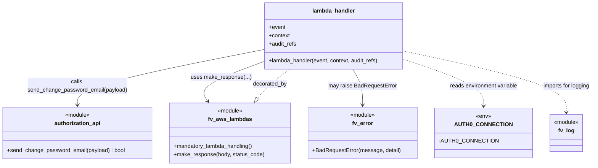

# Diagram: common/iam_service/iam_service/v1/lambdas/tickets/create_change_password_ticket.py

> Auto-generated by Obscura crawlers

## Mermaid

### SVG

<svg id="container" width="1677.9140625" xmlns="http://www.w3.org/2000/svg" class="classDiagram" height="480" viewBox="0 0 1677.9140625 480" role="graphics-document document" aria-roledescription="class"><g><defs><marker id="container_class-aggregationStart" class="marker aggregation class" refX="18" refY="7" markerWidth="190" markerHeight="240" orient="auto"><path d="M 18,7 L9,13 L1,7 L9,1 Z"></path></marker></defs><defs><marker id="container_class-aggregationEnd" class="marker aggregation class" refX="1" refY="7" markerWidth="20" markerHeight="28" orient="auto"><path d="M 18,7 L9,13 L1,7 L9,1 Z"></path></marker></defs><defs><marker id="container_class-extensionStart" class="marker extension class" refX="18" refY="7" markerWidth="190" markerHeight="240" orient="auto"><path d="M 1,7 L18,13 V 1 Z"></path></marker></defs><defs><marker id="container_class-extensionEnd" class="marker extension class" refX="1" refY="7" markerWidth="20" markerHeight="28" orient="auto"><path d="M 1,1 V 13 L18,7 Z"></path></marker></defs><defs><marker id="container_class-compositionStart" class="marker composition class" refX="18" refY="7" markerWidth="190" markerHeight="240" orient="auto"><path d="M 18,7 L9,13 L1,7 L9,1 Z"></path></marker></defs><defs><marker id="container_class-compositionEnd" class="marker composition class" refX="1" refY="7" markerWidth="20" markerHeight="28" orient="auto"><path d="M 18,7 L9,13 L1,7 L9,1 Z"></path></marker></defs><defs><marker id="container_class-dependencyStart" class="marker dependency class" refX="6" refY="7" markerWidth="190" markerHeight="240" orient="auto"><path d="M 5,7 L9,13 L1,7 L9,1 Z"></path></marker></defs><defs><marker id="container_class-dependencyEnd" class="marker dependency class" refX="13" refY="7" markerWidth="20" markerHeight="28" orient="auto"><path d="M 18,7 L9,13 L14,7 L9,1 Z"></path></marker></defs><defs><marker id="container_class-lollipopStart" class="marker lollipop class" refX="13" refY="7" markerWidth="190" markerHeight="240" orient="auto"><circle stroke="black" fill="transparent" cx="7" cy="7" r="6"></circle></marker></defs><defs><marker id="container_class-lollipopEnd" class="marker lollipop class" refX="1" refY="7" markerWidth="190" markerHeight="240" orient="auto"><circle stroke="black" fill="transparent" cx="7" cy="7" r="6"></circle></marker></defs><g class="root"><g class="clusters"></g><g class="edgePaths"><path d="M740.097,284.413L744.713,278.51C749.33,272.608,758.562,260.804,773.888,246.735C789.214,232.667,810.633,216.333,821.343,208.167L832.053,200" id="id_fv_aws_lambdas_lambda_handler_1" class="edge-thickness-normal edge-pattern-dashed relation" style=";;;" data-edge="true" data-et="edge" data-id="id_fv_aws_lambdas_lambda_handler_1" data-points="W3sieCI6NzI5LjQ2OTMzODgwOTc0MjcsInkiOjI5OH0seyJ4Ijo3NjcuNzk0OTIxODc1LCJ5IjoyNDl9LHsieCI6ODMyLjA1MjY0MDA4NjIwNjksInkiOjIwMH1d" marker-start="url(#container_class-extensionStart)"></path><path d="M755.113,144.02L666.435,161.516C577.757,179.013,400.4,214.007,311.721,240.67C223.043,267.333,223.043,285.667,223.043,294.833L223.043,304" id="id_lambda_handler_authorization_api_2" class="edge-thickness-normal edge-pattern-solid relation" style=";;;" data-edge="true" data-et="edge" data-id="id_lambda_handler_authorization_api_2" data-points="W3sieCI6NzU1LjExMzI4MTI1LCJ5IjoxNDQuMDE5Nzk5NjExOTgwNzd9LHsieCI6MjIzLjA0Mjk2ODc1LCJ5IjoyNDl9LHsieCI6MjIzLjA0Mjk2ODc1LCJ5IjozMTB9XQ==" marker-end="url(#container_class-dependencyEnd)"></path><path d="M755.113,179.308L723.829,190.923C692.545,202.539,629.977,225.769,603.769,244.729C577.562,263.688,587.715,278.376,592.792,285.72L597.869,293.064" id="id_lambda_handler_fv_aws_lambdas_3" class="edge-thickness-normal edge-pattern-solid relation" style=";;;" data-edge="true" data-et="edge" data-id="id_lambda_handler_fv_aws_lambdas_3" data-points="W3sieCI6NzU1LjExMzI4MTI1LCJ5IjoxNzkuMzA4MTk0MzQzNzI3MzR9LHsieCI6NTY3LjQwODIwMzEyNSwieSI6MjQ5fSx7IngiOjYwMS4yODA3NzYwNzk5NjMzLCJ5IjoyOTh9XQ==" marker-end="url(#container_class-dependencyEnd)"></path><path d="M1013.412,200L1018.13,208.167C1022.849,216.333,1032.286,232.667,1037.004,250C1041.723,267.333,1041.723,285.667,1041.723,294.833L1041.723,304" id="id_lambda_handler_fv_error_4" class="edge-thickness-normal edge-pattern-solid relation" style=";;;" data-edge="true" data-et="edge" data-id="id_lambda_handler_fv_error_4" data-points="W3sieCI6MTAxMy40MTE2OTE4MTAzNDQ4LCJ5IjoyMDB9LHsieCI6MTA0MS43MjI2NTYyNSwieSI6MjQ5fSx7IngiOjEwNDEuNzIyNjU2MjUsInkiOjMxMH1d" marker-end="url(#container_class-dependencyEnd)"></path><path d="M1160.777,174.457L1196.544,186.88C1232.31,199.304,1303.842,224.152,1339.609,246.243C1375.375,268.333,1375.375,287.667,1375.375,297.333L1375.375,307" id="id_lambda_handler_AUTH0_CONNECTION_5" class="edge-thickness-normal edge-pattern-dashed relation" style=";;;" data-edge="true" data-et="edge" data-id="id_lambda_handler_AUTH0_CONNECTION_5" data-points="W3sieCI6MTE2MC43NzczNDM3NSwieSI6MTc0LjQ1NjUyMzM2NjU4NDk1fSx7IngiOjEzNzUuMzc1LCJ5IjoyNDl9LHsieCI6MTM3NS4zNzUsInkiOjMxM31d" marker-end="url(#container_class-dependencyEnd)"></path><path d="M1160.777,149.76L1234.092,166.3C1307.406,182.84,1454.035,215.92,1527.35,245.127C1600.664,274.333,1600.664,299.667,1600.664,312.333L1600.664,325" id="id_lambda_handler_fv_log_6" class="edge-thickness-normal edge-pattern-dashed relation" style=";;;" data-edge="true" data-et="edge" data-id="id_lambda_handler_fv_log_6" data-points="W3sieCI6MTE2MC43NzczNDM3NSwieSI6MTQ5Ljc1OTc0MjU0ODc0MzEzfSx7IngiOjE2MDAuNjY0MDYyNSwieSI6MjQ5fSx7IngiOjE2MDAuNjY0MDYyNSwieSI6MzMxfV0=" marker-end="url(#container_class-dependencyEnd)"></path></g><g class="edgeLabels"><g class="edgeLabel" transform="translate(775.19037, 243.36057)"><g class="label" data-id="id_fv_aws_lambdas_lambda_handler_1" transform="translate(-49.375, -12)"><foreignObject width="98.75" height="24">

decorated_by

</foreignObject></g></g><g class="edgeLabel" transform="translate(223.04296875, 249)"><g class="label" data-id="id_lambda_handler_authorization_api_2" transform="translate(-144.0546875, -24)"><foreignObject width="288.109375" height="48">

calls send_change_password_email(payload)

</foreignObject></g></g><g class="edgeLabel" transform="translate(633.33913, 224.52093)"><g class="label" data-id="id_lambda_handler_fv_aws_lambdas_3" transform="translate(-86.296875, -12)"><foreignObject width="172.59375" height="24">

uses make_response(...)

</foreignObject></g></g><g class="edgeLabel" transform="translate(1041.72265625, 249)"><g class="label" data-id="id_lambda_handler_fv_error_4" transform="translate(-98.1796875, -12)"><foreignObject width="196.359375" height="24">

may raise BadRequestError

</foreignObject></g></g><g class="edgeLabel" transform="translate(1375.375, 249)"><g class="label" data-id="id_lambda_handler_AUTH0_CONNECTION_5" transform="translate(-99.703125, -12)"><foreignObject width="199.40625" height="24">

reads environment variable

</foreignObject></g></g><g class="edgeLabel" transform="translate(1600.6640625, 249)"><g class="label" data-id="id_lambda_handler_fv_log_6" transform="translate(-69.25, -12)"><foreignObject width="138.5" height="24">

imports for logging

</foreignObject></g></g></g><g class="nodes"><g class="node default" id="classId-lambda_handler-0" transform="translate(957.9453125, 104)"><g class="basic label-container"><path d="M-202.83203125 -96 L202.83203125 -96 L202.83203125 96 L-202.83203125 96" stroke="none" stroke-width="0" fill="#ECECFF" style=""></path><path d="M-202.83203125 -96 C-121.36086624099862 -96, -39.889701231997236 -96, 202.83203125 -96 M-202.83203125 -96 C-116.73310891475158 -96, -30.634186579503165 -96, 202.83203125 -96 M202.83203125 -96 C202.83203125 -22.16556320231946, 202.83203125 51.66887359536108, 202.83203125 96 M202.83203125 -96 C202.83203125 -27.695649338015443, 202.83203125 40.608701323969115, 202.83203125 96 M202.83203125 96 C59.8865148104654 96, -83.0590016290692 96, -202.83203125 96 M202.83203125 96 C69.0154597217115 96, -64.80111180657701 96, -202.83203125 96 M-202.83203125 96 C-202.83203125 31.00946829675449, -202.83203125 -33.98106340649102, -202.83203125 -96 M-202.83203125 96 C-202.83203125 55.378358229529006, -202.83203125 14.756716459058012, -202.83203125 -96" stroke="#9370DB" stroke-width="1.3" fill="none" stroke-dasharray="0 0" style=""></path></g><g class="annotation-group text" transform="translate(0, -72)"></g><g class="label-group text" transform="translate(-59.9765625, -72)"><g class="label" style="font-weight: bolder" transform="translate(0,-12)"><foreignObject width="119.953125" height="24">

lambda_handler

</foreignObject></g></g><g class="members-group text" transform="translate(-190.83203125, -24)"><g class="label" style="" transform="translate(0,-12)"><foreignObject width="48.328125" height="24">

+event

</foreignObject></g><g class="label" style="" transform="translate(0,12)"><foreignObject width="61.6875" height="24">

+context

</foreignObject></g><g class="label" style="" transform="translate(0,36)"><foreignObject width="81.109375" height="24">

+audit_refs

</foreignObject></g></g><g class="methods-group text" transform="translate(-190.83203125, 72)"><g class="label" style="" transform="translate(0,-12)"><foreignObject width="321.6875" height="24">

+lambda_handler(event, context, audit_refs)

</foreignObject></g></g><g class="divider" style=""><path d="M-202.83203125 -48 C-82.10248116491691 -48, 38.62706892016618 -48, 202.83203125 -48 M-202.83203125 -48 C-77.05131003601052 -48, 48.72941117797896 -48, 202.83203125 -48" stroke="#9370DB" stroke-width="1.3" fill="none" stroke-dasharray="0 0" style=""></path></g><g class="divider" style=""><path d="M-202.83203125 48 C-61.345901108579824 48, 80.14022903284035 48, 202.83203125 48 M-202.83203125 48 C-80.62341461051717 48, 41.585202028965654 48, 202.83203125 48" stroke="#9370DB" stroke-width="1.3" fill="none" stroke-dasharray="0 0" style=""></path></g></g><g class="node default" id="classId-fv_aws_lambdas-1" transform="translate(661.421875, 385)"><g class="basic label-container"><path d="M-173.3359375 -87 L173.3359375 -87 L173.3359375 87 L-173.3359375 87" stroke="none" stroke-width="0" fill="#ECECFF" style=""></path><path d="M-173.3359375 -87 C-41.158178139334126 -87, 91.01958122133175 -87, 173.3359375 -87 M-173.3359375 -87 C-84.57225588423574 -87, 4.191425731528511 -87, 173.3359375 -87 M173.3359375 -87 C173.3359375 -51.4767691354862, 173.3359375 -15.953538270972402, 173.3359375 87 M173.3359375 -87 C173.3359375 -43.178682410029396, 173.3359375 0.6426351799412089, 173.3359375 87 M173.3359375 87 C102.03855884428641 87, 30.741180188572827 87, -173.3359375 87 M173.3359375 87 C61.206744293865185 87, -50.92244891226963 87, -173.3359375 87 M-173.3359375 87 C-173.3359375 39.801269052866445, -173.3359375 -7.39746189426711, -173.3359375 -87 M-173.3359375 87 C-173.3359375 29.455242104463423, -173.3359375 -28.089515791073154, -173.3359375 -87" stroke="#9370DB" stroke-width="1.3" fill="none" stroke-dasharray="0 0" style=""></path></g><g class="annotation-group text" transform="translate(-36.6015625, -63)"><g class="label" style="" transform="translate(0,-12)"><foreignObject width="73.203125" height="24">

«module»

</foreignObject></g></g><g class="label-group text" transform="translate(-60.0625, -39)"><g class="label" style="font-weight: bolder" transform="translate(0,-12)"><foreignObject width="120.125" height="24">

fv_aws_lambdas

</foreignObject></g></g><g class="members-group text" transform="translate(-161.3359375, 9)"></g><g class="methods-group text" transform="translate(-161.3359375, 39)"><g class="label" style="" transform="translate(0,-12)"><foreignObject width="232.078125" height="24">

+mandatory_lambda_handling()

</foreignObject></g><g class="label" style="" transform="translate(0,12)"><foreignObject width="262.609375" height="24">

+make_response(body, status_code)

</foreignObject></g></g><g class="divider" style=""><path d="M-173.3359375 -15 C-74.81161693273478 -15, 23.712703634530442 -15, 173.3359375 -15 M-173.3359375 -15 C-90.1088141370796 -15, -6.88169077415921 -15, 173.3359375 -15" stroke="#9370DB" stroke-width="1.3" fill="none" stroke-dasharray="0 0" style=""></path></g><g class="divider" style=""><path d="M-173.3359375 9 C-89.18413582757556 9, -5.032334155151119 9, 173.3359375 9 M-173.3359375 9 C-39.1068810142022 9, 95.1221754715956 9, 173.3359375 9" stroke="#9370DB" stroke-width="1.3" fill="none" stroke-dasharray="0 0" style=""></path></g></g><g class="node default" id="classId-authorization_api-2" transform="translate(223.04296875, 385)"><g class="basic label-container"><path d="M-215.04296875 -75 L215.04296875 -75 L215.04296875 75 L-215.04296875 75" stroke="none" stroke-width="0" fill="#ECECFF" style=""></path><path d="M-215.04296875 -75 C-103.67163883938211 -75, 7.699691071235776 -75, 215.04296875 -75 M-215.04296875 -75 C-84.3365482727987 -75, 46.36987220440261 -75, 215.04296875 -75 M215.04296875 -75 C215.04296875 -37.45792003506069, 215.04296875 0.08415992987862353, 215.04296875 75 M215.04296875 -75 C215.04296875 -18.014817087807188, 215.04296875 38.970365824385624, 215.04296875 75 M215.04296875 75 C73.81317810672849 75, -67.41661253654303 75, -215.04296875 75 M215.04296875 75 C115.43394009029358 75, 15.82491143058715 75, -215.04296875 75 M-215.04296875 75 C-215.04296875 15.982969273469585, -215.04296875 -43.03406145306083, -215.04296875 -75 M-215.04296875 75 C-215.04296875 37.87951678606358, -215.04296875 0.7590335721271657, -215.04296875 -75" stroke="#9370DB" stroke-width="1.3" fill="none" stroke-dasharray="0 0" style=""></path></g><g class="annotation-group text" transform="translate(-36.6015625, -51)"><g class="label" style="" transform="translate(0,-12)"><foreignObject width="73.203125" height="24">

«module»

</foreignObject></g></g><g class="label-group text" transform="translate(-64.7890625, -27)"><g class="label" style="font-weight: bolder" transform="translate(0,-12)"><foreignObject width="129.578125" height="24">

authorization_api

</foreignObject></g></g><g class="members-group text" transform="translate(-203.04296875, 21)"></g><g class="methods-group text" transform="translate(-203.04296875, 51)"><g class="label" style="" transform="translate(0,-12)"><foreignObject width="341.296875" height="24">

+send_change_password_email(payload) : bool

</foreignObject></g></g><g class="divider" style=""><path d="M-215.04296875 -3 C-71.98793815651064 -3, 71.06709243697873 -3, 215.04296875 -3 M-215.04296875 -3 C-45.689659281805575 -3, 123.66365018638885 -3, 215.04296875 -3" stroke="#9370DB" stroke-width="1.3" fill="none" stroke-dasharray="0 0" style=""></path></g><g class="divider" style=""><path d="M-215.04296875 21 C-113.61663821124742 21, -12.19030767249484 21, 215.04296875 21 M-215.04296875 21 C-79.26189282535049 21, 56.51918309929903 21, 215.04296875 21" stroke="#9370DB" stroke-width="1.3" fill="none" stroke-dasharray="0 0" style=""></path></g></g><g class="node default" id="classId-fv_error-3" transform="translate(1041.72265625, 385)"><g class="basic label-container"><path d="M-156.96484375 -75 L156.96484375 -75 L156.96484375 75 L-156.96484375 75" stroke="none" stroke-width="0" fill="#ECECFF" style=""></path><path d="M-156.96484375 -75 C-88.14991586643332 -75, -19.334987982866636 -75, 156.96484375 -75 M-156.96484375 -75 C-38.53398418054829 -75, 79.89687538890342 -75, 156.96484375 -75 M156.96484375 -75 C156.96484375 -24.778215342568316, 156.96484375 25.443569314863367, 156.96484375 75 M156.96484375 -75 C156.96484375 -19.60326680759495, 156.96484375 35.7934663848101, 156.96484375 75 M156.96484375 75 C39.5261337448386 75, -77.9125762603228 75, -156.96484375 75 M156.96484375 75 C49.95031069338444 75, -57.064222363231124 75, -156.96484375 75 M-156.96484375 75 C-156.96484375 34.848651950778915, -156.96484375 -5.302696098442169, -156.96484375 -75 M-156.96484375 75 C-156.96484375 18.998723925209298, -156.96484375 -37.002552149581405, -156.96484375 -75" stroke="#9370DB" stroke-width="1.3" fill="none" stroke-dasharray="0 0" style=""></path></g><g class="annotation-group text" transform="translate(-36.6015625, -51)"><g class="label" style="" transform="translate(0,-12)"><foreignObject width="73.203125" height="24">

«module»

</foreignObject></g></g><g class="label-group text" transform="translate(-29.1875, -27)"><g class="label" style="font-weight: bolder" transform="translate(0,-12)"><foreignObject width="58.375" height="24">

fv_error

</foreignObject></g></g><g class="members-group text" transform="translate(-144.96484375, 21)"></g><g class="methods-group text" transform="translate(-144.96484375, 51)"><g class="label" style="" transform="translate(0,-12)"><foreignObject width="253.328125" height="24">

+BadRequestError(message, detail)

</foreignObject></g></g><g class="divider" style=""><path d="M-156.96484375 -3 C-49.806745783004146 -3, 57.35135218399171 -3, 156.96484375 -3 M-156.96484375 -3 C-46.66555728716493 -3, 63.63372917567014 -3, 156.96484375 -3" stroke="#9370DB" stroke-width="1.3" fill="none" stroke-dasharray="0 0" style=""></path></g><g class="divider" style=""><path d="M-156.96484375 21 C-60.33661008242608 21, 36.291623585147846 21, 156.96484375 21 M-156.96484375 21 C-88.24305680414903 21, -19.52126985829807 21, 156.96484375 21" stroke="#9370DB" stroke-width="1.3" fill="none" stroke-dasharray="0 0" style=""></path></g></g><g class="node default" id="classId-fv_log-4" transform="translate(1600.6640625, 385)"><g class="basic label-container"><path d="M-48.6015625 -54 L48.6015625 -54 L48.6015625 54 L-48.6015625 54" stroke="none" stroke-width="0" fill="#ECECFF" style=""></path><path d="M-48.6015625 -54 C-23.7317130824603 -54, 1.1381363350794018 -54, 48.6015625 -54 M-48.6015625 -54 C-29.15913190158432 -54, -9.716701303168641 -54, 48.6015625 -54 M48.6015625 -54 C48.6015625 -29.150414504910778, 48.6015625 -4.300829009821555, 48.6015625 54 M48.6015625 -54 C48.6015625 -22.8840712703804, 48.6015625 8.231857459239201, 48.6015625 54 M48.6015625 54 C10.493119323737027 54, -27.615323852525947 54, -48.6015625 54 M48.6015625 54 C14.54002906294977 54, -19.52150437410046 54, -48.6015625 54 M-48.6015625 54 C-48.6015625 19.95326770523028, -48.6015625 -14.093464589539437, -48.6015625 -54 M-48.6015625 54 C-48.6015625 25.064558081804865, -48.6015625 -3.87088383639027, -48.6015625 -54" stroke="#9370DB" stroke-width="1.3" fill="none" stroke-dasharray="0 0" style=""></path></g><g class="annotation-group text" transform="translate(-36.6015625, -30)"><g class="label" style="" transform="translate(0,-12)"><foreignObject width="73.203125" height="24">

«module»

</foreignObject></g></g><g class="label-group text" transform="translate(-22.2109375, -6)"><g class="label" style="font-weight: bolder" transform="translate(0,-12)"><foreignObject width="44.421875" height="24">

fv_log

</foreignObject></g></g><g class="members-group text" transform="translate(-36.6015625, 42)"></g><g class="methods-group text" transform="translate(-36.6015625, 72)"></g><g class="divider" style=""><path d="M-48.6015625 18 C-19.378716676642856 18, 9.844129146714288 18, 48.6015625 18 M-48.6015625 18 C-14.342876485964645 18, 19.91580952807071 18, 48.6015625 18" stroke="#9370DB" stroke-width="1.3" fill="none" stroke-dasharray="0 0" style=""></path></g><g class="divider" style=""><path d="M-48.6015625 36 C-15.547986457414652 36, 17.505589585170696 36, 48.6015625 36 M-48.6015625 36 C-12.064697235076459 36, 24.472168029847083 36, 48.6015625 36" stroke="#9370DB" stroke-width="1.3" fill="none" stroke-dasharray="0 0" style=""></path></g></g><g class="node default" id="classId-AUTH0_CONNECTION-5" transform="translate(1375.375, 385)"><g class="basic label-container"><path d="M-126.6875 -72 L126.6875 -72 L126.6875 72 L-126.6875 72" stroke="none" stroke-width="0" fill="#ECECFF" style=""></path><path d="M-126.6875 -72 C-38.0275824088354 -72, 50.6323351823292 -72, 126.6875 -72 M-126.6875 -72 C-33.97647458504582 -72, 58.73455082990836 -72, 126.6875 -72 M126.6875 -72 C126.6875 -15.110422794483426, 126.6875 41.77915441103315, 126.6875 72 M126.6875 -72 C126.6875 -20.63007749873588, 126.6875 30.73984500252824, 126.6875 72 M126.6875 72 C34.5005932532938 72, -57.6863134934124 72, -126.6875 72 M126.6875 72 C31.610128242795653 72, -63.46724351440869 72, -126.6875 72 M-126.6875 72 C-126.6875 32.10745937564818, -126.6875 -7.785081248703634, -126.6875 -72 M-126.6875 72 C-126.6875 17.840595146834787, -126.6875 -36.31880970633043, -126.6875 -72" stroke="#9370DB" stroke-width="1.3" fill="none" stroke-dasharray="0 0" style=""></path></g><g class="annotation-group text" transform="translate(-21.8984375, -48)"><g class="label" style="" transform="translate(0,-12)"><foreignObject width="43.796875" height="24">

«env»

</foreignObject></g></g><g class="label-group text" transform="translate(-74.46875, -24)"><g class="label" style="font-weight: bolder" transform="translate(0,-12)"><foreignObject width="148.9375" height="24">

AUTH0_CONNECTION

</foreignObject></g></g><g class="members-group text" transform="translate(-114.6875, 24)"><g class="label" style="" transform="translate(0,-12)"><foreignObject width="154.90625" height="24">

-AUTH0_CONNECTION

</foreignObject></g></g><g class="methods-group text" transform="translate(-114.6875, 72)"></g><g class="divider" style=""><path d="M-126.6875 0 C-35.995792290017164 0, 54.69591541996567 0, 126.6875 0 M-126.6875 0 C-59.128309738399366 0, 8.430880523201267 0, 126.6875 0" stroke="#9370DB" stroke-width="1.3" fill="none" stroke-dasharray="0 0" style=""></path></g><g class="divider" style=""><path d="M-126.6875 48 C-65.96897547454684 48, -5.2504509490936755 48, 126.6875 48 M-126.6875 48 C-67.93666321044392 48, -9.185826420887835 48, 126.6875 48" stroke="#9370DB" stroke-width="1.3" fill="none" stroke-dasharray="0 0" style=""></path></g></g></g></g></g></svg>
