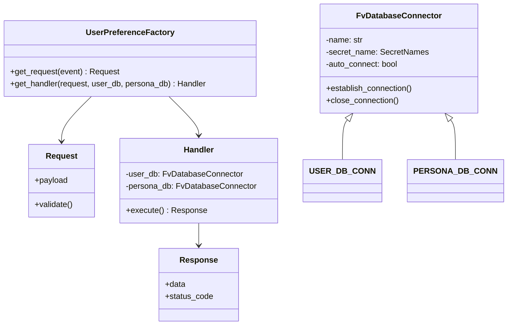

# Diagram: common/iam_service/iam_service/v1/lambdas/user_preference/api.py


> Auto-generated by Obscura crawlers

## Diagram 1

```mermaid
flowchart TD
    Event[Incoming event] --> EstablishDBs[Establish USER_DB_CONN & PERSONA_DB_CONN]
    EstablishDBs --> Factory[UserPreferenceFactory]
    Factory --> GetRequest[get_request(event)]
    GetRequest --> RequestObj[Request]
    RequestObj --> Validate[request.validate()]
    Validate --> GetHandler[factory.get_handler(request, USER_DB_CONN, PERSONA_DB_CONN)]
    GetHandler --> Handler[Handler]
    Handler --> Execute[handler.execute()]
    Execute --> ResponseObj[Response {data, status_code}]
    ResponseObj --> MakeResponse[make_response(response.data, status_code=response.status_code)]
    MakeResponse --> Return[Lambda returns HTTP response]
```

> SVG rendering failed for this diagram.

## Diagram 2



### SVG

<svg id="container" width="963.115234375" xmlns="http://www.w3.org/2000/svg" class="classDiagram" height="644" viewBox="0 0 963.115234375 644" role="graphics-document document" aria-roledescription="class"><style>#container{font-family:"trebuchet ms",verdana,arial,sans-serif;font-size:16px;fill:#333;}@keyframes edge-animation-frame{from{stroke-dashoffset:0;}}@keyframes dash{to{stroke-dashoffset:0;}}#container .edge-animation-slow{stroke-dasharray:9,5!important;stroke-dashoffset:900;animation:dash 50s linear infinite;stroke-linecap:round;}#container .edge-animation-fast{stroke-dasharray:9,5!important;stroke-dashoffset:900;animation:dash 20s linear infinite;stroke-linecap:round;}#container .error-icon{fill:#552222;}#container .error-text{fill:#552222;stroke:#552222;}#container .edge-thickness-normal{stroke-width:1px;}#container .edge-thickness-thick{stroke-width:3.5px;}#container .edge-pattern-solid{stroke-dasharray:0;}#container .edge-thickness-invisible{stroke-width:0;fill:none;}#container .edge-pattern-dashed{stroke-dasharray:3;}#container .edge-pattern-dotted{stroke-dasharray:2;}#container .marker{fill:#333333;stroke:#333333;}#container .marker.cross{stroke:#333333;}#container svg{font-family:"trebuchet ms",verdana,arial,sans-serif;font-size:16px;}#container p{margin:0;}#container g.classGroup text{fill:#9370DB;stroke:none;font-family:"trebuchet ms",verdana,arial,sans-serif;font-size:10px;}#container g.classGroup text .title{font-weight:bolder;}#container .nodeLabel,#container .edgeLabel{color:#131300;}#container .edgeLabel .label rect{fill:#ECECFF;}#container .label text{fill:#131300;}#container .labelBkg{background:#ECECFF;}#container .edgeLabel .label span{background:#ECECFF;}#container .classTitle{font-weight:bolder;}#container .node rect,#container .node circle,#container .node ellipse,#container .node polygon,#container .node path{fill:#ECECFF;stroke:#9370DB;stroke-width:1px;}#container .divider{stroke:#9370DB;stroke-width:1;}#container g.clickable{cursor:pointer;}#container g.classGroup rect{fill:#ECECFF;stroke:#9370DB;}#container g.classGroup line{stroke:#9370DB;stroke-width:1;}#container .classLabel .box{stroke:none;stroke-width:0;fill:#ECECFF;opacity:0.5;}#container .classLabel .label{fill:#9370DB;font-size:10px;}#container .relation{stroke:#333333;stroke-width:1;fill:none;}#container .dashed-line{stroke-dasharray:3;}#container .dotted-line{stroke-dasharray:1 2;}#container #compositionStart,#container .composition{fill:#333333!important;stroke:#333333!important;stroke-width:1;}#container #compositionEnd,#container .composition{fill:#333333!important;stroke:#333333!important;stroke-width:1;}#container #dependencyStart,#container .dependency{fill:#333333!important;stroke:#333333!important;stroke-width:1;}#container #dependencyStart,#container .dependency{fill:#333333!important;stroke:#333333!important;stroke-width:1;}#container #extensionStart,#container .extension{fill:transparent!important;stroke:#333333!important;stroke-width:1;}#container #extensionEnd,#container .extension{fill:transparent!important;stroke:#333333!important;stroke-width:1;}#container #aggregationStart,#container .aggregation{fill:transparent!important;stroke:#333333!important;stroke-width:1;}#container #aggregationEnd,#container .aggregation{fill:transparent!important;stroke:#333333!important;stroke-width:1;}#container #lollipopStart,#container .lollipop{fill:#ECECFF!important;stroke:#333333!important;stroke-width:1;}#container #lollipopEnd,#container .lollipop{fill:#ECECFF!important;stroke:#333333!important;stroke-width:1;}#container .edgeTerminals{font-size:11px;line-height:initial;}#container .classTitleText{text-anchor:middle;font-size:18px;fill:#333;}#container .label-icon{display:inline-block;height:1em;overflow:visible;vertical-align:-0.125em;}#container .node .label-icon path{fill:currentColor;stroke:revert;stroke-width:revert;}#container :root{--mermaid-font-family:"trebuchet ms",verdana,arial,sans-serif;}</style><g><defs><marker id="container_class-aggregationStart" class="marker aggregation class" refX="18" refY="7" markerWidth="190" markerHeight="240" orient="auto"><path d="M 18,7 L9,13 L1,7 L9,1 Z"></path></marker></defs><defs><marker id="container_class-aggregationEnd" class="marker aggregation class" refX="1" refY="7" markerWidth="20" markerHeight="28" orient="auto"><path d="M 18,7 L9,13 L1,7 L9,1 Z"></path></marker></defs><defs><marker id="container_class-extensionStart" class="marker extension class" refX="18" refY="7" markerWidth="190" markerHeight="240" orient="auto"><path d="M 1,7 L18,13 V 1 Z"></path></marker></defs><defs><marker id="container_class-extensionEnd" class="marker extension class" refX="1" refY="7" markerWidth="20" markerHeight="28" orient="auto"><path d="M 1,1 V 13 L18,7 Z"></path></marker></defs><defs><marker id="container_class-compositionStart" class="marker composition class" refX="18" refY="7" markerWidth="190" markerHeight="240" orient="auto"><path d="M 18,7 L9,13 L1,7 L9,1 Z"></path></marker></defs><defs><marker id="container_class-compositionEnd" class="marker composition class" refX="1" refY="7" markerWidth="20" markerHeight="28" orient="auto"><path d="M 18,7 L9,13 L1,7 L9,1 Z"></path></marker></defs><defs><marker id="container_class-dependencyStart" class="marker dependency class" refX="6" refY="7" markerWidth="190" markerHeight="240" orient="auto"><path d="M 5,7 L9,13 L1,7 L9,1 Z"></path></marker></defs><defs><marker id="container_class-dependencyEnd" class="marker dependency class" refX="13" refY="7" markerWidth="20" markerHeight="28" orient="auto"><path d="M 18,7 L9,13 L14,7 L9,1 Z"></path></marker></defs><defs><marker id="container_class-lollipopStart" class="marker lollipop class" refX="13" refY="7" markerWidth="190" markerHeight="240" orient="auto"><circle stroke="black" fill="transparent" cx="7" cy="7" r="6"></circle></marker></defs><defs><marker id="container_class-lollipopEnd" class="marker lollipop class" refX="1" refY="7" markerWidth="190" markerHeight="240" orient="auto"><circle stroke="black" fill="transparent" cx="7" cy="7" r="6"></circle></marker></defs><g class="root"><g class="clusters"></g><g class="edgePaths"><path d="M675.221,237.688L673.775,239.573C672.329,241.459,669.437,245.229,667.991,258.281C666.545,271.333,666.545,293.667,666.545,304.833L666.545,316" id="id_FvDatabaseConnector_USER_DB_CONN_1" class="edge-thickness-normal edge-pattern-solid relation" style=";;;" data-edge="true" data-et="edge" data-id="id_FvDatabaseConnector_USER_DB_CONN_1" data-points="W3sieCI6Njg1LjcxODU4ODQ2MzM0NTksInkiOjIyNH0seyJ4Ijo2NjYuNTQ0OTIxODc1LCJ5IjoyNDl9LHsieCI6NjY2LjU0NDkyMTg3NSwieSI6MzE2fV0=" marker-start="url(#container_class-extensionStart)"></path><path d="M861.877,237.688L863.323,239.573C864.769,241.459,867.661,245.229,869.107,258.281C870.553,271.333,870.553,293.667,870.553,304.833L870.553,316" id="id_FvDatabaseConnector_PERSONA_DB_CONN_2" class="edge-thickness-normal edge-pattern-solid relation" style=";;;" data-edge="true" data-et="edge" data-id="id_FvDatabaseConnector_PERSONA_DB_CONN_2" data-points="W3sieCI6ODUxLjM3OTA2Nzc4NjY1NDEsInkiOjIyNH0seyJ4Ijo4NzAuNTUyNzM0Mzc1LCJ5IjoyNDl9LHsieCI6ODcwLjU1MjczNDM3NSwieSI6MzE2fV0=" marker-start="url(#container_class-extensionStart)"></path><path d="M180.61,191L170.79,200.667C160.97,210.333,141.33,229.667,131.51,244.5C121.689,259.333,121.689,269.667,121.689,274.833L121.689,280" id="id_UserPreferenceFactory_Request_3" class="edge-thickness-normal edge-pattern-solid relation" style=";;;" data-edge="true" data-et="edge" data-id="id_UserPreferenceFactory_Request_3" data-points="W3sieCI6MTgwLjYxMDE4MjY4MzI3MDcsInkiOjE5MX0seyJ4IjoxMjEuNjg5NDUzMTI1LCJ5IjoyNDl9LHsieCI6MTIxLjY4OTQ1MzEyNSwieSI6Mjg2fV0=" marker-end="url(#container_class-dependencyEnd)"></path><path d="M332.991,191L342.812,200.667C352.632,210.333,372.272,229.667,382.092,242.5C391.912,255.333,391.912,261.667,391.912,264.833L391.912,268" id="id_UserPreferenceFactory_Handler_4" class="edge-thickness-normal edge-pattern-solid relation" style=";;;" data-edge="true" data-et="edge" data-id="id_UserPreferenceFactory_Handler_4" data-points="W3sieCI6MzMyLjk5MTM3OTgxNjcyOTMsInkiOjE5MX0seyJ4IjozOTEuOTEyMTA5Mzc1LCJ5IjoyNDl9LHsieCI6MzkxLjkxMjEwOTM3NSwieSI6Mjc0fV0=" marker-end="url(#container_class-dependencyEnd)"></path><path d="M391.912,442L391.912,446.167C391.912,450.333,391.912,458.667,391.912,466C391.912,473.333,391.912,479.667,391.912,482.833L391.912,486" id="id_Handler_Response_5" class="edge-thickness-normal edge-pattern-solid relation" style=";;;" data-edge="true" data-et="edge" data-id="id_Handler_Response_5" data-points="W3sieCI6MzkxLjkxMjEwOTM3NSwieSI6NDQyfSx7IngiOjM5MS45MTIxMDkzNzUsInkiOjQ2N30seyJ4IjozOTEuOTEyMTA5Mzc1LCJ5Ijo0OTJ9XQ==" marker-end="url(#container_class-dependencyEnd)"></path></g><g class="edgeLabels"><g class="edgeLabel"><g class="label" data-id="id_FvDatabaseConnector_USER_DB_CONN_1" transform="translate(0, 0)"><foreignObject width="0" height="0"><div xmlns="http://www.w3.org/1999/xhtml" class="labelBkg" style="display: table-cell; white-space: nowrap; line-height: 1.5; max-width: 200px; text-align: center;"><span class="edgeLabel"></span></div></foreignObject></g></g><g class="edgeLabel"><g class="label" data-id="id_FvDatabaseConnector_PERSONA_DB_CONN_2" transform="translate(0, 0)"><foreignObject width="0" height="0"><div xmlns="http://www.w3.org/1999/xhtml" class="labelBkg" style="display: table-cell; white-space: nowrap; line-height: 1.5; max-width: 200px; text-align: center;"><span class="edgeLabel"></span></div></foreignObject></g></g><g class="edgeLabel"><g class="label" data-id="id_UserPreferenceFactory_Request_3" transform="translate(0, 0)"><foreignObject width="0" height="0"><div xmlns="http://www.w3.org/1999/xhtml" class="labelBkg" style="display: table-cell; white-space: nowrap; line-height: 1.5; max-width: 200px; text-align: center;"><span class="edgeLabel"></span></div></foreignObject></g></g><g class="edgeLabel"><g class="label" data-id="id_UserPreferenceFactory_Handler_4" transform="translate(0, 0)"><foreignObject width="0" height="0"><div xmlns="http://www.w3.org/1999/xhtml" class="labelBkg" style="display: table-cell; white-space: nowrap; line-height: 1.5; max-width: 200px; text-align: center;"><span class="edgeLabel"></span></div></foreignObject></g></g><g class="edgeLabel"><g class="label" data-id="id_Handler_Response_5" transform="translate(0, 0)"><foreignObject width="0" height="0"><div xmlns="http://www.w3.org/1999/xhtml" class="labelBkg" style="display: table-cell; white-space: nowrap; line-height: 1.5; max-width: 200px; text-align: center;"><span class="edgeLabel"></span></div></foreignObject></g></g></g><g class="nodes"><g class="node default" id="classId-FvDatabaseConnector-0" transform="translate(768.548828125, 116)"><g class="basic label-container"><path d="M-152.76171875 -108 L152.76171875 -108 L152.76171875 108 L-152.76171875 108" stroke="none" stroke-width="0" fill="#ECECFF" style=""></path><path d="M-152.76171875 -108 C-31.526945460994668 -108, 89.70782782801066 -108, 152.76171875 -108 M-152.76171875 -108 C-75.53722707330662 -108, 1.687264603386751 -108, 152.76171875 -108 M152.76171875 -108 C152.76171875 -52.01025493361112, 152.76171875 3.979490132777755, 152.76171875 108 M152.76171875 -108 C152.76171875 -58.41684889295022, 152.76171875 -8.83369778590044, 152.76171875 108 M152.76171875 108 C82.09732502433475 108, 11.432931298669502 108, -152.76171875 108 M152.76171875 108 C39.34386774432481 108, -74.07398326135038 108, -152.76171875 108 M-152.76171875 108 C-152.76171875 36.522973394611725, -152.76171875 -34.95405321077655, -152.76171875 -108 M-152.76171875 108 C-152.76171875 26.649879770530205, -152.76171875 -54.70024045893959, -152.76171875 -108" stroke="#9370DB" stroke-width="1.3" fill="none" stroke-dasharray="0 0" style=""></path></g><g class="annotation-group text" transform="translate(0, -84)"></g><g class="label-group text" transform="translate(-79.3046875, -84)"><g class="label" style="font-weight: bolder" transform="translate(0,-12)"><foreignObject width="158.609375" height="24"><div xmlns="http://www.w3.org/1999/xhtml" style="display: table-cell; white-space: nowrap; line-height: 1.5; max-width: 207px; text-align: center;"><span class="nodeLabel markdown-node-label" style=""><p>FvDatabaseConnector</p></span></div></foreignObject></g></g><g class="members-group text" transform="translate(-140.76171875, -36)"><g class="label" style="" transform="translate(0,-12)"><foreignObject width="74.46875" height="24"><div xmlns="http://www.w3.org/1999/xhtml" style="display: table-cell; white-space: nowrap; line-height: 1.5; max-width: 133px; text-align: center;"><span class="nodeLabel markdown-node-label" style=""><p>-name: str</p></span></div></foreignObject></g><g class="label" style="" transform="translate(0,12)"><foreignObject width="202.21875" height="24"><div xmlns="http://www.w3.org/1999/xhtml" style="display: table-cell; white-space: nowrap; line-height: 1.5; max-width: 260px; text-align: center;"><span class="nodeLabel markdown-node-label" style=""><p>-secret_name: SecretNames</p></span></div></foreignObject></g><g class="label" style="" transform="translate(0,36)"><foreignObject width="145.390625" height="24"><div xmlns="http://www.w3.org/1999/xhtml" style="display: table-cell; white-space: nowrap; line-height: 1.5; max-width: 203px; text-align: center;"><span class="nodeLabel markdown-node-label" style=""><p>-auto_connect: bool</p></span></div></foreignObject></g></g><g class="methods-group text" transform="translate(-140.76171875, 60)"><g class="label" style="" transform="translate(0,-12)"><foreignObject width="173.265625" height="24"><div xmlns="http://www.w3.org/1999/xhtml" style="display: table-cell; white-space: nowrap; line-height: 1.5; max-width: 231px; text-align: center;"><span class="nodeLabel markdown-node-label" style=""><p>+establish_connection()</p></span></div></foreignObject></g><g class="label" style="" transform="translate(0,12)"><foreignObject width="144.625" height="24"><div xmlns="http://www.w3.org/1999/xhtml" style="display: table-cell; white-space: nowrap; line-height: 1.5; max-width: 202px; text-align: center;"><span class="nodeLabel markdown-node-label" style=""><p>+close_connection()</p></span></div></foreignObject></g></g><g class="divider" style=""><path d="M-152.76171875 -60 C-37.070395751324625 -60, 78.62092724735075 -60, 152.76171875 -60 M-152.76171875 -60 C-31.062469546262122 -60, 90.63677965747576 -60, 152.76171875 -60" stroke="#9370DB" stroke-width="1.3" fill="none" stroke-dasharray="0 0" style=""></path></g><g class="divider" style=""><path d="M-152.76171875 36 C-38.29925792738659 36, 76.16320289522682 36, 152.76171875 36 M-152.76171875 36 C-54.29289286199611 36, 44.17593302600778 36, 152.76171875 36" stroke="#9370DB" stroke-width="1.3" fill="none" stroke-dasharray="0 0" style=""></path></g></g><g class="node default" id="classId-UserPreferenceFactory-1" transform="translate(256.80078125, 116)"><g class="basic label-container"><path d="M-248.80078125 -75 L248.80078125 -75 L248.80078125 75 L-248.80078125 75" stroke="none" stroke-width="0" fill="#ECECFF" style=""></path><path d="M-248.80078125 -75 C-50.12195874747184 -75, 148.55686375505633 -75, 248.80078125 -75 M-248.80078125 -75 C-78.66458696909763 -75, 91.47160731180475 -75, 248.80078125 -75 M248.80078125 -75 C248.80078125 -38.87790876347014, 248.80078125 -2.7558175269402767, 248.80078125 75 M248.80078125 -75 C248.80078125 -30.11349610569308, 248.80078125 14.773007788613839, 248.80078125 75 M248.80078125 75 C146.01116641698226 75, 43.221551583964526 75, -248.80078125 75 M248.80078125 75 C72.82252592698504 75, -103.15572939602993 75, -248.80078125 75 M-248.80078125 75 C-248.80078125 18.405010425263008, -248.80078125 -38.189979149473984, -248.80078125 -75 M-248.80078125 75 C-248.80078125 24.78075773187205, -248.80078125 -25.4384845362559, -248.80078125 -75" stroke="#9370DB" stroke-width="1.3" fill="none" stroke-dasharray="0 0" style=""></path></g><g class="annotation-group text" transform="translate(0, -51)"></g><g class="label-group text" transform="translate(-82.5546875, -51)"><g class="label" style="font-weight: bolder" transform="translate(0,-12)"><foreignObject width="165.109375" height="24"><div xmlns="http://www.w3.org/1999/xhtml" style="display: table-cell; white-space: nowrap; line-height: 1.5; max-width: 212px; text-align: center;"><span class="nodeLabel markdown-node-label" style=""><p>UserPreferenceFactory</p></span></div></foreignObject></g></g><g class="members-group text" transform="translate(-236.80078125, -3)"></g><g class="methods-group text" transform="translate(-236.80078125, 27)"><g class="label" style="" transform="translate(0,-12)"><foreignObject width="216.171875" height="24"><div xmlns="http://www.w3.org/1999/xhtml" style="display: table-cell; white-space: nowrap; line-height: 1.5; max-width: 274px; text-align: center;"><span class="nodeLabel markdown-node-label" style=""><p>+get_request(event) : Request</p></span></div></foreignObject></g><g class="label" style="" transform="translate(0,12)"><foreignObject width="391.046875" height="24"><div xmlns="http://www.w3.org/1999/xhtml" style="display: table-cell; white-space: nowrap; line-height: 1.5; max-width: 449px; text-align: center;"><span class="nodeLabel markdown-node-label" style=""><p>+get_handler(request, user_db, persona_db) : Handler</p></span></div></foreignObject></g></g><g class="divider" style=""><path d="M-248.80078125 -27 C-57.010344581270516 -27, 134.78009208745897 -27, 248.80078125 -27 M-248.80078125 -27 C-61.18253422384569 -27, 126.43571280230861 -27, 248.80078125 -27" stroke="#9370DB" stroke-width="1.3" fill="none" stroke-dasharray="0 0" style=""></path></g><g class="divider" style=""><path d="M-248.80078125 -3 C-118.28485684145195 -3, 12.23106756709609 -3, 248.80078125 -3 M-248.80078125 -3 C-94.03765971271915 -3, 60.725461824561705 -3, 248.80078125 -3" stroke="#9370DB" stroke-width="1.3" fill="none" stroke-dasharray="0 0" style=""></path></g></g><g class="node default" id="classId-Request-2" transform="translate(121.689453125, 358)"><g class="basic label-container"><path d="M-65.03515625 -72 L65.03515625 -72 L65.03515625 72 L-65.03515625 72" stroke="none" stroke-width="0" fill="#ECECFF" style=""></path><path d="M-65.03515625 -72 C-16.342329265680014 -72, 32.35049771863997 -72, 65.03515625 -72 M-65.03515625 -72 C-20.58950910246137 -72, 23.85613804507726 -72, 65.03515625 -72 M65.03515625 -72 C65.03515625 -33.115180509074854, 65.03515625 5.769638981850292, 65.03515625 72 M65.03515625 -72 C65.03515625 -30.18279141082641, 65.03515625 11.634417178347178, 65.03515625 72 M65.03515625 72 C25.134516925926015 72, -14.76612239814797 72, -65.03515625 72 M65.03515625 72 C31.68482880526647 72, -1.6654986394670601 72, -65.03515625 72 M-65.03515625 72 C-65.03515625 35.12578654579315, -65.03515625 -1.7484269084137054, -65.03515625 -72 M-65.03515625 72 C-65.03515625 20.121593888979547, -65.03515625 -31.756812222040907, -65.03515625 -72" stroke="#9370DB" stroke-width="1.3" fill="none" stroke-dasharray="0 0" style=""></path></g><g class="annotation-group text" transform="translate(0, -48)"></g><g class="label-group text" transform="translate(-29.9765625, -48)"><g class="label" style="font-weight: bolder" transform="translate(0,-12)"><foreignObject width="59.953125" height="24"><div xmlns="http://www.w3.org/1999/xhtml" style="display: table-cell; white-space: nowrap; line-height: 1.5; max-width: 109px; text-align: center;"><span class="nodeLabel markdown-node-label" style=""><p>Request</p></span></div></foreignObject></g></g><g class="members-group text" transform="translate(-53.03515625, 0)"><g class="label" style="" transform="translate(0,-12)"><foreignObject width="65.734375" height="24"><div xmlns="http://www.w3.org/1999/xhtml" style="display: table-cell; white-space: nowrap; line-height: 1.5; max-width: 123px; text-align: center;"><span class="nodeLabel markdown-node-label" style=""><p>+payload</p></span></div></foreignObject></g></g><g class="methods-group text" transform="translate(-53.03515625, 48)"><g class="label" style="" transform="translate(0,-12)"><foreignObject width="76.09375" height="24"><div xmlns="http://www.w3.org/1999/xhtml" style="display: table-cell; white-space: nowrap; line-height: 1.5; max-width: 133px; text-align: center;"><span class="nodeLabel markdown-node-label" style=""><p>+validate()</p></span></div></foreignObject></g></g><g class="divider" style=""><path d="M-65.03515625 -24 C-23.450943231516554 -24, 18.133269786966892 -24, 65.03515625 -24 M-65.03515625 -24 C-21.114541484228596 -24, 22.806073281542808 -24, 65.03515625 -24" stroke="#9370DB" stroke-width="1.3" fill="none" stroke-dasharray="0 0" style=""></path></g><g class="divider" style=""><path d="M-65.03515625 24 C-18.035975449215208 24, 28.963205351569584 24, 65.03515625 24 M-65.03515625 24 C-20.779352404089202 24, 23.476451441821595 24, 65.03515625 24" stroke="#9370DB" stroke-width="1.3" fill="none" stroke-dasharray="0 0" style=""></path></g></g><g class="node default" id="classId-Handler-3" transform="translate(391.912109375, 358)"><g class="basic label-container"><path d="M-155.1875 -84 L155.1875 -84 L155.1875 84 L-155.1875 84" stroke="none" stroke-width="0" fill="#ECECFF" style=""></path><path d="M-155.1875 -84 C-76.71606873132251 -84, 1.7553625373549835 -84, 155.1875 -84 M-155.1875 -84 C-88.09652299812767 -84, -21.005545996255336 -84, 155.1875 -84 M155.1875 -84 C155.1875 -22.41175399560217, 155.1875 39.17649200879566, 155.1875 84 M155.1875 -84 C155.1875 -25.6902539176876, 155.1875 32.6194921646248, 155.1875 84 M155.1875 84 C91.76475186456253 84, 28.342003729125054 84, -155.1875 84 M155.1875 84 C72.07483311400071 84, -11.037833771998578 84, -155.1875 84 M-155.1875 84 C-155.1875 40.51946328107044, -155.1875 -2.9610734378591133, -155.1875 -84 M-155.1875 84 C-155.1875 50.100254374116155, -155.1875 16.20050874823231, -155.1875 -84" stroke="#9370DB" stroke-width="1.3" fill="none" stroke-dasharray="0 0" style=""></path></g><g class="annotation-group text" transform="translate(0, -60)"></g><g class="label-group text" transform="translate(-29.09375, -60)"><g class="label" style="font-weight: bolder" transform="translate(0,-12)"><foreignObject width="58.1875" height="24"><div xmlns="http://www.w3.org/1999/xhtml" style="display: table-cell; white-space: nowrap; line-height: 1.5; max-width: 109px; text-align: center;"><span class="nodeLabel markdown-node-label" style=""><p>Handler</p></span></div></foreignObject></g></g><g class="members-group text" transform="translate(-143.1875, -12)"><g class="label" style="" transform="translate(0,-12)"><foreignObject width="228.625" height="24"><div xmlns="http://www.w3.org/1999/xhtml" style="display: table-cell; white-space: nowrap; line-height: 1.5; max-width: 287px; text-align: center;"><span class="nodeLabel markdown-node-label" style=""><p>-user_db: FvDatabaseConnector</p></span></div></foreignObject></g><g class="label" style="" transform="translate(0,12)"><foreignObject width="257.28125" height="24"><div xmlns="http://www.w3.org/1999/xhtml" style="display: table-cell; white-space: nowrap; line-height: 1.5; max-width: 315px; text-align: center;"><span class="nodeLabel markdown-node-label" style=""><p>-persona_db: FvDatabaseConnector</p></span></div></foreignObject></g></g><g class="methods-group text" transform="translate(-143.1875, 60)"><g class="label" style="" transform="translate(0,-12)"><foreignObject width="156.703125" height="24"><div xmlns="http://www.w3.org/1999/xhtml" style="display: table-cell; white-space: nowrap; line-height: 1.5; max-width: 214px; text-align: center;"><span class="nodeLabel markdown-node-label" style=""><p>+execute() : Response</p></span></div></foreignObject></g></g><g class="divider" style=""><path d="M-155.1875 -36 C-77.60966555400981 -36, -0.03183110801961675 -36, 155.1875 -36 M-155.1875 -36 C-31.243214645712158 -36, 92.70107070857568 -36, 155.1875 -36" stroke="#9370DB" stroke-width="1.3" fill="none" stroke-dasharray="0 0" style=""></path></g><g class="divider" style=""><path d="M-155.1875 36 C-77.12005803701906 36, 0.9473839259618728 36, 155.1875 36 M-155.1875 36 C-83.1997314648293 36, -11.211962929658597 36, 155.1875 36" stroke="#9370DB" stroke-width="1.3" fill="none" stroke-dasharray="0 0" style=""></path></g></g><g class="node default" id="classId-Response-4" transform="translate(391.912109375, 564)"><g class="basic label-container"><path d="M-77.23828125 -72 L77.23828125 -72 L77.23828125 72 L-77.23828125 72" stroke="none" stroke-width="0" fill="#ECECFF" style=""></path><path d="M-77.23828125 -72 C-28.81788814407502 -72, 19.60250496184996 -72, 77.23828125 -72 M-77.23828125 -72 C-39.564283318189254 -72, -1.8902853863785083 -72, 77.23828125 -72 M77.23828125 -72 C77.23828125 -34.32356942308792, 77.23828125 3.352861153824165, 77.23828125 72 M77.23828125 -72 C77.23828125 -39.72380882985305, 77.23828125 -7.447617659706097, 77.23828125 72 M77.23828125 72 C33.26890814374002 72, -10.700464962519959 72, -77.23828125 72 M77.23828125 72 C30.929772110376653 72, -15.378737029246693 72, -77.23828125 72 M-77.23828125 72 C-77.23828125 16.254765728958056, -77.23828125 -39.49046854208389, -77.23828125 -72 M-77.23828125 72 C-77.23828125 23.186904081755507, -77.23828125 -25.626191836488985, -77.23828125 -72" stroke="#9370DB" stroke-width="1.3" fill="none" stroke-dasharray="0 0" style=""></path></g><g class="annotation-group text" transform="translate(0, -48)"></g><g class="label-group text" transform="translate(-35.4453125, -48)"><g class="label" style="font-weight: bolder" transform="translate(0,-12)"><foreignObject width="70.890625" height="24"><div xmlns="http://www.w3.org/1999/xhtml" style="display: table-cell; white-space: nowrap; line-height: 1.5; max-width: 120px; text-align: center;"><span class="nodeLabel markdown-node-label" style=""><p>Response</p></span></div></foreignObject></g></g><g class="members-group text" transform="translate(-65.23828125, 0)"><g class="label" style="" transform="translate(0,-12)"><foreignObject width="40.625" height="24"><div xmlns="http://www.w3.org/1999/xhtml" style="display: table-cell; white-space: nowrap; line-height: 1.5; max-width: 98px; text-align: center;"><span class="nodeLabel markdown-node-label" style=""><p>+data</p></span></div></foreignObject></g><g class="label" style="" transform="translate(0,12)"><foreignObject width="95.03125" height="24"><div xmlns="http://www.w3.org/1999/xhtml" style="display: table-cell; white-space: nowrap; line-height: 1.5; max-width: 152px; text-align: center;"><span class="nodeLabel markdown-node-label" style=""><p>+status_code</p></span></div></foreignObject></g></g><g class="methods-group text" transform="translate(-65.23828125, 72)"></g><g class="divider" style=""><path d="M-77.23828125 -24 C-34.905348668532966 -24, 7.427583912934068 -24, 77.23828125 -24 M-77.23828125 -24 C-23.64853234309816 -24, 29.94121656380368 -24, 77.23828125 -24" stroke="#9370DB" stroke-width="1.3" fill="none" stroke-dasharray="0 0" style=""></path></g><g class="divider" style=""><path d="M-77.23828125 48 C-41.93577199216495 48, -6.633262734329904 48, 77.23828125 48 M-77.23828125 48 C-20.813761415511195 48, 35.61075841897761 48, 77.23828125 48" stroke="#9370DB" stroke-width="1.3" fill="none" stroke-dasharray="0 0" style=""></path></g></g><g class="node default" id="classId-USER_DB_CONN-5" transform="translate(666.544921875, 358)"><g class="basic label-container"><path d="M-69.4453125 -42 L69.4453125 -42 L69.4453125 42 L-69.4453125 42" stroke="none" stroke-width="0" fill="#ECECFF" style=""></path><path d="M-69.4453125 -42 C-36.58788776718612 -42, -3.730463034372235 -42, 69.4453125 -42 M-69.4453125 -42 C-20.50293150632089 -42, 28.439449487358218 -42, 69.4453125 -42 M69.4453125 -42 C69.4453125 -22.035713571854824, 69.4453125 -2.0714271437096485, 69.4453125 42 M69.4453125 -42 C69.4453125 -16.239170268235757, 69.4453125 9.521659463528486, 69.4453125 42 M69.4453125 42 C19.620197932398405 42, -30.20491663520319 42, -69.4453125 42 M69.4453125 42 C36.077129040833604 42, 2.7089455816672086 42, -69.4453125 42 M-69.4453125 42 C-69.4453125 11.323654745744687, -69.4453125 -19.352690508510626, -69.4453125 -42 M-69.4453125 42 C-69.4453125 16.37554458645857, -69.4453125 -9.24891082708286, -69.4453125 -42" stroke="#9370DB" stroke-width="1.3" fill="none" stroke-dasharray="0 0" style=""></path></g><g class="annotation-group text" transform="translate(0, -18)"></g><g class="label-group text" transform="translate(-57.4453125, -18)"><g class="label" style="font-weight: bolder" transform="translate(0,-12)"><foreignObject width="114.890625" height="24"><div xmlns="http://www.w3.org/1999/xhtml" style="display: table-cell; white-space: nowrap; line-height: 1.5; max-width: 165px; text-align: center;"><span class="nodeLabel markdown-node-label" style=""><p>USER_DB_CONN</p></span></div></foreignObject></g></g><g class="members-group text" transform="translate(-57.4453125, 30)"></g><g class="methods-group text" transform="translate(-57.4453125, 60)"></g><g class="divider" style=""><path d="M-69.4453125 6 C-15.051272996590114 6, 39.34276650681977 6, 69.4453125 6 M-69.4453125 6 C-30.466106648450953 6, 8.513099203098093 6, 69.4453125 6" stroke="#9370DB" stroke-width="1.3" fill="none" stroke-dasharray="0 0" style=""></path></g><g class="divider" style=""><path d="M-69.4453125 24 C-27.12655540254883 24, 15.192201694902337 24, 69.4453125 24 M-69.4453125 24 C-40.05486563835662 24, -10.664418776713234 24, 69.4453125 24" stroke="#9370DB" stroke-width="1.3" fill="none" stroke-dasharray="0 0" style=""></path></g></g><g class="node default" id="classId-PERSONA_DB_CONN-6" transform="translate(870.552734375, 358)"><g class="basic label-container"><path d="M-84.5625 -42 L84.5625 -42 L84.5625 42 L-84.5625 42" stroke="none" stroke-width="0" fill="#ECECFF" style=""></path><path d="M-84.5625 -42 C-33.74054614853873 -42, 17.081407702922533 -42, 84.5625 -42 M-84.5625 -42 C-29.96588386375054 -42, 24.630732272498918 -42, 84.5625 -42 M84.5625 -42 C84.5625 -15.410393964870508, 84.5625 11.179212070258984, 84.5625 42 M84.5625 -42 C84.5625 -20.84556213982108, 84.5625 0.3088757203578396, 84.5625 42 M84.5625 42 C37.80778627658358 42, -8.946927446832845 42, -84.5625 42 M84.5625 42 C21.965127208302086 42, -40.63224558339583 42, -84.5625 42 M-84.5625 42 C-84.5625 12.36565983995429, -84.5625 -17.26868032009142, -84.5625 -42 M-84.5625 42 C-84.5625 24.380777746400252, -84.5625 6.761555492800504, -84.5625 -42" stroke="#9370DB" stroke-width="1.3" fill="none" stroke-dasharray="0 0" style=""></path></g><g class="annotation-group text" transform="translate(0, -18)"></g><g class="label-group text" transform="translate(-72.5625, -18)"><g class="label" style="font-weight: bolder" transform="translate(0,-12)"><foreignObject width="145.125" height="24"><div xmlns="http://www.w3.org/1999/xhtml" style="display: table-cell; white-space: nowrap; line-height: 1.5; max-width: 195px; text-align: center;"><span class="nodeLabel markdown-node-label" style=""><p>PERSONA_DB_CONN</p></span></div></foreignObject></g></g><g class="members-group text" transform="translate(-72.5625, 30)"></g><g class="methods-group text" transform="translate(-72.5625, 60)"></g><g class="divider" style=""><path d="M-84.5625 6 C-43.33137626351188 6, -2.1002525270237555 6, 84.5625 6 M-84.5625 6 C-42.25424326289147 6, 0.05401347421705793 6, 84.5625 6" stroke="#9370DB" stroke-width="1.3" fill="none" stroke-dasharray="0 0" style=""></path></g><g class="divider" style=""><path d="M-84.5625 24 C-35.933383660327145 24, 12.69573267934571 24, 84.5625 24 M-84.5625 24 C-34.942633424119066 24, 14.677233151761868 24, 84.5625 24" stroke="#9370DB" stroke-width="1.3" fill="none" stroke-dasharray="0 0" style=""></path></g></g></g></g></g></svg>
