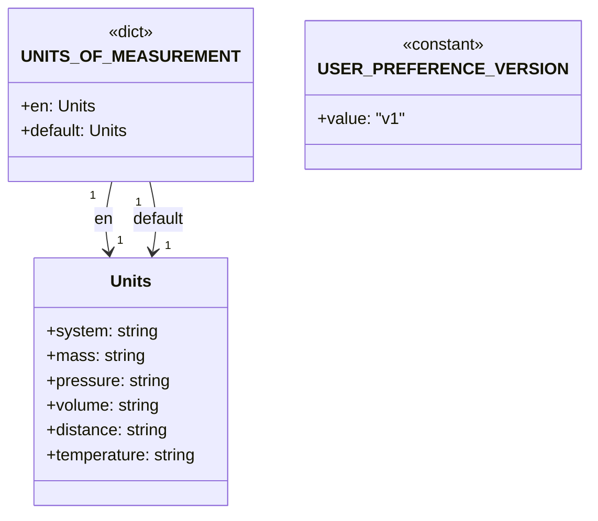

# Diagram: common/iam_service/iam_service/v1/lambdas/user_preference/constants.py

> Auto-generated by Obscura crawlers

## Mermaid

### SVG

<svg id="container" width="518.8671875" xmlns="http://www.w3.org/2000/svg" class="classDiagram" height="498" viewBox="0 0 518.8671875 498" role="graphics-document document" aria-roledescription="class"><g><defs><marker id="container_class-aggregationStart" class="marker aggregation class" refX="18" refY="7" markerWidth="190" markerHeight="240" orient="auto"><path d="M 18,7 L9,13 L1,7 L9,1 Z"></path></marker></defs><defs><marker id="container_class-aggregationEnd" class="marker aggregation class" refX="1" refY="7" markerWidth="20" markerHeight="28" orient="auto"><path d="M 18,7 L9,13 L1,7 L9,1 Z"></path></marker></defs><defs><marker id="container_class-extensionStart" class="marker extension class" refX="18" refY="7" markerWidth="190" markerHeight="240" orient="auto"><path d="M 1,7 L18,13 V 1 Z"></path></marker></defs><defs><marker id="container_class-extensionEnd" class="marker extension class" refX="1" refY="7" markerWidth="20" markerHeight="28" orient="auto"><path d="M 1,1 V 13 L18,7 Z"></path></marker></defs><defs><marker id="container_class-compositionStart" class="marker composition class" refX="18" refY="7" markerWidth="190" markerHeight="240" orient="auto"><path d="M 18,7 L9,13 L1,7 L9,1 Z"></path></marker></defs><defs><marker id="container_class-compositionEnd" class="marker composition class" refX="1" refY="7" markerWidth="20" markerHeight="28" orient="auto"><path d="M 18,7 L9,13 L1,7 L9,1 Z"></path></marker></defs><defs><marker id="container_class-dependencyStart" class="marker dependency class" refX="6" refY="7" markerWidth="190" markerHeight="240" orient="auto"><path d="M 5,7 L9,13 L1,7 L9,1 Z"></path></marker></defs><defs><marker id="container_class-dependencyEnd" class="marker dependency class" refX="13" refY="7" markerWidth="20" markerHeight="28" orient="auto"><path d="M 18,7 L9,13 L14,7 L9,1 Z"></path></marker></defs><defs><marker id="container_class-lollipopStart" class="marker lollipop class" refX="13" refY="7" markerWidth="190" markerHeight="240" orient="auto"><circle stroke="black" fill="transparent" cx="7" cy="7" r="6"></circle></marker></defs><defs><marker id="container_class-lollipopEnd" class="marker lollipop class" refX="1" refY="7" markerWidth="190" markerHeight="240" orient="auto"><circle stroke="black" fill="transparent" cx="7" cy="7" r="6"></circle></marker></defs><g class="root"><g class="clusters"></g><g class="edgePaths"><path d="M99.869,176L98.469,182.167C97.069,188.333,94.269,200.667,93.776,212.015C93.282,223.363,95.096,233.727,96.002,238.908L96.909,244.09" id="id_UNITS_OF_MEASUREMENT_Units_1" class="edge-thickness-normal edge-pattern-solid relation" style=";;;" data-edge="true" data-et="edge" data-id="id_UNITS_OF_MEASUREMENT_Units_1" data-points="W3sieCI6OTkuODY5NDc5NTk3MTA3NDQsInkiOjE3Nn0seyJ4Ijo5MS40Njg3NSwieSI6MjEzfSx7IngiOjk3Ljk0MzE5NzY1MTI3Mzg5LCJ5IjoyNTB9XQ==" marker-end="url(#container_class-dependencyEnd)"></path><path d="M138.013,176L139.413,182.167C140.814,188.333,143.614,200.667,144.107,212.015C144.601,223.363,142.787,233.727,141.881,238.908L140.974,244.09" id="id_UNITS_OF_MEASUREMENT_Units_2" class="edge-thickness-normal edge-pattern-solid relation" style=";;;" data-edge="true" data-et="edge" data-id="id_UNITS_OF_MEASUREMENT_Units_2" data-points="W3sieCI6MTM4LjAxMzMzMjkwMjg5MjU2LCJ5IjoxNzZ9LHsieCI6MTQ2LjQxNDA2MjUsInkiOjIxM30seyJ4IjoxMzkuOTM5NjE0ODQ4NzI2MSwieSI6MjUwfV0=" marker-end="url(#container_class-dependencyEnd)"></path></g><g class="edgeLabels"><g class="edgeLabel" transform="translate(91.51076, 212.81496)"><g class="label" data-id="id_UNITS_OF_MEASUREMENT_Units_1" transform="translate(-9.0546875, -12)"><foreignObject width="18.109375" height="24">

en

</foreignObject></g></g><g class="edgeLabel" transform="translate(146.37205, 212.81496)"><g class="label" data-id="id_UNITS_OF_MEASUREMENT_Units_2" transform="translate(-25.890625, -12)"><foreignObject width="51.78125" height="24">

default

</foreignObject></g></g><g class="edgeTerminals" transform="translate(81.36707241559975, 189.7444890139359)"><g class="inner" transform="translate(0, 0)"><foreignObject style="width: 9px; height: 12px;">
1
</foreignObject></g></g><g class="edgeTerminals" transform="translate(127.2603297625085, 196.38683404277538)"><g class="inner" transform="translate(0, 0)"><foreignObject style="width: 9px; height: 12px;">
1
</foreignObject></g></g><g class="edgeTerminals" transform="translate(104.70228857054677, 225.1764356762661)"><g class="inner" transform="translate(0, 0)"></g><foreignObject style="width: 9px; height: 12px;">
1
</foreignObject></g><g class="edgeTerminals" transform="translate(152.7315166235313, 230.34741744252338)"><g class="inner" transform="translate(0, 0)"></g><foreignObject style="width: 9px; height: 12px;">
1
</foreignObject></g></g><g class="nodes"><g class="node default" id="classId-UNITS_OF_MEASUREMENT-0" transform="translate(118.94140625, 92)"><g class="basic label-container"><path d="M-110.94140625 -84 L110.94140625 -84 L110.94140625 84 L-110.94140625 84" stroke="none" stroke-width="0" fill="#ECECFF" style=""></path><path d="M-110.94140625 -84 C-60.541866189144926 -84, -10.142326128289852 -84, 110.94140625 -84 M-110.94140625 -84 C-29.369279993537532 -84, 52.202846262924936 -84, 110.94140625 -84 M110.94140625 -84 C110.94140625 -31.66881964456502, 110.94140625 20.66236071086996, 110.94140625 84 M110.94140625 -84 C110.94140625 -24.592488648087347, 110.94140625 34.815022703825306, 110.94140625 84 M110.94140625 84 C30.638750448148244 84, -49.66390535370351 84, -110.94140625 84 M110.94140625 84 C42.14890625501816 84, -26.643593739963677 84, -110.94140625 84 M-110.94140625 84 C-110.94140625 32.04378162856548, -110.94140625 -19.912436742869033, -110.94140625 -84 M-110.94140625 84 C-110.94140625 31.424974362860965, -110.94140625 -21.15005127427807, -110.94140625 -84" stroke="#9370DB" stroke-width="1.3" fill="none" stroke-dasharray="0 0" style=""></path></g><g class="annotation-group text" transform="translate(-22.7265625, -60)"><g class="label" style="" transform="translate(0,-12)"><foreignObject width="45.453125" height="24">

«dict»

</foreignObject></g></g><g class="label-group text" transform="translate(-92.2421875, -36)"><g class="label" style="font-weight: bolder" transform="translate(0,-12)"><foreignObject width="184.484375" height="24">

UNITS_OF_MEASUREMENT

</foreignObject></g></g><g class="members-group text" transform="translate(-98.94140625, 12)"><g class="label" style="" transform="translate(0,-12)"><foreignObject width="71.890625" height="24">

+en: Units

</foreignObject></g><g class="label" style="" transform="translate(0,12)"><foreignObject width="105.640625" height="24">

+default: Units

</foreignObject></g></g><g class="methods-group text" transform="translate(-98.94140625, 84)"></g><g class="divider" style=""><path d="M-110.94140625 -12 C-28.628367188770156 -12, 53.68467187245969 -12, 110.94140625 -12 M-110.94140625 -12 C-38.248516646866875 -12, 34.44437295626625 -12, 110.94140625 -12" stroke="#9370DB" stroke-width="1.3" fill="none" stroke-dasharray="0 0" style=""></path></g><g class="divider" style=""><path d="M-110.94140625 60 C-60.25568670453692 60, -9.56996715907384 60, 110.94140625 60 M-110.94140625 60 C-61.06077503441871 60, -11.180143818837422 60, 110.94140625 60" stroke="#9370DB" stroke-width="1.3" fill="none" stroke-dasharray="0 0" style=""></path></g></g><g class="node default" id="classId-Units-1" transform="translate(118.94140625, 370)"><g class="basic label-container"><path d="M-95.33984375 -120 L95.33984375 -120 L95.33984375 120 L-95.33984375 120" stroke="none" stroke-width="0" fill="#ECECFF" style=""></path><path d="M-95.33984375 -120 C-32.47811773234484 -120, 30.383608285310316 -120, 95.33984375 -120 M-95.33984375 -120 C-45.0365288005013 -120, 5.266786148997397 -120, 95.33984375 -120 M95.33984375 -120 C95.33984375 -69.81173653342958, 95.33984375 -19.623473066859162, 95.33984375 120 M95.33984375 -120 C95.33984375 -47.996979831880054, 95.33984375 24.00604033623989, 95.33984375 120 M95.33984375 120 C36.450971874965994 120, -22.437900000068012 120, -95.33984375 120 M95.33984375 120 C43.14007412699715 120, -9.059695496005702 120, -95.33984375 120 M-95.33984375 120 C-95.33984375 55.396274757453625, -95.33984375 -9.20745048509275, -95.33984375 -120 M-95.33984375 120 C-95.33984375 58.64209988135285, -95.33984375 -2.715800237294303, -95.33984375 -120" stroke="#9370DB" stroke-width="1.3" fill="none" stroke-dasharray="0 0" style=""></path></g><g class="annotation-group text" transform="translate(0, -96)"></g><g class="label-group text" transform="translate(-19.0390625, -96)"><g class="label" style="font-weight: bolder" transform="translate(0,-12)"><foreignObject width="38.078125" height="24">

Units

</foreignObject></g></g><g class="members-group text" transform="translate(-83.33984375, -48)"><g class="label" style="" transform="translate(0,-12)"><foreignObject width="108.109375" height="24">

+system: string

</foreignObject></g><g class="label" style="" transform="translate(0,12)"><foreignObject width="94.75" height="24">

+mass: string

</foreignObject></g><g class="label" style="" transform="translate(0,36)"><foreignObject width="120.140625" height="24">

+pressure: string

</foreignObject></g><g class="label" style="" transform="translate(0,60)"><foreignObject width="111.125" height="24">

+volume: string

</foreignObject></g><g class="label" style="" transform="translate(0,84)"><foreignObject width="119.046875" height="24">

+distance: string

</foreignObject></g><g class="label" style="" transform="translate(0,108)"><foreignObject width="147.640625" height="24">

+temperature: string

</foreignObject></g></g><g class="methods-group text" transform="translate(-83.33984375, 120)"></g><g class="divider" style=""><path d="M-95.33984375 -72 C-23.69004248220655 -72, 47.9597587855869 -72, 95.33984375 -72 M-95.33984375 -72 C-32.58550959481741 -72, 30.16882456036518 -72, 95.33984375 -72" stroke="#9370DB" stroke-width="1.3" fill="none" stroke-dasharray="0 0" style=""></path></g><g class="divider" style=""><path d="M-95.33984375 96 C-33.64923219843786 96, 28.041379353124285 96, 95.33984375 96 M-95.33984375 96 C-32.6407210255826 96, 30.0584016988348 96, 95.33984375 96" stroke="#9370DB" stroke-width="1.3" fill="none" stroke-dasharray="0 0" style=""></path></g></g><g class="node default" id="classId-USER_PREFERENCE_VERSION-2" transform="translate(395.375, 92)"><g class="basic label-container"><path d="M-115.4921875 -72 L115.4921875 -72 L115.4921875 72 L-115.4921875 72" stroke="none" stroke-width="0" fill="#ECECFF" style=""></path><path d="M-115.4921875 -72 C-53.18163838328808 -72, 9.128910733423837 -72, 115.4921875 -72 M-115.4921875 -72 C-43.01718573563163 -72, 29.457816028736744 -72, 115.4921875 -72 M115.4921875 -72 C115.4921875 -19.09619908911675, 115.4921875 33.8076018217665, 115.4921875 72 M115.4921875 -72 C115.4921875 -14.994668424396792, 115.4921875 42.010663151206415, 115.4921875 72 M115.4921875 72 C55.75007023965246 72, -3.9920470206950824 72, -115.4921875 72 M115.4921875 72 C27.61947012079301 72, -60.25324725841398 72, -115.4921875 72 M-115.4921875 72 C-115.4921875 27.189929998256233, -115.4921875 -17.620140003487535, -115.4921875 -72 M-115.4921875 72 C-115.4921875 23.236758850518335, -115.4921875 -25.52648229896333, -115.4921875 -72" stroke="#9370DB" stroke-width="1.3" fill="none" stroke-dasharray="0 0" style=""></path></g><g class="annotation-group text" transform="translate(-40.4921875, -48)"><g class="label" style="" transform="translate(0,-12)"><foreignObject width="80.984375" height="24">

«constant»

</foreignObject></g></g><g class="label-group text" transform="translate(-103.4921875, -24)"><g class="label" style="font-weight: bolder" transform="translate(0,-12)"><foreignObject width="206.984375" height="24">

USER_PREFERENCE_VERSION

</foreignObject></g></g><g class="members-group text" transform="translate(-103.4921875, 24)"><g class="label" style="" transform="translate(0,-12)"><foreignObject width="82.359375" height="24">

+value: "v1"

</foreignObject></g></g><g class="methods-group text" transform="translate(-103.4921875, 72)"></g><g class="divider" style=""><path d="M-115.4921875 0 C-38.592191477926704 0, 38.30780454414659 0, 115.4921875 0 M-115.4921875 0 C-29.075093818904108 0, 57.341999862191784 0, 115.4921875 0" stroke="#9370DB" stroke-width="1.3" fill="none" stroke-dasharray="0 0" style=""></path></g><g class="divider" style=""><path d="M-115.4921875 48 C-36.75328466168686 48, 41.985618176626275 48, 115.4921875 48 M-115.4921875 48 C-23.636253687052303 48, 68.2196801258954 48, 115.4921875 48" stroke="#9370DB" stroke-width="1.3" fill="none" stroke-dasharray="0 0" style=""></path></g></g></g></g></g></svg>
