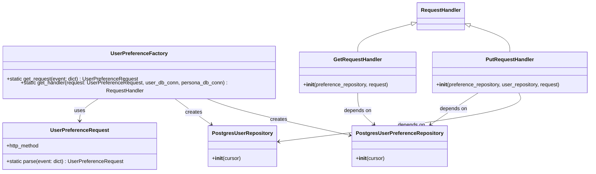

# Diagram: common/iam_service/iam_service/v1/lambdas/user_preference/factory.py


> Auto-generated by Obscura crawlers

## Diagram 1



### SVG

<svg id="container" width="1828.48046875" xmlns="http://www.w3.org/2000/svg" class="classDiagram" height="518" viewBox="0 0 1828.48046875 518" role="graphics-document document" aria-roledescription="class"><style>#container{font-family:"trebuchet ms",verdana,arial,sans-serif;font-size:16px;fill:#333;}@keyframes edge-animation-frame{from{stroke-dashoffset:0;}}@keyframes dash{to{stroke-dashoffset:0;}}#container .edge-animation-slow{stroke-dasharray:9,5!important;stroke-dashoffset:900;animation:dash 50s linear infinite;stroke-linecap:round;}#container .edge-animation-fast{stroke-dasharray:9,5!important;stroke-dashoffset:900;animation:dash 20s linear infinite;stroke-linecap:round;}#container .error-icon{fill:#552222;}#container .error-text{fill:#552222;stroke:#552222;}#container .edge-thickness-normal{stroke-width:1px;}#container .edge-thickness-thick{stroke-width:3.5px;}#container .edge-pattern-solid{stroke-dasharray:0;}#container .edge-thickness-invisible{stroke-width:0;fill:none;}#container .edge-pattern-dashed{stroke-dasharray:3;}#container .edge-pattern-dotted{stroke-dasharray:2;}#container .marker{fill:#333333;stroke:#333333;}#container .marker.cross{stroke:#333333;}#container svg{font-family:"trebuchet ms",verdana,arial,sans-serif;font-size:16px;}#container p{margin:0;}#container g.classGroup text{fill:#9370DB;stroke:none;font-family:"trebuchet ms",verdana,arial,sans-serif;font-size:10px;}#container g.classGroup text .title{font-weight:bolder;}#container .nodeLabel,#container .edgeLabel{color:#131300;}#container .edgeLabel .label rect{fill:#ECECFF;}#container .label text{fill:#131300;}#container .labelBkg{background:#ECECFF;}#container .edgeLabel .label span{background:#ECECFF;}#container .classTitle{font-weight:bolder;}#container .node rect,#container .node circle,#container .node ellipse,#container .node polygon,#container .node path{fill:#ECECFF;stroke:#9370DB;stroke-width:1px;}#container .divider{stroke:#9370DB;stroke-width:1;}#container g.clickable{cursor:pointer;}#container g.classGroup rect{fill:#ECECFF;stroke:#9370DB;}#container g.classGroup line{stroke:#9370DB;stroke-width:1;}#container .classLabel .box{stroke:none;stroke-width:0;fill:#ECECFF;opacity:0.5;}#container .classLabel .label{fill:#9370DB;font-size:10px;}#container .relation{stroke:#333333;stroke-width:1;fill:none;}#container .dashed-line{stroke-dasharray:3;}#container .dotted-line{stroke-dasharray:1 2;}#container #compositionStart,#container .composition{fill:#333333!important;stroke:#333333!important;stroke-width:1;}#container #compositionEnd,#container .composition{fill:#333333!important;stroke:#333333!important;stroke-width:1;}#container #dependencyStart,#container .dependency{fill:#333333!important;stroke:#333333!important;stroke-width:1;}#container #dependencyStart,#container .dependency{fill:#333333!important;stroke:#333333!important;stroke-width:1;}#container #extensionStart,#container .extension{fill:transparent!important;stroke:#333333!important;stroke-width:1;}#container #extensionEnd,#container .extension{fill:transparent!important;stroke:#333333!important;stroke-width:1;}#container #aggregationStart,#container .aggregation{fill:transparent!important;stroke:#333333!important;stroke-width:1;}#container #aggregationEnd,#container .aggregation{fill:transparent!important;stroke:#333333!important;stroke-width:1;}#container #lollipopStart,#container .lollipop{fill:#ECECFF!important;stroke:#333333!important;stroke-width:1;}#container #lollipopEnd,#container .lollipop{fill:#ECECFF!important;stroke:#333333!important;stroke-width:1;}#container .edgeTerminals{font-size:11px;line-height:initial;}#container .classTitleText{text-anchor:middle;font-size:18px;fill:#333;}#container .label-icon{display:inline-block;height:1em;overflow:visible;vertical-align:-0.125em;}#container .node .label-icon path{fill:currentColor;stroke:revert;stroke-width:revert;}#container :root{--mermaid-font-family:"trebuchet ms",verdana,arial,sans-serif;}</style><g><defs><marker id="container_class-aggregationStart" class="marker aggregation class" refX="18" refY="7" markerWidth="190" markerHeight="240" orient="auto"><path d="M 18,7 L9,13 L1,7 L9,1 Z"></path></marker></defs><defs><marker id="container_class-aggregationEnd" class="marker aggregation class" refX="1" refY="7" markerWidth="20" markerHeight="28" orient="auto"><path d="M 18,7 L9,13 L1,7 L9,1 Z"></path></marker></defs><defs><marker id="container_class-extensionStart" class="marker extension class" refX="18" refY="7" markerWidth="190" markerHeight="240" orient="auto"><path d="M 1,7 L18,13 V 1 Z"></path></marker></defs><defs><marker id="container_class-extensionEnd" class="marker extension class" refX="1" refY="7" markerWidth="20" markerHeight="28" orient="auto"><path d="M 1,1 V 13 L18,7 Z"></path></marker></defs><defs><marker id="container_class-compositionStart" class="marker composition class" refX="18" refY="7" markerWidth="190" markerHeight="240" orient="auto"><path d="M 18,7 L9,13 L1,7 L9,1 Z"></path></marker></defs><defs><marker id="container_class-compositionEnd" class="marker composition class" refX="1" refY="7" markerWidth="20" markerHeight="28" orient="auto"><path d="M 18,7 L9,13 L1,7 L9,1 Z"></path></marker></defs><defs><marker id="container_class-dependencyStart" class="marker dependency class" refX="6" refY="7" markerWidth="190" markerHeight="240" orient="auto"><path d="M 5,7 L9,13 L1,7 L9,1 Z"></path></marker></defs><defs><marker id="container_class-dependencyEnd" class="marker dependency class" refX="13" refY="7" markerWidth="20" markerHeight="28" orient="auto"><path d="M 18,7 L9,13 L14,7 L9,1 Z"></path></marker></defs><defs><marker id="container_class-lollipopStart" class="marker lollipop class" refX="13" refY="7" markerWidth="190" markerHeight="240" orient="auto"><circle stroke="black" fill="transparent" cx="7" cy="7" r="6"></circle></marker></defs><defs><marker id="container_class-lollipopEnd" class="marker lollipop class" refX="1" refY="7" markerWidth="190" markerHeight="240" orient="auto"><circle stroke="black" fill="transparent" cx="7" cy="7" r="6"></circle></marker></defs><g class="root"><g class="clusters"></g><g class="edgePaths"><path d="M1298.147,71.241L1266.61,78.868C1235.073,86.494,1172,101.747,1140.463,115.54C1108.926,129.333,1108.926,141.667,1108.926,147.833L1108.926,154" id="id_RequestHandler_GetRequestHandler_1" class="edge-thickness-normal edge-pattern-solid relation" style=";;;" data-edge="true" data-et="edge" data-id="id_RequestHandler_GetRequestHandler_1" data-points="W3sieCI6MTMxNC45MTQwNjI1LCJ5Ijo2Ny4xODY2NTY3MDMzNzEwN30seyJ4IjoxMTA4LjkyNTc4MTI1LCJ5IjoxMTd9LHsieCI6MTEwOC45MjU3ODEyNSwieSI6MTU0fV0=" marker-start="url(#container_class-extensionStart)"></path><path d="M1473.36,80.177L1491.129,86.314C1508.899,92.451,1544.438,104.726,1562.207,117.03C1579.977,129.333,1579.977,141.667,1579.977,147.833L1579.977,154" id="id_RequestHandler_PutRequestHandler_2" class="edge-thickness-normal edge-pattern-solid relation" style=";;;" data-edge="true" data-et="edge" data-id="id_RequestHandler_PutRequestHandler_2" data-points="W3sieCI6MTQ1Ny4wNTQ2ODc1LCJ5Ijo3NC41NDU4OTAyMTc4NzI4Mn0seyJ4IjoxNTc5Ljk3NjU2MjUsInkiOjExN30seyJ4IjoxNTc5Ljk3NjU2MjUsInkiOjE1NH1d" marker-start="url(#container_class-extensionStart)"></path><path d="M322.082,292L312.379,298.167C302.677,304.333,283.271,316.667,273.568,328C263.865,339.333,263.865,349.667,263.865,354.833L263.865,360" id="id_UserPreferenceFactory_UserPreferenceRequest_3" class="edge-thickness-normal edge-pattern-solid relation" style=";;;" data-edge="true" data-et="edge" data-id="id_UserPreferenceFactory_UserPreferenceRequest_3" data-points="W3sieCI6MzIyLjA4MjI5MjgyOTI0MTA2LCJ5IjoyOTJ9LHsieCI6MjYzLjg2NTIzNDM3NSwieSI6MzI5fSx7IngiOjI2My44NjUyMzQzNzUsInkiOjM2Nn1d" marker-end="url(#container_class-dependencyEnd)"></path><path d="M544.858,292L553.472,298.167C562.086,304.333,579.314,316.667,599.02,329.959C618.726,343.252,640.909,357.505,652,364.631L663.091,371.757" id="id_UserPreferenceFactory_PostgresUserRepository_4" class="edge-thickness-normal edge-pattern-solid relation" style=";;;" data-edge="true" data-et="edge" data-id="id_UserPreferenceFactory_PostgresUserRepository_4" data-points="W3sieCI6NTQ0Ljg1NzU2MTM4MzkyODYsInkiOjI5Mn0seyJ4Ijo1OTYuNTQyOTY4NzUsInkiOjMyOX0seyJ4Ijo2NjguMTM5MzcwNjk5NTQxMiwieSI6Mzc1fV0=" marker-end="url(#container_class-dependencyEnd)"></path><path d="M636.268,292L652.398,298.167C668.528,304.333,700.788,316.667,778.99,335.901C857.191,355.136,981.334,381.271,1043.405,394.339L1105.476,407.407" id="id_UserPreferenceFactory_PostgresUserPreferenceRepository_5" class="edge-thickness-normal edge-pattern-solid relation" style=";;;" data-edge="true" data-et="edge" data-id="id_UserPreferenceFactory_PostgresUserPreferenceRepository_5" data-points="W3sieCI6NjM2LjI2NzczNTA3MjU0NDYsInkiOjI5Mn0seyJ4Ijo3MzMuMDQ4ODI4MTI1LCJ5IjozMjl9LHsieCI6MTExMS4zNDc2NTYyNSwieSI6NDA4LjY0Mjc1OTg2OTQ3NTh9XQ==" marker-end="url(#container_class-dependencyEnd)"></path><path d="M1108.926,280L1108.926,288.167C1108.926,296.333,1108.926,312.667,1118.111,327.891C1127.297,343.115,1145.668,357.23,1154.853,364.287L1164.039,371.344" id="id_GetRequestHandler_PostgresUserPreferenceRepository_6" class="edge-thickness-normal edge-pattern-solid relation" style=";;;" data-edge="true" data-et="edge" data-id="id_GetRequestHandler_PostgresUserPreferenceRepository_6" data-points="W3sieCI6MTEwOC45MjU3ODEyNSwieSI6MjgwfSx7IngiOjExMDguOTI1NzgxMjUsInkiOjMyOX0seyJ4IjoxMTY4Ljc5NjMzNzQ0MjY2MDYsInkiOjM3NX1d" marker-end="url(#container_class-dependencyEnd)"></path><path d="M1477.275,280L1463.962,288.167C1450.649,296.333,1424.023,312.667,1401.201,327.903C1378.378,343.14,1359.36,357.28,1349.851,364.35L1340.342,371.42" id="id_PutRequestHandler_PostgresUserPreferenceRepository_7" class="edge-thickness-normal edge-pattern-solid relation" style=";;;" data-edge="true" data-et="edge" data-id="id_PutRequestHandler_PostgresUserPreferenceRepository_7" data-points="W3sieCI6MTQ3Ny4yNzUyNjg1NTQ2ODc1LCJ5IjoyODB9LHsieCI6MTM5Ny4zOTY0ODQzNzUsInkiOjMyOX0seyJ4IjoxMzM1LjUyNzExMDgwODQ4NjIsInkiOjM3NX1d" marker-end="url(#container_class-dependencyEnd)"></path><path d="M1609.758,280L1613.619,288.167C1617.479,296.333,1625.201,312.667,1502.322,336.772C1379.444,360.878,1125.966,392.755,999.227,408.694L872.488,424.633" id="id_PutRequestHandler_PostgresUserRepository_8" class="edge-thickness-normal edge-pattern-solid relation" style=";;;" data-edge="true" data-et="edge" data-id="id_PutRequestHandler_PostgresUserRepository_8" data-points="W3sieCI6MTYwOS43NTgzMDA3ODEyNSwieSI6MjgwfSx7IngiOjE2MzIuOTIxODc1LCJ5IjozMjl9LHsieCI6ODY2LjUzNTE1NjI1LCJ5Ijo0MjUuMzgxMjA3MTI4MTEzMTV9XQ==" marker-end="url(#container_class-dependencyEnd)"></path></g><g class="edgeLabels"><g class="edgeLabel"><g class="label" data-id="id_RequestHandler_GetRequestHandler_1" transform="translate(0, 0)"><foreignObject width="0" height="0"><div xmlns="http://www.w3.org/1999/xhtml" class="labelBkg" style="display: table-cell; white-space: nowrap; line-height: 1.5; max-width: 200px; text-align: center;"><span class="edgeLabel"></span></div></foreignObject></g></g><g class="edgeLabel"><g class="label" data-id="id_RequestHandler_PutRequestHandler_2" transform="translate(0, 0)"><foreignObject width="0" height="0"><div xmlns="http://www.w3.org/1999/xhtml" class="labelBkg" style="display: table-cell; white-space: nowrap; line-height: 1.5; max-width: 200px; text-align: center;"><span class="edgeLabel"></span></div></foreignObject></g></g><g class="edgeLabel" transform="translate(263.865234375, 329)"><g class="label" data-id="id_UserPreferenceFactory_UserPreferenceRequest_3" transform="translate(-16.4921875, -12)"><foreignObject width="32.984375" height="24"><div xmlns="http://www.w3.org/1999/xhtml" class="labelBkg" style="display: table-cell; white-space: nowrap; line-height: 1.5; max-width: 200px; text-align: center;"><span class="edgeLabel"><p>uses</p></span></div></foreignObject></g></g><g class="edgeLabel" transform="translate(605.60238, 334.82058)"><g class="label" data-id="id_UserPreferenceFactory_PostgresUserRepository_4" transform="translate(-26.171875, -12)"><foreignObject width="52.34375" height="24"><div xmlns="http://www.w3.org/1999/xhtml" class="labelBkg" style="display: table-cell; white-space: nowrap; line-height: 1.5; max-width: 200px; text-align: center;"><span class="edgeLabel"><p>creates</p></span></div></foreignObject></g></g><g class="edgeLabel" transform="translate(871.5032, 358.14862)"><g class="label" data-id="id_UserPreferenceFactory_PostgresUserPreferenceRepository_5" transform="translate(-26.171875, -12)"><foreignObject width="52.34375" height="24"><div xmlns="http://www.w3.org/1999/xhtml" class="labelBkg" style="display: table-cell; white-space: nowrap; line-height: 1.5; max-width: 200px; text-align: center;"><span class="edgeLabel"><p>creates</p></span></div></foreignObject></g></g><g class="edgeLabel" transform="translate(1108.92578125, 329)"><g class="label" data-id="id_GetRequestHandler_PostgresUserPreferenceRepository_6" transform="translate(-42.9453125, -12)"><foreignObject width="85.890625" height="24"><div xmlns="http://www.w3.org/1999/xhtml" class="labelBkg" style="display: table-cell; white-space: nowrap; line-height: 1.5; max-width: 200px; text-align: center;"><span class="edgeLabel"><p>depends on</p></span></div></foreignObject></g></g><g class="edgeLabel" transform="translate(1404.47744, 324.65633)"><g class="label" data-id="id_PutRequestHandler_PostgresUserPreferenceRepository_7" transform="translate(-42.9453125, -12)"><foreignObject width="85.890625" height="24"><div xmlns="http://www.w3.org/1999/xhtml" class="labelBkg" style="display: table-cell; white-space: nowrap; line-height: 1.5; max-width: 200px; text-align: center;"><span class="edgeLabel"><p>depends on</p></span></div></foreignObject></g></g><g class="edgeLabel" transform="translate(1276.61632, 373.80918)"><g class="label" data-id="id_PutRequestHandler_PostgresUserRepository_8" transform="translate(-42.9453125, -12)"><foreignObject width="85.890625" height="24"><div xmlns="http://www.w3.org/1999/xhtml" class="labelBkg" style="display: table-cell; white-space: nowrap; line-height: 1.5; max-width: 200px; text-align: center;"><span class="edgeLabel"><p>depends on</p></span></div></foreignObject></g></g></g><g class="nodes"><g class="node default" id="classId-UserPreferenceFactory-0" transform="translate(440.08984375, 217)"><g class="basic label-container"><path d="M-432.08984375 -75 L432.08984375 -75 L432.08984375 75 L-432.08984375 75" stroke="none" stroke-width="0" fill="#ECECFF" style=""></path><path d="M-432.08984375 -75 C-178.28575133155078 -75, 75.51834108689843 -75, 432.08984375 -75 M-432.08984375 -75 C-251.8365576596832 -75, -71.58327156936639 -75, 432.08984375 -75 M432.08984375 -75 C432.08984375 -42.07752312362453, 432.08984375 -9.15504624724906, 432.08984375 75 M432.08984375 -75 C432.08984375 -17.238230739853392, 432.08984375 40.523538520293215, 432.08984375 75 M432.08984375 75 C215.19889833585046 75, -1.6920470782990833 75, -432.08984375 75 M432.08984375 75 C139.87889129273555 75, -152.3320611645289 75, -432.08984375 75 M-432.08984375 75 C-432.08984375 43.26333916152145, -432.08984375 11.526678323042901, -432.08984375 -75 M-432.08984375 75 C-432.08984375 21.42250084859083, -432.08984375 -32.15499830281834, -432.08984375 -75" stroke="#9370DB" stroke-width="1.3" fill="none" stroke-dasharray="0 0" style=""></path></g><g class="annotation-group text" transform="translate(0, -51)"></g><g class="label-group text" transform="translate(-82.5546875, -51)"><g class="label" style="font-weight: bolder" transform="translate(0,-12)"><foreignObject width="165.109375" height="24"><div xmlns="http://www.w3.org/1999/xhtml" style="display: table-cell; white-space: nowrap; line-height: 1.5; max-width: 212px; text-align: center;"><span class="nodeLabel markdown-node-label" style=""><p>UserPreferenceFactory</p></span></div></foreignObject></g></g><g class="members-group text" transform="translate(-420.08984375, -3)"></g><g class="methods-group text" transform="translate(-420.08984375, 27)"><g class="label" style="" transform="translate(0,-12)"><foreignObject width="405.859375" height="24"><div xmlns="http://www.w3.org/1999/xhtml" style="display: table-cell; white-space: nowrap; line-height: 1.5; max-width: 463px; text-align: center;"><span class="nodeLabel markdown-node-label" style=""><p>+static get_request(event: dict) : UserPreferenceRequest</p></span></div></foreignObject></g><g class="label" style="" transform="translate(0,12)"><foreignObject width="757.625" height="24"><div xmlns="http://www.w3.org/1999/xhtml" style="display: table-cell; white-space: nowrap; line-height: 1.5; max-width: 816px; text-align: center;"><span class="nodeLabel markdown-node-label" style=""><p>+static get_handler(request: UserPreferenceRequest, user_db_conn, persona_db_conn) : RequestHandler</p></span></div></foreignObject></g></g><g class="divider" style=""><path d="M-432.08984375 -27 C-224.25363178646444 -27, -16.417419822928878 -27, 432.08984375 -27 M-432.08984375 -27 C-88.84805816701407 -27, 254.39372741597185 -27, 432.08984375 -27" stroke="#9370DB" stroke-width="1.3" fill="none" stroke-dasharray="0 0" style=""></path></g><g class="divider" style=""><path d="M-432.08984375 -3 C-170.99501760584656 -3, 90.09980853830689 -3, 432.08984375 -3 M-432.08984375 -3 C-177.00272687780358 -3, 78.08438999439284 -3, 432.08984375 -3" stroke="#9370DB" stroke-width="1.3" fill="none" stroke-dasharray="0 0" style=""></path></g></g><g class="node default" id="classId-UserPreferenceRequest-1" transform="translate(263.865234375, 438)"><g class="basic label-container"><path d="M-234.91015625 -72 L234.91015625 -72 L234.91015625 72 L-234.91015625 72" stroke="none" stroke-width="0" fill="#ECECFF" style=""></path><path d="M-234.91015625 -72 C-139.50272631507568 -72, -44.095296380151325 -72, 234.91015625 -72 M-234.91015625 -72 C-58.19000299272116 -72, 118.53015026455768 -72, 234.91015625 -72 M234.91015625 -72 C234.91015625 -35.79086225780171, 234.91015625 0.4182754843965739, 234.91015625 72 M234.91015625 -72 C234.91015625 -25.497006246280172, 234.91015625 21.005987507439656, 234.91015625 72 M234.91015625 72 C63.74772199839353 72, -107.41471225321294 72, -234.91015625 72 M234.91015625 72 C82.21917923926117 72, -70.47179777147767 72, -234.91015625 72 M-234.91015625 72 C-234.91015625 22.16268829355368, -234.91015625 -27.674623412892643, -234.91015625 -72 M-234.91015625 72 C-234.91015625 21.6119096805866, -234.91015625 -28.7761806388268, -234.91015625 -72" stroke="#9370DB" stroke-width="1.3" fill="none" stroke-dasharray="0 0" style=""></path></g><g class="annotation-group text" transform="translate(0, -48)"></g><g class="label-group text" transform="translate(-85.9296875, -48)"><g class="label" style="font-weight: bolder" transform="translate(0,-12)"><foreignObject width="171.859375" height="24"><div xmlns="http://www.w3.org/1999/xhtml" style="display: table-cell; white-space: nowrap; line-height: 1.5; max-width: 219px; text-align: center;"><span class="nodeLabel markdown-node-label" style=""><p>UserPreferenceRequest</p></span></div></foreignObject></g></g><g class="members-group text" transform="translate(-222.91015625, 0)"><g class="label" style="" transform="translate(0,-12)"><foreignObject width="102.921875" height="24"><div xmlns="http://www.w3.org/1999/xhtml" style="display: table-cell; white-space: nowrap; line-height: 1.5; max-width: 160px; text-align: center;"><span class="nodeLabel markdown-node-label" style=""><p>+http_method</p></span></div></foreignObject></g></g><g class="methods-group text" transform="translate(-222.91015625, 48)"><g class="label" style="" transform="translate(0,-12)"><foreignObject width="359.890625" height="24"><div xmlns="http://www.w3.org/1999/xhtml" style="display: table-cell; white-space: nowrap; line-height: 1.5; max-width: 417px; text-align: center;"><span class="nodeLabel markdown-node-label" style=""><p>+static parse(event: dict) : UserPreferenceRequest</p></span></div></foreignObject></g></g><g class="divider" style=""><path d="M-234.91015625 -24 C-118.29915294823964 -24, -1.6881496464792747 -24, 234.91015625 -24 M-234.91015625 -24 C-72.40141283167023 -24, 90.10733058665954 -24, 234.91015625 -24" stroke="#9370DB" stroke-width="1.3" fill="none" stroke-dasharray="0 0" style=""></path></g><g class="divider" style=""><path d="M-234.91015625 24 C-55.16727570905641 24, 124.57560483188718 24, 234.91015625 24 M-234.91015625 24 C-63.051416229854226 24, 108.80732379029155 24, 234.91015625 24" stroke="#9370DB" stroke-width="1.3" fill="none" stroke-dasharray="0 0" style=""></path></g></g><g class="node default" id="classId-RequestHandler-2" transform="translate(1385.984375, 50)"><g class="basic label-container"><path d="M-71.0703125 -42 L71.0703125 -42 L71.0703125 42 L-71.0703125 42" stroke="none" stroke-width="0" fill="#ECECFF" style=""></path><path d="M-71.0703125 -42 C-33.32186394376086 -42, 4.42658461247828 -42, 71.0703125 -42 M-71.0703125 -42 C-34.327336512578675 -42, 2.4156394748426493 -42, 71.0703125 -42 M71.0703125 -42 C71.0703125 -13.269239292186501, 71.0703125 15.461521415626997, 71.0703125 42 M71.0703125 -42 C71.0703125 -8.854490527660268, 71.0703125 24.291018944679465, 71.0703125 42 M71.0703125 42 C24.346006325937807 42, -22.378299848124385 42, -71.0703125 42 M71.0703125 42 C17.55274696596384 42, -35.96481856807232 42, -71.0703125 42 M-71.0703125 42 C-71.0703125 21.295289352177164, -71.0703125 0.5905787043543285, -71.0703125 -42 M-71.0703125 42 C-71.0703125 14.27474763929186, -71.0703125 -13.45050472141628, -71.0703125 -42" stroke="#9370DB" stroke-width="1.3" fill="none" stroke-dasharray="0 0" style=""></path></g><g class="annotation-group text" transform="translate(0, -18)"></g><g class="label-group text" transform="translate(-59.0703125, -18)"><g class="label" style="font-weight: bolder" transform="translate(0,-12)"><foreignObject width="118.140625" height="24"><div xmlns="http://www.w3.org/1999/xhtml" style="display: table-cell; white-space: nowrap; line-height: 1.5; max-width: 168px; text-align: center;"><span class="nodeLabel markdown-node-label" style=""><p>RequestHandler</p></span></div></foreignObject></g></g><g class="members-group text" transform="translate(-59.0703125, 30)"></g><g class="methods-group text" transform="translate(-59.0703125, 60)"></g><g class="divider" style=""><path d="M-71.0703125 6 C-35.182474296869394 6, 0.705363906261212 6, 71.0703125 6 M-71.0703125 6 C-18.119227090946225 6, 34.83185831810755 6, 71.0703125 6" stroke="#9370DB" stroke-width="1.3" fill="none" stroke-dasharray="0 0" style=""></path></g><g class="divider" style=""><path d="M-71.0703125 24 C-41.117604248142136 24, -11.164895996284272 24, 71.0703125 24 M-71.0703125 24 C-14.723238764537726 24, 41.62383497092455 24, 71.0703125 24" stroke="#9370DB" stroke-width="1.3" fill="none" stroke-dasharray="0 0" style=""></path></g></g><g class="node default" id="classId-GetRequestHandler-3" transform="translate(1108.92578125, 217)"><g class="basic label-container"><path d="M-180.546875 -63 L180.546875 -63 L180.546875 63 L-180.546875 63" stroke="none" stroke-width="0" fill="#ECECFF" style=""></path><path d="M-180.546875 -63 C-65.20465927643323 -63, 50.137556447133534 -63, 180.546875 -63 M-180.546875 -63 C-79.1112922562468 -63, 22.324290487506403 -63, 180.546875 -63 M180.546875 -63 C180.546875 -23.271995354028455, 180.546875 16.45600929194309, 180.546875 63 M180.546875 -63 C180.546875 -37.36908555817226, 180.546875 -11.738171116344517, 180.546875 63 M180.546875 63 C42.454892725539594 63, -95.63708954892081 63, -180.546875 63 M180.546875 63 C99.63868553670207 63, 18.73049607340414 63, -180.546875 63 M-180.546875 63 C-180.546875 32.46932978711136, -180.546875 1.9386595742227257, -180.546875 -63 M-180.546875 63 C-180.546875 30.50590002377193, -180.546875 -1.9881999524561422, -180.546875 -63" stroke="#9370DB" stroke-width="1.3" fill="none" stroke-dasharray="0 0" style=""></path></g><g class="annotation-group text" transform="translate(0, -39)"></g><g class="label-group text" transform="translate(-71.734375, -39)"><g class="label" style="font-weight: bolder" transform="translate(0,-12)"><foreignObject width="143.46875" height="24"><div xmlns="http://www.w3.org/1999/xhtml" style="display: table-cell; white-space: nowrap; line-height: 1.5; max-width: 192px; text-align: center;"><span class="nodeLabel markdown-node-label" style=""><p>GetRequestHandler</p></span></div></foreignObject></g></g><g class="members-group text" transform="translate(-168.546875, 9)"></g><g class="methods-group text" transform="translate(-168.546875, 39)"><g class="label" style="" transform="translate(0,-12)"><foreignObject width="265.359375" height="24"><div xmlns="http://www.w3.org/1999/xhtml" style="display: table-cell; white-space: nowrap; line-height: 1.5; max-width: 354px; text-align: center;"><span class="nodeLabel markdown-node-label" style=""><p>+<strong>init</strong>(preference_repository, request)</p></span></div></foreignObject></g></g><g class="divider" style=""><path d="M-180.546875 -15 C-70.48978442986366 -15, 39.56730614027268 -15, 180.546875 -15 M-180.546875 -15 C-46.090593102446604 -15, 88.36568879510679 -15, 180.546875 -15" stroke="#9370DB" stroke-width="1.3" fill="none" stroke-dasharray="0 0" style=""></path></g><g class="divider" style=""><path d="M-180.546875 9 C-81.61617911214061 9, 17.314516775718772 9, 180.546875 9 M-180.546875 9 C-81.28352387027374 9, 17.97982725945252 9, 180.546875 9" stroke="#9370DB" stroke-width="1.3" fill="none" stroke-dasharray="0 0" style=""></path></g></g><g class="node default" id="classId-PutRequestHandler-4" transform="translate(1579.9765625, 217)"><g class="basic label-container"><path d="M-240.50390625 -63 L240.50390625 -63 L240.50390625 63 L-240.50390625 63" stroke="none" stroke-width="0" fill="#ECECFF" style=""></path><path d="M-240.50390625 -63 C-137.63829899090385 -63, -34.7726917318077 -63, 240.50390625 -63 M-240.50390625 -63 C-113.91411713807226 -63, 12.675671973855486 -63, 240.50390625 -63 M240.50390625 -63 C240.50390625 -15.179820967602836, 240.50390625 32.64035806479433, 240.50390625 63 M240.50390625 -63 C240.50390625 -13.184643081367874, 240.50390625 36.63071383726425, 240.50390625 63 M240.50390625 63 C83.91649738086323 63, -72.67091148827353 63, -240.50390625 63 M240.50390625 63 C121.57264022934365 63, 2.6413742086872958 63, -240.50390625 63 M-240.50390625 63 C-240.50390625 32.688903732624965, -240.50390625 2.37780746524993, -240.50390625 -63 M-240.50390625 63 C-240.50390625 21.279860379611343, -240.50390625 -20.440279240777315, -240.50390625 -63" stroke="#9370DB" stroke-width="1.3" fill="none" stroke-dasharray="0 0" style=""></path></g><g class="annotation-group text" transform="translate(0, -39)"></g><g class="label-group text" transform="translate(-71.3203125, -39)"><g class="label" style="font-weight: bolder" transform="translate(0,-12)"><foreignObject width="142.640625" height="24"><div xmlns="http://www.w3.org/1999/xhtml" style="display: table-cell; white-space: nowrap; line-height: 1.5; max-width: 192px; text-align: center;"><span class="nodeLabel markdown-node-label" style=""><p>PutRequestHandler</p></span></div></foreignObject></g></g><g class="members-group text" transform="translate(-228.50390625, 9)"></g><g class="methods-group text" transform="translate(-228.50390625, 39)"><g class="label" style="" transform="translate(0,-12)"><foreignObject width="385.6875" height="24"><div xmlns="http://www.w3.org/1999/xhtml" style="display: table-cell; white-space: nowrap; line-height: 1.5; max-width: 474px; text-align: center;"><span class="nodeLabel markdown-node-label" style=""><p>+<strong>init</strong>(preference_repository, user_repository, request)</p></span></div></foreignObject></g></g><g class="divider" style=""><path d="M-240.50390625 -15 C-103.65598420835971 -15, 33.191937833280576 -15, 240.50390625 -15 M-240.50390625 -15 C-127.44290303248034 -15, -14.38189981496069 -15, 240.50390625 -15" stroke="#9370DB" stroke-width="1.3" fill="none" stroke-dasharray="0 0" style=""></path></g><g class="divider" style=""><path d="M-240.50390625 9 C-115.31629760170097 9, 9.871311046598066 9, 240.50390625 9 M-240.50390625 9 C-81.06566613650335 9, 78.3725739769933 9, 240.50390625 9" stroke="#9370DB" stroke-width="1.3" fill="none" stroke-dasharray="0 0" style=""></path></g></g><g class="node default" id="classId-PostgresUserRepository-5" transform="translate(766.1953125, 438)"><g class="basic label-container"><path d="M-100.33984375 -63 L100.33984375 -63 L100.33984375 63 L-100.33984375 63" stroke="none" stroke-width="0" fill="#ECECFF" style=""></path><path d="M-100.33984375 -63 C-43.335243098960504 -63, 13.669357552078992 -63, 100.33984375 -63 M-100.33984375 -63 C-32.98398415042118 -63, 34.37187544915764 -63, 100.33984375 -63 M100.33984375 -63 C100.33984375 -16.77198927618894, 100.33984375 29.45602144762212, 100.33984375 63 M100.33984375 -63 C100.33984375 -14.907711638920674, 100.33984375 33.18457672215865, 100.33984375 63 M100.33984375 63 C28.430007830948668 63, -43.479828088102664 63, -100.33984375 63 M100.33984375 63 C59.58748143571548 63, 18.835119121430964 63, -100.33984375 63 M-100.33984375 63 C-100.33984375 29.59518376218697, -100.33984375 -3.80963247562606, -100.33984375 -63 M-100.33984375 63 C-100.33984375 21.070189856351902, -100.33984375 -20.859620287296195, -100.33984375 -63" stroke="#9370DB" stroke-width="1.3" fill="none" stroke-dasharray="0 0" style=""></path></g><g class="annotation-group text" transform="translate(0, -39)"></g><g class="label-group text" transform="translate(-88.1484375, -39)"><g class="label" style="font-weight: bolder" transform="translate(0,-12)"><foreignObject width="176.296875" height="24"><div xmlns="http://www.w3.org/1999/xhtml" style="display: table-cell; white-space: nowrap; line-height: 1.5; max-width: 222px; text-align: center;"><span class="nodeLabel markdown-node-label" style=""><p>PostgresUserRepository</p></span></div></foreignObject></g></g><g class="members-group text" transform="translate(-88.33984375, 9)"></g><g class="methods-group text" transform="translate(-88.33984375, 39)"><g class="label" style="" transform="translate(0,-12)"><foreignObject width="88.53125" height="24"><div xmlns="http://www.w3.org/1999/xhtml" style="display: table-cell; white-space: nowrap; line-height: 1.5; max-width: 177px; text-align: center;"><span class="nodeLabel markdown-node-label" style=""><p>+<strong>init</strong>(cursor)</p></span></div></foreignObject></g></g><g class="divider" style=""><path d="M-100.33984375 -15 C-34.912655928742296 -15, 30.514531892515407 -15, 100.33984375 -15 M-100.33984375 -15 C-58.64249939380057 -15, -16.94515503760114 -15, 100.33984375 -15" stroke="#9370DB" stroke-width="1.3" fill="none" stroke-dasharray="0 0" style=""></path></g><g class="divider" style=""><path d="M-100.33984375 9 C-20.125075462192925 9, 60.08969282561415 9, 100.33984375 9 M-100.33984375 9 C-55.72604485421474 9, -11.112245958429483 9, 100.33984375 9" stroke="#9370DB" stroke-width="1.3" fill="none" stroke-dasharray="0 0" style=""></path></g></g><g class="node default" id="classId-PostgresUserPreferenceRepository-6" transform="translate(1250.79296875, 438)"><g class="basic label-container"><path d="M-139.4453125 -63 L139.4453125 -63 L139.4453125 63 L-139.4453125 63" stroke="none" stroke-width="0" fill="#ECECFF" style=""></path><path d="M-139.4453125 -63 C-47.775334261494095 -63, 43.89464397701181 -63, 139.4453125 -63 M-139.4453125 -63 C-57.27691224677869 -63, 24.891488006442614 -63, 139.4453125 -63 M139.4453125 -63 C139.4453125 -13.995722182760268, 139.4453125 35.008555634479464, 139.4453125 63 M139.4453125 -63 C139.4453125 -23.5620309907439, 139.4453125 15.875938018512201, 139.4453125 63 M139.4453125 63 C82.43134927885879 63, 25.417386057717593 63, -139.4453125 63 M139.4453125 63 C62.899399218271626 63, -13.646514063456749 63, -139.4453125 63 M-139.4453125 63 C-139.4453125 20.936565344458145, -139.4453125 -21.12686931108371, -139.4453125 -63 M-139.4453125 63 C-139.4453125 20.735368538334853, -139.4453125 -21.529262923330293, -139.4453125 -63" stroke="#9370DB" stroke-width="1.3" fill="none" stroke-dasharray="0 0" style=""></path></g><g class="annotation-group text" transform="translate(0, -39)"></g><g class="label-group text" transform="translate(-127.4453125, -39)"><g class="label" style="font-weight: bolder" transform="translate(0,-12)"><foreignObject width="254.890625" height="24"><div xmlns="http://www.w3.org/1999/xhtml" style="display: table-cell; white-space: nowrap; line-height: 1.5; max-width: 299px; text-align: center;"><span class="nodeLabel markdown-node-label" style=""><p>PostgresUserPreferenceRepository</p></span></div></foreignObject></g></g><g class="members-group text" transform="translate(-127.4453125, 9)"></g><g class="methods-group text" transform="translate(-127.4453125, 39)"><g class="label" style="" transform="translate(0,-12)"><foreignObject width="88.53125" height="24"><div xmlns="http://www.w3.org/1999/xhtml" style="display: table-cell; white-space: nowrap; line-height: 1.5; max-width: 177px; text-align: center;"><span class="nodeLabel markdown-node-label" style=""><p>+<strong>init</strong>(cursor)</p></span></div></foreignObject></g></g><g class="divider" style=""><path d="M-139.4453125 -15 C-52.06269169672265 -15, 35.319929106554696 -15, 139.4453125 -15 M-139.4453125 -15 C-43.737984741183084 -15, 51.96934301763383 -15, 139.4453125 -15" stroke="#9370DB" stroke-width="1.3" fill="none" stroke-dasharray="0 0" style=""></path></g><g class="divider" style=""><path d="M-139.4453125 9 C-66.30739140658801 9, 6.830529686823979 9, 139.4453125 9 M-139.4453125 9 C-43.84184610055782 9, 51.76162029888437 9, 139.4453125 9" stroke="#9370DB" stroke-width="1.3" fill="none" stroke-dasharray="0 0" style=""></path></g></g></g></g></g></svg>

## Diagram 2

```mermaid
flowchart TD
    A[get_request(event)] --> B{parse event}
    B --> C[UserPreferenceRequest]
    C --> D[get_handler(request, user_db_conn, persona_db_conn)]
    D --> E[PostgresUserRepository(user_db_conn.get_cursor())]
    D --> F[PostgresUserPreferenceRepository(persona_db_conn.get_cursor())]
    D --> G{request.http_method}
    G -->|GET| H[GetRequestHandler(preference_repository, request)]
    G -->|PUT| I[PutRequestHandler(preference_repository, user_repository, request)]
    H --> J[return GetRequestHandler instance]
    I --> J[return PutRequestHandler instance]
```

> SVG rendering failed for this diagram.
