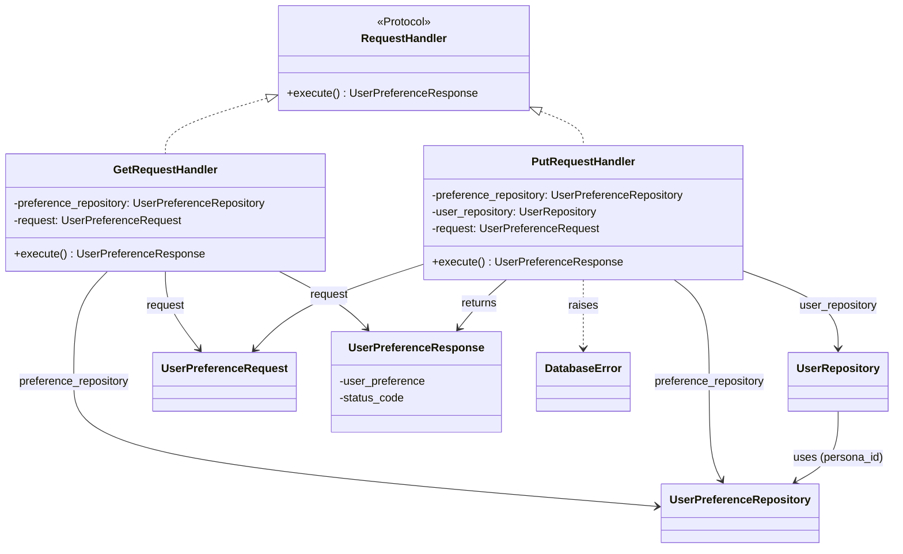
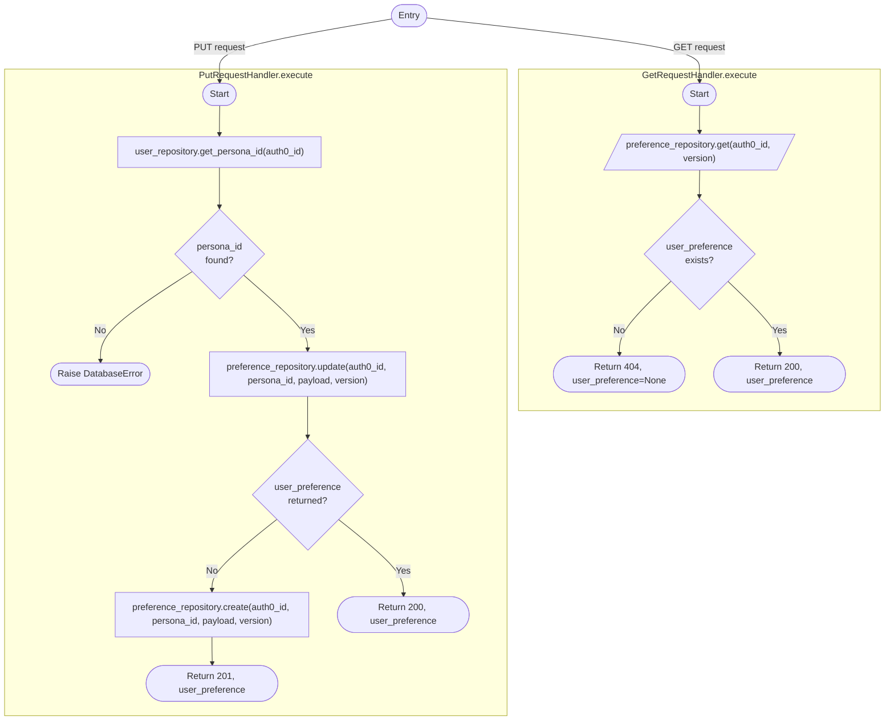

# Diagram: common/iam_service/iam_service/v1/lambdas/user_preference/handler.py

> Auto-generated by Obscura crawlers

## Diagram 1

### SVG

<svg id="container" width="1263.001953125" xmlns="http://www.w3.org/2000/svg" class="classDiagram" height="784" viewBox="0 0 1263.001953125 784" role="graphics-document document" aria-roledescription="class"><g><defs><marker id="container_class-aggregationStart" class="marker aggregation class" refX="18" refY="7" markerWidth="190" markerHeight="240" orient="auto"><path d="M 18,7 L9,13 L1,7 L9,1 Z"></path></marker></defs><defs><marker id="container_class-aggregationEnd" class="marker aggregation class" refX="1" refY="7" markerWidth="20" markerHeight="28" orient="auto"><path d="M 18,7 L9,13 L1,7 L9,1 Z"></path></marker></defs><defs><marker id="container_class-extensionStart" class="marker extension class" refX="18" refY="7" markerWidth="190" markerHeight="240" orient="auto"><path d="M 1,7 L18,13 V 1 Z"></path></marker></defs><defs><marker id="container_class-extensionEnd" class="marker extension class" refX="1" refY="7" markerWidth="20" markerHeight="28" orient="auto"><path d="M 1,1 V 13 L18,7 Z"></path></marker></defs><defs><marker id="container_class-compositionStart" class="marker composition class" refX="18" refY="7" markerWidth="190" markerHeight="240" orient="auto"><path d="M 18,7 L9,13 L1,7 L9,1 Z"></path></marker></defs><defs><marker id="container_class-compositionEnd" class="marker composition class" refX="1" refY="7" markerWidth="20" markerHeight="28" orient="auto"><path d="M 18,7 L9,13 L1,7 L9,1 Z"></path></marker></defs><defs><marker id="container_class-dependencyStart" class="marker dependency class" refX="6" refY="7" markerWidth="190" markerHeight="240" orient="auto"><path d="M 5,7 L9,13 L1,7 L9,1 Z"></path></marker></defs><defs><marker id="container_class-dependencyEnd" class="marker dependency class" refX="13" refY="7" markerWidth="20" markerHeight="28" orient="auto"><path d="M 18,7 L9,13 L14,7 L9,1 Z"></path></marker></defs><defs><marker id="container_class-lollipopStart" class="marker lollipop class" refX="13" refY="7" markerWidth="190" markerHeight="240" orient="auto"><circle stroke="black" fill="transparent" cx="7" cy="7" r="6"></circle></marker></defs><defs><marker id="container_class-lollipopEnd" class="marker lollipop class" refX="1" refY="7" markerWidth="190" markerHeight="240" orient="auto"><circle stroke="black" fill="transparent" cx="7" cy="7" r="6"></circle></marker></defs><g class="root"><g class="clusters"></g><g class="edgePaths"><path d="M378.534,140.504L354.957,147.587C331.379,154.669,284.225,168.835,260.648,182.084C237.07,195.333,237.07,207.667,237.07,213.833L237.07,220" id="id_RequestHandler_GetRequestHandler_1" class="edge-thickness-normal edge-pattern-dashed relation" style=";;;" data-edge="true" data-et="edge" data-id="id_RequestHandler_GetRequestHandler_1" data-points="W3sieCI6Mzk1LjA1NDY4NzUsInkiOjEzNS41NDEwOTk5ODk0Mzg5OH0seyJ4IjoyMzcuMDcwMzEyNSwieSI6MTgzfSx7IngiOjIzNy4wNzAzMTI1LCJ5IjoyMjB9XQ==" marker-start="url(#container_class-extensionStart)"></path><path d="M760.91,158.188L771.412,162.323C781.915,166.459,802.919,174.729,813.422,183.031C823.924,191.333,823.924,199.667,823.924,203.833L823.924,208" id="id_RequestHandler_PutRequestHandler_2" class="edge-thickness-normal edge-pattern-dashed relation" style=";;;" data-edge="true" data-et="edge" data-id="id_RequestHandler_PutRequestHandler_2" data-points="W3sieCI6NzQ0Ljg1OTM3NSwieSI6MTUxLjg2ODE5Mjk2OTM2ODg2fSx7IngiOjgyMy45MjM4MjgxMjUsInkiOjE4M30seyJ4Ijo4MjMuOTIzODI4MTI1LCJ5IjoyMDh9XQ==" marker-start="url(#container_class-extensionStart)"></path><path d="M154.81,388L146.812,396.167C138.814,404.333,122.819,420.667,114.822,447C106.824,473.333,106.824,509.667,106.824,546C106.824,582.333,106.824,618.667,245.149,648.413C383.473,678.16,660.122,701.321,798.446,712.901L936.771,724.481" id="id_GetRequestHandler_UserPreferenceRepository_3" class="edge-thickness-normal edge-pattern-solid relation" style=";;;" data-edge="true" data-et="edge" data-id="id_GetRequestHandler_UserPreferenceRepository_3" data-points="W3sieCI6MTU0LjgwOTYyMTcxMDUyNjMsInkiOjM4OH0seyJ4IjoxMDYuODI0MjE4NzUsInkiOjQzN30seyJ4IjoxMDYuODI0MjE4NzUsInkiOjU0Nn0seyJ4IjoxMDYuODI0MjE4NzUsInkiOjY1NX0seyJ4Ijo5NDIuNzUsInkiOjcyNC45ODE0MjYwNTgxNn1d" marker-end="url(#container_class-dependencyEnd)"></path><path d="M237.07,388L237.07,396.167C237.07,404.333,237.07,420.667,245.291,439.216C253.512,457.765,269.954,478.531,278.176,488.913L286.397,499.296" id="id_GetRequestHandler_UserPreferenceRequest_4" class="edge-thickness-normal edge-pattern-solid relation" style=";;;" data-edge="true" data-et="edge" data-id="id_GetRequestHandler_UserPreferenceRequest_4" data-points="W3sieCI6MjM3LjA3MDMxMjUsInkiOjM4OH0seyJ4IjoyMzcuMDcwMzEyNSwieSI6NDM3fSx7IngiOjI5MC4xMjExODMzNDI4ODk5NCwieSI6NTA0fV0=" marker-end="url(#container_class-dependencyEnd)"></path><path d="M399.25,388L415.018,396.167C430.785,404.333,462.32,420.667,482.889,434.252C503.457,447.836,513.059,458.673,517.86,464.091L522.66,469.509" id="id_GetRequestHandler_UserPreferenceResponse_5" class="edge-thickness-normal edge-pattern-solid relation" style=";;;" data-edge="true" data-et="edge" data-id="id_GetRequestHandler_UserPreferenceResponse_5" data-points="W3sieCI6Mzk5LjI1MDQxMTE4NDIxMDUsInkiOjM4OH0seyJ4Ijo0OTMuODU1NDY4NzUsInkiOjQzN30seyJ4Ijo1MjYuNjM5NTMxOTY2NzQzMSwieSI6NDc0fV0=" marker-end="url(#container_class-dependencyEnd)"></path><path d="M953.335,400L961.648,406.167C969.961,412.333,986.587,424.667,994.9,449C1003.213,473.333,1003.213,509.667,1003.213,546C1003.213,582.333,1003.213,618.667,1006.389,642.142C1009.565,665.617,1015.917,676.234,1019.093,681.543L1022.269,686.851" id="id_PutRequestHandler_UserPreferenceRepository_6" class="edge-thickness-normal edge-pattern-solid relation" style=";;;" data-edge="true" data-et="edge" data-id="id_PutRequestHandler_UserPreferenceRepository_6" data-points="W3sieCI6OTUzLjMzNTQ4MjI2MDMzODQsInkiOjQwMH0seyJ4IjoxMDAzLjIxMjg5MDYyNSwieSI6NDM3fSx7IngiOjEwMDMuMjEyODkwNjI1LCJ5Ijo1NDZ9LHsieCI6MTAwMy4yMTI4OTA2MjUsInkiOjY1NX0seyJ4IjoxMDI1LjM0OTA0MDc0MzY3MSwieSI6NjkyfV0=" marker-end="url(#container_class-dependencyEnd)"></path><path d="M1052.787,387.935L1075.085,396.112C1097.382,404.29,1141.977,420.645,1164.275,438.989C1186.572,457.333,1186.572,477.667,1186.572,487.833L1186.572,498" id="id_PutRequestHandler_UserRepository_7" class="edge-thickness-normal edge-pattern-solid relation" style=";;;" data-edge="true" data-et="edge" data-id="id_PutRequestHandler_UserRepository_7" data-points="W3sieCI6MTA1Mi43ODcxMDkzNzUsInkiOjM4Ny45MzQ3Nzg4NjIxMDM5fSx7IngiOjExODYuNTcyMjY1NjI1LCJ5Ijo0Mzd9LHsieCI6MTE4Ni41NzIyNjU2MjUsInkiOjUwNH1d" marker-end="url(#container_class-dependencyEnd)"></path><path d="M595.061,379.35L565.877,388.958C536.693,398.567,478.325,417.783,439.91,437.81C401.495,457.836,383.033,478.673,373.801,489.091L364.57,499.509" id="id_PutRequestHandler_UserPreferenceRequest_8" class="edge-thickness-normal edge-pattern-solid relation" style=";;;" data-edge="true" data-et="edge" data-id="id_PutRequestHandler_UserPreferenceRequest_8" data-points="W3sieCI6NTk1LjA2MDU0Njg3NSwieSI6Mzc5LjM0OTc5NzY2MDg5MjI1fSx7IngiOjQxOS45NTcwMzEyNSwieSI6NDM3fSx7IngiOjM2MC41OTEyOTUxNTQ4MTY1LCJ5Ijo1MDR9XQ==" marker-end="url(#container_class-dependencyEnd)"></path><path d="M715.291,400L708.313,406.167C701.335,412.333,687.378,424.667,676.311,436.204C665.244,447.742,657.065,458.484,652.976,463.855L648.887,469.226" id="id_PutRequestHandler_UserPreferenceResponse_9" class="edge-thickness-normal edge-pattern-solid relation" style=";;;" data-edge="true" data-et="edge" data-id="id_PutRequestHandler_UserPreferenceResponse_9" data-points="W3sieCI6NzE1LjI5MDgzOTQwMzE5NTUsInkiOjQwMH0seyJ4Ijo2NzMuNDIxODc1LCJ5Ijo0Mzd9LHsieCI6NjQ1LjI1MjIwMzk4NTA5MTgsInkiOjQ3NH1d" marker-end="url(#container_class-dependencyEnd)"></path><path d="M823.924,400L823.924,406.167C823.924,412.333,823.924,424.667,823.924,441C823.924,457.333,823.924,477.667,823.924,487.833L823.924,498" id="id_PutRequestHandler_DatabaseError_10" class="edge-thickness-normal edge-pattern-dashed relation" style=";;;" data-edge="true" data-et="edge" data-id="id_PutRequestHandler_DatabaseError_10" data-points="W3sieCI6ODIzLjkyMzgyODEyNSwieSI6NDAwfSx7IngiOjgyMy45MjM4MjgxMjUsInkiOjQzN30seyJ4Ijo4MjMuOTIzODI4MTI1LCJ5Ijo1MDR9XQ==" marker-end="url(#container_class-dependencyEnd)"></path><path d="M1186.572,588L1186.572,599.167C1186.572,610.333,1186.572,632.667,1176.814,649.498C1167.055,666.329,1147.538,677.659,1137.779,683.323L1128.02,688.988" id="id_UserRepository_UserPreferenceRepository_11" class="edge-thickness-normal edge-pattern-solid relation" style=";;;" data-edge="true" data-et="edge" data-id="id_UserRepository_UserPreferenceRepository_11" data-points="W3sieCI6MTE4Ni41NzIyNjU2MjUsInkiOjU4OH0seyJ4IjoxMTg2LjU3MjI2NTYyNSwieSI6NjU1fSx7IngiOjExMjIuODMxMjQwMTEwNzU5NiwieSI6NjkyfV0=" marker-end="url(#container_class-dependencyEnd)"></path></g><g class="edgeLabels"><g class="edgeLabel"><g class="label" data-id="id_RequestHandler_GetRequestHandler_1" transform="translate(0, 0)"><foreignObject width="0" height="0">

</foreignObject></g></g><g class="edgeLabel"><g class="label" data-id="id_RequestHandler_PutRequestHandler_2" transform="translate(0, 0)"><foreignObject width="0" height="0">

</foreignObject></g></g><g class="edgeLabel" transform="translate(106.82421875, 546)"><g class="label" data-id="id_GetRequestHandler_UserPreferenceRepository_3" transform="translate(-79.9296875, -12)"><foreignObject width="159.859375" height="24">

preference_repository

</foreignObject></g></g><g class="edgeLabel" transform="translate(237.0703125, 437)"><g class="label" data-id="id_GetRequestHandler_UserPreferenceRequest_4" transform="translate(-27.6328125, -12)"><foreignObject width="55.265625" height="24">

request

</foreignObject></g></g><g class="edgeLabel" transform="translate(468.50107, 423.86787)"><g class="label" data-id="id_GetRequestHandler_UserPreferenceResponse_5" transform="translate(-26.265625, -12)"><foreignObject width="52.53125" height="24">

returns

</foreignObject></g></g><g class="edgeLabel" transform="translate(1003.212890625, 546)"><g class="label" data-id="id_PutRequestHandler_UserPreferenceRepository_6" transform="translate(-79.9296875, -12)"><foreignObject width="159.859375" height="24">

preference_repository

</foreignObject></g></g><g class="edgeLabel" transform="translate(1186.572265625, 437)"><g class="label" data-id="id_PutRequestHandler_UserRepository_7" transform="translate(-56.453125, -12)"><foreignObject width="112.90625" height="24">

user_repository

</foreignObject></g></g><g class="edgeLabel" transform="translate(464.99517, 422.17187)"><g class="label" data-id="id_PutRequestHandler_UserPreferenceRequest_8" transform="translate(-27.6328125, -12)"><foreignObject width="55.265625" height="24">

request

</foreignObject></g></g><g class="edgeLabel" transform="translate(676.93323, 433.89698)"><g class="label" data-id="id_PutRequestHandler_UserPreferenceResponse_9" transform="translate(-26.265625, -12)"><foreignObject width="52.53125" height="24">

returns

</foreignObject></g></g><g class="edgeLabel" transform="translate(823.923828125, 437)"><g class="label" data-id="id_PutRequestHandler_DatabaseError_10" transform="translate(-21.25, -12)"><foreignObject width="42.5" height="24">

raises

</foreignObject></g></g><g class="edgeLabel" transform="translate(1186.572265625, 655)"><g class="label" data-id="id_UserRepository_UserPreferenceRepository_11" transform="translate(-64.5234375, -12)"><foreignObject width="129.046875" height="24">

uses (persona_id)

</foreignObject></g></g></g><g class="nodes"><g class="node default" id="classId-RequestHandler-0" transform="translate(569.95703125, 83)"><g class="basic label-container"><path d="M-174.90234375 -75 L174.90234375 -75 L174.90234375 75 L-174.90234375 75" stroke="none" stroke-width="0" fill="#ECECFF" style=""></path><path d="M-174.90234375 -75 C-97.55902080045911 -75, -20.215697850918218 -75, 174.90234375 -75 M-174.90234375 -75 C-70.65426526873111 -75, 33.59381321253778 -75, 174.90234375 -75 M174.90234375 -75 C174.90234375 -29.7075652519907, 174.90234375 15.584869496018598, 174.90234375 75 M174.90234375 -75 C174.90234375 -39.99608486458414, 174.90234375 -4.992169729168282, 174.90234375 75 M174.90234375 75 C104.72681198749633 75, 34.55128022499267 75, -174.90234375 75 M174.90234375 75 C58.797948072970996 75, -57.30644760405801 75, -174.90234375 75 M-174.90234375 75 C-174.90234375 29.78370799505835, -174.90234375 -15.4325840098833, -174.90234375 -75 M-174.90234375 75 C-174.90234375 32.55044029327928, -174.90234375 -9.89911941344144, -174.90234375 -75" stroke="#9370DB" stroke-width="1.3" fill="none" stroke-dasharray="0 0" style=""></path></g><g class="annotation-group text" transform="translate(-39.2578125, -51)"><g class="label" style="" transform="translate(0,-12)"><foreignObject width="78.515625" height="24">

«Protocol»

</foreignObject></g></g><g class="label-group text" transform="translate(-59.0703125, -27)"><g class="label" style="font-weight: bolder" transform="translate(0,-12)"><foreignObject width="118.140625" height="24">

RequestHandler

</foreignObject></g></g><g class="members-group text" transform="translate(-162.90234375, 21)"></g><g class="methods-group text" transform="translate(-162.90234375, 51)"><g class="label" style="" transform="translate(0,-12)"><foreignObject width="266.734375" height="24">

+execute() : UserPreferenceResponse

</foreignObject></g></g><g class="divider" style=""><path d="M-174.90234375 -3 C-74.23997509081296 -3, 26.422393568374076 -3, 174.90234375 -3 M-174.90234375 -3 C-91.53368621476402 -3, -8.165028679528035 -3, 174.90234375 -3" stroke="#9370DB" stroke-width="1.3" fill="none" stroke-dasharray="0 0" style=""></path></g><g class="divider" style=""><path d="M-174.90234375 21 C-38.45714636409454 21, 97.98805102181092 21, 174.90234375 21 M-174.90234375 21 C-65.77276347843757 21, 43.356816793124864 21, 174.90234375 21" stroke="#9370DB" stroke-width="1.3" fill="none" stroke-dasharray="0 0" style=""></path></g></g><g class="node default" id="classId-GetRequestHandler-1" transform="translate(237.0703125, 304)"><g class="basic label-container"><path d="M-229.0703125 -84 L229.0703125 -84 L229.0703125 84 L-229.0703125 84" stroke="none" stroke-width="0" fill="#ECECFF" style=""></path><path d="M-229.0703125 -84 C-121.73221500489184 -84, -14.394117509783683 -84, 229.0703125 -84 M-229.0703125 -84 C-46.65917208810771 -84, 135.75196832378458 -84, 229.0703125 -84 M229.0703125 -84 C229.0703125 -23.360291238006965, 229.0703125 37.27941752398607, 229.0703125 84 M229.0703125 -84 C229.0703125 -31.100579409943663, 229.0703125 21.798841180112674, 229.0703125 84 M229.0703125 84 C84.78606742993756 84, -59.49817764012488 84, -229.0703125 84 M229.0703125 84 C132.92023458036013 84, 36.77015666072026 84, -229.0703125 84 M-229.0703125 84 C-229.0703125 25.588814791737597, -229.0703125 -32.822370416524805, -229.0703125 -84 M-229.0703125 84 C-229.0703125 46.54112653968479, -229.0703125 9.082253079369579, -229.0703125 -84" stroke="#9370DB" stroke-width="1.3" fill="none" stroke-dasharray="0 0" style=""></path></g><g class="annotation-group text" transform="translate(0, -60)"></g><g class="label-group text" transform="translate(-71.734375, -60)"><g class="label" style="font-weight: bolder" transform="translate(0,-12)"><foreignObject width="143.46875" height="24">

GetRequestHandler

</foreignObject></g></g><g class="members-group text" transform="translate(-217.0703125, -12)"><g class="label" style="" transform="translate(0,-12)"><foreignObject width="362.40625" height="24">

-preference_repository: UserPreferenceRepository

</foreignObject></g><g class="label" style="" transform="translate(0,12)"><foreignObject width="238.90625" height="24">

-request: UserPreferenceRequest

</foreignObject></g></g><g class="methods-group text" transform="translate(-217.0703125, 60)"><g class="label" style="" transform="translate(0,-12)"><foreignObject width="266.734375" height="24">

+execute() : UserPreferenceResponse

</foreignObject></g></g><g class="divider" style=""><path d="M-229.0703125 -36 C-127.94939508459468 -36, -26.82847766918937 -36, 229.0703125 -36 M-229.0703125 -36 C-85.82297133871108 -36, 57.42436982257783 -36, 229.0703125 -36" stroke="#9370DB" stroke-width="1.3" fill="none" stroke-dasharray="0 0" style=""></path></g><g class="divider" style=""><path d="M-229.0703125 36 C-63.46803204447244 36, 102.13424841105513 36, 229.0703125 36 M-229.0703125 36 C-92.74628900060748 36, 43.57773449878505 36, 229.0703125 36" stroke="#9370DB" stroke-width="1.3" fill="none" stroke-dasharray="0 0" style=""></path></g></g><g class="node default" id="classId-PutRequestHandler-2" transform="translate(823.923828125, 304)"><g class="basic label-container"><path d="M-228.86328125 -96 L228.86328125 -96 L228.86328125 96 L-228.86328125 96" stroke="none" stroke-width="0" fill="#ECECFF" style=""></path><path d="M-228.86328125 -96 C-121.00928446120749 -96, -13.155287672414971 -96, 228.86328125 -96 M-228.86328125 -96 C-55.185240994293565 -96, 118.49279926141287 -96, 228.86328125 -96 M228.86328125 -96 C228.86328125 -19.961424413277257, 228.86328125 56.077151173445486, 228.86328125 96 M228.86328125 -96 C228.86328125 -34.21493895690328, 228.86328125 27.570122086193436, 228.86328125 96 M228.86328125 96 C95.76298214942395 96, -37.337316951152104 96, -228.86328125 96 M228.86328125 96 C126.69680714783097 96, 24.530333045661934 96, -228.86328125 96 M-228.86328125 96 C-228.86328125 44.83169680661288, -228.86328125 -6.3366063867742355, -228.86328125 -96 M-228.86328125 96 C-228.86328125 20.551325816730497, -228.86328125 -54.897348366539006, -228.86328125 -96" stroke="#9370DB" stroke-width="1.3" fill="none" stroke-dasharray="0 0" style=""></path></g><g class="annotation-group text" transform="translate(0, -72)"></g><g class="label-group text" transform="translate(-71.3203125, -72)"><g class="label" style="font-weight: bolder" transform="translate(0,-12)"><foreignObject width="142.640625" height="24">

PutRequestHandler

</foreignObject></g></g><g class="members-group text" transform="translate(-216.86328125, -24)"><g class="label" style="" transform="translate(0,-12)"><foreignObject width="362.40625" height="24">

-preference_repository: UserPreferenceRepository

</foreignObject></g><g class="label" style="" transform="translate(0,12)"><foreignObject width="238.296875" height="24">

-user_repository: UserRepository

</foreignObject></g><g class="label" style="" transform="translate(0,36)"><foreignObject width="238.90625" height="24">

-request: UserPreferenceRequest

</foreignObject></g></g><g class="methods-group text" transform="translate(-216.86328125, 72)"><g class="label" style="" transform="translate(0,-12)"><foreignObject width="266.734375" height="24">

+execute() : UserPreferenceResponse

</foreignObject></g></g><g class="divider" style=""><path d="M-228.86328125 -48 C-107.41970274801109 -48, 14.02387575397782 -48, 228.86328125 -48 M-228.86328125 -48 C-115.27193971414445 -48, -1.6805981782889035 -48, 228.86328125 -48" stroke="#9370DB" stroke-width="1.3" fill="none" stroke-dasharray="0 0" style=""></path></g><g class="divider" style=""><path d="M-228.86328125 48 C-85.85605056888764 48, 57.15118011222472 48, 228.86328125 48 M-228.86328125 48 C-87.24359883483268 48, 54.37608358033464 48, 228.86328125 48" stroke="#9370DB" stroke-width="1.3" fill="none" stroke-dasharray="0 0" style=""></path></g></g><g class="node default" id="classId-UserPreferenceRepository-3" transform="translate(1050.4765625, 734)"><g class="basic label-container"><path d="M-107.7265625 -42 L107.7265625 -42 L107.7265625 42 L-107.7265625 42" stroke="none" stroke-width="0" fill="#ECECFF" style=""></path><path d="M-107.7265625 -42 C-36.00361377217958 -42, 35.719334955640846 -42, 107.7265625 -42 M-107.7265625 -42 C-63.287246366153006 -42, -18.847930232306012 -42, 107.7265625 -42 M107.7265625 -42 C107.7265625 -24.904008821614383, 107.7265625 -7.808017643228766, 107.7265625 42 M107.7265625 -42 C107.7265625 -12.339701272030169, 107.7265625 17.320597455939662, 107.7265625 42 M107.7265625 42 C58.12011266681468 42, 8.513662833629354 42, -107.7265625 42 M107.7265625 42 C42.081985994544084 42, -23.562590510911832 42, -107.7265625 42 M-107.7265625 42 C-107.7265625 12.129666473117474, -107.7265625 -17.74066705376505, -107.7265625 -42 M-107.7265625 42 C-107.7265625 19.304739330627896, -107.7265625 -3.3905213387442075, -107.7265625 -42" stroke="#9370DB" stroke-width="1.3" fill="none" stroke-dasharray="0 0" style=""></path></g><g class="annotation-group text" transform="translate(0, -18)"></g><g class="label-group text" transform="translate(-95.7265625, -18)"><g class="label" style="font-weight: bolder" transform="translate(0,-12)"><foreignObject width="191.453125" height="24">

UserPreferenceRepository

</foreignObject></g></g><g class="members-group text" transform="translate(-95.7265625, 30)"></g><g class="methods-group text" transform="translate(-95.7265625, 60)"></g><g class="divider" style=""><path d="M-107.7265625 6 C-45.89866008703119 6, 15.929242325937622 6, 107.7265625 6 M-107.7265625 6 C-23.637022589588554 6, 60.45251732082289 6, 107.7265625 6" stroke="#9370DB" stroke-width="1.3" fill="none" stroke-dasharray="0 0" style=""></path></g><g class="divider" style=""><path d="M-107.7265625 24 C-42.982601065581875 24, 21.76136036883625 24, 107.7265625 24 M-107.7265625 24 C-56.08064488188065 24, -4.434727263761303 24, 107.7265625 24" stroke="#9370DB" stroke-width="1.3" fill="none" stroke-dasharray="0 0" style=""></path></g></g><g class="node default" id="classId-UserRepository-4" transform="translate(1186.572265625, 546)"><g class="basic label-container"><path d="M-68.4296875 -42 L68.4296875 -42 L68.4296875 42 L-68.4296875 42" stroke="none" stroke-width="0" fill="#ECECFF" style=""></path><path d="M-68.4296875 -42 C-16.801879962948995 -42, 34.82592757410201 -42, 68.4296875 -42 M-68.4296875 -42 C-14.87590470446277 -42, 38.67787809107446 -42, 68.4296875 -42 M68.4296875 -42 C68.4296875 -12.818084245197312, 68.4296875 16.363831509605376, 68.4296875 42 M68.4296875 -42 C68.4296875 -11.324384638854642, 68.4296875 19.351230722290715, 68.4296875 42 M68.4296875 42 C27.582264156922314 42, -13.265159186155373 42, -68.4296875 42 M68.4296875 42 C40.6556282012966 42, 12.881568902593202 42, -68.4296875 42 M-68.4296875 42 C-68.4296875 15.347189082412836, -68.4296875 -11.305621835174328, -68.4296875 -42 M-68.4296875 42 C-68.4296875 19.18601001731995, -68.4296875 -3.6279799653600975, -68.4296875 -42" stroke="#9370DB" stroke-width="1.3" fill="none" stroke-dasharray="0 0" style=""></path></g><g class="annotation-group text" transform="translate(0, -18)"></g><g class="label-group text" transform="translate(-56.4296875, -18)"><g class="label" style="font-weight: bolder" transform="translate(0,-12)"><foreignObject width="112.859375" height="24">

UserRepository

</foreignObject></g></g><g class="members-group text" transform="translate(-56.4296875, 30)"></g><g class="methods-group text" transform="translate(-56.4296875, 60)"></g><g class="divider" style=""><path d="M-68.4296875 6 C-31.692474236302267 6, 5.044739027395465 6, 68.4296875 6 M-68.4296875 6 C-30.760212804749692 6, 6.909261890500616 6, 68.4296875 6" stroke="#9370DB" stroke-width="1.3" fill="none" stroke-dasharray="0 0" style=""></path></g><g class="divider" style=""><path d="M-68.4296875 24 C-22.183570221597563 24, 24.062547056804874 24, 68.4296875 24 M-68.4296875 24 C-26.392669430172447 24, 15.644348639655107 24, 68.4296875 24" stroke="#9370DB" stroke-width="1.3" fill="none" stroke-dasharray="0 0" style=""></path></g></g><g class="node default" id="classId-UserPreferenceRequest-5" transform="translate(323.376953125, 546)"><g class="basic label-container"><path d="M-97.9296875 -42 L97.9296875 -42 L97.9296875 42 L-97.9296875 42" stroke="none" stroke-width="0" fill="#ECECFF" style=""></path><path d="M-97.9296875 -42 C-22.196225527799925 -42, 53.53723644440015 -42, 97.9296875 -42 M-97.9296875 -42 C-34.269023592155555 -42, 29.39164031568889 -42, 97.9296875 -42 M97.9296875 -42 C97.9296875 -17.394763472772826, 97.9296875 7.210473054454347, 97.9296875 42 M97.9296875 -42 C97.9296875 -11.437944376395514, 97.9296875 19.124111247208972, 97.9296875 42 M97.9296875 42 C45.22728872298935 42, -7.4751100540213 42, -97.9296875 42 M97.9296875 42 C47.48264308405581 42, -2.964401331888382 42, -97.9296875 42 M-97.9296875 42 C-97.9296875 12.088805695646208, -97.9296875 -17.822388608707584, -97.9296875 -42 M-97.9296875 42 C-97.9296875 11.592327123659558, -97.9296875 -18.815345752680884, -97.9296875 -42" stroke="#9370DB" stroke-width="1.3" fill="none" stroke-dasharray="0 0" style=""></path></g><g class="annotation-group text" transform="translate(0, -18)"></g><g class="label-group text" transform="translate(-85.9296875, -18)"><g class="label" style="font-weight: bolder" transform="translate(0,-12)"><foreignObject width="171.859375" height="24">

UserPreferenceRequest

</foreignObject></g></g><g class="members-group text" transform="translate(-85.9296875, 30)"></g><g class="methods-group text" transform="translate(-85.9296875, 60)"></g><g class="divider" style=""><path d="M-97.9296875 6 C-40.34151606866125 6, 17.2466553626775 6, 97.9296875 6 M-97.9296875 6 C-44.78856616997161 6, 8.352555160056781 6, 97.9296875 6" stroke="#9370DB" stroke-width="1.3" fill="none" stroke-dasharray="0 0" style=""></path></g><g class="divider" style=""><path d="M-97.9296875 24 C-27.203719628769633 24, 43.52224824246073 24, 97.9296875 24 M-97.9296875 24 C-37.63081341750152 24, 22.668060664996958 24, 97.9296875 24" stroke="#9370DB" stroke-width="1.3" fill="none" stroke-dasharray="0 0" style=""></path></g></g><g class="node default" id="classId-UserPreferenceResponse-6" transform="translate(590.435546875, 546)"><g class="basic label-container"><path d="M-119.12890625 -72 L119.12890625 -72 L119.12890625 72 L-119.12890625 72" stroke="none" stroke-width="0" fill="#ECECFF" style=""></path><path d="M-119.12890625 -72 C-58.950564590725605 -72, 1.2277770685487894 -72, 119.12890625 -72 M-119.12890625 -72 C-41.41677293219698 -72, 36.295360385606045 -72, 119.12890625 -72 M119.12890625 -72 C119.12890625 -27.67809221378866, 119.12890625 16.64381557242268, 119.12890625 72 M119.12890625 -72 C119.12890625 -40.595311446432646, 119.12890625 -9.190622892865285, 119.12890625 72 M119.12890625 72 C24.452916198742813 72, -70.22307385251437 72, -119.12890625 72 M119.12890625 72 C27.385642281698935 72, -64.35762168660213 72, -119.12890625 72 M-119.12890625 72 C-119.12890625 15.61995350991127, -119.12890625 -40.76009298017746, -119.12890625 -72 M-119.12890625 72 C-119.12890625 18.482213733845626, -119.12890625 -35.03557253230875, -119.12890625 -72" stroke="#9370DB" stroke-width="1.3" fill="none" stroke-dasharray="0 0" style=""></path></g><g class="annotation-group text" transform="translate(0, -48)"></g><g class="label-group text" transform="translate(-91.3984375, -48)"><g class="label" style="font-weight: bolder" transform="translate(0,-12)"><foreignObject width="182.796875" height="24">

UserPreferenceResponse

</foreignObject></g></g><g class="members-group text" transform="translate(-107.12890625, 0)"><g class="label" style="" transform="translate(0,-12)"><foreignObject width="122.859375" height="24">

-user_preference

</foreignObject></g><g class="label" style="" transform="translate(0,12)"><foreignObject width="93.5" height="24">

-status_code

</foreignObject></g></g><g class="methods-group text" transform="translate(-107.12890625, 72)"></g><g class="divider" style=""><path d="M-119.12890625 -24 C-42.89866135227756 -24, 33.331583545444886 -24, 119.12890625 -24 M-119.12890625 -24 C-38.596950293267014 -24, 41.93500566346597 -24, 119.12890625 -24" stroke="#9370DB" stroke-width="1.3" fill="none" stroke-dasharray="0 0" style=""></path></g><g class="divider" style=""><path d="M-119.12890625 48 C-59.100098847516556 48, 0.9287085549668888 48, 119.12890625 48 M-119.12890625 48 C-25.30068549131593 48, 68.52753526736814 48, 119.12890625 48" stroke="#9370DB" stroke-width="1.3" fill="none" stroke-dasharray="0 0" style=""></path></g></g><g class="node default" id="classId-DatabaseError-7" transform="translate(823.923828125, 546)"><g class="basic label-container"><path d="M-64.359375 -42 L64.359375 -42 L64.359375 42 L-64.359375 42" stroke="none" stroke-width="0" fill="#ECECFF" style=""></path><path d="M-64.359375 -42 C-36.29428310554542 -42, -8.229191211090829 -42, 64.359375 -42 M-64.359375 -42 C-20.06250764616442 -42, 24.23435970767116 -42, 64.359375 -42 M64.359375 -42 C64.359375 -16.842906451323035, 64.359375 8.31418709735393, 64.359375 42 M64.359375 -42 C64.359375 -12.776450794793018, 64.359375 16.447098410413965, 64.359375 42 M64.359375 42 C29.44305119157508 42, -5.47327261684984 42, -64.359375 42 M64.359375 42 C23.837933574162435 42, -16.68350785167513 42, -64.359375 42 M-64.359375 42 C-64.359375 19.1377264008196, -64.359375 -3.7245471983608027, -64.359375 -42 M-64.359375 42 C-64.359375 11.911889992066918, -64.359375 -18.176220015866164, -64.359375 -42" stroke="#9370DB" stroke-width="1.3" fill="none" stroke-dasharray="0 0" style=""></path></g><g class="annotation-group text" transform="translate(0, -18)"></g><g class="label-group text" transform="translate(-52.359375, -18)"><g class="label" style="font-weight: bolder" transform="translate(0,-12)"><foreignObject width="104.71875" height="24">

DatabaseError

</foreignObject></g></g><g class="members-group text" transform="translate(-52.359375, 30)"></g><g class="methods-group text" transform="translate(-52.359375, 60)"></g><g class="divider" style=""><path d="M-64.359375 6 C-13.344802243006619 6, 37.66977051398676 6, 64.359375 6 M-64.359375 6 C-18.21755621418331 6, 27.924262571633378 6, 64.359375 6" stroke="#9370DB" stroke-width="1.3" fill="none" stroke-dasharray="0 0" style=""></path></g><g class="divider" style=""><path d="M-64.359375 24 C-30.163060684485664 24, 4.033253631028671 24, 64.359375 24 M-64.359375 24 C-36.993194808362404 24, -9.627014616724814 24, 64.359375 24" stroke="#9370DB" stroke-width="1.3" fill="none" stroke-dasharray="0 0" style=""></path></g></g></g></g></g></svg>

## Diagram 2

### SVG

<svg id="container" width="1561.242431640625" xmlns="http://www.w3.org/2000/svg" class="flowchart" height="1366.734375" viewBox="0 0 1561.242431640625 1366.734375" role="graphics-document document" aria-roledescription="flowchart-v2"><g><marker id="container_flowchart-v2-pointEnd" class="marker flowchart-v2" viewBox="0 0 10 10" refX="5" refY="5" markerUnits="userSpaceOnUse" markerWidth="8" markerHeight="8" orient="auto"><path d="M 0 0 L 10 5 L 0 10 z" class="arrowMarkerPath" style="stroke-width: 1; stroke-dasharray: 1, 0;"></path></marker><marker id="container_flowchart-v2-pointStart" class="marker flowchart-v2" viewBox="0 0 10 10" refX="4.5" refY="5" markerUnits="userSpaceOnUse" markerWidth="8" markerHeight="8" orient="auto"><path d="M 0 5 L 10 10 L 10 0 z" class="arrowMarkerPath" style="stroke-width: 1; stroke-dasharray: 1, 0;"></path></marker><marker id="container_flowchart-v2-circleEnd" class="marker flowchart-v2" viewBox="0 0 10 10" refX="11" refY="5" markerUnits="userSpaceOnUse" markerWidth="11" markerHeight="11" orient="auto"><circle cx="5" cy="5" r="5" class="arrowMarkerPath" style="stroke-width: 1; stroke-dasharray: 1, 0;"></circle></marker><marker id="container_flowchart-v2-circleStart" class="marker flowchart-v2" viewBox="0 0 10 10" refX="-1" refY="5" markerUnits="userSpaceOnUse" markerWidth="11" markerHeight="11" orient="auto"><circle cx="5" cy="5" r="5" class="arrowMarkerPath" style="stroke-width: 1; stroke-dasharray: 1, 0;"></circle></marker><marker id="container_flowchart-v2-crossEnd" class="marker cross flowchart-v2" viewBox="0 0 11 11" refX="12" refY="5.2" markerUnits="userSpaceOnUse" markerWidth="11" markerHeight="11" orient="auto"><path d="M 1,1 l 9,9 M 10,1 l -9,9" class="arrowMarkerPath" style="stroke-width: 2; stroke-dasharray: 1, 0;"></path></marker><marker id="container_flowchart-v2-crossStart" class="marker cross flowchart-v2" viewBox="0 0 11 11" refX="-1" refY="5.2" markerUnits="userSpaceOnUse" markerWidth="11" markerHeight="11" orient="auto"><path d="M 1,1 l 9,9 M 10,1 l -9,9" class="arrowMarkerPath" style="stroke-width: 2; stroke-dasharray: 1, 0;"></path></marker><g class="root"><g class="clusters"><g class="cluster" id="PUT" data-look="classic"><rect style="" x="8" y="121" width="888.7910308837891" height="1237.734375"></rect><g class="cluster-label" transform="translate(352.70801544189453, 121)"><foreignObject width="199.375" height="24">

PutRequestHandler.execute

</foreignObject></g></g><g class="cluster" id="GET" data-look="classic"><rect style="" x="916.7910308837891" y="121" width="636.4514541625977" height="639.734375"></rect><g class="cluster-label" transform="translate(1135.008945465088, 121)"><foreignObject width="200.015625" height="24">

GetRequestHandler.execute

</foreignObject></g></g></g><g class="edgePaths"><path d="M1235.517,185.5L1235.433,189.583C1235.35,193.667,1235.183,201.833,1235.17,209.5C1235.157,217.167,1235.298,224.334,1235.368,227.917L1235.438,231.501" id="L_GStart_GGet_0" class="edge-thickness-normal edge-pattern-solid edge-thickness-normal edge-pattern-solid flowchart-link" style=";" data-edge="true" data-et="edge" data-id="L_GStart_GGet_0" data-points="W3sieCI6MTIzNS41MTY3NTc5NjUwODgsInkiOjE4NS41fSx7IngiOjEyMzUuMDE2NzU3OTY1MDg4LCJ5IjoyMTB9LHsieCI6MTIzNS41MTY3NTc5NjUwODgsInkiOjIzNS41fV0=" marker-end="url(#container_flowchart-v2-pointEnd)"></path><path d="M1235.517,298.5L1235.433,302.583C1235.35,306.667,1235.183,314.833,1235.1,322.417C1235.017,330,1235.017,337,1235.017,340.5L1235.017,344" id="L_GGet_GExists_0" class="edge-thickness-normal edge-pattern-solid edge-thickness-normal edge-pattern-solid flowchart-link" style=";" data-edge="true" data-et="edge" data-id="L_GGet_GExists_0" data-points="W3sieCI6MTIzNS41MTY3NTc5NjUwODgsInkiOjI5OC41fSx7IngiOjEyMzUuMDE2NzU3OTY1MDg4LCJ5IjozMjN9LHsieCI6MTIzNS4wMTY3NTc5NjUwODgsInkiOjM0OH1d" marker-end="url(#container_flowchart-v2-pointEnd)"></path><path d="M1291.054,527.697L1305.108,543.203C1319.161,558.709,1347.268,589.722,1361.398,612.062C1375.527,634.401,1375.679,648.068,1375.755,654.901L1375.831,661.735" id="L_GExists_G200_0" class="edge-thickness-normal edge-pattern-solid edge-thickness-normal edge-pattern-solid flowchart-link" style=";" data-edge="true" data-et="edge" data-id="L_GExists_G200_0" data-points="W3sieCI6MTI5MS4wNTQxNjI1NzU4OTM1LCJ5Ijo1MjcuNjk2OTcwMzg5MTk0Mn0seyJ4IjoxMzc1LjM3NTU3NjAxOTI4NywieSI6NjIwLjczNDM3NX0seyJ4IjoxMzc1Ljg3NTU3NjAxOTI4NywieSI6NjY1LjczNDM3NX1d" marker-end="url(#container_flowchart-v2-pointEnd)"></path><path d="M1178.979,527.697L1164.926,543.203C1150.872,558.709,1122.765,589.722,1108.787,612.062C1094.81,634.401,1094.962,648.068,1095.038,654.901L1095.113,661.735" id="L_GExists_G404_0" class="edge-thickness-normal edge-pattern-solid edge-thickness-normal edge-pattern-solid flowchart-link" style=";" data-edge="true" data-et="edge" data-id="L_GExists_G404_0" data-points="W3sieCI6MTE3OC45NzkzNTMzNTQyODIsInkiOjUyNy42OTY5NzAzODkxOTR9LHsieCI6MTA5NC42NTc5Mzk5MTA4ODg3LCJ5Ijo2MjAuNzM0Mzc1fSx7IngiOjEwOTUuMTU3OTM5OTEwODg4NywieSI6NjY1LjczNDM3NX1d" marker-end="url(#container_flowchart-v2-pointEnd)"></path><path d="M389.371,185.5L389.287,189.583C389.204,193.667,389.037,201.833,388.954,210.167C388.871,218.5,388.871,227,388.871,231.25L388.871,235.5" id="L_PStart_PPersona_0" class="edge-thickness-normal edge-pattern-solid edge-thickness-normal edge-pattern-solid flowchart-link" style=";" data-edge="true" data-et="edge" data-id="L_PStart_PPersona_0" data-points="W3sieCI6Mzg5LjM3MDgxNTI3NzA5OTYsInkiOjE4NS41fSx7IngiOjM4OC44NzA4MTUyNzcwOTk2LCJ5IjoyMTB9LHsieCI6Mzg4Ljg3MDgxNTI3NzA5OTYsInkiOjIzOS41fV0=" marker-end="url(#container_flowchart-v2-pointEnd)"></path><path d="M388.871,293.5L388.871,298.417C388.871,303.333,388.871,313.167,388.871,324.286C388.871,335.406,388.871,347.813,388.871,354.016L388.871,360.219" id="L_PPersona_PPersonaExists_0" class="edge-thickness-normal edge-pattern-solid edge-thickness-normal edge-pattern-solid flowchart-link" style=";" data-edge="true" data-et="edge" data-id="L_PPersona_PPersonaExists_0" data-points="W3sieCI6Mzg4Ljg3MDgxNTI3NzA5OTYsInkiOjI5My41fSx7IngiOjM4OC44NzA4MTUyNzcwOTk2LCJ5IjozMjN9LHsieCI6Mzg4Ljg3MDgxNTI3NzA5OTYsInkiOjM2NC4yMTg3NDk5OTk5OTk5NH1d" marker-end="url(#container_flowchart-v2-pointEnd)"></path><path d="M330.079,508.723L304.468,527.392C278.858,546.06,227.637,583.397,202.105,610.899C176.572,638.401,176.727,656.068,176.804,664.901L176.882,673.735" id="L_PPersonaExists_PRaiseDb_0" class="edge-thickness-normal edge-pattern-solid edge-thickness-normal edge-pattern-solid flowchart-link" style=";" data-edge="true" data-et="edge" data-id="L_PPersonaExists_PRaiseDb_0" data-points="W3sieCI6MzMwLjA3ODYzMDk3NDE3ODIsInkiOjUwOC43MjM0NDA2OTcwNzg1Nn0seyJ4IjoxNzYuNDE2ODY2MzAyNDkwMjMsInkiOjYyMC43MzQzNzV9LHsieCI6MTc2LjkxNjg2NjMwMjQ5MDIzLCJ5Ijo2NzcuNzM0Mzc1fV0=" marker-end="url(#container_flowchart-v2-pointEnd)"></path><path d="M439.82,516.566L457.267,533.928C474.714,551.289,509.608,586.012,527.055,608.873C544.503,631.734,544.503,642.734,544.503,648.234L544.503,653.734" id="L_PPersonaExists_PUpdate_0" class="edge-thickness-normal edge-pattern-solid edge-thickness-normal edge-pattern-solid flowchart-link" style=";" data-edge="true" data-et="edge" data-id="L_PPersonaExists_PUpdate_0" data-points="W3sieCI6NDM5LjgyMDE3NTQxMDA1OSwieSI6NTE2LjU2NjI2NDg2NzA0MDd9LHsieCI6NTQ0LjUwMjUyNTMyOTU4OTgsInkiOjYyMC43MzQzNzV9LHsieCI6NTQ0LjUwMjUyNTMyOTU4OTgsInkiOjY1Ny43MzQzNzV9XQ==" marker-end="url(#container_flowchart-v2-pointEnd)"></path><path d="M544.503,735.734L544.503,739.901C544.503,744.068,544.503,752.401,544.503,760.734C544.503,769.068,544.503,777.401,544.503,785.068C544.503,792.734,544.503,799.734,544.503,803.234L544.503,806.734" id="L_PUpdate_PUpdated_0" class="edge-thickness-normal edge-pattern-solid edge-thickness-normal edge-pattern-solid flowchart-link" style=";" data-edge="true" data-et="edge" data-id="L_PUpdate_PUpdated_0" data-points="W3sieCI6NTQ0LjUwMjUyNTMyOTU4OTgsInkiOjczNS43MzQzNzV9LHsieCI6NTQ0LjUwMjUyNTMyOTU4OTgsInkiOjc2MC43MzQzNzV9LHsieCI6NTQ0LjUwMjUyNTMyOTU4OTgsInkiOjc4NS43MzQzNzV9LHsieCI6NTQ0LjUwMjUyNTMyOTU4OTgsInkiOjgxMC43MzQzNzV9XQ==" marker-end="url(#container_flowchart-v2-pointEnd)"></path><path d="M609.569,1003.668L626.881,1020.679C644.194,1037.69,678.819,1071.712,696.207,1095.557C713.596,1119.401,713.747,1133.068,713.823,1139.901L713.899,1146.735" id="L_PUpdated_PStatus200_0" class="edge-thickness-normal edge-pattern-solid edge-thickness-normal edge-pattern-solid flowchart-link" style=";" data-edge="true" data-et="edge" data-id="L_PUpdated_PStatus200_0" data-points="W3sieCI6NjA5LjU2ODkwMTcwNDA5NDUsInkiOjEwMDMuNjY3OTk4NjI1NDk1Mn0seyJ4Ijo3MTMuNDQzNjUzMTA2Njg5NSwieSI6MTEwNS43MzQzNzV9LHsieCI6NzEzLjk0MzY1MzEwNjY4OTUsInkiOjExNTAuNzM0Mzc1fV0=" marker-end="url(#container_flowchart-v2-pointEnd)"></path><path d="M479.436,1003.668L462.124,1020.679C444.811,1037.69,410.186,1071.712,392.874,1094.223C375.561,1116.734,375.561,1127.734,375.561,1133.234L375.561,1138.734" id="L_PUpdated_PCreate_0" class="edge-thickness-normal edge-pattern-solid edge-thickness-normal edge-pattern-solid flowchart-link" style=";" data-edge="true" data-et="edge" data-id="L_PUpdated_PCreate_0" data-points="W3sieCI6NDc5LjQzNjE0ODk1NTA4NTA2LCJ5IjoxMDAzLjY2Nzk5ODYyNTQ5NTJ9LHsieCI6Mzc1LjU2MTM5NzU1MjQ5MDIzLCJ5IjoxMTA1LjczNDM3NX0seyJ4IjozNzUuNTYxMzk3NTUyNDkwMjMsInkiOjExNDIuNzM0Mzc1fV0=" marker-end="url(#container_flowchart-v2-pointEnd)"></path><path d="M375.561,1220.734L375.561,1224.901C375.561,1229.068,375.561,1237.401,375.632,1245.151C375.702,1252.901,375.842,1260.068,375.913,1263.652L375.983,1267.235" id="L_PCreate_PStatus201_0" class="edge-thickness-normal edge-pattern-solid edge-thickness-normal edge-pattern-solid flowchart-link" style=";" data-edge="true" data-et="edge" data-id="L_PCreate_PStatus201_0" data-points="W3sieCI6Mzc1LjU2MTM5NzU1MjQ5MDIzLCJ5IjoxMjIwLjczNDM3NX0seyJ4IjozNzUuNTYxMzk3NTUyNDkwMjMsInkiOjEyNDUuNzM0Mzc1fSx7IngiOjM3Ni4wNjEzOTc1NTI0OTAyMywieSI6MTI3MS4yMzQzNzQ5OTk5OTk1fV0=" marker-end="url(#container_flowchart-v2-pointEnd)"></path><path d="M753.95,31.404L834.128,40.17C914.306,48.936,1074.661,66.468,1154.839,81.401C1235.017,96.333,1235.017,108.667,1235.087,118.417C1235.157,128.167,1235.298,135.334,1235.368,138.917L1235.438,142.501" id="L_StartAll_GStart_0" class="edge-thickness-normal edge-pattern-solid edge-thickness-normal edge-pattern-solid flowchart-link" style=";" data-edge="true" data-et="edge" data-id="L_StartAll_GStart_0" data-points="W3sieCI6NzUzLjk0OTkyNTA1OTY3NjUsInkiOjMxLjQwMzk1MDcwNjI5NjQ2M30seyJ4IjoxMjM1LjAxNjc1Nzk2NTA4OCwieSI6ODR9LHsieCI6MTIzNS4wMTY3NTc5NjUwODgsInkiOjEyMX0seyJ4IjoxMjM1LjUxNjc1Nzk2NTA4OCwieSI6MTQ2LjV9XQ==" marker-end="url(#container_flowchart-v2-pointEnd)"></path><path d="M692.601,33.16L641.98,41.633C591.358,50.107,490.114,67.053,439.493,81.693C388.871,96.333,388.871,108.667,388.941,118.417C389.011,128.167,389.152,135.334,389.222,138.917L389.292,142.501" id="L_StartAll_PStart_0" class="edge-thickness-normal edge-pattern-solid edge-thickness-normal edge-pattern-solid flowchart-link" style=";" data-edge="true" data-et="edge" data-id="L_StartAll_PStart_0" data-points="W3sieCI6NjkyLjYwMTQzNzQyNTExNCwieSI6MzMuMTU5ODM4MDA5MDQ5MjV9LHsieCI6Mzg4Ljg3MDgxNTI3NzA5OTYsInkiOjg0fSx7IngiOjM4OC44NzA4MTUyNzcwOTk2LCJ5IjoxMjF9LHsieCI6Mzg5LjM3MDgxNTI3NzA5OTYsInkiOjE0Ni41fV0=" marker-end="url(#container_flowchart-v2-pointEnd)"></path></g><g class="edgeLabels"><g class="edgeLabel"><g class="label" data-id="L_GStart_GGet_0" transform="translate(0, 0)"><foreignObject width="0" height="0">

</foreignObject></g></g><g class="edgeLabel"><g class="label" data-id="L_GGet_GExists_0" transform="translate(0, 0)"><foreignObject width="0" height="0">

</foreignObject></g></g><g class="edgeLabel" transform="translate(1348.32561, 590.88835)"><g class="label" data-id="L_GExists_G200_0" transform="translate(-12.03125, -12)"><foreignObject width="24.0625" height="24">

Yes

</foreignObject></g></g><g class="edgeLabel" transform="translate(1094.6579399108887, 620.734375)"><g class="label" data-id="L_GExists_G404_0" transform="translate(-10.140625, -12)"><foreignObject width="20.28125" height="24">

No

</foreignObject></g></g><g class="edgeLabel"><g class="label" data-id="L_PStart_PPersona_0" transform="translate(0, 0)"><foreignObject width="0" height="0">

</foreignObject></g></g><g class="edgeLabel"><g class="label" data-id="L_PPersona_PPersonaExists_0" transform="translate(0, 0)"><foreignObject width="0" height="0">

</foreignObject></g></g><g class="edgeLabel" transform="translate(230.21621, 581.51762)"><g class="label" data-id="L_PPersonaExists_PRaiseDb_0" transform="translate(-10.140625, -12)"><foreignObject width="20.28125" height="24">

No

</foreignObject></g></g><g class="edgeLabel" transform="translate(544.5025253295898, 620.734375)"><g class="label" data-id="L_PPersonaExists_PUpdate_0" transform="translate(-12.03125, -12)"><foreignObject width="24.0625" height="24">

Yes

</foreignObject></g></g><g class="edgeLabel"><g class="label" data-id="L_PUpdate_PUpdated_0" transform="translate(0, 0)"><foreignObject width="0" height="0">

</foreignObject></g></g><g class="edgeLabel" transform="translate(677.55626, 1070.47175)"><g class="label" data-id="L_PUpdated_PStatus200_0" transform="translate(-12.03125, -12)"><foreignObject width="24.0625" height="24">

Yes

</foreignObject></g></g><g class="edgeLabel" transform="translate(375.56139755249023, 1105.734375)"><g class="label" data-id="L_PUpdated_PCreate_0" transform="translate(-10.140625, -12)"><foreignObject width="20.28125" height="24">

No

</foreignObject></g></g><g class="edgeLabel"><g class="label" data-id="L_PCreate_PStatus201_0" transform="translate(0, 0)"><foreignObject width="0" height="0">

</foreignObject></g></g><g class="edgeLabel" transform="translate(1235.016757965088, 84)"><g class="label" data-id="L_StartAll_GStart_0" transform="translate(-43.21875, -12)"><foreignObject width="86.4375" height="24">

GET request

</foreignObject></g></g><g class="edgeLabel" transform="translate(388.8708152770996, 84)"><g class="label" data-id="L_StartAll_PStart_0" transform="translate(-43.8359375, -12)"><foreignObject width="87.671875" height="24">

PUT request

</foreignObject></g></g></g><g class="nodes"><g class="node default" id="flowchart-GStart-0" transform="translate(1235.016757965088, 165.5)"><g class="basic label-container outer-path"><path d="M-10.3984375 -19.5 C-2.505452169571158 -19.5, 5.387533160857684 -19.5, 10.3984375 -19.5 C10.3984375 -19.5, 10.398437499999998 -19.5, 10.398437499999998 -19.5 C10.719886570334923 -19.489691753977016, 11.04133564066985 -19.479383507954037, 11.6478067896239 -19.45993515863156 C12.015197236652122 -19.424493444058403, 12.382587683680347 -19.38905172948525, 12.892042152847864 -19.3399052695533 C13.27929628727912 -19.27729702429912, 13.666550421710376 -19.21468877904494, 14.126030759676757 -19.140403561325776 C14.506301238429224 -19.053609306047306, 14.886571717181692 -18.966815050768837, 15.34470188623539 -18.862249829261074 C15.80199714372268 -18.726526997230636, 16.259292401209972 -18.590804165200197, 16.543047751460602 -18.50658706670804 C17.00559577538461 -18.336365118156944, 17.468143799308617 -18.166143169605846, 17.716144095147794 -18.074876768247425 C18.041653782414528 -17.93078328559624, 18.36716346968126 -17.786689802945055, 18.85917041279238 -17.568892924097174 C19.2581086961698 -17.36076707719134, 19.657046979547214 -17.15264123028551, 19.967429764076783 -16.990714730406097 C20.237046690901042 -16.8272713649203, 20.506663617725298 -16.6638279994345, 21.036368073605697 -16.342718045390892 C21.339711808459455 -16.13111858749555, 21.64305554331321 -15.919519129600209, 22.061592844578712 -15.627565626425154 C22.258831522288993 -15.470273029692851, 22.456070199999278 -15.312980432960547, 23.03889120850187 -14.848196188198123 C23.347327247373503 -14.568082738465296, 23.65576328624514 -14.287969288732471, 23.964247236767985 -14.007812326905688 C24.237987472780045 -13.725153058731891, 24.511727708792105 -13.442493790558094, 24.833858442968648 -13.10986736009568 C25.107015862702006 -12.78900111177938, 25.380173282435365 -12.468134863463078, 25.644151408126582 -12.158051136245305 C25.80948674363872 -11.936516849017972, 25.97482207915085 -11.714982561790636, 26.391796464640635 -11.156274872382312 C26.575136417919413 -10.874615470475291, 26.758476371198192 -10.592956068568268, 27.073721378604247 -10.108655082055241 C27.245092329410276 -9.80436860570865, 27.41646328021631 -9.50008212936206, 27.6871239742735 -9.019496659696287 C27.811897777841075 -8.760401186856509, 27.936671581408646 -8.501305714016729, 28.22948364880834 -7.893275190886684 C28.40998065764043 -7.447444089399166, 28.590477666472513 -7.001612987911647, 28.698571729970325 -6.734618561215508 C28.83715299147648 -6.317233881484477, 28.975734252982637 -5.8998492017534465, 29.09246063421488 -5.548287939305138 C29.19820897049511 -5.145023701449768, 29.303957306775338 -4.7417594635943985, 29.40953178754556 -4.339158212148133 C29.490716431205563 -3.9222922253345325, 29.571901074865565 -3.5054262385209314, 29.648482276581777 -3.1121979531509023 C29.710362321266707 -2.632268546171545, 29.772242365951637 -2.1523391391921876, 29.808330202509367 -1.872449005199798 C29.831956168716413 -1.5044555109883513, 29.855582134923463 -1.1364620167769044, 29.888418715913414 -0.6250057626472757 C29.888418715913414 -0.32375927075295696, 29.888418715913414 -0.022512778858638227, 29.888418715913414 0.625005762647271 C29.871976873231425 0.881100734035796, 29.855535030549436 1.137195705424321, 29.808330202509367 1.8724490051997846 C29.773502385652876 2.142566675208403, 29.73867456879638 2.4126843452170217, 29.648482276581777 3.1121979531508885 C29.57497104849523 3.489662572771769, 29.501459820408677 3.8671271923926502, 29.40953178754556 4.339158212148129 C29.29929132517061 4.759552873702441, 29.18905086279566 5.179947535256753, 29.092460634214884 5.548287939305125 C28.976136730607983 5.8986370032719915, 28.859812827001086 6.2489860672388575, 28.69857172997033 6.734618561215495 C28.512025135246258 7.195392256817007, 28.325478540522184 7.65616595241852, 28.229483648808344 7.893275190886679 C28.096573314004768 8.169266344931899, 27.963662979201192 8.445257498977119, 27.687123974273504 9.019496659696284 C27.48060308169319 9.386195416980682, 27.27408218911287 9.752894174265082, 27.07372137860425 10.108655082055236 C26.84196133021945 10.464700752661182, 26.61020128183465 10.820746423267126, 26.39179646464064 11.156274872382301 C26.093530032524274 11.555924718787276, 25.795263600407907 11.955574565192249, 25.644151408126582 12.158051136245302 C25.410151469634805 12.432920778971441, 25.176151531143024 12.707790421697583, 24.83385844296866 13.10986736009567 C24.646595362073278 13.303231865705019, 24.4593322811779 13.49659637131437, 23.96424723676799 14.007812326905684 C23.72198914000672 14.227824720586275, 23.47973104324545 14.447837114266864, 23.038891208501887 14.848196188198111 C22.84248287978081 15.004826603708038, 22.646074551059733 15.161457019217963, 22.061592844578715 15.627565626425152 C21.661412367031588 15.906714204028363, 21.261231889484456 16.185862781631574, 21.036368073605708 16.34271804539089 C20.74610733231701 16.51867581252155, 20.455846591028312 16.69463357965221, 19.967429764076787 16.990714730406093 C19.688148050638407 17.13641582141842, 19.40886633720003 17.282116912430748, 18.859170412792388 17.56889292409717 C18.492250299740128 17.731317573846972, 18.12533018668787 17.893742223596774, 17.716144095147804 18.07487676824742 C17.387316296849928 18.195888437671886, 17.05848849855205 18.316900107096348, 16.543047751460616 18.506587066708033 C16.27864439966697 18.58506059363887, 16.01424104787332 18.663534120569715, 15.344701886235413 18.86224982926107 C15.05083142385892 18.929323844614522, 14.756960961482426 18.99639785996797, 14.126030759676766 19.140403561325773 C13.645191450505058 19.21814193186812, 13.164352141333351 19.295880302410467, 12.892042152847878 19.3399052695533 C12.55137485002818 19.37276903454394, 12.210707547208482 19.405632799534583, 11.6478067896239 19.45993515863156 C11.326059589650649 19.470252965091767, 11.004312389677398 19.480570771551978, 10.398437500000004 19.5 C10.398437500000002 19.5, 10.3984375 19.5, 10.3984375 19.5 C4.750524254365405 19.5, -0.8973889912691906 19.5, -10.398437499999996 19.5 C-10.77598821477345 19.4878926834351, -11.153538929546905 19.475785366870202, -11.647806789623893 19.45993515863156 C-12.065003406461535 19.419688702757572, -12.482200023299178 19.379442246883585, -12.892042152847871 19.3399052695533 C-13.382755949585274 19.260570468439123, -13.873469746322677 19.18123566732495, -14.126030759676759 19.140403561325773 C-14.5785313675366 19.037123250424187, -15.031031975396443 18.933842939522602, -15.344701886235388 18.862249829261074 C-15.76905912488117 18.736302828327606, -16.193416363526953 18.61035582739414, -16.54304775146059 18.506587066708043 C-16.984361859103263 18.34417939563265, -17.42567596674593 18.181771724557255, -17.716144095147797 18.074876768247425 C-17.952338540441005 17.9703204937754, -18.188532985734216 17.865764219303376, -18.85917041279238 17.568892924097174 C-19.099375650282358 17.443578005557452, -19.339580887772335 17.318263087017726, -19.96742976407678 16.990714730406097 C-20.229129386934627 16.83207088111198, -20.49082900979247 16.673427031817862, -21.036368073605686 16.3427180453909 C-21.372211237229575 16.10844839286311, -21.708054400853463 15.874178740335323, -22.061592844578712 15.627565626425156 C-22.393075561858897 15.363216980519779, -22.724558279139078 15.098868334614403, -23.03889120850187 14.848196188198125 C-23.286339085488432 14.623470573430982, -23.533786962475 14.398744958663839, -23.964247236767974 14.007812326905697 C-24.271625933825543 13.690418585933399, -24.579004630883116 13.3730248449611, -24.833858442968655 13.109867360095677 C-25.0648654474844 12.838513387920552, -25.295872452000147 12.567159415745426, -25.64415140812658 12.158051136245307 C-25.860427486670133 11.868260894153032, -26.076703565213688 11.578470652060759, -26.391796464640635 11.156274872382316 C-26.650217662070773 10.759270517321783, -26.90863885950091 10.36226616226125, -27.073721378604244 10.108655082055249 C-27.27153623827559 9.75741476778215, -27.46935109794694 9.406174453509053, -27.6871239742735 9.019496659696289 C-27.844976154394324 8.691713230179806, -28.00282833451515 8.363929800663323, -28.22948364880834 7.893275190886686 C-28.375091687966627 7.533620519025796, -28.520699727124914 7.173965847164905, -28.698571729970325 6.73461856121551 C-28.814986011100565 6.383997294548045, -28.9314002922308 6.033376027880581, -29.09246063421488 5.5482879393051325 C-29.217177344222684 5.072689071481346, -29.341894054230483 4.59709020365756, -29.409531787545557 4.339158212148136 C-29.491720728998917 3.917135368424065, -29.573909670452277 3.4951125246999943, -29.648482276581777 3.112197953150904 C-29.698396134747036 2.725075925827309, -29.748309992912294 2.337953898503714, -29.808330202509364 1.872449005199809 C-29.835036469579702 1.456477338668515, -29.86174273665004 1.0405056721372208, -29.888418715913414 0.6250057626472781 C-29.888418715913414 0.16171222590058681, -29.888418715913414 -0.3015813108461045, -29.888418715913414 -0.6250057626472687 C-29.86716828179948 -0.9559984270134931, -29.845917847685545 -1.2869910913797176, -29.808330202509367 -1.8724490051997822 C-29.769882864847183 -2.170638963822129, -29.731435527184995 -2.468828922444476, -29.648482276581777 -3.112197953150895 C-29.56457205495369 -3.543059206779506, -29.480661833325602 -3.9739204604081166, -29.40953178754556 -4.339158212148126 C-29.338040858724383 -4.611784108107817, -29.26654992990321 -4.884410004067508, -29.092460634214884 -5.548287939305123 C-29.00402860242831 -5.814631129315448, -28.915596570641732 -6.0809743193257715, -28.698571729970332 -6.734618561215485 C-28.524630468484286 -7.164256840011535, -28.35068920699824 -7.593895118807585, -28.229483648808344 -7.893275190886676 C-28.116620782479615 -8.12763734769677, -28.00375791615088 -8.361999504506864, -27.687123974273504 -9.019496659696282 C-27.46973586959672 -9.405491252482511, -27.252347764919936 -9.79148584526874, -27.073721378604247 -10.108655082055243 C-26.93655021704338 -10.319386821827086, -26.799379055482515 -10.53011856159893, -26.39179646464064 -11.156274872382308 C-26.10404566709608 -11.541834726455079, -25.81629486955152 -11.92739458052785, -25.644151408126586 -12.158051136245302 C-25.442161739230542 -12.39531969486835, -25.240172070334502 -12.6325882534914, -24.833858442968662 -13.10986736009567 C-24.653148783925108 -13.29646491959707, -24.47243912488155 -13.483062479098471, -23.964247236767996 -14.007812326905677 C-23.604848365477146 -14.334208872638978, -23.2454494941863 -14.660605418372278, -23.038891208501887 -14.848196188198107 C-22.79035613385498 -15.046396296432919, -22.541821059208075 -15.244596404667728, -22.06159284457872 -15.627565626425149 C-21.786145181704462 -15.819705992109085, -21.510697518830206 -16.011846357793022, -21.03636807360571 -16.342718045390885 C-20.61636107578422 -16.597328755705362, -20.196354077962727 -16.85193946601984, -19.96742976407679 -16.99071473040609 C-19.642045738464613 -17.160467368149547, -19.31666171285244 -17.330220005893004, -18.859170412792388 -17.56889292409717 C-18.579024063331993 -17.692905402757095, -18.298877713871594 -17.81691788141702, -17.716144095147804 -18.07487676824742 C-17.417764107712678 -18.184683361817914, -17.119384120277555 -18.29448995538841, -16.54304775146062 -18.506587066708033 C-16.077661750680257 -18.644711188878677, -15.612275749899895 -18.782835311049322, -15.344701886235413 -18.862249829261067 C-15.070681285598752 -18.924793243204856, -14.79666068496209 -18.987336657148642, -14.126030759676768 -19.140403561325773 C-13.739614878092965 -19.202876284360325, -13.353198996509164 -19.265349007394878, -12.89204215284788 -19.3399052695533 C-12.62057105471625 -19.366093759898295, -12.34909995658462 -19.39228225024329, -11.647806789623903 -19.45993515863156 C-11.251561085564841 -19.47264198711526, -10.855315381505779 -19.485348815598957, -10.398437500000005 -19.5 C-10.398437500000004 -19.5, -10.398437500000002 -19.5, -10.3984375 -19.5" stroke="none" stroke-width="0" fill="#ECECFF" style=""></path><path d="M-10.3984375 -19.5 C-2.4626267011652674 -19.5, 5.473184097669465 -19.5, 10.3984375 -19.5 M-10.3984375 -19.5 C-4.5776687283809165 -19.5, 1.243100043238167 -19.5, 10.3984375 -19.5 M10.3984375 -19.5 C10.3984375 -19.5, 10.398437499999998 -19.5, 10.398437499999998 -19.5 M10.3984375 -19.5 C10.3984375 -19.5, 10.398437499999998 -19.5, 10.398437499999998 -19.5 M10.398437499999998 -19.5 C10.826516085483672 -19.48627235296796, 11.254594670967345 -19.472544705935917, 11.6478067896239 -19.45993515863156 M10.398437499999998 -19.5 C10.850345133972876 -19.485508201763338, 11.302252767945754 -19.471016403526676, 11.6478067896239 -19.45993515863156 M11.6478067896239 -19.45993515863156 C12.09248427186036 -19.417037656723124, 12.53716175409682 -19.37414015481469, 12.892042152847864 -19.3399052695533 M11.6478067896239 -19.45993515863156 C12.118618507615539 -19.41451651843084, 12.589430225607178 -19.369097878230118, 12.892042152847864 -19.3399052695533 M12.892042152847864 -19.3399052695533 C13.138869450338722 -19.30000014626926, 13.38569674782958 -19.260095022985215, 14.126030759676757 -19.140403561325776 M12.892042152847864 -19.3399052695533 C13.233938831279865 -19.284630066032754, 13.575835509711865 -19.22935486251221, 14.126030759676757 -19.140403561325776 M14.126030759676757 -19.140403561325776 C14.509036745806007 -19.05298494433941, 14.892042731935256 -18.965566327353045, 15.34470188623539 -18.862249829261074 M14.126030759676757 -19.140403561325776 C14.509193771261163 -19.05294910430396, 14.892356782845571 -18.96549464728214, 15.34470188623539 -18.862249829261074 M15.34470188623539 -18.862249829261074 C15.749988909278452 -18.74196276821689, 16.155275932321516 -18.621675707172706, 16.543047751460602 -18.50658706670804 M15.34470188623539 -18.862249829261074 C15.72621798114505 -18.749017854910736, 16.10773407605471 -18.635785880560398, 16.543047751460602 -18.50658706670804 M16.543047751460602 -18.50658706670804 C16.916279957615814 -18.36923416472223, 17.28951216377103 -18.231881262736415, 17.716144095147794 -18.074876768247425 M16.543047751460602 -18.50658706670804 C16.80438069895173 -18.410414126296022, 17.065713646442852 -18.314241185884, 17.716144095147794 -18.074876768247425 M17.716144095147794 -18.074876768247425 C18.146640756656574 -17.884308666427223, 18.577137418165357 -17.693740564607022, 18.85917041279238 -17.568892924097174 M17.716144095147794 -18.074876768247425 C18.013098561425906 -17.943423834867367, 18.31005302770402 -17.81197090148731, 18.85917041279238 -17.568892924097174 M18.85917041279238 -17.568892924097174 C19.1149276311627 -17.435464547093694, 19.370684849533024 -17.302036170090215, 19.967429764076783 -16.990714730406097 M18.85917041279238 -17.568892924097174 C19.138636758927515 -17.423095510325215, 19.418103105062645 -17.277298096553253, 19.967429764076783 -16.990714730406097 M19.967429764076783 -16.990714730406097 C20.35203635697107 -16.75756395359436, 20.736642949865356 -16.524413176782627, 21.036368073605697 -16.342718045390892 M19.967429764076783 -16.990714730406097 C20.185021384709955 -16.85880941126797, 20.402613005343124 -16.726904092129843, 21.036368073605697 -16.342718045390892 M21.036368073605697 -16.342718045390892 C21.30953196264423 -16.152170741471785, 21.582695851682757 -15.961623437552676, 22.061592844578712 -15.627565626425154 M21.036368073605697 -16.342718045390892 C21.257715812282978 -16.188315444878793, 21.47906355096026 -16.033912844366697, 22.061592844578712 -15.627565626425154 M22.061592844578712 -15.627565626425154 C22.387968471596565 -15.367289749098607, 22.71434409861442 -15.107013871772061, 23.03889120850187 -14.848196188198123 M22.061592844578712 -15.627565626425154 C22.399721456854795 -15.35791705611524, 22.737850069130882 -15.088268485805326, 23.03889120850187 -14.848196188198123 M23.03889120850187 -14.848196188198123 C23.331427012352197 -14.582522911214484, 23.62396281620252 -14.316849634230845, 23.964247236767985 -14.007812326905688 M23.03889120850187 -14.848196188198123 C23.236659077738185 -14.66858864200878, 23.434426946974504 -14.488981095819437, 23.964247236767985 -14.007812326905688 M23.964247236767985 -14.007812326905688 C24.168849638886577 -13.796543548548623, 24.37345204100517 -13.58527477019156, 24.833858442968648 -13.10986736009568 M23.964247236767985 -14.007812326905688 C24.311468503507427 -13.649277861601046, 24.658689770246873 -13.290743396296406, 24.833858442968648 -13.10986736009568 M24.833858442968648 -13.10986736009568 C25.052305373353892 -12.853267165682707, 25.27075230373914 -12.596666971269734, 25.644151408126582 -12.158051136245305 M24.833858442968648 -13.10986736009568 C25.121676939457416 -12.771779376783574, 25.409495435946187 -12.433691393471468, 25.644151408126582 -12.158051136245305 M25.644151408126582 -12.158051136245305 C25.915890000575587 -11.793946178258684, 26.187628593024595 -11.429841220272063, 26.391796464640635 -11.156274872382312 M25.644151408126582 -12.158051136245305 C25.89762001561517 -11.818426293675772, 26.15108862310376 -11.47880145110624, 26.391796464640635 -11.156274872382312 M26.391796464640635 -11.156274872382312 C26.610028419137397 -10.821011986790243, 26.82826037363416 -10.485749101198174, 27.073721378604247 -10.108655082055241 M26.391796464640635 -11.156274872382312 C26.56036056232318 -10.89731515254389, 26.72892466000572 -10.638355432705465, 27.073721378604247 -10.108655082055241 M27.073721378604247 -10.108655082055241 C27.206852160734535 -9.872267897429404, 27.33998294286482 -9.635880712803566, 27.6871239742735 -9.019496659696287 M27.073721378604247 -10.108655082055241 C27.228595678301048 -9.833660080220152, 27.383469977997848 -9.558665078385063, 27.6871239742735 -9.019496659696287 M27.6871239742735 -9.019496659696287 C27.89604074352543 -8.585676518241895, 28.104957512777354 -8.151856376787503, 28.22948364880834 -7.893275190886684 M27.6871239742735 -9.019496659696287 C27.849864010303133 -8.681563492801802, 28.012604046332765 -8.343630325907316, 28.22948364880834 -7.893275190886684 M28.22948364880834 -7.893275190886684 C28.385247131261515 -7.508536377745279, 28.54101061371469 -7.123797564603874, 28.698571729970325 -6.734618561215508 M28.22948364880834 -7.893275190886684 C28.39897073453428 -7.474638812333729, 28.56845782026022 -7.0560024337807725, 28.698571729970325 -6.734618561215508 M28.698571729970325 -6.734618561215508 C28.82769921029792 -6.3457071641388305, 28.95682669062551 -5.956795767062153, 29.09246063421488 -5.548287939305138 M28.698571729970325 -6.734618561215508 C28.781469011575265 -6.484945156909593, 28.8643662931802 -6.235271752603676, 29.09246063421488 -5.548287939305138 M29.09246063421488 -5.548287939305138 C29.20902338775611 -5.103783641435483, 29.32558614129734 -4.65927934356583, 29.40953178754556 -4.339158212148133 M29.09246063421488 -5.548287939305138 C29.19212361911875 -5.168229783655793, 29.29178660402262 -4.788171628006449, 29.40953178754556 -4.339158212148133 M29.40953178754556 -4.339158212148133 C29.470082577147153 -4.028242704957864, 29.53063336674875 -3.7173271977675952, 29.648482276581777 -3.1121979531509023 M29.40953178754556 -4.339158212148133 C29.495186420400792 -3.8993397755495836, 29.580841053256023 -3.4595213389510344, 29.648482276581777 -3.1121979531509023 M29.648482276581777 -3.1121979531509023 C29.711756972897355 -2.6214519035293407, 29.775031669212936 -2.1307058539077786, 29.808330202509367 -1.872449005199798 M29.648482276581777 -3.1121979531509023 C29.70619063992706 -2.664623282850194, 29.76389900327234 -2.217048612549486, 29.808330202509367 -1.872449005199798 M29.808330202509367 -1.872449005199798 C29.830745379317307 -1.5233145332110665, 29.853160556125246 -1.1741800612223352, 29.888418715913414 -0.6250057626472757 M29.808330202509367 -1.872449005199798 C29.82504816357604 -1.6120532670910834, 29.84176612464271 -1.3516575289823687, 29.888418715913414 -0.6250057626472757 M29.888418715913414 -0.6250057626472757 C29.888418715913414 -0.3222609320574126, 29.888418715913414 -0.01951610146754945, 29.888418715913414 0.625005762647271 M29.888418715913414 -0.6250057626472757 C29.888418715913414 -0.12626785301972915, 29.888418715913414 0.3724700566078174, 29.888418715913414 0.625005762647271 M29.888418715913414 0.625005762647271 C29.869999369831675 0.9119019456989368, 29.851580023749932 1.1987981287506027, 29.808330202509367 1.8724490051997846 M29.888418715913414 0.625005762647271 C29.85912975757262 1.0812049304267783, 29.829840799231828 1.5374040982062858, 29.808330202509367 1.8724490051997846 M29.808330202509367 1.8724490051997846 C29.759598761111604 2.250400441569293, 29.710867319713838 2.6283518779388015, 29.648482276581777 3.1121979531508885 M29.808330202509367 1.8724490051997846 C29.756652871160075 2.2732481823015798, 29.704975539810782 2.6740473594033745, 29.648482276581777 3.1121979531508885 M29.648482276581777 3.1121979531508885 C29.57180898101572 3.50589912097583, 29.495135685449668 3.899600288800772, 29.40953178754556 4.339158212148129 M29.648482276581777 3.1121979531508885 C29.585578373284136 3.4351962018396085, 29.522674469986494 3.7581944505283285, 29.40953178754556 4.339158212148129 M29.40953178754556 4.339158212148129 C29.34522569480718 4.58438521419647, 29.2809196020688 4.8296122162448105, 29.092460634214884 5.548287939305125 M29.40953178754556 4.339158212148129 C29.28296748618688 4.821802746543964, 29.156403184828203 5.3044472809398, 29.092460634214884 5.548287939305125 M29.092460634214884 5.548287939305125 C28.949746044890883 5.9781215438671556, 28.807031455566882 6.407955148429186, 28.69857172997033 6.734618561215495 M29.092460634214884 5.548287939305125 C28.999222422717175 5.829106576844638, 28.905984211219465 6.109925214384152, 28.69857172997033 6.734618561215495 M28.69857172997033 6.734618561215495 C28.551935220124513 7.096813575558714, 28.405298710278696 7.459008589901932, 28.229483648808344 7.893275190886679 M28.69857172997033 6.734618561215495 C28.540069063156196 7.126123212686995, 28.381566396342063 7.517627864158495, 28.229483648808344 7.893275190886679 M28.229483648808344 7.893275190886679 C28.037302769286498 8.292342899225881, 27.845121889764656 8.691410607565082, 27.687123974273504 9.019496659696284 M28.229483648808344 7.893275190886679 C28.09701730534183 8.168344387420598, 27.964550961875315 8.443413583954516, 27.687123974273504 9.019496659696284 M27.687123974273504 9.019496659696284 C27.48709805083324 9.374662941585576, 27.287072127392978 9.729829223474871, 27.07372137860425 10.108655082055236 M27.687123974273504 9.019496659696284 C27.45877748894833 9.424948966980098, 27.230431003623153 9.830401274263911, 27.07372137860425 10.108655082055236 M27.07372137860425 10.108655082055236 C26.85169726688718 10.449743739474496, 26.629673155170106 10.790832396893755, 26.39179646464064 11.156274872382301 M27.07372137860425 10.108655082055236 C26.90950840167263 10.360930311980725, 26.745295424741006 10.613205541906217, 26.39179646464064 11.156274872382301 M26.39179646464064 11.156274872382301 C26.128372583644854 11.509238874507405, 25.864948702649066 11.862202876632509, 25.644151408126582 12.158051136245302 M26.39179646464064 11.156274872382301 C26.20939243434523 11.400679655629144, 26.026988404049817 11.645084438875987, 25.644151408126582 12.158051136245302 M25.644151408126582 12.158051136245302 C25.383038223251663 12.464769540960505, 25.12192503837674 12.771487945675707, 24.83385844296866 13.10986736009567 M25.644151408126582 12.158051136245302 C25.40519725676979 12.438740279305385, 25.166243105412995 12.71942942236547, 24.83385844296866 13.10986736009567 M24.83385844296866 13.10986736009567 C24.5897378832024 13.361941880725034, 24.345617323436137 13.614016401354396, 23.96424723676799 14.007812326905684 M24.83385844296866 13.10986736009567 C24.620014006320105 13.330679297890065, 24.406169569671555 13.551491235684459, 23.96424723676799 14.007812326905684 M23.96424723676799 14.007812326905684 C23.779103780086896 14.175954715636026, 23.593960323405803 14.34409710436637, 23.038891208501887 14.848196188198111 M23.96424723676799 14.007812326905684 C23.657568106530192 14.286330198702517, 23.350888976292392 14.564848070499348, 23.038891208501887 14.848196188198111 M23.038891208501887 14.848196188198111 C22.784367270576308 15.051172255527318, 22.529843332650728 15.254148322856524, 22.061592844578715 15.627565626425152 M23.038891208501887 14.848196188198111 C22.746541739270185 15.081337110164288, 22.454192270038483 15.314478032130467, 22.061592844578715 15.627565626425152 M22.061592844578715 15.627565626425152 C21.672662080771943 15.898866890715349, 21.28373131696517 16.170168155005545, 21.036368073605708 16.34271804539089 M22.061592844578715 15.627565626425152 C21.71095712622826 15.872153924770823, 21.360321407877805 16.116742223116493, 21.036368073605708 16.34271804539089 M21.036368073605708 16.34271804539089 C20.640081470833497 16.582949312829978, 20.243794868061286 16.823180580269067, 19.967429764076787 16.990714730406093 M21.036368073605708 16.34271804539089 C20.79912016162621 16.48653912385635, 20.56187224964671 16.630360202321807, 19.967429764076787 16.990714730406093 M19.967429764076787 16.990714730406093 C19.568067048895774 17.199062003112, 19.168704333714764 17.407409275817905, 18.859170412792388 17.56889292409717 M19.967429764076787 16.990714730406093 C19.658307667729066 17.15198353006855, 19.34918557138134 17.313252329731004, 18.859170412792388 17.56889292409717 M18.859170412792388 17.56889292409717 C18.424467951595798 17.76132280867855, 17.989765490399208 17.95375269325993, 17.716144095147804 18.07487676824742 M18.859170412792388 17.56889292409717 C18.51459252874277 17.721427331826177, 18.170014644693154 17.873961739555185, 17.716144095147804 18.07487676824742 M17.716144095147804 18.07487676824742 C17.267739484925134 18.23989380981614, 16.819334874702463 18.404910851384862, 16.543047751460616 18.506587066708033 M17.716144095147804 18.07487676824742 C17.35460845182699 18.20792522698833, 16.99307280850618 18.340973685729242, 16.543047751460616 18.506587066708033 M16.543047751460616 18.506587066708033 C16.116266408517312 18.633253529072622, 15.689485065574011 18.75991999143721, 15.344701886235413 18.86224982926107 M16.543047751460616 18.506587066708033 C16.138258549609226 18.62672637703565, 15.73346934775784 18.74686568736326, 15.344701886235413 18.86224982926107 M15.344701886235413 18.86224982926107 C14.970777482292307 18.94759563437631, 14.596853078349204 19.032941439491548, 14.126030759676766 19.140403561325773 M15.344701886235413 18.86224982926107 C15.004534961157614 18.939890710113442, 14.664368036079814 19.01753159096581, 14.126030759676766 19.140403561325773 M14.126030759676766 19.140403561325773 C13.685500501319696 19.211625077133768, 13.244970242962628 19.282846592941763, 12.892042152847878 19.3399052695533 M14.126030759676766 19.140403561325773 C13.66710370287764 19.214599328836577, 13.208176646078515 19.28879509634738, 12.892042152847878 19.3399052695533 M12.892042152847878 19.3399052695533 C12.558043522216128 19.37212571575822, 12.224044891584377 19.404346161963144, 11.6478067896239 19.45993515863156 M12.892042152847878 19.3399052695533 C12.514923327800341 19.37628546905389, 12.137804502752804 19.41266566855448, 11.6478067896239 19.45993515863156 M11.6478067896239 19.45993515863156 C11.381689026974264 19.468469037312932, 11.115571264324629 19.4770029159943, 10.398437500000004 19.5 M11.6478067896239 19.45993515863156 C11.347538556581025 19.469564176428584, 11.04727032353815 19.47919319422561, 10.398437500000004 19.5 M10.398437500000004 19.5 C10.398437500000004 19.5, 10.398437500000002 19.5, 10.3984375 19.5 M10.398437500000004 19.5 C10.398437500000002 19.5, 10.3984375 19.5, 10.3984375 19.5 M10.3984375 19.5 C6.033363389590472 19.5, 1.6682892791809447 19.5, -10.398437499999996 19.5 M10.3984375 19.5 C2.8340142632239154 19.5, -4.730408973552169 19.5, -10.398437499999996 19.5 M-10.398437499999996 19.5 C-10.767290357514305 19.48817160678805, -11.136143215028614 19.476343213576097, -11.647806789623893 19.45993515863156 M-10.398437499999996 19.5 C-10.710383648857757 19.489996494172477, -11.02232979771552 19.479992988344954, -11.647806789623893 19.45993515863156 M-11.647806789623893 19.45993515863156 C-11.987033054487442 19.427210408839446, -12.32625931935099 19.394485659047334, -12.892042152847871 19.3399052695533 M-11.647806789623893 19.45993515863156 C-11.991275632311018 19.42680113245925, -12.334744474998141 19.393667106286944, -12.892042152847871 19.3399052695533 M-12.892042152847871 19.3399052695533 C-13.368667340163425 19.262848205551652, -13.84529252747898 19.185791141550002, -14.126030759676759 19.140403561325773 M-12.892042152847871 19.3399052695533 C-13.276036547625129 19.277824033726716, -13.660030942402388 19.215742797900138, -14.126030759676759 19.140403561325773 M-14.126030759676759 19.140403561325773 C-14.575044416967714 19.03791912413706, -15.02405807425867 18.93543468694834, -15.344701886235388 18.862249829261074 M-14.126030759676759 19.140403561325773 C-14.414094906215823 19.074654799672462, -14.702159052754885 19.008906038019155, -15.344701886235388 18.862249829261074 M-15.344701886235388 18.862249829261074 C-15.584553341439621 18.79106317636244, -15.824404796643854 18.719876523463803, -16.54304775146059 18.506587066708043 M-15.344701886235388 18.862249829261074 C-15.799434897340669 18.727287458507313, -16.25416790844595 18.59232508775355, -16.54304775146059 18.506587066708043 M-16.54304775146059 18.506587066708043 C-16.78245584562197 18.418482674992493, -17.021863939783355 18.330378283276943, -17.716144095147797 18.074876768247425 M-16.54304775146059 18.506587066708043 C-16.952005800598705 18.356086724258454, -17.360963849736816 18.20558638180886, -17.716144095147797 18.074876768247425 M-17.716144095147797 18.074876768247425 C-17.97348141583502 17.960961170019583, -18.23081873652225 17.847045571791742, -18.85917041279238 17.568892924097174 M-17.716144095147797 18.074876768247425 C-18.041598675020648 17.930807680004808, -18.367053254893502 17.78673859176219, -18.85917041279238 17.568892924097174 M-18.85917041279238 17.568892924097174 C-19.144479346241468 17.42004743626588, -19.429788279690552 17.271201948434584, -19.96742976407678 16.990714730406097 M-18.85917041279238 17.568892924097174 C-19.110294077396205 17.437881869125743, -19.36141774200003 17.306870814154312, -19.96742976407678 16.990714730406097 M-19.96742976407678 16.990714730406097 C-20.256016825360813 16.8157715579299, -20.544603886644843 16.640828385453702, -21.036368073605686 16.3427180453909 M-19.96742976407678 16.990714730406097 C-20.364539785007352 16.749984302040467, -20.76164980593792 16.509253873674837, -21.036368073605686 16.3427180453909 M-21.036368073605686 16.3427180453909 C-21.431522270831817 16.06707558335545, -21.82667646805795 15.79143312132, -22.061592844578712 15.627565626425156 M-21.036368073605686 16.3427180453909 C-21.441056203741827 16.060425124474733, -21.845744333877967 15.778132203558565, -22.061592844578712 15.627565626425156 M-22.061592844578712 15.627565626425156 C-22.261635587015306 15.468036862692914, -22.461678329451903 15.308508098960672, -23.03889120850187 14.848196188198125 M-22.061592844578712 15.627565626425156 C-22.2587523663576 15.47033615444171, -22.45591188813649 15.313106682458265, -23.03889120850187 14.848196188198125 M-23.03889120850187 14.848196188198125 C-23.40892836538963 14.512138232959321, -23.77896552227739 14.176080277720517, -23.964247236767974 14.007812326905697 M-23.03889120850187 14.848196188198125 C-23.308254671839467 14.603567417761612, -23.577618135177065 14.3589386473251, -23.964247236767974 14.007812326905697 M-23.964247236767974 14.007812326905697 C-24.289879558732263 13.671570219566735, -24.615511880696552 13.335328112227774, -24.833858442968655 13.109867360095677 M-23.964247236767974 14.007812326905697 C-24.297282524382826 13.663926049737748, -24.630317811997674 13.320039772569798, -24.833858442968655 13.109867360095677 M-24.833858442968655 13.109867360095677 C-25.08561346286158 12.814141588462999, -25.337368482754506 12.518415816830318, -25.64415140812658 12.158051136245307 M-24.833858442968655 13.109867360095677 C-25.007562813328807 12.905824322611965, -25.181267183688963 12.70178128512825, -25.64415140812658 12.158051136245307 M-25.64415140812658 12.158051136245307 C-25.884465817826765 11.836051720340166, -26.12478022752695 11.514052304435022, -26.391796464640635 11.156274872382316 M-25.64415140812658 12.158051136245307 C-25.930227310734775 11.774735488801197, -26.216303213342975 11.391419841357088, -26.391796464640635 11.156274872382316 M-26.391796464640635 11.156274872382316 C-26.59790482385024 10.839637084792486, -26.804013183059844 10.522999297202656, -27.073721378604244 10.108655082055249 M-26.391796464640635 11.156274872382316 C-26.578906654709737 10.868823374315022, -26.766016844778836 10.58137187624773, -27.073721378604244 10.108655082055249 M-27.073721378604244 10.108655082055249 C-27.289259028782283 9.72594615861038, -27.504796678960318 9.343237235165512, -27.6871239742735 9.019496659696289 M-27.073721378604244 10.108655082055249 C-27.21652982883411 9.855084217748448, -27.359338279063973 9.601513353441648, -27.6871239742735 9.019496659696289 M-27.6871239742735 9.019496659696289 C-27.850695736896206 8.679836394735188, -28.014267499518912 8.340176129774088, -28.22948364880834 7.893275190886686 M-27.6871239742735 9.019496659696289 C-27.832846863833215 8.716899961555196, -27.97856975339293 8.414303263414103, -28.22948364880834 7.893275190886686 M-28.22948364880834 7.893275190886686 C-28.403370145178325 7.463772182986122, -28.57725664154831 7.034269175085559, -28.698571729970325 6.73461856121551 M-28.22948364880834 7.893275190886686 C-28.389128150315827 7.498950185646736, -28.54877265182331 7.104625180406786, -28.698571729970325 6.73461856121551 M-28.698571729970325 6.73461856121551 C-28.845733917401716 6.291389499782547, -28.992896104833108 5.848160438349582, -29.09246063421488 5.5482879393051325 M-28.698571729970325 6.73461856121551 C-28.789627562759126 6.460372900632398, -28.880683395547926 6.186127240049288, -29.09246063421488 5.5482879393051325 M-29.09246063421488 5.5482879393051325 C-29.171768019635653 5.245854506657463, -29.251075405056422 4.943421074009794, -29.409531787545557 4.339158212148136 M-29.09246063421488 5.5482879393051325 C-29.19720408284437 5.148855773583101, -29.301947531473854 4.749423607861069, -29.409531787545557 4.339158212148136 M-29.409531787545557 4.339158212148136 C-29.49754786123814 3.8872142759404973, -29.585563934930722 3.435270339732859, -29.648482276581777 3.112197953150904 M-29.409531787545557 4.339158212148136 C-29.473270629125388 4.011872731844649, -29.537009470705218 3.6845872515411617, -29.648482276581777 3.112197953150904 M-29.648482276581777 3.112197953150904 C-29.693509183589327 2.762978153968832, -29.738536090596877 2.4137583547867596, -29.808330202509364 1.872449005199809 M-29.648482276581777 3.112197953150904 C-29.69885959887543 2.7214813895688152, -29.749236921169086 2.330764825986727, -29.808330202509364 1.872449005199809 M-29.808330202509364 1.872449005199809 C-29.83630915589862 1.4366542219574905, -29.864288109287873 1.0008594387151721, -29.888418715913414 0.6250057626472781 M-29.808330202509364 1.872449005199809 C-29.82685537909466 1.5839044266304303, -29.845380555679956 1.2953598480610515, -29.888418715913414 0.6250057626472781 M-29.888418715913414 0.6250057626472781 C-29.888418715913414 0.34503261257787077, -29.888418715913414 0.0650594625084634, -29.888418715913414 -0.6250057626472687 M-29.888418715913414 0.6250057626472781 C-29.888418715913414 0.1265768807021268, -29.888418715913414 -0.37185200124302453, -29.888418715913414 -0.6250057626472687 M-29.888418715913414 -0.6250057626472687 C-29.86696569303879 -0.9591539104879248, -29.845512670164165 -1.2933020583285808, -29.808330202509367 -1.8724490051997822 M-29.888418715913414 -0.6250057626472687 C-29.8578502949902 -1.1011335929115975, -29.827281874066987 -1.5772614231759263, -29.808330202509367 -1.8724490051997822 M-29.808330202509367 -1.8724490051997822 C-29.74815634679043 -2.3391455474840357, -29.68798249107149 -2.805842089768289, -29.648482276581777 -3.112197953150895 M-29.808330202509367 -1.8724490051997822 C-29.748436008581685 -2.3369765458565137, -29.688541814654005 -2.801504086513245, -29.648482276581777 -3.112197953150895 M-29.648482276581777 -3.112197953150895 C-29.589202908479596 -3.4165849796567196, -29.52992354037741 -3.720972006162544, -29.40953178754556 -4.339158212148126 M-29.648482276581777 -3.112197953150895 C-29.58172383190604 -3.454988457158533, -29.5149653872303 -3.7977789611661708, -29.40953178754556 -4.339158212148126 M-29.40953178754556 -4.339158212148126 C-29.344406683944644 -4.587508457576865, -29.279281580343728 -4.835858703005603, -29.092460634214884 -5.548287939305123 M-29.40953178754556 -4.339158212148126 C-29.328639426726667 -4.647635842921512, -29.247747065907777 -4.956113473694899, -29.092460634214884 -5.548287939305123 M-29.092460634214884 -5.548287939305123 C-28.958018996720885 -5.953204731071062, -28.82357735922688 -6.358121522837002, -28.698571729970332 -6.734618561215485 M-29.092460634214884 -5.548287939305123 C-29.00800073010463 -5.802667713626971, -28.923540825994372 -6.05704748794882, -28.698571729970332 -6.734618561215485 M-28.698571729970332 -6.734618561215485 C-28.601847454332244 -6.97352939207822, -28.505123178694152 -7.212440222940955, -28.229483648808344 -7.893275190886676 M-28.698571729970332 -6.734618561215485 C-28.600284804633493 -6.977389167045913, -28.50199787929665 -7.220159772876341, -28.229483648808344 -7.893275190886676 M-28.229483648808344 -7.893275190886676 C-28.022384635512086 -8.323320723205375, -27.81528562221583 -8.753366255524076, -27.687123974273504 -9.019496659696282 M-28.229483648808344 -7.893275190886676 C-28.07927265732294 -8.205191528706468, -27.92906166583753 -8.517107866526262, -27.687123974273504 -9.019496659696282 M-27.687123974273504 -9.019496659696282 C-27.46360239162829 -9.416381863697453, -27.240080808983073 -9.813267067698623, -27.073721378604247 -10.108655082055243 M-27.687123974273504 -9.019496659696282 C-27.44928572533018 -9.441802554429408, -27.21144747638686 -9.864108449162533, -27.073721378604247 -10.108655082055243 M-27.073721378604247 -10.108655082055243 C-26.802248429664658 -10.525710432320306, -26.530775480725065 -10.942765782585367, -26.39179646464064 -11.156274872382308 M-27.073721378604247 -10.108655082055243 C-26.888609654729116 -10.393036399385286, -26.703497930853985 -10.677417716715327, -26.39179646464064 -11.156274872382308 M-26.39179646464064 -11.156274872382308 C-26.146255982553566 -11.485276749180892, -25.900715500466493 -11.814278625979476, -25.644151408126586 -12.158051136245302 M-26.39179646464064 -11.156274872382308 C-26.16129980590154 -11.465119396415112, -25.930803147162436 -11.773963920447914, -25.644151408126586 -12.158051136245302 M-25.644151408126586 -12.158051136245302 C-25.337057120975444 -12.518781560092995, -25.0299628338243 -12.879511983940688, -24.833858442968662 -13.10986736009567 M-25.644151408126586 -12.158051136245302 C-25.38716570428295 -12.459921166880832, -25.130180000439317 -12.761791197516363, -24.833858442968662 -13.10986736009567 M-24.833858442968662 -13.10986736009567 C-24.535148703776688 -13.418309690337063, -24.236438964584718 -13.726752020578454, -23.964247236767996 -14.007812326905677 M-24.833858442968662 -13.10986736009567 C-24.580105811797875 -13.371887785257977, -24.326353180627084 -13.633908210420286, -23.964247236767996 -14.007812326905677 M-23.964247236767996 -14.007812326905677 C-23.63955954251795 -14.302685100057937, -23.314871848267906 -14.5975578732102, -23.038891208501887 -14.848196188198107 M-23.964247236767996 -14.007812326905677 C-23.650926998160912 -14.292361477609397, -23.337606759553825 -14.576910628313115, -23.038891208501887 -14.848196188198107 M-23.038891208501887 -14.848196188198107 C-22.79826125085637 -15.04009217598831, -22.55763129321085 -15.23198816377851, -22.06159284457872 -15.627565626425149 M-23.038891208501887 -14.848196188198107 C-22.740104873523574 -15.086470339305018, -22.44131853854526 -15.324744490411927, -22.06159284457872 -15.627565626425149 M-22.06159284457872 -15.627565626425149 C-21.84409671445856 -15.779281511541248, -21.626600584338398 -15.930997396657345, -21.03636807360571 -16.342718045390885 M-22.06159284457872 -15.627565626425149 C-21.824174359484427 -15.793178483946356, -21.586755874390132 -15.958791341467562, -21.03636807360571 -16.342718045390885 M-21.03636807360571 -16.342718045390885 C-20.650946385561284 -16.576362937672666, -20.265524697516856 -16.810007829954447, -19.96742976407679 -16.99071473040609 M-21.03636807360571 -16.342718045390885 C-20.804605071128314 -16.483214139483266, -20.572842068650917 -16.623710233575643, -19.96742976407679 -16.99071473040609 M-19.96742976407679 -16.99071473040609 C-19.702028559432897 -17.129174368871226, -19.436627354789 -17.267634007336362, -18.859170412792388 -17.56889292409717 M-19.96742976407679 -16.99071473040609 C-19.712713550177618 -17.123600016043767, -19.457997336278446 -17.256485301681444, -18.859170412792388 -17.56889292409717 M-18.859170412792388 -17.56889292409717 C-18.49061185523389 -17.732042864627154, -18.12205329767539 -17.895192805157137, -17.716144095147804 -18.07487676824742 M-18.859170412792388 -17.56889292409717 C-18.429281241451697 -17.759192108040512, -17.99939207011101 -17.949491291983854, -17.716144095147804 -18.07487676824742 M-17.716144095147804 -18.07487676824742 C-17.39288094124059 -18.19384059709711, -17.069617787333378 -18.312804425946805, -16.54304775146062 -18.506587066708033 M-17.716144095147804 -18.07487676824742 C-17.454388773702043 -18.171205146179126, -17.19263345225628 -18.267533524110835, -16.54304775146062 -18.506587066708033 M-16.54304775146062 -18.506587066708033 C-16.242063701383792 -18.595917552873317, -15.941079651306964 -18.6852480390386, -15.344701886235413 -18.862249829261067 M-16.54304775146062 -18.506587066708033 C-16.172627194801425 -18.616525943547302, -15.802206638142229 -18.72646482038657, -15.344701886235413 -18.862249829261067 M-15.344701886235413 -18.862249829261067 C-14.984022840808375 -18.944572467729056, -14.62334379538134 -19.02689510619705, -14.126030759676768 -19.140403561325773 M-15.344701886235413 -18.862249829261067 C-14.948440883335651 -18.952693817328235, -14.55217988043589 -19.043137805395403, -14.126030759676768 -19.140403561325773 M-14.126030759676768 -19.140403561325773 C-13.788133597469272 -19.19503215407985, -13.450236435261775 -19.249660746833932, -12.89204215284788 -19.3399052695533 M-14.126030759676768 -19.140403561325773 C-13.87465296152903 -19.18104437426636, -13.623275163381292 -19.221685187206948, -12.89204215284788 -19.3399052695533 M-12.89204215284788 -19.3399052695533 C-12.50153064644193 -19.37757744491748, -12.11101914003598 -19.415249620281664, -11.647806789623903 -19.45993515863156 M-12.89204215284788 -19.3399052695533 C-12.50608367206236 -19.37713822001169, -12.120125191276838 -19.414371170470087, -11.647806789623903 -19.45993515863156 M-11.647806789623903 -19.45993515863156 C-11.255801798700023 -19.47250599569906, -10.863796807776142 -19.485076832766563, -10.398437500000005 -19.5 M-11.647806789623903 -19.45993515863156 C-11.184287228628373 -19.474799328766593, -10.720767667632844 -19.489663498901624, -10.398437500000005 -19.5 M-10.398437500000005 -19.5 C-10.398437500000004 -19.5, -10.398437500000002 -19.5, -10.3984375 -19.5 M-10.398437500000005 -19.5 C-10.398437500000004 -19.5, -10.398437500000002 -19.5, -10.3984375 -19.5" stroke="#9370DB" stroke-width="1.3" fill="none" stroke-dasharray="0 0" style=""></path></g><g class="label" style="" transform="translate(-17.5234375, -12)"><rect></rect><foreignObject width="35.046875" height="24">

Start

</foreignObject></g></g><g class="node default" id="flowchart-GGet-1" transform="translate(1235.016757965088, 266.5)"><polygon points="-31.5,0 277.75,0 309.25,-63 0,-63" class="label-container" transform="translate(-138.875,31.5)"></polygon><g class="label" style="" transform="translate(-131.375, -24)"><rect></rect><foreignObject width="262.75" height="48">

preference_repository.get(auth0_id, version)

</foreignObject></g></g><g class="node default" id="flowchart-GExists-2" transform="translate(1235.016757965088, 465.8671875)"><polygon points="117.8671875,0 235.734375,-117.8671875 117.8671875,-235.734375 0,-117.8671875" class="label-container" transform="translate(-117.3671875, 117.8671875)"></polygon><g class="label" style="" transform="translate(-90.8671875, -12)"><rect></rect><foreignObject width="181.734375" height="24">

user_preference\nexists?

</foreignObject></g></g><g class="node default" id="flowchart-G404-3" transform="translate(1094.6579399108887, 696.734375)"><g class="basic label-container outer-path"><path d="M-83.875 -31.5 C-46.7848907729937 -31.5, -9.694781545987396 -31.5, 83.875 -31.5 C83.875 -31.5, 83.875 -31.5, 83.875 -31.5 C84.38140227785992 -31.48376066460127, 84.88780455571985 -31.46752132920254, 85.89321192939245 -31.435279871635593 C86.39405036364312 -31.386964590229773, 86.8948887978938 -31.338649308823957, 87.90313059306193 -31.241385435432253 C88.47589837753914 -31.148784781918486, 89.04866616201635 -31.05618412840472, 89.89649680409322 -30.91911344521856 C90.53933217106135 -30.772390467600886, 91.18216753802949 -30.62566748998321, 91.86511939314947 -30.469788185729428 C92.54315678842276 -30.26855024590323, 93.22119418369607 -30.06731230607703, 93.80090886774406 -29.895256030836062 C94.35109605859228 -29.692782058729275, 94.90128324944051 -29.490308086622488, 95.69591065370028 -29.197877856399685 C96.40872987661882 -28.88233393144461, 97.12154909953736 -28.566790006489537, 97.54233778220308 -28.380519338926202 C98.01084353105783 -28.13610018984093, 98.47934927991258 -27.891681040755657, 99.33260288812403 -27.44653917988677 C99.95836772801471 -27.067196856542655, 100.5841325679054 -26.687854533198536, 101.05934938813228 -26.399775304092984 C101.46633073989359 -26.115882731043055, 101.87331209165491 -25.831990157993122, 102.7154817104733 -25.244529088840633 C103.1850685529948 -24.87004607816042, 103.6546553955163 -24.495563067480212, 104.29419445219533 -23.985547688627737 C104.73895403228855 -23.58162880568072, 105.18371361238175 -23.177709922733705, 105.78900034400982 -22.62800452807842 C106.08280003273518 -22.324632228066438, 106.37659972146055 -22.02125992805446, 107.19375690787243 -21.177478043231485 C107.51648477250843 -20.79838352969431, 107.83921263714444 -20.419289016157133, 108.50269169774293 -19.63992875855011 C108.94643052378433 -19.045359157093316, 109.39016934982573 -18.450789555636526, 109.7104260198041 -18.02167479384835 C110.04939280718185 -17.500930783108988, 110.38835959455957 -16.980186772369624, 110.8119970346684 -16.329365901781543 C111.18270398468002 -15.671138173886735, 111.55341093469163 -15.012910445991928, 111.8028781507495 -14.56995614258631 C112.11170828862356 -13.928663753384447, 112.42053842649761 -13.287371364182583, 112.67899762499809 -12.750675308355413 C112.84164122479093 -12.34894247236702, 113.00428482458376 -11.947209636378625, 113.43675529456745 -10.878999214271206 C113.616318163936 -10.33818446119113, 113.79588103330455 -9.797369708111052, 114.07303737065482 -8.962618978877531 C114.27303168556183 -8.199953978052699, 114.47302600046885 -7.437288977227866, 114.58522923372745 -7.009409419623907 C114.66264007152786 -6.611921128305147, 114.74005090932827 -6.214432836986387, 114.97122617755518 -5.027396693551458 C115.03473745963022 -4.534815731498696, 115.09824874170525 -4.042234769445935, 115.22944205789975 -3.024725316091981 C115.27831159802001 -2.263542781936049, 115.32718113814028 -1.502360247780117, 115.35881581032167 -1.0096246935071378 C115.35881581032167 -0.3016681467546686, 115.35881581032167 0.40628839999780064, 115.35881581032167 1.00962469350713 C115.30838126578327 1.795183434724453, 115.25794672124485 2.5807421759417766, 115.22944205789975 3.02472531609196 C115.13915306326574 3.7249889288946303, 115.04886406863174 4.425252541697301, 114.97122617755518 5.027396693551435 C114.84874709278341 5.656300907890766, 114.72626800801163 6.285205122230097, 114.58522923372745 7.0094094196239 C114.40470371050382 7.697831479932253, 114.2241781872802 8.386253540240606, 114.07303737065482 8.96261897887751 C113.87408781708415 9.561823335925713, 113.67513826351349 10.161027692973914, 113.43675529456746 10.878999214271184 C113.20722821969767 11.445935526803655, 112.97770114482789 12.012871839336126, 112.67899762499809 12.750675308355405 C112.45334172440829 13.219254614192916, 112.2276858238185 13.68783392003043, 111.8028781507495 14.569956142586303 C111.5780014137076 14.96924756044307, 111.35312467666569 15.36853897829984, 110.81199703466841 16.329365901781536 C110.45582977603239 16.876534455346867, 110.09966251739637 17.4237030089122, 109.71042601980412 18.021674793848334 C109.41483403814999 18.417741120281356, 109.11924205649586 18.813807446714375, 108.50269169774295 19.639928758550102 C108.00114728200246 20.229071367964593, 107.49960286626198 20.81821397737908, 107.19375690787246 21.177478043231467 C106.6651947547977 21.723261862040964, 106.13663260172295 22.26904568085046, 105.78900034400982 22.628004528078414 C105.34790271134779 23.028597727258262, 104.90680507868574 23.42919092643811, 104.29419445219536 23.985547688627715 C103.85894789468472 24.33264523584513, 103.42370133717407 24.679742783062544, 102.71548171047331 25.24452908884063 C102.20423159153106 25.60115504015379, 101.69298147258881 25.957780991466954, 101.05934938813229 26.399775304092973 C100.38446413179803 26.808894712548796, 99.70957887546378 27.218014121004618, 99.33260288812404 27.446539179886766 C98.85261659822662 27.696947719880363, 98.37263030832918 27.947356259873963, 97.54233778220309 28.3805193389262 C97.15063670828339 28.55391378495093, 96.7589356343637 28.72730823097566, 95.6959106537003 29.197877856399682 C95.04421353800589 29.437708419197325, 94.39251642231147 29.677538981994967, 93.80090886774407 29.895256030836055 C93.04373403962657 30.11998154532955, 92.28655921150909 30.344707059823048, 91.86511939314951 30.46978818572942 C91.34660936728359 30.588134715539184, 90.82809934141767 30.70648124534895, 89.89649680409323 30.919113445218557 C89.31903785970282 31.0124725290866, 88.74157891531242 31.105831612954645, 87.90313059306196 31.24138543543225 C87.2121280030829 31.308045624235326, 86.52112541310385 31.374705813038407, 85.89321192939245 31.435279871635593 C85.10822496933353 31.460452875560257, 84.32323800927463 31.48562587948492, 83.875 31.5 C83.875 31.5, 83.875 31.5, 83.875 31.5 C47.7010891794352 31.5, 11.527178358870401 31.5, -83.875 31.5 C-84.3772513540212 31.483893776649495, -84.8795027080424 31.46778755329899, -85.89321192939244 31.435279871635593 C-86.51837276615836 31.374971357578694, -87.1435336029243 31.31466284352179, -87.90313059306195 31.24138543543225 C-88.34784363431783 31.169487679723144, -88.79255667557369 31.097589924014038, -89.89649680409323 30.919113445218557 C-90.37343986533422 30.810254303834636, -90.85038292657522 30.70139516245072, -91.86511939314947 30.469788185729428 C-92.51003243179545 30.278381381076922, -93.15494547044142 30.086974576424417, -93.80090886774403 29.89525603083607 C-94.44258044342288 29.659114959439226, -95.08425201910174 29.422973888042385, -95.69591065370028 29.197877856399685 C-96.28667182149587 28.936365411723983, -96.87743298929146 28.67485296704828, -97.54233778220308 28.380519338926206 C-97.98278186323866 28.150739943967842, -98.42322594427424 27.920960549009475, -99.33260288812403 27.446539179886773 C-99.96301811322914 27.06437776569697, -100.59343333833426 26.68221635150717, -101.05934938813226 26.399775304092994 C-101.64444372339577 25.991638824138725, -102.22953805865927 25.583502344184453, -102.7154817104733 25.244529088840636 C-103.09602406333921 24.941056689087365, -103.47656641620515 24.637584289334097, -104.29419445219533 23.98554768862774 C-104.8290841797338 23.499774990483967, -105.36397390727225 23.014002292340198, -105.7890003440098 22.628004528078435 C-106.19440617183149 22.209389726415072, -106.59981199965318 21.79077492475171, -107.19375690787244 21.177478043231478 C-107.71596921081627 20.56405775747184, -108.2381815137601 19.950637471712202, -108.50269169774293 19.639928758550113 C-108.80054004794778 19.240839103818537, -109.09838839815262 18.84174944908696, -109.7104260198041 18.021674793848355 C-109.98491500408421 17.599986003381368, -110.25940398836433 17.178297212914377, -110.8119970346684 16.329365901781557 C-111.14087301933317 15.745413288704631, -111.46974900399795 15.161460675627705, -111.8028781507495 14.569956142586314 C-111.99235535814785 14.176502667260877, -112.18183256554619 13.78304919193544, -112.67899762499809 12.750675308355417 C-112.93049542098767 12.129470889882061, -113.18199321697725 11.508266471408705, -113.43675529456745 10.878999214271209 C-113.59576883290032 10.400075772179331, -113.75478237123319 9.921152330087454, -114.07303737065482 8.962618978877522 C-114.19927571296783 8.48121746759434, -114.32551405528085 7.999815956311156, -114.58522923372743 7.009409419623911 C-114.72714141268014 6.280720373851407, -114.86905359163285 5.552031328078903, -114.97122617755518 5.027396693551461 C-115.05966634962344 4.341472183477386, -115.1481065216917 3.6555476734033108, -115.22944205789975 3.024725316091999 C-115.27795500367071 2.2690970267642965, -115.32646794944166 1.5134687374365943, -115.35881581032167 1.0096246935071416 C-115.35881581032167 0.46810468726001253, -115.35881581032167 -0.0734153189871165, -115.35881581032167 -1.0096246935071262 C-115.30910977617977 -1.783836297255807, -115.25940374203788 -2.5580479010044876, -115.22944205789975 -3.024725316091956 C-115.13235884065435 -3.7776835777975895, -115.03527562340895 -4.5306418395032235, -114.97122617755518 -5.027396693551446 C-114.88568975254731 -5.466608157837084, -114.80015332753942 -5.905819622122722, -114.58522923372745 -7.009409419623896 C-114.42269595348115 -7.62921925957227, -114.26016267323486 -8.249029099520644, -114.07303737065482 -8.962618978877506 C-113.8834440966176 -9.533643712691672, -113.69385082258037 -10.104668446505839, -113.43675529456746 -10.878999214271168 C-113.14468799963092 -11.600411079501438, -112.85262070469437 -12.321822944731707, -112.67899762499809 -12.750675308355401 C-112.39598405429007 -13.338359043450957, -112.11297048358203 -13.926042778546513, -111.8028781507495 -14.5699561425863 C-111.42890680243325 -15.233980140227164, -111.054935454117 -15.898004137868028, -110.8119970346684 -16.329365901781546 C-110.54272825310561 -16.743035059054023, -110.27345947154282 -17.156704216326496, -109.71042601980412 -18.021674793848344 C-109.2354280174777 -18.658128843757517, -108.76043001515129 -19.29458289366669, -108.50269169774295 -19.639928758550102 C-108.05525281085852 -20.16551593507847, -107.60781392397408 -20.69110311160684, -107.19375690787246 -21.177478043231467 C-106.86022344030596 -21.521878732100827, -106.52668997273946 -21.866279420970187, -105.78900034400984 -22.628004528078403 C-105.4819708620977 -22.906840579996068, -105.17494138018557 -23.185676631913733, -104.29419445219536 -23.98554768862771 C-103.81763664794572 -24.36558985578103, -103.34107884369607 -24.745632022934352, -102.71548171047331 -25.244529088840626 C-102.12630927745695 -25.655510273249277, -101.5371368444406 -26.066491457657932, -101.0593493881323 -26.39977530409297 C-100.44430276876625 -26.772620179167802, -99.82925614940018 -27.14546505424264, -99.33260288812404 -27.446539179886763 C-98.94625733695248 -27.64809540646683, -98.55991178578093 -27.849651633046893, -97.54233778220309 -28.3805193389262 C-97.04637916100981 -28.600065508438686, -96.55042053981653 -28.819611677951173, -95.6959106537003 -29.19787785639968 C-95.08047543690498 -29.424363705201134, -94.46504022010966 -29.650849554002594, -93.80090886774407 -29.895256030836055 C-93.04382507436158 -30.119954526698052, -92.28674128097909 -30.34465302256005, -91.86511939314951 -30.469788185729417 C-91.2779331502864 -30.603809613914592, -90.69074690742329 -30.737831042099767, -89.89649680409325 -30.919113445218553 C-89.33387062200657 -31.01007448310712, -88.7712444399199 -31.101035520995687, -87.90313059306196 -31.24138543543225 C-87.18318612310017 -31.31083761258956, -86.46324165313838 -31.380289789746868, -85.89321192939246 -31.435279871635593 C-85.38526299922601 -31.45156880516342, -84.87731406905958 -31.46785773869124, -83.87500000000001 -31.5 C-83.87500000000001 -31.5, -83.875 -31.5, -83.875 -31.5" stroke="none" stroke-width="0" fill="#ECECFF" style=""></path><path d="M-83.875 -31.5 C-40.587130960420794 -31.5, 2.7007380791584126 -31.5, 83.875 -31.5 M-83.875 -31.5 C-22.246536004970324 -31.5, 39.38192799005935 -31.5, 83.875 -31.5 M83.875 -31.5 C83.875 -31.5, 83.875 -31.5, 83.875 -31.5 M83.875 -31.5 C83.875 -31.5, 83.875 -31.5, 83.875 -31.5 M83.875 -31.5 C84.44482708839678 -31.481726754376258, 85.01465417679356 -31.463453508752515, 85.89321192939245 -31.435279871635593 M83.875 -31.5 C84.43586628964388 -31.482014109751127, 84.99673257928777 -31.464028219502254, 85.89321192939245 -31.435279871635593 M85.89321192939245 -31.435279871635593 C86.52215727560703 -31.37460627050372, 87.15110262182161 -31.313932669371848, 87.90313059306193 -31.241385435432253 M85.89321192939245 -31.435279871635593 C86.63864568807982 -31.363368773450283, 87.3840794467672 -31.291457675264972, 87.90313059306193 -31.241385435432253 M87.90313059306193 -31.241385435432253 C88.52629258683012 -31.14063743697325, 89.1494545805983 -31.03988943851425, 89.89649680409322 -30.91911344521856 M87.90313059306193 -31.241385435432253 C88.6541624604976 -31.119964427444373, 89.40519432793327 -30.998543419456492, 89.89649680409322 -30.91911344521856 M89.89649680409322 -30.91911344521856 C90.47017498971701 -30.78817514294995, 91.04385317534079 -30.65723684068134, 91.86511939314947 -30.469788185729428 M89.89649680409322 -30.91911344521856 C90.37646423164627 -30.809564011959747, 90.85643165919933 -30.700014578700934, 91.86511939314947 -30.469788185729428 M91.86511939314947 -30.469788185729428 C92.46673754205925 -30.291231077091112, 93.06835569096904 -30.112673968452793, 93.80090886774406 -29.895256030836062 M91.86511939314947 -30.469788185729428 C92.32432413320012 -30.33349862929726, 92.78352887325079 -30.197209072865096, 93.80090886774406 -29.895256030836062 M93.80090886774406 -29.895256030836062 C94.53015590428605 -29.626886380302903, 95.25940294082802 -29.35851672976974, 95.69591065370028 -29.197877856399685 M93.80090886774406 -29.895256030836062 C94.21788800184021 -29.741803854975814, 94.63486713593636 -29.58835167911557, 95.69591065370028 -29.197877856399685 M95.69591065370028 -29.197877856399685 C96.29482885064422 -28.932754536889682, 96.89374704758815 -28.66763121737968, 97.54233778220308 -28.380519338926202 M95.69591065370028 -29.197877856399685 C96.08193204618806 -29.0269976368631, 96.46795343867585 -28.856117417326516, 97.54233778220308 -28.380519338926202 M97.54233778220308 -28.380519338926202 C98.22367474119417 -28.0250662838377, 98.90501170018527 -27.669613228749196, 99.33260288812403 -27.44653917988677 M97.54233778220308 -28.380519338926202 C98.14139552542514 -28.067991298002053, 98.74045326864719 -27.755463257077903, 99.33260288812403 -27.44653917988677 M99.33260288812403 -27.44653917988677 C99.74449058694356 -27.196850436341578, 100.1563782857631 -26.947161692796385, 101.05934938813228 -26.399775304092984 M99.33260288812403 -27.44653917988677 C99.7305932892497 -27.205275059873188, 100.12858369037536 -26.9640109398596, 101.05934938813228 -26.399775304092984 M101.05934938813228 -26.399775304092984 C101.41671920460352 -26.15048959041266, 101.77408902107477 -25.901203876732335, 102.7154817104733 -25.244529088840633 M101.05934938813228 -26.399775304092984 C101.43763457639429 -26.135899932463268, 101.81591976465631 -25.87202456083355, 102.7154817104733 -25.244529088840633 M102.7154817104733 -25.244529088840633 C103.30586615547462 -24.773713204741977, 103.89625060047592 -24.30289732064332, 104.29419445219533 -23.985547688627737 M102.7154817104733 -25.244529088840633 C103.08983762064726 -24.945990212506047, 103.46419353082122 -24.64745133617146, 104.29419445219533 -23.985547688627737 M104.29419445219533 -23.985547688627737 C104.71246898779357 -23.605681822335182, 105.1307435233918 -23.225815956042627, 105.78900034400982 -22.62800452807842 M104.29419445219533 -23.985547688627737 C104.82957835269266 -23.49932619567782, 105.36496225319 -23.013104702727905, 105.78900034400982 -22.62800452807842 M105.78900034400982 -22.62800452807842 C106.31789307312866 -22.081879362362606, 106.84678580224748 -21.535754196646792, 107.19375690787243 -21.177478043231485 M105.78900034400982 -22.62800452807842 C106.09543265016792 -22.31158801340996, 106.40186495632602 -21.9951714987415, 107.19375690787243 -21.177478043231485 M107.19375690787243 -21.177478043231485 C107.46529591673831 -20.858512872410298, 107.73683492560421 -20.539547701589107, 108.50269169774293 -19.63992875855011 M107.19375690787243 -21.177478043231485 C107.52749712916042 -20.785447788950044, 107.86123735044842 -20.3934175346686, 108.50269169774293 -19.63992875855011 M108.50269169774293 -19.63992875855011 C108.94761160088566 -19.043776621375866, 109.3925315040284 -18.447624484201626, 109.7104260198041 -18.02167479384835 M108.50269169774293 -19.63992875855011 C108.88883139211829 -19.122536746136966, 109.27497108649365 -18.605144733723822, 109.7104260198041 -18.02167479384835 M109.7104260198041 -18.02167479384835 C110.12282224516804 -17.38812344779723, 110.53521847053197 -16.75457210174611, 110.8119970346684 -16.329365901781543 M109.7104260198041 -18.02167479384835 C110.12392634511589 -17.386427253784984, 110.53742667042766 -16.75117971372162, 110.8119970346684 -16.329365901781543 M110.8119970346684 -16.329365901781543 C111.18639725443767 -15.6645803994479, 111.56079747420695 -14.999794897114256, 111.8028781507495 -14.56995614258631 M110.8119970346684 -16.329365901781543 C111.0486303478336 -15.909199492535455, 111.2852636609988 -15.489033083289367, 111.8028781507495 -14.56995614258631 M111.8028781507495 -14.56995614258631 C112.1375494853958 -13.87500395537387, 112.47222082004208 -13.18005176816143, 112.67899762499809 -12.750675308355413 M111.8028781507495 -14.56995614258631 C112.06541361880491 -14.02479562581013, 112.32794908686031 -13.479635109033952, 112.67899762499809 -12.750675308355413 M112.67899762499809 -12.750675308355413 C112.92950849749332 -12.13190860999396, 113.18001936998856 -11.513141911632507, 113.43675529456745 -10.878999214271206 M112.67899762499809 -12.750675308355413 C112.83674342271499 -12.361040138187136, 112.9944892204319 -11.971404968018858, 113.43675529456745 -10.878999214271206 M113.43675529456745 -10.878999214271206 C113.62966294648018 -10.2979921023704, 113.82257059839291 -9.716984990469596, 114.07303737065482 -8.962618978877531 M113.43675529456745 -10.878999214271206 C113.63106801441552 -10.293760261616336, 113.82538073426359 -9.708521308961467, 114.07303737065482 -8.962618978877531 M114.07303737065482 -8.962618978877531 C114.26399061607879 -8.234431494415826, 114.45494386150277 -7.506244009954123, 114.58522923372745 -7.009409419623907 M114.07303737065482 -8.962618978877531 C114.21640827981018 -8.415883564923048, 114.35977918896553 -7.869148150968565, 114.58522923372745 -7.009409419623907 M114.58522923372745 -7.009409419623907 C114.66418941909279 -6.6039655560139465, 114.74314960445814 -6.198521692403985, 114.97122617755518 -5.027396693551458 M114.58522923372745 -7.009409419623907 C114.71529051138336 -6.341572247321563, 114.84535178903927 -5.673735075019221, 114.97122617755518 -5.027396693551458 M114.97122617755518 -5.027396693551458 C115.05375541380064 -4.387316234472715, 115.1362846500461 -3.747235775393973, 115.22944205789975 -3.024725316091981 M114.97122617755518 -5.027396693551458 C115.03201318499084 -4.555944667632805, 115.0928001924265 -4.084492641714153, 115.22944205789975 -3.024725316091981 M115.22944205789975 -3.024725316091981 C115.27417325852237 -2.3280007600193477, 115.31890445914499 -1.6312762039467146, 115.35881581032167 -1.0096246935071378 M115.22944205789975 -3.024725316091981 C115.27014630449737 -2.3907238194575644, 115.31085055109499 -1.7567223228231474, 115.35881581032167 -1.0096246935071378 M115.35881581032167 -1.0096246935071378 C115.35881581032167 -0.28059043302630826, 115.35881581032167 0.44844382745452127, 115.35881581032167 1.00962469350713 M115.35881581032167 -1.0096246935071378 C115.35881581032167 -0.46187614300270075, 115.35881581032167 0.0858724075017363, 115.35881581032167 1.00962469350713 M115.35881581032167 1.00962469350713 C115.32450025914628 1.54411710207826, 115.29018470797088 2.0786095106493896, 115.22944205789975 3.02472531609196 M115.35881581032167 1.00962469350713 C115.31566565273715 1.681723228066264, 115.27251549515265 2.353821762625398, 115.22944205789975 3.02472531609196 M115.22944205789975 3.02472531609196 C115.16251633790061 3.5437879844270563, 115.09559061790146 4.062850652762153, 114.97122617755518 5.027396693551435 M115.22944205789975 3.02472531609196 C115.15953667521727 3.566897659798043, 115.0896312925348 4.109070003504126, 114.97122617755518 5.027396693551435 M114.97122617755518 5.027396693551435 C114.8220154360811 5.793562315319439, 114.67280469460704 6.559727937087441, 114.58522923372745 7.0094094196239 M114.97122617755518 5.027396693551435 C114.85558562575046 5.621186486429393, 114.73994507394575 6.214976279307351, 114.58522923372745 7.0094094196239 M114.58522923372745 7.0094094196239 C114.40292941612954 7.704597633365438, 114.22062959853164 8.399785847106976, 114.07303737065482 8.96261897887751 M114.58522923372745 7.0094094196239 C114.42805451590753 7.60878473862482, 114.27087979808763 8.20816005762574, 114.07303737065482 8.96261897887751 M114.07303737065482 8.96261897887751 C113.94090036051053 9.360594600258633, 113.80876335036623 9.758570221639756, 113.43675529456746 10.878999214271184 M114.07303737065482 8.96261897887751 C113.93532527439439 9.377385871371102, 113.79761317813396 9.792152763864696, 113.43675529456746 10.878999214271184 M113.43675529456746 10.878999214271184 C113.13401138349866 11.62678252776646, 112.83126747242984 12.374565841261736, 112.67899762499809 12.750675308355405 M113.43675529456746 10.878999214271184 C113.25785639253772 11.320882961059613, 113.07895749050797 11.762766707848042, 112.67899762499809 12.750675308355405 M112.67899762499809 12.750675308355405 C112.50198733540275 13.118240962113592, 112.32497704580742 13.48580661587178, 111.8028781507495 14.569956142586303 M112.67899762499809 12.750675308355405 C112.43938574964044 13.248234494408408, 112.19977387428277 13.74579368046141, 111.8028781507495 14.569956142586303 M111.8028781507495 14.569956142586303 C111.47739292178946 15.14788812555824, 111.15190769282943 15.725820108530174, 110.81199703466841 16.329365901781536 M111.8028781507495 14.569956142586303 C111.48457589483881 15.135134029554237, 111.1662736389281 15.700311916522171, 110.81199703466841 16.329365901781536 M110.81199703466841 16.329365901781536 C110.39798882373812 16.96539369054132, 109.98398061280781 17.601421479301102, 109.71042601980412 18.021674793848334 M110.81199703466841 16.329365901781536 C110.48594636134217 16.830267292875536, 110.15989568801594 17.331168683969537, 109.71042601980412 18.021674793848334 M109.71042601980412 18.021674793848334 C109.425720351076 18.40315445272401, 109.14101468234789 18.784634111599686, 108.50269169774295 19.639928758550102 M109.71042601980412 18.021674793848334 C109.31388611095055 18.553002146183253, 108.91734620209698 19.08432949851817, 108.50269169774295 19.639928758550102 M108.50269169774295 19.639928758550102 C108.12206020411026 20.087040169516616, 107.74142871047755 20.534151580483126, 107.19375690787246 21.177478043231467 M108.50269169774295 19.639928758550102 C108.11342969349197 20.097178058378823, 107.72416768924097 20.554427358207544, 107.19375690787246 21.177478043231467 M107.19375690787246 21.177478043231467 C106.74700404306832 21.638787055234072, 106.30025117826419 22.100096067236677, 105.78900034400982 22.628004528078414 M107.19375690787246 21.177478043231467 C106.75981734167055 21.62555627243588, 106.32587777546867 22.07363450164029, 105.78900034400982 22.628004528078414 M105.78900034400982 22.628004528078414 C105.32797393174657 23.04669651760546, 104.86694751948333 23.46538850713251, 104.29419445219536 23.985547688627715 M105.78900034400982 22.628004528078414 C105.27610340094198 23.093803961263156, 104.76320645787413 23.5596033944479, 104.29419445219536 23.985547688627715 M104.29419445219536 23.985547688627715 C103.66381025188377 24.488262313148113, 103.0334260515722 24.99097693766851, 102.71548171047331 25.24452908884063 M104.29419445219536 23.985547688627715 C103.97776630246157 24.237890717533702, 103.6613381527278 24.490233746439685, 102.71548171047331 25.24452908884063 M102.71548171047331 25.24452908884063 C102.20863494214686 25.598083453382184, 101.70178817382042 25.951637817923743, 101.05934938813229 26.399775304092973 M102.71548171047331 25.24452908884063 C102.13394862737383 25.650181393449394, 101.55241554427435 26.05583369805816, 101.05934938813229 26.399775304092973 M101.05934938813229 26.399775304092973 C100.49652885277911 26.74096042012467, 99.93370831742592 27.082145536156364, 99.33260288812404 27.446539179886766 M101.05934938813229 26.399775304092973 C100.52568194122605 26.723287646585565, 99.9920144943198 27.04679998907816, 99.33260288812404 27.446539179886766 M99.33260288812404 27.446539179886766 C98.94794161664997 27.647216718827487, 98.5632803451759 27.847894257768203, 97.54233778220309 28.3805193389262 M99.33260288812404 27.446539179886766 C98.94867381863536 27.646834729520705, 98.56474474914668 27.847130279154644, 97.54233778220309 28.3805193389262 M97.54233778220309 28.3805193389262 C97.0449616994114 28.600692976640797, 96.54758561661973 28.820866614355392, 95.6959106537003 29.197877856399682 M97.54233778220309 28.3805193389262 C96.9168334491099 28.657411552259767, 96.29132911601673 28.934303765593334, 95.6959106537003 29.197877856399682 M95.6959106537003 29.197877856399682 C95.11563693884352 29.411423947458395, 94.53536322398675 29.624970038517105, 93.80090886774407 29.895256030836055 M95.6959106537003 29.197877856399682 C94.95835741159492 29.469304267361895, 94.22080416948953 29.740730678324105, 93.80090886774407 29.895256030836055 M93.80090886774407 29.895256030836055 C93.10582190664267 30.101554192305038, 92.41073494554128 30.307852353774024, 91.86511939314951 30.46978818572942 M93.80090886774407 29.895256030836055 C93.07945792336189 30.109378884155404, 92.35800697897969 30.323501737474757, 91.86511939314951 30.46978818572942 M91.86511939314951 30.46978818572942 C91.45189352397398 30.564104293817934, 91.03866765479845 30.658420401906447, 89.89649680409323 30.919113445218557 M91.86511939314951 30.46978818572942 C91.23920832267852 30.612648303112977, 90.61329725220753 30.755508420496533, 89.89649680409323 30.919113445218557 M89.89649680409323 30.919113445218557 C89.10592674134044 31.046926682002027, 88.31535667858765 31.174739918785495, 87.90313059306196 31.24138543543225 M89.89649680409323 30.919113445218557 C89.16265730864109 31.037754923832978, 88.42881781318893 31.1563964024474, 87.90313059306196 31.24138543543225 M87.90313059306196 31.24138543543225 C87.47528307434683 31.282659371000772, 87.04743555563172 31.323933306569295, 85.89321192939245 31.435279871635593 M87.90313059306196 31.24138543543225 C87.4387680255465 31.286181933842773, 86.97440545803101 31.330978432253293, 85.89321192939245 31.435279871635593 M85.89321192939245 31.435279871635593 C85.28424468320542 31.454808265937974, 84.67527743701838 31.474336660240354, 83.875 31.5 M85.89321192939245 31.435279871635593 C85.10759685077745 31.46047301809979, 84.32198177216247 31.485666164563987, 83.875 31.5 M83.875 31.5 C83.875 31.5, 83.875 31.5, 83.875 31.5 M83.875 31.5 C83.875 31.5, 83.875 31.5, 83.875 31.5 M83.875 31.5 C41.563605033696035 31.5, -0.7477899326079296 31.5, -83.875 31.5 M83.875 31.5 C31.856345236785927 31.5, -20.162309526428146 31.5, -83.875 31.5 M-83.875 31.5 C-84.30808803386608 31.486111709708634, -84.74117606773218 31.472223419417265, -85.89321192939244 31.435279871635593 M-83.875 31.5 C-84.39733551682241 31.48324971663991, -84.91967103364482 31.46649943327982, -85.89321192939244 31.435279871635593 M-85.89321192939244 31.435279871635593 C-86.59512288304403 31.367567366108254, -87.29703383669562 31.29985486058091, -87.90313059306195 31.24138543543225 M-85.89321192939244 31.435279871635593 C-86.51253190300014 31.3755348186229, -87.13185187660784 31.31578976561021, -87.90313059306195 31.24138543543225 M-87.90313059306195 31.24138543543225 C-88.60480714548565 31.127943812019318, -89.30648369790937 31.014502188606386, -89.89649680409323 30.919113445218557 M-87.90313059306195 31.24138543543225 C-88.6708341439194 31.11726907895957, -89.43853769477685 30.993152722486894, -89.89649680409323 30.919113445218557 M-89.89649680409323 30.919113445218557 C-90.48331942788585 30.785175010713385, -91.07014205167847 30.651236576208213, -91.86511939314947 30.469788185729428 M-89.89649680409323 30.919113445218557 C-90.29111141167411 30.82904523613919, -90.68572601925499 30.73897702705983, -91.86511939314947 30.469788185729428 M-91.86511939314947 30.469788185729428 C-92.48386189024109 30.28614866043828, -93.1026043873327 30.102509135147134, -93.80090886774403 29.89525603083607 M-91.86511939314947 30.469788185729428 C-92.31531785656108 30.336171644928818, -92.7655163199727 30.20255510412821, -93.80090886774403 29.89525603083607 M-93.80090886774403 29.89525603083607 C-94.38588400263329 29.679979773745952, -94.97085913752254 29.464703516655838, -95.69591065370028 29.197877856399685 M-93.80090886774403 29.89525603083607 C-94.34659606665481 29.69443809735973, -94.89228326556561 29.49362016388339, -95.69591065370028 29.197877856399685 M-95.69591065370028 29.197877856399685 C-96.23290219912218 28.960167628529636, -96.76989374454409 28.72245740065959, -97.54233778220308 28.380519338926206 M-95.69591065370028 29.197877856399685 C-96.22362741578947 28.96427329998436, -96.75134417787865 28.730668743569034, -97.54233778220308 28.380519338926206 M-97.54233778220308 28.380519338926206 C-98.196991321415 28.038987006844952, -98.85164486062692 27.697454674763698, -99.33260288812403 27.446539179886773 M-97.54233778220308 28.380519338926206 C-97.92022686343003 28.183374847299614, -98.29811594465698 27.98623035567302, -99.33260288812403 27.446539179886773 M-99.33260288812403 27.446539179886773 C-99.95534690975957 27.069028094321222, -100.57809093139511 26.69151700875567, -101.05934938813226 26.399775304092994 M-99.33260288812403 27.446539179886773 C-99.75424074095422 27.190939835682055, -100.1758785937844 26.935340491477337, -101.05934938813226 26.399775304092994 M-101.05934938813226 26.399775304092994 C-101.4080453234347 26.156540114429763, -101.75674125873715 25.91330492476653, -102.7154817104733 25.244529088840636 M-101.05934938813226 26.399775304092994 C-101.43212689029018 26.139741855865612, -101.8049043924481 25.87970840763823, -102.7154817104733 25.244529088840636 M-102.7154817104733 25.244529088840636 C-103.25147033618106 24.817092423095048, -103.78745896188882 24.389655757349463, -104.29419445219533 23.98554768862774 M-102.7154817104733 25.244529088840636 C-103.20538786985796 24.853841963681788, -103.69529402924262 24.463154838522943, -104.29419445219533 23.98554768862774 M-104.29419445219533 23.98554768862774 C-104.6040983679767 23.704101151923386, -104.91400228375807 23.422654615219034, -105.7890003440098 22.628004528078435 M-104.29419445219533 23.98554768862774 C-104.64363332094878 23.66819655367167, -104.99307218970225 23.350845418715604, -105.7890003440098 22.628004528078435 M-105.7890003440098 22.628004528078435 C-106.29894486956417 22.101444938219387, -106.80888939511853 21.57488534836034, -107.19375690787244 21.177478043231478 M-105.7890003440098 22.628004528078435 C-106.21221100233184 22.191004777119698, -106.63542166065388 21.75400502616096, -107.19375690787244 21.177478043231478 M-107.19375690787244 21.177478043231478 C-107.5915361508074 20.71022391019995, -107.98931539374236 20.242969777168422, -108.50269169774293 19.639928758550113 M-107.19375690787244 21.177478043231478 C-107.62669092720138 20.668929109484132, -108.05962494653032 20.16038017573679, -108.50269169774293 19.639928758550113 M-108.50269169774293 19.639928758550113 C-108.87780610897791 19.137309621121123, -109.2529205202129 18.634690483692133, -109.7104260198041 18.021674793848355 M-108.50269169774293 19.639928758550113 C-108.92075390243603 19.07976349051172, -109.33881610712913 18.519598222473324, -109.7104260198041 18.021674793848355 M-109.7104260198041 18.021674793848355 C-109.97447345369778 17.61602702872378, -110.23852088759148 17.21037926359921, -110.8119970346684 16.329365901781557 M-109.7104260198041 18.021674793848355 C-109.9643417465317 17.631592051675202, -110.21825747325931 17.24150930950205, -110.8119970346684 16.329365901781557 M-110.8119970346684 16.329365901781557 C-111.05819855954691 15.892210163751972, -111.30440008442544 15.45505442572239, -111.8028781507495 14.569956142586314 M-110.8119970346684 16.329365901781557 C-111.03398112020443 15.935210679586207, -111.25596520574047 15.541055457390858, -111.8028781507495 14.569956142586314 M-111.8028781507495 14.569956142586314 C-112.07179392602735 14.011546781346018, -112.3407097013052 13.45313742010572, -112.67899762499809 12.750675308355417 M-111.8028781507495 14.569956142586314 C-112.14783286431519 13.853650299018682, -112.49278757788088 13.137344455451052, -112.67899762499809 12.750675308355417 M-112.67899762499809 12.750675308355417 C-112.95028880089157 12.080580858840463, -113.22157997678504 11.41048640932551, -113.43675529456745 10.878999214271209 M-112.67899762499809 12.750675308355417 C-112.90514378862278 12.192089911963812, -113.13128995224746 11.63350451557221, -113.43675529456745 10.878999214271209 M-113.43675529456745 10.878999214271209 C-113.65122734787488 10.233043561190335, -113.86569940118233 9.58708790810946, -114.07303737065482 8.962618978877522 M-113.43675529456745 10.878999214271209 C-113.66770384855357 10.183418966320012, -113.8986524025397 9.487838718368813, -114.07303737065482 8.962618978877522 M-114.07303737065482 8.962618978877522 C-114.27575864060401 8.189554916607058, -114.4784799105532 7.416490854336595, -114.58522923372743 7.009409419623911 M-114.07303737065482 8.962618978877522 C-114.27191799306611 8.204200970216252, -114.47079861547739 7.445782961554984, -114.58522923372743 7.009409419623911 M-114.58522923372743 7.009409419623911 C-114.69407695935874 6.450499353482108, -114.80292468499006 5.891589287340304, -114.97122617755518 5.027396693551461 M-114.58522923372743 7.009409419623911 C-114.68070689866695 6.519151789371126, -114.77618456360648 6.028894159118341, -114.97122617755518 5.027396693551461 M-114.97122617755518 5.027396693551461 C-115.0270145271723 4.594713270576745, -115.08280287678943 4.162029847602028, -115.22944205789975 3.024725316091999 M-114.97122617755518 5.027396693551461 C-115.05797554718993 4.354585713264986, -115.14472491682467 3.6817747329785107, -115.22944205789975 3.024725316091999 M-115.22944205789975 3.024725316091999 C-115.27914616700332 2.250543696369196, -115.32885027610688 1.4763620766463932, -115.35881581032167 1.0096246935071416 M-115.22944205789975 3.024725316091999 C-115.27480358422815 2.3181829283620563, -115.32016511055656 1.6116405406321135, -115.35881581032167 1.0096246935071416 M-115.35881581032167 1.0096246935071416 C-115.35881581032167 0.43683792510975716, -115.35881581032167 -0.13594884328762724, -115.35881581032167 -1.0096246935071262 M-115.35881581032167 1.0096246935071416 C-115.35881581032167 0.34775116343242474, -115.35881581032167 -0.3141223666422921, -115.35881581032167 -1.0096246935071262 M-115.35881581032167 -1.0096246935071262 C-115.33166959492384 -1.4324489103591371, -115.30452337952599 -1.855273127211148, -115.22944205789975 -3.024725316091956 M-115.35881581032167 -1.0096246935071262 C-115.33240621255027 -1.4209754962403083, -115.30599661477888 -1.83232629897349, -115.22944205789975 -3.024725316091956 M-115.22944205789975 -3.024725316091956 C-115.1623920345444 -3.5447520567113617, -115.09534201118905 -4.064778797330768, -114.97122617755518 -5.027396693551446 M-115.22944205789975 -3.024725316091956 C-115.13118391546276 -3.786796065568377, -115.03292577302577 -4.548866815044798, -114.97122617755518 -5.027396693551446 M-114.97122617755518 -5.027396693551446 C-114.83217119802138 -5.741414624177193, -114.69311621848757 -6.455432554802941, -114.58522923372745 -7.009409419623896 M-114.97122617755518 -5.027396693551446 C-114.8207130238798 -5.800249926708241, -114.67019987020441 -6.573103159865036, -114.58522923372745 -7.009409419623896 M-114.58522923372745 -7.009409419623896 C-114.47764874046081 -7.419660466130289, -114.37006824719418 -7.829911512636682, -114.07303737065482 -8.962618978877506 M-114.58522923372745 -7.009409419623896 C-114.44633790810576 -7.539062240100673, -114.30744658248409 -8.06871506057745, -114.07303737065482 -8.962618978877506 M-114.07303737065482 -8.962618978877506 C-113.83660680512868 -9.674710172147309, -113.60017623960255 -10.386801365417112, -113.43675529456746 -10.878999214271168 M-114.07303737065482 -8.962618978877506 C-113.85999476874204 -9.604269352109835, -113.64695216682925 -10.245919725342162, -113.43675529456746 -10.878999214271168 M-113.43675529456746 -10.878999214271168 C-113.25598910019117 -11.325495209257209, -113.07522290581488 -11.77199120424325, -112.67899762499809 -12.750675308355401 M-113.43675529456746 -10.878999214271168 C-113.24403081112203 -11.35503241445578, -113.0513063276766 -11.831065614640393, -112.67899762499809 -12.750675308355401 M-112.67899762499809 -12.750675308355401 C-112.34270874270554 -13.448986367865293, -112.00641986041298 -14.147297427375186, -111.8028781507495 -14.5699561425863 M-112.67899762499809 -12.750675308355401 C-112.42451077639748 -13.27912269462084, -112.17002392779686 -13.80757008088628, -111.8028781507495 -14.5699561425863 M-111.8028781507495 -14.5699561425863 C-111.56871881873752 -14.985729747777103, -111.33455948672554 -15.401503352967906, -110.8119970346684 -16.329365901781546 M-111.8028781507495 -14.5699561425863 C-111.5893791988457 -14.949045150804682, -111.37588024694189 -15.328134159023064, -110.8119970346684 -16.329365901781546 M-110.8119970346684 -16.329365901781546 C-110.4965230430438 -16.814018669545128, -110.18104905141921 -17.298671437308705, -109.71042601980412 -18.021674793848344 M-110.8119970346684 -16.329365901781546 C-110.38385949246958 -16.98710013762647, -109.95572195027077 -17.644834373471397, -109.71042601980412 -18.021674793848344 M-109.71042601980412 -18.021674793848344 C-109.39457651102383 -18.44488436113174, -109.07872700224353 -18.86809392841514, -108.50269169774295 -19.639928758550102 M-109.71042601980412 -18.021674793848344 C-109.23472770828944 -18.659067194270303, -108.75902939677476 -19.296459594692266, -108.50269169774295 -19.639928758550102 M-108.50269169774295 -19.639928758550102 C-108.03718499266536 -20.186739422416125, -107.57167828758779 -20.733550086282143, -107.19375690787246 -21.177478043231467 M-108.50269169774295 -19.639928758550102 C-108.01048159457017 -20.218106753285134, -107.5182714913974 -20.796284748020167, -107.19375690787246 -21.177478043231467 M-107.19375690787246 -21.177478043231467 C-106.90159266656829 -21.479161609508328, -106.60942842526413 -21.780845175785185, -105.78900034400984 -22.628004528078403 M-107.19375690787246 -21.177478043231467 C-106.69029255945178 -21.697346318167543, -106.18682821103111 -22.217214593103623, -105.78900034400984 -22.628004528078403 M-105.78900034400984 -22.628004528078403 C-105.37633486301576 -23.00277639938691, -104.96366938202169 -23.377548270695417, -104.29419445219536 -23.98554768862771 M-105.78900034400984 -22.628004528078403 C-105.48591400308622 -22.903259523680088, -105.18282766216261 -23.17851451928177, -104.29419445219536 -23.98554768862771 M-104.29419445219536 -23.98554768862771 C-103.88842606993951 -24.30913717552661, -103.48265768768367 -24.632726662425508, -102.71548171047331 -25.244529088840626 M-104.29419445219536 -23.98554768862771 C-103.87147953228614 -24.322651588338864, -103.44876461237693 -24.65975548805002, -102.71548171047331 -25.244529088840626 M-102.71548171047331 -25.244529088840626 C-102.22607985623199 -25.585914636494557, -101.73667800199067 -25.927300184148493, -101.0593493881323 -26.39977530409297 M-102.71548171047331 -25.244529088840626 C-102.19162912773439 -25.609945973346484, -101.66777654499548 -25.975362857852343, -101.0593493881323 -26.39977530409297 M-101.0593493881323 -26.39977530409297 C-100.68649453402045 -26.625802107793902, -100.31363967990862 -26.851828911494838, -99.33260288812404 -27.446539179886763 M-101.0593493881323 -26.39977530409297 C-100.48876835498803 -26.745664879491372, -99.91818732184375 -27.091554454889774, -99.33260288812404 -27.446539179886763 M-99.33260288812404 -27.446539179886763 C-98.70034269177216 -27.77638891934156, -98.06808249542027 -28.106238658796357, -97.54233778220309 -28.3805193389262 M-99.33260288812404 -27.446539179886763 C-98.7148930339495 -27.76879801514758, -98.09718317977494 -28.091056850408396, -97.54233778220309 -28.3805193389262 M-97.54233778220309 -28.3805193389262 C-97.08416615356147 -28.583338327747377, -96.62599452491983 -28.786157316568556, -95.6959106537003 -29.19787785639968 M-97.54233778220309 -28.3805193389262 C-96.84929697938803 -28.68730794400745, -96.15625617657295 -28.994096549088702, -95.6959106537003 -29.19787785639968 M-95.6959106537003 -29.19787785639968 C-94.96563900698837 -29.46662457294677, -94.23536736027646 -29.73537128949386, -93.80090886774407 -29.895256030836055 M-95.6959106537003 -29.19787785639968 C-95.28582027663226 -29.348794905994602, -94.87572989956425 -29.499711955589525, -93.80090886774407 -29.895256030836055 M-93.80090886774407 -29.895256030836055 C-93.385388522316 -30.0185802882483, -92.96986817688794 -30.141904545660548, -91.86511939314951 -30.469788185729417 M-93.80090886774407 -29.895256030836055 C-93.15586127593147 -30.086702770162134, -92.51081368411887 -30.27814950948821, -91.86511939314951 -30.469788185729417 M-91.86511939314951 -30.469788185729417 C-91.37309250399387 -30.582090112403677, -90.88106561483823 -30.69439203907794, -89.89649680409325 -30.919113445218553 M-91.86511939314951 -30.469788185729417 C-91.15180160253726 -30.63259831660306, -90.43848381192501 -30.79540844747671, -89.89649680409325 -30.919113445218553 M-89.89649680409325 -30.919113445218553 C-89.30571568675228 -31.01462635469425, -88.71493456941131 -31.11013926416995, -87.90313059306196 -31.24138543543225 M-89.89649680409325 -30.919113445218553 C-89.29228884476862 -31.016797102379453, -88.68808088544398 -31.114480759540356, -87.90313059306196 -31.24138543543225 M-87.90313059306196 -31.24138543543225 C-87.10780702424277 -31.3181093435997, -86.31248345542357 -31.394833251767157, -85.89321192939246 -31.435279871635593 M-87.90313059306196 -31.24138543543225 C-87.32983848725813 -31.296690235394514, -86.7565463814543 -31.351995035356776, -85.89321192939246 -31.435279871635593 M-85.89321192939246 -31.435279871635593 C-85.14316042162059 -31.459332563603144, -84.39310891384872 -31.483385255570695, -83.87500000000001 -31.5 M-85.89321192939246 -31.435279871635593 C-85.2450136837601 -31.456066327731676, -84.59681543812773 -31.476852783827763, -83.87500000000001 -31.5 M-83.87500000000001 -31.5 C-83.87500000000001 -31.5, -83.875 -31.5, -83.875 -31.5 M-83.87500000000001 -31.5 C-83.87500000000001 -31.5, -83.875 -31.5, -83.875 -31.5" stroke="#9370DB" stroke-width="1.3" fill="none" stroke-dasharray="0 0" style=""></path></g><g class="label" style="" transform="translate(-100, -24)"><rect></rect><foreignObject width="200" height="48">

Return 404, user_preference=None

</foreignObject></g></g><g class="node default" id="flowchart-G200-4" transform="translate(1375.375576019287, 696.734375)"><g class="basic label-container outer-path"><path d="M-83.875 -31.5 C-17.117039165069883 -31.5, 49.640921669860234 -31.5, 83.875 -31.5 C83.875 -31.5, 83.875 -31.5, 83.875 -31.5 C84.61389547466965 -31.476305060300138, 85.35279094933928 -31.452610120600273, 85.89321192939245 -31.435279871635593 C86.29683290128969 -31.396343041901908, 86.70045387318693 -31.357406212168218, 87.90313059306193 -31.241385435432253 C88.49675908615258 -31.14541218432708, 89.09038757924321 -31.049438933221904, 89.89649680409322 -30.91911344521856 C90.47375183235414 -30.787358751959104, 91.05100686061506 -30.655604058699648, 91.86511939314947 -30.469788185729428 C92.48133611404806 -30.286898297554302, 93.09755283494665 -30.104008409379176, 93.80090886774406 -29.895256030836062 C94.54491220807276 -29.62145592410361, 95.28891554840146 -29.347655817371162, 95.69591065370028 -29.197877856399685 C96.3250813341675 -28.91936265984196, 96.95425201463473 -28.64084746328423, 97.54233778220308 -28.380519338926202 C98.17106052476856 -28.052515086845922, 98.79978326733406 -27.72451083476564, 99.33260288812403 -27.44653917988677 C99.83145603912871 -27.144131468161213, 100.33030919013339 -26.84172375643566, 101.05934938813228 -26.399775304092984 C101.5303740819854 -26.07120886799141, 102.00139877583852 -25.74264243188983, 102.7154817104733 -25.244529088840633 C103.2917421634311 -24.784976712541468, 103.86800261638889 -24.325424336242307, 104.29419445219533 -23.985547688627737 C104.70033941919041 -23.616697575609763, 105.1064843861855 -23.24784746259179, 105.78900034400982 -22.62800452807842 C106.2885799244523 -22.1121475950252, 106.7881595048948 -21.596290661971977, 107.19375690787243 -21.177478043231485 C107.61643847470879 -20.680972223563007, 108.03912004154513 -20.18446640389453, 108.50269169774293 -19.63992875855011 C108.85451080059367 -19.168523212109754, 109.2063299034444 -18.6971176656694, 109.7104260198041 -18.02167479384835 C109.96294540278559 -17.633737210640017, 110.2154647857671 -17.245799627431683, 110.8119970346684 -16.329365901781543 C111.0562432111295 -15.895682082867586, 111.3004893875906 -15.461998263953628, 111.8028781507495 -14.56995614258631 C112.00247138656448 -14.155496517805407, 112.20206462237945 -13.741036893024505, 112.67899762499809 -12.750675308355413 C112.96121020572765 -12.053604777744312, 113.24342278645723 -11.35653424713321, 113.43675529456745 -10.878999214271206 C113.58550698473336 -10.430982823854745, 113.73425867489927 -9.982966433438284, 114.07303737065482 -8.962618978877531 C114.27209349809522 -8.203531693475941, 114.4711496255356 -7.444444408074352, 114.58522923372745 -7.009409419623907 C114.68807880901412 -6.481298587792287, 114.79092838430078 -5.953187755960666, 114.97122617755518 -5.027396693551458 C115.06515688392712 -4.298888683646648, 115.15908759029907 -3.570380673741837, 115.22944205789975 -3.024725316091981 C115.2720274333972 -2.3614237184228384, 115.31461280889464 -1.6981221207536958, 115.35881581032167 -1.0096246935071378 C115.35881581032167 -0.2726784935489299, 115.35881581032167 0.46426770640927795, 115.35881581032167 1.00962469350713 C115.32619794667082 1.5176742485347443, 115.29358008301998 2.0257238035623586, 115.22944205789975 3.02472531609196 C115.1754166415809 3.4437357765357812, 115.12139122526206 3.8627462369796026, 114.97122617755518 5.027396693551435 C114.88361247900443 5.4772745184477944, 114.79599878045369 5.9271523433441535, 114.58522923372745 7.0094094196239 C114.4563444774001 7.500902854506848, 114.32745972107273 7.992396289389797, 114.07303737065482 8.96261897887751 C113.85368788895691 9.62326466915779, 113.63433840725902 10.28391035943807, 113.43675529456746 10.878999214271184 C113.26621910537098 11.300226898679425, 113.09568291617448 11.721454583087663, 112.67899762499809 12.750675308355405 C112.46212473601207 13.201016502671338, 112.24525184702604 13.65135769698727, 111.8028781507495 14.569956142586303 C111.58917475593307 14.949408159898162, 111.37547136111662 15.32886017721002, 110.81199703466841 16.329365901781536 C110.51611024164649 16.783927472592133, 110.22022344862455 17.23848904340273, 109.71042601980412 18.021674793848334 C109.29687993243608 18.5757888760979, 108.88333384506805 19.12990295834746, 108.50269169774295 19.639928758550102 C108.11465112509083 20.095743295321363, 107.72661055243871 20.551557832092623, 107.19375690787246 21.177478043231467 C106.83653964774636 21.546334192394134, 106.47932238762029 21.9151903415568, 105.78900034400982 22.628004528078414 C105.43883175896546 22.946018372062642, 105.0886631739211 23.26403221604687, 104.29419445219536 23.985547688627715 C103.78321608295133 24.393039340394356, 103.2722377137073 24.800530992160997, 102.71548171047331 25.24452908884063 C102.11858543919833 25.660898088458925, 101.52168916792336 26.07726708807722, 101.05934938813229 26.399775304092973 C100.5340064760829 26.71824126463495, 100.0086635640335 27.036707225176926, 99.33260288812404 27.446539179886766 C98.80115241640821 27.723796550570643, 98.26970194469237 28.00105392125452, 97.54233778220309 28.3805193389262 C97.03951210071968 28.603105352325024, 96.53668641923626 28.82569136572385, 95.6959106537003 29.197877856399682 C95.29362573522953 29.345922425077948, 94.89134081675874 29.493966993756214, 93.80090886774407 29.895256030836055 C93.40598654903253 30.012466902040085, 93.01106423032101 30.129677773244115, 91.86511939314951 30.46978818572942 C91.2918299607462 30.600637757612308, 90.71854052834288 30.7314873294952, 89.89649680409323 30.919113445218557 C89.18452229433434 31.03421996251159, 88.47254778457545 31.149326479804618, 87.90313059306196 31.24138543543225 C87.4260003250367 31.287413618555544, 86.94887005701143 31.33344180167884, 85.89321192939245 31.435279871635593 C85.4349007449189 31.449977019273057, 84.97658956044535 31.46467416691052, 83.875 31.5 C83.875 31.5, 83.875 31.5, 83.875 31.5 C20.643601606305474 31.5, -42.58779678738905 31.5, -83.875 31.5 C-84.46980908711018 31.48092563030203, -85.06461817422034 31.46185126060406, -85.89321192939244 31.435279871635593 C-86.50699506995728 31.37606895024753, -87.12077821052212 31.316858028859464, -87.90313059306195 31.24138543543225 C-88.36060955950184 31.167423783940617, -88.81808852594175 31.093462132448987, -89.89649680409323 30.919113445218557 C-90.64316433643059 30.74869145342356, -91.38983186876793 30.57826946162856, -91.86511939314947 30.469788185729428 C-92.28059893029933 30.346476039999942, -92.6960784674492 30.22316389427046, -93.80090886774403 29.89525603083607 C-94.54086011828879 29.622947130601215, -95.28081136883357 29.350638230366364, -95.69591065370028 29.197877856399685 C-96.39220640909022 28.88964838036828, -97.08850216448015 28.581418904336868, -97.54233778220308 28.380519338926206 C-97.90468882571457 28.191481031623177, -98.26703986922607 28.00244272432015, -99.33260288812403 27.446539179886773 C-99.91953647974712 27.09073658744022, -100.5064700713702 26.73493399499366, -101.05934938813226 26.399775304092994 C-101.680730660733 25.966326627488463, -102.30211193333376 25.532877950883936, -102.7154817104733 25.244529088840636 C-103.16353434248009 24.887219037996495, -103.6115869744869 24.529908987152353, -104.29419445219533 23.98554768862774 C-104.63656828218926 23.674612834942398, -104.97894211218318 23.36367798125705, -105.7890003440098 22.628004528078435 C-106.19325616955281 22.21057719818476, -106.5975119950958 21.793149868291085, -107.19375690787244 21.177478043231478 C-107.51427552811181 20.800978633872163, -107.83479414835118 20.42447922451285, -108.50269169774293 19.639928758550113 C-108.83316510035736 19.197124505793116, -109.16363850297178 18.754320253036116, -109.7104260198041 18.021674793848355 C-110.14105573038658 17.36011191812521, -110.57168544096906 16.698549042402067, -110.8119970346684 16.329365901781557 C-111.07738268608622 15.858146804477961, -111.34276833750405 15.386927707174367, -111.8028781507495 14.569956142586314 C-111.99340453401815 14.174324031117427, -112.1839309172868 13.77869191964854, -112.67899762499809 12.750675308355417 C-112.89062682510388 12.227947092521882, -113.10225602520967 11.705218876688347, -113.43675529456745 10.878999214271209 C-113.56484467566821 10.493214406667096, -113.69293405676898 10.107429599062984, -114.07303737065482 8.962618978877522 C-114.26107184086977 8.245562049292948, -114.44910631108475 7.528505119708374, -114.58522923372743 7.009409419623911 C-114.66628691578335 6.5931953538139725, -114.74734459783926 6.1769812880040345, -114.97122617755518 5.027396693551461 C-115.04929133074171 4.421938781144839, -115.12735648392825 3.8164808687382172, -115.22944205789975 3.024725316091999 C-115.26943236470989 2.401844007929393, -115.30942267152003 1.7789626997667867, -115.35881581032167 1.0096246935071416 C-115.35881581032167 0.4530858381054377, -115.35881581032167 -0.10345301729626621, -115.35881581032167 -1.0096246935071262 C-115.30827780168052 -1.796794971639437, -115.25773979303936 -2.5839652497717474, -115.22944205789975 -3.024725316091956 C-115.14627333296495 -3.669765523163892, -115.06310460803014 -4.314805730235829, -114.97122617755518 -5.027396693551446 C-114.81940281643288 -5.8069775650357345, -114.66757945531057 -6.586558436520024, -114.58522923372745 -7.009409419623896 C-114.47329198564567 -7.436274660469916, -114.36135473756389 -7.863139901315936, -114.07303737065482 -8.962618978877506 C-113.90070506953246 -9.481656412434624, -113.72837276841013 -10.000693845991744, -113.43675529456746 -10.878999214271168 C-113.21424456972315 -11.428605006588807, -112.99173384487885 -11.978210798906446, -112.67899762499809 -12.750675308355401 C-112.44773661195208 -13.230893750138426, -112.21647559890609 -13.711112191921453, -111.8028781507495 -14.5699561425863 C-111.59576518691534 -14.937706182335607, -111.3886522230812 -15.305456222084914, -110.8119970346684 -16.329365901781546 C-110.54688000612155 -16.73665685151974, -110.28176297757473 -17.14394780125793, -109.71042601980412 -18.021674793848344 C-109.33039831706095 -18.530877294288242, -108.95037061431778 -19.040079794728143, -108.50269169774295 -19.639928758550102 C-108.21749415045743 -19.974938025791847, -107.93229660317189 -20.309947293033595, -107.19375690787246 -21.177478043231467 C-106.84989492634823 -21.53254377074895, -106.506032944824 -21.88760949826644, -105.78900034400984 -22.628004528078403 C-105.1988489058796 -23.16396444963688, -104.60869746774937 -23.699924371195355, -104.29419445219536 -23.98554768862771 C-103.93885490538392 -24.268921521227366, -103.58351535857248 -24.55229535382702, -102.71548171047331 -25.244529088840626 C-102.18539071635998 -25.614297619064796, -101.65529972224665 -25.98406614928897, -101.0593493881323 -26.39977530409297 C-100.70769811804826 -26.61294837055016, -100.35604684796421 -26.826121437007355, -99.33260288812404 -27.446539179886763 C-98.80787671344957 -27.72028848911128, -98.2831505387751 -27.9940377983358, -97.54233778220309 -28.3805193389262 C-96.9530946822267 -28.64135978001022, -96.36385158225032 -28.902200221094244, -95.6959106537003 -29.19787785639968 C-94.9519258063191 -29.4716711575565, -94.2079409589379 -29.74546445871332, -93.80090886774407 -29.895256030836055 C-93.06977793806146 -30.112251852981288, -92.33864700837886 -30.32924767512652, -91.86511939314951 -30.469788185729417 C-91.43592963069123 -30.56774794828558, -91.00673986823296 -30.66570771084174, -89.89649680409325 -30.919113445218553 C-89.23011949107358 -31.026848161354327, -88.56374217805393 -31.134582877490104, -87.90313059306196 -31.24138543543225 C-87.1649400380232 -31.312597790472807, -86.42674948298445 -31.383810145513362, -85.89321192939246 -31.435279871635593 C-85.40268240750126 -31.451010198644852, -84.91215288561007 -31.46674052565411, -83.87500000000001 -31.5 C-83.87500000000001 -31.5, -83.875 -31.5, -83.875 -31.5" stroke="none" stroke-width="0" fill="#ECECFF" style=""></path><path d="M-83.875 -31.5 C-21.75929155207718 -31.5, 40.35641689584564 -31.5, 83.875 -31.5 M-83.875 -31.5 C-18.13006801384718 -31.5, 47.61486397230564 -31.5, 83.875 -31.5 M83.875 -31.5 C83.875 -31.5, 83.875 -31.5, 83.875 -31.5 M83.875 -31.5 C83.875 -31.5, 83.875 -31.5, 83.875 -31.5 M83.875 -31.5 C84.54940521644313 -31.478373137358787, 85.22381043288627 -31.456746274717577, 85.89321192939245 -31.435279871635593 M83.875 -31.5 C84.49275079579864 -31.480189934357718, 85.11050159159728 -31.460379868715435, 85.89321192939245 -31.435279871635593 M85.89321192939245 -31.435279871635593 C86.37287232654552 -31.389007609998263, 86.85253272369859 -31.342735348360936, 87.90313059306193 -31.241385435432253 M85.89321192939245 -31.435279871635593 C86.4648782572767 -31.38013190851395, 87.03654458516094 -31.324983945392304, 87.90313059306193 -31.241385435432253 M87.90313059306193 -31.241385435432253 C88.49377851367191 -31.145894060171067, 89.08442643428188 -31.05040268490988, 89.89649680409322 -30.91911344521856 M87.90313059306193 -31.241385435432253 C88.37319597267519 -31.165388910267843, 88.84326135228845 -31.089392385103437, 89.89649680409322 -30.91911344521856 M89.89649680409322 -30.91911344521856 C90.34178717320707 -30.817478824259545, 90.7870775423209 -30.715844203300527, 91.86511939314947 -30.469788185729428 M89.89649680409322 -30.91911344521856 C90.30494345565728 -30.825888162362556, 90.71339010722133 -30.732662879506552, 91.86511939314947 -30.469788185729428 M91.86511939314947 -30.469788185729428 C92.37661134390574 -30.317980059621007, 92.888103294662 -30.166171933512587, 93.80090886774406 -29.895256030836062 M91.86511939314947 -30.469788185729428 C92.57188636074477 -30.260023459642664, 93.27865332834007 -30.0502587335559, 93.80090886774406 -29.895256030836062 M93.80090886774406 -29.895256030836062 C94.52087200713717 -29.63030294027309, 95.24083514653029 -29.365349849710118, 95.69591065370028 -29.197877856399685 M93.80090886774406 -29.895256030836062 C94.54565866749451 -29.621181220136215, 95.29040846724496 -29.347106409436368, 95.69591065370028 -29.197877856399685 M95.69591065370028 -29.197877856399685 C96.2844297567044 -28.937357907298676, 96.87294885970852 -28.676837958197666, 97.54233778220308 -28.380519338926202 M95.69591065370028 -29.197877856399685 C96.36494940626646 -28.901714246968094, 97.03398815883263 -28.6055506375365, 97.54233778220308 -28.380519338926202 M97.54233778220308 -28.380519338926202 C98.20318226640127 -28.035757194811097, 98.86402675059946 -27.690995050695996, 99.33260288812403 -27.44653917988677 M97.54233778220308 -28.380519338926202 C97.99049881378673 -28.14671401580985, 98.4386598453704 -27.912908692693495, 99.33260288812403 -27.44653917988677 M99.33260288812403 -27.44653917988677 C99.99334480177659 -27.0459935488801, 100.65408671542916 -26.645447917873433, 101.05934938813228 -26.399775304092984 M99.33260288812403 -27.44653917988677 C99.96973002362202 -27.06030896617324, 100.60685715912003 -26.67407875245971, 101.05934938813228 -26.399775304092984 M101.05934938813228 -26.399775304092984 C101.6071672622518 -26.01764126976076, 102.15498513637132 -25.635507235428534, 102.7154817104733 -25.244529088840633 M101.05934938813228 -26.399775304092984 C101.67897997581468 -25.967547829501555, 102.29861056349709 -25.53532035491013, 102.7154817104733 -25.244529088840633 M102.7154817104733 -25.244529088840633 C103.32579414409277 -24.75782116412505, 103.93610657771222 -24.271113239409473, 104.29419445219533 -23.985547688627737 M102.7154817104733 -25.244529088840633 C103.20349414792211 -24.85535215653157, 103.69150658537092 -24.466175224222507, 104.29419445219533 -23.985547688627737 M104.29419445219533 -23.985547688627737 C104.73994404397894 -23.580729703257774, 105.18569363576256 -23.175911717887807, 105.78900034400982 -22.62800452807842 M104.29419445219533 -23.985547688627737 C104.640837592181 -23.67073556056764, 104.98748073216667 -23.35592343250754, 105.78900034400982 -22.62800452807842 M105.78900034400982 -22.62800452807842 C106.34091671129906 -22.058105565675817, 106.8928330785883 -21.488206603273216, 107.19375690787243 -21.177478043231485 M105.78900034400982 -22.62800452807842 C106.33667366131787 -22.062486863142272, 106.88434697862593 -21.496969198206124, 107.19375690787243 -21.177478043231485 M107.19375690787243 -21.177478043231485 C107.52496660109543 -20.788420291206315, 107.85617629431842 -20.399362539181144, 108.50269169774293 -19.63992875855011 M107.19375690787243 -21.177478043231485 C107.66277328815973 -20.62654471515795, 108.13178966844703 -20.07561138708442, 108.50269169774293 -19.63992875855011 M108.50269169774293 -19.63992875855011 C108.84326223646457 -19.18359526327747, 109.1838327751862 -18.727261768004833, 109.7104260198041 -18.02167479384835 M108.50269169774293 -19.63992875855011 C108.88164685048282 -19.13216337740329, 109.26060200322271 -18.624397996256473, 109.7104260198041 -18.02167479384835 M109.7104260198041 -18.02167479384835 C110.07944250981234 -17.45476637039356, 110.44845899982056 -16.88785794693877, 110.8119970346684 -16.329365901781543 M109.7104260198041 -18.02167479384835 C110.00227225045612 -17.573320611880856, 110.29411848110813 -17.124966429913364, 110.8119970346684 -16.329365901781543 M110.8119970346684 -16.329365901781543 C111.17016312314855 -15.693405743435763, 111.52832921162873 -15.057445585089981, 111.8028781507495 -14.56995614258631 M110.8119970346684 -16.329365901781543 C111.08363152851553 -15.847051351980813, 111.35526602236267 -15.364736802180081, 111.8028781507495 -14.56995614258631 M111.8028781507495 -14.56995614258631 C112.11596154264768 -13.919831780398304, 112.42904493454586 -13.269707418210297, 112.67899762499809 -12.750675308355413 M111.8028781507495 -14.56995614258631 C112.03772002591357 -14.082301963996958, 112.27256190107764 -13.594647785407604, 112.67899762499809 -12.750675308355413 M112.67899762499809 -12.750675308355413 C112.91997351778645 -12.155460194216243, 113.16094941057479 -11.560245080077074, 113.43675529456745 -10.878999214271206 M112.67899762499809 -12.750675308355413 C112.88363015506565 -12.245229002787724, 113.0882626851332 -11.739782697220033, 113.43675529456745 -10.878999214271206 M113.43675529456745 -10.878999214271206 C113.57948974196476 -10.449105800356323, 113.72222418936207 -10.019212386441442, 114.07303737065482 -8.962618978877531 M113.43675529456745 -10.878999214271206 C113.60667482124096 -10.367228672930576, 113.77659434791448 -9.855458131589945, 114.07303737065482 -8.962618978877531 M114.07303737065482 -8.962618978877531 C114.22170162173228 -8.39569775802518, 114.37036587280974 -7.82877653717283, 114.58522923372745 -7.009409419623907 M114.07303737065482 -8.962618978877531 C114.25479973582557 -8.269480304174031, 114.43656210099634 -7.576341629470532, 114.58522923372745 -7.009409419623907 M114.58522923372745 -7.009409419623907 C114.68377104716204 -6.5034180344568995, 114.78231286059663 -5.997426649289893, 114.97122617755518 -5.027396693551458 M114.58522923372745 -7.009409419623907 C114.67256183944836 -6.56097494699974, 114.75989444516928 -6.112540474375574, 114.97122617755518 -5.027396693551458 M114.97122617755518 -5.027396693551458 C115.07297587079603 -4.238246165525018, 115.17472556403688 -3.4490956374985773, 115.22944205789975 -3.024725316091981 M114.97122617755518 -5.027396693551458 C115.03121354070211 -4.56214655082856, 115.09120090384904 -4.096896408105662, 115.22944205789975 -3.024725316091981 M115.22944205789975 -3.024725316091981 C115.26968354702035 -2.397931640693236, 115.30992503614095 -1.7711379652944907, 115.35881581032167 -1.0096246935071378 M115.22944205789975 -3.024725316091981 C115.27249141827384 -2.3541967794471503, 115.31554077864794 -1.683668242802319, 115.35881581032167 -1.0096246935071378 M115.35881581032167 -1.0096246935071378 C115.35881581032167 -0.536784923331882, 115.35881581032167 -0.06394515315662619, 115.35881581032167 1.00962469350713 M115.35881581032167 -1.0096246935071378 C115.35881581032167 -0.310657136404648, 115.35881581032167 0.38831042069784183, 115.35881581032167 1.00962469350713 M115.35881581032167 1.00962469350713 C115.32475835696073 1.5400970202854078, 115.29070090359978 2.070569347063686, 115.22944205789975 3.02472531609196 M115.35881581032167 1.00962469350713 C115.31936663268475 1.6240774780053164, 115.27991745504782 2.2385302625035033, 115.22944205789975 3.02472531609196 M115.22944205789975 3.02472531609196 C115.13719439240505 3.7401799933069158, 115.04494672691034 4.455634670521872, 114.97122617755518 5.027396693551435 M115.22944205789975 3.02472531609196 C115.15616152892964 3.5930746279068764, 115.08288099995954 4.161423939721793, 114.97122617755518 5.027396693551435 M114.97122617755518 5.027396693551435 C114.83987065939236 5.701879517318954, 114.70851514122953 6.376362341086471, 114.58522923372745 7.0094094196239 M114.97122617755518 5.027396693551435 C114.83797907125181 5.71159242263335, 114.70473196494844 6.395788151715265, 114.58522923372745 7.0094094196239 M114.58522923372745 7.0094094196239 C114.46938553967229 7.451171632030795, 114.35354184561714 7.89293384443769, 114.07303737065482 8.96261897887751 M114.58522923372745 7.0094094196239 C114.3997175652714 7.716845812712492, 114.21420589681536 8.424282205801084, 114.07303737065482 8.96261897887751 M114.07303737065482 8.96261897887751 C113.87144088893508 9.569795461779965, 113.66984440721535 10.17697194468242, 113.43675529456746 10.878999214271184 M114.07303737065482 8.96261897887751 C113.86829624391426 9.579266631551551, 113.6635551171737 10.195914284225594, 113.43675529456746 10.878999214271184 M113.43675529456746 10.878999214271184 C113.23586508987029 11.37520190382108, 113.03497488517311 11.871404593370976, 112.67899762499809 12.750675308355405 M113.43675529456746 10.878999214271184 C113.22199088087777 11.409471468272201, 113.00722646718806 11.939943722273219, 112.67899762499809 12.750675308355405 M112.67899762499809 12.750675308355405 C112.37922520843021 13.373159145460805, 112.07945279186234 13.995642982566206, 111.8028781507495 14.569956142586303 M112.67899762499809 12.750675308355405 C112.41365014163792 13.301675035079418, 112.14830265827776 13.852674761803433, 111.8028781507495 14.569956142586303 M111.8028781507495 14.569956142586303 C111.55134558652988 15.016577680792297, 111.29981302231026 15.46319921899829, 110.81199703466841 16.329365901781536 M111.8028781507495 14.569956142586303 C111.43042146201586 15.231290708762335, 111.05796477328222 15.892625274938368, 110.81199703466841 16.329365901781536 M110.81199703466841 16.329365901781536 C110.47358656479494 16.849255259442167, 110.13517609492148 17.369144617102798, 109.71042601980412 18.021674793848334 M110.81199703466841 16.329365901781536 C110.42379658815184 16.925746034046742, 110.03559614163528 17.522126166311946, 109.71042601980412 18.021674793848334 M109.71042601980412 18.021674793848334 C109.40592329841228 18.4296806997448, 109.10142057702043 18.83768660564127, 108.50269169774295 19.639928758550102 M109.71042601980412 18.021674793848334 C109.43645453003353 18.388771630824742, 109.16248304026294 18.755868467801147, 108.50269169774295 19.639928758550102 M108.50269169774295 19.639928758550102 C108.13485030482349 20.072016189441495, 107.76700891190404 20.504103620332884, 107.19375690787246 21.177478043231467 M108.50269169774295 19.639928758550102 C108.08712830382149 20.128073167277236, 107.67156490990003 20.616217576004367, 107.19375690787246 21.177478043231467 M107.19375690787246 21.177478043231467 C106.7051142516433 21.68204170409625, 106.21647159541413 22.18660536496103, 105.78900034400982 22.628004528078414 M107.19375690787246 21.177478043231467 C106.7850972896161 21.59945265065978, 106.37643767135975 22.021427258088096, 105.78900034400982 22.628004528078414 M105.78900034400982 22.628004528078414 C105.44521594224446 22.94022042572489, 105.10143154047911 23.252436323371366, 104.29419445219536 23.985547688627715 M105.78900034400982 22.628004528078414 C105.22861666250309 23.136930160683118, 104.66823298099634 23.645855793287822, 104.29419445219536 23.985547688627715 M104.29419445219536 23.985547688627715 C103.90295376660538 24.297551724033827, 103.51171308101542 24.609555759439935, 102.71548171047331 25.24452908884063 M104.29419445219536 23.985547688627715 C103.9119452941127 24.29038122012134, 103.52969613603004 24.595214751614968, 102.71548171047331 25.24452908884063 M102.71548171047331 25.24452908884063 C102.20743558889863 25.598920070288987, 101.69938946732395 25.95331105173734, 101.05934938813229 26.399775304092973 M102.71548171047331 25.24452908884063 C102.37424739768376 25.4825593736473, 102.03301308489421 25.72058965845397, 101.05934938813229 26.399775304092973 M101.05934938813229 26.399775304092973 C100.62570574361662 26.662652629771298, 100.19206209910094 26.92552995544962, 99.33260288812404 27.446539179886766 M101.05934938813229 26.399775304092973 C100.55238778944323 26.70709840445533, 100.04542619075416 27.014421504817687, 99.33260288812404 27.446539179886766 M99.33260288812404 27.446539179886766 C98.67073605034624 27.791834685209505, 98.00886921256843 28.137130190532247, 97.54233778220309 28.3805193389262 M99.33260288812404 27.446539179886766 C98.76576100595969 27.742260226732355, 98.19891912379533 28.037981273577945, 97.54233778220309 28.3805193389262 M97.54233778220309 28.3805193389262 C96.80485216393713 28.70698234539896, 96.06736654567116 29.033445351871716, 95.6959106537003 29.197877856399682 M97.54233778220309 28.3805193389262 C96.80718982573353 28.70594753186596, 96.07204186926398 29.03137572480572, 95.6959106537003 29.197877856399682 M95.6959106537003 29.197877856399682 C94.9434292182152 29.474797980520336, 94.19094778273009 29.75171810464099, 93.80090886774407 29.895256030836055 M95.6959106537003 29.197877856399682 C94.93910275802516 29.47639015786363, 94.18229486235003 29.754902459327575, 93.80090886774407 29.895256030836055 M93.80090886774407 29.895256030836055 C93.27634418359447 30.05094407559544, 92.75177949944488 30.206632120354826, 91.86511939314951 30.46978818572942 M93.80090886774407 29.895256030836055 C93.36048099348159 30.025972712064075, 92.92005311921909 30.156689393292094, 91.86511939314951 30.46978818572942 M91.86511939314951 30.46978818572942 C91.46603030165063 30.56087766656433, 91.06694121015175 30.651967147399244, 89.89649680409323 30.919113445218557 M91.86511939314951 30.46978818572942 C91.30659995387785 30.597266603063222, 90.7480805146062 30.724745020397023, 89.89649680409323 30.919113445218557 M89.89649680409323 30.919113445218557 C89.47183224861485 30.98776991722549, 89.04716769313646 31.05642638923242, 87.90313059306196 31.24138543543225 M89.89649680409323 30.919113445218557 C89.3777160495144 31.00298589441402, 88.85893529493559 31.08685834360949, 87.90313059306196 31.24138543543225 M87.90313059306196 31.24138543543225 C87.1989744487061 31.309314531806596, 86.49481830435023 31.37724362818094, 85.89321192939245 31.435279871635593 M87.90313059306196 31.24138543543225 C87.3951283285225 31.290391802930262, 86.88712606398305 31.33939817042827, 85.89321192939245 31.435279871635593 M85.89321192939245 31.435279871635593 C85.28246218655238 31.45486542713622, 84.6717124437123 31.474450982636842, 83.875 31.5 M85.89321192939245 31.435279871635593 C85.36642192966036 31.45217300159247, 84.83963192992826 31.469066131549347, 83.875 31.5 M83.875 31.5 C83.875 31.5, 83.875 31.5, 83.875 31.5 M83.875 31.5 C83.875 31.5, 83.875 31.5, 83.875 31.5 M83.875 31.5 C35.67951092708529 31.5, -12.515978145829422 31.5, -83.875 31.5 M83.875 31.5 C31.963624685533638 31.5, -19.947750628932724 31.5, -83.875 31.5 M-83.875 31.5 C-84.4892050141955 31.480303640672286, -85.103410028391 31.46060728134457, -85.89321192939244 31.435279871635593 M-83.875 31.5 C-84.45989152158633 31.48124366732501, -85.04478304317267 31.462487334650017, -85.89321192939244 31.435279871635593 M-85.89321192939244 31.435279871635593 C-86.41536448607253 31.38490844247299, -86.93751704275262 31.33453701331039, -87.90313059306195 31.24138543543225 M-85.89321192939244 31.435279871635593 C-86.54413832752812 31.372485784860974, -87.19506472566381 31.309691698086354, -87.90313059306195 31.24138543543225 M-87.90313059306195 31.24138543543225 C-88.41770150252252 31.158193601347666, -88.93227241198309 31.075001767263085, -89.89649680409323 30.919113445218557 M-87.90313059306195 31.24138543543225 C-88.56914701222941 31.133709065815726, -89.23516343139686 31.026032696199202, -89.89649680409323 30.919113445218557 M-89.89649680409323 30.919113445218557 C-90.42776398621876 30.79785517774076, -90.95903116834428 30.676596910262965, -91.86511939314947 30.469788185729428 M-89.89649680409323 30.919113445218557 C-90.61621926214065 30.754841490797194, -91.33594172018807 30.59056953637583, -91.86511939314947 30.469788185729428 M-91.86511939314947 30.469788185729428 C-92.49791370147754 30.281978156622763, -93.1307080098056 30.094168127516102, -93.80090886774403 29.89525603083607 M-91.86511939314947 30.469788185729428 C-92.3245985294494 30.33341718993081, -92.78407766574934 30.197046194132195, -93.80090886774403 29.89525603083607 M-93.80090886774403 29.89525603083607 C-94.38379464291555 29.68074867743591, -94.96668041808707 29.46624132403575, -95.69591065370028 29.197877856399685 M-93.80090886774403 29.89525603083607 C-94.34039938617374 29.69671853305825, -94.87988990460346 29.498181035280428, -95.69591065370028 29.197877856399685 M-95.69591065370028 29.197877856399685 C-96.17518042682617 28.985719344869544, -96.65445019995207 28.7735608333394, -97.54233778220308 28.380519338926206 M-95.69591065370028 29.197877856399685 C-96.37450041533967 28.897486298572, -97.05309017697905 28.597094740744318, -97.54233778220308 28.380519338926206 M-97.54233778220308 28.380519338926206 C-98.02928398357487 28.126479817574467, -98.51623018494668 27.872440296222727, -99.33260288812403 27.446539179886773 M-97.54233778220308 28.380519338926206 C-98.04771544914676 28.11686413379153, -98.55309311609045 27.85320892865685, -99.33260288812403 27.446539179886773 M-99.33260288812403 27.446539179886773 C-99.74713020138623 27.19525028655434, -100.16165751464843 26.943961393221908, -101.05934938813226 26.399775304092994 M-99.33260288812403 27.446539179886773 C-99.86210421513826 27.125552363755556, -100.39160554215249 26.80456554762434, -101.05934938813226 26.399775304092994 M-101.05934938813226 26.399775304092994 C-101.55984495243122 26.050651264541827, -102.06034051673016 25.70152722499066, -102.7154817104733 25.244529088840636 M-101.05934938813226 26.399775304092994 C-101.690024712467 25.959843499331853, -102.32070003680172 25.519911694570713, -102.7154817104733 25.244529088840636 M-102.7154817104733 25.244529088840636 C-103.10212219140614 24.936193594232005, -103.48876267233896 24.627858099623378, -104.29419445219533 23.98554768862774 M-102.7154817104733 25.244529088840636 C-103.31188934380084 24.768909872335588, -103.90829697712839 24.293290655830535, -104.29419445219533 23.98554768862774 M-104.29419445219533 23.98554768862774 C-104.7951582968995 23.530585579644402, -105.29612214160368 23.075623470661064, -105.7890003440098 22.628004528078435 M-104.29419445219533 23.98554768862774 C-104.78324705496286 23.54140305441707, -105.27229965773039 23.0972584202064, -105.7890003440098 22.628004528078435 M-105.7890003440098 22.628004528078435 C-106.34431256188014 22.054599071146328, -106.89962477975048 21.48119361421422, -107.19375690787244 21.177478043231478 M-105.7890003440098 22.628004528078435 C-106.18579661424286 22.218279801483167, -106.5825928844759 21.808555074887895, -107.19375690787244 21.177478043231478 M-107.19375690787244 21.177478043231478 C-107.54052530377726 20.770144153720977, -107.88729369968208 20.362810264210474, -108.50269169774293 19.639928758550113 M-107.19375690787244 21.177478043231478 C-107.5346826855053 20.777007225597615, -107.87560846313816 20.37653640796375, -108.50269169774293 19.639928758550113 M-108.50269169774293 19.639928758550113 C-108.93012594749024 19.06720580394994, -109.35756019723756 18.49448284934977, -109.7104260198041 18.021674793848355 M-108.50269169774293 19.639928758550113 C-108.85843708655301 19.163262346616243, -109.2141824753631 18.686595934682373, -109.7104260198041 18.021674793848355 M-109.7104260198041 18.021674793848355 C-109.95256146891627 17.649689721539968, -110.19469691802844 17.27770464923158, -110.8119970346684 16.329365901781557 M-109.7104260198041 18.021674793848355 C-110.05516229238708 17.492067304510034, -110.39989856497006 16.962459815171716, -110.8119970346684 16.329365901781557 M-110.8119970346684 16.329365901781557 C-111.02978481092386 15.942661651636248, -111.24757258717932 15.55595740149094, -111.8028781507495 14.569956142586314 M-110.8119970346684 16.329365901781557 C-111.1278147926388 15.768599492489303, -111.44363255060922 15.207833083197047, -111.8028781507495 14.569956142586314 M-111.8028781507495 14.569956142586314 C-112.13850890656704 13.873011696783458, -112.47413966238457 13.1760672509806, -112.67899762499809 12.750675308355417 M-111.8028781507495 14.569956142586314 C-112.10965472695462 13.93292801812919, -112.41643130315973 13.295899893672066, -112.67899762499809 12.750675308355417 M-112.67899762499809 12.750675308355417 C-112.85984609440034 12.30397609246458, -113.04069456380257 11.857276876573746, -113.43675529456745 10.878999214271209 M-112.67899762499809 12.750675308355417 C-112.84479014373922 12.341164581684534, -113.01058266248035 11.931653855013653, -113.43675529456745 10.878999214271209 M-113.43675529456745 10.878999214271209 C-113.56808874721747 10.48344378003331, -113.69942219986751 10.087888345795413, -114.07303737065482 8.962618978877522 M-113.43675529456745 10.878999214271209 C-113.59925803378785 10.389566855034774, -113.76176077300823 9.900134495798339, -114.07303737065482 8.962618978877522 M-114.07303737065482 8.962618978877522 C-114.23334200583842 8.35130792845406, -114.39364664102202 7.739996878030599, -114.58522923372743 7.009409419623911 M-114.07303737065482 8.962618978877522 C-114.2689511997715 8.215514638864958, -114.46486502888817 7.468410298852394, -114.58522923372743 7.009409419623911 M-114.58522923372743 7.009409419623911 C-114.71414306237185 6.34746415548219, -114.84305689101626 5.685518891340469, -114.97122617755518 5.027396693551461 M-114.58522923372743 7.009409419623911 C-114.67155792558003 6.566129832536332, -114.75788661743262 6.1228502454487534, -114.97122617755518 5.027396693551461 M-114.97122617755518 5.027396693551461 C-115.02960831332018 4.5745963774148, -115.08799044908518 4.121796061278139, -115.22944205789975 3.024725316091999 M-114.97122617755518 5.027396693551461 C-115.04714732974574 4.438567229488727, -115.1230684819363 3.849737765425992, -115.22944205789975 3.024725316091999 M-115.22944205789975 3.024725316091999 C-115.26738512300298 2.4337314500182154, -115.30532818810622 1.8427375839444318, -115.35881581032167 1.0096246935071416 M-115.22944205789975 3.024725316091999 C-115.27229802473819 2.3572090398693852, -115.31515399157664 1.6896927636467716, -115.35881581032167 1.0096246935071416 M-115.35881581032167 1.0096246935071416 C-115.35881581032167 0.3190166833277629, -115.35881581032167 -0.3715913268516158, -115.35881581032167 -1.0096246935071262 M-115.35881581032167 1.0096246935071416 C-115.35881581032167 0.555258637173986, -115.35881581032167 0.10089258084083064, -115.35881581032167 -1.0096246935071262 M-115.35881581032167 -1.0096246935071262 C-115.30835849644238 -1.7955380855877665, -115.25790118256309 -2.5814514776684065, -115.22944205789975 -3.024725316091956 M-115.35881581032167 -1.0096246935071262 C-115.32929790129056 -1.4693899530939805, -115.29977999225945 -1.929155212680835, -115.22944205789975 -3.024725316091956 M-115.22944205789975 -3.024725316091956 C-115.17074832953747 -3.4799422828820976, -115.1120546011752 -3.935159249672239, -114.97122617755518 -5.027396693551446 M-115.22944205789975 -3.024725316091956 C-115.15904771406976 -3.5706899459018575, -115.08865337023977 -4.116654575711759, -114.97122617755518 -5.027396693551446 M-114.97122617755518 -5.027396693551446 C-114.86888147315943 -5.552915120062646, -114.7665367687637 -6.078433546573845, -114.58522923372745 -7.009409419623896 M-114.97122617755518 -5.027396693551446 C-114.883019950312 -5.480317028052398, -114.79481372306884 -5.933237362553349, -114.58522923372745 -7.009409419623896 M-114.58522923372745 -7.009409419623896 C-114.42894572045469 -7.605386189436045, -114.27266220718192 -8.201362959248193, -114.07303737065482 -8.962618978877506 M-114.58522923372745 -7.009409419623896 C-114.44874074506576 -7.5298991813760905, -114.31225225640407 -8.050388943128285, -114.07303737065482 -8.962618978877506 M-114.07303737065482 -8.962618978877506 C-113.83059029198063 -9.692830951148037, -113.58814321330645 -10.423042923418569, -113.43675529456746 -10.878999214271168 M-114.07303737065482 -8.962618978877506 C-113.84442873089908 -9.651151777981507, -113.61582009114333 -10.339684577085508, -113.43675529456746 -10.878999214271168 M-113.43675529456746 -10.878999214271168 C-113.2657895216898 -11.301287978677353, -113.09482374881213 -11.723576743083537, -112.67899762499809 -12.750675308355401 M-113.43675529456746 -10.878999214271168 C-113.14011128849593 -11.611715644489541, -112.8434672824244 -12.344432074707914, -112.67899762499809 -12.750675308355401 M-112.67899762499809 -12.750675308355401 C-112.35330455681292 -13.426983933157208, -112.02761148862774 -14.103292557959016, -111.8028781507495 -14.5699561425863 M-112.67899762499809 -12.750675308355401 C-112.48126698853291 -13.161267205733214, -112.28353635206773 -13.571859103111027, -111.8028781507495 -14.5699561425863 M-111.8028781507495 -14.5699561425863 C-111.48502268689403 -15.134340705017596, -111.16716722303853 -15.698725267448891, -110.8119970346684 -16.329365901781546 M-111.8028781507495 -14.5699561425863 C-111.43167974545807 -15.229056499095671, -111.06048134016663 -15.888156855605043, -110.8119970346684 -16.329365901781546 M-110.8119970346684 -16.329365901781546 C-110.39190627256531 -16.974738122536444, -109.9718155104622 -17.620110343291337, -109.71042601980412 -18.021674793848344 M-110.8119970346684 -16.329365901781546 C-110.50853858084132 -16.79555957686448, -110.20508012701423 -17.261753251947415, -109.71042601980412 -18.021674793848344 M-109.71042601980412 -18.021674793848344 C-109.35310448919333 -18.500453092205696, -108.99578295858254 -18.979231390563044, -108.50269169774295 -19.639928758550102 M-109.71042601980412 -18.021674793848344 C-109.42721597211306 -18.40115045678824, -109.144005924422 -18.780626119728133, -108.50269169774295 -19.639928758550102 M-108.50269169774295 -19.639928758550102 C-108.10431708855718 -20.107882242657123, -107.70594247937142 -20.575835726764144, -107.19375690787246 -21.177478043231467 M-108.50269169774295 -19.639928758550102 C-108.04907895959762 -20.172768092071603, -107.5954662214523 -20.705607425593104, -107.19375690787246 -21.177478043231467 M-107.19375690787246 -21.177478043231467 C-106.76648093108936 -21.6186755692701, -106.33920495430627 -22.05987309530873, -105.78900034400984 -22.628004528078403 M-107.19375690787246 -21.177478043231467 C-106.69837917403851 -21.688996224683343, -106.20300144020456 -22.20051440613522, -105.78900034400984 -22.628004528078403 M-105.78900034400984 -22.628004528078403 C-105.3055767230304 -23.06703706996382, -104.82215310205098 -23.50606961184924, -104.29419445219536 -23.98554768862771 M-105.78900034400984 -22.628004528078403 C-105.45753080575477 -22.929036392518267, -105.1260612674997 -23.23006825695813, -104.29419445219536 -23.98554768862771 M-104.29419445219536 -23.98554768862771 C-103.77234539474863 -24.40170842495484, -103.25049633730191 -24.81786916128197, -102.71548171047331 -25.244529088840626 M-104.29419445219536 -23.98554768862771 C-103.73748695990933 -24.429507099117266, -103.18077946762332 -24.873466509606825, -102.71548171047331 -25.244529088840626 M-102.71548171047331 -25.244529088840626 C-102.20784507043398 -25.598634433696105, -101.70020843039462 -25.95273977855158, -101.0593493881323 -26.39977530409297 M-102.71548171047331 -25.244529088840626 C-102.11922164029458 -25.660454302114882, -101.52296157011585 -26.076379515389142, -101.0593493881323 -26.39977530409297 M-101.0593493881323 -26.39977530409297 C-100.64976629386676 -26.648066982814175, -100.2401831996012 -26.896358661535384, -99.33260288812404 -27.446539179886763 M-101.0593493881323 -26.39977530409297 C-100.47048514516736 -26.756748268728728, -99.8816209022024 -27.113721233364487, -99.33260288812404 -27.446539179886763 M-99.33260288812404 -27.446539179886763 C-98.85298614975966 -27.696754925082278, -98.37336941139529 -27.946970670277793, -97.54233778220309 -28.3805193389262 M-99.33260288812404 -27.446539179886763 C-98.81200329745002 -27.718135652881454, -98.29140370677598 -27.98973212587614, -97.54233778220309 -28.3805193389262 M-97.54233778220309 -28.3805193389262 C-96.93935216132799 -28.647443186354685, -96.33636654045289 -28.914367033783172, -95.6959106537003 -29.19787785639968 M-97.54233778220309 -28.3805193389262 C-97.06092216561238 -28.59362775170403, -96.57950654902169 -28.806736164481862, -95.6959106537003 -29.19787785639968 M-95.6959106537003 -29.19787785639968 C-95.07135635140827 -29.427719612959827, -94.44680204911624 -29.657561369519975, -93.80090886774407 -29.895256030836055 M-95.6959106537003 -29.19787785639968 C-94.997691403927 -29.454828994584243, -94.29947215415372 -29.71178013276881, -93.80090886774407 -29.895256030836055 M-93.80090886774407 -29.895256030836055 C-93.33401296975936 -30.03382828257134, -92.86711707177464 -30.172400534306618, -91.86511939314951 -30.469788185729417 M-93.80090886774407 -29.895256030836055 C-93.1698714508871 -30.082544623776208, -92.53883403403015 -30.26983321671636, -91.86511939314951 -30.469788185729417 M-91.86511939314951 -30.469788185729417 C-91.13575166056992 -30.636261611121448, -90.40638392799033 -30.80273503651348, -89.89649680409325 -30.919113445218553 M-91.86511939314951 -30.469788185729417 C-91.22570137199334 -30.615731176465776, -90.58628335083718 -30.761674167202134, -89.89649680409325 -30.919113445218553 M-89.89649680409325 -30.919113445218553 C-89.22953558400593 -31.02694256292076, -88.56257436391861 -31.13477168062297, -87.90313059306196 -31.24138543543225 M-89.89649680409325 -30.919113445218553 C-89.38337062836156 -31.002071705957928, -88.87024445262988 -31.085029966697302, -87.90313059306196 -31.24138543543225 M-87.90313059306196 -31.24138543543225 C-87.45556442050128 -31.284561605822102, -87.00799824794059 -31.327737776211958, -85.89321192939246 -31.435279871635593 M-87.90313059306196 -31.24138543543225 C-87.19878293743601 -31.309333006668496, -86.49443528181006 -31.377280577904738, -85.89321192939246 -31.435279871635593 M-85.89321192939246 -31.435279871635593 C-85.47959043741854 -31.448543907817804, -85.06596894544462 -31.461807944000014, -83.87500000000001 -31.5 M-85.89321192939246 -31.435279871635593 C-85.3668365443652 -31.452159705705885, -84.84046115933792 -31.469039539776176, -83.87500000000001 -31.5 M-83.87500000000001 -31.5 C-83.87500000000001 -31.5, -83.875 -31.5, -83.875 -31.5 M-83.87500000000001 -31.5 C-83.87500000000001 -31.5, -83.875 -31.5, -83.875 -31.5" stroke="#9370DB" stroke-width="1.3" fill="none" stroke-dasharray="0 0" style=""></path></g><g class="label" style="" transform="translate(-100, -24)"><rect></rect><foreignObject width="200" height="48">

Return 200, user_preference

</foreignObject></g></g><g class="node default" id="flowchart-PStart-12" transform="translate(388.8708152770996, 165.5)"><g class="basic label-container outer-path"><path d="M-10.3984375 -19.5 C-2.9125696691404466 -19.5, 4.573298161719107 -19.5, 10.3984375 -19.5 C10.3984375 -19.5, 10.3984375 -19.5, 10.398437499999998 -19.5 C10.729501911717575 -19.489383408694003, 11.060566323435152 -19.478766817388006, 11.6478067896239 -19.45993515863156 C11.971524232732985 -19.42870652622201, 12.295241675842071 -19.397477893812464, 12.892042152847864 -19.3399052695533 C13.150564753975598 -19.298109340275683, 13.40908735510333 -19.256313410998064, 14.126030759676757 -19.140403561325776 C14.497764644768123 -19.055557727843972, 14.86949852985949 -18.97071189436217, 15.34470188623539 -18.862249829261074 C15.754204789149256 -18.74071151720084, 16.16370769206312 -18.619173205140605, 16.543047751460602 -18.50658706670804 C16.849454132744295 -18.3938266860061, 17.155860514027985 -18.28106630530416, 17.716144095147794 -18.074876768247425 C17.953967188173912 -17.96959953973616, 18.19179028120003 -17.864322311224896, 18.85917041279238 -17.568892924097174 C19.222039273139412 -17.379584472082726, 19.584908133486444 -17.19027602006828, 19.967429764076783 -16.990714730406097 C20.233992876069998 -16.829122605417087, 20.50055598806321 -16.667530480428074, 21.036368073605697 -16.342718045390892 C21.437360088487758 -16.06300337447372, 21.838352103369818 -15.783288703556547, 22.061592844578712 -15.627565626425154 C22.367533109899014 -15.38358640624459, 22.67347337521932 -15.139607186064024, 23.03889120850187 -14.848196188198123 C23.399160355963147 -14.521009280673084, 23.759429503424425 -14.193822373148047, 23.964247236767985 -14.007812326905688 C24.31154165757904 -13.649202324016048, 24.65883607839009 -13.290592321126411, 24.833858442968648 -13.10986736009568 C25.02571521492581 -12.884501478795212, 25.21757198688297 -12.659135597494744, 25.644151408126582 -12.158051136245305 C25.930949048924763 -11.773768425378316, 26.217746689722947 -11.389485714511327, 26.391796464640635 -11.156274872382312 C26.568536603692653 -10.884754557425858, 26.74527674274467 -10.613234242469403, 27.073721378604247 -10.108655082055241 C27.246577944536586 -9.801730745617046, 27.419434510468925 -9.494806409178851, 27.6871239742735 -9.019496659696287 C27.86392911598641 -8.652356999905427, 28.04073425769932 -8.285217340114565, 28.22948364880834 -7.893275190886684 C28.33739556736978 -7.626730665704919, 28.445307485931217 -7.360186140523154, 28.698571729970325 -6.734618561215508 C28.837588846213574 -6.3159211564603766, 28.97660596245682 -5.897223751705245, 29.09246063421488 -5.548287939305138 C29.17711788551976 -5.225453149394824, 29.26177513682464 -4.902618359484512, 29.40953178754556 -4.339158212148133 C29.482270753784352 -3.9656589938979008, 29.555009720023143 -3.592159775647668, 29.648482276581777 -3.1121979531509023 C29.70834469171956 -2.647916882513199, 29.768207106857343 -2.1836358118754955, 29.808330202509367 -1.872449005199798 C29.838751013671796 -1.3986203161081683, 29.869171824834222 -0.9247916270165386, 29.888418715913414 -0.6250057626472757 C29.888418715913414 -0.1491425429240854, 29.888418715913414 0.3267206767991049, 29.888418715913414 0.625005762647271 C29.868867970988344 0.929524395932521, 29.84931722606327 1.2340430292177709, 29.808330202509367 1.8724490051997846 C29.770686925872802 2.164402825287233, 29.733043649236233 2.4563566453746817, 29.648482276581777 3.1121979531508885 C29.57864612892934 3.4707918114711243, 29.5088099812769 3.8293856697913595, 29.40953178754556 4.339158212148129 C29.300689343561956 4.7542216236712385, 29.19184689957835 5.169285035194348, 29.092460634214884 5.548287939305125 C28.944088017049648 5.995162622240643, 28.79571539988441 6.44203730517616, 28.69857172997033 6.734618561215495 C28.56355542380183 7.068111447814388, 28.42853911763333 7.401604334413283, 28.229483648808344 7.893275190886679 C28.031873391500802 8.303617118367955, 27.83426313419326 8.71395904584923, 27.687123974273504 9.019496659696284 C27.530598621889297 9.297423272765075, 27.374073269505093 9.575349885833866, 27.07372137860425 10.108655082055236 C26.844963390575668 10.460088781787952, 26.616205402547084 10.811522481520669, 26.39179646464064 11.156274872382301 C26.209077034272475 11.4011022629931, 26.026357603904305 11.645929653603895, 25.644151408126582 12.158051136245302 C25.46233676137438 12.371620965866914, 25.280522114622183 12.585190795488524, 24.83385844296866 13.10986736009567 C24.57502021369549 13.377139082834056, 24.316181984422318 13.644410805572443, 23.96424723676799 14.007812326905684 C23.6397559882593 14.302506693233315, 23.315264739750614 14.597201059560945, 23.038891208501887 14.848196188198111 C22.788919952388284 15.04754161293422, 22.538948696274677 15.246887037670328, 22.061592844578715 15.627565626425152 C21.73197153729749 15.85749518130812, 21.402350230016268 16.08742473619109, 21.036368073605708 16.34271804539089 C20.79961137998621 16.486241344399797, 20.56285468636671 16.629764643408706, 19.967429764076787 16.990714730406093 C19.692408399585 17.13419320010187, 19.417387035093206 17.277671669797645, 18.859170412792388 17.56889292409717 C18.53550614845666 17.712169492759326, 18.21184188412093 17.855446061421482, 17.716144095147804 18.07487676824742 C17.35290317020987 18.208552786386882, 16.98966224527194 18.342228804526343, 16.543047751460616 18.506587066708033 C16.09552010119943 18.639410924184983, 15.647992450938244 18.77223478166193, 15.344701886235413 18.86224982926107 C15.071820908971459 18.924533131606776, 14.798939931707503 18.98681643395248, 14.126030759676766 19.140403561325773 C13.680605095216444 19.2124165284281, 13.235179430756123 19.284429495530425, 12.892042152847878 19.3399052695533 C12.501013849887201 19.377627299659576, 12.109985546926524 19.415349329765853, 11.6478067896239 19.45993515863156 C11.174902282621979 19.475100285718327, 10.701997775620057 19.490265412805098, 10.398437500000004 19.5 C10.398437500000002 19.5, 10.398437500000002 19.5, 10.3984375 19.5 C4.965453241196626 19.5, -0.4675310176067473 19.5, -10.398437499999996 19.5 C-10.75643118023811 19.48851983946719, -11.114424860476223 19.477039678934382, -11.647806789623893 19.45993515863156 C-12.078896418889215 19.418348460557468, -12.509986048154536 19.376761762483373, -12.892042152847871 19.3399052695533 C-13.247044671545 19.282511215415997, -13.602047190242127 19.225117161278693, -14.126030759676759 19.140403561325773 C-14.42228064432178 19.07278645836671, -14.7185305289668 19.005169355407652, -15.344701886235388 18.862249829261074 C-15.719382601386377 18.751046559743468, -16.094063316537365 18.639843290225862, -16.54304775146059 18.506587066708043 C-16.97408171903087 18.347962582207863, -17.40511568660115 18.189338097707683, -17.716144095147797 18.074876768247425 C-17.968364652043793 17.963226209566557, -18.220585208939788 17.85157565088569, -18.85917041279238 17.568892924097174 C-19.091182351022173 17.44785244453343, -19.323194289251965 17.326811964969686, -19.96742976407678 16.990714730406097 C-20.25107475192108 16.818767471891913, -20.53471973976538 16.646820213377726, -21.036368073605686 16.3427180453909 C-21.27292024460034 16.17770949108347, -21.509472415594992 16.012700936776042, -22.061592844578712 15.627565626425156 C-22.37050995608471 15.381212450628702, -22.679427067590712 15.13485927483225, -23.03889120850187 14.848196188198125 C-23.23280259147846 14.672091000792829, -23.42671397445505 14.495985813387534, -23.964247236767974 14.007812326905697 C-24.237388137184894 13.72577192194025, -24.510529037601817 13.443731516974802, -24.833858442968655 13.109867360095677 C-25.113700419070636 12.781149051506755, -25.39354239517262 12.452430742917835, -25.64415140812658 12.158051136245307 C-25.920413622982423 11.787884936344003, -26.196675837838267 11.4177187364427, -26.391796464640635 11.156274872382316 C-26.579120284889107 10.868495180991772, -26.76644410513758 10.580715489601229, -27.073721378604244 10.108655082055249 C-27.274735277009448 9.751734550572392, -27.47574917541465 9.394814019089536, -27.6871239742735 9.019496659696289 C-27.902220471868453 8.572844180112599, -28.117316969463406 8.12619170052891, -28.22948364880834 7.893275190886686 C-28.358252357150462 7.5752139917080346, -28.487021065492584 7.257152792529383, -28.698571729970325 6.73461856121551 C-28.8271956914707 6.347223682621583, -28.955819652971073 5.959828804027656, -29.09246063421488 5.5482879393051325 C-29.21091029633247 5.096588041242455, -29.329359958450063 4.644888143179778, -29.409531787545557 4.339158212148136 C-29.46433970313861 4.057731149234887, -29.519147618731658 3.7763040863216384, -29.648482276581777 3.112197953150904 C-29.698334317462084 2.7255553684821967, -29.748186358342387 2.338912783813489, -29.808330202509364 1.872449005199809 C-29.83253496397721 1.4954403076063327, -29.856739725445053 1.1184316100128564, -29.888418715913414 0.6250057626472781 C-29.888418715913414 0.32882347685443486, -29.888418715913414 0.03264119106159158, -29.888418715913414 -0.6250057626472687 C-29.870138374117 -0.909736841752697, -29.851858032320592 -1.1944679208581253, -29.808330202509367 -1.8724490051997822 C-29.749133818269875 -2.331564471713039, -29.68993743403038 -2.790679938226296, -29.648482276581777 -3.112197953150895 C-29.585388942718087 -3.4361688877601066, -29.5222956088544 -3.760139822369318, -29.40953178754556 -4.339158212148126 C-29.33544038701772 -4.621700833776907, -29.261348986489875 -4.9042434554056875, -29.092460634214884 -5.548287939305123 C-29.00090742733866 -5.824031611393747, -28.90935422046244 -6.09977528348237, -28.698571729970332 -6.734618561215485 C-28.5895784273793 -7.003834125857486, -28.48058512478827 -7.273049690499486, -28.229483648808344 -7.893275190886676 C-28.07018447765531 -8.22406332824219, -27.910885306502276 -8.554851465597704, -27.687123974273504 -9.019496659696282 C-27.444890346833848 -9.449606994029983, -27.20265671939419 -9.879717328363686, -27.073721378604247 -10.108655082055243 C-26.820899830083036 -10.497056872675392, -26.568078281561824 -10.885458663295541, -26.39179646464064 -11.156274872382308 C-26.12386843491575 -11.515274023468022, -25.855940405190857 -11.874273174553736, -25.644151408126586 -12.158051136245302 C-25.370437574575114 -12.479570979893204, -25.09672374102364 -12.801090823541106, -24.833858442968662 -13.10986736009567 C-24.565482942040944 -13.386987098841942, -24.297107441113226 -13.664106837588214, -23.964247236767996 -14.007812326905677 C-23.76951173050035 -14.184665961278801, -23.574776224232703 -14.361519595651925, -23.038891208501887 -14.848196188198107 C-22.673368372627607 -15.139690922836678, -22.307845536753327 -15.431185657475247, -22.06159284457872 -15.627565626425149 C-21.833949462393132 -15.786359795314626, -21.606306080207546 -15.945153964204104, -21.03636807360571 -16.342718045390885 C-20.706482846255547 -16.542696408831336, -20.37659761890538 -16.742674772271783, -19.96742976407679 -16.99071473040609 C-19.576641042024043 -17.194588956388884, -19.185852319971296 -17.39846318237168, -18.859170412792388 -17.56889292409717 C-18.627103102315598 -17.67162223841307, -18.395035791838804 -17.77435155272897, -17.716144095147804 -18.07487676824742 C-17.47239218068039 -18.164579725989427, -17.228640266212974 -18.254282683731432, -16.54304775146062 -18.506587066708033 C-16.197722873728075 -18.60907767777178, -15.852397995995531 -18.711568288835526, -15.344701886235413 -18.862249829261067 C-14.891861702886773 -18.965607646052035, -14.439021519538134 -19.068965462843, -14.126030759676768 -19.140403561325773 C-13.81867510730781 -19.190094439622104, -13.511319454938851 -19.239785317918432, -12.89204215284788 -19.3399052695533 C-12.49480955975891 -19.378225820066504, -12.097576966669939 -19.416546370579706, -11.647806789623903 -19.45993515863156 C-11.185434438398905 -19.47476253998216, -10.723062087173906 -19.48958992133276, -10.398437500000005 -19.5 C-10.398437500000004 -19.5, -10.398437500000004 -19.5, -10.3984375 -19.5" stroke="none" stroke-width="0" fill="#ECECFF" style=""></path><path d="M-10.3984375 -19.5 C-2.605685189557927 -19.5, 5.187067120884146 -19.5, 10.3984375 -19.5 M-10.3984375 -19.5 C-4.483193678455326 -19.5, 1.4320501430893486 -19.5, 10.3984375 -19.5 M10.3984375 -19.5 C10.3984375 -19.5, 10.398437499999998 -19.5, 10.398437499999998 -19.5 M10.3984375 -19.5 C10.3984375 -19.5, 10.398437499999998 -19.5, 10.398437499999998 -19.5 M10.398437499999998 -19.5 C10.782984405542758 -19.487668329214387, 11.167531311085519 -19.475336658428777, 11.6478067896239 -19.45993515863156 M10.398437499999998 -19.5 C10.866848257251068 -19.484978978721188, 11.335259014502139 -19.469957957442375, 11.6478067896239 -19.45993515863156 M11.6478067896239 -19.45993515863156 C12.0770170160082 -19.418529764293083, 12.506227242392503 -19.37712436995461, 12.892042152847864 -19.3399052695533 M11.6478067896239 -19.45993515863156 C12.070935471706237 -19.41911644355777, 12.494064153788575 -19.37829772848398, 12.892042152847864 -19.3399052695533 M12.892042152847864 -19.3399052695533 C13.355950861932241 -19.264904107134306, 13.819859571016618 -19.189902944715318, 14.126030759676757 -19.140403561325776 M12.892042152847864 -19.3399052695533 C13.377733929401044 -19.261382389716164, 13.863425705954224 -19.182859509879027, 14.126030759676757 -19.140403561325776 M14.126030759676757 -19.140403561325776 C14.552338993504486 -19.043101488875806, 14.978647227332214 -18.945799416425835, 15.34470188623539 -18.862249829261074 M14.126030759676757 -19.140403561325776 C14.536085308676626 -19.04681128637256, 14.946139857676492 -18.953219011419343, 15.34470188623539 -18.862249829261074 M15.34470188623539 -18.862249829261074 C15.767145494319623 -18.736870783833425, 16.189589102403858 -18.61149173840577, 16.543047751460602 -18.50658706670804 M15.34470188623539 -18.862249829261074 C15.588991159844362 -18.789746055154495, 15.833280433453334 -18.717242281047916, 16.543047751460602 -18.50658706670804 M16.543047751460602 -18.50658706670804 C16.934663850472848 -18.362468722211997, 17.326279949485095 -18.218350377715954, 17.716144095147794 -18.074876768247425 M16.543047751460602 -18.50658706670804 C16.947064040327263 -18.357905337719476, 17.351080329193923 -18.20922360873091, 17.716144095147794 -18.074876768247425 M17.716144095147794 -18.074876768247425 C18.154683172002017 -17.880748527723572, 18.59322224885624 -17.68662028719972, 18.85917041279238 -17.568892924097174 M17.716144095147794 -18.074876768247425 C17.974185290896042 -17.96064958540978, 18.232226486644294 -17.846422402572138, 18.85917041279238 -17.568892924097174 M18.85917041279238 -17.568892924097174 C19.14672294800562 -17.418876950662614, 19.434275483218862 -17.26886097722806, 19.967429764076783 -16.990714730406097 M18.85917041279238 -17.568892924097174 C19.092796936640845 -17.44701011625036, 19.32642346048931 -17.325127308403548, 19.967429764076783 -16.990714730406097 M19.967429764076783 -16.990714730406097 C20.337671592731372 -16.766271958093192, 20.707913421385957 -16.541829185780287, 21.036368073605697 -16.342718045390892 M19.967429764076783 -16.990714730406097 C20.33576108825163 -16.76743011713618, 20.70409241242648 -16.544145503866265, 21.036368073605697 -16.342718045390892 M21.036368073605697 -16.342718045390892 C21.404183556769283 -16.086145886811615, 21.771999039932872 -15.82957372823234, 22.061592844578712 -15.627565626425154 M21.036368073605697 -16.342718045390892 C21.35325804941011 -16.121669316215694, 21.670148025214516 -15.900620587040498, 22.061592844578712 -15.627565626425154 M22.061592844578712 -15.627565626425154 C22.326122423290492 -15.416610326830236, 22.590652002002273 -15.205655027235318, 23.03889120850187 -14.848196188198123 M22.061592844578712 -15.627565626425154 C22.295227418148553 -15.441248271280317, 22.528861991718394 -15.25493091613548, 23.03889120850187 -14.848196188198123 M23.03889120850187 -14.848196188198123 C23.23568168930818 -14.669476280320632, 23.43247217011449 -14.49075637244314, 23.964247236767985 -14.007812326905688 M23.03889120850187 -14.848196188198123 C23.307296245870113 -14.604437834868419, 23.575701283238356 -14.360679481538712, 23.964247236767985 -14.007812326905688 M23.964247236767985 -14.007812326905688 C24.285891897907273 -13.675687806761578, 24.60753655904656 -13.34356328661747, 24.833858442968648 -13.10986736009568 M23.964247236767985 -14.007812326905688 C24.199345763916767 -13.765053795676526, 24.434444291065546 -13.522295264447362, 24.833858442968648 -13.10986736009568 M24.833858442968648 -13.10986736009568 C25.028782782895235 -12.88089813890876, 25.223707122821825 -12.651928917721841, 25.644151408126582 -12.158051136245305 M24.833858442968648 -13.10986736009568 C25.07007023715361 -12.832399545814173, 25.306282031338572 -12.554931731532667, 25.644151408126582 -12.158051136245305 M25.644151408126582 -12.158051136245305 C25.79478449441215 -11.956216523579116, 25.94541758069771 -11.754381910912926, 26.391796464640635 -11.156274872382312 M25.644151408126582 -12.158051136245305 C25.81854005657145 -11.924386234461883, 25.99292870501632 -11.69072133267846, 26.391796464640635 -11.156274872382312 M26.391796464640635 -11.156274872382312 C26.578873969803453 -10.868873587108194, 26.765951474966275 -10.581472301834074, 27.073721378604247 -10.108655082055241 M26.391796464640635 -11.156274872382312 C26.64535668936094 -10.766738276758021, 26.898916914081248 -10.377201681133732, 27.073721378604247 -10.108655082055241 M27.073721378604247 -10.108655082055241 C27.30613210148175 -9.695986309448589, 27.538542824359254 -9.283317536841937, 27.6871239742735 -9.019496659696287 M27.073721378604247 -10.108655082055241 C27.235435805732212 -9.821514741328109, 27.397150232860177 -9.534374400600976, 27.6871239742735 -9.019496659696287 M27.6871239742735 -9.019496659696287 C27.881544178928515 -8.615778944804179, 28.07596438358353 -8.212061229912068, 28.22948364880834 -7.893275190886684 M27.6871239742735 -9.019496659696287 C27.90268919705286 -8.57187086223806, 28.118254419832226 -8.12424506477983, 28.22948364880834 -7.893275190886684 M28.22948364880834 -7.893275190886684 C28.408033449014358 -7.452253732352273, 28.586583249220375 -7.011232273817862, 28.698571729970325 -6.734618561215508 M28.22948364880834 -7.893275190886684 C28.34672134623617 -7.60369581160327, 28.463959043663994 -7.314116432319856, 28.698571729970325 -6.734618561215508 M28.698571729970325 -6.734618561215508 C28.797960892448483 -6.435274239343834, 28.89735005492664 -6.13592991747216, 29.09246063421488 -5.548287939305138 M28.698571729970325 -6.734618561215508 C28.81441571519572 -6.385714934949114, 28.93025970042112 -6.0368113086827195, 29.09246063421488 -5.548287939305138 M29.09246063421488 -5.548287939305138 C29.18045197277229 -5.212738829698374, 29.268443311329698 -4.877189720091609, 29.40953178754556 -4.339158212148133 M29.09246063421488 -5.548287939305138 C29.20563830454915 -5.116692430807953, 29.318815974883425 -4.685096922310769, 29.40953178754556 -4.339158212148133 M29.40953178754556 -4.339158212148133 C29.494660887055066 -3.9020382782083805, 29.57978998656457 -3.4649183442686273, 29.648482276581777 -3.1121979531509023 M29.40953178754556 -4.339158212148133 C29.460371118536756 -4.07810899240476, 29.51121044952795 -3.8170597726613873, 29.648482276581777 -3.1121979531509023 M29.648482276581777 -3.1121979531509023 C29.70586640076013 -2.6671380178006396, 29.76325052493848 -2.2220780824503774, 29.808330202509367 -1.872449005199798 M29.648482276581777 -3.1121979531509023 C29.712048293603303 -2.619192477661791, 29.77561431062483 -2.1261870021726796, 29.808330202509367 -1.872449005199798 M29.808330202509367 -1.872449005199798 C29.83998166951252 -1.3794518580213224, 29.871633136515676 -0.8864547108428468, 29.888418715913414 -0.6250057626472757 M29.808330202509367 -1.872449005199798 C29.836171423577813 -1.4387995140295824, 29.86401264464626 -1.005150022859367, 29.888418715913414 -0.6250057626472757 M29.888418715913414 -0.6250057626472757 C29.888418715913414 -0.2652957914032529, 29.888418715913414 0.09441417984076994, 29.888418715913414 0.625005762647271 M29.888418715913414 -0.6250057626472757 C29.888418715913414 -0.3738855528377224, 29.888418715913414 -0.1227653430281691, 29.888418715913414 0.625005762647271 M29.888418715913414 0.625005762647271 C29.86356810123197 1.0120741453658986, 29.838717486550525 1.3991425280845258, 29.808330202509367 1.8724490051997846 M29.888418715913414 0.625005762647271 C29.86853334181329 0.9347365154417763, 29.848647967713166 1.2444672682362814, 29.808330202509367 1.8724490051997846 M29.808330202509367 1.8724490051997846 C29.775905055468105 2.1239320425823003, 29.743479908426842 2.375415079964816, 29.648482276581777 3.1121979531508885 M29.808330202509367 1.8724490051997846 C29.770769326429445 2.163763742841738, 29.733208450349522 2.4550784804836905, 29.648482276581777 3.1121979531508885 M29.648482276581777 3.1121979531508885 C29.599918299848188 3.361563709677752, 29.551354323114598 3.610929466204616, 29.40953178754556 4.339158212148129 M29.648482276581777 3.1121979531508885 C29.594941832477502 3.387116817849472, 29.541401388373227 3.662035682548056, 29.40953178754556 4.339158212148129 M29.40953178754556 4.339158212148129 C29.288417949559744 4.8010177674574726, 29.167304111573927 5.262877322766816, 29.092460634214884 5.548287939305125 M29.40953178754556 4.339158212148129 C29.33792846626602 4.612212709262758, 29.26632514498648 4.885267206377389, 29.092460634214884 5.548287939305125 M29.092460634214884 5.548287939305125 C28.98557203684571 5.870219364195857, 28.878683439476536 6.192150789086589, 28.69857172997033 6.734618561215495 M29.092460634214884 5.548287939305125 C28.975119422579194 5.901700972968691, 28.8577782109435 6.255114006632256, 28.69857172997033 6.734618561215495 M28.69857172997033 6.734618561215495 C28.584584976470573 7.016168046143852, 28.470598222970814 7.297717531072209, 28.229483648808344 7.893275190886679 M28.69857172997033 6.734618561215495 C28.60030773189788 6.977332536259609, 28.502043733825428 7.220046511303723, 28.229483648808344 7.893275190886679 M28.229483648808344 7.893275190886679 C28.09667049307067 8.169064550522261, 27.96385733733299 8.444853910157843, 27.687123974273504 9.019496659696284 M28.229483648808344 7.893275190886679 C28.119173997903165 8.122335541239709, 28.008864346997985 8.351395891592738, 27.687123974273504 9.019496659696284 M27.687123974273504 9.019496659696284 C27.51910688485067 9.317828015541718, 27.351089795427836 9.616159371387154, 27.07372137860425 10.108655082055236 M27.687123974273504 9.019496659696284 C27.554739414356053 9.254558851220041, 27.4223548544386 9.4896210427438, 27.07372137860425 10.108655082055236 M27.07372137860425 10.108655082055236 C26.881596576182883 10.403810371307573, 26.68947177376151 10.698965660559908, 26.39179646464064 11.156274872382301 M27.07372137860425 10.108655082055236 C26.883680089342302 10.40060953559308, 26.693638800080354 10.692563989130925, 26.39179646464064 11.156274872382301 M26.39179646464064 11.156274872382301 C26.207260852725938 11.403535780807914, 26.022725240811234 11.650796689233525, 25.644151408126582 12.158051136245302 M26.39179646464064 11.156274872382301 C26.10674453645705 11.538218487383428, 25.821692608273462 11.920162102384555, 25.644151408126582 12.158051136245302 M25.644151408126582 12.158051136245302 C25.37974809569113 12.468634312006664, 25.115344783255683 12.779217487768026, 24.83385844296866 13.10986736009567 M25.644151408126582 12.158051136245302 C25.361557943300173 12.490001500054076, 25.078964478473768 12.82195186386285, 24.83385844296866 13.10986736009567 M24.83385844296866 13.10986736009567 C24.601244386804794 13.350060471054045, 24.368630330640933 13.590253582012418, 23.96424723676799 14.007812326905684 M24.83385844296866 13.10986736009567 C24.492700483363038 13.462140962977864, 24.151542523757417 13.814414565860059, 23.96424723676799 14.007812326905684 M23.96424723676799 14.007812326905684 C23.636169525201577 14.305763824089729, 23.308091813635162 14.603715321273771, 23.038891208501887 14.848196188198111 M23.96424723676799 14.007812326905684 C23.77570243332592 14.179043728769638, 23.587157629883855 14.350275130633595, 23.038891208501887 14.848196188198111 M23.038891208501887 14.848196188198111 C22.680177704969715 15.134260661497795, 22.32146420143754 15.420325134797476, 22.061592844578715 15.627565626425152 M23.038891208501887 14.848196188198111 C22.662628325526054 15.148255824595513, 22.286365442550217 15.448315460992916, 22.061592844578715 15.627565626425152 M22.061592844578715 15.627565626425152 C21.842957896014894 15.780075901988893, 21.624322947451073 15.932586177552635, 21.036368073605708 16.34271804539089 M22.061592844578715 15.627565626425152 C21.839813350660826 15.782269400702717, 21.618033856742937 15.936973174980281, 21.036368073605708 16.34271804539089 M21.036368073605708 16.34271804539089 C20.698104585098015 16.54777535998116, 20.359841096590323 16.75283267457143, 19.967429764076787 16.990714730406093 M21.036368073605708 16.34271804539089 C20.628979406110055 16.589679449708303, 20.2215907386144 16.836640854025717, 19.967429764076787 16.990714730406093 M19.967429764076787 16.990714730406093 C19.585858710347086 17.189780104728953, 19.20428765661738 17.388845479051817, 18.859170412792388 17.56889292409717 M19.967429764076787 16.990714730406093 C19.653305437310298 17.154593190473935, 19.33918111054381 17.318471650541778, 18.859170412792388 17.56889292409717 M18.859170412792388 17.56889292409717 C18.46403281280704 17.74380861827024, 18.068895212821694 17.91872431244331, 17.716144095147804 18.07487676824742 M18.859170412792388 17.56889292409717 C18.610737002230938 17.678867025437437, 18.362303591669487 17.788841126777708, 17.716144095147804 18.07487676824742 M17.716144095147804 18.07487676824742 C17.43359163734673 18.178858684604503, 17.15103917954566 18.282840600961585, 16.543047751460616 18.506587066708033 M17.716144095147804 18.07487676824742 C17.258189447446266 18.243408311887944, 16.800234799744732 18.411939855528466, 16.543047751460616 18.506587066708033 M16.543047751460616 18.506587066708033 C16.216557782521956 18.603487575708208, 15.890067813583299 18.700388084708386, 15.344701886235413 18.86224982926107 M16.543047751460616 18.506587066708033 C16.302185835887126 18.578073618940252, 16.061323920313633 18.64956017117247, 15.344701886235413 18.86224982926107 M15.344701886235413 18.86224982926107 C15.025218648981653 18.93516979334128, 14.705735411727893 19.00808975742149, 14.126030759676766 19.140403561325773 M15.344701886235413 18.86224982926107 C14.863897648920844 18.971990258887253, 14.383093411606273 19.081730688513435, 14.126030759676766 19.140403561325773 M14.126030759676766 19.140403561325773 C13.693340484418748 19.21035756946629, 13.26065020916073 19.280311577606806, 12.892042152847878 19.3399052695533 M14.126030759676766 19.140403561325773 C13.746865072388015 19.201704129172796, 13.367699385099264 19.263004697019824, 12.892042152847878 19.3399052695533 M12.892042152847878 19.3399052695533 C12.625901597777098 19.36557952882013, 12.359761042706317 19.39125378808696, 11.6478067896239 19.45993515863156 M12.892042152847878 19.3399052695533 C12.43531539701151 19.383965150394545, 11.978588641175138 19.42802503123579, 11.6478067896239 19.45993515863156 M11.6478067896239 19.45993515863156 C11.199650931388593 19.474306644722706, 10.751495073153288 19.488678130813852, 10.398437500000004 19.5 M11.6478067896239 19.45993515863156 C11.306246176749504 19.47088834267904, 10.964685563875108 19.48184152672652, 10.398437500000004 19.5 M10.398437500000004 19.5 C10.398437500000002 19.5, 10.3984375 19.5, 10.3984375 19.5 M10.398437500000004 19.5 C10.398437500000004 19.5, 10.398437500000002 19.5, 10.3984375 19.5 M10.3984375 19.5 C5.638720773986326 19.5, 0.8790040479726517 19.5, -10.398437499999996 19.5 M10.3984375 19.5 C2.360053355967228 19.5, -5.678330788065544 19.5, -10.398437499999996 19.5 M-10.398437499999996 19.5 C-10.658374857198062 19.49166431489203, -10.91831221439613 19.48332862978406, -11.647806789623893 19.45993515863156 M-10.398437499999996 19.5 C-10.725874337061242 19.489499737952585, -11.053311174122488 19.478999475905173, -11.647806789623893 19.45993515863156 M-11.647806789623893 19.45993515863156 C-11.996105906176204 19.42633516174873, -12.344405022728516 19.392735164865904, -12.892042152847871 19.3399052695533 M-11.647806789623893 19.45993515863156 C-12.144857163347957 19.41198530686893, -12.64190753707202 19.364035455106308, -12.892042152847871 19.3399052695533 M-12.892042152847871 19.3399052695533 C-13.315779904921408 19.271398635933394, -13.739517656994945 19.20289200231349, -14.126030759676759 19.140403561325773 M-12.892042152847871 19.3399052695533 C-13.139700648500666 19.299865764596472, -13.38735914415346 19.259826259639645, -14.126030759676759 19.140403561325773 M-14.126030759676759 19.140403561325773 C-14.42926208574965 19.071192989918963, -14.73249341182254 19.001982418512156, -15.344701886235388 18.862249829261074 M-14.126030759676759 19.140403561325773 C-14.537513175625586 19.04648538505916, -14.948995591574414 18.952567208792548, -15.344701886235388 18.862249829261074 M-15.344701886235388 18.862249829261074 C-15.671806686322402 18.76516684160338, -15.998911486409417 18.668083853945692, -16.54304775146059 18.506587066708043 M-15.344701886235388 18.862249829261074 C-15.651225381972543 18.77127526470095, -15.957748877709697 18.680300700140826, -16.54304775146059 18.506587066708043 M-16.54304775146059 18.506587066708043 C-16.973812661664457 18.34806159780584, -17.404577571868327 18.18953612890364, -17.716144095147797 18.074876768247425 M-16.54304775146059 18.506587066708043 C-16.93024772214637 18.364093898258385, -17.31744769283215 18.221600729808724, -17.716144095147797 18.074876768247425 M-17.716144095147797 18.074876768247425 C-18.069379004228452 17.9185101523387, -18.42261391330911 17.762143536429974, -18.85917041279238 17.568892924097174 M-17.716144095147797 18.074876768247425 C-18.097944467307354 17.905865069198025, -18.47974483946691 17.736853370148626, -18.85917041279238 17.568892924097174 M-18.85917041279238 17.568892924097174 C-19.158182966726322 17.412898266236517, -19.457195520660267 17.25690360837586, -19.96742976407678 16.990714730406097 M-18.85917041279238 17.568892924097174 C-19.117184317523574 17.434287235264705, -19.375198222254763 17.299681546432236, -19.96742976407678 16.990714730406097 M-19.96742976407678 16.990714730406097 C-20.271658313589175 16.806289595846277, -20.57588686310157 16.62186446128646, -21.036368073605686 16.3427180453909 M-19.96742976407678 16.990714730406097 C-20.352497479191126 16.757284418594708, -20.73756519430547 16.52385410678332, -21.036368073605686 16.3427180453909 M-21.036368073605686 16.3427180453909 C-21.365171142711706 16.113359258038, -21.69397421181772 15.884000470685097, -22.061592844578712 15.627565626425156 M-21.036368073605686 16.3427180453909 C-21.31102625465011 16.151128388055337, -21.585684435694535 15.959538730719778, -22.061592844578712 15.627565626425156 M-22.061592844578712 15.627565626425156 C-22.325820208483734 15.416851335096354, -22.590047572388755 15.206137043767551, -23.03889120850187 14.848196188198125 M-22.061592844578712 15.627565626425156 C-22.317120725126397 15.423788941570855, -22.572648605674082 15.220012256716554, -23.03889120850187 14.848196188198125 M-23.03889120850187 14.848196188198125 C-23.28521671713261 14.624489878675503, -23.53154222576335 14.400783569152878, -23.964247236767974 14.007812326905697 M-23.03889120850187 14.848196188198125 C-23.383216078141267 14.535489451928445, -23.72754094778066 14.222782715658765, -23.964247236767974 14.007812326905697 M-23.964247236767974 14.007812326905697 C-24.224046677377096 13.739548074546024, -24.483846117986218 13.47128382218635, -24.833858442968655 13.109867360095677 M-23.964247236767974 14.007812326905697 C-24.158176973314337 13.8075639519941, -24.352106709860703 13.6073155770825, -24.833858442968655 13.109867360095677 M-24.833858442968655 13.109867360095677 C-25.064131460992463 12.839375570218998, -25.29440447901627 12.568883780342318, -25.64415140812658 12.158051136245307 M-24.833858442968655 13.109867360095677 C-25.12523628414236 12.767598367984194, -25.416614125316066 12.425329375872709, -25.64415140812658 12.158051136245307 M-25.64415140812658 12.158051136245307 C-25.92419600830774 11.78281688459047, -26.204240608488902 11.407582632935636, -26.391796464640635 11.156274872382316 M-25.64415140812658 12.158051136245307 C-25.908993428762354 11.803186956197798, -26.17383544939813 11.448322776150292, -26.391796464640635 11.156274872382316 M-26.391796464640635 11.156274872382316 C-26.61028340556185 10.820620259168841, -26.82877034648307 10.484965645955368, -27.073721378604244 10.108655082055249 M-26.391796464640635 11.156274872382316 C-26.5766936040052 10.872223214484514, -26.761590743369762 10.588171556586712, -27.073721378604244 10.108655082055249 M-27.073721378604244 10.108655082055249 C-27.279335891798883 9.743565693150986, -27.48495040499352 9.378476304246723, -27.6871239742735 9.019496659696289 M-27.073721378604244 10.108655082055249 C-27.204506057031786 9.876433642122397, -27.335290735459324 9.644212202189545, -27.6871239742735 9.019496659696289 M-27.6871239742735 9.019496659696289 C-27.898334351507042 8.580913792192725, -28.109544728740584 8.14233092468916, -28.22948364880834 7.893275190886686 M-27.6871239742735 9.019496659696289 C-27.90218443102075 8.572919019704008, -28.117244887768 8.126341379711727, -28.22948364880834 7.893275190886686 M-28.22948364880834 7.893275190886686 C-28.406757916481414 7.455404322369393, -28.584032184154488 7.0175334538521, -28.698571729970325 6.73461856121551 M-28.22948364880834 7.893275190886686 C-28.329565649031647 7.646070715381279, -28.429647649254953 7.398866239875871, -28.698571729970325 6.73461856121551 M-28.698571729970325 6.73461856121551 C-28.801504056485857 6.42460279378979, -28.904436383001386 6.114587026364069, -29.09246063421488 5.5482879393051325 M-28.698571729970325 6.73461856121551 C-28.79457393793348 6.445475206705094, -28.89057614589664 6.156331852194679, -29.09246063421488 5.5482879393051325 M-29.09246063421488 5.5482879393051325 C-29.200582748741862 5.135971456192897, -29.30870486326884 4.723654973080662, -29.409531787545557 4.339158212148136 M-29.09246063421488 5.5482879393051325 C-29.188342519995206 5.18264875335259, -29.28422440577553 4.817009567400047, -29.409531787545557 4.339158212148136 M-29.409531787545557 4.339158212148136 C-29.465695528053857 4.050769274848784, -29.521859268562157 3.762380337549432, -29.648482276581777 3.112197953150904 M-29.409531787545557 4.339158212148136 C-29.498497017729225 3.882340557963058, -29.587462247912896 3.4255229037779804, -29.648482276581777 3.112197953150904 M-29.648482276581777 3.112197953150904 C-29.70359242077663 2.6847745575045248, -29.75870256497148 2.2573511618581454, -29.808330202509364 1.872449005199809 M-29.648482276581777 3.112197953150904 C-29.70755054489071 2.654076128495708, -29.766618813199646 2.195954303840512, -29.808330202509364 1.872449005199809 M-29.808330202509364 1.872449005199809 C-29.8319182422733 1.5050462459535168, -29.855506282037233 1.1376434867072245, -29.888418715913414 0.6250057626472781 M-29.808330202509364 1.872449005199809 C-29.838146721134496 1.4080326601527502, -29.867963239759625 0.9436163151056911, -29.888418715913414 0.6250057626472781 M-29.888418715913414 0.6250057626472781 C-29.888418715913414 0.1498671860034007, -29.888418715913414 -0.3252713906404767, -29.888418715913414 -0.6250057626472687 M-29.888418715913414 0.6250057626472781 C-29.888418715913414 0.22032076011599622, -29.888418715913414 -0.1843642424152857, -29.888418715913414 -0.6250057626472687 M-29.888418715913414 -0.6250057626472687 C-29.863644592839883 -1.0108827268297385, -29.838870469766352 -1.3967596910122082, -29.808330202509367 -1.8724490051997822 M-29.888418715913414 -0.6250057626472687 C-29.856616272768708 -1.1203544850961638, -29.824813829624 -1.6157032075450588, -29.808330202509367 -1.8724490051997822 M-29.808330202509367 -1.8724490051997822 C-29.756690121929473 -2.2729592726901076, -29.705050041349583 -2.673469540180433, -29.648482276581777 -3.112197953150895 M-29.808330202509367 -1.8724490051997822 C-29.768557399984886 -2.1809190075514637, -29.7287845974604 -2.489389009903145, -29.648482276581777 -3.112197953150895 M-29.648482276581777 -3.112197953150895 C-29.562785960439406 -3.552230424619148, -29.47708964429703 -3.992262896087401, -29.40953178754556 -4.339158212148126 M-29.648482276581777 -3.112197953150895 C-29.566307081431788 -3.534150212512454, -29.484131886281794 -3.956102471874013, -29.40953178754556 -4.339158212148126 M-29.40953178754556 -4.339158212148126 C-29.317695522494443 -4.689369692877082, -29.22585925744333 -5.039581173606039, -29.092460634214884 -5.548287939305123 M-29.40953178754556 -4.339158212148126 C-29.30875848647838 -4.723450484542248, -29.207985185411196 -5.1077427569363705, -29.092460634214884 -5.548287939305123 M-29.092460634214884 -5.548287939305123 C-28.987900724317615 -5.863205728556443, -28.883340814420347 -6.178123517807763, -28.698571729970332 -6.734618561215485 M-29.092460634214884 -5.548287939305123 C-28.990056625583414 -5.856712497440074, -28.887652616951943 -6.165137055575026, -28.698571729970332 -6.734618561215485 M-28.698571729970332 -6.734618561215485 C-28.57296692203711 -7.0448648652143016, -28.44736211410389 -7.355111169213118, -28.229483648808344 -7.893275190886676 M-28.698571729970332 -6.734618561215485 C-28.569366428761832 -7.053758153215044, -28.44016112755333 -7.372897745214603, -28.229483648808344 -7.893275190886676 M-28.229483648808344 -7.893275190886676 C-28.075287951330584 -8.21346585595864, -27.921092253852827 -8.533656521030602, -27.687123974273504 -9.019496659696282 M-28.229483648808344 -7.893275190886676 C-28.091558704413842 -8.17967928904291, -27.95363376001934 -8.466083387199145, -27.687123974273504 -9.019496659696282 M-27.687123974273504 -9.019496659696282 C-27.490955937898747 -9.367812872447342, -27.294787901523993 -9.7161290851984, -27.073721378604247 -10.108655082055243 M-27.687123974273504 -9.019496659696282 C-27.520272764365995 -9.315757878404158, -27.353421554458482 -9.612019097112032, -27.073721378604247 -10.108655082055243 M-27.073721378604247 -10.108655082055243 C-26.8755051086836 -10.413168501174525, -26.67728883876296 -10.717681920293806, -26.39179646464064 -11.156274872382308 M-27.073721378604247 -10.108655082055243 C-26.803101035282115 -10.524400601135225, -26.532480691959982 -10.940146120215207, -26.39179646464064 -11.156274872382308 M-26.39179646464064 -11.156274872382308 C-26.216255838732668 -11.391483319018988, -26.04071521282469 -11.626691765655666, -25.644151408126586 -12.158051136245302 M-26.39179646464064 -11.156274872382308 C-26.11123314407209 -11.532204162099848, -25.830669823503538 -11.908133451817388, -25.644151408126586 -12.158051136245302 M-25.644151408126586 -12.158051136245302 C-25.378062808502335 -12.470613946234188, -25.111974208878085 -12.783176756223073, -24.833858442968662 -13.10986736009567 M-25.644151408126586 -12.158051136245302 C-25.40586165833392 -12.437959835422644, -25.16757190854125 -12.717868534599985, -24.833858442968662 -13.10986736009567 M-24.833858442968662 -13.10986736009567 C-24.552560350229133 -13.400330735852156, -24.271262257489603 -13.690794111608641, -23.964247236767996 -14.007812326905677 M-24.833858442968662 -13.10986736009567 C-24.65081764569504 -13.298872011209625, -24.467776848421412 -13.487876662323579, -23.964247236767996 -14.007812326905677 M-23.964247236767996 -14.007812326905677 C-23.73001479308623 -14.220536034806607, -23.495782349404465 -14.433259742707534, -23.038891208501887 -14.848196188198107 M-23.964247236767996 -14.007812326905677 C-23.600642903184948 -14.338028162222319, -23.2370385696019 -14.668243997538962, -23.038891208501887 -14.848196188198107 M-23.038891208501887 -14.848196188198107 C-22.81700696681515 -15.025142966355633, -22.595122725128412 -15.202089744513158, -22.06159284457872 -15.627565626425149 M-23.038891208501887 -14.848196188198107 C-22.809913157803546 -15.030800090268201, -22.580935107105205 -15.213403992338296, -22.06159284457872 -15.627565626425149 M-22.06159284457872 -15.627565626425149 C-21.78980178645229 -15.81715530292887, -21.518010728325862 -16.00674497943259, -21.03636807360571 -16.342718045390885 M-22.06159284457872 -15.627565626425149 C-21.808506894264585 -15.80410742945008, -21.55542094395045 -15.980649232475008, -21.03636807360571 -16.342718045390885 M-21.03636807360571 -16.342718045390885 C-20.754905559203145 -16.513342275679054, -20.473443044800575 -16.683966505967224, -19.96742976407679 -16.99071473040609 M-21.03636807360571 -16.342718045390885 C-20.74168085618753 -16.521359168364103, -20.446993638769342 -16.700000291337318, -19.96742976407679 -16.99071473040609 M-19.96742976407679 -16.99071473040609 C-19.543753292641615 -17.21174647417609, -19.12007682120644 -17.43277821794609, -18.859170412792388 -17.56889292409717 M-19.96742976407679 -16.99071473040609 C-19.724508769029942 -17.11744645792371, -19.481587773983094 -17.244178185441324, -18.859170412792388 -17.56889292409717 M-18.859170412792388 -17.56889292409717 C-18.61773352059759 -17.675769874300865, -18.376296628402788 -17.782646824504564, -17.716144095147804 -18.07487676824742 M-18.859170412792388 -17.56889292409717 C-18.603938156747173 -17.681876672652518, -18.34870590070196 -17.79486042120786, -17.716144095147804 -18.07487676824742 M-17.716144095147804 -18.07487676824742 C-17.40166611818562 -18.190607570772055, -17.08718814122344 -18.306338373296693, -16.54304775146062 -18.506587066708033 M-17.716144095147804 -18.07487676824742 C-17.462968765676813 -18.168047629819835, -17.20979343620582 -18.261218491392253, -16.54304775146062 -18.506587066708033 M-16.54304775146062 -18.506587066708033 C-16.24615860911159 -18.594702205754317, -15.94926946676256 -18.682817344800597, -15.344701886235413 -18.862249829261067 M-16.54304775146062 -18.506587066708033 C-16.19889675605698 -18.608729275658394, -15.854745760653339 -18.710871484608756, -15.344701886235413 -18.862249829261067 M-15.344701886235413 -18.862249829261067 C-15.021337854277345 -18.936055559407986, -14.697973822319277 -19.0098612895549, -14.126030759676768 -19.140403561325773 M-15.344701886235413 -18.862249829261067 C-14.992866080322623 -18.94255405601746, -14.64103027440983 -19.022858282773857, -14.126030759676768 -19.140403561325773 M-14.126030759676768 -19.140403561325773 C-13.704878164019997 -19.208492246904402, -13.283725568363224 -19.276580932483032, -12.89204215284788 -19.3399052695533 M-14.126030759676768 -19.140403561325773 C-13.842793668947978 -19.18619513761836, -13.559556578219189 -19.231986713910945, -12.89204215284788 -19.3399052695533 M-12.89204215284788 -19.3399052695533 C-12.468199943642666 -19.38079281773049, -12.044357734437455 -19.421680365907683, -11.647806789623903 -19.45993515863156 M-12.89204215284788 -19.3399052695533 C-12.445979244879602 -19.382936421815863, -11.999916336911323 -19.425967574078427, -11.647806789623903 -19.45993515863156 M-11.647806789623903 -19.45993515863156 C-11.305254965425673 -19.470920128896918, -10.962703141227443 -19.48190509916228, -10.398437500000005 -19.5 M-11.647806789623903 -19.45993515863156 C-11.151241727445228 -19.47585903367037, -10.654676665266553 -19.49178290870918, -10.398437500000005 -19.5 M-10.398437500000005 -19.5 C-10.398437500000004 -19.5, -10.398437500000002 -19.5, -10.3984375 -19.5 M-10.398437500000005 -19.5 C-10.398437500000004 -19.5, -10.398437500000002 -19.5, -10.3984375 -19.5" stroke="#9370DB" stroke-width="1.3" fill="none" stroke-dasharray="0 0" style=""></path></g><g class="label" style="" transform="translate(-17.5234375, -12)"><rect></rect><foreignObject width="35.046875" height="24">

Start

</foreignObject></g></g><g class="node default" id="flowchart-PPersona-13" transform="translate(388.8708152770996, 266.5)"><rect class="basic label-container" style="" x="-181.3359375" y="-27" width="362.671875" height="54"></rect><g class="label" style="" transform="translate(-151.3359375, -12)"><rect></rect><foreignObject width="302.671875" height="24">

user_repository.get_persona_id(auth0_id)

</foreignObject></g></g><g class="node default" id="flowchart-PPersonaExists-14" transform="translate(388.8708152770996, 465.8671875)"><polygon points="101.6484375,0 203.296875,-101.6484375 101.6484375,-203.296875 0,-101.6484375" class="label-container" transform="translate(-101.1484375, 101.6484375)"></polygon><g class="label" style="" transform="translate(-74.6484375, -12)"><rect></rect><foreignObject width="149.296875" height="24">

persona_id\nfound?

</foreignObject></g></g><g class="node default" id="flowchart-PRaiseDb-15" transform="translate(176.41686630249023, 696.734375)"><g class="basic label-container outer-path"><path d="M-66.0078125 -19.5 C-16.407721757304188 -19.5, 33.192368985391624 -19.5, 66.0078125 -19.5 C66.0078125 -19.5, 66.0078125 -19.5, 66.0078125 -19.5 C66.28766372774069 -19.491025715823728, 66.56751495548139 -19.482051431647452, 67.2571817896239 -19.45993515863156 C67.54842125359917 -19.431839637808565, 67.83966071757443 -19.40374411698557, 68.50141715284786 -19.3399052695533 C68.88840434725283 -19.27734018109242, 69.2753915416578 -19.214775092631537, 69.73540575967675 -19.140403561325776 C70.17670221444646 -19.03968052525308, 70.61799866921619 -18.938957489180382, 70.95407688623538 -18.862249829261074 C71.24696313153187 -18.775322729048355, 71.53984937682834 -18.688395628835632, 72.1524227514606 -18.50658706670804 C72.52950976404374 -18.36781556032331, 72.90659677662687 -18.229044053938587, 73.3255190951478 -18.074876768247425 C73.73871222499352 -17.89196842660343, 74.15190535483924 -17.70906008495944, 74.46854541279238 -17.568892924097174 C74.87137481111678 -17.358737085015882, 75.27420420944117 -17.14858124593459, 75.57680476407678 -16.990714730406097 C75.98727367538196 -16.74188606418983, 76.39774258668712 -16.49305739797357, 76.6457430736057 -16.342718045390892 C77.02764491633724 -16.076319852165692, 77.40954675906877 -15.80992165894049, 77.67096784457871 -15.627565626425154 C77.92535478702753 -15.424698809343061, 78.17974172947635 -15.221831992260968, 78.64826620850187 -14.848196188198123 C78.90265041239222 -14.617171184862114, 79.15703461628257 -14.386146181526104, 79.57362223676799 -14.007812326905688 C79.75231568247014 -13.823296673213484, 79.93100912817228 -13.638781019521279, 80.44323344296865 -13.10986736009568 C80.7434914103163 -12.757167266486782, 81.04374937766396 -12.404467172877883, 81.25352640812658 -12.158051136245305 C81.54195257061882 -11.771586354669656, 81.83037873311106 -11.38512157309401, 82.00117146464063 -11.156274872382312 C82.20595190267508 -10.841677128314295, 82.41073234070952 -10.527079384246278, 82.68309637860425 -10.108655082055241 C82.84290410539029 -9.82490028085954, 83.00271183217633 -9.541145479663838, 83.2964989742735 -9.019496659696287 C83.42134891341132 -8.76024308971585, 83.54619885254914 -8.500989519735413, 83.83885864880834 -7.893275190886684 C84.00475314415003 -7.483512580040851, 84.1706476394917 -7.073749969195019, 84.30794672997033 -6.734618561215508 C84.44116814868356 -6.333376874001799, 84.57438956739678 -5.9321351867880905, 84.70183563421489 -5.548287939305138 C84.81884442640715 -5.102082702744687, 84.93585321859942 -4.6558774661842355, 85.01890678754556 -4.339158212148133 C85.08810073332492 -3.9838619247167086, 85.1572946791043 -3.628565637285284, 85.25785727658177 -3.1121979531509023 C85.30108590252566 -2.776925266787851, 85.34431452846955 -2.4416525804247997, 85.41770520250937 -1.872449005199798 C85.44888252042976 -1.3868371127115713, 85.48005983835016 -0.9012252202233445, 85.49779371591342 -0.6250057626472757 C85.49779371591342 -0.3169474882081874, 85.49779371591342 -0.008889213769099125, 85.49779371591342 0.625005762647271 C85.47267542558572 1.0162434096201798, 85.44755713525802 1.4074810565930886, 85.41770520250937 1.8724490051997846 C85.38387560101694 2.1348247139645817, 85.35004599952453 2.397200422729379, 85.25785727658177 3.1121979531508885 C85.20818246599745 3.367267606726414, 85.15850765541315 3.62233726030194, 85.01890678754556 4.339158212148129 C84.93700715327876 4.651477013133494, 84.85510751901195 4.963795814118859, 84.70183563421489 5.548287939305125 C84.5970617215885 5.863850270679844, 84.4922878089621 6.179412602054562, 84.30794672997033 6.734618561215495 C84.18582714448021 7.036256298397625, 84.06370755899012 7.337894035579755, 83.83885864880834 7.893275190886679 C83.62516752439689 8.337009382984665, 83.41147639998543 8.78074357508265, 83.2964989742735 9.019496659696284 C83.14640466190937 9.28600430999602, 82.99631034954524 9.552511960295755, 82.68309637860425 10.108655082055236 C82.54392304975404 10.322462688440702, 82.40474972090384 10.536270294826165, 82.00117146464065 11.156274872382301 C81.83302785433052 11.38157199199985, 81.66488424402039 11.606869111617401, 81.25352640812659 12.158051136245302 C80.96255062712406 12.499847845601847, 80.67157484612153 12.841644554958394, 80.44323344296866 13.10986736009567 C80.20317243565162 13.357750059525761, 79.96311142833457 13.605632758955855, 79.57362223676799 14.007812326905684 C79.23354691938226 14.31665973225557, 78.89347160199655 14.625507137605453, 78.6482662085019 14.848196188198111 C78.45151726442498 15.005098235390165, 78.25476832034806 15.162000282582218, 77.67096784457871 15.627565626425152 C77.31054463384494 15.878981255763707, 76.95012142311117 16.13039688510226, 76.6457430736057 16.34271804539089 C76.32776781442377 16.535476516137013, 76.00979255524183 16.72823498688314, 75.57680476407678 16.990714730406093 C75.19135280663154 17.191804769711514, 74.8059008491863 17.39289480901693, 74.46854541279238 17.56889292409717 C74.04582410578188 17.75601910712868, 73.62310279877138 17.943145290160185, 73.3255190951478 18.07487676824742 C72.9854323620045 18.200031829771454, 72.64534562886121 18.325186891295488, 72.15242275146062 18.506587066708033 C71.72950517582086 18.63210678321826, 71.30658760018112 18.75762649972848, 70.95407688623541 18.86224982926107 C70.66820289153279 18.92749870304979, 70.38232889683016 18.992747576838507, 69.73540575967677 19.140403561325773 C69.40611312019253 19.193641041575027, 69.07682048070829 19.24687852182428, 68.50141715284788 19.3399052695533 C68.01206634130318 19.387112353812558, 67.52271552975849 19.43431943807182, 67.2571817896239 19.45993515863156 C66.9946355877094 19.468354504311776, 66.7320893857949 19.476773849991993, 66.0078125 19.5 C66.0078125 19.5, 66.0078125 19.5, 66.0078125 19.5 C26.924466796179132 19.5, -12.158878907641736 19.5, -66.0078125 19.5 C-66.3387177002842 19.489388514294784, -66.66962290056841 19.47877702858957, -67.2571817896239 19.45993515863156 C-67.66925623801204 19.420182832187585, -68.08133068640018 19.380430505743615, -68.50141715284786 19.3399052695533 C-68.93036922484252 19.270555625126203, -69.35932129683718 19.201205980699108, -69.73540575967675 19.140403561325773 C-70.09085990776853 19.059273471578916, -70.44631405586031 18.97814338183206, -70.95407688623538 18.862249829261074 C-71.39986429944176 18.72994246500731, -71.84565171264812 18.59763510075354, -72.15242275146059 18.506587066708043 C-72.50361036644384 18.377346778051482, -72.85479798142708 18.248106489394925, -73.3255190951478 18.074876768247425 C-73.6174468831299 17.9456489962379, -73.90937467111199 17.816421224228375, -74.46854541279238 17.568892924097174 C-74.78465383797257 17.40397936115778, -75.10076226315276 17.239065798218387, -75.57680476407678 16.990714730406097 C-75.95138672490143 16.763640944466257, -76.32596868572607 16.53656715852642, -76.64574307360569 16.3427180453909 C-76.9912654660968 16.101696581812398, -77.33678785858791 15.860675118233898, -77.67096784457871 15.627565626425156 C-77.86661093020416 15.471545471920015, -78.06225401582961 15.315525317414876, -78.64826620850187 14.848196188198125 C-78.84348231004007 14.670906089916132, -79.03869841157828 14.493615991634138, -79.57362223676797 14.007812326905697 C-79.88341201440463 13.68792894728209, -80.1932017920413 13.368045567658484, -80.44323344296865 13.109867360095677 C-80.66730781733104 12.846656849776515, -80.89138219169342 12.583446339457353, -81.25352640812658 12.158051136245307 C-81.44516837263268 11.901268362749269, -81.63681033713877 11.644485589253229, -82.00117146464063 11.156274872382316 C-82.20973671440208 10.835862641137373, -82.41830196416352 10.51545040989243, -82.68309637860425 10.108655082055249 C-82.89802946801584 9.72701961746964, -83.11296255742741 9.34538415288403, -83.2964989742735 9.019496659696289 C-83.41298175635725 8.7776176703671, -83.529464538441 8.535738681037913, -83.83885864880834 7.893275190886686 C-84.0175135236852 7.451994195883844, -84.19616839856204 7.010713200881002, -84.30794672997033 6.73461856121551 C-84.42628662823607 6.378197642541346, -84.5446265265018 6.021776723867182, -84.70183563421489 5.5482879393051325 C-84.80713687498655 5.146728670396322, -84.91243811575822 4.745169401487511, -85.01890678754556 4.339158212148136 C-85.10672609247334 3.888224641960651, -85.19454539740111 3.4372910717731666, -85.25785727658177 3.112197953150904 C-85.29029158424106 2.860643867823961, -85.32272589190035 2.6090897824970183, -85.41770520250937 1.872449005199809 C-85.44231072860977 1.4891980749628133, -85.46691625471017 1.1059471447258176, -85.49779371591342 0.6250057626472781 C-85.49779371591342 0.20543155713483807, -85.49779371591342 -0.214142648377602, -85.49779371591342 -0.6250057626472687 C-85.48110291341942 -0.8849784840644628, -85.46441211092544 -1.1449512054816569, -85.41770520250937 -1.8724490051997822 C-85.36448027826515 -2.2852510071877865, -85.31125535402094 -2.698053009175791, -85.25785727658177 -3.112197953150895 C-85.20944903734782 -3.3607640305322493, -85.16104079811387 -3.6093301079136033, -85.01890678754556 -4.339158212148126 C-84.92864466752263 -4.683366795645831, -84.8383825474997 -5.027575379143536, -84.70183563421489 -5.548287939305123 C-84.59557766697897 -5.868320006711739, -84.48931969974306 -6.188352074118356, -84.30794672997033 -6.734618561215485 C-84.17170472544358 -7.07113894645653, -84.03546272091683 -7.407659331697577, -83.83885864880834 -7.893275190886676 C-83.67628615379412 -8.230860455277853, -83.5137136587799 -8.568445719669027, -83.2964989742735 -9.019496659696282 C-83.17345848570943 -9.237967506342294, -83.05041799714536 -9.456438352988307, -82.68309637860425 -10.108655082055243 C-82.48035520835082 -10.420119963191555, -82.27761403809738 -10.731584844327868, -82.00117146464063 -11.156274872382308 C-81.77120872502134 -11.464403993435605, -81.54124598540204 -11.772533114488901, -81.25352640812659 -12.158051136245302 C-80.99198912052903 -12.46526771615065, -80.73045183293146 -12.772484296056, -80.44323344296866 -13.10986736009567 C-80.19762544278949 -13.363477785072494, -79.95201744261031 -13.617088210049317, -79.57362223676799 -14.007812326905677 C-79.3379761909981 -14.221819830821174, -79.10233014522822 -14.435827334736672, -78.6482662085019 -14.848196188198107 C-78.32632034766984 -15.104939444872505, -78.00437448683779 -15.361682701546902, -77.67096784457871 -15.627565626425149 C-77.40200331334547 -15.815183640126554, -77.13303878211225 -16.00280165382796, -76.64574307360571 -16.342718045390885 C-76.28777179892131 -16.55972233577728, -75.92980052423691 -16.776726626163676, -75.57680476407678 -16.99071473040609 C-75.26146633007619 -17.155226589440293, -74.9461278960756 -17.3197384484745, -74.4685454127924 -17.56889292409717 C-74.13546639504152 -17.71633712481747, -73.80238737729066 -17.863781325537776, -73.32551909514781 -18.07487676824742 C-72.86130734546938 -18.245710983255453, -72.39709559579097 -18.416545198263485, -72.15242275146062 -18.506587066708033 C-71.90356485118801 -18.580446785227167, -71.6547069509154 -18.654306503746305, -70.95407688623541 -18.862249829261067 C-70.61025837334351 -18.940724161203168, -70.26643986045163 -19.019198493145268, -69.73540575967677 -19.140403561325773 C-69.34526009021593 -19.203479287539345, -68.95511442075511 -19.266555013752917, -68.50141715284788 -19.3399052695533 C-68.15272406735612 -19.3735432721459, -67.80403098186436 -19.407181274738498, -67.2571817896239 -19.45993515863156 C-66.81344090535204 -19.474165065100923, -66.36970002108016 -19.488394971570287, -66.0078125 -19.5 C-66.0078125 -19.5, -66.0078125 -19.5, -66.0078125 -19.5" stroke="none" stroke-width="0" fill="#ECECFF" style=""></path><path d="M-66.0078125 -19.5 C-33.713312791727574 -19.5, -1.4188130834551487 -19.5, 66.0078125 -19.5 M-66.0078125 -19.5 C-37.83658368780755 -19.5, -9.665354875615101 -19.5, 66.0078125 -19.5 M66.0078125 -19.5 C66.0078125 -19.5, 66.0078125 -19.5, 66.0078125 -19.5 M66.0078125 -19.5 C66.0078125 -19.5, 66.0078125 -19.5, 66.0078125 -19.5 M66.0078125 -19.5 C66.267753886733 -19.49166418567269, 66.527695273466 -19.483328371345376, 67.2571817896239 -19.45993515863156 M66.0078125 -19.5 C66.42954920390756 -19.486475724766382, 66.8512859078151 -19.47295144953276, 67.2571817896239 -19.45993515863156 M67.2571817896239 -19.45993515863156 C67.69929983420202 -19.41728456259585, 68.14141787878015 -19.37463396656014, 68.50141715284786 -19.3399052695533 M67.2571817896239 -19.45993515863156 C67.59384219830221 -19.427457933899742, 67.93050260698053 -19.394980709167925, 68.50141715284786 -19.3399052695533 M68.50141715284786 -19.3399052695533 C68.98341501418908 -19.261979593280895, 69.46541287553028 -19.184053917008487, 69.73540575967675 -19.140403561325776 M68.50141715284786 -19.3399052695533 C68.9732449063858 -19.263623817440163, 69.44507265992375 -19.187342365327027, 69.73540575967675 -19.140403561325776 M69.73540575967675 -19.140403561325776 C70.18071260286938 -19.03876518026578, 70.62601944606202 -18.937126799205785, 70.95407688623538 -18.862249829261074 M69.73540575967675 -19.140403561325776 C70.20946264314611 -19.032203171184165, 70.68351952661546 -18.924002781042553, 70.95407688623538 -18.862249829261074 M70.95407688623538 -18.862249829261074 C71.22583000541948 -18.78159492994847, 71.49758312460357 -18.700940030635863, 72.1524227514606 -18.50658706670804 M70.95407688623538 -18.862249829261074 C71.22370404200107 -18.78222590473164, 71.49333119776676 -18.702201980202208, 72.1524227514606 -18.50658706670804 M72.1524227514606 -18.50658706670804 C72.58694501323812 -18.346678857694158, 73.02146727501564 -18.186770648680277, 73.3255190951478 -18.074876768247425 M72.1524227514606 -18.50658706670804 C72.4226694683182 -18.407133776771175, 72.69291618517582 -18.30768048683431, 73.3255190951478 -18.074876768247425 M73.3255190951478 -18.074876768247425 C73.65381195441365 -17.929551257912095, 73.9821048136795 -17.784225747576762, 74.46854541279238 -17.568892924097174 M73.3255190951478 -18.074876768247425 C73.57198476373836 -17.965773727906676, 73.81845043232892 -17.85667068756593, 74.46854541279238 -17.568892924097174 M74.46854541279238 -17.568892924097174 C74.79817885651659 -17.39692336764655, 75.1278123002408 -17.224953811195927, 75.57680476407678 -16.990714730406097 M74.46854541279238 -17.568892924097174 C74.73997718048909 -17.42728714475015, 75.01140894818579 -17.28568136540312, 75.57680476407678 -16.990714730406097 M75.57680476407678 -16.990714730406097 C75.9132824227723 -16.78673999634267, 76.2497600814678 -16.582765262279246, 76.6457430736057 -16.342718045390892 M75.57680476407678 -16.990714730406097 C75.9023389246987 -16.79337400918602, 76.22787308532061 -16.59603328796594, 76.6457430736057 -16.342718045390892 M76.6457430736057 -16.342718045390892 C76.99597803759602 -16.098409295938474, 77.34621300158635 -15.854100546486057, 77.67096784457871 -15.627565626425154 M76.6457430736057 -16.342718045390892 C76.9811615849291 -16.108744611925026, 77.3165800962525 -15.874771178459158, 77.67096784457871 -15.627565626425154 M77.67096784457871 -15.627565626425154 C77.98880994109044 -15.374095012590463, 78.30665203760215 -15.120624398755773, 78.64826620850187 -14.848196188198123 M77.67096784457871 -15.627565626425154 C77.97389247646849 -15.385991293656058, 78.27681710835826 -15.144416960886963, 78.64826620850187 -14.848196188198123 M78.64826620850187 -14.848196188198123 C78.90463230206757 -14.615371285096888, 79.16099839563327 -14.382546381995652, 79.57362223676799 -14.007812326905688 M78.64826620850187 -14.848196188198123 C78.92331167228737 -14.598407175292323, 79.19835713607286 -14.348618162386522, 79.57362223676799 -14.007812326905688 M79.57362223676799 -14.007812326905688 C79.82131482689863 -13.752049391655952, 80.06900741702927 -13.496286456406217, 80.44323344296865 -13.10986736009568 M79.57362223676799 -14.007812326905688 C79.7561670306945 -13.81931983997026, 79.93871182462101 -13.630827353034835, 80.44323344296865 -13.10986736009568 M80.44323344296865 -13.10986736009568 C80.6181081801213 -12.904449543181743, 80.79298291727395 -12.699031726267807, 81.25352640812658 -12.158051136245305 M80.44323344296865 -13.10986736009568 C80.66156794717361 -12.853399227871293, 80.87990245137858 -12.596931095646903, 81.25352640812658 -12.158051136245305 M81.25352640812658 -12.158051136245305 C81.48238437449103 -11.851402310706579, 81.71124234085549 -11.544753485167853, 82.00117146464063 -11.156274872382312 M81.25352640812658 -12.158051136245305 C81.46428375341817 -11.875655493943707, 81.67504109870977 -11.59325985164211, 82.00117146464063 -11.156274872382312 M82.00117146464063 -11.156274872382312 C82.15101826538294 -10.926069946942071, 82.30086506612524 -10.69586502150183, 82.68309637860425 -10.108655082055241 M82.00117146464063 -11.156274872382312 C82.2572752996578 -10.762830608287032, 82.51337913467498 -10.369386344191751, 82.68309637860425 -10.108655082055241 M82.68309637860425 -10.108655082055241 C82.88702929937746 -9.746551530774921, 83.09096222015067 -9.3844479794946, 83.2964989742735 -9.019496659696287 M82.68309637860425 -10.108655082055241 C82.91563783223441 -9.695754183759325, 83.14817928586457 -9.282853285463407, 83.2964989742735 -9.019496659696287 M83.2964989742735 -9.019496659696287 C83.45076919565034 -8.69915124415334, 83.60503941702717 -8.378805828610393, 83.83885864880834 -7.893275190886684 M83.2964989742735 -9.019496659696287 C83.45443368999041 -8.691541843248553, 83.61236840570733 -8.363587026800818, 83.83885864880834 -7.893275190886684 M83.83885864880834 -7.893275190886684 C83.93422015732148 -7.657730421169893, 84.02958166583461 -7.422185651453102, 84.30794672997033 -6.734618561215508 M83.83885864880834 -7.893275190886684 C83.99998181144248 -7.49529786407593, 84.16110497407662 -7.097320537265176, 84.30794672997033 -6.734618561215508 M84.30794672997033 -6.734618561215508 C84.45076210100572 -6.304481418196153, 84.59357747204112 -5.8743442751767985, 84.70183563421489 -5.548287939305138 M84.30794672997033 -6.734618561215508 C84.40648577665522 -6.437834652665594, 84.50502482334011 -6.141050744115679, 84.70183563421489 -5.548287939305138 M84.70183563421489 -5.548287939305138 C84.79375172502026 -5.197772048378534, 84.88566781582561 -4.8472561574519295, 85.01890678754556 -4.339158212148133 M84.70183563421489 -5.548287939305138 C84.77954286739126 -5.251956580675729, 84.85725010056763 -4.95562522204632, 85.01890678754556 -4.339158212148133 M85.01890678754556 -4.339158212148133 C85.07687210834885 -4.041518540798104, 85.13483742915214 -3.743878869448075, 85.25785727658177 -3.1121979531509023 M85.01890678754556 -4.339158212148133 C85.08132698408778 -4.018643695417042, 85.14374718063 -3.698129178685951, 85.25785727658177 -3.1121979531509023 M85.25785727658177 -3.1121979531509023 C85.30895531759458 -2.715891637505053, 85.3600533586074 -2.3195853218592033, 85.41770520250937 -1.872449005199798 M85.25785727658177 -3.1121979531509023 C85.3122702185421 -2.6901819203573907, 85.36668316050242 -2.2681658875638786, 85.41770520250937 -1.872449005199798 M85.41770520250937 -1.872449005199798 C85.4353244903415 -1.5980143751812446, 85.45294377817362 -1.3235797451626912, 85.49779371591342 -0.6250057626472757 M85.41770520250937 -1.872449005199798 C85.4473346022876 -1.410947187232931, 85.47696400206581 -0.9494453692660643, 85.49779371591342 -0.6250057626472757 M85.49779371591342 -0.6250057626472757 C85.49779371591342 -0.31695698352007773, 85.49779371591342 -0.00890820439287976, 85.49779371591342 0.625005762647271 M85.49779371591342 -0.6250057626472757 C85.49779371591342 -0.14175499693221022, 85.49779371591342 0.34149576878285526, 85.49779371591342 0.625005762647271 M85.49779371591342 0.625005762647271 C85.46626372476695 1.116110825304344, 85.43473373362048 1.6072158879614167, 85.41770520250937 1.8724490051997846 M85.49779371591342 0.625005762647271 C85.4786216366231 0.9236263730177561, 85.45944955733279 1.222246983388241, 85.41770520250937 1.8724490051997846 M85.41770520250937 1.8724490051997846 C85.36786042844861 2.2590352298510528, 85.31801565438785 2.645621454502321, 85.25785727658177 3.1121979531508885 M85.41770520250937 1.8724490051997846 C85.37005928207145 2.241981355365077, 85.32241336163354 2.611513705530369, 85.25785727658177 3.1121979531508885 M85.25785727658177 3.1121979531508885 C85.19314860047592 3.4444633287709374, 85.12843992437006 3.7767287043909863, 85.01890678754556 4.339158212148129 M85.25785727658177 3.1121979531508885 C85.16587688988324 3.584497798786247, 85.07389650318471 4.056797644421606, 85.01890678754556 4.339158212148129 M85.01890678754556 4.339158212148129 C84.90612900218548 4.769228785927479, 84.7933512168254 5.199299359706829, 84.70183563421489 5.548287939305125 M85.01890678754556 4.339158212148129 C84.92835057000795 4.6844883169319695, 84.83779435247035 5.02981842171581, 84.70183563421489 5.548287939305125 M84.70183563421489 5.548287939305125 C84.59748918219276 5.862562827446419, 84.49314273017062 6.176837715587713, 84.30794672997033 6.734618561215495 M84.70183563421489 5.548287939305125 C84.5964449513812 5.865707884275214, 84.49105426854753 6.183127829245303, 84.30794672997033 6.734618561215495 M84.30794672997033 6.734618561215495 C84.13631757531279 7.158545891443598, 83.96468842065524 7.582473221671702, 83.83885864880834 7.893275190886679 M84.30794672997033 6.734618561215495 C84.15297370622841 7.117404926057629, 83.99800068248648 7.500191290899764, 83.83885864880834 7.893275190886679 M83.83885864880834 7.893275190886679 C83.69162278548214 8.199013611426341, 83.54438692215594 8.504752031966003, 83.2964989742735 9.019496659696284 M83.83885864880834 7.893275190886679 C83.64873049874947 8.28808036257463, 83.4586023486906 8.682885534262583, 83.2964989742735 9.019496659696284 M83.2964989742735 9.019496659696284 C83.09928679934423 9.369666846181383, 82.90207462441495 9.719837032666483, 82.68309637860425 10.108655082055236 M83.2964989742735 9.019496659696284 C83.05881180829866 9.441534291320057, 82.82112464232382 9.863571922943832, 82.68309637860425 10.108655082055236 M82.68309637860425 10.108655082055236 C82.5264173147128 10.349356198412105, 82.36973825082136 10.590057314768973, 82.00117146464065 11.156274872382301 M82.68309637860425 10.108655082055236 C82.49940562176394 10.39085341243671, 82.31571486492363 10.673051742818185, 82.00117146464065 11.156274872382301 M82.00117146464065 11.156274872382301 C81.84226616342812 11.369193499436346, 81.68336086221558 11.58211212649039, 81.25352640812659 12.158051136245302 M82.00117146464065 11.156274872382301 C81.79410529927463 11.433724669857028, 81.58703913390862 11.711174467331755, 81.25352640812659 12.158051136245302 M81.25352640812659 12.158051136245302 C81.07504987290399 12.367699830120314, 80.89657333768139 12.577348523995326, 80.44323344296866 13.10986736009567 M81.25352640812659 12.158051136245302 C81.07748806608463 12.364835789673226, 80.90144972404265 12.57162044310115, 80.44323344296866 13.10986736009567 M80.44323344296866 13.10986736009567 C80.14455844168562 13.418273820594065, 79.84588344040256 13.726680281092461, 79.57362223676799 14.007812326905684 M80.44323344296866 13.10986736009567 C80.10352796160541 13.460641159941941, 79.76382248024215 13.811414959788213, 79.57362223676799 14.007812326905684 M79.57362223676799 14.007812326905684 C79.27816106818159 14.276142342741723, 78.98269989959518 14.544472358577762, 78.6482662085019 14.848196188198111 M79.57362223676799 14.007812326905684 C79.31046352133326 14.24680610946545, 79.04730480589852 14.485799892025213, 78.6482662085019 14.848196188198111 M78.6482662085019 14.848196188198111 C78.31224409044025 15.116164885428171, 77.97622197237861 15.384133582658231, 77.67096784457871 15.627565626425152 M78.6482662085019 14.848196188198111 C78.43125900493163 15.021253658241179, 78.21425180136137 15.194311128284246, 77.67096784457871 15.627565626425152 M77.67096784457871 15.627565626425152 C77.31837783278574 15.873517155276316, 76.96578782099279 16.11946868412748, 76.6457430736057 16.34271804539089 M77.67096784457871 15.627565626425152 C77.31188742255374 15.878044584488837, 76.95280700052875 16.12852354255252, 76.6457430736057 16.34271804539089 M76.6457430736057 16.34271804539089 C76.37547252091396 16.506557642718686, 76.10520196822222 16.670397240046483, 75.57680476407678 16.990714730406093 M76.6457430736057 16.34271804539089 C76.36536088138338 16.512687378024715, 76.08497868916106 16.682656710658538, 75.57680476407678 16.990714730406093 M75.57680476407678 16.990714730406093 C75.20373388569784 17.185345568693084, 74.8306630073189 17.379976406980074, 74.46854541279238 17.56889292409717 M75.57680476407678 16.990714730406093 C75.19022826948483 17.19239144002065, 74.80365177489288 17.394068149635203, 74.46854541279238 17.56889292409717 M74.46854541279238 17.56889292409717 C74.09555917440375 17.73400286758817, 73.72257293601511 17.899112811079167, 73.3255190951478 18.07487676824742 M74.46854541279238 17.56889292409717 C74.11457057470292 17.72558708462888, 73.76059573661345 17.882281245160588, 73.3255190951478 18.07487676824742 M73.3255190951478 18.07487676824742 C72.99076234521354 18.198070346680705, 72.65600559527928 18.321263925113985, 72.15242275146062 18.506587066708033 M73.3255190951478 18.07487676824742 C72.89980831517391 18.23154227050512, 72.47409753520004 18.38820777276282, 72.15242275146062 18.506587066708033 M72.15242275146062 18.506587066708033 C71.7125506632009 18.637138793567807, 71.2726785749412 18.767690520427585, 70.95407688623541 18.86224982926107 M72.15242275146062 18.506587066708033 C71.75126557161512 18.625648411969173, 71.35010839176961 18.744709757230314, 70.95407688623541 18.86224982926107 M70.95407688623541 18.86224982926107 C70.47959284765271 18.970547714769854, 70.00510880907002 19.07884560027864, 69.73540575967677 19.140403561325773 M70.95407688623541 18.86224982926107 C70.67833213744782 18.925186768769187, 70.40258738866025 18.988123708277303, 69.73540575967677 19.140403561325773 M69.73540575967677 19.140403561325773 C69.28512515114872 19.213201438134316, 68.83484454262066 19.28599931494286, 68.50141715284788 19.3399052695533 M69.73540575967677 19.140403561325773 C69.31991881598012 19.207576268233275, 68.90443187228347 19.27474897514078, 68.50141715284788 19.3399052695533 M68.50141715284788 19.3399052695533 C68.00841429368492 19.387464662454065, 67.51541143452197 19.435024055354827, 67.2571817896239 19.45993515863156 M68.50141715284788 19.3399052695533 C68.00445896996632 19.387846227776222, 67.50750078708477 19.43578718599915, 67.2571817896239 19.45993515863156 M67.2571817896239 19.45993515863156 C66.76791244311889 19.475625074268965, 66.27864309661389 19.49131498990637, 66.0078125 19.5 M67.2571817896239 19.45993515863156 C66.76729589660133 19.47564484571575, 66.27741000357875 19.491354532799935, 66.0078125 19.5 M66.0078125 19.5 C66.0078125 19.5, 66.0078125 19.5, 66.0078125 19.5 M66.0078125 19.5 C66.0078125 19.5, 66.0078125 19.5, 66.0078125 19.5 M66.0078125 19.5 C27.348230802657525 19.5, -11.31135089468495 19.5, -66.0078125 19.5 M66.0078125 19.5 C33.407210179975785 19.5, 0.8066078599515691 19.5, -66.0078125 19.5 M-66.0078125 19.5 C-66.26746795278407 19.491673355017895, -66.52712340556815 19.483346710035786, -67.2571817896239 19.45993515863156 M-66.0078125 19.5 C-66.30418857860084 19.490495796020312, -66.60056465720169 19.480991592040624, -67.2571817896239 19.45993515863156 M-67.2571817896239 19.45993515863156 C-67.66159214993192 19.42092217754726, -68.06600251023994 19.381909196462964, -68.50141715284786 19.3399052695533 M-67.2571817896239 19.45993515863156 C-67.74707732161929 19.41267552584554, -68.23697285361469 19.365415893059524, -68.50141715284786 19.3399052695533 M-68.50141715284786 19.3399052695533 C-68.93299558314186 19.27013101588408, -69.36457401343586 19.20035676221486, -69.73540575967675 19.140403561325773 M-68.50141715284786 19.3399052695533 C-68.98579793744679 19.26159434072843, -69.47017872204572 19.183283411903563, -69.73540575967675 19.140403561325773 M-69.73540575967675 19.140403561325773 C-70.15075992969965 19.04560168245731, -70.56611409972255 18.950799803588847, -70.95407688623538 18.862249829261074 M-69.73540575967675 19.140403561325773 C-70.06822847105622 19.064438949324575, -70.40105118243568 18.988474337323375, -70.95407688623538 18.862249829261074 M-70.95407688623538 18.862249829261074 C-71.23632568784994 18.778479866496067, -71.5185744894645 18.69470990373106, -72.15242275146059 18.506587066708043 M-70.95407688623538 18.862249829261074 C-71.22341146737074 18.782312739346168, -71.49274604850609 18.70237564943126, -72.15242275146059 18.506587066708043 M-72.15242275146059 18.506587066708043 C-72.43163958168591 18.40383269213304, -72.71085641191124 18.301078317558034, -73.3255190951478 18.074876768247425 M-72.15242275146059 18.506587066708043 C-72.40951539362902 18.411974597851728, -72.66660803579745 18.317362128995416, -73.3255190951478 18.074876768247425 M-73.3255190951478 18.074876768247425 C-73.66906723898096 17.922798195966084, -74.01261538281412 17.770719623684748, -74.46854541279238 17.568892924097174 M-73.3255190951478 18.074876768247425 C-73.72979629036719 17.895915246380703, -74.13407348558658 17.716953724513985, -74.46854541279238 17.568892924097174 M-74.46854541279238 17.568892924097174 C-74.83206479103195 17.37924509731486, -75.19558416927154 17.18959727053255, -75.57680476407678 16.990714730406097 M-74.46854541279238 17.568892924097174 C-74.91120177739379 17.33795938221956, -75.35385814199518 17.10702584034194, -75.57680476407678 16.990714730406097 M-75.57680476407678 16.990714730406097 C-75.91115276787531 16.788031005656464, -76.24550077167383 16.58534728090683, -76.64574307360569 16.3427180453909 M-75.57680476407678 16.990714730406097 C-75.9641789432295 16.755886226540362, -76.3515531223822 16.521057722674627, -76.64574307360569 16.3427180453909 M-76.64574307360569 16.3427180453909 C-76.90615581210167 16.16106539210186, -77.16656855059766 15.979412738812822, -77.67096784457871 15.627565626425156 M-76.64574307360569 16.3427180453909 C-77.00977318109007 16.088786401019163, -77.37380328857445 15.83485475664743, -77.67096784457871 15.627565626425156 M-77.67096784457871 15.627565626425156 C-77.95638733783942 15.399951175881439, -78.24180683110013 15.17233672533772, -78.64826620850187 14.848196188198125 M-77.67096784457871 15.627565626425156 C-77.91118888207556 15.435995741571695, -78.15140991957242 15.244425856718234, -78.64826620850187 14.848196188198125 M-78.64826620850187 14.848196188198125 C-78.98471114136002 14.542645802021463, -79.32115607421818 14.237095415844802, -79.57362223676797 14.007812326905697 M-78.64826620850187 14.848196188198125 C-78.92857367997601 14.59362835913459, -79.20888115145016 14.339060530071054, -79.57362223676797 14.007812326905697 M-79.57362223676797 14.007812326905697 C-79.85151680922158 13.720863365278635, -80.12941138167518 13.433914403651576, -80.44323344296865 13.109867360095677 M-79.57362223676797 14.007812326905697 C-79.90469169246342 13.665955932592329, -80.23576114815887 13.324099538278961, -80.44323344296865 13.109867360095677 M-80.44323344296865 13.109867360095677 C-80.61888520592214 12.903536804462059, -80.79453696887562 12.69720624882844, -81.25352640812658 12.158051136245307 M-80.44323344296865 13.109867360095677 C-80.73545794089216 12.766603836789741, -81.02768243881566 12.423340313483806, -81.25352640812658 12.158051136245307 M-81.25352640812658 12.158051136245307 C-81.4701976306705 11.867731437190903, -81.68686885321442 11.577411738136497, -82.00117146464063 11.156274872382316 M-81.25352640812658 12.158051136245307 C-81.51097742047307 11.813090233970733, -81.76842843281956 11.468129331696158, -82.00117146464063 11.156274872382316 M-82.00117146464063 11.156274872382316 C-82.20428108468948 10.844243953417621, -82.40739070473833 10.532213034452925, -82.68309637860425 10.108655082055249 M-82.00117146464063 11.156274872382316 C-82.21562097856324 10.826822831239667, -82.43007049248584 10.49737079009702, -82.68309637860425 10.108655082055249 M-82.68309637860425 10.108655082055249 C-82.81769120120583 9.869668345322435, -82.95228602380743 9.63068160858962, -83.2964989742735 9.019496659696289 M-82.68309637860425 10.108655082055249 C-82.87884325193934 9.76108668692849, -83.07459012527444 9.413518291801731, -83.2964989742735 9.019496659696289 M-83.2964989742735 9.019496659696289 C-83.49461425239338 8.608106045692505, -83.69272953051323 8.196715431688721, -83.83885864880834 7.893275190886686 M-83.2964989742735 9.019496659696289 C-83.4979249992095 8.601231209090185, -83.69935102414549 8.18296575848408, -83.83885864880834 7.893275190886686 M-83.83885864880834 7.893275190886686 C-83.98554206693426 7.5309643121847, -84.13222548506018 7.1686534334827146, -84.30794672997033 6.73461856121551 M-83.83885864880834 7.893275190886686 C-84.00204980243545 7.490189886341405, -84.16524095606256 7.087104581796124, -84.30794672997033 6.73461856121551 M-84.30794672997033 6.73461856121551 C-84.43217367181566 6.360466805252625, -84.556400613661 5.9863150492897415, -84.70183563421489 5.5482879393051325 M-84.30794672997033 6.73461856121551 C-84.41491544413876 6.412445837290302, -84.52188415830719 6.090273113365094, -84.70183563421489 5.5482879393051325 M-84.70183563421489 5.5482879393051325 C-84.80906941941615 5.13935904091621, -84.91630320461742 4.730430142527287, -85.01890678754556 4.339158212148136 M-84.70183563421489 5.5482879393051325 C-84.80153820455948 5.168078827213852, -84.90124077490408 4.7878697151225715, -85.01890678754556 4.339158212148136 M-85.01890678754556 4.339158212148136 C-85.10323320406104 3.9061598857355557, -85.18755962057654 3.473161559322976, -85.25785727658177 3.112197953150904 M-85.01890678754556 4.339158212148136 C-85.06813566825284 4.086378314243913, -85.1173645489601 3.8335984163396915, -85.25785727658177 3.112197953150904 M-85.25785727658177 3.112197953150904 C-85.31156313823541 2.695665895587188, -85.36526899988907 2.279133838023472, -85.41770520250937 1.872449005199809 M-85.25785727658177 3.112197953150904 C-85.31128223285121 2.697844542276071, -85.36470718912065 2.283491131401238, -85.41770520250937 1.872449005199809 M-85.41770520250937 1.872449005199809 C-85.44173382007735 1.4981838910274672, -85.46576243764534 1.1239187768551253, -85.49779371591342 0.6250057626472781 M-85.41770520250937 1.872449005199809 C-85.44440432171392 1.456588672447825, -85.47110344091847 1.0407283396958409, -85.49779371591342 0.6250057626472781 M-85.49779371591342 0.6250057626472781 C-85.49779371591342 0.3331681033411024, -85.49779371591342 0.041330444034926694, -85.49779371591342 -0.6250057626472687 M-85.49779371591342 0.6250057626472781 C-85.49779371591342 0.3572515738204342, -85.49779371591342 0.08949738499359028, -85.49779371591342 -0.6250057626472687 M-85.49779371591342 -0.6250057626472687 C-85.47653917078468 -0.9560624593874857, -85.45528462565593 -1.2871191561277027, -85.41770520250937 -1.8724490051997822 M-85.49779371591342 -0.6250057626472687 C-85.47936786896695 -0.9120032019144519, -85.46094202202048 -1.1990006411816352, -85.41770520250937 -1.8724490051997822 M-85.41770520250937 -1.8724490051997822 C-85.37775815915037 -2.1822703850561544, -85.33781111579138 -2.492091764912527, -85.25785727658177 -3.112197953150895 M-85.41770520250937 -1.8724490051997822 C-85.37971693217588 -2.167078528273854, -85.34172866184238 -2.4617080513479266, -85.25785727658177 -3.112197953150895 M-85.25785727658177 -3.112197953150895 C-85.19501615003703 -3.4348738564813073, -85.13217502349231 -3.7575497598117193, -85.01890678754556 -4.339158212148126 M-85.25785727658177 -3.112197953150895 C-85.19549842257473 -3.432397488928578, -85.1331395685677 -3.7525970247062608, -85.01890678754556 -4.339158212148126 M-85.01890678754556 -4.339158212148126 C-84.89299024153622 -4.819332574657987, -84.76707369552689 -5.299506937167848, -84.70183563421489 -5.548287939305123 M-85.01890678754556 -4.339158212148126 C-84.93750570209474 -4.649575830425689, -84.85610461664393 -4.959993448703252, -84.70183563421489 -5.548287939305123 M-84.70183563421489 -5.548287939305123 C-84.58585759537459 -5.897595313701058, -84.46987955653428 -6.246902688096994, -84.30794672997033 -6.734618561215485 M-84.70183563421489 -5.548287939305123 C-84.57034976106816 -5.944302439794183, -84.43886388792141 -6.340316940283243, -84.30794672997033 -6.734618561215485 M-84.30794672997033 -6.734618561215485 C-84.18649992165933 -7.034594525757959, -84.06505311334833 -7.334570490300433, -83.83885864880834 -7.893275190886676 M-84.30794672997033 -6.734618561215485 C-84.12841029644066 -7.1780770231345485, -83.94887386291101 -7.621535485053611, -83.83885864880834 -7.893275190886676 M-83.83885864880834 -7.893275190886676 C-83.68676761422543 -8.209095478424913, -83.53467657964252 -8.524915765963149, -83.2964989742735 -9.019496659696282 M-83.83885864880834 -7.893275190886676 C-83.67104252183307 -8.241748969240737, -83.50322639485779 -8.590222747594797, -83.2964989742735 -9.019496659696282 M-83.2964989742735 -9.019496659696282 C-83.08981532629393 -9.386484405672842, -82.88313167831434 -9.753472151649403, -82.68309637860425 -10.108655082055243 M-83.2964989742735 -9.019496659696282 C-83.0764177182968 -9.410273215326674, -82.85633646232007 -9.801049770957068, -82.68309637860425 -10.108655082055243 M-82.68309637860425 -10.108655082055243 C-82.53796397081288 -10.33161743393107, -82.39283156302153 -10.554579785806897, -82.00117146464063 -11.156274872382308 M-82.68309637860425 -10.108655082055243 C-82.52358777088375 -10.35370313757244, -82.36407916316324 -10.598751193089637, -82.00117146464063 -11.156274872382308 M-82.00117146464063 -11.156274872382308 C-81.73547149945473 -11.512288619966643, -81.46977153426882 -11.86830236755098, -81.25352640812659 -12.158051136245302 M-82.00117146464063 -11.156274872382308 C-81.8046333416609 -11.419618052183806, -81.60809521868117 -11.682961231985304, -81.25352640812659 -12.158051136245302 M-81.25352640812659 -12.158051136245302 C-80.94100092613817 -12.525161350592592, -80.62847544414976 -12.892271564939882, -80.44323344296866 -13.10986736009567 M-81.25352640812659 -12.158051136245302 C-81.019014420566 -12.433522260944091, -80.7845024330054 -12.708993385642879, -80.44323344296866 -13.10986736009567 M-80.44323344296866 -13.10986736009567 C-80.18876789921656 -13.372623926029396, -79.93430235546445 -13.63538049196312, -79.57362223676799 -14.007812326905677 M-80.44323344296866 -13.10986736009567 C-80.14304307566488 -13.419838560424338, -79.8428527083611 -13.729809760753007, -79.57362223676799 -14.007812326905677 M-79.57362223676799 -14.007812326905677 C-79.22255785765412 -14.326639707362423, -78.87149347854026 -14.645467087819169, -78.6482662085019 -14.848196188198107 M-79.57362223676799 -14.007812326905677 C-79.23558484095867 -14.314808945800326, -78.89754744514936 -14.621805564694974, -78.6482662085019 -14.848196188198107 M-78.6482662085019 -14.848196188198107 C-78.43290599870551 -15.019940224534851, -78.21754578890913 -15.191684260871593, -77.67096784457871 -15.627565626425149 M-78.6482662085019 -14.848196188198107 C-78.28963352689496 -15.134196208163171, -77.93100084528803 -15.420196228128235, -77.67096784457871 -15.627565626425149 M-77.67096784457871 -15.627565626425149 C-77.36938620183871 -15.83793592514168, -77.0678045590987 -16.048306223858212, -76.64574307360571 -16.342718045390885 M-77.67096784457871 -15.627565626425149 C-77.30945837282046 -15.879738984430906, -76.94794890106219 -16.131912342436664, -76.64574307360571 -16.342718045390885 M-76.64574307360571 -16.342718045390885 C-76.38439979679583 -16.5011458756166, -76.12305651998597 -16.659573705842313, -75.57680476407678 -16.99071473040609 M-76.64574307360571 -16.342718045390885 C-76.31699273465719 -16.542008432812914, -75.98824239570867 -16.741298820234938, -75.57680476407678 -16.99071473040609 M-75.57680476407678 -16.99071473040609 C-75.31472287683779 -17.127442683107216, -75.0526409895988 -17.264170635808338, -74.4685454127924 -17.56889292409717 M-75.57680476407678 -16.99071473040609 C-75.14074956310291 -17.218204449447477, -74.70469436212903 -17.445694168488863, -74.4685454127924 -17.56889292409717 M-74.4685454127924 -17.56889292409717 C-74.10844896154815 -17.728296941181302, -73.74835251030389 -17.887700958265434, -73.32551909514781 -18.07487676824742 M-74.4685454127924 -17.56889292409717 C-74.14757037173298 -17.71097905338787, -73.82659533067358 -17.853065182678574, -73.32551909514781 -18.07487676824742 M-73.32551909514781 -18.07487676824742 C-73.01964262723969 -18.187442135928684, -72.71376615933157 -18.300007503609944, -72.15242275146062 -18.506587066708033 M-73.32551909514781 -18.07487676824742 C-73.03133966196998 -18.18313751902173, -72.73716022879215 -18.29139826979604, -72.15242275146062 -18.506587066708033 M-72.15242275146062 -18.506587066708033 C-71.80919878871921 -18.608454137230336, -71.46597482597781 -18.71032120775264, -70.95407688623541 -18.862249829261067 M-72.15242275146062 -18.506587066708033 C-71.83132142203824 -18.601888255785322, -71.51022009261587 -18.69718944486261, -70.95407688623541 -18.862249829261067 M-70.95407688623541 -18.862249829261067 C-70.67799011257591 -18.925264833714277, -70.40190333891643 -18.98827983816749, -69.73540575967677 -19.140403561325773 M-70.95407688623541 -18.862249829261067 C-70.46721877586671 -18.97337201590664, -69.98036066549803 -19.084494202552218, -69.73540575967677 -19.140403561325773 M-69.73540575967677 -19.140403561325773 C-69.40345322672577 -19.19407107252295, -69.0715006937748 -19.24773858372012, -68.50141715284788 -19.3399052695533 M-69.73540575967677 -19.140403561325773 C-69.45487618987141 -19.185757406632597, -69.17434662006606 -19.23111125193942, -68.50141715284788 -19.3399052695533 M-68.50141715284788 -19.3399052695533 C-68.13860474587379 -19.37490534610833, -67.7757923388997 -19.40990542266336, -67.2571817896239 -19.45993515863156 M-68.50141715284788 -19.3399052695533 C-68.21956897107827 -19.36709482467658, -67.93772078930867 -19.394284379799863, -67.2571817896239 -19.45993515863156 M-67.2571817896239 -19.45993515863156 C-66.93692235436532 -19.470205255373127, -66.61666291910676 -19.480475352114695, -66.0078125 -19.5 M-67.2571817896239 -19.45993515863156 C-66.85652421054334 -19.472783467360003, -66.45586663146278 -19.48563177608845, -66.0078125 -19.5 M-66.0078125 -19.5 C-66.0078125 -19.5, -66.0078125 -19.5, -66.0078125 -19.5 M-66.0078125 -19.5 C-66.0078125 -19.5, -66.0078125 -19.5, -66.0078125 -19.5" stroke="#9370DB" stroke-width="1.3" fill="none" stroke-dasharray="0 0" style=""></path></g><g class="label" style="" transform="translate(-73.1328125, -12)"><rect></rect><foreignObject width="146.265625" height="24">

Raise DatabaseError

</foreignObject></g></g><g class="node default" id="flowchart-PUpdate-16" transform="translate(544.5025253295898, 696.734375)"><rect class="basic label-container" style="" x="-175.765625" y="-39" width="351.53125" height="78"></rect><g class="label" style="" transform="translate(-145.765625, -24)"><rect></rect><foreignObject width="291.53125" height="48">

preference_repository.update(auth0_id, persona_id, payload, version)

</foreignObject></g></g><g class="node default" id="flowchart-PUpdated-17" transform="translate(544.5025253295898, 939.734375)"><polygon points="129,0 258,-129 129,-258 0,-129" class="label-container" transform="translate(-128.5, 129)"></polygon><g class="label" style="" transform="translate(-102, -12)"><rect></rect><foreignObject width="204" height="24">

user_preference\nreturned?

</foreignObject></g></g><g class="node default" id="flowchart-PCreate-18" transform="translate(375.56139755249023, 1181.734375)"><rect class="basic label-container" style="" x="-172.5234375" y="-39" width="345.046875" height="78"></rect><g class="label" style="" transform="translate(-142.5234375, -24)"><rect></rect><foreignObject width="285.046875" height="48">

preference_repository.create(auth0_id, persona_id, payload, version)

</foreignObject></g></g><g class="node default" id="flowchart-PStatus201-19" transform="translate(375.56139755249023, 1302.234375)"><g class="basic label-container outer-path"><path d="M-83.875 -31.5 C-49.078355213381805 -31.5, -14.28171042676361 -31.5, 83.875 -31.5 C83.875 -31.5, 83.875 -31.5, 83.875 -31.5 C84.44053944295977 -31.481864250820028, 85.00607888591954 -31.463728501640055, 85.89321192939245 -31.435279871635593 C86.39778011700106 -31.38660478540902, 86.90234830460967 -31.337929699182446, 87.90313059306193 -31.241385435432253 C88.55831084992269 -31.135460972501782, 89.21349110678344 -31.029536509571315, 89.89649680409322 -30.91911344521856 C90.2934491876478 -30.82851165402861, 90.69040157120237 -30.737909862838663, 91.86511939314947 -30.469788185729428 C92.33238387233253 -30.331106541029197, 92.7996483515156 -30.192424896328966, 93.80090886774406 -29.895256030836062 C94.39083017239157 -29.67815953755301, 94.9807514770391 -29.46106304426996, 95.69591065370028 -29.197877856399685 C96.29998136425785 -28.93047367195681, 96.90405207481541 -28.66306948751394, 97.54233778220308 -28.380519338926202 C97.94191264904954 -28.172061386832322, 98.34148751589599 -27.963603434738438, 99.33260288812403 -27.44653917988677 C100.0129664812742 -27.034098771458858, 100.6933300744244 -26.621658363030946, 101.05934938813228 -26.399775304092984 C101.67617348393041 -25.969505516748946, 102.29299757972856 -25.53923572940491, 102.7154817104733 -25.244529088840633 C103.33015302853693 -24.754345069775614, 103.94482434660057 -24.264161050710598, 104.29419445219533 -23.985547688627737 C104.63849234231313 -23.672865454445727, 104.98279023243094 -23.360183220263718, 105.78900034400982 -22.62800452807842 C106.29661390457659 -22.103851850944846, 106.80422746514336 -21.57969917381127, 107.19375690787243 -21.177478043231485 C107.58147116170011 -20.72204681911948, 107.96918541552778 -20.266615595007476, 108.50269169774293 -19.63992875855011 C108.97523620493808 -19.006762168598833, 109.44778071213324 -18.373595578647556, 109.7104260198041 -18.02167479384835 C109.99271610802609 -17.588001412836913, 110.27500619624809 -17.154328031825475, 110.8119970346684 -16.329365901781543 C111.19112371191461 -15.656188095591874, 111.57025038916082 -14.983010289402207, 111.8028781507495 -14.56995614258631 C111.99950135534527 -14.161663851180581, 112.19612455994104 -13.753371559774852, 112.67899762499809 -12.750675308355413 C112.89046485294942 -12.22834716687492, 113.10193208090074 -11.706019025394427, 113.43675529456745 -10.878999214271206 C113.57745651316246 -10.455229561557832, 113.71815773175747 -10.031459908844457, 114.07303737065482 -8.962618978877531 C114.26998415324354 -8.211575539591191, 114.46693093583227 -7.460532100304851, 114.58522923372745 -7.009409419623907 C114.68205675740367 -6.5122205500508334, 114.77888428107991 -6.01503168047776, 114.97122617755518 -5.027396693551458 C115.03634905422845 -4.522316522040142, 115.10147193090172 -4.017236350528826, 115.22944205789975 -3.024725316091981 C115.26708693032488 -2.4383760416765217, 115.30473180275 -1.8520267672610624, 115.35881581032167 -1.0096246935071378 C115.35881581032167 -0.44809371369546946, 115.35881581032167 0.11343726611619886, 115.35881581032167 1.00962469350713 C115.32315972490895 1.564997004884488, 115.28750363949622 2.120369316261846, 115.22944205789975 3.02472531609196 C115.1337186521838 3.767137148100326, 115.03799524646786 4.5095489801086925, 114.97122617755518 5.027396693551435 C114.84487200364693 5.676198671606228, 114.71851782973867 6.325000649661019, 114.58522923372745 7.0094094196239 C114.38725889493698 7.764356122319546, 114.18928855614651 8.519302825015192, 114.07303737065482 8.96261897887751 C113.8864594106961 9.524562067112258, 113.6998814507374 10.086505155347009, 113.43675529456746 10.878999214271184 C113.22921352846583 11.39163138908928, 113.0216717623642 11.904263563907374, 112.67899762499809 12.750675308355405 C112.38854478366649 13.353806848075711, 112.09809194233489 13.956938387796018, 111.8028781507495 14.569956142586303 C111.58277601054387 14.960769780279913, 111.36267387033823 15.351583417973522, 110.81199703466841 16.329365901781536 C110.39042804412851 16.977009078375257, 109.96885905358863 17.624652254968982, 109.71042601980412 18.021674793848334 C109.360722205019 18.490246046987473, 109.01101839023389 18.95881730012661, 108.50269169774295 19.639928758550102 C107.98047064949367 20.253359317043145, 107.45824960124439 20.866789875536192, 107.19375690787246 21.177478043231467 C106.66132725800477 21.727255370007054, 106.1288976081371 22.277032696782637, 105.78900034400982 22.628004528078414 C105.2018107045631 23.16127462243742, 104.6146210651164 23.694544716796425, 104.29419445219536 23.985547688627715 C103.77158819973755 24.40231226782638, 103.24898194727973 24.819076847025045, 102.71548171047331 25.24452908884063 C102.15267260957845 25.637120354011582, 101.58986350868358 26.02971161918253, 101.05934938813229 26.399775304092973 C100.36991397566501 26.81771510270284, 99.68047856319774 27.23565490131271, 99.33260288812404 27.446539179886766 C98.62796749669035 27.814147012257216, 97.92333210525665 28.181754844627665, 97.54233778220309 28.3805193389262 C97.01317667225615 28.614763265293096, 96.48401556230922 28.849007191659993, 95.6959106537003 29.197877856399682 C94.97752704291754 29.462249665833035, 94.2591434321348 29.726621475266384, 93.80090886774407 29.895256030836055 C93.19050175393664 30.076421658121777, 92.58009464012922 30.2575872854075, 91.86511939314951 30.46978818572942 C91.16930024710096 30.62860436517073, 90.47348110105241 30.787420544612036, 89.89649680409323 30.919113445218557 C89.31347849977008 31.013371323287046, 88.73046019544695 31.107629201355536, 87.90313059306196 31.24138543543225 C87.47178801244971 31.28299653541856, 87.04044543183744 31.324607635404877, 85.89321192939245 31.435279871635593 C85.41568850072619 31.450593118549953, 84.93816507205993 31.465906365464313, 83.875 31.5 C83.875 31.5, 83.875 31.5, 83.875 31.5 C50.24120827196323 31.5, 16.607416543926462 31.5, -83.875 31.5 C-84.36073560956854 31.484423404428146, -84.84647121913709 31.46884680885629, -85.89321192939244 31.435279871635593 C-86.50830071470166 31.375942996269305, -87.12338950001089 31.316606120903018, -87.90313059306195 31.24138543543225 C-88.53596817776399 31.13907316246639, -89.16880576246604 31.03676088950053, -89.89649680409323 30.919113445218557 C-90.56654945211338 30.766178300810118, -91.23660210013352 30.61324315640168, -91.86511939314947 30.469788185729428 C-92.61082457215781 30.248466802886117, -93.35652975116614 30.027145420042803, -93.80090886774403 29.89525603083607 C-94.45970460804361 29.652813108564757, -95.11850034834319 29.41037018629345, -95.69591065370028 29.197877856399685 C-96.15791111239298 28.993363958093102, -96.61991157108568 28.788850059786522, -97.54233778220308 28.380519338926206 C-97.94906667232736 28.16832913747065, -98.35579556245166 27.956138936015094, -99.33260288812403 27.446539179886773 C-99.93735250207816 27.079936410004578, -100.54210211603227 26.71333364012238, -101.05934938813226 26.399775304092994 C-101.6867553841498 25.96212404123898, -102.31416138016735 25.52447277838497, -102.7154817104733 25.244529088840636 C-103.15771116842761 24.891862864342176, -103.59994062638194 24.53919663984372, -104.29419445219533 23.98554768862774 C-104.64320025329971 23.66858985425222, -104.9922060544041 23.351632019876703, -105.7890003440098 22.628004528078435 C-106.25640821561662 22.14536752574447, -106.72381608722343 21.6627305234105, -107.19375690787244 21.177478043231478 C-107.58055430228143 20.723123814363436, -107.96735169669043 20.268769585495395, -108.50269169774293 19.639928758550113 C-108.86519600043974 19.154206017757748, -109.22770030313656 18.668483276965386, -109.7104260198041 18.021674793848355 C-110.01081765003035 17.560192583373766, -110.31120928025659 17.098710372899177, -110.8119970346684 16.329365901781557 C-111.2019230726907 15.637012736980068, -111.59184911071301 14.944659572178582, -111.8028781507495 14.569956142586314 C-112.13142603341498 13.887719434432928, -112.45997391608044 13.205482726279541, -112.67899762499809 12.750675308355417 C-112.9491174745099 12.083474057649234, -113.2192373240217 11.41627280694305, -113.43675529456745 10.878999214271209 C-113.57094540599931 10.474839978929177, -113.70513551743119 10.070680743587147, -114.07303737065482 8.962618978877522 C-114.24017989788398 8.325232082523174, -114.40732242511314 7.687845186168824, -114.58522923372743 7.009409419623911 C-114.68511238079049 6.496530569765769, -114.78499552785354 5.983651719907626, -114.97122617755518 5.027396693551461 C-115.03212139303326 4.555105427423835, -115.09301660851136 4.082814161296209, -115.22944205789975 3.024725316091999 C-115.27312468625361 2.3443331194976933, -115.31680731460746 1.6639409229033875, -115.35881581032167 1.0096246935071416 C-115.35881581032167 0.5317708632820074, -115.35881581032167 0.05391703305687323, -115.35881581032167 -1.0096246935071262 C-115.32724778737158 -1.5013221322044061, -115.29567976442148 -1.993019570901686, -115.22944205789975 -3.024725316091956 C-115.12634298561176 -3.8243413615430324, -115.02324391332377 -4.6239574069941085, -114.97122617755518 -5.027396693551446 C-114.84170838662762 -5.69244317636971, -114.71219059570004 -6.357489659187974, -114.58522923372745 -7.009409419623896 C-114.44726856985339 -7.535513223505634, -114.30930790597932 -8.061617027387372, -114.07303737065482 -8.962618978877506 C-113.92382268351044 -9.41202984242457, -113.77460799636606 -9.861440705971633, -113.43675529456746 -10.878999214271168 C-113.24754226406375 -11.346359057800413, -113.05832923356004 -11.81371890132966, -112.67899762499809 -12.750675308355401 C-112.46221721196778 -13.200824474370629, -112.24543679893748 -13.650973640385857, -111.8028781507495 -14.5699561425863 C-111.42769560792115 -15.236130738730155, -111.05251306509278 -15.902305334874011, -110.8119970346684 -16.329365901781546 C-110.38952409122848 -16.97839779277506, -109.96705114778857 -17.627429683768572, -109.71042601980412 -18.021674793848344 C-109.44164198747191 -18.381820910444425, -109.17285795513969 -18.741967027040502, -108.50269169774295 -19.639928758550102 C-108.13287733046879 -20.074333757383943, -107.76306296319464 -20.508738756217788, -107.19375690787246 -21.177478043231467 C-106.74278234129513 -21.643146308923065, -106.29180777471778 -22.10881457461466, -105.78900034400984 -22.628004528078403 C-105.19111296959292 -23.17099002229078, -104.59322559517601 -23.71397551650316, -104.29419445219536 -23.98554768862771 C-103.96069589736099 -24.251503911338855, -103.62719734252664 -24.517460134049998, -102.71548171047331 -25.244529088840626 C-102.25879494697108 -25.563094005408423, -101.80210818346885 -25.88165892197622, -101.0593493881323 -26.39977530409297 C-100.41833377816042 -26.788362733883787, -99.77731816818853 -27.1769501636746, -99.33260288812404 -27.446539179886763 C-98.73280119405771 -27.75945533948985, -98.13299949999137 -28.072371499092934, -97.54233778220309 -28.3805193389262 C-97.0582777104945 -28.594798373539746, -96.5742176387859 -28.809077408153296, -95.6959106537003 -29.19787785639968 C-95.0370757363418 -29.440335196190816, -94.37824081898333 -29.682792535981953, -93.80090886774407 -29.895256030836055 C-93.24885114780787 -30.059103864303015, -92.69679342787167 -30.222951697769975, -91.86511939314951 -30.469788185729417 C-91.24992683019236 -30.610201873717738, -90.6347342672352 -30.750615561706063, -89.89649680409325 -30.919113445218553 C-89.29040288261831 -31.017102010114062, -88.68430896114337 -31.11509057500957, -87.90313059306196 -31.24138543543225 C-87.1030671675729 -31.318566591872134, -86.30300374208386 -31.395747748312015, -85.89321192939246 -31.435279871635593 C-85.48210463074356 -31.44846328253145, -85.07099733209466 -31.46164669342731, -83.87500000000001 -31.5 C-83.87500000000001 -31.5, -83.875 -31.5, -83.875 -31.5" stroke="none" stroke-width="0" fill="#ECECFF" style=""></path><path d="M-83.875 -31.5 C-43.36670344847086 -31.5, -2.858406896941716 -31.5, 83.875 -31.5 M-83.875 -31.5 C-34.49732343687622 -31.5, 14.880353126247556 -31.5, 83.875 -31.5 M83.875 -31.5 C83.875 -31.5, 83.875 -31.5, 83.875 -31.5 M83.875 -31.5 C83.875 -31.5, 83.875 -31.5, 83.875 -31.5 M83.875 -31.5 C84.60015119853661 -31.47674581248411, 85.32530239707322 -31.453491624968226, 85.89321192939245 -31.435279871635593 M83.875 -31.5 C84.67639400716993 -31.474300854008867, 85.47778801433985 -31.448601708017733, 85.89321192939245 -31.435279871635593 M85.89321192939245 -31.435279871635593 C86.40323787180677 -31.386078282366825, 86.91326381422108 -31.336876693098052, 87.90313059306193 -31.241385435432253 M85.89321192939245 -31.435279871635593 C86.56266149505608 -31.370698877166923, 87.23211106071969 -31.30611788269825, 87.90313059306193 -31.241385435432253 M87.90313059306193 -31.241385435432253 C88.62114713702667 -31.125302088905496, 89.33916368099139 -31.009218742378742, 89.89649680409322 -30.91911344521856 M87.90313059306193 -31.241385435432253 C88.67076055106234 -31.11728097688198, 89.43839050906277 -30.993176518331705, 89.89649680409322 -30.91911344521856 M89.89649680409322 -30.91911344521856 C90.45490501209338 -30.791660415696626, 91.01331322009354 -30.66420738617469, 91.86511939314947 -30.469788185729428 M89.89649680409322 -30.91911344521856 C90.32577853093011 -30.821132692393103, 90.755060257767 -30.72315193956765, 91.86511939314947 -30.469788185729428 M91.86511939314947 -30.469788185729428 C92.40219155880092 -30.3103879861134, 92.93926372445239 -30.150987786497375, 93.80090886774406 -29.895256030836062 M91.86511939314947 -30.469788185729428 C92.37668823051112 -30.317957240080116, 92.88825706787277 -30.166126294430804, 93.80090886774406 -29.895256030836062 M93.80090886774406 -29.895256030836062 C94.52987292227672 -29.626990520298186, 95.25883697680939 -29.358725009760313, 95.69591065370028 -29.197877856399685 M93.80090886774406 -29.895256030836062 C94.42449329803526 -29.665771196137612, 95.04807772832648 -29.436286361439162, 95.69591065370028 -29.197877856399685 M95.69591065370028 -29.197877856399685 C96.16165618807766 -28.99170612418122, 96.62740172245503 -28.785534391962756, 97.54233778220308 -28.380519338926202 M95.69591065370028 -29.197877856399685 C96.2488333445703 -28.953115383020393, 96.80175603544032 -28.708352909641103, 97.54233778220308 -28.380519338926202 M97.54233778220308 -28.380519338926202 C97.94560045637387 -28.170137460113374, 98.34886313054466 -27.959755581300545, 99.33260288812403 -27.44653917988677 M97.54233778220308 -28.380519338926202 C98.01547810512585 -28.133682335518227, 98.48861842804864 -27.886845332110255, 99.33260288812403 -27.44653917988677 M99.33260288812403 -27.44653917988677 C99.76542565914231 -27.18415947254656, 100.19824843016058 -26.92177976520635, 101.05934938813228 -26.399775304092984 M99.33260288812403 -27.44653917988677 C99.85746813553877 -27.12836278245339, 100.38233338295352 -26.810186385020014, 101.05934938813228 -26.399775304092984 M101.05934938813228 -26.399775304092984 C101.4009233092822 -26.16150812319552, 101.74249723043215 -25.923240942298055, 102.7154817104733 -25.244529088840633 M101.05934938813228 -26.399775304092984 C101.45454690752297 -26.12410262239092, 101.84974442691366 -25.84842994068886, 102.7154817104733 -25.244529088840633 M102.7154817104733 -25.244529088840633 C103.25779472481763 -24.812048891456428, 103.80010773916196 -24.379568694072223, 104.29419445219533 -23.985547688627737 M102.7154817104733 -25.244529088840633 C103.24266467211348 -24.82411470586037, 103.76984763375367 -24.403700322880113, 104.29419445219533 -23.985547688627737 M104.29419445219533 -23.985547688627737 C104.69197655914739 -23.62429250383168, 105.08975866609947 -23.263037319035625, 105.78900034400982 -22.62800452807842 M104.29419445219533 -23.985547688627737 C104.62973816601001 -23.6808157657414, 104.96528187982472 -23.376083842855063, 105.78900034400982 -22.62800452807842 M105.78900034400982 -22.62800452807842 C106.28490409384818 -22.115943191915257, 106.78080784368656 -21.603881855752096, 107.19375690787243 -21.177478043231485 M105.78900034400982 -22.62800452807842 C106.14632790006816 -22.25903448931024, 106.5036554561265 -21.890064450542056, 107.19375690787243 -21.177478043231485 M107.19375690787243 -21.177478043231485 C107.57118216035941 -20.734132865555015, 107.9486074128464 -20.29078768787854, 108.50269169774293 -19.63992875855011 M107.19375690787243 -21.177478043231485 C107.6039254955996 -20.69567068083333, 108.01409408332678 -20.21386331843518, 108.50269169774293 -19.63992875855011 M108.50269169774293 -19.63992875855011 C108.8509065145334 -19.17335262707329, 109.19912133132388 -18.70677649559647, 109.7104260198041 -18.02167479384835 M108.50269169774293 -19.63992875855011 C108.82402371214295 -19.20937313320282, 109.14535572654297 -18.77881750785553, 109.7104260198041 -18.02167479384835 M109.7104260198041 -18.02167479384835 C110.0800939357134 -17.45376560527715, 110.44976185162272 -16.885856416705955, 110.8119970346684 -16.329365901781543 M109.7104260198041 -18.02167479384835 C109.97100007517676 -17.621363070864803, 110.23157413054942 -17.221051347881254, 110.8119970346684 -16.329365901781543 M110.8119970346684 -16.329365901781543 C111.16100005631216 -15.709675696464924, 111.51000307795593 -15.089985491148306, 111.8028781507495 -14.56995614258631 M110.8119970346684 -16.329365901781543 C111.14879923075341 -15.731339497712026, 111.48560142683844 -15.13331309364251, 111.8028781507495 -14.56995614258631 M111.8028781507495 -14.56995614258631 C112.1045253027517 -13.943579377238658, 112.40617245475389 -13.317202611891004, 112.67899762499809 -12.750675308355413 M111.8028781507495 -14.56995614258631 C112.11959322813586 -13.912290507776488, 112.4363083055222 -13.254624872966668, 112.67899762499809 -12.750675308355413 M112.67899762499809 -12.750675308355413 C112.92691863671915 -12.138305616177723, 113.1748396484402 -11.525935924000033, 113.43675529456745 -10.878999214271206 M112.67899762499809 -12.750675308355413 C112.9398542699686 -12.106354351958112, 113.20071091493911 -11.46203339556081, 113.43675529456745 -10.878999214271206 M113.43675529456745 -10.878999214271206 C113.60422544921649 -10.374605791213849, 113.77169560386554 -9.870212368156492, 114.07303737065482 -8.962618978877531 M113.43675529456745 -10.878999214271206 C113.65350236494471 -10.226191572250759, 113.87024943532198 -9.573383930230312, 114.07303737065482 -8.962618978877531 M114.07303737065482 -8.962618978877531 C114.27348013245495 -8.198243855691123, 114.47392289425508 -7.433868732504715, 114.58522923372745 -7.009409419623907 M114.07303737065482 -8.962618978877531 C114.22806713555097 -8.371423295003341, 114.38309690044713 -7.780227611129153, 114.58522923372745 -7.009409419623907 M114.58522923372745 -7.009409419623907 C114.67914594536973 -6.527166954644816, 114.77306265701202 -6.044924489665726, 114.97122617755518 -5.027396693551458 M114.58522923372745 -7.009409419623907 C114.66928346643473 -6.57780869954034, 114.75333769914202 -6.146207979456774, 114.97122617755518 -5.027396693551458 M114.97122617755518 -5.027396693551458 C115.05013769551104 -4.415374543127578, 115.1290492134669 -3.8033523927036983, 115.22944205789975 -3.024725316091981 M114.97122617755518 -5.027396693551458 C115.06771807755293 -4.2790245716497655, 115.16420997755068 -3.5306524497480734, 115.22944205789975 -3.024725316091981 M115.22944205789975 -3.024725316091981 C115.2808625515099 -2.223809622238484, 115.33228304512005 -1.4228939283849864, 115.35881581032167 -1.0096246935071378 M115.22944205789975 -3.024725316091981 C115.26840863268647 -2.4177894605356327, 115.3073752074732 -1.810853604979284, 115.35881581032167 -1.0096246935071378 M115.35881581032167 -1.0096246935071378 C115.35881581032167 -0.5298723571385111, 115.35881581032167 -0.05012002076988442, 115.35881581032167 1.00962469350713 M115.35881581032167 -1.0096246935071378 C115.35881581032167 -0.5372499804529193, 115.35881581032167 -0.06487526739870075, 115.35881581032167 1.00962469350713 M115.35881581032167 1.00962469350713 C115.32474493785898 1.540306033626781, 115.29067406539629 2.0709873737464326, 115.22944205789975 3.02472531609196 M115.35881581032167 1.00962469350713 C115.30914824573999 1.783237102803304, 115.25948068115831 2.556849512099478, 115.22944205789975 3.02472531609196 M115.22944205789975 3.02472531609196 C115.13571255843816 3.7516728049328645, 115.04198305897657 4.478620293773769, 114.97122617755518 5.027396693551435 M115.22944205789975 3.02472531609196 C115.17626794415597 3.437133241872248, 115.1230938304122 3.8495411676525353, 114.97122617755518 5.027396693551435 M114.97122617755518 5.027396693551435 C114.8388419478066 5.70716173389353, 114.70645771805802 6.386926774235626, 114.58522923372745 7.0094094196239 M114.97122617755518 5.027396693551435 C114.83257558154803 5.739338200234359, 114.69392498554086 6.4512797069172825, 114.58522923372745 7.0094094196239 M114.58522923372745 7.0094094196239 C114.45146947664955 7.519493345207348, 114.31770971957165 8.029577270790796, 114.07303737065482 8.96261897887751 M114.58522923372745 7.0094094196239 C114.43356198457823 7.587782373631429, 114.28189473542902 8.166155327638958, 114.07303737065482 8.96261897887751 M114.07303737065482 8.96261897887751 C113.88878042478905 9.517571542467698, 113.70452347892328 10.072524106057886, 113.43675529456746 10.878999214271184 M114.07303737065482 8.96261897887751 C113.88832875790862 9.518931891148203, 113.70362014516242 10.075244803418897, 113.43675529456746 10.878999214271184 M113.43675529456746 10.878999214271184 C113.25455569288472 11.329035753017221, 113.07235609120197 11.779072291763258, 112.67899762499809 12.750675308355405 M113.43675529456746 10.878999214271184 C113.20102048689282 11.46126874685, 112.96528567921817 12.043538279428812, 112.67899762499809 12.750675308355405 M112.67899762499809 12.750675308355405 C112.48127875734781 13.161242767537276, 112.28355988969751 13.571810226719148, 111.8028781507495 14.569956142586303 M112.67899762499809 12.750675308355405 C112.42877363492205 13.270270777683999, 112.17854964484602 13.789866247012593, 111.8028781507495 14.569956142586303 M111.8028781507495 14.569956142586303 C111.44948829478723 15.197435616450589, 111.09609843882495 15.824915090314873, 110.81199703466841 16.329365901781536 M111.8028781507495 14.569956142586303 C111.58266769765885 14.96096210077513, 111.36245724456819 15.351968058963958, 110.81199703466841 16.329365901781536 M110.81199703466841 16.329365901781536 C110.38545460142458 16.98464962192487, 109.95891216818075 17.639933342068204, 109.71042601980412 18.021674793848334 M110.81199703466841 16.329365901781536 C110.57821423721668 16.688519058138446, 110.34443143976497 17.047672214495353, 109.71042601980412 18.021674793848334 M109.71042601980412 18.021674793848334 C109.44501964457832 18.377295157632712, 109.17961326935252 18.73291552141709, 108.50269169774295 19.639928758550102 M109.71042601980412 18.021674793848334 C109.29499318079165 18.578316951414827, 108.87956034177918 19.13495910898132, 108.50269169774295 19.639928758550102 M108.50269169774295 19.639928758550102 C108.12273995465465 20.086241695848273, 107.74278821156634 20.532554633146443, 107.19375690787246 21.177478043231467 M108.50269169774295 19.639928758550102 C108.22800133941321 19.962595683768384, 107.95331098108348 20.285262608986667, 107.19375690787246 21.177478043231467 M107.19375690787246 21.177478043231467 C106.65248570375879 21.736385000671138, 106.11121449964511 22.29529195811081, 105.78900034400982 22.628004528078414 M107.19375690787246 21.177478043231467 C106.76161880975795 21.623696108732368, 106.32948071164344 22.06991417423327, 105.78900034400982 22.628004528078414 M105.78900034400982 22.628004528078414 C105.36468847407318 23.01335334167801, 104.94037660413652 23.3987021552776, 104.29419445219536 23.985547688627715 M105.78900034400982 22.628004528078414 C105.48932980864133 22.9001573794522, 105.18965927327284 23.172310230825982, 104.29419445219536 23.985547688627715 M104.29419445219536 23.985547688627715 C103.81384925204365 24.368610203226094, 103.33350405189195 24.751672717824473, 102.71548171047331 25.24452908884063 M104.29419445219536 23.985547688627715 C103.89819402602421 24.3013474904853, 103.50219359985306 24.61714729234288, 102.71548171047331 25.24452908884063 M102.71548171047331 25.24452908884063 C102.2544788546747 25.566104724553757, 101.79347599887608 25.887680360266888, 101.05934938813229 26.399775304092973 M102.71548171047331 25.24452908884063 C102.23130468555703 25.582270021736623, 101.74712766064076 25.920010954632616, 101.05934938813229 26.399775304092973 M101.05934938813229 26.399775304092973 C100.40316181059089 26.797560069784808, 99.74697423304949 27.195344835476646, 99.33260288812404 27.446539179886766 M101.05934938813229 26.399775304092973 C100.64752882786401 26.64942334785385, 100.23570826759573 26.899071391614726, 99.33260288812404 27.446539179886766 M99.33260288812404 27.446539179886766 C98.9503952158621 27.645936677690123, 98.56818754360016 27.84533417549348, 97.54233778220309 28.3805193389262 M99.33260288812404 27.446539179886766 C98.85760716526305 27.694344144254064, 98.38261144240207 27.94214910862136, 97.54233778220309 28.3805193389262 M97.54233778220309 28.3805193389262 C97.11874170434488 28.56803275706283, 96.69514562648668 28.755546175199463, 95.6959106537003 29.197877856399682 M97.54233778220309 28.3805193389262 C97.0085828375501 28.616796819646204, 96.4748278928971 28.853074300366206, 95.6959106537003 29.197877856399682 M95.6959106537003 29.197877856399682 C95.20878498445892 29.377144605620835, 94.72165931521754 29.556411354841988, 93.80090886774407 29.895256030836055 M95.6959106537003 29.197877856399682 C95.11415876797382 29.411967928002507, 94.53240688224733 29.626057999605333, 93.80090886774407 29.895256030836055 M93.80090886774407 29.895256030836055 C93.34730107653007 30.029884442232486, 92.89369328531608 30.164512853628917, 91.86511939314951 30.46978818572942 M93.80090886774407 29.895256030836055 C93.33816788436356 30.032595125726406, 92.87542690098303 30.169934220616756, 91.86511939314951 30.46978818572942 M91.86511939314951 30.46978818572942 C91.19802150843846 30.62204892469419, 90.53092362372739 30.77430966365896, 89.89649680409323 30.919113445218557 M91.86511939314951 30.46978818572942 C91.43884788399463 30.567081876012463, 91.01257637483974 30.664375566295508, 89.89649680409323 30.919113445218557 M89.89649680409323 30.919113445218557 C89.20088032368929 31.03157532318389, 88.50526384328536 31.144037201149228, 87.90313059306196 31.24138543543225 M89.89649680409323 30.919113445218557 C89.34666833451092 31.00800544819716, 88.79683986492861 31.096897451175764, 87.90313059306196 31.24138543543225 M87.90313059306196 31.24138543543225 C87.17589773639385 31.31154071448955, 86.44866487972573 31.38169599354685, 85.89321192939245 31.435279871635593 M87.90313059306196 31.24138543543225 C87.22753558696687 31.306559273148373, 86.55194058087177 31.371733110864493, 85.89321192939245 31.435279871635593 M85.89321192939245 31.435279871635593 C85.41791063815066 31.45052185892788, 84.94260934690885 31.465763846220163, 83.875 31.5 M85.89321192939245 31.435279871635593 C85.22668063239755 31.456654233005754, 84.56014933540263 31.478028594375917, 83.875 31.5 M83.875 31.5 C83.875 31.5, 83.875 31.5, 83.875 31.5 M83.875 31.5 C83.875 31.5, 83.875 31.5, 83.875 31.5 M83.875 31.5 C33.232475179716346 31.5, -17.41004964056731 31.5, -83.875 31.5 M83.875 31.5 C43.81457627042823 31.5, 3.7541525408564667 31.5, -83.875 31.5 M-83.875 31.5 C-84.46187725286768 31.481179988787808, -85.04875450573536 31.462359977575616, -85.89321192939244 31.435279871635593 M-83.875 31.5 C-84.46684306057085 31.481020745000126, -85.05868612114169 31.46204149000025, -85.89321192939244 31.435279871635593 M-85.89321192939244 31.435279871635593 C-86.37978427363737 31.388340822775145, -86.86635661788229 31.341401773914697, -87.90313059306195 31.24138543543225 M-85.89321192939244 31.435279871635593 C-86.63830106298684 31.36340201901853, -87.38339019658126 31.291524166401462, -87.90313059306195 31.24138543543225 M-87.90313059306195 31.24138543543225 C-88.59847122242773 31.128968154923506, -89.29381185179354 31.01655087441476, -89.89649680409323 30.919113445218557 M-87.90313059306195 31.24138543543225 C-88.41387991330643 31.158811446255257, -88.92462923355092 31.076237457078264, -89.89649680409323 30.919113445218557 M-89.89649680409323 30.919113445218557 C-90.32796978187669 30.820632553663796, -90.75944275966016 30.722151662109034, -91.86511939314947 30.469788185729428 M-89.89649680409323 30.919113445218557 C-90.49691197087805 30.782072601475047, -91.09732713766287 30.64503175773154, -91.86511939314947 30.469788185729428 M-91.86511939314947 30.469788185729428 C-92.4054953949868 30.309407424875623, -92.94587139682413 30.14902666402182, -93.80090886774403 29.89525603083607 M-91.86511939314947 30.469788185729428 C-92.52232989789056 30.274731557690608, -93.17954040263166 30.07967492965179, -93.80090886774403 29.89525603083607 M-93.80090886774403 29.89525603083607 C-94.1919509100919 29.751348944499036, -94.58299295243978 29.607441858162005, -95.69591065370028 29.197877856399685 M-93.80090886774403 29.89525603083607 C-94.31879888418374 29.704667717463423, -94.83668890062346 29.514079404090776, -95.69591065370028 29.197877856399685 M-95.69591065370028 29.197877856399685 C-96.33614955690251 28.914463085964336, -96.97638846010474 28.631048315528986, -97.54233778220308 28.380519338926206 M-95.69591065370028 29.197877856399685 C-96.38422547213938 28.89318130441033, -97.07254029057847 28.588484752420975, -97.54233778220308 28.380519338926206 M-97.54233778220308 28.380519338926206 C-98.10147771621709 28.088816393497318, -98.6606176502311 27.797113448068426, -99.33260288812403 27.446539179886773 M-97.54233778220308 28.380519338926206 C-98.13743832708045 28.070055765843772, -98.73253887195783 27.75959219276134, -99.33260288812403 27.446539179886773 M-99.33260288812403 27.446539179886773 C-99.91065986651955 27.096117642543536, -100.48871684491507 26.745696105200295, -101.05934938813226 26.399775304092994 M-99.33260288812403 27.446539179886773 C-99.97477200326817 27.05725248848179, -100.6169411184123 26.66796579707681, -101.05934938813226 26.399775304092994 M-101.05934938813226 26.399775304092994 C-101.44741154026401 26.129079945705694, -101.83547369239578 25.858384587318398, -102.7154817104733 25.244529088840636 M-101.05934938813226 26.399775304092994 C-101.40623471839345 26.15780311412671, -101.75312004865464 25.91583092416043, -102.7154817104733 25.244529088840636 M-102.7154817104733 25.244529088840636 C-103.26843794185996 24.803561209093075, -103.82139417324662 24.36259332934551, -104.29419445219533 23.98554768862774 M-102.7154817104733 25.244529088840636 C-103.14023643757336 24.90579849717632, -103.56499116467344 24.56706790551201, -104.29419445219533 23.98554768862774 M-104.29419445219533 23.98554768862774 C-104.71094845288957 23.60706273190384, -105.12770245358381 23.228577775179946, -105.7890003440098 22.628004528078435 M-104.29419445219533 23.98554768862774 C-104.63156292379021 23.679158569005875, -104.96893139538511 23.372769449384005, -105.7890003440098 22.628004528078435 M-105.7890003440098 22.628004528078435 C-106.32967350067406 22.069715103730886, -106.87034665733832 21.511425679383333, -107.19375690787244 21.177478043231478 M-105.7890003440098 22.628004528078435 C-106.21071289336116 22.19255169762895, -106.63242544271253 21.757098867179465, -107.19375690787244 21.177478043231478 M-107.19375690787244 21.177478043231478 C-107.5794666196143 20.724401468315154, -107.96517633135615 20.271324893398827, -108.50269169774293 19.639928758550113 M-107.19375690787244 21.177478043231478 C-107.66467095608581 20.624315606431608, -108.1355850042992 20.071153169631742, -108.50269169774293 19.639928758550113 M-108.50269169774293 19.639928758550113 C-108.85311813442219 19.17038925790504, -109.20354457110145 18.70084975725997, -109.7104260198041 18.021674793848355 M-108.50269169774293 19.639928758550113 C-108.84359138512526 19.1831542340582, -109.1844910725076 18.726379709566285, -109.7104260198041 18.021674793848355 M-109.7104260198041 18.021674793848355 C-109.93932178110128 17.67002943737777, -110.16821754239847 17.318384080907183, -110.8119970346684 16.329365901781557 M-109.7104260198041 18.021674793848355 C-109.94546794202135 17.66058728372924, -110.18050986423862 17.299499773610126, -110.8119970346684 16.329365901781557 M-110.8119970346684 16.329365901781557 C-111.0896770404362 15.836316933391199, -111.36735704620402 15.343267965000841, -111.8028781507495 14.569956142586314 M-110.8119970346684 16.329365901781557 C-111.09174341114512 15.832647882954802, -111.37148978762184 15.335929864128047, -111.8028781507495 14.569956142586314 M-111.8028781507495 14.569956142586314 C-112.10897047108713 13.934348890078752, -112.41506279142476 13.29874163757119, -112.67899762499809 12.750675308355417 M-111.8028781507495 14.569956142586314 C-112.00120579991165 14.158124535569245, -112.19953344907378 13.746292928552178, -112.67899762499809 12.750675308355417 M-112.67899762499809 12.750675308355417 C-112.87011464911198 12.2786125637978, -113.06123167322588 11.806549819240185, -113.43675529456745 10.878999214271209 M-112.67899762499809 12.750675308355417 C-112.87166975283375 12.27477142753915, -113.06434188066942 11.798867546722883, -113.43675529456745 10.878999214271209 M-113.43675529456745 10.878999214271209 C-113.64635687995523 10.247712634560624, -113.85595846534304 9.61642605485004, -114.07303737065482 8.962618978877522 M-113.43675529456745 10.878999214271209 C-113.62963120205065 10.29808771153439, -113.82250710953383 9.717176208797571, -114.07303737065482 8.962618978877522 M-114.07303737065482 8.962618978877522 C-114.25258141203521 8.277939734214288, -114.43212545341561 7.593260489551052, -114.58522923372743 7.009409419623911 M-114.07303737065482 8.962618978877522 C-114.18139239551303 8.549414307728313, -114.28974742037124 8.136209636579103, -114.58522923372743 7.009409419623911 M-114.58522923372743 7.009409419623911 C-114.67556474517862 6.5455556607391845, -114.7659002566298 6.081701901854458, -114.97122617755518 5.027396693551461 M-114.58522923372743 7.009409419623911 C-114.6809478899603 6.517914350013365, -114.77666654619314 6.02641928040282, -114.97122617755518 5.027396693551461 M-114.97122617755518 5.027396693551461 C-115.07086980090672 4.254580427695937, -115.17051342425826 3.481764161840413, -115.22944205789975 3.024725316091999 M-114.97122617755518 5.027396693551461 C-115.06120048706974 4.329573716393587, -115.1511747965843 3.631750739235713, -115.22944205789975 3.024725316091999 M-115.22944205789975 3.024725316091999 C-115.26678035166684 2.443151251741236, -115.30411864543393 1.8615771873904732, -115.35881581032167 1.0096246935071416 M-115.22944205789975 3.024725316091999 C-115.27939964739527 2.246595534658742, -115.3293572368908 1.4684657532254848, -115.35881581032167 1.0096246935071416 M-115.35881581032167 1.0096246935071416 C-115.35881581032167 0.47803912102263524, -115.35881581032167 -0.05354645146187109, -115.35881581032167 -1.0096246935071262 M-115.35881581032167 1.0096246935071416 C-115.35881581032167 0.45027810043206284, -115.35881581032167 -0.10906849264301588, -115.35881581032167 -1.0096246935071262 M-115.35881581032167 -1.0096246935071262 C-115.32665731844898 -1.5105191622916299, -115.2944988265763 -2.0114136310761337, -115.22944205789975 -3.024725316091956 M-115.35881581032167 -1.0096246935071262 C-115.31265172904565 -1.7286675223567611, -115.26648764776964 -2.4477103512063962, -115.22944205789975 -3.024725316091956 M-115.22944205789975 -3.024725316091956 C-115.13946753470655 -3.722549950499125, -115.04949301151336 -4.420374584906295, -114.97122617755518 -5.027396693551446 M-115.22944205789975 -3.024725316091956 C-115.14895571501522 -3.648961497678222, -115.06846937213069 -4.273197679264488, -114.97122617755518 -5.027396693551446 M-114.97122617755518 -5.027396693551446 C-114.84357129645464 -5.682877528134064, -114.71591641535409 -6.338358362716682, -114.58522923372745 -7.009409419623896 M-114.97122617755518 -5.027396693551446 C-114.84347709482704 -5.683361233582249, -114.71572801209891 -6.339325773613053, -114.58522923372745 -7.009409419623896 M-114.58522923372745 -7.009409419623896 C-114.47237940154392 -7.439754739166365, -114.35952956936038 -7.870100058708835, -114.07303737065482 -8.962618978877506 M-114.58522923372745 -7.009409419623896 C-114.40487265038949 -7.697187238929196, -114.22451606705154 -8.384965058234496, -114.07303737065482 -8.962618978877506 M-114.07303737065482 -8.962618978877506 C-113.93120085802818 -9.38980795632961, -113.78936434540154 -9.816996933781715, -113.43675529456746 -10.878999214271168 M-114.07303737065482 -8.962618978877506 C-113.83958377466828 -9.665744014209713, -113.60613017868175 -10.368869049541921, -113.43675529456746 -10.878999214271168 M-113.43675529456746 -10.878999214271168 C-113.25367373571997 -11.331214204265617, -113.07059217687247 -11.783429194260066, -112.67899762499809 -12.750675308355401 M-113.43675529456746 -10.878999214271168 C-113.13977199018062 -11.612553717888247, -112.84278868579378 -12.346108221505327, -112.67899762499809 -12.750675308355401 M-112.67899762499809 -12.750675308355401 C-112.48406089245807 -13.155465604452637, -112.28912415991806 -13.560255900549874, -111.8028781507495 -14.5699561425863 M-112.67899762499809 -12.750675308355401 C-112.46239524452935 -13.200454785947244, -112.2457928640606 -13.650234263539089, -111.8028781507495 -14.5699561425863 M-111.8028781507495 -14.5699561425863 C-111.53644931282979 -15.043027523158086, -111.27002047491007 -15.516098903729874, -110.8119970346684 -16.329365901781546 M-111.8028781507495 -14.5699561425863 C-111.43420983234631 -15.22456407362652, -111.06554151394312 -15.87917200466674, -110.8119970346684 -16.329365901781546 M-110.8119970346684 -16.329365901781546 C-110.40210388497223 -16.95907185143704, -109.99221073527607 -17.588777801092533, -109.71042601980412 -18.021674793848344 M-110.8119970346684 -16.329365901781546 C-110.51191287413991 -16.79037575623321, -110.21182871361142 -17.251385610684874, -109.71042601980412 -18.021674793848344 M-109.71042601980412 -18.021674793848344 C-109.31945585834565 -18.545539192088256, -108.92848569688717 -19.06940359032817, -108.50269169774295 -19.639928758550102 M-109.71042601980412 -18.021674793848344 C-109.30146880797727 -18.569640200927864, -108.89251159615044 -19.117605608007384, -108.50269169774295 -19.639928758550102 M-108.50269169774295 -19.639928758550102 C-108.01131922776406 -20.217122821672916, -107.51994675778516 -20.79431688479573, -107.19375690787246 -21.177478043231467 M-108.50269169774295 -19.639928758550102 C-108.06672515115567 -20.15203987137078, -107.63075860456838 -20.66415098419146, -107.19375690787246 -21.177478043231467 M-107.19375690787246 -21.177478043231467 C-106.6616971188619 -21.72687345830594, -106.12963732985133 -22.276268873380406, -105.78900034400984 -22.628004528078403 M-107.19375690787246 -21.177478043231467 C-106.83735659631802 -21.545490625921175, -106.4809562847636 -21.913503208610884, -105.78900034400984 -22.628004528078403 M-105.78900034400984 -22.628004528078403 C-105.4600093477155 -22.926785446288164, -105.13101835142115 -23.225566364497922, -104.29419445219536 -23.98554768862771 M-105.78900034400984 -22.628004528078403 C-105.23698869773368 -23.129326899798603, -104.68497705145752 -23.6306492715188, -104.29419445219536 -23.98554768862771 M-104.29419445219536 -23.98554768862771 C-103.79105205032607 -24.386790364936846, -103.28790964845679 -24.788033041245978, -102.71548171047331 -25.244529088840626 M-104.29419445219536 -23.98554768862771 C-103.9353601925237 -24.271708461735177, -103.57652593285205 -24.557869234842638, -102.71548171047331 -25.244529088840626 M-102.71548171047331 -25.244529088840626 C-102.35059223925909 -25.499060188149052, -101.98570276804485 -25.753591287457475, -101.0593493881323 -26.39977530409297 M-102.71548171047331 -25.244529088840626 C-102.18698041136152 -25.613188716648516, -101.65847911224971 -25.98184834445641, -101.0593493881323 -26.39977530409297 M-101.0593493881323 -26.39977530409297 C-100.51781395719141 -26.728057264744777, -99.9762785262505 -27.056339225396588, -99.33260288812404 -27.446539179886763 M-101.0593493881323 -26.39977530409297 C-100.42179758009553 -26.786262956795156, -99.78424577205877 -27.172750609497342, -99.33260288812404 -27.446539179886763 M-99.33260288812404 -27.446539179886763 C-98.85824779074086 -27.694009930352625, -98.3838926933577 -27.94148068081849, -97.54233778220309 -28.3805193389262 M-99.33260288812404 -27.446539179886763 C-98.94697273303197 -27.647722184790396, -98.5613425779399 -27.84890518969403, -97.54233778220309 -28.3805193389262 M-97.54233778220309 -28.3805193389262 C-96.9021519453719 -28.66391061845325, -96.26196610854069 -28.947301897980303, -95.6959106537003 -29.19787785639968 M-97.54233778220309 -28.3805193389262 C-96.98478343296424 -28.627332110072107, -96.4272290837254 -28.874144881218015, -95.6959106537003 -29.19787785639968 M-95.6959106537003 -29.19787785639968 C-95.08259578247484 -29.42358339843117, -94.46928091124937 -29.64928894046266, -93.80090886774407 -29.895256030836055 M-95.6959106537003 -29.19787785639968 C-95.08714055532933 -29.421910880009296, -94.47837045695837 -29.64594390361891, -93.80090886774407 -29.895256030836055 M-93.80090886774407 -29.895256030836055 C-93.28511108079093 -30.048342106525915, -92.7693132938378 -30.20142818221577, -91.86511939314951 -30.469788185729417 M-93.80090886774407 -29.895256030836055 C-93.31345472907023 -30.039929860495462, -92.8260005903964 -30.18460369015487, -91.86511939314951 -30.469788185729417 M-91.86511939314951 -30.469788185729417 C-91.14318078574408 -30.63456596178002, -90.42124217833866 -30.799343737830622, -89.89649680409325 -30.919113445218553 M-91.86511939314951 -30.469788185729417 C-91.27334613717713 -30.604856569723726, -90.68157288120474 -30.739924953718035, -89.89649680409325 -30.919113445218553 M-89.89649680409325 -30.919113445218553 C-89.16481898483705 -31.037405440789662, -88.43314116558086 -31.15569743636077, -87.90313059306196 -31.24138543543225 M-89.89649680409325 -30.919113445218553 C-89.40645295918692 -30.99833993371623, -88.91640911428061 -31.07756642221391, -87.90313059306196 -31.24138543543225 M-87.90313059306196 -31.24138543543225 C-87.42856007769933 -31.287166682294735, -86.9539895623367 -31.332947929157218, -85.89321192939246 -31.435279871635593 M-87.90313059306196 -31.24138543543225 C-87.3681107908254 -31.29299815229856, -86.83309098858885 -31.344610869164864, -85.89321192939246 -31.435279871635593 M-85.89321192939246 -31.435279871635593 C-85.33137271914536 -31.45329696155454, -84.76953350889826 -31.47131405147348, -83.87500000000001 -31.5 M-85.89321192939246 -31.435279871635593 C-85.45384207700837 -31.449369607620014, -85.01447222462427 -31.463459343604438, -83.87500000000001 -31.5 M-83.87500000000001 -31.5 C-83.87500000000001 -31.5, -83.87500000000001 -31.5, -83.875 -31.5 M-83.87500000000001 -31.5 C-83.87500000000001 -31.5, -83.875 -31.5, -83.875 -31.5" stroke="#9370DB" stroke-width="1.3" fill="none" stroke-dasharray="0 0" style=""></path></g><g class="label" style="" transform="translate(-100, -24)"><rect></rect><foreignObject width="200" height="48">

Return 201, user_preference

</foreignObject></g></g><g class="node default" id="flowchart-PStatus200-20" transform="translate(713.4436531066895, 1181.734375)"><g class="basic label-container outer-path"><path d="M-83.875 -31.5 C-45.969789930194864 -31.5, -8.064579860389728 -31.5, 83.875 -31.5 C83.875 -31.5, 83.875 -31.5, 83.875 -31.5 C84.54751562181578 -31.478433732980616, 85.22003124363154 -31.45686746596123, 85.89321192939245 -31.435279871635593 C86.4245598726905 -31.38402137458503, 86.95590781598855 -31.33276287753446, 87.90313059306193 -31.241385435432253 C88.64772270941822 -31.121005556457874, 89.3923148257745 -31.00062567748349, 89.89649680409322 -30.91911344521856 C90.2945402575124 -30.828262624451913, 90.69258371093157 -30.737411803685266, 91.86511939314947 -30.469788185729428 C92.31578355542185 -30.33603342795145, 92.7664477176942 -30.20227867017347, 93.80090886774406 -29.895256030836062 C94.34466835190939 -29.695147514205647, 94.88842783607473 -29.495038997575232, 95.69591065370028 -29.197877856399685 C96.13988551468285 -29.001343355489023, 96.58386037566541 -28.804808854578365, 97.54233778220308 -28.380519338926202 C98.15135931693457 -28.062793194353688, 98.76038085166608 -27.745067049781174, 99.33260288812403 -27.44653917988677 C99.71194302024199 -27.216580962546804, 100.09128315235995 -26.986622745206837, 101.05934938813228 -26.399775304092984 C101.44088181953447 -26.133634796219575, 101.82241425093666 -25.867494288346162, 102.7154817104733 -25.244529088840633 C103.19084292558327 -24.86544116968363, 103.66620414069322 -24.48635325052663, 104.29419445219533 -23.985547688627737 C104.79830596595573 -23.527726949890294, 105.30241747971613 -23.069906211152848, 105.78900034400982 -22.62800452807842 C106.07842001661795 -22.329154954313495, 106.36783968922609 -22.030305380548565, 107.19375690787243 -21.177478043231485 C107.51564536574229 -20.799369544645433, 107.83753382361213 -20.42126104605938, 108.50269169774293 -19.63992875855011 C108.81988687829123 -19.214916113690812, 109.13708205883952 -18.78990346883151, 109.7104260198041 -18.02167479384835 C110.12135248301391 -17.39038139715236, 110.53227894622373 -16.75908800045637, 110.8119970346684 -16.329365901781543 C111.01729151180209 -15.964844769310655, 111.22258598893578 -15.60032363683977, 111.8028781507495 -14.56995614258631 C112.02664664801614 -14.105296070133301, 112.25041514528277 -13.640635997680292, 112.67899762499809 -12.750675308355413 C112.83336457830832 -12.369385949197135, 112.98773153161855 -11.988096590038856, 113.43675529456745 -10.878999214271206 C113.67033053873487 -10.17550779400016, 113.9039057829023 -9.472016373729115, 114.07303737065482 -8.962618978877531 C114.20545277355485 -8.457661658421062, 114.33786817645488 -7.952704337964594, 114.58522923372745 -7.009409419623907 C114.69912118685976 -6.424598311362317, 114.81301313999207 -5.839787203100727, 114.97122617755518 -5.027396693551458 C115.04292206640257 -4.471337537605728, 115.11461795524995 -3.915278381659998, 115.22944205789975 -3.024725316091981 C115.26035199473512 -2.543278099829191, 115.29126193157049 -2.061830883566401, 115.35881581032167 -1.0096246935071378 C115.35881581032167 -0.584666139149367, 115.35881581032167 -0.1597075847915963, 115.35881581032167 1.00962469350713 C115.32932686935845 1.468938752054082, 115.29983792839522 1.928252810601034, 115.22944205789975 3.02472531609196 C115.17484082852341 3.4482016689025143, 115.12023959914708 3.8716780217130684, 114.97122617755518 5.027396693551435 C114.83390926300365 5.732490027833399, 114.69659234845211 6.437583362115363, 114.58522923372745 7.0094094196239 C114.45325328307852 7.512690918187056, 114.32127733242962 8.015972416750213, 114.07303737065482 8.96261897887751 C113.92766748262127 9.400449920088276, 113.78229759458773 9.83828086129904, 113.43675529456746 10.878999214271184 C113.17986157469544 11.513531669057274, 112.92296785482341 12.148064123843362, 112.67899762499809 12.750675308355405 C112.46348414074706 13.198193669652523, 112.24797065649604 13.645712030949642, 111.8028781507495 14.569956142586303 C111.431263578185 15.22979544623052, 111.0596490056205 15.889634749874737, 110.81199703466841 16.329365901781536 C110.54094597132121 16.745773122484533, 110.26989490797402 17.16218034318753, 109.71042601980412 18.021674793848334 C109.27950215431038 18.599073515638192, 108.84857828881664 19.176472237428047, 108.50269169774295 19.639928758550102 C108.19243695611901 20.004371632056497, 107.88218221449507 20.368814505562888, 107.19375690787246 21.177478043231467 C106.67595952740774 21.71214635051684, 106.15816214694301 22.246814657802208, 105.78900034400982 22.628004528078414 C105.27621439186774 23.09370316224104, 104.76342843972566 23.55940179640367, 104.29419445219536 23.985547688627715 C103.85771266675827 24.33363029724567, 103.4212308813212 24.681712905863627, 102.71548171047331 25.24452908884063 C102.10218479194548 25.672338470009937, 101.48888787341765 26.100147851179244, 101.05934938813229 26.399775304092973 C100.65546683393565 26.644611281924316, 100.25158427973902 26.889447259755656, 99.33260288812404 27.446539179886766 C98.85647786881664 27.694933297486806, 98.38035284950925 27.94332741508685, 97.54233778220309 28.3805193389262 C97.03772351299274 28.603897107055168, 96.53310924378239 28.827274875184138, 95.6959106537003 29.197877856399682 C95.1908760472145 29.38373526007518, 94.68584144072871 29.56959266375068, 93.80090886774407 29.895256030836055 C93.1703094216604 30.082414636349647, 92.53970997557676 30.26957324186324, 91.86511939314951 30.46978818572942 C91.40515418979732 30.574772241841096, 90.94518898644512 30.679756297952775, 89.89649680409323 30.919113445218557 C89.48066629376214 30.98634169731512, 89.06483578343104 31.05356994941168, 87.90313059306196 31.24138543543225 C87.3909642658873 31.29079350504466, 86.87879793871265 31.34020157465707, 85.89321192939245 31.435279871635593 C85.2162816499565 31.456987708132246, 84.53935137052055 31.478695544628902, 83.875 31.5 C83.875 31.5, 83.875 31.5, 83.875 31.5 C25.186447339847923 31.5, -33.50210532030415 31.5, -83.875 31.5 C-84.55103020874473 31.47832102701853, -85.22706041748945 31.456642054037065, -85.89321192939244 31.435279871635593 C-86.40461877694457 31.38594506810896, -86.91602562449671 31.336610264582326, -87.90313059306195 31.24138543543225 C-88.59293496855057 31.129863213516078, -89.28273934403917 31.018340991599906, -89.89649680409323 30.919113445218557 C-90.60394873611098 30.7576421582908, -91.31140066812873 30.596170871363046, -91.86511939314947 30.469788185729428 C-92.51532600556757 30.276810276167893, -93.16553261798566 30.08383236660636, -93.80090886774403 29.89525603083607 C-94.45792686946736 29.653467332794055, -95.11494487119069 29.41167863475204, -95.69591065370028 29.197877856399685 C-96.28056049980599 28.939070712550176, -96.86521034591169 28.680263568700667, -97.54233778220308 28.380519338926206 C-98.00496775564694 28.13916557810918, -98.46759772909083 27.897811817292148, -99.33260288812403 27.446539179886773 C-99.95467886767479 27.069433065358872, -100.57675484722553 26.69232695083097, -101.05934938813226 26.399775304092994 C-101.44305639200893 26.13211790859712, -101.82676339588558 25.86446051310125, -102.7154817104733 25.244529088840636 C-103.21021016849775 24.849996308843306, -103.7049386265222 24.45546352884598, -104.29419445219533 23.98554768862774 C-104.67181819108083 23.642599800348545, -105.04944192996633 23.299651912069354, -105.7890003440098 22.628004528078435 C-106.26512018846176 22.136371698515582, -106.74124003291372 21.64473886895273, -107.19375690787244 21.177478043231478 C-107.62787845477378 20.66753417202537, -108.0620000016751 20.157590300819262, -108.50269169774293 19.639928758550113 C-108.88839704239894 19.123118735190843, -109.27410238705492 18.606308711831574, -109.7104260198041 18.021674793848355 C-109.9788392352573 17.609320015871873, -110.2472524507105 17.19696523789539, -110.8119970346684 16.329365901781557 C-111.08671259347508 15.841580609153484, -111.36142815228176 15.35379531652541, -111.8028781507495 14.569956142586314 C-111.99806561755608 14.164645191419707, -112.19325308436265 13.759334240253098, -112.67899762499809 12.750675308355417 C-112.86631067145217 12.288008462162438, -113.05362371790626 11.825341615969458, -113.43675529456745 10.878999214271209 C-113.56721432675606 10.486077395143107, -113.69767335894468 10.093155576015004, -114.07303737065482 8.962618978877522 C-114.25119978639468 8.283208471581974, -114.42936220213454 7.603797964286425, -114.58522923372743 7.009409419623911 C-114.66585672238715 6.59540430598206, -114.74648421104686 6.181399192340209, -114.97122617755518 5.027396693551461 C-115.07211153958002 4.244949747754863, -115.17299690160486 3.462502801958265, -115.22944205789975 3.024725316091999 C-115.26690480827469 2.441212739614512, -115.30436755864962 1.8577001631370251, -115.35881581032167 1.0096246935071416 C-115.35881581032167 0.38082033562330686, -115.35881581032167 -0.24798402226052785, -115.35881581032167 -1.0096246935071262 C-115.33076663118153 -1.4465132995046357, -115.3027174520414 -1.883401905502145, -115.22944205789975 -3.024725316091956 C-115.14367289000143 -3.6899340452734464, -115.0579037221031 -4.355142774454937, -114.97122617755518 -5.027396693551446 C-114.85083177964009 -5.645596481480429, -114.730437381725 -6.263796269409412, -114.58522923372745 -7.009409419623896 C-114.47650862576567 -7.424008217591676, -114.3677880178039 -7.838607015559456, -114.07303737065482 -8.962618978877506 C-113.90812758374109 -9.459300982255291, -113.74321779682737 -9.955982985633074, -113.43675529456746 -10.878999214271168 C-113.26267714414904 -11.308975611376749, -113.08859899373061 -11.738952008482329, -112.67899762499809 -12.750675308355401 C-112.36495513181688 -13.402791264879092, -112.05091263863568 -14.054907221402782, -111.8028781507495 -14.5699561425863 C-111.51149344475901 -15.087339193973419, -111.22010873876852 -15.604722245360538, -110.8119970346684 -16.329365901781546 C-110.55768414132444 -16.720058798531582, -110.3033712479805 -17.11075169528162, -109.71042601980412 -18.021674793848344 C-109.33031048758745 -18.53099497778129, -108.9501949553708 -19.04031516171424, -108.50269169774295 -19.639928758550102 C-108.0636885716169 -20.155606810483285, -107.62468544549085 -20.67128486241647, -107.19375690787246 -21.177478043231467 C-106.71718430429581 -21.669578383762772, -106.24061170071917 -22.161678724294074, -105.78900034400984 -22.628004528078403 C-105.40424210748108 -22.97743177834873, -105.01948387095233 -23.326859028619058, -104.29419445219536 -23.98554768862771 C-103.79472540247384 -24.383860964351005, -103.29525635275232 -24.7821742400743, -102.71548171047331 -25.244529088840626 C-102.2569172158575 -25.56440382934759, -101.79835272124168 -25.884278569854555, -101.0593493881323 -26.39977530409297 C-100.60065226284607 -26.677840197044997, -100.14195513755985 -26.955905089997025, -99.33260288812404 -27.446539179886763 C-98.79281300856921 -27.728147214298602, -98.25302312901438 -28.009755248710437, -97.54233778220309 -28.3805193389262 C-96.91321887623087 -28.659011616450822, -96.28409997025864 -28.937503893975446, -95.6959106537003 -29.19787785639968 C-95.17678614343853 -29.388920474910375, -94.65766163317677 -29.57996309342107, -93.80090886774407 -29.895256030836055 C-93.04465354357434 -30.119708641384427, -92.28839821940463 -30.3441612519328, -91.86511939314951 -30.469788185729417 C-91.12195095929115 -30.639411531130335, -90.37878252543278 -30.809034876531257, -89.89649680409325 -30.919113445218553 C-89.48741278103384 -30.985250977572818, -89.07832875797443 -31.051388509927083, -87.90313059306196 -31.24138543543225 C-87.26432067222323 -31.303010660214227, -86.62551075138452 -31.364635884996208, -85.89321192939246 -31.435279871635593 C-85.21816442135079 -31.456927331318226, -84.54311691330913 -31.478574791000856, -83.87500000000001 -31.5 C-83.87500000000001 -31.5, -83.875 -31.5, -83.875 -31.5" stroke="none" stroke-width="0" fill="#ECECFF" style=""></path><path d="M-83.875 -31.5 C-36.18442168655063 -31.5, 11.506156626898743 -31.5, 83.875 -31.5 M-83.875 -31.5 C-41.17955182395008 -31.5, 1.515896352099844 -31.5, 83.875 -31.5 M83.875 -31.5 C83.875 -31.5, 83.875 -31.5, 83.875 -31.5 M83.875 -31.5 C83.875 -31.5, 83.875 -31.5, 83.875 -31.5 M83.875 -31.5 C84.38058677244602 -31.48378681627261, 84.88617354489205 -31.467573632545218, 85.89321192939245 -31.435279871635593 M83.875 -31.5 C84.57921260417606 -31.477417272450754, 85.28342520835214 -31.45483454490151, 85.89321192939245 -31.435279871635593 M85.89321192939245 -31.435279871635593 C86.35888739738134 -31.390356719295394, 86.82456286537024 -31.345433566955197, 87.90313059306193 -31.241385435432253 M85.89321192939245 -31.435279871635593 C86.5171731874608 -31.375087079492943, 87.14113444552915 -31.314894287350295, 87.90313059306193 -31.241385435432253 M87.90313059306193 -31.241385435432253 C88.3399124786081 -31.170769927471262, 88.77669436415425 -31.100154419510268, 89.89649680409322 -30.91911344521856 M87.90313059306193 -31.241385435432253 C88.5063378700902 -31.14386356082462, 89.1095451471185 -31.046341686216987, 89.89649680409322 -30.91911344521856 M89.89649680409322 -30.91911344521856 C90.61969993478026 -30.754047049980716, 91.3429030654673 -30.58898065474287, 91.86511939314947 -30.469788185729428 M89.89649680409322 -30.91911344521856 C90.65132998240874 -30.746827698014865, 91.40616316072426 -30.57454195081117, 91.86511939314947 -30.469788185729428 M91.86511939314947 -30.469788185729428 C92.3811551832998 -30.31663147193995, 92.89719097345012 -30.163474758150475, 93.80090886774406 -29.895256030836062 M91.86511939314947 -30.469788185729428 C92.4226352233146 -30.30432041379673, 92.98015105347973 -30.13885264186403, 93.80090886774406 -29.895256030836062 M93.80090886774406 -29.895256030836062 C94.52804497531037 -29.627663221679164, 95.25518108287666 -29.36007041252227, 95.69591065370028 -29.197877856399685 M93.80090886774406 -29.895256030836062 C94.37158299842582 -29.685242675491338, 94.94225712910757 -29.475229320146614, 95.69591065370028 -29.197877856399685 M95.69591065370028 -29.197877856399685 C96.24029296935947 -28.956895953785, 96.78467528501865 -28.715914051170316, 97.54233778220308 -28.380519338926202 M95.69591065370028 -29.197877856399685 C96.20388158739178 -28.973014192476825, 96.71185252108327 -28.748150528553968, 97.54233778220308 -28.380519338926202 M97.54233778220308 -28.380519338926202 C98.20645695209578 -28.03404879338181, 98.87057612198848 -27.68757824783742, 99.33260288812403 -27.44653917988677 M97.54233778220308 -28.380519338926202 C98.17631932783306 -28.049771572655605, 98.81030087346304 -27.719023806385003, 99.33260288812403 -27.44653917988677 M99.33260288812403 -27.44653917988677 C99.80232748848493 -27.16178936673984, 100.27205208884584 -26.877039553592905, 101.05934938813228 -26.399775304092984 M99.33260288812403 -27.44653917988677 C99.78071954322093 -27.17488823014126, 100.22883619831782 -26.903237280395746, 101.05934938813228 -26.399775304092984 M101.05934938813228 -26.399775304092984 C101.43897079597768 -26.13496784352591, 101.8185922038231 -25.870160382958833, 102.7154817104733 -25.244529088840633 M101.05934938813228 -26.399775304092984 C101.53967173562941 -26.06472322729828, 102.01999408312655 -25.729671150503577, 102.7154817104733 -25.244529088840633 M102.7154817104733 -25.244529088840633 C103.0628131030417 -24.96754154614386, 103.41014449561011 -24.690554003447087, 104.29419445219533 -23.985547688627737 M102.7154817104733 -25.244529088840633 C103.32799127043081 -24.756069014338443, 103.94050083038833 -24.267608939836254, 104.29419445219533 -23.985547688627737 M104.29419445219533 -23.985547688627737 C104.63399126330707 -23.67695321530701, 104.97378807441882 -23.368358741986277, 105.78900034400982 -22.62800452807842 M104.29419445219533 -23.985547688627737 C104.59433116199578 -23.71297146996914, 104.89446787179624 -23.44039525131054, 105.78900034400982 -22.62800452807842 M105.78900034400982 -22.62800452807842 C106.1596361240559 -22.245292655417387, 106.53027190410197 -21.862580782756353, 107.19375690787243 -21.177478043231485 M105.78900034400982 -22.62800452807842 C106.34696121968557 -22.051864114503374, 106.90492209536133 -21.475723700928327, 107.19375690787243 -21.177478043231485 M107.19375690787243 -21.177478043231485 C107.5618818656025 -20.74505752097825, 107.93000682333256 -20.31263699872502, 108.50269169774293 -19.63992875855011 M107.19375690787243 -21.177478043231485 C107.45860768925745 -20.866369244980255, 107.72345847064247 -20.555260446729022, 108.50269169774293 -19.63992875855011 M108.50269169774293 -19.63992875855011 C108.94665936250115 -19.045052534060417, 109.39062702725937 -18.45017630957073, 109.7104260198041 -18.02167479384835 M108.50269169774293 -19.63992875855011 C108.79953095283423 -19.242191199340223, 109.09637020792553 -18.84445364013034, 109.7104260198041 -18.02167479384835 M109.7104260198041 -18.02167479384835 C109.95481778636093 -17.646223412038903, 110.19920955291775 -17.270772030229455, 110.8119970346684 -16.329365901781543 M109.7104260198041 -18.02167479384835 C110.11372357311626 -17.40210145140431, 110.51702112642842 -16.782528108960264, 110.8119970346684 -16.329365901781543 M110.8119970346684 -16.329365901781543 C111.07892537562653 -15.855407602984886, 111.34585371658467 -15.381449304188232, 111.8028781507495 -14.56995614258631 M110.8119970346684 -16.329365901781543 C111.16260246993873 -15.706830448808969, 111.51320790520907 -15.084294995836396, 111.8028781507495 -14.56995614258631 M111.8028781507495 -14.56995614258631 C112.09849110628939 -13.95610951530377, 112.39410406182925 -13.342262888021232, 112.67899762499809 -12.750675308355413 M111.8028781507495 -14.56995614258631 C112.10999035341099 -13.932231082611278, 112.41710255607248 -13.294506022636247, 112.67899762499809 -12.750675308355413 M112.67899762499809 -12.750675308355413 C112.89659999095653 -12.21319325738253, 113.11420235691496 -11.675711206409646, 113.43675529456745 -10.878999214271206 M112.67899762499809 -12.750675308355413 C112.90332189012283 -12.196590036482696, 113.12764615524756 -11.64250476460998, 113.43675529456745 -10.878999214271206 M113.43675529456745 -10.878999214271206 C113.64228061406489 -10.259989697957575, 113.84780593356234 -9.640980181643945, 114.07303737065482 -8.962618978877531 M113.43675529456745 -10.878999214271206 C113.59709765893751 -10.396073559874981, 113.75744002330758 -9.913147905478755, 114.07303737065482 -8.962618978877531 M114.07303737065482 -8.962618978877531 C114.23644724987021 -8.33946628713957, 114.3998571290856 -7.71631359540161, 114.58522923372745 -7.009409419623907 M114.07303737065482 -8.962618978877531 C114.19358830692735 -8.502906011764075, 114.31413924319989 -8.043193044650618, 114.58522923372745 -7.009409419623907 M114.58522923372745 -7.009409419623907 C114.67016781283687 -6.573267767672059, 114.7551063919463 -6.137126115720211, 114.97122617755518 -5.027396693551458 M114.58522923372745 -7.009409419623907 C114.73145134316071 -6.258589791737885, 114.87767345259397 -5.507770163851863, 114.97122617755518 -5.027396693551458 M114.97122617755518 -5.027396693551458 C115.05392807025913 -4.385977145075557, 115.13662996296307 -3.744557596599657, 115.22944205789975 -3.024725316091981 M114.97122617755518 -5.027396693551458 C115.07173329446934 -4.247883342140353, 115.1722404113835 -3.46836999072925, 115.22944205789975 -3.024725316091981 M115.22944205789975 -3.024725316091981 C115.26679251984164 -2.442961722596623, 115.30414298178356 -1.8611981291012651, 115.35881581032167 -1.0096246935071378 M115.22944205789975 -3.024725316091981 C115.27390635947144 -2.3321579281746336, 115.31837066104313 -1.6395905402572863, 115.35881581032167 -1.0096246935071378 M115.35881581032167 -1.0096246935071378 C115.35881581032167 -0.4507677126326207, 115.35881581032167 0.10808926824189635, 115.35881581032167 1.00962469350713 M115.35881581032167 -1.0096246935071378 C115.35881581032167 -0.4756218772741857, 115.35881581032167 0.05838093895876639, 115.35881581032167 1.00962469350713 M115.35881581032167 1.00962469350713 C115.3257976251416 1.523909579486134, 115.29277943996152 2.0381944654651374, 115.22944205789975 3.02472531609196 M115.35881581032167 1.00962469350713 C115.31381646761595 1.7105257789643913, 115.26881712491023 2.4114268644216525, 115.22944205789975 3.02472531609196 M115.22944205789975 3.02472531609196 C115.14847505965524 3.652689365734153, 115.06750806141072 4.280653415376346, 114.97122617755518 5.027396693551435 M115.22944205789975 3.02472531609196 C115.15444828881759 3.606362179898402, 115.07945451973544 4.187999043704844, 114.97122617755518 5.027396693551435 M114.97122617755518 5.027396693551435 C114.87523049056213 5.520314257565098, 114.7792348035691 6.013231821578761, 114.58522923372745 7.0094094196239 M114.97122617755518 5.027396693551435 C114.87491183254878 5.521950499115284, 114.77859748754238 6.016504304679132, 114.58522923372745 7.0094094196239 M114.58522923372745 7.0094094196239 C114.47024156664762 7.447907230169445, 114.35525389956778 7.88640504071499, 114.07303737065482 8.96261897887751 M114.58522923372745 7.0094094196239 C114.43730579359791 7.573505607262324, 114.28938235346837 8.137601794900748, 114.07303737065482 8.96261897887751 M114.07303737065482 8.96261897887751 C113.91464253116386 9.439678998633816, 113.75624769167291 9.916739018390123, 113.43675529456746 10.878999214271184 M114.07303737065482 8.96261897887751 C113.85760799592623 9.611457931550428, 113.64217862119766 10.260296884223344, 113.43675529456746 10.878999214271184 M113.43675529456746 10.878999214271184 C113.17616239443669 11.52266871581518, 112.9155694943059 12.16633821735918, 112.67899762499809 12.750675308355405 M113.43675529456746 10.878999214271184 C113.17033700658646 11.537057536431433, 112.90391871860547 12.195115858591683, 112.67899762499809 12.750675308355405 M112.67899762499809 12.750675308355405 C112.4470924453227 13.232231375927315, 112.2151872656473 13.713787443499223, 111.8028781507495 14.569956142586303 M112.67899762499809 12.750675308355405 C112.49195583056114 13.13907159655701, 112.3049140361242 13.527467884758615, 111.8028781507495 14.569956142586303 M111.8028781507495 14.569956142586303 C111.45589629870268 15.186057556617953, 111.10891444665585 15.802158970649604, 110.81199703466841 16.329365901781536 M111.8028781507495 14.569956142586303 C111.5653395718788 14.991729942760633, 111.32780099300807 15.413503742934966, 110.81199703466841 16.329365901781536 M110.81199703466841 16.329365901781536 C110.41538410469576 16.938669867703396, 110.01877117472311 17.547973833625257, 109.71042601980412 18.021674793848334 M110.81199703466841 16.329365901781536 C110.44782019127527 16.888839328408455, 110.08364334788214 17.448312755035374, 109.71042601980412 18.021674793848334 M109.71042601980412 18.021674793848334 C109.4671924041987 18.347585679721362, 109.22395878859328 18.673496565594387, 108.50269169774295 19.639928758550102 M109.71042601980412 18.021674793848334 C109.335733987609 18.523727981843436, 108.96104195541388 19.02578116983854, 108.50269169774295 19.639928758550102 M108.50269169774295 19.639928758550102 C107.98457741107366 20.248535281209936, 107.46646312440437 20.857141803869766, 107.19375690787246 21.177478043231467 M108.50269169774295 19.639928758550102 C108.22475041744197 19.966414401698504, 107.94680913714099 20.29290004484691, 107.19375690787246 21.177478043231467 M107.19375690787246 21.177478043231467 C106.90690165869046 21.47367963926583, 106.62004640950846 21.769881235300186, 105.78900034400982 22.628004528078414 M107.19375690787246 21.177478043231467 C106.72131785331409 21.665310155030713, 106.24887879875573 22.15314226682996, 105.78900034400982 22.628004528078414 M105.78900034400982 22.628004528078414 C105.22991581400555 23.13575030566224, 104.67083128400128 23.64349608324606, 104.29419445219536 23.985547688627715 M105.78900034400982 22.628004528078414 C105.22430432692087 23.14084650976073, 104.65960830983192 23.653688491443045, 104.29419445219536 23.985547688627715 M104.29419445219536 23.985547688627715 C103.93802503716125 24.26958331905123, 103.58185562212714 24.553618949474746, 102.71548171047331 25.24452908884063 M104.29419445219536 23.985547688627715 C103.7157190981254 24.446866389622834, 103.13724374405544 24.908185090617952, 102.71548171047331 25.24452908884063 M102.71548171047331 25.24452908884063 C102.35622821633328 25.49512877451961, 101.99697472219323 25.745728460198592, 101.05934938813229 26.399775304092973 M102.71548171047331 25.24452908884063 C102.23127225663544 25.58229264274851, 101.74706280279754 25.920056196656393, 101.05934938813229 26.399775304092973 M101.05934938813229 26.399775304092973 C100.53180186605842 26.71957771218751, 100.00425434398456 27.03938012028205, 99.33260288812404 27.446539179886766 M101.05934938813229 26.399775304092973 C100.67517917283253 26.632661546242467, 100.29100895753277 26.865547788391964, 99.33260288812404 27.446539179886766 M99.33260288812404 27.446539179886766 C98.73742645690135 27.757042342826953, 98.14225002567863 28.067545505767136, 97.54233778220309 28.3805193389262 M99.33260288812404 27.446539179886766 C98.87352388728266 27.686040400571585, 98.41444488644127 27.925541621256404, 97.54233778220309 28.3805193389262 M97.54233778220309 28.3805193389262 C97.10081775955528 28.575967155726254, 96.65929773690748 28.771414972526312, 95.6959106537003 29.197877856399682 M97.54233778220309 28.3805193389262 C97.07595440964555 28.586973423186222, 96.60957103708802 28.79342750744625, 95.6959106537003 29.197877856399682 M95.6959106537003 29.197877856399682 C95.06279347057519 29.430870832260805, 94.42967628745009 29.663863808121928, 93.80090886774407 29.895256030836055 M95.6959106537003 29.197877856399682 C95.23658038982502 29.366915639508196, 94.77725012594975 29.535953422616714, 93.80090886774407 29.895256030836055 M93.80090886774407 29.895256030836055 C93.21954444581675 30.06780193961996, 92.63818002388945 30.240347848403864, 91.86511939314951 30.46978818572942 M93.80090886774407 29.895256030836055 C93.17376950290422 30.08138770239882, 92.54663013806437 30.267519373961587, 91.86511939314951 30.46978818572942 M91.86511939314951 30.46978818572942 C91.42223109388998 30.57087454991916, 90.97934279463045 30.6719609141089, 89.89649680409323 30.919113445218557 M91.86511939314951 30.46978818572942 C91.0981608400403 30.64484147060431, 90.33120228693107 30.819894755479197, 89.89649680409323 30.919113445218557 M89.89649680409323 30.919113445218557 C89.37891882681011 31.00279143870853, 88.86134084952698 31.086469432198506, 87.90313059306196 31.24138543543225 M89.89649680409323 30.919113445218557 C89.21364781617677 31.029511174011898, 88.53079882826032 31.139908902805242, 87.90313059306196 31.24138543543225 M87.90313059306196 31.24138543543225 C87.35078024023518 31.29467000967096, 86.7984298874084 31.34795458390967, 85.89321192939245 31.435279871635593 M87.90313059306196 31.24138543543225 C87.28718737887864 31.30080473652442, 86.67124416469532 31.36022403761659, 85.89321192939245 31.435279871635593 M85.89321192939245 31.435279871635593 C85.22279916797969 31.456778704014823, 84.55238640656694 31.478277536394053, 83.875 31.5 M85.89321192939245 31.435279871635593 C85.37092388294298 31.45202863271322, 84.84863583649349 31.46877739379084, 83.875 31.5 M83.875 31.5 C83.875 31.5, 83.875 31.5, 83.875 31.5 M83.875 31.5 C83.875 31.5, 83.875 31.5, 83.875 31.5 M83.875 31.5 C29.248736984059185 31.5, -25.37752603188163 31.5, -83.875 31.5 M83.875 31.5 C21.6731096815778 31.5, -40.5287806368444 31.5, -83.875 31.5 M-83.875 31.5 C-84.5029058408253 31.479864281829308, -85.1308116816506 31.459728563658615, -85.89321192939244 31.435279871635593 M-83.875 31.5 C-84.5726002685377 31.477629317184544, -85.2702005370754 31.45525863436909, -85.89321192939244 31.435279871635593 M-85.89321192939244 31.435279871635593 C-86.59577429251368 31.36750452542015, -87.29833665563494 31.299729179204704, -87.90313059306195 31.24138543543225 M-85.89321192939244 31.435279871635593 C-86.67559321739813 31.35980448973285, -87.45797450540383 31.284329107830104, -87.90313059306195 31.24138543543225 M-87.90313059306195 31.24138543543225 C-88.59094877167352 31.13018432642397, -89.27876695028512 31.018983217415688, -89.89649680409323 30.919113445218557 M-87.90313059306195 31.24138543543225 C-88.32679576708694 31.172890535668383, -88.75046094111192 31.104395635904517, -89.89649680409323 30.919113445218557 M-89.89649680409323 30.919113445218557 C-90.64392824162013 30.748517097048992, -91.39135967914704 30.577920748879425, -91.86511939314947 30.469788185729428 M-89.89649680409323 30.919113445218557 C-90.43572744077713 30.79603757120421, -90.97495807746104 30.672961697189866, -91.86511939314947 30.469788185729428 M-91.86511939314947 30.469788185729428 C-92.56528456743432 30.261982837243682, -93.26544974171918 30.054177488757936, -93.80090886774403 29.89525603083607 M-91.86511939314947 30.469788185729428 C-92.5287021838788 30.27284029665811, -93.19228497460813 30.075892407586796, -93.80090886774403 29.89525603083607 M-93.80090886774403 29.89525603083607 C-94.35831484914965 29.690125477074393, -94.91572083055527 29.484994923312716, -95.69591065370028 29.197877856399685 M-93.80090886774403 29.89525603083607 C-94.30252965066892 29.710654945788022, -94.8041504335938 29.526053860739978, -95.69591065370028 29.197877856399685 M-95.69591065370028 29.197877856399685 C-96.1078201046998 29.01553776130193, -96.51972955569931 28.83319766620417, -97.54233778220308 28.380519338926206 M-95.69591065370028 29.197877856399685 C-96.39681253021146 28.887609387183627, -97.09771440672266 28.577340917967568, -97.54233778220308 28.380519338926206 M-97.54233778220308 28.380519338926206 C-98.17040226727714 28.052858499357573, -98.79846675235119 27.72519765978894, -99.33260288812403 27.446539179886773 M-97.54233778220308 28.380519338926206 C-98.1627048874464 28.056874217484864, -98.7830719926897 27.733229096043523, -99.33260288812403 27.446539179886773 M-99.33260288812403 27.446539179886773 C-99.9996092129165 27.04219602603333, -100.66661553770895 26.637852872179888, -101.05934938813226 26.399775304092994 M-99.33260288812403 27.446539179886773 C-99.84999333217074 27.132894052181918, -100.36738377621744 26.819248924477062, -101.05934938813226 26.399775304092994 M-101.05934938813226 26.399775304092994 C-101.70884865413679 25.946712732498305, -102.35834792014133 25.493650160903613, -102.7154817104733 25.244529088840636 M-101.05934938813226 26.399775304092994 C-101.53726389788322 26.066402830676413, -102.01517840763417 25.733030357259832, -102.7154817104733 25.244529088840636 M-102.7154817104733 25.244529088840636 C-103.20424638533856 24.854752267209825, -103.69301106020383 24.464975445579014, -104.29419445219533 23.98554768862774 M-102.7154817104733 25.244529088840636 C-103.21427074098366 24.846758110342165, -103.71305977149403 24.448987131843698, -104.29419445219533 23.98554768862774 M-104.29419445219533 23.98554768862774 C-104.74251661755042 23.578393360006725, -105.19083878290552 23.17123903138571, -105.7890003440098 22.628004528078435 M-104.29419445219533 23.98554768862774 C-104.87011966464014 23.46250764883146, -105.44604487708496 22.939467609035177, -105.7890003440098 22.628004528078435 M-105.7890003440098 22.628004528078435 C-106.17606841988892 22.228324960853207, -106.56313649576805 21.82864539362798, -107.19375690787244 21.177478043231478 M-105.7890003440098 22.628004528078435 C-106.10057070583969 22.306282549086653, -106.41214106766955 21.98456057009487, -107.19375690787244 21.177478043231478 M-107.19375690787244 21.177478043231478 C-107.56569057588688 20.74058359315647, -107.93762424390131 20.303689143081463, -108.50269169774293 19.639928758550113 M-107.19375690787244 21.177478043231478 C-107.50088494308231 20.816707976993683, -107.80801297829218 20.455937910755893, -108.50269169774293 19.639928758550113 M-108.50269169774293 19.639928758550113 C-108.9580960450016 19.029728421413036, -109.41350039226025 18.419528084275964, -109.7104260198041 18.021674793848355 M-108.50269169774293 19.639928758550113 C-108.89724501856136 19.1112632532004, -109.29179833937978 18.58259774785068, -109.7104260198041 18.021674793848355 M-109.7104260198041 18.021674793848355 C-109.93616461489525 17.674879692488073, -110.16190320998639 17.328084591127794, -110.8119970346684 16.329365901781557 M-109.7104260198041 18.021674793848355 C-110.04581501487237 17.5064272328681, -110.38120400994063 16.991179671887842, -110.8119970346684 16.329365901781557 M-110.8119970346684 16.329365901781557 C-111.01354994835577 15.971488294083985, -111.21510286204315 15.613610686386412, -111.8028781507495 14.569956142586314 M-110.8119970346684 16.329365901781557 C-111.01151380214611 15.9751036778614, -111.21103056962383 15.62084145394124, -111.8028781507495 14.569956142586314 M-111.8028781507495 14.569956142586314 C-112.12067995772891 13.910033890524222, -112.43848176470831 13.25011163846213, -112.67899762499809 12.750675308355417 M-111.8028781507495 14.569956142586314 C-112.10295670542826 13.946836603143378, -112.40303526010702 13.323717063700443, -112.67899762499809 12.750675308355417 M-112.67899762499809 12.750675308355417 C-112.87826541856992 12.258480005652283, -113.07753321214176 11.76628470294915, -113.43675529456745 10.878999214271209 M-112.67899762499809 12.750675308355417 C-112.92534268573418 12.142198245579525, -113.17168774647027 11.533721182803635, -113.43675529456745 10.878999214271209 M-113.43675529456745 10.878999214271209 C-113.60874449451796 10.360995146777897, -113.78073369446848 9.842991079284584, -114.07303737065482 8.962618978877522 M-113.43675529456745 10.878999214271209 C-113.5940207660295 10.40534067107758, -113.75128623749157 9.93168212788395, -114.07303737065482 8.962618978877522 M-114.07303737065482 8.962618978877522 C-114.17767726855078 8.563581696981556, -114.28231716644676 8.16454441508559, -114.58522923372743 7.009409419623911 M-114.07303737065482 8.962618978877522 C-114.19304973187921 8.50495983184251, -114.31306209310361 8.047300684807501, -114.58522923372743 7.009409419623911 M-114.58522923372743 7.009409419623911 C-114.70027666229686 6.4186651892025886, -114.81532409086628 5.827920958781265, -114.97122617755518 5.027396693551461 M-114.58522923372743 7.009409419623911 C-114.6888823518379 6.477172565220955, -114.79253546994836 5.944935710817998, -114.97122617755518 5.027396693551461 M-114.97122617755518 5.027396693551461 C-115.07146959792995 4.249928520427108, -115.17171301830471 3.4724603473027553, -115.22944205789975 3.024725316091999 M-114.97122617755518 5.027396693551461 C-115.03865458697192 4.5044352653607485, -115.10608299638865 3.9814738371700362, -115.22944205789975 3.024725316091999 M-115.22944205789975 3.024725316091999 C-115.25614643185108 2.608783136417244, -115.28285080580243 2.192840956742489, -115.35881581032167 1.0096246935071416 M-115.22944205789975 3.024725316091999 C-115.25618088975908 2.6082464266862946, -115.28291972161841 2.1917675372805903, -115.35881581032167 1.0096246935071416 M-115.35881581032167 1.0096246935071416 C-115.35881581032167 0.42298845814220576, -115.35881581032167 -0.16364777722273005, -115.35881581032167 -1.0096246935071262 M-115.35881581032167 1.0096246935071416 C-115.35881581032167 0.36026376775432123, -115.35881581032167 -0.2890971579984991, -115.35881581032167 -1.0096246935071262 M-115.35881581032167 -1.0096246935071262 C-115.31196546025787 -1.7393567126728233, -115.26511511019406 -2.46908873183852, -115.22944205789975 -3.024725316091956 M-115.35881581032167 -1.0096246935071262 C-115.33229362821243 -1.4227290881786252, -115.3057714461032 -1.8358334828501244, -115.22944205789975 -3.024725316091956 M-115.22944205789975 -3.024725316091956 C-115.16223247333097 -3.5459895819737093, -115.0950228887622 -4.067253847855462, -114.97122617755518 -5.027396693551446 M-115.22944205789975 -3.024725316091956 C-115.12683020456373 -3.8205625875637597, -115.02421835122772 -4.616399859035564, -114.97122617755518 -5.027396693551446 M-114.97122617755518 -5.027396693551446 C-114.85248292348558 -5.637118206803185, -114.733739669416 -6.2468397200549255, -114.58522923372745 -7.009409419623896 M-114.97122617755518 -5.027396693551446 C-114.83869960220436 -5.707892648476331, -114.70617302685352 -6.388388603401215, -114.58522923372745 -7.009409419623896 M-114.58522923372745 -7.009409419623896 C-114.47024863415041 -7.447880278718231, -114.35526803457337 -7.886351137812565, -114.07303737065482 -8.962618978877506 M-114.58522923372745 -7.009409419623896 C-114.414325468098 -7.6611395481295474, -114.24342170246855 -8.312869676635199, -114.07303737065482 -8.962618978877506 M-114.07303737065482 -8.962618978877506 C-113.87713471322452 -9.552646570207896, -113.68123205579421 -10.142674161538288, -113.43675529456746 -10.878999214271168 M-114.07303737065482 -8.962618978877506 C-113.85171558530789 -9.629204933504736, -113.63039379996097 -10.295790888131966, -113.43675529456746 -10.878999214271168 M-113.43675529456746 -10.878999214271168 C-113.18542432120189 -11.499791577637936, -112.93409334783631 -12.120583941004703, -112.67899762499809 -12.750675308355401 M-113.43675529456746 -10.878999214271168 C-113.27367912412367 -11.281800508130601, -113.11060295367987 -11.684601801990034, -112.67899762499809 -12.750675308355401 M-112.67899762499809 -12.750675308355401 C-112.49301760625336 -13.13686679661377, -112.30703758750862 -13.523058284872137, -111.8028781507495 -14.5699561425863 M-112.67899762499809 -12.750675308355401 C-112.4207410478145 -13.286950616682663, -112.16248447063091 -13.823225925009924, -111.8028781507495 -14.5699561425863 M-111.8028781507495 -14.5699561425863 C-111.52033023600974 -15.071648576285588, -111.23778232126999 -15.573341009984876, -110.8119970346684 -16.329365901781546 M-111.8028781507495 -14.5699561425863 C-111.49626631865885 -15.114376498277956, -111.1896544865682 -15.65879685396961, -110.8119970346684 -16.329365901781546 M-110.8119970346684 -16.329365901781546 C-110.37809471097577 -16.995956390061536, -109.94419238728315 -17.662546878341526, -109.71042601980412 -18.021674793848344 M-110.8119970346684 -16.329365901781546 C-110.41943522173332 -16.932446264056455, -110.02687340879825 -17.535526626331364, -109.71042601980412 -18.021674793848344 M-109.71042601980412 -18.021674793848344 C-109.4323040314435 -18.394332920817206, -109.15418204308286 -18.766991047786068, -108.50269169774295 -19.639928758550102 M-109.71042601980412 -18.021674793848344 C-109.43661220714095 -18.388560357865483, -109.16279839447779 -18.755445921882625, -108.50269169774295 -19.639928758550102 M-108.50269169774295 -19.639928758550102 C-108.06793557670407 -20.150618036646453, -107.6331794556652 -20.661307314742807, -107.19375690787246 -21.177478043231467 M-108.50269169774295 -19.639928758550102 C-107.99087700697751 -20.2411354174041, -107.4790623162121 -20.842342076258095, -107.19375690787246 -21.177478043231467 M-107.19375690787246 -21.177478043231467 C-106.84401705001312 -21.538613160647564, -106.4942771921538 -21.899748278063658, -105.78900034400984 -22.628004528078403 M-107.19375690787246 -21.177478043231467 C-106.67906477992157 -21.70893992235033, -106.16437265197068 -22.240401801469194, -105.78900034400984 -22.628004528078403 M-105.78900034400984 -22.628004528078403 C-105.37271296652848 -23.00606570994653, -104.95642558904713 -23.384126891814656, -104.29419445219536 -23.98554768862771 M-105.78900034400984 -22.628004528078403 C-105.21468272003814 -23.14958459855786, -104.64036509606645 -23.67116466903731, -104.29419445219536 -23.98554768862771 M-104.29419445219536 -23.98554768862771 C-103.80836832340763 -24.372981097959677, -103.32254219461991 -24.76041450729164, -102.71548171047331 -25.244529088840626 M-104.29419445219536 -23.98554768862771 C-103.72815599742557 -24.436948293390735, -103.16211754265578 -24.888348898153755, -102.71548171047331 -25.244529088840626 M-102.71548171047331 -25.244529088840626 C-102.36347620520746 -25.490072891241358, -102.01147069994161 -25.73561669364209, -101.0593493881323 -26.39977530409297 M-102.71548171047331 -25.244529088840626 C-102.1371106151396 -25.64797572766424, -101.55873951980588 -26.051422366487852, -101.0593493881323 -26.39977530409297 M-101.0593493881323 -26.39977530409297 C-100.55211947850428 -26.707261056123286, -100.04488956887627 -27.014746808153607, -99.33260288812404 -27.446539179886763 M-101.0593493881323 -26.39977530409297 C-100.60930153250031 -26.672596958951846, -100.15925367686833 -26.945418613810723, -99.33260288812404 -27.446539179886763 M-99.33260288812404 -27.446539179886763 C-98.82914953549577 -27.709190471475665, -98.32569618286752 -27.97184176306457, -97.54233778220309 -28.3805193389262 M-99.33260288812404 -27.446539179886763 C-98.78376168041872 -27.73286928639706, -98.23492047271338 -28.01919939290736, -97.54233778220309 -28.3805193389262 M-97.54233778220309 -28.3805193389262 C-97.12410498973306 -28.565658589717696, -96.70587219726302 -28.750797840509193, -95.6959106537003 -29.19787785639968 M-97.54233778220309 -28.3805193389262 C-97.097355634411 -28.577499735827335, -96.65237348661893 -28.774480132728467, -95.6959106537003 -29.19787785639968 M-95.6959106537003 -29.19787785639968 C-95.11065391014873 -29.41325774808069, -94.52539716659716 -29.6286376397617, -93.80090886774407 -29.895256030836055 M-95.6959106537003 -29.19787785639968 C-95.0294171282824 -29.443153634752075, -94.3629236028645 -29.688429413104476, -93.80090886774407 -29.895256030836055 M-93.80090886774407 -29.895256030836055 C-93.35663320571881 -30.027114715274614, -92.91235754369355 -30.158973399713176, -91.86511939314951 -30.469788185729417 M-93.80090886774407 -29.895256030836055 C-93.16987636003667 -30.082543166766385, -92.53884385232928 -30.269830302696715, -91.86511939314951 -30.469788185729417 M-91.86511939314951 -30.469788185729417 C-91.31725623852306 -30.594834375631706, -90.76939308389662 -30.719880565533995, -89.89649680409325 -30.919113445218553 M-91.86511939314951 -30.469788185729417 C-91.19803483543842 -30.622045882893413, -90.53095027772733 -30.774303580057413, -89.89649680409325 -30.919113445218553 M-89.89649680409325 -30.919113445218553 C-89.12839382398535 -31.043294378314823, -88.36029084387745 -31.167475311411096, -87.90313059306196 -31.24138543543225 M-89.89649680409325 -30.919113445218553 C-89.4797714109974 -30.9864863750206, -89.06304601790157 -31.053859304822645, -87.90313059306196 -31.24138543543225 M-87.90313059306196 -31.24138543543225 C-87.49702479111343 -31.28056197373254, -87.09091898916489 -31.31973851203283, -85.89321192939246 -31.435279871635593 M-87.90313059306196 -31.24138543543225 C-87.40379757731648 -31.2895554909254, -86.904464561571 -31.337725546418557, -85.89321192939246 -31.435279871635593 M-85.89321192939246 -31.435279871635593 C-85.22441310912109 -31.456726948063764, -84.5556142888497 -31.47817402449194, -83.87500000000001 -31.5 M-85.89321192939246 -31.435279871635593 C-85.29373527026975 -31.454503921283127, -84.69425861114705 -31.473727970930664, -83.87500000000001 -31.5 M-83.87500000000001 -31.5 C-83.87500000000001 -31.5, -83.875 -31.5, -83.875 -31.5 M-83.87500000000001 -31.5 C-83.87500000000001 -31.5, -83.875 -31.5, -83.875 -31.5" stroke="#9370DB" stroke-width="1.3" fill="none" stroke-dasharray="0 0" style=""></path></g><g class="label" style="" transform="translate(-100, -24)"><rect></rect><foreignObject width="200" height="48">

Return 200, user_preference

</foreignObject></g></g><g class="node default" id="flowchart-StartAll-34" transform="translate(722.5770111083984, 27.5)"><g class="basic label-container outer-path"><path d="M-11.6796875 -19.5 C-2.3726190534847333 -19.5, 6.934449393030533 -19.5, 11.6796875 -19.5 C11.6796875 -19.5, 11.679687499999998 -19.5, 11.679687499999998 -19.5 C12.050396015624687 -19.48811209944427, 12.421104531249377 -19.476224198888538, 12.9290567896239 -19.45993515863156 C13.413797721099886 -19.413172783958334, 13.898538652575875 -19.36641040928511, 14.173292152847864 -19.3399052695533 C14.435935461707537 -19.297443136206148, 14.69857877056721 -19.254981002858997, 15.407280759676757 -19.140403561325776 C15.70930599404085 -19.071468272481017, 16.011331228404945 -19.002532983636254, 16.62595188623539 -18.862249829261074 C16.971628970730244 -18.759654685079045, 17.3173060552251 -18.657059540897016, 17.824297751460602 -18.50658706670804 C18.22862767217865 -18.35778991829898, 18.6329575928967 -18.208992769889925, 18.997394095147794 -18.074876768247425 C19.407003278112317 -17.893554933573732, 19.81661246107684 -17.712233098900036, 20.14042041279238 -17.568892924097174 C20.465150720760807 -17.399481330429737, 20.789881028729233 -17.2300697367623, 21.248679764076783 -16.990714730406097 C21.635342128304572 -16.75631773293094, 22.02200449253236 -16.52192073545578, 22.317618073605697 -16.342718045390892 C22.693746734875504 -16.080346973636395, 23.06987539614531 -15.817975901881901, 23.342842844578712 -15.627565626425154 C23.719071734539046 -15.327533098553022, 24.095300624499377 -15.02750057068089, 24.32014120850187 -14.848196188198123 C24.613810667105447 -14.581493355962444, 24.907480125709025 -14.314790523726762, 25.245497236767985 -14.007812326905688 C25.538002400018588 -13.705776730728916, 25.830507563269194 -13.403741134552144, 26.115108442968648 -13.10986736009568 C26.331523296840643 -12.8556541583836, 26.54793815071264 -12.60144095667152, 26.925401408126582 -12.158051136245305 C27.08077405320578 -11.949865946578338, 27.236146698284976 -11.741680756911371, 27.673046464640635 -11.156274872382312 C27.84151157514497 -10.897467223431393, 28.00997668564931 -10.638659574480474, 28.354971378604247 -10.108655082055241 C28.599857616375463 -9.673834769471933, 28.844743854146678 -9.239014456888624, 28.9683739742735 -9.019496659696287 C29.14053198491268 -8.662006867012705, 29.312689995551857 -8.304517074329123, 29.51073364880834 -7.893275190886684 C29.634522751188907 -7.587513714707205, 29.758311853569474 -7.2817522385277265, 29.979821729970325 -6.734618561215508 C30.06351662447243 -6.482542873945675, 30.14721151897454 -6.230467186675844, 30.37371063421488 -5.548287939305138 C30.49864982515276 -5.071840655271125, 30.623589016090637 -4.595393371237112, 30.69078178754556 -4.339158212148133 C30.747998808832833 -4.04536090065972, 30.805215830120105 -3.7515635891713064, 30.929732276581777 -3.1121979531509023 C30.98932644957843 -2.6499973155893795, 31.04892062257509 -2.1877966780278566, 31.089580202509367 -1.872449005199798 C31.107487664870657 -1.5935258242792711, 31.125395127231943 -1.3146026433587445, 31.169668715913414 -0.6250057626472757 C31.169668715913414 -0.22624901382582874, 31.169668715913414 0.17250773499561822, 31.169668715913414 0.625005762647271 C31.137670983402792 1.1233962746050006, 31.105673250892174 1.6217867865627302, 31.089580202509367 1.8724490051997846 C31.050263528242706 2.1773813668565185, 31.010946853976044 2.482313728513252, 30.929732276581777 3.1121979531508885 C30.86962808874823 3.420820254651562, 30.80952390091468 3.729442556152236, 30.69078178754556 4.339158212148129 C30.56514865515044 4.818251795714736, 30.43951552275532 5.297345379281343, 30.373710634214884 5.548287939305125 C30.233948711382926 5.969228582836642, 30.094186788550967 6.390169226368158, 29.97982172997033 6.734618561215495 C29.801347155956268 7.175454209601375, 29.622872581942207 7.616289857987255, 29.510733648808344 7.893275190886679 C29.39555804768701 8.132439790978205, 29.28038244656568 8.37160439106973, 28.968373974273504 9.019496659696284 C28.766351825347808 9.378207442074713, 28.564329676422112 9.736918224453143, 28.35497137860425 10.108655082055236 C28.17229080428918 10.38930150080596, 27.989610229974108 10.669947919556684, 27.67304646464064 11.156274872382301 C27.43666347396917 11.47300654494861, 27.200280483297696 11.789738217514918, 26.925401408126582 12.158051136245302 C26.674408908568864 12.452881208103609, 26.42341640901115 12.747711279961916, 26.11510844296866 13.10986736009567 C25.772619664024003 13.463515143207717, 25.43013088507935 13.817162926319764, 25.24549723676799 14.007812326905684 C24.932527770639897 14.292042915324913, 24.61955830451181 14.57627350374414, 24.320141208501887 14.848196188198111 C23.971307010272664 15.126382178418046, 23.62247281204344 15.404568168637981, 23.342842844578715 15.627565626425152 C23.09917239924833 15.797539580764061, 22.855501953917944 15.967513535102968, 22.317618073605708 16.34271804539089 C22.081094175082505 16.486100222644364, 21.844570276559303 16.629482399897842, 21.248679764076787 16.990714730406093 C21.01354030207223 17.113386837119858, 20.77840084006767 17.236058943833623, 20.140420412792388 17.56889292409717 C19.880100326075564 17.684128904365704, 19.619780239358743 17.799364884634237, 18.997394095147804 18.07487676824742 C18.56980083797645 18.232235039515217, 18.142207580805096 18.389593310783017, 17.824297751460616 18.506587066708033 C17.58037186429558 18.57898298962551, 17.336445977130538 18.65137891254298, 16.625951886235413 18.86224982926107 C16.27296302566651 18.94281723321834, 15.919974165097603 19.023384637175603, 15.407280759676766 19.140403561325773 C14.943364876802002 19.21540588354756, 14.479448993927239 19.29040820576935, 14.173292152847878 19.3399052695533 C13.715379013617497 19.38407959937373, 13.257465874387114 19.428253929194163, 12.9290567896239 19.45993515863156 C12.508323980914618 19.473427240900133, 12.087591172205336 19.486919323168706, 11.679687500000004 19.5 C11.679687500000002 19.5, 11.679687500000002 19.5, 11.6796875 19.5 C4.696443846195087 19.5, -2.2867998076098264 19.5, -11.679687499999996 19.5 C-12.13236955952957 19.485483367443063, -12.585051619059142 19.470966734886126, -12.929056789623893 19.45993515863156 C-13.326731752760436 19.421571933211894, -13.724406715896981 19.383208707792228, -14.173292152847871 19.3399052695533 C-14.523042542457738 19.283360338915955, -14.872792932067604 19.22681540827861, -15.407280759676759 19.140403561325773 C-15.82005714068836 19.046190045977493, -16.232833521699963 18.951976530629214, -16.625951886235388 18.862249829261074 C-17.05048979711097 18.73624920575817, -17.47502770798655 18.610248582255267, -17.82429775146059 18.506587066708043 C-18.20884620766886 18.36506968009644, -18.593394663877124 18.223552293484836, -18.997394095147797 18.074876768247425 C-19.2835113698231 17.948221138116065, -19.569628644498398 17.821565507984705, -20.14042041279238 17.568892924097174 C-20.579149557149503 17.34000821050549, -21.01787870150663 17.11112349691381, -21.24867976407678 16.990714730406097 C-21.61003981851593 16.77165614181769, -21.97139987295508 16.552597553229283, -22.317618073605686 16.3427180453909 C-22.715500616244906 16.065172407703447, -23.11338315888413 15.787626770015997, -23.342842844578712 15.627565626425156 C-23.655702648816007 15.378068258094952, -23.968562453053305 15.12857088976475, -24.32014120850187 14.848196188198125 C-24.51523280319847 14.671019163735409, -24.710324397895068 14.493842139272692, -25.245497236767974 14.007812326905697 C-25.445879561818437 13.800901124596248, -25.646261886868903 13.593989922286797, -26.115108442968655 13.109867360095677 C-26.283621515033893 12.911922316982414, -26.452134587099128 12.713977273869151, -26.92540140812658 12.158051136245307 C-27.09533571267506 11.930354649483972, -27.265270017223536 11.702658162722635, -27.673046464640635 11.156274872382316 C-27.935486029624123 10.753097225677063, -28.197925594607614 10.34991957897181, -28.354971378604244 10.108655082055249 C-28.502708841589698 9.846332256484235, -28.650446304575155 9.584009430913222, -28.9683739742735 9.019496659696289 C-29.084806224572283 8.7777226006998, -29.201238474871065 8.535948541703311, -29.51073364880834 7.893275190886686 C-29.61991366031099 7.623598451623222, -29.729093671813636 7.353921712359758, -29.979821729970325 6.73461856121551 C-30.082722538746644 6.424697720198626, -30.185623347522963 6.1147768791817425, -30.37371063421488 5.5482879393051325 C-30.491066165219046 5.100760437377374, -30.60842169622321 4.653232935449616, -30.690781787545557 4.339158212148136 C-30.776688931692078 3.8980431834371028, -30.8625960758386 3.4569281547260697, -30.929732276581777 3.112197953150904 C-30.99109935125221 2.6362470403066034, -31.05246642592264 2.1602961274623027, -31.089580202509364 1.872449005199809 C-31.115513898318827 1.4685107596649165, -31.141447594128294 1.0645725141300237, -31.169668715913414 0.6250057626472781 C-31.169668715913414 0.2441644677686936, -31.169668715913414 -0.13667682710989093, -31.169668715913414 -0.6250057626472687 C-31.141485994510305 -1.063974397183996, -31.113303273107192 -1.5029430317207229, -31.089580202509367 -1.8724490051997822 C-31.05337281119739 -2.153266382257332, -31.017165419885416 -2.4340837593148814, -30.929732276581777 -3.112197953150895 C-30.854959999196414 -3.4961377943983143, -30.78018772181105 -3.880077635645734, -30.69078178754556 -4.339158212148126 C-30.587919424057592 -4.731416984958085, -30.485057060569627 -5.123675757768044, -30.373710634214884 -5.548287939305123 C-30.276830912878268 -5.840074224283622, -30.179951191541655 -6.131860509262122, -29.979821729970332 -6.734618561215485 C-29.793766012269295 -7.194179781079644, -29.607710294568253 -7.653741000943802, -29.510733648808344 -7.893275190886676 C-29.362051221979446 -8.202017431491184, -29.213368795150547 -8.510759672095693, -28.968373974273504 -9.019496659696282 C-28.731835584611677 -9.43949452265009, -28.495297194949845 -9.8594923856039, -28.354971378604247 -10.108655082055243 C-28.137530394351185 -10.442702824947741, -27.920089410098125 -10.776750567840239, -27.67304646464064 -11.156274872382308 C-27.436604075373054 -11.473086133656087, -27.200161686105464 -11.789897394929868, -26.925401408126586 -12.158051136245302 C-26.615848068374696 -12.52167010320189, -26.306294728622802 -12.88528907015848, -26.115108442968662 -13.10986736009567 C-25.829115299785148 -13.405178760906379, -25.543122156601637 -13.700490161717088, -25.245497236767996 -14.007812326905677 C-25.0552113240053 -14.1806249581874, -24.864925411242602 -14.353437589469122, -24.320141208501887 -14.848196188198107 C-24.077937897180195 -15.04134688367636, -23.8357345858585 -15.23449757915461, -23.34284284457872 -15.627565626425149 C-23.042496471096616 -15.837074254781307, -22.742150097614516 -16.046582883137464, -22.31761807360571 -16.342718045390885 C-22.05926947884456 -16.49933048175996, -21.800920884083407 -16.655942918129032, -21.24867976407679 -16.99071473040609 C-20.846561920965012 -17.200499351588732, -20.444444077853237 -17.410283972771378, -20.140420412792388 -17.56889292409717 C-19.868739303307862 -17.6891580921322, -19.59705819382334 -17.809423260167225, -18.997394095147804 -18.07487676824742 C-18.67063967315349 -18.195125416026094, -18.343885251159183 -18.315374063804764, -17.82429775146062 -18.506587066708033 C-17.41195524986067 -18.62896815675294, -16.999612748260724 -18.751349246797844, -16.625951886235413 -18.862249829261067 C-16.374790325271945 -18.919575816568624, -16.123628764308478 -18.976901803876178, -15.407280759676768 -19.140403561325773 C-15.124596501797695 -19.1861057598905, -14.841912243918623 -19.231807958455228, -14.17329215284788 -19.3399052695533 C-13.743548608297198 -19.381362112453875, -13.313805063746518 -19.42281895535445, -12.929056789623903 -19.45993515863156 C-12.610321181977291 -19.47015638918756, -12.29158557433068 -19.480377619743564, -11.679687500000005 -19.5 C-11.679687500000004 -19.5, -11.679687500000002 -19.5, -11.6796875 -19.5" stroke="none" stroke-width="0" fill="#ECECFF" style=""></path><path d="M-11.6796875 -19.5 C-5.941679712024302 -19.5, -0.20367192404860468 -19.5, 11.6796875 -19.5 M-11.6796875 -19.5 C-5.789616301634558 -19.5, 0.10045489673088426 -19.5, 11.6796875 -19.5 M11.6796875 -19.5 C11.6796875 -19.5, 11.6796875 -19.5, 11.679687499999998 -19.5 M11.6796875 -19.5 C11.6796875 -19.5, 11.679687499999998 -19.5, 11.679687499999998 -19.5 M11.679687499999998 -19.5 C11.969293618539494 -19.49071289546255, 12.25889973707899 -19.481425790925105, 12.9290567896239 -19.45993515863156 M11.679687499999998 -19.5 C12.12598331839579 -19.48568816176616, 12.57227913679158 -19.47137632353232, 12.9290567896239 -19.45993515863156 M12.9290567896239 -19.45993515863156 C13.192243201111163 -19.434545882043352, 13.455429612598426 -19.409156605455145, 14.173292152847864 -19.3399052695533 M12.9290567896239 -19.45993515863156 C13.393742179955007 -19.415107517892263, 13.858427570286114 -19.370279877152967, 14.173292152847864 -19.3399052695533 M14.173292152847864 -19.3399052695533 C14.621960044753077 -19.267368124261534, 15.07062793665829 -19.194830978969765, 15.407280759676757 -19.140403561325776 M14.173292152847864 -19.3399052695533 C14.542925052586485 -19.28014588886951, 14.912557952325106 -19.22038650818572, 15.407280759676757 -19.140403561325776 M15.407280759676757 -19.140403561325776 C15.799168848339793 -19.05095766239721, 16.19105693700283 -18.961511763468643, 16.62595188623539 -18.862249829261074 M15.407280759676757 -19.140403561325776 C15.68509390632863 -19.07699452350269, 15.962907052980503 -19.01358548567961, 16.62595188623539 -18.862249829261074 M16.62595188623539 -18.862249829261074 C17.036608292557794 -18.74036916344405, 17.447264698880197 -18.618488497627023, 17.824297751460602 -18.50658706670804 M16.62595188623539 -18.862249829261074 C17.039034004907514 -18.739649224751478, 17.452116123579632 -18.61704862024188, 17.824297751460602 -18.50658706670804 M17.824297751460602 -18.50658706670804 C18.255895411930872 -18.34775513800994, 18.687493072401143 -18.18892320931184, 18.997394095147794 -18.074876768247425 M17.824297751460602 -18.50658706670804 C18.217817296715978 -18.36176823639926, 18.611336841971358 -18.21694940609048, 18.997394095147794 -18.074876768247425 M18.997394095147794 -18.074876768247425 C19.226571169700698 -17.973426875639227, 19.455748244253606 -17.87197698303103, 20.14042041279238 -17.568892924097174 M18.997394095147794 -18.074876768247425 C19.40441481040227 -17.894700771444803, 19.811435525656744 -17.71452477464218, 20.14042041279238 -17.568892924097174 M20.14042041279238 -17.568892924097174 C20.457427498070757 -17.403510530760176, 20.774434583349134 -17.238128137423175, 21.248679764076783 -16.990714730406097 M20.14042041279238 -17.568892924097174 C20.569922064603873 -17.344822187456057, 20.999423716415365 -17.12075145081494, 21.248679764076783 -16.990714730406097 M21.248679764076783 -16.990714730406097 C21.46655943845042 -16.85863479139771, 21.684439112824062 -16.726554852389317, 22.317618073605697 -16.342718045390892 M21.248679764076783 -16.990714730406097 C21.523701805918314 -16.823994752432846, 21.798723847759845 -16.657274774459594, 22.317618073605697 -16.342718045390892 M22.317618073605697 -16.342718045390892 C22.63740617308288 -16.11964771059932, 22.957194272560063 -15.896577375807746, 23.342842844578712 -15.627565626425154 M22.317618073605697 -16.342718045390892 C22.57399963364 -16.163877367689818, 22.830381193674302 -15.985036689988746, 23.342842844578712 -15.627565626425154 M23.342842844578712 -15.627565626425154 C23.719495451922494 -15.327195195215314, 24.096148059266277 -15.026824764005475, 24.32014120850187 -14.848196188198123 M23.342842844578712 -15.627565626425154 C23.68269608855291 -15.356541708230372, 24.02254933252711 -15.085517790035588, 24.32014120850187 -14.848196188198123 M24.32014120850187 -14.848196188198123 C24.66740517573816 -14.532820241255203, 25.014669142974455 -14.217444294312283, 25.245497236767985 -14.007812326905688 M24.32014120850187 -14.848196188198123 C24.590938660242834 -14.602265107434928, 24.8617361119838 -14.356334026671732, 25.245497236767985 -14.007812326905688 M25.245497236767985 -14.007812326905688 C25.532246643287856 -13.711720022109812, 25.81899604980773 -13.415627717313937, 26.115108442968648 -13.10986736009568 M25.245497236767985 -14.007812326905688 C25.51161389153544 -13.733025032274604, 25.777730546302898 -13.458237737643522, 26.115108442968648 -13.10986736009568 M26.115108442968648 -13.10986736009568 C26.27979465919537 -12.916417559604602, 26.444480875422094 -12.722967759113525, 26.925401408126582 -12.158051136245305 M26.115108442968648 -13.10986736009568 C26.435586849203013 -12.733415188394886, 26.756065255437377 -12.356963016694092, 26.925401408126582 -12.158051136245305 M26.925401408126582 -12.158051136245305 C27.221310808526088 -11.761559497610921, 27.51722020892559 -11.365067858976536, 27.673046464640635 -11.156274872382312 M26.925401408126582 -12.158051136245305 C27.182744415100235 -11.813234951330843, 27.440087422073887 -11.468418766416379, 27.673046464640635 -11.156274872382312 M27.673046464640635 -11.156274872382312 C27.90832003171981 -10.794831493549934, 28.143593598798983 -10.433388114717555, 28.354971378604247 -10.108655082055241 M27.673046464640635 -11.156274872382312 C27.93406868277862 -10.755274651042676, 28.1950909009166 -10.35427442970304, 28.354971378604247 -10.108655082055241 M28.354971378604247 -10.108655082055241 C28.58048935816707 -9.70822507316975, 28.80600733772989 -9.307795064284258, 28.9683739742735 -9.019496659696287 M28.354971378604247 -10.108655082055241 C28.58685366562218 -9.696924600827192, 28.81873595264011 -9.28519411959914, 28.9683739742735 -9.019496659696287 M28.9683739742735 -9.019496659696287 C29.095878306402835 -8.754731185874057, 29.223382638532172 -8.489965712051827, 29.51073364880834 -7.893275190886684 M28.9683739742735 -9.019496659696287 C29.13440711337026 -8.674725293821796, 29.30044025246702 -8.329953927947304, 29.51073364880834 -7.893275190886684 M29.51073364880834 -7.893275190886684 C29.671463755066863 -7.496268720922928, 29.83219386132539 -7.099262250959172, 29.979821729970325 -6.734618561215508 M29.51073364880834 -7.893275190886684 C29.623321843469515 -7.615180173328925, 29.735910038130687 -7.337085155771166, 29.979821729970325 -6.734618561215508 M29.979821729970325 -6.734618561215508 C30.069992016396522 -6.463040025183908, 30.16016230282272 -6.191461489152307, 30.37371063421488 -5.548287939305138 M29.979821729970325 -6.734618561215508 C30.118595703451415 -6.316653463720455, 30.257369676932505 -5.898688366225403, 30.37371063421488 -5.548287939305138 M30.37371063421488 -5.548287939305138 C30.489139779100373 -5.108106582548899, 30.60456892398587 -4.667925225792661, 30.69078178754556 -4.339158212148133 M30.37371063421488 -5.548287939305138 C30.443696544835976 -5.281401330021364, 30.513682455457072 -5.014514720737589, 30.69078178754556 -4.339158212148133 M30.69078178754556 -4.339158212148133 C30.738825257589177 -4.0924651474651474, 30.786868727632797 -3.845772082782162, 30.929732276581777 -3.1121979531509023 M30.69078178754556 -4.339158212148133 C30.751228824411076 -4.0287754533294775, 30.81167586127659 -3.7183926945108228, 30.929732276581777 -3.1121979531509023 M30.929732276581777 -3.1121979531509023 C30.98653793964848 -2.6716244479525253, 31.043343602715183 -2.2310509427541483, 31.089580202509367 -1.872449005199798 M30.929732276581777 -3.1121979531509023 C30.962351137223113 -2.8592125113392926, 30.99496999786445 -2.606227069527683, 31.089580202509367 -1.872449005199798 M31.089580202509367 -1.872449005199798 C31.10984390755665 -1.5568254425200125, 31.130107612603936 -1.2412018798402271, 31.169668715913414 -0.6250057626472757 M31.089580202509367 -1.872449005199798 C31.112633268200167 -1.513378898965879, 31.135686333890966 -1.15430879273196, 31.169668715913414 -0.6250057626472757 M31.169668715913414 -0.6250057626472757 C31.169668715913414 -0.2211957368164253, 31.169668715913414 0.1826142890144251, 31.169668715913414 0.625005762647271 M31.169668715913414 -0.6250057626472757 C31.169668715913414 -0.21595524848143793, 31.169668715913414 0.19309526568439983, 31.169668715913414 0.625005762647271 M31.169668715913414 0.625005762647271 C31.14841312915914 0.9560786835458809, 31.12715754240487 1.2871516044444906, 31.089580202509367 1.8724490051997846 M31.169668715913414 0.625005762647271 C31.145128167528306 1.00724461251945, 31.120587619143198 1.3894834623916292, 31.089580202509367 1.8724490051997846 M31.089580202509367 1.8724490051997846 C31.056981836928053 2.1252754913730607, 31.02438347134674 2.378101977546337, 30.929732276581777 3.1121979531508885 M31.089580202509367 1.8724490051997846 C31.03611259380222 2.287133219958845, 30.982644985095074 2.7018174347179063, 30.929732276581777 3.1121979531508885 M30.929732276581777 3.1121979531508885 C30.84392170001617 3.5528171277434986, 30.758111123450565 3.993436302336108, 30.69078178754556 4.339158212148129 M30.929732276581777 3.1121979531508885 C30.856237651728954 3.4895773186756727, 30.782743026876133 3.8669566842004564, 30.69078178754556 4.339158212148129 M30.69078178754556 4.339158212148129 C30.626182318285615 4.585503986023381, 30.56158284902567 4.831849759898633, 30.373710634214884 5.548287939305125 M30.69078178754556 4.339158212148129 C30.593143545614026 4.711495145314803, 30.495505303682492 5.083832078481478, 30.373710634214884 5.548287939305125 M30.373710634214884 5.548287939305125 C30.260870185588477 5.88814539188393, 30.14802973696207 6.228002844462736, 29.97982172997033 6.734618561215495 M30.373710634214884 5.548287939305125 C30.221359078154 6.007146552236515, 30.069007522093116 6.466005165167904, 29.97982172997033 6.734618561215495 M29.97982172997033 6.734618561215495 C29.824921200848017 7.117225862945602, 29.670020671725705 7.499833164675709, 29.510733648808344 7.893275190886679 M29.97982172997033 6.734618561215495 C29.87973562568544 6.981833173832353, 29.779649521400557 7.229047786449211, 29.510733648808344 7.893275190886679 M29.510733648808344 7.893275190886679 C29.373132489481875 8.179006942421253, 29.235531330155403 8.464738693955828, 28.968373974273504 9.019496659696284 M29.510733648808344 7.893275190886679 C29.310092780456646 8.309910247045835, 29.109451912104948 8.72654530320499, 28.968373974273504 9.019496659696284 M28.968373974273504 9.019496659696284 C28.739502431204656 9.42588126017185, 28.51063088813581 9.832265860647416, 28.35497137860425 10.108655082055236 M28.968373974273504 9.019496659696284 C28.739993618525155 9.425009107346197, 28.511613262776805 9.830521554996109, 28.35497137860425 10.108655082055236 M28.35497137860425 10.108655082055236 C28.203475179354246 10.34139392652882, 28.051978980104238 10.574132771002406, 27.67304646464064 11.156274872382301 M28.35497137860425 10.108655082055236 C28.205186785828076 10.338764439354325, 28.055402193051897 10.568873796653415, 27.67304646464064 11.156274872382301 M27.67304646464064 11.156274872382301 C27.499527051035052 11.388775078670012, 27.326007637429463 11.621275284957724, 26.925401408126582 12.158051136245302 M27.67304646464064 11.156274872382301 C27.46903388121668 11.429633148241711, 27.26502129779272 11.702991424101121, 26.925401408126582 12.158051136245302 M26.925401408126582 12.158051136245302 C26.755083780302332 12.358115913235231, 26.584766152478085 12.558180690225162, 26.11510844296866 13.10986736009567 M26.925401408126582 12.158051136245302 C26.682079806902838 12.443870534434042, 26.438758205679097 12.729689932622785, 26.11510844296866 13.10986736009567 M26.11510844296866 13.10986736009567 C25.782591940862794 13.453217948632512, 25.45007543875693 13.796568537169353, 25.24549723676799 14.007812326905684 M26.11510844296866 13.10986736009567 C25.785994148668514 13.449704889746652, 25.456879854368367 13.789542419397632, 25.24549723676799 14.007812326905684 M25.24549723676799 14.007812326905684 C25.00547709925178 14.225792265213068, 24.765456961735573 14.44377220352045, 24.320141208501887 14.848196188198111 M25.24549723676799 14.007812326905684 C24.952879890090934 14.273559658927054, 24.66026254341388 14.539306990948424, 24.320141208501887 14.848196188198111 M24.320141208501887 14.848196188198111 C23.978686081469032 15.120497565504275, 23.637230954436173 15.392798942810439, 23.342842844578715 15.627565626425152 M24.320141208501887 14.848196188198111 C24.015428946725347 15.09119610823107, 23.71071668494881 15.33419602826403, 23.342842844578715 15.627565626425152 M23.342842844578715 15.627565626425152 C23.125016958235996 15.77951153520719, 22.90719107189328 15.93145744398923, 22.317618073605708 16.34271804539089 M23.342842844578715 15.627565626425152 C23.067631285226984 15.819541296512533, 22.792419725875252 16.011516966599913, 22.317618073605708 16.34271804539089 M22.317618073605708 16.34271804539089 C22.089571574828064 16.480961173099878, 21.861525076050416 16.619204300808867, 21.248679764076787 16.990714730406093 M22.317618073605708 16.34271804539089 C21.915632399338616 16.586404123461637, 21.513646725071524 16.830090201532386, 21.248679764076787 16.990714730406093 M21.248679764076787 16.990714730406093 C21.00725311773448 17.11666685716173, 20.765826471392174 17.24261898391736, 20.140420412792388 17.56889292409717 M21.248679764076787 16.990714730406093 C20.85749473799752 17.19479570794568, 20.46630971191825 17.398876685485266, 20.140420412792388 17.56889292409717 M20.140420412792388 17.56889292409717 C19.78506868488918 17.726196592905442, 19.42971695698597 17.88350026171371, 18.997394095147804 18.07487676824742 M20.140420412792388 17.56889292409717 C19.809443755788358 17.71540647207916, 19.478467098784332 17.861920020061152, 18.997394095147804 18.07487676824742 M18.997394095147804 18.07487676824742 C18.59637628582911 18.222455029044696, 18.19535847651041 18.370033289841967, 17.824297751460616 18.506587066708033 M18.997394095147804 18.07487676824742 C18.634757881440443 18.20833024706414, 18.272121667733085 18.341783725880862, 17.824297751460616 18.506587066708033 M17.824297751460616 18.506587066708033 C17.53721912808039 18.59179049522084, 17.250140504700166 18.676993923733647, 16.625951886235413 18.86224982926107 M17.824297751460616 18.506587066708033 C17.452031034543815 18.617073874221067, 17.079764317627014 18.727560681734104, 16.625951886235413 18.86224982926107 M16.625951886235413 18.86224982926107 C16.281599922732234 18.940845917824106, 15.937247959229051 19.01944200638714, 15.407280759676766 19.140403561325773 M16.625951886235413 18.86224982926107 C16.239611740978173 18.950429446310977, 15.853271595720937 19.038609063360884, 15.407280759676766 19.140403561325773 M15.407280759676766 19.140403561325773 C14.991660362358903 19.207597843979805, 14.57603996504104 19.274792126633837, 14.173292152847878 19.3399052695533 M15.407280759676766 19.140403561325773 C15.001771322784807 19.205963182309816, 14.596261885892847 19.271522803293855, 14.173292152847878 19.3399052695533 M14.173292152847878 19.3399052695533 C13.910286562220895 19.365277102570584, 13.647280971593911 19.39064893558787, 12.9290567896239 19.45993515863156 M14.173292152847878 19.3399052695533 C13.91336530921279 19.364980099551012, 13.6534384655777 19.39005492954872, 12.9290567896239 19.45993515863156 M12.9290567896239 19.45993515863156 C12.655194612887273 19.468717385599113, 12.381332436150645 19.477499612566668, 11.679687500000004 19.5 M12.9290567896239 19.45993515863156 C12.679014093184026 19.467953541227804, 12.428971396744153 19.475971923824044, 11.679687500000004 19.5 M11.679687500000004 19.5 C11.679687500000002 19.5, 11.679687500000002 19.5, 11.6796875 19.5 M11.679687500000004 19.5 C11.679687500000002 19.5, 11.679687500000002 19.5, 11.6796875 19.5 M11.6796875 19.5 C3.1642960954455397 19.5, -5.351095309108921 19.5, -11.679687499999996 19.5 M11.6796875 19.5 C3.0558450191367648 19.5, -5.5679974617264705 19.5, -11.679687499999996 19.5 M-11.679687499999996 19.5 C-11.97824400662866 19.490425873937404, -12.276800513257326 19.480851747874812, -12.929056789623893 19.45993515863156 M-11.679687499999996 19.5 C-12.008901885300084 19.489442735440353, -12.338116270600171 19.47888547088071, -12.929056789623893 19.45993515863156 M-12.929056789623893 19.45993515863156 C-13.345084555219398 19.419801460431152, -13.761112320814904 19.379667762230746, -14.173292152847871 19.3399052695533 M-12.929056789623893 19.45993515863156 C-13.390119567147003 19.41545698699302, -13.851182344670116 19.370978815354484, -14.173292152847871 19.3399052695533 M-14.173292152847871 19.3399052695533 C-14.516553258865345 19.28440947596203, -14.859814364882817 19.228913682370756, -15.407280759676759 19.140403561325773 M-14.173292152847871 19.3399052695533 C-14.597156534543178 19.271378163438175, -15.021020916238484 19.20285105732305, -15.407280759676759 19.140403561325773 M-15.407280759676759 19.140403561325773 C-15.75193101243461 19.061739390186876, -16.096581265192462 18.983075219047983, -16.625951886235388 18.862249829261074 M-15.407280759676759 19.140403561325773 C-15.71682233472771 19.069752716767944, -16.02636390977866 18.999101872210115, -16.625951886235388 18.862249829261074 M-16.625951886235388 18.862249829261074 C-17.08755006412114 18.725249913042862, -17.549148242006893 18.588249996824654, -17.82429775146059 18.506587066708043 M-16.625951886235388 18.862249829261074 C-16.883347648353002 18.785856118162492, -17.140743410470613 18.709462407063914, -17.82429775146059 18.506587066708043 M-17.82429775146059 18.506587066708043 C-18.190501677372115 18.37182063682062, -18.55670560328364 18.237054206933195, -18.997394095147797 18.074876768247425 M-17.82429775146059 18.506587066708043 C-18.140431405457296 18.390246959729794, -18.456565059454004 18.273906852751544, -18.997394095147797 18.074876768247425 M-18.997394095147797 18.074876768247425 C-19.3684889704703 17.91060407508051, -19.739583845792804 17.746331381913592, -20.14042041279238 17.568892924097174 M-18.997394095147797 18.074876768247425 C-19.265089871703278 17.956375788879384, -19.532785648258756 17.837874809511344, -20.14042041279238 17.568892924097174 M-20.14042041279238 17.568892924097174 C-20.369390725171357 17.449439258791546, -20.598361037550337 17.32998559348592, -21.24867976407678 16.990714730406097 M-20.14042041279238 17.568892924097174 C-20.504656278400763 17.37887130631349, -20.868892144009145 17.1888496885298, -21.24867976407678 16.990714730406097 M-21.24867976407678 16.990714730406097 C-21.558529370887626 16.80288207787896, -21.868378977698473 16.615049425351817, -22.317618073605686 16.3427180453909 M-21.24867976407678 16.990714730406097 C-21.58743946545926 16.78535660865506, -21.926199166841734 16.579998486904024, -22.317618073605686 16.3427180453909 M-22.317618073605686 16.3427180453909 C-22.55280315559836 16.178663113190918, -22.78798823759104 16.01460818099094, -23.342842844578712 15.627565626425156 M-22.317618073605686 16.3427180453909 C-22.571873637543742 16.16536037053368, -22.8261292014818 15.988002695676462, -23.342842844578712 15.627565626425156 M-23.342842844578712 15.627565626425156 C-23.609071639956685 15.415255246757004, -23.87530043533466 15.202944867088851, -24.32014120850187 14.848196188198125 M-23.342842844578712 15.627565626425156 C-23.692418835287906 15.348788076442371, -24.0419948259971 15.070010526459585, -24.32014120850187 14.848196188198125 M-24.32014120850187 14.848196188198125 C-24.653403714288245 14.54553599808565, -24.98666622007462 14.242875807973174, -25.245497236767974 14.007812326905697 M-24.32014120850187 14.848196188198125 C-24.522658040972864 14.66427575924973, -24.725174873443855 14.480355330301336, -25.245497236767974 14.007812326905697 M-25.245497236767974 14.007812326905697 C-25.583390857655544 13.658909421757086, -25.921284478543114 13.310006516608473, -26.115108442968655 13.109867360095677 M-25.245497236767974 14.007812326905697 C-25.49881461971488 13.746241331269092, -25.75213200266179 13.484670335632487, -26.115108442968655 13.109867360095677 M-26.115108442968655 13.109867360095677 C-26.27842011389563 12.918032178727522, -26.44173178482261 12.726196997359368, -26.92540140812658 12.158051136245307 M-26.115108442968655 13.109867360095677 C-26.37900017377602 12.799885117224479, -26.64289190458339 12.489902874353282, -26.92540140812658 12.158051136245307 M-26.92540140812658 12.158051136245307 C-27.13569500754399 11.876276871167002, -27.345988606961402 11.594502606088696, -27.673046464640635 11.156274872382316 M-26.92540140812658 12.158051136245307 C-27.21630379270452 11.768268442663295, -27.50720617728246 11.378485749081285, -27.673046464640635 11.156274872382316 M-27.673046464640635 11.156274872382316 C-27.810359511612816 10.945325158517125, -27.947672558584998 10.734375444651935, -28.354971378604244 10.108655082055249 M-27.673046464640635 11.156274872382316 C-27.9433952623889 10.740946520223993, -28.213744060137163 10.325618168065672, -28.354971378604244 10.108655082055249 M-28.354971378604244 10.108655082055249 C-28.514203652662868 9.825922055447984, -28.673435926721492 9.543189028840722, -28.9683739742735 9.019496659696289 M-28.354971378604244 10.108655082055249 C-28.504013910320243 9.844014974800615, -28.65305644203624 9.579374867545983, -28.9683739742735 9.019496659696289 M-28.9683739742735 9.019496659696289 C-29.123571587757112 8.697225494600607, -29.278769201240724 8.374954329504925, -29.51073364880834 7.893275190886686 M-28.9683739742735 9.019496659696289 C-29.15834446091544 8.625018879467039, -29.348314947557384 8.23054109923779, -29.51073364880834 7.893275190886686 M-29.51073364880834 7.893275190886686 C-29.693300851000778 7.442330671774634, -29.875868053193216 6.9913861526625825, -29.979821729970325 6.73461856121551 M-29.51073364880834 7.893275190886686 C-29.692414883073795 7.444519029683308, -29.87409611733925 6.995762868479929, -29.979821729970325 6.73461856121551 M-29.979821729970325 6.73461856121551 C-30.10501988579135 6.357541663499775, -30.23021804161237 5.980464765784039, -30.37371063421488 5.5482879393051325 M-29.979821729970325 6.73461856121551 C-30.111683178999808 6.337472886007497, -30.243544628029287 5.940327210799484, -30.37371063421488 5.5482879393051325 M-30.37371063421488 5.5482879393051325 C-30.440592604560536 5.293237999547838, -30.50747457490619 5.038188059790544, -30.690781787545557 4.339158212148136 M-30.37371063421488 5.5482879393051325 C-30.47653741059341 5.156164875567017, -30.579364186971937 4.764041811828901, -30.690781787545557 4.339158212148136 M-30.690781787545557 4.339158212148136 C-30.780057771987785 3.880744900523298, -30.869333756430013 3.4223315888984605, -30.929732276581777 3.112197953150904 M-30.690781787545557 4.339158212148136 C-30.746123593335497 4.054989735911588, -30.80146539912544 3.7708212596750386, -30.929732276581777 3.112197953150904 M-30.929732276581777 3.112197953150904 C-30.97287178423675 2.777616450638266, -31.016011291891722 2.4430349481256277, -31.089580202509364 1.872449005199809 M-30.929732276581777 3.112197953150904 C-30.961940516433852 2.862397205094552, -30.994148756285927 2.6125964570381996, -31.089580202509364 1.872449005199809 M-31.089580202509364 1.872449005199809 C-31.120041639916817 1.397987529548987, -31.150503077324274 0.9235260538981648, -31.169668715913414 0.6250057626472781 M-31.089580202509364 1.872449005199809 C-31.1151975557818 1.473438050026229, -31.140814909054235 1.0744270948526489, -31.169668715913414 0.6250057626472781 M-31.169668715913414 0.6250057626472781 C-31.169668715913414 0.2528211014127476, -31.169668715913414 -0.11936355982178293, -31.169668715913414 -0.6250057626472687 M-31.169668715913414 0.6250057626472781 C-31.169668715913414 0.19783815670688126, -31.169668715913414 -0.22932944923351561, -31.169668715913414 -0.6250057626472687 M-31.169668715913414 -0.6250057626472687 C-31.145709566665168 -0.9981888516658727, -31.121750417416923 -1.3713719406844767, -31.089580202509367 -1.8724490051997822 M-31.169668715913414 -0.6250057626472687 C-31.150732487046678 -0.9199528122955285, -31.13179625817994 -1.2148998619437883, -31.089580202509367 -1.8724490051997822 M-31.089580202509367 -1.8724490051997822 C-31.035592642813018 -2.2911658571551485, -30.981605083116673 -2.7098827091105147, -30.929732276581777 -3.112197953150895 M-31.089580202509367 -1.8724490051997822 C-31.04417236245774 -2.2246232458479627, -30.998764522406116 -2.576797486496144, -30.929732276581777 -3.112197953150895 M-30.929732276581777 -3.112197953150895 C-30.868775060869144 -3.425200372523169, -30.80781784515651 -3.738202791895443, -30.69078178754556 -4.339158212148126 M-30.929732276581777 -3.112197953150895 C-30.878210916789104 -3.376749246643015, -30.826689556996435 -3.641300540135135, -30.69078178754556 -4.339158212148126 M-30.69078178754556 -4.339158212148126 C-30.606225559486692 -4.661607756637655, -30.52166933142782 -4.9840573011271845, -30.373710634214884 -5.548287939305123 M-30.69078178754556 -4.339158212148126 C-30.61686207196071 -4.621046124680547, -30.54294235637586 -4.902934037212969, -30.373710634214884 -5.548287939305123 M-30.373710634214884 -5.548287939305123 C-30.29369597600164 -5.78927934123892, -30.2136813177884 -6.030270743172718, -29.979821729970332 -6.734618561215485 M-30.373710634214884 -5.548287939305123 C-30.274079468032735 -5.848361137775163, -30.17444830185059 -6.148434336245204, -29.979821729970332 -6.734618561215485 M-29.979821729970332 -6.734618561215485 C-29.82715496921084 -7.111708411902452, -29.67448820845135 -7.488798262589419, -29.510733648808344 -7.893275190886676 M-29.979821729970332 -6.734618561215485 C-29.81711583529809 -7.136505266760398, -29.654409940625847 -7.5383919723053125, -29.510733648808344 -7.893275190886676 M-29.510733648808344 -7.893275190886676 C-29.313289660763676 -8.303271856686004, -29.115845672719008 -8.713268522485333, -28.968373974273504 -9.019496659696282 M-29.510733648808344 -7.893275190886676 C-29.363936049841428 -8.198103546106926, -29.217138450874508 -8.502931901327177, -28.968373974273504 -9.019496659696282 M-28.968373974273504 -9.019496659696282 C-28.759196059618183 -9.390913228727515, -28.55001814496286 -9.762329797758747, -28.354971378604247 -10.108655082055243 M-28.968373974273504 -9.019496659696282 C-28.72622631600535 -9.44945434706066, -28.484078657737193 -9.879412034425041, -28.354971378604247 -10.108655082055243 M-28.354971378604247 -10.108655082055243 C-28.198836558955502 -10.348520093105273, -28.04270173930676 -10.588385104155304, -27.67304646464064 -11.156274872382308 M-28.354971378604247 -10.108655082055243 C-28.102361836031456 -10.496731174607051, -27.849752293458664 -10.884807267158859, -27.67304646464064 -11.156274872382308 M-27.67304646464064 -11.156274872382308 C-27.426678898739066 -11.48638496614344, -27.18031133283749 -11.81649505990457, -26.925401408126586 -12.158051136245302 M-27.67304646464064 -11.156274872382308 C-27.41681080282653 -11.499607315664205, -27.16057514101242 -11.842939758946102, -26.925401408126586 -12.158051136245302 M-26.925401408126586 -12.158051136245302 C-26.617838697593967 -12.519331796850919, -26.310275987061353 -12.880612457456536, -26.115108442968662 -13.10986736009567 M-26.925401408126586 -12.158051136245302 C-26.66952316750505 -12.45862027756371, -26.413644926883517 -12.75918941888212, -26.115108442968662 -13.10986736009567 M-26.115108442968662 -13.10986736009567 C-25.903902256680293 -13.327955087788789, -25.69269607039193 -13.546042815481908, -25.245497236767996 -14.007812326905677 M-26.115108442968662 -13.10986736009567 C-25.82883804238401 -13.40546505193631, -25.54256764179936 -13.70106274377695, -25.245497236767996 -14.007812326905677 M-25.245497236767996 -14.007812326905677 C-24.905777161974164 -14.31633711033281, -24.566057087180333 -14.624861893759942, -24.320141208501887 -14.848196188198107 M-25.245497236767996 -14.007812326905677 C-25.03246181259508 -14.201285462531072, -24.819426388422166 -14.394758598156464, -24.320141208501887 -14.848196188198107 M-24.320141208501887 -14.848196188198107 C-24.072091689770343 -15.046009078511604, -23.824042171038794 -15.2438219688251, -23.34284284457872 -15.627565626425149 M-24.320141208501887 -14.848196188198107 C-24.12116071106505 -15.00687783981057, -23.92218021362821 -15.165559491423034, -23.34284284457872 -15.627565626425149 M-23.34284284457872 -15.627565626425149 C-23.00478587713803 -15.863379532661515, -22.66672890969734 -16.09919343889788, -22.31761807360571 -16.342718045390885 M-23.34284284457872 -15.627565626425149 C-23.136896130670152 -15.771225138758208, -22.93094941676159 -15.914884651091269, -22.31761807360571 -16.342718045390885 M-22.31761807360571 -16.342718045390885 C-21.95534256858514 -16.562331585501532, -21.593067063564572 -16.781945125612182, -21.24867976407679 -16.99071473040609 M-22.31761807360571 -16.342718045390885 C-22.070225161113733 -16.492689082785652, -21.82283224862175 -16.642660120180416, -21.24867976407679 -16.99071473040609 M-21.24867976407679 -16.99071473040609 C-21.013213354514384 -17.113557405451363, -20.777746944951982 -17.236400080496637, -20.140420412792388 -17.56889292409717 M-21.24867976407679 -16.99071473040609 C-20.83840992588654 -17.204752242199568, -20.428140087696296 -17.41878975399305, -20.140420412792388 -17.56889292409717 M-20.140420412792388 -17.56889292409717 C-19.737477373798647 -17.747263854579135, -19.334534334804907 -17.925634785061096, -18.997394095147804 -18.07487676824742 M-20.140420412792388 -17.56889292409717 C-19.908454391627757 -17.67157740063922, -19.676488370463126 -17.774261877181267, -18.997394095147804 -18.07487676824742 M-18.997394095147804 -18.07487676824742 C-18.703928025963123 -18.182874994477988, -18.41046195677844 -18.29087322070856, -17.82429775146062 -18.506587066708033 M-18.997394095147804 -18.07487676824742 C-18.56728095012113 -18.233162381539564, -18.137167805094457 -18.391447994831708, -17.82429775146062 -18.506587066708033 M-17.82429775146062 -18.506587066708033 C-17.379040508349185 -18.638737079260544, -16.933783265237754 -18.770887091813055, -16.625951886235413 -18.862249829261067 M-17.82429775146062 -18.506587066708033 C-17.55935658218161 -18.585220215045467, -17.2944154129026 -18.6638533633829, -16.625951886235413 -18.862249829261067 M-16.625951886235413 -18.862249829261067 C-16.295990233670118 -18.937561423258085, -15.966028581104823 -19.012873017255107, -15.407280759676768 -19.140403561325773 M-16.625951886235413 -18.862249829261067 C-16.346081862441274 -18.926128335869496, -16.06621183864714 -18.990006842477925, -15.407280759676768 -19.140403561325773 M-15.407280759676768 -19.140403561325773 C-15.033942797384286 -19.200761947790085, -14.660604835091805 -19.261120334254393, -14.17329215284788 -19.3399052695533 M-15.407280759676768 -19.140403561325773 C-15.01738516792507 -19.203438856914715, -14.627489576173373 -19.26647415250366, -14.17329215284788 -19.3399052695533 M-14.17329215284788 -19.3399052695533 C-13.699954496355218 -19.385567584003326, -13.226616839862555 -19.431229898453356, -12.929056789623903 -19.45993515863156 M-14.17329215284788 -19.3399052695533 C-13.687296121754088 -19.386788722177176, -13.201300090660295 -19.43367217480105, -12.929056789623903 -19.45993515863156 M-12.929056789623903 -19.45993515863156 C-12.47949375648821 -19.474351770082862, -12.029930723352516 -19.48876838153416, -11.679687500000005 -19.5 M-12.929056789623903 -19.45993515863156 C-12.596752908279765 -19.470591497316, -12.264449026935628 -19.48124783600044, -11.679687500000005 -19.5 M-11.679687500000005 -19.5 C-11.679687500000004 -19.5, -11.679687500000002 -19.5, -11.6796875 -19.5 M-11.679687500000005 -19.5 C-11.679687500000004 -19.5, -11.679687500000004 -19.5, -11.6796875 -19.5" stroke="#9370DB" stroke-width="1.3" fill="none" stroke-dasharray="0 0" style=""></path></g><g class="label" style="" transform="translate(-18.8046875, -12)"><rect></rect><foreignObject width="37.609375" height="24">

Entry

</foreignObject></g></g></g></g></g></svg>
