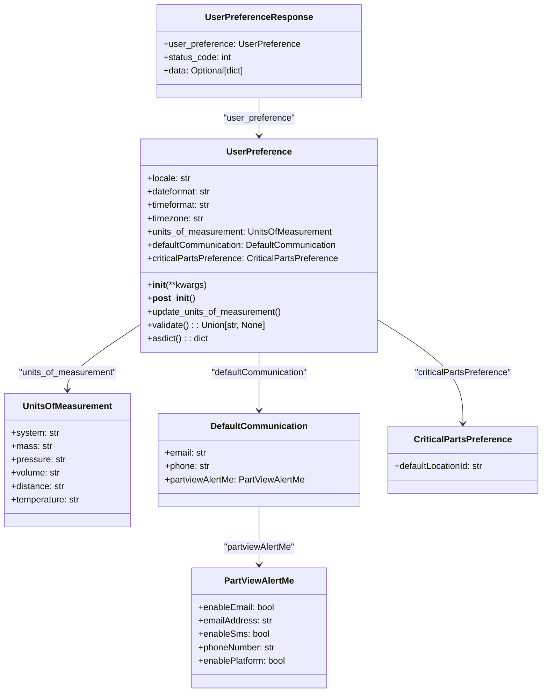

# Diagram: common/iam_service/iam_service/v1/lambdas/user_preference/models.py

> Auto-generated by Obscura crawlers

## Mermaid

### SVG

<svg id="container" width="974.1484375" xmlns="http://www.w3.org/2000/svg" class="classDiagram" height="1246" viewBox="0 0 974.1484375 1246" role="graphics-document document" aria-roledescription="class"><g><defs><marker id="container_class-aggregationStart" class="marker aggregation class" refX="18" refY="7" markerWidth="190" markerHeight="240" orient="auto"><path d="M 18,7 L9,13 L1,7 L9,1 Z"></path></marker></defs><defs><marker id="container_class-aggregationEnd" class="marker aggregation class" refX="1" refY="7" markerWidth="20" markerHeight="28" orient="auto"><path d="M 18,7 L9,13 L1,7 L9,1 Z"></path></marker></defs><defs><marker id="container_class-extensionStart" class="marker extension class" refX="18" refY="7" markerWidth="190" markerHeight="240" orient="auto"><path d="M 1,7 L18,13 V 1 Z"></path></marker></defs><defs><marker id="container_class-extensionEnd" class="marker extension class" refX="1" refY="7" markerWidth="20" markerHeight="28" orient="auto"><path d="M 1,1 V 13 L18,7 Z"></path></marker></defs><defs><marker id="container_class-compositionStart" class="marker composition class" refX="18" refY="7" markerWidth="190" markerHeight="240" orient="auto"><path d="M 18,7 L9,13 L1,7 L9,1 Z"></path></marker></defs><defs><marker id="container_class-compositionEnd" class="marker composition class" refX="1" refY="7" markerWidth="20" markerHeight="28" orient="auto"><path d="M 18,7 L9,13 L1,7 L9,1 Z"></path></marker></defs><defs><marker id="container_class-dependencyStart" class="marker dependency class" refX="6" refY="7" markerWidth="190" markerHeight="240" orient="auto"><path d="M 5,7 L9,13 L1,7 L9,1 Z"></path></marker></defs><defs><marker id="container_class-dependencyEnd" class="marker dependency class" refX="13" refY="7" markerWidth="20" markerHeight="28" orient="auto"><path d="M 18,7 L9,13 L14,7 L9,1 Z"></path></marker></defs><defs><marker id="container_class-lollipopStart" class="marker lollipop class" refX="13" refY="7" markerWidth="190" markerHeight="240" orient="auto"><circle stroke="black" fill="transparent" cx="7" cy="7" r="6"></circle></marker></defs><defs><marker id="container_class-lollipopEnd" class="marker lollipop class" refX="1" refY="7" markerWidth="190" markerHeight="240" orient="auto"><circle stroke="black" fill="transparent" cx="7" cy="7" r="6"></circle></marker></defs><g class="root"><g class="clusters"></g><g class="edgePaths"><path d="M250.535,584.743L228.986,599.119C207.438,613.495,164.34,642.248,142.791,661.79C121.242,681.333,121.242,691.667,121.242,696.833L121.242,702" id="id_UserPreference_UnitsOfMeasurement_1" class="edge-thickness-normal edge-pattern-solid relation" style=";;;" data-edge="true" data-et="edge" data-id="id_UserPreference_UnitsOfMeasurement_1" data-points="W3sieCI6MjUwLjUzNTE1NjI1LCJ5Ijo1ODQuNzQyODkwMzA3NjAzfSx7IngiOjEyMS4yNDIxODc1LCJ5Ijo2NzF9LHsieCI6MTIxLjI0MjE4NzUsInkiOjcwOH1d" marker-end="url(#container_class-dependencyEnd)"></path><path d="M464.496,634L464.496,640.167C464.496,646.333,464.496,658.667,464.496,676C464.496,693.333,464.496,715.667,464.496,726.833L464.496,738" id="id_UserPreference_DefaultCommunication_2" class="edge-thickness-normal edge-pattern-solid relation" style=";;;" data-edge="true" data-et="edge" data-id="id_UserPreference_DefaultCommunication_2" data-points="W3sieCI6NDY0LjQ5NjA5Mzc1LCJ5Ijo2MzR9LHsieCI6NDY0LjQ5NjA5Mzc1LCJ5Ijo2NzF9LHsieCI6NDY0LjQ5NjA5Mzc1LCJ5Ijo3NDR9XQ==" marker-end="url(#container_class-dependencyEnd)"></path><path d="M464.496,912L464.496,924.167C464.496,936.333,464.496,960.667,464.496,978C464.496,995.333,464.496,1005.667,464.496,1010.833L464.496,1016" id="id_DefaultCommunication_PartViewAlertMe_3" class="edge-thickness-normal edge-pattern-solid relation" style=";;;" data-edge="true" data-et="edge" data-id="id_DefaultCommunication_PartViewAlertMe_3" data-points="W3sieCI6NDY0LjQ5NjA5Mzc1LCJ5Ijo5MTJ9LHsieCI6NDY0LjQ5NjA5Mzc1LCJ5Ijo5ODV9LHsieCI6NDY0LjQ5NjA5Mzc1LCJ5IjoxMDIyfV0=" marker-end="url(#container_class-dependencyEnd)"></path><path d="M678.457,575.933L703.769,591.778C729.081,607.622,779.704,639.311,805.016,670.322C830.328,701.333,830.328,731.667,830.328,746.833L830.328,762" id="id_UserPreference_CriticalPartsPreference_4" class="edge-thickness-normal edge-pattern-solid relation" style=";;;" data-edge="true" data-et="edge" data-id="id_UserPreference_CriticalPartsPreference_4" data-points="W3sieCI6Njc4LjQ1NzAzMTI1LCJ5Ijo1NzUuOTMzMjAwMjE3ODI1NH0seyJ4Ijo4MzAuMzI4MTI1LCJ5Ijo2NzF9LHsieCI6ODMwLjMyODEyNSwieSI6NzY4fV0=" marker-end="url(#container_class-dependencyEnd)"></path><path d="M464.496,176L464.496,182.167C464.496,188.333,464.496,200.667,464.496,212C464.496,223.333,464.496,233.667,464.496,238.833L464.496,244" id="id_UserPreferenceResponse_UserPreference_5" class="edge-thickness-normal edge-pattern-solid relation" style=";;;" data-edge="true" data-et="edge" data-id="id_UserPreferenceResponse_UserPreference_5" data-points="W3sieCI6NDY0LjQ5NjA5Mzc1LCJ5IjoxNzZ9LHsieCI6NDY0LjQ5NjA5Mzc1LCJ5IjoyMTN9LHsieCI6NDY0LjQ5NjA5Mzc1LCJ5IjoyNTB9XQ==" marker-end="url(#container_class-dependencyEnd)"></path></g><g class="edgeLabels"><g class="edgeLabel" transform="translate(121.2421875, 671)"><g class="label" data-id="id_UserPreference_UnitsOfMeasurement_1" transform="translate(-89.40625, -12)"><foreignObject width="178.8125" height="24">

"units_of_measurement"

</foreignObject></g></g><g class="edgeLabel" transform="translate(464.49609375, 671)"><g class="label" data-id="id_UserPreference_DefaultCommunication_2" transform="translate(-89.0234375, -12)"><foreignObject width="178.046875" height="24">

"defaultCommunication"

</foreignObject></g></g><g class="edgeLabel" transform="translate(464.49609375, 985)"><g class="label" data-id="id_DefaultCommunication_PartViewAlertMe_3" transform="translate(-65.3671875, -12)"><foreignObject width="130.734375" height="24">

"partviewAlertMe"

</foreignObject></g></g><g class="edgeLabel" transform="translate(830.328125, 671)"><g class="label" data-id="id_UserPreference_CriticalPartsPreference_4" transform="translate(-87.75, -12)"><foreignObject width="175.5" height="24">

"criticalPartsPreference"

</foreignObject></g></g><g class="edgeLabel" transform="translate(464.49609375, 213)"><g class="label" data-id="id_UserPreferenceResponse_UserPreference_5" transform="translate(-64.5078125, -12)"><foreignObject width="129.015625" height="24">

"user_preference"

</foreignObject></g></g></g><g class="nodes"><g class="node default" id="classId-UnitsOfMeasurement-0" transform="translate(121.2421875, 828)"><g class="basic label-container"><path d="M-113.2421875 -120 L113.2421875 -120 L113.2421875 120 L-113.2421875 120" stroke="none" stroke-width="0" fill="#ECECFF" style=""></path><path d="M-113.2421875 -120 C-40.524116926270764 -120, 32.19395364745847 -120, 113.2421875 -120 M-113.2421875 -120 C-42.799301789884424 -120, 27.64358392023115 -120, 113.2421875 -120 M113.2421875 -120 C113.2421875 -41.48074022110593, 113.2421875 37.038519557788135, 113.2421875 120 M113.2421875 -120 C113.2421875 -68.707126329331, 113.2421875 -17.414252658661994, 113.2421875 120 M113.2421875 120 C34.50034499179091 120, -44.24149751641818 120, -113.2421875 120 M113.2421875 120 C60.813146071285004 120, 8.384104642570009 120, -113.2421875 120 M-113.2421875 120 C-113.2421875 44.0566389117939, -113.2421875 -31.886722176412206, -113.2421875 -120 M-113.2421875 120 C-113.2421875 39.663384400203, -113.2421875 -40.673231199594, -113.2421875 -120" stroke="#9370DB" stroke-width="1.3" fill="none" stroke-dasharray="0 0" style=""></path></g><g class="annotation-group text" transform="translate(0, -96)"></g><g class="label-group text" transform="translate(-77.046875, -96)"><g class="label" style="font-weight: bolder" transform="translate(0,-12)"><foreignObject width="154.09375" height="24">

UnitsOfMeasurement

</foreignObject></g></g><g class="members-group text" transform="translate(-101.2421875, -48)"><g class="label" style="" transform="translate(0,-12)"><foreignObject width="85.890625" height="24">

+system: str

</foreignObject></g><g class="label" style="" transform="translate(0,12)"><foreignObject width="72.53125" height="24">

+mass: str

</foreignObject></g><g class="label" style="" transform="translate(0,36)"><foreignObject width="97.921875" height="24">

+pressure: str

</foreignObject></g><g class="label" style="" transform="translate(0,60)"><foreignObject width="88.921875" height="24">

+volume: str

</foreignObject></g><g class="label" style="" transform="translate(0,84)"><foreignObject width="96.84375" height="24">

+distance: str

</foreignObject></g><g class="label" style="" transform="translate(0,108)"><foreignObject width="125.4375" height="24">

+temperature: str

</foreignObject></g></g><g class="methods-group text" transform="translate(-101.2421875, 120)"></g><g class="divider" style=""><path d="M-113.2421875 -72 C-24.86388303089616 -72, 63.51442143820768 -72, 113.2421875 -72 M-113.2421875 -72 C-39.57218666920532 -72, 34.097814161589355 -72, 113.2421875 -72" stroke="#9370DB" stroke-width="1.3" fill="none" stroke-dasharray="0 0" style=""></path></g><g class="divider" style=""><path d="M-113.2421875 96 C-30.15042106131378 96, 52.94134537737244 96, 113.2421875 96 M-113.2421875 96 C-61.40400286117269 96, -9.565818222345385 96, 113.2421875 96" stroke="#9370DB" stroke-width="1.3" fill="none" stroke-dasharray="0 0" style=""></path></g></g><g class="node default" id="classId-PartViewAlertMe-1" transform="translate(464.49609375, 1130)"><g class="basic label-container"><path d="M-123 -108 L123 -108 L123 108 L-123 108" stroke="none" stroke-width="0" fill="#ECECFF" style=""></path><path d="M-123 -108 C-58.08830524765436 -108, 6.823389504691278 -108, 123 -108 M-123 -108 C-65.4297355894984 -108, -7.859471178996813 -108, 123 -108 M123 -108 C123 -54.92186074076604, 123 -1.8437214815320857, 123 108 M123 -108 C123 -42.219016581021634, 123 23.56196683795673, 123 108 M123 108 C25.08363319852171 108, -72.83273360295658 108, -123 108 M123 108 C38.451279257115175 108, -46.09744148576965 108, -123 108 M-123 108 C-123 40.48850735665033, -123 -27.02298528669934, -123 -108 M-123 108 C-123 56.707831194127316, -123 5.415662388254631, -123 -108" stroke="#9370DB" stroke-width="1.3" fill="none" stroke-dasharray="0 0" style=""></path></g><g class="annotation-group text" transform="translate(0, -84)"></g><g class="label-group text" transform="translate(-60.765625, -84)"><g class="label" style="font-weight: bolder" transform="translate(0,-12)"><foreignObject width="121.53125" height="24">

PartViewAlertMe

</foreignObject></g></g><g class="members-group text" transform="translate(-111, -36)"><g class="label" style="" transform="translate(0,-12)"><foreignObject width="138.765625" height="24">

+enableEmail: bool

</foreignObject></g><g class="label" style="" transform="translate(0,12)"><foreignObject width="133.34375" height="24">

+emailAddress: str

</foreignObject></g><g class="label" style="" transform="translate(0,36)"><foreignObject width="128.484375" height="24">

+enableSms: bool

</foreignObject></g><g class="label" style="" transform="translate(0,60)"><foreignObject width="140.328125" height="24">

+phoneNumber: str

</foreignObject></g><g class="label" style="" transform="translate(0,84)"><foreignObject width="161.234375" height="24">

+enablePlatform: bool

</foreignObject></g></g><g class="methods-group text" transform="translate(-111, 108)"></g><g class="divider" style=""><path d="M-123 -60 C-51.62996362869495 -60, 19.740072742610096 -60, 123 -60 M-123 -60 C-28.10235960045533 -60, 66.79528079908934 -60, 123 -60" stroke="#9370DB" stroke-width="1.3" fill="none" stroke-dasharray="0 0" style=""></path></g><g class="divider" style=""><path d="M-123 84 C-52.93280930080422 84, 17.134381398391554 84, 123 84 M-123 84 C-56.25001405963934 84, 10.499971880721318 84, 123 84" stroke="#9370DB" stroke-width="1.3" fill="none" stroke-dasharray="0 0" style=""></path></g></g><g class="node default" id="classId-DefaultCommunication-2" transform="translate(464.49609375, 828)"><g class="basic label-container"><path d="M-180.01171875 -84 L180.01171875 -84 L180.01171875 84 L-180.01171875 84" stroke="none" stroke-width="0" fill="#ECECFF" style=""></path><path d="M-180.01171875 -84 C-66.99564920754277 -84, 46.02042033491446 -84, 180.01171875 -84 M-180.01171875 -84 C-52.29049810828083 -84, 75.43072253343834 -84, 180.01171875 -84 M180.01171875 -84 C180.01171875 -19.655828486943648, 180.01171875 44.688343026112705, 180.01171875 84 M180.01171875 -84 C180.01171875 -36.550158037353214, 180.01171875 10.899683925293573, 180.01171875 84 M180.01171875 84 C89.13420560139683 84, -1.7433075472063422 84, -180.01171875 84 M180.01171875 84 C41.96428530573942 84, -96.08314813852115 84, -180.01171875 84 M-180.01171875 84 C-180.01171875 42.94073978196605, -180.01171875 1.8814795639321034, -180.01171875 -84 M-180.01171875 84 C-180.01171875 42.95138258099362, -180.01171875 1.902765161987233, -180.01171875 -84" stroke="#9370DB" stroke-width="1.3" fill="none" stroke-dasharray="0 0" style=""></path></g><g class="annotation-group text" transform="translate(0, -60)"></g><g class="label-group text" transform="translate(-83.5546875, -60)"><g class="label" style="font-weight: bolder" transform="translate(0,-12)"><foreignObject width="167.109375" height="24">

DefaultCommunication

</foreignObject></g></g><g class="members-group text" transform="translate(-168.01171875, -12)"><g class="label" style="" transform="translate(0,-12)"><foreignObject width="75.984375" height="24">

+email: str

</foreignObject></g><g class="label" style="" transform="translate(0,12)"><foreignObject width="81.8125" height="24">

+phone: str

</foreignObject></g><g class="label" style="" transform="translate(0,36)"><foreignObject width="252.46875" height="24">

+partviewAlertMe: PartViewAlertMe

</foreignObject></g></g><g class="methods-group text" transform="translate(-168.01171875, 84)"></g><g class="divider" style=""><path d="M-180.01171875 -36 C-55.18753094154623 -36, 69.63665686690754 -36, 180.01171875 -36 M-180.01171875 -36 C-51.966021131387606 -36, 76.07967648722479 -36, 180.01171875 -36" stroke="#9370DB" stroke-width="1.3" fill="none" stroke-dasharray="0 0" style=""></path></g><g class="divider" style=""><path d="M-180.01171875 60 C-48.0593952965682 60, 83.8929281568636 60, 180.01171875 60 M-180.01171875 60 C-99.27792426217398 60, -18.544129774347965 60, 180.01171875 60" stroke="#9370DB" stroke-width="1.3" fill="none" stroke-dasharray="0 0" style=""></path></g></g><g class="node default" id="classId-CriticalPartsPreference-3" transform="translate(830.328125, 828)"><g class="basic label-container"><path d="M-135.8203125 -60 L135.8203125 -60 L135.8203125 60 L-135.8203125 60" stroke="none" stroke-width="0" fill="#ECECFF" style=""></path><path d="M-135.8203125 -60 C-79.64141433633876 -60, -23.462516172677496 -60, 135.8203125 -60 M-135.8203125 -60 C-52.77149837366004 -60, 30.277315752679925 -60, 135.8203125 -60 M135.8203125 -60 C135.8203125 -15.054723253473995, 135.8203125 29.89055349305201, 135.8203125 60 M135.8203125 -60 C135.8203125 -32.57578856279137, 135.8203125 -5.151577125582733, 135.8203125 60 M135.8203125 60 C60.459573246322435 60, -14.90116600735513 60, -135.8203125 60 M135.8203125 60 C40.82496304340556 60, -54.17038641318888 60, -135.8203125 60 M-135.8203125 60 C-135.8203125 17.0333712679503, -135.8203125 -25.9332574640994, -135.8203125 -60 M-135.8203125 60 C-135.8203125 17.205198078177197, -135.8203125 -25.589603843645605, -135.8203125 -60" stroke="#9370DB" stroke-width="1.3" fill="none" stroke-dasharray="0 0" style=""></path></g><g class="annotation-group text" transform="translate(0, -36)"></g><g class="label-group text" transform="translate(-83.96875, -36)"><g class="label" style="font-weight: bolder" transform="translate(0,-12)"><foreignObject width="167.9375" height="24">

CriticalPartsPreference

</foreignObject></g></g><g class="members-group text" transform="translate(-123.8203125, 12)"><g class="label" style="" transform="translate(0,-12)"><foreignObject width="163.671875" height="24">

+defaultLocationId: str

</foreignObject></g></g><g class="methods-group text" transform="translate(-123.8203125, 60)"></g><g class="divider" style=""><path d="M-135.8203125 -12 C-80.9149856528719 -12, -26.00965880574381 -12, 135.8203125 -12 M-135.8203125 -12 C-45.5571310774056 -12, 44.7060503451888 -12, 135.8203125 -12" stroke="#9370DB" stroke-width="1.3" fill="none" stroke-dasharray="0 0" style=""></path></g><g class="divider" style=""><path d="M-135.8203125 36 C-50.505127863905045 36, 34.81005677218991 36, 135.8203125 36 M-135.8203125 36 C-42.41667979250185 36, 50.986952914996294 36, 135.8203125 36" stroke="#9370DB" stroke-width="1.3" fill="none" stroke-dasharray="0 0" style=""></path></g></g><g class="node default" id="classId-UserPreference-4" transform="translate(464.49609375, 442)"><g class="basic label-container"><path d="M-213.9609375 -192 L213.9609375 -192 L213.9609375 192 L-213.9609375 192" stroke="none" stroke-width="0" fill="#ECECFF" style=""></path><path d="M-213.9609375 -192 C-101.0752343628202 -192, 11.810468774359606 -192, 213.9609375 -192 M-213.9609375 -192 C-78.26365231881371 -192, 57.433632862372576 -192, 213.9609375 -192 M213.9609375 -192 C213.9609375 -73.7806551568471, 213.9609375 44.43868968630579, 213.9609375 192 M213.9609375 -192 C213.9609375 -73.20363221267328, 213.9609375 45.59273557465343, 213.9609375 192 M213.9609375 192 C44.525052852197035 192, -124.91083179560593 192, -213.9609375 192 M213.9609375 192 C108.56439145390698 192, 3.1678454078139566 192, -213.9609375 192 M-213.9609375 192 C-213.9609375 113.95857145150421, -213.9609375 35.917142903008425, -213.9609375 -192 M-213.9609375 192 C-213.9609375 50.015091562303326, -213.9609375 -91.96981687539335, -213.9609375 -192" stroke="#9370DB" stroke-width="1.3" fill="none" stroke-dasharray="0 0" style=""></path></g><g class="annotation-group text" transform="translate(0, -168)"></g><g class="label-group text" transform="translate(-55.953125, -168)"><g class="label" style="font-weight: bolder" transform="translate(0,-12)"><foreignObject width="111.90625" height="24">

UserPreference

</foreignObject></g></g><g class="members-group text" transform="translate(-201.9609375, -120)"><g class="label" style="" transform="translate(0,-12)"><foreignObject width="78.8125" height="24">

+locale: str

</foreignObject></g><g class="label" style="" transform="translate(0,12)"><foreignObject width="117" height="24">

+dateformat: str

</foreignObject></g><g class="label" style="" transform="translate(0,36)"><foreignObject width="117.109375" height="24">

+timeformat: str

</foreignObject></g><g class="label" style="" transform="translate(0,60)"><foreignObject width="102.34375" height="24">

+timezone: str

</foreignObject></g><g class="label" style="" transform="translate(0,84)"><foreignObject width="334.90625" height="24">

+units_of_measurement: UnitsOfMeasurement

</foreignObject></g><g class="label" style="" transform="translate(0,108)"><foreignObject width="347.96875" height="24">

+defaultCommunication: DefaultCommunication

</foreignObject></g><g class="label" style="" transform="translate(0,132)"><foreignObject width="343.21875" height="24">

+criticalPartsPreference: CriticalPartsPreference

</foreignObject></g></g><g class="methods-group text" transform="translate(-201.9609375, 72)"><g class="label" style="" transform="translate(0,-12)"><foreignObject width="106.703125" height="24">

+<strong>init</strong>(**kwargs)

</foreignObject></g><g class="label" style="" transform="translate(0,12)"><foreignObject width="83.921875" height="24">

+<strong>post_init</strong>()

</foreignObject></g><g class="label" style="" transform="translate(0,36)"><foreignObject width="243.65625" height="24">

+update_units_of_measurement()

</foreignObject></g><g class="label" style="" transform="translate(0,60)"><foreignObject width="214.578125" height="24">

+validate() : : Union[str, None]

</foreignObject></g><g class="label" style="" transform="translate(0,84)"><foreignObject width="109.546875" height="24">

+asdict() : : dict

</foreignObject></g></g><g class="divider" style=""><path d="M-213.9609375 -144 C-57.94451796788283 -144, 98.07190156423434 -144, 213.9609375 -144 M-213.9609375 -144 C-127.98792584389224 -144, -42.014914187784484 -144, 213.9609375 -144" stroke="#9370DB" stroke-width="1.3" fill="none" stroke-dasharray="0 0" style=""></path></g><g class="divider" style=""><path d="M-213.9609375 48 C-100.8525477061164 48, 12.255842087767206 48, 213.9609375 48 M-213.9609375 48 C-127.02504399862715 48, -40.08915049725431 48, 213.9609375 48" stroke="#9370DB" stroke-width="1.3" fill="none" stroke-dasharray="0 0" style=""></path></g></g><g class="node default" id="classId-UserPreferenceResponse-5" transform="translate(464.49609375, 92)"><g class="basic label-container"><path d="M-178.94921875 -84 L178.94921875 -84 L178.94921875 84 L-178.94921875 84" stroke="none" stroke-width="0" fill="#ECECFF" style=""></path><path d="M-178.94921875 -84 C-77.18606618441943 -84, 24.577086381161138 -84, 178.94921875 -84 M-178.94921875 -84 C-92.1842381692188 -84, -5.419257588437603 -84, 178.94921875 -84 M178.94921875 -84 C178.94921875 -49.45620156643741, 178.94921875 -14.912403132874815, 178.94921875 84 M178.94921875 -84 C178.94921875 -50.15111663534141, 178.94921875 -16.30223327068282, 178.94921875 84 M178.94921875 84 C90.66749312221668 84, 2.3857674944333667 84, -178.94921875 84 M178.94921875 84 C99.34543943830226 84, 19.74166012660453 84, -178.94921875 84 M-178.94921875 84 C-178.94921875 36.7102100119283, -178.94921875 -10.579579976143407, -178.94921875 -84 M-178.94921875 84 C-178.94921875 49.63917446709515, -178.94921875 15.278348934190305, -178.94921875 -84" stroke="#9370DB" stroke-width="1.3" fill="none" stroke-dasharray="0 0" style=""></path></g><g class="annotation-group text" transform="translate(0, -60)"></g><g class="label-group text" transform="translate(-91.3984375, -60)"><g class="label" style="font-weight: bolder" transform="translate(0,-12)"><foreignObject width="182.796875" height="24">

UserPreferenceResponse

</foreignObject></g></g><g class="members-group text" transform="translate(-166.94921875, -12)"><g class="label" style="" transform="translate(0,-12)"><foreignObject width="242.5" height="24">

+user_preference: UserPreference

</foreignObject></g><g class="label" style="" transform="translate(0,12)"><foreignObject width="122.78125" height="24">

+status_code: int

</foreignObject></g><g class="label" style="" transform="translate(0,36)"><foreignObject width="149.5" height="24">

+data: Optional[dict]

</foreignObject></g></g><g class="methods-group text" transform="translate(-166.94921875, 84)"></g><g class="divider" style=""><path d="M-178.94921875 -36 C-59.28734883005146 -36, 60.37452108989709 -36, 178.94921875 -36 M-178.94921875 -36 C-64.7075145940889 -36, 49.53418956182219 -36, 178.94921875 -36" stroke="#9370DB" stroke-width="1.3" fill="none" stroke-dasharray="0 0" style=""></path></g><g class="divider" style=""><path d="M-178.94921875 60 C-90.83005955409566 60, -2.71090035819131 60, 178.94921875 60 M-178.94921875 60 C-45.569216946572766 60, 87.81078485685447 60, 178.94921875 60" stroke="#9370DB" stroke-width="1.3" fill="none" stroke-dasharray="0 0" style=""></path></g></g></g></g></g></svg>
