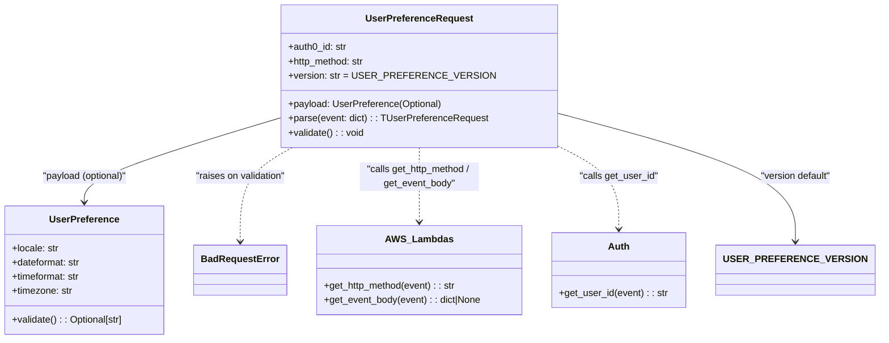

# Diagram: common/iam_service/iam_service/v1/lambdas/user_preference/request.py

> Auto-generated by Obscura crawlers

## Mermaid

### SVG

<svg id="container" width="1431.1640625" xmlns="http://www.w3.org/2000/svg" class="classDiagram" height="570" viewBox="0 0 1431.1640625 570" role="graphics-document document" aria-roledescription="class"><g><defs><marker id="container_class-aggregationStart" class="marker aggregation class" refX="18" refY="7" markerWidth="190" markerHeight="240" orient="auto"><path d="M 18,7 L9,13 L1,7 L9,1 Z"></path></marker></defs><defs><marker id="container_class-aggregationEnd" class="marker aggregation class" refX="1" refY="7" markerWidth="20" markerHeight="28" orient="auto"><path d="M 18,7 L9,13 L1,7 L9,1 Z"></path></marker></defs><defs><marker id="container_class-extensionStart" class="marker extension class" refX="18" refY="7" markerWidth="190" markerHeight="240" orient="auto"><path d="M 1,7 L18,13 V 1 Z"></path></marker></defs><defs><marker id="container_class-extensionEnd" class="marker extension class" refX="1" refY="7" markerWidth="20" markerHeight="28" orient="auto"><path d="M 1,1 V 13 L18,7 Z"></path></marker></defs><defs><marker id="container_class-compositionStart" class="marker composition class" refX="18" refY="7" markerWidth="190" markerHeight="240" orient="auto"><path d="M 18,7 L9,13 L1,7 L9,1 Z"></path></marker></defs><defs><marker id="container_class-compositionEnd" class="marker composition class" refX="1" refY="7" markerWidth="20" markerHeight="28" orient="auto"><path d="M 18,7 L9,13 L1,7 L9,1 Z"></path></marker></defs><defs><marker id="container_class-dependencyStart" class="marker dependency class" refX="6" refY="7" markerWidth="190" markerHeight="240" orient="auto"><path d="M 5,7 L9,13 L1,7 L9,1 Z"></path></marker></defs><defs><marker id="container_class-dependencyEnd" class="marker dependency class" refX="13" refY="7" markerWidth="20" markerHeight="28" orient="auto"><path d="M 18,7 L9,13 L14,7 L9,1 Z"></path></marker></defs><defs><marker id="container_class-lollipopStart" class="marker lollipop class" refX="13" refY="7" markerWidth="190" markerHeight="240" orient="auto"><circle stroke="black" fill="transparent" cx="7" cy="7" r="6"></circle></marker></defs><defs><marker id="container_class-lollipopEnd" class="marker lollipop class" refX="1" refY="7" markerWidth="190" markerHeight="240" orient="auto"><circle stroke="black" fill="transparent" cx="7" cy="7" r="6"></circle></marker></defs><g class="root"><g class="clusters"></g><g class="edgePaths"><path d="M476.34,195.329L420.699,212.274C365.057,229.219,253.775,263.11,198.133,287.222C142.492,311.333,142.492,325.667,142.492,332.833L142.492,340" id="id_UserPreferenceRequest_UserPreference_1" class="edge-thickness-normal edge-pattern-solid relation" style=";;;" data-edge="true" data-et="edge" data-id="id_UserPreferenceRequest_UserPreference_1" data-points="W3sieCI6NDc2LjMzOTg0Mzc1LCJ5IjoxOTUuMzI5MDA0MjM3NTg2NH0seyJ4IjoxNDIuNDkyMTg3NSwieSI6Mjk3fSx7IngiOjE0Mi40OTIxODc1LCJ5IjozNDZ9XQ==" marker-end="url(#container_class-dependencyEnd)"></path><path d="M487.133,248L472.822,256.167C458.511,264.333,429.888,280.667,415.577,307C401.266,333.333,401.266,369.667,401.266,387.833L401.266,406" id="id_UserPreferenceRequest_BadRequestError_2" class="edge-thickness-normal edge-pattern-dashed relation" style=";;;" data-edge="true" data-et="edge" data-id="id_UserPreferenceRequest_BadRequestError_2" data-points="W3sieCI6NDg3LjEzMzQxMzQ2MTUzODQ1LCJ5IjoyNDh9LHsieCI6NDAxLjI2NTYyNSwieSI6Mjk3fSx7IngiOjQwMS4yNjU2MjUsInkiOjQxMn1d" marker-end="url(#container_class-dependencyEnd)"></path><path d="M697.422,248L697.422,256.167C697.422,264.333,697.422,280.667,697.422,301.5C697.422,322.333,697.422,347.667,697.422,360.333L697.422,373" id="id_UserPreferenceRequest_AWS_Lambdas_3" class="edge-thickness-normal edge-pattern-dashed relation" style=";;;" data-edge="true" data-et="edge" data-id="id_UserPreferenceRequest_AWS_Lambdas_3" data-points="W3sieCI6Njk3LjQyMTg3NSwieSI6MjQ4fSx7IngiOjY5Ny40MjE4NzUsInkiOjI5N30seyJ4Ijo2OTcuNDIxODc1LCJ5IjozNzl9XQ==" marker-end="url(#container_class-dependencyEnd)"></path><path d="M918.504,240.094L937.21,249.579C955.915,259.063,993.327,278.031,1012.033,302.182C1030.738,326.333,1030.738,355.667,1030.738,370.333L1030.738,385" id="id_UserPreferenceRequest_Auth_4" class="edge-thickness-normal edge-pattern-dashed relation" style=";;;" data-edge="true" data-et="edge" data-id="id_UserPreferenceRequest_Auth_4" data-points="W3sieCI6OTE4LjUwMzkwNjI1LCJ5IjoyNDAuMDk0MjgyMTMxNTE0NX0seyJ4IjoxMDMwLjczODI4MTI1LCJ5IjoyOTd9LHsieCI6MTAzMC43MzgyODEyNSwieSI6MzkxfV0=" marker-end="url(#container_class-dependencyEnd)"></path><path d="M918.504,189.226L983.365,207.188C1048.227,225.15,1177.949,261.075,1242.811,297.204C1307.672,333.333,1307.672,369.667,1307.672,387.833L1307.672,406" id="id_UserPreferenceRequest_USER_PREFERENCE_VERSION_5" class="edge-thickness-normal edge-pattern-solid relation" style=";;;" data-edge="true" data-et="edge" data-id="id_UserPreferenceRequest_USER_PREFERENCE_VERSION_5" data-points="W3sieCI6OTE4LjUwMzkwNjI1LCJ5IjoxODkuMjI1NTAzMTIzNzE5OH0seyJ4IjoxMzA3LjY3MTg3NSwieSI6Mjk3fSx7IngiOjEzMDcuNjcxODc1LCJ5Ijo0MTJ9XQ==" marker-end="url(#container_class-dependencyEnd)"></path></g><g class="edgeLabels"><g class="edgeLabel" transform="translate(142.4921875, 297)"><g class="label" data-id="id_UserPreferenceRequest_UserPreference_1" transform="translate(-73.109375, -12)"><foreignObject width="146.21875" height="24">

"payload (optional)"

</foreignObject></g></g><g class="edgeLabel" transform="translate(401.265625, 297)"><g class="label" data-id="id_UserPreferenceRequest_BadRequestError_2" transform="translate(-77.4765625, -12)"><foreignObject width="154.953125" height="24">

"raises on validation"

</foreignObject></g></g><g class="edgeLabel" transform="translate(697.421875, 297)"><g class="label" data-id="id_UserPreferenceRequest_AWS_Lambdas_3" transform="translate(-100, -24)"><foreignObject width="200" height="48">

"calls get_http_method / get_event_body"

</foreignObject></g></g><g class="edgeLabel" transform="translate(1030.73828125, 297)"><g class="label" data-id="id_UserPreferenceRequest_Auth_4" transform="translate(-66.546875, -12)"><foreignObject width="133.09375" height="24">

"calls get_user_id"

</foreignObject></g></g><g class="edgeLabel" transform="translate(1307.671875, 297)"><g class="label" data-id="id_UserPreferenceRequest_USER_PREFERENCE_VERSION_5" transform="translate(-60.859375, -12)"><foreignObject width="121.71875" height="24">

"version default"

</foreignObject></g></g></g><g class="nodes"><g class="node default" id="classId-UserPreferenceRequest-0" transform="translate(697.421875, 128)"><g class="basic label-container"><path d="M-221.08203125 -120 L221.08203125 -120 L221.08203125 120 L-221.08203125 120" stroke="none" stroke-width="0" fill="#ECECFF" style=""></path><path d="M-221.08203125 -120 C-71.79532851195765 -120, 77.4913742260847 -120, 221.08203125 -120 M-221.08203125 -120 C-60.83733238484987 -120, 99.40736648030025 -120, 221.08203125 -120 M221.08203125 -120 C221.08203125 -39.74723957326124, 221.08203125 40.50552085347752, 221.08203125 120 M221.08203125 -120 C221.08203125 -31.489374786433387, 221.08203125 57.021250427133225, 221.08203125 120 M221.08203125 120 C130.1383541046709 120, 39.19467695934182 120, -221.08203125 120 M221.08203125 120 C112.16782052296449 120, 3.2536097959289805 120, -221.08203125 120 M-221.08203125 120 C-221.08203125 51.48539079078628, -221.08203125 -17.029218418427433, -221.08203125 -120 M-221.08203125 120 C-221.08203125 32.228767222088635, -221.08203125 -55.54246555582273, -221.08203125 -120" stroke="#9370DB" stroke-width="1.3" fill="none" stroke-dasharray="0 0" style=""></path></g><g class="annotation-group text" transform="translate(0, -96)"></g><g class="label-group text" transform="translate(-85.9296875, -96)"><g class="label" style="font-weight: bolder" transform="translate(0,-12)"><foreignObject width="171.859375" height="24">

UserPreferenceRequest

</foreignObject></g></g><g class="members-group text" transform="translate(-209.08203125, -48)"><g class="label" style="" transform="translate(0,-12)"><foreignObject width="99.265625" height="24">

+auth0_id: str

</foreignObject></g><g class="label" style="" transform="translate(0,12)"><foreignObject width="130.421875" height="24">

+http_method: str

</foreignObject></g><g class="label" style="" transform="translate(0,36)"><foreignObject width="311.375" height="24">

+version: str = USER_PREFERENCE_VERSION

</foreignObject></g></g><g class="methods-group text" transform="translate(-209.08203125, 48)"><g class="label" style="" transform="translate(0,-12)"><foreignObject width="257.03125" height="24">

+payload: UserPreference(Optional)

</foreignObject></g><g class="label" style="" transform="translate(0,12)"><foreignObject width="332.234375" height="24">

+parse(event: dict) : : TUserPreferenceRequest

</foreignObject></g><g class="label" style="" transform="translate(0,36)"><foreignObject width="127.71875" height="24">

+validate() : : void

</foreignObject></g></g><g class="divider" style=""><path d="M-221.08203125 -72 C-51.449626549041085 -72, 118.18277815191783 -72, 221.08203125 -72 M-221.08203125 -72 C-86.97395591270688 -72, 47.13411942458623 -72, 221.08203125 -72" stroke="#9370DB" stroke-width="1.3" fill="none" stroke-dasharray="0 0" style=""></path></g><g class="divider" style=""><path d="M-221.08203125 24 C-60.58731020495779 24, 99.90741084008442 24, 221.08203125 24 M-221.08203125 24 C-124.01246363615721 24, -26.942896022314414 24, 221.08203125 24" stroke="#9370DB" stroke-width="1.3" fill="none" stroke-dasharray="0 0" style=""></path></g></g><g class="node default" id="classId-UserPreference-1" transform="translate(142.4921875, 454)"><g class="basic label-container"><path d="M-134.4921875 -108 L134.4921875 -108 L134.4921875 108 L-134.4921875 108" stroke="none" stroke-width="0" fill="#ECECFF" style=""></path><path d="M-134.4921875 -108 C-45.80007615254826 -108, 42.892035194903485 -108, 134.4921875 -108 M-134.4921875 -108 C-78.56057607296745 -108, -22.628964645934914 -108, 134.4921875 -108 M134.4921875 -108 C134.4921875 -51.836769235598574, 134.4921875 4.326461528802852, 134.4921875 108 M134.4921875 -108 C134.4921875 -64.23953808720272, 134.4921875 -20.479076174405435, 134.4921875 108 M134.4921875 108 C62.460040069760936 108, -9.572107360478128 108, -134.4921875 108 M134.4921875 108 C29.08842710621292 108, -76.31533328757416 108, -134.4921875 108 M-134.4921875 108 C-134.4921875 45.65873672729242, -134.4921875 -16.682526545415158, -134.4921875 -108 M-134.4921875 108 C-134.4921875 37.84926088483648, -134.4921875 -32.301478230327035, -134.4921875 -108" stroke="#9370DB" stroke-width="1.3" fill="none" stroke-dasharray="0 0" style=""></path></g><g class="annotation-group text" transform="translate(0, -84)"></g><g class="label-group text" transform="translate(-55.953125, -84)"><g class="label" style="font-weight: bolder" transform="translate(0,-12)"><foreignObject width="111.90625" height="24">

UserPreference

</foreignObject></g></g><g class="members-group text" transform="translate(-122.4921875, -36)"><g class="label" style="" transform="translate(0,-12)"><foreignObject width="78.8125" height="24">

+locale: str

</foreignObject></g><g class="label" style="" transform="translate(0,12)"><foreignObject width="117" height="24">

+dateformat: str

</foreignObject></g><g class="label" style="" transform="translate(0,36)"><foreignObject width="117.109375" height="24">

+timeformat: str

</foreignObject></g><g class="label" style="" transform="translate(0,60)"><foreignObject width="102.34375" height="24">

+timezone: str

</foreignObject></g></g><g class="methods-group text" transform="translate(-122.4921875, 84)"><g class="label" style="" transform="translate(0,-12)"><foreignObject width="189.03125" height="24">

+validate() : : Optional[str]

</foreignObject></g></g><g class="divider" style=""><path d="M-134.4921875 -60 C-44.73383615735308 -60, 45.024515185293836 -60, 134.4921875 -60 M-134.4921875 -60 C-74.99656207780812 -60, -15.500936655616243 -60, 134.4921875 -60" stroke="#9370DB" stroke-width="1.3" fill="none" stroke-dasharray="0 0" style=""></path></g><g class="divider" style=""><path d="M-134.4921875 60 C-77.66424360158527 60, -20.83629970317054 60, 134.4921875 60 M-134.4921875 60 C-47.03323129101115 60, 40.4257249179777 60, 134.4921875 60" stroke="#9370DB" stroke-width="1.3" fill="none" stroke-dasharray="0 0" style=""></path></g></g><g class="node default" id="classId-BadRequestError-2" transform="translate(401.265625, 454)"><g class="basic label-container"><path d="M-74.28125 -42 L74.28125 -42 L74.28125 42 L-74.28125 42" stroke="none" stroke-width="0" fill="#ECECFF" style=""></path><path d="M-74.28125 -42 C-18.98284481124977 -42, 36.31556037750046 -42, 74.28125 -42 M-74.28125 -42 C-28.21769745280647 -42, 17.845855094387062 -42, 74.28125 -42 M74.28125 -42 C74.28125 -13.740421707734527, 74.28125 14.519156584530947, 74.28125 42 M74.28125 -42 C74.28125 -12.414998090175121, 74.28125 17.170003819649757, 74.28125 42 M74.28125 42 C24.62932691534442 42, -25.022596169311157 42, -74.28125 42 M74.28125 42 C26.97534881295907 42, -20.33055237408186 42, -74.28125 42 M-74.28125 42 C-74.28125 13.041101868889449, -74.28125 -15.917796262221103, -74.28125 -42 M-74.28125 42 C-74.28125 17.69420418998757, -74.28125 -6.611591620024861, -74.28125 -42" stroke="#9370DB" stroke-width="1.3" fill="none" stroke-dasharray="0 0" style=""></path></g><g class="annotation-group text" transform="translate(0, -18)"></g><g class="label-group text" transform="translate(-62.28125, -18)"><g class="label" style="font-weight: bolder" transform="translate(0,-12)"><foreignObject width="124.5625" height="24">

BadRequestError

</foreignObject></g></g><g class="members-group text" transform="translate(-62.28125, 30)"></g><g class="methods-group text" transform="translate(-62.28125, 60)"></g><g class="divider" style=""><path d="M-74.28125 6 C-29.79950232375934 6, 14.682245352481317 6, 74.28125 6 M-74.28125 6 C-36.8981135297521 6, 0.48502294049579575 6, 74.28125 6" stroke="#9370DB" stroke-width="1.3" fill="none" stroke-dasharray="0 0" style=""></path></g><g class="divider" style=""><path d="M-74.28125 24 C-38.59747537979753 24, -2.9137007595950593 24, 74.28125 24 M-74.28125 24 C-19.101011616553222 24, 36.079226766893555 24, 74.28125 24" stroke="#9370DB" stroke-width="1.3" fill="none" stroke-dasharray="0 0" style=""></path></g></g><g class="node default" id="classId-AWS_Lambdas-3" transform="translate(697.421875, 454)"><g class="basic label-container"><path d="M-171.875 -75 L171.875 -75 L171.875 75 L-171.875 75" stroke="none" stroke-width="0" fill="#ECECFF" style=""></path><path d="M-171.875 -75 C-82.83685882501021 -75, 6.201282349979579 -75, 171.875 -75 M-171.875 -75 C-43.548775810454515 -75, 84.77744837909097 -75, 171.875 -75 M171.875 -75 C171.875 -27.425485218691954, 171.875 20.149029562616093, 171.875 75 M171.875 -75 C171.875 -44.36231434058611, 171.875 -13.724628681172227, 171.875 75 M171.875 75 C44.497569394025646 75, -82.87986121194871 75, -171.875 75 M171.875 75 C101.63890756226094 75, 31.40281512452188 75, -171.875 75 M-171.875 75 C-171.875 18.92692941122943, -171.875 -37.14614117754114, -171.875 -75 M-171.875 75 C-171.875 32.4383146824549, -171.875 -10.123370635090197, -171.875 -75" stroke="#9370DB" stroke-width="1.3" fill="none" stroke-dasharray="0 0" style=""></path></g><g class="annotation-group text" transform="translate(0, -51)"></g><g class="label-group text" transform="translate(-52.828125, -51)"><g class="label" style="font-weight: bolder" transform="translate(0,-12)"><foreignObject width="105.65625" height="24">

AWS_Lambdas

</foreignObject></g></g><g class="members-group text" transform="translate(-159.875, -3)"></g><g class="methods-group text" transform="translate(-159.875, 27)"><g class="label" style="" transform="translate(0,-12)"><foreignObject width="224.328125" height="24">

+get_http_method(event) : : str

</foreignObject></g><g class="label" style="" transform="translate(0,12)"><foreignObject width="266.921875" height="24">

+get_event_body(event) : : dict|None

</foreignObject></g></g><g class="divider" style=""><path d="M-171.875 -27 C-36.32493547455954 -27, 99.22512905088092 -27, 171.875 -27 M-171.875 -27 C-88.00171366242307 -27, -4.128427324846143 -27, 171.875 -27" stroke="#9370DB" stroke-width="1.3" fill="none" stroke-dasharray="0 0" style=""></path></g><g class="divider" style=""><path d="M-171.875 -3 C-92.66388758616294 -3, -13.452775172325886 -3, 171.875 -3 M-171.875 -3 C-99.23566799836499 -3, -26.596335996729977 -3, 171.875 -3" stroke="#9370DB" stroke-width="1.3" fill="none" stroke-dasharray="0 0" style=""></path></g></g><g class="node default" id="classId-Auth-4" transform="translate(1030.73828125, 454)"><g class="basic label-container"><path d="M-111.44140625 -63 L111.44140625 -63 L111.44140625 63 L-111.44140625 63" stroke="none" stroke-width="0" fill="#ECECFF" style=""></path><path d="M-111.44140625 -63 C-58.16347070211884 -63, -4.885535154237687 -63, 111.44140625 -63 M-111.44140625 -63 C-26.963684650801 -63, 57.514036948398 -63, 111.44140625 -63 M111.44140625 -63 C111.44140625 -32.14309240226397, 111.44140625 -1.2861848045279345, 111.44140625 63 M111.44140625 -63 C111.44140625 -13.909660197097004, 111.44140625 35.18067960580599, 111.44140625 63 M111.44140625 63 C56.16314570594172 63, 0.8848851618834459 63, -111.44140625 63 M111.44140625 63 C31.909702490287486 63, -47.62200126942503 63, -111.44140625 63 M-111.44140625 63 C-111.44140625 13.642466365541615, -111.44140625 -35.71506726891677, -111.44140625 -63 M-111.44140625 63 C-111.44140625 14.10654324855976, -111.44140625 -34.78691350288048, -111.44140625 -63" stroke="#9370DB" stroke-width="1.3" fill="none" stroke-dasharray="0 0" style=""></path></g><g class="annotation-group text" transform="translate(0, -39)"></g><g class="label-group text" transform="translate(-17.0078125, -39)"><g class="label" style="font-weight: bolder" transform="translate(0,-12)"><foreignObject width="34.015625" height="24">

Auth

</foreignObject></g></g><g class="members-group text" transform="translate(-99.44140625, 9)"></g><g class="methods-group text" transform="translate(-99.44140625, 39)"><g class="label" style="" transform="translate(0,-12)"><foreignObject width="181.875" height="24">

+get_user_id(event) : : str

</foreignObject></g></g><g class="divider" style=""><path d="M-111.44140625 -15 C-65.37620418787711 -15, -19.31100212575423 -15, 111.44140625 -15 M-111.44140625 -15 C-28.356226024800847 -15, 54.728954200398306 -15, 111.44140625 -15" stroke="#9370DB" stroke-width="1.3" fill="none" stroke-dasharray="0 0" style=""></path></g><g class="divider" style=""><path d="M-111.44140625 9 C-57.618910819538215 9, -3.7964153890764294 9, 111.44140625 9 M-111.44140625 9 C-32.389320480919054 9, 46.66276528816189 9, 111.44140625 9" stroke="#9370DB" stroke-width="1.3" fill="none" stroke-dasharray="0 0" style=""></path></g></g><g class="node default" id="classId-USER_PREFERENCE_VERSION-5" transform="translate(1307.671875, 454)"><g class="basic label-container"><path d="M-115.4921875 -42 L115.4921875 -42 L115.4921875 42 L-115.4921875 42" stroke="none" stroke-width="0" fill="#ECECFF" style=""></path><path d="M-115.4921875 -42 C-42.83631786965735 -42, 29.8195517606853 -42, 115.4921875 -42 M-115.4921875 -42 C-46.711277529478394 -42, 22.06963244104321 -42, 115.4921875 -42 M115.4921875 -42 C115.4921875 -9.11049147706457, 115.4921875 23.77901704587086, 115.4921875 42 M115.4921875 -42 C115.4921875 -22.63339182657188, 115.4921875 -3.2667836531437615, 115.4921875 42 M115.4921875 42 C40.37543872140817 42, -34.741310057183654 42, -115.4921875 42 M115.4921875 42 C63.08707219482369 42, 10.681956889647381 42, -115.4921875 42 M-115.4921875 42 C-115.4921875 20.366198081849124, -115.4921875 -1.2676038363017526, -115.4921875 -42 M-115.4921875 42 C-115.4921875 10.827658918063985, -115.4921875 -20.34468216387203, -115.4921875 -42" stroke="#9370DB" stroke-width="1.3" fill="none" stroke-dasharray="0 0" style=""></path></g><g class="annotation-group text" transform="translate(0, -18)"></g><g class="label-group text" transform="translate(-103.4921875, -18)"><g class="label" style="font-weight: bolder" transform="translate(0,-12)"><foreignObject width="206.984375" height="24">

USER_PREFERENCE_VERSION

</foreignObject></g></g><g class="members-group text" transform="translate(-103.4921875, 30)"></g><g class="methods-group text" transform="translate(-103.4921875, 60)"></g><g class="divider" style=""><path d="M-115.4921875 6 C-64.72505063423964 6, -13.957913768479287 6, 115.4921875 6 M-115.4921875 6 C-31.062301712057902 6, 53.367584075884196 6, 115.4921875 6" stroke="#9370DB" stroke-width="1.3" fill="none" stroke-dasharray="0 0" style=""></path></g><g class="divider" style=""><path d="M-115.4921875 24 C-34.99570014811684 24, 45.50078720376632 24, 115.4921875 24 M-115.4921875 24 C-51.62218111580963 24, 12.247825268380737 24, 115.4921875 24" stroke="#9370DB" stroke-width="1.3" fill="none" stroke-dasharray="0 0" style=""></path></g></g></g></g></g></svg>
