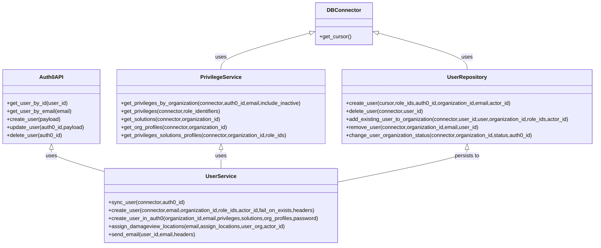

# Diagram: common/iam_service/iam_service/v1/lambdas/users/__init__.py


> Auto-generated by Obscura crawlers

## Diagram 1



### SVG

<svg id="container" width="1792.3046875" xmlns="http://www.w3.org/2000/svg" class="classDiagram" height="734" viewBox="0 0 1792.3046875 734" role="graphics-document document" aria-roledescription="class"><style>#container{font-family:"trebuchet ms",verdana,arial,sans-serif;font-size:16px;fill:#333;}@keyframes edge-animation-frame{from{stroke-dashoffset:0;}}@keyframes dash{to{stroke-dashoffset:0;}}#container .edge-animation-slow{stroke-dasharray:9,5!important;stroke-dashoffset:900;animation:dash 50s linear infinite;stroke-linecap:round;}#container .edge-animation-fast{stroke-dasharray:9,5!important;stroke-dashoffset:900;animation:dash 20s linear infinite;stroke-linecap:round;}#container .error-icon{fill:#552222;}#container .error-text{fill:#552222;stroke:#552222;}#container .edge-thickness-normal{stroke-width:1px;}#container .edge-thickness-thick{stroke-width:3.5px;}#container .edge-pattern-solid{stroke-dasharray:0;}#container .edge-thickness-invisible{stroke-width:0;fill:none;}#container .edge-pattern-dashed{stroke-dasharray:3;}#container .edge-pattern-dotted{stroke-dasharray:2;}#container .marker{fill:#333333;stroke:#333333;}#container .marker.cross{stroke:#333333;}#container svg{font-family:"trebuchet ms",verdana,arial,sans-serif;font-size:16px;}#container p{margin:0;}#container g.classGroup text{fill:#9370DB;stroke:none;font-family:"trebuchet ms",verdana,arial,sans-serif;font-size:10px;}#container g.classGroup text .title{font-weight:bolder;}#container .nodeLabel,#container .edgeLabel{color:#131300;}#container .edgeLabel .label rect{fill:#ECECFF;}#container .label text{fill:#131300;}#container .labelBkg{background:#ECECFF;}#container .edgeLabel .label span{background:#ECECFF;}#container .classTitle{font-weight:bolder;}#container .node rect,#container .node circle,#container .node ellipse,#container .node polygon,#container .node path{fill:#ECECFF;stroke:#9370DB;stroke-width:1px;}#container .divider{stroke:#9370DB;stroke-width:1;}#container g.clickable{cursor:pointer;}#container g.classGroup rect{fill:#ECECFF;stroke:#9370DB;}#container g.classGroup line{stroke:#9370DB;stroke-width:1;}#container .classLabel .box{stroke:none;stroke-width:0;fill:#ECECFF;opacity:0.5;}#container .classLabel .label{fill:#9370DB;font-size:10px;}#container .relation{stroke:#333333;stroke-width:1;fill:none;}#container .dashed-line{stroke-dasharray:3;}#container .dotted-line{stroke-dasharray:1 2;}#container #compositionStart,#container .composition{fill:#333333!important;stroke:#333333!important;stroke-width:1;}#container #compositionEnd,#container .composition{fill:#333333!important;stroke:#333333!important;stroke-width:1;}#container #dependencyStart,#container .dependency{fill:#333333!important;stroke:#333333!important;stroke-width:1;}#container #dependencyStart,#container .dependency{fill:#333333!important;stroke:#333333!important;stroke-width:1;}#container #extensionStart,#container .extension{fill:transparent!important;stroke:#333333!important;stroke-width:1;}#container #extensionEnd,#container .extension{fill:transparent!important;stroke:#333333!important;stroke-width:1;}#container #aggregationStart,#container .aggregation{fill:transparent!important;stroke:#333333!important;stroke-width:1;}#container #aggregationEnd,#container .aggregation{fill:transparent!important;stroke:#333333!important;stroke-width:1;}#container #lollipopStart,#container .lollipop{fill:#ECECFF!important;stroke:#333333!important;stroke-width:1;}#container #lollipopEnd,#container .lollipop{fill:#ECECFF!important;stroke:#333333!important;stroke-width:1;}#container .edgeTerminals{font-size:11px;line-height:initial;}#container .classTitleText{text-anchor:middle;font-size:18px;fill:#333;}#container .label-icon{display:inline-block;height:1em;overflow:visible;vertical-align:-0.125em;}#container .node .label-icon path{fill:currentColor;stroke:revert;stroke-width:revert;}#container :root{--mermaid-font-family:"trebuchet ms",verdana,arial,sans-serif;}</style><g><defs><marker id="container_class-aggregationStart" class="marker aggregation class" refX="18" refY="7" markerWidth="190" markerHeight="240" orient="auto"><path d="M 18,7 L9,13 L1,7 L9,1 Z"></path></marker></defs><defs><marker id="container_class-aggregationEnd" class="marker aggregation class" refX="1" refY="7" markerWidth="20" markerHeight="28" orient="auto"><path d="M 18,7 L9,13 L1,7 L9,1 Z"></path></marker></defs><defs><marker id="container_class-extensionStart" class="marker extension class" refX="18" refY="7" markerWidth="190" markerHeight="240" orient="auto"><path d="M 1,7 L18,13 V 1 Z"></path></marker></defs><defs><marker id="container_class-extensionEnd" class="marker extension class" refX="1" refY="7" markerWidth="20" markerHeight="28" orient="auto"><path d="M 1,1 V 13 L18,7 Z"></path></marker></defs><defs><marker id="container_class-compositionStart" class="marker composition class" refX="18" refY="7" markerWidth="190" markerHeight="240" orient="auto"><path d="M 18,7 L9,13 L1,7 L9,1 Z"></path></marker></defs><defs><marker id="container_class-compositionEnd" class="marker composition class" refX="1" refY="7" markerWidth="20" markerHeight="28" orient="auto"><path d="M 18,7 L9,13 L1,7 L9,1 Z"></path></marker></defs><defs><marker id="container_class-dependencyStart" class="marker dependency class" refX="6" refY="7" markerWidth="190" markerHeight="240" orient="auto"><path d="M 5,7 L9,13 L1,7 L9,1 Z"></path></marker></defs><defs><marker id="container_class-dependencyEnd" class="marker dependency class" refX="13" refY="7" markerWidth="20" markerHeight="28" orient="auto"><path d="M 18,7 L9,13 L14,7 L9,1 Z"></path></marker></defs><defs><marker id="container_class-lollipopStart" class="marker lollipop class" refX="13" refY="7" markerWidth="190" markerHeight="240" orient="auto"><circle stroke="black" fill="transparent" cx="7" cy="7" r="6"></circle></marker></defs><defs><marker id="container_class-lollipopEnd" class="marker lollipop class" refX="1" refY="7" markerWidth="190" markerHeight="240" orient="auto"><circle stroke="black" fill="transparent" cx="7" cy="7" r="6"></circle></marker></defs><g class="root"><g class="clusters"></g><g class="edgePaths"><path d="M154.109,447.25L154.109,450.542C154.109,453.833,154.109,460.417,180.602,471.37C207.095,482.323,260.081,497.646,286.574,505.307L313.066,512.969" id="id_Auth0API_UserService_1" class="edge-thickness-normal edge-pattern-solid relation" style=";;;" data-edge="true" data-et="edge" data-id="id_Auth0API_UserService_1" data-points="W3sieCI6MTU0LjEwOTM3NSwieSI6NDMwfSx7IngiOjE1NC4xMDkzNzUsInkiOjQ2N30seyJ4IjozMTMuMDY2NDA2MjUsInkiOjUxMi45Njg4NTgyODk5NTM3fV0=" marker-start="url(#container_class-extensionStart)"></path><path d="M937.147,97.887L891.936,110.073C846.726,122.258,756.304,146.629,711.094,164.981C665.883,183.333,665.883,195.667,665.883,201.833L665.883,208" id="id_DBConnector_PrivilegeService_2" class="edge-thickness-normal edge-pattern-solid relation" style=";;;" data-edge="true" data-et="edge" data-id="id_DBConnector_PrivilegeService_2" data-points="W3sieCI6OTUzLjgwMjczNDM3NSwieSI6OTMuMzk4MDQ1OTM1MjYxMDh9LHsieCI6NjY1Ljg4MjgxMjUsInkiOjE3MX0seyJ4Ijo2NjUuODgyODEyNSwieSI6MjA4fV0=" marker-start="url(#container_class-extensionStart)"></path><path d="M1136.661,97.887L1181.872,110.073C1227.083,122.258,1317.504,146.629,1362.715,164.981C1407.926,183.333,1407.926,195.667,1407.926,201.833L1407.926,208" id="id_DBConnector_UserRepository_3" class="edge-thickness-normal edge-pattern-solid relation" style=";;;" data-edge="true" data-et="edge" data-id="id_DBConnector_UserRepository_3" data-points="W3sieCI6MTEyMC4wMDU4NTkzNzUsInkiOjkzLjM5ODA0NTkzNTI2MTA4fSx7IngiOjE0MDcuOTI1NzgxMjUsInkiOjE3MX0seyJ4IjoxNDA3LjkyNTc4MTI1LCJ5IjoyMDh9XQ==" marker-start="url(#container_class-extensionStart)"></path><path d="M665.883,447.25L665.883,450.542C665.883,453.833,665.883,460.417,665.883,469.875C665.883,479.333,665.883,491.667,665.883,497.833L665.883,504" id="id_PrivilegeService_UserService_4" class="edge-thickness-normal edge-pattern-solid relation" style=";;;" data-edge="true" data-et="edge" data-id="id_PrivilegeService_UserService_4" data-points="W3sieCI6NjY1Ljg4MjgxMjUsInkiOjQzMH0seyJ4Ijo2NjUuODgyODEyNSwieSI6NDY3fSx7IngiOjY2NS44ODI4MTI1LCJ5Ijo1MDR9XQ==" marker-start="url(#container_class-extensionStart)"></path><path d="M1407.926,447.25L1407.926,450.542C1407.926,453.833,1407.926,460.417,1343.055,476.647C1278.184,492.877,1148.441,518.754,1083.57,531.692L1018.699,544.631" id="id_UserRepository_UserService_5" class="edge-thickness-normal edge-pattern-solid relation" style=";;;" data-edge="true" data-et="edge" data-id="id_UserRepository_UserService_5" data-points="W3sieCI6MTQwNy45MjU3ODEyNSwieSI6NDMwfSx7IngiOjE0MDcuOTI1NzgxMjUsInkiOjQ2N30seyJ4IjoxMDE4LjY5OTIxODc1LCJ5Ijo1NDQuNjMwOTkxMjk4MzA1NX1d" marker-start="url(#container_class-extensionStart)"></path></g><g class="edgeLabels"><g class="edgeLabel" transform="translate(154.109375, 467)"><g class="label" data-id="id_Auth0API_UserService_1" transform="translate(-16.4921875, -12)"><foreignObject width="32.984375" height="24"><div xmlns="http://www.w3.org/1999/xhtml" class="labelBkg" style="display: table-cell; white-space: nowrap; line-height: 1.5; max-width: 200px; text-align: center;"><span class="edgeLabel"><p>uses</p></span></div></foreignObject></g></g><g class="edgeLabel" transform="translate(665.8828125, 171)"><g class="label" data-id="id_DBConnector_PrivilegeService_2" transform="translate(-16.4921875, -12)"><foreignObject width="32.984375" height="24"><div xmlns="http://www.w3.org/1999/xhtml" class="labelBkg" style="display: table-cell; white-space: nowrap; line-height: 1.5; max-width: 200px; text-align: center;"><span class="edgeLabel"><p>uses</p></span></div></foreignObject></g></g><g class="edgeLabel" transform="translate(1407.92578125, 171)"><g class="label" data-id="id_DBConnector_UserRepository_3" transform="translate(-16.4921875, -12)"><foreignObject width="32.984375" height="24"><div xmlns="http://www.w3.org/1999/xhtml" class="labelBkg" style="display: table-cell; white-space: nowrap; line-height: 1.5; max-width: 200px; text-align: center;"><span class="edgeLabel"><p>uses</p></span></div></foreignObject></g></g><g class="edgeLabel" transform="translate(665.8828125, 467)"><g class="label" data-id="id_PrivilegeService_UserService_4" transform="translate(-16.4921875, -12)"><foreignObject width="32.984375" height="24"><div xmlns="http://www.w3.org/1999/xhtml" class="labelBkg" style="display: table-cell; white-space: nowrap; line-height: 1.5; max-width: 200px; text-align: center;"><span class="edgeLabel"><p>uses</p></span></div></foreignObject></g></g><g class="edgeLabel" transform="translate(1407.92578125, 467)"><g class="label" data-id="id_UserRepository_UserService_5" transform="translate(-37.9921875, -12)"><foreignObject width="75.984375" height="24"><div xmlns="http://www.w3.org/1999/xhtml" class="labelBkg" style="display: table-cell; white-space: nowrap; line-height: 1.5; max-width: 200px; text-align: center;"><span class="edgeLabel"><p>persists to</p></span></div></foreignObject></g></g></g><g class="nodes"><g class="node default" id="classId-Auth0API-0" transform="translate(154.109375, 319)"><g class="basic label-container"><path d="M-146.109375 -111 L146.109375 -111 L146.109375 111 L-146.109375 111" stroke="none" stroke-width="0" fill="#ECECFF" style=""></path><path d="M-146.109375 -111 C-31.883370339274435 -111, 82.34263432145113 -111, 146.109375 -111 M-146.109375 -111 C-85.64849001051451 -111, -25.187605021029015 -111, 146.109375 -111 M146.109375 -111 C146.109375 -59.68158192801096, 146.109375 -8.363163856021913, 146.109375 111 M146.109375 -111 C146.109375 -22.20601542271632, 146.109375 66.58796915456736, 146.109375 111 M146.109375 111 C39.15447712414034 111, -67.80042075171932 111, -146.109375 111 M146.109375 111 C77.90928816445813 111, 9.709201328916265 111, -146.109375 111 M-146.109375 111 C-146.109375 36.422408714174324, -146.109375 -38.15518257165135, -146.109375 -111 M-146.109375 111 C-146.109375 47.336572034550535, -146.109375 -16.32685593089893, -146.109375 -111" stroke="#9370DB" stroke-width="1.3" fill="none" stroke-dasharray="0 0" style=""></path></g><g class="annotation-group text" transform="translate(0, -87)"></g><g class="label-group text" transform="translate(-33.546875, -87)"><g class="label" style="font-weight: bolder" transform="translate(0,-12)"><foreignObject width="67.09375" height="24"><div xmlns="http://www.w3.org/1999/xhtml" style="display: table-cell; white-space: nowrap; line-height: 1.5; max-width: 116px; text-align: center;"><span class="nodeLabel markdown-node-label" style=""><p>Auth0API</p></span></div></foreignObject></g></g><g class="members-group text" transform="translate(-134.109375, -39)"></g><g class="methods-group text" transform="translate(-134.109375, -9)"><g class="label" style="" transform="translate(0,-12)"><foreignObject width="179.671875" height="24"><div xmlns="http://www.w3.org/1999/xhtml" style="display: table-cell; white-space: nowrap; line-height: 1.5; max-width: 237px; text-align: center;"><span class="nodeLabel markdown-node-label" style=""><p>+get_user_by_id(user_id)</p></span></div></foreignObject></g><g class="label" style="" transform="translate(0,12)"><foreignObject width="193.140625" height="24"><div xmlns="http://www.w3.org/1999/xhtml" style="display: table-cell; white-space: nowrap; line-height: 1.5; max-width: 251px; text-align: center;"><span class="nodeLabel markdown-node-label" style=""><p>+get_user_by_email(email)</p></span></div></foreignObject></g><g class="label" style="" transform="translate(0,36)"><foreignObject width="160.328125" height="24"><div xmlns="http://www.w3.org/1999/xhtml" style="display: table-cell; white-space: nowrap; line-height: 1.5; max-width: 218px; text-align: center;"><span class="nodeLabel markdown-node-label" style=""><p>+create_user(payload)</p></span></div></foreignObject></g><g class="label" style="" transform="translate(0,60)"><foreignObject width="234.671875" height="24"><div xmlns="http://www.w3.org/1999/xhtml" style="display: table-cell; white-space: nowrap; line-height: 1.5; max-width: 292px; text-align: center;"><span class="nodeLabel markdown-node-label" style=""><p>+update_user(auth0_id,payload)</p></span></div></foreignObject></g><g class="label" style="" transform="translate(0,84)"><foreignObject width="167.609375" height="24"><div xmlns="http://www.w3.org/1999/xhtml" style="display: table-cell; white-space: nowrap; line-height: 1.5; max-width: 225px; text-align: center;"><span class="nodeLabel markdown-node-label" style=""><p>+delete_user(auth0_id)</p></span></div></foreignObject></g></g><g class="divider" style=""><path d="M-146.109375 -63 C-43.08141516478432 -63, 59.946544670431365 -63, 146.109375 -63 M-146.109375 -63 C-80.37419893912111 -63, -14.63902287824223 -63, 146.109375 -63" stroke="#9370DB" stroke-width="1.3" fill="none" stroke-dasharray="0 0" style=""></path></g><g class="divider" style=""><path d="M-146.109375 -39 C-85.15571491307449 -39, -24.202054826148967 -39, 146.109375 -39 M-146.109375 -39 C-75.2957487537291 -39, -4.4821225074582 -39, 146.109375 -39" stroke="#9370DB" stroke-width="1.3" fill="none" stroke-dasharray="0 0" style=""></path></g></g><g class="node default" id="classId-DBConnector-1" transform="translate(1036.904296875, 71)"><g class="basic label-container"><path d="M-83.1015625 -63 L83.1015625 -63 L83.1015625 63 L-83.1015625 63" stroke="none" stroke-width="0" fill="#ECECFF" style=""></path><path d="M-83.1015625 -63 C-38.08675826333813 -63, 6.928045973323734 -63, 83.1015625 -63 M-83.1015625 -63 C-30.112517659772784 -63, 22.87652718045443 -63, 83.1015625 -63 M83.1015625 -63 C83.1015625 -20.952042562395256, 83.1015625 21.095914875209488, 83.1015625 63 M83.1015625 -63 C83.1015625 -29.293704836806974, 83.1015625 4.412590326386052, 83.1015625 63 M83.1015625 63 C45.212297148655935 63, 7.32303179731187 63, -83.1015625 63 M83.1015625 63 C28.091111178526454 63, -26.919340142947092 63, -83.1015625 63 M-83.1015625 63 C-83.1015625 36.690812241847574, -83.1015625 10.381624483695148, -83.1015625 -63 M-83.1015625 63 C-83.1015625 13.252685400977974, -83.1015625 -36.49462919804405, -83.1015625 -63" stroke="#9370DB" stroke-width="1.3" fill="none" stroke-dasharray="0 0" style=""></path></g><g class="annotation-group text" transform="translate(0, -39)"></g><g class="label-group text" transform="translate(-47.5625, -39)"><g class="label" style="font-weight: bolder" transform="translate(0,-12)"><foreignObject width="95.125" height="24"><div xmlns="http://www.w3.org/1999/xhtml" style="display: table-cell; white-space: nowrap; line-height: 1.5; max-width: 145px; text-align: center;"><span class="nodeLabel markdown-node-label" style=""><p>DBConnector</p></span></div></foreignObject></g></g><g class="members-group text" transform="translate(-71.1015625, 9)"></g><g class="methods-group text" transform="translate(-71.1015625, 39)"><g class="label" style="" transform="translate(0,-12)"><foreignObject width="94.640625" height="24"><div xmlns="http://www.w3.org/1999/xhtml" style="display: table-cell; white-space: nowrap; line-height: 1.5; max-width: 152px; text-align: center;"><span class="nodeLabel markdown-node-label" style=""><p>+get_cursor()</p></span></div></foreignObject></g></g><g class="divider" style=""><path d="M-83.1015625 -15 C-28.41065228576165 -15, 26.2802579284767 -15, 83.1015625 -15 M-83.1015625 -15 C-20.04202329907777 -15, 43.01751590184446 -15, 83.1015625 -15" stroke="#9370DB" stroke-width="1.3" fill="none" stroke-dasharray="0 0" style=""></path></g><g class="divider" style=""><path d="M-83.1015625 9 C-41.60927024360076 9, -0.11697798720152264 9, 83.1015625 9 M-83.1015625 9 C-48.40563310426998 9, -13.709703708539962 9, 83.1015625 9" stroke="#9370DB" stroke-width="1.3" fill="none" stroke-dasharray="0 0" style=""></path></g></g><g class="node default" id="classId-PrivilegeService-2" transform="translate(665.8828125, 319)"><g class="basic label-container"><path d="M-315.6640625 -111 L315.6640625 -111 L315.6640625 111 L-315.6640625 111" stroke="none" stroke-width="0" fill="#ECECFF" style=""></path><path d="M-315.6640625 -111 C-179.6999904004495 -111, -43.735918300899016 -111, 315.6640625 -111 M-315.6640625 -111 C-177.43098546742567 -111, -39.19790843485134 -111, 315.6640625 -111 M315.6640625 -111 C315.6640625 -57.37841786464598, 315.6640625 -3.7568357292919643, 315.6640625 111 M315.6640625 -111 C315.6640625 -36.03601348874821, 315.6640625 38.92797302250358, 315.6640625 111 M315.6640625 111 C152.40537340010528 111, -10.853315699789448 111, -315.6640625 111 M315.6640625 111 C184.4582192096893 111, 53.25237591937861 111, -315.6640625 111 M-315.6640625 111 C-315.6640625 34.570669613674454, -315.6640625 -41.85866077265109, -315.6640625 -111 M-315.6640625 111 C-315.6640625 27.019749422351836, -315.6640625 -56.96050115529633, -315.6640625 -111" stroke="#9370DB" stroke-width="1.3" fill="none" stroke-dasharray="0 0" style=""></path></g><g class="annotation-group text" transform="translate(0, -87)"></g><g class="label-group text" transform="translate(-58.515625, -87)"><g class="label" style="font-weight: bolder" transform="translate(0,-12)"><foreignObject width="117.03125" height="24"><div xmlns="http://www.w3.org/1999/xhtml" style="display: table-cell; white-space: nowrap; line-height: 1.5; max-width: 164px; text-align: center;"><span class="nodeLabel markdown-node-label" style=""><p>PrivilegeService</p></span></div></foreignObject></g></g><g class="members-group text" transform="translate(-303.6640625, -39)"></g><g class="methods-group text" transform="translate(-303.6640625, -9)"><g class="label" style="" transform="translate(0,-12)"><foreignObject width="548.8125" height="24"><div xmlns="http://www.w3.org/1999/xhtml" style="display: table-cell; white-space: nowrap; line-height: 1.5; max-width: 606px; text-align: center;"><span class="nodeLabel markdown-node-label" style=""><p>+get_privileges_by_organization(connector,auth0_id,email,include_inactive)</p></span></div></foreignObject></g><g class="label" style="" transform="translate(0,12)"><foreignObject width="304.96875" height="24"><div xmlns="http://www.w3.org/1999/xhtml" style="display: table-cell; white-space: nowrap; line-height: 1.5; max-width: 362px; text-align: center;"><span class="nodeLabel markdown-node-label" style=""><p>+get_privileges(connector,role_identifiers)</p></span></div></foreignObject></g><g class="label" style="" transform="translate(0,36)"><foreignObject width="304.53125" height="24"><div xmlns="http://www.w3.org/1999/xhtml" style="display: table-cell; white-space: nowrap; line-height: 1.5; max-width: 362px; text-align: center;"><span class="nodeLabel markdown-node-label" style=""><p>+get_solutions(connector,organization_id)</p></span></div></foreignObject></g><g class="label" style="" transform="translate(0,60)"><foreignObject width="323.453125" height="24"><div xmlns="http://www.w3.org/1999/xhtml" style="display: table-cell; white-space: nowrap; line-height: 1.5; max-width: 381px; text-align: center;"><span class="nodeLabel markdown-node-label" style=""><p>+get_org_profiles(connector,organization_id)</p></span></div></foreignObject></g><g class="label" style="" transform="translate(0,84)"><foreignObject width="507" height="24"><div xmlns="http://www.w3.org/1999/xhtml" style="display: table-cell; white-space: nowrap; line-height: 1.5; max-width: 564px; text-align: center;"><span class="nodeLabel markdown-node-label" style=""><p>+get_privileges_solutions_profiles(connector,organization_id,role_ids)</p></span></div></foreignObject></g></g><g class="divider" style=""><path d="M-315.6640625 -63 C-117.78215848390877 -63, 80.09974553218245 -63, 315.6640625 -63 M-315.6640625 -63 C-186.7610964582659 -63, -57.85813041653182 -63, 315.6640625 -63" stroke="#9370DB" stroke-width="1.3" fill="none" stroke-dasharray="0 0" style=""></path></g><g class="divider" style=""><path d="M-315.6640625 -39 C-120.21951360269568 -39, 75.22503529460863 -39, 315.6640625 -39 M-315.6640625 -39 C-76.48797129286646 -39, 162.68811991426708 -39, 315.6640625 -39" stroke="#9370DB" stroke-width="1.3" fill="none" stroke-dasharray="0 0" style=""></path></g></g><g class="node default" id="classId-UserRepository-3" transform="translate(1407.92578125, 319)"><g class="basic label-container"><path d="M-376.37890625 -111 L376.37890625 -111 L376.37890625 111 L-376.37890625 111" stroke="none" stroke-width="0" fill="#ECECFF" style=""></path><path d="M-376.37890625 -111 C-201.80760865646292 -111, -27.236311062925836 -111, 376.37890625 -111 M-376.37890625 -111 C-105.28185375955513 -111, 165.81519873088973 -111, 376.37890625 -111 M376.37890625 -111 C376.37890625 -59.54973622505211, 376.37890625 -8.099472450104216, 376.37890625 111 M376.37890625 -111 C376.37890625 -39.801559303207995, 376.37890625 31.39688139358401, 376.37890625 111 M376.37890625 111 C211.44272730552967 111, 46.506548361059345 111, -376.37890625 111 M376.37890625 111 C220.5943478101216 111, 64.80978937024321 111, -376.37890625 111 M-376.37890625 111 C-376.37890625 62.5670234115245, -376.37890625 14.134046823049005, -376.37890625 -111 M-376.37890625 111 C-376.37890625 58.7885568754572, -376.37890625 6.577113750914407, -376.37890625 -111" stroke="#9370DB" stroke-width="1.3" fill="none" stroke-dasharray="0 0" style=""></path></g><g class="annotation-group text" transform="translate(0, -87)"></g><g class="label-group text" transform="translate(-56.4296875, -87)"><g class="label" style="font-weight: bolder" transform="translate(0,-12)"><foreignObject width="112.859375" height="24"><div xmlns="http://www.w3.org/1999/xhtml" style="display: table-cell; white-space: nowrap; line-height: 1.5; max-width: 161px; text-align: center;"><span class="nodeLabel markdown-node-label" style=""><p>UserRepository</p></span></div></foreignObject></g></g><g class="members-group text" transform="translate(-364.37890625, -39)"></g><g class="methods-group text" transform="translate(-364.37890625, -9)"><g class="label" style="" transform="translate(0,-12)"><foreignObject width="499.53125" height="24"><div xmlns="http://www.w3.org/1999/xhtml" style="display: table-cell; white-space: nowrap; line-height: 1.5; max-width: 557px; text-align: center;"><span class="nodeLabel markdown-node-label" style=""><p>+create_user(cursor,role_ids,auth0_id,organization_id,email,actor_id)</p></span></div></foreignObject></g><g class="label" style="" transform="translate(0,12)"><foreignObject width="231.640625" height="24"><div xmlns="http://www.w3.org/1999/xhtml" style="display: table-cell; white-space: nowrap; line-height: 1.5; max-width: 289px; text-align: center;"><span class="nodeLabel markdown-node-label" style=""><p>+delete_user(connector,user_id)</p></span></div></foreignObject></g><g class="label" style="" transform="translate(0,36)"><foreignObject width="672.328125" height="24"><div xmlns="http://www.w3.org/1999/xhtml" style="display: table-cell; white-space: nowrap; line-height: 1.5; max-width: 730px; text-align: center;"><span class="nodeLabel markdown-node-label" style=""><p>+add_existing_user_to_organization(connector,user_id,user,organization_id,role_ids,actor_id)</p></span></div></foreignObject></g><g class="label" style="" transform="translate(0,60)"><foreignObject width="400.21875" height="24"><div xmlns="http://www.w3.org/1999/xhtml" style="display: table-cell; white-space: nowrap; line-height: 1.5; max-width: 458px; text-align: center;"><span class="nodeLabel markdown-node-label" style=""><p>+remove_user(connector,organization_id,email,user_id)</p></span></div></foreignObject></g><g class="label" style="" transform="translate(0,84)"><foreignObject width="563.5625" height="24"><div xmlns="http://www.w3.org/1999/xhtml" style="display: table-cell; white-space: nowrap; line-height: 1.5; max-width: 621px; text-align: center;"><span class="nodeLabel markdown-node-label" style=""><p>+change_user_organization_status(connector,organization_id,status,auth0_id)</p></span></div></foreignObject></g></g><g class="divider" style=""><path d="M-376.37890625 -63 C-187.25358305421798 -63, 1.8717401415640325 -63, 376.37890625 -63 M-376.37890625 -63 C-150.1673827866535 -63, 76.04414067669302 -63, 376.37890625 -63" stroke="#9370DB" stroke-width="1.3" fill="none" stroke-dasharray="0 0" style=""></path></g><g class="divider" style=""><path d="M-376.37890625 -39 C-193.7881554865952 -39, -11.197404723190402 -39, 376.37890625 -39 M-376.37890625 -39 C-170.10026290390084 -39, 36.17838044219832 -39, 376.37890625 -39" stroke="#9370DB" stroke-width="1.3" fill="none" stroke-dasharray="0 0" style=""></path></g></g><g class="node default" id="classId-UserService-4" transform="translate(665.8828125, 615)"><g class="basic label-container"><path d="M-352.81640625 -111 L352.81640625 -111 L352.81640625 111 L-352.81640625 111" stroke="none" stroke-width="0" fill="#ECECFF" style=""></path><path d="M-352.81640625 -111 C-148.44345448536222 -111, 55.92949727927555 -111, 352.81640625 -111 M-352.81640625 -111 C-136.46146353812512 -111, 79.89347917374977 -111, 352.81640625 -111 M352.81640625 -111 C352.81640625 -40.82835012630238, 352.81640625 29.343299747395235, 352.81640625 111 M352.81640625 -111 C352.81640625 -23.12697666433391, 352.81640625 64.74604667133218, 352.81640625 111 M352.81640625 111 C201.6310112438047 111, 50.445616237609386 111, -352.81640625 111 M352.81640625 111 C149.61236646113068 111, -53.59167332773865 111, -352.81640625 111 M-352.81640625 111 C-352.81640625 56.88720769527442, -352.81640625 2.774415390548839, -352.81640625 -111 M-352.81640625 111 C-352.81640625 38.34595177739334, -352.81640625 -34.30809644521332, -352.81640625 -111" stroke="#9370DB" stroke-width="1.3" fill="none" stroke-dasharray="0 0" style=""></path></g><g class="annotation-group text" transform="translate(0, -87)"></g><g class="label-group text" transform="translate(-43.3046875, -87)"><g class="label" style="font-weight: bolder" transform="translate(0,-12)"><foreignObject width="86.609375" height="24"><div xmlns="http://www.w3.org/1999/xhtml" style="display: table-cell; white-space: nowrap; line-height: 1.5; max-width: 135px; text-align: center;"><span class="nodeLabel markdown-node-label" style=""><p>UserService</p></span></div></foreignObject></g></g><g class="members-group text" transform="translate(-340.81640625, -39)"></g><g class="methods-group text" transform="translate(-340.81640625, -9)"><g class="label" style="" transform="translate(0,-12)"><foreignObject width="229.5625" height="24"><div xmlns="http://www.w3.org/1999/xhtml" style="display: table-cell; white-space: nowrap; line-height: 1.5; max-width: 287px; text-align: center;"><span class="nodeLabel markdown-node-label" style=""><p>+sync_user(connector,auth0_id)</p></span></div></foreignObject></g><g class="label" style="" transform="translate(0,12)"><foreignObject width="623.78125" height="24"><div xmlns="http://www.w3.org/1999/xhtml" style="display: table-cell; white-space: nowrap; line-height: 1.5; max-width: 681px; text-align: center;"><span class="nodeLabel markdown-node-label" style=""><p>+create_user(connector,email,organization_id,role_ids,actor_id,fail_on_exists,headers)</p></span></div></foreignObject></g><g class="label" style="" transform="translate(0,36)"><foreignObject width="638.328125" height="24"><div xmlns="http://www.w3.org/1999/xhtml" style="display: table-cell; white-space: nowrap; line-height: 1.5; max-width: 696px; text-align: center;"><span class="nodeLabel markdown-node-label" style=""><p>+create_user_in_auth0(organization_id,email,privileges,solutions,org_profiles,password)</p></span></div></foreignObject></g><g class="label" style="" transform="translate(0,60)"><foreignObject width="528.546875" height="24"><div xmlns="http://www.w3.org/1999/xhtml" style="display: table-cell; white-space: nowrap; line-height: 1.5; max-width: 586px; text-align: center;"><span class="nodeLabel markdown-node-label" style=""><p>+assign_damageview_locations(email,assign_locations,user_org,actor_id)</p></span></div></foreignObject></g><g class="label" style="" transform="translate(0,84)"><foreignObject width="260.890625" height="24"><div xmlns="http://www.w3.org/1999/xhtml" style="display: table-cell; white-space: nowrap; line-height: 1.5; max-width: 318px; text-align: center;"><span class="nodeLabel markdown-node-label" style=""><p>+send_email(user_id,email,headers)</p></span></div></foreignObject></g></g><g class="divider" style=""><path d="M-352.81640625 -63 C-154.11694411718227 -63, 44.58251801563546 -63, 352.81640625 -63 M-352.81640625 -63 C-71.15720381855641 -63, 210.50199861288718 -63, 352.81640625 -63" stroke="#9370DB" stroke-width="1.3" fill="none" stroke-dasharray="0 0" style=""></path></g><g class="divider" style=""><path d="M-352.81640625 -39 C-135.1266474460327 -39, 82.56311135793459 -39, 352.81640625 -39 M-352.81640625 -39 C-135.66713220582076 -39, 81.48214183835847 -39, 352.81640625 -39" stroke="#9370DB" stroke-width="1.3" fill="none" stroke-dasharray="0 0" style=""></path></g></g></g></g></g></svg>

## Diagram 2

```mermaid
flowchart TD
    A[Start create_user request] --> B{Find existing user by email}
    B -- exists --> C{User has organization?}
    C -- yes --> D[Raise ConflictError]
    C -- no --> E[Add user to organization via add_existing_user_to_organization]
    E --> F[sync_user(auth0_id)]
    F --> G[Return (auth0_id, user)]
    B -- not exists --> H[resolve privileges, solutions, profiles]
    H --> I[create_user_in_auth0]
    I --> J[create DB user via users_db.create_user]
    J --> K[sync_user(auth0_id)]
    K --> L[send_email(auth0_id,email,headers)]
    L --> G
    I -- 409 conflict --> M[get_auth0_user_by_email(email) and treat as existing]
    M --> J
    G --> Z[End]
```

> SVG rendering failed for this diagram.
