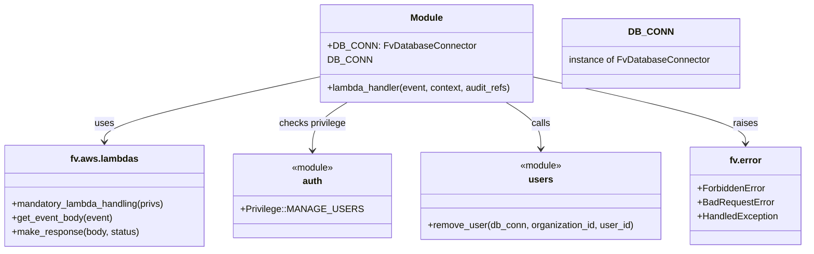

# Diagram: common/iam_service/iam_service/v1/lambdas/users/delete_users.py


> Auto-generated by Obscura crawlers

## Diagram 1



### SVG

<svg id="container" width="1373.171875" xmlns="http://www.w3.org/2000/svg" class="classDiagram" height="432" viewBox="0 0 1373.171875 432" role="graphics-document document" aria-roledescription="class"><style>#container{font-family:"trebuchet ms",verdana,arial,sans-serif;font-size:16px;fill:#333;}@keyframes edge-animation-frame{from{stroke-dashoffset:0;}}@keyframes dash{to{stroke-dashoffset:0;}}#container .edge-animation-slow{stroke-dasharray:9,5!important;stroke-dashoffset:900;animation:dash 50s linear infinite;stroke-linecap:round;}#container .edge-animation-fast{stroke-dasharray:9,5!important;stroke-dashoffset:900;animation:dash 20s linear infinite;stroke-linecap:round;}#container .error-icon{fill:#552222;}#container .error-text{fill:#552222;stroke:#552222;}#container .edge-thickness-normal{stroke-width:1px;}#container .edge-thickness-thick{stroke-width:3.5px;}#container .edge-pattern-solid{stroke-dasharray:0;}#container .edge-thickness-invisible{stroke-width:0;fill:none;}#container .edge-pattern-dashed{stroke-dasharray:3;}#container .edge-pattern-dotted{stroke-dasharray:2;}#container .marker{fill:#333333;stroke:#333333;}#container .marker.cross{stroke:#333333;}#container svg{font-family:"trebuchet ms",verdana,arial,sans-serif;font-size:16px;}#container p{margin:0;}#container g.classGroup text{fill:#9370DB;stroke:none;font-family:"trebuchet ms",verdana,arial,sans-serif;font-size:10px;}#container g.classGroup text .title{font-weight:bolder;}#container .nodeLabel,#container .edgeLabel{color:#131300;}#container .edgeLabel .label rect{fill:#ECECFF;}#container .label text{fill:#131300;}#container .labelBkg{background:#ECECFF;}#container .edgeLabel .label span{background:#ECECFF;}#container .classTitle{font-weight:bolder;}#container .node rect,#container .node circle,#container .node ellipse,#container .node polygon,#container .node path{fill:#ECECFF;stroke:#9370DB;stroke-width:1px;}#container .divider{stroke:#9370DB;stroke-width:1;}#container g.clickable{cursor:pointer;}#container g.classGroup rect{fill:#ECECFF;stroke:#9370DB;}#container g.classGroup line{stroke:#9370DB;stroke-width:1;}#container .classLabel .box{stroke:none;stroke-width:0;fill:#ECECFF;opacity:0.5;}#container .classLabel .label{fill:#9370DB;font-size:10px;}#container .relation{stroke:#333333;stroke-width:1;fill:none;}#container .dashed-line{stroke-dasharray:3;}#container .dotted-line{stroke-dasharray:1 2;}#container #compositionStart,#container .composition{fill:#333333!important;stroke:#333333!important;stroke-width:1;}#container #compositionEnd,#container .composition{fill:#333333!important;stroke:#333333!important;stroke-width:1;}#container #dependencyStart,#container .dependency{fill:#333333!important;stroke:#333333!important;stroke-width:1;}#container #dependencyStart,#container .dependency{fill:#333333!important;stroke:#333333!important;stroke-width:1;}#container #extensionStart,#container .extension{fill:transparent!important;stroke:#333333!important;stroke-width:1;}#container #extensionEnd,#container .extension{fill:transparent!important;stroke:#333333!important;stroke-width:1;}#container #aggregationStart,#container .aggregation{fill:transparent!important;stroke:#333333!important;stroke-width:1;}#container #aggregationEnd,#container .aggregation{fill:transparent!important;stroke:#333333!important;stroke-width:1;}#container #lollipopStart,#container .lollipop{fill:#ECECFF!important;stroke:#333333!important;stroke-width:1;}#container #lollipopEnd,#container .lollipop{fill:#ECECFF!important;stroke:#333333!important;stroke-width:1;}#container .edgeTerminals{font-size:11px;line-height:initial;}#container .classTitleText{text-anchor:middle;font-size:18px;fill:#333;}#container .label-icon{display:inline-block;height:1em;overflow:visible;vertical-align:-0.125em;}#container .node .label-icon path{fill:currentColor;stroke:revert;stroke-width:revert;}#container :root{--mermaid-font-family:"trebuchet ms",verdana,arial,sans-serif;}</style><g><defs><marker id="container_class-aggregationStart" class="marker aggregation class" refX="18" refY="7" markerWidth="190" markerHeight="240" orient="auto"><path d="M 18,7 L9,13 L1,7 L9,1 Z"></path></marker></defs><defs><marker id="container_class-aggregationEnd" class="marker aggregation class" refX="1" refY="7" markerWidth="20" markerHeight="28" orient="auto"><path d="M 18,7 L9,13 L1,7 L9,1 Z"></path></marker></defs><defs><marker id="container_class-extensionStart" class="marker extension class" refX="18" refY="7" markerWidth="190" markerHeight="240" orient="auto"><path d="M 1,7 L18,13 V 1 Z"></path></marker></defs><defs><marker id="container_class-extensionEnd" class="marker extension class" refX="1" refY="7" markerWidth="20" markerHeight="28" orient="auto"><path d="M 1,1 V 13 L18,7 Z"></path></marker></defs><defs><marker id="container_class-compositionStart" class="marker composition class" refX="18" refY="7" markerWidth="190" markerHeight="240" orient="auto"><path d="M 18,7 L9,13 L1,7 L9,1 Z"></path></marker></defs><defs><marker id="container_class-compositionEnd" class="marker composition class" refX="1" refY="7" markerWidth="20" markerHeight="28" orient="auto"><path d="M 18,7 L9,13 L1,7 L9,1 Z"></path></marker></defs><defs><marker id="container_class-dependencyStart" class="marker dependency class" refX="6" refY="7" markerWidth="190" markerHeight="240" orient="auto"><path d="M 5,7 L9,13 L1,7 L9,1 Z"></path></marker></defs><defs><marker id="container_class-dependencyEnd" class="marker dependency class" refX="13" refY="7" markerWidth="20" markerHeight="28" orient="auto"><path d="M 18,7 L9,13 L14,7 L9,1 Z"></path></marker></defs><defs><marker id="container_class-lollipopStart" class="marker lollipop class" refX="13" refY="7" markerWidth="190" markerHeight="240" orient="auto"><circle stroke="black" fill="transparent" cx="7" cy="7" r="6"></circle></marker></defs><defs><marker id="container_class-lollipopEnd" class="marker lollipop class" refX="1" refY="7" markerWidth="190" markerHeight="240" orient="auto"><circle stroke="black" fill="transparent" cx="7" cy="7" r="6"></circle></marker></defs><g class="root"><g class="clusters"></g><g class="edgePaths"><path d="M537.438,133.601L478.148,146.834C418.858,160.068,300.279,186.534,240.989,204.934C181.699,223.333,181.699,233.667,181.699,238.833L181.699,244" id="id_Module_fv.aws.lambdas_1" class="edge-thickness-normal edge-pattern-solid relation" style=";;;" data-edge="true" data-et="edge" data-id="id_Module_fv.aws.lambdas_1" data-points="W3sieCI6NTM3LjQzNzUsInkiOjEzMy42MDEyOTY5NzAxMzM2Nn0seyJ4IjoxODEuNjk5MjE4NzUsInkiOjIxM30seyJ4IjoxODEuNjk5MjE4NzUsInkiOjI1MH1d" marker-end="url(#container_class-dependencyEnd)"></path><path d="M590.422,176L580.629,182.167C570.835,188.333,551.248,200.667,541.454,214.5C531.66,228.333,531.66,243.667,531.66,251.333L531.66,259" id="id_Module_auth_2" class="edge-thickness-normal edge-pattern-solid relation" style=";;;" data-edge="true" data-et="edge" data-id="id_Module_auth_2" data-points="W3sieCI6NTkwLjQyMjI2MjM5NjY5NDIsInkiOjE3Nn0seyJ4Ijo1MzEuNjYwMTU2MjUsInkiOjIxM30seyJ4Ijo1MzEuNjYwMTU2MjUsInkiOjI2NX1d" marker-end="url(#container_class-dependencyEnd)"></path><path d="M857.234,176L867.028,182.167C876.821,188.333,896.409,200.667,906.202,214C915.996,227.333,915.996,241.667,915.996,248.833L915.996,256" id="id_Module_users_3" class="edge-thickness-normal edge-pattern-solid relation" style=";;;" data-edge="true" data-et="edge" data-id="id_Module_users_3" data-points="W3sieCI6ODU3LjIzMzk4NzYwMzMwNTgsInkiOjE3Nn0seyJ4Ijo5MTUuOTk2MDkzNzUsInkiOjIxM30seyJ4Ijo5MTUuOTk2MDkzNzUsInkiOjI2Mn1d" marker-end="url(#container_class-dependencyEnd)"></path><path d="M910.219,133.322L970.119,146.602C1030.02,159.881,1149.82,186.441,1209.721,205.387C1269.621,224.333,1269.621,235.667,1269.621,241.333L1269.621,247" id="id_Module_fv.error_4" class="edge-thickness-normal edge-pattern-solid relation" style=";;;" data-edge="true" data-et="edge" data-id="id_Module_fv.error_4" data-points="W3sieCI6OTEwLjIxODc1LCJ5IjoxMzMuMzIyMDE1NzAyNDk3MDh9LHsieCI6MTI2OS42MjEwOTM3NSwieSI6MjEzfSx7IngiOjEyNjkuNjIxMDkzNzUsInkiOjI1M31d" marker-end="url(#container_class-dependencyEnd)"></path></g><g class="edgeLabels"><g class="edgeLabel" transform="translate(181.69921875, 213)"><g class="label" data-id="id_Module_fv.aws.lambdas_1" transform="translate(-16.4921875, -12)"><foreignObject width="32.984375" height="24"><div xmlns="http://www.w3.org/1999/xhtml" class="labelBkg" style="display: table-cell; white-space: nowrap; line-height: 1.5; max-width: 200px; text-align: center;"><span class="edgeLabel"><p>uses</p></span></div></foreignObject></g></g><g class="edgeLabel" transform="translate(531.66015625, 213)"><g class="label" data-id="id_Module_auth_2" transform="translate(-57.953125, -12)"><foreignObject width="115.90625" height="24"><div xmlns="http://www.w3.org/1999/xhtml" class="labelBkg" style="display: table-cell; white-space: nowrap; line-height: 1.5; max-width: 200px; text-align: center;"><span class="edgeLabel"><p>checks privilege</p></span></div></foreignObject></g></g><g class="edgeLabel" transform="translate(915.99609375, 213)"><g class="label" data-id="id_Module_users_3" transform="translate(-16.4453125, -12)"><foreignObject width="32.890625" height="24"><div xmlns="http://www.w3.org/1999/xhtml" class="labelBkg" style="display: table-cell; white-space: nowrap; line-height: 1.5; max-width: 200px; text-align: center;"><span class="edgeLabel"><p>calls</p></span></div></foreignObject></g></g><g class="edgeLabel" transform="translate(1269.62109375, 213)"><g class="label" data-id="id_Module_fv.error_4" transform="translate(-21.25, -12)"><foreignObject width="42.5" height="24"><div xmlns="http://www.w3.org/1999/xhtml" class="labelBkg" style="display: table-cell; white-space: nowrap; line-height: 1.5; max-width: 200px; text-align: center;"><span class="edgeLabel"><p>raises</p></span></div></foreignObject></g></g></g><g class="nodes"><g class="node default" id="classId-Module-0" transform="translate(723.828125, 92)"><g class="basic label-container"><path d="M-186.390625 -84 L186.390625 -84 L186.390625 84 L-186.390625 84" stroke="none" stroke-width="0" fill="#ECECFF" style=""></path><path d="M-186.390625 -84 C-88.8806971853271 -84, 8.629230629345813 -84, 186.390625 -84 M-186.390625 -84 C-111.71006591452831 -84, -37.02950682905663 -84, 186.390625 -84 M186.390625 -84 C186.390625 -39.59589672914745, 186.390625 4.808206541705104, 186.390625 84 M186.390625 -84 C186.390625 -25.109493681458545, 186.390625 33.78101263708291, 186.390625 84 M186.390625 84 C60.99991035950984 84, -64.39080428098032 84, -186.390625 84 M186.390625 84 C61.30317252479408 84, -63.78427995041184 84, -186.390625 84 M-186.390625 84 C-186.390625 38.30654426012765, -186.390625 -7.386911479744697, -186.390625 -84 M-186.390625 84 C-186.390625 26.30986705858004, -186.390625 -31.38026588283992, -186.390625 -84" stroke="#9370DB" stroke-width="1.3" fill="none" stroke-dasharray="0 0" style=""></path></g><g class="annotation-group text" transform="translate(0, -60)"></g><g class="label-group text" transform="translate(-27.09375, -60)"><g class="label" style="font-weight: bolder" transform="translate(0,-12)"><foreignObject width="54.1875" height="24"><div xmlns="http://www.w3.org/1999/xhtml" style="display: table-cell; white-space: nowrap; line-height: 1.5; max-width: 104px; text-align: center;"><span class="nodeLabel markdown-node-label" style=""><p>Module</p></span></div></foreignObject></g></g><g class="members-group text" transform="translate(-174.390625, -12)"><g class="label" style="" transform="translate(0,-12)"><foreignObject width="241.65625" height="24"><div xmlns="http://www.w3.org/1999/xhtml" style="display: table-cell; white-space: nowrap; line-height: 1.5; max-width: 300px; text-align: center;"><span class="nodeLabel markdown-node-label" style=""><p>+DB_CONN: FvDatabaseConnector</p></span></div></foreignObject></g><g class="label" style="" transform="translate(0,12)"><foreignObject width="68.96875" height="24"><div xmlns="http://www.w3.org/1999/xhtml" style="display: table-cell; white-space: nowrap; line-height: 1.5; max-width: 119px; text-align: center;"><span class="nodeLabel markdown-node-label" style=""><p>DB_CONN</p></span></div></foreignObject></g></g><g class="methods-group text" transform="translate(-174.390625, 60)"><g class="label" style="" transform="translate(0,-12)"><foreignObject width="321.6875" height="24"><div xmlns="http://www.w3.org/1999/xhtml" style="display: table-cell; white-space: nowrap; line-height: 1.5; max-width: 379px; text-align: center;"><span class="nodeLabel markdown-node-label" style=""><p>+lambda_handler(event, context, audit_refs)</p></span></div></foreignObject></g></g><g class="divider" style=""><path d="M-186.390625 -36 C-78.28261371161516 -36, 29.82539757676969 -36, 186.390625 -36 M-186.390625 -36 C-78.71861226804319 -36, 28.953400463913624 -36, 186.390625 -36" stroke="#9370DB" stroke-width="1.3" fill="none" stroke-dasharray="0 0" style=""></path></g><g class="divider" style=""><path d="M-186.390625 36 C-64.57692400755978 36, 57.236776984880436 36, 186.390625 36 M-186.390625 36 C-59.69809874801331 36, 66.99442750397338 36, 186.390625 36" stroke="#9370DB" stroke-width="1.3" fill="none" stroke-dasharray="0 0" style=""></path></g></g><g class="node default" id="classId-fv.aws.lambdas-1" transform="translate(181.69921875, 337)"><g class="basic label-container"><path d="M-173.69921875 -87 L173.69921875 -87 L173.69921875 87 L-173.69921875 87" stroke="none" stroke-width="0" fill="#ECECFF" style=""></path><path d="M-173.69921875 -87 C-43.04658608344198 -87, 87.60604658311604 -87, 173.69921875 -87 M-173.69921875 -87 C-50.1630045475807 -87, 73.3732096548386 -87, 173.69921875 -87 M173.69921875 -87 C173.69921875 -18.172613262029202, 173.69921875 50.654773475941596, 173.69921875 87 M173.69921875 -87 C173.69921875 -28.532242796984576, 173.69921875 29.935514406030848, 173.69921875 87 M173.69921875 87 C61.47972931177 87, -50.73976012646 87, -173.69921875 87 M173.69921875 87 C45.089500756023455 87, -83.52021723795309 87, -173.69921875 87 M-173.69921875 87 C-173.69921875 40.6002094615173, -173.69921875 -5.799581076965396, -173.69921875 -87 M-173.69921875 87 C-173.69921875 44.76642780145049, -173.69921875 2.5328556029009803, -173.69921875 -87" stroke="#9370DB" stroke-width="1.3" fill="none" stroke-dasharray="0 0" style=""></path></g><g class="annotation-group text" transform="translate(0, -63)"></g><g class="label-group text" transform="translate(-55.8984375, -63)"><g class="label" style="font-weight: bolder" transform="translate(0,-12)"><foreignObject width="111.796875" height="24"><div xmlns="http://www.w3.org/1999/xhtml" style="display: table-cell; white-space: nowrap; line-height: 1.5; max-width: 160px; text-align: center;"><span class="nodeLabel markdown-node-label" style=""><p>fv.aws.lambdas</p></span></div></foreignObject></g></g><g class="members-group text" transform="translate(-161.69921875, -15)"></g><g class="methods-group text" transform="translate(-161.69921875, 15)"><g class="label" style="" transform="translate(0,-12)"><foreignObject width="267.5" height="24"><div xmlns="http://www.w3.org/1999/xhtml" style="display: table-cell; white-space: nowrap; line-height: 1.5; max-width: 325px; text-align: center;"><span class="nodeLabel markdown-node-label" style=""><p>+mandatory_lambda_handling(privs)</p></span></div></foreignObject></g><g class="label" style="" transform="translate(0,12)"><foreignObject width="174.203125" height="24"><div xmlns="http://www.w3.org/1999/xhtml" style="display: table-cell; white-space: nowrap; line-height: 1.5; max-width: 232px; text-align: center;"><span class="nodeLabel markdown-node-label" style=""><p>+get_event_body(event)</p></span></div></foreignObject></g><g class="label" style="" transform="translate(0,36)"><foreignObject width="219.96875" height="24"><div xmlns="http://www.w3.org/1999/xhtml" style="display: table-cell; white-space: nowrap; line-height: 1.5; max-width: 277px; text-align: center;"><span class="nodeLabel markdown-node-label" style=""><p>+make_response(body, status)</p></span></div></foreignObject></g></g><g class="divider" style=""><path d="M-173.69921875 -39 C-69.22233332227688 -39, 35.25455210544624 -39, 173.69921875 -39 M-173.69921875 -39 C-94.62770948063168 -39, -15.55620021126336 -39, 173.69921875 -39" stroke="#9370DB" stroke-width="1.3" fill="none" stroke-dasharray="0 0" style=""></path></g><g class="divider" style=""><path d="M-173.69921875 -15 C-46.79516955560054 -15, 80.10887963879892 -15, 173.69921875 -15 M-173.69921875 -15 C-94.87238984581484 -15, -16.045560941629674 -15, 173.69921875 -15" stroke="#9370DB" stroke-width="1.3" fill="none" stroke-dasharray="0 0" style=""></path></g></g><g class="node default" id="classId-auth-2" transform="translate(531.66015625, 337)"><g class="basic label-container"><path d="M-126.26171875 -72 L126.26171875 -72 L126.26171875 72 L-126.26171875 72" stroke="none" stroke-width="0" fill="#ECECFF" style=""></path><path d="M-126.26171875 -72 C-51.76114243241945 -72, 22.739433885161105 -72, 126.26171875 -72 M-126.26171875 -72 C-62.218594841658486 -72, 1.8245290666830272 -72, 126.26171875 -72 M126.26171875 -72 C126.26171875 -29.373094126118573, 126.26171875 13.253811747762853, 126.26171875 72 M126.26171875 -72 C126.26171875 -20.447254381179363, 126.26171875 31.105491237641274, 126.26171875 72 M126.26171875 72 C30.0022621256812 72, -66.2571944986376 72, -126.26171875 72 M126.26171875 72 C48.83995816966859 72, -28.581802410662817 72, -126.26171875 72 M-126.26171875 72 C-126.26171875 23.467453420879615, -126.26171875 -25.06509315824077, -126.26171875 -72 M-126.26171875 72 C-126.26171875 15.285938057707966, -126.26171875 -41.42812388458407, -126.26171875 -72" stroke="#9370DB" stroke-width="1.3" fill="none" stroke-dasharray="0 0" style=""></path></g><g class="annotation-group text" transform="translate(-36.6015625, -48)"><g class="label" style="" transform="translate(0,-12)"><foreignObject width="73.203125" height="24"><div xmlns="http://www.w3.org/1999/xhtml" style="display: table-cell; white-space: nowrap; line-height: 1.5; max-width: 123px; text-align: center;"><span class="nodeLabel markdown-node-label" style=""><p>«module»</p></span></div></foreignObject></g></g><g class="label-group text" transform="translate(-16.6640625, -24)"><g class="label" style="font-weight: bolder" transform="translate(0,-12)"><foreignObject width="33.328125" height="24"><div xmlns="http://www.w3.org/1999/xhtml" style="display: table-cell; white-space: nowrap; line-height: 1.5; max-width: 83px; text-align: center;"><span class="nodeLabel markdown-node-label" style=""><p>auth</p></span></div></foreignObject></g></g><g class="members-group text" transform="translate(-114.26171875, 24)"><g class="label" style="" transform="translate(0,-12)"><foreignObject width="191.921875" height="24"><div xmlns="http://www.w3.org/1999/xhtml" style="display: table-cell; white-space: nowrap; line-height: 1.5; max-width: 250px; text-align: center;"><span class="nodeLabel markdown-node-label" style=""><p>+Privilege::MANAGE_USERS</p></span></div></foreignObject></g></g><g class="methods-group text" transform="translate(-114.26171875, 72)"></g><g class="divider" style=""><path d="M-126.26171875 0 C-36.46497275070864 0, 53.33177324858272 0, 126.26171875 0 M-126.26171875 0 C-65.44861947926879 0, -4.635520208537585 0, 126.26171875 0" stroke="#9370DB" stroke-width="1.3" fill="none" stroke-dasharray="0 0" style=""></path></g><g class="divider" style=""><path d="M-126.26171875 48 C-71.91260486144917 48, -17.563490972898336 48, 126.26171875 48 M-126.26171875 48 C-40.73882143979431 48, 44.784075870411385 48, 126.26171875 48" stroke="#9370DB" stroke-width="1.3" fill="none" stroke-dasharray="0 0" style=""></path></g></g><g class="node default" id="classId-users-3" transform="translate(915.99609375, 337)"><g class="basic label-container"><path d="M-208.07421875 -75 L208.07421875 -75 L208.07421875 75 L-208.07421875 75" stroke="none" stroke-width="0" fill="#ECECFF" style=""></path><path d="M-208.07421875 -75 C-68.89060580599815 -75, 70.2930071380037 -75, 208.07421875 -75 M-208.07421875 -75 C-103.20819499973062 -75, 1.657828750538755 -75, 208.07421875 -75 M208.07421875 -75 C208.07421875 -36.85250263111468, 208.07421875 1.2949947377706366, 208.07421875 75 M208.07421875 -75 C208.07421875 -25.161550881440846, 208.07421875 24.67689823711831, 208.07421875 75 M208.07421875 75 C94.12678003599305 75, -19.8206586780139 75, -208.07421875 75 M208.07421875 75 C58.675149351447004 75, -90.72392004710599 75, -208.07421875 75 M-208.07421875 75 C-208.07421875 33.4677890136139, -208.07421875 -8.064421972772195, -208.07421875 -75 M-208.07421875 75 C-208.07421875 36.477300413413325, -208.07421875 -2.045399173173351, -208.07421875 -75" stroke="#9370DB" stroke-width="1.3" fill="none" stroke-dasharray="0 0" style=""></path></g><g class="annotation-group text" transform="translate(-36.6015625, -51)"><g class="label" style="" transform="translate(0,-12)"><foreignObject width="73.203125" height="24"><div xmlns="http://www.w3.org/1999/xhtml" style="display: table-cell; white-space: nowrap; line-height: 1.5; max-width: 123px; text-align: center;"><span class="nodeLabel markdown-node-label" style=""><p>«module»</p></span></div></foreignObject></g></g><g class="label-group text" transform="translate(-19.8359375, -27)"><g class="label" style="font-weight: bolder" transform="translate(0,-12)"><foreignObject width="39.671875" height="24"><div xmlns="http://www.w3.org/1999/xhtml" style="display: table-cell; white-space: nowrap; line-height: 1.5; max-width: 89px; text-align: center;"><span class="nodeLabel markdown-node-label" style=""><p>users</p></span></div></foreignObject></g></g><g class="members-group text" transform="translate(-196.07421875, 21)"></g><g class="methods-group text" transform="translate(-196.07421875, 51)"><g class="label" style="" transform="translate(0,-12)"><foreignObject width="355.546875" height="24"><div xmlns="http://www.w3.org/1999/xhtml" style="display: table-cell; white-space: nowrap; line-height: 1.5; max-width: 413px; text-align: center;"><span class="nodeLabel markdown-node-label" style=""><p>+remove_user(db_conn, organization_id, user_id)</p></span></div></foreignObject></g></g><g class="divider" style=""><path d="M-208.07421875 -3 C-93.65477726233237 -3, 20.764664225335252 -3, 208.07421875 -3 M-208.07421875 -3 C-66.36235676848034 -3, 75.34950521303932 -3, 208.07421875 -3" stroke="#9370DB" stroke-width="1.3" fill="none" stroke-dasharray="0 0" style=""></path></g><g class="divider" style=""><path d="M-208.07421875 21 C-58.91455733353328 21, 90.24510408293344 21, 208.07421875 21 M-208.07421875 21 C-70.3037952957975 21, 67.466628158405 21, 208.07421875 21" stroke="#9370DB" stroke-width="1.3" fill="none" stroke-dasharray="0 0" style=""></path></g></g><g class="node default" id="classId-fv.error-4" transform="translate(1269.62109375, 337)"><g class="basic label-container"><path d="M-95.55078125 -84 L95.55078125 -84 L95.55078125 84 L-95.55078125 84" stroke="none" stroke-width="0" fill="#ECECFF" style=""></path><path d="M-95.55078125 -84 C-29.01752761728781 -84, 37.51572601542438 -84, 95.55078125 -84 M-95.55078125 -84 C-51.218940270254706 -84, -6.887099290509411 -84, 95.55078125 -84 M95.55078125 -84 C95.55078125 -27.616794581357595, 95.55078125 28.76641083728481, 95.55078125 84 M95.55078125 -84 C95.55078125 -19.982753758343563, 95.55078125 44.034492483312874, 95.55078125 84 M95.55078125 84 C26.265053753690765 84, -43.02067374261847 84, -95.55078125 84 M95.55078125 84 C48.110820332895145 84, 0.6708594157902894 84, -95.55078125 84 M-95.55078125 84 C-95.55078125 40.944664819954355, -95.55078125 -2.110670360091291, -95.55078125 -84 M-95.55078125 84 C-95.55078125 18.36842987667346, -95.55078125 -47.26314024665308, -95.55078125 -84" stroke="#9370DB" stroke-width="1.3" fill="none" stroke-dasharray="0 0" style=""></path></g><g class="annotation-group text" transform="translate(0, -60)"></g><g class="label-group text" transform="translate(-26.9453125, -60)"><g class="label" style="font-weight: bolder" transform="translate(0,-12)"><foreignObject width="53.890625" height="24"><div xmlns="http://www.w3.org/1999/xhtml" style="display: table-cell; white-space: nowrap; line-height: 1.5; max-width: 103px; text-align: center;"><span class="nodeLabel markdown-node-label" style=""><p>fv.error</p></span></div></foreignObject></g></g><g class="members-group text" transform="translate(-83.55078125, -12)"><g class="label" style="" transform="translate(0,-12)"><foreignObject width="117.84375" height="24"><div xmlns="http://www.w3.org/1999/xhtml" style="display: table-cell; white-space: nowrap; line-height: 1.5; max-width: 176px; text-align: center;"><span class="nodeLabel markdown-node-label" style=""><p>+ForbiddenError</p></span></div></foreignObject></g><g class="label" style="" transform="translate(0,12)"><foreignObject width="130.796875" height="24"><div xmlns="http://www.w3.org/1999/xhtml" style="display: table-cell; white-space: nowrap; line-height: 1.5; max-width: 189px; text-align: center;"><span class="nodeLabel markdown-node-label" style=""><p>+BadRequestError</p></span></div></foreignObject></g><g class="label" style="" transform="translate(0,36)"><foreignObject width="140.15625" height="24"><div xmlns="http://www.w3.org/1999/xhtml" style="display: table-cell; white-space: nowrap; line-height: 1.5; max-width: 198px; text-align: center;"><span class="nodeLabel markdown-node-label" style=""><p>+HandledException</p></span></div></foreignObject></g></g><g class="methods-group text" transform="translate(-83.55078125, 84)"></g><g class="divider" style=""><path d="M-95.55078125 -36 C-42.796489594054016 -36, 9.957802061891968 -36, 95.55078125 -36 M-95.55078125 -36 C-34.840709166533955 -36, 25.86936291693209 -36, 95.55078125 -36" stroke="#9370DB" stroke-width="1.3" fill="none" stroke-dasharray="0 0" style=""></path></g><g class="divider" style=""><path d="M-95.55078125 60 C-31.409275535672393 60, 32.732230178655215 60, 95.55078125 60 M-95.55078125 60 C-20.624361549003368 60, 54.302058151993265 60, 95.55078125 60" stroke="#9370DB" stroke-width="1.3" fill="none" stroke-dasharray="0 0" style=""></path></g></g><g class="node default" id="classId-DB_CONN-5" transform="translate(1109.90625, 92)"><g class="basic label-container"><path d="M-149.6875 -60 L149.6875 -60 L149.6875 60 L-149.6875 60" stroke="none" stroke-width="0" fill="#ECECFF" style=""></path><path d="M-149.6875 -60 C-84.38997171444862 -60, -19.09244342889724 -60, 149.6875 -60 M-149.6875 -60 C-67.52537796440164 -60, 14.636744071196716 -60, 149.6875 -60 M149.6875 -60 C149.6875 -31.866466973798794, 149.6875 -3.732933947597587, 149.6875 60 M149.6875 -60 C149.6875 -33.91864089257902, 149.6875 -7.837281785158041, 149.6875 60 M149.6875 60 C87.88395354228012 60, 26.080407084560264 60, -149.6875 60 M149.6875 60 C39.43341126587357 60, -70.82067746825285 60, -149.6875 60 M-149.6875 60 C-149.6875 18.24313677604013, -149.6875 -23.513726447919737, -149.6875 -60 M-149.6875 60 C-149.6875 22.131774028815904, -149.6875 -15.736451942368191, -149.6875 -60" stroke="#9370DB" stroke-width="1.3" fill="none" stroke-dasharray="0 0" style=""></path></g><g class="annotation-group text" transform="translate(0, -36)"></g><g class="label-group text" transform="translate(-34.40625, -36)"><g class="label" style="font-weight: bolder" transform="translate(0,-12)"><foreignObject width="68.8125" height="24"><div xmlns="http://www.w3.org/1999/xhtml" style="display: table-cell; white-space: nowrap; line-height: 1.5; max-width: 119px; text-align: center;"><span class="nodeLabel markdown-node-label" style=""><p>DB_CONN</p></span></div></foreignObject></g></g><g class="members-group text" transform="translate(-137.6875, 12)"><g class="label" style="" transform="translate(0,-12)"><foreignObject width="240.96875" height="24"><div xmlns="http://www.w3.org/1999/xhtml" style="display: table-cell; white-space: nowrap; line-height: 1.5; max-width: 292px; text-align: center;"><span class="nodeLabel markdown-node-label" style=""><p>instance of FvDatabaseConnector</p></span></div></foreignObject></g></g><g class="methods-group text" transform="translate(-137.6875, 60)"></g><g class="divider" style=""><path d="M-149.6875 -12 C-38.47073044449033 -12, 72.74603911101934 -12, 149.6875 -12 M-149.6875 -12 C-65.8867881943568 -12, 17.913923611286407 -12, 149.6875 -12" stroke="#9370DB" stroke-width="1.3" fill="none" stroke-dasharray="0 0" style=""></path></g><g class="divider" style=""><path d="M-149.6875 36 C-76.4980969192422 36, -3.308693838484402 36, 149.6875 36 M-149.6875 36 C-87.08091193995043 36, -24.474323879900837 36, 149.6875 36" stroke="#9370DB" stroke-width="1.3" fill="none" stroke-dasharray="0 0" style=""></path></g></g></g></g></g></svg>

## Diagram 2

```mermaid
flowchart TD
    A[Incoming event] --> B{Extract authorizer\norganization_id}
    B -->|error| E[Raise ForbiddenError]
    B --> C[Unquote path user_id]
    C --> D{user_id present?}
    D -->|no| F[Raise BadRequestError: Missing user id]
    D --> G[Read JSON body]
    G --> H{organization_id in body?}
    H -->|no| I[Raise BadRequestError: Missing organization_id]
    H --> J[Parse organization_id -> int]
    J --> K[Call users.remove_user(DB_CONN, organization_id, user_id)]
    K --> L[Return 204 response: User removed]
    K -->|exception| M[Raise HandledException (409)]
```

> SVG rendering failed for this diagram.
