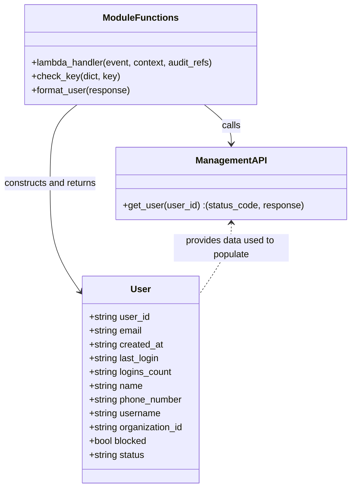

# Diagram: common/iam_service/iam_service/v1/lambdas/users/get_user.py


> Auto-generated by Obscura crawlers

## Diagram 1

```mermaid
flowchart LR
  Start[Start] --> Extract[Extract pathParameters.user_id\nand requestContext.authorizer.organization_id]
  Extract --> UpdateAudit[Update audit_refs with USER_ID\nand ORGANIZATION_ID]
  UpdateAudit --> CheckUserId{user_id present?}
  CheckUserId -- No --> BadRequest[Raise BadRequestError\n"Invalid request, missing user_id"]
  CheckUserId -- Yes --> CallAPI[Call management_api.get_user(user_id)]
  CallAPI --> APIResult[Receive status_code, response]
  APIResult --> Is200{status_code == 200\nand response exists?}
  Is200 -- No --> MakeResp1[Return make_response({response}, status_code)]
  Is200 -- Yes --> HasMeta{response contains "user_metadata"\nand organization_id matches?}
  HasMeta -- No --> Forbidden[Raise ForbiddenError\n"Access to this user is forbidden"]
  HasMeta -- Yes --> Format[response = format_user(response)]
  Format --> MakeResp2[Return make_response({"response": response}, status_code)]
  BadRequest --> End[End]
  Forbidden --> End
  MakeResp1 --> End
  MakeResp2 --> End
```

> SVG rendering failed for this diagram.

## Diagram 2



### SVG

<svg id="container" width="611.4375" xmlns="http://www.w3.org/2000/svg" class="classDiagram" height="848" viewBox="0 0 611.4375 848" role="graphics-document document" aria-roledescription="class"><style>#container{font-family:"trebuchet ms",verdana,arial,sans-serif;font-size:16px;fill:#333;}@keyframes edge-animation-frame{from{stroke-dashoffset:0;}}@keyframes dash{to{stroke-dashoffset:0;}}#container .edge-animation-slow{stroke-dasharray:9,5!important;stroke-dashoffset:900;animation:dash 50s linear infinite;stroke-linecap:round;}#container .edge-animation-fast{stroke-dasharray:9,5!important;stroke-dashoffset:900;animation:dash 20s linear infinite;stroke-linecap:round;}#container .error-icon{fill:#552222;}#container .error-text{fill:#552222;stroke:#552222;}#container .edge-thickness-normal{stroke-width:1px;}#container .edge-thickness-thick{stroke-width:3.5px;}#container .edge-pattern-solid{stroke-dasharray:0;}#container .edge-thickness-invisible{stroke-width:0;fill:none;}#container .edge-pattern-dashed{stroke-dasharray:3;}#container .edge-pattern-dotted{stroke-dasharray:2;}#container .marker{fill:#333333;stroke:#333333;}#container .marker.cross{stroke:#333333;}#container svg{font-family:"trebuchet ms",verdana,arial,sans-serif;font-size:16px;}#container p{margin:0;}#container g.classGroup text{fill:#9370DB;stroke:none;font-family:"trebuchet ms",verdana,arial,sans-serif;font-size:10px;}#container g.classGroup text .title{font-weight:bolder;}#container .nodeLabel,#container .edgeLabel{color:#131300;}#container .edgeLabel .label rect{fill:#ECECFF;}#container .label text{fill:#131300;}#container .labelBkg{background:#ECECFF;}#container .edgeLabel .label span{background:#ECECFF;}#container .classTitle{font-weight:bolder;}#container .node rect,#container .node circle,#container .node ellipse,#container .node polygon,#container .node path{fill:#ECECFF;stroke:#9370DB;stroke-width:1px;}#container .divider{stroke:#9370DB;stroke-width:1;}#container g.clickable{cursor:pointer;}#container g.classGroup rect{fill:#ECECFF;stroke:#9370DB;}#container g.classGroup line{stroke:#9370DB;stroke-width:1;}#container .classLabel .box{stroke:none;stroke-width:0;fill:#ECECFF;opacity:0.5;}#container .classLabel .label{fill:#9370DB;font-size:10px;}#container .relation{stroke:#333333;stroke-width:1;fill:none;}#container .dashed-line{stroke-dasharray:3;}#container .dotted-line{stroke-dasharray:1 2;}#container #compositionStart,#container .composition{fill:#333333!important;stroke:#333333!important;stroke-width:1;}#container #compositionEnd,#container .composition{fill:#333333!important;stroke:#333333!important;stroke-width:1;}#container #dependencyStart,#container .dependency{fill:#333333!important;stroke:#333333!important;stroke-width:1;}#container #dependencyStart,#container .dependency{fill:#333333!important;stroke:#333333!important;stroke-width:1;}#container #extensionStart,#container .extension{fill:transparent!important;stroke:#333333!important;stroke-width:1;}#container #extensionEnd,#container .extension{fill:transparent!important;stroke:#333333!important;stroke-width:1;}#container #aggregationStart,#container .aggregation{fill:transparent!important;stroke:#333333!important;stroke-width:1;}#container #aggregationEnd,#container .aggregation{fill:transparent!important;stroke:#333333!important;stroke-width:1;}#container #lollipopStart,#container .lollipop{fill:#ECECFF!important;stroke:#333333!important;stroke-width:1;}#container #lollipopEnd,#container .lollipop{fill:#ECECFF!important;stroke:#333333!important;stroke-width:1;}#container .edgeTerminals{font-size:11px;line-height:initial;}#container .classTitleText{text-anchor:middle;font-size:18px;fill:#333;}#container .label-icon{display:inline-block;height:1em;overflow:visible;vertical-align:-0.125em;}#container .node .label-icon path{fill:currentColor;stroke:revert;stroke-width:revert;}#container :root{--mermaid-font-family:"trebuchet ms",verdana,arial,sans-serif;}</style><g><defs><marker id="container_class-aggregationStart" class="marker aggregation class" refX="18" refY="7" markerWidth="190" markerHeight="240" orient="auto"><path d="M 18,7 L9,13 L1,7 L9,1 Z"></path></marker></defs><defs><marker id="container_class-aggregationEnd" class="marker aggregation class" refX="1" refY="7" markerWidth="20" markerHeight="28" orient="auto"><path d="M 18,7 L9,13 L1,7 L9,1 Z"></path></marker></defs><defs><marker id="container_class-extensionStart" class="marker extension class" refX="18" refY="7" markerWidth="190" markerHeight="240" orient="auto"><path d="M 1,7 L18,13 V 1 Z"></path></marker></defs><defs><marker id="container_class-extensionEnd" class="marker extension class" refX="1" refY="7" markerWidth="20" markerHeight="28" orient="auto"><path d="M 1,1 V 13 L18,7 Z"></path></marker></defs><defs><marker id="container_class-compositionStart" class="marker composition class" refX="18" refY="7" markerWidth="190" markerHeight="240" orient="auto"><path d="M 18,7 L9,13 L1,7 L9,1 Z"></path></marker></defs><defs><marker id="container_class-compositionEnd" class="marker composition class" refX="1" refY="7" markerWidth="20" markerHeight="28" orient="auto"><path d="M 18,7 L9,13 L1,7 L9,1 Z"></path></marker></defs><defs><marker id="container_class-dependencyStart" class="marker dependency class" refX="6" refY="7" markerWidth="190" markerHeight="240" orient="auto"><path d="M 5,7 L9,13 L1,7 L9,1 Z"></path></marker></defs><defs><marker id="container_class-dependencyEnd" class="marker dependency class" refX="13" refY="7" markerWidth="20" markerHeight="28" orient="auto"><path d="M 18,7 L9,13 L14,7 L9,1 Z"></path></marker></defs><defs><marker id="container_class-lollipopStart" class="marker lollipop class" refX="13" refY="7" markerWidth="190" markerHeight="240" orient="auto"><circle stroke="black" fill="transparent" cx="7" cy="7" r="6"></circle></marker></defs><defs><marker id="container_class-lollipopEnd" class="marker lollipop class" refX="1" refY="7" markerWidth="190" markerHeight="240" orient="auto"><circle stroke="black" fill="transparent" cx="7" cy="7" r="6"></circle></marker></defs><g class="root"><g class="clusters"></g><g class="edgePaths"><path d="M358.362,182L366.2,188.167C374.038,194.333,389.714,206.667,397.553,218C405.391,229.333,405.391,239.667,405.391,244.833L405.391,250" id="id_ModuleFunctions_ManagementAPI_1" class="edge-thickness-normal edge-pattern-solid relation" style=";;;" data-edge="true" data-et="edge" data-id="id_ModuleFunctions_ManagementAPI_1" data-points="W3sieCI6MzU4LjM2MjAyMTE2OTM1NDgsInkiOjE4Mn0seyJ4Ijo0MDUuMzkwNjI1LCJ5IjoyMTl9LHsieCI6NDA1LjM5MDYyNSwieSI6MjU2fV0=" marker-end="url(#container_class-dependencyEnd)"></path><path d="M137.2,182L129.362,188.167C121.524,194.333,105.848,206.667,98.01,229.5C90.172,252.333,90.172,285.667,90.172,321C90.172,356.333,90.172,393.667,98.601,424.581C107.03,455.494,123.888,479.989,132.318,492.236L140.747,504.483" id="id_ModuleFunctions_User_2" class="edge-thickness-normal edge-pattern-solid relation" style=";;;" data-edge="true" data-et="edge" data-id="id_ModuleFunctions_User_2" data-points="W3sieCI6MTM3LjIwMDQ3ODgzMDY0NTE4LCJ5IjoxODJ9LHsieCI6OTAuMTcxODc1LCJ5IjoyMTl9LHsieCI6OTAuMTcxODc1LCJ5IjozMTl9LHsieCI6OTAuMTcxODc1LCJ5Ijo0MzF9LHsieCI6MTQ0LjE0ODQzNzUsInkiOjUwOS40MjU3NDYwMDk3MTU0NX1d" marker-end="url(#container_class-dependencyEnd)"></path><path d="M405.391,388L405.391,395.167C405.391,402.333,405.391,416.667,396.395,436.904C387.398,457.142,369.406,483.284,360.41,496.355L351.414,509.426" id="id_ManagementAPI_User_3" class="edge-thickness-normal edge-pattern-dashed relation" style=";;;" data-edge="true" data-et="edge" data-id="id_ManagementAPI_User_3" data-points="W3sieCI6NDA1LjM5MDYyNSwieSI6MzgyfSx7IngiOjQwNS4zOTA2MjUsInkiOjQzMX0seyJ4IjozNTEuNDE0MDYyNSwieSI6NTA5LjQyNTc0NjAwOTcxNTQ1fV0=" marker-start="url(#container_class-dependencyStart)"></path></g><g class="edgeLabels"><g class="edgeLabel" transform="translate(405.390625, 219)"><g class="label" data-id="id_ModuleFunctions_ManagementAPI_1" transform="translate(-16.4453125, -12)"><foreignObject width="32.890625" height="24"><div xmlns="http://www.w3.org/1999/xhtml" class="labelBkg" style="display: table-cell; white-space: nowrap; line-height: 1.5; max-width: 200px; text-align: center;"><span class="edgeLabel"><p>calls</p></span></div></foreignObject></g></g><g class="edgeLabel" transform="translate(90.171875, 319)"><g class="label" data-id="id_ModuleFunctions_User_2" transform="translate(-82.171875, -12)"><foreignObject width="164.34375" height="24"><div xmlns="http://www.w3.org/1999/xhtml" class="labelBkg" style="display: table-cell; white-space: nowrap; line-height: 1.5; max-width: 200px; text-align: center;"><span class="edgeLabel"><p>constructs and returns</p></span></div></foreignObject></g></g><g class="edgeLabel" transform="translate(405.390625, 431)"><g class="label" data-id="id_ManagementAPI_User_3" transform="translate(-100, -24)"><foreignObject width="200" height="48"><div xmlns="http://www.w3.org/1999/xhtml" class="labelBkg" style="display: table; white-space: break-spaces; line-height: 1.5; max-width: 200px; text-align: center; width: 200px;"><span class="edgeLabel"><p>provides data used to populate</p></span></div></foreignObject></g></g></g><g class="nodes"><g class="node default" id="classId-User-0" transform="translate(247.78125, 660)"><g class="basic label-container"><path d="M-103.6328125 -180 L103.6328125 -180 L103.6328125 180 L-103.6328125 180" stroke="none" stroke-width="0" fill="#ECECFF" style=""></path><path d="M-103.6328125 -180 C-50.28094134605195 -180, 3.070929807896107 -180, 103.6328125 -180 M-103.6328125 -180 C-53.870071606131894 -180, -4.1073307122637885 -180, 103.6328125 -180 M103.6328125 -180 C103.6328125 -98.02708316330326, 103.6328125 -16.05416632660652, 103.6328125 180 M103.6328125 -180 C103.6328125 -97.10201601621891, 103.6328125 -14.204032032437823, 103.6328125 180 M103.6328125 180 C44.00065005898685 180, -15.631512382026301 180, -103.6328125 180 M103.6328125 180 C50.72599231998994 180, -2.1808278600201163 180, -103.6328125 180 M-103.6328125 180 C-103.6328125 72.25136673904903, -103.6328125 -35.497266521901935, -103.6328125 -180 M-103.6328125 180 C-103.6328125 62.324028093813624, -103.6328125 -55.35194381237275, -103.6328125 -180" stroke="#9370DB" stroke-width="1.3" fill="none" stroke-dasharray="0 0" style=""></path></g><g class="annotation-group text" transform="translate(0, -156)"></g><g class="label-group text" transform="translate(-16.65625, -156)"><g class="label" style="font-weight: bolder" transform="translate(0,-12)"><foreignObject width="33.3125" height="24"><div xmlns="http://www.w3.org/1999/xhtml" style="display: table-cell; white-space: nowrap; line-height: 1.5; max-width: 84px; text-align: center;"><span class="nodeLabel markdown-node-label" style=""><p>User</p></span></div></foreignObject></g></g><g class="members-group text" transform="translate(-91.6328125, -108)"><g class="label" style="" transform="translate(0,-12)"><foreignObject width="106.65625" height="24"><div xmlns="http://www.w3.org/1999/xhtml" style="display: table-cell; white-space: nowrap; line-height: 1.5; max-width: 164px; text-align: center;"><span class="nodeLabel markdown-node-label" style=""><p>+string user_id</p></span></div></foreignObject></g><g class="label" style="" transform="translate(0,12)"><foreignObject width="94.203125" height="24"><div xmlns="http://www.w3.org/1999/xhtml" style="display: table-cell; white-space: nowrap; line-height: 1.5; max-width: 152px; text-align: center;"><span class="nodeLabel markdown-node-label" style=""><p>+string email</p></span></div></foreignObject></g><g class="label" style="" transform="translate(0,36)"><foreignObject width="130.78125" height="24"><div xmlns="http://www.w3.org/1999/xhtml" style="display: table-cell; white-space: nowrap; line-height: 1.5; max-width: 188px; text-align: center;"><span class="nodeLabel markdown-node-label" style=""><p>+string created_at</p></span></div></foreignObject></g><g class="label" style="" transform="translate(0,60)"><foreignObject width="124.578125" height="24"><div xmlns="http://www.w3.org/1999/xhtml" style="display: table-cell; white-space: nowrap; line-height: 1.5; max-width: 182px; text-align: center;"><span class="nodeLabel markdown-node-label" style=""><p>+string last_login</p></span></div></foreignObject></g><g class="label" style="" transform="translate(0,84)"><foreignObject width="146.3125" height="24"><div xmlns="http://www.w3.org/1999/xhtml" style="display: table-cell; white-space: nowrap; line-height: 1.5; max-width: 204px; text-align: center;"><span class="nodeLabel markdown-node-label" style=""><p>+string logins_count</p></span></div></foreignObject></g><g class="label" style="" transform="translate(0,108)"><foreignObject width="94.375" height="24"><div xmlns="http://www.w3.org/1999/xhtml" style="display: table-cell; white-space: nowrap; line-height: 1.5; max-width: 152px; text-align: center;"><span class="nodeLabel markdown-node-label" style=""><p>+string name</p></span></div></foreignObject></g><g class="label" style="" transform="translate(0,132)"><foreignObject width="164.984375" height="24"><div xmlns="http://www.w3.org/1999/xhtml" style="display: table-cell; white-space: nowrap; line-height: 1.5; max-width: 223px; text-align: center;"><span class="nodeLabel markdown-node-label" style=""><p>+string phone_number</p></span></div></foreignObject></g><g class="label" style="" transform="translate(0,156)"><foreignObject width="126.0625" height="24"><div xmlns="http://www.w3.org/1999/xhtml" style="display: table-cell; white-space: nowrap; line-height: 1.5; max-width: 183px; text-align: center;"><span class="nodeLabel markdown-node-label" style=""><p>+string username</p></span></div></foreignObject></g><g class="label" style="" transform="translate(0,180)"><foreignObject width="166.609375" height="24"><div xmlns="http://www.w3.org/1999/xhtml" style="display: table-cell; white-space: nowrap; line-height: 1.5; max-width: 224px; text-align: center;"><span class="nodeLabel markdown-node-label" style=""><p>+string organization_id</p></span></div></foreignObject></g><g class="label" style="" transform="translate(0,204)"><foreignObject width="102.546875" height="24"><div xmlns="http://www.w3.org/1999/xhtml" style="display: table-cell; white-space: nowrap; line-height: 1.5; max-width: 160px; text-align: center;"><span class="nodeLabel markdown-node-label" style=""><p>+bool blocked</p></span></div></foreignObject></g><g class="label" style="" transform="translate(0,228)"><foreignObject width="98.265625" height="24"><div xmlns="http://www.w3.org/1999/xhtml" style="display: table-cell; white-space: nowrap; line-height: 1.5; max-width: 156px; text-align: center;"><span class="nodeLabel markdown-node-label" style=""><p>+string status</p></span></div></foreignObject></g></g><g class="methods-group text" transform="translate(-91.6328125, 180)"></g><g class="divider" style=""><path d="M-103.6328125 -132 C-24.204440370018034 -132, 55.22393175996393 -132, 103.6328125 -132 M-103.6328125 -132 C-28.660692337408946 -132, 46.31142782518211 -132, 103.6328125 -132" stroke="#9370DB" stroke-width="1.3" fill="none" stroke-dasharray="0 0" style=""></path></g><g class="divider" style=""><path d="M-103.6328125 156 C-60.07593870836605 156, -16.519064916732106 156, 103.6328125 156 M-103.6328125 156 C-55.91977583732056 156, -8.206739174641115 156, 103.6328125 156" stroke="#9370DB" stroke-width="1.3" fill="none" stroke-dasharray="0 0" style=""></path></g></g><g class="node default" id="classId-ModuleFunctions-1" transform="translate(247.78125, 95)"><g class="basic label-container"><path d="M-203.953125 -87 L203.953125 -87 L203.953125 87 L-203.953125 87" stroke="none" stroke-width="0" fill="#ECECFF" style=""></path><path d="M-203.953125 -87 C-48.94015059203244 -87, 106.07282381593512 -87, 203.953125 -87 M-203.953125 -87 C-67.26835132792132 -87, 69.41642234415735 -87, 203.953125 -87 M203.953125 -87 C203.953125 -21.033726160265374, 203.953125 44.93254767946925, 203.953125 87 M203.953125 -87 C203.953125 -45.00794398606821, 203.953125 -3.015887972136426, 203.953125 87 M203.953125 87 C70.92732993384942 87, -62.09846513230116 87, -203.953125 87 M203.953125 87 C79.64641106302939 87, -44.66030287394122 87, -203.953125 87 M-203.953125 87 C-203.953125 18.176537335364017, -203.953125 -50.646925329271966, -203.953125 -87 M-203.953125 87 C-203.953125 39.49665397901302, -203.953125 -8.006692041973963, -203.953125 -87" stroke="#9370DB" stroke-width="1.3" fill="none" stroke-dasharray="0 0" style=""></path></g><g class="annotation-group text" transform="translate(0, -63)"></g><g class="label-group text" transform="translate(-62.21875, -63)"><g class="label" style="font-weight: bolder" transform="translate(0,-12)"><foreignObject width="124.4375" height="24"><div xmlns="http://www.w3.org/1999/xhtml" style="display: table-cell; white-space: nowrap; line-height: 1.5; max-width: 174px; text-align: center;"><span class="nodeLabel markdown-node-label" style=""><p>ModuleFunctions</p></span></div></foreignObject></g></g><g class="members-group text" transform="translate(-191.953125, -15)"></g><g class="methods-group text" transform="translate(-191.953125, 15)"><g class="label" style="" transform="translate(0,-12)"><foreignObject width="321.6875" height="24"><div xmlns="http://www.w3.org/1999/xhtml" style="display: table-cell; white-space: nowrap; line-height: 1.5; max-width: 379px; text-align: center;"><span class="nodeLabel markdown-node-label" style=""><p>+lambda_handler(event, context, audit_refs)</p></span></div></foreignObject></g><g class="label" style="" transform="translate(0,12)"><foreignObject width="153.0625" height="24"><div xmlns="http://www.w3.org/1999/xhtml" style="display: table-cell; white-space: nowrap; line-height: 1.5; max-width: 210px; text-align: center;"><span class="nodeLabel markdown-node-label" style=""><p>+check_key(dict, key)</p></span></div></foreignObject></g><g class="label" style="" transform="translate(0,36)"><foreignObject width="173.015625" height="24"><div xmlns="http://www.w3.org/1999/xhtml" style="display: table-cell; white-space: nowrap; line-height: 1.5; max-width: 230px; text-align: center;"><span class="nodeLabel markdown-node-label" style=""><p>+format_user(response)</p></span></div></foreignObject></g></g><g class="divider" style=""><path d="M-203.953125 -39 C-64.63303092107904 -39, 74.68706315784192 -39, 203.953125 -39 M-203.953125 -39 C-72.0126642933242 -39, 59.92779641335159 -39, 203.953125 -39" stroke="#9370DB" stroke-width="1.3" fill="none" stroke-dasharray="0 0" style=""></path></g><g class="divider" style=""><path d="M-203.953125 -15 C-82.57993193957653 -15, 38.79326112084695 -15, 203.953125 -15 M-203.953125 -15 C-51.36872794110823 -15, 101.21566911778353 -15, 203.953125 -15" stroke="#9370DB" stroke-width="1.3" fill="none" stroke-dasharray="0 0" style=""></path></g></g><g class="node default" id="classId-ManagementAPI-2" transform="translate(405.390625, 319)"><g class="basic label-container"><path d="M-198.046875 -63 L198.046875 -63 L198.046875 63 L-198.046875 63" stroke="none" stroke-width="0" fill="#ECECFF" style=""></path><path d="M-198.046875 -63 C-42.53514424437614 -63, 112.97658651124772 -63, 198.046875 -63 M-198.046875 -63 C-79.05509922667486 -63, 39.93667654665029 -63, 198.046875 -63 M198.046875 -63 C198.046875 -23.902917143559208, 198.046875 15.194165712881585, 198.046875 63 M198.046875 -63 C198.046875 -33.81886204093807, 198.046875 -4.6377240818761365, 198.046875 63 M198.046875 63 C114.72390607081748 63, 31.400937141634955 63, -198.046875 63 M198.046875 63 C95.99818494225939 63, -6.050505115481229 63, -198.046875 63 M-198.046875 63 C-198.046875 34.396658670640406, -198.046875 5.7933173412808046, -198.046875 -63 M-198.046875 63 C-198.046875 33.12925933767043, -198.046875 3.2585186753408593, -198.046875 -63" stroke="#9370DB" stroke-width="1.3" fill="none" stroke-dasharray="0 0" style=""></path></g><g class="annotation-group text" transform="translate(0, -39)"></g><g class="label-group text" transform="translate(-58.984375, -39)"><g class="label" style="font-weight: bolder" transform="translate(0,-12)"><foreignObject width="117.96875" height="24"><div xmlns="http://www.w3.org/1999/xhtml" style="display: table-cell; white-space: nowrap; line-height: 1.5; max-width: 167px; text-align: center;"><span class="nodeLabel markdown-node-label" style=""><p>ManagementAPI</p></span></div></foreignObject></g></g><g class="members-group text" transform="translate(-186.046875, 9)"></g><g class="methods-group text" transform="translate(-186.046875, 39)"><g class="label" style="" transform="translate(0,-12)"><foreignObject width="313.109375" height="24"><div xmlns="http://www.w3.org/1999/xhtml" style="display: table-cell; white-space: nowrap; line-height: 1.5; max-width: 370px; text-align: center;"><span class="nodeLabel markdown-node-label" style=""><p>+get_user(user_id) :(status_code, response)</p></span></div></foreignObject></g></g><g class="divider" style=""><path d="M-198.046875 -15 C-41.92527383961547 -15, 114.19632732076906 -15, 198.046875 -15 M-198.046875 -15 C-88.99090981425348 -15, 20.06505537149303 -15, 198.046875 -15" stroke="#9370DB" stroke-width="1.3" fill="none" stroke-dasharray="0 0" style=""></path></g><g class="divider" style=""><path d="M-198.046875 9 C-88.57551591769457 9, 20.895843164610852 9, 198.046875 9 M-198.046875 9 C-50.62849019526948 9, 96.78989460946104 9, 198.046875 9" stroke="#9370DB" stroke-width="1.3" fill="none" stroke-dasharray="0 0" style=""></path></g></g></g></g></g></svg>
