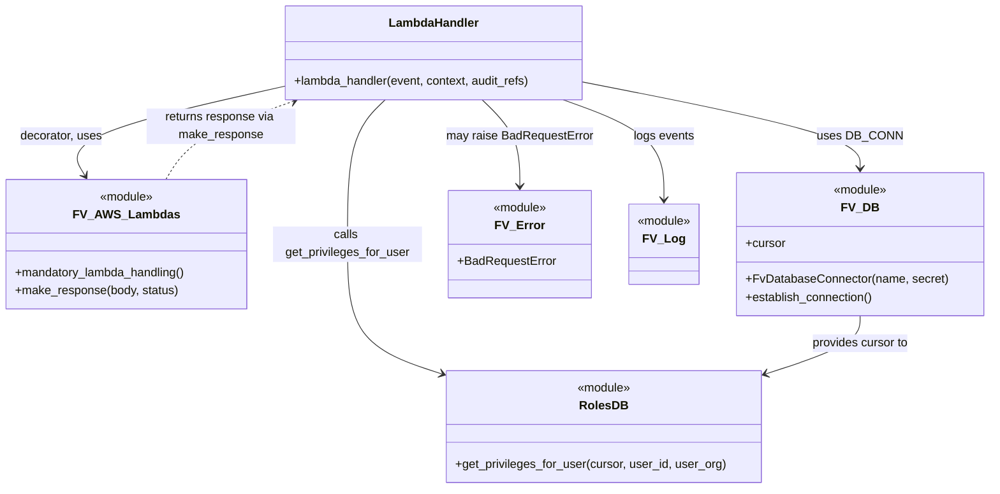

# Diagram: common/iam_service/iam_service/v1/lambdas/users/get_user_privileges.py


> Auto-generated by Obscura crawlers

## Diagram 1

```mermaid
flowchart TD
    A[Incoming Event] --> B[Log Event]
    B --> C{Is event dict?}
    C -->|yes| B
    C -->|no| B
    B --> D[Extract user_id from pathParameters]
    D --> E[Extract organization_id from requestContext.authorizer]
    E --> F[Update audit_refs with Searchable_Ids]
    F --> G{user_id present?}
    G -->|no| H[Raise BadRequestError]
    G -->|yes| I[DB_CONN.establish_connection()]
    I --> J[Get DB cursor]
    J --> K[roles_db.get_privileges_for_user(cursor, user_id, user_org)]
    K --> L[make_response({"response": privileges}, 200)]
    L --> M[Return HTTP Response]
```

> SVG rendering failed for this diagram.

## Diagram 2



### SVG

<svg id="container" width="1323.78125" xmlns="http://www.w3.org/2000/svg" class="classDiagram" height="656" viewBox="0 0 1323.78125 656" role="graphics-document document" aria-roledescription="class"><style>#container{font-family:"trebuchet ms",verdana,arial,sans-serif;font-size:16px;fill:#333;}@keyframes edge-animation-frame{from{stroke-dashoffset:0;}}@keyframes dash{to{stroke-dashoffset:0;}}#container .edge-animation-slow{stroke-dasharray:9,5!important;stroke-dashoffset:900;animation:dash 50s linear infinite;stroke-linecap:round;}#container .edge-animation-fast{stroke-dasharray:9,5!important;stroke-dashoffset:900;animation:dash 20s linear infinite;stroke-linecap:round;}#container .error-icon{fill:#552222;}#container .error-text{fill:#552222;stroke:#552222;}#container .edge-thickness-normal{stroke-width:1px;}#container .edge-thickness-thick{stroke-width:3.5px;}#container .edge-pattern-solid{stroke-dasharray:0;}#container .edge-thickness-invisible{stroke-width:0;fill:none;}#container .edge-pattern-dashed{stroke-dasharray:3;}#container .edge-pattern-dotted{stroke-dasharray:2;}#container .marker{fill:#333333;stroke:#333333;}#container .marker.cross{stroke:#333333;}#container svg{font-family:"trebuchet ms",verdana,arial,sans-serif;font-size:16px;}#container p{margin:0;}#container g.classGroup text{fill:#9370DB;stroke:none;font-family:"trebuchet ms",verdana,arial,sans-serif;font-size:10px;}#container g.classGroup text .title{font-weight:bolder;}#container .nodeLabel,#container .edgeLabel{color:#131300;}#container .edgeLabel .label rect{fill:#ECECFF;}#container .label text{fill:#131300;}#container .labelBkg{background:#ECECFF;}#container .edgeLabel .label span{background:#ECECFF;}#container .classTitle{font-weight:bolder;}#container .node rect,#container .node circle,#container .node ellipse,#container .node polygon,#container .node path{fill:#ECECFF;stroke:#9370DB;stroke-width:1px;}#container .divider{stroke:#9370DB;stroke-width:1;}#container g.clickable{cursor:pointer;}#container g.classGroup rect{fill:#ECECFF;stroke:#9370DB;}#container g.classGroup line{stroke:#9370DB;stroke-width:1;}#container .classLabel .box{stroke:none;stroke-width:0;fill:#ECECFF;opacity:0.5;}#container .classLabel .label{fill:#9370DB;font-size:10px;}#container .relation{stroke:#333333;stroke-width:1;fill:none;}#container .dashed-line{stroke-dasharray:3;}#container .dotted-line{stroke-dasharray:1 2;}#container #compositionStart,#container .composition{fill:#333333!important;stroke:#333333!important;stroke-width:1;}#container #compositionEnd,#container .composition{fill:#333333!important;stroke:#333333!important;stroke-width:1;}#container #dependencyStart,#container .dependency{fill:#333333!important;stroke:#333333!important;stroke-width:1;}#container #dependencyStart,#container .dependency{fill:#333333!important;stroke:#333333!important;stroke-width:1;}#container #extensionStart,#container .extension{fill:transparent!important;stroke:#333333!important;stroke-width:1;}#container #extensionEnd,#container .extension{fill:transparent!important;stroke:#333333!important;stroke-width:1;}#container #aggregationStart,#container .aggregation{fill:transparent!important;stroke:#333333!important;stroke-width:1;}#container #aggregationEnd,#container .aggregation{fill:transparent!important;stroke:#333333!important;stroke-width:1;}#container #lollipopStart,#container .lollipop{fill:#ECECFF!important;stroke:#333333!important;stroke-width:1;}#container #lollipopEnd,#container .lollipop{fill:#ECECFF!important;stroke:#333333!important;stroke-width:1;}#container .edgeTerminals{font-size:11px;line-height:initial;}#container .classTitleText{text-anchor:middle;font-size:18px;fill:#333;}#container .label-icon{display:inline-block;height:1em;overflow:visible;vertical-align:-0.125em;}#container .node .label-icon path{fill:currentColor;stroke:revert;stroke-width:revert;}#container :root{--mermaid-font-family:"trebuchet ms",verdana,arial,sans-serif;}</style><g><defs><marker id="container_class-aggregationStart" class="marker aggregation class" refX="18" refY="7" markerWidth="190" markerHeight="240" orient="auto"><path d="M 18,7 L9,13 L1,7 L9,1 Z"></path></marker></defs><defs><marker id="container_class-aggregationEnd" class="marker aggregation class" refX="1" refY="7" markerWidth="20" markerHeight="28" orient="auto"><path d="M 18,7 L9,13 L1,7 L9,1 Z"></path></marker></defs><defs><marker id="container_class-extensionStart" class="marker extension class" refX="18" refY="7" markerWidth="190" markerHeight="240" orient="auto"><path d="M 1,7 L18,13 V 1 Z"></path></marker></defs><defs><marker id="container_class-extensionEnd" class="marker extension class" refX="1" refY="7" markerWidth="20" markerHeight="28" orient="auto"><path d="M 1,1 V 13 L18,7 Z"></path></marker></defs><defs><marker id="container_class-compositionStart" class="marker composition class" refX="18" refY="7" markerWidth="190" markerHeight="240" orient="auto"><path d="M 18,7 L9,13 L1,7 L9,1 Z"></path></marker></defs><defs><marker id="container_class-compositionEnd" class="marker composition class" refX="1" refY="7" markerWidth="20" markerHeight="28" orient="auto"><path d="M 18,7 L9,13 L1,7 L9,1 Z"></path></marker></defs><defs><marker id="container_class-dependencyStart" class="marker dependency class" refX="6" refY="7" markerWidth="190" markerHeight="240" orient="auto"><path d="M 5,7 L9,13 L1,7 L9,1 Z"></path></marker></defs><defs><marker id="container_class-dependencyEnd" class="marker dependency class" refX="13" refY="7" markerWidth="20" markerHeight="28" orient="auto"><path d="M 18,7 L9,13 L14,7 L9,1 Z"></path></marker></defs><defs><marker id="container_class-lollipopStart" class="marker lollipop class" refX="13" refY="7" markerWidth="190" markerHeight="240" orient="auto"><circle stroke="black" fill="transparent" cx="7" cy="7" r="6"></circle></marker></defs><defs><marker id="container_class-lollipopEnd" class="marker lollipop class" refX="1" refY="7" markerWidth="190" markerHeight="240" orient="auto"><circle stroke="black" fill="transparent" cx="7" cy="7" r="6"></circle></marker></defs><g class="root"><g class="clusters"></g><g class="edgePaths"><path d="M377.521,116.379L328.106,127.482C278.691,138.586,179.861,160.793,135.765,180.707C91.668,200.621,102.306,218.242,107.624,227.053L112.943,235.863" id="id_LambdaHandler_FV_AWS_Lambdas_1" class="edge-thickness-normal edge-pattern-solid relation" style=";;;" data-edge="true" data-et="edge" data-id="id_LambdaHandler_FV_AWS_Lambdas_1" data-points="W3sieCI6Mzc3LjUyMTQ4NDM3NSwieSI6MTE2LjM3ODc3Njg5NTI1NTkyfSx7IngiOjgxLjAzMTI1LCJ5IjoxODN9LHsieCI6MTE2LjA0Mzc1LCJ5IjoyNDF9XQ==" marker-end="url(#container_class-dependencyEnd)"></path><path d="M781.428,110.524L843.149,122.603C904.87,134.683,1028.312,158.841,1090.033,178.087C1151.754,197.333,1151.754,211.667,1151.754,218.833L1151.754,226" id="id_LambdaHandler_FV_DB_2" class="edge-thickness-normal edge-pattern-solid relation" style=";;;" data-edge="true" data-et="edge" data-id="id_LambdaHandler_FV_DB_2" data-points="W3sieCI6NzgxLjQyNzczNDM3NSwieSI6MTEwLjUyMzk3MDQxNzA4OX0seyJ4IjoxMTUxLjc1MzkwNjI1LCJ5IjoxODN9LHsieCI6MTE1MS43NTM5MDYyNSwieSI6MjMyfV0=" marker-end="url(#container_class-dependencyEnd)"></path><path d="M514.59,134L506.18,142.167C497.769,150.333,480.947,166.667,472.536,199C464.125,231.333,464.125,279.667,464.125,326C464.125,372.333,464.125,416.667,485.292,445.729C506.46,474.791,548.794,488.582,569.962,495.477L591.129,502.372" id="id_LambdaHandler_RolesDB_3" class="edge-thickness-normal edge-pattern-solid relation" style=";;;" data-edge="true" data-et="edge" data-id="id_LambdaHandler_RolesDB_3" data-points="W3sieCI6NTE0LjU5MDQ1NDEwMTU2MjUsInkiOjEzNH0seyJ4Ijo0NjQuMTI1LCJ5IjoxODN9LHsieCI6NDY0LjEyNSwieSI6MzI4fSx7IngiOjQ2NC4xMjUsInkiOjQ2MX0seyJ4Ijo1OTYuODMzOTg0Mzc1LCJ5Ijo1MDQuMjMwODk0MjA3MzM2MX1d" marker-end="url(#container_class-dependencyEnd)"></path><path d="M644.359,134L652.77,142.167C661.181,150.333,678.002,166.667,686.413,186C694.824,205.333,694.824,227.667,694.824,238.833L694.824,250" id="id_LambdaHandler_FV_Error_4" class="edge-thickness-normal edge-pattern-solid relation" style=";;;" data-edge="true" data-et="edge" data-id="id_LambdaHandler_FV_Error_4" data-points="W3sieCI6NjQ0LjM1ODc2NDY0ODQzNzUsInkiOjEzNH0seyJ4Ijo2OTQuODI0MjE4NzUsInkiOjE4M30seyJ4Ijo2OTQuODI0MjE4NzUsInkiOjI1Nn1d" marker-end="url(#container_class-dependencyEnd)"></path><path d="M753.653,134L776.232,142.167C798.81,150.333,843.968,166.667,866.546,189C889.125,211.333,889.125,239.667,889.125,253.833L889.125,268" id="id_LambdaHandler_FV_Log_5" class="edge-thickness-normal edge-pattern-solid relation" style=";;;" data-edge="true" data-et="edge" data-id="id_LambdaHandler_FV_Log_5" data-points="W3sieCI6NzUzLjY1Mjk1NDEwMTU2MjUsInkiOjEzNH0seyJ4Ijo4ODkuMTI1LCJ5IjoxODN9LHsieCI6ODg5LjEyNSwieSI6Mjc0fV0=" marker-end="url(#container_class-dependencyEnd)"></path><path d="M1151.754,424L1151.754,430.167C1151.754,436.333,1151.754,448.667,1130.587,461.729C1109.419,474.791,1067.085,488.582,1045.917,495.477L1024.75,502.372" id="id_FV_DB_RolesDB_6" class="edge-thickness-normal edge-pattern-solid relation" style=";;;" data-edge="true" data-et="edge" data-id="id_FV_DB_RolesDB_6" data-points="W3sieCI6MTE1MS43NTM5MDYyNSwieSI6NDI0fSx7IngiOjExNTEuNzUzOTA2MjUsInkiOjQ2MX0seyJ4IjoxMDE5LjA0NDkyMTg3NSwieSI6NTA0LjIzMDg5NDIwNzMzNjF9XQ==" marker-end="url(#container_class-dependencyEnd)"></path><path d="M221.231,241L227.083,231.333C232.935,221.667,244.64,202.333,273.108,184.827C301.577,167.322,346.811,151.643,369.428,143.804L392.044,135.965" id="id_FV_AWS_Lambdas_LambdaHandler_7" class="edge-thickness-normal edge-pattern-dashed relation" style=";;;" data-edge="true" data-et="edge" data-id="id_FV_AWS_Lambdas_LambdaHandler_7" data-points="W3sieCI6MjIxLjIzMTI1LCJ5IjoyNDF9LHsieCI6MjU2LjM0Mzc1LCJ5IjoxODN9LHsieCI6Mzk3LjcxMzUwMDk3NjU2MjUsInkiOjEzNH1d" marker-end="url(#container_class-dependencyEnd)"></path></g><g class="edgeLabels"><g class="edgeLabel" transform="translate(81.03125, 183)"><g class="label" data-id="id_LambdaHandler_FV_AWS_Lambdas_1" transform="translate(-55.0625, -12)"><foreignObject width="110.125" height="24"><div xmlns="http://www.w3.org/1999/xhtml" class="labelBkg" style="display: table-cell; white-space: nowrap; line-height: 1.5; max-width: 200px; text-align: center;"><span class="edgeLabel"><p>decorator, uses</p></span></div></foreignObject></g></g><g class="edgeLabel" transform="translate(1151.75390625, 183)"><g class="label" data-id="id_LambdaHandler_FV_DB_2" transform="translate(-53.09375, -12)"><foreignObject width="106.1875" height="24"><div xmlns="http://www.w3.org/1999/xhtml" class="labelBkg" style="display: table-cell; white-space: nowrap; line-height: 1.5; max-width: 200px; text-align: center;"><span class="edgeLabel"><p>uses DB_CONN</p></span></div></foreignObject></g></g><g class="edgeLabel" transform="translate(464.125, 328)"><g class="label" data-id="id_LambdaHandler_RolesDB_3" transform="translate(-100, -24)"><foreignObject width="200" height="48"><div xmlns="http://www.w3.org/1999/xhtml" class="labelBkg" style="display: table; white-space: break-spaces; line-height: 1.5; max-width: 200px; text-align: center; width: 200px;"><span class="edgeLabel"><p>calls get_privileges_for_user</p></span></div></foreignObject></g></g><g class="edgeLabel" transform="translate(694.82421875, 183)"><g class="label" data-id="id_LambdaHandler_FV_Error_4" transform="translate(-98.1796875, -12)"><foreignObject width="196.359375" height="24"><div xmlns="http://www.w3.org/1999/xhtml" class="labelBkg" style="display: table-cell; white-space: nowrap; line-height: 1.5; max-width: 200px; text-align: center;"><span class="edgeLabel"><p>may raise BadRequestError</p></span></div></foreignObject></g></g><g class="edgeLabel" transform="translate(889.125, 183)"><g class="label" data-id="id_LambdaHandler_FV_Log_5" transform="translate(-40.84375, -12)"><foreignObject width="81.6875" height="24"><div xmlns="http://www.w3.org/1999/xhtml" class="labelBkg" style="display: table-cell; white-space: nowrap; line-height: 1.5; max-width: 200px; text-align: center;"><span class="edgeLabel"><p>logs events</p></span></div></foreignObject></g></g><g class="edgeLabel" transform="translate(1151.75390625, 461)"><g class="label" data-id="id_FV_DB_RolesDB_6" transform="translate(-65.859375, -12)"><foreignObject width="131.71875" height="24"><div xmlns="http://www.w3.org/1999/xhtml" class="labelBkg" style="display: table-cell; white-space: nowrap; line-height: 1.5; max-width: 200px; text-align: center;"><span class="edgeLabel"><p>provides cursor to</p></span></div></foreignObject></g></g><g class="edgeLabel" transform="translate(294.99794, 169.60212)"><g class="label" data-id="id_FV_AWS_Lambdas_LambdaHandler_7" transform="translate(-100, -24)"><foreignObject width="200" height="48"><div xmlns="http://www.w3.org/1999/xhtml" class="labelBkg" style="display: table; white-space: break-spaces; line-height: 1.5; max-width: 200px; text-align: center; width: 200px;"><span class="edgeLabel"><p>returns response via make_response</p></span></div></foreignObject></g></g></g><g class="nodes"><g class="node default" id="classId-LambdaHandler-0" transform="translate(579.474609375, 71)"><g class="basic label-container"><path d="M-201.953125 -63 L201.953125 -63 L201.953125 63 L-201.953125 63" stroke="none" stroke-width="0" fill="#ECECFF" style=""></path><path d="M-201.953125 -63 C-79.87535298978602 -63, 42.20241902042795 -63, 201.953125 -63 M-201.953125 -63 C-93.30702795460363 -63, 15.339069090792748 -63, 201.953125 -63 M201.953125 -63 C201.953125 -16.043683751865657, 201.953125 30.912632496268685, 201.953125 63 M201.953125 -63 C201.953125 -16.33550949540934, 201.953125 30.32898100918132, 201.953125 63 M201.953125 63 C99.40367584181728 63, -3.1457733163654495 63, -201.953125 63 M201.953125 63 C105.32956937137084 63, 8.706013742741675 63, -201.953125 63 M-201.953125 63 C-201.953125 37.26198253323793, -201.953125 11.523965066475867, -201.953125 -63 M-201.953125 63 C-201.953125 35.90748686054961, -201.953125 8.814973721099228, -201.953125 -63" stroke="#9370DB" stroke-width="1.3" fill="none" stroke-dasharray="0 0" style=""></path></g><g class="annotation-group text" transform="translate(0, -39)"></g><g class="label-group text" transform="translate(-58.21875, -39)"><g class="label" style="font-weight: bolder" transform="translate(0,-12)"><foreignObject width="116.4375" height="24"><div xmlns="http://www.w3.org/1999/xhtml" style="display: table-cell; white-space: nowrap; line-height: 1.5; max-width: 167px; text-align: center;"><span class="nodeLabel markdown-node-label" style=""><p>LambdaHandler</p></span></div></foreignObject></g></g><g class="members-group text" transform="translate(-189.953125, 9)"></g><g class="methods-group text" transform="translate(-189.953125, 39)"><g class="label" style="" transform="translate(0,-12)"><foreignObject width="321.6875" height="24"><div xmlns="http://www.w3.org/1999/xhtml" style="display: table-cell; white-space: nowrap; line-height: 1.5; max-width: 379px; text-align: center;"><span class="nodeLabel markdown-node-label" style=""><p>+lambda_handler(event, context, audit_refs)</p></span></div></foreignObject></g></g><g class="divider" style=""><path d="M-201.953125 -15 C-58.192664643925156 -15, 85.56779571214969 -15, 201.953125 -15 M-201.953125 -15 C-55.346177358700714 -15, 91.26077028259857 -15, 201.953125 -15" stroke="#9370DB" stroke-width="1.3" fill="none" stroke-dasharray="0 0" style=""></path></g><g class="divider" style=""><path d="M-201.953125 9 C-94.20226384373542 9, 13.548597312529154 9, 201.953125 9 M-201.953125 9 C-67.35700638873675 9, 67.2391122225265 9, 201.953125 9" stroke="#9370DB" stroke-width="1.3" fill="none" stroke-dasharray="0 0" style=""></path></g></g><g class="node default" id="classId-FV_AWS_Lambdas-1" transform="translate(168.5625, 328)"><g class="basic label-container"><path d="M-160.5625 -87 L160.5625 -87 L160.5625 87 L-160.5625 87" stroke="none" stroke-width="0" fill="#ECECFF" style=""></path><path d="M-160.5625 -87 C-81.68861178146021 -87, -2.8147235629204204 -87, 160.5625 -87 M-160.5625 -87 C-70.76684555169133 -87, 19.028808896617335 -87, 160.5625 -87 M160.5625 -87 C160.5625 -26.723390082866352, 160.5625 33.553219834267296, 160.5625 87 M160.5625 -87 C160.5625 -50.97536233637811, 160.5625 -14.950724672756223, 160.5625 87 M160.5625 87 C37.648498829849316 87, -85.26550234030137 87, -160.5625 87 M160.5625 87 C41.30046155075644 87, -77.96157689848712 87, -160.5625 87 M-160.5625 87 C-160.5625 49.51915892273077, -160.5625 12.038317845461535, -160.5625 -87 M-160.5625 87 C-160.5625 24.222825094191656, -160.5625 -38.55434981161669, -160.5625 -87" stroke="#9370DB" stroke-width="1.3" fill="none" stroke-dasharray="0 0" style=""></path></g><g class="annotation-group text" transform="translate(-36.6015625, -63)"><g class="label" style="" transform="translate(0,-12)"><foreignObject width="73.203125" height="24"><div xmlns="http://www.w3.org/1999/xhtml" style="display: table-cell; white-space: nowrap; line-height: 1.5; max-width: 123px; text-align: center;"><span class="nodeLabel markdown-node-label" style=""><p>«module»</p></span></div></foreignObject></g></g><g class="label-group text" transform="translate(-65.046875, -39)"><g class="label" style="font-weight: bolder" transform="translate(0,-12)"><foreignObject width="130.09375" height="24"><div xmlns="http://www.w3.org/1999/xhtml" style="display: table-cell; white-space: nowrap; line-height: 1.5; max-width: 178px; text-align: center;"><span class="nodeLabel markdown-node-label" style=""><p>FV_AWS_Lambdas</p></span></div></foreignObject></g></g><g class="members-group text" transform="translate(-148.5625, 9)"></g><g class="methods-group text" transform="translate(-148.5625, 39)"><g class="label" style="" transform="translate(0,-12)"><foreignObject width="232.078125" height="24"><div xmlns="http://www.w3.org/1999/xhtml" style="display: table-cell; white-space: nowrap; line-height: 1.5; max-width: 289px; text-align: center;"><span class="nodeLabel markdown-node-label" style=""><p>+mandatory_lambda_handling()</p></span></div></foreignObject></g><g class="label" style="" transform="translate(0,12)"><foreignObject width="219.96875" height="24"><div xmlns="http://www.w3.org/1999/xhtml" style="display: table-cell; white-space: nowrap; line-height: 1.5; max-width: 277px; text-align: center;"><span class="nodeLabel markdown-node-label" style=""><p>+make_response(body, status)</p></span></div></foreignObject></g></g><g class="divider" style=""><path d="M-160.5625 -15 C-79.81448008064045 -15, 0.9335398387190992 -15, 160.5625 -15 M-160.5625 -15 C-39.764649283322996 -15, 81.03320143335401 -15, 160.5625 -15" stroke="#9370DB" stroke-width="1.3" fill="none" stroke-dasharray="0 0" style=""></path></g><g class="divider" style=""><path d="M-160.5625 9 C-79.24663970896063 9, 2.069220582078742 9, 160.5625 9 M-160.5625 9 C-64.84838307798152 9, 30.865733844036953 9, 160.5625 9" stroke="#9370DB" stroke-width="1.3" fill="none" stroke-dasharray="0 0" style=""></path></g></g><g class="node default" id="classId-FV_DB-2" transform="translate(1151.75390625, 328)"><g class="basic label-container"><path d="M-164.02734375 -96 L164.02734375 -96 L164.02734375 96 L-164.02734375 96" stroke="none" stroke-width="0" fill="#ECECFF" style=""></path><path d="M-164.02734375 -96 C-86.46806486771277 -96, -8.908785985425538 -96, 164.02734375 -96 M-164.02734375 -96 C-63.19907498711085 -96, 37.629193775778305 -96, 164.02734375 -96 M164.02734375 -96 C164.02734375 -26.867627720312655, 164.02734375 42.26474455937469, 164.02734375 96 M164.02734375 -96 C164.02734375 -37.05781498236748, 164.02734375 21.884370035265036, 164.02734375 96 M164.02734375 96 C54.78621088867855 96, -54.45492197264289 96, -164.02734375 96 M164.02734375 96 C36.19593197986613 96, -91.63547979026774 96, -164.02734375 96 M-164.02734375 96 C-164.02734375 34.968714484711626, -164.02734375 -26.06257103057675, -164.02734375 -96 M-164.02734375 96 C-164.02734375 21.781342425868786, -164.02734375 -52.43731514826243, -164.02734375 -96" stroke="#9370DB" stroke-width="1.3" fill="none" stroke-dasharray="0 0" style=""></path></g><g class="annotation-group text" transform="translate(-36.6015625, -72)"><g class="label" style="" transform="translate(0,-12)"><foreignObject width="73.203125" height="24"><div xmlns="http://www.w3.org/1999/xhtml" style="display: table-cell; white-space: nowrap; line-height: 1.5; max-width: 123px; text-align: center;"><span class="nodeLabel markdown-node-label" style=""><p>«module»</p></span></div></foreignObject></g></g><g class="label-group text" transform="translate(-22.3671875, -48)"><g class="label" style="font-weight: bolder" transform="translate(0,-12)"><foreignObject width="44.734375" height="24"><div xmlns="http://www.w3.org/1999/xhtml" style="display: table-cell; white-space: nowrap; line-height: 1.5; max-width: 95px; text-align: center;"><span class="nodeLabel markdown-node-label" style=""><p>FV_DB</p></span></div></foreignObject></g></g><g class="members-group text" transform="translate(-152.02734375, 0)"><g class="label" style="" transform="translate(0,-12)"><foreignObject width="53.71875" height="24"><div xmlns="http://www.w3.org/1999/xhtml" style="display: table-cell; white-space: nowrap; line-height: 1.5; max-width: 112px; text-align: center;"><span class="nodeLabel markdown-node-label" style=""><p>+cursor</p></span></div></foreignObject></g></g><g class="methods-group text" transform="translate(-152.02734375, 48)"><g class="label" style="" transform="translate(0,-12)"><foreignObject width="267.453125" height="24"><div xmlns="http://www.w3.org/1999/xhtml" style="display: table-cell; white-space: nowrap; line-height: 1.5; max-width: 325px; text-align: center;"><span class="nodeLabel markdown-node-label" style=""><p>+FvDatabaseConnector(name, secret)</p></span></div></foreignObject></g><g class="label" style="" transform="translate(0,12)"><foreignObject width="173.265625" height="24"><div xmlns="http://www.w3.org/1999/xhtml" style="display: table-cell; white-space: nowrap; line-height: 1.5; max-width: 231px; text-align: center;"><span class="nodeLabel markdown-node-label" style=""><p>+establish_connection()</p></span></div></foreignObject></g></g><g class="divider" style=""><path d="M-164.02734375 -24 C-58.18440764490738 -24, 47.65852846018524 -24, 164.02734375 -24 M-164.02734375 -24 C-69.88001875113532 -24, 24.26730624772935 -24, 164.02734375 -24" stroke="#9370DB" stroke-width="1.3" fill="none" stroke-dasharray="0 0" style=""></path></g><g class="divider" style=""><path d="M-164.02734375 24 C-97.75268362326948 24, -31.478023496538952 24, 164.02734375 24 M-164.02734375 24 C-34.05272530130506 24, 95.92189314738988 24, 164.02734375 24" stroke="#9370DB" stroke-width="1.3" fill="none" stroke-dasharray="0 0" style=""></path></g></g><g class="node default" id="classId-RolesDB-3" transform="translate(807.939453125, 573)"><g class="basic label-container"><path d="M-211.10546875 -75 L211.10546875 -75 L211.10546875 75 L-211.10546875 75" stroke="none" stroke-width="0" fill="#ECECFF" style=""></path><path d="M-211.10546875 -75 C-55.91062525112716 -75, 99.28421824774568 -75, 211.10546875 -75 M-211.10546875 -75 C-49.700079061788614 -75, 111.70531062642277 -75, 211.10546875 -75 M211.10546875 -75 C211.10546875 -19.839283644077327, 211.10546875 35.32143271184535, 211.10546875 75 M211.10546875 -75 C211.10546875 -36.17899215502386, 211.10546875 2.6420156899522738, 211.10546875 75 M211.10546875 75 C102.70395676486677 75, -5.697555220266452 75, -211.10546875 75 M211.10546875 75 C68.42659435696265 75, -74.2522800360747 75, -211.10546875 75 M-211.10546875 75 C-211.10546875 26.39393910509932, -211.10546875 -22.21212178980136, -211.10546875 -75 M-211.10546875 75 C-211.10546875 29.593412205160945, -211.10546875 -15.81317558967811, -211.10546875 -75" stroke="#9370DB" stroke-width="1.3" fill="none" stroke-dasharray="0 0" style=""></path></g><g class="annotation-group text" transform="translate(-36.6015625, -51)"><g class="label" style="" transform="translate(0,-12)"><foreignObject width="73.203125" height="24"><div xmlns="http://www.w3.org/1999/xhtml" style="display: table-cell; white-space: nowrap; line-height: 1.5; max-width: 123px; text-align: center;"><span class="nodeLabel markdown-node-label" style=""><p>«module»</p></span></div></foreignObject></g></g><g class="label-group text" transform="translate(-30.25, -27)"><g class="label" style="font-weight: bolder" transform="translate(0,-12)"><foreignObject width="60.5" height="24"><div xmlns="http://www.w3.org/1999/xhtml" style="display: table-cell; white-space: nowrap; line-height: 1.5; max-width: 110px; text-align: center;"><span class="nodeLabel markdown-node-label" style=""><p>RolesDB</p></span></div></foreignObject></g></g><g class="members-group text" transform="translate(-199.10546875, 21)"></g><g class="methods-group text" transform="translate(-199.10546875, 51)"><g class="label" style="" transform="translate(0,-12)"><foreignObject width="361.609375" height="24"><div xmlns="http://www.w3.org/1999/xhtml" style="display: table-cell; white-space: nowrap; line-height: 1.5; max-width: 419px; text-align: center;"><span class="nodeLabel markdown-node-label" style=""><p>+get_privileges_for_user(cursor, user_id, user_org)</p></span></div></foreignObject></g></g><g class="divider" style=""><path d="M-211.10546875 -3 C-112.24486421997614 -3, -13.384259689952273 -3, 211.10546875 -3 M-211.10546875 -3 C-50.01275343578706 -3, 111.07996187842588 -3, 211.10546875 -3" stroke="#9370DB" stroke-width="1.3" fill="none" stroke-dasharray="0 0" style=""></path></g><g class="divider" style=""><path d="M-211.10546875 21 C-45.85147053993998 21, 119.40252767012004 21, 211.10546875 21 M-211.10546875 21 C-124.00741902734102 21, -36.90936930468203 21, 211.10546875 21" stroke="#9370DB" stroke-width="1.3" fill="none" stroke-dasharray="0 0" style=""></path></g></g><g class="node default" id="classId-FV_Error-4" transform="translate(694.82421875, 328)"><g class="basic label-container"><path d="M-95.69921875 -72 L95.69921875 -72 L95.69921875 72 L-95.69921875 72" stroke="none" stroke-width="0" fill="#ECECFF" style=""></path><path d="M-95.69921875 -72 C-25.088555900492224 -72, 45.52210694901555 -72, 95.69921875 -72 M-95.69921875 -72 C-26.137066527093452 -72, 43.425085695813095 -72, 95.69921875 -72 M95.69921875 -72 C95.69921875 -28.37775097234389, 95.69921875 15.24449805531222, 95.69921875 72 M95.69921875 -72 C95.69921875 -21.62653917355287, 95.69921875 28.746921652894258, 95.69921875 72 M95.69921875 72 C33.492593383465454 72, -28.71403198306909 72, -95.69921875 72 M95.69921875 72 C46.2037857815286 72, -3.2916471869427966 72, -95.69921875 72 M-95.69921875 72 C-95.69921875 30.39667731360393, -95.69921875 -11.206645372792138, -95.69921875 -72 M-95.69921875 72 C-95.69921875 26.45697122103458, -95.69921875 -19.086057557930843, -95.69921875 -72" stroke="#9370DB" stroke-width="1.3" fill="none" stroke-dasharray="0 0" style=""></path></g><g class="annotation-group text" transform="translate(-36.6015625, -48)"><g class="label" style="" transform="translate(0,-12)"><foreignObject width="73.203125" height="24"><div xmlns="http://www.w3.org/1999/xhtml" style="display: table-cell; white-space: nowrap; line-height: 1.5; max-width: 123px; text-align: center;"><span class="nodeLabel markdown-node-label" style=""><p>«module»</p></span></div></foreignObject></g></g><g class="label-group text" transform="translate(-30.40625, -24)"><g class="label" style="font-weight: bolder" transform="translate(0,-12)"><foreignObject width="60.8125" height="24"><div xmlns="http://www.w3.org/1999/xhtml" style="display: table-cell; white-space: nowrap; line-height: 1.5; max-width: 111px; text-align: center;"><span class="nodeLabel markdown-node-label" style=""><p>FV_Error</p></span></div></foreignObject></g></g><g class="members-group text" transform="translate(-83.69921875, 24)"><g class="label" style="" transform="translate(0,-12)"><foreignObject width="130.796875" height="24"><div xmlns="http://www.w3.org/1999/xhtml" style="display: table-cell; white-space: nowrap; line-height: 1.5; max-width: 189px; text-align: center;"><span class="nodeLabel markdown-node-label" style=""><p>+BadRequestError</p></span></div></foreignObject></g></g><g class="methods-group text" transform="translate(-83.69921875, 72)"></g><g class="divider" style=""><path d="M-95.69921875 0 C-40.22531860727847 0, 15.248581535443066 0, 95.69921875 0 M-95.69921875 0 C-22.50433600708925 0, 50.6905467358215 0, 95.69921875 0" stroke="#9370DB" stroke-width="1.3" fill="none" stroke-dasharray="0 0" style=""></path></g><g class="divider" style=""><path d="M-95.69921875 48 C-43.00098372710359 48, 9.697251295792825 48, 95.69921875 48 M-95.69921875 48 C-22.65812800942922 48, 50.38296273114156 48, 95.69921875 48" stroke="#9370DB" stroke-width="1.3" fill="none" stroke-dasharray="0 0" style=""></path></g></g><g class="node default" id="classId-FV_Log-5" transform="translate(889.125, 328)"><g class="basic label-container"><path d="M-48.6015625 -54 L48.6015625 -54 L48.6015625 54 L-48.6015625 54" stroke="none" stroke-width="0" fill="#ECECFF" style=""></path><path d="M-48.6015625 -54 C-10.68031735125549 -54, 27.24092779748902 -54, 48.6015625 -54 M-48.6015625 -54 C-27.550862922334883 -54, -6.500163344669765 -54, 48.6015625 -54 M48.6015625 -54 C48.6015625 -11.836221614485076, 48.6015625 30.327556771029847, 48.6015625 54 M48.6015625 -54 C48.6015625 -24.035558422677955, 48.6015625 5.92888315464409, 48.6015625 54 M48.6015625 54 C27.81356977685316 54, 7.025577053706321 54, -48.6015625 54 M48.6015625 54 C11.115995595390622 54, -26.369571309218756 54, -48.6015625 54 M-48.6015625 54 C-48.6015625 26.65153753615761, -48.6015625 -0.6969249276847833, -48.6015625 -54 M-48.6015625 54 C-48.6015625 14.133478768772363, -48.6015625 -25.733042462455273, -48.6015625 -54" stroke="#9370DB" stroke-width="1.3" fill="none" stroke-dasharray="0 0" style=""></path></g><g class="annotation-group text" transform="translate(-36.6015625, -30)"><g class="label" style="" transform="translate(0,-12)"><foreignObject width="73.203125" height="24"><div xmlns="http://www.w3.org/1999/xhtml" style="display: table-cell; white-space: nowrap; line-height: 1.5; max-width: 123px; text-align: center;"><span class="nodeLabel markdown-node-label" style=""><p>«module»</p></span></div></foreignObject></g></g><g class="label-group text" transform="translate(-25.203125, -6)"><g class="label" style="font-weight: bolder" transform="translate(0,-12)"><foreignObject width="50.40625" height="24"><div xmlns="http://www.w3.org/1999/xhtml" style="display: table-cell; white-space: nowrap; line-height: 1.5; max-width: 100px; text-align: center;"><span class="nodeLabel markdown-node-label" style=""><p>FV_Log</p></span></div></foreignObject></g></g><g class="members-group text" transform="translate(-36.6015625, 42)"></g><g class="methods-group text" transform="translate(-36.6015625, 72)"></g><g class="divider" style=""><path d="M-48.6015625 18 C-12.662462548060084 18, 23.276637403879832 18, 48.6015625 18 M-48.6015625 18 C-22.853593281768042 18, 2.8943759364639163 18, 48.6015625 18" stroke="#9370DB" stroke-width="1.3" fill="none" stroke-dasharray="0 0" style=""></path></g><g class="divider" style=""><path d="M-48.6015625 36 C-11.805730614521693 36, 24.990101270956615 36, 48.6015625 36 M-48.6015625 36 C-17.509582923790166 36, 13.582396652419668 36, 48.6015625 36" stroke="#9370DB" stroke-width="1.3" fill="none" stroke-dasharray="0 0" style=""></path></g></g></g></g></g></svg>
