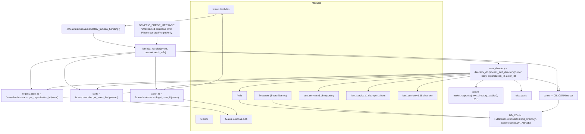

# Diagram: common/iam_service/iam_service/v1/power_bi/add_directory.py

> Auto-generated by Obscura crawlers

## Mermaid

### SVG

<svg id="container" width="3759.09765625" xmlns="http://www.w3.org/2000/svg" class="flowchart" height="880" viewBox="0 0 3759.09765625 880" role="graphics-document document" aria-roledescription="flowchart-v2"><g><marker id="container_flowchart-v2-pointEnd" class="marker flowchart-v2" viewBox="0 0 10 10" refX="5" refY="5" markerUnits="userSpaceOnUse" markerWidth="8" markerHeight="8" orient="auto"><path d="M 0 0 L 10 5 L 0 10 z" class="arrowMarkerPath" style="stroke-width: 1; stroke-dasharray: 1, 0;"></path></marker><marker id="container_flowchart-v2-pointStart" class="marker flowchart-v2" viewBox="0 0 10 10" refX="4.5" refY="5" markerUnits="userSpaceOnUse" markerWidth="8" markerHeight="8" orient="auto"><path d="M 0 5 L 10 10 L 10 0 z" class="arrowMarkerPath" style="stroke-width: 1; stroke-dasharray: 1, 0;"></path></marker><marker id="container_flowchart-v2-circleEnd" class="marker flowchart-v2" viewBox="0 0 10 10" refX="11" refY="5" markerUnits="userSpaceOnUse" markerWidth="11" markerHeight="11" orient="auto"><circle cx="5" cy="5" r="5" class="arrowMarkerPath" style="stroke-width: 1; stroke-dasharray: 1, 0;"></circle></marker><marker id="container_flowchart-v2-circleStart" class="marker flowchart-v2" viewBox="0 0 10 10" refX="-1" refY="5" markerUnits="userSpaceOnUse" markerWidth="11" markerHeight="11" orient="auto"><circle cx="5" cy="5" r="5" class="arrowMarkerPath" style="stroke-width: 1; stroke-dasharray: 1, 0;"></circle></marker><marker id="container_flowchart-v2-crossEnd" class="marker cross flowchart-v2" viewBox="0 0 11 11" refX="12" refY="5.2" markerUnits="userSpaceOnUse" markerWidth="11" markerHeight="11" orient="auto"><path d="M 1,1 l 9,9 M 10,1 l -9,9" class="arrowMarkerPath" style="stroke-width: 2; stroke-dasharray: 1, 0;"></path></marker><marker id="container_flowchart-v2-crossStart" class="marker cross flowchart-v2" viewBox="0 0 11 11" refX="-1" refY="5.2" markerUnits="userSpaceOnUse" markerWidth="11" markerHeight="11" orient="auto"><path d="M 1,1 l 9,9 M 10,1 l -9,9" class="arrowMarkerPath" style="stroke-width: 2; stroke-dasharray: 1, 0;"></path></marker><g class="root"><g class="clusters"><g class="cluster" id="Modules" data-look="classic"><rect style="" x="1246.20703125" y="8" width="1639.0703125" height="864"></rect><g class="cluster-label" transform="translate(2035, 8)"><foreignObject width="61.484375" height="24">

Modules

</foreignObject></g></g></g><g class="edgePaths"><path d="M1567.082,671L1567.082,679.167C1567.082,687.333,1567.082,703.667,1836.685,723.283C2106.288,742.899,2645.493,765.798,2915.096,777.247L3184.699,788.696" id="L_FV_DB_DB_CONN_0" class="edge-thickness-normal edge-pattern-solid edge-thickness-normal edge-pattern-solid flowchart-link" style=";" data-edge="true" data-et="edge" data-id="L_FV_DB_DB_CONN_0" data-points="W3sieCI6MTU2Ny4wODIwMzEyNSwieSI6NjcxfSx7IngiOjE1NjcuMDgyMDMxMjUsInkiOjcyMH0seyJ4IjozMTg4LjY5NTMxMjUsInkiOjc4OC44NjYwOTkwMDUzMTk0fV0=" marker-end="url(#container_flowchart-v2-pointEnd)"></path><path d="M1783.48,671L1783.48,679.167C1783.48,687.333,1783.48,703.667,2017.017,723.115C2250.554,742.564,2717.627,765.128,2951.163,776.41L3184.7,787.692" id="L_FV_SECRETS_DB_CONN_0" class="edge-thickness-normal edge-pattern-solid edge-thickness-normal edge-pattern-solid flowchart-link" style=";" data-edge="true" data-et="edge" data-id="L_FV_SECRETS_DB_CONN_0" data-points="W3sieCI6MTc4My40ODA0Njg3NSwieSI6NjcxfSx7IngiOjE3ODMuNDgwNDY4NzUsInkiOjcyMH0seyJ4IjozMTg4LjY5NTMxMjUsInkiOjc4Ny44ODQ4MDg3NzE5MzQyfV0=" marker-end="url(#container_flowchart-v2-pointEnd)"></path><path d="M1420.677,87L1416.672,91.167C1412.666,95.333,1404.655,103.667,1308.311,118.454C1211.967,133.241,1027.289,154.482,934.95,165.102L842.611,175.723" id="L_FV_AWS_mandatory_decorator_0" class="edge-thickness-normal edge-pattern-solid edge-thickness-normal edge-pattern-solid flowchart-link" style=";" data-edge="true" data-et="edge" data-id="L_FV_AWS_mandatory_decorator_0" data-points="W3sieCI6MTQyMC42NzczNTg3NzQwMzg2LCJ5Ijo4N30seyJ4IjoxMzk2LjY0NDUzMTI1LCJ5IjoxMTJ9LHsieCI6ODM4LjYzNjcxODc1LCJ5IjoxNzYuMTc5OTU3OTMwODUxNH1d" marker-end="url(#container_flowchart-v2-pointEnd)"></path><path d="M631.535,227L631.535,237.167C631.535,247.333,631.535,267.667,673.094,284.773C714.654,301.878,797.772,315.757,839.331,322.696L880.891,329.635" id="L_mandatory_decorator_lambda_handler_0" class="edge-thickness-normal edge-pattern-solid edge-thickness-normal edge-pattern-solid flowchart-link" style=";" data-edge="true" data-et="edge" data-id="L_mandatory_decorator_lambda_handler_0" data-points="W3sieCI6NjMxLjUzNTE1NjI1LCJ5IjoyMjd9LHsieCI6NjMxLjUzNTE1NjI1LCJ5IjoyODh9LHsieCI6ODg0LjgzNTkzNzUsInkiOjMzMC4yOTM4MDg5MTcxOTc0NX1d" marker-end="url(#container_flowchart-v2-pointEnd)"></path><path d="M1144.836,355.193L1557.498,365.327C1970.16,375.462,2795.484,395.731,3208.146,418.532C3620.809,441.333,3620.809,466.667,3620.809,492C3620.809,517.333,3620.809,542.667,3621.796,562.839C3622.784,583.011,3624.759,598.023,3625.747,605.528L3626.734,613.034" id="L_lambda_handler_cursor_ref_0" class="edge-thickness-normal edge-pattern-solid edge-thickness-normal edge-pattern-solid flowchart-link" style=";" data-edge="true" data-et="edge" data-id="L_lambda_handler_cursor_ref_0" data-points="W3sieCI6MTE0NC44MzU5Mzc1LCJ5IjozNTUuMTkyNjY1ODg2MjA3OX0seyJ4IjozNjIwLjgwODU5Mzc1LCJ5Ijo0MTZ9LHsieCI6MzYyMC44MDg1OTM3NSwieSI6NDkyfSx7IngiOjM2MjAuODA4NTkzNzUsInkiOjU2OH0seyJ4IjozNjI3LjI1NTk2MjE3MTA1MjUsInkiOjYxN31d" marker-end="url(#container_flowchart-v2-pointEnd)"></path><path d="M3630.809,671L3630.809,679.167C3630.809,687.333,3630.809,703.667,3613.76,716.56C3596.712,729.453,3562.615,738.906,3545.567,743.633L3528.519,748.359" id="L_cursor_ref_DB_CONN_0" class="edge-thickness-normal edge-pattern-solid edge-thickness-normal edge-pattern-solid flowchart-link" style=";" data-edge="true" data-et="edge" data-id="L_cursor_ref_DB_CONN_0" data-points="W3sieCI6MzYzMC44MDg1OTM3NSwieSI6NjcxfSx7IngiOjM2MzAuODA4NTkzNzUsInkiOjcyMH0seyJ4IjozNTI0LjY2NDA2MjUsInkiOjc0OS40Mjc3MDQyMzM1ODA4fV0=" marker-end="url(#container_flowchart-v2-pointEnd)"></path><path d="M884.836,366.117L808.275,374.431C731.714,382.745,578.591,399.372,502.03,420.353C425.469,441.333,425.469,466.667,425.469,492C425.469,517.333,425.469,542.667,441.647,561.27C457.826,579.874,490.182,591.748,506.361,597.685L522.539,603.622" id="L_lambda_handler_get_body_0" class="edge-thickness-normal edge-pattern-solid edge-thickness-normal edge-pattern-solid flowchart-link" style=";" data-edge="true" data-et="edge" data-id="L_lambda_handler_get_body_0" data-points="W3sieCI6ODg0LjgzNTkzNzUsInkiOjM2Ni4xMTY4MzYxMTkyNDg2Nn0seyJ4Ijo0MjUuNDY4NzUsInkiOjQxNn0seyJ4Ijo0MjUuNDY4NzUsInkiOjQ5Mn0seyJ4Ijo0MjUuNDY4NzUsInkiOjU2OH0seyJ4Ijo1MjYuMjk0NTEwNjkwNzg5NSwieSI6NjA1fV0=" marker-end="url(#container_flowchart-v2-pointEnd)"></path><path d="M884.836,362.215L770.751,371.179C656.667,380.143,428.497,398.072,314.413,419.702C200.328,441.333,200.328,466.667,200.328,492C200.328,517.333,200.328,542.667,201.053,560.839C201.777,579.011,203.226,590.023,203.95,595.528L204.675,601.034" id="L_lambda_handler_get_org_0" class="edge-thickness-normal edge-pattern-solid edge-thickness-normal edge-pattern-solid flowchart-link" style=";" data-edge="true" data-et="edge" data-id="L_lambda_handler_get_org_0" data-points="W3sieCI6ODg0LjgzNTkzNzUsInkiOjM2Mi4yMTQ3NTc3NjIwNjg3Nn0seyJ4IjoyMDAuMzI4MTI1LCJ5Ijo0MTZ9LHsieCI6MjAwLjMyODEyNSwieSI6NDkyfSx7IngiOjIwMC4zMjgxMjUsInkiOjU2OH0seyJ4IjoyMDUuMTk2NTQ2MDUyNjMxNiwieSI6NjA1fV0=" marker-end="url(#container_flowchart-v2-pointEnd)"></path><path d="M1014.836,391L1014.836,395.167C1014.836,399.333,1014.836,407.667,1014.836,424.5C1014.836,441.333,1014.836,466.667,1014.836,492C1014.836,517.333,1014.836,542.667,1015.56,560.839C1016.285,579.011,1017.734,590.023,1018.458,595.528L1019.183,601.034" id="L_lambda_handler_get_user_0" class="edge-thickness-normal edge-pattern-solid edge-thickness-normal edge-pattern-solid flowchart-link" style=";" data-edge="true" data-et="edge" data-id="L_lambda_handler_get_user_0" data-points="W3sieCI6MTAxNC44MzU5Mzc1LCJ5IjozOTF9LHsieCI6MTAxNC44MzU5Mzc1LCJ5Ijo0MTZ9LHsieCI6MTAxNC44MzU5Mzc1LCJ5Ijo0OTJ9LHsieCI6MTAxNC44MzU5Mzc1LCJ5Ijo1Njh9LHsieCI6MTAxOS43MDQzNTg1NTI2MzE2LCJ5Ijo2MDV9XQ==" marker-end="url(#container_flowchart-v2-pointEnd)"></path><path d="M412.656,656.962L576.654,667.468C740.652,677.975,1068.648,698.987,1248.217,717.36C1427.785,735.732,1458.926,751.464,1474.496,759.33L1490.067,767.196" id="L_get_org_FV_AWS_AUTH_0" class="edge-thickness-normal edge-pattern-solid edge-thickness-normal edge-pattern-solid flowchart-link" style=";" data-edge="true" data-et="edge" data-id="L_get_org_FV_AWS_AUTH_0" data-points="W3sieCI6NDEyLjY1NjI1LCJ5Ijo2NTYuOTYxOTE5MjgxMzg5fSx7IngiOjEzOTYuNjQ0NTMxMjUsInkiOjcyMH0seyJ4IjoxNDkzLjYzNzEyOTkzNDIxMDYsInkiOjc2OX1d" marker-end="url(#container_flowchart-v2-pointEnd)"></path><path d="M1197.188,669.082L1255.503,677.568C1313.819,686.054,1430.451,703.027,1488.766,719.014C1547.082,735,1547.082,750,1547.082,757.5L1547.082,765" id="L_get_user_FV_AWS_AUTH_0" class="edge-thickness-normal edge-pattern-solid edge-thickness-normal edge-pattern-solid flowchart-link" style=";" data-edge="true" data-et="edge" data-id="L_get_user_FV_AWS_AUTH_0" data-points="W3sieCI6MTE5Ny4xODc1LCJ5Ijo2NjkuMDgxNTA2NDEzODUyNH0seyJ4IjoxNTQ3LjA4MjAzMTI1LCJ5Ijo3MjB9LHsieCI6MTU0Ny4wODIwMzEyNSwieSI6NzY5fV0=" marker-end="url(#container_flowchart-v2-pointEnd)"></path><path d="M802.484,628.33L911.509,618.275C1020.534,608.22,1238.583,588.11,1347.608,565.388C1456.633,542.667,1456.633,517.333,1456.633,492C1456.633,466.667,1456.633,441.333,1456.633,418C1456.633,394.667,1456.633,373.333,1456.633,352C1456.633,330.667,1456.633,309.333,1456.633,284C1456.633,258.667,1456.633,229.333,1456.633,200C1456.633,170.667,1456.633,141.333,1455.957,123.155C1455.282,104.976,1453.931,97.952,1453.256,94.44L1452.581,90.928" id="L_get_body_FV_AWS_0" class="edge-thickness-normal edge-pattern-solid edge-thickness-normal edge-pattern-solid flowchart-link" style=";" data-edge="true" data-et="edge" data-id="L_get_body_FV_AWS_0" data-points="W3sieCI6ODAyLjQ4NDM3NSwieSI6NjI4LjMyOTUwMzIyMzM1OTl9LHsieCI6MTQ1Ni42MzI4MTI1LCJ5Ijo1Njh9LHsieCI6MTQ1Ni42MzI4MTI1LCJ5Ijo0OTJ9LHsieCI6MTQ1Ni42MzI4MTI1LCJ5Ijo0MTZ9LHsieCI6MTQ1Ni42MzI4MTI1LCJ5IjozNTJ9LHsieCI6MTQ1Ni42MzI4MTI1LCJ5IjoyODh9LHsieCI6MTQ1Ni42MzI4MTI1LCJ5IjoyMDB9LHsieCI6MTQ1Ni42MzI4MTI1LCJ5IjoxMTJ9LHsieCI6MTQ1MS44MjUxMjAxOTIzMDc2LCJ5Ijo4N31d" marker-end="url(#container_flowchart-v2-pointEnd)"></path><path d="M1144.836,355.724L1495.564,365.77C1846.293,375.816,2547.75,395.908,2898.479,409.454C3249.207,423,3249.207,430,3249.207,433.5L3249.207,437" id="L_lambda_handler_process_add_0" class="edge-thickness-normal edge-pattern-solid edge-thickness-normal edge-pattern-solid flowchart-link" style=";" data-edge="true" data-et="edge" data-id="L_lambda_handler_process_add_0" data-points="W3sieCI6MTE0NC44MzU5Mzc1LCJ5IjozNTUuNzIzNjQyODczNTAxNTV9LHsieCI6MzI0OS4yMDcwMzEyNSwieSI6NDE2fSx7IngiOjMyNDkuMjA3MDMxMjUsInkiOjQ0MX1d" marker-end="url(#container_flowchart-v2-pointEnd)"></path><path d="M3060.699,519.209L3004.359,527.34C2948.02,535.472,2835.34,551.736,2779,567.368C2722.66,583,2722.66,598,2722.66,605.5L2722.66,613" id="L_process_add_IAM_DIRECTORY_0" class="edge-thickness-normal edge-pattern-solid edge-thickness-normal edge-pattern-solid flowchart-link" style=";" data-edge="true" data-et="edge" data-id="L_process_add_IAM_DIRECTORY_0" data-points="W3sieCI6MzA2MC42OTkyMTg3NSwieSI6NTE5LjIwODU4MTg1NzAyODR9LHsieCI6MjcyMi42NjAxNTYyNSwieSI6NTY4fSx7IngiOjI3MjIuNjYwMTU2MjUsInkiOjYxN31d" marker-end="url(#container_flowchart-v2-pointEnd)"></path><path d="M3060.699,500.517L2811.763,511.764C2562.827,523.011,2064.954,545.506,1816.018,564.253C1567.082,583,1567.082,598,1567.082,605.5L1567.082,613" id="L_process_add_FV_DB_0" class="edge-thickness-normal edge-pattern-solid edge-thickness-normal edge-pattern-solid flowchart-link" style=";" data-edge="true" data-et="edge" data-id="L_process_add_FV_DB_0" data-points="W3sieCI6MzA2MC42OTkyMTg3NSwieSI6NTAwLjUxNjk2MTQzMjcxMTZ9LHsieCI6MTU2Ny4wODIwMzEyNSwieSI6NTY4fSx7IngiOjE1NjcuMDgyMDMxMjUsInkiOjYxN31d" marker-end="url(#container_flowchart-v2-pointEnd)"></path><path d="M3060.699,497.505L2658.348,509.254C2255.996,521.003,1451.293,544.502,1047.925,561.762C644.557,579.022,642.523,590.044,641.507,595.555L640.49,601.066" id="L_process_add_get_body_0" class="edge-thickness-normal edge-pattern-solid edge-thickness-normal edge-pattern-solid flowchart-link" style=";" data-edge="true" data-et="edge" data-id="L_process_add_get_body_0" data-points="W3sieCI6MzA2MC42OTkyMTg3NSwieSI6NDk3LjUwNDY4NzI4ODkzNjl9LHsieCI6NjQ2LjU4OTg0Mzc1LCJ5Ijo1Njh9LHsieCI6NjM5Ljc2NDU0NTY0MTQ0NzQsInkiOjYwNX1d" marker-end="url(#container_flowchart-v2-pointEnd)"></path><path d="M3060.699,497.038L2618.161,508.865C2175.622,520.692,1290.546,544.346,832.795,562.098C375.044,579.849,344.618,591.699,329.406,597.624L314.193,603.548" id="L_process_add_get_org_0" class="edge-thickness-normal edge-pattern-solid edge-thickness-normal edge-pattern-solid flowchart-link" style=";" data-edge="true" data-et="edge" data-id="L_process_add_get_org_0" data-points="W3sieCI6MzA2MC42OTkyMTg3NSwieSI6NDk3LjAzNzk0MzgzNzY4MDY0fSx7IngiOjQwNS40Njg3NSwieSI6NTY4fSx7IngiOjMxMC40NjYwNzczMDI2MzE1NiwieSI6NjA1fV0=" marker-end="url(#container_flowchart-v2-pointEnd)"></path><path d="M3060.699,498.737L2737.671,510.281C2414.643,521.824,1768.587,544.912,1438.158,562.213C1107.73,579.515,1092.928,591.029,1085.527,596.787L1078.126,602.544" id="L_process_add_get_user_0" class="edge-thickness-normal edge-pattern-solid edge-thickness-normal edge-pattern-solid flowchart-link" style=";" data-edge="true" data-et="edge" data-id="L_process_add_get_user_0" data-points="W3sieCI6MzA2MC42OTkyMTg3NSwieSI6NDk4LjczNjYxMzk1NzAwODE2fSx7IngiOjExMjIuNTMxMjUsInkiOjU2OH0seyJ4IjoxMDc0Ljk2OTA1ODM4ODE1OCwieSI6NjA1fV0=" marker-end="url(#container_flowchart-v2-pointEnd)"></path><path d="M3437.715,528.585L3471.564,535.154C3505.413,541.723,3573.111,554.862,3605.972,568.936C3638.833,583.011,3636.858,598.023,3635.871,605.528L3634.883,613.034" id="L_process_add_cursor_ref_0" class="edge-thickness-normal edge-pattern-solid edge-thickness-normal edge-pattern-solid flowchart-link" style=";" data-edge="true" data-et="edge" data-id="L_process_add_cursor_ref_0" data-points="W3sieCI6MzQzNy43MTQ4NDM3NSwieSI6NTI4LjU4NDYxODQ1Mzg2NTN9LHsieCI6MzY0MC44MDg1OTM3NSwieSI6NTY4fSx7IngiOjM2MzQuMzYxMjI1MzI4OTQ3NSwieSI6NjE3fV0=" marker-end="url(#container_flowchart-v2-pointEnd)"></path><path d="M3060.699,504.265L2897.428,514.887C2734.158,525.51,2407.616,546.755,2244.345,564.877C2081.074,583,2081.074,598,2081.074,605.5L2081.074,613" id="L_process_add_IAM_REPORTING_0" class="edge-thickness-normal edge-pattern-solid edge-thickness-normal edge-pattern-solid flowchart-link" style=";" data-edge="true" data-et="edge" data-id="L_process_add_IAM_REPORTING_0" data-points="W3sieCI6MzA2MC42OTkyMTg3NSwieSI6NTA0LjI2NDUyNDcxNTU5MTh9LHsieCI6MjA4MS4wNzQyMTg3NSwieSI6NTY4fSx7IngiOjIwODEuMDc0MjE4NzUsInkiOjYxN31d" marker-end="url(#container_flowchart-v2-pointEnd)"></path><path d="M3060.699,508.92L2950.999,518.767C2841.298,528.614,2621.897,548.307,2512.197,565.653C2402.496,583,2402.496,598,2402.496,605.5L2402.496,613" id="L_process_add_IAM_FILTERS_0" class="edge-thickness-normal edge-pattern-solid edge-thickness-normal edge-pattern-solid flowchart-link" style=";" data-edge="true" data-et="edge" data-id="L_process_add_IAM_FILTERS_0" data-points="W3sieCI6MzA2MC42OTkyMTg3NSwieSI6NTA4LjkyMDI4ODk4NTg3MzY0fSx7IngiOjI0MDIuNDk2MDkzNzUsInkiOjU2OH0seyJ4IjoyNDAyLjQ5NjA5Mzc1LCJ5Ijo2MTd9XQ==" marker-end="url(#container_flowchart-v2-pointEnd)"></path><path d="M3151.144,543L3143.133,547.167C3135.121,551.333,3119.098,559.667,3111.086,567.333C3103.074,575,3103.074,582,3103.074,585.5L3103.074,589" id="L_process_add_response_success_0" class="edge-thickness-normal edge-pattern-solid edge-thickness-normal edge-pattern-solid flowchart-link" style=";" data-edge="true" data-et="edge" data-id="L_process_add_response_success_0" data-points="W3sieCI6MzE1MS4xNDQyMjI4NjE4NDIsInkiOjU0M30seyJ4IjozMTAzLjA3NDIxODc1LCJ5Ijo1Njh9LHsieCI6MzEwMy4wNzQyMTg3NSwieSI6NTkzfV0=" marker-end="url(#container_flowchart-v2-pointEnd)"></path><path d="M3347.27,543L3355.282,547.167C3363.293,551.333,3379.317,559.667,3387.328,571.333C3395.34,583,3395.34,598,3395.34,605.5L3395.34,613" id="L_process_add_noop_0" class="edge-thickness-normal edge-pattern-solid edge-thickness-normal edge-pattern-solid flowchart-link" style=";" data-edge="true" data-et="edge" data-id="L_process_add_noop_0" data-points="W3sieCI6MzM0Ny4yNjk4Mzk2MzgxNTgsInkiOjU0M30seyJ4IjozMzk1LjMzOTg0Mzc1LCJ5Ijo1Njh9LHsieCI6MzM5NS4zMzk4NDM3NSwieSI6NjE3fV0=" marker-end="url(#container_flowchart-v2-pointEnd)"></path><path d="M1039.922,263L1039.922,267.167C1039.922,271.333,1039.922,279.667,1038.532,287.379C1037.142,295.092,1034.362,302.184,1032.972,305.73L1031.582,309.276" id="L_GEN_ERR_lambda_handler_0" class="edge-thickness-normal edge-pattern-dotted edge-thickness-normal edge-pattern-solid flowchart-link" style=";" data-edge="true" data-et="edge" data-id="L_GEN_ERR_lambda_handler_0" data-points="W3sieCI6MTAzOS45MjE4NzUsInkiOjI2M30seyJ4IjoxMDM5LjkyMTg3NSwieSI6Mjg4fSx7IngiOjEwMzAuMTIyNjgwNjY0MDYyNSwieSI6MzEzfV0=" marker-end="url(#container_flowchart-v2-pointEnd)"></path></g><g class="edgeLabels"><g class="edgeLabel"><g class="label" data-id="L_FV_DB_DB_CONN_0" transform="translate(0, 0)"><foreignObject width="0" height="0">

</foreignObject></g></g><g class="edgeLabel"><g class="label" data-id="L_FV_SECRETS_DB_CONN_0" transform="translate(0, 0)"><foreignObject width="0" height="0">

</foreignObject></g></g><g class="edgeLabel"><g class="label" data-id="L_FV_AWS_mandatory_decorator_0" transform="translate(0, 0)"><foreignObject width="0" height="0">

</foreignObject></g></g><g class="edgeLabel"><g class="label" data-id="L_mandatory_decorator_lambda_handler_0" transform="translate(0, 0)"><foreignObject width="0" height="0">

</foreignObject></g></g><g class="edgeLabel"><g class="label" data-id="L_lambda_handler_cursor_ref_0" transform="translate(0, 0)"><foreignObject width="0" height="0">

</foreignObject></g></g><g class="edgeLabel"><g class="label" data-id="L_cursor_ref_DB_CONN_0" transform="translate(0, 0)"><foreignObject width="0" height="0">

</foreignObject></g></g><g class="edgeLabel"><g class="label" data-id="L_lambda_handler_get_body_0" transform="translate(0, 0)"><foreignObject width="0" height="0">

</foreignObject></g></g><g class="edgeLabel"><g class="label" data-id="L_lambda_handler_get_org_0" transform="translate(0, 0)"><foreignObject width="0" height="0">

</foreignObject></g></g><g class="edgeLabel"><g class="label" data-id="L_lambda_handler_get_user_0" transform="translate(0, 0)"><foreignObject width="0" height="0">

</foreignObject></g></g><g class="edgeLabel"><g class="label" data-id="L_get_org_FV_AWS_AUTH_0" transform="translate(0, 0)"><foreignObject width="0" height="0">

</foreignObject></g></g><g class="edgeLabel"><g class="label" data-id="L_get_user_FV_AWS_AUTH_0" transform="translate(0, 0)"><foreignObject width="0" height="0">

</foreignObject></g></g><g class="edgeLabel"><g class="label" data-id="L_get_body_FV_AWS_0" transform="translate(0, 0)"><foreignObject width="0" height="0">

</foreignObject></g></g><g class="edgeLabel"><g class="label" data-id="L_lambda_handler_process_add_0" transform="translate(0, 0)"><foreignObject width="0" height="0">

</foreignObject></g></g><g class="edgeLabel"><g class="label" data-id="L_process_add_IAM_DIRECTORY_0" transform="translate(0, 0)"><foreignObject width="0" height="0">

</foreignObject></g></g><g class="edgeLabel"><g class="label" data-id="L_process_add_FV_DB_0" transform="translate(0, 0)"><foreignObject width="0" height="0">

</foreignObject></g></g><g class="edgeLabel"><g class="label" data-id="L_process_add_get_body_0" transform="translate(0, 0)"><foreignObject width="0" height="0">

</foreignObject></g></g><g class="edgeLabel"><g class="label" data-id="L_process_add_get_org_0" transform="translate(0, 0)"><foreignObject width="0" height="0">

</foreignObject></g></g><g class="edgeLabel"><g class="label" data-id="L_process_add_get_user_0" transform="translate(0, 0)"><foreignObject width="0" height="0">

</foreignObject></g></g><g class="edgeLabel"><g class="label" data-id="L_process_add_cursor_ref_0" transform="translate(0, 0)"><foreignObject width="0" height="0">

</foreignObject></g></g><g class="edgeLabel"><g class="label" data-id="L_process_add_IAM_REPORTING_0" transform="translate(0, 0)"><foreignObject width="0" height="0">

</foreignObject></g></g><g class="edgeLabel"><g class="label" data-id="L_process_add_IAM_FILTERS_0" transform="translate(0, 0)"><foreignObject width="0" height="0">

</foreignObject></g></g><g class="edgeLabel"><g class="label" data-id="L_process_add_response_success_0" transform="translate(0, 0)"><foreignObject width="0" height="0">

</foreignObject></g></g><g class="edgeLabel"><g class="label" data-id="L_process_add_noop_0" transform="translate(0, 0)"><foreignObject width="0" height="0">

</foreignObject></g></g><g class="edgeLabel"><g class="label" data-id="L_GEN_ERR_lambda_handler_0" transform="translate(0, 0)"><foreignObject width="0" height="0">

</foreignObject></g></g></g><g class="nodes"><g class="node default" id="flowchart-FV_DB-0" transform="translate(1567.08203125, 644)"><rect class="basic label-container" style="" x="-47.6796875" y="-27" width="95.359375" height="54"></rect><g class="label" style="" transform="translate(-17.6796875, -12)"><rect></rect><foreignObject width="35.359375" height="24">

fv.db

</foreignObject></g></g><g class="node default" id="flowchart-FV_ERROR-1" transform="translate(1337.40234375, 796)"><rect class="basic label-container" style="" x="-56.1953125" y="-27" width="112.390625" height="54"></rect><g class="label" style="" transform="translate(-26.1953125, -12)"><rect></rect><foreignObject width="52.390625" height="24">

fv.error

</foreignObject></g></g><g class="node default" id="flowchart-FV_AWS-2" transform="translate(1446.6328125, 60)"><rect class="basic label-container" style="" x="-84.9765625" y="-27" width="169.953125" height="54"></rect><g class="label" style="" transform="translate(-54.9765625, -12)"><rect></rect><foreignObject width="109.953125" height="24">

fv.aws.lambdas

</foreignObject></g></g><g class="node default" id="flowchart-FV_AWS_AUTH-3" transform="translate(1547.08203125, 796)"><rect class="basic label-container" style="" x="-103.484375" y="-27" width="206.96875" height="54"></rect><g class="label" style="" transform="translate(-73.484375, -12)"><rect></rect><foreignObject width="146.96875" height="24">

fv.aws.lambdas.auth

</foreignObject></g></g><g class="node default" id="flowchart-FV_SECRETS-4" transform="translate(1783.48046875, 644)"><rect class="basic label-container" style="" x="-118.71875" y="-27" width="237.4375" height="54"></rect><g class="label" style="" transform="translate(-88.71875, -12)"><rect></rect><foreignObject width="177.4375" height="24">

fv.secrets (SecretNames)

</foreignObject></g></g><g class="node default" id="flowchart-IAM_REPORTING-5" transform="translate(2081.07421875, 644)"><rect class="basic label-container" style="" x="-128.875" y="-27" width="257.75" height="54"></rect><g class="label" style="" transform="translate(-98.875, -12)"><rect></rect><foreignObject width="197.75" height="24">

iam_service.v1.db.reporting

</foreignObject></g></g><g class="node default" id="flowchart-IAM_FILTERS-6" transform="translate(2402.49609375, 644)"><rect class="basic label-container" style="" x="-142.546875" y="-27" width="285.09375" height="54"></rect><g class="label" style="" transform="translate(-112.546875, -12)"><rect></rect><foreignObject width="225.09375" height="24">

iam_service.v1.db.report_filters

</foreignObject></g></g><g class="node default" id="flowchart-IAM_DIRECTORY-7" transform="translate(2722.66015625, 644)"><rect class="basic label-container" style="" x="-127.6171875" y="-27" width="255.234375" height="54"></rect><g class="label" style="" transform="translate(-97.6171875, -12)"><rect></rect><foreignObject width="195.234375" height="24">

iam_service.v1.db.directory

</foreignObject></g></g><g class="node default" id="flowchart-DB_CONN-8" transform="translate(3356.6796875, 796)"><rect class="basic label-container" style="" x="-167.984375" y="-51" width="335.96875" height="102"></rect><g class="label" style="" transform="translate(-137.984375, -36)"><rect></rect><foreignObject width="275.96875" height="72">

DB_CONN: FvDatabaseConnector('add_directory', SecretNames.DATABASE)

</foreignObject></g></g><g class="node default" id="flowchart-GEN_ERR-9" transform="translate(1039.921875, 200)"><rect class="basic label-container" style="" x="-130.21875" y="-63" width="260.4375" height="126"></rect><g class="label" style="" transform="translate(-100.21875, -48)"><rect></rect><foreignObject width="200.4375" height="96">

GENERIC_ERROR_MESSAGE: 'Unexpected database error. Please contact FreightVerify.'

</foreignObject></g></g><g class="node default" id="flowchart-lambda_handler-10" transform="translate(1014.8359375, 352)"><rect class="basic label-container" style="" x="-130" y="-39" width="260" height="78"></rect><g class="label" style="" transform="translate(-100, -24)"><rect></rect><foreignObject width="200" height="48">

lambda_handler(event, context, audit_refs)

</foreignObject></g></g><g class="node default" id="flowchart-mandatory_decorator-11" transform="translate(631.53515625, 200)"><rect class="basic label-container" style="" x="-207.1015625" y="-27" width="414.203125" height="54"></rect><g class="label" style="" transform="translate(-177.1015625, -12)"><rect></rect><foreignObject width="354.203125" height="24">

@fv.aws.lambdas.mandatory_lambda_handling()

</foreignObject></g></g><g class="node default" id="flowchart-get_body-12" transform="translate(632.5703125, 644)"><rect class="basic label-container" style="" x="-169.9140625" y="-39" width="339.828125" height="78"></rect><g class="label" style="" transform="translate(-139.9140625, -24)"><rect></rect><foreignObject width="279.828125" height="48">

body = fv.aws.lambdas.get_event_body(event)

</foreignObject></g></g><g class="node default" id="flowchart-get_org-13" transform="translate(210.328125, 644)"><rect class="basic label-container" style="" x="-202.328125" y="-39" width="404.65625" height="78"></rect><g class="label" style="" transform="translate(-172.328125, -24)"><rect></rect><foreignObject width="344.65625" height="48">

organization_id = fv.aws.lambdas.auth.get_organization_id(event)

</foreignObject></g></g><g class="node default" id="flowchart-get_user-14" transform="translate(1024.8359375, 644)"><rect class="basic label-container" style="" x="-172.3515625" y="-39" width="344.703125" height="78"></rect><g class="label" style="" transform="translate(-142.3515625, -24)"><rect></rect><foreignObject width="284.703125" height="48">

actor_id = fv.aws.lambdas.auth.get_user_id(event)

</foreignObject></g></g><g class="node default" id="flowchart-process_add-15" transform="translate(3249.20703125, 492)"><rect class="basic label-container" style="" x="-188.5078125" y="-51" width="377.015625" height="102"></rect><g class="label" style="" transform="translate(-158.5078125, -36)"><rect></rect><foreignObject width="317.015625" height="72">

new_directory = directory_db.process_add_directory(cursor, body, organization_id, actor_id)

</foreignObject></g></g><g class="node default" id="flowchart-cursor_ref-16" transform="translate(3630.80859375, 644)"><rect class="basic label-container" style="" x="-120.2890625" y="-27" width="240.578125" height="54"></rect><g class="label" style="" transform="translate(-90.2890625, -12)"><rect></rect><foreignObject width="180.578125" height="24">

cursor = DB_CONN.cursor

</foreignObject></g></g><g class="node default" id="flowchart-response_success-17" transform="translate(3103.07421875, 644)"><rect class="basic label-container" style="" x="-177.0859375" y="-51" width="354.171875" height="102"></rect><g class="label" style="" transform="translate(-147.0859375, -36)"><rect></rect><foreignObject width="294.171875" height="72">

return make_response(new_directory._asdict(), 201)

</foreignObject></g></g><g class="node default" id="flowchart-noop-18" transform="translate(3395.33984375, 644)"><rect class="basic label-container" style="" x="-65.1796875" y="-27" width="130.359375" height="54"></rect><g class="label" style="" transform="translate(-35.1796875, -12)"><rect></rect><foreignObject width="70.359375" height="24">

else: pass

</foreignObject></g></g></g></g></g></svg>
