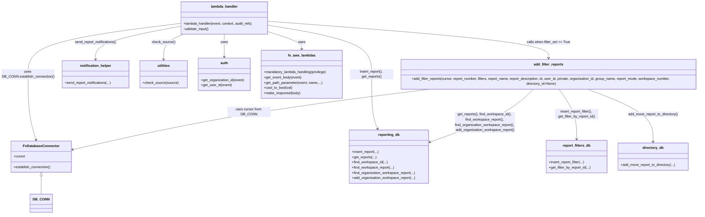

# Diagram: common/iam_service/iam_service/v1/power_bi/add_report.py


> Auto-generated by Obscura crawlers

## Diagram 1



### SVG

<svg id="container" width="3307.5546875" xmlns="http://www.w3.org/2000/svg" class="classDiagram" height="1012" viewBox="0 0 3307.5546875 1012" role="graphics-document document" aria-roledescription="class"><style>#container{font-family:"trebuchet ms",verdana,arial,sans-serif;font-size:16px;fill:#333;}@keyframes edge-animation-frame{from{stroke-dashoffset:0;}}@keyframes dash{to{stroke-dashoffset:0;}}#container .edge-animation-slow{stroke-dasharray:9,5!important;stroke-dashoffset:900;animation:dash 50s linear infinite;stroke-linecap:round;}#container .edge-animation-fast{stroke-dasharray:9,5!important;stroke-dashoffset:900;animation:dash 20s linear infinite;stroke-linecap:round;}#container .error-icon{fill:#552222;}#container .error-text{fill:#552222;stroke:#552222;}#container .edge-thickness-normal{stroke-width:1px;}#container .edge-thickness-thick{stroke-width:3.5px;}#container .edge-pattern-solid{stroke-dasharray:0;}#container .edge-thickness-invisible{stroke-width:0;fill:none;}#container .edge-pattern-dashed{stroke-dasharray:3;}#container .edge-pattern-dotted{stroke-dasharray:2;}#container .marker{fill:#333333;stroke:#333333;}#container .marker.cross{stroke:#333333;}#container svg{font-family:"trebuchet ms",verdana,arial,sans-serif;font-size:16px;}#container p{margin:0;}#container g.classGroup text{fill:#9370DB;stroke:none;font-family:"trebuchet ms",verdana,arial,sans-serif;font-size:10px;}#container g.classGroup text .title{font-weight:bolder;}#container .nodeLabel,#container .edgeLabel{color:#131300;}#container .edgeLabel .label rect{fill:#ECECFF;}#container .label text{fill:#131300;}#container .labelBkg{background:#ECECFF;}#container .edgeLabel .label span{background:#ECECFF;}#container .classTitle{font-weight:bolder;}#container .node rect,#container .node circle,#container .node ellipse,#container .node polygon,#container .node path{fill:#ECECFF;stroke:#9370DB;stroke-width:1px;}#container .divider{stroke:#9370DB;stroke-width:1;}#container g.clickable{cursor:pointer;}#container g.classGroup rect{fill:#ECECFF;stroke:#9370DB;}#container g.classGroup line{stroke:#9370DB;stroke-width:1;}#container .classLabel .box{stroke:none;stroke-width:0;fill:#ECECFF;opacity:0.5;}#container .classLabel .label{fill:#9370DB;font-size:10px;}#container .relation{stroke:#333333;stroke-width:1;fill:none;}#container .dashed-line{stroke-dasharray:3;}#container .dotted-line{stroke-dasharray:1 2;}#container #compositionStart,#container .composition{fill:#333333!important;stroke:#333333!important;stroke-width:1;}#container #compositionEnd,#container .composition{fill:#333333!important;stroke:#333333!important;stroke-width:1;}#container #dependencyStart,#container .dependency{fill:#333333!important;stroke:#333333!important;stroke-width:1;}#container #dependencyStart,#container .dependency{fill:#333333!important;stroke:#333333!important;stroke-width:1;}#container #extensionStart,#container .extension{fill:transparent!important;stroke:#333333!important;stroke-width:1;}#container #extensionEnd,#container .extension{fill:transparent!important;stroke:#333333!important;stroke-width:1;}#container #aggregationStart,#container .aggregation{fill:transparent!important;stroke:#333333!important;stroke-width:1;}#container #aggregationEnd,#container .aggregation{fill:transparent!important;stroke:#333333!important;stroke-width:1;}#container #lollipopStart,#container .lollipop{fill:#ECECFF!important;stroke:#333333!important;stroke-width:1;}#container #lollipopEnd,#container .lollipop{fill:#ECECFF!important;stroke:#333333!important;stroke-width:1;}#container .edgeTerminals{font-size:11px;line-height:initial;}#container .classTitleText{text-anchor:middle;font-size:18px;fill:#333;}#container .label-icon{display:inline-block;height:1em;overflow:visible;vertical-align:-0.125em;}#container .node .label-icon path{fill:currentColor;stroke:revert;stroke-width:revert;}#container :root{--mermaid-font-family:"trebuchet ms",verdana,arial,sans-serif;}</style><g><defs><marker id="container_class-aggregationStart" class="marker aggregation class" refX="18" refY="7" markerWidth="190" markerHeight="240" orient="auto"><path d="M 18,7 L9,13 L1,7 L9,1 Z"></path></marker></defs><defs><marker id="container_class-aggregationEnd" class="marker aggregation class" refX="1" refY="7" markerWidth="20" markerHeight="28" orient="auto"><path d="M 18,7 L9,13 L1,7 L9,1 Z"></path></marker></defs><defs><marker id="container_class-extensionStart" class="marker extension class" refX="18" refY="7" markerWidth="190" markerHeight="240" orient="auto"><path d="M 1,7 L18,13 V 1 Z"></path></marker></defs><defs><marker id="container_class-extensionEnd" class="marker extension class" refX="1" refY="7" markerWidth="20" markerHeight="28" orient="auto"><path d="M 1,1 V 13 L18,7 Z"></path></marker></defs><defs><marker id="container_class-compositionStart" class="marker composition class" refX="18" refY="7" markerWidth="190" markerHeight="240" orient="auto"><path d="M 18,7 L9,13 L1,7 L9,1 Z"></path></marker></defs><defs><marker id="container_class-compositionEnd" class="marker composition class" refX="1" refY="7" markerWidth="20" markerHeight="28" orient="auto"><path d="M 18,7 L9,13 L1,7 L9,1 Z"></path></marker></defs><defs><marker id="container_class-dependencyStart" class="marker dependency class" refX="6" refY="7" markerWidth="190" markerHeight="240" orient="auto"><path d="M 5,7 L9,13 L1,7 L9,1 Z"></path></marker></defs><defs><marker id="container_class-dependencyEnd" class="marker dependency class" refX="13" refY="7" markerWidth="20" markerHeight="28" orient="auto"><path d="M 18,7 L9,13 L14,7 L9,1 Z"></path></marker></defs><defs><marker id="container_class-lollipopStart" class="marker lollipop class" refX="13" refY="7" markerWidth="190" markerHeight="240" orient="auto"><circle stroke="black" fill="transparent" cx="7" cy="7" r="6"></circle></marker></defs><defs><marker id="container_class-lollipopEnd" class="marker lollipop class" refX="1" refY="7" markerWidth="190" markerHeight="240" orient="auto"><circle stroke="black" fill="transparent" cx="7" cy="7" r="6"></circle></marker></defs><g class="root"><g class="clusters"></g><g class="edgePaths"><path d="M185.586,836.25L185.586,846.042C185.586,855.833,185.586,875.417,185.586,889.375C185.586,903.333,185.586,911.667,185.586,915.833L185.586,920" id="id_FvDatabaseConnector_DB_CONN_1" class="edge-thickness-normal edge-pattern-solid relation" style=";;;" data-edge="true" data-et="edge" data-id="id_FvDatabaseConnector_DB_CONN_1" data-points="W3sieCI6MTg1LjU4NTkzNzUsInkiOjgxOX0seyJ4IjoxODUuNTg1OTM3NSwieSI6ODk1fSx7IngiOjE4NS41ODU5Mzc1LCJ5Ijo5MjB9XQ==" marker-start="url(#container_class-extensionStart)"></path><path d="M1233.203,152.718L1259.523,161.765C1285.844,170.812,1338.484,188.906,1364.805,205.12C1391.125,221.333,1391.125,235.667,1391.125,242.833L1391.125,250" id="id_lambda_handler_fv_aws_lambdas_2" class="edge-thickness-normal edge-pattern-solid relation" style=";;;" data-edge="true" data-et="edge" data-id="id_lambda_handler_fv_aws_lambdas_2" data-points="W3sieCI6MTIzMy4yMDMxMjUsInkiOjE1Mi43MTgzNjMyMzY3MTEzfSx7IngiOjEzOTEuMTI1LCJ5IjoyMDd9LHsieCI6MTM5MS4xMjUsInkiOjI1Nn1d" marker-end="url(#container_class-dependencyEnd)"></path><path d="M1030.371,158L1030.371,166.167C1030.371,174.333,1030.371,190.667,1030.371,212C1030.371,233.333,1030.371,259.667,1030.371,272.833L1030.371,286" id="id_lambda_handler_auth_3" class="edge-thickness-normal edge-pattern-solid relation" style=";;;" data-edge="true" data-et="edge" data-id="id_lambda_handler_auth_3" data-points="W3sieCI6MTAzMC4zNzEwOTM3NSwieSI6MTU4fSx7IngiOjEwMzAuMzcxMDkzNzUsInkiOjIwN30seyJ4IjoxMDMwLjM3MTA5Mzc1LCJ5IjoyOTJ9XQ==" marker-end="url(#container_class-dependencyEnd)"></path><path d="M827.539,110.84L710.776,126.867C594.013,142.894,360.487,174.947,243.724,217.64C126.961,260.333,126.961,313.667,126.961,371C126.961,428.333,126.961,489.667,132.856,540.042C138.751,590.417,150.541,629.834,156.436,649.543L162.331,669.252" id="id_lambda_handler_FvDatabaseConnector_4" class="edge-thickness-normal edge-pattern-solid relation" style=";;;" data-edge="true" data-et="edge" data-id="id_lambda_handler_FvDatabaseConnector_4" data-points="W3sieCI6ODI3LjUzOTA2MjUsInkiOjExMC44NDAyNTgwNTAwMTAxNn0seyJ4IjoxMjYuOTYwOTM3NSwieSI6MjA3fSx7IngiOjEyNi45NjA5Mzc1LCJ5IjozNjd9LHsieCI6MTI2Ljk2MDkzNzUsInkiOjU1MX0seyJ4IjoxNjQuMDUwMjIzMjE0Mjg1NzIsInkiOjY3NX1d" marker-end="url(#container_class-dependencyEnd)"></path><path d="M1233.203,119.708L1313.592,134.257C1393.982,148.805,1554.76,177.903,1635.15,219.118C1715.539,260.333,1715.539,313.667,1715.539,371C1715.539,428.333,1715.539,489.667,1720.168,531.575C1724.798,573.484,1734.056,595.968,1738.686,607.21L1743.315,618.452" id="id_lambda_handler_reporting_db_5" class="edge-thickness-normal edge-pattern-solid relation" style=";;;" data-edge="true" data-et="edge" data-id="id_lambda_handler_reporting_db_5" data-points="W3sieCI6MTIzMy4yMDMxMjUsInkiOjExOS43MDgwMzgwNjA5MjI1Nn0seyJ4IjoxNzE1LjUzOTA2MjUsInkiOjIwN30seyJ4IjoxNzE1LjUzOTA2MjUsInkiOjM2N30seyJ4IjoxNzE1LjUzOTA2MjUsInkiOjU1MX0seyJ4IjoxNzQ1LjU5OTc2ODgxMzc3NTQsInkiOjYyNH1d" marker-end="url(#container_class-dependencyEnd)"></path><path d="M827.539,125.378L762.429,138.982C697.319,152.586,567.099,179.793,501.989,208.563C436.879,237.333,436.879,267.667,436.879,282.833L436.879,298" id="id_lambda_handler_notification_helper_6" class="edge-thickness-normal edge-pattern-solid relation" style=";;;" data-edge="true" data-et="edge" data-id="id_lambda_handler_notification_helper_6" data-points="W3sieCI6ODI3LjUzOTA2MjUsInkiOjEyNS4zNzgyNjk1MTE3NjE2OX0seyJ4Ijo0MzYuODc4OTA2MjUsInkiOjIwN30seyJ4Ijo0MzYuODc4OTA2MjUsInkiOjMwNH1d" marker-end="url(#container_class-dependencyEnd)"></path><path d="M861.356,158L842.953,166.167C824.549,174.333,787.741,190.667,769.337,214C750.934,237.333,750.934,267.667,750.934,282.833L750.934,298" id="id_lambda_handler_utilities_7" class="edge-thickness-normal edge-pattern-solid relation" style=";;;" data-edge="true" data-et="edge" data-id="id_lambda_handler_utilities_7" data-points="W3sieCI6ODYxLjM1NjQ3NjgxNDUxNjEsInkiOjE1OH0seyJ4Ijo3NTAuOTMzNTkzNzUsInkiOjIwN30seyJ4Ijo3NTAuOTMzNTkzNzUsInkiOjMwNH1d" marker-end="url(#container_class-dependencyEnd)"></path><path d="M1233.203,99.282L1456.844,117.235C1680.484,135.188,2127.766,171.094,2351.406,204.214C2575.047,237.333,2575.047,267.667,2575.047,282.833L2575.047,298" id="id_lambda_handler_add_filter_reports_8" class="edge-thickness-normal edge-pattern-solid relation" style=";;;" data-edge="true" data-et="edge" data-id="id_lambda_handler_add_filter_reports_8" data-points="W3sieCI6MTIzMy4yMDMxMjUsInkiOjk5LjI4MjQ5MjUzMzU3Njc3fSx7IngiOjI1NzUuMDQ2ODc1LCJ5IjoyMDd9LHsieCI6MjU3NS4wNDY4NzUsInkiOjMwNH1d" marker-end="url(#container_class-dependencyEnd)"></path><path d="M2511.131,430L2490.671,450.167C2470.211,470.333,2429.291,510.667,2341.601,553.087C2253.91,595.508,2119.45,640.017,2052.219,662.271L1984.989,684.525" id="id_add_filter_reports_reporting_db_9" class="edge-thickness-normal edge-pattern-solid relation" style=";;;" data-edge="true" data-et="edge" data-id="id_add_filter_reports_reporting_db_9" data-points="W3sieCI6MjUxMS4xMzA3MTA3Njc2NjMsInkiOjQzMH0seyJ4IjoyMzg4LjM3MTA5Mzc1LCJ5Ijo1NTF9LHsieCI6MTk3OS4yOTI5Njg3NSwieSI6Njg2LjQxMDMyOTY1NDM4MDh9XQ==" marker-end="url(#container_class-dependencyEnd)"></path><path d="M2619.801,430L2634.127,450.167C2648.453,470.333,2677.106,510.667,2691.432,550C2705.758,589.333,2705.758,627.667,2705.758,646.833L2705.758,666" id="id_add_filter_reports_report_filters_db_10" class="edge-thickness-normal edge-pattern-solid relation" style=";;;" data-edge="true" data-et="edge" data-id="id_add_filter_reports_report_filters_db_10" data-points="W3sieCI6MjYxOS44MDExNjMzODMxNTIsInkiOjQzMH0seyJ4IjoyNzA1Ljc1NzgxMjUsInkiOjU1MX0seyJ4IjoyNzA1Ljc1NzgxMjUsInkiOjY3Mn1d" marker-end="url(#container_class-dependencyEnd)"></path><path d="M2740.557,430L2793.538,450.167C2846.518,470.333,2952.48,510.667,3005.461,552C3058.441,593.333,3058.441,635.667,3058.441,656.833L3058.441,678" id="id_add_filter_reports_directory_db_11" class="edge-thickness-normal edge-pattern-solid relation" style=";;;" data-edge="true" data-et="edge" data-id="id_add_filter_reports_directory_db_11" data-points="W3sieCI6Mjc0MC41NTY5NTkwNjkyOTM1LCJ5Ijo0MzB9LHsieCI6MzA1OC40NDE0MDYyNSwieSI6NTUxfSx7IngiOjMwNTguNDQxNDA2MjUsInkiOjY4NH1d" marker-end="url(#container_class-dependencyEnd)"></path><path d="M2064.394,430L1900.931,450.167C1737.469,470.333,1410.543,510.667,1121.433,558.257C832.322,605.846,581.028,660.693,455.38,688.116L329.733,715.539" id="id_add_filter_reports_FvDatabaseConnector_12" class="edge-thickness-normal edge-pattern-solid relation" style=";;;" data-edge="true" data-et="edge" data-id="id_add_filter_reports_FvDatabaseConnector_12" data-points="W3sieCI6MjA2NC4zOTQzMTg5NTM4MDQ1LCJ5Ijo0MzB9LHsieCI6MTA4My42MTcxODc1LCJ5Ijo1NTF9LHsieCI6MzIzLjg3MTA5Mzc1LCJ5Ijo3MTYuODE4NTQ0MDM3MzAzOH1d" marker-end="url(#container_class-dependencyEnd)"></path></g><g class="edgeLabels"><g class="edgeLabel"><g class="label" data-id="id_FvDatabaseConnector_DB_CONN_1" transform="translate(0, 0)"><foreignObject width="0" height="0"><div xmlns="http://www.w3.org/1999/xhtml" class="labelBkg" style="display: table-cell; white-space: nowrap; line-height: 1.5; max-width: 200px; text-align: center;"><span class="edgeLabel"></span></div></foreignObject></g></g><g class="edgeLabel" transform="translate(1391.125, 207)"><g class="label" data-id="id_lambda_handler_fv_aws_lambdas_2" transform="translate(-16.4921875, -12)"><foreignObject width="32.984375" height="24"><div xmlns="http://www.w3.org/1999/xhtml" class="labelBkg" style="display: table-cell; white-space: nowrap; line-height: 1.5; max-width: 200px; text-align: center;"><span class="edgeLabel"><p>uses</p></span></div></foreignObject></g></g><g class="edgeLabel" transform="translate(1030.37109375, 207)"><g class="label" data-id="id_lambda_handler_auth_3" transform="translate(-16.4921875, -12)"><foreignObject width="32.984375" height="24"><div xmlns="http://www.w3.org/1999/xhtml" class="labelBkg" style="display: table-cell; white-space: nowrap; line-height: 1.5; max-width: 200px; text-align: center;"><span class="edgeLabel"><p>uses</p></span></div></foreignObject></g></g><g class="edgeLabel" transform="translate(126.9609375, 367)"><g class="label" data-id="id_lambda_handler_FvDatabaseConnector_4" transform="translate(-118.9609375, -24)"><foreignObject width="237.921875" height="48"><div xmlns="http://www.w3.org/1999/xhtml" class="labelBkg" style="display: table; white-space: break-spaces; line-height: 1.5; max-width: 200px; text-align: center; width: 200px;"><span class="edgeLabel"><p>uses DB_CONN.establish_connection()</p></span></div></foreignObject></g></g><g class="edgeLabel" transform="translate(1715.5390625, 367)"><g class="label" data-id="id_lambda_handler_reporting_db_5" transform="translate(-100, -24)"><foreignObject width="200" height="48"><div xmlns="http://www.w3.org/1999/xhtml" class="labelBkg" style="display: table; white-space: break-spaces; line-height: 1.5; max-width: 200px; text-align: center; width: 200px;"><span class="edgeLabel"><p>insert_report(), get_reports()</p></span></div></foreignObject></g></g><g class="edgeLabel" transform="translate(436.87890625, 207)"><g class="label" data-id="id_lambda_handler_notification_helper_6" transform="translate(-99.125, -12)"><foreignObject width="198.25" height="24"><div xmlns="http://www.w3.org/1999/xhtml" class="labelBkg" style="display: table-cell; white-space: nowrap; line-height: 1.5; max-width: 200px; text-align: center;"><span class="edgeLabel"><p>send_report_notifications()</p></span></div></foreignObject></g></g><g class="edgeLabel" transform="translate(750.93359375, 207)"><g class="label" data-id="id_lambda_handler_utilities_7" transform="translate(-54.078125, -12)"><foreignObject width="108.15625" height="24"><div xmlns="http://www.w3.org/1999/xhtml" class="labelBkg" style="display: table-cell; white-space: nowrap; line-height: 1.5; max-width: 200px; text-align: center;"><span class="edgeLabel"><p>check_source()</p></span></div></foreignObject></g></g><g class="edgeLabel" transform="translate(2575.046875, 207)"><g class="label" data-id="id_lambda_handler_add_filter_reports_8" transform="translate(-100, -24)"><foreignObject width="200" height="48"><div xmlns="http://www.w3.org/1999/xhtml" class="labelBkg" style="display: table; white-space: break-spaces; line-height: 1.5; max-width: 200px; text-align: center; width: 200px;"><span class="edgeLabel"><p>calls when filter_set == True</p></span></div></foreignObject></g></g><g class="edgeLabel" transform="translate(2265.65039, 591.62219)"><g class="label" data-id="id_add_filter_reports_reporting_db_9" transform="translate(-141.421875, -48)"><foreignObject width="282.84375" height="96"><div xmlns="http://www.w3.org/1999/xhtml" class="labelBkg" style="display: table; white-space: break-spaces; line-height: 1.5; max-width: 200px; text-align: center; width: 200px;"><span class="edgeLabel"><p>get_reports(), find_workspace_id(), find_workspace_report(), find_organization_workspace_report(), add_organization_workspace_report()</p></span></div></foreignObject></g></g><g class="edgeLabel" transform="translate(2705.7578125, 551)"><g class="label" data-id="id_add_filter_reports_report_filters_db_10" transform="translate(-100, -24)"><foreignObject width="200" height="48"><div xmlns="http://www.w3.org/1999/xhtml" class="labelBkg" style="display: table; white-space: break-spaces; line-height: 1.5; max-width: 200px; text-align: center; width: 200px;"><span class="edgeLabel"><p>insert_report_filter(), get_filter_by_report_id()</p></span></div></foreignObject></g></g><g class="edgeLabel" transform="translate(3058.44140625, 551)"><g class="label" data-id="id_add_filter_reports_directory_db_11" transform="translate(-117.453125, -12)"><foreignObject width="234.90625" height="24"><div xmlns="http://www.w3.org/1999/xhtml" class="labelBkg" style="display: table; white-space: break-spaces; line-height: 1.5; max-width: 200px; text-align: center; width: 200px;"><span class="edgeLabel"><p>add_move_report_to_directory()</p></span></div></foreignObject></g></g><g class="edgeLabel" transform="translate(1188.11591, 538.10783)"><g class="label" data-id="id_add_filter_reports_FvDatabaseConnector_12" transform="translate(-97.25, -12)"><foreignObject width="194.5" height="24"><div xmlns="http://www.w3.org/1999/xhtml" class="labelBkg" style="display: table-cell; white-space: nowrap; line-height: 1.5; max-width: 200px; text-align: center;"><span class="edgeLabel"><p>uses cursor from DB_CONN</p></span></div></foreignObject></g></g></g><g class="nodes"><g class="node default" id="classId-lambda_handler-0" transform="translate(1030.37109375, 83)"><g class="basic label-container"><path d="M-202.83203125 -75 L202.83203125 -75 L202.83203125 75 L-202.83203125 75" stroke="none" stroke-width="0" fill="#ECECFF" style=""></path><path d="M-202.83203125 -75 C-91.37031642126941 -75, 20.091398407461185 -75, 202.83203125 -75 M-202.83203125 -75 C-113.49483548483698 -75, -24.157639719673966 -75, 202.83203125 -75 M202.83203125 -75 C202.83203125 -33.66112978191505, 202.83203125 7.677740436169898, 202.83203125 75 M202.83203125 -75 C202.83203125 -38.68841775400573, 202.83203125 -2.376835508011453, 202.83203125 75 M202.83203125 75 C114.76792270392767 75, 26.703814157855334 75, -202.83203125 75 M202.83203125 75 C64.9753134557225 75, -72.881404338555 75, -202.83203125 75 M-202.83203125 75 C-202.83203125 19.3210000230646, -202.83203125 -36.3579999538708, -202.83203125 -75 M-202.83203125 75 C-202.83203125 26.39381334906752, -202.83203125 -22.212373301864957, -202.83203125 -75" stroke="#9370DB" stroke-width="1.3" fill="none" stroke-dasharray="0 0" style=""></path></g><g class="annotation-group text" transform="translate(0, -51)"></g><g class="label-group text" transform="translate(-59.9765625, -51)"><g class="label" style="font-weight: bolder" transform="translate(0,-12)"><foreignObject width="119.953125" height="24"><div xmlns="http://www.w3.org/1999/xhtml" style="display: table-cell; white-space: nowrap; line-height: 1.5; max-width: 170px; text-align: center;"><span class="nodeLabel markdown-node-label" style=""><p>lambda_handler</p></span></div></foreignObject></g></g><g class="members-group text" transform="translate(-190.83203125, -3)"></g><g class="methods-group text" transform="translate(-190.83203125, 27)"><g class="label" style="" transform="translate(0,-12)"><foreignObject width="321.6875" height="24"><div xmlns="http://www.w3.org/1999/xhtml" style="display: table-cell; white-space: nowrap; line-height: 1.5; max-width: 379px; text-align: center;"><span class="nodeLabel markdown-node-label" style=""><p>+lambda_handler(event, context, audit_refs)</p></span></div></foreignObject></g><g class="label" style="" transform="translate(0,12)"><foreignObject width="121.03125" height="24"><div xmlns="http://www.w3.org/1999/xhtml" style="display: table-cell; white-space: nowrap; line-height: 1.5; max-width: 178px; text-align: center;"><span class="nodeLabel markdown-node-label" style=""><p>-validate_input()</p></span></div></foreignObject></g></g><g class="divider" style=""><path d="M-202.83203125 -27 C-94.46902995676493 -27, 13.893971336470145 -27, 202.83203125 -27 M-202.83203125 -27 C-52.53616799435457 -27, 97.75969526129086 -27, 202.83203125 -27" stroke="#9370DB" stroke-width="1.3" fill="none" stroke-dasharray="0 0" style=""></path></g><g class="divider" style=""><path d="M-202.83203125 -3 C-54.58351465454598 -3, 93.66500194090804 -3, 202.83203125 -3 M-202.83203125 -3 C-60.82047946636047 -3, 81.19107231727907 -3, 202.83203125 -3" stroke="#9370DB" stroke-width="1.3" fill="none" stroke-dasharray="0 0" style=""></path></g></g><g class="node default" id="classId-add_filter_reports-1" transform="translate(2575.046875, 367)"><g class="basic label-container"><path d="M-724.5078125 -63 L724.5078125 -63 L724.5078125 63 L-724.5078125 63" stroke="none" stroke-width="0" fill="#ECECFF" style=""></path><path d="M-724.5078125 -63 C-190.83087918159833 -63, 342.84605413680333 -63, 724.5078125 -63 M-724.5078125 -63 C-317.97862940979917 -63, 88.55055368040166 -63, 724.5078125 -63 M724.5078125 -63 C724.5078125 -31.109302549702758, 724.5078125 0.7813949005944849, 724.5078125 63 M724.5078125 -63 C724.5078125 -23.937801346256123, 724.5078125 15.124397307487754, 724.5078125 63 M724.5078125 63 C351.0527899761903 63, -22.402232547619406 63, -724.5078125 63 M724.5078125 63 C173.6634590763258 63, -377.1808943473484 63, -724.5078125 63 M-724.5078125 63 C-724.5078125 35.886981741034155, -724.5078125 8.77396348206831, -724.5078125 -63 M-724.5078125 63 C-724.5078125 27.892806440274946, -724.5078125 -7.214387119450109, -724.5078125 -63" stroke="#9370DB" stroke-width="1.3" fill="none" stroke-dasharray="0 0" style=""></path></g><g class="annotation-group text" transform="translate(0, -39)"></g><g class="label-group text" transform="translate(-66.234375, -39)"><g class="label" style="font-weight: bolder" transform="translate(0,-12)"><foreignObject width="132.46875" height="24"><div xmlns="http://www.w3.org/1999/xhtml" style="display: table-cell; white-space: nowrap; line-height: 1.5; max-width: 180px; text-align: center;"><span class="nodeLabel markdown-node-label" style=""><p>add_filter_reports</p></span></div></foreignObject></g></g><g class="members-group text" transform="translate(-712.5078125, 9)"></g><g class="methods-group text" transform="translate(-712.5078125, 39)"><g class="label" style="" transform="translate(0,-12)"><foreignObject width="1358.78125" height="24"><div xmlns="http://www.w3.org/1999/xhtml" style="display: table-cell; white-space: nowrap; line-height: 1.5; max-width: 1416px; text-align: center;"><span class="nodeLabel markdown-node-label" style=""><p>+add_filter_reports(cursor, report_number, filters, report_name, report_description, id, user_id, private, organization_id, group_name, report_mode, workspace_number, directory_id=None)</p></span></div></foreignObject></g></g><g class="divider" style=""><path d="M-724.5078125 -15 C-404.88861632529563 -15, -85.26942015059126 -15, 724.5078125 -15 M-724.5078125 -15 C-201.43627370010154 -15, 321.6352650997969 -15, 724.5078125 -15" stroke="#9370DB" stroke-width="1.3" fill="none" stroke-dasharray="0 0" style=""></path></g><g class="divider" style=""><path d="M-724.5078125 9 C-207.32648721690975 9, 309.8548380661805 9, 724.5078125 9 M-724.5078125 9 C-168.61961645902545 9, 387.2685795819491 9, 724.5078125 9" stroke="#9370DB" stroke-width="1.3" fill="none" stroke-dasharray="0 0" style=""></path></g></g><g class="node default" id="classId-FvDatabaseConnector-2" transform="translate(185.5859375, 747)"><g class="basic label-container"><path d="M-138.28515625 -72 L138.28515625 -72 L138.28515625 72 L-138.28515625 72" stroke="none" stroke-width="0" fill="#ECECFF" style=""></path><path d="M-138.28515625 -72 C-32.4826021486185 -72, 73.319951952763 -72, 138.28515625 -72 M-138.28515625 -72 C-68.17667215365064 -72, 1.9318119426987153 -72, 138.28515625 -72 M138.28515625 -72 C138.28515625 -20.43621813337144, 138.28515625 31.12756373325712, 138.28515625 72 M138.28515625 -72 C138.28515625 -16.340498094069424, 138.28515625 39.31900381186115, 138.28515625 72 M138.28515625 72 C40.172355239033635 72, -57.94044577193273 72, -138.28515625 72 M138.28515625 72 C30.511535271908684 72, -77.26208570618263 72, -138.28515625 72 M-138.28515625 72 C-138.28515625 40.8439342793523, -138.28515625 9.6878685587046, -138.28515625 -72 M-138.28515625 72 C-138.28515625 40.88884852105086, -138.28515625 9.777697042101721, -138.28515625 -72" stroke="#9370DB" stroke-width="1.3" fill="none" stroke-dasharray="0 0" style=""></path></g><g class="annotation-group text" transform="translate(0, -48)"></g><g class="label-group text" transform="translate(-79.3046875, -48)"><g class="label" style="font-weight: bolder" transform="translate(0,-12)"><foreignObject width="158.609375" height="24"><div xmlns="http://www.w3.org/1999/xhtml" style="display: table-cell; white-space: nowrap; line-height: 1.5; max-width: 207px; text-align: center;"><span class="nodeLabel markdown-node-label" style=""><p>FvDatabaseConnector</p></span></div></foreignObject></g></g><g class="members-group text" transform="translate(-126.28515625, 0)"><g class="label" style="" transform="translate(0,-12)"><foreignObject width="53.71875" height="24"><div xmlns="http://www.w3.org/1999/xhtml" style="display: table-cell; white-space: nowrap; line-height: 1.5; max-width: 112px; text-align: center;"><span class="nodeLabel markdown-node-label" style=""><p>+cursor</p></span></div></foreignObject></g></g><g class="methods-group text" transform="translate(-126.28515625, 48)"><g class="label" style="" transform="translate(0,-12)"><foreignObject width="173.265625" height="24"><div xmlns="http://www.w3.org/1999/xhtml" style="display: table-cell; white-space: nowrap; line-height: 1.5; max-width: 231px; text-align: center;"><span class="nodeLabel markdown-node-label" style=""><p>+establish_connection()</p></span></div></foreignObject></g></g><g class="divider" style=""><path d="M-138.28515625 -24 C-50.793647537299734 -24, 36.69786117540053 -24, 138.28515625 -24 M-138.28515625 -24 C-61.90549032627892 -24, 14.474175597442155 -24, 138.28515625 -24" stroke="#9370DB" stroke-width="1.3" fill="none" stroke-dasharray="0 0" style=""></path></g><g class="divider" style=""><path d="M-138.28515625 24 C-27.665649712017213 24, 82.95385682596557 24, 138.28515625 24 M-138.28515625 24 C-66.82247453744067 24, 4.640207175118661 24, 138.28515625 24" stroke="#9370DB" stroke-width="1.3" fill="none" stroke-dasharray="0 0" style=""></path></g></g><g class="node default" id="classId-reporting_db-3" transform="translate(1796.25, 747)"><g class="basic label-container"><path d="M-183.04296875 -123 L183.04296875 -123 L183.04296875 123 L-183.04296875 123" stroke="none" stroke-width="0" fill="#ECECFF" style=""></path><path d="M-183.04296875 -123 C-107.42221353092107 -123, -31.80145831184214 -123, 183.04296875 -123 M-183.04296875 -123 C-107.31217381376001 -123, -31.581378877520024 -123, 183.04296875 -123 M183.04296875 -123 C183.04296875 -73.58181216341848, 183.04296875 -24.163624326836967, 183.04296875 123 M183.04296875 -123 C183.04296875 -53.769424455749984, 183.04296875 15.461151088500031, 183.04296875 123 M183.04296875 123 C92.36509887719714 123, 1.6872290043942826 123, -183.04296875 123 M183.04296875 123 C41.688123043112284 123, -99.66672266377543 123, -183.04296875 123 M-183.04296875 123 C-183.04296875 27.108688042966165, -183.04296875 -68.78262391406767, -183.04296875 -123 M-183.04296875 123 C-183.04296875 36.157364318295976, -183.04296875 -50.68527136340805, -183.04296875 -123" stroke="#9370DB" stroke-width="1.3" fill="none" stroke-dasharray="0 0" style=""></path></g><g class="annotation-group text" transform="translate(0, -99)"></g><g class="label-group text" transform="translate(-48.0546875, -99)"><g class="label" style="font-weight: bolder" transform="translate(0,-12)"><foreignObject width="96.109375" height="24"><div xmlns="http://www.w3.org/1999/xhtml" style="display: table-cell; white-space: nowrap; line-height: 1.5; max-width: 145px; text-align: center;"><span class="nodeLabel markdown-node-label" style=""><p>reporting_db</p></span></div></foreignObject></g></g><g class="members-group text" transform="translate(-171.04296875, -51)"></g><g class="methods-group text" transform="translate(-171.04296875, -21)"><g class="label" style="" transform="translate(0,-12)"><foreignObject width="125.453125" height="24"><div xmlns="http://www.w3.org/1999/xhtml" style="display: table-cell; white-space: nowrap; line-height: 1.5; max-width: 183px; text-align: center;"><span class="nodeLabel markdown-node-label" style=""><p>+insert_report(...)</p></span></div></foreignObject></g><g class="label" style="" transform="translate(0,12)"><foreignObject width="113.453125" height="24"><div xmlns="http://www.w3.org/1999/xhtml" style="display: table-cell; white-space: nowrap; line-height: 1.5; max-width: 171px; text-align: center;"><span class="nodeLabel markdown-node-label" style=""><p>+get_reports(...)</p></span></div></foreignObject></g><g class="label" style="" transform="translate(0,36)"><foreignObject width="164.53125" height="24"><div xmlns="http://www.w3.org/1999/xhtml" style="display: table-cell; white-space: nowrap; line-height: 1.5; max-width: 222px; text-align: center;"><span class="nodeLabel markdown-node-label" style=""><p>+find_workspace_id(...)</p></span></div></foreignObject></g><g class="label" style="" transform="translate(0,60)"><foreignObject width="195.671875" height="24"><div xmlns="http://www.w3.org/1999/xhtml" style="display: table-cell; white-space: nowrap; line-height: 1.5; max-width: 253px; text-align: center;"><span class="nodeLabel markdown-node-label" style=""><p>+find_workspace_report(...)</p></span></div></foreignObject></g><g class="label" style="" transform="translate(0,84)"><foreignObject width="294.03125" height="24"><div xmlns="http://www.w3.org/1999/xhtml" style="display: table-cell; white-space: nowrap; line-height: 1.5; max-width: 351px; text-align: center;"><span class="nodeLabel markdown-node-label" style=""><p>+find_organization_workspace_report(...)</p></span></div></foreignObject></g><g class="label" style="" transform="translate(0,108)"><foreignObject width="293.71875" height="24"><div xmlns="http://www.w3.org/1999/xhtml" style="display: table-cell; white-space: nowrap; line-height: 1.5; max-width: 351px; text-align: center;"><span class="nodeLabel markdown-node-label" style=""><p>+add_organization_workspace_report(...)</p></span></div></foreignObject></g></g><g class="divider" style=""><path d="M-183.04296875 -75 C-47.61108648324077 -75, 87.82079578351846 -75, 183.04296875 -75 M-183.04296875 -75 C-36.76788065406595 -75, 109.5072074418681 -75, 183.04296875 -75" stroke="#9370DB" stroke-width="1.3" fill="none" stroke-dasharray="0 0" style=""></path></g><g class="divider" style=""><path d="M-183.04296875 -51 C-99.42230425620822 -51, -15.801639762416443 -51, 183.04296875 -51 M-183.04296875 -51 C-41.90339147001106 -51, 99.23618580997788 -51, 183.04296875 -51" stroke="#9370DB" stroke-width="1.3" fill="none" stroke-dasharray="0 0" style=""></path></g></g><g class="node default" id="classId-report_filters_db-4" transform="translate(2705.7578125, 747)"><g class="basic label-container"><path d="M-140.30859375 -75 L140.30859375 -75 L140.30859375 75 L-140.30859375 75" stroke="none" stroke-width="0" fill="#ECECFF" style=""></path><path d="M-140.30859375 -75 C-58.382837217405964 -75, 23.542919315188072 -75, 140.30859375 -75 M-140.30859375 -75 C-41.55022469785163 -75, 57.208144354296735 -75, 140.30859375 -75 M140.30859375 -75 C140.30859375 -32.87527794246629, 140.30859375 9.24944411506742, 140.30859375 75 M140.30859375 -75 C140.30859375 -18.64340133219261, 140.30859375 37.71319733561478, 140.30859375 75 M140.30859375 75 C76.99961276954267 75, 13.690631789085344 75, -140.30859375 75 M140.30859375 75 C39.268929622658206 75, -61.77073450468359 75, -140.30859375 75 M-140.30859375 75 C-140.30859375 19.17166184815718, -140.30859375 -36.65667630368564, -140.30859375 -75 M-140.30859375 75 C-140.30859375 23.522743610387984, -140.30859375 -27.954512779224032, -140.30859375 -75" stroke="#9370DB" stroke-width="1.3" fill="none" stroke-dasharray="0 0" style=""></path></g><g class="annotation-group text" transform="translate(0, -51)"></g><g class="label-group text" transform="translate(-62.0546875, -51)"><g class="label" style="font-weight: bolder" transform="translate(0,-12)"><foreignObject width="124.109375" height="24"><div xmlns="http://www.w3.org/1999/xhtml" style="display: table-cell; white-space: nowrap; line-height: 1.5; max-width: 172px; text-align: center;"><span class="nodeLabel markdown-node-label" style=""><p>report_filters_db</p></span></div></foreignObject></g></g><g class="members-group text" transform="translate(-128.30859375, -3)"></g><g class="methods-group text" transform="translate(-128.30859375, 27)"><g class="label" style="" transform="translate(0,-12)"><foreignObject width="167.765625" height="24"><div xmlns="http://www.w3.org/1999/xhtml" style="display: table-cell; white-space: nowrap; line-height: 1.5; max-width: 225px; text-align: center;"><span class="nodeLabel markdown-node-label" style=""><p>+insert_report_filter(...)</p></span></div></foreignObject></g><g class="label" style="" transform="translate(0,12)"><foreignObject width="194.5625" height="24"><div xmlns="http://www.w3.org/1999/xhtml" style="display: table-cell; white-space: nowrap; line-height: 1.5; max-width: 252px; text-align: center;"><span class="nodeLabel markdown-node-label" style=""><p>+get_filter_by_report_id(...)</p></span></div></foreignObject></g></g><g class="divider" style=""><path d="M-140.30859375 -27 C-83.88097058997974 -27, -27.453347429959493 -27, 140.30859375 -27 M-140.30859375 -27 C-58.955327647231144 -27, 22.397938455537712 -27, 140.30859375 -27" stroke="#9370DB" stroke-width="1.3" fill="none" stroke-dasharray="0 0" style=""></path></g><g class="divider" style=""><path d="M-140.30859375 -3 C-55.33640848784316 -3, 29.635776774313683 -3, 140.30859375 -3 M-140.30859375 -3 C-34.626683376246504 -3, 71.05522699750699 -3, 140.30859375 -3" stroke="#9370DB" stroke-width="1.3" fill="none" stroke-dasharray="0 0" style=""></path></g></g><g class="node default" id="classId-directory_db-5" transform="translate(3058.44140625, 747)"><g class="basic label-container"><path d="M-162.375 -63 L162.375 -63 L162.375 63 L-162.375 63" stroke="none" stroke-width="0" fill="#ECECFF" style=""></path><path d="M-162.375 -63 C-36.229083654706116 -63, 89.91683269058777 -63, 162.375 -63 M-162.375 -63 C-77.48571475320023 -63, 7.403570493599545 -63, 162.375 -63 M162.375 -63 C162.375 -17.550812060540096, 162.375 27.898375878919808, 162.375 63 M162.375 -63 C162.375 -36.447229895116344, 162.375 -9.894459790232688, 162.375 63 M162.375 63 C77.13105711795879 63, -8.11288576408242 63, -162.375 63 M162.375 63 C89.64934917810537 63, 16.923698356210735 63, -162.375 63 M-162.375 63 C-162.375 22.174217669068597, -162.375 -18.651564661862807, -162.375 -63 M-162.375 63 C-162.375 24.710805308462568, -162.375 -13.578389383074864, -162.375 -63" stroke="#9370DB" stroke-width="1.3" fill="none" stroke-dasharray="0 0" style=""></path></g><g class="annotation-group text" transform="translate(0, -39)"></g><g class="label-group text" transform="translate(-46.578125, -39)"><g class="label" style="font-weight: bolder" transform="translate(0,-12)"><foreignObject width="93.15625" height="24"><div xmlns="http://www.w3.org/1999/xhtml" style="display: table-cell; white-space: nowrap; line-height: 1.5; max-width: 142px; text-align: center;"><span class="nodeLabel markdown-node-label" style=""><p>directory_db</p></span></div></foreignObject></g></g><g class="members-group text" transform="translate(-150.375, 9)"></g><g class="methods-group text" transform="translate(-150.375, 39)"><g class="label" style="" transform="translate(0,-12)"><foreignObject width="254.171875" height="24"><div xmlns="http://www.w3.org/1999/xhtml" style="display: table-cell; white-space: nowrap; line-height: 1.5; max-width: 312px; text-align: center;"><span class="nodeLabel markdown-node-label" style=""><p>+add_move_report_to_directory(...)</p></span></div></foreignObject></g></g><g class="divider" style=""><path d="M-162.375 -15 C-90.80618855775283 -15, -19.237377115505666 -15, 162.375 -15 M-162.375 -15 C-49.187474694798496 -15, 64.00005061040301 -15, 162.375 -15" stroke="#9370DB" stroke-width="1.3" fill="none" stroke-dasharray="0 0" style=""></path></g><g class="divider" style=""><path d="M-162.375 9 C-56.50078536316083 9, 49.37342927367834 9, 162.375 9 M-162.375 9 C-35.981358951570186 9, 90.41228209685963 9, 162.375 9" stroke="#9370DB" stroke-width="1.3" fill="none" stroke-dasharray="0 0" style=""></path></g></g><g class="node default" id="classId-notification_helper-6" transform="translate(436.87890625, 367)"><g class="basic label-container"><path d="M-155.95703125 -63 L155.95703125 -63 L155.95703125 63 L-155.95703125 63" stroke="none" stroke-width="0" fill="#ECECFF" style=""></path><path d="M-155.95703125 -63 C-80.16706712837333 -63, -4.377103006746665 -63, 155.95703125 -63 M-155.95703125 -63 C-39.68191364660079 -63, 76.59320395679842 -63, 155.95703125 -63 M155.95703125 -63 C155.95703125 -15.14629582166615, 155.95703125 32.7074083566677, 155.95703125 63 M155.95703125 -63 C155.95703125 -15.466848793352291, 155.95703125 32.06630241329542, 155.95703125 63 M155.95703125 63 C84.31322159430663 63, 12.669411938613251 63, -155.95703125 63 M155.95703125 63 C90.10912354400344 63, 24.261215838006876 63, -155.95703125 63 M-155.95703125 63 C-155.95703125 35.31155542088583, -155.95703125 7.623110841771663, -155.95703125 -63 M-155.95703125 63 C-155.95703125 20.49680247659797, -155.95703125 -22.00639504680406, -155.95703125 -63" stroke="#9370DB" stroke-width="1.3" fill="none" stroke-dasharray="0 0" style=""></path></g><g class="annotation-group text" transform="translate(0, -39)"></g><g class="label-group text" transform="translate(-70.1640625, -39)"><g class="label" style="font-weight: bolder" transform="translate(0,-12)"><foreignObject width="140.328125" height="24"><div xmlns="http://www.w3.org/1999/xhtml" style="display: table-cell; white-space: nowrap; line-height: 1.5; max-width: 190px; text-align: center;"><span class="nodeLabel markdown-node-label" style=""><p>notification_helper</p></span></div></foreignObject></g></g><g class="members-group text" transform="translate(-143.95703125, 9)"></g><g class="methods-group text" transform="translate(-143.95703125, 39)"><g class="label" style="" transform="translate(0,-12)"><foreignObject width="217.75" height="24"><div xmlns="http://www.w3.org/1999/xhtml" style="display: table-cell; white-space: nowrap; line-height: 1.5; max-width: 275px; text-align: center;"><span class="nodeLabel markdown-node-label" style=""><p>+send_report_notifications(...)</p></span></div></foreignObject></g></g><g class="divider" style=""><path d="M-155.95703125 -15 C-78.19736406646273 -15, -0.43769688292545084 -15, 155.95703125 -15 M-155.95703125 -15 C-85.46856389360202 -15, -14.980096537204048 -15, 155.95703125 -15" stroke="#9370DB" stroke-width="1.3" fill="none" stroke-dasharray="0 0" style=""></path></g><g class="divider" style=""><path d="M-155.95703125 9 C-60.8665301309685 9, 34.223970988063 9, 155.95703125 9 M-155.95703125 9 C-40.531215745212634 9, 74.89459975957473 9, 155.95703125 9" stroke="#9370DB" stroke-width="1.3" fill="none" stroke-dasharray="0 0" style=""></path></g></g><g class="node default" id="classId-utilities-7" transform="translate(750.93359375, 367)"><g class="basic label-container"><path d="M-108.09765625 -63 L108.09765625 -63 L108.09765625 63 L-108.09765625 63" stroke="none" stroke-width="0" fill="#ECECFF" style=""></path><path d="M-108.09765625 -63 C-39.16095434239341 -63, 29.77574756521318 -63, 108.09765625 -63 M-108.09765625 -63 C-24.565500163657546 -63, 58.96665592268491 -63, 108.09765625 -63 M108.09765625 -63 C108.09765625 -24.71926571886285, 108.09765625 13.5614685622743, 108.09765625 63 M108.09765625 -63 C108.09765625 -32.43079446783805, 108.09765625 -1.861588935676096, 108.09765625 63 M108.09765625 63 C64.36478750546819 63, 20.631918760936372 63, -108.09765625 63 M108.09765625 63 C62.17064540083604 63, 16.243634551672073 63, -108.09765625 63 M-108.09765625 63 C-108.09765625 35.35573133728885, -108.09765625 7.711462674577703, -108.09765625 -63 M-108.09765625 63 C-108.09765625 24.06784933039343, -108.09765625 -14.864301339213142, -108.09765625 -63" stroke="#9370DB" stroke-width="1.3" fill="none" stroke-dasharray="0 0" style=""></path></g><g class="annotation-group text" transform="translate(0, -39)"></g><g class="label-group text" transform="translate(-28.1796875, -39)"><g class="label" style="font-weight: bolder" transform="translate(0,-12)"><foreignObject width="56.359375" height="24"><div xmlns="http://www.w3.org/1999/xhtml" style="display: table-cell; white-space: nowrap; line-height: 1.5; max-width: 105px; text-align: center;"><span class="nodeLabel markdown-node-label" style=""><p>utilities</p></span></div></foreignObject></g></g><g class="members-group text" transform="translate(-96.09765625, 9)"></g><g class="methods-group text" transform="translate(-96.09765625, 39)"><g class="label" style="" transform="translate(0,-12)"><foreignObject width="164.015625" height="24"><div xmlns="http://www.w3.org/1999/xhtml" style="display: table-cell; white-space: nowrap; line-height: 1.5; max-width: 221px; text-align: center;"><span class="nodeLabel markdown-node-label" style=""><p>+check_source(source)</p></span></div></foreignObject></g></g><g class="divider" style=""><path d="M-108.09765625 -15 C-58.22996962609905 -15, -8.362283002198097 -15, 108.09765625 -15 M-108.09765625 -15 C-52.317173072493155 -15, 3.46331010501369 -15, 108.09765625 -15" stroke="#9370DB" stroke-width="1.3" fill="none" stroke-dasharray="0 0" style=""></path></g><g class="divider" style=""><path d="M-108.09765625 9 C-56.76188577661925 9, -5.426115303238504 9, 108.09765625 9 M-108.09765625 9 C-49.32719890446306 9, 9.44325844107388 9, 108.09765625 9" stroke="#9370DB" stroke-width="1.3" fill="none" stroke-dasharray="0 0" style=""></path></g></g><g class="node default" id="classId-auth-8" transform="translate(1030.37109375, 367)"><g class="basic label-container"><path d="M-121.33984375 -75 L121.33984375 -75 L121.33984375 75 L-121.33984375 75" stroke="none" stroke-width="0" fill="#ECECFF" style=""></path><path d="M-121.33984375 -75 C-56.0071023224162 -75, 9.325639105167596 -75, 121.33984375 -75 M-121.33984375 -75 C-61.81378781621518 -75, -2.2877318824303643 -75, 121.33984375 -75 M121.33984375 -75 C121.33984375 -32.253082080253506, 121.33984375 10.493835839492988, 121.33984375 75 M121.33984375 -75 C121.33984375 -26.64672589436597, 121.33984375 21.706548211268057, 121.33984375 75 M121.33984375 75 C38.38980877283474 75, -44.56022620433052 75, -121.33984375 75 M121.33984375 75 C59.63317190211848 75, -2.0734999457630465 75, -121.33984375 75 M-121.33984375 75 C-121.33984375 41.683808259996574, -121.33984375 8.367616519993149, -121.33984375 -75 M-121.33984375 75 C-121.33984375 29.381983583008314, -121.33984375 -16.236032833983373, -121.33984375 -75" stroke="#9370DB" stroke-width="1.3" fill="none" stroke-dasharray="0 0" style=""></path></g><g class="annotation-group text" transform="translate(0, -51)"></g><g class="label-group text" transform="translate(-16.6640625, -51)"><g class="label" style="font-weight: bolder" transform="translate(0,-12)"><foreignObject width="33.328125" height="24"><div xmlns="http://www.w3.org/1999/xhtml" style="display: table-cell; white-space: nowrap; line-height: 1.5; max-width: 83px; text-align: center;"><span class="nodeLabel markdown-node-label" style=""><p>auth</p></span></div></foreignObject></g></g><g class="members-group text" transform="translate(-109.33984375, -3)"></g><g class="methods-group text" transform="translate(-109.33984375, 27)"><g class="label" style="" transform="translate(0,-12)"><foreignObject width="202.015625" height="24"><div xmlns="http://www.w3.org/1999/xhtml" style="display: table-cell; white-space: nowrap; line-height: 1.5; max-width: 259px; text-align: center;"><span class="nodeLabel markdown-node-label" style=""><p>+get_organization_id(event)</p></span></div></foreignObject></g><g class="label" style="" transform="translate(0,12)"><foreignObject width="142.0625" height="24"><div xmlns="http://www.w3.org/1999/xhtml" style="display: table-cell; white-space: nowrap; line-height: 1.5; max-width: 199px; text-align: center;"><span class="nodeLabel markdown-node-label" style=""><p>+get_user_id(event)</p></span></div></foreignObject></g></g><g class="divider" style=""><path d="M-121.33984375 -27 C-71.75566060164935 -27, -22.171477453298706 -27, 121.33984375 -27 M-121.33984375 -27 C-72.0156671864742 -27, -22.691490622948407 -27, 121.33984375 -27" stroke="#9370DB" stroke-width="1.3" fill="none" stroke-dasharray="0 0" style=""></path></g><g class="divider" style=""><path d="M-121.33984375 -3 C-33.15267387260113 -3, 55.034496004797745 -3, 121.33984375 -3 M-121.33984375 -3 C-70.86011113082196 -3, -20.380378511643926 -3, 121.33984375 -3" stroke="#9370DB" stroke-width="1.3" fill="none" stroke-dasharray="0 0" style=""></path></g></g><g class="node default" id="classId-fv_aws_lambdas-9" transform="translate(1391.125, 367)"><g class="basic label-container"><path d="M-189.4140625 -111 L189.4140625 -111 L189.4140625 111 L-189.4140625 111" stroke="none" stroke-width="0" fill="#ECECFF" style=""></path><path d="M-189.4140625 -111 C-74.39134748462878 -111, 40.63136753074244 -111, 189.4140625 -111 M-189.4140625 -111 C-39.1289916443948 -111, 111.1560792112104 -111, 189.4140625 -111 M189.4140625 -111 C189.4140625 -40.67539508375167, 189.4140625 29.649209832496666, 189.4140625 111 M189.4140625 -111 C189.4140625 -39.44301802596442, 189.4140625 32.11396394807116, 189.4140625 111 M189.4140625 111 C112.1301953259308 111, 34.8463281518616 111, -189.4140625 111 M189.4140625 111 C61.147617815767944 111, -67.11882686846411 111, -189.4140625 111 M-189.4140625 111 C-189.4140625 23.614705041110227, -189.4140625 -63.770589917779546, -189.4140625 -111 M-189.4140625 111 C-189.4140625 65.80387903208819, -189.4140625 20.607758064176394, -189.4140625 -111" stroke="#9370DB" stroke-width="1.3" fill="none" stroke-dasharray="0 0" style=""></path></g><g class="annotation-group text" transform="translate(0, -87)"></g><g class="label-group text" transform="translate(-60.0625, -87)"><g class="label" style="font-weight: bolder" transform="translate(0,-12)"><foreignObject width="120.125" height="24"><div xmlns="http://www.w3.org/1999/xhtml" style="display: table-cell; white-space: nowrap; line-height: 1.5; max-width: 168px; text-align: center;"><span class="nodeLabel markdown-node-label" style=""><p>fv_aws_lambdas</p></span></div></foreignObject></g></g><g class="members-group text" transform="translate(-177.4140625, -39)"></g><g class="methods-group text" transform="translate(-177.4140625, -9)"><g class="label" style="" transform="translate(0,-12)"><foreignObject width="294.765625" height="24"><div xmlns="http://www.w3.org/1999/xhtml" style="display: table-cell; white-space: nowrap; line-height: 1.5; max-width: 352px; text-align: center;"><span class="nodeLabel markdown-node-label" style=""><p>+mandatory_lambda_handling(privilege)</p></span></div></foreignObject></g><g class="label" style="" transform="translate(0,12)"><foreignObject width="174.203125" height="24"><div xmlns="http://www.w3.org/1999/xhtml" style="display: table-cell; white-space: nowrap; line-height: 1.5; max-width: 232px; text-align: center;"><span class="nodeLabel markdown-node-label" style=""><p>+get_event_body(event)</p></span></div></foreignObject></g><g class="label" style="" transform="translate(0,36)"><foreignObject width="270.1875" height="24"><div xmlns="http://www.w3.org/1999/xhtml" style="display: table-cell; white-space: nowrap; line-height: 1.5; max-width: 328px; text-align: center;"><span class="nodeLabel markdown-node-label" style=""><p>+get_path_parameter(event, name,...)</p></span></div></foreignObject></g><g class="label" style="" transform="translate(0,60)"><foreignObject width="132.25" height="24"><div xmlns="http://www.w3.org/1999/xhtml" style="display: table-cell; white-space: nowrap; line-height: 1.5; max-width: 190px; text-align: center;"><span class="nodeLabel markdown-node-label" style=""><p>+cast_to_bool(val)</p></span></div></foreignObject></g><g class="label" style="" transform="translate(0,84)"><foreignObject width="168.140625" height="24"><div xmlns="http://www.w3.org/1999/xhtml" style="display: table-cell; white-space: nowrap; line-height: 1.5; max-width: 226px; text-align: center;"><span class="nodeLabel markdown-node-label" style=""><p>+make_response(body)</p></span></div></foreignObject></g></g><g class="divider" style=""><path d="M-189.4140625 -63 C-48.14305885327508 -63, 93.12794479344984 -63, 189.4140625 -63 M-189.4140625 -63 C-55.686541385421634 -63, 78.04097972915673 -63, 189.4140625 -63" stroke="#9370DB" stroke-width="1.3" fill="none" stroke-dasharray="0 0" style=""></path></g><g class="divider" style=""><path d="M-189.4140625 -39 C-88.14572509823368 -39, 13.122612303532634 -39, 189.4140625 -39 M-189.4140625 -39 C-105.81497266445537 -39, -22.215882828910736 -39, 189.4140625 -39" stroke="#9370DB" stroke-width="1.3" fill="none" stroke-dasharray="0 0" style=""></path></g></g><g class="node default" id="classId-DB_CONN-10" transform="translate(185.5859375, 962)"><g class="basic label-container"><path d="M-46.40625 -42 L46.40625 -42 L46.40625 42 L-46.40625 42" stroke="none" stroke-width="0" fill="#ECECFF" style=""></path><path d="M-46.40625 -42 C-21.091866436118654 -42, 4.222517127762693 -42, 46.40625 -42 M-46.40625 -42 C-26.360421851350587 -42, -6.314593702701174 -42, 46.40625 -42 M46.40625 -42 C46.40625 -19.93997646489698, 46.40625 2.1200470702060414, 46.40625 42 M46.40625 -42 C46.40625 -10.14807689217588, 46.40625 21.70384621564824, 46.40625 42 M46.40625 42 C26.340541650626193 42, 6.274833301252386 42, -46.40625 42 M46.40625 42 C22.707160673456897 42, -0.9919286530862053 42, -46.40625 42 M-46.40625 42 C-46.40625 10.618457339586282, -46.40625 -20.763085320827436, -46.40625 -42 M-46.40625 42 C-46.40625 10.667925146836406, -46.40625 -20.664149706327187, -46.40625 -42" stroke="#9370DB" stroke-width="1.3" fill="none" stroke-dasharray="0 0" style=""></path></g><g class="annotation-group text" transform="translate(0, -18)"></g><g class="label-group text" transform="translate(-34.40625, -18)"><g class="label" style="font-weight: bolder" transform="translate(0,-12)"><foreignObject width="68.8125" height="24"><div xmlns="http://www.w3.org/1999/xhtml" style="display: table-cell; white-space: nowrap; line-height: 1.5; max-width: 119px; text-align: center;"><span class="nodeLabel markdown-node-label" style=""><p>DB_CONN</p></span></div></foreignObject></g></g><g class="members-group text" transform="translate(-34.40625, 30)"></g><g class="methods-group text" transform="translate(-34.40625, 60)"></g><g class="divider" style=""><path d="M-46.40625 6 C-16.992310951185814 6, 12.421628097628371 6, 46.40625 6 M-46.40625 6 C-25.503014412652377 6, -4.599778825304753 6, 46.40625 6" stroke="#9370DB" stroke-width="1.3" fill="none" stroke-dasharray="0 0" style=""></path></g><g class="divider" style=""><path d="M-46.40625 24 C-15.193082395226963 24, 16.020085209546075 24, 46.40625 24 M-46.40625 24 C-10.409548728041202 24, 25.587152543917597 24, 46.40625 24" stroke="#9370DB" stroke-width="1.3" fill="none" stroke-dasharray="0 0" style=""></path></g></g></g></g></g></svg>

## Diagram 2

```mermaid
flowchart LR
    Start([Start]) --> GetBody{Get event body\nand path params}
    GetBody --> Validate{Has workspace_number,\nreport_number, report_name?}
    Validate -- No --> BadReq[/Raise BadRequestError:\nmissing fields/invalid input/stop/]
    Validate -- Yes --> CheckSource[utilities.check_source(source)]
    CheckSource --> DBConnect[DB_CONN.establish_connection()\ncursor = DB_CONN.cursor]
    DBConnect --> IsFilterSet{report_number passed in path\nor filters set?}
    IsFilterSet -- False --> InsertReport[reporting_db.insert_report(...)]
    InsertReport --> GetReports[reporting_db.get_reports(report_number)]
    GetReports --> NotifyTry[if report found -> notification_helper.send_report_notifications(...) ]
    NotifyTry --> SuccessResp[fv.aws.lambdas.make_response(event_body)]
    IsFilterSet -- True --> AddFilters[add_filter_reports(...)]
    AddFilters --> SuccessResp
    NotifyTry -->|on exception| LogError[log error, continue]
    LogError --> SuccessResp
    SuccessResp --> End([Return response])
```

> SVG rendering failed for this diagram.
