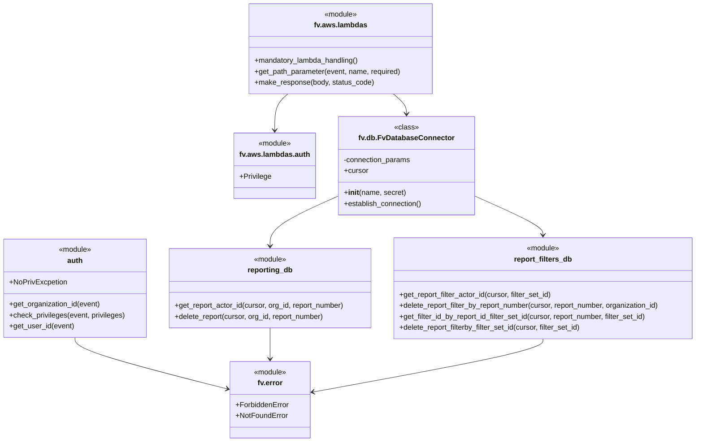

# Diagram: common/iam_service/iam_service/v1/power_bi/delete_report.py


> Auto-generated by Obscura crawlers

## Diagram 1

```mermaid
flowchart TD
  Start([Start]) --> GetOrg[get_organization_id(event)]
  GetOrg --> GetParams[get_path_parameter(report_number, filter_set_id)]
  GetParams --> DBConnect[DB_CONN.establish_connection()]
  DBConnect --> Cursor[use DB_CONN.cursor]
  Cursor --> CheckPriv[check_privileges(event, BUILD_REPORT)]
  CheckPriv -->|no exception| PrivOK[Privileges OK]
  CheckPriv -->|NoPrivException| NoPriv
  NoPriv --> IfFilterSetIsNone{filter_set_id == None?}
  IfFilterSetIsNone -->|Yes| GetActorReport[reporting_db.get_report_actor_id(cursor, org_id, report_number)]
  IfFilterSetIsNone -->|No| GetActorFilter[report_filters_db.get_report_filter_actor_id(cursor, filter_set_id)]
  GetActorReport --> CompareActor[actor_id != get_user_id(event)?]
  GetActorFilter --> CompareActor
  CompareActor -->|True| Forbidden[/raise ForbiddenError/]
  CompareActor -->|False| PrivOK
  PrivOK --> IfFilterSetIsNone2{filter_set_id == None?}
  IfFilterSetIsNone2 -->|Yes| DeleteReport[deleted_report = reporting_db.delete_report(...)]
  DeleteReport --> DeleteFilters[report_filters_db.delete_report_filter_by_report_number(...)]
  DeleteFilters --> DeletedResultSet[set deleted_report accordingly]
  IfFilterSetIsNone2 -->|No| SetDeletedFalse[deleted_report = False]
  SetDeletedFalse --> GetIds[ids = report_filters_db.get_filter_id_by_report_id_filter_set_id(...)]
  GetIds --> IdsCheck{len(ids) > 0?}
  IdsCheck -->|Yes| MarkDeleted[deleted_report = True]
  MarkDeleted --> DeleteByFilter[report_filters_db.delete_report_filterby_filter_set_id(...)]
  IdsCheck -->|No| ContinueNoDelete
  DeleteByFilter --> ContinueNoDelete
  ContinueNoDelete --> FinalCheck{deleted_report?}
  DeletedResultSet --> FinalCheck
  FinalCheck -->|Yes| Return204[/make_response(status_code=204)/]
  FinalCheck -->|No| BuildMessage[construct error message]
  BuildMessage --> NotFound[/raise NotFoundError/]
  Forbidden --> End([End])
  Return204 --> End
  NotFound --> End
```

> SVG rendering failed for this diagram.

## Diagram 2



### SVG

<svg id="container" width="1554.4921875" xmlns="http://www.w3.org/2000/svg" class="classDiagram" height="970" viewBox="0 0 1554.4921875 970" role="graphics-document document" aria-roledescription="class"><style>#container{font-family:"trebuchet ms",verdana,arial,sans-serif;font-size:16px;fill:#333;}@keyframes edge-animation-frame{from{stroke-dashoffset:0;}}@keyframes dash{to{stroke-dashoffset:0;}}#container .edge-animation-slow{stroke-dasharray:9,5!important;stroke-dashoffset:900;animation:dash 50s linear infinite;stroke-linecap:round;}#container .edge-animation-fast{stroke-dasharray:9,5!important;stroke-dashoffset:900;animation:dash 20s linear infinite;stroke-linecap:round;}#container .error-icon{fill:#552222;}#container .error-text{fill:#552222;stroke:#552222;}#container .edge-thickness-normal{stroke-width:1px;}#container .edge-thickness-thick{stroke-width:3.5px;}#container .edge-pattern-solid{stroke-dasharray:0;}#container .edge-thickness-invisible{stroke-width:0;fill:none;}#container .edge-pattern-dashed{stroke-dasharray:3;}#container .edge-pattern-dotted{stroke-dasharray:2;}#container .marker{fill:#333333;stroke:#333333;}#container .marker.cross{stroke:#333333;}#container svg{font-family:"trebuchet ms",verdana,arial,sans-serif;font-size:16px;}#container p{margin:0;}#container g.classGroup text{fill:#9370DB;stroke:none;font-family:"trebuchet ms",verdana,arial,sans-serif;font-size:10px;}#container g.classGroup text .title{font-weight:bolder;}#container .nodeLabel,#container .edgeLabel{color:#131300;}#container .edgeLabel .label rect{fill:#ECECFF;}#container .label text{fill:#131300;}#container .labelBkg{background:#ECECFF;}#container .edgeLabel .label span{background:#ECECFF;}#container .classTitle{font-weight:bolder;}#container .node rect,#container .node circle,#container .node ellipse,#container .node polygon,#container .node path{fill:#ECECFF;stroke:#9370DB;stroke-width:1px;}#container .divider{stroke:#9370DB;stroke-width:1;}#container g.clickable{cursor:pointer;}#container g.classGroup rect{fill:#ECECFF;stroke:#9370DB;}#container g.classGroup line{stroke:#9370DB;stroke-width:1;}#container .classLabel .box{stroke:none;stroke-width:0;fill:#ECECFF;opacity:0.5;}#container .classLabel .label{fill:#9370DB;font-size:10px;}#container .relation{stroke:#333333;stroke-width:1;fill:none;}#container .dashed-line{stroke-dasharray:3;}#container .dotted-line{stroke-dasharray:1 2;}#container #compositionStart,#container .composition{fill:#333333!important;stroke:#333333!important;stroke-width:1;}#container #compositionEnd,#container .composition{fill:#333333!important;stroke:#333333!important;stroke-width:1;}#container #dependencyStart,#container .dependency{fill:#333333!important;stroke:#333333!important;stroke-width:1;}#container #dependencyStart,#container .dependency{fill:#333333!important;stroke:#333333!important;stroke-width:1;}#container #extensionStart,#container .extension{fill:transparent!important;stroke:#333333!important;stroke-width:1;}#container #extensionEnd,#container .extension{fill:transparent!important;stroke:#333333!important;stroke-width:1;}#container #aggregationStart,#container .aggregation{fill:transparent!important;stroke:#333333!important;stroke-width:1;}#container #aggregationEnd,#container .aggregation{fill:transparent!important;stroke:#333333!important;stroke-width:1;}#container #lollipopStart,#container .lollipop{fill:#ECECFF!important;stroke:#333333!important;stroke-width:1;}#container #lollipopEnd,#container .lollipop{fill:#ECECFF!important;stroke:#333333!important;stroke-width:1;}#container .edgeTerminals{font-size:11px;line-height:initial;}#container .classTitleText{text-anchor:middle;font-size:18px;fill:#333;}#container .label-icon{display:inline-block;height:1em;overflow:visible;vertical-align:-0.125em;}#container .node .label-icon path{fill:currentColor;stroke:revert;stroke-width:revert;}#container :root{--mermaid-font-family:"trebuchet ms",verdana,arial,sans-serif;}</style><g><defs><marker id="container_class-aggregationStart" class="marker aggregation class" refX="18" refY="7" markerWidth="190" markerHeight="240" orient="auto"><path d="M 18,7 L9,13 L1,7 L9,1 Z"></path></marker></defs><defs><marker id="container_class-aggregationEnd" class="marker aggregation class" refX="1" refY="7" markerWidth="20" markerHeight="28" orient="auto"><path d="M 18,7 L9,13 L1,7 L9,1 Z"></path></marker></defs><defs><marker id="container_class-extensionStart" class="marker extension class" refX="18" refY="7" markerWidth="190" markerHeight="240" orient="auto"><path d="M 1,7 L18,13 V 1 Z"></path></marker></defs><defs><marker id="container_class-extensionEnd" class="marker extension class" refX="1" refY="7" markerWidth="20" markerHeight="28" orient="auto"><path d="M 1,1 V 13 L18,7 Z"></path></marker></defs><defs><marker id="container_class-compositionStart" class="marker composition class" refX="18" refY="7" markerWidth="190" markerHeight="240" orient="auto"><path d="M 18,7 L9,13 L1,7 L9,1 Z"></path></marker></defs><defs><marker id="container_class-compositionEnd" class="marker composition class" refX="1" refY="7" markerWidth="20" markerHeight="28" orient="auto"><path d="M 18,7 L9,13 L1,7 L9,1 Z"></path></marker></defs><defs><marker id="container_class-dependencyStart" class="marker dependency class" refX="6" refY="7" markerWidth="190" markerHeight="240" orient="auto"><path d="M 5,7 L9,13 L1,7 L9,1 Z"></path></marker></defs><defs><marker id="container_class-dependencyEnd" class="marker dependency class" refX="13" refY="7" markerWidth="20" markerHeight="28" orient="auto"><path d="M 18,7 L9,13 L14,7 L9,1 Z"></path></marker></defs><defs><marker id="container_class-lollipopStart" class="marker lollipop class" refX="13" refY="7" markerWidth="190" markerHeight="240" orient="auto"><circle stroke="black" fill="transparent" cx="7" cy="7" r="6"></circle></marker></defs><defs><marker id="container_class-lollipopEnd" class="marker lollipop class" refX="1" refY="7" markerWidth="190" markerHeight="240" orient="auto"><circle stroke="black" fill="transparent" cx="7" cy="7" r="6"></circle></marker></defs><g class="root"><g class="clusters"></g><g class="edgePaths"><path d="M649.885,206L645.101,210.167C640.318,214.333,630.751,222.667,625.967,236C621.184,249.333,621.184,267.667,621.184,276.833L621.184,286" id="id_fv.aws.lambdas_fv.aws.lambdas.auth_1" class="edge-thickness-normal edge-pattern-solid relation" style=";;;" data-edge="true" data-et="edge" data-id="id_fv.aws.lambdas_fv.aws.lambdas.auth_1" data-points="W3sieCI6NjQ5Ljg4NDY4Njg2OTk1OTYsInkiOjIwNn0seyJ4Ijo2MjEuMTgzNTkzNzUsInkiOjIzMX0seyJ4Ijo2MjEuMTgzNTkzNzUsInkiOjI5Mn1d" marker-end="url(#container_class-dependencyEnd)"></path><path d="M877.197,206L881.981,210.167C886.764,214.333,896.331,222.667,901.115,230C905.898,237.333,905.898,243.667,905.898,246.833L905.898,250" id="id_fv.aws.lambdas_fv.db.FvDatabaseConnector_2" class="edge-thickness-normal edge-pattern-solid relation" style=";;;" data-edge="true" data-et="edge" data-id="id_fv.aws.lambdas_fv.db.FvDatabaseConnector_2" data-points="W3sieCI6ODc3LjE5NzM0NDM4MDA0MDQsInkiOjIwNn0seyJ4Ijo5MDUuODk4NDM3NSwieSI6MjMxfSx7IngiOjkwNS44OTg0Mzc1LCJ5IjoyNTZ9XQ==" marker-end="url(#container_class-dependencyEnd)"></path><path d="M757.668,428.594L731.505,439.995C705.342,451.396,653.017,474.198,626.854,492.766C600.691,511.333,600.691,525.667,600.691,532.833L600.691,540" id="id_fv.db.FvDatabaseConnector_reporting_db_3" class="edge-thickness-normal edge-pattern-solid relation" style=";;;" data-edge="true" data-et="edge" data-id="id_fv.db.FvDatabaseConnector_reporting_db_3" data-points="W3sieCI6NzU3LjY2Nzk2ODc1LCJ5Ijo0MjguNTk0MzU4MzM3NzA2MjR9LHsieCI6NjAwLjY5MTQwNjI1LCJ5Ijo0OTd9LHsieCI6NjAwLjY5MTQwNjI1LCJ5Ijo1NDZ9XQ==" marker-end="url(#container_class-dependencyEnd)"></path><path d="M1054.129,428.594L1080.292,439.995C1106.454,451.396,1158.78,474.198,1184.943,488.766C1211.105,503.333,1211.105,509.667,1211.105,512.833L1211.105,516" id="id_fv.db.FvDatabaseConnector_report_filters_db_4" class="edge-thickness-normal edge-pattern-solid relation" style=";;;" data-edge="true" data-et="edge" data-id="id_fv.db.FvDatabaseConnector_report_filters_db_4" data-points="W3sieCI6MTA1NC4xMjg5MDYyNSwieSI6NDI4LjU5NDM1ODMzNzcwNjI0fSx7IngiOjEyMTEuMTA1NDY4NzUsInkiOjQ5N30seyJ4IjoxMjExLjEwNTQ2ODc1LCJ5Ijo1MjJ9XQ==" marker-end="url(#container_class-dependencyEnd)"></path><path d="M166.832,741L166.832,745.667C166.832,750.333,166.832,759.667,223.302,778.52C279.771,797.374,392.71,825.748,449.18,839.935L505.65,854.122" id="id_auth_fv.error_5" class="edge-thickness-normal edge-pattern-solid relation" style=";;;" data-edge="true" data-et="edge" data-id="id_auth_fv.error_5" data-points="W3sieCI6MTY2LjgzMjAzMTI1LCJ5Ijo3NDF9LHsieCI6MTY2LjgzMjAzMTI1LCJ5Ijo3Njl9LHsieCI6NTExLjQ2ODc1LCJ5Ijo4NTUuNTg0MjgxNzAxMzAwMX1d" marker-end="url(#container_class-dependencyEnd)"></path><path d="M600.691,720L600.691,728.167C600.691,736.333,600.691,752.667,600.691,764C600.691,775.333,600.691,781.667,600.691,784.833L600.691,788" id="id_reporting_db_fv.error_6" class="edge-thickness-normal edge-pattern-solid relation" style=";;;" data-edge="true" data-et="edge" data-id="id_reporting_db_fv.error_6" data-points="W3sieCI6NjAwLjY5MTQwNjI1LCJ5Ijo3MjB9LHsieCI6NjAwLjY5MTQwNjI1LCJ5Ijo3Njl9LHsieCI6NjAwLjY5MTQwNjI1LCJ5Ijo3OTR9XQ==" marker-end="url(#container_class-dependencyEnd)"></path><path d="M1211.105,744L1211.105,748.167C1211.105,752.333,1211.105,760.667,1125.225,780.169C1039.344,799.671,867.582,830.342,781.701,845.678L695.821,861.013" id="id_report_filters_db_fv.error_7" class="edge-thickness-normal edge-pattern-solid relation" style=";;;" data-edge="true" data-et="edge" data-id="id_report_filters_db_fv.error_7" data-points="W3sieCI6MTIxMS4xMDU0Njg3NSwieSI6NzQ0fSx7IngiOjEyMTEuMTA1NDY4NzUsInkiOjc2OX0seyJ4Ijo2ODkuOTE0MDYyNSwieSI6ODYyLjA2Nzc0OTg2MjQxNDF9XQ==" marker-end="url(#container_class-dependencyEnd)"></path></g><g class="edgeLabels"><g class="edgeLabel"><g class="label" data-id="id_fv.aws.lambdas_fv.aws.lambdas.auth_1" transform="translate(0, 0)"><foreignObject width="0" height="0"><div xmlns="http://www.w3.org/1999/xhtml" class="labelBkg" style="display: table-cell; white-space: nowrap; line-height: 1.5; max-width: 200px; text-align: center;"><span class="edgeLabel"></span></div></foreignObject></g></g><g class="edgeLabel"><g class="label" data-id="id_fv.aws.lambdas_fv.db.FvDatabaseConnector_2" transform="translate(0, 0)"><foreignObject width="0" height="0"><div xmlns="http://www.w3.org/1999/xhtml" class="labelBkg" style="display: table-cell; white-space: nowrap; line-height: 1.5; max-width: 200px; text-align: center;"><span class="edgeLabel"></span></div></foreignObject></g></g><g class="edgeLabel"><g class="label" data-id="id_fv.db.FvDatabaseConnector_reporting_db_3" transform="translate(0, 0)"><foreignObject width="0" height="0"><div xmlns="http://www.w3.org/1999/xhtml" class="labelBkg" style="display: table-cell; white-space: nowrap; line-height: 1.5; max-width: 200px; text-align: center;"><span class="edgeLabel"></span></div></foreignObject></g></g><g class="edgeLabel"><g class="label" data-id="id_fv.db.FvDatabaseConnector_report_filters_db_4" transform="translate(0, 0)"><foreignObject width="0" height="0"><div xmlns="http://www.w3.org/1999/xhtml" class="labelBkg" style="display: table-cell; white-space: nowrap; line-height: 1.5; max-width: 200px; text-align: center;"><span class="edgeLabel"></span></div></foreignObject></g></g><g class="edgeLabel"><g class="label" data-id="id_auth_fv.error_5" transform="translate(0, 0)"><foreignObject width="0" height="0"><div xmlns="http://www.w3.org/1999/xhtml" class="labelBkg" style="display: table-cell; white-space: nowrap; line-height: 1.5; max-width: 200px; text-align: center;"><span class="edgeLabel"></span></div></foreignObject></g></g><g class="edgeLabel"><g class="label" data-id="id_reporting_db_fv.error_6" transform="translate(0, 0)"><foreignObject width="0" height="0"><div xmlns="http://www.w3.org/1999/xhtml" class="labelBkg" style="display: table-cell; white-space: nowrap; line-height: 1.5; max-width: 200px; text-align: center;"><span class="edgeLabel"></span></div></foreignObject></g></g><g class="edgeLabel"><g class="label" data-id="id_report_filters_db_fv.error_7" transform="translate(0, 0)"><foreignObject width="0" height="0"><div xmlns="http://www.w3.org/1999/xhtml" class="labelBkg" style="display: table-cell; white-space: nowrap; line-height: 1.5; max-width: 200px; text-align: center;"><span class="edgeLabel"></span></div></foreignObject></g></g></g><g class="nodes"><g class="node default" id="classId-fv.aws.lambdas-0" transform="translate(763.541015625, 107)"><g class="basic label-container"><path d="M-202.30078125 -99 L202.30078125 -99 L202.30078125 99 L-202.30078125 99" stroke="none" stroke-width="0" fill="#ECECFF" style=""></path><path d="M-202.30078125 -99 C-66.59415925754348 -99, 69.11246273491304 -99, 202.30078125 -99 M-202.30078125 -99 C-44.075184637803346 -99, 114.15041197439331 -99, 202.30078125 -99 M202.30078125 -99 C202.30078125 -51.60265995032127, 202.30078125 -4.205319900642536, 202.30078125 99 M202.30078125 -99 C202.30078125 -54.029082573110294, 202.30078125 -9.058165146220588, 202.30078125 99 M202.30078125 99 C78.92231404838647 99, -44.45615315322706 99, -202.30078125 99 M202.30078125 99 C101.67446703886885 99, 1.0481528277377095 99, -202.30078125 99 M-202.30078125 99 C-202.30078125 40.42224458899012, -202.30078125 -18.155510822019764, -202.30078125 -99 M-202.30078125 99 C-202.30078125 28.289216088803457, -202.30078125 -42.42156782239309, -202.30078125 -99" stroke="#9370DB" stroke-width="1.3" fill="none" stroke-dasharray="0 0" style=""></path></g><g class="annotation-group text" transform="translate(-36.6015625, -75)"><g class="label" style="" transform="translate(0,-12)"><foreignObject width="73.203125" height="24"><div xmlns="http://www.w3.org/1999/xhtml" style="display: table-cell; white-space: nowrap; line-height: 1.5; max-width: 123px; text-align: center;"><span class="nodeLabel markdown-node-label" style=""><p>«module»</p></span></div></foreignObject></g></g><g class="label-group text" transform="translate(-55.8984375, -51)"><g class="label" style="font-weight: bolder" transform="translate(0,-12)"><foreignObject width="111.796875" height="24"><div xmlns="http://www.w3.org/1999/xhtml" style="display: table-cell; white-space: nowrap; line-height: 1.5; max-width: 160px; text-align: center;"><span class="nodeLabel markdown-node-label" style=""><p>fv.aws.lambdas</p></span></div></foreignObject></g></g><g class="members-group text" transform="translate(-190.30078125, -3)"></g><g class="methods-group text" transform="translate(-190.30078125, 27)"><g class="label" style="" transform="translate(0,-12)"><foreignObject width="232.078125" height="24"><div xmlns="http://www.w3.org/1999/xhtml" style="display: table-cell; white-space: nowrap; line-height: 1.5; max-width: 289px; text-align: center;"><span class="nodeLabel markdown-node-label" style=""><p>+mandatory_lambda_handling()</p></span></div></foreignObject></g><g class="label" style="" transform="translate(0,12)"><foreignObject width="324.703125" height="24"><div xmlns="http://www.w3.org/1999/xhtml" style="display: table-cell; white-space: nowrap; line-height: 1.5; max-width: 382px; text-align: center;"><span class="nodeLabel markdown-node-label" style=""><p>+get_path_parameter(event, name, required)</p></span></div></foreignObject></g><g class="label" style="" transform="translate(0,36)"><foreignObject width="262.609375" height="24"><div xmlns="http://www.w3.org/1999/xhtml" style="display: table-cell; white-space: nowrap; line-height: 1.5; max-width: 320px; text-align: center;"><span class="nodeLabel markdown-node-label" style=""><p>+make_response(body, status_code)</p></span></div></foreignObject></g></g><g class="divider" style=""><path d="M-202.30078125 -27 C-90.870569058698 -27, 20.55964313260401 -27, 202.30078125 -27 M-202.30078125 -27 C-114.22327866713717 -27, -26.14577608427433 -27, 202.30078125 -27" stroke="#9370DB" stroke-width="1.3" fill="none" stroke-dasharray="0 0" style=""></path></g><g class="divider" style=""><path d="M-202.30078125 -3 C-116.02303634620074 -3, -29.74529144240148 -3, 202.30078125 -3 M-202.30078125 -3 C-55.243352909654874 -3, 91.81407543069025 -3, 202.30078125 -3" stroke="#9370DB" stroke-width="1.3" fill="none" stroke-dasharray="0 0" style=""></path></g></g><g class="node default" id="classId-fv.aws.lambdas.auth-1" transform="translate(621.18359375, 364)"><g class="basic label-container"><path d="M-86.484375 -72 L86.484375 -72 L86.484375 72 L-86.484375 72" stroke="none" stroke-width="0" fill="#ECECFF" style=""></path><path d="M-86.484375 -72 C-38.15756438961397 -72, 10.169246220772067 -72, 86.484375 -72 M-86.484375 -72 C-49.00136937867641 -72, -11.518363757352816 -72, 86.484375 -72 M86.484375 -72 C86.484375 -41.98422936411642, 86.484375 -11.968458728232847, 86.484375 72 M86.484375 -72 C86.484375 -28.865712469446223, 86.484375 14.268575061107555, 86.484375 72 M86.484375 72 C24.529408106526283 72, -37.425558786947434 72, -86.484375 72 M86.484375 72 C35.90184647083173 72, -14.680682058336544 72, -86.484375 72 M-86.484375 72 C-86.484375 22.0653732632572, -86.484375 -27.8692534734856, -86.484375 -72 M-86.484375 72 C-86.484375 23.29066783969393, -86.484375 -25.418664320612137, -86.484375 -72" stroke="#9370DB" stroke-width="1.3" fill="none" stroke-dasharray="0 0" style=""></path></g><g class="annotation-group text" transform="translate(-36.6015625, -48)"><g class="label" style="" transform="translate(0,-12)"><foreignObject width="73.203125" height="24"><div xmlns="http://www.w3.org/1999/xhtml" style="display: table-cell; white-space: nowrap; line-height: 1.5; max-width: 123px; text-align: center;"><span class="nodeLabel markdown-node-label" style=""><p>«module»</p></span></div></foreignObject></g></g><g class="label-group text" transform="translate(-74.484375, -24)"><g class="label" style="font-weight: bolder" transform="translate(0,-12)"><foreignObject width="148.96875" height="24"><div xmlns="http://www.w3.org/1999/xhtml" style="display: table-cell; white-space: nowrap; line-height: 1.5; max-width: 197px; text-align: center;"><span class="nodeLabel markdown-node-label" style=""><p>fv.aws.lambdas.auth</p></span></div></foreignObject></g></g><g class="members-group text" transform="translate(-74.484375, 24)"><g class="label" style="" transform="translate(0,-12)"><foreignObject width="70.15625" height="24"><div xmlns="http://www.w3.org/1999/xhtml" style="display: table-cell; white-space: nowrap; line-height: 1.5; max-width: 128px; text-align: center;"><span class="nodeLabel markdown-node-label" style=""><p>+Privilege</p></span></div></foreignObject></g></g><g class="methods-group text" transform="translate(-74.484375, 72)"></g><g class="divider" style=""><path d="M-86.484375 0 C-31.015697896139834 0, 24.452979207720333 0, 86.484375 0 M-86.484375 0 C-17.33987054708912 0, 51.80463390582176 0, 86.484375 0" stroke="#9370DB" stroke-width="1.3" fill="none" stroke-dasharray="0 0" style=""></path></g><g class="divider" style=""><path d="M-86.484375 48 C-49.209606012258114 48, -11.934837024516227 48, 86.484375 48 M-86.484375 48 C-48.1438520050971 48, -9.803329010194204 48, 86.484375 48" stroke="#9370DB" stroke-width="1.3" fill="none" stroke-dasharray="0 0" style=""></path></g></g><g class="node default" id="classId-auth-2" transform="translate(166.83203125, 633)"><g class="basic label-container"><path d="M-158.83203125 -108 L158.83203125 -108 L158.83203125 108 L-158.83203125 108" stroke="none" stroke-width="0" fill="#ECECFF" style=""></path><path d="M-158.83203125 -108 C-71.76010056126421 -108, 15.31183012747158 -108, 158.83203125 -108 M-158.83203125 -108 C-85.79827393681956 -108, -12.76451662363911 -108, 158.83203125 -108 M158.83203125 -108 C158.83203125 -50.978062539444444, 158.83203125 6.043874921111112, 158.83203125 108 M158.83203125 -108 C158.83203125 -50.873430843587826, 158.83203125 6.253138312824348, 158.83203125 108 M158.83203125 108 C55.09596628315768 108, -48.64009868368464 108, -158.83203125 108 M158.83203125 108 C47.3731295213875 108, -64.085772207225 108, -158.83203125 108 M-158.83203125 108 C-158.83203125 53.18831142492504, -158.83203125 -1.6233771501499206, -158.83203125 -108 M-158.83203125 108 C-158.83203125 42.348212681249365, -158.83203125 -23.30357463750127, -158.83203125 -108" stroke="#9370DB" stroke-width="1.3" fill="none" stroke-dasharray="0 0" style=""></path></g><g class="annotation-group text" transform="translate(-36.6015625, -84)"><g class="label" style="" transform="translate(0,-12)"><foreignObject width="73.203125" height="24"><div xmlns="http://www.w3.org/1999/xhtml" style="display: table-cell; white-space: nowrap; line-height: 1.5; max-width: 123px; text-align: center;"><span class="nodeLabel markdown-node-label" style=""><p>«module»</p></span></div></foreignObject></g></g><g class="label-group text" transform="translate(-16.6640625, -60)"><g class="label" style="font-weight: bolder" transform="translate(0,-12)"><foreignObject width="33.328125" height="24"><div xmlns="http://www.w3.org/1999/xhtml" style="display: table-cell; white-space: nowrap; line-height: 1.5; max-width: 83px; text-align: center;"><span class="nodeLabel markdown-node-label" style=""><p>auth</p></span></div></foreignObject></g></g><g class="members-group text" transform="translate(-146.83203125, -12)"><g class="label" style="" transform="translate(0,-12)"><foreignObject width="126.859375" height="24"><div xmlns="http://www.w3.org/1999/xhtml" style="display: table-cell; white-space: nowrap; line-height: 1.5; max-width: 184px; text-align: center;"><span class="nodeLabel markdown-node-label" style=""><p>+NoPrivExcpetion</p></span></div></foreignObject></g></g><g class="methods-group text" transform="translate(-146.83203125, 36)"><g class="label" style="" transform="translate(0,-12)"><foreignObject width="202.015625" height="24"><div xmlns="http://www.w3.org/1999/xhtml" style="display: table-cell; white-space: nowrap; line-height: 1.5; max-width: 259px; text-align: center;"><span class="nodeLabel markdown-node-label" style=""><p>+get_organization_id(event)</p></span></div></foreignObject></g><g class="label" style="" transform="translate(0,12)"><foreignObject width="257.0625" height="24"><div xmlns="http://www.w3.org/1999/xhtml" style="display: table-cell; white-space: nowrap; line-height: 1.5; max-width: 314px; text-align: center;"><span class="nodeLabel markdown-node-label" style=""><p>+check_privileges(event, privileges)</p></span></div></foreignObject></g><g class="label" style="" transform="translate(0,36)"><foreignObject width="142.0625" height="24"><div xmlns="http://www.w3.org/1999/xhtml" style="display: table-cell; white-space: nowrap; line-height: 1.5; max-width: 199px; text-align: center;"><span class="nodeLabel markdown-node-label" style=""><p>+get_user_id(event)</p></span></div></foreignObject></g></g><g class="divider" style=""><path d="M-158.83203125 -36 C-69.9089679776361 -36, 19.01409529472781 -36, 158.83203125 -36 M-158.83203125 -36 C-83.73615907522111 -36, -8.64028690044222 -36, 158.83203125 -36" stroke="#9370DB" stroke-width="1.3" fill="none" stroke-dasharray="0 0" style=""></path></g><g class="divider" style=""><path d="M-158.83203125 12 C-43.661634965308 12, 71.508761319384 12, 158.83203125 12 M-158.83203125 12 C-74.1838347469935 12, 10.464361756013005 12, 158.83203125 12" stroke="#9370DB" stroke-width="1.3" fill="none" stroke-dasharray="0 0" style=""></path></g></g><g class="node default" id="classId-fv.db.FvDatabaseConnector-3" transform="translate(905.8984375, 364)"><g class="basic label-container"><path d="M-148.23046875 -108 L148.23046875 -108 L148.23046875 108 L-148.23046875 108" stroke="none" stroke-width="0" fill="#ECECFF" style=""></path><path d="M-148.23046875 -108 C-41.92073233683797 -108, 64.38900407632406 -108, 148.23046875 -108 M-148.23046875 -108 C-42.32026154204972 -108, 63.58994566590056 -108, 148.23046875 -108 M148.23046875 -108 C148.23046875 -52.80924540177111, 148.23046875 2.3815091964577846, 148.23046875 108 M148.23046875 -108 C148.23046875 -50.11017377764187, 148.23046875 7.7796524447162625, 148.23046875 108 M148.23046875 108 C70.65514838102534 108, -6.920171987949317 108, -148.23046875 108 M148.23046875 108 C34.00179566247782 108, -80.22687742504436 108, -148.23046875 108 M-148.23046875 108 C-148.23046875 42.63688720284344, -148.23046875 -22.72622559431312, -148.23046875 -108 M-148.23046875 108 C-148.23046875 55.54750165863709, -148.23046875 3.095003317274177, -148.23046875 -108" stroke="#9370DB" stroke-width="1.3" fill="none" stroke-dasharray="0 0" style=""></path></g><g class="annotation-group text" transform="translate(-26.765625, -84)"><g class="label" style="" transform="translate(0,-12)"><foreignObject width="53.53125" height="24"><div xmlns="http://www.w3.org/1999/xhtml" style="display: table-cell; white-space: nowrap; line-height: 1.5; max-width: 104px; text-align: center;"><span class="nodeLabel markdown-node-label" style=""><p>«class»</p></span></div></foreignObject></g></g><g class="label-group text" transform="translate(-99.1953125, -60)"><g class="label" style="font-weight: bolder" transform="translate(0,-12)"><foreignObject width="198.390625" height="24"><div xmlns="http://www.w3.org/1999/xhtml" style="display: table-cell; white-space: nowrap; line-height: 1.5; max-width: 246px; text-align: center;"><span class="nodeLabel markdown-node-label" style=""><p>fv.db.FvDatabaseConnector</p></span></div></foreignObject></g></g><g class="members-group text" transform="translate(-136.23046875, -12)"><g class="label" style="" transform="translate(0,-12)"><foreignObject width="149.125" height="24"><div xmlns="http://www.w3.org/1999/xhtml" style="display: table-cell; white-space: nowrap; line-height: 1.5; max-width: 206px; text-align: center;"><span class="nodeLabel markdown-node-label" style=""><p>-connection_params</p></span></div></foreignObject></g><g class="label" style="" transform="translate(0,12)"><foreignObject width="53.71875" height="24"><div xmlns="http://www.w3.org/1999/xhtml" style="display: table-cell; white-space: nowrap; line-height: 1.5; max-width: 112px; text-align: center;"><span class="nodeLabel markdown-node-label" style=""><p>+cursor</p></span></div></foreignObject></g></g><g class="methods-group text" transform="translate(-136.23046875, 60)"><g class="label" style="" transform="translate(0,-12)"><foreignObject width="135.265625" height="24"><div xmlns="http://www.w3.org/1999/xhtml" style="display: table-cell; white-space: nowrap; line-height: 1.5; max-width: 224px; text-align: center;"><span class="nodeLabel markdown-node-label" style=""><p>+<strong>init</strong>(name, secret)</p></span></div></foreignObject></g><g class="label" style="" transform="translate(0,12)"><foreignObject width="173.265625" height="24"><div xmlns="http://www.w3.org/1999/xhtml" style="display: table-cell; white-space: nowrap; line-height: 1.5; max-width: 231px; text-align: center;"><span class="nodeLabel markdown-node-label" style=""><p>+establish_connection()</p></span></div></foreignObject></g></g><g class="divider" style=""><path d="M-148.23046875 -36 C-48.164440603355246 -36, 51.90158754328951 -36, 148.23046875 -36 M-148.23046875 -36 C-32.7219546802376 -36, 82.7865593895248 -36, 148.23046875 -36" stroke="#9370DB" stroke-width="1.3" fill="none" stroke-dasharray="0 0" style=""></path></g><g class="divider" style=""><path d="M-148.23046875 36 C-84.90936997551096 36, -21.58827120102191 36, 148.23046875 36 M-148.23046875 36 C-41.59502088371504 36, 65.04042698256993 36, 148.23046875 36" stroke="#9370DB" stroke-width="1.3" fill="none" stroke-dasharray="0 0" style=""></path></g></g><g class="node default" id="classId-reporting_db-4" transform="translate(600.69140625, 633)"><g class="basic label-container"><path d="M-225.02734375 -87 L225.02734375 -87 L225.02734375 87 L-225.02734375 87" stroke="none" stroke-width="0" fill="#ECECFF" style=""></path><path d="M-225.02734375 -87 C-52.729318903883325 -87, 119.56870594223335 -87, 225.02734375 -87 M-225.02734375 -87 C-92.22748840580786 -87, 40.57236693838428 -87, 225.02734375 -87 M225.02734375 -87 C225.02734375 -34.720118731098445, 225.02734375 17.55976253780311, 225.02734375 87 M225.02734375 -87 C225.02734375 -21.118697277043978, 225.02734375 44.762605445912044, 225.02734375 87 M225.02734375 87 C118.47168444028561 87, 11.916025130571228 87, -225.02734375 87 M225.02734375 87 C106.65949786419966 87, -11.70834802160067 87, -225.02734375 87 M-225.02734375 87 C-225.02734375 48.321185548935006, -225.02734375 9.642371097870011, -225.02734375 -87 M-225.02734375 87 C-225.02734375 48.77503992494239, -225.02734375 10.550079849884781, -225.02734375 -87" stroke="#9370DB" stroke-width="1.3" fill="none" stroke-dasharray="0 0" style=""></path></g><g class="annotation-group text" transform="translate(-36.6015625, -63)"><g class="label" style="" transform="translate(0,-12)"><foreignObject width="73.203125" height="24"><div xmlns="http://www.w3.org/1999/xhtml" style="display: table-cell; white-space: nowrap; line-height: 1.5; max-width: 123px; text-align: center;"><span class="nodeLabel markdown-node-label" style=""><p>«module»</p></span></div></foreignObject></g></g><g class="label-group text" transform="translate(-48.0546875, -39)"><g class="label" style="font-weight: bolder" transform="translate(0,-12)"><foreignObject width="96.109375" height="24"><div xmlns="http://www.w3.org/1999/xhtml" style="display: table-cell; white-space: nowrap; line-height: 1.5; max-width: 145px; text-align: center;"><span class="nodeLabel markdown-node-label" style=""><p>reporting_db</p></span></div></foreignObject></g></g><g class="members-group text" transform="translate(-213.02734375, 9)"></g><g class="methods-group text" transform="translate(-213.02734375, 39)"><g class="label" style="" transform="translate(0,-12)"><foreignObject width="378" height="24"><div xmlns="http://www.w3.org/1999/xhtml" style="display: table-cell; white-space: nowrap; line-height: 1.5; max-width: 435px; text-align: center;"><span class="nodeLabel markdown-node-label" style=""><p>+get_report_actor_id(cursor, org_id, report_number)</p></span></div></foreignObject></g><g class="label" style="" transform="translate(0,12)"><foreignObject width="334.453125" height="24"><div xmlns="http://www.w3.org/1999/xhtml" style="display: table-cell; white-space: nowrap; line-height: 1.5; max-width: 392px; text-align: center;"><span class="nodeLabel markdown-node-label" style=""><p>+delete_report(cursor, org_id, report_number)</p></span></div></foreignObject></g></g><g class="divider" style=""><path d="M-225.02734375 -15 C-62.92523264507682 -15, 99.17687845984636 -15, 225.02734375 -15 M-225.02734375 -15 C-82.94197717916211 -15, 59.14338939167578 -15, 225.02734375 -15" stroke="#9370DB" stroke-width="1.3" fill="none" stroke-dasharray="0 0" style=""></path></g><g class="divider" style=""><path d="M-225.02734375 9 C-118.58611969570909 9, -12.144895641418174 9, 225.02734375 9 M-225.02734375 9 C-68.8020633008822 9, 87.42321714823561 9, 225.02734375 9" stroke="#9370DB" stroke-width="1.3" fill="none" stroke-dasharray="0 0" style=""></path></g></g><g class="node default" id="classId-report_filters_db-5" transform="translate(1211.10546875, 633)"><g class="basic label-container"><path d="M-335.38671875 -111 L335.38671875 -111 L335.38671875 111 L-335.38671875 111" stroke="none" stroke-width="0" fill="#ECECFF" style=""></path><path d="M-335.38671875 -111 C-155.63256645321366 -111, 24.12158584357269 -111, 335.38671875 -111 M-335.38671875 -111 C-140.27108698118204 -111, 54.844544787635925 -111, 335.38671875 -111 M335.38671875 -111 C335.38671875 -52.28745304443121, 335.38671875 6.42509391113758, 335.38671875 111 M335.38671875 -111 C335.38671875 -40.78598729437775, 335.38671875 29.428025411244505, 335.38671875 111 M335.38671875 111 C81.56002531879761 111, -172.26666811240477 111, -335.38671875 111 M335.38671875 111 C133.81554736559193 111, -67.75562401881615 111, -335.38671875 111 M-335.38671875 111 C-335.38671875 54.21843856865906, -335.38671875 -2.5631228626818796, -335.38671875 -111 M-335.38671875 111 C-335.38671875 22.832661373083738, -335.38671875 -65.33467725383252, -335.38671875 -111" stroke="#9370DB" stroke-width="1.3" fill="none" stroke-dasharray="0 0" style=""></path></g><g class="annotation-group text" transform="translate(-36.6015625, -87)"><g class="label" style="" transform="translate(0,-12)"><foreignObject width="73.203125" height="24"><div xmlns="http://www.w3.org/1999/xhtml" style="display: table-cell; white-space: nowrap; line-height: 1.5; max-width: 123px; text-align: center;"><span class="nodeLabel markdown-node-label" style=""><p>«module»</p></span></div></foreignObject></g></g><g class="label-group text" transform="translate(-62.0546875, -63)"><g class="label" style="font-weight: bolder" transform="translate(0,-12)"><foreignObject width="124.109375" height="24"><div xmlns="http://www.w3.org/1999/xhtml" style="display: table-cell; white-space: nowrap; line-height: 1.5; max-width: 172px; text-align: center;"><span class="nodeLabel markdown-node-label" style=""><p>report_filters_db</p></span></div></foreignObject></g></g><g class="members-group text" transform="translate(-323.38671875, -15)"></g><g class="methods-group text" transform="translate(-323.38671875, 15)"><g class="label" style="" transform="translate(0,-12)"><foreignObject width="340.28125" height="24"><div xmlns="http://www.w3.org/1999/xhtml" style="display: table-cell; white-space: nowrap; line-height: 1.5; max-width: 398px; text-align: center;"><span class="nodeLabel markdown-node-label" style=""><p>+get_report_filter_actor_id(cursor, filter_set_id)</p></span></div></foreignObject></g><g class="label" style="" transform="translate(0,12)"><foreignObject width="584.71875" height="24"><div xmlns="http://www.w3.org/1999/xhtml" style="display: table-cell; white-space: nowrap; line-height: 1.5; max-width: 642px; text-align: center;"><span class="nodeLabel markdown-node-label" style=""><p>+delete_report_filter_by_report_number(cursor, report_number, organization_id)</p></span></div></foreignObject></g><g class="label" style="" transform="translate(0,36)"><foreignObject width="554.5625" height="24"><div xmlns="http://www.w3.org/1999/xhtml" style="display: table-cell; white-space: nowrap; line-height: 1.5; max-width: 612px; text-align: center;"><span class="nodeLabel markdown-node-label" style=""><p>+get_filter_id_by_report_id_filter_set_id(cursor, report_number, filter_set_id)</p></span></div></foreignObject></g><g class="label" style="" transform="translate(0,60)"><foreignObject width="408.578125" height="24"><div xmlns="http://www.w3.org/1999/xhtml" style="display: table-cell; white-space: nowrap; line-height: 1.5; max-width: 466px; text-align: center;"><span class="nodeLabel markdown-node-label" style=""><p>+delete_report_filterby_filter_set_id(cursor, filter_set_id)</p></span></div></foreignObject></g></g><g class="divider" style=""><path d="M-335.38671875 -39 C-94.37179741418768 -39, 146.64312392162464 -39, 335.38671875 -39 M-335.38671875 -39 C-137.77122297277486 -39, 59.84427280445027 -39, 335.38671875 -39" stroke="#9370DB" stroke-width="1.3" fill="none" stroke-dasharray="0 0" style=""></path></g><g class="divider" style=""><path d="M-335.38671875 -15 C-164.48617517005235 -15, 6.414368409895303 -15, 335.38671875 -15 M-335.38671875 -15 C-83.38651627162537 -15, 168.61368620674926 -15, 335.38671875 -15" stroke="#9370DB" stroke-width="1.3" fill="none" stroke-dasharray="0 0" style=""></path></g></g><g class="node default" id="classId-fv.error-6" transform="translate(600.69140625, 878)"><g class="basic label-container"><path d="M-89.22265625 -84 L89.22265625 -84 L89.22265625 84 L-89.22265625 84" stroke="none" stroke-width="0" fill="#ECECFF" style=""></path><path d="M-89.22265625 -84 C-37.0160815532121 -84, 15.190493143575793 -84, 89.22265625 -84 M-89.22265625 -84 C-25.949682184704763 -84, 37.323291880590475 -84, 89.22265625 -84 M89.22265625 -84 C89.22265625 -19.916556680394592, 89.22265625 44.166886639210816, 89.22265625 84 M89.22265625 -84 C89.22265625 -44.48223379699756, 89.22265625 -4.964467593995124, 89.22265625 84 M89.22265625 84 C46.68401592405953 84, 4.14537559811906 84, -89.22265625 84 M89.22265625 84 C36.22965411496202 84, -16.763348020075966 84, -89.22265625 84 M-89.22265625 84 C-89.22265625 32.08346790380532, -89.22265625 -19.833064192389358, -89.22265625 -84 M-89.22265625 84 C-89.22265625 19.371248636865516, -89.22265625 -45.25750272626897, -89.22265625 -84" stroke="#9370DB" stroke-width="1.3" fill="none" stroke-dasharray="0 0" style=""></path></g><g class="annotation-group text" transform="translate(-36.6015625, -60)"><g class="label" style="" transform="translate(0,-12)"><foreignObject width="73.203125" height="24"><div xmlns="http://www.w3.org/1999/xhtml" style="display: table-cell; white-space: nowrap; line-height: 1.5; max-width: 123px; text-align: center;"><span class="nodeLabel markdown-node-label" style=""><p>«module»</p></span></div></foreignObject></g></g><g class="label-group text" transform="translate(-26.9453125, -36)"><g class="label" style="font-weight: bolder" transform="translate(0,-12)"><foreignObject width="53.890625" height="24"><div xmlns="http://www.w3.org/1999/xhtml" style="display: table-cell; white-space: nowrap; line-height: 1.5; max-width: 103px; text-align: center;"><span class="nodeLabel markdown-node-label" style=""><p>fv.error</p></span></div></foreignObject></g></g><g class="members-group text" transform="translate(-77.22265625, 12)"><g class="label" style="" transform="translate(0,-12)"><foreignObject width="117.84375" height="24"><div xmlns="http://www.w3.org/1999/xhtml" style="display: table-cell; white-space: nowrap; line-height: 1.5; max-width: 176px; text-align: center;"><span class="nodeLabel markdown-node-label" style=""><p>+ForbiddenError</p></span></div></foreignObject></g><g class="label" style="" transform="translate(0,12)"><foreignObject width="114.734375" height="24"><div xmlns="http://www.w3.org/1999/xhtml" style="display: table-cell; white-space: nowrap; line-height: 1.5; max-width: 173px; text-align: center;"><span class="nodeLabel markdown-node-label" style=""><p>+NotFoundError</p></span></div></foreignObject></g></g><g class="methods-group text" transform="translate(-77.22265625, 84)"></g><g class="divider" style=""><path d="M-89.22265625 -12 C-27.719148033206586 -12, 33.78436018358683 -12, 89.22265625 -12 M-89.22265625 -12 C-43.55156990414205 -12, 2.119516441715902 -12, 89.22265625 -12" stroke="#9370DB" stroke-width="1.3" fill="none" stroke-dasharray="0 0" style=""></path></g><g class="divider" style=""><path d="M-89.22265625 60 C-25.16043697257075 60, 38.9017823048585 60, 89.22265625 60 M-89.22265625 60 C-44.953218688425586 60, -0.6837811268511729 60, 89.22265625 60" stroke="#9370DB" stroke-width="1.3" fill="none" stroke-dasharray="0 0" style=""></path></g></g></g></g></g></svg>
