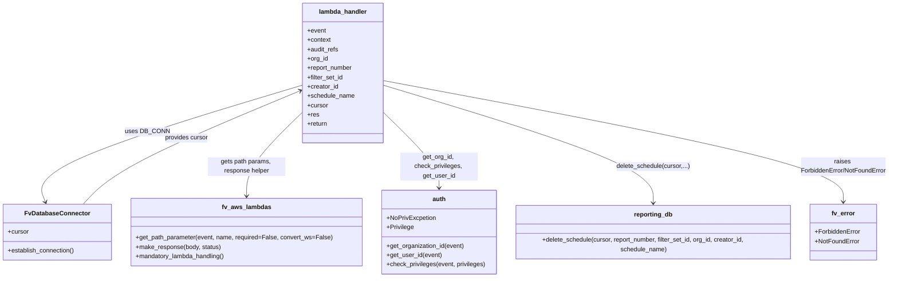

# Diagram: common/iam_service/iam_service/v1/power_bi/email/delete_email_schedule.py


> Auto-generated by Obscura crawlers

## Diagram 1



### SVG

<svg id="container" width="2296.59375" xmlns="http://www.w3.org/2000/svg" class="classDiagram" height="714" viewBox="0 0 2296.59375 714" role="graphics-document document" aria-roledescription="class"><style>#container{font-family:"trebuchet ms",verdana,arial,sans-serif;font-size:16px;fill:#333;}@keyframes edge-animation-frame{from{stroke-dashoffset:0;}}@keyframes dash{to{stroke-dashoffset:0;}}#container .edge-animation-slow{stroke-dasharray:9,5!important;stroke-dashoffset:900;animation:dash 50s linear infinite;stroke-linecap:round;}#container .edge-animation-fast{stroke-dasharray:9,5!important;stroke-dashoffset:900;animation:dash 20s linear infinite;stroke-linecap:round;}#container .error-icon{fill:#552222;}#container .error-text{fill:#552222;stroke:#552222;}#container .edge-thickness-normal{stroke-width:1px;}#container .edge-thickness-thick{stroke-width:3.5px;}#container .edge-pattern-solid{stroke-dasharray:0;}#container .edge-thickness-invisible{stroke-width:0;fill:none;}#container .edge-pattern-dashed{stroke-dasharray:3;}#container .edge-pattern-dotted{stroke-dasharray:2;}#container .marker{fill:#333333;stroke:#333333;}#container .marker.cross{stroke:#333333;}#container svg{font-family:"trebuchet ms",verdana,arial,sans-serif;font-size:16px;}#container p{margin:0;}#container g.classGroup text{fill:#9370DB;stroke:none;font-family:"trebuchet ms",verdana,arial,sans-serif;font-size:10px;}#container g.classGroup text .title{font-weight:bolder;}#container .nodeLabel,#container .edgeLabel{color:#131300;}#container .edgeLabel .label rect{fill:#ECECFF;}#container .label text{fill:#131300;}#container .labelBkg{background:#ECECFF;}#container .edgeLabel .label span{background:#ECECFF;}#container .classTitle{font-weight:bolder;}#container .node rect,#container .node circle,#container .node ellipse,#container .node polygon,#container .node path{fill:#ECECFF;stroke:#9370DB;stroke-width:1px;}#container .divider{stroke:#9370DB;stroke-width:1;}#container g.clickable{cursor:pointer;}#container g.classGroup rect{fill:#ECECFF;stroke:#9370DB;}#container g.classGroup line{stroke:#9370DB;stroke-width:1;}#container .classLabel .box{stroke:none;stroke-width:0;fill:#ECECFF;opacity:0.5;}#container .classLabel .label{fill:#9370DB;font-size:10px;}#container .relation{stroke:#333333;stroke-width:1;fill:none;}#container .dashed-line{stroke-dasharray:3;}#container .dotted-line{stroke-dasharray:1 2;}#container #compositionStart,#container .composition{fill:#333333!important;stroke:#333333!important;stroke-width:1;}#container #compositionEnd,#container .composition{fill:#333333!important;stroke:#333333!important;stroke-width:1;}#container #dependencyStart,#container .dependency{fill:#333333!important;stroke:#333333!important;stroke-width:1;}#container #dependencyStart,#container .dependency{fill:#333333!important;stroke:#333333!important;stroke-width:1;}#container #extensionStart,#container .extension{fill:transparent!important;stroke:#333333!important;stroke-width:1;}#container #extensionEnd,#container .extension{fill:transparent!important;stroke:#333333!important;stroke-width:1;}#container #aggregationStart,#container .aggregation{fill:transparent!important;stroke:#333333!important;stroke-width:1;}#container #aggregationEnd,#container .aggregation{fill:transparent!important;stroke:#333333!important;stroke-width:1;}#container #lollipopStart,#container .lollipop{fill:#ECECFF!important;stroke:#333333!important;stroke-width:1;}#container #lollipopEnd,#container .lollipop{fill:#ECECFF!important;stroke:#333333!important;stroke-width:1;}#container .edgeTerminals{font-size:11px;line-height:initial;}#container .classTitleText{text-anchor:middle;font-size:18px;fill:#333;}#container .label-icon{display:inline-block;height:1em;overflow:visible;vertical-align:-0.125em;}#container .node .label-icon path{fill:currentColor;stroke:revert;stroke-width:revert;}#container :root{--mermaid-font-family:"trebuchet ms",verdana,arial,sans-serif;}</style><g><defs><marker id="container_class-aggregationStart" class="marker aggregation class" refX="18" refY="7" markerWidth="190" markerHeight="240" orient="auto"><path d="M 18,7 L9,13 L1,7 L9,1 Z"></path></marker></defs><defs><marker id="container_class-aggregationEnd" class="marker aggregation class" refX="1" refY="7" markerWidth="20" markerHeight="28" orient="auto"><path d="M 18,7 L9,13 L1,7 L9,1 Z"></path></marker></defs><defs><marker id="container_class-extensionStart" class="marker extension class" refX="18" refY="7" markerWidth="190" markerHeight="240" orient="auto"><path d="M 1,7 L18,13 V 1 Z"></path></marker></defs><defs><marker id="container_class-extensionEnd" class="marker extension class" refX="1" refY="7" markerWidth="20" markerHeight="28" orient="auto"><path d="M 1,1 V 13 L18,7 Z"></path></marker></defs><defs><marker id="container_class-compositionStart" class="marker composition class" refX="18" refY="7" markerWidth="190" markerHeight="240" orient="auto"><path d="M 18,7 L9,13 L1,7 L9,1 Z"></path></marker></defs><defs><marker id="container_class-compositionEnd" class="marker composition class" refX="1" refY="7" markerWidth="20" markerHeight="28" orient="auto"><path d="M 18,7 L9,13 L1,7 L9,1 Z"></path></marker></defs><defs><marker id="container_class-dependencyStart" class="marker dependency class" refX="6" refY="7" markerWidth="190" markerHeight="240" orient="auto"><path d="M 5,7 L9,13 L1,7 L9,1 Z"></path></marker></defs><defs><marker id="container_class-dependencyEnd" class="marker dependency class" refX="13" refY="7" markerWidth="20" markerHeight="28" orient="auto"><path d="M 18,7 L9,13 L14,7 L9,1 Z"></path></marker></defs><defs><marker id="container_class-lollipopStart" class="marker lollipop class" refX="13" refY="7" markerWidth="190" markerHeight="240" orient="auto"><circle stroke="black" fill="transparent" cx="7" cy="7" r="6"></circle></marker></defs><defs><marker id="container_class-lollipopEnd" class="marker lollipop class" refX="1" refY="7" markerWidth="190" markerHeight="240" orient="auto"><circle stroke="black" fill="transparent" cx="7" cy="7" r="6"></circle></marker></defs><g class="root"><g class="clusters"></g><g class="edgePaths"><path d="M771.057,219.31L656.146,254.259C541.234,289.207,311.412,359.103,202.332,409.284C93.252,459.466,104.915,489.931,110.746,505.164L116.578,520.397" id="id_lambda_handler_FvDatabaseConnector_1" class="edge-thickness-normal edge-pattern-solid relation" style=";;;" data-edge="true" data-et="edge" data-id="id_lambda_handler_FvDatabaseConnector_1" data-points="W3sieCI6NzcxLjA1NjY0MDYyNSwieSI6MjE5LjMxMDI3MjkyNDIzMDQ1fSx7IngiOjgxLjU4OTg0Mzc1LCJ5Ijo0Mjl9LHsieCI6MTE4LjcyMjY1NjI1LCJ5Ijo1MjZ9XQ==" marker-end="url(#container_class-dependencyEnd)"></path><path d="M771.057,288.816L747.198,312.18C723.34,335.544,675.623,382.272,651.765,418.303C627.906,454.333,627.906,479.667,627.906,492.333L627.906,505" id="id_lambda_handler_fv_aws_lambdas_2" class="edge-thickness-normal edge-pattern-solid relation" style=";;;" data-edge="true" data-et="edge" data-id="id_lambda_handler_fv_aws_lambdas_2" data-points="W3sieCI6NzcxLjA1NjY0MDYyNSwieSI6Mjg4LjgxNTkzMjk1Mzk3NzI3fSx7IngiOjYyNy45MDYyNSwieSI6NDI5fSx7IngiOjYyNy45MDYyNSwieSI6NTExfV0=" marker-end="url(#container_class-dependencyEnd)"></path><path d="M976.955,288.816L1000.813,312.18C1024.672,335.544,1072.389,382.272,1096.247,414.803C1120.105,447.333,1120.105,465.667,1120.105,474.833L1120.105,484" id="id_lambda_handler_auth_3" class="edge-thickness-normal edge-pattern-solid relation" style=";;;" data-edge="true" data-et="edge" data-id="id_lambda_handler_auth_3" data-points="W3sieCI6OTc2Ljk1NTA3ODEyNSwieSI6Mjg4LjgxNTkzMjk1Mzk3NzI3fSx7IngiOjExMjAuMTA1NDY4NzUsInkiOjQyOX0seyJ4IjoxMTIwLjEwNTQ2ODc1LCJ5Ijo0OTB9XQ==" marker-end="url(#container_class-dependencyEnd)"></path><path d="M976.955,218.781L1094.135,253.818C1211.315,288.854,1445.675,358.927,1562.855,410.63C1680.035,462.333,1680.035,495.667,1680.035,512.333L1680.035,529" id="id_lambda_handler_reporting_db_4" class="edge-thickness-normal edge-pattern-solid relation" style=";;;" data-edge="true" data-et="edge" data-id="id_lambda_handler_reporting_db_4" data-points="W3sieCI6OTc2Ljk1NTA3ODEyNSwieSI6MjE4Ljc4MTQ2MzkxODE3NTN9LHsieCI6MTY4MC4wMzUxNTYyNSwieSI6NDI5fSx7IngiOjE2ODAuMDM1MTU2MjUsInkiOjUzNX1d" marker-end="url(#container_class-dependencyEnd)"></path><path d="M976.955,207.047L1176.899,244.039C1376.842,281.031,1776.73,355.016,1976.674,407.174C2176.617,459.333,2176.617,489.667,2176.617,504.833L2176.617,520" id="id_lambda_handler_fv_error_5" class="edge-thickness-normal edge-pattern-solid relation" style=";;;" data-edge="true" data-et="edge" data-id="id_lambda_handler_fv_error_5" data-points="W3sieCI6OTc2Ljk1NTA3ODEyNSwieSI6MjA3LjA0Njk0MTQ2NTIzNTg1fSx7IngiOjIxNzYuNjE3MTg3NSwieSI6NDI5fSx7IngiOjIxNzYuNjE3MTg3NSwieSI6NTI2fV0=" marker-end="url(#container_class-dependencyEnd)"></path><path d="M211.325,526L225.928,509.833C240.532,493.667,269.74,461.333,362.106,412.577C454.472,363.821,609.998,298.643,687.76,266.053L765.523,233.464" id="id_FvDatabaseConnector_lambda_handler_6" class="edge-thickness-normal edge-pattern-solid relation" style=";;;" data-edge="true" data-et="edge" data-id="id_FvDatabaseConnector_lambda_handler_6" data-points="W3sieCI6MjExLjMyNDYzNDgwMDI5NTg1LCJ5Ijo1MjZ9LHsieCI6Mjk4Ljk0NzI2NTYyNSwieSI6NDI5fSx7IngiOjc3MS4wNTY2NDA2MjUsInkiOjIzMS4xNDQ3NTQyNzA5NjQyM31d" marker-end="url(#container_class-dependencyEnd)"></path></g><g class="edgeLabels"><g class="edgeLabel" transform="translate(376.63802, 339.26606)"><g class="label" data-id="id_lambda_handler_FvDatabaseConnector_1" transform="translate(-53.09375, -12)"><foreignObject width="106.1875" height="24"><div xmlns="http://www.w3.org/1999/xhtml" class="labelBkg" style="display: table-cell; white-space: nowrap; line-height: 1.5; max-width: 200px; text-align: center;"><span class="edgeLabel"><p>uses DB_CONN</p></span></div></foreignObject></g></g><g class="edgeLabel" transform="translate(627.90625, 429)"><g class="label" data-id="id_lambda_handler_fv_aws_lambdas_2" transform="translate(-100, -24)"><foreignObject width="200" height="48"><div xmlns="http://www.w3.org/1999/xhtml" class="labelBkg" style="display: table; white-space: break-spaces; line-height: 1.5; max-width: 200px; text-align: center; width: 200px;"><span class="edgeLabel"><p>gets path params, response helper</p></span></div></foreignObject></g></g><g class="edgeLabel" transform="translate(1120.10546875, 429)"><g class="label" data-id="id_lambda_handler_auth_3" transform="translate(-100, -36)"><foreignObject width="200" height="72"><div xmlns="http://www.w3.org/1999/xhtml" class="labelBkg" style="display: table; white-space: break-spaces; line-height: 1.5; max-width: 200px; text-align: center; width: 200px;"><span class="edgeLabel"><p>get_org_id, check_privileges, get_user_id</p></span></div></foreignObject></g></g><g class="edgeLabel" transform="translate(1680.03515625, 429)"><g class="label" data-id="id_lambda_handler_reporting_db_4" transform="translate(-94.7421875, -12)"><foreignObject width="189.484375" height="24"><div xmlns="http://www.w3.org/1999/xhtml" class="labelBkg" style="display: table-cell; white-space: nowrap; line-height: 1.5; max-width: 200px; text-align: center;"><span class="edgeLabel"><p>delete_schedule(cursor,...)</p></span></div></foreignObject></g></g><g class="edgeLabel" transform="translate(2176.6171875, 429)"><g class="label" data-id="id_lambda_handler_fv_error_5" transform="translate(-111.9765625, -24)"><foreignObject width="223.953125" height="48"><div xmlns="http://www.w3.org/1999/xhtml" class="labelBkg" style="display: table; white-space: break-spaces; line-height: 1.5; max-width: 200px; text-align: center; width: 200px;"><span class="edgeLabel"><p>raises ForbiddenError/NotFoundError</p></span></div></foreignObject></g></g><g class="edgeLabel" transform="translate(298.947265625, 429)"><g class="label" data-id="id_FvDatabaseConnector_lambda_handler_6" transform="translate(-56.296875, -12)"><foreignObject width="112.59375" height="24"><div xmlns="http://www.w3.org/1999/xhtml" class="labelBkg" style="display: table-cell; white-space: nowrap; line-height: 1.5; max-width: 200px; text-align: center;"><span class="edgeLabel"><p>provides cursor</p></span></div></foreignObject></g></g></g><g class="nodes"><g class="node default" id="classId-lambda_handler-0" transform="translate(874.005859375, 188)"><g class="basic label-container"><path d="M-102.94921875 -180 L102.94921875 -180 L102.94921875 180 L-102.94921875 180" stroke="none" stroke-width="0" fill="#ECECFF" style=""></path><path d="M-102.94921875 -180 C-30.71684983875913 -180, 41.51551907248174 -180, 102.94921875 -180 M-102.94921875 -180 C-44.41247812185299 -180, 14.124262506294016 -180, 102.94921875 -180 M102.94921875 -180 C102.94921875 -42.801227383259715, 102.94921875 94.39754523348057, 102.94921875 180 M102.94921875 -180 C102.94921875 -50.4727943374163, 102.94921875 79.0544113251674, 102.94921875 180 M102.94921875 180 C54.08583625116087 180, 5.222453752321741 180, -102.94921875 180 M102.94921875 180 C59.845859729326286 180, 16.74250070865257 180, -102.94921875 180 M-102.94921875 180 C-102.94921875 58.84572001498685, -102.94921875 -62.308559970026295, -102.94921875 -180 M-102.94921875 180 C-102.94921875 97.5127379540924, -102.94921875 15.025475908184802, -102.94921875 -180" stroke="#9370DB" stroke-width="1.3" fill="none" stroke-dasharray="0 0" style=""></path></g><g class="annotation-group text" transform="translate(0, -156)"></g><g class="label-group text" transform="translate(-59.9765625, -156)"><g class="label" style="font-weight: bolder" transform="translate(0,-12)"><foreignObject width="119.953125" height="24"><div xmlns="http://www.w3.org/1999/xhtml" style="display: table-cell; white-space: nowrap; line-height: 1.5; max-width: 170px; text-align: center;"><span class="nodeLabel markdown-node-label" style=""><p>lambda_handler</p></span></div></foreignObject></g></g><g class="members-group text" transform="translate(-90.94921875, -108)"><g class="label" style="" transform="translate(0,-12)"><foreignObject width="48.328125" height="24"><div xmlns="http://www.w3.org/1999/xhtml" style="display: table-cell; white-space: nowrap; line-height: 1.5; max-width: 106px; text-align: center;"><span class="nodeLabel markdown-node-label" style=""><p>+event</p></span></div></foreignObject></g><g class="label" style="" transform="translate(0,12)"><foreignObject width="61.6875" height="24"><div xmlns="http://www.w3.org/1999/xhtml" style="display: table-cell; white-space: nowrap; line-height: 1.5; max-width: 119px; text-align: center;"><span class="nodeLabel markdown-node-label" style=""><p>+context</p></span></div></foreignObject></g><g class="label" style="" transform="translate(0,36)"><foreignObject width="81.109375" height="24"><div xmlns="http://www.w3.org/1999/xhtml" style="display: table-cell; white-space: nowrap; line-height: 1.5; max-width: 138px; text-align: center;"><span class="nodeLabel markdown-node-label" style=""><p>+audit_refs</p></span></div></foreignObject></g><g class="label" style="" transform="translate(0,60)"><foreignObject width="54.0625" height="24"><div xmlns="http://www.w3.org/1999/xhtml" style="display: table-cell; white-space: nowrap; line-height: 1.5; max-width: 111px; text-align: center;"><span class="nodeLabel markdown-node-label" style=""><p>+org_id</p></span></div></foreignObject></g><g class="label" style="" transform="translate(0,84)"><foreignObject width="118.328125" height="24"><div xmlns="http://www.w3.org/1999/xhtml" style="display: table-cell; white-space: nowrap; line-height: 1.5; max-width: 177px; text-align: center;"><span class="nodeLabel markdown-node-label" style=""><p>+report_number</p></span></div></foreignObject></g><g class="label" style="" transform="translate(0,108)"><foreignObject width="93.484375" height="24"><div xmlns="http://www.w3.org/1999/xhtml" style="display: table-cell; white-space: nowrap; line-height: 1.5; max-width: 151px; text-align: center;"><span class="nodeLabel markdown-node-label" style=""><p>+filter_set_id</p></span></div></foreignObject></g><g class="label" style="" transform="translate(0,132)"><foreignObject width="80.78125" height="24"><div xmlns="http://www.w3.org/1999/xhtml" style="display: table-cell; white-space: nowrap; line-height: 1.5; max-width: 138px; text-align: center;"><span class="nodeLabel markdown-node-label" style=""><p>+creator_id</p></span></div></foreignObject></g><g class="label" style="" transform="translate(0,156)"><foreignObject width="121.921875" height="24"><div xmlns="http://www.w3.org/1999/xhtml" style="display: table-cell; white-space: nowrap; line-height: 1.5; max-width: 179px; text-align: center;"><span class="nodeLabel markdown-node-label" style=""><p>+schedule_name</p></span></div></foreignObject></g><g class="label" style="" transform="translate(0,180)"><foreignObject width="53.71875" height="24"><div xmlns="http://www.w3.org/1999/xhtml" style="display: table-cell; white-space: nowrap; line-height: 1.5; max-width: 112px; text-align: center;"><span class="nodeLabel markdown-node-label" style=""><p>+cursor</p></span></div></foreignObject></g><g class="label" style="" transform="translate(0,204)"><foreignObject width="29.875" height="24"><div xmlns="http://www.w3.org/1999/xhtml" style="display: table-cell; white-space: nowrap; line-height: 1.5; max-width: 87px; text-align: center;"><span class="nodeLabel markdown-node-label" style=""><p>+res</p></span></div></foreignObject></g><g class="label" style="" transform="translate(0,228)"><foreignObject width="53.046875" height="24"><div xmlns="http://www.w3.org/1999/xhtml" style="display: table-cell; white-space: nowrap; line-height: 1.5; max-width: 110px; text-align: center;"><span class="nodeLabel markdown-node-label" style=""><p>+return</p></span></div></foreignObject></g></g><g class="methods-group text" transform="translate(-90.94921875, 180)"></g><g class="divider" style=""><path d="M-102.94921875 -132 C-44.53277444965358 -132, 13.88366985069284 -132, 102.94921875 -132 M-102.94921875 -132 C-42.19213999885048 -132, 18.564938752299042 -132, 102.94921875 -132" stroke="#9370DB" stroke-width="1.3" fill="none" stroke-dasharray="0 0" style=""></path></g><g class="divider" style=""><path d="M-102.94921875 156 C-43.21683689418852 156, 16.515544961622965 156, 102.94921875 156 M-102.94921875 156 C-51.66976599589527 156, -0.39031324179053684 156, 102.94921875 156" stroke="#9370DB" stroke-width="1.3" fill="none" stroke-dasharray="0 0" style=""></path></g></g><g class="node default" id="classId-FvDatabaseConnector-1" transform="translate(146.28515625, 598)"><g class="basic label-container"><path d="M-138.28515625 -72 L138.28515625 -72 L138.28515625 72 L-138.28515625 72" stroke="none" stroke-width="0" fill="#ECECFF" style=""></path><path d="M-138.28515625 -72 C-80.1496310886833 -72, -22.0141059273666 -72, 138.28515625 -72 M-138.28515625 -72 C-65.40322606423153 -72, 7.478704121536936 -72, 138.28515625 -72 M138.28515625 -72 C138.28515625 -20.88903099509512, 138.28515625 30.22193800980976, 138.28515625 72 M138.28515625 -72 C138.28515625 -42.77889197617995, 138.28515625 -13.557783952359898, 138.28515625 72 M138.28515625 72 C62.9237096270589 72, -12.437736995882204 72, -138.28515625 72 M138.28515625 72 C69.7733119311741 72, 1.2614676123482127 72, -138.28515625 72 M-138.28515625 72 C-138.28515625 31.964436435757626, -138.28515625 -8.071127128484747, -138.28515625 -72 M-138.28515625 72 C-138.28515625 21.106860395245775, -138.28515625 -29.78627920950845, -138.28515625 -72" stroke="#9370DB" stroke-width="1.3" fill="none" stroke-dasharray="0 0" style=""></path></g><g class="annotation-group text" transform="translate(0, -48)"></g><g class="label-group text" transform="translate(-79.3046875, -48)"><g class="label" style="font-weight: bolder" transform="translate(0,-12)"><foreignObject width="158.609375" height="24"><div xmlns="http://www.w3.org/1999/xhtml" style="display: table-cell; white-space: nowrap; line-height: 1.5; max-width: 207px; text-align: center;"><span class="nodeLabel markdown-node-label" style=""><p>FvDatabaseConnector</p></span></div></foreignObject></g></g><g class="members-group text" transform="translate(-126.28515625, 0)"><g class="label" style="" transform="translate(0,-12)"><foreignObject width="53.71875" height="24"><div xmlns="http://www.w3.org/1999/xhtml" style="display: table-cell; white-space: nowrap; line-height: 1.5; max-width: 112px; text-align: center;"><span class="nodeLabel markdown-node-label" style=""><p>+cursor</p></span></div></foreignObject></g></g><g class="methods-group text" transform="translate(-126.28515625, 48)"><g class="label" style="" transform="translate(0,-12)"><foreignObject width="173.265625" height="24"><div xmlns="http://www.w3.org/1999/xhtml" style="display: table-cell; white-space: nowrap; line-height: 1.5; max-width: 231px; text-align: center;"><span class="nodeLabel markdown-node-label" style=""><p>+establish_connection()</p></span></div></foreignObject></g></g><g class="divider" style=""><path d="M-138.28515625 -24 C-60.8882493306801 -24, 16.508657588639807 -24, 138.28515625 -24 M-138.28515625 -24 C-71.45738386771195 -24, -4.629611485423908 -24, 138.28515625 -24" stroke="#9370DB" stroke-width="1.3" fill="none" stroke-dasharray="0 0" style=""></path></g><g class="divider" style=""><path d="M-138.28515625 24 C-75.22031584530163 24, -12.155475440603254 24, 138.28515625 24 M-138.28515625 24 C-65.78272532306833 24, 6.719705603863332 24, 138.28515625 24" stroke="#9370DB" stroke-width="1.3" fill="none" stroke-dasharray="0 0" style=""></path></g></g><g class="node default" id="classId-reporting_db-2" transform="translate(1680.03515625, 598)"><g class="basic label-container"><path d="M-361.06640625 -63 L361.06640625 -63 L361.06640625 63 L-361.06640625 63" stroke="none" stroke-width="0" fill="#ECECFF" style=""></path><path d="M-361.06640625 -63 C-73.8210891021775 -63, 213.424228045645 -63, 361.06640625 -63 M-361.06640625 -63 C-197.8528732616265 -63, -34.639340273253026 -63, 361.06640625 -63 M361.06640625 -63 C361.06640625 -13.937940282589018, 361.06640625 35.124119434821964, 361.06640625 63 M361.06640625 -63 C361.06640625 -17.07215373400785, 361.06640625 28.855692531984303, 361.06640625 63 M361.06640625 63 C157.0767974252088 63, -46.91281139958238 63, -361.06640625 63 M361.06640625 63 C120.41451088061964 63, -120.23738448876071 63, -361.06640625 63 M-361.06640625 63 C-361.06640625 26.126336208933537, -361.06640625 -10.747327582132925, -361.06640625 -63 M-361.06640625 63 C-361.06640625 20.952906483574473, -361.06640625 -21.094187032851053, -361.06640625 -63" stroke="#9370DB" stroke-width="1.3" fill="none" stroke-dasharray="0 0" style=""></path></g><g class="annotation-group text" transform="translate(0, -39)"></g><g class="label-group text" transform="translate(-48.0546875, -39)"><g class="label" style="font-weight: bolder" transform="translate(0,-12)"><foreignObject width="96.109375" height="24"><div xmlns="http://www.w3.org/1999/xhtml" style="display: table-cell; white-space: nowrap; line-height: 1.5; max-width: 145px; text-align: center;"><span class="nodeLabel markdown-node-label" style=""><p>reporting_db</p></span></div></foreignObject></g></g><g class="members-group text" transform="translate(-349.06640625, 9)"></g><g class="methods-group text" transform="translate(-349.06640625, 39)"><g class="label" style="" transform="translate(0,-12)"><foreignObject width="650.078125" height="24"><div xmlns="http://www.w3.org/1999/xhtml" style="display: table-cell; white-space: nowrap; line-height: 1.5; max-width: 707px; text-align: center;"><span class="nodeLabel markdown-node-label" style=""><p>+delete_schedule(cursor, report_number, filter_set_id, org_id, creator_id, schedule_name)</p></span></div></foreignObject></g></g><g class="divider" style=""><path d="M-361.06640625 -15 C-129.74757151433968 -15, 101.57126322132063 -15, 361.06640625 -15 M-361.06640625 -15 C-212.16711404470746 -15, -63.26782183941492 -15, 361.06640625 -15" stroke="#9370DB" stroke-width="1.3" fill="none" stroke-dasharray="0 0" style=""></path></g><g class="divider" style=""><path d="M-361.06640625 9 C-198.5782797171342 9, -36.09015318426839 9, 361.06640625 9 M-361.06640625 9 C-192.47530706636184 9, -23.884207882723672 9, 361.06640625 9" stroke="#9370DB" stroke-width="1.3" fill="none" stroke-dasharray="0 0" style=""></path></g></g><g class="node default" id="classId-auth-3" transform="translate(1120.10546875, 598)"><g class="basic label-container"><path d="M-148.86328125 -108 L148.86328125 -108 L148.86328125 108 L-148.86328125 108" stroke="none" stroke-width="0" fill="#ECECFF" style=""></path><path d="M-148.86328125 -108 C-74.72325516418444 -108, -0.5832290783688734 -108, 148.86328125 -108 M-148.86328125 -108 C-60.88155087926951 -108, 27.100179491460977 -108, 148.86328125 -108 M148.86328125 -108 C148.86328125 -40.65371197481164, 148.86328125 26.692576050376715, 148.86328125 108 M148.86328125 -108 C148.86328125 -32.330506320501286, 148.86328125 43.33898735899743, 148.86328125 108 M148.86328125 108 C69.10026103386058 108, -10.662759182278847 108, -148.86328125 108 M148.86328125 108 C31.508834966703574 108, -85.84561131659285 108, -148.86328125 108 M-148.86328125 108 C-148.86328125 37.137969757534435, -148.86328125 -33.72406048493113, -148.86328125 -108 M-148.86328125 108 C-148.86328125 40.863239271975914, -148.86328125 -26.273521456048172, -148.86328125 -108" stroke="#9370DB" stroke-width="1.3" fill="none" stroke-dasharray="0 0" style=""></path></g><g class="annotation-group text" transform="translate(0, -84)"></g><g class="label-group text" transform="translate(-16.6640625, -84)"><g class="label" style="font-weight: bolder" transform="translate(0,-12)"><foreignObject width="33.328125" height="24"><div xmlns="http://www.w3.org/1999/xhtml" style="display: table-cell; white-space: nowrap; line-height: 1.5; max-width: 83px; text-align: center;"><span class="nodeLabel markdown-node-label" style=""><p>auth</p></span></div></foreignObject></g></g><g class="members-group text" transform="translate(-136.86328125, -36)"><g class="label" style="" transform="translate(0,-12)"><foreignObject width="126.859375" height="24"><div xmlns="http://www.w3.org/1999/xhtml" style="display: table-cell; white-space: nowrap; line-height: 1.5; max-width: 184px; text-align: center;"><span class="nodeLabel markdown-node-label" style=""><p>+NoPrivExcpetion</p></span></div></foreignObject></g><g class="label" style="" transform="translate(0,12)"><foreignObject width="70.15625" height="24"><div xmlns="http://www.w3.org/1999/xhtml" style="display: table-cell; white-space: nowrap; line-height: 1.5; max-width: 128px; text-align: center;"><span class="nodeLabel markdown-node-label" style=""><p>+Privilege</p></span></div></foreignObject></g></g><g class="methods-group text" transform="translate(-136.86328125, 36)"><g class="label" style="" transform="translate(0,-12)"><foreignObject width="202.015625" height="24"><div xmlns="http://www.w3.org/1999/xhtml" style="display: table-cell; white-space: nowrap; line-height: 1.5; max-width: 259px; text-align: center;"><span class="nodeLabel markdown-node-label" style=""><p>+get_organization_id(event)</p></span></div></foreignObject></g><g class="label" style="" transform="translate(0,12)"><foreignObject width="142.0625" height="24"><div xmlns="http://www.w3.org/1999/xhtml" style="display: table-cell; white-space: nowrap; line-height: 1.5; max-width: 199px; text-align: center;"><span class="nodeLabel markdown-node-label" style=""><p>+get_user_id(event)</p></span></div></foreignObject></g><g class="label" style="" transform="translate(0,36)"><foreignObject width="257.0625" height="24"><div xmlns="http://www.w3.org/1999/xhtml" style="display: table-cell; white-space: nowrap; line-height: 1.5; max-width: 314px; text-align: center;"><span class="nodeLabel markdown-node-label" style=""><p>+check_privileges(event, privileges)</p></span></div></foreignObject></g></g><g class="divider" style=""><path d="M-148.86328125 -60 C-82.0959662539131 -60, -15.328651257826209 -60, 148.86328125 -60 M-148.86328125 -60 C-75.27656919686153 -60, -1.68985714372306 -60, 148.86328125 -60" stroke="#9370DB" stroke-width="1.3" fill="none" stroke-dasharray="0 0" style=""></path></g><g class="divider" style=""><path d="M-148.86328125 12 C-34.423106752536185 12, 80.01706774492763 12, 148.86328125 12 M-148.86328125 12 C-65.33364971928572 12, 18.195981811428567 12, 148.86328125 12" stroke="#9370DB" stroke-width="1.3" fill="none" stroke-dasharray="0 0" style=""></path></g></g><g class="node default" id="classId-fv_aws_lambdas-4" transform="translate(627.90625, 598)"><g class="basic label-container"><path d="M-293.3359375 -87 L293.3359375 -87 L293.3359375 87 L-293.3359375 87" stroke="none" stroke-width="0" fill="#ECECFF" style=""></path><path d="M-293.3359375 -87 C-65.00486815300627 -87, 163.32620119398746 -87, 293.3359375 -87 M-293.3359375 -87 C-140.4699651161744 -87, 12.396007267651214 -87, 293.3359375 -87 M293.3359375 -87 C293.3359375 -32.17065684020049, 293.3359375 22.658686319599013, 293.3359375 87 M293.3359375 -87 C293.3359375 -20.840871606141846, 293.3359375 45.31825678771631, 293.3359375 87 M293.3359375 87 C79.34116308549426 87, -134.65361132901148 87, -293.3359375 87 M293.3359375 87 C138.11124686879555 87, -17.113443762408906 87, -293.3359375 87 M-293.3359375 87 C-293.3359375 24.26296012721923, -293.3359375 -38.47407974556154, -293.3359375 -87 M-293.3359375 87 C-293.3359375 18.483692219520123, -293.3359375 -50.032615560959755, -293.3359375 -87" stroke="#9370DB" stroke-width="1.3" fill="none" stroke-dasharray="0 0" style=""></path></g><g class="annotation-group text" transform="translate(0, -63)"></g><g class="label-group text" transform="translate(-60.0625, -63)"><g class="label" style="font-weight: bolder" transform="translate(0,-12)"><foreignObject width="120.125" height="24"><div xmlns="http://www.w3.org/1999/xhtml" style="display: table-cell; white-space: nowrap; line-height: 1.5; max-width: 168px; text-align: center;"><span class="nodeLabel markdown-node-label" style=""><p>fv_aws_lambdas</p></span></div></foreignObject></g></g><g class="members-group text" transform="translate(-281.3359375, -15)"></g><g class="methods-group text" transform="translate(-281.3359375, 15)"><g class="label" style="" transform="translate(0,-12)"><foreignObject width="502.609375" height="24"><div xmlns="http://www.w3.org/1999/xhtml" style="display: table-cell; white-space: nowrap; line-height: 1.5; max-width: 560px; text-align: center;"><span class="nodeLabel markdown-node-label" style=""><p>+get_path_parameter(event, name, required=False, convert_ws=False)</p></span></div></foreignObject></g><g class="label" style="" transform="translate(0,12)"><foreignObject width="219.96875" height="24"><div xmlns="http://www.w3.org/1999/xhtml" style="display: table-cell; white-space: nowrap; line-height: 1.5; max-width: 277px; text-align: center;"><span class="nodeLabel markdown-node-label" style=""><p>+make_response(body, status)</p></span></div></foreignObject></g><g class="label" style="" transform="translate(0,36)"><foreignObject width="232.078125" height="24"><div xmlns="http://www.w3.org/1999/xhtml" style="display: table-cell; white-space: nowrap; line-height: 1.5; max-width: 289px; text-align: center;"><span class="nodeLabel markdown-node-label" style=""><p>+mandatory_lambda_handling()</p></span></div></foreignObject></g></g><g class="divider" style=""><path d="M-293.3359375 -39 C-128.62769271925768 -39, 36.08055206148464 -39, 293.3359375 -39 M-293.3359375 -39 C-116.39095970262713 -39, 60.55401809474574 -39, 293.3359375 -39" stroke="#9370DB" stroke-width="1.3" fill="none" stroke-dasharray="0 0" style=""></path></g><g class="divider" style=""><path d="M-293.3359375 -15 C-64.8201877765253 -15, 163.6955619469494 -15, 293.3359375 -15 M-293.3359375 -15 C-172.5323128106597 -15, -51.72868812131941 -15, 293.3359375 -15" stroke="#9370DB" stroke-width="1.3" fill="none" stroke-dasharray="0 0" style=""></path></g></g><g class="node default" id="classId-fv_error-5" transform="translate(2176.6171875, 598)"><g class="basic label-container"><path d="M-85.515625 -72 L85.515625 -72 L85.515625 72 L-85.515625 72" stroke="none" stroke-width="0" fill="#ECECFF" style=""></path><path d="M-85.515625 -72 C-17.176996364412616 -72, 51.16163227117477 -72, 85.515625 -72 M-85.515625 -72 C-44.00161012198226 -72, -2.4875952439645204 -72, 85.515625 -72 M85.515625 -72 C85.515625 -21.92109499043204, 85.515625 28.157810019135923, 85.515625 72 M85.515625 -72 C85.515625 -25.91337255832449, 85.515625 20.17325488335102, 85.515625 72 M85.515625 72 C35.482406424364925 72, -14.55081215127015 72, -85.515625 72 M85.515625 72 C23.30550497639034 72, -38.90461504721932 72, -85.515625 72 M-85.515625 72 C-85.515625 27.84967208177283, -85.515625 -16.30065583645434, -85.515625 -72 M-85.515625 72 C-85.515625 17.100560763334357, -85.515625 -37.798878473331285, -85.515625 -72" stroke="#9370DB" stroke-width="1.3" fill="none" stroke-dasharray="0 0" style=""></path></g><g class="annotation-group text" transform="translate(0, -48)"></g><g class="label-group text" transform="translate(-29.1875, -48)"><g class="label" style="font-weight: bolder" transform="translate(0,-12)"><foreignObject width="58.375" height="24"><div xmlns="http://www.w3.org/1999/xhtml" style="display: table-cell; white-space: nowrap; line-height: 1.5; max-width: 108px; text-align: center;"><span class="nodeLabel markdown-node-label" style=""><p>fv_error</p></span></div></foreignObject></g></g><g class="members-group text" transform="translate(-73.515625, 0)"><g class="label" style="" transform="translate(0,-12)"><foreignObject width="117.84375" height="24"><div xmlns="http://www.w3.org/1999/xhtml" style="display: table-cell; white-space: nowrap; line-height: 1.5; max-width: 176px; text-align: center;"><span class="nodeLabel markdown-node-label" style=""><p>+ForbiddenError</p></span></div></foreignObject></g><g class="label" style="" transform="translate(0,12)"><foreignObject width="114.734375" height="24"><div xmlns="http://www.w3.org/1999/xhtml" style="display: table-cell; white-space: nowrap; line-height: 1.5; max-width: 173px; text-align: center;"><span class="nodeLabel markdown-node-label" style=""><p>+NotFoundError</p></span></div></foreignObject></g></g><g class="methods-group text" transform="translate(-73.515625, 72)"></g><g class="divider" style=""><path d="M-85.515625 -24 C-20.989511852793 -24, 43.536601294414 -24, 85.515625 -24 M-85.515625 -24 C-48.625159356002015 -24, -11.73469371200403 -24, 85.515625 -24" stroke="#9370DB" stroke-width="1.3" fill="none" stroke-dasharray="0 0" style=""></path></g><g class="divider" style=""><path d="M-85.515625 48 C-38.983831898315486 48, 7.547961203369027 48, 85.515625 48 M-85.515625 48 C-21.112223741606257 48, 43.291177516787485 48, 85.515625 48" stroke="#9370DB" stroke-width="1.3" fill="none" stroke-dasharray="0 0" style=""></path></g></g></g></g></g></svg>

## Diagram 2

```mermaid
flowchart TD
    Start([HTTP Event]) --> GetOrg[auth.get_organization_id(event)]
    GetOrg --> GetReport{get_path_parameter("report_number")}
    GetReport --> GetFilter{get_path_parameter("filter_set_id") or None}
    GetFilter --> GetCreator{get_path_parameter("creator_id")}
    GetCreator --> GetSchedule{get_path_parameter("schedule_name")}
    GetSchedule --> Connect[DB_CONN.establish_connection()]
    Connect --> Cursor[use cursor]
    Cursor --> TryPriv[try: auth.check_privileges(...MANAGE_SHARED_REPORTS)]
    TryPriv -->|No exception| CallDelete[reporting_db.delete_schedule(cursor,...)]
    TryPriv -->|auth.NoPrivExcpetion| CheckCreator{creator_id != auth.get_user_id(event)?}
    CheckCreator -->|True| RaiseForbidden[raise fv.error.ForbiddenError]
    CheckCreator -->|False| CallDelete
    CallDelete --> Decision{res returned?}
    Decision -->|false| RaiseNotFound[raise fv.error.NotFoundError]
    Decision -->|true| ReturnResp[fv.aws.lambdas.make_response({}, 204)]
    RaiseForbidden --> EndX([Error: Forbidden])
    RaiseNotFound --> EndY([Error: Not Found])
    ReturnResp --> End([204 No Content])
```

> SVG rendering failed for this diagram.
