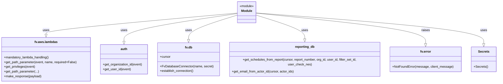
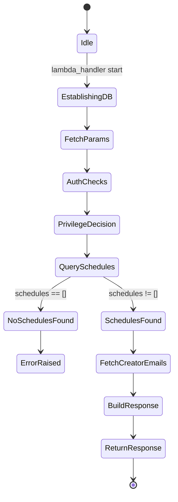

# Diagram: common/iam_service/iam_service/v1/power_bi/email/get_email_schedule.py


> Auto-generated by Obscura crawlers

## Diagram 1

```mermaid
flowchart TD
    A[API Request event] --> B[lambda_handler(event, context, audit_refs)]
    B --> C{establish DB connection}
    C -->|calls| D[DB_CONN.establish_connection()]
    B --> E[Get path params]
    E --> E1[report_number]
    E --> E2[filter_set_id (optional)]
    B --> F[Get auth info]
    F --> F1[auth.get_organization_id(event)]
    F --> F2[auth.get_user_id(event)]
    B --> G[Get privileges]
    G --> G1[fv.aws.lambdas.get_privileges(event)]
    G1 --> H{has MANAGE_SHARED_REPORTS?}
    H -->|yes| I[user_check_nes = False]
    H -->|no| J[user_check_nes = True]
    B --> K[reporting_db.get_schedules_from_report(...)]
    K --> L{schedules found?}
    L -->|no| M[raise fv.error.NotFoundError]
    L -->|yes| N[creator_ids = list of schedules.creator_actor_id]
    N --> O[reporting_db.get_email_from_actor_id(DB_CONN.cursor, creator_ids)]
    O --> P[emails_to_actors mapping]
    P --> Q[build_response(schedules, emails_to_actors)]
    Q --> R[fv.aws.lambdas.make_response(response)]
    R --> S[Return HTTP response]
```

> SVG rendering failed for this diagram.

## Diagram 2



### SVG

<svg id="container" width="2528.390625" xmlns="http://www.w3.org/2000/svg" class="classDiagram" height="420" viewBox="0 0 2528.390625 420" role="graphics-document document" aria-roledescription="class"><style>#container{font-family:"trebuchet ms",verdana,arial,sans-serif;font-size:16px;fill:#333;}@keyframes edge-animation-frame{from{stroke-dashoffset:0;}}@keyframes dash{to{stroke-dashoffset:0;}}#container .edge-animation-slow{stroke-dasharray:9,5!important;stroke-dashoffset:900;animation:dash 50s linear infinite;stroke-linecap:round;}#container .edge-animation-fast{stroke-dasharray:9,5!important;stroke-dashoffset:900;animation:dash 20s linear infinite;stroke-linecap:round;}#container .error-icon{fill:#552222;}#container .error-text{fill:#552222;stroke:#552222;}#container .edge-thickness-normal{stroke-width:1px;}#container .edge-thickness-thick{stroke-width:3.5px;}#container .edge-pattern-solid{stroke-dasharray:0;}#container .edge-thickness-invisible{stroke-width:0;fill:none;}#container .edge-pattern-dashed{stroke-dasharray:3;}#container .edge-pattern-dotted{stroke-dasharray:2;}#container .marker{fill:#333333;stroke:#333333;}#container .marker.cross{stroke:#333333;}#container svg{font-family:"trebuchet ms",verdana,arial,sans-serif;font-size:16px;}#container p{margin:0;}#container g.classGroup text{fill:#9370DB;stroke:none;font-family:"trebuchet ms",verdana,arial,sans-serif;font-size:10px;}#container g.classGroup text .title{font-weight:bolder;}#container .nodeLabel,#container .edgeLabel{color:#131300;}#container .edgeLabel .label rect{fill:#ECECFF;}#container .label text{fill:#131300;}#container .labelBkg{background:#ECECFF;}#container .edgeLabel .label span{background:#ECECFF;}#container .classTitle{font-weight:bolder;}#container .node rect,#container .node circle,#container .node ellipse,#container .node polygon,#container .node path{fill:#ECECFF;stroke:#9370DB;stroke-width:1px;}#container .divider{stroke:#9370DB;stroke-width:1;}#container g.clickable{cursor:pointer;}#container g.classGroup rect{fill:#ECECFF;stroke:#9370DB;}#container g.classGroup line{stroke:#9370DB;stroke-width:1;}#container .classLabel .box{stroke:none;stroke-width:0;fill:#ECECFF;opacity:0.5;}#container .classLabel .label{fill:#9370DB;font-size:10px;}#container .relation{stroke:#333333;stroke-width:1;fill:none;}#container .dashed-line{stroke-dasharray:3;}#container .dotted-line{stroke-dasharray:1 2;}#container #compositionStart,#container .composition{fill:#333333!important;stroke:#333333!important;stroke-width:1;}#container #compositionEnd,#container .composition{fill:#333333!important;stroke:#333333!important;stroke-width:1;}#container #dependencyStart,#container .dependency{fill:#333333!important;stroke:#333333!important;stroke-width:1;}#container #dependencyStart,#container .dependency{fill:#333333!important;stroke:#333333!important;stroke-width:1;}#container #extensionStart,#container .extension{fill:transparent!important;stroke:#333333!important;stroke-width:1;}#container #extensionEnd,#container .extension{fill:transparent!important;stroke:#333333!important;stroke-width:1;}#container #aggregationStart,#container .aggregation{fill:transparent!important;stroke:#333333!important;stroke-width:1;}#container #aggregationEnd,#container .aggregation{fill:transparent!important;stroke:#333333!important;stroke-width:1;}#container #lollipopStart,#container .lollipop{fill:#ECECFF!important;stroke:#333333!important;stroke-width:1;}#container #lollipopEnd,#container .lollipop{fill:#ECECFF!important;stroke:#333333!important;stroke-width:1;}#container .edgeTerminals{font-size:11px;line-height:initial;}#container .classTitleText{text-anchor:middle;font-size:18px;fill:#333;}#container .label-icon{display:inline-block;height:1em;overflow:visible;vertical-align:-0.125em;}#container .node .label-icon path{fill:currentColor;stroke:revert;stroke-width:revert;}#container :root{--mermaid-font-family:"trebuchet ms",verdana,arial,sans-serif;}</style><g><defs><marker id="container_class-aggregationStart" class="marker aggregation class" refX="18" refY="7" markerWidth="190" markerHeight="240" orient="auto"><path d="M 18,7 L9,13 L1,7 L9,1 Z"></path></marker></defs><defs><marker id="container_class-aggregationEnd" class="marker aggregation class" refX="1" refY="7" markerWidth="20" markerHeight="28" orient="auto"><path d="M 18,7 L9,13 L1,7 L9,1 Z"></path></marker></defs><defs><marker id="container_class-extensionStart" class="marker extension class" refX="18" refY="7" markerWidth="190" markerHeight="240" orient="auto"><path d="M 1,7 L18,13 V 1 Z"></path></marker></defs><defs><marker id="container_class-extensionEnd" class="marker extension class" refX="1" refY="7" markerWidth="20" markerHeight="28" orient="auto"><path d="M 1,1 V 13 L18,7 Z"></path></marker></defs><defs><marker id="container_class-compositionStart" class="marker composition class" refX="18" refY="7" markerWidth="190" markerHeight="240" orient="auto"><path d="M 18,7 L9,13 L1,7 L9,1 Z"></path></marker></defs><defs><marker id="container_class-compositionEnd" class="marker composition class" refX="1" refY="7" markerWidth="20" markerHeight="28" orient="auto"><path d="M 18,7 L9,13 L1,7 L9,1 Z"></path></marker></defs><defs><marker id="container_class-dependencyStart" class="marker dependency class" refX="6" refY="7" markerWidth="190" markerHeight="240" orient="auto"><path d="M 5,7 L9,13 L1,7 L9,1 Z"></path></marker></defs><defs><marker id="container_class-dependencyEnd" class="marker dependency class" refX="13" refY="7" markerWidth="20" markerHeight="28" orient="auto"><path d="M 18,7 L9,13 L14,7 L9,1 Z"></path></marker></defs><defs><marker id="container_class-lollipopStart" class="marker lollipop class" refX="13" refY="7" markerWidth="190" markerHeight="240" orient="auto"><circle stroke="black" fill="transparent" cx="7" cy="7" r="6"></circle></marker></defs><defs><marker id="container_class-lollipopEnd" class="marker lollipop class" refX="1" refY="7" markerWidth="190" markerHeight="240" orient="auto"><circle stroke="black" fill="transparent" cx="7" cy="7" r="6"></circle></marker></defs><g class="root"><g class="clusters"></g><g class="edgePaths"><path d="M1203.594,66.337L1041.738,80.781C879.882,95.225,556.169,124.112,394.313,141.848C232.457,159.583,232.457,166.167,232.457,169.458L232.457,172.75" id="id_Module_fv.aws.lambdas_1" class="edge-thickness-normal edge-pattern-solid relation" style=";;;" data-edge="true" data-et="edge" data-id="id_Module_fv.aws.lambdas_1" data-points="W3sieCI6MTIwMy41OTM3NSwieSI6NjYuMzM3MTM0NjA0ODUwMzZ9LHsieCI6MjMyLjQ1NzAzMTI1LCJ5IjoxNTN9LHsieCI6MjMyLjQ1NzAzMTI1LCJ5IjoxOTB9XQ==" marker-end="url(#container_class-extensionEnd)"></path><path d="M1203.594,69.088L1107.704,83.074C1011.814,97.059,820.034,125.029,724.144,148.306C628.254,171.583,628.254,190.167,628.254,199.458L628.254,208.75" id="id_Module_auth_2" class="edge-thickness-normal edge-pattern-solid relation" style=";;;" data-edge="true" data-et="edge" data-id="id_Module_auth_2" data-points="W3sieCI6MTIwMy41OTM3NSwieSI6NjkuMDg4MzkzNDY2NDMzNzd9LHsieCI6NjI4LjI1MzkwNjI1LCJ5IjoxNTN9LHsieCI6NjI4LjI1MzkwNjI1LCJ5IjoyMjZ9XQ==" marker-end="url(#container_class-extensionEnd)"></path><path d="M1203.594,76.849L1162.053,89.541C1120.512,102.233,1037.43,127.616,995.889,148.1C954.348,168.583,954.348,184.167,954.348,191.958L954.348,199.75" id="id_Module_fv.db_3" class="edge-thickness-normal edge-pattern-solid relation" style=";;;" data-edge="true" data-et="edge" data-id="id_Module_fv.db_3" data-points="W3sieCI6MTIwMy41OTM3NSwieSI6NzYuODQ5MDA3ODU1ODQwNzR9LHsieCI6OTU0LjM0NzY1NjI1LCJ5IjoxNTN9LHsieCI6OTU0LjM0NzY1NjI1LCJ5IjoyMTd9XQ==" marker-end="url(#container_class-extensionEnd)"></path><path d="M1300.797,76.849L1342.338,89.541C1383.879,102.233,1466.961,127.616,1508.502,149.6C1550.043,171.583,1550.043,190.167,1550.043,199.458L1550.043,208.75" id="id_Module_reporting_db_4" class="edge-thickness-normal edge-pattern-solid relation" style=";;;" data-edge="true" data-et="edge" data-id="id_Module_reporting_db_4" data-points="W3sieCI6MTMwMC43OTY4NzUsInkiOjc2Ljg0OTAwNzg1NTg0MDc0fSx7IngiOjE1NTAuMDQyOTY4NzUsInkiOjE1M30seyJ4IjoxNTUwLjA0Mjk2ODc1LCJ5IjoyMjZ9XQ==" marker-end="url(#container_class-extensionEnd)"></path><path d="M1300.797,66.82L1445.643,81.183C1590.488,95.546,1880.18,124.273,2025.025,149.928C2169.871,175.583,2169.871,198.167,2169.871,209.458L2169.871,220.75" id="id_Module_fv.error_5" class="edge-thickness-normal edge-pattern-solid relation" style=";;;" data-edge="true" data-et="edge" data-id="id_Module_fv.error_5" data-points="W3sieCI6MTMwMC43OTY4NzUsInkiOjY2LjgxOTUwNDA5NzA1MjI1fSx7IngiOjIxNjkuODcxMDkzNzUsInkiOjE1M30seyJ4IjoyMTY5Ljg3MTA5Mzc1LCJ5IjoyMzh9XQ==" marker-end="url(#container_class-extensionEnd)"></path><path d="M1300.797,65.663L1493.926,80.219C1687.056,94.775,2073.315,123.888,2266.445,149.736C2459.574,175.583,2459.574,198.167,2459.574,209.458L2459.574,220.75" id="id_Module_Secrets_6" class="edge-thickness-normal edge-pattern-solid relation" style=";;;" data-edge="true" data-et="edge" data-id="id_Module_Secrets_6" data-points="W3sieCI6MTMwMC43OTY4NzUsInkiOjY1LjY2MzA5MzgwMTQ2MTcxfSx7IngiOjI0NTkuNTc0MjE4NzUsInkiOjE1M30seyJ4IjoyNDU5LjU3NDIxODc1LCJ5IjoyMzh9XQ==" marker-end="url(#container_class-extensionEnd)"></path></g><g class="edgeLabels"><g class="edgeLabel" transform="translate(232.45703125, 153)"><g class="label" data-id="id_Module_fv.aws.lambdas_1" transform="translate(-16.4921875, -12)"><foreignObject width="32.984375" height="24"><div xmlns="http://www.w3.org/1999/xhtml" class="labelBkg" style="display: table-cell; white-space: nowrap; line-height: 1.5; max-width: 200px; text-align: center;"><span class="edgeLabel"><p>uses</p></span></div></foreignObject></g></g><g class="edgeLabel" transform="translate(628.25390625, 153)"><g class="label" data-id="id_Module_auth_2" transform="translate(-16.4921875, -12)"><foreignObject width="32.984375" height="24"><div xmlns="http://www.w3.org/1999/xhtml" class="labelBkg" style="display: table-cell; white-space: nowrap; line-height: 1.5; max-width: 200px; text-align: center;"><span class="edgeLabel"><p>uses</p></span></div></foreignObject></g></g><g class="edgeLabel" transform="translate(954.34765625, 153)"><g class="label" data-id="id_Module_fv.db_3" transform="translate(-16.4921875, -12)"><foreignObject width="32.984375" height="24"><div xmlns="http://www.w3.org/1999/xhtml" class="labelBkg" style="display: table-cell; white-space: nowrap; line-height: 1.5; max-width: 200px; text-align: center;"><span class="edgeLabel"><p>uses</p></span></div></foreignObject></g></g><g class="edgeLabel" transform="translate(1550.04296875, 153)"><g class="label" data-id="id_Module_reporting_db_4" transform="translate(-16.4921875, -12)"><foreignObject width="32.984375" height="24"><div xmlns="http://www.w3.org/1999/xhtml" class="labelBkg" style="display: table-cell; white-space: nowrap; line-height: 1.5; max-width: 200px; text-align: center;"><span class="edgeLabel"><p>uses</p></span></div></foreignObject></g></g><g class="edgeLabel" transform="translate(2169.87109375, 153)"><g class="label" data-id="id_Module_fv.error_5" transform="translate(-21.25, -12)"><foreignObject width="42.5" height="24"><div xmlns="http://www.w3.org/1999/xhtml" class="labelBkg" style="display: table-cell; white-space: nowrap; line-height: 1.5; max-width: 200px; text-align: center;"><span class="edgeLabel"><p>raises</p></span></div></foreignObject></g></g><g class="edgeLabel" transform="translate(2459.57421875, 153)"><g class="label" data-id="id_Module_Secrets_6" transform="translate(-16.4921875, -12)"><foreignObject width="32.984375" height="24"><div xmlns="http://www.w3.org/1999/xhtml" class="labelBkg" style="display: table-cell; white-space: nowrap; line-height: 1.5; max-width: 200px; text-align: center;"><span class="edgeLabel"><p>uses</p></span></div></foreignObject></g></g></g><g class="nodes"><g class="node default" id="classId-Module-0" transform="translate(1252.1953125, 62)"><g class="basic label-container"><path d="M-48.6015625 -54 L48.6015625 -54 L48.6015625 54 L-48.6015625 54" stroke="none" stroke-width="0" fill="#ECECFF" style=""></path><path d="M-48.6015625 -54 C-26.30980458844122 -54, -4.018046676882442 -54, 48.6015625 -54 M-48.6015625 -54 C-18.634142157753292 -54, 11.333278184493416 -54, 48.6015625 -54 M48.6015625 -54 C48.6015625 -24.113873594173207, 48.6015625 5.772252811653587, 48.6015625 54 M48.6015625 -54 C48.6015625 -13.374956149769176, 48.6015625 27.25008770046165, 48.6015625 54 M48.6015625 54 C21.800807423343077 54, -4.999947653313846 54, -48.6015625 54 M48.6015625 54 C20.76958530745922 54, -7.06239188508156 54, -48.6015625 54 M-48.6015625 54 C-48.6015625 26.692773735310286, -48.6015625 -0.6144525293794274, -48.6015625 -54 M-48.6015625 54 C-48.6015625 17.84509807131458, -48.6015625 -18.309803857370838, -48.6015625 -54" stroke="#9370DB" stroke-width="1.3" fill="none" stroke-dasharray="0 0" style=""></path></g><g class="annotation-group text" transform="translate(-36.6015625, -30)"><g class="label" style="" transform="translate(0,-12)"><foreignObject width="73.203125" height="24"><div xmlns="http://www.w3.org/1999/xhtml" style="display: table-cell; white-space: nowrap; line-height: 1.5; max-width: 123px; text-align: center;"><span class="nodeLabel markdown-node-label" style=""><p>«module»</p></span></div></foreignObject></g></g><g class="label-group text" transform="translate(-27.09375, -6)"><g class="label" style="font-weight: bolder" transform="translate(0,-12)"><foreignObject width="54.1875" height="24"><div xmlns="http://www.w3.org/1999/xhtml" style="display: table-cell; white-space: nowrap; line-height: 1.5; max-width: 104px; text-align: center;"><span class="nodeLabel markdown-node-label" style=""><p>Module</p></span></div></foreignObject></g></g><g class="members-group text" transform="translate(-36.6015625, 42)"></g><g class="methods-group text" transform="translate(-36.6015625, 72)"></g><g class="divider" style=""><path d="M-48.6015625 18 C-24.111608928303355 18, 0.3783446433932909 18, 48.6015625 18 M-48.6015625 18 C-16.298931627460675 18, 16.00369924507865 18, 48.6015625 18" stroke="#9370DB" stroke-width="1.3" fill="none" stroke-dasharray="0 0" style=""></path></g><g class="divider" style=""><path d="M-48.6015625 36 C-20.8763942219807 36, 6.8487740560386 36, 48.6015625 36 M-48.6015625 36 C-15.777221298528524 36, 17.047119902942953 36, 48.6015625 36" stroke="#9370DB" stroke-width="1.3" fill="none" stroke-dasharray="0 0" style=""></path></g></g><g class="node default" id="classId-fv.aws.lambdas-1" transform="translate(232.45703125, 301)"><g class="basic label-container"><path d="M-224.45703125 -111 L224.45703125 -111 L224.45703125 111 L-224.45703125 111" stroke="none" stroke-width="0" fill="#ECECFF" style=""></path><path d="M-224.45703125 -111 C-77.53422709412388 -111, 69.38857706175224 -111, 224.45703125 -111 M-224.45703125 -111 C-104.5665495379451 -111, 15.323932174109814 -111, 224.45703125 -111 M224.45703125 -111 C224.45703125 -54.90671153431972, 224.45703125 1.1865769313605625, 224.45703125 111 M224.45703125 -111 C224.45703125 -65.47186356533123, 224.45703125 -19.943727130662467, 224.45703125 111 M224.45703125 111 C108.86964462678826 111, -6.717741996423484 111, -224.45703125 111 M224.45703125 111 C77.2766052200898 111, -69.90382080982039 111, -224.45703125 111 M-224.45703125 111 C-224.45703125 59.99384535682362, -224.45703125 8.98769071364724, -224.45703125 -111 M-224.45703125 111 C-224.45703125 53.06966680075754, -224.45703125 -4.860666398484923, -224.45703125 -111" stroke="#9370DB" stroke-width="1.3" fill="none" stroke-dasharray="0 0" style=""></path></g><g class="annotation-group text" transform="translate(0, -87)"></g><g class="label-group text" transform="translate(-55.8984375, -87)"><g class="label" style="font-weight: bolder" transform="translate(0,-12)"><foreignObject width="111.796875" height="24"><div xmlns="http://www.w3.org/1999/xhtml" style="display: table-cell; white-space: nowrap; line-height: 1.5; max-width: 160px; text-align: center;"><span class="nodeLabel markdown-node-label" style=""><p>fv.aws.lambdas</p></span></div></foreignObject></g></g><g class="members-group text" transform="translate(-212.45703125, -39)"></g><g class="methods-group text" transform="translate(-212.45703125, -9)"><g class="label" style="" transform="translate(0,-12)"><foreignObject width="232.078125" height="24"><div xmlns="http://www.w3.org/1999/xhtml" style="display: table-cell; white-space: nowrap; line-height: 1.5; max-width: 289px; text-align: center;"><span class="nodeLabel markdown-node-label" style=""><p>+mandatory_lambda_handling()</p></span></div></foreignObject></g><g class="label" style="" transform="translate(0,12)"><foreignObject width="369.015625" height="24"><div xmlns="http://www.w3.org/1999/xhtml" style="display: table-cell; white-space: nowrap; line-height: 1.5; max-width: 426px; text-align: center;"><span class="nodeLabel markdown-node-label" style=""><p>+get_path_parameter(event, name, required=False)</p></span></div></foreignObject></g><g class="label" style="" transform="translate(0,36)"><foreignObject width="159.734375" height="24"><div xmlns="http://www.w3.org/1999/xhtml" style="display: table-cell; white-space: nowrap; line-height: 1.5; max-width: 217px; text-align: center;"><span class="nodeLabel markdown-node-label" style=""><p>+get_privileges(event)</p></span></div></foreignObject></g><g class="label" style="" transform="translate(0,60)"><foreignObject width="177.515625" height="24"><div xmlns="http://www.w3.org/1999/xhtml" style="display: table-cell; white-space: nowrap; line-height: 1.5; max-width: 235px; text-align: center;"><span class="nodeLabel markdown-node-label" style=""><p>+get_path_parameter(...)</p></span></div></foreignObject></g><g class="label" style="" transform="translate(0,84)"><foreignObject width="189.59375" height="24"><div xmlns="http://www.w3.org/1999/xhtml" style="display: table-cell; white-space: nowrap; line-height: 1.5; max-width: 247px; text-align: center;"><span class="nodeLabel markdown-node-label" style=""><p>+make_response(payload)</p></span></div></foreignObject></g></g><g class="divider" style=""><path d="M-224.45703125 -63 C-78.6321326664951 -63, 67.19276591700981 -63, 224.45703125 -63 M-224.45703125 -63 C-97.33989613481548 -63, 29.77723898036905 -63, 224.45703125 -63" stroke="#9370DB" stroke-width="1.3" fill="none" stroke-dasharray="0 0" style=""></path></g><g class="divider" style=""><path d="M-224.45703125 -39 C-126.96797308799712 -39, -29.478914925994246 -39, 224.45703125 -39 M-224.45703125 -39 C-121.06419815927373 -39, -17.67136506854746 -39, 224.45703125 -39" stroke="#9370DB" stroke-width="1.3" fill="none" stroke-dasharray="0 0" style=""></path></g></g><g class="node default" id="classId-auth-2" transform="translate(628.25390625, 301)"><g class="basic label-container"><path d="M-121.33984375 -75 L121.33984375 -75 L121.33984375 75 L-121.33984375 75" stroke="none" stroke-width="0" fill="#ECECFF" style=""></path><path d="M-121.33984375 -75 C-65.25605286446171 -75, -9.17226197892343 -75, 121.33984375 -75 M-121.33984375 -75 C-25.972576644840814 -75, 69.39469046031837 -75, 121.33984375 -75 M121.33984375 -75 C121.33984375 -23.995244771445385, 121.33984375 27.00951045710923, 121.33984375 75 M121.33984375 -75 C121.33984375 -30.62008842740788, 121.33984375 13.759823145184242, 121.33984375 75 M121.33984375 75 C49.78372454345113 75, -21.772394663097742 75, -121.33984375 75 M121.33984375 75 C50.87954664755415 75, -19.5807504548917 75, -121.33984375 75 M-121.33984375 75 C-121.33984375 28.36313416023758, -121.33984375 -18.273731679524843, -121.33984375 -75 M-121.33984375 75 C-121.33984375 19.814728188173753, -121.33984375 -35.370543623652495, -121.33984375 -75" stroke="#9370DB" stroke-width="1.3" fill="none" stroke-dasharray="0 0" style=""></path></g><g class="annotation-group text" transform="translate(0, -51)"></g><g class="label-group text" transform="translate(-16.6640625, -51)"><g class="label" style="font-weight: bolder" transform="translate(0,-12)"><foreignObject width="33.328125" height="24"><div xmlns="http://www.w3.org/1999/xhtml" style="display: table-cell; white-space: nowrap; line-height: 1.5; max-width: 83px; text-align: center;"><span class="nodeLabel markdown-node-label" style=""><p>auth</p></span></div></foreignObject></g></g><g class="members-group text" transform="translate(-109.33984375, -3)"></g><g class="methods-group text" transform="translate(-109.33984375, 27)"><g class="label" style="" transform="translate(0,-12)"><foreignObject width="202.015625" height="24"><div xmlns="http://www.w3.org/1999/xhtml" style="display: table-cell; white-space: nowrap; line-height: 1.5; max-width: 259px; text-align: center;"><span class="nodeLabel markdown-node-label" style=""><p>+get_organization_id(event)</p></span></div></foreignObject></g><g class="label" style="" transform="translate(0,12)"><foreignObject width="142.0625" height="24"><div xmlns="http://www.w3.org/1999/xhtml" style="display: table-cell; white-space: nowrap; line-height: 1.5; max-width: 199px; text-align: center;"><span class="nodeLabel markdown-node-label" style=""><p>+get_user_id(event)</p></span></div></foreignObject></g></g><g class="divider" style=""><path d="M-121.33984375 -27 C-36.1080743027934 -27, 49.123695144413205 -27, 121.33984375 -27 M-121.33984375 -27 C-64.53111462051827 -27, -7.722385491036533 -27, 121.33984375 -27" stroke="#9370DB" stroke-width="1.3" fill="none" stroke-dasharray="0 0" style=""></path></g><g class="divider" style=""><path d="M-121.33984375 -3 C-63.4279470298944 -3, -5.516050309788795 -3, 121.33984375 -3 M-121.33984375 -3 C-50.72402920523493 -3, 19.891785339530145 -3, 121.33984375 -3" stroke="#9370DB" stroke-width="1.3" fill="none" stroke-dasharray="0 0" style=""></path></g></g><g class="node default" id="classId-fv.db-3" transform="translate(954.34765625, 301)"><g class="basic label-container"><path d="M-154.75390625 -84 L154.75390625 -84 L154.75390625 84 L-154.75390625 84" stroke="none" stroke-width="0" fill="#ECECFF" style=""></path><path d="M-154.75390625 -84 C-64.1350460081606 -84, 26.4838142336788 -84, 154.75390625 -84 M-154.75390625 -84 C-62.64320334730611 -84, 29.467499555387775 -84, 154.75390625 -84 M154.75390625 -84 C154.75390625 -22.27413712800864, 154.75390625 39.45172574398272, 154.75390625 84 M154.75390625 -84 C154.75390625 -26.6960985169762, 154.75390625 30.6078029660476, 154.75390625 84 M154.75390625 84 C62.637832136975035 84, -29.47824197604993 84, -154.75390625 84 M154.75390625 84 C86.36156900645315 84, 17.969231762906304 84, -154.75390625 84 M-154.75390625 84 C-154.75390625 21.53534208638939, -154.75390625 -40.92931582722122, -154.75390625 -84 M-154.75390625 84 C-154.75390625 29.46461288734585, -154.75390625 -25.0707742253083, -154.75390625 -84" stroke="#9370DB" stroke-width="1.3" fill="none" stroke-dasharray="0 0" style=""></path></g><g class="annotation-group text" transform="translate(0, -60)"></g><g class="label-group text" transform="translate(-18.0546875, -60)"><g class="label" style="font-weight: bolder" transform="translate(0,-12)"><foreignObject width="36.109375" height="24"><div xmlns="http://www.w3.org/1999/xhtml" style="display: table-cell; white-space: nowrap; line-height: 1.5; max-width: 85px; text-align: center;"><span class="nodeLabel markdown-node-label" style=""><p>fv.db</p></span></div></foreignObject></g></g><g class="members-group text" transform="translate(-142.75390625, -12)"><g class="label" style="" transform="translate(0,-12)"><foreignObject width="53.71875" height="24"><div xmlns="http://www.w3.org/1999/xhtml" style="display: table-cell; white-space: nowrap; line-height: 1.5; max-width: 112px; text-align: center;"><span class="nodeLabel markdown-node-label" style=""><p>+cursor</p></span></div></foreignObject></g></g><g class="methods-group text" transform="translate(-142.75390625, 36)"><g class="label" style="" transform="translate(0,-12)"><foreignObject width="267.453125" height="24"><div xmlns="http://www.w3.org/1999/xhtml" style="display: table-cell; white-space: nowrap; line-height: 1.5; max-width: 325px; text-align: center;"><span class="nodeLabel markdown-node-label" style=""><p>+FvDatabaseConnector(name, secret)</p></span></div></foreignObject></g><g class="label" style="" transform="translate(0,12)"><foreignObject width="173.265625" height="24"><div xmlns="http://www.w3.org/1999/xhtml" style="display: table-cell; white-space: nowrap; line-height: 1.5; max-width: 231px; text-align: center;"><span class="nodeLabel markdown-node-label" style=""><p>+establish_connection()</p></span></div></foreignObject></g></g><g class="divider" style=""><path d="M-154.75390625 -36 C-56.41435168751198 -36, 41.92520287497604 -36, 154.75390625 -36 M-154.75390625 -36 C-54.648703322337994 -36, 45.45649960532401 -36, 154.75390625 -36" stroke="#9370DB" stroke-width="1.3" fill="none" stroke-dasharray="0 0" style=""></path></g><g class="divider" style=""><path d="M-154.75390625 12 C-65.43322666812749 12, 23.887452913745022 12, 154.75390625 12 M-154.75390625 12 C-66.44438176033414 12, 21.865142729331723 12, 154.75390625 12" stroke="#9370DB" stroke-width="1.3" fill="none" stroke-dasharray="0 0" style=""></path></g></g><g class="node default" id="classId-reporting_db-4" transform="translate(1550.04296875, 301)"><g class="basic label-container"><path d="M-390.94140625 -75 L390.94140625 -75 L390.94140625 75 L-390.94140625 75" stroke="none" stroke-width="0" fill="#ECECFF" style=""></path><path d="M-390.94140625 -75 C-208.89911351714488 -75, -26.856820784289766 -75, 390.94140625 -75 M-390.94140625 -75 C-78.74682468807958 -75, 233.44775687384083 -75, 390.94140625 -75 M390.94140625 -75 C390.94140625 -27.669364049492998, 390.94140625 19.661271901014004, 390.94140625 75 M390.94140625 -75 C390.94140625 -19.622954674116997, 390.94140625 35.754090651766006, 390.94140625 75 M390.94140625 75 C153.0803029297248 75, -84.78080039055038 75, -390.94140625 75 M390.94140625 75 C207.58202278836688 75, 24.22263932673377 75, -390.94140625 75 M-390.94140625 75 C-390.94140625 44.77976459992072, -390.94140625 14.559529199841435, -390.94140625 -75 M-390.94140625 75 C-390.94140625 27.932583004986505, -390.94140625 -19.13483399002699, -390.94140625 -75" stroke="#9370DB" stroke-width="1.3" fill="none" stroke-dasharray="0 0" style=""></path></g><g class="annotation-group text" transform="translate(0, -51)"></g><g class="label-group text" transform="translate(-48.0546875, -51)"><g class="label" style="font-weight: bolder" transform="translate(0,-12)"><foreignObject width="96.109375" height="24"><div xmlns="http://www.w3.org/1999/xhtml" style="display: table-cell; white-space: nowrap; line-height: 1.5; max-width: 145px; text-align: center;"><span class="nodeLabel markdown-node-label" style=""><p>reporting_db</p></span></div></foreignObject></g></g><g class="members-group text" transform="translate(-378.94140625, -3)"></g><g class="methods-group text" transform="translate(-378.94140625, 27)"><g class="label" style="" transform="translate(0,-12)"><foreignObject width="709.828125" height="24"><div xmlns="http://www.w3.org/1999/xhtml" style="display: table-cell; white-space: nowrap; line-height: 1.5; max-width: 767px; text-align: center;"><span class="nodeLabel markdown-node-label" style=""><p>+get_schedules_from_report(cursor, report_number, org_id, user_id, filter_set_id, user_check_nes)</p></span></div></foreignObject></g><g class="label" style="" transform="translate(0,12)"><foreignObject width="316.421875" height="24"><div xmlns="http://www.w3.org/1999/xhtml" style="display: table-cell; white-space: nowrap; line-height: 1.5; max-width: 374px; text-align: center;"><span class="nodeLabel markdown-node-label" style=""><p>+get_email_from_actor_id(cursor, actor_ids)</p></span></div></foreignObject></g></g><g class="divider" style=""><path d="M-390.94140625 -27 C-204.15079862303668 -27, -17.360190996073356 -27, 390.94140625 -27 M-390.94140625 -27 C-137.26334879804386 -27, 116.41470865391227 -27, 390.94140625 -27" stroke="#9370DB" stroke-width="1.3" fill="none" stroke-dasharray="0 0" style=""></path></g><g class="divider" style=""><path d="M-390.94140625 -3 C-193.44241093436077 -3, 4.056584381278469 -3, 390.94140625 -3 M-390.94140625 -3 C-180.50744896903362 -3, 29.926508311932764 -3, 390.94140625 -3" stroke="#9370DB" stroke-width="1.3" fill="none" stroke-dasharray="0 0" style=""></path></g></g><g class="node default" id="classId-fv.error-5" transform="translate(2169.87109375, 301)"><g class="basic label-container"><path d="M-178.88671875 -63 L178.88671875 -63 L178.88671875 63 L-178.88671875 63" stroke="none" stroke-width="0" fill="#ECECFF" style=""></path><path d="M-178.88671875 -63 C-53.69410404645289 -63, 71.49851065709422 -63, 178.88671875 -63 M-178.88671875 -63 C-49.116432713671315 -63, 80.65385332265737 -63, 178.88671875 -63 M178.88671875 -63 C178.88671875 -15.207690010396902, 178.88671875 32.584619979206195, 178.88671875 63 M178.88671875 -63 C178.88671875 -14.434730925885127, 178.88671875 34.130538148229746, 178.88671875 63 M178.88671875 63 C58.6227798514424 63, -61.641159047115195 63, -178.88671875 63 M178.88671875 63 C48.28166731896101 63, -82.32338411207797 63, -178.88671875 63 M-178.88671875 63 C-178.88671875 20.452676316446734, -178.88671875 -22.094647367106532, -178.88671875 -63 M-178.88671875 63 C-178.88671875 18.607416290840526, -178.88671875 -25.78516741831895, -178.88671875 -63" stroke="#9370DB" stroke-width="1.3" fill="none" stroke-dasharray="0 0" style=""></path></g><g class="annotation-group text" transform="translate(0, -39)"></g><g class="label-group text" transform="translate(-26.9453125, -39)"><g class="label" style="font-weight: bolder" transform="translate(0,-12)"><foreignObject width="53.890625" height="24"><div xmlns="http://www.w3.org/1999/xhtml" style="display: table-cell; white-space: nowrap; line-height: 1.5; max-width: 103px; text-align: center;"><span class="nodeLabel markdown-node-label" style=""><p>fv.error</p></span></div></foreignObject></g></g><g class="members-group text" transform="translate(-166.88671875, 9)"></g><g class="methods-group text" transform="translate(-166.88671875, 39)"><g class="label" style="" transform="translate(0,-12)"><foreignObject width="306.828125" height="24"><div xmlns="http://www.w3.org/1999/xhtml" style="display: table-cell; white-space: nowrap; line-height: 1.5; max-width: 364px; text-align: center;"><span class="nodeLabel markdown-node-label" style=""><p>+NotFoundError(message, client_message)</p></span></div></foreignObject></g></g><g class="divider" style=""><path d="M-178.88671875 -15 C-96.34916862467186 -15, -13.811618499343723 -15, 178.88671875 -15 M-178.88671875 -15 C-93.89035063624924 -15, -8.893982522498476 -15, 178.88671875 -15" stroke="#9370DB" stroke-width="1.3" fill="none" stroke-dasharray="0 0" style=""></path></g><g class="divider" style=""><path d="M-178.88671875 9 C-84.80180703293644 9, 9.283104684127125 9, 178.88671875 9 M-178.88671875 9 C-50.22080505620232 9, 78.44510863759535 9, 178.88671875 9" stroke="#9370DB" stroke-width="1.3" fill="none" stroke-dasharray="0 0" style=""></path></g></g><g class="node default" id="classId-Secrets-6" transform="translate(2459.57421875, 301)"><g class="basic label-container"><path d="M-60.81640625 -63 L60.81640625 -63 L60.81640625 63 L-60.81640625 63" stroke="none" stroke-width="0" fill="#ECECFF" style=""></path><path d="M-60.81640625 -63 C-22.685512667872487 -63, 15.445380914255026 -63, 60.81640625 -63 M-60.81640625 -63 C-16.628711837068288 -63, 27.558982575863425 -63, 60.81640625 -63 M60.81640625 -63 C60.81640625 -18.414352912147088, 60.81640625 26.171294175705825, 60.81640625 63 M60.81640625 -63 C60.81640625 -35.9274991993427, 60.81640625 -8.854998398685396, 60.81640625 63 M60.81640625 63 C31.844855459085142 63, 2.8733046681702845 63, -60.81640625 63 M60.81640625 63 C30.628575604000225 63, 0.440744958000451 63, -60.81640625 63 M-60.81640625 63 C-60.81640625 22.953189591195887, -60.81640625 -17.093620817608226, -60.81640625 -63 M-60.81640625 63 C-60.81640625 34.197147808918075, -60.81640625 5.39429561783615, -60.81640625 -63" stroke="#9370DB" stroke-width="1.3" fill="none" stroke-dasharray="0 0" style=""></path></g><g class="annotation-group text" transform="translate(0, -39)"></g><g class="label-group text" transform="translate(-27.1640625, -39)"><g class="label" style="font-weight: bolder" transform="translate(0,-12)"><foreignObject width="54.328125" height="24"><div xmlns="http://www.w3.org/1999/xhtml" style="display: table-cell; white-space: nowrap; line-height: 1.5; max-width: 103px; text-align: center;"><span class="nodeLabel markdown-node-label" style=""><p>Secrets</p></span></div></foreignObject></g></g><g class="members-group text" transform="translate(-48.81640625, 9)"></g><g class="methods-group text" transform="translate(-48.81640625, 39)"><g class="label" style="" transform="translate(0,-12)"><foreignObject width="70.46875" height="24"><div xmlns="http://www.w3.org/1999/xhtml" style="display: table-cell; white-space: nowrap; line-height: 1.5; max-width: 128px; text-align: center;"><span class="nodeLabel markdown-node-label" style=""><p>+Secrets()</p></span></div></foreignObject></g></g><g class="divider" style=""><path d="M-60.81640625 -15 C-18.950158200044932 -15, 22.916089849910136 -15, 60.81640625 -15 M-60.81640625 -15 C-22.745787894230027 -15, 15.324830461539946 -15, 60.81640625 -15" stroke="#9370DB" stroke-width="1.3" fill="none" stroke-dasharray="0 0" style=""></path></g><g class="divider" style=""><path d="M-60.81640625 9 C-15.905992685638928 9, 29.004420878722144 9, 60.81640625 9 M-60.81640625 9 C-21.02781837668278 9, 18.76076949663444 9, 60.81640625 9" stroke="#9370DB" stroke-width="1.3" fill="none" stroke-dasharray="0 0" style=""></path></g></g></g></g></g></svg>

## Diagram 3



### SVG

<svg id="container" width="366.2421875" xmlns="http://www.w3.org/2000/svg" class="statediagram" height="1042" viewBox="0 0 366.2421875 1042" role="graphics-document document" aria-roledescription="stateDiagram"><style>#container{font-family:"trebuchet ms",verdana,arial,sans-serif;font-size:16px;fill:#333;}@keyframes edge-animation-frame{from{stroke-dashoffset:0;}}@keyframes dash{to{stroke-dashoffset:0;}}#container .edge-animation-slow{stroke-dasharray:9,5!important;stroke-dashoffset:900;animation:dash 50s linear infinite;stroke-linecap:round;}#container .edge-animation-fast{stroke-dasharray:9,5!important;stroke-dashoffset:900;animation:dash 20s linear infinite;stroke-linecap:round;}#container .error-icon{fill:#552222;}#container .error-text{fill:#552222;stroke:#552222;}#container .edge-thickness-normal{stroke-width:1px;}#container .edge-thickness-thick{stroke-width:3.5px;}#container .edge-pattern-solid{stroke-dasharray:0;}#container .edge-thickness-invisible{stroke-width:0;fill:none;}#container .edge-pattern-dashed{stroke-dasharray:3;}#container .edge-pattern-dotted{stroke-dasharray:2;}#container .marker{fill:#333333;stroke:#333333;}#container .marker.cross{stroke:#333333;}#container svg{font-family:"trebuchet ms",verdana,arial,sans-serif;font-size:16px;}#container p{margin:0;}#container defs #statediagram-barbEnd{fill:#333333;stroke:#333333;}#container g.stateGroup text{fill:#9370DB;stroke:none;font-size:10px;}#container g.stateGroup text{fill:#333;stroke:none;font-size:10px;}#container g.stateGroup .state-title{font-weight:bolder;fill:#131300;}#container g.stateGroup rect{fill:#ECECFF;stroke:#9370DB;}#container g.stateGroup line{stroke:#333333;stroke-width:1;}#container .transition{stroke:#333333;stroke-width:1;fill:none;}#container .stateGroup .composit{fill:white;border-bottom:1px;}#container .stateGroup .alt-composit{fill:#e0e0e0;border-bottom:1px;}#container .state-note{stroke:#aaaa33;fill:#fff5ad;}#container .state-note text{fill:black;stroke:none;font-size:10px;}#container .stateLabel .box{stroke:none;stroke-width:0;fill:#ECECFF;opacity:0.5;}#container .edgeLabel .label rect{fill:#ECECFF;opacity:0.5;}#container .edgeLabel{background-color:rgba(232,232,232, 0.8);text-align:center;}#container .edgeLabel p{background-color:rgba(232,232,232, 0.8);}#container .edgeLabel rect{opacity:0.5;background-color:rgba(232,232,232, 0.8);fill:rgba(232,232,232, 0.8);}#container .edgeLabel .label text{fill:#333;}#container .label div .edgeLabel{color:#333;}#container .stateLabel text{fill:#131300;font-size:10px;font-weight:bold;}#container .node circle.state-start{fill:#333333;stroke:#333333;}#container .node .fork-join{fill:#333333;stroke:#333333;}#container .node circle.state-end{fill:#9370DB;stroke:white;stroke-width:1.5;}#container .end-state-inner{fill:white;stroke-width:1.5;}#container .node rect{fill:#ECECFF;stroke:#9370DB;stroke-width:1px;}#container .node polygon{fill:#ECECFF;stroke:#9370DB;stroke-width:1px;}#container #statediagram-barbEnd{fill:#333333;}#container .statediagram-cluster rect{fill:#ECECFF;stroke:#9370DB;stroke-width:1px;}#container .cluster-label,#container .nodeLabel{color:#131300;}#container .statediagram-cluster rect.outer{rx:5px;ry:5px;}#container .statediagram-state .divider{stroke:#9370DB;}#container .statediagram-state .title-state{rx:5px;ry:5px;}#container .statediagram-cluster.statediagram-cluster .inner{fill:white;}#container .statediagram-cluster.statediagram-cluster-alt .inner{fill:#f0f0f0;}#container .statediagram-cluster .inner{rx:0;ry:0;}#container .statediagram-state rect.basic{rx:5px;ry:5px;}#container .statediagram-state rect.divider{stroke-dasharray:10,10;fill:#f0f0f0;}#container .note-edge{stroke-dasharray:5;}#container .statediagram-note rect{fill:#fff5ad;stroke:#aaaa33;stroke-width:1px;rx:0;ry:0;}#container .statediagram-note rect{fill:#fff5ad;stroke:#aaaa33;stroke-width:1px;rx:0;ry:0;}#container .statediagram-note text{fill:black;}#container .statediagram-note .nodeLabel{color:black;}#container .statediagram .edgeLabel{color:red;}#container #dependencyStart,#container #dependencyEnd{fill:#333333;stroke:#333333;stroke-width:1;}#container .statediagramTitleText{text-anchor:middle;font-size:18px;fill:#333;}#container :root{--mermaid-font-family:"trebuchet ms",verdana,arial,sans-serif;}</style><g><defs><marker id="container_stateDiagram-barbEnd" refX="19" refY="7" markerWidth="20" markerHeight="14" markerUnits="userSpaceOnUse" orient="auto"><path d="M 19,7 L9,13 L14,7 L9,1 Z"></path></marker></defs><g class="root"><g class="clusters"></g><g class="edgePaths"><path d="M183.246,22L183.246,26.167C183.246,30.333,183.246,38.667,183.329,47.083C183.413,55.5,183.579,64,183.663,68.25L183.746,72.5" id="edge0" class="edge-thickness-normal edge-pattern-solid transition" style="fill:none;;;fill:none" data-edge="true" data-et="edge" data-id="edge0" data-points="W3sieCI6MTgzLjI0NjA5Mzc1LCJ5IjoyMn0seyJ4IjoxODMuMjQ2MDkzNzUsInkiOjQ3fSx7IngiOjE4My43NDYwOTM3NSwieSI6NzIuNX1d" marker-end="url(#container_stateDiagram-barbEnd)"></path><path d="M183.746,112.5L183.663,118.583C183.579,124.667,183.413,136.833,183.413,149.167C183.413,161.5,183.579,174,183.663,180.25L183.746,186.5" id="edge1" class="edge-thickness-normal edge-pattern-solid transition" style="fill:none;;;fill:none" data-edge="true" data-et="edge" data-id="edge1" data-points="W3sieCI6MTgzLjc0NjA5Mzc1LCJ5IjoxMTIuNX0seyJ4IjoxODMuMjQ2MDkzNzUsInkiOjE0OX0seyJ4IjoxODMuNzQ2MDkzNzUsInkiOjE4Ni41fV0=" marker-end="url(#container_stateDiagram-barbEnd)"></path><path d="M183.746,226.5L183.663,230.583C183.579,234.667,183.413,242.833,183.413,251.167C183.413,259.5,183.579,268,183.663,272.25L183.746,276.5" id="edge2" class="edge-thickness-normal edge-pattern-solid transition" style="fill:none;;;fill:none" data-edge="true" data-et="edge" data-id="edge2" data-points="W3sieCI6MTgzLjc0NjA5Mzc1LCJ5IjoyMjYuNX0seyJ4IjoxODMuMjQ2MDkzNzUsInkiOjI1MX0seyJ4IjoxODMuNzQ2MDkzNzUsInkiOjI3Ni41fV0=" marker-end="url(#container_stateDiagram-barbEnd)"></path><path d="M183.746,316.5L183.663,320.583C183.579,324.667,183.413,332.833,183.413,341.167C183.413,349.5,183.579,358,183.663,362.25L183.746,366.5" id="edge3" class="edge-thickness-normal edge-pattern-solid transition" style="fill:none;;;fill:none" data-edge="true" data-et="edge" data-id="edge3" data-points="W3sieCI6MTgzLjc0NjA5Mzc1LCJ5IjozMTYuNX0seyJ4IjoxODMuMjQ2MDkzNzUsInkiOjM0MX0seyJ4IjoxODMuNzQ2MDkzNzUsInkiOjM2Ni41fV0=" marker-end="url(#container_stateDiagram-barbEnd)"></path><path d="M183.746,406.5L183.663,410.583C183.579,414.667,183.413,422.833,183.413,431.167C183.413,439.5,183.579,448,183.663,452.25L183.746,456.5" id="edge4" class="edge-thickness-normal edge-pattern-solid transition" style="fill:none;;;fill:none" data-edge="true" data-et="edge" data-id="edge4" data-points="W3sieCI6MTgzLjc0NjA5Mzc1LCJ5Ijo0MDYuNX0seyJ4IjoxODMuMjQ2MDkzNzUsInkiOjQzMX0seyJ4IjoxODMuNzQ2MDkzNzUsInkiOjQ1Ni41fV0=" marker-end="url(#container_stateDiagram-barbEnd)"></path><path d="M183.746,496.5L183.663,500.583C183.579,504.667,183.413,512.833,183.413,521.167C183.413,529.5,183.579,538,183.663,542.25L183.746,546.5" id="edge5" class="edge-thickness-normal edge-pattern-solid transition" style="fill:none;;;fill:none" data-edge="true" data-et="edge" data-id="edge5" data-points="W3sieCI6MTgzLjc0NjA5Mzc1LCJ5Ijo0OTYuNX0seyJ4IjoxODMuMjQ2MDkzNzUsInkiOjUyMX0seyJ4IjoxODMuNzQ2MDkzNzUsInkiOjU0Ni41fV0=" marker-end="url(#container_stateDiagram-barbEnd)"></path><path d="M149.504,586.5L138.863,592.583C128.221,598.667,106.939,610.833,96.381,623.167C85.823,635.5,85.99,648,86.073,654.25L86.156,660.5" id="edge6" class="edge-thickness-normal edge-pattern-solid transition" style="fill:none;;;fill:none" data-edge="true" data-et="edge" data-id="edge6" data-points="W3sieCI6MTQ5LjUwNDA0MzMxMTQwMzUsInkiOjU4Ni41fSx7IngiOjg1LjY1NjI1LCJ5Ijo2MjN9LHsieCI6ODYuMTU2MjUsInkiOjY2MC41fV0=" marker-end="url(#container_stateDiagram-barbEnd)"></path><path d="M86.156,700.5L86.073,704.583C85.99,708.667,85.823,716.833,85.823,725.167C85.823,733.5,85.99,742,86.073,746.25L86.156,750.5" id="edge7" class="edge-thickness-normal edge-pattern-solid transition" style="fill:none;;;fill:none" data-edge="true" data-et="edge" data-id="edge7" data-points="W3sieCI6ODYuMTU2MjUsInkiOjcwMC41fSx7IngiOjg1LjY1NjI1LCJ5Ijo3MjV9LHsieCI6ODYuMTU2MjUsInkiOjc1MC41fV0=" marker-end="url(#container_stateDiagram-barbEnd)"></path><path d="M217.988,586.5L228.463,592.583C238.937,598.667,259.887,610.833,270.445,623.167C281.003,635.5,281.169,648,281.253,654.25L281.336,660.5" id="edge8" class="edge-thickness-normal edge-pattern-solid transition" style="fill:none;;;fill:none" data-edge="true" data-et="edge" data-id="edge8" data-points="W3sieCI6MjE3Ljk4ODE0NDE4ODU5NjUsInkiOjU4Ni41fSx7IngiOjI4MC44MzU5Mzc1LCJ5Ijo2MjN9LHsieCI6MjgxLjMzNTkzNzUsInkiOjY2MC41fV0=" marker-end="url(#container_stateDiagram-barbEnd)"></path><path d="M281.336,700.5L281.253,704.583C281.169,708.667,281.003,716.833,281.003,725.167C281.003,733.5,281.169,742,281.253,746.25L281.336,750.5" id="edge9" class="edge-thickness-normal edge-pattern-solid transition" style="fill:none;;;fill:none" data-edge="true" data-et="edge" data-id="edge9" data-points="W3sieCI6MjgxLjMzNTkzNzUsInkiOjcwMC41fSx7IngiOjI4MC44MzU5Mzc1LCJ5Ijo3MjV9LHsieCI6MjgxLjMzNTkzNzUsInkiOjc1MC41fV0=" marker-end="url(#container_stateDiagram-barbEnd)"></path><path d="M281.336,790.5L281.253,794.583C281.169,798.667,281.003,806.833,281.003,815.167C281.003,823.5,281.169,832,281.253,836.25L281.336,840.5" id="edge10" class="edge-thickness-normal edge-pattern-solid transition" style="fill:none;;;fill:none" data-edge="true" data-et="edge" data-id="edge10" data-points="W3sieCI6MjgxLjMzNTkzNzUsInkiOjc5MC41fSx7IngiOjI4MC44MzU5Mzc1LCJ5Ijo4MTV9LHsieCI6MjgxLjMzNTkzNzUsInkiOjg0MC41fV0=" marker-end="url(#container_stateDiagram-barbEnd)"></path><path d="M281.336,880.5L281.253,884.583C281.169,888.667,281.003,896.833,281.003,905.167C281.003,913.5,281.169,922,281.253,926.25L281.336,930.5" id="edge11" class="edge-thickness-normal edge-pattern-solid transition" style="fill:none;;;fill:none" data-edge="true" data-et="edge" data-id="edge11" data-points="W3sieCI6MjgxLjMzNTkzNzUsInkiOjg4MC41fSx7IngiOjI4MC44MzU5Mzc1LCJ5Ijo5MDV9LHsieCI6MjgxLjMzNTkzNzUsInkiOjkzMC41fV0=" marker-end="url(#container_stateDiagram-barbEnd)"></path><path d="M281.336,970.5L281.253,974.583C281.169,978.667,281.003,986.833,280.919,995.083C280.836,1003.333,280.836,1011.667,280.836,1015.833L280.836,1020" id="edge12" class="edge-thickness-normal edge-pattern-solid transition" style="fill:none;;;fill:none" data-edge="true" data-et="edge" data-id="edge12" data-points="W3sieCI6MjgxLjMzNTkzNzUsInkiOjk3MC41fSx7IngiOjI4MC44MzU5Mzc1LCJ5Ijo5OTV9LHsieCI6MjgwLjgzNTkzNzUsInkiOjEwMjB9XQ==" marker-end="url(#container_stateDiagram-barbEnd)"></path></g><g class="edgeLabels"><g class="edgeLabel"><g class="label" data-id="edge0" transform="translate(0, 0)"><foreignObject width="0" height="0"><div xmlns="http://www.w3.org/1999/xhtml" class="labelBkg" style="display: table-cell; white-space: nowrap; line-height: 1.5; max-width: 200px; text-align: center;"><span class="edgeLabel"></span></div></foreignObject></g></g><g class="edgeLabel" transform="translate(183.24609375, 149)"><g class="label" data-id="edge1" transform="translate(-78.84375, -12)"><foreignObject width="157.6875" height="24"><div xmlns="http://www.w3.org/1999/xhtml" class="labelBkg" style="display: table-cell; white-space: nowrap; line-height: 1.5; max-width: 200px; text-align: center;"><span class="edgeLabel"><p>lambda_handler start</p></span></div></foreignObject></g></g><g class="edgeLabel"><g class="label" data-id="edge2" transform="translate(0, 0)"><foreignObject width="0" height="0"><div xmlns="http://www.w3.org/1999/xhtml" class="labelBkg" style="display: table-cell; white-space: nowrap; line-height: 1.5; max-width: 200px; text-align: center;"><span class="edgeLabel"></span></div></foreignObject></g></g><g class="edgeLabel"><g class="label" data-id="edge3" transform="translate(0, 0)"><foreignObject width="0" height="0"><div xmlns="http://www.w3.org/1999/xhtml" class="labelBkg" style="display: table-cell; white-space: nowrap; line-height: 1.5; max-width: 200px; text-align: center;"><span class="edgeLabel"></span></div></foreignObject></g></g><g class="edgeLabel"><g class="label" data-id="edge4" transform="translate(0, 0)"><foreignObject width="0" height="0"><div xmlns="http://www.w3.org/1999/xhtml" class="labelBkg" style="display: table-cell; white-space: nowrap; line-height: 1.5; max-width: 200px; text-align: center;"><span class="edgeLabel"></span></div></foreignObject></g></g><g class="edgeLabel"><g class="label" data-id="edge5" transform="translate(0, 0)"><foreignObject width="0" height="0"><div xmlns="http://www.w3.org/1999/xhtml" class="labelBkg" style="display: table-cell; white-space: nowrap; line-height: 1.5; max-width: 200px; text-align: center;"><span class="edgeLabel"></span></div></foreignObject></g></g><g class="edgeLabel" transform="translate(85.65625, 623)"><g class="label" data-id="edge6" transform="translate(-53.84375, -12)"><foreignObject width="107.6875" height="24"><div xmlns="http://www.w3.org/1999/xhtml" class="labelBkg" style="display: table-cell; white-space: nowrap; line-height: 1.5; max-width: 200px; text-align: center;"><span class="edgeLabel"><p>schedules == []</p></span></div></foreignObject></g></g><g class="edgeLabel"><g class="label" data-id="edge7" transform="translate(0, 0)"><foreignObject width="0" height="0"><div xmlns="http://www.w3.org/1999/xhtml" class="labelBkg" style="display: table-cell; white-space: nowrap; line-height: 1.5; max-width: 200px; text-align: center;"><span class="edgeLabel"></span></div></foreignObject></g></g><g class="edgeLabel" transform="translate(280.8359375, 623)"><g class="label" data-id="edge8" transform="translate(-51.7734375, -12)"><foreignObject width="103.546875" height="24"><div xmlns="http://www.w3.org/1999/xhtml" class="labelBkg" style="display: table-cell; white-space: nowrap; line-height: 1.5; max-width: 200px; text-align: center;"><span class="edgeLabel"><p>schedules != []</p></span></div></foreignObject></g></g><g class="edgeLabel"><g class="label" data-id="edge9" transform="translate(0, 0)"><foreignObject width="0" height="0"><div xmlns="http://www.w3.org/1999/xhtml" class="labelBkg" style="display: table-cell; white-space: nowrap; line-height: 1.5; max-width: 200px; text-align: center;"><span class="edgeLabel"></span></div></foreignObject></g></g><g class="edgeLabel"><g class="label" data-id="edge10" transform="translate(0, 0)"><foreignObject width="0" height="0"><div xmlns="http://www.w3.org/1999/xhtml" class="labelBkg" style="display: table-cell; white-space: nowrap; line-height: 1.5; max-width: 200px; text-align: center;"><span class="edgeLabel"></span></div></foreignObject></g></g><g class="edgeLabel"><g class="label" data-id="edge11" transform="translate(0, 0)"><foreignObject width="0" height="0"><div xmlns="http://www.w3.org/1999/xhtml" class="labelBkg" style="display: table-cell; white-space: nowrap; line-height: 1.5; max-width: 200px; text-align: center;"><span class="edgeLabel"></span></div></foreignObject></g></g><g class="edgeLabel"><g class="label" data-id="edge12" transform="translate(0, 0)"><foreignObject width="0" height="0"><div xmlns="http://www.w3.org/1999/xhtml" class="labelBkg" style="display: table-cell; white-space: nowrap; line-height: 1.5; max-width: 200px; text-align: center;"><span class="edgeLabel"></span></div></foreignObject></g></g></g><g class="nodes"><g class="node default" id="state-root_start-0" transform="translate(183.24609375, 15)"><circle class="state-start" r="7" width="14" height="14"></circle></g><g class="node  statediagram-state" id="state-Idle-1" transform="translate(183.24609375, 92)"><g class="basic label-container outer-path"><path d="M-16.8125 -20 C-4.201370771952234 -20, 8.409758456095531 -20, 16.8125 -20 C16.8125 -20, 16.8125 -20, 16.8125 -20 C16.909385892006057 -19.995992769865044, 17.006271784012114 -19.991985539730084, 17.225396727361662 -19.982922465033347 C17.318439564018718 -19.971324687538978, 17.411482400675773 -19.95972691004461, 17.63547295140367 -19.931806517013612 C17.725394278003698 -19.912951997550696, 17.81531560460373 -19.894097478087776, 18.039927435703998 -19.847001329696653 C18.1835038286408 -19.80425678553269, 18.327080221577596 -19.761512241368727, 18.435997346023417 -19.729086208503173 C18.531414480242958 -19.69185432719598, 18.626831614462503 -19.65462244588879, 18.820977123264846 -19.578866633275286 C18.89569465813819 -19.542339456238906, 18.970412193011533 -19.505812279202527, 19.19223696518537 -19.397368756032446 C19.273868967709056 -19.348726640590733, 19.35550097023274 -19.30008452514902, 19.547240790612136 -19.185832391312644 C19.6179927906459 -19.13531643424284, 19.688744790679664 -19.084800477173033, 19.88356356344834 -18.94570254698197 C20.00477236347817 -18.84304393000137, 20.125981163508005 -18.740385313020774, 20.198907858128706 -18.678619553365657 C20.31332360321993 -18.56420380827443, 20.427739348311157 -18.449788063183206, 20.491119553365657 -18.386407858128706 C20.55173538373354 -18.314838882451863, 20.612351214101423 -18.24326990677502, 20.75820254698197 -18.07106356344834 C20.83478389324062 -17.96380471441594, 20.911365239499265 -17.856545865383538, 20.998332391312644 -17.734740790612136 C21.062298938656227 -17.627391073052255, 21.126265485999813 -17.520041355492374, 21.209868756032446 -17.37973696518537 C21.246464735506276 -17.30487869267675, 21.283060714980103 -17.23002042016813, 21.391366633275286 -17.008477123264846 C21.42711501340535 -16.91686187672767, 21.462863393535407 -16.82524663019049, 21.541586208503173 -16.623497346023417 C21.582794774821544 -16.48508021172451, 21.624003341139918 -16.346663077425603, 21.659501329696653 -16.227427435703994 C21.688325980379144 -16.08995637295695, 21.71715063106164 -15.952485310209912, 21.744306517013612 -15.82297295140367 C21.763035550233166 -15.672719820626025, 21.781764583452723 -15.522466689848379, 21.795422465033347 -15.412896727361662 C21.800360983777274 -15.293494352758767, 21.805299502521205 -15.174091978155873, 21.8125 -15 C21.8125 -15, 21.8125 -15, 21.8125 -15 C21.8125 -7.2873696374369406, 21.8125 0.4252607251261189, 21.8125 15 C21.8125 15, 21.8125 15, 21.8125 15 C21.80644555417093 15.146383003969383, 21.800391108341863 15.292766007938768, 21.795422465033347 15.412896727361662 C21.779965140976838 15.536902665399625, 21.76450781692033 15.660908603437587, 21.744306517013612 15.822972951403669 C21.715307982187262 15.961273305659365, 21.686309447360912 16.099573659915063, 21.659501329696653 16.227427435703994 C21.62936205185676 16.32866348541768, 21.599222774016866 16.429899535131373, 21.541586208503173 16.623497346023417 C21.499781544741715 16.730633517312167, 21.45797688098026 16.837769688600915, 21.391366633275286 17.008477123264846 C21.336442983181726 17.120825245243985, 21.281519333088163 17.233173367223124, 21.209868756032446 17.379736965185366 C21.1571610232086 17.46819195403242, 21.104453290384757 17.556646942879475, 20.998332391312644 17.734740790612133 C20.908079930561165 17.861147226845976, 20.81782746980969 17.98755366307982, 20.75820254698197 18.07106356344834 C20.655162419819 18.19272281169932, 20.55212229265603 18.3143820599503, 20.491119553365657 18.386407858128706 C20.43220457748485 18.445322834009513, 20.37328960160404 18.504237809890324, 20.198907858128706 18.678619553365657 C20.086124515817456 18.774142171667897, 19.973341173506206 18.86966478997014, 19.88356356344834 18.94570254698197 C19.76096811378343 19.033234015622725, 19.638372664118517 19.12076548426348, 19.547240790612136 19.185832391312644 C19.42844312909987 19.256620432605747, 19.309645467587597 19.327408473898846, 19.19223696518537 19.397368756032446 C19.08845035115874 19.448106939927076, 18.98466373713211 19.49884512382171, 18.820977123264846 19.578866633275286 C18.7146627419924 19.620350633577328, 18.60834836071995 19.661834633879366, 18.435997346023417 19.729086208503173 C18.32600723835497 19.761831682314472, 18.21601713068652 19.794577156125776, 18.039927435703998 19.847001329696653 C17.95058549558328 19.86573436459007, 17.86124355546256 19.88446739948349, 17.63547295140367 19.931806517013612 C17.492491478424178 19.949629139033895, 17.34951000544468 19.967451761054175, 17.225396727361662 19.982922465033347 C17.094344620372244 19.98834282027294, 16.96329251338283 19.99376317551253, 16.8125 20 C16.8125 20, 16.8125 20, 16.8125 20 C7.86242712556372 20, -1.0876457488725606 20, -16.8125 20 C-16.8125 20, -16.8125 20, -16.8125 20 C-16.923994359702267 19.995388559171765, -17.035488719404537 19.99077711834353, -17.225396727361662 19.982922465033347 C-17.344720996055475 19.968048710452003, -17.464045264749284 19.953174955870654, -17.63547295140367 19.931806517013612 C-17.735811707710155 19.910767692240924, -17.83615046401664 19.889728867468236, -18.039927435703994 19.847001329696653 C-18.19261630062167 19.801543885082538, -18.345305165539344 19.756086440468422, -18.435997346023417 19.729086208503173 C-18.558643786394104 19.681229418965515, -18.681290226764794 19.63337262942786, -18.820977123264846 19.578866633275286 C-18.95664955729446 19.512540421828977, -19.09232199132408 19.446214210382664, -19.19223696518537 19.397368756032446 C-19.290833461247846 19.338617996583324, -19.389429957310323 19.279867237134198, -19.547240790612133 19.185832391312644 C-19.631453209021128 19.125705880244926, -19.715665627430123 19.06557936917721, -19.88356356344834 18.94570254698197 C-19.98704368878037 18.858059351529572, -20.090523814112405 18.77041615607717, -20.198907858128706 18.67861955336566 C-20.297887545395312 18.579639866099054, -20.39686723266192 18.480660178832444, -20.491119553365657 18.386407858128706 C-20.586910462303464 18.273307745662617, -20.682701371241272 18.16020763319653, -20.758202546981966 18.07106356344834 C-20.8112246927934 17.99680142768287, -20.86424683860483 17.922539291917392, -20.998332391312644 17.734740790612133 C-21.055383272029726 17.63899705914848, -21.112434152746808 17.54325332768483, -21.209868756032446 17.37973696518537 C-21.246944654042423 17.303897003620264, -21.2840205520524 17.22805704205516, -21.391366633275286 17.00847712326485 C-21.426102358949883 16.91945708767868, -21.460838084624477 16.830437052092513, -21.541586208503173 16.623497346023417 C-21.56609923854872 16.541159529520083, -21.590612268594267 16.45882171301675, -21.659501329696653 16.227427435703994 C-21.687296523891053 16.094866076079768, -21.715091718085453 15.962304716455542, -21.744306517013612 15.82297295140367 C-21.76324884411504 15.671008676588245, -21.782191171216468 15.519044401772819, -21.795422465033347 15.412896727361664 C-21.79983346440352 15.306248595304245, -21.804244463773692 15.199600463246826, -21.8125 15 C-21.8125 15, -21.8125 15, -21.8125 15 C-21.8125 5.259303664993906, -21.8125 -4.4813926700121876, -21.8125 -15 C-21.8125 -15, -21.8125 -15, -21.8125 -15 C-21.806399798061364 -15.147489284702198, -21.800299596122727 -15.294978569404394, -21.795422465033347 -15.41289672736166 C-21.77861860380984 -15.5477052211257, -21.761814742586335 -15.68251371488974, -21.744306517013612 -15.822972951403669 C-21.726134603987873 -15.909638778626075, -21.707962690962134 -15.996304605848481, -21.659501329696653 -16.227427435703994 C-21.62074080242739 -16.357621751785647, -21.581980275158127 -16.487816067867296, -21.541586208503173 -16.623497346023417 C-21.496912931162566 -16.7379851438563, -21.45223965382196 -16.852472941689182, -21.39136663327529 -17.008477123264846 C-21.327691350857933 -17.138726995294377, -21.26401606844058 -17.26897686732391, -21.209868756032446 -17.379736965185366 C-21.15032810931999 -17.47965906311545, -21.09078746260753 -17.579581161045535, -20.998332391312644 -17.734740790612133 C-20.914385587218927 -17.85231560519727, -20.83043878312521 -17.96989041978241, -20.75820254698197 -18.07106356344834 C-20.669164914645098 -18.17619009729878, -20.580127282308222 -18.281316631149213, -20.49111955336566 -18.386407858128706 C-20.3842848437019 -18.493242567792464, -20.277450134038137 -18.600077277456226, -20.198907858128706 -18.678619553365657 C-20.07813626896757 -18.78090787162951, -19.957364679806435 -18.88319618989336, -19.88356356344834 -18.945702546981966 C-19.802848494176306 -19.003331998761233, -19.72213342490427 -19.0609614505405, -19.547240790612136 -19.185832391312644 C-19.405260356957925 -19.2704343664053, -19.26327992330371 -19.355036341497957, -19.192236965185366 -19.397368756032446 C-19.090652463439497 -19.447030392831813, -18.989067961693628 -19.496692029631177, -18.82097712326485 -19.578866633275286 C-18.671026616230076 -19.637377502686082, -18.521076109195302 -19.695888372096874, -18.43599734602342 -19.729086208503173 C-18.28589969875264 -19.773772214199784, -18.135802051481864 -19.818458219896396, -18.039927435703994 -19.847001329696653 C-17.942379550746864 -19.867454970284847, -17.844831665789734 -19.887908610873044, -17.635472951403674 -19.931806517013612 C-17.52838072827055 -19.945155548705902, -17.42128850513743 -19.958504580398188, -17.225396727361662 -19.982922465033347 C-17.09558644972555 -19.988291457830957, -16.965776172089434 -19.993660450628568, -16.8125 -20 C-16.8125 -20, -16.8125 -20, -16.8125 -20" stroke="none" stroke-width="0" fill="#ECECFF" style=""></path><path d="M-16.8125 -20 C-9.864857907195667 -20, -2.9172158143913336 -20, 16.8125 -20 M-16.8125 -20 C-5.813863472139689 -20, 5.184773055720623 -20, 16.8125 -20 M16.8125 -20 C16.8125 -20, 16.8125 -20, 16.8125 -20 M16.8125 -20 C16.8125 -20, 16.8125 -20, 16.8125 -20 M16.8125 -20 C16.94819966995855 -19.994387420134114, 17.083899339917107 -19.988774840268228, 17.225396727361662 -19.982922465033347 M16.8125 -20 C16.921432469995107 -19.995494519713848, 17.030364939990214 -19.990989039427692, 17.225396727361662 -19.982922465033347 M17.225396727361662 -19.982922465033347 C17.309157027069354 -19.97248175456305, 17.392917326777045 -19.96204104409275, 17.63547295140367 -19.931806517013612 M17.225396727361662 -19.982922465033347 C17.32610640707706 -19.970369016548393, 17.426816086792456 -19.957815568063438, 17.63547295140367 -19.931806517013612 M17.63547295140367 -19.931806517013612 C17.787695635865752 -19.89988877652415, 17.939918320327834 -19.86797103603469, 18.039927435703998 -19.847001329696653 M17.63547295140367 -19.931806517013612 C17.770838140226143 -19.90342342165952, 17.906203329048616 -19.875040326305434, 18.039927435703998 -19.847001329696653 M18.039927435703998 -19.847001329696653 C18.17145989469077 -19.807842420023878, 18.302992353677546 -19.768683510351103, 18.435997346023417 -19.729086208503173 M18.039927435703998 -19.847001329696653 C18.172078450030053 -19.80765826812065, 18.304229464356105 -19.768315206544653, 18.435997346023417 -19.729086208503173 M18.435997346023417 -19.729086208503173 C18.57632128216787 -19.67433163871, 18.716645218312326 -19.619577068916833, 18.820977123264846 -19.578866633275286 M18.435997346023417 -19.729086208503173 C18.57040230924599 -19.67664122911104, 18.704807272468564 -19.624196249718906, 18.820977123264846 -19.578866633275286 M18.820977123264846 -19.578866633275286 C18.908641929039412 -19.536009921181993, 18.99630673481398 -19.493153209088696, 19.19223696518537 -19.397368756032446 M18.820977123264846 -19.578866633275286 C18.937486794273276 -19.52190852582983, 19.053996465281706 -19.464950418384376, 19.19223696518537 -19.397368756032446 M19.19223696518537 -19.397368756032446 C19.26342342388697 -19.354950833710312, 19.334609882588566 -19.31253291138818, 19.547240790612136 -19.185832391312644 M19.19223696518537 -19.397368756032446 C19.325043977465032 -19.318232953613514, 19.4578509897447 -19.239097151194578, 19.547240790612136 -19.185832391312644 M19.547240790612136 -19.185832391312644 C19.655229229732672 -19.108730127743485, 19.763217668853212 -19.03162786417433, 19.88356356344834 -18.94570254698197 M19.547240790612136 -19.185832391312644 C19.62887168814718 -19.12754905072182, 19.710502585682217 -19.069265710131, 19.88356356344834 -18.94570254698197 M19.88356356344834 -18.94570254698197 C19.986963485035286 -18.858127280636573, 20.090363406622235 -18.77055201429118, 20.198907858128706 -18.678619553365657 M19.88356356344834 -18.94570254698197 C19.970389189490387 -18.87216499289549, 20.057214815532433 -18.79862743880901, 20.198907858128706 -18.678619553365657 M20.198907858128706 -18.678619553365657 C20.282971190904295 -18.594556220590068, 20.36703452367988 -18.510492887814483, 20.491119553365657 -18.386407858128706 M20.198907858128706 -18.678619553365657 C20.275864551888354 -18.60166285960601, 20.352821245648002 -18.52470616584636, 20.491119553365657 -18.386407858128706 M20.491119553365657 -18.386407858128706 C20.58873666794565 -18.271151548735293, 20.686353782525646 -18.15589523934188, 20.75820254698197 -18.07106356344834 M20.491119553365657 -18.386407858128706 C20.559981681728416 -18.30510249680743, 20.628843810091173 -18.22379713548615, 20.75820254698197 -18.07106356344834 M20.75820254698197 -18.07106356344834 C20.83089396208648 -17.96925290198108, 20.90358537719099 -17.867442240513817, 20.998332391312644 -17.734740790612136 M20.75820254698197 -18.07106356344834 C20.840222839390226 -17.956186996362433, 20.92224313179848 -17.841310429276525, 20.998332391312644 -17.734740790612136 M20.998332391312644 -17.734740790612136 C21.066862569977715 -17.61973231150026, 21.135392748642783 -17.504723832388382, 21.209868756032446 -17.37973696518537 M20.998332391312644 -17.734740790612136 C21.05455741913071 -17.64038301914065, 21.11078244694878 -17.546025247669164, 21.209868756032446 -17.37973696518537 M21.209868756032446 -17.37973696518537 C21.273492658551866 -17.24959219241691, 21.33711656107129 -17.11944741964845, 21.391366633275286 -17.008477123264846 M21.209868756032446 -17.37973696518537 C21.267001848548706 -17.26286935649352, 21.324134941064965 -17.146001747801677, 21.391366633275286 -17.008477123264846 M21.391366633275286 -17.008477123264846 C21.439497891313728 -16.885127280410618, 21.48762914935217 -16.761777437556386, 21.541586208503173 -16.623497346023417 M21.391366633275286 -17.008477123264846 C21.42864639609412 -16.912937279247608, 21.465926158912954 -16.81739743523037, 21.541586208503173 -16.623497346023417 M21.541586208503173 -16.623497346023417 C21.565937495372687 -16.54170281527154, 21.5902887822422 -16.459908284519667, 21.659501329696653 -16.227427435703994 M21.541586208503173 -16.623497346023417 C21.57954261245098 -16.496004032566294, 21.617499016398785 -16.36851071910917, 21.659501329696653 -16.227427435703994 M21.659501329696653 -16.227427435703994 C21.68074373574082 -16.12611775579278, 21.701986141784985 -16.024808075881566, 21.744306517013612 -15.82297295140367 M21.659501329696653 -16.227427435703994 C21.69341868682385 -16.065668142201826, 21.72733604395105 -15.903908848699656, 21.744306517013612 -15.82297295140367 M21.744306517013612 -15.82297295140367 C21.7553939219461 -15.734024563957446, 21.766481326878594 -15.64507617651122, 21.795422465033347 -15.412896727361662 M21.744306517013612 -15.82297295140367 C21.756030109679134 -15.728920766151676, 21.767753702344653 -15.634868580899681, 21.795422465033347 -15.412896727361662 M21.795422465033347 -15.412896727361662 C21.799917825635784 -15.30420892876067, 21.80441318623822 -15.195521130159674, 21.8125 -15 M21.795422465033347 -15.412896727361662 C21.801161778410645 -15.274132923603268, 21.806901091787946 -15.135369119844874, 21.8125 -15 M21.8125 -15 C21.8125 -15, 21.8125 -15, 21.8125 -15 M21.8125 -15 C21.8125 -15, 21.8125 -15, 21.8125 -15 M21.8125 -15 C21.8125 -5.9795405838402615, 21.8125 3.040918832319477, 21.8125 15 M21.8125 -15 C21.8125 -6.763912088719463, 21.8125 1.4721758225610735, 21.8125 15 M21.8125 15 C21.8125 15, 21.8125 15, 21.8125 15 M21.8125 15 C21.8125 15, 21.8125 15, 21.8125 15 M21.8125 15 C21.805733730689173 15.163593309007625, 21.798967461378346 15.327186618015253, 21.795422465033347 15.412896727361662 M21.8125 15 C21.807362337332332 15.124217230760191, 21.802224674664664 15.24843446152038, 21.795422465033347 15.412896727361662 M21.795422465033347 15.412896727361662 C21.780026672992694 15.536409026570686, 21.764630880952044 15.659921325779711, 21.744306517013612 15.822972951403669 M21.795422465033347 15.412896727361662 C21.782911425977495 15.513266178650829, 21.77040038692164 15.613635629939994, 21.744306517013612 15.822972951403669 M21.744306517013612 15.822972951403669 C21.72690445183777 15.905967205872455, 21.709502386661924 15.98896146034124, 21.659501329696653 16.227427435703994 M21.744306517013612 15.822972951403669 C21.721526716879776 15.931614799940126, 21.69874691674594 16.040256648476586, 21.659501329696653 16.227427435703994 M21.659501329696653 16.227427435703994 C21.61365726770687 16.38141492549487, 21.56781320571709 16.535402415285745, 21.541586208503173 16.623497346023417 M21.659501329696653 16.227427435703994 C21.618984618732313 16.363520668833555, 21.57846790776797 16.499613901963116, 21.541586208503173 16.623497346023417 M21.541586208503173 16.623497346023417 C21.506642453287263 16.71305051563258, 21.471698698071354 16.802603685241746, 21.391366633275286 17.008477123264846 M21.541586208503173 16.623497346023417 C21.50535877542997 16.716340300035192, 21.469131342356764 16.809183254046964, 21.391366633275286 17.008477123264846 M21.391366633275286 17.008477123264846 C21.33251035023323 17.128869574516422, 21.273654067191174 17.249262025767997, 21.209868756032446 17.379736965185366 M21.391366633275286 17.008477123264846 C21.32423432252957 17.145798459766574, 21.257102011783854 17.283119796268306, 21.209868756032446 17.379736965185366 M21.209868756032446 17.379736965185366 C21.133173899366795 17.50844754193621, 21.05647904270115 17.637158118687058, 20.998332391312644 17.734740790612133 M21.209868756032446 17.379736965185366 C21.164944232456133 17.455130043563123, 21.120019708879823 17.530523121940877, 20.998332391312644 17.734740790612133 M20.998332391312644 17.734740790612133 C20.949402953326626 17.803270732413594, 20.900473515340607 17.871800674215056, 20.75820254698197 18.07106356344834 M20.998332391312644 17.734740790612133 C20.928169347925966 17.8330102471564, 20.858006304539288 17.931279703700667, 20.75820254698197 18.07106356344834 M20.75820254698197 18.07106356344834 C20.696948663124324 18.143385887457004, 20.635694779266675 18.215708211465667, 20.491119553365657 18.386407858128706 M20.75820254698197 18.07106356344834 C20.678804627621112 18.164808509694925, 20.599406708260258 18.25855345594151, 20.491119553365657 18.386407858128706 M20.491119553365657 18.386407858128706 C20.420162038642218 18.457365372852145, 20.349204523918775 18.528322887575587, 20.198907858128706 18.678619553365657 M20.491119553365657 18.386407858128706 C20.417521759599065 18.460005651895298, 20.343923965832477 18.533603445661885, 20.198907858128706 18.678619553365657 M20.198907858128706 18.678619553365657 C20.109638474864035 18.75422686424083, 20.020369091599363 18.829834175116, 19.88356356344834 18.94570254698197 M20.198907858128706 18.678619553365657 C20.07778835193022 18.781202542328913, 19.95666884573173 18.88378553129217, 19.88356356344834 18.94570254698197 M19.88356356344834 18.94570254698197 C19.772252427688148 19.02517717035332, 19.660941291927955 19.10465179372467, 19.547240790612136 19.185832391312644 M19.88356356344834 18.94570254698197 C19.801921672076546 19.003993737021364, 19.72027978070475 19.062284927060755, 19.547240790612136 19.185832391312644 M19.547240790612136 19.185832391312644 C19.471527112461626 19.23094795088801, 19.395813434311115 19.276063510463377, 19.19223696518537 19.397368756032446 M19.547240790612136 19.185832391312644 C19.471553532878804 19.230932207736515, 19.395866275145472 19.27603202416039, 19.19223696518537 19.397368756032446 M19.19223696518537 19.397368756032446 C19.115088229230995 19.43508447485421, 19.03793949327662 19.472800193675976, 18.820977123264846 19.578866633275286 M19.19223696518537 19.397368756032446 C19.11580461857265 19.434734253445622, 19.039372271959927 19.4720997508588, 18.820977123264846 19.578866633275286 M18.820977123264846 19.578866633275286 C18.738608600153064 19.611006930728472, 18.656240077041282 19.643147228181654, 18.435997346023417 19.729086208503173 M18.820977123264846 19.578866633275286 C18.70353502504546 19.624692682203886, 18.586092926826076 19.67051873113249, 18.435997346023417 19.729086208503173 M18.435997346023417 19.729086208503173 C18.284689890030986 19.7741323898615, 18.133382434038552 19.819178571219826, 18.039927435703998 19.847001329696653 M18.435997346023417 19.729086208503173 C18.350443420210024 19.7545567157748, 18.264889494396627 19.78002722304643, 18.039927435703998 19.847001329696653 M18.039927435703998 19.847001329696653 C17.93910568872309 19.868141426964037, 17.83828394174218 19.88928152423142, 17.63547295140367 19.931806517013612 M18.039927435703998 19.847001329696653 C17.93539363337066 19.86891976312228, 17.83085983103732 19.890838196547907, 17.63547295140367 19.931806517013612 M17.63547295140367 19.931806517013612 C17.51738383109912 19.946526310508798, 17.399294710794575 19.961246104003983, 17.225396727361662 19.982922465033347 M17.63547295140367 19.931806517013612 C17.49711643873631 19.9490526383322, 17.35875992606895 19.966298759650787, 17.225396727361662 19.982922465033347 M17.225396727361662 19.982922465033347 C17.122075961070486 19.987195843537442, 17.01875519477931 19.991469222041538, 16.8125 20 M17.225396727361662 19.982922465033347 C17.07964611112029 19.988950755112512, 16.933895494878914 19.994979045191673, 16.8125 20 M16.8125 20 C16.8125 20, 16.8125 20, 16.8125 20 M16.8125 20 C16.8125 20, 16.8125 20, 16.8125 20 M16.8125 20 C4.149366259672679 20, -8.513767480654643 20, -16.8125 20 M16.8125 20 C5.947759861867365 20, -4.916980276265271 20, -16.8125 20 M-16.8125 20 C-16.8125 20, -16.8125 20, -16.8125 20 M-16.8125 20 C-16.8125 20, -16.8125 20, -16.8125 20 M-16.8125 20 C-16.92652939094475 19.995283709504, -17.0405587818895 19.990567419008002, -17.225396727361662 19.982922465033347 M-16.8125 20 C-16.9527667732392 19.99419852334515, -17.093033546478402 19.988397046690302, -17.225396727361662 19.982922465033347 M-17.225396727361662 19.982922465033347 C-17.36780753110403 19.96517097685929, -17.5102183348464 19.947419488685235, -17.63547295140367 19.931806517013612 M-17.225396727361662 19.982922465033347 C-17.32823497734572 19.9701036905411, -17.43107322732978 19.95728491604886, -17.63547295140367 19.931806517013612 M-17.63547295140367 19.931806517013612 C-17.790575540603296 19.8992849240013, -17.94567812980292 19.866763330988988, -18.039927435703994 19.847001329696653 M-17.63547295140367 19.931806517013612 C-17.754717569261004 19.906803549939518, -17.873962187118334 19.881800582865427, -18.039927435703994 19.847001329696653 M-18.039927435703994 19.847001329696653 C-18.13404908791379 19.818980099762022, -18.228170740123588 19.790958869827392, -18.435997346023417 19.729086208503173 M-18.039927435703994 19.847001329696653 C-18.167455937682032 19.809034449672275, -18.29498443966007 19.771067569647897, -18.435997346023417 19.729086208503173 M-18.435997346023417 19.729086208503173 C-18.513494282969273 19.698846809870638, -18.590991219915125 19.6686074112381, -18.820977123264846 19.578866633275286 M-18.435997346023417 19.729086208503173 C-18.589563574666812 19.66916448014264, -18.743129803310207 19.60924275178211, -18.820977123264846 19.578866633275286 M-18.820977123264846 19.578866633275286 C-18.966672607656143 19.50764045108414, -19.112368092047436 19.436414268892992, -19.19223696518537 19.397368756032446 M-18.820977123264846 19.578866633275286 C-18.92261950149731 19.52917670238571, -19.024261879729774 19.479486771496134, -19.19223696518537 19.397368756032446 M-19.19223696518537 19.397368756032446 C-19.277849272269076 19.346354893874786, -19.36346157935278 19.29534103171713, -19.547240790612133 19.185832391312644 M-19.19223696518537 19.397368756032446 C-19.27450950177141 19.348344965134512, -19.356782038357448 19.29932117423658, -19.547240790612133 19.185832391312644 M-19.547240790612133 19.185832391312644 C-19.66999258303468 19.09818929608848, -19.792744375457232 19.01054620086432, -19.88356356344834 18.94570254698197 M-19.547240790612133 19.185832391312644 C-19.622286155107087 19.13225103093688, -19.69733151960204 19.078669670561123, -19.88356356344834 18.94570254698197 M-19.88356356344834 18.94570254698197 C-19.97834176766362 18.86542950276199, -20.0731199718789 18.785156458542016, -20.198907858128706 18.67861955336566 M-19.88356356344834 18.94570254698197 C-20.004825774947168 18.842998692794698, -20.126087986445995 18.740294838607426, -20.198907858128706 18.67861955336566 M-20.198907858128706 18.67861955336566 C-20.26348910873732 18.614038302757045, -20.328070359345936 18.54945705214843, -20.491119553365657 18.386407858128706 M-20.198907858128706 18.67861955336566 C-20.300257474717277 18.57726993677709, -20.401607091305845 18.475920320188518, -20.491119553365657 18.386407858128706 M-20.491119553365657 18.386407858128706 C-20.557700707117498 18.30779563844151, -20.624281860869335 18.229183418754317, -20.758202546981966 18.07106356344834 M-20.491119553365657 18.386407858128706 C-20.580113192529655 18.28133326691933, -20.669106831693657 18.17625867570995, -20.758202546981966 18.07106356344834 M-20.758202546981966 18.07106356344834 C-20.827392837247338 17.97415653241997, -20.896583127512706 17.877249501391592, -20.998332391312644 17.734740790612133 M-20.758202546981966 18.07106356344834 C-20.809807281738845 17.998786635383496, -20.861412016495724 17.92650970731865, -20.998332391312644 17.734740790612133 M-20.998332391312644 17.734740790612133 C-21.076357110321734 17.603798416884736, -21.154381829330823 17.472856043157336, -21.209868756032446 17.37973696518537 M-20.998332391312644 17.734740790612133 C-21.07281574636336 17.60974159244283, -21.147299101414077 17.484742394273525, -21.209868756032446 17.37973696518537 M-21.209868756032446 17.37973696518537 C-21.267507526527794 17.261834975654303, -21.325146297023142 17.143932986123236, -21.391366633275286 17.00847712326485 M-21.209868756032446 17.37973696518537 C-21.266002019557313 17.26491453938453, -21.322135283082183 17.150092113583696, -21.391366633275286 17.00847712326485 M-21.391366633275286 17.00847712326485 C-21.423008974262093 16.927384753205764, -21.4546513152489 16.84629238314668, -21.541586208503173 16.623497346023417 M-21.391366633275286 17.00847712326485 C-21.43066857091679 16.90775488932544, -21.46997050855829 16.807032655386028, -21.541586208503173 16.623497346023417 M-21.541586208503173 16.623497346023417 C-21.569985330919746 16.52810637534184, -21.598384453336315 16.43271540466026, -21.659501329696653 16.227427435703994 M-21.541586208503173 16.623497346023417 C-21.569217681727963 16.530684863524424, -21.596849154952753 16.437872381025432, -21.659501329696653 16.227427435703994 M-21.659501329696653 16.227427435703994 C-21.67747751642222 16.141695070010364, -21.69545370314778 16.055962704316734, -21.744306517013612 15.82297295140367 M-21.659501329696653 16.227427435703994 C-21.678166101842002 16.138411055557146, -21.696830873987356 16.049394675410298, -21.744306517013612 15.82297295140367 M-21.744306517013612 15.82297295140367 C-21.764145887360616 15.66381217292942, -21.78398525770762 15.504651394455172, -21.795422465033347 15.412896727361664 M-21.744306517013612 15.82297295140367 C-21.754896360161833 15.73801623907306, -21.76548620331005 15.65305952674245, -21.795422465033347 15.412896727361664 M-21.795422465033347 15.412896727361664 C-21.7988639830237 15.329688493963376, -21.80230550101405 15.24648026056509, -21.8125 15 M-21.795422465033347 15.412896727361664 C-21.79893777294284 15.327904418206247, -21.802453080852334 15.242912109050827, -21.8125 15 M-21.8125 15 C-21.8125 15, -21.8125 15, -21.8125 15 M-21.8125 15 C-21.8125 15, -21.8125 15, -21.8125 15 M-21.8125 15 C-21.8125 3.646966155016216, -21.8125 -7.706067689967568, -21.8125 -15 M-21.8125 15 C-21.8125 6.36312449358836, -21.8125 -2.273751012823279, -21.8125 -15 M-21.8125 -15 C-21.8125 -15, -21.8125 -15, -21.8125 -15 M-21.8125 -15 C-21.8125 -15, -21.8125 -15, -21.8125 -15 M-21.8125 -15 C-21.808462212225113 -15.097624707622497, -21.80442442445022 -15.195249415244994, -21.795422465033347 -15.41289672736166 M-21.8125 -15 C-21.807142231809923 -15.129538891647135, -21.801784463619846 -15.259077783294268, -21.795422465033347 -15.41289672736166 M-21.795422465033347 -15.41289672736166 C-21.778485893469572 -15.54876988601674, -21.761549321905797 -15.684643044671818, -21.744306517013612 -15.822972951403669 M-21.795422465033347 -15.41289672736166 C-21.783196430751513 -15.510979736041586, -21.770970396469682 -15.60906274472151, -21.744306517013612 -15.822972951403669 M-21.744306517013612 -15.822972951403669 C-21.723638799441353 -15.921541816314145, -21.702971081869094 -16.020110681224622, -21.659501329696653 -16.227427435703994 M-21.744306517013612 -15.822972951403669 C-21.72302996898302 -15.924445461914635, -21.701753420952425 -16.0259179724256, -21.659501329696653 -16.227427435703994 M-21.659501329696653 -16.227427435703994 C-21.62270273584412 -16.351031733605183, -21.585904141991588 -16.474636031506368, -21.541586208503173 -16.623497346023417 M-21.659501329696653 -16.227427435703994 C-21.624099632305345 -16.346339641102343, -21.58869793491404 -16.46525184650069, -21.541586208503173 -16.623497346023417 M-21.541586208503173 -16.623497346023417 C-21.48828490955774 -16.76009686817998, -21.43498361061231 -16.896696390336544, -21.39136663327529 -17.008477123264846 M-21.541586208503173 -16.623497346023417 C-21.49768500495807 -16.7360064882959, -21.45378380141296 -16.84851563056838, -21.39136663327529 -17.008477123264846 M-21.39136663327529 -17.008477123264846 C-21.340996766153246 -17.111510333291132, -21.290626899031203 -17.214543543317422, -21.209868756032446 -17.379736965185366 M-21.39136663327529 -17.008477123264846 C-21.349706926917847 -17.093693414670973, -21.308047220560404 -17.1789097060771, -21.209868756032446 -17.379736965185366 M-21.209868756032446 -17.379736965185366 C-21.142751242547845 -17.492374686230285, -21.07563372906325 -17.605012407275204, -20.998332391312644 -17.734740790612133 M-21.209868756032446 -17.379736965185366 C-21.13131116250347 -17.51157361774413, -21.052753568974488 -17.64341027030289, -20.998332391312644 -17.734740790612133 M-20.998332391312644 -17.734740790612133 C-20.949576965350737 -17.80302701340974, -20.900821539388833 -17.871313236207346, -20.75820254698197 -18.07106356344834 M-20.998332391312644 -17.734740790612133 C-20.904397347981348 -17.86630500466362, -20.810462304650052 -17.997869218715106, -20.75820254698197 -18.07106356344834 M-20.75820254698197 -18.07106356344834 C-20.69507464573276 -18.145598535610148, -20.63194674448355 -18.22013350777196, -20.49111955336566 -18.386407858128706 M-20.75820254698197 -18.07106356344834 C-20.700728801864916 -18.138922686079763, -20.64325505674786 -18.206781808711185, -20.49111955336566 -18.386407858128706 M-20.49111955336566 -18.386407858128706 C-20.405610235148256 -18.47191717634611, -20.32010091693085 -18.55742649456351, -20.198907858128706 -18.678619553365657 M-20.49111955336566 -18.386407858128706 C-20.422271789757914 -18.45525562173645, -20.353424026150172 -18.524103385344194, -20.198907858128706 -18.678619553365657 M-20.198907858128706 -18.678619553365657 C-20.120649814206843 -18.744900735545894, -20.042391770284983 -18.81118191772613, -19.88356356344834 -18.945702546981966 M-20.198907858128706 -18.678619553365657 C-20.079959697312844 -18.77936350659955, -19.961011536496986 -18.880107459833447, -19.88356356344834 -18.945702546981966 M-19.88356356344834 -18.945702546981966 C-19.78112420450845 -19.0188428434541, -19.67868484556856 -19.091983139926235, -19.547240790612136 -19.185832391312644 M-19.88356356344834 -18.945702546981966 C-19.81167560634273 -18.997029561811935, -19.739787649237126 -19.048356576641904, -19.547240790612136 -19.185832391312644 M-19.547240790612136 -19.185832391312644 C-19.42205583214419 -19.260426435475615, -19.296870873676244 -19.33502047963859, -19.192236965185366 -19.397368756032446 M-19.547240790612136 -19.185832391312644 C-19.454874969231565 -19.24087047450996, -19.362509147850993 -19.29590855770728, -19.192236965185366 -19.397368756032446 M-19.192236965185366 -19.397368756032446 C-19.084291582942875 -19.450140037822123, -18.97634620070038 -19.502911319611805, -18.82097712326485 -19.578866633275286 M-19.192236965185366 -19.397368756032446 C-19.10040712141408 -19.442261631129877, -19.008577277642797 -19.48715450622731, -18.82097712326485 -19.578866633275286 M-18.82097712326485 -19.578866633275286 C-18.68676513009883 -19.631236315517697, -18.552553136932815 -19.683605997760104, -18.43599734602342 -19.729086208503173 M-18.82097712326485 -19.578866633275286 C-18.730368605534984 -19.614222186605748, -18.63976008780512 -19.64957773993621, -18.43599734602342 -19.729086208503173 M-18.43599734602342 -19.729086208503173 C-18.28795682147218 -19.773159782231424, -18.13991629692094 -19.81723335595968, -18.039927435703994 -19.847001329696653 M-18.43599734602342 -19.729086208503173 C-18.304043556888672 -19.76837055359572, -18.172089767753924 -19.807654898688266, -18.039927435703994 -19.847001329696653 M-18.039927435703994 -19.847001329696653 C-17.939591223031794 -19.868039621125316, -17.83925501035959 -19.889077912553983, -17.635472951403674 -19.931806517013612 M-18.039927435703994 -19.847001329696653 C-17.92520466960271 -19.871056164162315, -17.810481903501422 -19.895110998627977, -17.635472951403674 -19.931806517013612 M-17.635472951403674 -19.931806517013612 C-17.501438170552085 -19.948513935023158, -17.367403389700495 -19.965221353032707, -17.225396727361662 -19.982922465033347 M-17.635472951403674 -19.931806517013612 C-17.52966671265252 -19.944995250919856, -17.423860473901364 -19.958183984826103, -17.225396727361662 -19.982922465033347 M-17.225396727361662 -19.982922465033347 C-17.10580527548768 -19.987868804071056, -16.986213823613696 -19.992815143108764, -16.8125 -20 M-17.225396727361662 -19.982922465033347 C-17.066007902453457 -19.98951483559549, -16.90661907754525 -19.99610720615763, -16.8125 -20 M-16.8125 -20 C-16.8125 -20, -16.8125 -20, -16.8125 -20 M-16.8125 -20 C-16.8125 -20, -16.8125 -20, -16.8125 -20" stroke="#9370DB" stroke-width="1.3" fill="none" stroke-dasharray="0 0" style=""></path></g><g class="label" style="" transform="translate(-13.8125, -12)"><rect></rect><foreignObject width="27.625" height="24"><div xmlns="http://www.w3.org/1999/xhtml" style="display: table-cell; white-space: nowrap; line-height: 1.5; max-width: 200px; text-align: center;"><span class="nodeLabel"><p>Idle</p></span></div></foreignObject></g></g><g class="node  statediagram-state" id="state-EstablishingDB-2" transform="translate(183.24609375, 206)"><g class="basic label-container outer-path"><path d="M-57.0625 -20 C-26.99501780084314 -20, 3.07246439831372 -20, 57.0625 -20 C57.0625 -20, 57.0625 -20, 57.0625 -20 C57.20958211510777 -19.99391663872036, 57.35666423021554 -19.987833277440718, 57.47539672736166 -19.982922465033347 C57.558542134187036 -19.9725584008809, 57.6416875410124 -19.962194336728448, 57.88547295140367 -19.931806517013612 C58.00834714366325 -19.906042508217862, 58.13122133592283 -19.880278499422115, 58.289927435703994 -19.847001329696653 C58.375581687342574 -19.821500954132766, 58.46123593898115 -19.796000578568883, 58.68599734602342 -19.729086208503173 C58.81335243326851 -19.67939209925371, 58.940707520513605 -19.629697990004253, 59.070977123264846 -19.578866633275286 C59.167846457920916 -19.53151010120585, 59.26471579257699 -19.48415356913641, 59.442236965185366 -19.397368756032446 C59.5471753992627 -19.33483902177558, 59.65211383334003 -19.27230928751871, 59.797240790612136 -19.185832391312644 C59.86764202331553 -19.13556687730302, 59.93804325601893 -19.085301363293397, 60.13356356344834 -18.94570254698197 C60.204745444346685 -18.885414569167626, 60.27592732524503 -18.825126591353282, 60.448907858128706 -18.678619553365657 C60.525679986587754 -18.60184742490661, 60.6024521150468 -18.52507529644756, 60.74111955336566 -18.386407858128706 C60.83723440181192 -18.272925271007722, 60.93334925025818 -18.159442683886734, 61.00820254698197 -18.07106356344834 C61.062408107652004 -17.99514395204601, 61.11661366832204 -17.919224340643684, 61.248332391312644 -17.734740790612136 C61.315057329824455 -17.62276189537852, 61.381782268336266 -17.510783000144905, 61.45986875603245 -17.37973696518537 C61.50655671946618 -17.284235209532284, 61.55324468289992 -17.188733453879195, 61.64136663327529 -17.008477123264846 C61.67928432144989 -16.911302416674015, 61.7172020096245 -16.814127710083184, 61.791586208503176 -16.623497346023417 C61.826989982865136 -16.50457816420362, 61.862393757227096 -16.385658982383816, 61.90950132969665 -16.227427435703994 C61.92708344764599 -16.143574470182795, 61.944665565595336 -16.059721504661592, 61.99430651701361 -15.82297295140367 C62.00795857971639 -15.713449670697257, 62.02161064241917 -15.603926389990841, 62.04542246503335 -15.412896727361662 C62.051157036915164 -15.274247562394544, 62.05689160879699 -15.135598397427426, 62.0625 -15 C62.0625 -15, 62.0625 -15, 62.0625 -15 C62.0625 -7.332047451368981, 62.0625 0.33590509726203877, 62.0625 15 C62.0625 15, 62.0625 15, 62.0625 15 C62.05849700195887 15.09678356941129, 62.05449400391773 15.19356713882258, 62.04542246503335 15.412896727361662 C62.03411179086167 15.50363628586302, 62.02280111669 15.59437584436438, 61.99430651701361 15.822972951403669 C61.97353202617413 15.922051041375731, 61.952757535334634 16.021129131347795, 61.90950132969665 16.227427435703994 C61.87191813013042 16.353667177740917, 61.834334930564175 16.47990691977784, 61.791586208503176 16.623497346023417 C61.76074977464908 16.702524353109947, 61.72991334079499 16.78155136019648, 61.64136663327529 17.008477123264846 C61.59195894819121 17.109542158474216, 61.542551263107136 17.21060719368359, 61.45986875603245 17.379736965185366 C61.409712101397744 17.463910692428506, 61.35955544676303 17.54808441967165, 61.248332391312644 17.734740790612133 C61.16012973478936 17.85827629739646, 61.071927078266064 17.98181180418079, 61.00820254698197 18.07106356344834 C60.947393577460296 18.142860578093156, 60.88658460793862 18.21465759273797, 60.74111955336566 18.386407858128706 C60.647262794213916 18.480264617280444, 60.55340603506218 18.57412137643218, 60.448907858128706 18.678619553365657 C60.32319521084067 18.785092734391977, 60.19748256355264 18.891565915418298, 60.13356356344834 18.94570254698197 C60.02155300373454 19.02567654945776, 59.90954244402073 19.105650551933554, 59.797240790612136 19.185832391312644 C59.66655835805893 19.263702219002003, 59.53587592550572 19.34157204669136, 59.442236965185366 19.397368756032446 C59.31205141494973 19.46101259344085, 59.1818658647141 19.52465643084925, 59.070977123264846 19.578866633275286 C58.938450488505005 19.630578686626908, 58.80592385374516 19.682290739978534, 58.68599734602342 19.729086208503173 C58.58870534495782 19.758051292186387, 58.491413343892226 19.787016375869605, 58.289927435703994 19.847001329696653 C58.1595533620884 19.874337898243724, 58.029179288472804 19.90167446679079, 57.88547295140367 19.931806517013612 C57.79415533799286 19.943189245654604, 57.70283772458205 19.9545719742956, 57.47539672736166 19.982922465033347 C57.354485871164684 19.987923375037518, 57.233575014967705 19.992924285041685, 57.0625 20 C57.0625 20, 57.0625 20, 57.0625 20 C25.063769840694036 20, -6.934960318611928 20, -57.0625 20 C-57.0625 20, -57.0625 20, -57.0625 20 C-57.20167029089507 19.994243874190367, -57.34084058179015 19.98848774838073, -57.47539672736166 19.982922465033347 C-57.62838412568867 19.9638526057192, -57.78137152401567 19.944782746405053, -57.88547295140367 19.931806517013612 C-58.01005717769465 19.905683951786965, -58.13464140398562 19.87956138656032, -58.289927435703994 19.847001329696653 C-58.39905165902472 19.81451364082468, -58.508175882345455 19.782025951952704, -58.68599734602342 19.729086208503173 C-58.8093270323989 19.680962815547147, -58.93265671877437 19.632839422591122, -59.070977123264846 19.578866633275286 C-59.16854538301697 19.531168417546695, -59.266113642769085 19.483470201818104, -59.442236965185366 19.397368756032446 C-59.5572439596697 19.328839462013377, -59.67225095415403 19.260310167994305, -59.797240790612136 19.185832391312644 C-59.869944912838825 19.133922645786743, -59.94264903506551 19.082012900260843, -60.13356356344834 18.94570254698197 C-60.24045871765533 18.85516696961369, -60.34735387186232 18.764631392245413, -60.448907858128706 18.67861955336566 C-60.54076187165341 18.586765539840954, -60.63261588517811 18.49491152631625, -60.74111955336566 18.386407858128706 C-60.834903326917185 18.275677565935126, -60.928687100468714 18.16494727374155, -61.00820254698197 18.07106356344834 C-61.09285119900317 17.952505749678995, -61.17749985102437 17.83394793590965, -61.248332391312644 17.734740790612133 C-61.32127183244541 17.61233261431147, -61.39421127357818 17.489924438010803, -61.45986875603244 17.37973696518537 C-61.52997131153932 17.2363398959134, -61.60007386704619 17.092942826641433, -61.64136663327528 17.00847712326485 C-61.69361485143281 16.874576415870134, -61.74586306959035 16.740675708475415, -61.791586208503176 16.623497346023417 C-61.82633276227437 16.506785729253895, -61.86107931604556 16.39007411248437, -61.90950132969665 16.227427435703994 C-61.94250639807067 16.07001904677353, -61.97551146644468 15.912610657843066, -61.99430651701361 15.82297295140367 C-62.010344940645346 15.694305158722855, -62.02638336427707 15.565637366042038, -62.04542246503335 15.412896727361664 C-62.051825966041676 15.258074347248836, -62.05822946705001 15.103251967136007, -62.0625 15 C-62.0625 15, -62.0625 15, -62.0625 15 C-62.0625 8.326747063811084, -62.0625 1.6534941276221673, -62.0625 -15 C-62.0625 -15, -62.0625 -15, -62.0625 -15 C-62.058422976875626 -15.098573330912199, -62.05434595375125 -15.197146661824396, -62.04542246503335 -15.41289672736166 C-62.03090297042119 -15.529378955633256, -62.01638347580902 -15.64586118390485, -61.99430651701361 -15.822972951403669 C-61.96345923093712 -15.970090404673376, -61.93261194486063 -16.117207857943082, -61.90950132969665 -16.227427435703994 C-61.87179130067751 -16.35409319036363, -61.83408127165837 -16.480758945023272, -61.791586208503176 -16.623497346023417 C-61.738299979165966 -16.76005824808398, -61.685013749828755 -16.89661915014454, -61.64136663327529 -17.008477123264846 C-61.5845731738766 -17.124650001310496, -61.52777971447791 -17.24082287935615, -61.45986875603245 -17.379736965185366 C-61.402957618606514 -17.4752461771469, -61.34604648118057 -17.570755389108434, -61.248332391312644 -17.734740790612133 C-61.180634934226944 -17.829556978681076, -61.112937477141244 -17.924373166750016, -61.00820254698197 -18.07106356344834 C-60.91919987301216 -18.176148822032776, -60.83019719904235 -18.28123408061721, -60.74111955336566 -18.386407858128706 C-60.664048370889496 -18.463479040604867, -60.586977188413336 -18.540550223081027, -60.448907858128706 -18.678619553365657 C-60.339304833550145 -18.771448579949176, -60.22970180897158 -18.864277606532692, -60.13356356344834 -18.945702546981966 C-60.05885246847505 -18.999045243506558, -59.98414137350176 -19.05238794003115, -59.797240790612136 -19.185832391312644 C-59.691179600671525 -19.24903114284982, -59.58511841073091 -19.312229894387, -59.442236965185366 -19.397368756032446 C-59.33390694583643 -19.450328075445494, -59.225576926487506 -19.503287394858543, -59.070977123264846 -19.578866633275286 C-58.96800828581945 -19.619045198325097, -58.865039448374056 -19.65922376337491, -58.68599734602342 -19.729086208503173 C-58.60367533871198 -19.75359453194837, -58.52135333140055 -19.778102855393566, -58.289927435703994 -19.847001329696653 C-58.15892961293551 -19.87446868468769, -58.02793179016703 -19.901936039678734, -57.88547295140367 -19.931806517013612 C-57.722646151728206 -19.95210285642679, -57.559819352052735 -19.97239919583997, -57.47539672736166 -19.982922465033347 C-57.32240809704047 -19.989250121589272, -57.169419466719276 -19.9955777781452, -57.0625 -20 C-57.0625 -20, -57.0625 -20, -57.0625 -20" stroke="none" stroke-width="0" fill="#ECECFF" style=""></path><path d="M-57.0625 -20 C-24.935456240935125 -20, 7.191587518129751 -20, 57.0625 -20 M-57.0625 -20 C-17.4033564944301 -20, 22.2557870111398 -20, 57.0625 -20 M57.0625 -20 C57.0625 -20, 57.0625 -20, 57.0625 -20 M57.0625 -20 C57.0625 -20, 57.0625 -20, 57.0625 -20 M57.0625 -20 C57.16233880464026 -19.99587063649507, 57.26217760928051 -19.991741272990136, 57.47539672736166 -19.982922465033347 M57.0625 -20 C57.161570155141966 -19.99590242807348, 57.26064031028394 -19.991804856146963, 57.47539672736166 -19.982922465033347 M57.47539672736166 -19.982922465033347 C57.57163377323568 -19.97092652977531, 57.66787081910971 -19.958930594517266, 57.88547295140367 -19.931806517013612 M57.47539672736166 -19.982922465033347 C57.59249624828252 -19.968326024972697, 57.70959576920338 -19.95372958491205, 57.88547295140367 -19.931806517013612 M57.88547295140367 -19.931806517013612 C57.99615858722783 -19.908598179750143, 58.106844223052 -19.88538984248667, 58.289927435703994 -19.847001329696653 M57.88547295140367 -19.931806517013612 C58.00344663339725 -19.90707003716658, 58.12142031539084 -19.882333557319544, 58.289927435703994 -19.847001329696653 M58.289927435703994 -19.847001329696653 C58.37223518466438 -19.82249725114648, 58.45454293362477 -19.79799317259631, 58.68599734602342 -19.729086208503173 M58.289927435703994 -19.847001329696653 C58.409517644036825 -19.811397782086214, 58.52910785236966 -19.77579423447578, 58.68599734602342 -19.729086208503173 M58.68599734602342 -19.729086208503173 C58.79739862018391 -19.68561729643681, 58.90879989434441 -19.64214838437045, 59.070977123264846 -19.578866633275286 M58.68599734602342 -19.729086208503173 C58.76969164726007 -19.696428590820364, 58.853385948496715 -19.663770973137552, 59.070977123264846 -19.578866633275286 M59.070977123264846 -19.578866633275286 C59.17592455643674 -19.527560959480216, 59.28087198960864 -19.47625528568514, 59.442236965185366 -19.397368756032446 M59.070977123264846 -19.578866633275286 C59.151469935130876 -19.5395160953571, 59.23196274699691 -19.50016555743892, 59.442236965185366 -19.397368756032446 M59.442236965185366 -19.397368756032446 C59.55571591674308 -19.3297499779647, 59.669194868300806 -19.26213119989695, 59.797240790612136 -19.185832391312644 M59.442236965185366 -19.397368756032446 C59.54582516081911 -19.335643589251767, 59.64941335645287 -19.273918422471084, 59.797240790612136 -19.185832391312644 M59.797240790612136 -19.185832391312644 C59.87782646467767 -19.128295325935085, 59.9584121387432 -19.070758260557525, 60.13356356344834 -18.94570254698197 M59.797240790612136 -19.185832391312644 C59.89927366450004 -19.112982319589293, 60.001306538387944 -19.040132247865944, 60.13356356344834 -18.94570254698197 M60.13356356344834 -18.94570254698197 C60.21619961105982 -18.87571338482172, 60.2988356586713 -18.805724222661468, 60.448907858128706 -18.678619553365657 M60.13356356344834 -18.94570254698197 C60.19864807432767 -18.890578778145994, 60.263732585206995 -18.835455009310017, 60.448907858128706 -18.678619553365657 M60.448907858128706 -18.678619553365657 C60.55493113947008 -18.572596272024285, 60.66095442081145 -18.466572990682913, 60.74111955336566 -18.386407858128706 M60.448907858128706 -18.678619553365657 C60.531079128635774 -18.596448282858592, 60.613250399142835 -18.514277012351528, 60.74111955336566 -18.386407858128706 M60.74111955336566 -18.386407858128706 C60.81996061221043 -18.29332039585106, 60.8988016710552 -18.20023293357342, 61.00820254698197 -18.07106356344834 M60.74111955336566 -18.386407858128706 C60.8042103282072 -18.311916721033604, 60.86730110304873 -18.237425583938506, 61.00820254698197 -18.07106356344834 M61.00820254698197 -18.07106356344834 C61.082753571116235 -17.96664835748132, 61.15730459525051 -17.8622331515143, 61.248332391312644 -17.734740790612136 M61.00820254698197 -18.07106356344834 C61.10377760666185 -17.93720236358324, 61.19935266634174 -17.803341163718134, 61.248332391312644 -17.734740790612136 M61.248332391312644 -17.734740790612136 C61.294679129327314 -17.65696092844492, 61.34102586734198 -17.579181066277705, 61.45986875603245 -17.37973696518537 M61.248332391312644 -17.734740790612136 C61.33110595922808 -17.595828820118903, 61.41387952714352 -17.45691684962567, 61.45986875603245 -17.37973696518537 M61.45986875603245 -17.37973696518537 C61.52411638315402 -17.24831634335071, 61.5883640102756 -17.11689572151605, 61.64136663327529 -17.008477123264846 M61.45986875603245 -17.37973696518537 C61.51454432712 -17.26789629692389, 61.56921989820756 -17.15605562866241, 61.64136663327529 -17.008477123264846 M61.64136663327529 -17.008477123264846 C61.672200741098656 -16.929456077284186, 61.70303484892202 -16.850435031303522, 61.791586208503176 -16.623497346023417 M61.64136663327529 -17.008477123264846 C61.69325585701481 -16.875496439714333, 61.745145080754334 -16.74251575616382, 61.791586208503176 -16.623497346023417 M61.791586208503176 -16.623497346023417 C61.83474987646227 -16.478513141075137, 61.87791354442137 -16.333528936126857, 61.90950132969665 -16.227427435703994 M61.791586208503176 -16.623497346023417 C61.825576278148304 -16.509326714641816, 61.85956634779343 -16.395156083260215, 61.90950132969665 -16.227427435703994 M61.90950132969665 -16.227427435703994 C61.938587567230584 -16.088708808056197, 61.967673804764516 -15.949990180408399, 61.99430651701361 -15.82297295140367 M61.90950132969665 -16.227427435703994 C61.938403032111204 -16.08958889639637, 61.967304734525754 -15.951750357088747, 61.99430651701361 -15.82297295140367 M61.99430651701361 -15.82297295140367 C62.00493089201542 -15.737739208269957, 62.01555526701724 -15.652505465136244, 62.04542246503335 -15.412896727361662 M61.99430651701361 -15.82297295140367 C62.00569999132107 -15.731569131192405, 62.01709346562854 -15.64016531098114, 62.04542246503335 -15.412896727361662 M62.04542246503335 -15.412896727361662 C62.051946095777886 -15.255169878012756, 62.058469726522425 -15.09744302866385, 62.0625 -15 M62.04542246503335 -15.412896727361662 C62.04954021853934 -15.313338626615371, 62.05365797204534 -15.21378052586908, 62.0625 -15 M62.0625 -15 C62.0625 -15, 62.0625 -15, 62.0625 -15 M62.0625 -15 C62.0625 -15, 62.0625 -15, 62.0625 -15 M62.0625 -15 C62.0625 -6.2686446890510386, 62.0625 2.462710621897923, 62.0625 15 M62.0625 -15 C62.0625 -6.973661869056407, 62.0625 1.0526762618871857, 62.0625 15 M62.0625 15 C62.0625 15, 62.0625 15, 62.0625 15 M62.0625 15 C62.0625 15, 62.0625 15, 62.0625 15 M62.0625 15 C62.05890924521392 15.086816446450063, 62.05531849042784 15.173632892900129, 62.04542246503335 15.412896727361662 M62.0625 15 C62.05801388393128 15.108464286382954, 62.05352776786256 15.216928572765909, 62.04542246503335 15.412896727361662 M62.04542246503335 15.412896727361662 C62.02675093758153 15.562688519770203, 62.00807941012971 15.712480312178746, 61.99430651701361 15.822972951403669 M62.04542246503335 15.412896727361662 C62.033499943187735 15.508544816244186, 62.02157742134213 15.604192905126709, 61.99430651701361 15.822972951403669 M61.99430651701361 15.822972951403669 C61.97097107228343 15.934264790533597, 61.94763562755326 16.045556629663523, 61.90950132969665 16.227427435703994 M61.99430651701361 15.822972951403669 C61.96537681480337 15.960945027860186, 61.93644711259313 16.0989171043167, 61.90950132969665 16.227427435703994 M61.90950132969665 16.227427435703994 C61.87293677715878 16.35024560268686, 61.8363722246209 16.47306376966973, 61.791586208503176 16.623497346023417 M61.90950132969665 16.227427435703994 C61.86981732290217 16.36072366483151, 61.8301333161077 16.494019893959027, 61.791586208503176 16.623497346023417 M61.791586208503176 16.623497346023417 C61.746893577542124 16.738034742934694, 61.702200946581065 16.852572139845975, 61.64136663327529 17.008477123264846 M61.791586208503176 16.623497346023417 C61.74922333444853 16.7320640876889, 61.706860460393884 16.84063082935439, 61.64136663327529 17.008477123264846 M61.64136663327529 17.008477123264846 C61.58470681225344 17.124376639641405, 61.52804699123159 17.24027615601796, 61.45986875603245 17.379736965185366 M61.64136663327529 17.008477123264846 C61.58310951699057 17.12764395932472, 61.52485240070584 17.246810795384587, 61.45986875603245 17.379736965185366 M61.45986875603245 17.379736965185366 C61.38000582587453 17.513764255261027, 61.30014289571661 17.647791545336688, 61.248332391312644 17.734740790612133 M61.45986875603245 17.379736965185366 C61.39184019319283 17.493903624323806, 61.323811630353205 17.608070283462244, 61.248332391312644 17.734740790612133 M61.248332391312644 17.734740790612133 C61.18699080010617 17.82065503464228, 61.125649208899695 17.90656927867242, 61.00820254698197 18.07106356344834 M61.248332391312644 17.734740790612133 C61.15585227815642 17.86426724816513, 61.06337216500021 17.99379370571813, 61.00820254698197 18.07106356344834 M61.00820254698197 18.07106356344834 C60.953023998104506 18.136212753000436, 60.89784544922704 18.201361942552534, 60.74111955336566 18.386407858128706 M61.00820254698197 18.07106356344834 C60.902448710636634 18.19592688207645, 60.7966948742913 18.320790200704558, 60.74111955336566 18.386407858128706 M60.74111955336566 18.386407858128706 C60.674367092965696 18.453160318528663, 60.60761463256574 18.51991277892862, 60.448907858128706 18.678619553365657 M60.74111955336566 18.386407858128706 C60.630862008586185 18.496665402908178, 60.52060446380671 18.606922947687654, 60.448907858128706 18.678619553365657 M60.448907858128706 18.678619553365657 C60.32337308521711 18.784942082479926, 60.19783831230552 18.891264611594195, 60.13356356344834 18.94570254698197 M60.448907858128706 18.678619553365657 C60.353319096866024 18.759579104385885, 60.257730335603334 18.840538655406114, 60.13356356344834 18.94570254698197 M60.13356356344834 18.94570254698197 C60.058044062473165 18.99962243429787, 59.98252456149799 19.05354232161377, 59.797240790612136 19.185832391312644 M60.13356356344834 18.94570254698197 C60.0662681386298 18.99375055678389, 59.998972713811256 19.04179856658581, 59.797240790612136 19.185832391312644 M59.797240790612136 19.185832391312644 C59.72497858964825 19.228891316889506, 59.65271638868437 19.271950242466364, 59.442236965185366 19.397368756032446 M59.797240790612136 19.185832391312644 C59.70934593156756 19.238206359219884, 59.62145107252299 19.29058032712712, 59.442236965185366 19.397368756032446 M59.442236965185366 19.397368756032446 C59.29725185438221 19.468247657737695, 59.152266743579055 19.539126559442945, 59.070977123264846 19.578866633275286 M59.442236965185366 19.397368756032446 C59.345845470300375 19.444491686472187, 59.24945397541538 19.49161461691193, 59.070977123264846 19.578866633275286 M59.070977123264846 19.578866633275286 C58.98529540206703 19.612299744633386, 58.89961368086922 19.64573285599149, 58.68599734602342 19.729086208503173 M59.070977123264846 19.578866633275286 C58.92930643327742 19.63414670804869, 58.78763574328998 19.68942678282209, 58.68599734602342 19.729086208503173 M58.68599734602342 19.729086208503173 C58.55095437557228 19.769290242720846, 58.41591140512114 19.809494276938523, 58.289927435703994 19.847001329696653 M58.68599734602342 19.729086208503173 C58.582168825928676 19.759997298215687, 58.47834030583393 19.7909083879282, 58.289927435703994 19.847001329696653 M58.289927435703994 19.847001329696653 C58.136281413885506 19.879217512645802, 57.98263539206701 19.91143369559495, 57.88547295140367 19.931806517013612 M58.289927435703994 19.847001329696653 C58.1663537524111 19.872912006338623, 58.04278006911821 19.898822682980594, 57.88547295140367 19.931806517013612 M57.88547295140367 19.931806517013612 C57.72735062251995 19.951516444754148, 57.56922829363623 19.971226372494684, 57.47539672736166 19.982922465033347 M57.88547295140367 19.931806517013612 C57.76866818495387 19.94636621596776, 57.65186341850407 19.96092591492191, 57.47539672736166 19.982922465033347 M57.47539672736166 19.982922465033347 C57.350758269280945 19.988077549791864, 57.22611981120023 19.993232634550377, 57.0625 20 M57.47539672736166 19.982922465033347 C57.33247451077575 19.98883377163743, 57.18955229418983 19.994745078241515, 57.0625 20 M57.0625 20 C57.0625 20, 57.0625 20, 57.0625 20 M57.0625 20 C57.0625 20, 57.0625 20, 57.0625 20 M57.0625 20 C24.258419410073408 20, -8.545661179853184 20, -57.0625 20 M57.0625 20 C18.976760975374376 20, -19.10897804925125 20, -57.0625 20 M-57.0625 20 C-57.0625 20, -57.0625 20, -57.0625 20 M-57.0625 20 C-57.0625 20, -57.0625 20, -57.0625 20 M-57.0625 20 C-57.20090677291606 19.99427545352757, -57.33931354583212 19.988550907055142, -57.47539672736166 19.982922465033347 M-57.0625 20 C-57.2136036243226 19.99375030786888, -57.36470724864521 19.987500615737762, -57.47539672736166 19.982922465033347 M-57.47539672736166 19.982922465033347 C-57.57292819786632 19.970765179913364, -57.67045966837098 19.95860789479338, -57.88547295140367 19.931806517013612 M-57.47539672736166 19.982922465033347 C-57.59571012961562 19.96792541508231, -57.716023531869574 19.952928365131275, -57.88547295140367 19.931806517013612 M-57.88547295140367 19.931806517013612 C-58.04517585755832 19.898320338970766, -58.20487876371296 19.864834160927924, -58.289927435703994 19.847001329696653 M-57.88547295140367 19.931806517013612 C-57.978011087237086 19.91240331035393, -58.0705492230705 19.893000103694245, -58.289927435703994 19.847001329696653 M-58.289927435703994 19.847001329696653 C-58.401094908467726 19.813905339109695, -58.512262381231466 19.780809348522737, -58.68599734602342 19.729086208503173 M-58.289927435703994 19.847001329696653 C-58.395526858968175 19.81556301926778, -58.50112628223236 19.78412470883891, -58.68599734602342 19.729086208503173 M-58.68599734602342 19.729086208503173 C-58.80477230728406 19.68274007480199, -58.923547268544695 19.636393941100813, -59.070977123264846 19.578866633275286 M-58.68599734602342 19.729086208503173 C-58.810951334635725 19.68032901084757, -58.93590532324803 19.631571813191965, -59.070977123264846 19.578866633275286 M-59.070977123264846 19.578866633275286 C-59.16646565347848 19.532185135364923, -59.261954183692126 19.48550363745456, -59.442236965185366 19.397368756032446 M-59.070977123264846 19.578866633275286 C-59.21304240643468 19.50941514832112, -59.355107689604516 19.43996366336696, -59.442236965185366 19.397368756032446 M-59.442236965185366 19.397368756032446 C-59.560059361264145 19.32716184679951, -59.67788175734293 19.256954937566576, -59.797240790612136 19.185832391312644 M-59.442236965185366 19.397368756032446 C-59.553252515171 19.33121784669196, -59.66426806515665 19.265066937351474, -59.797240790612136 19.185832391312644 M-59.797240790612136 19.185832391312644 C-59.90227805577361 19.110837225450272, -60.007315320935085 19.035842059587896, -60.13356356344834 18.94570254698197 M-59.797240790612136 19.185832391312644 C-59.898906912193596 19.113244175703024, -60.00057303377506 19.040655960093403, -60.13356356344834 18.94570254698197 M-60.13356356344834 18.94570254698197 C-60.23299999143464 18.861484188479523, -60.33243641942094 18.777265829977072, -60.448907858128706 18.67861955336566 M-60.13356356344834 18.94570254698197 C-60.19933943000149 18.889993229759256, -60.26511529655463 18.834283912536545, -60.448907858128706 18.67861955336566 M-60.448907858128706 18.67861955336566 C-60.54220385181688 18.585323559677484, -60.63549984550506 18.492027565989307, -60.74111955336566 18.386407858128706 M-60.448907858128706 18.67861955336566 C-60.55066688218873 18.576860529305637, -60.65242590624875 18.475101505245615, -60.74111955336566 18.386407858128706 M-60.74111955336566 18.386407858128706 C-60.8074244062602 18.308121866247266, -60.87372925915476 18.22983587436583, -61.00820254698197 18.07106356344834 M-60.74111955336566 18.386407858128706 C-60.837969434437774 18.27205741962629, -60.934819315509884 18.157706981123876, -61.00820254698197 18.07106356344834 M-61.00820254698197 18.07106356344834 C-61.071847169073486 17.981923723968595, -61.13549179116501 17.89278388448885, -61.248332391312644 17.734740790612133 M-61.00820254698197 18.07106356344834 C-61.07607640980218 17.976000303775535, -61.14395027262239 17.88093704410273, -61.248332391312644 17.734740790612133 M-61.248332391312644 17.734740790612133 C-61.29127023255132 17.66268179538694, -61.33420807379 17.590622800161754, -61.45986875603244 17.37973696518537 M-61.248332391312644 17.734740790612133 C-61.325937875394295 17.6045019838728, -61.40354335947595 17.47426317713347, -61.45986875603244 17.37973696518537 M-61.45986875603244 17.37973696518537 C-61.510985331056915 17.275176339731264, -61.56210190608139 17.170615714277158, -61.64136663327528 17.00847712326485 M-61.45986875603244 17.37973696518537 C-61.52427051505348 17.248001061511058, -61.588672274074526 17.116265157836747, -61.64136663327528 17.00847712326485 M-61.64136663327528 17.00847712326485 C-61.68896930925197 16.886481920137697, -61.73657198522866 16.764486717010545, -61.791586208503176 16.623497346023417 M-61.64136663327528 17.00847712326485 C-61.691728994205604 16.8794094537358, -61.742091355135926 16.75034178420675, -61.791586208503176 16.623497346023417 M-61.791586208503176 16.623497346023417 C-61.82086558660975 16.525149648599186, -61.850144964716314 16.42680195117495, -61.90950132969665 16.227427435703994 M-61.791586208503176 16.623497346023417 C-61.823943729535856 16.514810348767615, -61.85630125056854 16.406123351511813, -61.90950132969665 16.227427435703994 M-61.90950132969665 16.227427435703994 C-61.93693167473921 16.0966061214735, -61.96436201978177 15.965784807243004, -61.99430651701361 15.82297295140367 M-61.90950132969665 16.227427435703994 C-61.92954131569497 16.131852359947818, -61.949581301693286 16.036277284191645, -61.99430651701361 15.82297295140367 M-61.99430651701361 15.82297295140367 C-62.01424394236773 15.663025529452748, -62.034181367721835 15.503078107501826, -62.04542246503335 15.412896727361664 M-61.99430651701361 15.82297295140367 C-62.0090492124285 15.704700101106448, -62.02379190784339 15.586427250809226, -62.04542246503335 15.412896727361664 M-62.04542246503335 15.412896727361664 C-62.05207721575263 15.251999689307441, -62.058731966471925 15.091102651253218, -62.0625 15 M-62.04542246503335 15.412896727361664 C-62.052174564281 15.249646018894472, -62.058926663528666 15.08639531042728, -62.0625 15 M-62.0625 15 C-62.0625 15, -62.0625 15, -62.0625 15 M-62.0625 15 C-62.0625 15, -62.0625 15, -62.0625 15 M-62.0625 15 C-62.0625 7.399565515269224, -62.0625 -0.20086896946155264, -62.0625 -15 M-62.0625 15 C-62.0625 4.690338996009656, -62.0625 -5.6193220079806885, -62.0625 -15 M-62.0625 -15 C-62.0625 -15, -62.0625 -15, -62.0625 -15 M-62.0625 -15 C-62.0625 -15, -62.0625 -15, -62.0625 -15 M-62.0625 -15 C-62.05737314076244 -15.123956027902581, -62.05224628152487 -15.247912055805163, -62.04542246503335 -15.41289672736166 M-62.0625 -15 C-62.055802162147586 -15.161938788886124, -62.04910432429517 -15.323877577772247, -62.04542246503335 -15.41289672736166 M-62.04542246503335 -15.41289672736166 C-62.03309135516983 -15.511822701876039, -62.02076024530631 -15.610748676390417, -61.99430651701361 -15.822972951403669 M-62.04542246503335 -15.41289672736166 C-62.03160699940613 -15.523730903333593, -62.01779153377891 -15.634565079305524, -61.99430651701361 -15.822972951403669 M-61.99430651701361 -15.822972951403669 C-61.97285496764759 -15.925280081554211, -61.95140341828157 -16.027587211704756, -61.90950132969665 -16.227427435703994 M-61.99430651701361 -15.822972951403669 C-61.975707338990624 -15.911676498836247, -61.95710816096763 -16.000380046268823, -61.90950132969665 -16.227427435703994 M-61.90950132969665 -16.227427435703994 C-61.8692489183946 -16.36263290191717, -61.82899650709253 -16.49783836813035, -61.791586208503176 -16.623497346023417 M-61.90950132969665 -16.227427435703994 C-61.88071233573099 -16.324127961834627, -61.85192334176533 -16.420828487965256, -61.791586208503176 -16.623497346023417 M-61.791586208503176 -16.623497346023417 C-61.73894667015712 -16.75840092111218, -61.686307131811056 -16.893304496200948, -61.64136663327529 -17.008477123264846 M-61.791586208503176 -16.623497346023417 C-61.73698767972191 -16.76342138332703, -61.68238915094065 -16.903345420630647, -61.64136663327529 -17.008477123264846 M-61.64136663327529 -17.008477123264846 C-61.5919248707652 -17.109611864963277, -61.542483108255105 -17.210746606661708, -61.45986875603245 -17.379736965185366 M-61.64136663327529 -17.008477123264846 C-61.585785298579836 -17.12217056059996, -61.53020396388438 -17.23586399793508, -61.45986875603245 -17.379736965185366 M-61.45986875603245 -17.379736965185366 C-61.405360038070484 -17.47121439707391, -61.35085132010852 -17.562691828962457, -61.248332391312644 -17.734740790612133 M-61.45986875603245 -17.379736965185366 C-61.37839555880521 -17.516466632085574, -61.29692236157797 -17.65319629898578, -61.248332391312644 -17.734740790612133 M-61.248332391312644 -17.734740790612133 C-61.173437635028414 -17.839637423409332, -61.09854287874418 -17.944534056206535, -61.00820254698197 -18.07106356344834 M-61.248332391312644 -17.734740790612133 C-61.15969005082694 -17.8588921131016, -61.07104771034123 -17.98304343559107, -61.00820254698197 -18.07106356344834 M-61.00820254698197 -18.07106356344834 C-60.93078799382255 -18.16246675364593, -60.85337344066313 -18.253869943843515, -60.74111955336566 -18.386407858128706 M-61.00820254698197 -18.07106356344834 C-60.94192043602808 -18.149322703971183, -60.875638325074185 -18.22758184449403, -60.74111955336566 -18.386407858128706 M-60.74111955336566 -18.386407858128706 C-60.638774664407464 -18.488752747086902, -60.536429775449264 -18.591097636045095, -60.448907858128706 -18.678619553365657 M-60.74111955336566 -18.386407858128706 C-60.65565691312699 -18.471870498367373, -60.57019427288832 -18.55733313860604, -60.448907858128706 -18.678619553365657 M-60.448907858128706 -18.678619553365657 C-60.36994697182488 -18.745496012678164, -60.290986085521055 -18.81237247199067, -60.13356356344834 -18.945702546981966 M-60.448907858128706 -18.678619553365657 C-60.375853608989985 -18.740493346186735, -60.302799359851264 -18.80236713900781, -60.13356356344834 -18.945702546981966 M-60.13356356344834 -18.945702546981966 C-60.0211534352635 -19.02596183586266, -59.908743307078666 -19.106221124743353, -59.797240790612136 -19.185832391312644 M-60.13356356344834 -18.945702546981966 C-60.02523908106368 -19.02304474083007, -59.91691459867902 -19.100386934678173, -59.797240790612136 -19.185832391312644 M-59.797240790612136 -19.185832391312644 C-59.69980001354824 -19.24389449171618, -59.60235923648435 -19.30195659211972, -59.442236965185366 -19.397368756032446 M-59.797240790612136 -19.185832391312644 C-59.69823349114354 -19.244827936459615, -59.59922619167494 -19.303823481606585, -59.442236965185366 -19.397368756032446 M-59.442236965185366 -19.397368756032446 C-59.35810834656614 -19.438496731565095, -59.27397972794691 -19.479624707097745, -59.070977123264846 -19.578866633275286 M-59.442236965185366 -19.397368756032446 C-59.311939909927496 -19.46106710492459, -59.181642854669626 -19.52476545381674, -59.070977123264846 -19.578866633275286 M-59.070977123264846 -19.578866633275286 C-58.980598660660455 -19.614132418817228, -58.89022019805606 -19.649398204359173, -58.68599734602342 -19.729086208503173 M-59.070977123264846 -19.578866633275286 C-58.98352913886493 -19.612988942673507, -58.89608115446501 -19.64711125207173, -58.68599734602342 -19.729086208503173 M-58.68599734602342 -19.729086208503173 C-58.57870546726876 -19.761028384762483, -58.4714135885141 -19.79297056102179, -58.289927435703994 -19.847001329696653 M-58.68599734602342 -19.729086208503173 C-58.565428627727655 -19.76498107115134, -58.44485990943189 -19.800875933799507, -58.289927435703994 -19.847001329696653 M-58.289927435703994 -19.847001329696653 C-58.193969530544464 -19.867121586579636, -58.09801162538494 -19.88724184346262, -57.88547295140367 -19.931806517013612 M-58.289927435703994 -19.847001329696653 C-58.186796033965855 -19.868625710639773, -58.08366463222772 -19.890250091582892, -57.88547295140367 -19.931806517013612 M-57.88547295140367 -19.931806517013612 C-57.75852294593778 -19.947630818692303, -57.63157294047189 -19.963455120370995, -57.47539672736166 -19.982922465033347 M-57.88547295140367 -19.931806517013612 C-57.734193335859985 -19.95066350142582, -57.58291372031629 -19.969520485838025, -57.47539672736166 -19.982922465033347 M-57.47539672736166 -19.982922465033347 C-57.330647591320734 -19.988909333585024, -57.185898455279805 -19.9948962021367, -57.0625 -20 M-57.47539672736166 -19.982922465033347 C-57.38622367817797 -19.98661068962948, -57.297050628994285 -19.990298914225612, -57.0625 -20 M-57.0625 -20 C-57.0625 -20, -57.0625 -20, -57.0625 -20 M-57.0625 -20 C-57.0625 -20, -57.0625 -20, -57.0625 -20" stroke="#9370DB" stroke-width="1.3" fill="none" stroke-dasharray="0 0" style=""></path></g><g class="label" style="" transform="translate(-54.0625, -12)"><rect></rect><foreignObject width="108.125" height="24"><div xmlns="http://www.w3.org/1999/xhtml" style="display: table-cell; white-space: nowrap; line-height: 1.5; max-width: 200px; text-align: center;"><span class="nodeLabel"><p>EstablishingDB</p></span></div></foreignObject></g></g><g class="node  statediagram-state" id="state-FetchParams-3" transform="translate(183.24609375, 296)"><g class="basic label-container outer-path"><path d="M-48.6015625 -20 C-15.624727357097079 -20, 17.352107785805842 -20, 48.6015625 -20 C48.6015625 -20, 48.6015625 -20, 48.6015625 -20 C48.707503477732594 -19.99561824874905, 48.81344445546519 -19.9912364974981, 49.01445922736166 -19.982922465033347 C49.13945471431727 -19.967341793832887, 49.26445020127288 -19.95176112263243, 49.42453545140367 -19.931806517013612 C49.561182482921616 -19.90315464751034, 49.69782951443956 -19.87450277800707, 49.828989935703994 -19.847001329696653 C49.971313844373306 -19.804629666254872, 50.11363775304261 -19.762258002813088, 50.22505984602342 -19.729086208503173 C50.362456541557144 -19.675473851540723, 50.49985323709087 -19.621861494578276, 50.610039623264846 -19.578866633275286 C50.687607008899356 -19.54094624909607, 50.76517439453387 -19.503025864916854, 50.981299465185366 -19.397368756032446 C51.05350035237073 -19.354346365537424, 51.1257012395561 -19.311323975042402, 51.336303290612136 -19.185832391312644 C51.43735248231563 -19.11368465516955, 51.53840167401913 -19.041536919026456, 51.67262606344834 -18.94570254698197 C51.75069937151227 -18.879577828092167, 51.8287726795762 -18.813453109202364, 51.987970358128706 -18.678619553365657 C52.10355682788165 -18.56303308361272, 52.21914329763458 -18.44744661385978, 52.28018205336566 -18.386407858128706 C52.3588644488671 -18.293507729306544, 52.43754684436855 -18.20060760048438, 52.54726504698197 -18.07106356344834 C52.623583924867695 -17.964172324244732, 52.69990280275342 -17.857281085041123, 52.787394891312644 -17.734740790612136 C52.856758410723664 -17.618333785279535, 52.92612193013469 -17.501926779946935, 52.99893125603245 -17.37973696518537 C53.051506009802154 -17.272193587433158, 53.10408076357186 -17.16465020968095, 53.18042913327529 -17.008477123264846 C53.213371182613784 -16.924053886166952, 53.24631323195227 -16.83963064906906, 53.330648708503176 -16.623497346023417 C53.35632508009093 -16.53725193416141, 53.38200145167868 -16.451006522299405, 53.44856382969665 -16.227427435703994 C53.46839648370382 -16.13284117155488, 53.488229137710995 -16.038254907405765, 53.53336901701361 -15.82297295140367 C53.55048933029125 -15.685625730129418, 53.567609643568886 -15.548278508855166, 53.58448496503335 -15.412896727361662 C53.59091771332433 -15.257367213150411, 53.59735046161532 -15.10183769893916, 53.6015625 -15 C53.6015625 -15, 53.6015625 -15, 53.6015625 -15 C53.6015625 -8.591927517546402, 53.6015625 -2.1838550350928063, 53.6015625 15 C53.6015625 15, 53.6015625 15, 53.6015625 15 C53.597893663416265 15.088704290262514, 53.59422482683252 15.177408580525029, 53.58448496503335 15.412896727361662 C53.57071647397809 15.52335405117999, 53.55694798292283 15.633811374998317, 53.53336901701361 15.822972951403669 C53.50106031938848 15.977060195943883, 53.46875162176335 16.131147440484096, 53.44856382969665 16.227427435703994 C53.412755546171404 16.347705339852244, 53.376947262646155 16.467983244000493, 53.330648708503176 16.623497346023417 C53.2777697928429 16.75901439259194, 53.224890877182624 16.89453143916046, 53.18042913327529 17.008477123264846 C53.13521162539579 17.100971014005633, 53.089994117516284 17.19346490474642, 52.99893125603245 17.379736965185366 C52.924580364045504 17.504513861650516, 52.850229472058565 17.629290758115665, 52.787394891312644 17.734740790612133 C52.732417348127264 17.811741630800775, 52.67743980494188 17.888742470989413, 52.54726504698197 18.07106356344834 C52.483707262739344 18.14610609750137, 52.42014947849672 18.2211486315544, 52.28018205336566 18.386407858128706 C52.2126633568295 18.45392655466486, 52.14514466029335 18.52144525120102, 51.987970358128706 18.678619553365657 C51.86691165839244 18.781151041882467, 51.745852958656165 18.883682530399277, 51.67262606344834 18.94570254698197 C51.53961078389859 19.040673631165554, 51.406595504348836 19.135644715349134, 51.336303290612136 19.185832391312644 C51.26422185536659 19.22878360390112, 51.19214042012105 19.271734816489598, 50.981299465185366 19.397368756032446 C50.902382951606114 19.435948688674625, 50.82346643802686 19.474528621316804, 50.610039623264846 19.578866633275286 C50.52439791514264 19.612284131482834, 50.43875620702045 19.645701629690382, 50.22505984602342 19.729086208503173 C50.10599859291521 19.764532279320264, 49.98693733980701 19.79997835013736, 49.828989935703994 19.847001329696653 C49.6793845893645 19.878370272092948, 49.529779243025004 19.90973921448924, 49.42453545140367 19.931806517013612 C49.333225681935524 19.943188267908173, 49.24191591246737 19.954570018802734, 49.01445922736166 19.982922465033347 C48.922121190194076 19.9867415945008, 48.82978315302649 19.99056072396825, 48.6015625 20 C48.6015625 20, 48.6015625 20, 48.6015625 20 C23.1355698873578 20, -2.3304227252844 20, -48.6015625 20 C-48.6015625 20, -48.6015625 20, -48.6015625 20 C-48.695707171223226 19.996106147595277, -48.789851842446446 19.99221229519056, -49.01445922736166 19.982922465033347 C-49.11744845679993 19.97008487097176, -49.22043768623819 19.957247276910177, -49.42453545140367 19.931806517013612 C-49.55923048644056 19.903563938131768, -49.69392552147745 19.875321359249924, -49.828989935703994 19.847001329696653 C-49.92553987303103 19.81825716796026, -50.02208981035806 19.789513006223867, -50.22505984602342 19.729086208503173 C-50.37162397014219 19.671896709806564, -50.518188094260964 19.614707211109955, -50.610039623264846 19.578866633275286 C-50.75597975649308 19.50752084955561, -50.90191988972131 19.436175065835936, -50.981299465185366 19.397368756032446 C-51.099101966199996 19.32717370168457, -51.21690446721463 19.25697864733669, -51.336303290612136 19.185832391312644 C-51.46075396930721 19.0969763146043, -51.585204648002296 19.00812023789596, -51.67262606344834 18.94570254698197 C-51.7631181360503 18.869059671062576, -51.85361020865226 18.792416795143183, -51.987970358128706 18.67861955336566 C-52.06100866891684 18.60558124257753, -52.13404697970497 18.532542931789393, -52.28018205336566 18.386407858128706 C-52.362893547688145 18.288750581317757, -52.44560504201064 18.19109330450681, -52.54726504698197 18.07106356344834 C-52.60013183366795 17.997019021676664, -52.65299862035393 17.922974479904987, -52.787394891312644 17.734740790612133 C-52.868014417626526 17.599443768355787, -52.9486339439404 17.46414674609944, -52.99893125603244 17.37973696518537 C-53.05503603496324 17.26497280555301, -53.111140813894025 17.150208645920653, -53.18042913327528 17.00847712326485 C-53.22357616830589 16.897900749250258, -53.266723203336504 16.787324375235666, -53.330648708503176 16.623497346023417 C-53.360800744333886 16.522218442973983, -53.39095278016459 16.420939539924554, -53.44856382969665 16.227427435703994 C-53.47463971817813 16.10306582101841, -53.50071560665962 15.978704206332827, -53.53336901701361 15.82297295140367 C-53.54578207123736 15.723389580614237, -53.558195125461104 15.623806209824805, -53.58448496503335 15.412896727361664 C-53.5882614901357 15.321588768771335, -53.59203801523805 15.230280810181005, -53.6015625 15 C-53.6015625 15, -53.6015625 15, -53.6015625 15 C-53.6015625 7.7887314424865455, -53.6015625 0.577462884973091, -53.6015625 -15 C-53.6015625 -15, -53.6015625 -15, -53.6015625 -15 C-53.595216889367855 -15.15342271986212, -53.58887127873571 -15.30684543972424, -53.58448496503335 -15.41289672736166 C-53.56482308426952 -15.570633600755496, -53.54516120350569 -15.72837047414933, -53.53336901701361 -15.822972951403669 C-53.50784057668149 -15.944723666143915, -53.482312136349364 -16.066474380884163, -53.44856382969665 -16.227427435703994 C-53.42131793661898 -16.318944777319047, -53.39407204354132 -16.4104621189341, -53.330648708503176 -16.623497346023417 C-53.29547251544425 -16.71364620277183, -53.26029632238533 -16.80379505952024, -53.18042913327529 -17.008477123264846 C-53.13815492705058 -17.09495039424036, -53.095880720825875 -17.181423665215874, -52.99893125603245 -17.379736965185366 C-52.953343950329185 -17.456242335488923, -52.90775664462593 -17.53274770579248, -52.787394891312644 -17.734740790612133 C-52.724145614953486 -17.823326913941738, -52.66089633859433 -17.91191303727134, -52.54726504698197 -18.07106356344834 C-52.46101971417346 -18.172893235475467, -52.37477438136495 -18.274722907502596, -52.28018205336566 -18.386407858128706 C-52.164806001732934 -18.501783909761432, -52.049429950100205 -18.617159961394155, -51.987970358128706 -18.678619553365657 C-51.909907395186664 -18.744735510384167, -51.83184443224462 -18.81085146740268, -51.67262606344834 -18.945702546981966 C-51.54624138802714 -19.03593947081185, -51.419856712605934 -19.126176394641735, -51.336303290612136 -19.185832391312644 C-51.224151662204626 -19.252660256455254, -51.11200003379712 -19.31948812159786, -50.981299465185366 -19.397368756032446 C-50.881469444181576 -19.446172679461295, -50.78163942317779 -19.49497660289014, -50.610039623264846 -19.578866633275286 C-50.46262041839385 -19.636389785516776, -50.315201213522855 -19.69391293775827, -50.22505984602342 -19.729086208503173 C-50.129407653221655 -19.757563100114417, -50.03375546041989 -19.786039991725662, -49.828989935703994 -19.847001329696653 C-49.68773162669112 -19.876620082414, -49.54647331767825 -19.906238835131347, -49.42453545140367 -19.931806517013612 C-49.33084340881776 -19.943485217942623, -49.23715136623185 -19.95516391887163, -49.01445922736166 -19.982922465033347 C-48.85487913886207 -19.989522746316144, -48.695299050362465 -19.99612302759894, -48.6015625 -20 C-48.6015625 -20, -48.6015625 -20, -48.6015625 -20" stroke="none" stroke-width="0" fill="#ECECFF" style=""></path><path d="M-48.6015625 -20 C-21.557075622046707 -20, 5.487411255906586 -20, 48.6015625 -20 M-48.6015625 -20 C-25.23924844783571 -20, -1.8769343956714195 -20, 48.6015625 -20 M48.6015625 -20 C48.6015625 -20, 48.6015625 -20, 48.6015625 -20 M48.6015625 -20 C48.6015625 -20, 48.6015625 -20, 48.6015625 -20 M48.6015625 -20 C48.73440996898625 -19.994505388038938, 48.8672574379725 -19.98901077607788, 49.01445922736166 -19.982922465033347 M48.6015625 -20 C48.71003467632405 -19.995513557600905, 48.818506852648106 -19.99102711520181, 49.01445922736166 -19.982922465033347 M49.01445922736166 -19.982922465033347 C49.110460465189696 -19.970955923217588, 49.20646170301772 -19.958989381401825, 49.42453545140367 -19.931806517013612 M49.01445922736166 -19.982922465033347 C49.141465160755665 -19.967091191945688, 49.26847109414966 -19.951259918858028, 49.42453545140367 -19.931806517013612 M49.42453545140367 -19.931806517013612 C49.519236947599694 -19.91194970138702, 49.613938443795725 -19.892092885760427, 49.828989935703994 -19.847001329696653 M49.42453545140367 -19.931806517013612 C49.57118704630662 -19.901056911164662, 49.71783864120957 -19.870307305315713, 49.828989935703994 -19.847001329696653 M49.828989935703994 -19.847001329696653 C49.929160955514426 -19.81717912499674, 50.02933197532486 -19.78735692029683, 50.22505984602342 -19.729086208503173 M49.828989935703994 -19.847001329696653 C49.970237049045494 -19.804950242113502, 50.11148416238699 -19.762899154530356, 50.22505984602342 -19.729086208503173 M50.22505984602342 -19.729086208503173 C50.33429228550522 -19.686463578354545, 50.44352472498702 -19.64384094820592, 50.610039623264846 -19.578866633275286 M50.22505984602342 -19.729086208503173 C50.30316778419778 -19.698608396451448, 50.38127572237214 -19.668130584399727, 50.610039623264846 -19.578866633275286 M50.610039623264846 -19.578866633275286 C50.7283435911474 -19.52103134753844, 50.84664755902996 -19.463196061801597, 50.981299465185366 -19.397368756032446 M50.610039623264846 -19.578866633275286 C50.748407499375254 -19.51122270049029, 50.88677537548567 -19.443578767705294, 50.981299465185366 -19.397368756032446 M50.981299465185366 -19.397368756032446 C51.09145801493976 -19.33172850798769, 51.20161656469415 -19.266088259942936, 51.336303290612136 -19.185832391312644 M50.981299465185366 -19.397368756032446 C51.09115708705521 -19.331907822085682, 51.20101470892506 -19.266446888138923, 51.336303290612136 -19.185832391312644 M51.336303290612136 -19.185832391312644 C51.444355540390895 -19.108684567809213, 51.552407790169646 -19.031536744305786, 51.67262606344834 -18.94570254698197 M51.336303290612136 -19.185832391312644 C51.42452648939339 -19.122842238100464, 51.51274968817465 -19.059852084888284, 51.67262606344834 -18.94570254698197 M51.67262606344834 -18.94570254698197 C51.766379304948074 -18.866297601900083, 51.8601325464478 -18.786892656818193, 51.987970358128706 -18.678619553365657 M51.67262606344834 -18.94570254698197 C51.736882402548964 -18.891280203862635, 51.80113874164959 -18.8368578607433, 51.987970358128706 -18.678619553365657 M51.987970358128706 -18.678619553365657 C52.05884686611462 -18.607743045379742, 52.129723374100536 -18.536866537393827, 52.28018205336566 -18.386407858128706 M51.987970358128706 -18.678619553365657 C52.075195654104725 -18.59139425738964, 52.16242095008074 -18.504168961413622, 52.28018205336566 -18.386407858128706 M52.28018205336566 -18.386407858128706 C52.35669626342034 -18.29606770102615, 52.43321047347502 -18.205727543923594, 52.54726504698197 -18.07106356344834 M52.28018205336566 -18.386407858128706 C52.38361518220933 -18.26428459367013, 52.487048311053016 -18.142161329211554, 52.54726504698197 -18.07106356344834 M52.54726504698197 -18.07106356344834 C52.635562889730004 -17.947394740061355, 52.72386073247804 -17.82372591667437, 52.787394891312644 -17.734740790612136 M52.54726504698197 -18.07106356344834 C52.62005032413135 -17.96912144000774, 52.69283560128073 -17.867179316567135, 52.787394891312644 -17.734740790612136 M52.787394891312644 -17.734740790612136 C52.86940241112591 -17.59711441471202, 52.95140993093918 -17.45948803881191, 52.99893125603245 -17.37973696518537 M52.787394891312644 -17.734740790612136 C52.843313969345914 -17.640896469128958, 52.899233047379184 -17.54705214764578, 52.99893125603245 -17.37973696518537 M52.99893125603245 -17.37973696518537 C53.06654146923457 -17.241438063584177, 53.134151682436695 -17.103139161982984, 53.18042913327529 -17.008477123264846 M52.99893125603245 -17.37973696518537 C53.04912278461326 -17.27706855247589, 53.09931431319408 -17.17440013976641, 53.18042913327529 -17.008477123264846 M53.18042913327529 -17.008477123264846 C53.2113548288918 -16.929221357886604, 53.24228052450831 -16.84996559250836, 53.330648708503176 -16.623497346023417 M53.18042913327529 -17.008477123264846 C53.224095311018516 -16.89657030050177, 53.267761488761735 -16.7846634777387, 53.330648708503176 -16.623497346023417 M53.330648708503176 -16.623497346023417 C53.358771730431826 -16.529033780532824, 53.386894752360476 -16.43457021504223, 53.44856382969665 -16.227427435703994 M53.330648708503176 -16.623497346023417 C53.36143893694385 -16.520074791784584, 53.39222916538452 -16.416652237545748, 53.44856382969665 -16.227427435703994 M53.44856382969665 -16.227427435703994 C53.4755008709773 -16.098958794994303, 53.502437912257946 -15.97049015428461, 53.53336901701361 -15.82297295140367 M53.44856382969665 -16.227427435703994 C53.471449535014656 -16.118280502183925, 53.49433524033265 -16.009133568663856, 53.53336901701361 -15.82297295140367 M53.53336901701361 -15.82297295140367 C53.54963893792149 -15.692447978477592, 53.56590885882938 -15.561923005551515, 53.58448496503335 -15.412896727361662 M53.53336901701361 -15.82297295140367 C53.55234197021105 -15.670762979613118, 53.57131492340849 -15.518553007822565, 53.58448496503335 -15.412896727361662 M53.58448496503335 -15.412896727361662 C53.58825442519457 -15.321759583299082, 53.59202388535579 -15.2306224392365, 53.6015625 -15 M53.58448496503335 -15.412896727361662 C53.58832876695968 -15.31996216513661, 53.59217256888601 -15.227027602911559, 53.6015625 -15 M53.6015625 -15 C53.6015625 -15, 53.6015625 -15, 53.6015625 -15 M53.6015625 -15 C53.6015625 -15, 53.6015625 -15, 53.6015625 -15 M53.6015625 -15 C53.6015625 -7.05591390268861, 53.6015625 0.8881721946227792, 53.6015625 15 M53.6015625 -15 C53.6015625 -3.9258374733895476, 53.6015625 7.148325053220905, 53.6015625 15 M53.6015625 15 C53.6015625 15, 53.6015625 15, 53.6015625 15 M53.6015625 15 C53.6015625 15, 53.6015625 15, 53.6015625 15 M53.6015625 15 C53.59794297402771 15.08751206959768, 53.59432344805542 15.175024139195362, 53.58448496503335 15.412896727361662 M53.6015625 15 C53.595072784755004 15.156906848172172, 53.58858306951001 15.313813696344344, 53.58448496503335 15.412896727361662 M53.58448496503335 15.412896727361662 C53.56555483081576 15.564763185116867, 53.54662469659817 15.716629642872073, 53.53336901701361 15.822972951403669 M53.58448496503335 15.412896727361662 C53.56599840229169 15.5612046456984, 53.547511839550026 15.709512564035135, 53.53336901701361 15.822972951403669 M53.53336901701361 15.822972951403669 C53.513841282058884 15.91610498990917, 53.49431354710415 16.00923702841467, 53.44856382969665 16.227427435703994 M53.53336901701361 15.822972951403669 C53.51253347140032 15.922342224944025, 53.49169792578703 16.021711498484382, 53.44856382969665 16.227427435703994 M53.44856382969665 16.227427435703994 C53.4093436365317 16.35916574231239, 53.37012344336675 16.490904048920786, 53.330648708503176 16.623497346023417 M53.44856382969665 16.227427435703994 C53.42065205224828 16.321181443493167, 53.3927402747999 16.41493545128234, 53.330648708503176 16.623497346023417 M53.330648708503176 16.623497346023417 C53.284669658396 16.741331552658487, 53.23869060828881 16.859165759293553, 53.18042913327529 17.008477123264846 M53.330648708503176 16.623497346023417 C53.2925137493806 16.72122887033273, 53.25437879025803 16.818960394642044, 53.18042913327529 17.008477123264846 M53.18042913327529 17.008477123264846 C53.140045903207174 17.091082340687137, 53.09966267313906 17.173687558109428, 52.99893125603245 17.379736965185366 M53.18042913327529 17.008477123264846 C53.10985152956948 17.152845919159287, 53.03927392586368 17.297214715053727, 52.99893125603245 17.379736965185366 M52.99893125603245 17.379736965185366 C52.92676870742475 17.500841347603068, 52.85460615881705 17.621945730020773, 52.787394891312644 17.734740790612133 M52.99893125603245 17.379736965185366 C52.91832108583051 17.515018285859927, 52.83771091562857 17.650299606534492, 52.787394891312644 17.734740790612133 M52.787394891312644 17.734740790612133 C52.721076989291824 17.827624791592907, 52.654759087270996 17.920508792573678, 52.54726504698197 18.07106356344834 M52.787394891312644 17.734740790612133 C52.69860232744333 17.85910251404139, 52.60980976357403 17.98346423747065, 52.54726504698197 18.07106356344834 M52.54726504698197 18.07106356344834 C52.4830516885188 18.146880132520934, 52.41883833005562 18.22269670159353, 52.28018205336566 18.386407858128706 M52.54726504698197 18.07106356344834 C52.442053527024825 18.19528657032686, 52.33684200706768 18.31950957720538, 52.28018205336566 18.386407858128706 M52.28018205336566 18.386407858128706 C52.18421026573125 18.482379645763114, 52.08823847809684 18.578351433397522, 51.987970358128706 18.678619553365657 M52.28018205336566 18.386407858128706 C52.169590180791815 18.496999730702544, 52.05899830821798 18.607591603276386, 51.987970358128706 18.678619553365657 M51.987970358128706 18.678619553365657 C51.878121420537084 18.771656857646935, 51.768272482945456 18.864694161928217, 51.67262606344834 18.94570254698197 M51.987970358128706 18.678619553365657 C51.91983377980825 18.736328291464268, 51.85169720148779 18.794037029562876, 51.67262606344834 18.94570254698197 M51.67262606344834 18.94570254698197 C51.59738380744902 18.99942448518984, 51.52214155144969 19.05314642339771, 51.336303290612136 19.185832391312644 M51.67262606344834 18.94570254698197 C51.597196964929466 18.999557888184693, 51.52176786641059 19.05341322938742, 51.336303290612136 19.185832391312644 M51.336303290612136 19.185832391312644 C51.250641575009546 19.23687569455719, 51.164979859406955 19.287918997801743, 50.981299465185366 19.397368756032446 M51.336303290612136 19.185832391312644 C51.24405686022297 19.240799332920794, 51.1518104298338 19.29576627452894, 50.981299465185366 19.397368756032446 M50.981299465185366 19.397368756032446 C50.83862934769025 19.46711592647081, 50.69595923019513 19.536863096909173, 50.610039623264846 19.578866633275286 M50.981299465185366 19.397368756032446 C50.85064073826681 19.46124391542565, 50.71998201134825 19.52511907481886, 50.610039623264846 19.578866633275286 M50.610039623264846 19.578866633275286 C50.46823541088325 19.634198808648563, 50.32643119850166 19.68953098402184, 50.22505984602342 19.729086208503173 M50.610039623264846 19.578866633275286 C50.52088011822409 19.613656780099937, 50.43172061318333 19.648446926924592, 50.22505984602342 19.729086208503173 M50.22505984602342 19.729086208503173 C50.08311106680569 19.77134619106844, 49.94116228758796 19.813606173633705, 49.828989935703994 19.847001329696653 M50.22505984602342 19.729086208503173 C50.12360904884858 19.75928941943227, 50.02215825167374 19.78949263036137, 49.828989935703994 19.847001329696653 M49.828989935703994 19.847001329696653 C49.73239204133012 19.867255778206406, 49.63579414695626 19.88751022671616, 49.42453545140367 19.931806517013612 M49.828989935703994 19.847001329696653 C49.73600765250606 19.866497664265424, 49.64302536930813 19.8859939988342, 49.42453545140367 19.931806517013612 M49.42453545140367 19.931806517013612 C49.27646779800478 19.950263130762004, 49.12840014460589 19.96871974451039, 49.01445922736166 19.982922465033347 M49.42453545140367 19.931806517013612 C49.27981369921348 19.949846064611283, 49.13509194702329 19.967885612208953, 49.01445922736166 19.982922465033347 M49.01445922736166 19.982922465033347 C48.862944613198614 19.989189155830008, 48.71142999903556 19.99545584662667, 48.6015625 20 M49.01445922736166 19.982922465033347 C48.90997044244232 19.98724415314525, 48.80548165752298 19.991565841257156, 48.6015625 20 M48.6015625 20 C48.6015625 20, 48.6015625 20, 48.6015625 20 M48.6015625 20 C48.6015625 20, 48.6015625 20, 48.6015625 20 M48.6015625 20 C9.874937918628568 20, -28.851686662742864 20, -48.6015625 20 M48.6015625 20 C24.13298708980683 20, -0.3355883203863428 20, -48.6015625 20 M-48.6015625 20 C-48.6015625 20, -48.6015625 20, -48.6015625 20 M-48.6015625 20 C-48.6015625 20, -48.6015625 20, -48.6015625 20 M-48.6015625 20 C-48.76260222601548 19.993339347662978, -48.923641952030955 19.98667869532596, -49.01445922736166 19.982922465033347 M-48.6015625 20 C-48.73266813671146 19.994577430754727, -48.86377377342292 19.989154861509455, -49.01445922736166 19.982922465033347 M-49.01445922736166 19.982922465033347 C-49.138382578803906 19.967475435385257, -49.26230593024615 19.95202840573717, -49.42453545140367 19.931806517013612 M-49.01445922736166 19.982922465033347 C-49.11616695730606 19.970244609717085, -49.21787468725046 19.957566754400826, -49.42453545140367 19.931806517013612 M-49.42453545140367 19.931806517013612 C-49.58305214903192 19.898569060743384, -49.74156884666018 19.865331604473155, -49.828989935703994 19.847001329696653 M-49.42453545140367 19.931806517013612 C-49.58345967872473 19.89848361075265, -49.742383906045795 19.865160704491686, -49.828989935703994 19.847001329696653 M-49.828989935703994 19.847001329696653 C-49.946034844760916 19.812155550512376, -50.06307975381784 19.7773097713281, -50.22505984602342 19.729086208503173 M-49.828989935703994 19.847001329696653 C-49.911571221126856 19.822415815813265, -49.99415250654971 19.79783030192988, -50.22505984602342 19.729086208503173 M-50.22505984602342 19.729086208503173 C-50.35655522794786 19.677776551256603, -50.4880506098723 19.626466894010033, -50.610039623264846 19.578866633275286 M-50.22505984602342 19.729086208503173 C-50.32287950993216 19.690916857202183, -50.420699173840895 19.652747505901193, -50.610039623264846 19.578866633275286 M-50.610039623264846 19.578866633275286 C-50.722365500175144 19.523953858133225, -50.834691377085434 19.46904108299116, -50.981299465185366 19.397368756032446 M-50.610039623264846 19.578866633275286 C-50.71969223835603 19.5252607362027, -50.82934485344721 19.471654839130114, -50.981299465185366 19.397368756032446 M-50.981299465185366 19.397368756032446 C-51.059741795048325 19.35062727295289, -51.138184124911284 19.30388578987334, -51.336303290612136 19.185832391312644 M-50.981299465185366 19.397368756032446 C-51.098386337947076 19.327600123565887, -51.21547321070879 19.25783149109933, -51.336303290612136 19.185832391312644 M-51.336303290612136 19.185832391312644 C-51.43005992909479 19.118891438090987, -51.52381656757744 19.051950484869327, -51.67262606344834 18.94570254698197 M-51.336303290612136 19.185832391312644 C-51.45545662335014 19.100758546920336, -51.57460995608814 19.015684702528027, -51.67262606344834 18.94570254698197 M-51.67262606344834 18.94570254698197 C-51.79401105812512 18.84289470074763, -51.9153960528019 18.740086854513294, -51.987970358128706 18.67861955336566 M-51.67262606344834 18.94570254698197 C-51.746318135399584 18.883288545794866, -51.82001020735083 18.820874544607758, -51.987970358128706 18.67861955336566 M-51.987970358128706 18.67861955336566 C-52.091198513651406 18.57539139784296, -52.194426669174106 18.47216324232026, -52.28018205336566 18.386407858128706 M-51.987970358128706 18.67861955336566 C-52.056928701032334 18.609661210462036, -52.125887043935954 18.54070286755841, -52.28018205336566 18.386407858128706 M-52.28018205336566 18.386407858128706 C-52.38411081921444 18.263699396164007, -52.48803958506322 18.14099093419931, -52.54726504698197 18.07106356344834 M-52.28018205336566 18.386407858128706 C-52.34440718652146 18.310577386702793, -52.40863231967726 18.23474691527688, -52.54726504698197 18.07106356344834 M-52.54726504698197 18.07106356344834 C-52.63661139714437 17.945926214056513, -52.72595774730677 17.820788864664685, -52.787394891312644 17.734740790612133 M-52.54726504698197 18.07106356344834 C-52.61493996827298 17.976278938723723, -52.682614889563986 17.881494313999102, -52.787394891312644 17.734740790612133 M-52.787394891312644 17.734740790612133 C-52.869306304729534 17.59727570205571, -52.95121771814643 17.459810613499293, -52.99893125603244 17.37973696518537 M-52.787394891312644 17.734740790612133 C-52.86597245106323 17.60287063041009, -52.94455001081381 17.471000470208047, -52.99893125603244 17.37973696518537 M-52.99893125603244 17.37973696518537 C-53.06396465606342 17.24670901917392, -53.12899805609439 17.11368107316247, -53.18042913327528 17.00847712326485 M-52.99893125603244 17.37973696518537 C-53.03838255540358 17.29903804247296, -53.07783385477471 17.21833911976055, -53.18042913327528 17.00847712326485 M-53.18042913327528 17.00847712326485 C-53.21055487885933 16.931271454119642, -53.24068062444338 16.85406578497443, -53.330648708503176 16.623497346023417 M-53.18042913327528 17.00847712326485 C-53.2330337863274 16.873662951522302, -53.28563843937951 16.73884877977975, -53.330648708503176 16.623497346023417 M-53.330648708503176 16.623497346023417 C-53.37688148089041 16.46820420102308, -53.423114253277646 16.312911056022745, -53.44856382969665 16.227427435703994 M-53.330648708503176 16.623497346023417 C-53.376979156335935 16.467876114984936, -53.4233096041687 16.31225488394645, -53.44856382969665 16.227427435703994 M-53.44856382969665 16.227427435703994 C-53.47998509930524 16.07757252944566, -53.51140636891383 15.927717623187329, -53.53336901701361 15.82297295140367 M-53.44856382969665 16.227427435703994 C-53.46667363087997 16.14105783344132, -53.484783432063274 16.054688231178645, -53.53336901701361 15.82297295140367 M-53.53336901701361 15.82297295140367 C-53.54860165368393 15.700769561464451, -53.56383429035425 15.57856617152523, -53.58448496503335 15.412896727361664 M-53.53336901701361 15.82297295140367 C-53.550892339855494 15.682392597481767, -53.568415662697376 15.541812243559866, -53.58448496503335 15.412896727361664 M-53.58448496503335 15.412896727361664 C-53.588482792138116 15.316238179664985, -53.59248061924288 15.219579631968307, -53.6015625 15 M-53.58448496503335 15.412896727361664 C-53.59116579230267 15.251369216455874, -53.59784661957198 15.089841705550084, -53.6015625 15 M-53.6015625 15 C-53.6015625 15, -53.6015625 15, -53.6015625 15 M-53.6015625 15 C-53.6015625 15, -53.6015625 15, -53.6015625 15 M-53.6015625 15 C-53.6015625 5.517043225398959, -53.6015625 -3.9659135492020816, -53.6015625 -15 M-53.6015625 15 C-53.6015625 4.324605064968072, -53.6015625 -6.350789870063856, -53.6015625 -15 M-53.6015625 -15 C-53.6015625 -15, -53.6015625 -15, -53.6015625 -15 M-53.6015625 -15 C-53.6015625 -15, -53.6015625 -15, -53.6015625 -15 M-53.6015625 -15 C-53.59749140634692 -15.098429969513894, -53.59342031269384 -15.196859939027789, -53.58448496503335 -15.41289672736166 M-53.6015625 -15 C-53.59595262549691 -15.135634260316607, -53.590342750993834 -15.271268520633212, -53.58448496503335 -15.41289672736166 M-53.58448496503335 -15.41289672736166 C-53.56476192582538 -15.571124242616076, -53.545038886617405 -15.729351757870493, -53.53336901701361 -15.822972951403669 M-53.58448496503335 -15.41289672736166 C-53.56423018810503 -15.575390093196749, -53.54397541117671 -15.737883459031838, -53.53336901701361 -15.822972951403669 M-53.53336901701361 -15.822972951403669 C-53.503749487030866 -15.964234967365213, -53.47412995704812 -16.10549698332676, -53.44856382969665 -16.227427435703994 M-53.53336901701361 -15.822972951403669 C-53.51484553297473 -15.911315497672572, -53.496322048935845 -15.999658043941473, -53.44856382969665 -16.227427435703994 M-53.44856382969665 -16.227427435703994 C-53.41986483717568 -16.323825652310905, -53.39116584465471 -16.420223868917812, -53.330648708503176 -16.623497346023417 M-53.44856382969665 -16.227427435703994 C-53.40207862925429 -16.38356847159521, -53.35559342881192 -16.53970950748643, -53.330648708503176 -16.623497346023417 M-53.330648708503176 -16.623497346023417 C-53.27081710661882 -16.776832600303646, -53.210985504734474 -16.93016785458387, -53.18042913327529 -17.008477123264846 M-53.330648708503176 -16.623497346023417 C-53.27077071679641 -16.776951487229468, -53.21089272508966 -16.93040562843552, -53.18042913327529 -17.008477123264846 M-53.18042913327529 -17.008477123264846 C-53.11141560079846 -17.149646560323568, -53.04240206832163 -17.290815997382285, -52.99893125603245 -17.379736965185366 M-53.18042913327529 -17.008477123264846 C-53.1085955355699 -17.155415095949802, -53.036761937864505 -17.302353068634755, -52.99893125603245 -17.379736965185366 M-52.99893125603245 -17.379736965185366 C-52.948530180338864 -17.464320883891475, -52.898129104645285 -17.548904802597583, -52.787394891312644 -17.734740790612133 M-52.99893125603245 -17.379736965185366 C-52.95196788159285 -17.458551676798145, -52.90500450715325 -17.537366388410923, -52.787394891312644 -17.734740790612133 M-52.787394891312644 -17.734740790612133 C-52.73417512256816 -17.809279714516972, -52.680955353823684 -17.883818638421815, -52.54726504698197 -18.07106356344834 M-52.787394891312644 -17.734740790612133 C-52.72411099058906 -17.823375408381413, -52.660827089865485 -17.91201002615069, -52.54726504698197 -18.07106356344834 M-52.54726504698197 -18.07106356344834 C-52.48036054153697 -18.150057563758228, -52.413456036091965 -18.22905156406812, -52.28018205336566 -18.386407858128706 M-52.54726504698197 -18.07106356344834 C-52.45998818489195 -18.17411115979673, -52.372711322801926 -18.27715875614512, -52.28018205336566 -18.386407858128706 M-52.28018205336566 -18.386407858128706 C-52.185827715121434 -18.48076219637293, -52.09147337687721 -18.575116534617152, -51.987970358128706 -18.678619553365657 M-52.28018205336566 -18.386407858128706 C-52.20930153992896 -18.457288371565404, -52.13842102649226 -18.5281688850021, -51.987970358128706 -18.678619553365657 M-51.987970358128706 -18.678619553365657 C-51.864713074871965 -18.783013147137797, -51.74145579161522 -18.887406740909935, -51.67262606344834 -18.945702546981966 M-51.987970358128706 -18.678619553365657 C-51.899149884810654 -18.75384665691052, -51.81032941149261 -18.829073760455387, -51.67262606344834 -18.945702546981966 M-51.67262606344834 -18.945702546981966 C-51.57683925121265 -19.014093016402516, -51.48105243897696 -19.08248348582306, -51.336303290612136 -19.185832391312644 M-51.67262606344834 -18.945702546981966 C-51.56851852488814 -19.02003390080999, -51.46441098632794 -19.094365254638017, -51.336303290612136 -19.185832391312644 M-51.336303290612136 -19.185832391312644 C-51.22517528300904 -19.252050310848173, -51.11404727540593 -19.3182682303837, -50.981299465185366 -19.397368756032446 M-51.336303290612136 -19.185832391312644 C-51.26154971452841 -19.230375854233213, -51.18679613844468 -19.27491931715378, -50.981299465185366 -19.397368756032446 M-50.981299465185366 -19.397368756032446 C-50.897118088902836 -19.43852252321508, -50.81293671262031 -19.47967629039772, -50.610039623264846 -19.578866633275286 M-50.981299465185366 -19.397368756032446 C-50.89888895248691 -19.437656800761147, -50.81647843978845 -19.477944845489848, -50.610039623264846 -19.578866633275286 M-50.610039623264846 -19.578866633275286 C-50.499266198393755 -19.622090557788695, -50.38849277352267 -19.665314482302108, -50.22505984602342 -19.729086208503173 M-50.610039623264846 -19.578866633275286 C-50.5306900044797 -19.60982895060481, -50.45134038569456 -19.640791267934336, -50.22505984602342 -19.729086208503173 M-50.22505984602342 -19.729086208503173 C-50.13562913978647 -19.755710883313345, -50.04619843354951 -19.782335558123517, -49.828989935703994 -19.847001329696653 M-50.22505984602342 -19.729086208503173 C-50.08596491746305 -19.770496562916026, -49.94686998890268 -19.81190691732888, -49.828989935703994 -19.847001329696653 M-49.828989935703994 -19.847001329696653 C-49.709091226740114 -19.872141445253373, -49.58919251777624 -19.89728156081009, -49.42453545140367 -19.931806517013612 M-49.828989935703994 -19.847001329696653 C-49.74053963636979 -19.86554740717742, -49.65208933703559 -19.88409348465819, -49.42453545140367 -19.931806517013612 M-49.42453545140367 -19.931806517013612 C-49.32867188019156 -19.943755898703596, -49.232808308979436 -19.955705280393577, -49.01445922736166 -19.982922465033347 M-49.42453545140367 -19.931806517013612 C-49.267280858445275 -19.951408281583856, -49.11002626548688 -19.9710100461541, -49.01445922736166 -19.982922465033347 M-49.01445922736166 -19.982922465033347 C-48.852664312371864 -19.98961435221739, -48.69086939738206 -19.996306239401434, -48.6015625 -20 M-49.01445922736166 -19.982922465033347 C-48.91775578628011 -19.98692214894225, -48.82105234519855 -19.990921832851146, -48.6015625 -20 M-48.6015625 -20 C-48.6015625 -20, -48.6015625 -20, -48.6015625 -20 M-48.6015625 -20 C-48.6015625 -20, -48.6015625 -20, -48.6015625 -20" stroke="#9370DB" stroke-width="1.3" fill="none" stroke-dasharray="0 0" style=""></path></g><g class="label" style="" transform="translate(-45.6015625, -12)"><rect></rect><foreignObject width="91.203125" height="24"><div xmlns="http://www.w3.org/1999/xhtml" style="display: table-cell; white-space: nowrap; line-height: 1.5; max-width: 200px; text-align: center;"><span class="nodeLabel"><p>FetchParams</p></span></div></foreignObject></g></g><g class="node  statediagram-state" id="state-AuthChecks-4" transform="translate(183.24609375, 386)"><g class="basic label-container outer-path"><path d="M-44.8828125 -20 C-23.619118850752166 -20, -2.3554252015043318 -20, 44.8828125 -20 C44.8828125 -20, 44.8828125 -20, 44.8828125 -20 C44.976618291188444 -19.996120163777196, 45.070424082376896 -19.99224032755439, 45.29570922736166 -19.982922465033347 C45.38133869139119 -19.97224876347331, 45.46696815542072 -19.961575061913273, 45.70578545140367 -19.931806517013612 C45.855657922350396 -19.90038156447716, 46.005530393297114 -19.86895661194071, 46.110239935703994 -19.847001329696653 C46.24426126583854 -19.80710145097933, 46.378282595973076 -19.767201572262007, 46.50630984602342 -19.729086208503173 C46.60977380408173 -19.68871444679069, 46.71323776214005 -19.648342685078205, 46.891289623264846 -19.578866633275286 C46.97396355386597 -19.538449811380936, 47.056637484467096 -19.498032989486585, 47.262549465185366 -19.397368756032446 C47.34444429930734 -19.348570026952082, 47.426339133429316 -19.299771297871718, 47.617553290612136 -19.185832391312644 C47.69568835518679 -19.13004502748101, 47.773823419761435 -19.074257663649373, 47.95387606344834 -18.94570254698197 C48.07169018331974 -18.845919077433496, 48.18950430319113 -18.746135607885023, 48.269220358128706 -18.678619553365657 C48.379090491630926 -18.568749419863433, 48.48896062513315 -18.458879286361213, 48.56143205336566 -18.386407858128706 C48.64883789294026 -18.28320797835203, 48.73624373251486 -18.180008098575357, 48.82851504698197 -18.07106356344834 C48.90369216442488 -17.96577145924235, 48.978869281867794 -17.86047935503636, 49.068644891312644 -17.734740790612136 C49.13028781290311 -17.63129062021668, 49.19193073449358 -17.527840449821223, 49.28018125603245 -17.37973696518537 C49.32556908090904 -17.286894685458574, 49.37095690578563 -17.194052405731778, 49.46167913327529 -17.008477123264846 C49.51294050130982 -16.877105495984672, 49.564201869344345 -16.745733868704498, 49.611898708503176 -16.623497346023417 C49.64933079084262 -16.49776519780363, 49.68676287318206 -16.37203304958384, 49.72981382969665 -16.227427435703994 C49.75559259361902 -16.104482873018796, 49.78137135754138 -15.981538310333601, 49.81461901701361 -15.82297295140367 C49.82754465694992 -15.719277376465698, 49.84047029688622 -15.615581801527727, 49.86573496503335 -15.412896727361662 C49.87223510440537 -15.255737847034748, 49.87873524377739 -15.098578966707834, 49.8828125 -15 C49.8828125 -15, 49.8828125 -15, 49.8828125 -15 C49.8828125 -7.702255253810551, 49.8828125 -0.40451050762110263, 49.8828125 15 C49.8828125 15, 49.8828125 15, 49.8828125 15 C49.87840647507229 15.106527861127358, 49.87400045014458 15.213055722254714, 49.86573496503335 15.412896727361662 C49.84747745251842 15.559367096836791, 49.82921994000349 15.70583746631192, 49.81461901701361 15.822972951403669 C49.79175551047903 15.93201401407099, 49.768892003944444 16.04105507673831, 49.72981382969665 16.227427435703994 C49.687574601427826 16.36930650246885, 49.645335373159 16.511185569233703, 49.611898708503176 16.623497346023417 C49.552571003747175 16.77554122263911, 49.493243298991175 16.9275850992548, 49.46167913327529 17.008477123264846 C49.40320500470529 17.1280878650494, 49.34473087613529 17.24769860683396, 49.28018125603245 17.379736965185366 C49.23003264287553 17.463897197087498, 49.179884029718615 17.54805742898963, 49.068644891312644 17.734740790612133 C49.0006293344783 17.83000250509951, 48.932613777643944 17.925264219586886, 48.82851504698197 18.07106356344834 C48.72678578683976 18.191175073932552, 48.62505652669755 18.311286584416766, 48.56143205336566 18.386407858128706 C48.49502732990727 18.45281258158709, 48.42862260644889 18.51921730504547, 48.269220358128706 18.678619553365657 C48.193372575938994 18.74285934799051, 48.11752479374929 18.80709914261536, 47.95387606344834 18.94570254698197 C47.88001374587041 18.99843922809434, 47.80615142829248 19.051175909206712, 47.617553290612136 19.185832391312644 C47.48638633765494 19.26399093049622, 47.35521938469775 19.3421494696798, 47.262549465185366 19.397368756032446 C47.12249629757837 19.465836577626916, 46.98244312997138 19.534304399221384, 46.891289623264846 19.578866633275286 C46.74183305587336 19.63718476683919, 46.59237648848186 19.695502900403095, 46.50630984602342 19.729086208503173 C46.377105604638494 19.76755197776428, 46.24790136325357 19.806017747025393, 46.110239935703994 19.847001329696653 C45.9815815157288 19.873978163504727, 45.8529230957536 19.9009549973128, 45.70578545140367 19.931806517013612 C45.594748318521994 19.945647281193246, 45.48371118564032 19.95948804537288, 45.29570922736166 19.982922465033347 C45.165720450070424 19.988298840631305, 45.03573167277918 19.99367521622926, 44.8828125 20 C44.8828125 20, 44.8828125 20, 44.8828125 20 C10.311816771607681 20, -24.259178956784638 20, -44.8828125 20 C-44.8828125 20, -44.8828125 20, -44.8828125 20 C-45.02867062356897 19.993967263384878, -45.17452874713794 19.987934526769752, -45.29570922736166 19.982922465033347 C-45.397195447064135 19.970272220939947, -45.49868166676661 19.95762197684655, -45.70578545140367 19.931806517013612 C-45.8249504304328 19.906820248445793, -45.94411540946193 19.88183397987797, -46.110239935703994 19.847001329696653 C-46.25203958875518 19.80478574391474, -46.393839241806376 19.762570158132824, -46.50630984602342 19.729086208503173 C-46.61462124882413 19.686822967982735, -46.72293265162484 19.644559727462298, -46.891289623264846 19.578866633275286 C-46.97756884083198 19.536687293981274, -47.06384805839911 19.49450795468726, -47.262549465185366 19.397368756032446 C-47.39596280789623 19.317871659097655, -47.5293761506071 19.238374562162864, -47.617553290612136 19.185832391312644 C-47.698539221922836 19.128009547754907, -47.77952515323353 19.07018670419717, -47.95387606344834 18.94570254698197 C-48.04396878857723 18.869397901119054, -48.13406151370613 18.79309325525614, -48.269220358128706 18.67861955336566 C-48.360622019716374 18.587217891777993, -48.45202368130404 18.49581623019032, -48.56143205336566 18.386407858128706 C-48.66488261221082 18.264264014106264, -48.768333171055986 18.142120170083825, -48.82851504698197 18.07106356344834 C-48.918280459954566 17.94533928007206, -49.00804587292717 17.819614996695776, -49.068644891312644 17.734740790612133 C-49.11634825610056 17.654684214959666, -49.16405162088847 17.5746276393072, -49.28018125603244 17.37973696518537 C-49.33686473258942 17.263789060638306, -49.39354820914639 17.147841156091243, -49.46167913327528 17.00847712326485 C-49.50383014442332 16.900453339695662, -49.54598115557136 16.792429556126475, -49.611898708503176 16.623497346023417 C-49.64635314592532 16.50776693077411, -49.68080758334746 16.392036515524804, -49.72981382969665 16.227427435703994 C-49.759985141139374 16.083533853291144, -49.790156452582096 15.939640270878295, -49.81461901701361 15.82297295140367 C-49.82575821377655 15.733609065486032, -49.83689741053949 15.644245179568394, -49.86573496503335 15.412896727361664 C-49.87254996920398 15.248125118080576, -49.87936497337461 15.08335350879949, -49.8828125 15 C-49.8828125 15, -49.8828125 15, -49.8828125 15 C-49.8828125 7.067782020870722, -49.8828125 -0.8644359582585555, -49.8828125 -15 C-49.8828125 -15, -49.8828125 -15, -49.8828125 -15 C-49.87717907530248 -15.136203651521592, -49.87154565060495 -15.272407303043183, -49.86573496503335 -15.41289672736166 C-49.849274042324126 -15.544954006750046, -49.832813119614904 -15.677011286138432, -49.81461901701361 -15.822972951403669 C-49.78414577213822 -15.968306520386559, -49.753672527262815 -16.11364008936945, -49.72981382969665 -16.227427435703994 C-49.70490432103256 -16.311097000411475, -49.67999481236847 -16.39476656511896, -49.611898708503176 -16.623497346023417 C-49.55534847430688 -16.768423175635256, -49.49879824011059 -16.913349005247092, -49.46167913327529 -17.008477123264846 C-49.416674395203444 -17.10053578640762, -49.371669657131605 -17.19259444955039, -49.28018125603245 -17.379736965185366 C-49.217076256019176 -17.4856408197682, -49.15397125600591 -17.59154467435103, -49.068644891312644 -17.734740790612133 C-48.99196949361306 -17.84213136688357, -48.91529409591349 -17.949521943155005, -48.82851504698197 -18.07106356344834 C-48.727128304544046 -18.19077066404328, -48.62574156210613 -18.310477764638225, -48.56143205336566 -18.386407858128706 C-48.45482960487338 -18.49301030662098, -48.34822715638111 -18.59961275511326, -48.269220358128706 -18.678619553365657 C-48.17952876751141 -18.754584455627665, -48.08983717689411 -18.830549357889677, -47.95387606344834 -18.945702546981966 C-47.853430603902225 -19.017419226649917, -47.75298514435612 -19.08913590631787, -47.617553290612136 -19.185832391312644 C-47.53870038846291 -19.232818522372508, -47.45984748631367 -19.279804653432368, -47.262549465185366 -19.397368756032446 C-47.153466434532824 -19.45069620024035, -47.04438340388028 -19.504023644448257, -46.891289623264846 -19.578866633275286 C-46.77570820830879 -19.62396664134155, -46.66012679335273 -19.669066649407814, -46.50630984602342 -19.729086208503173 C-46.36837232985899 -19.770151986316332, -46.230434813694565 -19.811217764129495, -46.110239935703994 -19.847001329696653 C-45.96462173909539 -19.87753425470925, -45.81900354248679 -19.908067179721847, -45.70578545140367 -19.931806517013612 C-45.594835440732375 -19.945636421421046, -45.483885430061086 -19.959466325828483, -45.29570922736166 -19.982922465033347 C-45.14333723472061 -19.989224617266167, -44.99096524207957 -19.995526769498987, -44.8828125 -20 C-44.8828125 -20, -44.8828125 -20, -44.8828125 -20" stroke="none" stroke-width="0" fill="#ECECFF" style=""></path><path d="M-44.8828125 -20 C-25.648321971274292 -20, -6.4138314425485845 -20, 44.8828125 -20 M-44.8828125 -20 C-25.798579389982525 -20, -6.714346279965049 -20, 44.8828125 -20 M44.8828125 -20 C44.8828125 -20, 44.8828125 -20, 44.8828125 -20 M44.8828125 -20 C44.8828125 -20, 44.8828125 -20, 44.8828125 -20 M44.8828125 -20 C45.012746373789305 -19.99462589522768, 45.14268024757862 -19.98925179045536, 45.29570922736166 -19.982922465033347 M44.8828125 -20 C45.04499512722868 -19.99329207691914, 45.20717775445736 -19.986584153838276, 45.29570922736166 -19.982922465033347 M45.29570922736166 -19.982922465033347 C45.4293722761772 -19.966261383373773, 45.56303532499273 -19.949600301714195, 45.70578545140367 -19.931806517013612 M45.29570922736166 -19.982922465033347 C45.40607814161056 -19.969164994219426, 45.51644705585945 -19.955407523405505, 45.70578545140367 -19.931806517013612 M45.70578545140367 -19.931806517013612 C45.791727300361906 -19.91378640626647, 45.87766914932014 -19.895766295519334, 46.110239935703994 -19.847001329696653 M45.70578545140367 -19.931806517013612 C45.80321502927413 -19.911377682812873, 45.90064460714458 -19.890948848612137, 46.110239935703994 -19.847001329696653 M46.110239935703994 -19.847001329696653 C46.226198776688484 -19.812478886986693, 46.34215761767298 -19.77795644427673, 46.50630984602342 -19.729086208503173 M46.110239935703994 -19.847001329696653 C46.22043711436883 -19.814194208178726, 46.33063429303367 -19.7813870866608, 46.50630984602342 -19.729086208503173 M46.50630984602342 -19.729086208503173 C46.625171853144344 -19.68270610940191, 46.74403386026527 -19.63632601030065, 46.891289623264846 -19.578866633275286 M46.50630984602342 -19.729086208503173 C46.650755316036175 -19.67272341120408, 46.79520078604894 -19.616360613904984, 46.891289623264846 -19.578866633275286 M46.891289623264846 -19.578866633275286 C46.97528126382776 -19.537805622233925, 47.059272904390674 -19.496744611192565, 47.262549465185366 -19.397368756032446 M46.891289623264846 -19.578866633275286 C47.03055733278438 -19.510782798741737, 47.16982504230392 -19.442698964208187, 47.262549465185366 -19.397368756032446 M47.262549465185366 -19.397368756032446 C47.369789379037385 -19.333467637497034, 47.477029292889405 -19.269566518961618, 47.617553290612136 -19.185832391312644 M47.262549465185366 -19.397368756032446 C47.402719152173646 -19.31384575175561, 47.542888839161925 -19.230322747478773, 47.617553290612136 -19.185832391312644 M47.617553290612136 -19.185832391312644 C47.70976205769534 -19.119996597028212, 47.80197082477855 -19.054160802743784, 47.95387606344834 -18.94570254698197 M47.617553290612136 -19.185832391312644 C47.7506178576836 -19.090826116514947, 47.883682424755065 -18.995819841717253, 47.95387606344834 -18.94570254698197 M47.95387606344834 -18.94570254698197 C48.02225109929889 -18.887791845657574, 48.090626135149435 -18.82988114433318, 48.269220358128706 -18.678619553365657 M47.95387606344834 -18.94570254698197 C48.03445107534949 -18.877458993024412, 48.11502608725063 -18.809215439066854, 48.269220358128706 -18.678619553365657 M48.269220358128706 -18.678619553365657 C48.3611022626168 -18.586737648877566, 48.45298416710489 -18.49485574438948, 48.56143205336566 -18.386407858128706 M48.269220358128706 -18.678619553365657 C48.34355141238651 -18.60428849910785, 48.41788246664432 -18.52995744485004, 48.56143205336566 -18.386407858128706 M48.56143205336566 -18.386407858128706 C48.663308961891325 -18.266122019527558, 48.765185870417 -18.14583618092641, 48.82851504698197 -18.07106356344834 M48.56143205336566 -18.386407858128706 C48.62982765535609 -18.305653323454376, 48.69822325734653 -18.224898788780045, 48.82851504698197 -18.07106356344834 M48.82851504698197 -18.07106356344834 C48.897587205854805 -17.974321985729638, 48.96665936472765 -17.877580408010935, 49.068644891312644 -17.734740790612136 M48.82851504698197 -18.07106356344834 C48.90275114476448 -17.96708943928087, 48.97698724254699 -17.863115315113397, 49.068644891312644 -17.734740790612136 M49.068644891312644 -17.734740790612136 C49.14108009902759 -17.613178827171716, 49.213515306742536 -17.491616863731295, 49.28018125603245 -17.37973696518537 M49.068644891312644 -17.734740790612136 C49.134401308571945 -17.62438728376081, 49.200157725831254 -17.514033776909482, 49.28018125603245 -17.37973696518537 M49.28018125603245 -17.37973696518537 C49.34544198716786 -17.24624400596727, 49.41070271830327 -17.11275104674917, 49.46167913327529 -17.008477123264846 M49.28018125603245 -17.37973696518537 C49.32214186551223 -17.293905166604564, 49.364102474992 -17.208073368023758, 49.46167913327529 -17.008477123264846 M49.46167913327529 -17.008477123264846 C49.50247516386483 -16.903925857260603, 49.54327119445437 -16.799374591256356, 49.611898708503176 -16.623497346023417 M49.46167913327529 -17.008477123264846 C49.52029694245867 -16.858252553081076, 49.578914751642046 -16.708027982897306, 49.611898708503176 -16.623497346023417 M49.611898708503176 -16.623497346023417 C49.65077640607361 -16.492909461837797, 49.68965410364404 -16.362321577652178, 49.72981382969665 -16.227427435703994 M49.611898708503176 -16.623497346023417 C49.64230172306011 -16.52137542029309, 49.67270473761703 -16.419253494562764, 49.72981382969665 -16.227427435703994 M49.72981382969665 -16.227427435703994 C49.75797830508301 -16.09310489331748, 49.78614278046937 -15.958782350930969, 49.81461901701361 -15.82297295140367 M49.72981382969665 -16.227427435703994 C49.75624469099605 -16.101372878021017, 49.78267555229545 -15.975318320338042, 49.81461901701361 -15.82297295140367 M49.81461901701361 -15.82297295140367 C49.83237456631919 -15.680529567350387, 49.850130115624765 -15.538086183297105, 49.86573496503335 -15.412896727361662 M49.81461901701361 -15.82297295140367 C49.83022077122633 -15.69780832658808, 49.845822525439054 -15.572643701772487, 49.86573496503335 -15.412896727361662 M49.86573496503335 -15.412896727361662 C49.87010121907094 -15.30733043770271, 49.874467473108524 -15.201764148043758, 49.8828125 -15 M49.86573496503335 -15.412896727361662 C49.872461857917074 -15.250255452586002, 49.87918875080079 -15.087614177810341, 49.8828125 -15 M49.8828125 -15 C49.8828125 -15, 49.8828125 -15, 49.8828125 -15 M49.8828125 -15 C49.8828125 -15, 49.8828125 -15, 49.8828125 -15 M49.8828125 -15 C49.8828125 -8.143658379326567, 49.8828125 -1.287316758653132, 49.8828125 15 M49.8828125 -15 C49.8828125 -8.836742420325688, 49.8828125 -2.673484840651378, 49.8828125 15 M49.8828125 15 C49.8828125 15, 49.8828125 15, 49.8828125 15 M49.8828125 15 C49.8828125 15, 49.8828125 15, 49.8828125 15 M49.8828125 15 C49.87830971030244 15.108867417560672, 49.87380692060487 15.217734835121343, 49.86573496503335 15.412896727361662 M49.8828125 15 C49.877497820091634 15.128497113045038, 49.87218314018326 15.256994226090075, 49.86573496503335 15.412896727361662 M49.86573496503335 15.412896727361662 C49.855450915035156 15.495400222933897, 49.845166865036965 15.577903718506134, 49.81461901701361 15.822972951403669 M49.86573496503335 15.412896727361662 C49.85058637697069 15.534425839761248, 49.83543778890804 15.655954952160833, 49.81461901701361 15.822972951403669 M49.81461901701361 15.822972951403669 C49.78306527684886 15.973459638714257, 49.7515115366841 16.123946326024846, 49.72981382969665 16.227427435703994 M49.81461901701361 15.822972951403669 C49.79011937951669 15.93981708043469, 49.765619742019766 16.05666120946571, 49.72981382969665 16.227427435703994 M49.72981382969665 16.227427435703994 C49.70281561998424 16.318112823560515, 49.67581741027183 16.408798211417036, 49.611898708503176 16.623497346023417 M49.72981382969665 16.227427435703994 C49.68419695600112 16.380651813466343, 49.63858008230559 16.533876191228693, 49.611898708503176 16.623497346023417 M49.611898708503176 16.623497346023417 C49.56866460688189 16.73429685258671, 49.5254305052606 16.84509635915, 49.46167913327529 17.008477123264846 M49.611898708503176 16.623497346023417 C49.58100743964119 16.702664883191257, 49.55011617077921 16.781832420359102, 49.46167913327529 17.008477123264846 M49.46167913327529 17.008477123264846 C49.39527238000359 17.144314308231586, 49.32886562673189 17.280151493198325, 49.28018125603245 17.379736965185366 M49.46167913327529 17.008477123264846 C49.39104742539918 17.15295659100856, 49.320415717523076 17.297436058752275, 49.28018125603245 17.379736965185366 M49.28018125603245 17.379736965185366 C49.23310059341796 17.458748511752834, 49.18601993080347 17.537760058320302, 49.068644891312644 17.734740790612133 M49.28018125603245 17.379736965185366 C49.2131552419025 17.4922211305002, 49.14612922777254 17.604705295815037, 49.068644891312644 17.734740790612133 M49.068644891312644 17.734740790612133 C48.9762272200795 17.86417979281043, 48.883809548846365 17.99361879500873, 48.82851504698197 18.07106356344834 M49.068644891312644 17.734740790612133 C48.978399078283545 17.861137916131476, 48.888153265254445 17.987535041650823, 48.82851504698197 18.07106356344834 M48.82851504698197 18.07106356344834 C48.75875477603168 18.15342935971889, 48.688994505081396 18.23579515598944, 48.56143205336566 18.386407858128706 M48.82851504698197 18.07106356344834 C48.75334027082155 18.159822253940323, 48.67816549466113 18.2485809444323, 48.56143205336566 18.386407858128706 M48.56143205336566 18.386407858128706 C48.499316954767245 18.448522956727118, 48.437201856168834 18.510638055325526, 48.269220358128706 18.678619553365657 M48.56143205336566 18.386407858128706 C48.453712492658774 18.494127418835586, 48.3459929319519 18.60184697954247, 48.269220358128706 18.678619553365657 M48.269220358128706 18.678619553365657 C48.14496307901999 18.783860100421098, 48.020705799911276 18.889100647476535, 47.95387606344834 18.94570254698197 M48.269220358128706 18.678619553365657 C48.15350604796052 18.776624574814647, 48.03779173779233 18.874629596263638, 47.95387606344834 18.94570254698197 M47.95387606344834 18.94570254698197 C47.83434821902914 19.031043787575104, 47.71482037460993 19.11638502816824, 47.617553290612136 19.185832391312644 M47.95387606344834 18.94570254698197 C47.83185661150553 19.032822761153763, 47.70983715956271 19.11994297532556, 47.617553290612136 19.185832391312644 M47.617553290612136 19.185832391312644 C47.5179424994939 19.24518753942882, 47.41833170837567 19.304542687544995, 47.262549465185366 19.397368756032446 M47.617553290612136 19.185832391312644 C47.48550245562407 19.26451760986771, 47.35345162063601 19.343202828422775, 47.262549465185366 19.397368756032446 M47.262549465185366 19.397368756032446 C47.13081141820419 19.461771562852363, 46.99907337122302 19.526174369672283, 46.891289623264846 19.578866633275286 M47.262549465185366 19.397368756032446 C47.164151861998405 19.445472413060994, 47.06575425881144 19.49357607008954, 46.891289623264846 19.578866633275286 M46.891289623264846 19.578866633275286 C46.7487083456146 19.634502020457294, 46.60612706796435 19.6901374076393, 46.50630984602342 19.729086208503173 M46.891289623264846 19.578866633275286 C46.799621764201376 19.61463554287681, 46.707953905137906 19.650404452478337, 46.50630984602342 19.729086208503173 M46.50630984602342 19.729086208503173 C46.397295776253685 19.76154110324215, 46.28828170648396 19.793995997981124, 46.110239935703994 19.847001329696653 M46.50630984602342 19.729086208503173 C46.39101803815576 19.763410066850216, 46.2757262302881 19.79773392519726, 46.110239935703994 19.847001329696653 M46.110239935703994 19.847001329696653 C46.008218061240676 19.868393067234823, 45.90619618677736 19.889784804772997, 45.70578545140367 19.931806517013612 M46.110239935703994 19.847001329696653 C45.98234750430286 19.873817552590452, 45.85445507290173 19.900633775484252, 45.70578545140367 19.931806517013612 M45.70578545140367 19.931806517013612 C45.6037846275003 19.944520906453757, 45.501783803596936 19.957235295893906, 45.29570922736166 19.982922465033347 M45.70578545140367 19.931806517013612 C45.56706006890014 19.94909861790933, 45.42833468639661 19.966390718805044, 45.29570922736166 19.982922465033347 M45.29570922736166 19.982922465033347 C45.16438323455328 19.988354148274205, 45.0330572417449 19.993785831515062, 44.8828125 20 M45.29570922736166 19.982922465033347 C45.208542284852754 19.986527716443653, 45.12137534234385 19.990132967853963, 44.8828125 20 M44.8828125 20 C44.8828125 20, 44.8828125 20, 44.8828125 20 M44.8828125 20 C44.8828125 20, 44.8828125 20, 44.8828125 20 M44.8828125 20 C13.786821825728609 20, -17.309168848542782 20, -44.8828125 20 M44.8828125 20 C13.107109465929128 20, -18.668593568141745 20, -44.8828125 20 M-44.8828125 20 C-44.8828125 20, -44.8828125 20, -44.8828125 20 M-44.8828125 20 C-44.8828125 20, -44.8828125 20, -44.8828125 20 M-44.8828125 20 C-45.01228282037581 19.994645067938684, -45.141753140751625 19.98929013587737, -45.29570922736166 19.982922465033347 M-44.8828125 20 C-44.97996335512938 19.9959818109092, -45.07711421025875 19.991963621818396, -45.29570922736166 19.982922465033347 M-45.29570922736166 19.982922465033347 C-45.38696430359218 19.971547531643747, -45.4782193798227 19.96017259825415, -45.70578545140367 19.931806517013612 M-45.29570922736166 19.982922465033347 C-45.397785460169246 19.970198675883093, -45.49986169297682 19.95747488673284, -45.70578545140367 19.931806517013612 M-45.70578545140367 19.931806517013612 C-45.792815652716556 19.913558202775388, -45.87984585402944 19.89530988853716, -46.110239935703994 19.847001329696653 M-45.70578545140367 19.931806517013612 C-45.79980155616057 19.912093412859228, -45.89381766091747 19.892380308704844, -46.110239935703994 19.847001329696653 M-46.110239935703994 19.847001329696653 C-46.22669975288097 19.812329739912116, -46.34315957005794 19.77765815012758, -46.50630984602342 19.729086208503173 M-46.110239935703994 19.847001329696653 C-46.220040418064954 19.81431230978536, -46.329840900425914 19.78162328987407, -46.50630984602342 19.729086208503173 M-46.50630984602342 19.729086208503173 C-46.63329326078458 19.67953712630698, -46.76027667554574 19.629988044110785, -46.891289623264846 19.578866633275286 M-46.50630984602342 19.729086208503173 C-46.59217864942092 19.695580097444225, -46.678047452818426 19.66207398638528, -46.891289623264846 19.578866633275286 M-46.891289623264846 19.578866633275286 C-46.96876409195342 19.540991673423036, -47.04623856064199 19.503116713570787, -47.262549465185366 19.397368756032446 M-46.891289623264846 19.578866633275286 C-46.96912247875448 19.540816468791995, -47.04695533424411 19.502766304308704, -47.262549465185366 19.397368756032446 M-47.262549465185366 19.397368756032446 C-47.361313019774926 19.33851845130808, -47.460076574364486 19.279668146583713, -47.617553290612136 19.185832391312644 M-47.262549465185366 19.397368756032446 C-47.34204141612959 19.35000183454361, -47.42153336707382 19.302634913054774, -47.617553290612136 19.185832391312644 M-47.617553290612136 19.185832391312644 C-47.74886141422026 19.09208019304349, -47.88016953782838 18.998327994774336, -47.95387606344834 18.94570254698197 M-47.617553290612136 19.185832391312644 C-47.68843028581925 19.135227189404418, -47.759307281026366 19.084621987496195, -47.95387606344834 18.94570254698197 M-47.95387606344834 18.94570254698197 C-48.059988265984906 18.855830095852287, -48.16610046852147 18.7659576447226, -48.269220358128706 18.67861955336566 M-47.95387606344834 18.94570254698197 C-48.07897459966532 18.839749491501085, -48.204073135882304 18.7337964360202, -48.269220358128706 18.67861955336566 M-48.269220358128706 18.67861955336566 C-48.34968015289452 18.59815975859984, -48.430139947660344 18.517699963834023, -48.56143205336566 18.386407858128706 M-48.269220358128706 18.67861955336566 C-48.34465307510418 18.603186836390183, -48.42008579207966 18.527754119414706, -48.56143205336566 18.386407858128706 M-48.56143205336566 18.386407858128706 C-48.64172186198126 18.291609860228917, -48.722011670596864 18.196811862329128, -48.82851504698197 18.07106356344834 M-48.56143205336566 18.386407858128706 C-48.633758202966085 18.301012534660607, -48.706084352566506 18.215617211192512, -48.82851504698197 18.07106356344834 M-48.82851504698197 18.07106356344834 C-48.92317453636258 17.938484699573735, -49.01783402574319 17.80590583569913, -49.068644891312644 17.734740790612133 M-48.82851504698197 18.07106356344834 C-48.920033848998486 17.942883505918893, -49.01155265101501 17.81470344838944, -49.068644891312644 17.734740790612133 M-49.068644891312644 17.734740790612133 C-49.12454105886554 17.64093491787598, -49.180437226418434 17.54712904513983, -49.28018125603244 17.37973696518537 M-49.068644891312644 17.734740790612133 C-49.143584344090044 17.608976161695466, -49.218523796867444 17.483211532778803, -49.28018125603244 17.37973696518537 M-49.28018125603244 17.37973696518537 C-49.32952621754075 17.278800233100952, -49.37887117904907 17.177863501016535, -49.46167913327528 17.00847712326485 M-49.28018125603244 17.37973696518537 C-49.34398649187954 17.2492212691665, -49.40779172772665 17.118705573147633, -49.46167913327528 17.00847712326485 M-49.46167913327528 17.00847712326485 C-49.49350018399927 16.926926759401, -49.52532123472325 16.845376395537144, -49.611898708503176 16.623497346023417 M-49.46167913327528 17.00847712326485 C-49.507763704712566 16.890372488637322, -49.55384827614985 16.772267854009794, -49.611898708503176 16.623497346023417 M-49.611898708503176 16.623497346023417 C-49.64611119914681 16.50857961567741, -49.68032368979045 16.3936618853314, -49.72981382969665 16.227427435703994 M-49.611898708503176 16.623497346023417 C-49.64861428078636 16.500171912657954, -49.68532985306954 16.376846479292496, -49.72981382969665 16.227427435703994 M-49.72981382969665 16.227427435703994 C-49.75986898165183 16.084087843290096, -49.789924133606995 15.940748250876199, -49.81461901701361 15.82297295140367 M-49.72981382969665 16.227427435703994 C-49.7540438499702 16.111869170173637, -49.77827387024375 15.996310904643279, -49.81461901701361 15.82297295140367 M-49.81461901701361 15.82297295140367 C-49.82641222411054 15.728362286376251, -49.83820543120747 15.63375162134883, -49.86573496503335 15.412896727361664 M-49.81461901701361 15.82297295140367 C-49.826942507995994 15.72410809914424, -49.839265998978384 15.62524324688481, -49.86573496503335 15.412896727361664 M-49.86573496503335 15.412896727361664 C-49.869379977939595 15.324768440514633, -49.87302499084585 15.2366401536676, -49.8828125 15 M-49.86573496503335 15.412896727361664 C-49.871269248463506 15.279090090685632, -49.87680353189367 15.1452834540096, -49.8828125 15 M-49.8828125 15 C-49.8828125 15, -49.8828125 15, -49.8828125 15 M-49.8828125 15 C-49.8828125 15, -49.8828125 15, -49.8828125 15 M-49.8828125 15 C-49.8828125 7.661217980840664, -49.8828125 0.3224359616813288, -49.8828125 -15 M-49.8828125 15 C-49.8828125 8.755163672272168, -49.8828125 2.5103273445443364, -49.8828125 -15 M-49.8828125 -15 C-49.8828125 -15, -49.8828125 -15, -49.8828125 -15 M-49.8828125 -15 C-49.8828125 -15, -49.8828125 -15, -49.8828125 -15 M-49.8828125 -15 C-49.87810566184685 -15.11380085436516, -49.873398823693705 -15.227601708730319, -49.86573496503335 -15.41289672736166 M-49.8828125 -15 C-49.87729667125396 -15.13336044355198, -49.87178084250792 -15.266720887103961, -49.86573496503335 -15.41289672736166 M-49.86573496503335 -15.41289672736166 C-49.84813780334504 -15.55406945130705, -49.83054064165674 -15.695242175252439, -49.81461901701361 -15.822972951403669 M-49.86573496503335 -15.41289672736166 C-49.8490565804139 -15.546698588675513, -49.832378195794455 -15.680500449989365, -49.81461901701361 -15.822972951403669 M-49.81461901701361 -15.822972951403669 C-49.781723629540615 -15.979858248131139, -49.748828242067624 -16.136743544858607, -49.72981382969665 -16.227427435703994 M-49.81461901701361 -15.822972951403669 C-49.794372189447365 -15.919534499831334, -49.77412536188112 -16.016096048259, -49.72981382969665 -16.227427435703994 M-49.72981382969665 -16.227427435703994 C-49.704602692037355 -16.312110154346886, -49.67939155437805 -16.39679287298978, -49.611898708503176 -16.623497346023417 M-49.72981382969665 -16.227427435703994 C-49.69598888436689 -16.341043424287317, -49.66216393903712 -16.454659412870644, -49.611898708503176 -16.623497346023417 M-49.611898708503176 -16.623497346023417 C-49.553821563636056 -16.772336312315556, -49.495744418768936 -16.921175278607695, -49.46167913327529 -17.008477123264846 M-49.611898708503176 -16.623497346023417 C-49.576062226145616 -16.715338379219002, -49.54022574378805 -16.807179412414584, -49.46167913327529 -17.008477123264846 M-49.46167913327529 -17.008477123264846 C-49.423863466111335 -17.085830306820945, -49.38604779894739 -17.163183490377044, -49.28018125603245 -17.379736965185366 M-49.46167913327529 -17.008477123264846 C-49.410707196723756 -17.11274188599364, -49.35973526017223 -17.217006648722432, -49.28018125603245 -17.379736965185366 M-49.28018125603245 -17.379736965185366 C-49.23768979487696 -17.451046837973216, -49.195198333721464 -17.522356710761063, -49.068644891312644 -17.734740790612133 M-49.28018125603245 -17.379736965185366 C-49.22966952418062 -17.464506588886156, -49.17915779232879 -17.549276212586943, -49.068644891312644 -17.734740790612133 M-49.068644891312644 -17.734740790612133 C-48.984155011000304 -17.853076230767233, -48.899665130687964 -17.97141167092233, -48.82851504698197 -18.07106356344834 M-49.068644891312644 -17.734740790612133 C-48.98732108457684 -17.848641868819296, -48.90599727784103 -17.96254294702646, -48.82851504698197 -18.07106356344834 M-48.82851504698197 -18.07106356344834 C-48.763335201323365 -18.148021261796274, -48.69815535566477 -18.224978960144206, -48.56143205336566 -18.386407858128706 M-48.82851504698197 -18.07106356344834 C-48.725785893315795 -18.19235564598546, -48.62305673964961 -18.313647728522586, -48.56143205336566 -18.386407858128706 M-48.56143205336566 -18.386407858128706 C-48.467725205686484 -18.48011470580788, -48.37401835800731 -18.57382155348705, -48.269220358128706 -18.678619553365657 M-48.56143205336566 -18.386407858128706 C-48.501042485518255 -18.446797425976108, -48.44065291767085 -18.50718699382351, -48.269220358128706 -18.678619553365657 M-48.269220358128706 -18.678619553365657 C-48.16301804922846 -18.76856832069247, -48.05681574032821 -18.85851708801928, -47.95387606344834 -18.945702546981966 M-48.269220358128706 -18.678619553365657 C-48.16123791281857 -18.770076019323515, -48.05325546750844 -18.861532485281373, -47.95387606344834 -18.945702546981966 M-47.95387606344834 -18.945702546981966 C-47.83237820123156 -19.03245035324733, -47.71088033901478 -19.1191981595127, -47.617553290612136 -19.185832391312644 M-47.95387606344834 -18.945702546981966 C-47.840443627351206 -19.026691749682552, -47.727011191254064 -19.10768095238314, -47.617553290612136 -19.185832391312644 M-47.617553290612136 -19.185832391312644 C-47.5130988134847 -19.248073749821053, -47.40864433635727 -19.310315108329466, -47.262549465185366 -19.397368756032446 M-47.617553290612136 -19.185832391312644 C-47.49100771872237 -19.261237185096963, -47.3644621468326 -19.33664197888128, -47.262549465185366 -19.397368756032446 M-47.262549465185366 -19.397368756032446 C-47.163285293828515 -19.445896052425024, -47.06402112247166 -19.4944233488176, -46.891289623264846 -19.578866633275286 M-47.262549465185366 -19.397368756032446 C-47.187799793769614 -19.433911643667095, -47.11305012235386 -19.470454531301744, -46.891289623264846 -19.578866633275286 M-46.891289623264846 -19.578866633275286 C-46.75198853680036 -19.633222085884828, -46.612687450335876 -19.687577538494367, -46.50630984602342 -19.729086208503173 M-46.891289623264846 -19.578866633275286 C-46.77412202369976 -19.624585572496606, -46.656954424134675 -19.670304511717926, -46.50630984602342 -19.729086208503173 M-46.50630984602342 -19.729086208503173 C-46.386747798989944 -19.76468137213154, -46.26718575195647 -19.800276535759906, -46.110239935703994 -19.847001329696653 M-46.50630984602342 -19.729086208503173 C-46.35647503525287 -19.773693964383348, -46.206640224482314 -19.818301720263523, -46.110239935703994 -19.847001329696653 M-46.110239935703994 -19.847001329696653 C-46.00819342190628 -19.86839823355996, -45.90614690810857 -19.88979513742327, -45.70578545140367 -19.931806517013612 M-46.110239935703994 -19.847001329696653 C-45.95234776708569 -19.88010783600408, -45.79445559846739 -19.91321434231151, -45.70578545140367 -19.931806517013612 M-45.70578545140367 -19.931806517013612 C-45.59271498579265 -19.94590073585364, -45.47964452018162 -19.959994954693666, -45.29570922736166 -19.982922465033347 M-45.70578545140367 -19.931806517013612 C-45.54528345129497 -19.951813070463, -45.38478145118627 -19.97181962391239, -45.29570922736166 -19.982922465033347 M-45.29570922736166 -19.982922465033347 C-45.16792821659356 -19.988207526732456, -45.04014720582545 -19.993492588431565, -44.8828125 -20 M-45.29570922736166 -19.982922465033347 C-45.1630733575181 -19.988408325189127, -45.03043748767454 -19.99389418534491, -44.8828125 -20 M-44.8828125 -20 C-44.8828125 -20, -44.8828125 -20, -44.8828125 -20 M-44.8828125 -20 C-44.8828125 -20, -44.8828125 -20, -44.8828125 -20" stroke="#9370DB" stroke-width="1.3" fill="none" stroke-dasharray="0 0" style=""></path></g><g class="label" style="" transform="translate(-41.8828125, -12)"><rect></rect><foreignObject width="83.765625" height="24"><div xmlns="http://www.w3.org/1999/xhtml" style="display: table-cell; white-space: nowrap; line-height: 1.5; max-width: 200px; text-align: center;"><span class="nodeLabel"><p>AuthChecks</p></span></div></foreignObject></g></g><g class="node  statediagram-state" id="state-PrivilegeDecision-5" transform="translate(183.24609375, 476)"><g class="basic label-container outer-path"><path d="M-65.03125 -20 C-29.229808788969223 -20, 6.571632422061555 -20, 65.03125 -20 C65.03125 -20, 65.03125 -20, 65.03125 -20 C65.17779824413813 -19.993938719786996, 65.32434648827628 -19.987877439573996, 65.44414672736166 -19.982922465033347 C65.59083090636497 -19.964638301188526, 65.73751508536827 -19.9463541373437, 65.85422295140367 -19.931806517013612 C65.94472614299862 -19.912829993291123, 66.03522933459357 -19.893853469568633, 66.258677435704 -19.847001329696653 C66.34803487283067 -19.820398468045706, 66.43739230995733 -19.793795606394763, 66.65474734602341 -19.729086208503173 C66.76514225542918 -19.686009981182654, 66.87553716483495 -19.642933753862135, 67.03972712326485 -19.578866633275286 C67.12370306718559 -19.537813295854697, 67.20767901110632 -19.496759958434108, 67.41098696518537 -19.397368756032446 C67.53566857853629 -19.32307464045793, 67.66035019188719 -19.248780524883415, 67.76599079061214 -19.185832391312644 C67.8387198961198 -19.133904808066983, 67.91144900162745 -19.081977224821326, 68.10231356344833 -18.94570254698197 C68.21775247157461 -18.84793077916415, 68.33319137970088 -18.75015901134633, 68.4176578581287 -18.678619553365657 C68.52084575869208 -18.575431652802283, 68.62403365925546 -18.47224375223891, 68.70986955336566 -18.386407858128706 C68.80583313601696 -18.273103870194348, 68.90179671866825 -18.15979988225999, 68.97695254698196 -18.07106356344834 C69.05130968051195 -17.966919918169012, 69.12566681404192 -17.862776272889686, 69.21708239131264 -17.734740790612136 C69.2893802967618 -17.613409250104706, 69.36167820221097 -17.492077709597275, 69.42861875603245 -17.37973696518537 C69.49959287522081 -17.2345570839074, 69.57056699440916 -17.089377202629432, 69.61011663327528 -17.008477123264846 C69.64518977495332 -16.918592364571552, 69.68026291663136 -16.828707605878257, 69.76033620850318 -16.623497346023417 C69.78475020017403 -16.5414921935566, 69.80916419184489 -16.45948704108978, 69.87825132969665 -16.227427435703994 C69.90785577287217 -16.086237372025455, 69.93746021604768 -15.945047308346915, 69.96305651701361 -15.82297295140367 C69.97625508383828 -15.717087828347065, 69.98945365066295 -15.611202705290458, 70.01417246503335 -15.412896727361662 C70.0183773902771 -15.311231008314268, 70.02258231552084 -15.209565289266871, 70.03125 -15 C70.03125 -15, 70.03125 -15, 70.03125 -15 C70.03125 -7.592696722973023, 70.03125 -0.1853934459460458, 70.03125 15 C70.03125 15, 70.03125 15, 70.03125 15 C70.02524707272072 15.14513740027736, 70.01924414544143 15.29027480055472, 70.01417246503335 15.412896727361662 C70.00326566666196 15.500396203861625, 69.99235886829058 15.587895680361587, 69.96305651701361 15.822972951403669 C69.93576551117819 15.953129726483336, 69.90847450534277 16.083286501563006, 69.87825132969665 16.227427435703994 C69.83393730305802 16.37627562734397, 69.78962327641938 16.525123818983943, 69.76033620850318 16.623497346023417 C69.72598103341747 16.711542114033996, 69.69162585833175 16.79958688204458, 69.61011663327528 17.008477123264846 C69.54509445716081 17.141482110388136, 69.48007228104633 17.27448709751142, 69.42861875603245 17.379736965185366 C69.35573354093798 17.50205413845183, 69.2828483258435 17.624371311718296, 69.21708239131264 17.734740790612133 C69.12293858214163 17.866597399414808, 69.02879477297061 17.99845400821748, 68.97695254698196 18.07106356344834 C68.92083089541805 18.137326272238198, 68.86470924385414 18.203588981028055, 68.70986955336566 18.386407858128706 C68.64990779135117 18.446369620143205, 68.58994602933666 18.506331382157704, 68.4176578581287 18.678619553365657 C68.34243009273297 18.742334220552905, 68.26720232733724 18.806048887740157, 68.10231356344833 18.94570254698197 C68.03296275382935 18.99521807332465, 67.96361194421036 19.044733599667328, 67.76599079061214 19.185832391312644 C67.62890872071637 19.267515575146387, 67.4918266508206 19.349198758980133, 67.41098696518537 19.397368756032446 C67.3061271387082 19.448631601524184, 67.20126731223104 19.49989444701592, 67.03972712326485 19.578866633275286 C66.95786182751914 19.6108105708009, 66.87599653177344 19.642754508326515, 66.65474734602341 19.729086208503173 C66.55907671596577 19.757568589123313, 66.46340608590815 19.786050969743453, 66.258677435704 19.847001329696653 C66.16529846090532 19.86658084174723, 66.07191948610664 19.886160353797806, 65.85422295140367 19.931806517013612 C65.75277442877756 19.944452062171344, 65.65132590615144 19.957097607329075, 65.44414672736166 19.982922465033347 C65.32272061101843 19.987944686354805, 65.20129449467521 19.992966907676266, 65.03125 20 C65.03125 20, 65.03125 20, 65.03125 20 C35.993035444730396 20, 6.954820889460798 20, -65.03125 20 C-65.03125 20, -65.03125 20, -65.03125 20 C-65.11892197757342 19.99637386018491, -65.20659395514684 19.992747720369824, -65.44414672736166 19.982922465033347 C-65.57266831634945 19.966902265672946, -65.70118990533723 19.950882066312545, -65.85422295140367 19.931806517013612 C-65.98445263440742 19.9045002239941, -66.11468231741117 19.877193930974585, -66.258677435704 19.847001329696653 C-66.38290711350876 19.81001655218007, -66.50713679131354 19.773031774663487, -66.65474734602341 19.729086208503173 C-66.77961343665362 19.680363308746614, -66.90447952728384 19.631640408990055, -67.03972712326485 19.578866633275286 C-67.16910155030756 19.515619329833328, -67.29847597735026 19.45237202639137, -67.41098696518537 19.397368756032446 C-67.48291555991972 19.354508616620663, -67.55484415465406 19.31164847720888, -67.76599079061214 19.185832391312644 C-67.89666783104653 19.092530777768957, -68.02734487148092 18.99922916422527, -68.10231356344833 18.94570254698197 C-68.21609798862427 18.84933205474363, -68.3298824138002 18.75296156250529, -68.4176578581287 18.67861955336566 C-68.4932521881986 18.603025223295766, -68.5688465182685 18.527430893225873, -68.70986955336566 18.386407858128706 C-68.78976789168547 18.292072068333763, -68.86966623000527 18.19773627853882, -68.97695254698196 18.07106356344834 C-69.0573337942835 17.958482621867198, -69.13771504158501 17.84590168028605, -69.21708239131264 17.734740790612133 C-69.29665357341074 17.601203116955077, -69.37622475550883 17.467665443298017, -69.42861875603245 17.37973696518537 C-69.48223164962087 17.270070038492292, -69.5358445432093 17.160403111799216, -69.61011663327528 17.00847712326485 C-69.65254706363753 16.899737249620994, -69.69497749399977 16.79099737597714, -69.76033620850318 16.623497346023417 C-69.79058460448606 16.521894774928313, -69.82083300046895 16.420292203833206, -69.87825132969665 16.227427435703994 C-69.90932684892346 16.079221488628267, -69.94040236815027 15.931015541552542, -69.96305651701361 15.82297295140367 C-69.97730706175979 15.708648365702976, -69.99155760650598 15.594323780002282, -70.01417246503335 15.412896727361664 C-70.018838022142 15.300093956631459, -70.02350357925064 15.187291185901255, -70.03125 15 C-70.03125 15, -70.03125 15, -70.03125 15 C-70.03125 6.96977338495398, -70.03125 -1.0604532300920404, -70.03125 -15 C-70.03125 -15, -70.03125 -15, -70.03125 -15 C-70.02737689912391 -15.09364294551886, -70.02350379824783 -15.18728589103772, -70.01417246503335 -15.41289672736166 C-70.00112691954932 -15.517554241110448, -69.9880813740653 -15.622211754859237, -69.96305651701361 -15.822972951403669 C-69.94546080937938 -15.90689072910404, -69.92786510174514 -15.990808506804411, -69.87825132969665 -16.227427435703994 C-69.84724787910592 -16.33156619051999, -69.81624442851518 -16.43570494533598, -69.76033620850318 -16.623497346023417 C-69.7244556398827 -16.715451362627768, -69.68857507126224 -16.807405379232115, -69.61011663327528 -17.008477123264846 C-69.56187033668971 -17.10716650032927, -69.51362404010413 -17.205855877393695, -69.42861875603245 -17.379736965185366 C-69.34456654439892 -17.52079477671109, -69.2605143327654 -17.661852588236815, -69.21708239131264 -17.734740790612133 C-69.1513608807302 -17.82678949341158, -69.08563937014775 -17.918838196211034, -68.97695254698196 -18.07106356344834 C-68.89378363895607 -18.169260907598375, -68.81061473093018 -18.267458251748405, -68.70986955336566 -18.386407858128706 C-68.63213413851648 -18.464143272977893, -68.55439872366729 -18.541878687827083, -68.4176578581287 -18.678619553365657 C-68.3542592763585 -18.73231541308424, -68.2908606945883 -18.786011272802824, -68.10231356344833 -18.945702546981966 C-68.00880601839131 -19.01246565091612, -67.91529847333429 -19.079228754850277, -67.76599079061214 -19.185832391312644 C-67.688660148997 -19.231911451979244, -67.61132950738187 -19.277990512645847, -67.41098696518537 -19.397368756032446 C-67.28139378596946 -19.46072300089547, -67.15180060675354 -19.524077245758495, -67.03972712326485 -19.578866633275286 C-66.89268761087483 -19.63624162905095, -66.74564809848482 -19.693616624826618, -66.65474734602341 -19.729086208503173 C-66.52228203021915 -19.768522841683403, -66.38981671441486 -19.807959474863633, -66.258677435704 -19.847001329696653 C-66.14159022293629 -19.871551936493272, -66.02450301016857 -19.896102543289892, -65.85422295140367 -19.931806517013612 C-65.74215971958832 -19.945775184291943, -65.63009648777296 -19.959743851570277, -65.44414672736167 -19.982922465033347 C-65.32083610329221 -19.988022630170917, -65.19752547922275 -19.993122795308484, -65.03125 -20 C-65.03125 -20, -65.03125 -20, -65.03125 -20" stroke="none" stroke-width="0" fill="#ECECFF" style=""></path><path d="M-65.03125 -20 C-28.61042133899761 -20, 7.810407322004778 -20, 65.03125 -20 M-65.03125 -20 C-23.714834441579704 -20, 17.601581116840592 -20, 65.03125 -20 M65.03125 -20 C65.03125 -20, 65.03125 -20, 65.03125 -20 M65.03125 -20 C65.03125 -20, 65.03125 -20, 65.03125 -20 M65.03125 -20 C65.14355913550855 -19.995354859795142, 65.2558682710171 -19.990709719590285, 65.44414672736166 -19.982922465033347 M65.03125 -20 C65.16559592711761 -19.994443411352183, 65.2999418542352 -19.98888682270437, 65.44414672736166 -19.982922465033347 M65.44414672736166 -19.982922465033347 C65.52622145251462 -19.972691861212184, 65.6082961776676 -19.962461257391016, 65.85422295140367 -19.931806517013612 M65.44414672736166 -19.982922465033347 C65.5717490451704 -19.967016852705914, 65.69935136297914 -19.951111240378484, 65.85422295140367 -19.931806517013612 M65.85422295140367 -19.931806517013612 C65.94098224334675 -19.913615006496805, 66.02774153528983 -19.895423495979998, 66.258677435704 -19.847001329696653 M65.85422295140367 -19.931806517013612 C65.96383877468472 -19.908822495851545, 66.07345459796576 -19.88583847468948, 66.258677435704 -19.847001329696653 M66.258677435704 -19.847001329696653 C66.38304438947792 -19.80997568335334, 66.50741134325182 -19.772950037010023, 66.65474734602341 -19.729086208503173 M66.258677435704 -19.847001329696653 C66.39108331876426 -19.80758239041094, 66.5234892018245 -19.768163451125222, 66.65474734602341 -19.729086208503173 M66.65474734602341 -19.729086208503173 C66.80516826344927 -19.670391784388183, 66.95558918087515 -19.611697360273194, 67.03972712326485 -19.578866633275286 M66.65474734602341 -19.729086208503173 C66.77995617481547 -19.68022957190086, 66.90516500360754 -19.631372935298547, 67.03972712326485 -19.578866633275286 M67.03972712326485 -19.578866633275286 C67.1179949816854 -19.540603808817384, 67.19626284010596 -19.50234098435948, 67.41098696518537 -19.397368756032446 M67.03972712326485 -19.578866633275286 C67.11629263306347 -19.54143603634733, 67.19285814286206 -19.504005439419377, 67.41098696518537 -19.397368756032446 M67.41098696518537 -19.397368756032446 C67.52394955892221 -19.33005766044162, 67.63691215265904 -19.262746564850797, 67.76599079061214 -19.185832391312644 M67.41098696518537 -19.397368756032446 C67.54402724319722 -19.318093957407086, 67.67706752120908 -19.238819158781723, 67.76599079061214 -19.185832391312644 M67.76599079061214 -19.185832391312644 C67.85544387357677 -19.121964117671663, 67.9448969565414 -19.05809584403068, 68.10231356344833 -18.94570254698197 M67.76599079061214 -19.185832391312644 C67.85026403820768 -19.12566244904051, 67.93453728580322 -19.065492506768376, 68.10231356344833 -18.94570254698197 M68.10231356344833 -18.94570254698197 C68.20053218000136 -18.86251562214979, 68.29875079655437 -18.779328697317606, 68.4176578581287 -18.678619553365657 M68.10231356344833 -18.94570254698197 C68.2104135742856 -18.854146508101874, 68.31851358512286 -18.76259046922178, 68.4176578581287 -18.678619553365657 M68.4176578581287 -18.678619553365657 C68.50997681723555 -18.586300594258816, 68.60229577634239 -18.493981635151975, 68.70986955336566 -18.386407858128706 M68.4176578581287 -18.678619553365657 C68.51601443650121 -18.580262974993158, 68.61437101487371 -18.48190639662066, 68.70986955336566 -18.386407858128706 M68.70986955336566 -18.386407858128706 C68.77512290232481 -18.30936337459781, 68.84037625128396 -18.232318891066914, 68.97695254698196 -18.07106356344834 M68.70986955336566 -18.386407858128706 C68.765750051385 -18.3204298787909, 68.82163054940435 -18.25445189945309, 68.97695254698196 -18.07106356344834 M68.97695254698196 -18.07106356344834 C69.05709766443863 -17.9588133422922, 69.1372427818953 -17.846563121136054, 69.21708239131264 -17.734740790612136 M68.97695254698196 -18.07106356344834 C69.06477941688111 -17.948054378578647, 69.15260628678024 -17.825045193708956, 69.21708239131264 -17.734740790612136 M69.21708239131264 -17.734740790612136 C69.29447692891155 -17.60485599774855, 69.37187146651046 -17.474971204884962, 69.42861875603245 -17.37973696518537 M69.21708239131264 -17.734740790612136 C69.26549684185305 -17.65349085909069, 69.31391129239346 -17.572240927569247, 69.42861875603245 -17.37973696518537 M69.42861875603245 -17.37973696518537 C69.5006433405905 -17.232408322649018, 69.57266792514856 -17.085079680112667, 69.61011663327528 -17.008477123264846 M69.42861875603245 -17.37973696518537 C69.46625764886045 -17.30274537931305, 69.50389654168845 -17.22575379344073, 69.61011663327528 -17.008477123264846 M69.61011663327528 -17.008477123264846 C69.64718258146233 -16.913485239186866, 69.68424852964938 -16.818493355108885, 69.76033620850318 -16.623497346023417 M69.61011663327528 -17.008477123264846 C69.65993213712584 -16.88081092832013, 69.70974764097639 -16.753144733375414, 69.76033620850318 -16.623497346023417 M69.76033620850318 -16.623497346023417 C69.79826552793648 -16.496095007846833, 69.83619484736978 -16.368692669670253, 69.87825132969665 -16.227427435703994 M69.76033620850318 -16.623497346023417 C69.80034868797598 -16.48909779661828, 69.8403611674488 -16.354698247213143, 69.87825132969665 -16.227427435703994 M69.87825132969665 -16.227427435703994 C69.90625947428113 -16.09385046909954, 69.9342676188656 -15.960273502495086, 69.96305651701361 -15.82297295140367 M69.87825132969665 -16.227427435703994 C69.90643175287532 -16.093028834808308, 69.934612176054 -15.958630233912624, 69.96305651701361 -15.82297295140367 M69.96305651701361 -15.82297295140367 C69.97813980723326 -15.701967689073145, 69.99322309745291 -15.580962426742621, 70.01417246503335 -15.412896727361662 M69.96305651701361 -15.82297295140367 C69.97435707450892 -15.732314553647779, 69.98565763200422 -15.641656155891887, 70.01417246503335 -15.412896727361662 M70.01417246503335 -15.412896727361662 C70.02010309962239 -15.269507203184219, 70.02603373421142 -15.126117679006775, 70.03125 -15 M70.01417246503335 -15.412896727361662 C70.01816628795447 -15.31633499189982, 70.02216011087557 -15.219773256437977, 70.03125 -15 M70.03125 -15 C70.03125 -15, 70.03125 -15, 70.03125 -15 M70.03125 -15 C70.03125 -15, 70.03125 -15, 70.03125 -15 M70.03125 -15 C70.03125 -6.9158172987475535, 70.03125 1.168365402504893, 70.03125 15 M70.03125 -15 C70.03125 -5.736854848636334, 70.03125 3.5262903027273325, 70.03125 15 M70.03125 15 C70.03125 15, 70.03125 15, 70.03125 15 M70.03125 15 C70.03125 15, 70.03125 15, 70.03125 15 M70.03125 15 C70.0246276084397 15.160114665722903, 70.0180052168794 15.320229331445804, 70.01417246503335 15.412896727361662 M70.03125 15 C70.0253399487732 15.142891864361909, 70.01942989754637 15.285783728723818, 70.01417246503335 15.412896727361662 M70.01417246503335 15.412896727361662 C70.00204250135327 15.510209012399836, 69.98991253767319 15.607521297438007, 69.96305651701361 15.822972951403669 M70.01417246503335 15.412896727361662 C70.00287478379396 15.503532050437169, 69.99157710255457 15.594167373512674, 69.96305651701361 15.822972951403669 M69.96305651701361 15.822972951403669 C69.94011011864164 15.932409343371043, 69.91716372026967 16.04184573533842, 69.87825132969665 16.227427435703994 M69.96305651701361 15.822972951403669 C69.94235455890755 15.92170511690787, 69.9216526008015 16.020437282412068, 69.87825132969665 16.227427435703994 M69.87825132969665 16.227427435703994 C69.83450165598073 16.37437999929197, 69.79075198226481 16.52133256287995, 69.76033620850318 16.623497346023417 M69.87825132969665 16.227427435703994 C69.846368647301 16.334519478093252, 69.81448596490536 16.44161152048251, 69.76033620850318 16.623497346023417 M69.76033620850318 16.623497346023417 C69.717148087637 16.734179014010504, 69.67395996677082 16.844860681997595, 69.61011663327528 17.008477123264846 M69.76033620850318 16.623497346023417 C69.70554267767267 16.763921130749214, 69.65074914684214 16.90434491547501, 69.61011663327528 17.008477123264846 M69.61011663327528 17.008477123264846 C69.54166090926141 17.148505544875214, 69.47320518524754 17.28853396648558, 69.42861875603245 17.379736965185366 M69.61011663327528 17.008477123264846 C69.55414080901672 17.122977501899044, 69.49816498475815 17.23747788053324, 69.42861875603245 17.379736965185366 M69.42861875603245 17.379736965185366 C69.3836707376546 17.45516947292759, 69.33872271927675 17.530601980669818, 69.21708239131264 17.734740790612133 M69.42861875603245 17.379736965185366 C69.37402925674658 17.471349965627557, 69.31943975746071 17.562962966069747, 69.21708239131264 17.734740790612133 M69.21708239131264 17.734740790612133 C69.13932518161275 17.843646538863332, 69.06156797191284 17.952552287114536, 68.97695254698196 18.07106356344834 M69.21708239131264 17.734740790612133 C69.16111088747485 17.81313375931208, 69.10513938363707 17.89152672801203, 68.97695254698196 18.07106356344834 M68.97695254698196 18.07106356344834 C68.90685690158718 18.153825335577277, 68.83676125619237 18.23658710770621, 68.70986955336566 18.386407858128706 M68.97695254698196 18.07106356344834 C68.90454534764277 18.156554582162173, 68.83213814830359 18.242045600876008, 68.70986955336566 18.386407858128706 M68.70986955336566 18.386407858128706 C68.63304660146346 18.4632308100309, 68.55622364956128 18.540053761933095, 68.4176578581287 18.678619553365657 M68.70986955336566 18.386407858128706 C68.64334565313283 18.45293175836154, 68.57682175289999 18.519455658594378, 68.4176578581287 18.678619553365657 M68.4176578581287 18.678619553365657 C68.33961620805356 18.744717459306706, 68.26157455797839 18.810815365247755, 68.10231356344833 18.94570254698197 M68.4176578581287 18.678619553365657 C68.34296698789751 18.741879493544293, 68.26827611766632 18.805139433722932, 68.10231356344833 18.94570254698197 M68.10231356344833 18.94570254698197 C68.00527111588707 19.014989522793453, 67.90822866832582 19.084276498604936, 67.76599079061214 19.185832391312644 M68.10231356344833 18.94570254698197 C68.01926801834722 19.004995926521275, 67.93622247324609 19.06428930606058, 67.76599079061214 19.185832391312644 M67.76599079061214 19.185832391312644 C67.65786967748818 19.250258590642204, 67.54974856436422 19.314684789971764, 67.41098696518537 19.397368756032446 M67.76599079061214 19.185832391312644 C67.64391255524545 19.25857523032243, 67.52183431987878 19.33131806933221, 67.41098696518537 19.397368756032446 M67.41098696518537 19.397368756032446 C67.32606361002225 19.438885254586975, 67.24114025485912 19.4804017531415, 67.03972712326485 19.578866633275286 M67.41098696518537 19.397368756032446 C67.32204171294698 19.44085144025864, 67.2330964607086 19.484334124484835, 67.03972712326485 19.578866633275286 M67.03972712326485 19.578866633275286 C66.90629505270557 19.630931988772186, 66.7728629821463 19.682997344269083, 66.65474734602341 19.729086208503173 M67.03972712326485 19.578866633275286 C66.94541368233082 19.615667852126077, 66.8511002413968 19.652469070976867, 66.65474734602341 19.729086208503173 M66.65474734602341 19.729086208503173 C66.49855672722644 19.77558617041615, 66.34236610842947 19.82208613232913, 66.258677435704 19.847001329696653 M66.65474734602341 19.729086208503173 C66.56092409715451 19.757018599914122, 66.46710084828561 19.784950991325076, 66.258677435704 19.847001329696653 M66.258677435704 19.847001329696653 C66.10194753530233 19.879864133986548, 65.94521763490066 19.912726938276442, 65.85422295140367 19.931806517013612 M66.258677435704 19.847001329696653 C66.14564999565987 19.870700691669313, 66.03262255561573 19.894400053641974, 65.85422295140367 19.931806517013612 M65.85422295140367 19.931806517013612 C65.76891170391032 19.94244055292378, 65.68360045641695 19.95307458883395, 65.44414672736166 19.982922465033347 M65.85422295140367 19.931806517013612 C65.72082462034817 19.948434601638812, 65.58742628929265 19.965062686264012, 65.44414672736166 19.982922465033347 M65.44414672736166 19.982922465033347 C65.35714949646531 19.98652069711944, 65.27015226556895 19.99011892920553, 65.03125 20 M65.44414672736166 19.982922465033347 C65.35373058435047 19.9866621043705, 65.2633144413393 19.990401743707654, 65.03125 20 M65.03125 20 C65.03125 20, 65.03125 20, 65.03125 20 M65.03125 20 C65.03125 20, 65.03125 20, 65.03125 20 M65.03125 20 C28.186639020464256 20, -8.657971959071489 20, -65.03125 20 M65.03125 20 C30.30824776680739 20, -4.414754466385219 20, -65.03125 20 M-65.03125 20 C-65.03125 20, -65.03125 20, -65.03125 20 M-65.03125 20 C-65.03125 20, -65.03125 20, -65.03125 20 M-65.03125 20 C-65.17591741815774 19.994016511324972, -65.32058483631546 19.988033022649947, -65.44414672736166 19.982922465033347 M-65.03125 20 C-65.12856691820377 19.995974942489635, -65.22588383640755 19.99194988497927, -65.44414672736166 19.982922465033347 M-65.44414672736166 19.982922465033347 C-65.56360821600244 19.96803160600345, -65.68306970464322 19.953140746973553, -65.85422295140367 19.931806517013612 M-65.44414672736166 19.982922465033347 C-65.5799760240174 19.965991360862088, -65.71580532067316 19.949060256690828, -65.85422295140367 19.931806517013612 M-65.85422295140367 19.931806517013612 C-65.94847193973872 19.912044582307868, -66.04272092807378 19.892282647602126, -66.258677435704 19.847001329696653 M-65.85422295140367 19.931806517013612 C-65.97644891768866 19.906178426911644, -66.09867488397364 19.880550336809673, -66.258677435704 19.847001329696653 M-66.258677435704 19.847001329696653 C-66.40645608374298 19.803005719984036, -66.55423473178196 19.759010110271415, -66.65474734602341 19.729086208503173 M-66.258677435704 19.847001329696653 C-66.34219449026683 19.82213722526984, -66.42571154482968 19.79727312084303, -66.65474734602341 19.729086208503173 M-66.65474734602341 19.729086208503173 C-66.74829801771533 19.69258262313425, -66.84184868940724 19.656079037765323, -67.03972712326485 19.578866633275286 M-66.65474734602341 19.729086208503173 C-66.7689746960533 19.68451455821065, -66.88320204608321 19.63994290791813, -67.03972712326485 19.578866633275286 M-67.03972712326485 19.578866633275286 C-67.16682376253875 19.5167328724204, -67.29392040181267 19.45459911156551, -67.41098696518537 19.397368756032446 M-67.03972712326485 19.578866633275286 C-67.17874188325936 19.5109064582294, -67.31775664325387 19.442946283183513, -67.41098696518537 19.397368756032446 M-67.41098696518537 19.397368756032446 C-67.55258367951728 19.312995428026664, -67.6941803938492 19.22862210002088, -67.76599079061214 19.185832391312644 M-67.41098696518537 19.397368756032446 C-67.49941904457914 19.344674674279716, -67.58785112397291 19.291980592526983, -67.76599079061214 19.185832391312644 M-67.76599079061214 19.185832391312644 C-67.8894093508007 19.097713233053828, -68.01282791098927 19.00959407479501, -68.10231356344833 18.94570254698197 M-67.76599079061214 19.185832391312644 C-67.88603784187109 19.10012044416118, -68.00608489313005 19.01440849700972, -68.10231356344833 18.94570254698197 M-68.10231356344833 18.94570254698197 C-68.2067889275622 18.857216427279162, -68.31126429167607 18.768730307576355, -68.4176578581287 18.67861955336566 M-68.10231356344833 18.94570254698197 C-68.19790949685286 18.864736921467465, -68.29350543025738 18.783771295952963, -68.4176578581287 18.67861955336566 M-68.4176578581287 18.67861955336566 C-68.53098638439391 18.56529102710045, -68.64431491065913 18.451962500835236, -68.70986955336566 18.386407858128706 M-68.4176578581287 18.67861955336566 C-68.53199362579726 18.564283785697114, -68.6463293934658 18.449948018028564, -68.70986955336566 18.386407858128706 M-68.70986955336566 18.386407858128706 C-68.79062866616079 18.291055753831213, -68.87138777895589 18.195703649533723, -68.97695254698196 18.07106356344834 M-68.70986955336566 18.386407858128706 C-68.79057308163635 18.291121382355197, -68.87127660990703 18.195834906581684, -68.97695254698196 18.07106356344834 M-68.97695254698196 18.07106356344834 C-69.05516630086643 17.96151838528162, -69.13338005475089 17.8519732071149, -69.21708239131264 17.734740790612133 M-68.97695254698196 18.07106356344834 C-69.05166389411313 17.96642381115299, -69.1263752412443 17.861784058857637, -69.21708239131264 17.734740790612133 M-69.21708239131264 17.734740790612133 C-69.26094983316942 17.661121724256947, -69.3048172750262 17.587502657901766, -69.42861875603245 17.37973696518537 M-69.21708239131264 17.734740790612133 C-69.2777617913168 17.63290761807647, -69.33844119132097 17.53107444554081, -69.42861875603245 17.37973696518537 M-69.42861875603245 17.37973696518537 C-69.48416473648281 17.266115846114474, -69.53971071693317 17.152494727043578, -69.61011663327528 17.00847712326485 M-69.42861875603245 17.37973696518537 C-69.48717622772455 17.25995574231969, -69.54573369941663 17.140174519454014, -69.61011663327528 17.00847712326485 M-69.61011663327528 17.00847712326485 C-69.66774130424088 16.860797748201446, -69.72536597520647 16.71311837313804, -69.76033620850318 16.623497346023417 M-69.61011663327528 17.00847712326485 C-69.66258904699248 16.874001851892803, -69.71506146070966 16.739526580520756, -69.76033620850318 16.623497346023417 M-69.76033620850318 16.623497346023417 C-69.79571106626621 16.50467529334727, -69.83108592402924 16.385853240671125, -69.87825132969665 16.227427435703994 M-69.76033620850318 16.623497346023417 C-69.80682792772579 16.46733441393531, -69.8533196469484 16.311171481847197, -69.87825132969665 16.227427435703994 M-69.87825132969665 16.227427435703994 C-69.9098824094655 16.076571898908174, -69.94151348923434 15.925716362112352, -69.96305651701361 15.82297295140367 M-69.87825132969665 16.227427435703994 C-69.8994813611153 16.126176773088044, -69.92071139253396 16.024926110472094, -69.96305651701361 15.82297295140367 M-69.96305651701361 15.82297295140367 C-69.97367050834573 15.737822510961635, -69.98428449967787 15.652672070519598, -70.01417246503335 15.412896727361664 M-69.96305651701361 15.82297295140367 C-69.983494423656 15.659010432700189, -70.00393233029838 15.495047913996707, -70.01417246503335 15.412896727361664 M-70.01417246503335 15.412896727361664 C-70.01901869542829 15.295725679314232, -70.02386492582322 15.178554631266799, -70.03125 15 M-70.01417246503335 15.412896727361664 C-70.02064196371258 15.256478670684357, -70.0271114623918 15.10006061400705, -70.03125 15 M-70.03125 15 C-70.03125 15, -70.03125 15, -70.03125 15 M-70.03125 15 C-70.03125 15, -70.03125 15, -70.03125 15 M-70.03125 15 C-70.03125 7.178777504830613, -70.03125 -0.6424449903387739, -70.03125 -15 M-70.03125 15 C-70.03125 7.812743870338722, -70.03125 0.6254877406774444, -70.03125 -15 M-70.03125 -15 C-70.03125 -15, -70.03125 -15, -70.03125 -15 M-70.03125 -15 C-70.03125 -15, -70.03125 -15, -70.03125 -15 M-70.03125 -15 C-70.02449963103015 -15.163208874206694, -70.01774926206032 -15.326417748413387, -70.01417246503335 -15.41289672736166 M-70.03125 -15 C-70.0244291343994 -15.16491332559203, -70.0176082687988 -15.32982665118406, -70.01417246503335 -15.41289672736166 M-70.01417246503335 -15.41289672736166 C-69.99958954714577 -15.529887767037682, -69.98500662925818 -15.646878806713703, -69.96305651701361 -15.822972951403669 M-70.01417246503335 -15.41289672736166 C-69.99769302185865 -15.545102586652092, -69.98121357868396 -15.677308445942526, -69.96305651701361 -15.822972951403669 M-69.96305651701361 -15.822972951403669 C-69.94312606778468 -15.91802562235218, -69.92319561855572 -16.01307829330069, -69.87825132969665 -16.227427435703994 M-69.96305651701361 -15.822972951403669 C-69.9327347338335 -15.967584166438682, -69.9024129506534 -16.112195381473693, -69.87825132969665 -16.227427435703994 M-69.87825132969665 -16.227427435703994 C-69.84628670270791 -16.334794725129505, -69.81432207571918 -16.442162014555016, -69.76033620850318 -16.623497346023417 M-69.87825132969665 -16.227427435703994 C-69.85369480297166 -16.309911354978137, -69.82913827624667 -16.39239527425228, -69.76033620850318 -16.623497346023417 M-69.76033620850318 -16.623497346023417 C-69.72621791360851 -16.71093504213248, -69.69209961871383 -16.798372738241543, -69.61011663327528 -17.008477123264846 M-69.76033620850318 -16.623497346023417 C-69.7211681866121 -16.723876383307577, -69.68200016472103 -16.82425542059174, -69.61011663327528 -17.008477123264846 M-69.61011663327528 -17.008477123264846 C-69.56855806011345 -17.093486543412855, -69.5269994869516 -17.17849596356086, -69.42861875603245 -17.379736965185366 M-69.61011663327528 -17.008477123264846 C-69.539237660159 -17.153462380141608, -69.46835868704272 -17.29844763701837, -69.42861875603245 -17.379736965185366 M-69.42861875603245 -17.379736965185366 C-69.37935382409854 -17.462414188645706, -69.33008889216462 -17.545091412106043, -69.21708239131264 -17.734740790612133 M-69.42861875603245 -17.379736965185366 C-69.38444046900463 -17.453877697047012, -69.34026218197681 -17.52801842890866, -69.21708239131264 -17.734740790612133 M-69.21708239131264 -17.734740790612133 C-69.1543380089188 -17.82261976594489, -69.09159362652495 -17.910498741277642, -68.97695254698196 -18.07106356344834 M-69.21708239131264 -17.734740790612133 C-69.12679163747826 -17.861200859645578, -69.0365008836439 -17.987660928679027, -68.97695254698196 -18.07106356344834 M-68.97695254698196 -18.07106356344834 C-68.87877753865611 -18.186978576742796, -68.78060253033026 -18.30289359003725, -68.70986955336566 -18.386407858128706 M-68.97695254698196 -18.07106356344834 C-68.87900914041529 -18.186705125062446, -68.78106573384862 -18.302346686676547, -68.70986955336566 -18.386407858128706 M-68.70986955336566 -18.386407858128706 C-68.61390426679726 -18.4823731446971, -68.51793898022888 -18.57833843126549, -68.4176578581287 -18.678619553365657 M-68.70986955336566 -18.386407858128706 C-68.64857336099874 -18.447704050495624, -68.58727716863183 -18.509000242862538, -68.4176578581287 -18.678619553365657 M-68.4176578581287 -18.678619553365657 C-68.31299991316564 -18.767260311159603, -68.20834196820257 -18.85590106895355, -68.10231356344833 -18.945702546981966 M-68.4176578581287 -18.678619553365657 C-68.30263335769094 -18.77604033577517, -68.18760885725318 -18.87346111818469, -68.10231356344833 -18.945702546981966 M-68.10231356344833 -18.945702546981966 C-67.99838744318629 -19.01990437063478, -67.89446132292423 -19.094106194287594, -67.76599079061214 -19.185832391312644 M-68.10231356344833 -18.945702546981966 C-67.98568441876212 -19.028974155745612, -67.8690552740759 -19.112245764509257, -67.76599079061214 -19.185832391312644 M-67.76599079061214 -19.185832391312644 C-67.62641528051597 -19.269001343011016, -67.48683977041979 -19.352170294709385, -67.41098696518537 -19.397368756032446 M-67.76599079061214 -19.185832391312644 C-67.66570697587714 -19.245588574457354, -67.56542316114215 -19.305344757602064, -67.41098696518537 -19.397368756032446 M-67.41098696518537 -19.397368756032446 C-67.26394670067104 -19.469252361166046, -67.1169064361567 -19.54113596629965, -67.03972712326485 -19.578866633275286 M-67.41098696518537 -19.397368756032446 C-67.32777055185048 -19.4380507815753, -67.24455413851558 -19.478732807118156, -67.03972712326485 -19.578866633275286 M-67.03972712326485 -19.578866633275286 C-66.9224171475 -19.624641127862148, -66.80510717173514 -19.67041562244901, -66.65474734602341 -19.729086208503173 M-67.03972712326485 -19.578866633275286 C-66.9207897455286 -19.625276142081912, -66.80185236779234 -19.671685650888538, -66.65474734602341 -19.729086208503173 M-66.65474734602341 -19.729086208503173 C-66.52532153879274 -19.767617940774535, -66.39589573156205 -19.806149673045894, -66.258677435704 -19.847001329696653 M-66.65474734602341 -19.729086208503173 C-66.57153137694563 -19.753860675897393, -66.48831540786784 -19.778635143291613, -66.258677435704 -19.847001329696653 M-66.258677435704 -19.847001329696653 C-66.14670553368433 -19.870479368619726, -66.03473363166466 -19.893957407542796, -65.85422295140367 -19.931806517013612 M-66.258677435704 -19.847001329696653 C-66.15374337691541 -19.869003688075466, -66.04880931812683 -19.891006046454283, -65.85422295140367 -19.931806517013612 M-65.85422295140367 -19.931806517013612 C-65.69722626911081 -19.951376133052925, -65.54022958681796 -19.970945749092234, -65.44414672736167 -19.982922465033347 M-65.85422295140367 -19.931806517013612 C-65.752855474516 -19.944441959830584, -65.65148799762831 -19.957077402647556, -65.44414672736167 -19.982922465033347 M-65.44414672736167 -19.982922465033347 C-65.30911709563487 -19.988507331912974, -65.17408746390807 -19.9940921987926, -65.03125 -20 M-65.44414672736167 -19.982922465033347 C-65.30137980496954 -19.988827348622063, -65.15861288257743 -19.994732232210783, -65.03125 -20 M-65.03125 -20 C-65.03125 -20, -65.03125 -20, -65.03125 -20 M-65.03125 -20 C-65.03125 -20, -65.03125 -20, -65.03125 -20" stroke="#9370DB" stroke-width="1.3" fill="none" stroke-dasharray="0 0" style=""></path></g><g class="label" style="" transform="translate(-62.03125, -12)"><rect></rect><foreignObject width="124.0625" height="24"><div xmlns="http://www.w3.org/1999/xhtml" style="display: table-cell; white-space: nowrap; line-height: 1.5; max-width: 200px; text-align: center;"><span class="nodeLabel"><p>PrivilegeDecision</p></span></div></foreignObject></g></g><g class="node  statediagram-state" id="state-QuerySchedules-8" transform="translate(183.24609375, 566)"><g class="basic label-container outer-path"><path d="M-61.640625 -20 C-15.987779152137797 -20, 29.665066695724406 -20, 61.640625 -20 C61.640625 -20, 61.640625 -20, 61.640625 -20 C61.74485654549185 -19.995688951389518, 61.8490880909837 -19.991377902779035, 62.05352172736166 -19.982922465033347 C62.2166066151895 -19.962593954965527, 62.379691503017334 -19.942265444897707, 62.46359795140367 -19.931806517013612 C62.57813214984162 -19.907791221029118, 62.69266634827957 -19.883775925044624, 62.868052435703994 -19.847001329696653 C62.98158954521513 -19.813199867684137, 63.09512665472627 -19.779398405671618, 63.26412234602342 -19.729086208503173 C63.40989656993682 -19.672204929823142, 63.55567079385022 -19.61532365114311, 63.649102123264846 -19.578866633275286 C63.77795057119522 -19.515876465352942, 63.906799019125586 -19.4528862974306, 64.02036196518537 -19.397368756032446 C64.09222285596069 -19.354548959423603, 64.16408374673598 -19.31172916281476, 64.37536579061214 -19.185832391312644 C64.4766397627316 -19.113524165037287, 64.57791373485107 -19.041215938761926, 64.71168856344833 -18.94570254698197 C64.82618333190001 -18.848730424678394, 64.94067810035169 -18.751758302374817, 65.0270328581287 -18.678619553365657 C65.08919827809572 -18.616454133398637, 65.15136369806275 -18.55428871343162, 65.31924455336566 -18.386407858128706 C65.3809363246588 -18.313568521401905, 65.44262809595196 -18.2407291846751, 65.58632754698196 -18.07106356344834 C65.63918879245188 -17.997026782632652, 65.69205003792179 -17.92299000181696, 65.82645739131264 -17.734740790612136 C65.89655564494805 -17.617100742153944, 65.96665389858347 -17.499460693695752, 66.03799375603245 -17.37973696518537 C66.10742134762897 -17.237720556659756, 66.17684893922551 -17.09570414813414, 66.21949163327528 -17.008477123264846 C66.25685756482433 -16.912716447718072, 66.29422349637339 -16.8169557721713, 66.36971120850318 -16.623497346023417 C66.40851416518981 -16.493160512041065, 66.44731712187644 -16.362823678058717, 66.48762632969665 -16.227427435703994 C66.50593111395868 -16.140127916498233, 66.5242358982207 -16.052828397292476, 66.57243151701361 -15.82297295140367 C66.58702684825515 -15.705882325952295, 66.60162217949669 -15.58879170050092, 66.62354746503335 -15.412896727361662 C66.6302977265331 -15.249690451542353, 66.63704798803285 -15.086484175723045, 66.640625 -15 C66.640625 -15, 66.640625 -15, 66.640625 -15 C66.640625 -6.947916640201754, 66.640625 1.104166719596492, 66.640625 15 C66.640625 15, 66.640625 15, 66.640625 15 C66.6354580481661 15.124925377510145, 66.63029109633221 15.249850755020288, 66.62354746503335 15.412896727361662 C66.60843952930283 15.53409970759497, 66.5933315935723 15.655302687828279, 66.57243151701361 15.822972951403669 C66.54036767418016 15.975892429895262, 66.50830383134671 16.128811908386854, 66.48762632969665 16.227427435703994 C66.45218712807046 16.34646561560668, 66.41674792644427 16.465503795509363, 66.36971120850318 16.623497346023417 C66.32841994010975 16.729317797745505, 66.28712867171633 16.835138249467594, 66.21949163327528 17.008477123264846 C66.1627039665561 17.12463815219519, 66.1059162998369 17.24079918112553, 66.03799375603245 17.379736965185366 C65.97667601423026 17.482641413482664, 65.91535827242808 17.585545861779963, 65.82645739131264 17.734740790612133 C65.77069698131756 17.812838103989826, 65.71493657132248 17.890935417367515, 65.58632754698196 18.07106356344834 C65.52326517463398 18.14552116578268, 65.46020280228599 18.219978768117013, 65.31924455336566 18.386407858128706 C65.21425007024983 18.491402341244534, 65.109255587134 18.59639682436036, 65.0270328581287 18.678619553365657 C64.91687967158313 18.771914543366307, 64.80672648503756 18.865209533366954, 64.71168856344833 18.94570254698197 C64.6373570227321 18.99877424697578, 64.56302548201586 19.05184594696959, 64.37536579061214 19.185832391312644 C64.27876979915267 19.243391108758225, 64.1821738076932 19.30094982620381, 64.02036196518537 19.397368756032446 C63.90455688107137 19.453982411934177, 63.78875179695737 19.51059606783591, 63.649102123264846 19.578866633275286 C63.55998168541757 19.61364153603374, 63.47086124757029 19.648416438792193, 63.26412234602342 19.729086208503173 C63.17483926170181 19.755666934364978, 63.085556177380205 19.78224766022678, 62.868052435703994 19.847001329696653 C62.72385196523745 19.87723698879749, 62.57965149477091 19.907472647898324, 62.46359795140367 19.931806517013612 C62.342215416611324 19.94693683419658, 62.22083288181898 19.962067151379546, 62.05352172736166 19.982922465033347 C61.9218643749866 19.98836785340726, 61.790207022611526 19.993813241781176, 61.640625 20 C61.640625 20, 61.640625 20, 61.640625 20 C32.605122660293 20, 3.5696203205859973 20, -61.640625 20 C-61.640625 20, -61.640625 20, -61.640625 20 C-61.74144531759967 19.99583004081878, -61.84226563519933 19.991660081637562, -62.05352172736166 19.982922465033347 C-62.138297403452306 19.972355188028907, -62.22307307954294 19.961787911024466, -62.46359795140367 19.931806517013612 C-62.61791783240471 19.89944904065218, -62.772237713405744 19.867091564290742, -62.868052435703994 19.847001329696653 C-62.98770529773585 19.81137912927185, -63.1073581597677 19.775756928847045, -63.26412234602342 19.729086208503173 C-63.379660923620804 19.68400291562613, -63.49519950121819 19.638919622749093, -63.649102123264846 19.578866633275286 C-63.72791622562894 19.54033676642547, -63.80673032799303 19.501806899575648, -64.02036196518537 19.397368756032446 C-64.12022184455301 19.337865183536024, -64.22008172392066 19.278361611039603, -64.37536579061214 19.185832391312644 C-64.47716207414551 19.11315124185561, -64.5789583576789 19.04047009239858, -64.71168856344833 18.94570254698197 C-64.82635470450558 18.848585279485377, -64.94102084556282 18.751468011988784, -65.0270328581287 18.67861955336566 C-65.13425752372942 18.571394887764946, -65.24148218933014 18.46417022216423, -65.31924455336566 18.386407858128706 C-65.37275532672416 18.323227807410923, -65.42626610008266 18.260047756693137, -65.58632754698196 18.07106356344834 C-65.63517892282425 18.00264295448182, -65.68403029866653 17.934222345515302, -65.82645739131264 17.734740790612133 C-65.87062438295862 17.660619014847093, -65.91479137460459 17.586497239082057, -66.03799375603245 17.37973696518537 C-66.08765653245091 17.278150132311392, -66.13731930886935 17.17656329943742, -66.21949163327528 17.00847712326485 C-66.26939921654697 16.88057494898799, -66.31930679981866 16.752672774711133, -66.36971120850318 16.623497346023417 C-66.39931358064301 16.524064730765975, -66.42891595278284 16.424632115508533, -66.48762632969665 16.227427435703994 C-66.51447111440216 16.099398786776717, -66.54131589910764 15.971370137849444, -66.57243151701361 15.82297295140367 C-66.58268109153649 15.740746034341393, -66.59293066605937 15.658519117279114, -66.62354746503335 15.412896727361664 C-66.62713038221813 15.326269776640254, -66.63071329940288 15.239642825918844, -66.640625 15 C-66.640625 15, -66.640625 15, -66.640625 15 C-66.640625 5.636020395690082, -66.640625 -3.7279592086198363, -66.640625 -15 C-66.640625 -15, -66.640625 -15, -66.640625 -15 C-66.6360739763977 -15.11003360585742, -66.6315229527954 -15.220067211714841, -66.62354746503335 -15.41289672736166 C-66.60900898329214 -15.529531279330453, -66.59447050155092 -15.646165831299244, -66.57243151701361 -15.822972951403669 C-66.55202192833141 -15.920310743187441, -66.5316123396492 -16.017648534971215, -66.48762632969665 -16.227427435703994 C-66.45993769884545 -16.320431907285812, -66.43224906799423 -16.413436378867633, -66.36971120850318 -16.623497346023417 C-66.33356746228671 -16.716125829002248, -66.29742371607026 -16.808754311981076, -66.21949163327528 -17.008477123264846 C-66.17582419606704 -17.097800293768476, -66.13215675885878 -17.187123464272105, -66.03799375603245 -17.379736965185366 C-65.96230817627522 -17.506753756738217, -65.88662259651797 -17.633770548291064, -65.82645739131264 -17.734740790612133 C-65.76295957611346 -17.82367501424584, -65.69946176091426 -17.912609237879547, -65.58632754698196 -18.07106356344834 C-65.5170279186606 -18.152885479994655, -65.44772829033923 -18.234707396540966, -65.31924455336566 -18.386407858128706 C-65.23874941706991 -18.466902994424448, -65.15825428077417 -18.547398130720193, -65.0270328581287 -18.678619553365657 C-64.93144890304826 -18.75957503375717, -64.83586494796782 -18.840530514148682, -64.71168856344833 -18.945702546981966 C-64.62216591432538 -19.009620489905306, -64.53264326520244 -19.073538432828645, -64.37536579061214 -19.185832391312644 C-64.2392278972989 -19.266952968020444, -64.10309000398566 -19.348073544728244, -64.02036196518537 -19.397368756032446 C-63.91553172593082 -19.44861713721242, -63.81070148667627 -19.499865518392394, -63.649102123264846 -19.578866633275286 C-63.53653688536559 -19.622789725401883, -63.42397164746634 -19.66671281752848, -63.26412234602342 -19.729086208503173 C-63.11280190723063 -19.774136255008628, -62.961481468437846 -19.819186301514087, -62.868052435703994 -19.847001329696653 C-62.74079162391606 -19.873685115884495, -62.613530812128126 -19.900368902072337, -62.46359795140367 -19.931806517013612 C-62.34318415344719 -19.94681608127592, -62.22277035549071 -19.961825645538223, -62.05352172736166 -19.982922465033347 C-61.94334321137901 -19.987479482162765, -61.833164695396356 -19.992036499292183, -61.640625 -20 C-61.640625 -20, -61.640625 -20, -61.640625 -20" stroke="none" stroke-width="0" fill="#ECECFF" style=""></path><path d="M-61.640625 -20 C-18.119059176423328 -20, 25.402506647153345 -20, 61.640625 -20 M-61.640625 -20 C-22.072072127406933 -20, 17.496480745186133 -20, 61.640625 -20 M61.640625 -20 C61.640625 -20, 61.640625 -20, 61.640625 -20 M61.640625 -20 C61.640625 -20, 61.640625 -20, 61.640625 -20 M61.640625 -20 C61.74014149408109 -19.995883967358406, 61.83965798816217 -19.99176793471681, 62.05352172736166 -19.982922465033347 M61.640625 -20 C61.74095736044629 -19.99585022287593, 61.841289720892576 -19.991700445751864, 62.05352172736166 -19.982922465033347 M62.05352172736166 -19.982922465033347 C62.14801102258966 -19.97114438666614, 62.24250031781765 -19.959366308298932, 62.46359795140367 -19.931806517013612 M62.05352172736166 -19.982922465033347 C62.18700513166394 -19.966283776038996, 62.32048853596622 -19.949645087044647, 62.46359795140367 -19.931806517013612 M62.46359795140367 -19.931806517013612 C62.578962825944814 -19.907617046566315, 62.694327700485964 -19.88342757611902, 62.868052435703994 -19.847001329696653 M62.46359795140367 -19.931806517013612 C62.597456774714715 -19.903739273292583, 62.73131559802576 -19.87567202957155, 62.868052435703994 -19.847001329696653 M62.868052435703994 -19.847001329696653 C62.98291559154279 -19.81280508658777, 63.09777874738159 -19.77860884347888, 63.26412234602342 -19.729086208503173 M62.868052435703994 -19.847001329696653 C62.94769664884744 -19.823290220116036, 63.02734086199088 -19.799579110535422, 63.26412234602342 -19.729086208503173 M63.26412234602342 -19.729086208503173 C63.36811905362297 -19.688506567274626, 63.47211576122251 -19.647926926046082, 63.649102123264846 -19.578866633275286 M63.26412234602342 -19.729086208503173 C63.37213232648534 -19.686940583344303, 63.480142306947265 -19.644794958185432, 63.649102123264846 -19.578866633275286 M63.649102123264846 -19.578866633275286 C63.73643462067173 -19.53617237684381, 63.823767118078614 -19.49347812041233, 64.02036196518537 -19.397368756032446 M63.649102123264846 -19.578866633275286 C63.78150470823831 -19.514138953626883, 63.91390729321177 -19.449411273978484, 64.02036196518537 -19.397368756032446 M64.02036196518537 -19.397368756032446 C64.13809753414532 -19.327213584532352, 64.25583310310526 -19.257058413032258, 64.37536579061214 -19.185832391312644 M64.02036196518537 -19.397368756032446 C64.09502316098362 -19.35288033981381, 64.16968435678184 -19.30839192359518, 64.37536579061214 -19.185832391312644 M64.37536579061214 -19.185832391312644 C64.47304635341247 -19.116089809977534, 64.57072691621282 -19.046347228642425, 64.71168856344833 -18.94570254698197 M64.37536579061214 -19.185832391312644 C64.4957228550268 -19.099899099022426, 64.61607991944146 -19.013965806732205, 64.71168856344833 -18.94570254698197 M64.71168856344833 -18.94570254698197 C64.83774517944049 -18.838938039323914, 64.96380179543264 -18.732173531665854, 65.0270328581287 -18.678619553365657 M64.71168856344833 -18.94570254698197 C64.83377269226247 -18.84230256433834, 64.9558568210766 -18.738902581694713, 65.0270328581287 -18.678619553365657 M65.0270328581287 -18.678619553365657 C65.11723505798854 -18.588417353505825, 65.20743725784837 -18.498215153645997, 65.31924455336566 -18.386407858128706 M65.0270328581287 -18.678619553365657 C65.13518635512655 -18.57046605636782, 65.24333985212438 -18.462312559369984, 65.31924455336566 -18.386407858128706 M65.31924455336566 -18.386407858128706 C65.42491334318703 -18.26164495374169, 65.53058213300841 -18.136882049354675, 65.58632754698196 -18.07106356344834 M65.31924455336566 -18.386407858128706 C65.41340441794284 -18.27523351610023, 65.50756428252001 -18.164059174071753, 65.58632754698196 -18.07106356344834 M65.58632754698196 -18.07106356344834 C65.64236781165096 -17.992574289212214, 65.69840807631994 -17.914085014976088, 65.82645739131264 -17.734740790612136 M65.58632754698196 -18.07106356344834 C65.67620993045595 -17.945175452691597, 65.76609231392995 -17.81928734193485, 65.82645739131264 -17.734740790612136 M65.82645739131264 -17.734740790612136 C65.88303687076689 -17.639788172543287, 65.93961635022113 -17.54483555447444, 66.03799375603245 -17.37973696518537 M65.82645739131264 -17.734740790612136 C65.87972067828986 -17.645353461597768, 65.93298396526706 -17.5559661325834, 66.03799375603245 -17.37973696518537 M66.03799375603245 -17.37973696518537 C66.09001439268154 -17.273327052120063, 66.14203502933064 -17.166917139054757, 66.21949163327528 -17.008477123264846 M66.03799375603245 -17.37973696518537 C66.08937337875419 -17.274638267066234, 66.14075300147593 -17.169539568947094, 66.21949163327528 -17.008477123264846 M66.21949163327528 -17.008477123264846 C66.26044822536866 -16.903514373391822, 66.30140481746204 -16.798551623518797, 66.36971120850318 -16.623497346023417 M66.21949163327528 -17.008477123264846 C66.2546976155207 -16.918251923374324, 66.28990359776611 -16.828026723483806, 66.36971120850318 -16.623497346023417 M66.36971120850318 -16.623497346023417 C66.41293014406274 -16.47832750047756, 66.4561490796223 -16.333157654931696, 66.48762632969665 -16.227427435703994 M66.36971120850318 -16.623497346023417 C66.3934604593217 -16.543725018720156, 66.41720971014024 -16.463952691416896, 66.48762632969665 -16.227427435703994 M66.48762632969665 -16.227427435703994 C66.5086079740421 -16.12736138535972, 66.52958961838756 -16.027295335015445, 66.57243151701361 -15.82297295140367 M66.48762632969665 -16.227427435703994 C66.51962930820449 -16.07479823249169, 66.5516322867123 -15.922169029279392, 66.57243151701361 -15.82297295140367 M66.57243151701361 -15.82297295140367 C66.58516030579297 -15.7208566092153, 66.59788909457232 -15.618740267026931, 66.62354746503335 -15.412896727361662 M66.57243151701361 -15.82297295140367 C66.588687562164 -15.692559296343427, 66.60494360731437 -15.562145641283184, 66.62354746503335 -15.412896727361662 M66.62354746503335 -15.412896727361662 C66.62878005095519 -15.286384463912471, 66.63401263687702 -15.159872200463282, 66.640625 -15 M66.62354746503335 -15.412896727361662 C66.62913835618986 -15.277721442049069, 66.63472924734634 -15.142546156736476, 66.640625 -15 M66.640625 -15 C66.640625 -15, 66.640625 -15, 66.640625 -15 M66.640625 -15 C66.640625 -15, 66.640625 -15, 66.640625 -15 M66.640625 -15 C66.640625 -6.856628022951748, 66.640625 1.2867439540965044, 66.640625 15 M66.640625 -15 C66.640625 -4.205329064629067, 66.640625 6.589341870741865, 66.640625 15 M66.640625 15 C66.640625 15, 66.640625 15, 66.640625 15 M66.640625 15 C66.640625 15, 66.640625 15, 66.640625 15 M66.640625 15 C66.63679174405122 15.092679583996368, 66.63295848810243 15.185359167992738, 66.62354746503335 15.412896727361662 M66.640625 15 C66.63554903565536 15.122725502843219, 66.63047307131073 15.245451005686437, 66.62354746503335 15.412896727361662 M66.62354746503335 15.412896727361662 C66.60704005804097 15.545326925575932, 66.59053265104858 15.677757123790201, 66.57243151701361 15.822972951403669 M66.62354746503335 15.412896727361662 C66.61113483311614 15.512476710209016, 66.59872220119894 15.61205669305637, 66.57243151701361 15.822972951403669 M66.57243151701361 15.822972951403669 C66.54851511143872 15.937035519851998, 66.52459870586381 16.051098088300325, 66.48762632969665 16.227427435703994 M66.57243151701361 15.822972951403669 C66.5445431023132 15.955978900007423, 66.51665468761277 16.08898484861118, 66.48762632969665 16.227427435703994 M66.48762632969665 16.227427435703994 C66.44450961605313 16.37225392388646, 66.4013929024096 16.51708041206893, 66.36971120850318 16.623497346023417 M66.48762632969665 16.227427435703994 C66.455367682792 16.335782320618094, 66.42310903588735 16.444137205532197, 66.36971120850318 16.623497346023417 M66.36971120850318 16.623497346023417 C66.33821483974181 16.704215621329862, 66.30671847098046 16.78493389663631, 66.21949163327528 17.008477123264846 M66.36971120850318 16.623497346023417 C66.33564160929811 16.7108102457755, 66.30157201009303 16.798123145527583, 66.21949163327528 17.008477123264846 M66.21949163327528 17.008477123264846 C66.16326446067069 17.123491643158598, 66.1070372880661 17.23850616305235, 66.03799375603245 17.379736965185366 M66.21949163327528 17.008477123264846 C66.16781823515866 17.11417674855912, 66.11614483704204 17.219876373853396, 66.03799375603245 17.379736965185366 M66.03799375603245 17.379736965185366 C65.9620869724743 17.507124984614922, 65.88618018891616 17.63451300404448, 65.82645739131264 17.734740790612133 M66.03799375603245 17.379736965185366 C65.95446768203156 17.51991180383532, 65.87094160803066 17.660086642485272, 65.82645739131264 17.734740790612133 M65.82645739131264 17.734740790612133 C65.76081646269205 17.82667663135179, 65.69517553407144 17.91861247209145, 65.58632754698196 18.07106356344834 M65.82645739131264 17.734740790612133 C65.77631796747231 17.80496542304545, 65.72617854363197 17.875190055478768, 65.58632754698196 18.07106356344834 M65.58632754698196 18.07106356344834 C65.49739880618411 18.176061529301602, 65.40847006538627 18.281059495154864, 65.31924455336566 18.386407858128706 M65.58632754698196 18.07106356344834 C65.52108778068587 18.148092009959267, 65.45584801438979 18.22512045647019, 65.31924455336566 18.386407858128706 M65.31924455336566 18.386407858128706 C65.2535669789825 18.452085432511858, 65.18788940459936 18.517763006895013, 65.0270328581287 18.678619553365657 M65.31924455336566 18.386407858128706 C65.20853032360658 18.49712208788778, 65.0978160938475 18.60783631764686, 65.0270328581287 18.678619553365657 M65.0270328581287 18.678619553365657 C64.91897242419635 18.770142072317157, 64.81091199026399 18.861664591268656, 64.71168856344833 18.94570254698197 M65.0270328581287 18.678619553365657 C64.9376829838505 18.7542950366518, 64.8483331095723 18.82997051993794, 64.71168856344833 18.94570254698197 M64.71168856344833 18.94570254698197 C64.62080418976139 19.010592742556582, 64.52991981607444 19.0754829381312, 64.37536579061214 19.185832391312644 M64.71168856344833 18.94570254698197 C64.60253091673538 19.023639608726675, 64.49337327002242 19.101576670471385, 64.37536579061214 19.185832391312644 M64.37536579061214 19.185832391312644 C64.26279858426301 19.252907887158734, 64.15023137791387 19.31998338300483, 64.02036196518537 19.397368756032446 M64.37536579061214 19.185832391312644 C64.23594797541116 19.268907377249313, 64.09653016021018 19.35198236318598, 64.02036196518537 19.397368756032446 M64.02036196518537 19.397368756032446 C63.90377907019193 19.4543626605029, 63.787196175198495 19.511356564973354, 63.649102123264846 19.578866633275286 M64.02036196518537 19.397368756032446 C63.941486212104444 19.435928762081208, 63.86261045902352 19.474488768129973, 63.649102123264846 19.578866633275286 M63.649102123264846 19.578866633275286 C63.56994609613871 19.60975341090506, 63.49079006901257 19.640640188534835, 63.26412234602342 19.729086208503173 M63.649102123264846 19.578866633275286 C63.51467290466511 19.631321077144957, 63.380243686065384 19.683775521014624, 63.26412234602342 19.729086208503173 M63.26412234602342 19.729086208503173 C63.1308092982645 19.768775222421162, 62.997496250505584 19.80846423633915, 62.868052435703994 19.847001329696653 M63.26412234602342 19.729086208503173 C63.17717168138099 19.75497254294069, 63.09022101673856 19.780858877378204, 62.868052435703994 19.847001329696653 M62.868052435703994 19.847001329696653 C62.71217019144945 19.879686399182937, 62.55628794719491 19.912371468669217, 62.46359795140367 19.931806517013612 M62.868052435703994 19.847001329696653 C62.73938097949595 19.873980896915313, 62.6107095232879 19.900960464133973, 62.46359795140367 19.931806517013612 M62.46359795140367 19.931806517013612 C62.34335451777703 19.94679484538435, 62.22311108415038 19.961783173755087, 62.05352172736166 19.982922465033347 M62.46359795140367 19.931806517013612 C62.33870660251105 19.947374207418058, 62.21381525361843 19.962941897822503, 62.05352172736166 19.982922465033347 M62.05352172736166 19.982922465033347 C61.895343891271274 19.98946474872749, 61.737166055180886 19.996007032421634, 61.640625 20 M62.05352172736166 19.982922465033347 C61.91140985465651 19.988800255566602, 61.769297981951354 19.99467804609986, 61.640625 20 M61.640625 20 C61.640625 20, 61.640625 20, 61.640625 20 M61.640625 20 C61.640625 20, 61.640625 20, 61.640625 20 M61.640625 20 C14.685697013320073 20, -32.26923097335985 20, -61.640625 20 M61.640625 20 C26.368456978910743 20, -8.903711042178514 20, -61.640625 20 M-61.640625 20 C-61.640625 20, -61.640625 20, -61.640625 20 M-61.640625 20 C-61.640625 20, -61.640625 20, -61.640625 20 M-61.640625 20 C-61.7760935906404 19.99439697764541, -61.9115621812808 19.98879395529082, -62.05352172736166 19.982922465033347 M-61.640625 20 C-61.80449943426864 19.99322210326237, -61.968373868537284 19.986444206524737, -62.05352172736166 19.982922465033347 M-62.05352172736166 19.982922465033347 C-62.171940155354925 19.968161623377572, -62.290358583348194 19.953400781721797, -62.46359795140367 19.931806517013612 M-62.05352172736166 19.982922465033347 C-62.16666030357641 19.96881975621542, -62.27979887979115 19.95471704739749, -62.46359795140367 19.931806517013612 M-62.46359795140367 19.931806517013612 C-62.56657463897241 19.910214576220437, -62.66955132654115 19.88862263542726, -62.868052435703994 19.847001329696653 M-62.46359795140367 19.931806517013612 C-62.595837199430235 19.904078862518826, -62.72807644745679 19.87635120802404, -62.868052435703994 19.847001329696653 M-62.868052435703994 19.847001329696653 C-62.95576368822229 19.820888558437694, -63.043474940740595 19.794775787178736, -63.26412234602342 19.729086208503173 M-62.868052435703994 19.847001329696653 C-63.00535992985559 19.806123117563345, -63.14266742400718 19.765244905430038, -63.26412234602342 19.729086208503173 M-63.26412234602342 19.729086208503173 C-63.358847041012964 19.69212451782196, -63.45357173600251 19.655162827140742, -63.649102123264846 19.578866633275286 M-63.26412234602342 19.729086208503173 C-63.41528097520224 19.670103928368928, -63.56643960438107 19.611121648234686, -63.649102123264846 19.578866633275286 M-63.649102123264846 19.578866633275286 C-63.78299134752866 19.513412179963378, -63.916880571792476 19.447957726651474, -64.02036196518537 19.397368756032446 M-63.649102123264846 19.578866633275286 C-63.77307960243691 19.518257736877423, -63.89705708160897 19.457648840479564, -64.02036196518537 19.397368756032446 M-64.02036196518537 19.397368756032446 C-64.12832252928986 19.333038223153512, -64.23628309339436 19.26870769027458, -64.37536579061214 19.185832391312644 M-64.02036196518537 19.397368756032446 C-64.14892529409818 19.320761640033634, -64.27748862301097 19.244154524034826, -64.37536579061214 19.185832391312644 M-64.37536579061214 19.185832391312644 C-64.46882841496493 19.11910136014485, -64.56229103931771 19.05237032897705, -64.71168856344833 18.94570254698197 M-64.37536579061214 19.185832391312644 C-64.44520741511269 19.13596642988015, -64.51504903961325 19.086100468447654, -64.71168856344833 18.94570254698197 M-64.71168856344833 18.94570254698197 C-64.79899165634329 18.87176059909932, -64.88629474923825 18.797818651216673, -65.0270328581287 18.67861955336566 M-64.71168856344833 18.94570254698197 C-64.82234309922187 18.851982935845275, -64.9329976349954 18.758263324708583, -65.0270328581287 18.67861955336566 M-65.0270328581287 18.67861955336566 C-65.12880540671227 18.576847004782095, -65.23057795529584 18.47507445619853, -65.31924455336566 18.386407858128706 M-65.0270328581287 18.67861955336566 C-65.0927273553531 18.612925056141265, -65.1584218525775 18.54723055891687, -65.31924455336566 18.386407858128706 M-65.31924455336566 18.386407858128706 C-65.412797553631 18.275950039439262, -65.50635055389633 18.165492220749815, -65.58632754698196 18.07106356344834 M-65.31924455336566 18.386407858128706 C-65.3949406848363 18.297033604585124, -65.47063681630695 18.207659351041546, -65.58632754698196 18.07106356344834 M-65.58632754698196 18.07106356344834 C-65.68037605012381 17.93934043904485, -65.77442455326566 17.807617314641362, -65.82645739131264 17.734740790612133 M-65.58632754698196 18.07106356344834 C-65.65865331620023 17.969765020908582, -65.73097908541848 17.868466478368823, -65.82645739131264 17.734740790612133 M-65.82645739131264 17.734740790612133 C-65.89208030091844 17.624611338512725, -65.95770321052424 17.514481886413318, -66.03799375603245 17.37973696518537 M-65.82645739131264 17.734740790612133 C-65.88450007414913 17.637332600430383, -65.9425427569856 17.539924410248634, -66.03799375603245 17.37973696518537 M-66.03799375603245 17.37973696518537 C-66.10447989538466 17.243737393395445, -66.17096603473686 17.10773782160552, -66.21949163327528 17.00847712326485 M-66.03799375603245 17.37973696518537 C-66.08477861711745 17.284037002218582, -66.13156347820245 17.188337039251792, -66.21949163327528 17.00847712326485 M-66.21949163327528 17.00847712326485 C-66.25089269386396 16.9280031018716, -66.28229375445264 16.84752908047835, -66.36971120850318 16.623497346023417 M-66.21949163327528 17.00847712326485 C-66.25966097262814 16.905531929254423, -66.299830311981 16.80258673524399, -66.36971120850318 16.623497346023417 M-66.36971120850318 16.623497346023417 C-66.40933403879075 16.490406605160338, -66.44895686907832 16.35731586429726, -66.48762632969665 16.227427435703994 M-66.36971120850318 16.623497346023417 C-66.41348018117226 16.47647995839444, -66.45724915384136 16.32946257076546, -66.48762632969665 16.227427435703994 M-66.48762632969665 16.227427435703994 C-66.50896703852803 16.125648928302848, -66.53030774735939 16.023870420901698, -66.57243151701361 15.82297295140367 M-66.48762632969665 16.227427435703994 C-66.51153718269441 16.11339134871033, -66.53544803569218 15.999355261716666, -66.57243151701361 15.82297295140367 M-66.57243151701361 15.82297295140367 C-66.59255077013799 15.661566821391144, -66.61267002326235 15.50016069137862, -66.62354746503335 15.412896727361664 M-66.57243151701361 15.82297295140367 C-66.58502868036221 15.721912570450888, -66.59762584371083 15.620852189498104, -66.62354746503335 15.412896727361664 M-66.62354746503335 15.412896727361664 C-66.62835713271367 15.296609684250388, -66.633166800394 15.180322641139114, -66.640625 15 M-66.62354746503335 15.412896727361664 C-66.62821510587649 15.300043576576345, -66.63288274671963 15.187190425791025, -66.640625 15 M-66.640625 15 C-66.640625 15, -66.640625 15, -66.640625 15 M-66.640625 15 C-66.640625 15, -66.640625 15, -66.640625 15 M-66.640625 15 C-66.640625 6.898651507908815, -66.640625 -1.2026969841823707, -66.640625 -15 M-66.640625 15 C-66.640625 7.760317666429459, -66.640625 0.5206353328589177, -66.640625 -15 M-66.640625 -15 C-66.640625 -15, -66.640625 -15, -66.640625 -15 M-66.640625 -15 C-66.640625 -15, -66.640625 -15, -66.640625 -15 M-66.640625 -15 C-66.63551311592877 -15.123593961762339, -66.63040123185755 -15.247187923524677, -66.62354746503335 -15.41289672736166 M-66.640625 -15 C-66.63716541568002 -15.083645036976517, -66.63370583136003 -15.167290073953033, -66.62354746503335 -15.41289672736166 M-66.62354746503335 -15.41289672736166 C-66.606361275239 -15.550772441098161, -66.58917508544464 -15.68864815483466, -66.57243151701361 -15.822972951403669 M-66.62354746503335 -15.41289672736166 C-66.60995043158042 -15.521978537492657, -66.59635339812748 -15.631060347623654, -66.57243151701361 -15.822972951403669 M-66.57243151701361 -15.822972951403669 C-66.54426767257803 -15.957292484647931, -66.51610382814246 -16.091612017892192, -66.48762632969665 -16.227427435703994 M-66.57243151701361 -15.822972951403669 C-66.54285370533015 -15.964036003672573, -66.51327589364669 -16.10509905594148, -66.48762632969665 -16.227427435703994 M-66.48762632969665 -16.227427435703994 C-66.45334751089844 -16.34256795839395, -66.41906869210021 -16.45770848108391, -66.36971120850318 -16.623497346023417 M-66.48762632969665 -16.227427435703994 C-66.44566607755189 -16.36836943818633, -66.40370582540713 -16.509311440668668, -66.36971120850318 -16.623497346023417 M-66.36971120850318 -16.623497346023417 C-66.32226483963593 -16.74509196836019, -66.2748184707687 -16.866686590696965, -66.21949163327528 -17.008477123264846 M-66.36971120850318 -16.623497346023417 C-66.32327609620594 -16.742500339882582, -66.2768409839087 -16.861503333741748, -66.21949163327528 -17.008477123264846 M-66.21949163327528 -17.008477123264846 C-66.15313236629744 -17.144217173464956, -66.0867730993196 -17.279957223665065, -66.03799375603245 -17.379736965185366 M-66.21949163327528 -17.008477123264846 C-66.18128624555524 -17.086627492960233, -66.1430808578352 -17.16477786265562, -66.03799375603245 -17.379736965185366 M-66.03799375603245 -17.379736965185366 C-65.96520841038209 -17.50188653589919, -65.89242306473173 -17.62403610661301, -65.82645739131264 -17.734740790612133 M-66.03799375603245 -17.379736965185366 C-65.9771441808516 -17.481855728516717, -65.91629460567074 -17.583974491848064, -65.82645739131264 -17.734740790612133 M-65.82645739131264 -17.734740790612133 C-65.77737428109425 -17.80348596376662, -65.72829117087588 -17.87223113692111, -65.58632754698196 -18.07106356344834 M-65.82645739131264 -17.734740790612133 C-65.75379399181473 -17.83651221378097, -65.6811305923168 -17.93828363694981, -65.58632754698196 -18.07106356344834 M-65.58632754698196 -18.07106356344834 C-65.48768186448855 -18.18753430068232, -65.38903618199514 -18.304005037916298, -65.31924455336566 -18.386407858128706 M-65.58632754698196 -18.07106356344834 C-65.50612715082246 -18.165755992260703, -65.42592675466297 -18.26044842107306, -65.31924455336566 -18.386407858128706 M-65.31924455336566 -18.386407858128706 C-65.25739901600166 -18.448253395492706, -65.19555347863766 -18.51009893285671, -65.0270328581287 -18.678619553365657 M-65.31924455336566 -18.386407858128706 C-65.23646246074257 -18.469189950751794, -65.15368036811948 -18.55197204337488, -65.0270328581287 -18.678619553365657 M-65.0270328581287 -18.678619553365657 C-64.94543145294726 -18.747732418087846, -64.8638300477658 -18.816845282810036, -64.71168856344833 -18.945702546981966 M-65.0270328581287 -18.678619553365657 C-64.95169848240393 -18.742424514895674, -64.87636410667913 -18.80622947642569, -64.71168856344833 -18.945702546981966 M-64.71168856344833 -18.945702546981966 C-64.59879630241447 -19.02630607210039, -64.4859040413806 -19.10690959721881, -64.37536579061214 -19.185832391312644 M-64.71168856344833 -18.945702546981966 C-64.58709256494129 -19.034662380041784, -64.46249656643424 -19.123622213101598, -64.37536579061214 -19.185832391312644 M-64.37536579061214 -19.185832391312644 C-64.26876788090368 -19.249350958413576, -64.16216997119521 -19.312869525514508, -64.02036196518537 -19.397368756032446 M-64.37536579061214 -19.185832391312644 C-64.28715899123523 -19.238392235312435, -64.19895219185833 -19.290952079312227, -64.02036196518537 -19.397368756032446 M-64.02036196518537 -19.397368756032446 C-63.88565940120025 -19.463220826905495, -63.75095683721513 -19.529072897778548, -63.649102123264846 -19.578866633275286 M-64.02036196518537 -19.397368756032446 C-63.894101216576644 -19.459093874841503, -63.767840467967915 -19.52081899365056, -63.649102123264846 -19.578866633275286 M-63.649102123264846 -19.578866633275286 C-63.525175708067025 -19.627222870540333, -63.4012492928692 -19.67557910780538, -63.26412234602342 -19.729086208503173 M-63.649102123264846 -19.578866633275286 C-63.5557727666517 -19.615283861232502, -63.46244341003855 -19.651701089189714, -63.26412234602342 -19.729086208503173 M-63.26412234602342 -19.729086208503173 C-63.12851255401194 -19.769458992810772, -62.99290276200046 -19.80983177711837, -62.868052435703994 -19.847001329696653 M-63.26412234602342 -19.729086208503173 C-63.1171153664359 -19.772852082564068, -62.97010838684838 -19.816617956624963, -62.868052435703994 -19.847001329696653 M-62.868052435703994 -19.847001329696653 C-62.73160950342287 -19.87561040409026, -62.59516657114173 -19.90421947848387, -62.46359795140367 -19.931806517013612 M-62.868052435703994 -19.847001329696653 C-62.718587666804886 -19.878340796103366, -62.56912289790578 -19.909680262510083, -62.46359795140367 -19.931806517013612 M-62.46359795140367 -19.931806517013612 C-62.36167367143368 -19.944511365262414, -62.259749391463686 -19.957216213511213, -62.05352172736166 -19.982922465033347 M-62.46359795140367 -19.931806517013612 C-62.30088280483576 -19.95208893888145, -62.138167658267854 -19.972371360749282, -62.05352172736166 -19.982922465033347 M-62.05352172736166 -19.982922465033347 C-61.96812710349762 -19.986454412802274, -61.88273247963359 -19.9899863605712, -61.640625 -20 M-62.05352172736166 -19.982922465033347 C-61.92574045644609 -19.988207537492237, -61.79795918553052 -19.993492609951122, -61.640625 -20 M-61.640625 -20 C-61.640625 -20, -61.640625 -20, -61.640625 -20 M-61.640625 -20 C-61.640625 -20, -61.640625 -20, -61.640625 -20" stroke="#9370DB" stroke-width="1.3" fill="none" stroke-dasharray="0 0" style=""></path></g><g class="label" style="" transform="translate(-58.640625, -12)"><rect></rect><foreignObject width="117.28125" height="24"><div xmlns="http://www.w3.org/1999/xhtml" style="display: table-cell; white-space: nowrap; line-height: 1.5; max-width: 200px; text-align: center;"><span class="nodeLabel"><p>QuerySchedules</p></span></div></foreignObject></g></g><g class="node  statediagram-state" id="state-NoSchedulesFound-7" transform="translate(85.65625, 680)"><g class="basic label-container outer-path"><path d="M-72.65625 -20 C-42.50663460795545 -20, -12.357019215910896 -20, 72.65625 -20 C72.65625 -20, 72.65625 -20, 72.65625 -20 C72.81372479700217 -19.993486794217635, 72.97119959400432 -19.986973588435273, 73.06914672736166 -19.982922465033347 C73.16000043927649 -19.971597561653525, 73.25085415119132 -19.960272658273702, 73.47922295140367 -19.931806517013612 C73.56945825529525 -19.91288616343572, 73.65969355918682 -19.89396580985782, 73.883677435704 -19.847001329696653 C73.99689216012473 -19.81329584588398, 74.11010688454547 -19.77959036207131, 74.27974734602341 -19.729086208503173 C74.36907565030772 -19.694230196009297, 74.45840395459204 -19.65937418351542, 74.66472712326485 -19.578866633275286 C74.80156439650767 -19.511970966637072, 74.9384016697505 -19.44507529999886, 75.03598696518537 -19.397368756032446 C75.14572193973436 -19.331980904026043, 75.25545691428334 -19.26659305201964, 75.39099079061214 -19.185832391312644 C75.49782157180636 -19.109556679615935, 75.60465235300057 -19.033280967919225, 75.72731356344833 -18.94570254698197 C75.79393498439276 -18.88927708172075, 75.8605564053372 -18.83285161645953, 76.0426578581287 -18.678619553365657 C76.15645161119704 -18.564825800297317, 76.27024536426539 -18.451032047228978, 76.33486955336566 -18.386407858128706 C76.40475260387929 -18.303897096301647, 76.47463565439293 -18.221386334474587, 76.60195254698196 -18.07106356344834 C76.65013225921705 -18.003583677895087, 76.69831197145214 -17.936103792341836, 76.84208239131264 -17.734740790612136 C76.91087980398011 -17.619283834978216, 76.97967721664759 -17.50382687934429, 77.05361875603245 -17.37973696518537 C77.10714034360274 -17.270256807937596, 77.16066193117304 -17.160776650689822, 77.23511663327528 -17.008477123264846 C77.28419825763352 -16.882691700270446, 77.33327988199174 -16.75690627727604, 77.38533620850318 -16.623497346023417 C77.41466715423518 -16.52497643599868, 77.44399809996719 -16.426455525973942, 77.50325132969665 -16.227427435703994 C77.53450926069169 -16.07835152701406, 77.56576719168675 -15.929275618324128, 77.58805651701361 -15.82297295140367 C77.60465024590997 -15.6898502381955, 77.62124397480633 -15.556727524987329, 77.63917246503335 -15.412896727361662 C77.64537390900004 -15.262959636103426, 77.65157535296672 -15.113022544845192, 77.65625 -15 C77.65625 -15, 77.65625 -15, 77.65625 -15 C77.65625 -3.905919585365286, 77.65625 7.188160829269428, 77.65625 15 C77.65625 15, 77.65625 15, 77.65625 15 C77.65148362552532 15.115240309905392, 77.64671725105063 15.230480619810782, 77.63917246503335 15.412896727361662 C77.62427942747685 15.532375693169476, 77.60938638992036 15.651854658977287, 77.58805651701361 15.822972951403669 C77.55928732659639 15.960179512017083, 77.53051813617917 16.097386072630496, 77.50325132969665 16.227427435703994 C77.46166985182884 16.36709715781733, 77.42008837396104 16.506766879930666, 77.38533620850318 16.623497346023417 C77.33859647313625 16.74328102190309, 77.29185673776934 16.863064697782765, 77.23511663327528 17.008477123264846 C77.17796984391629 17.12537274929633, 77.12082305455729 17.24226837532781, 77.05361875603245 17.379736965185366 C76.98252355366614 17.49905010949018, 76.91142835129983 17.618363253794993, 76.84208239131264 17.734740790612133 C76.76818872479653 17.838235309950214, 76.69429505828043 17.941729829288295, 76.60195254698196 18.07106356344834 C76.50136758700262 18.18982400128328, 76.40078262702328 18.30858443911822, 76.33486955336566 18.386407858128706 C76.27411217648657 18.447165235007795, 76.21335479960749 18.507922611886883, 76.0426578581287 18.678619553365657 C75.97103177712202 18.739283749480755, 75.89940569611535 18.799947945595857, 75.72731356344833 18.94570254698197 C75.59383300613821 19.041005833101288, 75.46035244882809 19.13630911922061, 75.39099079061214 19.185832391312644 C75.26281299045898 19.262209782033953, 75.13463519030583 19.33858717275526, 75.03598696518537 19.397368756032446 C74.95951036299421 19.434755888679593, 74.88303376080304 19.472143021326744, 74.66472712326485 19.578866633275286 C74.51799061856825 19.63612339508209, 74.37125411387163 19.693380156888892, 74.27974734602341 19.729086208503173 C74.17877065118039 19.759148273052663, 74.07779395633735 19.789210337602157, 73.883677435704 19.847001329696653 C73.75082521479325 19.874857511089473, 73.61797299388252 19.902713692482294, 73.47922295140367 19.931806517013612 C73.38043645123186 19.94412024141846, 73.28164995106006 19.956433965823305, 73.06914672736166 19.982922465033347 C72.92624322681799 19.988832997536196, 72.7833397262743 19.99474353003905, 72.65625 20 C72.65625 20, 72.65625 20, 72.65625 20 C17.41295682928211 20, -37.83033634143578 20, -72.65625 20 C-72.65625 20, -72.65625 20, -72.65625 20 C-72.7415959477608 19.996470065489596, -72.82694189552159 19.99294013097919, -73.06914672736166 19.982922465033347 C-73.20382068784895 19.9661353733653, -73.33849464833624 19.94934828169725, -73.47922295140367 19.931806517013612 C-73.61352560909208 19.90364621101, -73.74782826678047 19.87548590500639, -73.883677435704 19.847001329696653 C-73.99635235997839 19.81345655135041, -74.10902728425278 19.77991177300417, -74.27974734602341 19.729086208503173 C-74.4030434053504 19.680975936862183, -74.5263394646774 19.632865665221193, -74.66472712326485 19.578866633275286 C-74.75735177294405 19.533585201245977, -74.84997642262324 19.488303769216667, -75.03598696518537 19.397368756032446 C-75.13903393152346 19.335966091910848, -75.24208089786154 19.274563427789253, -75.39099079061214 19.185832391312644 C-75.48109567273875 19.12149874201488, -75.57120055486536 19.05716509271711, -75.72731356344833 18.94570254698197 C-75.83434976257949 18.855047510656554, -75.94138596171065 18.764392474331142, -76.0426578581287 18.67861955336566 C-76.15191135351904 18.569366057975323, -76.26116484890939 18.460112562584985, -76.33486955336566 18.386407858128706 C-76.43467866899873 18.268563457982438, -76.5344877846318 18.150719057836174, -76.60195254698196 18.07106356344834 C-76.67679823864277 17.966235649931917, -76.75164393030359 17.861407736415497, -76.84208239131264 17.734740790612133 C-76.9089602932882 17.622505189564126, -76.97583819526375 17.51026958851612, -77.05361875603245 17.37973696518537 C-77.11922480905353 17.24553763875993, -77.1848308620746 17.111338312334492, -77.23511663327528 17.00847712326485 C-77.28261467322751 16.886750079286248, -77.33011271317973 16.765023035307646, -77.38533620850318 16.623497346023417 C-77.42041775792286 16.505660498705733, -77.45549930734255 16.38782365138805, -77.50325132969665 16.227427435703994 C-77.53516277015872 16.075234797450324, -77.56707421062079 15.923042159196653, -77.58805651701361 15.82297295140367 C-77.6045381932717 15.690749177265916, -77.62101986952979 15.558525403128163, -77.63917246503335 15.412896727361664 C-77.64325160389707 15.314272242588517, -77.64733074276079 15.215647757815368, -77.65625 15 C-77.65625 15, -77.65625 15, -77.65625 15 C-77.65625 7.979587138127197, -77.65625 0.9591742762543944, -77.65625 -15 C-77.65625 -15, -77.65625 -15, -77.65625 -15 C-77.65105037472757 -15.125715348420268, -77.64585074945515 -15.251430696840535, -77.63917246503335 -15.41289672736166 C-77.62070024205289 -15.561089605376212, -77.60222801907244 -15.709282483390766, -77.58805651701361 -15.822972951403669 C-77.55660472363718 -15.972973432186054, -77.52515293026076 -16.12297391296844, -77.50325132969665 -16.227427435703994 C-77.47445248796079 -16.324161039911644, -77.44565364622493 -16.420894644119294, -77.38533620850318 -16.623497346023417 C-77.33038980417918 -16.764312911936063, -77.27544339985516 -16.90512847784871, -77.23511663327528 -17.008477123264846 C-77.17115135550101 -17.139320190278262, -77.10718607772675 -17.270163257291678, -77.05361875603245 -17.379736965185366 C-77.00024477417455 -17.469310064179066, -76.94687079231664 -17.558883163172762, -76.84208239131264 -17.734740790612133 C-76.78526923311472 -17.814312569588495, -76.72845607491679 -17.893884348564857, -76.60195254698196 -18.07106356344834 C-76.5058719747164 -18.18450568075926, -76.40979140245084 -18.297947798070172, -76.33486955336566 -18.386407858128706 C-76.26110436977147 -18.460173041722896, -76.18733918617728 -18.533938225317083, -76.0426578581287 -18.678619553365657 C-75.95247649116791 -18.75499927503055, -75.86229512420712 -18.831378996695445, -75.72731356344833 -18.945702546981966 C-75.63616679393458 -19.010780089575974, -75.54502002442082 -19.07585763216998, -75.39099079061214 -19.185832391312644 C-75.25633017666159 -19.2660727005876, -75.12166956271103 -19.346313009862556, -75.03598696518537 -19.397368756032446 C-74.89524564602918 -19.466172994419946, -74.75450432687299 -19.53497723280745, -74.66472712326485 -19.578866633275286 C-74.55473504595336 -19.621785675024853, -74.44474296864188 -19.664704716774423, -74.27974734602341 -19.729086208503173 C-74.17885003073384 -19.759124640735685, -74.07795271544427 -19.789163072968197, -73.883677435704 -19.847001329696653 C-73.77137385994696 -19.870548913289195, -73.65907028418991 -19.894096496881737, -73.47922295140367 -19.931806517013612 C-73.3969976236595 -19.942055893428194, -73.31477229591533 -19.952305269842775, -73.06914672736167 -19.982922465033347 C-72.94501504523735 -19.988056589383262, -72.82088336311304 -19.993190713733174, -72.65625 -20 C-72.65625 -20, -72.65625 -20, -72.65625 -20" stroke="none" stroke-width="0" fill="#ECECFF" style=""></path><path d="M-72.65625 -20 C-22.37867664341801 -20, 27.89889671316398 -20, 72.65625 -20 M-72.65625 -20 C-27.948918119690973 -20, 16.758413760618055 -20, 72.65625 -20 M72.65625 -20 C72.65625 -20, 72.65625 -20, 72.65625 -20 M72.65625 -20 C72.65625 -20, 72.65625 -20, 72.65625 -20 M72.65625 -20 C72.74447560128705 -19.996350962138738, 72.83270120257409 -19.99270192427748, 73.06914672736166 -19.982922465033347 M72.65625 -20 C72.74048082451563 -19.99651618732818, 72.82471164903126 -19.99303237465636, 73.06914672736166 -19.982922465033347 M73.06914672736166 -19.982922465033347 C73.20186459869734 -19.96637919962377, 73.33458247003301 -19.949835934214192, 73.47922295140367 -19.931806517013612 M73.06914672736166 -19.982922465033347 C73.18580301507001 -19.96838127393502, 73.30245930277836 -19.95384008283669, 73.47922295140367 -19.931806517013612 M73.47922295140367 -19.931806517013612 C73.58917372841401 -19.908752263440093, 73.69912450542434 -19.885698009866577, 73.883677435704 -19.847001329696653 M73.47922295140367 -19.931806517013612 C73.61362680564949 -19.90362499232325, 73.74803065989529 -19.875443467632888, 73.883677435704 -19.847001329696653 M73.883677435704 -19.847001329696653 C74.03944991830448 -19.80062585232289, 74.19522240090497 -19.75425037494913, 74.27974734602341 -19.729086208503173 M73.883677435704 -19.847001329696653 C73.98406235596939 -19.817115444072208, 74.08444727623477 -19.78722955844776, 74.27974734602341 -19.729086208503173 M74.27974734602341 -19.729086208503173 C74.36641877709023 -19.69526691115581, 74.45309020815705 -19.661447613808445, 74.66472712326485 -19.578866633275286 M74.27974734602341 -19.729086208503173 C74.39955771079472 -19.682336059098425, 74.51936807556604 -19.635585909693674, 74.66472712326485 -19.578866633275286 M74.66472712326485 -19.578866633275286 C74.76245054461874 -19.531092563661705, 74.86017396597262 -19.483318494048124, 75.03598696518537 -19.397368756032446 M74.66472712326485 -19.578866633275286 C74.80609092997207 -19.509758079267392, 74.94745473667928 -19.4406495252595, 75.03598696518537 -19.397368756032446 M75.03598696518537 -19.397368756032446 C75.11526937370002 -19.35012669472999, 75.19455178221466 -19.30288463342753, 75.39099079061214 -19.185832391312644 M75.03598696518537 -19.397368756032446 C75.13071974073709 -19.340920274284574, 75.22545251628881 -19.284471792536703, 75.39099079061214 -19.185832391312644 M75.39099079061214 -19.185832391312644 C75.47403688638218 -19.126538618603288, 75.55708298215221 -19.06724484589393, 75.72731356344833 -18.94570254698197 M75.39099079061214 -19.185832391312644 C75.48304782298044 -19.120104933532343, 75.57510485534874 -19.05437747575204, 75.72731356344833 -18.94570254698197 M75.72731356344833 -18.94570254698197 C75.80073616251703 -18.883516777684214, 75.87415876158572 -18.82133100838646, 76.0426578581287 -18.678619553365657 M75.72731356344833 -18.94570254698197 C75.83412243650274 -18.855240046022285, 75.94093130955713 -18.764777545062604, 76.0426578581287 -18.678619553365657 M76.0426578581287 -18.678619553365657 C76.1251352608864 -18.596142150607974, 76.20761266364407 -18.513664747850296, 76.33486955336566 -18.386407858128706 M76.0426578581287 -18.678619553365657 C76.12775696701878 -18.593520444475576, 76.21285607590887 -18.508421335585492, 76.33486955336566 -18.386407858128706 M76.33486955336566 -18.386407858128706 C76.43897432398218 -18.26349158772742, 76.5430790945987 -18.140575317326128, 76.60195254698196 -18.07106356344834 M76.33486955336566 -18.386407858128706 C76.40587592249994 -18.30257079651245, 76.47688229163423 -18.218733734896187, 76.60195254698196 -18.07106356344834 M76.60195254698196 -18.07106356344834 C76.65304248802877 -17.99950764883558, 76.70413242907559 -17.927951734222816, 76.84208239131264 -17.734740790612136 M76.60195254698196 -18.07106356344834 C76.6765956599545 -17.966519379038353, 76.75123877292702 -17.861975194628368, 76.84208239131264 -17.734740790612136 M76.84208239131264 -17.734740790612136 C76.92129229812689 -17.601809415110814, 77.00050220494113 -17.46887803960949, 77.05361875603245 -17.37973696518537 M76.84208239131264 -17.734740790612136 C76.91482029471716 -17.612670838259827, 76.98755819812169 -17.490600885907522, 77.05361875603245 -17.37973696518537 M77.05361875603245 -17.37973696518537 C77.11113846039699 -17.26207852931771, 77.16865816476152 -17.144420093450048, 77.23511663327528 -17.008477123264846 M77.05361875603245 -17.37973696518537 C77.11350586959811 -17.25723591639505, 77.17339298316377 -17.134734867604735, 77.23511663327528 -17.008477123264846 M77.23511663327528 -17.008477123264846 C77.29389182992863 -16.857849203563962, 77.35266702658198 -16.70722128386308, 77.38533620850318 -16.623497346023417 M77.23511663327528 -17.008477123264846 C77.27555829347163 -16.904834030744826, 77.31599995366797 -16.80119093822481, 77.38533620850318 -16.623497346023417 M77.38533620850318 -16.623497346023417 C77.41344579240511 -16.52907891806889, 77.44155537630705 -16.434660490114364, 77.50325132969665 -16.227427435703994 M77.38533620850318 -16.623497346023417 C77.41549700360133 -16.522189021113252, 77.4456577986995 -16.420880696203085, 77.50325132969665 -16.227427435703994 M77.50325132969665 -16.227427435703994 C77.53667801910206 -16.06800824387083, 77.57010470850746 -15.908589052037664, 77.58805651701361 -15.82297295140367 M77.50325132969665 -16.227427435703994 C77.53711393879406 -16.06592924752865, 77.57097654789149 -15.90443105935331, 77.58805651701361 -15.82297295140367 M77.58805651701361 -15.82297295140367 C77.6026157730123 -15.706171738551356, 77.61717502901098 -15.589370525699044, 77.63917246503335 -15.412896727361662 M77.58805651701361 -15.82297295140367 C77.60636766643654 -15.676072281375482, 77.62467881585948 -15.529171611347293, 77.63917246503335 -15.412896727361662 M77.63917246503335 -15.412896727361662 C77.64374721897164 -15.302289374878415, 77.64832197290991 -15.191682022395165, 77.65625 -15 M77.63917246503335 -15.412896727361662 C77.6454855246262 -15.260261019069285, 77.65179858421902 -15.107625310776907, 77.65625 -15 M77.65625 -15 C77.65625 -15, 77.65625 -15, 77.65625 -15 M77.65625 -15 C77.65625 -15, 77.65625 -15, 77.65625 -15 M77.65625 -15 C77.65625 -4.457733856810474, 77.65625 6.084532286379051, 77.65625 15 M77.65625 -15 C77.65625 -8.046664924300366, 77.65625 -1.0933298486007335, 77.65625 15 M77.65625 15 C77.65625 15, 77.65625 15, 77.65625 15 M77.65625 15 C77.65625 15, 77.65625 15, 77.65625 15 M77.65625 15 C77.64984685831058 15.154813692582483, 77.64344371662116 15.309627385164966, 77.63917246503335 15.412896727361662 M77.65625 15 C77.65189123382468 15.10538524984066, 77.64753246764937 15.210770499681322, 77.63917246503335 15.412896727361662 M77.63917246503335 15.412896727361662 C77.62474739977036 15.528621398893222, 77.61032233450736 15.644346070424781, 77.58805651701361 15.822972951403669 M77.63917246503335 15.412896727361662 C77.61945390057372 15.571088344076152, 77.59973533611408 15.729279960790643, 77.58805651701361 15.822972951403669 M77.58805651701361 15.822972951403669 C77.56664523560418 15.925088034863027, 77.54523395419477 16.027203118322387, 77.50325132969665 16.227427435703994 M77.58805651701361 15.822972951403669 C77.57052552003103 15.906582109854778, 77.55299452304845 15.990191268305887, 77.50325132969665 16.227427435703994 M77.50325132969665 16.227427435703994 C77.47640770983537 16.317593565403847, 77.4495640899741 16.407759695103696, 77.38533620850318 16.623497346023417 M77.50325132969665 16.227427435703994 C77.46387188968369 16.35970064304585, 77.42449244967072 16.491973850387712, 77.38533620850318 16.623497346023417 M77.38533620850318 16.623497346023417 C77.3258912492906 16.775841720057652, 77.26644629007804 16.92818609409189, 77.23511663327528 17.008477123264846 M77.38533620850318 16.623497346023417 C77.35244632230533 16.70778690044891, 77.31955643610746 16.7920764548744, 77.23511663327528 17.008477123264846 M77.23511663327528 17.008477123264846 C77.18083321410862 17.119515631950872, 77.12654979494194 17.230554140636897, 77.05361875603245 17.379736965185366 M77.23511663327528 17.008477123264846 C77.19751476170376 17.08539298094664, 77.15991289013225 17.162308838628434, 77.05361875603245 17.379736965185366 M77.05361875603245 17.379736965185366 C76.97935931512035 17.504360386944395, 76.90509987420825 17.628983808703428, 76.84208239131264 17.734740790612133 M77.05361875603245 17.379736965185366 C76.99099479201656 17.484833537202547, 76.92837082800068 17.58993010921973, 76.84208239131264 17.734740790612133 M76.84208239131264 17.734740790612133 C76.766123150958 17.84112832611325, 76.69016391060335 17.94751586161437, 76.60195254698196 18.07106356344834 M76.84208239131264 17.734740790612133 C76.77318189049357 17.831241946267575, 76.7042813896745 17.927743101923017, 76.60195254698196 18.07106356344834 M76.60195254698196 18.07106356344834 C76.53458186325791 18.15060797941223, 76.46721117953386 18.230152395376116, 76.33486955336566 18.386407858128706 M76.60195254698196 18.07106356344834 C76.53360719056813 18.151758773282474, 76.46526183415432 18.232453983116606, 76.33486955336566 18.386407858128706 M76.33486955336566 18.386407858128706 C76.24620922443489 18.47506818705947, 76.15754889550412 18.56372851599024, 76.0426578581287 18.678619553365657 M76.33486955336566 18.386407858128706 C76.26625268389778 18.455024727596587, 76.1976358144299 18.52364159706447, 76.0426578581287 18.678619553365657 M76.0426578581287 18.678619553365657 C75.93034357624417 18.77374489775152, 75.81802929435965 18.86887024213738, 75.72731356344833 18.94570254698197 M76.0426578581287 18.678619553365657 C75.95350795283458 18.754125671561646, 75.86435804754045 18.82963178975763, 75.72731356344833 18.94570254698197 M75.72731356344833 18.94570254698197 C75.59502878575245 19.040152062866824, 75.46274400805657 19.134601578751674, 75.39099079061214 19.185832391312644 M75.72731356344833 18.94570254698197 C75.60792770537267 19.03094241127435, 75.488541847297 19.116182275566725, 75.39099079061214 19.185832391312644 M75.39099079061214 19.185832391312644 C75.29305340218727 19.24419040785695, 75.1951160137624 19.30254842440126, 75.03598696518537 19.397368756032446 M75.39099079061214 19.185832391312644 C75.26415489745915 19.261410179020476, 75.13731900430615 19.336987966728312, 75.03598696518537 19.397368756032446 M75.03598696518537 19.397368756032446 C74.92900303850985 19.449670010836268, 74.82201911183432 19.50197126564009, 74.66472712326485 19.578866633275286 M75.03598696518537 19.397368756032446 C74.9592727114827 19.43487206942416, 74.88255845778004 19.472375382815873, 74.66472712326485 19.578866633275286 M74.66472712326485 19.578866633275286 C74.57822639847193 19.612619320827882, 74.49172567367899 19.646372008380478, 74.27974734602341 19.729086208503173 M74.66472712326485 19.578866633275286 C74.57908142921274 19.612285686797513, 74.49343573516062 19.64570474031974, 74.27974734602341 19.729086208503173 M74.27974734602341 19.729086208503173 C74.19538612394824 19.754201632487295, 74.11102490187305 19.779317056471417, 73.883677435704 19.847001329696653 M74.27974734602341 19.729086208503173 C74.13918210513627 19.770934293861213, 73.99861686424913 19.81278237921925, 73.883677435704 19.847001329696653 M73.883677435704 19.847001329696653 C73.72784460366864 19.87967603853009, 73.57201177163329 19.912350747363526, 73.47922295140367 19.931806517013612 M73.883677435704 19.847001329696653 C73.77110501259581 19.870605284650765, 73.65853258948762 19.89420923960488, 73.47922295140367 19.931806517013612 M73.47922295140367 19.931806517013612 C73.38071295759615 19.944085774936095, 73.28220296378863 19.956365032858578, 73.06914672736166 19.982922465033347 M73.47922295140367 19.931806517013612 C73.39162799382376 19.942725217089205, 73.30403303624384 19.953643917164793, 73.06914672736166 19.982922465033347 M73.06914672736166 19.982922465033347 C72.92011682328545 19.989086387460635, 72.77108691920927 19.995250309887922, 72.65625 20 M73.06914672736166 19.982922465033347 C72.93992543780841 19.988267097103652, 72.81070414825516 19.99361172917396, 72.65625 20 M72.65625 20 C72.65625 20, 72.65625 20, 72.65625 20 M72.65625 20 C72.65625 20, 72.65625 20, 72.65625 20 M72.65625 20 C30.858153224978615 20, -10.93994355004277 20, -72.65625 20 M72.65625 20 C41.72954504256391 20, 10.802840085127826 20, -72.65625 20 M-72.65625 20 C-72.65625 20, -72.65625 20, -72.65625 20 M-72.65625 20 C-72.65625 20, -72.65625 20, -72.65625 20 M-72.65625 20 C-72.8171651791796 19.993344498958216, -72.97808035835918 19.98668899791643, -73.06914672736166 19.982922465033347 M-72.65625 20 C-72.80720994909262 19.99375625032035, -72.95816989818525 19.987512500640698, -73.06914672736166 19.982922465033347 M-73.06914672736166 19.982922465033347 C-73.1642322101054 19.9710700719698, -73.25931769284914 19.959217678906256, -73.47922295140367 19.931806517013612 M-73.06914672736166 19.982922465033347 C-73.16510725994709 19.970960997120788, -73.26106779253251 19.958999529208224, -73.47922295140367 19.931806517013612 M-73.47922295140367 19.931806517013612 C-73.63848847609401 19.898412048219768, -73.79775400078434 19.865017579425924, -73.883677435704 19.847001329696653 M-73.47922295140367 19.931806517013612 C-73.5884668740925 19.90890047520549, -73.69771079678134 19.885994433397368, -73.883677435704 19.847001329696653 M-73.883677435704 19.847001329696653 C-74.0055534400796 19.810717271119884, -74.12742944445517 19.774433212543116, -74.27974734602341 19.729086208503173 M-73.883677435704 19.847001329696653 C-74.00223273839913 19.811705886843768, -74.12078804109426 19.776410443990883, -74.27974734602341 19.729086208503173 M-74.27974734602341 19.729086208503173 C-74.36835698229866 19.694510621136622, -74.45696661857393 19.659935033770072, -74.66472712326485 19.578866633275286 M-74.27974734602341 19.729086208503173 C-74.41451647286023 19.67649913202782, -74.54928559969704 19.623912055552466, -74.66472712326485 19.578866633275286 M-74.66472712326485 19.578866633275286 C-74.79615885247385 19.51461357608927, -74.92759058168285 19.45036051890326, -75.03598696518537 19.397368756032446 M-74.66472712326485 19.578866633275286 C-74.80719127398885 19.509220153855775, -74.94965542471283 19.439573674436264, -75.03598696518537 19.397368756032446 M-75.03598696518537 19.397368756032446 C-75.11272400983275 19.351643402384404, -75.18946105448012 19.305918048736363, -75.39099079061214 19.185832391312644 M-75.03598696518537 19.397368756032446 C-75.17505138439894 19.314504348396998, -75.3141158036125 19.231639940761546, -75.39099079061214 19.185832391312644 M-75.39099079061214 19.185832391312644 C-75.52437932449519 19.090594808657386, -75.65776785837824 18.995357226002124, -75.72731356344833 18.94570254698197 M-75.39099079061214 19.185832391312644 C-75.50636824281649 19.10345447380363, -75.62174569502086 19.021076556294616, -75.72731356344833 18.94570254698197 M-75.72731356344833 18.94570254698197 C-75.82702545167014 18.8612508855609, -75.92673733989193 18.77679922413983, -76.0426578581287 18.67861955336566 M-75.72731356344833 18.94570254698197 C-75.84504020153251 18.845993170727745, -75.9627668396167 18.746283794473523, -76.0426578581287 18.67861955336566 M-76.0426578581287 18.67861955336566 C-76.14951336581497 18.5717640456794, -76.25636887350123 18.464908537993146, -76.33486955336566 18.386407858128706 M-76.0426578581287 18.67861955336566 C-76.1055056380238 18.615771773470563, -76.16835341791891 18.55292399357546, -76.33486955336566 18.386407858128706 M-76.33486955336566 18.386407858128706 C-76.40634874566506 18.30201253525631, -76.47782793796445 18.217617212383914, -76.60195254698196 18.07106356344834 M-76.33486955336566 18.386407858128706 C-76.40657197288232 18.301748971378917, -76.47827439239899 18.217090084629124, -76.60195254698196 18.07106356344834 M-76.60195254698196 18.07106356344834 C-76.68811379070121 17.950387233192746, -76.77427503442046 17.829710902937148, -76.84208239131264 17.734740790612133 M-76.60195254698196 18.07106356344834 C-76.67475503005657 17.969097341610055, -76.74755751313118 17.867131119771773, -76.84208239131264 17.734740790612133 M-76.84208239131264 17.734740790612133 C-76.89361585003074 17.648256487988185, -76.94514930874884 17.561772185364237, -77.05361875603245 17.37973696518537 M-76.84208239131264 17.734740790612133 C-76.91225903543987 17.61696918593425, -76.98243567956709 17.49919758125636, -77.05361875603245 17.37973696518537 M-77.05361875603245 17.37973696518537 C-77.10451982679808 17.275617160738555, -77.15542089756373 17.17149735629174, -77.23511663327528 17.00847712326485 M-77.05361875603245 17.37973696518537 C-77.11698791601357 17.25011327660773, -77.18035707599469 17.120489588030097, -77.23511663327528 17.00847712326485 M-77.23511663327528 17.00847712326485 C-77.29023955625371 16.867209178811283, -77.34536247923214 16.72594123435772, -77.38533620850318 16.623497346023417 M-77.23511663327528 17.00847712326485 C-77.27290056110816 16.91164521505088, -77.31068448894105 16.814813306836907, -77.38533620850318 16.623497346023417 M-77.38533620850318 16.623497346023417 C-77.41764437957174 16.514976112375045, -77.44995255064032 16.406454878726674, -77.50325132969665 16.227427435703994 M-77.38533620850318 16.623497346023417 C-77.41233237284477 16.532818828446366, -77.43932853718636 16.442140310869313, -77.50325132969665 16.227427435703994 M-77.50325132969665 16.227427435703994 C-77.52816050277951 16.108630141902594, -77.55306967586237 15.98983284810119, -77.58805651701361 15.82297295140367 M-77.50325132969665 16.227427435703994 C-77.53125061754497 16.09389270881117, -77.55924990539327 15.96035798191834, -77.58805651701361 15.82297295140367 M-77.58805651701361 15.82297295140367 C-77.60659497999468 15.674248664887767, -77.62513344297575 15.525524378371863, -77.63917246503335 15.412896727361664 M-77.58805651701361 15.82297295140367 C-77.59871288346105 15.73748255781679, -77.6093692499085 15.651992164229908, -77.63917246503335 15.412896727361664 M-77.63917246503335 15.412896727361664 C-77.6451645136507 15.268022348880075, -77.65115656226803 15.123147970398486, -77.65625 15 M-77.63917246503335 15.412896727361664 C-77.64531431886667 15.264400392693789, -77.65145617269998 15.115904058025912, -77.65625 15 M-77.65625 15 C-77.65625 15, -77.65625 15, -77.65625 15 M-77.65625 15 C-77.65625 15, -77.65625 15, -77.65625 15 M-77.65625 15 C-77.65625 6.725817673093928, -77.65625 -1.5483646538121434, -77.65625 -15 M-77.65625 15 C-77.65625 3.3364401239267725, -77.65625 -8.327119752146455, -77.65625 -15 M-77.65625 -15 C-77.65625 -15, -77.65625 -15, -77.65625 -15 M-77.65625 -15 C-77.65625 -15, -77.65625 -15, -77.65625 -15 M-77.65625 -15 C-77.65012072896754 -15.148192110592191, -77.64399145793506 -15.296384221184384, -77.63917246503335 -15.41289672736166 M-77.65625 -15 C-77.65118062744996 -15.122566127943845, -77.64611125489992 -15.245132255887688, -77.63917246503335 -15.41289672736166 M-77.63917246503335 -15.41289672736166 C-77.62713798306136 -15.509443013140633, -77.61510350108937 -15.605989298919607, -77.58805651701361 -15.822972951403669 M-77.63917246503335 -15.41289672736166 C-77.62596989592282 -15.518813958641594, -77.61276732681229 -15.624731189921528, -77.58805651701361 -15.822972951403669 M-77.58805651701361 -15.822972951403669 C-77.5628291973395 -15.943287555874049, -77.53760187766537 -16.06360216034443, -77.50325132969665 -16.227427435703994 M-77.58805651701361 -15.822972951403669 C-77.56334473952255 -15.940828822459478, -77.53863296203149 -16.058684693515286, -77.50325132969665 -16.227427435703994 M-77.50325132969665 -16.227427435703994 C-77.47472128221995 -16.323258175910457, -77.44619123474325 -16.419088916116916, -77.38533620850318 -16.623497346023417 M-77.50325132969665 -16.227427435703994 C-77.45834825926036 -16.37825419058292, -77.41344518882407 -16.529080945461846, -77.38533620850318 -16.623497346023417 M-77.38533620850318 -16.623497346023417 C-77.34874692093398 -16.717267653631087, -77.31215763336478 -16.811037961238753, -77.23511663327528 -17.008477123264846 M-77.38533620850318 -16.623497346023417 C-77.34854429354024 -16.717786943136357, -77.31175237857731 -16.812076540249294, -77.23511663327528 -17.008477123264846 M-77.23511663327528 -17.008477123264846 C-77.17958036297738 -17.122078379901417, -77.12404409267947 -17.235679636537988, -77.05361875603245 -17.379736965185366 M-77.23511663327528 -17.008477123264846 C-77.16466485810463 -17.15258853277673, -77.09421308293396 -17.29669994228861, -77.05361875603245 -17.379736965185366 M-77.05361875603245 -17.379736965185366 C-76.98829123980674 -17.48937068322943, -76.92296372358102 -17.599004401273493, -76.84208239131264 -17.734740790612133 M-77.05361875603245 -17.379736965185366 C-76.99249680737262 -17.48231283019336, -76.93137485871277 -17.584888695201357, -76.84208239131264 -17.734740790612133 M-76.84208239131264 -17.734740790612133 C-76.78062803966435 -17.820812965467432, -76.71917368801606 -17.906885140322732, -76.60195254698196 -18.07106356344834 M-76.84208239131264 -17.734740790612133 C-76.76170430922028 -17.847317299042018, -76.68132622712791 -17.959893807471907, -76.60195254698196 -18.07106356344834 M-76.60195254698196 -18.07106356344834 C-76.51799381636262 -18.170193449372313, -76.43403508574328 -18.269323335296285, -76.33486955336566 -18.386407858128706 M-76.60195254698196 -18.07106356344834 C-76.52326366768399 -18.163971347674593, -76.44457478838603 -18.25687913190085, -76.33486955336566 -18.386407858128706 M-76.33486955336566 -18.386407858128706 C-76.24314714252507 -18.478130268969284, -76.1514247316845 -18.569852679809866, -76.0426578581287 -18.678619553365657 M-76.33486955336566 -18.386407858128706 C-76.22487738706565 -18.49640002442872, -76.11488522076563 -18.606392190728737, -76.0426578581287 -18.678619553365657 M-76.0426578581287 -18.678619553365657 C-75.94168765372969 -18.764136954225165, -75.84071744933067 -18.84965435508467, -75.72731356344833 -18.945702546981966 M-76.0426578581287 -18.678619553365657 C-75.9764063524983 -18.73473171633753, -75.9101548468679 -18.79084387930941, -75.72731356344833 -18.945702546981966 M-75.72731356344833 -18.945702546981966 C-75.59337227113028 -19.04133479157413, -75.45943097881221 -19.136967036166293, -75.39099079061214 -19.185832391312644 M-75.72731356344833 -18.945702546981966 C-75.63159634533507 -19.014043327154162, -75.53587912722182 -19.08238410732636, -75.39099079061214 -19.185832391312644 M-75.39099079061214 -19.185832391312644 C-75.25067863589412 -19.269440287930017, -75.11036648117609 -19.35304818454739, -75.03598696518537 -19.397368756032446 M-75.39099079061214 -19.185832391312644 C-75.29143943373045 -19.245152124310906, -75.19188807684874 -19.30447185730917, -75.03598696518537 -19.397368756032446 M-75.03598696518537 -19.397368756032446 C-74.9130070620045 -19.457489967245046, -74.79002715882362 -19.517611178457642, -74.66472712326485 -19.578866633275286 M-75.03598696518537 -19.397368756032446 C-74.94545389222431 -19.441627678510308, -74.85492081926324 -19.485886600988174, -74.66472712326485 -19.578866633275286 M-74.66472712326485 -19.578866633275286 C-74.54917028550788 -19.623957051288702, -74.43361344775093 -19.66904746930212, -74.27974734602341 -19.729086208503173 M-74.66472712326485 -19.578866633275286 C-74.55941175417092 -19.61996081781562, -74.45409638507701 -19.66105500235596, -74.27974734602341 -19.729086208503173 M-74.27974734602341 -19.729086208503173 C-74.20004624596702 -19.752814254051557, -74.12034514591062 -19.77654229959994, -73.883677435704 -19.847001329696653 M-74.27974734602341 -19.729086208503173 C-74.1863191869172 -19.75690097659552, -74.092891027811 -19.78471574468787, -73.883677435704 -19.847001329696653 M-73.883677435704 -19.847001329696653 C-73.73597956342842 -19.877970316840695, -73.58828169115282 -19.90893930398474, -73.47922295140367 -19.931806517013612 M-73.883677435704 -19.847001329696653 C-73.79057673048214 -19.86652249475269, -73.69747602526029 -19.886043659808724, -73.47922295140367 -19.931806517013612 M-73.47922295140367 -19.931806517013612 C-73.3940834991762 -19.94241913866622, -73.30894404694874 -19.95303176031883, -73.06914672736167 -19.982922465033347 M-73.47922295140367 -19.931806517013612 C-73.31866815274181 -19.95181965179579, -73.15811335407994 -19.971832786577966, -73.06914672736167 -19.982922465033347 M-73.06914672736167 -19.982922465033347 C-72.92731222720147 -19.988788783353282, -72.78547772704125 -19.99465510167322, -72.65625 -20 M-73.06914672736167 -19.982922465033347 C-72.9836496863484 -19.9864586488069, -72.89815264533514 -19.989994832580454, -72.65625 -20 M-72.65625 -20 C-72.65625 -20, -72.65625 -20, -72.65625 -20 M-72.65625 -20 C-72.65625 -20, -72.65625 -20, -72.65625 -20" stroke="#9370DB" stroke-width="1.3" fill="none" stroke-dasharray="0 0" style=""></path></g><g class="label" style="" transform="translate(-69.65625, -12)"><rect></rect><foreignObject width="139.3125" height="24"><div xmlns="http://www.w3.org/1999/xhtml" style="display: table-cell; white-space: nowrap; line-height: 1.5; max-width: 200px; text-align: center;"><span class="nodeLabel"><p>NoSchedulesFound</p></span></div></foreignObject></g></g><g class="node  statediagram-state" id="state-ErrorRaised-7" transform="translate(85.65625, 770)"><g class="basic label-container outer-path"><path d="M-45.1484375 -20 C-16.575413105211748 -20, 11.997611289576504 -20, 45.1484375 -20 C45.1484375 -20, 45.1484375 -20, 45.1484375 -20 C45.305606887408864 -19.993499426051855, 45.46277627481772 -19.986998852103707, 45.56133422736166 -19.982922465033347 C45.69632254666017 -19.966096188580345, 45.83131086595867 -19.949269912127345, 45.97141045140367 -19.931806517013612 C46.05245034868003 -19.914814237448315, 46.13349024595639 -19.89782195788302, 46.375864935703994 -19.847001329696653 C46.503906586695706 -19.808881678591813, 46.63194823768742 -19.770762027486978, 46.77193484602342 -19.729086208503173 C46.88730852927195 -19.684067257600717, 47.00268221252047 -19.63904830669826, 47.156914623264846 -19.578866633275286 C47.28658841200646 -19.51547298081643, 47.41626220074808 -19.452079328357573, 47.528174465185366 -19.397368756032446 C47.62642403672163 -19.338824718730667, 47.72467360825789 -19.280280681428888, 47.883178290612136 -19.185832391312644 C48.01422890660025 -19.092264049950305, 48.145279522588375 -18.99869570858797, 48.21950106344834 -18.94570254698197 C48.31679265091058 -18.863300775738775, 48.414084238372816 -18.78089900449558, 48.534845358128706 -18.678619553365657 C48.6481264786401 -18.565338432854265, 48.76140759915149 -18.45205731234287, 48.82705705336566 -18.386407858128706 C48.93238874224967 -18.262042968066336, 49.03772043113369 -18.13767807800396, 49.09414004698197 -18.07106356344834 C49.17034552056838 -17.964331156848413, 49.246550994154795 -17.857598750248485, 49.334269891312644 -17.734740790612136 C49.403507937643084 -17.61854435627831, 49.47274598397352 -17.502347921944484, 49.54580625603245 -17.37973696518537 C49.59198126819398 -17.285284468130364, 49.63815628035552 -17.190831971075355, 49.72730413327529 -17.008477123264846 C49.76248024684831 -16.918328470221336, 49.797656360421335 -16.82817981717783, 49.877523708503176 -16.623497346023417 C49.90586047668922 -16.52831581951017, 49.93419724487527 -16.433134292996925, 49.99543882969665 -16.227427435703994 C50.01976332646931 -16.111418591088388, 50.044087823241966 -15.995409746472784, 50.08024401701361 -15.82297295140367 C50.095143651004655 -15.703441065889288, 50.1100432849957 -15.583909180374906, 50.13135996503335 -15.412896727361662 C50.13775565583738 -15.258263180578679, 50.14415134664142 -15.103629633795695, 50.1484375 -15 C50.1484375 -15, 50.1484375 -15, 50.1484375 -15 C50.1484375 -3.8846893936200164, 50.1484375 7.230621212759967, 50.1484375 15 C50.1484375 15, 50.1484375 15, 50.1484375 15 C50.14248024945462 15.144033038671134, 50.13652299890925 15.288066077342268, 50.13135996503335 15.412896727361662 C50.121122902146766 15.495023270181296, 50.11088583926019 15.577149813000931, 50.08024401701361 15.822972951403669 C50.049861994156174 15.967871462633621, 50.01947997129874 16.112769973863575, 49.99543882969665 16.227427435703994 C49.96642219716689 16.324892586292926, 49.93740556463713 16.422357736881857, 49.877523708503176 16.623497346023417 C49.839196931998025 16.721720456153715, 49.80087015549287 16.819943566284017, 49.72730413327529 17.008477123264846 C49.67009953319338 17.12549100302015, 49.61289493311146 17.24250488277546, 49.54580625603245 17.379736965185366 C49.501862150557926 17.453484689691624, 49.45791804508341 17.527232414197883, 49.334269891312644 17.734740790612133 C49.27529651132623 17.817338148453416, 49.21632313133983 17.899935506294703, 49.09414004698197 18.07106356344834 C49.03607350959431 18.139622594591103, 48.97800697220665 18.208181625733864, 48.82705705336566 18.386407858128706 C48.76620822688938 18.447256684604984, 48.7053594004131 18.50810551108126, 48.534845358128706 18.678619553365657 C48.417696865332104 18.777839265539203, 48.300548372535495 18.87705897771275, 48.21950106344834 18.94570254698197 C48.09049481763442 19.037811236095532, 47.961488571820496 19.129919925209098, 47.883178290612136 19.185832391312644 C47.75072023877885 19.26476025843914, 47.61826218694555 19.343688125565635, 47.528174465185366 19.397368756032446 C47.433062761169914 19.4438660348398, 47.33795105715447 19.49036331364716, 47.156914623264846 19.578866633275286 C47.01822599431178 19.632983104222287, 46.8795373653587 19.687099575169288, 46.77193484602342 19.729086208503173 C46.61745725603309 19.775076179644117, 46.462979666042756 19.82106615078506, 46.375864935703994 19.847001329696653 C46.25206999453433 19.872958399236744, 46.128275053364675 19.898915468776835, 45.97141045140367 19.931806517013612 C45.863419398032946 19.945267587778176, 45.75542834466222 19.95872865854274, 45.56133422736166 19.982922465033347 C45.40093569742365 19.989556597304436, 45.240537167485634 19.99619072957552, 45.1484375 20 C45.1484375 20, 45.1484375 20, 45.1484375 20 C22.321569054616365 20, -0.50529939076727 20, -45.1484375 20 C-45.1484375 20, -45.1484375 20, -45.1484375 20 C-45.27006027900888 19.99496964465052, -45.39168305801777 19.989939289301045, -45.56133422736166 19.982922465033347 C-45.68868810808715 19.967047820356047, -45.81604198881263 19.95117317567875, -45.97141045140367 19.931806517013612 C-46.119331359638565 19.900790764146745, -46.26725226787345 19.86977501127988, -46.375864935703994 19.847001329696653 C-46.51885144981383 19.8044324000683, -46.661837963923674 19.761863470439952, -46.77193484602342 19.729086208503173 C-46.921488106168 19.670730345309934, -47.07104136631258 19.612374482116696, -47.156914623264846 19.578866633275286 C-47.27909291402853 19.519137306494194, -47.40127120479222 19.459407979713102, -47.528174465185366 19.397368756032446 C-47.615090935233994 19.345577781424605, -47.70200740528262 19.293786806816765, -47.883178290612136 19.185832391312644 C-47.997924416717815 19.103905231974185, -48.11267054282349 19.021978072635726, -48.21950106344834 18.94570254698197 C-48.33992299490509 18.843710373687294, -48.46034492636184 18.74171820039262, -48.534845358128706 18.67861955336566 C-48.625644546707306 18.587820364787063, -48.7164437352859 18.497021176208463, -48.82705705336566 18.386407858128706 C-48.894243567607326 18.307080890661776, -48.961430081848995 18.227753923194847, -49.09414004698197 18.07106356344834 C-49.166314423599694 17.969977059438573, -49.23848880021742 17.868890555428806, -49.334269891312644 17.734740790612133 C-49.41509345793692 17.59910134453269, -49.495917024561194 17.46346189845325, -49.54580625603244 17.37973696518537 C-49.61311860666729 17.242047351204057, -49.68043095730215 17.10435773722275, -49.72730413327528 17.00847712326485 C-49.78116216900118 16.870450807021044, -49.835020204727066 16.732424490777237, -49.877523708503176 16.623497346023417 C-49.91698030289787 16.490964981681664, -49.95643689729256 16.358432617339908, -49.99543882969665 16.227427435703994 C-50.021999993167995 16.10075143846731, -50.048561156639344 15.974075441230625, -50.08024401701361 15.82297295140367 C-50.095464293624424 15.700868719686676, -50.11068457023523 15.578764487969682, -50.13135996503335 15.412896727361664 C-50.13759042749757 15.26225803351916, -50.14382088996179 15.111619339676654, -50.1484375 15 C-50.1484375 15, -50.1484375 15, -50.1484375 15 C-50.1484375 4.696466857073432, -50.1484375 -5.607066285853136, -50.1484375 -15 C-50.1484375 -15, -50.1484375 -15, -50.1484375 -15 C-50.142930355141694 -15.133150486504107, -50.13742321028339 -15.266300973008212, -50.13135996503335 -15.41289672736166 C-50.11785773908393 -15.521217947020178, -50.104355513134514 -15.629539166678697, -50.08024401701361 -15.822972951403669 C-50.052299412193435 -15.956246882976743, -50.02435480737325 -16.089520814549815, -49.99543882969665 -16.227427435703994 C-49.96998099739808 -16.312938787033374, -49.94452316509951 -16.398450138362755, -49.877523708503176 -16.623497346023417 C-49.83652715602595 -16.728562505583387, -49.79553060354873 -16.833627665143357, -49.72730413327529 -17.008477123264846 C-49.66115254224798 -17.143792365518227, -49.59500095122067 -17.27910760777161, -49.54580625603245 -17.379736965185366 C-49.491525865636675 -17.4708312139765, -49.4372454752409 -17.561925462767633, -49.334269891312644 -17.734740790612133 C-49.272455920038055 -17.821316644092718, -49.21064194876346 -17.9078924975733, -49.09414004698197 -18.07106356344834 C-48.997853331563185 -18.184749073520337, -48.9015666161444 -18.298434583592332, -48.82705705336566 -18.386407858128706 C-48.71036620516324 -18.503098706331123, -48.59367535696082 -18.619789554533536, -48.534845358128706 -18.678619553365657 C-48.45709641793443 -18.744469546683696, -48.37934747774015 -18.810319540001732, -48.21950106344834 -18.945702546981966 C-48.110930870639024 -19.023220174701308, -48.00236067782971 -19.100737802420646, -47.883178290612136 -19.185832391312644 C-47.76609864140501 -19.255596719474944, -47.64901899219788 -19.325361047637244, -47.528174465185366 -19.397368756032446 C-47.44370577322545 -19.4386629832909, -47.35923708126553 -19.479957210549355, -47.156914623264846 -19.578866633275286 C-47.040534130005895 -19.624278442662895, -46.92415363674695 -19.6696902520505, -46.77193484602342 -19.729086208503173 C-46.68380521991089 -19.75532353497772, -46.595675593798354 -19.781560861452267, -46.375864935703994 -19.847001329696653 C-46.27333612299545 -19.868499361007085, -46.170807310286904 -19.889997392317518, -45.97141045140367 -19.931806517013612 C-45.88645056762278 -19.942396755482697, -45.8014906838419 -19.952986993951782, -45.56133422736166 -19.982922465033347 C-45.41548153842009 -19.98895497687062, -45.269628849478515 -19.994987488707892, -45.1484375 -20 C-45.1484375 -20, -45.1484375 -20, -45.1484375 -20" stroke="none" stroke-width="0" fill="#ECECFF" style=""></path><path d="M-45.1484375 -20 C-22.197150311760183 -20, 0.7541368764796346 -20, 45.1484375 -20 M-45.1484375 -20 C-20.708120261564847 -20, 3.7321969768703056 -20, 45.1484375 -20 M45.1484375 -20 C45.1484375 -20, 45.1484375 -20, 45.1484375 -20 M45.1484375 -20 C45.1484375 -20, 45.1484375 -20, 45.1484375 -20 M45.1484375 -20 C45.26278845091868 -19.995270409685098, 45.37713940183736 -19.9905408193702, 45.56133422736166 -19.982922465033347 M45.1484375 -20 C45.25440951253433 -19.995616965140155, 45.36038152506867 -19.991233930280313, 45.56133422736166 -19.982922465033347 M45.56133422736166 -19.982922465033347 C45.64976666150807 -19.971899373612608, 45.738199095654466 -19.960876282191872, 45.97141045140367 -19.931806517013612 M45.56133422736166 -19.982922465033347 C45.66499290289738 -19.97000142460274, 45.76865157843311 -19.957080384172126, 45.97141045140367 -19.931806517013612 M45.97141045140367 -19.931806517013612 C46.06393029927671 -19.912407144935976, 46.15645014714976 -19.89300777285834, 46.375864935703994 -19.847001329696653 M45.97141045140367 -19.931806517013612 C46.084313449939735 -19.908133247681313, 46.1972164484758 -19.884459978349014, 46.375864935703994 -19.847001329696653 M46.375864935703994 -19.847001329696653 C46.5205166686685 -19.80393664293567, 46.665168401633004 -19.76087195617469, 46.77193484602342 -19.729086208503173 M46.375864935703994 -19.847001329696653 C46.50182558264582 -19.809501220340263, 46.62778622958765 -19.77200111098387, 46.77193484602342 -19.729086208503173 M46.77193484602342 -19.729086208503173 C46.86186105234763 -19.693996893909368, 46.951787258671835 -19.65890757931556, 47.156914623264846 -19.578866633275286 M46.77193484602342 -19.729086208503173 C46.92443242779594 -19.66958146744561, 47.07693000956847 -19.61007672638805, 47.156914623264846 -19.578866633275286 M47.156914623264846 -19.578866633275286 C47.24696827589118 -19.534842085117603, 47.337021928517515 -19.49081753695992, 47.528174465185366 -19.397368756032446 M47.156914623264846 -19.578866633275286 C47.23331219435507 -19.541518136579125, 47.309709765445305 -19.504169639882967, 47.528174465185366 -19.397368756032446 M47.528174465185366 -19.397368756032446 C47.62597354580993 -19.339093153048765, 47.72377262643448 -19.280817550065084, 47.883178290612136 -19.185832391312644 M47.528174465185366 -19.397368756032446 C47.60891165086216 -19.34925983569829, 47.68964883653896 -19.301150915364136, 47.883178290612136 -19.185832391312644 M47.883178290612136 -19.185832391312644 C47.97228800666061 -19.122209276937657, 48.06139772270908 -19.05858616256267, 48.21950106344834 -18.94570254698197 M47.883178290612136 -19.185832391312644 C47.98590801051834 -19.11248478109529, 48.08863773042454 -19.039137170877936, 48.21950106344834 -18.94570254698197 M48.21950106344834 -18.94570254698197 C48.30255561650875 -18.875358928787378, 48.385610169569155 -18.805015310592786, 48.534845358128706 -18.678619553365657 M48.21950106344834 -18.94570254698197 C48.30797036854084 -18.870772867752443, 48.396439673633346 -18.79584318852292, 48.534845358128706 -18.678619553365657 M48.534845358128706 -18.678619553365657 C48.65024081252783 -18.563224098966536, 48.76563626692695 -18.447828644567412, 48.82705705336566 -18.386407858128706 M48.534845358128706 -18.678619553365657 C48.617233373821456 -18.596231537672907, 48.699621389514206 -18.513843521980156, 48.82705705336566 -18.386407858128706 M48.82705705336566 -18.386407858128706 C48.91943951618632 -18.277332090388626, 49.011821979006996 -18.168256322648542, 49.09414004698197 -18.07106356344834 M48.82705705336566 -18.386407858128706 C48.88280736627994 -18.32058358805399, 48.938557679194226 -18.254759317979268, 49.09414004698197 -18.07106356344834 M49.09414004698197 -18.07106356344834 C49.14990889193732 -17.992954436173733, 49.205677736892675 -17.914845308899125, 49.334269891312644 -17.734740790612136 M49.09414004698197 -18.07106356344834 C49.16464202636759 -17.97231939750135, 49.23514400575321 -17.873575231554362, 49.334269891312644 -17.734740790612136 M49.334269891312644 -17.734740790612136 C49.406189307020924 -17.6140444378469, 49.4781087227292 -17.49334808508166, 49.54580625603245 -17.37973696518537 M49.334269891312644 -17.734740790612136 C49.38182995387468 -17.654924707124916, 49.42939001643671 -17.5751086236377, 49.54580625603245 -17.37973696518537 M49.54580625603245 -17.37973696518537 C49.592904449569176 -17.283396070444258, 49.6400026431059 -17.187055175703147, 49.72730413327529 -17.008477123264846 M49.54580625603245 -17.37973696518537 C49.61076938070389 -17.246852769719467, 49.675732505375336 -17.11396857425357, 49.72730413327529 -17.008477123264846 M49.72730413327529 -17.008477123264846 C49.77810158364755 -16.878294415058683, 49.82889903401981 -16.74811170685252, 49.877523708503176 -16.623497346023417 M49.72730413327529 -17.008477123264846 C49.767565308298735 -16.90529657460139, 49.80782648332218 -16.802116025937938, 49.877523708503176 -16.623497346023417 M49.877523708503176 -16.623497346023417 C49.92208780962563 -16.47380916899925, 49.966651910748084 -16.32412099197508, 49.99543882969665 -16.227427435703994 M49.877523708503176 -16.623497346023417 C49.91202652164542 -16.507604439594598, 49.94652933478768 -16.391711533165775, 49.99543882969665 -16.227427435703994 M49.99543882969665 -16.227427435703994 C50.02374483776944 -16.092429892984214, 50.05205084584223 -15.957432350264433, 50.08024401701361 -15.82297295140367 M49.99543882969665 -16.227427435703994 C50.022711689885476 -16.097357201181214, 50.0499845500743 -15.967286966658431, 50.08024401701361 -15.82297295140367 M50.08024401701361 -15.82297295140367 C50.098020284332335 -15.68036335768532, 50.11579655165106 -15.537753763966968, 50.13135996503335 -15.412896727361662 M50.08024401701361 -15.82297295140367 C50.09051936765452 -15.740539246175231, 50.100794718295425 -15.658105540946792, 50.13135996503335 -15.412896727361662 M50.13135996503335 -15.412896727361662 C50.13503818983622 -15.323965450887941, 50.138716414639106 -15.23503417441422, 50.1484375 -15 M50.13135996503335 -15.412896727361662 C50.136549253151244 -15.287431308294986, 50.14173854126914 -15.161965889228307, 50.1484375 -15 M50.1484375 -15 C50.1484375 -15, 50.1484375 -15, 50.1484375 -15 M50.1484375 -15 C50.1484375 -15, 50.1484375 -15, 50.1484375 -15 M50.1484375 -15 C50.1484375 -7.998168256331381, 50.1484375 -0.9963365126627615, 50.1484375 15 M50.1484375 -15 C50.1484375 -8.94831319489048, 50.1484375 -2.896626389780959, 50.1484375 15 M50.1484375 15 C50.1484375 15, 50.1484375 15, 50.1484375 15 M50.1484375 15 C50.1484375 15, 50.1484375 15, 50.1484375 15 M50.1484375 15 C50.144921747901016 15.08500304866723, 50.141405995802025 15.170006097334463, 50.13135996503335 15.412896727361662 M50.1484375 15 C50.14300447042433 15.131358544182962, 50.13757144084866 15.262717088365925, 50.13135996503335 15.412896727361662 M50.13135996503335 15.412896727361662 C50.1112999106694 15.573827937019894, 50.091239856305464 15.734759146678126, 50.08024401701361 15.822972951403669 M50.13135996503335 15.412896727361662 C50.11433131677726 15.549508568634726, 50.09730266852118 15.68612040990779, 50.08024401701361 15.822972951403669 M50.08024401701361 15.822972951403669 C50.04829638661143 15.975338187396082, 50.01634875620926 16.127703423388496, 49.99543882969665 16.227427435703994 M50.08024401701361 15.822972951403669 C50.04716400982554 15.980738739926673, 50.014084002637475 16.138504528449676, 49.99543882969665 16.227427435703994 M49.99543882969665 16.227427435703994 C49.95729717731987 16.35554298766546, 49.91915552494309 16.483658539626926, 49.877523708503176 16.623497346023417 M49.99543882969665 16.227427435703994 C49.96170436114011 16.34073951816323, 49.927969892583555 16.45405160062246, 49.877523708503176 16.623497346023417 M49.877523708503176 16.623497346023417 C49.8365915457723 16.72839748880598, 49.79565938304143 16.833297631588543, 49.72730413327529 17.008477123264846 M49.877523708503176 16.623497346023417 C49.824715542175625 16.75883307759147, 49.77190737584808 16.89416880915952, 49.72730413327529 17.008477123264846 M49.72730413327529 17.008477123264846 C49.684634842124716 17.0957585533734, 49.64196555097415 17.183039983481954, 49.54580625603245 17.379736965185366 M49.72730413327529 17.008477123264846 C49.69019272088815 17.08438973064958, 49.653081308501 17.16030233803431, 49.54580625603245 17.379736965185366 M49.54580625603245 17.379736965185366 C49.48850433304813 17.475901999933356, 49.43120241006381 17.572067034681343, 49.334269891312644 17.734740790612133 M49.54580625603245 17.379736965185366 C49.469725129865004 17.507417569264927, 49.39364400369756 17.63509817334449, 49.334269891312644 17.734740790612133 M49.334269891312644 17.734740790612133 C49.26737391800097 17.828434430811125, 49.200477944689304 17.922128071010118, 49.09414004698197 18.07106356344834 M49.334269891312644 17.734740790612133 C49.249630602677186 17.85328549014378, 49.16499131404173 17.971830189675426, 49.09414004698197 18.07106356344834 M49.09414004698197 18.07106356344834 C48.99062172553727 18.19328741462088, 48.88710340409256 18.315511265793415, 48.82705705336566 18.386407858128706 M49.09414004698197 18.07106356344834 C49.03232285596146 18.14405098296741, 48.97050566494096 18.21703840248648, 48.82705705336566 18.386407858128706 M48.82705705336566 18.386407858128706 C48.76482097093277 18.448643940561595, 48.70258488849988 18.510880022994485, 48.534845358128706 18.678619553365657 M48.82705705336566 18.386407858128706 C48.75136629979384 18.462098611700526, 48.67567554622202 18.537789365272346, 48.534845358128706 18.678619553365657 M48.534845358128706 18.678619553365657 C48.467137308492205 18.735965346182894, 48.39942925885571 18.79331113900013, 48.21950106344834 18.94570254698197 M48.534845358128706 18.678619553365657 C48.42923395159574 18.768067851916435, 48.323622545062776 18.857516150467212, 48.21950106344834 18.94570254698197 M48.21950106344834 18.94570254698197 C48.147536231880366 18.997084449123093, 48.075571400312384 19.048466351264217, 47.883178290612136 19.185832391312644 M48.21950106344834 18.94570254698197 C48.11101968287374 19.023156763984524, 48.00253830229913 19.10061098098708, 47.883178290612136 19.185832391312644 M47.883178290612136 19.185832391312644 C47.76914304837781 19.253782646674516, 47.65510780614349 19.321732902036388, 47.528174465185366 19.397368756032446 M47.883178290612136 19.185832391312644 C47.7975034031539 19.23688354327955, 47.71182851569565 19.287934695246456, 47.528174465185366 19.397368756032446 M47.528174465185366 19.397368756032446 C47.44143312264749 19.4397740144584, 47.354691780109604 19.48217927288436, 47.156914623264846 19.578866633275286 M47.528174465185366 19.397368756032446 C47.434198731551355 19.443310692759777, 47.34022299791735 19.489252629487105, 47.156914623264846 19.578866633275286 M47.156914623264846 19.578866633275286 C47.04214258551434 19.62365082137592, 46.92737054776383 19.668435009476553, 46.77193484602342 19.729086208503173 M47.156914623264846 19.578866633275286 C47.016942112460214 19.63348407647534, 46.87696960165558 19.688101519675392, 46.77193484602342 19.729086208503173 M46.77193484602342 19.729086208503173 C46.66120363069914 19.762052319623134, 46.550472415374855 19.7950184307431, 46.375864935703994 19.847001329696653 M46.77193484602342 19.729086208503173 C46.63320606677347 19.77038755554337, 46.494477287523516 19.811688902583562, 46.375864935703994 19.847001329696653 M46.375864935703994 19.847001329696653 C46.262944684248914 19.87067821658565, 46.15002443279383 19.89435510347465, 45.97141045140367 19.931806517013612 M46.375864935703994 19.847001329696653 C46.287030413880686 19.86562797016145, 46.19819589205738 19.884254610626254, 45.97141045140367 19.931806517013612 M45.97141045140367 19.931806517013612 C45.810646541055306 19.95184571754033, 45.64988263070694 19.971884918067044, 45.56133422736166 19.982922465033347 M45.97141045140367 19.931806517013612 C45.808148732551246 19.95215706904566, 45.64488701369881 19.97250762107771, 45.56133422736166 19.982922465033347 M45.56133422736166 19.982922465033347 C45.408754377450244 19.989233214306463, 45.256174527538825 19.995543963579575, 45.1484375 20 M45.56133422736166 19.982922465033347 C45.46916595066402 19.986734573155825, 45.376997673966386 19.990546681278303, 45.1484375 20 M45.1484375 20 C45.1484375 20, 45.1484375 20, 45.1484375 20 M45.1484375 20 C45.1484375 20, 45.1484375 20, 45.1484375 20 M45.1484375 20 C22.816228546538802 20, 0.4840195930776048 20, -45.1484375 20 M45.1484375 20 C24.45562278236123 20, 3.7628080647224635 20, -45.1484375 20 M-45.1484375 20 C-45.1484375 20, -45.1484375 20, -45.1484375 20 M-45.1484375 20 C-45.1484375 20, -45.1484375 20, -45.1484375 20 M-45.1484375 20 C-45.27488549771497 19.994770072128595, -45.40133349542994 19.98954014425719, -45.56133422736166 19.982922465033347 M-45.1484375 20 C-45.247421506365804 19.99590599121322, -45.34640551273161 19.99181198242644, -45.56133422736166 19.982922465033347 M-45.56133422736166 19.982922465033347 C-45.70052020854631 19.965572950571907, -45.83970618973095 19.948223436110464, -45.97141045140367 19.931806517013612 M-45.56133422736166 19.982922465033347 C-45.68062200787991 19.968053258698344, -45.79990978839815 19.953184052363337, -45.97141045140367 19.931806517013612 M-45.97141045140367 19.931806517013612 C-46.09167473296517 19.906589748943887, -46.211939014526656 19.88137298087416, -46.375864935703994 19.847001329696653 M-45.97141045140367 19.931806517013612 C-46.05762882703844 19.913728424719693, -46.143847202673214 19.895650332425774, -46.375864935703994 19.847001329696653 M-46.375864935703994 19.847001329696653 C-46.5119977933163 19.806472822012687, -46.6481306509286 19.765944314328717, -46.77193484602342 19.729086208503173 M-46.375864935703994 19.847001329696653 C-46.533270711849525 19.80013959976674, -46.690676487995056 19.753277869836825, -46.77193484602342 19.729086208503173 M-46.77193484602342 19.729086208503173 C-46.86524143004137 19.692677866440174, -46.958548014059325 19.65626952437718, -47.156914623264846 19.578866633275286 M-46.77193484602342 19.729086208503173 C-46.87528380154691 19.68875932091903, -46.97863275707039 19.648432433334886, -47.156914623264846 19.578866633275286 M-47.156914623264846 19.578866633275286 C-47.28724997933019 19.515149560259307, -47.41758533539554 19.45143248724333, -47.528174465185366 19.397368756032446 M-47.156914623264846 19.578866633275286 C-47.28148994988506 19.51796546706932, -47.40606527650527 19.457064300863358, -47.528174465185366 19.397368756032446 M-47.528174465185366 19.397368756032446 C-47.66543567539621 19.315578827740442, -47.802696885607055 19.233788899448438, -47.883178290612136 19.185832391312644 M-47.528174465185366 19.397368756032446 C-47.65944024436244 19.319151329203734, -47.79070602353953 19.24093390237502, -47.883178290612136 19.185832391312644 M-47.883178290612136 19.185832391312644 C-47.990070482691806 19.109512833086484, -48.096962674771476 19.033193274860327, -48.21950106344834 18.94570254698197 M-47.883178290612136 19.185832391312644 C-47.967279275096665 19.12578544253775, -48.05138025958119 19.065738493762858, -48.21950106344834 18.94570254698197 M-48.21950106344834 18.94570254698197 C-48.30137581251734 18.876358171796433, -48.38325056158635 18.807013796610896, -48.534845358128706 18.67861955336566 M-48.21950106344834 18.94570254698197 C-48.32192480793819 18.85895406046355, -48.424348552428036 18.77220557394513, -48.534845358128706 18.67861955336566 M-48.534845358128706 18.67861955336566 C-48.60337635811393 18.610088553380436, -48.671907358099155 18.54155755339521, -48.82705705336566 18.386407858128706 M-48.534845358128706 18.67861955336566 C-48.62130566242188 18.592159249072484, -48.70776596671506 18.505698944779308, -48.82705705336566 18.386407858128706 M-48.82705705336566 18.386407858128706 C-48.91864751852585 18.278267200259336, -49.01023798368605 18.17012654238997, -49.09414004698197 18.07106356344834 M-48.82705705336566 18.386407858128706 C-48.91204587192104 18.286061749676865, -48.997034690476426 18.185715641225023, -49.09414004698197 18.07106356344834 M-49.09414004698197 18.07106356344834 C-49.161468920927206 17.976763608187397, -49.228797794872435 17.88246365292645, -49.334269891312644 17.734740790612133 M-49.09414004698197 18.07106356344834 C-49.172312199683724 17.96157665136329, -49.25048435238548 17.852089739278245, -49.334269891312644 17.734740790612133 M-49.334269891312644 17.734740790612133 C-49.402859339597335 17.619632844244475, -49.471448787882025 17.504524897876816, -49.54580625603244 17.37973696518537 M-49.334269891312644 17.734740790612133 C-49.401360225052805 17.6221486830638, -49.468450558792966 17.509556575515465, -49.54580625603244 17.37973696518537 M-49.54580625603244 17.37973696518537 C-49.60326313459628 17.262207041547104, -49.66072001316012 17.144677117908838, -49.72730413327528 17.00847712326485 M-49.54580625603244 17.37973696518537 C-49.606845077685 17.25488005984855, -49.66788389933755 17.130023154511733, -49.72730413327528 17.00847712326485 M-49.72730413327528 17.00847712326485 C-49.775327585018545 16.885403564266703, -49.823351036761814 16.76233000526856, -49.877523708503176 16.623497346023417 M-49.72730413327528 17.00847712326485 C-49.779388655392445 16.874995932867577, -49.83147317750961 16.741514742470304, -49.877523708503176 16.623497346023417 M-49.877523708503176 16.623497346023417 C-49.914573396396996 16.499049638104857, -49.951623084290816 16.3746019301863, -49.99543882969665 16.227427435703994 M-49.877523708503176 16.623497346023417 C-49.912229494887924 16.50692266449111, -49.94693528127267 16.390347982958804, -49.99543882969665 16.227427435703994 M-49.99543882969665 16.227427435703994 C-50.02824149554904 16.070984348662446, -50.06104416140142 15.914541261620899, -50.08024401701361 15.82297295140367 M-49.99543882969665 16.227427435703994 C-50.02143444216867 16.10344867486304, -50.04743005464069 15.979469914022085, -50.08024401701361 15.82297295140367 M-50.08024401701361 15.82297295140367 C-50.09511327722426 15.70368473866964, -50.1099825374349 15.58439652593561, -50.13135996503335 15.412896727361664 M-50.08024401701361 15.82297295140367 C-50.09908204967741 15.671845375716948, -50.117920082341215 15.520717800030226, -50.13135996503335 15.412896727361664 M-50.13135996503335 15.412896727361664 C-50.137678521070065 15.260128127308585, -50.14399707710679 15.107359527255506, -50.1484375 15 M-50.13135996503335 15.412896727361664 C-50.136884204775356 15.27933292467646, -50.14240844451736 15.145769121991256, -50.1484375 15 M-50.1484375 15 C-50.1484375 15, -50.1484375 15, -50.1484375 15 M-50.1484375 15 C-50.1484375 15, -50.1484375 15, -50.1484375 15 M-50.1484375 15 C-50.1484375 4.234697186968326, -50.1484375 -6.530605626063348, -50.1484375 -15 M-50.1484375 15 C-50.1484375 7.662021485586862, -50.1484375 0.32404297117372316, -50.1484375 -15 M-50.1484375 -15 C-50.1484375 -15, -50.1484375 -15, -50.1484375 -15 M-50.1484375 -15 C-50.1484375 -15, -50.1484375 -15, -50.1484375 -15 M-50.1484375 -15 C-50.14305187710498 -15.13021235632071, -50.13766625420996 -15.26042471264142, -50.13135996503335 -15.41289672736166 M-50.1484375 -15 C-50.14205947369564 -15.15420645855741, -50.13568144739128 -15.308412917114818, -50.13135996503335 -15.41289672736166 M-50.13135996503335 -15.41289672736166 C-50.110957672141836 -15.576573535772201, -50.090555379250326 -15.74025034418274, -50.08024401701361 -15.822972951403669 M-50.13135996503335 -15.41289672736166 C-50.11954928382643 -15.507647577934302, -50.10773860261951 -15.602398428506943, -50.08024401701361 -15.822972951403669 M-50.08024401701361 -15.822972951403669 C-50.055015204596316 -15.943294675092687, -50.02978639217902 -16.063616398781704, -49.99543882969665 -16.227427435703994 M-50.08024401701361 -15.822972951403669 C-50.06304577883998 -15.90499511032415, -50.04584754066634 -15.98701726924463, -49.99543882969665 -16.227427435703994 M-49.99543882969665 -16.227427435703994 C-49.94944301638987 -16.38192464918347, -49.90344720308308 -16.536421862662948, -49.877523708503176 -16.623497346023417 M-49.99543882969665 -16.227427435703994 C-49.951529511520995 -16.37491623557967, -49.90762019334533 -16.522405035455346, -49.877523708503176 -16.623497346023417 M-49.877523708503176 -16.623497346023417 C-49.83712202146448 -16.72703799612004, -49.79672033442579 -16.830578646216658, -49.72730413327529 -17.008477123264846 M-49.877523708503176 -16.623497346023417 C-49.82692363839644 -16.75317421196144, -49.7763235682897 -16.882851077899463, -49.72730413327529 -17.008477123264846 M-49.72730413327529 -17.008477123264846 C-49.669514870174844 -17.12668695033995, -49.6117256070744 -17.244896777415054, -49.54580625603245 -17.379736965185366 M-49.72730413327529 -17.008477123264846 C-49.65629645077194 -17.153725659400965, -49.58528876826859 -17.298974195537088, -49.54580625603245 -17.379736965185366 M-49.54580625603245 -17.379736965185366 C-49.464979597864314 -17.515381599544835, -49.38415293969618 -17.651026233904304, -49.334269891312644 -17.734740790612133 M-49.54580625603245 -17.379736965185366 C-49.48457884598628 -17.482489817235916, -49.4233514359401 -17.585242669286465, -49.334269891312644 -17.734740790612133 M-49.334269891312644 -17.734740790612133 C-49.24600343554945 -17.858365653791672, -49.15773697978624 -17.981990516971216, -49.09414004698197 -18.07106356344834 M-49.334269891312644 -17.734740790612133 C-49.26012042122415 -17.83859358514506, -49.18597095113566 -17.942446379677985, -49.09414004698197 -18.07106356344834 M-49.09414004698197 -18.07106356344834 C-49.02814102893735 -18.148988456804812, -48.96214201089273 -18.22691335016128, -48.82705705336566 -18.386407858128706 M-49.09414004698197 -18.07106356344834 C-49.02837556407377 -18.148711541692503, -48.962611081165576 -18.22635951993666, -48.82705705336566 -18.386407858128706 M-48.82705705336566 -18.386407858128706 C-48.7246600301662 -18.488804881328164, -48.62226300696674 -18.591201904527622, -48.534845358128706 -18.678619553365657 M-48.82705705336566 -18.386407858128706 C-48.71044106490076 -18.503023846593596, -48.59382507643588 -18.619639835058486, -48.534845358128706 -18.678619553365657 M-48.534845358128706 -18.678619553365657 C-48.40965493178648 -18.78465043581265, -48.284464505444255 -18.890681318259645, -48.21950106344834 -18.945702546981966 M-48.534845358128706 -18.678619553365657 C-48.41210582162877 -18.782574638003258, -48.289366285128835 -18.886529722640855, -48.21950106344834 -18.945702546981966 M-48.21950106344834 -18.945702546981966 C-48.088441888870626 -19.039276999059826, -47.95738271429291 -19.132851451137686, -47.883178290612136 -19.185832391312644 M-48.21950106344834 -18.945702546981966 C-48.10763804067523 -19.025571210106804, -47.995775017902126 -19.10543987323164, -47.883178290612136 -19.185832391312644 M-47.883178290612136 -19.185832391312644 C-47.77044641916904 -19.2530060062574, -47.65771454772594 -19.320179621202154, -47.528174465185366 -19.397368756032446 M-47.883178290612136 -19.185832391312644 C-47.760655091016275 -19.25884037145255, -47.63813189142041 -19.331848351592452, -47.528174465185366 -19.397368756032446 M-47.528174465185366 -19.397368756032446 C-47.42275767960061 -19.44890388224061, -47.31734089401585 -19.500439008448772, -47.156914623264846 -19.578866633275286 M-47.528174465185366 -19.397368756032446 C-47.383726038835 -19.46798528869604, -47.23927761248463 -19.53860182135963, -47.156914623264846 -19.578866633275286 M-47.156914623264846 -19.578866633275286 C-47.024140927124854 -19.630675090276593, -46.89136723098487 -19.6824835472779, -46.77193484602342 -19.729086208503173 M-47.156914623264846 -19.578866633275286 C-47.01496953166548 -19.63425377988992, -46.87302444006612 -19.689640926504556, -46.77193484602342 -19.729086208503173 M-46.77193484602342 -19.729086208503173 C-46.62116404694513 -19.77397262017584, -46.470393247866845 -19.818859031848508, -46.375864935703994 -19.847001329696653 M-46.77193484602342 -19.729086208503173 C-46.68265730880036 -19.755665282922187, -46.5933797715773 -19.782244357341202, -46.375864935703994 -19.847001329696653 M-46.375864935703994 -19.847001329696653 C-46.24474923505646 -19.874493401079775, -46.11363353440893 -19.901985472462897, -45.97141045140367 -19.931806517013612 M-46.375864935703994 -19.847001329696653 C-46.23861476142663 -19.875779664937546, -46.10136458714926 -19.90455800017844, -45.97141045140367 -19.931806517013612 M-45.97141045140367 -19.931806517013612 C-45.81095017856927 -19.951807869163684, -45.65048990573488 -19.971809221313755, -45.56133422736166 -19.982922465033347 M-45.97141045140367 -19.931806517013612 C-45.82207045044974 -19.95042172871934, -45.67273044949581 -19.96903694042507, -45.56133422736166 -19.982922465033347 M-45.56133422736166 -19.982922465033347 C-45.44060650421447 -19.98791580059855, -45.31987878106729 -19.99290913616375, -45.1484375 -20 M-45.56133422736166 -19.982922465033347 C-45.4047122619135 -19.98940039744172, -45.24809029646534 -19.99587832985009, -45.1484375 -20 M-45.1484375 -20 C-45.1484375 -20, -45.1484375 -20, -45.1484375 -20 M-45.1484375 -20 C-45.1484375 -20, -45.1484375 -20, -45.1484375 -20" stroke="#9370DB" stroke-width="1.3" fill="none" stroke-dasharray="0 0" style=""></path></g><g class="label" style="" transform="translate(-42.1484375, -12)"><rect></rect><foreignObject width="84.296875" height="24"><div xmlns="http://www.w3.org/1999/xhtml" style="display: table-cell; white-space: nowrap; line-height: 1.5; max-width: 200px; text-align: center;"><span class="nodeLabel"><p>ErrorRaised</p></span></div></foreignObject></g></g><g class="node  statediagram-state" id="state-SchedulesFound-9" transform="translate(280.8359375, 680)"><g class="basic label-container outer-path"><path d="M-62.5234375 -20 C-22.574912341714544 -20, 17.373612816570912 -20, 62.5234375 -20 C62.5234375 -20, 62.5234375 -20, 62.5234375 -20 C62.654453619091356 -19.99458113323088, 62.78546973818272 -19.989162266461765, 62.93633422736166 -19.982922465033347 C63.08955003409093 -19.963824134641552, 63.24276584082019 -19.944725804249753, 63.34641045140367 -19.931806517013612 C63.43716047699286 -19.91277823764511, 63.52791050258204 -19.89374995827661, 63.750864935703994 -19.847001329696653 C63.83723189513881 -19.821288771828637, 63.92359885457362 -19.79557621396062, 64.14693484602341 -19.729086208503173 C64.25750389167378 -19.68594203300916, 64.36807293732414 -19.642797857515145, 64.53191462326485 -19.578866633275286 C64.6679341226153 -19.51237075193236, 64.80395362196576 -19.445874870589428, 64.90317446518537 -19.397368756032446 C65.03829919483444 -19.31685189382864, 65.17342392448352 -19.236335031624836, 65.25817829061214 -19.185832391312644 C65.36721540337129 -19.107981389156823, 65.47625251613044 -19.030130387001, 65.59450106344833 -18.94570254698197 C65.66722696164878 -18.8841068532197, 65.73995285984924 -18.822511159457424, 65.9098453581287 -18.678619553365657 C66.01708489989227 -18.571380011602095, 66.12432444165583 -18.464140469838533, 66.20205705336566 -18.386407858128706 C66.27343612182607 -18.302130751249617, 66.34481519028648 -18.217853644370525, 66.46914004698196 -18.07106356344834 C66.55466985158337 -17.951271618703352, 66.64019965618478 -17.83147967395836, 66.70926989131264 -17.734740790612136 C66.75534941958836 -17.657409364247652, 66.80142894786408 -17.580077937883168, 66.92080625603245 -17.37973696518537 C66.97867891385044 -17.261356551488948, 67.03655157166844 -17.14297613779253, 67.10230413327528 -17.008477123264846 C67.15182600512371 -16.881563442648577, 67.20134787697212 -16.754649762032308, 67.25252370850318 -16.623497346023417 C67.27656947172129 -16.542729051126482, 67.30061523493941 -16.461960756229548, 67.37043882969665 -16.227427435703994 C67.3874308140756 -16.1463889462359, 67.40442279845455 -16.0653504567678, 67.45524401701361 -15.82297295140367 C67.46939662372058 -15.709434070807976, 67.48354923042757 -15.595895190212282, 67.50635996503335 -15.412896727361662 C67.51214135959049 -15.273115494479567, 67.5179227541476 -15.133334261597472, 67.5234375 -15 C67.5234375 -15, 67.5234375 -15, 67.5234375 -15 C67.5234375 -6.100466394880536, 67.5234375 2.7990672102389276, 67.5234375 15 C67.5234375 15, 67.5234375 15, 67.5234375 15 C67.51768886896934 15.138989083846484, 67.51194023793867 15.277978167692968, 67.50635996503335 15.412896727361662 C67.49227118752985 15.525923540006731, 67.47818241002636 15.6389503526518, 67.45524401701361 15.822972951403669 C67.42504506217185 15.966998371231847, 67.3948461073301 16.111023791060028, 67.37043882969665 16.227427435703994 C67.34482504932511 16.313462607376767, 67.31921126895358 16.39949777904954, 67.25252370850318 16.623497346023417 C67.19965670925107 16.7589838534551, 67.14678970999897 16.89447036088678, 67.10230413327528 17.008477123264846 C67.06203868884721 17.09084140630945, 67.02177324441915 17.173205689354056, 66.92080625603245 17.379736965185366 C66.83959528477997 17.516026560118316, 66.7583843135275 17.652316155051267, 66.70926989131264 17.734740790612133 C66.64016200149003 17.831532412639735, 66.57105411166741 17.928324034667337, 66.46914004698196 18.07106356344834 C66.36509124621652 18.193913750371337, 66.26104244545108 18.316763937294336, 66.20205705336566 18.386407858128706 C66.08847258009294 18.499992331401426, 65.97488810682022 18.613576804674146, 65.9098453581287 18.678619553365657 C65.82361250477227 18.751655054597283, 65.73737965141582 18.82469055582891, 65.59450106344833 18.94570254698197 C65.51772938069759 19.000516474901502, 65.44095769794684 19.05533040282104, 65.25817829061214 19.185832391312644 C65.12480968273755 19.265302832070894, 64.99144107486298 19.344773272829144, 64.90317446518537 19.397368756032446 C64.82374256177602 19.436200647409603, 64.74431065836664 19.475032538786756, 64.53191462326485 19.578866633275286 C64.43327206068464 19.61735708063428, 64.33462949810443 19.65584752799328, 64.14693484602341 19.729086208503173 C64.0137652317988 19.768732520407855, 63.8805956175742 19.80837883231254, 63.750864935703994 19.847001329696653 C63.636592329069714 19.8709617756479, 63.522319722435434 19.894922221599145, 63.34641045140367 19.931806517013612 C63.1887269049401 19.951461750582517, 63.031043358476516 19.97111698415142, 62.93633422736166 19.982922465033347 C62.85004923165504 19.986491238854086, 62.76376423594842 19.990060012674824, 62.5234375 20 C62.5234375 20, 62.5234375 20, 62.5234375 20 C22.026324672229144 20, -18.47078815554171 20, -62.5234375 20 C-62.5234375 20, -62.5234375 20, -62.5234375 20 C-62.61899955084431 19.996047524340515, -62.71456160168862 19.992095048681026, -62.93633422736166 19.982922465033347 C-63.06391264685361 19.967019831627997, -63.191491066345556 19.951117198222647, -63.34641045140367 19.931806517013612 C-63.44087479652421 19.911999426738472, -63.53533914164476 19.89219233646333, -63.750864935703994 19.847001329696653 C-63.87625023738466 19.809672508045864, -64.00163553906533 19.77234368639508, -64.14693484602341 19.729086208503173 C-64.27787308477315 19.677993949197987, -64.40881132352288 19.6269016898928, -64.53191462326485 19.578866633275286 C-64.63359516951199 19.529158043180324, -64.73527571575912 19.479449453085365, -64.90317446518537 19.397368756032446 C-64.99289491519224 19.343906972028677, -65.08261536519912 19.290445188024904, -65.25817829061214 19.185832391312644 C-65.33915704791283 19.12801466989959, -65.42013580521355 19.070196948486533, -65.59450106344833 18.94570254698197 C-65.68981355542113 18.86497698411448, -65.78512604739392 18.784251421246992, -65.9098453581287 18.67861955336566 C-66.02529355860828 18.56317135288608, -66.14074175908787 18.4477231524065, -66.20205705336566 18.386407858128706 C-66.28935978019175 18.28332972334415, -66.37666250701783 18.180251588559596, -66.46914004698196 18.07106356344834 C-66.55711945640715 17.94784073367952, -66.64509886583235 17.8246179039107, -66.70926989131264 17.734740790612133 C-66.76555696098566 17.640278899473685, -66.82184403065868 17.54581700833524, -66.92080625603245 17.37973696518537 C-66.99297992993651 17.232103355517342, -67.06515360384057 17.084469745849315, -67.10230413327528 17.00847712326485 C-67.15481315700835 16.873908028463088, -67.20732218074143 16.739338933661326, -67.25252370850318 16.623497346023417 C-67.2992956686776 16.466393101171303, -67.34606762885203 16.30928885631919, -67.37043882969665 16.227427435703994 C-67.39923259047292 16.090103693675033, -67.42802635124919 15.952779951646075, -67.45524401701361 15.82297295140367 C-67.47237580899396 15.685533642566861, -67.48950760097429 15.548094333730052, -67.50635996503335 15.412896727361664 C-67.51160696965142 15.28603585197876, -67.51685397426948 15.159174976595853, -67.5234375 15 C-67.5234375 15, -67.5234375 15, -67.5234375 15 C-67.5234375 6.744873052052261, -67.5234375 -1.5102538958954774, -67.5234375 -15 C-67.5234375 -15, -67.5234375 -15, -67.5234375 -15 C-67.51703417344362 -15.154818162253548, -67.51063084688724 -15.309636324507098, -67.50635996503335 -15.41289672736166 C-67.48865199147875 -15.554958436319973, -67.47094401792414 -15.697020145278286, -67.45524401701361 -15.822972951403669 C-67.43256506078956 -15.931133853280917, -67.4098861045655 -16.039294755158163, -67.37043882969665 -16.227427435703994 C-67.3309903161629 -16.359932656912317, -67.29154180262914 -16.492437878120644, -67.25252370850318 -16.623497346023417 C-67.21977585177058 -16.70742291012466, -67.18702799503798 -16.7913484742259, -67.10230413327528 -17.008477123264846 C-67.06549454785548 -17.083772333719732, -67.02868496243569 -17.15906754417462, -66.92080625603245 -17.379736965185366 C-66.86110819609242 -17.479923236597095, -66.80141013615238 -17.58010950800882, -66.70926989131264 -17.734740790612133 C-66.61347994610895 -17.86890295637928, -66.51769000090528 -18.003065122146428, -66.46914004698196 -18.07106356344834 C-66.36494195293544 -18.194090020615235, -66.2607438588889 -18.317116477782125, -66.20205705336566 -18.386407858128706 C-66.10741472551706 -18.481050185977306, -66.01277239766846 -18.575692513825906, -65.9098453581287 -18.678619553365657 C-65.84360960759778 -18.734718372448945, -65.77737385706686 -18.790817191532238, -65.59450106344833 -18.945702546981966 C-65.48457011730407 -19.024191733908363, -65.37463917115981 -19.102680920834764, -65.25817829061214 -19.185832391312644 C-65.13092301969965 -19.261660073923952, -65.00366774878717 -19.337487756535257, -64.90317446518537 -19.397368756032446 C-64.8275751945599 -19.43432698741199, -64.75197592393442 -19.47128521879153, -64.53191462326485 -19.578866633275286 C-64.426942251444 -19.619826979864357, -64.32196987962314 -19.660787326453427, -64.14693484602341 -19.729086208503173 C-64.03389006168418 -19.76274109896153, -63.92084527734494 -19.796395989419892, -63.750864935703994 -19.847001329696653 C-63.66326817429412 -19.86536843909482, -63.57567141288424 -19.88373554849299, -63.34641045140367 -19.931806517013612 C-63.22119869339922 -19.947414146372196, -63.095986935394755 -19.96302177573078, -62.93633422736166 -19.982922465033347 C-62.807825050852294 -19.988237643890294, -62.67931587434292 -19.993552822747237, -62.5234375 -20 C-62.5234375 -20, -62.5234375 -20, -62.5234375 -20" stroke="none" stroke-width="0" fill="#ECECFF" style=""></path><path d="M-62.5234375 -20 C-29.69490524687859 -20, 3.1336270062428184 -20, 62.5234375 -20 M-62.5234375 -20 C-34.421836288474395 -20, -6.320235076948798 -20, 62.5234375 -20 M62.5234375 -20 C62.5234375 -20, 62.5234375 -20, 62.5234375 -20 M62.5234375 -20 C62.5234375 -20, 62.5234375 -20, 62.5234375 -20 M62.5234375 -20 C62.61925860276176 -19.996036809873953, 62.71507970552353 -19.992073619747902, 62.93633422736166 -19.982922465033347 M62.5234375 -20 C62.68785312042837 -19.99319971963723, 62.85226874085674 -19.98639943927446, 62.93633422736166 -19.982922465033347 M62.93633422736166 -19.982922465033347 C63.03274394003306 -19.97090500688146, 63.12915365270446 -19.958887548729574, 63.34641045140367 -19.931806517013612 M62.93633422736166 -19.982922465033347 C63.08340996155884 -19.964589493884507, 63.23048569575602 -19.946256522735666, 63.34641045140367 -19.931806517013612 M63.34641045140367 -19.931806517013612 C63.47056589211584 -19.90577385866831, 63.594721332828016 -19.879741200323007, 63.750864935703994 -19.847001329696653 M63.34641045140367 -19.931806517013612 C63.478217504244256 -19.904169484319613, 63.610024557084834 -19.876532451625618, 63.750864935703994 -19.847001329696653 M63.750864935703994 -19.847001329696653 C63.87759344535299 -19.809272617707702, 64.004321955002 -19.77154390571875, 64.14693484602341 -19.729086208503173 M63.750864935703994 -19.847001329696653 C63.876823345396446 -19.809501886398255, 64.0027817550889 -19.77200244309986, 64.14693484602341 -19.729086208503173 M64.14693484602341 -19.729086208503173 C64.29872876349988 -19.669856038105962, 64.45052268097633 -19.610625867708748, 64.53191462326485 -19.578866633275286 M64.14693484602341 -19.729086208503173 C64.29451861204599 -19.67149884430108, 64.44210237806857 -19.613911480098984, 64.53191462326485 -19.578866633275286 M64.53191462326485 -19.578866633275286 C64.64967521128374 -19.521296989767027, 64.76743579930263 -19.46372734625877, 64.90317446518537 -19.397368756032446 M64.53191462326485 -19.578866633275286 C64.65147965284133 -19.52041485204209, 64.77104468241782 -19.461963070808892, 64.90317446518537 -19.397368756032446 M64.90317446518537 -19.397368756032446 C65.00602559727244 -19.336082783795785, 65.1088767293595 -19.274796811559124, 65.25817829061214 -19.185832391312644 M64.90317446518537 -19.397368756032446 C65.03218263011787 -19.320496575299778, 65.16119079505039 -19.243624394567107, 65.25817829061214 -19.185832391312644 M65.25817829061214 -19.185832391312644 C65.3490728061877 -19.12093495456873, 65.43996732176328 -19.056037517824823, 65.59450106344833 -18.94570254698197 M65.25817829061214 -19.185832391312644 C65.33036354392338 -19.13429311107175, 65.40254879723463 -19.082753830830857, 65.59450106344833 -18.94570254698197 M65.59450106344833 -18.94570254698197 C65.699320881497 -18.856924689678, 65.80414069954567 -18.76814683237403, 65.9098453581287 -18.678619553365657 M65.59450106344833 -18.94570254698197 C65.69332226288289 -18.862005260482814, 65.79214346231745 -18.77830797398366, 65.9098453581287 -18.678619553365657 M65.9098453581287 -18.678619553365657 C66.01896178601532 -18.569503125479045, 66.12807821390194 -18.46038669759243, 66.20205705336566 -18.386407858128706 M65.9098453581287 -18.678619553365657 C65.96998712844105 -18.61847778305332, 66.03012889875339 -18.55833601274098, 66.20205705336566 -18.386407858128706 M66.20205705336566 -18.386407858128706 C66.29069999183012 -18.281747338452828, 66.37934293029458 -18.177086818776953, 66.46914004698196 -18.07106356344834 M66.20205705336566 -18.386407858128706 C66.27161953638371 -18.304275589628464, 66.34118201940177 -18.222143321128225, 66.46914004698196 -18.07106356344834 M66.46914004698196 -18.07106356344834 C66.52762932805625 -17.98914422831976, 66.58611860913052 -17.90722489319118, 66.70926989131264 -17.734740790612136 M66.46914004698196 -18.07106356344834 C66.53252594983755 -17.982286082804336, 66.59591185269312 -17.89350860216033, 66.70926989131264 -17.734740790612136 M66.70926989131264 -17.734740790612136 C66.79250291196831 -17.595057758932324, 66.87573593262398 -17.45537472725251, 66.92080625603245 -17.37973696518537 M66.70926989131264 -17.734740790612136 C66.76852791665833 -17.63529299253346, 66.827785942004 -17.535845194454787, 66.92080625603245 -17.37973696518537 M66.92080625603245 -17.37973696518537 C66.97435426336197 -17.270202765456304, 67.0279022706915 -17.16066856572724, 67.10230413327528 -17.008477123264846 M66.92080625603245 -17.37973696518537 C66.96681408498131 -17.285626446857883, 67.01282191393018 -17.191515928530396, 67.10230413327528 -17.008477123264846 M67.10230413327528 -17.008477123264846 C67.14410402046558 -16.901353193278883, 67.18590390765586 -16.79422926329292, 67.25252370850318 -16.623497346023417 M67.10230413327528 -17.008477123264846 C67.146117055739 -16.896194226014025, 67.1899299782027 -16.783911328763203, 67.25252370850318 -16.623497346023417 M67.25252370850318 -16.623497346023417 C67.29110501611763 -16.493905018150674, 67.32968632373206 -16.36431269027793, 67.37043882969665 -16.227427435703994 M67.25252370850318 -16.623497346023417 C67.28222025197654 -16.523748414832525, 67.31191679544992 -16.423999483641637, 67.37043882969665 -16.227427435703994 M67.37043882969665 -16.227427435703994 C67.40225025466891 -16.07571179319349, 67.43406167964119 -15.923996150682992, 67.45524401701361 -15.82297295140367 M67.37043882969665 -16.227427435703994 C67.40168964292774 -16.078385473186984, 67.43294045615882 -15.929343510669975, 67.45524401701361 -15.82297295140367 M67.45524401701361 -15.82297295140367 C67.467461780694 -15.724956293386198, 67.47967954437438 -15.626939635368725, 67.50635996503335 -15.412896727361662 M67.45524401701361 -15.82297295140367 C67.47560438070096 -15.659632518828579, 67.49596474438832 -15.496292086253485, 67.50635996503335 -15.412896727361662 M67.50635996503335 -15.412896727361662 C67.5098525525475 -15.328453746718786, 67.51334514006166 -15.24401076607591, 67.5234375 -15 M67.50635996503335 -15.412896727361662 C67.51035383497226 -15.3163338551144, 67.51434770491116 -15.21977098286714, 67.5234375 -15 M67.5234375 -15 C67.5234375 -15, 67.5234375 -15, 67.5234375 -15 M67.5234375 -15 C67.5234375 -15, 67.5234375 -15, 67.5234375 -15 M67.5234375 -15 C67.5234375 -6.702680785099691, 67.5234375 1.594638429800618, 67.5234375 15 M67.5234375 -15 C67.5234375 -5.354044911408749, 67.5234375 4.291910177182501, 67.5234375 15 M67.5234375 15 C67.5234375 15, 67.5234375 15, 67.5234375 15 M67.5234375 15 C67.5234375 15, 67.5234375 15, 67.5234375 15 M67.5234375 15 C67.51979687819141 15.08802211989398, 67.51615625638283 15.176044239787961, 67.50635996503335 15.412896727361662 M67.5234375 15 C67.51965298014883 15.091501253795174, 67.51586846029768 15.183002507590349, 67.50635996503335 15.412896727361662 M67.50635996503335 15.412896727361662 C67.4874252619926 15.564799838369442, 67.46849055895184 15.716702949377222, 67.45524401701361 15.822972951403669 M67.50635996503335 15.412896727361662 C67.49037910943646 15.541102682137298, 67.47439825383958 15.669308636912932, 67.45524401701361 15.822972951403669 M67.45524401701361 15.822972951403669 C67.43437556508572 15.922499162354661, 67.4135071131578 16.022025373305652, 67.37043882969665 16.227427435703994 M67.45524401701361 15.822972951403669 C67.42695320139792 15.957898037973143, 67.39866238578222 16.092823124542615, 67.37043882969665 16.227427435703994 M67.37043882969665 16.227427435703994 C67.33105989142906 16.359698957712833, 67.29168095316147 16.491970479721672, 67.25252370850318 16.623497346023417 M67.37043882969665 16.227427435703994 C67.33154864621709 16.358057259319086, 67.29265846273753 16.488687082934177, 67.25252370850318 16.623497346023417 M67.25252370850318 16.623497346023417 C67.1965401847329 16.76697082128504, 67.14055666096263 16.910444296546665, 67.10230413327528 17.008477123264846 M67.25252370850318 16.623497346023417 C67.22084053771036 16.70469435390748, 67.18915736691754 16.785891361791546, 67.10230413327528 17.008477123264846 M67.10230413327528 17.008477123264846 C67.05655603606613 17.102056351826896, 67.01080793885698 17.195635580388945, 66.92080625603245 17.379736965185366 M67.10230413327528 17.008477123264846 C67.05601030426543 17.103172664067785, 67.00971647525557 17.197868204870723, 66.92080625603245 17.379736965185366 M66.92080625603245 17.379736965185366 C66.86077343493245 17.480485038311656, 66.80074061383245 17.581233111437943, 66.70926989131264 17.734740790612133 M66.92080625603245 17.379736965185366 C66.85601427617505 17.488471937240032, 66.79122229631764 17.597206909294695, 66.70926989131264 17.734740790612133 M66.70926989131264 17.734740790612133 C66.65702790826381 17.807910240442155, 66.60478592521498 17.881079690272177, 66.46914004698196 18.07106356344834 M66.70926989131264 17.734740790612133 C66.62342787512893 17.854970014885488, 66.5375858589452 17.97519923915884, 66.46914004698196 18.07106356344834 M66.46914004698196 18.07106356344834 C66.38180334293956 18.174181815056397, 66.29446663889716 18.277300066664452, 66.20205705336566 18.386407858128706 M66.46914004698196 18.07106356344834 C66.37520132074835 18.18197680792796, 66.28126259451471 18.29289005240758, 66.20205705336566 18.386407858128706 M66.20205705336566 18.386407858128706 C66.08973716860088 18.49872774289349, 65.97741728383609 18.611047627658277, 65.9098453581287 18.678619553365657 M66.20205705336566 18.386407858128706 C66.10561990727221 18.482845004222156, 66.00918276117876 18.579282150315606, 65.9098453581287 18.678619553365657 M65.9098453581287 18.678619553365657 C65.79406936804567 18.77667681503773, 65.67829337796265 18.874734076709807, 65.59450106344833 18.94570254698197 M65.9098453581287 18.678619553365657 C65.83833606987933 18.73918483106118, 65.76682678162994 18.799750108756704, 65.59450106344833 18.94570254698197 M65.59450106344833 18.94570254698197 C65.50172871660112 19.011940729483705, 65.4089563697539 19.07817891198544, 65.25817829061214 19.185832391312644 M65.59450106344833 18.94570254698197 C65.51729620067344 19.00082575949406, 65.44009133789855 19.05594897200615, 65.25817829061214 19.185832391312644 M65.25817829061214 19.185832391312644 C65.13170922910226 19.261191594806196, 65.00524016759238 19.336550798299747, 64.90317446518537 19.397368756032446 M65.25817829061214 19.185832391312644 C65.12126951257636 19.267412315610933, 64.98436073454057 19.348992239909226, 64.90317446518537 19.397368756032446 M64.90317446518537 19.397368756032446 C64.78679511900229 19.454263151553036, 64.67041577281923 19.511157547073626, 64.53191462326485 19.578866633275286 M64.90317446518537 19.397368756032446 C64.8274641060125 19.43438129529359, 64.75175374683963 19.471393834554735, 64.53191462326485 19.578866633275286 M64.53191462326485 19.578866633275286 C64.44919325903295 19.611144609760775, 64.36647189480105 19.643422586246263, 64.14693484602341 19.729086208503173 M64.53191462326485 19.578866633275286 C64.39050379449083 19.634045309888563, 64.2490929657168 19.689223986501844, 64.14693484602341 19.729086208503173 M64.14693484602341 19.729086208503173 C64.0313063366864 19.763510307220745, 63.91567782734938 19.797934405938317, 63.750864935703994 19.847001329696653 M64.14693484602341 19.729086208503173 C64.02880435777419 19.764255178615844, 63.91067386952498 19.799424148728512, 63.750864935703994 19.847001329696653 M63.750864935703994 19.847001329696653 C63.65548011045207 19.867001424359167, 63.560095285200134 19.887001519021684, 63.34641045140367 19.931806517013612 M63.750864935703994 19.847001329696653 C63.60112807764886 19.878397847199942, 63.45139121959372 19.90979436470323, 63.34641045140367 19.931806517013612 M63.34641045140367 19.931806517013612 C63.25123822942361 19.94366972211169, 63.15606600744355 19.955532927209767, 62.93633422736166 19.982922465033347 M63.34641045140367 19.931806517013612 C63.21182416154407 19.948582680549315, 63.077237871684474 19.965358844085017, 62.93633422736166 19.982922465033347 M62.93633422736166 19.982922465033347 C62.828238992582 19.987393317014842, 62.72014375780234 19.99186416899634, 62.5234375 20 M62.93633422736166 19.982922465033347 C62.81719838433977 19.987849959949543, 62.698062541317874 19.992777454865738, 62.5234375 20 M62.5234375 20 C62.5234375 20, 62.5234375 20, 62.5234375 20 M62.5234375 20 C62.5234375 20, 62.5234375 20, 62.5234375 20 M62.5234375 20 C19.564931789809393 20, -23.393573920381215 20, -62.5234375 20 M62.5234375 20 C23.73462619941953 20, -15.05418510116094 20, -62.5234375 20 M-62.5234375 20 C-62.5234375 20, -62.5234375 20, -62.5234375 20 M-62.5234375 20 C-62.5234375 20, -62.5234375 20, -62.5234375 20 M-62.5234375 20 C-62.680867318582344 19.99348865453884, -62.83829713716468 19.986977309077684, -62.93633422736166 19.982922465033347 M-62.5234375 20 C-62.6133659089847 19.9962805334914, -62.703294317969394 19.9925610669828, -62.93633422736166 19.982922465033347 M-62.93633422736166 19.982922465033347 C-63.09341429438846 19.96334245509779, -63.250494361415264 19.943762445162232, -63.34641045140367 19.931806517013612 M-62.93633422736166 19.982922465033347 C-63.094549657500075 19.963200932233516, -63.25276508763849 19.943479399433688, -63.34641045140367 19.931806517013612 M-63.34641045140367 19.931806517013612 C-63.46269817325957 19.90742354583278, -63.578985895115466 19.883040574651954, -63.750864935703994 19.847001329696653 M-63.34641045140367 19.931806517013612 C-63.450058519821695 19.91007380245999, -63.55370658823971 19.88834108790637, -63.750864935703994 19.847001329696653 M-63.750864935703994 19.847001329696653 C-63.83228036459394 19.822762906341456, -63.91369579348389 19.798524482986256, -64.14693484602341 19.729086208503173 M-63.750864935703994 19.847001329696653 C-63.849615260117396 19.817602084341935, -63.948365584530805 19.788202838987214, -64.14693484602341 19.729086208503173 M-64.14693484602341 19.729086208503173 C-64.24064579816951 19.692520081506952, -64.3343567503156 19.655953954510732, -64.53191462326485 19.578866633275286 M-64.14693484602341 19.729086208503173 C-64.22687860896667 19.697892055403738, -64.30682237190994 19.666697902304303, -64.53191462326485 19.578866633275286 M-64.53191462326485 19.578866633275286 C-64.63577355089036 19.528093097416313, -64.73963247851587 19.47731956155734, -64.90317446518537 19.397368756032446 M-64.53191462326485 19.578866633275286 C-64.65089366991572 19.52070132163856, -64.76987271656658 19.462536010001834, -64.90317446518537 19.397368756032446 M-64.90317446518537 19.397368756032446 C-65.00229676396438 19.338304686170172, -65.10141906274337 19.2792406163079, -65.25817829061214 19.185832391312644 M-64.90317446518537 19.397368756032446 C-65.02976565403257 19.321936780441472, -65.15635684287976 19.246504804850503, -65.25817829061214 19.185832391312644 M-65.25817829061214 19.185832391312644 C-65.36844041469038 19.107106747886245, -65.47870253876864 19.028381104459847, -65.59450106344833 18.94570254698197 M-65.25817829061214 19.185832391312644 C-65.348995693833 19.120990011731745, -65.43981309705389 19.05614763215085, -65.59450106344833 18.94570254698197 M-65.59450106344833 18.94570254698197 C-65.67186628284553 18.88017754860098, -65.74923150224272 18.814652550219993, -65.9098453581287 18.67861955336566 M-65.59450106344833 18.94570254698197 C-65.71518930984661 18.843484816437563, -65.83587755624488 18.741267085893153, -65.9098453581287 18.67861955336566 M-65.9098453581287 18.67861955336566 C-65.99041690804256 18.598048003451805, -66.07098845795642 18.51747645353795, -66.20205705336566 18.386407858128706 M-65.9098453581287 18.67861955336566 C-65.9918556011784 18.596609310315973, -66.07386584422808 18.514599067266282, -66.20205705336566 18.386407858128706 M-66.20205705336566 18.386407858128706 C-66.30213321993533 18.268248151537417, -66.40220938650499 18.15008844494613, -66.46914004698196 18.07106356344834 M-66.20205705336566 18.386407858128706 C-66.26964009709657 18.306612709178516, -66.33722314082748 18.226817560228326, -66.46914004698196 18.07106356344834 M-66.46914004698196 18.07106356344834 C-66.54126506787993 17.970046186425144, -66.61339008877789 17.86902880940195, -66.70926989131264 17.734740790612133 M-66.46914004698196 18.07106356344834 C-66.52726963560762 17.98964800893906, -66.58539922423329 17.90823245442978, -66.70926989131264 17.734740790612133 M-66.70926989131264 17.734740790612133 C-66.77196151710085 17.629530667489725, -66.83465314288907 17.52432054436732, -66.92080625603245 17.37973696518537 M-66.70926989131264 17.734740790612133 C-66.78773724522782 17.603055579665543, -66.86620459914299 17.471370368718958, -66.92080625603245 17.37973696518537 M-66.92080625603245 17.37973696518537 C-66.96723864377499 17.28475799796459, -67.01367103151753 17.18977903074381, -67.10230413327528 17.00847712326485 M-66.92080625603245 17.37973696518537 C-66.97628693869198 17.266249414880512, -67.03176762135152 17.152761864575655, -67.10230413327528 17.00847712326485 M-67.10230413327528 17.00847712326485 C-67.13356046763454 16.928374003410095, -67.1648168019938 16.84827088355534, -67.25252370850318 16.623497346023417 M-67.10230413327528 17.00847712326485 C-67.15424449931675 16.87536537322729, -67.20618486535822 16.74225362318973, -67.25252370850318 16.623497346023417 M-67.25252370850318 16.623497346023417 C-67.2863821716624 16.50976877303557, -67.3202406348216 16.39604020004773, -67.37043882969665 16.227427435703994 M-67.25252370850318 16.623497346023417 C-67.27952218162203 16.532811073400268, -67.30652065474086 16.44212480077712, -67.37043882969665 16.227427435703994 M-67.37043882969665 16.227427435703994 C-67.39178828529278 16.125607213068932, -67.41313774088889 16.02378699043387, -67.45524401701361 15.82297295140367 M-67.37043882969665 16.227427435703994 C-67.39301745384863 16.119745039420085, -67.41559607800059 16.012062643136172, -67.45524401701361 15.82297295140367 M-67.45524401701361 15.82297295140367 C-67.4697713277475 15.706428018520159, -67.48429863848139 15.589883085636648, -67.50635996503335 15.412896727361664 M-67.45524401701361 15.82297295140367 C-67.46824949854881 15.718636849532968, -67.48125498008402 15.614300747662266, -67.50635996503335 15.412896727361664 M-67.50635996503335 15.412896727361664 C-67.51259974695152 15.262032709897015, -67.51883952886969 15.111168692432367, -67.5234375 15 M-67.50635996503335 15.412896727361664 C-67.512333260769 15.26847575175681, -67.51830655650464 15.124054776151954, -67.5234375 15 M-67.5234375 15 C-67.5234375 15, -67.5234375 15, -67.5234375 15 M-67.5234375 15 C-67.5234375 15, -67.5234375 15, -67.5234375 15 M-67.5234375 15 C-67.5234375 4.644455490523923, -67.5234375 -5.711089018952155, -67.5234375 -15 M-67.5234375 15 C-67.5234375 5.347694495132098, -67.5234375 -4.304611009735805, -67.5234375 -15 M-67.5234375 -15 C-67.5234375 -15, -67.5234375 -15, -67.5234375 -15 M-67.5234375 -15 C-67.5234375 -15, -67.5234375 -15, -67.5234375 -15 M-67.5234375 -15 C-67.5177196069851 -15.13824590714476, -67.51200171397018 -15.27649181428952, -67.50635996503335 -15.41289672736166 M-67.5234375 -15 C-67.51952454987477 -15.094606411533691, -67.51561159974955 -15.18921282306738, -67.50635996503335 -15.41289672736166 M-67.50635996503335 -15.41289672736166 C-67.4937673617998 -15.51392052492246, -67.48117475856625 -15.614944322483261, -67.45524401701361 -15.822972951403669 M-67.50635996503335 -15.41289672736166 C-67.49288839854012 -15.520971982414025, -67.47941683204688 -15.629047237466391, -67.45524401701361 -15.822972951403669 M-67.45524401701361 -15.822972951403669 C-67.43228753966429 -15.932457412218232, -67.40933106231495 -16.041941873032798, -67.37043882969665 -16.227427435703994 M-67.45524401701361 -15.822972951403669 C-67.43390491114796 -15.924743813910778, -67.4125658052823 -16.026514676417886, -67.37043882969665 -16.227427435703994 M-67.37043882969665 -16.227427435703994 C-67.32883626135373 -16.367167999474447, -67.28723369301082 -16.5069085632449, -67.25252370850318 -16.623497346023417 M-67.37043882969665 -16.227427435703994 C-67.32937262760584 -16.365366376991947, -67.28830642551502 -16.503305318279903, -67.25252370850318 -16.623497346023417 M-67.25252370850318 -16.623497346023417 C-67.19793943104982 -16.76338486030377, -67.14335515359645 -16.90327237458412, -67.10230413327528 -17.008477123264846 M-67.25252370850318 -16.623497346023417 C-67.20117844070772 -16.755083989963186, -67.14983317291227 -16.886670633902956, -67.10230413327528 -17.008477123264846 M-67.10230413327528 -17.008477123264846 C-67.04368770993636 -17.128378933651526, -66.98507128659743 -17.248280744038205, -66.92080625603245 -17.379736965185366 M-67.10230413327528 -17.008477123264846 C-67.06376170514334 -17.087316920142236, -67.02521927701137 -17.16615671701962, -66.92080625603245 -17.379736965185366 M-66.92080625603245 -17.379736965185366 C-66.84856013148855 -17.50098160612128, -66.77631400694466 -17.622226247057196, -66.70926989131264 -17.734740790612133 M-66.92080625603245 -17.379736965185366 C-66.87845170764322 -17.45081706870475, -66.836097159254 -17.52189717222414, -66.70926989131264 -17.734740790612133 M-66.70926989131264 -17.734740790612133 C-66.65536883442351 -17.81023391793365, -66.6014677775344 -17.885727045255173, -66.46914004698196 -18.07106356344834 M-66.70926989131264 -17.734740790612133 C-66.64226691305274 -17.828584300565947, -66.57526393479284 -17.92242781051976, -66.46914004698196 -18.07106356344834 M-66.46914004698196 -18.07106356344834 C-66.4011661246497 -18.15132022189106, -66.33319220231746 -18.23157688033378, -66.20205705336566 -18.386407858128706 M-66.46914004698196 -18.07106356344834 C-66.41445179184637 -18.135633864273284, -66.35976353671079 -18.20020416509823, -66.20205705336566 -18.386407858128706 M-66.20205705336566 -18.386407858128706 C-66.08958586330007 -18.4988790481943, -65.97711467323447 -18.611350238259895, -65.9098453581287 -18.678619553365657 M-66.20205705336566 -18.386407858128706 C-66.10332592241002 -18.485138989084344, -66.00459479145438 -18.58387012003998, -65.9098453581287 -18.678619553365657 M-65.9098453581287 -18.678619553365657 C-65.78962027137993 -18.78044500769706, -65.66939518463114 -18.882270462028465, -65.59450106344833 -18.945702546981966 M-65.9098453581287 -18.678619553365657 C-65.78495696561798 -18.784394626206282, -65.66006857310727 -18.890169699046904, -65.59450106344833 -18.945702546981966 M-65.59450106344833 -18.945702546981966 C-65.51461034361613 -19.002743424574028, -65.43471962378393 -19.05978430216609, -65.25817829061214 -19.185832391312644 M-65.59450106344833 -18.945702546981966 C-65.49911423714691 -19.01380743193459, -65.4037274108455 -19.081912316887212, -65.25817829061214 -19.185832391312644 M-65.25817829061214 -19.185832391312644 C-65.17664173275533 -19.234417634077452, -65.09510517489852 -19.283002876842264, -64.90317446518537 -19.397368756032446 M-65.25817829061214 -19.185832391312644 C-65.13521740687533 -19.25910117459167, -65.01225652313852 -19.332369957870693, -64.90317446518537 -19.397368756032446 M-64.90317446518537 -19.397368756032446 C-64.8003741033826 -19.44762479059434, -64.6975737415798 -19.497880825156233, -64.53191462326485 -19.578866633275286 M-64.90317446518537 -19.397368756032446 C-64.80407115373832 -19.44581741280698, -64.70496784229127 -19.49426606958152, -64.53191462326485 -19.578866633275286 M-64.53191462326485 -19.578866633275286 C-64.45068383399598 -19.610562985605352, -64.36945304472712 -19.64225933793542, -64.14693484602341 -19.729086208503173 M-64.53191462326485 -19.578866633275286 C-64.42624778357593 -19.620097962067366, -64.320580943887 -19.66132929085945, -64.14693484602341 -19.729086208503173 M-64.14693484602341 -19.729086208503173 C-64.01297277441485 -19.76896844519294, -63.879010702806276 -19.808850681882706, -63.750864935703994 -19.847001329696653 M-64.14693484602341 -19.729086208503173 C-64.04079014329047 -19.760686855663437, -63.934645440557524 -19.7922875028237, -63.750864935703994 -19.847001329696653 M-63.750864935703994 -19.847001329696653 C-63.655126839788785 -19.8670754974278, -63.559388743873576 -19.887149665158944, -63.34641045140367 -19.931806517013612 M-63.750864935703994 -19.847001329696653 C-63.60485159608687 -19.87761710748541, -63.45883825646973 -19.90823288527417, -63.34641045140367 -19.931806517013612 M-63.34641045140367 -19.931806517013612 C-63.21528496132529 -19.948151292306466, -63.084159471246906 -19.96449606759932, -62.93633422736166 -19.982922465033347 M-63.34641045140367 -19.931806517013612 C-63.261448514828075 -19.94239701136329, -63.17648657825248 -19.95298750571297, -62.93633422736166 -19.982922465033347 M-62.93633422736166 -19.982922465033347 C-62.78194499362602 -19.989308050975, -62.62755575989038 -19.995693636916652, -62.5234375 -20 M-62.93633422736166 -19.982922465033347 C-62.80568632585018 -19.98832610221071, -62.675038424338695 -19.99372973938807, -62.5234375 -20 M-62.5234375 -20 C-62.5234375 -20, -62.5234375 -20, -62.5234375 -20 M-62.5234375 -20 C-62.5234375 -20, -62.5234375 -20, -62.5234375 -20" stroke="#9370DB" stroke-width="1.3" fill="none" stroke-dasharray="0 0" style=""></path></g><g class="label" style="" transform="translate(-59.5234375, -12)"><rect></rect><foreignObject width="119.046875" height="24"><div xmlns="http://www.w3.org/1999/xhtml" style="display: table-cell; white-space: nowrap; line-height: 1.5; max-width: 200px; text-align: center;"><span class="nodeLabel"><p>SchedulesFound</p></span></div></foreignObject></g></g><g class="node  statediagram-state" id="state-FetchCreatorEmails-10" transform="translate(280.8359375, 770)"><g class="basic label-container outer-path"><path d="M-72.40625 -20 C-38.562060131910606 -20, -4.7178702638212116 -20, 72.40625 -20 C72.40625 -20, 72.40625 -20, 72.40625 -20 C72.54197935264581 -19.994386192449088, 72.67770870529161 -19.988772384898176, 72.81914672736166 -19.982922465033347 C72.90581191587805 -19.97211966055066, 72.99247710439444 -19.961316856067974, 73.22922295140367 -19.931806517013612 C73.32395566058842 -19.911943156711516, 73.41868836977316 -19.89207979640942, 73.633677435704 -19.847001329696653 C73.75624515639335 -19.810511338250855, 73.8788128770827 -19.774021346805057, 74.02974734602341 -19.729086208503173 C74.11626678288889 -19.695326219477213, 74.20278621975436 -19.661566230451257, 74.41472712326485 -19.578866633275286 C74.49037201370065 -19.54188609972945, 74.56601690413645 -19.504905566183613, 74.78598696518537 -19.397368756032446 C74.87095352682269 -19.346739674641864, 74.95592008846 -19.29611059325128, 75.14099079061214 -19.185832391312644 C75.24935732112668 -19.108460175676846, 75.35772385164123 -19.031087960041045, 75.47731356344833 -18.94570254698197 C75.55134872865322 -18.882997960631855, 75.62538389385813 -18.820293374281736, 75.7926578581287 -18.678619553365657 C75.85798722117725 -18.613290190317112, 75.9233165842258 -18.547960827268568, 76.08486955336566 -18.386407858128706 C76.1597307722349 -18.29801938403086, 76.23459199110412 -18.209630909933008, 76.35195254698196 -18.07106356344834 C76.41316283208022 -17.985333225065276, 76.47437311717849 -17.89960288668221, 76.59208239131264 -17.734740790612136 C76.64416459117838 -17.647335581519755, 76.6962467910441 -17.559930372427377, 76.80361875603245 -17.37973696518537 C76.84504368208684 -17.29500092456522, 76.88646860814121 -17.210264883945072, 76.98511663327528 -17.008477123264846 C77.03580834819986 -16.878565391787482, 77.08650006312443 -16.74865366031012, 77.13533620850318 -16.623497346023417 C77.17787968076266 -16.480596341708285, 77.22042315302213 -16.337695337393153, 77.25325132969665 -16.227427435703994 C77.27512317803644 -16.123115807832683, 77.29699502637622 -16.018804179961368, 77.33805651701361 -15.82297295140367 C77.35747512571531 -15.667187721137227, 77.37689373441701 -15.51140249087078, 77.38917246503335 -15.412896727361662 C77.39549877320815 -15.259940697890352, 77.40182508138295 -15.106984668419043, 77.40625 -15 C77.40625 -15, 77.40625 -15, 77.40625 -15 C77.40625 -4.448169911272373, 77.40625 6.103660177455254, 77.40625 15 C77.40625 15, 77.40625 15, 77.40625 15 C77.39943095527165 15.164869300959591, 77.39261191054332 15.32973860191918, 77.38917246503335 15.412896727361662 C77.37388812763768 15.535514884884254, 77.35860379024201 15.658133042406845, 77.33805651701361 15.822972951403669 C77.32092828296807 15.90466124532812, 77.30380004892253 15.986349539252572, 77.25325132969665 16.227427435703994 C77.20667907434428 16.383860883883415, 77.16010681899189 16.540294332062835, 77.13533620850318 16.623497346023417 C77.08773163052679 16.745497423558056, 77.04012705255039 16.867497501092696, 76.98511663327528 17.008477123264846 C76.92305194533292 17.135432471637877, 76.86098725739055 17.262387820010908, 76.80361875603245 17.379736965185366 C76.73261148376241 17.49890254374854, 76.66160421149236 17.61806812231171, 76.59208239131264 17.734740790612133 C76.50635502239652 17.854809441396412, 76.4206276534804 17.974878092180695, 76.35195254698196 18.07106356344834 C76.29329115184315 18.14032494181072, 76.23462975670434 18.209586320173106, 76.08486955336566 18.386407858128706 C76.02245608241401 18.448821329080364, 75.96004261146234 18.511234800032017, 75.7926578581287 18.678619553365657 C75.70607801083564 18.75194894347025, 75.61949816354257 18.82527833357484, 75.47731356344833 18.94570254698197 C75.39403968396728 19.005158954135037, 75.31076580448622 19.0646153612881, 75.14099079061214 19.185832391312644 C75.04978106331846 19.240181591960255, 74.95857133602479 19.294530792607862, 74.78598696518537 19.397368756032446 C74.64491826913064 19.4663330392334, 74.50384957307593 19.535297322434356, 74.41472712326485 19.578866633275286 C74.32405914726509 19.614245387294655, 74.23339117126532 19.649624141314025, 74.02974734602341 19.729086208503173 C73.88956048170719 19.770821646275387, 73.74937361739096 19.812557084047597, 73.633677435704 19.847001329696653 C73.54667971619006 19.865242833217852, 73.4596819966761 19.88348433673905, 73.22922295140367 19.931806517013612 C73.10661170987534 19.947089992331495, 72.984000468347 19.962373467649382, 72.81914672736166 19.982922465033347 C72.66079625626432 19.989471888964193, 72.502445785167 19.99602131289504, 72.40625 20 C72.40625 20, 72.40625 20, 72.40625 20 C38.58922994714271 20, 4.7722098942854245 20, -72.40625 20 C-72.40625 20, -72.40625 20, -72.40625 20 C-72.54868837188741 19.994108705360677, -72.69112674377483 19.98821741072135, -72.81914672736166 19.982922465033347 C-72.93059382878874 19.96903059832782, -73.04204093021585 19.955138731622295, -73.22922295140367 19.931806517013612 C-73.32534079589755 19.911652724378808, -73.42145864039142 19.891498931744007, -73.633677435704 19.847001329696653 C-73.77021033693325 19.80635372386777, -73.90674323816249 19.76570611803889, -74.02974734602341 19.729086208503173 C-74.14037785817861 19.68591804870455, -74.25100837033379 19.64274988890593, -74.41472712326485 19.578866633275286 C-74.54249346543749 19.51640547462301, -74.67025980761014 19.453944315970734, -74.78598696518537 19.397368756032446 C-74.89404210967172 19.332981865478697, -75.00209725415806 19.26859497492495, -75.14099079061214 19.185832391312644 C-75.21223421725276 19.134965562389564, -75.28347764389338 19.08409873346648, -75.47731356344833 18.94570254698197 C-75.5931867473736 18.84756296632464, -75.70905993129887 18.74942338566731, -75.7926578581287 18.67861955336566 C-75.90290720130578 18.568370210188586, -76.01315654448285 18.458120867011516, -76.08486955336566 18.386407858128706 C-76.14515128188722 18.315233355756412, -76.20543301040877 18.244058853384114, -76.35195254698196 18.07106356344834 C-76.41776180179723 17.97889196720445, -76.4835710566125 17.88672037096056, -76.59208239131264 17.734740790612133 C-76.6515092181782 17.635009707031333, -76.71093604504378 17.535278623450534, -76.80361875603245 17.37973696518537 C-76.8498363202359 17.285197426537394, -76.89605388443935 17.190657887889415, -76.98511663327528 17.00847712326485 C-77.02606463591948 16.90353638626348, -77.0670126385637 16.79859564926211, -77.13533620850318 16.623497346023417 C-77.16174708588072 16.53478477270367, -77.18815796325828 16.446072199383927, -77.25325132969665 16.227427435703994 C-77.27181971911038 16.13887072588209, -77.29038810852413 16.050314016060184, -77.33805651701361 15.82297295140367 C-77.35837197738073 15.65999275442471, -77.37868743774786 15.497012557445752, -77.38917246503335 15.412896727361664 C-77.39353096183405 15.3075179903989, -77.39788945863474 15.202139253436133, -77.40625 15 C-77.40625 15, -77.40625 15, -77.40625 15 C-77.40625 7.622920219586712, -77.40625 0.24584043917342413, -77.40625 -15 C-77.40625 -15, -77.40625 -15, -77.40625 -15 C-77.40159606423349 -15.112521792582903, -77.39694212846697 -15.225043585165807, -77.38917246503335 -15.41289672736166 C-77.37765612999235 -15.505286194277069, -77.36613979495134 -15.59767566119248, -77.33805651701361 -15.822972951403669 C-77.31995059424851 -15.909324056641761, -77.3018446714834 -15.995675161879854, -77.25325132969665 -16.227427435703994 C-77.22665947512938 -16.31674790068832, -77.20006762056212 -16.406068365672642, -77.13533620850318 -16.623497346023417 C-77.07995974036815 -16.765415071024925, -77.02458327223314 -16.907332796026434, -76.98511663327528 -17.008477123264846 C-76.93977893154535 -17.101216874456405, -76.89444122981541 -17.193956625647964, -76.80361875603245 -17.379736965185366 C-76.7301331697341 -17.503061691334448, -76.65664758343576 -17.626386417483534, -76.59208239131264 -17.734740790612133 C-76.49663799933111 -17.86841897897879, -76.40119360734958 -18.00209716734545, -76.35195254698196 -18.07106356344834 C-76.29170151011469 -18.142201828252905, -76.2314504732474 -18.213340093057468, -76.08486955336566 -18.386407858128706 C-75.9831179575089 -18.488159453985478, -75.88136636165211 -18.58991104984225, -75.7926578581287 -18.678619553365657 C-75.67411342734113 -18.77902156470815, -75.55556899655355 -18.87942357605064, -75.47731356344833 -18.945702546981966 C-75.35988665040783 -19.029543751402528, -75.24245973736731 -19.113384955823086, -75.14099079061214 -19.185832391312644 C-75.01491296883088 -19.260958466529825, -74.88883514704963 -19.336084541747002, -74.78598696518537 -19.397368756032446 C-74.69082754179827 -19.443889363419085, -74.59566811841118 -19.490409970805725, -74.41472712326485 -19.578866633275286 C-74.27151133668572 -19.63474960660963, -74.12829555010659 -19.690632579943976, -74.02974734602341 -19.729086208503173 C-73.89893244201706 -19.76803149280256, -73.76811753801071 -19.806976777101948, -73.633677435704 -19.847001329696653 C-73.47329720297157 -19.88062952818811, -73.31291697023913 -19.91425772667957, -73.22922295140367 -19.931806517013612 C-73.08580283075877 -19.949683816408367, -72.94238271011385 -19.96756111580312, -72.81914672736167 -19.982922465033347 C-72.66500828874806 -19.989297678012026, -72.51086985013444 -19.9956728909907, -72.40625 -20 C-72.40625 -20, -72.40625 -20, -72.40625 -20" stroke="none" stroke-width="0" fill="#ECECFF" style=""></path><path d="M-72.40625 -20 C-14.716009306061864 -20, 42.97423138787627 -20, 72.40625 -20 M-72.40625 -20 C-41.526809484365145 -20, -10.647368968730298 -20, 72.40625 -20 M72.40625 -20 C72.40625 -20, 72.40625 -20, 72.40625 -20 M72.40625 -20 C72.40625 -20, 72.40625 -20, 72.40625 -20 M72.40625 -20 C72.52154120643169 -19.995231520429417, 72.63683241286337 -19.990463040858835, 72.81914672736166 -19.982922465033347 M72.40625 -20 C72.54491639276871 -19.99426471557104, 72.68358278553742 -19.988529431142073, 72.81914672736166 -19.982922465033347 M72.81914672736166 -19.982922465033347 C72.9657393171274 -19.96464971777508, 73.11233190689313 -19.946376970516816, 73.22922295140367 -19.931806517013612 M72.81914672736166 -19.982922465033347 C72.92951741986421 -19.969164772560337, 73.03988811236678 -19.955407080087326, 73.22922295140367 -19.931806517013612 M73.22922295140367 -19.931806517013612 C73.31350065670466 -19.914135340497772, 73.39777836200567 -19.896464163981932, 73.633677435704 -19.847001329696653 M73.22922295140367 -19.931806517013612 C73.34518758865326 -19.907491289550855, 73.46115222590285 -19.883176062088097, 73.633677435704 -19.847001329696653 M73.633677435704 -19.847001329696653 C73.71435551635332 -19.822982424423717, 73.79503359700264 -19.79896351915078, 74.02974734602341 -19.729086208503173 M73.633677435704 -19.847001329696653 C73.77223093968361 -19.80575216436531, 73.91078444366322 -19.76450299903396, 74.02974734602341 -19.729086208503173 M74.02974734602341 -19.729086208503173 C74.13510419590062 -19.68797583811097, 74.24046104577783 -19.64686546771877, 74.41472712326485 -19.578866633275286 M74.02974734602341 -19.729086208503173 C74.11539060044497 -19.695668106927748, 74.20103385486651 -19.662250005352323, 74.41472712326485 -19.578866633275286 M74.41472712326485 -19.578866633275286 C74.50337882149687 -19.535527458858116, 74.5920305197289 -19.492188284440946, 74.78598696518537 -19.397368756032446 M74.41472712326485 -19.578866633275286 C74.50352784146789 -19.53545460743345, 74.5923285596709 -19.492042581591615, 74.78598696518537 -19.397368756032446 M74.78598696518537 -19.397368756032446 C74.9187216374237 -19.31827605892188, 75.05145630966203 -19.239183361811317, 75.14099079061214 -19.185832391312644 M74.78598696518537 -19.397368756032446 C74.90540164803434 -19.32621304982654, 75.02481633088331 -19.255057343620635, 75.14099079061214 -19.185832391312644 M75.14099079061214 -19.185832391312644 C75.27456666475867 -19.09046105028019, 75.40814253890521 -18.99508970924774, 75.47731356344833 -18.94570254698197 M75.14099079061214 -19.185832391312644 C75.24328811256406 -19.112793507300694, 75.34558543451598 -19.039754623288744, 75.47731356344833 -18.94570254698197 M75.47731356344833 -18.94570254698197 C75.54684932215089 -18.88680876354921, 75.61638508085345 -18.827914980116457, 75.7926578581287 -18.678619553365657 M75.47731356344833 -18.94570254698197 C75.58856051105943 -18.851481188613135, 75.69980745867052 -18.757259830244298, 75.7926578581287 -18.678619553365657 M75.7926578581287 -18.678619553365657 C75.8518067763922 -18.61947063510217, 75.91095569465568 -18.560321716838683, 76.08486955336566 -18.386407858128706 M75.7926578581287 -18.678619553365657 C75.90332780558259 -18.56794960591177, 76.01399775303649 -18.457279658457885, 76.08486955336566 -18.386407858128706 M76.08486955336566 -18.386407858128706 C76.18869140641058 -18.263825627872997, 76.29251325945549 -18.141243397617284, 76.35195254698196 -18.07106356344834 M76.08486955336566 -18.386407858128706 C76.14241617301676 -18.318462692697537, 76.19996279266783 -18.250517527266368, 76.35195254698196 -18.07106356344834 M76.35195254698196 -18.07106356344834 C76.40631113398496 -17.994929625331388, 76.46066972098795 -17.918795687214434, 76.59208239131264 -17.734740790612136 M76.35195254698196 -18.07106356344834 C76.43913213706959 -17.94896095036115, 76.52631172715724 -17.826858337273958, 76.59208239131264 -17.734740790612136 M76.59208239131264 -17.734740790612136 C76.6379460539328 -17.65777163356056, 76.68380971655296 -17.580802476508985, 76.80361875603245 -17.37973696518537 M76.59208239131264 -17.734740790612136 C76.66485818229366 -17.612607254702404, 76.73763397327468 -17.490473718792675, 76.80361875603245 -17.37973696518537 M76.80361875603245 -17.37973696518537 C76.85941404559314 -17.265605876178217, 76.91520933515382 -17.151474787171068, 76.98511663327528 -17.008477123264846 M76.80361875603245 -17.37973696518537 C76.86083106323267 -17.262707320267573, 76.9180433704329 -17.145677675349777, 76.98511663327528 -17.008477123264846 M76.98511663327528 -17.008477123264846 C77.04299099626374 -16.86015784238893, 77.1008653592522 -16.711838561513012, 77.13533620850318 -16.623497346023417 M76.98511663327528 -17.008477123264846 C77.03358932223198 -16.884252267958654, 77.08206201118868 -16.760027412652462, 77.13533620850318 -16.623497346023417 M77.13533620850318 -16.623497346023417 C77.16224815422952 -16.5331017137884, 77.18916009995586 -16.44270608155339, 77.25325132969665 -16.227427435703994 M77.13533620850318 -16.623497346023417 C77.17992759797228 -16.473717509058577, 77.2245189874414 -16.323937672093738, 77.25325132969665 -16.227427435703994 M77.25325132969665 -16.227427435703994 C77.27904731389086 -16.10440074577648, 77.30484329808507 -15.981374055848967, 77.33805651701361 -15.82297295140367 M77.25325132969665 -16.227427435703994 C77.28185277754555 -16.091020876082403, 77.31045422539447 -15.954614316460813, 77.33805651701361 -15.82297295140367 M77.33805651701361 -15.82297295140367 C77.352341759889 -15.708370000958599, 77.36662700276437 -15.593767050513527, 77.38917246503335 -15.412896727361662 M77.33805651701361 -15.82297295140367 C77.35630803186885 -15.67655069798107, 77.37455954672409 -15.53012844455847, 77.38917246503335 -15.412896727361662 M77.38917246503335 -15.412896727361662 C77.39535886394974 -15.263323391882308, 77.40154526286611 -15.113750056402951, 77.40625 -15 M77.38917246503335 -15.412896727361662 C77.39310983536272 -15.31769988972772, 77.39704720569209 -15.222503052093778, 77.40625 -15 M77.40625 -15 C77.40625 -15, 77.40625 -15, 77.40625 -15 M77.40625 -15 C77.40625 -15, 77.40625 -15, 77.40625 -15 M77.40625 -15 C77.40625 -6.3946827540448705, 77.40625 2.210634491910259, 77.40625 15 M77.40625 -15 C77.40625 -7.717385863498347, 77.40625 -0.43477172699669353, 77.40625 15 M77.40625 15 C77.40625 15, 77.40625 15, 77.40625 15 M77.40625 15 C77.40625 15, 77.40625 15, 77.40625 15 M77.40625 15 C77.40023446642343 15.145442192444788, 77.39421893284685 15.290884384889576, 77.38917246503335 15.412896727361662 M77.40625 15 C77.40234883787227 15.094321404031435, 77.39844767574452 15.18864280806287, 77.38917246503335 15.412896727361662 M77.38917246503335 15.412896727361662 C77.37213873778637 15.549549314693206, 77.3551050105394 15.686201902024749, 77.33805651701361 15.822972951403669 M77.38917246503335 15.412896727361662 C77.37667891306081 15.513125889027483, 77.36418536108827 15.613355050693304, 77.33805651701361 15.822972951403669 M77.33805651701361 15.822972951403669 C77.30448133612393 15.98310033159884, 77.27090615523426 16.14322771179401, 77.25325132969665 16.227427435703994 M77.33805651701361 15.822972951403669 C77.31193375330422 15.947558124302263, 77.28581098959484 16.072143297200856, 77.25325132969665 16.227427435703994 M77.25325132969665 16.227427435703994 C77.21360941062048 16.360582294677737, 77.1739674915443 16.49373715365148, 77.13533620850318 16.623497346023417 M77.25325132969665 16.227427435703994 C77.20667108917644 16.383887705589366, 77.16009084865622 16.540347975474738, 77.13533620850318 16.623497346023417 M77.13533620850318 16.623497346023417 C77.0912753111903 16.73641574834771, 77.04721441387743 16.849334150672004, 76.98511663327528 17.008477123264846 M77.13533620850318 16.623497346023417 C77.09232341764712 16.73372968170386, 77.04931062679107 16.843962017384303, 76.98511663327528 17.008477123264846 M76.98511663327528 17.008477123264846 C76.93613272738007 17.108675304288056, 76.88714882148486 17.208873485311262, 76.80361875603245 17.379736965185366 M76.98511663327528 17.008477123264846 C76.93909706659848 17.102611651498606, 76.89307749992166 17.196746179732365, 76.80361875603245 17.379736965185366 M76.80361875603245 17.379736965185366 C76.72294282868519 17.515128640588628, 76.64226690133792 17.65052031599189, 76.59208239131264 17.734740790612133 M76.80361875603245 17.379736965185366 C76.7499883331537 17.469740427740998, 76.69635791027494 17.55974389029663, 76.59208239131264 17.734740790612133 M76.59208239131264 17.734740790612133 C76.54180895675103 17.80515311673883, 76.4915355221894 17.875565442865526, 76.35195254698196 18.07106356344834 M76.59208239131264 17.734740790612133 C76.49661894128221 17.868445671437076, 76.40115549125179 18.00215055226202, 76.35195254698196 18.07106356344834 M76.35195254698196 18.07106356344834 C76.29291965491569 18.14076356740414, 76.23388676284941 18.210463571359934, 76.08486955336566 18.386407858128706 M76.35195254698196 18.07106356344834 C76.2981098333193 18.134635535342667, 76.24426711965664 18.198207507236994, 76.08486955336566 18.386407858128706 M76.08486955336566 18.386407858128706 C76.02034026077133 18.450937150723036, 75.955810968177 18.51546644331736, 75.7926578581287 18.678619553365657 M76.08486955336566 18.386407858128706 C76.02078486248435 18.450492549010026, 75.95670017160302 18.51457723989134, 75.7926578581287 18.678619553365657 M75.7926578581287 18.678619553365657 C75.67816712011874 18.775588262059234, 75.56367638210878 18.87255697075281, 75.47731356344833 18.94570254698197 M75.7926578581287 18.678619553365657 C75.67604257900001 18.77738765659918, 75.55942729987132 18.87615575983271, 75.47731356344833 18.94570254698197 M75.47731356344833 18.94570254698197 C75.39314757486618 19.005795907790496, 75.30898158628402 19.065889268599026, 75.14099079061214 19.185832391312644 M75.47731356344833 18.94570254698197 C75.38672564621754 19.010381076715266, 75.29613772898675 19.075059606448562, 75.14099079061214 19.185832391312644 M75.14099079061214 19.185832391312644 C75.04997996008022 19.240063075215012, 74.95896912954832 19.29429375911738, 74.78598696518537 19.397368756032446 M75.14099079061214 19.185832391312644 C75.00609296877992 19.266214045805246, 74.87119514694771 19.346595700297847, 74.78598696518537 19.397368756032446 M74.78598696518537 19.397368756032446 C74.70181370629041 19.43851855486611, 74.61764044739546 19.479668353699772, 74.41472712326485 19.578866633275286 M74.78598696518537 19.397368756032446 C74.71086177219172 19.434095224980105, 74.63573657919807 19.47082169392776, 74.41472712326485 19.578866633275286 M74.41472712326485 19.578866633275286 C74.31224154339698 19.618856630633196, 74.20975596352912 19.65884662799111, 74.02974734602341 19.729086208503173 M74.41472712326485 19.578866633275286 C74.29535904675093 19.62544420126646, 74.17599097023702 19.672021769257636, 74.02974734602341 19.729086208503173 M74.02974734602341 19.729086208503173 C73.93149065029324 19.758338494231594, 73.83323395456307 19.787590779960016, 73.633677435704 19.847001329696653 M74.02974734602341 19.729086208503173 C73.90895787813191 19.76504679115343, 73.78816841024043 19.80100737380369, 73.633677435704 19.847001329696653 M73.633677435704 19.847001329696653 C73.51612496623419 19.871649490565, 73.39857249676436 19.896297651433347, 73.22922295140367 19.931806517013612 M73.633677435704 19.847001329696653 C73.47397542691141 19.88048731958246, 73.3142734181188 19.913973309468272, 73.22922295140367 19.931806517013612 M73.22922295140367 19.931806517013612 C73.09880335383104 19.948063302897385, 72.9683837562584 19.964320088781157, 72.81914672736166 19.982922465033347 M73.22922295140367 19.931806517013612 C73.12986846451537 19.944191040888835, 73.03051397762707 19.95657556476406, 72.81914672736166 19.982922465033347 M72.81914672736166 19.982922465033347 C72.72215312123645 19.986934150257227, 72.62515951511122 19.990945835481106, 72.40625 20 M72.81914672736166 19.982922465033347 C72.71015122232012 19.987430552468307, 72.60115571727859 19.991938639903264, 72.40625 20 M72.40625 20 C72.40625 20, 72.40625 20, 72.40625 20 M72.40625 20 C72.40625 20, 72.40625 20, 72.40625 20 M72.40625 20 C28.44732252702834 20, -15.511604945943319 20, -72.40625 20 M72.40625 20 C41.593085399741966 20, 10.779920799483932 20, -72.40625 20 M-72.40625 20 C-72.40625 20, -72.40625 20, -72.40625 20 M-72.40625 20 C-72.40625 20, -72.40625 20, -72.40625 20 M-72.40625 20 C-72.5193728926915 19.995321202549093, -72.632495785383 19.990642405098182, -72.81914672736166 19.982922465033347 M-72.40625 20 C-72.51565241813458 19.99547508251502, -72.62505483626916 19.99095016503004, -72.81914672736166 19.982922465033347 M-72.81914672736166 19.982922465033347 C-72.95631023789932 19.965825051275147, -73.09347374843698 19.948727637516942, -73.22922295140367 19.931806517013612 M-72.81914672736166 19.982922465033347 C-72.91029514090681 19.97156082713361, -73.00144355445197 19.96019918923388, -73.22922295140367 19.931806517013612 M-73.22922295140367 19.931806517013612 C-73.37665339779511 19.90089360318085, -73.52408384418656 19.869980689348093, -73.633677435704 19.847001329696653 M-73.22922295140367 19.931806517013612 C-73.31336752847112 19.91416325455293, -73.39751210553857 19.896519992092244, -73.633677435704 19.847001329696653 M-73.633677435704 19.847001329696653 C-73.76181427485518 19.808853339848913, -73.88995111400635 19.770705350001172, -74.02974734602341 19.729086208503173 M-73.633677435704 19.847001329696653 C-73.74073120411708 19.815130041957406, -73.84778497253016 19.783258754218163, -74.02974734602341 19.729086208503173 M-74.02974734602341 19.729086208503173 C-74.17045896931785 19.67418036271465, -74.3111705926123 19.619274516926133, -74.41472712326485 19.578866633275286 M-74.02974734602341 19.729086208503173 C-74.11087059085763 19.697431820141727, -74.19199383569185 19.665777431780278, -74.41472712326485 19.578866633275286 M-74.41472712326485 19.578866633275286 C-74.48975041543316 19.542189980605606, -74.56477370760149 19.50551332793593, -74.78598696518537 19.397368756032446 M-74.41472712326485 19.578866633275286 C-74.55472742625712 19.51042465561617, -74.69472772924938 19.441982677957057, -74.78598696518537 19.397368756032446 M-74.78598696518537 19.397368756032446 C-74.86352896076973 19.351163755736142, -74.94107095635408 19.304958755439834, -75.14099079061214 19.185832391312644 M-74.78598696518537 19.397368756032446 C-74.9142757412904 19.320925237997155, -75.04256451739542 19.24448171996186, -75.14099079061214 19.185832391312644 M-75.14099079061214 19.185832391312644 C-75.2557478162014 19.10389744989247, -75.37050484179069 19.0219625084723, -75.47731356344833 18.94570254698197 M-75.14099079061214 19.185832391312644 C-75.22123931899753 19.12853604332393, -75.30148784738293 19.07123969533522, -75.47731356344833 18.94570254698197 M-75.47731356344833 18.94570254698197 C-75.58417480358405 18.855195693366852, -75.69103604371978 18.764688839751734, -75.7926578581287 18.67861955336566 M-75.47731356344833 18.94570254698197 C-75.5966996427834 18.84458769568192, -75.71608572211848 18.74347284438187, -75.7926578581287 18.67861955336566 M-75.7926578581287 18.67861955336566 C-75.85170580282127 18.6195716086731, -75.91075374751384 18.560523663980536, -76.08486955336566 18.386407858128706 M-75.7926578581287 18.67861955336566 C-75.89879614203124 18.57248126946312, -76.0049344259338 18.466342985560573, -76.08486955336566 18.386407858128706 M-76.08486955336566 18.386407858128706 C-76.16954475365777 18.286432038060603, -76.25421995394989 18.1864562179925, -76.35195254698196 18.07106356344834 M-76.08486955336566 18.386407858128706 C-76.14312747834965 18.317622856077957, -76.20138540333365 18.248837854027208, -76.35195254698196 18.07106356344834 M-76.35195254698196 18.07106356344834 C-76.42758559872554 17.965132883522376, -76.50321865046912 17.85920220359641, -76.59208239131264 17.734740790612133 M-76.35195254698196 18.07106356344834 C-76.42800134538165 17.964550594100725, -76.50405014378131 17.85803762475311, -76.59208239131264 17.734740790612133 M-76.59208239131264 17.734740790612133 C-76.67200283280658 17.600616984061315, -76.75192327430051 17.466493177510493, -76.80361875603245 17.37973696518537 M-76.59208239131264 17.734740790612133 C-76.66405552647576 17.61395428496943, -76.73602866163888 17.49316777932673, -76.80361875603245 17.37973696518537 M-76.80361875603245 17.37973696518537 C-76.85827634770723 17.26793307440054, -76.91293393938201 17.15612918361571, -76.98511663327528 17.00847712326485 M-76.80361875603245 17.37973696518537 C-76.84313538001626 17.29890441884194, -76.8826520040001 17.21807187249851, -76.98511663327528 17.00847712326485 M-76.98511663327528 17.00847712326485 C-77.01978248808233 16.919636151365864, -77.05444834288936 16.830795179466882, -77.13533620850318 16.623497346023417 M-76.98511663327528 17.00847712326485 C-77.02953967833922 16.894630615796316, -77.07396272340317 16.780784108327786, -77.13533620850318 16.623497346023417 M-77.13533620850318 16.623497346023417 C-77.16148338507617 16.53567052809243, -77.18763056164916 16.447843710161447, -77.25325132969665 16.227427435703994 M-77.13533620850318 16.623497346023417 C-77.16278036975366 16.531314033355322, -77.19022453100416 16.43913072068723, -77.25325132969665 16.227427435703994 M-77.25325132969665 16.227427435703994 C-77.27736514667521 16.112423369099893, -77.30147896365376 15.997419302495794, -77.33805651701361 15.82297295140367 M-77.25325132969665 16.227427435703994 C-77.28189634978435 16.09081307054684, -77.31054136987204 15.954198705389684, -77.33805651701361 15.82297295140367 M-77.33805651701361 15.82297295140367 C-77.35304029748828 15.70276600314262, -77.36802407796294 15.582559054881571, -77.38917246503335 15.412896727361664 M-77.33805651701361 15.82297295140367 C-77.35687565025484 15.671996995791513, -77.37569478349604 15.521021040179358, -77.38917246503335 15.412896727361664 M-77.38917246503335 15.412896727361664 C-77.39417292195274 15.291996825744729, -77.39917337887212 15.171096924127793, -77.40625 15 M-77.38917246503335 15.412896727361664 C-77.39330742217184 15.312922681130871, -77.39744237931033 15.212948634900078, -77.40625 15 M-77.40625 15 C-77.40625 15, -77.40625 15, -77.40625 15 M-77.40625 15 C-77.40625 15, -77.40625 15, -77.40625 15 M-77.40625 15 C-77.40625 4.302363509517969, -77.40625 -6.395272980964062, -77.40625 -15 M-77.40625 15 C-77.40625 7.350620728663094, -77.40625 -0.29875854267381285, -77.40625 -15 M-77.40625 -15 C-77.40625 -15, -77.40625 -15, -77.40625 -15 M-77.40625 -15 C-77.40625 -15, -77.40625 -15, -77.40625 -15 M-77.40625 -15 C-77.401564250489 -15.113290978007468, -77.396878500978 -15.226581956014936, -77.38917246503335 -15.41289672736166 M-77.40625 -15 C-77.40202382468792 -15.102179498330592, -77.39779764937583 -15.204358996661185, -77.38917246503335 -15.41289672736166 M-77.38917246503335 -15.41289672736166 C-77.36914944895143 -15.573530798466727, -77.34912643286951 -15.734164869571796, -77.33805651701361 -15.822972951403669 M-77.38917246503335 -15.41289672736166 C-77.37362140446177 -15.537654663897973, -77.3580703438902 -15.662412600434283, -77.33805651701361 -15.822972951403669 M-77.33805651701361 -15.822972951403669 C-77.31701142138739 -15.923341614782, -77.29596632576119 -16.02371027816033, -77.25325132969665 -16.227427435703994 M-77.33805651701361 -15.822972951403669 C-77.31563468666167 -15.929907563766116, -77.29321285630972 -16.036842176128566, -77.25325132969665 -16.227427435703994 M-77.25325132969665 -16.227427435703994 C-77.21178555766257 -16.366708508772785, -77.1703197856285 -16.505989581841575, -77.13533620850318 -16.623497346023417 M-77.25325132969665 -16.227427435703994 C-77.21424720692589 -16.358439974651844, -77.17524308415514 -16.489452513599698, -77.13533620850318 -16.623497346023417 M-77.13533620850318 -16.623497346023417 C-77.1049579316496 -16.701350197346752, -77.07457965479601 -16.779203048670087, -76.98511663327528 -17.008477123264846 M-77.13533620850318 -16.623497346023417 C-77.09225116500099 -16.733914849366396, -77.04916612149881 -16.844332352709376, -76.98511663327528 -17.008477123264846 M-76.98511663327528 -17.008477123264846 C-76.93036877014151 -17.12046566727042, -76.87562090700776 -17.232454211275993, -76.80361875603245 -17.379736965185366 M-76.98511663327528 -17.008477123264846 C-76.94830222264274 -17.083782203850173, -76.91148781201018 -17.1590872844355, -76.80361875603245 -17.379736965185366 M-76.80361875603245 -17.379736965185366 C-76.71939321587651 -17.521085659503726, -76.63516767572055 -17.662434353822082, -76.59208239131264 -17.734740790612133 M-76.80361875603245 -17.379736965185366 C-76.75720402382618 -17.457630936329345, -76.7107892916199 -17.535524907473327, -76.59208239131264 -17.734740790612133 M-76.59208239131264 -17.734740790612133 C-76.50168274840074 -17.86135336828767, -76.41128310548885 -17.987965945963207, -76.35195254698196 -18.07106356344834 M-76.59208239131264 -17.734740790612133 C-76.51147532284605 -17.847638014413892, -76.43086825437946 -17.96053523821565, -76.35195254698196 -18.07106356344834 M-76.35195254698196 -18.07106356344834 C-76.29482233688498 -18.13851707504802, -76.23769212678799 -18.205970586647705, -76.08486955336566 -18.386407858128706 M-76.35195254698196 -18.07106356344834 C-76.29484453270322 -18.138490868494934, -76.2377365184245 -18.20591817354153, -76.08486955336566 -18.386407858128706 M-76.08486955336566 -18.386407858128706 C-76.00355070876971 -18.46772670272466, -75.92223186417375 -18.549045547320613, -75.7926578581287 -18.678619553365657 M-76.08486955336566 -18.386407858128706 C-76.02257671857818 -18.44870069291619, -75.9602838837907 -18.510993527703675, -75.7926578581287 -18.678619553365657 M-75.7926578581287 -18.678619553365657 C-75.70577348014969 -18.752206867804457, -75.61888910217067 -18.825794182243257, -75.47731356344833 -18.945702546981966 M-75.7926578581287 -18.678619553365657 C-75.68895742589784 -18.766449339243334, -75.58525699366697 -18.85427912512101, -75.47731356344833 -18.945702546981966 M-75.47731356344833 -18.945702546981966 C-75.39131277298533 -19.00710593115379, -75.30531198252234 -19.06850931532562, -75.14099079061214 -19.185832391312644 M-75.47731356344833 -18.945702546981966 C-75.38265924215682 -19.013284433409947, -75.28800492086529 -19.080866319837924, -75.14099079061214 -19.185832391312644 M-75.14099079061214 -19.185832391312644 C-75.03365852975081 -19.249788536721688, -74.9263262688895 -19.313744682130732, -74.78598696518537 -19.397368756032446 M-75.14099079061214 -19.185832391312644 C-75.06486734267696 -19.231192120681158, -74.98874389474177 -19.276551850049668, -74.78598696518537 -19.397368756032446 M-74.78598696518537 -19.397368756032446 C-74.64708223751029 -19.465275139555118, -74.5081775098352 -19.533181523077793, -74.41472712326485 -19.578866633275286 M-74.78598696518537 -19.397368756032446 C-74.672137918502 -19.453026163502805, -74.55828887181863 -19.50868357097317, -74.41472712326485 -19.578866633275286 M-74.41472712326485 -19.578866633275286 C-74.2882477397438 -19.62821904187129, -74.16176835622274 -19.677571450467298, -74.02974734602341 -19.729086208503173 M-74.41472712326485 -19.578866633275286 C-74.30313196422154 -19.622411199457687, -74.19153680517822 -19.66595576564009, -74.02974734602341 -19.729086208503173 M-74.02974734602341 -19.729086208503173 C-73.87977346563842 -19.77373536720142, -73.72979958525343 -19.818384525899674, -73.633677435704 -19.847001329696653 M-74.02974734602341 -19.729086208503173 C-73.89526166012746 -19.769124331920377, -73.76077597423149 -19.809162455337585, -73.633677435704 -19.847001329696653 M-73.633677435704 -19.847001329696653 C-73.5130274990271 -19.872298961140554, -73.3923775623502 -19.897596592584456, -73.22922295140367 -19.931806517013612 M-73.633677435704 -19.847001329696653 C-73.53576404062872 -19.867531609697288, -73.43785064555344 -19.888061889697926, -73.22922295140367 -19.931806517013612 M-73.22922295140367 -19.931806517013612 C-73.10137084782193 -19.947743265105178, -72.97351874424018 -19.963680013196747, -72.81914672736167 -19.982922465033347 M-73.22922295140367 -19.931806517013612 C-73.13012553580474 -19.944158996986033, -73.03102812020579 -19.956511476958458, -72.81914672736167 -19.982922465033347 M-72.81914672736167 -19.982922465033347 C-72.66746977332916 -19.989195870256676, -72.51579281929665 -19.99546927548, -72.40625 -20 M-72.81914672736167 -19.982922465033347 C-72.66170335601916 -19.98943437104081, -72.50425998467666 -19.99594627704828, -72.40625 -20 M-72.40625 -20 C-72.40625 -20, -72.40625 -20, -72.40625 -20 M-72.40625 -20 C-72.40625 -20, -72.40625 -20, -72.40625 -20" stroke="#9370DB" stroke-width="1.3" fill="none" stroke-dasharray="0 0" style=""></path></g><g class="label" style="" transform="translate(-69.40625, -12)"><rect></rect><foreignObject width="138.8125" height="24"><div xmlns="http://www.w3.org/1999/xhtml" style="display: table-cell; white-space: nowrap; line-height: 1.5; max-width: 200px; text-align: center;"><span class="nodeLabel"><p>FetchCreatorEmails</p></span></div></foreignObject></g></g><g class="node  statediagram-state" id="state-BuildResponse-11" transform="translate(280.8359375, 860)"><g class="basic label-container outer-path"><path d="M-56.890625 -20 C-22.743118021877272 -20, 11.404388956245455 -20, 56.890625 -20 C56.890625 -20, 56.890625 -20, 56.890625 -20 C57.02250560679959 -19.994545377754786, 57.15438621359918 -19.98909075550957, 57.30352172736166 -19.982922465033347 C57.409450857016466 -19.969718412791938, 57.51537998667127 -19.95651436055053, 57.71359795140367 -19.931806517013612 C57.79820826706349 -19.914065599439436, 57.88281858272331 -19.89632468186526, 58.118052435703994 -19.847001329696653 C58.269399639220794 -19.80194331498762, 58.420746842737586 -19.75688530027859, 58.51412234602342 -19.729086208503173 C58.64312460800972 -19.67874936967523, 58.77212686999602 -19.62841253084729, 58.899102123264846 -19.578866633275286 C59.04748718212643 -19.50632559824544, 59.195872240988024 -19.433784563215593, 59.270361965185366 -19.397368756032446 C59.3747043951981 -19.335194163112526, 59.47904682521084 -19.273019570192602, 59.625365790612136 -19.185832391312644 C59.756745363034305 -19.09202917957078, 59.888124935456474 -18.998225967828912, 59.96168856344834 -18.94570254698197 C60.060923713322666 -18.861654662344442, 60.16015886319699 -18.777606777706914, 60.277032858128706 -18.678619553365657 C60.37722573006188 -18.57842668143248, 60.47741860199506 -18.4782338094993, 60.56924455336566 -18.386407858128706 C60.66949795896844 -18.268038885806444, 60.769751364571235 -18.149669913484182, 60.83632754698197 -18.07106356344834 C60.92029331237593 -17.953462191909846, 61.0042590777699 -17.83586082037135, 61.076457391312644 -17.734740790612136 C61.147987730853856 -17.614697391904585, 61.21951807039507 -17.494653993197034, 61.28799375603245 -17.37973696518537 C61.35903800158501 -17.234413638136655, 61.430082247137584 -17.089090311087944, 61.46949163327529 -17.008477123264846 C61.51611551943774 -16.888990343451226, 61.56273940560019 -16.769503563637603, 61.619711208503176 -16.623497346023417 C61.64583274300476 -16.535756658292005, 61.671954277506345 -16.448015970560594, 61.73762632969665 -16.227427435703994 C61.75932061589212 -16.123962640529882, 61.78101490208759 -16.020497845355766, 61.82243151701361 -15.82297295140367 C61.83616769607701 -15.712774849611451, 61.84990387514041 -15.602576747819233, 61.87354746503335 -15.412896727361662 C61.878575913061255 -15.291320063136666, 61.88360436108916 -15.169743398911669, 61.890625 -15 C61.890625 -15, 61.890625 -15, 61.890625 -15 C61.890625 -6.0526508667524155, 61.890625 2.894698266495169, 61.890625 15 C61.890625 15, 61.890625 15, 61.890625 15 C61.88462825422435 15.144987945298906, 61.878631508448706 15.289975890597814, 61.87354746503335 15.412896727361662 C61.856785497350685 15.5473691313982, 61.840023529668024 15.681841535434737, 61.82243151701361 15.822972951403669 C61.802882248531084 15.916207688012397, 61.78333298004855 16.009442424621124, 61.73762632969665 16.227427435703994 C61.69325497507739 16.376468188636498, 61.64888362045812 16.525508941569, 61.619711208503176 16.623497346023417 C61.56086335904353 16.774311458909462, 61.502015509583885 16.92512557179551, 61.46949163327529 17.008477123264846 C61.4304550794287 17.088327670446823, 61.391418525582104 17.1681782176288, 61.28799375603245 17.379736965185366 C61.24531363311109 17.451363453268577, 61.20263351018972 17.52298994135179, 61.076457391312644 17.734740790612133 C61.01693486276726 17.81810727886521, 60.95741233422187 17.90147376711829, 60.83632754698197 18.07106356344834 C60.77349366932409 18.145251382611853, 60.71065979166621 18.219439201775366, 60.56924455336566 18.386407858128706 C60.48413433428744 18.47151807720692, 60.39902411520923 18.556628296285133, 60.277032858128706 18.678619553365657 C60.177729040480884 18.762725596640646, 60.07842522283307 18.84683163991564, 59.96168856344834 18.94570254698197 C59.8411034938011 19.03179863187925, 59.72051842415386 19.117894716776533, 59.625365790612136 19.185832391312644 C59.506455538571004 19.256687521998792, 59.38754528652987 19.327542652684944, 59.270361965185366 19.397368756032446 C59.13578691869091 19.46315848740293, 59.001211872196464 19.528948218773415, 58.899102123264846 19.578866633275286 C58.79163508017933 19.620800403612474, 58.68416803709381 19.66273417394966, 58.51412234602342 19.729086208503173 C58.36845987226038 19.772451805837388, 58.22279739849734 19.815817403171604, 58.118052435703994 19.847001329696653 C58.02644054324059 19.866210323544898, 57.934828650777185 19.885419317393144, 57.71359795140367 19.931806517013612 C57.62146343724266 19.943291072226927, 57.52932892308164 19.95477562744024, 57.30352172736166 19.982922465033347 C57.1999654475837 19.98720558444731, 57.09640916780574 19.991488703861275, 56.890625 20 C56.890625 20, 56.890625 20, 56.890625 20 C26.9737347328514 20, -2.9431555342971976 20, -56.890625 20 C-56.890625 20, -56.890625 20, -56.890625 20 C-56.98641634427317 19.996038040694145, -57.08220768854634 19.99207608138829, -57.30352172736166 19.982922465033347 C-57.396556376022964 19.971325708171584, -57.48959102468426 19.95972895130982, -57.71359795140367 19.931806517013612 C-57.79461188851132 19.914819680723284, -57.87562582561897 19.89783284443296, -58.118052435703994 19.847001329696653 C-58.21323856376183 19.818663191571428, -58.30842469181966 19.790325053446203, -58.51412234602342 19.729086208503173 C-58.63388883267848 19.682353180392514, -58.75365531933353 19.635620152281856, -58.899102123264846 19.578866633275286 C-59.01644083337327 19.521503233310117, -59.133779543481694 19.46413983334495, -59.270361965185366 19.397368756032446 C-59.34737829983221 19.351476981667336, -59.42439463447905 19.305585207302226, -59.625365790612136 19.185832391312644 C-59.69557511351915 19.135703898263994, -59.76578443642615 19.085575405215348, -59.96168856344834 18.94570254698197 C-60.08032608111339 18.845221695075935, -60.19896359877845 18.744740843169904, -60.277032858128706 18.67861955336566 C-60.36114889369719 18.594503517797175, -60.445264929265676 18.51038748222869, -60.56924455336566 18.386407858128706 C-60.63650240162763 18.30699666674315, -60.70376024988961 18.227585475357596, -60.83632754698197 18.07106356344834 C-60.92219969135836 17.95079214201566, -61.00807183573475 17.830520720582978, -61.076457391312644 17.734740790612133 C-61.15899528340868 17.596224335176373, -61.241533175504706 17.45770787974061, -61.28799375603244 17.37973696518537 C-61.32673749101246 17.3004853885686, -61.365481225992475 17.221233811951834, -61.46949163327528 17.00847712326485 C-61.525657196919425 16.864537119789553, -61.58182276056356 16.720597116314252, -61.619711208503176 16.623497346023417 C-61.64457015047527 16.53999763184032, -61.66942909244735 16.45649791765722, -61.73762632969665 16.227427435703994 C-61.75782375174057 16.131101513016777, -61.77802117378449 16.034775590329563, -61.82243151701361 15.82297295140367 C-61.840667573900014 15.67667470909184, -61.858903630786415 15.530376466780007, -61.87354746503335 15.412896727361664 C-61.87790835200214 15.30746020146238, -61.88226923897093 15.202023675563096, -61.890625 15 C-61.890625 15, -61.890625 15, -61.890625 15 C-61.890625 6.603090187697488, -61.890625 -1.7938196246050246, -61.890625 -15 C-61.890625 -15, -61.890625 -15, -61.890625 -15 C-61.885593119045126 -15.121659664746602, -61.88056123809025 -15.243319329493204, -61.87354746503335 -15.41289672736166 C-61.85939336990104 -15.526447548806777, -61.84523927476874 -15.639998370251893, -61.82243151701361 -15.822972951403669 C-61.80483228921807 -15.90690751752314, -61.78723306142253 -15.990842083642612, -61.73762632969665 -16.227427435703994 C-61.69549822682352 -16.368933238844484, -61.653370123950374 -16.510439041984974, -61.619711208503176 -16.623497346023417 C-61.57343082615354 -16.74210380101161, -61.527150443803905 -16.8607102559998, -61.46949163327529 -17.008477123264846 C-61.4214260905705 -17.10679676235643, -61.37336054786571 -17.205116401448013, -61.28799375603245 -17.379736965185366 C-61.232404355049155 -17.473028017191442, -61.17681495406586 -17.56631906919752, -61.076457391312644 -17.734740790612133 C-61.02053376176241 -17.81306670720041, -60.96461013221217 -17.891392623788686, -60.83632754698197 -18.07106356344834 C-60.771138337759304 -18.148032317335467, -60.705949128536645 -18.225001071222596, -60.56924455336566 -18.386407858128706 C-60.509063884058 -18.44658852743636, -60.448883214750346 -18.50676919674402, -60.277032858128706 -18.678619553365657 C-60.192027956677585 -18.7506150323853, -60.10702305522646 -18.82261051140495, -59.96168856344834 -18.945702546981966 C-59.860126991054905 -19.018216115906103, -59.75856541866147 -19.09072968483024, -59.625365790612136 -19.185832391312644 C-59.508655799532725 -19.255376451041407, -59.391945808453315 -19.32492051077017, -59.270361965185366 -19.397368756032446 C-59.148027086171915 -19.457174634144234, -59.02569220715847 -19.516980512256023, -58.899102123264846 -19.578866633275286 C-58.756284138132635 -19.634594384003368, -58.61346615300043 -19.690322134731453, -58.51412234602342 -19.729086208503173 C-58.39007119992614 -19.76601783482756, -58.26602005382886 -19.802949461151947, -58.118052435703994 -19.847001329696653 C-58.014712683214455 -19.8686693971983, -57.91137293072492 -19.890337464699947, -57.71359795140367 -19.931806517013612 C-57.55293630461281 -19.95183297040118, -57.392274657821936 -19.971859423788747, -57.30352172736166 -19.982922465033347 C-57.1961320936911 -19.9873641331371, -57.088742460020526 -19.991805801240847, -56.890625 -20 C-56.890625 -20, -56.890625 -20, -56.890625 -20" stroke="none" stroke-width="0" fill="#ECECFF" style=""></path><path d="M-56.890625 -20 C-24.55332107021789 -20, 7.783982859564219 -20, 56.890625 -20 M-56.890625 -20 C-28.816988730932483 -20, -0.7433524618649656 -20, 56.890625 -20 M56.890625 -20 C56.890625 -20, 56.890625 -20, 56.890625 -20 M56.890625 -20 C56.890625 -20, 56.890625 -20, 56.890625 -20 M56.890625 -20 C56.98108384820061 -19.996258594363148, 57.071542696401224 -19.992517188726293, 57.30352172736166 -19.982922465033347 M56.890625 -20 C56.978031192563336 -19.996384853134245, 57.06543738512667 -19.99276970626849, 57.30352172736166 -19.982922465033347 M57.30352172736166 -19.982922465033347 C57.44809573517236 -19.964901333753375, 57.59266974298306 -19.9468802024734, 57.71359795140367 -19.931806517013612 M57.30352172736166 -19.982922465033347 C57.403441761976005 -19.97046744570759, 57.50336179659034 -19.95801242638183, 57.71359795140367 -19.931806517013612 M57.71359795140367 -19.931806517013612 C57.869963827487126 -19.89902004059667, 58.02632970357058 -19.866233564179733, 58.118052435703994 -19.847001329696653 M57.71359795140367 -19.931806517013612 C57.85077862303054 -19.903042754946025, 57.987959294657415 -19.874278992878438, 58.118052435703994 -19.847001329696653 M58.118052435703994 -19.847001329696653 C58.20574078095651 -19.820895378226197, 58.29342912620903 -19.79478942675574, 58.51412234602342 -19.729086208503173 M58.118052435703994 -19.847001329696653 C58.22811831421682 -19.814233297927615, 58.33818419272965 -19.781465266158577, 58.51412234602342 -19.729086208503173 M58.51412234602342 -19.729086208503173 C58.62796418618118 -19.68466498462955, 58.741806026338935 -19.640243760755926, 58.899102123264846 -19.578866633275286 M58.51412234602342 -19.729086208503173 C58.6677191694639 -19.66915254201577, 58.82131599290438 -19.60921887552837, 58.899102123264846 -19.578866633275286 M58.899102123264846 -19.578866633275286 C59.01046368140508 -19.524425284853784, 59.1218252395453 -19.469983936432282, 59.270361965185366 -19.397368756032446 M58.899102123264846 -19.578866633275286 C59.02877831276604 -19.515471807156587, 59.15845450226724 -19.452076981037887, 59.270361965185366 -19.397368756032446 M59.270361965185366 -19.397368756032446 C59.39467053847524 -19.323296924086318, 59.51897911176511 -19.249225092140186, 59.625365790612136 -19.185832391312644 M59.270361965185366 -19.397368756032446 C59.38133710612854 -19.331241925254876, 59.492312247071716 -19.265115094477302, 59.625365790612136 -19.185832391312644 M59.625365790612136 -19.185832391312644 C59.754790304314 -19.093425064667123, 59.88421481801586 -19.001017738021606, 59.96168856344834 -18.94570254698197 M59.625365790612136 -19.185832391312644 C59.758257526154964 -19.090949515854568, 59.89114926169779 -18.996066640396492, 59.96168856344834 -18.94570254698197 M59.96168856344834 -18.94570254698197 C60.02961810580861 -18.888169159396963, 60.09754764816888 -18.830635771811952, 60.277032858128706 -18.678619553365657 M59.96168856344834 -18.94570254698197 C60.08371639933268 -18.842350242017822, 60.20574423521702 -18.73899793705367, 60.277032858128706 -18.678619553365657 M60.277032858128706 -18.678619553365657 C60.33725415000056 -18.6183982614938, 60.397475441872416 -18.558176969621947, 60.56924455336566 -18.386407858128706 M60.277032858128706 -18.678619553365657 C60.37091457261625 -18.584737838878116, 60.46479628710379 -18.490856124390575, 60.56924455336566 -18.386407858128706 M60.56924455336566 -18.386407858128706 C60.64762935278128 -18.293859100341113, 60.7260141521969 -18.20131034255352, 60.83632754698197 -18.07106356344834 M60.56924455336566 -18.386407858128706 C60.67276299050491 -18.26418387035588, 60.77628142764416 -18.141959882583052, 60.83632754698197 -18.07106356344834 M60.83632754698197 -18.07106356344834 C60.899816209724634 -17.98214215862758, 60.96330487246729 -17.89322075380682, 61.076457391312644 -17.734740790612136 M60.83632754698197 -18.07106356344834 C60.89272643781395 -17.992072002018862, 60.94912532864593 -17.913080440589383, 61.076457391312644 -17.734740790612136 M61.076457391312644 -17.734740790612136 C61.152629487165264 -17.606907519702556, 61.228801583017884 -17.479074248792973, 61.28799375603245 -17.37973696518537 M61.076457391312644 -17.734740790612136 C61.14835091557365 -17.614087889301874, 61.22024443983466 -17.493434987991613, 61.28799375603245 -17.37973696518537 M61.28799375603245 -17.37973696518537 C61.34318892171519 -17.266833449191434, 61.398384087397936 -17.153929933197503, 61.46949163327529 -17.008477123264846 M61.28799375603245 -17.37973696518537 C61.36048332860907 -17.2314571744544, 61.4329729011857 -17.083177383723427, 61.46949163327529 -17.008477123264846 M61.46949163327529 -17.008477123264846 C61.50639140207669 -16.913911120452806, 61.54329117087809 -16.81934511764077, 61.619711208503176 -16.623497346023417 M61.46949163327529 -17.008477123264846 C61.52560076758501 -16.864681735779584, 61.581709901894726 -16.720886348294325, 61.619711208503176 -16.623497346023417 M61.619711208503176 -16.623497346023417 C61.65202265616431 -16.514965106494635, 61.68433410382544 -16.40643286696585, 61.73762632969665 -16.227427435703994 M61.619711208503176 -16.623497346023417 C61.64462277008266 -16.539820885694674, 61.669534331662156 -16.45614442536593, 61.73762632969665 -16.227427435703994 M61.73762632969665 -16.227427435703994 C61.76323536674527 -16.105292337597156, 61.78884440379388 -15.98315723949032, 61.82243151701361 -15.82297295140367 M61.73762632969665 -16.227427435703994 C61.7640290215546 -16.10150722424766, 61.790431713412545 -15.975587012791319, 61.82243151701361 -15.82297295140367 M61.82243151701361 -15.82297295140367 C61.84287489339258 -15.658966551895615, 61.863318269771554 -15.49496015238756, 61.87354746503335 -15.412896727361662 M61.82243151701361 -15.82297295140367 C61.83984908550126 -15.68324100874954, 61.857266653988894 -15.54350906609541, 61.87354746503335 -15.412896727361662 M61.87354746503335 -15.412896727361662 C61.87788905285456 -15.307926811830331, 61.88223064067578 -15.202956896299, 61.890625 -15 M61.87354746503335 -15.412896727361662 C61.87715251474283 -15.325734661529092, 61.88075756445231 -15.23857259569652, 61.890625 -15 M61.890625 -15 C61.890625 -15, 61.890625 -15, 61.890625 -15 M61.890625 -15 C61.890625 -15, 61.890625 -15, 61.890625 -15 M61.890625 -15 C61.890625 -7.00216559351455, 61.890625 0.9956688129708997, 61.890625 15 M61.890625 -15 C61.890625 -8.75208772133297, 61.890625 -2.5041754426659395, 61.890625 15 M61.890625 15 C61.890625 15, 61.890625 15, 61.890625 15 M61.890625 15 C61.890625 15, 61.890625 15, 61.890625 15 M61.890625 15 C61.88604763788477 15.110670412387861, 61.88147027576954 15.221340824775723, 61.87354746503335 15.412896727361662 M61.890625 15 C61.885652938107015 15.12021337317487, 61.88068087621403 15.240426746349742, 61.87354746503335 15.412896727361662 M61.87354746503335 15.412896727361662 C61.85902679790561 15.529388362105815, 61.84450613077786 15.645879996849967, 61.82243151701361 15.822972951403669 M61.87354746503335 15.412896727361662 C61.86274750035488 15.499539133630295, 61.851947535676416 15.586181539898929, 61.82243151701361 15.822972951403669 M61.82243151701361 15.822972951403669 C61.804280930804154 15.90953706637528, 61.786130344594696 15.99610118134689, 61.73762632969665 16.227427435703994 M61.82243151701361 15.822972951403669 C61.79153270660476 15.970336135482219, 61.76063389619591 16.117699319560767, 61.73762632969665 16.227427435703994 M61.73762632969665 16.227427435703994 C61.698642571602164 16.358371570910055, 61.659658813507676 16.48931570611612, 61.619711208503176 16.623497346023417 M61.73762632969665 16.227427435703994 C61.71132035650055 16.315787642089653, 61.68501438330445 16.404147848475308, 61.619711208503176 16.623497346023417 M61.619711208503176 16.623497346023417 C61.562456982862855 16.770227351082365, 61.505202757222534 16.916957356141314, 61.46949163327529 17.008477123264846 M61.619711208503176 16.623497346023417 C61.56329035156454 16.76809161014017, 61.506869494625896 16.912685874256923, 61.46949163327529 17.008477123264846 M61.46949163327529 17.008477123264846 C61.42385963612589 17.10181886535881, 61.3782276389765 17.19516060745277, 61.28799375603245 17.379736965185366 M61.46949163327529 17.008477123264846 C61.421359536636324 17.10693290060474, 61.373227439997365 17.205388677944637, 61.28799375603245 17.379736965185366 M61.28799375603245 17.379736965185366 C61.24296747375164 17.45530081670378, 61.19794119147083 17.530864668222193, 61.076457391312644 17.734740790612133 M61.28799375603245 17.379736965185366 C61.20588249231067 17.51753744582834, 61.1237712285889 17.65533792647131, 61.076457391312644 17.734740790612133 M61.076457391312644 17.734740790612133 C61.012422107938654 17.824427785261726, 60.948386824564665 17.914114779911323, 60.83632754698197 18.07106356344834 M61.076457391312644 17.734740790612133 C61.003721665026845 17.83661351375024, 60.930985938741046 17.938486236888348, 60.83632754698197 18.07106356344834 M60.83632754698197 18.07106356344834 C60.759332767300975 18.161971128036498, 60.68233798761998 18.252878692624652, 60.56924455336566 18.386407858128706 M60.83632754698197 18.07106356344834 C60.737241986606946 18.18805366351573, 60.63815642623192 18.30504376358312, 60.56924455336566 18.386407858128706 M60.56924455336566 18.386407858128706 C60.49631002162833 18.45934238986603, 60.42337548989101 18.532276921603355, 60.277032858128706 18.678619553365657 M60.56924455336566 18.386407858128706 C60.458232502612546 18.497419908881817, 60.347220451859435 18.608431959634924, 60.277032858128706 18.678619553365657 M60.277032858128706 18.678619553365657 C60.1660410861932 18.77262478896176, 60.05504931425769 18.866630024557864, 59.96168856344834 18.94570254698197 M60.277032858128706 18.678619553365657 C60.19439334537918 18.748611650348124, 60.11175383262966 18.818603747330595, 59.96168856344834 18.94570254698197 M59.96168856344834 18.94570254698197 C59.855080066331254 19.021819550898087, 59.74847156921417 19.097936554814204, 59.625365790612136 19.185832391312644 M59.96168856344834 18.94570254698197 C59.84450852499328 19.02936748633646, 59.72732848653823 19.113032425690953, 59.625365790612136 19.185832391312644 M59.625365790612136 19.185832391312644 C59.49461619282711 19.2637422407932, 59.36386659504208 19.34165209027375, 59.270361965185366 19.397368756032446 M59.625365790612136 19.185832391312644 C59.508872938209194 19.25524706447436, 59.39238008580626 19.324661737636077, 59.270361965185366 19.397368756032446 M59.270361965185366 19.397368756032446 C59.1785238965549 19.44226565201852, 59.08668582792443 19.487162548004598, 58.899102123264846 19.578866633275286 M59.270361965185366 19.397368756032446 C59.14582993006128 19.458248758315566, 59.0212978949372 19.519128760598687, 58.899102123264846 19.578866633275286 M58.899102123264846 19.578866633275286 C58.75372290108671 19.635593781799933, 58.608343678908575 19.69232093032458, 58.51412234602342 19.729086208503173 M58.899102123264846 19.578866633275286 C58.752207495847905 19.636185094759025, 58.60531286843097 19.693503556242764, 58.51412234602342 19.729086208503173 M58.51412234602342 19.729086208503173 C58.387218222108785 19.766867203124242, 58.26031409819415 19.804648197745315, 58.118052435703994 19.847001329696653 M58.51412234602342 19.729086208503173 C58.42462025333482 19.75573213598081, 58.335118160646225 19.78237806345845, 58.118052435703994 19.847001329696653 M58.118052435703994 19.847001329696653 C58.00059516978533 19.87162952847952, 57.88313790386666 19.896257727262388, 57.71359795140367 19.931806517013612 M58.118052435703994 19.847001329696653 C57.996512274750565 19.872485621542296, 57.87497211379713 19.897969913387943, 57.71359795140367 19.931806517013612 M57.71359795140367 19.931806517013612 C57.593141253223756 19.946821428783192, 57.47268455504384 19.96183634055277, 57.30352172736166 19.982922465033347 M57.71359795140367 19.931806517013612 C57.60664781710788 19.9451378373508, 57.49969768281208 19.958469157687983, 57.30352172736166 19.982922465033347 M57.30352172736166 19.982922465033347 C57.18837550357086 19.987684948077547, 57.07322927978006 19.992447431121747, 56.890625 20 M57.30352172736166 19.982922465033347 C57.20343891948164 19.987061920586925, 57.10335611160162 19.991201376140506, 56.890625 20 M56.890625 20 C56.890625 20, 56.890625 20, 56.890625 20 M56.890625 20 C56.890625 20, 56.890625 20, 56.890625 20 M56.890625 20 C12.062458348681481 20, -32.76570830263704 20, -56.890625 20 M56.890625 20 C22.513915072938858 20, -11.862794854122285 20, -56.890625 20 M-56.890625 20 C-56.890625 20, -56.890625 20, -56.890625 20 M-56.890625 20 C-56.890625 20, -56.890625 20, -56.890625 20 M-56.890625 20 C-56.979245806594975 19.996334616326294, -57.067866613189956 19.992669232652585, -57.30352172736166 19.982922465033347 M-56.890625 20 C-57.00174106003713 19.995404205761652, -57.112857120074274 19.990808411523307, -57.30352172736166 19.982922465033347 M-57.30352172736166 19.982922465033347 C-57.43704725717547 19.96627852509946, -57.570572786989274 19.949634585165576, -57.71359795140367 19.931806517013612 M-57.30352172736166 19.982922465033347 C-57.44006071433588 19.965902898056143, -57.576599701310094 19.948883331078942, -57.71359795140367 19.931806517013612 M-57.71359795140367 19.931806517013612 C-57.82313188716121 19.908839665859638, -57.93266582291876 19.885872814705667, -58.118052435703994 19.847001329696653 M-57.71359795140367 19.931806517013612 C-57.79473437875476 19.91479399722009, -57.87587080610586 19.897781477426566, -58.118052435703994 19.847001329696653 M-58.118052435703994 19.847001329696653 C-58.24287967676824 19.809838649889777, -58.36770691783249 19.7726759700829, -58.51412234602342 19.729086208503173 M-58.118052435703994 19.847001329696653 C-58.225847270518436 19.814909416930735, -58.333642105332885 19.782817504164814, -58.51412234602342 19.729086208503173 M-58.51412234602342 19.729086208503173 C-58.638734100983314 19.68046255083313, -58.76334585594321 19.631838893163085, -58.899102123264846 19.578866633275286 M-58.51412234602342 19.729086208503173 C-58.64954657172813 19.67624351165635, -58.78497079743284 19.62340081480952, -58.899102123264846 19.578866633275286 M-58.899102123264846 19.578866633275286 C-58.976194288156286 19.541178570360994, -59.053286453047726 19.5034905074467, -59.270361965185366 19.397368756032446 M-58.899102123264846 19.578866633275286 C-59.02817581260984 19.515766351535056, -59.15724950195484 19.452666069794823, -59.270361965185366 19.397368756032446 M-59.270361965185366 19.397368756032446 C-59.34539720685148 19.35265745685464, -59.4204324485176 19.30794615767683, -59.625365790612136 19.185832391312644 M-59.270361965185366 19.397368756032446 C-59.405338811578574 19.316940013122316, -59.54031565797178 19.236511270212187, -59.625365790612136 19.185832391312644 M-59.625365790612136 19.185832391312644 C-59.73837461355386 19.105145642591634, -59.85138343649558 19.024458893870623, -59.96168856344834 18.94570254698197 M-59.625365790612136 19.185832391312644 C-59.71625064891742 19.12094184972719, -59.8071355072227 19.056051308141733, -59.96168856344834 18.94570254698197 M-59.96168856344834 18.94570254698197 C-60.024999409248906 18.892080995839166, -60.088310255049464 18.83845944469636, -60.277032858128706 18.67861955336566 M-59.96168856344834 18.94570254698197 C-60.07985579370846 18.84562000818985, -60.19802302396858 18.745537469397735, -60.277032858128706 18.67861955336566 M-60.277032858128706 18.67861955336566 C-60.37117101924351 18.584481392250854, -60.46530918035832 18.49034323113605, -60.56924455336566 18.386407858128706 M-60.277032858128706 18.67861955336566 C-60.372741767911954 18.582910643582412, -60.468450677695195 18.487201733799168, -60.56924455336566 18.386407858128706 M-60.56924455336566 18.386407858128706 C-60.64176632737515 18.300781561357272, -60.714288101384646 18.21515526458584, -60.83632754698197 18.07106356344834 M-60.56924455336566 18.386407858128706 C-60.65994742810642 18.27931517628728, -60.750650302847184 18.172222494445855, -60.83632754698197 18.07106356344834 M-60.83632754698197 18.07106356344834 C-60.92378746284917 17.948568329678185, -61.01124737871636 17.82607309590803, -61.076457391312644 17.734740790612133 M-60.83632754698197 18.07106356344834 C-60.90647118508212 17.972821285698906, -60.976614823182274 17.874579007949475, -61.076457391312644 17.734740790612133 M-61.076457391312644 17.734740790612133 C-61.144853561699186 17.619957206409364, -61.21324973208573 17.505173622206595, -61.28799375603244 17.37973696518537 M-61.076457391312644 17.734740790612133 C-61.137579578170254 17.632164525856695, -61.19870176502786 17.529588261101257, -61.28799375603244 17.37973696518537 M-61.28799375603244 17.37973696518537 C-61.32908919291638 17.295674905435924, -61.37018462980032 17.211612845686474, -61.46949163327528 17.00847712326485 M-61.28799375603244 17.37973696518537 C-61.33768001027609 17.278102107652373, -61.38736626451973 17.176467250119376, -61.46949163327528 17.00847712326485 M-61.46949163327528 17.00847712326485 C-61.52556359017052 16.864777013327306, -61.58163554706576 16.721076903389758, -61.619711208503176 16.623497346023417 M-61.46949163327528 17.00847712326485 C-61.51752526147886 16.885377484234063, -61.56555888968244 16.76227784520328, -61.619711208503176 16.623497346023417 M-61.619711208503176 16.623497346023417 C-61.652761340383 16.512483909941636, -61.68581147226283 16.40147047385986, -61.73762632969665 16.227427435703994 M-61.619711208503176 16.623497346023417 C-61.65366642793503 16.509443774444733, -61.687621647366875 16.39539020286605, -61.73762632969665 16.227427435703994 M-61.73762632969665 16.227427435703994 C-61.76814176380103 16.081892657061765, -61.798657197905406 15.936357878419534, -61.82243151701361 15.82297295140367 M-61.73762632969665 16.227427435703994 C-61.76567461971148 16.093659006762806, -61.793722909726306 15.95989057782162, -61.82243151701361 15.82297295140367 M-61.82243151701361 15.82297295140367 C-61.83538686361224 15.719039055620875, -61.84834221021087 15.615105159838079, -61.87354746503335 15.412896727361664 M-61.82243151701361 15.82297295140367 C-61.83856649201692 15.693530578119034, -61.85470146702023 15.564088204834398, -61.87354746503335 15.412896727361664 M-61.87354746503335 15.412896727361664 C-61.880342624385854 15.24860492154603, -61.88713778373836 15.084313115730398, -61.890625 15 M-61.87354746503335 15.412896727361664 C-61.880118157598986 15.254032028085641, -61.88668885016463 15.095167328809618, -61.890625 15 M-61.890625 15 C-61.890625 15, -61.890625 15, -61.890625 15 M-61.890625 15 C-61.890625 15, -61.890625 15, -61.890625 15 M-61.890625 15 C-61.890625 5.96291546630337, -61.890625 -3.0741690673932602, -61.890625 -15 M-61.890625 15 C-61.890625 6.417261856543396, -61.890625 -2.165476286913208, -61.890625 -15 M-61.890625 -15 C-61.890625 -15, -61.890625 -15, -61.890625 -15 M-61.890625 -15 C-61.890625 -15, -61.890625 -15, -61.890625 -15 M-61.890625 -15 C-61.88486427599812 -15.139281464933628, -61.87910355199624 -15.278562929867256, -61.87354746503335 -15.41289672736166 M-61.890625 -15 C-61.88622439607277 -15.106396793419922, -61.88182379214554 -15.212793586839846, -61.87354746503335 -15.41289672736166 M-61.87354746503335 -15.41289672736166 C-61.85844893730865 -15.534024232138552, -61.84335040958396 -15.655151736915444, -61.82243151701361 -15.822972951403669 M-61.87354746503335 -15.41289672736166 C-61.862714512695796 -15.499803776177334, -61.851881560358244 -15.586710824993006, -61.82243151701361 -15.822972951403669 M-61.82243151701361 -15.822972951403669 C-61.802791476539156 -15.91664059949275, -61.7831514360647 -16.01030824758183, -61.73762632969665 -16.227427435703994 M-61.82243151701361 -15.822972951403669 C-61.79121498319169 -15.971851427921859, -61.75999844936977 -16.120729904440047, -61.73762632969665 -16.227427435703994 M-61.73762632969665 -16.227427435703994 C-61.6929041188904 -16.377646693794357, -61.64818190808414 -16.527865951884724, -61.619711208503176 -16.623497346023417 M-61.73762632969665 -16.227427435703994 C-61.69669669417491 -16.36490765797255, -61.65576705865317 -16.502387880241105, -61.619711208503176 -16.623497346023417 M-61.619711208503176 -16.623497346023417 C-61.58753544895773 -16.705956750688816, -61.55535968941228 -16.788416155354216, -61.46949163327529 -17.008477123264846 M-61.619711208503176 -16.623497346023417 C-61.57089583607798 -16.748600423792734, -61.52208046365279 -16.87370350156205, -61.46949163327529 -17.008477123264846 M-61.46949163327529 -17.008477123264846 C-61.432077926861815 -17.08500808296385, -61.39466422044834 -17.161539042662856, -61.28799375603245 -17.379736965185366 M-61.46949163327529 -17.008477123264846 C-61.40554158048611 -17.13928904707349, -61.34159152769692 -17.270100970882137, -61.28799375603245 -17.379736965185366 M-61.28799375603245 -17.379736965185366 C-61.2073706803243 -17.515039944093857, -61.12674760461616 -17.650342923002352, -61.076457391312644 -17.734740790612133 M-61.28799375603245 -17.379736965185366 C-61.23991652746397 -17.46042096521692, -61.19183929889549 -17.541104965248472, -61.076457391312644 -17.734740790612133 M-61.076457391312644 -17.734740790612133 C-61.01206450846966 -17.82492863448066, -60.94767162562668 -17.915116478349187, -60.83632754698197 -18.07106356344834 M-61.076457391312644 -17.734740790612133 C-60.994735366191115 -17.849199608370803, -60.913013341069586 -17.963658426129477, -60.83632754698197 -18.07106356344834 M-60.83632754698197 -18.07106356344834 C-60.756101347357415 -18.16578645835432, -60.67587514773286 -18.260509353260296, -60.56924455336566 -18.386407858128706 M-60.83632754698197 -18.07106356344834 C-60.77630284521214 -18.141934594908314, -60.71627814344232 -18.212805626368283, -60.56924455336566 -18.386407858128706 M-60.56924455336566 -18.386407858128706 C-60.50479252465389 -18.450859886840473, -60.440340495942124 -18.515311915552243, -60.277032858128706 -18.678619553365657 M-60.56924455336566 -18.386407858128706 C-60.45787564615697 -18.497776765337395, -60.34650673894828 -18.609145672546084, -60.277032858128706 -18.678619553365657 M-60.277032858128706 -18.678619553365657 C-60.18892950780511 -18.75323928471644, -60.10082615748152 -18.827859016067226, -59.96168856344834 -18.945702546981966 M-60.277032858128706 -18.678619553365657 C-60.1838031559269 -18.75758108328093, -60.090573453725106 -18.8365426131962, -59.96168856344834 -18.945702546981966 M-59.96168856344834 -18.945702546981966 C-59.84116760535556 -19.03175285710919, -59.72064664726278 -19.117803167236417, -59.625365790612136 -19.185832391312644 M-59.96168856344834 -18.945702546981966 C-59.8310469139831 -19.038978891859358, -59.70040526451787 -19.13225523673675, -59.625365790612136 -19.185832391312644 M-59.625365790612136 -19.185832391312644 C-59.491686016784136 -19.265488246733767, -59.35800624295614 -19.34514410215489, -59.270361965185366 -19.397368756032446 M-59.625365790612136 -19.185832391312644 C-59.51956964765375 -19.24887320912887, -59.41377350469538 -19.311914026945097, -59.270361965185366 -19.397368756032446 M-59.270361965185366 -19.397368756032446 C-59.1491498381982 -19.456625754124282, -59.02793771121104 -19.51588275221612, -58.899102123264846 -19.578866633275286 M-59.270361965185366 -19.397368756032446 C-59.14751158964733 -19.45742664503896, -59.0246612141093 -19.517484534045476, -58.899102123264846 -19.578866633275286 M-58.899102123264846 -19.578866633275286 C-58.77181389734044 -19.628534653156457, -58.644525671416034 -19.678202673037628, -58.51412234602342 -19.729086208503173 M-58.899102123264846 -19.578866633275286 C-58.77926809533495 -19.62562601607317, -58.65943406740506 -19.672385398871054, -58.51412234602342 -19.729086208503173 M-58.51412234602342 -19.729086208503173 C-58.42422534496487 -19.755849705296455, -58.33432834390631 -19.78261320208974, -58.118052435703994 -19.847001329696653 M-58.51412234602342 -19.729086208503173 C-58.39671640144669 -19.76403947261868, -58.27931045686996 -19.79899273673419, -58.118052435703994 -19.847001329696653 M-58.118052435703994 -19.847001329696653 C-58.016558689045425 -19.86828233047915, -57.91506494238686 -19.889563331261648, -57.71359795140367 -19.931806517013612 M-58.118052435703994 -19.847001329696653 C-57.9756215301645 -19.8768659500504, -57.83319062462501 -19.90673057040415, -57.71359795140367 -19.931806517013612 M-57.71359795140367 -19.931806517013612 C-57.59662305703829 -19.94638742239032, -57.479648162672916 -19.96096832776703, -57.30352172736166 -19.982922465033347 M-57.71359795140367 -19.931806517013612 C-57.56197166212648 -19.950706714261635, -57.410345372849285 -19.969606911509658, -57.30352172736166 -19.982922465033347 M-57.30352172736166 -19.982922465033347 C-57.18908823084776 -19.98765546945932, -57.074654734333855 -19.992388473885292, -56.890625 -20 M-57.30352172736166 -19.982922465033347 C-57.17821411954353 -19.988105226029724, -57.0529065117254 -19.9932879870261, -56.890625 -20 M-56.890625 -20 C-56.890625 -20, -56.890625 -20, -56.890625 -20 M-56.890625 -20 C-56.890625 -20, -56.890625 -20, -56.890625 -20" stroke="#9370DB" stroke-width="1.3" fill="none" stroke-dasharray="0 0" style=""></path></g><g class="label" style="" transform="translate(-53.890625, -12)"><rect></rect><foreignObject width="107.78125" height="24"><div xmlns="http://www.w3.org/1999/xhtml" style="display: table-cell; white-space: nowrap; line-height: 1.5; max-width: 200px; text-align: center;"><span class="nodeLabel"><p>BuildResponse</p></span></div></foreignObject></g></g><g class="node  statediagram-state" id="state-ReturnResponse-12" transform="translate(280.8359375, 950)"><g class="basic label-container outer-path"><path d="M-62.4296875 -20 C-31.69912661726601 -20, -0.9685657345320209 -20, 62.4296875 -20 C62.4296875 -20, 62.4296875 -20, 62.4296875 -20 C62.529260118108745 -19.99588164605145, 62.62883273621748 -19.9917632921029, 62.84258422736166 -19.982922465033347 C62.95841321438826 -19.96848439685746, 63.074242201414854 -19.954046328681567, 63.25266045140367 -19.931806517013612 C63.370335379961766 -19.90713267917462, 63.48801030851986 -19.88245884133563, 63.657114935703994 -19.847001329696653 C63.80830663185863 -19.80198961153522, 63.95949832801326 -19.75697789337379, 64.05318484602341 -19.729086208503173 C64.15494282431887 -19.68938012215982, 64.25670080261433 -19.649674035816474, 64.43816462326485 -19.578866633275286 C64.58431633970234 -19.50741741282747, 64.73046805613983 -19.435968192379654, 64.80942446518537 -19.397368756032446 C64.92376446881407 -19.329236902296543, 65.03810447244275 -19.261105048560637, 65.16442829061214 -19.185832391312644 C65.24918456344996 -19.125317575646243, 65.3339408362878 -19.06480275997984, 65.50075106344833 -18.94570254698197 C65.59878699980311 -18.862670344385275, 65.69682293615789 -18.779638141788578, 65.8160953581287 -18.678619553365657 C65.91943967845862 -18.575275233035743, 66.02278399878854 -18.47193091270583, 66.10830705336566 -18.386407858128706 C66.16919196117391 -18.31452118331836, 66.23007686898215 -18.24263450850801, 66.37539004698196 -18.07106356344834 C66.45783903553749 -17.955586570049935, 66.54028802409302 -17.84010957665153, 66.61551989131264 -17.734740790612136 C66.69794285761633 -17.596417205541606, 66.78036582392002 -17.458093620471075, 66.82705625603245 -17.37973696518537 C66.87310229703213 -17.2855482828586, 66.91914833803182 -17.19135960053183, 67.00855413327528 -17.008477123264846 C67.04915827724311 -16.904417620526278, 67.08976242121093 -16.800358117787706, 67.15877370850318 -16.623497346023417 C67.19642922116076 -16.497014708594342, 67.23408473381834 -16.370532071165268, 67.27668882969665 -16.227427435703994 C67.30126555075577 -16.110215678307483, 67.3258422718149 -15.993003920910972, 67.36149401701361 -15.82297295140367 C67.380509501496 -15.670421773601937, 67.39952498597837 -15.517870595800204, 67.41260996503335 -15.412896727361662 C67.41727220447336 -15.300174170463634, 67.42193444391337 -15.187451613565607, 67.4296875 -15 C67.4296875 -15, 67.4296875 -15, 67.4296875 -15 C67.4296875 -5.557605192817633, 67.4296875 3.8847896143647347, 67.4296875 15 C67.4296875 15, 67.4296875 15, 67.4296875 15 C67.4232217859515 15.156326552742883, 67.416756071903 15.312653105485765, 67.41260996503335 15.412896727361662 C67.39900072747656 15.52207644456513, 67.38539148991975 15.631256161768597, 67.36149401701361 15.822972951403669 C67.34130050386759 15.919280231701983, 67.32110699072157 16.015587512000298, 67.27668882969665 16.227427435703994 C67.24247828562612 16.342338627626216, 67.20826774155559 16.457249819548434, 67.15877370850318 16.623497346023417 C67.10912648449883 16.750732276683095, 67.05947926049448 16.87796720734277, 67.00855413327528 17.008477123264846 C66.93623707818114 17.156404023845006, 66.86392002308699 17.304330924425162, 66.82705625603245 17.379736965185366 C66.74557542133473 17.516479449414827, 66.66409458663702 17.65322193364429, 66.61551989131264 17.734740790612133 C66.55776548174524 17.815630874155758, 66.50001107217784 17.896520957699387, 66.37539004698196 18.07106356344834 C66.31240903294557 18.145425106205703, 66.24942801890917 18.219786648963062, 66.10830705336566 18.386407858128706 C66.00884345746097 18.485871454033397, 65.90937986155627 18.585335049938084, 65.8160953581287 18.678619553365657 C65.72280711704575 18.757630663184187, 65.62951887596279 18.836641773002714, 65.50075106344833 18.94570254698197 C65.42743403810593 18.998049896921415, 65.35411701276351 19.05039724686086, 65.16442829061214 19.185832391312644 C65.0477650570634 19.255348589600622, 64.93110182351467 19.324864787888597, 64.80942446518537 19.397368756032446 C64.72115125492198 19.440522898956548, 64.63287804465858 19.483677041880647, 64.43816462326485 19.578866633275286 C64.31990959596395 19.62500988811582, 64.20165456866306 19.67115314295635, 64.05318484602341 19.729086208503173 C63.95969765786431 19.756918550305983, 63.8662104697052 19.784750892108793, 63.657114935703994 19.847001329696653 C63.53133877954322 19.873373816335473, 63.405562623382444 19.899746302974297, 63.25266045140367 19.931806517013612 C63.1125086265377 19.949276423764378, 62.97235680167173 19.966746330515143, 62.84258422736166 19.982922465033347 C62.70718562658288 19.98852259258585, 62.57178702580409 19.99412272013835, 62.4296875 20 C62.4296875 20, 62.4296875 20, 62.4296875 20 C32.57281975227764 20, 2.7159520045552696 20, -62.4296875 20 C-62.4296875 20, -62.4296875 20, -62.4296875 20 C-62.557496821676395 19.994713767353062, -62.6853061433528 19.989427534706124, -62.84258422736166 19.982922465033347 C-62.958693640714905 19.968449441752295, -63.074803054068155 19.953976418471242, -63.25266045140367 19.931806517013612 C-63.37115480271997 19.90696086429013, -63.48964915403628 19.88211521156665, -63.657114935703994 19.847001329696653 C-63.81438248566534 19.800180751484746, -63.97165003562668 19.75336017327284, -64.05318484602341 19.729086208503173 C-64.14550066187572 19.693064465378075, -64.23781647772802 19.657042722252978, -64.43816462326485 19.578866633275286 C-64.52260113547494 19.537588137737917, -64.60703764768505 19.496309642200544, -64.80942446518537 19.397368756032446 C-64.9274470504904 19.3270425599126, -65.04546963579543 19.25671636379275, -65.16442829061214 19.185832391312644 C-65.24253655443283 19.130064162851532, -65.32064481825354 19.07429593439042, -65.50075106344833 18.94570254698197 C-65.57535021606252 18.882520287662423, -65.64994936867669 18.819338028342877, -65.8160953581287 18.67861955336566 C-65.90378639763242 18.590928513861947, -65.99147743713614 18.503237474358233, -66.10830705336566 18.386407858128706 C-66.1937978842473 18.28546902484328, -66.27928871512894 18.184530191557855, -66.37539004698196 18.07106356344834 C-66.45574616564487 17.9585178167154, -66.53610228430776 17.84597206998246, -66.61551989131264 17.734740790612133 C-66.69211908769822 17.606190752525237, -66.76871828408379 17.47764071443834, -66.82705625603245 17.37973696518537 C-66.88213340260002 17.267074861150114, -66.93721054916759 17.154412757114862, -67.00855413327528 17.00847712326485 C-67.06841531651492 16.855066058468278, -67.12827649975453 16.701654993671706, -67.15877370850318 16.623497346023417 C-67.18804686565451 16.52517054441949, -67.21732002280584 16.426843742815556, -67.27668882969665 16.227427435703994 C-67.29998522247226 16.116321843885665, -67.32328161524786 16.00521625206733, -67.36149401701361 15.82297295140367 C-67.37225911051428 15.736610298156856, -67.38302420401494 15.650247644910042, -67.41260996503335 15.412896727361664 C-67.41664460361655 15.315348160174537, -67.42067924219972 15.21779959298741, -67.4296875 15 C-67.4296875 15, -67.4296875 15, -67.4296875 15 C-67.4296875 4.535687092496712, -67.4296875 -5.928625815006576, -67.4296875 -15 C-67.4296875 -15, -67.4296875 -15, -67.4296875 -15 C-67.42399788895251 -15.13756211221691, -67.41830827790501 -15.275124224433823, -67.41260996503335 -15.41289672736166 C-67.39588937568129 -15.547037174930049, -67.37916878632923 -15.681177622498438, -67.36149401701361 -15.822972951403669 C-67.32992024698568 -15.973555165512085, -67.29834647695773 -16.124137379620503, -67.27668882969665 -16.227427435703994 C-67.24433873508238 -16.33608948806009, -67.2119886404681 -16.444751540416185, -67.15877370850318 -16.623497346023417 C-67.10697229044368 -16.756253002901573, -67.05517087238417 -16.889008659779734, -67.00855413327528 -17.008477123264846 C-66.95729062537066 -17.11333830472922, -66.90602711746605 -17.21819948619359, -66.82705625603245 -17.379736965185366 C-66.77879431511933 -17.460730952528255, -66.73053237420622 -17.541724939871145, -66.61551989131264 -17.734740790612133 C-66.56560437084063 -17.804651826866305, -66.5156888503686 -17.87456286312048, -66.37539004698196 -18.07106356344834 C-66.30807967781091 -18.150536766154072, -66.24076930863986 -18.2300099688598, -66.10830705336566 -18.386407858128706 C-65.99736361674195 -18.497351294752413, -65.88642018011825 -18.608294731376116, -65.8160953581287 -18.678619553365657 C-65.7497450745756 -18.734815376970506, -65.68339479102251 -18.791011200575355, -65.50075106344833 -18.945702546981966 C-65.42235224697492 -19.00167822604976, -65.34395343050151 -19.05765390511755, -65.16442829061214 -19.185832391312644 C-65.07662860832802 -19.238149646180553, -64.98882892604392 -19.290466901048458, -64.80942446518537 -19.397368756032446 C-64.72592273666476 -19.438190263670332, -64.64242100814415 -19.47901177130822, -64.43816462326485 -19.578866633275286 C-64.32006004173472 -19.6249511839939, -64.20195546020459 -19.67103573471251, -64.05318484602341 -19.729086208503173 C-63.95506921422083 -19.75829649768077, -63.85695358241825 -19.787506786858373, -63.657114935703994 -19.847001329696653 C-63.532362629106665 -19.873159137657446, -63.407610322509335 -19.89931694561824, -63.25266045140367 -19.931806517013612 C-63.12673833791416 -19.947502692091067, -63.000816224424646 -19.963198867168522, -62.84258422736166 -19.982922465033347 C-62.749842153268865 -19.98675830559164, -62.657100079176075 -19.99059414614993, -62.4296875 -20 C-62.4296875 -20, -62.4296875 -20, -62.4296875 -20" stroke="none" stroke-width="0" fill="#ECECFF" style=""></path><path d="M-62.4296875 -20 C-28.427622065415818 -20, 5.574443369168364 -20, 62.4296875 -20 M-62.4296875 -20 C-22.551815234412842 -20, 17.326057031174315 -20, 62.4296875 -20 M62.4296875 -20 C62.4296875 -20, 62.4296875 -20, 62.4296875 -20 M62.4296875 -20 C62.4296875 -20, 62.4296875 -20, 62.4296875 -20 M62.4296875 -20 C62.54810032596311 -19.99510240929056, 62.666513151926225 -19.990204818581116, 62.84258422736166 -19.982922465033347 M62.4296875 -20 C62.512854466223615 -19.996560188832618, 62.59602143244723 -19.993120377665235, 62.84258422736166 -19.982922465033347 M62.84258422736166 -19.982922465033347 C62.94112527851301 -19.970639335816994, 63.03966632966437 -19.958356206600637, 63.25266045140367 -19.931806517013612 M62.84258422736166 -19.982922465033347 C62.932768376612664 -19.97168102255253, 63.02295252586366 -19.960439580071718, 63.25266045140367 -19.931806517013612 M63.25266045140367 -19.931806517013612 C63.38912989957456 -19.903191882822583, 63.525599347745455 -19.874577248631557, 63.657114935703994 -19.847001329696653 M63.25266045140367 -19.931806517013612 C63.33422664923617 -19.914703883826387, 63.415792847068666 -19.89760125063916, 63.657114935703994 -19.847001329696653 M63.657114935703994 -19.847001329696653 C63.76696279762232 -19.814298204279986, 63.876810659540645 -19.78159507886332, 64.05318484602341 -19.729086208503173 M63.657114935703994 -19.847001329696653 C63.74549743006154 -19.820688721083826, 63.833879924419094 -19.794376112471, 64.05318484602341 -19.729086208503173 M64.05318484602341 -19.729086208503173 C64.15451974401802 -19.689545208605495, 64.25585464201264 -19.650004208707816, 64.43816462326485 -19.578866633275286 M64.05318484602341 -19.729086208503173 C64.14589177092176 -19.692911854154733, 64.23859869582013 -19.656737499806294, 64.43816462326485 -19.578866633275286 M64.43816462326485 -19.578866633275286 C64.5305863832616 -19.533684387967835, 64.62300814325836 -19.488502142660387, 64.80942446518537 -19.397368756032446 M64.43816462326485 -19.578866633275286 C64.51282526399889 -19.54236727008879, 64.58748590473294 -19.50586790690229, 64.80942446518537 -19.397368756032446 M64.80942446518537 -19.397368756032446 C64.93851826850086 -19.32044554589976, 65.06761207181634 -19.24352233576707, 65.16442829061214 -19.185832391312644 M64.80942446518537 -19.397368756032446 C64.94048245119842 -19.319275147054086, 65.07154043721148 -19.241181538075725, 65.16442829061214 -19.185832391312644 M65.16442829061214 -19.185832391312644 C65.28030979593622 -19.103094586793443, 65.39619130126032 -19.02035678227424, 65.50075106344833 -18.94570254698197 M65.16442829061214 -19.185832391312644 C65.26991114550071 -19.110519080500097, 65.37539400038929 -19.035205769687554, 65.50075106344833 -18.94570254698197 M65.50075106344833 -18.94570254698197 C65.60254221399143 -18.85948984020618, 65.70433336453452 -18.773277133430387, 65.8160953581287 -18.678619553365657 M65.50075106344833 -18.94570254698197 C65.57035967876439 -18.886747057145243, 65.63996829408045 -18.82779156730852, 65.8160953581287 -18.678619553365657 M65.8160953581287 -18.678619553365657 C65.91452841043332 -18.58018650106104, 66.01296146273795 -18.48175344875642, 66.10830705336566 -18.386407858128706 M65.8160953581287 -18.678619553365657 C65.8946868422826 -18.600028069211774, 65.97327832643647 -18.52143658505789, 66.10830705336566 -18.386407858128706 M66.10830705336566 -18.386407858128706 C66.20785594040609 -18.268870709301176, 66.30740482744653 -18.151333560473645, 66.37539004698196 -18.07106356344834 M66.10830705336566 -18.386407858128706 C66.21065378441219 -18.265567301125387, 66.31300051545871 -18.144726744122067, 66.37539004698196 -18.07106356344834 M66.37539004698196 -18.07106356344834 C66.4642354175317 -17.946627879661378, 66.55308078808142 -17.822192195874415, 66.61551989131264 -17.734740790612136 M66.37539004698196 -18.07106356344834 C66.4633366593476 -17.947886668819482, 66.55128327171326 -17.82470977419062, 66.61551989131264 -17.734740790612136 M66.61551989131264 -17.734740790612136 C66.69601472199146 -17.599653034632627, 66.77650955267029 -17.464565278653122, 66.82705625603245 -17.37973696518537 M66.61551989131264 -17.734740790612136 C66.659874589675 -17.66030400233157, 66.70422928803737 -17.58586721405101, 66.82705625603245 -17.37973696518537 M66.82705625603245 -17.37973696518537 C66.87662993419443 -17.278332385708048, 66.92620361235642 -17.176927806230726, 67.00855413327528 -17.008477123264846 M66.82705625603245 -17.37973696518537 C66.88070051180117 -17.270005886127112, 66.9343447675699 -17.160274807068856, 67.00855413327528 -17.008477123264846 M67.00855413327528 -17.008477123264846 C67.0639043772638 -16.866626604990977, 67.11925462125231 -16.724776086717107, 67.15877370850318 -16.623497346023417 M67.00855413327528 -17.008477123264846 C67.0413633613287 -16.92439427794787, 67.07417258938213 -16.840311432630894, 67.15877370850318 -16.623497346023417 M67.15877370850318 -16.623497346023417 C67.18546639146248 -16.53383820444028, 67.21215907442179 -16.44417906285714, 67.27668882969665 -16.227427435703994 M67.15877370850318 -16.623497346023417 C67.20128337118497 -16.480709906077838, 67.24379303386678 -16.33792246613226, 67.27668882969665 -16.227427435703994 M67.27668882969665 -16.227427435703994 C67.30322772787115 -16.10085762653719, 67.32976662604564 -15.974287817370387, 67.36149401701361 -15.82297295140367 M67.27668882969665 -16.227427435703994 C67.30275011841381 -16.103135450487276, 67.32881140713097 -15.97884346527056, 67.36149401701361 -15.82297295140367 M67.36149401701361 -15.82297295140367 C67.3764408729261 -15.70306222938157, 67.39138772883858 -15.58315150735947, 67.41260996503335 -15.412896727361662 M67.36149401701361 -15.82297295140367 C67.37798678289926 -15.690660211047556, 67.3944795487849 -15.558347470691439, 67.41260996503335 -15.412896727361662 M67.41260996503335 -15.412896727361662 C67.41647624349594 -15.31941873259346, 67.4203425219585 -15.22594073782526, 67.4296875 -15 M67.41260996503335 -15.412896727361662 C67.41803559005656 -15.281717208751468, 67.42346121507977 -15.150537690141274, 67.4296875 -15 M67.4296875 -15 C67.4296875 -15, 67.4296875 -15, 67.4296875 -15 M67.4296875 -15 C67.4296875 -15, 67.4296875 -15, 67.4296875 -15 M67.4296875 -15 C67.4296875 -7.612811460770857, 67.4296875 -0.2256229215417136, 67.4296875 15 M67.4296875 -15 C67.4296875 -5.828501770490979, 67.4296875 3.3429964590180425, 67.4296875 15 M67.4296875 15 C67.4296875 15, 67.4296875 15, 67.4296875 15 M67.4296875 15 C67.4296875 15, 67.4296875 15, 67.4296875 15 M67.4296875 15 C67.42492226804951 15.115212686217225, 67.42015703609903 15.23042537243445, 67.41260996503335 15.412896727361662 M67.4296875 15 C67.42338975460653 15.152265445089117, 67.41709200921306 15.304530890178235, 67.41260996503335 15.412896727361662 M67.41260996503335 15.412896727361662 C67.39355220775212 15.565787037477339, 67.37449445047089 15.718677347593015, 67.36149401701361 15.822972951403669 M67.41260996503335 15.412896727361662 C67.40203684930495 15.497719244447515, 67.39146373357654 15.582541761533365, 67.36149401701361 15.822972951403669 M67.36149401701361 15.822972951403669 C67.33114292837203 15.967723930593245, 67.30079183973045 16.112474909782822, 67.27668882969665 16.227427435703994 M67.36149401701361 15.822972951403669 C67.34189152909414 15.916461503145682, 67.32228904117467 16.009950054887693, 67.27668882969665 16.227427435703994 M67.27668882969665 16.227427435703994 C67.25066479479251 16.31484062806054, 67.22464075988837 16.402253820417087, 67.15877370850318 16.623497346023417 M67.27668882969665 16.227427435703994 C67.24747202138062 16.32556496490658, 67.21825521306458 16.42370249410916, 67.15877370850318 16.623497346023417 M67.15877370850318 16.623497346023417 C67.0990830113502 16.77647149242529, 67.03939231419722 16.929445638827165, 67.00855413327528 17.008477123264846 M67.15877370850318 16.623497346023417 C67.11400241426325 16.738236339640892, 67.06923112002335 16.852975333258367, 67.00855413327528 17.008477123264846 M67.00855413327528 17.008477123264846 C66.94598047572806 17.13647358560522, 66.88340681818084 17.264470047945597, 66.82705625603245 17.379736965185366 M67.00855413327528 17.008477123264846 C66.96218386960405 17.103329013666645, 66.91581360593281 17.198180904068447, 66.82705625603245 17.379736965185366 M66.82705625603245 17.379736965185366 C66.75058459671097 17.50807296846225, 66.67411293738947 17.636408971739137, 66.61551989131264 17.734740790612133 M66.82705625603245 17.379736965185366 C66.7479120223621 17.512558126930575, 66.66876778869175 17.645379288675784, 66.61551989131264 17.734740790612133 M66.61551989131264 17.734740790612133 C66.52849507930047 17.85662662351669, 66.44147026728828 17.978512456421246, 66.37539004698196 18.07106356344834 M66.61551989131264 17.734740790612133 C66.52977397744286 17.854835415220084, 66.44402806357309 17.974930039828035, 66.37539004698196 18.07106356344834 M66.37539004698196 18.07106356344834 C66.31058276299201 18.14758137906532, 66.24577547900206 18.224099194682292, 66.10830705336566 18.386407858128706 M66.37539004698196 18.07106356344834 C66.30959560339775 18.14874691619583, 66.24380115981354 18.22643026894332, 66.10830705336566 18.386407858128706 M66.10830705336566 18.386407858128706 C66.02360696384343 18.471107947650935, 65.9389068743212 18.55580803717316, 65.8160953581287 18.678619553365657 M66.10830705336566 18.386407858128706 C66.03166489052062 18.463050020973753, 65.95502272767557 18.539692183818797, 65.8160953581287 18.678619553365657 M65.8160953581287 18.678619553365657 C65.71010454422645 18.768389193566488, 65.60411373032422 18.85815883376732, 65.50075106344833 18.94570254698197 M65.8160953581287 18.678619553365657 C65.73822799611852 18.74456984484553, 65.66036063410834 18.8105201363254, 65.50075106344833 18.94570254698197 M65.50075106344833 18.94570254698197 C65.42743570109374 18.99804870957093, 65.35412033873916 19.05039487215989, 65.16442829061214 19.185832391312644 M65.50075106344833 18.94570254698197 C65.43170879588904 18.994997778528255, 65.36266652832975 19.04429301007454, 65.16442829061214 19.185832391312644 M65.16442829061214 19.185832391312644 C65.03515784293998 19.2628608586352, 64.90588739526784 19.339889325957756, 64.80942446518537 19.397368756032446 M65.16442829061214 19.185832391312644 C65.05553244401882 19.250720231588005, 64.94663659742551 19.315608071863366, 64.80942446518537 19.397368756032446 M64.80942446518537 19.397368756032446 C64.73199289584902 19.435222743669332, 64.65456132651265 19.473076731306215, 64.43816462326485 19.578866633275286 M64.80942446518537 19.397368756032446 C64.69046946186438 19.45552231360142, 64.5715144585434 19.5136758711704, 64.43816462326485 19.578866633275286 M64.43816462326485 19.578866633275286 C64.31894884873716 19.625384772847024, 64.19973307420946 19.671902912418762, 64.05318484602341 19.729086208503173 M64.43816462326485 19.578866633275286 C64.31083414850093 19.62855113870479, 64.18350367373701 19.678235644134293, 64.05318484602341 19.729086208503173 M64.05318484602341 19.729086208503173 C63.919982731071514 19.768742196293598, 63.78678061611961 19.80839818408402, 63.657114935703994 19.847001329696653 M64.05318484602341 19.729086208503173 C63.93373006448072 19.76464943781132, 63.81427528293802 19.80021266711947, 63.657114935703994 19.847001329696653 M63.657114935703994 19.847001329696653 C63.52654820562804 19.87437829405547, 63.395981475552084 19.90175525841429, 63.25266045140367 19.931806517013612 M63.657114935703994 19.847001329696653 C63.55597455544 19.86820823733778, 63.45483417517601 19.889415144978905, 63.25266045140367 19.931806517013612 M63.25266045140367 19.931806517013612 C63.111491194875704 19.949403246488785, 62.97032193834773 19.96699997596396, 62.84258422736166 19.982922465033347 M63.25266045140367 19.931806517013612 C63.166103865190706 19.942595784233294, 63.079547278977735 19.95338505145298, 62.84258422736166 19.982922465033347 M62.84258422736166 19.982922465033347 C62.677459198842776 19.98975208673178, 62.51233417032388 19.996581708430213, 62.4296875 20 M62.84258422736166 19.982922465033347 C62.72425807985897 19.987816470695147, 62.60593193235627 19.992710476356947, 62.4296875 20 M62.4296875 20 C62.4296875 20, 62.4296875 20, 62.4296875 20 M62.4296875 20 C62.4296875 20, 62.4296875 20, 62.4296875 20 M62.4296875 20 C32.02458583653994 20, 1.6194841730798828 20, -62.4296875 20 M62.4296875 20 C34.933168885901374 20, 7.436650271802748 20, -62.4296875 20 M-62.4296875 20 C-62.4296875 20, -62.4296875 20, -62.4296875 20 M-62.4296875 20 C-62.4296875 20, -62.4296875 20, -62.4296875 20 M-62.4296875 20 C-62.55494748396725 19.994819208740665, -62.680207467934494 19.98963841748133, -62.84258422736166 19.982922465033347 M-62.4296875 20 C-62.580201852157366 19.99377468034592, -62.73071620431473 19.987549360691837, -62.84258422736166 19.982922465033347 M-62.84258422736166 19.982922465033347 C-62.993932822765736 19.96405688229051, -63.14528141816981 19.945191299547673, -63.25266045140367 19.931806517013612 M-62.84258422736166 19.982922465033347 C-62.99928913779078 19.963389218318923, -63.155994048219895 19.9438559716045, -63.25266045140367 19.931806517013612 M-63.25266045140367 19.931806517013612 C-63.36716279330775 19.90779790064185, -63.48166513521183 19.883789284270087, -63.657114935703994 19.847001329696653 M-63.25266045140367 19.931806517013612 C-63.337856323819246 19.913942821099017, -63.42305219623483 19.896079125184425, -63.657114935703994 19.847001329696653 M-63.657114935703994 19.847001329696653 C-63.80553919820554 19.80281351223077, -63.95396346070708 19.75862569476489, -64.05318484602341 19.729086208503173 M-63.657114935703994 19.847001329696653 C-63.78254046995707 19.809660530290103, -63.907966004210145 19.77231973088355, -64.05318484602341 19.729086208503173 M-64.05318484602341 19.729086208503173 C-64.17168634829501 19.68284677883063, -64.29018785056662 19.636607349158087, -64.43816462326485 19.578866633275286 M-64.05318484602341 19.729086208503173 C-64.19122482023063 19.675222843423423, -64.32926479443783 19.621359478343678, -64.43816462326485 19.578866633275286 M-64.43816462326485 19.578866633275286 C-64.5643553235956 19.517175758982656, -64.69054602392637 19.455484884690026, -64.80942446518537 19.397368756032446 M-64.43816462326485 19.578866633275286 C-64.53057510458106 19.533689901778775, -64.62298558589727 19.48851317028226, -64.80942446518537 19.397368756032446 M-64.80942446518537 19.397368756032446 C-64.90025852722108 19.34324340329106, -64.99109258925678 19.289118050549668, -65.16442829061214 19.185832391312644 M-64.80942446518537 19.397368756032446 C-64.88455841160307 19.3525986415889, -64.95969235802076 19.30782852714536, -65.16442829061214 19.185832391312644 M-65.16442829061214 19.185832391312644 C-65.25284836700293 19.122701670189077, -65.34126844339372 19.059570949065513, -65.50075106344833 18.94570254698197 M-65.16442829061214 19.185832391312644 C-65.25971479942464 19.117799131670413, -65.35500130823715 19.049765872028182, -65.50075106344833 18.94570254698197 M-65.50075106344833 18.94570254698197 C-65.56874058309036 18.888118361230536, -65.6367301027324 18.830534175479105, -65.8160953581287 18.67861955336566 M-65.50075106344833 18.94570254698197 C-65.60564072919902 18.856865531692048, -65.71053039494973 18.76802851640213, -65.8160953581287 18.67861955336566 M-65.8160953581287 18.67861955336566 C-65.87605367564603 18.618661235848336, -65.93601199316336 18.55870291833101, -66.10830705336566 18.386407858128706 M-65.8160953581287 18.67861955336566 C-65.88672777266581 18.60798713882856, -65.95736018720291 18.537354724291458, -66.10830705336566 18.386407858128706 M-66.10830705336566 18.386407858128706 C-66.16904443894585 18.314695362483885, -66.22978182452604 18.242982866839068, -66.37539004698196 18.07106356344834 M-66.10830705336566 18.386407858128706 C-66.2134839959873 18.262225676633058, -66.31866093860896 18.13804349513741, -66.37539004698196 18.07106356344834 M-66.37539004698196 18.07106356344834 C-66.43492902925043 17.987674030322253, -66.49446801151889 17.904284497196162, -66.61551989131264 17.734740790612133 M-66.37539004698196 18.07106356344834 C-66.46978863094037 17.938850120353848, -66.56418721489878 17.806636677259352, -66.61551989131264 17.734740790612133 M-66.61551989131264 17.734740790612133 C-66.68882708270326 17.611715449747308, -66.76213427409387 17.488690108882484, -66.82705625603245 17.37973696518537 M-66.61551989131264 17.734740790612133 C-66.69899857671503 17.59464548029186, -66.78247726211741 17.454550169971586, -66.82705625603245 17.37973696518537 M-66.82705625603245 17.37973696518537 C-66.87862044340969 17.274260734029113, -66.93018463078693 17.16878450287286, -67.00855413327528 17.00847712326485 M-66.82705625603245 17.37973696518537 C-66.86640008314767 17.299257880486206, -66.90574391026288 17.21877879578704, -67.00855413327528 17.00847712326485 M-67.00855413327528 17.00847712326485 C-67.04021118352541 16.92734705659458, -67.07186823377556 16.846216989924308, -67.15877370850318 16.623497346023417 M-67.00855413327528 17.00847712326485 C-67.05849738107015 16.880483548648392, -67.10844062886503 16.752489974031935, -67.15877370850318 16.623497346023417 M-67.15877370850318 16.623497346023417 C-67.18665259049585 16.529853832122175, -67.21453147248855 16.43621031822093, -67.27668882969665 16.227427435703994 M-67.15877370850318 16.623497346023417 C-67.18476757295754 16.536185494421265, -67.2107614374119 16.44887364281911, -67.27668882969665 16.227427435703994 M-67.27668882969665 16.227427435703994 C-67.29581303204908 16.136219932427093, -67.31493723440153 16.04501242915019, -67.36149401701361 15.82297295140367 M-67.27668882969665 16.227427435703994 C-67.30953617094852 16.07077128191226, -67.3423835122004 15.914115128120532, -67.36149401701361 15.82297295140367 M-67.36149401701361 15.82297295140367 C-67.37924772354341 15.680544350966048, -67.39700143007323 15.538115750528425, -67.41260996503335 15.412896727361664 M-67.36149401701361 15.82297295140367 C-67.37996482641697 15.6747914137708, -67.39843563582032 15.52660987613793, -67.41260996503335 15.412896727361664 M-67.41260996503335 15.412896727361664 C-67.41807423424059 15.28078287852476, -67.42353850344783 15.148669029687856, -67.4296875 15 M-67.41260996503335 15.412896727361664 C-67.41624128033469 15.325099618067803, -67.41987259563601 15.237302508773942, -67.4296875 15 M-67.4296875 15 C-67.4296875 15, -67.4296875 15, -67.4296875 15 M-67.4296875 15 C-67.4296875 15, -67.4296875 15, -67.4296875 15 M-67.4296875 15 C-67.4296875 4.288064394257152, -67.4296875 -6.423871211485697, -67.4296875 -15 M-67.4296875 15 C-67.4296875 3.993997161580193, -67.4296875 -7.012005676839614, -67.4296875 -15 M-67.4296875 -15 C-67.4296875 -15, -67.4296875 -15, -67.4296875 -15 M-67.4296875 -15 C-67.4296875 -15, -67.4296875 -15, -67.4296875 -15 M-67.4296875 -15 C-67.4233771366172 -15.152570519943648, -67.41706677323442 -15.305141039887296, -67.41260996503335 -15.41289672736166 M-67.4296875 -15 C-67.42580751547133 -15.093809376893626, -67.42192753094267 -15.187618753787254, -67.41260996503335 -15.41289672736166 M-67.41260996503335 -15.41289672736166 C-67.39400245678324 -15.562174927564273, -67.37539494853313 -15.711453127766884, -67.36149401701361 -15.822972951403669 M-67.41260996503335 -15.41289672736166 C-67.3994942556921 -15.518117128638638, -67.38637854635087 -15.623337529915617, -67.36149401701361 -15.822972951403669 M-67.36149401701361 -15.822972951403669 C-67.33128813047671 -15.967031430001859, -67.30108224393982 -16.11108990860005, -67.27668882969665 -16.227427435703994 M-67.36149401701361 -15.822972951403669 C-67.34424589737678 -15.905233005930654, -67.32699777773995 -15.987493060457638, -67.27668882969665 -16.227427435703994 M-67.27668882969665 -16.227427435703994 C-67.23674046233714 -16.361611636316628, -67.19679209497764 -16.49579583692926, -67.15877370850318 -16.623497346023417 M-67.27668882969665 -16.227427435703994 C-67.25103482460969 -16.313597719814172, -67.22538081952273 -16.39976800392435, -67.15877370850318 -16.623497346023417 M-67.15877370850318 -16.623497346023417 C-67.10159789511353 -16.770026397706253, -67.0444220817239 -16.916555449389087, -67.00855413327528 -17.008477123264846 M-67.15877370850318 -16.623497346023417 C-67.12283571637728 -16.715598526459722, -67.0868977242514 -16.807699706896027, -67.00855413327528 -17.008477123264846 M-67.00855413327528 -17.008477123264846 C-66.93830416795086 -17.152175724138143, -66.86805420262642 -17.29587432501144, -66.82705625603245 -17.379736965185366 M-67.00855413327528 -17.008477123264846 C-66.93950377503072 -17.149721888635476, -66.87045341678616 -17.290966654006102, -66.82705625603245 -17.379736965185366 M-66.82705625603245 -17.379736965185366 C-66.75679368511086 -17.497652773630517, -66.68653111418926 -17.615568582075667, -66.61551989131264 -17.734740790612133 M-66.82705625603245 -17.379736965185366 C-66.74398822112202 -17.519143115059155, -66.6609201862116 -17.65854926493294, -66.61551989131264 -17.734740790612133 M-66.61551989131264 -17.734740790612133 C-66.53286916154028 -17.850500340165237, -66.45021843176792 -17.96625988971834, -66.37539004698196 -18.07106356344834 M-66.61551989131264 -17.734740790612133 C-66.56263778965365 -17.808806782338124, -66.50975568799466 -17.882872774064115, -66.37539004698196 -18.07106356344834 M-66.37539004698196 -18.07106356344834 C-66.27161149514778 -18.193594668061152, -66.16783294331358 -18.316125772673963, -66.10830705336566 -18.386407858128706 M-66.37539004698196 -18.07106356344834 C-66.30137039246834 -18.158458404389112, -66.22735073795472 -18.245853245329883, -66.10830705336566 -18.386407858128706 M-66.10830705336566 -18.386407858128706 C-66.00565611668972 -18.48905879480464, -65.90300518001379 -18.59170973148058, -65.8160953581287 -18.678619553365657 M-66.10830705336566 -18.386407858128706 C-66.01855233751039 -18.476162573983977, -65.92879762165512 -18.56591728983925, -65.8160953581287 -18.678619553365657 M-65.8160953581287 -18.678619553365657 C-65.74597035674772 -18.738012399889694, -65.67584535536673 -18.797405246413735, -65.50075106344833 -18.945702546981966 M-65.8160953581287 -18.678619553365657 C-65.75216420041427 -18.732766481899862, -65.68823304269984 -18.78691341043407, -65.50075106344833 -18.945702546981966 M-65.50075106344833 -18.945702546981966 C-65.37333579631931 -19.036675299148072, -65.24592052919027 -19.127648051314182, -65.16442829061214 -19.185832391312644 M-65.50075106344833 -18.945702546981966 C-65.43066516503534 -18.995742916635688, -65.36057926662234 -19.04578328628941, -65.16442829061214 -19.185832391312644 M-65.16442829061214 -19.185832391312644 C-65.06265797118962 -19.246474338990616, -64.96088765176712 -19.30711628666859, -64.80942446518537 -19.397368756032446 M-65.16442829061214 -19.185832391312644 C-65.06352483497798 -19.24595780029058, -64.96262137934382 -19.306083209268515, -64.80942446518537 -19.397368756032446 M-64.80942446518537 -19.397368756032446 C-64.70099331358288 -19.45037751599163, -64.59256216198038 -19.503386275950813, -64.43816462326485 -19.578866633275286 M-64.80942446518537 -19.397368756032446 C-64.6701611496383 -19.465450442483746, -64.53089783409125 -19.533532128935043, -64.43816462326485 -19.578866633275286 M-64.43816462326485 -19.578866633275286 C-64.34649840447634 -19.61463490283954, -64.2548321856878 -19.650403172403795, -64.05318484602341 -19.729086208503173 M-64.43816462326485 -19.578866633275286 C-64.32447402928422 -19.623228840707462, -64.21078343530357 -19.66759104813964, -64.05318484602341 -19.729086208503173 M-64.05318484602341 -19.729086208503173 C-63.95117246346916 -19.75945661064359, -63.84916008091491 -19.78982701278401, -63.657114935703994 -19.847001329696653 M-64.05318484602341 -19.729086208503173 C-63.94359794396639 -19.761711642803018, -63.83401104190936 -19.794337077102867, -63.657114935703994 -19.847001329696653 M-63.657114935703994 -19.847001329696653 C-63.531636160531285 -19.873311462099394, -63.406157385358576 -19.899621594502136, -63.25266045140367 -19.931806517013612 M-63.657114935703994 -19.847001329696653 C-63.53227239465626 -19.873178057832064, -63.407429853608534 -19.89935478596748, -63.25266045140367 -19.931806517013612 M-63.25266045140367 -19.931806517013612 C-63.14178359077739 -19.945627303277444, -63.030906730151116 -19.95944808954128, -62.84258422736166 -19.982922465033347 M-63.25266045140367 -19.931806517013612 C-63.17052377133623 -19.942044843506814, -63.08838709126878 -19.952283170000015, -62.84258422736166 -19.982922465033347 M-62.84258422736166 -19.982922465033347 C-62.74302966386461 -19.987040072237633, -62.64347510036756 -19.99115767944192, -62.4296875 -20 M-62.84258422736166 -19.982922465033347 C-62.68192209047596 -19.98956750016844, -62.521259953590246 -19.99621253530353, -62.4296875 -20 M-62.4296875 -20 C-62.4296875 -20, -62.4296875 -20, -62.4296875 -20 M-62.4296875 -20 C-62.4296875 -20, -62.4296875 -20, -62.4296875 -20" stroke="#9370DB" stroke-width="1.3" fill="none" stroke-dasharray="0 0" style=""></path></g><g class="label" style="" transform="translate(-59.4296875, -12)"><rect></rect><foreignObject width="118.859375" height="24"><div xmlns="http://www.w3.org/1999/xhtml" style="display: table-cell; white-space: nowrap; line-height: 1.5; max-width: 200px; text-align: center;"><span class="nodeLabel"><p>ReturnResponse</p></span></div></foreignObject></g></g><g class="node default" id="state-root_end-12" transform="translate(280.8359375, 1027)"><g><path d="M7 0 C7 0.40517908122283747, 6.964012880168563 0.816513743121899, 6.893654271085456 1.2155372436685123 C6.823295662002349 1.6145607442151257, 6.716427752933756 2.013397210557766, 6.5778483455013586 2.394141003279681 C6.439268938068961 2.7748847960015954, 6.26476736710249 3.149104622578984, 6.062177826491071 3.4999999999999996 C5.859588285879653 3.8508953774210153, 5.622755194947063 4.189128084166967, 5.362311101832846 4.499513267805774 C5.10186700871863 4.809898451444582, 4.809898451444583 5.10186700871863, 4.499513267805775 5.362311101832846 C4.189128084166968 5.622755194947063, 3.8508953774210166 5.859588285879652, 3.500000000000001 6.06217782649107 C3.149104622578985 6.264767367102489, 2.7748847960015963 6.439268938068961, 2.3941410032796817 6.5778483455013586 C2.013397210557767 6.716427752933756, 1.6145607442151264 6.823295662002349, 1.2155372436685128 6.893654271085456 C0.8165137431218992 6.964012880168563, 0.4051790812228379 7, 4.286263797015736e-16 7 C-0.405179081222837 7, -0.8165137431218985 6.964012880168563, -1.2155372436685121 6.893654271085456 C-1.6145607442151257 6.823295662002349, -2.0133972105577667 6.716427752933756, -2.394141003279681 6.5778483455013586 C-2.774884796001595 6.439268938068961, -3.149104622578983 6.26476736710249, -3.4999999999999982 6.062177826491071 C-3.8508953774210135 5.859588285879653, -4.189128084166966 5.6227551949470636, -4.499513267805773 5.362311101832848 C-4.809898451444581 5.101867008718632, -5.101867008718628 4.809898451444586, -5.3623111018328435 4.499513267805779 C-5.622755194947059 4.189128084166971, -5.859588285879649 3.8508953774210206, -6.062177826491068 3.5000000000000053 C-6.264767367102486 3.14910462257899, -6.439268938068958 2.774884796001602, -6.577848345501356 2.394141003279688 C-6.716427752933754 2.0133972105577738, -6.823295662002347 1.614560744215134, -6.893654271085454 1.215537243668521 C-6.9640128801685615 0.816513743121908, -6.999999999999999 0.4051790812228472, -7 1.0183126166254463e-14 C-7.000000000000001 -0.40517908122282686, -6.964012880168565 -0.8165137431218878, -6.893654271085459 -1.215537243668501 C-6.823295662002352 -1.6145607442151142, -6.716427752933759 -2.0133972105577542, -6.577848345501363 -2.394141003279669 C-6.439268938068967 -2.7748847960015834, -6.264767367102496 -3.149104622578972, -6.062177826491078 -3.4999999999999876 C-5.859588285879661 -3.8508953774210033, -5.6227551949470715 -4.1891280841669545, -5.362311101832856 -4.499513267805763 C-5.10186700871864 -4.809898451444571, -4.809898451444594 -5.10186700871862, -4.499513267805787 -5.362311101832836 C-4.189128084166979 -5.622755194947053, -3.850895377421028 -5.859588285879643, -3.5000000000000133 -6.062177826491062 C-3.1491046225789985 -6.264767367102482, -2.774884796001611 -6.439268938068954, -2.3941410032796973 -6.577848345501353 C-2.0133972105577835 -6.716427752933752, -1.6145607442151435 -6.823295662002345, -1.2155372436685306 -6.893654271085453 C-0.8165137431219176 -6.9640128801685615, -0.40517908122285695 -6.999999999999999, -1.9937625952807352e-14 -7 C0.4051790812228171 -7.000000000000001, 0.8165137431218781 -6.964012880168565, 1.2155372436684913 -6.89365427108546 C1.6145607442151044 -6.823295662002354, 2.013397210557745 -6.716427752933763, 2.3941410032796595 -6.5778483455013665 C2.774884796001574 -6.43926893806897, 3.149104622578963 -6.2647673671025, 3.499999999999979 -6.062177826491083 C3.8508953774209953 -5.859588285879665, 4.189128084166947 -5.622755194947077, 4.499513267805756 -5.362311101832862 C4.809898451444564 -5.1018670087186475, 5.101867008718613 -4.809898451444602, 5.362311101832829 -4.499513267805796 C5.622755194947046 -4.189128084166989, 5.859588285879637 -3.8508953774210393, 6.062177826491056 -3.500000000000025 C6.2647673671024755 -3.1491046225790105, 6.439268938068949 -2.774884796001623, 6.577848345501348 -2.3941410032797092 C6.716427752933747 -2.0133972105577955, 6.823295662002342 -1.6145607442151562, 6.893654271085451 -1.2155372436685434 C6.96401288016856 -0.8165137431219307, 6.982275711847575 -0.2025895406114567, 7 -3.2800750208310675e-14 C7.017724288152425 0.2025895406113911, 7.017724288152424 -0.2025895406114242, 7 0" stroke="none" stroke-width="0" fill="#ECECFF" style=""></path><path d="M7 0 C7 0.40517908122283747, 6.964012880168563 0.816513743121899, 6.893654271085456 1.2155372436685123 C6.823295662002349 1.6145607442151257, 6.716427752933756 2.013397210557766, 6.5778483455013586 2.394141003279681 C6.439268938068961 2.7748847960015954, 6.26476736710249 3.149104622578984, 6.062177826491071 3.4999999999999996 C5.859588285879653 3.8508953774210153, 5.622755194947063 4.189128084166967, 5.362311101832846 4.499513267805774 C5.10186700871863 4.809898451444582, 4.809898451444583 5.10186700871863, 4.499513267805775 5.362311101832846 C4.189128084166968 5.622755194947063, 3.8508953774210166 5.859588285879652, 3.500000000000001 6.06217782649107 C3.149104622578985 6.264767367102489, 2.7748847960015963 6.439268938068961, 2.3941410032796817 6.5778483455013586 C2.013397210557767 6.716427752933756, 1.6145607442151264 6.823295662002349, 1.2155372436685128 6.893654271085456 C0.8165137431218992 6.964012880168563, 0.4051790812228379 7, 4.286263797015736e-16 7 C-0.405179081222837 7, -0.8165137431218985 6.964012880168563, -1.2155372436685121 6.893654271085456 C-1.6145607442151257 6.823295662002349, -2.0133972105577667 6.716427752933756, -2.394141003279681 6.5778483455013586 C-2.774884796001595 6.439268938068961, -3.149104622578983 6.26476736710249, -3.4999999999999982 6.062177826491071 C-3.8508953774210135 5.859588285879653, -4.189128084166966 5.6227551949470636, -4.499513267805773 5.362311101832848 C-4.809898451444581 5.101867008718632, -5.101867008718628 4.809898451444586, -5.3623111018328435 4.499513267805779 C-5.622755194947059 4.189128084166971, -5.859588285879649 3.8508953774210206, -6.062177826491068 3.5000000000000053 C-6.264767367102486 3.14910462257899, -6.439268938068958 2.774884796001602, -6.577848345501356 2.394141003279688 C-6.716427752933754 2.0133972105577738, -6.823295662002347 1.614560744215134, -6.893654271085454 1.215537243668521 C-6.9640128801685615 0.816513743121908, -6.999999999999999 0.4051790812228472, -7 1.0183126166254463e-14 C-7.000000000000001 -0.40517908122282686, -6.964012880168565 -0.8165137431218878, -6.893654271085459 -1.215537243668501 C-6.823295662002352 -1.6145607442151142, -6.716427752933759 -2.0133972105577542, -6.577848345501363 -2.394141003279669 C-6.439268938068967 -2.7748847960015834, -6.264767367102496 -3.149104622578972, -6.062177826491078 -3.4999999999999876 C-5.859588285879661 -3.8508953774210033, -5.6227551949470715 -4.1891280841669545, -5.362311101832856 -4.499513267805763 C-5.10186700871864 -4.809898451444571, -4.809898451444594 -5.10186700871862, -4.499513267805787 -5.362311101832836 C-4.189128084166979 -5.622755194947053, -3.850895377421028 -5.859588285879643, -3.5000000000000133 -6.062177826491062 C-3.1491046225789985 -6.264767367102482, -2.774884796001611 -6.439268938068954, -2.3941410032796973 -6.577848345501353 C-2.0133972105577835 -6.716427752933752, -1.6145607442151435 -6.823295662002345, -1.2155372436685306 -6.893654271085453 C-0.8165137431219176 -6.9640128801685615, -0.40517908122285695 -6.999999999999999, -1.9937625952807352e-14 -7 C0.4051790812228171 -7.000000000000001, 0.8165137431218781 -6.964012880168565, 1.2155372436684913 -6.89365427108546 C1.6145607442151044 -6.823295662002354, 2.013397210557745 -6.716427752933763, 2.3941410032796595 -6.5778483455013665 C2.774884796001574 -6.43926893806897, 3.149104622578963 -6.2647673671025, 3.499999999999979 -6.062177826491083 C3.8508953774209953 -5.859588285879665, 4.189128084166947 -5.622755194947077, 4.499513267805756 -5.362311101832862 C4.809898451444564 -5.1018670087186475, 5.101867008718613 -4.809898451444602, 5.362311101832829 -4.499513267805796 C5.622755194947046 -4.189128084166989, 5.859588285879637 -3.8508953774210393, 6.062177826491056 -3.500000000000025 C6.2647673671024755 -3.1491046225790105, 6.439268938068949 -2.774884796001623, 6.577848345501348 -2.3941410032797092 C6.716427752933747 -2.0133972105577955, 6.823295662002342 -1.6145607442151562, 6.893654271085451 -1.2155372436685434 C6.96401288016856 -0.8165137431219307, 6.982275711847575 -0.2025895406114567, 7 -3.2800750208310675e-14 C7.017724288152425 0.2025895406113911, 7.017724288152424 -0.2025895406114242, 7 0" stroke="#333333" stroke-width="2" fill="none" stroke-dasharray="0 0" style=""></path><g><path d="M2.5 0 C2.5 0.14470681472244193, 2.487147457203058 0.29161205111496386, 2.46201938253052 0.4341204441673258 C2.436891307857982 0.5766288372196877, 2.3987241974763416 0.7190704323420595, 2.3492315519647713 0.8550503583141718 C2.299738906453201 0.991030284286284, 2.2374169168223177 1.124680222349637, 2.165063509461097 1.2499999999999998 C2.092710102099876 1.3753197776503625, 2.0081268553382365 1.496117172916774, 1.915111107797445 1.6069690242163481 C1.8220953602566536 1.7178208755159223, 1.7178208755159226 1.8220953602566536, 1.6069690242163484 1.915111107797445 C1.4961171729167742 2.0081268553382365, 1.375319777650363 2.0927101020998755, 1.2500000000000002 2.1650635094610964 C1.1246802223496375 2.2374169168223172, 0.9910302842862845 2.2997389064532, 0.8550503583141721 2.349231551964771 C0.7190704323420597 2.3987241974763416, 0.576628837219688 2.436891307857982, 0.43412044416732604 2.46201938253052 C0.291612051114964 2.487147457203058, 0.14470681472244212 2.5, 1.5308084989341916e-16 2.5 C-0.1447068147224418 2.5, -0.2916120511149638 2.487147457203058, -0.43412044416732576 2.46201938253052 C-0.5766288372196877 2.436891307857982, -0.7190704323420595 2.3987241974763416, -0.8550503583141718 2.3492315519647713 C-0.991030284286284 2.299738906453201, -1.124680222349637 2.2374169168223177, -1.2499999999999996 2.165063509461097 C-1.375319777650362 2.092710102099876, -1.4961171729167733 2.008126855338237, -1.6069690242163475 1.9151111077974459 C-1.7178208755159217 1.8220953602566548, -1.822095360256653 1.7178208755159234, -1.9151111077974443 1.6069690242163495 C-2.0081268553382357 1.4961171729167755, -2.0927101020998746 1.3753197776503645, -2.1650635094610955 1.250000000000002 C-2.2374169168223164 1.1246802223496395, -2.2997389064531992 0.9910302842862865, -2.34923155196477 0.8550503583141743 C-2.3987241974763407 0.7190704323420621, -2.436891307857981 0.5766288372196907, -2.4620193825305194 0.434120444167329 C-2.487147457203058 0.29161205111496724, -2.5 0.14470681472244545, -2.5 3.636830773662308e-15 C-2.5 -0.14470681472243818, -2.4871474572030587 -0.2916120511149599, -2.4620193825305208 -0.4341204441673218 C-2.436891307857983 -0.5766288372196837, -2.398724197476343 -0.7190704323420553, -2.3492315519647726 -0.8550503583141675 C-2.2997389064532023 -0.9910302842862798, -2.23741691682232 -1.1246802223496328, -2.165063509461099 -1.2499999999999956 C-2.092710102099878 -1.3753197776503583, -2.00812685533824 -1.4961171729167695, -1.9151111077974488 -1.606969024216344 C-1.8220953602566576 -1.7178208755159183, -1.7178208755159263 -1.82209536025665, -1.6069690242163523 -1.9151111077974416 C-1.4961171729167784 -2.0081268553382334, -1.3753197776503672 -2.0927101020998724, -1.2500000000000047 -2.1650635094610937 C-1.1246802223496422 -2.237416916822315, -0.9910302842862897 -2.299738906453198, -0.8550503583141776 -2.3492315519647686 C-0.7190704323420656 -2.3987241974763394, -0.5766288372196942 -2.4368913078579806, -0.43412044416733236 -2.462019382530519 C-0.29161205111497057 -2.4871474572030574, -0.1447068147224489 -2.4999999999999996, -7.120580697431198e-15 -2.5 C0.14470681472243463 -2.5000000000000004, 0.29161205111495647 -2.487147457203059, 0.4341204441673183 -2.4620193825305217 C0.5766288372196802 -2.436891307857984, 0.7190704323420518 -2.3987241974763442, 0.8550503583141642 -2.349231551964774 C0.9910302842862766 -2.2997389064532037, 1.1246802223496295 -2.2374169168223212, 1.2499999999999925 -2.165063509461101 C1.3753197776503554 -2.0927101020998804, 1.4961171729167668 -2.008126855338242, 1.6069690242163412 -1.915111107797451 C1.7178208755159157 -1.82209536025666, 1.8220953602566472 -1.7178208755159294, 1.915111107797439 -1.6069690242163557 C2.0081268553382308 -1.496117172916782, 2.09271010209987 -1.3753197776503712, 2.1650635094610915 -1.2500000000000089 C2.237416916822313 -1.1246802223496466, 2.299738906453196 -0.9910302842862939, 2.3492315519647673 -0.855050358314182 C2.3987241974763385 -0.71907043234207, 2.4368913078579792 -0.5766288372196986, 2.462019382530518 -0.4341204441673369 C2.487147457203057 -0.29161205111497523, 2.4936698970884197 -0.07235340736123454, 2.5 -1.1714553645825241e-14 C2.5063301029115803 0.07235340736121111, 2.50633010291158 -0.07235340736122292, 2.5 0" stroke="none" stroke-width="0" fill="#9370DB" style=""></path><path d="M2.5 0 C2.5 0.14470681472244193, 2.487147457203058 0.29161205111496386, 2.46201938253052 0.4341204441673258 C2.436891307857982 0.5766288372196877, 2.3987241974763416 0.7190704323420595, 2.3492315519647713 0.8550503583141718 C2.299738906453201 0.991030284286284, 2.2374169168223177 1.124680222349637, 2.165063509461097 1.2499999999999998 C2.092710102099876 1.3753197776503625, 2.0081268553382365 1.496117172916774, 1.915111107797445 1.6069690242163481 C1.8220953602566536 1.7178208755159223, 1.7178208755159226 1.8220953602566536, 1.6069690242163484 1.915111107797445 C1.4961171729167742 2.0081268553382365, 1.375319777650363 2.0927101020998755, 1.2500000000000002 2.1650635094610964 C1.1246802223496375 2.2374169168223172, 0.9910302842862845 2.2997389064532, 0.8550503583141721 2.349231551964771 C0.7190704323420597 2.3987241974763416, 0.576628837219688 2.436891307857982, 0.43412044416732604 2.46201938253052 C0.291612051114964 2.487147457203058, 0.14470681472244212 2.5, 1.5308084989341916e-16 2.5 C-0.1447068147224418 2.5, -0.2916120511149638 2.487147457203058, -0.43412044416732576 2.46201938253052 C-0.5766288372196877 2.436891307857982, -0.7190704323420595 2.3987241974763416, -0.8550503583141718 2.3492315519647713 C-0.991030284286284 2.299738906453201, -1.124680222349637 2.2374169168223177, -1.2499999999999996 2.165063509461097 C-1.375319777650362 2.092710102099876, -1.4961171729167733 2.008126855338237, -1.6069690242163475 1.9151111077974459 C-1.7178208755159217 1.8220953602566548, -1.822095360256653 1.7178208755159234, -1.9151111077974443 1.6069690242163495 C-2.0081268553382357 1.4961171729167755, -2.0927101020998746 1.3753197776503645, -2.1650635094610955 1.250000000000002 C-2.2374169168223164 1.1246802223496395, -2.2997389064531992 0.9910302842862865, -2.34923155196477 0.8550503583141743 C-2.3987241974763407 0.7190704323420621, -2.436891307857981 0.5766288372196907, -2.4620193825305194 0.434120444167329 C-2.487147457203058 0.29161205111496724, -2.5 0.14470681472244545, -2.5 3.636830773662308e-15 C-2.5 -0.14470681472243818, -2.4871474572030587 -0.2916120511149599, -2.4620193825305208 -0.4341204441673218 C-2.436891307857983 -0.5766288372196837, -2.398724197476343 -0.7190704323420553, -2.3492315519647726 -0.8550503583141675 C-2.2997389064532023 -0.9910302842862798, -2.23741691682232 -1.1246802223496328, -2.165063509461099 -1.2499999999999956 C-2.092710102099878 -1.3753197776503583, -2.00812685533824 -1.4961171729167695, -1.9151111077974488 -1.606969024216344 C-1.8220953602566576 -1.7178208755159183, -1.7178208755159263 -1.82209536025665, -1.6069690242163523 -1.9151111077974416 C-1.4961171729167784 -2.0081268553382334, -1.3753197776503672 -2.0927101020998724, -1.2500000000000047 -2.1650635094610937 C-1.1246802223496422 -2.237416916822315, -0.9910302842862897 -2.299738906453198, -0.8550503583141776 -2.3492315519647686 C-0.7190704323420656 -2.3987241974763394, -0.5766288372196942 -2.4368913078579806, -0.43412044416733236 -2.462019382530519 C-0.29161205111497057 -2.4871474572030574, -0.1447068147224489 -2.4999999999999996, -7.120580697431198e-15 -2.5 C0.14470681472243463 -2.5000000000000004, 0.29161205111495647 -2.487147457203059, 0.4341204441673183 -2.4620193825305217 C0.5766288372196802 -2.436891307857984, 0.7190704323420518 -2.3987241974763442, 0.8550503583141642 -2.349231551964774 C0.9910302842862766 -2.2997389064532037, 1.1246802223496295 -2.2374169168223212, 1.2499999999999925 -2.165063509461101 C1.3753197776503554 -2.0927101020998804, 1.4961171729167668 -2.008126855338242, 1.6069690242163412 -1.915111107797451 C1.7178208755159157 -1.82209536025666, 1.8220953602566472 -1.7178208755159294, 1.915111107797439 -1.6069690242163557 C2.0081268553382308 -1.496117172916782, 2.09271010209987 -1.3753197776503712, 2.1650635094610915 -1.2500000000000089 C2.237416916822313 -1.1246802223496466, 2.299738906453196 -0.9910302842862939, 2.3492315519647673 -0.855050358314182 C2.3987241974763385 -0.71907043234207, 2.4368913078579792 -0.5766288372196986, 2.462019382530518 -0.4341204441673369 C2.487147457203057 -0.29161205111497523, 2.4936698970884197 -0.07235340736123454, 2.5 -1.1714553645825241e-14 C2.5063301029115803 0.07235340736121111, 2.50633010291158 -0.07235340736122292, 2.5 0" stroke="#9370DB" stroke-width="2" fill="none" stroke-dasharray="0 0" style=""></path></g></g></g></g></g></g></svg>
