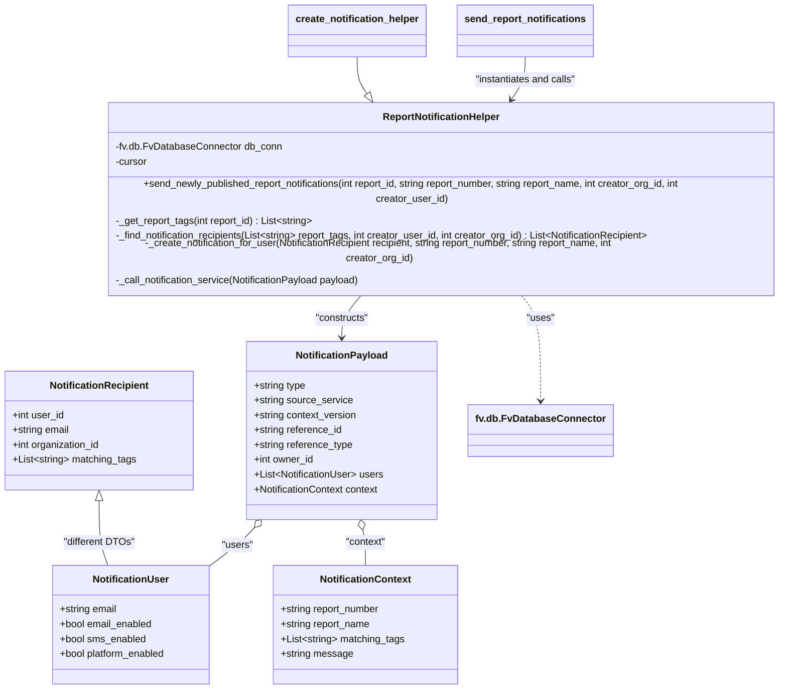

# Diagram: common/iam_service/iam_service/v1/power_bi/notification_helper.py


> Auto-generated by Obscura crawlers

## Diagram 1



### SVG

<svg id="container" width="1284.5234375" xmlns="http://www.w3.org/2000/svg" class="classDiagram" height="1066" viewBox="0 0 1284.5234375 1066" role="graphics-document document" aria-roledescription="class"><style>#container{font-family:"trebuchet ms",verdana,arial,sans-serif;font-size:16px;fill:#333;}@keyframes edge-animation-frame{from{stroke-dashoffset:0;}}@keyframes dash{to{stroke-dashoffset:0;}}#container .edge-animation-slow{stroke-dasharray:9,5!important;stroke-dashoffset:900;animation:dash 50s linear infinite;stroke-linecap:round;}#container .edge-animation-fast{stroke-dasharray:9,5!important;stroke-dashoffset:900;animation:dash 20s linear infinite;stroke-linecap:round;}#container .error-icon{fill:#552222;}#container .error-text{fill:#552222;stroke:#552222;}#container .edge-thickness-normal{stroke-width:1px;}#container .edge-thickness-thick{stroke-width:3.5px;}#container .edge-pattern-solid{stroke-dasharray:0;}#container .edge-thickness-invisible{stroke-width:0;fill:none;}#container .edge-pattern-dashed{stroke-dasharray:3;}#container .edge-pattern-dotted{stroke-dasharray:2;}#container .marker{fill:#333333;stroke:#333333;}#container .marker.cross{stroke:#333333;}#container svg{font-family:"trebuchet ms",verdana,arial,sans-serif;font-size:16px;}#container p{margin:0;}#container g.classGroup text{fill:#9370DB;stroke:none;font-family:"trebuchet ms",verdana,arial,sans-serif;font-size:10px;}#container g.classGroup text .title{font-weight:bolder;}#container .nodeLabel,#container .edgeLabel{color:#131300;}#container .edgeLabel .label rect{fill:#ECECFF;}#container .label text{fill:#131300;}#container .labelBkg{background:#ECECFF;}#container .edgeLabel .label span{background:#ECECFF;}#container .classTitle{font-weight:bolder;}#container .node rect,#container .node circle,#container .node ellipse,#container .node polygon,#container .node path{fill:#ECECFF;stroke:#9370DB;stroke-width:1px;}#container .divider{stroke:#9370DB;stroke-width:1;}#container g.clickable{cursor:pointer;}#container g.classGroup rect{fill:#ECECFF;stroke:#9370DB;}#container g.classGroup line{stroke:#9370DB;stroke-width:1;}#container .classLabel .box{stroke:none;stroke-width:0;fill:#ECECFF;opacity:0.5;}#container .classLabel .label{fill:#9370DB;font-size:10px;}#container .relation{stroke:#333333;stroke-width:1;fill:none;}#container .dashed-line{stroke-dasharray:3;}#container .dotted-line{stroke-dasharray:1 2;}#container #compositionStart,#container .composition{fill:#333333!important;stroke:#333333!important;stroke-width:1;}#container #compositionEnd,#container .composition{fill:#333333!important;stroke:#333333!important;stroke-width:1;}#container #dependencyStart,#container .dependency{fill:#333333!important;stroke:#333333!important;stroke-width:1;}#container #dependencyStart,#container .dependency{fill:#333333!important;stroke:#333333!important;stroke-width:1;}#container #extensionStart,#container .extension{fill:transparent!important;stroke:#333333!important;stroke-width:1;}#container #extensionEnd,#container .extension{fill:transparent!important;stroke:#333333!important;stroke-width:1;}#container #aggregationStart,#container .aggregation{fill:transparent!important;stroke:#333333!important;stroke-width:1;}#container #aggregationEnd,#container .aggregation{fill:transparent!important;stroke:#333333!important;stroke-width:1;}#container #lollipopStart,#container .lollipop{fill:#ECECFF!important;stroke:#333333!important;stroke-width:1;}#container #lollipopEnd,#container .lollipop{fill:#ECECFF!important;stroke:#333333!important;stroke-width:1;}#container .edgeTerminals{font-size:11px;line-height:initial;}#container .classTitleText{text-anchor:middle;font-size:18px;fill:#333;}#container .label-icon{display:inline-block;height:1em;overflow:visible;vertical-align:-0.125em;}#container .node .label-icon path{fill:currentColor;stroke:revert;stroke-width:revert;}#container :root{--mermaid-font-family:"trebuchet ms",verdana,arial,sans-serif;}</style><g><defs><marker id="container_class-aggregationStart" class="marker aggregation class" refX="18" refY="7" markerWidth="190" markerHeight="240" orient="auto"><path d="M 18,7 L9,13 L1,7 L9,1 Z"></path></marker></defs><defs><marker id="container_class-aggregationEnd" class="marker aggregation class" refX="1" refY="7" markerWidth="20" markerHeight="28" orient="auto"><path d="M 18,7 L9,13 L1,7 L9,1 Z"></path></marker></defs><defs><marker id="container_class-extensionStart" class="marker extension class" refX="18" refY="7" markerWidth="190" markerHeight="240" orient="auto"><path d="M 1,7 L18,13 V 1 Z"></path></marker></defs><defs><marker id="container_class-extensionEnd" class="marker extension class" refX="1" refY="7" markerWidth="20" markerHeight="28" orient="auto"><path d="M 1,1 V 13 L18,7 Z"></path></marker></defs><defs><marker id="container_class-compositionStart" class="marker composition class" refX="18" refY="7" markerWidth="190" markerHeight="240" orient="auto"><path d="M 18,7 L9,13 L1,7 L9,1 Z"></path></marker></defs><defs><marker id="container_class-compositionEnd" class="marker composition class" refX="1" refY="7" markerWidth="20" markerHeight="28" orient="auto"><path d="M 18,7 L9,13 L1,7 L9,1 Z"></path></marker></defs><defs><marker id="container_class-dependencyStart" class="marker dependency class" refX="6" refY="7" markerWidth="190" markerHeight="240" orient="auto"><path d="M 5,7 L9,13 L1,7 L9,1 Z"></path></marker></defs><defs><marker id="container_class-dependencyEnd" class="marker dependency class" refX="13" refY="7" markerWidth="20" markerHeight="28" orient="auto"><path d="M 18,7 L9,13 L14,7 L9,1 Z"></path></marker></defs><defs><marker id="container_class-lollipopStart" class="marker lollipop class" refX="13" refY="7" markerWidth="190" markerHeight="240" orient="auto"><circle stroke="black" fill="transparent" cx="7" cy="7" r="6"></circle></marker></defs><defs><marker id="container_class-lollipopEnd" class="marker lollipop class" refX="1" refY="7" markerWidth="190" markerHeight="240" orient="auto"><circle stroke="black" fill="transparent" cx="7" cy="7" r="6"></circle></marker></defs><g class="root"><g class="clusters"></g><g class="edgePaths"><path d="M409.835,804.795L406.187,808.829C402.539,812.863,395.243,820.932,383.381,831.132C371.52,841.333,355.092,853.667,346.879,859.833L338.665,866" id="id_NotificationPayload_NotificationUser_1" class="edge-thickness-normal edge-pattern-solid relation" style=";;;" data-edge="true" data-et="edge" data-id="id_NotificationPayload_NotificationUser_1" data-points="W3sieCI6NDIxLjQwNDI1MzcxMjAxNjYsInkiOjc5Mn0seyJ4IjozODcuOTQ3MjY1NjI1LCJ5Ijo4Mjl9LHsieCI6MzM4LjY2NDgyNjEyNzgxOTU0LCJ5Ijo4NjZ9XQ==" marker-start="url(#container_class-aggregationStart)"></path><path d="M586.615,808.856L587.345,812.213C588.076,815.57,589.537,822.285,590.268,831.809C590.998,841.333,590.998,853.667,590.998,859.833L590.998,866" id="id_NotificationPayload_NotificationContext_2" class="edge-thickness-normal edge-pattern-solid relation" style=";;;" data-edge="true" data-et="edge" data-id="id_NotificationPayload_NotificationContext_2" data-points="W3sieCI6NTgyLjk0NzQxNjY5NTQ0MiwieSI6NzkyfSx7IngiOjU5MC45OTgwNDY4NzUsInkiOjgyOX0seyJ4Ijo1OTAuOTk4MDQ2ODc1LCJ5Ijo4NjZ9XQ==" marker-start="url(#container_class-aggregationStart)"></path><path d="M586.037,430L580.3,436.167C574.563,442.333,563.089,454.667,557.352,466C551.615,477.333,551.615,487.667,551.615,492.833L551.615,498" id="id_ReportNotificationHelper_NotificationPayload_3" class="edge-thickness-normal edge-pattern-solid relation" style=";;;" data-edge="true" data-et="edge" data-id="id_ReportNotificationHelper_NotificationPayload_3" data-points="W3sieCI6NTg2LjAzNzE5MDI3MzY2ODcsInkiOjQzMH0seyJ4Ijo1NTEuNjE1MjM0Mzc1LCJ5Ijo0Njd9LHsieCI6NTUxLjYxNTIzNDM3NSwieSI6NTA0fV0=" marker-end="url(#container_class-dependencyEnd)"></path><path d="M831.642,430L837.379,436.167C843.116,442.333,854.59,454.667,860.327,483C866.064,511.333,866.064,555.667,866.064,577.833L866.064,600" id="id_ReportNotificationHelper_fv.db.FvDatabaseConnector_4" class="edge-thickness-normal edge-pattern-dashed relation" style=";;;" data-edge="true" data-et="edge" data-id="id_ReportNotificationHelper_fv.db.FvDatabaseConnector_4" data-points="W3sieCI6ODMxLjY0MjQ5NzIyNjMzMTMsInkiOjQzMH0seyJ4Ijo4NjYuMDY0NDUzMTI1LCJ5Ijo0Njd9LHsieCI6ODY2LjA2NDQ1MzEyNSwieSI6NjA2fV0=" marker-end="url(#container_class-dependencyEnd)"></path><path d="M159.047,761.25L159.047,772.542C159.047,783.833,159.047,806.417,161.446,823.875C163.846,841.333,168.645,853.667,171.044,859.833L173.443,866" id="id_NotificationRecipient_NotificationUser_5" class="edge-thickness-normal edge-pattern-solid relation" style=";;;" data-edge="true" data-et="edge" data-id="id_NotificationRecipient_NotificationUser_5" data-points="W3sieCI6MTU5LjA0Njg3NSwieSI6NzQ0fSx7IngiOjE1OS4wNDY4NzUsInkiOjgyOX0seyJ4IjoxNzMuNDQzNDkxNTQxMzUzMzgsInkiOjg2Nn1d" marker-start="url(#container_class-extensionStart)"></path><path d="M575.715,92L575.715,98.167C575.715,104.333,575.715,116.667,578.793,126.742C581.872,136.816,588.029,144.633,591.108,148.541L594.186,152.449" id="id_create_notification_helper_ReportNotificationHelper_6" class="edge-thickness-normal edge-pattern-solid relation" style=";;;" data-edge="true" data-et="edge" data-id="id_create_notification_helper_ReportNotificationHelper_6" data-points="W3sieCI6NTc1LjcxNDg0Mzc1LCJ5Ijo5Mn0seyJ4Ijo1NzUuNzE0ODQzNzUsInkiOjEyOX0seyJ4Ijo2MDQuODYwNTUzODA5MTcxNiwieSI6MTY2fV0=" marker-end="url(#container_class-extensionEnd)"></path><path d="M841.965,92L841.965,98.167C841.965,104.333,841.965,116.667,837.726,128.214C833.487,139.762,825.01,150.524,820.771,155.906L816.532,161.287" id="id_send_report_notifications_ReportNotificationHelper_7" class="edge-thickness-normal edge-pattern-solid relation" style=";;;" data-edge="true" data-et="edge" data-id="id_send_report_notifications_ReportNotificationHelper_7" data-points="W3sieCI6ODQxLjk2NDg0Mzc1LCJ5Ijo5Mn0seyJ4Ijo4NDEuOTY0ODQzNzUsInkiOjEyOX0seyJ4Ijo4MTIuODE5MTMzNjkwODI4NCwieSI6MTY2fV0=" marker-end="url(#container_class-dependencyEnd)"></path></g><g class="edgeLabels"><g class="edgeLabel" transform="translate(383.25205, 832.52505)"><g class="label" data-id="id_NotificationPayload_NotificationUser_1" transform="translate(-25.7265625, -12)"><foreignObject width="51.453125" height="24"><div xmlns="http://www.w3.org/1999/xhtml" class="labelBkg" style="display: table-cell; white-space: nowrap; line-height: 1.5; max-width: 200px; text-align: center;"><span class="edgeLabel"><p>"users"</p></span></div></foreignObject></g></g><g class="edgeLabel" transform="translate(590.998046875, 829)"><g class="label" data-id="id_NotificationPayload_NotificationContext_2" transform="translate(-33.0390625, -12)"><foreignObject width="66.078125" height="24"><div xmlns="http://www.w3.org/1999/xhtml" class="labelBkg" style="display: table-cell; white-space: nowrap; line-height: 1.5; max-width: 200px; text-align: center;"><span class="edgeLabel"><p>"context"</p></span></div></foreignObject></g></g><g class="edgeLabel" transform="translate(551.615234375, 467)"><g class="label" data-id="id_ReportNotificationHelper_NotificationPayload_3" transform="translate(-44.03125, -12)"><foreignObject width="88.0625" height="24"><div xmlns="http://www.w3.org/1999/xhtml" class="labelBkg" style="display: table-cell; white-space: nowrap; line-height: 1.5; max-width: 200px; text-align: center;"><span class="edgeLabel"><p>"constructs"</p></span></div></foreignObject></g></g><g class="edgeLabel" transform="translate(866.064453125, 467)"><g class="label" data-id="id_ReportNotificationHelper_fv.db.FvDatabaseConnector_4" transform="translate(-22.7578125, -12)"><foreignObject width="45.515625" height="24"><div xmlns="http://www.w3.org/1999/xhtml" class="labelBkg" style="display: table-cell; white-space: nowrap; line-height: 1.5; max-width: 200px; text-align: center;"><span class="edgeLabel"><p>"uses"</p></span></div></foreignObject></g></g><g class="edgeLabel" transform="translate(159.046875, 829)"><g class="label" data-id="id_NotificationRecipient_NotificationUser_5" transform="translate(-57.7734375, -12)"><foreignObject width="115.546875" height="24"><div xmlns="http://www.w3.org/1999/xhtml" class="labelBkg" style="display: table-cell; white-space: nowrap; line-height: 1.5; max-width: 200px; text-align: center;"><span class="edgeLabel"><p>"different DTOs"</p></span></div></foreignObject></g></g><g class="edgeLabel"><g class="label" data-id="id_create_notification_helper_ReportNotificationHelper_6" transform="translate(0, 0)"><foreignObject width="0" height="0"><div xmlns="http://www.w3.org/1999/xhtml" class="labelBkg" style="display: table-cell; white-space: nowrap; line-height: 1.5; max-width: 200px; text-align: center;"><span class="edgeLabel"></span></div></foreignObject></g></g><g class="edgeLabel" transform="translate(841.96484375, 129)"><g class="label" data-id="id_send_report_notifications_ReportNotificationHelper_7" transform="translate(-83.6875, -12)"><foreignObject width="167.375" height="24"><div xmlns="http://www.w3.org/1999/xhtml" class="labelBkg" style="display: table-cell; white-space: nowrap; line-height: 1.5; max-width: 200px; text-align: center;"><span class="edgeLabel"><p>"instantiates and calls"</p></span></div></foreignObject></g></g></g><g class="nodes"><g class="node default" id="classId-NotificationRecipient-0" transform="translate(159.046875, 648)"><g class="basic label-container"><path d="M-151.046875 -96 L151.046875 -96 L151.046875 96 L-151.046875 96" stroke="none" stroke-width="0" fill="#ECECFF" style=""></path><path d="M-151.046875 -96 C-78.35630095654771 -96, -5.665726913095426 -96, 151.046875 -96 M-151.046875 -96 C-50.1788579502381 -96, 50.689159099523806 -96, 151.046875 -96 M151.046875 -96 C151.046875 -34.43770232642653, 151.046875 27.124595347146936, 151.046875 96 M151.046875 -96 C151.046875 -54.33966127083666, 151.046875 -12.679322541673315, 151.046875 96 M151.046875 96 C63.19860550307416 96, -24.649663993851675 96, -151.046875 96 M151.046875 96 C56.63207957117892 96, -37.78271585764216 96, -151.046875 96 M-151.046875 96 C-151.046875 35.30930715325901, -151.046875 -25.381385693481974, -151.046875 -96 M-151.046875 96 C-151.046875 54.773755937514835, -151.046875 13.54751187502967, -151.046875 -96" stroke="#9370DB" stroke-width="1.3" fill="none" stroke-dasharray="0 0" style=""></path></g><g class="annotation-group text" transform="translate(0, -72)"></g><g class="label-group text" transform="translate(-77.359375, -72)"><g class="label" style="font-weight: bolder" transform="translate(0,-12)"><foreignObject width="154.71875" height="24"><div xmlns="http://www.w3.org/1999/xhtml" style="display: table-cell; white-space: nowrap; line-height: 1.5; max-width: 203px; text-align: center;"><span class="nodeLabel markdown-node-label" style=""><p>NotificationRecipient</p></span></div></foreignObject></g></g><g class="members-group text" transform="translate(-139.046875, -24)"><g class="label" style="" transform="translate(0,-12)"><foreignObject width="84.703125" height="24"><div xmlns="http://www.w3.org/1999/xhtml" style="display: table-cell; white-space: nowrap; line-height: 1.5; max-width: 142px; text-align: center;"><span class="nodeLabel markdown-node-label" style=""><p>+int user_id</p></span></div></foreignObject></g><g class="label" style="" transform="translate(0,12)"><foreignObject width="94.203125" height="24"><div xmlns="http://www.w3.org/1999/xhtml" style="display: table-cell; white-space: nowrap; line-height: 1.5; max-width: 152px; text-align: center;"><span class="nodeLabel markdown-node-label" style=""><p>+string email</p></span></div></foreignObject></g><g class="label" style="" transform="translate(0,36)"><foreignObject width="144.640625" height="24"><div xmlns="http://www.w3.org/1999/xhtml" style="display: table-cell; white-space: nowrap; line-height: 1.5; max-width: 202px; text-align: center;"><span class="nodeLabel markdown-node-label" style=""><p>+int organization_id</p></span></div></foreignObject></g><g class="label" style="" transform="translate(0,60)"><foreignObject width="200.734375" height="24"><div xmlns="http://www.w3.org/1999/xhtml" style="display: table-cell; white-space: nowrap; line-height: 1.5; max-width: 298px; text-align: center;"><span class="nodeLabel markdown-node-label" style=""><p>+List&lt;string&gt; matching_tags</p></span></div></foreignObject></g></g><g class="methods-group text" transform="translate(-139.046875, 96)"></g><g class="divider" style=""><path d="M-151.046875 -48 C-36.64412164729514 -48, 77.75863170540973 -48, 151.046875 -48 M-151.046875 -48 C-82.1985258724163 -48, -13.350176744832595 -48, 151.046875 -48" stroke="#9370DB" stroke-width="1.3" fill="none" stroke-dasharray="0 0" style=""></path></g><g class="divider" style=""><path d="M-151.046875 72 C-75.96112901714224 72, -0.8753830342844822 72, 151.046875 72 M-151.046875 72 C-88.74343682150716 72, -26.43999864301432 72, 151.046875 72" stroke="#9370DB" stroke-width="1.3" fill="none" stroke-dasharray="0 0" style=""></path></g></g><g class="node default" id="classId-NotificationUser-1" transform="translate(210.796875, 962)"><g class="basic label-container"><path d="M-129.44140625 -96 L129.44140625 -96 L129.44140625 96 L-129.44140625 96" stroke="none" stroke-width="0" fill="#ECECFF" style=""></path><path d="M-129.44140625 -96 C-41.72509940601127 -96, 45.991207437977465 -96, 129.44140625 -96 M-129.44140625 -96 C-59.41297812298643 -96, 10.615450004027139 -96, 129.44140625 -96 M129.44140625 -96 C129.44140625 -36.53148642413669, 129.44140625 22.937027151726625, 129.44140625 96 M129.44140625 -96 C129.44140625 -32.97298042416969, 129.44140625 30.054039151660618, 129.44140625 96 M129.44140625 96 C75.05583919611931 96, 20.670272142238616 96, -129.44140625 96 M129.44140625 96 C42.49060493632719 96, -44.460196377345625 96, -129.44140625 96 M-129.44140625 96 C-129.44140625 33.76532875087493, -129.44140625 -28.469342498250143, -129.44140625 -96 M-129.44140625 96 C-129.44140625 26.512798451274293, -129.44140625 -42.974403097451415, -129.44140625 -96" stroke="#9370DB" stroke-width="1.3" fill="none" stroke-dasharray="0 0" style=""></path></g><g class="annotation-group text" transform="translate(0, -72)"></g><g class="label-group text" transform="translate(-59.5390625, -72)"><g class="label" style="font-weight: bolder" transform="translate(0,-12)"><foreignObject width="119.078125" height="24"><div xmlns="http://www.w3.org/1999/xhtml" style="display: table-cell; white-space: nowrap; line-height: 1.5; max-width: 169px; text-align: center;"><span class="nodeLabel markdown-node-label" style=""><p>NotificationUser</p></span></div></foreignObject></g></g><g class="members-group text" transform="translate(-117.44140625, -24)"><g class="label" style="" transform="translate(0,-12)"><foreignObject width="94.203125" height="24"><div xmlns="http://www.w3.org/1999/xhtml" style="display: table-cell; white-space: nowrap; line-height: 1.5; max-width: 152px; text-align: center;"><span class="nodeLabel markdown-node-label" style=""><p>+string email</p></span></div></foreignObject></g><g class="label" style="" transform="translate(0,12)"><foreignObject width="152.640625" height="24"><div xmlns="http://www.w3.org/1999/xhtml" style="display: table-cell; white-space: nowrap; line-height: 1.5; max-width: 210px; text-align: center;"><span class="nodeLabel markdown-node-label" style=""><p>+bool email_enabled</p></span></div></foreignObject></g><g class="label" style="" transform="translate(0,36)"><foreignObject width="140.640625" height="24"><div xmlns="http://www.w3.org/1999/xhtml" style="display: table-cell; white-space: nowrap; line-height: 1.5; max-width: 198px; text-align: center;"><span class="nodeLabel markdown-node-label" style=""><p>+bool sms_enabled</p></span></div></foreignObject></g><g class="label" style="" transform="translate(0,60)"><foreignObject width="175.34375" height="24"><div xmlns="http://www.w3.org/1999/xhtml" style="display: table-cell; white-space: nowrap; line-height: 1.5; max-width: 233px; text-align: center;"><span class="nodeLabel markdown-node-label" style=""><p>+bool platform_enabled</p></span></div></foreignObject></g></g><g class="methods-group text" transform="translate(-117.44140625, 96)"></g><g class="divider" style=""><path d="M-129.44140625 -48 C-65.43817037604644 -48, -1.4349345020928865 -48, 129.44140625 -48 M-129.44140625 -48 C-54.557732185983866 -48, 20.325941878032268 -48, 129.44140625 -48" stroke="#9370DB" stroke-width="1.3" fill="none" stroke-dasharray="0 0" style=""></path></g><g class="divider" style=""><path d="M-129.44140625 72 C-53.89315209927611 72, 21.655102051447784 72, 129.44140625 72 M-129.44140625 72 C-32.23650477153666 72, 64.96839670692668 72, 129.44140625 72" stroke="#9370DB" stroke-width="1.3" fill="none" stroke-dasharray="0 0" style=""></path></g></g><g class="node default" id="classId-NotificationContext-2" transform="translate(590.998046875, 962)"><g class="basic label-container"><path d="M-147.89453125 -96 L147.89453125 -96 L147.89453125 96 L-147.89453125 96" stroke="none" stroke-width="0" fill="#ECECFF" style=""></path><path d="M-147.89453125 -96 C-88.6035155624272 -96, -29.31249987485441 -96, 147.89453125 -96 M-147.89453125 -96 C-30.488334047106832 -96, 86.91786315578634 -96, 147.89453125 -96 M147.89453125 -96 C147.89453125 -31.63287718196031, 147.89453125 32.73424563607938, 147.89453125 96 M147.89453125 -96 C147.89453125 -25.179566256767203, 147.89453125 45.640867486465595, 147.89453125 96 M147.89453125 96 C75.56372834847716 96, 3.2329254469543116 96, -147.89453125 96 M147.89453125 96 C62.001561858097986 96, -23.891407533804028 96, -147.89453125 96 M-147.89453125 96 C-147.89453125 38.93736986436414, -147.89453125 -18.125260271271713, -147.89453125 -96 M-147.89453125 96 C-147.89453125 39.78961682174817, -147.89453125 -16.420766356503663, -147.89453125 -96" stroke="#9370DB" stroke-width="1.3" fill="none" stroke-dasharray="0 0" style=""></path></g><g class="annotation-group text" transform="translate(0, -72)"></g><g class="label-group text" transform="translate(-71.0546875, -72)"><g class="label" style="font-weight: bolder" transform="translate(0,-12)"><foreignObject width="142.109375" height="24"><div xmlns="http://www.w3.org/1999/xhtml" style="display: table-cell; white-space: nowrap; line-height: 1.5; max-width: 190px; text-align: center;"><span class="nodeLabel markdown-node-label" style=""><p>NotificationContext</p></span></div></foreignObject></g></g><g class="members-group text" transform="translate(-135.89453125, -24)"><g class="label" style="" transform="translate(0,-12)"><foreignObject width="164.203125" height="24"><div xmlns="http://www.w3.org/1999/xhtml" style="display: table-cell; white-space: nowrap; line-height: 1.5; max-width: 222px; text-align: center;"><span class="nodeLabel markdown-node-label" style=""><p>+string report_number</p></span></div></foreignObject></g><g class="label" style="" transform="translate(0,12)"><foreignObject width="147.90625" height="24"><div xmlns="http://www.w3.org/1999/xhtml" style="display: table-cell; white-space: nowrap; line-height: 1.5; max-width: 205px; text-align: center;"><span class="nodeLabel markdown-node-label" style=""><p>+string report_name</p></span></div></foreignObject></g><g class="label" style="" transform="translate(0,36)"><foreignObject width="200.734375" height="24"><div xmlns="http://www.w3.org/1999/xhtml" style="display: table-cell; white-space: nowrap; line-height: 1.5; max-width: 298px; text-align: center;"><span class="nodeLabel markdown-node-label" style=""><p>+List&lt;string&gt; matching_tags</p></span></div></foreignObject></g><g class="label" style="" transform="translate(0,60)"><foreignObject width="116.25" height="24"><div xmlns="http://www.w3.org/1999/xhtml" style="display: table-cell; white-space: nowrap; line-height: 1.5; max-width: 174px; text-align: center;"><span class="nodeLabel markdown-node-label" style=""><p>+string message</p></span></div></foreignObject></g></g><g class="methods-group text" transform="translate(-135.89453125, 96)"></g><g class="divider" style=""><path d="M-147.89453125 -48 C-80.40409750413481 -48, -12.913663758269621 -48, 147.89453125 -48 M-147.89453125 -48 C-42.44155773069815 -48, 63.0114157886037 -48, 147.89453125 -48" stroke="#9370DB" stroke-width="1.3" fill="none" stroke-dasharray="0 0" style=""></path></g><g class="divider" style=""><path d="M-147.89453125 72 C-75.57011378338976 72, -3.245696316779515 72, 147.89453125 72 M-147.89453125 72 C-72.69361433932804 72, 2.507302571343928 72, 147.89453125 72" stroke="#9370DB" stroke-width="1.3" fill="none" stroke-dasharray="0 0" style=""></path></g></g><g class="node default" id="classId-NotificationPayload-3" transform="translate(551.615234375, 648)"><g class="basic label-container"><path d="M-153.25390625 -144 L153.25390625 -144 L153.25390625 144 L-153.25390625 144" stroke="none" stroke-width="0" fill="#ECECFF" style=""></path><path d="M-153.25390625 -144 C-60.97085868595795 -144, 31.3121888780841 -144, 153.25390625 -144 M-153.25390625 -144 C-80.49677862103736 -144, -7.739650992074729 -144, 153.25390625 -144 M153.25390625 -144 C153.25390625 -73.82517284482415, 153.25390625 -3.6503456896483044, 153.25390625 144 M153.25390625 -144 C153.25390625 -48.8815147486814, 153.25390625 46.236970502637206, 153.25390625 144 M153.25390625 144 C73.51352555258582 144, -6.226855144828363 144, -153.25390625 144 M153.25390625 144 C72.6969883407827 144, -7.859929568434609 144, -153.25390625 144 M-153.25390625 144 C-153.25390625 82.79869972908405, -153.25390625 21.5973994581681, -153.25390625 -144 M-153.25390625 144 C-153.25390625 86.37748340205793, -153.25390625 28.754966804115867, -153.25390625 -144" stroke="#9370DB" stroke-width="1.3" fill="none" stroke-dasharray="0 0" style=""></path></g><g class="annotation-group text" transform="translate(0, -120)"></g><g class="label-group text" transform="translate(-71.7890625, -120)"><g class="label" style="font-weight: bolder" transform="translate(0,-12)"><foreignObject width="143.578125" height="24"><div xmlns="http://www.w3.org/1999/xhtml" style="display: table-cell; white-space: nowrap; line-height: 1.5; max-width: 192px; text-align: center;"><span class="nodeLabel markdown-node-label" style=""><p>NotificationPayload</p></span></div></foreignObject></g></g><g class="members-group text" transform="translate(-141.25390625, -72)"><g class="label" style="" transform="translate(0,-12)"><foreignObject width="85.65625" height="24"><div xmlns="http://www.w3.org/1999/xhtml" style="display: table-cell; white-space: nowrap; line-height: 1.5; max-width: 143px; text-align: center;"><span class="nodeLabel markdown-node-label" style=""><p>+string type</p></span></div></foreignObject></g><g class="label" style="" transform="translate(0,12)"><foreignObject width="160.53125" height="24"><div xmlns="http://www.w3.org/1999/xhtml" style="display: table-cell; white-space: nowrap; line-height: 1.5; max-width: 218px; text-align: center;"><span class="nodeLabel markdown-node-label" style=""><p>+string source_service</p></span></div></foreignObject></g><g class="label" style="" transform="translate(0,36)"><foreignObject width="168.5625" height="24"><div xmlns="http://www.w3.org/1999/xhtml" style="display: table-cell; white-space: nowrap; line-height: 1.5; max-width: 226px; text-align: center;"><span class="nodeLabel markdown-node-label" style=""><p>+string context_version</p></span></div></foreignObject></g><g class="label" style="" transform="translate(0,60)"><foreignObject width="144.125" height="24"><div xmlns="http://www.w3.org/1999/xhtml" style="display: table-cell; white-space: nowrap; line-height: 1.5; max-width: 201px; text-align: center;"><span class="nodeLabel markdown-node-label" style=""><p>+string reference_id</p></span></div></foreignObject></g><g class="label" style="" transform="translate(0,84)"><foreignObject width="161.515625" height="24"><div xmlns="http://www.w3.org/1999/xhtml" style="display: table-cell; white-space: nowrap; line-height: 1.5; max-width: 219px; text-align: center;"><span class="nodeLabel markdown-node-label" style=""><p>+string reference_type</p></span></div></foreignObject></g><g class="label" style="" transform="translate(0,108)"><foreignObject width="98.109375" height="24"><div xmlns="http://www.w3.org/1999/xhtml" style="display: table-cell; white-space: nowrap; line-height: 1.5; max-width: 155px; text-align: center;"><span class="nodeLabel markdown-node-label" style=""><p>+int owner_id</p></span></div></foreignObject></g><g class="label" style="" transform="translate(0,132)"><foreignObject width="210.71875" height="24"><div xmlns="http://www.w3.org/1999/xhtml" style="display: table-cell; white-space: nowrap; line-height: 1.5; max-width: 307px; text-align: center;"><span class="nodeLabel markdown-node-label" style=""><p>+List&lt;NotificationUser&gt; users</p></span></div></foreignObject></g><g class="label" style="" transform="translate(0,156)"><foreignObject width="205.890625" height="24"><div xmlns="http://www.w3.org/1999/xhtml" style="display: table-cell; white-space: nowrap; line-height: 1.5; max-width: 263px; text-align: center;"><span class="nodeLabel markdown-node-label" style=""><p>+NotificationContext context</p></span></div></foreignObject></g></g><g class="methods-group text" transform="translate(-141.25390625, 144)"></g><g class="divider" style=""><path d="M-153.25390625 -96 C-79.64561900770342 -96, -6.037331765406833 -96, 153.25390625 -96 M-153.25390625 -96 C-43.48909815070989 -96, 66.27570994858021 -96, 153.25390625 -96" stroke="#9370DB" stroke-width="1.3" fill="none" stroke-dasharray="0 0" style=""></path></g><g class="divider" style=""><path d="M-153.25390625 120 C-61.149446232547675 120, 30.95501378490465 120, 153.25390625 120 M-153.25390625 120 C-40.13151423387909 120, 72.99087778224182 120, 153.25390625 120" stroke="#9370DB" stroke-width="1.3" fill="none" stroke-dasharray="0 0" style=""></path></g></g><g class="node default" id="classId-ReportNotificationHelper-4" transform="translate(708.83984375, 298)"><g class="basic label-container"><path d="M-567.68359375 -132 L567.68359375 -132 L567.68359375 132 L-567.68359375 132" stroke="none" stroke-width="0" fill="#ECECFF" style=""></path><path d="M-567.68359375 -132 C-143.05839867726172 -132, 281.56679639547656 -132, 567.68359375 -132 M-567.68359375 -132 C-234.05822325351306 -132, 99.56714724297387 -132, 567.68359375 -132 M567.68359375 -132 C567.68359375 -78.39497761180883, 567.68359375 -24.789955223617653, 567.68359375 132 M567.68359375 -132 C567.68359375 -34.00825171436229, 567.68359375 63.983496571275424, 567.68359375 132 M567.68359375 132 C162.6282028232069 132, -242.42718810358622 132, -567.68359375 132 M567.68359375 132 C262.482984471502 132, -42.717624806996014 132, -567.68359375 132 M-567.68359375 132 C-567.68359375 68.56796518310219, -567.68359375 5.135930366204363, -567.68359375 -132 M-567.68359375 132 C-567.68359375 52.48041298320726, -567.68359375 -27.039174033585482, -567.68359375 -132" stroke="#9370DB" stroke-width="1.3" fill="none" stroke-dasharray="0 0" style=""></path></g><g class="annotation-group text" transform="translate(0, -108)"></g><g class="label-group text" transform="translate(-92.3828125, -108)"><g class="label" style="font-weight: bolder" transform="translate(0,-12)"><foreignObject width="184.765625" height="24"><div xmlns="http://www.w3.org/1999/xhtml" style="display: table-cell; white-space: nowrap; line-height: 1.5; max-width: 233px; text-align: center;"><span class="nodeLabel markdown-node-label" style=""><p>ReportNotificationHelper</p></span></div></foreignObject></g></g><g class="members-group text" transform="translate(-555.68359375, -60)"><g class="label" style="" transform="translate(0,-12)"><foreignObject width="268.28125" height="24"><div xmlns="http://www.w3.org/1999/xhtml" style="display: table-cell; white-space: nowrap; line-height: 1.5; max-width: 326px; text-align: center;"><span class="nodeLabel markdown-node-label" style=""><p>-fv.db.FvDatabaseConnector db_conn</p></span></div></foreignObject></g><g class="label" style="" transform="translate(0,12)"><foreignObject width="52.1875" height="24"><div xmlns="http://www.w3.org/1999/xhtml" style="display: table-cell; white-space: nowrap; line-height: 1.5; max-width: 110px; text-align: center;"><span class="nodeLabel markdown-node-label" style=""><p>-cursor</p></span></div></foreignObject></g></g><g class="methods-group text" transform="translate(-555.68359375, 12)"><g class="label" style="" transform="translate(0,-12)"><foreignObject width="1018.984375" height="24"><div xmlns="http://www.w3.org/1999/xhtml" style="display: table-cell; white-space: nowrap; line-height: 1.5; max-width: 1076px; text-align: center;"><span class="nodeLabel markdown-node-label" style=""><p>+send_newly_published_report_notifications(int report_id, string report_number, string report_name, int creator_org_id, int creator_user_id)</p></span></div></foreignObject></g><g class="label" style="" transform="translate(0,12)"><foreignObject width="325.1875" height="24"><div xmlns="http://www.w3.org/1999/xhtml" style="display: table-cell; white-space: nowrap; line-height: 1.5; max-width: 423px; text-align: center;"><span class="nodeLabel markdown-node-label" style=""><p>-_get_report_tags(int report_id) : List&lt;string&gt;</p></span></div></foreignObject></g><g class="label" style="" transform="translate(0,36)"><foreignObject width="881.1875" height="24"><div xmlns="http://www.w3.org/1999/xhtml" style="display: table-cell; white-space: nowrap; line-height: 1.5; max-width: 1018px; text-align: center;"><span class="nodeLabel markdown-node-label" style=""><p>-_find_notification_recipients(List&lt;string&gt; report_tags, int creator_user_id, int creator_org_id) : List&lt;NotificationRecipient&gt;</p></span></div></foreignObject></g><g class="label" style="" transform="translate(0,60)"><foreignObject width="896.15625" height="24"><div xmlns="http://www.w3.org/1999/xhtml" style="display: table-cell; white-space: nowrap; line-height: 1.5; max-width: 954px; text-align: center;"><span class="nodeLabel markdown-node-label" style=""><p>-_create_notification_for_user(NotificationRecipient recipient, string report_number, string report_name, int creator_org_id)</p></span></div></foreignObject></g><g class="label" style="" transform="translate(0,84)"><foreignObject width="403.5625" height="24"><div xmlns="http://www.w3.org/1999/xhtml" style="display: table-cell; white-space: nowrap; line-height: 1.5; max-width: 461px; text-align: center;"><span class="nodeLabel markdown-node-label" style=""><p>-_call_notification_service(NotificationPayload payload)</p></span></div></foreignObject></g></g><g class="divider" style=""><path d="M-567.68359375 -84 C-182.7827383755395 -84, 202.11811699892098 -84, 567.68359375 -84 M-567.68359375 -84 C-168.37402205727835 -84, 230.9355496354433 -84, 567.68359375 -84" stroke="#9370DB" stroke-width="1.3" fill="none" stroke-dasharray="0 0" style=""></path></g><g class="divider" style=""><path d="M-567.68359375 -12 C-221.59319897208115 -12, 124.49719580583769 -12, 567.68359375 -12 M-567.68359375 -12 C-120.81202706277969 -12, 326.0595396244406 -12, 567.68359375 -12" stroke="#9370DB" stroke-width="1.3" fill="none" stroke-dasharray="0 0" style=""></path></g></g><g class="node default" id="classId-fv.db.FvDatabaseConnector-5" transform="translate(866.064453125, 648)"><g class="basic label-container"><path d="M-111.1953125 -42 L111.1953125 -42 L111.1953125 42 L-111.1953125 42" stroke="none" stroke-width="0" fill="#ECECFF" style=""></path><path d="M-111.1953125 -42 C-27.156115320968325 -42, 56.88308185806335 -42, 111.1953125 -42 M-111.1953125 -42 C-23.229204109435855 -42, 64.73690428112829 -42, 111.1953125 -42 M111.1953125 -42 C111.1953125 -18.627831773761358, 111.1953125 4.744336452477285, 111.1953125 42 M111.1953125 -42 C111.1953125 -12.804857166679557, 111.1953125 16.390285666640885, 111.1953125 42 M111.1953125 42 C33.51164999965569 42, -44.17201250068862 42, -111.1953125 42 M111.1953125 42 C36.37514186424673 42, -38.44502877150654 42, -111.1953125 42 M-111.1953125 42 C-111.1953125 24.634299298268147, -111.1953125 7.268598596536293, -111.1953125 -42 M-111.1953125 42 C-111.1953125 21.12937096414951, -111.1953125 0.2587419282990169, -111.1953125 -42" stroke="#9370DB" stroke-width="1.3" fill="none" stroke-dasharray="0 0" style=""></path></g><g class="annotation-group text" transform="translate(0, -18)"></g><g class="label-group text" transform="translate(-99.1953125, -18)"><g class="label" style="font-weight: bolder" transform="translate(0,-12)"><foreignObject width="198.390625" height="24"><div xmlns="http://www.w3.org/1999/xhtml" style="display: table-cell; white-space: nowrap; line-height: 1.5; max-width: 246px; text-align: center;"><span class="nodeLabel markdown-node-label" style=""><p>fv.db.FvDatabaseConnector</p></span></div></foreignObject></g></g><g class="members-group text" transform="translate(-99.1953125, 30)"></g><g class="methods-group text" transform="translate(-99.1953125, 60)"></g><g class="divider" style=""><path d="M-111.1953125 6 C-50.06317429755042 6, 11.068963904899164 6, 111.1953125 6 M-111.1953125 6 C-46.61747588732048 6, 17.96036072535904 6, 111.1953125 6" stroke="#9370DB" stroke-width="1.3" fill="none" stroke-dasharray="0 0" style=""></path></g><g class="divider" style=""><path d="M-111.1953125 24 C-59.350858502553066 24, -7.506404505106133 24, 111.1953125 24 M-111.1953125 24 C-65.40993089478238 24, -19.624549289564754 24, 111.1953125 24" stroke="#9370DB" stroke-width="1.3" fill="none" stroke-dasharray="0 0" style=""></path></g></g><g class="node default" id="classId-create_notification_helper-6" transform="translate(575.71484375, 50)"><g class="basic label-container"><path d="M-109.046875 -42 L109.046875 -42 L109.046875 42 L-109.046875 42" stroke="none" stroke-width="0" fill="#ECECFF" style=""></path><path d="M-109.046875 -42 C-35.66562846150448 -42, 37.715618076991035 -42, 109.046875 -42 M-109.046875 -42 C-43.18487996512924 -42, 22.677115069741518 -42, 109.046875 -42 M109.046875 -42 C109.046875 -15.486486457954399, 109.046875 11.027027084091202, 109.046875 42 M109.046875 -42 C109.046875 -22.50305113571974, 109.046875 -3.006102271439481, 109.046875 42 M109.046875 42 C31.86373264915835 42, -45.3194097016833 42, -109.046875 42 M109.046875 42 C22.51246091202286 42, -64.02195317595428 42, -109.046875 42 M-109.046875 42 C-109.046875 12.463144229972055, -109.046875 -17.07371154005589, -109.046875 -42 M-109.046875 42 C-109.046875 20.521419043914687, -109.046875 -0.9571619121706263, -109.046875 -42" stroke="#9370DB" stroke-width="1.3" fill="none" stroke-dasharray="0 0" style=""></path></g><g class="annotation-group text" transform="translate(0, -18)"></g><g class="label-group text" transform="translate(-97.046875, -18)"><g class="label" style="font-weight: bolder" transform="translate(0,-12)"><foreignObject width="194.09375" height="24"><div xmlns="http://www.w3.org/1999/xhtml" style="display: table-cell; white-space: nowrap; line-height: 1.5; max-width: 243px; text-align: center;"><span class="nodeLabel markdown-node-label" style=""><p>create_notification_helper</p></span></div></foreignObject></g></g><g class="members-group text" transform="translate(-97.046875, 30)"></g><g class="methods-group text" transform="translate(-97.046875, 60)"></g><g class="divider" style=""><path d="M-109.046875 6 C-59.462402242629125 6, -9.87792948525825 6, 109.046875 6 M-109.046875 6 C-59.158271309279684 6, -9.269667618559367 6, 109.046875 6" stroke="#9370DB" stroke-width="1.3" fill="none" stroke-dasharray="0 0" style=""></path></g><g class="divider" style=""><path d="M-109.046875 24 C-39.161382444317525 24, 30.72411011136495 24, 109.046875 24 M-109.046875 24 C-48.31445703731136 24, 12.417960925377287 24, 109.046875 24" stroke="#9370DB" stroke-width="1.3" fill="none" stroke-dasharray="0 0" style=""></path></g></g><g class="node default" id="classId-send_report_notifications-7" transform="translate(841.96484375, 50)"><g class="basic label-container"><path d="M-107.203125 -42 L107.203125 -42 L107.203125 42 L-107.203125 42" stroke="none" stroke-width="0" fill="#ECECFF" style=""></path><path d="M-107.203125 -42 C-43.13034437290064 -42, 20.942436254198725 -42, 107.203125 -42 M-107.203125 -42 C-21.940307031680845 -42, 63.32251093663831 -42, 107.203125 -42 M107.203125 -42 C107.203125 -19.392724936816002, 107.203125 3.214550126367996, 107.203125 42 M107.203125 -42 C107.203125 -8.762506435308474, 107.203125 24.474987129383052, 107.203125 42 M107.203125 42 C41.997597805150676 42, -23.20792938969865 42, -107.203125 42 M107.203125 42 C58.11203021545723 42, 9.020935430914463 42, -107.203125 42 M-107.203125 42 C-107.203125 13.317865669335845, -107.203125 -15.36426866132831, -107.203125 -42 M-107.203125 42 C-107.203125 13.423214302882254, -107.203125 -15.153571394235492, -107.203125 -42" stroke="#9370DB" stroke-width="1.3" fill="none" stroke-dasharray="0 0" style=""></path></g><g class="annotation-group text" transform="translate(0, -18)"></g><g class="label-group text" transform="translate(-95.203125, -18)"><g class="label" style="font-weight: bolder" transform="translate(0,-12)"><foreignObject width="190.40625" height="24"><div xmlns="http://www.w3.org/1999/xhtml" style="display: table-cell; white-space: nowrap; line-height: 1.5; max-width: 238px; text-align: center;"><span class="nodeLabel markdown-node-label" style=""><p>send_report_notifications</p></span></div></foreignObject></g></g><g class="members-group text" transform="translate(-95.203125, 30)"></g><g class="methods-group text" transform="translate(-95.203125, 60)"></g><g class="divider" style=""><path d="M-107.203125 6 C-62.02611240341662 6, -16.849099806833237 6, 107.203125 6 M-107.203125 6 C-22.635627736878973 6, 61.93186952624205 6, 107.203125 6" stroke="#9370DB" stroke-width="1.3" fill="none" stroke-dasharray="0 0" style=""></path></g><g class="divider" style=""><path d="M-107.203125 24 C-40.836153777864425 24, 25.53081744427115 24, 107.203125 24 M-107.203125 24 C-31.35987464710128 24, 44.48337570579744 24, 107.203125 24" stroke="#9370DB" stroke-width="1.3" fill="none" stroke-dasharray="0 0" style=""></path></g></g></g></g></g></svg>

## Diagram 2

```mermaid
sequenceDiagram
participant Caller as send_report_notifications
participant Helper as ReportNotificationHelper
participant DB as Database
participant Notif as NotificationService
Caller->>Helper: send_newly_published_report_notifications(report_id, report_number, report_name, creator_org_id, creator_user_id)
Helper->>DB: _get_report_tags(report_id)
DB-->>Helper: report_tags
alt report_tags empty
Helper-->>Caller: return (no notifications)
else report_tags found
Helper->>DB: _find_notification_recipients(report_tags, creator_user_id, creator_org_id)
DB-->>Helper: recipients[]
alt no recipients
Helper-->>Caller: return (no eligible recipients)
else recipients found
loop for each recipient in recipients
    Helper->>Helper: _create_notification_for_user(recipient, report_number, report_name, creator_org_id)
    Helper->>Notif: _call_notification_service(notification_payload)
    Notif-->>Helper: ack/log (simulated)
end
Helper-->>Caller: complete
```

> SVG rendering failed for this diagram.
