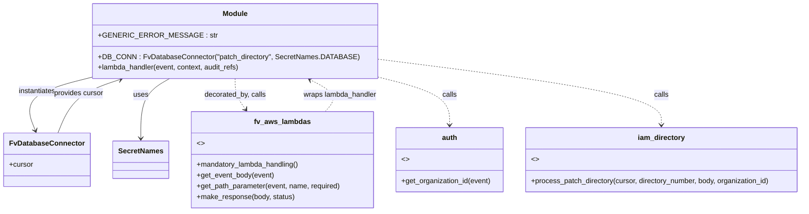

# Diagram: common/iam_service/iam_service/v1/power_bi/patch_directory.py

> Auto-generated by Obscura crawlers

## Mermaid

### SVG

<svg id="container" width="1791.02734375" xmlns="http://www.w3.org/2000/svg" class="classDiagram" height="474" viewBox="11.21484375 0 1791.02734375 474" role="graphics-document document" aria-roledescription="class"><g><defs><marker id="container_class-aggregationStart" class="marker aggregation class" refX="18" refY="7" markerWidth="190" markerHeight="240" orient="auto"><path d="M 18,7 L9,13 L1,7 L9,1 Z"></path></marker></defs><defs><marker id="container_class-aggregationEnd" class="marker aggregation class" refX="1" refY="7" markerWidth="20" markerHeight="28" orient="auto"><path d="M 18,7 L9,13 L1,7 L9,1 Z"></path></marker></defs><defs><marker id="container_class-extensionStart" class="marker extension class" refX="18" refY="7" markerWidth="190" markerHeight="240" orient="auto"><path d="M 1,7 L18,13 V 1 Z"></path></marker></defs><defs><marker id="container_class-extensionEnd" class="marker extension class" refX="1" refY="7" markerWidth="20" markerHeight="28" orient="auto"><path d="M 1,1 V 13 L18,7 Z"></path></marker></defs><defs><marker id="container_class-compositionStart" class="marker composition class" refX="18" refY="7" markerWidth="190" markerHeight="240" orient="auto"><path d="M 18,7 L9,13 L1,7 L9,1 Z"></path></marker></defs><defs><marker id="container_class-compositionEnd" class="marker composition class" refX="1" refY="7" markerWidth="20" markerHeight="28" orient="auto"><path d="M 18,7 L9,13 L1,7 L9,1 Z"></path></marker></defs><defs><marker id="container_class-dependencyStart" class="marker dependency class" refX="6" refY="7" markerWidth="190" markerHeight="240" orient="auto"><path d="M 5,7 L9,13 L1,7 L9,1 Z"></path></marker></defs><defs><marker id="container_class-dependencyEnd" class="marker dependency class" refX="13" refY="7" markerWidth="20" markerHeight="28" orient="auto"><path d="M 18,7 L9,13 L14,7 L9,1 Z"></path></marker></defs><defs><marker id="container_class-lollipopStart" class="marker lollipop class" refX="13" refY="7" markerWidth="190" markerHeight="240" orient="auto"><circle stroke="black" fill="transparent" cx="7" cy="7" r="6"></circle></marker></defs><defs><marker id="container_class-lollipopEnd" class="marker lollipop class" refX="1" refY="7" markerWidth="190" markerHeight="240" orient="auto"><circle stroke="black" fill="transparent" cx="7" cy="7" r="6"></circle></marker></defs><g class="root"><g class="clusters"></g><g class="edgePaths"><path d="M222.313,169.475L193.746,176.729C165.18,183.983,108.047,198.492,84.924,218.988C61.801,239.484,72.687,265.967,78.131,279.209L83.574,292.451" id="id_Module_FvDatabaseConnector_1" class="edge-thickness-normal edge-pattern-solid relation" style=";;;" data-edge="true" data-et="edge" data-id="id_Module_FvDatabaseConnector_1" data-points="W3sieCI6MjIyLjMxMjUsInkiOjE2OS40NzUyMzQwNTA5MjU1Nn0seyJ4Ijo1MC45MTQwNjI1LCJ5IjoyMTN9LHsieCI6ODUuODU1MTk5MzUzNDQ4MjgsInkiOjI5OH1d" marker-end="url(#container_class-dependencyEnd)"></path><path d="M381.469,176L370.756,182.167C360.042,188.333,338.615,200.667,327.901,223C317.188,245.333,317.188,277.667,317.188,293.833L317.188,310" id="id_Module_SecretNames_2" class="edge-thickness-normal edge-pattern-solid relation" style=";;;" data-edge="true" data-et="edge" data-id="id_Module_SecretNames_2" data-points="W3sieCI6MzgxLjQ2OTI2NjUyODkyNTYzLCJ5IjoxNzZ9LHsieCI6MzE3LjE4NzUsInkiOjIxM30seyJ4IjozMTcuMTg3NSwieSI6MzE2fV0=" marker-end="url(#container_class-dependencyEnd)"></path><path d="M527.406,176L527.406,182.167C527.406,188.333,527.406,200.667,531.254,212.188C535.102,223.709,542.797,234.418,546.645,239.773L550.493,245.128" id="id_Module_fv_aws_lambdas_3" class="edge-thickness-normal edge-pattern-dashed relation" style=";;;" data-edge="true" data-et="edge" data-id="id_Module_fv_aws_lambdas_3" data-points="W3sieCI6NTI3LjQwNjI1LCJ5IjoxNzZ9LHsieCI6NTI3LjQwNjI1LCJ5IjoyMTN9LHsieCI6NTUzLjk5NDAxOTM5NjU1MTcsInkiOjI1MH1d" marker-end="url(#container_class-dependencyEnd)"></path><path d="M832.5,168.922L861.637,176.268C890.775,183.615,949.049,198.307,978.187,216.82C1007.324,235.333,1007.324,257.667,1007.324,268.833L1007.324,280" id="id_Module_auth_4" class="edge-thickness-normal edge-pattern-dashed relation" style=";;;" data-edge="true" data-et="edge" data-id="id_Module_auth_4" data-points="W3sieCI6ODMyLjUsInkiOjE2OC45MjIxOTUzNjIxNjMxNH0seyJ4IjoxMDA3LjMyNDIxODc1LCJ5IjoyMTN9LHsieCI6MTAwNy4zMjQyMTg3NSwieSI6Mjg2fV0=" marker-end="url(#container_class-dependencyEnd)"></path><path d="M832.5,130.493L941.492,144.244C1050.484,157.995,1268.469,185.498,1377.461,210.415C1486.453,235.333,1486.453,257.667,1486.453,268.833L1486.453,280" id="id_Module_iam_directory_5" class="edge-thickness-normal edge-pattern-dashed relation" style=";;;" data-edge="true" data-et="edge" data-id="id_Module_iam_directory_5" data-points="W3sieCI6ODMyLjUsInkiOjEzMC40OTI3NDE4MTcyMzM5fSx7IngiOjE0ODYuNDUzMTI1LCJ5IjoyMTN9LHsieCI6MTQ4Ni40NTMxMjUsInkiOjI4Nn1d" marker-end="url(#container_class-dependencyEnd)"></path><path d="M135.184,298L141.007,283.833C146.831,269.667,158.478,241.333,181.563,221.321C204.648,201.308,239.171,189.616,256.432,183.771L273.693,177.925" id="id_FvDatabaseConnector_Module_6" class="edge-thickness-normal edge-pattern-solid relation" style=";;;" data-edge="true" data-et="edge" data-id="id_FvDatabaseConnector_Module_6" data-points="W3sieCI6MTM1LjE4Mzg2MzE0NjU1MTcyLCJ5IjoyOTh9LHsieCI6MTcwLjEyNSwieSI6MjEzfSx7IngiOjI3OS4zNzYyOTEzMjIzMTQwNSwieSI6MTc2fV0=" marker-end="url(#container_class-dependencyEnd)"></path><path d="M726.918,250L732.36,243.833C737.803,237.667,748.687,225.333,743.184,213.462C737.682,201.591,715.791,190.182,704.845,184.478L693.9,178.773" id="id_fv_aws_lambdas_Module_7" class="edge-thickness-normal edge-pattern-dashed relation" style=";;;" data-edge="true" data-et="edge" data-id="id_fv_aws_lambdas_Module_7" data-points="W3sieCI6NzI2LjkxNzY3MjQxMzc5MzEsInkiOjI1MH0seyJ4Ijo3NTkuNTcyMjY1NjI1LCJ5IjoyMTN9LHsieCI6Njg4LjU3OTM1MTc1NjE5ODMsInkiOjE3Nn1d" marker-end="url(#container_class-dependencyEnd)"></path></g><g class="edgeLabels"><g class="edgeLabel" transform="translate(92.0761, 202.54735)"><g class="label" data-id="id_Module_FvDatabaseConnector_1" transform="translate(-42.9140625, -12)"><foreignObject width="85.828125" height="24">

instantiates

</foreignObject></g></g><g class="edgeLabel" transform="translate(317.1875, 213)"><g class="label" data-id="id_Module_SecretNames_2" transform="translate(-16.4921875, -12)"><foreignObject width="32.984375" height="24">

uses

</foreignObject></g></g><g class="edgeLabel" transform="translate(527.40625, 213)"><g class="label" data-id="id_Module_fv_aws_lambdas_3" transform="translate(-69.53125, -12)"><foreignObject width="139.0625" height="24">

decorated_by, calls

</foreignObject></g></g><g class="edgeLabel" transform="translate(1007.32421875, 213)"><g class="label" data-id="id_Module_auth_4" transform="translate(-16.4453125, -12)"><foreignObject width="32.890625" height="24">

calls

</foreignObject></g></g><g class="edgeLabel" transform="translate(1486.453125, 213)"><g class="label" data-id="id_Module_iam_directory_5" transform="translate(-16.4453125, -12)"><foreignObject width="32.890625" height="24">

calls

</foreignObject></g></g><g class="edgeLabel" transform="translate(181.22811, 209.23972)"><g class="label" data-id="id_FvDatabaseConnector_Module_6" transform="translate(-56.296875, -12)"><foreignObject width="112.59375" height="24">

provides cursor

</foreignObject></g></g><g class="edgeLabel" transform="translate(759.572265625, 213)"><g class="label" data-id="id_fv_aws_lambdas_Module_7" transform="translate(-83.3359375, -12)"><foreignObject width="166.671875" height="24">

wraps lambda_handler

</foreignObject></g></g></g><g class="nodes"><g class="node default" id="classId-Module-0" transform="translate(527.40625, 92)"><g class="basic label-container"><path d="M-305.09375 -84 L305.09375 -84 L305.09375 84 L-305.09375 84" stroke="none" stroke-width="0" fill="#ECECFF" style=""></path><path d="M-305.09375 -84 C-78.95556960621846 -84, 147.18261078756308 -84, 305.09375 -84 M-305.09375 -84 C-122.79085791249 -84, 59.512034175020005 -84, 305.09375 -84 M305.09375 -84 C305.09375 -24.80047325109588, 305.09375 34.39905349780824, 305.09375 84 M305.09375 -84 C305.09375 -31.817657617269674, 305.09375 20.36468476546065, 305.09375 84 M305.09375 84 C75.73018851796576 84, -153.63337296406849 84, -305.09375 84 M305.09375 84 C178.2442837637233 84, 51.394817527446605 84, -305.09375 84 M-305.09375 84 C-305.09375 36.70093885147234, -305.09375 -10.598122297055326, -305.09375 -84 M-305.09375 84 C-305.09375 46.70890937443152, -305.09375 9.417818748863041, -305.09375 -84" stroke="#9370DB" stroke-width="1.3" fill="none" stroke-dasharray="0 0" style=""></path></g><g class="annotation-group text" transform="translate(0, -60)"></g><g class="label-group text" transform="translate(-27.09375, -60)"><g class="label" style="font-weight: bolder" transform="translate(0,-12)"><foreignObject width="54.1875" height="24">

Module

</foreignObject></g></g><g class="members-group text" transform="translate(-293.09375, -12)"><g class="label" style="" transform="translate(0,-12)"><foreignObject width="232.09375" height="24">

+GENERIC_ERROR_MESSAGE : str

</foreignObject></g></g><g class="methods-group text" transform="translate(-293.09375, 36)"><g class="label" style="" transform="translate(0,-12)"><foreignObject width="559.09375" height="24">

+DB_CONN : FvDatabaseConnector("patch_directory", SecretNames.DATABASE)

</foreignObject></g><g class="label" style="" transform="translate(0,12)"><foreignObject width="321.6875" height="24">

+lambda_handler(event, context, audit_refs)

</foreignObject></g></g><g class="divider" style=""><path d="M-305.09375 -36 C-170.3079413053804 -36, -35.52213261076082 -36, 305.09375 -36 M-305.09375 -36 C-85.14458539889065 -36, 134.8045792022187 -36, 305.09375 -36" stroke="#9370DB" stroke-width="1.3" fill="none" stroke-dasharray="0 0" style=""></path></g><g class="divider" style=""><path d="M-305.09375 12 C-182.2639245885547 12, -59.4340991771094 12, 305.09375 12 M-305.09375 12 C-113.44394892449259 12, 78.20585215101482 12, 305.09375 12" stroke="#9370DB" stroke-width="1.3" fill="none" stroke-dasharray="0 0" style=""></path></g></g><g class="node default" id="classId-FvDatabaseConnector-1" transform="translate(110.51953125, 358)"><g class="basic label-container"><path d="M-91.3046875 -60 L91.3046875 -60 L91.3046875 60 L-91.3046875 60" stroke="none" stroke-width="0" fill="#ECECFF" style=""></path><path d="M-91.3046875 -60 C-30.86849367011081 -60, 29.567700159778383 -60, 91.3046875 -60 M-91.3046875 -60 C-46.55273504666993 -60, -1.8007825933398607 -60, 91.3046875 -60 M91.3046875 -60 C91.3046875 -29.88841309687652, 91.3046875 0.2231738062469617, 91.3046875 60 M91.3046875 -60 C91.3046875 -32.33668802477693, 91.3046875 -4.673376049553873, 91.3046875 60 M91.3046875 60 C47.622876856003295 60, 3.9410662120065894 60, -91.3046875 60 M91.3046875 60 C47.410740429374776 60, 3.5167933587495526 60, -91.3046875 60 M-91.3046875 60 C-91.3046875 30.65959274578066, -91.3046875 1.3191854915613206, -91.3046875 -60 M-91.3046875 60 C-91.3046875 21.84146708187142, -91.3046875 -16.317065836257157, -91.3046875 -60" stroke="#9370DB" stroke-width="1.3" fill="none" stroke-dasharray="0 0" style=""></path></g><g class="annotation-group text" transform="translate(0, -36)"></g><g class="label-group text" transform="translate(-79.3046875, -36)"><g class="label" style="font-weight: bolder" transform="translate(0,-12)"><foreignObject width="158.609375" height="24">

FvDatabaseConnector

</foreignObject></g></g><g class="members-group text" transform="translate(-79.3046875, 12)"><g class="label" style="" transform="translate(0,-12)"><foreignObject width="53.71875" height="24">

+cursor

</foreignObject></g></g><g class="methods-group text" transform="translate(-79.3046875, 60)"></g><g class="divider" style=""><path d="M-91.3046875 -12 C-32.03044606716239 -12, 27.243795365675226 -12, 91.3046875 -12 M-91.3046875 -12 C-54.645223118670046 -12, -17.985758737340092 -12, 91.3046875 -12" stroke="#9370DB" stroke-width="1.3" fill="none" stroke-dasharray="0 0" style=""></path></g><g class="divider" style=""><path d="M-91.3046875 36 C-23.344086219846446 36, 44.61651506030711 36, 91.3046875 36 M-91.3046875 36 C-18.705953884599893 36, 53.892779730800214 36, 91.3046875 36" stroke="#9370DB" stroke-width="1.3" fill="none" stroke-dasharray="0 0" style=""></path></g></g><g class="node default" id="classId-SecretNames-2" transform="translate(317.1875, 358)"><g class="basic label-container"><path d="M-60.03125 -42 L60.03125 -42 L60.03125 42 L-60.03125 42" stroke="none" stroke-width="0" fill="#ECECFF" style=""></path><path d="M-60.03125 -42 C-15.03817351914602 -42, 29.95490296170796 -42, 60.03125 -42 M-60.03125 -42 C-20.54227656224179 -42, 18.946696875516423 -42, 60.03125 -42 M60.03125 -42 C60.03125 -14.555375544642228, 60.03125 12.889248910715544, 60.03125 42 M60.03125 -42 C60.03125 -14.522061632068183, 60.03125 12.955876735863633, 60.03125 42 M60.03125 42 C21.507148373848537 42, -17.016953252302926 42, -60.03125 42 M60.03125 42 C29.47508433337463 42, -1.0810813332507365 42, -60.03125 42 M-60.03125 42 C-60.03125 19.641998010482595, -60.03125 -2.7160039790348094, -60.03125 -42 M-60.03125 42 C-60.03125 24.157485107144044, -60.03125 6.314970214288088, -60.03125 -42" stroke="#9370DB" stroke-width="1.3" fill="none" stroke-dasharray="0 0" style=""></path></g><g class="annotation-group text" transform="translate(0, -18)"></g><g class="label-group text" transform="translate(-48.03125, -18)"><g class="label" style="font-weight: bolder" transform="translate(0,-12)"><foreignObject width="96.0625" height="24">

SecretNames

</foreignObject></g></g><g class="members-group text" transform="translate(-48.03125, 30)"></g><g class="methods-group text" transform="translate(-48.03125, 60)"></g><g class="divider" style=""><path d="M-60.03125 6 C-28.93691684952355 6, 2.157416300952903 6, 60.03125 6 M-60.03125 6 C-19.859147799222505 6, 20.31295440155499 6, 60.03125 6" stroke="#9370DB" stroke-width="1.3" fill="none" stroke-dasharray="0 0" style=""></path></g><g class="divider" style=""><path d="M-60.03125 24 C-15.535887438454793 24, 28.959475123090414 24, 60.03125 24 M-60.03125 24 C-17.870772721461705 24, 24.28970455707659 24, 60.03125 24" stroke="#9370DB" stroke-width="1.3" fill="none" stroke-dasharray="0 0" style=""></path></g></g><g class="node default" id="classId-fv_aws_lambdas-3" transform="translate(631.6015625, 358)"><g class="basic label-container"><path d="M-204.3828125 -108 L204.3828125 -108 L204.3828125 108 L-204.3828125 108" stroke="none" stroke-width="0" fill="#ECECFF" style=""></path><path d="M-204.3828125 -108 C-90.79498086650946 -108, 22.792850766981076 -108, 204.3828125 -108 M-204.3828125 -108 C-60.303753360433404 -108, 83.77530577913319 -108, 204.3828125 -108 M204.3828125 -108 C204.3828125 -64.19963887772491, 204.3828125 -20.399277755449802, 204.3828125 108 M204.3828125 -108 C204.3828125 -42.941799684356255, 204.3828125 22.11640063128749, 204.3828125 108 M204.3828125 108 C81.42613838864564 108, -41.53053572270872 108, -204.3828125 108 M204.3828125 108 C117.30415342014749 108, 30.225494340294972 108, -204.3828125 108 M-204.3828125 108 C-204.3828125 63.89426358977297, -204.3828125 19.788527179545937, -204.3828125 -108 M-204.3828125 108 C-204.3828125 62.90053212331754, -204.3828125 17.80106424663508, -204.3828125 -108" stroke="#9370DB" stroke-width="1.3" fill="none" stroke-dasharray="0 0" style=""></path></g><g class="annotation-group text" transform="translate(0, -84)"></g><g class="label-group text" transform="translate(-60.0625, -84)"><g class="label" style="font-weight: bolder" transform="translate(0,-12)"><foreignObject width="120.125" height="24">

fv_aws_lambdas

</foreignObject></g></g><g class="members-group text" transform="translate(-192.3828125, -36)"><g class="label" style="" transform="translate(0,-12)"><foreignObject width="16.015625" height="24">

&lt;&gt;

</foreignObject></g></g><g class="methods-group text" transform="translate(-192.3828125, 12)"><g class="label" style="" transform="translate(0,-12)"><foreignObject width="232.078125" height="24">

+mandatory_lambda_handling()

</foreignObject></g><g class="label" style="" transform="translate(0,12)"><foreignObject width="174.203125" height="24">

+get_event_body(event)

</foreignObject></g><g class="label" style="" transform="translate(0,36)"><foreignObject width="324.703125" height="24">

+get_path_parameter(event, name, required)

</foreignObject></g><g class="label" style="" transform="translate(0,60)"><foreignObject width="219.96875" height="24">

+make_response(body, status)

</foreignObject></g></g><g class="divider" style=""><path d="M-204.3828125 -60 C-52.22334274107172 -60, 99.93612701785656 -60, 204.3828125 -60 M-204.3828125 -60 C-96.13412235232559 -60, 12.114567795348819 -60, 204.3828125 -60" stroke="#9370DB" stroke-width="1.3" fill="none" stroke-dasharray="0 0" style=""></path></g><g class="divider" style=""><path d="M-204.3828125 -12 C-84.04284971219768 -12, 36.29711307560464 -12, 204.3828125 -12 M-204.3828125 -12 C-118.42161085860238 -12, -32.460409217204756 -12, 204.3828125 -12" stroke="#9370DB" stroke-width="1.3" fill="none" stroke-dasharray="0 0" style=""></path></g></g><g class="node default" id="classId-auth-4" transform="translate(1007.32421875, 358)"><g class="basic label-container"><path d="M-121.33984375 -72 L121.33984375 -72 L121.33984375 72 L-121.33984375 72" stroke="none" stroke-width="0" fill="#ECECFF" style=""></path><path d="M-121.33984375 -72 C-24.658392614799936 -72, 72.02305852040013 -72, 121.33984375 -72 M-121.33984375 -72 C-47.36670884808143 -72, 26.60642605383714 -72, 121.33984375 -72 M121.33984375 -72 C121.33984375 -24.20828826547369, 121.33984375 23.58342346905262, 121.33984375 72 M121.33984375 -72 C121.33984375 -23.786666652805614, 121.33984375 24.42666669438877, 121.33984375 72 M121.33984375 72 C68.35350539406565 72, 15.367167038131313 72, -121.33984375 72 M121.33984375 72 C32.0039270844664 72, -57.331989581067205 72, -121.33984375 72 M-121.33984375 72 C-121.33984375 36.82762142977653, -121.33984375 1.6552428595530557, -121.33984375 -72 M-121.33984375 72 C-121.33984375 23.950470837123852, -121.33984375 -24.099058325752296, -121.33984375 -72" stroke="#9370DB" stroke-width="1.3" fill="none" stroke-dasharray="0 0" style=""></path></g><g class="annotation-group text" transform="translate(0, -48)"></g><g class="label-group text" transform="translate(-16.6640625, -48)"><g class="label" style="font-weight: bolder" transform="translate(0,-12)"><foreignObject width="33.328125" height="24">

auth

</foreignObject></g></g><g class="members-group text" transform="translate(-109.33984375, 0)"><g class="label" style="" transform="translate(0,-12)"><foreignObject width="16.015625" height="24">

&lt;&gt;

</foreignObject></g></g><g class="methods-group text" transform="translate(-109.33984375, 48)"><g class="label" style="" transform="translate(0,-12)"><foreignObject width="202.015625" height="24">

+get_organization_id(event)

</foreignObject></g></g><g class="divider" style=""><path d="M-121.33984375 -24 C-37.176746410486544 -24, 46.98635092902691 -24, 121.33984375 -24 M-121.33984375 -24 C-30.0955605224338 -24, 61.1487227051324 -24, 121.33984375 -24" stroke="#9370DB" stroke-width="1.3" fill="none" stroke-dasharray="0 0" style=""></path></g><g class="divider" style=""><path d="M-121.33984375 24 C-47.3230444941147 24, 26.693754761770606 24, 121.33984375 24 M-121.33984375 24 C-64.7884377762177 24, -8.237031802435396 24, 121.33984375 24" stroke="#9370DB" stroke-width="1.3" fill="none" stroke-dasharray="0 0" style=""></path></g></g><g class="node default" id="classId-iam_directory-5" transform="translate(1486.453125, 358)"><g class="basic label-container"><path d="M-307.7890625 -72 L307.7890625 -72 L307.7890625 72 L-307.7890625 72" stroke="none" stroke-width="0" fill="#ECECFF" style=""></path><path d="M-307.7890625 -72 C-102.14117621050997 -72, 103.50671007898006 -72, 307.7890625 -72 M-307.7890625 -72 C-71.84981354139103 -72, 164.08943541721794 -72, 307.7890625 -72 M307.7890625 -72 C307.7890625 -34.54974892155073, 307.7890625 2.90050215689854, 307.7890625 72 M307.7890625 -72 C307.7890625 -26.08997118362796, 307.7890625 19.82005763274408, 307.7890625 72 M307.7890625 72 C67.76793928256342 72, -172.25318393487316 72, -307.7890625 72 M307.7890625 72 C132.0228027665282 72, -43.7434569669436 72, -307.7890625 72 M-307.7890625 72 C-307.7890625 36.286033206192926, -307.7890625 0.5720664123858512, -307.7890625 -72 M-307.7890625 72 C-307.7890625 41.5593724378966, -307.7890625 11.118744875793205, -307.7890625 -72" stroke="#9370DB" stroke-width="1.3" fill="none" stroke-dasharray="0 0" style=""></path></g><g class="annotation-group text" transform="translate(0, -48)"></g><g class="label-group text" transform="translate(-50.640625, -48)"><g class="label" style="font-weight: bolder" transform="translate(0,-12)"><foreignObject width="101.28125" height="24">

iam_directory

</foreignObject></g></g><g class="members-group text" transform="translate(-295.7890625, 0)"><g class="label" style="" transform="translate(0,-12)"><foreignObject width="16.015625" height="24">

&lt;&gt;

</foreignObject></g></g><g class="methods-group text" transform="translate(-295.7890625, 48)"><g class="label" style="" transform="translate(0,-12)"><foreignObject width="540.9375" height="24">

+process_patch_directory(cursor, directory_number, body, organization_id)

</foreignObject></g></g><g class="divider" style=""><path d="M-307.7890625 -24 C-144.2793960949201 -24, 19.230270310159824 -24, 307.7890625 -24 M-307.7890625 -24 C-80.11718111255456 -24, 147.55470027489088 -24, 307.7890625 -24" stroke="#9370DB" stroke-width="1.3" fill="none" stroke-dasharray="0 0" style=""></path></g><g class="divider" style=""><path d="M-307.7890625 24 C-154.21145394916635 24, -0.6338453983327099 24, 307.7890625 24 M-307.7890625 24 C-179.13154320036904 24, -50.474023900738075 24, 307.7890625 24" stroke="#9370DB" stroke-width="1.3" fill="none" stroke-dasharray="0 0" style=""></path></g></g></g></g></g></svg>
