# Diagram: common/iam_service/iam_service/v1/power_bi/patch_report.py


> Auto-generated by Obscura crawlers

## Diagram 1

```mermaid
flowchart LR
    Start([Start]) --> GetEventBody["get_event_body(event)"]
    GetEventBody --> EstablishDB["DB_CONN.establish_connection()"]
    EstablishDB --> GetCursor["cursor = DB_CONN.cursor"]
    GetCursor --> GetParams["get_path_parameter/report_number/filter_set_id\nget_user_id/get_organization_id"]
    GetParams --> TryAuth{"auth.check_privileges(BUILD_REPORT) succeeds?"}
    TryAuth -- Yes --> ContinueMain
    TryAuth -- No --> ActorLookup["if filter_set_id==None -> reporting_db.get_report_actor_id\nelse -> report_filters_db.get_report_filter_actor_id"]
    ActorLookup --> ActorCheck{"actor_id == auth.get_user_id(event)?"}
    ActorCheck -- No --> Forbidden["raise fv.error.ForbiddenError"]
    ActorCheck -- Yes --> ContinueMain
    ContinueMain --> DirCheck{"directory_id present?"}
    DirCheck -- Yes --> GetReport["reporting_db.get_reports(report_number)"]
    GetReport --> DirReportExists{"report exists?"}
    DirReportExists -- No --> EndNoOp["return response (no-op)"]
    DirReportExists -- Yes --> DirOwnershipChecks["directory_db.is_my_report_dir & does_user_own_report checks\nmaybe raise NotFoundError"]
    DirOwnershipChecks --> UpdateDir["reporting_db.update_report_directory(cursor,directory_id,report.id,filter_set_id,org_id)"]
    UpdateDir --> EndResponse
    DirCheck -- No --> FilterSetCheck{"filter_set_id != None?"}
    FilterSetCheck -- Yes --> GetReportsFS["reporting_db.get_reports(report_number)"]
    GetReportsFS --> ReportsCount{"len(reports) == 1?"}
    ReportsCount -- No --> NotFoundFS["raise fv.error.NotFoundError"]
    ReportsCount -- Yes --> ForAssign["for report in reports -> report_id = report.id\nworkspace_number = event_body.get('workspace_number')"]
    ForAssign --> AddWorkspace["add_workspace_roles(cursor, workspace_number, report_id, org_id, 'Saved','Edit')"]
    AddWorkspace --> EndResponse
    FilterSetCheck -- No --> PatchableCheck["reporting_db.get_patchable_reports(report_number,user_id,org_id)"]
    PatchableCheck --> PatchableExists{"report found?"}
    PatchableExists -- No --> NotFoundPatch["raise fv.error.NotFoundError"]
    PatchableExists -- Yes --> LoadReport["report = report[0]"]
    LoadReport --> ReadBody["updated_at, report_description, source, republish\nutilities.check_source(source)"]
    ReadBody --> UpdateReportBranch{"filter_set_id == None?"}
    UpdateReportBranch -- Yes --> MaybeSetPrivate["if directory_id and is_my_report_dir -> private=True"]
    MaybeSetPrivate --> UpdateReportDB["reporting_db.update_report(cursor, report_number, updated_at, report_description, source, private)"]
    UpdateReportDB --> RepublishCheck{"republish == True?"}
    RepublishCheck -- Yes --> TryNotify
    RepublishCheck -- No --> EndResponse
    TryNotify["try: reports=reporting_db.get_reports...\nif reports -> notification_helper.send_report_notifications(...)"] --> NotifyExcept{"notification_exception?"}
    NotifyExcept -- Yes --> LogError["logger.error(...)\ncontinue"]
    NotifyExcept -- No --> EndResponse
    UpdateReportBranch -- No --> FilterReportLookup["report_filters_db.get_filter_by_report_id(...)"]
    FilterReportLookup --> FilterFound{"len(filter_report) > 0?"}
    FilterFound -- No --> NotFoundFilter["raise fv.error.NotFoundError"]
    FilterFound -- Yes --> ParseFilters["name=..., filters=json.decode(filters), private=cast_to_bool(...)"]
    ParseFilters --> UpdateFilterDB["report_filters_db.update_report_filter(cursor,id, name, details, filter_details, private_user_id, org_id)"]
    UpdateFilterDB --> EndResponse
    EndResponse --> Return["return fv.aws.lambdas.make_response(event_body)"]
    Forbidden --> Return
    NotFoundFS --> Return
    NotFoundPatch --> Return
    NotFoundFilter --> Return
    EndNoOp --> Return
```



### SVG

<svg id="container" width="8492.4638671875" xmlns="http://www.w3.org/2000/svg" class="flowchart" height="1297.87890625" viewBox="0.0000019073486328125 0 8492.4638671875 1297.87890625" role="graphics-document document" aria-roledescription="flowchart-v2"><style>#container{font-family:"trebuchet ms",verdana,arial,sans-serif;font-size:16px;fill:#333;}@keyframes edge-animation-frame{from{stroke-dashoffset:0;}}@keyframes dash{to{stroke-dashoffset:0;}}#container .edge-animation-slow{stroke-dasharray:9,5!important;stroke-dashoffset:900;animation:dash 50s linear infinite;stroke-linecap:round;}#container .edge-animation-fast{stroke-dasharray:9,5!important;stroke-dashoffset:900;animation:dash 20s linear infinite;stroke-linecap:round;}#container .error-icon{fill:#552222;}#container .error-text{fill:#552222;stroke:#552222;}#container .edge-thickness-normal{stroke-width:1px;}#container .edge-thickness-thick{stroke-width:3.5px;}#container .edge-pattern-solid{stroke-dasharray:0;}#container .edge-thickness-invisible{stroke-width:0;fill:none;}#container .edge-pattern-dashed{stroke-dasharray:3;}#container .edge-pattern-dotted{stroke-dasharray:2;}#container .marker{fill:#333333;stroke:#333333;}#container .marker.cross{stroke:#333333;}#container svg{font-family:"trebuchet ms",verdana,arial,sans-serif;font-size:16px;}#container p{margin:0;}#container .label{font-family:"trebuchet ms",verdana,arial,sans-serif;color:#333;}#container .cluster-label text{fill:#333;}#container .cluster-label span{color:#333;}#container .cluster-label span p{background-color:transparent;}#container .label text,#container span{fill:#333;color:#333;}#container .node rect,#container .node circle,#container .node ellipse,#container .node polygon,#container .node path{fill:#ECECFF;stroke:#9370DB;stroke-width:1px;}#container .rough-node .label text,#container .node .label text,#container .image-shape .label,#container .icon-shape .label{text-anchor:middle;}#container .node .katex path{fill:#000;stroke:#000;stroke-width:1px;}#container .rough-node .label,#container .node .label,#container .image-shape .label,#container .icon-shape .label{text-align:center;}#container .node.clickable{cursor:pointer;}#container .root .anchor path{fill:#333333!important;stroke-width:0;stroke:#333333;}#container .arrowheadPath{fill:#333333;}#container .edgePath .path{stroke:#333333;stroke-width:2.0px;}#container .flowchart-link{stroke:#333333;fill:none;}#container .edgeLabel{background-color:rgba(232,232,232, 0.8);text-align:center;}#container .edgeLabel p{background-color:rgba(232,232,232, 0.8);}#container .edgeLabel rect{opacity:0.5;background-color:rgba(232,232,232, 0.8);fill:rgba(232,232,232, 0.8);}#container .labelBkg{background-color:rgba(232, 232, 232, 0.5);}#container .cluster rect{fill:#ffffde;stroke:#aaaa33;stroke-width:1px;}#container .cluster text{fill:#333;}#container .cluster span{color:#333;}#container div.mermaidTooltip{position:absolute;text-align:center;max-width:200px;padding:2px;font-family:"trebuchet ms",verdana,arial,sans-serif;font-size:12px;background:hsl(80, 100%, 96.2745098039%);border:1px solid #aaaa33;border-radius:2px;pointer-events:none;z-index:100;}#container .flowchartTitleText{text-anchor:middle;font-size:18px;fill:#333;}#container rect.text{fill:none;stroke-width:0;}#container .icon-shape,#container .image-shape{background-color:rgba(232,232,232, 0.8);text-align:center;}#container .icon-shape p,#container .image-shape p{background-color:rgba(232,232,232, 0.8);padding:2px;}#container .icon-shape rect,#container .image-shape rect{opacity:0.5;background-color:rgba(232,232,232, 0.8);fill:rgba(232,232,232, 0.8);}#container .label-icon{display:inline-block;height:1em;overflow:visible;vertical-align:-0.125em;}#container .node .label-icon path{fill:currentColor;stroke:revert;stroke-width:revert;}#container :root{--mermaid-font-family:"trebuchet ms",verdana,arial,sans-serif;}</style><g><marker id="container_flowchart-v2-pointEnd" class="marker flowchart-v2" viewBox="0 0 10 10" refX="5" refY="5" markerUnits="userSpaceOnUse" markerWidth="8" markerHeight="8" orient="auto"><path d="M 0 0 L 10 5 L 0 10 z" class="arrowMarkerPath" style="stroke-width: 1; stroke-dasharray: 1, 0;"></path></marker><marker id="container_flowchart-v2-pointStart" class="marker flowchart-v2" viewBox="0 0 10 10" refX="4.5" refY="5" markerUnits="userSpaceOnUse" markerWidth="8" markerHeight="8" orient="auto"><path d="M 0 5 L 10 10 L 10 0 z" class="arrowMarkerPath" style="stroke-width: 1; stroke-dasharray: 1, 0;"></path></marker><marker id="container_flowchart-v2-circleEnd" class="marker flowchart-v2" viewBox="0 0 10 10" refX="11" refY="5" markerUnits="userSpaceOnUse" markerWidth="11" markerHeight="11" orient="auto"><circle cx="5" cy="5" r="5" class="arrowMarkerPath" style="stroke-width: 1; stroke-dasharray: 1, 0;"></circle></marker><marker id="container_flowchart-v2-circleStart" class="marker flowchart-v2" viewBox="0 0 10 10" refX="-1" refY="5" markerUnits="userSpaceOnUse" markerWidth="11" markerHeight="11" orient="auto"><circle cx="5" cy="5" r="5" class="arrowMarkerPath" style="stroke-width: 1; stroke-dasharray: 1, 0;"></circle></marker><marker id="container_flowchart-v2-crossEnd" class="marker cross flowchart-v2" viewBox="0 0 11 11" refX="12" refY="5.2" markerUnits="userSpaceOnUse" markerWidth="11" markerHeight="11" orient="auto"><path d="M 1,1 l 9,9 M 10,1 l -9,9" class="arrowMarkerPath" style="stroke-width: 2; stroke-dasharray: 1, 0;"></path></marker><marker id="container_flowchart-v2-crossStart" class="marker cross flowchart-v2" viewBox="0 0 11 11" refX="-1" refY="5.2" markerUnits="userSpaceOnUse" markerWidth="11" markerHeight="11" orient="auto"><path d="M 1,1 l 9,9 M 10,1 l -9,9" class="arrowMarkerPath" style="stroke-width: 2; stroke-dasharray: 1, 0;"></path></marker><g class="root"><g class="clusters"></g><g class="edgePaths"><path d="M68.277,647.504L72.36,647.421C76.444,647.337,84.61,647.171,92.194,647.087C99.777,647.004,106.777,647.004,110.277,647.004L113.777,647.004" id="L_Start_GetEventBody_0" class="edge-thickness-normal edge-pattern-solid edge-thickness-normal edge-pattern-solid flowchart-link" style=";" data-edge="true" data-et="edge" data-id="L_Start_GetEventBody_0" data-points="W3sieCI6NjguMjc2ODM3NDMxODI3NjIsInkiOjY0Ny41MDM5MDYyNTAwMDAxfSx7IngiOjkyLjc3NjgzNjM5NTI2MzY3LCJ5Ijo2NDcuMDAzOTA2MjV9LHsieCI6MTE3Ljc3NjgzNjM5NTI2MzY3LCJ5Ijo2NDcuMDAzOTA2MjV9XQ==" marker-end="url(#container_flowchart-v2-pointEnd)"></path><path d="M343.996,647.004L348.162,647.004C352.329,647.004,360.662,647.004,368.329,647.004C375.996,647.004,382.996,647.004,386.496,647.004L389.996,647.004" id="L_GetEventBody_EstablishDB_0" class="edge-thickness-normal edge-pattern-solid edge-thickness-normal edge-pattern-solid flowchart-link" style=";" data-edge="true" data-et="edge" data-id="L_GetEventBody_EstablishDB_0" data-points="W3sieCI6MzQzLjk5NTU4NjM5NTI2MzcsInkiOjY0Ny4wMDM5MDYyNX0seyJ4IjozNjguOTk1NTg2Mzk1MjYzNywieSI6NjQ3LjAwMzkwNjI1fSx7IngiOjM5My45OTU1ODYzOTUyNjM3LCJ5Ijo2NDcuMDAzOTA2MjV9XQ==" marker-end="url(#container_flowchart-v2-pointEnd)"></path><path d="M691.917,647.004L696.084,647.004C700.251,647.004,708.584,647.004,716.251,647.004C723.917,647.004,730.917,647.004,734.417,647.004L737.917,647.004" id="L_EstablishDB_GetCursor_0" class="edge-thickness-normal edge-pattern-solid edge-thickness-normal edge-pattern-solid flowchart-link" style=";" data-edge="true" data-et="edge" data-id="L_EstablishDB_GetCursor_0" data-points="W3sieCI6NjkxLjkxNzQ2MTM5NTI2MzcsInkiOjY0Ny4wMDM5MDYyNX0seyJ4Ijo3MTYuOTE3NDYxMzk1MjYzNywieSI6NjQ3LjAwMzkwNjI1fSx7IngiOjc0MS45MTc0NjEzOTUyNjM3LCJ5Ijo2NDcuMDAzOTA2MjV9XQ==" marker-end="url(#container_flowchart-v2-pointEnd)"></path><path d="M982.496,647.004L986.662,647.004C990.829,647.004,999.162,647.004,1006.829,647.004C1014.496,647.004,1021.496,647.004,1024.996,647.004L1028.496,647.004" id="L_GetCursor_GetParams_0" class="edge-thickness-normal edge-pattern-solid edge-thickness-normal edge-pattern-solid flowchart-link" style=";" data-edge="true" data-et="edge" data-id="L_GetCursor_GetParams_0" data-points="W3sieCI6OTgyLjQ5NTU4NjM5NTI2MzcsInkiOjY0Ny4wMDM5MDYyNX0seyJ4IjoxMDA3LjQ5NTU4NjM5NTI2MzcsInkiOjY0Ny4wMDM5MDYyNX0seyJ4IjoxMDMyLjQ5NTU4NjM5NTI2MzcsInkiOjY0Ny4wMDM5MDYyNX1d" marker-end="url(#container_flowchart-v2-pointEnd)"></path><path d="M1702.167,647.004L1706.334,647.004C1710.501,647.004,1718.834,647.004,1726.501,647.004C1734.167,647.004,1741.167,647.004,1744.667,647.004L1748.167,647.004" id="L_GetParams_TryAuth_0" class="edge-thickness-normal edge-pattern-solid edge-thickness-normal edge-pattern-solid flowchart-link" style=";" data-edge="true" data-et="edge" data-id="L_GetParams_TryAuth_0" data-points="W3sieCI6MTcwMi4xNjc0NjEzOTUyNjM3LCJ5Ijo2NDcuMDAzOTA2MjV9LHsieCI6MTcyNy4xNjc0NjEzOTUyNjM3LCJ5Ijo2NDcuMDAzOTA2MjV9LHsieCI6MTc1Mi4xNjc0NjEzOTUyNjM0LCJ5Ijo2NDcuMDAzOTA2MjV9XQ==" marker-end="url(#container_flowchart-v2-pointEnd)"></path><path d="M2038.904,576.975L2056.432,565.646C2073.961,554.318,2109.017,531.661,2163.127,520.332C2217.238,509.004,2290.402,509.004,2363.881,509.004C2437.36,509.004,2511.154,509.004,2577.39,509.004C2643.626,509.004,2702.303,509.004,2760.98,509.004C2819.657,509.004,2878.334,509.004,2913.178,509.004C2948.022,509.004,2959.032,509.004,2964.537,509.004L2970.042,509.004" id="L_TryAuth_ContinueMain_0" class="edge-thickness-normal edge-pattern-solid edge-thickness-normal edge-pattern-solid flowchart-link" style=";" data-edge="true" data-et="edge" data-id="L_TryAuth_ContinueMain_0" data-points="W3sieCI6MjAzOC45MDQxMDUzOTczNzUxLCJ5Ijo1NzYuOTc0OTI1MjUyMTExM30seyJ4IjoyMTQ0LjA3MzcxMTM5NTI2MzcsInkiOjUwOS4wMDM5MDYyNX0seyJ4IjoyMzYzLjU2NTg5ODg5NTI2MzcsInkiOjUwOS4wMDM5MDYyNX0seyJ4IjoyNTg0Ljk0ODcxMTM5NTI2MzcsInkiOjUwOS4wMDM5MDYyNX0seyJ4IjoyNzYwLjk3OTk2MTM5NTI2MzcsInkiOjUwOS4wMDM5MDYyNX0seyJ4IjoyOTM3LjAxMTIxMTM5NTI2MzcsInkiOjUwOS4wMDM5MDYyNX0seyJ4IjoyOTc0LjA0MjQ2MTM5NTI2MzcsInkiOjUwOS4wMDM5MDYyNX1d" marker-end="url(#container_flowchart-v2-pointEnd)"></path><path d="M1983.643,772.294L2010.382,835.391C2037.12,898.489,2090.597,1024.684,2122.525,1087.781C2154.454,1150.879,2164.834,1150.879,2170.024,1150.879L2175.214,1150.879" id="L_TryAuth_ActorLookup_0" class="edge-thickness-normal edge-pattern-solid edge-thickness-normal edge-pattern-solid flowchart-link" style=";" data-edge="true" data-et="edge" data-id="L_TryAuth_ActorLookup_0" data-points="W3sieCI6MTk4My42NDMzNzk5MzYzNzkyLCJ5Ijo3NzIuMjkzNjEyNzA4ODg0N30seyJ4IjoyMTQ0LjA3MzcxMTM5NTI2MzcsInkiOjExNTAuODc4OTA2MjV9LHsieCI6MjE3OS4yMTQzMzYzOTUyNjM3LCJ5IjoxMTUwLjg3ODkwNjI1fV0=" marker-end="url(#container_flowchart-v2-pointEnd)"></path><path d="M2547.917,1150.879L2554.089,1150.879C2560.261,1150.879,2572.605,1150.879,2584.282,1150.879C2595.959,1150.879,2606.97,1150.879,2612.475,1150.879L2617.98,1150.879" id="L_ActorLookup_ActorCheck_0" class="edge-thickness-normal edge-pattern-solid edge-thickness-normal edge-pattern-solid flowchart-link" style=";" data-edge="true" data-et="edge" data-id="L_ActorLookup_ActorCheck_0" data-points="W3sieCI6MjU0Ny45MTc0NjEzOTUyNjM3LCJ5IjoxMTUwLjg3ODkwNjI1fSx7IngiOjI1ODQuOTQ4NzExMzk1MjYzNywieSI6MTE1MC44Nzg5MDYyNX0seyJ4IjoyNjIxLjk3OTk2MTM5NTI2MzcsInkiOjExNTAuODc4OTA2MjV9XQ==" marker-end="url(#container_flowchart-v2-pointEnd)"></path><path d="M2878.599,1129.498L2888.334,1127.728C2898.069,1125.958,2917.54,1122.418,2946.79,1120.649C2976.04,1118.879,3015.069,1118.879,3052.092,1118.879C3089.115,1118.879,3124.134,1118.879,3163.091,1118.879C3202.048,1118.879,3244.944,1118.879,3289.529,1118.879C3334.115,1118.879,3380.391,1118.879,3426.481,1118.879C3472.571,1118.879,3518.475,1118.879,3564.378,1118.879C3610.282,1118.879,3656.186,1118.879,3730.615,1118.879C3805.045,1118.879,3908.001,1118.879,4009.266,1118.879C4110.532,1118.879,4210.108,1118.879,4276.863,1118.879C4343.618,1118.879,4377.553,1118.879,4413.493,1118.879C4449.433,1118.879,4487.378,1118.879,4528.036,1118.879C4568.694,1118.879,4612.063,1118.879,4655.433,1118.879C4698.803,1118.879,4742.173,1118.879,4800.105,1118.879C4858.037,1118.879,4930.532,1118.879,5001.022,1118.879C5071.511,1118.879,5139.996,1118.879,5195.845,1118.879C5251.694,1118.879,5294.907,1118.879,5340.126,1118.879C5385.345,1118.879,5432.569,1118.879,5484.019,1118.879C5535.47,1118.879,5591.147,1118.879,5646.509,1118.879C5701.871,1118.879,5756.917,1118.879,5821.266,1118.879C5885.615,1118.879,5959.266,1118.879,6031.227,1118.879C6103.188,1118.879,6173.459,1118.879,6229.936,1118.879C6286.412,1118.879,6329.095,1118.879,6373.782,1118.879C6418.47,1118.879,6465.162,1118.879,6528.955,1118.879C6592.748,1118.879,6673.641,1118.879,6754.22,1118.879C6834.798,1118.879,6915.061,1118.879,7018.328,1118.879C7121.595,1118.879,7247.865,1118.879,7374.451,1118.879C7501.037,1118.879,7627.938,1118.879,7696.894,1118.879C7765.85,1118.879,7776.86,1118.879,7782.365,1118.879L7787.871,1118.879" id="L_ActorCheck_Forbidden_0" class="edge-thickness-normal edge-pattern-solid edge-thickness-normal edge-pattern-solid flowchart-link" style=";" data-edge="true" data-et="edge" data-id="L_ActorCheck_Forbidden_0" data-points="W3sieCI6Mjg3OC41OTg1NTgzNjA4NjQsInkiOjExMjkuNDk3NTAzMjE1Nn0seyJ4IjoyOTM3LjAxMTIxMTM5NTI2MzcsInkiOjExMTguODc4OTA2MjV9LHsieCI6MzA1NC4wOTcxNDg4OTUyNjM3LCJ5IjoxMTE4Ljg3ODkwNjI1fSx7IngiOjMxNTkuMTUxODM2Mzk1MjYzNywieSI6MTExOC44Nzg5MDYyNX0seyJ4IjozMjg3LjgzOTMzNjM5NTI2MzcsInkiOjExMTguODc4OTA2MjV9LHsieCI6MzQyNi42Njc0NjEzOTUyNjM3LCJ5IjoxMTE4Ljg3ODkwNjI1fSx7IngiOjM1NjQuMzc4Mzk4ODk1MjYzNywieSI6MTExOC44Nzg5MDYyNX0seyJ4IjozNzAyLjA4OTMzNjM5NTI2MzcsInkiOjExMTguODc4OTA2MjV9LHsieCI6NDAxMC45NTY1MjM4OTUyNjM3LCJ5IjoxMTE4Ljg3ODkwNjI1fSx7IngiOjQzMDkuNjgzMDg2Mzk1MjY0LCJ5IjoxMTE4Ljg3ODkwNjI1fSx7IngiOjQ0MTEuNDg3NzczODk1MjY0LCJ5IjoxMTE4Ljg3ODkwNjI1fSx7IngiOjQ1MjUuMzIzNzExMzk1MjY0LCJ5IjoxMTE4Ljg3ODkwNjI1fSx7IngiOjQ2NTUuNDMzMDg2Mzk1MjY0LCJ5IjoxMTE4Ljg3ODkwNjI1fSx7IngiOjQ3ODUuNTQyNDYxMzk1MjY0LCJ5IjoxMTE4Ljg3ODkwNjI1fSx7IngiOjUwMDMuMDI2ODM2Mzk1MjY0LCJ5IjoxMTE4Ljg3ODkwNjI1fSx7IngiOjUyMDguNDc5OTYxMzk1MjY0LCJ5IjoxMTE4Ljg3ODkwNjI1fSx7IngiOjUzMzguMTIwNTg2Mzk1MjY0LCJ5IjoxMTE4Ljg3ODkwNjI1fSx7IngiOjU0NzkuNzkyNDYxMzk1MjY0LCJ5IjoxMTE4Ljg3ODkwNjI1fSx7IngiOjU2NDYuODIzNzExMzk1MjY0LCJ5IjoxMTE4Ljg3ODkwNjI1fSx7IngiOjU4MTEuOTY0MzM2Mzk1MjY0LCJ5IjoxMTE4Ljg3ODkwNjI1fSx7IngiOjYwMzIuOTE3NDYxMzk1MjY0LCJ5IjoxMTE4Ljg3ODkwNjI1fSx7IngiOjYyNDMuNzI5OTYxMzk1MjY0LCJ5IjoxMTE4Ljg3ODkwNjI1fSx7IngiOjYzNzEuNzc2ODM2Mzk1MjY0LCJ5IjoxMTE4Ljg3ODkwNjI1fSx7IngiOjY1MTEuODU0OTYxMzk1MjY0LCJ5IjoxMTE4Ljg3ODkwNjI1fSx7IngiOjY3NTQuNTM0NjQ4ODk1MjY0LCJ5IjoxMTE4Ljg3ODkwNjI1fSx7IngiOjY5OTUuMzIzNzExMzk1MjY0LCJ5IjoxMTE4Ljg3ODkwNjI1fSx7IngiOjczNzQuMTM2MjExMzk1MjY0LCJ5IjoxMTE4Ljg3ODkwNjI1fSx7IngiOjc3NTQuODM5MzM2Mzk1MjY0LCJ5IjoxMTE4Ljg3ODkwNjI1fSx7IngiOjc3OTEuODcwNTg2Mzk1MjY0LCJ5IjoxMTE4Ljg3ODkwNjI1fV0=" marker-end="url(#container_flowchart-v2-pointEnd)"></path><path d="M2899.98,1150.879L2906.152,1150.879C2912.324,1150.879,2924.667,1150.879,2949.413,1049.056C2974.159,947.232,3011.307,743.586,3029.88,641.762L3048.454,539.939" id="L_ActorCheck_ContinueMain_0" class="edge-thickness-normal edge-pattern-solid edge-thickness-normal edge-pattern-solid flowchart-link" style=";" data-edge="true" data-et="edge" data-id="L_ActorCheck_ContinueMain_0" data-points="W3sieCI6Mjg5OS45Nzk5NjEzOTUyNjM3LCJ5IjoxMTUwLjg3ODkwNjI1fSx7IngiOjI5MzcuMDExMjExMzk1MjYzNywieSI6MTE1MC44Nzg5MDYyNX0seyJ4IjozMDQ5LjE3MjAxNTAxMDE2MTQsInkiOjUzNi4wMDM5MDYyNX1d" marker-end="url(#container_flowchart-v2-pointEnd)"></path><path d="M3134.152,509.004L3138.319,509.004C3142.485,509.004,3150.819,509.004,3158.485,509.004C3166.152,509.004,3173.152,509.004,3176.652,509.004L3180.152,509.004" id="L_ContinueMain_DirCheck_0" class="edge-thickness-normal edge-pattern-solid edge-thickness-normal edge-pattern-solid flowchart-link" style=";" data-edge="true" data-et="edge" data-id="L_ContinueMain_DirCheck_0" data-points="W3sieCI6MzEzNC4xNTE4MzYzOTUyNjM3LCJ5Ijo1MDkuMDAzOTA2MjV9LHsieCI6MzE1OS4xNTE4MzYzOTUyNjM3LCJ5Ijo1MDkuMDAzOTA2MjV9LHsieCI6MzE4NC4xNTE4MzYzOTUyNjM3LCJ5Ijo1MDkuMDAzOTA2MjV9XQ==" marker-end="url(#container_flowchart-v2-pointEnd)"></path><path d="M3313.37,430.847L3332.253,373.039C3351.136,315.231,3388.901,199.616,3430.736,141.808C3472.571,84,3518.475,84,3564.378,84C3610.282,84,3656.186,84,3730.615,84C3805.045,84,3908.001,84,4009.266,84C4110.532,84,4210.108,84,4276.863,84C4343.618,84,4377.553,84,4413.493,84C4449.433,84,4487.378,84,4528.036,84C4568.694,84,4612.063,84,4655.433,84C4698.803,84,4742.173,84,4800.105,84C4858.037,84,4930.532,84,5001.022,84C5071.511,84,5139.996,84,5195.845,84C5251.694,84,5294.907,84,5340.126,84C5385.345,84,5432.569,84,5484.019,84C5535.47,84,5591.147,84,5646.509,84C5701.871,84,5756.917,84,5790.403,84C5823.889,84,5835.813,84,5841.776,84L5847.738,84" id="L_DirCheck_GetReport_0" class="edge-thickness-normal edge-pattern-solid edge-thickness-normal edge-pattern-solid flowchart-link" style=";" data-edge="true" data-et="edge" data-id="L_DirCheck_GetReport_0" data-points="W3sieCI6MzMxMy4zNjk1MzA1MTg5MDEyLCJ5Ijo0MzAuODQ2NjAwMzczNjM3OH0seyJ4IjozNDI2LjY2NzQ2MTM5NTI2MzcsInkiOjg0fSx7IngiOjM1NjQuMzc4Mzk4ODk1MjYzNywieSI6ODR9LHsieCI6MzcwMi4wODkzMzYzOTUyNjM3LCJ5Ijo4NH0seyJ4Ijo0MDEwLjk1NjUyMzg5NTI2MzcsInkiOjg0fSx7IngiOjQzMDkuNjgzMDg2Mzk1MjY0LCJ5Ijo4NH0seyJ4Ijo0NDExLjQ4Nzc3Mzg5NTI2NCwieSI6ODR9LHsieCI6NDUyNS4zMjM3MTEzOTUyNjQsInkiOjg0fSx7IngiOjQ2NTUuNDMzMDg2Mzk1MjY0LCJ5Ijo4NH0seyJ4Ijo0Nzg1LjU0MjQ2MTM5NTI2NCwieSI6ODR9LHsieCI6NTAwMy4wMjY4MzYzOTUyNjQsInkiOjg0fSx7IngiOjUyMDguNDc5OTYxMzk1MjY0LCJ5Ijo4NH0seyJ4Ijo1MzM4LjEyMDU4NjM5NTI2NCwieSI6ODR9LHsieCI6NTQ3OS43OTI0NjEzOTUyNjQsInkiOjg0fSx7IngiOjU2NDYuODIzNzExMzk1MjY0LCJ5Ijo4NH0seyJ4Ijo1ODExLjk2NDMzNjM5NTI2NCwieSI6ODR9LHsieCI6NTg1MS43Mzc3NzM4OTUyNjQsInkiOjg0fV0=" marker-end="url(#container_flowchart-v2-pointEnd)"></path><path d="M6214.097,84L6219.036,84C6223.975,84,6233.852,84,6246.808,84C6259.764,84,6275.798,84,6283.815,84L6291.832,84" id="L_GetReport_DirReportExists_0" class="edge-thickness-normal edge-pattern-solid edge-thickness-normal edge-pattern-solid flowchart-link" style=";" data-edge="true" data-et="edge" data-id="L_GetReport_DirReportExists_0" data-points="W3sieCI6NjIxNC4wOTcxNDg4OTUyNjQsInkiOjg0fSx7IngiOjYyNDMuNzI5OTYxMzk1MjY0LCJ5Ijo4NH0seyJ4Ijo2Mjk1LjgzMTUyMzg5NTI2NCwieSI6ODR9XQ==" marker-end="url(#container_flowchart-v2-pointEnd)"></path><path d="M6428.041,64.319L6442.01,59.432C6455.979,54.546,6483.917,44.773,6538.333,39.886C6592.748,35,6673.641,35,6754.22,35C6834.798,35,6915.061,35,7018.328,35C7121.595,35,7247.865,35,7374.451,35C7501.037,35,7627.938,35,7699.041,35C7770.144,35,7785.449,35,7793.101,35L7800.753,35" id="L_DirReportExists_EndNoOp_0" class="edge-thickness-normal edge-pattern-solid edge-thickness-normal edge-pattern-solid flowchart-link" style=";" data-edge="true" data-et="edge" data-id="L_DirReportExists_EndNoOp_0" data-points="W3sieCI6NjQyOC4wNDA3NTg5Mjc0OTIsInkiOjY0LjMxODYxMDAzMjIyODc1fSx7IngiOjY1MTEuODU0OTYxMzk1MjY0LCJ5IjozNX0seyJ4Ijo2NzU0LjUzNDY0ODg5NTI2NCwieSI6MzV9LHsieCI6Njk5NS4zMjM3MTEzOTUyNjQsInkiOjM1fSx7IngiOjczNzQuMTM2MjExMzk1MjY0LCJ5IjozNX0seyJ4Ijo3NzU0LjgzOTMzNjM5NTI2NCwieSI6MzV9LHsieCI6NzgwNC43NTMzOTg4OTUyNjQsInkiOjM1fV0=" marker-end="url(#container_flowchart-v2-pointEnd)"></path><path d="M6425.322,106.4L6439.744,112.434C6454.166,118.467,6483.011,130.535,6513.683,136.568C6544.355,142.602,6576.855,142.602,6593.105,142.602L6609.355,142.602" id="L_DirReportExists_DirOwnershipChecks_0" class="edge-thickness-normal edge-pattern-solid edge-thickness-normal edge-pattern-solid flowchart-link" style=";" data-edge="true" data-et="edge" data-id="L_DirReportExists_DirOwnershipChecks_0" data-points="W3sieCI6NjQyNS4zMjE3MDEwNTM1NTQ1LCJ5IjoxMDYuNDAwNDQ3ODQxNzA4OTR9LHsieCI6NjUxMS44NTQ5NjEzOTUyNjQsInkiOjE0Mi42MDE1NjI1fSx7IngiOjY2MTMuMzU0OTYxMzk1MjY0LCJ5IjoxNDIuNjAxNTYyNX1d" marker-end="url(#container_flowchart-v2-pointEnd)"></path><path d="M6895.714,142.602L6912.316,142.602C6928.917,142.602,6962.121,142.602,6983.912,142.602C7005.704,142.602,7016.084,142.602,7021.274,142.602L7026.464,142.602" id="L_DirOwnershipChecks_UpdateDir_0" class="edge-thickness-normal edge-pattern-solid edge-thickness-normal edge-pattern-solid flowchart-link" style=";" data-edge="true" data-et="edge" data-id="L_DirOwnershipChecks_UpdateDir_0" data-points="W3sieCI6Njg5NS43MTQzMzYzOTUyNjQsInkiOjE0Mi42MDE1NjI1fSx7IngiOjY5OTUuMzIzNzExMzk1MjY0LCJ5IjoxNDIuNjAxNTYyNX0seyJ4Ijo3MDMwLjQ2NDMzNjM5NTI2NCwieSI6MTQyLjYwMTU2MjV9XQ==" marker-end="url(#container_flowchart-v2-pointEnd)"></path><path d="M7717.808,142.602L7723.98,142.602C7730.152,142.602,7742.496,142.602,7775.016,233.528C7807.537,324.455,7860.235,506.308,7886.584,597.235L7912.933,688.162" id="L_UpdateDir_EndResponse_0" class="edge-thickness-normal edge-pattern-solid edge-thickness-normal edge-pattern-solid flowchart-link" style=";" data-edge="true" data-et="edge" data-id="L_UpdateDir_EndResponse_0" data-points="W3sieCI6NzcxNy44MDgwODYzOTUyNjQsInkiOjE0Mi42MDE1NjI1fSx7IngiOjc3NTQuODM5MzM2Mzk1MjY0LCJ5IjoxNDIuNjAxNTYyNX0seyJ4Ijo3OTE0LjA0NjQ2MTgwNzgxLCJ5Ijo2OTIuMDAzOTA2MjV9XQ==" marker-end="url(#container_flowchart-v2-pointEnd)"></path><path d="M3322.127,578.404L3339.55,613.671C3356.974,648.937,3391.82,719.471,3414.434,754.737C3437.048,790.004,3447.428,790.004,3452.618,790.004L3457.808,790.004" id="L_DirCheck_FilterSetCheck_0" class="edge-thickness-normal edge-pattern-solid edge-thickness-normal edge-pattern-solid flowchart-link" style=";" data-edge="true" data-et="edge" data-id="L_DirCheck_FilterSetCheck_0" data-points="W3sieCI6MzMyMi4xMjY1NjA5ODQ5Mzk3LCJ5Ijo1NzguNDA0MTgxNjYwMzI0Mn0seyJ4IjozNDI2LjY2NzQ2MTM5NTI2MzcsInkiOjc5MC4wMDM5MDYyNX0seyJ4IjozNDYxLjgwODA4NjM5NTI2MzcsInkiOjc5MC4wMDM5MDYyNX1d" marker-end="url(#container_flowchart-v2-pointEnd)"></path><path d="M3586.852,709.907L3606.058,641.457C3625.265,573.006,3663.677,436.105,3734.361,367.654C3805.045,299.203,3908.001,299.203,4009.266,299.203C4110.532,299.203,4210.108,299.203,4276.863,299.203C4343.618,299.203,4377.553,299.203,4413.493,299.203C4449.433,299.203,4487.378,299.203,4528.036,299.203C4568.694,299.203,4612.063,299.203,4655.433,299.203C4698.803,299.203,4742.173,299.203,4800.105,299.203C4858.037,299.203,4930.532,299.203,5001.022,299.203C5071.511,299.203,5139.996,299.203,5195.845,299.203C5251.694,299.203,5294.907,299.203,5340.126,299.203C5385.345,299.203,5432.569,299.203,5484.019,299.203C5535.47,299.203,5591.147,299.203,5646.509,299.203C5701.871,299.203,5756.917,299.203,5790.403,299.203C5823.889,299.203,5835.813,299.203,5841.776,299.203L5847.738,299.203" id="L_FilterSetCheck_GetReportsFS_0" class="edge-thickness-normal edge-pattern-solid edge-thickness-normal edge-pattern-solid flowchart-link" style=";" data-edge="true" data-et="edge" data-id="L_FilterSetCheck_GetReportsFS_0" data-points="W3sieCI6MzU4Ni44NTIyMTAzOTczNTQ2LCJ5Ijo3MDkuOTA3NDA1MjUyMDkxNH0seyJ4IjozNzAyLjA4OTMzNjM5NTI2MzcsInkiOjI5OS4yMDMxMjV9LHsieCI6NDAxMC45NTY1MjM4OTUyNjM3LCJ5IjoyOTkuMjAzMTI1fSx7IngiOjQzMDkuNjgzMDg2Mzk1MjY0LCJ5IjoyOTkuMjAzMTI1fSx7IngiOjQ0MTEuNDg3NzczODk1MjY0LCJ5IjoyOTkuMjAzMTI1fSx7IngiOjQ1MjUuMzIzNzExMzk1MjY0LCJ5IjoyOTkuMjAzMTI1fSx7IngiOjQ2NTUuNDMzMDg2Mzk1MjY0LCJ5IjoyOTkuMjAzMTI1fSx7IngiOjQ3ODUuNTQyNDYxMzk1MjY0LCJ5IjoyOTkuMjAzMTI1fSx7IngiOjUwMDMuMDI2ODM2Mzk1MjY0LCJ5IjoyOTkuMjAzMTI1fSx7IngiOjUyMDguNDc5OTYxMzk1MjY0LCJ5IjoyOTkuMjAzMTI1fSx7IngiOjUzMzguMTIwNTg2Mzk1MjY0LCJ5IjoyOTkuMjAzMTI1fSx7IngiOjU0NzkuNzkyNDYxMzk1MjY0LCJ5IjoyOTkuMjAzMTI1fSx7IngiOjU2NDYuODIzNzExMzk1MjY0LCJ5IjoyOTkuMjAzMTI1fSx7IngiOjU4MTEuOTY0MzM2Mzk1MjY0LCJ5IjoyOTkuMjAzMTI1fSx7IngiOjU4NTEuNzM3NzczODk1MjY0LCJ5IjoyOTkuMjAzMTI1fV0=" marker-end="url(#container_flowchart-v2-pointEnd)"></path><path d="M6214.097,299.203L6219.036,299.203C6223.975,299.203,6233.852,299.203,6244.589,299.203C6255.326,299.203,6266.923,299.203,6272.721,299.203L6278.519,299.203" id="L_GetReportsFS_ReportsCount_0" class="edge-thickness-normal edge-pattern-solid edge-thickness-normal edge-pattern-solid flowchart-link" style=";" data-edge="true" data-et="edge" data-id="L_GetReportsFS_ReportsCount_0" data-points="W3sieCI6NjIxNC4wOTcxNDg4OTUyNjQsInkiOjI5OS4yMDMxMjV9LHsieCI6NjI0My43Mjk5NjEzOTUyNjQsInkiOjI5OS4yMDMxMjV9LHsieCI6NjI4Mi41MTkwMjM4OTUyNjUsInkiOjI5OS4yMDMxMjV9XQ==" marker-end="url(#container_flowchart-v2-pointEnd)"></path><path d="M6434.708,272.876L6447.566,267.497C6460.423,262.118,6486.139,251.36,6539.444,245.981C6592.748,240.602,6673.641,240.602,6754.22,240.602C6834.798,240.602,6915.061,240.602,7018.328,240.602C7121.595,240.602,7247.865,240.602,7374.451,240.602C7501.037,240.602,7627.938,240.602,7696.922,238.959C7765.905,237.316,7776.971,234.029,7782.503,232.386L7788.036,230.743" id="L_ReportsCount_NotFoundFS_0" class="edge-thickness-normal edge-pattern-solid edge-thickness-normal edge-pattern-solid flowchart-link" style=";" data-edge="true" data-et="edge" data-id="L_ReportsCount_NotFoundFS_0" data-points="W3sieCI6NjQzNC43MDc2MTI5MzI3NTgsInkiOjI3Mi44NzYwODkwMzc0OTM2fSx7IngiOjY1MTEuODU0OTYxMzk1MjY0LCJ5IjoyNDAuNjAxNTYyNX0seyJ4Ijo2NzU0LjUzNDY0ODg5NTI2NCwieSI6MjQwLjYwMTU2MjV9LHsieCI6Njk5NS4zMjM3MTEzOTUyNjQsInkiOjI0MC42MDE1NjI1fSx7IngiOjczNzQuMTM2MjExMzk1MjY0LCJ5IjoyNDAuNjAxNTYyNX0seyJ4Ijo3NzU0LjgzOTMzNjM5NTI2NCwieSI6MjQwLjYwMTU2MjV9LHsieCI6Nzc5MS44NzA1ODYzOTUyNjQsInkiOjIyOS42MDQ3NzA4MTM4NDQ3fV0=" marker-end="url(#container_flowchart-v2-pointEnd)"></path><path d="M6437.903,322.334L6450.229,326.646C6462.554,330.957,6487.204,339.58,6511.855,343.892C6536.506,348.203,6561.157,348.203,6573.483,348.203L6585.808,348.203" id="L_ReportsCount_ForAssign_0" class="edge-thickness-normal edge-pattern-solid edge-thickness-normal edge-pattern-solid flowchart-link" style=";" data-edge="true" data-et="edge" data-id="L_ReportsCount_ForAssign_0" data-points="W3sieCI6NjQzNy45MDMyOTYxMTQ1MDEsInkiOjMyMi4zMzQ0Nzc3ODA3NjE5fSx7IngiOjY1MTEuODU0OTYxMzk1MjY0LCJ5IjozNDguMjAzMTI1fSx7IngiOjY1ODkuODA4MDg2Mzk1MjY0LCJ5IjozNDguMjAzMTI1fV0=" marker-end="url(#container_flowchart-v2-pointEnd)"></path><path d="M6919.261,348.203L6931.938,348.203C6944.615,348.203,6969.97,348.203,7022.276,348.203C7074.582,348.203,7153.839,348.203,7193.468,348.203L7233.097,348.203" id="L_ForAssign_AddWorkspace_0" class="edge-thickness-normal edge-pattern-solid edge-thickness-normal edge-pattern-solid flowchart-link" style=";" data-edge="true" data-et="edge" data-id="L_ForAssign_AddWorkspace_0" data-points="W3sieCI6NjkxOS4yNjEyMTEzOTUyNjQsInkiOjM0OC4yMDMxMjV9LHsieCI6Njk5NS4zMjM3MTEzOTUyNjQsInkiOjM0OC4yMDMxMjV9LHsieCI6NzIzNy4wOTcxNDg4OTUyNjQsInkiOjM0OC4yMDMxMjV9XQ==" marker-end="url(#container_flowchart-v2-pointEnd)"></path><path d="M7511.175,348.203L7551.786,348.203C7592.397,348.203,7673.618,348.203,7739.766,404.895C7805.915,461.588,7856.99,574.972,7882.528,631.665L7908.065,688.357" id="L_AddWorkspace_EndResponse_0" class="edge-thickness-normal edge-pattern-solid edge-thickness-normal edge-pattern-solid flowchart-link" style=";" data-edge="true" data-et="edge" data-id="L_AddWorkspace_EndResponse_0" data-points="W3sieCI6NzUxMS4xNzUyNzM4OTUyNjQsInkiOjM0OC4yMDMxMjV9LHsieCI6Nzc1NC44MzkzMzYzOTUyNjQsInkiOjM0OC4yMDMxMjV9LHsieCI6NzkwOS43MDgxNDIzNjA1LCJ5Ijo2OTIuMDAzOTA2MjV9XQ==" marker-end="url(#container_flowchart-v2-pointEnd)"></path><path d="M3624.304,832.649L3637.268,841.875C3650.232,851.101,3676.161,869.552,3694.315,878.778C3712.47,888.004,3722.85,888.004,3728.04,888.004L3733.23,888.004" id="L_FilterSetCheck_PatchableCheck_0" class="edge-thickness-normal edge-pattern-solid edge-thickness-normal edge-pattern-solid flowchart-link" style=";" data-edge="true" data-et="edge" data-id="L_FilterSetCheck_PatchableCheck_0" data-points="W3sieCI6MzYyNC4zMDM3MjExNzI4NjQ3LCJ5Ijo4MzIuNjQ4ODk2NDcyMzk5fSx7IngiOjM3MDIuMDg5MzM2Mzk1MjYzNywieSI6ODg4LjAwMzkwNjI1fSx7IngiOjM3MzcuMjI5OTYxMzk1MjYzNywieSI6ODg4LjAwMzkwNjI1fV0=" marker-end="url(#container_flowchart-v2-pointEnd)"></path><path d="M4284.683,888.004L4288.85,888.004C4293.016,888.004,4301.35,888.004,4309.016,888.004C4316.683,888.004,4323.683,888.004,4327.183,888.004L4330.683,888.004" id="L_PatchableCheck_PatchableExists_0" class="edge-thickness-normal edge-pattern-solid edge-thickness-normal edge-pattern-solid flowchart-link" style=";" data-edge="true" data-et="edge" data-id="L_PatchableCheck_PatchableExists_0" data-points="W3sieCI6NDI4NC42ODMwODYzOTUyNjQsInkiOjg4OC4wMDM5MDYyNX0seyJ4Ijo0MzA5LjY4MzA4NjM5NTI2NCwieSI6ODg4LjAwMzkwNjI1fSx7IngiOjQzMzQuNjgzMDg2Mzk1MjY0LCJ5Ijo4ODguMDAzOTA2MjV9XQ==" marker-end="url(#container_flowchart-v2-pointEnd)"></path><path d="M4427.604,827.315L4443.891,765.985C4460.177,704.654,4492.75,581.993,4530.722,520.663C4568.694,459.332,4612.063,459.332,4655.433,459.332C4698.803,459.332,4742.173,459.332,4800.105,459.332C4858.037,459.332,4930.532,459.332,5001.022,459.332C5071.511,459.332,5139.996,459.332,5195.845,459.332C5251.694,459.332,5294.907,459.332,5340.126,459.332C5385.345,459.332,5432.569,459.332,5484.019,459.332C5535.47,459.332,5591.147,459.332,5646.509,459.332C5701.871,459.332,5756.917,459.332,5821.266,459.332C5885.615,459.332,5959.266,459.332,6031.227,459.332C6103.188,459.332,6173.459,459.332,6229.936,459.332C6286.412,459.332,6329.095,459.332,6373.782,459.332C6418.47,459.332,6465.162,459.332,6528.955,459.332C6592.748,459.332,6673.641,459.332,6754.22,459.332C6834.798,459.332,6915.061,459.332,7018.328,459.332C7121.595,459.332,7247.865,459.332,7374.451,459.332C7501.037,459.332,7627.938,459.332,7705.645,452.197C7783.351,445.062,7811.862,430.791,7826.118,423.656L7840.374,416.521" id="L_PatchableExists_NotFoundPatch_0" class="edge-thickness-normal edge-pattern-solid edge-thickness-normal edge-pattern-solid flowchart-link" style=";" data-edge="true" data-et="edge" data-id="L_PatchableExists_NotFoundPatch_0" data-points="W3sieCI6NDQyNy42MDM5MTcxMTg0Njc1LCJ5Ijo4MjcuMzE1MzYxOTczMjAzOH0seyJ4Ijo0NTI1LjMyMzcxMTM5NTI2NCwieSI6NDU5LjMzMjAzMTI1fSx7IngiOjQ2NTUuNDMzMDg2Mzk1MjY0LCJ5Ijo0NTkuMzMyMDMxMjV9LHsieCI6NDc4NS41NDI0NjEzOTUyNjQsInkiOjQ1OS4zMzIwMzEyNX0seyJ4Ijo1MDAzLjAyNjgzNjM5NTI2NCwieSI6NDU5LjMzMjAzMTI1fSx7IngiOjUyMDguNDc5OTYxMzk1MjY0LCJ5Ijo0NTkuMzMyMDMxMjV9LHsieCI6NTMzOC4xMjA1ODYzOTUyNjQsInkiOjQ1OS4zMzIwMzEyNX0seyJ4Ijo1NDc5Ljc5MjQ2MTM5NTI2NCwieSI6NDU5LjMzMjAzMTI1fSx7IngiOjU2NDYuODIzNzExMzk1MjY0LCJ5Ijo0NTkuMzMyMDMxMjV9LHsieCI6NTgxMS45NjQzMzYzOTUyNjQsInkiOjQ1OS4zMzIwMzEyNX0seyJ4Ijo2MDMyLjkxNzQ2MTM5NTI2NCwieSI6NDU5LjMzMjAzMTI1fSx7IngiOjYyNDMuNzI5OTYxMzk1MjY0LCJ5Ijo0NTkuMzMyMDMxMjV9LHsieCI6NjM3MS43NzY4MzYzOTUyNjQsInkiOjQ1OS4zMzIwMzEyNX0seyJ4Ijo2NTExLjg1NDk2MTM5NTI2NCwieSI6NDU5LjMzMjAzMTI1fSx7IngiOjY3NTQuNTM0NjQ4ODk1MjY0LCJ5Ijo0NTkuMzMyMDMxMjV9LHsieCI6Njk5NS4zMjM3MTEzOTUyNjQsInkiOjQ1OS4zMzIwMzEyNX0seyJ4Ijo3Mzc0LjEzNjIxMTM5NTI2NCwieSI6NDU5LjMzMjAzMTI1fSx7IngiOjc3NTQuODM5MzM2Mzk1MjY0LCJ5Ijo0NTkuMzMyMDMxMjV9LHsieCI6Nzg0My45NTA3NjU4MTc3NDcsInkiOjQxNC43MzA0Njg3NX1d" marker-end="url(#container_flowchart-v2-pointEnd)"></path><path d="M4469.118,907.178L4478.486,910.295C4487.853,913.412,4506.588,919.645,4521.461,922.762C4536.334,925.879,4547.345,925.879,4552.85,925.879L4558.355,925.879" id="L_PatchableExists_LoadReport_0" class="edge-thickness-normal edge-pattern-solid edge-thickness-normal edge-pattern-solid flowchart-link" style=";" data-edge="true" data-et="edge" data-id="L_PatchableExists_LoadReport_0" data-points="W3sieCI6NDQ2OS4xMTc5ODY2NTQwMzE1LCJ5Ijo5MDcuMTc4MzgwOTkxMjMyOH0seyJ4Ijo0NTI1LjMyMzcxMTM5NTI2NCwieSI6OTI1Ljg3ODkwNjI1fSx7IngiOjQ1NjIuMzU0OTYxMzk1MjY0LCJ5Ijo5MjUuODc4OTA2MjV9XQ==" marker-end="url(#container_flowchart-v2-pointEnd)"></path><path d="M4748.511,925.879L4754.683,925.879C4760.855,925.879,4773.199,925.879,4784.876,925.879C4796.553,925.879,4807.563,925.879,4813.069,925.879L4818.574,925.879" id="L_LoadReport_ReadBody_0" class="edge-thickness-normal edge-pattern-solid edge-thickness-normal edge-pattern-solid flowchart-link" style=";" data-edge="true" data-et="edge" data-id="L_LoadReport_ReadBody_0" data-points="W3sieCI6NDc0OC41MTEyMTEzOTUyNjQsInkiOjkyNS44Nzg5MDYyNX0seyJ4Ijo0Nzg1LjU0MjQ2MTM5NTI2NCwieSI6OTI1Ljg3ODkwNjI1fSx7IngiOjQ4MjIuNTczNzExMzk1MjY0LCJ5Ijo5MjUuODc4OTA2MjV9XQ==" marker-end="url(#container_flowchart-v2-pointEnd)"></path><path d="M5183.48,925.879L5187.647,925.879C5191.813,925.879,5200.147,925.879,5207.813,925.879C5215.48,925.879,5222.48,925.879,5225.98,925.879L5229.48,925.879" id="L_ReadBody_UpdateReportBranch_0" class="edge-thickness-normal edge-pattern-solid edge-thickness-normal edge-pattern-solid flowchart-link" style=";" data-edge="true" data-et="edge" data-id="L_ReadBody_UpdateReportBranch_0" data-points="W3sieCI6NTE4My40Nzk5NjEzOTUyNjQsInkiOjkyNS44Nzg5MDYyNX0seyJ4Ijo1MjA4LjQ3OTk2MTM5NTI2NCwieSI6OTI1Ljg3ODkwNjI1fSx7IngiOjUyMzMuNDc5OTYxMzk1MjYzLCJ5Ijo5MjUuODc4OTA2MjV9XQ==" marker-end="url(#container_flowchart-v2-pointEnd)"></path><path d="M5380.272,863.389L5396.858,838.799C5413.445,814.209,5446.619,765.028,5468.711,740.438C5490.803,715.848,5501.813,715.848,5507.319,715.848L5512.824,715.848" id="L_UpdateReportBranch_MaybeSetPrivate_0" class="edge-thickness-normal edge-pattern-solid edge-thickness-normal edge-pattern-solid flowchart-link" style=";" data-edge="true" data-et="edge" data-id="L_UpdateReportBranch_MaybeSetPrivate_0" data-points="W3sieCI6NTM4MC4yNzE1NzI1Mjg1ODgsInkiOjg2My4zODkyNjczODMzMjQ0fSx7IngiOjU0NzkuNzkyNDYxMzk1MjY0LCJ5Ijo3MTUuODQ3NjU2MjV9LHsieCI6NTUxNi44MjM3MTEzOTUyNjQsInkiOjcxNS44NDc2NTYyNX1d" marker-end="url(#container_flowchart-v2-pointEnd)"></path><path d="M5776.824,715.848L5782.68,715.848C5788.537,715.848,5800.251,715.848,5815.57,715.848C5830.889,715.848,5849.813,715.848,5859.276,715.848L5868.738,715.848" id="L_MaybeSetPrivate_UpdateReportDB_0" class="edge-thickness-normal edge-pattern-solid edge-thickness-normal edge-pattern-solid flowchart-link" style=";" data-edge="true" data-et="edge" data-id="L_MaybeSetPrivate_UpdateReportDB_0" data-points="W3sieCI6NTc3Ni44MjM3MTEzOTUyNjQsInkiOjcxNS44NDc2NTYyNX0seyJ4Ijo1ODExLjk2NDMzNjM5NTI2NCwieSI6NzE1Ljg0NzY1NjI1fSx7IngiOjU4NzIuNzM3NzczODk1MjY0LCJ5Ijo3MTUuODQ3NjU2MjV9XQ==" marker-end="url(#container_flowchart-v2-pointEnd)"></path><path d="M6193.097,715.848L6201.536,715.848C6209.975,715.848,6226.852,715.848,6240.468,715.848C6254.084,715.848,6264.438,715.848,6269.615,715.848L6274.792,715.848" id="L_UpdateReportDB_RepublishCheck_0" class="edge-thickness-normal edge-pattern-solid edge-thickness-normal edge-pattern-solid flowchart-link" style=";" data-edge="true" data-et="edge" data-id="L_UpdateReportDB_RepublishCheck_0" data-points="W3sieCI6NjE5My4wOTcxNDg4OTUyNjQsInkiOjcxNS44NDc2NTYyNX0seyJ4Ijo2MjQzLjcyOTk2MTM5NTI2NCwieSI6NzE1Ljg0NzY1NjI1fSx7IngiOjYyNzguNzkyNDYxMzk1MjY0LCJ5Ijo3MTUuODQ3NjU2MjV9XQ==" marker-end="url(#container_flowchart-v2-pointEnd)"></path><path d="M6432.831,683.918L6446.002,677.03C6459.172,670.142,6485.514,656.366,6504.19,649.478C6522.865,642.59,6533.876,642.59,6539.381,642.59L6544.886,642.59" id="L_RepublishCheck_TryNotify_0" class="edge-thickness-normal edge-pattern-solid edge-thickness-normal edge-pattern-solid flowchart-link" style=";" data-edge="true" data-et="edge" data-id="L_RepublishCheck_TryNotify_0" data-points="W3sieCI6NjQzMi44MzExMzkwOTIzNzQ1LCJ5Ijo2ODMuOTE3NTgzOTQ3MTEwNn0seyJ4Ijo2NTExLjg1NDk2MTM5NTI2NCwieSI6NjQyLjU4OTg0Mzc1fSx7IngiOjY1NDguODg2MjExMzk1MjY0LCJ5Ijo2NDIuNTg5ODQzNzV9XQ==" marker-end="url(#container_flowchart-v2-pointEnd)"></path><path d="M6425.802,754.807L6440.144,765.15C6454.486,775.492,6483.171,796.178,6537.959,806.521C6592.748,816.863,6673.641,816.863,6754.22,816.863C6834.798,816.863,6915.061,816.863,7018.328,816.863C7121.595,816.863,7247.865,816.863,7374.451,816.863C7501.037,816.863,7627.938,816.863,7710.971,805.39C7794.004,793.917,7833.169,770.972,7852.752,759.499L7872.334,748.026" id="L_RepublishCheck_EndResponse_0" class="edge-thickness-normal edge-pattern-solid edge-thickness-normal edge-pattern-solid flowchart-link" style=";" data-edge="true" data-et="edge" data-id="L_RepublishCheck_EndResponse_0" data-points="W3sieCI6NjQyNS44MDE3ODI3MjU0NjQsInkiOjc1NC44MDcwODQ5MTk3OTg3fSx7IngiOjY1MTEuODU0OTYxMzk1MjY0LCJ5Ijo4MTYuODYzMjgxMjV9LHsieCI6Njc1NC41MzQ2NDg4OTUyNjQsInkiOjgxNi44NjMyODEyNX0seyJ4Ijo2OTk1LjMyMzcxMTM5NTI2NCwieSI6ODE2Ljg2MzI4MTI1fSx7IngiOjczNzQuMTM2MjExMzk1MjY0LCJ5Ijo4MTYuODYzMjgxMjV9LHsieCI6Nzc1NC44MzkzMzYzOTUyNjQsInkiOjgxNi44NjMyODEyNX0seyJ4Ijo3ODc1Ljc4NTY0MzA3NzM2NDUsInkiOjc0Ni4wMDM5MDYyNX1d" marker-end="url(#container_flowchart-v2-pointEnd)"></path><path d="M6960.183,642.59L6966.04,642.59C6971.897,642.59,6983.61,642.59,7033.35,642.59C7083.089,642.59,7170.855,642.59,7214.738,642.59L7258.621,642.59" id="L_TryNotify_NotifyExcept_0" class="edge-thickness-normal edge-pattern-solid edge-thickness-normal edge-pattern-solid flowchart-link" style=";" data-edge="true" data-et="edge" data-id="L_TryNotify_NotifyExcept_0" data-points="W3sieCI6Njk2MC4xODMwODYzOTUyNjQsInkiOjY0Mi41ODk4NDM3NX0seyJ4Ijo2OTk1LjMyMzcxMTM5NTI2NCwieSI6NjQyLjU4OTg0Mzc1fSx7IngiOjcyNjIuNjIwNTg2Mzk1MjY0LCJ5Ijo2NDIuNTg5ODQzNzV9XQ==" marker-end="url(#container_flowchart-v2-pointEnd)"></path><path d="M7472.25,629.188L7519.349,622.755C7566.447,616.322,7660.643,603.456,7727.403,585.386C7794.163,567.316,7833.486,544.042,7853.148,532.405L7872.81,520.768" id="L_NotifyExcept_LogError_0" class="edge-thickness-normal edge-pattern-solid edge-thickness-normal edge-pattern-solid flowchart-link" style=";" data-edge="true" data-et="edge" data-id="L_NotifyExcept_LogError_0" data-points="W3sieCI6NzQ3Mi4yNTA0NzE0MjkzODgsInkiOjYyOS4xODg0Nzg3ODQxMjQyfSx7IngiOjc3NTQuODM5MzM2Mzk1MjY0LCJ5Ijo1OTAuNTg5ODQzNzV9LHsieCI6Nzg3Ni4yNTE4MDk3MjM4NTUsInkiOjUxOC43MzA0Njg3NX1d" marker-end="url(#container_flowchart-v2-pointEnd)"></path><path d="M7469.385,658.856L7516.961,666.981C7564.537,675.106,7659.688,691.356,7721.32,700.44C7782.952,709.524,7811.064,711.442,7825.121,712.402L7839.177,713.361" id="L_NotifyExcept_EndResponse_0" class="edge-thickness-normal edge-pattern-solid edge-thickness-normal edge-pattern-solid flowchart-link" style=";" data-edge="true" data-et="edge" data-id="L_NotifyExcept_EndResponse_0" data-points="W3sieCI6NzQ2OS4zODUzOTQ3MDYxMDI1LCJ5Ijo2NTguODU2Mjg1NDM5MTYwN30seyJ4Ijo3NzU0LjgzOTMzNjM5NTI2NCwieSI6NzA3LjYwNTQ2ODc1fSx7IngiOjc4NDMuMTY3NDYxMzk1MjY0LCJ5Ijo3MTMuNjMzMDk4OTgyNjk0Mn1d" marker-end="url(#container_flowchart-v2-pointEnd)"></path><path d="M5421.559,947.081L5431.264,949.548C5440.97,952.014,5460.381,956.946,5497.925,959.413C5535.47,961.879,5591.147,961.879,5646.509,961.879C5701.871,961.879,5756.917,961.879,5789.631,961.879C5822.345,961.879,5832.725,961.879,5837.915,961.879L5843.105,961.879" id="L_UpdateReportBranch_FilterReportLookup_0" class="edge-thickness-normal edge-pattern-solid edge-thickness-normal edge-pattern-solid flowchart-link" style=";" data-edge="true" data-et="edge" data-id="L_UpdateReportBranch_FilterReportLookup_0" data-points="W3sieCI6NTQyMS41NTg4NTQ1MjI1MTcsInkiOjk0Ny4wODEyNjMxMjI3NDY1fSx7IngiOjU0NzkuNzkyNDYxMzk1MjY0LCJ5Ijo5NjEuODc4OTA2MjV9LHsieCI6NTY0Ni44MjM3MTEzOTUyNjQsInkiOjk2MS44Nzg5MDYyNX0seyJ4Ijo1ODExLjk2NDMzNjM5NTI2NCwieSI6OTYxLjg3ODkwNjI1fSx7IngiOjU4NDcuMTA0OTYxMzk1MjY0LCJ5Ijo5NjEuODc4OTA2MjV9XQ==" marker-end="url(#container_flowchart-v2-pointEnd)"></path><path d="M6218.73,961.879L6222.897,961.879C6227.063,961.879,6235.397,961.879,6243.063,961.879C6250.73,961.879,6257.73,961.879,6261.23,961.879L6264.73,961.879" id="L_FilterReportLookup_FilterFound_0" class="edge-thickness-normal edge-pattern-solid edge-thickness-normal edge-pattern-solid flowchart-link" style=";" data-edge="true" data-et="edge" data-id="L_FilterReportLookup_FilterFound_0" data-points="W3sieCI6NjIxOC43Mjk5NjEzOTUyNjQsInkiOjk2MS44Nzg5MDYyNX0seyJ4Ijo2MjQzLjcyOTk2MTM5NTI2NCwieSI6OTYxLjg3ODkwNjI1fSx7IngiOjYyNjguNzI5OTYxMzk1MjY0LCJ5Ijo5NjEuODc4OTA2MjV9XQ==" marker-end="url(#container_flowchart-v2-pointEnd)"></path><path d="M6431.648,918.703L6445.016,909.063C6458.384,899.423,6485.119,880.143,6538.934,870.503C6592.748,860.863,6673.641,860.863,6754.22,860.863C6834.798,860.863,6915.061,860.863,7018.328,860.863C7121.595,860.863,7247.865,860.863,7374.451,860.863C7501.037,860.863,7627.938,860.863,7708.616,872.004C7789.294,883.144,7823.749,905.426,7840.976,916.566L7858.204,927.707" id="L_FilterFound_NotFoundFilter_0" class="edge-thickness-normal edge-pattern-solid edge-thickness-normal edge-pattern-solid flowchart-link" style=";" data-edge="true" data-et="edge" data-id="L_FilterFound_NotFoundFilter_0" data-points="W3sieCI6NjQzMS42NDgyMDYwODkwNDIsInkiOjkxOC43MDM0MDA5NDM3NzgzfSx7IngiOjY1MTEuODU0OTYxMzk1MjY0LCJ5Ijo4NjAuODYzMjgxMjV9LHsieCI6Njc1NC41MzQ2NDg4OTUyNjQsInkiOjg2MC44NjMyODEyNX0seyJ4Ijo2OTk1LjMyMzcxMTM5NTI2NCwieSI6ODYwLjg2MzI4MTI1fSx7IngiOjczNzQuMTM2MjExMzk1MjY0LCJ5Ijo4NjAuODYzMjgxMjV9LHsieCI6Nzc1NC44MzkzMzYzOTUyNjQsInkiOjg2MC44NjMyODEyNX0seyJ4Ijo3ODYxLjU2MjQ3MTI0OTg4NiwieSI6OTI5Ljg3ODkwNjI1fV0=" marker-end="url(#container_flowchart-v2-pointEnd)"></path><path d="M6450.621,986.082L6460.827,989.215C6471.032,992.347,6491.444,998.613,6519.763,1001.746C6548.082,1004.879,6584.308,1004.879,6602.421,1004.879L6620.535,1004.879" id="L_FilterFound_ParseFilters_0" class="edge-thickness-normal edge-pattern-solid edge-thickness-normal edge-pattern-solid flowchart-link" style=";" data-edge="true" data-et="edge" data-id="L_FilterFound_ParseFilters_0" data-points="W3sieCI6NjQ1MC42MjA4NDM3NjcwMzEsInkiOjk4Ni4wODE3NzM4NzgyMzI1fSx7IngiOjY1MTEuODU0OTYxMzk1MjY0LCJ5IjoxMDA0Ljg3ODkwNjI1fSx7IngiOjY2MjQuNTM0NjQ4ODk1MjY0LCJ5IjoxMDA0Ljg3ODkwNjI1fV0=" marker-end="url(#container_flowchart-v2-pointEnd)"></path><path d="M6884.535,1004.879L6902.999,1004.879C6921.464,1004.879,6958.394,1004.879,7005.364,1004.879C7052.334,1004.879,7109.345,1004.879,7137.85,1004.879L7166.355,1004.879" id="L_ParseFilters_UpdateFilterDB_0" class="edge-thickness-normal edge-pattern-solid edge-thickness-normal edge-pattern-solid flowchart-link" style=";" data-edge="true" data-et="edge" data-id="L_ParseFilters_UpdateFilterDB_0" data-points="W3sieCI6Njg4NC41MzQ2NDg4OTUyNjQsInkiOjEwMDQuODc4OTA2MjV9LHsieCI6Njk5NS4zMjM3MTEzOTUyNjQsInkiOjEwMDQuODc4OTA2MjV9LHsieCI6NzE3MC4zNTQ5NjEzOTUyNjQsInkiOjEwMDQuODc4OTA2MjV9XQ==" marker-end="url(#container_flowchart-v2-pointEnd)"></path><path d="M7577.917,1004.879L7607.404,1004.879C7636.891,1004.879,7695.865,1004.879,7750.225,962.309C7804.585,919.738,7854.331,834.598,7879.204,792.028L7904.077,749.458" id="L_UpdateFilterDB_EndResponse_0" class="edge-thickness-normal edge-pattern-solid edge-thickness-normal edge-pattern-solid flowchart-link" style=";" data-edge="true" data-et="edge" data-id="L_UpdateFilterDB_EndResponse_0" data-points="W3sieCI6NzU3Ny45MTc0NjEzOTUyNjQsInkiOjEwMDQuODc4OTA2MjV9LHsieCI6Nzc1NC44MzkzMzYzOTUyNjQsInkiOjEwMDQuODc4OTA2MjV9LHsieCI6NzkwNi4wOTUwMDcwMzM2NTUsInkiOjc0Ni4wMDM5MDYyNX1d" marker-end="url(#container_flowchart-v2-pointEnd)"></path><path d="M8000.574,719.004L8013.29,719.004C8026.006,719.004,8051.438,719.004,8090.262,700.938C8129.086,682.872,8181.302,646.74,8207.41,628.674L8233.518,610.608" id="L_EndResponse_Return_0" class="edge-thickness-normal edge-pattern-solid edge-thickness-normal edge-pattern-solid flowchart-link" style=";" data-edge="true" data-et="edge" data-id="L_EndResponse_Return_0" data-points="W3sieCI6ODAwMC41NzM3MTEzOTUyNjQsInkiOjcxOS4wMDM5MDYyNX0seyJ4Ijo4MDc2Ljg3MDU4NjM5NTI2NCwieSI6NzE5LjAwMzkwNjI1fSx7IngiOjgyMzYuODA2OTg1MzUzOTI0LCJ5Ijo2MDguMzMyMDMxMjV9XQ==" marker-end="url(#container_flowchart-v2-pointEnd)"></path><path d="M8051.871,1118.879L8056.037,1118.879C8060.204,1118.879,8068.537,1118.879,8105.951,1034.408C8143.365,949.937,8209.858,780.996,8243.105,696.525L8276.352,612.054" id="L_Forbidden_Return_0" class="edge-thickness-normal edge-pattern-solid edge-thickness-normal edge-pattern-solid flowchart-link" style=";" data-edge="true" data-et="edge" data-id="L_Forbidden_Return_0" data-points="W3sieCI6ODA1MS44NzA1ODYzOTUyNjQsInkiOjExMTguODc4OTA2MjV9LHsieCI6ODA3Ni44NzA1ODYzOTUyNjQsInkiOjExMTguODc4OTA2MjV9LHsieCI6ODI3Ny44MTc0MDAyNjUzNTYsInkiOjYwOC4zMzIwMzEyNX1d" marker-end="url(#container_flowchart-v2-pointEnd)"></path><path d="M8051.871,191L8056.037,191C8060.204,191,8068.537,191,8104.706,246.977C8140.876,302.953,8204.88,414.906,8236.883,470.883L8268.885,526.859" id="L_NotFoundFS_Return_0" class="edge-thickness-normal edge-pattern-solid edge-thickness-normal edge-pattern-solid flowchart-link" style=";" data-edge="true" data-et="edge" data-id="L_NotFoundFS_Return_0" data-points="W3sieCI6ODA1MS44NzA1ODYzOTUyNjQsInkiOjE5MX0seyJ4Ijo4MDc2Ljg3MDU4NjM5NTI2NCwieSI6MTkxfSx7IngiOjgyNzAuODcwNzAyMzg5MzQ4LCJ5Ijo1MzAuMzMyMDMxMjV9XQ==" marker-end="url(#container_flowchart-v2-pointEnd)"></path><path d="M8051.871,375.73L8056.037,375.73C8060.204,375.73,8068.537,375.73,8100.995,401.053C8133.452,426.375,8190.034,477.02,8218.324,502.342L8246.615,527.664" id="L_NotFoundPatch_Return_0" class="edge-thickness-normal edge-pattern-solid edge-thickness-normal edge-pattern-solid flowchart-link" style=";" data-edge="true" data-et="edge" data-id="L_NotFoundPatch_Return_0" data-points="W3sieCI6ODA1MS44NzA1ODYzOTUyNjQsInkiOjM3NS43MzA0Njg3NX0seyJ4Ijo4MDc2Ljg3MDU4NjM5NTI2NCwieSI6Mzc1LjczMDQ2ODc1fSx7IngiOjgyNDkuNTk1NjExOTk0NTEzLCJ5Ijo1MzAuMzMyMDMxMjV9XQ==" marker-end="url(#container_flowchart-v2-pointEnd)"></path><path d="M8051.871,968.879L8056.037,968.879C8060.204,968.879,8068.537,968.879,8104.917,909.374C8141.297,849.869,8205.724,730.859,8237.937,671.355L8270.15,611.85" id="L_NotFoundFilter_Return_0" class="edge-thickness-normal edge-pattern-solid edge-thickness-normal edge-pattern-solid flowchart-link" style=";" data-edge="true" data-et="edge" data-id="L_NotFoundFilter_Return_0" data-points="W3sieCI6ODA1MS44NzA1ODYzOTUyNjQsInkiOjk2OC44Nzg5MDYyNX0seyJ4Ijo4MDc2Ljg3MDU4NjM5NTI2NCwieSI6OTY4Ljg3ODkwNjI1fSx7IngiOjgyNzIuMDU0NTk5MTY4NTIzLCJ5Ijo2MDguMzMyMDMxMjV9XQ==" marker-end="url(#container_flowchart-v2-pointEnd)"></path><path d="M8038.988,35L8045.302,35C8051.615,35,8064.243,35,8103.725,116.937C8143.207,198.875,8209.543,362.75,8242.711,444.687L8275.879,526.624" id="L_EndNoOp_Return_0" class="edge-thickness-normal edge-pattern-solid edge-thickness-normal edge-pattern-solid flowchart-link" style=";" data-edge="true" data-et="edge" data-id="L_EndNoOp_Return_0" data-points="W3sieCI6ODAzOC45ODc3NzM4OTUyNjQsInkiOjM1fSx7IngiOjgwNzYuODcwNTg2Mzk1MjY0LCJ5IjozNX0seyJ4Ijo4Mjc3LjM4MDMxNDc2Nzk3NiwieSI6NTMwLjMzMjAzMTI1fV0=" marker-end="url(#container_flowchart-v2-pointEnd)"></path></g><g class="edgeLabels"><g class="edgeLabel"><g class="label" data-id="L_Start_GetEventBody_0" transform="translate(0, 0)"><foreignObject width="0" height="0"><div xmlns="http://www.w3.org/1999/xhtml" class="labelBkg" style="display: table-cell; white-space: nowrap; line-height: 1.5; max-width: 200px; text-align: center;"><span class="edgeLabel"></span></div></foreignObject></g></g><g class="edgeLabel"><g class="label" data-id="L_GetEventBody_EstablishDB_0" transform="translate(0, 0)"><foreignObject width="0" height="0"><div xmlns="http://www.w3.org/1999/xhtml" class="labelBkg" style="display: table-cell; white-space: nowrap; line-height: 1.5; max-width: 200px; text-align: center;"><span class="edgeLabel"></span></div></foreignObject></g></g><g class="edgeLabel"><g class="label" data-id="L_EstablishDB_GetCursor_0" transform="translate(0, 0)"><foreignObject width="0" height="0"><div xmlns="http://www.w3.org/1999/xhtml" class="labelBkg" style="display: table-cell; white-space: nowrap; line-height: 1.5; max-width: 200px; text-align: center;"><span class="edgeLabel"></span></div></foreignObject></g></g><g class="edgeLabel"><g class="label" data-id="L_GetCursor_GetParams_0" transform="translate(0, 0)"><foreignObject width="0" height="0"><div xmlns="http://www.w3.org/1999/xhtml" class="labelBkg" style="display: table-cell; white-space: nowrap; line-height: 1.5; max-width: 200px; text-align: center;"><span class="edgeLabel"></span></div></foreignObject></g></g><g class="edgeLabel"><g class="label" data-id="L_GetParams_TryAuth_0" transform="translate(0, 0)"><foreignObject width="0" height="0"><div xmlns="http://www.w3.org/1999/xhtml" class="labelBkg" style="display: table-cell; white-space: nowrap; line-height: 1.5; max-width: 200px; text-align: center;"><span class="edgeLabel"></span></div></foreignObject></g></g><g class="edgeLabel" transform="translate(2584.9487113952637, 509.00390625)"><g class="label" data-id="L_TryAuth_ContinueMain_0" transform="translate(-12.03125, -12)"><foreignObject width="24.0625" height="24"><div xmlns="http://www.w3.org/1999/xhtml" class="labelBkg" style="display: table-cell; white-space: nowrap; line-height: 1.5; max-width: 200px; text-align: center;"><span class="edgeLabel"><p>Yes</p></span></div></foreignObject></g></g><g class="edgeLabel" transform="translate(2144.0737113952637, 1150.87890625)"><g class="label" data-id="L_TryAuth_ActorLookup_0" transform="translate(-10.140625, -12)"><foreignObject width="20.28125" height="24"><div xmlns="http://www.w3.org/1999/xhtml" class="labelBkg" style="display: table-cell; white-space: nowrap; line-height: 1.5; max-width: 200px; text-align: center;"><span class="edgeLabel"><p>No</p></span></div></foreignObject></g></g><g class="edgeLabel"><g class="label" data-id="L_ActorLookup_ActorCheck_0" transform="translate(0, 0)"><foreignObject width="0" height="0"><div xmlns="http://www.w3.org/1999/xhtml" class="labelBkg" style="display: table-cell; white-space: nowrap; line-height: 1.5; max-width: 200px; text-align: center;"><span class="edgeLabel"></span></div></foreignObject></g></g><g class="edgeLabel" transform="translate(5003.026836395264, 1118.87890625)"><g class="label" data-id="L_ActorCheck_Forbidden_0" transform="translate(-10.140625, -12)"><foreignObject width="20.28125" height="24"><div xmlns="http://www.w3.org/1999/xhtml" class="labelBkg" style="display: table-cell; white-space: nowrap; line-height: 1.5; max-width: 200px; text-align: center;"><span class="edgeLabel"><p>No</p></span></div></foreignObject></g></g><g class="edgeLabel" transform="translate(2937.0112113952637, 1150.87890625)"><g class="label" data-id="L_ActorCheck_ContinueMain_0" transform="translate(-12.03125, -12)"><foreignObject width="24.0625" height="24"><div xmlns="http://www.w3.org/1999/xhtml" class="labelBkg" style="display: table-cell; white-space: nowrap; line-height: 1.5; max-width: 200px; text-align: center;"><span class="edgeLabel"><p>Yes</p></span></div></foreignObject></g></g><g class="edgeLabel"><g class="label" data-id="L_ContinueMain_DirCheck_0" transform="translate(0, 0)"><foreignObject width="0" height="0"><div xmlns="http://www.w3.org/1999/xhtml" class="labelBkg" style="display: table-cell; white-space: nowrap; line-height: 1.5; max-width: 200px; text-align: center;"><span class="edgeLabel"></span></div></foreignObject></g></g><g class="edgeLabel" transform="translate(4655.433086395264, 84)"><g class="label" data-id="L_DirCheck_GetReport_0" transform="translate(-12.03125, -12)"><foreignObject width="24.0625" height="24"><div xmlns="http://www.w3.org/1999/xhtml" class="labelBkg" style="display: table-cell; white-space: nowrap; line-height: 1.5; max-width: 200px; text-align: center;"><span class="edgeLabel"><p>Yes</p></span></div></foreignObject></g></g><g class="edgeLabel"><g class="label" data-id="L_GetReport_DirReportExists_0" transform="translate(0, 0)"><foreignObject width="0" height="0"><div xmlns="http://www.w3.org/1999/xhtml" class="labelBkg" style="display: table-cell; white-space: nowrap; line-height: 1.5; max-width: 200px; text-align: center;"><span class="edgeLabel"></span></div></foreignObject></g></g><g class="edgeLabel" transform="translate(6995.323711395264, 35)"><g class="label" data-id="L_DirReportExists_EndNoOp_0" transform="translate(-10.140625, -12)"><foreignObject width="20.28125" height="24"><div xmlns="http://www.w3.org/1999/xhtml" class="labelBkg" style="display: table-cell; white-space: nowrap; line-height: 1.5; max-width: 200px; text-align: center;"><span class="edgeLabel"><p>No</p></span></div></foreignObject></g></g><g class="edgeLabel" transform="translate(6511.854961395264, 142.6015625)"><g class="label" data-id="L_DirReportExists_DirOwnershipChecks_0" transform="translate(-12.03125, -12)"><foreignObject width="24.0625" height="24"><div xmlns="http://www.w3.org/1999/xhtml" class="labelBkg" style="display: table-cell; white-space: nowrap; line-height: 1.5; max-width: 200px; text-align: center;"><span class="edgeLabel"><p>Yes</p></span></div></foreignObject></g></g><g class="edgeLabel"><g class="label" data-id="L_DirOwnershipChecks_UpdateDir_0" transform="translate(0, 0)"><foreignObject width="0" height="0"><div xmlns="http://www.w3.org/1999/xhtml" class="labelBkg" style="display: table-cell; white-space: nowrap; line-height: 1.5; max-width: 200px; text-align: center;"><span class="edgeLabel"></span></div></foreignObject></g></g><g class="edgeLabel"><g class="label" data-id="L_UpdateDir_EndResponse_0" transform="translate(0, 0)"><foreignObject width="0" height="0"><div xmlns="http://www.w3.org/1999/xhtml" class="labelBkg" style="display: table-cell; white-space: nowrap; line-height: 1.5; max-width: 200px; text-align: center;"><span class="edgeLabel"></span></div></foreignObject></g></g><g class="edgeLabel" transform="translate(3426.6674613952637, 790.00390625)"><g class="label" data-id="L_DirCheck_FilterSetCheck_0" transform="translate(-10.140625, -12)"><foreignObject width="20.28125" height="24"><div xmlns="http://www.w3.org/1999/xhtml" class="labelBkg" style="display: table-cell; white-space: nowrap; line-height: 1.5; max-width: 200px; text-align: center;"><span class="edgeLabel"><p>No</p></span></div></foreignObject></g></g><g class="edgeLabel" transform="translate(4785.542461395264, 299.203125)"><g class="label" data-id="L_FilterSetCheck_GetReportsFS_0" transform="translate(-12.03125, -12)"><foreignObject width="24.0625" height="24"><div xmlns="http://www.w3.org/1999/xhtml" class="labelBkg" style="display: table-cell; white-space: nowrap; line-height: 1.5; max-width: 200px; text-align: center;"><span class="edgeLabel"><p>Yes</p></span></div></foreignObject></g></g><g class="edgeLabel"><g class="label" data-id="L_GetReportsFS_ReportsCount_0" transform="translate(0, 0)"><foreignObject width="0" height="0"><div xmlns="http://www.w3.org/1999/xhtml" class="labelBkg" style="display: table-cell; white-space: nowrap; line-height: 1.5; max-width: 200px; text-align: center;"><span class="edgeLabel"></span></div></foreignObject></g></g><g class="edgeLabel" transform="translate(6995.323711395264, 240.6015625)"><g class="label" data-id="L_ReportsCount_NotFoundFS_0" transform="translate(-10.140625, -12)"><foreignObject width="20.28125" height="24"><div xmlns="http://www.w3.org/1999/xhtml" class="labelBkg" style="display: table-cell; white-space: nowrap; line-height: 1.5; max-width: 200px; text-align: center;"><span class="edgeLabel"><p>No</p></span></div></foreignObject></g></g><g class="edgeLabel" transform="translate(6511.854961395264, 348.203125)"><g class="label" data-id="L_ReportsCount_ForAssign_0" transform="translate(-12.03125, -12)"><foreignObject width="24.0625" height="24"><div xmlns="http://www.w3.org/1999/xhtml" class="labelBkg" style="display: table-cell; white-space: nowrap; line-height: 1.5; max-width: 200px; text-align: center;"><span class="edgeLabel"><p>Yes</p></span></div></foreignObject></g></g><g class="edgeLabel"><g class="label" data-id="L_ForAssign_AddWorkspace_0" transform="translate(0, 0)"><foreignObject width="0" height="0"><div xmlns="http://www.w3.org/1999/xhtml" class="labelBkg" style="display: table-cell; white-space: nowrap; line-height: 1.5; max-width: 200px; text-align: center;"><span class="edgeLabel"></span></div></foreignObject></g></g><g class="edgeLabel"><g class="label" data-id="L_AddWorkspace_EndResponse_0" transform="translate(0, 0)"><foreignObject width="0" height="0"><div xmlns="http://www.w3.org/1999/xhtml" class="labelBkg" style="display: table-cell; white-space: nowrap; line-height: 1.5; max-width: 200px; text-align: center;"><span class="edgeLabel"></span></div></foreignObject></g></g><g class="edgeLabel" transform="translate(3702.0893363952637, 888.00390625)"><g class="label" data-id="L_FilterSetCheck_PatchableCheck_0" transform="translate(-10.140625, -12)"><foreignObject width="20.28125" height="24"><div xmlns="http://www.w3.org/1999/xhtml" class="labelBkg" style="display: table-cell; white-space: nowrap; line-height: 1.5; max-width: 200px; text-align: center;"><span class="edgeLabel"><p>No</p></span></div></foreignObject></g></g><g class="edgeLabel"><g class="label" data-id="L_PatchableCheck_PatchableExists_0" transform="translate(0, 0)"><foreignObject width="0" height="0"><div xmlns="http://www.w3.org/1999/xhtml" class="labelBkg" style="display: table-cell; white-space: nowrap; line-height: 1.5; max-width: 200px; text-align: center;"><span class="edgeLabel"></span></div></foreignObject></g></g><g class="edgeLabel" transform="translate(5811.964336395264, 459.33203125)"><g class="label" data-id="L_PatchableExists_NotFoundPatch_0" transform="translate(-10.140625, -12)"><foreignObject width="20.28125" height="24"><div xmlns="http://www.w3.org/1999/xhtml" class="labelBkg" style="display: table-cell; white-space: nowrap; line-height: 1.5; max-width: 200px; text-align: center;"><span class="edgeLabel"><p>No</p></span></div></foreignObject></g></g><g class="edgeLabel" transform="translate(4525.323711395264, 925.87890625)"><g class="label" data-id="L_PatchableExists_LoadReport_0" transform="translate(-12.03125, -12)"><foreignObject width="24.0625" height="24"><div xmlns="http://www.w3.org/1999/xhtml" class="labelBkg" style="display: table-cell; white-space: nowrap; line-height: 1.5; max-width: 200px; text-align: center;"><span class="edgeLabel"><p>Yes</p></span></div></foreignObject></g></g><g class="edgeLabel"><g class="label" data-id="L_LoadReport_ReadBody_0" transform="translate(0, 0)"><foreignObject width="0" height="0"><div xmlns="http://www.w3.org/1999/xhtml" class="labelBkg" style="display: table-cell; white-space: nowrap; line-height: 1.5; max-width: 200px; text-align: center;"><span class="edgeLabel"></span></div></foreignObject></g></g><g class="edgeLabel"><g class="label" data-id="L_ReadBody_UpdateReportBranch_0" transform="translate(0, 0)"><foreignObject width="0" height="0"><div xmlns="http://www.w3.org/1999/xhtml" class="labelBkg" style="display: table-cell; white-space: nowrap; line-height: 1.5; max-width: 200px; text-align: center;"><span class="edgeLabel"></span></div></foreignObject></g></g><g class="edgeLabel" transform="translate(5479.792461395264, 715.84765625)"><g class="label" data-id="L_UpdateReportBranch_MaybeSetPrivate_0" transform="translate(-12.03125, -12)"><foreignObject width="24.0625" height="24"><div xmlns="http://www.w3.org/1999/xhtml" class="labelBkg" style="display: table-cell; white-space: nowrap; line-height: 1.5; max-width: 200px; text-align: center;"><span class="edgeLabel"><p>Yes</p></span></div></foreignObject></g></g><g class="edgeLabel"><g class="label" data-id="L_MaybeSetPrivate_UpdateReportDB_0" transform="translate(0, 0)"><foreignObject width="0" height="0"><div xmlns="http://www.w3.org/1999/xhtml" class="labelBkg" style="display: table-cell; white-space: nowrap; line-height: 1.5; max-width: 200px; text-align: center;"><span class="edgeLabel"></span></div></foreignObject></g></g><g class="edgeLabel"><g class="label" data-id="L_UpdateReportDB_RepublishCheck_0" transform="translate(0, 0)"><foreignObject width="0" height="0"><div xmlns="http://www.w3.org/1999/xhtml" class="labelBkg" style="display: table-cell; white-space: nowrap; line-height: 1.5; max-width: 200px; text-align: center;"><span class="edgeLabel"></span></div></foreignObject></g></g><g class="edgeLabel" transform="translate(6511.854961395264, 642.58984375)"><g class="label" data-id="L_RepublishCheck_TryNotify_0" transform="translate(-12.03125, -12)"><foreignObject width="24.0625" height="24"><div xmlns="http://www.w3.org/1999/xhtml" class="labelBkg" style="display: table-cell; white-space: nowrap; line-height: 1.5; max-width: 200px; text-align: center;"><span class="edgeLabel"><p>Yes</p></span></div></foreignObject></g></g><g class="edgeLabel" transform="translate(6995.323711395264, 816.86328125)"><g class="label" data-id="L_RepublishCheck_EndResponse_0" transform="translate(-10.140625, -12)"><foreignObject width="20.28125" height="24"><div xmlns="http://www.w3.org/1999/xhtml" class="labelBkg" style="display: table-cell; white-space: nowrap; line-height: 1.5; max-width: 200px; text-align: center;"><span class="edgeLabel"><p>No</p></span></div></foreignObject></g></g><g class="edgeLabel"><g class="label" data-id="L_TryNotify_NotifyExcept_0" transform="translate(0, 0)"><foreignObject width="0" height="0"><div xmlns="http://www.w3.org/1999/xhtml" class="labelBkg" style="display: table-cell; white-space: nowrap; line-height: 1.5; max-width: 200px; text-align: center;"><span class="edgeLabel"></span></div></foreignObject></g></g><g class="edgeLabel" transform="translate(7683.43804, 600.3425)"><g class="label" data-id="L_NotifyExcept_LogError_0" transform="translate(-12.03125, -12)"><foreignObject width="24.0625" height="24"><div xmlns="http://www.w3.org/1999/xhtml" class="labelBkg" style="display: table-cell; white-space: nowrap; line-height: 1.5; max-width: 200px; text-align: center;"><span class="edgeLabel"><p>Yes</p></span></div></foreignObject></g></g><g class="edgeLabel" transform="translate(7655.74741, 690.68277)"><g class="label" data-id="L_NotifyExcept_EndResponse_0" transform="translate(-10.140625, -12)"><foreignObject width="20.28125" height="24"><div xmlns="http://www.w3.org/1999/xhtml" class="labelBkg" style="display: table-cell; white-space: nowrap; line-height: 1.5; max-width: 200px; text-align: center;"><span class="edgeLabel"><p>No</p></span></div></foreignObject></g></g><g class="edgeLabel" transform="translate(5646.823711395264, 961.87890625)"><g class="label" data-id="L_UpdateReportBranch_FilterReportLookup_0" transform="translate(-10.140625, -12)"><foreignObject width="20.28125" height="24"><div xmlns="http://www.w3.org/1999/xhtml" class="labelBkg" style="display: table-cell; white-space: nowrap; line-height: 1.5; max-width: 200px; text-align: center;"><span class="edgeLabel"><p>No</p></span></div></foreignObject></g></g><g class="edgeLabel"><g class="label" data-id="L_FilterReportLookup_FilterFound_0" transform="translate(0, 0)"><foreignObject width="0" height="0"><div xmlns="http://www.w3.org/1999/xhtml" class="labelBkg" style="display: table-cell; white-space: nowrap; line-height: 1.5; max-width: 200px; text-align: center;"><span class="edgeLabel"></span></div></foreignObject></g></g><g class="edgeLabel" transform="translate(6995.323711395264, 860.86328125)"><g class="label" data-id="L_FilterFound_NotFoundFilter_0" transform="translate(-10.140625, -12)"><foreignObject width="20.28125" height="24"><div xmlns="http://www.w3.org/1999/xhtml" class="labelBkg" style="display: table-cell; white-space: nowrap; line-height: 1.5; max-width: 200px; text-align: center;"><span class="edgeLabel"><p>No</p></span></div></foreignObject></g></g><g class="edgeLabel" transform="translate(6511.854961395264, 1004.87890625)"><g class="label" data-id="L_FilterFound_ParseFilters_0" transform="translate(-12.03125, -12)"><foreignObject width="24.0625" height="24"><div xmlns="http://www.w3.org/1999/xhtml" class="labelBkg" style="display: table-cell; white-space: nowrap; line-height: 1.5; max-width: 200px; text-align: center;"><span class="edgeLabel"><p>Yes</p></span></div></foreignObject></g></g><g class="edgeLabel"><g class="label" data-id="L_ParseFilters_UpdateFilterDB_0" transform="translate(0, 0)"><foreignObject width="0" height="0"><div xmlns="http://www.w3.org/1999/xhtml" class="labelBkg" style="display: table-cell; white-space: nowrap; line-height: 1.5; max-width: 200px; text-align: center;"><span class="edgeLabel"></span></div></foreignObject></g></g><g class="edgeLabel"><g class="label" data-id="L_UpdateFilterDB_EndResponse_0" transform="translate(0, 0)"><foreignObject width="0" height="0"><div xmlns="http://www.w3.org/1999/xhtml" class="labelBkg" style="display: table-cell; white-space: nowrap; line-height: 1.5; max-width: 200px; text-align: center;"><span class="edgeLabel"></span></div></foreignObject></g></g><g class="edgeLabel"><g class="label" data-id="L_EndResponse_Return_0" transform="translate(0, 0)"><foreignObject width="0" height="0"><div xmlns="http://www.w3.org/1999/xhtml" class="labelBkg" style="display: table-cell; white-space: nowrap; line-height: 1.5; max-width: 200px; text-align: center;"><span class="edgeLabel"></span></div></foreignObject></g></g><g class="edgeLabel"><g class="label" data-id="L_Forbidden_Return_0" transform="translate(0, 0)"><foreignObject width="0" height="0"><div xmlns="http://www.w3.org/1999/xhtml" class="labelBkg" style="display: table-cell; white-space: nowrap; line-height: 1.5; max-width: 200px; text-align: center;"><span class="edgeLabel"></span></div></foreignObject></g></g><g class="edgeLabel"><g class="label" data-id="L_NotFoundFS_Return_0" transform="translate(0, 0)"><foreignObject width="0" height="0"><div xmlns="http://www.w3.org/1999/xhtml" class="labelBkg" style="display: table-cell; white-space: nowrap; line-height: 1.5; max-width: 200px; text-align: center;"><span class="edgeLabel"></span></div></foreignObject></g></g><g class="edgeLabel"><g class="label" data-id="L_NotFoundPatch_Return_0" transform="translate(0, 0)"><foreignObject width="0" height="0"><div xmlns="http://www.w3.org/1999/xhtml" class="labelBkg" style="display: table-cell; white-space: nowrap; line-height: 1.5; max-width: 200px; text-align: center;"><span class="edgeLabel"></span></div></foreignObject></g></g><g class="edgeLabel"><g class="label" data-id="L_NotFoundFilter_Return_0" transform="translate(0, 0)"><foreignObject width="0" height="0"><div xmlns="http://www.w3.org/1999/xhtml" class="labelBkg" style="display: table-cell; white-space: nowrap; line-height: 1.5; max-width: 200px; text-align: center;"><span class="edgeLabel"></span></div></foreignObject></g></g><g class="edgeLabel"><g class="label" data-id="L_EndNoOp_Return_0" transform="translate(0, 0)"><foreignObject width="0" height="0"><div xmlns="http://www.w3.org/1999/xhtml" class="labelBkg" style="display: table-cell; white-space: nowrap; line-height: 1.5; max-width: 200px; text-align: center;"><span class="edgeLabel"></span></div></foreignObject></g></g></g><g class="nodes"><g class="node default" id="flowchart-Start-0" transform="translate(37.888418197631836, 647.00390625)"><g class="basic label-container outer-path"><path d="M-10.3984375 -19.5 C-2.6823312589423542 -19.5, 5.0337749821152915 -19.5, 10.3984375 -19.5 C10.3984375 -19.5, 10.398437499999998 -19.5, 10.398437499999998 -19.5 C10.883104257013684 -19.484457680449186, 11.36777101402737 -19.468915360898368, 11.6478067896239 -19.45993515863156 C12.04546656340564 -19.421573398510684, 12.44312633718738 -19.383211638389806, 12.892042152847864 -19.3399052695533 C13.189637647166625 -19.291792337919368, 13.487233141485385 -19.243679406285437, 14.126030759676757 -19.140403561325776 C14.373253302024645 -19.083976629312726, 14.620475844372535 -19.02754969729968, 15.34470188623539 -18.862249829261074 C15.661672006790061 -18.768174761290563, 15.978642127344733 -18.674099693320052, 16.543047751460602 -18.50658706670804 C16.944261294503743 -18.35893677409083, 17.345474837546888 -18.211286481473614, 17.716144095147794 -18.074876768247425 C18.13543335404769 -17.88926985110639, 18.55472261294759 -17.703662933965354, 18.85917041279238 -17.568892924097174 C19.158867599341278 -17.412541093839824, 19.458564785890175 -17.256189263582474, 19.967429764076783 -16.990714730406097 C20.389811101090924 -16.73466468171987, 20.812192438105065 -16.47861463303364, 21.036368073605697 -16.342718045390892 C21.42495015329763 -16.071660008044915, 21.813532232989566 -15.800601970698938, 22.061592844578712 -15.627565626425154 C22.302595738011295 -15.435372232269009, 22.543598631443874 -15.243178838112863, 23.03889120850187 -14.848196188198123 C23.398427899474097 -14.521674478276703, 23.757964590446328 -14.195152768355282, 23.964247236767985 -14.007812326905688 C24.297043297595394 -13.664173071036654, 24.629839358422803 -13.320533815167622, 24.833858442968648 -13.10986736009568 C25.114636128613814 -12.780049913833958, 25.39541381425898 -12.450232467572233, 25.644151408126582 -12.158051136245305 C25.87641087047351 -11.846844615972726, 26.10867033282044 -11.535638095700145, 26.391796464640635 -11.156274872382312 C26.528348793860555 -10.946493825265915, 26.664901123080476 -10.736712778149517, 27.073721378604247 -10.108655082055241 C27.25862088788632 -9.780347280219345, 27.44352039716839 -9.452039478383451, 27.6871239742735 -9.019496659696287 C27.865158321374 -8.649804528617313, 28.0431926684745 -8.280112397538337, 28.22948364880834 -7.893275190886684 C28.355090952976777 -7.583022721138626, 28.480698257145214 -7.272770251390568, 28.698571729970325 -6.734618561215508 C28.820158202592776 -6.368419477850309, 28.941744675215226 -6.002220394485111, 29.09246063421488 -5.548287939305138 C29.159057013836087 -5.294327080755978, 29.22565339345729 -5.040366222206819, 29.40953178754556 -4.339158212148133 C29.479705937315128 -3.978828784393218, 29.54988008708469 -3.618499356638303, 29.648482276581777 -3.1121979531509023 C29.711533059798736 -2.6231885293055903, 29.774583843015698 -2.134179105460278, 29.808330202509367 -1.872449005199798 C29.83088947877074 -1.5210700679088582, 29.85344875503211 -1.1696911306179185, 29.888418715913414 -0.6250057626472757 C29.888418715913414 -0.15318692605549566, 29.888418715913414 0.31863191053628437, 29.888418715913414 0.625005762647271 C29.86126288940674 1.0479796802773855, 29.834107062900063 1.4709535979075001, 29.808330202509367 1.8724490051997846 C29.772610114756386 2.1494869520827384, 29.736890027003408 2.4265248989656927, 29.648482276581777 3.1121979531508885 C29.58703137392038 3.427735350664293, 29.52558047125898 3.743272748177697, 29.40953178754556 4.339158212148129 C29.33786192432399 4.612466462527174, 29.266192061102426 4.885774712906219, 29.092460634214884 5.548287939305125 C29.01141604133989 5.792381340342319, 28.930371448464893 6.0364747413795135, 28.69857172997033 6.734618561215495 C28.592471023656977 6.996689357127087, 28.48637031734362 7.258760153038679, 28.229483648808344 7.893275190886679 C28.025588601090863 8.316667620127168, 27.821693553373382 8.740060049367656, 27.687123974273504 9.019496659696284 C27.52904795849893 9.300176632636369, 27.370971942724356 9.580856605576454, 27.07372137860425 10.108655082055236 C26.87959823000423 10.406880367669066, 26.68547508140421 10.705105653282898, 26.39179646464064 11.156274872382301 C26.216575428491453 11.39105509785743, 26.041354392342267 11.62583532333256, 25.644151408126582 12.158051136245302 C25.366228711466388 12.484514949991803, 25.088306014806196 12.810978763738303, 24.83385844296866 13.10986736009567 C24.488362706244512 13.466620073990867, 24.142866969520366 13.823372787886063, 23.96424723676799 14.007812326905684 C23.60147196504361 14.337275230178058, 23.238696693319234 14.66673813345043, 23.038891208501887 14.848196188198111 C22.74791660542841 15.080240690989829, 22.456942002354936 15.312285193781545, 22.061592844578715 15.627565626425152 C21.775406024551707 15.82719716324823, 21.489219204524694 16.026828700071306, 21.036368073605708 16.34271804539089 C20.735120089635217 16.52533634360346, 20.433872105664726 16.707954641816027, 19.967429764076787 16.990714730406093 C19.64493409969365 17.158960511946443, 19.322438435310513 17.327206293486796, 18.859170412792388 17.56889292409717 C18.51657869442626 17.72054811519561, 18.173986976060135 17.872203306294047, 17.716144095147804 18.07487676824742 C17.469274633580792 18.16572701214037, 17.22240517201378 18.256577256033314, 16.543047751460616 18.506587066708033 C16.281120566253094 18.584325680393775, 16.019193381045568 18.662064294079517, 15.344701886235413 18.86224982926107 C14.859344402243789 18.97302950772858, 14.373986918252164 19.08380918619609, 14.126030759676766 19.140403561325773 C13.695066619877405 19.210078501271713, 13.264102480078044 19.279753441217657, 12.892042152847878 19.3399052695533 C12.460039265358706 19.381580068549894, 12.028036377869533 19.423254867546486, 11.6478067896239 19.45993515863156 C11.184471198496357 19.474793429211, 10.721135607368815 19.489651699790443, 10.398437500000004 19.5 C10.398437500000002 19.5, 10.398437500000002 19.5, 10.3984375 19.5 C6.03153312132933 19.5, 1.6646287426586603 19.5, -10.398437499999996 19.5 C-10.747536851536342 19.488805063276896, -11.096636203072688 19.47761012655379, -11.647806789623893 19.45993515863156 C-11.91454211227616 19.434203522851455, -12.181277434928429 19.40847188707135, -12.892042152847871 19.3399052695533 C-13.273058123220425 19.278305562286445, -13.65407409359298 19.21670585501959, -14.126030759676759 19.140403561325773 C-14.49481373012041 19.056231254855795, -14.863596700564058 18.972058948385815, -15.344701886235388 18.862249829261074 C-15.666244692515656 18.766817612169724, -15.987787498795925 18.67138539507837, -16.54304775146059 18.506587066708043 C-16.846063066510467 18.39507462972682, -17.149078381560347 18.2835621927456, -17.716144095147797 18.074876768247425 C-18.083416411211136 17.91229620867235, -18.45068872727448 17.749715649097272, -18.85917041279238 17.568892924097174 C-19.128701310224567 17.428278827549583, -19.39823220765675 17.28766473100199, -19.96742976407678 16.990714730406097 C-20.320528467588993 16.776664221298685, -20.673627171101206 16.562613712191276, -21.036368073605686 16.3427180453909 C-21.43297983795059 16.066058847630458, -21.829591602295498 15.789399649870015, -22.061592844578712 15.627565626425156 C-22.303288858982626 15.434819486739098, -22.544984873386536 15.242073347053038, -23.03889120850187 14.848196188198125 C-23.311174981874622 14.600915269454854, -23.583458755247374 14.353634350711584, -23.964247236767974 14.007812326905697 C-24.31206187058766 13.648665161374367, -24.65987650440734 13.28951799584304, -24.833858442968655 13.109867360095677 C-25.04765945598931 12.858724524579335, -25.261460469009968 12.607581689062991, -25.64415140812658 12.158051136245307 C-25.828498203231863 11.911043225142752, -26.01284499833715 11.664035314040195, -26.391796464640635 11.156274872382316 C-26.66411460007578 10.737921088695726, -26.93643273551093 10.319567305009139, -27.073721378604244 10.108655082055249 C-27.312997583670317 9.683795950617338, -27.552273788736386 9.258936819179425, -27.6871239742735 9.019496659696289 C-27.816215932987948 8.751434445300305, -27.9453078917024 8.48337223090432, -28.22948364880834 7.893275190886686 C-28.415281576211786 7.434350718041621, -28.60107950361523 6.975426245196555, -28.698571729970325 6.73461856121551 C-28.84871611632166 6.2824075917845414, -28.998860502672997 5.830196622353572, -29.09246063421488 5.5482879393051325 C-29.170966761062424 5.248910052864843, -29.249472887909967 4.949532166424553, -29.409531787545557 4.339158212148136 C-29.503382430592417 3.8572549954429447, -29.59723307363928 3.3753517787377536, -29.648482276581777 3.112197953150904 C-29.680752788424474 2.8619142358322875, -29.71302330026717 2.611630518513671, -29.808330202509364 1.872449005199809 C-29.83719716949859 1.422822693346248, -29.866064136487818 0.9731963814926867, -29.888418715913414 0.6250057626472781 C-29.888418715913414 0.1828465548713913, -29.888418715913414 -0.25931265290449557, -29.888418715913414 -0.6250057626472687 C-29.863615251968575 -1.011339734583879, -29.838811788023737 -1.3976737065204894, -29.808330202509367 -1.8724490051997822 C-29.767675206249095 -2.1877611279573843, -29.727020209988822 -2.5030732507149867, -29.648482276581777 -3.112197953150895 C-29.57938707035117 -3.4669872338680556, -29.510291864120564 -3.821776514585216, -29.40953178754556 -4.339158212148126 C-29.290043006063453 -4.79482072270489, -29.17055422458134 -5.2504832332616544, -29.092460634214884 -5.548287939305123 C-28.942705442088933 -5.999326717738906, -28.792950249962985 -6.450365496172688, -28.698571729970332 -6.734618561215485 C-28.579432706679803 -7.0288942521394056, -28.460293683389278 -7.323169943063326, -28.229483648808344 -7.893275190886676 C-28.105881807160195 -8.1499370597248, -27.98227996551205 -8.406598928562927, -27.687123974273504 -9.019496659696282 C-27.452072949826583 -9.436853555098963, -27.21702192537966 -9.854210450501643, -27.073721378604247 -10.108655082055243 C-26.80692557987213 -10.51852507361094, -26.540129781140013 -10.928395065166638, -26.39179646464064 -11.156274872382308 C-26.21871720999427 -11.388185305763974, -26.045637955347896 -11.62009573914564, -25.644151408126586 -12.158051136245302 C-25.471099050950567 -12.361328281942331, -25.298046693774545 -12.564605427639359, -24.833858442968662 -13.10986736009567 C-24.582285143586038 -13.369637446260231, -24.33071184420341 -13.629407532424793, -23.964247236767996 -14.007812326905677 C-23.594246016549135 -14.343837645412618, -23.224244796330275 -14.679862963919557, -23.038891208501887 -14.848196188198107 C-22.7618246221927 -15.069149417728175, -22.484758035883516 -15.29010264725824, -22.06159284457872 -15.627565626425149 C-21.83061234201666 -15.788687626027642, -21.5996318394546 -15.949809625630133, -21.03636807360571 -16.342718045390885 C-20.800565060339313 -16.485663217765296, -20.56476204707291 -16.628608390139707, -19.96742976407679 -16.99071473040609 C-19.704994982241615 -17.127626787992, -19.442560200406444 -17.26453884557791, -18.859170412792388 -17.56889292409717 C-18.457964753626168 -17.74649476806703, -18.05675909445995 -17.924096612036895, -17.716144095147804 -18.07487676824742 C-17.380916139555147 -18.19824375471877, -17.045688183962486 -18.32161074119012, -16.54304775146062 -18.506587066708033 C-16.27929807805495 -18.584866585324548, -16.015548404649284 -18.663146103941063, -15.344701886235413 -18.862249829261067 C-15.057142854353044 -18.927883301790168, -14.769583822470677 -18.993516774319268, -14.126030759676768 -19.140403561325773 C-13.733108454770788 -19.20392819242499, -13.340186149864808 -19.267452823524202, -12.89204215284788 -19.3399052695533 C-12.616120255887088 -19.366523123108475, -12.340198358926294 -19.393140976663652, -11.647806789623903 -19.45993515863156 C-11.319279570192785 -19.470470387119274, -10.99075235076167 -19.48100561560699, -10.398437500000005 -19.5 C-10.398437500000004 -19.5, -10.398437500000004 -19.5, -10.3984375 -19.5" stroke="none" stroke-width="0" fill="#ECECFF" style=""></path><path d="M-10.3984375 -19.5 C-2.3770970406856406 -19.5, 5.644243418628719 -19.5, 10.3984375 -19.5 M-10.3984375 -19.5 C-6.101961218201722 -19.5, -1.8054849364034435 -19.5, 10.3984375 -19.5 M10.3984375 -19.5 C10.3984375 -19.5, 10.3984375 -19.5, 10.398437499999998 -19.5 M10.3984375 -19.5 C10.3984375 -19.5, 10.398437499999998 -19.5, 10.398437499999998 -19.5 M10.398437499999998 -19.5 C10.877580948225676 -19.48463480221155, 11.356724396451355 -19.469269604423094, 11.6478067896239 -19.45993515863156 M10.398437499999998 -19.5 C10.702492375616577 -19.49024955194589, 11.006547251233156 -19.480499103891777, 11.6478067896239 -19.45993515863156 M11.6478067896239 -19.45993515863156 C12.040988879978324 -19.422005355245716, 12.434170970332747 -19.38407555185987, 12.892042152847864 -19.3399052695533 M11.6478067896239 -19.45993515863156 C12.059693511690334 -19.42020094192007, 12.471580233756768 -19.380466725208574, 12.892042152847864 -19.3399052695533 M12.892042152847864 -19.3399052695533 C13.355846910837748 -19.26492091314111, 13.819651668827632 -19.189936556728927, 14.126030759676757 -19.140403561325776 M12.892042152847864 -19.3399052695533 C13.277758296001656 -19.27754567480156, 13.663474439155447 -19.215186080049822, 14.126030759676757 -19.140403561325776 M14.126030759676757 -19.140403561325776 C14.431614655176611 -19.07065603129921, 14.737198550676464 -19.00090850127265, 15.34470188623539 -18.862249829261074 M14.126030759676757 -19.140403561325776 C14.499493870899066 -19.055163043263843, 14.872956982121373 -18.969922525201905, 15.34470188623539 -18.862249829261074 M15.34470188623539 -18.862249829261074 C15.797532219808094 -18.727852163211622, 16.250362553380796 -18.59345449716217, 16.543047751460602 -18.50658706670804 M15.34470188623539 -18.862249829261074 C15.590400129976334 -18.78932788021516, 15.83609837371728 -18.71640593116925, 16.543047751460602 -18.50658706670804 M16.543047751460602 -18.50658706670804 C16.80722114733705 -18.409368815033403, 17.0713945432135 -18.31215056335877, 17.716144095147794 -18.074876768247425 M16.543047751460602 -18.50658706670804 C16.989836245843037 -18.342164770707736, 17.43662474022547 -18.177742474707433, 17.716144095147794 -18.074876768247425 M17.716144095147794 -18.074876768247425 C18.102985263834924 -17.903633658105186, 18.48982643252205 -17.732390547962947, 18.85917041279238 -17.568892924097174 M17.716144095147794 -18.074876768247425 C18.15131817425421 -17.882238112407414, 18.586492253360625 -17.689599456567404, 18.85917041279238 -17.568892924097174 M18.85917041279238 -17.568892924097174 C19.194214672144334 -17.39410054859935, 19.529258931496283 -17.219308173101528, 19.967429764076783 -16.990714730406097 M18.85917041279238 -17.568892924097174 C19.230386685039363 -17.375229632641293, 19.601602957286346 -17.181566341185416, 19.967429764076783 -16.990714730406097 M19.967429764076783 -16.990714730406097 C20.36696856844519 -16.748511959247335, 20.766507372813596 -16.506309188088572, 21.036368073605697 -16.342718045390892 M19.967429764076783 -16.990714730406097 C20.207365559743902 -16.845264241053442, 20.44730135541102 -16.699813751700788, 21.036368073605697 -16.342718045390892 M21.036368073605697 -16.342718045390892 C21.370513819562763 -16.109632437947454, 21.70465956551983 -15.876546830504012, 22.061592844578712 -15.627565626425154 M21.036368073605697 -16.342718045390892 C21.43526160928527 -16.064467182723675, 21.834155144964843 -15.786216320056456, 22.061592844578712 -15.627565626425154 M22.061592844578712 -15.627565626425154 C22.338774397165547 -15.406520714348044, 22.61595594975238 -15.185475802270936, 23.03889120850187 -14.848196188198123 M22.061592844578712 -15.627565626425154 C22.27508745360318 -15.457309357058287, 22.48858206262765 -15.287053087691419, 23.03889120850187 -14.848196188198123 M23.03889120850187 -14.848196188198123 C23.403519591907944 -14.517050337927083, 23.76814797531402 -14.185904487656043, 23.964247236767985 -14.007812326905688 M23.03889120850187 -14.848196188198123 C23.26239707881582 -14.645214070420264, 23.485902949129773 -14.442231952642405, 23.964247236767985 -14.007812326905688 M23.964247236767985 -14.007812326905688 C24.165539295638045 -13.799961749736969, 24.366831354508104 -13.592111172568252, 24.833858442968648 -13.10986736009568 M23.964247236767985 -14.007812326905688 C24.310200859228306 -13.65058680839477, 24.65615448168863 -13.293361289883853, 24.833858442968648 -13.10986736009568 M24.833858442968648 -13.10986736009568 C25.007821599288455 -12.905520337898423, 25.18178475560826 -12.701173315701164, 25.644151408126582 -12.158051136245305 M24.833858442968648 -13.10986736009568 C25.127571526864205 -12.764855259004037, 25.421284610759763 -12.419843157912393, 25.644151408126582 -12.158051136245305 M25.644151408126582 -12.158051136245305 C25.90087963858112 -11.814058695859163, 26.157607869035658 -11.470066255473021, 26.391796464640635 -11.156274872382312 M25.644151408126582 -12.158051136245305 C25.915238119391425 -11.794819639657867, 26.186324830656265 -11.43158814307043, 26.391796464640635 -11.156274872382312 M26.391796464640635 -11.156274872382312 C26.608201811785193 -10.82381814619598, 26.82460715892975 -10.491361420009648, 27.073721378604247 -10.108655082055241 M26.391796464640635 -11.156274872382312 C26.577004810003213 -10.871745118501046, 26.762213155365796 -10.587215364619782, 27.073721378604247 -10.108655082055241 M27.073721378604247 -10.108655082055241 C27.250904226003343 -9.79404899478932, 27.428087073402434 -9.479442907523396, 27.6871239742735 -9.019496659696287 M27.073721378604247 -10.108655082055241 C27.260241377237616 -9.77746993728378, 27.44676137587098 -9.446284792512316, 27.6871239742735 -9.019496659696287 M27.6871239742735 -9.019496659696287 C27.853067262367016 -8.674911871352535, 28.019010550460532 -8.330327083008783, 28.22948364880834 -7.893275190886684 M27.6871239742735 -9.019496659696287 C27.818747996554173 -8.74617656112756, 27.95037201883484 -8.472856462558832, 28.22948364880834 -7.893275190886684 M28.22948364880834 -7.893275190886684 C28.357631125219452 -7.576748446588333, 28.48577860163056 -7.260221702289982, 28.698571729970325 -6.734618561215508 M28.22948364880834 -7.893275190886684 C28.38148177204794 -7.517836887801076, 28.53347989528754 -7.142398584715469, 28.698571729970325 -6.734618561215508 M28.698571729970325 -6.734618561215508 C28.835008335356168 -6.323693244014304, 28.971444940742014 -5.912767926813101, 29.09246063421488 -5.548287939305138 M28.698571729970325 -6.734618561215508 C28.838724262352144 -6.312501463954993, 28.978876794733964 -5.890384366694478, 29.09246063421488 -5.548287939305138 M29.09246063421488 -5.548287939305138 C29.186985546718216 -5.187823480573695, 29.28151045922155 -4.827359021842254, 29.40953178754556 -4.339158212148133 M29.09246063421488 -5.548287939305138 C29.21839843869181 -5.068032509044878, 29.34433624316874 -4.587777078784618, 29.40953178754556 -4.339158212148133 M29.40953178754556 -4.339158212148133 C29.461771139381625 -4.070920181260867, 29.51401049121769 -3.802682150373601, 29.648482276581777 -3.1121979531509023 M29.40953178754556 -4.339158212148133 C29.463564165895505 -4.061713369068385, 29.517596544245446 -3.7842685259886375, 29.648482276581777 -3.1121979531509023 M29.648482276581777 -3.1121979531509023 C29.70667921685081 -2.6608339767100135, 29.76487615711984 -2.2094700002691248, 29.808330202509367 -1.872449005199798 M29.648482276581777 -3.1121979531509023 C29.707884787020717 -2.651483812538966, 29.767287297459657 -2.1907696719270295, 29.808330202509367 -1.872449005199798 M29.808330202509367 -1.872449005199798 C29.8395227438767 -1.3865999952373445, 29.870715285244035 -0.9007509852748912, 29.888418715913414 -0.6250057626472757 M29.808330202509367 -1.872449005199798 C29.840353164957232 -1.3736655166042504, 29.872376127405097 -0.8748820280087031, 29.888418715913414 -0.6250057626472757 M29.888418715913414 -0.6250057626472757 C29.888418715913414 -0.17114934168346746, 29.888418715913414 0.2827070792803408, 29.888418715913414 0.625005762647271 M29.888418715913414 -0.6250057626472757 C29.888418715913414 -0.3638471672942597, 29.888418715913414 -0.1026885719412437, 29.888418715913414 0.625005762647271 M29.888418715913414 0.625005762647271 C29.85866566110025 1.088433607595877, 29.828912606287087 1.5518614525444827, 29.808330202509367 1.8724490051997846 M29.888418715913414 0.625005762647271 C29.86518227295108 0.9869321179047951, 29.841945829988745 1.348858473162319, 29.808330202509367 1.8724490051997846 M29.808330202509367 1.8724490051997846 C29.761308853458406 2.237137303023423, 29.714287504407444 2.601825600847061, 29.648482276581777 3.1121979531508885 M29.808330202509367 1.8724490051997846 C29.751301190333017 2.314754761987333, 29.694272178156663 2.757060518774881, 29.648482276581777 3.1121979531508885 M29.648482276581777 3.1121979531508885 C29.569081283780047 3.519905269782008, 29.489680290978317 3.9276125864131273, 29.40953178754556 4.339158212148129 M29.648482276581777 3.1121979531508885 C29.56348989150835 3.5486158873559885, 29.478497506434927 3.9850338215610885, 29.40953178754556 4.339158212148129 M29.40953178754556 4.339158212148129 C29.32753312326405 4.651854657499435, 29.24553445898254 4.96455110285074, 29.092460634214884 5.548287939305125 M29.40953178754556 4.339158212148129 C29.345594754089333 4.582977831202305, 29.28165772063311 4.826797450256481, 29.092460634214884 5.548287939305125 M29.092460634214884 5.548287939305125 C28.935898271101294 6.0198288321782725, 28.779335907987704 6.491369725051419, 28.69857172997033 6.734618561215495 M29.092460634214884 5.548287939305125 C29.00448572527188 5.813254348143245, 28.916510816328877 6.078220756981365, 28.69857172997033 6.734618561215495 M28.69857172997033 6.734618561215495 C28.53839175787345 7.1302661891638754, 28.378211785776568 7.525913817112256, 28.229483648808344 7.893275190886679 M28.69857172997033 6.734618561215495 C28.573496231389953 7.043557460879287, 28.448420732809574 7.352496360543078, 28.229483648808344 7.893275190886679 M28.229483648808344 7.893275190886679 C28.112909145183885 8.135344641957671, 27.99633464155942 8.377414093028664, 27.687123974273504 9.019496659696284 M28.229483648808344 7.893275190886679 C28.082766307837645 8.197936888660532, 27.93604896686695 8.502598586434386, 27.687123974273504 9.019496659696284 M27.687123974273504 9.019496659696284 C27.463350782844003 9.416828620572106, 27.239577591414502 9.814160581447927, 27.07372137860425 10.108655082055236 M27.687123974273504 9.019496659696284 C27.497360517464397 9.356440892894529, 27.307597060655286 9.693385126092775, 27.07372137860425 10.108655082055236 M27.07372137860425 10.108655082055236 C26.885010709707878 10.398565345389962, 26.6963000408115 10.688475608724687, 26.39179646464064 11.156274872382301 M27.07372137860425 10.108655082055236 C26.918413049432846 10.347250381788303, 26.763104720261442 10.585845681521372, 26.39179646464064 11.156274872382301 M26.39179646464064 11.156274872382301 C26.19702330466738 11.417253162546567, 26.00225014469412 11.67823145271083, 25.644151408126582 12.158051136245302 M26.39179646464064 11.156274872382301 C26.133737727219234 11.502050070892372, 25.875678989797823 11.847825269402442, 25.644151408126582 12.158051136245302 M25.644151408126582 12.158051136245302 C25.4541920351828 12.381188224699594, 25.264232662239017 12.604325313153886, 24.83385844296866 13.10986736009567 M25.644151408126582 12.158051136245302 C25.40014959989693 12.444669544288057, 25.15614779166728 12.731287952330813, 24.83385844296866 13.10986736009567 M24.83385844296866 13.10986736009567 C24.57007425989748 13.382246186200856, 24.306290076826308 13.654625012306044, 23.96424723676799 14.007812326905684 M24.83385844296866 13.10986736009567 C24.63997532079377 13.31006760184161, 24.44609219861888 13.510267843587549, 23.96424723676799 14.007812326905684 M23.96424723676799 14.007812326905684 C23.648342936781265 14.294708253783876, 23.33243863679454 14.581604180662067, 23.038891208501887 14.848196188198111 M23.96424723676799 14.007812326905684 C23.675977307621675 14.269611449352, 23.387707378475362 14.531410571798316, 23.038891208501887 14.848196188198111 M23.038891208501887 14.848196188198111 C22.6694614186058 15.142806614700659, 22.300031628709714 15.437417041203206, 22.061592844578715 15.627565626425152 M23.038891208501887 14.848196188198111 C22.678792875269405 15.135365026331925, 22.31869454203692 15.42253386446574, 22.061592844578715 15.627565626425152 M22.061592844578715 15.627565626425152 C21.727625774344876 15.860526597418819, 21.393658704111033 16.093487568412485, 21.036368073605708 16.34271804539089 M22.061592844578715 15.627565626425152 C21.72200070819128 15.864450400062378, 21.382408571803843 16.101335173699603, 21.036368073605708 16.34271804539089 M21.036368073605708 16.34271804539089 C20.7800689491232 16.49808808083302, 20.5237698246407 16.653458116275157, 19.967429764076787 16.990714730406093 M21.036368073605708 16.34271804539089 C20.69787104763671 16.54791693176262, 20.35937402166771 16.753115818134354, 19.967429764076787 16.990714730406093 M19.967429764076787 16.990714730406093 C19.61753806205245 17.17325300723586, 19.26764636002811 17.355791284065624, 18.859170412792388 17.56889292409717 M19.967429764076787 16.990714730406093 C19.627209386760796 17.168207483330296, 19.286989009444802 17.345700236254494, 18.859170412792388 17.56889292409717 M18.859170412792388 17.56889292409717 C18.457315173244112 17.746782318033052, 18.05545993369584 17.92467171196893, 17.716144095147804 18.07487676824742 M18.859170412792388 17.56889292409717 C18.50059968610137 17.727621548180597, 18.142028959410357 17.88635017226402, 17.716144095147804 18.07487676824742 M17.716144095147804 18.07487676824742 C17.384733948838416 18.196838765611083, 17.05332380252903 18.31880076297475, 16.543047751460616 18.506587066708033 M17.716144095147804 18.07487676824742 C17.348160767343067 18.210298034480157, 16.98017743953833 18.345719300712894, 16.543047751460616 18.506587066708033 M16.543047751460616 18.506587066708033 C16.14742235173538 18.624006608666384, 15.751796952010146 18.741426150624736, 15.344701886235413 18.86224982926107 M16.543047751460616 18.506587066708033 C16.239497178254965 18.596679283466, 15.935946605049313 18.686771500223962, 15.344701886235413 18.86224982926107 M15.344701886235413 18.86224982926107 C15.057995713287433 18.92768864230382, 14.771289540339454 18.99312745534657, 14.126030759676766 19.140403561325773 M15.344701886235413 18.86224982926107 C14.891299540026406 18.96573595605646, 14.437897193817399 19.069222082851848, 14.126030759676766 19.140403561325773 M14.126030759676766 19.140403561325773 C13.808026324788623 19.191816052197264, 13.49002188990048 19.243228543068753, 12.892042152847878 19.3399052695533 M14.126030759676766 19.140403561325773 C13.869840820407378 19.181822363924198, 13.613650881137987 19.22324116652262, 12.892042152847878 19.3399052695533 M12.892042152847878 19.3399052695533 C12.634761091356442 19.36472486412963, 12.377480029865005 19.389544458705963, 11.6478067896239 19.45993515863156 M12.892042152847878 19.3399052695533 C12.632090772377033 19.364982466590046, 12.372139391906188 19.390059663626793, 11.6478067896239 19.45993515863156 M11.6478067896239 19.45993515863156 C11.341223199746299 19.469766697630178, 11.034639609868698 19.479598236628796, 10.398437500000004 19.5 M11.6478067896239 19.45993515863156 C11.32718164429293 19.470216982983338, 11.00655649896196 19.480498807335117, 10.398437500000004 19.5 M10.398437500000004 19.5 C10.398437500000004 19.5, 10.398437500000002 19.5, 10.3984375 19.5 M10.398437500000004 19.5 C10.398437500000002 19.5, 10.398437500000002 19.5, 10.3984375 19.5 M10.3984375 19.5 C5.630882568070583 19.5, 0.8633276361411664 19.5, -10.398437499999996 19.5 M10.3984375 19.5 C5.034838180601703 19.5, -0.32876113879659385 19.5, -10.398437499999996 19.5 M-10.398437499999996 19.5 C-10.729233351740415 19.48939202088975, -11.060029203480834 19.4787840417795, -11.647806789623893 19.45993515863156 M-10.398437499999996 19.5 C-10.882350895790761 19.484481839277276, -11.366264291581526 19.468963678554548, -11.647806789623893 19.45993515863156 M-11.647806789623893 19.45993515863156 C-11.93105083172141 19.43261094654121, -12.214294873818927 19.405286734450865, -12.892042152847871 19.3399052695533 M-11.647806789623893 19.45993515863156 C-12.062867963725036 19.419894706350117, -12.477929137826179 19.379854254068675, -12.892042152847871 19.3399052695533 M-12.892042152847871 19.3399052695533 C-13.320826044809216 19.270582815169732, -13.749609936770561 19.20126036078617, -14.126030759676759 19.140403561325773 M-12.892042152847871 19.3399052695533 C-13.359802387434327 19.264281422360156, -13.827562622020784 19.188657575167014, -14.126030759676759 19.140403561325773 M-14.126030759676759 19.140403561325773 C-14.505365804634547 19.053822812706663, -14.884700849592333 18.967242064087554, -15.344701886235388 18.862249829261074 M-14.126030759676759 19.140403561325773 C-14.556324089050863 19.04219191682252, -14.986617418424967 18.943980272319273, -15.344701886235388 18.862249829261074 M-15.344701886235388 18.862249829261074 C-15.78875944133356 18.730455877813608, -16.232816996431733 18.598661926366145, -16.54304775146059 18.506587066708043 M-15.344701886235388 18.862249829261074 C-15.661912466598615 18.768103394081585, -15.97912304696184 18.673956958902092, -16.54304775146059 18.506587066708043 M-16.54304775146059 18.506587066708043 C-17.00558112799439 18.336370508531942, -17.468114504528188 18.16615395035584, -17.716144095147797 18.074876768247425 M-16.54304775146059 18.506587066708043 C-16.77818163282867 18.420055624810818, -17.01331551419675 18.333524182913592, -17.716144095147797 18.074876768247425 M-17.716144095147797 18.074876768247425 C-17.983932769679825 17.956334665700886, -18.25172144421185 17.83779256315435, -18.85917041279238 17.568892924097174 M-17.716144095147797 18.074876768247425 C-18.015189349723386 17.94249830490911, -18.31423460429897 17.81011984157079, -18.85917041279238 17.568892924097174 M-18.85917041279238 17.568892924097174 C-19.119049989710966 17.43331391527956, -19.378929566629555 17.297734906461947, -19.96742976407678 16.990714730406097 M-18.85917041279238 17.568892924097174 C-19.280147002974775 17.349269706647394, -19.70112359315717 17.129646489197615, -19.96742976407678 16.990714730406097 M-19.96742976407678 16.990714730406097 C-20.379206642996696 16.7410931665353, -20.790983521916612 16.491471602664507, -21.036368073605686 16.3427180453909 M-19.96742976407678 16.990714730406097 C-20.240484264627856 16.825187487525678, -20.51353876517893 16.659660244645256, -21.036368073605686 16.3427180453909 M-21.036368073605686 16.3427180453909 C-21.291260150158603 16.16491636688774, -21.546152226711524 15.987114688384581, -22.061592844578712 15.627565626425156 M-21.036368073605686 16.3427180453909 C-21.356438856498496 16.119450522885757, -21.676509639391305 15.89618300038061, -22.061592844578712 15.627565626425156 M-22.061592844578712 15.627565626425156 C-22.28903137270297 15.44618945263948, -22.516469900827225 15.264813278853802, -23.03889120850187 14.848196188198125 M-22.061592844578712 15.627565626425156 C-22.268188267090892 15.462811274706777, -22.47478368960307 15.298056922988396, -23.03889120850187 14.848196188198125 M-23.03889120850187 14.848196188198125 C-23.40858853181252 14.51244686082255, -23.778285855123166 14.176697533446974, -23.964247236767974 14.007812326905697 M-23.03889120850187 14.848196188198125 C-23.256895672927588 14.650210301688736, -23.474900137353305 14.452224415179346, -23.964247236767974 14.007812326905697 M-23.964247236767974 14.007812326905697 C-24.287971706853863 13.673540233268733, -24.611696176939756 13.339268139631772, -24.833858442968655 13.109867360095677 M-23.964247236767974 14.007812326905697 C-24.198451527170832 13.765977168534905, -24.432655817573686 13.524142010164113, -24.833858442968655 13.109867360095677 M-24.833858442968655 13.109867360095677 C-25.135716911526508 12.755287226694179, -25.437575380084365 12.400707093292679, -25.64415140812658 12.158051136245307 M-24.833858442968655 13.109867360095677 C-25.071571910716035 12.830635594600107, -25.309285378463414 12.551403829104535, -25.64415140812658 12.158051136245307 M-25.64415140812658 12.158051136245307 C-25.826911658829047 11.913169050105356, -26.00967190953152 11.668286963965404, -26.391796464640635 11.156274872382316 M-25.64415140812658 12.158051136245307 C-25.866576171204343 11.860022217033876, -26.089000934282105 11.561993297822447, -26.391796464640635 11.156274872382316 M-26.391796464640635 11.156274872382316 C-26.570525495212785 10.881699085958786, -26.749254525784934 10.607123299535255, -27.073721378604244 10.108655082055249 M-26.391796464640635 11.156274872382316 C-26.650087590345592 10.75947034242081, -26.90837871605055 10.362665812459305, -27.073721378604244 10.108655082055249 M-27.073721378604244 10.108655082055249 C-27.29393709065102 9.717639786057303, -27.514152802697797 9.326624490059356, -27.6871239742735 9.019496659696289 M-27.073721378604244 10.108655082055249 C-27.2425516505651 9.808879838269894, -27.41138192252596 9.509104594484539, -27.6871239742735 9.019496659696289 M-27.6871239742735 9.019496659696289 C-27.817380928343766 8.74901530751704, -27.947637882414035 8.47853395533779, -28.22948364880834 7.893275190886686 M-27.6871239742735 9.019496659696289 C-27.838532391367092 8.705093841980297, -27.989940808460684 8.390691024264303, -28.22948364880834 7.893275190886686 M-28.22948364880834 7.893275190886686 C-28.32981679003088 7.645450392257695, -28.430149931253418 7.397625593628704, -28.698571729970325 6.73461856121551 M-28.22948364880834 7.893275190886686 C-28.358058762800876 7.575692173494407, -28.48663387679341 7.25810915610213, -28.698571729970325 6.73461856121551 M-28.698571729970325 6.73461856121551 C-28.788457082457953 6.463898200808822, -28.87834243494558 6.193177840402134, -29.09246063421488 5.5482879393051325 M-28.698571729970325 6.73461856121551 C-28.789969744745903 6.459342303007518, -28.881367759521485 6.184066044799526, -29.09246063421488 5.5482879393051325 M-29.09246063421488 5.5482879393051325 C-29.191570687533417 5.170338351432732, -29.29068074085195 4.792388763560332, -29.409531787545557 4.339158212148136 M-29.09246063421488 5.5482879393051325 C-29.196717044600067 5.150713061492323, -29.300973454985257 4.753138183679513, -29.409531787545557 4.339158212148136 M-29.409531787545557 4.339158212148136 C-29.493871070651565 3.906093818512585, -29.578210353757573 3.4730294248770344, -29.648482276581777 3.112197953150904 M-29.409531787545557 4.339158212148136 C-29.49481290051959 3.9012577211960795, -29.58009401349363 3.463357230244023, -29.648482276581777 3.112197953150904 M-29.648482276581777 3.112197953150904 C-29.7085545121648 2.646289556573641, -29.768626747747824 2.1803811599963776, -29.808330202509364 1.872449005199809 M-29.648482276581777 3.112197953150904 C-29.688397518313813 2.802623220433253, -29.728312760045846 2.493048487715602, -29.808330202509364 1.872449005199809 M-29.808330202509364 1.872449005199809 C-29.82638840921741 1.591177859399862, -29.84444661592546 1.309906713599915, -29.888418715913414 0.6250057626472781 M-29.808330202509364 1.872449005199809 C-29.83144080578745 1.512482704600378, -29.85455140906554 1.152516404000947, -29.888418715913414 0.6250057626472781 M-29.888418715913414 0.6250057626472781 C-29.888418715913414 0.2721860122398283, -29.888418715913414 -0.08063373816762154, -29.888418715913414 -0.6250057626472687 M-29.888418715913414 0.6250057626472781 C-29.888418715913414 0.3635988727572985, -29.888418715913414 0.1021919828673189, -29.888418715913414 -0.6250057626472687 M-29.888418715913414 -0.6250057626472687 C-29.862562365985625 -1.0277392836425827, -29.83670601605784 -1.4304728046378965, -29.808330202509367 -1.8724490051997822 M-29.888418715913414 -0.6250057626472687 C-29.860719790284502 -1.056438887487942, -29.833020864655587 -1.4878720123286153, -29.808330202509367 -1.8724490051997822 M-29.808330202509367 -1.8724490051997822 C-29.75005483690359 -2.3244212330656215, -29.691779471297817 -2.7763934609314607, -29.648482276581777 -3.112197953150895 M-29.808330202509367 -1.8724490051997822 C-29.75769856010617 -2.265138025330289, -29.707066917702974 -2.6578270454607953, -29.648482276581777 -3.112197953150895 M-29.648482276581777 -3.112197953150895 C-29.592288299125425 -3.4007421507879245, -29.536094321669072 -3.689286348424954, -29.40953178754556 -4.339158212148126 M-29.648482276581777 -3.112197953150895 C-29.568014509344486 -3.5253829310457654, -29.48754674210719 -3.9385679089406356, -29.40953178754556 -4.339158212148126 M-29.40953178754556 -4.339158212148126 C-29.29134561521476 -4.789853309456576, -29.173159442883957 -5.240548406765026, -29.092460634214884 -5.548287939305123 M-29.40953178754556 -4.339158212148126 C-29.29330275889207 -4.782389872383547, -29.177073730238583 -5.225621532618968, -29.092460634214884 -5.548287939305123 M-29.092460634214884 -5.548287939305123 C-29.00872286191056 -5.800492767683587, -28.924985089606235 -6.0526975960620515, -28.698571729970332 -6.734618561215485 M-29.092460634214884 -5.548287939305123 C-28.935800386903544 -6.0201236437861585, -28.779140139592208 -6.491959348267194, -28.698571729970332 -6.734618561215485 M-28.698571729970332 -6.734618561215485 C-28.590816099996836 -7.000777050563397, -28.483060470023343 -7.26693553991131, -28.229483648808344 -7.893275190886676 M-28.698571729970332 -6.734618561215485 C-28.54887916595729 -7.104362088436543, -28.399186601944248 -7.4741056156576, -28.229483648808344 -7.893275190886676 M-28.229483648808344 -7.893275190886676 C-28.081545373933416 -8.200472184036466, -27.933607099058488 -8.507669177186257, -27.687123974273504 -9.019496659696282 M-28.229483648808344 -7.893275190886676 C-28.020488262831527 -8.327258581652433, -27.811492876854707 -8.761241972418192, -27.687123974273504 -9.019496659696282 M-27.687123974273504 -9.019496659696282 C-27.45298691647169 -9.435230714771413, -27.21884985866988 -9.850964769846543, -27.073721378604247 -10.108655082055243 M-27.687123974273504 -9.019496659696282 C-27.479087863248214 -9.388885840762242, -27.27105175222292 -9.7582750218282, -27.073721378604247 -10.108655082055243 M-27.073721378604247 -10.108655082055243 C-26.897114018951658 -10.379971412197916, -26.720506659299065 -10.65128774234059, -26.39179646464064 -11.156274872382308 M-27.073721378604247 -10.108655082055243 C-26.870082987888228 -10.42149833475952, -26.666444597172205 -10.734341587463796, -26.39179646464064 -11.156274872382308 M-26.39179646464064 -11.156274872382308 C-26.092823438088974 -11.556871490958507, -25.793850411537306 -11.957468109534705, -25.644151408126586 -12.158051136245302 M-26.39179646464064 -11.156274872382308 C-26.201680621346984 -11.41101278248618, -26.011564778053327 -11.665750692590054, -25.644151408126586 -12.158051136245302 M-25.644151408126586 -12.158051136245302 C-25.368680139949106 -12.481635362605777, -25.093208871771623 -12.805219588966251, -24.833858442968662 -13.10986736009567 M-25.644151408126586 -12.158051136245302 C-25.368909272053894 -12.481366210997503, -25.093667135981207 -12.804681285749705, -24.833858442968662 -13.10986736009567 M-24.833858442968662 -13.10986736009567 C-24.627065273425426 -13.323398285684027, -24.420272103882194 -13.536929211272383, -23.964247236767996 -14.007812326905677 M-24.833858442968662 -13.10986736009567 C-24.59375472908625 -13.357794157560779, -24.35365101520384 -13.605720955025888, -23.964247236767996 -14.007812326905677 M-23.964247236767996 -14.007812326905677 C-23.711397146046632 -14.23744408925202, -23.45854705532527 -14.467075851598366, -23.038891208501887 -14.848196188198107 M-23.964247236767996 -14.007812326905677 C-23.642470403542614 -14.3000415330925, -23.320693570317232 -14.592270739279323, -23.038891208501887 -14.848196188198107 M-23.038891208501887 -14.848196188198107 C-22.80086832225836 -15.038013105922305, -22.56284543601483 -15.227830023646504, -22.06159284457872 -15.627565626425149 M-23.038891208501887 -14.848196188198107 C-22.788552786631882 -15.047834417854252, -22.53821436476188 -15.247472647510397, -22.06159284457872 -15.627565626425149 M-22.06159284457872 -15.627565626425149 C-21.669634723359376 -15.900978644194163, -21.277676602140037 -16.174391661963178, -21.03636807360571 -16.342718045390885 M-22.06159284457872 -15.627565626425149 C-21.733658689700547 -15.856318296827396, -21.40572453482238 -16.085070967229644, -21.03636807360571 -16.342718045390885 M-21.03636807360571 -16.342718045390885 C-20.62893203323316 -16.58970816742467, -20.221495992860607 -16.836698289458454, -19.96742976407679 -16.99071473040609 M-21.03636807360571 -16.342718045390885 C-20.80233194127482 -16.484592124158848, -20.56829580894393 -16.626466202926807, -19.96742976407679 -16.99071473040609 M-19.96742976407679 -16.99071473040609 C-19.70652958080103 -17.126826188906513, -19.445629397525266 -17.262937647406932, -18.859170412792388 -17.56889292409717 M-19.96742976407679 -16.99071473040609 C-19.656553320029538 -17.152898772139675, -19.34567687598229 -17.31508281387326, -18.859170412792388 -17.56889292409717 M-18.859170412792388 -17.56889292409717 C-18.613174622122845 -17.677787963420716, -18.367178831453298 -17.786683002744265, -17.716144095147804 -18.07487676824742 M-18.859170412792388 -17.56889292409717 C-18.474085010037697 -17.739358808744065, -18.088999607283004 -17.90982469339096, -17.716144095147804 -18.07487676824742 M-17.716144095147804 -18.07487676824742 C-17.317075712726627 -18.221737621926103, -16.91800733030545 -18.368598475604784, -16.54304775146062 -18.506587066708033 M-17.716144095147804 -18.07487676824742 C-17.42421200375777 -18.182310476469624, -17.132279912367736 -18.289744184691827, -16.54304775146062 -18.506587066708033 M-16.54304775146062 -18.506587066708033 C-16.098622328152295 -18.63849019950929, -15.654196904843973 -18.77039333231055, -15.344701886235413 -18.862249829261067 M-16.54304775146062 -18.506587066708033 C-16.213203769726128 -18.60448302910044, -15.883359787991635 -18.702378991492846, -15.344701886235413 -18.862249829261067 M-15.344701886235413 -18.862249829261067 C-14.954028773025396 -18.951418417970938, -14.563355659815379 -19.04058700668081, -14.126030759676768 -19.140403561325773 M-15.344701886235413 -18.862249829261067 C-14.905612160212323 -18.962469193897597, -14.466522434189233 -19.062688558534127, -14.126030759676768 -19.140403561325773 M-14.126030759676768 -19.140403561325773 C-13.691930061469588 -19.210585595710718, -13.25782936326241 -19.28076763009566, -12.89204215284788 -19.3399052695533 M-14.126030759676768 -19.140403561325773 C-13.759744406116143 -19.199621898376357, -13.39345805255552 -19.258840235426945, -12.89204215284788 -19.3399052695533 M-12.89204215284788 -19.3399052695533 C-12.440341730887075 -19.38348026601062, -11.988641308926272 -19.427055262467942, -11.647806789623903 -19.45993515863156 M-12.89204215284788 -19.3399052695533 C-12.48834920941465 -19.378849042294505, -12.08465626598142 -19.41779281503571, -11.647806789623903 -19.45993515863156 M-11.647806789623903 -19.45993515863156 C-11.227174947722945 -19.47342400309111, -10.806543105821987 -19.486912847550663, -10.398437500000005 -19.5 M-11.647806789623903 -19.45993515863156 C-11.278058664371846 -19.471792261337328, -10.908310539119787 -19.483649364043092, -10.398437500000005 -19.5 M-10.398437500000005 -19.5 C-10.398437500000004 -19.5, -10.398437500000004 -19.5, -10.3984375 -19.5 M-10.398437500000005 -19.5 C-10.398437500000004 -19.5, -10.398437500000004 -19.5, -10.3984375 -19.5" stroke="#9370DB" stroke-width="1.3" fill="none" stroke-dasharray="0 0" style=""></path></g><g class="label" style="" transform="translate(-17.5234375, -12)"><rect></rect><foreignObject width="35.046875" height="24"><div xmlns="http://www.w3.org/1999/xhtml" style="display: table-cell; white-space: nowrap; line-height: 1.5; max-width: 200px; text-align: center;"><span class="nodeLabel"><p>Start</p></span></div></foreignObject></g></g><g class="node default" id="flowchart-GetEventBody-1" transform="translate(230.88621139526367, 647.00390625)"><rect class="basic label-container" style="" x="-113.109375" y="-27" width="226.21875" height="54"></rect><g class="label" style="" transform="translate(-83.109375, -12)"><rect></rect><foreignObject width="166.21875" height="24"><div xmlns="http://www.w3.org/1999/xhtml" style="display: table-cell; white-space: nowrap; line-height: 1.5; max-width: 200px; text-align: center;"><span class="nodeLabel"><p>get_event_body(event)</p></span></div></foreignObject></g></g><g class="node default" id="flowchart-EstablishDB-3" transform="translate(542.9565238952637, 647.00390625)"><rect class="basic label-container" style="" x="-148.9609375" y="-27" width="297.921875" height="54"></rect><g class="label" style="" transform="translate(-118.9609375, -12)"><rect></rect><foreignObject width="237.921875" height="24"><div xmlns="http://www.w3.org/1999/xhtml" style="display: table; white-space: break-spaces; line-height: 1.5; max-width: 200px; text-align: center; width: 200px;"><span class="nodeLabel"><p>DB_CONN.establish_connection()</p></span></div></foreignObject></g></g><g class="node default" id="flowchart-GetCursor-5" transform="translate(862.2065238952637, 647.00390625)"><rect class="basic label-container" style="" x="-120.2890625" y="-27" width="240.578125" height="54"></rect><g class="label" style="" transform="translate(-90.2890625, -12)"><rect></rect><foreignObject width="180.578125" height="24"><div xmlns="http://www.w3.org/1999/xhtml" style="display: table-cell; white-space: nowrap; line-height: 1.5; max-width: 200px; text-align: center;"><span class="nodeLabel"><p>cursor = DB_CONN.cursor</p></span></div></foreignObject></g></g><g class="node default" id="flowchart-GetParams-7" transform="translate(1367.3315238952637, 647.00390625)"><rect class="basic label-container" style="" x="-334.8359375" y="-27" width="669.671875" height="54"></rect><g class="label" style="" transform="translate(-304.8359375, -12)"><rect></rect><foreignObject width="609.671875" height="24"><div xmlns="http://www.w3.org/1999/xhtml" style="display: table; white-space: break-spaces; line-height: 1.5; max-width: 200px; text-align: center; width: 200px;"><span class="nodeLabel"><p>get_path_parameter/report_number/filter_set_id\nget_user_id/get_organization_id</p></span></div></foreignObject></g></g><g class="node default" id="flowchart-TryAuth-9" transform="translate(1930.5502738952637, 647.00390625)"><polygon points="178.3828125,0 356.765625,-178.3828125 178.3828125,-356.765625 0,-178.3828125" class="label-container" transform="translate(-177.8828125, 178.3828125)"></polygon><g class="label" style="" transform="translate(-139.3828125, -24)"><rect></rect><foreignObject width="278.765625" height="48"><div xmlns="http://www.w3.org/1999/xhtml" style="display: table; white-space: break-spaces; line-height: 1.5; max-width: 200px; text-align: center; width: 200px;"><span class="nodeLabel"><p>auth.check_privileges(BUILD_REPORT) succeeds?</p></span></div></foreignObject></g></g><g class="node default" id="flowchart-ContinueMain-11" transform="translate(3054.0971488952637, 509.00390625)"><rect class="basic label-container" style="" x="-80.0546875" y="-27" width="160.109375" height="54"></rect><g class="label" style="" transform="translate(-50.0546875, -12)"><rect></rect><foreignObject width="100.109375" height="24"><div xmlns="http://www.w3.org/1999/xhtml" style="display: table-cell; white-space: nowrap; line-height: 1.5; max-width: 200px; text-align: center;"><span class="nodeLabel"><p>ContinueMain</p></span></div></foreignObject></g></g><g class="node default" id="flowchart-ActorLookup-13" transform="translate(2363.5658988952637, 1150.87890625)"><rect class="basic label-container" style="" x="-184.3515625" y="-63" width="368.703125" height="126"></rect><g class="label" style="" transform="translate(-154.3515625, -48)"><rect></rect><foreignObject width="308.703125" height="96"><div xmlns="http://www.w3.org/1999/xhtml" style="display: table; white-space: break-spaces; line-height: 1.5; max-width: 200px; text-align: center; width: 200px;"><span class="nodeLabel"><p>if filter_set_id==None -&gt; reporting_db.get_report_actor_id\nelse -&gt; report_filters_db.get_report_filter_actor_id</p></span></div></foreignObject></g></g><g class="node default" id="flowchart-ActorCheck-15" transform="translate(2760.9799613952637, 1150.87890625)"><polygon points="139,0 278,-139 139,-278 0,-139" class="label-container" transform="translate(-138.5, 139)"></polygon><g class="label" style="" transform="translate(-100, -24)"><rect></rect><foreignObject width="200" height="48"><div xmlns="http://www.w3.org/1999/xhtml" style="display: table; white-space: break-spaces; line-height: 1.5; max-width: 200px; text-align: center; width: 200px;"><span class="nodeLabel"><p>actor_id == auth.get_user_id(event)?</p></span></div></foreignObject></g></g><g class="node default" id="flowchart-Forbidden-17" transform="translate(7921.870586395264, 1118.87890625)"><rect class="basic label-container" style="" x="-130" y="-39" width="260" height="78"></rect><g class="label" style="" transform="translate(-100, -24)"><rect></rect><foreignObject width="200" height="48"><div xmlns="http://www.w3.org/1999/xhtml" style="display: table; white-space: break-spaces; line-height: 1.5; max-width: 200px; text-align: center; width: 200px;"><span class="nodeLabel"><p>raise fv.error.ForbiddenError</p></span></div></foreignObject></g></g><g class="node default" id="flowchart-DirCheck-21" transform="translate(3287.8393363952637, 509.00390625)"><polygon points="103.6875,0 207.375,-103.6875 103.6875,-207.375 0,-103.6875" class="label-container" transform="translate(-103.1875, 103.6875)"></polygon><g class="label" style="" transform="translate(-76.6875, -12)"><rect></rect><foreignObject width="153.375" height="24"><div xmlns="http://www.w3.org/1999/xhtml" style="display: table-cell; white-space: nowrap; line-height: 1.5; max-width: 200px; text-align: center;"><span class="nodeLabel"><p>directory_id present?</p></span></div></foreignObject></g></g><g class="node default" id="flowchart-GetReport-23" transform="translate(6032.917461395264, 84)"><rect class="basic label-container" style="" x="-181.1796875" y="-27" width="362.359375" height="54"></rect><g class="label" style="" transform="translate(-151.1796875, -12)"><rect></rect><foreignObject width="302.359375" height="24"><div xmlns="http://www.w3.org/1999/xhtml" style="display: table; white-space: break-spaces; line-height: 1.5; max-width: 200px; text-align: center; width: 200px;"><span class="nodeLabel"><p>reporting_db.get_reports(report_number)</p></span></div></foreignObject></g></g><g class="node default" id="flowchart-DirReportExists-25" transform="translate(6371.776836395264, 84)"><polygon points="75.9453125,0 151.890625,-75.9453125 75.9453125,-151.890625 0,-75.9453125" class="label-container" transform="translate(-75.4453125, 75.9453125)"></polygon><g class="label" style="" transform="translate(-48.9453125, -12)"><rect></rect><foreignObject width="97.890625" height="24"><div xmlns="http://www.w3.org/1999/xhtml" style="display: table-cell; white-space: nowrap; line-height: 1.5; max-width: 200px; text-align: center;"><span class="nodeLabel"><p>report exists?</p></span></div></foreignObject></g></g><g class="node default" id="flowchart-EndNoOp-27" transform="translate(7921.870586395264, 35)"><rect class="basic label-container" style="" x="-117.1171875" y="-27" width="234.234375" height="54"></rect><g class="label" style="" transform="translate(-87.1171875, -12)"><rect></rect><foreignObject width="174.234375" height="24"><div xmlns="http://www.w3.org/1999/xhtml" style="display: table-cell; white-space: nowrap; line-height: 1.5; max-width: 200px; text-align: center;"><span class="nodeLabel"><p>return response (no-op)</p></span></div></foreignObject></g></g><g class="node default" id="flowchart-DirOwnershipChecks-29" transform="translate(6754.534648895264, 142.6015625)"><rect class="basic label-container" style="" x="-141.1796875" y="-63" width="282.359375" height="126"></rect><g class="label" style="" transform="translate(-111.1796875, -48)"><rect></rect><foreignObject width="222.359375" height="96"><div xmlns="http://www.w3.org/1999/xhtml" style="display: table; white-space: break-spaces; line-height: 1.5; max-width: 200px; text-align: center; width: 200px;"><span class="nodeLabel"><p>directory_db.is_my_report_dir &amp; does_user_own_report checks\nmaybe raise NotFoundError</p></span></div></foreignObject></g></g><g class="node default" id="flowchart-UpdateDir-31" transform="translate(7374.136211395264, 142.6015625)"><rect class="basic label-container" style="" x="-343.671875" y="-27" width="687.34375" height="54"></rect><g class="label" style="" transform="translate(-313.671875, -12)"><rect></rect><foreignObject width="627.34375" height="24"><div xmlns="http://www.w3.org/1999/xhtml" style="display: table; white-space: break-spaces; line-height: 1.5; max-width: 200px; text-align: center; width: 200px;"><span class="nodeLabel"><p>reporting_db.update_report_directory(cursor,directory_id,report.id,filter_set_id,org_id)</p></span></div></foreignObject></g></g><g class="node default" id="flowchart-EndResponse-33" transform="translate(7921.870586395264, 719.00390625)"><rect class="basic label-container" style="" x="-78.703125" y="-27" width="157.40625" height="54"></rect><g class="label" style="" transform="translate(-48.703125, -12)"><rect></rect><foreignObject width="97.40625" height="24"><div xmlns="http://www.w3.org/1999/xhtml" style="display: table-cell; white-space: nowrap; line-height: 1.5; max-width: 200px; text-align: center;"><span class="nodeLabel"><p>EndResponse</p></span></div></foreignObject></g></g><g class="node default" id="flowchart-FilterSetCheck-35" transform="translate(3564.3783988952637, 790.00390625)"><polygon points="102.5703125,0 205.140625,-102.5703125 102.5703125,-205.140625 0,-102.5703125" class="label-container" transform="translate(-102.0703125, 102.5703125)"></polygon><g class="label" style="" transform="translate(-75.5703125, -12)"><rect></rect><foreignObject width="151.140625" height="24"><div xmlns="http://www.w3.org/1999/xhtml" style="display: table-cell; white-space: nowrap; line-height: 1.5; max-width: 200px; text-align: center;"><span class="nodeLabel"><p>filter_set_id != None?</p></span></div></foreignObject></g></g><g class="node default" id="flowchart-GetReportsFS-37" transform="translate(6032.917461395264, 299.203125)"><rect class="basic label-container" style="" x="-181.1796875" y="-27" width="362.359375" height="54"></rect><g class="label" style="" transform="translate(-151.1796875, -12)"><rect></rect><foreignObject width="302.359375" height="24"><div xmlns="http://www.w3.org/1999/xhtml" style="display: table; white-space: break-spaces; line-height: 1.5; max-width: 200px; text-align: center; width: 200px;"><span class="nodeLabel"><p>reporting_db.get_reports(report_number)</p></span></div></foreignObject></g></g><g class="node default" id="flowchart-ReportsCount-39" transform="translate(6371.776836395264, 299.203125)"><polygon points="89.2578125,0 178.515625,-89.2578125 89.2578125,-178.515625 0,-89.2578125" class="label-container" transform="translate(-88.7578125, 89.2578125)"></polygon><g class="label" style="" transform="translate(-62.2578125, -12)"><rect></rect><foreignObject width="124.515625" height="24"><div xmlns="http://www.w3.org/1999/xhtml" style="display: table-cell; white-space: nowrap; line-height: 1.5; max-width: 200px; text-align: center;"><span class="nodeLabel"><p>len(reports) == 1?</p></span></div></foreignObject></g></g><g class="node default" id="flowchart-NotFoundFS-41" transform="translate(7921.870586395264, 191)"><rect class="basic label-container" style="" x="-130" y="-39" width="260" height="78"></rect><g class="label" style="" transform="translate(-100, -24)"><rect></rect><foreignObject width="200" height="48"><div xmlns="http://www.w3.org/1999/xhtml" style="display: table; white-space: break-spaces; line-height: 1.5; max-width: 200px; text-align: center; width: 200px;"><span class="nodeLabel"><p>raise fv.error.NotFoundError</p></span></div></foreignObject></g></g><g class="node default" id="flowchart-ForAssign-43" transform="translate(6754.534648895264, 348.203125)"><rect class="basic label-container" style="" x="-164.7265625" y="-51" width="329.453125" height="102"></rect><g class="label" style="" transform="translate(-134.7265625, -36)"><rect></rect><foreignObject width="269.453125" height="72"><div xmlns="http://www.w3.org/1999/xhtml" style="display: table; white-space: break-spaces; line-height: 1.5; max-width: 200px; text-align: center; width: 200px;"><span class="nodeLabel"><p>for report in reports -&gt; report_id = report.id\nworkspace_number = event_body.get('workspace_number')</p></span></div></foreignObject></g></g><g class="node default" id="flowchart-AddWorkspace-45" transform="translate(7374.136211395264, 348.203125)"><rect class="basic label-container" style="" x="-137.0390625" y="-63" width="274.078125" height="126"></rect><g class="label" style="" transform="translate(-107.0390625, -48)"><rect></rect><foreignObject width="214.078125" height="96"><div xmlns="http://www.w3.org/1999/xhtml" style="display: table; white-space: break-spaces; line-height: 1.5; max-width: 200px; text-align: center; width: 200px;"><span class="nodeLabel"><p>add_workspace_roles(cursor, workspace_number, report_id, org_id, 'Saved','Edit')</p></span></div></foreignObject></g></g><g class="node default" id="flowchart-PatchableCheck-49" transform="translate(4010.9565238952637, 888.00390625)"><rect class="basic label-container" style="" x="-273.7265625" y="-27" width="547.453125" height="54"></rect><g class="label" style="" transform="translate(-243.7265625, -12)"><rect></rect><foreignObject width="487.453125" height="24"><div xmlns="http://www.w3.org/1999/xhtml" style="display: table; white-space: break-spaces; line-height: 1.5; max-width: 200px; text-align: center; width: 200px;"><span class="nodeLabel"><p>reporting_db.get_patchable_reports(report_number,user_id,org_id)</p></span></div></foreignObject></g></g><g class="node default" id="flowchart-PatchableExists-51" transform="translate(4411.487773895264, 888.00390625)"><polygon points="76.8046875,0 153.609375,-76.8046875 76.8046875,-153.609375 0,-76.8046875" class="label-container" transform="translate(-76.3046875, 76.8046875)"></polygon><g class="label" style="" transform="translate(-49.8046875, -12)"><rect></rect><foreignObject width="99.609375" height="24"><div xmlns="http://www.w3.org/1999/xhtml" style="display: table-cell; white-space: nowrap; line-height: 1.5; max-width: 200px; text-align: center;"><span class="nodeLabel"><p>report found?</p></span></div></foreignObject></g></g><g class="node default" id="flowchart-NotFoundPatch-53" transform="translate(7921.870586395264, 375.73046875)"><rect class="basic label-container" style="" x="-130" y="-39" width="260" height="78"></rect><g class="label" style="" transform="translate(-100, -24)"><rect></rect><foreignObject width="200" height="48"><div xmlns="http://www.w3.org/1999/xhtml" style="display: table; white-space: break-spaces; line-height: 1.5; max-width: 200px; text-align: center; width: 200px;"><span class="nodeLabel"><p>raise fv.error.NotFoundError</p></span></div></foreignObject></g></g><g class="node default" id="flowchart-LoadReport-55" transform="translate(4655.433086395264, 925.87890625)"><rect class="basic label-container" style="" x="-93.078125" y="-27" width="186.15625" height="54"></rect><g class="label" style="" transform="translate(-63.078125, -12)"><rect></rect><foreignObject width="126.15625" height="24"><div xmlns="http://www.w3.org/1999/xhtml" style="display: table-cell; white-space: nowrap; line-height: 1.5; max-width: 200px; text-align: center;"><span class="nodeLabel"><p>report = report[0]</p></span></div></foreignObject></g></g><g class="node default" id="flowchart-ReadBody-57" transform="translate(5003.026836395264, 925.87890625)"><rect class="basic label-container" style="" x="-180.453125" y="-39" width="360.90625" height="78"></rect><g class="label" style="" transform="translate(-150.453125, -24)"><rect></rect><foreignObject width="300.90625" height="48"><div xmlns="http://www.w3.org/1999/xhtml" style="display: table; white-space: break-spaces; line-height: 1.5; max-width: 200px; text-align: center; width: 200px;"><span class="nodeLabel"><p>updated_at, report_description, source, republish\nutilities.check_source(source)</p></span></div></foreignObject></g></g><g class="node default" id="flowchart-UpdateReportBranch-59" transform="translate(5338.120586395264, 925.87890625)"><polygon points="104.640625,0 209.28125,-104.640625 104.640625,-209.28125 0,-104.640625" class="label-container" transform="translate(-104.140625, 104.640625)"></polygon><g class="label" style="" transform="translate(-77.640625, -12)"><rect></rect><foreignObject width="155.28125" height="24"><div xmlns="http://www.w3.org/1999/xhtml" style="display: table-cell; white-space: nowrap; line-height: 1.5; max-width: 200px; text-align: center;"><span class="nodeLabel"><p>filter_set_id == None?</p></span></div></foreignObject></g></g><g class="node default" id="flowchart-MaybeSetPrivate-61" transform="translate(5646.823711395264, 715.84765625)"><rect class="basic label-container" style="" x="-130" y="-51" width="260" height="102"></rect><g class="label" style="" transform="translate(-100, -36)"><rect></rect><foreignObject width="200" height="72"><div xmlns="http://www.w3.org/1999/xhtml" style="display: table; white-space: break-spaces; line-height: 1.5; max-width: 200px; text-align: center; width: 200px;"><span class="nodeLabel"><p>if directory_id and is_my_report_dir -&gt; private=True</p></span></div></foreignObject></g></g><g class="node default" id="flowchart-UpdateReportDB-63" transform="translate(6032.917461395264, 715.84765625)"><rect class="basic label-container" style="" x="-160.1796875" y="-51" width="320.359375" height="102"></rect><g class="label" style="" transform="translate(-130.1796875, -36)"><rect></rect><foreignObject width="260.359375" height="72"><div xmlns="http://www.w3.org/1999/xhtml" style="display: table; white-space: break-spaces; line-height: 1.5; max-width: 200px; text-align: center; width: 200px;"><span class="nodeLabel"><p>reporting_db.update_report(cursor, report_number, updated_at, report_description, source, private)</p></span></div></foreignObject></g></g><g class="node default" id="flowchart-RepublishCheck-65" transform="translate(6371.776836395264, 715.84765625)"><polygon points="92.984375,0 185.96875,-92.984375 92.984375,-185.96875 0,-92.984375" class="label-container" transform="translate(-92.484375, 92.984375)"></polygon><g class="label" style="" transform="translate(-65.984375, -12)"><rect></rect><foreignObject width="131.96875" height="24"><div xmlns="http://www.w3.org/1999/xhtml" style="display: table-cell; white-space: nowrap; line-height: 1.5; max-width: 200px; text-align: center;"><span class="nodeLabel"><p>republish == True?</p></span></div></foreignObject></g></g><g class="node default" id="flowchart-TryNotify-67" transform="translate(6754.534648895264, 642.58984375)"><rect class="basic label-container" style="" x="-205.6484375" y="-51" width="411.296875" height="102"></rect><g class="label" style="" transform="translate(-175.6484375, -36)"><rect></rect><foreignObject width="351.296875" height="72"><div xmlns="http://www.w3.org/1999/xhtml" style="display: table; white-space: break-spaces; line-height: 1.5; max-width: 200px; text-align: center; width: 200px;"><span class="nodeLabel"><p>try: reports=reporting_db.get_reports...\nif reports -&gt; notification_helper.send_report_notifications(...)</p></span></div></foreignObject></g></g><g class="node default" id="flowchart-NotifyExcept-71" transform="translate(7374.136211395264, 642.58984375)"><polygon points="111.515625,0 223.03125,-111.515625 111.515625,-223.03125 0,-111.515625" class="label-container" transform="translate(-111.015625, 111.515625)"></polygon><g class="label" style="" transform="translate(-84.515625, -12)"><rect></rect><foreignObject width="169.03125" height="24"><div xmlns="http://www.w3.org/1999/xhtml" style="display: table-cell; white-space: nowrap; line-height: 1.5; max-width: 200px; text-align: center;"><span class="nodeLabel"><p>notification_exception?</p></span></div></foreignObject></g></g><g class="node default" id="flowchart-LogError-73" transform="translate(7921.870586395264, 491.73046875)"><rect class="basic label-container" style="" x="-123.5390625" y="-27" width="247.078125" height="54"></rect><g class="label" style="" transform="translate(-93.5390625, -12)"><rect></rect><foreignObject width="187.078125" height="24"><div xmlns="http://www.w3.org/1999/xhtml" style="display: table-cell; white-space: nowrap; line-height: 1.5; max-width: 200px; text-align: center;"><span class="nodeLabel"><p>logger.error(...)\ncontinue</p></span></div></foreignObject></g></g><g class="node default" id="flowchart-FilterReportLookup-77" transform="translate(6032.917461395264, 961.87890625)"><rect class="basic label-container" style="" x="-185.8125" y="-27" width="371.625" height="54"></rect><g class="label" style="" transform="translate(-155.8125, -12)"><rect></rect><foreignObject width="311.625" height="24"><div xmlns="http://www.w3.org/1999/xhtml" style="display: table; white-space: break-spaces; line-height: 1.5; max-width: 200px; text-align: center; width: 200px;"><span class="nodeLabel"><p>report_filters_db.get_filter_by_report_id(...)</p></span></div></foreignObject></g></g><g class="node default" id="flowchart-FilterFound-79" transform="translate(6371.776836395264, 961.87890625)"><polygon points="103.046875,0 206.09375,-103.046875 103.046875,-206.09375 0,-103.046875" class="label-container" transform="translate(-102.546875, 103.046875)"></polygon><g class="label" style="" transform="translate(-76.046875, -12)"><rect></rect><foreignObject width="152.09375" height="24"><div xmlns="http://www.w3.org/1999/xhtml" style="display: table-cell; white-space: nowrap; line-height: 1.5; max-width: 200px; text-align: center;"><span class="nodeLabel"><p>len(filter_report) &gt; 0?</p></span></div></foreignObject></g></g><g class="node default" id="flowchart-NotFoundFilter-81" transform="translate(7921.870586395264, 968.87890625)"><rect class="basic label-container" style="" x="-130" y="-39" width="260" height="78"></rect><g class="label" style="" transform="translate(-100, -24)"><rect></rect><foreignObject width="200" height="48"><div xmlns="http://www.w3.org/1999/xhtml" style="display: table; white-space: break-spaces; line-height: 1.5; max-width: 200px; text-align: center; width: 200px;"><span class="nodeLabel"><p>raise fv.error.NotFoundError</p></span></div></foreignObject></g></g><g class="node default" id="flowchart-ParseFilters-83" transform="translate(6754.534648895264, 1004.87890625)"><rect class="basic label-container" style="" x="-130" y="-51" width="260" height="102"></rect><g class="label" style="" transform="translate(-100, -36)"><rect></rect><foreignObject width="200" height="72"><div xmlns="http://www.w3.org/1999/xhtml" style="display: table; white-space: break-spaces; line-height: 1.5; max-width: 200px; text-align: center; width: 200px;"><span class="nodeLabel"><p>name=..., filters=json.decode(filters), private=cast_to_bool(...)</p></span></div></foreignObject></g></g><g class="node default" id="flowchart-UpdateFilterDB-85" transform="translate(7374.136211395264, 1004.87890625)"><rect class="basic label-container" style="" x="-203.78125" y="-51" width="407.5625" height="102"></rect><g class="label" style="" transform="translate(-173.78125, -36)"><rect></rect><foreignObject width="347.5625" height="72"><div xmlns="http://www.w3.org/1999/xhtml" style="display: table; white-space: break-spaces; line-height: 1.5; max-width: 200px; text-align: center; width: 200px;"><span class="nodeLabel"><p>report_filters_db.update_report_filter(cursor,id, name, details, filter_details, private_user_id, org_id)</p></span></div></foreignObject></g></g><g class="node default" id="flowchart-Return-89" transform="translate(8293.167461395264, 569.33203125)"><rect class="basic label-container" style="" x="-191.296875" y="-39" width="382.59375" height="78"></rect><g class="label" style="" transform="translate(-161.296875, -24)"><rect></rect><foreignObject width="322.59375" height="48"><div xmlns="http://www.w3.org/1999/xhtml" style="display: table; white-space: break-spaces; line-height: 1.5; max-width: 200px; text-align: center; width: 200px;"><span class="nodeLabel"><p>return fv.aws.lambdas.make_response(event_body)</p></span></div></foreignObject></g></g></g></g></g></svg>

## Diagram 2

```mermaid
sequenceDiagram
    participant Lambda as lambda_handler
    participant AWS as fv.aws.lambdas
    participant DB as DB_CONN (FvDatabaseConnector)
    participant Auth as auth
    participant ReportingDB as reporting_db
    participant ReportFiltersDB as report_filters_db
    participant DirectoryDB as directory_db
    participant Utilities as utilities
    participant Notification as notification_helper
    Lambda->>AWS: get_event_body(event)
    Lambda->>DB: establish_connection()
    Lambda->>AWS: get_path_parameter(report_number, filter_set_id)
    Lambda->>Auth: get_user_id(event), get_organization_id(event)
    Lambda->>Auth: check_privileges(BUILD_REPORT)
    alt No privileges
        Lambda->>ReportingDB: get_report_actor_id(...) or ReportFiltersDB:get_report_filter_actor_id(...)
        ReportingDB-->>Lambda: actor_id / ReportFiltersDB-->>Lambda: actor_id
        Lambda->>Auth: get_user_id(event)
        alt actor != user
            Lambda-->>Lambda: raise ForbiddenError
        end
    end
    opt directory_id present
        Lambda->>ReportingDB: get_reports(report_number)
        ReportingDB-->>Lambda: reports
        Lambda->>DirectoryDB: is_my_report_dir(cursor, directory_id, org_id)
        Lambda->>ReportingDB: does_user_own_report(cursor, filter_set_id, report, user_id)
        alt cannot move
            DirectoryDB-->>Lambda: True for is_sub_my_report_dir(...)
            Lambda-->>Lambda: raise NotFoundError
        else
            Lambda->>ReportingDB: update_report_directory(cursor, directory_id, report.id, filter_set_id, org_id)
        end
    end
    opt filter_set_id provided
        Lambda->>ReportingDB: get_reports(report_number)
        ReportingDB-->>Lambda: reports
        alt reports count != 1
            Lambda-->>Lambda: raise NotFoundError
        else
            Lambda->>Lambda: set report_id from reports
            Lambda->>Lambda: add_workspace_roles(cursor, workspace_number, report_id, org_id, "Saved","Edit")
        end
    else
        Lambda->>ReportingDB: get_patchable_reports(report_number, user_id, org_id)
        ReportingDB-->>Lambda: patchable_report
        alt not found
            Lambda-->>Lambda: raise NotFoundError
        else
            Lambda->>Utilities: check_source(source)
            Lambda->>ReportingDB: update_report(cursor, report_number, updated_at, report_description, source, private)
            opt republish
                Lambda->>ReportingDB: get_reports(report_number)
                ReportingDB-->>Lambda: reports
                Lambda->>Notification: send_report_notifications(db_connector, report_id, report_number, report_name, creator_org_id, creator_user_id)
                Notification-->>Lambda: success / throws
                alt throws
                    Lambda->>Logging: logger.error(...)
                end
            end
        end
    end
    opt updating filter_set (no directory)
        Lambda->>ReportFiltersDB: get_filter_by_report_id(...)
        ReportFiltersDB-->>Lambda: filter_report
        alt not found
            Lambda-->>Lambda: raise NotFoundError
        else
            Lambda->>ReportFiltersDB: update_report_filter(...)
        end
    end
    Lambda->>AWS: make_response(event_body)
    AWS-->>Lambda: HTTP response
```

> SVG rendering failed for this diagram.
