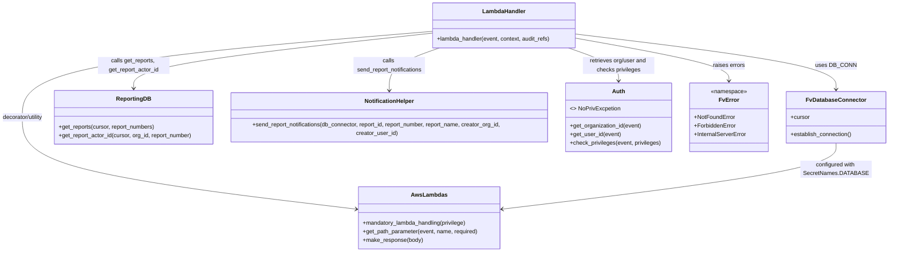

# Diagram: common/iam_service/iam_service/v1/power_bi/republish_report.py


> Auto-generated by Obscura crawlers

## Diagram 1

```mermaid
flowchart TD
  Start([Start])
  A{Receive event}
  P1[Get path param: report_number]
  P2[Get org_id, user_id via auth]
  DB[DB_CONN.establish_connection()]
  GetReports[reporting_db.get_reports(report_number)]
  NotFound{reports missing or len != 1}
  Extract[report = reports[0]\nreport_id, report_name]
  PrivCheck[auth.check_privileges(BUILD_REPORT)]
  NoPriv[auth.NoPrivExcpetion]
  ActorId[reporting_db.get_report_actor_id(org_id, report_number)]
  ActorMatch{actor_id == user_id}
  NotifyTry[notification_helper.send_report_notifications(...)]
  NotifyCatch[Log notification error, continue]
  BuildResponse[make_response(response_body)]
  Success([Return success response])
  ErrorCatch[Catch other exceptions\nLog and raise InternalServerError]
  Forbidden[Raise ForbiddenError]
  NotFoundErr[Raise NotFoundError]

  Start --> A --> P1 --> P2 --> DB --> GetReports --> NotFound
  NotFound -- yes --> NotFoundErr
  NotFound -- no --> Extract --> PrivCheck
  PrivCheck -- success --> NotifyTry
  PrivCheck -- fails --> NoPriv --> ActorId --> ActorMatch
  ActorMatch -- yes --> NotifyTry
  ActorMatch -- no --> Forbidden
  NotifyTry --> NotifyCatch
  NotifyCatch --> BuildResponse --> Success
  NotifyTry --> BuildResponse
  Forbidden --> ErrorCatch
  NotFoundErr --> ErrorCatch
```

> SVG rendering failed for this diagram.

## Diagram 2



### SVG

<svg id="container" width="2537.4375" xmlns="http://www.w3.org/2000/svg" class="classDiagram" height="704" viewBox="0 0 2537.4375 704" role="graphics-document document" aria-roledescription="class"><style>#container{font-family:"trebuchet ms",verdana,arial,sans-serif;font-size:16px;fill:#333;}@keyframes edge-animation-frame{from{stroke-dashoffset:0;}}@keyframes dash{to{stroke-dashoffset:0;}}#container .edge-animation-slow{stroke-dasharray:9,5!important;stroke-dashoffset:900;animation:dash 50s linear infinite;stroke-linecap:round;}#container .edge-animation-fast{stroke-dasharray:9,5!important;stroke-dashoffset:900;animation:dash 20s linear infinite;stroke-linecap:round;}#container .error-icon{fill:#552222;}#container .error-text{fill:#552222;stroke:#552222;}#container .edge-thickness-normal{stroke-width:1px;}#container .edge-thickness-thick{stroke-width:3.5px;}#container .edge-pattern-solid{stroke-dasharray:0;}#container .edge-thickness-invisible{stroke-width:0;fill:none;}#container .edge-pattern-dashed{stroke-dasharray:3;}#container .edge-pattern-dotted{stroke-dasharray:2;}#container .marker{fill:#333333;stroke:#333333;}#container .marker.cross{stroke:#333333;}#container svg{font-family:"trebuchet ms",verdana,arial,sans-serif;font-size:16px;}#container p{margin:0;}#container g.classGroup text{fill:#9370DB;stroke:none;font-family:"trebuchet ms",verdana,arial,sans-serif;font-size:10px;}#container g.classGroup text .title{font-weight:bolder;}#container .nodeLabel,#container .edgeLabel{color:#131300;}#container .edgeLabel .label rect{fill:#ECECFF;}#container .label text{fill:#131300;}#container .labelBkg{background:#ECECFF;}#container .edgeLabel .label span{background:#ECECFF;}#container .classTitle{font-weight:bolder;}#container .node rect,#container .node circle,#container .node ellipse,#container .node polygon,#container .node path{fill:#ECECFF;stroke:#9370DB;stroke-width:1px;}#container .divider{stroke:#9370DB;stroke-width:1;}#container g.clickable{cursor:pointer;}#container g.classGroup rect{fill:#ECECFF;stroke:#9370DB;}#container g.classGroup line{stroke:#9370DB;stroke-width:1;}#container .classLabel .box{stroke:none;stroke-width:0;fill:#ECECFF;opacity:0.5;}#container .classLabel .label{fill:#9370DB;font-size:10px;}#container .relation{stroke:#333333;stroke-width:1;fill:none;}#container .dashed-line{stroke-dasharray:3;}#container .dotted-line{stroke-dasharray:1 2;}#container #compositionStart,#container .composition{fill:#333333!important;stroke:#333333!important;stroke-width:1;}#container #compositionEnd,#container .composition{fill:#333333!important;stroke:#333333!important;stroke-width:1;}#container #dependencyStart,#container .dependency{fill:#333333!important;stroke:#333333!important;stroke-width:1;}#container #dependencyStart,#container .dependency{fill:#333333!important;stroke:#333333!important;stroke-width:1;}#container #extensionStart,#container .extension{fill:transparent!important;stroke:#333333!important;stroke-width:1;}#container #extensionEnd,#container .extension{fill:transparent!important;stroke:#333333!important;stroke-width:1;}#container #aggregationStart,#container .aggregation{fill:transparent!important;stroke:#333333!important;stroke-width:1;}#container #aggregationEnd,#container .aggregation{fill:transparent!important;stroke:#333333!important;stroke-width:1;}#container #lollipopStart,#container .lollipop{fill:#ECECFF!important;stroke:#333333!important;stroke-width:1;}#container #lollipopEnd,#container .lollipop{fill:#ECECFF!important;stroke:#333333!important;stroke-width:1;}#container .edgeTerminals{font-size:11px;line-height:initial;}#container .classTitleText{text-anchor:middle;font-size:18px;fill:#333;}#container .label-icon{display:inline-block;height:1em;overflow:visible;vertical-align:-0.125em;}#container .node .label-icon path{fill:currentColor;stroke:revert;stroke-width:revert;}#container :root{--mermaid-font-family:"trebuchet ms",verdana,arial,sans-serif;}</style><g><defs><marker id="container_class-aggregationStart" class="marker aggregation class" refX="18" refY="7" markerWidth="190" markerHeight="240" orient="auto"><path d="M 18,7 L9,13 L1,7 L9,1 Z"></path></marker></defs><defs><marker id="container_class-aggregationEnd" class="marker aggregation class" refX="1" refY="7" markerWidth="20" markerHeight="28" orient="auto"><path d="M 18,7 L9,13 L1,7 L9,1 Z"></path></marker></defs><defs><marker id="container_class-extensionStart" class="marker extension class" refX="18" refY="7" markerWidth="190" markerHeight="240" orient="auto"><path d="M 1,7 L18,13 V 1 Z"></path></marker></defs><defs><marker id="container_class-extensionEnd" class="marker extension class" refX="1" refY="7" markerWidth="20" markerHeight="28" orient="auto"><path d="M 1,1 V 13 L18,7 Z"></path></marker></defs><defs><marker id="container_class-compositionStart" class="marker composition class" refX="18" refY="7" markerWidth="190" markerHeight="240" orient="auto"><path d="M 18,7 L9,13 L1,7 L9,1 Z"></path></marker></defs><defs><marker id="container_class-compositionEnd" class="marker composition class" refX="1" refY="7" markerWidth="20" markerHeight="28" orient="auto"><path d="M 18,7 L9,13 L1,7 L9,1 Z"></path></marker></defs><defs><marker id="container_class-dependencyStart" class="marker dependency class" refX="6" refY="7" markerWidth="190" markerHeight="240" orient="auto"><path d="M 5,7 L9,13 L1,7 L9,1 Z"></path></marker></defs><defs><marker id="container_class-dependencyEnd" class="marker dependency class" refX="13" refY="7" markerWidth="20" markerHeight="28" orient="auto"><path d="M 18,7 L9,13 L14,7 L9,1 Z"></path></marker></defs><defs><marker id="container_class-lollipopStart" class="marker lollipop class" refX="13" refY="7" markerWidth="190" markerHeight="240" orient="auto"><circle stroke="black" fill="transparent" cx="7" cy="7" r="6"></circle></marker></defs><defs><marker id="container_class-lollipopEnd" class="marker lollipop class" refX="1" refY="7" markerWidth="190" markerHeight="240" orient="auto"><circle stroke="black" fill="transparent" cx="7" cy="7" r="6"></circle></marker></defs><g class="root"><g class="clusters"></g><g class="edgePaths"><path d="M1250.475,87.336L1053.362,103.28C856.249,119.224,462.023,151.112,264.91,191.223C67.797,231.333,67.797,279.667,67.797,328C67.797,376.333,67.797,424.667,227.4,467.518C387.004,510.37,706.211,547.74,865.814,566.426L1025.418,585.111" id="id_LambdaHandler_AwsLambdas_1" class="edge-thickness-normal edge-pattern-solid relation" style=";;;" data-edge="true" data-et="edge" data-id="id_LambdaHandler_AwsLambdas_1" data-points="W3sieCI6MTI1MC40NzQ2MDkzNzUsInkiOjg3LjMzNTU4MTMxODkxNTM5fSx7IngiOjY3Ljc5Njg3NSwieSI6MTgzfSx7IngiOjY3Ljc5Njg3NSwieSI6MzI4fSx7IngiOjY3Ljc5Njg3NSwieSI6NDczfSx7IngiOjEwMzEuMzc2OTUzMTI1LCJ5Ijo1ODUuODA4MzAwMjI1Nzk4MX1d" marker-end="url(#container_class-dependencyEnd)"></path><path d="M1654.381,95.095L1777.176,109.746C1899.971,124.397,2145.562,153.698,2268.357,179.516C2391.152,205.333,2391.152,227.667,2391.152,238.833L2391.152,250" id="id_LambdaHandler_FvDatabaseConnector_2" class="edge-thickness-normal edge-pattern-solid relation" style=";;;" data-edge="true" data-et="edge" data-id="id_LambdaHandler_FvDatabaseConnector_2" data-points="W3sieCI6MTY1NC4zODA4NTkzNzUsInkiOjk1LjA5NTE5MjMyMTY5NjQ2fSx7IngiOjIzOTEuMTUyMzQzNzUsInkiOjE4M30seyJ4IjoyMzkxLjE1MjM0Mzc1LCJ5IjoyNTZ9XQ==" marker-end="url(#container_class-dependencyEnd)"></path><path d="M1250.475,92.226L1106.528,107.355C962.582,122.484,674.689,152.742,530.743,178.538C386.797,204.333,386.797,225.667,386.797,236.333L386.797,247" id="id_LambdaHandler_ReportingDB_3" class="edge-thickness-normal edge-pattern-solid relation" style=";;;" data-edge="true" data-et="edge" data-id="id_LambdaHandler_ReportingDB_3" data-points="W3sieCI6MTI1MC40NzQ2MDkzNzUsInkiOjkyLjIyNTY4OTc0MTQ0MjA0fSx7IngiOjM4Ni43OTY4NzUsInkiOjE4M30seyJ4IjozODYuNzk2ODc1LCJ5IjoyNTN9XQ==" marker-end="url(#container_class-dependencyEnd)"></path><path d="M1266.716,134L1242.642,142.167C1218.568,150.333,1170.421,166.667,1146.347,187.5C1122.273,208.333,1122.273,233.667,1122.273,246.333L1122.273,259" id="id_LambdaHandler_NotificationHelper_4" class="edge-thickness-normal edge-pattern-solid relation" style=";;;" data-edge="true" data-et="edge" data-id="id_LambdaHandler_NotificationHelper_4" data-points="W3sieCI6MTI2Ni43MTU5NDIzODI4MTI1LCJ5IjoxMzR9LHsieCI6MTEyMi4yNzM0Mzc1LCJ5IjoxODN9LHsieCI6MTEyMi4yNzM0Mzc1LCJ5IjoyNjV9XQ==" marker-end="url(#container_class-dependencyEnd)"></path><path d="M1638.14,134L1662.213,142.167C1686.287,150.333,1734.435,166.667,1758.508,182C1782.582,197.333,1782.582,211.667,1782.582,218.833L1782.582,226" id="id_LambdaHandler_Auth_5" class="edge-thickness-normal edge-pattern-solid relation" style=";;;" data-edge="true" data-et="edge" data-id="id_LambdaHandler_Auth_5" data-points="W3sieCI6MTYzOC4xMzk1MjYzNjcxODc1LCJ5IjoxMzR9LHsieCI6MTc4Mi41ODIwMzEyNSwieSI6MTgzfSx7IngiOjE3ODIuNTgyMDMxMjUsInkiOjIzMn1d" marker-end="url(#container_class-dependencyEnd)"></path><path d="M1654.381,106.352L1727.358,119.127C1800.335,131.901,1946.288,157.451,2019.265,177.392C2092.242,197.333,2092.242,211.667,2092.242,218.833L2092.242,226" id="id_LambdaHandler_FvError_6" class="edge-thickness-normal edge-pattern-solid relation" style=";;;" data-edge="true" data-et="edge" data-id="id_LambdaHandler_FvError_6" data-points="W3sieCI6MTY1NC4zODA4NTkzNzUsInkiOjEwNi4zNTIwNDYwMzM4NTM4MX0seyJ4IjoyMDkyLjI0MjE4NzUsInkiOjE4M30seyJ4IjoyMDkyLjI0MjE4NzUsInkiOjIzMn1d" marker-end="url(#container_class-dependencyEnd)"></path><path d="M2391.152,400L2391.152,412.167C2391.152,424.333,2391.152,448.667,2231.549,479.518C2071.945,510.37,1752.738,547.74,1593.135,566.426L1433.532,585.111" id="id_FvDatabaseConnector_AwsLambdas_7" class="edge-thickness-normal edge-pattern-solid relation" style=";;;" data-edge="true" data-et="edge" data-id="id_FvDatabaseConnector_AwsLambdas_7" data-points="W3sieCI6MjM5MS4xNTIzNDM3NSwieSI6NDAwfSx7IngiOjIzOTEuMTUyMzQzNzUsInkiOjQ3M30seyJ4IjoxNDI3LjU3MjI2NTYyNSwieSI6NTg1LjgwODMwMDIyNTc5ODF9XQ==" marker-end="url(#container_class-dependencyEnd)"></path></g><g class="edgeLabels"><g class="edgeLabel" transform="translate(67.796875, 328)"><g class="label" data-id="id_LambdaHandler_AwsLambdas_1" transform="translate(-59.796875, -12)"><foreignObject width="119.59375" height="24"><div xmlns="http://www.w3.org/1999/xhtml" class="labelBkg" style="display: table-cell; white-space: nowrap; line-height: 1.5; max-width: 200px; text-align: center;"><span class="edgeLabel"><p>decorator/utility</p></span></div></foreignObject></g></g><g class="edgeLabel" transform="translate(2391.15234375, 183)"><g class="label" data-id="id_LambdaHandler_FvDatabaseConnector_2" transform="translate(-53.09375, -12)"><foreignObject width="106.1875" height="24"><div xmlns="http://www.w3.org/1999/xhtml" class="labelBkg" style="display: table-cell; white-space: nowrap; line-height: 1.5; max-width: 200px; text-align: center;"><span class="edgeLabel"><p>uses DB_CONN</p></span></div></foreignObject></g></g><g class="edgeLabel" transform="translate(386.796875, 183)"><g class="label" data-id="id_LambdaHandler_ReportingDB_3" transform="translate(-100, -24)"><foreignObject width="200" height="48"><div xmlns="http://www.w3.org/1999/xhtml" class="labelBkg" style="display: table; white-space: break-spaces; line-height: 1.5; max-width: 200px; text-align: center; width: 200px;"><span class="edgeLabel"><p>calls get_reports, get_report_actor_id</p></span></div></foreignObject></g></g><g class="edgeLabel" transform="translate(1122.2734375, 183)"><g class="label" data-id="id_LambdaHandler_NotificationHelper_4" transform="translate(-100, -24)"><foreignObject width="200" height="48"><div xmlns="http://www.w3.org/1999/xhtml" class="labelBkg" style="display: table; white-space: break-spaces; line-height: 1.5; max-width: 200px; text-align: center; width: 200px;"><span class="edgeLabel"><p>calls send_report_notifications</p></span></div></foreignObject></g></g><g class="edgeLabel" transform="translate(1782.58203125, 183)"><g class="label" data-id="id_LambdaHandler_Auth_5" transform="translate(-100, -24)"><foreignObject width="200" height="48"><div xmlns="http://www.w3.org/1999/xhtml" class="labelBkg" style="display: table; white-space: break-spaces; line-height: 1.5; max-width: 200px; text-align: center; width: 200px;"><span class="edgeLabel"><p>retrieves org/user and checks privileges</p></span></div></foreignObject></g></g><g class="edgeLabel" transform="translate(2092.2421875, 183)"><g class="label" data-id="id_LambdaHandler_FvError_6" transform="translate(-45.046875, -12)"><foreignObject width="90.09375" height="24"><div xmlns="http://www.w3.org/1999/xhtml" class="labelBkg" style="display: table-cell; white-space: nowrap; line-height: 1.5; max-width: 200px; text-align: center;"><span class="edgeLabel"><p>raises errors</p></span></div></foreignObject></g></g><g class="edgeLabel" transform="translate(2391.15234375, 473)"><g class="label" data-id="id_FvDatabaseConnector_AwsLambdas_7" transform="translate(-100, -24)"><foreignObject width="200" height="48"><div xmlns="http://www.w3.org/1999/xhtml" class="labelBkg" style="display: table; white-space: break-spaces; line-height: 1.5; max-width: 200px; text-align: center; width: 200px;"><span class="edgeLabel"><p>configured with SecretNames.DATABASE</p></span></div></foreignObject></g></g></g><g class="nodes"><g class="node default" id="classId-LambdaHandler-0" transform="translate(1452.427734375, 71)"><g class="basic label-container"><path d="M-201.953125 -63 L201.953125 -63 L201.953125 63 L-201.953125 63" stroke="none" stroke-width="0" fill="#ECECFF" style=""></path><path d="M-201.953125 -63 C-76.21584576553323 -63, 49.52143346893354 -63, 201.953125 -63 M-201.953125 -63 C-41.53612602947217 -63, 118.88087294105566 -63, 201.953125 -63 M201.953125 -63 C201.953125 -33.86364822857644, 201.953125 -4.7272964571528675, 201.953125 63 M201.953125 -63 C201.953125 -35.023437966042806, 201.953125 -7.046875932085605, 201.953125 63 M201.953125 63 C99.54308082041838 63, -2.866963359163236 63, -201.953125 63 M201.953125 63 C110.33758135988305 63, 18.722037719766092 63, -201.953125 63 M-201.953125 63 C-201.953125 26.747213120113408, -201.953125 -9.505573759773185, -201.953125 -63 M-201.953125 63 C-201.953125 19.85647856950591, -201.953125 -23.28704286098818, -201.953125 -63" stroke="#9370DB" stroke-width="1.3" fill="none" stroke-dasharray="0 0" style=""></path></g><g class="annotation-group text" transform="translate(0, -39)"></g><g class="label-group text" transform="translate(-58.21875, -39)"><g class="label" style="font-weight: bolder" transform="translate(0,-12)"><foreignObject width="116.4375" height="24"><div xmlns="http://www.w3.org/1999/xhtml" style="display: table-cell; white-space: nowrap; line-height: 1.5; max-width: 167px; text-align: center;"><span class="nodeLabel markdown-node-label" style=""><p>LambdaHandler</p></span></div></foreignObject></g></g><g class="members-group text" transform="translate(-189.953125, 9)"></g><g class="methods-group text" transform="translate(-189.953125, 39)"><g class="label" style="" transform="translate(0,-12)"><foreignObject width="321.6875" height="24"><div xmlns="http://www.w3.org/1999/xhtml" style="display: table-cell; white-space: nowrap; line-height: 1.5; max-width: 379px; text-align: center;"><span class="nodeLabel markdown-node-label" style=""><p>+lambda_handler(event, context, audit_refs)</p></span></div></foreignObject></g></g><g class="divider" style=""><path d="M-201.953125 -15 C-81.47645995121351 -15, 39.00020509757297 -15, 201.953125 -15 M-201.953125 -15 C-91.22846660327922 -15, 19.496191793441568 -15, 201.953125 -15" stroke="#9370DB" stroke-width="1.3" fill="none" stroke-dasharray="0 0" style=""></path></g><g class="divider" style=""><path d="M-201.953125 9 C-115.8480839195937 9, -29.74304283918741 9, 201.953125 9 M-201.953125 9 C-72.00171953403412 9, 57.949685931931754 9, 201.953125 9" stroke="#9370DB" stroke-width="1.3" fill="none" stroke-dasharray="0 0" style=""></path></g></g><g class="node default" id="classId-FvDatabaseConnector-1" transform="translate(2391.15234375, 328)"><g class="basic label-container"><path d="M-138.28515625 -72 L138.28515625 -72 L138.28515625 72 L-138.28515625 72" stroke="none" stroke-width="0" fill="#ECECFF" style=""></path><path d="M-138.28515625 -72 C-57.2341849780847 -72, 23.816786293830603 -72, 138.28515625 -72 M-138.28515625 -72 C-58.20098039678558 -72, 21.883195456428837 -72, 138.28515625 -72 M138.28515625 -72 C138.28515625 -31.733431102715883, 138.28515625 8.533137794568233, 138.28515625 72 M138.28515625 -72 C138.28515625 -42.323319496626326, 138.28515625 -12.646638993252658, 138.28515625 72 M138.28515625 72 C40.8877870954875 72, -56.50958205902501 72, -138.28515625 72 M138.28515625 72 C78.53252640488557 72, 18.77989655977113 72, -138.28515625 72 M-138.28515625 72 C-138.28515625 19.159129530293832, -138.28515625 -33.681740939412336, -138.28515625 -72 M-138.28515625 72 C-138.28515625 16.954218731619108, -138.28515625 -38.091562536761785, -138.28515625 -72" stroke="#9370DB" stroke-width="1.3" fill="none" stroke-dasharray="0 0" style=""></path></g><g class="annotation-group text" transform="translate(0, -48)"></g><g class="label-group text" transform="translate(-79.3046875, -48)"><g class="label" style="font-weight: bolder" transform="translate(0,-12)"><foreignObject width="158.609375" height="24"><div xmlns="http://www.w3.org/1999/xhtml" style="display: table-cell; white-space: nowrap; line-height: 1.5; max-width: 207px; text-align: center;"><span class="nodeLabel markdown-node-label" style=""><p>FvDatabaseConnector</p></span></div></foreignObject></g></g><g class="members-group text" transform="translate(-126.28515625, 0)"><g class="label" style="" transform="translate(0,-12)"><foreignObject width="53.71875" height="24"><div xmlns="http://www.w3.org/1999/xhtml" style="display: table-cell; white-space: nowrap; line-height: 1.5; max-width: 112px; text-align: center;"><span class="nodeLabel markdown-node-label" style=""><p>+cursor</p></span></div></foreignObject></g></g><g class="methods-group text" transform="translate(-126.28515625, 48)"><g class="label" style="" transform="translate(0,-12)"><foreignObject width="173.265625" height="24"><div xmlns="http://www.w3.org/1999/xhtml" style="display: table-cell; white-space: nowrap; line-height: 1.5; max-width: 231px; text-align: center;"><span class="nodeLabel markdown-node-label" style=""><p>+establish_connection()</p></span></div></foreignObject></g></g><g class="divider" style=""><path d="M-138.28515625 -24 C-28.52585493930151 -24, 81.23344637139698 -24, 138.28515625 -24 M-138.28515625 -24 C-79.21114685310914 -24, -20.13713745621827 -24, 138.28515625 -24" stroke="#9370DB" stroke-width="1.3" fill="none" stroke-dasharray="0 0" style=""></path></g><g class="divider" style=""><path d="M-138.28515625 24 C-59.11367105139941 24, 20.057814147201185 24, 138.28515625 24 M-138.28515625 24 C-65.53648488901905 24, 7.2121864719619 24, 138.28515625 24" stroke="#9370DB" stroke-width="1.3" fill="none" stroke-dasharray="0 0" style=""></path></g></g><g class="node default" id="classId-ReportingDB-2" transform="translate(386.796875, 328)"><g class="basic label-container"><path d="M-224.203125 -75 L224.203125 -75 L224.203125 75 L-224.203125 75" stroke="none" stroke-width="0" fill="#ECECFF" style=""></path><path d="M-224.203125 -75 C-103.05180069611198 -75, 18.099523607776035 -75, 224.203125 -75 M-224.203125 -75 C-114.18461501203487 -75, -4.166105024069736 -75, 224.203125 -75 M224.203125 -75 C224.203125 -26.01179479338829, 224.203125 22.97641041322342, 224.203125 75 M224.203125 -75 C224.203125 -20.43907570890333, 224.203125 34.12184858219334, 224.203125 75 M224.203125 75 C45.219182488870814 75, -133.76476002225837 75, -224.203125 75 M224.203125 75 C101.51068145850083 75, -21.181762082998347 75, -224.203125 75 M-224.203125 75 C-224.203125 27.249490611595675, -224.203125 -20.50101877680865, -224.203125 -75 M-224.203125 75 C-224.203125 27.143262337279786, -224.203125 -20.713475325440427, -224.203125 -75" stroke="#9370DB" stroke-width="1.3" fill="none" stroke-dasharray="0 0" style=""></path></g><g class="annotation-group text" transform="translate(0, -51)"></g><g class="label-group text" transform="translate(-46.40625, -51)"><g class="label" style="font-weight: bolder" transform="translate(0,-12)"><foreignObject width="92.8125" height="24"><div xmlns="http://www.w3.org/1999/xhtml" style="display: table-cell; white-space: nowrap; line-height: 1.5; max-width: 141px; text-align: center;"><span class="nodeLabel markdown-node-label" style=""><p>ReportingDB</p></span></div></foreignObject></g></g><g class="members-group text" transform="translate(-212.203125, -3)"></g><g class="methods-group text" transform="translate(-212.203125, 27)"><g class="label" style="" transform="translate(0,-12)"><foreignObject width="272.03125" height="24"><div xmlns="http://www.w3.org/1999/xhtml" style="display: table-cell; white-space: nowrap; line-height: 1.5; max-width: 329px; text-align: center;"><span class="nodeLabel markdown-node-label" style=""><p>+get_reports(cursor, report_numbers)</p></span></div></foreignObject></g><g class="label" style="" transform="translate(0,12)"><foreignObject width="378" height="24"><div xmlns="http://www.w3.org/1999/xhtml" style="display: table-cell; white-space: nowrap; line-height: 1.5; max-width: 435px; text-align: center;"><span class="nodeLabel markdown-node-label" style=""><p>+get_report_actor_id(cursor, org_id, report_number)</p></span></div></foreignObject></g></g><g class="divider" style=""><path d="M-224.203125 -27 C-80.09320768549796 -27, 64.01670962900408 -27, 224.203125 -27 M-224.203125 -27 C-100.00094277162114 -27, 24.20123945675772 -27, 224.203125 -27" stroke="#9370DB" stroke-width="1.3" fill="none" stroke-dasharray="0 0" style=""></path></g><g class="divider" style=""><path d="M-224.203125 -3 C-110.48537660333005 -3, 3.232371793339894 -3, 224.203125 -3 M-224.203125 -3 C-134.3185644041035 -3, -44.434003808207024 -3, 224.203125 -3" stroke="#9370DB" stroke-width="1.3" fill="none" stroke-dasharray="0 0" style=""></path></g></g><g class="node default" id="classId-NotificationHelper-3" transform="translate(1122.2734375, 328)"><g class="basic label-container"><path d="M-461.2734375 -63 L461.2734375 -63 L461.2734375 63 L-461.2734375 63" stroke="none" stroke-width="0" fill="#ECECFF" style=""></path><path d="M-461.2734375 -63 C-120.29213752203952 -63, 220.68916245592095 -63, 461.2734375 -63 M-461.2734375 -63 C-131.31500196579452 -63, 198.64343356841096 -63, 461.2734375 -63 M461.2734375 -63 C461.2734375 -37.02621903562079, 461.2734375 -11.052438071241582, 461.2734375 63 M461.2734375 -63 C461.2734375 -26.437483350533924, 461.2734375 10.125033298932152, 461.2734375 63 M461.2734375 63 C204.06131055173842 63, -53.15081639652317 63, -461.2734375 63 M461.2734375 63 C231.79048102900697 63, 2.307524558013938 63, -461.2734375 63 M-461.2734375 63 C-461.2734375 16.8646703028839, -461.2734375 -29.270659394232197, -461.2734375 -63 M-461.2734375 63 C-461.2734375 36.37057478369047, -461.2734375 9.741149567380944, -461.2734375 -63" stroke="#9370DB" stroke-width="1.3" fill="none" stroke-dasharray="0 0" style=""></path></g><g class="annotation-group text" transform="translate(0, -39)"></g><g class="label-group text" transform="translate(-67.40625, -39)"><g class="label" style="font-weight: bolder" transform="translate(0,-12)"><foreignObject width="134.8125" height="24"><div xmlns="http://www.w3.org/1999/xhtml" style="display: table-cell; white-space: nowrap; line-height: 1.5; max-width: 184px; text-align: center;"><span class="nodeLabel markdown-node-label" style=""><p>NotificationHelper</p></span></div></foreignObject></g></g><g class="members-group text" transform="translate(-449.2734375, 9)"></g><g class="methods-group text" transform="translate(-449.2734375, 39)"><g class="label" style="" transform="translate(0,-12)"><foreignObject width="831.140625" height="24"><div xmlns="http://www.w3.org/1999/xhtml" style="display: table-cell; white-space: nowrap; line-height: 1.5; max-width: 889px; text-align: center;"><span class="nodeLabel markdown-node-label" style=""><p>+send_report_notifications(db_connector, report_id, report_number, report_name, creator_org_id, creator_user_id)</p></span></div></foreignObject></g></g><g class="divider" style=""><path d="M-461.2734375 -15 C-162.45425934387106 -15, 136.36491881225788 -15, 461.2734375 -15 M-461.2734375 -15 C-120.09146613695401 -15, 221.09050522609198 -15, 461.2734375 -15" stroke="#9370DB" stroke-width="1.3" fill="none" stroke-dasharray="0 0" style=""></path></g><g class="divider" style=""><path d="M-461.2734375 9 C-200.92926092029637 9, 59.41491565940726 9, 461.2734375 9 M-461.2734375 9 C-121.0094179004675 9, 219.254601699065 9, 461.2734375 9" stroke="#9370DB" stroke-width="1.3" fill="none" stroke-dasharray="0 0" style=""></path></g></g><g class="node default" id="classId-Auth-4" transform="translate(1782.58203125, 328)"><g class="basic label-container"><path d="M-149.03515625 -96 L149.03515625 -96 L149.03515625 96 L-149.03515625 96" stroke="none" stroke-width="0" fill="#ECECFF" style=""></path><path d="M-149.03515625 -96 C-77.96771068062688 -96, -6.900265111253759 -96, 149.03515625 -96 M-149.03515625 -96 C-70.9144798090951 -96, 7.206196631809803 -96, 149.03515625 -96 M149.03515625 -96 C149.03515625 -28.807777043437113, 149.03515625 38.384445913125774, 149.03515625 96 M149.03515625 -96 C149.03515625 -50.654144879106866, 149.03515625 -5.308289758213732, 149.03515625 96 M149.03515625 96 C53.638682542426125 96, -41.75779116514775 96, -149.03515625 96 M149.03515625 96 C68.47133367100837 96, -12.092488907983267 96, -149.03515625 96 M-149.03515625 96 C-149.03515625 43.60237508626176, -149.03515625 -8.795249827476482, -149.03515625 -96 M-149.03515625 96 C-149.03515625 30.43405572265368, -149.03515625 -35.13188855469264, -149.03515625 -96" stroke="#9370DB" stroke-width="1.3" fill="none" stroke-dasharray="0 0" style=""></path></g><g class="annotation-group text" transform="translate(0, -72)"></g><g class="label-group text" transform="translate(-17.0078125, -72)"><g class="label" style="font-weight: bolder" transform="translate(0,-12)"><foreignObject width="34.015625" height="24"><div xmlns="http://www.w3.org/1999/xhtml" style="display: table-cell; white-space: nowrap; line-height: 1.5; max-width: 84px; text-align: center;"><span class="nodeLabel markdown-node-label" style=""><p>Auth</p></span></div></foreignObject></g></g><g class="members-group text" transform="translate(-137.03515625, -24)"><g class="label" style="" transform="translate(0,-12)"><foreignObject width="139.109375" height="24"><div xmlns="http://www.w3.org/1999/xhtml" style="display: table-cell; white-space: nowrap; line-height: 1.5; max-width: 229px; text-align: center;"><span class="nodeLabel markdown-node-label" style=""><p>&lt;&gt; NoPrivExcpetion</p></span></div></foreignObject></g></g><g class="methods-group text" transform="translate(-137.03515625, 24)"><g class="label" style="" transform="translate(0,-12)"><foreignObject width="202.015625" height="24"><div xmlns="http://www.w3.org/1999/xhtml" style="display: table-cell; white-space: nowrap; line-height: 1.5; max-width: 259px; text-align: center;"><span class="nodeLabel markdown-node-label" style=""><p>+get_organization_id(event)</p></span></div></foreignObject></g><g class="label" style="" transform="translate(0,12)"><foreignObject width="142.0625" height="24"><div xmlns="http://www.w3.org/1999/xhtml" style="display: table-cell; white-space: nowrap; line-height: 1.5; max-width: 199px; text-align: center;"><span class="nodeLabel markdown-node-label" style=""><p>+get_user_id(event)</p></span></div></foreignObject></g><g class="label" style="" transform="translate(0,36)"><foreignObject width="257.0625" height="24"><div xmlns="http://www.w3.org/1999/xhtml" style="display: table-cell; white-space: nowrap; line-height: 1.5; max-width: 314px; text-align: center;"><span class="nodeLabel markdown-node-label" style=""><p>+check_privileges(event, privileges)</p></span></div></foreignObject></g></g><g class="divider" style=""><path d="M-149.03515625 -48 C-32.84313380554731 -48, 83.34888863890538 -48, 149.03515625 -48 M-149.03515625 -48 C-56.43863019864389 -48, 36.157895852712215 -48, 149.03515625 -48" stroke="#9370DB" stroke-width="1.3" fill="none" stroke-dasharray="0 0" style=""></path></g><g class="divider" style=""><path d="M-149.03515625 0 C-88.14639538903452 0, -27.25763452806906 0, 149.03515625 0 M-149.03515625 0 C-52.20469343165355 0, 44.625769386692895 0, 149.03515625 0" stroke="#9370DB" stroke-width="1.3" fill="none" stroke-dasharray="0 0" style=""></path></g></g><g class="node default" id="classId-FvError-5" transform="translate(2092.2421875, 328)"><g class="basic label-container"><path d="M-110.625 -96 L110.625 -96 L110.625 96 L-110.625 96" stroke="none" stroke-width="0" fill="#ECECFF" style=""></path><path d="M-110.625 -96 C-40.90992798543799 -96, 28.805144029124023 -96, 110.625 -96 M-110.625 -96 C-28.024007093062295 -96, 54.57698581387541 -96, 110.625 -96 M110.625 -96 C110.625 -43.09345952041744, 110.625 9.81308095916512, 110.625 96 M110.625 -96 C110.625 -34.246257818166164, 110.625 27.507484363667672, 110.625 96 M110.625 96 C41.72305412963475 96, -27.178891740730506 96, -110.625 96 M110.625 96 C22.897583087509034 96, -64.82983382498193 96, -110.625 96 M-110.625 96 C-110.625 22.211316886075252, -110.625 -51.577366227849495, -110.625 -96 M-110.625 96 C-110.625 24.573264677918317, -110.625 -46.853470644163366, -110.625 -96" stroke="#9370DB" stroke-width="1.3" fill="none" stroke-dasharray="0 0" style=""></path></g><g class="annotation-group text" transform="translate(-50.015625, -72)"><g class="label" style="" transform="translate(0,-12)"><foreignObject width="100.03125" height="24"><div xmlns="http://www.w3.org/1999/xhtml" style="display: table-cell; white-space: nowrap; line-height: 1.5; max-width: 150px; text-align: center;"><span class="nodeLabel markdown-node-label" style=""><p>«namespace»</p></span></div></foreignObject></g></g><g class="label-group text" transform="translate(-25.90625, -48)"><g class="label" style="font-weight: bolder" transform="translate(0,-12)"><foreignObject width="51.8125" height="24"><div xmlns="http://www.w3.org/1999/xhtml" style="display: table-cell; white-space: nowrap; line-height: 1.5; max-width: 102px; text-align: center;"><span class="nodeLabel markdown-node-label" style=""><p>FvError</p></span></div></foreignObject></g></g><g class="members-group text" transform="translate(-98.625, 0)"><g class="label" style="" transform="translate(0,-12)"><foreignObject width="114.734375" height="24"><div xmlns="http://www.w3.org/1999/xhtml" style="display: table-cell; white-space: nowrap; line-height: 1.5; max-width: 173px; text-align: center;"><span class="nodeLabel markdown-node-label" style=""><p>+NotFoundError</p></span></div></foreignObject></g><g class="label" style="" transform="translate(0,12)"><foreignObject width="117.84375" height="24"><div xmlns="http://www.w3.org/1999/xhtml" style="display: table-cell; white-space: nowrap; line-height: 1.5; max-width: 176px; text-align: center;"><span class="nodeLabel markdown-node-label" style=""><p>+ForbiddenError</p></span></div></foreignObject></g><g class="label" style="" transform="translate(0,36)"><foreignObject width="147.234375" height="24"><div xmlns="http://www.w3.org/1999/xhtml" style="display: table-cell; white-space: nowrap; line-height: 1.5; max-width: 205px; text-align: center;"><span class="nodeLabel markdown-node-label" style=""><p>+InternalServerError</p></span></div></foreignObject></g></g><g class="methods-group text" transform="translate(-98.625, 96)"></g><g class="divider" style=""><path d="M-110.625 -24 C-52.489079461751466 -24, 5.6468410764970685 -24, 110.625 -24 M-110.625 -24 C-63.658985341007266 -24, -16.692970682014533 -24, 110.625 -24" stroke="#9370DB" stroke-width="1.3" fill="none" stroke-dasharray="0 0" style=""></path></g><g class="divider" style=""><path d="M-110.625 72 C-53.32806643941913 72, 3.968867121161736 72, 110.625 72 M-110.625 72 C-46.74795271062731 72, 17.12909457874538 72, 110.625 72" stroke="#9370DB" stroke-width="1.3" fill="none" stroke-dasharray="0 0" style=""></path></g></g><g class="node default" id="classId-AwsLambdas-6" transform="translate(1229.474609375, 609)"><g class="basic label-container"><path d="M-198.09765625 -87 L198.09765625 -87 L198.09765625 87 L-198.09765625 87" stroke="none" stroke-width="0" fill="#ECECFF" style=""></path><path d="M-198.09765625 -87 C-116.33743143880058 -87, -34.57720662760116 -87, 198.09765625 -87 M-198.09765625 -87 C-113.24438728390344 -87, -28.39111831780687 -87, 198.09765625 -87 M198.09765625 -87 C198.09765625 -21.913551758711918, 198.09765625 43.172896482576164, 198.09765625 87 M198.09765625 -87 C198.09765625 -40.94212748786981, 198.09765625 5.115745024260377, 198.09765625 87 M198.09765625 87 C52.79086809457567 87, -92.51592006084866 87, -198.09765625 87 M198.09765625 87 C91.35068785794321 87, -15.396280534113572 87, -198.09765625 87 M-198.09765625 87 C-198.09765625 27.493114108481734, -198.09765625 -32.01377178303653, -198.09765625 -87 M-198.09765625 87 C-198.09765625 22.2248384594441, -198.09765625 -42.5503230811118, -198.09765625 -87" stroke="#9370DB" stroke-width="1.3" fill="none" stroke-dasharray="0 0" style=""></path></g><g class="annotation-group text" transform="translate(0, -63)"></g><g class="label-group text" transform="translate(-47.4921875, -63)"><g class="label" style="font-weight: bolder" transform="translate(0,-12)"><foreignObject width="94.984375" height="24"><div xmlns="http://www.w3.org/1999/xhtml" style="display: table-cell; white-space: nowrap; line-height: 1.5; max-width: 143px; text-align: center;"><span class="nodeLabel markdown-node-label" style=""><p>AwsLambdas</p></span></div></foreignObject></g></g><g class="members-group text" transform="translate(-186.09765625, -15)"></g><g class="methods-group text" transform="translate(-186.09765625, 15)"><g class="label" style="" transform="translate(0,-12)"><foreignObject width="294.765625" height="24"><div xmlns="http://www.w3.org/1999/xhtml" style="display: table-cell; white-space: nowrap; line-height: 1.5; max-width: 352px; text-align: center;"><span class="nodeLabel markdown-node-label" style=""><p>+mandatory_lambda_handling(privilege)</p></span></div></foreignObject></g><g class="label" style="" transform="translate(0,12)"><foreignObject width="324.703125" height="24"><div xmlns="http://www.w3.org/1999/xhtml" style="display: table-cell; white-space: nowrap; line-height: 1.5; max-width: 382px; text-align: center;"><span class="nodeLabel markdown-node-label" style=""><p>+get_path_parameter(event, name, required)</p></span></div></foreignObject></g><g class="label" style="" transform="translate(0,36)"><foreignObject width="168.140625" height="24"><div xmlns="http://www.w3.org/1999/xhtml" style="display: table-cell; white-space: nowrap; line-height: 1.5; max-width: 226px; text-align: center;"><span class="nodeLabel markdown-node-label" style=""><p>+make_response(body)</p></span></div></foreignObject></g></g><g class="divider" style=""><path d="M-198.09765625 -39 C-51.452913474907035 -39, 95.19182930018593 -39, 198.09765625 -39 M-198.09765625 -39 C-102.9209951073996 -39, -7.74433396479921 -39, 198.09765625 -39" stroke="#9370DB" stroke-width="1.3" fill="none" stroke-dasharray="0 0" style=""></path></g><g class="divider" style=""><path d="M-198.09765625 -15 C-48.44819641813089 -15, 101.20126341373822 -15, 198.09765625 -15 M-198.09765625 -15 C-78.06402796477887 -15, 41.969600320442254 -15, 198.09765625 -15" stroke="#9370DB" stroke-width="1.3" fill="none" stroke-dasharray="0 0" style=""></path></g></g></g></g></g></svg>
