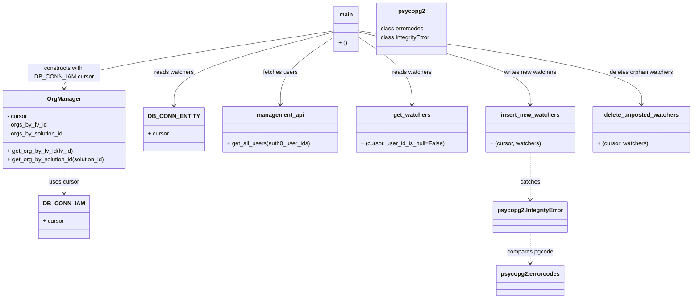

# Diagram: common/iam_service/scripts/FIN2-998_backfill_watch.py


> Auto-generated by Obscura crawlers

## Diagram 1



### SVG

<svg id="container" width="1881.1640625" xmlns="http://www.w3.org/2000/svg" class="classDiagram" height="826" viewBox="0 0 1881.1640625 826" role="graphics-document document" aria-roledescription="class"><style>#container{font-family:"trebuchet ms",verdana,arial,sans-serif;font-size:16px;fill:#333;}@keyframes edge-animation-frame{from{stroke-dashoffset:0;}}@keyframes dash{to{stroke-dashoffset:0;}}#container .edge-animation-slow{stroke-dasharray:9,5!important;stroke-dashoffset:900;animation:dash 50s linear infinite;stroke-linecap:round;}#container .edge-animation-fast{stroke-dasharray:9,5!important;stroke-dashoffset:900;animation:dash 20s linear infinite;stroke-linecap:round;}#container .error-icon{fill:#552222;}#container .error-text{fill:#552222;stroke:#552222;}#container .edge-thickness-normal{stroke-width:1px;}#container .edge-thickness-thick{stroke-width:3.5px;}#container .edge-pattern-solid{stroke-dasharray:0;}#container .edge-thickness-invisible{stroke-width:0;fill:none;}#container .edge-pattern-dashed{stroke-dasharray:3;}#container .edge-pattern-dotted{stroke-dasharray:2;}#container .marker{fill:#333333;stroke:#333333;}#container .marker.cross{stroke:#333333;}#container svg{font-family:"trebuchet ms",verdana,arial,sans-serif;font-size:16px;}#container p{margin:0;}#container g.classGroup text{fill:#9370DB;stroke:none;font-family:"trebuchet ms",verdana,arial,sans-serif;font-size:10px;}#container g.classGroup text .title{font-weight:bolder;}#container .nodeLabel,#container .edgeLabel{color:#131300;}#container .edgeLabel .label rect{fill:#ECECFF;}#container .label text{fill:#131300;}#container .labelBkg{background:#ECECFF;}#container .edgeLabel .label span{background:#ECECFF;}#container .classTitle{font-weight:bolder;}#container .node rect,#container .node circle,#container .node ellipse,#container .node polygon,#container .node path{fill:#ECECFF;stroke:#9370DB;stroke-width:1px;}#container .divider{stroke:#9370DB;stroke-width:1;}#container g.clickable{cursor:pointer;}#container g.classGroup rect{fill:#ECECFF;stroke:#9370DB;}#container g.classGroup line{stroke:#9370DB;stroke-width:1;}#container .classLabel .box{stroke:none;stroke-width:0;fill:#ECECFF;opacity:0.5;}#container .classLabel .label{fill:#9370DB;font-size:10px;}#container .relation{stroke:#333333;stroke-width:1;fill:none;}#container .dashed-line{stroke-dasharray:3;}#container .dotted-line{stroke-dasharray:1 2;}#container #compositionStart,#container .composition{fill:#333333!important;stroke:#333333!important;stroke-width:1;}#container #compositionEnd,#container .composition{fill:#333333!important;stroke:#333333!important;stroke-width:1;}#container #dependencyStart,#container .dependency{fill:#333333!important;stroke:#333333!important;stroke-width:1;}#container #dependencyStart,#container .dependency{fill:#333333!important;stroke:#333333!important;stroke-width:1;}#container #extensionStart,#container .extension{fill:transparent!important;stroke:#333333!important;stroke-width:1;}#container #extensionEnd,#container .extension{fill:transparent!important;stroke:#333333!important;stroke-width:1;}#container #aggregationStart,#container .aggregation{fill:transparent!important;stroke:#333333!important;stroke-width:1;}#container #aggregationEnd,#container .aggregation{fill:transparent!important;stroke:#333333!important;stroke-width:1;}#container #lollipopStart,#container .lollipop{fill:#ECECFF!important;stroke:#333333!important;stroke-width:1;}#container #lollipopEnd,#container .lollipop{fill:#ECECFF!important;stroke:#333333!important;stroke-width:1;}#container .edgeTerminals{font-size:11px;line-height:initial;}#container .classTitleText{text-anchor:middle;font-size:18px;fill:#333;}#container .label-icon{display:inline-block;height:1em;overflow:visible;vertical-align:-0.125em;}#container .node .label-icon path{fill:currentColor;stroke:revert;stroke-width:revert;}#container :root{--mermaid-font-family:"trebuchet ms",verdana,arial,sans-serif;}</style><g><defs><marker id="container_class-aggregationStart" class="marker aggregation class" refX="18" refY="7" markerWidth="190" markerHeight="240" orient="auto"><path d="M 18,7 L9,13 L1,7 L9,1 Z"></path></marker></defs><defs><marker id="container_class-aggregationEnd" class="marker aggregation class" refX="1" refY="7" markerWidth="20" markerHeight="28" orient="auto"><path d="M 18,7 L9,13 L1,7 L9,1 Z"></path></marker></defs><defs><marker id="container_class-extensionStart" class="marker extension class" refX="18" refY="7" markerWidth="190" markerHeight="240" orient="auto"><path d="M 1,7 L18,13 V 1 Z"></path></marker></defs><defs><marker id="container_class-extensionEnd" class="marker extension class" refX="1" refY="7" markerWidth="20" markerHeight="28" orient="auto"><path d="M 1,1 V 13 L18,7 Z"></path></marker></defs><defs><marker id="container_class-compositionStart" class="marker composition class" refX="18" refY="7" markerWidth="190" markerHeight="240" orient="auto"><path d="M 18,7 L9,13 L1,7 L9,1 Z"></path></marker></defs><defs><marker id="container_class-compositionEnd" class="marker composition class" refX="1" refY="7" markerWidth="20" markerHeight="28" orient="auto"><path d="M 18,7 L9,13 L1,7 L9,1 Z"></path></marker></defs><defs><marker id="container_class-dependencyStart" class="marker dependency class" refX="6" refY="7" markerWidth="190" markerHeight="240" orient="auto"><path d="M 5,7 L9,13 L1,7 L9,1 Z"></path></marker></defs><defs><marker id="container_class-dependencyEnd" class="marker dependency class" refX="13" refY="7" markerWidth="20" markerHeight="28" orient="auto"><path d="M 18,7 L9,13 L14,7 L9,1 Z"></path></marker></defs><defs><marker id="container_class-lollipopStart" class="marker lollipop class" refX="13" refY="7" markerWidth="190" markerHeight="240" orient="auto"><circle stroke="black" fill="transparent" cx="7" cy="7" r="6"></circle></marker></defs><defs><marker id="container_class-lollipopEnd" class="marker lollipop class" refX="1" refY="7" markerWidth="190" markerHeight="240" orient="auto"><circle stroke="black" fill="transparent" cx="7" cy="7" r="6"></circle></marker></defs><g class="root"><g class="clusters"></g><g class="edgePaths"><path d="M179.625,466L179.625,472.167C179.625,478.333,179.625,490.667,179.625,502C179.625,513.333,179.625,523.667,179.625,528.833L179.625,534" id="id_OrgManager_DB_CONN_IAM_1" class="edge-thickness-normal edge-pattern-solid relation" style=";;;" data-edge="true" data-et="edge" data-id="id_OrgManager_DB_CONN_IAM_1" data-points="W3sieCI6MTc5LjYyNSwieSI6NDY2fSx7IngiOjE3OS42MjUsInkiOjUwM30seyJ4IjoxNzkuNjI1LCJ5Ijo1NDB9XQ==" marker-end="url(#container_class-dependencyEnd)"></path><path d="M907.084,88.456L835.414,107.213C763.743,125.97,620.403,163.485,548.733,197.409C477.063,231.333,477.063,261.667,477.063,276.833L477.063,292" id="id_main_DB_CONN_ENTITY_2" class="edge-thickness-normal edge-pattern-solid relation" style=";;;" data-edge="true" data-et="edge" data-id="id_main_DB_CONN_ENTITY_2" data-points="W3sieCI6OTA3LjA4Mzk4NDM3NSwieSI6ODguNDU1NzMzMzE0MTgyMTV9LHsieCI6NDc3LjA2MjUsInkiOjIwMX0seyJ4Ijo0NzcuMDYyNSwieSI6Mjk4fV0=" marker-end="url(#container_class-dependencyEnd)"></path><path d="M907.084,85.145L785.841,104.455C664.598,123.764,422.111,162.382,300.868,188.858C179.625,215.333,179.625,229.667,179.625,236.833L179.625,244" id="id_main_OrgManager_3" class="edge-thickness-normal edge-pattern-solid relation" style=";;;" data-edge="true" data-et="edge" data-id="id_main_OrgManager_3" data-points="W3sieCI6OTA3LjA4Mzk4NDM3NSwieSI6ODUuMTQ1NDQxNzg1NDk2N30seyJ4IjoxNzkuNjI1LCJ5IjoyMDF9LHsieCI6MTc5LjYyNSwieSI6MjUwfV0=" marker-end="url(#container_class-dependencyEnd)"></path><path d="M907.084,101.831L882.623,118.359C858.163,134.887,809.242,167.944,784.781,199.139C760.32,230.333,760.32,259.667,760.32,274.333L760.32,289" id="id_main_management_api_4" class="edge-thickness-normal edge-pattern-solid relation" style=";;;" data-edge="true" data-et="edge" data-id="id_main_management_api_4" data-points="W3sieCI6OTA3LjA4Mzk4NDM3NSwieSI6MTAxLjgzMTA3Mzc4NTI0Mjk1fSx7IngiOjc2MC4zMjAzMTI1LCJ5IjoyMDF9LHsieCI6NzYwLjMyMDMxMjUsInkiOjI5NX1d" marker-end="url(#container_class-dependencyEnd)"></path><path d="M971.701,101.831L996.162,118.359C1020.622,134.887,1069.544,167.944,1094.004,199.139C1118.465,230.333,1118.465,259.667,1118.465,274.333L1118.465,289" id="id_main_get_watchers_5" class="edge-thickness-normal edge-pattern-solid relation" style=";;;" data-edge="true" data-et="edge" data-id="id_main_get_watchers_5" data-points="W3sieCI6OTcxLjcwMTE3MTg3NSwieSI6MTAxLjgzMTA3Mzc4NTI0Mjk1fSx7IngiOjExMTguNDY0ODQzNzUsInkiOjIwMX0seyJ4IjoxMTE4LjQ2NDg0Mzc1LCJ5IjoyOTV9XQ==" marker-end="url(#container_class-dependencyEnd)"></path><path d="M971.701,87.812L1049.722,106.677C1127.742,125.541,1283.783,163.271,1361.804,196.802C1439.824,230.333,1439.824,259.667,1439.824,274.333L1439.824,289" id="id_main_insert_new_watchers_6" class="edge-thickness-normal edge-pattern-solid relation" style=";;;" data-edge="true" data-et="edge" data-id="id_main_insert_new_watchers_6" data-points="W3sieCI6OTcxLjcwMTE3MTg3NSwieSI6ODcuODExOTM1Nzg5ODA2NDV9LHsieCI6MTQzOS44MjQyMTg3NSwieSI6MjAxfSx7IngiOjE0MzkuODI0MjE4NzUsInkiOjI5NX1d" marker-end="url(#container_class-dependencyEnd)"></path><path d="M971.701,84.872L1100.055,104.227C1228.409,123.581,1485.117,162.291,1613.47,196.312C1741.824,230.333,1741.824,259.667,1741.824,274.333L1741.824,289" id="id_main_delete_unposted_watchers_7" class="edge-thickness-normal edge-pattern-solid relation" style=";;;" data-edge="true" data-et="edge" data-id="id_main_delete_unposted_watchers_7" data-points="W3sieCI6OTcxLjcwMTE3MTg3NSwieSI6ODQuODcxODY2NTE5MDAzNTJ9LHsieCI6MTc0MS44MjQyMTg3NSwieSI6MjAxfSx7IngiOjE3NDEuODI0MjE4NzUsInkiOjI5NX1d" marker-end="url(#container_class-dependencyEnd)"></path><path d="M1439.824,421L1439.824,434.667C1439.824,448.333,1439.824,475.667,1439.824,497.5C1439.824,519.333,1439.824,535.667,1439.824,543.833L1439.824,552" id="id_insert_new_watchers_psycopg2.IntegrityError_8" class="edge-thickness-normal edge-pattern-dashed relation" style=";;;" data-edge="true" data-et="edge" data-id="id_insert_new_watchers_psycopg2.IntegrityError_8" data-points="W3sieCI6MTQzOS44MjQyMTg3NSwieSI6NDIxfSx7IngiOjE0MzkuODI0MjE4NzUsInkiOjUwM30seyJ4IjoxNDM5LjgyNDIxODc1LCJ5Ijo1NTh9XQ==" marker-end="url(#container_class-dependencyEnd)"></path><path d="M1439.824,642L1439.824,651.167C1439.824,660.333,1439.824,678.667,1439.824,693C1439.824,707.333,1439.824,717.667,1439.824,722.833L1439.824,728" id="id_psycopg2.IntegrityError_psycopg2.errorcodes_9" class="edge-thickness-normal edge-pattern-dashed relation" style=";;;" data-edge="true" data-et="edge" data-id="id_psycopg2.IntegrityError_psycopg2.errorcodes_9" data-points="W3sieCI6MTQzOS44MjQyMTg3NSwieSI6NjQyfSx7IngiOjE0MzkuODI0MjE4NzUsInkiOjY5N30seyJ4IjoxNDM5LjgyNDIxODc1LCJ5Ijo3MzR9XQ==" marker-end="url(#container_class-dependencyEnd)"></path></g><g class="edgeLabels"><g class="edgeLabel" transform="translate(179.625, 503)"><g class="label" data-id="id_OrgManager_DB_CONN_IAM_1" transform="translate(-41.4765625, -12)"><foreignObject width="82.953125" height="24"><div xmlns="http://www.w3.org/1999/xhtml" class="labelBkg" style="display: table-cell; white-space: nowrap; line-height: 1.5; max-width: 200px; text-align: center;"><span class="edgeLabel"><p>uses cursor</p></span></div></foreignObject></g></g><g class="edgeLabel" transform="translate(477.0625, 201)"><g class="label" data-id="id_main_DB_CONN_ENTITY_2" transform="translate(-54.4609375, -12)"><foreignObject width="108.921875" height="24"><div xmlns="http://www.w3.org/1999/xhtml" class="labelBkg" style="display: table-cell; white-space: nowrap; line-height: 1.5; max-width: 200px; text-align: center;"><span class="edgeLabel"><p>reads watchers</p></span></div></foreignObject></g></g><g class="edgeLabel" transform="translate(179.625, 201)"><g class="label" data-id="id_main_OrgManager_3" transform="translate(-100, -24)"><foreignObject width="200" height="48"><div xmlns="http://www.w3.org/1999/xhtml" class="labelBkg" style="display: table; white-space: break-spaces; line-height: 1.5; max-width: 200px; text-align: center; width: 200px;"><span class="edgeLabel"><p>constructs with DB_CONN_IAM.cursor</p></span></div></foreignObject></g></g><g class="edgeLabel" transform="translate(760.3203125, 201)"><g class="label" data-id="id_main_management_api_4" transform="translate(-47.9140625, -12)"><foreignObject width="95.828125" height="24"><div xmlns="http://www.w3.org/1999/xhtml" class="labelBkg" style="display: table-cell; white-space: nowrap; line-height: 1.5; max-width: 200px; text-align: center;"><span class="edgeLabel"><p>fetches users</p></span></div></foreignObject></g></g><g class="edgeLabel" transform="translate(1118.46484375, 201)"><g class="label" data-id="id_main_get_watchers_5" transform="translate(-54.4609375, -12)"><foreignObject width="108.921875" height="24"><div xmlns="http://www.w3.org/1999/xhtml" class="labelBkg" style="display: table-cell; white-space: nowrap; line-height: 1.5; max-width: 200px; text-align: center;"><span class="edgeLabel"><p>reads watchers</p></span></div></foreignObject></g></g><g class="edgeLabel" transform="translate(1439.82421875, 201)"><g class="label" data-id="id_main_insert_new_watchers_6" transform="translate(-73.3046875, -12)"><foreignObject width="146.609375" height="24"><div xmlns="http://www.w3.org/1999/xhtml" class="labelBkg" style="display: table-cell; white-space: nowrap; line-height: 1.5; max-width: 200px; text-align: center;"><span class="edgeLabel"><p>writes new watchers</p></span></div></foreignObject></g></g><g class="edgeLabel" transform="translate(1741.82421875, 201)"><g class="label" data-id="id_main_delete_unposted_watchers_7" transform="translate(-89.4921875, -12)"><foreignObject width="178.984375" height="24"><div xmlns="http://www.w3.org/1999/xhtml" class="labelBkg" style="display: table-cell; white-space: nowrap; line-height: 1.5; max-width: 200px; text-align: center;"><span class="edgeLabel"><p>deletes orphan watchers</p></span></div></foreignObject></g></g><g class="edgeLabel" transform="translate(1439.82421875, 503)"><g class="label" data-id="id_insert_new_watchers_psycopg2.IntegrityError_8" transform="translate(-27.4765625, -12)"><foreignObject width="54.953125" height="24"><div xmlns="http://www.w3.org/1999/xhtml" class="labelBkg" style="display: table-cell; white-space: nowrap; line-height: 1.5; max-width: 200px; text-align: center;"><span class="edgeLabel"><p>catches</p></span></div></foreignObject></g></g><g class="edgeLabel" transform="translate(1439.82421875, 697)"><g class="label" data-id="id_psycopg2.IntegrityError_psycopg2.errorcodes_9" transform="translate(-63.546875, -12)"><foreignObject width="127.09375" height="24"><div xmlns="http://www.w3.org/1999/xhtml" class="labelBkg" style="display: table-cell; white-space: nowrap; line-height: 1.5; max-width: 200px; text-align: center;"><span class="edgeLabel"><p>compares pgcode</p></span></div></foreignObject></g></g></g><g class="nodes"><g class="node default" id="classId-OrgManager-0" transform="translate(179.625, 358)"><g class="basic label-container"><path d="M-171.625 -108 L171.625 -108 L171.625 108 L-171.625 108" stroke="none" stroke-width="0" fill="#ECECFF" style=""></path><path d="M-171.625 -108 C-61.96492857899442 -108, 47.695142842011165 -108, 171.625 -108 M-171.625 -108 C-82.8743129309575 -108, 5.876374138084998 -108, 171.625 -108 M171.625 -108 C171.625 -25.252810243090366, 171.625 57.49437951381927, 171.625 108 M171.625 -108 C171.625 -64.69280310842473, 171.625 -21.385606216849453, 171.625 108 M171.625 108 C72.20213715343789 108, -27.220725693124223 108, -171.625 108 M171.625 108 C37.414525702370355 108, -96.79594859525929 108, -171.625 108 M-171.625 108 C-171.625 31.224337603725004, -171.625 -45.55132479254999, -171.625 -108 M-171.625 108 C-171.625 62.237357225616734, -171.625 16.474714451233467, -171.625 -108" stroke="#9370DB" stroke-width="1.3" fill="none" stroke-dasharray="0 0" style=""></path></g><g class="annotation-group text" transform="translate(0, -84)"></g><g class="label-group text" transform="translate(-44.5, -84)"><g class="label" style="font-weight: bolder" transform="translate(0,-12)"><foreignObject width="89" height="24"><div xmlns="http://www.w3.org/1999/xhtml" style="display: table-cell; white-space: nowrap; line-height: 1.5; max-width: 138px; text-align: center;"><span class="nodeLabel markdown-node-label" style=""><p>OrgManager</p></span></div></foreignObject></g></g><g class="members-group text" transform="translate(-159.625, -36)"><g class="label" style="" transform="translate(0,-12)"><foreignObject width="56.421875" height="24"><div xmlns="http://www.w3.org/1999/xhtml" style="display: table-cell; white-space: nowrap; line-height: 1.5; max-width: 115px; text-align: center;"><span class="nodeLabel markdown-node-label" style=""><p>- cursor</p></span></div></foreignObject></g><g class="label" style="" transform="translate(0,12)"><foreignObject width="109.640625" height="24"><div xmlns="http://www.w3.org/1999/xhtml" style="display: table-cell; white-space: nowrap; line-height: 1.5; max-width: 167px; text-align: center;"><span class="nodeLabel markdown-node-label" style=""><p>- orgs_by_fv_id</p></span></div></foreignObject></g><g class="label" style="" transform="translate(0,36)"><foreignObject width="157.03125" height="24"><div xmlns="http://www.w3.org/1999/xhtml" style="display: table-cell; white-space: nowrap; line-height: 1.5; max-width: 214px; text-align: center;"><span class="nodeLabel markdown-node-label" style=""><p>- orgs_by_solution_id</p></span></div></foreignObject></g></g><g class="methods-group text" transform="translate(-159.625, 60)"><g class="label" style="" transform="translate(0,-12)"><foreignObject width="180.28125" height="24"><div xmlns="http://www.w3.org/1999/xhtml" style="display: table-cell; white-space: nowrap; line-height: 1.5; max-width: 238px; text-align: center;"><span class="nodeLabel markdown-node-label" style=""><p>+ get_org_by_fv_id(fv_id)</p></span></div></foreignObject></g><g class="label" style="" transform="translate(0,12)"><foreignObject width="274.75" height="24"><div xmlns="http://www.w3.org/1999/xhtml" style="display: table-cell; white-space: nowrap; line-height: 1.5; max-width: 332px; text-align: center;"><span class="nodeLabel markdown-node-label" style=""><p>+ get_org_by_solution_id(solution_id)</p></span></div></foreignObject></g></g><g class="divider" style=""><path d="M-171.625 -60 C-81.57521336290121 -60, 8.474573274197581 -60, 171.625 -60 M-171.625 -60 C-102.39525642039862 -60, -33.16551284079725 -60, 171.625 -60" stroke="#9370DB" stroke-width="1.3" fill="none" stroke-dasharray="0 0" style=""></path></g><g class="divider" style=""><path d="M-171.625 36 C-49.63207614655937 36, 72.36084770688126 36, 171.625 36 M-171.625 36 C-39.88822103169474 36, 91.84855793661052 36, 171.625 36" stroke="#9370DB" stroke-width="1.3" fill="none" stroke-dasharray="0 0" style=""></path></g></g><g class="node default" id="classId-DB_CONN_ENTITY-1" transform="translate(477.0625, 358)"><g class="basic label-container"><path d="M-75.8125 -60 L75.8125 -60 L75.8125 60 L-75.8125 60" stroke="none" stroke-width="0" fill="#ECECFF" style=""></path><path d="M-75.8125 -60 C-29.73375778380141 -60, 16.344984432397183 -60, 75.8125 -60 M-75.8125 -60 C-20.846573300738584 -60, 34.11935339852283 -60, 75.8125 -60 M75.8125 -60 C75.8125 -33.59383782990304, 75.8125 -7.187675659806075, 75.8125 60 M75.8125 -60 C75.8125 -33.20063249865342, 75.8125 -6.401264997306846, 75.8125 60 M75.8125 60 C41.30722892407161 60, 6.801957848143218 60, -75.8125 60 M75.8125 60 C33.11322614707174 60, -9.586047705856515 60, -75.8125 60 M-75.8125 60 C-75.8125 32.39915929177431, -75.8125 4.798318583548621, -75.8125 -60 M-75.8125 60 C-75.8125 12.278899203239192, -75.8125 -35.44220159352162, -75.8125 -60" stroke="#9370DB" stroke-width="1.3" fill="none" stroke-dasharray="0 0" style=""></path></g><g class="annotation-group text" transform="translate(0, -36)"></g><g class="label-group text" transform="translate(-63.8125, -36)"><g class="label" style="font-weight: bolder" transform="translate(0,-12)"><foreignObject width="127.625" height="24"><div xmlns="http://www.w3.org/1999/xhtml" style="display: table-cell; white-space: nowrap; line-height: 1.5; max-width: 177px; text-align: center;"><span class="nodeLabel markdown-node-label" style=""><p>DB_CONN_ENTITY</p></span></div></foreignObject></g></g><g class="members-group text" transform="translate(-63.8125, 12)"><g class="label" style="" transform="translate(0,-12)"><foreignObject width="57.953125" height="24"><div xmlns="http://www.w3.org/1999/xhtml" style="display: table-cell; white-space: nowrap; line-height: 1.5; max-width: 116px; text-align: center;"><span class="nodeLabel markdown-node-label" style=""><p>+ cursor</p></span></div></foreignObject></g></g><g class="methods-group text" transform="translate(-63.8125, 60)"></g><g class="divider" style=""><path d="M-75.8125 -12 C-31.23445518994697 -12, 13.343589620106059 -12, 75.8125 -12 M-75.8125 -12 C-44.169447508811345 -12, -12.526395017622683 -12, 75.8125 -12" stroke="#9370DB" stroke-width="1.3" fill="none" stroke-dasharray="0 0" style=""></path></g><g class="divider" style=""><path d="M-75.8125 36 C-36.80729579996934 36, 2.1979084000613227 36, 75.8125 36 M-75.8125 36 C-17.282547685452137 36, 41.247404629095726 36, 75.8125 36" stroke="#9370DB" stroke-width="1.3" fill="none" stroke-dasharray="0 0" style=""></path></g></g><g class="node default" id="classId-DB_CONN_IAM-2" transform="translate(179.625, 600)"><g class="basic label-container"><path d="M-66.93359375 -60 L66.93359375 -60 L66.93359375 60 L-66.93359375 60" stroke="none" stroke-width="0" fill="#ECECFF" style=""></path><path d="M-66.93359375 -60 C-18.944462052501763 -60, 29.044669644996475 -60, 66.93359375 -60 M-66.93359375 -60 C-20.552708447865484 -60, 25.82817685426903 -60, 66.93359375 -60 M66.93359375 -60 C66.93359375 -30.643689544182624, 66.93359375 -1.287379088365249, 66.93359375 60 M66.93359375 -60 C66.93359375 -31.827895736966603, 66.93359375 -3.6557914739332062, 66.93359375 60 M66.93359375 60 C15.433382475741261 60, -36.06682879851748 60, -66.93359375 60 M66.93359375 60 C33.87540960128204 60, 0.8172254525640739 60, -66.93359375 60 M-66.93359375 60 C-66.93359375 34.13227539688714, -66.93359375 8.264550793774283, -66.93359375 -60 M-66.93359375 60 C-66.93359375 26.745573091013235, -66.93359375 -6.508853817973531, -66.93359375 -60" stroke="#9370DB" stroke-width="1.3" fill="none" stroke-dasharray="0 0" style=""></path></g><g class="annotation-group text" transform="translate(0, -36)"></g><g class="label-group text" transform="translate(-51.9140625, -36)"><g class="label" style="font-weight: bolder" transform="translate(0,-12)"><foreignObject width="103.828125" height="24"><div xmlns="http://www.w3.org/1999/xhtml" style="display: table-cell; white-space: nowrap; line-height: 1.5; max-width: 154px; text-align: center;"><span class="nodeLabel markdown-node-label" style=""><p>DB_CONN_IAM</p></span></div></foreignObject></g></g><g class="members-group text" transform="translate(-54.93359375, 12)"><g class="label" style="" transform="translate(0,-12)"><foreignObject width="57.953125" height="24"><div xmlns="http://www.w3.org/1999/xhtml" style="display: table-cell; white-space: nowrap; line-height: 1.5; max-width: 116px; text-align: center;"><span class="nodeLabel markdown-node-label" style=""><p>+ cursor</p></span></div></foreignObject></g></g><g class="methods-group text" transform="translate(-54.93359375, 60)"></g><g class="divider" style=""><path d="M-66.93359375 -12 C-37.302244470444165 -12, -7.670895190888331 -12, 66.93359375 -12 M-66.93359375 -12 C-38.70596370014212 -12, -10.478333650284249 -12, 66.93359375 -12" stroke="#9370DB" stroke-width="1.3" fill="none" stroke-dasharray="0 0" style=""></path></g><g class="divider" style=""><path d="M-66.93359375 36 C-16.894297618199737 36, 33.14499851360053 36, 66.93359375 36 M-66.93359375 36 C-36.69450974465045 36, -6.455425739300907 36, 66.93359375 36" stroke="#9370DB" stroke-width="1.3" fill="none" stroke-dasharray="0 0" style=""></path></g></g><g class="node default" id="classId-management_api-3" transform="translate(760.3203125, 358)"><g class="basic label-container"><path d="M-157.4453125 -63 L157.4453125 -63 L157.4453125 63 L-157.4453125 63" stroke="none" stroke-width="0" fill="#ECECFF" style=""></path><path d="M-157.4453125 -63 C-81.47403847717551 -63, -5.5027644543510235 -63, 157.4453125 -63 M-157.4453125 -63 C-34.300164496675336 -63, 88.84498350664933 -63, 157.4453125 -63 M157.4453125 -63 C157.4453125 -17.627280413521966, 157.4453125 27.74543917295607, 157.4453125 63 M157.4453125 -63 C157.4453125 -29.042562215624166, 157.4453125 4.914875568751668, 157.4453125 63 M157.4453125 63 C46.37885362607757 63, -64.68760524784486 63, -157.4453125 63 M157.4453125 63 C92.53082593833788 63, 27.616339376675768 63, -157.4453125 63 M-157.4453125 63 C-157.4453125 21.468292910601804, -157.4453125 -20.063414178796393, -157.4453125 -63 M-157.4453125 63 C-157.4453125 30.71764335074733, -157.4453125 -1.564713298505339, -157.4453125 -63" stroke="#9370DB" stroke-width="1.3" fill="none" stroke-dasharray="0 0" style=""></path></g><g class="annotation-group text" transform="translate(0, -39)"></g><g class="label-group text" transform="translate(-63.015625, -39)"><g class="label" style="font-weight: bolder" transform="translate(0,-12)"><foreignObject width="126.03125" height="24"><div xmlns="http://www.w3.org/1999/xhtml" style="display: table-cell; white-space: nowrap; line-height: 1.5; max-width: 175px; text-align: center;"><span class="nodeLabel markdown-node-label" style=""><p>management_api</p></span></div></foreignObject></g></g><g class="members-group text" transform="translate(-145.4453125, 9)"></g><g class="methods-group text" transform="translate(-145.4453125, 39)"><g class="label" style="" transform="translate(0,-12)"><foreignObject width="227.875" height="24"><div xmlns="http://www.w3.org/1999/xhtml" style="display: table-cell; white-space: nowrap; line-height: 1.5; max-width: 285px; text-align: center;"><span class="nodeLabel markdown-node-label" style=""><p>+ get_all_users(auth0_user_ids)</p></span></div></foreignObject></g></g><g class="divider" style=""><path d="M-157.4453125 -15 C-44.0275859267054 -15, 69.3901406465892 -15, 157.4453125 -15 M-157.4453125 -15 C-43.592056460925605 -15, 70.26119957814879 -15, 157.4453125 -15" stroke="#9370DB" stroke-width="1.3" fill="none" stroke-dasharray="0 0" style=""></path></g><g class="divider" style=""><path d="M-157.4453125 9 C-58.092719462110594 9, 41.25987357577881 9, 157.4453125 9 M-157.4453125 9 C-84.58111846141918 9, -11.71692442283836 9, 157.4453125 9" stroke="#9370DB" stroke-width="1.3" fill="none" stroke-dasharray="0 0" style=""></path></g></g><g class="node default" id="classId-get_watchers-4" transform="translate(1118.46484375, 358)"><g class="basic label-container"><path d="M-150.69921875 -63 L150.69921875 -63 L150.69921875 63 L-150.69921875 63" stroke="none" stroke-width="0" fill="#ECECFF" style=""></path><path d="M-150.69921875 -63 C-89.57032051172563 -63, -28.441422273451252 -63, 150.69921875 -63 M-150.69921875 -63 C-59.68314287817134 -63, 31.332932993657323 -63, 150.69921875 -63 M150.69921875 -63 C150.69921875 -32.04044134263175, 150.69921875 -1.0808826852635036, 150.69921875 63 M150.69921875 -63 C150.69921875 -23.312164390143955, 150.69921875 16.37567121971209, 150.69921875 63 M150.69921875 63 C66.89750519533285 63, -16.90420835933429 63, -150.69921875 63 M150.69921875 63 C45.847312851879664 63, -59.00459304624067 63, -150.69921875 63 M-150.69921875 63 C-150.69921875 32.239516762436836, -150.69921875 1.479033524873664, -150.69921875 -63 M-150.69921875 63 C-150.69921875 22.45798964450256, -150.69921875 -18.084020710994878, -150.69921875 -63" stroke="#9370DB" stroke-width="1.3" fill="none" stroke-dasharray="0 0" style=""></path></g><g class="annotation-group text" transform="translate(0, -39)"></g><g class="label-group text" transform="translate(-48.7890625, -39)"><g class="label" style="font-weight: bolder" transform="translate(0,-12)"><foreignObject width="97.578125" height="24"><div xmlns="http://www.w3.org/1999/xhtml" style="display: table-cell; white-space: nowrap; line-height: 1.5; max-width: 145px; text-align: center;"><span class="nodeLabel markdown-node-label" style=""><p>get_watchers</p></span></div></foreignObject></g></g><g class="members-group text" transform="translate(-138.69921875, 9)"></g><g class="methods-group text" transform="translate(-138.69921875, 39)"><g class="label" style="" transform="translate(0,-12)"><foreignObject width="228.609375" height="24"><div xmlns="http://www.w3.org/1999/xhtml" style="display: table-cell; white-space: nowrap; line-height: 1.5; max-width: 286px; text-align: center;"><span class="nodeLabel markdown-node-label" style=""><p>+ (cursor, user_id_is_null=False)</p></span></div></foreignObject></g></g><g class="divider" style=""><path d="M-150.69921875 -15 C-73.01182407042742 -15, 4.675570609145154 -15, 150.69921875 -15 M-150.69921875 -15 C-83.23656039933147 -15, -15.773902048662933 -15, 150.69921875 -15" stroke="#9370DB" stroke-width="1.3" fill="none" stroke-dasharray="0 0" style=""></path></g><g class="divider" style=""><path d="M-150.69921875 9 C-53.97258100090848 9, 42.75405674818305 9, 150.69921875 9 M-150.69921875 9 C-34.88419372185824 9, 80.93083130628352 9, 150.69921875 9" stroke="#9370DB" stroke-width="1.3" fill="none" stroke-dasharray="0 0" style=""></path></g></g><g class="node default" id="classId-insert_new_watchers-5" transform="translate(1439.82421875, 358)"><g class="basic label-container"><path d="M-120.66015625 -63 L120.66015625 -63 L120.66015625 63 L-120.66015625 63" stroke="none" stroke-width="0" fill="#ECECFF" style=""></path><path d="M-120.66015625 -63 C-50.62289560388106 -63, 19.414365042237876 -63, 120.66015625 -63 M-120.66015625 -63 C-65.37297848378336 -63, -10.085800717566713 -63, 120.66015625 -63 M120.66015625 -63 C120.66015625 -30.00017693530075, 120.66015625 2.9996461293984993, 120.66015625 63 M120.66015625 -63 C120.66015625 -25.490649447539425, 120.66015625 12.01870110492115, 120.66015625 63 M120.66015625 63 C37.690443089885434 63, -45.27927007022913 63, -120.66015625 63 M120.66015625 63 C37.43838818838847 63, -45.783379873223055 63, -120.66015625 63 M-120.66015625 63 C-120.66015625 31.590931016600834, -120.66015625 0.18186203320166783, -120.66015625 -63 M-120.66015625 63 C-120.66015625 27.95421324705714, -120.66015625 -7.091573505885719, -120.66015625 -63" stroke="#9370DB" stroke-width="1.3" fill="none" stroke-dasharray="0 0" style=""></path></g><g class="annotation-group text" transform="translate(0, -39)"></g><g class="label-group text" transform="translate(-77.5234375, -39)"><g class="label" style="font-weight: bolder" transform="translate(0,-12)"><foreignObject width="155.046875" height="24"><div xmlns="http://www.w3.org/1999/xhtml" style="display: table-cell; white-space: nowrap; line-height: 1.5; max-width: 202px; text-align: center;"><span class="nodeLabel markdown-node-label" style=""><p>insert_new_watchers</p></span></div></foreignObject></g></g><g class="members-group text" transform="translate(-108.66015625, 9)"></g><g class="methods-group text" transform="translate(-108.66015625, 39)"><g class="label" style="" transform="translate(0,-12)"><foreignObject width="139.796875" height="24"><div xmlns="http://www.w3.org/1999/xhtml" style="display: table-cell; white-space: nowrap; line-height: 1.5; max-width: 197px; text-align: center;"><span class="nodeLabel markdown-node-label" style=""><p>+ (cursor, watchers)</p></span></div></foreignObject></g></g><g class="divider" style=""><path d="M-120.66015625 -15 C-48.66397001638258 -15, 23.332216217234844 -15, 120.66015625 -15 M-120.66015625 -15 C-54.22669870466994 -15, 12.206758840660115 -15, 120.66015625 -15" stroke="#9370DB" stroke-width="1.3" fill="none" stroke-dasharray="0 0" style=""></path></g><g class="divider" style=""><path d="M-120.66015625 9 C-66.85793365139847 9, -13.055711052796951 9, 120.66015625 9 M-120.66015625 9 C-48.69287140057848 9, 23.274413448843035 9, 120.66015625 9" stroke="#9370DB" stroke-width="1.3" fill="none" stroke-dasharray="0 0" style=""></path></g></g><g class="node default" id="classId-delete_unposted_watchers-6" transform="translate(1741.82421875, 358)"><g class="basic label-container"><path d="M-131.33984375 -63 L131.33984375 -63 L131.33984375 63 L-131.33984375 63" stroke="none" stroke-width="0" fill="#ECECFF" style=""></path><path d="M-131.33984375 -63 C-26.821074265260236 -63, 77.69769521947953 -63, 131.33984375 -63 M-131.33984375 -63 C-62.63988558505436 -63, 6.060072579891283 -63, 131.33984375 -63 M131.33984375 -63 C131.33984375 -31.84146238909339, 131.33984375 -0.6829247781867807, 131.33984375 63 M131.33984375 -63 C131.33984375 -14.54497226312526, 131.33984375 33.91005547374948, 131.33984375 63 M131.33984375 63 C73.16555884482365 63, 14.9912739396473 63, -131.33984375 63 M131.33984375 63 C60.15874787723173 63, -11.022347995536535 63, -131.33984375 63 M-131.33984375 63 C-131.33984375 13.039901585664829, -131.33984375 -36.92019682867034, -131.33984375 -63 M-131.33984375 63 C-131.33984375 16.446970266958637, -131.33984375 -30.106059466082726, -131.33984375 -63" stroke="#9370DB" stroke-width="1.3" fill="none" stroke-dasharray="0 0" style=""></path></g><g class="annotation-group text" transform="translate(0, -39)"></g><g class="label-group text" transform="translate(-98.8828125, -39)"><g class="label" style="font-weight: bolder" transform="translate(0,-12)"><foreignObject width="197.765625" height="24"><div xmlns="http://www.w3.org/1999/xhtml" style="display: table-cell; white-space: nowrap; line-height: 1.5; max-width: 245px; text-align: center;"><span class="nodeLabel markdown-node-label" style=""><p>delete_unposted_watchers</p></span></div></foreignObject></g></g><g class="members-group text" transform="translate(-119.33984375, 9)"></g><g class="methods-group text" transform="translate(-119.33984375, 39)"><g class="label" style="" transform="translate(0,-12)"><foreignObject width="139.796875" height="24"><div xmlns="http://www.w3.org/1999/xhtml" style="display: table-cell; white-space: nowrap; line-height: 1.5; max-width: 197px; text-align: center;"><span class="nodeLabel markdown-node-label" style=""><p>+ (cursor, watchers)</p></span></div></foreignObject></g></g><g class="divider" style=""><path d="M-131.33984375 -15 C-60.50193855325489 -15, 10.335966643490224 -15, 131.33984375 -15 M-131.33984375 -15 C-32.69626060066835 -15, 65.9473225486633 -15, 131.33984375 -15" stroke="#9370DB" stroke-width="1.3" fill="none" stroke-dasharray="0 0" style=""></path></g><g class="divider" style=""><path d="M-131.33984375 9 C-45.99465411484677 9, 39.350535520306465 9, 131.33984375 9 M-131.33984375 9 C-48.26233525790802 9, 34.81517323418396 9, 131.33984375 9" stroke="#9370DB" stroke-width="1.3" fill="none" stroke-dasharray="0 0" style=""></path></g></g><g class="node default" id="classId-main-7" transform="translate(939.392578125, 80)"><g class="basic label-container"><path d="M-32.30859375 -63 L32.30859375 -63 L32.30859375 63 L-32.30859375 63" stroke="none" stroke-width="0" fill="#ECECFF" style=""></path><path d="M-32.30859375 -63 C-14.679046862960138 -63, 2.950500024079723 -63, 32.30859375 -63 M-32.30859375 -63 C-18.773216163373984 -63, -5.2378385767479685 -63, 32.30859375 -63 M32.30859375 -63 C32.30859375 -37.243424816184884, 32.30859375 -11.486849632369768, 32.30859375 63 M32.30859375 -63 C32.30859375 -17.330115870557428, 32.30859375 28.339768258885144, 32.30859375 63 M32.30859375 63 C16.61152828135436 63, 0.9144628127087167 63, -32.30859375 63 M32.30859375 63 C8.430063155897976 63, -15.448467438204048 63, -32.30859375 63 M-32.30859375 63 C-32.30859375 32.24323564037488, -32.30859375 1.4864712807497469, -32.30859375 -63 M-32.30859375 63 C-32.30859375 33.20538696412244, -32.30859375 3.410773928244879, -32.30859375 -63" stroke="#9370DB" stroke-width="1.3" fill="none" stroke-dasharray="0 0" style=""></path></g><g class="annotation-group text" transform="translate(0, -39)"></g><g class="label-group text" transform="translate(-18.0234375, -39)"><g class="label" style="font-weight: bolder" transform="translate(0,-12)"><foreignObject width="36.046875" height="24"><div xmlns="http://www.w3.org/1999/xhtml" style="display: table-cell; white-space: nowrap; line-height: 1.5; max-width: 86px; text-align: center;"><span class="nodeLabel markdown-node-label" style=""><p>main</p></span></div></foreignObject></g></g><g class="members-group text" transform="translate(-20.30859375, 9)"></g><g class="methods-group text" transform="translate(-20.30859375, 39)"><g class="label" style="" transform="translate(0,-12)"><foreignObject width="22.59375" height="24"><div xmlns="http://www.w3.org/1999/xhtml" style="display: table-cell; white-space: nowrap; line-height: 1.5; max-width: 80px; text-align: center;"><span class="nodeLabel markdown-node-label" style=""><p>+ ()</p></span></div></foreignObject></g></g><g class="divider" style=""><path d="M-32.30859375 -15 C-9.186296377499861 -15, 13.936000995000278 -15, 32.30859375 -15 M-32.30859375 -15 C-14.586171051715056 -15, 3.136251646569889 -15, 32.30859375 -15" stroke="#9370DB" stroke-width="1.3" fill="none" stroke-dasharray="0 0" style=""></path></g><g class="divider" style=""><path d="M-32.30859375 9 C-9.194472594999471 9, 13.919648560001058 9, 32.30859375 9 M-32.30859375 9 C-13.681681847902876 9, 4.945230054194248 9, 32.30859375 9" stroke="#9370DB" stroke-width="1.3" fill="none" stroke-dasharray="0 0" style=""></path></g></g><g class="node default" id="classId-psycopg2-8" transform="translate(1119.091796875, 80)"><g class="basic label-container"><path d="M-97.390625 -72 L97.390625 -72 L97.390625 72 L-97.390625 72" stroke="none" stroke-width="0" fill="#ECECFF" style=""></path><path d="M-97.390625 -72 C-40.581907995083434 -72, 16.226809009833133 -72, 97.390625 -72 M-97.390625 -72 C-32.47922913715867 -72, 32.43216672568266 -72, 97.390625 -72 M97.390625 -72 C97.390625 -33.135562713658985, 97.390625 5.728874572682031, 97.390625 72 M97.390625 -72 C97.390625 -33.45860929835793, 97.390625 5.0827814032841445, 97.390625 72 M97.390625 72 C56.43824443049822 72, 15.485863860996446 72, -97.390625 72 M97.390625 72 C58.0471616698983 72, 18.703698339796603 72, -97.390625 72 M-97.390625 72 C-97.390625 24.230476172770253, -97.390625 -23.539047654459495, -97.390625 -72 M-97.390625 72 C-97.390625 19.84668289568657, -97.390625 -32.30663420862686, -97.390625 -72" stroke="#9370DB" stroke-width="1.3" fill="none" stroke-dasharray="0 0" style=""></path></g><g class="annotation-group text" transform="translate(0, -48)"></g><g class="label-group text" transform="translate(-34.234375, -48)"><g class="label" style="font-weight: bolder" transform="translate(0,-12)"><foreignObject width="68.46875" height="24"><div xmlns="http://www.w3.org/1999/xhtml" style="display: table-cell; white-space: nowrap; line-height: 1.5; max-width: 117px; text-align: center;"><span class="nodeLabel markdown-node-label" style=""><p>psycopg2</p></span></div></foreignObject></g></g><g class="members-group text" transform="translate(-85.390625, 0)"><g class="label" style="" transform="translate(0,-12)"><foreignObject width="117.890625" height="24"><div xmlns="http://www.w3.org/1999/xhtml" style="display: table-cell; white-space: nowrap; line-height: 1.5; max-width: 168px; text-align: center;"><span class="nodeLabel markdown-node-label" style=""><p>class errorcodes</p></span></div></foreignObject></g><g class="label" style="" transform="translate(0,12)"><foreignObject width="136.546875" height="24"><div xmlns="http://www.w3.org/1999/xhtml" style="display: table-cell; white-space: nowrap; line-height: 1.5; max-width: 187px; text-align: center;"><span class="nodeLabel markdown-node-label" style=""><p>class IntegrityError</p></span></div></foreignObject></g></g><g class="methods-group text" transform="translate(-85.390625, 72)"></g><g class="divider" style=""><path d="M-97.390625 -24 C-21.95337264340003 -24, 53.48387971319994 -24, 97.390625 -24 M-97.390625 -24 C-46.94138643150765 -24, 3.5078521369846953 -24, 97.390625 -24" stroke="#9370DB" stroke-width="1.3" fill="none" stroke-dasharray="0 0" style=""></path></g><g class="divider" style=""><path d="M-97.390625 48 C-47.64294917901759 48, 2.1047266419648167 48, 97.390625 48 M-97.390625 48 C-40.67953194697174 48, 16.031561106056515 48, 97.390625 48" stroke="#9370DB" stroke-width="1.3" fill="none" stroke-dasharray="0 0" style=""></path></g></g><g class="node default" id="classId-psycopg2.IntegrityError-9" transform="translate(1439.82421875, 600)"><g class="basic label-container"><path d="M-97.7265625 -42 L97.7265625 -42 L97.7265625 42 L-97.7265625 42" stroke="none" stroke-width="0" fill="#ECECFF" style=""></path><path d="M-97.7265625 -42 C-47.225985423922815 -42, 3.2745916521543705 -42, 97.7265625 -42 M-97.7265625 -42 C-28.854191103642265 -42, 40.01818029271547 -42, 97.7265625 -42 M97.7265625 -42 C97.7265625 -18.347487385753, 97.7265625 5.305025228494003, 97.7265625 42 M97.7265625 -42 C97.7265625 -9.578402059153, 97.7265625 22.843195881694, 97.7265625 42 M97.7265625 42 C48.97890156089858 42, 0.23124062179715565 42, -97.7265625 42 M97.7265625 42 C55.30987895664038 42, 12.893195413280765 42, -97.7265625 42 M-97.7265625 42 C-97.7265625 18.957986712552348, -97.7265625 -4.084026574895304, -97.7265625 -42 M-97.7265625 42 C-97.7265625 11.662057626375486, -97.7265625 -18.67588474724903, -97.7265625 -42" stroke="#9370DB" stroke-width="1.3" fill="none" stroke-dasharray="0 0" style=""></path></g><g class="annotation-group text" transform="translate(0, -18)"></g><g class="label-group text" transform="translate(-85.7265625, -18)"><g class="label" style="font-weight: bolder" transform="translate(0,-12)"><foreignObject width="171.453125" height="24"><div xmlns="http://www.w3.org/1999/xhtml" style="display: table-cell; white-space: nowrap; line-height: 1.5; max-width: 218px; text-align: center;"><span class="nodeLabel markdown-node-label" style=""><p>psycopg2.IntegrityError</p></span></div></foreignObject></g></g><g class="members-group text" transform="translate(-85.7265625, 30)"></g><g class="methods-group text" transform="translate(-85.7265625, 60)"></g><g class="divider" style=""><path d="M-97.7265625 6 C-47.427926677113426 6, 2.870709145773148 6, 97.7265625 6 M-97.7265625 6 C-24.014128302784954 6, 49.69830589443009 6, 97.7265625 6" stroke="#9370DB" stroke-width="1.3" fill="none" stroke-dasharray="0 0" style=""></path></g><g class="divider" style=""><path d="M-97.7265625 24 C-54.42229303452854 24, -11.118023569057087 24, 97.7265625 24 M-97.7265625 24 C-42.872296981989756 24, 11.981968536020489 24, 97.7265625 24" stroke="#9370DB" stroke-width="1.3" fill="none" stroke-dasharray="0 0" style=""></path></g></g><g class="node default" id="classId-psycopg2.errorcodes-10" transform="translate(1439.82421875, 776)"><g class="basic label-container"><path d="M-87.734375 -42 L87.734375 -42 L87.734375 42 L-87.734375 42" stroke="none" stroke-width="0" fill="#ECECFF" style=""></path><path d="M-87.734375 -42 C-31.99956156383955 -42, 23.7352518723209 -42, 87.734375 -42 M-87.734375 -42 C-37.53681892215508 -42, 12.660737155689844 -42, 87.734375 -42 M87.734375 -42 C87.734375 -16.06192508233973, 87.734375 9.87614983532054, 87.734375 42 M87.734375 -42 C87.734375 -20.404928447548713, 87.734375 1.1901431049025746, 87.734375 42 M87.734375 42 C26.594190939489145 42, -34.54599312102171 42, -87.734375 42 M87.734375 42 C28.79684700276237 42, -30.14068099447526 42, -87.734375 42 M-87.734375 42 C-87.734375 20.352930837358766, -87.734375 -1.2941383252824679, -87.734375 -42 M-87.734375 42 C-87.734375 24.907319941699026, -87.734375 7.814639883398051, -87.734375 -42" stroke="#9370DB" stroke-width="1.3" fill="none" stroke-dasharray="0 0" style=""></path></g><g class="annotation-group text" transform="translate(0, -18)"></g><g class="label-group text" transform="translate(-75.734375, -18)"><g class="label" style="font-weight: bolder" transform="translate(0,-12)"><foreignObject width="151.46875" height="24"><div xmlns="http://www.w3.org/1999/xhtml" style="display: table-cell; white-space: nowrap; line-height: 1.5; max-width: 199px; text-align: center;"><span class="nodeLabel markdown-node-label" style=""><p>psycopg2.errorcodes</p></span></div></foreignObject></g></g><g class="members-group text" transform="translate(-75.734375, 30)"></g><g class="methods-group text" transform="translate(-75.734375, 60)"></g><g class="divider" style=""><path d="M-87.734375 6 C-35.17480427619897 6, 17.38476644760206 6, 87.734375 6 M-87.734375 6 C-29.778847503540298 6, 28.176679992919404 6, 87.734375 6" stroke="#9370DB" stroke-width="1.3" fill="none" stroke-dasharray="0 0" style=""></path></g><g class="divider" style=""><path d="M-87.734375 24 C-24.969986776485882 24, 37.794401447028235 24, 87.734375 24 M-87.734375 24 C-43.95412795339507 24, -0.17388090679014567 24, 87.734375 24" stroke="#9370DB" stroke-width="1.3" fill="none" stroke-dasharray="0 0" style=""></path></g></g></g></g></g></svg>

## Diagram 2

```mermaid
flowchart TD
    Start([Start]) --> OpenDB[Open DB connections DB_CONN_ENTITY & DB_CONN_IAM]
    OpenDB --> FetchWatchers[get_watchers(entity_cursor)]
    FetchWatchers --> ExtractUserIDs[Extract unique user_ids]
    ExtractUserIDs --> FetchUsers[management_api.get_all_users(user_ids)]
    FetchUsers --> ForEachWatcher[For each watcher\nfor each user match by user_id]
    ForEachWatcher --> DecideType{submitter_org_type == "SH" ?}
    DecideType -->|Yes| SH_FvIdCheck{submitter_org_fv_id present?}
    SH_FvIdCheck -->|Yes and org found| AddNewWatcher_SH_Fv[append watcher with org_id]
    SH_FvIdCheck -->|No or not found| UseSolutionId[ensure solution_id, get_org_by_solution_id]
    UseSolutionId -->|org found| AddNewWatcher_SH_Sol[append watcher with org_id]
    DecideType -->|No| NonSH_FvCheck{submitter_org_fv_id present?}
    NonSH_FvCheck -->|Yes| GetSubmitterAndShipper[get_org_by_fv_id & get_org_by_solution_id]
    GetSubmitterAndShipper --> CompareSubmitter{submitter_org_id != user's org?}
    CompareSubmitter -->|Yes| AddNewWatcher_NonSH_Submitter[append shipper_org_id]
    GetSubmitterAndShipper --> CompareShipper{shipper_org_id != user's org?}
    CompareShipper -->|Yes| AddNewWatcher_NonSH_Shipper[append submitter_org_id]
    NonSH_FvCheck -->|No| AddNewWatcher_NoFv[append shipper_org_id]
    AddNewWatcher_SH_Fv --> ContinueLoop --> ForEachWatcher
    AddNewWatcher_SH_Sol --> ContinueLoop
    AddNewWatcher_NonSH_Submitter --> ContinueLoop
    AddNewWatcher_NonSH_Shipper --> ContinueLoop
    AddNewWatcher_NoFv --> ContinueLoop
    ContinueLoop --> EndLoop{all watchers processed?}
    EndLoop -->|Yes| InsertNew[insert_new_watchers(entity_cursor, new_watchers)]
    InsertNew --> FetchNullWatchers[get_watchers(entity_cursor, user_id_is_null=True)]
    FetchNullWatchers --> DeleteUnposted[delete_unposted_watchers(entity_cursor, watchers)]
    DeleteUnposted --> Commit[commit changes]
    Commit --> End([End])
```

> SVG rendering failed for this diagram.
