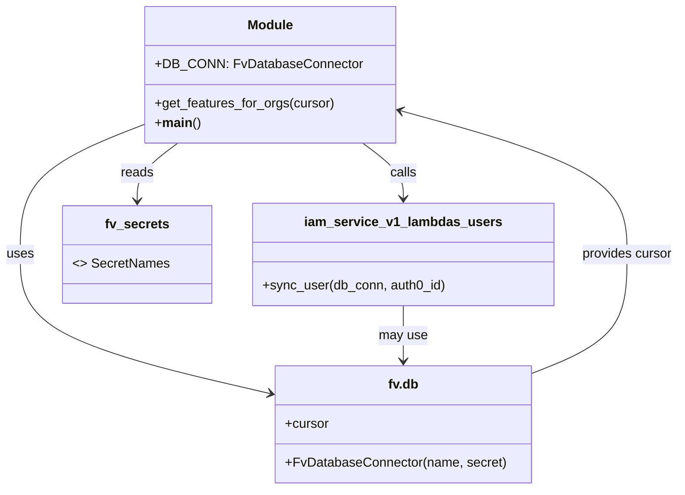
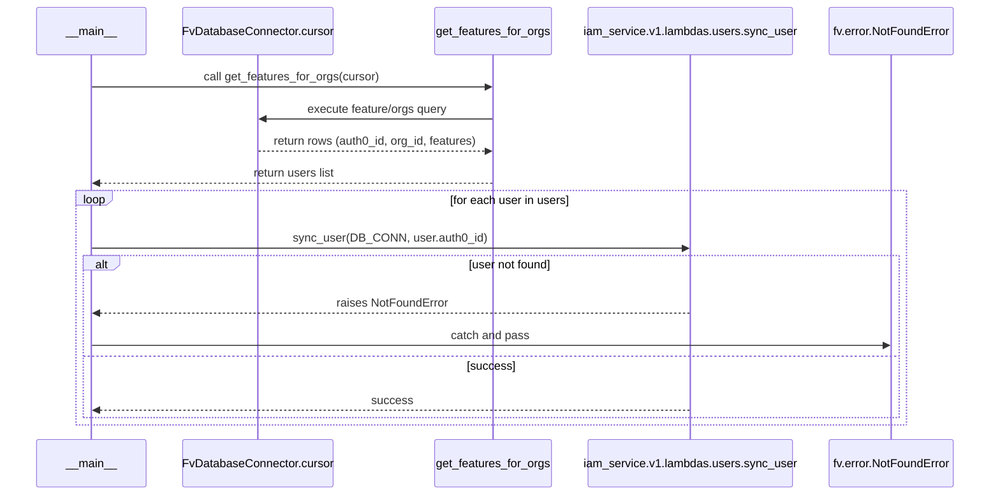

# Diagram: common/iam_service/scripts/add_feature_to_users.py

> Auto-generated by Obscura crawlers

## Diagram 1

### SVG

<svg id="container" width="820.421875" xmlns="http://www.w3.org/2000/svg" class="classDiagram" height="602" viewBox="0 0 820.421875 602" role="graphics-document document" aria-roledescription="class"><g><defs><marker id="container_class-aggregationStart" class="marker aggregation class" refX="18" refY="7" markerWidth="190" markerHeight="240" orient="auto"><path d="M 18,7 L9,13 L1,7 L9,1 Z"></path></marker></defs><defs><marker id="container_class-aggregationEnd" class="marker aggregation class" refX="1" refY="7" markerWidth="20" markerHeight="28" orient="auto"><path d="M 18,7 L9,13 L1,7 L9,1 Z"></path></marker></defs><defs><marker id="container_class-extensionStart" class="marker extension class" refX="18" refY="7" markerWidth="190" markerHeight="240" orient="auto"><path d="M 1,7 L18,13 V 1 Z"></path></marker></defs><defs><marker id="container_class-extensionEnd" class="marker extension class" refX="1" refY="7" markerWidth="20" markerHeight="28" orient="auto"><path d="M 1,1 V 13 L18,7 Z"></path></marker></defs><defs><marker id="container_class-compositionStart" class="marker composition class" refX="18" refY="7" markerWidth="190" markerHeight="240" orient="auto"><path d="M 18,7 L9,13 L1,7 L9,1 Z"></path></marker></defs><defs><marker id="container_class-compositionEnd" class="marker composition class" refX="1" refY="7" markerWidth="20" markerHeight="28" orient="auto"><path d="M 18,7 L9,13 L1,7 L9,1 Z"></path></marker></defs><defs><marker id="container_class-dependencyStart" class="marker dependency class" refX="6" refY="7" markerWidth="190" markerHeight="240" orient="auto"><path d="M 5,7 L9,13 L1,7 L9,1 Z"></path></marker></defs><defs><marker id="container_class-dependencyEnd" class="marker dependency class" refX="13" refY="7" markerWidth="20" markerHeight="28" orient="auto"><path d="M 18,7 L9,13 L14,7 L9,1 Z"></path></marker></defs><defs><marker id="container_class-lollipopStart" class="marker lollipop class" refX="13" refY="7" markerWidth="190" markerHeight="240" orient="auto"><circle stroke="black" fill="transparent" cx="7" cy="7" r="6"></circle></marker></defs><defs><marker id="container_class-lollipopEnd" class="marker lollipop class" refX="1" refY="7" markerWidth="190" markerHeight="240" orient="auto"><circle stroke="black" fill="transparent" cx="7" cy="7" r="6"></circle></marker></defs><g class="root"><g class="clusters"></g><g class="edgePaths"><path d="M177.512,151.157L152.008,161.464C126.505,171.772,75.499,192.386,49.995,219.36C24.492,246.333,24.492,279.667,24.492,313C24.492,346.333,24.492,379.667,74.244,408.145C123.997,436.624,223.501,460.248,273.254,472.061L323.006,483.873" id="id_Module_fv.db_1" class="edge-thickness-normal edge-pattern-solid relation" style=";;;" data-edge="true" data-et="edge" data-id="id_Module_fv.db_1" data-points="W3sieCI6MTc3LjUxMTcxODc1LCJ5IjoxNTEuMTU3MzA5Njc0NDczMjN9LHsieCI6MjQuNDkyMTg3NSwieSI6MjEzfSx7IngiOjI0LjQ5MjE4NzUsInkiOjMxM30seyJ4IjoyNC40OTIxODc1LCJ5Ijo0MTN9LHsieCI6MzI4Ljg0Mzc1LCJ5Ijo0ODUuMjU4NjA0MTEyOTU3NH1d" marker-end="url(#container_class-dependencyEnd)"></path><path d="M434.76,176L442.9,182.167C451.04,188.333,467.319,200.667,475.458,212C483.598,223.333,483.598,233.667,483.598,238.833L483.598,244" id="id_Module_iam_service_v1_lambdas_users_2" class="edge-thickness-normal edge-pattern-solid relation" style=";;;" data-edge="true" data-et="edge" data-id="id_Module_iam_service_v1_lambdas_users_2" data-points="W3sieCI6NDM0Ljc2MDQyNzQyNzY4NTk1LCJ5IjoxNzZ9LHsieCI6NDgzLjU5NzY1NjI1LCJ5IjoyMTN9LHsieCI6NDgzLjU5NzY1NjI1LCJ5IjoyNTB9XQ==" marker-end="url(#container_class-dependencyEnd)"></path><path d="M213.013,176L204.873,182.167C196.734,188.333,180.455,200.667,172.315,212.5C164.176,224.333,164.176,235.667,164.176,241.333L164.176,247" id="id_Module_fv_secrets_3" class="edge-thickness-normal edge-pattern-solid relation" style=";;;" data-edge="true" data-et="edge" data-id="id_Module_fv_secrets_3" data-points="W3sieCI6MjEzLjAxMzAxMDA3MjMxNDA1LCJ5IjoxNzZ9LHsieCI6MTY0LjE3NTc4MTI1LCJ5IjoyMTN9LHsieCI6MTY0LjE3NTc4MTI1LCJ5IjoyNTN9XQ==" marker-end="url(#container_class-dependencyEnd)"></path><path d="M638.352,460.105L657.98,452.254C677.609,444.403,716.867,428.702,736.496,404.184C756.125,379.667,756.125,346.333,756.125,313C756.125,279.667,756.125,246.333,709.444,216.599C662.763,186.864,569.401,160.729,522.72,147.661L476.04,134.593" id="id_fv.db_Module_4" class="edge-thickness-normal edge-pattern-solid relation" style=";;;" data-edge="true" data-et="edge" data-id="id_fv.db_Module_4" data-points="W3sieCI6NjM4LjM1MTU2MjUsInkiOjQ2MC4xMDQ2NDgzMjk0Mzk0NH0seyJ4Ijo3NTYuMTI1LCJ5Ijo0MTN9LHsieCI6NzU2LjEyNSwieSI6MzEzfSx7IngiOjc1Ni4xMjUsInkiOjIxM30seyJ4Ijo0NzAuMjYxNzE4NzUsInkiOjEzMi45NzU5NTE4NDk0NzU0fV0=" marker-end="url(#container_class-dependencyEnd)"></path><path d="M483.598,376L483.598,382.167C483.598,388.333,483.598,400.667,483.598,412C483.598,423.333,483.598,433.667,483.598,438.833L483.598,444" id="id_iam_service_v1_lambdas_users_fv.db_5" class="edge-thickness-normal edge-pattern-solid relation" style=";;;" data-edge="true" data-et="edge" data-id="id_iam_service_v1_lambdas_users_fv.db_5" data-points="W3sieCI6NDgzLjU5NzY1NjI1LCJ5IjozNzZ9LHsieCI6NDgzLjU5NzY1NjI1LCJ5Ijo0MTN9LHsieCI6NDgzLjU5NzY1NjI1LCJ5Ijo0NTB9XQ==" marker-end="url(#container_class-dependencyEnd)"></path></g><g class="edgeLabels"><g class="edgeLabel" transform="translate(24.4921875, 313)"><g class="label" data-id="id_Module_fv.db_1" transform="translate(-16.4921875, -12)"><foreignObject width="32.984375" height="24">

uses

</foreignObject></g></g><g class="edgeLabel" transform="translate(483.59765625, 213)"><g class="label" data-id="id_Module_iam_service_v1_lambdas_users_2" transform="translate(-16.4453125, -12)"><foreignObject width="32.890625" height="24">

calls

</foreignObject></g></g><g class="edgeLabel" transform="translate(164.17578125, 213)"><g class="label" data-id="id_Module_fv_secrets_3" transform="translate(-20.0078125, -12)"><foreignObject width="40.015625" height="24">

reads

</foreignObject></g></g><g class="edgeLabel" transform="translate(756.125, 313)"><g class="label" data-id="id_fv.db_Module_4" transform="translate(-56.296875, -12)"><foreignObject width="112.59375" height="24">

provides cursor

</foreignObject></g></g><g class="edgeLabel" transform="translate(483.59765625, 413)"><g class="label" data-id="id_iam_service_v1_lambdas_users_fv.db_5" transform="translate(-29.8984375, -12)"><foreignObject width="59.796875" height="24">

may use

</foreignObject></g></g></g><g class="nodes"><g class="node default" id="classId-Module-0" transform="translate(323.88671875, 92)"><g class="basic label-container"><path d="M-146.375 -84 L146.375 -84 L146.375 84 L-146.375 84" stroke="none" stroke-width="0" fill="#ECECFF" style=""></path><path d="M-146.375 -84 C-49.28182702200502 -84, 47.811345955989964 -84, 146.375 -84 M-146.375 -84 C-49.373479387093724 -84, 47.62804122581255 -84, 146.375 -84 M146.375 -84 C146.375 -35.46460817536459, 146.375 13.070783649270822, 146.375 84 M146.375 -84 C146.375 -31.061383602311963, 146.375 21.877232795376074, 146.375 84 M146.375 84 C72.90614230960908 84, -0.5627153807818388 84, -146.375 84 M146.375 84 C37.35978422892862 84, -71.65543154214276 84, -146.375 84 M-146.375 84 C-146.375 48.274485204672466, -146.375 12.548970409344932, -146.375 -84 M-146.375 84 C-146.375 47.2871921192673, -146.375 10.574384238534606, -146.375 -84" stroke="#9370DB" stroke-width="1.3" fill="none" stroke-dasharray="0 0" style=""></path></g><g class="annotation-group text" transform="translate(0, -60)"></g><g class="label-group text" transform="translate(-27.09375, -60)"><g class="label" style="font-weight: bolder" transform="translate(0,-12)"><foreignObject width="54.1875" height="24">

Module

</foreignObject></g></g><g class="members-group text" transform="translate(-134.375, -12)"><g class="label" style="" transform="translate(0,-12)"><foreignObject width="241.65625" height="24">

+DB_CONN: FvDatabaseConnector

</foreignObject></g></g><g class="methods-group text" transform="translate(-134.375, 36)"><g class="label" style="" transform="translate(0,-12)"><foreignObject width="220.171875" height="24">

+get_features_for_orgs(cursor)

</foreignObject></g><g class="label" style="" transform="translate(0,12)"><foreignObject width="54.40625" height="24">

+<strong>main</strong>()

</foreignObject></g></g><g class="divider" style=""><path d="M-146.375 -36 C-79.05427275904697 -36, -11.733545518093933 -36, 146.375 -36 M-146.375 -36 C-59.33579507686515 -36, 27.703409846269693 -36, 146.375 -36" stroke="#9370DB" stroke-width="1.3" fill="none" stroke-dasharray="0 0" style=""></path></g><g class="divider" style=""><path d="M-146.375 12 C-55.81587242523098 12, 34.743255149538044 12, 146.375 12 M-146.375 12 C-36.16910515180382 12, 74.03678969639236 12, 146.375 12" stroke="#9370DB" stroke-width="1.3" fill="none" stroke-dasharray="0 0" style=""></path></g></g><g class="node default" id="classId-fv.db-1" transform="translate(483.59765625, 522)"><g class="basic label-container"><path d="M-154.75390625 -72 L154.75390625 -72 L154.75390625 72 L-154.75390625 72" stroke="none" stroke-width="0" fill="#ECECFF" style=""></path><path d="M-154.75390625 -72 C-72.95466667990358 -72, 8.844572890192836 -72, 154.75390625 -72 M-154.75390625 -72 C-81.11459311389662 -72, -7.475279977793235 -72, 154.75390625 -72 M154.75390625 -72 C154.75390625 -28.38794719648604, 154.75390625 15.224105607027923, 154.75390625 72 M154.75390625 -72 C154.75390625 -14.91888341846304, 154.75390625 42.16223316307392, 154.75390625 72 M154.75390625 72 C38.23613958908531 72, -78.28162707182938 72, -154.75390625 72 M154.75390625 72 C31.37550396859497 72, -92.00289831281006 72, -154.75390625 72 M-154.75390625 72 C-154.75390625 37.84567770936802, -154.75390625 3.6913554187360376, -154.75390625 -72 M-154.75390625 72 C-154.75390625 27.551161670321726, -154.75390625 -16.89767665935655, -154.75390625 -72" stroke="#9370DB" stroke-width="1.3" fill="none" stroke-dasharray="0 0" style=""></path></g><g class="annotation-group text" transform="translate(0, -48)"></g><g class="label-group text" transform="translate(-18.0546875, -48)"><g class="label" style="font-weight: bolder" transform="translate(0,-12)"><foreignObject width="36.109375" height="24">

fv.db

</foreignObject></g></g><g class="members-group text" transform="translate(-142.75390625, 0)"><g class="label" style="" transform="translate(0,-12)"><foreignObject width="53.71875" height="24">

+cursor

</foreignObject></g></g><g class="methods-group text" transform="translate(-142.75390625, 48)"><g class="label" style="" transform="translate(0,-12)"><foreignObject width="267.453125" height="24">

+FvDatabaseConnector(name, secret)

</foreignObject></g></g><g class="divider" style=""><path d="M-154.75390625 -24 C-74.22795949840717 -24, 6.297987253185653 -24, 154.75390625 -24 M-154.75390625 -24 C-54.260067254820996 -24, 46.23377174035801 -24, 154.75390625 -24" stroke="#9370DB" stroke-width="1.3" fill="none" stroke-dasharray="0 0" style=""></path></g><g class="divider" style=""><path d="M-154.75390625 24 C-31.839559139437455 24, 91.07478797112509 24, 154.75390625 24 M-154.75390625 24 C-41.03373573370085 24, 72.6864347825983 24, 154.75390625 24" stroke="#9370DB" stroke-width="1.3" fill="none" stroke-dasharray="0 0" style=""></path></g></g><g class="node default" id="classId-iam_service_v1_lambdas_users-2" transform="translate(483.59765625, 313)"><g class="basic label-container"><path d="M-181.23046875 -63 L181.23046875 -63 L181.23046875 63 L-181.23046875 63" stroke="none" stroke-width="0" fill="#ECECFF" style=""></path><path d="M-181.23046875 -63 C-57.939770638393824 -63, 65.35092747321235 -63, 181.23046875 -63 M-181.23046875 -63 C-107.31059629317836 -63, -33.39072383635673 -63, 181.23046875 -63 M181.23046875 -63 C181.23046875 -31.26468103675992, 181.23046875 0.47063792648015834, 181.23046875 63 M181.23046875 -63 C181.23046875 -28.174265605927225, 181.23046875 6.65146878814555, 181.23046875 63 M181.23046875 63 C39.587570205700075 63, -102.05532833859985 63, -181.23046875 63 M181.23046875 63 C95.45783438413567 63, 9.685200018271331 63, -181.23046875 63 M-181.23046875 63 C-181.23046875 12.787190344610288, -181.23046875 -37.425619310779425, -181.23046875 -63 M-181.23046875 63 C-181.23046875 13.617866645048665, -181.23046875 -35.76426670990267, -181.23046875 -63" stroke="#9370DB" stroke-width="1.3" fill="none" stroke-dasharray="0 0" style=""></path></g><g class="annotation-group text" transform="translate(0, -39)"></g><g class="label-group text" transform="translate(-114.0546875, -39)"><g class="label" style="font-weight: bolder" transform="translate(0,-12)"><foreignObject width="228.109375" height="24">

iam_service_v1_lambdas_users

</foreignObject></g></g><g class="members-group text" transform="translate(-169.23046875, 9)"></g><g class="methods-group text" transform="translate(-169.23046875, 39)"><g class="label" style="" transform="translate(0,-12)"><foreignObject width="224.40625" height="24">

+sync_user(db_conn, auth0_id)

</foreignObject></g></g><g class="divider" style=""><path d="M-181.23046875 -15 C-53.15507732592516 -15, 74.92031409814967 -15, 181.23046875 -15 M-181.23046875 -15 C-101.27045517577403 -15, -21.310441601548064 -15, 181.23046875 -15" stroke="#9370DB" stroke-width="1.3" fill="none" stroke-dasharray="0 0" style=""></path></g><g class="divider" style=""><path d="M-181.23046875 9 C-96.11641050569058 9, -11.002352261381162 9, 181.23046875 9 M-181.23046875 9 C-48.902862395947835 9, 83.42474395810433 9, 181.23046875 9" stroke="#9370DB" stroke-width="1.3" fill="none" stroke-dasharray="0 0" style=""></path></g></g><g class="node default" id="classId-fv_secrets-3" transform="translate(164.17578125, 313)"><g class="basic label-container"><path d="M-88.19140625 -60 L88.19140625 -60 L88.19140625 60 L-88.19140625 60" stroke="none" stroke-width="0" fill="#ECECFF" style=""></path><path d="M-88.19140625 -60 C-24.697930368215495 -60, 38.79554551356901 -60, 88.19140625 -60 M-88.19140625 -60 C-50.20244596131931 -60, -12.213485672638626 -60, 88.19140625 -60 M88.19140625 -60 C88.19140625 -23.672300611920306, 88.19140625 12.655398776159387, 88.19140625 60 M88.19140625 -60 C88.19140625 -24.98395405006608, 88.19140625 10.032091899867837, 88.19140625 60 M88.19140625 60 C24.945440297494876 60, -38.30052565501025 60, -88.19140625 60 M88.19140625 60 C20.52210991301105 60, -47.1471864239779 60, -88.19140625 60 M-88.19140625 60 C-88.19140625 24.081163819503608, -88.19140625 -11.837672360992784, -88.19140625 -60 M-88.19140625 60 C-88.19140625 30.467113277586872, -88.19140625 0.9342265551737441, -88.19140625 -60" stroke="#9370DB" stroke-width="1.3" fill="none" stroke-dasharray="0 0" style=""></path></g><g class="annotation-group text" transform="translate(0, -36)"></g><g class="label-group text" transform="translate(-37.3203125, -36)"><g class="label" style="font-weight: bolder" transform="translate(0,-12)"><foreignObject width="74.640625" height="24">

fv_secrets

</foreignObject></g></g><g class="members-group text" transform="translate(-76.19140625, 12)"><g class="label" style="" transform="translate(0,-12)"><foreignObject width="115.0625" height="24">

&lt;&gt; SecretNames

</foreignObject></g></g><g class="methods-group text" transform="translate(-76.19140625, 60)"></g><g class="divider" style=""><path d="M-88.19140625 -12 C-39.33245988561587 -12, 9.526486478768263 -12, 88.19140625 -12 M-88.19140625 -12 C-50.62076698231184 -12, -13.050127714623684 -12, 88.19140625 -12" stroke="#9370DB" stroke-width="1.3" fill="none" stroke-dasharray="0 0" style=""></path></g><g class="divider" style=""><path d="M-88.19140625 36 C-36.00772138921267 36, 16.17596347157466 36, 88.19140625 36 M-88.19140625 36 C-18.485432702175046 36, 51.22054084564991 36, 88.19140625 36" stroke="#9370DB" stroke-width="1.3" fill="none" stroke-dasharray="0 0" style=""></path></g></g></g></g></g></svg>

## Diagram 2

### SVG

<svg id="container" width="1447" xmlns="http://www.w3.org/2000/svg" height="710" viewBox="-50 -10 1447 710" role="graphics-document document" aria-roledescription="sequence"><g><rect x="1164" y="624" fill="#eaeaea" stroke="#666" width="183" height="65" name="Error" rx="3" ry="3" class="actor actor-bottom"></rect><text x="1255.5" y="656.5" dominant-baseline="central" alignment-baseline="central" class="actor actor-box" style="text-anchor: middle; font-size: 16px; font-weight: 400;"><tspan x="1255.5" dy="0">fv.error.NotFoundError</tspan></text></g><g><rect x="805" y="624" fill="#eaeaea" stroke="#666" width="309" height="65" name="UserSync" rx="3" ry="3" class="actor actor-bottom"></rect><text x="959.5" y="656.5" dominant-baseline="central" alignment-baseline="central" class="actor actor-box" style="text-anchor: middle; font-size: 16px; font-weight: 400;"><tspan x="959.5" dy="0">iam_service.v1.lambdas.users.sync_user</tspan></text></g><g><rect x="579" y="624" fill="#eaeaea" stroke="#666" width="176" height="65" name="SQL" rx="3" ry="3" class="actor actor-bottom"></rect><text x="667" y="656.5" dominant-baseline="central" alignment-baseline="central" class="actor actor-box" style="text-anchor: middle; font-size: 16px; font-weight: 400;"><tspan x="667" dy="0">get_features_for_orgs</tspan></text></g><g><rect x="200" y="624" fill="#eaeaea" stroke="#666" width="226" height="65" name="DB" rx="3" ry="3" class="actor actor-bottom"></rect><text x="313" y="656.5" dominant-baseline="central" alignment-baseline="central" class="actor actor-box" style="text-anchor: middle; font-size: 16px; font-weight: 400;"><tspan x="313" dy="0">FvDatabaseConnector.cursor</tspan></text></g><g><rect x="0" y="624" fill="#eaeaea" stroke="#666" width="150" height="65" name="Main" rx="3" ry="3" class="actor actor-bottom"></rect><text x="75" y="656.5" dominant-baseline="central" alignment-baseline="central" class="actor actor-box" style="text-anchor: middle; font-size: 16px; font-weight: 400;"><tspan x="75" dy="0">__main__</tspan></text></g><g><line id="actor4" x1="1255.5" y1="65" x2="1255.5" y2="624" class="actor-line 200" stroke-width="0.5px" stroke="#999" name="Error"></line><g id="root-4"><rect x="1164" y="0" fill="#eaeaea" stroke="#666" width="183" height="65" name="Error" rx="3" ry="3" class="actor actor-top"></rect><text x="1255.5" y="32.5" dominant-baseline="central" alignment-baseline="central" class="actor actor-box" style="text-anchor: middle; font-size: 16px; font-weight: 400;"><tspan x="1255.5" dy="0">fv.error.NotFoundError</tspan></text></g></g><g><line id="actor3" x1="959.5" y1="65" x2="959.5" y2="624" class="actor-line 200" stroke-width="0.5px" stroke="#999" name="UserSync"></line><g id="root-3"><rect x="805" y="0" fill="#eaeaea" stroke="#666" width="309" height="65" name="UserSync" rx="3" ry="3" class="actor actor-top"></rect><text x="959.5" y="32.5" dominant-baseline="central" alignment-baseline="central" class="actor actor-box" style="text-anchor: middle; font-size: 16px; font-weight: 400;"><tspan x="959.5" dy="0">iam_service.v1.lambdas.users.sync_user</tspan></text></g></g><g><line id="actor2" x1="667" y1="65" x2="667" y2="624" class="actor-line 200" stroke-width="0.5px" stroke="#999" name="SQL"></line><g id="root-2"><rect x="579" y="0" fill="#eaeaea" stroke="#666" width="176" height="65" name="SQL" rx="3" ry="3" class="actor actor-top"></rect><text x="667" y="32.5" dominant-baseline="central" alignment-baseline="central" class="actor actor-box" style="text-anchor: middle; font-size: 16px; font-weight: 400;"><tspan x="667" dy="0">get_features_for_orgs</tspan></text></g></g><g><line id="actor1" x1="313" y1="65" x2="313" y2="624" class="actor-line 200" stroke-width="0.5px" stroke="#999" name="DB"></line><g id="root-1"><rect x="200" y="0" fill="#eaeaea" stroke="#666" width="226" height="65" name="DB" rx="3" ry="3" class="actor actor-top"></rect><text x="313" y="32.5" dominant-baseline="central" alignment-baseline="central" class="actor actor-box" style="text-anchor: middle; font-size: 16px; font-weight: 400;"><tspan x="313" dy="0">FvDatabaseConnector.cursor</tspan></text></g></g><g><line id="actor0" x1="75" y1="65" x2="75" y2="624" class="actor-line 200" stroke-width="0.5px" stroke="#999" name="Main"></line><g id="root-0"><rect x="0" y="0" fill="#eaeaea" stroke="#666" width="150" height="65" name="Main" rx="3" ry="3" class="actor actor-top"></rect><text x="75" y="32.5" dominant-baseline="central" alignment-baseline="central" class="actor actor-box" style="text-anchor: middle; font-size: 16px; font-weight: 400;"><tspan x="75" dy="0">__main__</tspan></text></g></g><g></g><defs><symbol id="computer" width="24" height="24"><path transform="scale(.5)" d="M2 2v13h20v-13h-20zm18 11h-16v-9h16v9zm-10.228 6l.466-1h3.524l.467 1h-4.457zm14.228 3h-24l2-6h2.104l-1.33 4h18.45l-1.297-4h2.073l2 6zm-5-10h-14v-7h14v7z"></path></symbol></defs><defs><symbol id="database" fill-rule="evenodd" clip-rule="evenodd"><path transform="scale(.5)" d="M12.258.001l.256.004.255.005.253.008.251.01.249.012.247.015.246.016.242.019.241.02.239.023.236.024.233.027.231.028.229.031.225.032.223.034.22.036.217.038.214.04.211.041.208.043.205.045.201.046.198.048.194.05.191.051.187.053.183.054.18.056.175.057.172.059.168.06.163.061.16.063.155.064.15.066.074.033.073.033.071.034.07.034.069.035.068.035.067.035.066.035.064.036.064.036.062.036.06.036.06.037.058.037.058.037.055.038.055.038.053.038.052.038.051.039.05.039.048.039.047.039.045.04.044.04.043.04.041.04.04.041.039.041.037.041.036.041.034.041.033.042.032.042.03.042.029.042.027.042.026.043.024.043.023.043.021.043.02.043.018.044.017.043.015.044.013.044.012.044.011.045.009.044.007.045.006.045.004.045.002.045.001.045v17l-.001.045-.002.045-.004.045-.006.045-.007.045-.009.044-.011.045-.012.044-.013.044-.015.044-.017.043-.018.044-.02.043-.021.043-.023.043-.024.043-.026.043-.027.042-.029.042-.03.042-.032.042-.033.042-.034.041-.036.041-.037.041-.039.041-.04.041-.041.04-.043.04-.044.04-.045.04-.047.039-.048.039-.05.039-.051.039-.052.038-.053.038-.055.038-.055.038-.058.037-.058.037-.06.037-.06.036-.062.036-.064.036-.064.036-.066.035-.067.035-.068.035-.069.035-.07.034-.071.034-.073.033-.074.033-.15.066-.155.064-.16.063-.163.061-.168.06-.172.059-.175.057-.18.056-.183.054-.187.053-.191.051-.194.05-.198.048-.201.046-.205.045-.208.043-.211.041-.214.04-.217.038-.22.036-.223.034-.225.032-.229.031-.231.028-.233.027-.236.024-.239.023-.241.02-.242.019-.246.016-.247.015-.249.012-.251.01-.253.008-.255.005-.256.004-.258.001-.258-.001-.256-.004-.255-.005-.253-.008-.251-.01-.249-.012-.247-.015-.245-.016-.243-.019-.241-.02-.238-.023-.236-.024-.234-.027-.231-.028-.228-.031-.226-.032-.223-.034-.22-.036-.217-.038-.214-.04-.211-.041-.208-.043-.204-.045-.201-.046-.198-.048-.195-.05-.19-.051-.187-.053-.184-.054-.179-.056-.176-.057-.172-.059-.167-.06-.164-.061-.159-.063-.155-.064-.151-.066-.074-.033-.072-.033-.072-.034-.07-.034-.069-.035-.068-.035-.067-.035-.066-.035-.064-.036-.063-.036-.062-.036-.061-.036-.06-.037-.058-.037-.057-.037-.056-.038-.055-.038-.053-.038-.052-.038-.051-.039-.049-.039-.049-.039-.046-.039-.046-.04-.044-.04-.043-.04-.041-.04-.04-.041-.039-.041-.037-.041-.036-.041-.034-.041-.033-.042-.032-.042-.03-.042-.029-.042-.027-.042-.026-.043-.024-.043-.023-.043-.021-.043-.02-.043-.018-.044-.017-.043-.015-.044-.013-.044-.012-.044-.011-.045-.009-.044-.007-.045-.006-.045-.004-.045-.002-.045-.001-.045v-17l.001-.045.002-.045.004-.045.006-.045.007-.045.009-.044.011-.045.012-.044.013-.044.015-.044.017-.043.018-.044.02-.043.021-.043.023-.043.024-.043.026-.043.027-.042.029-.042.03-.042.032-.042.033-.042.034-.041.036-.041.037-.041.039-.041.04-.041.041-.04.043-.04.044-.04.046-.04.046-.039.049-.039.049-.039.051-.039.052-.038.053-.038.055-.038.056-.038.057-.037.058-.037.06-.037.061-.036.062-.036.063-.036.064-.036.066-.035.067-.035.068-.035.069-.035.07-.034.072-.034.072-.033.074-.033.151-.066.155-.064.159-.063.164-.061.167-.06.172-.059.176-.057.179-.056.184-.054.187-.053.19-.051.195-.05.198-.048.201-.046.204-.045.208-.043.211-.041.214-.04.217-.038.22-.036.223-.034.226-.032.228-.031.231-.028.234-.027.236-.024.238-.023.241-.02.243-.019.245-.016.247-.015.249-.012.251-.01.253-.008.255-.005.256-.004.258-.001.258.001zm-9.258 20.499v.01l.001.021.003.021.004.022.005.021.006.022.007.022.009.023.01.022.011.023.012.023.013.023.015.023.016.024.017.023.018.024.019.024.021.024.022.025.023.024.024.025.052.049.056.05.061.051.066.051.07.051.075.051.079.052.084.052.088.052.092.052.097.052.102.051.105.052.11.052.114.051.119.051.123.051.127.05.131.05.135.05.139.048.144.049.147.047.152.047.155.047.16.045.163.045.167.043.171.043.176.041.178.041.183.039.187.039.19.037.194.035.197.035.202.033.204.031.209.03.212.029.216.027.219.025.222.024.226.021.23.02.233.018.236.016.24.015.243.012.246.01.249.008.253.005.256.004.259.001.26-.001.257-.004.254-.005.25-.008.247-.011.244-.012.241-.014.237-.016.233-.018.231-.021.226-.021.224-.024.22-.026.216-.027.212-.028.21-.031.205-.031.202-.034.198-.034.194-.036.191-.037.187-.039.183-.04.179-.04.175-.042.172-.043.168-.044.163-.045.16-.046.155-.046.152-.047.148-.048.143-.049.139-.049.136-.05.131-.05.126-.05.123-.051.118-.052.114-.051.11-.052.106-.052.101-.052.096-.052.092-.052.088-.053.083-.051.079-.052.074-.052.07-.051.065-.051.06-.051.056-.05.051-.05.023-.024.023-.025.021-.024.02-.024.019-.024.018-.024.017-.024.015-.023.014-.024.013-.023.012-.023.01-.023.01-.022.008-.022.006-.022.006-.022.004-.022.004-.021.001-.021.001-.021v-4.127l-.077.055-.08.053-.083.054-.085.053-.087.052-.09.052-.093.051-.095.05-.097.05-.1.049-.102.049-.105.048-.106.047-.109.047-.111.046-.114.045-.115.045-.118.044-.12.043-.122.042-.124.042-.126.041-.128.04-.13.04-.132.038-.134.038-.135.037-.138.037-.139.035-.142.035-.143.034-.144.033-.147.032-.148.031-.15.03-.151.03-.153.029-.154.027-.156.027-.158.026-.159.025-.161.024-.162.023-.163.022-.165.021-.166.02-.167.019-.169.018-.169.017-.171.016-.173.015-.173.014-.175.013-.175.012-.177.011-.178.01-.179.008-.179.008-.181.006-.182.005-.182.004-.184.003-.184.002h-.37l-.184-.002-.184-.003-.182-.004-.182-.005-.181-.006-.179-.008-.179-.008-.178-.01-.176-.011-.176-.012-.175-.013-.173-.014-.172-.015-.171-.016-.17-.017-.169-.018-.167-.019-.166-.02-.165-.021-.163-.022-.162-.023-.161-.024-.159-.025-.157-.026-.156-.027-.155-.027-.153-.029-.151-.03-.15-.03-.148-.031-.146-.032-.145-.033-.143-.034-.141-.035-.14-.035-.137-.037-.136-.037-.134-.038-.132-.038-.13-.04-.128-.04-.126-.041-.124-.042-.122-.042-.12-.044-.117-.043-.116-.045-.113-.045-.112-.046-.109-.047-.106-.047-.105-.048-.102-.049-.1-.049-.097-.05-.095-.05-.093-.052-.09-.051-.087-.052-.085-.053-.083-.054-.08-.054-.077-.054v4.127zm0-5.654v.011l.001.021.003.021.004.021.005.022.006.022.007.022.009.022.01.022.011.023.012.023.013.023.015.024.016.023.017.024.018.024.019.024.021.024.022.024.023.025.024.024.052.05.056.05.061.05.066.051.07.051.075.052.079.051.084.052.088.052.092.052.097.052.102.052.105.052.11.051.114.051.119.052.123.05.127.051.131.05.135.049.139.049.144.048.147.048.152.047.155.046.16.045.163.045.167.044.171.042.176.042.178.04.183.04.187.038.19.037.194.036.197.034.202.033.204.032.209.03.212.028.216.027.219.025.222.024.226.022.23.02.233.018.236.016.24.014.243.012.246.01.249.008.253.006.256.003.259.001.26-.001.257-.003.254-.006.25-.008.247-.01.244-.012.241-.015.237-.016.233-.018.231-.02.226-.022.224-.024.22-.025.216-.027.212-.029.21-.03.205-.032.202-.033.198-.035.194-.036.191-.037.187-.039.183-.039.179-.041.175-.042.172-.043.168-.044.163-.045.16-.045.155-.047.152-.047.148-.048.143-.048.139-.05.136-.049.131-.05.126-.051.123-.051.118-.051.114-.052.11-.052.106-.052.101-.052.096-.052.092-.052.088-.052.083-.052.079-.052.074-.051.07-.052.065-.051.06-.05.056-.051.051-.049.023-.025.023-.024.021-.025.02-.024.019-.024.018-.024.017-.024.015-.023.014-.023.013-.024.012-.022.01-.023.01-.023.008-.022.006-.022.006-.022.004-.021.004-.022.001-.021.001-.021v-4.139l-.077.054-.08.054-.083.054-.085.052-.087.053-.09.051-.093.051-.095.051-.097.05-.1.049-.102.049-.105.048-.106.047-.109.047-.111.046-.114.045-.115.044-.118.044-.12.044-.122.042-.124.042-.126.041-.128.04-.13.039-.132.039-.134.038-.135.037-.138.036-.139.036-.142.035-.143.033-.144.033-.147.033-.148.031-.15.03-.151.03-.153.028-.154.028-.156.027-.158.026-.159.025-.161.024-.162.023-.163.022-.165.021-.166.02-.167.019-.169.018-.169.017-.171.016-.173.015-.173.014-.175.013-.175.012-.177.011-.178.009-.179.009-.179.007-.181.007-.182.005-.182.004-.184.003-.184.002h-.37l-.184-.002-.184-.003-.182-.004-.182-.005-.181-.007-.179-.007-.179-.009-.178-.009-.176-.011-.176-.012-.175-.013-.173-.014-.172-.015-.171-.016-.17-.017-.169-.018-.167-.019-.166-.02-.165-.021-.163-.022-.162-.023-.161-.024-.159-.025-.157-.026-.156-.027-.155-.028-.153-.028-.151-.03-.15-.03-.148-.031-.146-.033-.145-.033-.143-.033-.141-.035-.14-.036-.137-.036-.136-.037-.134-.038-.132-.039-.13-.039-.128-.04-.126-.041-.124-.042-.122-.043-.12-.043-.117-.044-.116-.044-.113-.046-.112-.046-.109-.046-.106-.047-.105-.048-.102-.049-.1-.049-.097-.05-.095-.051-.093-.051-.09-.051-.087-.053-.085-.052-.083-.054-.08-.054-.077-.054v4.139zm0-5.666v.011l.001.02.003.022.004.021.005.022.006.021.007.022.009.023.01.022.011.023.012.023.013.023.015.023.016.024.017.024.018.023.019.024.021.025.022.024.023.024.024.025.052.05.056.05.061.05.066.051.07.051.075.052.079.051.084.052.088.052.092.052.097.052.102.052.105.051.11.052.114.051.119.051.123.051.127.05.131.05.135.05.139.049.144.048.147.048.152.047.155.046.16.045.163.045.167.043.171.043.176.042.178.04.183.04.187.038.19.037.194.036.197.034.202.033.204.032.209.03.212.028.216.027.219.025.222.024.226.021.23.02.233.018.236.017.24.014.243.012.246.01.249.008.253.006.256.003.259.001.26-.001.257-.003.254-.006.25-.008.247-.01.244-.013.241-.014.237-.016.233-.018.231-.02.226-.022.224-.024.22-.025.216-.027.212-.029.21-.03.205-.032.202-.033.198-.035.194-.036.191-.037.187-.039.183-.039.179-.041.175-.042.172-.043.168-.044.163-.045.16-.045.155-.047.152-.047.148-.048.143-.049.139-.049.136-.049.131-.051.126-.05.123-.051.118-.052.114-.051.11-.052.106-.052.101-.052.096-.052.092-.052.088-.052.083-.052.079-.052.074-.052.07-.051.065-.051.06-.051.056-.05.051-.049.023-.025.023-.025.021-.024.02-.024.019-.024.018-.024.017-.024.015-.023.014-.024.013-.023.012-.023.01-.022.01-.023.008-.022.006-.022.006-.022.004-.022.004-.021.001-.021.001-.021v-4.153l-.077.054-.08.054-.083.053-.085.053-.087.053-.09.051-.093.051-.095.051-.097.05-.1.049-.102.048-.105.048-.106.048-.109.046-.111.046-.114.046-.115.044-.118.044-.12.043-.122.043-.124.042-.126.041-.128.04-.13.039-.132.039-.134.038-.135.037-.138.036-.139.036-.142.034-.143.034-.144.033-.147.032-.148.032-.15.03-.151.03-.153.028-.154.028-.156.027-.158.026-.159.024-.161.024-.162.023-.163.023-.165.021-.166.02-.167.019-.169.018-.169.017-.171.016-.173.015-.173.014-.175.013-.175.012-.177.01-.178.01-.179.009-.179.007-.181.006-.182.006-.182.004-.184.003-.184.001-.185.001-.185-.001-.184-.001-.184-.003-.182-.004-.182-.006-.181-.006-.179-.007-.179-.009-.178-.01-.176-.01-.176-.012-.175-.013-.173-.014-.172-.015-.171-.016-.17-.017-.169-.018-.167-.019-.166-.02-.165-.021-.163-.023-.162-.023-.161-.024-.159-.024-.157-.026-.156-.027-.155-.028-.153-.028-.151-.03-.15-.03-.148-.032-.146-.032-.145-.033-.143-.034-.141-.034-.14-.036-.137-.036-.136-.037-.134-.038-.132-.039-.13-.039-.128-.041-.126-.041-.124-.041-.122-.043-.12-.043-.117-.044-.116-.044-.113-.046-.112-.046-.109-.046-.106-.048-.105-.048-.102-.048-.1-.05-.097-.049-.095-.051-.093-.051-.09-.052-.087-.052-.085-.053-.083-.053-.08-.054-.077-.054v4.153zm8.74-8.179l-.257.004-.254.005-.25.008-.247.011-.244.012-.241.014-.237.016-.233.018-.231.021-.226.022-.224.023-.22.026-.216.027-.212.028-.21.031-.205.032-.202.033-.198.034-.194.036-.191.038-.187.038-.183.04-.179.041-.175.042-.172.043-.168.043-.163.045-.16.046-.155.046-.152.048-.148.048-.143.048-.139.049-.136.05-.131.05-.126.051-.123.051-.118.051-.114.052-.11.052-.106.052-.101.052-.096.052-.092.052-.088.052-.083.052-.079.052-.074.051-.07.052-.065.051-.06.05-.056.05-.051.05-.023.025-.023.024-.021.024-.02.025-.019.024-.018.024-.017.023-.015.024-.014.023-.013.023-.012.023-.01.023-.01.022-.008.022-.006.023-.006.021-.004.022-.004.021-.001.021-.001.021.001.021.001.021.004.021.004.022.006.021.006.023.008.022.01.022.01.023.012.023.013.023.014.023.015.024.017.023.018.024.019.024.02.025.021.024.023.024.023.025.051.05.056.05.06.05.065.051.07.052.074.051.079.052.083.052.088.052.092.052.096.052.101.052.106.052.11.052.114.052.118.051.123.051.126.051.131.05.136.05.139.049.143.048.148.048.152.048.155.046.16.046.163.045.168.043.172.043.175.042.179.041.183.04.187.038.191.038.194.036.198.034.202.033.205.032.21.031.212.028.216.027.22.026.224.023.226.022.231.021.233.018.237.016.241.014.244.012.247.011.25.008.254.005.257.004.26.001.26-.001.257-.004.254-.005.25-.008.247-.011.244-.012.241-.014.237-.016.233-.018.231-.021.226-.022.224-.023.22-.026.216-.027.212-.028.21-.031.205-.032.202-.033.198-.034.194-.036.191-.038.187-.038.183-.04.179-.041.175-.042.172-.043.168-.043.163-.045.16-.046.155-.046.152-.048.148-.048.143-.048.139-.049.136-.05.131-.05.126-.051.123-.051.118-.051.114-.052.11-.052.106-.052.101-.052.096-.052.092-.052.088-.052.083-.052.079-.052.074-.051.07-.052.065-.051.06-.05.056-.05.051-.05.023-.025.023-.024.021-.024.02-.025.019-.024.018-.024.017-.023.015-.024.014-.023.013-.023.012-.023.01-.023.01-.022.008-.022.006-.023.006-.021.004-.022.004-.021.001-.021.001-.021-.001-.021-.001-.021-.004-.021-.004-.022-.006-.021-.006-.023-.008-.022-.01-.022-.01-.023-.012-.023-.013-.023-.014-.023-.015-.024-.017-.023-.018-.024-.019-.024-.02-.025-.021-.024-.023-.024-.023-.025-.051-.05-.056-.05-.06-.05-.065-.051-.07-.052-.074-.051-.079-.052-.083-.052-.088-.052-.092-.052-.096-.052-.101-.052-.106-.052-.11-.052-.114-.052-.118-.051-.123-.051-.126-.051-.131-.05-.136-.05-.139-.049-.143-.048-.148-.048-.152-.048-.155-.046-.16-.046-.163-.045-.168-.043-.172-.043-.175-.042-.179-.041-.183-.04-.187-.038-.191-.038-.194-.036-.198-.034-.202-.033-.205-.032-.21-.031-.212-.028-.216-.027-.22-.026-.224-.023-.226-.022-.231-.021-.233-.018-.237-.016-.241-.014-.244-.012-.247-.011-.25-.008-.254-.005-.257-.004-.26-.001-.26.001z"></path></symbol></defs><defs><symbol id="clock" width="24" height="24"><path transform="scale(.5)" d="M12 2c5.514 0 10 4.486 10 10s-4.486 10-10 10-10-4.486-10-10 4.486-10 10-10zm0-2c-6.627 0-12 5.373-12 12s5.373 12 12 12 12-5.373 12-12-5.373-12-12-12zm5.848 12.459c.202.038.202.333.001.372-1.907.361-6.045 1.111-6.547 1.111-.719 0-1.301-.582-1.301-1.301 0-.512.77-5.447 1.125-7.445.034-.192.312-.181.343.014l.985 6.238 5.394 1.011z"></path></symbol></defs><defs><marker id="arrowhead" refX="7.9" refY="5" markerUnits="userSpaceOnUse" markerWidth="12" markerHeight="12" orient="auto-start-reverse"><path d="M -1 0 L 10 5 L 0 10 z"></path></marker></defs><defs><marker id="crosshead" markerWidth="15" markerHeight="8" orient="auto" refX="4" refY="4.5"><path fill="none" stroke="#000000" stroke-width="1pt" d="M 1,2 L 6,7 M 6,2 L 1,7" style="stroke-dasharray: 0, 0;"></path></marker></defs><defs><marker id="filled-head" refX="15.5" refY="7" markerWidth="20" markerHeight="28" orient="auto"><path d="M 18,7 L9,13 L14,7 L9,1 Z"></path></marker></defs><defs><marker id="sequencenumber" refX="15" refY="15" markerWidth="60" markerHeight="40" orient="auto"><circle cx="15" cy="15" r="6"></circle></marker></defs><g><line x1="64" y1="360" x2="1266.5" y2="360" class="loopLine"></line><line x1="1266.5" y1="360" x2="1266.5" y2="594" class="loopLine"></line><line x1="64" y1="594" x2="1266.5" y2="594" class="loopLine"></line><line x1="64" y1="360" x2="64" y2="594" class="loopLine"></line><line x1="64" y1="506" x2="1266.5" y2="506" class="loopLine" style="stroke-dasharray: 3, 3;"></line><polygon points="64,360 114,360 114,373 105.6,380 64,380" class="labelBox"></polygon><text x="89" y="373" text-anchor="middle" dominant-baseline="middle" alignment-baseline="middle" class="labelText" style="font-size: 16px; font-weight: 400;">alt</text><text x="690.25" y="378" text-anchor="middle" class="loopText" style="font-size: 16px; font-weight: 400;"><tspan x="690.25">[user not found]</tspan></text><text x="665.25" y="524" text-anchor="middle" class="loopText" style="font-size: 16px; font-weight: 400;">[success]</text></g><g><line x1="54" y1="267" x2="1276.5" y2="267" class="loopLine"></line><line x1="1276.5" y1="267" x2="1276.5" y2="604" class="loopLine"></line><line x1="54" y1="604" x2="1276.5" y2="604" class="loopLine"></line><line x1="54" y1="267" x2="54" y2="604" class="loopLine"></line><polygon points="54,267 104,267 104,280 95.6,287 54,287" class="labelBox"></polygon><text x="79" y="280" text-anchor="middle" dominant-baseline="middle" alignment-baseline="middle" class="labelText" style="font-size: 16px; font-weight: 400;">loop</text><text x="690.25" y="285" text-anchor="middle" class="loopText" style="font-size: 16px; font-weight: 400;"><tspan x="690.25">[for each user in users]</tspan></text></g><text x="370" y="80" text-anchor="middle" dominant-baseline="middle" alignment-baseline="middle" class="messageText" dy="1em" style="font-size: 16px; font-weight: 400;">call get_features_for_orgs(cursor)</text><line x1="76" y1="113" x2="663" y2="113" class="messageLine0" stroke-width="2" stroke="none" marker-end="url(#arrowhead)" style="fill: none;"></line><text x="492" y="128" text-anchor="middle" dominant-baseline="middle" alignment-baseline="middle" class="messageText" dy="1em" style="font-size: 16px; font-weight: 400;">execute feature/orgs query</text><line x1="666" y1="161" x2="317" y2="161" class="messageLine0" stroke-width="2" stroke="none" marker-end="url(#arrowhead)" style="fill: none;"></line><text x="489" y="176" text-anchor="middle" dominant-baseline="middle" alignment-baseline="middle" class="messageText" dy="1em" style="font-size: 16px; font-weight: 400;">return rows (auth0_id, org_id, features)</text><line x1="314" y1="209" x2="663" y2="209" class="messageLine1" stroke-width="2" stroke="none" marker-end="url(#arrowhead)" style="stroke-dasharray: 3, 3; fill: none;"></line><text x="373" y="224" text-anchor="middle" dominant-baseline="middle" alignment-baseline="middle" class="messageText" dy="1em" style="font-size: 16px; font-weight: 400;">return users list</text><line x1="666" y1="257" x2="79" y2="257" class="messageLine1" stroke-width="2" stroke="none" marker-end="url(#arrowhead)" style="stroke-dasharray: 3, 3; fill: none;"></line><text x="516" y="317" text-anchor="middle" dominant-baseline="middle" alignment-baseline="middle" class="messageText" dy="1em" style="font-size: 16px; font-weight: 400;">sync_user(DB_CONN, user.auth0_id)</text><line x1="76" y1="350" x2="955.5" y2="350" class="messageLine0" stroke-width="2" stroke="none" marker-end="url(#arrowhead)" style="fill: none;"></line><text x="519" y="410" text-anchor="middle" dominant-baseline="middle" alignment-baseline="middle" class="messageText" dy="1em" style="font-size: 16px; font-weight: 400;">raises NotFoundError</text><line x1="958.5" y1="443" x2="79" y2="443" class="messageLine1" stroke-width="2" stroke="none" marker-end="url(#arrowhead)" style="stroke-dasharray: 3, 3; fill: none;"></line><text x="664" y="458" text-anchor="middle" dominant-baseline="middle" alignment-baseline="middle" class="messageText" dy="1em" style="font-size: 16px; font-weight: 400;">catch and pass</text><line x1="76" y1="491" x2="1251.5" y2="491" class="messageLine0" stroke-width="2" stroke="none" marker-end="url(#arrowhead)" style="fill: none;"></line><text x="519" y="551" text-anchor="middle" dominant-baseline="middle" alignment-baseline="middle" class="messageText" dy="1em" style="font-size: 16px; font-weight: 400;">success</text><line x1="958.5" y1="584" x2="79" y2="584" class="messageLine1" stroke-width="2" stroke="none" marker-end="url(#arrowhead)" style="stroke-dasharray: 3, 3; fill: none;"></line></svg>
