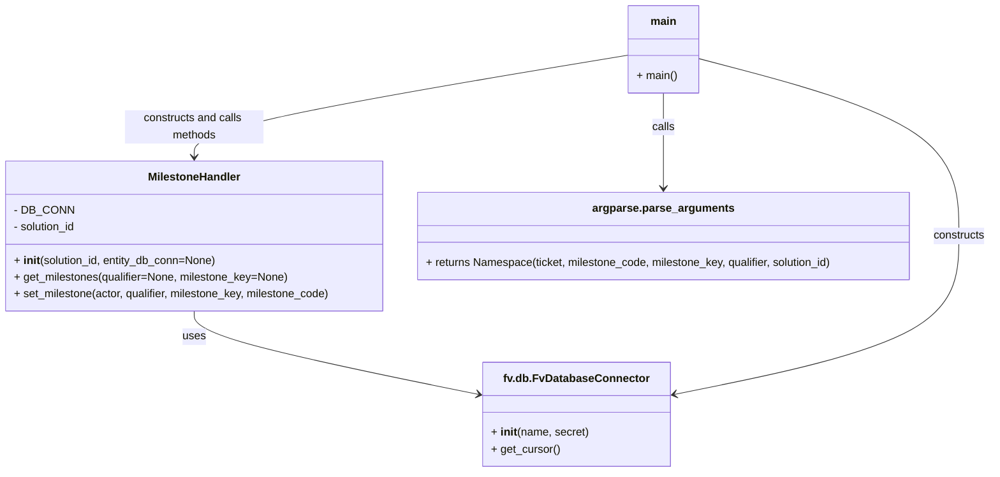

# Diagram: common/iam_service/scripts/add_milestone.py


> Auto-generated by Obscura crawlers

## Diagram 1



### SVG

<svg id="container" width="1446.46875" xmlns="http://www.w3.org/2000/svg" class="classDiagram" height="680" viewBox="0 0 1446.46875 680" role="graphics-document document" aria-roledescription="class"><style>#container{font-family:"trebuchet ms",verdana,arial,sans-serif;font-size:16px;fill:#333;}@keyframes edge-animation-frame{from{stroke-dashoffset:0;}}@keyframes dash{to{stroke-dashoffset:0;}}#container .edge-animation-slow{stroke-dasharray:9,5!important;stroke-dashoffset:900;animation:dash 50s linear infinite;stroke-linecap:round;}#container .edge-animation-fast{stroke-dasharray:9,5!important;stroke-dashoffset:900;animation:dash 20s linear infinite;stroke-linecap:round;}#container .error-icon{fill:#552222;}#container .error-text{fill:#552222;stroke:#552222;}#container .edge-thickness-normal{stroke-width:1px;}#container .edge-thickness-thick{stroke-width:3.5px;}#container .edge-pattern-solid{stroke-dasharray:0;}#container .edge-thickness-invisible{stroke-width:0;fill:none;}#container .edge-pattern-dashed{stroke-dasharray:3;}#container .edge-pattern-dotted{stroke-dasharray:2;}#container .marker{fill:#333333;stroke:#333333;}#container .marker.cross{stroke:#333333;}#container svg{font-family:"trebuchet ms",verdana,arial,sans-serif;font-size:16px;}#container p{margin:0;}#container g.classGroup text{fill:#9370DB;stroke:none;font-family:"trebuchet ms",verdana,arial,sans-serif;font-size:10px;}#container g.classGroup text .title{font-weight:bolder;}#container .nodeLabel,#container .edgeLabel{color:#131300;}#container .edgeLabel .label rect{fill:#ECECFF;}#container .label text{fill:#131300;}#container .labelBkg{background:#ECECFF;}#container .edgeLabel .label span{background:#ECECFF;}#container .classTitle{font-weight:bolder;}#container .node rect,#container .node circle,#container .node ellipse,#container .node polygon,#container .node path{fill:#ECECFF;stroke:#9370DB;stroke-width:1px;}#container .divider{stroke:#9370DB;stroke-width:1;}#container g.clickable{cursor:pointer;}#container g.classGroup rect{fill:#ECECFF;stroke:#9370DB;}#container g.classGroup line{stroke:#9370DB;stroke-width:1;}#container .classLabel .box{stroke:none;stroke-width:0;fill:#ECECFF;opacity:0.5;}#container .classLabel .label{fill:#9370DB;font-size:10px;}#container .relation{stroke:#333333;stroke-width:1;fill:none;}#container .dashed-line{stroke-dasharray:3;}#container .dotted-line{stroke-dasharray:1 2;}#container #compositionStart,#container .composition{fill:#333333!important;stroke:#333333!important;stroke-width:1;}#container #compositionEnd,#container .composition{fill:#333333!important;stroke:#333333!important;stroke-width:1;}#container #dependencyStart,#container .dependency{fill:#333333!important;stroke:#333333!important;stroke-width:1;}#container #dependencyStart,#container .dependency{fill:#333333!important;stroke:#333333!important;stroke-width:1;}#container #extensionStart,#container .extension{fill:transparent!important;stroke:#333333!important;stroke-width:1;}#container #extensionEnd,#container .extension{fill:transparent!important;stroke:#333333!important;stroke-width:1;}#container #aggregationStart,#container .aggregation{fill:transparent!important;stroke:#333333!important;stroke-width:1;}#container #aggregationEnd,#container .aggregation{fill:transparent!important;stroke:#333333!important;stroke-width:1;}#container #lollipopStart,#container .lollipop{fill:#ECECFF!important;stroke:#333333!important;stroke-width:1;}#container #lollipopEnd,#container .lollipop{fill:#ECECFF!important;stroke:#333333!important;stroke-width:1;}#container .edgeTerminals{font-size:11px;line-height:initial;}#container .classTitleText{text-anchor:middle;font-size:18px;fill:#333;}#container .label-icon{display:inline-block;height:1em;overflow:visible;vertical-align:-0.125em;}#container .node .label-icon path{fill:currentColor;stroke:revert;stroke-width:revert;}#container :root{--mermaid-font-family:"trebuchet ms",verdana,arial,sans-serif;}</style><g><defs><marker id="container_class-aggregationStart" class="marker aggregation class" refX="18" refY="7" markerWidth="190" markerHeight="240" orient="auto"><path d="M 18,7 L9,13 L1,7 L9,1 Z"></path></marker></defs><defs><marker id="container_class-aggregationEnd" class="marker aggregation class" refX="1" refY="7" markerWidth="20" markerHeight="28" orient="auto"><path d="M 18,7 L9,13 L1,7 L9,1 Z"></path></marker></defs><defs><marker id="container_class-extensionStart" class="marker extension class" refX="18" refY="7" markerWidth="190" markerHeight="240" orient="auto"><path d="M 1,7 L18,13 V 1 Z"></path></marker></defs><defs><marker id="container_class-extensionEnd" class="marker extension class" refX="1" refY="7" markerWidth="20" markerHeight="28" orient="auto"><path d="M 1,1 V 13 L18,7 Z"></path></marker></defs><defs><marker id="container_class-compositionStart" class="marker composition class" refX="18" refY="7" markerWidth="190" markerHeight="240" orient="auto"><path d="M 18,7 L9,13 L1,7 L9,1 Z"></path></marker></defs><defs><marker id="container_class-compositionEnd" class="marker composition class" refX="1" refY="7" markerWidth="20" markerHeight="28" orient="auto"><path d="M 18,7 L9,13 L1,7 L9,1 Z"></path></marker></defs><defs><marker id="container_class-dependencyStart" class="marker dependency class" refX="6" refY="7" markerWidth="190" markerHeight="240" orient="auto"><path d="M 5,7 L9,13 L1,7 L9,1 Z"></path></marker></defs><defs><marker id="container_class-dependencyEnd" class="marker dependency class" refX="13" refY="7" markerWidth="20" markerHeight="28" orient="auto"><path d="M 18,7 L9,13 L14,7 L9,1 Z"></path></marker></defs><defs><marker id="container_class-lollipopStart" class="marker lollipop class" refX="13" refY="7" markerWidth="190" markerHeight="240" orient="auto"><circle stroke="black" fill="transparent" cx="7" cy="7" r="6"></circle></marker></defs><defs><marker id="container_class-lollipopEnd" class="marker lollipop class" refX="1" refY="7" markerWidth="190" markerHeight="240" orient="auto"><circle stroke="black" fill="transparent" cx="7" cy="7" r="6"></circle></marker></defs><g class="root"><g class="clusters"></g><g class="edgePaths"><path d="M284.082,448L284.082,454.167C284.082,460.333,284.082,472.667,354.254,492.911C424.426,513.156,564.771,541.312,634.943,555.389L705.115,569.467" id="id_MilestoneHandler_fv.db.FvDatabaseConnector_1" class="edge-thickness-normal edge-pattern-solid relation" style=";;;" data-edge="true" data-et="edge" data-id="id_MilestoneHandler_fv.db.FvDatabaseConnector_1" data-points="W3sieCI6Mjg0LjA4MjAzMTI1LCJ5Ijo0NDh9LHsieCI6Mjg0LjA4MjAzMTI1LCJ5Ijo0ODV9LHsieCI6NzEwLjk5ODA0Njg3NSwieSI6NTcwLjY0NzU2NTkwMzQwNTh9XQ==" marker-end="url(#container_class-dependencyEnd)"></path><path d="M968.973,134L968.973,142.167C968.973,150.333,968.973,166.667,968.973,189.5C968.973,212.333,968.973,241.667,968.973,256.333L968.973,271" id="id_main_argparse.parse_arguments_2" class="edge-thickness-normal edge-pattern-solid relation" style=";;;" data-edge="true" data-et="edge" data-id="id_main_argparse.parse_arguments_2" data-points="W3sieCI6OTY4Ljk3MjY1NjI1LCJ5IjoxMzR9LHsieCI6OTY4Ljk3MjY1NjI1LCJ5IjoxODN9LHsieCI6OTY4Ljk3MjY1NjI1LCJ5IjoyNzd9XQ==" marker-end="url(#container_class-dependencyEnd)"></path><path d="M1019.438,84.094L1082.969,100.578C1146.5,117.063,1273.563,150.031,1337.094,192.682C1400.625,235.333,1400.625,287.667,1400.625,338C1400.625,388.333,1400.625,436.667,1330.453,474.911C1260.281,513.156,1119.936,541.312,1049.764,555.389L979.592,569.467" id="id_main_fv.db.FvDatabaseConnector_3" class="edge-thickness-normal edge-pattern-solid relation" style=";;;" data-edge="true" data-et="edge" data-id="id_main_fv.db.FvDatabaseConnector_3" data-points="W3sieCI6MTAxOS40Mzc1LCJ5Ijo4NC4wOTQwMTU1NDcwODkyMX0seyJ4IjoxNDAwLjYyNSwieSI6MTgzfSx7IngiOjE0MDAuNjI1LCJ5IjozNDB9LHsieCI6MTQwMC42MjUsInkiOjQ4NX0seyJ4Ijo5NzMuNzA4OTg0Mzc1LCJ5Ijo1NzAuNjQ3NTY1OTAzNDA1OH1d" marker-end="url(#container_class-dependencyEnd)"></path><path d="M918.508,79.253L812.77,96.544C707.033,113.835,495.557,148.418,389.82,172.875C284.082,197.333,284.082,211.667,284.082,218.833L284.082,226" id="id_main_MilestoneHandler_4" class="edge-thickness-normal edge-pattern-solid relation" style=";;;" data-edge="true" data-et="edge" data-id="id_main_MilestoneHandler_4" data-points="W3sieCI6OTE4LjUwNzgxMjUsInkiOjc5LjI1MjUwMzgyMTMyMTg0fSx7IngiOjI4NC4wODIwMzEyNSwieSI6MTgzfSx7IngiOjI4NC4wODIwMzEyNSwieSI6MjMyfV0=" marker-end="url(#container_class-dependencyEnd)"></path></g><g class="edgeLabels"><g class="edgeLabel" transform="translate(284.08203125, 485)"><g class="label" data-id="id_MilestoneHandler_fv.db.FvDatabaseConnector_1" transform="translate(-16.4921875, -12)"><foreignObject width="32.984375" height="24"><div xmlns="http://www.w3.org/1999/xhtml" class="labelBkg" style="display: table-cell; white-space: nowrap; line-height: 1.5; max-width: 200px; text-align: center;"><span class="edgeLabel"><p>uses</p></span></div></foreignObject></g></g><g class="edgeLabel" transform="translate(968.97265625, 183)"><g class="label" data-id="id_main_argparse.parse_arguments_2" transform="translate(-16.4453125, -12)"><foreignObject width="32.890625" height="24"><div xmlns="http://www.w3.org/1999/xhtml" class="labelBkg" style="display: table-cell; white-space: nowrap; line-height: 1.5; max-width: 200px; text-align: center;"><span class="edgeLabel"><p>calls</p></span></div></foreignObject></g></g><g class="edgeLabel" transform="translate(1400.625, 340)"><g class="label" data-id="id_main_fv.db.FvDatabaseConnector_3" transform="translate(-37.84375, -12)"><foreignObject width="75.6875" height="24"><div xmlns="http://www.w3.org/1999/xhtml" class="labelBkg" style="display: table-cell; white-space: nowrap; line-height: 1.5; max-width: 200px; text-align: center;"><span class="edgeLabel"><p>constructs</p></span></div></foreignObject></g></g><g class="edgeLabel" transform="translate(284.08203125, 183)"><g class="label" data-id="id_main_MilestoneHandler_4" transform="translate(-100, -24)"><foreignObject width="200" height="48"><div xmlns="http://www.w3.org/1999/xhtml" class="labelBkg" style="display: table; white-space: break-spaces; line-height: 1.5; max-width: 200px; text-align: center; width: 200px;"><span class="edgeLabel"><p>constructs and calls methods</p></span></div></foreignObject></g></g></g><g class="nodes"><g class="node default" id="classId-MilestoneHandler-0" transform="translate(284.08203125, 340)"><g class="basic label-container"><path d="M-276.08203125 -108 L276.08203125 -108 L276.08203125 108 L-276.08203125 108" stroke="none" stroke-width="0" fill="#ECECFF" style=""></path><path d="M-276.08203125 -108 C-93.94105793111208 -108, 88.19991538777583 -108, 276.08203125 -108 M-276.08203125 -108 C-132.10072498358483 -108, 11.880581282830349 -108, 276.08203125 -108 M276.08203125 -108 C276.08203125 -54.23173275533598, 276.08203125 -0.4634655106719663, 276.08203125 108 M276.08203125 -108 C276.08203125 -60.10814238744159, 276.08203125 -12.216284774883178, 276.08203125 108 M276.08203125 108 C159.40663311756845 108, 42.73123498513692 108, -276.08203125 108 M276.08203125 108 C151.8700677976617 108, 27.65810434532341 108, -276.08203125 108 M-276.08203125 108 C-276.08203125 43.86084999332094, -276.08203125 -20.27830001335812, -276.08203125 -108 M-276.08203125 108 C-276.08203125 59.91818916688604, -276.08203125 11.836378333772075, -276.08203125 -108" stroke="#9370DB" stroke-width="1.3" fill="none" stroke-dasharray="0 0" style=""></path></g><g class="annotation-group text" transform="translate(0, -84)"></g><g class="label-group text" transform="translate(-64.8984375, -84)"><g class="label" style="font-weight: bolder" transform="translate(0,-12)"><foreignObject width="129.796875" height="24"><div xmlns="http://www.w3.org/1999/xhtml" style="display: table-cell; white-space: nowrap; line-height: 1.5; max-width: 180px; text-align: center;"><span class="nodeLabel markdown-node-label" style=""><p>MilestoneHandler</p></span></div></foreignObject></g></g><g class="members-group text" transform="translate(-264.08203125, -36)"><g class="label" style="" transform="translate(0,-12)"><foreignObject width="79.65625" height="24"><div xmlns="http://www.w3.org/1999/xhtml" style="display: table-cell; white-space: nowrap; line-height: 1.5; max-width: 137px; text-align: center;"><span class="nodeLabel markdown-node-label" style=""><p>- DB_CONN</p></span></div></foreignObject></g><g class="label" style="" transform="translate(0,12)"><foreignObject width="92.921875" height="24"><div xmlns="http://www.w3.org/1999/xhtml" style="display: table-cell; white-space: nowrap; line-height: 1.5; max-width: 150px; text-align: center;"><span class="nodeLabel markdown-node-label" style=""><p>- solution_id</p></span></div></foreignObject></g></g><g class="methods-group text" transform="translate(-264.08203125, 36)"><g class="label" style="" transform="translate(0,-12)"><foreignObject width="295.375" height="24"><div xmlns="http://www.w3.org/1999/xhtml" style="display: table-cell; white-space: nowrap; line-height: 1.5; max-width: 385px; text-align: center;"><span class="nodeLabel markdown-node-label" style=""><p>+ <strong>init</strong>(solution_id, entity_db_conn=None)</p></span></div></foreignObject></g><g class="label" style="" transform="translate(0,12)"><foreignObject width="398.90625" height="24"><div xmlns="http://www.w3.org/1999/xhtml" style="display: table-cell; white-space: nowrap; line-height: 1.5; max-width: 456px; text-align: center;"><span class="nodeLabel markdown-node-label" style=""><p>+ get_milestones(qualifier=None, milestone_key=None)</p></span></div></foreignObject></g><g class="label" style="" transform="translate(0,36)"><foreignObject width="463.265625" height="24"><div xmlns="http://www.w3.org/1999/xhtml" style="display: table-cell; white-space: nowrap; line-height: 1.5; max-width: 521px; text-align: center;"><span class="nodeLabel markdown-node-label" style=""><p>+ set_milestone(actor, qualifier, milestone_key, milestone_code)</p></span></div></foreignObject></g></g><g class="divider" style=""><path d="M-276.08203125 -60 C-155.24200834686386 -60, -34.40198544372771 -60, 276.08203125 -60 M-276.08203125 -60 C-140.55697769697855 -60, -5.031924143957099 -60, 276.08203125 -60" stroke="#9370DB" stroke-width="1.3" fill="none" stroke-dasharray="0 0" style=""></path></g><g class="divider" style=""><path d="M-276.08203125 12 C-112.39820196306005 12, 51.28562732387991 12, 276.08203125 12 M-276.08203125 12 C-85.34577297903661 12, 105.39048529192678 12, 276.08203125 12" stroke="#9370DB" stroke-width="1.3" fill="none" stroke-dasharray="0 0" style=""></path></g></g><g class="node default" id="classId-fv.db.FvDatabaseConnector-1" transform="translate(842.353515625, 597)"><g class="basic label-container"><path d="M-131.35546875 -75 L131.35546875 -75 L131.35546875 75 L-131.35546875 75" stroke="none" stroke-width="0" fill="#ECECFF" style=""></path><path d="M-131.35546875 -75 C-53.52121439560047 -75, 24.313039958799067 -75, 131.35546875 -75 M-131.35546875 -75 C-39.0953481702237 -75, 53.1647724095526 -75, 131.35546875 -75 M131.35546875 -75 C131.35546875 -43.234353679573985, 131.35546875 -11.468707359147963, 131.35546875 75 M131.35546875 -75 C131.35546875 -28.19247993443888, 131.35546875 18.615040131122242, 131.35546875 75 M131.35546875 75 C53.63456190502478 75, -24.086344939950436 75, -131.35546875 75 M131.35546875 75 C70.24409393020227 75, 9.132719110404537 75, -131.35546875 75 M-131.35546875 75 C-131.35546875 42.918903417447346, -131.35546875 10.837806834894693, -131.35546875 -75 M-131.35546875 75 C-131.35546875 31.75022133682363, -131.35546875 -11.499557326352743, -131.35546875 -75" stroke="#9370DB" stroke-width="1.3" fill="none" stroke-dasharray="0 0" style=""></path></g><g class="annotation-group text" transform="translate(0, -51)"></g><g class="label-group text" transform="translate(-99.1953125, -51)"><g class="label" style="font-weight: bolder" transform="translate(0,-12)"><foreignObject width="198.390625" height="24"><div xmlns="http://www.w3.org/1999/xhtml" style="display: table-cell; white-space: nowrap; line-height: 1.5; max-width: 246px; text-align: center;"><span class="nodeLabel markdown-node-label" style=""><p>fv.db.FvDatabaseConnector</p></span></div></foreignObject></g></g><g class="members-group text" transform="translate(-119.35546875, -3)"></g><g class="methods-group text" transform="translate(-119.35546875, 27)"><g class="label" style="" transform="translate(0,-12)"><foreignObject width="139.515625" height="24"><div xmlns="http://www.w3.org/1999/xhtml" style="display: table-cell; white-space: nowrap; line-height: 1.5; max-width: 230px; text-align: center;"><span class="nodeLabel markdown-node-label" style=""><p>+ <strong>init</strong>(name, secret)</p></span></div></foreignObject></g><g class="label" style="" transform="translate(0,12)"><foreignObject width="98.890625" height="24"><div xmlns="http://www.w3.org/1999/xhtml" style="display: table-cell; white-space: nowrap; line-height: 1.5; max-width: 156px; text-align: center;"><span class="nodeLabel markdown-node-label" style=""><p>+ get_cursor()</p></span></div></foreignObject></g></g><g class="divider" style=""><path d="M-131.35546875 -27 C-28.559092322644204 -27, 74.23728410471159 -27, 131.35546875 -27 M-131.35546875 -27 C-40.50943743721818 -27, 50.336593875563636 -27, 131.35546875 -27" stroke="#9370DB" stroke-width="1.3" fill="none" stroke-dasharray="0 0" style=""></path></g><g class="divider" style=""><path d="M-131.35546875 -3 C-39.94374748130426 -3, 51.467973787391486 -3, 131.35546875 -3 M-131.35546875 -3 C-35.401802532937694 -3, 60.55186368412461 -3, 131.35546875 -3" stroke="#9370DB" stroke-width="1.3" fill="none" stroke-dasharray="0 0" style=""></path></g></g><g class="node default" id="classId-argparse.parse_arguments-2" transform="translate(968.97265625, 340)"><g class="basic label-container"><path d="M-358.80859375 -63 L358.80859375 -63 L358.80859375 63 L-358.80859375 63" stroke="none" stroke-width="0" fill="#ECECFF" style=""></path><path d="M-358.80859375 -63 C-132.28208196922296 -63, 94.24442981155408 -63, 358.80859375 -63 M-358.80859375 -63 C-150.3774273412388 -63, 58.05373906752237 -63, 358.80859375 -63 M358.80859375 -63 C358.80859375 -35.879212385467184, 358.80859375 -8.758424770934369, 358.80859375 63 M358.80859375 -63 C358.80859375 -20.64004968835212, 358.80859375 21.719900623295757, 358.80859375 63 M358.80859375 63 C120.18121952380812 63, -118.44615470238375 63, -358.80859375 63 M358.80859375 63 C127.24146466369251 63, -104.32566442261498 63, -358.80859375 63 M-358.80859375 63 C-358.80859375 36.49903160108105, -358.80859375 9.9980632021621, -358.80859375 -63 M-358.80859375 63 C-358.80859375 25.451826755823838, -358.80859375 -12.096346488352324, -358.80859375 -63" stroke="#9370DB" stroke-width="1.3" fill="none" stroke-dasharray="0 0" style=""></path></g><g class="annotation-group text" transform="translate(0, -39)"></g><g class="label-group text" transform="translate(-97.6796875, -39)"><g class="label" style="font-weight: bolder" transform="translate(0,-12)"><foreignObject width="195.359375" height="24"><div xmlns="http://www.w3.org/1999/xhtml" style="display: table-cell; white-space: nowrap; line-height: 1.5; max-width: 242px; text-align: center;"><span class="nodeLabel markdown-node-label" style=""><p>argparse.parse_arguments</p></span></div></foreignObject></g></g><g class="members-group text" transform="translate(-346.80859375, 9)"></g><g class="methods-group text" transform="translate(-346.80859375, 39)"><g class="label" style="" transform="translate(0,-12)"><foreignObject width="595.9375" height="24"><div xmlns="http://www.w3.org/1999/xhtml" style="display: table-cell; white-space: nowrap; line-height: 1.5; max-width: 653px; text-align: center;"><span class="nodeLabel markdown-node-label" style=""><p>+ returns Namespace(ticket, milestone_code, milestone_key, qualifier, solution_id)</p></span></div></foreignObject></g></g><g class="divider" style=""><path d="M-358.80859375 -15 C-173.9532415389531 -15, 10.902110672093784 -15, 358.80859375 -15 M-358.80859375 -15 C-175.1119107009166 -15, 8.58477234816678 -15, 358.80859375 -15" stroke="#9370DB" stroke-width="1.3" fill="none" stroke-dasharray="0 0" style=""></path></g><g class="divider" style=""><path d="M-358.80859375 9 C-155.7588089788649 9, 47.29097579227022 9, 358.80859375 9 M-358.80859375 9 C-129.20951281325938 9, 100.38956812348124 9, 358.80859375 9" stroke="#9370DB" stroke-width="1.3" fill="none" stroke-dasharray="0 0" style=""></path></g></g><g class="node default" id="classId-main-3" transform="translate(968.97265625, 71)"><g class="basic label-container"><path d="M-50.46484375 -63 L50.46484375 -63 L50.46484375 63 L-50.46484375 63" stroke="none" stroke-width="0" fill="#ECECFF" style=""></path><path d="M-50.46484375 -63 C-13.203368259849988 -63, 24.058107230300024 -63, 50.46484375 -63 M-50.46484375 -63 C-20.026664598613568 -63, 10.411514552772864 -63, 50.46484375 -63 M50.46484375 -63 C50.46484375 -30.24793480912745, 50.46484375 2.5041303817450995, 50.46484375 63 M50.46484375 -63 C50.46484375 -19.543152528022766, 50.46484375 23.913694943954468, 50.46484375 63 M50.46484375 63 C21.08640985580782 63, -8.292024038384362 63, -50.46484375 63 M50.46484375 63 C14.01072131986951 63, -22.44340111026098 63, -50.46484375 63 M-50.46484375 63 C-50.46484375 32.74187989546939, -50.46484375 2.4837597909387767, -50.46484375 -63 M-50.46484375 63 C-50.46484375 33.518507771719136, -50.46484375 4.037015543438272, -50.46484375 -63" stroke="#9370DB" stroke-width="1.3" fill="none" stroke-dasharray="0 0" style=""></path></g><g class="annotation-group text" transform="translate(0, -39)"></g><g class="label-group text" transform="translate(-18.0234375, -39)"><g class="label" style="font-weight: bolder" transform="translate(0,-12)"><foreignObject width="36.046875" height="24"><div xmlns="http://www.w3.org/1999/xhtml" style="display: table-cell; white-space: nowrap; line-height: 1.5; max-width: 86px; text-align: center;"><span class="nodeLabel markdown-node-label" style=""><p>main</p></span></div></foreignObject></g></g><g class="members-group text" transform="translate(-38.46484375, 9)"></g><g class="methods-group text" transform="translate(-38.46484375, 39)"><g class="label" style="" transform="translate(0,-12)"><foreignObject width="58.90625" height="24"><div xmlns="http://www.w3.org/1999/xhtml" style="display: table-cell; white-space: nowrap; line-height: 1.5; max-width: 116px; text-align: center;"><span class="nodeLabel markdown-node-label" style=""><p>+ main()</p></span></div></foreignObject></g></g><g class="divider" style=""><path d="M-50.46484375 -15 C-16.33441932306298 -15, 17.796005103874037 -15, 50.46484375 -15 M-50.46484375 -15 C-15.2507396399593 -15, 19.9633644700814 -15, 50.46484375 -15" stroke="#9370DB" stroke-width="1.3" fill="none" stroke-dasharray="0 0" style=""></path></g><g class="divider" style=""><path d="M-50.46484375 9 C-13.96817123913074 9, 22.52850127173852 9, 50.46484375 9 M-50.46484375 9 C-18.47353562355915 9, 13.517772502881698 9, 50.46484375 9" stroke="#9370DB" stroke-width="1.3" fill="none" stroke-dasharray="0 0" style=""></path></g></g></g></g></g></svg>

## Diagram 2

```mermaid
flowchart TD
    A[Start script] --> B[parse_arguments()]
    B --> C{args.solution_id and args.ticket and args.milestone_code?}
    C -- No --> D[Print args and env, exit]
    C -- Yes --> E[Create DB_CONN_ENTITY via FvDatabaseConnector]
    E --> F[Instantiate MilestoneHandler(solution_id, entity_db_conn)]
    F --> G[Before: handler.get_milestones(qualifier, milestone_key)]
    G --> H[handler.set_milestone(actor, qualifier, milestone_key, milestone_code)]
    H --> I[After: handler.get_milestones(qualifier, milestone_key)]
    I --> J[Print results and exit]
```

> SVG rendering failed for this diagram.
