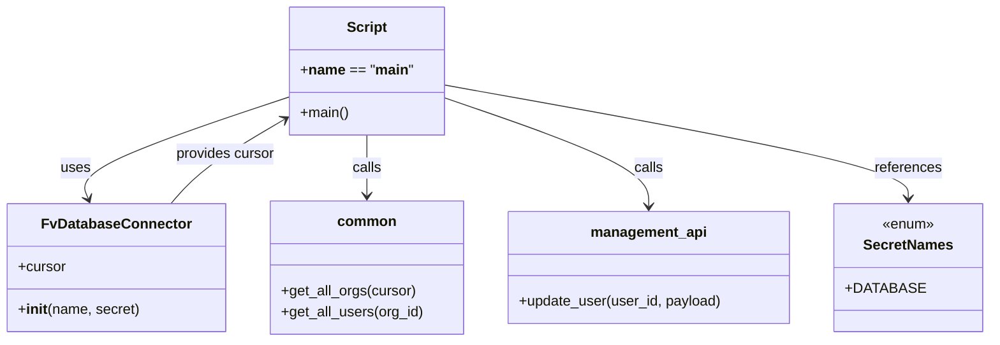

# Diagram: common/iam_service/scripts/add_org_type_user.py


> Auto-generated by Obscura crawlers

## Diagram 1

```mermaid
flowchart TD
  Start([Start]) --> InitDB[/"Init DB_CONN = FvDatabaseConnector(\"add_org_type_user\", SecretNames.DATABASE)"/]
  InitDB --> GetOrgs[/get_all_orgs(DB_CONN.cursor)/]
  GetOrgs --> ForEachOrg{{"for each org in orgs"}}
  ForEachOrg --> PrintOrgProgress["print \"i+1 / len_orgs\""]
  ForEachOrg --> GetUsers[/get_all_users(org.id)/]
  GetUsers --> ForEachUser{{"for each user in users"}}
  ForEachUser --> PrintUserProgress["print \"j+1 / len_users\""]
  ForEachUser --> BuildMetadata[/"updated_metadata = user.app_metadata + {'org_profiles': [org.code]}/"]
  BuildMetadata --> ClearOrgProfile{{"if 'organization_profile' in updated_metadata"}}
  ClearOrgProfile -->|yes| SetNone["set updated_metadata['organization_profile'] = None"]
  ClearOrgProfile -->|no| SkipClear
  SetNone --> Compare
  SkipClear --> Compare{{"if user.app_metadata != updated_metadata"}}
  Compare -->|true| PreparePayload["payload = {'app_metadata': updated_metadata}"]
  PreparePayload --> PrintUpdated["print(updated_metadata)"]
  PrintUpdated --> UpdateAPI[/management_api.update_user(user['user_id'], payload)/]
  UpdateAPI --> PrintResponse["print(response)"]
  Compare -->|false| SkipUpdate["skip update"]
  UpdateAPI --> Continue[/"continue loop"/]
  SkipUpdate --> Continue
  Continue --> ForEachUser
  ForEachUser --> ForEachOrg
  ForEachOrg --> End([End])
```

> SVG rendering failed for this diagram.

## Diagram 2



### SVG

<svg id="container" width="1085.5078125" xmlns="http://www.w3.org/2000/svg" class="classDiagram" height="384" viewBox="0 0 1085.5078125 384" role="graphics-document document" aria-roledescription="class"><style>#container{font-family:"trebuchet ms",verdana,arial,sans-serif;font-size:16px;fill:#333;}@keyframes edge-animation-frame{from{stroke-dashoffset:0;}}@keyframes dash{to{stroke-dashoffset:0;}}#container .edge-animation-slow{stroke-dasharray:9,5!important;stroke-dashoffset:900;animation:dash 50s linear infinite;stroke-linecap:round;}#container .edge-animation-fast{stroke-dasharray:9,5!important;stroke-dashoffset:900;animation:dash 20s linear infinite;stroke-linecap:round;}#container .error-icon{fill:#552222;}#container .error-text{fill:#552222;stroke:#552222;}#container .edge-thickness-normal{stroke-width:1px;}#container .edge-thickness-thick{stroke-width:3.5px;}#container .edge-pattern-solid{stroke-dasharray:0;}#container .edge-thickness-invisible{stroke-width:0;fill:none;}#container .edge-pattern-dashed{stroke-dasharray:3;}#container .edge-pattern-dotted{stroke-dasharray:2;}#container .marker{fill:#333333;stroke:#333333;}#container .marker.cross{stroke:#333333;}#container svg{font-family:"trebuchet ms",verdana,arial,sans-serif;font-size:16px;}#container p{margin:0;}#container g.classGroup text{fill:#9370DB;stroke:none;font-family:"trebuchet ms",verdana,arial,sans-serif;font-size:10px;}#container g.classGroup text .title{font-weight:bolder;}#container .nodeLabel,#container .edgeLabel{color:#131300;}#container .edgeLabel .label rect{fill:#ECECFF;}#container .label text{fill:#131300;}#container .labelBkg{background:#ECECFF;}#container .edgeLabel .label span{background:#ECECFF;}#container .classTitle{font-weight:bolder;}#container .node rect,#container .node circle,#container .node ellipse,#container .node polygon,#container .node path{fill:#ECECFF;stroke:#9370DB;stroke-width:1px;}#container .divider{stroke:#9370DB;stroke-width:1;}#container g.clickable{cursor:pointer;}#container g.classGroup rect{fill:#ECECFF;stroke:#9370DB;}#container g.classGroup line{stroke:#9370DB;stroke-width:1;}#container .classLabel .box{stroke:none;stroke-width:0;fill:#ECECFF;opacity:0.5;}#container .classLabel .label{fill:#9370DB;font-size:10px;}#container .relation{stroke:#333333;stroke-width:1;fill:none;}#container .dashed-line{stroke-dasharray:3;}#container .dotted-line{stroke-dasharray:1 2;}#container #compositionStart,#container .composition{fill:#333333!important;stroke:#333333!important;stroke-width:1;}#container #compositionEnd,#container .composition{fill:#333333!important;stroke:#333333!important;stroke-width:1;}#container #dependencyStart,#container .dependency{fill:#333333!important;stroke:#333333!important;stroke-width:1;}#container #dependencyStart,#container .dependency{fill:#333333!important;stroke:#333333!important;stroke-width:1;}#container #extensionStart,#container .extension{fill:transparent!important;stroke:#333333!important;stroke-width:1;}#container #extensionEnd,#container .extension{fill:transparent!important;stroke:#333333!important;stroke-width:1;}#container #aggregationStart,#container .aggregation{fill:transparent!important;stroke:#333333!important;stroke-width:1;}#container #aggregationEnd,#container .aggregation{fill:transparent!important;stroke:#333333!important;stroke-width:1;}#container #lollipopStart,#container .lollipop{fill:#ECECFF!important;stroke:#333333!important;stroke-width:1;}#container #lollipopEnd,#container .lollipop{fill:#ECECFF!important;stroke:#333333!important;stroke-width:1;}#container .edgeTerminals{font-size:11px;line-height:initial;}#container .classTitleText{text-anchor:middle;font-size:18px;fill:#333;}#container .label-icon{display:inline-block;height:1em;overflow:visible;vertical-align:-0.125em;}#container .node .label-icon path{fill:currentColor;stroke:revert;stroke-width:revert;}#container :root{--mermaid-font-family:"trebuchet ms",verdana,arial,sans-serif;}</style><g><defs><marker id="container_class-aggregationStart" class="marker aggregation class" refX="18" refY="7" markerWidth="190" markerHeight="240" orient="auto"><path d="M 18,7 L9,13 L1,7 L9,1 Z"></path></marker></defs><defs><marker id="container_class-aggregationEnd" class="marker aggregation class" refX="1" refY="7" markerWidth="20" markerHeight="28" orient="auto"><path d="M 18,7 L9,13 L1,7 L9,1 Z"></path></marker></defs><defs><marker id="container_class-extensionStart" class="marker extension class" refX="18" refY="7" markerWidth="190" markerHeight="240" orient="auto"><path d="M 1,7 L18,13 V 1 Z"></path></marker></defs><defs><marker id="container_class-extensionEnd" class="marker extension class" refX="1" refY="7" markerWidth="20" markerHeight="28" orient="auto"><path d="M 1,1 V 13 L18,7 Z"></path></marker></defs><defs><marker id="container_class-compositionStart" class="marker composition class" refX="18" refY="7" markerWidth="190" markerHeight="240" orient="auto"><path d="M 18,7 L9,13 L1,7 L9,1 Z"></path></marker></defs><defs><marker id="container_class-compositionEnd" class="marker composition class" refX="1" refY="7" markerWidth="20" markerHeight="28" orient="auto"><path d="M 18,7 L9,13 L1,7 L9,1 Z"></path></marker></defs><defs><marker id="container_class-dependencyStart" class="marker dependency class" refX="6" refY="7" markerWidth="190" markerHeight="240" orient="auto"><path d="M 5,7 L9,13 L1,7 L9,1 Z"></path></marker></defs><defs><marker id="container_class-dependencyEnd" class="marker dependency class" refX="13" refY="7" markerWidth="20" markerHeight="28" orient="auto"><path d="M 18,7 L9,13 L14,7 L9,1 Z"></path></marker></defs><defs><marker id="container_class-lollipopStart" class="marker lollipop class" refX="13" refY="7" markerWidth="190" markerHeight="240" orient="auto"><circle stroke="black" fill="transparent" cx="7" cy="7" r="6"></circle></marker></defs><defs><marker id="container_class-lollipopEnd" class="marker lollipop class" refX="1" refY="7" markerWidth="190" markerHeight="240" orient="auto"><circle stroke="black" fill="transparent" cx="7" cy="7" r="6"></circle></marker></defs><g class="root"><g class="clusters"></g><g class="edgePaths"><path d="M320.355,108.231L280.445,121.692C240.534,135.154,160.712,162.077,123.18,181.281C85.648,200.486,90.406,211.971,92.785,217.714L95.164,223.457" id="id_Script_FvDatabaseConnector_1" class="edge-thickness-normal edge-pattern-solid relation" style=";;;" data-edge="true" data-et="edge" data-id="id_Script_FvDatabaseConnector_1" data-points="W3sieCI6MzIwLjM1NTQ2ODc1LCJ5IjoxMDguMjMwOTA3NzcyMjcxMjV9LHsieCI6ODAuODkwNjI1LCJ5IjoxODl9LHsieCI6OTcuNDYwMTAwNDQ2NDI4NTcsInkiOjIyOX1d" marker-end="url(#container_class-dependencyEnd)"></path><path d="M404.055,152L404.055,158.167C404.055,164.333,404.055,176.667,404.055,188C404.055,199.333,404.055,209.667,404.055,214.833L404.055,220" id="id_Script_common_2" class="edge-thickness-normal edge-pattern-solid relation" style=";;;" data-edge="true" data-et="edge" data-id="id_Script_common_2" data-points="W3sieCI6NDA0LjA1NDY4NzUsInkiOjE1Mn0seyJ4Ijo0MDQuMDU0Njg3NSwieSI6MTg5fSx7IngiOjQwNC4wNTQ2ODc1LCJ5IjoyMjZ9XQ==" marker-end="url(#container_class-dependencyEnd)"></path><path d="M487.754,108.978L526.277,122.315C564.799,135.652,641.845,162.326,680.368,182.83C718.891,203.333,718.891,217.667,718.891,224.833L718.891,232" id="id_Script_management_api_3" class="edge-thickness-normal edge-pattern-solid relation" style=";;;" data-edge="true" data-et="edge" data-id="id_Script_management_api_3" data-points="W3sieCI6NDg3Ljc1MzkwNjI1LCJ5IjoxMDguOTc3Njc5MzQ2ODgyMDZ9LHsieCI6NzE4Ljg5MDYyNSwieSI6MTg5fSx7IngiOjcxOC44OTA2MjUsInkiOjIzOH1d" marker-end="url(#container_class-dependencyEnd)"></path><path d="M487.754,95.261L573.441,110.884C659.128,126.507,830.501,157.754,916.188,179.043C1001.875,200.333,1001.875,211.667,1001.875,217.333L1001.875,223" id="id_Script_SecretNames_4" class="edge-thickness-normal edge-pattern-solid relation" style=";;;" data-edge="true" data-et="edge" data-id="id_Script_SecretNames_4" data-points="W3sieCI6NDg3Ljc1MzkwNjI1LCJ5Ijo5NS4yNjA3OTc2ODk1MjMxNH0seyJ4IjoxMDAxLjg3NSwieSI6MTg5fSx7IngiOjEwMDEuODc1LCJ5IjoyMjl9XQ==" marker-end="url(#container_class-dependencyEnd)"></path><path d="M186.437,229L191.914,222.333C197.391,215.667,208.345,202.333,229.803,186.238C251.262,170.143,283.225,151.286,299.206,141.857L315.188,132.429" id="id_FvDatabaseConnector_Script_5" class="edge-thickness-normal edge-pattern-solid relation" style=";;;" data-edge="true" data-et="edge" data-id="id_FvDatabaseConnector_Script_5" data-points="W3sieCI6MTg2LjQzNjgwMjQ1NTM1NzE0LCJ5IjoyMjl9LHsieCI6MjE5LjI5ODgyODEyNSwieSI6MTg5fSx7IngiOjMyMC4zNTU0Njg3NSwieSI6MTI5LjM3OTg0MDM3MjExMjY4fV0=" marker-end="url(#container_class-dependencyEnd)"></path></g><g class="edgeLabels"><g class="edgeLabel" transform="translate(80.890625, 189)"><g class="label" data-id="id_Script_FvDatabaseConnector_1" transform="translate(-16.4921875, -12)"><foreignObject width="32.984375" height="24"><div xmlns="http://www.w3.org/1999/xhtml" class="labelBkg" style="display: table-cell; white-space: nowrap; line-height: 1.5; max-width: 200px; text-align: center;"><span class="edgeLabel"><p>uses</p></span></div></foreignObject></g></g><g class="edgeLabel" transform="translate(404.0546875, 189)"><g class="label" data-id="id_Script_common_2" transform="translate(-16.4453125, -12)"><foreignObject width="32.890625" height="24"><div xmlns="http://www.w3.org/1999/xhtml" class="labelBkg" style="display: table-cell; white-space: nowrap; line-height: 1.5; max-width: 200px; text-align: center;"><span class="edgeLabel"><p>calls</p></span></div></foreignObject></g></g><g class="edgeLabel" transform="translate(718.890625, 189)"><g class="label" data-id="id_Script_management_api_3" transform="translate(-16.4453125, -12)"><foreignObject width="32.890625" height="24"><div xmlns="http://www.w3.org/1999/xhtml" class="labelBkg" style="display: table-cell; white-space: nowrap; line-height: 1.5; max-width: 200px; text-align: center;"><span class="edgeLabel"><p>calls</p></span></div></foreignObject></g></g><g class="edgeLabel" transform="translate(1001.875, 189)"><g class="label" data-id="id_Script_SecretNames_4" transform="translate(-37.828125, -12)"><foreignObject width="75.65625" height="24"><div xmlns="http://www.w3.org/1999/xhtml" class="labelBkg" style="display: table-cell; white-space: nowrap; line-height: 1.5; max-width: 200px; text-align: center;"><span class="edgeLabel"><p>references</p></span></div></foreignObject></g></g><g class="edgeLabel" transform="translate(247.53379, 172.34228)"><g class="label" data-id="id_FvDatabaseConnector_Script_5" transform="translate(-56.296875, -12)"><foreignObject width="112.59375" height="24"><div xmlns="http://www.w3.org/1999/xhtml" class="labelBkg" style="display: table-cell; white-space: nowrap; line-height: 1.5; max-width: 200px; text-align: center;"><span class="edgeLabel"><p>provides cursor</p></span></div></foreignObject></g></g></g><g class="nodes"><g class="node default" id="classId-Script-0" transform="translate(404.0546875, 80)"><g class="basic label-container"><path d="M-83.69921875 -72 L83.69921875 -72 L83.69921875 72 L-83.69921875 72" stroke="none" stroke-width="0" fill="#ECECFF" style=""></path><path d="M-83.69921875 -72 C-32.67242933551404 -72, 18.354360078971922 -72, 83.69921875 -72 M-83.69921875 -72 C-25.643187296081102 -72, 32.412844157837796 -72, 83.69921875 -72 M83.69921875 -72 C83.69921875 -37.22763418189658, 83.69921875 -2.4552683637931665, 83.69921875 72 M83.69921875 -72 C83.69921875 -40.51459685300309, 83.69921875 -9.029193706006183, 83.69921875 72 M83.69921875 72 C48.83150004091644 72, 13.963781331832877 72, -83.69921875 72 M83.69921875 72 C35.300051505647644 72, -13.099115738704711 72, -83.69921875 72 M-83.69921875 72 C-83.69921875 23.579705815143726, -83.69921875 -24.84058836971255, -83.69921875 -72 M-83.69921875 72 C-83.69921875 34.20788921490116, -83.69921875 -3.584221570197684, -83.69921875 -72" stroke="#9370DB" stroke-width="1.3" fill="none" stroke-dasharray="0 0" style=""></path></g><g class="annotation-group text" transform="translate(0, -48)"></g><g class="label-group text" transform="translate(-21.7421875, -48)"><g class="label" style="font-weight: bolder" transform="translate(0,-12)"><foreignObject width="43.484375" height="24"><div xmlns="http://www.w3.org/1999/xhtml" style="display: table-cell; white-space: nowrap; line-height: 1.5; max-width: 93px; text-align: center;"><span class="nodeLabel markdown-node-label" style=""><p>Script</p></span></div></foreignObject></g></g><g class="members-group text" transform="translate(-71.69921875, 0)"><g class="label" style="" transform="translate(0,-12)"><foreignObject width="121.65625" height="24"><div xmlns="http://www.w3.org/1999/xhtml" style="display: table-cell; white-space: nowrap; line-height: 1.5; max-width: 241px; text-align: center;"><span class="nodeLabel markdown-node-label" style=""><p>+<strong>name</strong> == "<strong>main</strong>"</p></span></div></foreignObject></g></g><g class="methods-group text" transform="translate(-71.69921875, 48)"><g class="label" style="" transform="translate(0,-12)"><foreignObject width="54.65625" height="24"><div xmlns="http://www.w3.org/1999/xhtml" style="display: table-cell; white-space: nowrap; line-height: 1.5; max-width: 112px; text-align: center;"><span class="nodeLabel markdown-node-label" style=""><p>+main()</p></span></div></foreignObject></g></g><g class="divider" style=""><path d="M-83.69921875 -24 C-45.57374053819976 -24, -7.448262326399515 -24, 83.69921875 -24 M-83.69921875 -24 C-22.447375295116494 -24, 38.80446815976701 -24, 83.69921875 -24" stroke="#9370DB" stroke-width="1.3" fill="none" stroke-dasharray="0 0" style=""></path></g><g class="divider" style=""><path d="M-83.69921875 24 C-50.2081947426063 24, -16.717170735212605 24, 83.69921875 24 M-83.69921875 24 C-39.9668013767068 24, 3.765615996586405 24, 83.69921875 24" stroke="#9370DB" stroke-width="1.3" fill="none" stroke-dasharray="0 0" style=""></path></g></g><g class="node default" id="classId-FvDatabaseConnector-1" transform="translate(127.28515625, 301)"><g class="basic label-container"><path d="M-119.28515625 -72 L119.28515625 -72 L119.28515625 72 L-119.28515625 72" stroke="none" stroke-width="0" fill="#ECECFF" style=""></path><path d="M-119.28515625 -72 C-65.496332732957 -72, -11.707509215914001 -72, 119.28515625 -72 M-119.28515625 -72 C-60.702086065411784 -72, -2.119015880823568 -72, 119.28515625 -72 M119.28515625 -72 C119.28515625 -38.486088965452026, 119.28515625 -4.972177930904053, 119.28515625 72 M119.28515625 -72 C119.28515625 -40.11304732115512, 119.28515625 -8.226094642310244, 119.28515625 72 M119.28515625 72 C63.30660947269958 72, 7.328062695399154 72, -119.28515625 72 M119.28515625 72 C51.85582860889045 72, -15.573499032219104 72, -119.28515625 72 M-119.28515625 72 C-119.28515625 41.84266160829144, -119.28515625 11.685323216582887, -119.28515625 -72 M-119.28515625 72 C-119.28515625 22.15528206888463, -119.28515625 -27.689435862230738, -119.28515625 -72" stroke="#9370DB" stroke-width="1.3" fill="none" stroke-dasharray="0 0" style=""></path></g><g class="annotation-group text" transform="translate(0, -48)"></g><g class="label-group text" transform="translate(-79.3046875, -48)"><g class="label" style="font-weight: bolder" transform="translate(0,-12)"><foreignObject width="158.609375" height="24"><div xmlns="http://www.w3.org/1999/xhtml" style="display: table-cell; white-space: nowrap; line-height: 1.5; max-width: 207px; text-align: center;"><span class="nodeLabel markdown-node-label" style=""><p>FvDatabaseConnector</p></span></div></foreignObject></g></g><g class="members-group text" transform="translate(-107.28515625, 0)"><g class="label" style="" transform="translate(0,-12)"><foreignObject width="53.71875" height="24"><div xmlns="http://www.w3.org/1999/xhtml" style="display: table-cell; white-space: nowrap; line-height: 1.5; max-width: 112px; text-align: center;"><span class="nodeLabel markdown-node-label" style=""><p>+cursor</p></span></div></foreignObject></g></g><g class="methods-group text" transform="translate(-107.28515625, 48)"><g class="label" style="" transform="translate(0,-12)"><foreignObject width="135.265625" height="24"><div xmlns="http://www.w3.org/1999/xhtml" style="display: table-cell; white-space: nowrap; line-height: 1.5; max-width: 224px; text-align: center;"><span class="nodeLabel markdown-node-label" style=""><p>+<strong>init</strong>(name, secret)</p></span></div></foreignObject></g></g><g class="divider" style=""><path d="M-119.28515625 -24 C-64.65534860485283 -24, -10.025540959705666 -24, 119.28515625 -24 M-119.28515625 -24 C-70.74501241134931 -24, -22.204868572698615 -24, 119.28515625 -24" stroke="#9370DB" stroke-width="1.3" fill="none" stroke-dasharray="0 0" style=""></path></g><g class="divider" style=""><path d="M-119.28515625 24 C-31.414907104780767 24, 56.45534204043847 24, 119.28515625 24 M-119.28515625 24 C-38.288260178672886 24, 42.70863589265423 24, 119.28515625 24" stroke="#9370DB" stroke-width="1.3" fill="none" stroke-dasharray="0 0" style=""></path></g></g><g class="node default" id="classId-common-2" transform="translate(404.0546875, 301)"><g class="basic label-container"><path d="M-107.484375 -75 L107.484375 -75 L107.484375 75 L-107.484375 75" stroke="none" stroke-width="0" fill="#ECECFF" style=""></path><path d="M-107.484375 -75 C-36.44009686574054 -75, 34.604181268518914 -75, 107.484375 -75 M-107.484375 -75 C-47.43568302804207 -75, 12.613008943915858 -75, 107.484375 -75 M107.484375 -75 C107.484375 -39.21915968340058, 107.484375 -3.438319366801153, 107.484375 75 M107.484375 -75 C107.484375 -32.13476432689777, 107.484375 10.730471346204453, 107.484375 75 M107.484375 75 C59.16962587366657 75, 10.854876747333137 75, -107.484375 75 M107.484375 75 C24.613202196152173 75, -58.257970607695654 75, -107.484375 75 M-107.484375 75 C-107.484375 25.210249541862048, -107.484375 -24.579500916275904, -107.484375 -75 M-107.484375 75 C-107.484375 34.28018886125637, -107.484375 -6.43962227748726, -107.484375 -75" stroke="#9370DB" stroke-width="1.3" fill="none" stroke-dasharray="0 0" style=""></path></g><g class="annotation-group text" transform="translate(0, -51)"></g><g class="label-group text" transform="translate(-31.15625, -51)"><g class="label" style="font-weight: bolder" transform="translate(0,-12)"><foreignObject width="62.3125" height="24"><div xmlns="http://www.w3.org/1999/xhtml" style="display: table-cell; white-space: nowrap; line-height: 1.5; max-width: 113px; text-align: center;"><span class="nodeLabel markdown-node-label" style=""><p>common</p></span></div></foreignObject></g></g><g class="members-group text" transform="translate(-95.484375, -3)"></g><g class="methods-group text" transform="translate(-95.484375, 27)"><g class="label" style="" transform="translate(0,-12)"><foreignObject width="151.53125" height="24"><div xmlns="http://www.w3.org/1999/xhtml" style="display: table-cell; white-space: nowrap; line-height: 1.5; max-width: 209px; text-align: center;"><span class="nodeLabel markdown-node-label" style=""><p>+get_all_orgs(cursor)</p></span></div></foreignObject></g><g class="label" style="" transform="translate(0,12)"><foreignObject width="159.8125" height="24"><div xmlns="http://www.w3.org/1999/xhtml" style="display: table-cell; white-space: nowrap; line-height: 1.5; max-width: 217px; text-align: center;"><span class="nodeLabel markdown-node-label" style=""><p>+get_all_users(org_id)</p></span></div></foreignObject></g></g><g class="divider" style=""><path d="M-107.484375 -27 C-64.07756563620251 -27, -20.670756272405 -27, 107.484375 -27 M-107.484375 -27 C-60.81814497313716 -27, -14.151914946274317 -27, 107.484375 -27" stroke="#9370DB" stroke-width="1.3" fill="none" stroke-dasharray="0 0" style=""></path></g><g class="divider" style=""><path d="M-107.484375 -3 C-22.158011362935312 -3, 63.168352274129376 -3, 107.484375 -3 M-107.484375 -3 C-47.688497193099266 -3, 12.107380613801467 -3, 107.484375 -3" stroke="#9370DB" stroke-width="1.3" fill="none" stroke-dasharray="0 0" style=""></path></g></g><g class="node default" id="classId-management_api-3" transform="translate(718.890625, 301)"><g class="basic label-container"><path d="M-157.3515625 -63 L157.3515625 -63 L157.3515625 63 L-157.3515625 63" stroke="none" stroke-width="0" fill="#ECECFF" style=""></path><path d="M-157.3515625 -63 C-85.09080911068553 -63, -12.830055721371053 -63, 157.3515625 -63 M-157.3515625 -63 C-81.15937845945672 -63, -4.9671944189134365 -63, 157.3515625 -63 M157.3515625 -63 C157.3515625 -27.124374020631826, 157.3515625 8.751251958736347, 157.3515625 63 M157.3515625 -63 C157.3515625 -14.973521054564664, 157.3515625 33.05295789087067, 157.3515625 63 M157.3515625 63 C86.89852974500195 63, 16.445496990003903 63, -157.3515625 63 M157.3515625 63 C32.80315748528511 63, -91.74524752942978 63, -157.3515625 63 M-157.3515625 63 C-157.3515625 19.027235697468804, -157.3515625 -24.945528605062393, -157.3515625 -63 M-157.3515625 63 C-157.3515625 16.517949749905007, -157.3515625 -29.964100500189986, -157.3515625 -63" stroke="#9370DB" stroke-width="1.3" fill="none" stroke-dasharray="0 0" style=""></path></g><g class="annotation-group text" transform="translate(0, -39)"></g><g class="label-group text" transform="translate(-63.015625, -39)"><g class="label" style="font-weight: bolder" transform="translate(0,-12)"><foreignObject width="126.03125" height="24"><div xmlns="http://www.w3.org/1999/xhtml" style="display: table-cell; white-space: nowrap; line-height: 1.5; max-width: 175px; text-align: center;"><span class="nodeLabel markdown-node-label" style=""><p>management_api</p></span></div></foreignObject></g></g><g class="members-group text" transform="translate(-145.3515625, 9)"></g><g class="methods-group text" transform="translate(-145.3515625, 39)"><g class="label" style="" transform="translate(0,-12)"><foreignObject width="227.6875" height="24"><div xmlns="http://www.w3.org/1999/xhtml" style="display: table-cell; white-space: nowrap; line-height: 1.5; max-width: 285px; text-align: center;"><span class="nodeLabel markdown-node-label" style=""><p>+update_user(user_id, payload)</p></span></div></foreignObject></g></g><g class="divider" style=""><path d="M-157.3515625 -15 C-66.57868730466453 -15, 24.194187890670946 -15, 157.3515625 -15 M-157.3515625 -15 C-87.22606809152845 -15, -17.100573683056894 -15, 157.3515625 -15" stroke="#9370DB" stroke-width="1.3" fill="none" stroke-dasharray="0 0" style=""></path></g><g class="divider" style=""><path d="M-157.3515625 9 C-73.53554498714053 9, 10.280472525718949 9, 157.3515625 9 M-157.3515625 9 C-74.58486090156428 9, 8.181840696871433 9, 157.3515625 9" stroke="#9370DB" stroke-width="1.3" fill="none" stroke-dasharray="0 0" style=""></path></g></g><g class="node default" id="classId-SecretNames-4" transform="translate(1001.875, 301)"><g class="basic label-container"><path d="M-75.6328125 -72 L75.6328125 -72 L75.6328125 72 L-75.6328125 72" stroke="none" stroke-width="0" fill="#ECECFF" style=""></path><path d="M-75.6328125 -72 C-35.92121196257936 -72, 3.7903885748412733 -72, 75.6328125 -72 M-75.6328125 -72 C-15.391248856766765 -72, 44.85031478646647 -72, 75.6328125 -72 M75.6328125 -72 C75.6328125 -38.320490989631466, 75.6328125 -4.640981979262932, 75.6328125 72 M75.6328125 -72 C75.6328125 -18.12557412280313, 75.6328125 35.74885175439374, 75.6328125 72 M75.6328125 72 C33.54153680923022 72, -8.549738881539554 72, -75.6328125 72 M75.6328125 72 C40.29094846629145 72, 4.949084432582893 72, -75.6328125 72 M-75.6328125 72 C-75.6328125 17.51366958184157, -75.6328125 -36.97266083631686, -75.6328125 -72 M-75.6328125 72 C-75.6328125 20.609295494684346, -75.6328125 -30.781409010631307, -75.6328125 -72" stroke="#9370DB" stroke-width="1.3" fill="none" stroke-dasharray="0 0" style=""></path></g><g class="annotation-group text" transform="translate(-29.53125, -48)"><g class="label" style="" transform="translate(0,-12)"><foreignObject width="59.0625" height="24"><div xmlns="http://www.w3.org/1999/xhtml" style="display: table-cell; white-space: nowrap; line-height: 1.5; max-width: 109px; text-align: center;"><span class="nodeLabel markdown-node-label" style=""><p>«enum»</p></span></div></foreignObject></g></g><g class="label-group text" transform="translate(-48.03125, -24)"><g class="label" style="font-weight: bolder" transform="translate(0,-12)"><foreignObject width="96.0625" height="24"><div xmlns="http://www.w3.org/1999/xhtml" style="display: table-cell; white-space: nowrap; line-height: 1.5; max-width: 145px; text-align: center;"><span class="nodeLabel markdown-node-label" style=""><p>SecretNames</p></span></div></foreignObject></g></g><g class="members-group text" transform="translate(-63.6328125, 24)"><g class="label" style="" transform="translate(0,-12)"><foreignObject width="79.234375" height="24"><div xmlns="http://www.w3.org/1999/xhtml" style="display: table-cell; white-space: nowrap; line-height: 1.5; max-width: 137px; text-align: center;"><span class="nodeLabel markdown-node-label" style=""><p>+DATABASE</p></span></div></foreignObject></g></g><g class="methods-group text" transform="translate(-63.6328125, 72)"></g><g class="divider" style=""><path d="M-75.6328125 0 C-30.96977898679817 0, 13.693254526403663 0, 75.6328125 0 M-75.6328125 0 C-23.588631364870615 0, 28.45554977025877 0, 75.6328125 0" stroke="#9370DB" stroke-width="1.3" fill="none" stroke-dasharray="0 0" style=""></path></g><g class="divider" style=""><path d="M-75.6328125 48 C-41.79059564786367 48, -7.948378795727336 48, 75.6328125 48 M-75.6328125 48 C-43.85532862516803 48, -12.077844750336048 48, 75.6328125 48" stroke="#9370DB" stroke-width="1.3" fill="none" stroke-dasharray="0 0" style=""></path></g></g></g></g></g></svg>
