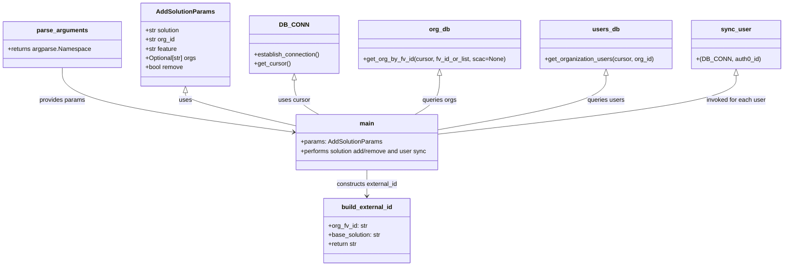

# Diagram: common/iam_service/scripts/add_solution.py


> Auto-generated by Obscura crawlers

## Diagram 1



### SVG

<svg id="container" width="2010.515625" xmlns="http://www.w3.org/2000/svg" class="classDiagram" height="692" viewBox="0 0 2010.515625 692" role="graphics-document document" aria-roledescription="class"><style>#container{font-family:"trebuchet ms",verdana,arial,sans-serif;font-size:16px;fill:#333;}@keyframes edge-animation-frame{from{stroke-dashoffset:0;}}@keyframes dash{to{stroke-dashoffset:0;}}#container .edge-animation-slow{stroke-dasharray:9,5!important;stroke-dashoffset:900;animation:dash 50s linear infinite;stroke-linecap:round;}#container .edge-animation-fast{stroke-dasharray:9,5!important;stroke-dashoffset:900;animation:dash 20s linear infinite;stroke-linecap:round;}#container .error-icon{fill:#552222;}#container .error-text{fill:#552222;stroke:#552222;}#container .edge-thickness-normal{stroke-width:1px;}#container .edge-thickness-thick{stroke-width:3.5px;}#container .edge-pattern-solid{stroke-dasharray:0;}#container .edge-thickness-invisible{stroke-width:0;fill:none;}#container .edge-pattern-dashed{stroke-dasharray:3;}#container .edge-pattern-dotted{stroke-dasharray:2;}#container .marker{fill:#333333;stroke:#333333;}#container .marker.cross{stroke:#333333;}#container svg{font-family:"trebuchet ms",verdana,arial,sans-serif;font-size:16px;}#container p{margin:0;}#container g.classGroup text{fill:#9370DB;stroke:none;font-family:"trebuchet ms",verdana,arial,sans-serif;font-size:10px;}#container g.classGroup text .title{font-weight:bolder;}#container .nodeLabel,#container .edgeLabel{color:#131300;}#container .edgeLabel .label rect{fill:#ECECFF;}#container .label text{fill:#131300;}#container .labelBkg{background:#ECECFF;}#container .edgeLabel .label span{background:#ECECFF;}#container .classTitle{font-weight:bolder;}#container .node rect,#container .node circle,#container .node ellipse,#container .node polygon,#container .node path{fill:#ECECFF;stroke:#9370DB;stroke-width:1px;}#container .divider{stroke:#9370DB;stroke-width:1;}#container g.clickable{cursor:pointer;}#container g.classGroup rect{fill:#ECECFF;stroke:#9370DB;}#container g.classGroup line{stroke:#9370DB;stroke-width:1;}#container .classLabel .box{stroke:none;stroke-width:0;fill:#ECECFF;opacity:0.5;}#container .classLabel .label{fill:#9370DB;font-size:10px;}#container .relation{stroke:#333333;stroke-width:1;fill:none;}#container .dashed-line{stroke-dasharray:3;}#container .dotted-line{stroke-dasharray:1 2;}#container #compositionStart,#container .composition{fill:#333333!important;stroke:#333333!important;stroke-width:1;}#container #compositionEnd,#container .composition{fill:#333333!important;stroke:#333333!important;stroke-width:1;}#container #dependencyStart,#container .dependency{fill:#333333!important;stroke:#333333!important;stroke-width:1;}#container #dependencyStart,#container .dependency{fill:#333333!important;stroke:#333333!important;stroke-width:1;}#container #extensionStart,#container .extension{fill:transparent!important;stroke:#333333!important;stroke-width:1;}#container #extensionEnd,#container .extension{fill:transparent!important;stroke:#333333!important;stroke-width:1;}#container #aggregationStart,#container .aggregation{fill:transparent!important;stroke:#333333!important;stroke-width:1;}#container #aggregationEnd,#container .aggregation{fill:transparent!important;stroke:#333333!important;stroke-width:1;}#container #lollipopStart,#container .lollipop{fill:#ECECFF!important;stroke:#333333!important;stroke-width:1;}#container #lollipopEnd,#container .lollipop{fill:#ECECFF!important;stroke:#333333!important;stroke-width:1;}#container .edgeTerminals{font-size:11px;line-height:initial;}#container .classTitleText{text-anchor:middle;font-size:18px;fill:#333;}#container .label-icon{display:inline-block;height:1em;overflow:visible;vertical-align:-0.125em;}#container .node .label-icon path{fill:currentColor;stroke:revert;stroke-width:revert;}#container :root{--mermaid-font-family:"trebuchet ms",verdana,arial,sans-serif;}</style><g><defs><marker id="container_class-aggregationStart" class="marker aggregation class" refX="18" refY="7" markerWidth="190" markerHeight="240" orient="auto"><path d="M 18,7 L9,13 L1,7 L9,1 Z"></path></marker></defs><defs><marker id="container_class-aggregationEnd" class="marker aggregation class" refX="1" refY="7" markerWidth="20" markerHeight="28" orient="auto"><path d="M 18,7 L9,13 L1,7 L9,1 Z"></path></marker></defs><defs><marker id="container_class-extensionStart" class="marker extension class" refX="18" refY="7" markerWidth="190" markerHeight="240" orient="auto"><path d="M 1,7 L18,13 V 1 Z"></path></marker></defs><defs><marker id="container_class-extensionEnd" class="marker extension class" refX="1" refY="7" markerWidth="20" markerHeight="28" orient="auto"><path d="M 1,1 V 13 L18,7 Z"></path></marker></defs><defs><marker id="container_class-compositionStart" class="marker composition class" refX="18" refY="7" markerWidth="190" markerHeight="240" orient="auto"><path d="M 18,7 L9,13 L1,7 L9,1 Z"></path></marker></defs><defs><marker id="container_class-compositionEnd" class="marker composition class" refX="1" refY="7" markerWidth="20" markerHeight="28" orient="auto"><path d="M 18,7 L9,13 L1,7 L9,1 Z"></path></marker></defs><defs><marker id="container_class-dependencyStart" class="marker dependency class" refX="6" refY="7" markerWidth="190" markerHeight="240" orient="auto"><path d="M 5,7 L9,13 L1,7 L9,1 Z"></path></marker></defs><defs><marker id="container_class-dependencyEnd" class="marker dependency class" refX="13" refY="7" markerWidth="20" markerHeight="28" orient="auto"><path d="M 18,7 L9,13 L14,7 L9,1 Z"></path></marker></defs><defs><marker id="container_class-lollipopStart" class="marker lollipop class" refX="13" refY="7" markerWidth="190" markerHeight="240" orient="auto"><circle stroke="black" fill="transparent" cx="7" cy="7" r="6"></circle></marker></defs><defs><marker id="container_class-lollipopEnd" class="marker lollipop class" refX="1" refY="7" markerWidth="190" markerHeight="240" orient="auto"><circle stroke="black" fill="transparent" cx="7" cy="7" r="6"></circle></marker></defs><g class="root"><g class="clusters"></g><g class="edgePaths"><path d="M159.332,176L159.332,190.167C159.332,204.333,159.332,232.667,257.788,260.489C356.244,288.312,553.155,315.623,651.611,329.279L750.067,342.935" id="id_parse_arguments_main_1" class="edge-thickness-normal edge-pattern-solid relation" style=";;;" data-edge="true" data-et="edge" data-id="id_parse_arguments_main_1" data-points="W3sieCI6MTU5LjMzMjAzMTI1LCJ5IjoxNzZ9LHsieCI6MTU5LjMzMjAzMTI1LCJ5IjoyNjF9LHsieCI6NzU2LjAwOTc2NTYyNSwieSI6MzQzLjc1OTE2Mzk0MzE4NTl9XQ==" marker-end="url(#container_class-dependencyEnd)"></path><path d="M476.461,241.25L476.461,244.542C476.461,247.833,476.461,254.417,523.052,268.543C569.644,282.669,662.827,304.337,709.418,315.171L756.01,326.006" id="id_AddSolutionParams_main_2" class="edge-thickness-normal edge-pattern-solid relation" style=";;;" data-edge="true" data-et="edge" data-id="id_AddSolutionParams_main_2" data-points="W3sieCI6NDc2LjQ2MDkzNzUsInkiOjIyNH0seyJ4Ijo0NzYuNDYwOTM3NSwieSI6MjYxfSx7IngiOjc1Ni4wMDk3NjU2MjUsInkiOjMyNi4wMDU3NzUxMjAzMTV9XQ==" marker-start="url(#container_class-extensionStart)"></path><path d="M758.094,208.25L758.094,217.042C758.094,225.833,758.094,243.417,768.679,258.375C779.265,273.333,800.436,285.667,811.022,291.833L821.607,298" id="id_DB_CONN_main_3" class="edge-thickness-normal edge-pattern-solid relation" style=";;;" data-edge="true" data-et="edge" data-id="id_DB_CONN_main_3" data-points="W3sieCI6NzU4LjA5Mzc1LCJ5IjoxOTF9LHsieCI6NzU4LjA5Mzc1LCJ5IjoyNjF9LHsieCI6ODIxLjYwNzI3ODUyNjM3NjEsInkiOjI5OH1d" marker-start="url(#container_class-extensionStart)"></path><path d="M1132.309,196.25L1132.309,207.042C1132.309,217.833,1132.309,239.417,1121.723,256.375C1111.137,273.333,1089.966,285.667,1079.381,291.833L1068.795,298" id="id_org_db_main_4" class="edge-thickness-normal edge-pattern-solid relation" style=";;;" data-edge="true" data-et="edge" data-id="id_org_db_main_4" data-points="W3sieCI6MTEzMi4zMDg1OTM3NSwieSI6MTc5fSx7IngiOjExMzIuMzA4NTkzNzUsInkiOjI2MX0seyJ4IjoxMDY4Ljc5NTA2NTIyMzYyMzksInkiOjI5OH1d" marker-start="url(#container_class-extensionStart)"></path><path d="M1561.703,196.25L1561.703,207.042C1561.703,217.833,1561.703,239.417,1490.485,262.8C1419.266,286.183,1276.829,311.367,1205.611,323.959L1134.393,336.55" id="id_users_db_main_5" class="edge-thickness-normal edge-pattern-solid relation" style=";;;" data-edge="true" data-et="edge" data-id="id_users_db_main_5" data-points="W3sieCI6MTU2MS43MDMxMjUsInkiOjE3OX0seyJ4IjoxNTYxLjcwMzEyNSwieSI6MjYxfSx7IngiOjExMzQuMzkyNTc4MTI1LCJ5IjozMzYuNTUwMjA2MDgzMzM5NH1d" marker-start="url(#container_class-extensionStart)"></path><path d="M1892.617,196.25L1892.617,207.042C1892.617,217.833,1892.617,239.417,1766.246,264.747C1639.876,290.078,1387.134,319.156,1260.763,333.695L1134.393,348.234" id="id_sync_user_main_6" class="edge-thickness-normal edge-pattern-solid relation" style=";;;" data-edge="true" data-et="edge" data-id="id_sync_user_main_6" data-points="W3sieCI6MTg5Mi42MTcxODc1LCJ5IjoxNzl9LHsieCI6MTg5Mi42MTcxODc1LCJ5IjoyNjF9LHsieCI6MTEzNC4zOTI1NzgxMjUsInkiOjM0OC4yMzM1NzExNjQ5OTAzfV0=" marker-start="url(#container_class-extensionStart)"></path><path d="M945.201,442L945.201,448.167C945.201,454.333,945.201,466.667,945.201,478C945.201,489.333,945.201,499.667,945.201,504.833L945.201,510" id="id_main_build_external_id_7" class="edge-thickness-normal edge-pattern-solid relation" style=";;;" data-edge="true" data-et="edge" data-id="id_main_build_external_id_7" data-points="W3sieCI6OTQ1LjIwMTE3MTg3NSwieSI6NDQyfSx7IngiOjk0NS4yMDExNzE4NzUsInkiOjQ3OX0seyJ4Ijo5NDUuMjAxMTcxODc1LCJ5Ijo1MTZ9XQ==" marker-end="url(#container_class-dependencyEnd)"></path></g><g class="edgeLabels"><g class="edgeLabel" transform="translate(159.33203125, 261)"><g class="label" data-id="id_parse_arguments_main_1" transform="translate(-60.2109375, -12)"><foreignObject width="120.421875" height="24"><div xmlns="http://www.w3.org/1999/xhtml" class="labelBkg" style="display: table-cell; white-space: nowrap; line-height: 1.5; max-width: 200px; text-align: center;"><span class="edgeLabel"><p>provides params</p></span></div></foreignObject></g></g><g class="edgeLabel" transform="translate(476.4609375, 261)"><g class="label" data-id="id_AddSolutionParams_main_2" transform="translate(-16.4921875, -12)"><foreignObject width="32.984375" height="24"><div xmlns="http://www.w3.org/1999/xhtml" class="labelBkg" style="display: table-cell; white-space: nowrap; line-height: 1.5; max-width: 200px; text-align: center;"><span class="edgeLabel"><p>uses</p></span></div></foreignObject></g></g><g class="edgeLabel" transform="translate(758.09375, 261)"><g class="label" data-id="id_DB_CONN_main_3" transform="translate(-41.4765625, -12)"><foreignObject width="82.953125" height="24"><div xmlns="http://www.w3.org/1999/xhtml" class="labelBkg" style="display: table-cell; white-space: nowrap; line-height: 1.5; max-width: 200px; text-align: center;"><span class="edgeLabel"><p>uses cursor</p></span></div></foreignObject></g></g><g class="edgeLabel" transform="translate(1132.30859375, 261)"><g class="label" data-id="id_org_db_main_4" transform="translate(-44.84375, -12)"><foreignObject width="89.6875" height="24"><div xmlns="http://www.w3.org/1999/xhtml" class="labelBkg" style="display: table-cell; white-space: nowrap; line-height: 1.5; max-width: 200px; text-align: center;"><span class="edgeLabel"><p>queries orgs</p></span></div></foreignObject></g></g><g class="edgeLabel" transform="translate(1561.703125, 261)"><g class="label" data-id="id_users_db_main_5" transform="translate(-48.8203125, -12)"><foreignObject width="97.640625" height="24"><div xmlns="http://www.w3.org/1999/xhtml" class="labelBkg" style="display: table-cell; white-space: nowrap; line-height: 1.5; max-width: 200px; text-align: center;"><span class="edgeLabel"><p>queries users</p></span></div></foreignObject></g></g><g class="edgeLabel" transform="translate(1892.6171875, 261)"><g class="label" data-id="id_sync_user_main_6" transform="translate(-78.34375, -12)"><foreignObject width="156.6875" height="24"><div xmlns="http://www.w3.org/1999/xhtml" class="labelBkg" style="display: table-cell; white-space: nowrap; line-height: 1.5; max-width: 200px; text-align: center;"><span class="edgeLabel"><p>invoked for each user</p></span></div></foreignObject></g></g><g class="edgeLabel" transform="translate(945.201171875, 479)"><g class="label" data-id="id_main_build_external_id_7" transform="translate(-80.8515625, -12)"><foreignObject width="161.703125" height="24"><div xmlns="http://www.w3.org/1999/xhtml" class="labelBkg" style="display: table-cell; white-space: nowrap; line-height: 1.5; max-width: 200px; text-align: center;"><span class="edgeLabel"><p>constructs external_id</p></span></div></foreignObject></g></g></g><g class="nodes"><g class="node default" id="classId-AddSolutionParams-0" transform="translate(476.4609375, 116)"><g class="basic label-container"><path d="M-115.796875 -108 L115.796875 -108 L115.796875 108 L-115.796875 108" stroke="none" stroke-width="0" fill="#ECECFF" style=""></path><path d="M-115.796875 -108 C-60.61645526733418 -108, -5.436035534668363 -108, 115.796875 -108 M-115.796875 -108 C-29.126505592501758 -108, 57.543863814996485 -108, 115.796875 -108 M115.796875 -108 C115.796875 -42.73496285199873, 115.796875 22.53007429600254, 115.796875 108 M115.796875 -108 C115.796875 -46.43577322156604, 115.796875 15.128453556867925, 115.796875 108 M115.796875 108 C65.24408240890085 108, 14.691289817801717 108, -115.796875 108 M115.796875 108 C28.4649213677163 108, -58.8670322645674 108, -115.796875 108 M-115.796875 108 C-115.796875 43.55249190362582, -115.796875 -20.895016192748358, -115.796875 -108 M-115.796875 108 C-115.796875 36.130255590739836, -115.796875 -35.73948881852033, -115.796875 -108" stroke="#9370DB" stroke-width="1.3" fill="none" stroke-dasharray="0 0" style=""></path></g><g class="annotation-group text" transform="translate(0, -84)"></g><g class="label-group text" transform="translate(-71.859375, -84)"><g class="label" style="font-weight: bolder" transform="translate(0,-12)"><foreignObject width="143.71875" height="24"><div xmlns="http://www.w3.org/1999/xhtml" style="display: table-cell; white-space: nowrap; line-height: 1.5; max-width: 192px; text-align: center;"><span class="nodeLabel markdown-node-label" style=""><p>AddSolutionParams</p></span></div></foreignObject></g></g><g class="members-group text" transform="translate(-103.796875, -36)"><g class="label" style="" transform="translate(0,-12)"><foreignObject width="91.484375" height="24"><div xmlns="http://www.w3.org/1999/xhtml" style="display: table-cell; white-space: nowrap; line-height: 1.5; max-width: 149px; text-align: center;"><span class="nodeLabel markdown-node-label" style=""><p>+str solution</p></span></div></foreignObject></g><g class="label" style="" transform="translate(0,12)"><foreignObject width="77.71875" height="24"><div xmlns="http://www.w3.org/1999/xhtml" style="display: table-cell; white-space: nowrap; line-height: 1.5; max-width: 135px; text-align: center;"><span class="nodeLabel markdown-node-label" style=""><p>+str org_id</p></span></div></foreignObject></g><g class="label" style="" transform="translate(0,36)"><foreignObject width="83.625" height="24"><div xmlns="http://www.w3.org/1999/xhtml" style="display: table-cell; white-space: nowrap; line-height: 1.5; max-width: 141px; text-align: center;"><span class="nodeLabel markdown-node-label" style=""><p>+str feature</p></span></div></foreignObject></g><g class="label" style="" transform="translate(0,60)"><foreignObject width="135.734375" height="24"><div xmlns="http://www.w3.org/1999/xhtml" style="display: table-cell; white-space: nowrap; line-height: 1.5; max-width: 193px; text-align: center;"><span class="nodeLabel markdown-node-label" style=""><p>+Optional[str] orgs</p></span></div></foreignObject></g><g class="label" style="" transform="translate(0,84)"><foreignObject width="99.046875" height="24"><div xmlns="http://www.w3.org/1999/xhtml" style="display: table-cell; white-space: nowrap; line-height: 1.5; max-width: 156px; text-align: center;"><span class="nodeLabel markdown-node-label" style=""><p>+bool remove</p></span></div></foreignObject></g></g><g class="methods-group text" transform="translate(-103.796875, 108)"></g><g class="divider" style=""><path d="M-115.796875 -60 C-67.58843152435415 -60, -19.379988048708313 -60, 115.796875 -60 M-115.796875 -60 C-66.66032148338832 -60, -17.523767966776646 -60, 115.796875 -60" stroke="#9370DB" stroke-width="1.3" fill="none" stroke-dasharray="0 0" style=""></path></g><g class="divider" style=""><path d="M-115.796875 84 C-42.85254641400459 84, 30.091782171990815 84, 115.796875 84 M-115.796875 84 C-25.803932933525786 84, 64.18900913294843 84, 115.796875 84" stroke="#9370DB" stroke-width="1.3" fill="none" stroke-dasharray="0 0" style=""></path></g></g><g class="node default" id="classId-DB_CONN-1" transform="translate(758.09375, 116)"><g class="basic label-container"><path d="M-115.8359375 -75 L115.8359375 -75 L115.8359375 75 L-115.8359375 75" stroke="none" stroke-width="0" fill="#ECECFF" style=""></path><path d="M-115.8359375 -75 C-65.80883144402459 -75, -15.781725388049182 -75, 115.8359375 -75 M-115.8359375 -75 C-52.19098201828575 -75, 11.453973463428497 -75, 115.8359375 -75 M115.8359375 -75 C115.8359375 -42.20559198307349, 115.8359375 -9.411183966146979, 115.8359375 75 M115.8359375 -75 C115.8359375 -25.680670707115347, 115.8359375 23.638658585769306, 115.8359375 75 M115.8359375 75 C55.783385860928774 75, -4.269165778142451 75, -115.8359375 75 M115.8359375 75 C45.98232716121909 75, -23.87128317756182 75, -115.8359375 75 M-115.8359375 75 C-115.8359375 39.741479678279056, -115.8359375 4.482959356558112, -115.8359375 -75 M-115.8359375 75 C-115.8359375 23.355949378448933, -115.8359375 -28.288101243102133, -115.8359375 -75" stroke="#9370DB" stroke-width="1.3" fill="none" stroke-dasharray="0 0" style=""></path></g><g class="annotation-group text" transform="translate(0, -51)"></g><g class="label-group text" transform="translate(-34.40625, -51)"><g class="label" style="font-weight: bolder" transform="translate(0,-12)"><foreignObject width="68.8125" height="24"><div xmlns="http://www.w3.org/1999/xhtml" style="display: table-cell; white-space: nowrap; line-height: 1.5; max-width: 119px; text-align: center;"><span class="nodeLabel markdown-node-label" style=""><p>DB_CONN</p></span></div></foreignObject></g></g><g class="members-group text" transform="translate(-103.8359375, -3)"></g><g class="methods-group text" transform="translate(-103.8359375, 27)"><g class="label" style="" transform="translate(0,-12)"><foreignObject width="173.265625" height="24"><div xmlns="http://www.w3.org/1999/xhtml" style="display: table-cell; white-space: nowrap; line-height: 1.5; max-width: 231px; text-align: center;"><span class="nodeLabel markdown-node-label" style=""><p>+establish_connection()</p></span></div></foreignObject></g><g class="label" style="" transform="translate(0,12)"><foreignObject width="94.640625" height="24"><div xmlns="http://www.w3.org/1999/xhtml" style="display: table-cell; white-space: nowrap; line-height: 1.5; max-width: 152px; text-align: center;"><span class="nodeLabel markdown-node-label" style=""><p>+get_cursor()</p></span></div></foreignObject></g></g><g class="divider" style=""><path d="M-115.8359375 -27 C-66.49183384090878 -27, -17.147730181817565 -27, 115.8359375 -27 M-115.8359375 -27 C-53.519773539498296 -27, 8.796390421003409 -27, 115.8359375 -27" stroke="#9370DB" stroke-width="1.3" fill="none" stroke-dasharray="0 0" style=""></path></g><g class="divider" style=""><path d="M-115.8359375 -3 C-58.77124909937624 -3, -1.706560698752483 -3, 115.8359375 -3 M-115.8359375 -3 C-55.20830460023146 -3, 5.419328299537085 -3, 115.8359375 -3" stroke="#9370DB" stroke-width="1.3" fill="none" stroke-dasharray="0 0" style=""></path></g></g><g class="node default" id="classId-parse_arguments-2" transform="translate(159.33203125, 116)"><g class="basic label-container"><path d="M-151.33203125 -60 L151.33203125 -60 L151.33203125 60 L-151.33203125 60" stroke="none" stroke-width="0" fill="#ECECFF" style=""></path><path d="M-151.33203125 -60 C-44.216070990234826 -60, 62.89988926953035 -60, 151.33203125 -60 M-151.33203125 -60 C-34.68106022480579 -60, 81.96991080038842 -60, 151.33203125 -60 M151.33203125 -60 C151.33203125 -34.57427711499869, 151.33203125 -9.148554229997373, 151.33203125 60 M151.33203125 -60 C151.33203125 -16.30344028718728, 151.33203125 27.393119425625443, 151.33203125 60 M151.33203125 60 C84.16979874378576 60, 17.007566237571524 60, -151.33203125 60 M151.33203125 60 C84.49689045987209 60, 17.661749669744182 60, -151.33203125 60 M-151.33203125 60 C-151.33203125 20.340850330157018, -151.33203125 -19.318299339685964, -151.33203125 -60 M-151.33203125 60 C-151.33203125 19.58555082855328, -151.33203125 -20.82889834289344, -151.33203125 -60" stroke="#9370DB" stroke-width="1.3" fill="none" stroke-dasharray="0 0" style=""></path></g><g class="annotation-group text" transform="translate(0, -36)"></g><g class="label-group text" transform="translate(-63.4609375, -36)"><g class="label" style="font-weight: bolder" transform="translate(0,-12)"><foreignObject width="126.921875" height="24"><div xmlns="http://www.w3.org/1999/xhtml" style="display: table-cell; white-space: nowrap; line-height: 1.5; max-width: 175px; text-align: center;"><span class="nodeLabel markdown-node-label" style=""><p>parse_arguments</p></span></div></foreignObject></g></g><g class="members-group text" transform="translate(-139.33203125, 12)"><g class="label" style="" transform="translate(0,-12)"><foreignObject width="215.203125" height="24"><div xmlns="http://www.w3.org/1999/xhtml" style="display: table-cell; white-space: nowrap; line-height: 1.5; max-width: 273px; text-align: center;"><span class="nodeLabel markdown-node-label" style=""><p>+returns argparse.Namespace</p></span></div></foreignObject></g></g><g class="methods-group text" transform="translate(-139.33203125, 60)"></g><g class="divider" style=""><path d="M-151.33203125 -12 C-66.37850856599239 -12, 18.57501411801522 -12, 151.33203125 -12 M-151.33203125 -12 C-90.44193748802918 -12, -29.551843726058365 -12, 151.33203125 -12" stroke="#9370DB" stroke-width="1.3" fill="none" stroke-dasharray="0 0" style=""></path></g><g class="divider" style=""><path d="M-151.33203125 36 C-50.99788865317713 36, 49.336253943645744 36, 151.33203125 36 M-151.33203125 36 C-58.242086415154475 36, 34.84785841969105 36, 151.33203125 36" stroke="#9370DB" stroke-width="1.3" fill="none" stroke-dasharray="0 0" style=""></path></g></g><g class="node default" id="classId-main-3" transform="translate(945.201171875, 370)"><g class="basic label-container"><path d="M-189.19140625 -72 L189.19140625 -72 L189.19140625 72 L-189.19140625 72" stroke="none" stroke-width="0" fill="#ECECFF" style=""></path><path d="M-189.19140625 -72 C-98.18751380538342 -72, -7.1836213607668356 -72, 189.19140625 -72 M-189.19140625 -72 C-42.435519671803945 -72, 104.32036690639211 -72, 189.19140625 -72 M189.19140625 -72 C189.19140625 -15.360569294267997, 189.19140625 41.27886141146401, 189.19140625 72 M189.19140625 -72 C189.19140625 -19.830971526870094, 189.19140625 32.33805694625981, 189.19140625 72 M189.19140625 72 C44.38163552268625 72, -100.4281352046275 72, -189.19140625 72 M189.19140625 72 C85.62135586769008 72, -17.94869451461983 72, -189.19140625 72 M-189.19140625 72 C-189.19140625 18.043760723517615, -189.19140625 -35.91247855296477, -189.19140625 -72 M-189.19140625 72 C-189.19140625 33.71170075677208, -189.19140625 -4.576598486455836, -189.19140625 -72" stroke="#9370DB" stroke-width="1.3" fill="none" stroke-dasharray="0 0" style=""></path></g><g class="annotation-group text" transform="translate(0, -48)"></g><g class="label-group text" transform="translate(-18.0234375, -48)"><g class="label" style="font-weight: bolder" transform="translate(0,-12)"><foreignObject width="36.046875" height="24"><div xmlns="http://www.w3.org/1999/xhtml" style="display: table-cell; white-space: nowrap; line-height: 1.5; max-width: 86px; text-align: center;"><span class="nodeLabel markdown-node-label" style=""><p>main</p></span></div></foreignObject></g></g><g class="members-group text" transform="translate(-177.19140625, 0)"><g class="label" style="" transform="translate(0,-12)"><foreignObject width="211.625" height="24"><div xmlns="http://www.w3.org/1999/xhtml" style="display: table-cell; white-space: nowrap; line-height: 1.5; max-width: 269px; text-align: center;"><span class="nodeLabel markdown-node-label" style=""><p>+params: AddSolutionParams</p></span></div></foreignObject></g><g class="label" style="" transform="translate(0,12)"><foreignObject width="336.359375" height="24"><div xmlns="http://www.w3.org/1999/xhtml" style="display: table-cell; white-space: nowrap; line-height: 1.5; max-width: 394px; text-align: center;"><span class="nodeLabel markdown-node-label" style=""><p>+performs solution add/remove and user sync</p></span></div></foreignObject></g></g><g class="methods-group text" transform="translate(-177.19140625, 72)"></g><g class="divider" style=""><path d="M-189.19140625 -24 C-108.31136700541916 -24, -27.431327760838315 -24, 189.19140625 -24 M-189.19140625 -24 C-44.04556213209301 -24, 101.10028198581398 -24, 189.19140625 -24" stroke="#9370DB" stroke-width="1.3" fill="none" stroke-dasharray="0 0" style=""></path></g><g class="divider" style=""><path d="M-189.19140625 48 C-70.55023516026402 48, 48.090935929471954 48, 189.19140625 48 M-189.19140625 48 C-110.87056290529351 48, -32.54971956058702 48, 189.19140625 48" stroke="#9370DB" stroke-width="1.3" fill="none" stroke-dasharray="0 0" style=""></path></g></g><g class="node default" id="classId-build_external_id-4" transform="translate(945.201171875, 600)"><g class="basic label-container"><path d="M-112.8203125 -84 L112.8203125 -84 L112.8203125 84 L-112.8203125 84" stroke="none" stroke-width="0" fill="#ECECFF" style=""></path><path d="M-112.8203125 -84 C-33.31808317235722 -84, 46.18414615528556 -84, 112.8203125 -84 M-112.8203125 -84 C-51.08617955579327 -84, 10.647953388413455 -84, 112.8203125 -84 M112.8203125 -84 C112.8203125 -18.072503868899204, 112.8203125 47.85499226220159, 112.8203125 84 M112.8203125 -84 C112.8203125 -17.17322447672177, 112.8203125 49.65355104655646, 112.8203125 84 M112.8203125 84 C44.60713370483295 84, -23.606045090334106 84, -112.8203125 84 M112.8203125 84 C29.981148763062734 84, -52.85801497387453 84, -112.8203125 84 M-112.8203125 84 C-112.8203125 38.56881311308894, -112.8203125 -6.862373773822114, -112.8203125 -84 M-112.8203125 84 C-112.8203125 47.04726459161557, -112.8203125 10.094529183231145, -112.8203125 -84" stroke="#9370DB" stroke-width="1.3" fill="none" stroke-dasharray="0 0" style=""></path></g><g class="annotation-group text" transform="translate(0, -60)"></g><g class="label-group text" transform="translate(-64.234375, -60)"><g class="label" style="font-weight: bolder" transform="translate(0,-12)"><foreignObject width="128.46875" height="24"><div xmlns="http://www.w3.org/1999/xhtml" style="display: table-cell; white-space: nowrap; line-height: 1.5; max-width: 177px; text-align: center;"><span class="nodeLabel markdown-node-label" style=""><p>build_external_id</p></span></div></foreignObject></g></g><g class="members-group text" transform="translate(-100.8203125, -12)"><g class="label" style="" transform="translate(0,-12)"><foreignObject width="102.3125" height="24"><div xmlns="http://www.w3.org/1999/xhtml" style="display: table-cell; white-space: nowrap; line-height: 1.5; max-width: 160px; text-align: center;"><span class="nodeLabel markdown-node-label" style=""><p>+org_fv_id: str</p></span></div></foreignObject></g><g class="label" style="" transform="translate(0,12)"><foreignObject width="137.40625" height="24"><div xmlns="http://www.w3.org/1999/xhtml" style="display: table-cell; white-space: nowrap; line-height: 1.5; max-width: 196px; text-align: center;"><span class="nodeLabel markdown-node-label" style=""><p>+base_solution: str</p></span></div></foreignObject></g><g class="label" style="" transform="translate(0,36)"><foreignObject width="76.71875" height="24"><div xmlns="http://www.w3.org/1999/xhtml" style="display: table-cell; white-space: nowrap; line-height: 1.5; max-width: 135px; text-align: center;"><span class="nodeLabel markdown-node-label" style=""><p>+return str</p></span></div></foreignObject></g></g><g class="methods-group text" transform="translate(-100.8203125, 84)"></g><g class="divider" style=""><path d="M-112.8203125 -36 C-29.02565572722206 -36, 54.76900104555588 -36, 112.8203125 -36 M-112.8203125 -36 C-53.225164342806096 -36, 6.369983814387808 -36, 112.8203125 -36" stroke="#9370DB" stroke-width="1.3" fill="none" stroke-dasharray="0 0" style=""></path></g><g class="divider" style=""><path d="M-112.8203125 60 C-36.546121474772065 60, 39.72806955045587 60, 112.8203125 60 M-112.8203125 60 C-56.470467882541826 60, -0.12062326508365118 60, 112.8203125 60" stroke="#9370DB" stroke-width="1.3" fill="none" stroke-dasharray="0 0" style=""></path></g></g><g class="node default" id="classId-users_db-5" transform="translate(1561.703125, 116)"><g class="basic label-container"><path d="M-171.015625 -63 L171.015625 -63 L171.015625 63 L-171.015625 63" stroke="none" stroke-width="0" fill="#ECECFF" style=""></path><path d="M-171.015625 -63 C-55.76143813338133 -63, 59.492748733237335 -63, 171.015625 -63 M-171.015625 -63 C-60.86888272895909 -63, 49.27785954208181 -63, 171.015625 -63 M171.015625 -63 C171.015625 -37.05328852990392, 171.015625 -11.106577059807833, 171.015625 63 M171.015625 -63 C171.015625 -21.650938808190766, 171.015625 19.69812238361847, 171.015625 63 M171.015625 63 C96.1107476072269 63, 21.205870214453796 63, -171.015625 63 M171.015625 63 C79.87652726821642 63, -11.262570463567158 63, -171.015625 63 M-171.015625 63 C-171.015625 27.951881960563057, -171.015625 -7.096236078873886, -171.015625 -63 M-171.015625 63 C-171.015625 23.638709411827847, -171.015625 -15.722581176344306, -171.015625 -63" stroke="#9370DB" stroke-width="1.3" fill="none" stroke-dasharray="0 0" style=""></path></g><g class="annotation-group text" transform="translate(0, -39)"></g><g class="label-group text" transform="translate(-33.25, -39)"><g class="label" style="font-weight: bolder" transform="translate(0,-12)"><foreignObject width="66.5" height="24"><div xmlns="http://www.w3.org/1999/xhtml" style="display: table-cell; white-space: nowrap; line-height: 1.5; max-width: 116px; text-align: center;"><span class="nodeLabel markdown-node-label" style=""><p>users_db</p></span></div></foreignObject></g></g><g class="members-group text" transform="translate(-159.015625, 9)"></g><g class="methods-group text" transform="translate(-159.015625, 39)"><g class="label" style="" transform="translate(0,-12)"><foreignObject width="284.78125" height="24"><div xmlns="http://www.w3.org/1999/xhtml" style="display: table-cell; white-space: nowrap; line-height: 1.5; max-width: 342px; text-align: center;"><span class="nodeLabel markdown-node-label" style=""><p>+get_organization_users(cursor, org_id)</p></span></div></foreignObject></g></g><g class="divider" style=""><path d="M-171.015625 -15 C-41.383721536902414 -15, 88.24818192619517 -15, 171.015625 -15 M-171.015625 -15 C-84.19950611317535 -15, 2.616612773649308 -15, 171.015625 -15" stroke="#9370DB" stroke-width="1.3" fill="none" stroke-dasharray="0 0" style=""></path></g><g class="divider" style=""><path d="M-171.015625 9 C-101.89272476174868 9, -32.76982452349736 9, 171.015625 9 M-171.015625 9 C-35.531295736320175 9, 99.95303352735965 9, 171.015625 9" stroke="#9370DB" stroke-width="1.3" fill="none" stroke-dasharray="0 0" style=""></path></g></g><g class="node default" id="classId-org_db-6" transform="translate(1132.30859375, 116)"><g class="basic label-container"><path d="M-208.37890625 -63 L208.37890625 -63 L208.37890625 63 L-208.37890625 63" stroke="none" stroke-width="0" fill="#ECECFF" style=""></path><path d="M-208.37890625 -63 C-101.5499634319603 -63, 5.278979386079413 -63, 208.37890625 -63 M-208.37890625 -63 C-102.92487365240791 -63, 2.5291589451841787 -63, 208.37890625 -63 M208.37890625 -63 C208.37890625 -33.46202160048885, 208.37890625 -3.9240432009776995, 208.37890625 63 M208.37890625 -63 C208.37890625 -25.153738480915614, 208.37890625 12.692523038168773, 208.37890625 63 M208.37890625 63 C72.55957712640364 63, -63.25975199719272 63, -208.37890625 63 M208.37890625 63 C112.48057950682228 63, 16.58225276364456 63, -208.37890625 63 M-208.37890625 63 C-208.37890625 32.55884811639379, -208.37890625 2.11769623278758, -208.37890625 -63 M-208.37890625 63 C-208.37890625 15.017503398845164, -208.37890625 -32.96499320230967, -208.37890625 -63" stroke="#9370DB" stroke-width="1.3" fill="none" stroke-dasharray="0 0" style=""></path></g><g class="annotation-group text" transform="translate(0, -39)"></g><g class="label-group text" transform="translate(-25.8359375, -39)"><g class="label" style="font-weight: bolder" transform="translate(0,-12)"><foreignObject width="51.671875" height="24"><div xmlns="http://www.w3.org/1999/xhtml" style="display: table-cell; white-space: nowrap; line-height: 1.5; max-width: 101px; text-align: center;"><span class="nodeLabel markdown-node-label" style=""><p>org_db</p></span></div></foreignObject></g></g><g class="members-group text" transform="translate(-196.37890625, 9)"></g><g class="methods-group text" transform="translate(-196.37890625, 39)"><g class="label" style="" transform="translate(0,-12)"><foreignObject width="366.921875" height="24"><div xmlns="http://www.w3.org/1999/xhtml" style="display: table-cell; white-space: nowrap; line-height: 1.5; max-width: 424px; text-align: center;"><span class="nodeLabel markdown-node-label" style=""><p>+get_org_by_fv_id(cursor, fv_id_or_list, scac=None)</p></span></div></foreignObject></g></g><g class="divider" style=""><path d="M-208.37890625 -15 C-83.25714191507005 -15, 41.8646224198599 -15, 208.37890625 -15 M-208.37890625 -15 C-117.15534624830961 -15, -25.931786246619225 -15, 208.37890625 -15" stroke="#9370DB" stroke-width="1.3" fill="none" stroke-dasharray="0 0" style=""></path></g><g class="divider" style=""><path d="M-208.37890625 9 C-101.33528115568129 9, 5.708343938637427 9, 208.37890625 9 M-208.37890625 9 C-124.41964625959568 9, -40.46038626919136 9, 208.37890625 9" stroke="#9370DB" stroke-width="1.3" fill="none" stroke-dasharray="0 0" style=""></path></g></g><g class="node default" id="classId-sync_user-7" transform="translate(1892.6171875, 116)"><g class="basic label-container"><path d="M-109.8984375 -63 L109.8984375 -63 L109.8984375 63 L-109.8984375 63" stroke="none" stroke-width="0" fill="#ECECFF" style=""></path><path d="M-109.8984375 -63 C-41.23909903256936 -63, 27.420239434861287 -63, 109.8984375 -63 M-109.8984375 -63 C-38.734322637139115 -63, 32.42979222572177 -63, 109.8984375 -63 M109.8984375 -63 C109.8984375 -25.190725924367797, 109.8984375 12.618548151264406, 109.8984375 63 M109.8984375 -63 C109.8984375 -16.499874103920867, 109.8984375 30.000251792158267, 109.8984375 63 M109.8984375 63 C29.11223912169541 63, -51.67395925660918 63, -109.8984375 63 M109.8984375 63 C62.18420262216037 63, 14.46996774432074 63, -109.8984375 63 M-109.8984375 63 C-109.8984375 19.583793775805283, -109.8984375 -23.832412448389434, -109.8984375 -63 M-109.8984375 63 C-109.8984375 13.311313204102959, -109.8984375 -36.37737359179408, -109.8984375 -63" stroke="#9370DB" stroke-width="1.3" fill="none" stroke-dasharray="0 0" style=""></path></g><g class="annotation-group text" transform="translate(0, -39)"></g><g class="label-group text" transform="translate(-36.375, -39)"><g class="label" style="font-weight: bolder" transform="translate(0,-12)"><foreignObject width="72.75" height="24"><div xmlns="http://www.w3.org/1999/xhtml" style="display: table-cell; white-space: nowrap; line-height: 1.5; max-width: 123px; text-align: center;"><span class="nodeLabel markdown-node-label" style=""><p>sync_user</p></span></div></foreignObject></g></g><g class="members-group text" transform="translate(-97.8984375, 9)"></g><g class="methods-group text" transform="translate(-97.8984375, 39)"><g class="label" style="" transform="translate(0,-12)"><foreignObject width="159.421875" height="24"><div xmlns="http://www.w3.org/1999/xhtml" style="display: table-cell; white-space: nowrap; line-height: 1.5; max-width: 209px; text-align: center;"><span class="nodeLabel markdown-node-label" style=""><p>+(DB_CONN, auth0_id)</p></span></div></foreignObject></g></g><g class="divider" style=""><path d="M-109.8984375 -15 C-36.18864480059747 -15, 37.521147898805054 -15, 109.8984375 -15 M-109.8984375 -15 C-37.81191945260625 -15, 34.274598594787506 -15, 109.8984375 -15" stroke="#9370DB" stroke-width="1.3" fill="none" stroke-dasharray="0 0" style=""></path></g><g class="divider" style=""><path d="M-109.8984375 9 C-42.120739959736255 9, 25.65695758052749 9, 109.8984375 9 M-109.8984375 9 C-25.92338198149153 9, 58.05167353701694 9, 109.8984375 9" stroke="#9370DB" stroke-width="1.3" fill="none" stroke-dasharray="0 0" style=""></path></g></g></g></g></g></svg>

## Diagram 2

```mermaid
flowchart TD
    Start([Start])
    PA[parse_arguments()]
    BuildParams[Construct AddSolutionParams]
    MainCall[main(params)]
    ReadOrgs{params.orgs?}
    ReadCSV[Read CSV file into list]
    GetCursor[DB_CONN.get_cursor()]
    ProvidedOrgId{params.org_id?}
    GetSingleOrg[org_db.get_org_by_fv_id(cursor, params.org_id)]
    GetMultipleOrgs[org_db.get_org_by_fv_id(cursor, fv_id_list, scac=...)]
    IterateOrgs[For each provided_org]
    EnsureFvId{org has fv_id?}
    BuildExternal[build_external_id(org_fv_id, params.solution)]
    FeatureNormalize{params.feature == "FV"?}
    RemoveCheck{params.remove?}
    DeleteSQL[DELETE FROM solution ...]
    InsertSQL[INSERT INTO solution ... ON CONFLICT DO NOTHING]
    AwsStageCheck{AWS_STAGE == "staging1"?}
    SkipSync[Print skip user sync]
    GetUsers[users_db.get_organization_users(cursor, provided_org_id)]
    ForEachUser[For each auth0_id in users]
    SyncTry[try: sync_user(DB_CONN, auth0_id)]
    SyncNotFound[except NotFoundError -> print not found]
    End([End])

    Start --> PA --> BuildParams --> MainCall --> ReadOrgs
    ReadOrgs -- yes --> ReadCSV --> GetCursor
    ReadOrgs -- no --> GetCursor
    GetCursor --> ProvidedOrgId
    ProvidedOrgId -- yes --> GetSingleOrg --> IterateOrgs
    ProvidedOrgId -- no --> GetMultipleOrgs --> IterateOrgs
    IterateOrgs --> EnsureFvId
    EnsureFvId -- no --> End
    EnsureFvId -- yes --> BuildExternal --> FeatureNormalize
    FeatureNormalize -- true --> FeatureNormalize[set feature = "Finished Vehicle"] --> RemoveCheck
    FeatureNormalize -- false --> RemoveCheck
    RemoveCheck -- true --> DeleteSQL --> CheckRowcount{cursor.rowcount == 0?}
    CheckRowcount -- true --> IterateOrgs
    CheckRowcount -- false --> AwsStageCheck
    RemoveCheck -- false --> InsertSQL --> AwsStageCheck
    AwsStageCheck -- true --> SkipSync --> IterateOrgs
    AwsStageCheck -- false --> GetUsers --> ForEachUser
    ForEachUser --> SyncTry --> SyncNotFound --> ForEachUser
    SyncTry --> ForEachUser
    ForEachUser --> IterateOrgs
    IterateOrgs --> End
```

> SVG rendering failed for this diagram.
