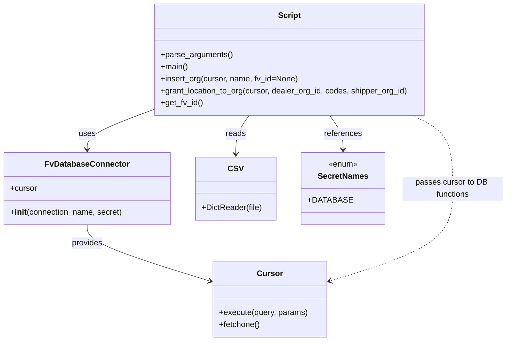

# Diagram: common/iam_service/scripts/add_vinview_org.py


> Auto-generated by Obscura crawlers

## Diagram 1

```mermaid
flowchart TD
  A[parse_arguments()] --> B[open dealer_details CSV]
  B --> C{for each row}
  C --> D[insert_org(cursor, name)]
  D --> D1[get_fv_id() if fv_id missing]
  D --> E[returns dealer_org_id]
  C --> F[parse codes from row["dealers"]]
  F --> G[grant_location_to_org(cursor, dealer_org_id, codes, org_id)]
  G --> H[execute INSERT INTO location.location_grant SELECT ... WHERE code IN codes AND organization_id=(SELECT id FROM organizations WHERE fv_id=shipper_org_id)]
  E --> G
  subgraph DB
    DB_CONN[FvDatabaseConnector("add_vinview_org", SecretNames.DATABASE)]
    cursor[DB cursor]
    DB_CONN --> cursor
    D --> cursor
    G --> cursor
  end
```

> SVG rendering failed for this diagram.

## Diagram 2



### SVG

<svg id="container" width="987.7421875" xmlns="http://www.w3.org/2000/svg" class="classDiagram" height="680" viewBox="0 0 987.7421875 680" role="graphics-document document" aria-roledescription="class"><style>#container{font-family:"trebuchet ms",verdana,arial,sans-serif;font-size:16px;fill:#333;}@keyframes edge-animation-frame{from{stroke-dashoffset:0;}}@keyframes dash{to{stroke-dashoffset:0;}}#container .edge-animation-slow{stroke-dasharray:9,5!important;stroke-dashoffset:900;animation:dash 50s linear infinite;stroke-linecap:round;}#container .edge-animation-fast{stroke-dasharray:9,5!important;stroke-dashoffset:900;animation:dash 20s linear infinite;stroke-linecap:round;}#container .error-icon{fill:#552222;}#container .error-text{fill:#552222;stroke:#552222;}#container .edge-thickness-normal{stroke-width:1px;}#container .edge-thickness-thick{stroke-width:3.5px;}#container .edge-pattern-solid{stroke-dasharray:0;}#container .edge-thickness-invisible{stroke-width:0;fill:none;}#container .edge-pattern-dashed{stroke-dasharray:3;}#container .edge-pattern-dotted{stroke-dasharray:2;}#container .marker{fill:#333333;stroke:#333333;}#container .marker.cross{stroke:#333333;}#container svg{font-family:"trebuchet ms",verdana,arial,sans-serif;font-size:16px;}#container p{margin:0;}#container g.classGroup text{fill:#9370DB;stroke:none;font-family:"trebuchet ms",verdana,arial,sans-serif;font-size:10px;}#container g.classGroup text .title{font-weight:bolder;}#container .nodeLabel,#container .edgeLabel{color:#131300;}#container .edgeLabel .label rect{fill:#ECECFF;}#container .label text{fill:#131300;}#container .labelBkg{background:#ECECFF;}#container .edgeLabel .label span{background:#ECECFF;}#container .classTitle{font-weight:bolder;}#container .node rect,#container .node circle,#container .node ellipse,#container .node polygon,#container .node path{fill:#ECECFF;stroke:#9370DB;stroke-width:1px;}#container .divider{stroke:#9370DB;stroke-width:1;}#container g.clickable{cursor:pointer;}#container g.classGroup rect{fill:#ECECFF;stroke:#9370DB;}#container g.classGroup line{stroke:#9370DB;stroke-width:1;}#container .classLabel .box{stroke:none;stroke-width:0;fill:#ECECFF;opacity:0.5;}#container .classLabel .label{fill:#9370DB;font-size:10px;}#container .relation{stroke:#333333;stroke-width:1;fill:none;}#container .dashed-line{stroke-dasharray:3;}#container .dotted-line{stroke-dasharray:1 2;}#container #compositionStart,#container .composition{fill:#333333!important;stroke:#333333!important;stroke-width:1;}#container #compositionEnd,#container .composition{fill:#333333!important;stroke:#333333!important;stroke-width:1;}#container #dependencyStart,#container .dependency{fill:#333333!important;stroke:#333333!important;stroke-width:1;}#container #dependencyStart,#container .dependency{fill:#333333!important;stroke:#333333!important;stroke-width:1;}#container #extensionStart,#container .extension{fill:transparent!important;stroke:#333333!important;stroke-width:1;}#container #extensionEnd,#container .extension{fill:transparent!important;stroke:#333333!important;stroke-width:1;}#container #aggregationStart,#container .aggregation{fill:transparent!important;stroke:#333333!important;stroke-width:1;}#container #aggregationEnd,#container .aggregation{fill:transparent!important;stroke:#333333!important;stroke-width:1;}#container #lollipopStart,#container .lollipop{fill:#ECECFF!important;stroke:#333333!important;stroke-width:1;}#container #lollipopEnd,#container .lollipop{fill:#ECECFF!important;stroke:#333333!important;stroke-width:1;}#container .edgeTerminals{font-size:11px;line-height:initial;}#container .classTitleText{text-anchor:middle;font-size:18px;fill:#333;}#container .label-icon{display:inline-block;height:1em;overflow:visible;vertical-align:-0.125em;}#container .node .label-icon path{fill:currentColor;stroke:revert;stroke-width:revert;}#container :root{--mermaid-font-family:"trebuchet ms",verdana,arial,sans-serif;}</style><g><defs><marker id="container_class-aggregationStart" class="marker aggregation class" refX="18" refY="7" markerWidth="190" markerHeight="240" orient="auto"><path d="M 18,7 L9,13 L1,7 L9,1 Z"></path></marker></defs><defs><marker id="container_class-aggregationEnd" class="marker aggregation class" refX="1" refY="7" markerWidth="20" markerHeight="28" orient="auto"><path d="M 18,7 L9,13 L1,7 L9,1 Z"></path></marker></defs><defs><marker id="container_class-extensionStart" class="marker extension class" refX="18" refY="7" markerWidth="190" markerHeight="240" orient="auto"><path d="M 1,7 L18,13 V 1 Z"></path></marker></defs><defs><marker id="container_class-extensionEnd" class="marker extension class" refX="1" refY="7" markerWidth="20" markerHeight="28" orient="auto"><path d="M 1,1 V 13 L18,7 Z"></path></marker></defs><defs><marker id="container_class-compositionStart" class="marker composition class" refX="18" refY="7" markerWidth="190" markerHeight="240" orient="auto"><path d="M 18,7 L9,13 L1,7 L9,1 Z"></path></marker></defs><defs><marker id="container_class-compositionEnd" class="marker composition class" refX="1" refY="7" markerWidth="20" markerHeight="28" orient="auto"><path d="M 18,7 L9,13 L1,7 L9,1 Z"></path></marker></defs><defs><marker id="container_class-dependencyStart" class="marker dependency class" refX="6" refY="7" markerWidth="190" markerHeight="240" orient="auto"><path d="M 5,7 L9,13 L1,7 L9,1 Z"></path></marker></defs><defs><marker id="container_class-dependencyEnd" class="marker dependency class" refX="13" refY="7" markerWidth="20" markerHeight="28" orient="auto"><path d="M 18,7 L9,13 L14,7 L9,1 Z"></path></marker></defs><defs><marker id="container_class-lollipopStart" class="marker lollipop class" refX="13" refY="7" markerWidth="190" markerHeight="240" orient="auto"><circle stroke="black" fill="transparent" cx="7" cy="7" r="6"></circle></marker></defs><defs><marker id="container_class-lollipopEnd" class="marker lollipop class" refX="1" refY="7" markerWidth="190" markerHeight="240" orient="auto"><circle stroke="black" fill="transparent" cx="7" cy="7" r="6"></circle></marker></defs><g class="root"><g class="clusters"></g><g class="edgePaths"><path d="M296.098,220.443L275.388,228.203C254.678,235.962,213.259,251.481,192.549,264.407C171.84,277.333,171.84,287.667,171.84,292.833L171.84,298" id="id_Script_FvDatabaseConnector_1" class="edge-thickness-normal edge-pattern-solid relation" style=";;;" data-edge="true" data-et="edge" data-id="id_Script_FvDatabaseConnector_1" data-points="W3sieCI6Mjk2LjA5NzY1NjI1LCJ5IjoyMjAuNDQzMTAyODE3NDE2NzZ9LHsieCI6MTcxLjgzOTg0Mzc1LCJ5IjoyNjd9LHsieCI6MTcxLjgzOTg0Mzc1LCJ5IjozMDR9XQ==" marker-end="url(#container_class-dependencyEnd)"></path><path d="M171.84,448L171.84,454.167C171.84,460.333,171.84,472.667,211.139,491.269C250.438,509.871,329.035,534.741,368.334,547.176L407.633,559.612" id="id_FvDatabaseConnector_Cursor_2" class="edge-thickness-normal edge-pattern-solid relation" style=";;;" data-edge="true" data-et="edge" data-id="id_FvDatabaseConnector_Cursor_2" data-points="W3sieCI6MTcxLjgzOTg0Mzc1LCJ5Ijo0NDh9LHsieCI6MTcxLjgzOTg0Mzc1LCJ5Ijo0ODV9LHsieCI6NDEzLjM1MzUxNTYyNSwieSI6NTYxLjQyMTY0NjI1OTAyODl9XQ==" marker-end="url(#container_class-dependencyEnd)"></path><path d="M490.145,230L485.883,236.167C481.622,242.333,473.1,254.667,468.839,267.5C464.578,280.333,464.578,293.667,464.578,300.333L464.578,307" id="id_Script_CSV_3" class="edge-thickness-normal edge-pattern-solid relation" style=";;;" data-edge="true" data-et="edge" data-id="id_Script_CSV_3" data-points="W3sieCI6NDkwLjE0NDUzMTI1LCJ5IjoyMzB9LHsieCI6NDY0LjU3ODEyNSwieSI6MjY3fSx7IngiOjQ2NC41NzgxMjUsInkiOjMxM31d" marker-end="url(#container_class-dependencyEnd)"></path><path d="M643.543,230L647.804,236.167C652.065,242.333,660.587,254.667,664.848,266C669.109,277.333,669.109,287.667,669.109,292.833L669.109,298" id="id_Script_SecretNames_4" class="edge-thickness-normal edge-pattern-solid relation" style=";;;" data-edge="true" data-et="edge" data-id="id_Script_SecretNames_4" data-points="W3sieCI6NjQzLjU0Mjk2ODc1LCJ5IjoyMzB9LHsieCI6NjY5LjEwOTM3NSwieSI6MjY3fSx7IngiOjY2OS4xMDkzNzUsInkiOjMwNH1d" marker-end="url(#container_class-dependencyEnd)"></path><path d="M801.518,230L814.555,236.167C827.592,242.333,853.667,254.667,866.705,279C879.742,303.333,879.742,339.667,879.742,376C879.742,412.333,879.742,448.667,840.443,479.269C801.144,509.871,722.547,534.741,683.248,547.176L643.949,559.612" id="id_Script_Cursor_5" class="edge-thickness-normal edge-pattern-dashed relation" style=";;;" data-edge="true" data-et="edge" data-id="id_Script_Cursor_5" data-points="W3sieCI6ODAxLjUxNzU3ODEyNSwieSI6MjMwfSx7IngiOjg3OS43NDIxODc1LCJ5IjoyNjd9LHsieCI6ODc5Ljc0MjE4NzUsInkiOjM3Nn0seyJ4Ijo4NzkuNzQyMTg3NSwieSI6NDg1fSx7IngiOjYzOC4yMjg1MTU2MjUsInkiOjU2MS40MjE2NDYyNTkwMjg5fV0=" marker-end="url(#container_class-dependencyEnd)"></path></g><g class="edgeLabels"><g class="edgeLabel" transform="translate(171.83984375, 267)"><g class="label" data-id="id_Script_FvDatabaseConnector_1" transform="translate(-16.4921875, -12)"><foreignObject width="32.984375" height="24"><div xmlns="http://www.w3.org/1999/xhtml" class="labelBkg" style="display: table-cell; white-space: nowrap; line-height: 1.5; max-width: 200px; text-align: center;"><span class="edgeLabel"><p>uses</p></span></div></foreignObject></g></g><g class="edgeLabel" transform="translate(171.83984375, 485)"><g class="label" data-id="id_FvDatabaseConnector_Cursor_2" transform="translate(-31.3125, -12)"><foreignObject width="62.625" height="24"><div xmlns="http://www.w3.org/1999/xhtml" class="labelBkg" style="display: table-cell; white-space: nowrap; line-height: 1.5; max-width: 200px; text-align: center;"><span class="edgeLabel"><p>provides</p></span></div></foreignObject></g></g><g class="edgeLabel" transform="translate(464.578125, 267)"><g class="label" data-id="id_Script_CSV_3" transform="translate(-20.0078125, -12)"><foreignObject width="40.015625" height="24"><div xmlns="http://www.w3.org/1999/xhtml" class="labelBkg" style="display: table-cell; white-space: nowrap; line-height: 1.5; max-width: 200px; text-align: center;"><span class="edgeLabel"><p>reads</p></span></div></foreignObject></g></g><g class="edgeLabel" transform="translate(669.109375, 267)"><g class="label" data-id="id_Script_SecretNames_4" transform="translate(-37.828125, -12)"><foreignObject width="75.65625" height="24"><div xmlns="http://www.w3.org/1999/xhtml" class="labelBkg" style="display: table-cell; white-space: nowrap; line-height: 1.5; max-width: 200px; text-align: center;"><span class="edgeLabel"><p>references</p></span></div></foreignObject></g></g><g class="edgeLabel" transform="translate(879.7421875, 376)"><g class="label" data-id="id_Script_Cursor_5" transform="translate(-100, -24)"><foreignObject width="200" height="48"><div xmlns="http://www.w3.org/1999/xhtml" class="labelBkg" style="display: table; white-space: break-spaces; line-height: 1.5; max-width: 200px; text-align: center; width: 200px;"><span class="edgeLabel"><p>passes cursor to DB functions</p></span></div></foreignObject></g></g></g><g class="nodes"><g class="node default" id="classId-Script-0" transform="translate(566.84375, 119)"><g class="basic label-container"><path d="M-270.74609375 -111 L270.74609375 -111 L270.74609375 111 L-270.74609375 111" stroke="none" stroke-width="0" fill="#ECECFF" style=""></path><path d="M-270.74609375 -111 C-95.29701007802399 -111, 80.15207359395203 -111, 270.74609375 -111 M-270.74609375 -111 C-79.65506150986533 -111, 111.43597073026933 -111, 270.74609375 -111 M270.74609375 -111 C270.74609375 -63.53494507426685, 270.74609375 -16.069890148533702, 270.74609375 111 M270.74609375 -111 C270.74609375 -45.28274228106777, 270.74609375 20.434515437864462, 270.74609375 111 M270.74609375 111 C118.77512805226252 111, -33.19583764547497 111, -270.74609375 111 M270.74609375 111 C85.04579318631258 111, -100.65450737737484 111, -270.74609375 111 M-270.74609375 111 C-270.74609375 58.68611378842943, -270.74609375 6.372227576858862, -270.74609375 -111 M-270.74609375 111 C-270.74609375 46.32678661031653, -270.74609375 -18.346426779366936, -270.74609375 -111" stroke="#9370DB" stroke-width="1.3" fill="none" stroke-dasharray="0 0" style=""></path></g><g class="annotation-group text" transform="translate(0, -87)"></g><g class="label-group text" transform="translate(-21.7421875, -87)"><g class="label" style="font-weight: bolder" transform="translate(0,-12)"><foreignObject width="43.484375" height="24"><div xmlns="http://www.w3.org/1999/xhtml" style="display: table-cell; white-space: nowrap; line-height: 1.5; max-width: 93px; text-align: center;"><span class="nodeLabel markdown-node-label" style=""><p>Script</p></span></div></foreignObject></g></g><g class="members-group text" transform="translate(-258.74609375, -39)"></g><g class="methods-group text" transform="translate(-258.74609375, -9)"><g class="label" style="" transform="translate(0,-12)"><foreignObject width="143.390625" height="24"><div xmlns="http://www.w3.org/1999/xhtml" style="display: table-cell; white-space: nowrap; line-height: 1.5; max-width: 201px; text-align: center;"><span class="nodeLabel markdown-node-label" style=""><p>+parse_arguments()</p></span></div></foreignObject></g><g class="label" style="" transform="translate(0,12)"><foreignObject width="54.65625" height="24"><div xmlns="http://www.w3.org/1999/xhtml" style="display: table-cell; white-space: nowrap; line-height: 1.5; max-width: 112px; text-align: center;"><span class="nodeLabel markdown-node-label" style=""><p>+main()</p></span></div></foreignObject></g><g class="label" style="" transform="translate(0,36)"><foreignObject width="274.46875" height="24"><div xmlns="http://www.w3.org/1999/xhtml" style="display: table-cell; white-space: nowrap; line-height: 1.5; max-width: 332px; text-align: center;"><span class="nodeLabel markdown-node-label" style=""><p>+insert_org(cursor, name, fv_id=None)</p></span></div></foreignObject></g><g class="label" style="" transform="translate(0,60)"><foreignObject width="495.75" height="24"><div xmlns="http://www.w3.org/1999/xhtml" style="display: table-cell; white-space: nowrap; line-height: 1.5; max-width: 553px; text-align: center;"><span class="nodeLabel markdown-node-label" style=""><p>+grant_location_to_org(cursor, dealer_org_id, codes, shipper_org_id)</p></span></div></foreignObject></g><g class="label" style="" transform="translate(0,84)"><foreignObject width="84.078125" height="24"><div xmlns="http://www.w3.org/1999/xhtml" style="display: table-cell; white-space: nowrap; line-height: 1.5; max-width: 141px; text-align: center;"><span class="nodeLabel markdown-node-label" style=""><p>+get_fv_id()</p></span></div></foreignObject></g></g><g class="divider" style=""><path d="M-270.74609375 -63 C-97.9002933710573 -63, 74.9455070078854 -63, 270.74609375 -63 M-270.74609375 -63 C-142.4080376078961 -63, -14.069981465792182 -63, 270.74609375 -63" stroke="#9370DB" stroke-width="1.3" fill="none" stroke-dasharray="0 0" style=""></path></g><g class="divider" style=""><path d="M-270.74609375 -39 C-71.39204785810517 -39, 127.96199803378965 -39, 270.74609375 -39 M-270.74609375 -39 C-71.46122364401711 -39, 127.82364646196578 -39, 270.74609375 -39" stroke="#9370DB" stroke-width="1.3" fill="none" stroke-dasharray="0 0" style=""></path></g></g><g class="node default" id="classId-FvDatabaseConnector-1" transform="translate(171.83984375, 376)"><g class="basic label-container"><path d="M-163.83984375 -72 L163.83984375 -72 L163.83984375 72 L-163.83984375 72" stroke="none" stroke-width="0" fill="#ECECFF" style=""></path><path d="M-163.83984375 -72 C-81.87351296215424 -72, 0.09281782569152597 -72, 163.83984375 -72 M-163.83984375 -72 C-85.42769761189103 -72, -7.015551473782068 -72, 163.83984375 -72 M163.83984375 -72 C163.83984375 -25.615542562081835, 163.83984375 20.76891487583633, 163.83984375 72 M163.83984375 -72 C163.83984375 -37.102004805972435, 163.83984375 -2.204009611944869, 163.83984375 72 M163.83984375 72 C44.48996469187023 72, -74.85991436625955 72, -163.83984375 72 M163.83984375 72 C63.25163703751649 72, -37.33656967496702 72, -163.83984375 72 M-163.83984375 72 C-163.83984375 36.0454531400432, -163.83984375 0.09090628008640067, -163.83984375 -72 M-163.83984375 72 C-163.83984375 20.82151309450724, -163.83984375 -30.356973810985522, -163.83984375 -72" stroke="#9370DB" stroke-width="1.3" fill="none" stroke-dasharray="0 0" style=""></path></g><g class="annotation-group text" transform="translate(0, -48)"></g><g class="label-group text" transform="translate(-79.3046875, -48)"><g class="label" style="font-weight: bolder" transform="translate(0,-12)"><foreignObject width="158.609375" height="24"><div xmlns="http://www.w3.org/1999/xhtml" style="display: table-cell; white-space: nowrap; line-height: 1.5; max-width: 207px; text-align: center;"><span class="nodeLabel markdown-node-label" style=""><p>FvDatabaseConnector</p></span></div></foreignObject></g></g><g class="members-group text" transform="translate(-151.83984375, 0)"><g class="label" style="" transform="translate(0,-12)"><foreignObject width="53.71875" height="24"><div xmlns="http://www.w3.org/1999/xhtml" style="display: table-cell; white-space: nowrap; line-height: 1.5; max-width: 112px; text-align: center;"><span class="nodeLabel markdown-node-label" style=""><p>+cursor</p></span></div></foreignObject></g></g><g class="methods-group text" transform="translate(-151.83984375, 48)"><g class="label" style="" transform="translate(0,-12)"><foreignObject width="224.375" height="24"><div xmlns="http://www.w3.org/1999/xhtml" style="display: table-cell; white-space: nowrap; line-height: 1.5; max-width: 313px; text-align: center;"><span class="nodeLabel markdown-node-label" style=""><p>+<strong>init</strong>(connection_name, secret)</p></span></div></foreignObject></g></g><g class="divider" style=""><path d="M-163.83984375 -24 C-79.15495459149344 -24, 5.529934567013129 -24, 163.83984375 -24 M-163.83984375 -24 C-71.1904912619308 -24, 21.458861226138396 -24, 163.83984375 -24" stroke="#9370DB" stroke-width="1.3" fill="none" stroke-dasharray="0 0" style=""></path></g><g class="divider" style=""><path d="M-163.83984375 24 C-32.80721821306369 24, 98.22540732387262 24, 163.83984375 24 M-163.83984375 24 C-85.25449573887536 24, -6.669147727750726 24, 163.83984375 24" stroke="#9370DB" stroke-width="1.3" fill="none" stroke-dasharray="0 0" style=""></path></g></g><g class="node default" id="classId-Cursor-2" transform="translate(525.791015625, 597)"><g class="basic label-container"><path d="M-112.4375 -75 L112.4375 -75 L112.4375 75 L-112.4375 75" stroke="none" stroke-width="0" fill="#ECECFF" style=""></path><path d="M-112.4375 -75 C-62.829360586250104 -75, -13.221221172500208 -75, 112.4375 -75 M-112.4375 -75 C-32.37748892932515 -75, 47.68252214134969 -75, 112.4375 -75 M112.4375 -75 C112.4375 -30.080240777083617, 112.4375 14.839518445832766, 112.4375 75 M112.4375 -75 C112.4375 -23.634840378884547, 112.4375 27.730319242230905, 112.4375 75 M112.4375 75 C58.60353274532627 75, 4.769565490652539 75, -112.4375 75 M112.4375 75 C28.60314961169054 75, -55.23120077661892 75, -112.4375 75 M-112.4375 75 C-112.4375 28.213140641861152, -112.4375 -18.573718716277696, -112.4375 -75 M-112.4375 75 C-112.4375 15.644471487034735, -112.4375 -43.71105702593053, -112.4375 -75" stroke="#9370DB" stroke-width="1.3" fill="none" stroke-dasharray="0 0" style=""></path></g><g class="annotation-group text" transform="translate(0, -51)"></g><g class="label-group text" transform="translate(-23.90625, -51)"><g class="label" style="font-weight: bolder" transform="translate(0,-12)"><foreignObject width="47.8125" height="24"><div xmlns="http://www.w3.org/1999/xhtml" style="display: table-cell; white-space: nowrap; line-height: 1.5; max-width: 98px; text-align: center;"><span class="nodeLabel markdown-node-label" style=""><p>Cursor</p></span></div></foreignObject></g></g><g class="members-group text" transform="translate(-100.4375, -3)"></g><g class="methods-group text" transform="translate(-100.4375, 27)"><g class="label" style="" transform="translate(0,-12)"><foreignObject width="176.96875" height="24"><div xmlns="http://www.w3.org/1999/xhtml" style="display: table-cell; white-space: nowrap; line-height: 1.5; max-width: 234px; text-align: center;"><span class="nodeLabel markdown-node-label" style=""><p>+execute(query, params)</p></span></div></foreignObject></g><g class="label" style="" transform="translate(0,12)"><foreignObject width="82.046875" height="24"><div xmlns="http://www.w3.org/1999/xhtml" style="display: table-cell; white-space: nowrap; line-height: 1.5; max-width: 139px; text-align: center;"><span class="nodeLabel markdown-node-label" style=""><p>+fetchone()</p></span></div></foreignObject></g></g><g class="divider" style=""><path d="M-112.4375 -27 C-60.12866149754131 -27, -7.8198229950826175 -27, 112.4375 -27 M-112.4375 -27 C-59.604187024057346 -27, -6.770874048114692 -27, 112.4375 -27" stroke="#9370DB" stroke-width="1.3" fill="none" stroke-dasharray="0 0" style=""></path></g><g class="divider" style=""><path d="M-112.4375 -3 C-63.178359838672215 -3, -13.91921967734443 -3, 112.4375 -3 M-112.4375 -3 C-53.76662677498011 -3, 4.904246450039778 -3, 112.4375 -3" stroke="#9370DB" stroke-width="1.3" fill="none" stroke-dasharray="0 0" style=""></path></g></g><g class="node default" id="classId-CSV-3" transform="translate(464.578125, 376)"><g class="basic label-container"><path d="M-78.8984375 -63 L78.8984375 -63 L78.8984375 63 L-78.8984375 63" stroke="none" stroke-width="0" fill="#ECECFF" style=""></path><path d="M-78.8984375 -63 C-31.797132736948775 -63, 15.30417202610245 -63, 78.8984375 -63 M-78.8984375 -63 C-29.500257203140656 -63, 19.89792309371869 -63, 78.8984375 -63 M78.8984375 -63 C78.8984375 -19.829745241213693, 78.8984375 23.340509517572613, 78.8984375 63 M78.8984375 -63 C78.8984375 -18.94338547687451, 78.8984375 25.11322904625098, 78.8984375 63 M78.8984375 63 C16.78516747310266 63, -45.32810255379468 63, -78.8984375 63 M78.8984375 63 C17.153856433205306 63, -44.59072463358939 63, -78.8984375 63 M-78.8984375 63 C-78.8984375 14.246884858319895, -78.8984375 -34.50623028336021, -78.8984375 -63 M-78.8984375 63 C-78.8984375 29.038086091376172, -78.8984375 -4.9238278172476555, -78.8984375 -63" stroke="#9370DB" stroke-width="1.3" fill="none" stroke-dasharray="0 0" style=""></path></g><g class="annotation-group text" transform="translate(0, -39)"></g><g class="label-group text" transform="translate(-13.5, -39)"><g class="label" style="font-weight: bolder" transform="translate(0,-12)"><foreignObject width="27" height="24"><div xmlns="http://www.w3.org/1999/xhtml" style="display: table-cell; white-space: nowrap; line-height: 1.5; max-width: 76px; text-align: center;"><span class="nodeLabel markdown-node-label" style=""><p>CSV</p></span></div></foreignObject></g></g><g class="members-group text" transform="translate(-66.8984375, 9)"></g><g class="methods-group text" transform="translate(-66.8984375, 39)"><g class="label" style="" transform="translate(0,-12)"><foreignObject width="120.296875" height="24"><div xmlns="http://www.w3.org/1999/xhtml" style="display: table-cell; white-space: nowrap; line-height: 1.5; max-width: 178px; text-align: center;"><span class="nodeLabel markdown-node-label" style=""><p>+DictReader(file)</p></span></div></foreignObject></g></g><g class="divider" style=""><path d="M-78.8984375 -15 C-34.025481038328444 -15, 10.847475423343113 -15, 78.8984375 -15 M-78.8984375 -15 C-44.9855820708897 -15, -11.072726641779397 -15, 78.8984375 -15" stroke="#9370DB" stroke-width="1.3" fill="none" stroke-dasharray="0 0" style=""></path></g><g class="divider" style=""><path d="M-78.8984375 9 C-37.21484172069049 9, 4.468754058619027 9, 78.8984375 9 M-78.8984375 9 C-41.70449172268972 9, -4.510545945379434 9, 78.8984375 9" stroke="#9370DB" stroke-width="1.3" fill="none" stroke-dasharray="0 0" style=""></path></g></g><g class="node default" id="classId-SecretNames-4" transform="translate(669.109375, 376)"><g class="basic label-container"><path d="M-75.6328125 -72 L75.6328125 -72 L75.6328125 72 L-75.6328125 72" stroke="none" stroke-width="0" fill="#ECECFF" style=""></path><path d="M-75.6328125 -72 C-24.093559217674972 -72, 27.445694064650056 -72, 75.6328125 -72 M-75.6328125 -72 C-39.79944723648054 -72, -3.966081972961078 -72, 75.6328125 -72 M75.6328125 -72 C75.6328125 -42.14986916349747, 75.6328125 -12.299738326994948, 75.6328125 72 M75.6328125 -72 C75.6328125 -16.206149693428387, 75.6328125 39.58770061314323, 75.6328125 72 M75.6328125 72 C29.539656693644943 72, -16.553499112710114 72, -75.6328125 72 M75.6328125 72 C26.482716088515822 72, -22.667380322968356 72, -75.6328125 72 M-75.6328125 72 C-75.6328125 29.420848756970102, -75.6328125 -13.158302486059796, -75.6328125 -72 M-75.6328125 72 C-75.6328125 42.95459410509341, -75.6328125 13.909188210186826, -75.6328125 -72" stroke="#9370DB" stroke-width="1.3" fill="none" stroke-dasharray="0 0" style=""></path></g><g class="annotation-group text" transform="translate(-29.53125, -48)"><g class="label" style="" transform="translate(0,-12)"><foreignObject width="59.0625" height="24"><div xmlns="http://www.w3.org/1999/xhtml" style="display: table-cell; white-space: nowrap; line-height: 1.5; max-width: 109px; text-align: center;"><span class="nodeLabel markdown-node-label" style=""><p>«enum»</p></span></div></foreignObject></g></g><g class="label-group text" transform="translate(-48.03125, -24)"><g class="label" style="font-weight: bolder" transform="translate(0,-12)"><foreignObject width="96.0625" height="24"><div xmlns="http://www.w3.org/1999/xhtml" style="display: table-cell; white-space: nowrap; line-height: 1.5; max-width: 145px; text-align: center;"><span class="nodeLabel markdown-node-label" style=""><p>SecretNames</p></span></div></foreignObject></g></g><g class="members-group text" transform="translate(-63.6328125, 24)"><g class="label" style="" transform="translate(0,-12)"><foreignObject width="79.234375" height="24"><div xmlns="http://www.w3.org/1999/xhtml" style="display: table-cell; white-space: nowrap; line-height: 1.5; max-width: 137px; text-align: center;"><span class="nodeLabel markdown-node-label" style=""><p>+DATABASE</p></span></div></foreignObject></g></g><g class="methods-group text" transform="translate(-63.6328125, 72)"></g><g class="divider" style=""><path d="M-75.6328125 0 C-25.020122031186816 0, 25.59256843762637 0, 75.6328125 0 M-75.6328125 0 C-18.18548764553349 0, 39.26183720893302 0, 75.6328125 0" stroke="#9370DB" stroke-width="1.3" fill="none" stroke-dasharray="0 0" style=""></path></g><g class="divider" style=""><path d="M-75.6328125 48 C-43.794134008450456 48, -11.955455516900912 48, 75.6328125 48 M-75.6328125 48 C-21.664956537618288 48, 32.302899424763424 48, 75.6328125 48" stroke="#9370DB" stroke-width="1.3" fill="none" stroke-dasharray="0 0" style=""></path></g></g></g></g></g></svg>
