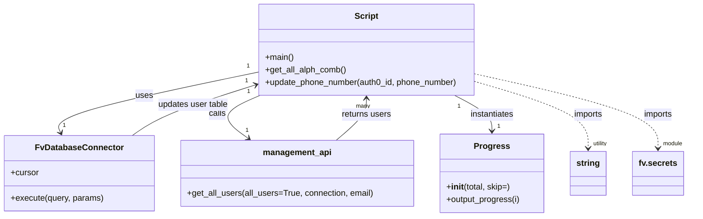

# Diagram: common/iam_service/scripts/backfill_phone_numbers.py


> Auto-generated by Obscura crawlers

## Diagram 1



### SVG

<svg id="container" width="1315" xmlns="http://www.w3.org/2000/svg" class="classDiagram" height="414" viewBox="0 0 1315 414" role="graphics-document document" aria-roledescription="class"><style>#container{font-family:"trebuchet ms",verdana,arial,sans-serif;font-size:16px;fill:#333;}@keyframes edge-animation-frame{from{stroke-dashoffset:0;}}@keyframes dash{to{stroke-dashoffset:0;}}#container .edge-animation-slow{stroke-dasharray:9,5!important;stroke-dashoffset:900;animation:dash 50s linear infinite;stroke-linecap:round;}#container .edge-animation-fast{stroke-dasharray:9,5!important;stroke-dashoffset:900;animation:dash 20s linear infinite;stroke-linecap:round;}#container .error-icon{fill:#552222;}#container .error-text{fill:#552222;stroke:#552222;}#container .edge-thickness-normal{stroke-width:1px;}#container .edge-thickness-thick{stroke-width:3.5px;}#container .edge-pattern-solid{stroke-dasharray:0;}#container .edge-thickness-invisible{stroke-width:0;fill:none;}#container .edge-pattern-dashed{stroke-dasharray:3;}#container .edge-pattern-dotted{stroke-dasharray:2;}#container .marker{fill:#333333;stroke:#333333;}#container .marker.cross{stroke:#333333;}#container svg{font-family:"trebuchet ms",verdana,arial,sans-serif;font-size:16px;}#container p{margin:0;}#container g.classGroup text{fill:#9370DB;stroke:none;font-family:"trebuchet ms",verdana,arial,sans-serif;font-size:10px;}#container g.classGroup text .title{font-weight:bolder;}#container .nodeLabel,#container .edgeLabel{color:#131300;}#container .edgeLabel .label rect{fill:#ECECFF;}#container .label text{fill:#131300;}#container .labelBkg{background:#ECECFF;}#container .edgeLabel .label span{background:#ECECFF;}#container .classTitle{font-weight:bolder;}#container .node rect,#container .node circle,#container .node ellipse,#container .node polygon,#container .node path{fill:#ECECFF;stroke:#9370DB;stroke-width:1px;}#container .divider{stroke:#9370DB;stroke-width:1;}#container g.clickable{cursor:pointer;}#container g.classGroup rect{fill:#ECECFF;stroke:#9370DB;}#container g.classGroup line{stroke:#9370DB;stroke-width:1;}#container .classLabel .box{stroke:none;stroke-width:0;fill:#ECECFF;opacity:0.5;}#container .classLabel .label{fill:#9370DB;font-size:10px;}#container .relation{stroke:#333333;stroke-width:1;fill:none;}#container .dashed-line{stroke-dasharray:3;}#container .dotted-line{stroke-dasharray:1 2;}#container #compositionStart,#container .composition{fill:#333333!important;stroke:#333333!important;stroke-width:1;}#container #compositionEnd,#container .composition{fill:#333333!important;stroke:#333333!important;stroke-width:1;}#container #dependencyStart,#container .dependency{fill:#333333!important;stroke:#333333!important;stroke-width:1;}#container #dependencyStart,#container .dependency{fill:#333333!important;stroke:#333333!important;stroke-width:1;}#container #extensionStart,#container .extension{fill:transparent!important;stroke:#333333!important;stroke-width:1;}#container #extensionEnd,#container .extension{fill:transparent!important;stroke:#333333!important;stroke-width:1;}#container #aggregationStart,#container .aggregation{fill:transparent!important;stroke:#333333!important;stroke-width:1;}#container #aggregationEnd,#container .aggregation{fill:transparent!important;stroke:#333333!important;stroke-width:1;}#container #lollipopStart,#container .lollipop{fill:#ECECFF!important;stroke:#333333!important;stroke-width:1;}#container #lollipopEnd,#container .lollipop{fill:#ECECFF!important;stroke:#333333!important;stroke-width:1;}#container .edgeTerminals{font-size:11px;line-height:initial;}#container .classTitleText{text-anchor:middle;font-size:18px;fill:#333;}#container .label-icon{display:inline-block;height:1em;overflow:visible;vertical-align:-0.125em;}#container .node .label-icon path{fill:currentColor;stroke:revert;stroke-width:revert;}#container :root{--mermaid-font-family:"trebuchet ms",verdana,arial,sans-serif;}</style><g><defs><marker id="container_class-aggregationStart" class="marker aggregation class" refX="18" refY="7" markerWidth="190" markerHeight="240" orient="auto"><path d="M 18,7 L9,13 L1,7 L9,1 Z"></path></marker></defs><defs><marker id="container_class-aggregationEnd" class="marker aggregation class" refX="1" refY="7" markerWidth="20" markerHeight="28" orient="auto"><path d="M 18,7 L9,13 L1,7 L9,1 Z"></path></marker></defs><defs><marker id="container_class-extensionStart" class="marker extension class" refX="18" refY="7" markerWidth="190" markerHeight="240" orient="auto"><path d="M 1,7 L18,13 V 1 Z"></path></marker></defs><defs><marker id="container_class-extensionEnd" class="marker extension class" refX="1" refY="7" markerWidth="20" markerHeight="28" orient="auto"><path d="M 1,1 V 13 L18,7 Z"></path></marker></defs><defs><marker id="container_class-compositionStart" class="marker composition class" refX="18" refY="7" markerWidth="190" markerHeight="240" orient="auto"><path d="M 18,7 L9,13 L1,7 L9,1 Z"></path></marker></defs><defs><marker id="container_class-compositionEnd" class="marker composition class" refX="1" refY="7" markerWidth="20" markerHeight="28" orient="auto"><path d="M 18,7 L9,13 L1,7 L9,1 Z"></path></marker></defs><defs><marker id="container_class-dependencyStart" class="marker dependency class" refX="6" refY="7" markerWidth="190" markerHeight="240" orient="auto"><path d="M 5,7 L9,13 L1,7 L9,1 Z"></path></marker></defs><defs><marker id="container_class-dependencyEnd" class="marker dependency class" refX="13" refY="7" markerWidth="20" markerHeight="28" orient="auto"><path d="M 18,7 L9,13 L14,7 L9,1 Z"></path></marker></defs><defs><marker id="container_class-lollipopStart" class="marker lollipop class" refX="13" refY="7" markerWidth="190" markerHeight="240" orient="auto"><circle stroke="black" fill="transparent" cx="7" cy="7" r="6"></circle></marker></defs><defs><marker id="container_class-lollipopEnd" class="marker lollipop class" refX="1" refY="7" markerWidth="190" markerHeight="240" orient="auto"><circle stroke="black" fill="transparent" cx="7" cy="7" r="6"></circle></marker></defs><g class="root"><g class="clusters"></g><g class="edgePaths"><path d="M480.559,138.636L416.439,152.03C352.32,165.424,224.082,192.212,162.653,211.367C101.223,230.521,106.602,242.042,109.292,247.803L111.981,253.563" id="id_Script_FvDatabaseConnector_1" class="edge-thickness-normal edge-pattern-solid relation" style=";;;" data-edge="true" data-et="edge" data-id="id_Script_FvDatabaseConnector_1" data-points="W3sieCI6NDgwLjU1ODU5Mzc1LCJ5IjoxMzguNjM2MzA4NTk5NDA1MX0seyJ4Ijo5NS44NDM3NSwieSI6MjE5fSx7IngiOjExNC41MTk4MTAyNjc4NTcxNCwieSI6MjU5fV0=" marker-end="url(#container_class-dependencyEnd)"></path><path d="M490.69,182L476.601,188.167C462.513,194.333,434.335,206.667,430.63,220.411C426.925,234.154,447.693,249.309,458.076,256.886L468.46,264.463" id="id_Script_management_api_2" class="edge-thickness-normal edge-pattern-solid relation" style=";;;" data-edge="true" data-et="edge" data-id="id_Script_management_api_2" data-points="W3sieCI6NDkwLjY4OTc1MjM5NDE1MzIzLCJ5IjoxODJ9LHsieCI6NDA2LjE1ODIwMzEyNSwieSI6MjE5fSx7IngiOjQ3My4zMDY3NjI2OTUzMTI1LCJ5IjoyNjh9XQ==" marker-end="url(#container_class-dependencyEnd)"></path><path d="M858.24,182L870.204,188.167C882.168,194.333,906.096,206.667,918.06,218C930.023,229.333,930.023,239.667,930.023,244.833L930.023,250" id="id_Script_Progress_3" class="edge-thickness-normal edge-pattern-solid relation" style=";;;" data-edge="true" data-et="edge" data-id="id_Script_Progress_3" data-points="W3sieCI6ODU4LjI0MDM2MDM4MzA2NDUsInkiOjE4Mn0seyJ4Ijo5MzAuMDIzNDM3NSwieSI6MjE5fSx7IngiOjkzMC4wMjM0Mzc1LCJ5IjoyNTZ9XQ==" marker-end="url(#container_class-dependencyEnd)"></path><path d="M246.804,259L255.94,252.333C265.076,245.667,283.347,232.333,321.354,216.436C359.361,200.539,417.102,182.077,445.973,172.847L474.844,163.616" id="id_FvDatabaseConnector_Script_4" class="edge-thickness-normal edge-pattern-solid relation" style=";;;" data-edge="true" data-et="edge" data-id="id_FvDatabaseConnector_Script_4" data-points="W3sieCI6MjQ2LjgwMzk4OTk1NTM1NzE0LCJ5IjoyNTl9LHsieCI6MzAxLjYxOTE0MDYyNSwieSI6MjE5fSx7IngiOjQ4MC41NTg1OTM3NSwieSI6MTYxLjc4ODY4NTE1NTQzNTZ9XQ==" marker-end="url(#container_class-dependencyEnd)"></path><path d="M632.66,268L642.126,259.833C651.591,251.667,670.522,235.333,679.988,222C689.453,208.667,689.453,198.333,689.453,193.167L689.453,188" id="id_management_api_Script_5" class="edge-thickness-normal edge-pattern-solid relation" style=";;;" data-edge="true" data-et="edge" data-id="id_management_api_Script_5" data-points="W3sieCI6NjMyLjY2MDE1NjI1LCJ5IjoyNjh9LHsieCI6Njg5LjQ1MzEyNSwieSI6MjE5fSx7IngiOjY4OS40NTMxMjUsInkiOjE4Mn1d" marker-end="url(#container_class-dependencyEnd)"></path><path d="M898.348,156.232L934.037,166.693C969.727,177.154,1041.105,198.077,1076.795,219.205C1112.484,240.333,1112.484,261.667,1112.484,272.333L1112.484,283" id="id_Script_string_6" class="edge-thickness-normal edge-pattern-dashed relation" style=";;;" data-edge="true" data-et="edge" data-id="id_Script_string_6" data-points="W3sieCI6ODk4LjM0NzY1NjI1LCJ5IjoxNTYuMjMxNjk4MzA4MzQwMX0seyJ4IjoxMTEyLjQ4NDM3NSwieSI6MjE5fSx7IngiOjExMTIuNDg0Mzc1LCJ5IjoyODl9XQ==" marker-end="url(#container_class-dependencyEnd)"></path><path d="M898.348,141.794L955.79,154.662C1013.232,167.53,1128.116,193.265,1185.558,216.799C1243,240.333,1243,261.667,1243,272.333L1243,283" id="id_Script_fv.secrets_7" class="edge-thickness-normal edge-pattern-dashed relation" style=";;;" data-edge="true" data-et="edge" data-id="id_Script_fv.secrets_7" data-points="W3sieCI6ODk4LjM0NzY1NjI1LCJ5IjoxNDEuNzk0NDUwNTYwMzA3MX0seyJ4IjoxMjQzLCJ5IjoyMTl9LHsieCI6MTI0MywieSI6Mjg5fV0=" marker-end="url(#container_class-dependencyEnd)"></path></g><g class="edgeLabels"><g class="edgeLabel" transform="translate(266.59496, 183.33151)"><g class="label" data-id="id_Script_FvDatabaseConnector_1" transform="translate(-16.4921875, -12)"><foreignObject width="32.984375" height="24"><div xmlns="http://www.w3.org/1999/xhtml" class="labelBkg" style="display: table-cell; white-space: nowrap; line-height: 1.5; max-width: 200px; text-align: center;"><span class="edgeLabel"><p>uses</p></span></div></foreignObject></g></g><g class="edgeLabel" transform="translate(410.34862, 217.16583)"><g class="label" data-id="id_Script_management_api_2" transform="translate(-16.4453125, -12)"><foreignObject width="32.890625" height="24"><div xmlns="http://www.w3.org/1999/xhtml" class="labelBkg" style="display: table-cell; white-space: nowrap; line-height: 1.5; max-width: 200px; text-align: center;"><span class="edgeLabel"><p>calls</p></span></div></foreignObject></g></g><g class="edgeLabel" transform="translate(930.0234375, 219)"><g class="label" data-id="id_Script_Progress_3" transform="translate(-42.9140625, -12)"><foreignObject width="85.828125" height="24"><div xmlns="http://www.w3.org/1999/xhtml" class="labelBkg" style="display: table-cell; white-space: nowrap; line-height: 1.5; max-width: 200px; text-align: center;"><span class="edgeLabel"><p>instantiates</p></span></div></foreignObject></g></g><g class="edgeLabel" transform="translate(358.77151, 200.72699)"><g class="label" data-id="id_FvDatabaseConnector_Script_4" transform="translate(-68.09375, -12)"><foreignObject width="136.1875" height="24"><div xmlns="http://www.w3.org/1999/xhtml" class="labelBkg" style="display: table-cell; white-space: nowrap; line-height: 1.5; max-width: 200px; text-align: center;"><span class="edgeLabel"><p>updates user table</p></span></div></foreignObject></g></g><g class="edgeLabel" transform="translate(689.453125, 219)"><g class="label" data-id="id_management_api_Script_5" transform="translate(-47.84375, -12)"><foreignObject width="95.6875" height="24"><div xmlns="http://www.w3.org/1999/xhtml" class="labelBkg" style="display: table-cell; white-space: nowrap; line-height: 1.5; max-width: 200px; text-align: center;"><span class="edgeLabel"><p>returns users</p></span></div></foreignObject></g></g><g class="edgeLabel" transform="translate(1112.484375, 219)"><g class="label" data-id="id_Script_string_6" transform="translate(-28.25, -12)"><foreignObject width="56.5" height="24"><div xmlns="http://www.w3.org/1999/xhtml" class="labelBkg" style="display: table-cell; white-space: nowrap; line-height: 1.5; max-width: 200px; text-align: center;"><span class="edgeLabel"><p>imports</p></span></div></foreignObject></g></g><g class="edgeLabel" transform="translate(1243, 219)"><g class="label" data-id="id_Script_fv.secrets_7" transform="translate(-28.25, -12)"><foreignObject width="56.5" height="24"><div xmlns="http://www.w3.org/1999/xhtml" class="labelBkg" style="display: table-cell; white-space: nowrap; line-height: 1.5; max-width: 200px; text-align: center;"><span class="edgeLabel"><p>imports</p></span></div></foreignObject></g></g><g class="edgeTerminals" transform="translate(460.3611765706131, 127.53160696607341)"><g class="inner" transform="translate(0, 0)"><foreignObject style="width: 9px; height: 12px;"><div xmlns="http://www.w3.org/1999/xhtml" style="display: inline-block; padding-right: 1px; white-space: nowrap;"><span class="edgeLabel">1</span></div></foreignObject></g></g><g class="edgeTerminals" transform="translate(468.6435539379338, 175.27578636209472)"><g class="inner" transform="translate(0, 0)"><foreignObject style="width: 9px; height: 12px;"><div xmlns="http://www.w3.org/1999/xhtml" style="display: inline-block; padding-right: 1px; white-space: nowrap;"><span class="edgeLabel">1</span></div></foreignObject></g></g><g class="edgeTerminals" transform="translate(866.9231664510555, 203.35085159236817)"><g class="inner" transform="translate(0, 0)"><foreignObject style="width: 9px; height: 12px;"><div xmlns="http://www.w3.org/1999/xhtml" style="display: inline-block; padding-right: 1px; white-space: nowrap;"><span class="edgeLabel">1</span></div></foreignObject></g></g><g class="edgeTerminals" transform="translate(454.32177366277045, 147.83058759997323)"><g class="inner" transform="translate(0, 0)"></g><foreignObject style="width: 9px; height: 12px;"><div xmlns="http://www.w3.org/1999/xhtml" style="display: inline-block; padding-right: 1px; white-space: nowrap;"><span class="edgeLabel">1</span></div></foreignObject></g><g class="edgeTerminals" transform="translate(669.4531275, 194.50000214285714)"><g class="inner" transform="translate(0, 0)"></g><foreignObject style="width: 36px; height: 12px;"><div xmlns="http://www.w3.org/1999/xhtml" style="display: inline-block; padding-right: 1px; white-space: nowrap;"><span class="edgeLabel">many</span></div></foreignObject></g><g class="edgeTerminals" transform="translate(1122.4843774999997, 266.50000214285717)"><g class="inner" transform="translate(0, 0)"></g><foreignObject style="width: 63px; height: 12px;"><div xmlns="http://www.w3.org/1999/xhtml" style="display: inline-block; padding-right: 1px; white-space: nowrap;"><span class="edgeLabel">utility</span></div></foreignObject></g><g class="edgeTerminals" transform="translate(1253, 266.5)"><g class="inner" transform="translate(0, 0)"></g><foreignObject style="width: 54px; height: 12px;"><div xmlns="http://www.w3.org/1999/xhtml" style="display: inline-block; padding-right: 1px; white-space: nowrap;"><span class="edgeLabel">module</span></div></foreignObject></g><g class="edgeTerminals" transform="translate(115.70777861610864, 231.79731664166337)"><g class="inner" transform="translate(0, 0)"></g><foreignObject style="width: 9px; height: 12px;"><div xmlns="http://www.w3.org/1999/xhtml" style="display: inline-block; padding-right: 1px; white-space: nowrap;"><span class="edgeLabel">1</span></div></foreignObject></g><g class="edgeTerminals" transform="translate(463.0123907957628, 240.56744407205636)"><g class="inner" transform="translate(0, 0)"></g><foreignObject style="width: 9px; height: 12px;"><div xmlns="http://www.w3.org/1999/xhtml" style="display: inline-block; padding-right: 1px; white-space: nowrap;"><span class="edgeLabel">1</span></div></foreignObject></g><g class="edgeTerminals" transform="translate(940.02343875, 233.50000107142858)"><g class="inner" transform="translate(0, 0)"></g><foreignObject style="width: 9px; height: 12px;"><div xmlns="http://www.w3.org/1999/xhtml" style="display: inline-block; padding-right: 1px; white-space: nowrap;"><span class="edgeLabel">1</span></div></foreignObject></g></g><g class="nodes"><g class="node default" id="classId-Script-0" transform="translate(689.453125, 95)"><g class="basic label-container"><path d="M-208.89453125 -87 L208.89453125 -87 L208.89453125 87 L-208.89453125 87" stroke="none" stroke-width="0" fill="#ECECFF" style=""></path><path d="M-208.89453125 -87 C-113.27966292933313 -87, -17.664794608666256 -87, 208.89453125 -87 M-208.89453125 -87 C-66.12339992616515 -87, 76.6477313976697 -87, 208.89453125 -87 M208.89453125 -87 C208.89453125 -32.17031445323334, 208.89453125 22.659371093533323, 208.89453125 87 M208.89453125 -87 C208.89453125 -37.758941203240305, 208.89453125 11.48211759351939, 208.89453125 87 M208.89453125 87 C119.65155085795357 87, 30.408570465907133 87, -208.89453125 87 M208.89453125 87 C84.63077803150273 87, -39.63297518699454 87, -208.89453125 87 M-208.89453125 87 C-208.89453125 20.537197261026208, -208.89453125 -45.925605477947585, -208.89453125 -87 M-208.89453125 87 C-208.89453125 18.019019740953453, -208.89453125 -50.96196051809309, -208.89453125 -87" stroke="#9370DB" stroke-width="1.3" fill="none" stroke-dasharray="0 0" style=""></path></g><g class="annotation-group text" transform="translate(0, -63)"></g><g class="label-group text" transform="translate(-21.7421875, -63)"><g class="label" style="font-weight: bolder" transform="translate(0,-12)"><foreignObject width="43.484375" height="24"><div xmlns="http://www.w3.org/1999/xhtml" style="display: table-cell; white-space: nowrap; line-height: 1.5; max-width: 93px; text-align: center;"><span class="nodeLabel markdown-node-label" style=""><p>Script</p></span></div></foreignObject></g></g><g class="members-group text" transform="translate(-196.89453125, -15)"></g><g class="methods-group text" transform="translate(-196.89453125, 15)"><g class="label" style="" transform="translate(0,-12)"><foreignObject width="54.65625" height="24"><div xmlns="http://www.w3.org/1999/xhtml" style="display: table-cell; white-space: nowrap; line-height: 1.5; max-width: 112px; text-align: center;"><span class="nodeLabel markdown-node-label" style=""><p>+main()</p></span></div></foreignObject></g><g class="label" style="" transform="translate(0,12)"><foreignObject width="154.84375" height="24"><div xmlns="http://www.w3.org/1999/xhtml" style="display: table-cell; white-space: nowrap; line-height: 1.5; max-width: 212px; text-align: center;"><span class="nodeLabel markdown-node-label" style=""><p>+get_all_alph_comb()</p></span></div></foreignObject></g><g class="label" style="" transform="translate(0,36)"><foreignObject width="372.046875" height="24"><div xmlns="http://www.w3.org/1999/xhtml" style="display: table-cell; white-space: nowrap; line-height: 1.5; max-width: 429px; text-align: center;"><span class="nodeLabel markdown-node-label" style=""><p>+update_phone_number(auth0_id, phone_number)</p></span></div></foreignObject></g></g><g class="divider" style=""><path d="M-208.89453125 -39 C-59.211417136595344 -39, 90.47169697680931 -39, 208.89453125 -39 M-208.89453125 -39 C-84.65952568218363 -39, 39.575479885632745 -39, 208.89453125 -39" stroke="#9370DB" stroke-width="1.3" fill="none" stroke-dasharray="0 0" style=""></path></g><g class="divider" style=""><path d="M-208.89453125 -15 C-95.75592511600082 -15, 17.38268101799835 -15, 208.89453125 -15 M-208.89453125 -15 C-111.79916692634386 -15, -14.703802602687716 -15, 208.89453125 -15" stroke="#9370DB" stroke-width="1.3" fill="none" stroke-dasharray="0 0" style=""></path></g></g><g class="node default" id="classId-FvDatabaseConnector-1" transform="translate(148.13671875, 331)"><g class="basic label-container"><path d="M-140.13671875 -72 L140.13671875 -72 L140.13671875 72 L-140.13671875 72" stroke="none" stroke-width="0" fill="#ECECFF" style=""></path><path d="M-140.13671875 -72 C-51.67330628299281 -72, 36.79010618401438 -72, 140.13671875 -72 M-140.13671875 -72 C-37.421715725378704 -72, 65.29328729924259 -72, 140.13671875 -72 M140.13671875 -72 C140.13671875 -42.863729728908055, 140.13671875 -13.72745945781611, 140.13671875 72 M140.13671875 -72 C140.13671875 -35.66825114196446, 140.13671875 0.6634977160710775, 140.13671875 72 M140.13671875 72 C71.71996607412451 72, 3.303213398249028 72, -140.13671875 72 M140.13671875 72 C61.87156141910431 72, -16.39359591179138 72, -140.13671875 72 M-140.13671875 72 C-140.13671875 20.751149496064983, -140.13671875 -30.497701007870035, -140.13671875 -72 M-140.13671875 72 C-140.13671875 30.538378267757594, -140.13671875 -10.923243464484813, -140.13671875 -72" stroke="#9370DB" stroke-width="1.3" fill="none" stroke-dasharray="0 0" style=""></path></g><g class="annotation-group text" transform="translate(0, -48)"></g><g class="label-group text" transform="translate(-79.3046875, -48)"><g class="label" style="font-weight: bolder" transform="translate(0,-12)"><foreignObject width="158.609375" height="24"><div xmlns="http://www.w3.org/1999/xhtml" style="display: table-cell; white-space: nowrap; line-height: 1.5; max-width: 207px; text-align: center;"><span class="nodeLabel markdown-node-label" style=""><p>FvDatabaseConnector</p></span></div></foreignObject></g></g><g class="members-group text" transform="translate(-128.13671875, 0)"><g class="label" style="" transform="translate(0,-12)"><foreignObject width="53.71875" height="24"><div xmlns="http://www.w3.org/1999/xhtml" style="display: table-cell; white-space: nowrap; line-height: 1.5; max-width: 112px; text-align: center;"><span class="nodeLabel markdown-node-label" style=""><p>+cursor</p></span></div></foreignObject></g></g><g class="methods-group text" transform="translate(-128.13671875, 48)"><g class="label" style="" transform="translate(0,-12)"><foreignObject width="176.96875" height="24"><div xmlns="http://www.w3.org/1999/xhtml" style="display: table-cell; white-space: nowrap; line-height: 1.5; max-width: 234px; text-align: center;"><span class="nodeLabel markdown-node-label" style=""><p>+execute(query, params)</p></span></div></foreignObject></g></g><g class="divider" style=""><path d="M-140.13671875 -24 C-41.10541504720396 -24, 57.925888655592075 -24, 140.13671875 -24 M-140.13671875 -24 C-54.09573324815187 -24, 31.945252253696253 -24, 140.13671875 -24" stroke="#9370DB" stroke-width="1.3" fill="none" stroke-dasharray="0 0" style=""></path></g><g class="divider" style=""><path d="M-140.13671875 24 C-55.439025740304885 24, 29.25866726939023 24, 140.13671875 24 M-140.13671875 24 C-40.02407254728898 24, 60.08857365542204 24, 140.13671875 24" stroke="#9370DB" stroke-width="1.3" fill="none" stroke-dasharray="0 0" style=""></path></g></g><g class="node default" id="classId-management_api-2" transform="translate(559.640625, 331)"><g class="basic label-container"><path d="M-221.3671875 -63 L221.3671875 -63 L221.3671875 63 L-221.3671875 63" stroke="none" stroke-width="0" fill="#ECECFF" style=""></path><path d="M-221.3671875 -63 C-118.81371521104033 -63, -16.260242922080664 -63, 221.3671875 -63 M-221.3671875 -63 C-128.73756268718034 -63, -36.10793787436066 -63, 221.3671875 -63 M221.3671875 -63 C221.3671875 -36.792632113242085, 221.3671875 -10.58526422648417, 221.3671875 63 M221.3671875 -63 C221.3671875 -25.99955442733475, 221.3671875 11.000891145330499, 221.3671875 63 M221.3671875 63 C99.69263337365616 63, -21.98192075268767 63, -221.3671875 63 M221.3671875 63 C102.3219147995395 63, -16.723357900921002 63, -221.3671875 63 M-221.3671875 63 C-221.3671875 24.795110189162884, -221.3671875 -13.409779621674232, -221.3671875 -63 M-221.3671875 63 C-221.3671875 27.14053940097711, -221.3671875 -8.718921198045777, -221.3671875 -63" stroke="#9370DB" stroke-width="1.3" fill="none" stroke-dasharray="0 0" style=""></path></g><g class="annotation-group text" transform="translate(0, -39)"></g><g class="label-group text" transform="translate(-63.015625, -39)"><g class="label" style="font-weight: bolder" transform="translate(0,-12)"><foreignObject width="126.03125" height="24"><div xmlns="http://www.w3.org/1999/xhtml" style="display: table-cell; white-space: nowrap; line-height: 1.5; max-width: 175px; text-align: center;"><span class="nodeLabel markdown-node-label" style=""><p>management_api</p></span></div></foreignObject></g></g><g class="members-group text" transform="translate(-209.3671875, 9)"></g><g class="methods-group text" transform="translate(-209.3671875, 39)"><g class="label" style="" transform="translate(0,-12)"><foreignObject width="355.71875" height="24"><div xmlns="http://www.w3.org/1999/xhtml" style="display: table-cell; white-space: nowrap; line-height: 1.5; max-width: 413px; text-align: center;"><span class="nodeLabel markdown-node-label" style=""><p>+get_all_users(all_users=True, connection, email)</p></span></div></foreignObject></g></g><g class="divider" style=""><path d="M-221.3671875 -15 C-75.03766220086379 -15, 71.29186309827242 -15, 221.3671875 -15 M-221.3671875 -15 C-54.947724747949025 -15, 111.47173800410195 -15, 221.3671875 -15" stroke="#9370DB" stroke-width="1.3" fill="none" stroke-dasharray="0 0" style=""></path></g><g class="divider" style=""><path d="M-221.3671875 9 C-75.96927767527055 9, 69.4286321494589 9, 221.3671875 9 M-221.3671875 9 C-105.06528612696653 9, 11.236615246066947 9, 221.3671875 9" stroke="#9370DB" stroke-width="1.3" fill="none" stroke-dasharray="0 0" style=""></path></g></g><g class="node default" id="classId-Progress-3" transform="translate(930.0234375, 331)"><g class="basic label-container"><path d="M-99.015625 -75 L99.015625 -75 L99.015625 75 L-99.015625 75" stroke="none" stroke-width="0" fill="#ECECFF" style=""></path><path d="M-99.015625 -75 C-26.7375068128905 -75, 45.540611374219 -75, 99.015625 -75 M-99.015625 -75 C-26.39206862395281 -75, 46.23148775209438 -75, 99.015625 -75 M99.015625 -75 C99.015625 -17.436002390703372, 99.015625 40.127995218593256, 99.015625 75 M99.015625 -75 C99.015625 -23.920901515313048, 99.015625 27.158196969373904, 99.015625 75 M99.015625 75 C47.50719481065222 75, -4.001235378695554 75, -99.015625 75 M99.015625 75 C37.13110872269004 75, -24.753407554619926 75, -99.015625 75 M-99.015625 75 C-99.015625 26.610297558514212, -99.015625 -21.779404882971576, -99.015625 -75 M-99.015625 75 C-99.015625 25.569180110546604, -99.015625 -23.86163977890679, -99.015625 -75" stroke="#9370DB" stroke-width="1.3" fill="none" stroke-dasharray="0 0" style=""></path></g><g class="annotation-group text" transform="translate(0, -51)"></g><g class="label-group text" transform="translate(-31.75, -51)"><g class="label" style="font-weight: bolder" transform="translate(0,-12)"><foreignObject width="63.5" height="24"><div xmlns="http://www.w3.org/1999/xhtml" style="display: table-cell; white-space: nowrap; line-height: 1.5; max-width: 112px; text-align: center;"><span class="nodeLabel markdown-node-label" style=""><p>Progress</p></span></div></foreignObject></g></g><g class="members-group text" transform="translate(-87.015625, -3)"></g><g class="methods-group text" transform="translate(-87.015625, 27)"><g class="label" style="" transform="translate(0,-12)"><foreignObject width="122.390625" height="24"><div xmlns="http://www.w3.org/1999/xhtml" style="display: table-cell; white-space: nowrap; line-height: 1.5; max-width: 211px; text-align: center;"><span class="nodeLabel markdown-node-label" style=""><p>+<strong>init</strong>(total, skip=)</p></span></div></foreignObject></g><g class="label" style="" transform="translate(0,12)"><foreignObject width="142.28125" height="24"><div xmlns="http://www.w3.org/1999/xhtml" style="display: table-cell; white-space: nowrap; line-height: 1.5; max-width: 200px; text-align: center;"><span class="nodeLabel markdown-node-label" style=""><p>+output_progress(i)</p></span></div></foreignObject></g></g><g class="divider" style=""><path d="M-99.015625 -27 C-44.77177441742151 -27, 9.472076165156977 -27, 99.015625 -27 M-99.015625 -27 C-29.30037586693365 -27, 40.4148732661327 -27, 99.015625 -27" stroke="#9370DB" stroke-width="1.3" fill="none" stroke-dasharray="0 0" style=""></path></g><g class="divider" style=""><path d="M-99.015625 -3 C-35.72986494713324 -3, 27.555895105733526 -3, 99.015625 -3 M-99.015625 -3 C-47.14507194566729 -3, 4.72548110866542 -3, 99.015625 -3" stroke="#9370DB" stroke-width="1.3" fill="none" stroke-dasharray="0 0" style=""></path></g></g><g class="node default" id="classId-string-4" transform="translate(1112.484375, 331)"><g class="basic label-container"><path d="M-33.4453125 -42 L33.4453125 -42 L33.4453125 42 L-33.4453125 42" stroke="none" stroke-width="0" fill="#ECECFF" style=""></path><path d="M-33.4453125 -42 C-10.743958584721241 -42, 11.957395330557517 -42, 33.4453125 -42 M-33.4453125 -42 C-15.02473695589973 -42, 3.39583858820054 -42, 33.4453125 -42 M33.4453125 -42 C33.4453125 -14.347096074442064, 33.4453125 13.305807851115873, 33.4453125 42 M33.4453125 -42 C33.4453125 -13.979507584241109, 33.4453125 14.040984831517783, 33.4453125 42 M33.4453125 42 C11.768958658158613 42, -9.907395183682773 42, -33.4453125 42 M33.4453125 42 C15.008784586020642 42, -3.4277433279587157 42, -33.4453125 42 M-33.4453125 42 C-33.4453125 17.52877815596375, -33.4453125 -6.942443688072501, -33.4453125 -42 M-33.4453125 42 C-33.4453125 21.08628355769496, -33.4453125 0.1725671153899171, -33.4453125 -42" stroke="#9370DB" stroke-width="1.3" fill="none" stroke-dasharray="0 0" style=""></path></g><g class="annotation-group text" transform="translate(0, -18)"></g><g class="label-group text" transform="translate(-21.4453125, -18)"><g class="label" style="font-weight: bolder" transform="translate(0,-12)"><foreignObject width="42.890625" height="24"><div xmlns="http://www.w3.org/1999/xhtml" style="display: table-cell; white-space: nowrap; line-height: 1.5; max-width: 92px; text-align: center;"><span class="nodeLabel markdown-node-label" style=""><p>string</p></span></div></foreignObject></g></g><g class="members-group text" transform="translate(-21.4453125, 30)"></g><g class="methods-group text" transform="translate(-21.4453125, 60)"></g><g class="divider" style=""><path d="M-33.4453125 6 C-13.94741821106696 6, 5.5504760778660795 6, 33.4453125 6 M-33.4453125 6 C-19.700094882579492 6, -5.954877265158984 6, 33.4453125 6" stroke="#9370DB" stroke-width="1.3" fill="none" stroke-dasharray="0 0" style=""></path></g><g class="divider" style=""><path d="M-33.4453125 24 C-11.240409050110422 24, 10.964494399779156 24, 33.4453125 24 M-33.4453125 24 C-17.358001764452506 24, -1.2706910289050128 24, 33.4453125 24" stroke="#9370DB" stroke-width="1.3" fill="none" stroke-dasharray="0 0" style=""></path></g></g><g class="node default" id="classId-fv.secrets-5" transform="translate(1243, 331)"><g class="basic label-container"><path d="M-47.0703125 -42 L47.0703125 -42 L47.0703125 42 L-47.0703125 42" stroke="none" stroke-width="0" fill="#ECECFF" style=""></path><path d="M-47.0703125 -42 C-25.607117082481192 -42, -4.1439216649623845 -42, 47.0703125 -42 M-47.0703125 -42 C-12.038881925706384 -42, 22.99254864858723 -42, 47.0703125 -42 M47.0703125 -42 C47.0703125 -13.395245221797918, 47.0703125 15.209509556404164, 47.0703125 42 M47.0703125 -42 C47.0703125 -20.35349893733288, 47.0703125 1.2930021253342403, 47.0703125 42 M47.0703125 42 C15.529802516075478 42, -16.010707467849045 42, -47.0703125 42 M47.0703125 42 C14.225496591067163 42, -18.619319317865674 42, -47.0703125 42 M-47.0703125 42 C-47.0703125 17.9316491144969, -47.0703125 -6.1367017710062015, -47.0703125 -42 M-47.0703125 42 C-47.0703125 21.05303124764128, -47.0703125 0.10606249528255773, -47.0703125 -42" stroke="#9370DB" stroke-width="1.3" fill="none" stroke-dasharray="0 0" style=""></path></g><g class="annotation-group text" transform="translate(0, -18)"></g><g class="label-group text" transform="translate(-35.0703125, -18)"><g class="label" style="font-weight: bolder" transform="translate(0,-12)"><foreignObject width="70.140625" height="24"><div xmlns="http://www.w3.org/1999/xhtml" style="display: table-cell; white-space: nowrap; line-height: 1.5; max-width: 118px; text-align: center;"><span class="nodeLabel markdown-node-label" style=""><p>fv.secrets</p></span></div></foreignObject></g></g><g class="members-group text" transform="translate(-35.0703125, 30)"></g><g class="methods-group text" transform="translate(-35.0703125, 60)"></g><g class="divider" style=""><path d="M-47.0703125 6 C-19.558897228363126 6, 7.952518043273749 6, 47.0703125 6 M-47.0703125 6 C-17.937533048405918 6, 11.195246403188165 6, 47.0703125 6" stroke="#9370DB" stroke-width="1.3" fill="none" stroke-dasharray="0 0" style=""></path></g><g class="divider" style=""><path d="M-47.0703125 24 C-20.431951001194854 24, 6.2064104976102925 24, 47.0703125 24 M-47.0703125 24 C-14.910778948217406 24, 17.24875460356519 24, 47.0703125 24" stroke="#9370DB" stroke-width="1.3" fill="none" stroke-dasharray="0 0" style=""></path></g></g></g></g></g></svg>

## Diagram 2

```mermaid
flowchart TD
    A[Start script] --> B[get_all_alph_comb()]
    B --> C{For each alph (aa..zz)}
    C --> D[management_api.get_all_users(connection="GM", email="{alph}*")]
    D --> E[Append users to all_users]
    E --> F[After all alphabets collected]
    F --> G[Initialize Progress(len(all_users), skip=10)]
    G --> H[Iterate users: for i, user in enumerate(all_users)]
    H --> I{user has phone_num?}
    I -- Yes --> J[Normalize phone_number (remove "-")]
    J --> K[update_phone_number(auth0_id, phone_number)]
    I -- No --> L[Skip user]
    K --> M[DB: UPDATE "user" SET phone_number]
    L --> M
    M --> N[Continue loop]
    N --> O[Finish / Exit]
```

> SVG rendering failed for this diagram.
