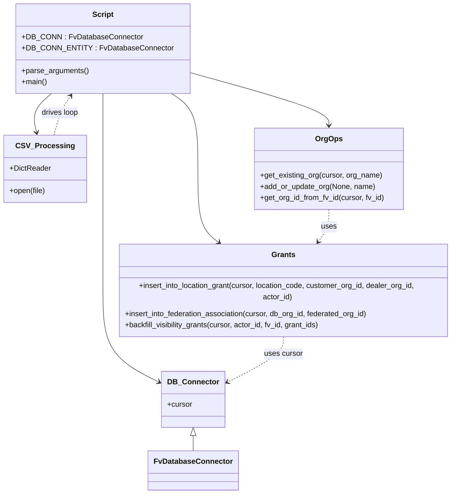

# Diagram: common/iam_service/scripts/backfill_vinview_dealer_orgs_ISS-10612-1.py


> Auto-generated by Obscura crawlers

## Diagram 1

```mermaid
flowchart TD
  Start([Start]) --> ParseArgs[parse_arguments()]
  ParseArgs --> GetCustomerFV[get_org_id_from_fv_id(DB_CONN.cursor, customer_org_fv_id)]
  GetCustomerFV -->|found| OpenCSV[Open CSV file rows]
  GetCustomerFV -->|not found| Err[fv_id missing -> raise BadRequestError]
  OpenCSV --> ForEachRow{for each CSV row}
  ForEachRow --> CheckOrg[get_existing_org(DB_CONN.cursor, name)]
  CheckOrg -->|exists| UseExisting[use dealer_org_id]
  CheckOrg -->|not exists| CreateOrg[add_or_update_org(None, name)]
  CreateOrg --> CreatedRes[get organization_id from res]
  CreatedRes -->|no id| LogError[log and continue]
  UseExisting --> InsertFed[insert_into_federation_association(DB_CONN.cursor, dealer_org_id, fed_id)]
  InsertFed --> InsertLoc[insert_into_location_grant(DB_CONN.cursor, location_code, customer_org_id, dealer_org_id, actor_id)]
  InsertLoc --> CollectGrant[append grant id(s) to grant_id_list]
  LogError --> ContinueLoop[continue]
  CollectGrant --> ContinueLoop
  ContinueLoop --> ForEachRow
  ForEachRow --> Prompt[input("Run SELECT maintenance.ufn_sync_shipments_data() on entity. Enter to continue")]
  Prompt --> ForEachGrant{for grant_ids in grant_id_list}
  ForEachGrant --> Backfill[backfill_visibility_grants(DB_CONN_ENTITY.cursor, actor_id, customer_org_fv_id, grant_ids)]
  Backfill --> End([End])
```

> SVG rendering failed for this diagram.

## Diagram 2



### SVG

<svg id="container" width="970.66796875" xmlns="http://www.w3.org/2000/svg" class="classDiagram" height="1032" viewBox="0 0 970.66796875 1032" role="graphics-document document" aria-roledescription="class"><style>#container{font-family:"trebuchet ms",verdana,arial,sans-serif;font-size:16px;fill:#333;}@keyframes edge-animation-frame{from{stroke-dashoffset:0;}}@keyframes dash{to{stroke-dashoffset:0;}}#container .edge-animation-slow{stroke-dasharray:9,5!important;stroke-dashoffset:900;animation:dash 50s linear infinite;stroke-linecap:round;}#container .edge-animation-fast{stroke-dasharray:9,5!important;stroke-dashoffset:900;animation:dash 20s linear infinite;stroke-linecap:round;}#container .error-icon{fill:#552222;}#container .error-text{fill:#552222;stroke:#552222;}#container .edge-thickness-normal{stroke-width:1px;}#container .edge-thickness-thick{stroke-width:3.5px;}#container .edge-pattern-solid{stroke-dasharray:0;}#container .edge-thickness-invisible{stroke-width:0;fill:none;}#container .edge-pattern-dashed{stroke-dasharray:3;}#container .edge-pattern-dotted{stroke-dasharray:2;}#container .marker{fill:#333333;stroke:#333333;}#container .marker.cross{stroke:#333333;}#container svg{font-family:"trebuchet ms",verdana,arial,sans-serif;font-size:16px;}#container p{margin:0;}#container g.classGroup text{fill:#9370DB;stroke:none;font-family:"trebuchet ms",verdana,arial,sans-serif;font-size:10px;}#container g.classGroup text .title{font-weight:bolder;}#container .nodeLabel,#container .edgeLabel{color:#131300;}#container .edgeLabel .label rect{fill:#ECECFF;}#container .label text{fill:#131300;}#container .labelBkg{background:#ECECFF;}#container .edgeLabel .label span{background:#ECECFF;}#container .classTitle{font-weight:bolder;}#container .node rect,#container .node circle,#container .node ellipse,#container .node polygon,#container .node path{fill:#ECECFF;stroke:#9370DB;stroke-width:1px;}#container .divider{stroke:#9370DB;stroke-width:1;}#container g.clickable{cursor:pointer;}#container g.classGroup rect{fill:#ECECFF;stroke:#9370DB;}#container g.classGroup line{stroke:#9370DB;stroke-width:1;}#container .classLabel .box{stroke:none;stroke-width:0;fill:#ECECFF;opacity:0.5;}#container .classLabel .label{fill:#9370DB;font-size:10px;}#container .relation{stroke:#333333;stroke-width:1;fill:none;}#container .dashed-line{stroke-dasharray:3;}#container .dotted-line{stroke-dasharray:1 2;}#container #compositionStart,#container .composition{fill:#333333!important;stroke:#333333!important;stroke-width:1;}#container #compositionEnd,#container .composition{fill:#333333!important;stroke:#333333!important;stroke-width:1;}#container #dependencyStart,#container .dependency{fill:#333333!important;stroke:#333333!important;stroke-width:1;}#container #dependencyStart,#container .dependency{fill:#333333!important;stroke:#333333!important;stroke-width:1;}#container #extensionStart,#container .extension{fill:transparent!important;stroke:#333333!important;stroke-width:1;}#container #extensionEnd,#container .extension{fill:transparent!important;stroke:#333333!important;stroke-width:1;}#container #aggregationStart,#container .aggregation{fill:transparent!important;stroke:#333333!important;stroke-width:1;}#container #aggregationEnd,#container .aggregation{fill:transparent!important;stroke:#333333!important;stroke-width:1;}#container #lollipopStart,#container .lollipop{fill:#ECECFF!important;stroke:#333333!important;stroke-width:1;}#container #lollipopEnd,#container .lollipop{fill:#ECECFF!important;stroke:#333333!important;stroke-width:1;}#container .edgeTerminals{font-size:11px;line-height:initial;}#container .classTitleText{text-anchor:middle;font-size:18px;fill:#333;}#container .label-icon{display:inline-block;height:1em;overflow:visible;vertical-align:-0.125em;}#container .node .label-icon path{fill:currentColor;stroke:revert;stroke-width:revert;}#container :root{--mermaid-font-family:"trebuchet ms",verdana,arial,sans-serif;}</style><g><defs><marker id="container_class-aggregationStart" class="marker aggregation class" refX="18" refY="7" markerWidth="190" markerHeight="240" orient="auto"><path d="M 18,7 L9,13 L1,7 L9,1 Z"></path></marker></defs><defs><marker id="container_class-aggregationEnd" class="marker aggregation class" refX="1" refY="7" markerWidth="20" markerHeight="28" orient="auto"><path d="M 18,7 L9,13 L1,7 L9,1 Z"></path></marker></defs><defs><marker id="container_class-extensionStart" class="marker extension class" refX="18" refY="7" markerWidth="190" markerHeight="240" orient="auto"><path d="M 1,7 L18,13 V 1 Z"></path></marker></defs><defs><marker id="container_class-extensionEnd" class="marker extension class" refX="1" refY="7" markerWidth="20" markerHeight="28" orient="auto"><path d="M 1,1 V 13 L18,7 Z"></path></marker></defs><defs><marker id="container_class-compositionStart" class="marker composition class" refX="18" refY="7" markerWidth="190" markerHeight="240" orient="auto"><path d="M 18,7 L9,13 L1,7 L9,1 Z"></path></marker></defs><defs><marker id="container_class-compositionEnd" class="marker composition class" refX="1" refY="7" markerWidth="20" markerHeight="28" orient="auto"><path d="M 18,7 L9,13 L1,7 L9,1 Z"></path></marker></defs><defs><marker id="container_class-dependencyStart" class="marker dependency class" refX="6" refY="7" markerWidth="190" markerHeight="240" orient="auto"><path d="M 5,7 L9,13 L1,7 L9,1 Z"></path></marker></defs><defs><marker id="container_class-dependencyEnd" class="marker dependency class" refX="13" refY="7" markerWidth="20" markerHeight="28" orient="auto"><path d="M 18,7 L9,13 L14,7 L9,1 Z"></path></marker></defs><defs><marker id="container_class-lollipopStart" class="marker lollipop class" refX="13" refY="7" markerWidth="190" markerHeight="240" orient="auto"><circle stroke="black" fill="transparent" cx="7" cy="7" r="6"></circle></marker></defs><defs><marker id="container_class-lollipopEnd" class="marker lollipop class" refX="1" refY="7" markerWidth="190" markerHeight="240" orient="auto"><circle stroke="black" fill="transparent" cx="7" cy="7" r="6"></circle></marker></defs><g class="root"><g class="clusters"></g><g class="edgePaths"><path d="M212.137,200L212.137,206.167C212.137,212.333,212.137,224.667,212.137,251.5C212.137,278.333,212.137,319.667,212.137,361C212.137,402.333,212.137,443.667,212.137,485C212.137,526.333,212.137,567.667,212.137,609C212.137,650.333,212.137,691.667,233.224,722.749C254.311,753.831,296.485,774.663,317.572,785.078L338.66,795.494" id="id_Script_DB_Connector_1" class="edge-thickness-normal edge-pattern-solid relation" style=";;;" data-edge="true" data-et="edge" data-id="id_Script_DB_Connector_1" data-points="W3sieCI6MjEyLjEzNjcxODc1LCJ5IjoyMDB9LHsieCI6MjEyLjEzNjcxODc1LCJ5IjoyMzd9LHsieCI6MjEyLjEzNjcxODc1LCJ5IjozNjF9LHsieCI6MjEyLjEzNjcxODc1LCJ5Ijo0ODV9LHsieCI6MjEyLjEzNjcxODc1LCJ5Ijo2MDl9LHsieCI6MjEyLjEzNjcxODc1LCJ5Ijo3MzN9LHsieCI6MzQ0LjAzOTA2MjUsInkiOjc5OC4xNTA5NTI3Nzg3NzIzfV0=" marker-end="url(#container_class-dependencyEnd)"></path><path d="M103.528,200L96.551,206.167C89.574,212.333,75.621,224.667,70.526,238.529C65.432,252.391,69.196,267.781,71.077,275.476L72.959,283.172" id="id_Script_CSV_Processing_2" class="edge-thickness-normal edge-pattern-solid relation" style=";;;" data-edge="true" data-et="edge" data-id="id_Script_CSV_Processing_2" data-points="W3sieCI6MTAzLjUyNzY5NjE5MzYwOTAyLCJ5IjoyMDB9LHsieCI6NjEuNjY3OTY4NzUsInkiOjIzN30seyJ4Ijo3NC4zODQ1NzY2MTI5MDMyMywieSI6Mjg5fV0=" marker-end="url(#container_class-dependencyEnd)"></path><path d="M386.891,151.428L439.44,165.69C491.99,179.952,597.089,208.476,649.638,227.905C702.188,247.333,702.188,257.667,702.188,262.833L702.188,268" id="id_Script_OrgOps_3" class="edge-thickness-normal edge-pattern-solid relation" style=";;;" data-edge="true" data-et="edge" data-id="id_Script_OrgOps_3" data-points="W3sieCI6Mzg2Ljg5MDYyNSwieSI6MTUxLjQyODI4Nzg4NDcwNTh9LHsieCI6NzAyLjE4NzUsInkiOjIzN30seyJ4Ijo3MDIuMTg3NSwieSI6Mjc0fV0=" marker-end="url(#container_class-dependencyEnd)"></path><path d="M361.105,200L370.674,206.167C380.243,212.333,399.381,224.667,408.95,251.5C418.52,278.333,418.52,319.667,418.52,361C418.52,402.333,418.52,443.667,426.956,469.946C435.392,496.226,452.265,507.451,460.702,513.064L469.138,518.677" id="id_Script_Grants_4" class="edge-thickness-normal edge-pattern-solid relation" style=";;;" data-edge="true" data-et="edge" data-id="id_Script_Grants_4" data-points="W3sieCI6MzYxLjEwNDc2Mzg2Mjc4MTk3LCJ5IjoyMDB9LHsieCI6NDE4LjUxOTUzMTI1LCJ5IjoyMzd9LHsieCI6NDE4LjUxOTUzMTI1LCJ5IjozNjF9LHsieCI6NDE4LjUxOTUzMTI1LCJ5Ijo0ODV9LHsieCI6NDc0LjEzMzc1NzU2MDQ4MzksInkiOjUyMn1d" marker-end="url(#container_class-dependencyEnd)"></path><path d="M408.52,907.25L408.52,908.542C408.52,909.833,408.52,912.417,408.52,917.875C408.52,923.333,408.52,931.667,408.52,935.833L408.52,940" id="id_DB_Connector_FvDatabaseConnector_5" class="edge-thickness-normal edge-pattern-solid relation" style=";;;" data-edge="true" data-et="edge" data-id="id_DB_Connector_FvDatabaseConnector_5" data-points="W3sieCI6NDA4LjUxOTUzMTI1LCJ5Ijo4OTB9LHsieCI6NDA4LjUxOTUzMTI1LCJ5Ijo5MTV9LHsieCI6NDA4LjUxOTUzMTI1LCJ5Ijo5NDB9XQ==" marker-start="url(#container_class-extensionStart)"></path><path d="M702.188,448L702.188,454.167C702.188,460.333,702.188,472.667,697.967,484.213C693.746,495.76,685.304,506.52,681.083,511.9L676.862,517.279" id="id_OrgOps_Grants_6" class="edge-thickness-normal edge-pattern-dashed relation" style=";;;" data-edge="true" data-et="edge" data-id="id_OrgOps_Grants_6" data-points="W3sieCI6NzAyLjE4NzUsInkiOjQ0OH0seyJ4Ijo3MDIuMTg3NSwieSI6NDg1fSx7IngiOjY3My4xNTg4NjQ2NjczMzg3LCJ5Ijo1MjJ9XQ==" marker-end="url(#container_class-dependencyEnd)"></path><path d="M604.902,696L604.902,702.167C604.902,708.333,604.902,720.667,583.815,737.249C562.728,753.831,520.554,774.663,499.467,785.078L478.38,795.494" id="id_Grants_DB_Connector_7" class="edge-thickness-normal edge-pattern-dashed relation" style=";;;" data-edge="true" data-et="edge" data-id="id_Grants_DB_Connector_7" data-points="W3sieCI6NjA0LjkwMjM0Mzc1LCJ5Ijo2OTZ9LHsieCI6NjA0LjkwMjM0Mzc1LCJ5Ijo3MzN9LHsieCI6NDczLCJ5Ijo3OTguMTUwOTUyNzc4NzcyM31d" marker-end="url(#container_class-dependencyEnd)"></path><path d="M109.6,289L111.719,280.333C113.839,271.667,118.078,254.333,123.802,240.329C129.526,226.324,136.736,215.648,140.341,210.31L143.946,204.972" id="id_CSV_Processing_Script_8" class="edge-thickness-normal edge-pattern-dashed relation" style=";;;" data-edge="true" data-et="edge" data-id="id_CSV_Processing_Script_8" data-points="W3sieCI6MTA5LjU5OTc5ODM4NzA5Njc3LCJ5IjoyODl9LHsieCI6MTIyLjMxNjQwNjI1LCJ5IjoyMzd9LHsieCI6MTQ3LjMwNDAxMTk4MzA4MjcyLCJ5IjoyMDB9XQ==" marker-end="url(#container_class-dependencyEnd)"></path></g><g class="edgeLabels"><g class="edgeLabel"><g class="label" data-id="id_Script_DB_Connector_1" transform="translate(0, 0)"><foreignObject width="0" height="0"><div xmlns="http://www.w3.org/1999/xhtml" class="labelBkg" style="display: table-cell; white-space: nowrap; line-height: 1.5; max-width: 200px; text-align: center;"><span class="edgeLabel"></span></div></foreignObject></g></g><g class="edgeLabel"><g class="label" data-id="id_Script_CSV_Processing_2" transform="translate(0, 0)"><foreignObject width="0" height="0"><div xmlns="http://www.w3.org/1999/xhtml" class="labelBkg" style="display: table-cell; white-space: nowrap; line-height: 1.5; max-width: 200px; text-align: center;"><span class="edgeLabel"></span></div></foreignObject></g></g><g class="edgeLabel"><g class="label" data-id="id_Script_OrgOps_3" transform="translate(0, 0)"><foreignObject width="0" height="0"><div xmlns="http://www.w3.org/1999/xhtml" class="labelBkg" style="display: table-cell; white-space: nowrap; line-height: 1.5; max-width: 200px; text-align: center;"><span class="edgeLabel"></span></div></foreignObject></g></g><g class="edgeLabel"><g class="label" data-id="id_Script_Grants_4" transform="translate(0, 0)"><foreignObject width="0" height="0"><div xmlns="http://www.w3.org/1999/xhtml" class="labelBkg" style="display: table-cell; white-space: nowrap; line-height: 1.5; max-width: 200px; text-align: center;"><span class="edgeLabel"></span></div></foreignObject></g></g><g class="edgeLabel"><g class="label" data-id="id_DB_Connector_FvDatabaseConnector_5" transform="translate(0, 0)"><foreignObject width="0" height="0"><div xmlns="http://www.w3.org/1999/xhtml" class="labelBkg" style="display: table-cell; white-space: nowrap; line-height: 1.5; max-width: 200px; text-align: center;"><span class="edgeLabel"></span></div></foreignObject></g></g><g class="edgeLabel" transform="translate(702.1875, 485)"><g class="label" data-id="id_OrgOps_Grants_6" transform="translate(-16.4921875, -12)"><foreignObject width="32.984375" height="24"><div xmlns="http://www.w3.org/1999/xhtml" class="labelBkg" style="display: table-cell; white-space: nowrap; line-height: 1.5; max-width: 200px; text-align: center;"><span class="edgeLabel"><p>uses</p></span></div></foreignObject></g></g><g class="edgeLabel" transform="translate(604.90234375, 733)"><g class="label" data-id="id_Grants_DB_Connector_7" transform="translate(-41.4765625, -12)"><foreignObject width="82.953125" height="24"><div xmlns="http://www.w3.org/1999/xhtml" class="labelBkg" style="display: table-cell; white-space: nowrap; line-height: 1.5; max-width: 200px; text-align: center;"><span class="edgeLabel"><p>uses cursor</p></span></div></foreignObject></g></g><g class="edgeLabel" transform="translate(121.26108, 241.31536)"><g class="label" data-id="id_CSV_Processing_Script_8" transform="translate(-40.6484375, -12)"><foreignObject width="81.296875" height="24"><div xmlns="http://www.w3.org/1999/xhtml" class="labelBkg" style="display: table-cell; white-space: nowrap; line-height: 1.5; max-width: 200px; text-align: center;"><span class="edgeLabel"><p>drives loop</p></span></div></foreignObject></g></g></g><g class="nodes"><g class="node default" id="classId-Script-0" transform="translate(212.13671875, 104)"><g class="basic label-container"><path d="M-174.75390625 -96 L174.75390625 -96 L174.75390625 96 L-174.75390625 96" stroke="none" stroke-width="0" fill="#ECECFF" style=""></path><path d="M-174.75390625 -96 C-84.60918027012254 -96, 5.535545709754928 -96, 174.75390625 -96 M-174.75390625 -96 C-52.62556497711094 -96, 69.50277629577812 -96, 174.75390625 -96 M174.75390625 -96 C174.75390625 -57.01893987219982, 174.75390625 -18.037879744399646, 174.75390625 96 M174.75390625 -96 C174.75390625 -32.63995622393167, 174.75390625 30.72008755213666, 174.75390625 96 M174.75390625 96 C66.820723083456 96, -41.112460083087996 96, -174.75390625 96 M174.75390625 96 C77.15290218990049 96, -20.448101870199025 96, -174.75390625 96 M-174.75390625 96 C-174.75390625 27.422285888303207, -174.75390625 -41.155428223393585, -174.75390625 -96 M-174.75390625 96 C-174.75390625 44.70173383425492, -174.75390625 -6.596532331490167, -174.75390625 -96" stroke="#9370DB" stroke-width="1.3" fill="none" stroke-dasharray="0 0" style=""></path></g><g class="annotation-group text" transform="translate(0, -72)"></g><g class="label-group text" transform="translate(-21.7421875, -72)"><g class="label" style="font-weight: bolder" transform="translate(0,-12)"><foreignObject width="43.484375" height="24"><div xmlns="http://www.w3.org/1999/xhtml" style="display: table-cell; white-space: nowrap; line-height: 1.5; max-width: 93px; text-align: center;"><span class="nodeLabel markdown-node-label" style=""><p>Script</p></span></div></foreignObject></g></g><g class="members-group text" transform="translate(-162.75390625, -24)"><g class="label" style="" transform="translate(0,-12)"><foreignObject width="245.890625" height="24"><div xmlns="http://www.w3.org/1999/xhtml" style="display: table-cell; white-space: nowrap; line-height: 1.5; max-width: 304px; text-align: center;"><span class="nodeLabel markdown-node-label" style=""><p>+DB_CONN : FvDatabaseConnector</p></span></div></foreignObject></g><g class="label" style="" transform="translate(0,12)"><foreignObject width="303.765625" height="24"><div xmlns="http://www.w3.org/1999/xhtml" style="display: table-cell; white-space: nowrap; line-height: 1.5; max-width: 362px; text-align: center;"><span class="nodeLabel markdown-node-label" style=""><p>+DB_CONN_ENTITY : FvDatabaseConnector</p></span></div></foreignObject></g></g><g class="methods-group text" transform="translate(-162.75390625, 48)"><g class="label" style="" transform="translate(0,-12)"><foreignObject width="143.390625" height="24"><div xmlns="http://www.w3.org/1999/xhtml" style="display: table-cell; white-space: nowrap; line-height: 1.5; max-width: 201px; text-align: center;"><span class="nodeLabel markdown-node-label" style=""><p>+parse_arguments()</p></span></div></foreignObject></g><g class="label" style="" transform="translate(0,12)"><foreignObject width="54.65625" height="24"><div xmlns="http://www.w3.org/1999/xhtml" style="display: table-cell; white-space: nowrap; line-height: 1.5; max-width: 112px; text-align: center;"><span class="nodeLabel markdown-node-label" style=""><p>+main()</p></span></div></foreignObject></g></g><g class="divider" style=""><path d="M-174.75390625 -48 C-85.87005989904354 -48, 3.013786451912921 -48, 174.75390625 -48 M-174.75390625 -48 C-53.24181288877969 -48, 68.27028047244062 -48, 174.75390625 -48" stroke="#9370DB" stroke-width="1.3" fill="none" stroke-dasharray="0 0" style=""></path></g><g class="divider" style=""><path d="M-174.75390625 24 C-71.74713360402589 24, 31.25963904194822 24, 174.75390625 24 M-174.75390625 24 C-65.76675462481113 24, 43.220397000377744 24, 174.75390625 24" stroke="#9370DB" stroke-width="1.3" fill="none" stroke-dasharray="0 0" style=""></path></g></g><g class="node default" id="classId-DB_Connector-1" transform="translate(408.51953125, 830)"><g class="basic label-container"><path d="M-64.48046875 -60 L64.48046875 -60 L64.48046875 60 L-64.48046875 60" stroke="none" stroke-width="0" fill="#ECECFF" style=""></path><path d="M-64.48046875 -60 C-33.156988021622396 -60, -1.833507293244793 -60, 64.48046875 -60 M-64.48046875 -60 C-17.737359019443005 -60, 29.00575071111399 -60, 64.48046875 -60 M64.48046875 -60 C64.48046875 -16.307108848539507, 64.48046875 27.385782302920987, 64.48046875 60 M64.48046875 -60 C64.48046875 -19.92455859650063, 64.48046875 20.150882806998737, 64.48046875 60 M64.48046875 60 C26.89395482547117 60, -10.69255909905766 60, -64.48046875 60 M64.48046875 60 C25.389805144273183 60, -13.700858461453635 60, -64.48046875 60 M-64.48046875 60 C-64.48046875 32.10685573891102, -64.48046875 4.213711477822045, -64.48046875 -60 M-64.48046875 60 C-64.48046875 17.412861391358973, -64.48046875 -25.174277217282054, -64.48046875 -60" stroke="#9370DB" stroke-width="1.3" fill="none" stroke-dasharray="0 0" style=""></path></g><g class="annotation-group text" transform="translate(0, -36)"></g><g class="label-group text" transform="translate(-51.2421875, -36)"><g class="label" style="font-weight: bolder" transform="translate(0,-12)"><foreignObject width="102.484375" height="24"><div xmlns="http://www.w3.org/1999/xhtml" style="display: table-cell; white-space: nowrap; line-height: 1.5; max-width: 152px; text-align: center;"><span class="nodeLabel markdown-node-label" style=""><p>DB_Connector</p></span></div></foreignObject></g></g><g class="members-group text" transform="translate(-52.48046875, 12)"><g class="label" style="" transform="translate(0,-12)"><foreignObject width="53.71875" height="24"><div xmlns="http://www.w3.org/1999/xhtml" style="display: table-cell; white-space: nowrap; line-height: 1.5; max-width: 112px; text-align: center;"><span class="nodeLabel markdown-node-label" style=""><p>+cursor</p></span></div></foreignObject></g></g><g class="methods-group text" transform="translate(-52.48046875, 60)"></g><g class="divider" style=""><path d="M-64.48046875 -12 C-35.472062985361596 -12, -6.463657220723192 -12, 64.48046875 -12 M-64.48046875 -12 C-27.22279210563881 -12, 10.03488453872238 -12, 64.48046875 -12" stroke="#9370DB" stroke-width="1.3" fill="none" stroke-dasharray="0 0" style=""></path></g><g class="divider" style=""><path d="M-64.48046875 36 C-22.03547736866348 36, 20.409514012673043 36, 64.48046875 36 M-64.48046875 36 C-20.74482215907544 36, 22.99082443184912 36, 64.48046875 36" stroke="#9370DB" stroke-width="1.3" fill="none" stroke-dasharray="0 0" style=""></path></g></g><g class="node default" id="classId-CSV_Processing-2" transform="translate(91.9921875, 361)"><g class="basic label-container"><path d="M-83.9921875 -72 L83.9921875 -72 L83.9921875 72 L-83.9921875 72" stroke="none" stroke-width="0" fill="#ECECFF" style=""></path><path d="M-83.9921875 -72 C-34.63951499519326 -72, 14.713157509613481 -72, 83.9921875 -72 M-83.9921875 -72 C-17.394742694342312 -72, 49.202702111315375 -72, 83.9921875 -72 M83.9921875 -72 C83.9921875 -20.40242180037211, 83.9921875 31.19515639925578, 83.9921875 72 M83.9921875 -72 C83.9921875 -21.210935982520667, 83.9921875 29.578128034958667, 83.9921875 72 M83.9921875 72 C28.447583768679138 72, -27.097019962641724 72, -83.9921875 72 M83.9921875 72 C25.971273125030052 72, -32.049641249939896 72, -83.9921875 72 M-83.9921875 72 C-83.9921875 38.34319875807204, -83.9921875 4.686397516144083, -83.9921875 -72 M-83.9921875 72 C-83.9921875 24.842502339694335, -83.9921875 -22.31499532061133, -83.9921875 -72" stroke="#9370DB" stroke-width="1.3" fill="none" stroke-dasharray="0 0" style=""></path></g><g class="annotation-group text" transform="translate(0, -48)"></g><g class="label-group text" transform="translate(-56.578125, -48)"><g class="label" style="font-weight: bolder" transform="translate(0,-12)"><foreignObject width="113.15625" height="24"><div xmlns="http://www.w3.org/1999/xhtml" style="display: table-cell; white-space: nowrap; line-height: 1.5; max-width: 161px; text-align: center;"><span class="nodeLabel markdown-node-label" style=""><p>CSV_Processing</p></span></div></foreignObject></g></g><g class="members-group text" transform="translate(-71.9921875, 0)"><g class="label" style="" transform="translate(0,-12)"><foreignObject width="87.40625" height="24"><div xmlns="http://www.w3.org/1999/xhtml" style="display: table-cell; white-space: nowrap; line-height: 1.5; max-width: 146px; text-align: center;"><span class="nodeLabel markdown-node-label" style=""><p>+DictReader</p></span></div></foreignObject></g></g><g class="methods-group text" transform="translate(-71.9921875, 48)"><g class="label" style="" transform="translate(0,-12)"><foreignObject width="77.828125" height="24"><div xmlns="http://www.w3.org/1999/xhtml" style="display: table-cell; white-space: nowrap; line-height: 1.5; max-width: 135px; text-align: center;"><span class="nodeLabel markdown-node-label" style=""><p>+open(file)</p></span></div></foreignObject></g></g><g class="divider" style=""><path d="M-83.9921875 -24 C-42.377941140411075 -24, -0.7636947808221493 -24, 83.9921875 -24 M-83.9921875 -24 C-31.24635219799955 -24, 21.499483104000902 -24, 83.9921875 -24" stroke="#9370DB" stroke-width="1.3" fill="none" stroke-dasharray="0 0" style=""></path></g><g class="divider" style=""><path d="M-83.9921875 24 C-22.10278556864813 24, 39.78661636270374 24, 83.9921875 24 M-83.9921875 24 C-38.35136909421139 24, 7.289449311577215 24, 83.9921875 24" stroke="#9370DB" stroke-width="1.3" fill="none" stroke-dasharray="0 0" style=""></path></g></g><g class="node default" id="classId-OrgOps-3" transform="translate(702.1875, 361)"><g class="basic label-container"><path d="M-159.5703125 -87 L159.5703125 -87 L159.5703125 87 L-159.5703125 87" stroke="none" stroke-width="0" fill="#ECECFF" style=""></path><path d="M-159.5703125 -87 C-84.40360742308593 -87, -9.23690234617186 -87, 159.5703125 -87 M-159.5703125 -87 C-91.4854651026969 -87, -23.400617705393813 -87, 159.5703125 -87 M159.5703125 -87 C159.5703125 -37.72120357062117, 159.5703125 11.557592858757658, 159.5703125 87 M159.5703125 -87 C159.5703125 -43.562619393108214, 159.5703125 -0.12523878621642837, 159.5703125 87 M159.5703125 87 C68.63291618730416 87, -22.304480125391677 87, -159.5703125 87 M159.5703125 87 C50.89997535883964 87, -57.77036178232072 87, -159.5703125 87 M-159.5703125 87 C-159.5703125 51.38703034426994, -159.5703125 15.774060688539876, -159.5703125 -87 M-159.5703125 87 C-159.5703125 27.925444852518083, -159.5703125 -31.149110294963833, -159.5703125 -87" stroke="#9370DB" stroke-width="1.3" fill="none" stroke-dasharray="0 0" style=""></path></g><g class="annotation-group text" transform="translate(0, -63)"></g><g class="label-group text" transform="translate(-27.21875, -63)"><g class="label" style="font-weight: bolder" transform="translate(0,-12)"><foreignObject width="54.4375" height="24"><div xmlns="http://www.w3.org/1999/xhtml" style="display: table-cell; white-space: nowrap; line-height: 1.5; max-width: 103px; text-align: center;"><span class="nodeLabel markdown-node-label" style=""><p>OrgOps</p></span></div></foreignObject></g></g><g class="members-group text" transform="translate(-147.5703125, -15)"></g><g class="methods-group text" transform="translate(-147.5703125, 15)"><g class="label" style="" transform="translate(0,-12)"><foreignObject width="261.90625" height="24"><div xmlns="http://www.w3.org/1999/xhtml" style="display: table-cell; white-space: nowrap; line-height: 1.5; max-width: 319px; text-align: center;"><span class="nodeLabel markdown-node-label" style=""><p>+get_existing_org(cursor, org_name)</p></span></div></foreignObject></g><g class="label" style="" transform="translate(0,12)"><foreignObject width="245.625" height="24"><div xmlns="http://www.w3.org/1999/xhtml" style="display: table-cell; white-space: nowrap; line-height: 1.5; max-width: 303px; text-align: center;"><span class="nodeLabel markdown-node-label" style=""><p>+add_or_update_org(None, name)</p></span></div></foreignObject></g><g class="label" style="" transform="translate(0,36)"><foreignObject width="267.921875" height="24"><div xmlns="http://www.w3.org/1999/xhtml" style="display: table-cell; white-space: nowrap; line-height: 1.5; max-width: 325px; text-align: center;"><span class="nodeLabel markdown-node-label" style=""><p>+get_org_id_from_fv_id(cursor, fv_id)</p></span></div></foreignObject></g></g><g class="divider" style=""><path d="M-159.5703125 -39 C-76.36585448289202 -39, 6.838603534215963 -39, 159.5703125 -39 M-159.5703125 -39 C-51.502416185799774 -39, 56.56548012840045 -39, 159.5703125 -39" stroke="#9370DB" stroke-width="1.3" fill="none" stroke-dasharray="0 0" style=""></path></g><g class="divider" style=""><path d="M-159.5703125 -15 C-34.447296385396655 -15, 90.67571972920669 -15, 159.5703125 -15 M-159.5703125 -15 C-82.01117765519592 -15, -4.452042810391845 -15, 159.5703125 -15" stroke="#9370DB" stroke-width="1.3" fill="none" stroke-dasharray="0 0" style=""></path></g></g><g class="node default" id="classId-Grants-4" transform="translate(604.90234375, 609)"><g class="basic label-container"><path d="M-357.765625 -87 L357.765625 -87 L357.765625 87 L-357.765625 87" stroke="none" stroke-width="0" fill="#ECECFF" style=""></path><path d="M-357.765625 -87 C-212.87078405793417 -87, -67.97594311586835 -87, 357.765625 -87 M-357.765625 -87 C-94.65004738611208 -87, 168.46553022777584 -87, 357.765625 -87 M357.765625 -87 C357.765625 -20.47531452099372, 357.765625 46.04937095801256, 357.765625 87 M357.765625 -87 C357.765625 -36.79396548647633, 357.765625 13.412069027047337, 357.765625 87 M357.765625 87 C89.10468786322451 87, -179.55624927355097 87, -357.765625 87 M357.765625 87 C96.73547498517394 87, -164.29467502965213 87, -357.765625 87 M-357.765625 87 C-357.765625 27.517519608438334, -357.765625 -31.96496078312333, -357.765625 -87 M-357.765625 87 C-357.765625 28.77284943043196, -357.765625 -29.454301139136078, -357.765625 -87" stroke="#9370DB" stroke-width="1.3" fill="none" stroke-dasharray="0 0" style=""></path></g><g class="annotation-group text" transform="translate(0, -63)"></g><g class="label-group text" transform="translate(-24.046875, -63)"><g class="label" style="font-weight: bolder" transform="translate(0,-12)"><foreignObject width="48.09375" height="24"><div xmlns="http://www.w3.org/1999/xhtml" style="display: table-cell; white-space: nowrap; line-height: 1.5; max-width: 97px; text-align: center;"><span class="nodeLabel markdown-node-label" style=""><p>Grants</p></span></div></foreignObject></g></g><g class="members-group text" transform="translate(-345.765625, -15)"></g><g class="methods-group text" transform="translate(-345.765625, 15)"><g class="label" style="" transform="translate(0,-12)"><foreignObject width="667.484375" height="24"><div xmlns="http://www.w3.org/1999/xhtml" style="display: table-cell; white-space: nowrap; line-height: 1.5; max-width: 725px; text-align: center;"><span class="nodeLabel markdown-node-label" style=""><p>+insert_into_location_grant(cursor, location_code, customer_org_id, dealer_org_id, actor_id)</p></span></div></foreignObject></g><g class="label" style="" transform="translate(0,12)"><foreignObject width="529.078125" height="24"><div xmlns="http://www.w3.org/1999/xhtml" style="display: table-cell; white-space: nowrap; line-height: 1.5; max-width: 586px; text-align: center;"><span class="nodeLabel markdown-node-label" style=""><p>+insert_into_federation_association(cursor, db_org_id, federated_org_id)</p></span></div></foreignObject></g><g class="label" style="" transform="translate(0,36)"><foreignObject width="423.09375" height="24"><div xmlns="http://www.w3.org/1999/xhtml" style="display: table-cell; white-space: nowrap; line-height: 1.5; max-width: 480px; text-align: center;"><span class="nodeLabel markdown-node-label" style=""><p>+backfill_visibility_grants(cursor, actor_id, fv_id, grant_ids)</p></span></div></foreignObject></g></g><g class="divider" style=""><path d="M-357.765625 -39 C-109.20196813422478 -39, 139.36168873155043 -39, 357.765625 -39 M-357.765625 -39 C-134.7449827339251 -39, 88.2756595321498 -39, 357.765625 -39" stroke="#9370DB" stroke-width="1.3" fill="none" stroke-dasharray="0 0" style=""></path></g><g class="divider" style=""><path d="M-357.765625 -15 C-157.31393623986003 -15, 43.137752520279946 -15, 357.765625 -15 M-357.765625 -15 C-208.440486669806 -15, -59.11534833961201 -15, 357.765625 -15" stroke="#9370DB" stroke-width="1.3" fill="none" stroke-dasharray="0 0" style=""></path></g></g><g class="node default" id="classId-FvDatabaseConnector-5" transform="translate(408.51953125, 982)"><g class="basic label-container"><path d="M-91.3046875 -42 L91.3046875 -42 L91.3046875 42 L-91.3046875 42" stroke="none" stroke-width="0" fill="#ECECFF" style=""></path><path d="M-91.3046875 -42 C-42.86473289022251 -42, 5.575221719554975 -42, 91.3046875 -42 M-91.3046875 -42 C-35.74639349900192 -42, 19.811900501996163 -42, 91.3046875 -42 M91.3046875 -42 C91.3046875 -14.781592285882898, 91.3046875 12.436815428234205, 91.3046875 42 M91.3046875 -42 C91.3046875 -18.440202864479453, 91.3046875 5.119594271041095, 91.3046875 42 M91.3046875 42 C29.06085930216919 42, -33.18296889566162 42, -91.3046875 42 M91.3046875 42 C27.3436442124408 42, -36.6173990751184 42, -91.3046875 42 M-91.3046875 42 C-91.3046875 18.33567314292251, -91.3046875 -5.3286537141549815, -91.3046875 -42 M-91.3046875 42 C-91.3046875 16.098739164173903, -91.3046875 -9.802521671652194, -91.3046875 -42" stroke="#9370DB" stroke-width="1.3" fill="none" stroke-dasharray="0 0" style=""></path></g><g class="annotation-group text" transform="translate(0, -18)"></g><g class="label-group text" transform="translate(-79.3046875, -18)"><g class="label" style="font-weight: bolder" transform="translate(0,-12)"><foreignObject width="158.609375" height="24"><div xmlns="http://www.w3.org/1999/xhtml" style="display: table-cell; white-space: nowrap; line-height: 1.5; max-width: 207px; text-align: center;"><span class="nodeLabel markdown-node-label" style=""><p>FvDatabaseConnector</p></span></div></foreignObject></g></g><g class="members-group text" transform="translate(-79.3046875, 30)"></g><g class="methods-group text" transform="translate(-79.3046875, 60)"></g><g class="divider" style=""><path d="M-91.3046875 6 C-45.554196386391666 6, 0.1962947272166673 6, 91.3046875 6 M-91.3046875 6 C-46.02704114433811 6, -0.7493947886762129 6, 91.3046875 6" stroke="#9370DB" stroke-width="1.3" fill="none" stroke-dasharray="0 0" style=""></path></g><g class="divider" style=""><path d="M-91.3046875 24 C-47.673161426024514 24, -4.041635352049028 24, 91.3046875 24 M-91.3046875 24 C-21.32504477928164 24, 48.65459794143672 24, 91.3046875 24" stroke="#9370DB" stroke-width="1.3" fill="none" stroke-dasharray="0 0" style=""></path></g></g></g></g></g></svg>
