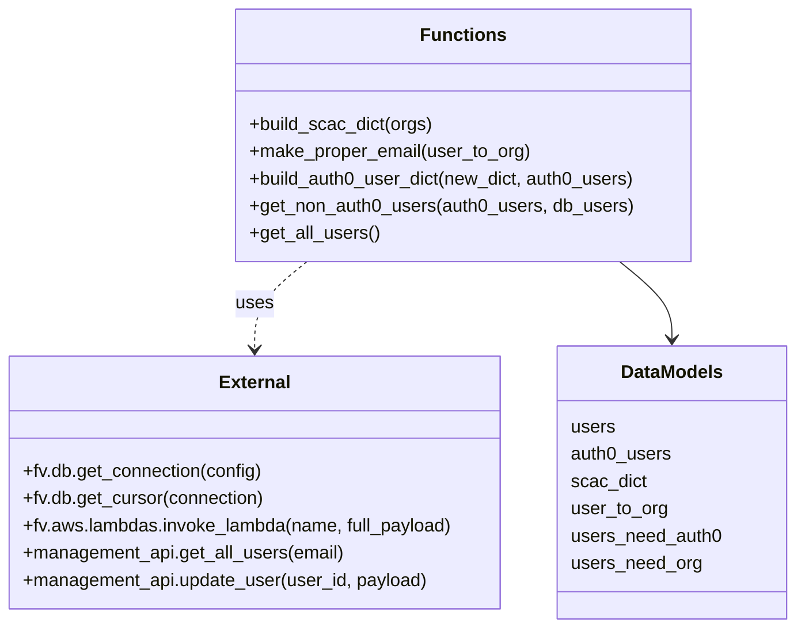
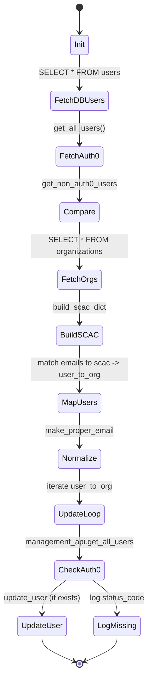

# Diagram: common/iam_service/scripts/create_auth0_users.py


> Auto-generated by Obscura crawlers

## Diagram 1

```mermaid
flowchart TD
    A[Start (__main__)] --> B[DB: SELECT * FROM users]
    B --> C[users (list)]
    A --> D[get_all_users()]
    D --> D1[Loop pages -> invoke_lambda(get_users)]
    D1 --> D2[build_auth0_user_dict(email_dict, auth0_users)]
    D2 --> E[auth0_users (dict by email)]
    C --> F[get_non_auth0_users(auth0_users, db_users)]
    E --> F
    F --> G[users_need_auth0, users_need_org]
    C --> H[DB: SELECT * FROM organizations]
    H --> I[build_scac_dict(orgs)]
    I --> SCAC[scac_dict]
    C --> J[for user in users -> derive scac from email]
    J -->|match| K[user_to_org[email] = (org_id, token, id)]
    J -->|no match| L[non_orgs / users_not_in_scac]
    K --> M[make_proper_email(user_to_org)]
    M --> N[user_to_org (normalized emails)]
    N --> O[for each email in user_to_org]
    O --> P[management_api.get_all_users(email)]
    P --> Q{status_code == 200 and user_data?}
    Q -->|yes| R[management_api.update_user(user_id, {"password": password})]
    Q -->|no| S[print(status_code, email)]
    R --> T[print(response)]
    S --> T
```

> SVG rendering failed for this diagram.

## Diagram 2



### SVG

<svg id="container" width="701.6796875" xmlns="http://www.w3.org/2000/svg" class="classDiagram" height="552" viewBox="0 0 701.6796875 552" role="graphics-document document" aria-roledescription="class"><style>#container{font-family:"trebuchet ms",verdana,arial,sans-serif;font-size:16px;fill:#333;}@keyframes edge-animation-frame{from{stroke-dashoffset:0;}}@keyframes dash{to{stroke-dashoffset:0;}}#container .edge-animation-slow{stroke-dasharray:9,5!important;stroke-dashoffset:900;animation:dash 50s linear infinite;stroke-linecap:round;}#container .edge-animation-fast{stroke-dasharray:9,5!important;stroke-dashoffset:900;animation:dash 20s linear infinite;stroke-linecap:round;}#container .error-icon{fill:#552222;}#container .error-text{fill:#552222;stroke:#552222;}#container .edge-thickness-normal{stroke-width:1px;}#container .edge-thickness-thick{stroke-width:3.5px;}#container .edge-pattern-solid{stroke-dasharray:0;}#container .edge-thickness-invisible{stroke-width:0;fill:none;}#container .edge-pattern-dashed{stroke-dasharray:3;}#container .edge-pattern-dotted{stroke-dasharray:2;}#container .marker{fill:#333333;stroke:#333333;}#container .marker.cross{stroke:#333333;}#container svg{font-family:"trebuchet ms",verdana,arial,sans-serif;font-size:16px;}#container p{margin:0;}#container g.classGroup text{fill:#9370DB;stroke:none;font-family:"trebuchet ms",verdana,arial,sans-serif;font-size:10px;}#container g.classGroup text .title{font-weight:bolder;}#container .nodeLabel,#container .edgeLabel{color:#131300;}#container .edgeLabel .label rect{fill:#ECECFF;}#container .label text{fill:#131300;}#container .labelBkg{background:#ECECFF;}#container .edgeLabel .label span{background:#ECECFF;}#container .classTitle{font-weight:bolder;}#container .node rect,#container .node circle,#container .node ellipse,#container .node polygon,#container .node path{fill:#ECECFF;stroke:#9370DB;stroke-width:1px;}#container .divider{stroke:#9370DB;stroke-width:1;}#container g.clickable{cursor:pointer;}#container g.classGroup rect{fill:#ECECFF;stroke:#9370DB;}#container g.classGroup line{stroke:#9370DB;stroke-width:1;}#container .classLabel .box{stroke:none;stroke-width:0;fill:#ECECFF;opacity:0.5;}#container .classLabel .label{fill:#9370DB;font-size:10px;}#container .relation{stroke:#333333;stroke-width:1;fill:none;}#container .dashed-line{stroke-dasharray:3;}#container .dotted-line{stroke-dasharray:1 2;}#container #compositionStart,#container .composition{fill:#333333!important;stroke:#333333!important;stroke-width:1;}#container #compositionEnd,#container .composition{fill:#333333!important;stroke:#333333!important;stroke-width:1;}#container #dependencyStart,#container .dependency{fill:#333333!important;stroke:#333333!important;stroke-width:1;}#container #dependencyStart,#container .dependency{fill:#333333!important;stroke:#333333!important;stroke-width:1;}#container #extensionStart,#container .extension{fill:transparent!important;stroke:#333333!important;stroke-width:1;}#container #extensionEnd,#container .extension{fill:transparent!important;stroke:#333333!important;stroke-width:1;}#container #aggregationStart,#container .aggregation{fill:transparent!important;stroke:#333333!important;stroke-width:1;}#container #aggregationEnd,#container .aggregation{fill:transparent!important;stroke:#333333!important;stroke-width:1;}#container #lollipopStart,#container .lollipop{fill:#ECECFF!important;stroke:#333333!important;stroke-width:1;}#container #lollipopEnd,#container .lollipop{fill:#ECECFF!important;stroke:#333333!important;stroke-width:1;}#container .edgeTerminals{font-size:11px;line-height:initial;}#container .classTitleText{text-anchor:middle;font-size:18px;fill:#333;}#container .label-icon{display:inline-block;height:1em;overflow:visible;vertical-align:-0.125em;}#container .node .label-icon path{fill:currentColor;stroke:revert;stroke-width:revert;}#container :root{--mermaid-font-family:"trebuchet ms",verdana,arial,sans-serif;}</style><g><defs><marker id="container_class-aggregationStart" class="marker aggregation class" refX="18" refY="7" markerWidth="190" markerHeight="240" orient="auto"><path d="M 18,7 L9,13 L1,7 L9,1 Z"></path></marker></defs><defs><marker id="container_class-aggregationEnd" class="marker aggregation class" refX="1" refY="7" markerWidth="20" markerHeight="28" orient="auto"><path d="M 18,7 L9,13 L1,7 L9,1 Z"></path></marker></defs><defs><marker id="container_class-extensionStart" class="marker extension class" refX="18" refY="7" markerWidth="190" markerHeight="240" orient="auto"><path d="M 1,7 L18,13 V 1 Z"></path></marker></defs><defs><marker id="container_class-extensionEnd" class="marker extension class" refX="1" refY="7" markerWidth="20" markerHeight="28" orient="auto"><path d="M 1,1 V 13 L18,7 Z"></path></marker></defs><defs><marker id="container_class-compositionStart" class="marker composition class" refX="18" refY="7" markerWidth="190" markerHeight="240" orient="auto"><path d="M 18,7 L9,13 L1,7 L9,1 Z"></path></marker></defs><defs><marker id="container_class-compositionEnd" class="marker composition class" refX="1" refY="7" markerWidth="20" markerHeight="28" orient="auto"><path d="M 18,7 L9,13 L1,7 L9,1 Z"></path></marker></defs><defs><marker id="container_class-dependencyStart" class="marker dependency class" refX="6" refY="7" markerWidth="190" markerHeight="240" orient="auto"><path d="M 5,7 L9,13 L1,7 L9,1 Z"></path></marker></defs><defs><marker id="container_class-dependencyEnd" class="marker dependency class" refX="13" refY="7" markerWidth="20" markerHeight="28" orient="auto"><path d="M 18,7 L9,13 L14,7 L9,1 Z"></path></marker></defs><defs><marker id="container_class-lollipopStart" class="marker lollipop class" refX="13" refY="7" markerWidth="190" markerHeight="240" orient="auto"><circle stroke="black" fill="transparent" cx="7" cy="7" r="6"></circle></marker></defs><defs><marker id="container_class-lollipopEnd" class="marker lollipop class" refX="1" refY="7" markerWidth="190" markerHeight="240" orient="auto"><circle stroke="black" fill="transparent" cx="7" cy="7" r="6"></circle></marker></defs><g class="root"><g class="clusters"></g><g class="edgePaths"><path d="M271.464,230L263.801,236.167C256.138,242.333,240.811,254.667,233.148,267.5C225.484,280.333,225.484,293.667,225.484,300.333L225.484,307" id="id_Functions_External_1" class="edge-thickness-normal edge-pattern-dashed relation" style=";;;" data-edge="true" data-et="edge" data-id="id_Functions_External_1" data-points="W3sieCI6MjcxLjQ2NDM1NTQ2ODc1LCJ5IjoyMzB9LHsieCI6MjI1LjQ4NDM3NSwieSI6MjY3fSx7IngiOjIyNS40ODQzNzUsInkiOjMxM31d" marker-end="url(#container_class-dependencyEnd)"></path><path d="M547.344,230L555.008,236.167C562.671,242.333,577.998,254.667,585.661,266C593.324,277.333,593.324,287.667,593.324,292.833L593.324,298" id="id_Functions_DataModels_2" class="edge-thickness-normal edge-pattern-solid relation" style=";;;" data-edge="true" data-et="edge" data-id="id_Functions_DataModels_2" data-points="W3sieCI6NTQ3LjM0NDIzODI4MTI1LCJ5IjoyMzB9LHsieCI6NTkzLjMyNDIxODc1LCJ5IjoyNjd9LHsieCI6NTkzLjMyNDIxODc1LCJ5IjozMDR9XQ==" marker-end="url(#container_class-dependencyEnd)"></path></g><g class="edgeLabels"><g class="edgeLabel" transform="translate(225.484375, 267)"><g class="label" data-id="id_Functions_External_1" transform="translate(-16.4921875, -12)"><foreignObject width="32.984375" height="24"><div xmlns="http://www.w3.org/1999/xhtml" class="labelBkg" style="display: table-cell; white-space: nowrap; line-height: 1.5; max-width: 200px; text-align: center;"><span class="edgeLabel"><p>uses</p></span></div></foreignObject></g></g><g class="edgeLabel"><g class="label" data-id="id_Functions_DataModels_2" transform="translate(0, 0)"><foreignObject width="0" height="0"><div xmlns="http://www.w3.org/1999/xhtml" class="labelBkg" style="display: table-cell; white-space: nowrap; line-height: 1.5; max-width: 200px; text-align: center;"><span class="edgeLabel"></span></div></foreignObject></g></g></g><g class="nodes"><g class="node default" id="classId-Functions-0" transform="translate(409.404296875, 119)"><g class="basic label-container"><path d="M-199.97265625 -111 L199.97265625 -111 L199.97265625 111 L-199.97265625 111" stroke="none" stroke-width="0" fill="#ECECFF" style=""></path><path d="M-199.97265625 -111 C-86.51339078717486 -111, 26.945874675650288 -111, 199.97265625 -111 M-199.97265625 -111 C-47.206143932687695 -111, 105.56036838462461 -111, 199.97265625 -111 M199.97265625 -111 C199.97265625 -39.4487445041334, 199.97265625 32.1025109917332, 199.97265625 111 M199.97265625 -111 C199.97265625 -28.23426508446491, 199.97265625 54.53146983107018, 199.97265625 111 M199.97265625 111 C95.43585032024924 111, -9.100955609501511 111, -199.97265625 111 M199.97265625 111 C58.91371747284089 111, -82.14522130431823 111, -199.97265625 111 M-199.97265625 111 C-199.97265625 25.123171329149613, -199.97265625 -60.75365734170077, -199.97265625 -111 M-199.97265625 111 C-199.97265625 33.17054514118993, -199.97265625 -44.65890971762013, -199.97265625 -111" stroke="#9370DB" stroke-width="1.3" fill="none" stroke-dasharray="0 0" style=""></path></g><g class="annotation-group text" transform="translate(0, -87)"></g><g class="label-group text" transform="translate(-35.1328125, -87)"><g class="label" style="font-weight: bolder" transform="translate(0,-12)"><foreignObject width="70.265625" height="24"><div xmlns="http://www.w3.org/1999/xhtml" style="display: table-cell; white-space: nowrap; line-height: 1.5; max-width: 120px; text-align: center;"><span class="nodeLabel markdown-node-label" style=""><p>Functions</p></span></div></foreignObject></g></g><g class="members-group text" transform="translate(-187.97265625, -39)"></g><g class="methods-group text" transform="translate(-187.97265625, -9)"><g class="label" style="" transform="translate(0,-12)"><foreignObject width="161.953125" height="24"><div xmlns="http://www.w3.org/1999/xhtml" style="display: table-cell; white-space: nowrap; line-height: 1.5; max-width: 219px; text-align: center;"><span class="nodeLabel markdown-node-label" style=""><p>+build_scac_dict(orgs)</p></span></div></foreignObject></g><g class="label" style="" transform="translate(0,12)"><foreignObject width="246.109375" height="24"><div xmlns="http://www.w3.org/1999/xhtml" style="display: table-cell; white-space: nowrap; line-height: 1.5; max-width: 303px; text-align: center;"><span class="nodeLabel markdown-node-label" style=""><p>+make_proper_email(user_to_org)</p></span></div></foreignObject></g><g class="label" style="" transform="translate(0,36)"><foreignObject width="340.8125" height="24"><div xmlns="http://www.w3.org/1999/xhtml" style="display: table-cell; white-space: nowrap; line-height: 1.5; max-width: 398px; text-align: center;"><span class="nodeLabel markdown-node-label" style=""><p>+build_auth0_user_dict(new_dict, auth0_users)</p></span></div></foreignObject></g><g class="label" style="" transform="translate(0,60)"><foreignObject width="336.140625" height="24"><div xmlns="http://www.w3.org/1999/xhtml" style="display: table-cell; white-space: nowrap; line-height: 1.5; max-width: 394px; text-align: center;"><span class="nodeLabel markdown-node-label" style=""><p>+get_non_auth0_users(auth0_users, db_users)</p></span></div></foreignObject></g><g class="label" style="" transform="translate(0,84)"><foreignObject width="113.75" height="24"><div xmlns="http://www.w3.org/1999/xhtml" style="display: table-cell; white-space: nowrap; line-height: 1.5; max-width: 171px; text-align: center;"><span class="nodeLabel markdown-node-label" style=""><p>+get_all_users()</p></span></div></foreignObject></g></g><g class="divider" style=""><path d="M-199.97265625 -63 C-98.11400055812534 -63, 3.744655133749319 -63, 199.97265625 -63 M-199.97265625 -63 C-63.02692476000351 -63, 73.91880672999298 -63, 199.97265625 -63" stroke="#9370DB" stroke-width="1.3" fill="none" stroke-dasharray="0 0" style=""></path></g><g class="divider" style=""><path d="M-199.97265625 -39 C-114.07823879732294 -39, -28.183821344645878 -39, 199.97265625 -39 M-199.97265625 -39 C-52.500717495398305 -39, 94.97122125920339 -39, 199.97265625 -39" stroke="#9370DB" stroke-width="1.3" fill="none" stroke-dasharray="0 0" style=""></path></g></g><g class="node default" id="classId-External-1" transform="translate(225.484375, 424)"><g class="basic label-container"><path d="M-217.484375 -111 L217.484375 -111 L217.484375 111 L-217.484375 111" stroke="none" stroke-width="0" fill="#ECECFF" style=""></path><path d="M-217.484375 -111 C-112.07275117013252 -111, -6.66112734026504 -111, 217.484375 -111 M-217.484375 -111 C-110.53549857686033 -111, -3.5866221537206684 -111, 217.484375 -111 M217.484375 -111 C217.484375 -45.754262363937855, 217.484375 19.49147527212429, 217.484375 111 M217.484375 -111 C217.484375 -47.94484516661987, 217.484375 15.110309666760259, 217.484375 111 M217.484375 111 C72.87120866679709 111, -71.74195766640582 111, -217.484375 111 M217.484375 111 C98.5663270239293 111, -20.35172095214139 111, -217.484375 111 M-217.484375 111 C-217.484375 30.536307183679, -217.484375 -49.927385632642, -217.484375 -111 M-217.484375 111 C-217.484375 48.27388890643363, -217.484375 -14.452222187132733, -217.484375 -111" stroke="#9370DB" stroke-width="1.3" fill="none" stroke-dasharray="0 0" style=""></path></g><g class="annotation-group text" transform="translate(0, -87)"></g><g class="label-group text" transform="translate(-30.171875, -87)"><g class="label" style="font-weight: bolder" transform="translate(0,-12)"><foreignObject width="60.34375" height="24"><div xmlns="http://www.w3.org/1999/xhtml" style="display: table-cell; white-space: nowrap; line-height: 1.5; max-width: 110px; text-align: center;"><span class="nodeLabel markdown-node-label" style=""><p>External</p></span></div></foreignObject></g></g><g class="members-group text" transform="translate(-205.484375, -39)"></g><g class="methods-group text" transform="translate(-205.484375, -9)"><g class="label" style="" transform="translate(0,-12)"><foreignObject width="211.90625" height="24"><div xmlns="http://www.w3.org/1999/xhtml" style="display: table-cell; white-space: nowrap; line-height: 1.5; max-width: 269px; text-align: center;"><span class="nodeLabel markdown-node-label" style=""><p>+fv.db.get_connection(config)</p></span></div></foreignObject></g><g class="label" style="" transform="translate(0,12)"><foreignObject width="214.078125" height="24"><div xmlns="http://www.w3.org/1999/xhtml" style="display: table-cell; white-space: nowrap; line-height: 1.5; max-width: 271px; text-align: center;"><span class="nodeLabel markdown-node-label" style=""><p>+fv.db.get_cursor(connection)</p></span></div></foreignObject></g><g class="label" style="" transform="translate(0,36)"><foreignObject width="380.796875" height="24"><div xmlns="http://www.w3.org/1999/xhtml" style="display: table-cell; white-space: nowrap; line-height: 1.5; max-width: 438px; text-align: center;"><span class="nodeLabel markdown-node-label" style=""><p>+fv.aws.lambdas.invoke_lambda(name, full_payload)</p></span></div></foreignObject></g><g class="label" style="" transform="translate(0,60)"><foreignObject width="283.1875" height="24"><div xmlns="http://www.w3.org/1999/xhtml" style="display: table-cell; white-space: nowrap; line-height: 1.5; max-width: 341px; text-align: center;"><span class="nodeLabel markdown-node-label" style=""><p>+management_api.get_all_users(email)</p></span></div></foreignObject></g><g class="label" style="" transform="translate(0,84)"><foreignObject width="356.796875" height="24"><div xmlns="http://www.w3.org/1999/xhtml" style="display: table-cell; white-space: nowrap; line-height: 1.5; max-width: 414px; text-align: center;"><span class="nodeLabel markdown-node-label" style=""><p>+management_api.update_user(user_id, payload)</p></span></div></foreignObject></g></g><g class="divider" style=""><path d="M-217.484375 -63 C-52.666079989708436 -63, 112.15221502058313 -63, 217.484375 -63 M-217.484375 -63 C-67.28548671624293 -63, 82.91340156751414 -63, 217.484375 -63" stroke="#9370DB" stroke-width="1.3" fill="none" stroke-dasharray="0 0" style=""></path></g><g class="divider" style=""><path d="M-217.484375 -39 C-67.2884362927096 -39, 82.90750241458079 -39, 217.484375 -39 M-217.484375 -39 C-107.1043257749869 -39, 3.2757234500261916 -39, 217.484375 -39" stroke="#9370DB" stroke-width="1.3" fill="none" stroke-dasharray="0 0" style=""></path></g></g><g class="node default" id="classId-DataModels-2" transform="translate(593.32421875, 424)"><g class="basic label-container"><path d="M-100.35546875 -120 L100.35546875 -120 L100.35546875 120 L-100.35546875 120" stroke="none" stroke-width="0" fill="#ECECFF" style=""></path><path d="M-100.35546875 -120 C-22.734456414667235 -120, 54.88655592066553 -120, 100.35546875 -120 M-100.35546875 -120 C-49.45729532831174 -120, 1.4408780933765257 -120, 100.35546875 -120 M100.35546875 -120 C100.35546875 -52.778006757741394, 100.35546875 14.443986484517211, 100.35546875 120 M100.35546875 -120 C100.35546875 -24.777517413706505, 100.35546875 70.44496517258699, 100.35546875 120 M100.35546875 120 C55.56126424295819 120, 10.767059735916376 120, -100.35546875 120 M100.35546875 120 C52.99312554366483 120, 5.630782337329663 120, -100.35546875 120 M-100.35546875 120 C-100.35546875 68.81951843039441, -100.35546875 17.63903686078882, -100.35546875 -120 M-100.35546875 120 C-100.35546875 37.15196250733936, -100.35546875 -45.696074985321275, -100.35546875 -120" stroke="#9370DB" stroke-width="1.3" fill="none" stroke-dasharray="0 0" style=""></path></g><g class="annotation-group text" transform="translate(0, -96)"></g><g class="label-group text" transform="translate(-43.3046875, -96)"><g class="label" style="font-weight: bolder" transform="translate(0,-12)"><foreignObject width="86.609375" height="24"><div xmlns="http://www.w3.org/1999/xhtml" style="display: table-cell; white-space: nowrap; line-height: 1.5; max-width: 135px; text-align: center;"><span class="nodeLabel markdown-node-label" style=""><p>DataModels</p></span></div></foreignObject></g></g><g class="members-group text" transform="translate(-88.35546875, -48)"><g class="label" style="" transform="translate(0,-12)"><foreignObject width="38.921875" height="24"><div xmlns="http://www.w3.org/1999/xhtml" style="display: table-cell; white-space: nowrap; line-height: 1.5; max-width: 89px; text-align: center;"><span class="nodeLabel markdown-node-label" style=""><p>users</p></span></div></foreignObject></g><g class="label" style="" transform="translate(0,12)"><foreignObject width="88.53125" height="24"><div xmlns="http://www.w3.org/1999/xhtml" style="display: table-cell; white-space: nowrap; line-height: 1.5; max-width: 139px; text-align: center;"><span class="nodeLabel markdown-node-label" style=""><p>auth0_users</p></span></div></foreignObject></g><g class="label" style="" transform="translate(0,36)"><foreignObject width="66.828125" height="24"><div xmlns="http://www.w3.org/1999/xhtml" style="display: table-cell; white-space: nowrap; line-height: 1.5; max-width: 117px; text-align: center;"><span class="nodeLabel markdown-node-label" style=""><p>scac_dict</p></span></div></foreignObject></g><g class="label" style="" transform="translate(0,60)"><foreignObject width="84.5625" height="24"><div xmlns="http://www.w3.org/1999/xhtml" style="display: table-cell; white-space: nowrap; line-height: 1.5; max-width: 135px; text-align: center;"><span class="nodeLabel markdown-node-label" style=""><p>user_to_org</p></span></div></foreignObject></g><g class="label" style="" transform="translate(0,84)"><foreignObject width="133.40625" height="24"><div xmlns="http://www.w3.org/1999/xhtml" style="display: table-cell; white-space: nowrap; line-height: 1.5; max-width: 183px; text-align: center;"><span class="nodeLabel markdown-node-label" style=""><p>users_need_auth0</p></span></div></foreignObject></g><g class="label" style="" transform="translate(0,108)"><foreignObject width="114.90625" height="24"><div xmlns="http://www.w3.org/1999/xhtml" style="display: table-cell; white-space: nowrap; line-height: 1.5; max-width: 166px; text-align: center;"><span class="nodeLabel markdown-node-label" style=""><p>users_need_org</p></span></div></foreignObject></g></g><g class="methods-group text" transform="translate(-88.35546875, 120)"></g><g class="divider" style=""><path d="M-100.35546875 -72 C-21.621345610197608 -72, 57.112777529604784 -72, 100.35546875 -72 M-100.35546875 -72 C-39.21599159154903 -72, 21.923485566901945 -72, 100.35546875 -72" stroke="#9370DB" stroke-width="1.3" fill="none" stroke-dasharray="0 0" style=""></path></g><g class="divider" style=""><path d="M-100.35546875 96 C-49.54856551154224 96, 1.2583377269155136 96, 100.35546875 96 M-100.35546875 96 C-48.38408428614673 96, 3.5873001777065383 96, 100.35546875 96" stroke="#9370DB" stroke-width="1.3" fill="none" stroke-dasharray="0 0" style=""></path></g></g></g></g></g></svg>

## Diagram 3



### SVG

<svg id="container" width="310.5625" xmlns="http://www.w3.org/2000/svg" class="statediagram" height="1372" viewBox="0 0 310.5625 1372" role="graphics-document document" aria-roledescription="stateDiagram"><style>#container{font-family:"trebuchet ms",verdana,arial,sans-serif;font-size:16px;fill:#333;}@keyframes edge-animation-frame{from{stroke-dashoffset:0;}}@keyframes dash{to{stroke-dashoffset:0;}}#container .edge-animation-slow{stroke-dasharray:9,5!important;stroke-dashoffset:900;animation:dash 50s linear infinite;stroke-linecap:round;}#container .edge-animation-fast{stroke-dasharray:9,5!important;stroke-dashoffset:900;animation:dash 20s linear infinite;stroke-linecap:round;}#container .error-icon{fill:#552222;}#container .error-text{fill:#552222;stroke:#552222;}#container .edge-thickness-normal{stroke-width:1px;}#container .edge-thickness-thick{stroke-width:3.5px;}#container .edge-pattern-solid{stroke-dasharray:0;}#container .edge-thickness-invisible{stroke-width:0;fill:none;}#container .edge-pattern-dashed{stroke-dasharray:3;}#container .edge-pattern-dotted{stroke-dasharray:2;}#container .marker{fill:#333333;stroke:#333333;}#container .marker.cross{stroke:#333333;}#container svg{font-family:"trebuchet ms",verdana,arial,sans-serif;font-size:16px;}#container p{margin:0;}#container defs #statediagram-barbEnd{fill:#333333;stroke:#333333;}#container g.stateGroup text{fill:#9370DB;stroke:none;font-size:10px;}#container g.stateGroup text{fill:#333;stroke:none;font-size:10px;}#container g.stateGroup .state-title{font-weight:bolder;fill:#131300;}#container g.stateGroup rect{fill:#ECECFF;stroke:#9370DB;}#container g.stateGroup line{stroke:#333333;stroke-width:1;}#container .transition{stroke:#333333;stroke-width:1;fill:none;}#container .stateGroup .composit{fill:white;border-bottom:1px;}#container .stateGroup .alt-composit{fill:#e0e0e0;border-bottom:1px;}#container .state-note{stroke:#aaaa33;fill:#fff5ad;}#container .state-note text{fill:black;stroke:none;font-size:10px;}#container .stateLabel .box{stroke:none;stroke-width:0;fill:#ECECFF;opacity:0.5;}#container .edgeLabel .label rect{fill:#ECECFF;opacity:0.5;}#container .edgeLabel{background-color:rgba(232,232,232, 0.8);text-align:center;}#container .edgeLabel p{background-color:rgba(232,232,232, 0.8);}#container .edgeLabel rect{opacity:0.5;background-color:rgba(232,232,232, 0.8);fill:rgba(232,232,232, 0.8);}#container .edgeLabel .label text{fill:#333;}#container .label div .edgeLabel{color:#333;}#container .stateLabel text{fill:#131300;font-size:10px;font-weight:bold;}#container .node circle.state-start{fill:#333333;stroke:#333333;}#container .node .fork-join{fill:#333333;stroke:#333333;}#container .node circle.state-end{fill:#9370DB;stroke:white;stroke-width:1.5;}#container .end-state-inner{fill:white;stroke-width:1.5;}#container .node rect{fill:#ECECFF;stroke:#9370DB;stroke-width:1px;}#container .node polygon{fill:#ECECFF;stroke:#9370DB;stroke-width:1px;}#container #statediagram-barbEnd{fill:#333333;}#container .statediagram-cluster rect{fill:#ECECFF;stroke:#9370DB;stroke-width:1px;}#container .cluster-label,#container .nodeLabel{color:#131300;}#container .statediagram-cluster rect.outer{rx:5px;ry:5px;}#container .statediagram-state .divider{stroke:#9370DB;}#container .statediagram-state .title-state{rx:5px;ry:5px;}#container .statediagram-cluster.statediagram-cluster .inner{fill:white;}#container .statediagram-cluster.statediagram-cluster-alt .inner{fill:#f0f0f0;}#container .statediagram-cluster .inner{rx:0;ry:0;}#container .statediagram-state rect.basic{rx:5px;ry:5px;}#container .statediagram-state rect.divider{stroke-dasharray:10,10;fill:#f0f0f0;}#container .note-edge{stroke-dasharray:5;}#container .statediagram-note rect{fill:#fff5ad;stroke:#aaaa33;stroke-width:1px;rx:0;ry:0;}#container .statediagram-note rect{fill:#fff5ad;stroke:#aaaa33;stroke-width:1px;rx:0;ry:0;}#container .statediagram-note text{fill:black;}#container .statediagram-note .nodeLabel{color:black;}#container .statediagram .edgeLabel{color:red;}#container #dependencyStart,#container #dependencyEnd{fill:#333333;stroke:#333333;stroke-width:1;}#container .statediagramTitleText{text-anchor:middle;font-size:18px;fill:#333;}#container :root{--mermaid-font-family:"trebuchet ms",verdana,arial,sans-serif;}</style><g><defs><marker id="container_stateDiagram-barbEnd" refX="19" refY="7" markerWidth="20" markerHeight="14" markerUnits="userSpaceOnUse" orient="auto"><path d="M 19,7 L9,13 L14,7 L9,1 Z"></path></marker></defs><g class="root"><g class="clusters"></g><g class="edgePaths"><path d="M167.141,22L167.141,26.167C167.141,30.333,167.141,38.667,167.224,47.083C167.307,55.5,167.474,64,167.557,68.25L167.641,72.5" id="edge0" class="edge-thickness-normal edge-pattern-solid transition" style="fill:none;;;fill:none" data-edge="true" data-et="edge" data-id="edge0" data-points="W3sieCI6MTY3LjE0MDYyNSwieSI6MjJ9LHsieCI6MTY3LjE0MDYyNSwieSI6NDd9LHsieCI6MTY3LjY0MDYyNSwieSI6NzIuNX1d" marker-end="url(#container_stateDiagram-barbEnd)"></path><path d="M167.641,112.5L167.557,118.583C167.474,124.667,167.307,136.833,167.307,149.167C167.307,161.5,167.474,174,167.557,180.25L167.641,186.5" id="edge1" class="edge-thickness-normal edge-pattern-solid transition" style="fill:none;;;fill:none" data-edge="true" data-et="edge" data-id="edge1" data-points="W3sieCI6MTY3LjY0MDYyNSwieSI6MTEyLjV9LHsieCI6MTY3LjE0MDYyNSwieSI6MTQ5fSx7IngiOjE2Ny42NDA2MjUsInkiOjE4Ni41fV0=" marker-end="url(#container_stateDiagram-barbEnd)"></path><path d="M167.641,226.5L167.557,232.583C167.474,238.667,167.307,250.833,167.307,263.167C167.307,275.5,167.474,288,167.557,294.25L167.641,300.5" id="edge2" class="edge-thickness-normal edge-pattern-solid transition" style="fill:none;;;fill:none" data-edge="true" data-et="edge" data-id="edge2" data-points="W3sieCI6MTY3LjY0MDYyNSwieSI6MjI2LjV9LHsieCI6MTY3LjE0MDYyNSwieSI6MjYzfSx7IngiOjE2Ny42NDA2MjUsInkiOjMwMC41fV0=" marker-end="url(#container_stateDiagram-barbEnd)"></path><path d="M167.641,340.5L167.557,346.583C167.474,352.667,167.307,364.833,167.307,377.167C167.307,389.5,167.474,402,167.557,408.25L167.641,414.5" id="edge3" class="edge-thickness-normal edge-pattern-solid transition" style="fill:none;;;fill:none" data-edge="true" data-et="edge" data-id="edge3" data-points="W3sieCI6MTY3LjY0MDYyNSwieSI6MzQwLjV9LHsieCI6MTY3LjE0MDYyNSwieSI6Mzc3fSx7IngiOjE2Ny42NDA2MjUsInkiOjQxNC41fV0=" marker-end="url(#container_stateDiagram-barbEnd)"></path><path d="M167.641,454.5L167.557,462.583C167.474,470.667,167.307,486.833,167.307,503.167C167.307,519.5,167.474,536,167.557,544.25L167.641,552.5" id="edge4" class="edge-thickness-normal edge-pattern-solid transition" style="fill:none;;;fill:none" data-edge="true" data-et="edge" data-id="edge4" data-points="W3sieCI6MTY3LjY0MDYyNSwieSI6NDU0LjV9LHsieCI6MTY3LjE0MDYyNSwieSI6NTAzfSx7IngiOjE2Ny42NDA2MjUsInkiOjU1Mi41fV0=" marker-end="url(#container_stateDiagram-barbEnd)"></path><path d="M167.641,592.5L167.557,598.583C167.474,604.667,167.307,616.833,167.307,629.167C167.307,641.5,167.474,654,167.557,660.25L167.641,666.5" id="edge5" class="edge-thickness-normal edge-pattern-solid transition" style="fill:none;;;fill:none" data-edge="true" data-et="edge" data-id="edge5" data-points="W3sieCI6MTY3LjY0MDYyNSwieSI6NTkyLjV9LHsieCI6MTY3LjE0MDYyNSwieSI6NjI5fSx7IngiOjE2Ny42NDA2MjUsInkiOjY2Ni41fV0=" marker-end="url(#container_stateDiagram-barbEnd)"></path><path d="M167.641,706.5L167.557,714.583C167.474,722.667,167.307,738.833,167.307,755.167C167.307,771.5,167.474,788,167.557,796.25L167.641,804.5" id="edge6" class="edge-thickness-normal edge-pattern-solid transition" style="fill:none;;;fill:none" data-edge="true" data-et="edge" data-id="edge6" data-points="W3sieCI6MTY3LjY0MDYyNSwieSI6NzA2LjV9LHsieCI6MTY3LjE0MDYyNSwieSI6NzU1fSx7IngiOjE2Ny42NDA2MjUsInkiOjgwNC41fV0=" marker-end="url(#container_stateDiagram-barbEnd)"></path><path d="M167.641,844.5L167.557,850.583C167.474,856.667,167.307,868.833,167.307,881.167C167.307,893.5,167.474,906,167.557,912.25L167.641,918.5" id="edge7" class="edge-thickness-normal edge-pattern-solid transition" style="fill:none;;;fill:none" data-edge="true" data-et="edge" data-id="edge7" data-points="W3sieCI6MTY3LjY0MDYyNSwieSI6ODQ0LjV9LHsieCI6MTY3LjE0MDYyNSwieSI6ODgxfSx7IngiOjE2Ny42NDA2MjUsInkiOjkxOC41fV0=" marker-end="url(#container_stateDiagram-barbEnd)"></path><path d="M167.641,958.5L167.557,964.583C167.474,970.667,167.307,982.833,167.307,995.167C167.307,1007.5,167.474,1020,167.557,1026.25L167.641,1032.5" id="edge8" class="edge-thickness-normal edge-pattern-solid transition" style="fill:none;;;fill:none" data-edge="true" data-et="edge" data-id="edge8" data-points="W3sieCI6MTY3LjY0MDYyNSwieSI6OTU4LjV9LHsieCI6MTY3LjE0MDYyNSwieSI6OTk1fSx7IngiOjE2Ny42NDA2MjUsInkiOjEwMzIuNX1d" marker-end="url(#container_stateDiagram-barbEnd)"></path><path d="M167.641,1072.5L167.557,1078.583C167.474,1084.667,167.307,1096.833,167.307,1109.167C167.307,1121.5,167.474,1134,167.557,1140.25L167.641,1146.5" id="edge9" class="edge-thickness-normal edge-pattern-solid transition" style="fill:none;;;fill:none" data-edge="true" data-et="edge" data-id="edge9" data-points="W3sieCI6MTY3LjY0MDYyNSwieSI6MTA3Mi41fSx7IngiOjE2Ny4xNDA2MjUsInkiOjExMDl9LHsieCI6MTY3LjY0MDYyNSwieSI6MTE0Ni41fV0=" marker-end="url(#container_stateDiagram-barbEnd)"></path><path d="M140.047,1186.5L131.456,1192.583C122.865,1198.667,105.682,1210.833,97.175,1223.167C88.667,1235.5,88.833,1248,88.917,1254.25L89,1260.5" id="edge10" class="edge-thickness-normal edge-pattern-solid transition" style="fill:none;;;fill:none" data-edge="true" data-et="edge" data-id="edge10" data-points="W3sieCI6MTQwLjA0NzQyMzI0NTYxNDAzLCJ5IjoxMTg2LjV9LHsieCI6ODguNSwieSI6MTIyM30seyJ4Ijo4OSwieSI6MTI2MC41fV0=" marker-end="url(#container_stateDiagram-barbEnd)"></path><path d="M195.234,1186.5L203.658,1192.583C212.083,1198.667,228.932,1210.833,237.44,1223.167C245.948,1235.5,246.115,1248,246.198,1254.25L246.281,1260.5" id="edge11" class="edge-thickness-normal edge-pattern-solid transition" style="fill:none;;;fill:none" data-edge="true" data-et="edge" data-id="edge11" data-points="W3sieCI6MTk1LjIzMzgyNjc1NDM4NTk3LCJ5IjoxMTg2LjV9LHsieCI6MjQ1Ljc4MTI1LCJ5IjoxMjIzfSx7IngiOjI0Ni4yODEyNSwieSI6MTI2MC41fV0=" marker-end="url(#container_stateDiagram-barbEnd)"></path><path d="M89,1300.5L88.917,1304.583C88.833,1308.667,88.667,1316.833,100.609,1325.81C112.552,1334.787,136.605,1344.574,148.631,1349.468L160.657,1354.362" id="edge12" class="edge-thickness-normal edge-pattern-solid transition" style="fill:none;;;fill:none" data-edge="true" data-et="edge" data-id="edge12" data-points="W3sieCI6ODksInkiOjEzMDAuNX0seyJ4Ijo4OC41LCJ5IjoxMzI1fSx7IngiOjE2MC42NTY4NjIwNzI3MzkyNCwieSI6MTM1NC4zNjE2NjM3MjQ0MTN9XQ==" marker-end="url(#container_stateDiagram-barbEnd)"></path><path d="M246.281,1300.5L246.198,1304.583C246.115,1308.667,245.948,1316.833,233.838,1325.81C221.729,1334.787,197.677,1344.574,185.651,1349.468L173.624,1354.362" id="edge13" class="edge-thickness-normal edge-pattern-solid transition" style="fill:none;;;fill:none" data-edge="true" data-et="edge" data-id="edge13" data-points="W3sieCI6MjQ2LjI4MTI1LCJ5IjoxMzAwLjV9LHsieCI6MjQ1Ljc4MTI1LCJ5IjoxMzI1fSx7IngiOjE3My42MjQzODc5MjcyNjA3NiwieSI6MTM1NC4zNjE2NjM3MjQ0MTN9XQ==" marker-end="url(#container_stateDiagram-barbEnd)"></path></g><g class="edgeLabels"><g class="edgeLabel"><g class="label" data-id="edge0" transform="translate(0, 0)"><foreignObject width="0" height="0"><div xmlns="http://www.w3.org/1999/xhtml" class="labelBkg" style="display: table-cell; white-space: nowrap; line-height: 1.5; max-width: 200px; text-align: center;"><span class="edgeLabel"></span></div></foreignObject></g></g><g class="edgeLabel" transform="translate(167.140625, 149)"><g class="label" data-id="edge1" transform="translate(-75.078125, -12)"><foreignObject width="150.15625" height="24"><div xmlns="http://www.w3.org/1999/xhtml" class="labelBkg" style="display: table-cell; white-space: nowrap; line-height: 1.5; max-width: 200px; text-align: center;"><span class="edgeLabel"><p>SELECT * FROM users</p></span></div></foreignObject></g></g><g class="edgeLabel" transform="translate(167.140625, 263)"><g class="label" data-id="edge2" transform="translate(-52.8828125, -12)"><foreignObject width="105.765625" height="24"><div xmlns="http://www.w3.org/1999/xhtml" class="labelBkg" style="display: table-cell; white-space: nowrap; line-height: 1.5; max-width: 200px; text-align: center;"><span class="edgeLabel"><p>get_all_users()</p></span></div></foreignObject></g></g><g class="edgeLabel" transform="translate(167.140625, 377)"><g class="label" data-id="edge3" transform="translate(-77.7578125, -12)"><foreignObject width="155.515625" height="24"><div xmlns="http://www.w3.org/1999/xhtml" class="labelBkg" style="display: table-cell; white-space: nowrap; line-height: 1.5; max-width: 200px; text-align: center;"><span class="edgeLabel"><p>get_non_auth0_users</p></span></div></foreignObject></g></g><g class="edgeLabel" transform="translate(167.140625, 503)"><g class="label" data-id="edge4" transform="translate(-100, -24)"><foreignObject width="200" height="48"><div xmlns="http://www.w3.org/1999/xhtml" class="labelBkg" style="display: table; white-space: break-spaces; line-height: 1.5; max-width: 200px; text-align: center; width: 200px;"><span class="edgeLabel"><p>SELECT * FROM organizations</p></span></div></foreignObject></g></g><g class="edgeLabel" transform="translate(167.140625, 629)"><g class="label" data-id="edge5" transform="translate(-56.3203125, -12)"><foreignObject width="112.640625" height="24"><div xmlns="http://www.w3.org/1999/xhtml" class="labelBkg" style="display: table-cell; white-space: nowrap; line-height: 1.5; max-width: 200px; text-align: center;"><span class="edgeLabel"><p>build_scac_dict</p></span></div></foreignObject></g></g><g class="edgeLabel" transform="translate(167.140625, 755)"><g class="label" data-id="edge6" transform="translate(-100, -24)"><foreignObject width="200" height="48"><div xmlns="http://www.w3.org/1999/xhtml" class="labelBkg" style="display: table; white-space: break-spaces; line-height: 1.5; max-width: 200px; text-align: center; width: 200px;"><span class="edgeLabel"><p>match emails to scac -&gt; user_to_org</p></span></div></foreignObject></g></g><g class="edgeLabel" transform="translate(167.140625, 881)"><g class="label" data-id="edge7" transform="translate(-71.59375, -12)"><foreignObject width="143.1875" height="24"><div xmlns="http://www.w3.org/1999/xhtml" class="labelBkg" style="display: table-cell; white-space: nowrap; line-height: 1.5; max-width: 200px; text-align: center;"><span class="edgeLabel"><p>make_proper_email</p></span></div></foreignObject></g></g><g class="edgeLabel" transform="translate(167.140625, 995)"><g class="label" data-id="edge8" transform="translate(-68.078125, -12)"><foreignObject width="136.15625" height="24"><div xmlns="http://www.w3.org/1999/xhtml" class="labelBkg" style="display: table-cell; white-space: nowrap; line-height: 1.5; max-width: 200px; text-align: center;"><span class="edgeLabel"><p>iterate user_to_org</p></span></div></foreignObject></g></g><g class="edgeLabel" transform="translate(167.140625, 1109)"><g class="label" data-id="edge9" transform="translate(-112.25, -12)"><foreignObject width="224.5" height="24"><div xmlns="http://www.w3.org/1999/xhtml" class="labelBkg" style="display: table; white-space: break-spaces; line-height: 1.5; max-width: 200px; text-align: center; width: 200px;"><span class="edgeLabel"><p>management_api.get_all_users</p></span></div></foreignObject></g></g><g class="edgeLabel" transform="translate(88.5, 1223)"><g class="label" data-id="edge10" transform="translate(-80.5, -12)"><foreignObject width="161" height="24"><div xmlns="http://www.w3.org/1999/xhtml" class="labelBkg" style="display: table-cell; white-space: nowrap; line-height: 1.5; max-width: 200px; text-align: center;"><span class="edgeLabel"><p>update_user (if exists)</p></span></div></foreignObject></g></g><g class="edgeLabel" transform="translate(245.78125, 1223)"><g class="label" data-id="edge11" transform="translate(-56.78125, -12)"><foreignObject width="113.5625" height="24"><div xmlns="http://www.w3.org/1999/xhtml" class="labelBkg" style="display: table-cell; white-space: nowrap; line-height: 1.5; max-width: 200px; text-align: center;"><span class="edgeLabel"><p>log status_code</p></span></div></foreignObject></g></g><g class="edgeLabel"><g class="label" data-id="edge12" transform="translate(0, 0)"><foreignObject width="0" height="0"><div xmlns="http://www.w3.org/1999/xhtml" class="labelBkg" style="display: table-cell; white-space: nowrap; line-height: 1.5; max-width: 200px; text-align: center;"><span class="edgeLabel"></span></div></foreignObject></g></g><g class="edgeLabel"><g class="label" data-id="edge13" transform="translate(0, 0)"><foreignObject width="0" height="0"><div xmlns="http://www.w3.org/1999/xhtml" class="labelBkg" style="display: table-cell; white-space: nowrap; line-height: 1.5; max-width: 200px; text-align: center;"><span class="edgeLabel"></span></div></foreignObject></g></g></g><g class="nodes"><g class="node default" id="state-root_start-0" transform="translate(167.140625, 15)"><circle class="state-start" r="7" width="14" height="14"></circle></g><g class="node  statediagram-state" id="state-Init-1" transform="translate(167.140625, 92)"><g class="basic label-container outer-path"><path d="M-15.1953125 -20 C-4.4168509161047 -20, 6.3616106677906 -20, 15.1953125 -20 C15.1953125 -20, 15.1953125 -20, 15.1953125 -20 C15.321391947630184 -19.994785315472857, 15.447471395260367 -19.989570630945714, 15.608209227361662 -19.982922465033347 C15.734391698903304 -19.96719383635854, 15.860574170444945 -19.951465207683732, 16.01828545140367 -19.931806517013612 C16.12326959900301 -19.909793656115617, 16.22825374660235 -19.887780795217623, 16.422739935703998 -19.847001329696653 C16.57435630260864 -19.80186318157513, 16.72597266951328 -19.75672503345361, 16.818809846023417 -19.729086208503173 C16.942636195219293 -19.68076901711325, 17.06646254441517 -19.632451825723326, 17.203789623264846 -19.578866633275286 C17.288281002156793 -19.537561315051583, 17.37277238104874 -19.49625599682788, 17.57504946518537 -19.397368756032446 C17.668400668465768 -19.34174351266946, 17.761751871746167 -19.286118269306474, 17.930053290612136 -19.185832391312644 C18.035750545363147 -19.11036600194061, 18.141447800114157 -19.034899612568573, 18.26637606344834 -18.94570254698197 C18.359290607809623 -18.867007942141694, 18.4522051521709 -18.78831333730142, 18.581720358128706 -18.678619553365657 C18.643196768203087 -18.617143143291276, 18.704673178277467 -18.555666733216896, 18.873932053365657 -18.386407858128706 C18.952665339098694 -18.293447643323642, 19.031398624831727 -18.200487428518578, 19.14101504698197 -18.07106356344834 C19.220552192907775 -17.959664859402178, 19.300089338833576 -17.848266155356015, 19.381144891312644 -17.734740790612136 C19.460919107910705 -17.600862381099674, 19.540693324508766 -17.46698397158721, 19.592681256032446 -17.37973696518537 C19.664464350199243 -17.23290229913981, 19.736247444366036 -17.08606763309425, 19.774179133275286 -17.008477123264846 C19.809432185492803 -16.918131293374227, 19.84468523771032 -16.827785463483607, 19.924398708503173 -16.623497346023417 C19.94973175801676 -16.53840513268039, 19.975064807530348 -16.453312919337364, 20.042313829696653 -16.227427435703994 C20.062024111429725 -16.133424791691557, 20.0817343931628 -16.03942214767912, 20.127119017013612 -15.82297295140367 C20.14030634039998 -15.717178028507675, 20.153493663786353 -15.611383105611681, 20.178234965033347 -15.412896727361662 C20.181675714974894 -15.329707063671423, 20.18511646491644 -15.246517399981183, 20.1953125 -15 C20.1953125 -15, 20.1953125 -15, 20.1953125 -15 C20.1953125 -3.2077208233288594, 20.1953125 8.584558353342281, 20.1953125 15 C20.1953125 15, 20.1953125 15, 20.1953125 15 C20.190510685623586 15.116097167728904, 20.185708871247172 15.232194335457809, 20.178234965033347 15.412896727361662 C20.161611063968834 15.546261495921787, 20.14498716290432 15.679626264481909, 20.127119017013612 15.822972951403669 C20.093613351870925 15.982768795799078, 20.06010768672824 16.14256464019449, 20.042313829696653 16.227427435703994 C20.013126653149065 16.32546543355087, 19.983939476601474 16.423503431397748, 19.924398708503173 16.623497346023417 C19.8807760132652 16.735292732675973, 19.837153318027234 16.84708811932853, 19.774179133275286 17.008477123264846 C19.709389430344316 17.141006578890636, 19.644599727413343 17.27353603451642, 19.592681256032446 17.379736965185366 C19.509749348597282 17.518914663679045, 19.42681744116212 17.65809236217272, 19.381144891312644 17.734740790612133 C19.32220920371189 17.817285356982644, 19.263273516111134 17.89982992335316, 19.14101504698197 18.07106356344834 C19.05422001807453 18.17354226043306, 18.967424989167093 18.27602095741778, 18.873932053365657 18.386407858128706 C18.814759263180452 18.44558064831391, 18.755586472995248 18.504753438499115, 18.581720358128706 18.678619553365657 C18.50434896328352 18.744149782084296, 18.426977568438335 18.809680010802932, 18.26637606344834 18.94570254698197 C18.13841570804435 19.03706448469596, 18.010455352640356 19.128426422409955, 17.930053290612136 19.185832391312644 C17.79721958810967 19.264984097652327, 17.664385885607203 19.344135803992007, 17.57504946518537 19.397368756032446 C17.444366832077552 19.46125560244944, 17.313684198969735 19.525142448866433, 17.203789623264846 19.578866633275286 C17.094861239657114 19.62137062045369, 16.98593285604938 19.663874607632092, 16.818809846023417 19.729086208503173 C16.706241067064713 19.76259938601977, 16.59367228810601 19.79611256353637, 16.422739935703998 19.847001329696653 C16.26724279249699 19.879605651984573, 16.11174564928998 19.912209974272493, 16.01828545140367 19.931806517013612 C15.856926601158388 19.951919876721142, 15.695567750913105 19.97203323642867, 15.608209227361662 19.982922465033347 C15.513748496675431 19.986829389754153, 15.4192877659892 19.99073631447496, 15.1953125 20 C15.1953125 20, 15.1953125 20, 15.1953125 20 C5.6876595563963335 20, -3.819993387207333 20, -15.1953125 20 C-15.1953125 20, -15.1953125 20, -15.1953125 20 C-15.353547823770217 19.993455338597833, -15.511783147540434 19.986910677195663, -15.60820922736166 19.982922465033347 C-15.725386539109607 19.968316328356213, -15.842563850857553 19.953710191679082, -16.01828545140367 19.931806517013612 C-16.15655088815435 19.90281530361815, -16.294816324905028 19.873824090222687, -16.422739935703994 19.847001329696653 C-16.50964042748658 19.821129932366688, -16.596540919269167 19.795258535036726, -16.818809846023417 19.729086208503173 C-16.928158884403665 19.68641808132319, -17.037507922783913 19.643749954143207, -17.203789623264846 19.578866633275286 C-17.349959081568624 19.50740873935755, -17.4961285398724 19.435950845439816, -17.57504946518537 19.397368756032446 C-17.65493155497747 19.34976936224978, -17.734813644769567 19.302169968467112, -17.930053290612133 19.185832391312644 C-18.03400348849377 19.111613376569874, -18.137953686375404 19.0373943618271, -18.26637606344834 18.94570254698197 C-18.361073834538722 18.86549762614379, -18.455771605629103 18.785292705305604, -18.581720358128706 18.67861955336566 C-18.6413719319022 18.618967979592167, -18.70102350567569 18.559316405818674, -18.873932053365657 18.386407858128706 C-18.972882014007205 18.269577860364098, -19.07183197464875 18.15274786259949, -19.141015046981966 18.07106356344834 C-19.231902613186847 17.943767606681444, -19.322790179391728 17.816471649914543, -19.381144891312644 17.734740790612133 C-19.438520187682666 17.638452619434887, -19.495895484052692 17.54216444825764, -19.592681256032446 17.37973696518537 C-19.658427237816394 17.24525140990056, -19.72417321960034 17.110765854615753, -19.774179133275286 17.00847712326485 C-19.828596278650586 16.86901793179186, -19.883013424025883 16.729558740318865, -19.924398708503173 16.623497346023417 C-19.960143621286935 16.50343230044363, -19.9958885340707 16.38336725486385, -20.042313829696653 16.227427435703994 C-20.066107842570812 16.113948584811475, -20.08990185544497 16.00046973391895, -20.127119017013612 15.82297295140367 C-20.14506001653707 15.67904179830683, -20.163001016060527 15.535110645209992, -20.178234965033347 15.412896727361664 C-20.183273156560126 15.291084487053505, -20.18831134808691 15.169272246745347, -20.1953125 15 C-20.1953125 15, -20.1953125 15, -20.1953125 15 C-20.1953125 6.799269213060446, -20.1953125 -1.4014615738791072, -20.1953125 -15 C-20.1953125 -15, -20.1953125 -15, -20.1953125 -15 C-20.191129760266726 -15.101129322858775, -20.186947020533452 -15.202258645717551, -20.178234965033347 -15.41289672736166 C-20.15977653343169 -15.560978964436153, -20.14131810183003 -15.709061201510647, -20.127119017013612 -15.822972951403669 C-20.0992734338518 -15.95577462703301, -20.07142785068999 -16.08857630266235, -20.042313829696653 -16.227427435703994 C-20.009510458043135 -16.33761201879631, -19.976707086389617 -16.447796601888623, -19.924398708503173 -16.623497346023417 C-19.872175129456302 -16.75733490878922, -19.819951550409435 -16.891172471555024, -19.77417913327529 -17.008477123264846 C-19.729687007842244 -17.09948722049523, -19.685194882409203 -17.19049731772562, -19.592681256032446 -17.379736965185366 C-19.539067011822414 -17.4697132764316, -19.485452767612383 -17.559689587677834, -19.381144891312644 -17.734740790612133 C-19.310330282683214 -17.833922821058813, -19.23951567405378 -17.93310485150549, -19.14101504698197 -18.07106356344834 C-19.03455140864995 -18.196764943698508, -18.92808777031793 -18.32246632394867, -18.87393205336566 -18.386407858128706 C-18.76422259603827 -18.496117315456097, -18.65451313871088 -18.605826772783484, -18.581720358128706 -18.678619553365657 C-18.508447314306515 -18.740678655830937, -18.43517427048432 -18.802737758296217, -18.26637606344834 -18.945702546981966 C-18.134393310869132 -19.03993642107831, -18.002410558289924 -19.134170295174652, -17.930053290612136 -19.185832391312644 C-17.836874526785135 -19.241354883064258, -17.74369576295813 -19.29687737481587, -17.575049465185366 -19.397368756032446 C-17.444035332192215 -19.461417662868318, -17.313021199199063 -19.525466569704193, -17.20378962326485 -19.578866633275286 C-17.074331459848015 -19.629381365393446, -16.94487329643118 -19.679896097511605, -16.81880984602342 -19.729086208503173 C-16.725260883001894 -19.756936941479356, -16.63171191998037 -19.78478767445554, -16.422739935703994 -19.847001329696653 C-16.31983054157203 -19.868579160539927, -16.21692114744007 -19.8901569913832, -16.018285451403674 -19.931806517013612 C-15.866442754728538 -19.950733689415657, -15.714600058053405 -19.9696608618177, -15.608209227361664 -19.982922465033347 C-15.482395859226086 -19.988126144431188, -15.35658249109051 -19.99332982382903, -15.195312500000002 -20 C-15.195312500000002 -20, -15.195312500000002 -20, -15.1953125 -20" stroke="none" stroke-width="0" fill="#ECECFF" style=""></path><path d="M-15.1953125 -20 C-6.793603721555211 -20, 1.6081050568895776 -20, 15.1953125 -20 M-15.1953125 -20 C-8.60450584369961 -20, -2.0136991873992205 -20, 15.1953125 -20 M15.1953125 -20 C15.1953125 -20, 15.1953125 -20, 15.1953125 -20 M15.1953125 -20 C15.1953125 -20, 15.1953125 -20, 15.1953125 -20 M15.1953125 -20 C15.327086016300116 -19.994549807050607, 15.458859532600234 -19.989099614101214, 15.608209227361662 -19.982922465033347 M15.1953125 -20 C15.296919440121616 -19.99579750587061, 15.398526380243231 -19.99159501174122, 15.608209227361662 -19.982922465033347 M15.608209227361662 -19.982922465033347 C15.708869420380347 -19.970375185058703, 15.80952961339903 -19.95782790508406, 16.01828545140367 -19.931806517013612 M15.608209227361662 -19.982922465033347 C15.73758702410396 -19.96679553948765, 15.866964820846258 -19.950668613941946, 16.01828545140367 -19.931806517013612 M16.01828545140367 -19.931806517013612 C16.102857118380022 -19.91407370321617, 16.18742878535637 -19.896340889418735, 16.422739935703998 -19.847001329696653 M16.01828545140367 -19.931806517013612 C16.138173839939864 -19.90666856542302, 16.258062228476057 -19.881530613832425, 16.422739935703998 -19.847001329696653 M16.422739935703998 -19.847001329696653 C16.525198503111206 -19.81649809257019, 16.62765707051841 -19.78599485544372, 16.818809846023417 -19.729086208503173 M16.422739935703998 -19.847001329696653 C16.522764348484593 -19.8172227718006, 16.62278876126519 -19.78744421390455, 16.818809846023417 -19.729086208503173 M16.818809846023417 -19.729086208503173 C16.89994662790008 -19.69742653797137, 16.98108340977674 -19.665766867439572, 17.203789623264846 -19.578866633275286 M16.818809846023417 -19.729086208503173 C16.921357650669854 -19.689071930961315, 17.023905455316292 -19.64905765341946, 17.203789623264846 -19.578866633275286 M17.203789623264846 -19.578866633275286 C17.340431423893495 -19.512066527375204, 17.477073224522144 -19.445266421475118, 17.57504946518537 -19.397368756032446 M17.203789623264846 -19.578866633275286 C17.3441410658115 -19.51025299394814, 17.48449250835815 -19.441639354620996, 17.57504946518537 -19.397368756032446 M17.57504946518537 -19.397368756032446 C17.710155607548298 -19.31686296944715, 17.84526174991123 -19.23635718286186, 17.930053290612136 -19.185832391312644 M17.57504946518537 -19.397368756032446 C17.693620847323402 -19.32671554798003, 17.81219222946143 -19.25606233992761, 17.930053290612136 -19.185832391312644 M17.930053290612136 -19.185832391312644 C18.00498167672808 -19.13233455189416, 18.079910062844025 -19.078836712475677, 18.26637606344834 -18.94570254698197 M17.930053290612136 -19.185832391312644 C18.056504807235545 -19.09554774378167, 18.182956323858953 -19.005263096250697, 18.26637606344834 -18.94570254698197 M18.26637606344834 -18.94570254698197 C18.350589419343134 -18.874377472850995, 18.434802775237927 -18.80305239872002, 18.581720358128706 -18.678619553365657 M18.26637606344834 -18.94570254698197 C18.36869232454049 -18.85904509425774, 18.47100858563264 -18.77238764153351, 18.581720358128706 -18.678619553365657 M18.581720358128706 -18.678619553365657 C18.65856353676678 -18.60177637472758, 18.735406715404856 -18.524933196089506, 18.873932053365657 -18.386407858128706 M18.581720358128706 -18.678619553365657 C18.68222949424646 -18.578110417247903, 18.78273863036421 -18.477601281130152, 18.873932053365657 -18.386407858128706 M18.873932053365657 -18.386407858128706 C18.938544391684427 -18.31012021443076, 19.003156730003198 -18.23383257073282, 19.14101504698197 -18.07106356344834 M18.873932053365657 -18.386407858128706 C18.96628055115185 -18.27737219282905, 19.058629048938045 -18.168336527529394, 19.14101504698197 -18.07106356344834 M19.14101504698197 -18.07106356344834 C19.220236184954423 -17.96010745607901, 19.299457322926873 -17.849151348709682, 19.381144891312644 -17.734740790612136 M19.14101504698197 -18.07106356344834 C19.19161822126568 -18.000189408106056, 19.24222139554939 -17.929315252763768, 19.381144891312644 -17.734740790612136 M19.381144891312644 -17.734740790612136 C19.45550207301229 -17.60995333864711, 19.52985925471194 -17.485165886682086, 19.592681256032446 -17.37973696518537 M19.381144891312644 -17.734740790612136 C19.423768697870237 -17.6632088135819, 19.466392504427834 -17.591676836551663, 19.592681256032446 -17.37973696518537 M19.592681256032446 -17.37973696518537 C19.649612178847704 -17.2632829012268, 19.706543101662966 -17.146828837268227, 19.774179133275286 -17.008477123264846 M19.592681256032446 -17.37973696518537 C19.64646514503875 -17.26972026177437, 19.700249034045054 -17.159703558363375, 19.774179133275286 -17.008477123264846 M19.774179133275286 -17.008477123264846 C19.825483951820807 -16.876994141868423, 19.87678877036633 -16.745511160472, 19.924398708503173 -16.623497346023417 M19.774179133275286 -17.008477123264846 C19.8095867856259 -16.917735087189303, 19.844994437976514 -16.82699305111376, 19.924398708503173 -16.623497346023417 M19.924398708503173 -16.623497346023417 C19.968362963937594 -16.475824015148408, 20.012327219372015 -16.3281506842734, 20.042313829696653 -16.227427435703994 M19.924398708503173 -16.623497346023417 C19.953937533256518 -16.524278182674546, 19.98347635800986 -16.425059019325673, 20.042313829696653 -16.227427435703994 M20.042313829696653 -16.227427435703994 C20.0684611980156 -16.102724918041655, 20.09460856633455 -15.97802240037932, 20.127119017013612 -15.82297295140367 M20.042313829696653 -16.227427435703994 C20.063550052219316 -16.126147246359096, 20.084786274741983 -16.024867057014195, 20.127119017013612 -15.82297295140367 M20.127119017013612 -15.82297295140367 C20.13850487050218 -15.731630268992971, 20.149890723990755 -15.640287586582271, 20.178234965033347 -15.412896727361662 M20.127119017013612 -15.82297295140367 C20.143752253196624 -15.689533292123645, 20.16038548937964 -15.55609363284362, 20.178234965033347 -15.412896727361662 M20.178234965033347 -15.412896727361662 C20.182390276325258 -15.31243056307341, 20.186545587617164 -15.211964398785156, 20.1953125 -15 M20.178234965033347 -15.412896727361662 C20.183745624496883 -15.279661265537644, 20.189256283960415 -15.146425803713624, 20.1953125 -15 M20.1953125 -15 C20.1953125 -15, 20.1953125 -15, 20.1953125 -15 M20.1953125 -15 C20.1953125 -15, 20.1953125 -15, 20.1953125 -15 M20.1953125 -15 C20.1953125 -3.915250217494556, 20.1953125 7.169499565010888, 20.1953125 15 M20.1953125 -15 C20.1953125 -4.554958286429798, 20.1953125 5.890083427140404, 20.1953125 15 M20.1953125 15 C20.1953125 15, 20.1953125 15, 20.1953125 15 M20.1953125 15 C20.1953125 15, 20.1953125 15, 20.1953125 15 M20.1953125 15 C20.18977123140339 15.133975522429873, 20.184229962806782 15.267951044859744, 20.178234965033347 15.412896727361662 M20.1953125 15 C20.191253296064556 15.09814250264519, 20.187194092129115 15.196285005290381, 20.178234965033347 15.412896727361662 M20.178234965033347 15.412896727361662 C20.159274695215156 15.565004947106702, 20.140314425396962 15.717113166851744, 20.127119017013612 15.822972951403669 M20.178234965033347 15.412896727361662 C20.16799221487802 15.495068896131405, 20.157749464722688 15.577241064901148, 20.127119017013612 15.822972951403669 M20.127119017013612 15.822972951403669 C20.096725412233454 15.967926699355933, 20.066331807453295 16.1128804473082, 20.042313829696653 16.227427435703994 M20.127119017013612 15.822972951403669 C20.107855350526112 15.914845589640008, 20.088591684038608 16.006718227876345, 20.042313829696653 16.227427435703994 M20.042313829696653 16.227427435703994 C20.010305343938683 16.334942044138455, 19.978296858180716 16.44245665257292, 19.924398708503173 16.623497346023417 M20.042313829696653 16.227427435703994 C20.01233761396677 16.32811576944508, 19.98236139823689 16.428804103186167, 19.924398708503173 16.623497346023417 M19.924398708503173 16.623497346023417 C19.881136168716505 16.73436973335844, 19.83787362892984 16.845242120693467, 19.774179133275286 17.008477123264846 M19.924398708503173 16.623497346023417 C19.874932324173084 16.750268824317423, 19.825465939842996 16.877040302611427, 19.774179133275286 17.008477123264846 M19.774179133275286 17.008477123264846 C19.72902553936211 17.100840275897866, 19.68387194544893 17.193203428530886, 19.592681256032446 17.379736965185366 M19.774179133275286 17.008477123264846 C19.725864336110835 17.10730662050297, 19.67754953894638 17.206136117741096, 19.592681256032446 17.379736965185366 M19.592681256032446 17.379736965185366 C19.54407615030658 17.461306857391893, 19.49547104458071 17.542876749598424, 19.381144891312644 17.734740790612133 M19.592681256032446 17.379736965185366 C19.51719517194887 17.506418959799635, 19.44170908786529 17.63310095441391, 19.381144891312644 17.734740790612133 M19.381144891312644 17.734740790612133 C19.310678180868354 17.833435559333317, 19.240211470424065 17.932130328054498, 19.14101504698197 18.07106356344834 M19.381144891312644 17.734740790612133 C19.312849691121674 17.83039416998967, 19.244554490930703 17.92604754936721, 19.14101504698197 18.07106356344834 M19.14101504698197 18.07106356344834 C19.075077589959974 18.14891577184274, 19.009140132937983 18.226767980237142, 18.873932053365657 18.386407858128706 M19.14101504698197 18.07106356344834 C19.042648895641705 18.187204258873447, 18.944282744301443 18.303344954298552, 18.873932053365657 18.386407858128706 M18.873932053365657 18.386407858128706 C18.774274334205064 18.4860655772893, 18.674616615044474 18.58572329644989, 18.581720358128706 18.678619553365657 M18.873932053365657 18.386407858128706 C18.79639053169892 18.463949379795444, 18.718849010032184 18.54149090146218, 18.581720358128706 18.678619553365657 M18.581720358128706 18.678619553365657 C18.51315988593083 18.736687311264742, 18.444599413732952 18.794755069163823, 18.26637606344834 18.94570254698197 M18.581720358128706 18.678619553365657 C18.484764227345174 18.76073720729489, 18.387808096561642 18.842854861224122, 18.26637606344834 18.94570254698197 M18.26637606344834 18.94570254698197 C18.15872170079442 19.02256628453861, 18.051067338140502 19.09943002209525, 17.930053290612136 19.185832391312644 M18.26637606344834 18.94570254698197 C18.17548991941506 19.010594006559568, 18.084603775381783 19.075485466137167, 17.930053290612136 19.185832391312644 M17.930053290612136 19.185832391312644 C17.794395922479872 19.26666663716241, 17.65873855434761 19.347500883012177, 17.57504946518537 19.397368756032446 M17.930053290612136 19.185832391312644 C17.81508159733955 19.254340650375276, 17.700109904066963 19.322848909437912, 17.57504946518537 19.397368756032446 M17.57504946518537 19.397368756032446 C17.429163033819652 19.468688286511263, 17.283276602453935 19.540007816990077, 17.203789623264846 19.578866633275286 M17.57504946518537 19.397368756032446 C17.45190116541938 19.45757229131913, 17.328752865653392 19.51777582660582, 17.203789623264846 19.578866633275286 M17.203789623264846 19.578866633275286 C17.119998670160037 19.611561964634085, 17.036207717055227 19.64425729599288, 16.818809846023417 19.729086208503173 M17.203789623264846 19.578866633275286 C17.059299015726225 19.635247043291624, 16.914808408187607 19.691627453307966, 16.818809846023417 19.729086208503173 M16.818809846023417 19.729086208503173 C16.68837666551202 19.767917848794273, 16.557943485000628 19.806749489085373, 16.422739935703998 19.847001329696653 M16.818809846023417 19.729086208503173 C16.733587662361792 19.75445795185709, 16.648365478700164 19.77982969521101, 16.422739935703998 19.847001329696653 M16.422739935703998 19.847001329696653 C16.31743874378435 19.86908066779793, 16.212137551864707 19.891160005899206, 16.01828545140367 19.931806517013612 M16.422739935703998 19.847001329696653 C16.31617644539773 19.869345343936487, 16.209612955091465 19.891689358176325, 16.01828545140367 19.931806517013612 M16.01828545140367 19.931806517013612 C15.910019612496281 19.9453018397596, 15.801753773588892 19.95879716250559, 15.608209227361662 19.982922465033347 M16.01828545140367 19.931806517013612 C15.883443117578109 19.94861459639639, 15.748600783752549 19.965422675779163, 15.608209227361662 19.982922465033347 M15.608209227361662 19.982922465033347 C15.467271777803516 19.988751681065935, 15.326334328245371 19.994580897098526, 15.1953125 20 M15.608209227361662 19.982922465033347 C15.51447206373268 19.986799462799297, 15.420734900103696 19.990676460565247, 15.1953125 20 M15.1953125 20 C15.1953125 20, 15.1953125 20, 15.1953125 20 M15.1953125 20 C15.1953125 20, 15.1953125 20, 15.1953125 20 M15.1953125 20 C3.6050347584242726 20, -7.985242983151455 20, -15.1953125 20 M15.1953125 20 C4.852526590211724 20, -5.490259319576552 20, -15.1953125 20 M-15.1953125 20 C-15.1953125 20, -15.1953125 20, -15.1953125 20 M-15.1953125 20 C-15.1953125 20, -15.1953125 20, -15.1953125 20 M-15.1953125 20 C-15.305384998309268 19.99544736779399, -15.415457496618535 19.99089473558798, -15.60820922736166 19.982922465033347 M-15.1953125 20 C-15.310127433995799 19.995251219203077, -15.4249423679916 19.990502438406153, -15.60820922736166 19.982922465033347 M-15.60820922736166 19.982922465033347 C-15.730424224155906 19.967688381570056, -15.852639220950152 19.95245429810677, -16.01828545140367 19.931806517013612 M-15.60820922736166 19.982922465033347 C-15.756393652816895 19.964451295663313, -15.904578078272129 19.94598012629328, -16.01828545140367 19.931806517013612 M-16.01828545140367 19.931806517013612 C-16.148248817773272 19.904556064720115, -16.278212184142873 19.87730561242662, -16.422739935703994 19.847001329696653 M-16.01828545140367 19.931806517013612 C-16.15073686061115 19.904034376997245, -16.283188269818627 19.87626223698088, -16.422739935703994 19.847001329696653 M-16.422739935703994 19.847001329696653 C-16.53572585575821 19.813363963895235, -16.648711775812426 19.779726598093813, -16.818809846023417 19.729086208503173 M-16.422739935703994 19.847001329696653 C-16.524460403876578 19.81671783423305, -16.626180872049165 19.786434338769446, -16.818809846023417 19.729086208503173 M-16.818809846023417 19.729086208503173 C-16.910389984675554 19.693351527512366, -17.00197012332769 19.657616846521556, -17.203789623264846 19.578866633275286 M-16.818809846023417 19.729086208503173 C-16.933450959456692 19.68435310722965, -17.048092072889972 19.63962000595613, -17.203789623264846 19.578866633275286 M-17.203789623264846 19.578866633275286 C-17.302801492500578 19.53046267987389, -17.40181336173631 19.48205872647249, -17.57504946518537 19.397368756032446 M-17.203789623264846 19.578866633275286 C-17.351905626081813 19.506457131730734, -17.500021628898782 19.434047630186182, -17.57504946518537 19.397368756032446 M-17.57504946518537 19.397368756032446 C-17.68122909328284 19.33409943067225, -17.787408721380313 19.270830105312058, -17.930053290612133 19.185832391312644 M-17.57504946518537 19.397368756032446 C-17.684493339891404 19.332154361882374, -17.793937214597438 19.266939967732306, -17.930053290612133 19.185832391312644 M-17.930053290612133 19.185832391312644 C-18.05345187371374 19.09772749641977, -18.17685045681535 19.00962260152689, -18.26637606344834 18.94570254698197 M-17.930053290612133 19.185832391312644 C-18.02970977586039 19.114679028465993, -18.12936626110865 19.04352566561934, -18.26637606344834 18.94570254698197 M-18.26637606344834 18.94570254698197 C-18.334204277532542 18.888254980069053, -18.40203249161674 18.83080741315614, -18.581720358128706 18.67861955336566 M-18.26637606344834 18.94570254698197 C-18.351220553941722 18.873842929113213, -18.436065044435107 18.80198331124446, -18.581720358128706 18.67861955336566 M-18.581720358128706 18.67861955336566 C-18.69269489195316 18.567645019541203, -18.803669425777613 18.45667048571675, -18.873932053365657 18.386407858128706 M-18.581720358128706 18.67861955336566 C-18.670867481937627 18.58947242955674, -18.760014605746548 18.50032530574782, -18.873932053365657 18.386407858128706 M-18.873932053365657 18.386407858128706 C-18.93137362951084 18.318586717330597, -18.988815205656028 18.25076557653249, -19.141015046981966 18.07106356344834 M-18.873932053365657 18.386407858128706 C-18.948413065041485 18.29846829381584, -19.022894076717314 18.210528729502972, -19.141015046981966 18.07106356344834 M-19.141015046981966 18.07106356344834 C-19.203012165463726 17.984231196343956, -19.265009283945485 17.89739882923957, -19.381144891312644 17.734740790612133 M-19.141015046981966 18.07106356344834 C-19.21566876559142 17.966504524919625, -19.290322484200875 17.861945486390912, -19.381144891312644 17.734740790612133 M-19.381144891312644 17.734740790612133 C-19.44688331710241 17.624417477342504, -19.51262174289218 17.51409416407288, -19.592681256032446 17.37973696518537 M-19.381144891312644 17.734740790612133 C-19.42766496570331 17.656670032472274, -19.47418504009398 17.57859927433241, -19.592681256032446 17.37973696518537 M-19.592681256032446 17.37973696518537 C-19.66076092800853 17.240477770313227, -19.728840599984608 17.101218575441088, -19.774179133275286 17.00847712326485 M-19.592681256032446 17.37973696518537 C-19.639915037553674 17.283118720788952, -19.687148819074903 17.186500476392535, -19.774179133275286 17.00847712326485 M-19.774179133275286 17.00847712326485 C-19.815993073007817 16.9013171796996, -19.85780701274035 16.794157236134346, -19.924398708503173 16.623497346023417 M-19.774179133275286 17.00847712326485 C-19.819435775828236 16.89249428852245, -19.864692418381182 16.776511453780053, -19.924398708503173 16.623497346023417 M-19.924398708503173 16.623497346023417 C-19.965951597961624 16.483923650684407, -20.007504487420075 16.344349955345393, -20.042313829696653 16.227427435703994 M-19.924398708503173 16.623497346023417 C-19.970514990514623 16.468595485297943, -20.01663127252607 16.313693624572473, -20.042313829696653 16.227427435703994 M-20.042313829696653 16.227427435703994 C-20.062607999521106 16.130640101693697, -20.08290216934556 16.033852767683396, -20.127119017013612 15.82297295140367 M-20.042313829696653 16.227427435703994 C-20.07267914776749 16.08260859325448, -20.10304446583833 15.937789750804967, -20.127119017013612 15.82297295140367 M-20.127119017013612 15.82297295140367 C-20.143733761722928 15.689681639439994, -20.16034850643224 15.55639032747632, -20.178234965033347 15.412896727361664 M-20.127119017013612 15.82297295140367 C-20.145734248013124 15.67363279566593, -20.164349479012635 15.524292639928188, -20.178234965033347 15.412896727361664 M-20.178234965033347 15.412896727361664 C-20.18197703602779 15.32242179229774, -20.18571910702223 15.231946857233819, -20.1953125 15 M-20.178234965033347 15.412896727361664 C-20.184634224367702 15.258176901470339, -20.191033483702057 15.103457075579014, -20.1953125 15 M-20.1953125 15 C-20.1953125 15, -20.1953125 15, -20.1953125 15 M-20.1953125 15 C-20.1953125 15, -20.1953125 15, -20.1953125 15 M-20.1953125 15 C-20.1953125 8.831971098820834, -20.1953125 2.663942197641667, -20.1953125 -15 M-20.1953125 15 C-20.1953125 6.430895713926015, -20.1953125 -2.1382085721479704, -20.1953125 -15 M-20.1953125 -15 C-20.1953125 -15, -20.1953125 -15, -20.1953125 -15 M-20.1953125 -15 C-20.1953125 -15, -20.1953125 -15, -20.1953125 -15 M-20.1953125 -15 C-20.188682065256007 -15.160309131975183, -20.182051630512014 -15.320618263950367, -20.178234965033347 -15.41289672736166 M-20.1953125 -15 C-20.191895416782238 -15.082617455065467, -20.188478333564476 -15.165234910130936, -20.178234965033347 -15.41289672736166 M-20.178234965033347 -15.41289672736166 C-20.161721905475883 -15.545372273116795, -20.145208845918418 -15.677847818871932, -20.127119017013612 -15.822972951403669 M-20.178234965033347 -15.41289672736166 C-20.165392715964146 -15.51592330146475, -20.152550466894944 -15.618949875567841, -20.127119017013612 -15.822972951403669 M-20.127119017013612 -15.822972951403669 C-20.100966552626254 -15.947699773330706, -20.074814088238895 -16.072426595257742, -20.042313829696653 -16.227427435703994 M-20.127119017013612 -15.822972951403669 C-20.09401362014412 -15.980859828869825, -20.060908223274634 -16.13874670633598, -20.042313829696653 -16.227427435703994 M-20.042313829696653 -16.227427435703994 C-20.018051726276305 -16.30892240453068, -19.99378962285596 -16.390417373357362, -19.924398708503173 -16.623497346023417 M-20.042313829696653 -16.227427435703994 C-20.00178731883651 -16.363553586103297, -19.961260807976366 -16.499679736502603, -19.924398708503173 -16.623497346023417 M-19.924398708503173 -16.623497346023417 C-19.881984254655315 -16.732196275369976, -19.839569800807457 -16.84089520471653, -19.77417913327529 -17.008477123264846 M-19.924398708503173 -16.623497346023417 C-19.88984930096433 -16.712039889150375, -19.85529989342548 -16.80058243227733, -19.77417913327529 -17.008477123264846 M-19.77417913327529 -17.008477123264846 C-19.716668891212954 -17.12611620368398, -19.65915864915062 -17.24375528410312, -19.592681256032446 -17.379736965185366 M-19.77417913327529 -17.008477123264846 C-19.71406965993688 -17.131433016240305, -19.653960186598468 -17.254388909215763, -19.592681256032446 -17.379736965185366 M-19.592681256032446 -17.379736965185366 C-19.540592506964593 -17.46715316525705, -19.48850375789674 -17.55456936532873, -19.381144891312644 -17.734740790612133 M-19.592681256032446 -17.379736965185366 C-19.5301473309725 -17.484682432337728, -19.46761340591255 -17.58962789949009, -19.381144891312644 -17.734740790612133 M-19.381144891312644 -17.734740790612133 C-19.302095939414713 -17.84545573637913, -19.223046987516785 -17.956170682146123, -19.14101504698197 -18.07106356344834 M-19.381144891312644 -17.734740790612133 C-19.32625806542711 -17.81161457331688, -19.271371239541576 -17.88848835602163, -19.14101504698197 -18.07106356344834 M-19.14101504698197 -18.07106356344834 C-19.039252946795145 -18.191213848099967, -18.937490846608316 -18.31136413275159, -18.87393205336566 -18.386407858128706 M-19.14101504698197 -18.07106356344834 C-19.03669523588946 -18.194233731659857, -18.932375424796952 -18.317403899871373, -18.87393205336566 -18.386407858128706 M-18.87393205336566 -18.386407858128706 C-18.8053184236446 -18.455021487849766, -18.736704793923543 -18.523635117570823, -18.581720358128706 -18.678619553365657 M-18.87393205336566 -18.386407858128706 C-18.785821151683045 -18.47451875981132, -18.69771025000043 -18.562629661493933, -18.581720358128706 -18.678619553365657 M-18.581720358128706 -18.678619553365657 C-18.479680572047002 -18.765042843700726, -18.377640785965298 -18.851466134035796, -18.26637606344834 -18.945702546981966 M-18.581720358128706 -18.678619553365657 C-18.503769581125415 -18.74464049374087, -18.42581880412212 -18.81066143411609, -18.26637606344834 -18.945702546981966 M-18.26637606344834 -18.945702546981966 C-18.147308106908117 -19.03071543394071, -18.028240150367896 -19.115728320899454, -17.930053290612136 -19.185832391312644 M-18.26637606344834 -18.945702546981966 C-18.168599916574006 -19.015513374034175, -18.070823769699672 -19.085324201086383, -17.930053290612136 -19.185832391312644 M-17.930053290612136 -19.185832391312644 C-17.81357164764872 -19.255240385098205, -17.697090004685304 -19.32464837888376, -17.575049465185366 -19.397368756032446 M-17.930053290612136 -19.185832391312644 C-17.82223778322541 -19.25007648914903, -17.71442227583869 -19.314320586985414, -17.575049465185366 -19.397368756032446 M-17.575049465185366 -19.397368756032446 C-17.4938788677012 -19.437050643148755, -17.412708270217035 -19.476732530265068, -17.20378962326485 -19.578866633275286 M-17.575049465185366 -19.397368756032446 C-17.428332812898038 -19.46909415678836, -17.281616160610707 -19.540819557544275, -17.20378962326485 -19.578866633275286 M-17.20378962326485 -19.578866633275286 C-17.12252052126258 -19.61057793528032, -17.04125141926031 -19.64228923728535, -16.81880984602342 -19.729086208503173 M-17.20378962326485 -19.578866633275286 C-17.078822333517724 -19.627629021049803, -16.953855043770595 -19.67639140882432, -16.81880984602342 -19.729086208503173 M-16.81880984602342 -19.729086208503173 C-16.709230656282998 -19.761709346746883, -16.59965146654258 -19.794332484990594, -16.422739935703994 -19.847001329696653 M-16.81880984602342 -19.729086208503173 C-16.701733122312792 -19.763941459320232, -16.584656398602167 -19.798796710137292, -16.422739935703994 -19.847001329696653 M-16.422739935703994 -19.847001329696653 C-16.318547611409812 -19.868848162706907, -16.21435528711563 -19.890694995717162, -16.018285451403674 -19.931806517013612 M-16.422739935703994 -19.847001329696653 C-16.26380908325971 -19.880325625099875, -16.104878230815423 -19.913649920503097, -16.018285451403674 -19.931806517013612 M-16.018285451403674 -19.931806517013612 C-15.872540458611521 -19.949973611419303, -15.726795465819368 -19.968140705824993, -15.608209227361664 -19.982922465033347 M-16.018285451403674 -19.931806517013612 C-15.866292449668043 -19.95075242492191, -15.714299447932412 -19.969698332830205, -15.608209227361664 -19.982922465033347 M-15.608209227361664 -19.982922465033347 C-15.444338462073693 -19.989700210020814, -15.28046769678572 -19.996477955008285, -15.195312500000002 -20 M-15.608209227361664 -19.982922465033347 C-15.510625247107944 -19.986958568311803, -15.413041266854226 -19.990994671590258, -15.195312500000002 -20 M-15.195312500000002 -20 C-15.195312500000002 -20, -15.1953125 -20, -15.1953125 -20 M-15.195312500000002 -20 C-15.195312500000002 -20, -15.1953125 -20, -15.1953125 -20" stroke="#9370DB" stroke-width="1.3" fill="none" stroke-dasharray="0 0" style=""></path></g><g class="label" style="" transform="translate(-12.1953125, -12)"><rect></rect><foreignObject width="24.390625" height="24"><div xmlns="http://www.w3.org/1999/xhtml" style="display: table-cell; white-space: nowrap; line-height: 1.5; max-width: 200px; text-align: center;"><span class="nodeLabel"><p>Init</p></span></div></foreignObject></g></g><g class="node  statediagram-state" id="state-FetchDBUsers-2" transform="translate(167.140625, 206)"><g class="basic label-container outer-path"><path d="M-52.3671875 -20 C-30.323682835051322 -20, -8.280178170102644 -20, 52.3671875 -20 C52.3671875 -20, 52.3671875 -20, 52.3671875 -20 C52.46007508246273 -19.996158141171012, 52.55296266492545 -19.99231628234202, 52.78008422736166 -19.982922465033347 C52.91451289348665 -19.966165949275673, 53.04894155961164 -19.949409433518, 53.19016045140367 -19.931806517013612 C53.34427729112253 -19.89949161393208, 53.4983941308414 -19.867176710850547, 53.594614935703994 -19.847001329696653 C53.69264756342946 -19.817815751903478, 53.790680191154934 -19.7886301741103, 53.99068484602342 -19.729086208503173 C54.09505570202256 -19.68836057411607, 54.199426558021706 -19.64763493972897, 54.375664623264846 -19.578866633275286 C54.47363856859564 -19.530970089952262, 54.571612513926425 -19.483073546629242, 54.746924465185366 -19.397368756032446 C54.84588285471847 -19.338402354881154, 54.94484124425156 -19.279435953729863, 55.101928290612136 -19.185832391312644 C55.192030271837424 -19.12150081321861, 55.28213225306271 -19.05716923512458, 55.43825106344834 -18.94570254698197 C55.516110783034016 -18.879758728305475, 55.5939705026197 -18.813814909628977, 55.753595358128706 -18.678619553365657 C55.854495042126295 -18.577719869368067, 55.955394726123885 -18.476820185370478, 56.04580705336566 -18.386407858128706 C56.133649228754024 -18.28269279763021, 56.2214914041424 -18.17897773713172, 56.31289004698197 -18.07106356344834 C56.37669226593765 -17.98170299582674, 56.44049448489332 -17.892342428205136, 56.553019891312644 -17.734740790612136 C56.604753504731505 -17.64792058505944, 56.65648711815036 -17.56110037950674, 56.76455625603245 -17.37973696518537 C56.82066050806673 -17.264973883337056, 56.876764760101004 -17.150210801488743, 56.94605413327529 -17.008477123264846 C56.98730375906222 -16.902763392396846, 57.02855338484916 -16.797049661528842, 57.096273708503176 -16.623497346023417 C57.13931949003932 -16.478909114589758, 57.18236527157546 -16.334320883156096, 57.21418882969665 -16.227427435703994 C57.244507143177145 -16.082832768425224, 57.274825456657645 -15.938238101146455, 57.29899401701361 -15.82297295140367 C57.31021215274144 -15.732975779908699, 57.32143028846927 -15.64297860841373, 57.35010996503335 -15.412896727361662 C57.356653294974464 -15.25469359535171, 57.363196624915574 -15.096490463341759, 57.3671875 -15 C57.3671875 -15, 57.3671875 -15, 57.3671875 -15 C57.3671875 -4.199876319322902, 57.3671875 6.600247361354196, 57.3671875 15 C57.3671875 15, 57.3671875 15, 57.3671875 15 C57.36137079671514 15.140634919210578, 57.355554093430285 15.281269838421158, 57.35010996503335 15.412896727361662 C57.33276278884442 15.552063949822243, 57.3154156126555 15.691231172282823, 57.29899401701361 15.822972951403669 C57.280088914439304 15.913135519923896, 57.261183811864996 16.003298088444122, 57.21418882969665 16.227427435703994 C57.17277454602295 16.3665355624189, 57.131360262349254 16.50564368913381, 57.096273708503176 16.623497346023417 C57.05347289590533 16.733186427986773, 57.010672083307476 16.84287550995013, 56.94605413327529 17.008477123264846 C56.887187321600784 17.128891111178323, 56.828320509926286 17.249305099091796, 56.76455625603245 17.379736965185366 C56.69252566393868 17.50061989599924, 56.620495071844914 17.621502826813117, 56.553019891312644 17.734740790612133 C56.47273803179879 17.84718253093561, 56.39245617228494 17.959624271259084, 56.31289004698197 18.07106356344834 C56.24713240491281 18.14870346472911, 56.18137476284365 18.22634336600988, 56.04580705336566 18.386407858128706 C55.96900894781354 18.463205963680824, 55.89221084226142 18.540004069232943, 55.753595358128706 18.678619553365657 C55.646421422371304 18.769391246662796, 55.53924748661391 18.860162939959935, 55.43825106344834 18.94570254698197 C55.33279333535049 19.02099791761076, 55.227335607252634 19.09629328823955, 55.101928290612136 19.185832391312644 C54.970192568085935 19.264329843596233, 54.83845684555973 19.34282729587982, 54.746924465185366 19.397368756032446 C54.61875255945192 19.460028182628253, 54.49058065371848 19.522687609224057, 54.375664623264846 19.578866633275286 C54.26209902187166 19.623180068448494, 54.14853342047847 19.667493503621703, 53.99068484602342 19.729086208503173 C53.84870921975493 19.77135418378175, 53.70673359348645 19.813622159060323, 53.594614935703994 19.847001329696653 C53.48276890813756 19.87045297552236, 53.37092288057112 19.893904621348064, 53.19016045140367 19.931806517013612 C53.047490590480336 19.9495902966316, 52.904820729557 19.96737407624959, 52.78008422736166 19.982922465033347 C52.67130146425462 19.98742175339681, 52.56251870114757 19.99192104176027, 52.3671875 20 C52.3671875 20, 52.3671875 20, 52.3671875 20 C26.624754007095415 20, 0.8823205141908304 20, -52.3671875 20 C-52.3671875 20, -52.3671875 20, -52.3671875 20 C-52.48915725478029 19.99495529362646, -52.611127009560576 19.989910587252922, -52.78008422736166 19.982922465033347 C-52.93046963348313 19.96417694370938, -53.080855039604586 19.94543142238541, -53.19016045140367 19.931806517013612 C-53.28365233208121 19.912203331089763, -53.37714421275875 19.892600145165915, -53.594614935703994 19.847001329696653 C-53.698849571744624 19.815969334028573, -53.803084207785254 19.784937338360493, -53.99068484602342 19.729086208503173 C-54.07081095896667 19.697820902212946, -54.150937071909915 19.66655559592272, -54.375664623264846 19.578866633275286 C-54.463043734668176 19.53614958864953, -54.550422846071505 19.493432544023772, -54.746924465185366 19.397368756032446 C-54.81876614557556 19.354560406328513, -54.890607825965745 19.31175205662458, -55.101928290612136 19.185832391312644 C-55.22010632227545 19.101454898503267, -55.33828435393877 19.017077405693886, -55.43825106344834 18.94570254698197 C-55.5642513646423 18.838985735524986, -55.690251665836264 18.732268924068006, -55.753595358128706 18.67861955336566 C-55.85246265072651 18.579752260767858, -55.95132994332431 18.480884968170056, -56.04580705336566 18.386407858128706 C-56.13960771157279 18.275657630259925, -56.23340836977992 18.164907402391144, -56.31289004698197 18.07106356344834 C-56.40778086044944 17.9381607100316, -56.50267167391692 17.80525785661486, -56.553019891312644 17.734740790612133 C-56.637397942171845 17.593136150309512, -56.72177599303105 17.45153151000689, -56.76455625603244 17.37973696518537 C-56.80578114630125 17.29541010430473, -56.84700603657006 17.211083243424092, -56.94605413327528 17.00847712326485 C-56.97749027691719 16.927913191711788, -57.00892642055909 16.847349260158726, -57.096273708503176 16.623497346023417 C-57.130438313695855 16.508740460071877, -57.16460291888853 16.39398357412034, -57.21418882969665 16.227427435703994 C-57.24634296535523 16.0740773309833, -57.27849710101381 15.920727226262608, -57.29899401701361 15.82297295140367 C-57.31683381006544 15.679853724317043, -57.33467360311727 15.536734497230416, -57.35010996503335 15.412896727361664 C-57.35566126554179 15.278678655666141, -57.361212566050234 15.14446058397062, -57.3671875 15 C-57.3671875 15, -57.3671875 15, -57.3671875 15 C-57.3671875 3.7294735655605304, -57.3671875 -7.541052868878939, -57.3671875 -15 C-57.3671875 -15, -57.3671875 -15, -57.3671875 -15 C-57.363131526757854 -15.098064391682845, -57.359075553515716 -15.196128783365689, -57.35010996503335 -15.41289672736166 C-57.33521755162313 -15.532370685973856, -57.32032513821292 -15.651844644586049, -57.29899401701361 -15.822972951403669 C-57.27842204505401 -15.921085184548838, -57.25785007309441 -16.019197417694006, -57.21418882969665 -16.227427435703994 C-57.18712801354668 -16.318323114877334, -57.16006719739672 -16.40921879405067, -57.096273708503176 -16.623497346023417 C-57.03802764908981 -16.772769203197356, -56.979781589676456 -16.922041060371292, -56.94605413327529 -17.008477123264846 C-56.87536137920818 -17.153081462988144, -56.80466862514107 -17.29768580271144, -56.76455625603245 -17.379736965185366 C-56.68017373178511 -17.521349112801925, -56.59579120753778 -17.662961260418484, -56.553019891312644 -17.734740790612133 C-56.463064704058 -17.86073086940809, -56.37310951680335 -17.986720948204052, -56.31289004698197 -18.07106356344834 C-56.25401299626766 -18.140579565867558, -56.19513594555335 -18.21009556828677, -56.04580705336566 -18.386407858128706 C-55.93761438363824 -18.494600527856125, -55.82942171391082 -18.602793197583544, -55.753595358128706 -18.678619553365657 C-55.68785549728609 -18.734298375307123, -55.622115636443475 -18.789977197248593, -55.43825106344834 -18.945702546981966 C-55.361819429970055 -19.000273684387576, -55.28538779649177 -19.054844821793186, -55.101928290612136 -19.185832391312644 C-54.9773421235244 -19.260069633259068, -54.852755956436674 -19.33430687520549, -54.746924465185366 -19.397368756032446 C-54.642247651523284 -19.44854213201066, -54.53757083786121 -19.499715507988878, -54.375664623264846 -19.578866633275286 C-54.265649939702655 -19.62179449601125, -54.155635256140464 -19.664722358747216, -53.99068484602342 -19.729086208503173 C-53.87228718690203 -19.764334718830714, -53.75388952778064 -19.79958322915826, -53.594614935703994 -19.847001329696653 C-53.44790082401123 -19.87776404393796, -53.301186712318454 -19.90852675817927, -53.19016045140367 -19.931806517013612 C-53.05403132085067 -19.94877499544119, -52.91790219029766 -19.965743473868766, -52.78008422736166 -19.982922465033347 C-52.69381046161405 -19.986490774379547, -52.607536695866436 -19.990059083725747, -52.3671875 -20 C-52.3671875 -20, -52.3671875 -20, -52.3671875 -20" stroke="none" stroke-width="0" fill="#ECECFF" style=""></path><path d="M-52.3671875 -20 C-24.96198711275907 -20, 2.443213274481863 -20, 52.3671875 -20 M-52.3671875 -20 C-29.018901869818933 -20, -5.670616239637866 -20, 52.3671875 -20 M52.3671875 -20 C52.3671875 -20, 52.3671875 -20, 52.3671875 -20 M52.3671875 -20 C52.3671875 -20, 52.3671875 -20, 52.3671875 -20 M52.3671875 -20 C52.51144202939136 -19.99403358853067, 52.65569655878272 -19.988067177061343, 52.78008422736166 -19.982922465033347 M52.3671875 -20 C52.477035285795985 -19.995456661972288, 52.58688307159198 -19.990913323944575, 52.78008422736166 -19.982922465033347 M52.78008422736166 -19.982922465033347 C52.87644273727765 -19.970911389298266, 52.97280124719364 -19.958900313563184, 53.19016045140367 -19.931806517013612 M52.78008422736166 -19.982922465033347 C52.93009766593311 -19.964223309416134, 53.08011110450457 -19.945524153798925, 53.19016045140367 -19.931806517013612 M53.19016045140367 -19.931806517013612 C53.28823149180678 -19.91124318226374, 53.38630253220989 -19.890679847513866, 53.594614935703994 -19.847001329696653 M53.19016045140367 -19.931806517013612 C53.321528305825254 -19.904261574543952, 53.45289616024683 -19.876716632074288, 53.594614935703994 -19.847001329696653 M53.594614935703994 -19.847001329696653 C53.68009164120841 -19.821553811907066, 53.76556834671283 -19.796106294117482, 53.99068484602342 -19.729086208503173 M53.594614935703994 -19.847001329696653 C53.72398144837682 -19.808487250180004, 53.85334796104964 -19.76997317066336, 53.99068484602342 -19.729086208503173 M53.99068484602342 -19.729086208503173 C54.14063501054935 -19.670575472739742, 54.29058517507529 -19.61206473697631, 54.375664623264846 -19.578866633275286 M53.99068484602342 -19.729086208503173 C54.07455138956472 -19.69636138166453, 54.15841793310601 -19.66363655482589, 54.375664623264846 -19.578866633275286 M54.375664623264846 -19.578866633275286 C54.51646308358562 -19.5100344602746, 54.657261543906394 -19.441202287273914, 54.746924465185366 -19.397368756032446 M54.375664623264846 -19.578866633275286 C54.492531099000345 -19.521734094627632, 54.609397574735844 -19.464601555979982, 54.746924465185366 -19.397368756032446 M54.746924465185366 -19.397368756032446 C54.82264236434154 -19.35225068128364, 54.898360263497715 -19.307132606534832, 55.101928290612136 -19.185832391312644 M54.746924465185366 -19.397368756032446 C54.87414730349767 -19.321560399056104, 55.00137014180998 -19.245752042079758, 55.101928290612136 -19.185832391312644 M55.101928290612136 -19.185832391312644 C55.204878344523564 -19.11232746563928, 55.30782839843499 -19.03882253996591, 55.43825106344834 -18.94570254698197 M55.101928290612136 -19.185832391312644 C55.228587628903476 -19.095399361962777, 55.35524696719481 -19.00496633261291, 55.43825106344834 -18.94570254698197 M55.43825106344834 -18.94570254698197 C55.55237399250803 -18.84904535657864, 55.66649692156771 -18.75238816617531, 55.753595358128706 -18.678619553365657 M55.43825106344834 -18.94570254698197 C55.56013788374667 -18.842469676126807, 55.68202470404499 -18.739236805271645, 55.753595358128706 -18.678619553365657 M55.753595358128706 -18.678619553365657 C55.82453763656414 -18.60767727493022, 55.89547991499958 -18.53673499649479, 56.04580705336566 -18.386407858128706 M55.753595358128706 -18.678619553365657 C55.83012596426921 -18.60208894722516, 55.9066565704097 -18.52555834108466, 56.04580705336566 -18.386407858128706 M56.04580705336566 -18.386407858128706 C56.13415245877133 -18.282098635071524, 56.22249786417701 -18.17778941201434, 56.31289004698197 -18.07106356344834 M56.04580705336566 -18.386407858128706 C56.14841986290833 -18.265253142838635, 56.251032672451004 -18.14409842754856, 56.31289004698197 -18.07106356344834 M56.31289004698197 -18.07106356344834 C56.365998322841754 -17.996680795044448, 56.41910659870153 -17.92229802664055, 56.553019891312644 -17.734740790612136 M56.31289004698197 -18.07106356344834 C56.36183200776829 -18.002516082373766, 56.41077396855462 -17.93396860129919, 56.553019891312644 -17.734740790612136 M56.553019891312644 -17.734740790612136 C56.61511966079634 -17.630523930527428, 56.67721943028003 -17.52630707044272, 56.76455625603245 -17.37973696518537 M56.553019891312644 -17.734740790612136 C56.63210143456969 -17.602024836955234, 56.71118297782673 -17.469308883298332, 56.76455625603245 -17.37973696518537 M56.76455625603245 -17.37973696518537 C56.832821802223286 -17.240097558529836, 56.90108734841412 -17.100458151874307, 56.94605413327529 -17.008477123264846 M56.76455625603245 -17.37973696518537 C56.835934426771544 -17.233730583250026, 56.90731259751064 -17.087724201314682, 56.94605413327529 -17.008477123264846 M56.94605413327529 -17.008477123264846 C56.981508994906676 -16.917614100171683, 57.01696385653806 -16.82675107707852, 57.096273708503176 -16.623497346023417 M56.94605413327529 -17.008477123264846 C57.002774823088906 -16.863114453344505, 57.059495512902515 -16.717751783424163, 57.096273708503176 -16.623497346023417 M57.096273708503176 -16.623497346023417 C57.13578053447416 -16.490796256791132, 57.17528736044514 -16.358095167558847, 57.21418882969665 -16.227427435703994 M57.096273708503176 -16.623497346023417 C57.137681281618306 -16.48441175967742, 57.179088854733436 -16.345326173331426, 57.21418882969665 -16.227427435703994 M57.21418882969665 -16.227427435703994 C57.232069897657254 -16.142148712201912, 57.24995096561786 -16.05686998869983, 57.29899401701361 -15.82297295140367 M57.21418882969665 -16.227427435703994 C57.236697025615285 -16.12008092706678, 57.25920522153391 -16.01273441842957, 57.29899401701361 -15.82297295140367 M57.29899401701361 -15.82297295140367 C57.313578727682064 -15.705967529194668, 57.32816343835051 -15.588962106985667, 57.35010996503335 -15.412896727361662 M57.29899401701361 -15.82297295140367 C57.31226714801714 -15.716489639364934, 57.325540279020665 -15.610006327326198, 57.35010996503335 -15.412896727361662 M57.35010996503335 -15.412896727361662 C57.35652339624547 -15.257834257056908, 57.362936827457595 -15.102771786752152, 57.3671875 -15 M57.35010996503335 -15.412896727361662 C57.35614000632876 -15.267103770615075, 57.362170047624176 -15.121310813868487, 57.3671875 -15 M57.3671875 -15 C57.3671875 -15, 57.3671875 -15, 57.3671875 -15 M57.3671875 -15 C57.3671875 -15, 57.3671875 -15, 57.3671875 -15 M57.3671875 -15 C57.3671875 -8.173227124023128, 57.3671875 -1.3464542480462551, 57.3671875 15 M57.3671875 -15 C57.3671875 -6.054844439314927, 57.3671875 2.8903111213701465, 57.3671875 15 M57.3671875 15 C57.3671875 15, 57.3671875 15, 57.3671875 15 M57.3671875 15 C57.3671875 15, 57.3671875 15, 57.3671875 15 M57.3671875 15 C57.361588397259105 15.135373823118558, 57.35598929451821 15.270747646237117, 57.35010996503335 15.412896727361662 M57.3671875 15 C57.362975713412645 15.101831611041145, 57.35876392682528 15.20366322208229, 57.35010996503335 15.412896727361662 M57.35010996503335 15.412896727361662 C57.33519127067561 15.532581524120117, 57.320272576317876 15.652266320878569, 57.29899401701361 15.822972951403669 M57.35010996503335 15.412896727361662 C57.336397530232205 15.522904341492254, 57.32268509543106 15.632911955622845, 57.29899401701361 15.822972951403669 M57.29899401701361 15.822972951403669 C57.27571260359778 15.93400710337941, 57.25243119018195 16.04504125535515, 57.21418882969665 16.227427435703994 M57.29899401701361 15.822972951403669 C57.27442320501078 15.94015652721849, 57.24985239300794 16.057340103033308, 57.21418882969665 16.227427435703994 M57.21418882969665 16.227427435703994 C57.189806037115176 16.309327792276896, 57.1654232445337 16.391228148849798, 57.096273708503176 16.623497346023417 M57.21418882969665 16.227427435703994 C57.167676838636034 16.383658459695646, 57.12116484757542 16.539889483687297, 57.096273708503176 16.623497346023417 M57.096273708503176 16.623497346023417 C57.05687055066692 16.72447898509008, 57.01746739283067 16.825460624156747, 56.94605413327529 17.008477123264846 M57.096273708503176 16.623497346023417 C57.052886339772655 16.734689642524238, 57.00949897104214 16.84588193902506, 56.94605413327529 17.008477123264846 M56.94605413327529 17.008477123264846 C56.880342528386365 17.142892359486943, 56.81463092349744 17.277307595709036, 56.76455625603245 17.379736965185366 M56.94605413327529 17.008477123264846 C56.90696450802497 17.088436229738292, 56.86787488277466 17.168395336211738, 56.76455625603245 17.379736965185366 M56.76455625603245 17.379736965185366 C56.6807340674379 17.520408748243195, 56.596911878843365 17.661080531301025, 56.553019891312644 17.734740790612133 M56.76455625603245 17.379736965185366 C56.71166554014799 17.468499039230718, 56.65877482426353 17.557261113276066, 56.553019891312644 17.734740790612133 M56.553019891312644 17.734740790612133 C56.487932162850264 17.825901826322184, 56.42284443438788 17.917062862032232, 56.31289004698197 18.07106356344834 M56.553019891312644 17.734740790612133 C56.46374683540033 17.85977548501957, 56.37447377948802 17.984810179427004, 56.31289004698197 18.07106356344834 M56.31289004698197 18.07106356344834 C56.23026268562279 18.168621504657214, 56.14763532426361 18.26617944586609, 56.04580705336566 18.386407858128706 M56.31289004698197 18.07106356344834 C56.22394666311253 18.17607881834355, 56.135003279243094 18.281094073238762, 56.04580705336566 18.386407858128706 M56.04580705336566 18.386407858128706 C55.942704997928416 18.48950991356595, 55.83960294249117 18.59261196900319, 55.753595358128706 18.678619553365657 M56.04580705336566 18.386407858128706 C55.969935803316794 18.462279108177572, 55.894064553267924 18.53815035822644, 55.753595358128706 18.678619553365657 M55.753595358128706 18.678619553365657 C55.66816748321615 18.750973272633203, 55.58273960830359 18.82332699190075, 55.43825106344834 18.94570254698197 M55.753595358128706 18.678619553365657 C55.62906429275 18.78409198556325, 55.504533227371304 18.88956441776084, 55.43825106344834 18.94570254698197 M55.43825106344834 18.94570254698197 C55.32495307245473 19.026595757723673, 55.211655081461124 19.107488968465375, 55.101928290612136 19.185832391312644 M55.43825106344834 18.94570254698197 C55.3700667110557 18.994385238872734, 55.30188235866306 19.043067930763502, 55.101928290612136 19.185832391312644 M55.101928290612136 19.185832391312644 C54.962225800179276 19.26907700686839, 54.82252330974641 19.352321622424135, 54.746924465185366 19.397368756032446 M55.101928290612136 19.185832391312644 C55.025594912706275 19.231317211791907, 54.949261534800414 19.276802032271174, 54.746924465185366 19.397368756032446 M54.746924465185366 19.397368756032446 C54.65806210905319 19.440810914821707, 54.569199752921016 19.48425307361097, 54.375664623264846 19.578866633275286 M54.746924465185366 19.397368756032446 C54.64520584444307 19.44709595961389, 54.543487223700765 19.496823163195337, 54.375664623264846 19.578866633275286 M54.375664623264846 19.578866633275286 C54.26592717860074 19.621686317057527, 54.156189733936635 19.66450600083977, 53.99068484602342 19.729086208503173 M54.375664623264846 19.578866633275286 C54.24424538663346 19.63014657853631, 54.112826150002064 19.68142652379733, 53.99068484602342 19.729086208503173 M53.99068484602342 19.729086208503173 C53.858115848485475 19.768553709072904, 53.72554685094753 19.808021209642632, 53.594614935703994 19.847001329696653 M53.99068484602342 19.729086208503173 C53.89723577135084 19.756907203429417, 53.803786696678266 19.784728198355666, 53.594614935703994 19.847001329696653 M53.594614935703994 19.847001329696653 C53.44069103676425 19.87927577735106, 53.286767137824505 19.91155022500547, 53.19016045140367 19.931806517013612 M53.594614935703994 19.847001329696653 C53.510449038056045 19.86464906261296, 53.4262831404081 19.882296795529264, 53.19016045140367 19.931806517013612 M53.19016045140367 19.931806517013612 C53.09834739277439 19.943251002836682, 53.006534334145115 19.954695488659752, 52.78008422736166 19.982922465033347 M53.19016045140367 19.931806517013612 C53.09409046624675 19.943781628174982, 52.998020481089824 19.95575673933635, 52.78008422736166 19.982922465033347 M52.78008422736166 19.982922465033347 C52.64429857266069 19.988538601254486, 52.50851291795971 19.994154737475625, 52.3671875 20 M52.78008422736166 19.982922465033347 C52.63017007589383 19.989122960203282, 52.480255924426 19.995323455373217, 52.3671875 20 M52.3671875 20 C52.3671875 20, 52.3671875 20, 52.3671875 20 M52.3671875 20 C52.3671875 20, 52.3671875 20, 52.3671875 20 M52.3671875 20 C25.246379357483978 20, -1.8744287850320447 20, -52.3671875 20 M52.3671875 20 C18.42622911106733 20, -15.514729277865342 20, -52.3671875 20 M-52.3671875 20 C-52.3671875 20, -52.3671875 20, -52.3671875 20 M-52.3671875 20 C-52.3671875 20, -52.3671875 20, -52.3671875 20 M-52.3671875 20 C-52.46435067250156 19.995981301458915, -52.56151384500313 19.991962602917834, -52.78008422736166 19.982922465033347 M-52.3671875 20 C-52.51033352659185 19.994079436545597, -52.65347955318369 19.988158873091194, -52.78008422736166 19.982922465033347 M-52.78008422736166 19.982922465033347 C-52.91656019374817 19.96591075356421, -53.053036160134674 19.948899042095075, -53.19016045140367 19.931806517013612 M-52.78008422736166 19.982922465033347 C-52.91217082089896 19.966457888319276, -53.04425741443625 19.949993311605205, -53.19016045140367 19.931806517013612 M-53.19016045140367 19.931806517013612 C-53.33045930064016 19.902388941855712, -53.47075814987665 19.87297136669781, -53.594614935703994 19.847001329696653 M-53.19016045140367 19.931806517013612 C-53.32174263302968 19.904216634855, -53.45332481465569 19.87662675269639, -53.594614935703994 19.847001329696653 M-53.594614935703994 19.847001329696653 C-53.70188996000909 19.815064171224382, -53.809164984314194 19.78312701275211, -53.99068484602342 19.729086208503173 M-53.594614935703994 19.847001329696653 C-53.72522943985846 19.808115707018125, -53.855843944012925 19.769230084339593, -53.99068484602342 19.729086208503173 M-53.99068484602342 19.729086208503173 C-54.13563255656822 19.672527436340342, -54.280580267113024 19.615968664177515, -54.375664623264846 19.578866633275286 M-53.99068484602342 19.729086208503173 C-54.073424484978524 19.696801101198563, -54.156164123933635 19.66451599389395, -54.375664623264846 19.578866633275286 M-54.375664623264846 19.578866633275286 C-54.47254843468069 19.531503023949245, -54.569432246096525 19.484139414623208, -54.746924465185366 19.397368756032446 M-54.375664623264846 19.578866633275286 C-54.52080641554827 19.50791113466172, -54.665948207831704 19.436955636048157, -54.746924465185366 19.397368756032446 M-54.746924465185366 19.397368756032446 C-54.84437957378396 19.33929811588783, -54.941834682382556 19.28122747574321, -55.101928290612136 19.185832391312644 M-54.746924465185366 19.397368756032446 C-54.8845470311758 19.315363506432586, -55.02216959716623 19.233358256832727, -55.101928290612136 19.185832391312644 M-55.101928290612136 19.185832391312644 C-55.17319160191329 19.134951365014825, -55.24445491321444 19.084070338717005, -55.43825106344834 18.94570254698197 M-55.101928290612136 19.185832391312644 C-55.22382993623726 19.098796289234983, -55.34573158186238 19.011760187157325, -55.43825106344834 18.94570254698197 M-55.43825106344834 18.94570254698197 C-55.5542754278254 18.84743492301349, -55.670299792202464 18.749167299045013, -55.753595358128706 18.67861955336566 M-55.43825106344834 18.94570254698197 C-55.54025562969492 18.85930908632563, -55.642260195941496 18.77291562566929, -55.753595358128706 18.67861955336566 M-55.753595358128706 18.67861955336566 C-55.850923499212534 18.581291412281832, -55.94825164029636 18.483963271198004, -56.04580705336566 18.386407858128706 M-55.753595358128706 18.67861955336566 C-55.84916918591212 18.58304572558225, -55.94474301369553 18.487471897798834, -56.04580705336566 18.386407858128706 M-56.04580705336566 18.386407858128706 C-56.14785701522528 18.26591769584226, -56.24990697708489 18.145427533555814, -56.31289004698197 18.07106356344834 M-56.04580705336566 18.386407858128706 C-56.1167888457057 18.30259981427858, -56.18777063804574 18.218791770428453, -56.31289004698197 18.07106356344834 M-56.31289004698197 18.07106356344834 C-56.363905538271936 17.99961192220788, -56.4149210295619 17.92816028096742, -56.553019891312644 17.734740790612133 M-56.31289004698197 18.07106356344834 C-56.399429666274216 17.949857285229633, -56.48596928556646 17.82865100701093, -56.553019891312644 17.734740790612133 M-56.553019891312644 17.734740790612133 C-56.62010559227138 17.622156457874198, -56.687191293230114 17.509572125136263, -56.76455625603244 17.37973696518537 M-56.553019891312644 17.734740790612133 C-56.599994241583744 17.655907659177416, -56.646968591854844 17.577074527742703, -56.76455625603244 17.37973696518537 M-56.76455625603244 17.37973696518537 C-56.81021515004828 17.286340204671717, -56.85587404406412 17.19294344415806, -56.94605413327528 17.00847712326485 M-56.76455625603244 17.37973696518537 C-56.80680694396878 17.29331180163764, -56.84905763190512 17.206886638089912, -56.94605413327528 17.00847712326485 M-56.94605413327528 17.00847712326485 C-56.98635837844769 16.905186195269486, -57.026662623620105 16.801895267274123, -57.096273708503176 16.623497346023417 M-56.94605413327528 17.00847712326485 C-56.9800299208005 16.921404642243548, -57.014005708325705 16.83433216122225, -57.096273708503176 16.623497346023417 M-57.096273708503176 16.623497346023417 C-57.1371346870117 16.48624773859705, -57.177995665520235 16.348998131170685, -57.21418882969665 16.227427435703994 M-57.096273708503176 16.623497346023417 C-57.12908729983805 16.51327843562654, -57.16190089117292 16.40305952522966, -57.21418882969665 16.227427435703994 M-57.21418882969665 16.227427435703994 C-57.24766241706171 16.067784577245153, -57.28113600442677 15.90814171878631, -57.29899401701361 15.82297295140367 M-57.21418882969665 16.227427435703994 C-57.24518654517966 16.07959255169728, -57.27618426066268 15.931757667690567, -57.29899401701361 15.82297295140367 M-57.29899401701361 15.82297295140367 C-57.31340187245759 15.707386345150596, -57.32780972790157 15.591799738897521, -57.35010996503335 15.412896727361664 M-57.29899401701361 15.82297295140367 C-57.31246694648856 15.714886761869682, -57.325939875963506 15.606800572335693, -57.35010996503335 15.412896727361664 M-57.35010996503335 15.412896727361664 C-57.35476589902016 15.300326622266299, -57.35942183300697 15.187756517170932, -57.3671875 15 M-57.35010996503335 15.412896727361664 C-57.35647217703512 15.259072623388631, -57.3628343890369 15.105248519415596, -57.3671875 15 M-57.3671875 15 C-57.3671875 15, -57.3671875 15, -57.3671875 15 M-57.3671875 15 C-57.3671875 15, -57.3671875 15, -57.3671875 15 M-57.3671875 15 C-57.3671875 6.382643525708952, -57.3671875 -2.2347129485820965, -57.3671875 -15 M-57.3671875 15 C-57.3671875 6.981992574044169, -57.3671875 -1.0360148519116628, -57.3671875 -15 M-57.3671875 -15 C-57.3671875 -15, -57.3671875 -15, -57.3671875 -15 M-57.3671875 -15 C-57.3671875 -15, -57.3671875 -15, -57.3671875 -15 M-57.3671875 -15 C-57.36280556718393 -15.105945367572382, -57.35842363436787 -15.211890735144763, -57.35010996503335 -15.41289672736166 M-57.3671875 -15 C-57.36274043862152 -15.107520031031124, -57.358293377243044 -15.215040062062247, -57.35010996503335 -15.41289672736166 M-57.35010996503335 -15.41289672736166 C-57.335818204664406 -15.527551964211549, -57.321526444295465 -15.642207201061437, -57.29899401701361 -15.822972951403669 M-57.35010996503335 -15.41289672736166 C-57.333020764551335 -15.549994347127113, -57.315931564069324 -15.687091966892567, -57.29899401701361 -15.822972951403669 M-57.29899401701361 -15.822972951403669 C-57.28063660096473 -15.910523483110968, -57.26227918491585 -15.998074014818267, -57.21418882969665 -16.227427435703994 M-57.29899401701361 -15.822972951403669 C-57.270138534622504 -15.96059105731168, -57.24128305223139 -16.09820916321969, -57.21418882969665 -16.227427435703994 M-57.21418882969665 -16.227427435703994 C-57.19028857830061 -16.307706965006343, -57.16638832690457 -16.38798649430869, -57.096273708503176 -16.623497346023417 M-57.21418882969665 -16.227427435703994 C-57.18522805739236 -16.324704955103073, -57.15626728508806 -16.421982474502155, -57.096273708503176 -16.623497346023417 M-57.096273708503176 -16.623497346023417 C-57.0522336442969 -16.73636235767127, -57.00819358009062 -16.849227369319124, -56.94605413327529 -17.008477123264846 M-57.096273708503176 -16.623497346023417 C-57.064071296132845 -16.706025056024984, -57.03186888376252 -16.78855276602655, -56.94605413327529 -17.008477123264846 M-56.94605413327529 -17.008477123264846 C-56.893662714750356 -17.115645482779787, -56.84127129622542 -17.222813842294723, -56.76455625603245 -17.379736965185366 M-56.94605413327529 -17.008477123264846 C-56.89703461159048 -17.10874815755013, -56.848015089905665 -17.209019191835413, -56.76455625603245 -17.379736965185366 M-56.76455625603245 -17.379736965185366 C-56.68708733487735 -17.509746589763026, -56.60961841372225 -17.63975621434069, -56.553019891312644 -17.734740790612133 M-56.76455625603245 -17.379736965185366 C-56.68462551083094 -17.51387806358863, -56.604694765629425 -17.648019161991897, -56.553019891312644 -17.734740790612133 M-56.553019891312644 -17.734740790612133 C-56.48554386884197 -17.82924684020605, -56.4180678463713 -17.923752889799967, -56.31289004698197 -18.07106356344834 M-56.553019891312644 -17.734740790612133 C-56.46979039401157 -17.85131095452526, -56.3865608967105 -17.967881118438388, -56.31289004698197 -18.07106356344834 M-56.31289004698197 -18.07106356344834 C-56.22999312430874 -18.168939775099304, -56.147096201635506 -18.266815986750263, -56.04580705336566 -18.386407858128706 M-56.31289004698197 -18.07106356344834 C-56.21386989237866 -18.187976439066993, -56.11484973777535 -18.304889314685642, -56.04580705336566 -18.386407858128706 M-56.04580705336566 -18.386407858128706 C-55.946468997427736 -18.485745914066626, -55.847130941489816 -18.58508397000455, -55.753595358128706 -18.678619553365657 M-56.04580705336566 -18.386407858128706 C-55.930170013881416 -18.502044897612944, -55.81453297439718 -18.617681937097185, -55.753595358128706 -18.678619553365657 M-55.753595358128706 -18.678619553365657 C-55.66503125197662 -18.75362952499691, -55.57646714582454 -18.828639496628163, -55.43825106344834 -18.945702546981966 M-55.753595358128706 -18.678619553365657 C-55.68972633594248 -18.732713855791946, -55.62585731375625 -18.786808158218232, -55.43825106344834 -18.945702546981966 M-55.43825106344834 -18.945702546981966 C-55.352930355707414 -19.006620361423245, -55.26760964796649 -19.06753817586452, -55.101928290612136 -19.185832391312644 M-55.43825106344834 -18.945702546981966 C-55.367423642459784 -18.99627235357847, -55.29659622147122 -19.046842160174972, -55.101928290612136 -19.185832391312644 M-55.101928290612136 -19.185832391312644 C-54.99373851227541 -19.25029950622804, -54.885548733938684 -19.314766621143434, -54.746924465185366 -19.397368756032446 M-55.101928290612136 -19.185832391312644 C-54.962899427224926 -19.26867561227428, -54.82387056383772 -19.351518833235914, -54.746924465185366 -19.397368756032446 M-54.746924465185366 -19.397368756032446 C-54.611721666218706 -19.463465376886454, -54.47651886725204 -19.529561997740462, -54.375664623264846 -19.578866633275286 M-54.746924465185366 -19.397368756032446 C-54.640413809800286 -19.44943864260066, -54.53390315441521 -19.501508529168877, -54.375664623264846 -19.578866633275286 M-54.375664623264846 -19.578866633275286 C-54.29175723855322 -19.611607396388045, -54.20784985384159 -19.6443481595008, -53.99068484602342 -19.729086208503173 M-54.375664623264846 -19.578866633275286 C-54.240362138740096 -19.631661826566283, -54.105059654215346 -19.684457019857277, -53.99068484602342 -19.729086208503173 M-53.99068484602342 -19.729086208503173 C-53.86429865023042 -19.7667130092417, -53.737912454437414 -19.804339809980224, -53.594614935703994 -19.847001329696653 M-53.99068484602342 -19.729086208503173 C-53.90402822505678 -19.75488500234555, -53.817371604090134 -19.780683796187922, -53.594614935703994 -19.847001329696653 M-53.594614935703994 -19.847001329696653 C-53.47284833097975 -19.872533101808052, -53.351081726255515 -19.898064873919452, -53.19016045140367 -19.931806517013612 M-53.594614935703994 -19.847001329696653 C-53.43497292714807 -19.88047473885581, -53.27533091859214 -19.91394814801497, -53.19016045140367 -19.931806517013612 M-53.19016045140367 -19.931806517013612 C-53.040252605052906 -19.950492510574243, -52.89034475870214 -19.96917850413487, -52.78008422736166 -19.982922465033347 M-53.19016045140367 -19.931806517013612 C-53.0974858645807 -19.943358392214034, -53.00481127775773 -19.954910267414455, -52.78008422736166 -19.982922465033347 M-52.78008422736166 -19.982922465033347 C-52.68891963329301 -19.98669306053522, -52.59775503922436 -19.990463656037093, -52.3671875 -20 M-52.78008422736166 -19.982922465033347 C-52.67497324081051 -19.9872698875951, -52.56986225425936 -19.991617310156855, -52.3671875 -20 M-52.3671875 -20 C-52.3671875 -20, -52.3671875 -20, -52.3671875 -20 M-52.3671875 -20 C-52.3671875 -20, -52.3671875 -20, -52.3671875 -20" stroke="#9370DB" stroke-width="1.3" fill="none" stroke-dasharray="0 0" style=""></path></g><g class="label" style="" transform="translate(-49.3671875, -12)"><rect></rect><foreignObject width="98.734375" height="24"><div xmlns="http://www.w3.org/1999/xhtml" style="display: table-cell; white-space: nowrap; line-height: 1.5; max-width: 200px; text-align: center;"><span class="nodeLabel"><p>FetchDBUsers</p></span></div></foreignObject></g></g><g class="node  statediagram-state" id="state-FetchAuth0-3" transform="translate(167.140625, 320)"><g class="basic label-container outer-path"><path d="M-43.5703125 -20 C-26.006769106707914 -20, -8.443225713415828 -20, 43.5703125 -20 C43.5703125 -20, 43.5703125 -20, 43.5703125 -20 C43.73499562465564 -19.99318865558055, 43.89967874931128 -19.9863773111611, 43.98320922736166 -19.982922465033347 C44.06552496803369 -19.972661818659063, 44.14784070870573 -19.962401172284775, 44.39328545140367 -19.931806517013612 C44.524010619551795 -19.90439633168455, 44.65473578769992 -19.876986146355485, 44.797739935703994 -19.847001329696653 C44.92831504900869 -19.808127434182204, 45.058890162313375 -19.76925353866775, 45.19380984602342 -19.729086208503173 C45.34250365619351 -19.671065703730633, 45.4911974663636 -19.613045198958098, 45.578789623264846 -19.578866633275286 C45.70314925929789 -19.518070911772174, 45.82750889533093 -19.457275190269062, 45.950049465185366 -19.397368756032446 C46.05830822532757 -19.332860536882905, 46.16656698546978 -19.268352317733363, 46.305053290612136 -19.185832391312644 C46.426543696180985 -19.09908990899157, 46.54803410174984 -19.012347426670498, 46.64137606344834 -18.94570254698197 C46.75881541157115 -18.846236492913096, 46.87625475969396 -18.746770438844223, 46.956720358128706 -18.678619553365657 C47.02107024471409 -18.614269666780274, 47.08542013129947 -18.549919780194895, 47.24893205336566 -18.386407858128706 C47.3185273977 -18.304236790345634, 47.38812274203435 -18.22206572256256, 47.51601504698197 -18.07106356344834 C47.60620102450118 -17.944750242774894, 47.696387002020394 -17.818436922101448, 47.756144891312644 -17.734740790612136 C47.814493139898694 -17.636819794936347, 47.872841388484744 -17.538898799260558, 47.96768125603245 -17.37973696518537 C48.02593757140232 -17.260571767423027, 48.084193886772184 -17.141406569660685, 48.14917913327529 -17.008477123264846 C48.20241740674148 -16.87203912156872, 48.25565568020768 -16.735601119872587, 48.299398708503176 -16.623497346023417 C48.34473045397696 -16.471230697075455, 48.39006219945074 -16.318964048127498, 48.41731382969665 -16.227427435703994 C48.436997088101826 -16.133553671852013, 48.45668034650701 -16.03967990800003, 48.50211901701361 -15.82297295140367 C48.518892215637585 -15.688410447463246, 48.53566541426155 -15.553847943522822, 48.55323496503335 -15.412896727361662 C48.557581818649666 -15.307799496642966, 48.56192867226598 -15.202702265924271, 48.5703125 -15 C48.5703125 -15, 48.5703125 -15, 48.5703125 -15 C48.5703125 -7.5811421930544665, 48.5703125 -0.16228438610893292, 48.5703125 15 C48.5703125 15, 48.5703125 15, 48.5703125 15 C48.56532968805062 15.120473285575159, 48.56034687610124 15.240946571150316, 48.55323496503335 15.412896727361662 C48.539204394583486 15.525456575591685, 48.525173824133624 15.638016423821705, 48.50211901701361 15.822972951403669 C48.477201743024175 15.941808880200103, 48.452284469034744 16.06064480899654, 48.41731382969665 16.227427435703994 C48.37765545852506 16.36063755629213, 48.337997087353465 16.49384767688026, 48.299398708503176 16.623497346023417 C48.24258807697203 16.76909051681109, 48.185777445440884 16.914683687598767, 48.14917913327529 17.008477123264846 C48.11165253466844 17.085239007636382, 48.07412593606159 17.162000892007914, 47.96768125603245 17.379736965185366 C47.89573768713978 17.500473852224072, 47.8237941182471 17.62121073926278, 47.756144891312644 17.734740790612133 C47.67664945197676 17.846081080944646, 47.59715401264087 17.957421371277157, 47.51601504698197 18.07106356344834 C47.4190295944603 18.18557407085878, 47.32204414193862 18.30008457826922, 47.24893205336566 18.386407858128706 C47.1327603433654 18.50257956812897, 47.01658863336513 18.61875127812923, 46.956720358128706 18.678619553365657 C46.84280395340356 18.7751018265802, 46.72888754867842 18.871584099794745, 46.64137606344834 18.94570254698197 C46.518992931919435 19.033082423387334, 46.39660980039053 19.1204622997927, 46.305053290612136 19.185832391312644 C46.22875509424009 19.231296248148038, 46.15245689786805 19.276760104983428, 45.950049465185366 19.397368756032446 C45.81326086883825 19.46424062598639, 45.67647227249113 19.531112495940327, 45.578789623264846 19.578866633275286 C45.47196884038956 19.620548232095924, 45.36514805751427 19.662229830916566, 45.19380984602342 19.729086208503173 C45.08167033764789 19.762471586630014, 44.96953082927236 19.795856964756855, 44.797739935703994 19.847001329696653 C44.655294530819575 19.87686899024333, 44.512849125935155 19.906736650790005, 44.39328545140367 19.931806517013612 C44.2798378826385 19.945947741712782, 44.166390313873336 19.960088966411956, 43.98320922736166 19.982922465033347 C43.851828260457836 19.988356422019613, 43.72044729355401 19.993790379005876, 43.5703125 20 C43.5703125 20, 43.5703125 20, 43.5703125 20 C18.98865437290929 20, -5.593003754181417 20, -43.5703125 20 C-43.5703125 20, -43.5703125 20, -43.5703125 20 C-43.73481718450082 19.993196035919944, -43.89932186900164 19.98639207183989, -43.98320922736166 19.982922465033347 C-44.085234686652356 19.970205004795375, -44.18726014594305 19.9574875445574, -44.39328545140367 19.931806517013612 C-44.54128254787891 19.900774789152663, -44.68927964435414 19.869743061291715, -44.797739935703994 19.847001329696653 C-44.907827841783515 19.81422674003688, -45.017915747863036 19.781452150377103, -45.19380984602342 19.729086208503173 C-45.31798804698707 19.680631724127426, -45.442166247950716 19.632177239751684, -45.578789623264846 19.578866633275286 C-45.71349730395415 19.513012060997983, -45.848204984643445 19.447157488720684, -45.950049465185366 19.397368756032446 C-46.06226417909446 19.3305033000902, -46.17447889300356 19.26363784414795, -46.305053290612136 19.185832391312644 C-46.40922629159504 19.11145429821317, -46.513399292577944 19.0370762051137, -46.64137606344834 18.94570254698197 C-46.766666202176566 18.839587212451956, -46.8919563409048 18.733471877921943, -46.956720358128706 18.67861955336566 C-47.068370554600776 18.566969356893587, -47.180020751072846 18.455319160421514, -47.24893205336566 18.386407858128706 C-47.32583250304542 18.295611668762543, -47.40273295272519 18.20481547939638, -47.51601504698197 18.07106356344834 C-47.60467634775225 17.946885685428043, -47.693337648522544 17.822707807407742, -47.756144891312644 17.734740790612133 C-47.8132079284976 17.638976657963074, -47.87027096568254 17.54321252531401, -47.96768125603244 17.37973696518537 C-48.03916504475468 17.233514538212358, -48.11064883347692 17.087292111239343, -48.14917913327528 17.00847712326485 C-48.18958541854731 16.904924688906142, -48.22999170381934 16.801372254547438, -48.299398708503176 16.623497346023417 C-48.3446921465863 16.471359369332507, -48.38998558466941 16.319221392641598, -48.41731382969665 16.227427435703994 C-48.43791672894177 16.129167703570726, -48.45851962818689 16.030907971437458, -48.50211901701361 15.82297295140367 C-48.51468434749821 15.722167948687591, -48.52724967798281 15.621362945971512, -48.55323496503335 15.412896727361664 C-48.55882584881753 15.277721620295262, -48.56441673260171 15.142546513228858, -48.5703125 15 C-48.5703125 15, -48.5703125 15, -48.5703125 15 C-48.5703125 6.885877343451973, -48.5703125 -1.2282453130960533, -48.5703125 -15 C-48.5703125 -15, -48.5703125 -15, -48.5703125 -15 C-48.564082101797936 -15.150637140126726, -48.55785170359588 -15.301274280253452, -48.55323496503335 -15.41289672736166 C-48.54196333835024 -15.503323028508097, -48.53069171166714 -15.593749329654536, -48.50211901701361 -15.822972951403669 C-48.479051103276284 -15.932988876722558, -48.45598318953895 -16.043004802041448, -48.41731382969665 -16.227427435703994 C-48.392943995000145 -16.309284267508513, -48.368574160303645 -16.39114109931303, -48.299398708503176 -16.623497346023417 C-48.2411512307612 -16.77277283806209, -48.18290375301921 -16.92204833010076, -48.14917913327529 -17.008477123264846 C-48.07967168233484 -17.150656886689415, -48.0101642313944 -17.292836650113983, -47.96768125603245 -17.379736965185366 C-47.89678635319171 -17.498713963514046, -47.82589145035096 -17.617690961842722, -47.756144891312644 -17.734740790612133 C-47.70597730132382 -17.805004872190917, -47.655809711334996 -17.875268953769698, -47.51601504698197 -18.07106356344834 C-47.45499533685175 -18.143109399059487, -47.393975626721534 -18.215155234670632, -47.24893205336566 -18.386407858128706 C-47.18889796162135 -18.446441949873016, -47.12886386987704 -18.506476041617326, -46.956720358128706 -18.678619553365657 C-46.85065035530207 -18.768456263164204, -46.74458035247544 -18.858292972962754, -46.64137606344834 -18.945702546981966 C-46.56359564746916 -19.001236696583405, -46.48581523148998 -19.056770846184843, -46.305053290612136 -19.185832391312644 C-46.18109103324535 -19.259697863760177, -46.05712877587856 -19.333563336207714, -45.950049465185366 -19.397368756032446 C-45.83439090006138 -19.45391078316462, -45.718732334937386 -19.510452810296794, -45.578789623264846 -19.578866633275286 C-45.470543672989734 -19.621104334140984, -45.362297722714615 -19.663342035006686, -45.19380984602342 -19.729086208503173 C-45.07144343408821 -19.76551626773619, -44.949077022153 -19.801946326969205, -44.797739935703994 -19.847001329696653 C-44.6411677580204 -19.879831063010283, -44.48459558033681 -19.912660796323912, -44.39328545140367 -19.931806517013612 C-44.24218899525822 -19.950640670630637, -44.09109253911276 -19.969474824247666, -43.98320922736166 -19.982922465033347 C-43.85521444779384 -19.988216368275413, -43.72721966822601 -19.99351027151748, -43.5703125 -20 C-43.5703125 -20, -43.5703125 -20, -43.5703125 -20" stroke="none" stroke-width="0" fill="#ECECFF" style=""></path><path d="M-43.5703125 -20 C-12.01115305127211 -20, 19.54800639745578 -20, 43.5703125 -20 M-43.5703125 -20 C-23.25745614717459 -20, -2.9445997943491804 -20, 43.5703125 -20 M43.5703125 -20 C43.5703125 -20, 43.5703125 -20, 43.5703125 -20 M43.5703125 -20 C43.5703125 -20, 43.5703125 -20, 43.5703125 -20 M43.5703125 -20 C43.654916382005766 -19.99650075755625, 43.73952026401153 -19.993001515112507, 43.98320922736166 -19.982922465033347 M43.5703125 -20 C43.72378031642501 -19.993652524160215, 43.87724813285001 -19.987305048320433, 43.98320922736166 -19.982922465033347 M43.98320922736166 -19.982922465033347 C44.09690614212277 -19.968750159388197, 44.21060305688388 -19.954577853743043, 44.39328545140367 -19.931806517013612 M43.98320922736166 -19.982922465033347 C44.10303155111506 -19.967986627953568, 44.22285387486846 -19.95305079087379, 44.39328545140367 -19.931806517013612 M44.39328545140367 -19.931806517013612 C44.53475682452355 -19.902143089450995, 44.676228197643425 -19.872479661888377, 44.797739935703994 -19.847001329696653 M44.39328545140367 -19.931806517013612 C44.479586215665925 -19.91371114964114, 44.56588697992818 -19.89561578226867, 44.797739935703994 -19.847001329696653 M44.797739935703994 -19.847001329696653 C44.918824493741134 -19.810952894903682, 45.039909051778274 -19.774904460110708, 45.19380984602342 -19.729086208503173 M44.797739935703994 -19.847001329696653 C44.92398330216141 -19.809417051093682, 45.050226668618826 -19.77183277249071, 45.19380984602342 -19.729086208503173 M45.19380984602342 -19.729086208503173 C45.32319752526251 -19.678598979396515, 45.452585204501595 -19.628111750289857, 45.578789623264846 -19.578866633275286 M45.19380984602342 -19.729086208503173 C45.28163014984861 -19.69481861961439, 45.3694504536738 -19.66055103072561, 45.578789623264846 -19.578866633275286 M45.578789623264846 -19.578866633275286 C45.67155207570096 -19.533517833583133, 45.76431452813707 -19.488169033890976, 45.950049465185366 -19.397368756032446 M45.578789623264846 -19.578866633275286 C45.657473043660275 -19.540400652947056, 45.7361564640557 -19.501934672618827, 45.950049465185366 -19.397368756032446 M45.950049465185366 -19.397368756032446 C46.04357600789643 -19.341639033046715, 46.13710255060748 -19.285909310060987, 46.305053290612136 -19.185832391312644 M45.950049465185366 -19.397368756032446 C46.06336840335928 -19.32984532524575, 46.17668734153319 -19.26232189445905, 46.305053290612136 -19.185832391312644 M46.305053290612136 -19.185832391312644 C46.39893663284783 -19.118800973350115, 46.49281997508352 -19.051769555387587, 46.64137606344834 -18.94570254698197 M46.305053290612136 -19.185832391312644 C46.40301713507688 -19.11588755075672, 46.50098097954163 -19.0459427102008, 46.64137606344834 -18.94570254698197 M46.64137606344834 -18.94570254698197 C46.760299767743106 -18.844979307364834, 46.879223472037864 -18.744256067747703, 46.956720358128706 -18.678619553365657 M46.64137606344834 -18.94570254698197 C46.74865899587006 -18.854838538219187, 46.855941928291784 -18.763974529456405, 46.956720358128706 -18.678619553365657 M46.956720358128706 -18.678619553365657 C47.05705325773303 -18.57828665376133, 47.157386157337356 -18.47795375415701, 47.24893205336566 -18.386407858128706 M46.956720358128706 -18.678619553365657 C47.07320584365294 -18.562134067841424, 47.18969132917717 -18.445648582317187, 47.24893205336566 -18.386407858128706 M47.24893205336566 -18.386407858128706 C47.3313589672122 -18.289086584850782, 47.41378588105876 -18.191765311572855, 47.51601504698197 -18.07106356344834 M47.24893205336566 -18.386407858128706 C47.326632653150604 -18.29466693331855, 47.40433325293555 -18.202926008508392, 47.51601504698197 -18.07106356344834 M47.51601504698197 -18.07106356344834 C47.58120174792186 -17.979763908158695, 47.64638844886174 -17.888464252869046, 47.756144891312644 -17.734740790612136 M47.51601504698197 -18.07106356344834 C47.58953312179687 -17.968095093018327, 47.66305119661177 -17.865126622588313, 47.756144891312644 -17.734740790612136 M47.756144891312644 -17.734740790612136 C47.827209178609216 -17.615479528488592, 47.89827346590579 -17.49621826636505, 47.96768125603245 -17.37973696518537 M47.756144891312644 -17.734740790612136 C47.82548509121526 -17.61837292046417, 47.89482529111788 -17.502005050316207, 47.96768125603245 -17.37973696518537 M47.96768125603245 -17.37973696518537 C48.03912713397634 -17.233592085948942, 48.11057301192024 -17.087447206712515, 48.14917913327529 -17.008477123264846 M47.96768125603245 -17.37973696518537 C48.01750648701336 -17.277817826192486, 48.06733171799427 -17.175898687199602, 48.14917913327529 -17.008477123264846 M48.14917913327529 -17.008477123264846 C48.20207378519583 -16.872919748117557, 48.254968437116375 -16.737362372970267, 48.299398708503176 -16.623497346023417 M48.14917913327529 -17.008477123264846 C48.19348564677808 -16.894929260592672, 48.23779216028087 -16.7813813979205, 48.299398708503176 -16.623497346023417 M48.299398708503176 -16.623497346023417 C48.32969376249544 -16.521738053437442, 48.3599888164877 -16.419978760851464, 48.41731382969665 -16.227427435703994 M48.299398708503176 -16.623497346023417 C48.335827114902834 -16.501136485857593, 48.372255521302485 -16.37877562569177, 48.41731382969665 -16.227427435703994 M48.41731382969665 -16.227427435703994 C48.442149318169314 -16.108981559922665, 48.466984806641975 -15.990535684141335, 48.50211901701361 -15.82297295140367 M48.41731382969665 -16.227427435703994 C48.44645721900943 -16.08843623872438, 48.47560060832222 -15.949445041744767, 48.50211901701361 -15.82297295140367 M48.50211901701361 -15.82297295140367 C48.51262415913074 -15.738695750660908, 48.52312930124786 -15.654418549918145, 48.55323496503335 -15.412896727361662 M48.50211901701361 -15.82297295140367 C48.51548758614523 -15.715723989725015, 48.52885615527684 -15.608475028046362, 48.55323496503335 -15.412896727361662 M48.55323496503335 -15.412896727361662 C48.559631332162844 -15.258246828536606, 48.56602769929235 -15.10359692971155, 48.5703125 -15 M48.55323496503335 -15.412896727361662 C48.5593436221696 -15.265203014828916, 48.56545227930585 -15.117509302296172, 48.5703125 -15 M48.5703125 -15 C48.5703125 -15, 48.5703125 -15, 48.5703125 -15 M48.5703125 -15 C48.5703125 -15, 48.5703125 -15, 48.5703125 -15 M48.5703125 -15 C48.5703125 -7.083541155158472, 48.5703125 0.8329176896830557, 48.5703125 15 M48.5703125 -15 C48.5703125 -8.68586716115721, 48.5703125 -2.3717343223144205, 48.5703125 15 M48.5703125 15 C48.5703125 15, 48.5703125 15, 48.5703125 15 M48.5703125 15 C48.5703125 15, 48.5703125 15, 48.5703125 15 M48.5703125 15 C48.56673427362521 15.086513537392632, 48.56315604725041 15.173027074785264, 48.55323496503335 15.412896727361662 M48.5703125 15 C48.566522384123346 15.091636553217313, 48.56273226824669 15.183273106434624, 48.55323496503335 15.412896727361662 M48.55323496503335 15.412896727361662 C48.53905801077595 15.526630935480881, 48.52488105651856 15.640365143600098, 48.50211901701361 15.822972951403669 M48.55323496503335 15.412896727361662 C48.53981087919507 15.520591070224109, 48.52638679335679 15.628285413086553, 48.50211901701361 15.822972951403669 M48.50211901701361 15.822972951403669 C48.483758609030566 15.910537752299298, 48.46539820104752 15.998102553194926, 48.41731382969665 16.227427435703994 M48.50211901701361 15.822972951403669 C48.4843162677887 15.907878155727762, 48.466513518563794 15.992783360051854, 48.41731382969665 16.227427435703994 M48.41731382969665 16.227427435703994 C48.380298373381436 16.351760161776884, 48.34328291706622 16.476092887849774, 48.299398708503176 16.623497346023417 M48.41731382969665 16.227427435703994 C48.38386344195122 16.339785307539138, 48.350413054205795 16.452143179374282, 48.299398708503176 16.623497346023417 M48.299398708503176 16.623497346023417 C48.24007798133944 16.775523340602696, 48.180757254175695 16.927549335181972, 48.14917913327529 17.008477123264846 M48.299398708503176 16.623497346023417 C48.26490472341947 16.711897853570786, 48.230410738335756 16.80029836111816, 48.14917913327529 17.008477123264846 M48.14917913327529 17.008477123264846 C48.09313224340582 17.123122868929602, 48.03708535353635 17.237768614594362, 47.96768125603245 17.379736965185366 M48.14917913327529 17.008477123264846 C48.07702567965515 17.156069371681006, 48.00487222603502 17.30366162009717, 47.96768125603245 17.379736965185366 M47.96768125603245 17.379736965185366 C47.893652615009316 17.503973054754017, 47.81962397398619 17.628209144322664, 47.756144891312644 17.734740790612133 M47.96768125603245 17.379736965185366 C47.92025520308004 17.45932815152961, 47.87282915012763 17.538919337873857, 47.756144891312644 17.734740790612133 M47.756144891312644 17.734740790612133 C47.69189478196853 17.824728667753657, 47.62764467262441 17.91471654489518, 47.51601504698197 18.07106356344834 M47.756144891312644 17.734740790612133 C47.67316186882957 17.85096574506388, 47.59017884634649 17.967190699515626, 47.51601504698197 18.07106356344834 M47.51601504698197 18.07106356344834 C47.437472406771896 18.16379868350979, 47.35892976656182 18.256533803571237, 47.24893205336566 18.386407858128706 M47.51601504698197 18.07106356344834 C47.44238239816787 18.158001467623123, 47.36874974935377 18.24493937179791, 47.24893205336566 18.386407858128706 M47.24893205336566 18.386407858128706 C47.142806779578216 18.492533131916147, 47.036681505790774 18.598658405703585, 46.956720358128706 18.678619553365657 M47.24893205336566 18.386407858128706 C47.16611760227915 18.469222309215215, 47.08330315119264 18.552036760301725, 46.956720358128706 18.678619553365657 M46.956720358128706 18.678619553365657 C46.89256436908282 18.732956904324105, 46.82840838003693 18.78729425528255, 46.64137606344834 18.94570254698197 M46.956720358128706 18.678619553365657 C46.889435012233804 18.73560733437604, 46.8221496663389 18.79259511538643, 46.64137606344834 18.94570254698197 M46.64137606344834 18.94570254698197 C46.558755125519355 19.0046927628274, 46.476134187590375 19.063682978672826, 46.305053290612136 19.185832391312644 M46.64137606344834 18.94570254698197 C46.54265703243916 19.01618658036693, 46.44393800142998 19.086670613751892, 46.305053290612136 19.185832391312644 M46.305053290612136 19.185832391312644 C46.218033350247175 19.23768502084645, 46.13101340988221 19.289537650380257, 45.950049465185366 19.397368756032446 M46.305053290612136 19.185832391312644 C46.1992440074614 19.248881038983995, 46.093434724310676 19.311929686655343, 45.950049465185366 19.397368756032446 M45.950049465185366 19.397368756032446 C45.85864086375189 19.442055698299324, 45.76723226231841 19.486742640566206, 45.578789623264846 19.578866633275286 M45.950049465185366 19.397368756032446 C45.813480351386396 19.46413332750677, 45.676911237587426 19.53089789898109, 45.578789623264846 19.578866633275286 M45.578789623264846 19.578866633275286 C45.493895590139644 19.61199238779369, 45.40900155701445 19.645118142312096, 45.19380984602342 19.729086208503173 M45.578789623264846 19.578866633275286 C45.451884735714316 19.62838507405881, 45.32497984816379 19.67790351484233, 45.19380984602342 19.729086208503173 M45.19380984602342 19.729086208503173 C45.07120530896074 19.765587160658203, 44.948600771898064 19.80208811281323, 44.797739935703994 19.847001329696653 M45.19380984602342 19.729086208503173 C45.0532755856666 19.77092507055772, 44.912741325309774 19.812763932612263, 44.797739935703994 19.847001329696653 M44.797739935703994 19.847001329696653 C44.67048493309008 19.873683897828794, 44.54322993047616 19.900366465960936, 44.39328545140367 19.931806517013612 M44.797739935703994 19.847001329696653 C44.662711339995475 19.875313848896475, 44.52768274428696 19.903626368096294, 44.39328545140367 19.931806517013612 M44.39328545140367 19.931806517013612 C44.26957484097503 19.94722702852201, 44.14586423054639 19.962647540030407, 43.98320922736166 19.982922465033347 M44.39328545140367 19.931806517013612 C44.26155883626442 19.948226222467163, 44.12983222112517 19.96464592792071, 43.98320922736166 19.982922465033347 M43.98320922736166 19.982922465033347 C43.87535122821492 19.987383504876487, 43.767493229068165 19.991844544719623, 43.5703125 20 M43.98320922736166 19.982922465033347 C43.860578183890375 19.987994522509464, 43.73794714041909 19.993066579985577, 43.5703125 20 M43.5703125 20 C43.5703125 20, 43.5703125 20, 43.5703125 20 M43.5703125 20 C43.5703125 20, 43.5703125 20, 43.5703125 20 M43.5703125 20 C16.00719459837734 20, -11.555923303245322 20, -43.5703125 20 M43.5703125 20 C12.625512541225973 20, -18.319287417548054 20, -43.5703125 20 M-43.5703125 20 C-43.5703125 20, -43.5703125 20, -43.5703125 20 M-43.5703125 20 C-43.5703125 20, -43.5703125 20, -43.5703125 20 M-43.5703125 20 C-43.67291867755859 19.995756177104507, -43.77552485511718 19.991512354209014, -43.98320922736166 19.982922465033347 M-43.5703125 20 C-43.65806982207119 19.996370330310373, -43.745827144142375 19.992740660620747, -43.98320922736166 19.982922465033347 M-43.98320922736166 19.982922465033347 C-44.0766476320136 19.971275380039838, -44.17008603666553 19.959628295046326, -44.39328545140367 19.931806517013612 M-43.98320922736166 19.982922465033347 C-44.142768118327 19.963033470016082, -44.302327009292334 19.943144474998817, -44.39328545140367 19.931806517013612 M-44.39328545140367 19.931806517013612 C-44.516315146331586 19.90600990273708, -44.6393448412595 19.880213288460542, -44.797739935703994 19.847001329696653 M-44.39328545140367 19.931806517013612 C-44.49892858522798 19.909655481234594, -44.60457171905228 19.887504445455576, -44.797739935703994 19.847001329696653 M-44.797739935703994 19.847001329696653 C-44.94898567110378 19.801973523354892, -45.10023140650355 19.756945717013128, -45.19380984602342 19.729086208503173 M-44.797739935703994 19.847001329696653 C-44.94989256683243 19.801703528798452, -45.10204519796088 19.756405727900255, -45.19380984602342 19.729086208503173 M-45.19380984602342 19.729086208503173 C-45.30454620983121 19.685876745261535, -45.415282573639 19.6426672820199, -45.578789623264846 19.578866633275286 M-45.19380984602342 19.729086208503173 C-45.30849546863744 19.68433573969343, -45.42318109125146 19.63958527088369, -45.578789623264846 19.578866633275286 M-45.578789623264846 19.578866633275286 C-45.690665939792346 19.524173634812403, -45.80254225631985 19.469480636349516, -45.950049465185366 19.397368756032446 M-45.578789623264846 19.578866633275286 C-45.67696936402161 19.530869482698954, -45.775149104778365 19.48287233212262, -45.950049465185366 19.397368756032446 M-45.950049465185366 19.397368756032446 C-46.07639936056008 19.322080560142826, -46.202749255934805 19.246792364253206, -46.305053290612136 19.185832391312644 M-45.950049465185366 19.397368756032446 C-46.04696043432794 19.33962235262609, -46.14387140347052 19.281875949219735, -46.305053290612136 19.185832391312644 M-46.305053290612136 19.185832391312644 C-46.40735207073678 19.11279246618539, -46.50965085086141 19.039752541058135, -46.64137606344834 18.94570254698197 M-46.305053290612136 19.185832391312644 C-46.3965043483917 19.120537591072704, -46.48795540617127 19.055242790832764, -46.64137606344834 18.94570254698197 M-46.64137606344834 18.94570254698197 C-46.74920216659623 18.854378496081004, -46.85702826974412 18.763054445180035, -46.956720358128706 18.67861955336566 M-46.64137606344834 18.94570254698197 C-46.71721360580699 18.88147142505163, -46.793051148165645 18.817240303121284, -46.956720358128706 18.67861955336566 M-46.956720358128706 18.67861955336566 C-47.02734207367727 18.6079978378171, -47.09796378922583 18.537376122268533, -47.24893205336566 18.386407858128706 M-46.956720358128706 18.67861955336566 C-47.03013184098486 18.605208070509512, -47.103543323841 18.53179658765336, -47.24893205336566 18.386407858128706 M-47.24893205336566 18.386407858128706 C-47.32026195120799 18.302188806888676, -47.39159184905032 18.217969755648642, -47.51601504698197 18.07106356344834 M-47.24893205336566 18.386407858128706 C-47.3151037908822 18.30827903527709, -47.381275528398746 18.23015021242547, -47.51601504698197 18.07106356344834 M-47.51601504698197 18.07106356344834 C-47.6094711694265 17.9401701198338, -47.702927291871035 17.809276676219262, -47.756144891312644 17.734740790612133 M-47.51601504698197 18.07106356344834 C-47.60461571932023 17.946970600830497, -47.69321639165848 17.822877638212656, -47.756144891312644 17.734740790612133 M-47.756144891312644 17.734740790612133 C-47.816321904558784 17.633750731841694, -47.87649891780493 17.532760673071255, -47.96768125603244 17.37973696518537 M-47.756144891312644 17.734740790612133 C-47.82148193494986 17.625091083508536, -47.886818978587065 17.51544137640494, -47.96768125603244 17.37973696518537 M-47.96768125603244 17.37973696518537 C-48.0183172361682 17.27615941228904, -48.06895321630396 17.17258185939271, -48.14917913327528 17.00847712326485 M-47.96768125603244 17.37973696518537 C-48.005342028105865 17.30270062460119, -48.043002800179295 17.225664284017014, -48.14917913327528 17.00847712326485 M-48.14917913327528 17.00847712326485 C-48.1963338151525 16.887630030617697, -48.243488497029716 16.76678293797054, -48.299398708503176 16.623497346023417 M-48.14917913327528 17.00847712326485 C-48.2043404169286 16.867110868827044, -48.259501700581914 16.725744614389235, -48.299398708503176 16.623497346023417 M-48.299398708503176 16.623497346023417 C-48.324743968874884 16.538364117130964, -48.3500892292466 16.45323088823851, -48.41731382969665 16.227427435703994 M-48.299398708503176 16.623497346023417 C-48.323170512127234 16.543649265181752, -48.34694231575129 16.46380118434009, -48.41731382969665 16.227427435703994 M-48.41731382969665 16.227427435703994 C-48.4369937629867 16.133569530053222, -48.45667369627675 16.03971162440245, -48.50211901701361 15.82297295140367 M-48.41731382969665 16.227427435703994 C-48.437751901405655 16.129953802136487, -48.458189973114656 16.032480168568984, -48.50211901701361 15.82297295140367 M-48.50211901701361 15.82297295140367 C-48.51649000057837 15.70768214874203, -48.53086098414313 15.59239134608039, -48.55323496503335 15.412896727361664 M-48.50211901701361 15.82297295140367 C-48.5177497575127 15.697575784938676, -48.53338049801179 15.572178618473684, -48.55323496503335 15.412896727361664 M-48.55323496503335 15.412896727361664 C-48.55715725318095 15.318064543262713, -48.561079541328546 15.22323235916376, -48.5703125 15 M-48.55323496503335 15.412896727361664 C-48.55768011589835 15.30542288828755, -48.56212526676335 15.197949049213435, -48.5703125 15 M-48.5703125 15 C-48.5703125 15, -48.5703125 15, -48.5703125 15 M-48.5703125 15 C-48.5703125 15, -48.5703125 15, -48.5703125 15 M-48.5703125 15 C-48.5703125 8.78704557627524, -48.5703125 2.57409115255048, -48.5703125 -15 M-48.5703125 15 C-48.5703125 3.8100341169938723, -48.5703125 -7.379931766012255, -48.5703125 -15 M-48.5703125 -15 C-48.5703125 -15, -48.5703125 -15, -48.5703125 -15 M-48.5703125 -15 C-48.5703125 -15, -48.5703125 -15, -48.5703125 -15 M-48.5703125 -15 C-48.56460902069317 -15.137897415813443, -48.55890554138634 -15.275794831626886, -48.55323496503335 -15.41289672736166 M-48.5703125 -15 C-48.56641186061183 -15.09430876535401, -48.56251122122365 -15.188617530708019, -48.55323496503335 -15.41289672736166 M-48.55323496503335 -15.41289672736166 C-48.53987394905237 -15.520085094106397, -48.526512933071395 -15.627273460851136, -48.50211901701361 -15.822972951403669 M-48.55323496503335 -15.41289672736166 C-48.5383158084206 -15.53258523254766, -48.52339665180785 -15.65227373773366, -48.50211901701361 -15.822972951403669 M-48.50211901701361 -15.822972951403669 C-48.48217574062253 -15.918086797893576, -48.462232464231455 -16.01320064438348, -48.41731382969665 -16.227427435703994 M-48.50211901701361 -15.822972951403669 C-48.47267047944773 -15.963419467134978, -48.443221941881845 -16.103865982866285, -48.41731382969665 -16.227427435703994 M-48.41731382969665 -16.227427435703994 C-48.37881751909319 -16.35673426364953, -48.340321208489726 -16.486041091595062, -48.299398708503176 -16.623497346023417 M-48.41731382969665 -16.227427435703994 C-48.382392589455414 -16.344725813983203, -48.347471349214175 -16.46202419226241, -48.299398708503176 -16.623497346023417 M-48.299398708503176 -16.623497346023417 C-48.26211030084338 -16.71905934486929, -48.22482189318359 -16.81462134371516, -48.14917913327529 -17.008477123264846 M-48.299398708503176 -16.623497346023417 C-48.24723759308197 -16.757174828236085, -48.19507647766076 -16.890852310448754, -48.14917913327529 -17.008477123264846 M-48.14917913327529 -17.008477123264846 C-48.09830853411111 -17.11253459705461, -48.047437934946934 -17.216592070844367, -47.96768125603245 -17.379736965185366 M-48.14917913327529 -17.008477123264846 C-48.11249315968149 -17.0835194816882, -48.07580718608769 -17.158561840111552, -47.96768125603245 -17.379736965185366 M-47.96768125603245 -17.379736965185366 C-47.88866656524134 -17.51234072592841, -47.80965187445022 -17.644944486671456, -47.756144891312644 -17.734740790612133 M-47.96768125603245 -17.379736965185366 C-47.90538259607132 -17.48428760655834, -47.84308393611018 -17.588838247931317, -47.756144891312644 -17.734740790612133 M-47.756144891312644 -17.734740790612133 C-47.690998734011316 -17.825983661002848, -47.62585257670999 -17.917226531393563, -47.51601504698197 -18.07106356344834 M-47.756144891312644 -17.734740790612133 C-47.69584781025357 -17.819192107158166, -47.635550729194485 -17.903643423704196, -47.51601504698197 -18.07106356344834 M-47.51601504698197 -18.07106356344834 C-47.45133605387668 -18.147429906304016, -47.38665706077139 -18.22379624915969, -47.24893205336566 -18.386407858128706 M-47.51601504698197 -18.07106356344834 C-47.424954045774605 -18.178579084409876, -47.33389304456724 -18.28609460537141, -47.24893205336566 -18.386407858128706 M-47.24893205336566 -18.386407858128706 C-47.1608827480818 -18.474457163412566, -47.072833442797936 -18.56250646869643, -46.956720358128706 -18.678619553365657 M-47.24893205336566 -18.386407858128706 C-47.16127070350907 -18.4740692079853, -47.07360935365247 -18.561730557841887, -46.956720358128706 -18.678619553365657 M-46.956720358128706 -18.678619553365657 C-46.83128328422121 -18.7848593356444, -46.70584621031371 -18.891099117923137, -46.64137606344834 -18.945702546981966 M-46.956720358128706 -18.678619553365657 C-46.89013883114487 -18.735011230165817, -46.82355730416103 -18.791402906965974, -46.64137606344834 -18.945702546981966 M-46.64137606344834 -18.945702546981966 C-46.54117726682685 -19.01724311270678, -46.44097847020536 -19.088783678431593, -46.305053290612136 -19.185832391312644 M-46.64137606344834 -18.945702546981966 C-46.52388564145175 -19.029589095925616, -46.406395219455156 -19.11347564486926, -46.305053290612136 -19.185832391312644 M-46.305053290612136 -19.185832391312644 C-46.21342926271012 -19.240428461538304, -46.12180523480811 -19.29502453176396, -45.950049465185366 -19.397368756032446 M-46.305053290612136 -19.185832391312644 C-46.18685882316185 -19.25626100696029, -46.06866435571156 -19.326689622607937, -45.950049465185366 -19.397368756032446 M-45.950049465185366 -19.397368756032446 C-45.83440039598226 -19.453906140891775, -45.71875132677915 -19.510443525751104, -45.578789623264846 -19.578866633275286 M-45.950049465185366 -19.397368756032446 C-45.84650839967267 -19.447986898573266, -45.742967334159985 -19.498605041114086, -45.578789623264846 -19.578866633275286 M-45.578789623264846 -19.578866633275286 C-45.45069630003928 -19.628848803098208, -45.32260297681373 -19.678830972921133, -45.19380984602342 -19.729086208503173 M-45.578789623264846 -19.578866633275286 C-45.48559611065366 -19.61523085473845, -45.39240259804248 -19.651595076201612, -45.19380984602342 -19.729086208503173 M-45.19380984602342 -19.729086208503173 C-45.099379085706246 -19.75719946390854, -45.00494832538907 -19.78531271931391, -44.797739935703994 -19.847001329696653 M-45.19380984602342 -19.729086208503173 C-45.09232692313562 -19.759298983671407, -44.990844000247826 -19.789511758839637, -44.797739935703994 -19.847001329696653 M-44.797739935703994 -19.847001329696653 C-44.63918807886827 -19.880246158077444, -44.48063622203255 -19.913490986458232, -44.39328545140367 -19.931806517013612 M-44.797739935703994 -19.847001329696653 C-44.68323191779823 -19.871011136200817, -44.56872389989247 -19.895020942704978, -44.39328545140367 -19.931806517013612 M-44.39328545140367 -19.931806517013612 C-44.268027825191396 -19.947419863838338, -44.142770198979115 -19.963033210663067, -43.98320922736166 -19.982922465033347 M-44.39328545140367 -19.931806517013612 C-44.23843383626625 -19.95110875071084, -44.083582221128836 -19.970410984408073, -43.98320922736166 -19.982922465033347 M-43.98320922736166 -19.982922465033347 C-43.85640234758731 -19.988167236376526, -43.729595467812956 -19.993412007719705, -43.5703125 -20 M-43.98320922736166 -19.982922465033347 C-43.87209772374109 -19.98751807081691, -43.760986220120515 -19.992113676600475, -43.5703125 -20 M-43.5703125 -20 C-43.5703125 -20, -43.5703125 -20, -43.5703125 -20 M-43.5703125 -20 C-43.5703125 -20, -43.5703125 -20, -43.5703125 -20" stroke="#9370DB" stroke-width="1.3" fill="none" stroke-dasharray="0 0" style=""></path></g><g class="label" style="" transform="translate(-40.5703125, -12)"><rect></rect><foreignObject width="81.140625" height="24"><div xmlns="http://www.w3.org/1999/xhtml" style="display: table-cell; white-space: nowrap; line-height: 1.5; max-width: 200px; text-align: center;"><span class="nodeLabel"><p>FetchAuth0</p></span></div></foreignObject></g></g><g class="node  statediagram-state" id="state-Compare-4" transform="translate(167.140625, 434)"><g class="basic label-container outer-path"><path d="M-35.0859375 -20 C-9.09561906997865 -20, 16.8946993600427 -20, 35.0859375 -20 C35.0859375 -20, 35.0859375 -20, 35.0859375 -20 C35.184002017839944 -19.995944021539962, 35.282066535679895 -19.99188804307992, 35.49883422736166 -19.982922465033347 C35.59053488682983 -19.971491989751097, 35.682235546297996 -19.960061514468848, 35.90891045140367 -19.931806517013612 C36.00702200518834 -19.91123468750093, 36.105133558973016 -19.890662857988243, 36.313364935703994 -19.847001329696653 C36.403505049214196 -19.820165455190615, 36.4936451627244 -19.793329580684578, 36.70943484602342 -19.729086208503173 C36.82842156450074 -19.682657446879638, 36.94740828297806 -19.636228685256107, 37.094414623264846 -19.578866633275286 C37.21326527017513 -19.52076409244683, 37.3321159170854 -19.462661551618368, 37.465674465185366 -19.397368756032446 C37.57054762196921 -19.33487791859971, 37.67542077875306 -19.272387081166972, 37.820678290612136 -19.185832391312644 C37.9122181593032 -19.12047418130068, 38.003758027994266 -19.05511597128871, 38.15700106344834 -18.94570254698197 C38.2413560940392 -18.874257480504273, 38.325711124630054 -18.802812414026572, 38.472345358128706 -18.678619553365657 C38.5612871238189 -18.589677787675463, 38.650228889509094 -18.500736021985265, 38.76455705336566 -18.386407858128706 C38.84094385589901 -18.29621813080232, 38.91733065843238 -18.206028403475933, 39.03164004698197 -18.07106356344834 C39.08854195493958 -17.991367482699538, 39.145443862897196 -17.911671401950738, 39.271769891312644 -17.734740790612136 C39.34053592406435 -17.61933649727178, 39.409301956816044 -17.503932203931427, 39.48330625603245 -17.37973696518537 C39.52946860376878 -17.285310373626185, 39.5756309515051 -17.190883782067004, 39.66480413327529 -17.008477123264846 C39.71278530759378 -16.88551191202063, 39.76076648191226 -16.76254670077641, 39.815023708503176 -16.623497346023417 C39.848311981847196 -16.5116840068638, 39.881600255191216 -16.399870667704178, 39.93293882969665 -16.227427435703994 C39.96031711718377 -16.096854395339818, 39.987695404670895 -15.96628135497564, 40.01774401701361 -15.82297295140367 C40.03808381295292 -15.659797522996149, 40.058423608892234 -15.496622094588629, 40.06885996503335 -15.412896727361662 C40.07507152662411 -15.26271501450675, 40.081283088214875 -15.112533301651837, 40.0859375 -15 C40.0859375 -15, 40.0859375 -15, 40.0859375 -15 C40.0859375 -8.538607817326444, 40.0859375 -2.077215634652889, 40.0859375 15 C40.0859375 15, 40.0859375 15, 40.0859375 15 C40.081692249304844 15.102640698571758, 40.07744699860968 15.205281397143517, 40.06885996503335 15.412896727361662 C40.056735211117214 15.510167217218296, 40.04461045720108 15.607437707074931, 40.01774401701361 15.822972951403669 C39.99938529330012 15.910529719649473, 39.981026569586625 15.998086487895277, 39.93293882969665 16.227427435703994 C39.88748968735407 16.380088413783188, 39.84204054501148 16.532749391862385, 39.815023708503176 16.623497346023417 C39.75750157213119 16.770913947444, 39.699979435759204 16.918330548864585, 39.66480413327529 17.008477123264846 C39.604223960762525 17.132395846790818, 39.54364378824976 17.25631457031679, 39.48330625603245 17.379736965185366 C39.42854206130596 17.471643142404925, 39.373777866579466 17.56354931962449, 39.271769891312644 17.734740790612133 C39.21407865602685 17.815542393069112, 39.15638742074106 17.89634399552609, 39.03164004698197 18.07106356344834 C38.92549735286257 18.196386005582713, 38.81935465874317 18.321708447717082, 38.76455705336566 18.386407858128706 C38.69832389499329 18.452641016501076, 38.63209073662092 18.518874174873442, 38.472345358128706 18.678619553365657 C38.34897584588016 18.783108200245167, 38.225606333631625 18.887596847124676, 38.15700106344834 18.94570254698197 C38.066491076784786 19.010325435359725, 37.97598109012122 19.07494832373748, 37.820678290612136 19.185832391312644 C37.706401208790766 19.253926751789518, 37.592124126969395 19.322021112266395, 37.465674465185366 19.397368756032446 C37.3732501895444 19.44255223116341, 37.280825913903435 19.48773570629438, 37.094414623264846 19.578866633275286 C37.01299324630863 19.610637353151727, 36.93157186935242 19.642408073028168, 36.70943484602342 19.729086208503173 C36.563379528819574 19.77256876039699, 36.417324211615735 19.816051312290803, 36.313364935703994 19.847001329696653 C36.17827612045027 19.875326475607288, 36.04318730519655 19.903651621517927, 35.90891045140367 19.931806517013612 C35.78267120682463 19.947542222440152, 35.65643196224559 19.96327792786669, 35.49883422736166 19.982922465033347 C35.38840633543587 19.98748979642807, 35.27797844351008 19.99205712782279, 35.0859375 20 C35.0859375 20, 35.0859375 20, 35.0859375 20 C12.67749562998635 20, -9.7309462400273 20, -35.0859375 20 C-35.0859375 20, -35.0859375 20, -35.0859375 20 C-35.241787439848686 19.993553998806618, -35.39763737969737 19.987107997613236, -35.49883422736166 19.982922465033347 C-35.608242144316826 19.969284782407165, -35.71765006127199 19.955647099780986, -35.90891045140367 19.931806517013612 C-36.00131086840722 19.912432186955915, -36.09371128541076 19.893057856898213, -36.313364935703994 19.847001329696653 C-36.41844897613469 19.815716455385214, -36.52353301656538 19.784431581073775, -36.70943484602342 19.729086208503173 C-36.79336257958282 19.696337505245374, -36.87729031314222 19.66358880198758, -37.094414623264846 19.578866633275286 C-37.2067036901124 19.52397185347636, -37.31899275695996 19.469077073677436, -37.465674465185366 19.397368756032446 C-37.589869026338114 19.32336486057402, -37.71406358749087 19.249360965115592, -37.820678290612136 19.185832391312644 C-37.94909664302338 19.094143450020724, -38.077514995434626 19.002454508728807, -38.15700106344834 18.94570254698197 C-38.246444643538204 18.869947698921774, -38.33588822362807 18.794192850861577, -38.472345358128706 18.67861955336566 C-38.55387230294734 18.59709260854703, -38.63539924776597 18.515565663728395, -38.76455705336566 18.386407858128706 C-38.851994337594796 18.283170851718573, -38.939431621823935 18.179933845308437, -39.03164004698197 18.07106356344834 C-39.12745389828152 17.93686791511066, -39.223267749581076 17.80267226677298, -39.271769891312644 17.734740790612133 C-39.34493422228074 17.611955200470838, -39.41809855324884 17.48916961032954, -39.48330625603244 17.37973696518537 C-39.555527787084635 17.23200546215616, -39.62774931813683 17.084273959126953, -39.66480413327528 17.00847712326485 C-39.72446853967214 16.85557035429645, -39.784132946068986 16.70266358532805, -39.815023708503176 16.623497346023417 C-39.86106016515067 16.46886361396899, -39.90709662179817 16.31422988191456, -39.93293882969665 16.227427435703994 C-39.951776425066505 16.1375868238049, -39.970614020436365 16.0477462119058, -40.01774401701361 15.82297295140367 C-40.02998825185471 15.724743929260073, -40.04223248669581 15.626514907116475, -40.06885996503335 15.412896727361664 C-40.07272484456788 15.319452555555204, -40.076589724102405 15.226008383748743, -40.0859375 15 C-40.0859375 15, -40.0859375 15, -40.0859375 15 C-40.0859375 5.507246900982857, -40.0859375 -3.9855061980342867, -40.0859375 -15 C-40.0859375 -15, -40.0859375 -15, -40.0859375 -15 C-40.08227968900662 -15.088437716065203, -40.07862187801324 -15.176875432130407, -40.06885996503335 -15.41289672736166 C-40.04911606155724 -15.571291625607586, -40.029372158081145 -15.72968652385351, -40.01774401701361 -15.822972951403669 C-39.98389230769418 -15.984419156154145, -39.95004059837474 -16.14586536090462, -39.93293882969665 -16.227427435703994 C-39.89652423021516 -16.349741919249233, -39.86010963073366 -16.47205640279447, -39.815023708503176 -16.623497346023417 C-39.77078048825392 -16.736883001988453, -39.726537268004655 -16.850268657953492, -39.66480413327529 -17.008477123264846 C-39.62339061756339 -17.09318982365638, -39.58197710185149 -17.177902524047916, -39.48330625603245 -17.379736965185366 C-39.400456637383286 -17.51877656527758, -39.31760701873412 -17.65781616536979, -39.271769891312644 -17.734740790612133 C-39.187466359285054 -17.852815233755322, -39.103162827257464 -17.97088967689851, -39.03164004698197 -18.07106356344834 C-38.95841448794328 -18.15752081763355, -38.88518892890458 -18.24397807181876, -38.76455705336566 -18.386407858128706 C-38.70379978817616 -18.4471651233182, -38.64304252298667 -18.507922388507698, -38.472345358128706 -18.678619553365657 C-38.35863282907184 -18.774929152697315, -38.24492030001497 -18.87123875202897, -38.15700106344834 -18.945702546981966 C-38.04700482447664 -19.024238352091125, -37.937008585504934 -19.10277415720028, -37.820678290612136 -19.185832391312644 C-37.69484878231976 -19.260810503806645, -37.56901927402738 -19.33578861630065, -37.465674465185366 -19.397368756032446 C-37.37148338285475 -19.44341597032252, -37.27729230052413 -19.48946318461259, -37.094414623264846 -19.578866633275286 C-37.00598434742507 -19.613372233982737, -36.917554071585286 -19.64787783469019, -36.70943484602342 -19.729086208503173 C-36.61893734677378 -19.756028481353745, -36.52843984752414 -19.78297075420432, -36.313364935703994 -19.847001329696653 C-36.18274916648471 -19.874388576482534, -36.05213339726543 -19.90177582326842, -35.90891045140367 -19.931806517013612 C-35.821779277170045 -19.942667406555376, -35.73464810293642 -19.953528296097144, -35.49883422736166 -19.982922465033347 C-35.34938000493007 -19.98910393739763, -35.19992578249847 -19.995285409761916, -35.0859375 -20 C-35.0859375 -20, -35.0859375 -20, -35.0859375 -20" stroke="none" stroke-width="0" fill="#ECECFF" style=""></path><path d="M-35.0859375 -20 C-8.040897408595804 -20, 19.004142682808393 -20, 35.0859375 -20 M-35.0859375 -20 C-10.883673931330705 -20, 13.31858963733859 -20, 35.0859375 -20 M35.0859375 -20 C35.0859375 -20, 35.0859375 -20, 35.0859375 -20 M35.0859375 -20 C35.0859375 -20, 35.0859375 -20, 35.0859375 -20 M35.0859375 -20 C35.20936001007704 -19.99489520722293, 35.332782520154076 -19.989790414445856, 35.49883422736166 -19.982922465033347 M35.0859375 -20 C35.19410409993957 -19.995526196333657, 35.30227069987915 -19.991052392667314, 35.49883422736166 -19.982922465033347 M35.49883422736166 -19.982922465033347 C35.64939285869768 -19.964155351208905, 35.7999514900337 -19.94538823738446, 35.90891045140367 -19.931806517013612 M35.49883422736166 -19.982922465033347 C35.648343056224846 -19.964286208950675, 35.79785188508802 -19.945649952868003, 35.90891045140367 -19.931806517013612 M35.90891045140367 -19.931806517013612 C35.99711839965192 -19.913311255211834, 36.08532634790017 -19.894815993410056, 36.313364935703994 -19.847001329696653 M35.90891045140367 -19.931806517013612 C35.99039543674131 -19.91472091229586, 36.07188042207895 -19.897635307578106, 36.313364935703994 -19.847001329696653 M36.313364935703994 -19.847001329696653 C36.44277363412069 -19.808474690939903, 36.57218233253738 -19.769948052183153, 36.70943484602342 -19.729086208503173 M36.313364935703994 -19.847001329696653 C36.4169622577678 -19.816159070620163, 36.520559579831605 -19.785316811543673, 36.70943484602342 -19.729086208503173 M36.70943484602342 -19.729086208503173 C36.84797740841301 -19.675026732906105, 36.9865199708026 -19.62096725730904, 37.094414623264846 -19.578866633275286 M36.70943484602342 -19.729086208503173 C36.794863740392636 -19.695751750479722, 36.88029263476185 -19.662417292456272, 37.094414623264846 -19.578866633275286 M37.094414623264846 -19.578866633275286 C37.23810828985495 -19.508619080174924, 37.381801956445045 -19.438371527074562, 37.465674465185366 -19.397368756032446 M37.094414623264846 -19.578866633275286 C37.24227240161866 -19.50658336997851, 37.39013017997248 -19.434300106681736, 37.465674465185366 -19.397368756032446 M37.465674465185366 -19.397368756032446 C37.58514104627249 -19.32618212518898, 37.70460762735962 -19.25499549434551, 37.820678290612136 -19.185832391312644 M37.465674465185366 -19.397368756032446 C37.55959621198051 -19.341403542527225, 37.65351795877566 -19.285438329022004, 37.820678290612136 -19.185832391312644 M37.820678290612136 -19.185832391312644 C37.94421860833091 -19.097626299848184, 38.067758926049684 -19.009420208383727, 38.15700106344834 -18.94570254698197 M37.820678290612136 -19.185832391312644 C37.950623611603675 -19.093053215409515, 38.08056893259521 -19.00027403950639, 38.15700106344834 -18.94570254698197 M38.15700106344834 -18.94570254698197 C38.241389692837586 -18.874229023773623, 38.32577832222683 -18.802755500565276, 38.472345358128706 -18.678619553365657 M38.15700106344834 -18.94570254698197 C38.22179263308612 -18.8908268867215, 38.286584202723894 -18.83595122646103, 38.472345358128706 -18.678619553365657 M38.472345358128706 -18.678619553365657 C38.57504063724167 -18.57592427425269, 38.67773591635464 -18.473228995139724, 38.76455705336566 -18.386407858128706 M38.472345358128706 -18.678619553365657 C38.55663393575819 -18.59433097573617, 38.64092251338768 -18.51004239810668, 38.76455705336566 -18.386407858128706 M38.76455705336566 -18.386407858128706 C38.82500294465124 -18.31503952914719, 38.88544883593682 -18.24367120016567, 39.03164004698197 -18.07106356344834 M38.76455705336566 -18.386407858128706 C38.83128762927184 -18.30761921603725, 38.898018205178026 -18.228830573945793, 39.03164004698197 -18.07106356344834 M39.03164004698197 -18.07106356344834 C39.1080091919374 -17.964101920833148, 39.18437833689282 -17.85714027821796, 39.271769891312644 -17.734740790612136 M39.03164004698197 -18.07106356344834 C39.12298452634542 -17.94312765998567, 39.21432900570887 -17.815191756523, 39.271769891312644 -17.734740790612136 M39.271769891312644 -17.734740790612136 C39.318244254953264 -17.656746745008927, 39.364718618593876 -17.57875269940572, 39.48330625603245 -17.37973696518537 M39.271769891312644 -17.734740790612136 C39.32188010102665 -17.65064500800297, 39.37199031074066 -17.566549225393803, 39.48330625603245 -17.37973696518537 M39.48330625603245 -17.37973696518537 C39.555379962363226 -17.232307842456912, 39.627453668693995 -17.08487871972845, 39.66480413327529 -17.008477123264846 M39.48330625603245 -17.37973696518537 C39.53714202990889 -17.26961412957614, 39.590977803785336 -17.159491293966916, 39.66480413327529 -17.008477123264846 M39.66480413327529 -17.008477123264846 C39.71514072821163 -16.879475486319155, 39.76547732314797 -16.750473849373464, 39.815023708503176 -16.623497346023417 M39.66480413327529 -17.008477123264846 C39.695669807193475 -16.92937518031631, 39.72653548111166 -16.850273237367777, 39.815023708503176 -16.623497346023417 M39.815023708503176 -16.623497346023417 C39.84933738195062 -16.508239748630473, 39.88365105539806 -16.392982151237526, 39.93293882969665 -16.227427435703994 M39.815023708503176 -16.623497346023417 C39.84141326954187 -16.534856373023757, 39.86780283058055 -16.446215400024098, 39.93293882969665 -16.227427435703994 M39.93293882969665 -16.227427435703994 C39.954647421443696 -16.12389441422595, 39.97635601319074 -16.02036139274791, 40.01774401701361 -15.82297295140367 M39.93293882969665 -16.227427435703994 C39.95755929251983 -16.11000706426885, 39.98217975534301 -15.992586692833706, 40.01774401701361 -15.82297295140367 M40.01774401701361 -15.82297295140367 C40.03573266927421 -15.678659505592517, 40.053721321534816 -15.534346059781363, 40.06885996503335 -15.412896727361662 M40.01774401701361 -15.82297295140367 C40.03782084571283 -15.66190717012274, 40.057897674412054 -15.500841388841808, 40.06885996503335 -15.412896727361662 M40.06885996503335 -15.412896727361662 C40.07266645128119 -15.320864375060928, 40.07647293752902 -15.228832022760194, 40.0859375 -15 M40.06885996503335 -15.412896727361662 C40.07528088723979 -15.257653141512707, 40.08170180944623 -15.102409555663751, 40.0859375 -15 M40.0859375 -15 C40.0859375 -15, 40.0859375 -15, 40.0859375 -15 M40.0859375 -15 C40.0859375 -15, 40.0859375 -15, 40.0859375 -15 M40.0859375 -15 C40.0859375 -4.3109568648672045, 40.0859375 6.378086270265591, 40.0859375 15 M40.0859375 -15 C40.0859375 -6.029920730012924, 40.0859375 2.9401585399741528, 40.0859375 15 M40.0859375 15 C40.0859375 15, 40.0859375 15, 40.0859375 15 M40.0859375 15 C40.0859375 15, 40.0859375 15, 40.0859375 15 M40.0859375 15 C40.080840054707906 15.123244864268846, 40.075742609415805 15.246489728537693, 40.06885996503335 15.412896727361662 M40.0859375 15 C40.08197706137201 15.095754577672198, 40.078016622744016 15.191509155344393, 40.06885996503335 15.412896727361662 M40.06885996503335 15.412896727361662 C40.058007688218744 15.499958806239126, 40.04715541140414 15.587020885116592, 40.01774401701361 15.822972951403669 M40.06885996503335 15.412896727361662 C40.04882697042684 15.573610850893504, 40.02879397582033 15.734324974425347, 40.01774401701361 15.822972951403669 M40.01774401701361 15.822972951403669 C39.995096600705274 15.930983432525405, 39.972449184396936 16.03899391364714, 39.93293882969665 16.227427435703994 M40.01774401701361 15.822972951403669 C39.988937127091525 15.960359309200241, 39.960130237169444 16.09774566699681, 39.93293882969665 16.227427435703994 M39.93293882969665 16.227427435703994 C39.89321371063842 16.3608617584912, 39.85348859158019 16.494296081278407, 39.815023708503176 16.623497346023417 M39.93293882969665 16.227427435703994 C39.90636119662776 16.316700131517322, 39.879783563558874 16.40597282733065, 39.815023708503176 16.623497346023417 M39.815023708503176 16.623497346023417 C39.759862344292834 16.764863806911194, 39.704700980082485 16.906230267798975, 39.66480413327529 17.008477123264846 M39.815023708503176 16.623497346023417 C39.78408990366772 16.702773893548724, 39.75315609883226 16.782050441074027, 39.66480413327529 17.008477123264846 M39.66480413327529 17.008477123264846 C39.61627380069716 17.10774750523852, 39.567743468119026 17.207017887212196, 39.48330625603245 17.379736965185366 M39.66480413327529 17.008477123264846 C39.61311028549936 17.11421857900583, 39.56141643772342 17.219960034746816, 39.48330625603245 17.379736965185366 M39.48330625603245 17.379736965185366 C39.399093130286595 17.52106482543541, 39.31488000454074 17.662392685685454, 39.271769891312644 17.734740790612133 M39.48330625603245 17.379736965185366 C39.42515895206874 17.477320732272933, 39.36701164810504 17.5749044993605, 39.271769891312644 17.734740790612133 M39.271769891312644 17.734740790612133 C39.201331270883884 17.83339621681869, 39.13089265045513 17.932051643025247, 39.03164004698197 18.07106356344834 M39.271769891312644 17.734740790612133 C39.22261149119798 17.80359141382741, 39.173453091083324 17.87244203704269, 39.03164004698197 18.07106356344834 M39.03164004698197 18.07106356344834 C38.96739712231111 18.146915041276387, 38.90315419764025 18.222766519104432, 38.76455705336566 18.386407858128706 M39.03164004698197 18.07106356344834 C38.95822666928949 18.15774257469904, 38.884813291597006 18.244421585949738, 38.76455705336566 18.386407858128706 M38.76455705336566 18.386407858128706 C38.70211480199032 18.448850109504043, 38.63967255061498 18.51129236087938, 38.472345358128706 18.678619553365657 M38.76455705336566 18.386407858128706 C38.668463628841785 18.482501282652578, 38.57237020431791 18.578594707176446, 38.472345358128706 18.678619553365657 M38.472345358128706 18.678619553365657 C38.38353018405347 18.753842168680805, 38.29471500997823 18.829064783995957, 38.15700106344834 18.94570254698197 M38.472345358128706 18.678619553365657 C38.35610370892979 18.777071208190783, 38.239862059730875 18.875522863015906, 38.15700106344834 18.94570254698197 M38.15700106344834 18.94570254698197 C38.08354815510334 18.998146915520497, 38.01009524675833 19.050591284059024, 37.820678290612136 19.185832391312644 M38.15700106344834 18.94570254698197 C38.0671671094007 19.00984275734939, 37.977333155353065 19.07398296771681, 37.820678290612136 19.185832391312644 M37.820678290612136 19.185832391312644 C37.7177999563208 19.247134572544788, 37.61492162202948 19.30843675377693, 37.465674465185366 19.397368756032446 M37.820678290612136 19.185832391312644 C37.73225584177321 19.23852073450028, 37.64383339293428 19.291209077687917, 37.465674465185366 19.397368756032446 M37.465674465185366 19.397368756032446 C37.37591939610484 19.441247335589097, 37.28616432702432 19.485125915145748, 37.094414623264846 19.578866633275286 M37.465674465185366 19.397368756032446 C37.339850316910464 19.458880433944195, 37.21402616863557 19.520392111855948, 37.094414623264846 19.578866633275286 M37.094414623264846 19.578866633275286 C36.97831827248649 19.624167569922914, 36.86222192170814 19.669468506570542, 36.70943484602342 19.729086208503173 M37.094414623264846 19.578866633275286 C36.99814588799706 19.616430810342653, 36.90187715272928 19.65399498741002, 36.70943484602342 19.729086208503173 M36.70943484602342 19.729086208503173 C36.623777710513046 19.754587442632893, 36.538120575002665 19.78008867676261, 36.313364935703994 19.847001329696653 M36.70943484602342 19.729086208503173 C36.62070299122114 19.755502826226785, 36.531971136418846 19.781919443950397, 36.313364935703994 19.847001329696653 M36.313364935703994 19.847001329696653 C36.22101621468821 19.86636482024559, 36.12866749367243 19.88572831079453, 35.90891045140367 19.931806517013612 M36.313364935703994 19.847001329696653 C36.15279862009705 19.880668545663852, 35.9922323044901 19.91433576163105, 35.90891045140367 19.931806517013612 M35.90891045140367 19.931806517013612 C35.755513965800965 19.950927369003498, 35.60211748019827 19.97004822099338, 35.49883422736166 19.982922465033347 M35.90891045140367 19.931806517013612 C35.81720307568587 19.943237829475507, 35.72549569996806 19.954669141937398, 35.49883422736166 19.982922465033347 M35.49883422736166 19.982922465033347 C35.41165883487164 19.98652806593746, 35.32448344238161 19.990133666841572, 35.0859375 20 M35.49883422736166 19.982922465033347 C35.38508636855431 19.987627111274012, 35.27133850974696 19.992331757514673, 35.0859375 20 M35.0859375 20 C35.0859375 20, 35.0859375 20, 35.0859375 20 M35.0859375 20 C35.0859375 20, 35.0859375 20, 35.0859375 20 M35.0859375 20 C7.801732307983212 20, -19.482472884033577 20, -35.0859375 20 M35.0859375 20 C12.29369241930187 20, -10.49855266139626 20, -35.0859375 20 M-35.0859375 20 C-35.0859375 20, -35.0859375 20, -35.0859375 20 M-35.0859375 20 C-35.0859375 20, -35.0859375 20, -35.0859375 20 M-35.0859375 20 C-35.23849186934594 19.99369030461087, -35.39104623869189 19.987380609221738, -35.49883422736166 19.982922465033347 M-35.0859375 20 C-35.22506899594317 19.994245478761446, -35.36420049188634 19.98849095752289, -35.49883422736166 19.982922465033347 M-35.49883422736166 19.982922465033347 C-35.588898490633774 19.971695966324216, -35.67896275390589 19.960469467615084, -35.90891045140367 19.931806517013612 M-35.49883422736166 19.982922465033347 C-35.648362986277014 19.964283724672264, -35.797891745192366 19.94564498431118, -35.90891045140367 19.931806517013612 M-35.90891045140367 19.931806517013612 C-36.02911123732193 19.90660306258022, -36.149312023240185 19.881399608146832, -36.313364935703994 19.847001329696653 M-35.90891045140367 19.931806517013612 C-36.051025366243685 19.902008152942088, -36.19314028108369 19.872209788870567, -36.313364935703994 19.847001329696653 M-36.313364935703994 19.847001329696653 C-36.44590333541996 19.807542938493203, -36.57844173513594 19.768084547289757, -36.70943484602342 19.729086208503173 M-36.313364935703994 19.847001329696653 C-36.40148567457853 19.820766649067494, -36.48960641345307 19.794531968438335, -36.70943484602342 19.729086208503173 M-36.70943484602342 19.729086208503173 C-36.79563524302672 19.695450709217738, -36.88183564003002 19.661815209932303, -37.094414623264846 19.578866633275286 M-36.70943484602342 19.729086208503173 C-36.80937726573641 19.69008855531705, -36.90931968544939 19.651090902130928, -37.094414623264846 19.578866633275286 M-37.094414623264846 19.578866633275286 C-37.214889153427094 19.519970224298852, -37.33536368358935 19.46107381532242, -37.465674465185366 19.397368756032446 M-37.094414623264846 19.578866633275286 C-37.242866045306634 19.50629315526353, -37.39131746734843 19.43371967725178, -37.465674465185366 19.397368756032446 M-37.465674465185366 19.397368756032446 C-37.55758676989057 19.342600910117028, -37.649499074595774 19.287833064201607, -37.820678290612136 19.185832391312644 M-37.465674465185366 19.397368756032446 C-37.5981842167586 19.31841008254765, -37.73069396833183 19.23945140906286, -37.820678290612136 19.185832391312644 M-37.820678290612136 19.185832391312644 C-37.91171843602501 19.120830976863427, -38.00275858143789 19.05582956241421, -38.15700106344834 18.94570254698197 M-37.820678290612136 19.185832391312644 C-37.88795132185707 19.137800370214965, -37.955224353102004 19.08976834911729, -38.15700106344834 18.94570254698197 M-38.15700106344834 18.94570254698197 C-38.26039026580015 18.858136359365627, -38.36377946815196 18.770570171749288, -38.472345358128706 18.67861955336566 M-38.15700106344834 18.94570254698197 C-38.220143705759334 18.89222345692785, -38.28328634807032 18.838744366873737, -38.472345358128706 18.67861955336566 M-38.472345358128706 18.67861955336566 C-38.559745968090034 18.591218943404332, -38.64714657805136 18.503818333443, -38.76455705336566 18.386407858128706 M-38.472345358128706 18.67861955336566 C-38.554969799260924 18.59599511223344, -38.63759424039315 18.513370671101217, -38.76455705336566 18.386407858128706 M-38.76455705336566 18.386407858128706 C-38.86488812472828 18.267947186017086, -38.96521919609091 18.14948651390547, -39.03164004698197 18.07106356344834 M-38.76455705336566 18.386407858128706 C-38.8370600544653 18.30080372649006, -38.90956305556493 18.21519959485141, -39.03164004698197 18.07106356344834 M-39.03164004698197 18.07106356344834 C-39.10278108170681 17.971424344808995, -39.173922116431655 17.87178512616965, -39.271769891312644 17.734740790612133 M-39.03164004698197 18.07106356344834 C-39.103621134342355 17.970247777887458, -39.17560222170273 17.869431992326575, -39.271769891312644 17.734740790612133 M-39.271769891312644 17.734740790612133 C-39.34376521882716 17.613917041398327, -39.41576054634167 17.493093292184525, -39.48330625603244 17.37973696518537 M-39.271769891312644 17.734740790612133 C-39.334397472308304 17.62963814851968, -39.39702505330396 17.524535506427227, -39.48330625603244 17.37973696518537 M-39.48330625603244 17.37973696518537 C-39.545477103803435 17.25256446341203, -39.60764795157443 17.125391961638684, -39.66480413327528 17.00847712326485 M-39.48330625603244 17.37973696518537 C-39.54112057578706 17.261475883904932, -39.59893489554168 17.143214802624495, -39.66480413327528 17.00847712326485 M-39.66480413327528 17.00847712326485 C-39.71580801406025 16.877765379251077, -39.76681189484522 16.747053635237307, -39.815023708503176 16.623497346023417 M-39.66480413327528 17.00847712326485 C-39.71198835617444 16.887554323466833, -39.759172579073585 16.76663152366882, -39.815023708503176 16.623497346023417 M-39.815023708503176 16.623497346023417 C-39.84183152695206 16.533451471147973, -39.86863934540095 16.44340559627253, -39.93293882969665 16.227427435703994 M-39.815023708503176 16.623497346023417 C-39.84793036181186 16.512965845966715, -39.88083701512054 16.402434345910017, -39.93293882969665 16.227427435703994 M-39.93293882969665 16.227427435703994 C-39.951709741853506 16.137904850630605, -39.97048065401036 16.04838226555722, -40.01774401701361 15.82297295140367 M-39.93293882969665 16.227427435703994 C-39.95197334723981 16.136647658895654, -39.97100786478297 16.045867882087315, -40.01774401701361 15.82297295140367 M-40.01774401701361 15.82297295140367 C-40.03347006915633 15.696811150016703, -40.04919612129904 15.570649348629736, -40.06885996503335 15.412896727361664 M-40.01774401701361 15.82297295140367 C-40.03055795837747 15.720173475053178, -40.04337189974133 15.617373998702686, -40.06885996503335 15.412896727361664 M-40.06885996503335 15.412896727361664 C-40.07416094716986 15.284730795906015, -40.07946192930637 15.156564864450365, -40.0859375 15 M-40.06885996503335 15.412896727361664 C-40.074228173241494 15.283105419349784, -40.07959638144965 15.153314111337904, -40.0859375 15 M-40.0859375 15 C-40.0859375 15, -40.0859375 15, -40.0859375 15 M-40.0859375 15 C-40.0859375 15, -40.0859375 15, -40.0859375 15 M-40.0859375 15 C-40.0859375 6.54579671814497, -40.0859375 -1.9084065637100593, -40.0859375 -15 M-40.0859375 15 C-40.0859375 3.1819951193836644, -40.0859375 -8.636009761232671, -40.0859375 -15 M-40.0859375 -15 C-40.0859375 -15, -40.0859375 -15, -40.0859375 -15 M-40.0859375 -15 C-40.0859375 -15, -40.0859375 -15, -40.0859375 -15 M-40.0859375 -15 C-40.08035990603231 -15.134853788928602, -40.074782312064606 -15.269707577857204, -40.06885996503335 -15.41289672736166 M-40.0859375 -15 C-40.081095913939684 -15.117058758389266, -40.07625432787936 -15.234117516778532, -40.06885996503335 -15.41289672736166 M-40.06885996503335 -15.41289672736166 C-40.053511564284705 -15.536028831292455, -40.03816316353606 -15.659160935223252, -40.01774401701361 -15.822972951403669 M-40.06885996503335 -15.41289672736166 C-40.058333529213115 -15.497344756225683, -40.047807093392876 -15.581792785089705, -40.01774401701361 -15.822972951403669 M-40.01774401701361 -15.822972951403669 C-39.99013431649832 -15.95464965110674, -39.962524615983035 -16.08632635080981, -39.93293882969665 -16.227427435703994 M-40.01774401701361 -15.822972951403669 C-39.993308400331 -15.939511751170556, -39.96887278364839 -16.056050550937446, -39.93293882969665 -16.227427435703994 M-39.93293882969665 -16.227427435703994 C-39.890713720436814 -16.36925907755365, -39.848488611176975 -16.51109071940331, -39.815023708503176 -16.623497346023417 M-39.93293882969665 -16.227427435703994 C-39.893152232124244 -16.36106826118016, -39.853365634551835 -16.49470908665633, -39.815023708503176 -16.623497346023417 M-39.815023708503176 -16.623497346023417 C-39.76037901108733 -16.763539703397047, -39.70573431367148 -16.90358206077068, -39.66480413327529 -17.008477123264846 M-39.815023708503176 -16.623497346023417 C-39.77590608032889 -16.723747235279898, -39.7367884521546 -16.823997124536376, -39.66480413327529 -17.008477123264846 M-39.66480413327529 -17.008477123264846 C-39.62572290721579 -17.088419048918865, -39.586641681156294 -17.168360974572884, -39.48330625603245 -17.379736965185366 M-39.66480413327529 -17.008477123264846 C-39.62369246308308 -17.092572388777103, -39.58258079289087 -17.176667654289364, -39.48330625603245 -17.379736965185366 M-39.48330625603245 -17.379736965185366 C-39.44043058035775 -17.451691633133063, -39.39755490468305 -17.523646301080756, -39.271769891312644 -17.734740790612133 M-39.48330625603245 -17.379736965185366 C-39.42996098487757 -17.469261881402474, -39.37661571372268 -17.55878679761958, -39.271769891312644 -17.734740790612133 M-39.271769891312644 -17.734740790612133 C-39.20733833499897 -17.824982800046513, -39.14290677868531 -17.915224809480897, -39.03164004698197 -18.07106356344834 M-39.271769891312644 -17.734740790612133 C-39.193096012040556 -17.844930414481347, -39.11442213276847 -17.95512003835056, -39.03164004698197 -18.07106356344834 M-39.03164004698197 -18.07106356344834 C-38.96149006129797 -18.153889495035497, -38.891340075613975 -18.236715426622652, -38.76455705336566 -18.386407858128706 M-39.03164004698197 -18.07106356344834 C-38.96527289765781 -18.14942310858523, -38.898905748333654 -18.227782653722116, -38.76455705336566 -18.386407858128706 M-38.76455705336566 -18.386407858128706 C-38.665284746424696 -18.485680165069667, -38.566012439483735 -18.58495247201063, -38.472345358128706 -18.678619553365657 M-38.76455705336566 -18.386407858128706 C-38.68101170369399 -18.469953207800373, -38.59746635402232 -18.553498557472036, -38.472345358128706 -18.678619553365657 M-38.472345358128706 -18.678619553365657 C-38.365703468822865 -18.768940626304595, -38.259061579517024 -18.859261699243536, -38.15700106344834 -18.945702546981966 M-38.472345358128706 -18.678619553365657 C-38.349626390433 -18.782557217114714, -38.2269074227373 -18.886494880863772, -38.15700106344834 -18.945702546981966 M-38.15700106344834 -18.945702546981966 C-38.08019245524559 -19.00054283916749, -38.003383847042834 -19.055383131353015, -37.820678290612136 -19.185832391312644 M-38.15700106344834 -18.945702546981966 C-38.032495382075666 -19.03459789484729, -37.90798970070299 -19.123493242712616, -37.820678290612136 -19.185832391312644 M-37.820678290612136 -19.185832391312644 C-37.72467939199494 -19.243035318650605, -37.62868049337774 -19.30023824598857, -37.465674465185366 -19.397368756032446 M-37.820678290612136 -19.185832391312644 C-37.74579450532325 -19.230453442078577, -37.67091072003438 -19.275074492844507, -37.465674465185366 -19.397368756032446 M-37.465674465185366 -19.397368756032446 C-37.360330741311984 -19.448868164546358, -37.254987017438594 -19.50036757306027, -37.094414623264846 -19.578866633275286 M-37.465674465185366 -19.397368756032446 C-37.38645989176435 -19.436094401252348, -37.30724531834335 -19.474820046472246, -37.094414623264846 -19.578866633275286 M-37.094414623264846 -19.578866633275286 C-37.01561585784106 -19.609614006956217, -36.93681709241727 -19.640361380637145, -36.70943484602342 -19.729086208503173 M-37.094414623264846 -19.578866633275286 C-36.95352375680745 -19.633842419963027, -36.81263289035006 -19.68881820665077, -36.70943484602342 -19.729086208503173 M-36.70943484602342 -19.729086208503173 C-36.62612746246419 -19.753887891167672, -36.54282007890496 -19.778689573832168, -36.313364935703994 -19.847001329696653 M-36.70943484602342 -19.729086208503173 C-36.62883508738228 -19.753081796304, -36.54823532874114 -19.777077384104825, -36.313364935703994 -19.847001329696653 M-36.313364935703994 -19.847001329696653 C-36.15440579882911 -19.880331555721312, -35.995446661954226 -19.913661781745972, -35.90891045140367 -19.931806517013612 M-36.313364935703994 -19.847001329696653 C-36.22175570916919 -19.86620976455845, -36.13014648263439 -19.885418199420254, -35.90891045140367 -19.931806517013612 M-35.90891045140367 -19.931806517013612 C-35.75923433415209 -19.95046362557215, -35.60955821690052 -19.96912073413069, -35.49883422736166 -19.982922465033347 M-35.90891045140367 -19.931806517013612 C-35.754398093127705 -19.951066462387164, -35.59988573485173 -19.970326407760712, -35.49883422736166 -19.982922465033347 M-35.49883422736166 -19.982922465033347 C-35.3971012465805 -19.987130172242978, -35.295368265799326 -19.991337879452608, -35.0859375 -20 M-35.49883422736166 -19.982922465033347 C-35.36808263429593 -19.988330390925114, -35.23733104123019 -19.993738316816884, -35.0859375 -20 M-35.0859375 -20 C-35.0859375 -20, -35.0859375 -20, -35.0859375 -20 M-35.0859375 -20 C-35.0859375 -20, -35.0859375 -20, -35.0859375 -20" stroke="#9370DB" stroke-width="1.3" fill="none" stroke-dasharray="0 0" style=""></path></g><g class="label" style="" transform="translate(-32.0859375, -12)"><rect></rect><foreignObject width="64.171875" height="24"><div xmlns="http://www.w3.org/1999/xhtml" style="display: table-cell; white-space: nowrap; line-height: 1.5; max-width: 200px; text-align: center;"><span class="nodeLabel"><p>Compare</p></span></div></foreignObject></g></g><g class="node  statediagram-state" id="state-FetchOrgs-5" transform="translate(167.140625, 572)"><g class="basic label-container outer-path"><path d="M-38.6328125 -20 C-10.144941879115144 -20, 18.34292874176971 -20, 38.6328125 -20 C38.6328125 -20, 38.6328125 -20, 38.6328125 -20 C38.77405025455977 -19.994158363260667, 38.91528800911953 -19.988316726521337, 39.04570922736166 -19.982922465033347 C39.15614111746534 -19.969157144287312, 39.266573007569015 -19.95539182354128, 39.45578545140367 -19.931806517013612 C39.55318802701511 -19.9113833445912, 39.65059060262655 -19.890960172168793, 39.860239935703994 -19.847001329696653 C39.9435887341914 -19.822187317273826, 40.02693753267881 -19.797373304851003, 40.25630984602342 -19.729086208503173 C40.35054494238168 -19.69231555980071, 40.444780038739935 -19.655544911098247, 40.641289623264846 -19.578866633275286 C40.72489876982159 -19.537992612159414, 40.80850791637833 -19.49711859104354, 41.012549465185366 -19.397368756032446 C41.101393305030996 -19.344429318306386, 41.19023714487663 -19.291489880580325, 41.367553290612136 -19.185832391312644 C41.493332582122605 -19.096027703287128, 41.61911187363308 -19.00622301526161, 41.70387606344834 -18.94570254698197 C41.768601050959376 -18.89088327890627, 41.83332603847041 -18.83606401083057, 42.019220358128706 -18.678619553365657 C42.11863738954131 -18.57920252195305, 42.21805442095392 -18.479785490540444, 42.31143205336566 -18.386407858128706 C42.376710953439996 -18.309333206453108, 42.44198985351434 -18.23225855477751, 42.57851504698197 -18.07106356344834 C42.65640254261132 -17.961975338399327, 42.73429003824066 -17.852887113350313, 42.818644891312644 -17.734740790612136 C42.862080799472075 -17.66184593124406, 42.905516707631506 -17.588951071875986, 43.03018125603245 -17.37973696518537 C43.09399653166421 -17.249200732458732, 43.15781180729597 -17.11866449973209, 43.21167913327529 -17.008477123264846 C43.25929938275508 -16.886436883109063, 43.30691963223487 -16.76439664295328, 43.361898708503176 -16.623497346023417 C43.39398008644932 -16.515737897044836, 43.42606146439546 -16.407978448066256, 43.47981382969665 -16.227427435703994 C43.5054882825401 -16.104980355365882, 43.53116273538354 -15.982533275027768, 43.56461901701361 -15.82297295140367 C43.57872137723033 -15.709837171832126, 43.59282373744705 -15.59670139226058, 43.61573496503335 -15.412896727361662 C43.619208487273056 -15.328914702555796, 43.62268200951276 -15.24493267774993, 43.6328125 -15 C43.6328125 -15, 43.6328125 -15, 43.6328125 -15 C43.6328125 -8.770177105976138, 43.6328125 -2.5403542119522786, 43.6328125 15 C43.6328125 15, 43.6328125 15, 43.6328125 15 C43.6291153885461 15.08938791359454, 43.6254182770922 15.178775827189083, 43.61573496503335 15.412896727361662 C43.60231907245122 15.520525340062095, 43.58890317986909 15.628153952762526, 43.56461901701361 15.822972951403669 C43.54611510400139 15.911222159166462, 43.52761119098916 15.999471366929255, 43.47981382969665 16.227427435703994 C43.438676381154956 16.36560568960195, 43.39753893261326 16.5037839434999, 43.361898708503176 16.623497346023417 C43.3096915633929 16.75729279221925, 43.25748441828263 16.891088238415083, 43.21167913327529 17.008477123264846 C43.163030655783274 17.107989174522576, 43.114382178291265 17.207501225780305, 43.03018125603245 17.379736965185366 C42.98485151760109 17.45581008183385, 42.93952177916974 17.531883198482333, 42.818644891312644 17.734740790612133 C42.728695536219455 17.86072270095773, 42.63874618112627 17.986704611303328, 42.57851504698197 18.07106356344834 C42.523200006714426 18.13637390808018, 42.46788496644688 18.20168425271202, 42.31143205336566 18.386407858128706 C42.23533750010281 18.46250241139155, 42.15924294683997 18.5385969646544, 42.019220358128706 18.678619553365657 C41.91187510902139 18.769536341668836, 41.804529859914076 18.86045312997202, 41.70387606344834 18.94570254698197 C41.58687565806702 19.029239230786978, 41.46987525268571 19.11277591459198, 41.367553290612136 19.185832391312644 C41.2367160876283 19.263794442161068, 41.10587888464447 19.34175649300949, 41.012549465185366 19.397368756032446 C40.89130182467801 19.45664311562639, 40.77005418417065 19.515917475220338, 40.641289623264846 19.578866633275286 C40.56357187314936 19.609192193473984, 40.48585412303386 19.63951775367268, 40.25630984602342 19.729086208503173 C40.166059610977044 19.75595486761098, 40.075809375930675 19.78282352671879, 39.860239935703994 19.847001329696653 C39.77068343347709 19.86577935353274, 39.681126931250176 19.884557377368832, 39.45578545140367 19.931806517013612 C39.34893667729919 19.945125202816126, 39.24208790319471 19.958443888618643, 39.04570922736166 19.982922465033347 C38.928717668325476 19.987761271707864, 38.81172610928928 19.99260007838238, 38.6328125 20 C38.6328125 20, 38.6328125 20, 38.6328125 20 C17.807621118581835 20, -3.0175702628363297 20, -38.6328125 20 C-38.6328125 20, -38.6328125 20, -38.6328125 20 C-38.73458422312403 19.995790690395218, -38.836355946248055 19.991581380790432, -39.04570922736166 19.982922465033347 C-39.17167935096131 19.967220305501904, -39.297649474560956 19.95151814597046, -39.45578545140367 19.931806517013612 C-39.60767792269389 19.899958014945238, -39.759570393984106 19.86810951287686, -39.860239935703994 19.847001329696653 C-39.97279100489181 19.813493424607287, -40.08534207407963 19.779985519517922, -40.25630984602342 19.729086208503173 C-40.39431364901849 19.675236957474198, -40.53231745201356 19.621387706445223, -40.641289623264846 19.578866633275286 C-40.73618039853857 19.532477359948505, -40.8310711738123 19.48608808662172, -41.012549465185366 19.397368756032446 C-41.13063922307932 19.32700253373752, -41.248728980973276 19.256636311442595, -41.367553290612136 19.185832391312644 C-41.452970366700754 19.124845771193613, -41.53838744278937 19.06385915107458, -41.70387606344834 18.94570254698197 C-41.806450674366765 18.858826283116507, -41.90902528528518 18.77195001925104, -42.019220358128706 18.67861955336566 C-42.097221391002265 18.6006185204921, -42.175222423875816 18.522617487618547, -42.31143205336566 18.386407858128706 C-42.414692903135965 18.264488003187687, -42.51795375290628 18.142568148246667, -42.57851504698197 18.07106356344834 C-42.66328494942774 17.95233592789315, -42.74805485187351 17.83360829233796, -42.818644891312644 17.734740790612133 C-42.86436882282482 17.65800613261668, -42.910092754337 17.581271474621225, -43.03018125603244 17.37973696518537 C-43.07792231817591 17.282081061690768, -43.12566338031938 17.184425158196163, -43.21167913327528 17.00847712326485 C-43.25985486029205 16.88501331618628, -43.30803058730883 16.761549509107713, -43.361898708503176 16.623497346023417 C-43.39349154104394 16.517378892134644, -43.42508437358472 16.411260438245872, -43.47981382969665 16.227427435703994 C-43.51029124977527 16.082073954263866, -43.54076866985389 15.936720472823733, -43.56461901701361 15.82297295140367 C-43.57694850185426 15.724060013588561, -43.58927798669491 15.625147075773452, -43.61573496503335 15.412896727361664 C-43.62169468480363 15.26880398833665, -43.6276544045739 15.124711249311638, -43.6328125 15 C-43.6328125 15, -43.6328125 15, -43.6328125 15 C-43.6328125 5.842131055831404, -43.6328125 -3.3157378883371926, -43.6328125 -15 C-43.6328125 -15, -43.6328125 -15, -43.6328125 -15 C-43.628705652674434 -15.099294413614894, -43.62459880534886 -15.19858882722979, -43.61573496503335 -15.41289672736166 C-43.60545685145671 -15.495352598162583, -43.595178737880076 -15.577808468963505, -43.56461901701361 -15.822972951403669 C-43.53269310671028 -15.975234599494717, -43.50076719640696 -16.127496247585768, -43.47981382969665 -16.227427435703994 C-43.43763942724188 -16.369088756397787, -43.395465024787114 -16.510750077091576, -43.361898708503176 -16.623497346023417 C-43.3150090038989 -16.74366536011935, -43.268119299294625 -16.863833374215286, -43.21167913327529 -17.008477123264846 C-43.1440269079843 -17.14686196196739, -43.07637468269331 -17.28524680066993, -43.03018125603245 -17.379736965185366 C-42.95281774060616 -17.509569696125862, -42.87545422517986 -17.639402427066358, -42.818644891312644 -17.734740790612133 C-42.76644738628578 -17.807847945096405, -42.714249881258915 -17.880955099580678, -42.57851504698197 -18.07106356344834 C-42.50856449831712 -18.15365402019195, -42.43861394965227 -18.236244476935557, -42.31143205336566 -18.386407858128706 C-42.21982877313015 -18.478011138364213, -42.12822549289464 -18.569614418599716, -42.019220358128706 -18.678619553365657 C-41.941860219649485 -18.74414024842864, -41.864500081170256 -18.80966094349162, -41.70387606344834 -18.945702546981966 C-41.592553251060636 -19.02518550730512, -41.481230438672924 -19.104668467628276, -41.367553290612136 -19.185832391312644 C-41.232679780314854 -19.266199559274813, -41.09780627001757 -19.346566727236983, -41.012549465185366 -19.397368756032446 C-40.86557081239423 -19.469222241029925, -40.7185921596031 -19.541075726027408, -40.641289623264846 -19.578866633275286 C-40.50274399492811 -19.632927305208643, -40.364198366591374 -19.686987977141996, -40.25630984602342 -19.729086208503173 C-40.150592683059436 -19.760559571559398, -40.04487552009545 -19.79203293461562, -39.860239935703994 -19.847001329696653 C-39.7308100497019 -19.874139922920087, -39.60138016369981 -19.90127851614352, -39.45578545140367 -19.931806517013612 C-39.37061275513461 -19.942423282531685, -39.285440058865554 -19.953040048049754, -39.04570922736166 -19.982922465033347 C-38.89482153751371 -19.989163226048532, -38.743933847665744 -19.995403987063717, -38.6328125 -20 C-38.6328125 -20, -38.6328125 -20, -38.6328125 -20" stroke="none" stroke-width="0" fill="#ECECFF" style=""></path><path d="M-38.6328125 -20 C-10.752812424230893 -20, 17.127187651538215 -20, 38.6328125 -20 M-38.6328125 -20 C-21.325978981714012 -20, -4.019145463428025 -20, 38.6328125 -20 M38.6328125 -20 C38.6328125 -20, 38.6328125 -20, 38.6328125 -20 M38.6328125 -20 C38.6328125 -20, 38.6328125 -20, 38.6328125 -20 M38.6328125 -20 C38.77737269901175 -19.994020945941653, 38.9219328980235 -19.98804189188331, 39.04570922736166 -19.982922465033347 M38.6328125 -20 C38.72195170700785 -19.996313175126616, 38.81109091401569 -19.99262635025323, 39.04570922736166 -19.982922465033347 M39.04570922736166 -19.982922465033347 C39.17447001540014 -19.96687244954237, 39.30323080343862 -19.950822434051396, 39.45578545140367 -19.931806517013612 M39.04570922736166 -19.982922465033347 C39.1576437149704 -19.968969845703636, 39.26957820257913 -19.955017226373922, 39.45578545140367 -19.931806517013612 M39.45578545140367 -19.931806517013612 C39.57954724065018 -19.90585639870082, 39.70330902989669 -19.87990628038803, 39.860239935703994 -19.847001329696653 M39.45578545140367 -19.931806517013612 C39.54812055672988 -19.91244588137456, 39.64045566205608 -19.893085245735506, 39.860239935703994 -19.847001329696653 M39.860239935703994 -19.847001329696653 C39.98960990327457 -19.80848622161238, 40.11897987084514 -19.769971113528108, 40.25630984602342 -19.729086208503173 M39.860239935703994 -19.847001329696653 C40.014430681731405 -19.801096755703462, 40.168621427758815 -19.755192181710267, 40.25630984602342 -19.729086208503173 M40.25630984602342 -19.729086208503173 C40.373342405750165 -19.683419961990282, 40.49037496547692 -19.637753715477395, 40.641289623264846 -19.578866633275286 M40.25630984602342 -19.729086208503173 C40.40561213200775 -19.670828275731154, 40.55491441799207 -19.61257034295913, 40.641289623264846 -19.578866633275286 M40.641289623264846 -19.578866633275286 C40.76311637700545 -19.51930916247283, 40.88494313074605 -19.459751691670373, 41.012549465185366 -19.397368756032446 M40.641289623264846 -19.578866633275286 C40.78517102361147 -19.508527302733768, 40.92905242395808 -19.438187972192253, 41.012549465185366 -19.397368756032446 M41.012549465185366 -19.397368756032446 C41.12291312038898 -19.33160629166774, 41.23327677559259 -19.265843827303037, 41.367553290612136 -19.185832391312644 M41.012549465185366 -19.397368756032446 C41.104043466954515 -19.342850164564744, 41.19553746872367 -19.288331573097043, 41.367553290612136 -19.185832391312644 M41.367553290612136 -19.185832391312644 C41.47874473077805 -19.106443228952987, 41.58993617094395 -19.027054066593333, 41.70387606344834 -18.94570254698197 M41.367553290612136 -19.185832391312644 C41.48805276413737 -19.099797420871806, 41.60855223766261 -19.01376245043097, 41.70387606344834 -18.94570254698197 M41.70387606344834 -18.94570254698197 C41.78073068537861 -18.880610002595866, 41.857585307308874 -18.815517458209765, 42.019220358128706 -18.678619553365657 M41.70387606344834 -18.94570254698197 C41.82058028581785 -18.846859112666134, 41.93728450818735 -18.7480156783503, 42.019220358128706 -18.678619553365657 M42.019220358128706 -18.678619553365657 C42.12783121709555 -18.570008694398815, 42.23644207606239 -18.461397835431978, 42.31143205336566 -18.386407858128706 M42.019220358128706 -18.678619553365657 C42.0848090679932 -18.613030843501164, 42.15039777785769 -18.547442133636668, 42.31143205336566 -18.386407858128706 M42.31143205336566 -18.386407858128706 C42.41352506218266 -18.265866870395723, 42.51561807099965 -18.145325882662743, 42.57851504698197 -18.07106356344834 M42.31143205336566 -18.386407858128706 C42.36950045855014 -18.3178466216824, 42.42756886373463 -18.249285385236092, 42.57851504698197 -18.07106356344834 M42.57851504698197 -18.07106356344834 C42.65639807691959 -17.961981592989748, 42.73428110685721 -17.85289962253115, 42.818644891312644 -17.734740790612136 M42.57851504698197 -18.07106356344834 C42.662334130596385 -17.95366763252453, 42.74615321421079 -17.836271701600722, 42.818644891312644 -17.734740790612136 M42.818644891312644 -17.734740790612136 C42.87796940170927 -17.635181416221503, 42.9372939121059 -17.535622041830866, 43.03018125603245 -17.37973696518537 M42.818644891312644 -17.734740790612136 C42.863019702280376 -17.660270249024634, 42.907394513248114 -17.585799707437133, 43.03018125603245 -17.37973696518537 M43.03018125603245 -17.37973696518537 C43.09965103790559 -17.237634255069562, 43.16912081977872 -17.095531544953754, 43.21167913327529 -17.008477123264846 M43.03018125603245 -17.37973696518537 C43.06734186099401 -17.303723732781318, 43.10450246595558 -17.227710500377267, 43.21167913327529 -17.008477123264846 M43.21167913327529 -17.008477123264846 C43.251068206699166 -16.907531579453615, 43.29045728012305 -16.806586035642386, 43.361898708503176 -16.623497346023417 M43.21167913327529 -17.008477123264846 C43.25105079936704 -16.907576190622528, 43.290422465458796 -16.80667525798021, 43.361898708503176 -16.623497346023417 M43.361898708503176 -16.623497346023417 C43.408824285715866 -16.46587711063544, 43.455749862928556 -16.308256875247466, 43.47981382969665 -16.227427435703994 M43.361898708503176 -16.623497346023417 C43.39703370123756 -16.505480985776046, 43.432168693971946 -16.387464625528676, 43.47981382969665 -16.227427435703994 M43.47981382969665 -16.227427435703994 C43.503910044146615 -16.112507319408227, 43.52800625859658 -15.99758720311246, 43.56461901701361 -15.82297295140367 M43.47981382969665 -16.227427435703994 C43.497502248940606 -16.143067496061825, 43.51519066818456 -16.058707556419655, 43.56461901701361 -15.82297295140367 M43.56461901701361 -15.82297295140367 C43.583469510675705 -15.67174540771624, 43.6023200043378 -15.520517864028811, 43.61573496503335 -15.412896727361662 M43.56461901701361 -15.82297295140367 C43.582308926158476 -15.681056163653393, 43.59999883530333 -15.539139375903115, 43.61573496503335 -15.412896727361662 M43.61573496503335 -15.412896727361662 C43.621154763070685 -15.281858092280757, 43.626574561108015 -15.150819457199853, 43.6328125 -15 M43.61573496503335 -15.412896727361662 C43.61949535377772 -15.32197890993704, 43.6232557425221 -15.231061092512416, 43.6328125 -15 M43.6328125 -15 C43.6328125 -15, 43.6328125 -15, 43.6328125 -15 M43.6328125 -15 C43.6328125 -15, 43.6328125 -15, 43.6328125 -15 M43.6328125 -15 C43.6328125 -5.506503680188674, 43.6328125 3.9869926396226525, 43.6328125 15 M43.6328125 -15 C43.6328125 -4.253014608824548, 43.6328125 6.493970782350903, 43.6328125 15 M43.6328125 15 C43.6328125 15, 43.6328125 15, 43.6328125 15 M43.6328125 15 C43.6328125 15, 43.6328125 15, 43.6328125 15 M43.6328125 15 C43.6281373087547 15.113035702678577, 43.623462117509405 15.226071405357153, 43.61573496503335 15.412896727361662 M43.6328125 15 C43.62663506273925 15.149356662623017, 43.620457625478494 15.298713325246036, 43.61573496503335 15.412896727361662 M43.61573496503335 15.412896727361662 C43.60508818694813 15.498310198588149, 43.59444140886292 15.583723669814635, 43.56461901701361 15.822972951403669 M43.61573496503335 15.412896727361662 C43.60167519020368 15.525690866889429, 43.587615415374 15.638485006417195, 43.56461901701361 15.822972951403669 M43.56461901701361 15.822972951403669 C43.53563442948 15.961206787970188, 43.506649841946384 16.099440624536705, 43.47981382969665 16.227427435703994 M43.56461901701361 15.822972951403669 C43.54283660129531 15.926858055545132, 43.52105418557702 16.030743159686597, 43.47981382969665 16.227427435703994 M43.47981382969665 16.227427435703994 C43.43312620544512 16.384248401184674, 43.38643858119358 16.54106936666535, 43.361898708503176 16.623497346023417 M43.47981382969665 16.227427435703994 C43.438354041662606 16.366688408870978, 43.39689425362857 16.505949382037958, 43.361898708503176 16.623497346023417 M43.361898708503176 16.623497346023417 C43.30665744502693 16.765068571180713, 43.25141618155068 16.906639796338006, 43.21167913327529 17.008477123264846 M43.361898708503176 16.623497346023417 C43.331369168532554 16.701737851492446, 43.30083962856193 16.77997835696148, 43.21167913327529 17.008477123264846 M43.21167913327529 17.008477123264846 C43.144673598407216 17.145539135563958, 43.07766806353914 17.282601147863073, 43.03018125603245 17.379736965185366 M43.21167913327529 17.008477123264846 C43.167297984736685 17.099260213629307, 43.12291683619807 17.19004330399377, 43.03018125603245 17.379736965185366 M43.03018125603245 17.379736965185366 C42.97314565361664 17.475455056351173, 42.916110051200825 17.571173147516976, 42.818644891312644 17.734740790612133 M43.03018125603245 17.379736965185366 C42.94996870421425 17.514350996112967, 42.86975615239605 17.648965027040564, 42.818644891312644 17.734740790612133 M42.818644891312644 17.734740790612133 C42.73030348870252 17.85847062338195, 42.64196208609239 17.98220045615177, 42.57851504698197 18.07106356344834 M42.818644891312644 17.734740790612133 C42.73372528336094 17.853678101774307, 42.64880567540923 17.97261541293648, 42.57851504698197 18.07106356344834 M42.57851504698197 18.07106356344834 C42.49516765152158 18.16947164731407, 42.411820256061176 18.267879731179796, 42.31143205336566 18.386407858128706 M42.57851504698197 18.07106356344834 C42.51801860284594 18.142491580067592, 42.45752215870992 18.21391959668684, 42.31143205336566 18.386407858128706 M42.31143205336566 18.386407858128706 C42.22484095882152 18.472998952672842, 42.138249864277384 18.55959004721698, 42.019220358128706 18.678619553365657 M42.31143205336566 18.386407858128706 C42.224864654809615 18.47297525668475, 42.138297256253566 18.559542655240797, 42.019220358128706 18.678619553365657 M42.019220358128706 18.678619553365657 C41.92833187543817 18.755598171503774, 41.83744339274762 18.83257678964189, 41.70387606344834 18.94570254698197 M42.019220358128706 18.678619553365657 C41.936458068707665 18.748715636884516, 41.85369577928663 18.818811720403374, 41.70387606344834 18.94570254698197 M41.70387606344834 18.94570254698197 C41.57319763506611 19.039005151501367, 41.44251920668387 19.13230775602076, 41.367553290612136 19.185832391312644 M41.70387606344834 18.94570254698197 C41.57948896765931 19.034513226367967, 41.45510187187027 19.123323905753963, 41.367553290612136 19.185832391312644 M41.367553290612136 19.185832391312644 C41.27278841841471 19.242299998510063, 41.17802354621728 19.298767605707482, 41.012549465185366 19.397368756032446 M41.367553290612136 19.185832391312644 C41.26382696465613 19.247639865899984, 41.160100638700136 19.309447340487324, 41.012549465185366 19.397368756032446 M41.012549465185366 19.397368756032446 C40.88351476053452 19.460449979317023, 40.754480055883676 19.523531202601603, 40.641289623264846 19.578866633275286 M41.012549465185366 19.397368756032446 C40.908866406538145 19.4480563147869, 40.80518334789092 19.498743873541354, 40.641289623264846 19.578866633275286 M40.641289623264846 19.578866633275286 C40.50139205085986 19.63345483542106, 40.36149447845488 19.68804303756683, 40.25630984602342 19.729086208503173 M40.641289623264846 19.578866633275286 C40.509706582382464 19.630210495153385, 40.37812354150008 19.681554357031484, 40.25630984602342 19.729086208503173 M40.25630984602342 19.729086208503173 C40.13613315723295 19.764864358910838, 40.015956468442475 19.800642509318507, 39.860239935703994 19.847001329696653 M40.25630984602342 19.729086208503173 C40.12268059787945 19.76886935935445, 39.989051349735476 19.80865251020573, 39.860239935703994 19.847001329696653 M39.860239935703994 19.847001329696653 C39.71106106552686 19.878280849445307, 39.56188219534973 19.90956036919396, 39.45578545140367 19.931806517013612 M39.860239935703994 19.847001329696653 C39.698825484546965 19.880846380987695, 39.53741103338994 19.914691432278733, 39.45578545140367 19.931806517013612 M39.45578545140367 19.931806517013612 C39.347871156820574 19.945258019805276, 39.239956862237484 19.958709522596937, 39.04570922736166 19.982922465033347 M39.45578545140367 19.931806517013612 C39.347859722755274 19.945259445060028, 39.23993399410687 19.958712373106447, 39.04570922736166 19.982922465033347 M39.04570922736166 19.982922465033347 C38.886062015563326 19.989525522556317, 38.726414803764996 19.996128580079287, 38.6328125 20 M39.04570922736166 19.982922465033347 C38.9490354457073 19.986920922219266, 38.85236166405294 19.99091937940518, 38.6328125 20 M38.6328125 20 C38.6328125 20, 38.6328125 20, 38.6328125 20 M38.6328125 20 C38.6328125 20, 38.6328125 20, 38.6328125 20 M38.6328125 20 C7.80669044451653 20, -23.01943161096694 20, -38.6328125 20 M38.6328125 20 C9.009404325590438 20, -20.614003848819124 20, -38.6328125 20 M-38.6328125 20 C-38.6328125 20, -38.6328125 20, -38.6328125 20 M-38.6328125 20 C-38.6328125 20, -38.6328125 20, -38.6328125 20 M-38.6328125 20 C-38.75808615499662 19.994818643302708, -38.88335980999323 19.98963728660542, -39.04570922736166 19.982922465033347 M-38.6328125 20 C-38.74843759827133 19.995217710560777, -38.86406269654266 19.990435421121553, -39.04570922736166 19.982922465033347 M-39.04570922736166 19.982922465033347 C-39.158900238240626 19.96881322024134, -39.27209124911958 19.954703975449334, -39.45578545140367 19.931806517013612 M-39.04570922736166 19.982922465033347 C-39.15956057485056 19.96873090936875, -39.273411922339456 19.954539353704156, -39.45578545140367 19.931806517013612 M-39.45578545140367 19.931806517013612 C-39.5921391363822 19.903216155811496, -39.72849282136073 19.87462579460938, -39.860239935703994 19.847001329696653 M-39.45578545140367 19.931806517013612 C-39.56403007843143 19.909110005471593, -39.67227470545919 19.886413493929574, -39.860239935703994 19.847001329696653 M-39.860239935703994 19.847001329696653 C-39.95217462395933 19.819631187140835, -40.04410931221466 19.79226104458502, -40.25630984602342 19.729086208503173 M-39.860239935703994 19.847001329696653 C-40.00401666080826 19.804197144062357, -40.14779338591253 19.761392958428065, -40.25630984602342 19.729086208503173 M-40.25630984602342 19.729086208503173 C-40.37445109512036 19.68298735005559, -40.49259234421729 19.63688849160801, -40.641289623264846 19.578866633275286 M-40.25630984602342 19.729086208503173 C-40.40708668070568 19.670252905043778, -40.55786351538794 19.611419601584387, -40.641289623264846 19.578866633275286 M-40.641289623264846 19.578866633275286 C-40.75934506386225 19.521152845124767, -40.87740050445965 19.463439056974245, -41.012549465185366 19.397368756032446 M-40.641289623264846 19.578866633275286 C-40.723685771570246 19.53858561087045, -40.80608191987565 19.49830458846561, -41.012549465185366 19.397368756032446 M-41.012549465185366 19.397368756032446 C-41.10367883078584 19.34306744056022, -41.19480819638631 19.288766125087996, -41.367553290612136 19.185832391312644 M-41.012549465185366 19.397368756032446 C-41.11956975682612 19.333598503929608, -41.22659004846687 19.26982825182677, -41.367553290612136 19.185832391312644 M-41.367553290612136 19.185832391312644 C-41.501218704134345 19.090397120394744, -41.63488411765655 18.99496184947684, -41.70387606344834 18.94570254698197 M-41.367553290612136 19.185832391312644 C-41.45984969002466 19.119934028747686, -41.55214608943719 19.05403566618273, -41.70387606344834 18.94570254698197 M-41.70387606344834 18.94570254698197 C-41.811933790943996 18.854182320265426, -41.91999151843965 18.762662093548883, -42.019220358128706 18.67861955336566 M-41.70387606344834 18.94570254698197 C-41.811708382844586 18.85437323118721, -41.91954070224082 18.763043915392455, -42.019220358128706 18.67861955336566 M-42.019220358128706 18.67861955336566 C-42.100956426685364 18.596883484809, -42.18269249524202 18.51514741625234, -42.31143205336566 18.386407858128706 M-42.019220358128706 18.67861955336566 C-42.12027515085349 18.57756476064088, -42.22132994357827 18.476509967916098, -42.31143205336566 18.386407858128706 M-42.31143205336566 18.386407858128706 C-42.38075999444007 18.30455251277804, -42.45008793551448 18.222697167427373, -42.57851504698197 18.07106356344834 M-42.31143205336566 18.386407858128706 C-42.37403195805206 18.312496290330607, -42.43663186273846 18.23858472253251, -42.57851504698197 18.07106356344834 M-42.57851504698197 18.07106356344834 C-42.66049544694083 17.9562428692142, -42.74247584689968 17.84142217498006, -42.818644891312644 17.734740790612133 M-42.57851504698197 18.07106356344834 C-42.64142411376579 17.98295393327619, -42.704333180549604 17.89484430310404, -42.818644891312644 17.734740790612133 M-42.818644891312644 17.734740790612133 C-42.89755520152263 17.60231220308647, -42.976465511732606 17.46988361556081, -43.03018125603244 17.37973696518537 M-42.818644891312644 17.734740790612133 C-42.87638658582509 17.63783772401319, -42.93412828033753 17.540934657414244, -43.03018125603244 17.37973696518537 M-43.03018125603244 17.37973696518537 C-43.08980925182636 17.25776595026894, -43.14943724762028 17.13579493535251, -43.21167913327528 17.00847712326485 M-43.03018125603244 17.37973696518537 C-43.09168804312379 17.253922821243506, -43.15319483021514 17.128108677301643, -43.21167913327528 17.00847712326485 M-43.21167913327528 17.00847712326485 C-43.26286877450426 16.877289316033306, -43.31405841573324 16.746101508801765, -43.361898708503176 16.623497346023417 M-43.21167913327528 17.00847712326485 C-43.265753671890806 16.869895957667392, -43.31982821050632 16.73131479206993, -43.361898708503176 16.623497346023417 M-43.361898708503176 16.623497346023417 C-43.408167890282556 16.46808190403067, -43.454437072061936 16.312666462037924, -43.47981382969665 16.227427435703994 M-43.361898708503176 16.623497346023417 C-43.39978463293724 16.496240769079847, -43.437670557371305 16.368984192136278, -43.47981382969665 16.227427435703994 M-43.47981382969665 16.227427435703994 C-43.50368367187904 16.113586938257484, -43.527553514061424 15.999746440810975, -43.56461901701361 15.82297295140367 M-43.47981382969665 16.227427435703994 C-43.501580549592866 16.12361718837056, -43.52334726948908 16.019806941037125, -43.56461901701361 15.82297295140367 M-43.56461901701361 15.82297295140367 C-43.57668002763857 15.72621384026869, -43.58874103826352 15.629454729133709, -43.61573496503335 15.412896727361664 M-43.56461901701361 15.82297295140367 C-43.57669123181553 15.726123955080956, -43.58876344661745 15.629274958758241, -43.61573496503335 15.412896727361664 M-43.61573496503335 15.412896727361664 C-43.620210690840324 15.304683654346261, -43.6246864166473 15.196470581330859, -43.6328125 15 M-43.61573496503335 15.412896727361664 C-43.62009222514528 15.30754789077646, -43.62444948525721 15.202199054191256, -43.6328125 15 M-43.6328125 15 C-43.6328125 15, -43.6328125 15, -43.6328125 15 M-43.6328125 15 C-43.6328125 15, -43.6328125 15, -43.6328125 15 M-43.6328125 15 C-43.6328125 5.5788106936031205, -43.6328125 -3.842378612793759, -43.6328125 -15 M-43.6328125 15 C-43.6328125 5.095258848542322, -43.6328125 -4.809482302915356, -43.6328125 -15 M-43.6328125 -15 C-43.6328125 -15, -43.6328125 -15, -43.6328125 -15 M-43.6328125 -15 C-43.6328125 -15, -43.6328125 -15, -43.6328125 -15 M-43.6328125 -15 C-43.62722778512944 -15.135025956486288, -43.62164307025889 -15.270051912972574, -43.61573496503335 -15.41289672736166 M-43.6328125 -15 C-43.628806371282614 -15.096859262184395, -43.62480024256523 -15.19371852436879, -43.61573496503335 -15.41289672736166 M-43.61573496503335 -15.41289672736166 C-43.601572251157336 -15.5265166924305, -43.58740953728132 -15.640136657499339, -43.56461901701361 -15.822972951403669 M-43.61573496503335 -15.41289672736166 C-43.60279606283426 -15.516698698421703, -43.58985716063517 -15.620500669481745, -43.56461901701361 -15.822972951403669 M-43.56461901701361 -15.822972951403669 C-43.531472850454584 -15.981054268435114, -43.49832668389556 -16.139135585466562, -43.47981382969665 -16.227427435703994 M-43.56461901701361 -15.822972951403669 C-43.534695278953784 -15.965685802211853, -43.504771540893955 -16.108398653020036, -43.47981382969665 -16.227427435703994 M-43.47981382969665 -16.227427435703994 C-43.45034902030174 -16.32639798584636, -43.42088421090683 -16.42536853598872, -43.361898708503176 -16.623497346023417 M-43.47981382969665 -16.227427435703994 C-43.437959858594574 -16.368012446456873, -43.396105887492496 -16.508597457209753, -43.361898708503176 -16.623497346023417 M-43.361898708503176 -16.623497346023417 C-43.317971829106256 -16.736072289864676, -43.274044949709335 -16.848647233705936, -43.21167913327529 -17.008477123264846 M-43.361898708503176 -16.623497346023417 C-43.32306410034496 -16.723021917140915, -43.284229492186746 -16.822546488258418, -43.21167913327529 -17.008477123264846 M-43.21167913327529 -17.008477123264846 C-43.14787433185792 -17.138991930643492, -43.08406953044055 -17.269506738022134, -43.03018125603245 -17.379736965185366 M-43.21167913327529 -17.008477123264846 C-43.14562282055916 -17.14359747061761, -43.07956650784303 -17.27871781797037, -43.03018125603245 -17.379736965185366 M-43.03018125603245 -17.379736965185366 C-42.96456481527457 -17.489855561157224, -42.89894837451669 -17.599974157129086, -42.818644891312644 -17.734740790612133 M-43.03018125603245 -17.379736965185366 C-42.95301796039076 -17.50923368397232, -42.87585466474908 -17.638730402759272, -42.818644891312644 -17.734740790612133 M-42.818644891312644 -17.734740790612133 C-42.75146547316059 -17.82883142001057, -42.684286055008535 -17.92292204940901, -42.57851504698197 -18.07106356344834 M-42.818644891312644 -17.734740790612133 C-42.737305283740966 -17.84866399926688, -42.655965676169295 -17.962587207921626, -42.57851504698197 -18.07106356344834 M-42.57851504698197 -18.07106356344834 C-42.50869153010188 -18.1535040340471, -42.43886801322179 -18.23594450464586, -42.31143205336566 -18.386407858128706 M-42.57851504698197 -18.07106356344834 C-42.5108688471887 -18.15093328062045, -42.44322264739543 -18.23080299779256, -42.31143205336566 -18.386407858128706 M-42.31143205336566 -18.386407858128706 C-42.22354132066366 -18.474298590830706, -42.135650587961656 -18.562189323532706, -42.019220358128706 -18.678619553365657 M-42.31143205336566 -18.386407858128706 C-42.24944143640046 -18.4483984750939, -42.18745081943527 -18.510389092059096, -42.019220358128706 -18.678619553365657 M-42.019220358128706 -18.678619553365657 C-41.89997197927778 -18.77961777830478, -41.78072360042686 -18.880616003243905, -41.70387606344834 -18.945702546981966 M-42.019220358128706 -18.678619553365657 C-41.917577832633434 -18.764706381147068, -41.81593530713816 -18.850793208928483, -41.70387606344834 -18.945702546981966 M-41.70387606344834 -18.945702546981966 C-41.62211110910268 -19.004081602295866, -41.54034615475702 -19.062460657609765, -41.367553290612136 -19.185832391312644 M-41.70387606344834 -18.945702546981966 C-41.59322907512872 -19.02470297819508, -41.48258208680909 -19.103703409408194, -41.367553290612136 -19.185832391312644 M-41.367553290612136 -19.185832391312644 C-41.28063345812583 -19.237625369498453, -41.19371362563952 -19.289418347684265, -41.012549465185366 -19.397368756032446 M-41.367553290612136 -19.185832391312644 C-41.258489759033424 -19.25082015015138, -41.14942622745471 -19.315807908990116, -41.012549465185366 -19.397368756032446 M-41.012549465185366 -19.397368756032446 C-40.91796231549031 -19.44360959585853, -40.82337516579525 -19.489850435684616, -40.641289623264846 -19.578866633275286 M-41.012549465185366 -19.397368756032446 C-40.93805548600392 -19.43378664335057, -40.863561506822464 -19.470204530668692, -40.641289623264846 -19.578866633275286 M-40.641289623264846 -19.578866633275286 C-40.494250115876035 -19.636241627099476, -40.34721060848722 -19.69361662092367, -40.25630984602342 -19.729086208503173 M-40.641289623264846 -19.578866633275286 C-40.547100721873775 -19.615619256645616, -40.452911820482704 -19.652371880015945, -40.25630984602342 -19.729086208503173 M-40.25630984602342 -19.729086208503173 C-40.15975289560684 -19.757832458126785, -40.06319594519026 -19.786578707750397, -39.860239935703994 -19.847001329696653 M-40.25630984602342 -19.729086208503173 C-40.150984805446654 -19.760442831666747, -40.045659764869896 -19.791799454830322, -39.860239935703994 -19.847001329696653 M-39.860239935703994 -19.847001329696653 C-39.77739850738034 -19.864371350599612, -39.69455707905668 -19.88174137150257, -39.45578545140367 -19.931806517013612 M-39.860239935703994 -19.847001329696653 C-39.70566705262971 -19.879411855014265, -39.55109416955541 -19.911822380331877, -39.45578545140367 -19.931806517013612 M-39.45578545140367 -19.931806517013612 C-39.33400324601503 -19.946986653084455, -39.212221040626396 -19.962166789155294, -39.04570922736166 -19.982922465033347 M-39.45578545140367 -19.931806517013612 C-39.29509095872106 -19.951837064637317, -39.13439646603845 -19.97186761226102, -39.04570922736166 -19.982922465033347 M-39.04570922736166 -19.982922465033347 C-38.94300101452129 -19.98717050813931, -38.84029280168092 -19.991418551245275, -38.6328125 -20 M-39.04570922736166 -19.982922465033347 C-38.92406262928265 -19.98795380554685, -38.802416031203634 -19.99298514606036, -38.6328125 -20 M-38.6328125 -20 C-38.6328125 -20, -38.6328125 -20, -38.6328125 -20 M-38.6328125 -20 C-38.6328125 -20, -38.6328125 -20, -38.6328125 -20" stroke="#9370DB" stroke-width="1.3" fill="none" stroke-dasharray="0 0" style=""></path></g><g class="label" style="" transform="translate(-35.6328125, -12)"><rect></rect><foreignObject width="71.265625" height="24"><div xmlns="http://www.w3.org/1999/xhtml" style="display: table-cell; white-space: nowrap; line-height: 1.5; max-width: 200px; text-align: center;"><span class="nodeLabel"><p>FetchOrgs</p></span></div></foreignObject></g></g><g class="node  statediagram-state" id="state-BuildSCAC-6" transform="translate(167.140625, 686)"><g class="basic label-container outer-path"><path d="M-39.6953125 -20 C-17.629160367250115 -20, 4.436991765499769 -20, 39.6953125 -20 C39.6953125 -20, 39.6953125 -20, 39.6953125 -20 C39.811636798503166 -19.995188791425274, 39.927961097006325 -19.990377582850545, 40.10820922736166 -19.982922465033347 C40.20987096942531 -19.970250342100442, 40.311532711488965 -19.95757821916754, 40.51828545140367 -19.931806517013612 C40.600223382616704 -19.914625939533042, 40.682161313829745 -19.897445362052473, 40.922739935703994 -19.847001329696653 C41.046974453871606 -19.810015111141617, 41.171208972039224 -19.77302889258658, 41.31880984602342 -19.729086208503173 C41.456795525017114 -19.67524402948148, 41.594781204010815 -19.621401850459787, 41.703789623264846 -19.578866633275286 C41.79932089701459 -19.53216423932341, 41.89485217076433 -19.48546184537154, 42.075049465185366 -19.397368756032446 C42.18576300159238 -19.331397807723203, 42.29647653799939 -19.26542685941396, 42.430053290612136 -19.185832391312644 C42.561669888524975 -19.091859946623224, 42.69328648643781 -18.997887501933803, 42.76637606344834 -18.94570254698197 C42.86982946624059 -18.85808198436626, 42.973282869032836 -18.77046142175055, 43.081720358128706 -18.678619553365657 C43.14811117570711 -18.61222873578726, 43.2145019932855 -18.54583791820886, 43.37393205336566 -18.386407858128706 C43.42886015346399 -18.321554372891367, 43.48378825356231 -18.25670088765403, 43.64101504698197 -18.07106356344834 C43.705069919044625 -17.98134913313324, 43.76912479110728 -17.89163470281814, 43.881144891312644 -17.734740790612136 C43.940237862707235 -17.635569988803656, 43.999330834101826 -17.536399186995176, 44.09268125603245 -17.37973696518537 C44.13761810433354 -17.2878171727883, 44.18255495263463 -17.195897380391234, 44.27417913327529 -17.008477123264846 C44.320367837307344 -16.890105619668493, 44.3665565413394 -16.77173411607214, 44.424398708503176 -16.623497346023417 C44.464195363944576 -16.489822736760825, 44.50399201938598 -16.356148127498233, 44.54231382969665 -16.227427435703994 C44.56693378656383 -16.11000947728366, 44.591553743431014 -15.992591518863328, 44.62711901701361 -15.82297295140367 C44.64140917871094 -15.70833053985087, 44.65569934040827 -15.59368812829807, 44.67823496503335 -15.412896727361662 C44.68466886025039 -15.25733948303496, 44.69110275546743 -15.101782238708259, 44.6953125 -15 C44.6953125 -15, 44.6953125 -15, 44.6953125 -15 C44.6953125 -8.769024786305064, 44.6953125 -2.538049572610129, 44.6953125 15 C44.6953125 15, 44.6953125 15, 44.6953125 15 C44.6917715302166 15.085612756062778, 44.6882305604332 15.171225512125558, 44.67823496503335 15.412896727361662 C44.6634933776095 15.53116068883264, 44.64875179018564 15.64942465030362, 44.62711901701361 15.822972951403669 C44.5984856128483 15.959531917686714, 44.56985220868299 16.096090883969758, 44.54231382969665 16.227427435703994 C44.509904318923866 16.336289063418498, 44.47749480815107 16.445150691133005, 44.424398708503176 16.623497346023417 C44.3790517319166 16.73971168705314, 44.33370475533002 16.855926028082866, 44.27417913327529 17.008477123264846 C44.21733362002997 17.124756479155664, 44.16048810678465 17.241035835046482, 44.09268125603245 17.379736965185366 C44.02963532272991 17.48554169303747, 43.96658938942737 17.59134642088957, 43.881144891312644 17.734740790612133 C43.78579253502036 17.868290074975658, 43.69044017872808 18.001839359339183, 43.64101504698197 18.07106356344834 C43.549999586135485 18.17852531500739, 43.458984125289 18.285987066566438, 43.37393205336566 18.386407858128706 C43.29676985251017 18.463570058984196, 43.21960765165468 18.540732259839686, 43.081720358128706 18.678619553365657 C43.017711634492066 18.732832176884855, 42.95370291085542 18.787044800404054, 42.76637606344834 18.94570254698197 C42.658648656573405 19.022618437110005, 42.550921249698476 19.099534327238036, 42.430053290612136 19.185832391312644 C42.31169935493797 19.25635602939653, 42.193345419263814 19.32687966748042, 42.075049465185366 19.397368756032446 C41.968862673113954 19.449280315474187, 41.86267588104254 19.50119187491593, 41.703789623264846 19.578866633275286 C41.606846019094476 19.6166941450056, 41.509902414924106 19.654521656735913, 41.31880984602342 19.729086208503173 C41.18437064507615 19.769110492751544, 41.04993144412887 19.80913477699992, 40.922739935703994 19.847001329696653 C40.80785051978693 19.87109110695413, 40.69296110386987 19.895180884211605, 40.51828545140367 19.931806517013612 C40.38622046392472 19.94826840053532, 40.254155476445774 19.964730284057026, 40.10820922736166 19.982922465033347 C40.014976727442075 19.98677858975388, 39.92174422752249 19.990634714474407, 39.6953125 20 C39.6953125 20, 39.6953125 20, 39.6953125 20 C20.153617325724117 20, 0.6119221514482334 20, -39.6953125 20 C-39.6953125 20, -39.6953125 20, -39.6953125 20 C-39.84099653624779 19.993974463689742, -39.986680572495594 19.98794892737948, -40.10820922736166 19.982922465033347 C-40.23025075008003 19.967710005091064, -40.35229227279841 19.95249754514878, -40.51828545140367 19.931806517013612 C-40.64225121459347 19.905813629862447, -40.76621697778328 19.87982074271128, -40.922739935703994 19.847001329696653 C-41.04146228737645 19.81165615420846, -41.1601846390489 19.77631097872027, -41.31880984602342 19.729086208503173 C-41.45351424433839 19.676524389175416, -41.58821864265337 19.62396256984766, -41.703789623264846 19.578866633275286 C-41.81434914442441 19.52481737684172, -41.92490866558398 19.47076812040816, -42.075049465185366 19.397368756032446 C-42.1616665456201 19.34575617891224, -42.24828362605484 19.294143601792037, -42.430053290612136 19.185832391312644 C-42.51562689259947 19.124734013849988, -42.601200494586806 19.063635636387332, -42.76637606344834 18.94570254698197 C-42.85483240369695 18.87078384841509, -42.94328874394557 18.795865149848215, -43.081720358128706 18.67861955336566 C-43.147410194997256 18.612929716497113, -43.2131000318658 18.547239879628563, -43.37393205336566 18.386407858128706 C-43.464078285566345 18.279972402892433, -43.55422451776704 18.17353694765616, -43.64101504698197 18.07106356344834 C-43.72435420797924 17.954339805972168, -43.80769336897651 17.837616048495992, -43.881144891312644 17.734740790612133 C-43.95645751466351 17.608349900667992, -44.03177013801438 17.481959010723855, -44.09268125603244 17.37973696518537 C-44.13656931287325 17.289962510010245, -44.18045736971406 17.20018805483512, -44.27417913327528 17.00847712326485 C-44.317726026411925 16.8968760007489, -44.361272919548576 16.785274878232947, -44.424398708503176 16.623497346023417 C-44.46982430424641 16.470915459577245, -44.51524989998965 16.31833357313107, -44.54231382969665 16.227427435703994 C-44.56154601163729 16.13570495415697, -44.580778193577935 16.04398247260995, -44.62711901701361 15.82297295140367 C-44.64530695217259 15.677060764267177, -44.66349488733157 15.531148577130683, -44.67823496503335 15.412896727361664 C-44.68285768351329 15.301129699180564, -44.68748040199323 15.189362670999461, -44.6953125 15 C-44.6953125 15, -44.6953125 15, -44.6953125 15 C-44.6953125 5.534861780995389, -44.6953125 -3.9302764380092228, -44.6953125 -15 C-44.6953125 -15, -44.6953125 -15, -44.6953125 -15 C-44.68912595075229 -15.149576970155815, -44.682939401504576 -15.299153940311632, -44.67823496503335 -15.41289672736166 C-44.66346539405319 -15.5313851861089, -44.64869582307304 -15.649873644856138, -44.62711901701361 -15.822972951403669 C-44.609032445437336 -15.909231766590336, -44.59094587386106 -15.995490581777005, -44.54231382969665 -16.227427435703994 C-44.50726422346666 -16.34515698773884, -44.47221461723667 -16.462886539773685, -44.424398708503176 -16.623497346023417 C-44.39357790703484 -16.702484290738735, -44.362757105566494 -16.781471235454053, -44.27417913327529 -17.008477123264846 C-44.203446160084894 -17.153163732519776, -44.1327131868945 -17.297850341774705, -44.09268125603245 -17.379736965185366 C-44.02125748769643 -17.49960151433401, -43.949833719360406 -17.619466063482655, -43.881144891312644 -17.734740790612133 C-43.79333502152452 -17.8577261653449, -43.70552515173639 -17.980711540077667, -43.64101504698197 -18.07106356344834 C-43.56475068361323 -18.161108727126237, -43.48848632024448 -18.25115389080413, -43.37393205336566 -18.386407858128706 C-43.28858579157177 -18.471754119922593, -43.20323952977788 -18.55710038171648, -43.081720358128706 -18.678619553365657 C-43.01289078748416 -18.736915226023072, -42.944061216839614 -18.795210898680487, -42.76637606344834 -18.945702546981966 C-42.65630804059429 -19.024289604798, -42.546240017740246 -19.102876662614037, -42.430053290612136 -19.185832391312644 C-42.34427466296534 -19.236945359014452, -42.25849603531854 -19.288058326716264, -42.075049465185366 -19.397368756032446 C-41.96027087725644 -19.453480588527626, -41.84549228932752 -19.509592421022802, -41.703789623264846 -19.578866633275286 C-41.58021287026863 -19.627086431925882, -41.45663611727242 -19.675306230576478, -41.31880984602342 -19.729086208503173 C-41.19496339809885 -19.76595689354115, -41.071116950174286 -19.802827578579127, -40.922739935703994 -19.847001329696653 C-40.814693636387794 -19.869656256290597, -40.706647337071594 -19.892311182884537, -40.51828545140367 -19.931806517013612 C-40.406930549449484 -19.945686891066828, -40.2955756474953 -19.959567265120043, -40.10820922736166 -19.982922465033347 C-39.95217995555987 -19.989375883451174, -39.79615068375808 -19.995829301869, -39.6953125 -20 C-39.6953125 -20, -39.6953125 -20, -39.6953125 -20" stroke="none" stroke-width="0" fill="#ECECFF" style=""></path><path d="M-39.6953125 -20 C-11.98187749223872 -20, 15.73155751552256 -20, 39.6953125 -20 M-39.6953125 -20 C-9.665845767753815 -20, 20.36362096449237 -20, 39.6953125 -20 M39.6953125 -20 C39.6953125 -20, 39.6953125 -20, 39.6953125 -20 M39.6953125 -20 C39.6953125 -20, 39.6953125 -20, 39.6953125 -20 M39.6953125 -20 C39.797719155579976 -19.995764429394587, 39.90012581115995 -19.99152885878917, 40.10820922736166 -19.982922465033347 M39.6953125 -20 C39.81514370277013 -19.99504374479188, 39.93497490554026 -19.990087489583754, 40.10820922736166 -19.982922465033347 M40.10820922736166 -19.982922465033347 C40.2578704122059 -19.964267217797442, 40.40753159705013 -19.945611970561536, 40.51828545140367 -19.931806517013612 M40.10820922736166 -19.982922465033347 C40.243955986502414 -19.966001649152602, 40.37970274564317 -19.949080833271857, 40.51828545140367 -19.931806517013612 M40.51828545140367 -19.931806517013612 C40.67026713553485 -19.89993930897959, 40.82224881966602 -19.868072100945568, 40.922739935703994 -19.847001329696653 M40.51828545140367 -19.931806517013612 C40.64419811309966 -19.90540540817394, 40.77011077479566 -19.87900429933427, 40.922739935703994 -19.847001329696653 M40.922739935703994 -19.847001329696653 C41.04824389172835 -19.809637183117232, 41.1737478477527 -19.772273036537815, 41.31880984602342 -19.729086208503173 M40.922739935703994 -19.847001329696653 C41.059652642930544 -19.80624065072327, 41.1965653501571 -19.76547997174989, 41.31880984602342 -19.729086208503173 M41.31880984602342 -19.729086208503173 C41.396594882196645 -19.698734393203274, 41.47437991836986 -19.66838257790338, 41.703789623264846 -19.578866633275286 M41.31880984602342 -19.729086208503173 C41.4221700883724 -19.688754916786056, 41.525530330721374 -19.64842362506894, 41.703789623264846 -19.578866633275286 M41.703789623264846 -19.578866633275286 C41.7811690807796 -19.541038121555623, 41.85854853829435 -19.503209609835963, 42.075049465185366 -19.397368756032446 M41.703789623264846 -19.578866633275286 C41.80618004289295 -19.528811007230814, 41.90857046252104 -19.478755381186343, 42.075049465185366 -19.397368756032446 M42.075049465185366 -19.397368756032446 C42.169093996831975 -19.341330378636417, 42.26313852847858 -19.285292001240386, 42.430053290612136 -19.185832391312644 M42.075049465185366 -19.397368756032446 C42.15200667046294 -19.351512215123787, 42.228963875740504 -19.305655674215128, 42.430053290612136 -19.185832391312644 M42.430053290612136 -19.185832391312644 C42.547081861935375 -19.102275597411634, 42.664110433258614 -19.018718803510627, 42.76637606344834 -18.94570254698197 M42.430053290612136 -19.185832391312644 C42.53953882058018 -19.107661225423467, 42.649024350548224 -19.029490059534286, 42.76637606344834 -18.94570254698197 M42.76637606344834 -18.94570254698197 C42.886009428995685 -18.844378254943752, 43.00564279454303 -18.743053962905535, 43.081720358128706 -18.678619553365657 M42.76637606344834 -18.94570254698197 C42.85248713765673 -18.872770187427452, 42.93859821186513 -18.799837827872935, 43.081720358128706 -18.678619553365657 M43.081720358128706 -18.678619553365657 C43.17001033990157 -18.590329571592786, 43.25830032167445 -18.502039589819915, 43.37393205336566 -18.386407858128706 M43.081720358128706 -18.678619553365657 C43.15590319433076 -18.6044367171636, 43.23008603053282 -18.530253880961542, 43.37393205336566 -18.386407858128706 M43.37393205336566 -18.386407858128706 C43.468173690748166 -18.275136967131417, 43.56241532813068 -18.163866076134124, 43.64101504698197 -18.07106356344834 M43.37393205336566 -18.386407858128706 C43.464635854791744 -18.279314082151988, 43.555339656217825 -18.17222030617527, 43.64101504698197 -18.07106356344834 M43.64101504698197 -18.07106356344834 C43.73345239908227 -17.941596996480524, 43.825889751182565 -17.812130429512706, 43.881144891312644 -17.734740790612136 M43.64101504698197 -18.07106356344834 C43.726876798177166 -17.950806698571622, 43.81273854937237 -17.830549833694903, 43.881144891312644 -17.734740790612136 M43.881144891312644 -17.734740790612136 C43.9253006127539 -17.66063792869103, 43.96945633419516 -17.586535066769923, 44.09268125603245 -17.37973696518537 M43.881144891312644 -17.734740790612136 C43.96072616797961 -17.601186176082674, 44.040307444646565 -17.467631561553212, 44.09268125603245 -17.37973696518537 M44.09268125603245 -17.37973696518537 C44.15053021699755 -17.2614050241763, 44.208379177962655 -17.143073083167238, 44.27417913327529 -17.008477123264846 M44.09268125603245 -17.37973696518537 C44.144705247795656 -17.273320189124455, 44.19672923955886 -17.166903413063544, 44.27417913327529 -17.008477123264846 M44.27417913327529 -17.008477123264846 C44.31057197996919 -16.9152102504745, 44.34696482666309 -16.821943377684157, 44.424398708503176 -16.623497346023417 M44.27417913327529 -17.008477123264846 C44.30861797387195 -16.92021793892591, 44.34305681446861 -16.83195875458697, 44.424398708503176 -16.623497346023417 M44.424398708503176 -16.623497346023417 C44.46515321669405 -16.48660536608994, 44.50590772488492 -16.34971338615646, 44.54231382969665 -16.227427435703994 M44.424398708503176 -16.623497346023417 C44.465534126446634 -16.485325912784706, 44.5066695443901 -16.347154479545996, 44.54231382969665 -16.227427435703994 M44.54231382969665 -16.227427435703994 C44.57195101196653 -16.086081232124755, 44.60158819423641 -15.944735028545516, 44.62711901701361 -15.82297295140367 M44.54231382969665 -16.227427435703994 C44.57519316209284 -16.07061870914891, 44.60807249448902 -15.913809982593826, 44.62711901701361 -15.82297295140367 M44.62711901701361 -15.82297295140367 C44.639378507528946 -15.724621541051922, 44.651637998044286 -15.626270130700176, 44.67823496503335 -15.412896727361662 M44.62711901701361 -15.82297295140367 C44.64721539589272 -15.661750329366418, 44.667311774771825 -15.500527707329164, 44.67823496503335 -15.412896727361662 M44.67823496503335 -15.412896727361662 C44.68485446485843 -15.252851977350256, 44.69147396468352 -15.092807227338847, 44.6953125 -15 M44.67823496503335 -15.412896727361662 C44.68294252423915 -15.299078439550616, 44.68765008344496 -15.18526015173957, 44.6953125 -15 M44.6953125 -15 C44.6953125 -15, 44.6953125 -15, 44.6953125 -15 M44.6953125 -15 C44.6953125 -15, 44.6953125 -15, 44.6953125 -15 M44.6953125 -15 C44.6953125 -5.294392563656139, 44.6953125 4.411214872687722, 44.6953125 15 M44.6953125 -15 C44.6953125 -7.80056497964924, 44.6953125 -0.6011299592984791, 44.6953125 15 M44.6953125 15 C44.6953125 15, 44.6953125 15, 44.6953125 15 M44.6953125 15 C44.6953125 15, 44.6953125 15, 44.6953125 15 M44.6953125 15 C44.6908839224989 15.107073132079233, 44.686455344997796 15.214146264158463, 44.67823496503335 15.412896727361662 M44.6953125 15 C44.68881353814936 15.157130410484651, 44.68231457629873 15.3142608209693, 44.67823496503335 15.412896727361662 M44.67823496503335 15.412896727361662 C44.658065098810305 15.574708899503804, 44.63789523258726 15.736521071645946, 44.62711901701361 15.822972951403669 M44.67823496503335 15.412896727361662 C44.66097807504495 15.551339631373116, 44.64372118505655 15.689782535384571, 44.62711901701361 15.822972951403669 M44.62711901701361 15.822972951403669 C44.608271077299634 15.9128628977421, 44.58942313758565 16.002752844080533, 44.54231382969665 16.227427435703994 M44.62711901701361 15.822972951403669 C44.59386414871597 15.981572690798483, 44.560609280418326 16.140172430193296, 44.54231382969665 16.227427435703994 M44.54231382969665 16.227427435703994 C44.515802781946434 16.316476475374444, 44.48929173419621 16.405525515044896, 44.424398708503176 16.623497346023417 M44.54231382969665 16.227427435703994 C44.516327391863214 16.31471434172618, 44.49034095402978 16.40200124774837, 44.424398708503176 16.623497346023417 M44.424398708503176 16.623497346023417 C44.384579261344314 16.72554584319058, 44.34475981418545 16.82759434035774, 44.27417913327529 17.008477123264846 M44.424398708503176 16.623497346023417 C44.375859477323374 16.74789273443216, 44.32732024614358 16.872288122840903, 44.27417913327529 17.008477123264846 M44.27417913327529 17.008477123264846 C44.22630606611944 17.106403047328133, 44.17843299896359 17.20432897139142, 44.09268125603245 17.379736965185366 M44.27417913327529 17.008477123264846 C44.226660068771935 17.10567892332844, 44.17914100426859 17.202880723392035, 44.09268125603245 17.379736965185366 M44.09268125603245 17.379736965185366 C44.04563172558987 17.458696265227104, 43.998582195147286 17.537655565268842, 43.881144891312644 17.734740790612133 M44.09268125603245 17.379736965185366 C44.01173487305764 17.515582523695265, 43.93078849008284 17.651428082205165, 43.881144891312644 17.734740790612133 M43.881144891312644 17.734740790612133 C43.824692901897514 17.813806721234535, 43.76824091248238 17.892872651856937, 43.64101504698197 18.07106356344834 M43.881144891312644 17.734740790612133 C43.80981021114407 17.834651226570443, 43.73847553097549 17.934561662528758, 43.64101504698197 18.07106356344834 M43.64101504698197 18.07106356344834 C43.57462366040755 18.149451725452533, 43.50823227383314 18.227839887456728, 43.37393205336566 18.386407858128706 M43.64101504698197 18.07106356344834 C43.56941885431571 18.155597028392858, 43.49782266164945 18.240130493337375, 43.37393205336566 18.386407858128706 M43.37393205336566 18.386407858128706 C43.308528564977046 18.45181134651732, 43.24312507658843 18.517214834905932, 43.081720358128706 18.678619553365657 M43.37393205336566 18.386407858128706 C43.311964476933 18.448375434561363, 43.24999690050034 18.51034301099402, 43.081720358128706 18.678619553365657 M43.081720358128706 18.678619553365657 C43.01171442925936 18.737911550616683, 42.941708500390014 18.797203547867714, 42.76637606344834 18.94570254698197 M43.081720358128706 18.678619553365657 C43.0058959572923 18.742839544994418, 42.9300715564559 18.807059536623175, 42.76637606344834 18.94570254698197 M42.76637606344834 18.94570254698197 C42.68642014143953 19.00278997803334, 42.606464219430705 19.059877409084713, 42.430053290612136 19.185832391312644 M42.76637606344834 18.94570254698197 C42.672880894332756 19.01245681466378, 42.57938572521717 19.079211082345584, 42.430053290612136 19.185832391312644 M42.430053290612136 19.185832391312644 C42.289951895445526 19.269314702496445, 42.14985050027891 19.35279701368025, 42.075049465185366 19.397368756032446 M42.430053290612136 19.185832391312644 C42.31261381304311 19.25581113063941, 42.19517433547408 19.325789869966176, 42.075049465185366 19.397368756032446 M42.075049465185366 19.397368756032446 C41.99288598135403 19.437536035706763, 41.91072249752269 19.477703315381078, 41.703789623264846 19.578866633275286 M42.075049465185366 19.397368756032446 C41.95101124765407 19.458007345604802, 41.82697303012278 19.518645935177155, 41.703789623264846 19.578866633275286 M41.703789623264846 19.578866633275286 C41.58833848557402 19.623915806994912, 41.472887347883194 19.668964980714538, 41.31880984602342 19.729086208503173 M41.703789623264846 19.578866633275286 C41.6191720221392 19.61188452369275, 41.53455442101355 19.644902414110216, 41.31880984602342 19.729086208503173 M41.31880984602342 19.729086208503173 C41.18038069417185 19.770298352601987, 41.041951542320284 19.811510496700798, 40.922739935703994 19.847001329696653 M41.31880984602342 19.729086208503173 C41.16503847623911 19.774865928779274, 41.0112671064548 19.82064564905538, 40.922739935703994 19.847001329696653 M40.922739935703994 19.847001329696653 C40.76705918556835 19.87964415030906, 40.611378435432705 19.91228697092146, 40.51828545140367 19.931806517013612 M40.922739935703994 19.847001329696653 C40.81431737374113 19.869735150271175, 40.70589481177827 19.8924689708457, 40.51828545140367 19.931806517013612 M40.51828545140367 19.931806517013612 C40.374892399075364 19.94968044234622, 40.23149934674706 19.96755436767883, 40.10820922736166 19.982922465033347 M40.51828545140367 19.931806517013612 C40.37980488902295 19.949068101112843, 40.241324326642236 19.966329685212074, 40.10820922736166 19.982922465033347 M40.10820922736166 19.982922465033347 C40.006880126735545 19.9871134676362, 39.90555102610942 19.99130447023905, 39.6953125 20 M40.10820922736166 19.982922465033347 C39.95170419239432 19.98939556116126, 39.79519915742698 19.99586865728917, 39.6953125 20 M39.6953125 20 C39.6953125 20, 39.6953125 20, 39.6953125 20 M39.6953125 20 C39.6953125 20, 39.6953125 20, 39.6953125 20 M39.6953125 20 C15.673345879525971 20, -8.348620740948057 20, -39.6953125 20 M39.6953125 20 C14.012754519054806 20, -11.669803461890389 20, -39.6953125 20 M-39.6953125 20 C-39.6953125 20, -39.6953125 20, -39.6953125 20 M-39.6953125 20 C-39.6953125 20, -39.6953125 20, -39.6953125 20 M-39.6953125 20 C-39.79633132956253 19.995821830303264, -39.897350159125054 19.991643660606528, -40.10820922736166 19.982922465033347 M-39.6953125 20 C-39.831479580212765 19.994368087903, -39.96764666042552 19.988736175805997, -40.10820922736166 19.982922465033347 M-40.10820922736166 19.982922465033347 C-40.22999601336563 19.9677417579894, -40.351782799369595 19.952561050945455, -40.51828545140367 19.931806517013612 M-40.10820922736166 19.982922465033347 C-40.23094181562902 19.96762386386022, -40.353674403896385 19.952325262687086, -40.51828545140367 19.931806517013612 M-40.51828545140367 19.931806517013612 C-40.67939868816858 19.898024623738955, -40.8405119249335 19.864242730464298, -40.922739935703994 19.847001329696653 M-40.51828545140367 19.931806517013612 C-40.66959375749716 19.90008050150641, -40.82090206359065 19.868354485999205, -40.922739935703994 19.847001329696653 M-40.922739935703994 19.847001329696653 C-41.008567741945534 19.821449284688793, -41.09439554818707 19.79589723968093, -41.31880984602342 19.729086208503173 M-40.922739935703994 19.847001329696653 C-41.04029726547947 19.81200299625477, -41.15785459525494 19.77700466281288, -41.31880984602342 19.729086208503173 M-41.31880984602342 19.729086208503173 C-41.461139123198514 19.673549152211702, -41.60346840037361 19.618012095920232, -41.703789623264846 19.578866633275286 M-41.31880984602342 19.729086208503173 C-41.46561307201271 19.671803411967176, -41.61241629800199 19.61452061543118, -41.703789623264846 19.578866633275286 M-41.703789623264846 19.578866633275286 C-41.84424904393762 19.510200206658844, -41.98470846461039 19.4415337800424, -42.075049465185366 19.397368756032446 M-41.703789623264846 19.578866633275286 C-41.798305861917 19.532660459745706, -41.892822100569155 19.486454286216127, -42.075049465185366 19.397368756032446 M-42.075049465185366 19.397368756032446 C-42.15125308432474 19.35196125499536, -42.22745670346412 19.306553753958273, -42.430053290612136 19.185832391312644 M-42.075049465185366 19.397368756032446 C-42.17184766965063 19.33968954578909, -42.2686458741159 19.282010335545735, -42.430053290612136 19.185832391312644 M-42.430053290612136 19.185832391312644 C-42.50327979666949 19.133549670900504, -42.57650630272684 19.081266950488363, -42.76637606344834 18.94570254698197 M-42.430053290612136 19.185832391312644 C-42.55994879854372 19.09308878125072, -42.68984430647531 19.0003451711888, -42.76637606344834 18.94570254698197 M-42.76637606344834 18.94570254698197 C-42.834969102802205 18.88760720610878, -42.903562142156076 18.829511865235588, -43.081720358128706 18.67861955336566 M-42.76637606344834 18.94570254698197 C-42.87973299910491 18.849694119897485, -42.993089934761485 18.753685692813, -43.081720358128706 18.67861955336566 M-43.081720358128706 18.67861955336566 C-43.166204327504715 18.59413558398965, -43.250688296880725 18.50965161461364, -43.37393205336566 18.386407858128706 M-43.081720358128706 18.67861955336566 C-43.170699999414445 18.58963991207992, -43.259679640700185 18.50066027079418, -43.37393205336566 18.386407858128706 M-43.37393205336566 18.386407858128706 C-43.45834175464666 18.286745512150667, -43.54275145592767 18.187083166172627, -43.64101504698197 18.07106356344834 M-43.37393205336566 18.386407858128706 C-43.440726266683136 18.307544079487716, -43.50752048000061 18.22868030084673, -43.64101504698197 18.07106356344834 M-43.64101504698197 18.07106356344834 C-43.708027702565325 17.977206499559706, -43.77504035814868 17.88334943567107, -43.881144891312644 17.734740790612133 M-43.64101504698197 18.07106356344834 C-43.71417283794536 17.9685997019489, -43.787330628908755 17.86613584044946, -43.881144891312644 17.734740790612133 M-43.881144891312644 17.734740790612133 C-43.94057098106492 17.635010944067037, -43.9999970708172 17.53528109752194, -44.09268125603244 17.37973696518537 M-43.881144891312644 17.734740790612133 C-43.950189583927276 17.618868845681632, -44.019234276541916 17.502996900751132, -44.09268125603244 17.37973696518537 M-44.09268125603244 17.37973696518537 C-44.14940138991331 17.263714076883787, -44.20612152379417 17.147691188582208, -44.27417913327528 17.00847712326485 M-44.09268125603244 17.37973696518537 C-44.13076952630461 17.301826163058728, -44.16885779657679 17.22391536093209, -44.27417913327528 17.00847712326485 M-44.27417913327528 17.00847712326485 C-44.326570276439135 16.874210130470832, -44.37896141960299 16.739943137676814, -44.424398708503176 16.623497346023417 M-44.27417913327528 17.00847712326485 C-44.32428288565552 16.88007221064915, -44.374386638035766 16.75166729803345, -44.424398708503176 16.623497346023417 M-44.424398708503176 16.623497346023417 C-44.453963270818385 16.52419173172816, -44.48352783313359 16.4248861174329, -44.54231382969665 16.227427435703994 M-44.424398708503176 16.623497346023417 C-44.452701109201655 16.528431257866007, -44.481003509900134 16.4333651697086, -44.54231382969665 16.227427435703994 M-44.54231382969665 16.227427435703994 C-44.574144855563524 16.075618312240607, -44.605975881430396 15.923809188777222, -44.62711901701361 15.82297295140367 M-44.54231382969665 16.227427435703994 C-44.57371628012873 16.077662282214025, -44.6051187305608 15.927897128724052, -44.62711901701361 15.82297295140367 M-44.62711901701361 15.82297295140367 C-44.637417359516334 15.740354794624551, -44.647715702019056 15.657736637845431, -44.67823496503335 15.412896727361664 M-44.62711901701361 15.82297295140367 C-44.64463566156155 15.682446173902996, -44.66215230610949 15.541919396402323, -44.67823496503335 15.412896727361664 M-44.67823496503335 15.412896727361664 C-44.684866231892066 15.252567476707396, -44.69149749875078 15.09223822605313, -44.6953125 15 M-44.67823496503335 15.412896727361664 C-44.68479901046977 15.2541927408529, -44.69136305590619 15.095488754344135, -44.6953125 15 M-44.6953125 15 C-44.6953125 15, -44.6953125 15, -44.6953125 15 M-44.6953125 15 C-44.6953125 15, -44.6953125 15, -44.6953125 15 M-44.6953125 15 C-44.6953125 3.8886927721561655, -44.6953125 -7.222614455687669, -44.6953125 -15 M-44.6953125 15 C-44.6953125 5.186409789257755, -44.6953125 -4.627180421484489, -44.6953125 -15 M-44.6953125 -15 C-44.6953125 -15, -44.6953125 -15, -44.6953125 -15 M-44.6953125 -15 C-44.6953125 -15, -44.6953125 -15, -44.6953125 -15 M-44.6953125 -15 C-44.68967610655387 -15.136275429245204, -44.68403971310774 -15.272550858490408, -44.67823496503335 -15.41289672736166 M-44.6953125 -15 C-44.69187991424236 -15.082992271922581, -44.68844732848471 -15.165984543845163, -44.67823496503335 -15.41289672736166 M-44.67823496503335 -15.41289672736166 C-44.66071807678865 -15.553425459912587, -44.64320118854395 -15.693954192463513, -44.62711901701361 -15.822972951403669 M-44.67823496503335 -15.41289672736166 C-44.66700060871272 -15.503024028096226, -44.655766252392084 -15.59315132883079, -44.62711901701361 -15.822972951403669 M-44.62711901701361 -15.822972951403669 C-44.606940488274375 -15.919208767789112, -44.58676195953514 -16.015444584174556, -44.54231382969665 -16.227427435703994 M-44.62711901701361 -15.822972951403669 C-44.59965493691433 -15.953955155497189, -44.57219085681504 -16.08493735959071, -44.54231382969665 -16.227427435703994 M-44.54231382969665 -16.227427435703994 C-44.499544933221344 -16.371085626612697, -44.45677603674604 -16.514743817521403, -44.424398708503176 -16.623497346023417 M-44.54231382969665 -16.227427435703994 C-44.49949606484631 -16.371249772590936, -44.45667829999597 -16.515072109477874, -44.424398708503176 -16.623497346023417 M-44.424398708503176 -16.623497346023417 C-44.381615622042965 -16.73314099978935, -44.33883253558276 -16.842784653555285, -44.27417913327529 -17.008477123264846 M-44.424398708503176 -16.623497346023417 C-44.37476499428316 -16.750697654073136, -44.32513128006315 -16.87789796212286, -44.27417913327529 -17.008477123264846 M-44.27417913327529 -17.008477123264846 C-44.202914629688294 -17.154250995324254, -44.1316501261013 -17.300024867383662, -44.09268125603245 -17.379736965185366 M-44.27417913327529 -17.008477123264846 C-44.233201653540526 -17.092297897809086, -44.19222417380576 -17.176118672353326, -44.09268125603245 -17.379736965185366 M-44.09268125603245 -17.379736965185366 C-44.01627575266444 -17.507961944447104, -43.93987024929643 -17.636186923708838, -43.881144891312644 -17.734740790612133 M-44.09268125603245 -17.379736965185366 C-44.0185804396233 -17.504094180680394, -43.94447962321415 -17.628451396175418, -43.881144891312644 -17.734740790612133 M-43.881144891312644 -17.734740790612133 C-43.82919309396648 -17.80750381007766, -43.77724129662031 -17.88026682954319, -43.64101504698197 -18.07106356344834 M-43.881144891312644 -17.734740790612133 C-43.82472179298672 -17.813766256746415, -43.7682986946608 -17.892791722880702, -43.64101504698197 -18.07106356344834 M-43.64101504698197 -18.07106356344834 C-43.54388286255603 -18.185747316890776, -43.446750678130094 -18.30043107033321, -43.37393205336566 -18.386407858128706 M-43.64101504698197 -18.07106356344834 C-43.585488057208345 -18.136624156389132, -43.52996106743472 -18.202184749329923, -43.37393205336566 -18.386407858128706 M-43.37393205336566 -18.386407858128706 C-43.30289274541306 -18.4574471660813, -43.231853437460465 -18.528486474033897, -43.081720358128706 -18.678619553365657 M-43.37393205336566 -18.386407858128706 C-43.268898359896305 -18.49144155159806, -43.163864666426946 -18.596475245067417, -43.081720358128706 -18.678619553365657 M-43.081720358128706 -18.678619553365657 C-42.96025173423559 -18.781498229933153, -42.838783110342476 -18.88437690650065, -42.76637606344834 -18.945702546981966 M-43.081720358128706 -18.678619553365657 C-43.00464557829717 -18.743898561982537, -42.92757079846564 -18.80917757059942, -42.76637606344834 -18.945702546981966 M-42.76637606344834 -18.945702546981966 C-42.64543344346838 -19.032053917910027, -42.524490823488414 -19.11840528883809, -42.430053290612136 -19.185832391312644 M-42.76637606344834 -18.945702546981966 C-42.63526978615265 -19.039310629754056, -42.504163508856955 -19.13291871252614, -42.430053290612136 -19.185832391312644 M-42.430053290612136 -19.185832391312644 C-42.33964241712597 -19.23970557841257, -42.2492315436398 -19.293578765512496, -42.075049465185366 -19.397368756032446 M-42.430053290612136 -19.185832391312644 C-42.35121439052092 -19.232810178956914, -42.27237549042971 -19.279787966601187, -42.075049465185366 -19.397368756032446 M-42.075049465185366 -19.397368756032446 C-41.93146274254755 -19.467564027420295, -41.78787601990973 -19.53775929880814, -41.703789623264846 -19.578866633275286 M-42.075049465185366 -19.397368756032446 C-41.992117362533754 -19.43791179055158, -41.90918525988214 -19.47845482507072, -41.703789623264846 -19.578866633275286 M-41.703789623264846 -19.578866633275286 C-41.624236962528634 -19.609908177819968, -41.54468430179242 -19.640949722364653, -41.31880984602342 -19.729086208503173 M-41.703789623264846 -19.578866633275286 C-41.57696077402729 -19.628355403817014, -41.450131924789744 -19.677844174358743, -41.31880984602342 -19.729086208503173 M-41.31880984602342 -19.729086208503173 C-41.1756769880255 -19.77169870659469, -41.032544130027574 -19.81431120468621, -40.922739935703994 -19.847001329696653 M-41.31880984602342 -19.729086208503173 C-41.23861152056779 -19.7529622844666, -41.15841319511216 -19.77683836043003, -40.922739935703994 -19.847001329696653 M-40.922739935703994 -19.847001329696653 C-40.785093374340164 -19.87586277856942, -40.647446812976334 -19.904724227442188, -40.51828545140367 -19.931806517013612 M-40.922739935703994 -19.847001329696653 C-40.832567214988764 -19.865908560962403, -40.742394494273526 -19.88481579222815, -40.51828545140367 -19.931806517013612 M-40.51828545140367 -19.931806517013612 C-40.35692998397983 -19.951919455052888, -40.195574516555986 -19.972032393092164, -40.10820922736166 -19.982922465033347 M-40.51828545140367 -19.931806517013612 C-40.39278922399813 -19.947449605446064, -40.26729299659259 -19.96309269387851, -40.10820922736166 -19.982922465033347 M-40.10820922736166 -19.982922465033347 C-39.96244474802774 -19.98895132849426, -39.81668026869382 -19.99498019195517, -39.6953125 -20 M-40.10820922736166 -19.982922465033347 C-39.978823505137846 -19.988273898089215, -39.84943778291404 -19.993625331145083, -39.6953125 -20 M-39.6953125 -20 C-39.6953125 -20, -39.6953125 -20, -39.6953125 -20 M-39.6953125 -20 C-39.6953125 -20, -39.6953125 -20, -39.6953125 -20" stroke="#9370DB" stroke-width="1.3" fill="none" stroke-dasharray="0 0" style=""></path></g><g class="label" style="" transform="translate(-36.6953125, -12)"><rect></rect><foreignObject width="73.390625" height="24"><div xmlns="http://www.w3.org/1999/xhtml" style="display: table-cell; white-space: nowrap; line-height: 1.5; max-width: 200px; text-align: center;"><span class="nodeLabel"><p>BuildSCAC</p></span></div></foreignObject></g></g><g class="node  statediagram-state" id="state-MapUsers-7" transform="translate(167.140625, 824)"><g class="basic label-container outer-path"><path d="M-38.390625 -20 C-17.390039717378396 -20, 3.610545565243207 -20, 38.390625 -20 C38.390625 -20, 38.390625 -20, 38.390625 -20 C38.50612622089946 -19.99522283416678, 38.62162744179892 -19.990445668333553, 38.80352172736166 -19.982922465033347 C38.94423573831768 -19.96538248185954, 39.084949749273704 -19.947842498685727, 39.21359795140367 -19.931806517013612 C39.35438044668681 -19.90228753194391, 39.495162941969944 -19.872768546874205, 39.618052435703994 -19.847001329696653 C39.76086935606761 -19.804482890314137, 39.90368627643122 -19.761964450931618, 40.01412234602342 -19.729086208503173 C40.10309413640376 -19.69436930816631, 40.1920659267841 -19.65965240782944, 40.399102123264846 -19.578866633275286 C40.5396134120652 -19.51017484987637, 40.680124700865555 -19.441483066477453, 40.770361965185366 -19.397368756032446 C40.85050187978409 -19.349615732011394, 40.930641794382815 -19.301862707990345, 41.125365790612136 -19.185832391312644 C41.258989833342675 -19.090426658572248, 41.39261387607321 -18.995020925831856, 41.46168856344834 -18.94570254698197 C41.535485439900384 -18.88319978091061, 41.60928231635243 -18.82069701483925, 41.777032858128706 -18.678619553365657 C41.88178857791291 -18.57386383358146, 41.9865442976971 -18.469108113797258, 42.06924455336566 -18.386407858128706 C42.12750651033056 -18.317618095527084, 42.18576846729547 -18.248828332925463, 42.33632754698197 -18.07106356344834 C42.40329916240018 -17.977263979887386, 42.4702707778184 -17.883464396326435, 42.576457391312644 -17.734740790612136 C42.62791332162208 -17.648386597445686, 42.67936925193151 -17.56203240427924, 42.78799375603245 -17.37973696518537 C42.85342047595134 -17.24590447048371, 42.91884719587023 -17.11207197578205, 42.96949163327529 -17.008477123264846 C43.006072492737566 -16.91472841504408, 43.042653352199835 -16.820979706823316, 43.119711208503176 -16.623497346023417 C43.15808173457437 -16.494613020874056, 43.196452260645565 -16.36572869572469, 43.23762632969665 -16.227427435703994 C43.25827105872704 -16.128968208177042, 43.278915787757434 -16.03050898065009, 43.32243151701361 -15.82297295140367 C43.34252593590928 -15.661766053277251, 43.362620354804946 -15.500559155150833, 43.37354746503335 -15.412896727361662 C43.377122308607646 -15.3264649785442, 43.38069715218195 -15.24003322972674, 43.390625 -15 C43.390625 -15, 43.390625 -15, 43.390625 -15 C43.390625 -4.332665653319337, 43.390625 6.334668693361326, 43.390625 15 C43.390625 15, 43.390625 15, 43.390625 15 C43.38476809142474 15.141606993509537, 43.37891118284948 15.283213987019073, 43.37354746503335 15.412896727361662 C43.35828991196567 15.535300008382617, 43.343032358898 15.657703289403571, 43.32243151701361 15.822972951403669 C43.29767195614973 15.941056711814173, 43.27291239528585 16.05914047222468, 43.23762632969665 16.227427435703994 C43.195448985656796 16.36909863700793, 43.15327164161693 16.510769838311862, 43.119711208503176 16.623497346023417 C43.08352769150918 16.71622775276985, 43.047344174515196 16.80895815951628, 42.96949163327529 17.008477123264846 C42.89894317427042 17.15278630272065, 42.82839471526555 17.29709548217645, 42.78799375603245 17.379736965185366 C42.745508769259594 17.451035972557207, 42.70302378248674 17.522334979929045, 42.576457391312644 17.734740790612133 C42.52531275103894 17.806373316258863, 42.474168110765234 17.878005841905594, 42.33632754698197 18.07106356344834 C42.27131362408873 18.1478253571574, 42.206299701195476 18.224587150866462, 42.06924455336566 18.386407858128706 C41.995174888942344 18.460477522552015, 41.92110522451904 18.534547186975328, 41.777032858128706 18.678619553365657 C41.700442984417634 18.743487867448152, 41.62385311070656 18.808356181530648, 41.46168856344834 18.94570254698197 C41.344818859282086 19.029145911913083, 41.22794915511582 19.112589276844197, 41.125365790612136 19.185832391312644 C41.014238741805954 19.252049739529216, 40.90311169299977 19.318267087745788, 40.770361965185366 19.397368756032446 C40.687280134860735 19.437984987950678, 40.604198304536105 19.47860121986891, 40.399102123264846 19.578866633275286 C40.315545668395586 19.611470463138634, 40.231989213526326 19.644074293001978, 40.01412234602342 19.729086208503173 C39.93277192897912 19.753305276993334, 39.851421511934824 19.777524345483496, 39.618052435703994 19.847001329696653 C39.5308398831499 19.865287878969397, 39.44362733059581 19.88357442824214, 39.21359795140367 19.931806517013612 C39.05629059670631 19.95141485832776, 38.89898324200896 19.971023199641905, 38.80352172736166 19.982922465033347 C38.700936593131 19.98716541757036, 38.598351458900325 19.991408370107372, 38.390625 20 C38.390625 20, 38.390625 20, 38.390625 20 C12.640359503317569 20, -13.109905993364862 20, -38.390625 20 C-38.390625 20, -38.390625 20, -38.390625 20 C-38.5179147168959 19.994735258365754, -38.645204433791804 19.989470516731508, -38.80352172736166 19.982922465033347 C-38.93325969252571 19.966750644540696, -39.06299765768975 19.950578824048044, -39.21359795140367 19.931806517013612 C-39.373519306380466 19.89827453506946, -39.53344066135726 19.86474255312531, -39.618052435703994 19.847001329696653 C-39.75649673810919 19.805784675082595, -39.8949410405144 19.76456802046854, -40.01412234602342 19.729086208503173 C-40.13608674109317 19.681495553867787, -40.258051136162926 19.6339048992324, -40.399102123264846 19.578866633275286 C-40.54153050685523 19.509237639341926, -40.683958890445616 19.439608645408565, -40.770361965185366 19.397368756032446 C-40.89269150241629 19.324476173614276, -41.01502103964722 19.25158359119611, -41.125365790612136 19.185832391312644 C-41.24719017482287 19.098851452824572, -41.3690145590336 19.011870514336504, -41.46168856344834 18.94570254698197 C-41.577124234787306 18.84793352058316, -41.69255990612626 18.750164494184354, -41.777032858128706 18.67861955336566 C-41.878279048272795 18.577373363221568, -41.97952523841688 18.47612717307748, -42.06924455336566 18.386407858128706 C-42.13509812647345 18.308654691284644, -42.20095169958125 18.230901524440586, -42.33632754698197 18.07106356344834 C-42.41245138780219 17.964445490651265, -42.48857522862241 17.85782741785419, -42.576457391312644 17.734740790612133 C-42.622544626699565 17.65739643004617, -42.668631862086485 17.580052069480207, -42.78799375603244 17.37973696518537 C-42.840990686954704 17.27133001026464, -42.89398761787697 17.162923055343914, -42.96949163327528 17.00847712326485 C-43.02293870599139 16.871504014951643, -43.0763857787075 16.734530906638437, -43.119711208503176 16.623497346023417 C-43.161096847169496 16.484485436192223, -43.20248248583582 16.345473526361026, -43.23762632969665 16.227427435703994 C-43.25988489867229 16.121271452548655, -43.28214346764793 16.015115469393315, -43.32243151701361 15.82297295140367 C-43.33641932959348 15.710756126956896, -43.35040714217335 15.59853930251012, -43.37354746503335 15.412896727361664 C-43.37913443671302 15.277816206261786, -43.38472140839268 15.142735685161908, -43.390625 15 C-43.390625 15, -43.390625 15, -43.390625 15 C-43.390625 3.3218571709743703, -43.390625 -8.35628565805126, -43.390625 -15 C-43.390625 -15, -43.390625 -15, -43.390625 -15 C-43.385769974046624 -15.117383705044036, -43.38091494809325 -15.234767410088072, -43.37354746503335 -15.41289672736166 C-43.354322457813616 -15.567128795302654, -43.335097450593885 -15.72136086324365, -43.32243151701361 -15.822972951403669 C-43.292862496124755 -15.963994078450643, -43.263293475235905 -16.10501520549762, -43.23762632969665 -16.227427435703994 C-43.19500408278765 -16.370593039402625, -43.15238183587865 -16.51375864310125, -43.119711208503176 -16.623497346023417 C-43.085335107501905 -16.711595742559428, -43.05095900650064 -16.79969413909544, -42.96949163327529 -17.008477123264846 C-42.920187553512065 -17.109330230403064, -42.87088347374884 -17.210183337541284, -42.78799375603245 -17.379736965185366 C-42.72555313276639 -17.484525851724293, -42.663112509500344 -17.58931473826322, -42.576457391312644 -17.734740790612133 C-42.51823788117689 -17.81628228803242, -42.46001837104113 -17.897823785452708, -42.33632754698197 -18.07106356344834 C-42.268700840564826 -18.150910264834753, -42.20107413414768 -18.230756966221165, -42.06924455336566 -18.386407858128706 C-42.01064330892737 -18.44500910256699, -41.95204206448909 -18.50361034700527, -41.777032858128706 -18.678619553365657 C-41.708438643148675 -18.73671588994342, -41.639844428168644 -18.794812226521177, -41.46168856344834 -18.945702546981966 C-41.330639608055805 -19.039269702701848, -41.19959065266327 -19.132836858421733, -41.125365790612136 -19.185832391312644 C-41.02889709324196 -19.243315257944882, -40.93242839587179 -19.30079812457712, -40.770361965185366 -19.397368756032446 C-40.694605431852985 -19.43440386846469, -40.61884889852061 -19.47143898089693, -40.399102123264846 -19.578866633275286 C-40.257432925015564 -19.634146125970656, -40.11576372676628 -19.689425618666025, -40.01412234602342 -19.729086208503173 C-39.87972880650317 -19.769096898755738, -39.74533526698291 -19.809107589008303, -39.618052435703994 -19.847001329696653 C-39.527907668251096 -19.865902699779646, -39.43776290079819 -19.884804069862643, -39.21359795140367 -19.931806517013612 C-39.11274567798181 -19.94437773978554, -39.011893404559956 -19.956948962557473, -38.80352172736166 -19.982922465033347 C-38.71886829514662 -19.986423756888907, -38.63421486293158 -19.98992504874447, -38.390625 -20 C-38.390625 -20, -38.390625 -20, -38.390625 -20" stroke="none" stroke-width="0" fill="#ECECFF" style=""></path><path d="M-38.390625 -20 C-14.393669185378759 -20, 9.603286629242483 -20, 38.390625 -20 M-38.390625 -20 C-10.10416770380964 -20, 18.18228959238072 -20, 38.390625 -20 M38.390625 -20 C38.390625 -20, 38.390625 -20, 38.390625 -20 M38.390625 -20 C38.390625 -20, 38.390625 -20, 38.390625 -20 M38.390625 -20 C38.518143294405164 -19.994725804330038, 38.64566158881033 -19.989451608660076, 38.80352172736166 -19.982922465033347 M38.390625 -20 C38.55425300021425 -19.99323229585025, 38.7178810004285 -19.986464591700507, 38.80352172736166 -19.982922465033347 M38.80352172736166 -19.982922465033347 C38.9574311414835 -19.96373767657023, 39.11134055560534 -19.944552888107115, 39.21359795140367 -19.931806517013612 M38.80352172736166 -19.982922465033347 C38.967333029513576 -19.962503407514458, 39.13114433166549 -19.94208434999557, 39.21359795140367 -19.931806517013612 M39.21359795140367 -19.931806517013612 C39.37079512867018 -19.898845735068406, 39.52799230593669 -19.8658849531232, 39.618052435703994 -19.847001329696653 M39.21359795140367 -19.931806517013612 C39.33839305568538 -19.905639735322076, 39.46318815996709 -19.879472953630536, 39.618052435703994 -19.847001329696653 M39.618052435703994 -19.847001329696653 C39.751701744956016 -19.80721220639474, 39.88535105420804 -19.76742308309283, 40.01412234602342 -19.729086208503173 M39.618052435703994 -19.847001329696653 C39.72057639843462 -19.816478623538874, 39.82310036116525 -19.785955917381095, 40.01412234602342 -19.729086208503173 M40.01412234602342 -19.729086208503173 C40.10647189499157 -19.693051302675425, 40.198821443959716 -19.657016396847677, 40.399102123264846 -19.578866633275286 M40.01412234602342 -19.729086208503173 C40.12064636456326 -19.68752040748556, 40.22717038310309 -19.64595460646795, 40.399102123264846 -19.578866633275286 M40.399102123264846 -19.578866633275286 C40.491333850632685 -19.533777289259223, 40.583565578000524 -19.48868794524316, 40.770361965185366 -19.397368756032446 M40.399102123264846 -19.578866633275286 C40.50734667901386 -19.525949094470363, 40.61559123476286 -19.473031555665436, 40.770361965185366 -19.397368756032446 M40.770361965185366 -19.397368756032446 C40.85661699815478 -19.345971912375333, 40.94287203112419 -19.294575068718224, 41.125365790612136 -19.185832391312644 M40.770361965185366 -19.397368756032446 C40.90700471018576 -19.31594735301525, 41.04364745518616 -19.23452594999806, 41.125365790612136 -19.185832391312644 M41.125365790612136 -19.185832391312644 C41.21404264223956 -19.122518336193938, 41.30271949386698 -19.059204281075232, 41.46168856344834 -18.94570254698197 M41.125365790612136 -19.185832391312644 C41.24810064662292 -19.098201388454058, 41.37083550263371 -19.010570385595468, 41.46168856344834 -18.94570254698197 M41.46168856344834 -18.94570254698197 C41.57554020442468 -18.849275125864644, 41.68939184540101 -18.752847704747317, 41.777032858128706 -18.678619553365657 M41.46168856344834 -18.94570254698197 C41.57083298983227 -18.853261933256256, 41.6799774162162 -18.760821319530546, 41.777032858128706 -18.678619553365657 M41.777032858128706 -18.678619553365657 C41.8839714946933 -18.571680916801064, 41.99091013125789 -18.464742280236468, 42.06924455336566 -18.386407858128706 M41.777032858128706 -18.678619553365657 C41.859249373751815 -18.596403037742544, 41.94146588937493 -18.514186522119434, 42.06924455336566 -18.386407858128706 M42.06924455336566 -18.386407858128706 C42.16173348326837 -18.277206384942392, 42.25422241317108 -18.168004911756075, 42.33632754698197 -18.07106356344834 M42.06924455336566 -18.386407858128706 C42.14033239417161 -18.302474603091483, 42.21142023497757 -18.218541348054256, 42.33632754698197 -18.07106356344834 M42.33632754698197 -18.07106356344834 C42.41876852265265 -17.955597792793426, 42.501209498323334 -17.840132022138516, 42.576457391312644 -17.734740790612136 M42.33632754698197 -18.07106356344834 C42.399433838869065 -17.982677702332083, 42.46254013075617 -17.89429184121583, 42.576457391312644 -17.734740790612136 M42.576457391312644 -17.734740790612136 C42.65916105427524 -17.59594613576678, 42.74186471723783 -17.457151480921425, 42.78799375603245 -17.37973696518537 M42.576457391312644 -17.734740790612136 C42.64417263230742 -17.62109995337508, 42.7118878733022 -17.507459116138023, 42.78799375603245 -17.37973696518537 M42.78799375603245 -17.37973696518537 C42.8468884629777 -17.25926591658354, 42.90578316992296 -17.138794867981712, 42.96949163327529 -17.008477123264846 M42.78799375603245 -17.37973696518537 C42.8367118423423 -17.280082526814915, 42.885429928652144 -17.180428088444465, 42.96949163327529 -17.008477123264846 M42.96949163327529 -17.008477123264846 C43.02324012897964 -16.87073153403701, 43.07698862468398 -16.732985944809172, 43.119711208503176 -16.623497346023417 M42.96949163327529 -17.008477123264846 C43.00810414862134 -16.909521727244698, 43.046716663967395 -16.810566331224546, 43.119711208503176 -16.623497346023417 M43.119711208503176 -16.623497346023417 C43.165259207278346 -16.470504315040483, 43.21080720605351 -16.31751128405755, 43.23762632969665 -16.227427435703994 M43.119711208503176 -16.623497346023417 C43.16414958305242 -16.474231477114376, 43.20858795760166 -16.324965608205336, 43.23762632969665 -16.227427435703994 M43.23762632969665 -16.227427435703994 C43.27112486554646 -16.067665592465413, 43.30462340139627 -15.90790374922683, 43.32243151701361 -15.82297295140367 M43.23762632969665 -16.227427435703994 C43.25723551761493 -16.13390693020244, 43.276844705533215 -16.040386424700884, 43.32243151701361 -15.82297295140367 M43.32243151701361 -15.82297295140367 C43.337539757057385 -15.70176752982608, 43.35264799710116 -15.580562108248488, 43.37354746503335 -15.412896727361662 M43.32243151701361 -15.82297295140367 C43.33413421810955 -15.729088368168322, 43.34583691920548 -15.635203784932973, 43.37354746503335 -15.412896727361662 M43.37354746503335 -15.412896727361662 C43.3772664079788 -15.322980976966646, 43.38098535092426 -15.233065226571629, 43.390625 -15 M43.37354746503335 -15.412896727361662 C43.38036841086972 -15.247981461847633, 43.387189356706095 -15.083066196333606, 43.390625 -15 M43.390625 -15 C43.390625 -15, 43.390625 -15, 43.390625 -15 M43.390625 -15 C43.390625 -15, 43.390625 -15, 43.390625 -15 M43.390625 -15 C43.390625 -6.252787155521121, 43.390625 2.494425688957758, 43.390625 15 M43.390625 -15 C43.390625 -6.212308312108169, 43.390625 2.5753833757836624, 43.390625 15 M43.390625 15 C43.390625 15, 43.390625 15, 43.390625 15 M43.390625 15 C43.390625 15, 43.390625 15, 43.390625 15 M43.390625 15 C43.38633319161155 15.103766359812242, 43.38204138322309 15.207532719624485, 43.37354746503335 15.412896727361662 M43.390625 15 C43.38644025907716 15.101177707161511, 43.382255518154324 15.202355414323025, 43.37354746503335 15.412896727361662 M43.37354746503335 15.412896727361662 C43.35334038596439 15.575007438490768, 43.33313330689543 15.737118149619873, 43.32243151701361 15.822972951403669 M43.37354746503335 15.412896727361662 C43.35312681208379 15.57672082881028, 43.33270615913423 15.740544930258901, 43.32243151701361 15.822972951403669 M43.32243151701361 15.822972951403669 C43.29557027259236 15.951080100314961, 43.2687090281711 16.079187249226255, 43.23762632969665 16.227427435703994 M43.32243151701361 15.822972951403669 C43.29637916037884 15.947222337566144, 43.27032680374406 16.071471723728617, 43.23762632969665 16.227427435703994 M43.23762632969665 16.227427435703994 C43.20190863328375 16.347401063105547, 43.16619093687085 16.467374690507103, 43.119711208503176 16.623497346023417 M43.23762632969665 16.227427435703994 C43.20332304623058 16.342650133764714, 43.169019762764506 16.45787283182543, 43.119711208503176 16.623497346023417 M43.119711208503176 16.623497346023417 C43.081581848048174 16.721214522177434, 43.04345248759317 16.818931698331447, 42.96949163327529 17.008477123264846 M43.119711208503176 16.623497346023417 C43.083417159737635 16.71651102142326, 43.04712311097209 16.8095246968231, 42.96949163327529 17.008477123264846 M42.96949163327529 17.008477123264846 C42.91644906589745 17.116977429047516, 42.863406498519616 17.225477734830186, 42.78799375603245 17.379736965185366 M42.96949163327529 17.008477123264846 C42.90838105656869 17.133480805910708, 42.847270479862104 17.258484488556572, 42.78799375603245 17.379736965185366 M42.78799375603245 17.379736965185366 C42.734231603958555 17.46996149785467, 42.68046945188466 17.560186030523973, 42.576457391312644 17.734740790612133 M42.78799375603245 17.379736965185366 C42.70572593563151 17.51780018183627, 42.62345811523058 17.655863398487174, 42.576457391312644 17.734740790612133 M42.576457391312644 17.734740790612133 C42.52279329035538 17.80990204050182, 42.46912918939812 17.885063290391507, 42.33632754698197 18.07106356344834 M42.576457391312644 17.734740790612133 C42.524905374675384 17.806943882356386, 42.473353358038125 17.879146974100642, 42.33632754698197 18.07106356344834 M42.33632754698197 18.07106356344834 C42.240870343282836 18.183769670883645, 42.14541313958371 18.296475778318946, 42.06924455336566 18.386407858128706 M42.33632754698197 18.07106356344834 C42.26494067403161 18.155349885071306, 42.193553801081244 18.239636206694275, 42.06924455336566 18.386407858128706 M42.06924455336566 18.386407858128706 C41.969077193675595 18.486575217818768, 41.86890983398553 18.58674257750883, 41.777032858128706 18.678619553365657 M42.06924455336566 18.386407858128706 C41.99607816382859 18.45957424766577, 41.92291177429153 18.532740637202835, 41.777032858128706 18.678619553365657 M41.777032858128706 18.678619553365657 C41.69656657042021 18.746771022629307, 41.61610028271171 18.81492249189296, 41.46168856344834 18.94570254698197 M41.777032858128706 18.678619553365657 C41.69228770195731 18.750395039355276, 41.607542545785925 18.822170525344898, 41.46168856344834 18.94570254698197 M41.46168856344834 18.94570254698197 C41.33621990725424 19.03528544565456, 41.21075125106013 19.124868344327144, 41.125365790612136 19.185832391312644 M41.46168856344834 18.94570254698197 C41.35199285542032 19.024023777121624, 41.24229714739231 19.102345007261277, 41.125365790612136 19.185832391312644 M41.125365790612136 19.185832391312644 C41.04778422013514 19.23206097312645, 40.97020264965815 19.27828955494026, 40.770361965185366 19.397368756032446 M41.125365790612136 19.185832391312644 C40.99790486204434 19.261782619287313, 40.87044393347654 19.337732847261982, 40.770361965185366 19.397368756032446 M40.770361965185366 19.397368756032446 C40.64990113425799 19.456258467861037, 40.52944030333061 19.51514817968963, 40.399102123264846 19.578866633275286 M40.770361965185366 19.397368756032446 C40.65809275170176 19.452253830113147, 40.54582353821816 19.507138904193848, 40.399102123264846 19.578866633275286 M40.399102123264846 19.578866633275286 C40.26691092438276 19.630447799141248, 40.13471972550069 19.68202896500721, 40.01412234602342 19.729086208503173 M40.399102123264846 19.578866633275286 C40.256343767566975 19.634571116525887, 40.1135854118691 19.69027559977649, 40.01412234602342 19.729086208503173 M40.01412234602342 19.729086208503173 C39.92049779526855 19.756959444922575, 39.82687324451369 19.784832681341978, 39.618052435703994 19.847001329696653 M40.01412234602342 19.729086208503173 C39.8779566493121 19.76962449281051, 39.74179095260077 19.81016277711785, 39.618052435703994 19.847001329696653 M39.618052435703994 19.847001329696653 C39.468124314317464 19.878437950903262, 39.31819619293094 19.909874572109874, 39.21359795140367 19.931806517013612 M39.618052435703994 19.847001329696653 C39.513866176555815 19.868846890979523, 39.40967991740763 19.890692452262396, 39.21359795140367 19.931806517013612 M39.21359795140367 19.931806517013612 C39.062010547292516 19.950701867230745, 38.91042314318136 19.969597217447873, 38.80352172736166 19.982922465033347 M39.21359795140367 19.931806517013612 C39.08777659240092 19.94749013305739, 38.96195523339817 19.963173749101166, 38.80352172736166 19.982922465033347 M38.80352172736166 19.982922465033347 C38.6587047807974 19.988912138249017, 38.51388783423314 19.994901811464683, 38.390625 20 M38.80352172736166 19.982922465033347 C38.69587466158248 19.98737478060787, 38.588227595803296 19.99182709618239, 38.390625 20 M38.390625 20 C38.390625 20, 38.390625 20, 38.390625 20 M38.390625 20 C38.390625 20, 38.390625 20, 38.390625 20 M38.390625 20 C15.076337471229781 20, -8.237950057540438 20, -38.390625 20 M38.390625 20 C11.614535650849714 20, -15.161553698300573 20, -38.390625 20 M-38.390625 20 C-38.390625 20, -38.390625 20, -38.390625 20 M-38.390625 20 C-38.390625 20, -38.390625 20, -38.390625 20 M-38.390625 20 C-38.53833531145324 19.99389065632732, -38.686045622906484 19.987781312654636, -38.80352172736166 19.982922465033347 M-38.390625 20 C-38.49441372530123 19.99570726656808, -38.598202450602464 19.991414533136158, -38.80352172736166 19.982922465033347 M-38.80352172736166 19.982922465033347 C-38.92404791213559 19.967898891768854, -39.04457409690952 19.952875318504365, -39.21359795140367 19.931806517013612 M-38.80352172736166 19.982922465033347 C-38.90392687879264 19.97040697595946, -39.004332030223615 19.95789148688557, -39.21359795140367 19.931806517013612 M-39.21359795140367 19.931806517013612 C-39.35021762137957 19.903160384622396, -39.48683729135548 19.874514252231183, -39.618052435703994 19.847001329696653 M-39.21359795140367 19.931806517013612 C-39.30149413857892 19.91337662463465, -39.38939032575416 19.89494673225569, -39.618052435703994 19.847001329696653 M-39.618052435703994 19.847001329696653 C-39.74097062231994 19.81040700002386, -39.86388880893589 19.77381267035107, -40.01412234602342 19.729086208503173 M-39.618052435703994 19.847001329696653 C-39.74553446907823 19.809048283975024, -39.873016502452465 19.771095238253395, -40.01412234602342 19.729086208503173 M-40.01412234602342 19.729086208503173 C-40.12237927351221 19.686844224315408, -40.230636201001 19.64460224012764, -40.399102123264846 19.578866633275286 M-40.01412234602342 19.729086208503173 C-40.14553782889576 19.677807727963476, -40.276953311768104 19.62652924742378, -40.399102123264846 19.578866633275286 M-40.399102123264846 19.578866633275286 C-40.50728206920904 19.52598068027927, -40.61546201515323 19.47309472728326, -40.770361965185366 19.397368756032446 M-40.399102123264846 19.578866633275286 C-40.543916262183856 19.508071314631106, -40.68873040110287 19.437275995986926, -40.770361965185366 19.397368756032446 M-40.770361965185366 19.397368756032446 C-40.900698907606056 19.319704795777305, -41.031035850026754 19.242040835522165, -41.125365790612136 19.185832391312644 M-40.770361965185366 19.397368756032446 C-40.896767349448176 19.322047495942307, -41.02317273371098 19.24672623585217, -41.125365790612136 19.185832391312644 M-41.125365790612136 19.185832391312644 C-41.198139511513695 19.13387295328801, -41.27091323241526 19.081913515263377, -41.46168856344834 18.94570254698197 M-41.125365790612136 19.185832391312644 C-41.21501113257154 19.121826847387833, -41.304656474530944 19.057821303463022, -41.46168856344834 18.94570254698197 M-41.46168856344834 18.94570254698197 C-41.55293183579675 18.868423437331792, -41.64417510814516 18.791144327681618, -41.777032858128706 18.67861955336566 M-41.46168856344834 18.94570254698197 C-41.530177582486566 18.88769530682208, -41.5986666015248 18.829688066662193, -41.777032858128706 18.67861955336566 M-41.777032858128706 18.67861955336566 C-41.85533377019402 18.600318641300344, -41.93363468225934 18.522017729235028, -42.06924455336566 18.386407858128706 M-41.777032858128706 18.67861955336566 C-41.875751586613184 18.579900824881182, -41.97447031509766 18.4811820963967, -42.06924455336566 18.386407858128706 M-42.06924455336566 18.386407858128706 C-42.14320925100039 18.299077904652222, -42.217173948635136 18.211747951175735, -42.33632754698197 18.07106356344834 M-42.06924455336566 18.386407858128706 C-42.13096937090423 18.313529503773662, -42.1926941884428 18.24065114941862, -42.33632754698197 18.07106356344834 M-42.33632754698197 18.07106356344834 C-42.40839870773318 17.97012162225426, -42.480469868484384 17.869179681060185, -42.576457391312644 17.734740790612133 M-42.33632754698197 18.07106356344834 C-42.42929960973272 17.940848087617788, -42.52227167248348 17.81063261178723, -42.576457391312644 17.734740790612133 M-42.576457391312644 17.734740790612133 C-42.63850218803381 17.630616186726574, -42.70054698475498 17.526491582841018, -42.78799375603244 17.37973696518537 M-42.576457391312644 17.734740790612133 C-42.65994841568653 17.59462477282584, -42.743439440060406 17.454508755039548, -42.78799375603244 17.37973696518537 M-42.78799375603244 17.37973696518537 C-42.836996066471876 17.27950113706523, -42.8859983769113 17.179265308945087, -42.96949163327528 17.00847712326485 M-42.78799375603244 17.37973696518537 C-42.839612989589625 17.27414813526833, -42.89123222314681 17.16855930535129, -42.96949163327528 17.00847712326485 M-42.96949163327528 17.00847712326485 C-43.011420249812296 16.901023288237212, -43.0533488663493 16.79356945320957, -43.119711208503176 16.623497346023417 M-42.96949163327528 17.00847712326485 C-43.01034352318932 16.903782702080804, -43.05119541310336 16.799088280896758, -43.119711208503176 16.623497346023417 M-43.119711208503176 16.623497346023417 C-43.15745298573813 16.49672495098668, -43.19519476297309 16.36995255594994, -43.23762632969665 16.227427435703994 M-43.119711208503176 16.623497346023417 C-43.16634949705522 16.46684209623615, -43.21298778560727 16.310186846448886, -43.23762632969665 16.227427435703994 M-43.23762632969665 16.227427435703994 C-43.268046521910996 16.082346886463718, -43.29846671412534 15.937266337223443, -43.32243151701361 15.82297295140367 M-43.23762632969665 16.227427435703994 C-43.257650307199484 16.131928707963684, -43.277674284702314 16.036429980223375, -43.32243151701361 15.82297295140367 M-43.32243151701361 15.82297295140367 C-43.34111513300188 15.673084179058863, -43.359798748990144 15.523195406714054, -43.37354746503335 15.412896727361664 M-43.32243151701361 15.82297295140367 C-43.33963421540218 15.684964797944538, -43.356836913790744 15.546956644485405, -43.37354746503335 15.412896727361664 M-43.37354746503335 15.412896727361664 C-43.37987672058307 15.259869436934817, -43.38620597613279 15.10684214650797, -43.390625 15 M-43.37354746503335 15.412896727361664 C-43.379477781052096 15.269514905503721, -43.385408097070844 15.126133083645778, -43.390625 15 M-43.390625 15 C-43.390625 15, -43.390625 15, -43.390625 15 M-43.390625 15 C-43.390625 15, -43.390625 15, -43.390625 15 M-43.390625 15 C-43.390625 7.2147900507877445, -43.390625 -0.570419898424511, -43.390625 -15 M-43.390625 15 C-43.390625 7.984679909322676, -43.390625 0.9693598186453514, -43.390625 -15 M-43.390625 -15 C-43.390625 -15, -43.390625 -15, -43.390625 -15 M-43.390625 -15 C-43.390625 -15, -43.390625 -15, -43.390625 -15 M-43.390625 -15 C-43.38574210856409 -15.11805743029588, -43.380859217128176 -15.236114860591758, -43.37354746503335 -15.41289672736166 M-43.390625 -15 C-43.384181839109374 -15.155781267659536, -43.37773867821874 -15.311562535319075, -43.37354746503335 -15.41289672736166 M-43.37354746503335 -15.41289672736166 C-43.35536219814256 -15.558787508393273, -43.33717693125177 -15.704678289424884, -43.32243151701361 -15.822972951403669 M-43.37354746503335 -15.41289672736166 C-43.359909516830385 -15.522306774898919, -43.34627156862742 -15.631716822436177, -43.32243151701361 -15.822972951403669 M-43.32243151701361 -15.822972951403669 C-43.30226307148829 -15.919160678736846, -43.28209462596297 -16.015348406070025, -43.23762632969665 -16.227427435703994 M-43.32243151701361 -15.822972951403669 C-43.28999904194768 -15.977650517627874, -43.25756656688175 -16.132328083852077, -43.23762632969665 -16.227427435703994 M-43.23762632969665 -16.227427435703994 C-43.193066499869495 -16.377101265700166, -43.148506670042345 -16.526775095696333, -43.119711208503176 -16.623497346023417 M-43.23762632969665 -16.227427435703994 C-43.19585900000238 -16.36772142309811, -43.1540916703081 -16.50801541049223, -43.119711208503176 -16.623497346023417 M-43.119711208503176 -16.623497346023417 C-43.069289892603436 -16.752716104190277, -43.0188685767037 -16.881934862357134, -42.96949163327529 -17.008477123264846 M-43.119711208503176 -16.623497346023417 C-43.06855449529687 -16.754600765965133, -43.01739778209056 -16.885704185906846, -42.96949163327529 -17.008477123264846 M-42.96949163327529 -17.008477123264846 C-42.9102874927477 -17.129581128376188, -42.8510833522201 -17.25068513348753, -42.78799375603245 -17.379736965185366 M-42.96949163327529 -17.008477123264846 C-42.91439249513757 -17.121184211775837, -42.859293356999856 -17.23389130028683, -42.78799375603245 -17.379736965185366 M-42.78799375603245 -17.379736965185366 C-42.731847544418464 -17.47396246599979, -42.67570133280447 -17.568187966814214, -42.576457391312644 -17.734740790612133 M-42.78799375603245 -17.379736965185366 C-42.728371982260484 -17.4797952118883, -42.66875020848852 -17.579853458591238, -42.576457391312644 -17.734740790612133 M-42.576457391312644 -17.734740790612133 C-42.52796076064578 -17.8026645480466, -42.479464129978915 -17.870588305481064, -42.33632754698197 -18.07106356344834 M-42.576457391312644 -17.734740790612133 C-42.48467233104404 -17.863293766026413, -42.39288727077543 -17.991846741440693, -42.33632754698197 -18.07106356344834 M-42.33632754698197 -18.07106356344834 C-42.246120718044935 -18.17757056511602, -42.1559138891079 -18.2840775667837, -42.06924455336566 -18.386407858128706 M-42.33632754698197 -18.07106356344834 C-42.262207744606 -18.15857664874674, -42.18808794223004 -18.246089734045146, -42.06924455336566 -18.386407858128706 M-42.06924455336566 -18.386407858128706 C-41.98788615887369 -18.46776625262067, -41.90652776438173 -18.549124647112638, -41.777032858128706 -18.678619553365657 M-42.06924455336566 -18.386407858128706 C-41.995996305935535 -18.45965610555883, -41.922748058505405 -18.532904352988954, -41.777032858128706 -18.678619553365657 M-41.777032858128706 -18.678619553365657 C-41.65143202664656 -18.784998031235222, -41.525831195164415 -18.89137650910479, -41.46168856344834 -18.945702546981966 M-41.777032858128706 -18.678619553365657 C-41.69692499151179 -18.746467455449785, -41.61681712489487 -18.814315357533914, -41.46168856344834 -18.945702546981966 M-41.46168856344834 -18.945702546981966 C-41.342697147092416 -19.03066078529951, -41.223705730736484 -19.115619023617054, -41.125365790612136 -19.185832391312644 M-41.46168856344834 -18.945702546981966 C-41.33575377863597 -19.03561825509115, -41.209818993823596 -19.12553396320034, -41.125365790612136 -19.185832391312644 M-41.125365790612136 -19.185832391312644 C-41.03543157188821 -19.23942155382351, -40.94549735316428 -19.293010716334383, -40.770361965185366 -19.397368756032446 M-41.125365790612136 -19.185832391312644 C-41.05185600568308 -19.22963471557361, -40.97834622075402 -19.27343703983458, -40.770361965185366 -19.397368756032446 M-40.770361965185366 -19.397368756032446 C-40.68821514656446 -19.437527888581823, -40.60606832794356 -19.4776870211312, -40.399102123264846 -19.578866633275286 M-40.770361965185366 -19.397368756032446 C-40.645828122922026 -19.458249641772117, -40.52129428065869 -19.519130527511784, -40.399102123264846 -19.578866633275286 M-40.399102123264846 -19.578866633275286 C-40.31456767911326 -19.611852075740785, -40.23003323496167 -19.64483751820628, -40.01412234602342 -19.729086208503173 M-40.399102123264846 -19.578866633275286 C-40.30005630401041 -19.61751443187684, -40.20101048475598 -19.6561622304784, -40.01412234602342 -19.729086208503173 M-40.01412234602342 -19.729086208503173 C-39.92947327086439 -19.754287330063363, -39.84482419570536 -19.77948845162355, -39.618052435703994 -19.847001329696653 M-40.01412234602342 -19.729086208503173 C-39.87102280474775 -19.77168878777672, -39.72792326347209 -19.814291367050274, -39.618052435703994 -19.847001329696653 M-39.618052435703994 -19.847001329696653 C-39.480180943435116 -19.87590994162058, -39.342309451166244 -19.90481855354451, -39.21359795140367 -19.931806517013612 M-39.618052435703994 -19.847001329696653 C-39.48667034290926 -19.874549257639217, -39.355288250114526 -19.902097185581777, -39.21359795140367 -19.931806517013612 M-39.21359795140367 -19.931806517013612 C-39.123739723709775 -19.9430073334147, -39.03388149601588 -19.95420814981579, -38.80352172736166 -19.982922465033347 M-39.21359795140367 -19.931806517013612 C-39.07020243288276 -19.94968074975681, -38.92680691436185 -19.967554982500005, -38.80352172736166 -19.982922465033347 M-38.80352172736166 -19.982922465033347 C-38.67189241846075 -19.98836669352059, -38.54026310955983 -19.99381092200783, -38.390625 -20 M-38.80352172736166 -19.982922465033347 C-38.67452508515763 -19.98825780562056, -38.545528442953604 -19.993593146207772, -38.390625 -20 M-38.390625 -20 C-38.390625 -20, -38.390625 -20, -38.390625 -20 M-38.390625 -20 C-38.390625 -20, -38.390625 -20, -38.390625 -20" stroke="#9370DB" stroke-width="1.3" fill="none" stroke-dasharray="0 0" style=""></path></g><g class="label" style="" transform="translate(-35.390625, -12)"><rect></rect><foreignObject width="70.78125" height="24"><div xmlns="http://www.w3.org/1999/xhtml" style="display: table-cell; white-space: nowrap; line-height: 1.5; max-width: 200px; text-align: center;"><span class="nodeLabel"><p>MapUsers</p></span></div></foreignObject></g></g><g class="node  statediagram-state" id="state-Normalize-8" transform="translate(167.140625, 938)"><g class="basic label-container outer-path"><path d="M-39.7578125 -20 C-12.939998256051549 -20, 13.877815987896902 -20, 39.7578125 -20 C39.7578125 -20, 39.7578125 -20, 39.7578125 -20 C39.884661440297904 -19.9947534890207, 40.0115103805958 -19.989506978041398, 40.17070922736166 -19.982922465033347 C40.26264919035275 -19.971462160598072, 40.35458915334384 -19.9600018561628, 40.58078545140367 -19.931806517013612 C40.664013333980634 -19.91435546517488, 40.7472412165576 -19.896904413336145, 40.985239935703994 -19.847001329696653 C41.14057622078411 -19.800755713951204, 41.29591250586423 -19.754510098205753, 41.38130984602342 -19.729086208503173 C41.50547042740687 -19.680638599308956, 41.62963100879031 -19.63219099011474, 41.766289623264846 -19.578866633275286 C41.90942591486446 -19.508891564204113, 42.05256220646407 -19.43891649513294, 42.137549465185366 -19.397368756032446 C42.271647322816065 -19.31746377673874, 42.40574518044677 -19.237558797445036, 42.492553290612136 -19.185832391312644 C42.5820868164904 -19.121906682535275, 42.67162034236867 -19.057980973757903, 42.82887606344834 -18.94570254698197 C42.89979512981465 -18.885637161721753, 42.97071419618096 -18.825571776461537, 43.144220358128706 -18.678619553365657 C43.221717702311416 -18.601122209182943, 43.29921504649413 -18.523624865000233, 43.43643205336566 -18.386407858128706 C43.49708819001424 -18.31479129291617, 43.557744326662814 -18.243174727703636, 43.70351504698197 -18.07106356344834 C43.79543264503421 -17.942324957318217, 43.88735024308646 -17.813586351188096, 43.943644891312644 -17.734740790612136 C43.98720054970216 -17.661644964427644, 44.03075620809167 -17.58854913824315, 44.15518125603245 -17.37973696518537 C44.1996517580879 -17.288771099280805, 44.244122260143364 -17.19780523337624, 44.33667913327529 -17.008477123264846 C44.36926805227529 -16.924958881663343, 44.401856971275286 -16.84144064006184, 44.486898708503176 -16.623497346023417 C44.52657124948351 -16.490239629886723, 44.566243790463844 -16.356981913750033, 44.60481382969665 -16.227427435703994 C44.6235538477761 -16.138052191241975, 44.64229386585554 -16.048676946779953, 44.68961901701361 -15.82297295140367 C44.70466009993302 -15.702306295926363, 44.719701182852425 -15.581639640449056, 44.74073496503335 -15.412896727361662 C44.74681388520342 -15.26592198838329, 44.752892805373506 -15.118947249404918, 44.7578125 -15 C44.7578125 -15, 44.7578125 -15, 44.7578125 -15 C44.7578125 -8.431288591661133, 44.7578125 -1.862577183322264, 44.7578125 15 C44.7578125 15, 44.7578125 15, 44.7578125 15 C44.75281936489626 15.120722876435808, 44.74782622979253 15.241445752871618, 44.74073496503335 15.412896727361662 C44.72200625031386 15.56314730298164, 44.70327753559438 15.713397878601617, 44.68961901701361 15.822972951403669 C44.65861885006542 15.970819526983902, 44.62761868311724 16.118666102564138, 44.60481382969665 16.227427435703994 C44.567730700393525 16.35198747133635, 44.5306475710904 16.476547506968707, 44.486898708503176 16.623497346023417 C44.44369831173672 16.73421047444668, 44.40049791497026 16.844923602869944, 44.33667913327529 17.008477123264846 C44.28381326930698 17.11661597644606, 44.230947405338675 17.22475482962727, 44.15518125603245 17.379736965185366 C44.07287632105393 17.517862468134116, 43.99057138607542 17.65598797108287, 43.943644891312644 17.734740790612133 C43.84789649642816 17.86884476153638, 43.75214810154368 18.002948732460627, 43.70351504698197 18.07106356344834 C43.63475543383659 18.152247885281184, 43.56599582069121 18.233432207114024, 43.43643205336566 18.386407858128706 C43.34834654749735 18.474493363997013, 43.26026104162904 18.562578869865316, 43.144220358128706 18.678619553365657 C43.03656435182861 18.76979953958533, 42.928908345528505 18.860979525804996, 42.82887606344834 18.94570254698197 C42.715721626330335 19.026493262226534, 42.60256718921233 19.107283977471095, 42.492553290612136 19.185832391312644 C42.383646961537636 19.250726477791016, 42.274740632463136 19.31562056426939, 42.137549465185366 19.397368756032446 C42.061289071561134 19.434650190751864, 41.98502867793691 19.471931625471278, 41.766289623264846 19.578866633275286 C41.628096992647066 19.63278956507128, 41.489904362029286 19.68671249686728, 41.38130984602342 19.729086208503173 C41.26208608613655 19.764580659684444, 41.14286232624967 19.800075110865713, 40.985239935703994 19.847001329696653 C40.82515673567114 19.880567246980448, 40.665073535638285 19.914133164264243, 40.58078545140367 19.931806517013612 C40.4610676194719 19.94672932920141, 40.34134978754012 19.961652141389205, 40.17070922736166 19.982922465033347 C40.00825792780349 19.989641500483955, 39.84580662824532 19.996360535934564, 39.7578125 20 C39.7578125 20, 39.7578125 20, 39.7578125 20 C21.36640252863347 20, 2.974992557266937 20, -39.7578125 20 C-39.7578125 20, -39.7578125 20, -39.7578125 20 C-39.86675336500733 19.995494172493572, -39.97569423001465 19.990988344987144, -40.17070922736166 19.982922465033347 C-40.27047306786594 19.970486915283104, -40.370236908370224 19.958051365532864, -40.58078545140367 19.931806517013612 C-40.66233498326658 19.91470737831273, -40.743884515129494 19.89760823961185, -40.985239935703994 19.847001329696653 C-41.07246735692763 19.821032601255038, -41.15969477815127 19.795063872813422, -41.38130984602342 19.729086208503173 C-41.46054577884553 19.69816825157408, -41.53978171166763 19.667250294644987, -41.766289623264846 19.578866633275286 C-41.89425916544794 19.51630613619103, -42.02222870763104 19.453745639106778, -42.137549465185366 19.397368756032446 C-42.21466677914579 19.351416811056833, -42.291784093106216 19.305464866081216, -42.492553290612136 19.185832391312644 C-42.596276927766226 19.111775137820167, -42.700000564920316 19.037717884327694, -42.82887606344834 18.94570254698197 C-42.91041803680131 18.876640018450836, -42.99196001015428 18.807577489919705, -43.144220358128706 18.67861955336566 C-43.231863411897734 18.590976499596632, -43.31950646566676 18.503333445827604, -43.43643205336566 18.386407858128706 C-43.52124325276701 18.28627146421575, -43.60605445216836 18.186135070302797, -43.70351504698197 18.07106356344834 C-43.757337563238345 17.995680439127323, -43.81116007949472 17.920297314806305, -43.943644891312644 17.734740790612133 C-44.01940688509261 17.607595759782697, -44.09516887887257 17.480450728953265, -44.15518125603244 17.37973696518537 C-44.20744247579427 17.272834931497183, -44.25970369555609 17.165932897808997, -44.33667913327528 17.00847712326485 C-44.380630811406775 16.895838625713658, -44.42458248953826 16.783200128162466, -44.486898708503176 16.623497346023417 C-44.51049084612864 16.544252752632993, -44.5340829837541 16.46500815924257, -44.60481382969665 16.227427435703994 C-44.624630405982586 16.1329178497235, -44.64444698226851 16.038408263743012, -44.68961901701361 15.82297295140367 C-44.703939238133486 15.708089388997337, -44.71825945925336 15.593205826591001, -44.74073496503335 15.412896727361664 C-44.74483122433801 15.313858308490264, -44.74892748364267 15.214819889618862, -44.7578125 15 C-44.7578125 15, -44.7578125 15, -44.7578125 15 C-44.7578125 3.0884911766154843, -44.7578125 -8.823017646769031, -44.7578125 -15 C-44.7578125 -15, -44.7578125 -15, -44.7578125 -15 C-44.75146260919772 -15.153526204834888, -44.74511271839544 -15.307052409669778, -44.74073496503335 -15.41289672736166 C-44.721474826407096 -15.567410636001872, -44.702214687780845 -15.721924544642084, -44.68961901701361 -15.822972951403669 C-44.668142843679334 -15.925397518643814, -44.64666667034506 -16.027822085883958, -44.60481382969665 -16.227427435703994 C-44.55827920765852 -16.383734475809128, -44.51174458562039 -16.54004151591426, -44.486898708503176 -16.623497346023417 C-44.454966217628794 -16.705333306516145, -44.42303372675441 -16.787169267008874, -44.33667913327529 -17.008477123264846 C-44.300034532426075 -17.083434852386485, -44.26338993157685 -17.15839258150812, -44.15518125603245 -17.379736965185366 C-44.078948173522306 -17.50767258491213, -44.00271509101216 -17.635608204638892, -43.943644891312644 -17.734740790612133 C-43.87749135591116 -17.82739458181897, -43.81133782050968 -17.92004837302581, -43.70351504698197 -18.07106356344834 C-43.61341814406999 -18.17744077570349, -43.52332124115801 -18.283817987958642, -43.43643205336566 -18.386407858128706 C-43.340276328132475 -18.482563583361884, -43.2441206028993 -18.578719308595062, -43.144220358128706 -18.678619553365657 C-43.056987466810924 -18.752502043545398, -42.96975457549314 -18.82638453372514, -42.82887606344834 -18.945702546981966 C-42.73239200098329 -19.01459084349767, -42.63590793851824 -19.083479140013374, -42.492553290612136 -19.185832391312644 C-42.36393246668746 -19.262473766902282, -42.23531164276279 -19.33911514249192, -42.137549465185366 -19.397368756032446 C-42.02777310926055 -19.451035146312474, -41.91799675333574 -19.504701536592503, -41.766289623264846 -19.578866633275286 C-41.6227849473325 -19.634862331585055, -41.47928027140015 -19.690858029894823, -41.38130984602342 -19.729086208503173 C-41.24547711479464 -19.769525364691447, -41.10964438356585 -19.809964520879724, -40.985239935703994 -19.847001329696653 C-40.843099785754724 -19.876804985014164, -40.700959635805454 -19.906608640331676, -40.58078545140367 -19.931806517013612 C-40.427162486886104 -19.950955599570793, -40.273539522368544 -19.970104682127975, -40.17070922736166 -19.982922465033347 C-40.01287138031982 -19.989450686676424, -39.85503353327799 -19.9959789083195, -39.7578125 -20 C-39.7578125 -20, -39.7578125 -20, -39.7578125 -20" stroke="none" stroke-width="0" fill="#ECECFF" style=""></path><path d="M-39.7578125 -20 C-21.715871030551952 -20, -3.673929561103904 -20, 39.7578125 -20 M-39.7578125 -20 C-18.502498111849828 -20, 2.7528162763003436 -20, 39.7578125 -20 M39.7578125 -20 C39.7578125 -20, 39.7578125 -20, 39.7578125 -20 M39.7578125 -20 C39.7578125 -20, 39.7578125 -20, 39.7578125 -20 M39.7578125 -20 C39.845098746811196 -19.996389814127248, 39.932384993622385 -19.9927796282545, 40.17070922736166 -19.982922465033347 M39.7578125 -20 C39.87161630680072 -19.995293039733212, 39.98542011360143 -19.99058607946643, 40.17070922736166 -19.982922465033347 M40.17070922736166 -19.982922465033347 C40.301888788570615 -19.966570949781097, 40.43306834977956 -19.950219434528844, 40.58078545140367 -19.931806517013612 M40.17070922736166 -19.982922465033347 C40.33196382133682 -19.962822100856336, 40.49321841531198 -19.942721736679328, 40.58078545140367 -19.931806517013612 M40.58078545140367 -19.931806517013612 C40.7162974003981 -19.90339264928746, 40.85180934939252 -19.874978781561307, 40.985239935703994 -19.847001329696653 M40.58078545140367 -19.931806517013612 C40.72696830120836 -19.901155196676147, 40.87315115101304 -19.870503876338685, 40.985239935703994 -19.847001329696653 M40.985239935703994 -19.847001329696653 C41.11685522766703 -19.807817759578388, 41.24847051963006 -19.768634189460123, 41.38130984602342 -19.729086208503173 M40.985239935703994 -19.847001329696653 C41.130816771590986 -19.803661227862776, 41.27639360747798 -19.760321126028902, 41.38130984602342 -19.729086208503173 M41.38130984602342 -19.729086208503173 C41.48935850976202 -19.686925489082903, 41.59740717350063 -19.644764769662633, 41.766289623264846 -19.578866633275286 M41.38130984602342 -19.729086208503173 C41.47131900998076 -19.69396452374047, 41.5613281739381 -19.65884283897777, 41.766289623264846 -19.578866633275286 M41.766289623264846 -19.578866633275286 C41.88542288463439 -19.520625930656507, 42.00455614600393 -19.46238522803773, 42.137549465185366 -19.397368756032446 M41.766289623264846 -19.578866633275286 C41.855671487520176 -19.53517050244026, 41.94505335177551 -19.491474371605232, 42.137549465185366 -19.397368756032446 M42.137549465185366 -19.397368756032446 C42.230436383264006 -19.342020166600317, 42.32332330134265 -19.28667157716819, 42.492553290612136 -19.185832391312644 M42.137549465185366 -19.397368756032446 C42.209910798651684 -19.354250760305664, 42.28227213211801 -19.31113276457888, 42.492553290612136 -19.185832391312644 M42.492553290612136 -19.185832391312644 C42.579918003565844 -19.123455185200037, 42.66728271651955 -19.061077979087425, 42.82887606344834 -18.94570254698197 M42.492553290612136 -19.185832391312644 C42.61229061340147 -19.10034158603798, 42.7320279361908 -19.014850780763318, 42.82887606344834 -18.94570254698197 M42.82887606344834 -18.94570254698197 C42.894522308092746 -18.890103013915837, 42.96016855273715 -18.834503480849705, 43.144220358128706 -18.678619553365657 M42.82887606344834 -18.94570254698197 C42.936038564483106 -18.854940538400882, 43.04320106551787 -18.764178529819795, 43.144220358128706 -18.678619553365657 M43.144220358128706 -18.678619553365657 C43.213632669490835 -18.60920724200353, 43.28304498085296 -18.539794930641403, 43.43643205336566 -18.386407858128706 M43.144220358128706 -18.678619553365657 C43.20797148624319 -18.614868425251174, 43.27172261435767 -18.55111729713669, 43.43643205336566 -18.386407858128706 M43.43643205336566 -18.386407858128706 C43.497688071003516 -18.314083014770503, 43.55894408864138 -18.2417581714123, 43.70351504698197 -18.07106356344834 M43.43643205336566 -18.386407858128706 C43.49206480206062 -18.320722395865445, 43.54769755075558 -18.255036933602184, 43.70351504698197 -18.07106356344834 M43.70351504698197 -18.07106356344834 C43.78235169730489 -17.960645964537935, 43.86118834762781 -17.85022836562753, 43.943644891312644 -17.734740790612136 M43.70351504698197 -18.07106356344834 C43.75188236222522 -18.003320923533703, 43.80024967746846 -17.935578283619066, 43.943644891312644 -17.734740790612136 M43.943644891312644 -17.734740790612136 C44.0158176810892 -17.613619221295494, 44.08799047086576 -17.492497651978855, 44.15518125603245 -17.37973696518537 M43.943644891312644 -17.734740790612136 C44.016229761900604 -17.612927660463264, 44.08881463248857 -17.491114530314388, 44.15518125603245 -17.37973696518537 M44.15518125603245 -17.37973696518537 C44.20663413020682 -17.274488428824935, 44.258087004381196 -17.1692398924645, 44.33667913327529 -17.008477123264846 M44.15518125603245 -17.37973696518537 C44.21945142747789 -17.248270228199157, 44.283721598923336 -17.116803491212945, 44.33667913327529 -17.008477123264846 M44.33667913327529 -17.008477123264846 C44.39536403315969 -16.858080614350094, 44.454048933044085 -16.70768410543534, 44.486898708503176 -16.623497346023417 M44.33667913327529 -17.008477123264846 C44.37958579986885 -16.898516760760145, 44.42249246646241 -16.788556398255448, 44.486898708503176 -16.623497346023417 M44.486898708503176 -16.623497346023417 C44.52753438583046 -16.48700451192475, 44.568170063157744 -16.350511677826077, 44.60481382969665 -16.227427435703994 M44.486898708503176 -16.623497346023417 C44.529609529617495 -16.48003422681361, 44.57232035073182 -16.336571107603802, 44.60481382969665 -16.227427435703994 M44.60481382969665 -16.227427435703994 C44.625013139060826 -16.13109251197374, 44.645212448425 -16.034757588243487, 44.68961901701361 -15.82297295140367 M44.60481382969665 -16.227427435703994 C44.62896872805473 -16.112227443016884, 44.65312362641281 -15.997027450329776, 44.68961901701361 -15.82297295140367 M44.68961901701361 -15.82297295140367 C44.703465852717585 -15.71188710989248, 44.71731268842156 -15.600801268381288, 44.74073496503335 -15.412896727361662 M44.68961901701361 -15.82297295140367 C44.703926271149214 -15.708193416255998, 44.71823352528482 -15.593413881108324, 44.74073496503335 -15.412896727361662 M44.74073496503335 -15.412896727361662 C44.74714507968503 -15.257914444095235, 44.75355519433672 -15.102932160828809, 44.7578125 -15 M44.74073496503335 -15.412896727361662 C44.745893171666125 -15.28818278932043, 44.7510513782989 -15.163468851279196, 44.7578125 -15 M44.7578125 -15 C44.7578125 -15, 44.7578125 -15, 44.7578125 -15 M44.7578125 -15 C44.7578125 -15, 44.7578125 -15, 44.7578125 -15 M44.7578125 -15 C44.7578125 -6.121331057249975, 44.7578125 2.75733788550005, 44.7578125 15 M44.7578125 -15 C44.7578125 -6.755072645692666, 44.7578125 1.4898547086146685, 44.7578125 15 M44.7578125 15 C44.7578125 15, 44.7578125 15, 44.7578125 15 M44.7578125 15 C44.7578125 15, 44.7578125 15, 44.7578125 15 M44.7578125 15 C44.75361367667499 15.101518188254492, 44.749414853349975 15.203036376508981, 44.74073496503335 15.412896727361662 M44.7578125 15 C44.753941613979826 15.093589395240093, 44.750070727959645 15.187178790480184, 44.74073496503335 15.412896727361662 M44.74073496503335 15.412896727361662 C44.72461877666047 15.542188385443561, 44.708502588287594 15.67148004352546, 44.68961901701361 15.822972951403669 M44.74073496503335 15.412896727361662 C44.72694416926298 15.523532990115992, 44.71315337349261 15.634169252870322, 44.68961901701361 15.822972951403669 M44.68961901701361 15.822972951403669 C44.67224177119501 15.905848836930042, 44.654864525376404 15.988724722456416, 44.60481382969665 16.227427435703994 M44.68961901701361 15.822972951403669 C44.6703033803646 15.91509344670558, 44.65098774371558 16.007213942007493, 44.60481382969665 16.227427435703994 M44.60481382969665 16.227427435703994 C44.564859328669115 16.36163223894436, 44.52490482764158 16.495837042184725, 44.486898708503176 16.623497346023417 M44.60481382969665 16.227427435703994 C44.57755244638179 16.31899680810862, 44.55029106306692 16.410566180513246, 44.486898708503176 16.623497346023417 M44.486898708503176 16.623497346023417 C44.45617219734783 16.70224264537635, 44.42544568619249 16.780987944729286, 44.33667913327529 17.008477123264846 M44.486898708503176 16.623497346023417 C44.432141399389806 16.763828302443887, 44.37738409027643 16.904159258864357, 44.33667913327529 17.008477123264846 M44.33667913327529 17.008477123264846 C44.28207219963071 17.120177391392644, 44.227465265986126 17.231877659520443, 44.15518125603245 17.379736965185366 M44.33667913327529 17.008477123264846 C44.267556140585604 17.149870464767726, 44.198433147895926 17.291263806270607, 44.15518125603245 17.379736965185366 M44.15518125603245 17.379736965185366 C44.07221977094351 17.518964301386728, 43.989258285854575 17.658191637588086, 43.943644891312644 17.734740790612133 M44.15518125603245 17.379736965185366 C44.07978307209742 17.506271444316745, 44.00438488816239 17.632805923448128, 43.943644891312644 17.734740790612133 M43.943644891312644 17.734740790612133 C43.8477493108519 17.86905090776226, 43.751853730391154 18.003361024912394, 43.70351504698197 18.07106356344834 M43.943644891312644 17.734740790612133 C43.86595200306986 17.84355645105743, 43.78825911482706 17.952372111502726, 43.70351504698197 18.07106356344834 M43.70351504698197 18.07106356344834 C43.64234752943274 18.143283914949347, 43.581180011883504 18.215504266450356, 43.43643205336566 18.386407858128706 M43.70351504698197 18.07106356344834 C43.61012990554937 18.18132319158848, 43.51674476411677 18.291582819728614, 43.43643205336566 18.386407858128706 M43.43643205336566 18.386407858128706 C43.367766290232815 18.455073621261544, 43.29910052709998 18.523739384394382, 43.144220358128706 18.678619553365657 M43.43643205336566 18.386407858128706 C43.35897781901179 18.463862092482575, 43.28152358465792 18.541316326836444, 43.144220358128706 18.678619553365657 M43.144220358128706 18.678619553365657 C43.019406690364 18.78433133757478, 42.894593022599295 18.890043121783908, 42.82887606344834 18.94570254698197 M43.144220358128706 18.678619553365657 C43.03191524168295 18.773737135020856, 42.91961012523719 18.868854716676058, 42.82887606344834 18.94570254698197 M42.82887606344834 18.94570254698197 C42.71201227106384 19.02914169098204, 42.595148478679334 19.112580834982108, 42.492553290612136 19.185832391312644 M42.82887606344834 18.94570254698197 C42.74850247722763 19.00308818454888, 42.66812889100692 19.06047382211579, 42.492553290612136 19.185832391312644 M42.492553290612136 19.185832391312644 C42.370007074496314 19.25885408632155, 42.24746085838049 19.331875781330453, 42.137549465185366 19.397368756032446 M42.492553290612136 19.185832391312644 C42.38396366608702 19.250537762841294, 42.2753740415619 19.315243134369943, 42.137549465185366 19.397368756032446 M42.137549465185366 19.397368756032446 C41.993586024369954 19.46774819371525, 41.84962258355454 19.53812763139805, 41.766289623264846 19.578866633275286 M42.137549465185366 19.397368756032446 C42.01396958861847 19.45778327636084, 41.89038971205159 19.51819779668923, 41.766289623264846 19.578866633275286 M41.766289623264846 19.578866633275286 C41.65101893439388 19.62384539564691, 41.53574824552291 19.66882415801853, 41.38130984602342 19.729086208503173 M41.766289623264846 19.578866633275286 C41.67342701276984 19.615101736332047, 41.58056440227483 19.65133683938881, 41.38130984602342 19.729086208503173 M41.38130984602342 19.729086208503173 C41.23970563470555 19.77124360876008, 41.09810142338769 19.813401009016985, 40.985239935703994 19.847001329696653 M41.38130984602342 19.729086208503173 C41.25830747568332 19.76570560075653, 41.135305105343214 19.802324993009883, 40.985239935703994 19.847001329696653 M40.985239935703994 19.847001329696653 C40.88699110474862 19.867601943205134, 40.78874227379323 19.888202556713615, 40.58078545140367 19.931806517013612 M40.985239935703994 19.847001329696653 C40.87263194182011 19.87061274305811, 40.76002394793622 19.89422415641957, 40.58078545140367 19.931806517013612 M40.58078545140367 19.931806517013612 C40.41763168019438 19.952143613385978, 40.25447790898509 19.972480709758344, 40.17070922736166 19.982922465033347 M40.58078545140367 19.931806517013612 C40.438334775723696 19.949562975219507, 40.29588410004372 19.967319433425406, 40.17070922736166 19.982922465033347 M40.17070922736166 19.982922465033347 C40.00987320796439 19.989574692002314, 39.84903718856711 19.996226918971285, 39.7578125 20 M40.17070922736166 19.982922465033347 C40.087364821272814 19.986369615167842, 40.004020415183966 19.989816765302336, 39.7578125 20 M39.7578125 20 C39.7578125 20, 39.7578125 20, 39.7578125 20 M39.7578125 20 C39.7578125 20, 39.7578125 20, 39.7578125 20 M39.7578125 20 C17.96839102942175 20, -3.821030441156502 20, -39.7578125 20 M39.7578125 20 C8.751127728597726 20, -22.255557042804547 20, -39.7578125 20 M-39.7578125 20 C-39.7578125 20, -39.7578125 20, -39.7578125 20 M-39.7578125 20 C-39.7578125 20, -39.7578125 20, -39.7578125 20 M-39.7578125 20 C-39.870469257741355 19.995340482033242, -39.9831260154827 19.99068096406648, -40.17070922736166 19.982922465033347 M-39.7578125 20 C-39.865722548609575 19.995536807375156, -39.973632597219144 19.99107361475031, -40.17070922736166 19.982922465033347 M-40.17070922736166 19.982922465033347 C-40.299295469152504 19.96689420670945, -40.427881710943346 19.95086594838555, -40.58078545140367 19.931806517013612 M-40.17070922736166 19.982922465033347 C-40.28824606402873 19.96827151362178, -40.4057829006958 19.953620562210215, -40.58078545140367 19.931806517013612 M-40.58078545140367 19.931806517013612 C-40.70866209290472 19.9049936049137, -40.83653873440576 19.87818069281379, -40.985239935703994 19.847001329696653 M-40.58078545140367 19.931806517013612 C-40.72028039243932 19.902557503679613, -40.85977533347497 19.87330849034561, -40.985239935703994 19.847001329696653 M-40.985239935703994 19.847001329696653 C-41.0857892197505 19.817066510854445, -41.186338503797 19.787131692012238, -41.38130984602342 19.729086208503173 M-40.985239935703994 19.847001329696653 C-41.10984322057301 19.8099053245379, -41.23444650544202 19.77280931937915, -41.38130984602342 19.729086208503173 M-41.38130984602342 19.729086208503173 C-41.53312876821999 19.669846281233898, -41.68494769041656 19.61060635396462, -41.766289623264846 19.578866633275286 M-41.38130984602342 19.729086208503173 C-41.47262384140516 19.69345537693873, -41.563937836786906 19.657824545374286, -41.766289623264846 19.578866633275286 M-41.766289623264846 19.578866633275286 C-41.9060125622259 19.510560250628625, -42.04573550118694 19.442253867981968, -42.137549465185366 19.397368756032446 M-41.766289623264846 19.578866633275286 C-41.901370499518556 19.51282961680368, -42.036451375772266 19.446792600332074, -42.137549465185366 19.397368756032446 M-42.137549465185366 19.397368756032446 C-42.22072328526765 19.347807916740322, -42.30389710534993 19.2982470774482, -42.492553290612136 19.185832391312644 M-42.137549465185366 19.397368756032446 C-42.26117052679816 19.323706592124957, -42.38479158841095 19.250044428217468, -42.492553290612136 19.185832391312644 M-42.492553290612136 19.185832391312644 C-42.59221811527422 19.114673074238965, -42.691882939936306 19.043513757165282, -42.82887606344834 18.94570254698197 M-42.492553290612136 19.185832391312644 C-42.60899382286499 19.10269544923803, -42.725434355117834 19.019558507163413, -42.82887606344834 18.94570254698197 M-42.82887606344834 18.94570254698197 C-42.91362109720433 18.873927164672914, -42.99836613096031 18.802151782363858, -43.144220358128706 18.67861955336566 M-42.82887606344834 18.94570254698197 C-42.93653656562424 18.85451875294974, -43.04419706780013 18.763334958917515, -43.144220358128706 18.67861955336566 M-43.144220358128706 18.67861955336566 C-43.22756124180273 18.59527866969163, -43.310902125476765 18.5119377860176, -43.43643205336566 18.386407858128706 M-43.144220358128706 18.67861955336566 C-43.218273621294664 18.604566290199706, -43.292326884460614 18.53051302703375, -43.43643205336566 18.386407858128706 M-43.43643205336566 18.386407858128706 C-43.510169080855384 18.299346714284486, -43.58390610834511 18.212285570440265, -43.70351504698197 18.07106356344834 M-43.43643205336566 18.386407858128706 C-43.53502136331031 18.27000367983729, -43.63361067325495 18.153599501545873, -43.70351504698197 18.07106356344834 M-43.70351504698197 18.07106356344834 C-43.79662256618943 17.94065836904597, -43.889730085396884 17.810253174643602, -43.943644891312644 17.734740790612133 M-43.70351504698197 18.07106356344834 C-43.797015061165254 17.940108645628786, -43.89051507534853 17.80915372780923, -43.943644891312644 17.734740790612133 M-43.943644891312644 17.734740790612133 C-43.988775554668834 17.659001765046877, -44.03390621802502 17.583262739481622, -44.15518125603244 17.37973696518537 M-43.943644891312644 17.734740790612133 C-43.99132926204467 17.65471609109836, -44.039013632776694 17.57469139158459, -44.15518125603244 17.37973696518537 M-44.15518125603244 17.37973696518537 C-44.2117095754425 17.264106439655144, -44.268237894852554 17.148475914124916, -44.33667913327528 17.00847712326485 M-44.15518125603244 17.37973696518537 C-44.22683463527856 17.233167635251057, -44.29848801452467 17.086598305316745, -44.33667913327528 17.00847712326485 M-44.33667913327528 17.00847712326485 C-44.38813957701614 16.87659530867414, -44.43960002075699 16.744713494083435, -44.486898708503176 16.623497346023417 M-44.33667913327528 17.00847712326485 C-44.387568815734575 16.878058044477388, -44.43845849819387 16.74763896568993, -44.486898708503176 16.623497346023417 M-44.486898708503176 16.623497346023417 C-44.51859913281407 16.517017497749322, -44.55029955712496 16.41053764947523, -44.60481382969665 16.227427435703994 M-44.486898708503176 16.623497346023417 C-44.529976203834934 16.47880258982806, -44.5730536991667 16.334107833632704, -44.60481382969665 16.227427435703994 M-44.60481382969665 16.227427435703994 C-44.637837767891796 16.069929052469952, -44.67086170608693 15.912430669235913, -44.68961901701361 15.82297295140367 M-44.60481382969665 16.227427435703994 C-44.63762678018098 16.070935299003583, -44.6704397306653 15.914443162303172, -44.68961901701361 15.82297295140367 M-44.68961901701361 15.82297295140367 C-44.700030319834404 15.739448573719022, -44.7104416226552 15.655924196034375, -44.74073496503335 15.412896727361664 M-44.68961901701361 15.82297295140367 C-44.70147517827787 15.727857238378023, -44.71333133954212 15.632741525352376, -44.74073496503335 15.412896727361664 M-44.74073496503335 15.412896727361664 C-44.747028440600786 15.260734517148054, -44.753321916168225 15.108572306934443, -44.7578125 15 M-44.74073496503335 15.412896727361664 C-44.74486049248687 15.313150669893336, -44.748986019940396 15.213404612425006, -44.7578125 15 M-44.7578125 15 C-44.7578125 15, -44.7578125 15, -44.7578125 15 M-44.7578125 15 C-44.7578125 15, -44.7578125 15, -44.7578125 15 M-44.7578125 15 C-44.7578125 7.156506497802825, -44.7578125 -0.68698700439435, -44.7578125 -15 M-44.7578125 15 C-44.7578125 4.628659421295529, -44.7578125 -5.742681157408942, -44.7578125 -15 M-44.7578125 -15 C-44.7578125 -15, -44.7578125 -15, -44.7578125 -15 M-44.7578125 -15 C-44.7578125 -15, -44.7578125 -15, -44.7578125 -15 M-44.7578125 -15 C-44.75224486664374 -15.134612963547548, -44.746677233287485 -15.269225927095098, -44.74073496503335 -15.41289672736166 M-44.7578125 -15 C-44.7534130878045 -15.106367980003125, -44.74901367560901 -15.212735960006247, -44.74073496503335 -15.41289672736166 M-44.74073496503335 -15.41289672736166 C-44.7273575945825 -15.520216297370933, -44.71398022413165 -15.627535867380205, -44.68961901701361 -15.822972951403669 M-44.74073496503335 -15.41289672736166 C-44.72968144897606 -15.50157324228047, -44.718627932918764 -15.59024975719928, -44.68961901701361 -15.822972951403669 M-44.68961901701361 -15.822972951403669 C-44.669850877039785 -15.917251534019249, -44.65008273706595 -16.011530116634827, -44.60481382969665 -16.227427435703994 M-44.68961901701361 -15.822972951403669 C-44.67114310633449 -15.911088609916098, -44.65266719565537 -15.999204268428526, -44.60481382969665 -16.227427435703994 M-44.60481382969665 -16.227427435703994 C-44.564273938371876 -16.36359853029175, -44.5237340470471 -16.4997696248795, -44.486898708503176 -16.623497346023417 M-44.60481382969665 -16.227427435703994 C-44.57832532521524 -16.316400753869313, -44.551836820733826 -16.405374072034636, -44.486898708503176 -16.623497346023417 M-44.486898708503176 -16.623497346023417 C-44.43170990582251 -16.764934125684082, -44.37652110314183 -16.90637090534475, -44.33667913327529 -17.008477123264846 M-44.486898708503176 -16.623497346023417 C-44.45212760447372 -16.712608048562622, -44.41735650044427 -16.801718751101827, -44.33667913327529 -17.008477123264846 M-44.33667913327529 -17.008477123264846 C-44.27450807205654 -17.135650061652562, -44.212337010837786 -17.262823000040274, -44.15518125603245 -17.379736965185366 M-44.33667913327529 -17.008477123264846 C-44.265364798765425 -17.154352926106196, -44.194050464255554 -17.300228728947545, -44.15518125603245 -17.379736965185366 M-44.15518125603245 -17.379736965185366 C-44.10717437692502 -17.460302903588016, -44.0591674978176 -17.540868841990665, -43.943644891312644 -17.734740790612133 M-44.15518125603245 -17.379736965185366 C-44.08455195089155 -17.498268233062, -44.013922645750654 -17.616799500938633, -43.943644891312644 -17.734740790612133 M-43.943644891312644 -17.734740790612133 C-43.852070565170536 -17.862998614518062, -43.76049623902842 -17.991256438423992, -43.70351504698197 -18.07106356344834 M-43.943644891312644 -17.734740790612133 C-43.86312250931125 -17.847519403639467, -43.78260012730987 -17.9602980166668, -43.70351504698197 -18.07106356344834 M-43.70351504698197 -18.07106356344834 C-43.617432495111984 -18.172701040384528, -43.531349943242006 -18.27433851732071, -43.43643205336566 -18.386407858128706 M-43.70351504698197 -18.07106356344834 C-43.62337927506194 -18.16567969056533, -43.54324350314192 -18.26029581768232, -43.43643205336566 -18.386407858128706 M-43.43643205336566 -18.386407858128706 C-43.3314913265052 -18.491348584989165, -43.22655059964474 -18.59628931184962, -43.144220358128706 -18.678619553365657 M-43.43643205336566 -18.386407858128706 C-43.36004883265072 -18.46279107884364, -43.28366561193579 -18.539174299558574, -43.144220358128706 -18.678619553365657 M-43.144220358128706 -18.678619553365657 C-43.04803406177334 -18.760085190793774, -42.95184776541798 -18.84155082822189, -42.82887606344834 -18.945702546981966 M-43.144220358128706 -18.678619553365657 C-43.028178979897746 -18.776901587333327, -42.91213760166679 -18.875183621300998, -42.82887606344834 -18.945702546981966 M-42.82887606344834 -18.945702546981966 C-42.72486769859685 -19.01996309214297, -42.620859333745365 -19.094223637303973, -42.492553290612136 -19.185832391312644 M-42.82887606344834 -18.945702546981966 C-42.755047806146514 -18.99841490952462, -42.68121954884469 -19.051127272067273, -42.492553290612136 -19.185832391312644 M-42.492553290612136 -19.185832391312644 C-42.38577511574603 -19.249458373132523, -42.27899694087993 -19.3130843549524, -42.137549465185366 -19.397368756032446 M-42.492553290612136 -19.185832391312644 C-42.41550072307049 -19.231745755796798, -42.33844815552883 -19.27765912028095, -42.137549465185366 -19.397368756032446 M-42.137549465185366 -19.397368756032446 C-42.02315785894604 -19.45329140470739, -41.90876625270671 -19.509214053382333, -41.766289623264846 -19.578866633275286 M-42.137549465185366 -19.397368756032446 C-42.06186980162124 -19.434366289124863, -41.986190138057125 -19.47136382221728, -41.766289623264846 -19.578866633275286 M-41.766289623264846 -19.578866633275286 C-41.67213249862065 -19.61560685732051, -41.57797537397644 -19.652347081365736, -41.38130984602342 -19.729086208503173 M-41.766289623264846 -19.578866633275286 C-41.63880886660125 -19.628609778884012, -41.51132810993766 -19.67835292449274, -41.38130984602342 -19.729086208503173 M-41.38130984602342 -19.729086208503173 C-41.26314886693472 -19.764264256132055, -41.14498788784603 -19.799442303760937, -40.985239935703994 -19.847001329696653 M-41.38130984602342 -19.729086208503173 C-41.24622597813055 -19.769302418416785, -41.11114211023769 -19.809518628330398, -40.985239935703994 -19.847001329696653 M-40.985239935703994 -19.847001329696653 C-40.877722920024425 -19.86954527718246, -40.770205904344856 -19.89208922466827, -40.58078545140367 -19.931806517013612 M-40.985239935703994 -19.847001329696653 C-40.882797169554095 -19.868481318941026, -40.7803544034042 -19.8899613081854, -40.58078545140367 -19.931806517013612 M-40.58078545140367 -19.931806517013612 C-40.455121771843814 -19.94747047833533, -40.329458092283964 -19.963134439657047, -40.17070922736166 -19.982922465033347 M-40.58078545140367 -19.931806517013612 C-40.48626613528635 -19.943588337480772, -40.39174681916902 -19.955370157947932, -40.17070922736166 -19.982922465033347 M-40.17070922736166 -19.982922465033347 C-40.083723791052044 -19.986520209291722, -39.99673835474242 -19.990117953550097, -39.7578125 -20 M-40.17070922736166 -19.982922465033347 C-40.045912238146975 -19.988084106688067, -39.921115248932296 -19.993245748342783, -39.7578125 -20 M-39.7578125 -20 C-39.7578125 -20, -39.7578125 -20, -39.7578125 -20 M-39.7578125 -20 C-39.7578125 -20, -39.7578125 -20, -39.7578125 -20" stroke="#9370DB" stroke-width="1.3" fill="none" stroke-dasharray="0 0" style=""></path></g><g class="label" style="" transform="translate(-36.7578125, -12)"><rect></rect><foreignObject width="73.515625" height="24"><div xmlns="http://www.w3.org/1999/xhtml" style="display: table-cell; white-space: nowrap; line-height: 1.5; max-width: 200px; text-align: center;"><span class="nodeLabel"><p>Normalize</p></span></div></foreignObject></g></g><g class="node  statediagram-state" id="state-UpdateLoop-9" transform="translate(167.140625, 1052)"><g class="basic label-container outer-path"><path d="M-47.1953125 -20 C-27.377453212831764 -20, -7.559593925663528 -20, 47.1953125 -20 C47.1953125 -20, 47.1953125 -20, 47.1953125 -20 C47.30434626441961 -19.995490330145458, 47.41338002883921 -19.99098066029092, 47.60820922736166 -19.982922465033347 C47.7720277211298 -19.96250251108043, 47.935846214897936 -19.942082557127517, 48.01828545140367 -19.931806517013612 C48.136400845637056 -19.907040323234586, 48.25451623987043 -19.882274129455556, 48.422739935703994 -19.847001329696653 C48.51718308939484 -19.818884384624077, 48.611626243085695 -19.7907674395515, 48.81880984602342 -19.729086208503173 C48.93933938411215 -19.68205543679916, 49.05986892220089 -19.63502466509515, 49.203789623264846 -19.578866633275286 C49.296566149016535 -19.533510953558377, 49.38934267476822 -19.48815527384147, 49.575049465185366 -19.397368756032446 C49.70724025541716 -19.31860014225355, 49.83943104564895 -19.239831528474657, 49.930053290612136 -19.185832391312644 C50.06005392716182 -19.093013720860117, 50.1900545637115 -19.000195050407594, 50.26637606344834 -18.94570254698197 C50.37061169740244 -18.8574194683673, 50.47484733135653 -18.769136389752635, 50.581720358128706 -18.678619553365657 C50.68921035435721 -18.571129557137155, 50.79670035058571 -18.463639560908653, 50.87393205336566 -18.386407858128706 C50.95179073819744 -18.29448028265645, 51.02964942302923 -18.202552707184196, 51.14101504698197 -18.07106356344834 C51.21116866525384 -17.972807307598714, 51.2813222835257 -17.874551051749087, 51.381144891312644 -17.734740790612136 C51.44147291712968 -17.633497300047946, 51.501800942946716 -17.532253809483755, 51.59268125603245 -17.37973696518537 C51.630516107828065 -17.302344538837957, 51.66835095962369 -17.22495211249055, 51.77417913327529 -17.008477123264846 C51.80745453106186 -16.92319958731084, 51.84072992884842 -16.837922051356834, 51.924398708503176 -16.623497346023417 C51.9651304111742 -16.48668196848078, 52.00586211384523 -16.34986659093814, 52.04231382969665 -16.227427435703994 C52.06729719115077 -16.10827632133585, 52.09228055260489 -15.989125206967708, 52.12711901701361 -15.82297295140367 C52.142950807028015 -15.695962870979717, 52.158782597042425 -15.568952790555764, 52.17823496503335 -15.412896727361662 C52.18462233946254 -15.25846425198402, 52.19100971389174 -15.104031776606375, 52.1953125 -15 C52.1953125 -15, 52.1953125 -15, 52.1953125 -15 C52.1953125 -8.733568922745894, 52.1953125 -2.467137845491788, 52.1953125 15 C52.1953125 15, 52.1953125 15, 52.1953125 15 C52.18912739951865 15.149541942214809, 52.18294229903729 15.299083884429617, 52.17823496503335 15.412896727361662 C52.160213097495884 15.557476641776947, 52.142191229958414 15.702056556192234, 52.12711901701361 15.822972951403669 C52.10122759436781 15.946454808178194, 52.07533617172201 16.069936664952717, 52.04231382969665 16.227427435703994 C51.99559367978454 16.384357652952694, 51.94887352987244 16.541287870201394, 51.924398708503176 16.623497346023417 C51.87894564050669 16.73998357603492, 51.83349257251021 16.856469806046427, 51.77417913327529 17.008477123264846 C51.718501179881855 17.1223681973056, 51.66282322648842 17.236259271346356, 51.59268125603245 17.379736965185366 C51.525175470909836 17.493026290114003, 51.457669685787224 17.606315615042636, 51.381144891312644 17.734740790612133 C51.29371344068623 17.857196156331998, 51.20628199005982 17.979651522051864, 51.14101504698197 18.07106356344834 C51.08428937392582 18.138039439066457, 51.02756370086967 18.205015314684573, 50.87393205336566 18.386407858128706 C50.76037000644454 18.499969905049827, 50.646807959523414 18.61353195197095, 50.581720358128706 18.678619553365657 C50.490220260381854 18.75611618303256, 50.398720162634994 18.833612812699464, 50.26637606344834 18.94570254698197 C50.16018566484308 19.02152103429836, 50.05399526623781 19.097339521614746, 49.930053290612136 19.185832391312644 C49.836139853574466 19.24179265327717, 49.742226416536795 19.297752915241695, 49.575049465185366 19.397368756032446 C49.447649183869714 19.45965095843634, 49.320248902554056 19.521933160840234, 49.203789623264846 19.578866633275286 C49.09914454250851 19.619699270494685, 48.99449946175217 19.660531907714088, 48.81880984602342 19.729086208503173 C48.70150005025935 19.764010847876932, 48.58419025449527 19.79893548725069, 48.422739935703994 19.847001329696653 C48.309920775987955 19.870657019877, 48.19710161627192 19.894312710057346, 48.01828545140367 19.931806517013612 C47.86673849803017 19.95069682505155, 47.715191544656676 19.969587133089494, 47.60820922736166 19.982922465033347 C47.46570242700068 19.988816589895272, 47.323195626639695 19.9947107147572, 47.1953125 20 C47.1953125 20, 47.1953125 20, 47.1953125 20 C27.972588781419763 20, 8.749865062839525 20, -47.1953125 20 C-47.1953125 20, -47.1953125 20, -47.1953125 20 C-47.3580581917533 19.993268788398133, -47.520803883506595 19.98653757679627, -47.60820922736166 19.982922465033347 C-47.697833345739426 19.97175083032808, -47.78745746411719 19.960579195622813, -48.01828545140367 19.931806517013612 C-48.137311866852784 19.906849302173256, -48.2563382823019 19.8818920873329, -48.422739935703994 19.847001329696653 C-48.51467251313605 19.819631815560154, -48.60660509056811 19.79226230142365, -48.81880984602342 19.729086208503173 C-48.95851389635675 19.674573518904086, -49.09821794669008 19.620060829304997, -49.203789623264846 19.578866633275286 C-49.28328190037032 19.540005226996577, -49.36277417747579 19.501143820717868, -49.575049465185366 19.397368756032446 C-49.70540997405127 19.31969075322398, -49.83577048291718 19.242012750415512, -49.930053290612136 19.185832391312644 C-49.99937050549496 19.136340851150557, -50.068687720377774 19.08684931098847, -50.26637606344834 18.94570254698197 C-50.38582010512287 18.844538604084573, -50.505264146797394 18.74337466118718, -50.581720358128706 18.67861955336566 C-50.693299541594314 18.56704036990005, -50.80487872505992 18.455461186434437, -50.87393205336566 18.386407858128706 C-50.96459769945317 18.27935913207511, -51.05526334554069 18.172310406021513, -51.14101504698197 18.07106356344834 C-51.19392217350028 17.99696252222611, -51.2468293000186 17.92286148100388, -51.381144891312644 17.734740790612133 C-51.44463955853646 17.628182990072677, -51.50813422576027 17.52162518953322, -51.59268125603244 17.37973696518537 C-51.645429873866554 17.27183794280498, -51.698178491700666 17.163938920424584, -51.77417913327528 17.00847712326485 C-51.812948080097144 16.909120827730654, -51.851717026919 16.80976453219646, -51.924398708503176 16.623497346023417 C-51.957537030263204 16.512187685355766, -51.99067535202323 16.40087802468811, -52.04231382969665 16.227427435703994 C-52.07485115100062 16.07224983484186, -52.107388472304585 15.917072233979724, -52.12711901701361 15.82297295140367 C-52.14417784113272 15.686119025136632, -52.16123666525184 15.549265098869594, -52.17823496503335 15.412896727361664 C-52.18205051104448 15.320645330179849, -52.18586605705561 15.228393932998035, -52.1953125 15 C-52.1953125 15, -52.1953125 15, -52.1953125 15 C-52.1953125 4.883253036622641, -52.1953125 -5.2334939267547185, -52.1953125 -15 C-52.1953125 -15, -52.1953125 -15, -52.1953125 -15 C-52.19009618197723 -15.126118941913163, -52.18487986395446 -15.252237883826327, -52.17823496503335 -15.41289672736166 C-52.16246001650867 -15.539450798567785, -52.14668506798399 -15.666004869773909, -52.12711901701361 -15.822972951403669 C-52.09534897473046 -15.974491230819828, -52.063578932447314 -16.126009510235985, -52.04231382969665 -16.227427435703994 C-51.998902082236086 -16.37324492500889, -51.955490334775526 -16.519062414313787, -51.924398708503176 -16.623497346023417 C-51.87325265502844 -16.75457344741442, -51.8221066015537 -16.88564954880542, -51.77417913327529 -17.008477123264846 C-51.73639140174038 -17.085773163578395, -51.69860367020547 -17.163069203891943, -51.59268125603245 -17.379736965185366 C-51.5123691943551 -17.514517995204166, -51.432057132677755 -17.64929902522297, -51.381144891312644 -17.734740790612133 C-51.31263365978155 -17.830696740707335, -51.24412242825045 -17.926652690802534, -51.14101504698197 -18.07106356344834 C-51.063838367052135 -18.162185897254467, -50.98666168712231 -18.253308231060593, -50.87393205336566 -18.386407858128706 C-50.801606294775446 -18.458733616718916, -50.729280536185236 -18.531059375309123, -50.581720358128706 -18.678619553365657 C-50.4866894736291 -18.759106606869786, -50.3916585891295 -18.839593660373914, -50.26637606344834 -18.945702546981966 C-50.15434352876461 -19.025692239284712, -50.042310994080886 -19.105681931587462, -49.930053290612136 -19.185832391312644 C-49.8478615258041 -19.23480805267769, -49.76566976099606 -19.283783714042734, -49.575049465185366 -19.397368756032446 C-49.487039079105195 -19.440394412042647, -49.39902869302503 -19.483420068052848, -49.203789623264846 -19.578866633275286 C-49.116059442521944 -19.613099056028236, -49.028329261779035 -19.647331478781187, -48.81880984602342 -19.729086208503173 C-48.661788380774624 -19.775833524121918, -48.50476691552582 -19.82258083974066, -48.422739935703994 -19.847001329696653 C-48.27816278262624 -19.877315970835376, -48.13358562954848 -19.907630611974103, -48.01828545140367 -19.931806517013612 C-47.88106570864444 -19.948910940110924, -47.743845965885214 -19.966015363208236, -47.60820922736166 -19.982922465033347 C-47.4694914923351 -19.988659872993804, -47.33077375730855 -19.99439728095426, -47.1953125 -20 C-47.1953125 -20, -47.1953125 -20, -47.1953125 -20" stroke="none" stroke-width="0" fill="#ECECFF" style=""></path><path d="M-47.1953125 -20 C-26.175234501862654 -20, -5.155156503725308 -20, 47.1953125 -20 M-47.1953125 -20 C-23.96578878394842 -20, -0.7362650678968379 -20, 47.1953125 -20 M47.1953125 -20 C47.1953125 -20, 47.1953125 -20, 47.1953125 -20 M47.1953125 -20 C47.1953125 -20, 47.1953125 -20, 47.1953125 -20 M47.1953125 -20 C47.32382183768347 -19.994684814476845, 47.452331175366936 -19.98936962895369, 47.60820922736166 -19.982922465033347 M47.1953125 -20 C47.34105740920964 -19.993971945965416, 47.48680231841928 -19.98794389193083, 47.60820922736166 -19.982922465033347 M47.60820922736166 -19.982922465033347 C47.75052698758368 -19.965182574722007, 47.892844747805704 -19.947442684410667, 48.01828545140367 -19.931806517013612 M47.60820922736166 -19.982922465033347 C47.76161989687538 -19.963799845020798, 47.9150305663891 -19.944677225008252, 48.01828545140367 -19.931806517013612 M48.01828545140367 -19.931806517013612 C48.113554604424635 -19.91183067626741, 48.2088237574456 -19.891854835521208, 48.422739935703994 -19.847001329696653 M48.01828545140367 -19.931806517013612 C48.12369742902799 -19.90970394959284, 48.22910940665232 -19.887601382172065, 48.422739935703994 -19.847001329696653 M48.422739935703994 -19.847001329696653 C48.543857981627305 -19.810942925128007, 48.66497602755062 -19.77488452055936, 48.81880984602342 -19.729086208503173 M48.422739935703994 -19.847001329696653 C48.575406302595404 -19.80155058303516, 48.72807266948681 -19.756099836373664, 48.81880984602342 -19.729086208503173 M48.81880984602342 -19.729086208503173 C48.92618250769512 -19.68718926590794, 49.03355516936682 -19.645292323312702, 49.203789623264846 -19.578866633275286 M48.81880984602342 -19.729086208503173 C48.91168437432294 -19.69284645510466, 49.00455890262245 -19.65660670170615, 49.203789623264846 -19.578866633275286 M49.203789623264846 -19.578866633275286 C49.312027670499546 -19.525952276289125, 49.420265717734246 -19.473037919302964, 49.575049465185366 -19.397368756032446 M49.203789623264846 -19.578866633275286 C49.29334890176117 -19.535083769902837, 49.3829081802575 -19.491300906530384, 49.575049465185366 -19.397368756032446 M49.575049465185366 -19.397368756032446 C49.66079535313132 -19.346275296957877, 49.746541241077274 -19.295181837883305, 49.930053290612136 -19.185832391312644 M49.575049465185366 -19.397368756032446 C49.69062748144414 -19.32849920689022, 49.80620549770291 -19.259629657747997, 49.930053290612136 -19.185832391312644 M49.930053290612136 -19.185832391312644 C50.00292470414352 -19.133803202090988, 50.0757961176749 -19.08177401286933, 50.26637606344834 -18.94570254698197 M49.930053290612136 -19.185832391312644 C49.999201670555195 -19.136461396980568, 50.06835005049825 -19.08709040264849, 50.26637606344834 -18.94570254698197 M50.26637606344834 -18.94570254698197 C50.341212711623754 -18.882319139182695, 50.41604935979917 -18.818935731383423, 50.581720358128706 -18.678619553365657 M50.26637606344834 -18.94570254698197 C50.33770069098322 -18.885293668933638, 50.4090253185181 -18.824884790885303, 50.581720358128706 -18.678619553365657 M50.581720358128706 -18.678619553365657 C50.678934461405746 -18.581405450088614, 50.77614856468279 -18.48419134681157, 50.87393205336566 -18.386407858128706 M50.581720358128706 -18.678619553365657 C50.684663370565474 -18.57567654092889, 50.78760638300224 -18.472733528492125, 50.87393205336566 -18.386407858128706 M50.87393205336566 -18.386407858128706 C50.95105570293623 -18.29534813714944, 51.02817935250681 -18.204288416170172, 51.14101504698197 -18.07106356344834 M50.87393205336566 -18.386407858128706 C50.96423116126709 -18.279791902893646, 51.05453026916852 -18.17317594765859, 51.14101504698197 -18.07106356344834 M51.14101504698197 -18.07106356344834 C51.20590249379985 -17.980183039634735, 51.27078994061773 -17.88930251582113, 51.381144891312644 -17.734740790612136 M51.14101504698197 -18.07106356344834 C51.23379815377149 -17.941112736907858, 51.32658126056101 -17.811161910367375, 51.381144891312644 -17.734740790612136 M51.381144891312644 -17.734740790612136 C51.44686970749201 -17.62444031721574, 51.51259452367138 -17.514139843819343, 51.59268125603245 -17.37973696518537 M51.381144891312644 -17.734740790612136 C51.44117077294737 -17.634004363411226, 51.501196654582095 -17.53326793621031, 51.59268125603245 -17.37973696518537 M51.59268125603245 -17.37973696518537 C51.640382253466235 -17.282163015364326, 51.68808325090002 -17.184589065543285, 51.77417913327529 -17.008477123264846 M51.59268125603245 -17.37973696518537 C51.65149333105244 -17.25943494288829, 51.710305406072436 -17.139132920591216, 51.77417913327529 -17.008477123264846 M51.77417913327529 -17.008477123264846 C51.82622948228023 -16.875083511048445, 51.87827983128518 -16.741689898832043, 51.924398708503176 -16.623497346023417 M51.77417913327529 -17.008477123264846 C51.810686300911954 -16.914917271007525, 51.84719346854862 -16.821357418750203, 51.924398708503176 -16.623497346023417 M51.924398708503176 -16.623497346023417 C51.9678146663046 -16.477665714432877, 52.01123062410602 -16.33183408284234, 52.04231382969665 -16.227427435703994 M51.924398708503176 -16.623497346023417 C51.96952175756338 -16.471931695971733, 52.01464480662358 -16.32036604592005, 52.04231382969665 -16.227427435703994 M52.04231382969665 -16.227427435703994 C52.07523348370969 -16.07042640654025, 52.108153137722724 -15.913425377376504, 52.12711901701361 -15.82297295140367 M52.04231382969665 -16.227427435703994 C52.06376663632435 -16.125114309397578, 52.085219442952045 -16.022801183091158, 52.12711901701361 -15.82297295140367 M52.12711901701361 -15.82297295140367 C52.14512008132496 -15.678559930272085, 52.16312114563631 -15.534146909140498, 52.17823496503335 -15.412896727361662 M52.12711901701361 -15.82297295140367 C52.14172621069118 -15.705787159900114, 52.156333404368745 -15.588601368396557, 52.17823496503335 -15.412896727361662 M52.17823496503335 -15.412896727361662 C52.18480699630346 -15.253999661195733, 52.19137902757357 -15.095102595029802, 52.1953125 -15 M52.17823496503335 -15.412896727361662 C52.18362628084379 -15.282546729036223, 52.18901759665424 -15.152196730710784, 52.1953125 -15 M52.1953125 -15 C52.1953125 -15, 52.1953125 -15, 52.1953125 -15 M52.1953125 -15 C52.1953125 -15, 52.1953125 -15, 52.1953125 -15 M52.1953125 -15 C52.1953125 -3.0848962156102377, 52.1953125 8.830207568779525, 52.1953125 15 M52.1953125 -15 C52.1953125 -8.419980735244543, 52.1953125 -1.8399614704890848, 52.1953125 15 M52.1953125 15 C52.1953125 15, 52.1953125 15, 52.1953125 15 M52.1953125 15 C52.1953125 15, 52.1953125 15, 52.1953125 15 M52.1953125 15 C52.18919837968877 15.147825799925663, 52.18308425937753 15.295651599851325, 52.17823496503335 15.412896727361662 M52.1953125 15 C52.190679257748606 15.112021469515936, 52.18604601549721 15.224042939031873, 52.17823496503335 15.412896727361662 M52.17823496503335 15.412896727361662 C52.16783115113076 15.496361025415167, 52.157427337228185 15.57982532346867, 52.12711901701361 15.822972951403669 M52.17823496503335 15.412896727361662 C52.15859781139825 15.570435228075814, 52.138960657763164 15.727973728789966, 52.12711901701361 15.822972951403669 M52.12711901701361 15.822972951403669 C52.104197700884214 15.93228972067098, 52.08127638475482 16.04160648993829, 52.04231382969665 16.227427435703994 M52.12711901701361 15.822972951403669 C52.098290303078784 15.96046339268969, 52.069461589143955 16.09795383397571, 52.04231382969665 16.227427435703994 M52.04231382969665 16.227427435703994 C52.01843082603983 16.30764903087153, 51.99454782238302 16.387870626039067, 51.924398708503176 16.623497346023417 M52.04231382969665 16.227427435703994 C52.00737227558738 16.344794047063132, 51.97243072147811 16.46216065842227, 51.924398708503176 16.623497346023417 M51.924398708503176 16.623497346023417 C51.87352675491219 16.75387098961536, 51.82265480132121 16.88424463320731, 51.77417913327529 17.008477123264846 M51.924398708503176 16.623497346023417 C51.88527660655314 16.723758700584515, 51.846154504603106 16.82402005514561, 51.77417913327529 17.008477123264846 M51.77417913327529 17.008477123264846 C51.70775543012643 17.144348979759478, 51.641331726977576 17.28022083625411, 51.59268125603245 17.379736965185366 M51.77417913327529 17.008477123264846 C51.72795775436594 17.103024465018464, 51.68173637545658 17.197571806772086, 51.59268125603245 17.379736965185366 M51.59268125603245 17.379736965185366 C51.51874448570342 17.503818875835915, 51.444807715374395 17.627900786486464, 51.381144891312644 17.734740790612133 M51.59268125603245 17.379736965185366 C51.543971206937215 17.4614829750898, 51.49526115784198 17.54322898499424, 51.381144891312644 17.734740790612133 M51.381144891312644 17.734740790612133 C51.32276514157503 17.816506717558724, 51.264385391837415 17.89827264450531, 51.14101504698197 18.07106356344834 M51.381144891312644 17.734740790612133 C51.32398947733053 17.814791928639753, 51.26683406334842 17.894843066667374, 51.14101504698197 18.07106356344834 M51.14101504698197 18.07106356344834 C51.044577958646066 18.184926618488085, 50.94814087031016 18.29878967352783, 50.87393205336566 18.386407858128706 M51.14101504698197 18.07106356344834 C51.037862069057674 18.19285605434144, 50.93470909113338 18.31464854523454, 50.87393205336566 18.386407858128706 M50.87393205336566 18.386407858128706 C50.760581513658884 18.49975839783548, 50.64723097395211 18.613108937542247, 50.581720358128706 18.678619553365657 M50.87393205336566 18.386407858128706 C50.80308772932614 18.457252182168222, 50.732243405286624 18.52809650620774, 50.581720358128706 18.678619553365657 M50.581720358128706 18.678619553365657 C50.514671168349516 18.735407320348806, 50.447621978570325 18.792195087331958, 50.26637606344834 18.94570254698197 M50.581720358128706 18.678619553365657 C50.489328959993266 18.756871075954393, 50.39693756185783 18.835122598543126, 50.26637606344834 18.94570254698197 M50.26637606344834 18.94570254698197 C50.1372382183947 19.03790519614671, 50.00810037334106 19.13010784531145, 49.930053290612136 19.185832391312644 M50.26637606344834 18.94570254698197 C50.138046602072464 19.03732802129452, 50.00971714069658 19.128953495607067, 49.930053290612136 19.185832391312644 M49.930053290612136 19.185832391312644 C49.82506574526014 19.24839138953729, 49.72007819990815 19.310950387761935, 49.575049465185366 19.397368756032446 M49.930053290612136 19.185832391312644 C49.841856308350465 19.23838638558147, 49.7536593260888 19.290940379850298, 49.575049465185366 19.397368756032446 M49.575049465185366 19.397368756032446 C49.47422904717061 19.446656855056986, 49.373408629155854 19.495944954081526, 49.203789623264846 19.578866633275286 M49.575049465185366 19.397368756032446 C49.46996473729439 19.4487415491258, 49.364880009403414 19.50011434221915, 49.203789623264846 19.578866633275286 M49.203789623264846 19.578866633275286 C49.1075863893712 19.616405251627153, 49.01138315547756 19.653943869979017, 48.81880984602342 19.729086208503173 M49.203789623264846 19.578866633275286 C49.08677579162368 19.624525572066506, 48.969761959982506 19.670184510857727, 48.81880984602342 19.729086208503173 M48.81880984602342 19.729086208503173 C48.7188150199067 19.758855958067752, 48.61882019378997 19.78862570763233, 48.422739935703994 19.847001329696653 M48.81880984602342 19.729086208503173 C48.705155762569255 19.76292249516737, 48.5915016791151 19.79675878183157, 48.422739935703994 19.847001329696653 M48.422739935703994 19.847001329696653 C48.27610375873203 19.877747702745435, 48.12946758176005 19.908494075794216, 48.01828545140367 19.931806517013612 M48.422739935703994 19.847001329696653 C48.279311364106334 19.877075138624708, 48.13588279250868 19.907148947552763, 48.01828545140367 19.931806517013612 M48.01828545140367 19.931806517013612 C47.90680248233775 19.945702854615657, 47.795319513271835 19.9595991922177, 47.60820922736166 19.982922465033347 M48.01828545140367 19.931806517013612 C47.866802580218035 19.950688837215164, 47.71531970903241 19.96957115741672, 47.60820922736166 19.982922465033347 M47.60820922736166 19.982922465033347 C47.486461429165345 19.987957991214667, 47.364713630969035 19.992993517395984, 47.1953125 20 M47.60820922736166 19.982922465033347 C47.45776882699867 19.989144726018587, 47.307328426635664 19.99536698700383, 47.1953125 20 M47.1953125 20 C47.1953125 20, 47.1953125 20, 47.1953125 20 M47.1953125 20 C47.1953125 20, 47.1953125 20, 47.1953125 20 M47.1953125 20 C13.523289880493294 20, -20.14873273901341 20, -47.1953125 20 M47.1953125 20 C27.336889655556835 20, 7.47846681111367 20, -47.1953125 20 M-47.1953125 20 C-47.1953125 20, -47.1953125 20, -47.1953125 20 M-47.1953125 20 C-47.1953125 20, -47.1953125 20, -47.1953125 20 M-47.1953125 20 C-47.330047982346876 19.994427299228718, -47.464783464693745 19.98885459845744, -47.60820922736166 19.982922465033347 M-47.1953125 20 C-47.3443629706578 19.993835226932607, -47.49341344131559 19.98767045386521, -47.60820922736166 19.982922465033347 M-47.60820922736166 19.982922465033347 C-47.748375696707804 19.965450732850034, -47.888542166053945 19.947979000666717, -48.01828545140367 19.931806517013612 M-47.60820922736166 19.982922465033347 C-47.71070084810001 19.970146897831523, -47.81319246883836 19.957371330629694, -48.01828545140367 19.931806517013612 M-48.01828545140367 19.931806517013612 C-48.179222311076465 19.898061606126134, -48.34015917074926 19.86431669523866, -48.422739935703994 19.847001329696653 M-48.01828545140367 19.931806517013612 C-48.13773027265089 19.906761571703054, -48.257175093898105 19.8817166263925, -48.422739935703994 19.847001329696653 M-48.422739935703994 19.847001329696653 C-48.56161642925949 19.805656006202337, -48.70049292281499 19.764310682708018, -48.81880984602342 19.729086208503173 M-48.422739935703994 19.847001329696653 C-48.56481058210746 19.804705065698233, -48.70688122851093 19.762408801699813, -48.81880984602342 19.729086208503173 M-48.81880984602342 19.729086208503173 C-48.919066472947044 19.689965951283003, -49.01932309987067 19.650845694062838, -49.203789623264846 19.578866633275286 M-48.81880984602342 19.729086208503173 C-48.92015557808302 19.68954098114022, -49.02150131014261 19.649995753777265, -49.203789623264846 19.578866633275286 M-49.203789623264846 19.578866633275286 C-49.28710674638597 19.538135373717992, -49.37042386950709 19.4974041141607, -49.575049465185366 19.397368756032446 M-49.203789623264846 19.578866633275286 C-49.33793659664135 19.513286174100283, -49.47208357001785 19.447705714925277, -49.575049465185366 19.397368756032446 M-49.575049465185366 19.397368756032446 C-49.69326442547491 19.32692792930309, -49.81147938576445 19.256487102573733, -49.930053290612136 19.185832391312644 M-49.575049465185366 19.397368756032446 C-49.647675040527496 19.354093306324014, -49.72030061586962 19.31081785661558, -49.930053290612136 19.185832391312644 M-49.930053290612136 19.185832391312644 C-50.02038562981297 19.121336340785355, -50.1107179690138 19.05684029025807, -50.26637606344834 18.94570254698197 M-49.930053290612136 19.185832391312644 C-50.0088402402025 19.12957959052583, -50.087627189792876 19.073326789739017, -50.26637606344834 18.94570254698197 M-50.26637606344834 18.94570254698197 C-50.37020564256491 18.857763379271695, -50.474035221681476 18.769824211561424, -50.581720358128706 18.67861955336566 M-50.26637606344834 18.94570254698197 C-50.340489607518705 18.882931577119045, -50.41460315158906 18.82016060725612, -50.581720358128706 18.67861955336566 M-50.581720358128706 18.67861955336566 C-50.68212056884917 18.57821934264519, -50.78252077956964 18.477819131924726, -50.87393205336566 18.386407858128706 M-50.581720358128706 18.67861955336566 C-50.68181648254503 18.578523428949335, -50.781912606961356 18.478427304533007, -50.87393205336566 18.386407858128706 M-50.87393205336566 18.386407858128706 C-50.965018144735645 18.278862713268136, -51.05610423610564 18.17131756840757, -51.14101504698197 18.07106356344834 M-50.87393205336566 18.386407858128706 C-50.96003606681704 18.28474504155124, -51.04614008026843 18.183082224973774, -51.14101504698197 18.07106356344834 M-51.14101504698197 18.07106356344834 C-51.231710987382066 17.944035995320064, -51.322406927782154 17.81700842719179, -51.381144891312644 17.734740790612133 M-51.14101504698197 18.07106356344834 C-51.22124269569783 17.958697750071593, -51.301470344413694 17.846331936694845, -51.381144891312644 17.734740790612133 M-51.381144891312644 17.734740790612133 C-51.43279441346844 17.648061708407706, -51.48444393562424 17.561382626203283, -51.59268125603244 17.37973696518537 M-51.381144891312644 17.734740790612133 C-51.4401817058043 17.635664232246818, -51.499218520295955 17.536587673881503, -51.59268125603244 17.37973696518537 M-51.59268125603244 17.37973696518537 C-51.65720900682316 17.24774334122692, -51.721736757613876 17.115749717268464, -51.77417913327528 17.00847712326485 M-51.59268125603244 17.37973696518537 C-51.638880337243236 17.285235234103173, -51.68507941845403 17.19073350302098, -51.77417913327528 17.00847712326485 M-51.77417913327528 17.00847712326485 C-51.82197407279518 16.885989190905008, -51.86976901231508 16.763501258545162, -51.924398708503176 16.623497346023417 M-51.77417913327528 17.00847712326485 C-51.807690499810946 16.92259485123484, -51.8412018663466 16.83671257920483, -51.924398708503176 16.623497346023417 M-51.924398708503176 16.623497346023417 C-51.95941684605968 16.505873495399527, -51.994434983616195 16.388249644775637, -52.04231382969665 16.227427435703994 M-51.924398708503176 16.623497346023417 C-51.970215745416624 16.469600631863774, -52.01603278233008 16.31570391770413, -52.04231382969665 16.227427435703994 M-52.04231382969665 16.227427435703994 C-52.0719907550677 16.085891688583892, -52.101667680438744 15.94435594146379, -52.12711901701361 15.82297295140367 M-52.04231382969665 16.227427435703994 C-52.064732225201894 16.12050920487663, -52.087150620707135 16.01359097404926, -52.12711901701361 15.82297295140367 M-52.12711901701361 15.82297295140367 C-52.14533409236065 15.676843032888437, -52.163549167707686 15.530713114373201, -52.17823496503335 15.412896727361664 M-52.12711901701361 15.82297295140367 C-52.13967331957213 15.722256419907621, -52.15222762213066 15.621539888411572, -52.17823496503335 15.412896727361664 M-52.17823496503335 15.412896727361664 C-52.18169239869799 15.329303688437228, -52.18514983236263 15.245710649512793, -52.1953125 15 M-52.17823496503335 15.412896727361664 C-52.182772539962706 15.303188280437222, -52.18731011489206 15.193479833512782, -52.1953125 15 M-52.1953125 15 C-52.1953125 15, -52.1953125 15, -52.1953125 15 M-52.1953125 15 C-52.1953125 15, -52.1953125 15, -52.1953125 15 M-52.1953125 15 C-52.1953125 5.709901710390147, -52.1953125 -3.580196579219706, -52.1953125 -15 M-52.1953125 15 C-52.1953125 7.014256369717274, -52.1953125 -0.9714872605654516, -52.1953125 -15 M-52.1953125 -15 C-52.1953125 -15, -52.1953125 -15, -52.1953125 -15 M-52.1953125 -15 C-52.1953125 -15, -52.1953125 -15, -52.1953125 -15 M-52.1953125 -15 C-52.190746158205364 -15.11040396560165, -52.18617981641073 -15.220807931203302, -52.17823496503335 -15.41289672736166 M-52.1953125 -15 C-52.189881618317514 -15.131306612913663, -52.184450736635036 -15.262613225827327, -52.17823496503335 -15.41289672736166 M-52.17823496503335 -15.41289672736166 C-52.160480430525894 -15.555331970226147, -52.14272589601844 -15.697767213090632, -52.12711901701361 -15.822972951403669 M-52.17823496503335 -15.41289672736166 C-52.1580800672547 -15.574588815588795, -52.13792516947605 -15.736280903815931, -52.12711901701361 -15.822972951403669 M-52.12711901701361 -15.822972951403669 C-52.10679091062592 -15.919922136305637, -52.08646280423822 -16.016871321207603, -52.04231382969665 -16.227427435703994 M-52.12711901701361 -15.822972951403669 C-52.104457059423815 -15.93105278307672, -52.08179510183401 -16.039132614749768, -52.04231382969665 -16.227427435703994 M-52.04231382969665 -16.227427435703994 C-51.995266980096716 -16.385455017860167, -51.948220130496786 -16.543482600016336, -51.924398708503176 -16.623497346023417 M-52.04231382969665 -16.227427435703994 C-51.99538327836214 -16.38506437887264, -51.948452727027636 -16.54270132204129, -51.924398708503176 -16.623497346023417 M-51.924398708503176 -16.623497346023417 C-51.890278092476755 -16.710940990683337, -51.856157476450335 -16.798384635343258, -51.77417913327529 -17.008477123264846 M-51.924398708503176 -16.623497346023417 C-51.89098198476538 -16.709137069349747, -51.85756526102758 -16.794776792676082, -51.77417913327529 -17.008477123264846 M-51.77417913327529 -17.008477123264846 C-51.712671102845746 -17.13429381049563, -51.65116307241621 -17.26011049772642, -51.59268125603245 -17.379736965185366 M-51.77417913327529 -17.008477123264846 C-51.718733109204614 -17.121893778293035, -51.663287085133945 -17.23531043332122, -51.59268125603245 -17.379736965185366 M-51.59268125603245 -17.379736965185366 C-51.5298377489707 -17.48520197797268, -51.46699424190894 -17.590666990759992, -51.381144891312644 -17.734740790612133 M-51.59268125603245 -17.379736965185366 C-51.52870984587429 -17.48709484360109, -51.46473843571612 -17.59445272201681, -51.381144891312644 -17.734740790612133 M-51.381144891312644 -17.734740790612133 C-51.29561715413699 -17.854529839747197, -51.21008941696134 -17.974318888882262, -51.14101504698197 -18.07106356344834 M-51.381144891312644 -17.734740790612133 C-51.28670353104096 -17.86701414566106, -51.19226217076928 -17.999287500709983, -51.14101504698197 -18.07106356344834 M-51.14101504698197 -18.07106356344834 C-51.073077510316885 -18.15127726141501, -51.005139973651794 -18.23149095938168, -50.87393205336566 -18.386407858128706 M-51.14101504698197 -18.07106356344834 C-51.07177142974867 -18.152819347827936, -51.00252781251537 -18.23457513220753, -50.87393205336566 -18.386407858128706 M-50.87393205336566 -18.386407858128706 C-50.789763185515405 -18.470576725978958, -50.70559431766515 -18.554745593829214, -50.581720358128706 -18.678619553365657 M-50.87393205336566 -18.386407858128706 C-50.77776686138449 -18.48257305010987, -50.68160166940333 -18.578738242091035, -50.581720358128706 -18.678619553365657 M-50.581720358128706 -18.678619553365657 C-50.49864627958644 -18.748979708799816, -50.41557220104417 -18.81933986423397, -50.26637606344834 -18.945702546981966 M-50.581720358128706 -18.678619553365657 C-50.495047114459 -18.752028046166213, -50.4083738707893 -18.825436538966773, -50.26637606344834 -18.945702546981966 M-50.26637606344834 -18.945702546981966 C-50.155642252648846 -19.02476496825421, -50.04490844184935 -19.103827389526455, -49.930053290612136 -19.185832391312644 M-50.26637606344834 -18.945702546981966 C-50.1726389630698 -19.012629550265416, -50.07890186269126 -19.079556553548866, -49.930053290612136 -19.185832391312644 M-49.930053290612136 -19.185832391312644 C-49.84195757003094 -19.23832604671682, -49.75386184944975 -19.290819702121, -49.575049465185366 -19.397368756032446 M-49.930053290612136 -19.185832391312644 C-49.79065038386475 -19.26889849373919, -49.651247477117366 -19.351964596165736, -49.575049465185366 -19.397368756032446 M-49.575049465185366 -19.397368756032446 C-49.48491930477225 -19.441430706567996, -49.39478914435912 -19.485492657103546, -49.203789623264846 -19.578866633275286 M-49.575049465185366 -19.397368756032446 C-49.49493511539274 -19.43653427511696, -49.41482076560012 -19.47569979420147, -49.203789623264846 -19.578866633275286 M-49.203789623264846 -19.578866633275286 C-49.07396194888326 -19.62952554901931, -48.944134274501664 -19.680184464763336, -48.81880984602342 -19.729086208503173 M-49.203789623264846 -19.578866633275286 C-49.07799134570927 -19.627953273498854, -48.9521930681537 -19.677039913722417, -48.81880984602342 -19.729086208503173 M-48.81880984602342 -19.729086208503173 C-48.720666386782625 -19.758304782268073, -48.62252292754184 -19.78752335603297, -48.422739935703994 -19.847001329696653 M-48.81880984602342 -19.729086208503173 C-48.66455587979596 -19.775009603965394, -48.510301913568505 -19.820932999427615, -48.422739935703994 -19.847001329696653 M-48.422739935703994 -19.847001329696653 C-48.28744187655447 -19.875370349438505, -48.152143817404934 -19.90373936918036, -48.01828545140367 -19.931806517013612 M-48.422739935703994 -19.847001329696653 C-48.33621904112494 -19.865142853542782, -48.24969814654588 -19.883284377388907, -48.01828545140367 -19.931806517013612 M-48.01828545140367 -19.931806517013612 C-47.90448478857732 -19.94599175484161, -47.79068412575097 -19.960176992669606, -47.60820922736166 -19.982922465033347 M-48.01828545140367 -19.931806517013612 C-47.90897934207847 -19.945431509331954, -47.79967323275327 -19.959056501650295, -47.60820922736166 -19.982922465033347 M-47.60820922736166 -19.982922465033347 C-47.51841677782746 -19.986636308217477, -47.42862432829325 -19.990350151401607, -47.1953125 -20 M-47.60820922736166 -19.982922465033347 C-47.450730654848904 -19.989435826971985, -47.293252082336146 -19.995949188910622, -47.1953125 -20 M-47.1953125 -20 C-47.1953125 -20, -47.1953125 -20, -47.1953125 -20 M-47.1953125 -20 C-47.1953125 -20, -47.1953125 -20, -47.1953125 -20" stroke="#9370DB" stroke-width="1.3" fill="none" stroke-dasharray="0 0" style=""></path></g><g class="label" style="" transform="translate(-44.1953125, -12)"><rect></rect><foreignObject width="88.390625" height="24"><div xmlns="http://www.w3.org/1999/xhtml" style="display: table-cell; white-space: nowrap; line-height: 1.5; max-width: 200px; text-align: center;"><span class="nodeLabel"><p>UpdateLoop</p></span></div></foreignObject></g></g><g class="node  statediagram-state" id="state-CheckAuth0-11" transform="translate(167.140625, 1166)"><g class="basic label-container outer-path"><path d="M-45.6484375 -20 C-19.521507180728385 -20, 6.60542313854323 -20, 45.6484375 -20 C45.6484375 -20, 45.6484375 -20, 45.6484375 -20 C45.74461265752227 -19.996022166060737, 45.84078781504454 -19.992044332121473, 46.06133422736166 -19.982922465033347 C46.20315332793481 -19.965244732582416, 46.34497242850795 -19.947567000131485, 46.47141045140367 -19.931806517013612 C46.604553514029895 -19.903889352525987, 46.73769657665612 -19.875972188038357, 46.875864935703994 -19.847001329696653 C46.963950322526586 -19.820777173829363, 47.05203570934918 -19.794553017962073, 47.27193484602342 -19.729086208503173 C47.42295269716529 -19.670158860129405, 47.57397054830717 -19.611231511755637, 47.656914623264846 -19.578866633275286 C47.803456854174 -19.507226501935317, 47.949999085083164 -19.435586370595345, 48.028174465185366 -19.397368756032446 C48.15493167431083 -19.321837853828242, 48.28168888343629 -19.246306951624035, 48.383178290612136 -19.185832391312644 C48.46586012208711 -19.126798698311042, 48.54854195356208 -19.067765005309443, 48.71950106344834 -18.94570254698197 C48.80392820164717 -18.874196408475623, 48.888355339845994 -18.802690269969272, 49.034845358128706 -18.678619553365657 C49.13635609714554 -18.577108814348822, 49.237866836162375 -18.47559807533199, 49.32705705336566 -18.386407858128706 C49.417796901030265 -18.279271522438584, 49.50853674869487 -18.172135186748466, 49.59414004698197 -18.07106356344834 C49.662767918068305 -17.974944249491603, 49.73139578915465 -17.878824935534865, 49.834269891312644 -17.734740790612136 C49.91664180272109 -17.596502886711097, 49.999013714129525 -17.45826498281006, 50.04580625603245 -17.37973696518537 C50.09221712453171 -17.284802016280292, 50.138627993030966 -17.189867067375214, 50.22730413327529 -17.008477123264846 C50.258648041734396 -16.92814957022685, 50.2899919501935 -16.847822017188857, 50.377523708503176 -16.623497346023417 C50.42357188694789 -16.46882424114619, 50.4696200653926 -16.31415113626896, 50.49543882969665 -16.227427435703994 C50.529067462062834 -16.067045133728136, 50.56269609442901 -15.906662831752277, 50.58024401701361 -15.82297295140367 C50.59994159807325 -15.664949673412641, 50.61963917913289 -15.506926395421612, 50.63135996503335 -15.412896727361662 C50.635236952807624 -15.319159805308988, 50.63911394058191 -15.225422883256313, 50.6484375 -15 C50.6484375 -15, 50.6484375 -15, 50.6484375 -15 C50.6484375 -7.37652773409573, 50.6484375 0.24694453180853948, 50.6484375 15 C50.6484375 15, 50.6484375 15, 50.6484375 15 C50.64487633168306 15.086101111578492, 50.641315163366116 15.172202223156983, 50.63135996503335 15.412896727361662 C50.6158187784972 15.537575449732495, 50.60027759196106 15.66225417210333, 50.58024401701361 15.822972951403669 C50.55711729194717 15.933269360812494, 50.533990566880725 16.043565770221317, 50.49543882969665 16.227427435703994 C50.47113631411611 16.30905814658398, 50.446833798535565 16.39068885746396, 50.377523708503176 16.623497346023417 C50.34742173556327 16.700642091103084, 50.31731976262337 16.777786836182752, 50.22730413327529 17.008477123264846 C50.16603303599918 17.133809155983837, 50.10476193872306 17.259141188702827, 50.04580625603245 17.379736965185366 C49.98837117451803 17.4761254687806, 49.93093609300361 17.572513972375834, 49.834269891312644 17.734740790612133 C49.74557104722769 17.85897125131629, 49.65687220314274 17.983201712020445, 49.59414004698197 18.07106356344834 C49.491114726668364 18.192705329285307, 49.388089406354766 18.314347095122276, 49.32705705336566 18.386407858128706 C49.22530007860966 18.4881648328847, 49.12354310385367 18.589921807640692, 49.034845358128706 18.678619553365657 C48.944334276012206 18.755278529522588, 48.853823193895714 18.831937505679516, 48.71950106344834 18.94570254698197 C48.598452446184474 19.0321295985161, 48.4774038289206 19.11855665005023, 48.383178290612136 19.185832391312644 C48.300684809927084 19.234987836317277, 48.218191329242025 19.28414328132191, 48.028174465185366 19.397368756032446 C47.8820964853532 19.468781928850465, 47.73601850552104 19.540195101668484, 47.656914623264846 19.578866633275286 C47.55609556943375 19.61820635015576, 47.45527651560265 19.65754606703623, 47.27193484602342 19.729086208503173 C47.132013312905535 19.770742653755143, 46.99209177978764 19.81239909900711, 46.875864935703994 19.847001329696653 C46.77688213959151 19.867755839514977, 46.67789934347902 19.8885103493333, 46.47141045140367 19.931806517013612 C46.37349030411442 19.944012250644267, 46.27557015682517 19.956217984274925, 46.06133422736166 19.982922465033347 C45.8972378621981 19.98970954090069, 45.73314149703454 19.996496616768034, 45.6484375 20 C45.6484375 20, 45.6484375 20, 45.6484375 20 C16.809415315048312 20, -12.029606869903375 20, -45.6484375 20 C-45.6484375 20, -45.6484375 20, -45.6484375 20 C-45.78335242678807 19.99441987735173, -45.91826735357614 19.988839754703463, -46.06133422736166 19.982922465033347 C-46.164604198910226 19.97004987650421, -46.26787417045879 19.957177287975068, -46.47141045140367 19.931806517013612 C-46.623671894353805 19.899880649723812, -46.77593333730393 19.867954782434012, -46.875864935703994 19.847001329696653 C-46.990942692232515 19.81274119719431, -47.106020448761036 19.778481064691967, -47.27193484602342 19.729086208503173 C-47.394007755587786 19.681453211380596, -47.51608066515215 19.633820214258016, -47.656914623264846 19.578866633275286 C-47.74636710013 19.535135982038796, -47.83581957699516 19.49140533080231, -48.028174465185366 19.397368756032446 C-48.13064226225345 19.33631120188758, -48.23311005932155 19.275253647742712, -48.383178290612136 19.185832391312644 C-48.51252123399699 19.09348330475405, -48.641864177381855 19.001134218195457, -48.71950106344834 18.94570254698197 C-48.79109976510839 18.885061539990577, -48.86269846676845 18.824420532999184, -49.034845358128706 18.67861955336566 C-49.13770166133132 18.575763250163043, -49.24055796453394 18.472906946960425, -49.32705705336566 18.386407858128706 C-49.39042368460031 18.311591018005714, -49.45379031583496 18.236774177882726, -49.59414004698197 18.07106356344834 C-49.67923982863772 17.951873903312617, -49.76433961029347 17.832684243176892, -49.834269891312644 17.734740790612133 C-49.888003073060794 17.644564876422567, -49.94173625480895 17.554388962233, -50.04580625603244 17.37973696518537 C-50.08381632754199 17.301986121184363, -50.121826399051535 17.224235277183354, -50.22730413327528 17.00847712326485 C-50.25800003297253 16.92981027435554, -50.28869593266979 16.851143425446224, -50.377523708503176 16.623497346023417 C-50.42405111534007 16.467214541352025, -50.470578522176964 16.310931736680633, -50.49543882969665 16.227427435703994 C-50.52919227049889 16.0664498950023, -50.562945711301126 15.905472354300608, -50.58024401701361 15.82297295140367 C-50.5960445605762 15.696213544741449, -50.611845104138794 15.569454138079227, -50.63135996503335 15.412896727361664 C-50.637947847565435 15.253616413015655, -50.64453573009753 15.094336098669643, -50.6484375 15 C-50.6484375 15, -50.6484375 15, -50.6484375 15 C-50.6484375 7.177839159039973, -50.6484375 -0.6443216819200543, -50.6484375 -15 C-50.6484375 -15, -50.6484375 -15, -50.6484375 -15 C-50.64498217437079 -15.083542071326853, -50.64152684874158 -15.167084142653705, -50.63135996503335 -15.41289672736166 C-50.61151210035733 -15.572125651346308, -50.591664235681314 -15.731354575330958, -50.58024401701361 -15.822972951403669 C-50.56235667498951 -15.908281597286656, -50.544469332965406 -15.993590243169644, -50.49543882969665 -16.227427435703994 C-50.47168997575645 -16.30719842991646, -50.447941121816235 -16.386969424128928, -50.377523708503176 -16.623497346023417 C-50.32225798274064 -16.765131262647603, -50.2669922569781 -16.90676517927179, -50.22730413327529 -17.008477123264846 C-50.15710499809488 -17.152071749416674, -50.08690586291447 -17.295666375568505, -50.04580625603245 -17.379736965185366 C-49.97501507906901 -17.498539889031452, -49.904223902105564 -17.61734281287754, -49.834269891312644 -17.734740790612133 C-49.76988396623377 -17.824918889525705, -49.70549804115489 -17.915096988439277, -49.59414004698197 -18.07106356344834 C-49.49032422466315 -18.193638673239196, -49.38650840234433 -18.316213783030054, -49.32705705336566 -18.386407858128706 C-49.254882579637545 -18.458582331856814, -49.18270810590944 -18.530756805584925, -49.034845358128706 -18.678619553365657 C-48.91977569615721 -18.776078585643106, -48.80470603418572 -18.873537617920555, -48.71950106344834 -18.945702546981966 C-48.64069901705859 -19.00196612667636, -48.56189697066884 -19.058229706370756, -48.383178290612136 -19.185832391312644 C-48.257434765672365 -19.26075926884935, -48.131691240732586 -19.335686146386053, -48.028174465185366 -19.397368756032446 C-47.881693509741645 -19.4689789316227, -47.73521255429793 -19.540589107212952, -47.656914623264846 -19.578866633275286 C-47.57978719692971 -19.608961848420105, -47.50265977059456 -19.639057063564923, -47.27193484602342 -19.729086208503173 C-47.12691098505675 -19.772261682570463, -46.981887124090086 -19.815437156637756, -46.875864935703994 -19.847001329696653 C-46.76634460633132 -19.869965327891734, -46.65682427695865 -19.89292932608681, -46.47141045140367 -19.931806517013612 C-46.38386564744991 -19.942718965446225, -46.29632084349615 -19.953631413878835, -46.06133422736166 -19.982922465033347 C-45.97772696881309 -19.986380486825993, -45.89411971026451 -19.98983850861864, -45.6484375 -20 C-45.6484375 -20, -45.6484375 -20, -45.6484375 -20" stroke="none" stroke-width="0" fill="#ECECFF" style=""></path><path d="M-45.6484375 -20 C-19.653892071471354 -20, 6.340653357057292 -20, 45.6484375 -20 M-45.6484375 -20 C-16.242679469258423 -20, 13.163078561483154 -20, 45.6484375 -20 M45.6484375 -20 C45.6484375 -20, 45.6484375 -20, 45.6484375 -20 M45.6484375 -20 C45.6484375 -20, 45.6484375 -20, 45.6484375 -20 M45.6484375 -20 C45.79643314566938 -19.993878854816842, 45.944428791338765 -19.987757709633687, 46.06133422736166 -19.982922465033347 M45.6484375 -20 C45.76141873573381 -19.9953270615242, 45.87439997146762 -19.9906541230484, 46.06133422736166 -19.982922465033347 M46.06133422736166 -19.982922465033347 C46.209501512039225 -19.96445343225902, 46.357668796716794 -19.945984399484693, 46.47141045140367 -19.931806517013612 M46.06133422736166 -19.982922465033347 C46.21439306797427 -19.963843700447587, 46.36745190858688 -19.944764935861826, 46.47141045140367 -19.931806517013612 M46.47141045140367 -19.931806517013612 C46.60276101944891 -19.904265199115912, 46.734111587494155 -19.87672388121821, 46.875864935703994 -19.847001329696653 M46.47141045140367 -19.931806517013612 C46.57231897016207 -19.910648225617766, 46.67322748892048 -19.889489934221917, 46.875864935703994 -19.847001329696653 M46.875864935703994 -19.847001329696653 C46.98070330100213 -19.81578959604113, 47.085541666300266 -19.78457786238561, 47.27193484602342 -19.729086208503173 M46.875864935703994 -19.847001329696653 C46.98600071890057 -19.814212486401566, 47.096136502097146 -19.78142364310648, 47.27193484602342 -19.729086208503173 M47.27193484602342 -19.729086208503173 C47.42016390745867 -19.671247049249704, 47.56839296889393 -19.613407889996232, 47.656914623264846 -19.578866633275286 M47.27193484602342 -19.729086208503173 C47.38754082477975 -19.6839766156123, 47.503146803536076 -19.638867022721428, 47.656914623264846 -19.578866633275286 M47.656914623264846 -19.578866633275286 C47.801870806397936 -19.508001873446204, 47.946826989531026 -19.437137113617123, 48.028174465185366 -19.397368756032446 M47.656914623264846 -19.578866633275286 C47.75116077558344 -19.532792496908574, 47.84540692790203 -19.48671836054186, 48.028174465185366 -19.397368756032446 M48.028174465185366 -19.397368756032446 C48.15789666282282 -19.320071104158686, 48.28761886046028 -19.242773452284926, 48.383178290612136 -19.185832391312644 M48.028174465185366 -19.397368756032446 C48.12698829291751 -19.33848849501729, 48.22580212064966 -19.279608234002136, 48.383178290612136 -19.185832391312644 M48.383178290612136 -19.185832391312644 C48.49225109530506 -19.10795590560593, 48.60132389999797 -19.03007941989922, 48.71950106344834 -18.94570254698197 M48.383178290612136 -19.185832391312644 C48.50937193711004 -19.09573185951244, 48.63556558360794 -19.005631327712237, 48.71950106344834 -18.94570254698197 M48.71950106344834 -18.94570254698197 C48.81238783931609 -18.867031460856023, 48.905274615183835 -18.788360374730075, 49.034845358128706 -18.678619553365657 M48.71950106344834 -18.94570254698197 C48.82098305067603 -18.859751688177386, 48.92246503790371 -18.773800829372803, 49.034845358128706 -18.678619553365657 M49.034845358128706 -18.678619553365657 C49.13867995636943 -18.574784955124937, 49.242514554610146 -18.470950356884213, 49.32705705336566 -18.386407858128706 M49.034845358128706 -18.678619553365657 C49.11764111154308 -18.595823799951283, 49.20043686495745 -18.513028046536913, 49.32705705336566 -18.386407858128706 M49.32705705336566 -18.386407858128706 C49.40012630630444 -18.300135154206924, 49.47319555924323 -18.213862450285145, 49.59414004698197 -18.07106356344834 M49.32705705336566 -18.386407858128706 C49.385545044307996 -18.31735121771423, 49.444033035250335 -18.24829457729975, 49.59414004698197 -18.07106356344834 M49.59414004698197 -18.07106356344834 C49.6429373459588 -18.00271869384436, 49.69173464493562 -17.93437382424038, 49.834269891312644 -17.734740790612136 M49.59414004698197 -18.07106356344834 C49.66286408250535 -17.974809562817384, 49.731588118028725 -17.878555562186428, 49.834269891312644 -17.734740790612136 M49.834269891312644 -17.734740790612136 C49.885029870970826 -17.649554553337477, 49.935789850629014 -17.56436831606282, 50.04580625603245 -17.37973696518537 M49.834269891312644 -17.734740790612136 C49.894652153333915 -17.633406279953103, 49.955034415355186 -17.532071769294067, 50.04580625603245 -17.37973696518537 M50.04580625603245 -17.37973696518537 C50.10130842101403 -17.266205472088405, 50.156810585995615 -17.152673978991444, 50.22730413327529 -17.008477123264846 M50.04580625603245 -17.37973696518537 C50.109483968526156 -17.249482122355207, 50.17316168101986 -17.11922727952505, 50.22730413327529 -17.008477123264846 M50.22730413327529 -17.008477123264846 C50.277806624900975 -16.879050329541727, 50.32830911652666 -16.74962353581861, 50.377523708503176 -16.623497346023417 M50.22730413327529 -17.008477123264846 C50.26554935362867 -16.910463023638634, 50.30379457398205 -16.81244892401242, 50.377523708503176 -16.623497346023417 M50.377523708503176 -16.623497346023417 C50.41965451763754 -16.48198245271171, 50.4617853267719 -16.340467559399997, 50.49543882969665 -16.227427435703994 M50.377523708503176 -16.623497346023417 C50.407321221557126 -16.52340926398978, 50.43711873461107 -16.42332118195614, 50.49543882969665 -16.227427435703994 M50.49543882969665 -16.227427435703994 C50.517505487294684 -16.12218671987743, 50.53957214489271 -16.016946004050865, 50.58024401701361 -15.82297295140367 M50.49543882969665 -16.227427435703994 C50.52702089013547 -16.076805682813067, 50.55860295057429 -15.926183929922143, 50.58024401701361 -15.82297295140367 M50.58024401701361 -15.82297295140367 C50.59949471537142 -15.668534777045776, 50.61874541372922 -15.514096602687882, 50.63135996503335 -15.412896727361662 M50.58024401701361 -15.82297295140367 C50.591900520063206 -15.729458990667458, 50.6035570231128 -15.635945029931245, 50.63135996503335 -15.412896727361662 M50.63135996503335 -15.412896727361662 C50.6368053464789 -15.281239542498865, 50.642250727924456 -15.149582357636067, 50.6484375 -15 M50.63135996503335 -15.412896727361662 C50.63503982827958 -15.323925836979958, 50.638719691525814 -15.234954946598254, 50.6484375 -15 M50.6484375 -15 C50.6484375 -15, 50.6484375 -15, 50.6484375 -15 M50.6484375 -15 C50.6484375 -15, 50.6484375 -15, 50.6484375 -15 M50.6484375 -15 C50.6484375 -8.750177083350078, 50.6484375 -2.5003541667001574, 50.6484375 15 M50.6484375 -15 C50.6484375 -5.373023691348285, 50.6484375 4.25395261730343, 50.6484375 15 M50.6484375 15 C50.6484375 15, 50.6484375 15, 50.6484375 15 M50.6484375 15 C50.6484375 15, 50.6484375 15, 50.6484375 15 M50.6484375 15 C50.64442807950827 15.096938849950135, 50.64041865901655 15.19387769990027, 50.63135996503335 15.412896727361662 M50.6484375 15 C50.643489487922736 15.119631902241004, 50.63854147584547 15.239263804482007, 50.63135996503335 15.412896727361662 M50.63135996503335 15.412896727361662 C50.61975837186909 15.505970175120737, 50.60815677870483 15.599043622879812, 50.58024401701361 15.822972951403669 M50.63135996503335 15.412896727361662 C50.61910353026125 15.51122362310109, 50.60684709548915 15.60955051884052, 50.58024401701361 15.822972951403669 M50.58024401701361 15.822972951403669 C50.548471406285906 15.974503480293608, 50.5166987955582 16.126034009183545, 50.49543882969665 16.227427435703994 M50.58024401701361 15.822972951403669 C50.55609598449807 15.938140199386249, 50.531947951982524 16.053307447368827, 50.49543882969665 16.227427435703994 M50.49543882969665 16.227427435703994 C50.465947913977686 16.326485675443088, 50.43645699825873 16.42554391518218, 50.377523708503176 16.623497346023417 M50.49543882969665 16.227427435703994 C50.45880338403859 16.350483728479993, 50.422167938380525 16.47354002125599, 50.377523708503176 16.623497346023417 M50.377523708503176 16.623497346023417 C50.317549600547046 16.777197812065722, 50.257575492590924 16.930898278108028, 50.22730413327529 17.008477123264846 M50.377523708503176 16.623497346023417 C50.33044953929043 16.74413810239527, 50.28337537007767 16.86477885876712, 50.22730413327529 17.008477123264846 M50.22730413327529 17.008477123264846 C50.18451994444568 17.09599358033241, 50.141735755616075 17.183510037399973, 50.04580625603245 17.379736965185366 M50.22730413327529 17.008477123264846 C50.17116097475407 17.123319789604228, 50.11501781623286 17.23816245594361, 50.04580625603245 17.379736965185366 M50.04580625603245 17.379736965185366 C49.98954406001401 17.474157112945356, 49.933281863995575 17.568577260705347, 49.834269891312644 17.734740790612133 M50.04580625603245 17.379736965185366 C49.9717294427417 17.50405389825016, 49.897652629450945 17.62837083131495, 49.834269891312644 17.734740790612133 M49.834269891312644 17.734740790612133 C49.76021700027934 17.83845831776199, 49.68616410924604 17.942175844911844, 49.59414004698197 18.07106356344834 M49.834269891312644 17.734740790612133 C49.77043890420269 17.824141650540767, 49.70660791709274 17.913542510469398, 49.59414004698197 18.07106356344834 M49.59414004698197 18.07106356344834 C49.534854521130825 18.141061851550287, 49.47556899527967 18.211060139652233, 49.32705705336566 18.386407858128706 M49.59414004698197 18.07106356344834 C49.52803397146046 18.149114859328918, 49.46192789593895 18.227166155209495, 49.32705705336566 18.386407858128706 M49.32705705336566 18.386407858128706 C49.22629784697737 18.487167064516992, 49.125538640589085 18.58792627090528, 49.034845358128706 18.678619553365657 M49.32705705336566 18.386407858128706 C49.234687504562494 18.478777406931865, 49.14231795575934 18.571146955735028, 49.034845358128706 18.678619553365657 M49.034845358128706 18.678619553365657 C48.94051747980333 18.75851119101254, 48.84618960147795 18.83840282865943, 48.71950106344834 18.94570254698197 M49.034845358128706 18.678619553365657 C48.955144078166676 18.746123094119067, 48.87544279820464 18.813626634872477, 48.71950106344834 18.94570254698197 M48.71950106344834 18.94570254698197 C48.60296728232238 19.0289060674723, 48.48643350119642 19.112109587962628, 48.383178290612136 19.185832391312644 M48.71950106344834 18.94570254698197 C48.59256182053489 19.036335424390796, 48.46562257762144 19.126968301799625, 48.383178290612136 19.185832391312644 M48.383178290612136 19.185832391312644 C48.26344586788922 19.257177429387802, 48.143713445166306 19.328522467462964, 48.028174465185366 19.397368756032446 M48.383178290612136 19.185832391312644 C48.270280277005384 19.25310500549856, 48.157382263398624 19.32037761968448, 48.028174465185366 19.397368756032446 M48.028174465185366 19.397368756032446 C47.929013768659175 19.44584546666273, 47.829853072132984 19.494322177293007, 47.656914623264846 19.578866633275286 M48.028174465185366 19.397368756032446 C47.89010924480022 19.464864729449182, 47.75204402441508 19.532360702865915, 47.656914623264846 19.578866633275286 M47.656914623264846 19.578866633275286 C47.506130117959316 19.637702929821167, 47.355345612653785 19.696539226367047, 47.27193484602342 19.729086208503173 M47.656914623264846 19.578866633275286 C47.54031209106264 19.624365082527405, 47.42370955886044 19.669863531779527, 47.27193484602342 19.729086208503173 M47.27193484602342 19.729086208503173 C47.11951929554627 19.77446228388287, 46.96710374506912 19.81983835926257, 46.875864935703994 19.847001329696653 M47.27193484602342 19.729086208503173 C47.161104028604015 19.762081972451618, 47.05027321118461 19.795077736400064, 46.875864935703994 19.847001329696653 M46.875864935703994 19.847001329696653 C46.71458147998014 19.880818914133748, 46.55329802425629 19.914636498570843, 46.47141045140367 19.931806517013612 M46.875864935703994 19.847001329696653 C46.733355465643754 19.876882423298092, 46.590845995583514 19.906763516899527, 46.47141045140367 19.931806517013612 M46.47141045140367 19.931806517013612 C46.31231247156885 19.951638059518373, 46.153214491734026 19.971469602023138, 46.06133422736166 19.982922465033347 M46.47141045140367 19.931806517013612 C46.30922218183946 19.952023263731427, 46.14703391227525 19.97224001044924, 46.06133422736166 19.982922465033347 M46.06133422736166 19.982922465033347 C45.910140851220156 19.989175869327156, 45.75894747507865 19.995429273620964, 45.6484375 20 M46.06133422736166 19.982922465033347 C45.92933994879491 19.98838178877763, 45.797345670228154 19.99384111252191, 45.6484375 20 M45.6484375 20 C45.6484375 20, 45.6484375 20, 45.6484375 20 M45.6484375 20 C45.6484375 20, 45.6484375 20, 45.6484375 20 M45.6484375 20 C9.230857424627722 20, -27.186722650744557 20, -45.6484375 20 M45.6484375 20 C18.870708220142582 20, -7.907021059714836 20, -45.6484375 20 M-45.6484375 20 C-45.6484375 20, -45.6484375 20, -45.6484375 20 M-45.6484375 20 C-45.6484375 20, -45.6484375 20, -45.6484375 20 M-45.6484375 20 C-45.77861664893648 19.994615750572553, -45.90879579787296 19.989231501145106, -46.06133422736166 19.982922465033347 M-45.6484375 20 C-45.75501511262061 19.995591917335307, -45.86159272524122 19.99118383467062, -46.06133422736166 19.982922465033347 M-46.06133422736166 19.982922465033347 C-46.15715935292446 19.970977875588556, -46.25298447848725 19.959033286143764, -46.47141045140367 19.931806517013612 M-46.06133422736166 19.982922465033347 C-46.189366956146216 19.96696320203373, -46.31739968493076 19.951003939034116, -46.47141045140367 19.931806517013612 M-46.47141045140367 19.931806517013612 C-46.61478573356667 19.901743881704995, -46.75816101572967 19.87168124639638, -46.875864935703994 19.847001329696653 M-46.47141045140367 19.931806517013612 C-46.56701206643547 19.911760966314375, -46.662613681467256 19.891715415615142, -46.875864935703994 19.847001329696653 M-46.875864935703994 19.847001329696653 C-47.00363383514576 19.808962880246444, -47.13140273458754 19.770924430796235, -47.27193484602342 19.729086208503173 M-46.875864935703994 19.847001329696653 C-46.995757981027786 19.81130762360772, -47.115651026351586 19.775613917518793, -47.27193484602342 19.729086208503173 M-47.27193484602342 19.729086208503173 C-47.40908724234074 19.675569177390773, -47.54623963865806 19.62205214627837, -47.656914623264846 19.578866633275286 M-47.27193484602342 19.729086208503173 C-47.386014124450305 19.684572335929435, -47.500093402877184 19.6400584633557, -47.656914623264846 19.578866633275286 M-47.656914623264846 19.578866633275286 C-47.734125745888235 19.54112041546948, -47.81133686851162 19.50337419766367, -48.028174465185366 19.397368756032446 M-47.656914623264846 19.578866633275286 C-47.751200111094434 19.532773266949015, -47.84548559892403 19.486679900622743, -48.028174465185366 19.397368756032446 M-48.028174465185366 19.397368756032446 C-48.16788571816793 19.3141189191304, -48.3075969711505 19.230869082228356, -48.383178290612136 19.185832391312644 M-48.028174465185366 19.397368756032446 C-48.13683983504845 19.332618250079065, -48.24550520491153 19.267867744125684, -48.383178290612136 19.185832391312644 M-48.383178290612136 19.185832391312644 C-48.49682763125556 19.104688321742664, -48.61047697189898 19.023544252172687, -48.71950106344834 18.94570254698197 M-48.383178290612136 19.185832391312644 C-48.50895805410895 19.096027366295356, -48.63473781760577 19.006222341278068, -48.71950106344834 18.94570254698197 M-48.71950106344834 18.94570254698197 C-48.801383352839444 18.87635178546938, -48.88326564223055 18.807001023956794, -49.034845358128706 18.67861955336566 M-48.71950106344834 18.94570254698197 C-48.8192350838597 18.861232140552527, -48.91896910427106 18.776761734123085, -49.034845358128706 18.67861955336566 M-49.034845358128706 18.67861955336566 C-49.14662583917409 18.56683907232027, -49.258406320219486 18.455058591274877, -49.32705705336566 18.386407858128706 M-49.034845358128706 18.67861955336566 C-49.141418134017556 18.57204677747681, -49.2479909099064 18.465474001587964, -49.32705705336566 18.386407858128706 M-49.32705705336566 18.386407858128706 C-49.415111669189635 18.28244196968186, -49.50316628501362 18.17847608123501, -49.59414004698197 18.07106356344834 M-49.32705705336566 18.386407858128706 C-49.398908223811276 18.30157334148897, -49.470759394256895 18.21673882484924, -49.59414004698197 18.07106356344834 M-49.59414004698197 18.07106356344834 C-49.64655637989787 17.99764992143595, -49.69897271281378 17.924236279423564, -49.834269891312644 17.734740790612133 M-49.59414004698197 18.07106356344834 C-49.643276722989505 18.002243366738213, -49.69241339899705 17.933423170028085, -49.834269891312644 17.734740790612133 M-49.834269891312644 17.734740790612133 C-49.91187914924067 17.604495650541416, -49.989488407168686 17.4742505104707, -50.04580625603244 17.37973696518537 M-49.834269891312644 17.734740790612133 C-49.89664687961372 17.630058697323758, -49.959023867914794 17.525376604035383, -50.04580625603244 17.37973696518537 M-50.04580625603244 17.37973696518537 C-50.11078158027888 17.24682781508996, -50.175756904525315 17.113918664994554, -50.22730413327528 17.00847712326485 M-50.04580625603244 17.37973696518537 C-50.1111596017715 17.246054559767504, -50.17651294751055 17.11237215434964, -50.22730413327528 17.00847712326485 M-50.22730413327528 17.00847712326485 C-50.27787454776802 16.878876258151994, -50.328444962260754 16.749275393039138, -50.377523708503176 16.623497346023417 M-50.22730413327528 17.00847712326485 C-50.260004656636426 16.924672864198403, -50.29270517999756 16.84086860513196, -50.377523708503176 16.623497346023417 M-50.377523708503176 16.623497346023417 C-50.40780452751026 16.521785867909806, -50.43808534651734 16.42007438979619, -50.49543882969665 16.227427435703994 M-50.377523708503176 16.623497346023417 C-50.40176534531692 16.542071123316482, -50.42600698213066 16.460644900609548, -50.49543882969665 16.227427435703994 M-50.49543882969665 16.227427435703994 C-50.51847902419923 16.117543709477566, -50.5415192187018 16.007659983251138, -50.58024401701361 15.82297295140367 M-50.49543882969665 16.227427435703994 C-50.52160082277871 16.102655169348104, -50.54776281586077 15.977882902992212, -50.58024401701361 15.82297295140367 M-50.58024401701361 15.82297295140367 C-50.59717991638991 15.687105185353309, -50.61411581576621 15.551237419302948, -50.63135996503335 15.412896727361664 M-50.58024401701361 15.82297295140367 C-50.59114396927075 15.735528397658495, -50.6020439215279 15.64808384391332, -50.63135996503335 15.412896727361664 M-50.63135996503335 15.412896727361664 C-50.637215539466226 15.27132199044095, -50.643071113899104 15.129747253520232, -50.6484375 15 M-50.63135996503335 15.412896727361664 C-50.63802305841437 15.251797982343701, -50.64468615179538 15.090699237325738, -50.6484375 15 M-50.6484375 15 C-50.6484375 15, -50.6484375 15, -50.6484375 15 M-50.6484375 15 C-50.6484375 15, -50.6484375 15, -50.6484375 15 M-50.6484375 15 C-50.6484375 4.301742432415946, -50.6484375 -6.396515135168109, -50.6484375 -15 M-50.6484375 15 C-50.6484375 6.140434885150402, -50.6484375 -2.7191302296991964, -50.6484375 -15 M-50.6484375 -15 C-50.6484375 -15, -50.6484375 -15, -50.6484375 -15 M-50.6484375 -15 C-50.6484375 -15, -50.6484375 -15, -50.6484375 -15 M-50.6484375 -15 C-50.64336476765607 -15.122647360270745, -50.63829203531213 -15.24529472054149, -50.63135996503335 -15.41289672736166 M-50.6484375 -15 C-50.64216832547444 -15.151574665191362, -50.63589915094887 -15.303149330382722, -50.63135996503335 -15.41289672736166 M-50.63135996503335 -15.41289672736166 C-50.62054892193993 -15.499628009895902, -50.60973787884651 -15.586359292430142, -50.58024401701361 -15.822972951403669 M-50.63135996503335 -15.41289672736166 C-50.61768444282454 -15.522608211281025, -50.60400892061573 -15.632319695200389, -50.58024401701361 -15.822972951403669 M-50.58024401701361 -15.822972951403669 C-50.56080425451421 -15.915685430031086, -50.5413644920148 -16.008397908658505, -50.49543882969665 -16.227427435703994 M-50.58024401701361 -15.822972951403669 C-50.547727897795966 -15.978049434879491, -50.51521177857831 -16.133125918355315, -50.49543882969665 -16.227427435703994 M-50.49543882969665 -16.227427435703994 C-50.471377018492156 -16.308249634836972, -50.44731520728766 -16.389071833969954, -50.377523708503176 -16.623497346023417 M-50.49543882969665 -16.227427435703994 C-50.4632992249741 -16.33538246497692, -50.43115962025155 -16.443337494249842, -50.377523708503176 -16.623497346023417 M-50.377523708503176 -16.623497346023417 C-50.32855171918617 -16.74900179848728, -50.27957972986917 -16.874506250951146, -50.22730413327529 -17.008477123264846 M-50.377523708503176 -16.623497346023417 C-50.32321023714121 -16.76269084377108, -50.268896765779246 -16.901884341518738, -50.22730413327529 -17.008477123264846 M-50.22730413327529 -17.008477123264846 C-50.159505880280626 -17.147160666409583, -50.09170762728596 -17.285844209554323, -50.04580625603245 -17.379736965185366 M-50.22730413327529 -17.008477123264846 C-50.18500708434046 -17.094997119750744, -50.142710035405635 -17.181517116236645, -50.04580625603245 -17.379736965185366 M-50.04580625603245 -17.379736965185366 C-49.99909629687331 -17.458126391083777, -49.952386337714174 -17.536515816982188, -49.834269891312644 -17.734740790612133 M-50.04580625603245 -17.379736965185366 C-49.99255498228553 -17.469104133397995, -49.93930370853862 -17.558471301610624, -49.834269891312644 -17.734740790612133 M-49.834269891312644 -17.734740790612133 C-49.78334521224572 -17.806065241420487, -49.732420533178804 -17.87738969222884, -49.59414004698197 -18.07106356344834 M-49.834269891312644 -17.734740790612133 C-49.77661690733861 -17.81548881877363, -49.71896392336457 -17.89623684693513, -49.59414004698197 -18.07106356344834 M-49.59414004698197 -18.07106356344834 C-49.51230058449317 -18.16769123421882, -49.43046112200437 -18.264318904989306, -49.32705705336566 -18.386407858128706 M-49.59414004698197 -18.07106356344834 C-49.527849115254405 -18.149333118638978, -49.46155818352684 -18.227602673829615, -49.32705705336566 -18.386407858128706 M-49.32705705336566 -18.386407858128706 C-49.22188421766039 -18.491580693833974, -49.11671138195512 -18.596753529539242, -49.034845358128706 -18.678619553365657 M-49.32705705336566 -18.386407858128706 C-49.23139118188816 -18.482073729606203, -49.13572531041066 -18.5777396010837, -49.034845358128706 -18.678619553365657 M-49.034845358128706 -18.678619553365657 C-48.920461482985594 -18.77549775382786, -48.80607760784248 -18.872375954290064, -48.71950106344834 -18.945702546981966 M-49.034845358128706 -18.678619553365657 C-48.944908464507016 -18.75479221667444, -48.854971570885326 -18.83096487998322, -48.71950106344834 -18.945702546981966 M-48.71950106344834 -18.945702546981966 C-48.61334915310928 -19.021493554204472, -48.507197242770225 -19.097284561426978, -48.383178290612136 -19.185832391312644 M-48.71950106344834 -18.945702546981966 C-48.64226480167621 -19.000848177947184, -48.56502853990409 -19.0559938089124, -48.383178290612136 -19.185832391312644 M-48.383178290612136 -19.185832391312644 C-48.296318167231455 -19.237589790594114, -48.20945804385078 -19.28934718987558, -48.028174465185366 -19.397368756032446 M-48.383178290612136 -19.185832391312644 C-48.27653223224242 -19.249379648788267, -48.1698861738727 -19.31292690626389, -48.028174465185366 -19.397368756032446 M-48.028174465185366 -19.397368756032446 C-47.93661314021533 -19.442130360286864, -47.84505181524529 -19.48689196454128, -47.656914623264846 -19.578866633275286 M-48.028174465185366 -19.397368756032446 C-47.920997794765995 -19.449764237510983, -47.81382112434663 -19.502159718989518, -47.656914623264846 -19.578866633275286 M-47.656914623264846 -19.578866633275286 C-47.556889532246686 -19.61789654490479, -47.456864441228525 -19.656926456534293, -47.27193484602342 -19.729086208503173 M-47.656914623264846 -19.578866633275286 C-47.55019953083747 -19.620506991555178, -47.44348443841009 -19.662147349835067, -47.27193484602342 -19.729086208503173 M-47.27193484602342 -19.729086208503173 C-47.155724857951164 -19.763683420940698, -47.0395148698789 -19.798280633378226, -46.875864935703994 -19.847001329696653 M-47.27193484602342 -19.729086208503173 C-47.12968271951967 -19.77143650146835, -46.98743059301593 -19.81378679443353, -46.875864935703994 -19.847001329696653 M-46.875864935703994 -19.847001329696653 C-46.75127423663919 -19.87312525212125, -46.62668353757439 -19.899249174545844, -46.47141045140367 -19.931806517013612 M-46.875864935703994 -19.847001329696653 C-46.75875545464735 -19.871556605662455, -46.6416459735907 -19.896111881628258, -46.47141045140367 -19.931806517013612 M-46.47141045140367 -19.931806517013612 C-46.363924389845394 -19.9452046406144, -46.25643832828712 -19.958602764215186, -46.06133422736166 -19.982922465033347 M-46.47141045140367 -19.931806517013612 C-46.32367664601908 -19.95022151665042, -46.17594284063449 -19.968636516287223, -46.06133422736166 -19.982922465033347 M-46.06133422736166 -19.982922465033347 C-45.970168606463396 -19.98669310300521, -45.87900298556513 -19.990463740977066, -45.6484375 -20 M-46.06133422736166 -19.982922465033347 C-45.92916213043715 -19.98838914339931, -45.796990033512635 -19.99385582176527, -45.6484375 -20 M-45.6484375 -20 C-45.6484375 -20, -45.6484375 -20, -45.6484375 -20 M-45.6484375 -20 C-45.6484375 -20, -45.6484375 -20, -45.6484375 -20" stroke="#9370DB" stroke-width="1.3" fill="none" stroke-dasharray="0 0" style=""></path></g><g class="label" style="" transform="translate(-42.6484375, -12)"><rect></rect><foreignObject width="85.296875" height="24"><div xmlns="http://www.w3.org/1999/xhtml" style="display: table-cell; white-space: nowrap; line-height: 1.5; max-width: 200px; text-align: center;"><span class="nodeLabel"><p>CheckAuth0</p></span></div></foreignObject></g></g><g class="node  statediagram-state" id="state-UpdateUser-12" transform="translate(88.5, 1280)"><g class="basic label-container outer-path"><path d="M-45.7578125 -20 C-17.23281958746576 -20, 11.292173325068482 -20, 45.7578125 -20 C45.7578125 -20, 45.7578125 -20, 45.7578125 -20 C45.89511010551615 -19.994321329030573, 46.032407711032306 -19.98864265806115, 46.17070922736166 -19.982922465033347 C46.3051896267522 -19.966159500730846, 46.439670026142736 -19.94939653642835, 46.58078545140367 -19.931806517013612 C46.67120646606763 -19.912847223981586, 46.76162748073159 -19.89388793094956, 46.985239935703994 -19.847001329696653 C47.10095737876665 -19.812550754261803, 47.216674821829315 -19.778100178826953, 47.38130984602342 -19.729086208503173 C47.466406866880796 -19.69588124792589, 47.551503887738164 -19.662676287348603, 47.766289623264846 -19.578866633275286 C47.91292727705936 -19.507179852529223, 48.059564930853874 -19.43549307178316, 48.137549465185366 -19.397368756032446 C48.22437337230549 -19.345632936958154, 48.31119727942562 -19.29389711788386, 48.492553290612136 -19.185832391312644 C48.61612393603893 -19.097604646280853, 48.73969458146573 -19.009376901249066, 48.82887606344834 -18.94570254698197 C48.93810140371868 -18.85319340269023, 49.04732674398902 -18.76068425839849, 49.144220358128706 -18.678619553365657 C49.20640705144216 -18.616432860052203, 49.26859374475561 -18.554246166738746, 49.43643205336566 -18.386407858128706 C49.52615366448682 -18.280473752053666, 49.61587527560798 -18.174539645978626, 49.70351504698197 -18.07106356344834 C49.7555286344765 -17.99821400149539, 49.80754222197103 -17.925364439542445, 49.943644891312644 -17.734740790612136 C50.02259449961023 -17.602246252385992, 50.10154410790782 -17.469751714159845, 50.15518125603245 -17.37973696518537 C50.21927321899859 -17.248634759470054, 50.283365181964726 -17.11753255375474, 50.33667913327529 -17.008477123264846 C50.39161718744915 -16.867682956952997, 50.44655524162301 -16.72688879064115, 50.486898708503176 -16.623497346023417 C50.51886238432015 -16.516133251527556, 50.55082606013712 -16.408769157031696, 50.60481382969665 -16.227427435703994 C50.634476407425886 -16.08596011562538, 50.66413898515512 -15.944492795546763, 50.68961901701361 -15.82297295140367 C50.70167633138115 -15.726243493387585, 50.71373364574869 -15.6295140353715, 50.74073496503335 -15.412896727361662 C50.74540452150072 -15.299997261052768, 50.75007407796808 -15.187097794743876, 50.7578125 -15 C50.7578125 -15, 50.7578125 -15, 50.7578125 -15 C50.7578125 -4.780424909711861, 50.7578125 5.439150180576277, 50.7578125 15 C50.7578125 15, 50.7578125 15, 50.7578125 15 C50.7539852590378 15.092534155028964, 50.7501580180756 15.18506831005793, 50.74073496503335 15.412896727361662 C50.72484336041621 15.540386668717108, 50.70895175579907 15.667876610072554, 50.68961901701361 15.822972951403669 C50.660018870958766 15.964142521173985, 50.630418724903926 16.105312090944302, 50.60481382969665 16.227427435703994 C50.57798445459073 16.317545718114065, 50.55115507948479 16.40766400052414, 50.486898708503176 16.623497346023417 C50.45212549127145 16.71261346423589, 50.417352274039736 16.801729582448363, 50.33667913327529 17.008477123264846 C50.29986641519086 17.083778741687656, 50.26305369710643 17.159080360110462, 50.15518125603245 17.379736965185366 C50.08640687042064 17.495155276433685, 50.01763248480883 17.610573587682005, 49.943644891312644 17.734740790612133 C49.894130370843754 17.804090191417227, 49.84461585037486 17.873439592222326, 49.70351504698197 18.07106356344834 C49.60205822572899 18.19085340594387, 49.500601404476015 18.310643248439398, 49.43643205336566 18.386407858128706 C49.33946595425704 18.483373957237326, 49.24249985514842 18.580340056345946, 49.144220358128706 18.678619553365657 C49.04141943723442 18.7656874920033, 48.938618516340135 18.852755430640936, 48.82887606344834 18.94570254698197 C48.7283255124855 19.01749426047926, 48.62777496152265 19.089285973976555, 48.492553290612136 19.185832391312644 C48.4077238256455 19.236379780819213, 48.32289436067886 19.286927170325782, 48.137549465185366 19.397368756032446 C48.00950760366539 19.459964607886178, 47.881465742145416 19.52256045973991, 47.766289623264846 19.578866633275286 C47.644262660405765 19.626481701937827, 47.52223569754668 19.67409677060037, 47.38130984602342 19.729086208503173 C47.26390779488067 19.76403831349316, 47.14650574373793 19.79899041848315, 46.985239935703994 19.847001329696653 C46.82756571270926 19.880062137612423, 46.66989148971453 19.91312294552819, 46.58078545140367 19.931806517013612 C46.47922945179074 19.94446545916378, 46.377673452177795 19.957124401313948, 46.17070922736166 19.982922465033347 C46.078531731356826 19.986734954469192, 45.986354235351996 19.990547443905037, 45.7578125 20 C45.7578125 20, 45.7578125 20, 45.7578125 20 C11.45249479831378 20, -22.85282290337244 20, -45.7578125 20 C-45.7578125 20, -45.7578125 20, -45.7578125 20 C-45.863814153190944 19.99561573919353, -45.96981580638189 19.99123147838706, -46.17070922736166 19.982922465033347 C-46.30435854638765 19.966263094790254, -46.43800786541364 19.94960372454716, -46.58078545140367 19.931806517013612 C-46.72921561117915 19.900683985327454, -46.87764577095463 19.869561453641296, -46.985239935703994 19.847001329696653 C-47.121212442565664 19.806520560499507, -47.25718494942733 19.76603979130236, -47.38130984602342 19.729086208503173 C-47.463325637989605 19.6970835471701, -47.54534142995579 19.66508088583703, -47.766289623264846 19.578866633275286 C-47.892073310962935 19.517374735334258, -48.017856998661024 19.455882837393226, -48.137549465185366 19.397368756032446 C-48.279297653490175 19.312905169130048, -48.421045841794985 19.228441582227653, -48.492553290612136 19.185832391312644 C-48.62013698690021 19.094739383038398, -48.74772068318827 19.003646374764152, -48.82887606344834 18.94570254698197 C-48.90935053143413 18.877544149376874, -48.98982499941991 18.809385751771774, -49.144220358128706 18.67861955336566 C-49.21893414042011 18.603905771074256, -49.293647922711514 18.529191988782852, -49.43643205336566 18.386407858128706 C-49.5021179331138 18.30885268646025, -49.56780381286195 18.231297514791788, -49.70351504698197 18.07106356344834 C-49.78628616930932 17.955135393630492, -49.86905729163667 17.839207223812643, -49.943644891312644 17.734740790612133 C-50.00021863455314 17.639797799152056, -50.056792377793634 17.54485480769198, -50.15518125603244 17.37973696518537 C-50.20956060114553 17.26850223683968, -50.26393994625862 17.15726750849399, -50.33667913327528 17.00847712326485 C-50.393755533364434 16.86220284603614, -50.450831933453586 16.715928568807428, -50.486898708503176 16.623497346023417 C-50.51225182348496 16.5383377339608, -50.53760493846674 16.453178121898187, -50.60481382969665 16.227427435703994 C-50.6234493369554 16.13855062620127, -50.64208484421415 16.049673816698544, -50.68961901701361 15.82297295140367 C-50.70530063368553 15.697167632304168, -50.72098225035746 15.571362313204666, -50.74073496503335 15.412896727361664 C-50.74705485046726 15.260095985447965, -50.75337473590117 15.107295243534267, -50.7578125 15 C-50.7578125 15, -50.7578125 15, -50.7578125 15 C-50.7578125 3.2704708508637523, -50.7578125 -8.459058298272495, -50.7578125 -15 C-50.7578125 -15, -50.7578125 -15, -50.7578125 -15 C-50.753571978943754 -15.102526346445915, -50.7493314578875 -15.20505269289183, -50.74073496503335 -15.41289672736166 C-50.725578289734486 -15.534490719381317, -50.71042161443562 -15.656084711400972, -50.68961901701361 -15.822972951403669 C-50.67135780430201 -15.91006466835682, -50.65309659159042 -15.997156385309973, -50.60481382969665 -16.227427435703994 C-50.580374862209574 -16.3095164804587, -50.55593589472249 -16.391605525213407, -50.486898708503176 -16.623497346023417 C-50.42974944489021 -16.769958356460005, -50.37260018127724 -16.916419366896598, -50.33667913327529 -17.008477123264846 C-50.27385843018907 -17.13697892533232, -50.21103772710285 -17.265480727399787, -50.15518125603245 -17.379736965185366 C-50.07814643987075 -17.509018067584353, -50.00111162370905 -17.63829916998334, -49.943644891312644 -17.734740790612133 C-49.867788984227076 -17.840983598865037, -49.79193307714151 -17.947226407117945, -49.70351504698197 -18.07106356344834 C-49.63976217737842 -18.14633643435176, -49.57600930777488 -18.221609305255175, -49.43643205336566 -18.386407858128706 C-49.377752075246434 -18.44508783624793, -49.31907209712721 -18.503767814367148, -49.144220358128706 -18.678619553365657 C-49.05652368064855 -18.75289485038774, -48.9688270031684 -18.827170147409824, -48.82887606344834 -18.945702546981966 C-48.7058464252761 -19.03354402025844, -48.58281678710385 -19.121385493534913, -48.492553290612136 -19.185832391312644 C-48.40874106073763 -19.235773640270732, -48.324928830863136 -19.28571488922882, -48.137549465185366 -19.397368756032446 C-48.055000288550794 -19.43772458942885, -47.972451111916214 -19.478080422825254, -47.766289623264846 -19.578866633275286 C-47.66387554180312 -19.61882873186855, -47.5614614603414 -19.658790830461815, -47.38130984602342 -19.729086208503173 C-47.25709915573228 -19.766065333192028, -47.132888465441134 -19.803044457880883, -46.985239935703994 -19.847001329696653 C-46.86845139315743 -19.87148931193344, -46.75166285061086 -19.895977294170233, -46.58078545140367 -19.931806517013612 C-46.463099784942635 -19.94647602003965, -46.3454141184816 -19.961145523065685, -46.17070922736166 -19.982922465033347 C-46.06365150700366 -19.987350405100944, -45.95659378664566 -19.991778345168537, -45.7578125 -20 C-45.7578125 -20, -45.7578125 -20, -45.7578125 -20" stroke="none" stroke-width="0" fill="#ECECFF" style=""></path><path d="M-45.7578125 -20 C-22.383384997121013 -20, 0.9910425057579744 -20, 45.7578125 -20 M-45.7578125 -20 C-23.37097290604443 -20, -0.9841333120888578 -20, 45.7578125 -20 M45.7578125 -20 C45.7578125 -20, 45.7578125 -20, 45.7578125 -20 M45.7578125 -20 C45.7578125 -20, 45.7578125 -20, 45.7578125 -20 M45.7578125 -20 C45.8785050037814 -19.99500812111854, 45.999197507562805 -19.990016242237083, 46.17070922736166 -19.982922465033347 M45.7578125 -20 C45.85477026551457 -19.995989797154742, 45.95172803102913 -19.991979594309484, 46.17070922736166 -19.982922465033347 M46.17070922736166 -19.982922465033347 C46.33253016545743 -19.962751506135323, 46.49435110355319 -19.942580547237302, 46.58078545140367 -19.931806517013612 M46.17070922736166 -19.982922465033347 C46.32758449840031 -19.96336798289109, 46.48445976943896 -19.943813500748835, 46.58078545140367 -19.931806517013612 M46.58078545140367 -19.931806517013612 C46.685806654384415 -19.90978588641919, 46.79082785736516 -19.88776525582477, 46.985239935703994 -19.847001329696653 M46.58078545140367 -19.931806517013612 C46.68748891205292 -19.909433154079135, 46.79419237270217 -19.88705979114466, 46.985239935703994 -19.847001329696653 M46.985239935703994 -19.847001329696653 C47.06993039195175 -19.821787888452576, 47.15462084819951 -19.7965744472085, 47.38130984602342 -19.729086208503173 M46.985239935703994 -19.847001329696653 C47.11248184277711 -19.80911977267225, 47.23972374985022 -19.771238215647845, 47.38130984602342 -19.729086208503173 M47.38130984602342 -19.729086208503173 C47.484790936797246 -19.68870776158435, 47.58827202757108 -19.648329314665528, 47.766289623264846 -19.578866633275286 M47.38130984602342 -19.729086208503173 C47.478465159689016 -19.691176087471476, 47.57562047335461 -19.65326596643978, 47.766289623264846 -19.578866633275286 M47.766289623264846 -19.578866633275286 C47.84124012722526 -19.542225564592158, 47.91619063118568 -19.50558449590903, 48.137549465185366 -19.397368756032446 M47.766289623264846 -19.578866633275286 C47.868960190567144 -19.52867405137823, 47.971630757869434 -19.478481469481167, 48.137549465185366 -19.397368756032446 M48.137549465185366 -19.397368756032446 C48.225616958301885 -19.344891920546353, 48.313684451418396 -19.29241508506026, 48.492553290612136 -19.185832391312644 M48.137549465185366 -19.397368756032446 C48.24141331212457 -19.335479336725705, 48.345277159063784 -19.273589917418967, 48.492553290612136 -19.185832391312644 M48.492553290612136 -19.185832391312644 C48.57441273620686 -19.127385870543648, 48.65627218180159 -19.068939349774656, 48.82887606344834 -18.94570254698197 M48.492553290612136 -19.185832391312644 C48.56645077141252 -19.133070604142, 48.6403482522129 -19.080308816971357, 48.82887606344834 -18.94570254698197 M48.82887606344834 -18.94570254698197 C48.9191325833099 -18.869259174056985, 49.00938910317147 -18.792815801132004, 49.144220358128706 -18.678619553365657 M48.82887606344834 -18.94570254698197 C48.94377295396119 -18.84838984466566, 49.05866984447403 -18.751077142349352, 49.144220358128706 -18.678619553365657 M49.144220358128706 -18.678619553365657 C49.22512541034429 -18.59771450115007, 49.30603046255988 -18.51680944893448, 49.43643205336566 -18.386407858128706 M49.144220358128706 -18.678619553365657 C49.23697285949311 -18.58586705200126, 49.3297253608575 -18.493114550636857, 49.43643205336566 -18.386407858128706 M49.43643205336566 -18.386407858128706 C49.4903760498583 -18.32271630182299, 49.54432004635094 -18.259024745517277, 49.70351504698197 -18.07106356344834 M49.43643205336566 -18.386407858128706 C49.50572298519343 -18.304596209512983, 49.575013917021195 -18.222784560897257, 49.70351504698197 -18.07106356344834 M49.70351504698197 -18.07106356344834 C49.765438694564956 -17.984334098740224, 49.82736234214795 -17.897604634032106, 49.943644891312644 -17.734740790612136 M49.70351504698197 -18.07106356344834 C49.7593216521416 -17.99290154971707, 49.815128257301225 -17.914739535985806, 49.943644891312644 -17.734740790612136 M49.943644891312644 -17.734740790612136 C49.993874745803424 -17.650444218160043, 50.0441046002942 -17.566147645707947, 50.15518125603245 -17.37973696518537 M49.943644891312644 -17.734740790612136 C50.00098144768362 -17.638517633541923, 50.058318004054605 -17.542294476471714, 50.15518125603245 -17.37973696518537 M50.15518125603245 -17.37973696518537 C50.21005642724347 -17.26748800834546, 50.264931598454496 -17.15523905150555, 50.33667913327529 -17.008477123264846 M50.15518125603245 -17.37973696518537 C50.21852597286098 -17.25016327587552, 50.28187068968951 -17.12058958656567, 50.33667913327529 -17.008477123264846 M50.33667913327529 -17.008477123264846 C50.38401985372617 -16.88715325461469, 50.431360574177056 -16.76582938596454, 50.486898708503176 -16.623497346023417 M50.33667913327529 -17.008477123264846 C50.39430366171047 -16.860798113475585, 50.45192819014565 -16.713119103686324, 50.486898708503176 -16.623497346023417 M50.486898708503176 -16.623497346023417 C50.533473723464716 -16.467054628480227, 50.58004873842625 -16.310611910937034, 50.60481382969665 -16.227427435703994 M50.486898708503176 -16.623497346023417 C50.51678538548169 -16.523109767646567, 50.5466720624602 -16.422722189269717, 50.60481382969665 -16.227427435703994 M50.60481382969665 -16.227427435703994 C50.635825563872984 -16.07952569348311, 50.666837298049316 -15.931623951262223, 50.68961901701361 -15.82297295140367 M50.60481382969665 -16.227427435703994 C50.628263033335855 -16.115593055459055, 50.651712236975065 -16.00375867521412, 50.68961901701361 -15.82297295140367 M50.68961901701361 -15.82297295140367 C50.70401765315365 -15.707460306751516, 50.718416289293685 -15.591947662099361, 50.74073496503335 -15.412896727361662 M50.68961901701361 -15.82297295140367 C50.706273429753956 -15.689363403801003, 50.72292784249431 -15.555753856198336, 50.74073496503335 -15.412896727361662 M50.74073496503335 -15.412896727361662 C50.744539372973904 -15.320914623898098, 50.74834378091447 -15.228932520434533, 50.7578125 -15 M50.74073496503335 -15.412896727361662 C50.74621027564963 -15.280515921866817, 50.751685586265914 -15.148135116371972, 50.7578125 -15 M50.7578125 -15 C50.7578125 -15, 50.7578125 -15, 50.7578125 -15 M50.7578125 -15 C50.7578125 -15, 50.7578125 -15, 50.7578125 -15 M50.7578125 -15 C50.7578125 -3.560160185919024, 50.7578125 7.879679628161952, 50.7578125 15 M50.7578125 -15 C50.7578125 -4.169762702278577, 50.7578125 6.660474595442846, 50.7578125 15 M50.7578125 15 C50.7578125 15, 50.7578125 15, 50.7578125 15 M50.7578125 15 C50.7578125 15, 50.7578125 15, 50.7578125 15 M50.7578125 15 C50.75419349775154 15.087499407123083, 50.750574495503066 15.174998814246168, 50.74073496503335 15.412896727361662 M50.7578125 15 C50.754308636362985 15.084715612157684, 50.75080477272597 15.169431224315368, 50.74073496503335 15.412896727361662 M50.74073496503335 15.412896727361662 C50.72972631100299 15.501213337958626, 50.718717656972636 15.589529948555592, 50.68961901701361 15.822972951403669 M50.74073496503335 15.412896727361662 C50.72235627215663 15.560339262806801, 50.703977579279915 15.707781798251942, 50.68961901701361 15.822972951403669 M50.68961901701361 15.822972951403669 C50.66758720695205 15.928047471708053, 50.64555539689048 16.033121992012436, 50.60481382969665 16.227427435703994 M50.68961901701361 15.822972951403669 C50.67109094123325 15.91133739669184, 50.65256286545289 15.999701841980013, 50.60481382969665 16.227427435703994 M50.60481382969665 16.227427435703994 C50.57202764438317 16.33755429089775, 50.53924145906968 16.447681146091504, 50.486898708503176 16.623497346023417 M50.60481382969665 16.227427435703994 C50.56487130497493 16.361592011242255, 50.5249287802532 16.495756586780512, 50.486898708503176 16.623497346023417 M50.486898708503176 16.623497346023417 C50.45392280613717 16.70800734099539, 50.42094690377116 16.792517335967364, 50.33667913327529 17.008477123264846 M50.486898708503176 16.623497346023417 C50.43271943324831 16.762346928623288, 50.378540157993434 16.90119651122316, 50.33667913327529 17.008477123264846 M50.33667913327529 17.008477123264846 C50.27699934794571 17.130554075369712, 50.21731956261614 17.252631027474578, 50.15518125603245 17.379736965185366 M50.33667913327529 17.008477123264846 C50.26430892918631 17.156512741851607, 50.191938725097344 17.304548360438368, 50.15518125603245 17.379736965185366 M50.15518125603245 17.379736965185366 C50.092916006957495 17.484231535856644, 50.03065075788254 17.588726106527922, 49.943644891312644 17.734740790612133 M50.15518125603245 17.379736965185366 C50.07361281709434 17.51662646829975, 49.99204437815624 17.65351597141414, 49.943644891312644 17.734740790612133 M49.943644891312644 17.734740790612133 C49.848038497760065 17.868645876296505, 49.752432104207486 18.002550961980877, 49.70351504698197 18.07106356344834 M49.943644891312644 17.734740790612133 C49.891099724491106 17.80833487573645, 49.83855455766957 17.881928960860765, 49.70351504698197 18.07106356344834 M49.70351504698197 18.07106356344834 C49.5989190298039 18.19455984756884, 49.49432301262583 18.31805613168934, 49.43643205336566 18.386407858128706 M49.70351504698197 18.07106356344834 C49.64123316541033 18.144599642064378, 49.578951283838684 18.218135720680415, 49.43643205336566 18.386407858128706 M49.43643205336566 18.386407858128706 C49.37766915769263 18.44517075380173, 49.31890626201961 18.503933649474753, 49.144220358128706 18.678619553365657 M49.43643205336566 18.386407858128706 C49.34960010106759 18.473239810426772, 49.262768148769524 18.560071762724842, 49.144220358128706 18.678619553365657 M49.144220358128706 18.678619553365657 C49.08101924382099 18.732148166674804, 49.01781812951327 18.78567677998395, 48.82887606344834 18.94570254698197 M49.144220358128706 18.678619553365657 C49.05216737682734 18.756584451516723, 48.960114395525984 18.834549349667785, 48.82887606344834 18.94570254698197 M48.82887606344834 18.94570254698197 C48.71004685293819 19.03054497255164, 48.591217642428035 19.115387398121303, 48.492553290612136 19.185832391312644 M48.82887606344834 18.94570254698197 C48.71219104784099 19.02901404681657, 48.59550603223364 19.11232554665117, 48.492553290612136 19.185832391312644 M48.492553290612136 19.185832391312644 C48.413128231318424 19.23315945402936, 48.333703172024705 19.280486516746077, 48.137549465185366 19.397368756032446 M48.492553290612136 19.185832391312644 C48.352135009191315 19.269503525718743, 48.211716727770494 19.353174660124843, 48.137549465185366 19.397368756032446 M48.137549465185366 19.397368756032446 C48.055977179114684 19.437247016732787, 47.974404893044 19.47712527743313, 47.766289623264846 19.578866633275286 M48.137549465185366 19.397368756032446 C48.03849388902528 19.44579407644717, 47.93943831286519 19.4942193968619, 47.766289623264846 19.578866633275286 M47.766289623264846 19.578866633275286 C47.6415985078321 19.62752125749793, 47.51690739239936 19.67617588172057, 47.38130984602342 19.729086208503173 M47.766289623264846 19.578866633275286 C47.64959758921669 19.62440000625607, 47.532905555168526 19.669933379236852, 47.38130984602342 19.729086208503173 M47.38130984602342 19.729086208503173 C47.274324513706375 19.76093712193387, 47.16733918138934 19.79278803536457, 46.985239935703994 19.847001329696653 M47.38130984602342 19.729086208503173 C47.24160681404426 19.770677603147703, 47.1019037820651 19.812268997792234, 46.985239935703994 19.847001329696653 M46.985239935703994 19.847001329696653 C46.849927345491196 19.87537339628207, 46.7146147552784 19.903745462867487, 46.58078545140367 19.931806517013612 M46.985239935703994 19.847001329696653 C46.83562214453433 19.87837288149943, 46.68600435336466 19.909744433302208, 46.58078545140367 19.931806517013612 M46.58078545140367 19.931806517013612 C46.41876728095311 19.952002060899023, 46.25674911050256 19.97219760478443, 46.17070922736166 19.982922465033347 M46.58078545140367 19.931806517013612 C46.46724894640374 19.945958827602883, 46.35371244140382 19.960111138192158, 46.17070922736166 19.982922465033347 M46.17070922736166 19.982922465033347 C46.05350151426158 19.987770211906078, 45.93629380116151 19.99261795877881, 45.7578125 20 M46.17070922736166 19.982922465033347 C46.06168307364519 19.987431820106877, 45.95265691992872 19.99194117518041, 45.7578125 20 M45.7578125 20 C45.7578125 20, 45.7578125 20, 45.7578125 20 M45.7578125 20 C45.7578125 20, 45.7578125 20, 45.7578125 20 M45.7578125 20 C25.747059917146885 20, 5.73630733429377 20, -45.7578125 20 M45.7578125 20 C12.20928398723116 20, -21.33924452553768 20, -45.7578125 20 M-45.7578125 20 C-45.7578125 20, -45.7578125 20, -45.7578125 20 M-45.7578125 20 C-45.7578125 20, -45.7578125 20, -45.7578125 20 M-45.7578125 20 C-45.89755867211636 19.994220055566867, -46.03730484423273 19.988440111133734, -46.17070922736166 19.982922465033347 M-45.7578125 20 C-45.92131974903711 19.993237290155882, -46.08482699807422 19.986474580311764, -46.17070922736166 19.982922465033347 M-46.17070922736166 19.982922465033347 C-46.33290259481385 19.96270508286446, -46.49509596226604 19.94248770069557, -46.58078545140367 19.931806517013612 M-46.17070922736166 19.982922465033347 C-46.271166096541705 19.970400529348762, -46.37162296572175 19.957878593664173, -46.58078545140367 19.931806517013612 M-46.58078545140367 19.931806517013612 C-46.71523246861773 19.90361594200053, -46.84967948583179 19.875425366987454, -46.985239935703994 19.847001329696653 M-46.58078545140367 19.931806517013612 C-46.701113560632166 19.906576365689485, -46.82144166986067 19.88134621436536, -46.985239935703994 19.847001329696653 M-46.985239935703994 19.847001329696653 C-47.11666298248985 19.807874993447395, -47.248086029275704 19.768748657198138, -47.38130984602342 19.729086208503173 M-46.985239935703994 19.847001329696653 C-47.11398401731796 19.80867255593494, -47.24272809893193 19.77034378217323, -47.38130984602342 19.729086208503173 M-47.38130984602342 19.729086208503173 C-47.461604901333075 19.697754980697013, -47.54189995664273 19.66642375289085, -47.766289623264846 19.578866633275286 M-47.38130984602342 19.729086208503173 C-47.53140922007868 19.67051725100073, -47.68150859413393 19.61194829349829, -47.766289623264846 19.578866633275286 M-47.766289623264846 19.578866633275286 C-47.8597157948497 19.533193361062864, -47.95314196643455 19.487520088850445, -48.137549465185366 19.397368756032446 M-47.766289623264846 19.578866633275286 C-47.91051189294334 19.508360661871585, -48.054734162621834 19.437854690467884, -48.137549465185366 19.397368756032446 M-48.137549465185366 19.397368756032446 C-48.227248701203756 19.343919612822052, -48.31694793722214 19.29047046961166, -48.492553290612136 19.185832391312644 M-48.137549465185366 19.397368756032446 C-48.24660045967027 19.332388467680104, -48.35565145415518 19.26740817932776, -48.492553290612136 19.185832391312644 M-48.492553290612136 19.185832391312644 C-48.58623958250248 19.1189416645925, -48.67992587439283 19.052050937872362, -48.82887606344834 18.94570254698197 M-48.492553290612136 19.185832391312644 C-48.60791077407198 19.10346873121318, -48.72326825753183 19.021105071113713, -48.82887606344834 18.94570254698197 M-48.82887606344834 18.94570254698197 C-48.91909499490011 18.869291009816138, -49.009313926351865 18.79287947265031, -49.144220358128706 18.67861955336566 M-48.82887606344834 18.94570254698197 C-48.90122967733561 18.884422161948976, -48.97358329122288 18.823141776915982, -49.144220358128706 18.67861955336566 M-49.144220358128706 18.67861955336566 C-49.25344405057013 18.569395860924235, -49.362667743011556 18.46017216848281, -49.43643205336566 18.386407858128706 M-49.144220358128706 18.67861955336566 C-49.249352289827385 18.57348762166698, -49.35448422152606 18.468355689968305, -49.43643205336566 18.386407858128706 M-49.43643205336566 18.386407858128706 C-49.501761103035705 18.30927399493735, -49.567090152705745 18.23214013174599, -49.70351504698197 18.07106356344834 M-49.43643205336566 18.386407858128706 C-49.52311492115499 18.284061589525894, -49.60979778894432 18.18171532092308, -49.70351504698197 18.07106356344834 M-49.70351504698197 18.07106356344834 C-49.77270147473629 17.97416194220329, -49.841887902490605 17.87726032095824, -49.943644891312644 17.734740790612133 M-49.70351504698197 18.07106356344834 C-49.752032694182354 18.003110370527214, -49.80055034138274 17.935157177606087, -49.943644891312644 17.734740790612133 M-49.943644891312644 17.734740790612133 C-50.001185525247784 17.63817514719894, -50.05872615918292 17.54160950378575, -50.15518125603244 17.37973696518537 M-49.943644891312644 17.734740790612133 C-50.02498785276376 17.598229687545107, -50.10633081421488 17.46171858447808, -50.15518125603244 17.37973696518537 M-50.15518125603244 17.37973696518537 C-50.207345911586614 17.27303245674107, -50.25951056714079 17.166327948296775, -50.33667913327528 17.00847712326485 M-50.15518125603244 17.37973696518537 C-50.20247769173129 17.282990559620167, -50.24977412743014 17.186244154054965, -50.33667913327528 17.00847712326485 M-50.33667913327528 17.00847712326485 C-50.37647301103239 16.90649415485835, -50.416266888789494 16.804511186451855, -50.486898708503176 16.623497346023417 M-50.33667913327528 17.00847712326485 C-50.38345134870066 16.888610208129226, -50.430223564126045 16.768743292993605, -50.486898708503176 16.623497346023417 M-50.486898708503176 16.623497346023417 C-50.51531170693557 16.52805976662628, -50.54372470536797 16.432622187229146, -50.60481382969665 16.227427435703994 M-50.486898708503176 16.623497346023417 C-50.51318717281829 16.5351959509323, -50.5394756371334 16.446894555841187, -50.60481382969665 16.227427435703994 M-50.60481382969665 16.227427435703994 C-50.63593895602805 16.07898490149794, -50.66706408235945 15.930542367291887, -50.68961901701361 15.82297295140367 M-50.60481382969665 16.227427435703994 C-50.628434897831596 16.114773396093952, -50.65205596596654 16.00211935648391, -50.68961901701361 15.82297295140367 M-50.68961901701361 15.82297295140367 C-50.70614910865209 15.690360766268038, -50.72267920029057 15.557748581132405, -50.74073496503335 15.412896727361664 M-50.68961901701361 15.82297295140367 C-50.69993335076386 15.74022650530085, -50.7102476845141 15.657480059198027, -50.74073496503335 15.412896727361664 M-50.74073496503335 15.412896727361664 C-50.745217211898925 15.304525989685674, -50.7496994587645 15.196155252009683, -50.7578125 15 M-50.74073496503335 15.412896727361664 C-50.74421099021908 15.328854186900301, -50.74768701540481 15.244811646438938, -50.7578125 15 M-50.7578125 15 C-50.7578125 15, -50.7578125 15, -50.7578125 15 M-50.7578125 15 C-50.7578125 15, -50.7578125 15, -50.7578125 15 M-50.7578125 15 C-50.7578125 3.1055572983690443, -50.7578125 -8.788885403261911, -50.7578125 -15 M-50.7578125 15 C-50.7578125 5.792452993642026, -50.7578125 -3.4150940127159473, -50.7578125 -15 M-50.7578125 -15 C-50.7578125 -15, -50.7578125 -15, -50.7578125 -15 M-50.7578125 -15 C-50.7578125 -15, -50.7578125 -15, -50.7578125 -15 M-50.7578125 -15 C-50.75196298255059 -15.141428292562384, -50.746113465101175 -15.282856585124767, -50.74073496503335 -15.41289672736166 M-50.7578125 -15 C-50.751181465306246 -15.160323637423064, -50.74455043061249 -15.320647274846127, -50.74073496503335 -15.41289672736166 M-50.74073496503335 -15.41289672736166 C-50.722142431064505 -15.562054796823139, -50.703549897095655 -15.711212866284617, -50.68961901701361 -15.822972951403669 M-50.74073496503335 -15.41289672736166 C-50.722087425108136 -15.562496080527373, -50.70343988518292 -15.712095433693083, -50.68961901701361 -15.822972951403669 M-50.68961901701361 -15.822972951403669 C-50.67105743761783 -15.911497182760664, -50.65249585822205 -16.000021414117658, -50.60481382969665 -16.227427435703994 M-50.68961901701361 -15.822972951403669 C-50.667332600651626 -15.929261744834433, -50.64504618428964 -16.0355505382652, -50.60481382969665 -16.227427435703994 M-50.60481382969665 -16.227427435703994 C-50.5775495236268 -16.319006625469576, -50.55028521755694 -16.41058581523516, -50.486898708503176 -16.623497346023417 M-50.60481382969665 -16.227427435703994 C-50.572938177898536 -16.33449586273243, -50.54106252610042 -16.441564289760873, -50.486898708503176 -16.623497346023417 M-50.486898708503176 -16.623497346023417 C-50.44641680954934 -16.727243561640893, -50.405934910595505 -16.830989777258374, -50.33667913327529 -17.008477123264846 M-50.486898708503176 -16.623497346023417 C-50.44801703821933 -16.723142527032245, -50.40913536793547 -16.822787708041073, -50.33667913327529 -17.008477123264846 M-50.33667913327529 -17.008477123264846 C-50.26602893805374 -17.1529944074781, -50.19537874283219 -17.29751169169136, -50.15518125603245 -17.379736965185366 M-50.33667913327529 -17.008477123264846 C-50.27868140014445 -17.127113382602996, -50.2206836670136 -17.245749641941146, -50.15518125603245 -17.379736965185366 M-50.15518125603245 -17.379736965185366 C-50.0782686475815 -17.50881297658323, -50.00135603913056 -17.637888987981093, -49.943644891312644 -17.734740790612133 M-50.15518125603245 -17.379736965185366 C-50.10856428417761 -17.457970338251975, -50.06194731232278 -17.536203711318585, -49.943644891312644 -17.734740790612133 M-49.943644891312644 -17.734740790612133 C-49.88296001912041 -17.81973524243378, -49.82227514692818 -17.904729694255426, -49.70351504698197 -18.07106356344834 M-49.943644891312644 -17.734740790612133 C-49.8516275449547 -17.86361910293684, -49.75961019859677 -17.99249741526155, -49.70351504698197 -18.07106356344834 M-49.70351504698197 -18.07106356344834 C-49.63673053961302 -18.149915882297556, -49.569946032244076 -18.22876820114677, -49.43643205336566 -18.386407858128706 M-49.70351504698197 -18.07106356344834 C-49.64158665108456 -18.144182282317466, -49.57965825518715 -18.21730100118659, -49.43643205336566 -18.386407858128706 M-49.43643205336566 -18.386407858128706 C-49.3588791847313 -18.463960726763062, -49.281326316096944 -18.54151359539742, -49.144220358128706 -18.678619553365657 M-49.43643205336566 -18.386407858128706 C-49.32409519424424 -18.498744717250126, -49.211758335122816 -18.611081576371546, -49.144220358128706 -18.678619553365657 M-49.144220358128706 -18.678619553365657 C-49.06763677238914 -18.743482541807946, -48.99105318664957 -18.808345530250236, -48.82887606344834 -18.945702546981966 M-49.144220358128706 -18.678619553365657 C-49.0370639343253 -18.769376414794337, -48.9299075105219 -18.860133276223017, -48.82887606344834 -18.945702546981966 M-48.82887606344834 -18.945702546981966 C-48.757785871684746 -18.996459968305746, -48.68669567992115 -19.04721738962953, -48.492553290612136 -19.185832391312644 M-48.82887606344834 -18.945702546981966 C-48.735349689611006 -19.01247909440687, -48.64182331577367 -19.079255641831775, -48.492553290612136 -19.185832391312644 M-48.492553290612136 -19.185832391312644 C-48.35120639716745 -19.270056858380798, -48.20985950372276 -19.354281325448955, -48.137549465185366 -19.397368756032446 M-48.492553290612136 -19.185832391312644 C-48.41971267042868 -19.22923597993319, -48.346872050245224 -19.27263956855374, -48.137549465185366 -19.397368756032446 M-48.137549465185366 -19.397368756032446 C-48.03767431074902 -19.44619474385199, -47.93779915631267 -19.495020731671538, -47.766289623264846 -19.578866633275286 M-48.137549465185366 -19.397368756032446 C-48.03672699302828 -19.446657859265983, -47.93590452087119 -19.495946962499517, -47.766289623264846 -19.578866633275286 M-47.766289623264846 -19.578866633275286 C-47.65254435008144 -19.62325017659859, -47.538799076898044 -19.667633719921895, -47.38130984602342 -19.729086208503173 M-47.766289623264846 -19.578866633275286 C-47.63624438680091 -19.629610442007273, -47.506199150336975 -19.680354250739263, -47.38130984602342 -19.729086208503173 M-47.38130984602342 -19.729086208503173 C-47.22797401414888 -19.77473626352555, -47.074638182274334 -19.82038631854793, -46.985239935703994 -19.847001329696653 M-47.38130984602342 -19.729086208503173 C-47.270404146486584 -19.76210426582388, -47.15949844694975 -19.795122323144586, -46.985239935703994 -19.847001329696653 M-46.985239935703994 -19.847001329696653 C-46.843883805808495 -19.87664059329618, -46.702527675913 -19.906279856895708, -46.58078545140367 -19.931806517013612 M-46.985239935703994 -19.847001329696653 C-46.862606031174565 -19.872714955453628, -46.73997212664514 -19.8984285812106, -46.58078545140367 -19.931806517013612 M-46.58078545140367 -19.931806517013612 C-46.43941514188478 -19.94942830771797, -46.29804483236589 -19.967050098422327, -46.17070922736166 -19.982922465033347 M-46.58078545140367 -19.931806517013612 C-46.477728217511014 -19.944652587821597, -46.374670983618365 -19.957498658629582, -46.17070922736166 -19.982922465033347 M-46.17070922736166 -19.982922465033347 C-46.08790776576976 -19.98634715881734, -46.00510630417784 -19.98977185260133, -45.7578125 -20 M-46.17070922736166 -19.982922465033347 C-46.03314649891328 -19.988612101568364, -45.895583770464896 -19.994301738103378, -45.7578125 -20 M-45.7578125 -20 C-45.7578125 -20, -45.7578125 -20, -45.7578125 -20 M-45.7578125 -20 C-45.7578125 -20, -45.7578125 -20, -45.7578125 -20" stroke="#9370DB" stroke-width="1.3" fill="none" stroke-dasharray="0 0" style=""></path></g><g class="label" style="" transform="translate(-42.7578125, -12)"><rect></rect><foreignObject width="85.515625" height="24"><div xmlns="http://www.w3.org/1999/xhtml" style="display: table-cell; white-space: nowrap; line-height: 1.5; max-width: 200px; text-align: center;"><span class="nodeLabel"><p>UpdateUser</p></span></div></foreignObject></g></g><g class="node  statediagram-state" id="state-LogMissing-13" transform="translate(245.78125, 1280)"><g class="basic label-container outer-path"><path d="M-42.59375 -20 C-9.443041733572755 -20, 23.70766653285449 -20, 42.59375 -20 C42.59375 -20, 42.59375 -20, 42.59375 -20 C42.71695016741338 -19.994904403383522, 42.84015033482675 -19.98980880676704, 43.00664672736166 -19.982922465033347 C43.13688803986097 -19.96668790236079, 43.26712935236028 -19.950453339688227, 43.41672295140367 -19.931806517013612 C43.51887696777755 -19.910387072230467, 43.62103098415143 -19.88896762744732, 43.821177435703994 -19.847001329696653 C43.91510879192795 -19.81903675333163, 44.009040148151904 -19.791072176966605, 44.21724734602342 -19.729086208503173 C44.32668037404557 -19.68638530846322, 44.436113402067726 -19.64368440842327, 44.602227123264846 -19.578866633275286 C44.69505894482107 -19.53348392108675, 44.787890766377295 -19.48810120889821, 44.973486965185366 -19.397368756032446 C45.05904636419139 -19.346386420246102, 45.14460576319741 -19.295404084459754, 45.328490790612136 -19.185832391312644 C45.42414100961407 -19.117539447586484, 45.519791228616 -19.049246503860324, 45.66481356344834 -18.94570254698197 C45.72883638305532 -18.891477984784895, 45.792859202662285 -18.837253422587825, 45.980157858128706 -18.678619553365657 C46.046224601173016 -18.61255281032135, 46.11229134421732 -18.546486067277044, 46.27236955336566 -18.386407858128706 C46.337266904871896 -18.3097836999962, 46.402164256378136 -18.233159541863696, 46.53945254698197 -18.07106356344834 C46.626644175752055 -17.948944089137274, 46.71383580452214 -17.82682461482621, 46.779582391312644 -17.734740790612136 C46.8612706642652 -17.597650180073018, 46.94295893721776 -17.4605595695339, 46.99111875603245 -17.37973696518537 C47.03558239475118 -17.28878513846047, 47.08004603346991 -17.197833311735568, 47.17261663327529 -17.008477123264846 C47.20478822802119 -16.926028392065955, 47.236959822767076 -16.843579660867064, 47.322836208503176 -16.623497346023417 C47.355493316938805 -16.513804052419726, 47.388150425374434 -16.40411075881604, 47.44075132969665 -16.227427435703994 C47.46252102879024 -16.123602979926748, 47.48429072788383 -16.0197785241495, 47.52555651701361 -15.82297295140367 C47.540546235164484 -15.702718368305854, 47.555535953315356 -15.58246378520804, 47.57667246503335 -15.412896727361662 C47.58209498188671 -15.281792357369701, 47.587517498740084 -15.15068798737774, 47.59375 -15 C47.59375 -15, 47.59375 -15, 47.59375 -15 C47.59375 -4.098006686475996, 47.59375 6.803986627048008, 47.59375 15 C47.59375 15, 47.59375 15, 47.59375 15 C47.588084032724744 15.136990458509368, 47.58241806544949 15.273980917018736, 47.57667246503335 15.412896727361662 C47.565475225045624 15.502726263382089, 47.5542779850579 15.592555799402515, 47.52555651701361 15.822972951403669 C47.49537609329506 15.966909992252715, 47.46519566957651 16.110847033101763, 47.44075132969665 16.227427435703994 C47.40471309350746 16.34847773723489, 47.368674857318275 16.469528038765784, 47.322836208503176 16.623497346023417 C47.2681488338354 16.76364907582016, 47.21346145916762 16.903800805616907, 47.17261663327529 17.008477123264846 C47.125848419388646 17.104143033843126, 47.079080205501995 17.19980894442141, 46.99111875603245 17.379736965185366 C46.93137289465862 17.48000345775377, 46.871627033284796 17.58026995032218, 46.779582391312644 17.734740790612133 C46.68761332204101 17.863551486670417, 46.595644252769375 17.992362182728698, 46.53945254698197 18.07106356344834 C46.43316915364843 18.196552128830938, 46.326885760314894 18.322040694213538, 46.27236955336566 18.386407858128706 C46.2043151744838 18.454462237010564, 46.13626079560194 18.522516615892417, 45.980157858128706 18.678619553365657 C45.876888699929346 18.7660840687712, 45.77361954172999 18.853548584176743, 45.66481356344834 18.94570254698197 C45.57605015950581 19.00907839926587, 45.48728675556329 19.07245425154977, 45.328490790612136 19.185832391312644 C45.242879586101694 19.236845596479238, 45.15726838159126 19.287858801645836, 44.973486965185366 19.397368756032446 C44.892136179672804 19.437138731708213, 44.810785394160234 19.47690870738398, 44.602227123264846 19.578866633275286 C44.475915481865236 19.628153588692395, 44.34960384046563 19.6774405441095, 44.21724734602342 19.729086208503173 C44.101563090578075 19.76352690355626, 43.98587883513274 19.797967598609347, 43.821177435703994 19.847001329696653 C43.69379443848956 19.873710735474297, 43.566411441275136 19.900420141251942, 43.41672295140367 19.931806517013612 C43.294156331009425 19.947084430312934, 43.17158971061518 19.962362343612256, 43.00664672736166 19.982922465033347 C42.92062949650732 19.986480164017877, 42.83461226565297 19.990037863002403, 42.59375 20 C42.59375 20, 42.59375 20, 42.59375 20 C13.83193257385086 20, -14.92988485229828 20, -42.59375 20 C-42.59375 20, -42.59375 20, -42.59375 20 C-42.69751485788938 19.995708253731536, -42.80127971577877 19.99141650746307, -43.00664672736166 19.982922465033347 C-43.10007993268433 19.971276028135552, -43.193513138007006 19.95962959123776, -43.41672295140367 19.931806517013612 C-43.55615215493459 19.902571287384873, -43.6955813584655 19.87333605775613, -43.821177435703994 19.847001329696653 C-43.975092693132815 19.801178772212776, -44.12900795056164 19.755356214728902, -44.21724734602342 19.729086208503173 C-44.3427771387049 19.68010433140257, -44.46830693138638 19.63112245430197, -44.602227123264846 19.578866633275286 C-44.71058457950019 19.52589390078579, -44.81894203573554 19.47292116829629, -44.973486965185366 19.397368756032446 C-45.09538928916163 19.32473073745945, -45.217291613137895 19.252092718886452, -45.328490790612136 19.185832391312644 C-45.43577312689739 19.109234275477785, -45.54305546318264 19.032636159642927, -45.66481356344834 18.94570254698197 C-45.740282080947225 18.881783973164687, -45.8157505984461 18.817865399347404, -45.980157858128706 18.67861955336566 C-46.05447460981245 18.60430280168191, -46.128791361496205 18.52998604999816, -46.27236955336566 18.386407858128706 C-46.37526261204281 18.26492225331081, -46.478155670719964 18.143436648492916, -46.53945254698197 18.07106356344834 C-46.62723194993225 17.948120860176974, -46.715011352882534 17.825178156905608, -46.779582391312644 17.734740790612133 C-46.831684489535036 17.647302187768542, -46.883786587757434 17.559863584924955, -46.99111875603244 17.37973696518537 C-47.054271235209725 17.250556504276304, -47.11742371438701 17.12137604336724, -47.17261663327528 17.00847712326485 C-47.21259161450698 16.90603002643036, -47.25256659573867 16.803582929595873, -47.322836208503176 16.623497346023417 C-47.348862637261014 16.536076112854026, -47.37488906601885 16.448654879684636, -47.44075132969665 16.227427435703994 C-47.459369198238626 16.138634749098983, -47.47798706678059 16.049842062493976, -47.52555651701361 15.82297295140367 C-47.5384500686963 15.719534803558204, -47.55134362037899 15.616096655712738, -47.57667246503335 15.412896727361664 C-47.58089045933098 15.310915027723894, -47.585108453628614 15.208933328086125, -47.59375 15 C-47.59375 15, -47.59375 15, -47.59375 15 C-47.59375 4.7799525504721725, -47.59375 -5.440094899055655, -47.59375 -15 C-47.59375 -15, -47.59375 -15, -47.59375 -15 C-47.58868023447197 -15.122575629275664, -47.58361046894394 -15.245151258551328, -47.57667246503335 -15.41289672736166 C-47.55650892106667 -15.574658179383771, -47.5363453771 -15.736419631405882, -47.52555651701361 -15.822972951403669 C-47.50353573916021 -15.927994856694685, -47.481514961306814 -16.0330167619857, -47.44075132969665 -16.227427435703994 C-47.39812245162279 -16.37061531309276, -47.35549357354893 -16.513803190481525, -47.322836208503176 -16.623497346023417 C-47.280096726167365 -16.73302925199568, -47.23735724383155 -16.842561157967946, -47.17261663327529 -17.008477123264846 C-47.10074041089757 -17.155502286110647, -47.028864188519854 -17.302527448956443, -46.99111875603245 -17.379736965185366 C-46.928150893983 -17.48541067256948, -46.86518303193355 -17.591084379953593, -46.779582391312644 -17.734740790612133 C-46.70405439363324 -17.8405243331664, -46.62852639595384 -17.946307875720667, -46.53945254698197 -18.07106356344834 C-46.468317901152254 -18.155052081072697, -46.39718325532254 -18.239040598697052, -46.27236955336566 -18.386407858128706 C-46.192693066327706 -18.466084345166657, -46.113016579289756 -18.545760832204607, -45.980157858128706 -18.678619553365657 C-45.882499798665215 -18.761331710561038, -45.784841739201724 -18.844043867756415, -45.66481356344834 -18.945702546981966 C-45.55043162124471 -19.027369684012186, -45.43604967904108 -19.109036821042405, -45.328490790612136 -19.185832391312644 C-45.23416240434955 -19.242039909346808, -45.139834018086965 -19.298247427380975, -44.973486965185366 -19.397368756032446 C-44.830140523993244 -19.467446560979244, -44.68679408280113 -19.537524365926043, -44.602227123264846 -19.578866633275286 C-44.465782907209984 -19.632107331591783, -44.32933869115513 -19.68534802990828, -44.21724734602342 -19.729086208503173 C-44.128153130078815 -19.755610705812938, -44.039058914134216 -19.7821352031227, -43.821177435703994 -19.847001329696653 C-43.68796339884798 -19.87493337591532, -43.554749361991966 -19.90286542213398, -43.41672295140367 -19.931806517013612 C-43.29980055705362 -19.946380878270237, -43.182878162703574 -19.960955239526857, -43.00664672736166 -19.982922465033347 C-42.87050725166327 -19.988553235399188, -42.73436777596488 -19.99418400576503, -42.59375 -20 C-42.59375 -20, -42.59375 -20, -42.59375 -20" stroke="none" stroke-width="0" fill="#ECECFF" style=""></path><path d="M-42.59375 -20 C-8.815014798310578 -20, 24.963720403378844 -20, 42.59375 -20 M-42.59375 -20 C-25.19158209307894 -20, -7.789414186157877 -20, 42.59375 -20 M42.59375 -20 C42.59375 -20, 42.59375 -20, 42.59375 -20 M42.59375 -20 C42.59375 -20, 42.59375 -20, 42.59375 -20 M42.59375 -20 C42.70376194606995 -19.995449872253133, 42.81377389213991 -19.990899744506265, 43.00664672736166 -19.982922465033347 M42.59375 -20 C42.69333398976609 -19.995881175716224, 42.79291797953217 -19.991762351432445, 43.00664672736166 -19.982922465033347 M43.00664672736166 -19.982922465033347 C43.16241557819205 -19.963505898026224, 43.318184429022445 -19.9440893310191, 43.41672295140367 -19.931806517013612 M43.00664672736166 -19.982922465033347 C43.09926872302654 -19.971377145313944, 43.191890718691425 -19.95983182559454, 43.41672295140367 -19.931806517013612 M43.41672295140367 -19.931806517013612 C43.52170067026398 -19.90979500408044, 43.626678389124294 -19.887783491147268, 43.821177435703994 -19.847001329696653 M43.41672295140367 -19.931806517013612 C43.54072675526885 -19.9058056535716, 43.66473055913402 -19.87980479012959, 43.821177435703994 -19.847001329696653 M43.821177435703994 -19.847001329696653 C43.97197829129396 -19.802105969812764, 44.122779146883914 -19.757210609928872, 44.21724734602342 -19.729086208503173 M43.821177435703994 -19.847001329696653 C43.95257655768919 -19.807882116169157, 44.083975679674396 -19.76876290264166, 44.21724734602342 -19.729086208503173 M44.21724734602342 -19.729086208503173 C44.33431907422807 -19.683404678402777, 44.451390802432726 -19.637723148302385, 44.602227123264846 -19.578866633275286 M44.21724734602342 -19.729086208503173 C44.32704688580899 -19.68624229512935, 44.43684642559455 -19.643398381755528, 44.602227123264846 -19.578866633275286 M44.602227123264846 -19.578866633275286 C44.6863324013515 -19.537750068233724, 44.770437679438146 -19.496633503192157, 44.973486965185366 -19.397368756032446 M44.602227123264846 -19.578866633275286 C44.72191198163001 -19.52035627131689, 44.84159683999518 -19.461845909358487, 44.973486965185366 -19.397368756032446 M44.973486965185366 -19.397368756032446 C45.079729611121664 -19.33406188019087, 45.18597225705796 -19.27075500434929, 45.328490790612136 -19.185832391312644 M44.973486965185366 -19.397368756032446 C45.083069895819484 -19.332071502534358, 45.192652826453596 -19.266774249036267, 45.328490790612136 -19.185832391312644 M45.328490790612136 -19.185832391312644 C45.42106410991133 -19.119736311748877, 45.51363742921052 -19.05364023218511, 45.66481356344834 -18.94570254698197 M45.328490790612136 -19.185832391312644 C45.43407577994003 -19.110446157912058, 45.539660769267925 -19.03505992451147, 45.66481356344834 -18.94570254698197 M45.66481356344834 -18.94570254698197 C45.776186648101195 -18.851374355988323, 45.88755973275404 -18.757046164994676, 45.980157858128706 -18.678619553365657 M45.66481356344834 -18.94570254698197 C45.737984253129696 -18.88373013405192, 45.81115494281105 -18.82175772112187, 45.980157858128706 -18.678619553365657 M45.980157858128706 -18.678619553365657 C46.05290960863455 -18.605867802859812, 46.125661359140395 -18.533116052353964, 46.27236955336566 -18.386407858128706 M45.980157858128706 -18.678619553365657 C46.05359349869857 -18.605183912795795, 46.12702913926843 -18.531748272225933, 46.27236955336566 -18.386407858128706 M46.27236955336566 -18.386407858128706 C46.351461952483575 -18.29302363895132, 46.430554351601494 -18.199639419773934, 46.53945254698197 -18.07106356344834 M46.27236955336566 -18.386407858128706 C46.34498940363467 -18.30066576293647, 46.417609253903684 -18.21492366774424, 46.53945254698197 -18.07106356344834 M46.53945254698197 -18.07106356344834 C46.59395473746831 -17.994728496138794, 46.64845692795465 -17.918393428829248, 46.779582391312644 -17.734740790612136 M46.53945254698197 -18.07106356344834 C46.59113447558148 -17.998678518679924, 46.642816404180984 -17.926293473911507, 46.779582391312644 -17.734740790612136 M46.779582391312644 -17.734740790612136 C46.83587687605245 -17.640266455385984, 46.89217136079226 -17.54579212015983, 46.99111875603245 -17.37973696518537 M46.779582391312644 -17.734740790612136 C46.86352924313904 -17.593859795657064, 46.94747609496544 -17.452978800701988, 46.99111875603245 -17.37973696518537 M46.99111875603245 -17.37973696518537 C47.052624478594154 -17.2539249987737, 47.11413020115585 -17.12811303236203, 47.17261663327529 -17.008477123264846 M46.99111875603245 -17.37973696518537 C47.0368971277692 -17.286095809087303, 47.082675499505946 -17.192454652989234, 47.17261663327529 -17.008477123264846 M47.17261663327529 -17.008477123264846 C47.22448918098814 -16.87553917670799, 47.27636172870099 -16.742601230151134, 47.322836208503176 -16.623497346023417 M47.17261663327529 -17.008477123264846 C47.2277460136076 -16.867192630031557, 47.28287539393992 -16.72590813679827, 47.322836208503176 -16.623497346023417 M47.322836208503176 -16.623497346023417 C47.367443673856194 -16.473663511116374, 47.41205113920922 -16.323829676209332, 47.44075132969665 -16.227427435703994 M47.322836208503176 -16.623497346023417 C47.351452574977095 -16.527376665416245, 47.38006894145102 -16.431255984809074, 47.44075132969665 -16.227427435703994 M47.44075132969665 -16.227427435703994 C47.471806999109084 -16.079316156733984, 47.502862668521516 -15.931204877763975, 47.52555651701361 -15.82297295140367 M47.44075132969665 -16.227427435703994 C47.45998785518761 -16.135684238815593, 47.47922438067858 -16.043941041927194, 47.52555651701361 -15.82297295140367 M47.52555651701361 -15.82297295140367 C47.53857644678601 -15.718520938965305, 47.55159637655841 -15.614068926526938, 47.57667246503335 -15.412896727361662 M47.52555651701361 -15.82297295140367 C47.53674437029634 -15.733218719954321, 47.54793222357906 -15.643464488504973, 47.57667246503335 -15.412896727361662 M47.57667246503335 -15.412896727361662 C47.582567270455954 -15.27037347256046, 47.58846207587856 -15.127850217759255, 47.59375 -15 M47.57667246503335 -15.412896727361662 C47.58326038713023 -15.253615456427124, 47.589848309227115 -15.094334185492585, 47.59375 -15 M47.59375 -15 C47.59375 -15, 47.59375 -15, 47.59375 -15 M47.59375 -15 C47.59375 -15, 47.59375 -15, 47.59375 -15 M47.59375 -15 C47.59375 -4.128656014916507, 47.59375 6.742687970166987, 47.59375 15 M47.59375 -15 C47.59375 -6.553911721119604, 47.59375 1.8921765577607914, 47.59375 15 M47.59375 15 C47.59375 15, 47.59375 15, 47.59375 15 M47.59375 15 C47.59375 15, 47.59375 15, 47.59375 15 M47.59375 15 C47.58990158370717 15.093046127320997, 47.586053167414335 15.186092254641993, 47.57667246503335 15.412896727361662 M47.59375 15 C47.58944392957152 15.104111184148053, 47.58513785914304 15.208222368296104, 47.57667246503335 15.412896727361662 M47.57667246503335 15.412896727361662 C47.565454751694766 15.50289051025098, 47.55423703835619 15.592884293140298, 47.52555651701361 15.822972951403669 M47.57667246503335 15.412896727361662 C47.56213854308636 15.529494698512252, 47.54760462113938 15.64609266966284, 47.52555651701361 15.822972951403669 M47.52555651701361 15.822972951403669 C47.50274104561517 15.931784924001965, 47.47992557421672 16.04059689660026, 47.44075132969665 16.227427435703994 M47.52555651701361 15.822972951403669 C47.49679232958536 15.960155651668577, 47.46802814215711 16.097338351933487, 47.44075132969665 16.227427435703994 M47.44075132969665 16.227427435703994 C47.401828706306055 16.358166223059474, 47.362906082915465 16.488905010414953, 47.322836208503176 16.623497346023417 M47.44075132969665 16.227427435703994 C47.410361953356485 16.32950355147174, 47.37997257701632 16.431579667239486, 47.322836208503176 16.623497346023417 M47.322836208503176 16.623497346023417 C47.28399629557737 16.72303551209513, 47.24515638265155 16.822573678166844, 47.17261663327529 17.008477123264846 M47.322836208503176 16.623497346023417 C47.2873849163564 16.71435122131151, 47.251933624209634 16.805205096599604, 47.17261663327529 17.008477123264846 M47.17261663327529 17.008477123264846 C47.13198495900324 17.0915905414291, 47.091353284731184 17.17470395959335, 46.99111875603245 17.379736965185366 M47.17261663327529 17.008477123264846 C47.10784910775596 17.140961214270042, 47.043081582236624 17.27344530527524, 46.99111875603245 17.379736965185366 M46.99111875603245 17.379736965185366 C46.92874533726527 17.484413068022928, 46.86637191849809 17.589089170860493, 46.779582391312644 17.734740790612133 M46.99111875603245 17.379736965185366 C46.91795281297624 17.502525260759594, 46.84478686992002 17.62531355633382, 46.779582391312644 17.734740790612133 M46.779582391312644 17.734740790612133 C46.72271726896972 17.81438534990193, 46.66585214662679 17.894029909191723, 46.53945254698197 18.07106356344834 M46.779582391312644 17.734740790612133 C46.70613778340226 17.837606364240177, 46.63269317549188 17.940471937868217, 46.53945254698197 18.07106356344834 M46.53945254698197 18.07106356344834 C46.44603829302605 18.181357564679807, 46.352624039070136 18.291651565911273, 46.27236955336566 18.386407858128706 M46.53945254698197 18.07106356344834 C46.45756716505648 18.16774545119527, 46.37568178313099 18.2644273389422, 46.27236955336566 18.386407858128706 M46.27236955336566 18.386407858128706 C46.200830381568174 18.457947029926192, 46.129291209770685 18.529486201723678, 45.980157858128706 18.678619553365657 M46.27236955336566 18.386407858128706 C46.17732121575442 18.481456195739945, 46.08227287814318 18.576504533351184, 45.980157858128706 18.678619553365657 M45.980157858128706 18.678619553365657 C45.888993840670885 18.755831537547593, 45.797829823213064 18.83304352172953, 45.66481356344834 18.94570254698197 M45.980157858128706 18.678619553365657 C45.89176992367887 18.753480315176336, 45.803381989229045 18.828341076987016, 45.66481356344834 18.94570254698197 M45.66481356344834 18.94570254698197 C45.53729919841269 19.03674605369345, 45.40978483337704 19.127789560404928, 45.328490790612136 19.185832391312644 M45.66481356344834 18.94570254698197 C45.58572439252372 19.00217112965395, 45.50663522159911 19.058639712325924, 45.328490790612136 19.185832391312644 M45.328490790612136 19.185832391312644 C45.23617261507977 19.240842083746816, 45.143854439547404 19.29585177618099, 44.973486965185366 19.397368756032446 M45.328490790612136 19.185832391312644 C45.235276199670686 19.241376231390685, 45.142061608729236 19.29692007146873, 44.973486965185366 19.397368756032446 M44.973486965185366 19.397368756032446 C44.82933845874816 19.467838666784814, 44.685189952310964 19.538308577537187, 44.602227123264846 19.578866633275286 M44.973486965185366 19.397368756032446 C44.847413704816034 19.459002217426356, 44.7213404444467 19.520635678820266, 44.602227123264846 19.578866633275286 M44.602227123264846 19.578866633275286 C44.472081829337824 19.629649484550523, 44.34193653541081 19.68043233582576, 44.21724734602342 19.729086208503173 M44.602227123264846 19.578866633275286 C44.501356598923614 19.618226434011135, 44.40048607458238 19.657586234746987, 44.21724734602342 19.729086208503173 M44.21724734602342 19.729086208503173 C44.07513205317481 19.771395764324204, 43.933016760326204 19.813705320145235, 43.821177435703994 19.847001329696653 M44.21724734602342 19.729086208503173 C44.120803445862244 19.75779880160752, 44.02435954570107 19.78651139471187, 43.821177435703994 19.847001329696653 M43.821177435703994 19.847001329696653 C43.70109455761154 19.87218006145879, 43.58101167951908 19.897358793220924, 43.41672295140367 19.931806517013612 M43.821177435703994 19.847001329696653 C43.71484693648707 19.8692964908424, 43.60851643727014 19.891591651988154, 43.41672295140367 19.931806517013612 M43.41672295140367 19.931806517013612 C43.31968973538968 19.943901694776102, 43.22265651937569 19.95599687253859, 43.00664672736166 19.982922465033347 M43.41672295140367 19.931806517013612 C43.293000675071184 19.94722848267541, 43.16927839873869 19.962650448337204, 43.00664672736166 19.982922465033347 M43.00664672736166 19.982922465033347 C42.90719161435852 19.98703595893478, 42.80773650135538 19.99114945283621, 42.59375 20 M43.00664672736166 19.982922465033347 C42.89341422302403 19.987605796055472, 42.7801817186864 19.9922891270776, 42.59375 20 M42.59375 20 C42.59375 20, 42.59375 20, 42.59375 20 M42.59375 20 C42.59375 20, 42.59375 20, 42.59375 20 M42.59375 20 C24.470162076274473 20, 6.346574152548946 20, -42.59375 20 M42.59375 20 C8.685858582924126 20, -25.222032834151747 20, -42.59375 20 M-42.59375 20 C-42.59375 20, -42.59375 20, -42.59375 20 M-42.59375 20 C-42.59375 20, -42.59375 20, -42.59375 20 M-42.59375 20 C-42.742982537982435 19.993827696572357, -42.89221507596488 19.987655393144713, -43.00664672736166 19.982922465033347 M-42.59375 20 C-42.73938584172449 19.99397645702997, -42.885021683448976 19.98795291405994, -43.00664672736166 19.982922465033347 M-43.00664672736166 19.982922465033347 C-43.14525483277714 19.965644982711414, -43.28386293819262 19.948367500389477, -43.41672295140367 19.931806517013612 M-43.00664672736166 19.982922465033347 C-43.14392915645103 19.965810228093133, -43.28121158554039 19.94869799115292, -43.41672295140367 19.931806517013612 M-43.41672295140367 19.931806517013612 C-43.513906762967906 19.911429214588253, -43.61109057453214 19.89105191216289, -43.821177435703994 19.847001329696653 M-43.41672295140367 19.931806517013612 C-43.52514809718982 19.909072154668316, -43.63357324297598 19.88633779232302, -43.821177435703994 19.847001329696653 M-43.821177435703994 19.847001329696653 C-43.91144527566611 19.820127429378342, -44.00171311562822 19.79325352906003, -44.21724734602342 19.729086208503173 M-43.821177435703994 19.847001329696653 C-43.93913323247979 19.81188436748896, -44.05708902925559 19.776767405281266, -44.21724734602342 19.729086208503173 M-44.21724734602342 19.729086208503173 C-44.37014156818744 19.66942669788458, -44.52303579035147 19.609767187265987, -44.602227123264846 19.578866633275286 M-44.21724734602342 19.729086208503173 C-44.34194096267796 19.680430608300757, -44.4666345793325 19.631775008098344, -44.602227123264846 19.578866633275286 M-44.602227123264846 19.578866633275286 C-44.72071784390641 19.520940049677748, -44.839208564547974 19.46301346608021, -44.973486965185366 19.397368756032446 M-44.602227123264846 19.578866633275286 C-44.70759468416917 19.52735557154703, -44.81296224507349 19.475844509818774, -44.973486965185366 19.397368756032446 M-44.973486965185366 19.397368756032446 C-45.09706816794998 19.323730342843238, -45.22064937071458 19.25009192965403, -45.328490790612136 19.185832391312644 M-44.973486965185366 19.397368756032446 C-45.07350397407508 19.337771554663576, -45.17352098296479 19.27817435329471, -45.328490790612136 19.185832391312644 M-45.328490790612136 19.185832391312644 C-45.408734613831506 19.128539402747908, -45.48897843705087 19.07124641418317, -45.66481356344834 18.94570254698197 M-45.328490790612136 19.185832391312644 C-45.44355799543277 19.10367598617798, -45.55862520025341 19.021519581043314, -45.66481356344834 18.94570254698197 M-45.66481356344834 18.94570254698197 C-45.767581891390556 18.858662213166607, -45.87035021933277 18.77162187935124, -45.980157858128706 18.67861955336566 M-45.66481356344834 18.94570254698197 C-45.78438157132116 18.844433610070393, -45.903949579193984 18.743164673158816, -45.980157858128706 18.67861955336566 M-45.980157858128706 18.67861955336566 C-46.08409312436008 18.574684287134286, -46.188028390591455 18.47074902090291, -46.27236955336566 18.386407858128706 M-45.980157858128706 18.67861955336566 C-46.06037080582428 18.598406605670093, -46.14058375351984 18.51819365797452, -46.27236955336566 18.386407858128706 M-46.27236955336566 18.386407858128706 C-46.36994470812059 18.27120109060713, -46.46751986287552 18.155994323085547, -46.53945254698197 18.07106356344834 M-46.27236955336566 18.386407858128706 C-46.35414417764343 18.289856741689327, -46.435918801921204 18.193305625249952, -46.53945254698197 18.07106356344834 M-46.53945254698197 18.07106356344834 C-46.63224190331495 17.94110398387763, -46.725031259647935 17.811144404306916, -46.779582391312644 17.734740790612133 M-46.53945254698197 18.07106356344834 C-46.612039939252455 17.969398595025083, -46.68462733152294 17.86773362660183, -46.779582391312644 17.734740790612133 M-46.779582391312644 17.734740790612133 C-46.862512821584936 17.595565571117607, -46.945443251857235 17.45639035162308, -46.99111875603244 17.37973696518537 M-46.779582391312644 17.734740790612133 C-46.830539069700656 17.649224450276282, -46.881495748088675 17.563708109940436, -46.99111875603244 17.37973696518537 M-46.99111875603244 17.37973696518537 C-47.04440417986424 17.270739888586, -47.09768960369603 17.161742811986635, -47.17261663327528 17.00847712326485 M-46.99111875603244 17.37973696518537 C-47.03542773605362 17.28910149788284, -47.0797367160748 17.19846603058031, -47.17261663327528 17.00847712326485 M-47.17261663327528 17.00847712326485 C-47.20395777864376 16.92815665142125, -47.23529892401225 16.84783617957765, -47.322836208503176 16.623497346023417 M-47.17261663327528 17.00847712326485 C-47.23142643401632 16.857760520887634, -47.29023623475735 16.70704391851042, -47.322836208503176 16.623497346023417 M-47.322836208503176 16.623497346023417 C-47.359678195569124 16.499747292887676, -47.39652018263508 16.375997239751936, -47.44075132969665 16.227427435703994 M-47.322836208503176 16.623497346023417 C-47.36684278431913 16.475681863492614, -47.410849360135096 16.327866380961808, -47.44075132969665 16.227427435703994 M-47.44075132969665 16.227427435703994 C-47.463622266828686 16.11835093489243, -47.48649320396073 16.00927443408087, -47.52555651701361 15.82297295140367 M-47.44075132969665 16.227427435703994 C-47.47427410659504 16.067549981603477, -47.507796883493434 15.907672527502962, -47.52555651701361 15.82297295140367 M-47.52555651701361 15.82297295140367 C-47.5455767568345 15.662361152772917, -47.565596996655394 15.501749354142163, -47.57667246503335 15.412896727361664 M-47.52555651701361 15.82297295140367 C-47.54366833797771 15.677671388208303, -47.5617801589418 15.532369825012934, -47.57667246503335 15.412896727361664 M-47.57667246503335 15.412896727361664 C-47.581887175718954 15.286816647278165, -47.58710188640456 15.160736567194666, -47.59375 15 M-47.57667246503335 15.412896727361664 C-47.58239417101541 15.274558631170802, -47.58811587699748 15.136220534979941, -47.59375 15 M-47.59375 15 C-47.59375 15, -47.59375 15, -47.59375 15 M-47.59375 15 C-47.59375 15, -47.59375 15, -47.59375 15 M-47.59375 15 C-47.59375 7.129266627038349, -47.59375 -0.7414667459233026, -47.59375 -15 M-47.59375 15 C-47.59375 8.210017192006081, -47.59375 1.4200343840121619, -47.59375 -15 M-47.59375 -15 C-47.59375 -15, -47.59375 -15, -47.59375 -15 M-47.59375 -15 C-47.59375 -15, -47.59375 -15, -47.59375 -15 M-47.59375 -15 C-47.58876908520472 -15.120427416618124, -47.583788170409434 -15.24085483323625, -47.57667246503335 -15.41289672736166 M-47.59375 -15 C-47.5877237400495 -15.145701532255728, -47.581697480099 -15.291403064511456, -47.57667246503335 -15.41289672736166 M-47.57667246503335 -15.41289672736166 C-47.56233431825707 -15.527924097831333, -47.5479961714808 -15.642951468301003, -47.52555651701361 -15.822972951403669 M-47.57667246503335 -15.41289672736166 C-47.55766533999166 -15.565380841790676, -47.538658214949976 -15.71786495621969, -47.52555651701361 -15.822972951403669 M-47.52555651701361 -15.822972951403669 C-47.492919247329326 -15.978627227949197, -47.46028197764504 -16.134281504494727, -47.44075132969665 -16.227427435703994 M-47.52555651701361 -15.822972951403669 C-47.499907831005046 -15.945297144071324, -47.47425914499647 -16.067621336738977, -47.44075132969665 -16.227427435703994 M-47.44075132969665 -16.227427435703994 C-47.403829655501866 -16.351445153187218, -47.36690798130708 -16.47546287067044, -47.322836208503176 -16.623497346023417 M-47.44075132969665 -16.227427435703994 C-47.40054597452038 -16.362474843176873, -47.36034061934409 -16.497522250649755, -47.322836208503176 -16.623497346023417 M-47.322836208503176 -16.623497346023417 C-47.29156695728394 -16.703633568953265, -47.2602977060647 -16.78376979188311, -47.17261663327529 -17.008477123264846 M-47.322836208503176 -16.623497346023417 C-47.26904916000525 -16.761341737593508, -47.21526211150732 -16.899186129163596, -47.17261663327529 -17.008477123264846 M-47.17261663327529 -17.008477123264846 C-47.12619543543919 -17.10343320116614, -47.0797742376031 -17.198389279067435, -46.99111875603245 -17.379736965185366 M-47.17261663327529 -17.008477123264846 C-47.124300785747714 -17.10730876905508, -47.07598493822014 -17.20614041484532, -46.99111875603245 -17.379736965185366 M-46.99111875603245 -17.379736965185366 C-46.94324591860248 -17.460077952628282, -46.8953730811725 -17.540418940071202, -46.779582391312644 -17.734740790612133 M-46.99111875603245 -17.379736965185366 C-46.92153308341162 -17.496516791708395, -46.85194741079078 -17.613296618231423, -46.779582391312644 -17.734740790612133 M-46.779582391312644 -17.734740790612133 C-46.69215329470499 -17.85719285932359, -46.60472419809734 -17.979644928035043, -46.53945254698197 -18.07106356344834 M-46.779582391312644 -17.734740790612133 C-46.72938036386709 -17.80505310485009, -46.67917833642153 -17.87536541908804, -46.53945254698197 -18.07106356344834 M-46.53945254698197 -18.07106356344834 C-46.47781680393617 -18.1438367477485, -46.416181060890366 -18.216609932048662, -46.27236955336566 -18.386407858128706 M-46.53945254698197 -18.07106356344834 C-46.440576160197075 -18.187806692724546, -46.34169977341219 -18.304549822000748, -46.27236955336566 -18.386407858128706 M-46.27236955336566 -18.386407858128706 C-46.17002235631313 -18.48875505518123, -46.06767515926061 -18.59110225223375, -45.980157858128706 -18.678619553365657 M-46.27236955336566 -18.386407858128706 C-46.19370309158731 -18.465074319907053, -46.11503662980896 -18.5437407816854, -45.980157858128706 -18.678619553365657 M-45.980157858128706 -18.678619553365657 C-45.8828341000362 -18.761048571742805, -45.78551034194369 -18.84347759011995, -45.66481356344834 -18.945702546981966 M-45.980157858128706 -18.678619553365657 C-45.86069066835004 -18.77980310170718, -45.741223478571364 -18.88098665004871, -45.66481356344834 -18.945702546981966 M-45.66481356344834 -18.945702546981966 C-45.56564199991916 -19.016509682375947, -45.46647043638998 -19.087316817769928, -45.328490790612136 -19.185832391312644 M-45.66481356344834 -18.945702546981966 C-45.57206917513492 -19.011920767474255, -45.47932478682149 -19.078138987966547, -45.328490790612136 -19.185832391312644 M-45.328490790612136 -19.185832391312644 C-45.25600997912577 -19.22902158048641, -45.183529167639406 -19.272210769660177, -44.973486965185366 -19.397368756032446 M-45.328490790612136 -19.185832391312644 C-45.251352030941234 -19.23179711515797, -45.17421327127034 -19.2777618390033, -44.973486965185366 -19.397368756032446 M-44.973486965185366 -19.397368756032446 C-44.84047548499965 -19.46239410641172, -44.70746400481394 -19.52741945679099, -44.602227123264846 -19.578866633275286 M-44.973486965185366 -19.397368756032446 C-44.868771521198234 -19.44856101722582, -44.7640560772111 -19.499753278419195, -44.602227123264846 -19.578866633275286 M-44.602227123264846 -19.578866633275286 C-44.476063424225025 -19.62809586140447, -44.3498997251852 -19.677325089533657, -44.21724734602342 -19.729086208503173 M-44.602227123264846 -19.578866633275286 C-44.47537374027509 -19.62836497691683, -44.34852035728533 -19.677863320558377, -44.21724734602342 -19.729086208503173 M-44.21724734602342 -19.729086208503173 C-44.120544606697365 -19.75787586136566, -44.02384186737132 -19.786665514228147, -43.821177435703994 -19.847001329696653 M-44.21724734602342 -19.729086208503173 C-44.071740160322356 -19.772405574578283, -43.92623297462129 -19.815724940653393, -43.821177435703994 -19.847001329696653 M-43.821177435703994 -19.847001329696653 C-43.70109523401481 -19.872179919631936, -43.58101303232562 -19.89735850956722, -43.41672295140367 -19.931806517013612 M-43.821177435703994 -19.847001329696653 C-43.68333859455477 -19.875903095400734, -43.54549975340555 -19.90480486110481, -43.41672295140367 -19.931806517013612 M-43.41672295140367 -19.931806517013612 C-43.31291355853507 -19.94474634434017, -43.20910416566648 -19.957686171666733, -43.00664672736166 -19.982922465033347 M-43.41672295140367 -19.931806517013612 C-43.260732841101046 -19.95125066398519, -43.10474273079842 -19.970694810956765, -43.00664672736166 -19.982922465033347 M-43.00664672736166 -19.982922465033347 C-42.84399048165847 -19.989649977119214, -42.68133423595528 -19.99637748920508, -42.59375 -20 M-43.00664672736166 -19.982922465033347 C-42.849957709642986 -19.989403170744144, -42.6932686919243 -19.995883876454936, -42.59375 -20 M-42.59375 -20 C-42.59375 -20, -42.59375 -20, -42.59375 -20 M-42.59375 -20 C-42.59375 -20, -42.59375 -20, -42.59375 -20" stroke="#9370DB" stroke-width="1.3" fill="none" stroke-dasharray="0 0" style=""></path></g><g class="label" style="" transform="translate(-39.59375, -12)"><rect></rect><foreignObject width="79.1875" height="24"><div xmlns="http://www.w3.org/1999/xhtml" style="display: table-cell; white-space: nowrap; line-height: 1.5; max-width: 200px; text-align: center;"><span class="nodeLabel"><p>LogMissing</p></span></div></foreignObject></g></g><g class="node default" id="state-root_end-13" transform="translate(167.140625, 1357)"><g><path d="M7 0 C7 0.40517908122283747, 6.964012880168563 0.816513743121899, 6.893654271085456 1.2155372436685123 C6.823295662002349 1.6145607442151257, 6.716427752933756 2.013397210557766, 6.5778483455013586 2.394141003279681 C6.439268938068961 2.7748847960015954, 6.26476736710249 3.149104622578984, 6.062177826491071 3.4999999999999996 C5.859588285879653 3.8508953774210153, 5.622755194947063 4.189128084166967, 5.362311101832846 4.499513267805774 C5.10186700871863 4.809898451444582, 4.809898451444583 5.10186700871863, 4.499513267805775 5.362311101832846 C4.189128084166968 5.622755194947063, 3.8508953774210166 5.859588285879652, 3.500000000000001 6.06217782649107 C3.149104622578985 6.264767367102489, 2.7748847960015963 6.439268938068961, 2.3941410032796817 6.5778483455013586 C2.013397210557767 6.716427752933756, 1.6145607442151264 6.823295662002349, 1.2155372436685128 6.893654271085456 C0.8165137431218992 6.964012880168563, 0.4051790812228379 7, 4.286263797015736e-16 7 C-0.405179081222837 7, -0.8165137431218985 6.964012880168563, -1.2155372436685121 6.893654271085456 C-1.6145607442151257 6.823295662002349, -2.0133972105577667 6.716427752933756, -2.394141003279681 6.5778483455013586 C-2.774884796001595 6.439268938068961, -3.149104622578983 6.26476736710249, -3.4999999999999982 6.062177826491071 C-3.8508953774210135 5.859588285879653, -4.189128084166966 5.6227551949470636, -4.499513267805773 5.362311101832848 C-4.809898451444581 5.101867008718632, -5.101867008718628 4.809898451444586, -5.3623111018328435 4.499513267805779 C-5.622755194947059 4.189128084166971, -5.859588285879649 3.8508953774210206, -6.062177826491068 3.5000000000000053 C-6.264767367102486 3.14910462257899, -6.439268938068958 2.774884796001602, -6.577848345501356 2.394141003279688 C-6.716427752933754 2.0133972105577738, -6.823295662002347 1.614560744215134, -6.893654271085454 1.215537243668521 C-6.9640128801685615 0.816513743121908, -6.999999999999999 0.4051790812228472, -7 1.0183126166254463e-14 C-7.000000000000001 -0.40517908122282686, -6.964012880168565 -0.8165137431218878, -6.893654271085459 -1.215537243668501 C-6.823295662002352 -1.6145607442151142, -6.716427752933759 -2.0133972105577542, -6.577848345501363 -2.394141003279669 C-6.439268938068967 -2.7748847960015834, -6.264767367102496 -3.149104622578972, -6.062177826491078 -3.4999999999999876 C-5.859588285879661 -3.8508953774210033, -5.6227551949470715 -4.1891280841669545, -5.362311101832856 -4.499513267805763 C-5.10186700871864 -4.809898451444571, -4.809898451444594 -5.10186700871862, -4.499513267805787 -5.362311101832836 C-4.189128084166979 -5.622755194947053, -3.850895377421028 -5.859588285879643, -3.5000000000000133 -6.062177826491062 C-3.1491046225789985 -6.264767367102482, -2.774884796001611 -6.439268938068954, -2.3941410032796973 -6.577848345501353 C-2.0133972105577835 -6.716427752933752, -1.6145607442151435 -6.823295662002345, -1.2155372436685306 -6.893654271085453 C-0.8165137431219176 -6.9640128801685615, -0.40517908122285695 -6.999999999999999, -1.9937625952807352e-14 -7 C0.4051790812228171 -7.000000000000001, 0.8165137431218781 -6.964012880168565, 1.2155372436684913 -6.89365427108546 C1.6145607442151044 -6.823295662002354, 2.013397210557745 -6.716427752933763, 2.3941410032796595 -6.5778483455013665 C2.774884796001574 -6.43926893806897, 3.149104622578963 -6.2647673671025, 3.499999999999979 -6.062177826491083 C3.8508953774209953 -5.859588285879665, 4.189128084166947 -5.622755194947077, 4.499513267805756 -5.362311101832862 C4.809898451444564 -5.1018670087186475, 5.101867008718613 -4.809898451444602, 5.362311101832829 -4.499513267805796 C5.622755194947046 -4.189128084166989, 5.859588285879637 -3.8508953774210393, 6.062177826491056 -3.500000000000025 C6.2647673671024755 -3.1491046225790105, 6.439268938068949 -2.774884796001623, 6.577848345501348 -2.3941410032797092 C6.716427752933747 -2.0133972105577955, 6.823295662002342 -1.6145607442151562, 6.893654271085451 -1.2155372436685434 C6.96401288016856 -0.8165137431219307, 6.982275711847575 -0.2025895406114567, 7 -3.2800750208310675e-14 C7.017724288152425 0.2025895406113911, 7.017724288152424 -0.2025895406114242, 7 0" stroke="none" stroke-width="0" fill="#ECECFF" style=""></path><path d="M7 0 C7 0.40517908122283747, 6.964012880168563 0.816513743121899, 6.893654271085456 1.2155372436685123 C6.823295662002349 1.6145607442151257, 6.716427752933756 2.013397210557766, 6.5778483455013586 2.394141003279681 C6.439268938068961 2.7748847960015954, 6.26476736710249 3.149104622578984, 6.062177826491071 3.4999999999999996 C5.859588285879653 3.8508953774210153, 5.622755194947063 4.189128084166967, 5.362311101832846 4.499513267805774 C5.10186700871863 4.809898451444582, 4.809898451444583 5.10186700871863, 4.499513267805775 5.362311101832846 C4.189128084166968 5.622755194947063, 3.8508953774210166 5.859588285879652, 3.500000000000001 6.06217782649107 C3.149104622578985 6.264767367102489, 2.7748847960015963 6.439268938068961, 2.3941410032796817 6.5778483455013586 C2.013397210557767 6.716427752933756, 1.6145607442151264 6.823295662002349, 1.2155372436685128 6.893654271085456 C0.8165137431218992 6.964012880168563, 0.4051790812228379 7, 4.286263797015736e-16 7 C-0.405179081222837 7, -0.8165137431218985 6.964012880168563, -1.2155372436685121 6.893654271085456 C-1.6145607442151257 6.823295662002349, -2.0133972105577667 6.716427752933756, -2.394141003279681 6.5778483455013586 C-2.774884796001595 6.439268938068961, -3.149104622578983 6.26476736710249, -3.4999999999999982 6.062177826491071 C-3.8508953774210135 5.859588285879653, -4.189128084166966 5.6227551949470636, -4.499513267805773 5.362311101832848 C-4.809898451444581 5.101867008718632, -5.101867008718628 4.809898451444586, -5.3623111018328435 4.499513267805779 C-5.622755194947059 4.189128084166971, -5.859588285879649 3.8508953774210206, -6.062177826491068 3.5000000000000053 C-6.264767367102486 3.14910462257899, -6.439268938068958 2.774884796001602, -6.577848345501356 2.394141003279688 C-6.716427752933754 2.0133972105577738, -6.823295662002347 1.614560744215134, -6.893654271085454 1.215537243668521 C-6.9640128801685615 0.816513743121908, -6.999999999999999 0.4051790812228472, -7 1.0183126166254463e-14 C-7.000000000000001 -0.40517908122282686, -6.964012880168565 -0.8165137431218878, -6.893654271085459 -1.215537243668501 C-6.823295662002352 -1.6145607442151142, -6.716427752933759 -2.0133972105577542, -6.577848345501363 -2.394141003279669 C-6.439268938068967 -2.7748847960015834, -6.264767367102496 -3.149104622578972, -6.062177826491078 -3.4999999999999876 C-5.859588285879661 -3.8508953774210033, -5.6227551949470715 -4.1891280841669545, -5.362311101832856 -4.499513267805763 C-5.10186700871864 -4.809898451444571, -4.809898451444594 -5.10186700871862, -4.499513267805787 -5.362311101832836 C-4.189128084166979 -5.622755194947053, -3.850895377421028 -5.859588285879643, -3.5000000000000133 -6.062177826491062 C-3.1491046225789985 -6.264767367102482, -2.774884796001611 -6.439268938068954, -2.3941410032796973 -6.577848345501353 C-2.0133972105577835 -6.716427752933752, -1.6145607442151435 -6.823295662002345, -1.2155372436685306 -6.893654271085453 C-0.8165137431219176 -6.9640128801685615, -0.40517908122285695 -6.999999999999999, -1.9937625952807352e-14 -7 C0.4051790812228171 -7.000000000000001, 0.8165137431218781 -6.964012880168565, 1.2155372436684913 -6.89365427108546 C1.6145607442151044 -6.823295662002354, 2.013397210557745 -6.716427752933763, 2.3941410032796595 -6.5778483455013665 C2.774884796001574 -6.43926893806897, 3.149104622578963 -6.2647673671025, 3.499999999999979 -6.062177826491083 C3.8508953774209953 -5.859588285879665, 4.189128084166947 -5.622755194947077, 4.499513267805756 -5.362311101832862 C4.809898451444564 -5.1018670087186475, 5.101867008718613 -4.809898451444602, 5.362311101832829 -4.499513267805796 C5.622755194947046 -4.189128084166989, 5.859588285879637 -3.8508953774210393, 6.062177826491056 -3.500000000000025 C6.2647673671024755 -3.1491046225790105, 6.439268938068949 -2.774884796001623, 6.577848345501348 -2.3941410032797092 C6.716427752933747 -2.0133972105577955, 6.823295662002342 -1.6145607442151562, 6.893654271085451 -1.2155372436685434 C6.96401288016856 -0.8165137431219307, 6.982275711847575 -0.2025895406114567, 7 -3.2800750208310675e-14 C7.017724288152425 0.2025895406113911, 7.017724288152424 -0.2025895406114242, 7 0" stroke="#333333" stroke-width="2" fill="none" stroke-dasharray="0 0" style=""></path><g><path d="M2.5 0 C2.5 0.14470681472244193, 2.487147457203058 0.29161205111496386, 2.46201938253052 0.4341204441673258 C2.436891307857982 0.5766288372196877, 2.3987241974763416 0.7190704323420595, 2.3492315519647713 0.8550503583141718 C2.299738906453201 0.991030284286284, 2.2374169168223177 1.124680222349637, 2.165063509461097 1.2499999999999998 C2.092710102099876 1.3753197776503625, 2.0081268553382365 1.496117172916774, 1.915111107797445 1.6069690242163481 C1.8220953602566536 1.7178208755159223, 1.7178208755159226 1.8220953602566536, 1.6069690242163484 1.915111107797445 C1.4961171729167742 2.0081268553382365, 1.375319777650363 2.0927101020998755, 1.2500000000000002 2.1650635094610964 C1.1246802223496375 2.2374169168223172, 0.9910302842862845 2.2997389064532, 0.8550503583141721 2.349231551964771 C0.7190704323420597 2.3987241974763416, 0.576628837219688 2.436891307857982, 0.43412044416732604 2.46201938253052 C0.291612051114964 2.487147457203058, 0.14470681472244212 2.5, 1.5308084989341916e-16 2.5 C-0.1447068147224418 2.5, -0.2916120511149638 2.487147457203058, -0.43412044416732576 2.46201938253052 C-0.5766288372196877 2.436891307857982, -0.7190704323420595 2.3987241974763416, -0.8550503583141718 2.3492315519647713 C-0.991030284286284 2.299738906453201, -1.124680222349637 2.2374169168223177, -1.2499999999999996 2.165063509461097 C-1.375319777650362 2.092710102099876, -1.4961171729167733 2.008126855338237, -1.6069690242163475 1.9151111077974459 C-1.7178208755159217 1.8220953602566548, -1.822095360256653 1.7178208755159234, -1.9151111077974443 1.6069690242163495 C-2.0081268553382357 1.4961171729167755, -2.0927101020998746 1.3753197776503645, -2.1650635094610955 1.250000000000002 C-2.2374169168223164 1.1246802223496395, -2.2997389064531992 0.9910302842862865, -2.34923155196477 0.8550503583141743 C-2.3987241974763407 0.7190704323420621, -2.436891307857981 0.5766288372196907, -2.4620193825305194 0.434120444167329 C-2.487147457203058 0.29161205111496724, -2.5 0.14470681472244545, -2.5 3.636830773662308e-15 C-2.5 -0.14470681472243818, -2.4871474572030587 -0.2916120511149599, -2.4620193825305208 -0.4341204441673218 C-2.436891307857983 -0.5766288372196837, -2.398724197476343 -0.7190704323420553, -2.3492315519647726 -0.8550503583141675 C-2.2997389064532023 -0.9910302842862798, -2.23741691682232 -1.1246802223496328, -2.165063509461099 -1.2499999999999956 C-2.092710102099878 -1.3753197776503583, -2.00812685533824 -1.4961171729167695, -1.9151111077974488 -1.606969024216344 C-1.8220953602566576 -1.7178208755159183, -1.7178208755159263 -1.82209536025665, -1.6069690242163523 -1.9151111077974416 C-1.4961171729167784 -2.0081268553382334, -1.3753197776503672 -2.0927101020998724, -1.2500000000000047 -2.1650635094610937 C-1.1246802223496422 -2.237416916822315, -0.9910302842862897 -2.299738906453198, -0.8550503583141776 -2.3492315519647686 C-0.7190704323420656 -2.3987241974763394, -0.5766288372196942 -2.4368913078579806, -0.43412044416733236 -2.462019382530519 C-0.29161205111497057 -2.4871474572030574, -0.1447068147224489 -2.4999999999999996, -7.120580697431198e-15 -2.5 C0.14470681472243463 -2.5000000000000004, 0.29161205111495647 -2.487147457203059, 0.4341204441673183 -2.4620193825305217 C0.5766288372196802 -2.436891307857984, 0.7190704323420518 -2.3987241974763442, 0.8550503583141642 -2.349231551964774 C0.9910302842862766 -2.2997389064532037, 1.1246802223496295 -2.2374169168223212, 1.2499999999999925 -2.165063509461101 C1.3753197776503554 -2.0927101020998804, 1.4961171729167668 -2.008126855338242, 1.6069690242163412 -1.915111107797451 C1.7178208755159157 -1.82209536025666, 1.8220953602566472 -1.7178208755159294, 1.915111107797439 -1.6069690242163557 C2.0081268553382308 -1.496117172916782, 2.09271010209987 -1.3753197776503712, 2.1650635094610915 -1.2500000000000089 C2.237416916822313 -1.1246802223496466, 2.299738906453196 -0.9910302842862939, 2.3492315519647673 -0.855050358314182 C2.3987241974763385 -0.71907043234207, 2.4368913078579792 -0.5766288372196986, 2.462019382530518 -0.4341204441673369 C2.487147457203057 -0.29161205111497523, 2.4936698970884197 -0.07235340736123454, 2.5 -1.1714553645825241e-14 C2.5063301029115803 0.07235340736121111, 2.50633010291158 -0.07235340736122292, 2.5 0" stroke="none" stroke-width="0" fill="#9370DB" style=""></path><path d="M2.5 0 C2.5 0.14470681472244193, 2.487147457203058 0.29161205111496386, 2.46201938253052 0.4341204441673258 C2.436891307857982 0.5766288372196877, 2.3987241974763416 0.7190704323420595, 2.3492315519647713 0.8550503583141718 C2.299738906453201 0.991030284286284, 2.2374169168223177 1.124680222349637, 2.165063509461097 1.2499999999999998 C2.092710102099876 1.3753197776503625, 2.0081268553382365 1.496117172916774, 1.915111107797445 1.6069690242163481 C1.8220953602566536 1.7178208755159223, 1.7178208755159226 1.8220953602566536, 1.6069690242163484 1.915111107797445 C1.4961171729167742 2.0081268553382365, 1.375319777650363 2.0927101020998755, 1.2500000000000002 2.1650635094610964 C1.1246802223496375 2.2374169168223172, 0.9910302842862845 2.2997389064532, 0.8550503583141721 2.349231551964771 C0.7190704323420597 2.3987241974763416, 0.576628837219688 2.436891307857982, 0.43412044416732604 2.46201938253052 C0.291612051114964 2.487147457203058, 0.14470681472244212 2.5, 1.5308084989341916e-16 2.5 C-0.1447068147224418 2.5, -0.2916120511149638 2.487147457203058, -0.43412044416732576 2.46201938253052 C-0.5766288372196877 2.436891307857982, -0.7190704323420595 2.3987241974763416, -0.8550503583141718 2.3492315519647713 C-0.991030284286284 2.299738906453201, -1.124680222349637 2.2374169168223177, -1.2499999999999996 2.165063509461097 C-1.375319777650362 2.092710102099876, -1.4961171729167733 2.008126855338237, -1.6069690242163475 1.9151111077974459 C-1.7178208755159217 1.8220953602566548, -1.822095360256653 1.7178208755159234, -1.9151111077974443 1.6069690242163495 C-2.0081268553382357 1.4961171729167755, -2.0927101020998746 1.3753197776503645, -2.1650635094610955 1.250000000000002 C-2.2374169168223164 1.1246802223496395, -2.2997389064531992 0.9910302842862865, -2.34923155196477 0.8550503583141743 C-2.3987241974763407 0.7190704323420621, -2.436891307857981 0.5766288372196907, -2.4620193825305194 0.434120444167329 C-2.487147457203058 0.29161205111496724, -2.5 0.14470681472244545, -2.5 3.636830773662308e-15 C-2.5 -0.14470681472243818, -2.4871474572030587 -0.2916120511149599, -2.4620193825305208 -0.4341204441673218 C-2.436891307857983 -0.5766288372196837, -2.398724197476343 -0.7190704323420553, -2.3492315519647726 -0.8550503583141675 C-2.2997389064532023 -0.9910302842862798, -2.23741691682232 -1.1246802223496328, -2.165063509461099 -1.2499999999999956 C-2.092710102099878 -1.3753197776503583, -2.00812685533824 -1.4961171729167695, -1.9151111077974488 -1.606969024216344 C-1.8220953602566576 -1.7178208755159183, -1.7178208755159263 -1.82209536025665, -1.6069690242163523 -1.9151111077974416 C-1.4961171729167784 -2.0081268553382334, -1.3753197776503672 -2.0927101020998724, -1.2500000000000047 -2.1650635094610937 C-1.1246802223496422 -2.237416916822315, -0.9910302842862897 -2.299738906453198, -0.8550503583141776 -2.3492315519647686 C-0.7190704323420656 -2.3987241974763394, -0.5766288372196942 -2.4368913078579806, -0.43412044416733236 -2.462019382530519 C-0.29161205111497057 -2.4871474572030574, -0.1447068147224489 -2.4999999999999996, -7.120580697431198e-15 -2.5 C0.14470681472243463 -2.5000000000000004, 0.29161205111495647 -2.487147457203059, 0.4341204441673183 -2.4620193825305217 C0.5766288372196802 -2.436891307857984, 0.7190704323420518 -2.3987241974763442, 0.8550503583141642 -2.349231551964774 C0.9910302842862766 -2.2997389064532037, 1.1246802223496295 -2.2374169168223212, 1.2499999999999925 -2.165063509461101 C1.3753197776503554 -2.0927101020998804, 1.4961171729167668 -2.008126855338242, 1.6069690242163412 -1.915111107797451 C1.7178208755159157 -1.82209536025666, 1.8220953602566472 -1.7178208755159294, 1.915111107797439 -1.6069690242163557 C2.0081268553382308 -1.496117172916782, 2.09271010209987 -1.3753197776503712, 2.1650635094610915 -1.2500000000000089 C2.237416916822313 -1.1246802223496466, 2.299738906453196 -0.9910302842862939, 2.3492315519647673 -0.855050358314182 C2.3987241974763385 -0.71907043234207, 2.4368913078579792 -0.5766288372196986, 2.462019382530518 -0.4341204441673369 C2.487147457203057 -0.29161205111497523, 2.4936698970884197 -0.07235340736123454, 2.5 -1.1714553645825241e-14 C2.5063301029115803 0.07235340736121111, 2.50633010291158 -0.07235340736122292, 2.5 0" stroke="#9370DB" stroke-width="2" fill="none" stroke-dasharray="0 0" style=""></path></g></g></g></g></g></g></svg>
