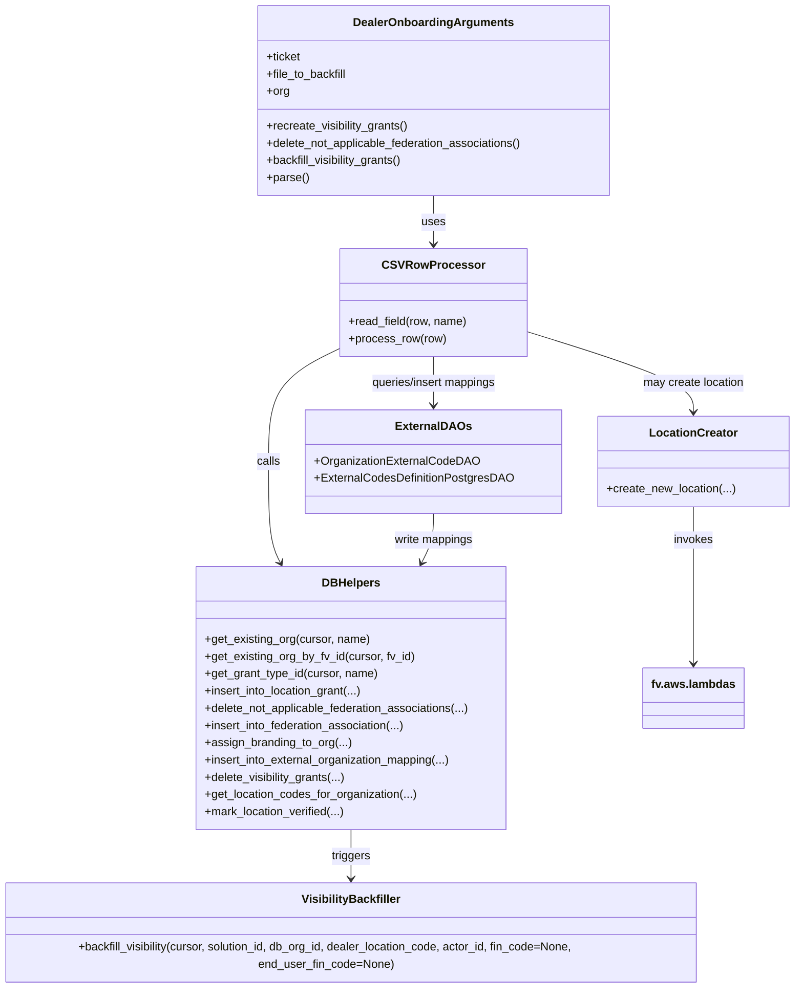

# Diagram: common/iam_service/scripts/dealer_onboarding_script.py


> Auto-generated by Obscura crawlers

## Diagram 1



### SVG

<svg id="container" width="1104.50390625" xmlns="http://www.w3.org/2000/svg" class="classDiagram" height="1362" viewBox="0 0 1104.50390625 1362" role="graphics-document document" aria-roledescription="class"><style>#container{font-family:"trebuchet ms",verdana,arial,sans-serif;font-size:16px;fill:#333;}@keyframes edge-animation-frame{from{stroke-dashoffset:0;}}@keyframes dash{to{stroke-dashoffset:0;}}#container .edge-animation-slow{stroke-dasharray:9,5!important;stroke-dashoffset:900;animation:dash 50s linear infinite;stroke-linecap:round;}#container .edge-animation-fast{stroke-dasharray:9,5!important;stroke-dashoffset:900;animation:dash 20s linear infinite;stroke-linecap:round;}#container .error-icon{fill:#552222;}#container .error-text{fill:#552222;stroke:#552222;}#container .edge-thickness-normal{stroke-width:1px;}#container .edge-thickness-thick{stroke-width:3.5px;}#container .edge-pattern-solid{stroke-dasharray:0;}#container .edge-thickness-invisible{stroke-width:0;fill:none;}#container .edge-pattern-dashed{stroke-dasharray:3;}#container .edge-pattern-dotted{stroke-dasharray:2;}#container .marker{fill:#333333;stroke:#333333;}#container .marker.cross{stroke:#333333;}#container svg{font-family:"trebuchet ms",verdana,arial,sans-serif;font-size:16px;}#container p{margin:0;}#container g.classGroup text{fill:#9370DB;stroke:none;font-family:"trebuchet ms",verdana,arial,sans-serif;font-size:10px;}#container g.classGroup text .title{font-weight:bolder;}#container .nodeLabel,#container .edgeLabel{color:#131300;}#container .edgeLabel .label rect{fill:#ECECFF;}#container .label text{fill:#131300;}#container .labelBkg{background:#ECECFF;}#container .edgeLabel .label span{background:#ECECFF;}#container .classTitle{font-weight:bolder;}#container .node rect,#container .node circle,#container .node ellipse,#container .node polygon,#container .node path{fill:#ECECFF;stroke:#9370DB;stroke-width:1px;}#container .divider{stroke:#9370DB;stroke-width:1;}#container g.clickable{cursor:pointer;}#container g.classGroup rect{fill:#ECECFF;stroke:#9370DB;}#container g.classGroup line{stroke:#9370DB;stroke-width:1;}#container .classLabel .box{stroke:none;stroke-width:0;fill:#ECECFF;opacity:0.5;}#container .classLabel .label{fill:#9370DB;font-size:10px;}#container .relation{stroke:#333333;stroke-width:1;fill:none;}#container .dashed-line{stroke-dasharray:3;}#container .dotted-line{stroke-dasharray:1 2;}#container #compositionStart,#container .composition{fill:#333333!important;stroke:#333333!important;stroke-width:1;}#container #compositionEnd,#container .composition{fill:#333333!important;stroke:#333333!important;stroke-width:1;}#container #dependencyStart,#container .dependency{fill:#333333!important;stroke:#333333!important;stroke-width:1;}#container #dependencyStart,#container .dependency{fill:#333333!important;stroke:#333333!important;stroke-width:1;}#container #extensionStart,#container .extension{fill:transparent!important;stroke:#333333!important;stroke-width:1;}#container #extensionEnd,#container .extension{fill:transparent!important;stroke:#333333!important;stroke-width:1;}#container #aggregationStart,#container .aggregation{fill:transparent!important;stroke:#333333!important;stroke-width:1;}#container #aggregationEnd,#container .aggregation{fill:transparent!important;stroke:#333333!important;stroke-width:1;}#container #lollipopStart,#container .lollipop{fill:#ECECFF!important;stroke:#333333!important;stroke-width:1;}#container #lollipopEnd,#container .lollipop{fill:#ECECFF!important;stroke:#333333!important;stroke-width:1;}#container .edgeTerminals{font-size:11px;line-height:initial;}#container .classTitleText{text-anchor:middle;font-size:18px;fill:#333;}#container .label-icon{display:inline-block;height:1em;overflow:visible;vertical-align:-0.125em;}#container .node .label-icon path{fill:currentColor;stroke:revert;stroke-width:revert;}#container :root{--mermaid-font-family:"trebuchet ms",verdana,arial,sans-serif;}</style><g><defs><marker id="container_class-aggregationStart" class="marker aggregation class" refX="18" refY="7" markerWidth="190" markerHeight="240" orient="auto"><path d="M 18,7 L9,13 L1,7 L9,1 Z"></path></marker></defs><defs><marker id="container_class-aggregationEnd" class="marker aggregation class" refX="1" refY="7" markerWidth="20" markerHeight="28" orient="auto"><path d="M 18,7 L9,13 L1,7 L9,1 Z"></path></marker></defs><defs><marker id="container_class-extensionStart" class="marker extension class" refX="18" refY="7" markerWidth="190" markerHeight="240" orient="auto"><path d="M 1,7 L18,13 V 1 Z"></path></marker></defs><defs><marker id="container_class-extensionEnd" class="marker extension class" refX="1" refY="7" markerWidth="20" markerHeight="28" orient="auto"><path d="M 1,1 V 13 L18,7 Z"></path></marker></defs><defs><marker id="container_class-compositionStart" class="marker composition class" refX="18" refY="7" markerWidth="190" markerHeight="240" orient="auto"><path d="M 18,7 L9,13 L1,7 L9,1 Z"></path></marker></defs><defs><marker id="container_class-compositionEnd" class="marker composition class" refX="1" refY="7" markerWidth="20" markerHeight="28" orient="auto"><path d="M 18,7 L9,13 L1,7 L9,1 Z"></path></marker></defs><defs><marker id="container_class-dependencyStart" class="marker dependency class" refX="6" refY="7" markerWidth="190" markerHeight="240" orient="auto"><path d="M 5,7 L9,13 L1,7 L9,1 Z"></path></marker></defs><defs><marker id="container_class-dependencyEnd" class="marker dependency class" refX="13" refY="7" markerWidth="20" markerHeight="28" orient="auto"><path d="M 18,7 L9,13 L14,7 L9,1 Z"></path></marker></defs><defs><marker id="container_class-lollipopStart" class="marker lollipop class" refX="13" refY="7" markerWidth="190" markerHeight="240" orient="auto"><circle stroke="black" fill="transparent" cx="7" cy="7" r="6"></circle></marker></defs><defs><marker id="container_class-lollipopEnd" class="marker lollipop class" refX="1" refY="7" markerWidth="190" markerHeight="240" orient="auto"><circle stroke="black" fill="transparent" cx="7" cy="7" r="6"></circle></marker></defs><g class="root"><g class="clusters"></g><g class="edgePaths"><path d="M611.27,272L611.27,278.167C611.27,284.333,611.27,296.667,611.27,308C611.27,319.333,611.27,329.667,611.27,334.833L611.27,340" id="id_DealerOnboardingArguments_CSVRowProcessor_1" class="edge-thickness-normal edge-pattern-solid relation" style=";;;" data-edge="true" data-et="edge" data-id="id_DealerOnboardingArguments_CSVRowProcessor_1" data-points="W3sieCI6NjExLjI2OTUzMTI1LCJ5IjoyNzJ9LHsieCI6NjExLjI2OTUzMTI1LCJ5IjozMDl9LHsieCI6NjExLjI2OTUzMTI1LCJ5IjozNDZ9XQ==" marker-end="url(#container_class-dependencyEnd)"></path><path d="M483.938,484.379L467.657,492.482C451.376,500.586,418.815,516.793,402.535,543.063C386.254,569.333,386.254,605.667,386.254,642C386.254,678.333,386.254,714.667,388.952,738.11C391.651,761.553,397.047,772.105,399.745,777.382L402.444,782.658" id="id_CSVRowProcessor_DBHelpers_2" class="edge-thickness-normal edge-pattern-solid relation" style=";;;" data-edge="true" data-et="edge" data-id="id_CSVRowProcessor_DBHelpers_2" data-points="W3sieCI6NDgzLjkzNzUsInkiOjQ4NC4zNzg2NTQyNjAxMjA4fSx7IngiOjM4Ni4yNTM5MDYyNSwieSI6NTMzfSx7IngiOjM4Ni4yNTM5MDYyNSwieSI6NjQyfSx7IngiOjM4Ni4yNTM5MDYyNSwieSI6NzUxfSx7IngiOjQwNS4xNzU2NzQ3MTU5MDkxLCJ5Ijo3ODh9XQ==" marker-end="url(#container_class-dependencyEnd)"></path><path d="M738.602,461.24L776.447,473.2C814.292,485.16,889.982,509.08,927.827,527.707C965.672,546.333,965.672,559.667,965.672,566.333L965.672,573" id="id_CSVRowProcessor_LocationCreator_3" class="edge-thickness-normal edge-pattern-solid relation" style=";;;" data-edge="true" data-et="edge" data-id="id_CSVRowProcessor_LocationCreator_3" data-points="W3sieCI6NzM4LjYwMTU2MjUsInkiOjQ2MS4yNDAxMDQ5MzAxNzUxNn0seyJ4Ijo5NjUuNjcxODc1LCJ5Ijo1MzN9LHsieCI6OTY1LjY3MTg3NSwieSI6NTc5fV0=" marker-end="url(#container_class-dependencyEnd)"></path><path d="M611.27,496L611.27,502.167C611.27,508.333,611.27,520.667,611.27,532C611.27,543.333,611.27,553.667,611.27,558.833L611.27,564" id="id_CSVRowProcessor_ExternalDAOs_4" class="edge-thickness-normal edge-pattern-solid relation" style=";;;" data-edge="true" data-et="edge" data-id="id_CSVRowProcessor_ExternalDAOs_4" data-points="W3sieCI6NjExLjI2OTUzMTI1LCJ5Ijo0OTZ9LHsieCI6NjExLjI2OTUzMTI1LCJ5Ijo1MzN9LHsieCI6NjExLjI2OTUzMTI1LCJ5Ijo1NzB9XQ==" marker-end="url(#container_class-dependencyEnd)"></path><path d="M498.762,1154L498.762,1160.167C498.762,1166.333,498.762,1178.667,498.762,1190C498.762,1201.333,498.762,1211.667,498.762,1216.833L498.762,1222" id="id_DBHelpers_VisibilityBackfiller_5" class="edge-thickness-normal edge-pattern-solid relation" style=";;;" data-edge="true" data-et="edge" data-id="id_DBHelpers_VisibilityBackfiller_5" data-points="W3sieCI6NDk4Ljc2MTcxODc1LCJ5IjoxMTU0fSx7IngiOjQ5OC43NjE3MTg3NSwieSI6MTE5MX0seyJ4Ijo0OTguNzYxNzE4NzUsInkiOjEyMjh9XQ==" marker-end="url(#container_class-dependencyEnd)"></path><path d="M965.672,705L965.672,712.667C965.672,720.333,965.672,735.667,965.672,772C965.672,808.333,965.672,865.667,965.672,894.333L965.672,923" id="id_LocationCreator_fv.aws.lambdas_6" class="edge-thickness-normal edge-pattern-solid relation" style=";;;" data-edge="true" data-et="edge" data-id="id_LocationCreator_fv.aws.lambdas_6" data-points="W3sieCI6OTY1LjY3MTg3NSwieSI6NzA1fSx7IngiOjk2NS42NzE4NzUsInkiOjc1MX0seyJ4Ijo5NjUuNjcxODc1LCJ5Ijo5Mjl9XQ==" marker-end="url(#container_class-dependencyEnd)"></path><path d="M611.27,714L611.27,720.167C611.27,726.333,611.27,738.667,608.571,750.11C605.873,761.553,600.476,772.105,597.778,777.382L595.08,782.658" id="id_ExternalDAOs_DBHelpers_7" class="edge-thickness-normal edge-pattern-solid relation" style=";;;" data-edge="true" data-et="edge" data-id="id_ExternalDAOs_DBHelpers_7" data-points="W3sieCI6NjExLjI2OTUzMTI1LCJ5Ijo3MTR9LHsieCI6NjExLjI2OTUzMTI1LCJ5Ijo3NTF9LHsieCI6NTkyLjM0Nzc2Mjc4NDA5MSwieSI6Nzg4fV0=" marker-end="url(#container_class-dependencyEnd)"></path></g><g class="edgeLabels"><g class="edgeLabel" transform="translate(611.26953125, 309)"><g class="label" data-id="id_DealerOnboardingArguments_CSVRowProcessor_1" transform="translate(-16.4921875, -12)"><foreignObject width="32.984375" height="24"><div xmlns="http://www.w3.org/1999/xhtml" class="labelBkg" style="display: table-cell; white-space: nowrap; line-height: 1.5; max-width: 200px; text-align: center;"><span class="edgeLabel"><p>uses</p></span></div></foreignObject></g></g><g class="edgeLabel" transform="translate(386.25390625, 642)"><g class="label" data-id="id_CSVRowProcessor_DBHelpers_2" transform="translate(-16.4453125, -12)"><foreignObject width="32.890625" height="24"><div xmlns="http://www.w3.org/1999/xhtml" class="labelBkg" style="display: table-cell; white-space: nowrap; line-height: 1.5; max-width: 200px; text-align: center;"><span class="edgeLabel"><p>calls</p></span></div></foreignObject></g></g><g class="edgeLabel" transform="translate(965.671875, 533)"><g class="label" data-id="id_CSVRowProcessor_LocationCreator_3" transform="translate(-71.2734375, -12)"><foreignObject width="142.546875" height="24"><div xmlns="http://www.w3.org/1999/xhtml" class="labelBkg" style="display: table-cell; white-space: nowrap; line-height: 1.5; max-width: 200px; text-align: center;"><span class="edgeLabel"><p>may create location</p></span></div></foreignObject></g></g><g class="edgeLabel" transform="translate(611.26953125, 533)"><g class="label" data-id="id_CSVRowProcessor_ExternalDAOs_4" transform="translate(-90.0390625, -12)"><foreignObject width="180.078125" height="24"><div xmlns="http://www.w3.org/1999/xhtml" class="labelBkg" style="display: table-cell; white-space: nowrap; line-height: 1.5; max-width: 200px; text-align: center;"><span class="edgeLabel"><p>queries/insert mappings</p></span></div></foreignObject></g></g><g class="edgeLabel" transform="translate(498.76171875, 1191)"><g class="label" data-id="id_DBHelpers_VisibilityBackfiller_5" transform="translate(-27.4921875, -12)"><foreignObject width="54.984375" height="24"><div xmlns="http://www.w3.org/1999/xhtml" class="labelBkg" style="display: table-cell; white-space: nowrap; line-height: 1.5; max-width: 200px; text-align: center;"><span class="edgeLabel"><p>triggers</p></span></div></foreignObject></g></g><g class="edgeLabel" transform="translate(965.671875, 751)"><g class="label" data-id="id_LocationCreator_fv.aws.lambdas_6" transform="translate(-27.5859375, -12)"><foreignObject width="55.171875" height="24"><div xmlns="http://www.w3.org/1999/xhtml" class="labelBkg" style="display: table-cell; white-space: nowrap; line-height: 1.5; max-width: 200px; text-align: center;"><span class="edgeLabel"><p>invokes</p></span></div></foreignObject></g></g><g class="edgeLabel" transform="translate(611.26953125, 751)"><g class="label" data-id="id_ExternalDAOs_DBHelpers_7" transform="translate(-55.828125, -12)"><foreignObject width="111.65625" height="24"><div xmlns="http://www.w3.org/1999/xhtml" class="labelBkg" style="display: table-cell; white-space: nowrap; line-height: 1.5; max-width: 200px; text-align: center;"><span class="edgeLabel"><p>write mappings</p></span></div></foreignObject></g></g></g><g class="nodes"><g class="node default" id="classId-DealerOnboardingArguments-0" transform="translate(611.26953125, 140)"><g class="basic label-container"><path d="M-246.0625 -132 L246.0625 -132 L246.0625 132 L-246.0625 132" stroke="none" stroke-width="0" fill="#ECECFF" style=""></path><path d="M-246.0625 -132 C-103.95980141038825 -132, 38.142897179223496 -132, 246.0625 -132 M-246.0625 -132 C-141.18444920284907 -132, -36.30639840569816 -132, 246.0625 -132 M246.0625 -132 C246.0625 -74.52525316724812, 246.0625 -17.050506334496248, 246.0625 132 M246.0625 -132 C246.0625 -67.63080828368288, 246.0625 -3.2616165673657633, 246.0625 132 M246.0625 132 C61.28947151503331 132, -123.48355696993337 132, -246.0625 132 M246.0625 132 C91.53816353923045 132, -62.986172921539094 132, -246.0625 132 M-246.0625 132 C-246.0625 46.69822494616007, -246.0625 -38.603550107679865, -246.0625 -132 M-246.0625 132 C-246.0625 61.43317819851282, -246.0625 -9.13364360297436, -246.0625 -132" stroke="#9370DB" stroke-width="1.3" fill="none" stroke-dasharray="0 0" style=""></path></g><g class="annotation-group text" transform="translate(0, -108)"></g><g class="label-group text" transform="translate(-106.234375, -108)"><g class="label" style="font-weight: bolder" transform="translate(0,-12)"><foreignObject width="212.46875" height="24"><div xmlns="http://www.w3.org/1999/xhtml" style="display: table-cell; white-space: nowrap; line-height: 1.5; max-width: 260px; text-align: center;"><span class="nodeLabel markdown-node-label" style=""><p>DealerOnboardingArguments</p></span></div></foreignObject></g></g><g class="members-group text" transform="translate(-234.0625, -60)"><g class="label" style="" transform="translate(0,-12)"><foreignObject width="48.390625" height="24"><div xmlns="http://www.w3.org/1999/xhtml" style="display: table-cell; white-space: nowrap; line-height: 1.5; max-width: 106px; text-align: center;"><span class="nodeLabel markdown-node-label" style=""><p>+ticket</p></span></div></foreignObject></g><g class="label" style="" transform="translate(0,12)"><foreignObject width="113.296875" height="24"><div xmlns="http://www.w3.org/1999/xhtml" style="display: table-cell; white-space: nowrap; line-height: 1.5; max-width: 171px; text-align: center;"><span class="nodeLabel markdown-node-label" style=""><p>+file_to_backfill</p></span></div></foreignObject></g><g class="label" style="" transform="translate(0,36)"><foreignObject width="31.59375" height="24"><div xmlns="http://www.w3.org/1999/xhtml" style="display: table-cell; white-space: nowrap; line-height: 1.5; max-width: 90px; text-align: center;"><span class="nodeLabel markdown-node-label" style=""><p>+org</p></span></div></foreignObject></g></g><g class="methods-group text" transform="translate(-234.0625, 36)"><g class="label" style="" transform="translate(0,-12)"><foreignObject width="199.5625" height="24"><div xmlns="http://www.w3.org/1999/xhtml" style="display: table-cell; white-space: nowrap; line-height: 1.5; max-width: 257px; text-align: center;"><span class="nodeLabel markdown-node-label" style=""><p>+recreate_visibility_grants()</p></span></div></foreignObject></g><g class="label" style="" transform="translate(0,12)"><foreignObject width="361.890625" height="24"><div xmlns="http://www.w3.org/1999/xhtml" style="display: table-cell; white-space: nowrap; line-height: 1.5; max-width: 419px; text-align: center;"><span class="nodeLabel markdown-node-label" style=""><p>+delete_not_applicable_federation_associations()</p></span></div></foreignObject></g><g class="label" style="" transform="translate(0,36)"><foreignObject width="193.0625" height="24"><div xmlns="http://www.w3.org/1999/xhtml" style="display: table-cell; white-space: nowrap; line-height: 1.5; max-width: 250px; text-align: center;"><span class="nodeLabel markdown-node-label" style=""><p>+backfill_visibility_grants()</p></span></div></foreignObject></g><g class="label" style="" transform="translate(0,60)"><foreignObject width="58.53125" height="24"><div xmlns="http://www.w3.org/1999/xhtml" style="display: table-cell; white-space: nowrap; line-height: 1.5; max-width: 116px; text-align: center;"><span class="nodeLabel markdown-node-label" style=""><p>+parse()</p></span></div></foreignObject></g></g><g class="divider" style=""><path d="M-246.0625 -84 C-81.36948861553458 -84, 83.32352276893084 -84, 246.0625 -84 M-246.0625 -84 C-109.39576332785248 -84, 27.270973344295044 -84, 246.0625 -84" stroke="#9370DB" stroke-width="1.3" fill="none" stroke-dasharray="0 0" style=""></path></g><g class="divider" style=""><path d="M-246.0625 12 C-118.06380290245964 12, 9.934894195080716 12, 246.0625 12 M-246.0625 12 C-83.73936779161363 12, 78.58376441677274 12, 246.0625 12" stroke="#9370DB" stroke-width="1.3" fill="none" stroke-dasharray="0 0" style=""></path></g></g><g class="node default" id="classId-CSVRowProcessor-1" transform="translate(611.26953125, 421)"><g class="basic label-container"><path d="M-127.33203125 -75 L127.33203125 -75 L127.33203125 75 L-127.33203125 75" stroke="none" stroke-width="0" fill="#ECECFF" style=""></path><path d="M-127.33203125 -75 C-39.308992092356846 -75, 48.71404706528631 -75, 127.33203125 -75 M-127.33203125 -75 C-39.993777915427685 -75, 47.34447541914463 -75, 127.33203125 -75 M127.33203125 -75 C127.33203125 -42.22927476611187, 127.33203125 -9.458549532223742, 127.33203125 75 M127.33203125 -75 C127.33203125 -37.38157858081703, 127.33203125 0.23684283836594489, 127.33203125 75 M127.33203125 75 C41.588024465544606 75, -44.15598231891079 75, -127.33203125 75 M127.33203125 75 C51.090249284108964 75, -25.151532681782072 75, -127.33203125 75 M-127.33203125 75 C-127.33203125 18.60100967738007, -127.33203125 -37.79798064523986, -127.33203125 -75 M-127.33203125 75 C-127.33203125 29.882264277146852, -127.33203125 -15.235471445706295, -127.33203125 -75" stroke="#9370DB" stroke-width="1.3" fill="none" stroke-dasharray="0 0" style=""></path></g><g class="annotation-group text" transform="translate(0, -51)"></g><g class="label-group text" transform="translate(-64.8984375, -51)"><g class="label" style="font-weight: bolder" transform="translate(0,-12)"><foreignObject width="129.796875" height="24"><div xmlns="http://www.w3.org/1999/xhtml" style="display: table-cell; white-space: nowrap; line-height: 1.5; max-width: 178px; text-align: center;"><span class="nodeLabel markdown-node-label" style=""><p>CSVRowProcessor</p></span></div></foreignObject></g></g><g class="members-group text" transform="translate(-115.33203125, -3)"></g><g class="methods-group text" transform="translate(-115.33203125, 27)"><g class="label" style="" transform="translate(0,-12)"><foreignObject width="165.765625" height="24"><div xmlns="http://www.w3.org/1999/xhtml" style="display: table-cell; white-space: nowrap; line-height: 1.5; max-width: 223px; text-align: center;"><span class="nodeLabel markdown-node-label" style=""><p>+read_field(row, name)</p></span></div></foreignObject></g><g class="label" style="" transform="translate(0,12)"><foreignObject width="134.765625" height="24"><div xmlns="http://www.w3.org/1999/xhtml" style="display: table-cell; white-space: nowrap; line-height: 1.5; max-width: 192px; text-align: center;"><span class="nodeLabel markdown-node-label" style=""><p>+process_row(row)</p></span></div></foreignObject></g></g><g class="divider" style=""><path d="M-127.33203125 -27 C-66.8865435944237 -27, -6.4410559388473985 -27, 127.33203125 -27 M-127.33203125 -27 C-44.094263975778006 -27, 39.14350329844399 -27, 127.33203125 -27" stroke="#9370DB" stroke-width="1.3" fill="none" stroke-dasharray="0 0" style=""></path></g><g class="divider" style=""><path d="M-127.33203125 -3 C-75.88351939199693 -3, -24.435007533993854 -3, 127.33203125 -3 M-127.33203125 -3 C-60.697422602212484 -3, 5.937186045575032 -3, 127.33203125 -3" stroke="#9370DB" stroke-width="1.3" fill="none" stroke-dasharray="0 0" style=""></path></g></g><g class="node default" id="classId-DBHelpers-2" transform="translate(498.76171875, 971)"><g class="basic label-container"><path d="M-217.9296875 -183 L217.9296875 -183 L217.9296875 183 L-217.9296875 183" stroke="none" stroke-width="0" fill="#ECECFF" style=""></path><path d="M-217.9296875 -183 C-66.61402995551651 -183, 84.70162758896697 -183, 217.9296875 -183 M-217.9296875 -183 C-91.69665697265604 -183, 34.53637355468791 -183, 217.9296875 -183 M217.9296875 -183 C217.9296875 -81.35659735698827, 217.9296875 20.28680528602345, 217.9296875 183 M217.9296875 -183 C217.9296875 -69.2054375574974, 217.9296875 44.58912488500519, 217.9296875 183 M217.9296875 183 C82.80201447209566 183, -52.32565855580867 183, -217.9296875 183 M217.9296875 183 C54.51494559631743 183, -108.89979630736514 183, -217.9296875 183 M-217.9296875 183 C-217.9296875 39.9092559337833, -217.9296875 -103.1814881324334, -217.9296875 -183 M-217.9296875 183 C-217.9296875 84.98103693276485, -217.9296875 -13.037926134470297, -217.9296875 -183" stroke="#9370DB" stroke-width="1.3" fill="none" stroke-dasharray="0 0" style=""></path></g><g class="annotation-group text" transform="translate(0, -159)"></g><g class="label-group text" transform="translate(-38.4375, -159)"><g class="label" style="font-weight: bolder" transform="translate(0,-12)"><foreignObject width="76.875" height="24"><div xmlns="http://www.w3.org/1999/xhtml" style="display: table-cell; white-space: nowrap; line-height: 1.5; max-width: 126px; text-align: center;"><span class="nodeLabel markdown-node-label" style=""><p>DBHelpers</p></span></div></foreignObject></g></g><g class="members-group text" transform="translate(-205.9296875, -111)"></g><g class="methods-group text" transform="translate(-205.9296875, -81)"><g class="label" style="" transform="translate(0,-12)"><foreignObject width="229.921875" height="24"><div xmlns="http://www.w3.org/1999/xhtml" style="display: table-cell; white-space: nowrap; line-height: 1.5; max-width: 287px; text-align: center;"><span class="nodeLabel markdown-node-label" style=""><p>+get_existing_org(cursor, name)</p></span></div></foreignObject></g><g class="label" style="" transform="translate(0,12)"><foreignObject width="292.9375" height="24"><div xmlns="http://www.w3.org/1999/xhtml" style="display: table-cell; white-space: nowrap; line-height: 1.5; max-width: 350px; text-align: center;"><span class="nodeLabel markdown-node-label" style=""><p>+get_existing_org_by_fv_id(cursor, fv_id)</p></span></div></foreignObject></g><g class="label" style="" transform="translate(0,36)"><foreignObject width="242.09375" height="24"><div xmlns="http://www.w3.org/1999/xhtml" style="display: table-cell; white-space: nowrap; line-height: 1.5; max-width: 299px; text-align: center;"><span class="nodeLabel markdown-node-label" style=""><p>+get_grant_type_id(cursor, name)</p></span></div></foreignObject></g><g class="label" style="" transform="translate(0,60)"><foreignObject width="222.25" height="24"><div xmlns="http://www.w3.org/1999/xhtml" style="display: table-cell; white-space: nowrap; line-height: 1.5; max-width: 280px; text-align: center;"><span class="nodeLabel markdown-node-label" style=""><p>+insert_into_location_grant(...)</p></span></div></foreignObject></g><g class="label" style="" transform="translate(0,84)"><foreignObject width="373.421875" height="24"><div xmlns="http://www.w3.org/1999/xhtml" style="display: table-cell; white-space: nowrap; line-height: 1.5; max-width: 431px; text-align: center;"><span class="nodeLabel markdown-node-label" style=""><p>+delete_not_applicable_federation_associations(...)</p></span></div></foreignObject></g><g class="label" style="" transform="translate(0,108)"><foreignObject width="282.765625" height="24"><div xmlns="http://www.w3.org/1999/xhtml" style="display: table-cell; white-space: nowrap; line-height: 1.5; max-width: 340px; text-align: center;"><span class="nodeLabel markdown-node-label" style=""><p>+insert_into_federation_association(...)</p></span></div></foreignObject></g><g class="label" style="" transform="translate(0,132)"><foreignObject width="202.703125" height="24"><div xmlns="http://www.w3.org/1999/xhtml" style="display: table-cell; white-space: nowrap; line-height: 1.5; max-width: 260px; text-align: center;"><span class="nodeLabel markdown-node-label" style=""><p>+assign_branding_to_org(...)</p></span></div></foreignObject></g><g class="label" style="" transform="translate(0,156)"><foreignObject width="346.359375" height="24"><div xmlns="http://www.w3.org/1999/xhtml" style="display: table-cell; white-space: nowrap; line-height: 1.5; max-width: 404px; text-align: center;"><span class="nodeLabel markdown-node-label" style=""><p>+insert_into_external_organization_mapping(...)</p></span></div></foreignObject></g><g class="label" style="" transform="translate(0,180)"><foreignObject width="197.671875" height="24"><div xmlns="http://www.w3.org/1999/xhtml" style="display: table-cell; white-space: nowrap; line-height: 1.5; max-width: 255px; text-align: center;"><span class="nodeLabel markdown-node-label" style=""><p>+delete_visibility_grants(...)</p></span></div></foreignObject></g><g class="label" style="" transform="translate(0,204)"><foreignObject width="295.65625" height="24"><div xmlns="http://www.w3.org/1999/xhtml" style="display: table-cell; white-space: nowrap; line-height: 1.5; max-width: 353px; text-align: center;"><span class="nodeLabel markdown-node-label" style=""><p>+get_location_codes_for_organization(...)</p></span></div></foreignObject></g><g class="label" style="" transform="translate(0,228)"><foreignObject width="196.515625" height="24"><div xmlns="http://www.w3.org/1999/xhtml" style="display: table-cell; white-space: nowrap; line-height: 1.5; max-width: 254px; text-align: center;"><span class="nodeLabel markdown-node-label" style=""><p>+mark_location_verified(...)</p></span></div></foreignObject></g></g><g class="divider" style=""><path d="M-217.9296875 -135 C-46.56639850820474 -135, 124.79689048359052 -135, 217.9296875 -135 M-217.9296875 -135 C-104.20617087436437 -135, 9.51734575127125 -135, 217.9296875 -135" stroke="#9370DB" stroke-width="1.3" fill="none" stroke-dasharray="0 0" style=""></path></g><g class="divider" style=""><path d="M-217.9296875 -111 C-86.56770876627127 -111, 44.79426996745747 -111, 217.9296875 -111 M-217.9296875 -111 C-105.91454156658472 -111, 6.1006043668305665 -111, 217.9296875 -111" stroke="#9370DB" stroke-width="1.3" fill="none" stroke-dasharray="0 0" style=""></path></g></g><g class="node default" id="classId-VisibilityBackfiller-3" transform="translate(498.76171875, 1291)"><g class="basic label-container"><path d="M-490.76171875 -63 L490.76171875 -63 L490.76171875 63 L-490.76171875 63" stroke="none" stroke-width="0" fill="#ECECFF" style=""></path><path d="M-490.76171875 -63 C-157.7658573266832 -63, 175.2300040966336 -63, 490.76171875 -63 M-490.76171875 -63 C-222.5475789558875 -63, 45.666560838224996 -63, 490.76171875 -63 M490.76171875 -63 C490.76171875 -32.254897165484735, 490.76171875 -1.5097943309694628, 490.76171875 63 M490.76171875 -63 C490.76171875 -35.30275104997256, 490.76171875 -7.605502099945113, 490.76171875 63 M490.76171875 63 C210.6431642447493 63, -69.4753902605014 63, -490.76171875 63 M490.76171875 63 C207.71337493671848 63, -75.33496887656304 63, -490.76171875 63 M-490.76171875 63 C-490.76171875 37.36526688632196, -490.76171875 11.73053377264393, -490.76171875 -63 M-490.76171875 63 C-490.76171875 34.903043475709445, -490.76171875 6.806086951418891, -490.76171875 -63" stroke="#9370DB" stroke-width="1.3" fill="none" stroke-dasharray="0 0" style=""></path></g><g class="annotation-group text" transform="translate(0, -39)"></g><g class="label-group text" transform="translate(-66.4921875, -39)"><g class="label" style="font-weight: bolder" transform="translate(0,-12)"><foreignObject width="132.984375" height="24"><div xmlns="http://www.w3.org/1999/xhtml" style="display: table-cell; white-space: nowrap; line-height: 1.5; max-width: 181px; text-align: center;"><span class="nodeLabel markdown-node-label" style=""><p>VisibilityBackfiller</p></span></div></foreignObject></g></g><g class="members-group text" transform="translate(-478.76171875, 9)"></g><g class="methods-group text" transform="translate(-478.76171875, 39)"><g class="label" style="" transform="translate(0,-12)"><foreignObject width="891.03125" height="24"><div xmlns="http://www.w3.org/1999/xhtml" style="display: table-cell; white-space: nowrap; line-height: 1.5; max-width: 948px; text-align: center;"><span class="nodeLabel markdown-node-label" style=""><p>+backfill_visibility(cursor, solution_id, db_org_id, dealer_location_code, actor_id, fin_code=None, end_user_fin_code=None)</p></span></div></foreignObject></g></g><g class="divider" style=""><path d="M-490.76171875 -15 C-172.3046402082166 -15, 146.1524383335668 -15, 490.76171875 -15 M-490.76171875 -15 C-239.4444768024977 -15, 11.872765145004621 -15, 490.76171875 -15" stroke="#9370DB" stroke-width="1.3" fill="none" stroke-dasharray="0 0" style=""></path></g><g class="divider" style=""><path d="M-490.76171875 9 C-181.58906810432677 9, 127.58358254134646 9, 490.76171875 9 M-490.76171875 9 C-116.48889969291088 9, 257.78391936417825 9, 490.76171875 9" stroke="#9370DB" stroke-width="1.3" fill="none" stroke-dasharray="0 0" style=""></path></g></g><g class="node default" id="classId-LocationCreator-4" transform="translate(965.671875, 642)"><g class="basic label-container"><path d="M-130.83203125 -63 L130.83203125 -63 L130.83203125 63 L-130.83203125 63" stroke="none" stroke-width="0" fill="#ECECFF" style=""></path><path d="M-130.83203125 -63 C-78.04100864867237 -63, -25.249986047344763 -63, 130.83203125 -63 M-130.83203125 -63 C-51.31022084126299 -63, 28.21158956747402 -63, 130.83203125 -63 M130.83203125 -63 C130.83203125 -17.586283430279565, 130.83203125 27.82743313944087, 130.83203125 63 M130.83203125 -63 C130.83203125 -16.860009066276525, 130.83203125 29.27998186744695, 130.83203125 63 M130.83203125 63 C51.047881615704995 63, -28.73626801859001 63, -130.83203125 63 M130.83203125 63 C51.924812216587256 63, -26.98240681682549 63, -130.83203125 63 M-130.83203125 63 C-130.83203125 13.589591289279454, -130.83203125 -35.82081742144109, -130.83203125 -63 M-130.83203125 63 C-130.83203125 36.132718175993716, -130.83203125 9.265436351987432, -130.83203125 -63" stroke="#9370DB" stroke-width="1.3" fill="none" stroke-dasharray="0 0" style=""></path></g><g class="annotation-group text" transform="translate(0, -39)"></g><g class="label-group text" transform="translate(-58.3671875, -39)"><g class="label" style="font-weight: bolder" transform="translate(0,-12)"><foreignObject width="116.734375" height="24"><div xmlns="http://www.w3.org/1999/xhtml" style="display: table-cell; white-space: nowrap; line-height: 1.5; max-width: 166px; text-align: center;"><span class="nodeLabel markdown-node-label" style=""><p>LocationCreator</p></span></div></foreignObject></g></g><g class="members-group text" transform="translate(-118.83203125, 9)"></g><g class="methods-group text" transform="translate(-118.83203125, 39)"><g class="label" style="" transform="translate(0,-12)"><foreignObject width="179.296875" height="24"><div xmlns="http://www.w3.org/1999/xhtml" style="display: table-cell; white-space: nowrap; line-height: 1.5; max-width: 237px; text-align: center;"><span class="nodeLabel markdown-node-label" style=""><p>+create_new_location(...)</p></span></div></foreignObject></g></g><g class="divider" style=""><path d="M-130.83203125 -15 C-42.98753137636456 -15, 44.856968497270884 -15, 130.83203125 -15 M-130.83203125 -15 C-59.70199184468939 -15, 11.428047560621224 -15, 130.83203125 -15" stroke="#9370DB" stroke-width="1.3" fill="none" stroke-dasharray="0 0" style=""></path></g><g class="divider" style=""><path d="M-130.83203125 9 C-77.96239477825677 9, -25.09275830651353 9, 130.83203125 9 M-130.83203125 9 C-39.56833610746092 9, 51.695359035078155 9, 130.83203125 9" stroke="#9370DB" stroke-width="1.3" fill="none" stroke-dasharray="0 0" style=""></path></g></g><g class="node default" id="classId-ExternalDAOs-5" transform="translate(611.26953125, 642)"><g class="basic label-container"><path d="M-173.5703125 -72 L173.5703125 -72 L173.5703125 72 L-173.5703125 72" stroke="none" stroke-width="0" fill="#ECECFF" style=""></path><path d="M-173.5703125 -72 C-50.819076847136785 -72, 71.93215880572643 -72, 173.5703125 -72 M-173.5703125 -72 C-94.29610704415508 -72, -15.021901588310158 -72, 173.5703125 -72 M173.5703125 -72 C173.5703125 -38.60528998004165, 173.5703125 -5.210579960083294, 173.5703125 72 M173.5703125 -72 C173.5703125 -15.717452688425361, 173.5703125 40.56509462314928, 173.5703125 72 M173.5703125 72 C62.12237405379108 72, -49.325564392417846 72, -173.5703125 72 M173.5703125 72 C61.181581023811916 72, -51.20715045237617 72, -173.5703125 72 M-173.5703125 72 C-173.5703125 26.551487482494124, -173.5703125 -18.89702503501175, -173.5703125 -72 M-173.5703125 72 C-173.5703125 32.28532634207459, -173.5703125 -7.429347315850819, -173.5703125 -72" stroke="#9370DB" stroke-width="1.3" fill="none" stroke-dasharray="0 0" style=""></path></g><g class="annotation-group text" transform="translate(0, -48)"></g><g class="label-group text" transform="translate(-49.328125, -48)"><g class="label" style="font-weight: bolder" transform="translate(0,-12)"><foreignObject width="98.65625" height="24"><div xmlns="http://www.w3.org/1999/xhtml" style="display: table-cell; white-space: nowrap; line-height: 1.5; max-width: 147px; text-align: center;"><span class="nodeLabel markdown-node-label" style=""><p>ExternalDAOs</p></span></div></foreignObject></g></g><g class="members-group text" transform="translate(-161.5703125, 0)"><g class="label" style="" transform="translate(0,-12)"><foreignObject width="225.921875" height="24"><div xmlns="http://www.w3.org/1999/xhtml" style="display: table-cell; white-space: nowrap; line-height: 1.5; max-width: 283px; text-align: center;"><span class="nodeLabel markdown-node-label" style=""><p>+OrganizationExternalCodeDAO</p></span></div></foreignObject></g><g class="label" style="" transform="translate(0,12)"><foreignObject width="273.8125" height="24"><div xmlns="http://www.w3.org/1999/xhtml" style="display: table-cell; white-space: nowrap; line-height: 1.5; max-width: 331px; text-align: center;"><span class="nodeLabel markdown-node-label" style=""><p>+ExternalCodesDefinitionPostgresDAO</p></span></div></foreignObject></g></g><g class="methods-group text" transform="translate(-161.5703125, 72)"></g><g class="divider" style=""><path d="M-173.5703125 -24 C-95.09268636536417 -24, -16.615060230728346 -24, 173.5703125 -24 M-173.5703125 -24 C-94.41601578729552 -24, -15.261719074591042 -24, 173.5703125 -24" stroke="#9370DB" stroke-width="1.3" fill="none" stroke-dasharray="0 0" style=""></path></g><g class="divider" style=""><path d="M-173.5703125 48 C-102.2517082967768 48, -30.933104093553595 48, 173.5703125 48 M-173.5703125 48 C-100.7275742995532 48, -27.884836099106394 48, 173.5703125 48" stroke="#9370DB" stroke-width="1.3" fill="none" stroke-dasharray="0 0" style=""></path></g></g><g class="node default" id="classId-fv.aws.lambdas-6" transform="translate(965.671875, 971)"><g class="basic label-container"><path d="M-67.8984375 -42 L67.8984375 -42 L67.8984375 42 L-67.8984375 42" stroke="none" stroke-width="0" fill="#ECECFF" style=""></path><path d="M-67.8984375 -42 C-37.475903911950056 -42, -7.053370323900118 -42, 67.8984375 -42 M-67.8984375 -42 C-39.479517430495974 -42, -11.060597360991949 -42, 67.8984375 -42 M67.8984375 -42 C67.8984375 -17.4931984572517, 67.8984375 7.013603085496598, 67.8984375 42 M67.8984375 -42 C67.8984375 -15.793199264285548, 67.8984375 10.413601471428905, 67.8984375 42 M67.8984375 42 C15.715872919851414 42, -36.46669166029717 42, -67.8984375 42 M67.8984375 42 C25.715624302745766 42, -16.467188894508467 42, -67.8984375 42 M-67.8984375 42 C-67.8984375 13.912137527124116, -67.8984375 -14.175724945751767, -67.8984375 -42 M-67.8984375 42 C-67.8984375 14.904657125387939, -67.8984375 -12.190685749224123, -67.8984375 -42" stroke="#9370DB" stroke-width="1.3" fill="none" stroke-dasharray="0 0" style=""></path></g><g class="annotation-group text" transform="translate(0, -18)"></g><g class="label-group text" transform="translate(-55.8984375, -18)"><g class="label" style="font-weight: bolder" transform="translate(0,-12)"><foreignObject width="111.796875" height="24"><div xmlns="http://www.w3.org/1999/xhtml" style="display: table-cell; white-space: nowrap; line-height: 1.5; max-width: 160px; text-align: center;"><span class="nodeLabel markdown-node-label" style=""><p>fv.aws.lambdas</p></span></div></foreignObject></g></g><g class="members-group text" transform="translate(-55.8984375, 30)"></g><g class="methods-group text" transform="translate(-55.8984375, 60)"></g><g class="divider" style=""><path d="M-67.8984375 6 C-34.600034756960824 6, -1.3016320139216475 6, 67.8984375 6 M-67.8984375 6 C-23.15702751097823 6, 21.584382478043537 6, 67.8984375 6" stroke="#9370DB" stroke-width="1.3" fill="none" stroke-dasharray="0 0" style=""></path></g><g class="divider" style=""><path d="M-67.8984375 24 C-24.84321986731976 24, 18.21199776536048 24, 67.8984375 24 M-67.8984375 24 C-32.79301246111905 24, 2.3124125777619042 24, 67.8984375 24" stroke="#9370DB" stroke-width="1.3" fill="none" stroke-dasharray="0 0" style=""></path></g></g></g></g></g></svg>

## Diagram 2

```mermaid
flowchart TD
Start([start]) --> ParseArgs[/"Parse CLI args (DealerOnboardingArguments.parse)"/]
ParseArgs --> ConfirmPrompts{confirmation required?}
ConfirmPrompts -->|yes prompt| UserConfirm[/"user input y/n"/]
UserConfirm -->|no| Exit1([exit])
UserConfirm -->|yes| Continue1([continue])
ConfirmPrompts -->|no prompts| Continue1
Continue1 --> OpenDB[/"Open DB connections (FvDatabaseConnector)"/]
OpenDB --> ResolveCustomerOrg{resolve customer org from fv_id}
ResolveCustomerOrg -->|not found| RaiseError([raise BadRequestError])
ResolveCustomerOrg -->|found| PrepareActor[/"build actor_id and org_lad_id"/]
PrepareActor --> ReadCSV[/"Open CSV and iterate rows"/]
ReadCSV --> ForEachRow{for each CSV row}
ForEachRow --> ParseFields[/"read fields (dealer_name,fv_id,location_code,...)/"]
ParseFields --> FindOrCreateOrg{existing org?}
FindOrCreateOrg -->|exists| UseOrg
FindOrCreateOrg -->|not exists & name| CreateOrg[/"add_or_update_org -> new org id"/]
CreateOrg --> UseOrg
UseOrg --> FederationHandling{fed_id present?}
FederationHandling -->|yes| MaybeDeleteNotApplicable[/"maybe delete not applicable federation associations"/]
MaybeDeleteNotApplicable --> InsertExternalMapping[/"insert organization_external_mapping & federation_association"/]
FederationHandling -->|no| SkipFed
UseOrg --> LocationHandling{location_code present?}
LocationHandling -->|yes| GetLocationId[/"get_shipper_location_id_by_code"/]
GetLocationId -->|not found & full address| CreateLocation[/"create_new_location -> invoke locations-post lambda"/]
CreateLocation --> InsertLocationGrant[/"insert_into_location_grant"/]
GetLocationId -->|found| InsertLocationGrant
InsertLocationGrant --> MaybeInsertLocationReference{dealer_zone/district?}
MaybeInsertLocationReference --> InsertZone[/"insert_into_location_reference DEALER_ZONE"/]
MaybeInsertLocationReference --> InsertDistrict[/"insert_into_location_reference DEALER_DISTRICT"/]
LocationHandling -->|no| SkipLocation
UseOrg --> BrandingHandling{branding?}
BrandingHandling -->|yes| AssignBranding[/"assign_branding_to_org"/]
BrandingHandling -->|no| SkipBranding
UseOrg --> ExternalCodesHandling{fin_code/end_user_fin_code?}
ExternalCodesHandling -->|yes| InsertExternalOrgMapping[/"insert_into_external_organization_mapping"/]
ExternalCodesHandling -->|no| SkipExternal
ForEachRow --> PostRowExistingLocations[/"if existing org: update/mark locations verified and insert refs"/]
PostRowExistingLocations --> AccumulateVisibilityGrants[/"collect visibility_grants_to_backfill"/]
ForEachRow --> ContinueLoop([next row])
ContinueLoop --> AfterCSV([finished CSV])
AfterCSV --> BackfillVisibility{args.backfill_visibility_grants?}
BackfillVisibility -->|yes| LoopGrantees[/"for each grantee: optionally delete grants then backfill_visibility for each location_code"/]
BackfillVisibility -->|no| End([end])
LoopGrantees --> End
```

> SVG rendering failed for this diagram.
