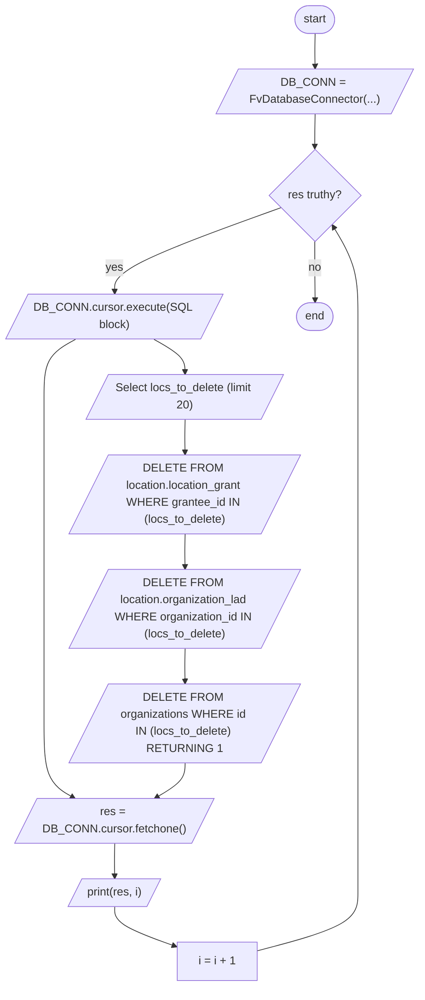

# Diagram: common/iam_service/scripts/delete_dealer_orgs.py


> Auto-generated by Obscura crawlers

## Diagram 1

```mermaid
classDiagram
    class fv.db.FvDatabaseConnector {
        +__init__(name, secret)
        +cursor
    }
    class fv.secrets.SecretNames {
        <<enum>>
        +DATABASE
    }
    class DB_CONN {
        +cursor
    }
    class main()
    class loop
    class SQL_Delete_Block
    fv.db.FvDatabaseConnector <|-- DB_CONN
    fv.secrets.SecretNames <|.. SecretNames
    DB_CONN --> main : used by
    main --> loop : contains
    loop --> SQL_Delete_Block : executes
    SQL_Delete_Block : WITH locs_to_delete
    SQL_Delete_Block : DELETE location.location_grant
    SQL_Delete_Block : DELETE location.organization_lad
    SQL_Delete_Block : DELETE FROM organizations
    loop --> DB_CONN.cursor.fetchone : checks res
    loop --> print : outputs progress
```

> SVG rendering failed for this diagram.

## Diagram 2



### SVG

<svg id="container" width="579.4296875" xmlns="http://www.w3.org/2000/svg" class="flowchart" height="1388.171875" viewBox="0 0 579.4296875 1388.171875" role="graphics-document document" aria-roledescription="flowchart-v2"><style>#container{font-family:"trebuchet ms",verdana,arial,sans-serif;font-size:16px;fill:#333;}@keyframes edge-animation-frame{from{stroke-dashoffset:0;}}@keyframes dash{to{stroke-dashoffset:0;}}#container .edge-animation-slow{stroke-dasharray:9,5!important;stroke-dashoffset:900;animation:dash 50s linear infinite;stroke-linecap:round;}#container .edge-animation-fast{stroke-dasharray:9,5!important;stroke-dashoffset:900;animation:dash 20s linear infinite;stroke-linecap:round;}#container .error-icon{fill:#552222;}#container .error-text{fill:#552222;stroke:#552222;}#container .edge-thickness-normal{stroke-width:1px;}#container .edge-thickness-thick{stroke-width:3.5px;}#container .edge-pattern-solid{stroke-dasharray:0;}#container .edge-thickness-invisible{stroke-width:0;fill:none;}#container .edge-pattern-dashed{stroke-dasharray:3;}#container .edge-pattern-dotted{stroke-dasharray:2;}#container .marker{fill:#333333;stroke:#333333;}#container .marker.cross{stroke:#333333;}#container svg{font-family:"trebuchet ms",verdana,arial,sans-serif;font-size:16px;}#container p{margin:0;}#container .label{font-family:"trebuchet ms",verdana,arial,sans-serif;color:#333;}#container .cluster-label text{fill:#333;}#container .cluster-label span{color:#333;}#container .cluster-label span p{background-color:transparent;}#container .label text,#container span{fill:#333;color:#333;}#container .node rect,#container .node circle,#container .node ellipse,#container .node polygon,#container .node path{fill:#ECECFF;stroke:#9370DB;stroke-width:1px;}#container .rough-node .label text,#container .node .label text,#container .image-shape .label,#container .icon-shape .label{text-anchor:middle;}#container .node .katex path{fill:#000;stroke:#000;stroke-width:1px;}#container .rough-node .label,#container .node .label,#container .image-shape .label,#container .icon-shape .label{text-align:center;}#container .node.clickable{cursor:pointer;}#container .root .anchor path{fill:#333333!important;stroke-width:0;stroke:#333333;}#container .arrowheadPath{fill:#333333;}#container .edgePath .path{stroke:#333333;stroke-width:2.0px;}#container .flowchart-link{stroke:#333333;fill:none;}#container .edgeLabel{background-color:rgba(232,232,232, 0.8);text-align:center;}#container .edgeLabel p{background-color:rgba(232,232,232, 0.8);}#container .edgeLabel rect{opacity:0.5;background-color:rgba(232,232,232, 0.8);fill:rgba(232,232,232, 0.8);}#container .labelBkg{background-color:rgba(232, 232, 232, 0.5);}#container .cluster rect{fill:#ffffde;stroke:#aaaa33;stroke-width:1px;}#container .cluster text{fill:#333;}#container .cluster span{color:#333;}#container div.mermaidTooltip{position:absolute;text-align:center;max-width:200px;padding:2px;font-family:"trebuchet ms",verdana,arial,sans-serif;font-size:12px;background:hsl(80, 100%, 96.2745098039%);border:1px solid #aaaa33;border-radius:2px;pointer-events:none;z-index:100;}#container .flowchartTitleText{text-anchor:middle;font-size:18px;fill:#333;}#container rect.text{fill:none;stroke-width:0;}#container .icon-shape,#container .image-shape{background-color:rgba(232,232,232, 0.8);text-align:center;}#container .icon-shape p,#container .image-shape p{background-color:rgba(232,232,232, 0.8);padding:2px;}#container .icon-shape rect,#container .image-shape rect{opacity:0.5;background-color:rgba(232,232,232, 0.8);fill:rgba(232,232,232, 0.8);}#container .label-icon{display:inline-block;height:1em;overflow:visible;vertical-align:-0.125em;}#container .node .label-icon path{fill:currentColor;stroke:revert;stroke-width:revert;}#container :root{--mermaid-font-family:"trebuchet ms",verdana,arial,sans-serif;}</style><g><marker id="container_flowchart-v2-pointEnd" class="marker flowchart-v2" viewBox="0 0 10 10" refX="5" refY="5" markerUnits="userSpaceOnUse" markerWidth="8" markerHeight="8" orient="auto"><path d="M 0 0 L 10 5 L 0 10 z" class="arrowMarkerPath" style="stroke-width: 1; stroke-dasharray: 1, 0;"></path></marker><marker id="container_flowchart-v2-pointStart" class="marker flowchart-v2" viewBox="0 0 10 10" refX="4.5" refY="5" markerUnits="userSpaceOnUse" markerWidth="8" markerHeight="8" orient="auto"><path d="M 0 5 L 10 10 L 10 0 z" class="arrowMarkerPath" style="stroke-width: 1; stroke-dasharray: 1, 0;"></path></marker><marker id="container_flowchart-v2-circleEnd" class="marker flowchart-v2" viewBox="0 0 10 10" refX="11" refY="5" markerUnits="userSpaceOnUse" markerWidth="11" markerHeight="11" orient="auto"><circle cx="5" cy="5" r="5" class="arrowMarkerPath" style="stroke-width: 1; stroke-dasharray: 1, 0;"></circle></marker><marker id="container_flowchart-v2-circleStart" class="marker flowchart-v2" viewBox="0 0 10 10" refX="-1" refY="5" markerUnits="userSpaceOnUse" markerWidth="11" markerHeight="11" orient="auto"><circle cx="5" cy="5" r="5" class="arrowMarkerPath" style="stroke-width: 1; stroke-dasharray: 1, 0;"></circle></marker><marker id="container_flowchart-v2-crossEnd" class="marker cross flowchart-v2" viewBox="0 0 11 11" refX="12" refY="5.2" markerUnits="userSpaceOnUse" markerWidth="11" markerHeight="11" orient="auto"><path d="M 1,1 l 9,9 M 10,1 l -9,9" class="arrowMarkerPath" style="stroke-width: 2; stroke-dasharray: 1, 0;"></path></marker><marker id="container_flowchart-v2-crossStart" class="marker cross flowchart-v2" viewBox="0 0 11 11" refX="-1" refY="5.2" markerUnits="userSpaceOnUse" markerWidth="11" markerHeight="11" orient="auto"><path d="M 1,1 l 9,9 M 10,1 l -9,9" class="arrowMarkerPath" style="stroke-width: 2; stroke-dasharray: 1, 0;"></path></marker><g class="root"><g class="clusters"></g><g class="edgePaths"><path d="M432.93,47.5L432.846,51.583C432.763,55.667,432.596,63.833,432.583,71.5C432.57,79.167,432.711,86.334,432.781,89.917L432.851,93.501" id="L_Start_InitDB_0" class="edge-thickness-normal edge-pattern-solid edge-thickness-normal edge-pattern-solid flowchart-link" style=";" data-edge="true" data-et="edge" data-id="L_Start_InitDB_0" data-points="W3sieCI6NDMyLjkyOTY4NzUsInkiOjQ3LjV9LHsieCI6NDMyLjQyOTY4NzUsInkiOjcyfSx7IngiOjQzMi45Mjk2ODc1LCJ5Ijo5Ny41fV0=" marker-end="url(#container_flowchart-v2-pointEnd)"></path><path d="M432.93,160.5L432.846,164.583C432.763,168.667,432.596,176.833,432.513,184.417C432.43,192,432.43,199,432.43,202.5L432.43,206" id="L_InitDB_EnterLoop_0" class="edge-thickness-normal edge-pattern-solid edge-thickness-normal edge-pattern-solid flowchart-link" style=";" data-edge="true" data-et="edge" data-id="L_InitDB_EnterLoop_0" data-points="W3sieCI6NDMyLjkyOTY4NzUsInkiOjE2MC41fSx7IngiOjQzMi40Mjk2ODc1LCJ5IjoxODV9LHsieCI6NDMyLjQyOTY4NzUsInkiOjIxMH1d" marker-end="url(#container_flowchart-v2-pointEnd)"></path><path d="M384.5,293.242L346.076,307.397C307.651,321.552,230.802,349.862,192.452,369.6C154.102,389.339,154.251,400.505,154.325,406.089L154.4,411.672" id="L_EnterLoop_ExecuteSQL_0" class="edge-thickness-normal edge-pattern-solid edge-thickness-normal edge-pattern-solid flowchart-link" style=";" data-edge="true" data-et="edge" data-id="L_EnterLoop_ExecuteSQL_0" data-points="W3sieCI6Mzg0LjUwMDE1Nzc2ODQyMDkzLCJ5IjoyOTMuMjQyMzQ1MjY4NDIwOTN9LHsieCI6MTUzLjk1MzEyNSwieSI6Mzc4LjE3MTg3NX0seyJ4IjoxNTQuNDUzMTI1LCJ5Ijo0MTUuNjcxODc1fV0=" marker-end="url(#container_flowchart-v2-pointEnd)"></path><path d="M99.258,478.672L91.874,482.755C84.49,486.839,69.722,495.005,62.337,508.505C54.953,522.005,54.953,540.839,54.953,559.672C54.953,578.505,54.953,597.339,54.953,620.172C54.953,643.005,54.953,669.839,54.953,696.672C54.953,723.505,54.953,750.339,54.953,777.172C54.953,804.005,54.953,830.839,54.953,857.672C54.953,884.505,54.953,911.339,54.953,938.172C54.953,965.005,54.953,991.839,54.953,1018.672C54.953,1045.505,54.953,1072.339,61.76,1089.673C68.566,1107.007,82.179,1114.842,88.985,1118.759L95.792,1122.677" id="L_ExecuteSQL_Fetch_0" class="edge-thickness-normal edge-pattern-solid edge-thickness-normal edge-pattern-solid flowchart-link" style=";" data-edge="true" data-et="edge" data-id="L_ExecuteSQL_Fetch_0" data-points="W3sieCI6OTkuMjU4NDM0NzM0NTEzMjcsInkiOjQ3OC42NzE4NzV9LHsieCI6NTQuOTUzMTI1LCJ5Ijo1MDMuMTcxODc1fSx7IngiOjU0Ljk1MzEyNSwieSI6NTU5LjY3MTg3NX0seyJ4Ijo1NC45NTMxMjUsInkiOjYxNi4xNzE4NzV9LHsieCI6NTQuOTUzMTI1LCJ5Ijo2OTYuNjcxODc1fSx7IngiOjU0Ljk1MzEyNSwieSI6Nzc3LjE3MTg3NX0seyJ4Ijo1NC45NTMxMjUsInkiOjg1Ny42NzE4NzV9LHsieCI6NTQuOTUzMTI1LCJ5Ijo5MzguMTcxODc1fSx7IngiOjU0Ljk1MzEyNSwieSI6MTAxOC42NzE4NzV9LHsieCI6NTQuOTUzMTI1LCJ5IjoxMDk5LjE3MTg3NX0seyJ4Ijo5OS4yNTg0MzQ3MzQ1MTMyNywieSI6MTEyNC42NzE4NzV9XQ==" marker-end="url(#container_flowchart-v2-pointEnd)"></path><path d="M154.453,1187.672L154.37,1191.755C154.286,1195.839,154.12,1204.005,154.107,1211.672C154.094,1219.339,154.234,1226.506,154.304,1230.089L154.375,1233.673" id="L_Fetch_Print_0" class="edge-thickness-normal edge-pattern-solid edge-thickness-normal edge-pattern-solid flowchart-link" style=";" data-edge="true" data-et="edge" data-id="L_Fetch_Print_0" data-points="W3sieCI6MTU0LjQ1MzEyNSwieSI6MTE4Ny42NzE4NzV9LHsieCI6MTUzLjk1MzEyNSwieSI6MTIxMi4xNzE4NzV9LHsieCI6MTU0LjQ1MzEyNSwieSI6MTIzNy42NzE4NzV9XQ==" marker-end="url(#container_flowchart-v2-pointEnd)"></path><path d="M154.453,1276.672L154.37,1280.755C154.286,1284.839,154.12,1293.005,167.948,1302.195C181.776,1311.384,209.599,1321.596,223.511,1326.702L237.422,1331.808" id="L_Print_IncI_0" class="edge-thickness-normal edge-pattern-solid edge-thickness-normal edge-pattern-solid flowchart-link" style=";" data-edge="true" data-et="edge" data-id="L_Print_IncI_0" data-points="W3sieCI6MTU0LjQ1MzEyNSwieSI6MTI3Ni42NzE4NzV9LHsieCI6MTUzLjk1MzEyNSwieSI6MTMwMS4xNzE4NzV9LHsieCI6MjQxLjE3NzQ4MDY5NzYzMTg0LCJ5IjoxMzMzLjE4NTkwMDYxNjA4ODV9XQ==" marker-end="url(#container_flowchart-v2-pointEnd)"></path><path d="M350.084,1338.871L374.008,1332.588C397.933,1326.305,445.782,1313.738,469.706,1300.038C493.631,1286.339,493.631,1271.505,493.631,1256.672C493.631,1241.839,493.631,1227.005,493.631,1210.172C493.631,1193.339,493.631,1174.505,493.631,1155.672C493.631,1136.839,493.631,1118.005,493.631,1095.172C493.631,1072.339,493.631,1045.505,493.631,1018.672C493.631,991.839,493.631,965.005,493.631,938.172C493.631,911.339,493.631,884.505,493.631,857.672C493.631,830.839,493.631,804.005,493.631,777.172C493.631,750.339,493.631,723.505,493.631,696.672C493.631,669.839,493.631,643.005,493.631,620.172C493.631,597.339,493.631,578.505,493.631,559.672C493.631,540.839,493.631,522.005,493.631,503.172C493.631,484.339,493.631,465.505,493.631,444.672C493.631,423.839,493.631,401.005,487.857,379.91C482.082,358.815,470.534,339.457,464.76,329.779L458.986,320.1" id="L_IncI_EnterLoop_0" class="edge-thickness-normal edge-pattern-solid edge-thickness-normal edge-pattern-solid flowchart-link" style=";" data-edge="true" data-et="edge" data-id="L_IncI_EnterLoop_0" data-points="W3sieCI6MzUwLjA4MzczMDY5NzYzMTg0LCJ5IjoxMzM4Ljg3MTA1NDI5MjkyOTN9LHsieCI6NDkzLjYzMDYwNTY5NzYzMTg0LCJ5IjoxMzAxLjE3MTg3NX0seyJ4Ijo0OTMuNjMwNjA1Njk3NjMxODQsInkiOjEyNTYuNjcxODc1fSx7IngiOjQ5My42MzA2MDU2OTc2MzE4NCwieSI6MTIxMi4xNzE4NzV9LHsieCI6NDkzLjYzMDYwNTY5NzYzMTg0LCJ5IjoxMTU1LjY3MTg3NX0seyJ4Ijo0OTMuNjMwNjA1Njk3NjMxODQsInkiOjEwOTkuMTcxODc1fSx7IngiOjQ5My42MzA2MDU2OTc2MzE4NCwieSI6MTAxOC42NzE4NzV9LHsieCI6NDkzLjYzMDYwNTY5NzYzMTg0LCJ5Ijo5MzguMTcxODc1fSx7IngiOjQ5My42MzA2MDU2OTc2MzE4NCwieSI6ODU3LjY3MTg3NX0seyJ4Ijo0OTMuNjMwNjA1Njk3NjMxODQsInkiOjc3Ny4xNzE4NzV9LHsieCI6NDkzLjYzMDYwNTY5NzYzMTg0LCJ5Ijo2OTYuNjcxODc1fSx7IngiOjQ5My42MzA2MDU2OTc2MzE4NCwieSI6NjE2LjE3MTg3NX0seyJ4Ijo0OTMuNjMwNjA1Njk3NjMxODQsInkiOjU1OS42NzE4NzV9LHsieCI6NDkzLjYzMDYwNTY5NzYzMTg0LCJ5Ijo1MDMuMTcxODc1fSx7IngiOjQ5My42MzA2MDU2OTc2MzE4NCwieSI6NDQ2LjY3MTg3NX0seyJ4Ijo0OTMuNjMwNjA1Njk3NjMxODQsInkiOjM3OC4xNzE4NzV9LHsieCI6NDU2LjkzNjY1NzcyNTE0ODEsInkiOjMxNi42NjQ5MDQ3NzQ4NTE5fV0=" marker-end="url(#container_flowchart-v2-pointEnd)"></path><path d="M432.43,341.172L432.43,347.339C432.43,353.505,432.43,365.839,432.506,379.589C432.583,393.339,432.736,408.505,432.813,416.089L432.889,423.672" id="L_EnterLoop_End_0" class="edge-thickness-normal edge-pattern-solid edge-thickness-normal edge-pattern-solid flowchart-link" style=";" data-edge="true" data-et="edge" data-id="L_EnterLoop_End_0" data-points="W3sieCI6NDMyLjQyOTY4NzUsInkiOjM0MS4xNzE4NzV9LHsieCI6NDMyLjQyOTY4NzUsInkiOjM3OC4xNzE4NzV9LHsieCI6NDMyLjkyOTY4NzUsInkiOjQyNy42NzE4NzV9XQ==" marker-end="url(#container_flowchart-v2-pointEnd)"></path><path d="M209.648,478.672L216.865,482.755C224.083,486.839,238.518,495.005,245.806,502.672C253.094,510.339,253.234,517.506,253.304,521.089L253.375,524.673" id="L_ExecuteSQL_SQL1_0" class="edge-thickness-normal edge-pattern-solid edge-thickness-normal edge-pattern-solid flowchart-link" style=";" data-edge="true" data-et="edge" data-id="L_ExecuteSQL_SQL1_0" data-points="W3sieCI6MjA5LjY0NzgxNTI2NTQ4NjcsInkiOjQ3OC42NzE4NzV9LHsieCI6MjUyLjk1MzEyNSwieSI6NTAzLjE3MTg3NX0seyJ4IjoyNTMuNDUzMTI1LCJ5Ijo1MjguNjcxODc1fV0=" marker-end="url(#container_flowchart-v2-pointEnd)"></path><path d="M253.453,591.672L253.37,595.755C253.286,599.839,253.12,608.005,253.107,615.672C253.094,623.339,253.234,630.506,253.304,634.089L253.375,637.673" id="L_SQL1_DeleteGrants_0" class="edge-thickness-normal edge-pattern-solid edge-thickness-normal edge-pattern-solid flowchart-link" style=";" data-edge="true" data-et="edge" data-id="L_SQL1_DeleteGrants_0" data-points="W3sieCI6MjUzLjQ1MzEyNSwieSI6NTkxLjY3MTg3NX0seyJ4IjoyNTIuOTUzMTI1LCJ5Ijo2MTYuMTcxODc1fSx7IngiOjI1My40NTMxMjUsInkiOjY0MS42NzE4NzV9XQ==" marker-end="url(#container_flowchart-v2-pointEnd)"></path><path d="M253.453,752.672L253.37,756.755C253.286,760.839,253.12,769.005,253.107,776.672C253.094,784.339,253.234,791.506,253.304,795.089L253.375,798.673" id="L_DeleteGrants_DeleteOrgLad_0" class="edge-thickness-normal edge-pattern-solid edge-thickness-normal edge-pattern-solid flowchart-link" style=";" data-edge="true" data-et="edge" data-id="L_DeleteGrants_DeleteOrgLad_0" data-points="W3sieCI6MjUzLjQ1MzEyNSwieSI6NzUyLjY3MTg3NX0seyJ4IjoyNTIuOTUzMTI1LCJ5Ijo3NzcuMTcxODc1fSx7IngiOjI1My40NTMxMjUsInkiOjgwMi42NzE4NzV9XQ==" marker-end="url(#container_flowchart-v2-pointEnd)"></path><path d="M253.453,913.672L253.37,917.755C253.286,921.839,253.12,930.005,253.107,937.672C253.094,945.339,253.234,952.506,253.304,956.089L253.375,959.673" id="L_DeleteOrgLad_DeleteOrgs_0" class="edge-thickness-normal edge-pattern-solid edge-thickness-normal edge-pattern-solid flowchart-link" style=";" data-edge="true" data-et="edge" data-id="L_DeleteOrgLad_DeleteOrgs_0" data-points="W3sieCI6MjUzLjQ1MzEyNSwieSI6OTEzLjY3MTg3NX0seyJ4IjoyNTIuOTUzMTI1LCJ5Ijo5MzguMTcxODc1fSx7IngiOjI1My40NTMxMjUsInkiOjk2My42NzE4NzV9XQ==" marker-end="url(#container_flowchart-v2-pointEnd)"></path><path d="M253.453,1074.672L253.37,1078.755C253.286,1082.839,253.12,1091.005,246.393,1099C239.667,1106.995,226.381,1114.819,219.738,1118.731L213.095,1122.642" id="L_DeleteOrgs_Fetch_0" class="edge-thickness-normal edge-pattern-solid edge-thickness-normal edge-pattern-solid flowchart-link" style=";" data-edge="true" data-et="edge" data-id="L_DeleteOrgs_Fetch_0" data-points="W3sieCI6MjUzLjQ1MzEyNSwieSI6MTA3NC42NzE4NzV9LHsieCI6MjUyLjk1MzEyNSwieSI6MTA5OS4xNzE4NzV9LHsieCI6MjA5LjY0NzgxNTI2NTQ4NjcsInkiOjExMjQuNjcxODc1fV0=" marker-end="url(#container_flowchart-v2-pointEnd)"></path></g><g class="edgeLabels"><g class="edgeLabel"><g class="label" data-id="L_Start_InitDB_0" transform="translate(0, 0)"><foreignObject width="0" height="0"><div xmlns="http://www.w3.org/1999/xhtml" class="labelBkg" style="display: table-cell; white-space: nowrap; line-height: 1.5; max-width: 200px; text-align: center;"><span class="edgeLabel"></span></div></foreignObject></g></g><g class="edgeLabel"><g class="label" data-id="L_InitDB_EnterLoop_0" transform="translate(0, 0)"><foreignObject width="0" height="0"><div xmlns="http://www.w3.org/1999/xhtml" class="labelBkg" style="display: table-cell; white-space: nowrap; line-height: 1.5; max-width: 200px; text-align: center;"><span class="edgeLabel"></span></div></foreignObject></g></g><g class="edgeLabel" transform="translate(153.953125, 378.171875)"><g class="label" data-id="L_EnterLoop_ExecuteSQL_0" transform="translate(-12.0078125, -12)"><foreignObject width="24.015625" height="24"><div xmlns="http://www.w3.org/1999/xhtml" class="labelBkg" style="display: table-cell; white-space: nowrap; line-height: 1.5; max-width: 200px; text-align: center;"><span class="edgeLabel"><p>yes</p></span></div></foreignObject></g></g><g class="edgeLabel"><g class="label" data-id="L_ExecuteSQL_Fetch_0" transform="translate(0, 0)"><foreignObject width="0" height="0"><div xmlns="http://www.w3.org/1999/xhtml" class="labelBkg" style="display: table-cell; white-space: nowrap; line-height: 1.5; max-width: 200px; text-align: center;"><span class="edgeLabel"></span></div></foreignObject></g></g><g class="edgeLabel"><g class="label" data-id="L_Fetch_Print_0" transform="translate(0, 0)"><foreignObject width="0" height="0"><div xmlns="http://www.w3.org/1999/xhtml" class="labelBkg" style="display: table-cell; white-space: nowrap; line-height: 1.5; max-width: 200px; text-align: center;"><span class="edgeLabel"></span></div></foreignObject></g></g><g class="edgeLabel"><g class="label" data-id="L_Print_IncI_0" transform="translate(0, 0)"><foreignObject width="0" height="0"><div xmlns="http://www.w3.org/1999/xhtml" class="labelBkg" style="display: table-cell; white-space: nowrap; line-height: 1.5; max-width: 200px; text-align: center;"><span class="edgeLabel"></span></div></foreignObject></g></g><g class="edgeLabel"><g class="label" data-id="L_IncI_EnterLoop_0" transform="translate(0, 0)"><foreignObject width="0" height="0"><div xmlns="http://www.w3.org/1999/xhtml" class="labelBkg" style="display: table-cell; white-space: nowrap; line-height: 1.5; max-width: 200px; text-align: center;"><span class="edgeLabel"></span></div></foreignObject></g></g><g class="edgeLabel" transform="translate(432.4296875, 378.171875)"><g class="label" data-id="L_EnterLoop_End_0" transform="translate(-9.3671875, -12)"><foreignObject width="18.734375" height="24"><div xmlns="http://www.w3.org/1999/xhtml" class="labelBkg" style="display: table-cell; white-space: nowrap; line-height: 1.5; max-width: 200px; text-align: center;"><span class="edgeLabel"><p>no</p></span></div></foreignObject></g></g><g class="edgeLabel"><g class="label" data-id="L_ExecuteSQL_SQL1_0" transform="translate(0, 0)"><foreignObject width="0" height="0"><div xmlns="http://www.w3.org/1999/xhtml" class="labelBkg" style="display: table-cell; white-space: nowrap; line-height: 1.5; max-width: 200px; text-align: center;"><span class="edgeLabel"></span></div></foreignObject></g></g><g class="edgeLabel"><g class="label" data-id="L_SQL1_DeleteGrants_0" transform="translate(0, 0)"><foreignObject width="0" height="0"><div xmlns="http://www.w3.org/1999/xhtml" class="labelBkg" style="display: table-cell; white-space: nowrap; line-height: 1.5; max-width: 200px; text-align: center;"><span class="edgeLabel"></span></div></foreignObject></g></g><g class="edgeLabel"><g class="label" data-id="L_DeleteGrants_DeleteOrgLad_0" transform="translate(0, 0)"><foreignObject width="0" height="0"><div xmlns="http://www.w3.org/1999/xhtml" class="labelBkg" style="display: table-cell; white-space: nowrap; line-height: 1.5; max-width: 200px; text-align: center;"><span class="edgeLabel"></span></div></foreignObject></g></g><g class="edgeLabel"><g class="label" data-id="L_DeleteOrgLad_DeleteOrgs_0" transform="translate(0, 0)"><foreignObject width="0" height="0"><div xmlns="http://www.w3.org/1999/xhtml" class="labelBkg" style="display: table-cell; white-space: nowrap; line-height: 1.5; max-width: 200px; text-align: center;"><span class="edgeLabel"></span></div></foreignObject></g></g><g class="edgeLabel"><g class="label" data-id="L_DeleteOrgs_Fetch_0" transform="translate(0, 0)"><foreignObject width="0" height="0"><div xmlns="http://www.w3.org/1999/xhtml" class="labelBkg" style="display: table-cell; white-space: nowrap; line-height: 1.5; max-width: 200px; text-align: center;"><span class="edgeLabel"></span></div></foreignObject></g></g></g><g class="nodes"><g class="node default" id="flowchart-Start-0" transform="translate(432.4296875, 27.5)"><g class="basic label-container outer-path"><path d="M-9.7734375 -19.5 C-2.540278273466681 -19.5, 4.692880953066638 -19.5, 9.7734375 -19.5 C9.7734375 -19.5, 9.773437499999998 -19.5, 9.773437499999998 -19.5 C10.113197782494492 -19.489104549043674, 10.452958064988984 -19.478209098087344, 11.0228067896239 -19.45993515863156 C11.462994829519346 -19.417470747826417, 11.903182869414794 -19.375006337021276, 12.267042152847864 -19.3399052695533 C12.605026989835995 -19.285262502220615, 12.943011826824124 -19.230619734887934, 13.501030759676757 -19.140403561325776 C13.798130412977839 -19.072592504216228, 14.095230066278923 -19.00478144710668, 14.71970188623539 -18.862249829261074 C15.001833459317583 -18.778514659309128, 15.283965032399776 -18.69477948935718, 15.918047751460602 -18.50658706670804 C16.24366485335151 -18.386756963240693, 16.569281955242417 -18.266926859773342, 17.091144095147794 -18.074876768247425 C17.4377509749529 -17.921444184285484, 17.784357854758003 -17.768011600323543, 18.23417041279238 -17.568892924097174 C18.56952636323607 -17.39393793955644, 18.90488231367976 -17.218982955015704, 19.342429764076783 -16.990714730406097 C19.70013491893783 -16.77387176342051, 20.05784007379888 -16.557028796434917, 20.411368073605697 -16.342718045390892 C20.649446625337983 -16.176644753956847, 20.887525177070273 -16.0105714625228, 21.436592844578712 -15.627565626425154 C21.744495469482448 -15.382021476697384, 22.052398094386184 -15.136477326969613, 22.41389120850187 -14.848196188198123 C22.620467581595598 -14.66058899186572, 22.827043954689326 -14.472981795533318, 23.339247236767985 -14.007812326905688 C23.64692751763961 -13.690107175884881, 23.95460779851124 -13.372402024864074, 24.208858442968648 -13.10986736009568 C24.42337457268296 -12.857884507819682, 24.637890702397268 -12.605901655543684, 25.019151408126582 -12.158051136245305 C25.22447515738243 -11.88293601762083, 25.42979890663828 -11.607820898996357, 25.766796464640635 -11.156274872382312 C25.972003663689055 -10.84102150879545, 26.17721086273747 -10.52576814520859, 26.448721378604247 -10.108655082055241 C26.620063423343446 -9.804419931357367, 26.791405468082644 -9.500184780659493, 27.0621239742735 -9.019496659696287 C27.254526491196216 -8.619968716551893, 27.446929008118936 -8.220440773407502, 27.60448364880834 -7.893275190886684 C27.700388798479352 -7.6563876169993605, 27.79629394815036 -7.419500043112038, 28.073571729970325 -6.734618561215508 C28.178007075704542 -6.420075939376702, 28.282442421438756 -6.105533317537898, 28.46746063421488 -5.548287939305138 C28.54563941194258 -5.25015837693282, 28.62381818967028 -4.952028814560502, 28.78453178754556 -4.339158212148133 C28.865118122412255 -3.9253644145355584, 28.94570445727895 -3.5115706169229837, 29.023482276581777 -3.1121979531509023 C29.085358034994517 -2.632301789652221, 29.14723379340726 -2.1524056261535396, 29.183330202509367 -1.872449005199798 C29.214099767877755 -1.3931881878409969, 29.244869333246143 -0.913927370482196, 29.263418715913414 -0.6250057626472757 C29.263418715913414 -0.27371993253132415, 29.263418715913414 0.0775658975846274, 29.263418715913414 0.625005762647271 C29.23413162093638 1.0811759070321303, 29.20484452595935 1.5373460514169897, 29.183330202509367 1.8724490051997846 C29.133946723523664 2.255457516341969, 29.084563244537957 2.6384660274841534, 29.023482276581777 3.1121979531508885 C28.970256073419595 3.385503257026672, 28.917029870257412 3.6588085609024548, 28.78453178754556 4.339158212148129 C28.69027695539404 4.6985927374445335, 28.596022123242523 5.0580272627409375, 28.467460634214884 5.548287939305125 C28.367030717122347 5.850766848253579, 28.266600800029813 6.153245757202032, 28.07357172997033 6.734618561215495 C27.95375221004911 7.030575091973733, 27.833932690127888 7.326531622731973, 27.604483648808344 7.893275190886679 C27.437673835124535 8.239659338159356, 27.270864021440723 8.586043485432032, 27.062123974273504 9.019496659696284 C26.890024893332367 9.325076004828931, 26.717925812391226 9.630655349961577, 26.44872137860425 10.108655082055236 C26.269705953594194 10.383670847243064, 26.09069052858414 10.65868661243089, 25.76679646464064 11.156274872382301 C25.593989549795097 11.387820395241523, 25.421182634949556 11.619365918100744, 25.019151408126582 12.158051136245302 C24.81079734132192 12.402795678796315, 24.60244327451726 12.64754022134733, 24.20885844296866 13.10986736009567 C23.865282265533903 13.464637971425823, 23.521706088099148 13.819408582755974, 23.33924723676799 14.007812326905684 C22.99612854754313 14.319423642036668, 22.65300985831827 14.63103495716765, 22.413891208501887 14.848196188198111 C22.180716313218362 15.034146962142163, 21.947541417934836 15.220097736086217, 21.436592844578715 15.627565626425152 C21.07073285468409 15.882773717551942, 20.704872864789465 16.13798180867873, 20.411368073605708 16.34271804539089 C20.104399863026092 16.528803978589693, 19.797431652446477 16.714889911788493, 19.342429764076787 16.990714730406093 C18.95206330204966 17.194368663603996, 18.561696840022528 17.398022596801894, 18.234170412792388 17.56889292409717 C17.905949212361527 17.714186713191935, 17.577728011930663 17.8594805022867, 17.091144095147804 18.07487676824742 C16.625845587212027 18.246110920340044, 16.16054707927625 18.417345072432667, 15.918047751460616 18.506587066708033 C15.568659085454895 18.6102837888, 15.219270419449172 18.713980510891968, 14.719701886235413 18.86224982926107 C14.245350860720151 18.970517355405203, 13.77099983520489 19.078784881549335, 13.501030759676766 19.140403561325773 C13.236040661804749 19.183245105320818, 12.971050563932732 19.226086649315867, 12.267042152847878 19.3399052695533 C11.92619819773523 19.372786075978187, 11.58535424262258 19.40566688240307, 11.0228067896239 19.45993515863156 C10.75642461277106 19.468477516561776, 10.49004243591822 19.477019874491994, 9.773437500000004 19.5 C9.773437500000002 19.5, 9.773437500000002 19.5, 9.7734375 19.5 C2.661320305736056 19.5, -4.450796888527888 19.5, -9.773437499999996 19.5 C-10.169175433845346 19.48730945471874, -10.564913367690698 19.474618909437478, -11.022806789623893 19.45993515863156 C-11.446833988512132 19.41902976472213, -11.870861187400372 19.378124370812696, -12.267042152847871 19.3399052695533 C-12.55579679490883 19.293221658350575, -12.844551436969788 19.246538047147855, -13.501030759676759 19.140403561325773 C-13.74852090341608 19.083915551041393, -13.996011047155402 19.027427540757014, -14.719701886235388 18.862249829261074 C-15.045586971050984 18.765528846693524, -15.371472055866578 18.668807864125974, -15.918047751460593 18.506587066708043 C-16.29444905686621 18.36806790690325, -16.67085036227183 18.22954874709846, -17.091144095147797 18.074876768247425 C-17.54301745400692 17.874845836627422, -17.994890812866046 17.67481490500742, -18.23417041279238 17.568892924097174 C-18.649015467256163 17.352468524904356, -19.06386052171995 17.13604412571154, -19.34242976407678 16.990714730406097 C-19.76388756193154 16.735224536585605, -20.185345359786304 16.47973434276511, -20.411368073605686 16.3427180453909 C-20.65510756489292 16.172695927581447, -20.898847056180156 16.00267380977199, -21.436592844578712 15.627565626425156 C-21.80228106267991 15.335939003861624, -22.16796928078111 15.044312381298093, -22.41389120850187 14.848196188198125 C-22.649863314270995 14.63389256521839, -22.88583542004012 14.419588942238658, -23.339247236767974 14.007812326905697 C-23.549298393110323 13.790917262461564, -23.759349549452672 13.574022198017431, -24.208858442968655 13.109867360095677 C-24.509029276355534 12.757269618995167, -24.809200109742413 12.404671877894655, -25.01915140812658 12.158051136245307 C-25.19103335978242 11.927744979794406, -25.362915311438265 11.697438823343505, -25.766796464640635 11.156274872382316 C-25.97342007433175 10.838845521688762, -26.18004368402286 10.52141617099521, -26.448721378604244 10.108655082055249 C-26.6201940887807 9.80418792164221, -26.79166679895716 9.499720761229172, -27.0621239742735 9.019496659696289 C-27.248334897110492 8.632825694149796, -27.434545819947484 8.246154728603303, -27.60448364880834 7.893275190886686 C-27.754081973301098 7.523764437102736, -27.90368029779385 7.154253683318787, -28.073571729970325 6.73461856121551 C-28.167904110897894 6.450504459685482, -28.262236491825462 6.166390358155454, -28.46746063421488 5.5482879393051325 C-28.542897602572346 5.260614084369216, -28.61833457092981 4.972940229433299, -28.784531787545557 4.339158212148136 C-28.879267537880427 3.852710156586505, -28.9740032882153 3.366262101024875, -29.023482276581777 3.112197953150904 C-29.077883215806875 2.690275011201565, -29.132284155031975 2.2683520692522263, -29.183330202509364 1.872449005199809 C-29.212741004939268 1.414352017381597, -29.242151807369176 0.9562550295633852, -29.263418715913414 0.6250057626472781 C-29.263418715913414 0.36846057976862817, -29.263418715913414 0.1119153968899782, -29.263418715913414 -0.6250057626472687 C-29.23989647287758 -0.9913836847432567, -29.216374229841744 -1.3577616068392446, -29.183330202509367 -1.8724490051997822 C-29.13729089741644 -2.229520764011418, -29.091251592323513 -2.586592522823054, -29.023482276581777 -3.112197953150895 C-28.953255992823436 -3.472795077919649, -28.883029709065095 -3.833392202688403, -28.78453178754556 -4.339158212148126 C-28.67935575603555 -4.740240003876196, -28.574179724525543 -5.141321795604267, -28.467460634214884 -5.548287939305123 C-28.357178034369642 -5.880441558892915, -28.2468954345244 -6.212595178480709, -28.073571729970332 -6.734618561215485 C-27.942285495635105 -7.058898098270161, -27.81099926129988 -7.383177635324836, -27.604483648808344 -7.893275190886676 C-27.460775721923167 -8.191687775920805, -27.317067795037985 -8.490100360954932, -27.062123974273504 -9.019496659696282 C-26.903608564328835 -9.30095682147886, -26.74509315438416 -9.582416983261437, -26.448721378604247 -10.108655082055243 C-26.213561074202183 -10.469924459000296, -25.978400769800114 -10.831193835945351, -25.76679646464064 -11.156274872382308 C-25.473199788369055 -11.549667671378785, -25.179603112097467 -11.94306047037526, -25.019151408126586 -12.158051136245302 C-24.802859781507102 -12.412119588214754, -24.586568154887615 -12.666188040184208, -24.208858442968662 -13.10986736009567 C-23.982839188407993 -13.343250796955463, -23.756819933847325 -13.576634233815257, -23.339247236767996 -14.007812326905677 C-23.0531735241736 -14.267616903588245, -22.767099811579207 -14.527421480270812, -22.413891208501887 -14.848196188198107 C-22.208013640528907 -15.01237807002439, -22.002136072555924 -15.17655995185067, -21.43659284457872 -15.627565626425149 C-21.05392200095567 -15.894500241382756, -20.671251157332623 -16.161434856340364, -20.41136807360571 -16.342718045390885 C-20.181582285236416 -16.482015540671533, -19.951796496867118 -16.62131303595218, -19.34242976407679 -16.99071473040609 C-19.11730076574049 -17.10816438463613, -18.892171767404196 -17.225614038866173, -18.234170412792388 -17.56889292409717 C-17.844681121526744 -17.741308279551152, -17.4551918302611 -17.913723635005134, -17.091144095147804 -18.07487676824742 C-16.73121693967689 -18.20733328859087, -16.371289784205974 -18.33978980893432, -15.918047751460618 -18.506587066708033 C-15.467187186838457 -18.64040011567249, -15.016326622216294 -18.774213164636954, -14.719701886235413 -18.862249829261067 C-14.423126628628994 -18.929941196475312, -14.126551371022574 -18.997632563689553, -13.501030759676768 -19.140403561325773 C-13.030173222050658 -19.216528156454423, -12.55931568442455 -19.29265275158307, -12.26704215284788 -19.3399052695533 C-11.816258183942786 -19.383391856886533, -11.365474215037692 -19.426878444219764, -11.022806789623903 -19.45993515863156 C-10.686016799661836 -19.470735358087694, -10.349226809699768 -19.481535557543832, -9.773437500000005 -19.5 C-9.773437500000004 -19.5, -9.773437500000002 -19.5, -9.7734375 -19.5" stroke="none" stroke-width="0" fill="#ECECFF" style=""></path><path d="M-9.7734375 -19.5 C-2.7738405786628295 -19.5, 4.225756342674341 -19.5, 9.7734375 -19.5 M-9.7734375 -19.5 C-5.120864828155108 -19.5, -0.46829215631021626 -19.5, 9.7734375 -19.5 M9.7734375 -19.5 C9.7734375 -19.5, 9.773437499999998 -19.5, 9.773437499999998 -19.5 M9.7734375 -19.5 C9.7734375 -19.5, 9.7734375 -19.5, 9.773437499999998 -19.5 M9.773437499999998 -19.5 C10.222905733702436 -19.485586428582007, 10.672373967404875 -19.471172857164014, 11.0228067896239 -19.45993515863156 M9.773437499999998 -19.5 C10.166661751582245 -19.48739006361633, 10.559886003164491 -19.474780127232663, 11.0228067896239 -19.45993515863156 M11.0228067896239 -19.45993515863156 C11.492904029538453 -19.41458544327165, 11.963001269453006 -19.36923572791174, 12.267042152847864 -19.3399052695533 M11.0228067896239 -19.45993515863156 C11.311005735280684 -19.432132952953992, 11.59920468093747 -19.404330747276425, 12.267042152847864 -19.3399052695533 M12.267042152847864 -19.3399052695533 C12.65632362243117 -19.276969260473955, 13.045605092014476 -19.21403325139461, 13.501030759676757 -19.140403561325776 M12.267042152847864 -19.3399052695533 C12.558191987337194 -19.29283442221375, 12.849341821826524 -19.245763574874207, 13.501030759676757 -19.140403561325776 M13.501030759676757 -19.140403561325776 C13.78982392625186 -19.07448840560654, 14.078617092826963 -19.008573249887306, 14.71970188623539 -18.862249829261074 M13.501030759676757 -19.140403561325776 C13.920333101804056 -19.044700537938713, 14.339635443931357 -18.94899751455165, 14.71970188623539 -18.862249829261074 M14.71970188623539 -18.862249829261074 C15.045235747923913 -18.76563308787403, 15.370769609612436 -18.669016346486988, 15.918047751460602 -18.50658706670804 M14.71970188623539 -18.862249829261074 C15.124485949449626 -18.742112044053997, 15.529270012663861 -18.621974258846915, 15.918047751460602 -18.50658706670804 M15.918047751460602 -18.50658706670804 C16.28780833070859 -18.370511755515455, 16.65756890995658 -18.234436444322867, 17.091144095147794 -18.074876768247425 M15.918047751460602 -18.50658706670804 C16.289521705849083 -18.369881217625487, 16.660995660237568 -18.233175368542934, 17.091144095147794 -18.074876768247425 M17.091144095147794 -18.074876768247425 C17.35754884002623 -17.956947290305717, 17.623953584904665 -17.83901781236401, 18.23417041279238 -17.568892924097174 M17.091144095147794 -18.074876768247425 C17.428914276486353 -17.925355928565278, 17.766684457824915 -17.775835088883127, 18.23417041279238 -17.568892924097174 M18.23417041279238 -17.568892924097174 C18.50896978678808 -17.42553026670102, 18.783769160783773 -17.282167609304864, 19.342429764076783 -16.990714730406097 M18.23417041279238 -17.568892924097174 C18.47638794994107 -17.44252819011444, 18.71860548708976 -17.316163456131704, 19.342429764076783 -16.990714730406097 M19.342429764076783 -16.990714730406097 C19.61334406345213 -16.82648489005562, 19.884258362827474 -16.66225504970515, 20.411368073605697 -16.342718045390892 M19.342429764076783 -16.990714730406097 C19.694518579760405 -16.777276421235136, 20.046607395444028 -16.563838112064175, 20.411368073605697 -16.342718045390892 M20.411368073605697 -16.342718045390892 C20.723970145425547 -16.124660372414954, 21.036572217245393 -15.906602699439013, 21.436592844578712 -15.627565626425154 M20.411368073605697 -16.342718045390892 C20.678454802504657 -16.156409905309125, 20.94554153140362 -15.970101765227358, 21.436592844578712 -15.627565626425154 M21.436592844578712 -15.627565626425154 C21.761229420334878 -15.368676596201706, 22.085865996091044 -15.109787565978255, 22.41389120850187 -14.848196188198123 M21.436592844578712 -15.627565626425154 C21.78157668573124 -15.352450193511578, 22.126560526883768 -15.077334760598003, 22.41389120850187 -14.848196188198123 M22.41389120850187 -14.848196188198123 C22.69759652215959 -14.590542528765441, 22.98130183581731 -14.332888869332761, 23.339247236767985 -14.007812326905688 M22.41389120850187 -14.848196188198123 C22.72449541182379 -14.566113668878037, 23.035099615145707 -14.28403114955795, 23.339247236767985 -14.007812326905688 M23.339247236767985 -14.007812326905688 C23.624157947458208 -13.713618626513659, 23.90906865814843 -13.419424926121632, 24.208858442968648 -13.10986736009568 M23.339247236767985 -14.007812326905688 C23.66414385240087 -13.672329896756514, 23.989040468033753 -13.336847466607338, 24.208858442968648 -13.10986736009568 M24.208858442968648 -13.10986736009568 C24.405859109336106 -12.878459167724994, 24.602859775703564 -12.647050975354306, 25.019151408126582 -12.158051136245305 M24.208858442968648 -13.10986736009568 C24.525539255123615 -12.737876058489775, 24.84222006727858 -12.365884756883867, 25.019151408126582 -12.158051136245305 M25.019151408126582 -12.158051136245305 C25.300939138932204 -11.780481248356157, 25.582726869737826 -11.402911360467007, 25.766796464640635 -11.156274872382312 M25.019151408126582 -12.158051136245305 C25.17508056865616 -11.949120266574429, 25.331009729185734 -11.740189396903553, 25.766796464640635 -11.156274872382312 M25.766796464640635 -11.156274872382312 C25.907181910692227 -10.940605128476474, 26.047567356743823 -10.724935384570637, 26.448721378604247 -10.108655082055241 M25.766796464640635 -11.156274872382312 C25.982981708987644 -10.824156283198894, 26.19916695333465 -10.492037694015474, 26.448721378604247 -10.108655082055241 M26.448721378604247 -10.108655082055241 C26.58506025050601 -9.866571609185833, 26.72139912240777 -9.624488136316424, 27.0621239742735 -9.019496659696287 M26.448721378604247 -10.108655082055241 C26.639774246670196 -9.76942136860343, 26.83082711473614 -9.430187655151617, 27.0621239742735 -9.019496659696287 M27.0621239742735 -9.019496659696287 C27.179282479101527 -8.776214517630464, 27.296440983929557 -8.532932375564643, 27.60448364880834 -7.893275190886684 M27.0621239742735 -9.019496659696287 C27.17679193769486 -8.781386180150465, 27.291459901116216 -8.543275700604642, 27.60448364880834 -7.893275190886684 M27.60448364880834 -7.893275190886684 C27.739935768884244 -7.558705835510617, 27.875387888960148 -7.2241364801345505, 28.073571729970325 -6.734618561215508 M27.60448364880834 -7.893275190886684 C27.779197433683066 -7.461728764384874, 27.953911218557792 -7.030182337883065, 28.073571729970325 -6.734618561215508 M28.073571729970325 -6.734618561215508 C28.220662628323034 -6.291604211129163, 28.36775352667574 -5.848589861042817, 28.46746063421488 -5.548287939305138 M28.073571729970325 -6.734618561215508 C28.187437710566886 -6.391672369738933, 28.301303691163447 -6.048726178262358, 28.46746063421488 -5.548287939305138 M28.46746063421488 -5.548287939305138 C28.557125676439664 -5.206356272226911, 28.64679071866445 -4.864424605148685, 28.78453178754556 -4.339158212148133 M28.46746063421488 -5.548287939305138 C28.550698104334572 -5.230867390391008, 28.633935574454263 -4.913446841476878, 28.78453178754556 -4.339158212148133 M28.78453178754556 -4.339158212148133 C28.860641383603948 -3.9483515221571293, 28.93675097966234 -3.5575448321661254, 29.023482276581777 -3.1121979531509023 M28.78453178754556 -4.339158212148133 C28.844049229013947 -4.033548729223667, 28.903566670482338 -3.7279392462992016, 29.023482276581777 -3.1121979531509023 M29.023482276581777 -3.1121979531509023 C29.069452089962773 -2.755665158334309, 29.115421903343773 -2.3991323635177153, 29.183330202509367 -1.872449005199798 M29.023482276581777 -3.1121979531509023 C29.078370107193976 -2.6864987777507907, 29.133257937806178 -2.260799602350679, 29.183330202509367 -1.872449005199798 M29.183330202509367 -1.872449005199798 C29.209678385067086 -1.4620547939931412, 29.236026567624805 -1.0516605827864842, 29.263418715913414 -0.6250057626472757 M29.183330202509367 -1.872449005199798 C29.208390622338385 -1.4821127379560521, 29.2334510421674 -1.0917764707123063, 29.263418715913414 -0.6250057626472757 M29.263418715913414 -0.6250057626472757 C29.263418715913414 -0.35797815432098523, 29.263418715913414 -0.09095054599469476, 29.263418715913414 0.625005762647271 M29.263418715913414 -0.6250057626472757 C29.263418715913414 -0.20475251263252126, 29.263418715913414 0.2155007373822332, 29.263418715913414 0.625005762647271 M29.263418715913414 0.625005762647271 C29.244115996876243 0.9256611925255658, 29.224813277839075 1.2263166224038606, 29.183330202509367 1.8724490051997846 M29.263418715913414 0.625005762647271 C29.24040368543862 0.9834834396904271, 29.217388654963827 1.3419611167335832, 29.183330202509367 1.8724490051997846 M29.183330202509367 1.8724490051997846 C29.135831495259357 2.240839598950201, 29.088332788009346 2.609230192700617, 29.023482276581777 3.1121979531508885 M29.183330202509367 1.8724490051997846 C29.14912537863662 2.1377348646503527, 29.114920554763874 2.4030207241009207, 29.023482276581777 3.1121979531508885 M29.023482276581777 3.1121979531508885 C28.942093940076806 3.5301098596729035, 28.860705603571837 3.9480217661949184, 28.78453178754556 4.339158212148129 M29.023482276581777 3.1121979531508885 C28.9713410660786 3.3799320490359617, 28.919199855575425 3.647666144921035, 28.78453178754556 4.339158212148129 M28.78453178754556 4.339158212148129 C28.674331299724948 4.759400433401671, 28.564130811904334 5.179642654655214, 28.467460634214884 5.548287939305125 M28.78453178754556 4.339158212148129 C28.672672098477165 4.765727686861843, 28.560812409408765 5.192297161575558, 28.467460634214884 5.548287939305125 M28.467460634214884 5.548287939305125 C28.326427440990717 5.973057446708546, 28.185394247766546 6.3978269541119674, 28.07357172997033 6.734618561215495 M28.467460634214884 5.548287939305125 C28.37651153856165 5.8222121246421565, 28.285562442908418 6.0961363099791885, 28.07357172997033 6.734618561215495 M28.07357172997033 6.734618561215495 C27.93973721208815 7.065192407898852, 27.805902694205972 7.39576625458221, 27.604483648808344 7.893275190886679 M28.07357172997033 6.734618561215495 C27.90690173944628 7.1462966601549525, 27.74023174892223 7.557974759094409, 27.604483648808344 7.893275190886679 M27.604483648808344 7.893275190886679 C27.48538254171385 8.140591188123846, 27.36628143461936 8.387907185361012, 27.062123974273504 9.019496659696284 M27.604483648808344 7.893275190886679 C27.396728605035936 8.324682984525907, 27.188973561263527 8.756090778165136, 27.062123974273504 9.019496659696284 M27.062123974273504 9.019496659696284 C26.827383969102563 9.436301308880342, 26.59264396393162 9.853105958064402, 26.44872137860425 10.108655082055236 M27.062123974273504 9.019496659696284 C26.853228183233604 9.390412289680219, 26.644332392193704 9.761327919664154, 26.44872137860425 10.108655082055236 M26.44872137860425 10.108655082055236 C26.213169090848176 10.470526650694312, 25.977616803092104 10.83239821933339, 25.76679646464064 11.156274872382301 M26.44872137860425 10.108655082055236 C26.217620060716467 10.46368876572386, 25.986518742828682 10.818722449392483, 25.76679646464064 11.156274872382301 M25.76679646464064 11.156274872382301 C25.527538107685416 11.476859273817585, 25.288279750730187 11.797443675252866, 25.019151408126582 12.158051136245302 M25.76679646464064 11.156274872382301 C25.50075801213967 11.512742162131987, 25.234719559638698 11.869209451881673, 25.019151408126582 12.158051136245302 M25.019151408126582 12.158051136245302 C24.70137668203841 12.531327411402618, 24.383601955950244 12.904603686559934, 24.20885844296866 13.10986736009567 M25.019151408126582 12.158051136245302 C24.82431931265089 12.386912001851345, 24.629487217175193 12.615772867457387, 24.20885844296866 13.10986736009567 M24.20885844296866 13.10986736009567 C24.025103756039403 13.299609160890496, 23.841349069110144 13.489350961685323, 23.33924723676799 14.007812326905684 M24.20885844296866 13.10986736009567 C23.862253057232987 13.467765877699147, 23.515647671497312 13.825664395302624, 23.33924723676799 14.007812326905684 M23.33924723676799 14.007812326905684 C22.988826208212487 14.326055433407447, 22.638405179656985 14.64429853990921, 22.413891208501887 14.848196188198111 M23.33924723676799 14.007812326905684 C23.004029245097485 14.312248437558804, 22.668811253426984 14.616684548211923, 22.413891208501887 14.848196188198111 M22.413891208501887 14.848196188198111 C22.147213199381085 15.06086480387209, 21.880535190260282 15.27353341954607, 21.436592844578715 15.627565626425152 M22.413891208501887 14.848196188198111 C22.21639584418532 15.005693485668207, 22.01890047986876 15.163190783138303, 21.436592844578715 15.627565626425152 M21.436592844578715 15.627565626425152 C21.188053089780023 15.800936200260141, 20.93951333498133 15.974306774095131, 20.411368073605708 16.34271804539089 M21.436592844578715 15.627565626425152 C21.19518378789662 15.79596213393695, 20.953774731214523 15.964358641448749, 20.411368073605708 16.34271804539089 M20.411368073605708 16.34271804539089 C20.193414893561357 16.47484254396883, 19.975461713517007 16.60696704254677, 19.342429764076787 16.990714730406093 M20.411368073605708 16.34271804539089 C20.11765350207102 16.52076954471363, 19.823938930536325 16.69882104403637, 19.342429764076787 16.990714730406093 M19.342429764076787 16.990714730406093 C18.969553301370944 17.185244142160958, 18.596676838665104 17.379773553915822, 18.234170412792388 17.56889292409717 M19.342429764076787 16.990714730406093 C19.037342319398736 17.149878654876797, 18.73225487472068 17.309042579347505, 18.234170412792388 17.56889292409717 M18.234170412792388 17.56889292409717 C17.926362481883874 17.705150364312516, 17.618554550975357 17.841407804527865, 17.091144095147804 18.07487676824742 M18.234170412792388 17.56889292409717 C17.88100977500671 17.72522666230679, 17.527849137221033 17.881560400516406, 17.091144095147804 18.07487676824742 M17.091144095147804 18.07487676824742 C16.648268652541848 18.237859025022125, 16.20539320993589 18.400841281796833, 15.918047751460616 18.506587066708033 M17.091144095147804 18.07487676824742 C16.777359431449995 18.190352425081848, 16.463574767752185 18.305828081916278, 15.918047751460616 18.506587066708033 M15.918047751460616 18.506587066708033 C15.62548167893957 18.59341914132163, 15.332915606418524 18.680251215935222, 14.719701886235413 18.86224982926107 M15.918047751460616 18.506587066708033 C15.516753591392886 18.625689066980105, 15.115459431325155 18.74479106725218, 14.719701886235413 18.86224982926107 M14.719701886235413 18.86224982926107 C14.330968726872028 18.950975636164827, 13.942235567508645 19.039701443068587, 13.501030759676766 19.140403561325773 M14.719701886235413 18.86224982926107 C14.350257598732538 18.94657307703432, 13.980813311229662 19.030896324807568, 13.501030759676766 19.140403561325773 M13.501030759676766 19.140403561325773 C13.037314215355314 19.215373656036157, 12.573597671033863 19.290343750746537, 12.267042152847878 19.3399052695533 M13.501030759676766 19.140403561325773 C13.036774805155256 19.215460863694112, 12.572518850633744 19.29051816606245, 12.267042152847878 19.3399052695533 M12.267042152847878 19.3399052695533 C11.919072067357359 19.373473525205313, 11.571101981866837 19.407041780857327, 11.0228067896239 19.45993515863156 M12.267042152847878 19.3399052695533 C11.9644585792214 19.369095142991057, 11.661875005594922 19.39828501642881, 11.0228067896239 19.45993515863156 M11.0228067896239 19.45993515863156 C10.65401091591964 19.471761724483635, 10.28521504221538 19.483588290335707, 9.773437500000004 19.5 M11.0228067896239 19.45993515863156 C10.660438148971732 19.471555615629505, 10.298069508319564 19.483176072627447, 9.773437500000004 19.5 M9.773437500000004 19.5 C9.773437500000004 19.5, 9.773437500000002 19.5, 9.7734375 19.5 M9.773437500000004 19.5 C9.773437500000002 19.5, 9.773437500000002 19.5, 9.7734375 19.5 M9.7734375 19.5 C2.2139380044418004 19.5, -5.345561491116399 19.5, -9.773437499999996 19.5 M9.7734375 19.5 C4.8004144759372185 19.5, -0.17260854812556303 19.5, -9.773437499999996 19.5 M-9.773437499999996 19.5 C-10.058328145311211 19.49086411151087, -10.343218790622425 19.48172822302174, -11.022806789623893 19.45993515863156 M-9.773437499999996 19.5 C-10.201520302900823 19.4862722177236, -10.629603105801651 19.472544435447197, -11.022806789623893 19.45993515863156 M-11.022806789623893 19.45993515863156 C-11.2928526631583 19.433884157989375, -11.562898536692707 19.40783315734719, -12.267042152847871 19.3399052695533 M-11.022806789623893 19.45993515863156 C-11.272772592377088 19.43582125826782, -11.522738395130283 19.41170735790408, -12.267042152847871 19.3399052695533 M-12.267042152847871 19.3399052695533 C-12.623875255449736 19.28221526080667, -12.980708358051603 19.22452525206004, -13.501030759676759 19.140403561325773 M-12.267042152847871 19.3399052695533 C-12.554672232632567 19.29340346885829, -12.842302312417264 19.246901668163286, -13.501030759676759 19.140403561325773 M-13.501030759676759 19.140403561325773 C-13.89732924908403 19.04995101720789, -14.293627738491303 18.959498473090004, -14.719701886235388 18.862249829261074 M-13.501030759676759 19.140403561325773 C-13.888346562115922 19.05200125689085, -14.275662364555085 18.963598952455925, -14.719701886235388 18.862249829261074 M-14.719701886235388 18.862249829261074 C-15.020400607185902 18.77300402728276, -15.321099328136414 18.68375822530444, -15.918047751460593 18.506587066708043 M-14.719701886235388 18.862249829261074 C-14.972783270393249 18.787136602894314, -15.225864654551112 18.712023376527558, -15.918047751460593 18.506587066708043 M-15.918047751460593 18.506587066708043 C-16.166513974802687 18.41514919972156, -16.41498019814478 18.32371133273508, -17.091144095147797 18.074876768247425 M-15.918047751460593 18.506587066708043 C-16.35748791993745 18.344869022568172, -16.796928088414308 18.1831509784283, -17.091144095147797 18.074876768247425 M-17.091144095147797 18.074876768247425 C-17.48578832595137 17.90017947397585, -17.880432556754936 17.725482179704276, -18.23417041279238 17.568892924097174 M-17.091144095147797 18.074876768247425 C-17.513431066557033 17.887942852702487, -17.93571803796627 17.70100893715755, -18.23417041279238 17.568892924097174 M-18.23417041279238 17.568892924097174 C-18.49506831840681 17.43278265385121, -18.75596622402124 17.296672383605248, -19.34242976407678 16.990714730406097 M-18.23417041279238 17.568892924097174 C-18.67721046249212 17.337759213949514, -19.120250512191863 17.106625503801855, -19.34242976407678 16.990714730406097 M-19.34242976407678 16.990714730406097 C-19.621424695142302 16.821586363637973, -19.900419626207828 16.65245799686985, -20.411368073605686 16.3427180453909 M-19.34242976407678 16.990714730406097 C-19.76134568879822 16.73676543501673, -20.180261613519654 16.48281613962736, -20.411368073605686 16.3427180453909 M-20.411368073605686 16.3427180453909 C-20.699206856230454 16.14193417097194, -20.987045638855218 15.941150296552976, -21.436592844578712 15.627565626425156 M-20.411368073605686 16.3427180453909 C-20.723486306342398 16.1249978776143, -21.035604539079106 15.907277709837704, -21.436592844578712 15.627565626425156 M-21.436592844578712 15.627565626425156 C-21.65647075173396 15.452218846665689, -21.87634865888921 15.276872066906222, -22.41389120850187 14.848196188198125 M-21.436592844578712 15.627565626425156 C-21.68721380866267 15.427702076872148, -21.937834772746626 15.22783852731914, -22.41389120850187 14.848196188198125 M-22.41389120850187 14.848196188198125 C-22.706752473619357 14.582227335902884, -22.999613738736844 14.316258483607642, -23.339247236767974 14.007812326905697 M-22.41389120850187 14.848196188198125 C-22.714198960871716 14.575464633203547, -23.014506713241563 14.302733078208968, -23.339247236767974 14.007812326905697 M-23.339247236767974 14.007812326905697 C-23.683048869226376 13.65280891475343, -24.026850501684777 13.297805502601163, -24.208858442968655 13.109867360095677 M-23.339247236767974 14.007812326905697 C-23.675552537366524 13.66054949285902, -24.01185783796507 13.313286658812343, -24.208858442968655 13.109867360095677 M-24.208858442968655 13.109867360095677 C-24.498562873578337 12.769564051252456, -24.788267304188015 12.429260742409232, -25.01915140812658 12.158051136245307 M-24.208858442968655 13.109867360095677 C-24.480960058413878 12.790241319573186, -24.753061673859097 12.470615279050694, -25.01915140812658 12.158051136245307 M-25.01915140812658 12.158051136245307 C-25.270042798948886 11.821879529219327, -25.520934189771193 11.485707922193347, -25.766796464640635 11.156274872382316 M-25.01915140812658 12.158051136245307 C-25.2927221844758 11.79149121874779, -25.566292960825017 11.424931301250274, -25.766796464640635 11.156274872382316 M-25.766796464640635 11.156274872382316 C-26.00357510722663 10.792519293402098, -26.240353749812627 10.42876371442188, -26.448721378604244 10.108655082055249 M-25.766796464640635 11.156274872382316 C-25.916024531754623 10.92702048794841, -26.065252598868614 10.697766103514505, -26.448721378604244 10.108655082055249 M-26.448721378604244 10.108655082055249 C-26.61321904703131 9.816572814567818, -26.77771671545838 9.524490547080388, -27.0621239742735 9.019496659696289 M-26.448721378604244 10.108655082055249 C-26.629284702256122 9.788046616892169, -26.809848025908 9.467438151729091, -27.0621239742735 9.019496659696289 M-27.0621239742735 9.019496659696289 C-27.17739687557744 8.780130013693688, -27.29266977688138 8.540763367691087, -27.60448364880834 7.893275190886686 M-27.0621239742735 9.019496659696289 C-27.275161441620874 8.577119800477886, -27.48819890896825 8.134742941259482, -27.60448364880834 7.893275190886686 M-27.60448364880834 7.893275190886686 C-27.751720809178806 7.529596558134796, -27.898957969549272 7.165917925382906, -28.073571729970325 6.73461856121551 M-27.60448364880834 7.893275190886686 C-27.71794571717933 7.613021688370483, -27.83140778555032 7.33276818585428, -28.073571729970325 6.73461856121551 M-28.073571729970325 6.73461856121551 C-28.213922972375904 6.311902981023565, -28.354274214781487 5.88918740083162, -28.46746063421488 5.5482879393051325 M-28.073571729970325 6.73461856121551 C-28.19528853151579 6.3680269478992875, -28.31700533306125 6.001435334583065, -28.46746063421488 5.5482879393051325 M-28.46746063421488 5.5482879393051325 C-28.57408885815469 5.141668308458065, -28.680717082094493 4.7350486776109975, -28.784531787545557 4.339158212148136 M-28.46746063421488 5.5482879393051325 C-28.57138567914709 5.151976701579215, -28.675310724079306 4.755665463853297, -28.784531787545557 4.339158212148136 M-28.784531787545557 4.339158212148136 C-28.852276914952313 3.991301300852205, -28.920022042359065 3.643444389556274, -29.023482276581777 3.112197953150904 M-28.784531787545557 4.339158212148136 C-28.85907848023547 3.9563767006345043, -28.93362517292539 3.5735951891208733, -29.023482276581777 3.112197953150904 M-29.023482276581777 3.112197953150904 C-29.08062022084933 2.6690473405750668, -29.13775816511688 2.225896727999229, -29.183330202509364 1.872449005199809 M-29.023482276581777 3.112197953150904 C-29.08145592707283 2.6625657681344657, -29.13942957756388 2.2129335831180272, -29.183330202509364 1.872449005199809 M-29.183330202509364 1.872449005199809 C-29.20173094004897 1.5858426652123911, -29.220131677588583 1.2992363252249732, -29.263418715913414 0.6250057626472781 M-29.183330202509364 1.872449005199809 C-29.201390321018945 1.5911480815477859, -29.21945043952853 1.309847157895763, -29.263418715913414 0.6250057626472781 M-29.263418715913414 0.6250057626472781 C-29.263418715913414 0.28674025001174014, -29.263418715913414 -0.05152526262379786, -29.263418715913414 -0.6250057626472687 M-29.263418715913414 0.6250057626472781 C-29.263418715913414 0.19581556396082245, -29.263418715913414 -0.23337463472563325, -29.263418715913414 -0.6250057626472687 M-29.263418715913414 -0.6250057626472687 C-29.235564994855736 -1.0588499512395768, -29.207711273798058 -1.492694139831885, -29.183330202509367 -1.8724490051997822 M-29.263418715913414 -0.6250057626472687 C-29.23178211169785 -1.1177714099119864, -29.200145507482286 -1.610537057176704, -29.183330202509367 -1.8724490051997822 M-29.183330202509367 -1.8724490051997822 C-29.131911886170446 -2.271239313029445, -29.08049356983152 -2.6700296208591077, -29.023482276581777 -3.112197953150895 M-29.183330202509367 -1.8724490051997822 C-29.131803392385464 -2.272080769401242, -29.080276582261558 -2.6717125336027023, -29.023482276581777 -3.112197953150895 M-29.023482276581777 -3.112197953150895 C-28.931801861703487 -3.582957506888362, -28.8401214468252 -4.053717060625829, -28.78453178754556 -4.339158212148126 M-29.023482276581777 -3.112197953150895 C-28.97246840509016 -3.374143401474792, -28.921454533598542 -3.6360888497986887, -28.78453178754556 -4.339158212148126 M-28.78453178754556 -4.339158212148126 C-28.67343654211618 -4.76281253195431, -28.562341296686792 -5.186466851760494, -28.467460634214884 -5.548287939305123 M-28.78453178754556 -4.339158212148126 C-28.720682704772564 -4.582642437129085, -28.656833621999567 -4.826126662110043, -28.467460634214884 -5.548287939305123 M-28.467460634214884 -5.548287939305123 C-28.32136626252857 -5.988300909847243, -28.17527189084226 -6.4283138803893625, -28.073571729970332 -6.734618561215485 M-28.467460634214884 -5.548287939305123 C-28.31347496187926 -6.012068250094964, -28.159489289543632 -6.475848560884804, -28.073571729970332 -6.734618561215485 M-28.073571729970332 -6.734618561215485 C-27.926611019866638 -7.0976143564636525, -27.779650309762943 -7.460610151711821, -27.604483648808344 -7.893275190886676 M-28.073571729970332 -6.734618561215485 C-27.920960928704705 -7.111570190870702, -27.76835012743908 -7.48852182052592, -27.604483648808344 -7.893275190886676 M-27.604483648808344 -7.893275190886676 C-27.39225926987774 -8.333963654610352, -27.180034890947134 -8.77465211833403, -27.062123974273504 -9.019496659696282 M-27.604483648808344 -7.893275190886676 C-27.474196725855037 -8.163818774092787, -27.343909802901734 -8.434362357298898, -27.062123974273504 -9.019496659696282 M-27.062123974273504 -9.019496659696282 C-26.89849306393747 -9.310039910424312, -26.734862153601433 -9.600583161152343, -26.448721378604247 -10.108655082055243 M-27.062123974273504 -9.019496659696282 C-26.841457205381335 -9.411312852797682, -26.620790436489163 -9.803129045899084, -26.448721378604247 -10.108655082055243 M-26.448721378604247 -10.108655082055243 C-26.230332100196588 -10.444159659421837, -26.011942821788928 -10.779664236788433, -25.76679646464064 -11.156274872382308 M-26.448721378604247 -10.108655082055243 C-26.194586901118118 -10.499073884136296, -25.94045242363199 -10.88949268621735, -25.76679646464064 -11.156274872382308 M-25.76679646464064 -11.156274872382308 C-25.592170280611164 -11.390258050209171, -25.417544096581683 -11.624241228036032, -25.019151408126586 -12.158051136245302 M-25.76679646464064 -11.156274872382308 C-25.494870242798633 -11.52063123666216, -25.22294402095663 -11.88498760094201, -25.019151408126586 -12.158051136245302 M-25.019151408126586 -12.158051136245302 C-24.723668457371726 -12.505142223658162, -24.42818550661687 -12.85223331107102, -24.208858442968662 -13.10986736009567 M-25.019151408126586 -12.158051136245302 C-24.805012705283936 -12.409590641441651, -24.590874002441286 -12.661130146638001, -24.208858442968662 -13.10986736009567 M-24.208858442968662 -13.10986736009567 C-23.865862815243368 -13.464038506186785, -23.52286718751807 -13.818209652277902, -23.339247236767996 -14.007812326905677 M-24.208858442968662 -13.10986736009567 C-23.86584879254729 -13.464052985771772, -23.522839142125914 -13.818238611447875, -23.339247236767996 -14.007812326905677 M-23.339247236767996 -14.007812326905677 C-23.14158403747915 -14.187324814618144, -22.9439208381903 -14.36683730233061, -22.413891208501887 -14.848196188198107 M-23.339247236767996 -14.007812326905677 C-23.126553636165664 -14.200975027408424, -22.913860035563335 -14.394137727911168, -22.413891208501887 -14.848196188198107 M-22.413891208501887 -14.848196188198107 C-22.07056680638949 -15.121988262636709, -21.72724240427709 -15.39578033707531, -21.43659284457872 -15.627565626425149 M-22.413891208501887 -14.848196188198107 C-22.072217360258463 -15.120671989849283, -21.73054351201504 -15.39314779150046, -21.43659284457872 -15.627565626425149 M-21.43659284457872 -15.627565626425149 C-21.1639547863037 -15.817746133566478, -20.891316728028688 -16.007926640707808, -20.41136807360571 -16.342718045390885 M-21.43659284457872 -15.627565626425149 C-21.216765341808046 -15.78090777617875, -20.99693783903737 -15.934249925932352, -20.41136807360571 -16.342718045390885 M-20.41136807360571 -16.342718045390885 C-20.13170754134012 -16.512249903517997, -19.852047009074532 -16.681781761645105, -19.34242976407679 -16.99071473040609 M-20.41136807360571 -16.342718045390885 C-20.188063570838583 -16.478086547251237, -19.96475906807145 -16.61345504911159, -19.34242976407679 -16.99071473040609 M-19.34242976407679 -16.99071473040609 C-19.007460983683945 -17.165467728579294, -18.6724922032911 -17.3402207267525, -18.234170412792388 -17.56889292409717 M-19.34242976407679 -16.99071473040609 C-18.938688567253212 -17.201346254180372, -18.534947370429634 -17.411977777954654, -18.234170412792388 -17.56889292409717 M-18.234170412792388 -17.56889292409717 C-17.967747619633563 -17.686830391477223, -17.701324826474735 -17.804767858857275, -17.091144095147804 -18.07487676824742 M-18.234170412792388 -17.56889292409717 C-17.874810793281583 -17.727970767630243, -17.515451173770774 -17.887048611163316, -17.091144095147804 -18.07487676824742 M-17.091144095147804 -18.07487676824742 C-16.698949922330765 -18.219207849247283, -16.306755749513727 -18.36353893024714, -15.918047751460618 -18.506587066708033 M-17.091144095147804 -18.07487676824742 C-16.687895100058192 -18.223276126033248, -16.284646104968576 -18.37167548381907, -15.918047751460618 -18.506587066708033 M-15.918047751460618 -18.506587066708033 C-15.47055917464957 -18.63939932739008, -15.02307059783852 -18.77221158807213, -14.719701886235413 -18.862249829261067 M-15.918047751460618 -18.506587066708033 C-15.439842139927892 -18.648515982058466, -14.961636528395168 -18.790444897408904, -14.719701886235413 -18.862249829261067 M-14.719701886235413 -18.862249829261067 C-14.281233446303036 -18.96232738940166, -13.842765006370659 -19.06240494954226, -13.501030759676768 -19.140403561325773 M-14.719701886235413 -18.862249829261067 C-14.438508363940128 -18.926430415765747, -14.157314841644844 -18.990611002270427, -13.501030759676768 -19.140403561325773 M-13.501030759676768 -19.140403561325773 C-13.18788347964308 -19.191030785068193, -12.874736199609393 -19.241658008810614, -12.26704215284788 -19.3399052695533 M-13.501030759676768 -19.140403561325773 C-13.202648069031383 -19.188643760756992, -12.904265378385999 -19.236883960188212, -12.26704215284788 -19.3399052695533 M-12.26704215284788 -19.3399052695533 C-11.946322174967445 -19.37084474009722, -11.62560219708701 -19.401784210641136, -11.022806789623903 -19.45993515863156 M-12.26704215284788 -19.3399052695533 C-11.985410306273566 -19.36707395508047, -11.703778459699251 -19.394242640607647, -11.022806789623903 -19.45993515863156 M-11.022806789623903 -19.45993515863156 C-10.538750990738585 -19.475457885944355, -10.054695191853266 -19.490980613257154, -9.773437500000005 -19.5 M-11.022806789623903 -19.45993515863156 C-10.659215918607973 -19.471594810178342, -10.295625047592043 -19.483254461725124, -9.773437500000005 -19.5 M-9.773437500000005 -19.5 C-9.773437500000004 -19.5, -9.773437500000002 -19.5, -9.7734375 -19.5 M-9.773437500000005 -19.5 C-9.773437500000004 -19.5, -9.773437500000002 -19.5, -9.7734375 -19.5" stroke="#9370DB" stroke-width="1.3" fill="none" stroke-dasharray="0 0" style=""></path></g><g class="label" style="" transform="translate(-16.8984375, -12)"><rect></rect><foreignObject width="33.796875" height="24"><div xmlns="http://www.w3.org/1999/xhtml" style="display: table-cell; white-space: nowrap; line-height: 1.5; max-width: 200px; text-align: center;"><span class="nodeLabel"><p>start</p></span></div></foreignObject></g></g><g class="node default" id="flowchart-InitDB-1" transform="translate(432.4296875, 128.5)"><polygon points="-31.5,0 215,0 246.5,-63 0,-63" class="label-container" transform="translate(-107.5,31.5)"></polygon><g class="label" style="" transform="translate(-100, -24)"><rect></rect><foreignObject width="200" height="48"><div xmlns="http://www.w3.org/1999/xhtml" style="display: table; white-space: break-spaces; line-height: 1.5; max-width: 200px; text-align: center; width: 200px;"><span class="nodeLabel"><p>DB_CONN = FvDatabaseConnector(...)</p></span></div></foreignObject></g></g><g class="node default" id="flowchart-EnterLoop-3" transform="translate(432.4296875, 275.5859375)"><polygon points="65.5859375,0 131.171875,-65.5859375 65.5859375,-131.171875 0,-65.5859375" class="label-container" transform="translate(-65.0859375, 65.5859375)"></polygon><g class="label" style="" transform="translate(-38.5859375, -12)"><rect></rect><foreignObject width="77.171875" height="24"><div xmlns="http://www.w3.org/1999/xhtml" style="display: table-cell; white-space: nowrap; line-height: 1.5; max-width: 200px; text-align: center;"><span class="nodeLabel"><p>res truthy?</p></span></div></foreignObject></g></g><g class="node default" id="flowchart-ExecuteSQL-5" transform="translate(153.953125, 446.671875)"><polygon points="-31.5,0 228.90625,0 260.40625,-63 0,-63" class="label-container" transform="translate(-114.453125,31.5)"></polygon><g class="label" style="" transform="translate(-106.953125, -24)"><rect></rect><foreignObject width="213.90625" height="48"><div xmlns="http://www.w3.org/1999/xhtml" style="display: table; white-space: break-spaces; line-height: 1.5; max-width: 200px; text-align: center; width: 200px;"><span class="nodeLabel"><p>DB_CONN.cursor.execute(SQL block)</p></span></div></foreignObject></g></g><g class="node default" id="flowchart-Fetch-7" transform="translate(153.953125, 1155.671875)"><polygon points="-31.5,0 215,0 246.5,-63 0,-63" class="label-container" transform="translate(-107.5,31.5)"></polygon><g class="label" style="" transform="translate(-100, -24)"><rect></rect><foreignObject width="200" height="48"><div xmlns="http://www.w3.org/1999/xhtml" style="display: table; white-space: break-spaces; line-height: 1.5; max-width: 200px; text-align: center; width: 200px;"><span class="nodeLabel"><p>res = DB_CONN.cursor.fetchone()</p></span></div></foreignObject></g></g><g class="node default" id="flowchart-Print-9" transform="translate(153.953125, 1256.671875)"><polygon points="-19.5,0 95.203125,0 114.703125,-39 0,-39" class="label-container" transform="translate(-47.6015625,19.5)"></polygon><g class="label" style="" transform="translate(-40.1015625, -12)"><rect></rect><foreignObject width="80.203125" height="24"><div xmlns="http://www.w3.org/1999/xhtml" style="display: table-cell; white-space: nowrap; line-height: 1.5; max-width: 200px; text-align: center;"><span class="nodeLabel"><p>print(res, i)</p></span></div></foreignObject></g></g><g class="node default" id="flowchart-IncI-11" transform="translate(295.63060569763184, 1353.171875)"><rect class="basic label-container" style="" x="-54.453125" y="-27" width="108.90625" height="54"></rect><g class="label" style="" transform="translate(-24.453125, -12)"><rect></rect><foreignObject width="48.90625" height="24"><div xmlns="http://www.w3.org/1999/xhtml" style="display: table-cell; white-space: nowrap; line-height: 1.5; max-width: 200px; text-align: center;"><span class="nodeLabel"><p>i = i + 1</p></span></div></foreignObject></g></g><g class="node default" id="flowchart-End-15" transform="translate(432.4296875, 446.671875)"><g class="basic label-container outer-path"><path d="M-6.7109375 -19.5 C-3.229070874861839 -19.5, 0.25279575027632184 -19.5, 6.7109375 -19.5 C6.7109375 -19.5, 6.710937499999999 -19.5, 6.710937499999999 -19.5 C7.1124212280399925 -19.487125198282428, 7.513904956079987 -19.474250396564855, 7.9603067896239 -19.45993515863156 C8.354648158520583 -19.421893521038978, 8.748989527417265 -19.3838518834464, 9.204542152847864 -19.3399052695533 C9.597323234791695 -19.276403470287406, 9.990104316735525 -19.21290167102151, 10.438530759676757 -19.140403561325776 C10.795710373387845 -19.058879645311027, 11.152889987098934 -18.977355729296274, 11.65720188623539 -18.862249829261074 C11.988629850227333 -18.76388374924915, 12.320057814219279 -18.665517669237225, 12.855547751460602 -18.50658706670804 C13.217935272794131 -18.373225108983775, 13.58032279412766 -18.23986315125951, 14.028644095147794 -18.074876768247425 C14.313436201823317 -17.948807750679855, 14.598228308498841 -17.822738733112285, 15.171670412792382 -17.568892924097174 C15.590308942308608 -17.350489471399335, 16.008947471824833 -17.132086018701496, 16.279929764076783 -16.990714730406097 C16.701532314011665 -16.735136787023976, 17.123134863946547 -16.479558843641854, 17.348868073605697 -16.342718045390892 C17.702389726660215 -16.09611664392577, 18.055911379714733 -15.849515242460647, 18.374092844578712 -15.627565626425154 C18.668789396498727 -15.392552968473538, 18.963485948418747 -15.157540310521924, 19.35139120850187 -14.848196188198123 C19.67900606103611 -14.550665047340521, 20.006620913570348 -14.25313390648292, 20.276747236767985 -14.007812326905688 C20.459827470236256 -13.81876695468299, 20.642907703704523 -13.629721582460292, 21.146358442968648 -13.10986736009568 C21.393745255278205 -12.819272733648479, 21.641132067587765 -12.528678107201278, 21.956651408126582 -12.158051136245305 C22.237740251958407 -11.78141769323113, 22.51882909579023 -11.404784250216958, 22.704296464640635 -11.156274872382312 C22.886508880975224 -10.876347670007625, 23.068721297309818 -10.596420467632939, 23.386221378604247 -10.108655082055241 C23.615028747544144 -9.70238442924396, 23.84383611648404 -9.29611377643268, 23.9996239742735 -9.019496659696287 C24.10915117285699 -8.792061088331046, 24.218678371440475 -8.564625516965807, 24.54198364880834 -7.893275190886684 C24.65768115944528 -7.607500102754254, 24.773378670082217 -7.321725014621823, 25.011071729970325 -6.734618561215508 C25.158027003333526 -6.292012691988651, 25.30498227669673 -5.849406822761795, 25.40496063421488 -5.548287939305138 C25.527724693263316 -5.080135375873703, 25.650488752311748 -4.611982812442268, 25.72203178754556 -4.339158212148133 C25.78867272915986 -3.9969710615267147, 25.855313670774155 -3.6547839109052966, 25.960982276581777 -3.1121979531509023 C26.015955738257976 -2.685834640128187, 26.070929199934174 -2.259471327105472, 26.120830202509367 -1.872449005199798 C26.151881492472143 -1.3888000998794008, 26.18293278243492 -0.9051511945590035, 26.200918715913414 -0.6250057626472757 C26.200918715913414 -0.3132606482054261, 26.200918715913414 -0.0015155337635764932, 26.200918715913414 0.625005762647271 C26.176209349047905 1.0098740966195456, 26.151499982182393 1.39474243059182, 26.120830202509367 1.8724490051997846 C26.056966557042376 2.367762828138537, 25.993102911575384 2.8630766510772894, 25.960982276581777 3.1121979531508885 C25.909794580995815 3.3750359514615123, 25.858606885409852 3.6378739497721355, 25.72203178754556 4.339158212148129 C25.60502635478078 4.785350637755575, 25.488020922016002 5.231543063363021, 25.404960634214884 5.548287939305125 C25.267309799608274 5.962870321458121, 25.129658965001664 6.377452703611117, 25.01107172997033 6.734618561215495 C24.875637974373838 7.069142555972364, 24.740204218777347 7.403666550729233, 24.541983648808344 7.893275190886679 C24.415927776755158 8.155032906368705, 24.28987190470197 8.41679062185073, 23.999623974273504 9.019496659696284 C23.83831017492947 9.30592564522508, 23.67699637558544 9.592354630753878, 23.38622137860425 10.108655082055236 C23.194113271502733 10.403784722812958, 23.00200516440122 10.69891436357068, 22.70429646464064 11.156274872382301 C22.526028158665593 11.395138161812092, 22.347759852690547 11.634001451241883, 21.956651408126582 12.158051136245302 C21.786840519686866 12.35752066831987, 21.617029631247153 12.55699020039444, 21.14635844296866 13.10986736009567 C20.886205278402535 13.378496861482228, 20.62605211383641 13.647126362868786, 20.27674723676799 14.007812326905684 C19.93873399213941 14.314787012336987, 19.60072074751083 14.62176169776829, 19.351391208501887 14.848196188198111 C19.04218476173337 15.094780101166887, 18.732978314964857 15.341364014135662, 18.374092844578715 15.627565626425152 C18.102474195080386 15.817035038133358, 17.830855545582057 16.006504449841565, 17.348868073605708 16.34271804539089 C16.936770556624428 16.59253398193876, 16.524673039643147 16.842349918486633, 16.279929764076787 16.990714730406093 C15.99521605047454 17.13924969242455, 15.710502336872292 17.287784654443, 15.171670412792386 17.56889292409717 C14.839341123752709 17.71600524215694, 14.507011834713031 17.863117560216708, 14.028644095147804 18.07487676824742 C13.568393747852415 18.244253150559697, 13.108143400557026 18.41362953287197, 12.855547751460616 18.506587066708033 C12.488963545245552 18.6153873348729, 12.12237933903049 18.724187603037766, 11.657201886235413 18.86224982926107 C11.286927450948834 18.94676255284873, 10.916653015662257 19.03127527643639, 10.438530759676766 19.140403561325773 C10.173677545477059 19.18322297503023, 9.90882433127735 19.226042388734687, 9.204542152847878 19.3399052695533 C8.91569092309187 19.36777040029343, 8.62683969333586 19.395635531033566, 7.960306789623901 19.45993515863156 C7.528928328135605 19.47376862626425, 7.097549866647311 19.487602093896943, 6.7109375000000036 19.5 C6.710937500000002 19.5, 6.710937500000001 19.5, 6.7109375 19.5 C2.3271725592856782 19.5, -2.0565923814286435 19.5, -6.7109374999999964 19.5 C-7.0027600356473325 19.490641819279897, -7.2945825712946695 19.481283638559795, -7.9603067896238935 19.45993515863156 C-8.404069355511208 19.417125917602977, -8.847831921398523 19.3743166765744, -9.204542152847871 19.3399052695533 C-9.610888728748755 19.274210306426404, -10.017235304649638 19.20851534329951, -10.438530759676759 19.140403561325773 C-10.702869258771905 19.08007002387722, -10.967207757867051 19.019736486428666, -11.657201886235388 18.862249829261074 C-11.987198406927103 18.764308594106858, -12.317194927618818 18.666367358952645, -12.855547751460593 18.506587066708043 C-13.155581443339269 18.396171894615648, -13.455615135217943 18.28575672252325, -14.028644095147797 18.074876768247425 C-14.284873294926978 17.961451702274335, -14.54110249470616 17.84802663630125, -15.17167041279238 17.568892924097174 C-15.570443596455794 17.360853209606386, -15.969216780119208 17.1528134951156, -16.27992976407678 16.990714730406097 C-16.506243732982668 16.85352187248684, -16.732557701888556 16.716329014567588, -17.348868073605686 16.3427180453909 C-17.633691127255595 16.144037812955997, -17.9185141809055 15.945357580521092, -18.374092844578712 15.627565626425156 C-18.579329724856713 15.463894675986207, -18.78456660513471 15.300223725547259, -19.35139120850187 14.848196188198125 C-19.653884888372446 14.573479431683856, -19.956378568243025 14.298762675169586, -20.276747236767974 14.007812326905697 C-20.496434693090077 13.780966991577525, -20.716122149412183 13.554121656249354, -21.146358442968655 13.109867360095677 C-21.359709415694116 12.859253167518089, -21.573060388419577 12.6086389749405, -21.95665140812658 12.158051136245307 C-22.11728108773911 11.942821999229372, -22.277910767351642 11.727592862213434, -22.704296464640635 11.156274872382316 C-22.960842936172405 10.762150599736065, -23.21738940770418 10.368026327089817, -23.386221378604244 10.108655082055249 C-23.619652805488787 9.694173946126611, -23.853084232373327 9.279692810197973, -23.9996239742735 9.019496659696289 C-24.189752189567084 8.624691352547051, -24.379880404860668 8.229886045397814, -24.54198364880834 7.893275190886686 C-24.669690649521648 7.577836430077923, -24.79739765023496 7.262397669269161, -25.011071729970325 6.73461856121551 C-25.14510050777816 6.330945237044039, -25.279129285586 5.927271912872569, -25.40496063421488 5.5482879393051325 C-25.48004403043243 5.26196240817784, -25.555127426649985 4.9756368770505475, -25.722031787545557 4.339158212148136 C-25.79729338578 3.952705811758694, -25.872554984014442 3.5662534113692526, -25.960982276581777 3.112197953150904 C-25.99756030436165 2.828505992838794, -26.03413833214152 2.544814032526684, -26.120830202509364 1.872449005199809 C-26.14562103617379 1.486311760075613, -26.170411869838215 1.100174514951417, -26.200918715913414 0.6250057626472781 C-26.200918715913414 0.23926730017752168, -26.200918715913414 -0.14647116229223478, -26.200918715913414 -0.6250057626472687 C-26.178907983617012 -0.967840684907073, -26.156897251320608 -1.3106756071668773, -26.120830202509367 -1.8724490051997822 C-26.063812087217823 -2.3146702479006, -26.006793971926278 -2.7568914906014177, -25.960982276581777 -3.112197953150895 C-25.895891964082573 -3.4464229509918973, -25.830801651583368 -3.7806479488329, -25.72203178754556 -4.339158212148126 C-25.63837753635689 -4.658168127912334, -25.554723285168222 -4.977178043676541, -25.404960634214884 -5.548287939305123 C-25.31394319487076 -5.822417964950029, -25.22292575552664 -6.096547990594934, -25.011071729970332 -6.734618561215485 C-24.85230374303705 -7.1267785585108925, -24.693535756103774 -7.518938555806301, -24.541983648808344 -7.893275190886676 C-24.42319480072389 -8.139942775608224, -24.30440595263944 -8.386610360329772, -23.999623974273504 -9.019496659696282 C-23.806621441652364 -9.362192199990785, -23.61361890903122 -9.704887740285288, -23.386221378604247 -10.108655082055243 C-23.175521925812042 -10.432346022269192, -22.96482247301984 -10.756036962483142, -22.70429646464064 -11.156274872382308 C-22.461569042676413 -11.48150750489133, -22.218841620712183 -11.80674013740035, -21.956651408126586 -12.158051136245302 C-21.677387812218722 -12.486090046547444, -21.398124216310862 -12.814128956849585, -21.146358442968662 -13.10986736009567 C-20.85280343924171 -13.412987002757776, -20.55924843551476 -13.716106645419881, -20.276747236767996 -14.007812326905677 C-19.981403599035428 -14.276035604329957, -19.686059961302856 -14.544258881754235, -19.351391208501887 -14.848196188198107 C-18.983296335059574 -15.14174205435239, -18.61520146161726 -15.435287920506672, -18.37409284457872 -15.627565626425149 C-18.04323371106961 -15.858358635300055, -17.7123745775605 -16.08915164417496, -17.34886807360571 -16.342718045390885 C-17.01442393963456 -16.545460044816085, -16.679979805663407 -16.748202044241285, -16.27992976407679 -16.99071473040609 C-16.058015267469976 -17.106487381142845, -15.836100770863162 -17.222260031879603, -15.17167041279239 -17.56889292409717 C-14.777945672835116 -17.743183187046814, -14.384220932877843 -17.91747344999646, -14.028644095147806 -18.07487676824742 C-13.728678537758311 -18.185266866217972, -13.428712980368815 -18.29565696418852, -12.855547751460618 -18.506587066708033 C-12.40945430924149 -18.638985258766407, -11.96336086702236 -18.771383450824786, -11.657201886235413 -18.862249829261067 C-11.346274481323425 -18.933216980441294, -11.035347076411439 -19.004184131621518, -10.438530759676768 -19.140403561325773 C-10.170121788833047 -19.18379784218913, -9.901712817989328 -19.227192123052486, -9.20454215284788 -19.3399052695533 C-8.942846251198745 -19.36515075845002, -8.68115034954961 -19.390396247346743, -7.960306789623903 -19.45993515863156 C-7.646716520717146 -19.46999138818897, -7.3331262518103895 -19.48004761774638, -6.710937500000006 -19.5 C-6.710937500000004 -19.5, -6.710937500000002 -19.5, -6.7109375 -19.5" stroke="none" stroke-width="0" fill="#ECECFF" style=""></path><path d="M-6.7109375 -19.5 C-2.7467407429378268 -19.5, 1.2174560141243465 -19.5, 6.7109375 -19.5 M-6.7109375 -19.5 C-1.637017412747248 -19.5, 3.436902674505504 -19.5, 6.7109375 -19.5 M6.7109375 -19.5 C6.7109375 -19.5, 6.710937499999999 -19.5, 6.710937499999999 -19.5 M6.7109375 -19.5 C6.7109375 -19.5, 6.710937499999999 -19.5, 6.710937499999999 -19.5 M6.710937499999999 -19.5 C7.1316992166839315 -19.486506990708946, 7.552460933367865 -19.47301398141789, 7.9603067896239 -19.45993515863156 M6.710937499999999 -19.5 C7.210218182068884 -19.483989040316946, 7.7094988641377675 -19.467978080633888, 7.9603067896239 -19.45993515863156 M7.9603067896239 -19.45993515863156 C8.277459298241162 -19.42933983755695, 8.594611806858422 -19.39874451648234, 9.204542152847864 -19.3399052695533 M7.9603067896239 -19.45993515863156 C8.4071398213593 -19.41682971345539, 8.8539728530947 -19.37372426827922, 9.204542152847864 -19.3399052695533 M9.204542152847864 -19.3399052695533 C9.685855951315741 -19.26209018726127, 10.167169749783618 -19.184275104969238, 10.438530759676757 -19.140403561325776 M9.204542152847864 -19.3399052695533 C9.536888607928624 -19.286174072081096, 9.869235063009386 -19.23244287460889, 10.438530759676757 -19.140403561325776 M10.438530759676757 -19.140403561325776 C10.82524694305637 -19.052138116028313, 11.211963126435986 -18.96387267073085, 11.65720188623539 -18.862249829261074 M10.438530759676757 -19.140403561325776 C10.765082728325025 -19.065870205432553, 11.091634696973292 -18.991336849539326, 11.65720188623539 -18.862249829261074 M11.65720188623539 -18.862249829261074 C12.031542999064083 -18.75114735193012, 12.405884111892778 -18.64004487459916, 12.855547751460602 -18.50658706670804 M11.65720188623539 -18.862249829261074 C12.071983692140348 -18.739144766502612, 12.486765498045308 -18.61603970374415, 12.855547751460602 -18.50658706670804 M12.855547751460602 -18.50658706670804 C13.14796467631542 -18.398974935289043, 13.440381601170238 -18.29136280387005, 14.028644095147794 -18.074876768247425 M12.855547751460602 -18.50658706670804 C13.261686637273717 -18.357124202422106, 13.667825523086833 -18.207661338136177, 14.028644095147794 -18.074876768247425 M14.028644095147794 -18.074876768247425 C14.341335368441053 -17.936457617217556, 14.65402664173431 -17.79803846618769, 15.171670412792382 -17.568892924097174 M14.028644095147794 -18.074876768247425 C14.381072674645925 -17.918867090525968, 14.733501254144057 -17.762857412804507, 15.171670412792382 -17.568892924097174 M15.171670412792382 -17.568892924097174 C15.47260343791705 -17.411896357646437, 15.773536463041717 -17.2548997911957, 16.279929764076783 -16.990714730406097 M15.171670412792382 -17.568892924097174 C15.400070556592638 -17.449736715373856, 15.628470700392892 -17.330580506650538, 16.279929764076783 -16.990714730406097 M16.279929764076783 -16.990714730406097 C16.585236469861695 -16.805636011177928, 16.890543175646606 -16.62055729194976, 17.348868073605697 -16.342718045390892 M16.279929764076783 -16.990714730406097 C16.507069056607513 -16.853021556455325, 16.73420834913824 -16.71532838250455, 17.348868073605697 -16.342718045390892 M17.348868073605697 -16.342718045390892 C17.66769316626597 -16.120319462466902, 17.986518258926246 -15.897920879542912, 18.374092844578712 -15.627565626425154 M17.348868073605697 -16.342718045390892 C17.692473920013473 -16.103033481394185, 18.03607976642125 -15.863348917397479, 18.374092844578712 -15.627565626425154 M18.374092844578712 -15.627565626425154 C18.628134190970588 -15.424974413001776, 18.882175537362464 -15.222383199578399, 19.35139120850187 -14.848196188198123 M18.374092844578712 -15.627565626425154 C18.611850449849065 -15.43796026321764, 18.84960805511942 -15.248354900010126, 19.35139120850187 -14.848196188198123 M19.35139120850187 -14.848196188198123 C19.633234390769864 -14.592233667224292, 19.915077573037863 -14.336271146250462, 20.276747236767985 -14.007812326905688 M19.35139120850187 -14.848196188198123 C19.632476609279617 -14.592921864323936, 19.913562010057365 -14.33764754044975, 20.276747236767985 -14.007812326905688 M20.276747236767985 -14.007812326905688 C20.469250842625243 -13.809036549018096, 20.661754448482505 -13.610260771130505, 21.146358442968648 -13.10986736009568 M20.276747236767985 -14.007812326905688 C20.502064810919194 -13.775153432677692, 20.727382385070406 -13.542494538449695, 21.146358442968648 -13.10986736009568 M21.146358442968648 -13.10986736009568 C21.43203595299089 -12.774294301312736, 21.717713463013133 -12.438721242529793, 21.956651408126582 -12.158051136245305 M21.146358442968648 -13.10986736009568 C21.371047007876815 -12.84593538661302, 21.59573557278498 -12.582003413130359, 21.956651408126582 -12.158051136245305 M21.956651408126582 -12.158051136245305 C22.217301295021894 -11.80880403349878, 22.477951181917202 -11.459556930752251, 22.704296464640635 -11.156274872382312 M21.956651408126582 -12.158051136245305 C22.200472667946837 -11.831352860659887, 22.44429392776709 -11.504654585074467, 22.704296464640635 -11.156274872382312 M22.704296464640635 -11.156274872382312 C22.842146677860867 -10.944499926910781, 22.9799968910811 -10.732724981439251, 23.386221378604247 -10.108655082055241 M22.704296464640635 -11.156274872382312 C22.90126980253459 -10.853670930630013, 23.09824314042854 -10.551066988877714, 23.386221378604247 -10.108655082055241 M23.386221378604247 -10.108655082055241 C23.57170581043891 -9.779308690997386, 23.757190242273577 -9.44996229993953, 23.9996239742735 -9.019496659696287 M23.386221378604247 -10.108655082055241 C23.593492631116444 -9.740623984729607, 23.800763883628637 -9.372592887403973, 23.9996239742735 -9.019496659696287 M23.9996239742735 -9.019496659696287 C24.13358327810274 -8.741327299024936, 24.26754258193198 -8.463157938353588, 24.54198364880834 -7.893275190886684 M23.9996239742735 -9.019496659696287 C24.14238790962459 -8.723044293280887, 24.285151844975672 -8.426591926865488, 24.54198364880834 -7.893275190886684 M24.54198364880834 -7.893275190886684 C24.719610774861486 -7.454532755348561, 24.897237900914632 -7.015790319810437, 25.011071729970325 -6.734618561215508 M24.54198364880834 -7.893275190886684 C24.726858607501118 -7.436630468601358, 24.911733566193895 -6.979985746316031, 25.011071729970325 -6.734618561215508 M25.011071729970325 -6.734618561215508 C25.100036304594532 -6.466671437027423, 25.189000879218735 -6.198724312839338, 25.40496063421488 -5.548287939305138 M25.011071729970325 -6.734618561215508 C25.122810833878102 -6.398078183453768, 25.23454993778588 -6.061537805692028, 25.40496063421488 -5.548287939305138 M25.40496063421488 -5.548287939305138 C25.52071359967203 -5.1068717143644555, 25.63646656512918 -4.665455489423772, 25.72203178754556 -4.339158212148133 M25.40496063421488 -5.548287939305138 C25.480486635053634 -5.260274564931145, 25.55601263589239 -4.972261190557152, 25.72203178754556 -4.339158212148133 M25.72203178754556 -4.339158212148133 C25.786478673056756 -4.00823707590223, 25.850925558567948 -3.677315939656327, 25.960982276581777 -3.1121979531509023 M25.72203178754556 -4.339158212148133 C25.808928863151774 -3.892960094613658, 25.895825938757987 -3.4467619770791833, 25.960982276581777 -3.1121979531509023 M25.960982276581777 -3.1121979531509023 C26.00283843282645 -2.7875698707501555, 26.044694589071124 -2.4629417883494087, 26.120830202509367 -1.872449005199798 M25.960982276581777 -3.1121979531509023 C25.998143595293758 -2.8239821035531856, 26.03530491400574 -2.5357662539554693, 26.120830202509367 -1.872449005199798 M26.120830202509367 -1.872449005199798 C26.152334099035134 -1.3817503873234056, 26.1838379955609 -0.8910517694470133, 26.200918715913414 -0.6250057626472757 M26.120830202509367 -1.872449005199798 C26.14877861763462 -1.4371298800693257, 26.176727032759874 -1.0018107549388535, 26.200918715913414 -0.6250057626472757 M26.200918715913414 -0.6250057626472757 C26.200918715913414 -0.2395815702252484, 26.200918715913414 0.1458426221967789, 26.200918715913414 0.625005762647271 M26.200918715913414 -0.6250057626472757 C26.200918715913414 -0.3535084764387314, 26.200918715913414 -0.0820111902301871, 26.200918715913414 0.625005762647271 M26.200918715913414 0.625005762647271 C26.17083928940385 1.0935171102098185, 26.140759862894285 1.5620284577723658, 26.120830202509367 1.8724490051997846 M26.200918715913414 0.625005762647271 C26.180986405404056 0.9354675879019868, 26.1610540948947 1.2459294131567025, 26.120830202509367 1.8724490051997846 M26.120830202509367 1.8724490051997846 C26.063463874487347 2.3173709170758015, 26.006097546465323 2.7622928289518183, 25.960982276581777 3.1121979531508885 M26.120830202509367 1.8724490051997846 C26.08529225423332 2.148074314267146, 26.049754305957276 2.423699623334507, 25.960982276581777 3.1121979531508885 M25.960982276581777 3.1121979531508885 C25.904610425258596 3.401655495500427, 25.848238573935415 3.691113037849965, 25.72203178754556 4.339158212148129 M25.960982276581777 3.1121979531508885 C25.87720897440467 3.5423561543366575, 25.79343567222756 3.972514355522426, 25.72203178754556 4.339158212148129 M25.72203178754556 4.339158212148129 C25.645289267077338 4.631810703112222, 25.56854674660912 4.924463194076316, 25.404960634214884 5.548287939305125 M25.72203178754556 4.339158212148129 C25.605909250724864 4.781983772871262, 25.489786713904167 5.224809333594396, 25.404960634214884 5.548287939305125 M25.404960634214884 5.548287939305125 C25.25036819025562 6.0138957495494285, 25.09577574629636 6.479503559793732, 25.01107172997033 6.734618561215495 M25.404960634214884 5.548287939305125 C25.278709320671513 5.928536780282668, 25.152458007128146 6.30878562126021, 25.01107172997033 6.734618561215495 M25.01107172997033 6.734618561215495 C24.843155932533772 7.149373827314882, 24.675240135097216 7.5641290934142695, 24.541983648808344 7.893275190886679 M25.01107172997033 6.734618561215495 C24.910968342053874 6.981875864736485, 24.81086495413742 7.229133168257474, 24.541983648808344 7.893275190886679 M24.541983648808344 7.893275190886679 C24.33963048642755 8.31346586223448, 24.13727732404675 8.73365653358228, 23.999623974273504 9.019496659696284 M24.541983648808344 7.893275190886679 C24.357146253255458 8.27709399763895, 24.172308857702575 8.660912804391222, 23.999623974273504 9.019496659696284 M23.999623974273504 9.019496659696284 C23.765687110010237 9.434875250871931, 23.531750245746974 9.850253842047577, 23.38622137860425 10.108655082055236 M23.999623974273504 9.019496659696284 C23.787771542506587 9.395662104683378, 23.57591911073967 9.771827549670473, 23.38622137860425 10.108655082055236 M23.38622137860425 10.108655082055236 C23.165923895640724 10.44709117404431, 22.9456264126772 10.785527266033384, 22.70429646464064 11.156274872382301 M23.38622137860425 10.108655082055236 C23.178996285226653 10.427008473212215, 22.971771191849054 10.745361864369192, 22.70429646464064 11.156274872382301 M22.70429646464064 11.156274872382301 C22.498425254710835 11.432123538435187, 22.292554044781028 11.707972204488073, 21.956651408126582 12.158051136245302 M22.70429646464064 11.156274872382301 C22.490577632053515 11.442638637862865, 22.276858799466385 11.72900240334343, 21.956651408126582 12.158051136245302 M21.956651408126582 12.158051136245302 C21.715191928107096 12.441683180909823, 21.473732448087613 12.725315225574345, 21.14635844296866 13.10986736009567 M21.956651408126582 12.158051136245302 C21.71933809926523 12.436812852343659, 21.482024790403877 12.715574568442015, 21.14635844296866 13.10986736009567 M21.14635844296866 13.10986736009567 C20.848838968103205 13.417080644697414, 20.551319493237752 13.724293929299158, 20.27674723676799 14.007812326905684 M21.14635844296866 13.10986736009567 C20.853617327215108 13.412146596603797, 20.560876211461554 13.714425833111923, 20.27674723676799 14.007812326905684 M20.27674723676799 14.007812326905684 C19.92942758076783 14.323238848910506, 19.58210792476767 14.638665370915328, 19.351391208501887 14.848196188198111 M20.27674723676799 14.007812326905684 C19.97540762687482 14.281480987601492, 19.674068016981646 14.5551496482973, 19.351391208501887 14.848196188198111 M19.351391208501887 14.848196188198111 C18.981774790463305 15.142955445677913, 18.612158372424727 15.437714703157717, 18.374092844578715 15.627565626425152 M19.351391208501887 14.848196188198111 C19.093913222016468 15.053528030643257, 18.836435235531045 15.258859873088403, 18.374092844578715 15.627565626425152 M18.374092844578715 15.627565626425152 C18.15028513101253 15.783684198929155, 17.926477417446343 15.939802771433158, 17.348868073605708 16.34271804539089 M18.374092844578715 15.627565626425152 C18.023129779586842 15.872382267617267, 17.67216671459497 16.11719890880938, 17.348868073605708 16.34271804539089 M17.348868073605708 16.34271804539089 C16.931570764599353 16.59568612642173, 16.514273455593 16.848654207452572, 16.279929764076787 16.990714730406093 M17.348868073605708 16.34271804539089 C16.92149518294215 16.601794003233017, 16.49412229227859 16.860869961075146, 16.279929764076787 16.990714730406093 M16.279929764076787 16.990714730406093 C16.0401748569496 17.115794711884, 15.800419949822414 17.240874693361906, 15.171670412792386 17.56889292409717 M16.279929764076787 16.990714730406093 C15.968536226720891 17.153168539387583, 15.657142689364997 17.315622348369075, 15.171670412792386 17.56889292409717 M15.171670412792386 17.56889292409717 C14.784072801822397 17.740470888798967, 14.39647519085241 17.912048853500767, 14.028644095147804 18.07487676824742 M15.171670412792386 17.56889292409717 C14.941699453079968 17.67069424611572, 14.711728493367549 17.772495568134268, 14.028644095147804 18.07487676824742 M14.028644095147804 18.07487676824742 C13.779152292452208 18.166692057916343, 13.529660489756612 18.258507347585265, 12.855547751460616 18.506587066708033 M14.028644095147804 18.07487676824742 C13.591474478583711 18.235759228294643, 13.154304862019618 18.396641688341862, 12.855547751460616 18.506587066708033 M12.855547751460616 18.506587066708033 C12.413852710358233 18.63767983640264, 11.972157669255852 18.768772606097244, 11.657201886235413 18.86224982926107 M12.855547751460616 18.506587066708033 C12.404182368906577 18.640549942984833, 11.952816986352538 18.77451281926163, 11.657201886235413 18.86224982926107 M11.657201886235413 18.86224982926107 C11.34770181099611 18.932891201757702, 11.038201735756807 19.003532574254333, 10.438530759676766 19.140403561325773 M11.657201886235413 18.86224982926107 C11.315486886677562 18.940244048011383, 10.97377188711971 19.018238266761696, 10.438530759676766 19.140403561325773 M10.438530759676766 19.140403561325773 C10.002684272263853 19.210867841370703, 9.56683778485094 19.28133212141563, 9.204542152847878 19.3399052695533 M10.438530759676766 19.140403561325773 C9.99213042306734 19.212574105862473, 9.545730086457915 19.28474465039917, 9.204542152847878 19.3399052695533 M9.204542152847878 19.3399052695533 C8.884269626973676 19.370801574940316, 8.563997101099472 19.401697880327333, 7.960306789623901 19.45993515863156 M9.204542152847878 19.3399052695533 C8.920524515983763 19.367304109400397, 8.636506879119647 19.394702949247495, 7.960306789623901 19.45993515863156 M7.960306789623901 19.45993515863156 C7.681640648556316 19.46887143938486, 7.402974507488731 19.477807720138156, 6.7109375000000036 19.5 M7.960306789623901 19.45993515863156 C7.664628971530101 19.46941697075587, 7.368951153436303 19.478898782880176, 6.7109375000000036 19.5 M6.7109375000000036 19.5 C6.710937500000003 19.5, 6.710937500000002 19.5, 6.7109375 19.5 M6.7109375000000036 19.5 C6.710937500000003 19.5, 6.710937500000002 19.5, 6.7109375 19.5 M6.7109375 19.5 C2.021224484011043 19.5, -2.668488531977914 19.5, -6.7109374999999964 19.5 M6.7109375 19.5 C3.337586685674778 19.5, -0.03576412865044443 19.5, -6.7109374999999964 19.5 M-6.7109374999999964 19.5 C-7.201325907629396 19.484274198250457, -7.691714315258795 19.46854839650091, -7.9603067896238935 19.45993515863156 M-6.7109374999999964 19.5 C-7.097409478931721 19.48760659585773, -7.483881457863445 19.475213191715465, -7.9603067896238935 19.45993515863156 M-7.9603067896238935 19.45993515863156 C-8.289690570959415 19.428159901388074, -8.619074352294938 19.396384644144593, -9.204542152847871 19.3399052695533 M-7.9603067896238935 19.45993515863156 C-8.374200492695527 19.420007330876246, -8.788094195767162 19.38007950312093, -9.204542152847871 19.3399052695533 M-9.204542152847871 19.3399052695533 C-9.613425157880515 19.27380023623468, -10.02230816291316 19.207695202916067, -10.438530759676759 19.140403561325773 M-9.204542152847871 19.3399052695533 C-9.472771648995522 19.296540004766957, -9.741001145143171 19.253174739980615, -10.438530759676759 19.140403561325773 M-10.438530759676759 19.140403561325773 C-10.793375947111596 19.059412462875024, -11.14822113454643 18.97842136442427, -11.657201886235388 18.862249829261074 M-10.438530759676759 19.140403561325773 C-10.806620855209603 19.056389399032753, -11.174710950742448 18.972375236739737, -11.657201886235388 18.862249829261074 M-11.657201886235388 18.862249829261074 C-11.912296563039535 18.78653906820489, -12.16739123984368 18.7108283071487, -12.855547751460593 18.506587066708043 M-11.657201886235388 18.862249829261074 C-12.028876826756813 18.75193865787589, -12.400551767278237 18.64162748649071, -12.855547751460593 18.506587066708043 M-12.855547751460593 18.506587066708043 C-13.117289259208185 18.410263772344955, -13.379030766955777 18.313940477981866, -14.028644095147797 18.074876768247425 M-12.855547751460593 18.506587066708043 C-13.207681873763391 18.37699845460847, -13.55981599606619 18.247409842508898, -14.028644095147797 18.074876768247425 M-14.028644095147797 18.074876768247425 C-14.340787471844054 17.936700154788273, -14.65293084854031 17.798523541329125, -15.17167041279238 17.568892924097174 M-14.028644095147797 18.074876768247425 C-14.48153067107494 17.87439731548743, -14.934417247002083 17.673917862727432, -15.17167041279238 17.568892924097174 M-15.17167041279238 17.568892924097174 C-15.413460286479928 17.442751301868185, -15.655250160167476 17.316609679639196, -16.27992976407678 16.990714730406097 M-15.17167041279238 17.568892924097174 C-15.491526827870334 17.402024037228816, -15.811383242948288 17.23515515036046, -16.27992976407678 16.990714730406097 M-16.27992976407678 16.990714730406097 C-16.580675429756106 16.808400940493584, -16.88142109543543 16.626087150581068, -17.348868073605686 16.3427180453909 M-16.27992976407678 16.990714730406097 C-16.537593190298445 16.834517647232158, -16.795256616520113 16.678320564058218, -17.348868073605686 16.3427180453909 M-17.348868073605686 16.3427180453909 C-17.663799073754827 16.12303581283013, -17.978730073903968 15.903353580269359, -18.374092844578712 15.627565626425156 M-17.348868073605686 16.3427180453909 C-17.659977224360002 16.125701769522763, -17.971086375114318 15.90868549365463, -18.374092844578712 15.627565626425156 M-18.374092844578712 15.627565626425156 C-18.703305544489492 15.365027258964181, -19.03251824440027 15.102488891503207, -19.35139120850187 14.848196188198125 M-18.374092844578712 15.627565626425156 C-18.583835728071595 15.460301258332118, -18.793578611564477 15.293036890239081, -19.35139120850187 14.848196188198125 M-19.35139120850187 14.848196188198125 C-19.68304365105462 14.546998214914488, -20.014696093607373 14.245800241630851, -20.276747236767974 14.007812326905697 M-19.35139120850187 14.848196188198125 C-19.60524962008656 14.617648695522414, -19.85910803167125 14.387101202846704, -20.276747236767974 14.007812326905697 M-20.276747236767974 14.007812326905697 C-20.590090996869225 13.684259168600015, -20.903434756970476 13.360706010294331, -21.146358442968655 13.109867360095677 M-20.276747236767974 14.007812326905697 C-20.529373607108163 13.74695485851872, -20.781999977448347 13.486097390131743, -21.146358442968655 13.109867360095677 M-21.146358442968655 13.109867360095677 C-21.361905307605227 12.85667374792951, -21.577452172241802 12.603480135763341, -21.95665140812658 12.158051136245307 M-21.146358442968655 13.109867360095677 C-21.413687656471488 12.795847254452077, -21.681016869974325 12.481827148808476, -21.95665140812658 12.158051136245307 M-21.95665140812658 12.158051136245307 C-22.115273237028934 11.945512336262045, -22.27389506593129 11.73297353627878, -22.704296464640635 11.156274872382316 M-21.95665140812658 12.158051136245307 C-22.1335616849529 11.92100748215581, -22.310471961779225 11.683963828066311, -22.704296464640635 11.156274872382316 M-22.704296464640635 11.156274872382316 C-22.909328285730435 10.84129093643547, -23.114360106820232 10.526307000488623, -23.386221378604244 10.108655082055249 M-22.704296464640635 11.156274872382316 C-22.973495490011718 10.742712879352457, -23.2426945153828 10.3291508863226, -23.386221378604244 10.108655082055249 M-23.386221378604244 10.108655082055249 C-23.616470087907587 9.699825183477133, -23.84671879721093 9.290995284899017, -23.9996239742735 9.019496659696289 M-23.386221378604244 10.108655082055249 C-23.571354065613782 9.779933249552428, -23.756486752623324 9.451211417049606, -23.9996239742735 9.019496659696289 M-23.9996239742735 9.019496659696289 C-24.15835070274989 8.689897211807141, -24.317077431226277 8.360297763917993, -24.54198364880834 7.893275190886686 M-23.9996239742735 9.019496659696289 C-24.12711851550715 8.754751516878446, -24.254613056740794 8.490006374060604, -24.54198364880834 7.893275190886686 M-24.54198364880834 7.893275190886686 C-24.68629918305239 7.53681303115284, -24.83061471729644 7.1803508714189945, -25.011071729970325 6.73461856121551 M-24.54198364880834 7.893275190886686 C-24.68468725815451 7.540794516815054, -24.82739086750068 7.1883138427434226, -25.011071729970325 6.73461856121551 M-25.011071729970325 6.73461856121551 C-25.122294292611933 6.399633923447792, -25.233516855253544 6.064649285680073, -25.40496063421488 5.5482879393051325 M-25.011071729970325 6.73461856121551 C-25.108000200005193 6.442685452924919, -25.204928670040065 6.150752344634328, -25.40496063421488 5.5482879393051325 M-25.40496063421488 5.5482879393051325 C-25.512671326889443 5.1375403860275215, -25.62038201956401 4.7267928327499105, -25.722031787545557 4.339158212148136 M-25.40496063421488 5.5482879393051325 C-25.509395663853397 5.150031908865315, -25.61383069349191 4.751775878425496, -25.722031787545557 4.339158212148136 M-25.722031787545557 4.339158212148136 C-25.816877537722572 3.8521453306455613, -25.91172328789959 3.3651324491429873, -25.960982276581777 3.112197953150904 M-25.722031787545557 4.339158212148136 C-25.77012702961711 4.092199309043718, -25.818222271688665 3.8452404059392995, -25.960982276581777 3.112197953150904 M-25.960982276581777 3.112197953150904 C-25.993563102266517 2.8595075029518084, -26.026143927951257 2.606817052752713, -26.120830202509364 1.872449005199809 M-25.960982276581777 3.112197953150904 C-26.001373325795083 2.7989329515673385, -26.041764375008388 2.485667949983773, -26.120830202509364 1.872449005199809 M-26.120830202509364 1.872449005199809 C-26.150515674387456 1.410073819016874, -26.180201146265553 0.9476986328339388, -26.200918715913414 0.6250057626472781 M-26.120830202509364 1.872449005199809 C-26.147368418418303 1.4590948711557656, -26.173906634327242 1.045740737111722, -26.200918715913414 0.6250057626472781 M-26.200918715913414 0.6250057626472781 C-26.200918715913414 0.36855580682588657, -26.200918715913414 0.112105851004495, -26.200918715913414 -0.6250057626472687 M-26.200918715913414 0.6250057626472781 C-26.200918715913414 0.3390640358332458, -26.200918715913414 0.05312230901921344, -26.200918715913414 -0.6250057626472687 M-26.200918715913414 -0.6250057626472687 C-26.17846320159583 -0.9747685239085713, -26.156007687278244 -1.3245312851698738, -26.120830202509367 -1.8724490051997822 M-26.200918715913414 -0.6250057626472687 C-26.169081826627405 -1.1208910115513484, -26.137244937341396 -1.616776260455428, -26.120830202509367 -1.8724490051997822 M-26.120830202509367 -1.8724490051997822 C-26.088306647420797 -2.1246952759643594, -26.055783092332224 -2.3769415467289368, -25.960982276581777 -3.112197953150895 M-26.120830202509367 -1.8724490051997822 C-26.082965422675564 -2.1661207603442634, -26.045100642841756 -2.4597925154887443, -25.960982276581777 -3.112197953150895 M-25.960982276581777 -3.112197953150895 C-25.912257749256213 -3.362388103035178, -25.863533221930645 -3.6125782529194606, -25.72203178754556 -4.339158212148126 M-25.960982276581777 -3.112197953150895 C-25.901765944973075 -3.4162613005854596, -25.842549613364376 -3.720324648020024, -25.72203178754556 -4.339158212148126 M-25.72203178754556 -4.339158212148126 C-25.628074460766456 -4.6974582205198745, -25.534117133987348 -5.055758228891623, -25.404960634214884 -5.548287939305123 M-25.72203178754556 -4.339158212148126 C-25.65066431494432 -4.611313316034952, -25.579296842343073 -4.883468419921778, -25.404960634214884 -5.548287939305123 M-25.404960634214884 -5.548287939305123 C-25.27017647066513 -5.954236364976878, -25.135392307115374 -6.360184790648633, -25.011071729970332 -6.734618561215485 M-25.404960634214884 -5.548287939305123 C-25.288108685998424 -5.900227389503507, -25.171256737781963 -6.252166839701891, -25.011071729970332 -6.734618561215485 M-25.011071729970332 -6.734618561215485 C-24.842657835725305 -7.15060413606184, -24.674243941480277 -7.566589710908196, -24.541983648808344 -7.893275190886676 M-25.011071729970332 -6.734618561215485 C-24.828800517670647 -7.184831979569863, -24.64652930537096 -7.635045397924243, -24.541983648808344 -7.893275190886676 M-24.541983648808344 -7.893275190886676 C-24.341255307360832 -8.310091886800912, -24.14052696591332 -8.726908582715147, -23.999623974273504 -9.019496659696282 M-24.541983648808344 -7.893275190886676 C-24.36937412811207 -8.251702553864586, -24.196764607415794 -8.610129916842498, -23.999623974273504 -9.019496659696282 M-23.999623974273504 -9.019496659696282 C-23.78270929307786 -9.40465064115242, -23.565794611882218 -9.789804622608557, -23.386221378604247 -10.108655082055243 M-23.999623974273504 -9.019496659696282 C-23.826444147799318 -9.326994977960206, -23.653264321325135 -9.634493296224129, -23.386221378604247 -10.108655082055243 M-23.386221378604247 -10.108655082055243 C-23.13876351831668 -10.488816807196555, -22.891305658029115 -10.868978532337865, -22.70429646464064 -11.156274872382308 M-23.386221378604247 -10.108655082055243 C-23.22390899847693 -10.358010484907622, -23.06159661834961 -10.60736588776, -22.70429646464064 -11.156274872382308 M-22.70429646464064 -11.156274872382308 C-22.50336488647787 -11.425504881877078, -22.302433308315095 -11.69473489137185, -21.956651408126586 -12.158051136245302 M-22.70429646464064 -11.156274872382308 C-22.55385990654791 -11.357846155174187, -22.403423348455178 -11.559417437966067, -21.956651408126586 -12.158051136245302 M-21.956651408126586 -12.158051136245302 C-21.78334809742713 -12.361623066230619, -21.610044786727673 -12.565194996215936, -21.146358442968662 -13.10986736009567 M-21.956651408126586 -12.158051136245302 C-21.788768968466783 -12.35525540265114, -21.62088652880698 -12.552459669056978, -21.146358442968662 -13.10986736009567 M-21.146358442968662 -13.10986736009567 C-20.96201314950049 -13.300219010631624, -20.77766785603232 -13.490570661167576, -20.276747236767996 -14.007812326905677 M-21.146358442968662 -13.10986736009567 C-20.970732223878354 -13.29121585048716, -20.795106004788046 -13.47256434087865, -20.276747236767996 -14.007812326905677 M-20.276747236767996 -14.007812326905677 C-20.032433159573902 -14.229691907617097, -19.788119082379808 -14.451571488328518, -19.351391208501887 -14.848196188198107 M-20.276747236767996 -14.007812326905677 C-19.959607462811018 -14.295830278554801, -19.64246768885404 -14.583848230203927, -19.351391208501887 -14.848196188198107 M-19.351391208501887 -14.848196188198107 C-19.05527739182733 -15.08433907707647, -18.759163575152776 -15.32048196595483, -18.37409284457872 -15.627565626425149 M-19.351391208501887 -14.848196188198107 C-19.138222524017454 -15.018192541417514, -18.92505383953302 -15.18818889463692, -18.37409284457872 -15.627565626425149 M-18.37409284457872 -15.627565626425149 C-18.129118089845914 -15.798449410540542, -17.884143335113105 -15.969333194655935, -17.34886807360571 -16.342718045390885 M-18.37409284457872 -15.627565626425149 C-18.002251600642907 -15.886945981446756, -17.630410356707095 -16.146326336468363, -17.34886807360571 -16.342718045390885 M-17.34886807360571 -16.342718045390885 C-16.992200460618157 -16.558932048395487, -16.635532847630607 -16.77514605140009, -16.27992976407679 -16.99071473040609 M-17.34886807360571 -16.342718045390885 C-16.936371280717122 -16.592776025340175, -16.523874487828532 -16.84283400528946, -16.27992976407679 -16.99071473040609 M-16.27992976407679 -16.99071473040609 C-15.967150862676968 -17.15389128292193, -15.654371961277146 -17.31706783543777, -15.17167041279239 -17.56889292409717 M-16.27992976407679 -16.99071473040609 C-16.05298417547602 -17.109112098613526, -15.826038586875251 -17.22750946682096, -15.17167041279239 -17.56889292409717 M-15.17167041279239 -17.56889292409717 C-14.758187490432938 -17.7519295482906, -14.344704568073489 -17.934966172484035, -14.028644095147806 -18.07487676824742 M-15.17167041279239 -17.56889292409717 C-14.897268270913395 -17.69036261245667, -14.622866129034401 -17.811832300816175, -14.028644095147806 -18.07487676824742 M-14.028644095147806 -18.07487676824742 C-13.627918101327408 -18.222347638243807, -13.22719210750701 -18.369818508240193, -12.855547751460618 -18.506587066708033 M-14.028644095147806 -18.07487676824742 C-13.72521571898909 -18.18654121553499, -13.421787342830376 -18.298205662822557, -12.855547751460618 -18.506587066708033 M-12.855547751460618 -18.506587066708033 C-12.491736989094264 -18.614564191296704, -12.12792622672791 -18.72254131588538, -11.657201886235413 -18.862249829261067 M-12.855547751460618 -18.506587066708033 C-12.456300432678997 -18.625081575230475, -12.057053113897377 -18.74357608375292, -11.657201886235413 -18.862249829261067 M-11.657201886235413 -18.862249829261067 C-11.23125724023263 -18.959468915162624, -10.805312594229848 -19.056688001064185, -10.438530759676768 -19.140403561325773 M-11.657201886235413 -18.862249829261067 C-11.225246913655974 -18.9608407329827, -10.793291941076538 -19.059431636704335, -10.438530759676768 -19.140403561325773 M-10.438530759676768 -19.140403561325773 C-10.104886542661204 -19.194344570883302, -9.771242325645638 -19.248285580440832, -9.20454215284788 -19.3399052695533 M-10.438530759676768 -19.140403561325773 C-10.142008557218553 -19.188342971455192, -9.845486354760336 -19.236282381584616, -9.20454215284788 -19.3399052695533 M-9.20454215284788 -19.3399052695533 C-8.79367243185236 -19.379541377394602, -8.382802710856838 -19.419177485235906, -7.960306789623903 -19.45993515863156 M-9.20454215284788 -19.3399052695533 C-8.893480055754047 -19.369913055953035, -8.582417958660216 -19.39992084235277, -7.960306789623903 -19.45993515863156 M-7.960306789623903 -19.45993515863156 C-7.497450423115125 -19.47477806141023, -7.0345940566063465 -19.489620964188905, -6.710937500000006 -19.5 M-7.960306789623903 -19.45993515863156 C-7.57405869733688 -19.4723213831649, -7.187810605049857 -19.48470760769824, -6.710937500000006 -19.5 M-6.710937500000006 -19.5 C-6.7109375000000036 -19.5, -6.710937500000001 -19.5, -6.7109375 -19.5 M-6.710937500000006 -19.5 C-6.710937500000004 -19.5, -6.7109375000000036 -19.5, -6.7109375 -19.5" stroke="#9370DB" stroke-width="1.3" fill="none" stroke-dasharray="0 0" style=""></path></g><g class="label" style="" transform="translate(-13.8359375, -12)"><rect></rect><foreignObject width="27.671875" height="24"><div xmlns="http://www.w3.org/1999/xhtml" style="display: table-cell; white-space: nowrap; line-height: 1.5; max-width: 200px; text-align: center;"><span class="nodeLabel"><p>end</p></span></div></foreignObject></g></g><g class="node default" id="flowchart-SQL1-17" transform="translate(252.953125, 559.671875)"><polygon points="-31.5,0 215,0 246.5,-63 0,-63" class="label-container" transform="translate(-107.5,31.5)"></polygon><g class="label" style="" transform="translate(-100, -24)"><rect></rect><foreignObject width="200" height="48"><div xmlns="http://www.w3.org/1999/xhtml" style="display: table; white-space: break-spaces; line-height: 1.5; max-width: 200px; text-align: center; width: 200px;"><span class="nodeLabel"><p>Select locs_to_delete (limit 20)</p></span></div></foreignObject></g></g><g class="node default" id="flowchart-DeleteGrants-19" transform="translate(252.953125, 696.671875)"><polygon points="-55.5,0 215,0 270.5,-111 0,-111" class="label-container" transform="translate(-107.5,55.5)"></polygon><g class="label" style="" transform="translate(-100, -48)"><rect></rect><foreignObject width="200" height="96"><div xmlns="http://www.w3.org/1999/xhtml" style="display: table; white-space: break-spaces; line-height: 1.5; max-width: 200px; text-align: center; width: 200px;"><span class="nodeLabel"><p>DELETE FROM location.location_grant WHERE grantee_id IN (locs_to_delete)</p></span></div></foreignObject></g></g><g class="node default" id="flowchart-DeleteOrgLad-21" transform="translate(252.953125, 857.671875)"><polygon points="-55.5,0 215,0 270.5,-111 0,-111" class="label-container" transform="translate(-107.5,55.5)"></polygon><g class="label" style="" transform="translate(-100, -48)"><rect></rect><foreignObject width="200" height="96"><div xmlns="http://www.w3.org/1999/xhtml" style="display: table; white-space: break-spaces; line-height: 1.5; max-width: 200px; text-align: center; width: 200px;"><span class="nodeLabel"><p>DELETE FROM location.organization_lad WHERE organization_id IN (locs_to_delete)</p></span></div></foreignObject></g></g><g class="node default" id="flowchart-DeleteOrgs-23" transform="translate(252.953125, 1018.671875)"><polygon points="-55.5,0 215,0 270.5,-111 0,-111" class="label-container" transform="translate(-107.5,55.5)"></polygon><g class="label" style="" transform="translate(-100, -48)"><rect></rect><foreignObject width="200" height="96"><div xmlns="http://www.w3.org/1999/xhtml" style="display: table; white-space: break-spaces; line-height: 1.5; max-width: 200px; text-align: center; width: 200px;"><span class="nodeLabel"><p>DELETE FROM organizations WHERE id IN (locs_to_delete) RETURNING 1</p></span></div></foreignObject></g></g></g></g></g></svg>
