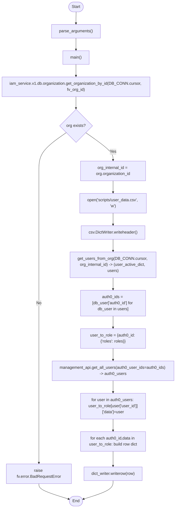

# Diagram: common/iam_service/scripts/export_user_data.py

> Auto-generated by Obscura crawlers

## Mermaid

### SVG

<svg id="container" width="701.7890625" xmlns="http://www.w3.org/2000/svg" class="flowchart" height="2012.28125" viewBox="0 0 701.7890625 2012.28125" role="graphics-document document" aria-roledescription="flowchart-v2"><g><marker id="container_flowchart-v2-pointEnd" class="marker flowchart-v2" viewBox="0 0 10 10" refX="5" refY="5" markerUnits="userSpaceOnUse" markerWidth="8" markerHeight="8" orient="auto"><path d="M 0 0 L 10 5 L 0 10 z" class="arrowMarkerPath" style="stroke-width: 1; stroke-dasharray: 1, 0;"></path></marker><marker id="container_flowchart-v2-pointStart" class="marker flowchart-v2" viewBox="0 0 10 10" refX="4.5" refY="5" markerUnits="userSpaceOnUse" markerWidth="8" markerHeight="8" orient="auto"><path d="M 0 5 L 10 10 L 10 0 z" class="arrowMarkerPath" style="stroke-width: 1; stroke-dasharray: 1, 0;"></path></marker><marker id="container_flowchart-v2-circleEnd" class="marker flowchart-v2" viewBox="0 0 10 10" refX="11" refY="5" markerUnits="userSpaceOnUse" markerWidth="11" markerHeight="11" orient="auto"><circle cx="5" cy="5" r="5" class="arrowMarkerPath" style="stroke-width: 1; stroke-dasharray: 1, 0;"></circle></marker><marker id="container_flowchart-v2-circleStart" class="marker flowchart-v2" viewBox="0 0 10 10" refX="-1" refY="5" markerUnits="userSpaceOnUse" markerWidth="11" markerHeight="11" orient="auto"><circle cx="5" cy="5" r="5" class="arrowMarkerPath" style="stroke-width: 1; stroke-dasharray: 1, 0;"></circle></marker><marker id="container_flowchart-v2-crossEnd" class="marker cross flowchart-v2" viewBox="0 0 11 11" refX="12" refY="5.2" markerUnits="userSpaceOnUse" markerWidth="11" markerHeight="11" orient="auto"><path d="M 1,1 l 9,9 M 10,1 l -9,9" class="arrowMarkerPath" style="stroke-width: 2; stroke-dasharray: 1, 0;"></path></marker><marker id="container_flowchart-v2-crossStart" class="marker cross flowchart-v2" viewBox="0 0 11 11" refX="-1" refY="5.2" markerUnits="userSpaceOnUse" markerWidth="11" markerHeight="11" orient="auto"><path d="M 1,1 l 9,9 M 10,1 l -9,9" class="arrowMarkerPath" style="stroke-width: 2; stroke-dasharray: 1, 0;"></path></marker><g class="root"><g class="clusters"></g><g class="edgePaths"><path d="M300.008,47.5L299.924,51.583C299.841,55.667,299.674,63.833,299.591,71.417C299.508,79,299.508,86,299.508,89.5L299.508,93" id="L_Start_ParseArgs_0" class="edge-thickness-normal edge-pattern-solid edge-thickness-normal edge-pattern-solid flowchart-link" style=";" data-edge="true" data-et="edge" data-id="L_Start_ParseArgs_0" data-points="W3sieCI6MzAwLjAwNzgxMjUsInkiOjQ3LjV9LHsieCI6Mjk5LjUwNzgxMjUsInkiOjcyfSx7IngiOjI5OS41MDc4MTI1LCJ5Ijo5N31d" marker-end="url(#container_flowchart-v2-pointEnd)"></path><path d="M299.508,151L299.508,155.167C299.508,159.333,299.508,167.667,299.508,175.333C299.508,183,299.508,190,299.508,193.5L299.508,197" id="L_ParseArgs_Main_0" class="edge-thickness-normal edge-pattern-solid edge-thickness-normal edge-pattern-solid flowchart-link" style=";" data-edge="true" data-et="edge" data-id="L_ParseArgs_Main_0" data-points="W3sieCI6Mjk5LjUwNzgxMjUsInkiOjE1MX0seyJ4IjoyOTkuNTA3ODEyNSwieSI6MTc2fSx7IngiOjI5OS41MDc4MTI1LCJ5IjoyMDF9XQ==" marker-end="url(#container_flowchart-v2-pointEnd)"></path><path d="M299.508,255L299.508,259.167C299.508,263.333,299.508,271.667,299.508,279.333C299.508,287,299.508,294,299.508,297.5L299.508,301" id="L_Main_GetOrg_0" class="edge-thickness-normal edge-pattern-solid edge-thickness-normal edge-pattern-solid flowchart-link" style=";" data-edge="true" data-et="edge" data-id="L_Main_GetOrg_0" data-points="W3sieCI6Mjk5LjUwNzgxMjUsInkiOjI1NX0seyJ4IjoyOTkuNTA3ODEyNSwieSI6MjgwfSx7IngiOjI5OS41MDc4MTI1LCJ5IjozMDV9XQ==" marker-end="url(#container_flowchart-v2-pointEnd)"></path><path d="M299.508,383L299.508,387.167C299.508,391.333,299.508,399.667,299.508,407.333C299.508,415,299.508,422,299.508,425.5L299.508,429" id="L_GetOrg_OrgCheck_0" class="edge-thickness-normal edge-pattern-solid edge-thickness-normal edge-pattern-solid flowchart-link" style=";" data-edge="true" data-et="edge" data-id="L_GetOrg_OrgCheck_0" data-points="W3sieCI6Mjk5LjUwNzgxMjUsInkiOjM4M30seyJ4IjoyOTkuNTA3ODEyNSwieSI6NDA4fSx7IngiOjI5OS41MDc4MTI1LCJ5Ijo0MzN9XQ==" marker-end="url(#container_flowchart-v2-pointEnd)"></path><path d="M260.751,524.525L242.204,537.151C223.657,549.777,186.563,575.029,168.016,600.322C149.469,625.615,149.469,650.948,149.469,674.281C149.469,697.615,149.469,718.948,149.469,740.281C149.469,761.615,149.469,782.948,149.469,804.281C149.469,825.615,149.469,846.948,149.469,866.281C149.469,885.615,149.469,902.948,149.469,920.281C149.469,937.615,149.469,954.948,149.469,976.281C149.469,997.615,149.469,1022.948,149.469,1048.281C149.469,1073.615,149.469,1098.948,149.469,1124.281C149.469,1149.615,149.469,1174.948,149.469,1200.281C149.469,1225.615,149.469,1250.948,149.469,1274.281C149.469,1297.615,149.469,1318.948,149.469,1340.281C149.469,1361.615,149.469,1382.948,149.469,1404.281C149.469,1425.615,149.469,1446.948,149.469,1468.281C149.469,1489.615,149.469,1510.948,149.469,1534.281C149.469,1557.615,149.469,1582.948,149.469,1608.281C149.469,1633.615,149.469,1658.948,149.469,1682.281C149.469,1705.615,149.469,1726.948,149.469,1748.281C149.469,1769.615,149.469,1790.948,149.469,1805.115C149.469,1819.281,149.469,1826.281,149.469,1829.781L149.469,1833.281" id="L_OrgCheck_RaiseError_0" class="edge-thickness-normal edge-pattern-solid edge-thickness-normal edge-pattern-solid flowchart-link" style=";" data-edge="true" data-et="edge" data-id="L_OrgCheck_RaiseError_0" data-points="W3sieCI6MjYwLjc1MTE2ODc2NDkwOTEsInkiOjUyNC41MjQ2MDYyNjQ5MDl9LHsieCI6MTQ5LjQ2ODc1LCJ5Ijo2MDAuMjgxMjV9LHsieCI6MTQ5LjQ2ODc1LCJ5Ijo2NzYuMjgxMjV9LHsieCI6MTQ5LjQ2ODc1LCJ5Ijo3NDAuMjgxMjV9LHsieCI6MTQ5LjQ2ODc1LCJ5Ijo4MDQuMjgxMjV9LHsieCI6MTQ5LjQ2ODc1LCJ5Ijo4NjguMjgxMjV9LHsieCI6MTQ5LjQ2ODc1LCJ5Ijo5MjAuMjgxMjV9LHsieCI6MTQ5LjQ2ODc1LCJ5Ijo5NzIuMjgxMjV9LHsieCI6MTQ5LjQ2ODc1LCJ5IjoxMDQ4LjI4MTI1fSx7IngiOjE0OS40Njg3NSwieSI6MTEyNC4yODEyNX0seyJ4IjoxNDkuNDY4NzUsInkiOjEyMDAuMjgxMjV9LHsieCI6MTQ5LjQ2ODc1LCJ5IjoxMjc2LjI4MTI1fSx7IngiOjE0OS40Njg3NSwieSI6MTM0MC4yODEyNX0seyJ4IjoxNDkuNDY4NzUsInkiOjE0MDQuMjgxMjV9LHsieCI6MTQ5LjQ2ODc1LCJ5IjoxNDY4LjI4MTI1fSx7IngiOjE0OS40Njg3NSwieSI6MTUzMi4yODEyNX0seyJ4IjoxNDkuNDY4NzUsInkiOjE2MDguMjgxMjV9LHsieCI6MTQ5LjQ2ODc1LCJ5IjoxNjg0LjI4MTI1fSx7IngiOjE0OS40Njg3NSwieSI6MTc0OC4yODEyNX0seyJ4IjoxNDkuNDY4NzUsInkiOjE4MTIuMjgxMjV9LHsieCI6MTQ5LjQ2ODc1LCJ5IjoxODM3LjI4MTI1fV0=" marker-end="url(#container_flowchart-v2-pointEnd)"></path><path d="M149.469,1915.281L149.469,1919.448C149.469,1923.615,149.469,1931.948,169.816,1942.206C190.163,1952.464,230.857,1964.648,251.204,1970.739L271.551,1976.831" id="L_RaiseError_End_0" class="edge-thickness-normal edge-pattern-solid edge-thickness-normal edge-pattern-solid flowchart-link" style=";" data-edge="true" data-et="edge" data-id="L_RaiseError_End_0" data-points="W3sieCI6MTQ5LjQ2ODc1LCJ5IjoxOTE1LjI4MTI1fSx7IngiOjE0OS40Njg3NSwieSI6MTk0MC4yODEyNX0seyJ4IjoyNzUuMzgzMjU4Mjg0ODgzNywieSI6MTk3Ny45Nzc4Njc1MDUzNzM1fV0=" marker-end="url(#container_flowchart-v2-pointEnd)"></path><path d="M338.264,524.525L356.812,537.151C375.359,549.777,412.453,575.029,431,593.155C449.547,611.281,449.547,622.281,449.547,627.781L449.547,633.281" id="L_OrgCheck_OrgID_0" class="edge-thickness-normal edge-pattern-solid edge-thickness-normal edge-pattern-solid flowchart-link" style=";" data-edge="true" data-et="edge" data-id="L_OrgCheck_OrgID_0" data-points="W3sieCI6MzM4LjI2NDQ1NjIzNTA5MDksInkiOjUyNC41MjQ2MDYyNjQ5MDl9LHsieCI6NDQ5LjU0Njg3NSwieSI6NjAwLjI4MTI1fSx7IngiOjQ0OS41NDY4NzUsInkiOjYzNy4yODEyNX1d" marker-end="url(#container_flowchart-v2-pointEnd)"></path><path d="M449.547,715.281L449.547,719.448C449.547,723.615,449.547,731.948,449.547,739.615C449.547,747.281,449.547,754.281,449.547,757.781L449.547,761.281" id="L_OrgID_OpenFile_0" class="edge-thickness-normal edge-pattern-solid edge-thickness-normal edge-pattern-solid flowchart-link" style=";" data-edge="true" data-et="edge" data-id="L_OrgID_OpenFile_0" data-points="W3sieCI6NDQ5LjU0Njg3NSwieSI6NzE1LjI4MTI1fSx7IngiOjQ0OS41NDY4NzUsInkiOjc0MC4yODEyNX0seyJ4Ijo0NDkuNTQ2ODc1LCJ5Ijo3NjUuMjgxMjV9XQ==" marker-end="url(#container_flowchart-v2-pointEnd)"></path><path d="M449.547,843.281L449.547,847.448C449.547,851.615,449.547,859.948,449.547,867.615C449.547,875.281,449.547,882.281,449.547,885.781L449.547,889.281" id="L_OpenFile_WriteHeader_0" class="edge-thickness-normal edge-pattern-solid edge-thickness-normal edge-pattern-solid flowchart-link" style=";" data-edge="true" data-et="edge" data-id="L_OpenFile_WriteHeader_0" data-points="W3sieCI6NDQ5LjU0Njg3NSwieSI6ODQzLjI4MTI1fSx7IngiOjQ0OS41NDY4NzUsInkiOjg2OC4yODEyNX0seyJ4Ijo0NDkuNTQ2ODc1LCJ5Ijo4OTMuMjgxMjV9XQ==" marker-end="url(#container_flowchart-v2-pointEnd)"></path><path d="M449.547,947.281L449.547,951.448C449.547,955.615,449.547,963.948,449.547,971.615C449.547,979.281,449.547,986.281,449.547,989.781L449.547,993.281" id="L_WriteHeader_GetUsers_0" class="edge-thickness-normal edge-pattern-solid edge-thickness-normal edge-pattern-solid flowchart-link" style=";" data-edge="true" data-et="edge" data-id="L_WriteHeader_GetUsers_0" data-points="W3sieCI6NDQ5LjU0Njg3NSwieSI6OTQ3LjI4MTI1fSx7IngiOjQ0OS41NDY4NzUsInkiOjk3Mi4yODEyNX0seyJ4Ijo0NDkuNTQ2ODc1LCJ5Ijo5OTcuMjgxMjV9XQ==" marker-end="url(#container_flowchart-v2-pointEnd)"></path><path d="M449.547,1099.281L449.547,1103.448C449.547,1107.615,449.547,1115.948,449.547,1123.615C449.547,1131.281,449.547,1138.281,449.547,1141.781L449.547,1145.281" id="L_GetUsers_BuildAuth0IDs_0" class="edge-thickness-normal edge-pattern-solid edge-thickness-normal edge-pattern-solid flowchart-link" style=";" data-edge="true" data-et="edge" data-id="L_GetUsers_BuildAuth0IDs_0" data-points="W3sieCI6NDQ5LjU0Njg3NSwieSI6MTA5OS4yODEyNX0seyJ4Ijo0NDkuNTQ2ODc1LCJ5IjoxMTI0LjI4MTI1fSx7IngiOjQ0OS41NDY4NzUsInkiOjExNDkuMjgxMjV9XQ==" marker-end="url(#container_flowchart-v2-pointEnd)"></path><path d="M449.547,1251.281L449.547,1255.448C449.547,1259.615,449.547,1267.948,449.547,1275.615C449.547,1283.281,449.547,1290.281,449.547,1293.781L449.547,1297.281" id="L_BuildAuth0IDs_BuildRoleMap_0" class="edge-thickness-normal edge-pattern-solid edge-thickness-normal edge-pattern-solid flowchart-link" style=";" data-edge="true" data-et="edge" data-id="L_BuildAuth0IDs_BuildRoleMap_0" data-points="W3sieCI6NDQ5LjU0Njg3NSwieSI6MTI1MS4yODEyNX0seyJ4Ijo0NDkuNTQ2ODc1LCJ5IjoxMjc2LjI4MTI1fSx7IngiOjQ0OS41NDY4NzUsInkiOjEzMDEuMjgxMjV9XQ==" marker-end="url(#container_flowchart-v2-pointEnd)"></path><path d="M449.547,1379.281L449.547,1383.448C449.547,1387.615,449.547,1395.948,449.547,1403.615C449.547,1411.281,449.547,1418.281,449.547,1421.781L449.547,1425.281" id="L_BuildRoleMap_FetchAuth0_0" class="edge-thickness-normal edge-pattern-solid edge-thickness-normal edge-pattern-solid flowchart-link" style=";" data-edge="true" data-et="edge" data-id="L_BuildRoleMap_FetchAuth0_0" data-points="W3sieCI6NDQ5LjU0Njg3NSwieSI6MTM3OS4yODEyNX0seyJ4Ijo0NDkuNTQ2ODc1LCJ5IjoxNDA0LjI4MTI1fSx7IngiOjQ0OS41NDY4NzUsInkiOjE0MjkuMjgxMjV9XQ==" marker-end="url(#container_flowchart-v2-pointEnd)"></path><path d="M449.547,1507.281L449.547,1511.448C449.547,1515.615,449.547,1523.948,449.547,1531.615C449.547,1539.281,449.547,1546.281,449.547,1549.781L449.547,1553.281" id="L_FetchAuth0_MergeData_0" class="edge-thickness-normal edge-pattern-solid edge-thickness-normal edge-pattern-solid flowchart-link" style=";" data-edge="true" data-et="edge" data-id="L_FetchAuth0_MergeData_0" data-points="W3sieCI6NDQ5LjU0Njg3NSwieSI6MTUwNy4yODEyNX0seyJ4Ijo0NDkuNTQ2ODc1LCJ5IjoxNTMyLjI4MTI1fSx7IngiOjQ0OS41NDY4NzUsInkiOjE1NTcuMjgxMjV9XQ==" marker-end="url(#container_flowchart-v2-pointEnd)"></path><path d="M449.547,1659.281L449.547,1663.448C449.547,1667.615,449.547,1675.948,449.547,1683.615C449.547,1691.281,449.547,1698.281,449.547,1701.781L449.547,1705.281" id="L_MergeData_BuildRows_0" class="edge-thickness-normal edge-pattern-solid edge-thickness-normal edge-pattern-solid flowchart-link" style=";" data-edge="true" data-et="edge" data-id="L_MergeData_BuildRows_0" data-points="W3sieCI6NDQ5LjU0Njg3NSwieSI6MTY1OS4yODEyNX0seyJ4Ijo0NDkuNTQ2ODc1LCJ5IjoxNjg0LjI4MTI1fSx7IngiOjQ0OS41NDY4NzUsInkiOjE3MDkuMjgxMjV9XQ==" marker-end="url(#container_flowchart-v2-pointEnd)"></path><path d="M449.547,1787.281L449.547,1791.448C449.547,1795.615,449.547,1803.948,449.547,1813.615C449.547,1823.281,449.547,1834.281,449.547,1839.781L449.547,1845.281" id="L_BuildRows_WriteRow_0" class="edge-thickness-normal edge-pattern-solid edge-thickness-normal edge-pattern-solid flowchart-link" style=";" data-edge="true" data-et="edge" data-id="L_BuildRows_WriteRow_0" data-points="W3sieCI6NDQ5LjU0Njg3NSwieSI6MTc4Ny4yODEyNX0seyJ4Ijo0NDkuNTQ2ODc1LCJ5IjoxODEyLjI4MTI1fSx7IngiOjQ0OS41NDY4NzUsInkiOjE4NDkuMjgxMjV9XQ==" marker-end="url(#container_flowchart-v2-pointEnd)"></path><path d="M449.547,1903.281L449.547,1909.448C449.547,1915.615,449.547,1927.948,429.366,1940.205C409.185,1952.462,368.823,1964.642,348.643,1970.732L328.462,1976.822" id="L_WriteRow_End_0" class="edge-thickness-normal edge-pattern-solid edge-thickness-normal edge-pattern-solid flowchart-link" style=";" data-edge="true" data-et="edge" data-id="L_WriteRow_End_0" data-points="W3sieCI6NDQ5LjU0Njg3NSwieSI6MTkwMy4yODEyNX0seyJ4Ijo0NDkuNTQ2ODc1LCJ5IjoxOTQwLjI4MTI1fSx7IngiOjMyNC42MzIzNjc2NDA2MTY3NCwieSI6MTk3Ny45Nzc4NjcyMzA4Nzk4fV0=" marker-end="url(#container_flowchart-v2-pointEnd)"></path></g><g class="edgeLabels"><g class="edgeLabel"><g class="label" data-id="L_Start_ParseArgs_0" transform="translate(0, 0)"><foreignObject width="0" height="0">

</foreignObject></g></g><g class="edgeLabel"><g class="label" data-id="L_ParseArgs_Main_0" transform="translate(0, 0)"><foreignObject width="0" height="0">

</foreignObject></g></g><g class="edgeLabel"><g class="label" data-id="L_Main_GetOrg_0" transform="translate(0, 0)"><foreignObject width="0" height="0">

</foreignObject></g></g><g class="edgeLabel"><g class="label" data-id="L_GetOrg_OrgCheck_0" transform="translate(0, 0)"><foreignObject width="0" height="0">

</foreignObject></g></g><g class="edgeLabel" transform="translate(149.46875, 1200.28125)"><g class="label" data-id="L_OrgCheck_RaiseError_0" transform="translate(-10.140625, -12)"><foreignObject width="20.28125" height="24">

No

</foreignObject></g></g><g class="edgeLabel"><g class="label" data-id="L_RaiseError_End_0" transform="translate(0, 0)"><foreignObject width="0" height="0">

</foreignObject></g></g><g class="edgeLabel" transform="translate(449.546875, 600.28125)"><g class="label" data-id="L_OrgCheck_OrgID_0" transform="translate(-12.03125, -12)"><foreignObject width="24.0625" height="24">

Yes

</foreignObject></g></g><g class="edgeLabel"><g class="label" data-id="L_OrgID_OpenFile_0" transform="translate(0, 0)"><foreignObject width="0" height="0">

</foreignObject></g></g><g class="edgeLabel"><g class="label" data-id="L_OpenFile_WriteHeader_0" transform="translate(0, 0)"><foreignObject width="0" height="0">

</foreignObject></g></g><g class="edgeLabel"><g class="label" data-id="L_WriteHeader_GetUsers_0" transform="translate(0, 0)"><foreignObject width="0" height="0">

</foreignObject></g></g><g class="edgeLabel"><g class="label" data-id="L_GetUsers_BuildAuth0IDs_0" transform="translate(0, 0)"><foreignObject width="0" height="0">

</foreignObject></g></g><g class="edgeLabel"><g class="label" data-id="L_BuildAuth0IDs_BuildRoleMap_0" transform="translate(0, 0)"><foreignObject width="0" height="0">

</foreignObject></g></g><g class="edgeLabel"><g class="label" data-id="L_BuildRoleMap_FetchAuth0_0" transform="translate(0, 0)"><foreignObject width="0" height="0">

</foreignObject></g></g><g class="edgeLabel"><g class="label" data-id="L_FetchAuth0_MergeData_0" transform="translate(0, 0)"><foreignObject width="0" height="0">

</foreignObject></g></g><g class="edgeLabel"><g class="label" data-id="L_MergeData_BuildRows_0" transform="translate(0, 0)"><foreignObject width="0" height="0">

</foreignObject></g></g><g class="edgeLabel"><g class="label" data-id="L_BuildRows_WriteRow_0" transform="translate(0, 0)"><foreignObject width="0" height="0">

</foreignObject></g></g><g class="edgeLabel"><g class="label" data-id="L_WriteRow_End_0" transform="translate(0, 0)"><foreignObject width="0" height="0">

</foreignObject></g></g></g><g class="nodes"><g class="node default" id="flowchart-Start-0" transform="translate(299.5078125, 27.5)"><g class="basic label-container outer-path"><path d="M-10.3984375 -19.5 C-3.6723518179209966 -19.5, 3.0537338641580067 -19.5, 10.3984375 -19.5 C10.3984375 -19.5, 10.398437499999998 -19.5, 10.398437499999998 -19.5 C10.853200581054544 -19.48541663313322, 11.30796366210909 -19.47083326626644, 11.6478067896239 -19.45993515863156 C11.968251244648782 -19.42902226744615, 12.288695699673665 -19.39810937626074, 12.892042152847864 -19.3399052695533 C13.148168575461042 -19.298496735835272, 13.404294998074219 -19.25708820211725, 14.126030759676757 -19.140403561325776 C14.448605158527076 -19.066778059782866, 14.771179557377398 -18.993152558239952, 15.34470188623539 -18.862249829261074 C15.721609712238433 -18.750385564932923, 16.098517538241477 -18.638521300604772, 16.543047751460602 -18.50658706670804 C16.849761163384674 -18.39371369589228, 17.156474575308746 -18.280840325076525, 17.716144095147794 -18.074876768247425 C18.15657882745176 -17.87990937728859, 18.59701355975573 -17.684941986329758, 18.85917041279238 -17.568892924097174 C19.125311835453182 -17.43004711436675, 19.391453258113984 -17.29120130463633, 19.967429764076783 -16.990714730406097 C20.1839589672893 -16.85945345495183, 20.400488170501816 -16.72819217949756, 21.036368073605697 -16.342718045390892 C21.26432403460226 -16.183705835054198, 21.492279995598825 -16.0246936247175, 22.061592844578712 -15.627565626425154 C22.423500990264756 -15.338953511020758, 22.7854091359508 -15.05034139561636, 23.03889120850187 -14.848196188198123 C23.270876900341143 -14.63751292087475, 23.502862592180417 -14.426829653551376, 23.964247236767985 -14.007812326905688 C24.199917214466314 -13.764463726067152, 24.435587192164647 -13.521115125228617, 24.833858442968648 -13.10986736009568 C25.05905831049413 -12.845334781464775, 25.284258178019616 -12.580802202833869, 25.644151408126582 -12.158051136245305 C25.803367801003663 -11.9447156747018, 25.962584193880748 -11.731380213158294, 26.391796464640635 -11.156274872382312 C26.622956149185747 -10.801151521854393, 26.854115833730855 -10.446028171326475, 27.073721378604247 -10.108655082055241 C27.281936897999795 -9.738947343260826, 27.490152417395343 -9.369239604466408, 27.6871239742735 -9.019496659696287 C27.83856231321395 -8.705031708625075, 27.990000652154393 -8.390566757553863, 28.22948364880834 -7.893275190886684 C28.392171112973518 -7.491434009050553, 28.554858577138695 -7.089592827214421, 28.698571729970325 -6.734618561215508 C28.855795667486944 -6.261085111648004, 29.013019605003564 -5.787551662080499, 29.09246063421488 -5.548287939305138 C29.181825850006806 -5.2074996403609966, 29.271191065798735 -4.866711341416854, 29.40953178754556 -4.339158212148133 C29.46109783240906 -4.0743774702615125, 29.512663877272555 -3.809596728374892, 29.648482276581777 -3.1121979531509023 C29.685783953745148 -2.8228935111211286, 29.723085630908514 -2.533589069091355, 29.808330202509367 -1.872449005199798 C29.82639491431854 -1.591076537199004, 29.844459626127712 -1.30970406919821, 29.888418715913414 -0.6250057626472757 C29.888418715913414 -0.14340426731829253, 29.888418715913414 0.33819722801069063, 29.888418715913414 0.625005762647271 C29.86983135332323 0.9145189384383834, 29.851243990733053 1.2040321142294956, 29.808330202509367 1.8724490051997846 C29.74458628570639 2.366834236263529, 29.680842368903416 2.8612194673272735, 29.648482276581777 3.1121979531508885 C29.589226403441643 3.4164643379922532, 29.52997053030151 3.720730722833618, 29.40953178754556 4.339158212148129 C29.294567359405256 4.7775674025454435, 29.179602931264956 5.215976592942758, 29.092460634214884 5.548287939305125 C28.984501978083188 5.87344221069787, 28.876543321951488 6.198596482090614, 28.69857172997033 6.734618561215495 C28.5941749062431 6.992480734197023, 28.489778082515876 7.250342907178552, 28.229483648808344 7.893275190886679 C28.01692590736208 8.334655889006937, 27.804368165915818 8.776036587127194, 27.687123974273504 9.019496659696284 C27.44564026409493 9.448275439995578, 27.204156553916352 9.877054220294873, 27.07372137860425 10.108655082055236 C26.872136598569828 10.418343437280896, 26.670551818535404 10.728031792506554, 26.39179646464064 11.156274872382301 C26.141452222020234 11.491713350663963, 25.89110797939983 11.827151828945624, 25.644151408126582 12.158051136245302 C25.412207964977483 12.43050510252403, 25.180264521828384 12.702959068802759, 24.83385844296866 13.10986736009567 C24.58194193405844 13.369991838275498, 24.33002542514822 13.630116316455327, 23.96424723676799 14.007812326905684 C23.60231518850032 14.336509436945143, 23.240383140232655 14.665206546984601, 23.038891208501887 14.848196188198111 C22.823626188441278 15.019864313253684, 22.608361168380664 15.19153243830926, 22.061592844578715 15.627565626425152 C21.683100454454248 15.891585533104488, 21.304608064329777 16.155605439783823, 21.036368073605708 16.34271804539089 C20.742436300596644 16.52090121352381, 20.448504527587584 16.699084381656736, 19.967429764076787 16.990714730406093 C19.52524040041636 17.221404638191935, 19.083051036755933 17.452094545977772, 18.859170412792388 17.56889292409717 C18.460521878643952 17.745362804676077, 18.061873344495517 17.921832685254984, 17.716144095147804 18.07487676824742 C17.3904198279144 18.194746309551434, 17.064695560680995 18.314615850855446, 16.543047751460616 18.506587066708033 C16.16066927136388 18.620074992455145, 15.77829079126714 18.73356291820226, 15.344701886235413 18.86224982926107 C14.982283428922711 18.94496947714124, 14.619864971610012 19.027689125021407, 14.126030759676766 19.140403561325773 C13.76312488674878 19.199075368483694, 13.400219013820797 19.25774717564161, 12.892042152847878 19.3399052695533 C12.523101602637402 19.375496520716172, 12.154161052426927 19.41108777187905, 11.6478067896239 19.45993515863156 C11.242647368962807 19.472927832657188, 10.837487948301714 19.48592050668282, 10.398437500000004 19.5 C10.398437500000002 19.5, 10.398437500000002 19.5, 10.3984375 19.5 C4.334453898343328 19.5, -1.7295297033133448 19.5, -10.398437499999996 19.5 C-10.815406617068223 19.486628611996775, -11.23237573413645 19.473257223993546, -11.647806789623893 19.45993515863156 C-11.898276421352326 19.43577265449252, -12.14874605308076 19.411610150353482, -12.892042152847871 19.3399052695533 C-13.25187317829403 19.281730579890443, -13.611704203740189 19.223555890227587, -14.126030759676759 19.140403561325773 C-14.426230486427116 19.071884932681296, -14.726430213177471 19.003366304036824, -15.344701886235388 18.862249829261074 C-15.684939866850147 18.761268982560217, -16.02517784746491 18.660288135859364, -16.54304775146059 18.506587066708043 C-16.806148557852747 18.409763537878536, -17.069249364244907 18.31294000904903, -17.716144095147797 18.074876768247425 C-18.112354475156945 17.899486186180706, -18.508564855166092 17.72409560411399, -18.85917041279238 17.568892924097174 C-19.17652198523648 17.40333081202647, -19.493873557680576 17.23776869995577, -19.96742976407678 16.990714730406097 C-20.241005865300156 16.82487129013286, -20.514581966523536 16.659027849859626, -21.036368073605686 16.3427180453909 C-21.315101338954495 16.148285785652156, -21.593834604303307 15.953853525913411, -22.061592844578712 15.627565626425156 C-22.390330477192027 15.365406112491838, -22.719068109805338 15.103246598558519, -23.03889120850187 14.848196188198125 C-23.225001026191954 14.67917617596793, -23.41111084388204 14.510156163737733, -23.964247236767974 14.007812326905697 C-24.242380676546986 13.720616715153785, -24.520514116325998 13.433421103401873, -24.833858442968655 13.109867360095677 C-25.08209301691983 12.818276904585225, -25.330327590871008 12.526686449074774, -25.64415140812658 12.158051136245307 C-25.81018794496675 11.93557730311916, -25.97622448180692 11.713103469993014, -26.391796464640635 11.156274872382316 C-26.560111064093398 10.897698448824489, -26.72842566354616 10.639122025266664, -27.073721378604244 10.108655082055249 C-27.19773934957804 9.888448616409947, -27.32175732055184 9.668242150764646, -27.6871239742735 9.019496659696289 C-27.88749385035995 8.603424324774231, -28.087863726446397 8.187351989852171, -28.22948364880834 7.893275190886686 C-28.323940331681275 7.659965357994807, -28.418397014554213 7.4266555251029285, -28.698571729970325 6.73461856121551 C-28.83244544333388 6.3314122664440475, -28.966319156697438 5.928205971672586, -29.09246063421488 5.5482879393051325 C-29.16856599638118 5.258065209092419, -29.244671358547482 4.967842478879706, -29.409531787545557 4.339158212148136 C-29.49873317520793 3.881127939221816, -29.587934562870302 3.4230976662954964, -29.648482276581777 3.112197953150904 C-29.681905648315457 2.8529728821757727, -29.715329020049133 2.593747811200641, -29.808330202509364 1.872449005199809 C-29.826798918229635 1.5847838501776026, -29.845267633949902 1.2971186951553961, -29.888418715913414 0.6250057626472781 C-29.888418715913414 0.17247442726402445, -29.888418715913414 -0.28005690811922923, -29.888418715913414 -0.6250057626472687 C-29.864847459751932 -0.9921471037378617, -29.841276203590454 -1.3592884448284548, -29.808330202509367 -1.8724490051997822 C-29.766356159445955 -2.197991394487283, -29.724382116382543 -2.5235337837747833, -29.648482276581777 -3.112197953150895 C-29.561477344003038 -3.558949893443712, -29.474472411424298 -4.005701833736529, -29.40953178754556 -4.339158212148126 C-29.295163270630553 -4.775294934773835, -29.180794753715542 -5.211431657399544, -29.092460634214884 -5.548287939305123 C-28.9642286696084 -5.934502185710875, -28.835996705001918 -6.320716432116628, -28.698571729970332 -6.734618561215485 C-28.528995980278648 -7.153473941478033, -28.359420230586963 -7.572329321740582, -28.229483648808344 -7.893275190886676 C-28.012628113899407 -8.343580349090228, -27.795772578990466 -8.793885507293778, -27.687123974273504 -9.019496659696282 C-27.516586091354238 -9.322303939652654, -27.346048208434972 -9.625111219609026, -27.073721378604247 -10.108655082055243 C-26.902924035953514 -10.371045665875048, -26.73212669330278 -10.633436249694851, -26.39179646464064 -11.156274872382308 C-26.109157503409655 -11.53498533149276, -25.826518542178665 -11.913695790603208, -25.644151408126586 -12.158051136245302 C-25.34458027464773 -12.509944435709954, -25.045009141168876 -12.861837735174607, -24.833858442968662 -13.10986736009567 C-24.597862160528223 -13.35355289737055, -24.36186587808778 -13.597238434645432, -23.964247236767996 -14.007812326905677 C-23.697604145693624 -14.249970527229834, -23.43096105461925 -14.492128727553991, -23.038891208501887 -14.848196188198107 C-22.806840076010953 -15.033250791219652, -22.574788943520023 -15.218305394241195, -22.06159284457872 -15.627565626425149 C-21.72139126465288 -15.86487552149238, -21.38118968472704 -16.10218541655961, -21.03636807360571 -16.342718045390885 C-20.617388849645224 -16.596705713150953, -20.198409625684736 -16.850693380911018, -19.96742976407679 -16.99071473040609 C-19.54759503187629 -17.20974224127811, -19.127760299675792 -17.42876975215013, -18.859170412792388 -17.56889292409717 C-18.555298305863253 -17.703408091788916, -18.251426198934116 -17.83792325948066, -17.716144095147804 -18.07487676824742 C-17.33838818526929 -18.213894435020066, -16.96063227539078 -18.35291210179271, -16.54304775146062 -18.506587066708033 C-16.1973075696906 -18.609200937830128, -15.851567387920582 -18.71181480895222, -15.344701886235413 -18.862249829261067 C-14.878085491792216 -18.968751976336186, -14.411469097349022 -19.07525412341131, -14.126030759676768 -19.140403561325773 C-13.745853559284857 -19.201867662766915, -13.365676358892948 -19.263331764208058, -12.89204215284788 -19.3399052695533 C-12.429609167406518 -19.384515623501795, -11.967176181965156 -19.429125977450287, -11.647806789623903 -19.45993515863156 C-11.375193031049928 -19.468677351258535, -11.102579272475955 -19.47741954388551, -10.398437500000005 -19.5 C-10.398437500000004 -19.5, -10.398437500000002 -19.5, -10.3984375 -19.5" stroke="none" stroke-width="0" fill="#ECECFF" style=""></path><path d="M-10.3984375 -19.5 C-2.8351970081889464 -19.5, 4.728043483622107 -19.5, 10.3984375 -19.5 M-10.3984375 -19.5 C-2.2293612769892412 -19.5, 5.9397149460215175 -19.5, 10.3984375 -19.5 M10.3984375 -19.5 C10.3984375 -19.5, 10.398437499999998 -19.5, 10.398437499999998 -19.5 M10.3984375 -19.5 C10.3984375 -19.5, 10.398437499999998 -19.5, 10.398437499999998 -19.5 M10.398437499999998 -19.5 C10.697242426721068 -19.49041790758856, 10.996047353442137 -19.480835815177127, 11.6478067896239 -19.45993515863156 M10.398437499999998 -19.5 C10.650829790029281 -19.49190627051055, 10.903222080058562 -19.483812541021102, 11.6478067896239 -19.45993515863156 M11.6478067896239 -19.45993515863156 C12.003012857474264 -19.425668856463833, 12.358218925324627 -19.391402554296103, 12.892042152847864 -19.3399052695533 M11.6478067896239 -19.45993515863156 C11.94676103218958 -19.431095402396327, 12.245715274755257 -19.402255646161095, 12.892042152847864 -19.3399052695533 M12.892042152847864 -19.3399052695533 C13.27354482789317 -19.278226875649406, 13.655047502938476 -19.216548481745512, 14.126030759676757 -19.140403561325776 M12.892042152847864 -19.3399052695533 C13.363940460463503 -19.263612410804036, 13.835838768079142 -19.187319552054774, 14.126030759676757 -19.140403561325776 M14.126030759676757 -19.140403561325776 C14.38980155233098 -19.08019959916773, 14.6535723449852 -19.01999563700969, 15.34470188623539 -18.862249829261074 M14.126030759676757 -19.140403561325776 C14.427874243099248 -19.0715097559474, 14.72971772652174 -19.002615950569027, 15.34470188623539 -18.862249829261074 M15.34470188623539 -18.862249829261074 C15.632819193889047 -18.77673812470808, 15.920936501542705 -18.691226420155083, 16.543047751460602 -18.50658706670804 M15.34470188623539 -18.862249829261074 C15.794761412855205 -18.728674524170977, 16.244820939475023 -18.59509921908088, 16.543047751460602 -18.50658706670804 M16.543047751460602 -18.50658706670804 C16.973672417042756 -18.348113209123035, 17.404297082624915 -18.189639351538027, 17.716144095147794 -18.074876768247425 M16.543047751460602 -18.50658706670804 C16.824978221602166 -18.402834047559246, 17.10690869174373 -18.299081028410452, 17.716144095147794 -18.074876768247425 M17.716144095147794 -18.074876768247425 C17.966385809297243 -17.964102184550168, 18.216627523446693 -17.853327600852914, 18.85917041279238 -17.568892924097174 M17.716144095147794 -18.074876768247425 C17.96541870567349 -17.964530292636294, 18.214693316199188 -17.854183817025163, 18.85917041279238 -17.568892924097174 M18.85917041279238 -17.568892924097174 C19.103637918142486 -17.441354383144937, 19.34810542349259 -17.313815842192696, 19.967429764076783 -16.990714730406097 M18.85917041279238 -17.568892924097174 C19.18818366035183 -17.397246923588455, 19.517196907911277 -17.225600923079732, 19.967429764076783 -16.990714730406097 M19.967429764076783 -16.990714730406097 C20.225484849035265 -16.834280221404256, 20.483539933993743 -16.677845712402416, 21.036368073605697 -16.342718045390892 M19.967429764076783 -16.990714730406097 C20.331669679581942 -16.76991035311553, 20.6959095950871 -16.549105975824965, 21.036368073605697 -16.342718045390892 M21.036368073605697 -16.342718045390892 C21.404148028713223 -16.08617066964554, 21.771927983820746 -15.829623293900188, 22.061592844578712 -15.627565626425154 M21.036368073605697 -16.342718045390892 C21.34410899821248 -16.128051298275118, 21.651849922819263 -15.913384551159341, 22.061592844578712 -15.627565626425154 M22.061592844578712 -15.627565626425154 C22.418155496492016 -15.343216400054954, 22.774718148405316 -15.058867173684757, 23.03889120850187 -14.848196188198123 M22.061592844578712 -15.627565626425154 C22.381078071926357 -15.372784659474362, 22.700563299274002 -15.11800369252357, 23.03889120850187 -14.848196188198123 M23.03889120850187 -14.848196188198123 C23.35075526526275 -14.564969503318665, 23.662619322023637 -14.281742818439206, 23.964247236767985 -14.007812326905688 M23.03889120850187 -14.848196188198123 C23.2462285940048 -14.659897860530968, 23.45356597950773 -14.471599532863811, 23.964247236767985 -14.007812326905688 M23.964247236767985 -14.007812326905688 C24.21402663807139 -13.74989458778969, 24.4638060393748 -13.491976848673692, 24.833858442968648 -13.10986736009568 M23.964247236767985 -14.007812326905688 C24.18924680889988 -13.775481795871086, 24.414246381031777 -13.543151264836485, 24.833858442968648 -13.10986736009568 M24.833858442968648 -13.10986736009568 C25.071215334561835 -12.831054449240586, 25.30857222615502 -12.552241538385491, 25.644151408126582 -12.158051136245305 M24.833858442968648 -13.10986736009568 C25.088402701488807 -12.810865190059282, 25.342946960008963 -12.511863020022885, 25.644151408126582 -12.158051136245305 M25.644151408126582 -12.158051136245305 C25.836424867747766 -11.900422216825438, 26.02869832736895 -11.64279329740557, 26.391796464640635 -11.156274872382312 M25.644151408126582 -12.158051136245305 C25.882312692455063 -11.83893671218449, 26.120473976783543 -11.519822288123674, 26.391796464640635 -11.156274872382312 M26.391796464640635 -11.156274872382312 C26.552300810792655 -10.909697095241096, 26.712805156944675 -10.66311931809988, 27.073721378604247 -10.108655082055241 M26.391796464640635 -11.156274872382312 C26.66200071386271 -10.74116858557693, 26.93220496308479 -10.326062298771545, 27.073721378604247 -10.108655082055241 M27.073721378604247 -10.108655082055241 C27.20899707822796 -9.868459379223376, 27.344272777851675 -9.62826367639151, 27.6871239742735 -9.019496659696287 M27.073721378604247 -10.108655082055241 C27.2138025125906 -9.859926843909516, 27.35388364657695 -9.611198605763791, 27.6871239742735 -9.019496659696287 M27.6871239742735 -9.019496659696287 C27.841207132457154 -8.699539684876491, 27.995290290640806 -8.379582710056695, 28.22948364880834 -7.893275190886684 M27.6871239742735 -9.019496659696287 C27.847864765977647 -8.685714966420647, 28.008605557681797 -8.351933273145006, 28.22948364880834 -7.893275190886684 M28.22948364880834 -7.893275190886684 C28.37390460828781 -7.536552628783095, 28.51832556776728 -7.179830066679506, 28.698571729970325 -6.734618561215508 M28.22948364880834 -7.893275190886684 C28.340582994675284 -7.618857658635603, 28.45168234054223 -7.344440126384523, 28.698571729970325 -6.734618561215508 M28.698571729970325 -6.734618561215508 C28.8352749864546 -6.322890133390914, 28.971978242938874 -5.911161705566322, 29.09246063421488 -5.548287939305138 M28.698571729970325 -6.734618561215508 C28.851776652869532 -6.273189743332631, 29.00498157576874 -5.811760925449755, 29.09246063421488 -5.548287939305138 M29.09246063421488 -5.548287939305138 C29.17286813173153 -5.241659302444291, 29.25327562924818 -4.935030665583445, 29.40953178754556 -4.339158212148133 M29.09246063421488 -5.548287939305138 C29.186267138269574 -5.190563083348558, 29.28007364232427 -4.832838227391979, 29.40953178754556 -4.339158212148133 M29.40953178754556 -4.339158212148133 C29.467041078815193 -4.043860156071579, 29.524550370084828 -3.748562099995026, 29.648482276581777 -3.1121979531509023 M29.40953178754556 -4.339158212148133 C29.464300093872904 -4.0579345344428726, 29.519068400200243 -3.7767108567376115, 29.648482276581777 -3.1121979531509023 M29.648482276581777 -3.1121979531509023 C29.68511532547612 -2.828079259940109, 29.721748374370463 -2.5439605667293153, 29.808330202509367 -1.872449005199798 M29.648482276581777 -3.1121979531509023 C29.703401053683294 -2.6862587628907173, 29.758319830784814 -2.2603195726305327, 29.808330202509367 -1.872449005199798 M29.808330202509367 -1.872449005199798 C29.825286213169413 -1.6083454525241123, 29.84224222382946 -1.3442418998484267, 29.888418715913414 -0.6250057626472757 M29.808330202509367 -1.872449005199798 C29.830289441220213 -1.5304161370999174, 29.85224867993106 -1.1883832690000367, 29.888418715913414 -0.6250057626472757 M29.888418715913414 -0.6250057626472757 C29.888418715913414 -0.3302056178173542, 29.888418715913414 -0.035405472987432685, 29.888418715913414 0.625005762647271 M29.888418715913414 -0.6250057626472757 C29.888418715913414 -0.232276720098677, 29.888418715913414 0.1604523224499217, 29.888418715913414 0.625005762647271 M29.888418715913414 0.625005762647271 C29.86746301240672 0.9514077599034445, 29.846507308900026 1.277809757159618, 29.808330202509367 1.8724490051997846 M29.888418715913414 0.625005762647271 C29.86372495575452 1.0096310095664622, 29.83903119559563 1.3942562564856535, 29.808330202509367 1.8724490051997846 M29.808330202509367 1.8724490051997846 C29.754039795968872 2.2935146774744952, 29.699749389428373 2.7145803497492063, 29.648482276581777 3.1121979531508885 M29.808330202509367 1.8724490051997846 C29.7722569776159 2.152225814009547, 29.736183752722432 2.4320026228193092, 29.648482276581777 3.1121979531508885 M29.648482276581777 3.1121979531508885 C29.592095981139416 3.4017296629996556, 29.535709685697054 3.6912613728484223, 29.40953178754556 4.339158212148129 M29.648482276581777 3.1121979531508885 C29.555425747222525 3.590023563906215, 29.46236921786327 4.067849174661541, 29.40953178754556 4.339158212148129 M29.40953178754556 4.339158212148129 C29.330781422669574 4.639467484044299, 29.25203105779359 4.939776755940468, 29.092460634214884 5.548287939305125 M29.40953178754556 4.339158212148129 C29.3066637150566 4.731438755853174, 29.203795642567638 5.123719299558219, 29.092460634214884 5.548287939305125 M29.092460634214884 5.548287939305125 C28.965070963807907 5.9319653297833215, 28.83768129340093 6.3156427202615175, 28.69857172997033 6.734618561215495 M29.092460634214884 5.548287939305125 C28.993350162049722 5.846792890357325, 28.89423968988456 6.145297841409525, 28.69857172997033 6.734618561215495 M28.69857172997033 6.734618561215495 C28.5913306991254 6.999505980766751, 28.484089668280472 7.2643934003180055, 28.229483648808344 7.893275190886679 M28.69857172997033 6.734618561215495 C28.589376738178984 7.004332302081667, 28.480181746387636 7.274046042947839, 28.229483648808344 7.893275190886679 M28.229483648808344 7.893275190886679 C28.05964952257657 8.24593938787512, 27.8898153963448 8.598603584863563, 27.687123974273504 9.019496659696284 M28.229483648808344 7.893275190886679 C28.119465766193095 8.121729678142827, 28.009447883577845 8.350184165398975, 27.687123974273504 9.019496659696284 M27.687123974273504 9.019496659696284 C27.549217148022517 9.264364194285337, 27.41131032177153 9.50923172887439, 27.07372137860425 10.108655082055236 M27.687123974273504 9.019496659696284 C27.56272894514432 9.240372630277752, 27.438333916015136 9.461248600859221, 27.07372137860425 10.108655082055236 M27.07372137860425 10.108655082055236 C26.886046076953637 10.396974743265439, 26.698370775303026 10.68529440447564, 26.39179646464064 11.156274872382301 M27.07372137860425 10.108655082055236 C26.853678533234895 10.446699982319895, 26.633635687865542 10.784744882584555, 26.39179646464064 11.156274872382301 M26.39179646464064 11.156274872382301 C26.11996676511735 11.52050190554844, 25.848137065594056 11.884728938714577, 25.644151408126582 12.158051136245302 M26.39179646464064 11.156274872382301 C26.15417161330491 11.474670525102884, 25.916546761969176 11.793066177823468, 25.644151408126582 12.158051136245302 M25.644151408126582 12.158051136245302 C25.475029388595836 12.356711483701643, 25.305907369065093 12.555371831157984, 24.83385844296866 13.10986736009567 M25.644151408126582 12.158051136245302 C25.365289242227583 12.48561850401702, 25.08642707632858 12.813185871788738, 24.83385844296866 13.10986736009567 M24.83385844296866 13.10986736009567 C24.53790736106053 13.41546115020152, 24.241956279152404 13.721054940307368, 23.96424723676799 14.007812326905684 M24.83385844296866 13.10986736009567 C24.52338257856644 13.43045918063349, 24.21290671416422 13.751051001171307, 23.96424723676799 14.007812326905684 M23.96424723676799 14.007812326905684 C23.761688999245838 14.191770358826023, 23.559130761723686 14.375728390746364, 23.038891208501887 14.848196188198111 M23.96424723676799 14.007812326905684 C23.644478455007675 14.298217873882065, 23.324709673247362 14.588623420858445, 23.038891208501887 14.848196188198111 M23.038891208501887 14.848196188198111 C22.688841395699022 15.127351598691662, 22.33879158289616 15.406507009185214, 22.061592844578715 15.627565626425152 M23.038891208501887 14.848196188198111 C22.682770654577475 15.132192853186892, 22.32665010065306 15.41618951817567, 22.061592844578715 15.627565626425152 M22.061592844578715 15.627565626425152 C21.73155454727962 15.85778605549338, 21.401516249980528 16.088006484561607, 21.036368073605708 16.34271804539089 M22.061592844578715 15.627565626425152 C21.822788404311606 15.794145266277884, 21.583983964044496 15.960724906130615, 21.036368073605708 16.34271804539089 M21.036368073605708 16.34271804539089 C20.633167598150578 16.58714054308079, 20.22996712269545 16.83156304077069, 19.967429764076787 16.990714730406093 M21.036368073605708 16.34271804539089 C20.670381323763394 16.564581363922173, 20.30439457392108 16.78644468245346, 19.967429764076787 16.990714730406093 M19.967429764076787 16.990714730406093 C19.713384151285464 17.123250163875344, 19.45933853849414 17.255785597344598, 18.859170412792388 17.56889292409717 M19.967429764076787 16.990714730406093 C19.680295847056787 17.140512310997376, 19.393161930036786 17.29030989158866, 18.859170412792388 17.56889292409717 M18.859170412792388 17.56889292409717 C18.482390944917583 17.735682017759544, 18.10561147704278 17.902471111421917, 17.716144095147804 18.07487676824742 M18.859170412792388 17.56889292409717 C18.478675450800967 17.73732675678875, 18.09818048880955 17.905760589480334, 17.716144095147804 18.07487676824742 M17.716144095147804 18.07487676824742 C17.39467491877037 18.193180396782807, 17.073205742392936 18.311484025318194, 16.543047751460616 18.506587066708033 M17.716144095147804 18.07487676824742 C17.290207450990753 18.231625390612393, 16.8642708068337 18.388374012977366, 16.543047751460616 18.506587066708033 M16.543047751460616 18.506587066708033 C16.296892818810015 18.579644558625123, 16.050737886159414 18.652702050542214, 15.344701886235413 18.86224982926107 M16.543047751460616 18.506587066708033 C16.258521419035635 18.591032988662572, 15.973995086610651 18.675478910617112, 15.344701886235413 18.86224982926107 M15.344701886235413 18.86224982926107 C14.99431624042412 18.942223066437474, 14.643930594612828 19.02219630361388, 14.126030759676766 19.140403561325773 M15.344701886235413 18.86224982926107 C14.890583707422014 18.965899340177167, 14.436465528608615 19.069548851093266, 14.126030759676766 19.140403561325773 M14.126030759676766 19.140403561325773 C13.633855316977954 19.219974670023753, 13.141679874279141 19.299545778721736, 12.892042152847878 19.3399052695533 M14.126030759676766 19.140403561325773 C13.73318476031051 19.203915855937083, 13.340338760944253 19.267428150548394, 12.892042152847878 19.3399052695533 M12.892042152847878 19.3399052695533 C12.637903572799193 19.364421712724237, 12.383764992750507 19.388938155895172, 11.6478067896239 19.45993515863156 M12.892042152847878 19.3399052695533 C12.530440643021368 19.37478853231682, 12.16883913319486 19.409671795080342, 11.6478067896239 19.45993515863156 M11.6478067896239 19.45993515863156 C11.19992644682056 19.47429780947906, 10.752046104017221 19.48866046032656, 10.398437500000004 19.5 M11.6478067896239 19.45993515863156 C11.308496040907942 19.470816193914573, 10.969185292191986 19.481697229197586, 10.398437500000004 19.5 M10.398437500000004 19.5 C10.398437500000004 19.5, 10.398437500000002 19.5, 10.3984375 19.5 M10.398437500000004 19.5 C10.398437500000002 19.5, 10.398437500000002 19.5, 10.3984375 19.5 M10.3984375 19.5 C5.583433634598561 19.5, 0.7684297691971214 19.5, -10.398437499999996 19.5 M10.3984375 19.5 C2.1623751037670598 19.5, -6.0736872924658805 19.5, -10.398437499999996 19.5 M-10.398437499999996 19.5 C-10.728666029297722 19.48941021381626, -11.058894558595448 19.478820427632524, -11.647806789623893 19.45993515863156 M-10.398437499999996 19.5 C-10.727207792306718 19.489456976638277, -11.055978084613441 19.478913953276553, -11.647806789623893 19.45993515863156 M-11.647806789623893 19.45993515863156 C-11.911829110284181 19.43446524289076, -12.17585143094447 19.40899532714996, -12.892042152847871 19.3399052695533 M-11.647806789623893 19.45993515863156 C-12.124467156502176 19.413952306306776, -12.601127523380459 19.36796945398199, -12.892042152847871 19.3399052695533 M-12.892042152847871 19.3399052695533 C-13.2083179662713 19.288772248794565, -13.524593779694728 19.237639228035828, -14.126030759676759 19.140403561325773 M-12.892042152847871 19.3399052695533 C-13.350088989134811 19.265851809268693, -13.80813582542175 19.191798348984086, -14.126030759676759 19.140403561325773 M-14.126030759676759 19.140403561325773 C-14.447297853100086 19.067076443715607, -14.768564946523412 18.993749326105444, -15.344701886235388 18.862249829261074 M-14.126030759676759 19.140403561325773 C-14.568411723472586 19.03943299314495, -15.010792687268415 18.93846242496413, -15.344701886235388 18.862249829261074 M-15.344701886235388 18.862249829261074 C-15.626927343531385 18.77848679496728, -15.909152800827382 18.694723760673483, -16.54304775146059 18.506587066708043 M-15.344701886235388 18.862249829261074 C-15.675077966369637 18.764195942856663, -16.005454046503885 18.66614205645225, -16.54304775146059 18.506587066708043 M-16.54304775146059 18.506587066708043 C-16.904947494089786 18.37340461605595, -17.266847236718984 18.240222165403857, -17.716144095147797 18.074876768247425 M-16.54304775146059 18.506587066708043 C-16.87509346744274 18.384391173829663, -17.207139183424886 18.26219528095128, -17.716144095147797 18.074876768247425 M-17.716144095147797 18.074876768247425 C-17.98836547817366 17.954372437142293, -18.26058686119952 17.83386810603716, -18.85917041279238 17.568892924097174 M-17.716144095147797 18.074876768247425 C-18.121320356995113 17.895517256254383, -18.526496618842433 17.716157744261345, -18.85917041279238 17.568892924097174 M-18.85917041279238 17.568892924097174 C-19.137455594508737 17.423711723045916, -19.415740776225093 17.27853052199466, -19.96742976407678 16.990714730406097 M-18.85917041279238 17.568892924097174 C-19.276659457665225 17.351089156801507, -19.69414850253807 17.13328538950584, -19.96742976407678 16.990714730406097 M-19.96742976407678 16.990714730406097 C-20.321496148585577 16.77607760739183, -20.67556253309438 16.561440484377563, -21.036368073605686 16.3427180453909 M-19.96742976407678 16.990714730406097 C-20.351725985711248 16.757752102476008, -20.736022207345716 16.52478947454592, -21.036368073605686 16.3427180453909 M-21.036368073605686 16.3427180453909 C-21.31179176142858 16.150594403664932, -21.587215449251474 15.958470761938965, -22.061592844578712 15.627565626425156 M-21.036368073605686 16.3427180453909 C-21.24234190003913 16.19903962053417, -21.448315726472575 16.055361195677435, -22.061592844578712 15.627565626425156 M-22.061592844578712 15.627565626425156 C-22.445309363872816 15.321561913413525, -22.82902588316692 15.015558200401895, -23.03889120850187 14.848196188198125 M-22.061592844578712 15.627565626425156 C-22.430799005456098 15.333133538114005, -22.80000516633348 15.038701449802854, -23.03889120850187 14.848196188198125 M-23.03889120850187 14.848196188198125 C-23.30508221711334 14.60644855720533, -23.57127322572481 14.364700926212533, -23.964247236767974 14.007812326905697 M-23.03889120850187 14.848196188198125 C-23.30431615332016 14.60714427607336, -23.569741098138447 14.366092363948592, -23.964247236767974 14.007812326905697 M-23.964247236767974 14.007812326905697 C-24.15130204083396 13.81466288422254, -24.33835684489995 13.621513441539387, -24.833858442968655 13.109867360095677 M-23.964247236767974 14.007812326905697 C-24.22278965521619 13.740846053130596, -24.481332073664404 13.473879779355498, -24.833858442968655 13.109867360095677 M-24.833858442968655 13.109867360095677 C-25.05635234399852 12.848513363684377, -25.278846245028387 12.58715936727308, -25.64415140812658 12.158051136245307 M-24.833858442968655 13.109867360095677 C-25.06042591700509 12.843728313037989, -25.28699339104153 12.5775892659803, -25.64415140812658 12.158051136245307 M-25.64415140812658 12.158051136245307 C-25.940359514158327 11.76115925927636, -26.236567620190076 11.364267382307414, -26.391796464640635 11.156274872382316 M-25.64415140812658 12.158051136245307 C-25.804973142973438 11.94256466271196, -25.9657948778203 11.727078189178615, -26.391796464640635 11.156274872382316 M-26.391796464640635 11.156274872382316 C-26.577487570991785 10.871003467983131, -26.763178677342932 10.585732063583947, -27.073721378604244 10.108655082055249 M-26.391796464640635 11.156274872382316 C-26.644427078728565 10.768166408324761, -26.897057692816496 10.380057944267206, -27.073721378604244 10.108655082055249 M-27.073721378604244 10.108655082055249 C-27.28118526924637 9.740281936223194, -27.4886491598885 9.371908790391142, -27.6871239742735 9.019496659696289 M-27.073721378604244 10.108655082055249 C-27.256080517487796 9.78485796510232, -27.438439656371347 9.46106084814939, -27.6871239742735 9.019496659696289 M-27.6871239742735 9.019496659696289 C-27.867563331256342 8.644810474137662, -28.048002688239187 8.270124288579034, -28.22948364880834 7.893275190886686 M-27.6871239742735 9.019496659696289 C-27.895002949537734 8.587831519662581, -28.102881924801963 8.156166379628873, -28.22948364880834 7.893275190886686 M-28.22948364880834 7.893275190886686 C-28.35974618121061 7.571524217398346, -28.49000871361288 7.249773243910006, -28.698571729970325 6.73461856121551 M-28.22948364880834 7.893275190886686 C-28.35968902732331 7.571665388604974, -28.489894405838278 7.250055586323263, -28.698571729970325 6.73461856121551 M-28.698571729970325 6.73461856121551 C-28.84679014965012 6.288208296538111, -28.99500856932991 5.841798031860712, -29.09246063421488 5.5482879393051325 M-28.698571729970325 6.73461856121551 C-28.81112542596109 6.395624761887431, -28.923679121951857 6.0566309625593515, -29.09246063421488 5.5482879393051325 M-29.09246063421488 5.5482879393051325 C-29.16507418427114 5.271381002028935, -29.237687734327405 4.994474064752739, -29.409531787545557 4.339158212148136 M-29.09246063421488 5.5482879393051325 C-29.16788744773411 5.26065280916855, -29.243314261253335 4.973017679031968, -29.409531787545557 4.339158212148136 M-29.409531787545557 4.339158212148136 C-29.484039302794613 3.9565778685131603, -29.55854681804367 3.573997524878185, -29.648482276581777 3.112197953150904 M-29.409531787545557 4.339158212148136 C-29.478477419015665 3.985136966213518, -29.54742305048577 3.6311157202789004, -29.648482276581777 3.112197953150904 M-29.648482276581777 3.112197953150904 C-29.700811462018144 2.7063431244728946, -29.753140647454515 2.300488295794885, -29.808330202509364 1.872449005199809 M-29.648482276581777 3.112197953150904 C-29.680722836973345 2.8621465333726657, -29.712963397364913 2.6120951135944277, -29.808330202509364 1.872449005199809 M-29.808330202509364 1.872449005199809 C-29.824389068845598 1.6223191995293538, -29.840447935181835 1.3721893938588985, -29.888418715913414 0.6250057626472781 M-29.808330202509364 1.872449005199809 C-29.83713549231613 1.4237833652480285, -29.86594078212289 0.975117725296248, -29.888418715913414 0.6250057626472781 M-29.888418715913414 0.6250057626472781 C-29.888418715913414 0.14793781611564283, -29.888418715913414 -0.3291301304159925, -29.888418715913414 -0.6250057626472687 M-29.888418715913414 0.6250057626472781 C-29.888418715913414 0.28745157532557075, -29.888418715913414 -0.05010261199613664, -29.888418715913414 -0.6250057626472687 M-29.888418715913414 -0.6250057626472687 C-29.864285833188706 -1.0008948907969306, -29.840152950464 -1.3767840189465925, -29.808330202509367 -1.8724490051997822 M-29.888418715913414 -0.6250057626472687 C-29.868090048528458 -0.9416411661729106, -29.847761381143506 -1.2582765696985525, -29.808330202509367 -1.8724490051997822 M-29.808330202509367 -1.8724490051997822 C-29.762813255637013 -2.225469456803962, -29.717296308764656 -2.5784899084081423, -29.648482276581777 -3.112197953150895 M-29.808330202509367 -1.8724490051997822 C-29.76845109248367 -2.1817435075380986, -29.72857198245797 -2.4910380098764158, -29.648482276581777 -3.112197953150895 M-29.648482276581777 -3.112197953150895 C-29.58917658259577 -3.4167201575061816, -29.52987088860976 -3.721242361861468, -29.40953178754556 -4.339158212148126 M-29.648482276581777 -3.112197953150895 C-29.593381981018812 -3.39512632541513, -29.538281685455846 -3.6780546976793644, -29.40953178754556 -4.339158212148126 M-29.40953178754556 -4.339158212148126 C-29.325600873449467 -4.659223163484806, -29.24166995935337 -4.979288114821486, -29.092460634214884 -5.548287939305123 M-29.40953178754556 -4.339158212148126 C-29.29100500806088 -4.791152192154396, -29.172478228576196 -5.243146172160666, -29.092460634214884 -5.548287939305123 M-29.092460634214884 -5.548287939305123 C-28.95738678758732 -5.955108844252506, -28.82231294095976 -6.361929749199889, -28.698571729970332 -6.734618561215485 M-29.092460634214884 -5.548287939305123 C-28.985140338208446 -5.8715195717094595, -28.877820042202007 -6.194751204113797, -28.698571729970332 -6.734618561215485 M-28.698571729970332 -6.734618561215485 C-28.518563076965687 -7.1792434143675035, -28.338554423961046 -7.623868267519522, -28.229483648808344 -7.893275190886676 M-28.698571729970332 -6.734618561215485 C-28.54431872913165 -7.115626455565917, -28.39006572829297 -7.49663434991635, -28.229483648808344 -7.893275190886676 M-28.229483648808344 -7.893275190886676 C-28.119928217962734 -8.120769387148284, -28.010372787117127 -8.34826358340989, -27.687123974273504 -9.019496659696282 M-28.229483648808344 -7.893275190886676 C-28.1187036387357 -8.123312252115026, -28.00792362866305 -8.353349313343374, -27.687123974273504 -9.019496659696282 M-27.687123974273504 -9.019496659696282 C-27.554108840163753 -9.25567849955103, -27.421093706054002 -9.491860339405777, -27.073721378604247 -10.108655082055243 M-27.687123974273504 -9.019496659696282 C-27.47822115407982 -9.390424770654542, -27.269318333886137 -9.761352881612801, -27.073721378604247 -10.108655082055243 M-27.073721378604247 -10.108655082055243 C-26.801270766758734 -10.527212385083052, -26.52882015491322 -10.945769688110861, -26.39179646464064 -11.156274872382308 M-27.073721378604247 -10.108655082055243 C-26.863926327783947 -10.430956617974415, -26.654131276963646 -10.753258153893588, -26.39179646464064 -11.156274872382308 M-26.39179646464064 -11.156274872382308 C-26.17836850858606 -11.442248889808655, -25.96494055253148 -11.728222907235, -25.644151408126586 -12.158051136245302 M-26.39179646464064 -11.156274872382308 C-26.176605224349476 -11.44461153004718, -25.96141398405831 -11.732948187712053, -25.644151408126586 -12.158051136245302 M-25.644151408126586 -12.158051136245302 C-25.427547906408133 -12.4124859344522, -25.21094440468968 -12.666920732659095, -24.833858442968662 -13.10986736009567 M-25.644151408126586 -12.158051136245302 C-25.44222457275847 -12.39524588703112, -25.240297737390353 -12.632440637816936, -24.833858442968662 -13.10986736009567 M-24.833858442968662 -13.10986736009567 C-24.59122694566463 -13.36040430147848, -24.348595448360598 -13.610941242861289, -23.964247236767996 -14.007812326905677 M-24.833858442968662 -13.10986736009567 C-24.631400733625668 -13.318921567079375, -24.428943024282677 -13.527975774063082, -23.964247236767996 -14.007812326905677 M-23.964247236767996 -14.007812326905677 C-23.74061955158591 -14.21090507372373, -23.516991866403828 -14.413997820541782, -23.038891208501887 -14.848196188198107 M-23.964247236767996 -14.007812326905677 C-23.63046670129962 -14.310942977869031, -23.296686165831243 -14.614073628832385, -23.038891208501887 -14.848196188198107 M-23.038891208501887 -14.848196188198107 C-22.661152585936364 -15.149432687647208, -22.28341396337084 -15.450669187096308, -22.06159284457872 -15.627565626425149 M-23.038891208501887 -14.848196188198107 C-22.66984124704466 -15.142503711628324, -22.300791285587433 -15.436811235058542, -22.06159284457872 -15.627565626425149 M-22.06159284457872 -15.627565626425149 C-21.829580119669885 -15.789407659652566, -21.59756739476105 -15.951249692879985, -21.03636807360571 -16.342718045390885 M-22.06159284457872 -15.627565626425149 C-21.722758653308457 -15.863921690359549, -21.3839244620382 -16.10027775429395, -21.03636807360571 -16.342718045390885 M-21.03636807360571 -16.342718045390885 C-20.815087439475587 -16.476859666189913, -20.59380680534546 -16.611001286988945, -19.96742976407679 -16.99071473040609 M-21.03636807360571 -16.342718045390885 C-20.750295640274516 -16.51613683562448, -20.46422320694332 -16.689555625858073, -19.96742976407679 -16.99071473040609 M-19.96742976407679 -16.99071473040609 C-19.604225470282785 -17.18019817783497, -19.241021176488776 -17.36968162526385, -18.859170412792388 -17.56889292409717 M-19.96742976407679 -16.99071473040609 C-19.52938511217913 -17.219242344720108, -19.091340460281472 -17.447769959034126, -18.859170412792388 -17.56889292409717 M-18.859170412792388 -17.56889292409717 C-18.5275049936485 -17.715711366647074, -18.19583957450461 -17.862529809196978, -17.716144095147804 -18.07487676824742 M-18.859170412792388 -17.56889292409717 C-18.518629693689114 -17.719640198662674, -18.17808897458584 -17.870387473228178, -17.716144095147804 -18.07487676824742 M-17.716144095147804 -18.07487676824742 C-17.385824602432443 -18.19643739500659, -17.055505109717082 -18.317998021765764, -16.54304775146062 -18.506587066708033 M-17.716144095147804 -18.07487676824742 C-17.406207493228674 -18.188936302776202, -17.096270891309548 -18.302995837304984, -16.54304775146062 -18.506587066708033 M-16.54304775146062 -18.506587066708033 C-16.298248192780797 -18.5792422907451, -16.053448634100977 -18.651897514782164, -15.344701886235413 -18.862249829261067 M-16.54304775146062 -18.506587066708033 C-16.131096694344535 -18.62885197808486, -15.719145637228452 -18.75111688946169, -15.344701886235413 -18.862249829261067 M-15.344701886235413 -18.862249829261067 C-14.89130160633114 -18.965735484435886, -14.437901326426868 -19.069221139610704, -14.126030759676768 -19.140403561325773 M-15.344701886235413 -18.862249829261067 C-14.934065218782086 -18.955974968952606, -14.52342855132876 -19.04970010864415, -14.126030759676768 -19.140403561325773 M-14.126030759676768 -19.140403561325773 C-13.737143411553285 -19.20327585190395, -13.348256063429805 -19.26614814248213, -12.89204215284788 -19.3399052695533 M-14.126030759676768 -19.140403561325773 C-13.642160622793165 -19.21863193258816, -13.158290485909562 -19.296860303850547, -12.89204215284788 -19.3399052695533 M-12.89204215284788 -19.3399052695533 C-12.589428529229131 -19.36909804187767, -12.286814905610385 -19.398290814202042, -11.647806789623903 -19.45993515863156 M-12.89204215284788 -19.3399052695533 C-12.596655159148307 -19.36840089758066, -12.301268165448732 -19.396896525608025, -11.647806789623903 -19.45993515863156 M-11.647806789623903 -19.45993515863156 C-11.36735239277842 -19.468928785267025, -11.086897995932938 -19.477922411902494, -10.398437500000005 -19.5 M-11.647806789623903 -19.45993515863156 C-11.191769220811626 -19.47455939584009, -10.73573165199935 -19.489183633048622, -10.398437500000005 -19.5 M-10.398437500000005 -19.5 C-10.398437500000004 -19.5, -10.398437500000002 -19.5, -10.3984375 -19.5 M-10.398437500000005 -19.5 C-10.398437500000004 -19.5, -10.398437500000002 -19.5, -10.3984375 -19.5" stroke="#9370DB" stroke-width="1.3" fill="none" stroke-dasharray="0 0" style=""></path></g><g class="label" style="" transform="translate(-17.5234375, -12)"><rect></rect><foreignObject width="35.046875" height="24">

Start

</foreignObject></g></g><g class="node default" id="flowchart-ParseArgs-1" transform="translate(299.5078125, 124)"><rect class="basic label-container" style="" x="-97.703125" y="-27" width="195.40625" height="54"></rect><g class="label" style="" transform="translate(-67.703125, -12)"><rect></rect><foreignObject width="135.40625" height="24">

parse_arguments()

</foreignObject></g></g><g class="node default" id="flowchart-Main-2" transform="translate(299.5078125, 228)"><rect class="basic label-container" style="" x="-53.34375" y="-27" width="106.6875" height="54"></rect><g class="label" style="" transform="translate(-23.34375, -12)"><rect></rect><foreignObject width="46.6875" height="24">

main()

</foreignObject></g></g><g class="node default" id="flowchart-GetOrg-3" transform="translate(299.5078125, 344)"><rect class="basic label-container" style="" x="-291.5078125" y="-39" width="583.015625" height="78"></rect><g class="label" style="" transform="translate(-261.5078125, -24)"><rect></rect><foreignObject width="523.015625" height="48">

iam_service.v1.db.organization.get_organization_by_id(DB_CONN.cursor, fv_org_id)

</foreignObject></g></g><g class="node default" id="flowchart-OrgCheck-4" transform="translate(299.5078125, 498.140625)"><polygon points="65.140625,0 130.28125,-65.140625 65.140625,-130.28125 0,-65.140625" class="label-container" transform="translate(-64.640625, 65.140625)"></polygon><g class="label" style="" transform="translate(-38.140625, -12)"><rect></rect><foreignObject width="76.28125" height="24">

org exists?

</foreignObject></g></g><g class="node default" id="flowchart-RaiseError-5" transform="translate(149.46875, 1876.28125)"><rect class="basic label-container" style="" x="-130" y="-39" width="260" height="78"></rect><g class="label" style="" transform="translate(-100, -24)"><rect></rect><foreignObject width="200" height="48">

raise fv.error.BadRequestError

</foreignObject></g></g><g class="node default" id="flowchart-OrgID-6" transform="translate(449.546875, 676.28125)"><rect class="basic label-container" style="" x="-130" y="-39" width="260" height="78"></rect><g class="label" style="" transform="translate(-100, -24)"><rect></rect><foreignObject width="200" height="48">

org_internal_id = org.organization_id

</foreignObject></g></g><g class="node default" id="flowchart-OpenFile-7" transform="translate(449.546875, 804.28125)"><rect class="basic label-container" style="" x="-134.6484375" y="-39" width="269.296875" height="78"></rect><g class="label" style="" transform="translate(-104.6484375, -24)"><rect></rect><foreignObject width="209.296875" height="48">

open('scripts/user_data.csv', 'w')

</foreignObject></g></g><g class="node default" id="flowchart-WriteHeader-8" transform="translate(449.546875, 920.28125)"><rect class="basic label-container" style="" x="-129.2734375" y="-27" width="258.546875" height="54"></rect><g class="label" style="" transform="translate(-99.2734375, -12)"><rect></rect><foreignObject width="198.546875" height="24">

csv.DictWriter.writeheader()

</foreignObject></g></g><g class="node default" id="flowchart-GetUsers-9" transform="translate(449.546875, 1048.28125)"><rect class="basic label-container" style="" x="-166.609375" y="-51" width="333.21875" height="102"></rect><g class="label" style="" transform="translate(-136.609375, -36)"><rect></rect><foreignObject width="273.21875" height="72">

get_users_from_org(DB_CONN.cursor, org_internal_id) -&gt; (user_active_dict, users)

</foreignObject></g></g><g class="node default" id="flowchart-BuildAuth0IDs-10" transform="translate(449.546875, 1200.28125)"><rect class="basic label-container" style="" x="-130" y="-51" width="260" height="102"></rect><g class="label" style="" transform="translate(-100, -36)"><rect></rect><foreignObject width="200" height="72">

auth0_ids = [db_user['auth0_id'] for db_user in users]

</foreignObject></g></g><g class="node default" id="flowchart-BuildRoleMap-11" transform="translate(449.546875, 1340.28125)"><rect class="basic label-container" style="" x="-130" y="-39" width="260" height="78"></rect><g class="label" style="" transform="translate(-100, -24)"><rect></rect><foreignObject width="200" height="48">

user_to_role = {auth0_id: {'roles': roles}}

</foreignObject></g></g><g class="node default" id="flowchart-FetchAuth0-12" transform="translate(449.546875, 1468.28125)"><rect class="basic label-container" style="" x="-244.2421875" y="-39" width="488.484375" height="78"></rect><g class="label" style="" transform="translate(-214.2421875, -24)"><rect></rect><foreignObject width="428.484375" height="48">

management_api.get_all_users(auth0_user_ids=auth0_ids) -&gt; auth0_users

</foreignObject></g></g><g class="node default" id="flowchart-MergeData-13" transform="translate(449.546875, 1608.28125)"><rect class="basic label-container" style="" x="-131.03125" y="-51" width="262.0625" height="102"></rect><g class="label" style="" transform="translate(-101.03125, -36)"><rect></rect><foreignObject width="202.0625" height="72">

for user in auth0_users: user_to_role[user['user_id']]['data']=user

</foreignObject></g></g><g class="node default" id="flowchart-BuildRows-14" transform="translate(449.546875, 1748.28125)"><rect class="basic label-container" style="" x="-130" y="-39" width="260" height="78"></rect><g class="label" style="" transform="translate(-100, -24)"><rect></rect><foreignObject width="200" height="48">

for each auth0_id,data in user_to_role: build row dict

</foreignObject></g></g><g class="node default" id="flowchart-WriteRow-15" transform="translate(449.546875, 1876.28125)"><rect class="basic label-container" style="" x="-120.078125" y="-27" width="240.15625" height="54"></rect><g class="label" style="" transform="translate(-90.078125, -12)"><rect></rect><foreignObject width="180.15625" height="24">

dict_writer.writerow(row)

</foreignObject></g></g><g class="node default" id="flowchart-End-16" transform="translate(299.5078125, 1984.78125)"><g class="basic label-container outer-path"><path d="M-6.5546875 -19.5 C-3.8097063417134502 -19.5, -1.0647251834269005 -19.5, 6.5546875 -19.5 C6.5546875 -19.5, 6.5546875 -19.5, 6.554687499999999 -19.5 C6.90391887778019 -19.48880082945223, 7.253150255560381 -19.477601658904458, 7.8040567896239 -19.45993515863156 C8.287892954719611 -19.4132600656829, 8.771729119815324 -19.366584972734238, 9.048292152847864 -19.3399052695533 C9.473811253822829 -19.27111064125758, 9.899330354797796 -19.202316012961862, 10.282280759676757 -19.140403561325776 C10.53644967969222 -19.082391163939455, 10.790618599707683 -19.024378766553134, 11.50095188623539 -18.862249829261074 C11.787879017178152 -18.777091362908507, 12.074806148120915 -18.69193289655594, 12.699297751460602 -18.50658706670804 C13.130650820431704 -18.347845149942614, 13.562003889402805 -18.18910323317719, 13.872394095147794 -18.074876768247425 C14.160870275630792 -17.947176920489454, 14.44934645611379 -17.81947707273148, 15.015420412792382 -17.568892924097174 C15.267037917259268 -17.437624233185502, 15.518655421726153 -17.306355542273835, 16.123679764076783 -16.990714730406097 C16.528260182576286 -16.745455703133253, 16.93284060107579 -16.500196675860405, 17.192618073605697 -16.342718045390892 C17.508666615494157 -16.122256264090375, 17.824715157382613 -15.901794482789859, 18.217842844578712 -15.627565626425154 C18.432632590935143 -15.456276519501099, 18.647422337291577 -15.284987412577042, 19.19514120850187 -14.848196188198123 C19.542160471574615 -14.53304247510202, 19.88917973464736 -14.217888762005916, 20.120497236767985 -14.007812326905688 C20.43393950253253 -13.684157453415185, 20.74738176829708 -13.360502579924681, 20.990108442968648 -13.10986736009568 C21.250346764512333 -12.804176619630484, 21.510585086056015 -12.498485879165287, 21.800401408126582 -12.158051136245305 C22.037660352696207 -11.840145765256516, 22.27491929726583 -11.522240394267726, 22.548046464640635 -11.156274872382312 C22.791411036466833 -10.78240153751952, 23.034775608293028 -10.408528202656731, 23.229971378604247 -10.108655082055241 C23.456757541827315 -9.705973284663466, 23.68354370505038 -9.303291487271693, 23.8433739742735 -9.019496659696287 C23.979292523477294 -8.737258884083543, 24.115211072681085 -8.455021108470797, 24.38573364880834 -7.893275190886684 C24.539651334108964 -7.513095532398143, 24.693569019409587 -7.132915873909602, 24.854821729970325 -6.734618561215508 C24.961186359685435 -6.414265243415906, 25.067550989400544 -6.093911925616305, 25.24871063421488 -5.548287939305138 C25.329967652126086 -5.238419712995373, 25.411224670037296 -4.928551486685608, 25.56578178754556 -4.339158212148133 C25.637702464063928 -3.969860738666687, 25.709623140582295 -3.6005632651852406, 25.804732276581777 -3.1121979531509023 C25.84043310801337 -2.8353093544940298, 25.876133939444966 -2.5584207558371572, 25.964580202509367 -1.872449005199798 C25.994216019299206 -1.4108472370972858, 26.023851836089047 -0.9492454689947736, 26.044668715913414 -0.6250057626472757 C26.044668715913414 -0.13012405068365124, 26.044668715913414 0.3647576612799732, 26.044668715913414 0.625005762647271 C26.01459385912321 1.0934459331421988, 25.984519002333002 1.5618861036371265, 25.964580202509367 1.8724490051997846 C25.92553649403223 2.1752642980961636, 25.88649278555509 2.478079590992543, 25.804732276581777 3.1121979531508885 C25.751776605555325 3.3841141316866885, 25.69882093452887 3.656030310222489, 25.56578178754556 4.339158212148129 C25.487230139777484 4.6387096895873, 25.408678492009408 4.9382611670264716, 25.248710634214884 5.548287939305125 C25.155281997896477 5.829680106064511, 25.061853361578066 6.111072272823896, 24.85482172997033 6.734618561215495 C24.699926101528956 7.117213758168938, 24.545030473087582 7.499808955122381, 24.385733648808344 7.893275190886679 C24.235646621057523 8.204934115359208, 24.0855595933067 8.516593039831736, 23.843373974273504 9.019496659696284 C23.655941101884782 9.352302704258868, 23.468508229496063 9.68510874882145, 23.22997137860425 10.108655082055236 C23.018925107968006 10.432878827611265, 22.807878837331756 10.757102573167295, 22.54804646464064 11.156274872382301 C22.319482534906534 11.462529715623646, 22.090918605172426 11.768784558864992, 21.800401408126582 12.158051136245302 C21.495084810817637 12.516693384450933, 21.18976821350869 12.875335632656563, 20.99010844296866 13.10986736009567 C20.735943280473798 13.372313757719535, 20.481778117978937 13.6347601553434, 20.12049723676799 14.007812326905684 C19.905951412669925 14.202657167780108, 19.69140558857186 14.39750200865453, 19.195141208501887 14.848196188198111 C18.831502219916157 15.138188604755342, 18.46786323133043 15.428181021312573, 18.217842844578715 15.627565626425152 C17.89383569813125 15.853578985743594, 17.569828551683788 16.079592345062036, 17.192618073605708 16.34271804539089 C16.934501374799964 16.499189905069024, 16.67638467599422 16.655661764747155, 16.123679764076787 16.990714730406093 C15.773354838058564 17.173479019915973, 15.423029912040343 17.356243309425857, 15.015420412792386 17.56889292409717 C14.659589032682192 17.726408920709094, 14.303757652571997 17.88392491732102, 13.872394095147804 18.07487676824742 C13.532353357701004 18.20001490292996, 13.192312620254203 18.325153037612505, 12.699297751460616 18.506587066708033 C12.351736446794712 18.609741437546358, 12.00417514212881 18.71289580838468, 11.500951886235413 18.86224982926107 C11.022749252896453 18.971396459756875, 10.544546619557494 19.080543090252675, 10.282280759676766 19.140403561325773 C9.979578263707522 19.189342153381165, 9.676875767738277 19.238280745436555, 9.048292152847878 19.3399052695533 C8.564014396246488 19.38662296230342, 8.0797366396451 19.43334065505354, 7.804056789623901 19.45993515863156 C7.395215246773111 19.473045911148997, 6.98637370392232 19.486156663666435, 6.5546875000000036 19.5 C6.554687500000003 19.5, 6.554687500000001 19.5, 6.5546875 19.5 C1.9923255962938446 19.5, -2.5700363074123107 19.5, -6.5546874999999964 19.5 C-6.82803779898451 19.491234187955648, -7.101388097969023 19.482468375911292, -7.8040567896238935 19.45993515863156 C-8.086300377683576 19.43270745913902, -8.368543965743259 19.40547975964648, -9.048292152847871 19.3399052695533 C-9.426103446322971 19.278823669594583, -9.803914739798069 19.21774206963587, -10.282280759676759 19.140403561325773 C-10.610771169933155 19.065427768785007, -10.93926158018955 18.99045197624424, -11.500951886235388 18.862249829261074 C-11.929666860353448 18.735009475313657, -12.358381834471508 18.607769121366236, -12.699297751460593 18.506587066708043 C-13.113630038747726 18.3541089549407, -13.52796232603486 18.20163084317336, -13.872394095147797 18.074876768247425 C-14.290440712099523 17.88981993183518, -14.708487329051248 17.70476309542294, -15.01542041279238 17.568892924097174 C-15.410206980807265 17.362933024436675, -15.80499354882215 17.156973124776176, -16.12367976407678 16.990714730406097 C-16.49102810299547 16.768026008575127, -16.858376441914164 16.545337286744154, -17.192618073605686 16.3427180453909 C-17.546054899561888 16.096175815637455, -17.899491725518093 15.849633585884012, -18.217842844578712 15.627565626425156 C-18.455798850204687 15.43780204421369, -18.693754855830658 15.248038462002224, -19.19514120850187 14.848196188198125 C-19.464992417563025 14.603124460000522, -19.73484362662418 14.35805273180292, -20.120497236767974 14.007812326905697 C-20.385011688672005 13.734679438274403, -20.649526140576036 13.461546549643108, -20.990108442968655 13.109867360095677 C-21.21338357320884 12.847595687400734, -21.43665870344903 12.58532401470579, -21.80040140812658 12.158051136245307 C-22.065768738400134 11.80248308913987, -22.331136068673686 11.44691504203443, -22.548046464640635 11.156274872382316 C-22.802900284444732 10.764750967330407, -23.057754104248826 10.373227062278499, -23.229971378604244 10.108655082055249 C-23.448052652767533 9.72142969665471, -23.666133926930822 9.33420431125417, -23.8433739742735 9.019496659696289 C-23.95630887872106 8.784984914191078, -24.06924378316862 8.550473168685865, -24.38573364880834 7.893275190886686 C-24.501657575292132 7.606940851235075, -24.617581501775923 7.320606511583464, -24.854821729970325 6.73461856121551 C-24.97638248603592 6.368496932022183, -25.09794324210151 6.002375302828856, -25.24871063421488 5.5482879393051325 C-25.346834374048747 5.174099592220742, -25.444958113882613 4.79991124513635, -25.565781787545557 4.339158212148136 C-25.631151125068858 4.003500479780379, -25.696520462592154 3.6678427474126227, -25.804732276581777 3.112197953150904 C-25.844263920040124 2.805598332893932, -25.88379556349847 2.4989987126369595, -25.964580202509364 1.872449005199809 C-25.980678236891688 1.621709125595617, -25.996776271274015 1.3709692459914253, -26.044668715913414 0.6250057626472781 C-26.044668715913414 0.3409588093916063, -26.044668715913414 0.05691185613593441, -26.044668715913414 -0.6250057626472687 C-26.018759302924405 -1.0285657836528146, -25.9928498899354 -1.4321258046583605, -25.964580202509367 -1.8724490051997822 C-25.929771513352893 -2.142418324544247, -25.89496282419642 -2.4123876438887124, -25.804732276581777 -3.112197953150895 C-25.74355718029194 -3.4263191432380222, -25.682382084002107 -3.7404403333251492, -25.56578178754556 -4.339158212148126 C-25.46977521555158 -4.705272880672695, -25.373768643557593 -5.071387549197263, -25.248710634214884 -5.548287939305123 C-25.14409560245628 -5.8633717468203095, -25.039480570697673 -6.178455554335495, -24.854821729970332 -6.734618561215485 C-24.69725535670745 -7.123810549513389, -24.53968898344457 -7.513002537811294, -24.385733648808344 -7.893275190886676 C-24.212955225784405 -8.252053283161914, -24.040176802760463 -8.61083137543715, -23.843373974273504 -9.019496659696282 C-23.62215067996494 -9.412301020028801, -23.400927385656374 -9.805105380361319, -23.229971378604247 -10.108655082055243 C-23.011968932391344 -10.443565381291705, -22.793966486178437 -10.77847568052817, -22.54804646464064 -11.156274872382308 C-22.383411046790613 -11.376871333706232, -22.218775628940584 -11.597467795030154, -21.800401408126586 -12.158051136245302 C-21.476862789296348 -12.53809800779224, -21.15332417046611 -12.918144879339177, -20.990108442968662 -13.10986736009567 C-20.754770834214277 -13.352872762711584, -20.519433225459892 -13.595878165327496, -20.120497236767996 -14.007812326905677 C-19.77946542718172 -14.317528393164709, -19.438433617595443 -14.627244459423741, -19.195141208501887 -14.848196188198107 C-18.984752061979947 -15.015975933859037, -18.774362915458003 -15.183755679519967, -18.21784284457872 -15.627565626425149 C-17.918737018529384 -15.836208902594642, -17.61963119248005 -16.044852178764135, -17.19261807360571 -16.342718045390885 C-16.934219965663775 -16.499360496941122, -16.675821857721836 -16.65600294849136, -16.12367976407679 -16.99071473040609 C-15.870699728379307 -17.12269425298802, -15.617719692681826 -17.25467377556995, -15.01542041279239 -17.56889292409717 C-14.77840247017952 -17.673813736404426, -14.54138452756665 -17.778734548711686, -13.872394095147806 -18.07487676824742 C-13.473024137682986 -18.221848604329892, -13.073654180218165 -18.368820440412364, -12.699297751460618 -18.506587066708033 C-12.220412619012796 -18.64871766029919, -11.741527486564973 -18.79084825389035, -11.500951886235413 -18.862249829261067 C-11.229536549113307 -18.92419860880859, -10.958121211991202 -18.986147388356116, -10.282280759676768 -19.140403561325773 C-9.97046231960373 -19.190815948528662, -9.65864387953069 -19.241228335731556, -9.04829215284788 -19.3399052695533 C-8.799052036232947 -19.363949163848044, -8.549811919618016 -19.387993058142794, -7.804056789623903 -19.45993515863156 C-7.333373097160264 -19.475029068518637, -6.862689404696624 -19.49012297840572, -6.554687500000006 -19.5 C-6.554687500000005 -19.5, -6.5546875000000036 -19.5, -6.5546875 -19.5" stroke="none" stroke-width="0" fill="#ECECFF" style=""></path><path d="M-6.5546875 -19.5 C-3.8975515078747396 -19.5, -1.2404155157494792 -19.5, 6.5546875 -19.5 M-6.5546875 -19.5 C-1.7973868618208266 -19.5, 2.9599137763583467 -19.5, 6.5546875 -19.5 M6.5546875 -19.5 C6.5546875 -19.5, 6.5546875 -19.5, 6.554687499999999 -19.5 M6.5546875 -19.5 C6.5546875 -19.5, 6.554687499999999 -19.5, 6.554687499999999 -19.5 M6.554687499999999 -19.5 C7.036013139444903 -19.484564823586524, 7.5173387788898065 -19.469129647173048, 7.8040567896239 -19.45993515863156 M6.554687499999999 -19.5 C6.875433653091645 -19.489714295164866, 7.196179806183291 -19.47942859032973, 7.8040567896239 -19.45993515863156 M7.8040567896239 -19.45993515863156 C8.1458043390835 -19.42696718354675, 8.487551888543102 -19.393999208461945, 9.048292152847864 -19.3399052695533 M7.8040567896239 -19.45993515863156 C8.074653585947564 -19.433831011130476, 8.345250382271226 -19.407726863629392, 9.048292152847864 -19.3399052695533 M9.048292152847864 -19.3399052695533 C9.309227994057595 -19.29771918633418, 9.570163835267326 -19.255533103115063, 10.282280759676757 -19.140403561325776 M9.048292152847864 -19.3399052695533 C9.351964325481129 -19.290809907694825, 9.655636498114394 -19.24171454583635, 10.282280759676757 -19.140403561325776 M10.282280759676757 -19.140403561325776 C10.724209344940633 -19.039536245592824, 11.16613793020451 -18.938668929859872, 11.50095188623539 -18.862249829261074 M10.282280759676757 -19.140403561325776 C10.58911005273361 -19.070371777433806, 10.89593934579046 -19.000339993541836, 11.50095188623539 -18.862249829261074 M11.50095188623539 -18.862249829261074 C11.861211116928924 -18.755326780630526, 12.221470347622457 -18.648403731999974, 12.699297751460602 -18.50658706670804 M11.50095188623539 -18.862249829261074 C11.797139602907684 -18.774342869673788, 12.093327319579979 -18.6864359100865, 12.699297751460602 -18.50658706670804 M12.699297751460602 -18.50658706670804 C13.109049776671085 -18.35579453372438, 13.518801801881569 -18.205002000740723, 13.872394095147794 -18.074876768247425 M12.699297751460602 -18.50658706670804 C12.974725314593387 -18.40522717745069, 13.25015287772617 -18.30386728819334, 13.872394095147794 -18.074876768247425 M13.872394095147794 -18.074876768247425 C14.16480509740858 -17.945435091610765, 14.457216099669369 -17.81599341497411, 15.015420412792382 -17.568892924097174 M13.872394095147794 -18.074876768247425 C14.222520685322124 -17.919886112913527, 14.572647275496454 -17.764895457579627, 15.015420412792382 -17.568892924097174 M15.015420412792382 -17.568892924097174 C15.361424461870135 -17.388382833319483, 15.707428510947887 -17.207872742541788, 16.123679764076783 -16.990714730406097 M15.015420412792382 -17.568892924097174 C15.294367460908415 -17.423366427769153, 15.573314509024447 -17.27783993144113, 16.123679764076783 -16.990714730406097 M16.123679764076783 -16.990714730406097 C16.40401852368027 -16.820771726881045, 16.68435728328376 -16.650828723355993, 17.192618073605697 -16.342718045390892 M16.123679764076783 -16.990714730406097 C16.404652803836935 -16.820387222522633, 16.685625843597087 -16.650059714639166, 17.192618073605697 -16.342718045390892 M17.192618073605697 -16.342718045390892 C17.467038757458642 -16.15129405581502, 17.741459441311587 -15.959870066239144, 18.217842844578712 -15.627565626425154 M17.192618073605697 -16.342718045390892 C17.453750652099284 -16.160563262880896, 17.71488323059287 -15.9784084803709, 18.217842844578712 -15.627565626425154 M18.217842844578712 -15.627565626425154 C18.513854744503124 -15.391504013442914, 18.809866644427537 -15.155442400460672, 19.19514120850187 -14.848196188198123 M18.217842844578712 -15.627565626425154 C18.54149331628188 -15.369462987942642, 18.865143787985044 -15.111360349460128, 19.19514120850187 -14.848196188198123 M19.19514120850187 -14.848196188198123 C19.506116383320034 -14.565776762380516, 19.817091558138195 -14.28335733656291, 20.120497236767985 -14.007812326905688 M19.19514120850187 -14.848196188198123 C19.42905715772286 -14.635759912192487, 19.66297310694385 -14.42332363618685, 20.120497236767985 -14.007812326905688 M20.120497236767985 -14.007812326905688 C20.306147831692154 -13.816112845449174, 20.491798426616324 -13.624413363992659, 20.990108442968648 -13.10986736009568 M20.120497236767985 -14.007812326905688 C20.356623595340345 -13.76399247534515, 20.592749953912705 -13.520172623784612, 20.990108442968648 -13.10986736009568 M20.990108442968648 -13.10986736009568 C21.313970851757787 -12.729440146438847, 21.637833260546927 -12.349012932782015, 21.800401408126582 -12.158051136245305 M20.990108442968648 -13.10986736009568 C21.200064498146713 -12.863241030845547, 21.410020553324777 -12.616614701595415, 21.800401408126582 -12.158051136245305 M21.800401408126582 -12.158051136245305 C22.012929766718546 -11.873282497463848, 22.22545812531051 -11.58851385868239, 22.548046464640635 -11.156274872382312 M21.800401408126582 -12.158051136245305 C22.062806231420712 -11.806452578602357, 22.32521105471484 -11.45485402095941, 22.548046464640635 -11.156274872382312 M22.548046464640635 -11.156274872382312 C22.724240168420828 -10.885594028741798, 22.90043387220102 -10.614913185101283, 23.229971378604247 -10.108655082055241 M22.548046464640635 -11.156274872382312 C22.741182238294066 -10.85956645983374, 22.9343180119475 -10.562858047285166, 23.229971378604247 -10.108655082055241 M23.229971378604247 -10.108655082055241 C23.411555572908114 -9.786233957675195, 23.593139767211976 -9.46381283329515, 23.8433739742735 -9.019496659696287 M23.229971378604247 -10.108655082055241 C23.377584415764304 -9.846553187136708, 23.525197452924356 -9.584451292218173, 23.8433739742735 -9.019496659696287 M23.8433739742735 -9.019496659696287 C24.01359806356718 -8.666022696065925, 24.183822152860856 -8.31254873243556, 24.38573364880834 -7.893275190886684 M23.8433739742735 -9.019496659696287 C24.033490561220436 -8.62471549905767, 24.22360714816737 -8.229934338419053, 24.38573364880834 -7.893275190886684 M24.38573364880834 -7.893275190886684 C24.54263553415628 -7.505724500585691, 24.699537419504217 -7.118173810284698, 24.854821729970325 -6.734618561215508 M24.38573364880834 -7.893275190886684 C24.55512247579858 -7.474881513310613, 24.72451130278882 -7.056487835734541, 24.854821729970325 -6.734618561215508 M24.854821729970325 -6.734618561215508 C24.943479104261858 -6.46759667548371, 25.032136478553387 -6.200574789751913, 25.24871063421488 -5.548287939305138 M24.854821729970325 -6.734618561215508 C24.950984177899365 -6.444992589458635, 25.0471466258284 -6.155366617701762, 25.24871063421488 -5.548287939305138 M25.24871063421488 -5.548287939305138 C25.31343559686156 -5.301463604757097, 25.378160559508235 -5.054639270209056, 25.56578178754556 -4.339158212148133 M25.24871063421488 -5.548287939305138 C25.31729286744309 -5.286754160278078, 25.385875100671296 -5.025220381251017, 25.56578178754556 -4.339158212148133 M25.56578178754556 -4.339158212148133 C25.628144698991886 -4.0189378422772615, 25.69050761043821 -3.6987174724063894, 25.804732276581777 -3.1121979531509023 M25.56578178754556 -4.339158212148133 C25.649734461139868 -3.908078976645212, 25.733687134734176 -3.4769997411422904, 25.804732276581777 -3.1121979531509023 M25.804732276581777 -3.1121979531509023 C25.85815179776869 -2.697886695702805, 25.91157131895561 -2.283575438254708, 25.964580202509367 -1.872449005199798 M25.804732276581777 -3.1121979531509023 C25.86702692676762 -2.629052947779578, 25.929321576953463 -2.1459079424082543, 25.964580202509367 -1.872449005199798 M25.964580202509367 -1.872449005199798 C25.981510921506064 -1.6087393905958314, 25.99844164050276 -1.3450297759918648, 26.044668715913414 -0.6250057626472757 M25.964580202509367 -1.872449005199798 C25.991375385175296 -1.4550924064957773, 26.018170567841228 -1.0377358077917567, 26.044668715913414 -0.6250057626472757 M26.044668715913414 -0.6250057626472757 C26.044668715913414 -0.28841633735395844, 26.044668715913414 0.048173087939358816, 26.044668715913414 0.625005762647271 M26.044668715913414 -0.6250057626472757 C26.044668715913414 -0.1363728681487852, 26.044668715913414 0.3522600263497053, 26.044668715913414 0.625005762647271 M26.044668715913414 0.625005762647271 C26.02254955652912 0.9695295243217106, 26.000430397144832 1.31405328599615, 25.964580202509367 1.8724490051997846 M26.044668715913414 0.625005762647271 C26.01648793697619 1.063944141709846, 25.98830715803897 1.5028825207724212, 25.964580202509367 1.8724490051997846 M25.964580202509367 1.8724490051997846 C25.92662361423773 2.1668328084584663, 25.888667025966093 2.4612166117171483, 25.804732276581777 3.1121979531508885 M25.964580202509367 1.8724490051997846 C25.924828028467584 2.1807590171132056, 25.8850758544258 2.489069029026627, 25.804732276581777 3.1121979531508885 M25.804732276581777 3.1121979531508885 C25.726859677981295 3.512057288584829, 25.648987079380813 3.9119166240187693, 25.56578178754556 4.339158212148129 M25.804732276581777 3.1121979531508885 C25.755308611800974 3.365978026105063, 25.70588494702017 3.6197580990592373, 25.56578178754556 4.339158212148129 M25.56578178754556 4.339158212148129 C25.445265787556025 4.798737952073029, 25.32474978756649 5.25831769199793, 25.248710634214884 5.548287939305125 M25.56578178754556 4.339158212148129 C25.457998553832677 4.750182395844344, 25.35021532011979 5.1612065795405595, 25.248710634214884 5.548287939305125 M25.248710634214884 5.548287939305125 C25.103117038059 5.986792653737339, 24.957523441903117 6.425297368169553, 24.85482172997033 6.734618561215495 M25.248710634214884 5.548287939305125 C25.14651535143955 5.85608384841734, 25.044320068664216 6.163879757529555, 24.85482172997033 6.734618561215495 M24.85482172997033 6.734618561215495 C24.73613205825292 7.0277843450661885, 24.61744238653551 7.320950128916882, 24.385733648808344 7.893275190886679 M24.85482172997033 6.734618561215495 C24.747485370240188 6.999741444956286, 24.640149010510044 7.264864328697079, 24.385733648808344 7.893275190886679 M24.385733648808344 7.893275190886679 C24.23068391396977 8.215239282811847, 24.075634179131196 8.537203374737015, 23.843373974273504 9.019496659696284 M24.385733648808344 7.893275190886679 C24.26501666129369 8.143946598390619, 24.14429967377903 8.394618005894559, 23.843373974273504 9.019496659696284 M23.843373974273504 9.019496659696284 C23.673214540858186 9.321631964236225, 23.50305510744287 9.623767268776167, 23.22997137860425 10.108655082055236 M23.843373974273504 9.019496659696284 C23.698202929876043 9.27726254918625, 23.553031885478582 9.535028438676218, 23.22997137860425 10.108655082055236 M23.22997137860425 10.108655082055236 C22.975373435057417 10.499785892463592, 22.720775491510583 10.89091670287195, 22.54804646464064 11.156274872382301 M23.22997137860425 10.108655082055236 C23.08613353115399 10.329628641609009, 22.94229568370373 10.550602201162782, 22.54804646464064 11.156274872382301 M22.54804646464064 11.156274872382301 C22.315060440146837 11.468454919740521, 22.08207441565303 11.780634967098743, 21.800401408126582 12.158051136245302 M22.54804646464064 11.156274872382301 C22.26112895988205 11.540718190036404, 21.974211455123463 11.92516150769051, 21.800401408126582 12.158051136245302 M21.800401408126582 12.158051136245302 C21.509184663090693 12.500130895666677, 21.217967918054804 12.842210655088055, 20.99010844296866 13.10986736009567 M21.800401408126582 12.158051136245302 C21.530668451649873 12.474894815162864, 21.260935495173165 12.791738494080429, 20.99010844296866 13.10986736009567 M20.99010844296866 13.10986736009567 C20.766314518082712 13.34095296136335, 20.542520593196766 13.572038562631029, 20.12049723676799 14.007812326905684 M20.99010844296866 13.10986736009567 C20.70332062780783 13.405999324966741, 20.416532812647002 13.702131289837812, 20.12049723676799 14.007812326905684 M20.12049723676799 14.007812326905684 C19.844704227577473 14.258280240769357, 19.568911218386955 14.508748154633029, 19.195141208501887 14.848196188198111 M20.12049723676799 14.007812326905684 C19.82070155094854 14.280078836607728, 19.520905865129095 14.552345346309774, 19.195141208501887 14.848196188198111 M19.195141208501887 14.848196188198111 C18.812482043205193 15.153356689534178, 18.4298228779085 15.458517190870246, 18.217842844578715 15.627565626425152 M19.195141208501887 14.848196188198111 C18.996513891318756 15.006596187956765, 18.79788657413562 15.164996187715417, 18.217842844578715 15.627565626425152 M18.217842844578715 15.627565626425152 C17.830574285645113 15.897707408551517, 17.443305726711507 16.16784919067788, 17.192618073605708 16.34271804539089 M18.217842844578715 15.627565626425152 C17.85990507577712 15.877247519064866, 17.50196730697553 16.12692941170458, 17.192618073605708 16.34271804539089 M17.192618073605708 16.34271804539089 C16.885478444621373 16.528907893434, 16.57833881563704 16.71509774147711, 16.123679764076787 16.990714730406093 M17.192618073605708 16.34271804539089 C16.840276548015854 16.556309548792093, 16.487935022426 16.7699010521933, 16.123679764076787 16.990714730406093 M16.123679764076787 16.990714730406093 C15.698622212621865 17.21246698273777, 15.273564661166944 17.434219235069445, 15.015420412792386 17.56889292409717 M16.123679764076787 16.990714730406093 C15.719243534480023 17.201708852332956, 15.31480730488326 17.41270297425982, 15.015420412792386 17.56889292409717 M15.015420412792386 17.56889292409717 C14.771884659415731 17.676698977885568, 14.528348906039076 17.78450503167397, 13.872394095147804 18.07487676824742 M15.015420412792386 17.56889292409717 C14.564052750407075 17.76869999888917, 14.112685088021765 17.968507073681163, 13.872394095147804 18.07487676824742 M13.872394095147804 18.07487676824742 C13.507463824131866 18.20917448135973, 13.142533553115928 18.343472194472042, 12.699297751460616 18.506587066708033 M13.872394095147804 18.07487676824742 C13.456982663101272 18.22775201526173, 13.041571231054737 18.380627262276036, 12.699297751460616 18.506587066708033 M12.699297751460616 18.506587066708033 C12.327678475495821 18.616881717145, 11.956059199531026 18.72717636758197, 11.500951886235413 18.86224982926107 M12.699297751460616 18.506587066708033 C12.346730252529918 18.6112272497261, 11.99416275359922 18.715867432744165, 11.500951886235413 18.86224982926107 M11.500951886235413 18.86224982926107 C11.114937667279541 18.95035505575956, 10.72892344832367 19.038460282258047, 10.282280759676766 19.140403561325773 M11.500951886235413 18.86224982926107 C11.05354318471031 18.964367945769546, 10.606134483185208 19.06648606227802, 10.282280759676766 19.140403561325773 M10.282280759676766 19.140403561325773 C9.901280375843628 19.202000748681808, 9.520279992010488 19.263597936037847, 9.048292152847878 19.3399052695533 M10.282280759676766 19.140403561325773 C9.942074743815464 19.195405431633173, 9.601868727954164 19.25040730194057, 9.048292152847878 19.3399052695533 M9.048292152847878 19.3399052695533 C8.570893732006805 19.385959321056234, 8.093495311165732 19.43201337255917, 7.804056789623901 19.45993515863156 M9.048292152847878 19.3399052695533 C8.652167921576268 19.378118897734982, 8.256043690304658 19.416332525916665, 7.804056789623901 19.45993515863156 M7.804056789623901 19.45993515863156 C7.373180962209981 19.473752507767802, 6.942305134796062 19.487569856904045, 6.5546875000000036 19.5 M7.804056789623901 19.45993515863156 C7.49747836106831 19.469766532116626, 7.1908999325127185 19.479597905601693, 6.5546875000000036 19.5 M6.5546875000000036 19.5 C6.554687500000003 19.5, 6.554687500000002 19.5, 6.5546875 19.5 M6.5546875000000036 19.5 C6.554687500000002 19.5, 6.554687500000001 19.5, 6.5546875 19.5 M6.5546875 19.5 C2.1615462194084074 19.5, -2.231595061183185 19.5, -6.5546874999999964 19.5 M6.5546875 19.5 C3.19682744760489 19.5, -0.1610326047902202 19.5, -6.5546874999999964 19.5 M-6.5546874999999964 19.5 C-7.030618728348423 19.484737811850803, -7.50654995669685 19.46947562370161, -7.8040567896238935 19.45993515863156 M-6.5546874999999964 19.5 C-7.017442580102005 19.48516034527925, -7.480197660204013 19.470320690558502, -7.8040567896238935 19.45993515863156 M-7.8040567896238935 19.45993515863156 C-8.219969581968428 19.419812551762398, -8.635882374312962 19.379689944893236, -9.048292152847871 19.3399052695533 M-7.8040567896238935 19.45993515863156 C-8.258396153586716 19.416105586613096, -8.71273551754954 19.372276014594632, -9.048292152847871 19.3399052695533 M-9.048292152847871 19.3399052695533 C-9.467474914281468 19.27213505149558, -9.886657675715062 19.20436483343786, -10.282280759676759 19.140403561325773 M-9.048292152847871 19.3399052695533 C-9.51044538238964 19.265187919452806, -9.972598611931408 19.190470569352318, -10.282280759676759 19.140403561325773 M-10.282280759676759 19.140403561325773 C-10.762421261720686 19.030814624943837, -11.242561763764613 18.9212256885619, -11.500951886235388 18.862249829261074 M-10.282280759676759 19.140403561325773 C-10.697631433264444 19.04560248049583, -11.11298210685213 18.950801399665888, -11.500951886235388 18.862249829261074 M-11.500951886235388 18.862249829261074 C-11.824600387258833 18.766192653022966, -12.148248888282279 18.670135476784857, -12.699297751460593 18.506587066708043 M-11.500951886235388 18.862249829261074 C-11.805878259653651 18.77174928222173, -12.110804633071915 18.681248735182386, -12.699297751460593 18.506587066708043 M-12.699297751460593 18.506587066708043 C-13.011929132325129 18.39153582861709, -13.324560513189665 18.276484590526135, -13.872394095147797 18.074876768247425 M-12.699297751460593 18.506587066708043 C-13.081445020557767 18.36595333914965, -13.46359228965494 18.22531961159126, -13.872394095147797 18.074876768247425 M-13.872394095147797 18.074876768247425 C-14.22902709951175 17.9170059163577, -14.585660103875703 17.759135064467973, -15.01542041279238 17.568892924097174 M-13.872394095147797 18.074876768247425 C-14.287089347626457 17.891303481472715, -14.701784600105118 17.707730194698, -15.01542041279238 17.568892924097174 M-15.01542041279238 17.568892924097174 C-15.303096234245466 17.418812632310257, -15.590772055698551 17.26873234052334, -16.12367976407678 16.990714730406097 M-15.01542041279238 17.568892924097174 C-15.299895683177759 17.420482357752228, -15.584370953563138 17.272071791407285, -16.12367976407678 16.990714730406097 M-16.12367976407678 16.990714730406097 C-16.47396144669577 16.778371915918807, -16.824243129314763 16.56602910143152, -17.192618073605686 16.3427180453909 M-16.12367976407678 16.990714730406097 C-16.354938754893613 16.850524171144254, -16.586197745710447 16.710333611882408, -17.192618073605686 16.3427180453909 M-17.192618073605686 16.3427180453909 C-17.438173569051028 16.171429161694306, -17.68372906449637 16.00014027799771, -18.217842844578712 15.627565626425156 M-17.192618073605686 16.3427180453909 C-17.4696643651591 16.149462545543905, -17.746710656712516 15.95620704569691, -18.217842844578712 15.627565626425156 M-18.217842844578712 15.627565626425156 C-18.41939910713504 15.466829870673891, -18.620955369691362 15.306094114922626, -19.19514120850187 14.848196188198125 M-18.217842844578712 15.627565626425156 C-18.428973957282338 15.459194182478882, -18.640105069985964 15.290822738532608, -19.19514120850187 14.848196188198125 M-19.19514120850187 14.848196188198125 C-19.417459555141395 14.646292548001222, -19.639777901780924 14.44438890780432, -20.120497236767974 14.007812326905697 M-19.19514120850187 14.848196188198125 C-19.461640547910175 14.60616853933363, -19.72813988731848 14.364140890469134, -20.120497236767974 14.007812326905697 M-20.120497236767974 14.007812326905697 C-20.41673953457014 13.701917832479984, -20.71298183237231 13.396023338054272, -20.990108442968655 13.109867360095677 M-20.120497236767974 14.007812326905697 C-20.318170430044614 13.803698525576577, -20.51584362332125 13.599584724247459, -20.990108442968655 13.109867360095677 M-20.990108442968655 13.109867360095677 C-21.272157497843292 12.778556491194054, -21.554206552717933 12.447245622292431, -21.80040140812658 12.158051136245307 M-20.990108442968655 13.109867360095677 C-21.235956841252232 12.821079842301629, -21.48180523953581 12.53229232450758, -21.80040140812658 12.158051136245307 M-21.80040140812658 12.158051136245307 C-22.041659158850297 11.834787729308767, -22.282916909574016 11.511524322372226, -22.548046464640635 11.156274872382316 M-21.80040140812658 12.158051136245307 C-22.004657938738713 11.88436599337779, -22.20891446935085 11.610680850510272, -22.548046464640635 11.156274872382316 M-22.548046464640635 11.156274872382316 C-22.7985851914725 10.771380108900455, -23.049123918304367 10.386485345418597, -23.229971378604244 10.108655082055249 M-22.548046464640635 11.156274872382316 C-22.798741781809465 10.771139544092486, -23.049437098978295 10.386004215802659, -23.229971378604244 10.108655082055249 M-23.229971378604244 10.108655082055249 C-23.412882804264687 9.783877324004852, -23.59579422992513 9.459099565954455, -23.8433739742735 9.019496659696289 M-23.229971378604244 10.108655082055249 C-23.444722490099966 9.727342737686511, -23.659473601595685 9.346030393317774, -23.8433739742735 9.019496659696289 M-23.8433739742735 9.019496659696289 C-24.00581553194819 8.682183289492256, -24.16825708962288 8.344869919288225, -24.38573364880834 7.893275190886686 M-23.8433739742735 9.019496659696289 C-23.984091344588645 8.727294029367496, -24.124808714903793 8.435091399038702, -24.38573364880834 7.893275190886686 M-24.38573364880834 7.893275190886686 C-24.529460314350548 7.53826754823139, -24.67318697989276 7.1832599055760955, -24.854821729970325 6.73461856121551 M-24.38573364880834 7.893275190886686 C-24.543925245228053 7.502538889303545, -24.702116841647765 7.111802587720405, -24.854821729970325 6.73461856121551 M-24.854821729970325 6.73461856121551 C-25.01197806425397 6.26128872181461, -25.169134398537615 5.787958882413711, -25.24871063421488 5.5482879393051325 M-24.854821729970325 6.73461856121551 C-24.972389258592457 6.380523896847502, -25.089956787214586 6.026429232479495, -25.24871063421488 5.5482879393051325 M-25.24871063421488 5.5482879393051325 C-25.354656256435437 5.144271364655026, -25.460601878655993 4.7402547900049194, -25.565781787545557 4.339158212148136 M-25.24871063421488 5.5482879393051325 C-25.354440325230605 5.1450948039242235, -25.46017001624633 4.741901668543314, -25.565781787545557 4.339158212148136 M-25.565781787545557 4.339158212148136 C-25.64614174820042 3.9265267982691086, -25.726501708855288 3.5138953843900813, -25.804732276581777 3.112197953150904 M-25.565781787545557 4.339158212148136 C-25.618678912813248 4.067542653709925, -25.671576038080943 3.795927095271713, -25.804732276581777 3.112197953150904 M-25.804732276581777 3.112197953150904 C-25.85380284760979 2.731616294337921, -25.9028734186378 2.351034635524938, -25.964580202509364 1.872449005199809 M-25.804732276581777 3.112197953150904 C-25.861388012931144 2.6727872499657903, -25.91804374928051 2.2333765467806765, -25.964580202509364 1.872449005199809 M-25.964580202509364 1.872449005199809 C-25.98606827080696 1.5377549966082145, -26.007556339104557 1.2030609880166199, -26.044668715913414 0.6250057626472781 M-25.964580202509364 1.872449005199809 C-25.99517413064969 1.3959238794398856, -26.02576805879002 0.9193987536799624, -26.044668715913414 0.6250057626472781 M-26.044668715913414 0.6250057626472781 C-26.044668715913414 0.16479302630958892, -26.044668715913414 -0.2954197100281003, -26.044668715913414 -0.6250057626472687 M-26.044668715913414 0.6250057626472781 C-26.044668715913414 0.34412847445405753, -26.044668715913414 0.06325118626083692, -26.044668715913414 -0.6250057626472687 M-26.044668715913414 -0.6250057626472687 C-26.015388420495846 -1.081069998404974, -25.986108125078278 -1.5371342341626792, -25.964580202509367 -1.8724490051997822 M-26.044668715913414 -0.6250057626472687 C-26.014660381685133 -1.0924097905441776, -25.98465204745685 -1.5598138184410866, -25.964580202509367 -1.8724490051997822 M-25.964580202509367 -1.8724490051997822 C-25.90284353753503 -2.351266387457304, -25.841106872560697 -2.8300837697148253, -25.804732276581777 -3.112197953150895 M-25.964580202509367 -1.8724490051997822 C-25.914960761676102 -2.2572875898357, -25.86534132084284 -2.642126174471618, -25.804732276581777 -3.112197953150895 M-25.804732276581777 -3.112197953150895 C-25.739824965935398 -3.4454832751550897, -25.67491765528902 -3.778768597159284, -25.56578178754556 -4.339158212148126 M-25.804732276581777 -3.112197953150895 C-25.720621906852276 -3.544086924978954, -25.63651153712277 -3.9759758968070127, -25.56578178754556 -4.339158212148126 M-25.56578178754556 -4.339158212148126 C-25.452500394812635 -4.7711492591049485, -25.339219002079712 -5.20314030606177, -25.248710634214884 -5.548287939305123 M-25.56578178754556 -4.339158212148126 C-25.47086544690896 -4.7011153559977386, -25.37594910627236 -5.06307249984735, -25.248710634214884 -5.548287939305123 M-25.248710634214884 -5.548287939305123 C-25.112151839964767 -5.959581269897367, -24.97559304571465 -6.370874600489611, -24.854821729970332 -6.734618561215485 M-25.248710634214884 -5.548287939305123 C-25.11374580608603 -5.954780497904137, -24.978780977957175 -6.361273056503151, -24.854821729970332 -6.734618561215485 M-24.854821729970332 -6.734618561215485 C-24.74394181625442 -7.008494091811087, -24.633061902538508 -7.28236962240669, -24.385733648808344 -7.893275190886676 M-24.854821729970332 -6.734618561215485 C-24.714772171744364 -7.080543677707637, -24.574722613518393 -7.426468794199789, -24.385733648808344 -7.893275190886676 M-24.385733648808344 -7.893275190886676 C-24.209465555213068 -8.259299658770281, -24.033197461617796 -8.625324126653885, -23.843373974273504 -9.019496659696282 M-24.385733648808344 -7.893275190886676 C-24.247291752754016 -8.180752750225535, -24.108849856699685 -8.468230309564394, -23.843373974273504 -9.019496659696282 M-23.843373974273504 -9.019496659696282 C-23.66200042200897 -9.34154376780568, -23.480626869744434 -9.663590875915077, -23.229971378604247 -10.108655082055243 M-23.843373974273504 -9.019496659696282 C-23.66794093221734 -9.33099579038883, -23.492507890161175 -9.642494921081376, -23.229971378604247 -10.108655082055243 M-23.229971378604247 -10.108655082055243 C-23.00927288576768 -10.447707232895542, -22.788574392931107 -10.786759383735843, -22.54804646464064 -11.156274872382308 M-23.229971378604247 -10.108655082055243 C-23.0053051985118 -10.453802665993779, -22.78063901841935 -10.798950249932316, -22.54804646464064 -11.156274872382308 M-22.54804646464064 -11.156274872382308 C-22.338352236967665 -11.437246033926957, -22.12865800929469 -11.718217195471606, -21.800401408126586 -12.158051136245302 M-22.54804646464064 -11.156274872382308 C-22.337937586776903 -11.437801627407174, -22.12782870891316 -11.719328382432037, -21.800401408126586 -12.158051136245302 M-21.800401408126586 -12.158051136245302 C-21.597066901513287 -12.396899417774474, -21.39373239489999 -12.635747699303645, -20.990108442968662 -13.10986736009567 M-21.800401408126586 -12.158051136245302 C-21.51339564596336 -12.495184435572734, -21.226389883800135 -12.832317734900165, -20.990108442968662 -13.10986736009567 M-20.990108442968662 -13.10986736009567 C-20.787087640903565 -13.31950300654572, -20.58406683883847 -13.52913865299577, -20.120497236767996 -14.007812326905677 M-20.990108442968662 -13.10986736009567 C-20.694510250972623 -13.415096762394485, -20.398912058976585 -13.7203261646933, -20.120497236767996 -14.007812326905677 M-20.120497236767996 -14.007812326905677 C-19.895812399650097 -14.211865151141128, -19.671127562532202 -14.415917975376578, -19.195141208501887 -14.848196188198107 M-20.120497236767996 -14.007812326905677 C-19.910584646776606 -14.198449387153076, -19.700672056785212 -14.389086447400476, -19.195141208501887 -14.848196188198107 M-19.195141208501887 -14.848196188198107 C-18.898546603785764 -15.084722492745314, -18.601951999069637 -15.321248797292519, -18.21784284457872 -15.627565626425149 M-19.195141208501887 -14.848196188198107 C-18.875833581052802 -15.10283552395593, -18.556525953603717 -15.357474859713754, -18.21784284457872 -15.627565626425149 M-18.21784284457872 -15.627565626425149 C-17.975524936177834 -15.796596109552418, -17.733207027776945 -15.965626592679689, -17.19261807360571 -16.342718045390885 M-18.21784284457872 -15.627565626425149 C-18.00698528968951 -15.774650728839424, -17.796127734800304 -15.9217358312537, -17.19261807360571 -16.342718045390885 M-17.19261807360571 -16.342718045390885 C-16.87970356948796 -16.532408656676807, -16.56678906537021 -16.722099267962726, -16.12367976407679 -16.99071473040609 M-17.19261807360571 -16.342718045390885 C-16.778624919667212 -16.593683128202223, -16.364631765728713 -16.84464821101356, -16.12367976407679 -16.99071473040609 M-16.12367976407679 -16.99071473040609 C-15.775960938115164 -17.172119419185734, -15.428242112153537 -17.353524107965377, -15.01542041279239 -17.56889292409717 M-16.12367976407679 -16.99071473040609 C-15.681654136197881 -17.22131921733959, -15.23962850831897 -17.451923704273092, -15.01542041279239 -17.56889292409717 M-15.01542041279239 -17.56889292409717 C-14.765914655785124 -17.679341721398973, -14.51640889877786 -17.78979051870078, -13.872394095147806 -18.07487676824742 M-15.01542041279239 -17.56889292409717 C-14.57255887403772 -17.764934590283076, -14.129697335283051 -17.960976256468978, -13.872394095147806 -18.07487676824742 M-13.872394095147806 -18.07487676824742 C-13.454407344674543 -18.228699756248748, -13.036420594201282 -18.38252274425007, -12.699297751460618 -18.506587066708033 M-13.872394095147806 -18.07487676824742 C-13.552436736140065 -18.192624034015672, -13.232479377132323 -18.310371299783927, -12.699297751460618 -18.506587066708033 M-12.699297751460618 -18.506587066708033 C-12.33125843955965 -18.61581920260247, -11.96321912765868 -18.725051338496908, -11.500951886235413 -18.862249829261067 M-12.699297751460618 -18.506587066708033 C-12.252901104128272 -18.639075248452457, -11.806504456795924 -18.771563430196878, -11.500951886235413 -18.862249829261067 M-11.500951886235413 -18.862249829261067 C-11.06506843210014 -18.961737383262083, -10.629184977964869 -19.0612249372631, -10.282280759676768 -19.140403561325773 M-11.500951886235413 -18.862249829261067 C-11.07195439129448 -18.960165708011058, -10.642956896353546 -19.05808158676105, -10.282280759676768 -19.140403561325773 M-10.282280759676768 -19.140403561325773 C-9.852766544856939 -19.209844088645358, -9.423252330037108 -19.279284615964947, -9.04829215284788 -19.3399052695533 M-10.282280759676768 -19.140403561325773 C-9.995079088162454 -19.18683610029398, -9.70787741664814 -19.23326863926219, -9.04829215284788 -19.3399052695533 M-9.04829215284788 -19.3399052695533 C-8.600757124053336 -19.38307843554149, -8.153222095258792 -19.42625160152968, -7.804056789623903 -19.45993515863156 M-9.04829215284788 -19.3399052695533 C-8.734734797160531 -19.370153770548566, -8.421177441473182 -19.40040227154383, -7.804056789623903 -19.45993515863156 M-7.804056789623903 -19.45993515863156 C-7.384277827664452 -19.473396652891417, -6.964498865704999 -19.486858147151274, -6.554687500000006 -19.5 M-7.804056789623903 -19.45993515863156 C-7.473352984279292 -19.470540185993052, -7.142649178934681 -19.481145213354548, -6.554687500000006 -19.5 M-6.554687500000006 -19.5 C-6.554687500000004 -19.5, -6.554687500000003 -19.5, -6.5546875 -19.5 M-6.554687500000006 -19.5 C-6.554687500000004 -19.5, -6.554687500000003 -19.5, -6.5546875 -19.5" stroke="#9370DB" stroke-width="1.3" fill="none" stroke-dasharray="0 0" style=""></path></g><g class="label" style="" transform="translate(-13.6796875, -12)"><rect></rect><foreignObject width="27.359375" height="24">

End

</foreignObject></g></g></g></g></g></svg>
