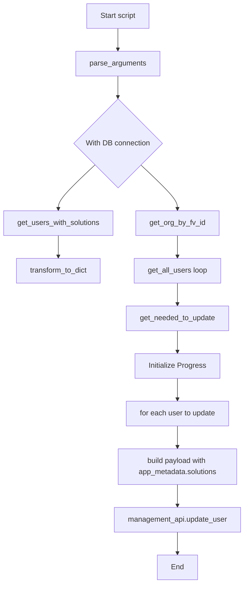
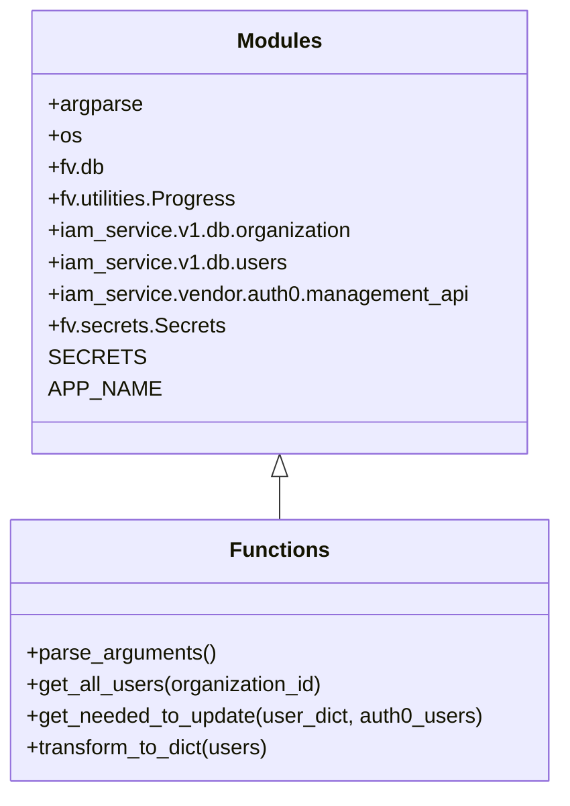

# Diagram: common/iam_service/scripts/fix_user_solutions.py

> Auto-generated by Obscura crawlers

## Diagram 1

### SVG

<svg id="container" width="541.078125" xmlns="http://www.w3.org/2000/svg" class="flowchart" height="1276.203125" viewBox="0 0 541.078125 1276.203125" role="graphics-document document" aria-roledescription="flowchart-v2"><g><marker id="container_flowchart-v2-pointEnd" class="marker flowchart-v2" viewBox="0 0 10 10" refX="5" refY="5" markerUnits="userSpaceOnUse" markerWidth="8" markerHeight="8" orient="auto"><path d="M 0 0 L 10 5 L 0 10 z" class="arrowMarkerPath" style="stroke-width: 1; stroke-dasharray: 1, 0;"></path></marker><marker id="container_flowchart-v2-pointStart" class="marker flowchart-v2" viewBox="0 0 10 10" refX="4.5" refY="5" markerUnits="userSpaceOnUse" markerWidth="8" markerHeight="8" orient="auto"><path d="M 0 5 L 10 10 L 10 0 z" class="arrowMarkerPath" style="stroke-width: 1; stroke-dasharray: 1, 0;"></path></marker><marker id="container_flowchart-v2-circleEnd" class="marker flowchart-v2" viewBox="0 0 10 10" refX="11" refY="5" markerUnits="userSpaceOnUse" markerWidth="11" markerHeight="11" orient="auto"><circle cx="5" cy="5" r="5" class="arrowMarkerPath" style="stroke-width: 1; stroke-dasharray: 1, 0;"></circle></marker><marker id="container_flowchart-v2-circleStart" class="marker flowchart-v2" viewBox="0 0 10 10" refX="-1" refY="5" markerUnits="userSpaceOnUse" markerWidth="11" markerHeight="11" orient="auto"><circle cx="5" cy="5" r="5" class="arrowMarkerPath" style="stroke-width: 1; stroke-dasharray: 1, 0;"></circle></marker><marker id="container_flowchart-v2-crossEnd" class="marker cross flowchart-v2" viewBox="0 0 11 11" refX="12" refY="5.2" markerUnits="userSpaceOnUse" markerWidth="11" markerHeight="11" orient="auto"><path d="M 1,1 l 9,9 M 10,1 l -9,9" class="arrowMarkerPath" style="stroke-width: 2; stroke-dasharray: 1, 0;"></path></marker><marker id="container_flowchart-v2-crossStart" class="marker cross flowchart-v2" viewBox="0 0 11 11" refX="-1" refY="5.2" markerUnits="userSpaceOnUse" markerWidth="11" markerHeight="11" orient="auto"><path d="M 1,1 l 9,9 M 10,1 l -9,9" class="arrowMarkerPath" style="stroke-width: 2; stroke-dasharray: 1, 0;"></path></marker><g class="root"><g class="clusters"></g><g class="edgePaths"><path d="M261.563,62L261.563,66.167C261.563,70.333,261.563,78.667,261.563,86.333C261.563,94,261.563,101,261.563,104.5L261.563,108" id="L_A_B_0" class="edge-thickness-normal edge-pattern-solid edge-thickness-normal edge-pattern-solid flowchart-link" style=";" data-edge="true" data-et="edge" data-id="L_A_B_0" data-points="W3sieCI6MjYxLjU2MjUsInkiOjYyfSx7IngiOjI2MS41NjI1LCJ5Ijo4N30seyJ4IjoyNjEuNTYyNSwieSI6MTEyfV0=" marker-end="url(#container_flowchart-v2-pointEnd)"></path><path d="M261.563,166L261.563,170.167C261.563,174.333,261.563,182.667,261.563,190.333C261.563,198,261.563,205,261.563,208.5L261.563,212" id="L_B_C_0" class="edge-thickness-normal edge-pattern-solid edge-thickness-normal edge-pattern-solid flowchart-link" style=";" data-edge="true" data-et="edge" data-id="L_B_C_0" data-points="W3sieCI6MjYxLjU2MjUsInkiOjE2Nn0seyJ4IjoyNjEuNTYyNSwieSI6MTkxfSx7IngiOjI2MS41NjI1LCJ5IjoyMTZ9XQ==" marker-end="url(#container_flowchart-v2-pointEnd)"></path><path d="M312.252,361.514L325.738,374.129C339.225,386.744,366.198,411.973,379.685,428.088C393.172,444.203,393.172,451.203,393.172,454.703L393.172,458.203" id="L_C_D_0" class="edge-thickness-normal edge-pattern-solid edge-thickness-normal edge-pattern-solid flowchart-link" style=";" data-edge="true" data-et="edge" data-id="L_C_D_0" data-points="W3sieCI6MzEyLjI1MTY2NzMxMjA1NzIsInkiOjM2MS41MTM5NTc2ODc5NDI4fSx7IngiOjM5My4xNzE4NzUsInkiOjQzNy4yMDMxMjV9LHsieCI6MzkzLjE3MTg3NSwieSI6NDYyLjIwMzEyNX1d" marker-end="url(#container_flowchart-v2-pointEnd)"></path><path d="M210.873,361.514L197.387,374.129C183.9,386.744,156.927,411.973,143.44,428.088C129.953,444.203,129.953,451.203,129.953,454.703L129.953,458.203" id="L_C_E_0" class="edge-thickness-normal edge-pattern-solid edge-thickness-normal edge-pattern-solid flowchart-link" style=";" data-edge="true" data-et="edge" data-id="L_C_E_0" data-points="W3sieCI6MjEwLjg3MzMzMjY4Nzk0MjgyLCJ5IjozNjEuNTEzOTU3Njg3OTQyOH0seyJ4IjoxMjkuOTUzMTI1LCJ5Ijo0MzcuMjAzMTI1fSx7IngiOjEyOS45NTMxMjUsInkiOjQ2Mi4yMDMxMjV9XQ==" marker-end="url(#container_flowchart-v2-pointEnd)"></path><path d="M129.953,516.203L129.953,520.37C129.953,524.536,129.953,532.87,129.953,540.536C129.953,548.203,129.953,555.203,129.953,558.703L129.953,562.203" id="L_E_F_0" class="edge-thickness-normal edge-pattern-solid edge-thickness-normal edge-pattern-solid flowchart-link" style=";" data-edge="true" data-et="edge" data-id="L_E_F_0" data-points="W3sieCI6MTI5Ljk1MzEyNSwieSI6NTE2LjIwMzEyNX0seyJ4IjoxMjkuOTUzMTI1LCJ5Ijo1NDEuMjAzMTI1fSx7IngiOjEyOS45NTMxMjUsInkiOjU2Ni4yMDMxMjV9XQ==" marker-end="url(#container_flowchart-v2-pointEnd)"></path><path d="M393.172,516.203L393.172,520.37C393.172,524.536,393.172,532.87,393.172,540.536C393.172,548.203,393.172,555.203,393.172,558.703L393.172,562.203" id="L_D_G_0" class="edge-thickness-normal edge-pattern-solid edge-thickness-normal edge-pattern-solid flowchart-link" style=";" data-edge="true" data-et="edge" data-id="L_D_G_0" data-points="W3sieCI6MzkzLjE3MTg3NSwieSI6NTE2LjIwMzEyNX0seyJ4IjozOTMuMTcxODc1LCJ5Ijo1NDEuMjAzMTI1fSx7IngiOjM5My4xNzE4NzUsInkiOjU2Ni4yMDMxMjV9XQ==" marker-end="url(#container_flowchart-v2-pointEnd)"></path><path d="M393.172,620.203L393.172,624.37C393.172,628.536,393.172,636.87,393.172,644.536C393.172,652.203,393.172,659.203,393.172,662.703L393.172,666.203" id="L_G_H_0" class="edge-thickness-normal edge-pattern-solid edge-thickness-normal edge-pattern-solid flowchart-link" style=";" data-edge="true" data-et="edge" data-id="L_G_H_0" data-points="W3sieCI6MzkzLjE3MTg3NSwieSI6NjIwLjIwMzEyNX0seyJ4IjozOTMuMTcxODc1LCJ5Ijo2NDUuMjAzMTI1fSx7IngiOjM5My4xNzE4NzUsInkiOjY3MC4yMDMxMjV9XQ==" marker-end="url(#container_flowchart-v2-pointEnd)"></path><path d="M393.172,724.203L393.172,728.37C393.172,732.536,393.172,740.87,393.172,748.536C393.172,756.203,393.172,763.203,393.172,766.703L393.172,770.203" id="L_H_I_0" class="edge-thickness-normal edge-pattern-solid edge-thickness-normal edge-pattern-solid flowchart-link" style=";" data-edge="true" data-et="edge" data-id="L_H_I_0" data-points="W3sieCI6MzkzLjE3MTg3NSwieSI6NzI0LjIwMzEyNX0seyJ4IjozOTMuMTcxODc1LCJ5Ijo3NDkuMjAzMTI1fSx7IngiOjM5My4xNzE4NzUsInkiOjc3NC4yMDMxMjV9XQ==" marker-end="url(#container_flowchart-v2-pointEnd)"></path><path d="M393.172,828.203L393.172,832.37C393.172,836.536,393.172,844.87,393.172,852.536C393.172,860.203,393.172,867.203,393.172,870.703L393.172,874.203" id="L_I_J_0" class="edge-thickness-normal edge-pattern-solid edge-thickness-normal edge-pattern-solid flowchart-link" style=";" data-edge="true" data-et="edge" data-id="L_I_J_0" data-points="W3sieCI6MzkzLjE3MTg3NSwieSI6ODI4LjIwMzEyNX0seyJ4IjozOTMuMTcxODc1LCJ5Ijo4NTMuMjAzMTI1fSx7IngiOjM5My4xNzE4NzUsInkiOjg3OC4yMDMxMjV9XQ==" marker-end="url(#container_flowchart-v2-pointEnd)"></path><path d="M393.172,932.203L393.172,936.37C393.172,940.536,393.172,948.87,393.172,956.536C393.172,964.203,393.172,971.203,393.172,974.703L393.172,978.203" id="L_J_K_0" class="edge-thickness-normal edge-pattern-solid edge-thickness-normal edge-pattern-solid flowchart-link" style=";" data-edge="true" data-et="edge" data-id="L_J_K_0" data-points="W3sieCI6MzkzLjE3MTg3NSwieSI6OTMyLjIwMzEyNX0seyJ4IjozOTMuMTcxODc1LCJ5Ijo5NTcuMjAzMTI1fSx7IngiOjM5My4xNzE4NzUsInkiOjk4Mi4yMDMxMjV9XQ==" marker-end="url(#container_flowchart-v2-pointEnd)"></path><path d="M393.172,1060.203L393.172,1064.37C393.172,1068.536,393.172,1076.87,393.172,1084.536C393.172,1092.203,393.172,1099.203,393.172,1102.703L393.172,1106.203" id="L_K_L_0" class="edge-thickness-normal edge-pattern-solid edge-thickness-normal edge-pattern-solid flowchart-link" style=";" data-edge="true" data-et="edge" data-id="L_K_L_0" data-points="W3sieCI6MzkzLjE3MTg3NSwieSI6MTA2MC4yMDMxMjV9LHsieCI6MzkzLjE3MTg3NSwieSI6MTA4NS4yMDMxMjV9LHsieCI6MzkzLjE3MTg3NSwieSI6MTExMC4yMDMxMjV9XQ==" marker-end="url(#container_flowchart-v2-pointEnd)"></path><path d="M393.172,1164.203L393.172,1168.37C393.172,1172.536,393.172,1180.87,393.172,1188.536C393.172,1196.203,393.172,1203.203,393.172,1206.703L393.172,1210.203" id="L_L_M_0" class="edge-thickness-normal edge-pattern-solid edge-thickness-normal edge-pattern-solid flowchart-link" style=";" data-edge="true" data-et="edge" data-id="L_L_M_0" data-points="W3sieCI6MzkzLjE3MTg3NSwieSI6MTE2NC4yMDMxMjV9LHsieCI6MzkzLjE3MTg3NSwieSI6MTE4OS4yMDMxMjV9LHsieCI6MzkzLjE3MTg3NSwieSI6MTIxNC4yMDMxMjV9XQ==" marker-end="url(#container_flowchart-v2-pointEnd)"></path></g><g class="edgeLabels"><g class="edgeLabel"><g class="label" data-id="L_A_B_0" transform="translate(0, 0)"><foreignObject width="0" height="0">

</foreignObject></g></g><g class="edgeLabel"><g class="label" data-id="L_B_C_0" transform="translate(0, 0)"><foreignObject width="0" height="0">

</foreignObject></g></g><g class="edgeLabel"><g class="label" data-id="L_C_D_0" transform="translate(0, 0)"><foreignObject width="0" height="0">

</foreignObject></g></g><g class="edgeLabel"><g class="label" data-id="L_C_E_0" transform="translate(0, 0)"><foreignObject width="0" height="0">

</foreignObject></g></g><g class="edgeLabel"><g class="label" data-id="L_E_F_0" transform="translate(0, 0)"><foreignObject width="0" height="0">

</foreignObject></g></g><g class="edgeLabel"><g class="label" data-id="L_D_G_0" transform="translate(0, 0)"><foreignObject width="0" height="0">

</foreignObject></g></g><g class="edgeLabel"><g class="label" data-id="L_G_H_0" transform="translate(0, 0)"><foreignObject width="0" height="0">

</foreignObject></g></g><g class="edgeLabel"><g class="label" data-id="L_H_I_0" transform="translate(0, 0)"><foreignObject width="0" height="0">

</foreignObject></g></g><g class="edgeLabel"><g class="label" data-id="L_I_J_0" transform="translate(0, 0)"><foreignObject width="0" height="0">

</foreignObject></g></g><g class="edgeLabel"><g class="label" data-id="L_J_K_0" transform="translate(0, 0)"><foreignObject width="0" height="0">

</foreignObject></g></g><g class="edgeLabel"><g class="label" data-id="L_K_L_0" transform="translate(0, 0)"><foreignObject width="0" height="0">

</foreignObject></g></g><g class="edgeLabel"><g class="label" data-id="L_L_M_0" transform="translate(0, 0)"><foreignObject width="0" height="0">

</foreignObject></g></g></g><g class="nodes"><g class="node default" id="flowchart-A-0" transform="translate(261.5625, 35)"><rect class="basic label-container" style="" x="-70.1875" y="-27" width="140.375" height="54"></rect><g class="label" style="" transform="translate(-40.1875, -12)"><rect></rect><foreignObject width="80.375" height="24">

Start script

</foreignObject></g></g><g class="node default" id="flowchart-B-1" transform="translate(261.5625, 139)"><rect class="basic label-container" style="" x="-92.515625" y="-27" width="185.03125" height="54"></rect><g class="label" style="" transform="translate(-62.515625, -12)"><rect></rect><foreignObject width="125.03125" height="24">

parse_arguments

</foreignObject></g></g><g class="node default" id="flowchart-C-3" transform="translate(261.5625, 314.1015625)"><polygon points="98.1015625,0 196.203125,-98.1015625 98.1015625,-196.203125 0,-98.1015625" class="label-container" transform="translate(-97.6015625, 98.1015625)"></polygon><g class="label" style="" transform="translate(-71.1015625, -12)"><rect></rect><foreignObject width="142.203125" height="24">

With DB connection

</foreignObject></g></g><g class="node default" id="flowchart-D-5" transform="translate(393.171875, 489.203125)"><rect class="basic label-container" style="" x="-91.265625" y="-27" width="182.53125" height="54"></rect><g class="label" style="" transform="translate(-61.265625, -12)"><rect></rect><foreignObject width="122.53125" height="24">

get_org_by_fv_id

</foreignObject></g></g><g class="node default" id="flowchart-E-7" transform="translate(129.953125, 489.203125)"><rect class="basic label-container" style="" x="-121.953125" y="-27" width="243.90625" height="54"></rect><g class="label" style="" transform="translate(-91.953125, -12)"><rect></rect><foreignObject width="183.90625" height="24">

get_users_with_solutions

</foreignObject></g></g><g class="node default" id="flowchart-F-9" transform="translate(129.953125, 593.203125)"><rect class="basic label-container" style="" x="-94.7265625" y="-27" width="189.453125" height="54"></rect><g class="label" style="" transform="translate(-64.7265625, -12)"><rect></rect><foreignObject width="129.453125" height="24">

transform_to_dict

</foreignObject></g></g><g class="node default" id="flowchart-G-11" transform="translate(393.171875, 593.203125)"><rect class="basic label-container" style="" x="-96.21875" y="-27" width="192.4375" height="54"></rect><g class="label" style="" transform="translate(-66.21875, -12)"><rect></rect><foreignObject width="132.4375" height="24">

get_all_users loop

</foreignObject></g></g><g class="node default" id="flowchart-H-13" transform="translate(393.171875, 697.203125)"><rect class="basic label-container" style="" x="-113.734375" y="-27" width="227.46875" height="54"></rect><g class="label" style="" transform="translate(-83.734375, -12)"><rect></rect><foreignObject width="167.46875" height="24">

get_needed_to_update

</foreignObject></g></g><g class="node default" id="flowchart-I-15" transform="translate(393.171875, 801.203125)"><rect class="basic label-container" style="" x="-94.015625" y="-27" width="188.03125" height="54"></rect><g class="label" style="" transform="translate(-64.015625, -12)"><rect></rect><foreignObject width="128.03125" height="24">

Initialize Progress

</foreignObject></g></g><g class="node default" id="flowchart-J-17" transform="translate(393.171875, 905.203125)"><rect class="basic label-container" style="" x="-114.9375" y="-27" width="229.875" height="54"></rect><g class="label" style="" transform="translate(-84.9375, -12)"><rect></rect><foreignObject width="169.875" height="24">

for each user to update

</foreignObject></g></g><g class="node default" id="flowchart-K-19" transform="translate(393.171875, 1021.203125)"><rect class="basic label-container" style="" x="-130" y="-39" width="260" height="78"></rect><g class="label" style="" transform="translate(-100, -24)"><rect></rect><foreignObject width="200" height="48">

build payload with app_metadata.solutions

</foreignObject></g></g><g class="node default" id="flowchart-L-21" transform="translate(393.171875, 1137.203125)"><rect class="basic label-container" style="" x="-139.90625" y="-27" width="279.8125" height="54"></rect><g class="label" style="" transform="translate(-109.90625, -12)"><rect></rect><foreignObject width="219.8125" height="24">

management_api.update_user

</foreignObject></g></g><g class="node default" id="flowchart-M-23" transform="translate(393.171875, 1241.203125)"><rect class="basic label-container" style="" x="-43.6796875" y="-27" width="87.359375" height="54"></rect><g class="label" style="" transform="translate(-13.6796875, -12)"><rect></rect><foreignObject width="27.359375" height="24">

End

</foreignObject></g></g></g></g></g></svg>

## Diagram 2

### SVG

<svg id="container" width="423.5234375" xmlns="http://www.w3.org/2000/svg" class="classDiagram" height="600" viewBox="0 0 423.5234375 600" role="graphics-document document" aria-roledescription="class"><g><defs><marker id="container_class-aggregationStart" class="marker aggregation class" refX="18" refY="7" markerWidth="190" markerHeight="240" orient="auto"><path d="M 18,7 L9,13 L1,7 L9,1 Z"></path></marker></defs><defs><marker id="container_class-aggregationEnd" class="marker aggregation class" refX="1" refY="7" markerWidth="20" markerHeight="28" orient="auto"><path d="M 18,7 L9,13 L1,7 L9,1 Z"></path></marker></defs><defs><marker id="container_class-extensionStart" class="marker extension class" refX="18" refY="7" markerWidth="190" markerHeight="240" orient="auto"><path d="M 1,7 L18,13 V 1 Z"></path></marker></defs><defs><marker id="container_class-extensionEnd" class="marker extension class" refX="1" refY="7" markerWidth="20" markerHeight="28" orient="auto"><path d="M 1,1 V 13 L18,7 Z"></path></marker></defs><defs><marker id="container_class-compositionStart" class="marker composition class" refX="18" refY="7" markerWidth="190" markerHeight="240" orient="auto"><path d="M 18,7 L9,13 L1,7 L9,1 Z"></path></marker></defs><defs><marker id="container_class-compositionEnd" class="marker composition class" refX="1" refY="7" markerWidth="20" markerHeight="28" orient="auto"><path d="M 18,7 L9,13 L1,7 L9,1 Z"></path></marker></defs><defs><marker id="container_class-dependencyStart" class="marker dependency class" refX="6" refY="7" markerWidth="190" markerHeight="240" orient="auto"><path d="M 5,7 L9,13 L1,7 L9,1 Z"></path></marker></defs><defs><marker id="container_class-dependencyEnd" class="marker dependency class" refX="13" refY="7" markerWidth="20" markerHeight="28" orient="auto"><path d="M 18,7 L9,13 L14,7 L9,1 Z"></path></marker></defs><defs><marker id="container_class-lollipopStart" class="marker lollipop class" refX="13" refY="7" markerWidth="190" markerHeight="240" orient="auto"><circle stroke="black" fill="transparent" cx="7" cy="7" r="6"></circle></marker></defs><defs><marker id="container_class-lollipopEnd" class="marker lollipop class" refX="1" refY="7" markerWidth="190" markerHeight="240" orient="auto"><circle stroke="black" fill="transparent" cx="7" cy="7" r="6"></circle></marker></defs><g class="root"><g class="clusters"></g><g class="edgePaths"><path d="M211.762,361.25L211.762,362.542C211.762,363.833,211.762,366.417,211.762,371.875C211.762,377.333,211.762,385.667,211.762,389.833L211.762,394" id="id_Modules_Functions_1" class="edge-thickness-normal edge-pattern-solid relation" style=";;;" data-edge="true" data-et="edge" data-id="id_Modules_Functions_1" data-points="W3sieCI6MjExLjc2MTcxODc1LCJ5IjozNDR9LHsieCI6MjExLjc2MTcxODc1LCJ5IjozNjl9LHsieCI6MjExLjc2MTcxODc1LCJ5IjozOTR9XQ==" marker-start="url(#container_class-extensionStart)"></path></g><g class="edgeLabels"><g class="edgeLabel"><g class="label" data-id="id_Modules_Functions_1" transform="translate(0, 0)"><foreignObject width="0" height="0">

</foreignObject></g></g></g><g class="nodes"><g class="node default" id="classId-Modules-0" transform="translate(211.76171875, 176)"><g class="basic label-container"><path d="M-188.375 -168 L188.375 -168 L188.375 168 L-188.375 168" stroke="none" stroke-width="0" fill="#ECECFF" style=""></path><path d="M-188.375 -168 C-51.94900826133983 -168, 84.47698347732035 -168, 188.375 -168 M-188.375 -168 C-99.02796096341612 -168, -9.68092192683224 -168, 188.375 -168 M188.375 -168 C188.375 -44.53948513538069, 188.375 78.92102972923863, 188.375 168 M188.375 -168 C188.375 -96.73002018070508, 188.375 -25.460040361410165, 188.375 168 M188.375 168 C77.76574504285593 168, -32.84350991428815 168, -188.375 168 M188.375 168 C105.52412008861444 168, 22.673240177228877 168, -188.375 168 M-188.375 168 C-188.375 36.643787180762644, -188.375 -94.71242563847471, -188.375 -168 M-188.375 168 C-188.375 50.022476513278164, -188.375 -67.95504697344367, -188.375 -168" stroke="#9370DB" stroke-width="1.3" fill="none" stroke-dasharray="0 0" style=""></path></g><g class="annotation-group text" transform="translate(0, -144)"></g><g class="label-group text" transform="translate(-30.953125, -144)"><g class="label" style="font-weight: bolder" transform="translate(0,-12)"><foreignObject width="61.90625" height="24">

Modules

</foreignObject></g></g><g class="members-group text" transform="translate(-176.375, -96)"><g class="label" style="" transform="translate(0,-12)"><foreignObject width="70.890625" height="24">

+argparse

</foreignObject></g><g class="label" style="" transform="translate(0,12)"><foreignObject width="24.8125" height="24">

+os

</foreignObject></g><g class="label" style="" transform="translate(0,36)"><foreignObject width="43.09375" height="24">

+fv.db

</foreignObject></g><g class="label" style="" transform="translate(0,60)"><foreignObject width="144.6875" height="24">

+fv.utilities.Progress

</foreignObject></g><g class="label" style="" transform="translate(0,84)"><foreignObject width="228.5" height="24">

+iam_service.v1.db.organization

</foreignObject></g><g class="label" style="" transform="translate(0,108)"><foreignObject width="177.0625" height="24">

+iam_service.v1.db.users

</foreignObject></g><g class="label" style="" transform="translate(0,132)"><foreignObject width="321.796875" height="24">

+iam_service.vendor.auth0.management_api

</foreignObject></g><g class="label" style="" transform="translate(0,156)"><foreignObject width="132.34375" height="24">

+fv.secrets.Secrets

</foreignObject></g><g class="label" style="" transform="translate(0,180)"><foreignObject width="60.96875" height="24">

SECRETS

</foreignObject></g><g class="label" style="" transform="translate(0,204)"><foreignObject width="75.59375" height="24">

APP_NAME

</foreignObject></g></g><g class="methods-group text" transform="translate(-176.375, 168)"></g><g class="divider" style=""><path d="M-188.375 -120 C-93.05029642006359 -120, 2.2744071598728226 -120, 188.375 -120 M-188.375 -120 C-112.14580972288859 -120, -35.91661944577717 -120, 188.375 -120" stroke="#9370DB" stroke-width="1.3" fill="none" stroke-dasharray="0 0" style=""></path></g><g class="divider" style=""><path d="M-188.375 144 C-93.807495241479 144, 0.7600095170419934 144, 188.375 144 M-188.375 144 C-91.9347075899592 144, 4.505584820081594 144, 188.375 144" stroke="#9370DB" stroke-width="1.3" fill="none" stroke-dasharray="0 0" style=""></path></g></g><g class="node default" id="classId-Functions-1" transform="translate(211.76171875, 493)"><g class="basic label-container"><path d="M-203.76171875 -99 L203.76171875 -99 L203.76171875 99 L-203.76171875 99" stroke="none" stroke-width="0" fill="#ECECFF" style=""></path><path d="M-203.76171875 -99 C-88.42212004653636 -99, 26.917478656927273 -99, 203.76171875 -99 M-203.76171875 -99 C-42.74291075496876 -99, 118.27589724006248 -99, 203.76171875 -99 M203.76171875 -99 C203.76171875 -33.46620648312937, 203.76171875 32.06758703374126, 203.76171875 99 M203.76171875 -99 C203.76171875 -46.93204070468077, 203.76171875 5.135918590638454, 203.76171875 99 M203.76171875 99 C98.9544624279687 99, -5.852793894062586 99, -203.76171875 99 M203.76171875 99 C122.10415433991257 99, 40.44658992982514 99, -203.76171875 99 M-203.76171875 99 C-203.76171875 45.76578289369038, -203.76171875 -7.468434212619243, -203.76171875 -99 M-203.76171875 99 C-203.76171875 54.807259003134284, -203.76171875 10.614518006268568, -203.76171875 -99" stroke="#9370DB" stroke-width="1.3" fill="none" stroke-dasharray="0 0" style=""></path></g><g class="annotation-group text" transform="translate(0, -75)"></g><g class="label-group text" transform="translate(-35.1328125, -75)"><g class="label" style="font-weight: bolder" transform="translate(0,-12)"><foreignObject width="70.265625" height="24">

Functions

</foreignObject></g></g><g class="members-group text" transform="translate(-191.76171875, -27)"></g><g class="methods-group text" transform="translate(-191.76171875, 3)"><g class="label" style="" transform="translate(0,-12)"><foreignObject width="143.390625" height="24">

+parse_arguments()

</foreignObject></g><g class="label" style="" transform="translate(0,12)"><foreignObject width="226.5" height="24">

+get_all_users(organization_id)

</foreignObject></g><g class="label" style="" transform="translate(0,36)"><foreignObject width="348.390625" height="24">

+get_needed_to_update(user_dict, auth0_users)

</foreignObject></g><g class="label" style="" transform="translate(0,60)"><foreignObject width="186.625" height="24">

+transform_to_dict(users)

</foreignObject></g></g><g class="divider" style=""><path d="M-203.76171875 -51 C-72.46133693232892 -51, 58.83904488534216 -51, 203.76171875 -51 M-203.76171875 -51 C-59.03259369012383 -51, 85.69653136975234 -51, 203.76171875 -51" stroke="#9370DB" stroke-width="1.3" fill="none" stroke-dasharray="0 0" style=""></path></g><g class="divider" style=""><path d="M-203.76171875 -27 C-119.03305217064144 -27, -34.30438559128288 -27, 203.76171875 -27 M-203.76171875 -27 C-54.29989182980671 -27, 95.16193509038658 -27, 203.76171875 -27" stroke="#9370DB" stroke-width="1.3" fill="none" stroke-dasharray="0 0" style=""></path></g></g></g></g></g></svg>
