# Diagram: common/iam_service/scripts/insert_role.py

> Auto-generated by Obscura crawlers

## Mermaid

```mermaid
flowchart LR
  Start([Start]) --> ParseArgs[/"parse_arguments()"/]
  ParseArgs --> CheckFeatureSpecific{"args.feature_specific\nand args.feature is None?"}
  CheckFeatureSpecific -- Yes --> PrintError["print error & sys.exit(1)"]
  PrintError --> End([End])
  CheckFeatureSpecific -- No --> ParsePrivs["privs = [priv.strip() for priv in args.privileges.split(',')]"]
  ParsePrivs --> GetDBConn["with fv.db.get_connection(SECRETS.get_secret(...), DB_APP_NAME='Insert_role') as conn"]
  GetDBConn --> GetCursor["with fv.db.get_cursor(conn) as cursor"]
  GetCursor --> InsertRole["role = role_db.insert_role(cursor, {'name': args.role}, args.feature)"]
  InsertRole --> InsertRoleRole1["role_db.insert_role_role(cursor, role.name)"]
  InsertRoleRole1 --> FeatureSpecificCheck{"args.feature_specific?"}
  FeatureSpecificCheck -- True --> InsertRoleRole2["role_db.insert_role_role(cursor, role.name, role.name)"]
  FeatureSpecificCheck -- False --> SkipInsertRoleRole2[/"skip"/]
  InsertRoleRole2 --> AddPrivs["role_db.add_privileges_to_role(cursor, args.role, privs)"]
  SkipInsertRoleRole2 --> AddPrivs
  AddPrivs --> Commit["cursor/connection commit (context exit)"]
  Commit --> End([End])
```

### SVG

<svg id="container" width="3835.2568359375" xmlns="http://www.w3.org/2000/svg" class="flowchart" height="329.5546875" viewBox="0.0000019073486328125 0 3835.2568359375 329.5546875" role="graphics-document document" aria-roledescription="flowchart-v2"><g><marker id="container_flowchart-v2-pointEnd" class="marker flowchart-v2" viewBox="0 0 10 10" refX="5" refY="5" markerUnits="userSpaceOnUse" markerWidth="8" markerHeight="8" orient="auto"><path d="M 0 0 L 10 5 L 0 10 z" class="arrowMarkerPath" style="stroke-width: 1; stroke-dasharray: 1, 0;"></path></marker><marker id="container_flowchart-v2-pointStart" class="marker flowchart-v2" viewBox="0 0 10 10" refX="4.5" refY="5" markerUnits="userSpaceOnUse" markerWidth="8" markerHeight="8" orient="auto"><path d="M 0 5 L 10 10 L 10 0 z" class="arrowMarkerPath" style="stroke-width: 1; stroke-dasharray: 1, 0;"></path></marker><marker id="container_flowchart-v2-circleEnd" class="marker flowchart-v2" viewBox="0 0 10 10" refX="11" refY="5" markerUnits="userSpaceOnUse" markerWidth="11" markerHeight="11" orient="auto"><circle cx="5" cy="5" r="5" class="arrowMarkerPath" style="stroke-width: 1; stroke-dasharray: 1, 0;"></circle></marker><marker id="container_flowchart-v2-circleStart" class="marker flowchart-v2" viewBox="0 0 10 10" refX="-1" refY="5" markerUnits="userSpaceOnUse" markerWidth="11" markerHeight="11" orient="auto"><circle cx="5" cy="5" r="5" class="arrowMarkerPath" style="stroke-width: 1; stroke-dasharray: 1, 0;"></circle></marker><marker id="container_flowchart-v2-crossEnd" class="marker cross flowchart-v2" viewBox="0 0 11 11" refX="12" refY="5.2" markerUnits="userSpaceOnUse" markerWidth="11" markerHeight="11" orient="auto"><path d="M 1,1 l 9,9 M 10,1 l -9,9" class="arrowMarkerPath" style="stroke-width: 2; stroke-dasharray: 1, 0;"></path></marker><marker id="container_flowchart-v2-crossStart" class="marker cross flowchart-v2" viewBox="0 0 11 11" refX="-1" refY="5.2" markerUnits="userSpaceOnUse" markerWidth="11" markerHeight="11" orient="auto"><path d="M 1,1 l 9,9 M 10,1 l -9,9" class="arrowMarkerPath" style="stroke-width: 2; stroke-dasharray: 1, 0;"></path></marker><g class="root"><g class="clusters"></g><g class="edgePaths"><path d="M68.277,147.5L72.36,147.417C76.444,147.333,84.61,147.167,93.902,147.157C103.194,147.148,113.61,147.296,118.819,147.369L124.027,147.443" id="L_Start_ParseArgs_0" class="edge-thickness-normal edge-pattern-solid edge-thickness-normal edge-pattern-solid flowchart-link" style=";" data-edge="true" data-et="edge" data-id="L_Start_ParseArgs_0" data-points="W3sieCI6NjguMjc2ODM3NDMxODI3MjksInkiOjE0Ny41MDAwMDAwMDAwMDAwM30seyJ4Ijo5Mi43NzY4MzYzOTUyNjM2NywieSI6MTQ3fSx7IngiOjEyOC4wMjY4MzYzOTUyNjM2NywieSI6MTQ3LjV9XQ==" marker-end="url(#container_flowchart-v2-pointEnd)"></path><path d="M297.933,147.5L303.641,147.417C309.35,147.333,320.766,147.167,329.975,147.083C339.183,147,346.183,147,349.683,147L353.183,147" id="L_ParseArgs_CheckFeatureSpecific_0" class="edge-thickness-normal edge-pattern-solid edge-thickness-normal edge-pattern-solid flowchart-link" style=";" data-edge="true" data-et="edge" data-id="L_ParseArgs_CheckFeatureSpecific_0" data-points="W3sieCI6Mjk3LjkzMzA4NjM5NTI2MzcsInkiOjE0Ny41fSx7IngiOjMzMi4xODMwODYzOTUyNjM3LCJ5IjoxNDd9LHsieCI6MzU3LjE4MzA4NjM5NTI2MzcsInkiOjE0N31d" marker-end="url(#container_flowchart-v2-pointEnd)"></path><path d="M587.39,99.207L601.213,91.964C615.035,84.721,642.679,70.236,684.025,62.993C725.371,55.75,780.417,55.75,833.774,55.75C887.131,55.75,938.798,55.75,1000.874,55.75C1062.951,55.75,1135.438,55.75,1207.925,55.75C1280.412,55.75,1352.899,55.75,1414.976,55.75C1477.053,55.75,1528.72,55.75,1580.386,55.75C1632.053,55.75,1683.72,55.75,1735.386,55.75C1787.053,55.75,1838.72,55.75,1892.391,55.75C1946.063,55.75,2001.74,55.75,2060.052,55.75C2118.363,55.75,2179.308,55.75,2238.248,55.75C2297.188,55.75,2354.123,55.75,2404.208,55.75C2454.292,55.75,2497.527,55.75,2543.789,55.75C2590.05,55.75,2639.339,55.75,2695.479,55.75C2751.618,55.75,2814.608,55.75,2874.57,55.75C2934.532,55.75,2991.467,55.75,3052.582,55.75C3113.696,55.75,3178.99,55.75,3244.285,55.75C3309.579,55.75,3374.873,55.75,3413.89,55.75C3452.907,55.75,3465.647,55.75,3472.016,55.75L3478.386,55.75" id="L_CheckFeatureSpecific_PrintError_0" class="edge-thickness-normal edge-pattern-solid edge-thickness-normal edge-pattern-solid flowchart-link" style=";" data-edge="true" data-et="edge" data-id="L_CheckFeatureSpecific_PrintError_0" data-points="W3sieCI6NTg3LjM5MDMyODA3OTEwMjMsInkiOjk5LjIwNzI0MTY4MzgzODY3fSx7IngiOjY3MC4zMjM3MTEzOTUyNjM3LCJ5Ijo1NS43NX0seyJ4Ijo4MzUuNDY0MzM2Mzk1MjYzNywieSI6NTUuNzV9LHsieCI6OTkwLjQ2NDMzNjM5NTI2MzcsInkiOjU1Ljc1fSx7IngiOjEyMDcuOTI1MjczODk1MjYzNywieSI6NTUuNzV9LHsieCI6MTQyNS4zODYyMTEzOTUyNjM3LCJ5Ijo1NS43NX0seyJ4IjoxNTgwLjM4NjIxMTM5NTI2MzcsInkiOjU1Ljc1fSx7IngiOjE3MzUuMzg2MjExMzk1MjYzNywieSI6NTUuNzV9LHsieCI6MTg5MC4zODYyMTEzOTUyNjM3LCJ5Ijo1NS43NX0seyJ4IjoyMDU3LjQxNzQ2MTM5NTI2MzcsInkiOjU1Ljc1fSx7IngiOjIyNDAuMjUzMzk4ODk1MjYzNywieSI6NTUuNzV9LHsieCI6MjQxMS4wNTgwODYzOTUyNjM3LCJ5Ijo1NS43NX0seyJ4IjoyNTQwLjc2MTIxMTM5NTI2MzcsInkiOjU1Ljc1fSx7IngiOjI2ODguNjI4Mzk4ODk1MjYzNywieSI6NTUuNzV9LHsieCI6Mjg3Ny41OTcxNDg4OTUyNjM3LCJ5Ijo1NS43NX0seyJ4IjozMDQ4LjQwMTgzNjM5NTI2MzcsInkiOjU1Ljc1fSx7IngiOjMyNDQuMjg0NjQ4ODk1MjYzNywieSI6NTUuNzV9LHsieCI6MzQ0MC4xNjc0NjEzOTUyNjM3LCJ5Ijo1NS43NX0seyJ4IjozNDgyLjM4NjIxMTM5NTI2MzcsInkiOjU1Ljc1fV0=" marker-end="url(#container_flowchart-v2-pointEnd)"></path><path d="M3707.949,55.75L3714.985,55.75C3722.022,55.75,3736.095,55.75,3749.618,67.285C3763.142,78.82,3776.117,101.889,3782.605,113.424L3789.092,124.959" id="L_PrintError_End_0" class="edge-thickness-normal edge-pattern-solid edge-thickness-normal edge-pattern-solid flowchart-link" style=";" data-edge="true" data-et="edge" data-id="L_PrintError_End_0" data-points="W3sieCI6MzcwNy45NDg3MTEzOTUyNjM3LCJ5Ijo1NS43NX0seyJ4IjozNzUwLjE2NzQ2MTM5NTI2MzcsInkiOjU1Ljc1fSx7IngiOjM3OTEuMDUzMTk5NzI3OTQxLCJ5IjoxMjguNDQ1NTY0MjU3MzQwNzh9XQ==" marker-end="url(#container_flowchart-v2-pointEnd)"></path><path d="M595.389,186.794L607.878,191.803C620.367,196.813,645.346,206.832,663.025,211.842C680.704,216.852,691.084,216.852,696.274,216.852L701.464,216.852" id="L_CheckFeatureSpecific_ParsePrivs_0" class="edge-thickness-normal edge-pattern-solid edge-thickness-normal edge-pattern-solid flowchart-link" style=";" data-edge="true" data-et="edge" data-id="L_CheckFeatureSpecific_ParsePrivs_0" data-points="W3sieCI6NTk1LjM4OTMyMzc4NzU5ODIsInkiOjE4Ni43OTM3NjI2MDc2NjU0Nn0seyJ4Ijo2NzAuMzIzNzExMzk1MjYzNywieSI6MjE2Ljg1MTU2MjV9LHsieCI6NzA1LjQ2NDMzNjM5NTI2MzcsInkiOjIxNi44NTE1NjI1fV0=" marker-end="url(#container_flowchart-v2-pointEnd)"></path><path d="M965.464,216.852L969.631,216.852C973.798,216.852,982.131,216.852,989.798,216.852C997.464,216.852,1004.464,216.852,1007.964,216.852L1011.464,216.852" id="L_ParsePrivs_GetDBConn_0" class="edge-thickness-normal edge-pattern-solid edge-thickness-normal edge-pattern-solid flowchart-link" style=";" data-edge="true" data-et="edge" data-id="L_ParsePrivs_GetDBConn_0" data-points="W3sieCI6OTY1LjQ2NDMzNjM5NTI2MzcsInkiOjIxNi44NTE1NjI1fSx7IngiOjk5MC40NjQzMzYzOTUyNjM3LCJ5IjoyMTYuODUxNTYyNX0seyJ4IjoxMDE1LjQ2NDMzNjM5NTI2MzcsInkiOjIxNi44NTE1NjI1fV0=" marker-end="url(#container_flowchart-v2-pointEnd)"></path><path d="M1400.386,216.852L1404.553,216.852C1408.72,216.852,1417.053,216.852,1424.72,216.852C1432.386,216.852,1439.386,216.852,1442.886,216.852L1446.386,216.852" id="L_GetDBConn_GetCursor_0" class="edge-thickness-normal edge-pattern-solid edge-thickness-normal edge-pattern-solid flowchart-link" style=";" data-edge="true" data-et="edge" data-id="L_GetDBConn_GetCursor_0" data-points="W3sieCI6MTQwMC4zODYyMTEzOTUyNjM3LCJ5IjoyMTYuODUxNTYyNX0seyJ4IjoxNDI1LjM4NjIxMTM5NTI2MzcsInkiOjIxNi44NTE1NjI1fSx7IngiOjE0NTAuMzg2MjExMzk1MjYzNywieSI6MjE2Ljg1MTU2MjV9XQ==" marker-end="url(#container_flowchart-v2-pointEnd)"></path><path d="M1710.386,216.852L1714.553,216.852C1718.72,216.852,1727.053,216.852,1734.72,216.852C1742.386,216.852,1749.386,216.852,1752.886,216.852L1756.386,216.852" id="L_GetCursor_InsertRole_0" class="edge-thickness-normal edge-pattern-solid edge-thickness-normal edge-pattern-solid flowchart-link" style=";" data-edge="true" data-et="edge" data-id="L_GetCursor_InsertRole_0" data-points="W3sieCI6MTcxMC4zODYyMTEzOTUyNjM3LCJ5IjoyMTYuODUxNTYyNX0seyJ4IjoxNzM1LjM4NjIxMTM5NTI2MzcsInkiOjIxNi44NTE1NjI1fSx7IngiOjE3NjAuMzg2MjExMzk1MjYzNywieSI6MjE2Ljg1MTU2MjV9XQ==" marker-end="url(#container_flowchart-v2-pointEnd)"></path><path d="M2020.386,216.852L2026.558,216.852C2032.73,216.852,2045.074,216.852,2056.751,216.852C2068.428,216.852,2079.438,216.852,2084.944,216.852L2090.449,216.852" id="L_InsertRole_InsertRoleRole1_0" class="edge-thickness-normal edge-pattern-solid edge-thickness-normal edge-pattern-solid flowchart-link" style=";" data-edge="true" data-et="edge" data-id="L_InsertRole_InsertRoleRole1_0" data-points="W3sieCI6MjAyMC4zODYyMTEzOTUyNjM3LCJ5IjoyMTYuODUxNTYyNX0seyJ4IjoyMDU3LjQxNzQ2MTM5NTI2MzcsInkiOjIxNi44NTE1NjI1fSx7IngiOjIwOTQuNDQ4NzExMzk1MjYzNywieSI6MjE2Ljg1MTU2MjV9XQ==" marker-end="url(#container_flowchart-v2-pointEnd)"></path><path d="M2386.058,216.852L2390.225,216.852C2394.391,216.852,2402.725,216.852,2410.391,216.852C2418.058,216.852,2425.058,216.852,2428.558,216.852L2432.058,216.852" id="L_InsertRoleRole1_FeatureSpecificCheck_0" class="edge-thickness-normal edge-pattern-solid edge-thickness-normal edge-pattern-solid flowchart-link" style=";" data-edge="true" data-et="edge" data-id="L_InsertRoleRole1_FeatureSpecificCheck_0" data-points="W3sieCI6MjM4Ni4wNTgwODYzOTUyNjM3LCJ5IjoyMTYuODUxNTYyNX0seyJ4IjoyNDExLjA1ODA4NjM5NTI2MzcsInkiOjIxNi44NTE1NjI1fSx7IngiOjI0MzYuMDU4MDg2Mzk1MjYzNywieSI6MjE2Ljg1MTU2MjV9XQ==" marker-end="url(#container_flowchart-v2-pointEnd)"></path><path d="M2617.361,188.748L2629.239,184.391C2641.117,180.033,2664.873,171.317,2683.278,166.959C2701.683,162.602,2714.738,162.602,2721.265,162.602L2727.792,162.602" id="L_FeatureSpecificCheck_InsertRoleRole2_0" class="edge-thickness-normal edge-pattern-solid edge-thickness-normal edge-pattern-solid flowchart-link" style=";" data-edge="true" data-et="edge" data-id="L_FeatureSpecificCheck_InsertRoleRole2_0" data-points="W3sieCI6MjYxNy4zNjExMTI3MDg1MSwieSI6MTg4Ljc0ODMzODgxMzI0NjV9LHsieCI6MjY4OC42MjgzOTg4OTUyNjM3LCJ5IjoxNjIuNjAxNTYyNX0seyJ4IjoyNzMxLjc5MjQ2MTM5NTI2MzcsInkiOjE2Mi42MDE1NjI1fV0=" marker-end="url(#container_flowchart-v2-pointEnd)"></path><path d="M2617.361,244.955L2629.239,249.313C2641.117,253.67,2664.873,262.386,2702.313,266.825C2739.753,271.264,2790.878,271.426,2816.441,271.508L2842.003,271.589" id="L_FeatureSpecificCheck_SkipInsertRoleRole2_0" class="edge-thickness-normal edge-pattern-solid edge-thickness-normal edge-pattern-solid flowchart-link" style=";" data-edge="true" data-et="edge" data-id="L_FeatureSpecificCheck_SkipInsertRoleRole2_0" data-points="W3sieCI6MjYxNy4zNjExMTI3MDg1MSwieSI6MjQ0Ljk1NDc4NjE4Njc1MzV9LHsieCI6MjY4OC42MjgzOTg4OTUyNjM3LCJ5IjoyNzEuMTAxNTYyNX0seyJ4IjoyODQ2LjAwMzM5ODg5NTI2MzcsInkiOjI3MS42MDE1NjI1fV0=" marker-end="url(#container_flowchart-v2-pointEnd)"></path><path d="M3023.402,162.602L3027.569,162.602C3031.735,162.602,3040.069,162.602,3052.77,164.965C3065.471,167.329,3082.541,172.056,3091.076,174.42L3099.611,176.784" id="L_InsertRoleRole2_AddPrivs_0" class="edge-thickness-normal edge-pattern-solid edge-thickness-normal edge-pattern-solid flowchart-link" style=";" data-edge="true" data-et="edge" data-id="L_InsertRoleRole2_AddPrivs_0" data-points="W3sieCI6MzAyMy40MDE4MzYzOTUyNjM3LCJ5IjoxNjIuNjAxNTYyNX0seyJ4IjozMDQ4LjQwMTgzNjM5NTI2MzcsInkiOjE2Mi42MDE1NjI1fSx7IngiOjMxMDMuNDY1NjY4NDgwNTE3MywieSI6MTc3Ljg1MTU2MjV9XQ==" marker-end="url(#container_flowchart-v2-pointEnd)"></path><path d="M2910.191,271.602L2933.226,271.518C2956.261,271.435,3002.332,271.268,3033.902,268.821C3065.471,266.374,3082.541,261.647,3091.076,259.283L3099.611,256.919" id="L_SkipInsertRoleRole2_AddPrivs_0" class="edge-thickness-normal edge-pattern-solid edge-thickness-normal edge-pattern-solid flowchart-link" style=";" data-edge="true" data-et="edge" data-id="L_SkipInsertRoleRole2_AddPrivs_0" data-points="W3sieCI6MjkxMC4xOTA4OTg4OTUyNjM3LCJ5IjoyNzEuNjAxNTYyNX0seyJ4IjozMDQ4LjQwMTgzNjM5NTI2MzcsInkiOjI3MS4xMDE1NjI1fSx7IngiOjMxMDMuNDY1NjY4NDgwNTE3MywieSI6MjU1Ljg1MTU2MjV9XQ==" marker-end="url(#container_flowchart-v2-pointEnd)"></path><path d="M3415.167,216.852L3419.334,216.852C3423.501,216.852,3431.834,216.852,3439.501,216.852C3447.167,216.852,3454.167,216.852,3457.667,216.852L3461.167,216.852" id="L_AddPrivs_Commit_0" class="edge-thickness-normal edge-pattern-solid edge-thickness-normal edge-pattern-solid flowchart-link" style=";" data-edge="true" data-et="edge" data-id="L_AddPrivs_Commit_0" data-points="W3sieCI6MzQxNS4xNjc0NjEzOTUyNjM3LCJ5IjoyMTYuODUxNTYyNX0seyJ4IjozNDQwLjE2NzQ2MTM5NTI2MzcsInkiOjIxNi44NTE1NjI1fSx7IngiOjM0NjUuMTY3NDYxMzk1MjYzNywieSI6MjE2Ljg1MTU2MjV9XQ==" marker-end="url(#container_flowchart-v2-pointEnd)"></path><path d="M3725.167,216.852L3729.334,216.852C3733.501,216.852,3741.834,216.852,3751.968,208.871C3762.101,200.891,3774.034,184.931,3780.001,176.951L3785.968,168.971" id="L_Commit_End_0" class="edge-thickness-normal edge-pattern-solid edge-thickness-normal edge-pattern-solid flowchart-link" style=";" data-edge="true" data-et="edge" data-id="L_Commit_End_0" data-points="W3sieCI6MzcyNS4xNjc0NjEzOTUyNjM3LCJ5IjoyMTYuODUxNTYyNX0seyJ4IjozNzUwLjE2NzQ2MTM5NTI2MzcsInkiOjIxNi44NTE1NjI1fSx7IngiOjM3ODguMzYzMDIyNjMxOTQyLCJ5IjoxNjUuNzY3NDUxMDgwMTQwM31d" marker-end="url(#container_flowchart-v2-pointEnd)"></path></g><g class="edgeLabels"><g class="edgeLabel"><g class="label" data-id="L_Start_ParseArgs_0" transform="translate(0, 0)"><foreignObject width="0" height="0">

</foreignObject></g></g><g class="edgeLabel"><g class="label" data-id="L_ParseArgs_CheckFeatureSpecific_0" transform="translate(0, 0)"><foreignObject width="0" height="0">

</foreignObject></g></g><g class="edgeLabel" transform="translate(2057.4174613952637, 55.75)"><g class="label" data-id="L_CheckFeatureSpecific_PrintError_0" transform="translate(-12.03125, -12)"><foreignObject width="24.0625" height="24">

Yes

</foreignObject></g></g><g class="edgeLabel"><g class="label" data-id="L_PrintError_End_0" transform="translate(0, 0)"><foreignObject width="0" height="0">

</foreignObject></g></g><g class="edgeLabel" transform="translate(670.3237113952637, 216.8515625)"><g class="label" data-id="L_CheckFeatureSpecific_ParsePrivs_0" transform="translate(-10.140625, -12)"><foreignObject width="20.28125" height="24">

No

</foreignObject></g></g><g class="edgeLabel"><g class="label" data-id="L_ParsePrivs_GetDBConn_0" transform="translate(0, 0)"><foreignObject width="0" height="0">

</foreignObject></g></g><g class="edgeLabel"><g class="label" data-id="L_GetDBConn_GetCursor_0" transform="translate(0, 0)"><foreignObject width="0" height="0">

</foreignObject></g></g><g class="edgeLabel"><g class="label" data-id="L_GetCursor_InsertRole_0" transform="translate(0, 0)"><foreignObject width="0" height="0">

</foreignObject></g></g><g class="edgeLabel"><g class="label" data-id="L_InsertRole_InsertRoleRole1_0" transform="translate(0, 0)"><foreignObject width="0" height="0">

</foreignObject></g></g><g class="edgeLabel"><g class="label" data-id="L_InsertRoleRole1_FeatureSpecificCheck_0" transform="translate(0, 0)"><foreignObject width="0" height="0">

</foreignObject></g></g><g class="edgeLabel" transform="translate(2688.6283988952637, 162.6015625)"><g class="label" data-id="L_FeatureSpecificCheck_InsertRoleRole2_0" transform="translate(-16.0078125, -12)"><foreignObject width="32.015625" height="24">

True

</foreignObject></g></g><g class="edgeLabel" transform="translate(2688.6283988952637, 271.1015625)"><g class="label" data-id="L_FeatureSpecificCheck_SkipInsertRoleRole2_0" transform="translate(-18.1640625, -12)"><foreignObject width="36.328125" height="24">

False

</foreignObject></g></g><g class="edgeLabel"><g class="label" data-id="L_InsertRoleRole2_AddPrivs_0" transform="translate(0, 0)"><foreignObject width="0" height="0">

</foreignObject></g></g><g class="edgeLabel"><g class="label" data-id="L_SkipInsertRoleRole2_AddPrivs_0" transform="translate(0, 0)"><foreignObject width="0" height="0">

</foreignObject></g></g><g class="edgeLabel"><g class="label" data-id="L_AddPrivs_Commit_0" transform="translate(0, 0)"><foreignObject width="0" height="0">

</foreignObject></g></g><g class="edgeLabel"><g class="label" data-id="L_Commit_End_0" transform="translate(0, 0)"><foreignObject width="0" height="0">

</foreignObject></g></g></g><g class="nodes"><g class="node default" id="flowchart-Start-0" transform="translate(37.888418197631836, 147)"><g class="basic label-container outer-path"><path d="M-10.3984375 -19.5 C-4.281778550154378 -19.5, 1.8348803996912437 -19.5, 10.3984375 -19.5 C10.3984375 -19.5, 10.398437499999998 -19.5, 10.398437499999998 -19.5 C10.857532480012933 -19.485277717565154, 11.31662746002587 -19.470555435130308, 11.6478067896239 -19.45993515863156 C11.979914100655003 -19.427897165753865, 12.312021411686109 -19.395859172876175, 12.892042152847864 -19.3399052695533 C13.22419326849367 -19.286205653046057, 13.556344384139475 -19.23250603653882, 14.126030759676757 -19.140403561325776 C14.413881984495518 -19.074703397665683, 14.701733209314279 -19.009003234005586, 15.34470188623539 -18.862249829261074 C15.620955217087399 -18.780259290747523, 15.89720854793941 -18.69826875223397, 16.543047751460602 -18.50658706670804 C16.834450165454466 -18.399348284663912, 17.12585257944833 -18.292109502619784, 17.716144095147794 -18.074876768247425 C17.987897984981743 -17.95457938251066, 18.259651874815695 -17.834281996773893, 18.85917041279238 -17.568892924097174 C19.27080533832403 -17.354143247112066, 19.682440263855685 -17.139393570126956, 19.967429764076783 -16.990714730406097 C20.28898081564494 -16.795788593301754, 20.610531867213098 -16.600862456197408, 21.036368073605697 -16.342718045390892 C21.26640264978318 -16.182255883085787, 21.496437225960662 -16.021793720780686, 22.061592844578712 -15.627565626425154 C22.37462120973374 -15.377933835248657, 22.687649574888766 -15.128302044072157, 23.03889120850187 -14.848196188198123 C23.28079834172569 -14.628502530316258, 23.52270547494951 -14.408808872434392, 23.964247236767985 -14.007812326905688 C24.224141937340427 -13.739449710812897, 24.484036637912865 -13.471087094720106, 24.833858442968648 -13.10986736009568 C25.153765203823074 -12.734086675585706, 25.4736719646775 -12.358305991075733, 25.644151408126582 -12.158051136245305 C25.937112074081234 -11.765510533131787, 26.23007274003589 -11.372969930018268, 26.391796464640635 -11.156274872382312 C26.62726804196079 -10.794527296646594, 26.862739619280944 -10.432779720910876, 27.073721378604247 -10.108655082055241 C27.213001850628743 -9.861348500298606, 27.35228232265324 -9.614041918541968, 27.6871239742735 -9.019496659696287 C27.85221985652343 -8.67667152771832, 28.017315738773362 -8.33384639574035, 28.22948364880834 -7.893275190886684 C28.381717795148308 -7.517253906179973, 28.533951941488276 -7.141232621473262, 28.698571729970325 -6.734618561215508 C28.843175717094702 -6.299094391513404, 28.98777970421908 -5.8635702218113, 29.09246063421488 -5.548287939305138 C29.203226182559035 -5.125890897376555, 29.31399173090319 -4.703493855447974, 29.40953178754556 -4.339158212148133 C29.486590166901063 -3.9434797204518777, 29.563648546256562 -3.547801228755622, 29.648482276581777 -3.1121979531509023 C29.694165340136596 -2.757889133360993, 29.739848403691415 -2.403580313571083, 29.808330202509367 -1.872449005199798 C29.8345135566379 -1.46462212982482, 29.860696910766436 -1.0567952544498422, 29.888418715913414 -0.6250057626472757 C29.888418715913414 -0.28863367317462896, 29.888418715913414 0.04773841629801778, 29.888418715913414 0.625005762647271 C29.866360629727378 0.9685782599614643, 29.844302543541346 1.3121507572756577, 29.808330202509367 1.8724490051997846 C29.75426914956907 2.2917358562423393, 29.70020809662877 2.711022707284894, 29.648482276581777 3.1121979531508885 C29.57895900172774 3.4691852757770403, 29.509435726873697 3.8261725984031916, 29.40953178754556 4.339158212148129 C29.327223486050297 4.653035438393095, 29.24491518455503 4.966912664638062, 29.092460634214884 5.548287939305125 C28.97511113572791 5.901725931644418, 28.85776163724094 6.255163923983711, 28.69857172997033 6.734618561215495 C28.574590943946856 7.040853499698905, 28.450610157923382 7.347088438182315, 28.229483648808344 7.893275190886679 C28.049234151527916 8.2675671287109, 27.868984654247484 8.641859066535119, 27.687123974273504 9.019496659696284 C27.489780392751435 9.36990017189325, 27.29243681122937 9.720303684090215, 27.07372137860425 10.108655082055236 C26.88072789074494 10.405144905414955, 26.687734402885624 10.701634728774676, 26.39179646464064 11.156274872382301 C26.221836962242282 11.384005121966906, 26.051877459843922 11.61173537155151, 25.644151408126582 12.158051136245302 C25.47752697237762 12.353777679675018, 25.310902536628657 12.549504223104734, 24.83385844296866 13.10986736009567 C24.639712131406515 13.310339366492201, 24.445565819844372 13.51081137288873, 23.96424723676799 14.007812326905684 C23.648983674036934 14.294126353161255, 23.333720111305876 14.580440379416828, 23.038891208501887 14.848196188198111 C22.80083137949302 15.03804256679458, 22.56277155048415 15.227888945391047, 22.061592844578715 15.627565626425152 C21.75709910719973 15.839967276299289, 21.45260536982074 16.052368926173425, 21.036368073605708 16.34271804539089 C20.686313833795978 16.5549229827106, 20.33625959398625 16.767127920030312, 19.967429764076787 16.990714730406093 C19.58740055185623 17.18897572700123, 19.20737133963567 17.387236723596367, 18.859170412792388 17.56889292409717 C18.534127488599047 17.712779784581798, 18.209084564405707 17.856666645066426, 17.716144095147804 18.07487676824742 C17.33743314100113 18.21424590013908, 16.95872218685446 18.35361503203074, 16.543047751460616 18.506587066708033 C16.173477468192896 18.61627358686789, 15.803907184925178 18.725960107027745, 15.344701886235413 18.86224982926107 C14.877474132060396 18.968891515205485, 14.410246377885377 19.075533201149895, 14.126030759676766 19.140403561325773 C13.837011702384268 19.18712992113256, 13.547992645091771 19.233856280939346, 12.892042152847878 19.3399052695533 C12.501687124857526 19.37756234963292, 12.111332096867171 19.415219429712543, 11.6478067896239 19.45993515863156 C11.358445264726313 19.469214419526985, 11.069083739828727 19.47849368042241, 10.398437500000004 19.5 C10.398437500000004 19.5, 10.398437500000002 19.5, 10.3984375 19.5 C3.3283850532028376 19.5, -3.7416673935943248 19.5, -10.398437499999996 19.5 C-10.843205845701434 19.48573714484242, -11.287974191402869 19.471474289684842, -11.647806789623893 19.45993515863156 C-11.976516686791674 19.428224910183275, -12.305226583959456 19.396514661734987, -12.892042152847871 19.3399052695533 C-13.179558238584917 19.29342189853188, -13.467074324321965 19.24693852751046, -14.126030759676759 19.140403561325773 C-14.462107097351932 19.063696330354475, -14.798183435027104 18.986989099383177, -15.344701886235388 18.862249829261074 C-15.803808993005457 18.7259892498741, -16.262916099775527 18.589728670487123, -16.54304775146059 18.506587066708043 C-16.89752763965775 18.376135191075324, -17.252007527854904 18.245683315442605, -17.716144095147797 18.074876768247425 C-18.14517742395307 17.884956440406846, -18.574210752758344 17.695036112566264, -18.85917041279238 17.568892924097174 C-19.189553048477464 17.396532514680445, -19.519935684162544 17.224172105263715, -19.96742976407678 16.990714730406097 C-20.364897637153163 16.749767369966705, -20.762365510229547 16.50882000952731, -21.036368073605686 16.3427180453909 C-21.300160895626835 16.158707592156162, -21.563953717647983 15.974697138921428, -22.061592844578712 15.627565626425156 C-22.423477900198545 15.338971924734109, -22.78536295581838 15.050378223043063, -23.03889120850187 14.848196188198125 C-23.40165138276802 14.518746996037857, -23.764411557034173 14.18929780387759, -23.964247236767974 14.007812326905697 C-24.260884718053212 13.701509773088548, -24.557522199338447 13.395207219271398, -24.833858442968655 13.109867360095677 C-25.121516949838604 12.771967309693501, -25.409175456708557 12.434067259291323, -25.64415140812658 12.158051136245307 C-25.809363441289637 11.936682062932661, -25.974575474452696 11.715312989620015, -26.391796464640635 11.156274872382316 C-26.607654929568344 10.824658304139497, -26.823513394496057 10.493041735896679, -27.073721378604244 10.108655082055249 C-27.20243356312914 9.880113564909305, -27.331145747654038 9.651572047763361, -27.6871239742735 9.019496659696289 C-27.8410179866698 8.699932450151007, -27.994911999066098 8.380368240605724, -28.22948364880834 7.893275190886686 C-28.35913423400609 7.573035738824706, -28.48878481920384 7.2527962867627265, -28.698571729970325 6.73461856121551 C-28.80485152578689 6.414520749601876, -28.911131321603456 6.0944229379882415, -29.09246063421488 5.5482879393051325 C-29.21480915781198 5.081719992643838, -29.337157681409078 4.615152045982543, -29.409531787545557 4.339158212148136 C-29.467093975176425 4.043588544436297, -29.524656162807293 3.748018876724458, -29.648482276581777 3.112197953150904 C-29.70360616743372 2.684667941146722, -29.75873005828566 2.25713792914254, -29.808330202509364 1.872449005199809 C-29.826336369837826 1.5919884147423247, -29.84434253716629 1.3115278242848405, -29.888418715913414 0.6250057626472781 C-29.888418715913414 0.13634808940679088, -29.888418715913414 -0.35230958383369637, -29.888418715913414 -0.6250057626472687 C-29.859736167951827 -1.0717595992849878, -29.831053619990243 -1.5185134359227068, -29.808330202509367 -1.8724490051997822 C-29.747027474042902 -2.347900861592725, -29.685724745576437 -2.8233527179856672, -29.648482276581777 -3.112197953150895 C-29.591874221310213 -3.402868352853656, -29.53526616603865 -3.6935387525564165, -29.40953178754556 -4.339158212148126 C-29.333067919002502 -4.630748082553064, -29.256604050459444 -4.922337952958001, -29.092460634214884 -5.548287939305123 C-28.994121948637222 -5.844468392123271, -28.89578326305956 -6.140648844941418, -28.698571729970332 -6.734618561215485 C-28.525615508919252 -7.161823771092705, -28.35265928786817 -7.589028980969925, -28.229483648808344 -7.893275190886676 C-28.024849622903222 -8.318202124145397, -27.820215596998104 -8.743129057404118, -27.687123974273504 -9.019496659696282 C-27.54212999332731 -9.276948155098909, -27.397136012381115 -9.534399650501534, -27.073721378604247 -10.108655082055243 C-26.846034367053065 -10.45844347432122, -26.618347355501886 -10.808231866587196, -26.39179646464064 -11.156274872382308 C-26.22656673541617 -11.377667656805105, -26.0613370061917 -11.5990604412279, -25.644151408126586 -12.158051136245302 C-25.33750095471593 -12.518260207726563, -25.030850501305277 -12.878469279207822, -24.833858442968662 -13.10986736009567 C-24.637064634842815 -13.313073124057734, -24.44027082671697 -13.516278888019798, -23.964247236767996 -14.007812326905677 C-23.718730260589005 -14.23078434864822, -23.47321328441001 -14.45375637039076, -23.038891208501887 -14.848196188198107 C-22.718389631550725 -15.103787666911508, -22.39788805459956 -15.359379145624908, -22.06159284457872 -15.627565626425149 C-21.686821823197292 -15.888989667364795, -21.312050801815868 -16.15041370830444, -21.03636807360571 -16.342718045390885 C-20.664170785114784 -16.568346228948137, -20.291973496623857 -16.793974412505385, -19.96742976407679 -16.99071473040609 C-19.70170993087534 -17.12934059718561, -19.435990097673887 -17.267966463965134, -18.859170412792388 -17.56889292409717 C-18.4345586810717 -17.756855942070423, -18.00994694935101 -17.944818960043673, -17.716144095147804 -18.07487676824742 C-17.32967534903811 -18.217100839293717, -16.94320660292841 -18.35932491034001, -16.54304775146062 -18.506587066708033 C-16.274593198370162 -18.586262968918575, -16.0061386452797 -18.66593887112912, -15.344701886235413 -18.862249829261067 C-15.08209332341161 -18.922188520044575, -14.819484760587809 -18.982127210828086, -14.126030759676768 -19.140403561325773 C-13.709355690306406 -19.20776835517815, -13.292680620936043 -19.275133149030527, -12.89204215284788 -19.3399052695533 C-12.583558005491879 -19.369664364242265, -12.27507385813588 -19.39942345893123, -11.647806789623903 -19.45993515863156 C-11.18880909388209 -19.47465432134918, -10.729811398140276 -19.489373484066807, -10.398437500000005 -19.5 C-10.398437500000004 -19.5, -10.398437500000002 -19.5, -10.3984375 -19.5" stroke="none" stroke-width="0" fill="#ECECFF" style=""></path><path d="M-10.3984375 -19.5 C-2.8678552604339815 -19.5, 4.662726979132037 -19.5, 10.3984375 -19.5 M-10.3984375 -19.5 C-3.011669170678724 -19.5, 4.375099158642552 -19.5, 10.3984375 -19.5 M10.3984375 -19.5 C10.3984375 -19.5, 10.3984375 -19.5, 10.398437499999998 -19.5 M10.3984375 -19.5 C10.3984375 -19.5, 10.398437499999998 -19.5, 10.398437499999998 -19.5 M10.398437499999998 -19.5 C10.662018490456283 -19.491547470665342, 10.925599480912568 -19.483094941330684, 11.6478067896239 -19.45993515863156 M10.398437499999998 -19.5 C10.89748057127 -19.483996660032783, 11.396523642540004 -19.467993320065567, 11.6478067896239 -19.45993515863156 M11.6478067896239 -19.45993515863156 C11.92170833128947 -19.43351220632188, 12.19560987295504 -19.407089254012202, 12.892042152847864 -19.3399052695533 M11.6478067896239 -19.45993515863156 C12.093180412922178 -19.41697050083212, 12.538554036220456 -19.374005843032688, 12.892042152847864 -19.3399052695533 M12.892042152847864 -19.3399052695533 C13.151161862836243 -19.298012804345742, 13.410281572824623 -19.25612033913818, 14.126030759676757 -19.140403561325776 M12.892042152847864 -19.3399052695533 C13.315113235142128 -19.271506417933207, 13.738184317436394 -19.203107566313115, 14.126030759676757 -19.140403561325776 M14.126030759676757 -19.140403561325776 C14.550423341260643 -19.043538723999664, 14.974815922844527 -18.94667388667355, 15.34470188623539 -18.862249829261074 M14.126030759676757 -19.140403561325776 C14.470803480314437 -19.061711437692487, 14.815576200952117 -18.9830193140592, 15.34470188623539 -18.862249829261074 M15.34470188623539 -18.862249829261074 C15.66957669364614 -18.765828691724227, 15.994451501056894 -18.66940755418738, 16.543047751460602 -18.50658706670804 M15.34470188623539 -18.862249829261074 C15.682574479263705 -18.761971017179704, 16.020447072292022 -18.66169220509833, 16.543047751460602 -18.50658706670804 M16.543047751460602 -18.50658706670804 C16.98162227306452 -18.34518758861936, 17.42019679466844 -18.183788110530685, 17.716144095147794 -18.074876768247425 M16.543047751460602 -18.50658706670804 C16.941052359980684 -18.360117691658377, 17.339056968500767 -18.21364831660872, 17.716144095147794 -18.074876768247425 M17.716144095147794 -18.074876768247425 C17.949453605107678 -17.971597569068898, 18.18276311506756 -17.86831836989037, 18.85917041279238 -17.568892924097174 M17.716144095147794 -18.074876768247425 C18.15404972883298 -17.88102893422408, 18.591955362518167 -17.687181100200736, 18.85917041279238 -17.568892924097174 M18.85917041279238 -17.568892924097174 C19.10471609993119 -17.440791896396377, 19.350261787069996 -17.31269086869558, 19.967429764076783 -16.990714730406097 M18.85917041279238 -17.568892924097174 C19.175010697139996 -17.404119250058383, 19.49085098148761 -17.239345576019588, 19.967429764076783 -16.990714730406097 M19.967429764076783 -16.990714730406097 C20.38705660239299 -16.736334475017788, 20.80668344070919 -16.48195421962948, 21.036368073605697 -16.342718045390892 M19.967429764076783 -16.990714730406097 C20.224628378544296 -16.834799418849062, 20.481826993011808 -16.678884107292024, 21.036368073605697 -16.342718045390892 M21.036368073605697 -16.342718045390892 C21.43915514388323 -16.061751221536532, 21.841942214160763 -15.780784397682174, 22.061592844578712 -15.627565626425154 M21.036368073605697 -16.342718045390892 C21.365757349997313 -16.112950345212063, 21.695146626388926 -15.883182645033232, 22.061592844578712 -15.627565626425154 M22.061592844578712 -15.627565626425154 C22.340098687380788 -15.40546462814223, 22.618604530182868 -15.183363629859308, 23.03889120850187 -14.848196188198123 M22.061592844578712 -15.627565626425154 C22.34873912483083 -15.398574109207523, 22.63588540508294 -15.169582591989892, 23.03889120850187 -14.848196188198123 M23.03889120850187 -14.848196188198123 C23.29264174513636 -14.617746664697968, 23.546392281770856 -14.387297141197813, 23.964247236767985 -14.007812326905688 M23.03889120850187 -14.848196188198123 C23.349347912382825 -14.566247623967698, 23.65980461626378 -14.284299059737272, 23.964247236767985 -14.007812326905688 M23.964247236767985 -14.007812326905688 C24.1449387734218 -13.821233480259568, 24.325630310075617 -13.63465463361345, 24.833858442968648 -13.10986736009568 M23.964247236767985 -14.007812326905688 C24.18512679991284 -13.779736043409232, 24.4060063630577 -13.551659759912777, 24.833858442968648 -13.10986736009568 M24.833858442968648 -13.10986736009568 C25.02940583594647 -12.88016626534206, 25.224953228924292 -12.650465170588438, 25.644151408126582 -12.158051136245305 M24.833858442968648 -13.10986736009568 C25.10552269789068 -12.790755068130247, 25.377186952812714 -12.471642776164813, 25.644151408126582 -12.158051136245305 M25.644151408126582 -12.158051136245305 C25.840476405850385 -11.89499352487064, 26.03680140357419 -11.631935913495974, 26.391796464640635 -11.156274872382312 M25.644151408126582 -12.158051136245305 C25.922581008069084 -11.784980837780724, 26.201010608011586 -11.41191053931614, 26.391796464640635 -11.156274872382312 M26.391796464640635 -11.156274872382312 C26.66373076885635 -10.738510756521887, 26.935665073072066 -10.320746640661461, 27.073721378604247 -10.108655082055241 M26.391796464640635 -11.156274872382312 C26.538515521177608 -10.93087500195838, 26.68523457771458 -10.705475131534447, 27.073721378604247 -10.108655082055241 M27.073721378604247 -10.108655082055241 C27.233985384323 -9.82409011141126, 27.394249390041754 -9.53952514076728, 27.6871239742735 -9.019496659696287 M27.073721378604247 -10.108655082055241 C27.2503859570247 -9.79496923384132, 27.427050535445154 -9.481283385627396, 27.6871239742735 -9.019496659696287 M27.6871239742735 -9.019496659696287 C27.88499378698496 -8.60861575986518, 28.08286359969642 -8.197734860034071, 28.22948364880834 -7.893275190886684 M27.6871239742735 -9.019496659696287 C27.805399922588975 -8.773894122319321, 27.92367587090445 -8.528291584942355, 28.22948364880834 -7.893275190886684 M28.22948364880834 -7.893275190886684 C28.34123145123404 -7.617255958398425, 28.45297925365974 -7.341236725910165, 28.698571729970325 -6.734618561215508 M28.22948364880834 -7.893275190886684 C28.32920778841204 -7.646954638030468, 28.428931928015743 -7.400634085174252, 28.698571729970325 -6.734618561215508 M28.698571729970325 -6.734618561215508 C28.789601750090668 -6.460450644277102, 28.880631770211014 -6.186282727338696, 29.09246063421488 -5.548287939305138 M28.698571729970325 -6.734618561215508 C28.804531830275764 -6.415483621544825, 28.910491930581205 -6.096348681874144, 29.09246063421488 -5.548287939305138 M29.09246063421488 -5.548287939305138 C29.16508859792946 -5.271326036502859, 29.23771656164404 -4.99436413370058, 29.40953178754556 -4.339158212148133 M29.09246063421488 -5.548287939305138 C29.20294035568244 -5.126980879135159, 29.313420077150003 -4.705673818965179, 29.40953178754556 -4.339158212148133 M29.40953178754556 -4.339158212148133 C29.46449662859077 -4.056925370204249, 29.51946146963598 -3.7746925282603647, 29.648482276581777 -3.1121979531509023 M29.40953178754556 -4.339158212148133 C29.482305311101715 -3.9654815493769298, 29.55507883465787 -3.5918048866057264, 29.648482276581777 -3.1121979531509023 M29.648482276581777 -3.1121979531509023 C29.69746940185479 -2.7322634831354717, 29.7464565271278 -2.352329013120041, 29.808330202509367 -1.872449005199798 M29.648482276581777 -3.1121979531509023 C29.68361699706071 -2.839699999251624, 29.71875171753964 -2.5672020453523463, 29.808330202509367 -1.872449005199798 M29.808330202509367 -1.872449005199798 C29.831799334631636 -1.5068983284529556, 29.855268466753905 -1.1413476517061132, 29.888418715913414 -0.6250057626472757 M29.808330202509367 -1.872449005199798 C29.837520816548828 -1.4177816292956422, 29.866711430588285 -0.9631142533914866, 29.888418715913414 -0.6250057626472757 M29.888418715913414 -0.6250057626472757 C29.888418715913414 -0.1879662161228327, 29.888418715913414 0.24907333040161028, 29.888418715913414 0.625005762647271 M29.888418715913414 -0.6250057626472757 C29.888418715913414 -0.24446665288565933, 29.888418715913414 0.13607245687595704, 29.888418715913414 0.625005762647271 M29.888418715913414 0.625005762647271 C29.86222702977314 1.0329624158305624, 29.83603534363287 1.4409190690138536, 29.808330202509367 1.8724490051997846 M29.888418715913414 0.625005762647271 C29.865547077343518 0.9812499950278007, 29.842675438773618 1.3374942274083303, 29.808330202509367 1.8724490051997846 M29.808330202509367 1.8724490051997846 C29.754538556675183 2.2896463879277875, 29.700746910840994 2.7068437706557904, 29.648482276581777 3.1121979531508885 M29.808330202509367 1.8724490051997846 C29.76318427326067 2.222591917380595, 29.71803834401197 2.5727348295614054, 29.648482276581777 3.1121979531508885 M29.648482276581777 3.1121979531508885 C29.562775786439882 3.55228266595642, 29.477069296297987 3.9923673787619522, 29.40953178754556 4.339158212148129 M29.648482276581777 3.1121979531508885 C29.564907963456 3.541334387614422, 29.481333650330225 3.9704708220779557, 29.40953178754556 4.339158212148129 M29.40953178754556 4.339158212148129 C29.32081423321966 4.677476697224058, 29.23209667889376 5.015795182299987, 29.092460634214884 5.548287939305125 M29.40953178754556 4.339158212148129 C29.288555411527515 4.800493565397964, 29.167579035509473 5.261828918647799, 29.092460634214884 5.548287939305125 M29.092460634214884 5.548287939305125 C28.982856498164107 5.878398134042511, 28.873252362113334 6.208508328779896, 28.69857172997033 6.734618561215495 M29.092460634214884 5.548287939305125 C28.985463160541595 5.8705472822767675, 28.878465686868307 6.192806625248409, 28.69857172997033 6.734618561215495 M28.69857172997033 6.734618561215495 C28.5280465688063 7.155819006170359, 28.357521407642267 7.5770194511252225, 28.229483648808344 7.893275190886679 M28.69857172997033 6.734618561215495 C28.593651282710795 6.993774094445397, 28.48873083545126 7.2529296276753, 28.229483648808344 7.893275190886679 M28.229483648808344 7.893275190886679 C28.08142319112098 8.200725899260783, 27.933362733433615 8.508176607634889, 27.687123974273504 9.019496659696284 M28.229483648808344 7.893275190886679 C28.078419333983312 8.206963472879396, 27.927355019158284 8.520651754872112, 27.687123974273504 9.019496659696284 M27.687123974273504 9.019496659696284 C27.479332619848137 9.388451250634782, 27.27154126542277 9.75740584157328, 27.07372137860425 10.108655082055236 M27.687123974273504 9.019496659696284 C27.49109393544776 9.3675678438253, 27.295063896622022 9.715639027954316, 27.07372137860425 10.108655082055236 M27.07372137860425 10.108655082055236 C26.84237925092429 10.464058714231129, 26.611037123244323 10.819462346407024, 26.39179646464064 11.156274872382301 M27.07372137860425 10.108655082055236 C26.844480061714307 10.460831304710975, 26.615238744824364 10.813007527366715, 26.39179646464064 11.156274872382301 M26.39179646464064 11.156274872382301 C26.220795216855176 11.385400965880674, 26.049793969069707 11.614527059379046, 25.644151408126582 12.158051136245302 M26.39179646464064 11.156274872382301 C26.143099974967342 11.489505511828222, 25.894403485294042 11.822736151274142, 25.644151408126582 12.158051136245302 M25.644151408126582 12.158051136245302 C25.38911098325058 12.457636131515946, 25.13407055837457 12.75722112678659, 24.83385844296866 13.10986736009567 M25.644151408126582 12.158051136245302 C25.43755035887494 12.400736484629016, 25.230949309623295 12.643421833012729, 24.83385844296866 13.10986736009567 M24.83385844296866 13.10986736009567 C24.616798061285024 13.334000025172784, 24.39973767960139 13.558132690249899, 23.96424723676799 14.007812326905684 M24.83385844296866 13.10986736009567 C24.61289939125427 13.3380257220663, 24.391940339539882 13.566184084036928, 23.96424723676799 14.007812326905684 M23.96424723676799 14.007812326905684 C23.626842233427208 14.31423462369259, 23.28943723008643 14.620656920479497, 23.038891208501887 14.848196188198111 M23.96424723676799 14.007812326905684 C23.622531756413004 14.31814928486792, 23.28081627605802 14.628486242830157, 23.038891208501887 14.848196188198111 M23.038891208501887 14.848196188198111 C22.78234056208805 15.052788501613728, 22.525789915674206 15.257380815029343, 22.061592844578715 15.627565626425152 M23.038891208501887 14.848196188198111 C22.701047683128454 15.11761740928964, 22.363204157755025 15.38703863038117, 22.061592844578715 15.627565626425152 M22.061592844578715 15.627565626425152 C21.84444764264225 15.77903671923174, 21.627302440705787 15.930507812038329, 21.036368073605708 16.34271804539089 M22.061592844578715 15.627565626425152 C21.72110918327101 15.865072289253266, 21.380625521963303 16.10257895208138, 21.036368073605708 16.34271804539089 M21.036368073605708 16.34271804539089 C20.647237915867755 16.57861103379427, 20.2581077581298 16.814504022197656, 19.967429764076787 16.990714730406093 M21.036368073605708 16.34271804539089 C20.70113258809638 16.545939766769028, 20.365897102587056 16.74916148814717, 19.967429764076787 16.990714730406093 M19.967429764076787 16.990714730406093 C19.53181630972904 17.217973990515578, 19.096202855381293 17.445233250625066, 18.859170412792388 17.56889292409717 M19.967429764076787 16.990714730406093 C19.56409673597545 17.201133312819426, 19.160763707874114 17.41155189523276, 18.859170412792388 17.56889292409717 M18.859170412792388 17.56889292409717 C18.497720198701547 17.72889621183554, 18.136269984610706 17.88889949957391, 17.716144095147804 18.07487676824742 M18.859170412792388 17.56889292409717 C18.620595159437077 17.674503111674127, 18.382019906081762 17.78011329925108, 17.716144095147804 18.07487676824742 M17.716144095147804 18.07487676824742 C17.270217696584407 18.23898180501719, 16.824291298021013 18.403086841786962, 16.543047751460616 18.506587066708033 M17.716144095147804 18.07487676824742 C17.418360493161163 18.184463886459945, 17.120576891174526 18.294051004672472, 16.543047751460616 18.506587066708033 M16.543047751460616 18.506587066708033 C16.25525607964737 18.592002124252893, 15.967464407834127 18.677417181797754, 15.344701886235413 18.86224982926107 M16.543047751460616 18.506587066708033 C16.0945435027299 18.639700773484467, 15.646039253999183 18.772814480260905, 15.344701886235413 18.86224982926107 M15.344701886235413 18.86224982926107 C14.886621323336986 18.9668037284876, 14.42854076043856 19.071357627714136, 14.126030759676766 19.140403561325773 M15.344701886235413 18.86224982926107 C15.030403090884347 18.933986478308636, 14.716104295533281 19.0057231273562, 14.126030759676766 19.140403561325773 M14.126030759676766 19.140403561325773 C13.663918141438149 19.215114345705715, 13.201805523199532 19.289825130085656, 12.892042152847878 19.3399052695533 M14.126030759676766 19.140403561325773 C13.79882342026586 19.193303906430913, 13.471616080854954 19.246204251536053, 12.892042152847878 19.3399052695533 M12.892042152847878 19.3399052695533 C12.525429622775002 19.375271939413352, 12.158817092702126 19.41063860927341, 11.6478067896239 19.45993515863156 M12.892042152847878 19.3399052695533 C12.550171708245275 19.372885100184746, 12.208301263642669 19.405864930816197, 11.6478067896239 19.45993515863156 M11.6478067896239 19.45993515863156 C11.28619359457305 19.471531389959456, 10.924580399522199 19.483127621287352, 10.398437500000004 19.5 M11.6478067896239 19.45993515863156 C11.214575747408727 19.47382803492233, 10.781344705193554 19.487720911213103, 10.398437500000004 19.5 M10.398437500000004 19.5 C10.398437500000002 19.5, 10.398437500000002 19.5, 10.3984375 19.5 M10.398437500000004 19.5 C10.398437500000002 19.5, 10.398437500000002 19.5, 10.3984375 19.5 M10.3984375 19.5 C4.025186228549286 19.5, -2.3480650429014283 19.5, -10.398437499999996 19.5 M10.3984375 19.5 C3.7183977517144386 19.5, -2.9616419965711227 19.5, -10.398437499999996 19.5 M-10.398437499999996 19.5 C-10.80062433616337 19.487102650973426, -11.202811172326744 19.474205301946853, -11.647806789623893 19.45993515863156 M-10.398437499999996 19.5 C-10.812399213044014 19.486725053590273, -11.22636092608803 19.473450107180543, -11.647806789623893 19.45993515863156 M-11.647806789623893 19.45993515863156 C-12.055046471724891 19.42064923627665, -12.462286153825891 19.381363313921742, -12.892042152847871 19.3399052695533 M-11.647806789623893 19.45993515863156 C-11.956987652620736 19.430108852622645, -12.26616851561758 19.400282546613727, -12.892042152847871 19.3399052695533 M-12.892042152847871 19.3399052695533 C-13.226590956096876 19.285818013508717, -13.56113975934588 19.231730757464135, -14.126030759676759 19.140403561325773 M-12.892042152847871 19.3399052695533 C-13.38079335033039 19.26088776626647, -13.869544547812906 19.18187026297964, -14.126030759676759 19.140403561325773 M-14.126030759676759 19.140403561325773 C-14.40006013261756 19.07785814516081, -14.674089505558362 19.01531272899585, -15.344701886235388 18.862249829261074 M-14.126030759676759 19.140403561325773 C-14.378187556909754 19.082850417834223, -14.63034435414275 19.02529727434267, -15.344701886235388 18.862249829261074 M-15.344701886235388 18.862249829261074 C-15.80738326305495 18.724928425285135, -16.270064639874512 18.587607021309196, -16.54304775146059 18.506587066708043 M-15.344701886235388 18.862249829261074 C-15.823863558153612 18.720037160206687, -16.303025230071835 18.577824491152302, -16.54304775146059 18.506587066708043 M-16.54304775146059 18.506587066708043 C-16.960492597113745 18.35296350468983, -17.3779374427669 18.199339942671617, -17.716144095147797 18.074876768247425 M-16.54304775146059 18.506587066708043 C-17.0088134886842 18.335180969918476, -17.474579225907814 18.16377487312891, -17.716144095147797 18.074876768247425 M-17.716144095147797 18.074876768247425 C-17.999241609618977 17.949557896380426, -18.282339124090154 17.824239024513428, -18.85917041279238 17.568892924097174 M-17.716144095147797 18.074876768247425 C-17.97528286996968 17.960163719712412, -18.23442164479156 17.845450671177396, -18.85917041279238 17.568892924097174 M-18.85917041279238 17.568892924097174 C-19.09035579719671 17.44828365713474, -19.321541181601038 17.32767439017231, -19.96742976407678 16.990714730406097 M-18.85917041279238 17.568892924097174 C-19.27486986762522 17.35202278477909, -19.69056932245806 17.135152645461005, -19.96742976407678 16.990714730406097 M-19.96742976407678 16.990714730406097 C-20.371593452549384 16.745708327324536, -20.775757141021987 16.50070192424297, -21.036368073605686 16.3427180453909 M-19.96742976407678 16.990714730406097 C-20.29094273294124 16.794599267507227, -20.614455701805703 16.59848380460836, -21.036368073605686 16.3427180453909 M-21.036368073605686 16.3427180453909 C-21.370823035332297 16.10941674241236, -21.705277997058904 15.876115439433825, -22.061592844578712 15.627565626425156 M-21.036368073605686 16.3427180453909 C-21.324633042702015 16.14163688173869, -21.61289801179834 15.940555718086484, -22.061592844578712 15.627565626425156 M-22.061592844578712 15.627565626425156 C-22.31233640946014 15.42760430599871, -22.563079974341566 15.227642985572261, -23.03889120850187 14.848196188198125 M-22.061592844578712 15.627565626425156 C-22.259372669239593 15.469841479400275, -22.457152493900473 15.312117332375394, -23.03889120850187 14.848196188198125 M-23.03889120850187 14.848196188198125 C-23.379010419146642 14.539308920151722, -23.719129629791418 14.230421652105319, -23.964247236767974 14.007812326905697 M-23.03889120850187 14.848196188198125 C-23.375534115769312 14.542466006901067, -23.71217702303675 14.236735825604011, -23.964247236767974 14.007812326905697 M-23.964247236767974 14.007812326905697 C-24.19839243178389 13.766038189373742, -24.432537626799807 13.524264051841786, -24.833858442968655 13.109867360095677 M-23.964247236767974 14.007812326905697 C-24.156480756770662 13.809315434837412, -24.34871427677335 13.610818542769128, -24.833858442968655 13.109867360095677 M-24.833858442968655 13.109867360095677 C-25.136661892551274 12.754177198211547, -25.439465342133893 12.398487036327417, -25.64415140812658 12.158051136245307 M-24.833858442968655 13.109867360095677 C-25.05166721679489 12.854016780689054, -25.269475990621125 12.59816620128243, -25.64415140812658 12.158051136245307 M-25.64415140812658 12.158051136245307 C-25.807044347268814 11.939789437646752, -25.96993728641105 11.721527739048199, -26.391796464640635 11.156274872382316 M-25.64415140812658 12.158051136245307 C-25.812820426795305 11.932050017292926, -25.981489445464028 11.706048898340546, -26.391796464640635 11.156274872382316 M-26.391796464640635 11.156274872382316 C-26.604328418588178 10.829768718298308, -26.816860372535718 10.503262564214301, -27.073721378604244 10.108655082055249 M-26.391796464640635 11.156274872382316 C-26.541800038102824 10.925829101944963, -26.691803611565014 10.69538333150761, -27.073721378604244 10.108655082055249 M-27.073721378604244 10.108655082055249 C-27.28218853755493 9.738500531749418, -27.490655696505613 9.36834598144359, -27.6871239742735 9.019496659696289 M-27.073721378604244 10.108655082055249 C-27.243227141738114 9.807680435291314, -27.41273290487198 9.506705788527379, -27.6871239742735 9.019496659696289 M-27.6871239742735 9.019496659696289 C-27.902133510132956 8.573024758017041, -28.117143045992414 8.126552856337792, -28.22948364880834 7.893275190886686 M-27.6871239742735 9.019496659696289 C-27.804253693204764 8.77627429216102, -27.921383412136024 8.533051924625752, -28.22948364880834 7.893275190886686 M-28.22948364880834 7.893275190886686 C-28.35555121586397 7.581885862908688, -28.481618782919597 7.270496534930691, -28.698571729970325 6.73461856121551 M-28.22948364880834 7.893275190886686 C-28.334869209788042 7.632970817775609, -28.440254770767744 7.3726664446645325, -28.698571729970325 6.73461856121551 M-28.698571729970325 6.73461856121551 C-28.82294502312976 6.3600260184124675, -28.94731831628919 5.985433475609424, -29.09246063421488 5.5482879393051325 M-28.698571729970325 6.73461856121551 C-28.782066878194584 6.4831444779093115, -28.86556202641884 6.231670394603113, -29.09246063421488 5.5482879393051325 M-29.09246063421488 5.5482879393051325 C-29.208461732188788 5.105925477536736, -29.324462830162695 4.66356301576834, -29.409531787545557 4.339158212148136 M-29.09246063421488 5.5482879393051325 C-29.202398843494525 5.129045899800545, -29.31233705277417 4.709803860295957, -29.409531787545557 4.339158212148136 M-29.409531787545557 4.339158212148136 C-29.461888702114134 4.070316521476313, -29.51424561668271 3.801474830804491, -29.648482276581777 3.112197953150904 M-29.409531787545557 4.339158212148136 C-29.49220693310761 3.9146388130851957, -29.574882078669667 3.4901194140222556, -29.648482276581777 3.112197953150904 M-29.648482276581777 3.112197953150904 C-29.69091725198045 2.7830806636924876, -29.733352227379125 2.4539633742340707, -29.808330202509364 1.872449005199809 M-29.648482276581777 3.112197953150904 C-29.682906002208068 2.8452143349268924, -29.717329727834358 2.5782307167028806, -29.808330202509364 1.872449005199809 M-29.808330202509364 1.872449005199809 C-29.838638055442466 1.4003797317081585, -29.868945908375572 0.9283104582165079, -29.888418715913414 0.6250057626472781 M-29.808330202509364 1.872449005199809 C-29.82492247075811 1.6140110341877179, -29.841514739006858 1.3555730631756266, -29.888418715913414 0.6250057626472781 M-29.888418715913414 0.6250057626472781 C-29.888418715913414 0.3509762824821014, -29.888418715913414 0.07694680231692463, -29.888418715913414 -0.6250057626472687 M-29.888418715913414 0.6250057626472781 C-29.888418715913414 0.2611764626685527, -29.888418715913414 -0.10265283731017272, -29.888418715913414 -0.6250057626472687 M-29.888418715913414 -0.6250057626472687 C-29.86358540461792 -1.0118046311627265, -29.83875209332242 -1.3986034996781842, -29.808330202509367 -1.8724490051997822 M-29.888418715913414 -0.6250057626472687 C-29.858393310300077 -1.0926756911461886, -29.82836790468674 -1.5603456196451084, -29.808330202509367 -1.8724490051997822 M-29.808330202509367 -1.8724490051997822 C-29.745846426185196 -2.3570608355528173, -29.68336264986102 -2.8416726659058527, -29.648482276581777 -3.112197953150895 M-29.808330202509367 -1.8724490051997822 C-29.768283169914792 -2.1830458818222445, -29.728236137320216 -2.493642758444707, -29.648482276581777 -3.112197953150895 M-29.648482276581777 -3.112197953150895 C-29.5999296014129 -3.3615056785315605, -29.551376926244018 -3.6108134039122257, -29.40953178754556 -4.339158212148126 M-29.648482276581777 -3.112197953150895 C-29.590262495668032 -3.411144223387931, -29.532042714754283 -3.710090493624967, -29.40953178754556 -4.339158212148126 M-29.40953178754556 -4.339158212148126 C-29.327326502125224 -4.65264259345194, -29.245121216704888 -4.966126974755754, -29.092460634214884 -5.548287939305123 M-29.40953178754556 -4.339158212148126 C-29.31536328452331 -4.698263527059339, -29.22119478150106 -5.057368841970553, -29.092460634214884 -5.548287939305123 M-29.092460634214884 -5.548287939305123 C-28.993159847961426 -5.8473660860688454, -28.893859061707968 -6.146444232832567, -28.698571729970332 -6.734618561215485 M-29.092460634214884 -5.548287939305123 C-28.935298576267492 -6.021635017469291, -28.778136518320096 -6.494982095633459, -28.698571729970332 -6.734618561215485 M-28.698571729970332 -6.734618561215485 C-28.574851090624623 -7.040210932375228, -28.45113045127891 -7.345803303534971, -28.229483648808344 -7.893275190886676 M-28.698571729970332 -6.734618561215485 C-28.516249905972835 -7.18495699144197, -28.33392808197534 -7.635295421668454, -28.229483648808344 -7.893275190886676 M-28.229483648808344 -7.893275190886676 C-28.06228803711319 -8.24046045598466, -27.89509242541804 -8.587645721082644, -27.687123974273504 -9.019496659696282 M-28.229483648808344 -7.893275190886676 C-28.102344056146787 -8.157283275399895, -27.975204463485227 -8.421291359913113, -27.687123974273504 -9.019496659696282 M-27.687123974273504 -9.019496659696282 C-27.49094876470434 -9.367825609180382, -27.29477355513517 -9.716154558664483, -27.073721378604247 -10.108655082055243 M-27.687123974273504 -9.019496659696282 C-27.52996736050548 -9.29854414127419, -27.372810746737457 -9.577591622852097, -27.073721378604247 -10.108655082055243 M-27.073721378604247 -10.108655082055243 C-26.840696229121605 -10.466644287674688, -26.607671079638962 -10.824633493294133, -26.39179646464064 -11.156274872382308 M-27.073721378604247 -10.108655082055243 C-26.853660025032745 -10.446728415888549, -26.633598671461247 -10.784801749721852, -26.39179646464064 -11.156274872382308 M-26.39179646464064 -11.156274872382308 C-26.18887302118519 -11.428173799906606, -25.98594957772974 -11.700072727430905, -25.644151408126586 -12.158051136245302 M-26.39179646464064 -11.156274872382308 C-26.10136794644562 -11.545422628181322, -25.810939428250602 -11.934570383980338, -25.644151408126586 -12.158051136245302 M-25.644151408126586 -12.158051136245302 C-25.43995606361295 -12.397910606955273, -25.235760719099314 -12.637770077665245, -24.833858442968662 -13.10986736009567 M-25.644151408126586 -12.158051136245302 C-25.430221261827313 -12.409345659058598, -25.21629111552804 -12.660640181871894, -24.833858442968662 -13.10986736009567 M-24.833858442968662 -13.10986736009567 C-24.486632627669486 -13.468406522161676, -24.139406812370314 -13.82694568422768, -23.964247236767996 -14.007812326905677 M-24.833858442968662 -13.10986736009567 C-24.613389236515673 -13.33751991661686, -24.392920030062687 -13.56517247313805, -23.964247236767996 -14.007812326905677 M-23.964247236767996 -14.007812326905677 C-23.74999645487519 -14.202389218255671, -23.535745672982387 -14.396966109605668, -23.038891208501887 -14.848196188198107 M-23.964247236767996 -14.007812326905677 C-23.661665933762162 -14.282608660433008, -23.359084630756325 -14.557404993960336, -23.038891208501887 -14.848196188198107 M-23.038891208501887 -14.848196188198107 C-22.673344378467867 -15.13971005754056, -22.307797548433847 -15.431223926883012, -22.06159284457872 -15.627565626425149 M-23.038891208501887 -14.848196188198107 C-22.794432487149457 -15.04314551315689, -22.549973765797027 -15.238094838115673, -22.06159284457872 -15.627565626425149 M-22.06159284457872 -15.627565626425149 C-21.809946110683832 -15.803103494378686, -21.55829937678895 -15.97864136233222, -21.03636807360571 -16.342718045390885 M-22.06159284457872 -15.627565626425149 C-21.817208893818684 -15.798037291264627, -21.572824943058652 -15.968508956104106, -21.03636807360571 -16.342718045390885 M-21.03636807360571 -16.342718045390885 C-20.789619381855072 -16.49229855238639, -20.542870690104433 -16.641879059381893, -19.96742976407679 -16.99071473040609 M-21.03636807360571 -16.342718045390885 C-20.614845859905472 -16.598247288475456, -20.193323646205233 -16.853776531560026, -19.96742976407679 -16.99071473040609 M-19.96742976407679 -16.99071473040609 C-19.682600971837516 -17.13930972887577, -19.397772179598242 -17.287904727345452, -18.859170412792388 -17.56889292409717 M-19.96742976407679 -16.99071473040609 C-19.69292911227445 -17.133921544625313, -19.418428460472107 -17.277128358844536, -18.859170412792388 -17.56889292409717 M-18.859170412792388 -17.56889292409717 C-18.56466172749009 -17.699263182790748, -18.27015304218779 -17.82963344148433, -17.716144095147804 -18.07487676824742 M-18.859170412792388 -17.56889292409717 C-18.418349445105367 -17.764031290002816, -17.977528477418346 -17.95916965590846, -17.716144095147804 -18.07487676824742 M-17.716144095147804 -18.07487676824742 C-17.382294082173686 -18.197736659097586, -17.04844406919957 -18.32059654994775, -16.54304775146062 -18.506587066708033 M-17.716144095147804 -18.07487676824742 C-17.28163130510538 -18.234781491575234, -16.847118515062952 -18.39468621490305, -16.54304775146062 -18.506587066708033 M-16.54304775146062 -18.506587066708033 C-16.10932616220676 -18.6353133577475, -15.675604572952897 -18.764039648786966, -15.344701886235413 -18.862249829261067 M-16.54304775146062 -18.506587066708033 C-16.098594886492062 -18.638498344050006, -15.654142021523501 -18.770409621391977, -15.344701886235413 -18.862249829261067 M-15.344701886235413 -18.862249829261067 C-14.96805048290799 -18.948218054190445, -14.591399079580569 -19.034186279119822, -14.126030759676768 -19.140403561325773 M-15.344701886235413 -18.862249829261067 C-15.042444672523125 -18.931238065878247, -14.740187458810839 -19.000226302495424, -14.126030759676768 -19.140403561325773 M-14.126030759676768 -19.140403561325773 C-13.706605911622415 -19.208212918070924, -13.287181063568063 -19.27602227481608, -12.89204215284788 -19.3399052695533 M-14.126030759676768 -19.140403561325773 C-13.869064911285674 -19.181947806893728, -13.612099062894583 -19.223492052461683, -12.89204215284788 -19.3399052695533 M-12.89204215284788 -19.3399052695533 C-12.625801940236508 -19.365589142663215, -12.359561727625135 -19.39127301577313, -11.647806789623903 -19.45993515863156 M-12.89204215284788 -19.3399052695533 C-12.397595346048503 -19.38760395834595, -11.903148539249125 -19.4353026471386, -11.647806789623903 -19.45993515863156 M-11.647806789623903 -19.45993515863156 C-11.396906998318196 -19.467981026591914, -11.146007207012486 -19.476026894552273, -10.398437500000005 -19.5 M-11.647806789623903 -19.45993515863156 C-11.338083845269898 -19.46986737061785, -11.028360900915892 -19.479799582604148, -10.398437500000005 -19.5 M-10.398437500000005 -19.5 C-10.398437500000004 -19.5, -10.398437500000002 -19.5, -10.3984375 -19.5 M-10.398437500000005 -19.5 C-10.398437500000004 -19.5, -10.398437500000002 -19.5, -10.3984375 -19.5" stroke="#9370DB" stroke-width="1.3" fill="none" stroke-dasharray="0 0" style=""></path></g><g class="label" style="" transform="translate(-17.5234375, -12)"><rect></rect><foreignObject width="35.046875" height="24">

Start

</foreignObject></g></g><g class="node default" id="flowchart-ParseArgs-1" transform="translate(212.47996139526367, 147)"><polygon points="-19.5,0 150.40625,0 169.90625,-39 0,-39" class="label-container" transform="translate(-75.203125,19.5)"></polygon><g class="label" style="" transform="translate(-67.703125, -12)"><rect></rect><foreignObject width="135.40625" height="24">

parse_arguments()

</foreignObject></g></g><g class="node default" id="flowchart-CheckFeatureSpecific-3" transform="translate(496.1830863952637, 147)"><polygon points="139,0 278,-139 139,-278 0,-139" class="label-container" transform="translate(-138.5, 139)"></polygon><g class="label" style="" transform="translate(-100, -24)"><rect></rect><foreignObject width="200" height="48">

args.feature_specific\nand args.feature is None?

</foreignObject></g></g><g class="node default" id="flowchart-PrintError-5" transform="translate(3595.1674613952637, 55.75)"><rect class="basic label-container" style="" x="-112.78125" y="-27" width="225.5625" height="54"></rect><g class="label" style="" transform="translate(-82.78125, -12)"><rect></rect><foreignObject width="165.5625" height="24">

print error &amp; sys.exit(1)

</foreignObject></g></g><g class="node default" id="flowchart-End-7" transform="translate(3801.2121295928955, 147)"><g class="basic label-container outer-path"><path d="M-6.5546875 -19.5 C-2.9458942010003977 -19.5, 0.6628990979992047 -19.5, 6.5546875 -19.5 C6.5546875 -19.5, 6.554687499999999 -19.5, 6.554687499999999 -19.5 C6.889518645397415 -19.489262616876392, 7.2243497907948315 -19.478525233752787, 7.8040567896239 -19.45993515863156 C8.142169822341797 -19.427317801005678, 8.480282855059697 -19.394700443379797, 9.048292152847864 -19.3399052695533 C9.334911290285554 -19.29356691017698, 9.621530427723243 -19.247228550800664, 10.282280759676757 -19.140403561325776 C10.614376137260576 -19.064604958517137, 10.946471514844395 -18.988806355708498, 11.50095188623539 -18.862249829261074 C11.911877620343223 -18.740289228371065, 12.322803354451056 -18.618328627481056, 12.699297751460602 -18.50658706670804 C12.998374274027626 -18.396524141770307, 13.297450796594651 -18.286461216832574, 13.872394095147794 -18.074876768247425 C14.32608575148885 -17.874040930270052, 14.779777407829908 -17.673205092292676, 15.015420412792382 -17.568892924097174 C15.40804484548864 -17.36406100904749, 15.800669278184898 -17.1592290939978, 16.123679764076783 -16.990714730406097 C16.540412732308738 -16.73808875606913, 16.95714570054069 -16.485462781732164, 17.192618073605697 -16.342718045390892 C17.41305858126939 -16.188948289960475, 17.633499088933082 -16.03517853453006, 18.217842844578712 -15.627565626425154 C18.564433611085022 -15.351168713304016, 18.911024377591332 -15.074771800182878, 19.19514120850187 -14.848196188198123 C19.50850102072817 -14.563611097780496, 19.821860832954464 -14.27902600736287, 20.120497236767985 -14.007812326905688 C20.403272423352462 -13.715823730482633, 20.68604760993694 -13.423835134059576, 20.990108442968648 -13.10986736009568 C21.15489987983256 -12.91629396145694, 21.319691316696467 -12.722720562818198, 21.800401408126582 -12.158051136245305 C22.086478429308787 -11.774733990013926, 22.372555450490996 -11.391416843782546, 22.548046464640635 -11.156274872382312 C22.798296081885503 -10.771824258862875, 23.048545699130376 -10.387373645343438, 23.229971378604247 -10.108655082055241 C23.455475547782154 -9.708249594906626, 23.680979716960056 -9.307844107758008, 23.8433739742735 -9.019496659696287 C23.98584239805277 -8.723657929382695, 24.128310821832045 -8.427819199069104, 24.38573364880834 -7.893275190886684 C24.563022920307763 -7.455367262628234, 24.74031219180718 -7.017459334369782, 24.854821729970325 -6.734618561215508 C25.003138528325522 -6.2879119956423155, 25.151455326680715 -5.841205430069123, 25.24871063421488 -5.548287939305138 C25.33952323036434 -5.201980151759111, 25.430335826513797 -4.855672364213085, 25.56578178754556 -4.339158212148133 C25.615068923169932 -4.086079187556781, 25.664356058794308 -3.833000162965427, 25.804732276581777 -3.1121979531509023 C25.85498444638736 -2.7224520475521437, 25.905236616192944 -2.332706141953385, 25.964580202509367 -1.872449005199798 C25.984643029475812 -1.559954280774948, 26.00470585644226 -1.247459556350098, 26.044668715913414 -0.6250057626472757 C26.044668715913414 -0.2725177216542862, 26.044668715913414 0.07997031933870324, 26.044668715913414 0.625005762647271 C26.016408099411425 1.0651876762248293, 25.988147482909433 1.5053695898023878, 25.964580202509367 1.8724490051997846 C25.9276062398958 2.1592117578958674, 25.89063227728223 2.44597451059195, 25.804732276581777 3.1121979531508885 C25.71784057657958 3.5583684680948866, 25.630948876577378 4.004538983038885, 25.56578178754556 4.339158212148129 C25.444735507544806 4.800760139580612, 25.323689227544055 5.262362067013097, 25.248710634214884 5.548287939305125 C25.139449663956995 5.877364573350376, 25.03018869369911 6.206441207395628, 24.85482172997033 6.734618561215495 C24.758908245404303 6.971526722454648, 24.66299476083828 7.208434883693802, 24.385733648808344 7.893275190886679 C24.17451106952917 8.331883396199077, 23.96328849025 8.770491601511475, 23.843373974273504 9.019496659696284 C23.69947481236151 9.275004193041234, 23.55557565044952 9.530511726386184, 23.22997137860425 10.108655082055236 C23.043872637269555 10.394552723254467, 22.85777389593486 10.680450364453698, 22.54804646464064 11.156274872382301 C22.38490391662106 11.374871024136667, 22.221761368601474 11.593467175891034, 21.800401408126582 12.158051136245302 C21.601311010238266 12.391914046169482, 21.40222061234995 12.625776956093663, 20.99010844296866 13.10986736009567 C20.711642874010824 13.39740592249303, 20.43317730505299 13.68494448489039, 20.12049723676799 14.007812326905684 C19.85012479700529 14.25335742303542, 19.579752357242594 14.498902519165155, 19.195141208501887 14.848196188198111 C18.81964678796439 15.147642996250584, 18.444152367426895 15.447089804303056, 18.217842844578715 15.627565626425152 C17.98137220090931 15.792517310799752, 17.7449015572399 15.957468995174354, 17.192618073605708 16.34271804539089 C16.93255972669682 16.50036694355954, 16.672501379787928 16.65801584172819, 16.123679764076787 16.990714730406093 C15.821996580071497 17.148102654264353, 15.520313396066207 17.30549057812261, 15.015420412792386 17.56889292409717 C14.750212916141336 17.68629241576372, 14.485005419490285 17.80369190743027, 13.872394095147804 18.07487676824742 C13.55546791210111 18.191508533242125, 13.238541729054417 18.30814029823683, 12.699297751460616 18.506587066708033 C12.230868868491397 18.645614300339915, 11.762439985522178 18.7846415339718, 11.500951886235413 18.86224982926107 C11.07676285006432 18.95906820867497, 10.652573813893225 19.055886588088867, 10.282280759676766 19.140403561325773 C10.004262831783942 19.185351343846254, 9.726244903891118 19.230299126366734, 9.048292152847878 19.3399052695533 C8.58170962484124 19.38491592488251, 8.115127096834604 19.42992658021172, 7.804056789623901 19.45993515863156 C7.426987211102186 19.47202704609334, 7.049917632580471 19.48411893355512, 6.5546875000000036 19.5 C6.554687500000003 19.5, 6.554687500000002 19.5, 6.5546875 19.5 C2.635789819640883 19.5, -1.2831078607182338 19.5, -6.5546874999999964 19.5 C-6.935798240408445 19.487778520342157, -7.316908980816894 19.47555704068431, -7.8040567896238935 19.45993515863156 C-8.188479730384406 19.42285033987262, -8.572902671144918 19.385765521113683, -9.048292152847871 19.3399052695533 C-9.360566432907227 19.28941918567651, -9.672840712966583 19.238933101799724, -10.282280759676759 19.140403561325773 C-10.646596808693479 19.057250800522105, -11.010912857710197 18.974098039718438, -11.500951886235388 18.862249829261074 C-11.885914931864077 18.74799481803074, -12.270877977492766 18.63373980680041, -12.699297751460593 18.506587066708043 C-13.139472228068815 18.34459879038796, -13.579646704677037 18.18261051406788, -13.872394095147797 18.074876768247425 C-14.324473575599196 17.874754592712904, -14.776553056050593 17.674632417178383, -15.01542041279238 17.568892924097174 C-15.256473687842469 17.443135584905534, -15.49752696289256 17.317378245713893, -16.12367976407678 16.990714730406097 C-16.366926359606072 16.843257214720577, -16.610172955135365 16.695799699035053, -17.192618073605686 16.3427180453909 C-17.506077558421357 16.124062278225885, -17.81953704323703 15.90540651106087, -18.217842844578712 15.627565626425156 C-18.45883458024186 15.435381130293214, -18.699826315905003 15.243196634161272, -19.19514120850187 14.848196188198125 C-19.526904318958554 14.54689770925225, -19.858667429415235 14.245599230306375, -20.120497236767974 14.007812326905697 C-20.446214276228897 13.671482741796025, -20.77193131568982 13.335153156686351, -20.990108442968655 13.109867360095677 C-21.280694511400366 12.768528429300083, -21.571280579832077 12.42718949850449, -21.80040140812658 12.158051136245307 C-21.994100193399383 11.898512410302105, -22.187798978672188 11.638973684358906, -22.548046464640635 11.156274872382316 C-22.756116559140608 10.836623332586798, -22.964186653640578 10.516971792791281, -23.229971378604244 10.108655082055249 C-23.439628563606497 9.736387519991656, -23.64928574860875 9.364119957928061, -23.8433739742735 9.019496659696289 C-24.023749926782315 8.644942134884618, -24.204125879291134 8.270387610072946, -24.38573364880834 7.893275190886686 C-24.518260101916297 7.5659322894853664, -24.650786555024258 7.238589388084047, -24.854821729970325 6.73461856121551 C-24.971789450390208 6.382330423586209, -25.088757170810094 6.03004228595691, -25.24871063421488 5.5482879393051325 C-25.32538290571289 5.255903338110561, -25.402055177210894 4.963518736915989, -25.565781787545557 4.339158212148136 C-25.626830759175252 4.025684645534383, -25.687879730804944 3.712211078920631, -25.804732276581777 3.112197953150904 C-25.85597131614354 2.71479808060271, -25.907210355705296 2.3173982080545157, -25.964580202509364 1.872449005199809 C-25.990671676105926 1.466053243274927, -26.016763149702488 1.059657481350045, -26.044668715913414 0.6250057626472781 C-26.044668715913414 0.17642473283387006, -26.044668715913414 -0.272156296979538, -26.044668715913414 -0.6250057626472687 C-26.024241757150637 -0.9431721337218508, -26.00381479838786 -1.261338504796433, -25.964580202509367 -1.8724490051997822 C-25.922637801511158 -2.1977459848780128, -25.88069540051295 -2.523042964556243, -25.804732276581777 -3.112197953150895 C-25.74740904835262 -3.40654061483904, -25.690085820123464 -3.700883276527184, -25.56578178754556 -4.339158212148126 C-25.451703889174997 -4.774186680308995, -25.337625990804433 -5.209215148469864, -25.248710634214884 -5.548287939305123 C-25.14151788727993 -5.871135414228326, -25.034325140344983 -6.19398288915153, -24.854821729970332 -6.734618561215485 C-24.72188644893853 -7.062971275492854, -24.588951167906725 -7.391323989770225, -24.385733648808344 -7.893275190886676 C-24.24087544434692 -8.194076351919872, -24.096017239885498 -8.494877512953067, -23.843373974273504 -9.019496659696282 C-23.68736385604745 -9.296508422344155, -23.5313537378214 -9.573520184992029, -23.229971378604247 -10.108655082055243 C-23.06871104465662 -10.35639425946166, -22.907450710708996 -10.604133436868073, -22.54804646464064 -11.156274872382308 C-22.250543526556715 -11.55490170633955, -21.953040588472785 -11.95352854029679, -21.800401408126586 -12.158051136245302 C-21.513114839714124 -12.495514286571412, -21.225828271301665 -12.832977436897524, -20.990108442968662 -13.10986736009567 C-20.796627762265572 -13.309652047980917, -20.603147081562483 -13.509436735866164, -20.120497236767996 -14.007812326905677 C-19.824479370565854 -14.276647920786914, -19.52846150436371 -14.545483514668152, -19.195141208501887 -14.848196188198107 C-18.958684342554253 -15.03676424640988, -18.72222747660662 -15.225332304621654, -18.21784284457872 -15.627565626425149 C-17.910403673651278 -15.842021883236923, -17.602964502723836 -16.056478140048696, -17.19261807360571 -16.342718045390885 C-16.7872861837627 -16.5884326190083, -16.381954293919684 -16.834147192625718, -16.12367976407679 -16.99071473040609 C-15.894177843749269 -17.110445735237963, -15.664675923421749 -17.230176740069833, -15.01542041279239 -17.56889292409717 C-14.664801842086344 -17.724101364618374, -14.314183271380301 -17.87930980513958, -13.872394095147806 -18.07487676824742 C-13.50048032766211 -18.211744472615337, -13.128566560176415 -18.348612176983252, -12.699297751460618 -18.506587066708033 C-12.298923257512541 -18.625416114903217, -11.898548763564465 -18.7442451630984, -11.500951886235413 -18.862249829261067 C-11.124475931802824 -18.948178009125108, -10.747999977370235 -19.034106188989153, -10.282280759676768 -19.140403561325773 C-10.010588437870044 -19.18432866891006, -9.738896116063321 -19.22825377649435, -9.04829215284788 -19.3399052695533 C-8.753245495956433 -19.368368065698096, -8.458198839064986 -19.396830861842894, -7.804056789623903 -19.45993515863156 C-7.490752190362216 -19.469982227319473, -7.177447591100529 -19.480029296007388, -6.554687500000006 -19.5 C-6.554687500000005 -19.5, -6.5546875000000036 -19.5, -6.5546875 -19.5" stroke="none" stroke-width="0" fill="#ECECFF" style=""></path><path d="M-6.5546875 -19.5 C-1.521089190249337 -19.5, 3.512509119501326 -19.5, 6.5546875 -19.5 M-6.5546875 -19.5 C-1.768821278034971 -19.5, 3.017044943930058 -19.5, 6.5546875 -19.5 M6.5546875 -19.5 C6.5546875 -19.5, 6.554687499999999 -19.5, 6.554687499999999 -19.5 M6.5546875 -19.5 C6.5546875 -19.5, 6.5546875 -19.5, 6.554687499999999 -19.5 M6.554687499999999 -19.5 C7.047527575946667 -19.484195578019403, 7.540367651893334 -19.46839115603881, 7.8040567896239 -19.45993515863156 M6.554687499999999 -19.5 C6.932304328609428 -19.487890563293064, 7.309921157218856 -19.475781126586128, 7.8040567896239 -19.45993515863156 M7.8040567896239 -19.45993515863156 C8.141982973539479 -19.42733582608492, 8.479909157455056 -19.39473649353828, 9.048292152847864 -19.3399052695533 M7.8040567896239 -19.45993515863156 C8.258036503914223 -19.416140281584457, 8.712016218204544 -19.37234540453736, 9.048292152847864 -19.3399052695533 M9.048292152847864 -19.3399052695533 C9.490168318840215 -19.268466157836503, 9.932044484832566 -19.197027046119707, 10.282280759676757 -19.140403561325776 M9.048292152847864 -19.3399052695533 C9.451387453430264 -19.27473594740588, 9.854482754012666 -19.209566625258464, 10.282280759676757 -19.140403561325776 M10.282280759676757 -19.140403561325776 C10.5345728265642 -19.082819543418314, 10.786864893451641 -19.02523552551085, 11.50095188623539 -18.862249829261074 M10.282280759676757 -19.140403561325776 C10.604422932562944 -19.06687671253864, 10.926565105449129 -18.993349863751504, 11.50095188623539 -18.862249829261074 M11.50095188623539 -18.862249829261074 C11.795408897439652 -18.77485653397204, 12.089865908643915 -18.68746323868301, 12.699297751460602 -18.50658706670804 M11.50095188623539 -18.862249829261074 C11.923312568250209 -18.736895395855537, 12.345673250265026 -18.61154096245, 12.699297751460602 -18.50658706670804 M12.699297751460602 -18.50658706670804 C13.11646025743404 -18.353067408301882, 13.533622763407477 -18.19954774989572, 13.872394095147794 -18.074876768247425 M12.699297751460602 -18.50658706670804 C12.972446429266993 -18.40606582831659, 13.245595107073385 -18.305544589925137, 13.872394095147794 -18.074876768247425 M13.872394095147794 -18.074876768247425 C14.122065375961624 -17.964354698466543, 14.371736656775454 -17.853832628685662, 15.015420412792382 -17.568892924097174 M13.872394095147794 -18.074876768247425 C14.323871015085512 -17.875021328377986, 14.775347935023232 -17.675165888508552, 15.015420412792382 -17.568892924097174 M15.015420412792382 -17.568892924097174 C15.275435514630717 -17.433243212015736, 15.535450616469051 -17.2975934999343, 16.123679764076783 -16.990714730406097 M15.015420412792382 -17.568892924097174 C15.356686426001184 -17.390854663597455, 15.697952439209987 -17.21281640309774, 16.123679764076783 -16.990714730406097 M16.123679764076783 -16.990714730406097 C16.415073065676935 -16.814070398558968, 16.70646636727709 -16.637426066711836, 17.192618073605697 -16.342718045390892 M16.123679764076783 -16.990714730406097 C16.44326741206474 -16.79697882009031, 16.762855060052697 -16.603242909774526, 17.192618073605697 -16.342718045390892 M17.192618073605697 -16.342718045390892 C17.59489098008159 -16.062109879946767, 17.99716388655748 -15.781501714502639, 18.217842844578712 -15.627565626425154 M17.192618073605697 -16.342718045390892 C17.52144979736288 -16.113339269793777, 17.850281521120063 -15.883960494196662, 18.217842844578712 -15.627565626425154 M18.217842844578712 -15.627565626425154 C18.423367136660584 -15.463665472720965, 18.62889142874246 -15.299765319016776, 19.19514120850187 -14.848196188198123 M18.217842844578712 -15.627565626425154 C18.53079033968481 -15.377998326960634, 18.843737834790907 -15.128431027496115, 19.19514120850187 -14.848196188198123 M19.19514120850187 -14.848196188198123 C19.50905528719018 -14.563107727644782, 19.822969365878492 -14.278019267091441, 20.120497236767985 -14.007812326905688 M19.19514120850187 -14.848196188198123 C19.51236360521695 -14.56010320074617, 19.829586001932032 -14.272010213294214, 20.120497236767985 -14.007812326905688 M20.120497236767985 -14.007812326905688 C20.346832112309837 -13.774102985469856, 20.57316698785169 -13.540393644034026, 20.990108442968648 -13.10986736009568 M20.120497236767985 -14.007812326905688 C20.39111962985461 -13.728372487532065, 20.661742022941237 -13.448932648158443, 20.990108442968648 -13.10986736009568 M20.990108442968648 -13.10986736009568 C21.258174000906834 -12.794982302379132, 21.526239558845024 -12.480097244662584, 21.800401408126582 -12.158051136245305 M20.990108442968648 -13.10986736009568 C21.20146394044767 -12.86159716628832, 21.412819437926697 -12.613326972480957, 21.800401408126582 -12.158051136245305 M21.800401408126582 -12.158051136245305 C22.036590034570963 -11.841579894036355, 22.27277866101534 -11.525108651827404, 22.548046464640635 -11.156274872382312 M21.800401408126582 -12.158051136245305 C22.06766718483002 -11.799939343875845, 22.33493296153346 -11.441827551506387, 22.548046464640635 -11.156274872382312 M22.548046464640635 -11.156274872382312 C22.81064297886447 -10.752856109497118, 23.073239493088302 -10.349437346611925, 23.229971378604247 -10.108655082055241 M22.548046464640635 -11.156274872382312 C22.79130046898379 -10.782571398865, 23.034554473326946 -10.408867925347687, 23.229971378604247 -10.108655082055241 M23.229971378604247 -10.108655082055241 C23.44013599978309 -9.735486515676625, 23.650300620961936 -9.362317949298008, 23.8433739742735 -9.019496659696287 M23.229971378604247 -10.108655082055241 C23.423406533235955 -9.765191377573249, 23.616841687867662 -9.421727673091258, 23.8433739742735 -9.019496659696287 M23.8433739742735 -9.019496659696287 C24.01251819433961 -8.66826506762247, 24.18166241440572 -8.317033475548651, 24.38573364880834 -7.893275190886684 M23.8433739742735 -9.019496659696287 C24.060170825827512 -8.569313358734863, 24.276967677381528 -8.11913005777344, 24.38573364880834 -7.893275190886684 M24.38573364880834 -7.893275190886684 C24.51783120621703 -7.5669916701546915, 24.64992876362572 -7.2407081494227, 24.854821729970325 -6.734618561215508 M24.38573364880834 -7.893275190886684 C24.50909801975055 -7.58856280957157, 24.632462390692762 -7.283850428256457, 24.854821729970325 -6.734618561215508 M24.854821729970325 -6.734618561215508 C24.946989205857754 -6.457024808735603, 25.039156681745187 -6.179431056255696, 25.24871063421488 -5.548287939305138 M24.854821729970325 -6.734618561215508 C24.957341535804616 -6.425845240355439, 25.059861341638907 -6.117071919495371, 25.24871063421488 -5.548287939305138 M25.24871063421488 -5.548287939305138 C25.366784257624488 -5.098022039812211, 25.484857881034095 -4.6477561403192835, 25.56578178754556 -4.339158212148133 M25.24871063421488 -5.548287939305138 C25.324926210902184 -5.257644913356561, 25.401141787589488 -4.967001887407985, 25.56578178754556 -4.339158212148133 M25.56578178754556 -4.339158212148133 C25.63334332143903 -3.992244014740424, 25.700904855332496 -3.6453298173327147, 25.804732276581777 -3.1121979531509023 M25.56578178754556 -4.339158212148133 C25.61787791413213 -4.071655612646346, 25.669974040718703 -3.804153013144559, 25.804732276581777 -3.1121979531509023 M25.804732276581777 -3.1121979531509023 C25.855635994981462 -2.7173987653191056, 25.90653971338115 -2.3225995774873085, 25.964580202509367 -1.872449005199798 M25.804732276581777 -3.1121979531509023 C25.852867227022774 -2.7388727828516295, 25.90100217746377 -2.365547612552357, 25.964580202509367 -1.872449005199798 M25.964580202509367 -1.872449005199798 C25.98444197717947 -1.563085832577032, 26.004303751849566 -1.2537226599542661, 26.044668715913414 -0.6250057626472757 M25.964580202509367 -1.872449005199798 C25.983022381950565 -1.5851971741438144, 26.001464561391764 -1.2979453430878307, 26.044668715913414 -0.6250057626472757 M26.044668715913414 -0.6250057626472757 C26.044668715913414 -0.1801640788971351, 26.044668715913414 0.2646776048530055, 26.044668715913414 0.625005762647271 M26.044668715913414 -0.6250057626472757 C26.044668715913414 -0.12700740339729483, 26.044668715913414 0.37099095585268604, 26.044668715913414 0.625005762647271 M26.044668715913414 0.625005762647271 C26.0247589757069 0.9351160372167596, 26.004849235500387 1.245226311786248, 25.964580202509367 1.8724490051997846 M26.044668715913414 0.625005762647271 C26.02088175132612 0.9955069365865976, 25.997094786738828 1.366008110525924, 25.964580202509367 1.8724490051997846 M25.964580202509367 1.8724490051997846 C25.928125901884798 2.155181362128045, 25.89167160126023 2.437913719056305, 25.804732276581777 3.1121979531508885 M25.964580202509367 1.8724490051997846 C25.928418389543683 2.1529128856039685, 25.892256576578 2.433376766008152, 25.804732276581777 3.1121979531508885 M25.804732276581777 3.1121979531508885 C25.74217358789917 3.433423597752543, 25.679614899216563 3.7546492423541977, 25.56578178754556 4.339158212148129 M25.804732276581777 3.1121979531508885 C25.744142970507017 3.4233112342904084, 25.683553664432257 3.734424515429928, 25.56578178754556 4.339158212148129 M25.56578178754556 4.339158212148129 C25.494448646298668 4.6111823957015154, 25.423115505051772 4.883206579254902, 25.248710634214884 5.548287939305125 M25.56578178754556 4.339158212148129 C25.488973629357417 4.632061008185859, 25.41216547116927 4.924963804223589, 25.248710634214884 5.548287939305125 M25.248710634214884 5.548287939305125 C25.158472062408844 5.820072140021008, 25.068233490602807 6.09185634073689, 24.85482172997033 6.734618561215495 M25.248710634214884 5.548287939305125 C25.143736370531098 5.864453696143118, 25.038762106847315 6.180619452981111, 24.85482172997033 6.734618561215495 M24.85482172997033 6.734618561215495 C24.737167333895822 7.025227194212532, 24.619512937821312 7.315835827209569, 24.385733648808344 7.893275190886679 M24.85482172997033 6.734618561215495 C24.70028593629114 7.116324959349403, 24.545750142611958 7.4980313574833115, 24.385733648808344 7.893275190886679 M24.385733648808344 7.893275190886679 C24.240892116575978 8.194041731679512, 24.096050584343608 8.494808272472346, 23.843373974273504 9.019496659696284 M24.385733648808344 7.893275190886679 C24.204540085483966 8.269527502050932, 24.023346522159592 8.645779813215185, 23.843373974273504 9.019496659696284 M23.843373974273504 9.019496659696284 C23.65249191128473 9.358427091437683, 23.461609848295957 9.69735752317908, 23.22997137860425 10.108655082055236 M23.843373974273504 9.019496659696284 C23.641467684882006 9.378001721739695, 23.439561395490504 9.736506783783108, 23.22997137860425 10.108655082055236 M23.22997137860425 10.108655082055236 C23.026919079603385 10.420597940497373, 22.82386678060252 10.732540798939509, 22.54804646464064 11.156274872382301 M23.22997137860425 10.108655082055236 C23.018496279860596 10.433537622740712, 22.807021181116944 10.758420163426187, 22.54804646464064 11.156274872382301 M22.54804646464064 11.156274872382301 C22.374550596009982 11.388743530548597, 22.201054727379326 11.621212188714892, 21.800401408126582 12.158051136245302 M22.54804646464064 11.156274872382301 C22.372404243052905 11.391619447974303, 22.19676202146517 11.626964023566305, 21.800401408126582 12.158051136245302 M21.800401408126582 12.158051136245302 C21.517454721313527 12.490416414698494, 21.23450803450047 12.822781693151684, 20.99010844296866 13.10986736009567 M21.800401408126582 12.158051136245302 C21.612609420999473 12.378642289991584, 21.424817433872363 12.599233443737866, 20.99010844296866 13.10986736009567 M20.99010844296866 13.10986736009567 C20.69769786746257 13.411805286660432, 20.405287291956483 13.713743213225193, 20.12049723676799 14.007812326905684 M20.99010844296866 13.10986736009567 C20.70466522162446 13.404610921457865, 20.41922200028026 13.69935448282006, 20.12049723676799 14.007812326905684 M20.12049723676799 14.007812326905684 C19.83657076071918 14.265666840170319, 19.552644284670368 14.523521353434953, 19.195141208501887 14.848196188198111 M20.12049723676799 14.007812326905684 C19.92881352210424 14.181894404890132, 19.73712980744049 14.35597648287458, 19.195141208501887 14.848196188198111 M19.195141208501887 14.848196188198111 C18.876637772912723 15.10219420234809, 18.55813433732356 15.35619221649807, 18.217842844578715 15.627565626425152 M19.195141208501887 14.848196188198111 C18.906256120429788 15.078574358380559, 18.617371032357692 15.308952528563006, 18.217842844578715 15.627565626425152 M18.217842844578715 15.627565626425152 C17.89066887683435 15.855788023190827, 17.56349490908999 16.084010419956503, 17.192618073605708 16.34271804539089 M18.217842844578715 15.627565626425152 C17.823802470378713 15.902431133734197, 17.42976209617871 16.17729664104324, 17.192618073605708 16.34271804539089 M17.192618073605708 16.34271804539089 C16.918442231185434 16.508925052302153, 16.644266388765157 16.675132059213418, 16.123679764076787 16.990714730406093 M17.192618073605708 16.34271804539089 C16.782393749787303 16.59139844123532, 16.372169425968895 16.840078837079755, 16.123679764076787 16.990714730406093 M16.123679764076787 16.990714730406093 C15.812531457832378 17.153040602473798, 15.50138315158797 17.315366474541506, 15.015420412792386 17.56889292409717 M16.123679764076787 16.990714730406093 C15.772690119150257 17.173825803344666, 15.421700474223728 17.35693687628324, 15.015420412792386 17.56889292409717 M15.015420412792386 17.56889292409717 C14.723565862786808 17.69808827582702, 14.431711312781232 17.827283627556863, 13.872394095147804 18.07487676824742 M15.015420412792386 17.56889292409717 C14.757194971920443 17.683201666785635, 14.4989695310485 17.797510409474103, 13.872394095147804 18.07487676824742 M13.872394095147804 18.07487676824742 C13.457361288123431 18.2276126777536, 13.042328481099057 18.380348587259782, 12.699297751460616 18.506587066708033 M13.872394095147804 18.07487676824742 C13.405079347451899 18.246852915209686, 12.937764599755996 18.41882906217195, 12.699297751460616 18.506587066708033 M12.699297751460616 18.506587066708033 C12.3198353635638 18.619209511597088, 11.940372975666985 18.731831956486143, 11.500951886235413 18.86224982926107 M12.699297751460616 18.506587066708033 C12.287133120875975 18.62891536556926, 11.874968490291334 18.75124366443049, 11.500951886235413 18.86224982926107 M11.500951886235413 18.86224982926107 C11.163827616384298 18.93919624391313, 10.826703346533183 19.01614265856519, 10.282280759676766 19.140403561325773 M11.500951886235413 18.86224982926107 C11.017353767639689 18.972627944057898, 10.533755649043963 19.083006058854725, 10.282280759676766 19.140403561325773 M10.282280759676766 19.140403561325773 C9.975954882253932 19.18992795359484, 9.669629004831098 19.239452345863903, 9.048292152847878 19.3399052695533 M10.282280759676766 19.140403561325773 C9.897264525351131 19.202650000246052, 9.512248291025495 19.26489643916633, 9.048292152847878 19.3399052695533 M9.048292152847878 19.3399052695533 C8.654112765493771 19.377931280981276, 8.259933378139664 19.415957292409256, 7.804056789623901 19.45993515863156 M9.048292152847878 19.3399052695533 C8.66387945216738 19.376989100464034, 8.279466751486883 19.41407293137477, 7.804056789623901 19.45993515863156 M7.804056789623901 19.45993515863156 C7.478408847272557 19.4703780543075, 7.152760904921212 19.48082094998344, 6.5546875000000036 19.5 M7.804056789623901 19.45993515863156 C7.441076491744074 19.471575230286277, 7.078096193864248 19.48321530194099, 6.5546875000000036 19.5 M6.5546875000000036 19.5 C6.554687500000002 19.5, 6.554687500000001 19.5, 6.5546875 19.5 M6.5546875000000036 19.5 C6.554687500000003 19.5, 6.554687500000002 19.5, 6.5546875 19.5 M6.5546875 19.5 C2.6838336633727584 19.5, -1.1870201732544832 19.5, -6.5546874999999964 19.5 M6.5546875 19.5 C3.93196341257276 19.5, 1.30923932514552 19.5, -6.5546874999999964 19.5 M-6.5546874999999964 19.5 C-6.9776462481701556 19.486436536185444, -7.4006049963403155 19.472873072370888, -7.8040567896238935 19.45993515863156 M-6.5546874999999964 19.5 C-7.047062585672292 19.484210489352453, -7.539437671344588 19.46842097870491, -7.8040567896238935 19.45993515863156 M-7.8040567896238935 19.45993515863156 C-8.078656242616333 19.43344487965554, -8.353255695608771 19.40695460067952, -9.048292152847871 19.3399052695533 M-7.8040567896238935 19.45993515863156 C-8.112560584881576 19.43017416853315, -8.421064380139258 19.400413178434736, -9.048292152847871 19.3399052695533 M-9.048292152847871 19.3399052695533 C-9.468221454064338 19.27201435673299, -9.888150755280803 19.20412344391268, -10.282280759676759 19.140403561325773 M-9.048292152847871 19.3399052695533 C-9.349494960166542 19.29120913552867, -9.650697767485212 19.242513001504047, -10.282280759676759 19.140403561325773 M-10.282280759676759 19.140403561325773 C-10.527607145925936 19.084409414568682, -10.772933532175111 19.02841526781159, -11.500951886235388 18.862249829261074 M-10.282280759676759 19.140403561325773 C-10.589159782504504 19.070360426938112, -10.896038805332251 19.000317292550456, -11.500951886235388 18.862249829261074 M-11.500951886235388 18.862249829261074 C-11.770727237407286 18.782181921112972, -12.040502588579184 18.702114012964866, -12.699297751460593 18.506587066708043 M-11.500951886235388 18.862249829261074 C-11.80510011985505 18.771980230029417, -12.109248353474714 18.68171063079776, -12.699297751460593 18.506587066708043 M-12.699297751460593 18.506587066708043 C-13.133080512832608 18.34695100067925, -13.566863274204625 18.18731493465046, -13.872394095147797 18.074876768247425 M-12.699297751460593 18.506587066708043 C-13.104596339194979 18.357433439882715, -13.509894926929366 18.208279813057384, -13.872394095147797 18.074876768247425 M-13.872394095147797 18.074876768247425 C-14.279147663287866 17.894819029547712, -14.685901231427932 17.714761290848, -15.01542041279238 17.568892924097174 M-13.872394095147797 18.074876768247425 C-14.208012495773277 17.92630845805665, -14.543630896398755 17.777740147865877, -15.01542041279238 17.568892924097174 M-15.01542041279238 17.568892924097174 C-15.337567645353836 17.400828919215012, -15.65971487791529 17.232764914332854, -16.12367976407678 16.990714730406097 M-15.01542041279238 17.568892924097174 C-15.340270242524019 17.399418976002426, -15.665120072255657 17.229945027907675, -16.12367976407678 16.990714730406097 M-16.12367976407678 16.990714730406097 C-16.443715009949557 16.796707483622157, -16.763750255822334 16.602700236838217, -17.192618073605686 16.3427180453909 M-16.12367976407678 16.990714730406097 C-16.487444540936476 16.770198384954636, -16.851209317796176 16.549682039503175, -17.192618073605686 16.3427180453909 M-17.192618073605686 16.3427180453909 C-17.586660210182448 16.06785130872412, -17.980702346759212 15.79298457205734, -18.217842844578712 15.627565626425156 M-17.192618073605686 16.3427180453909 C-17.490115056941832 16.13519702825245, -17.78761204027798 15.927676011114, -18.217842844578712 15.627565626425156 M-18.217842844578712 15.627565626425156 C-18.422514413773055 15.464345496531863, -18.6271859829674 15.30112536663857, -19.19514120850187 14.848196188198125 M-18.217842844578712 15.627565626425156 C-18.492051902198718 15.408891199982678, -18.766260959818723 15.190216773540202, -19.19514120850187 14.848196188198125 M-19.19514120850187 14.848196188198125 C-19.507820182130505 14.564229417380892, -19.82049915575914 14.28026264656366, -20.120497236767974 14.007812326905697 M-19.19514120850187 14.848196188198125 C-19.52946707261933 14.544570284184278, -19.86379293673679 14.240944380170433, -20.120497236767974 14.007812326905697 M-20.120497236767974 14.007812326905697 C-20.44216008511729 13.675669026974038, -20.76382293346661 13.343525727042378, -20.990108442968655 13.109867360095677 M-20.120497236767974 14.007812326905697 C-20.44637022448464 13.671321712418381, -20.772243212201307 13.334831097931064, -20.990108442968655 13.109867360095677 M-20.990108442968655 13.109867360095677 C-21.307892068406677 12.736580631255636, -21.6256756938447 12.363293902415595, -21.80040140812658 12.158051136245307 M-20.990108442968655 13.109867360095677 C-21.272251215978326 12.778446404539933, -21.554393988987997 12.447025448984189, -21.80040140812658 12.158051136245307 M-21.80040140812658 12.158051136245307 C-22.028879414843665 11.851911422019022, -22.257357421560755 11.545771707792737, -22.548046464640635 11.156274872382316 M-21.80040140812658 12.158051136245307 C-22.047709885460154 11.826680306884091, -22.29501836279373 11.495309477522877, -22.548046464640635 11.156274872382316 M-22.548046464640635 11.156274872382316 C-22.782452942273604 10.796163575785423, -23.016859419906577 10.436052279188532, -23.229971378604244 10.108655082055249 M-22.548046464640635 11.156274872382316 C-22.782188780954268 10.79656939850917, -23.016331097267905 10.436863924636025, -23.229971378604244 10.108655082055249 M-23.229971378604244 10.108655082055249 C-23.465760476646267 9.689987662246411, -23.70154957468829 9.271320242437573, -23.8433739742735 9.019496659696289 M-23.229971378604244 10.108655082055249 C-23.43238492064802 9.749249341562823, -23.63479846269179 9.389843601070398, -23.8433739742735 9.019496659696289 M-23.8433739742735 9.019496659696289 C-23.980067240077105 8.735650168487755, -24.11676050588071 8.451803677279221, -24.38573364880834 7.893275190886686 M-23.8433739742735 9.019496659696289 C-23.958967825446162 8.779463554424057, -24.074561676618824 8.539430449151824, -24.38573364880834 7.893275190886686 M-24.38573364880834 7.893275190886686 C-24.540601381110285 7.510748897936972, -24.69546911341223 7.1282226049872595, -24.854821729970325 6.73461856121551 M-24.38573364880834 7.893275190886686 C-24.494643296042838 7.6242662565926915, -24.603552943277336 7.355257322298697, -24.854821729970325 6.73461856121551 M-24.854821729970325 6.73461856121551 C-24.988628337615776 6.3316143781751375, -25.122434945261226 5.928610195134764, -25.24871063421488 5.5482879393051325 M-24.854821729970325 6.73461856121551 C-24.953703023326348 6.436803860221746, -25.05258431668237 6.1389891592279815, -25.24871063421488 5.5482879393051325 M-25.24871063421488 5.5482879393051325 C-25.335290680154856 5.218120700106735, -25.42187072609483 4.887953460908337, -25.565781787545557 4.339158212148136 M-25.24871063421488 5.5482879393051325 C-25.370759782231726 5.082861641481539, -25.492808930248575 4.617435343657946, -25.565781787545557 4.339158212148136 M-25.565781787545557 4.339158212148136 C-25.634494550576896 3.9863326964298316, -25.70320731360823 3.6335071807115273, -25.804732276581777 3.112197953150904 M-25.565781787545557 4.339158212148136 C-25.62417279274217 4.039332741406853, -25.682563797938784 3.73950727066557, -25.804732276581777 3.112197953150904 M-25.804732276581777 3.112197953150904 C-25.84106323295677 2.830422229865265, -25.877394189331763 2.548646506579626, -25.964580202509364 1.872449005199809 M-25.804732276581777 3.112197953150904 C-25.84378213083583 2.8093349948224033, -25.88283198508988 2.5064720364939026, -25.964580202509364 1.872449005199809 M-25.964580202509364 1.872449005199809 C-25.989062838773844 1.4911121833522472, -26.013545475038324 1.1097753615046853, -26.044668715913414 0.6250057626472781 M-25.964580202509364 1.872449005199809 C-25.98613859387156 1.5366596581133458, -26.00769698523375 1.2008703110268826, -26.044668715913414 0.6250057626472781 M-26.044668715913414 0.6250057626472781 C-26.044668715913414 0.2650983175568612, -26.044668715913414 -0.09480912753355575, -26.044668715913414 -0.6250057626472687 M-26.044668715913414 0.6250057626472781 C-26.044668715913414 0.2503225649418962, -26.044668715913414 -0.12436063276348575, -26.044668715913414 -0.6250057626472687 M-26.044668715913414 -0.6250057626472687 C-26.01466822247066 -1.0922876639806147, -25.984667729027908 -1.5595695653139605, -25.964580202509367 -1.8724490051997822 M-26.044668715913414 -0.6250057626472687 C-26.02220071683845 -0.9749629840822447, -25.99973271776349 -1.3249202055172207, -25.964580202509367 -1.8724490051997822 M-25.964580202509367 -1.8724490051997822 C-25.913394272850777 -2.269436967826723, -25.862208343192187 -2.6664249304536636, -25.804732276581777 -3.112197953150895 M-25.964580202509367 -1.8724490051997822 C-25.92635468248169 -2.168918590051732, -25.88812916245401 -2.465388174903682, -25.804732276581777 -3.112197953150895 M-25.804732276581777 -3.112197953150895 C-25.712938435122133 -3.5835399284109126, -25.621144593662486 -4.05488190367093, -25.56578178754556 -4.339158212148126 M-25.804732276581777 -3.112197953150895 C-25.728000708062535 -3.50619834027445, -25.651269139543295 -3.9001987273980046, -25.56578178754556 -4.339158212148126 M-25.56578178754556 -4.339158212148126 C-25.500923637467558 -4.586490448095608, -25.436065487389556 -4.833822684043089, -25.248710634214884 -5.548287939305123 M-25.56578178754556 -4.339158212148126 C-25.449147948702944 -4.783933589080542, -25.332514109860327 -5.228708966012958, -25.248710634214884 -5.548287939305123 M-25.248710634214884 -5.548287939305123 C-25.163665338411093 -5.804430820138404, -25.078620042607298 -6.060573700971685, -24.854821729970332 -6.734618561215485 M-25.248710634214884 -5.548287939305123 C-25.138164688463572 -5.88123471480353, -25.027618742712257 -6.214181490301937, -24.854821729970332 -6.734618561215485 M-24.854821729970332 -6.734618561215485 C-24.71219156312504 -7.0869178308900445, -24.56956139627974 -7.439217100564603, -24.385733648808344 -7.893275190886676 M-24.854821729970332 -6.734618561215485 C-24.718354429072875 -7.071695432847976, -24.58188712817542 -7.408772304480467, -24.385733648808344 -7.893275190886676 M-24.385733648808344 -7.893275190886676 C-24.24989083988129 -8.175355690194197, -24.11404803095423 -8.457436189501719, -23.843373974273504 -9.019496659696282 M-24.385733648808344 -7.893275190886676 C-24.273218952527582 -8.126914365142515, -24.160704256246824 -8.360553539398353, -23.843373974273504 -9.019496659696282 M-23.843373974273504 -9.019496659696282 C-23.677538647950083 -9.313954074231239, -23.511703321626662 -9.608411488766196, -23.229971378604247 -10.108655082055243 M-23.843373974273504 -9.019496659696282 C-23.65183808050345 -9.359588034197392, -23.460302186733394 -9.699679408698502, -23.229971378604247 -10.108655082055243 M-23.229971378604247 -10.108655082055243 C-23.047543532341713 -10.388913242650288, -22.86511568607918 -10.669171403245333, -22.54804646464064 -11.156274872382308 M-23.229971378604247 -10.108655082055243 C-22.982372562880524 -10.489033352598325, -22.7347737471568 -10.869411623141406, -22.54804646464064 -11.156274872382308 M-22.54804646464064 -11.156274872382308 C-22.28302188310224 -11.511383667407694, -22.017997301563838 -11.86649246243308, -21.800401408126586 -12.158051136245302 M-22.54804646464064 -11.156274872382308 C-22.322038532831336 -11.45910491126062, -22.096030601022026 -11.761934950138935, -21.800401408126586 -12.158051136245302 M-21.800401408126586 -12.158051136245302 C-21.63206334958547 -12.355790598514584, -21.463725291044348 -12.553530060783865, -20.990108442968662 -13.10986736009567 M-21.800401408126586 -12.158051136245302 C-21.520266401423612 -12.487113655252061, -21.24013139472064 -12.81617617425882, -20.990108442968662 -13.10986736009567 M-20.990108442968662 -13.10986736009567 C-20.792829524889736 -13.313574039912556, -20.59555060681081 -13.517280719729442, -20.120497236767996 -14.007812326905677 M-20.990108442968662 -13.10986736009567 C-20.646054035775357 -13.465131782914916, -20.301999628582053 -13.820396205734163, -20.120497236767996 -14.007812326905677 M-20.120497236767996 -14.007812326905677 C-19.76463939891646 -14.330992999760005, -19.408781561064924 -14.654173672614332, -19.195141208501887 -14.848196188198107 M-20.120497236767996 -14.007812326905677 C-19.814191261678825 -14.28599130906967, -19.50788528658965 -14.564170291233662, -19.195141208501887 -14.848196188198107 M-19.195141208501887 -14.848196188198107 C-18.863929349680326 -15.112328831690581, -18.53271749085876 -15.376461475183053, -18.21784284457872 -15.627565626425149 M-19.195141208501887 -14.848196188198107 C-18.905011040779666 -15.079567276268568, -18.614880873057444 -15.310938364339028, -18.21784284457872 -15.627565626425149 M-18.21784284457872 -15.627565626425149 C-17.889506550409834 -15.856598811788269, -17.56117025624095 -16.08563199715139, -17.19261807360571 -16.342718045390885 M-18.21784284457872 -15.627565626425149 C-17.868059524598795 -15.871559328567267, -17.51827620461887 -16.115553030709385, -17.19261807360571 -16.342718045390885 M-17.19261807360571 -16.342718045390885 C-16.821478185646782 -16.567705226531665, -16.450338297687853 -16.79269240767244, -16.12367976407679 -16.99071473040609 M-17.19261807360571 -16.342718045390885 C-16.926046266954483 -16.50431544113268, -16.659474460303255 -16.665912836874476, -16.12367976407679 -16.99071473040609 M-16.12367976407679 -16.99071473040609 C-15.691036056942206 -17.216424675296683, -15.258392349807622 -17.442134620187275, -15.01542041279239 -17.56889292409717 M-16.12367976407679 -16.99071473040609 C-15.77232207828466 -17.174017810028506, -15.420964392492527 -17.357320889650925, -15.01542041279239 -17.56889292409717 M-15.01542041279239 -17.56889292409717 C-14.596877871937437 -17.754169291310312, -14.178335331082483 -17.939445658523454, -13.872394095147806 -18.07487676824742 M-15.01542041279239 -17.56889292409717 C-14.712012201518215 -17.703202738943443, -14.408603990244039 -17.83751255378971, -13.872394095147806 -18.07487676824742 M-13.872394095147806 -18.07487676824742 C-13.439235028590666 -18.234283308818966, -13.006075962033526 -18.393689849390512, -12.699297751460618 -18.506587066708033 M-13.872394095147806 -18.07487676824742 C-13.477153180674634 -18.22032907834051, -13.081912266201462 -18.3657813884336, -12.699297751460618 -18.506587066708033 M-12.699297751460618 -18.506587066708033 C-12.27450541497191 -18.632663202397406, -11.849713078483203 -18.758739338086777, -11.500951886235413 -18.862249829261067 M-12.699297751460618 -18.506587066708033 C-12.447105603561177 -18.58143637242099, -12.194913455661737 -18.656285678133944, -11.500951886235413 -18.862249829261067 M-11.500951886235413 -18.862249829261067 C-11.177697480742305 -18.936030537882736, -10.854443075249197 -19.009811246504405, -10.282280759676768 -19.140403561325773 M-11.500951886235413 -18.862249829261067 C-11.186654404948749 -18.93398617838201, -10.872356923662084 -19.00572252750295, -10.282280759676768 -19.140403561325773 M-10.282280759676768 -19.140403561325773 C-10.01279099001246 -19.18397257736072, -9.743301220348155 -19.22754159339567, -9.04829215284788 -19.3399052695533 M-10.282280759676768 -19.140403561325773 C-9.960954480131328 -19.192353102280165, -9.63962820058589 -19.24430264323456, -9.04829215284788 -19.3399052695533 M-9.04829215284788 -19.3399052695533 C-8.561813505235456 -19.386835279612296, -8.07533485762303 -19.433765289671292, -7.804056789623903 -19.45993515863156 M-9.04829215284788 -19.3399052695533 C-8.618060109908681 -19.38140923730591, -8.187828066969482 -19.42291320505852, -7.804056789623903 -19.45993515863156 M-7.804056789623903 -19.45993515863156 C-7.311508194911428 -19.475730233376307, -6.818959600198952 -19.49152530812106, -6.554687500000006 -19.5 M-7.804056789623903 -19.45993515863156 C-7.460444800121605 -19.470954126334735, -7.116832810619307 -19.481973094037908, -6.554687500000006 -19.5 M-6.554687500000006 -19.5 C-6.5546875000000036 -19.5, -6.554687500000002 -19.5, -6.5546875 -19.5 M-6.554687500000006 -19.5 C-6.554687500000004 -19.5, -6.554687500000003 -19.5, -6.5546875 -19.5" stroke="#9370DB" stroke-width="1.3" fill="none" stroke-dasharray="0 0" style=""></path></g><g class="label" style="" transform="translate(-13.6796875, -12)"><rect></rect><foreignObject width="27.359375" height="24">

End

</foreignObject></g></g><g class="node default" id="flowchart-ParsePrivs-9" transform="translate(835.4643363952637, 216.8515625)"><rect class="basic label-container" style="" x="-130" y="-39" width="260" height="78"></rect><g class="label" style="" transform="translate(-100, -24)"><rect></rect><foreignObject width="200" height="48">

privs = [priv.strip() for priv in args.privileges.split(',')]

</foreignObject></g></g><g class="node default" id="flowchart-GetDBConn-11" transform="translate(1207.9252738952637, 216.8515625)"><rect class="basic label-container" style="" x="-192.4609375" y="-51" width="384.921875" height="102"></rect><g class="label" style="" transform="translate(-162.4609375, -36)"><rect></rect><foreignObject width="324.921875" height="72">

with fv.db.get_connection(SECRETS.get_secret(...), DB_APP_NAME='Insert_role') as conn

</foreignObject></g></g><g class="node default" id="flowchart-GetCursor-13" transform="translate(1580.3862113952637, 216.8515625)"><rect class="basic label-container" style="" x="-130" y="-51" width="260" height="102"></rect><g class="label" style="" transform="translate(-100, -36)"><rect></rect><foreignObject width="200" height="72">

with fv.db.get_cursor(conn) as cursor

</foreignObject></g></g><g class="node default" id="flowchart-InsertRole-15" transform="translate(1890.3862113952637, 216.8515625)"><rect class="basic label-container" style="" x="-130" y="-63" width="260" height="126"></rect><g class="label" style="" transform="translate(-100, -48)"><rect></rect><foreignObject width="200" height="96">

role = role_db.insert_role(cursor, {'name': args.role}, args.feature)

</foreignObject></g></g><g class="node default" id="flowchart-InsertRoleRole1-17" transform="translate(2240.2533988952637, 216.8515625)"><rect class="basic label-container" style="" x="-145.8046875" y="-39" width="291.609375" height="78"></rect><g class="label" style="" transform="translate(-115.8046875, -24)"><rect></rect><foreignObject width="231.609375" height="48">

role_db.insert_role_role(cursor, role.name)

</foreignObject></g></g><g class="node default" id="flowchart-FeatureSpecificCheck-19" transform="translate(2540.7612113952637, 216.8515625)"><polygon points="104.703125,0 209.40625,-104.703125 104.703125,-209.40625 0,-104.703125" class="label-container" transform="translate(-104.203125, 104.703125)"></polygon><g class="label" style="" transform="translate(-77.703125, -12)"><rect></rect><foreignObject width="155.40625" height="24">

args.feature_specific?

</foreignObject></g></g><g class="node default" id="flowchart-InsertRoleRole2-21" transform="translate(2877.5971488952637, 162.6015625)"><rect class="basic label-container" style="" x="-145.8046875" y="-39" width="291.609375" height="78"></rect><g class="label" style="" transform="translate(-115.8046875, -24)"><rect></rect><foreignObject width="231.609375" height="48">

role_db.insert_role_role(cursor, role.name, role.name)

</foreignObject></g></g><g class="node default" id="flowchart-SkipInsertRoleRole2-23" transform="translate(2877.5971488952637, 271.1015625)"><polygon points="-19.5,0 44.6875,0 64.1875,-39 0,-39" class="label-container" transform="translate(-22.34375,19.5)"></polygon><g class="label" style="" transform="translate(-14.84375, -12)"><rect></rect><foreignObject width="29.6875" height="24">

skip

</foreignObject></g></g><g class="node default" id="flowchart-AddPrivs-25" transform="translate(3244.2846488952637, 216.8515625)"><rect class="basic label-container" style="" x="-170.8828125" y="-39" width="341.765625" height="78"></rect><g class="label" style="" transform="translate(-140.8828125, -24)"><rect></rect><foreignObject width="281.765625" height="48">

role_db.add_privileges_to_role(cursor, args.role, privs)

</foreignObject></g></g><g class="node default" id="flowchart-Commit-29" transform="translate(3595.1674613952637, 216.8515625)"><rect class="basic label-container" style="" x="-130" y="-39" width="260" height="78"></rect><g class="label" style="" transform="translate(-100, -24)"><rect></rect><foreignObject width="200" height="48">

cursor/connection commit (context exit)

</foreignObject></g></g></g></g></g></svg>
