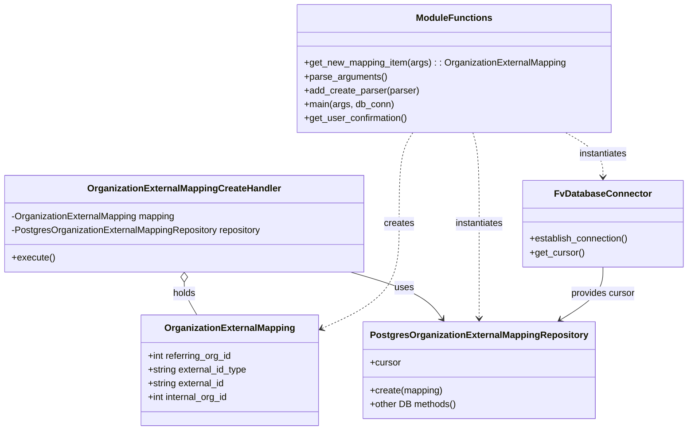
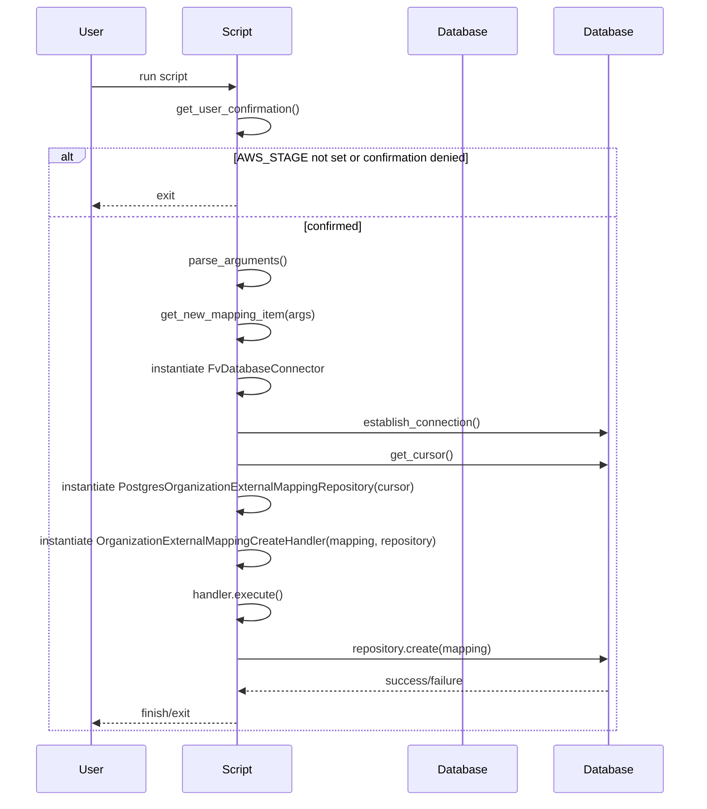

# Diagram: common/iam_service/scripts/manage_organization_external_mapping.py

> Auto-generated by Obscura crawlers

## Diagram 1

### SVG

<svg id="container" width="1188.96875" xmlns="http://www.w3.org/2000/svg" class="classDiagram" height="746" viewBox="0 0 1188.96875 746" role="graphics-document document" aria-roledescription="class"><g><defs><marker id="container_class-aggregationStart" class="marker aggregation class" refX="18" refY="7" markerWidth="190" markerHeight="240" orient="auto"><path d="M 18,7 L9,13 L1,7 L9,1 Z"></path></marker></defs><defs><marker id="container_class-aggregationEnd" class="marker aggregation class" refX="1" refY="7" markerWidth="20" markerHeight="28" orient="auto"><path d="M 18,7 L9,13 L1,7 L9,1 Z"></path></marker></defs><defs><marker id="container_class-extensionStart" class="marker extension class" refX="18" refY="7" markerWidth="190" markerHeight="240" orient="auto"><path d="M 1,7 L18,13 V 1 Z"></path></marker></defs><defs><marker id="container_class-extensionEnd" class="marker extension class" refX="1" refY="7" markerWidth="20" markerHeight="28" orient="auto"><path d="M 1,1 V 13 L18,7 Z"></path></marker></defs><defs><marker id="container_class-compositionStart" class="marker composition class" refX="18" refY="7" markerWidth="190" markerHeight="240" orient="auto"><path d="M 18,7 L9,13 L1,7 L9,1 Z"></path></marker></defs><defs><marker id="container_class-compositionEnd" class="marker composition class" refX="1" refY="7" markerWidth="20" markerHeight="28" orient="auto"><path d="M 18,7 L9,13 L1,7 L9,1 Z"></path></marker></defs><defs><marker id="container_class-dependencyStart" class="marker dependency class" refX="6" refY="7" markerWidth="190" markerHeight="240" orient="auto"><path d="M 5,7 L9,13 L1,7 L9,1 Z"></path></marker></defs><defs><marker id="container_class-dependencyEnd" class="marker dependency class" refX="13" refY="7" markerWidth="20" markerHeight="28" orient="auto"><path d="M 18,7 L9,13 L14,7 L9,1 Z"></path></marker></defs><defs><marker id="container_class-lollipopStart" class="marker lollipop class" refX="13" refY="7" markerWidth="190" markerHeight="240" orient="auto"><circle stroke="black" fill="transparent" cx="7" cy="7" r="6"></circle></marker></defs><defs><marker id="container_class-lollipopEnd" class="marker lollipop class" refX="1" refY="7" markerWidth="190" markerHeight="240" orient="auto"><circle stroke="black" fill="transparent" cx="7" cy="7" r="6"></circle></marker></defs><g class="root"><g class="clusters"></g><g class="edgePaths"><path d="M609.13,472L630.393,478.167C651.656,484.333,694.181,496.667,720.397,510.171C746.613,523.676,756.52,538.351,761.473,545.689L766.426,553.027" id="id_OrganizationExternalMappingCreateHandler_PostgresOrganizationExternalMappingRepository_1" class="edge-thickness-normal edge-pattern-solid relation" style=";;;" data-edge="true" data-et="edge" data-id="id_OrganizationExternalMappingCreateHandler_PostgresOrganizationExternalMappingRepository_1" data-points="W3sieCI6NjA5LjEzMDEzMzAwNjE5ODMsInkiOjQ3Mn0seyJ4Ijo3MzYuNzA3MDMxMjUsInkiOjUwOX0seyJ4Ijo3NjkuNzgyODk0NzM2ODQyMSwieSI6NTU4fV0=" marker-end="url(#container_class-dependencyEnd)"></path><path d="M319.496,489.25L319.496,492.542C319.496,495.833,319.496,502.417,323.124,511.875C326.751,521.333,334.006,533.667,337.633,539.833L341.261,546" id="id_OrganizationExternalMappingCreateHandler_OrganizationExternalMapping_2" class="edge-thickness-normal edge-pattern-solid relation" style=";;;" data-edge="true" data-et="edge" data-id="id_OrganizationExternalMappingCreateHandler_OrganizationExternalMapping_2" data-points="W3sieCI6MzE5LjQ5NjA5Mzc1LCJ5Ijo0NzJ9LHsieCI6MzE5LjQ5NjA5Mzc1LCJ5Ijo1MDl9LHsieCI6MzQxLjI2MDU0MzkzNzk2OTk0LCJ5Ijo1NDZ9XQ==" marker-start="url(#container_class-aggregationStart)"></path><path d="M714.608,230L710.868,236.167C707.127,242.333,699.646,254.667,695.905,281C692.164,307.333,692.164,347.667,692.164,388C692.164,428.333,692.164,468.667,669.654,499.002C647.143,529.337,602.122,549.673,579.611,559.842L557.101,570.01" id="id_ModuleFunctions_OrganizationExternalMapping_3" class="edge-thickness-normal edge-pattern-dashed relation" style=";;;" data-edge="true" data-et="edge" data-id="id_ModuleFunctions_OrganizationExternalMapping_3" data-points="W3sieCI6NzE0LjYwODM5ODQzNzUsInkiOjIzMH0seyJ4Ijo2OTIuMTY0MDYyNSwieSI6MjY3fSx7IngiOjY5Mi4xNjQwNjI1LCJ5IjozODh9LHsieCI6NjkyLjE2NDA2MjUsInkiOjUwOX0seyJ4Ijo1NTEuNjMyODEyNSwieSI6NTcyLjQ4MDAzOTgwMDk5NX1d" marker-end="url(#container_class-dependencyEnd)"></path><path d="M815.349,230L817.205,236.167C819.061,242.333,822.772,254.667,824.628,281C826.484,307.333,826.484,347.667,826.484,388C826.484,428.333,826.484,468.667,826.484,496C826.484,523.333,826.484,537.667,826.484,544.833L826.484,552" id="id_ModuleFunctions_PostgresOrganizationExternalMappingRepository_4" class="edge-thickness-normal edge-pattern-dashed relation" style=";;;" data-edge="true" data-et="edge" data-id="id_ModuleFunctions_PostgresOrganizationExternalMappingRepository_4" data-points="W3sieCI6ODE1LjM0ODYzMjgxMjUsInkiOjIzMH0seyJ4Ijo4MjYuNDg0Mzc1LCJ5IjoyNjd9LHsieCI6ODI2LjQ4NDM3NSwieSI6Mzg4fSx7IngiOjgyNi40ODQzNzUsInkiOjUwOX0seyJ4Ijo4MjYuNDg0Mzc1LCJ5Ijo1NTh9XQ==" marker-end="url(#container_class-dependencyEnd)"></path><path d="M977.498,230L988.362,236.167C999.227,242.333,1020.955,254.667,1031.819,267.5C1042.684,280.333,1042.684,293.667,1042.684,300.333L1042.684,307" id="id_ModuleFunctions_FvDatabaseConnector_5" class="edge-thickness-normal edge-pattern-dashed relation" style=";;;" data-edge="true" data-et="edge" data-id="id_ModuleFunctions_FvDatabaseConnector_5" data-points="W3sieCI6OTc3LjQ5ODA0Njg3NSwieSI6MjMwfSx7IngiOjEwNDIuNjgzNTkzNzUsInkiOjI2N30seyJ4IjoxMDQyLjY4MzU5Mzc1LCJ5IjozMTN9XQ==" marker-end="url(#container_class-dependencyEnd)"></path><path d="M1042.684,463L1042.684,470.667C1042.684,478.333,1042.684,493.667,1030.26,508.976C1017.836,524.285,992.989,539.571,980.565,547.213L968.142,554.856" id="id_FvDatabaseConnector_PostgresOrganizationExternalMappingRepository_6" class="edge-thickness-normal edge-pattern-solid relation" style=";;;" data-edge="true" data-et="edge" data-id="id_FvDatabaseConnector_PostgresOrganizationExternalMappingRepository_6" data-points="W3sieCI6MTA0Mi42ODM1OTM3NSwieSI6NDYzfSx7IngiOjEwNDIuNjgzNTkzNzUsInkiOjUwOX0seyJ4Ijo5NjMuMDMxMjUsInkiOjU1OH1d" marker-end="url(#container_class-dependencyEnd)"></path></g><g class="edgeLabels"><g class="edgeLabel" transform="translate(701.30805, 498.73355)"><g class="label" data-id="id_OrganizationExternalMappingCreateHandler_PostgresOrganizationExternalMappingRepository_1" transform="translate(-16.4921875, -12)"><foreignObject width="32.984375" height="24">

uses

</foreignObject></g></g><g class="edgeLabel" transform="translate(319.49609375, 509)"><g class="label" data-id="id_OrganizationExternalMappingCreateHandler_OrganizationExternalMapping_2" transform="translate(-20.1875, -12)"><foreignObject width="40.375" height="24">

holds

</foreignObject></g></g><g class="edgeLabel" transform="translate(692.1640625, 388)"><g class="label" data-id="id_ModuleFunctions_OrganizationExternalMapping_3" transform="translate(-26.171875, -12)"><foreignObject width="52.34375" height="24">

creates

</foreignObject></g></g><g class="edgeLabel" transform="translate(826.484375, 388)"><g class="label" data-id="id_ModuleFunctions_PostgresOrganizationExternalMappingRepository_4" transform="translate(-42.9140625, -12)"><foreignObject width="85.828125" height="24">

instantiates

</foreignObject></g></g><g class="edgeLabel" transform="translate(1042.68359375, 267)"><g class="label" data-id="id_ModuleFunctions_FvDatabaseConnector_5" transform="translate(-42.9140625, -12)"><foreignObject width="85.828125" height="24">

instantiates

</foreignObject></g></g><g class="edgeLabel" transform="translate(1042.68359375, 509)"><g class="label" data-id="id_FvDatabaseConnector_PostgresOrganizationExternalMappingRepository_6" transform="translate(-56.296875, -12)"><foreignObject width="112.59375" height="24">

provides cursor

</foreignObject></g></g></g><g class="nodes"><g class="node default" id="classId-OrganizationExternalMapping-0" transform="translate(397.73046875, 642)"><g class="basic label-container"><path d="M-153.90234375 -96 L153.90234375 -96 L153.90234375 96 L-153.90234375 96" stroke="none" stroke-width="0" fill="#ECECFF" style=""></path><path d="M-153.90234375 -96 C-41.90953757960699 -96, 70.08326859078602 -96, 153.90234375 -96 M-153.90234375 -96 C-50.14828634011397 -96, 53.60577106977206 -96, 153.90234375 -96 M153.90234375 -96 C153.90234375 -30.55117145949916, 153.90234375 34.89765708100168, 153.90234375 96 M153.90234375 -96 C153.90234375 -32.18134555592091, 153.90234375 31.637308888158174, 153.90234375 96 M153.90234375 96 C60.77394550047666 96, -32.354452749046686 96, -153.90234375 96 M153.90234375 96 C52.42304963152526 96, -49.05624448694948 96, -153.90234375 96 M-153.90234375 96 C-153.90234375 28.18911438874059, -153.90234375 -39.62177122251882, -153.90234375 -96 M-153.90234375 96 C-153.90234375 19.825066707788665, -153.90234375 -56.34986658442267, -153.90234375 -96" stroke="#9370DB" stroke-width="1.3" fill="none" stroke-dasharray="0 0" style=""></path></g><g class="annotation-group text" transform="translate(0, -72)"></g><g class="label-group text" transform="translate(-108.3671875, -72)"><g class="label" style="font-weight: bolder" transform="translate(0,-12)"><foreignObject width="216.734375" height="24">

OrganizationExternalMapping

</foreignObject></g></g><g class="members-group text" transform="translate(-141.90234375, -24)"><g class="label" style="" transform="translate(0,-12)"><foreignObject width="148.921875" height="24">

+int referring_org_id

</foreignObject></g><g class="label" style="" transform="translate(0,12)"><foreignObject width="175.4375" height="24">

+string external_id_type

</foreignObject></g><g class="label" style="" transform="translate(0,36)"><foreignObject width="135.640625" height="24">

+string external_id

</foreignObject></g><g class="label" style="" transform="translate(0,60)"><foreignObject width="142.890625" height="24">

+int internal_org_id

</foreignObject></g></g><g class="methods-group text" transform="translate(-141.90234375, 96)"></g><g class="divider" style=""><path d="M-153.90234375 -48 C-33.33768803696988 -48, 87.22696767606024 -48, 153.90234375 -48 M-153.90234375 -48 C-41.38699377197362 -48, 71.12835620605276 -48, 153.90234375 -48" stroke="#9370DB" stroke-width="1.3" fill="none" stroke-dasharray="0 0" style=""></path></g><g class="divider" style=""><path d="M-153.90234375 72 C-90.56183671002643 72, -27.22132967005284 72, 153.90234375 72 M-153.90234375 72 C-43.40706358801927 72, 67.08821657396146 72, 153.90234375 72" stroke="#9370DB" stroke-width="1.3" fill="none" stroke-dasharray="0 0" style=""></path></g></g><g class="node default" id="classId-PostgresOrganizationExternalMappingRepository-1" transform="translate(826.484375, 642)"><g class="basic label-container"><path d="M-191.8515625 -84 L191.8515625 -84 L191.8515625 84 L-191.8515625 84" stroke="none" stroke-width="0" fill="#ECECFF" style=""></path><path d="M-191.8515625 -84 C-90.6841202440388 -84, 10.48332201192241 -84, 191.8515625 -84 M-191.8515625 -84 C-76.84159005744205 -84, 38.168382385115905 -84, 191.8515625 -84 M191.8515625 -84 C191.8515625 -24.729623033844838, 191.8515625 34.540753932310324, 191.8515625 84 M191.8515625 -84 C191.8515625 -18.39787174088073, 191.8515625 47.20425651823854, 191.8515625 84 M191.8515625 84 C76.90211164401015 84, -38.047339211979704 84, -191.8515625 84 M191.8515625 84 C93.22127094324173 84, -5.409020613516532 84, -191.8515625 84 M-191.8515625 84 C-191.8515625 27.57222212807391, -191.8515625 -28.85555574385218, -191.8515625 -84 M-191.8515625 84 C-191.8515625 49.51939912010534, -191.8515625 15.038798240210681, -191.8515625 -84" stroke="#9370DB" stroke-width="1.3" fill="none" stroke-dasharray="0 0" style=""></path></g><g class="annotation-group text" transform="translate(0, -60)"></g><g class="label-group text" transform="translate(-179.8515625, -60)"><g class="label" style="font-weight: bolder" transform="translate(0,-12)"><foreignObject width="359.703125" height="24">

PostgresOrganizationExternalMappingRepository

</foreignObject></g></g><g class="members-group text" transform="translate(-179.8515625, -12)"><g class="label" style="" transform="translate(0,-12)"><foreignObject width="53.71875" height="24">

+cursor

</foreignObject></g></g><g class="methods-group text" transform="translate(-179.8515625, 36)"><g class="label" style="" transform="translate(0,-12)"><foreignObject width="126.859375" height="24">

+create(mapping)

</foreignObject></g><g class="label" style="" transform="translate(0,12)"><foreignObject width="150.234375" height="24">

+other DB methods()

</foreignObject></g></g><g class="divider" style=""><path d="M-191.8515625 -36 C-88.19011970069089 -36, 15.471323098618228 -36, 191.8515625 -36 M-191.8515625 -36 C-115.10005516195966 -36, -38.34854782391932 -36, 191.8515625 -36" stroke="#9370DB" stroke-width="1.3" fill="none" stroke-dasharray="0 0" style=""></path></g><g class="divider" style=""><path d="M-191.8515625 12 C-45.7905924025593 12, 100.2703776948814 12, 191.8515625 12 M-191.8515625 12 C-47.87242934463674 12, 96.10670381072651 12, 191.8515625 12" stroke="#9370DB" stroke-width="1.3" fill="none" stroke-dasharray="0 0" style=""></path></g></g><g class="node default" id="classId-OrganizationExternalMappingCreateHandler-2" transform="translate(319.49609375, 388)"><g class="basic label-container"><path d="M-311.49609375 -84 L311.49609375 -84 L311.49609375 84 L-311.49609375 84" stroke="none" stroke-width="0" fill="#ECECFF" style=""></path><path d="M-311.49609375 -84 C-136.46441529877697 -84, 38.56726315244606 -84, 311.49609375 -84 M-311.49609375 -84 C-129.49594659917696 -84, 52.50420055164608 -84, 311.49609375 -84 M311.49609375 -84 C311.49609375 -28.885099819807003, 311.49609375 26.229800360385994, 311.49609375 84 M311.49609375 -84 C311.49609375 -22.788811521503803, 311.49609375 38.422376956992395, 311.49609375 84 M311.49609375 84 C94.97623016826063 84, -121.54363341347874 84, -311.49609375 84 M311.49609375 84 C125.23681511110803 84, -61.02246352778394 84, -311.49609375 84 M-311.49609375 84 C-311.49609375 39.386251931275595, -311.49609375 -5.22749613744881, -311.49609375 -84 M-311.49609375 84 C-311.49609375 23.64441520860229, -311.49609375 -36.71116958279542, -311.49609375 -84" stroke="#9370DB" stroke-width="1.3" fill="none" stroke-dasharray="0 0" style=""></path></g><g class="annotation-group text" transform="translate(0, -60)"></g><g class="label-group text" transform="translate(-161.0078125, -60)"><g class="label" style="font-weight: bolder" transform="translate(0,-12)"><foreignObject width="322.015625" height="24">

OrganizationExternalMappingCreateHandler

</foreignObject></g></g><g class="members-group text" transform="translate(-299.49609375, -12)"><g class="label" style="" transform="translate(0,-12)"><foreignObject width="288.140625" height="24">

-OrganizationExternalMapping mapping

</foreignObject></g><g class="label" style="" transform="translate(0,12)"><foreignObject width="437.984375" height="24">

-PostgresOrganizationExternalMappingRepository repository

</foreignObject></g></g><g class="methods-group text" transform="translate(-299.49609375, 60)"><g class="label" style="" transform="translate(0,-12)"><foreignObject width="74.328125" height="24">

+execute()

</foreignObject></g></g><g class="divider" style=""><path d="M-311.49609375 -36 C-73.52620235929484 -36, 164.44368903141032 -36, 311.49609375 -36 M-311.49609375 -36 C-159.00974896321938 -36, -6.52340417643876 -36, 311.49609375 -36" stroke="#9370DB" stroke-width="1.3" fill="none" stroke-dasharray="0 0" style=""></path></g><g class="divider" style=""><path d="M-311.49609375 36 C-135.58482452993547 36, 40.32644469012905 36, 311.49609375 36 M-311.49609375 36 C-133.76287933121444 36, 43.97033508757113 36, 311.49609375 36" stroke="#9370DB" stroke-width="1.3" fill="none" stroke-dasharray="0 0" style=""></path></g></g><g class="node default" id="classId-FvDatabaseConnector-3" transform="translate(1042.68359375, 388)"><g class="basic label-container"><path d="M-138.28515625 -75 L138.28515625 -75 L138.28515625 75 L-138.28515625 75" stroke="none" stroke-width="0" fill="#ECECFF" style=""></path><path d="M-138.28515625 -75 C-76.02395396470622 -75, -13.762751679412446 -75, 138.28515625 -75 M-138.28515625 -75 C-60.20804082322434 -75, 17.869074603551326 -75, 138.28515625 -75 M138.28515625 -75 C138.28515625 -30.96709372308851, 138.28515625 13.06581255382298, 138.28515625 75 M138.28515625 -75 C138.28515625 -38.60000539358837, 138.28515625 -2.200010787176737, 138.28515625 75 M138.28515625 75 C70.35629137310178 75, 2.427426496203566 75, -138.28515625 75 M138.28515625 75 C37.43992729676573 75, -63.40530165646854 75, -138.28515625 75 M-138.28515625 75 C-138.28515625 15.150433995442732, -138.28515625 -44.699132009114535, -138.28515625 -75 M-138.28515625 75 C-138.28515625 23.397712021959407, -138.28515625 -28.204575956081186, -138.28515625 -75" stroke="#9370DB" stroke-width="1.3" fill="none" stroke-dasharray="0 0" style=""></path></g><g class="annotation-group text" transform="translate(0, -51)"></g><g class="label-group text" transform="translate(-79.3046875, -51)"><g class="label" style="font-weight: bolder" transform="translate(0,-12)"><foreignObject width="158.609375" height="24">

FvDatabaseConnector

</foreignObject></g></g><g class="members-group text" transform="translate(-126.28515625, -3)"></g><g class="methods-group text" transform="translate(-126.28515625, 27)"><g class="label" style="" transform="translate(0,-12)"><foreignObject width="173.265625" height="24">

+establish_connection()

</foreignObject></g><g class="label" style="" transform="translate(0,12)"><foreignObject width="94.640625" height="24">

+get_cursor()

</foreignObject></g></g><g class="divider" style=""><path d="M-138.28515625 -27 C-63.73494779615427 -27, 10.815260657691454 -27, 138.28515625 -27 M-138.28515625 -27 C-66.35133611506114 -27, 5.582484019877711 -27, 138.28515625 -27" stroke="#9370DB" stroke-width="1.3" fill="none" stroke-dasharray="0 0" style=""></path></g><g class="divider" style=""><path d="M-138.28515625 -3 C-57.86224849321921 -3, 22.560659263561575 -3, 138.28515625 -3 M-138.28515625 -3 C-31.837592855297842 -3, 74.60997053940432 -3, 138.28515625 -3" stroke="#9370DB" stroke-width="1.3" fill="none" stroke-dasharray="0 0" style=""></path></g></g><g class="node default" id="classId-ModuleFunctions-4" transform="translate(781.94140625, 119)"><g class="basic label-container"><path d="M-271.0234375 -111 L271.0234375 -111 L271.0234375 111 L-271.0234375 111" stroke="none" stroke-width="0" fill="#ECECFF" style=""></path><path d="M-271.0234375 -111 C-143.26316622849419 -111, -15.50289495698837 -111, 271.0234375 -111 M-271.0234375 -111 C-69.0012219746925 -111, 133.020993550615 -111, 271.0234375 -111 M271.0234375 -111 C271.0234375 -30.439604418565423, 271.0234375 50.12079116286915, 271.0234375 111 M271.0234375 -111 C271.0234375 -22.608699126483344, 271.0234375 65.78260174703331, 271.0234375 111 M271.0234375 111 C162.29242838254538 111, 53.561419265090734 111, -271.0234375 111 M271.0234375 111 C128.7719480717055 111, -13.479541356588982 111, -271.0234375 111 M-271.0234375 111 C-271.0234375 22.265295675119646, -271.0234375 -66.46940864976071, -271.0234375 -111 M-271.0234375 111 C-271.0234375 59.082367679250865, -271.0234375 7.16473535850173, -271.0234375 -111" stroke="#9370DB" stroke-width="1.3" fill="none" stroke-dasharray="0 0" style=""></path></g><g class="annotation-group text" transform="translate(0, -87)"></g><g class="label-group text" transform="translate(-62.21875, -87)"><g class="label" style="font-weight: bolder" transform="translate(0,-12)"><foreignObject width="124.4375" height="24">

ModuleFunctions

</foreignObject></g></g><g class="members-group text" transform="translate(-259.0234375, -39)"></g><g class="methods-group text" transform="translate(-259.0234375, -9)"><g class="label" style="" transform="translate(0,-12)"><foreignObject width="455.828125" height="24">

+get_new_mapping_item(args) : : OrganizationExternalMapping

</foreignObject></g><g class="label" style="" transform="translate(0,12)"><foreignObject width="143.390625" height="24">

+parse_arguments()

</foreignObject></g><g class="label" style="" transform="translate(0,36)"><foreignObject width="199.53125" height="24">

+add_create_parser(parser)

</foreignObject></g><g class="label" style="" transform="translate(0,60)"><foreignObject width="155.234375" height="24">

+main(args, db_conn)

</foreignObject></g><g class="label" style="" transform="translate(0,84)"><foreignObject width="180.171875" height="24">

+get_user_confirmation()

</foreignObject></g></g><g class="divider" style=""><path d="M-271.0234375 -63 C-160.98321554671614 -63, -50.94299359343228 -63, 271.0234375 -63 M-271.0234375 -63 C-109.90657625313185 -63, 51.21028499373631 -63, 271.0234375 -63" stroke="#9370DB" stroke-width="1.3" fill="none" stroke-dasharray="0 0" style=""></path></g><g class="divider" style=""><path d="M-271.0234375 -39 C-58.029002277168445 -39, 154.9654329456631 -39, 271.0234375 -39 M-271.0234375 -39 C-114.92791192033607 -39, 41.167613659327856 -39, 271.0234375 -39" stroke="#9370DB" stroke-width="1.3" fill="none" stroke-dasharray="0 0" style=""></path></g></g></g></g></g></svg>

## Diagram 2

### SVG

<svg id="container" width="1001" xmlns="http://www.w3.org/2000/svg" height="1153" viewBox="-62.5 -10 1001 1153" role="graphics-document document" aria-roledescription="sequence"><g><rect x="738.5" y="1067" fill="#eaeaea" stroke="#666" width="150" height="65" name="Database" rx="3" ry="3" class="actor actor-bottom"></rect><text x="813.5" y="1099.5" dominant-baseline="central" alignment-baseline="central" class="actor actor-box" style="text-anchor: middle; font-size: 16px; font-weight: 400;"><tspan x="813.5" dy="0">Database</tspan></text></g><g><rect x="538.5" y="1067" fill="#eaeaea" stroke="#666" width="150" height="65" name="DB" rx="3" ry="3" class="actor actor-bottom"></rect><text x="613.5" y="1099.5" dominant-baseline="central" alignment-baseline="central" class="actor actor-box" style="text-anchor: middle; font-size: 16px; font-weight: 400;"><tspan x="613.5" dy="0">Database</tspan></text></g><g><rect x="200" y="1067" fill="#eaeaea" stroke="#666" width="150" height="65" name="Script" rx="3" ry="3" class="actor actor-bottom"></rect><text x="275" y="1099.5" dominant-baseline="central" alignment-baseline="central" class="actor actor-box" style="text-anchor: middle; font-size: 16px; font-weight: 400;"><tspan x="275" dy="0">Script</tspan></text></g><g><rect x="0" y="1067" fill="#eaeaea" stroke="#666" width="150" height="65" name="User" rx="3" ry="3" class="actor actor-bottom"></rect><text x="75" y="1099.5" dominant-baseline="central" alignment-baseline="central" class="actor actor-box" style="text-anchor: middle; font-size: 16px; font-weight: 400;"><tspan x="75" dy="0">User</tspan></text></g><g><line id="actor3" x1="813.5" y1="65" x2="813.5" y2="1067" class="actor-line 200" stroke-width="0.5px" stroke="#999" name="Database"></line><g id="root-3"><rect x="738.5" y="0" fill="#eaeaea" stroke="#666" width="150" height="65" name="Database" rx="3" ry="3" class="actor actor-top"></rect><text x="813.5" y="32.5" dominant-baseline="central" alignment-baseline="central" class="actor actor-box" style="text-anchor: middle; font-size: 16px; font-weight: 400;"><tspan x="813.5" dy="0">Database</tspan></text></g></g><g><line id="actor2" x1="613.5" y1="65" x2="613.5" y2="1067" class="actor-line 200" stroke-width="0.5px" stroke="#999" name="DB"></line><g id="root-2"><rect x="538.5" y="0" fill="#eaeaea" stroke="#666" width="150" height="65" name="DB" rx="3" ry="3" class="actor actor-top"></rect><text x="613.5" y="32.5" dominant-baseline="central" alignment-baseline="central" class="actor actor-box" style="text-anchor: middle; font-size: 16px; font-weight: 400;"><tspan x="613.5" dy="0">Database</tspan></text></g></g><g><line id="actor1" x1="275" y1="65" x2="275" y2="1067" class="actor-line 200" stroke-width="0.5px" stroke="#999" name="Script"></line><g id="root-1"><rect x="200" y="0" fill="#eaeaea" stroke="#666" width="150" height="65" name="Script" rx="3" ry="3" class="actor actor-top"></rect><text x="275" y="32.5" dominant-baseline="central" alignment-baseline="central" class="actor actor-box" style="text-anchor: middle; font-size: 16px; font-weight: 400;"><tspan x="275" dy="0">Script</tspan></text></g></g><g><line id="actor0" x1="75" y1="65" x2="75" y2="1067" class="actor-line 200" stroke-width="0.5px" stroke="#999" name="User"></line><g id="root-0"><rect x="0" y="0" fill="#eaeaea" stroke="#666" width="150" height="65" name="User" rx="3" ry="3" class="actor actor-top"></rect><text x="75" y="32.5" dominant-baseline="central" alignment-baseline="central" class="actor actor-box" style="text-anchor: middle; font-size: 16px; font-weight: 400;"><tspan x="75" dy="0">User</tspan></text></g></g><g></g><defs><symbol id="computer" width="24" height="24"><path transform="scale(.5)" d="M2 2v13h20v-13h-20zm18 11h-16v-9h16v9zm-10.228 6l.466-1h3.524l.467 1h-4.457zm14.228 3h-24l2-6h2.104l-1.33 4h18.45l-1.297-4h2.073l2 6zm-5-10h-14v-7h14v7z"></path></symbol></defs><defs><symbol id="database" fill-rule="evenodd" clip-rule="evenodd"><path transform="scale(.5)" d="M12.258.001l.256.004.255.005.253.008.251.01.249.012.247.015.246.016.242.019.241.02.239.023.236.024.233.027.231.028.229.031.225.032.223.034.22.036.217.038.214.04.211.041.208.043.205.045.201.046.198.048.194.05.191.051.187.053.183.054.18.056.175.057.172.059.168.06.163.061.16.063.155.064.15.066.074.033.073.033.071.034.07.034.069.035.068.035.067.035.066.035.064.036.064.036.062.036.06.036.06.037.058.037.058.037.055.038.055.038.053.038.052.038.051.039.05.039.048.039.047.039.045.04.044.04.043.04.041.04.04.041.039.041.037.041.036.041.034.041.033.042.032.042.03.042.029.042.027.042.026.043.024.043.023.043.021.043.02.043.018.044.017.043.015.044.013.044.012.044.011.045.009.044.007.045.006.045.004.045.002.045.001.045v17l-.001.045-.002.045-.004.045-.006.045-.007.045-.009.044-.011.045-.012.044-.013.044-.015.044-.017.043-.018.044-.02.043-.021.043-.023.043-.024.043-.026.043-.027.042-.029.042-.03.042-.032.042-.033.042-.034.041-.036.041-.037.041-.039.041-.04.041-.041.04-.043.04-.044.04-.045.04-.047.039-.048.039-.05.039-.051.039-.052.038-.053.038-.055.038-.055.038-.058.037-.058.037-.06.037-.06.036-.062.036-.064.036-.064.036-.066.035-.067.035-.068.035-.069.035-.07.034-.071.034-.073.033-.074.033-.15.066-.155.064-.16.063-.163.061-.168.06-.172.059-.175.057-.18.056-.183.054-.187.053-.191.051-.194.05-.198.048-.201.046-.205.045-.208.043-.211.041-.214.04-.217.038-.22.036-.223.034-.225.032-.229.031-.231.028-.233.027-.236.024-.239.023-.241.02-.242.019-.246.016-.247.015-.249.012-.251.01-.253.008-.255.005-.256.004-.258.001-.258-.001-.256-.004-.255-.005-.253-.008-.251-.01-.249-.012-.247-.015-.245-.016-.243-.019-.241-.02-.238-.023-.236-.024-.234-.027-.231-.028-.228-.031-.226-.032-.223-.034-.22-.036-.217-.038-.214-.04-.211-.041-.208-.043-.204-.045-.201-.046-.198-.048-.195-.05-.19-.051-.187-.053-.184-.054-.179-.056-.176-.057-.172-.059-.167-.06-.164-.061-.159-.063-.155-.064-.151-.066-.074-.033-.072-.033-.072-.034-.07-.034-.069-.035-.068-.035-.067-.035-.066-.035-.064-.036-.063-.036-.062-.036-.061-.036-.06-.037-.058-.037-.057-.037-.056-.038-.055-.038-.053-.038-.052-.038-.051-.039-.049-.039-.049-.039-.046-.039-.046-.04-.044-.04-.043-.04-.041-.04-.04-.041-.039-.041-.037-.041-.036-.041-.034-.041-.033-.042-.032-.042-.03-.042-.029-.042-.027-.042-.026-.043-.024-.043-.023-.043-.021-.043-.02-.043-.018-.044-.017-.043-.015-.044-.013-.044-.012-.044-.011-.045-.009-.044-.007-.045-.006-.045-.004-.045-.002-.045-.001-.045v-17l.001-.045.002-.045.004-.045.006-.045.007-.045.009-.044.011-.045.012-.044.013-.044.015-.044.017-.043.018-.044.02-.043.021-.043.023-.043.024-.043.026-.043.027-.042.029-.042.03-.042.032-.042.033-.042.034-.041.036-.041.037-.041.039-.041.04-.041.041-.04.043-.04.044-.04.046-.04.046-.039.049-.039.049-.039.051-.039.052-.038.053-.038.055-.038.056-.038.057-.037.058-.037.06-.037.061-.036.062-.036.063-.036.064-.036.066-.035.067-.035.068-.035.069-.035.07-.034.072-.034.072-.033.074-.033.151-.066.155-.064.159-.063.164-.061.167-.06.172-.059.176-.057.179-.056.184-.054.187-.053.19-.051.195-.05.198-.048.201-.046.204-.045.208-.043.211-.041.214-.04.217-.038.22-.036.223-.034.226-.032.228-.031.231-.028.234-.027.236-.024.238-.023.241-.02.243-.019.245-.016.247-.015.249-.012.251-.01.253-.008.255-.005.256-.004.258-.001.258.001zm-9.258 20.499v.01l.001.021.003.021.004.022.005.021.006.022.007.022.009.023.01.022.011.023.012.023.013.023.015.023.016.024.017.023.018.024.019.024.021.024.022.025.023.024.024.025.052.049.056.05.061.051.066.051.07.051.075.051.079.052.084.052.088.052.092.052.097.052.102.051.105.052.11.052.114.051.119.051.123.051.127.05.131.05.135.05.139.048.144.049.147.047.152.047.155.047.16.045.163.045.167.043.171.043.176.041.178.041.183.039.187.039.19.037.194.035.197.035.202.033.204.031.209.03.212.029.216.027.219.025.222.024.226.021.23.02.233.018.236.016.24.015.243.012.246.01.249.008.253.005.256.004.259.001.26-.001.257-.004.254-.005.25-.008.247-.011.244-.012.241-.014.237-.016.233-.018.231-.021.226-.021.224-.024.22-.026.216-.027.212-.028.21-.031.205-.031.202-.034.198-.034.194-.036.191-.037.187-.039.183-.04.179-.04.175-.042.172-.043.168-.044.163-.045.16-.046.155-.046.152-.047.148-.048.143-.049.139-.049.136-.05.131-.05.126-.05.123-.051.118-.052.114-.051.11-.052.106-.052.101-.052.096-.052.092-.052.088-.053.083-.051.079-.052.074-.052.07-.051.065-.051.06-.051.056-.05.051-.05.023-.024.023-.025.021-.024.02-.024.019-.024.018-.024.017-.024.015-.023.014-.024.013-.023.012-.023.01-.023.01-.022.008-.022.006-.022.006-.022.004-.022.004-.021.001-.021.001-.021v-4.127l-.077.055-.08.053-.083.054-.085.053-.087.052-.09.052-.093.051-.095.05-.097.05-.1.049-.102.049-.105.048-.106.047-.109.047-.111.046-.114.045-.115.045-.118.044-.12.043-.122.042-.124.042-.126.041-.128.04-.13.04-.132.038-.134.038-.135.037-.138.037-.139.035-.142.035-.143.034-.144.033-.147.032-.148.031-.15.03-.151.03-.153.029-.154.027-.156.027-.158.026-.159.025-.161.024-.162.023-.163.022-.165.021-.166.02-.167.019-.169.018-.169.017-.171.016-.173.015-.173.014-.175.013-.175.012-.177.011-.178.01-.179.008-.179.008-.181.006-.182.005-.182.004-.184.003-.184.002h-.37l-.184-.002-.184-.003-.182-.004-.182-.005-.181-.006-.179-.008-.179-.008-.178-.01-.176-.011-.176-.012-.175-.013-.173-.014-.172-.015-.171-.016-.17-.017-.169-.018-.167-.019-.166-.02-.165-.021-.163-.022-.162-.023-.161-.024-.159-.025-.157-.026-.156-.027-.155-.027-.153-.029-.151-.03-.15-.03-.148-.031-.146-.032-.145-.033-.143-.034-.141-.035-.14-.035-.137-.037-.136-.037-.134-.038-.132-.038-.13-.04-.128-.04-.126-.041-.124-.042-.122-.042-.12-.044-.117-.043-.116-.045-.113-.045-.112-.046-.109-.047-.106-.047-.105-.048-.102-.049-.1-.049-.097-.05-.095-.05-.093-.052-.09-.051-.087-.052-.085-.053-.083-.054-.08-.054-.077-.054v4.127zm0-5.654v.011l.001.021.003.021.004.021.005.022.006.022.007.022.009.022.01.022.011.023.012.023.013.023.015.024.016.023.017.024.018.024.019.024.021.024.022.024.023.025.024.024.052.05.056.05.061.05.066.051.07.051.075.052.079.051.084.052.088.052.092.052.097.052.102.052.105.052.11.051.114.051.119.052.123.05.127.051.131.05.135.049.139.049.144.048.147.048.152.047.155.046.16.045.163.045.167.044.171.042.176.042.178.04.183.04.187.038.19.037.194.036.197.034.202.033.204.032.209.03.212.028.216.027.219.025.222.024.226.022.23.02.233.018.236.016.24.014.243.012.246.01.249.008.253.006.256.003.259.001.26-.001.257-.003.254-.006.25-.008.247-.01.244-.012.241-.015.237-.016.233-.018.231-.02.226-.022.224-.024.22-.025.216-.027.212-.029.21-.03.205-.032.202-.033.198-.035.194-.036.191-.037.187-.039.183-.039.179-.041.175-.042.172-.043.168-.044.163-.045.16-.045.155-.047.152-.047.148-.048.143-.048.139-.05.136-.049.131-.05.126-.051.123-.051.118-.051.114-.052.11-.052.106-.052.101-.052.096-.052.092-.052.088-.052.083-.052.079-.052.074-.051.07-.052.065-.051.06-.05.056-.051.051-.049.023-.025.023-.024.021-.025.02-.024.019-.024.018-.024.017-.024.015-.023.014-.023.013-.024.012-.022.01-.023.01-.023.008-.022.006-.022.006-.022.004-.021.004-.022.001-.021.001-.021v-4.139l-.077.054-.08.054-.083.054-.085.052-.087.053-.09.051-.093.051-.095.051-.097.05-.1.049-.102.049-.105.048-.106.047-.109.047-.111.046-.114.045-.115.044-.118.044-.12.044-.122.042-.124.042-.126.041-.128.04-.13.039-.132.039-.134.038-.135.037-.138.036-.139.036-.142.035-.143.033-.144.033-.147.033-.148.031-.15.03-.151.03-.153.028-.154.028-.156.027-.158.026-.159.025-.161.024-.162.023-.163.022-.165.021-.166.02-.167.019-.169.018-.169.017-.171.016-.173.015-.173.014-.175.013-.175.012-.177.011-.178.009-.179.009-.179.007-.181.007-.182.005-.182.004-.184.003-.184.002h-.37l-.184-.002-.184-.003-.182-.004-.182-.005-.181-.007-.179-.007-.179-.009-.178-.009-.176-.011-.176-.012-.175-.013-.173-.014-.172-.015-.171-.016-.17-.017-.169-.018-.167-.019-.166-.02-.165-.021-.163-.022-.162-.023-.161-.024-.159-.025-.157-.026-.156-.027-.155-.028-.153-.028-.151-.03-.15-.03-.148-.031-.146-.033-.145-.033-.143-.033-.141-.035-.14-.036-.137-.036-.136-.037-.134-.038-.132-.039-.13-.039-.128-.04-.126-.041-.124-.042-.122-.043-.12-.043-.117-.044-.116-.044-.113-.046-.112-.046-.109-.046-.106-.047-.105-.048-.102-.049-.1-.049-.097-.05-.095-.051-.093-.051-.09-.051-.087-.053-.085-.052-.083-.054-.08-.054-.077-.054v4.139zm0-5.666v.011l.001.02.003.022.004.021.005.022.006.021.007.022.009.023.01.022.011.023.012.023.013.023.015.023.016.024.017.024.018.023.019.024.021.025.022.024.023.024.024.025.052.05.056.05.061.05.066.051.07.051.075.052.079.051.084.052.088.052.092.052.097.052.102.052.105.051.11.052.114.051.119.051.123.051.127.05.131.05.135.05.139.049.144.048.147.048.152.047.155.046.16.045.163.045.167.043.171.043.176.042.178.04.183.04.187.038.19.037.194.036.197.034.202.033.204.032.209.03.212.028.216.027.219.025.222.024.226.021.23.02.233.018.236.017.24.014.243.012.246.01.249.008.253.006.256.003.259.001.26-.001.257-.003.254-.006.25-.008.247-.01.244-.013.241-.014.237-.016.233-.018.231-.02.226-.022.224-.024.22-.025.216-.027.212-.029.21-.03.205-.032.202-.033.198-.035.194-.036.191-.037.187-.039.183-.039.179-.041.175-.042.172-.043.168-.044.163-.045.16-.045.155-.047.152-.047.148-.048.143-.049.139-.049.136-.049.131-.051.126-.05.123-.051.118-.052.114-.051.11-.052.106-.052.101-.052.096-.052.092-.052.088-.052.083-.052.079-.052.074-.052.07-.051.065-.051.06-.051.056-.05.051-.049.023-.025.023-.025.021-.024.02-.024.019-.024.018-.024.017-.024.015-.023.014-.024.013-.023.012-.023.01-.022.01-.023.008-.022.006-.022.006-.022.004-.022.004-.021.001-.021.001-.021v-4.153l-.077.054-.08.054-.083.053-.085.053-.087.053-.09.051-.093.051-.095.051-.097.05-.1.049-.102.048-.105.048-.106.048-.109.046-.111.046-.114.046-.115.044-.118.044-.12.043-.122.043-.124.042-.126.041-.128.04-.13.039-.132.039-.134.038-.135.037-.138.036-.139.036-.142.034-.143.034-.144.033-.147.032-.148.032-.15.03-.151.03-.153.028-.154.028-.156.027-.158.026-.159.024-.161.024-.162.023-.163.023-.165.021-.166.02-.167.019-.169.018-.169.017-.171.016-.173.015-.173.014-.175.013-.175.012-.177.01-.178.01-.179.009-.179.007-.181.006-.182.006-.182.004-.184.003-.184.001-.185.001-.185-.001-.184-.001-.184-.003-.182-.004-.182-.006-.181-.006-.179-.007-.179-.009-.178-.01-.176-.01-.176-.012-.175-.013-.173-.014-.172-.015-.171-.016-.17-.017-.169-.018-.167-.019-.166-.02-.165-.021-.163-.023-.162-.023-.161-.024-.159-.024-.157-.026-.156-.027-.155-.028-.153-.028-.151-.03-.15-.03-.148-.032-.146-.032-.145-.033-.143-.034-.141-.034-.14-.036-.137-.036-.136-.037-.134-.038-.132-.039-.13-.039-.128-.041-.126-.041-.124-.041-.122-.043-.12-.043-.117-.044-.116-.044-.113-.046-.112-.046-.109-.046-.106-.048-.105-.048-.102-.048-.1-.05-.097-.049-.095-.051-.093-.051-.09-.052-.087-.052-.085-.053-.083-.053-.08-.054-.077-.054v4.153zm8.74-8.179l-.257.004-.254.005-.25.008-.247.011-.244.012-.241.014-.237.016-.233.018-.231.021-.226.022-.224.023-.22.026-.216.027-.212.028-.21.031-.205.032-.202.033-.198.034-.194.036-.191.038-.187.038-.183.04-.179.041-.175.042-.172.043-.168.043-.163.045-.16.046-.155.046-.152.048-.148.048-.143.048-.139.049-.136.05-.131.05-.126.051-.123.051-.118.051-.114.052-.11.052-.106.052-.101.052-.096.052-.092.052-.088.052-.083.052-.079.052-.074.051-.07.052-.065.051-.06.05-.056.05-.051.05-.023.025-.023.024-.021.024-.02.025-.019.024-.018.024-.017.023-.015.024-.014.023-.013.023-.012.023-.01.023-.01.022-.008.022-.006.023-.006.021-.004.022-.004.021-.001.021-.001.021.001.021.001.021.004.021.004.022.006.021.006.023.008.022.01.022.01.023.012.023.013.023.014.023.015.024.017.023.018.024.019.024.02.025.021.024.023.024.023.025.051.05.056.05.06.05.065.051.07.052.074.051.079.052.083.052.088.052.092.052.096.052.101.052.106.052.11.052.114.052.118.051.123.051.126.051.131.05.136.05.139.049.143.048.148.048.152.048.155.046.16.046.163.045.168.043.172.043.175.042.179.041.183.04.187.038.191.038.194.036.198.034.202.033.205.032.21.031.212.028.216.027.22.026.224.023.226.022.231.021.233.018.237.016.241.014.244.012.247.011.25.008.254.005.257.004.26.001.26-.001.257-.004.254-.005.25-.008.247-.011.244-.012.241-.014.237-.016.233-.018.231-.021.226-.022.224-.023.22-.026.216-.027.212-.028.21-.031.205-.032.202-.033.198-.034.194-.036.191-.038.187-.038.183-.04.179-.041.175-.042.172-.043.168-.043.163-.045.16-.046.155-.046.152-.048.148-.048.143-.048.139-.049.136-.05.131-.05.126-.051.123-.051.118-.051.114-.052.11-.052.106-.052.101-.052.096-.052.092-.052.088-.052.083-.052.079-.052.074-.051.07-.052.065-.051.06-.05.056-.05.051-.05.023-.025.023-.024.021-.024.02-.025.019-.024.018-.024.017-.023.015-.024.014-.023.013-.023.012-.023.01-.023.01-.022.008-.022.006-.023.006-.021.004-.022.004-.021.001-.021.001-.021-.001-.021-.001-.021-.004-.021-.004-.022-.006-.021-.006-.023-.008-.022-.01-.022-.01-.023-.012-.023-.013-.023-.014-.023-.015-.024-.017-.023-.018-.024-.019-.024-.02-.025-.021-.024-.023-.024-.023-.025-.051-.05-.056-.05-.06-.05-.065-.051-.07-.052-.074-.051-.079-.052-.083-.052-.088-.052-.092-.052-.096-.052-.101-.052-.106-.052-.11-.052-.114-.052-.118-.051-.123-.051-.126-.051-.131-.05-.136-.05-.139-.049-.143-.048-.148-.048-.152-.048-.155-.046-.16-.046-.163-.045-.168-.043-.172-.043-.175-.042-.179-.041-.183-.04-.187-.038-.191-.038-.194-.036-.198-.034-.202-.033-.205-.032-.21-.031-.212-.028-.216-.027-.22-.026-.224-.023-.226-.022-.231-.021-.233-.018-.237-.016-.241-.014-.244-.012-.247-.011-.25-.008-.254-.005-.257-.004-.26-.001-.26.001z"></path></symbol></defs><defs><symbol id="clock" width="24" height="24"><path transform="scale(.5)" d="M12 2c5.514 0 10 4.486 10 10s-4.486 10-10 10-10-4.486-10-10 4.486-10 10-10zm0-2c-6.627 0-12 5.373-12 12s5.373 12 12 12 12-5.373 12-12-5.373-12-12-12zm5.848 12.459c.202.038.202.333.001.372-1.907.361-6.045 1.111-6.547 1.111-.719 0-1.301-.582-1.301-1.301 0-.512.77-5.447 1.125-7.445.034-.192.312-.181.343.014l.985 6.238 5.394 1.011z"></path></symbol></defs><defs><marker id="arrowhead" refX="7.9" refY="5" markerUnits="userSpaceOnUse" markerWidth="12" markerHeight="12" orient="auto-start-reverse"><path d="M -1 0 L 10 5 L 0 10 z"></path></marker></defs><defs><marker id="crosshead" markerWidth="15" markerHeight="8" orient="auto" refX="4" refY="4.5"><path fill="none" stroke="#000000" stroke-width="1pt" d="M 1,2 L 6,7 M 6,2 L 1,7" style="stroke-dasharray: 0, 0;"></path></marker></defs><defs><marker id="filled-head" refX="15.5" refY="7" markerWidth="20" markerHeight="28" orient="auto"><path d="M 18,7 L9,13 L14,7 L9,1 Z"></path></marker></defs><defs><marker id="sequencenumber" refX="15" refY="15" markerWidth="60" markerHeight="40" orient="auto"><circle cx="15" cy="15" r="6"></circle></marker></defs><g><line x1="-12.5" y1="201" x2="824.5" y2="201" class="loopLine"></line><line x1="824.5" y1="201" x2="824.5" y2="1047" class="loopLine"></line><line x1="-12.5" y1="1047" x2="824.5" y2="1047" class="loopLine"></line><line x1="-12.5" y1="201" x2="-12.5" y2="1047" class="loopLine"></line><line x1="-12.5" y1="299" x2="824.5" y2="299" class="loopLine" style="stroke-dasharray: 3, 3;"></line><polygon points="-12.5,201 37.5,201 37.5,214 29.1,221 -12.5,221" class="labelBox"></polygon><text x="13" y="214" text-anchor="middle" dominant-baseline="middle" alignment-baseline="middle" class="labelText" style="font-size: 16px; font-weight: 400;">alt</text><text x="431" y="219" text-anchor="middle" class="loopText" style="font-size: 16px; font-weight: 400;"><tspan x="431">[AWS_STAGE not set or confirmation denied]</tspan></text><text x="406" y="317" text-anchor="middle" class="loopText" style="font-size: 16px; font-weight: 400;">[confirmed]</text></g><text x="174" y="80" text-anchor="middle" dominant-baseline="middle" alignment-baseline="middle" class="messageText" dy="1em" style="font-size: 16px; font-weight: 400;">run script</text><line x1="76" y1="113" x2="271" y2="113" class="messageLine0" stroke-width="2" stroke="none" marker-end="url(#arrowhead)" style="fill: none;"></line><text x="276" y="128" text-anchor="middle" dominant-baseline="middle" alignment-baseline="middle" class="messageText" dy="1em" style="font-size: 16px; font-weight: 400;">get_user_confirmation()</text><path d="M 276,161 C 336,151 336,191 276,181" class="messageLine0" stroke-width="2" stroke="none" marker-end="url(#arrowhead)" style="fill: none;"></path><text x="177" y="251" text-anchor="middle" dominant-baseline="middle" alignment-baseline="middle" class="messageText" dy="1em" style="font-size: 16px; font-weight: 400;">exit</text><line x1="274" y1="284" x2="79" y2="284" class="messageLine1" stroke-width="2" stroke="none" marker-end="url(#arrowhead)" style="stroke-dasharray: 3, 3; fill: none;"></line><text x="276" y="344" text-anchor="middle" dominant-baseline="middle" alignment-baseline="middle" class="messageText" dy="1em" style="font-size: 16px; font-weight: 400;">parse_arguments()</text><path d="M 276,377 C 336,367 336,407 276,397" class="messageLine0" stroke-width="2" stroke="none" marker-end="url(#arrowhead)" style="fill: none;"></path><text x="276" y="422" text-anchor="middle" dominant-baseline="middle" alignment-baseline="middle" class="messageText" dy="1em" style="font-size: 16px; font-weight: 400;">get_new_mapping_item(args)</text><path d="M 276,455 C 336,445 336,485 276,475" class="messageLine0" stroke-width="2" stroke="none" marker-end="url(#arrowhead)" style="fill: none;"></path><text x="276" y="500" text-anchor="middle" dominant-baseline="middle" alignment-baseline="middle" class="messageText" dy="1em" style="font-size: 16px; font-weight: 400;">instantiate FvDatabaseConnector</text><path d="M 276,533 C 336,523 336,563 276,553" class="messageLine0" stroke-width="2" stroke="none" marker-end="url(#arrowhead)" style="fill: none;"></path><text x="543" y="578" text-anchor="middle" dominant-baseline="middle" alignment-baseline="middle" class="messageText" dy="1em" style="font-size: 16px; font-weight: 400;">establish_connection()</text><line x1="276" y1="611" x2="809.5" y2="611" class="messageLine0" stroke-width="2" stroke="none" marker-end="url(#arrowhead)" style="fill: none;"></line><text x="543" y="626" text-anchor="middle" dominant-baseline="middle" alignment-baseline="middle" class="messageText" dy="1em" style="font-size: 16px; font-weight: 400;">get_cursor()</text><line x1="276" y1="659" x2="809.5" y2="659" class="messageLine0" stroke-width="2" stroke="none" marker-end="url(#arrowhead)" style="fill: none;"></line><text x="276" y="674" text-anchor="middle" dominant-baseline="middle" alignment-baseline="middle" class="messageText" dy="1em" style="font-size: 16px; font-weight: 400;">instantiate PostgresOrganizationExternalMappingRepository(cursor)</text><path d="M 276,707 C 336,697 336,737 276,727" class="messageLine0" stroke-width="2" stroke="none" marker-end="url(#arrowhead)" style="fill: none;"></path><text x="276" y="752" text-anchor="middle" dominant-baseline="middle" alignment-baseline="middle" class="messageText" dy="1em" style="font-size: 16px; font-weight: 400;">instantiate OrganizationExternalMappingCreateHandler(mapping, repository)</text><path d="M 276,785 C 336,775 336,815 276,805" class="messageLine0" stroke-width="2" stroke="none" marker-end="url(#arrowhead)" style="fill: none;"></path><text x="276" y="830" text-anchor="middle" dominant-baseline="middle" alignment-baseline="middle" class="messageText" dy="1em" style="font-size: 16px; font-weight: 400;">handler.execute()</text><path d="M 276,863 C 336,853 336,893 276,883" class="messageLine0" stroke-width="2" stroke="none" marker-end="url(#arrowhead)" style="fill: none;"></path><text x="543" y="908" text-anchor="middle" dominant-baseline="middle" alignment-baseline="middle" class="messageText" dy="1em" style="font-size: 16px; font-weight: 400;">repository.create(mapping)</text><line x1="276" y1="941" x2="809.5" y2="941" class="messageLine0" stroke-width="2" stroke="none" marker-end="url(#arrowhead)" style="fill: none;"></line><text x="546" y="956" text-anchor="middle" dominant-baseline="middle" alignment-baseline="middle" class="messageText" dy="1em" style="font-size: 16px; font-weight: 400;">success/failure</text><line x1="812.5" y1="989" x2="279" y2="989" class="messageLine1" stroke-width="2" stroke="none" marker-end="url(#arrowhead)" style="stroke-dasharray: 3, 3; fill: none;"></line><text x="177" y="1004" text-anchor="middle" dominant-baseline="middle" alignment-baseline="middle" class="messageText" dy="1em" style="font-size: 16px; font-weight: 400;">finish/exit</text><line x1="274" y1="1037" x2="79" y2="1037" class="messageLine1" stroke-width="2" stroke="none" marker-end="url(#arrowhead)" style="stroke-dasharray: 3, 3; fill: none;"></line></svg>
