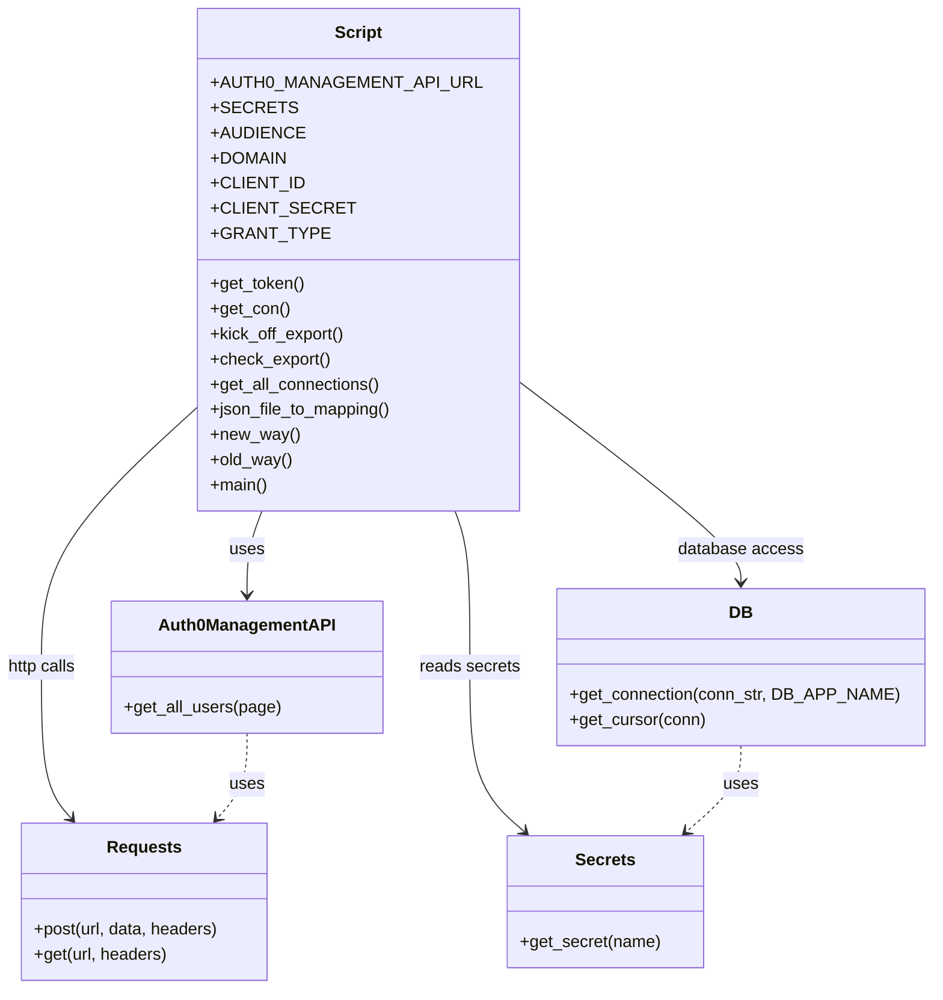

# Diagram: common/iam_service/scripts/populate_emails_user_table.py

> Auto-generated by Obscura crawlers

## Mermaid

### SVG

<svg id="container" width="874.8515625" xmlns="http://www.w3.org/2000/svg" class="classDiagram" height="944" viewBox="0 0 874.8515625 944" role="graphics-document document" aria-roledescription="class"><g><defs><marker id="container_class-aggregationStart" class="marker aggregation class" refX="18" refY="7" markerWidth="190" markerHeight="240" orient="auto"><path d="M 18,7 L9,13 L1,7 L9,1 Z"></path></marker></defs><defs><marker id="container_class-aggregationEnd" class="marker aggregation class" refX="1" refY="7" markerWidth="20" markerHeight="28" orient="auto"><path d="M 18,7 L9,13 L1,7 L9,1 Z"></path></marker></defs><defs><marker id="container_class-extensionStart" class="marker extension class" refX="18" refY="7" markerWidth="190" markerHeight="240" orient="auto"><path d="M 1,7 L18,13 V 1 Z"></path></marker></defs><defs><marker id="container_class-extensionEnd" class="marker extension class" refX="1" refY="7" markerWidth="20" markerHeight="28" orient="auto"><path d="M 1,1 V 13 L18,7 Z"></path></marker></defs><defs><marker id="container_class-compositionStart" class="marker composition class" refX="18" refY="7" markerWidth="190" markerHeight="240" orient="auto"><path d="M 18,7 L9,13 L1,7 L9,1 Z"></path></marker></defs><defs><marker id="container_class-compositionEnd" class="marker composition class" refX="1" refY="7" markerWidth="20" markerHeight="28" orient="auto"><path d="M 18,7 L9,13 L1,7 L9,1 Z"></path></marker></defs><defs><marker id="container_class-dependencyStart" class="marker dependency class" refX="6" refY="7" markerWidth="190" markerHeight="240" orient="auto"><path d="M 5,7 L9,13 L1,7 L9,1 Z"></path></marker></defs><defs><marker id="container_class-dependencyEnd" class="marker dependency class" refX="13" refY="7" markerWidth="20" markerHeight="28" orient="auto"><path d="M 18,7 L9,13 L14,7 L9,1 Z"></path></marker></defs><defs><marker id="container_class-lollipopStart" class="marker lollipop class" refX="13" refY="7" markerWidth="190" markerHeight="240" orient="auto"><circle stroke="black" fill="transparent" cx="7" cy="7" r="6"></circle></marker></defs><defs><marker id="container_class-lollipopEnd" class="marker lollipop class" refX="1" refY="7" markerWidth="190" markerHeight="240" orient="auto"><circle stroke="black" fill="transparent" cx="7" cy="7" r="6"></circle></marker></defs><g class="root"><g class="clusters"></g><g class="edgePaths"><path d="M251.096,488L248.765,494.167C246.434,500.333,241.772,512.667,239.44,526C237.109,539.333,237.109,553.667,237.109,560.833L237.109,568" id="id_Script_Auth0ManagementAPI_1" class="edge-thickness-normal edge-pattern-solid relation" style=";;;" data-edge="true" data-et="edge" data-id="id_Script_Auth0ManagementAPI_1" data-points="W3sieCI6MjUxLjA5NjAzNDUyMTY2MDY3LCJ5Ijo0ODh9LHsieCI6MjM3LjEwOTM3NSwieSI6NTI1fSx7IngiOjIzNy4xMDkzNzUsInkiOjU3NH1d" marker-end="url(#container_class-dependencyEnd)"></path><path d="M203.676,375.537L176.693,400.447C149.711,425.358,95.746,475.179,68.764,518.756C41.781,562.333,41.781,599.667,41.781,637C41.781,674.333,41.781,711.667,46.501,735.746C51.221,759.826,60.662,770.652,65.382,776.065L70.102,781.478" id="id_Script_Requests_2" class="edge-thickness-normal edge-pattern-solid relation" style=";;;" data-edge="true" data-et="edge" data-id="id_Script_Requests_2" data-points="W3sieCI6MjAzLjY3NTc4MTI1LCJ5IjozNzUuNTM2ODQ0MTYwOTE2NTN9LHsieCI6NDEuNzgxMjUsInkiOjUyNX0seyJ4Ijo0MS43ODEyNSwieSI6NjM3fSx7IngiOjQxLjc4MTI1LCJ5Ijo3NDl9LHsieCI6NzQuMDQ1MjcwNjQ3MzIxNDMsInkiOjc4Nn1d" marker-end="url(#container_class-dependencyEnd)"></path><path d="M432.545,488L434.876,494.167C437.207,500.333,441.869,512.667,444.2,537.5C446.531,562.333,446.531,599.667,446.531,637C446.531,674.333,446.531,711.667,454.957,737.835C463.383,764.003,480.235,779.007,488.661,786.509L497.087,794.01" id="id_Script_Secrets_3" class="edge-thickness-normal edge-pattern-solid relation" style=";;;" data-edge="true" data-et="edge" data-id="id_Script_Secrets_3" data-points="W3sieCI6NDMyLjU0NDU5MDQ3ODMzOTMzLCJ5Ijo0ODh9LHsieCI6NDQ2LjUzMTI1LCJ5Ijo1MjV9LHsieCI6NDQ2LjUzMTI1LCJ5Ijo2Mzd9LHsieCI6NDQ2LjUzMTI1LCJ5Ijo3NDl9LHsieCI6NTAxLjU2ODIzNzMwNDY4NzUsInkiOjc5OH1d" marker-end="url(#container_class-dependencyEnd)"></path><path d="M479.965,355.396L516.326,383.663C552.686,411.931,625.408,468.465,661.768,501.899C698.129,535.333,698.129,545.667,698.129,550.833L698.129,556" id="id_Script_DB_4" class="edge-thickness-normal edge-pattern-solid relation" style=";;;" data-edge="true" data-et="edge" data-id="id_Script_DB_4" data-points="W3sieCI6NDc5Ljk2NDg0Mzc1LCJ5IjozNTUuMzk1NzY4MjM5ODcyODR9LHsieCI6Njk4LjEyODkwNjI1LCJ5Ijo1MjV9LHsieCI6Njk4LjEyODkwNjI1LCJ5Ijo1NjJ9XQ==" marker-end="url(#container_class-dependencyEnd)"></path><path d="M237.109,700L237.109,708.167C237.109,716.333,237.109,732.667,232.389,746.246C227.669,759.826,218.229,770.652,213.509,776.065L208.789,781.478" id="id_Auth0ManagementAPI_Requests_5" class="edge-thickness-normal edge-pattern-dashed relation" style=";;;" data-edge="true" data-et="edge" data-id="id_Auth0ManagementAPI_Requests_5" data-points="W3sieCI6MjM3LjEwOTM3NSwieSI6NzAwfSx7IngiOjIzNy4xMDkzNzUsInkiOjc0OX0seyJ4IjoyMDQuODQ1MzU0MzUyNjc4NTYsInkiOjc4Nn1d" marker-end="url(#container_class-dependencyEnd)"></path><path d="M698.129,712L698.129,718.167C698.129,724.333,698.129,736.667,689.703,750.335C681.277,764.003,664.425,779.007,655.999,786.509L647.573,794.01" id="id_DB_Secrets_6" class="edge-thickness-normal edge-pattern-dashed relation" style=";;;" data-edge="true" data-et="edge" data-id="id_DB_Secrets_6" data-points="W3sieCI6Njk4LjEyODkwNjI1LCJ5Ijo3MTJ9LHsieCI6Njk4LjEyODkwNjI1LCJ5Ijo3NDl9LHsieCI6NjQzLjA5MTkxODk0NTMxMjUsInkiOjc5OH1d" marker-end="url(#container_class-dependencyEnd)"></path></g><g class="edgeLabels"><g class="edgeLabel" transform="translate(237.109375, 525)"><g class="label" data-id="id_Script_Auth0ManagementAPI_1" transform="translate(-16.4921875, -12)"><foreignObject width="32.984375" height="24">

uses

</foreignObject></g></g><g class="edgeLabel" transform="translate(41.78125, 637)"><g class="label" data-id="id_Script_Requests_2" transform="translate(-33.78125, -12)"><foreignObject width="67.5625" height="24">

http calls

</foreignObject></g></g><g class="edgeLabel" transform="translate(446.53125, 637)"><g class="label" data-id="id_Script_Secrets_3" transform="translate(-47.875, -12)"><foreignObject width="95.75" height="24">

reads secrets

</foreignObject></g></g><g class="edgeLabel" transform="translate(698.12890625, 525)"><g class="label" data-id="id_Script_DB_4" transform="translate(-58.9140625, -12)"><foreignObject width="117.828125" height="24">

database access

</foreignObject></g></g><g class="edgeLabel" transform="translate(237.109375, 749)"><g class="label" data-id="id_Auth0ManagementAPI_Requests_5" transform="translate(-16.4921875, -12)"><foreignObject width="32.984375" height="24">

uses

</foreignObject></g></g><g class="edgeLabel" transform="translate(698.12890625, 749)"><g class="label" data-id="id_DB_Secrets_6" transform="translate(-16.4921875, -12)"><foreignObject width="32.984375" height="24">

uses

</foreignObject></g></g></g><g class="nodes"><g class="node default" id="classId-Script-0" transform="translate(341.8203125, 248)"><g class="basic label-container"><path d="M-138.14453125 -240 L138.14453125 -240 L138.14453125 240 L-138.14453125 240" stroke="none" stroke-width="0" fill="#ECECFF" style=""></path><path d="M-138.14453125 -240 C-36.91718642848413 -240, 64.31015839303174 -240, 138.14453125 -240 M-138.14453125 -240 C-65.504357882457 -240, 7.135815485085999 -240, 138.14453125 -240 M138.14453125 -240 C138.14453125 -97.19411693192544, 138.14453125 45.61176613614913, 138.14453125 240 M138.14453125 -240 C138.14453125 -116.7745112198274, 138.14453125 6.450977560345194, 138.14453125 240 M138.14453125 240 C75.33529354087756 240, 12.52605583175513 240, -138.14453125 240 M138.14453125 240 C33.703981174346666 240, -70.73656890130667 240, -138.14453125 240 M-138.14453125 240 C-138.14453125 104.60984575175038, -138.14453125 -30.78030849649923, -138.14453125 -240 M-138.14453125 240 C-138.14453125 122.32305030973664, -138.14453125 4.6461006194732875, -138.14453125 -240" stroke="#9370DB" stroke-width="1.3" fill="none" stroke-dasharray="0 0" style=""></path></g><g class="annotation-group text" transform="translate(0, -216)"></g><g class="label-group text" transform="translate(-21.7421875, -216)"><g class="label" style="font-weight: bolder" transform="translate(0,-12)"><foreignObject width="43.484375" height="24">

Script

</foreignObject></g></g><g class="members-group text" transform="translate(-126.14453125, -168)"><g class="label" style="" transform="translate(0,-12)"><foreignObject width="230.546875" height="24">

+AUTH0_MANAGEMENT_API_URL

</foreignObject></g><g class="label" style="" transform="translate(0,12)"><foreignObject width="68.3125" height="24">

+SECRETS

</foreignObject></g><g class="label" style="" transform="translate(0,36)"><foreignObject width="79.46875" height="24">

+AUDIENCE

</foreignObject></g><g class="label" style="" transform="translate(0,60)"><foreignObject width="66.515625" height="24">

+DOMAIN

</foreignObject></g><g class="label" style="" transform="translate(0,84)"><foreignObject width="79.9375" height="24">

+CLIENT_ID

</foreignObject></g><g class="label" style="" transform="translate(0,108)"><foreignObject width="117.15625" height="24">

+CLIENT_SECRET

</foreignObject></g><g class="label" style="" transform="translate(0,132)"><foreignObject width="97.78125" height="24">

+GRANT_TYPE

</foreignObject></g></g><g class="methods-group text" transform="translate(-126.14453125, 24)"><g class="label" style="" transform="translate(0,-12)"><foreignObject width="89.9375" height="24">

+get_token()

</foreignObject></g><g class="label" style="" transform="translate(0,12)"><foreignObject width="74.96875" height="24">

+get_con()

</foreignObject></g><g class="label" style="" transform="translate(0,36)"><foreignObject width="129.625" height="24">

+kick_off_export()

</foreignObject></g><g class="label" style="" transform="translate(0,60)"><foreignObject width="115.078125" height="24">

+check_export()

</foreignObject></g><g class="label" style="" transform="translate(0,84)"><foreignObject width="163.109375" height="24">

+get_all_connections()

</foreignObject></g><g class="label" style="" transform="translate(0,108)"><foreignObject width="173.59375" height="24">

+json_file_to_mapping()

</foreignObject></g><g class="label" style="" transform="translate(0,132)"><foreignObject width="83.21875" height="24">

+new_way()

</foreignObject></g><g class="label" style="" transform="translate(0,156)"><foreignObject width="77.5" height="24">

+old_way()

</foreignObject></g><g class="label" style="" transform="translate(0,180)"><foreignObject width="54.65625" height="24">

+main()

</foreignObject></g></g><g class="divider" style=""><path d="M-138.14453125 -192 C-54.08350997785081 -192, 29.97751129429838 -192, 138.14453125 -192 M-138.14453125 -192 C-53.12078105188036 -192, 31.902969146239286 -192, 138.14453125 -192" stroke="#9370DB" stroke-width="1.3" fill="none" stroke-dasharray="0 0" style=""></path></g><g class="divider" style=""><path d="M-138.14453125 0 C-51.70891265507484 0, 34.72670593985032 0, 138.14453125 0 M-138.14453125 0 C-28.233967226762942 0, 81.67659679647412 0, 138.14453125 0" stroke="#9370DB" stroke-width="1.3" fill="none" stroke-dasharray="0 0" style=""></path></g></g><g class="node default" id="classId-Auth0ManagementAPI-1" transform="translate(237.109375, 637)"><g class="basic label-container"><path d="M-126.546875 -63 L126.546875 -63 L126.546875 63 L-126.546875 63" stroke="none" stroke-width="0" fill="#ECECFF" style=""></path><path d="M-126.546875 -63 C-30.42040607936279 -63, 65.70606284127442 -63, 126.546875 -63 M-126.546875 -63 C-29.129136296433387 -63, 68.28860240713323 -63, 126.546875 -63 M126.546875 -63 C126.546875 -26.08926407570037, 126.546875 10.82147184859926, 126.546875 63 M126.546875 -63 C126.546875 -29.591107687018727, 126.546875 3.8177846259625454, 126.546875 63 M126.546875 63 C41.30618975683751 63, -43.93449548632498 63, -126.546875 63 M126.546875 63 C51.41212880282728 63, -23.722617394345434 63, -126.546875 63 M-126.546875 63 C-126.546875 17.35646085207558, -126.546875 -28.287078295848843, -126.546875 -63 M-126.546875 63 C-126.546875 29.24504404488283, -126.546875 -4.509911910234337, -126.546875 -63" stroke="#9370DB" stroke-width="1.3" fill="none" stroke-dasharray="0 0" style=""></path></g><g class="annotation-group text" transform="translate(0, -39)"></g><g class="label-group text" transform="translate(-80.671875, -39)"><g class="label" style="font-weight: bolder" transform="translate(0,-12)"><foreignObject width="161.34375" height="24">

Auth0ManagementAPI

</foreignObject></g></g><g class="members-group text" transform="translate(-114.546875, 9)"></g><g class="methods-group text" transform="translate(-114.546875, 39)"><g class="label" style="" transform="translate(0,-12)"><foreignObject width="148.421875" height="24">

+get_all_users(page)

</foreignObject></g></g><g class="divider" style=""><path d="M-126.546875 -15 C-74.17595080009251 -15, -21.805026600185016 -15, 126.546875 -15 M-126.546875 -15 C-60.744193886892546 -15, 5.058487226214908 -15, 126.546875 -15" stroke="#9370DB" stroke-width="1.3" fill="none" stroke-dasharray="0 0" style=""></path></g><g class="divider" style=""><path d="M-126.546875 9 C-56.579010355447025 9, 13.38885428910595 9, 126.546875 9 M-126.546875 9 C-43.20684308145508 9, 40.13318883708985 9, 126.546875 9" stroke="#9370DB" stroke-width="1.3" fill="none" stroke-dasharray="0 0" style=""></path></g></g><g class="node default" id="classId-Requests-2" transform="translate(139.4453125, 861)"><g class="basic label-container"><path d="M-117.8359375 -75 L117.8359375 -75 L117.8359375 75 L-117.8359375 75" stroke="none" stroke-width="0" fill="#ECECFF" style=""></path><path d="M-117.8359375 -75 C-64.70603295123152 -75, -11.576128402463056 -75, 117.8359375 -75 M-117.8359375 -75 C-60.52046098516871 -75, -3.204984470337422 -75, 117.8359375 -75 M117.8359375 -75 C117.8359375 -35.14377363113504, 117.8359375 4.712452737729919, 117.8359375 75 M117.8359375 -75 C117.8359375 -24.59880072942424, 117.8359375 25.80239854115152, 117.8359375 75 M117.8359375 75 C47.95556321285633 75, -21.924811074287334 75, -117.8359375 75 M117.8359375 75 C32.963246496720615 75, -51.90944450655877 75, -117.8359375 75 M-117.8359375 75 C-117.8359375 21.004729960529417, -117.8359375 -32.990540078941166, -117.8359375 -75 M-117.8359375 75 C-117.8359375 40.00376391427973, -117.8359375 5.007527828559461, -117.8359375 -75" stroke="#9370DB" stroke-width="1.3" fill="none" stroke-dasharray="0 0" style=""></path></g><g class="annotation-group text" transform="translate(0, -51)"></g><g class="label-group text" transform="translate(-33.84375, -51)"><g class="label" style="font-weight: bolder" transform="translate(0,-12)"><foreignObject width="67.6875" height="24">

Requests

</foreignObject></g></g><g class="members-group text" transform="translate(-105.8359375, -3)"></g><g class="methods-group text" transform="translate(-105.8359375, 27)"><g class="label" style="" transform="translate(0,-12)"><foreignObject width="177.828125" height="24">

+post(url, data, headers)

</foreignObject></g><g class="label" style="" transform="translate(0,12)"><foreignObject width="127.578125" height="24">

+get(url, headers)

</foreignObject></g></g><g class="divider" style=""><path d="M-117.8359375 -27 C-64.27444909984004 -27, -10.712960699680067 -27, 117.8359375 -27 M-117.8359375 -27 C-56.879869403895945 -27, 4.076198692208109 -27, 117.8359375 -27" stroke="#9370DB" stroke-width="1.3" fill="none" stroke-dasharray="0 0" style=""></path></g><g class="divider" style=""><path d="M-117.8359375 -3 C-23.66872870142015 -3, 70.4984800971597 -3, 117.8359375 -3 M-117.8359375 -3 C-60.099408396151375 -3, -2.3628792923027504 -3, 117.8359375 -3" stroke="#9370DB" stroke-width="1.3" fill="none" stroke-dasharray="0 0" style=""></path></g></g><g class="node default" id="classId-Secrets-3" transform="translate(572.330078125, 861)"><g class="basic label-container"><path d="M-92.47265625 -63 L92.47265625 -63 L92.47265625 63 L-92.47265625 63" stroke="none" stroke-width="0" fill="#ECECFF" style=""></path><path d="M-92.47265625 -63 C-53.48857988879939 -63, -14.504503527598786 -63, 92.47265625 -63 M-92.47265625 -63 C-20.302114016145623 -63, 51.868428217708754 -63, 92.47265625 -63 M92.47265625 -63 C92.47265625 -21.5050723128547, 92.47265625 19.9898553742906, 92.47265625 63 M92.47265625 -63 C92.47265625 -17.55822052984481, 92.47265625 27.88355894031038, 92.47265625 63 M92.47265625 63 C27.506863959781214 63, -37.45892833043757 63, -92.47265625 63 M92.47265625 63 C53.19486115130601 63, 13.917066052612014 63, -92.47265625 63 M-92.47265625 63 C-92.47265625 36.993669152061834, -92.47265625 10.987338304123668, -92.47265625 -63 M-92.47265625 63 C-92.47265625 14.666677293529844, -92.47265625 -33.66664541294031, -92.47265625 -63" stroke="#9370DB" stroke-width="1.3" fill="none" stroke-dasharray="0 0" style=""></path></g><g class="annotation-group text" transform="translate(0, -39)"></g><g class="label-group text" transform="translate(-27.1640625, -39)"><g class="label" style="font-weight: bolder" transform="translate(0,-12)"><foreignObject width="54.328125" height="24">

Secrets

</foreignObject></g></g><g class="members-group text" transform="translate(-80.47265625, 9)"></g><g class="methods-group text" transform="translate(-80.47265625, 39)"><g class="label" style="" transform="translate(0,-12)"><foreignObject width="133.78125" height="24">

+get_secret(name)

</foreignObject></g></g><g class="divider" style=""><path d="M-92.47265625 -15 C-40.11872205389135 -15, 12.235212142217307 -15, 92.47265625 -15 M-92.47265625 -15 C-18.604815160678214 -15, 55.26302592864357 -15, 92.47265625 -15" stroke="#9370DB" stroke-width="1.3" fill="none" stroke-dasharray="0 0" style=""></path></g><g class="divider" style=""><path d="M-92.47265625 9 C-36.191787401150904 9, 20.08908144769819 9, 92.47265625 9 M-92.47265625 9 C-40.71073188168048 9, 11.051192486639039 9, 92.47265625 9" stroke="#9370DB" stroke-width="1.3" fill="none" stroke-dasharray="0 0" style=""></path></g></g><g class="node default" id="classId-DB-4" transform="translate(698.12890625, 637)"><g class="basic label-container"><path d="M-168.72265625 -75 L168.72265625 -75 L168.72265625 75 L-168.72265625 75" stroke="none" stroke-width="0" fill="#ECECFF" style=""></path><path d="M-168.72265625 -75 C-33.87901138178378 -75, 100.96463348643243 -75, 168.72265625 -75 M-168.72265625 -75 C-47.02459896606845 -75, 74.6734583178631 -75, 168.72265625 -75 M168.72265625 -75 C168.72265625 -37.827240485175935, 168.72265625 -0.6544809703518695, 168.72265625 75 M168.72265625 -75 C168.72265625 -24.04047947477156, 168.72265625 26.919041050456883, 168.72265625 75 M168.72265625 75 C82.79489031066935 75, -3.13287562866131 75, -168.72265625 75 M168.72265625 75 C97.23561717922324 75, 25.74857810844648 75, -168.72265625 75 M-168.72265625 75 C-168.72265625 26.38623148781717, -168.72265625 -22.22753702436566, -168.72265625 -75 M-168.72265625 75 C-168.72265625 42.319804966910745, -168.72265625 9.63960993382149, -168.72265625 -75" stroke="#9370DB" stroke-width="1.3" fill="none" stroke-dasharray="0 0" style=""></path></g><g class="annotation-group text" transform="translate(0, -51)"></g><g class="label-group text" transform="translate(-10.1484375, -51)"><g class="label" style="font-weight: bolder" transform="translate(0,-12)"><foreignObject width="20.296875" height="24">

DB

</foreignObject></g></g><g class="members-group text" transform="translate(-156.72265625, -3)"></g><g class="methods-group text" transform="translate(-156.72265625, 27)"><g class="label" style="" transform="translate(0,-12)"><foreignObject width="303.296875" height="24">

+get_connection(conn_str, DB_APP_NAME)

</foreignObject></g><g class="label" style="" transform="translate(0,12)"><foreignObject width="130.078125" height="24">

+get_cursor(conn)

</foreignObject></g></g><g class="divider" style=""><path d="M-168.72265625 -27 C-39.928054777835996 -27, 88.86654669432801 -27, 168.72265625 -27 M-168.72265625 -27 C-77.10449173330733 -27, 14.513672783385346 -27, 168.72265625 -27" stroke="#9370DB" stroke-width="1.3" fill="none" stroke-dasharray="0 0" style=""></path></g><g class="divider" style=""><path d="M-168.72265625 -3 C-77.13263826224261 -3, 14.457379725514784 -3, 168.72265625 -3 M-168.72265625 -3 C-49.35870774473155 -3, 70.0052407605369 -3, 168.72265625 -3" stroke="#9370DB" stroke-width="1.3" fill="none" stroke-dasharray="0 0" style=""></path></g></g></g></g></g></svg>
