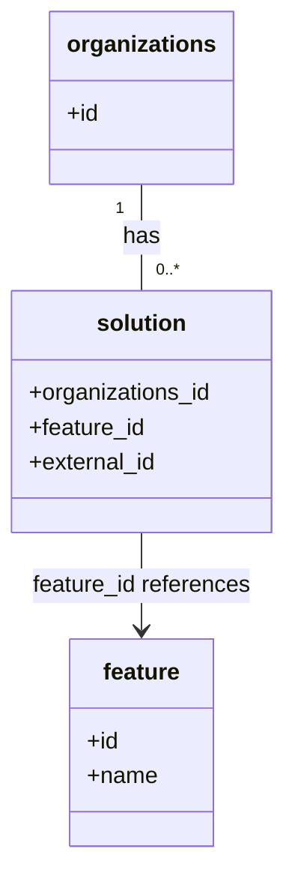

# Diagram: common/iam_service/scripts/shared/organization.py


> Auto-generated by Obscura crawlers

## Diagram 1



### SVG

<svg id="container" width="198.015625" xmlns="http://www.w3.org/2000/svg" class="classDiagram" height="596" viewBox="0 0 198.015625 596" role="graphics-document document" aria-roledescription="class"><style>#container{font-family:"trebuchet ms",verdana,arial,sans-serif;font-size:16px;fill:#333;}@keyframes edge-animation-frame{from{stroke-dashoffset:0;}}@keyframes dash{to{stroke-dashoffset:0;}}#container .edge-animation-slow{stroke-dasharray:9,5!important;stroke-dashoffset:900;animation:dash 50s linear infinite;stroke-linecap:round;}#container .edge-animation-fast{stroke-dasharray:9,5!important;stroke-dashoffset:900;animation:dash 20s linear infinite;stroke-linecap:round;}#container .error-icon{fill:#552222;}#container .error-text{fill:#552222;stroke:#552222;}#container .edge-thickness-normal{stroke-width:1px;}#container .edge-thickness-thick{stroke-width:3.5px;}#container .edge-pattern-solid{stroke-dasharray:0;}#container .edge-thickness-invisible{stroke-width:0;fill:none;}#container .edge-pattern-dashed{stroke-dasharray:3;}#container .edge-pattern-dotted{stroke-dasharray:2;}#container .marker{fill:#333333;stroke:#333333;}#container .marker.cross{stroke:#333333;}#container svg{font-family:"trebuchet ms",verdana,arial,sans-serif;font-size:16px;}#container p{margin:0;}#container g.classGroup text{fill:#9370DB;stroke:none;font-family:"trebuchet ms",verdana,arial,sans-serif;font-size:10px;}#container g.classGroup text .title{font-weight:bolder;}#container .nodeLabel,#container .edgeLabel{color:#131300;}#container .edgeLabel .label rect{fill:#ECECFF;}#container .label text{fill:#131300;}#container .labelBkg{background:#ECECFF;}#container .edgeLabel .label span{background:#ECECFF;}#container .classTitle{font-weight:bolder;}#container .node rect,#container .node circle,#container .node ellipse,#container .node polygon,#container .node path{fill:#ECECFF;stroke:#9370DB;stroke-width:1px;}#container .divider{stroke:#9370DB;stroke-width:1;}#container g.clickable{cursor:pointer;}#container g.classGroup rect{fill:#ECECFF;stroke:#9370DB;}#container g.classGroup line{stroke:#9370DB;stroke-width:1;}#container .classLabel .box{stroke:none;stroke-width:0;fill:#ECECFF;opacity:0.5;}#container .classLabel .label{fill:#9370DB;font-size:10px;}#container .relation{stroke:#333333;stroke-width:1;fill:none;}#container .dashed-line{stroke-dasharray:3;}#container .dotted-line{stroke-dasharray:1 2;}#container #compositionStart,#container .composition{fill:#333333!important;stroke:#333333!important;stroke-width:1;}#container #compositionEnd,#container .composition{fill:#333333!important;stroke:#333333!important;stroke-width:1;}#container #dependencyStart,#container .dependency{fill:#333333!important;stroke:#333333!important;stroke-width:1;}#container #dependencyStart,#container .dependency{fill:#333333!important;stroke:#333333!important;stroke-width:1;}#container #extensionStart,#container .extension{fill:transparent!important;stroke:#333333!important;stroke-width:1;}#container #extensionEnd,#container .extension{fill:transparent!important;stroke:#333333!important;stroke-width:1;}#container #aggregationStart,#container .aggregation{fill:transparent!important;stroke:#333333!important;stroke-width:1;}#container #aggregationEnd,#container .aggregation{fill:transparent!important;stroke:#333333!important;stroke-width:1;}#container #lollipopStart,#container .lollipop{fill:#ECECFF!important;stroke:#333333!important;stroke-width:1;}#container #lollipopEnd,#container .lollipop{fill:#ECECFF!important;stroke:#333333!important;stroke-width:1;}#container .edgeTerminals{font-size:11px;line-height:initial;}#container .classTitleText{text-anchor:middle;font-size:18px;fill:#333;}#container .label-icon{display:inline-block;height:1em;overflow:visible;vertical-align:-0.125em;}#container .node .label-icon path{fill:currentColor;stroke:revert;stroke-width:revert;}#container :root{--mermaid-font-family:"trebuchet ms",verdana,arial,sans-serif;}</style><g><defs><marker id="container_class-aggregationStart" class="marker aggregation class" refX="18" refY="7" markerWidth="190" markerHeight="240" orient="auto"><path d="M 18,7 L9,13 L1,7 L9,1 Z"></path></marker></defs><defs><marker id="container_class-aggregationEnd" class="marker aggregation class" refX="1" refY="7" markerWidth="20" markerHeight="28" orient="auto"><path d="M 18,7 L9,13 L1,7 L9,1 Z"></path></marker></defs><defs><marker id="container_class-extensionStart" class="marker extension class" refX="18" refY="7" markerWidth="190" markerHeight="240" orient="auto"><path d="M 1,7 L18,13 V 1 Z"></path></marker></defs><defs><marker id="container_class-extensionEnd" class="marker extension class" refX="1" refY="7" markerWidth="20" markerHeight="28" orient="auto"><path d="M 1,1 V 13 L18,7 Z"></path></marker></defs><defs><marker id="container_class-compositionStart" class="marker composition class" refX="18" refY="7" markerWidth="190" markerHeight="240" orient="auto"><path d="M 18,7 L9,13 L1,7 L9,1 Z"></path></marker></defs><defs><marker id="container_class-compositionEnd" class="marker composition class" refX="1" refY="7" markerWidth="20" markerHeight="28" orient="auto"><path d="M 18,7 L9,13 L1,7 L9,1 Z"></path></marker></defs><defs><marker id="container_class-dependencyStart" class="marker dependency class" refX="6" refY="7" markerWidth="190" markerHeight="240" orient="auto"><path d="M 5,7 L9,13 L1,7 L9,1 Z"></path></marker></defs><defs><marker id="container_class-dependencyEnd" class="marker dependency class" refX="13" refY="7" markerWidth="20" markerHeight="28" orient="auto"><path d="M 18,7 L9,13 L14,7 L9,1 Z"></path></marker></defs><defs><marker id="container_class-lollipopStart" class="marker lollipop class" refX="13" refY="7" markerWidth="190" markerHeight="240" orient="auto"><circle stroke="black" fill="transparent" cx="7" cy="7" r="6"></circle></marker></defs><defs><marker id="container_class-lollipopEnd" class="marker lollipop class" refX="1" refY="7" markerWidth="190" markerHeight="240" orient="auto"><circle stroke="black" fill="transparent" cx="7" cy="7" r="6"></circle></marker></defs><g class="root"><g class="clusters"></g><g class="edgePaths"><path d="M99.008,128L99.008,134.167C99.008,140.333,99.008,152.667,99.008,165C99.008,177.333,99.008,189.667,99.008,195.833L99.008,202" id="id_organizations_solution_1" class="edge-thickness-normal edge-pattern-solid relation" style=";;;" data-edge="true" data-et="edge" data-id="id_organizations_solution_1" data-points="W3sieCI6OTkuMDA3ODEyNSwieSI6MTI4fSx7IngiOjk5LjAwNzgxMjUsInkiOjE2NX0seyJ4Ijo5OS4wMDc4MTI1LCJ5IjoyMDJ9XQ=="></path><path d="M99.008,370L99.008,376.167C99.008,382.333,99.008,394.667,99.008,406C99.008,417.333,99.008,427.667,99.008,432.833L99.008,438" id="id_solution_feature_2" class="edge-thickness-normal edge-pattern-solid relation" style=";;;" data-edge="true" data-et="edge" data-id="id_solution_feature_2" data-points="W3sieCI6OTkuMDA3ODEyNSwieSI6MzcwfSx7IngiOjk5LjAwNzgxMjUsInkiOjQwN30seyJ4Ijo5OS4wMDc4MTI1LCJ5Ijo0NDR9XQ==" marker-end="url(#container_class-dependencyEnd)"></path></g><g class="edgeLabels"><g class="edgeLabel" transform="translate(99.0078125, 165)"><g class="label" data-id="id_organizations_solution_1" transform="translate(-12.703125, -12)"><foreignObject width="25.40625" height="24"><div xmlns="http://www.w3.org/1999/xhtml" class="labelBkg" style="display: table-cell; white-space: nowrap; line-height: 1.5; max-width: 200px; text-align: center;"><span class="edgeLabel"><p>has</p></span></div></foreignObject></g></g><g class="edgeLabel" transform="translate(99.0078125, 407)"><g class="label" data-id="id_solution_feature_2" transform="translate(-76.96875, -12)"><foreignObject width="153.9375" height="24"><div xmlns="http://www.w3.org/1999/xhtml" class="labelBkg" style="display: table-cell; white-space: nowrap; line-height: 1.5; max-width: 200px; text-align: center;"><span class="edgeLabel"><p>feature_id references</p></span></div></foreignObject></g></g><g class="edgeTerminals" transform="translate(84.00781125000005, 145.49999892857144)"><g class="inner" transform="translate(0, 0)"><foreignObject style="width: 9px; height: 12px;"><div xmlns="http://www.w3.org/1999/xhtml" style="display: inline-block; padding-right: 1px; white-space: nowrap;"><span class="edgeLabel">1</span></div></foreignObject></g></g><g class="edgeTerminals" transform="translate(109.00781124999996, 179.49999892857144)"><g class="inner" transform="translate(0, 0)"></g><foreignObject style="width: 36px; height: 12px;"><div xmlns="http://www.w3.org/1999/xhtml" style="display: inline-block; padding-right: 1px; white-space: nowrap;"><span class="edgeLabel">0..*</span></div></foreignObject></g></g><g class="nodes"><g class="node default" id="classId-organizations-0" transform="translate(99.0078125, 68)"><g class="basic label-container"><path d="M-61.703125 -60 L61.703125 -60 L61.703125 60 L-61.703125 60" stroke="none" stroke-width="0" fill="#ECECFF" style=""></path><path d="M-61.703125 -60 C-16.045444279880336 -60, 29.61223644023933 -60, 61.703125 -60 M-61.703125 -60 C-17.932208219127048 -60, 25.838708561745904 -60, 61.703125 -60 M61.703125 -60 C61.703125 -23.680067817748885, 61.703125 12.63986436450223, 61.703125 60 M61.703125 -60 C61.703125 -13.48581438559333, 61.703125 33.02837122881334, 61.703125 60 M61.703125 60 C16.340226229580374 60, -29.022672540839253 60, -61.703125 60 M61.703125 60 C29.15184076202747 60, -3.3994434759450627 60, -61.703125 60 M-61.703125 60 C-61.703125 23.312345192847175, -61.703125 -13.37530961430565, -61.703125 -60 M-61.703125 60 C-61.703125 19.54828932253629, -61.703125 -20.903421354927417, -61.703125 -60" stroke="#9370DB" stroke-width="1.3" fill="none" stroke-dasharray="0 0" style=""></path></g><g class="annotation-group text" transform="translate(0, -36)"></g><g class="label-group text" transform="translate(-49.703125, -36)"><g class="label" style="font-weight: bolder" transform="translate(0,-12)"><foreignObject width="99.40625" height="24"><div xmlns="http://www.w3.org/1999/xhtml" style="display: table-cell; white-space: nowrap; line-height: 1.5; max-width: 148px; text-align: center;"><span class="nodeLabel markdown-node-label" style=""><p>organizations</p></span></div></foreignObject></g></g><g class="members-group text" transform="translate(-49.703125, 12)"><g class="label" style="" transform="translate(0,-12)"><foreignObject width="22.078125" height="24"><div xmlns="http://www.w3.org/1999/xhtml" style="display: table-cell; white-space: nowrap; line-height: 1.5; max-width: 79px; text-align: center;"><span class="nodeLabel markdown-node-label" style=""><p>+id</p></span></div></foreignObject></g></g><g class="methods-group text" transform="translate(-49.703125, 60)"></g><g class="divider" style=""><path d="M-61.703125 -12 C-26.85900509770986 -12, 7.985114804580277 -12, 61.703125 -12 M-61.703125 -12 C-14.216317333156617 -12, 33.270490333686766 -12, 61.703125 -12" stroke="#9370DB" stroke-width="1.3" fill="none" stroke-dasharray="0 0" style=""></path></g><g class="divider" style=""><path d="M-61.703125 36 C-17.456484067706967 36, 26.790156864586066 36, 61.703125 36 M-61.703125 36 C-15.319035717444542 36, 31.065053565110915 36, 61.703125 36" stroke="#9370DB" stroke-width="1.3" fill="none" stroke-dasharray="0 0" style=""></path></g></g><g class="node default" id="classId-solution-1" transform="translate(99.0078125, 286)"><g class="basic label-container"><path d="M-91.0078125 -84 L91.0078125 -84 L91.0078125 84 L-91.0078125 84" stroke="none" stroke-width="0" fill="#ECECFF" style=""></path><path d="M-91.0078125 -84 C-29.369011932551295 -84, 32.26978863489741 -84, 91.0078125 -84 M-91.0078125 -84 C-30.497094127501278 -84, 30.013624244997445 -84, 91.0078125 -84 M91.0078125 -84 C91.0078125 -28.495868062231146, 91.0078125 27.008263875537708, 91.0078125 84 M91.0078125 -84 C91.0078125 -28.05325550090035, 91.0078125 27.893488998199302, 91.0078125 84 M91.0078125 84 C29.03159615220889 84, -32.94462019558222 84, -91.0078125 84 M91.0078125 84 C43.14983959873328 84, -4.70813330253344 84, -91.0078125 84 M-91.0078125 84 C-91.0078125 17.740475636913104, -91.0078125 -48.51904872617379, -91.0078125 -84 M-91.0078125 84 C-91.0078125 23.64540619245986, -91.0078125 -36.70918761508028, -91.0078125 -84" stroke="#9370DB" stroke-width="1.3" fill="none" stroke-dasharray="0 0" style=""></path></g><g class="annotation-group text" transform="translate(0, -60)"></g><g class="label-group text" transform="translate(-30.125, -60)"><g class="label" style="font-weight: bolder" transform="translate(0,-12)"><foreignObject width="60.25" height="24"><div xmlns="http://www.w3.org/1999/xhtml" style="display: table-cell; white-space: nowrap; line-height: 1.5; max-width: 110px; text-align: center;"><span class="nodeLabel markdown-node-label" style=""><p>solution</p></span></div></foreignObject></g></g><g class="members-group text" transform="translate(-79.0078125, -12)"><g class="label" style="" transform="translate(0,-12)"><foreignObject width="127.890625" height="24"><div xmlns="http://www.w3.org/1999/xhtml" style="display: table-cell; white-space: nowrap; line-height: 1.5; max-width: 185px; text-align: center;"><span class="nodeLabel markdown-node-label" style=""><p>+organizations_id</p></span></div></foreignObject></g><g class="label" style="" transform="translate(0,12)"><foreignObject width="81.796875" height="24"><div xmlns="http://www.w3.org/1999/xhtml" style="display: table-cell; white-space: nowrap; line-height: 1.5; max-width: 139px; text-align: center;"><span class="nodeLabel markdown-node-label" style=""><p>+feature_id</p></span></div></foreignObject></g><g class="label" style="" transform="translate(0,36)"><foreignObject width="89.765625" height="24"><div xmlns="http://www.w3.org/1999/xhtml" style="display: table-cell; white-space: nowrap; line-height: 1.5; max-width: 147px; text-align: center;"><span class="nodeLabel markdown-node-label" style=""><p>+external_id</p></span></div></foreignObject></g></g><g class="methods-group text" transform="translate(-79.0078125, 84)"></g><g class="divider" style=""><path d="M-91.0078125 -36 C-46.78752725194122 -36, -2.5672420038824413 -36, 91.0078125 -36 M-91.0078125 -36 C-52.58950537084756 -36, -14.171198241695123 -36, 91.0078125 -36" stroke="#9370DB" stroke-width="1.3" fill="none" stroke-dasharray="0 0" style=""></path></g><g class="divider" style=""><path d="M-91.0078125 60 C-50.92159514595092 60, -10.835377791901834 60, 91.0078125 60 M-91.0078125 60 C-37.075216353327164 60, 16.85737979334567 60, 91.0078125 60" stroke="#9370DB" stroke-width="1.3" fill="none" stroke-dasharray="0 0" style=""></path></g></g><g class="node default" id="classId-feature-2" transform="translate(99.0078125, 516)"><g class="basic label-container"><path d="M-49.51953125 -72 L49.51953125 -72 L49.51953125 72 L-49.51953125 72" stroke="none" stroke-width="0" fill="#ECECFF" style=""></path><path d="M-49.51953125 -72 C-15.798870934070742 -72, 17.921789381858517 -72, 49.51953125 -72 M-49.51953125 -72 C-10.985756857513415 -72, 27.54801753497317 -72, 49.51953125 -72 M49.51953125 -72 C49.51953125 -26.987899016230784, 49.51953125 18.02420196753843, 49.51953125 72 M49.51953125 -72 C49.51953125 -38.09629021132008, 49.51953125 -4.192580422640162, 49.51953125 72 M49.51953125 72 C17.40508740642897 72, -14.709356437142063 72, -49.51953125 72 M49.51953125 72 C25.535595051381822 72, 1.5516588527636443 72, -49.51953125 72 M-49.51953125 72 C-49.51953125 34.944843119406755, -49.51953125 -2.1103137611864895, -49.51953125 -72 M-49.51953125 72 C-49.51953125 33.245837166134194, -49.51953125 -5.5083256677316115, -49.51953125 -72" stroke="#9370DB" stroke-width="1.3" fill="none" stroke-dasharray="0 0" style=""></path></g><g class="annotation-group text" transform="translate(0, -48)"></g><g class="label-group text" transform="translate(-26.5390625, -48)"><g class="label" style="font-weight: bolder" transform="translate(0,-12)"><foreignObject width="53.078125" height="24"><div xmlns="http://www.w3.org/1999/xhtml" style="display: table-cell; white-space: nowrap; line-height: 1.5; max-width: 102px; text-align: center;"><span class="nodeLabel markdown-node-label" style=""><p>feature</p></span></div></foreignObject></g></g><g class="members-group text" transform="translate(-37.51953125, 0)"><g class="label" style="" transform="translate(0,-12)"><foreignObject width="22.078125" height="24"><div xmlns="http://www.w3.org/1999/xhtml" style="display: table-cell; white-space: nowrap; line-height: 1.5; max-width: 79px; text-align: center;"><span class="nodeLabel markdown-node-label" style=""><p>+id</p></span></div></foreignObject></g><g class="label" style="" transform="translate(0,12)"><foreignObject width="48.5" height="24"><div xmlns="http://www.w3.org/1999/xhtml" style="display: table-cell; white-space: nowrap; line-height: 1.5; max-width: 106px; text-align: center;"><span class="nodeLabel markdown-node-label" style=""><p>+name</p></span></div></foreignObject></g></g><g class="methods-group text" transform="translate(-37.51953125, 72)"></g><g class="divider" style=""><path d="M-49.51953125 -24 C-27.731795959469768 -24, -5.944060668939535 -24, 49.51953125 -24 M-49.51953125 -24 C-28.415935753668773 -24, -7.312340257337546 -24, 49.51953125 -24" stroke="#9370DB" stroke-width="1.3" fill="none" stroke-dasharray="0 0" style=""></path></g><g class="divider" style=""><path d="M-49.51953125 48 C-14.635211246289764 48, 20.249108757420473 48, 49.51953125 48 M-49.51953125 48 C-22.54912839478379 48, 4.4212744604324214 48, 49.51953125 48" stroke="#9370DB" stroke-width="1.3" fill="none" stroke-dasharray="0 0" style=""></path></g></g></g></g></g></svg>

## Diagram 2

```mermaid
flowchart TD
    A([get_org_info_from_fv_id(shipment_cursor, fv_id)]) --> B[Execute SQL query]
    B --> C{Query SELECT joins}
    C --> D[organizations o]
    C --> E[solution s]
    C --> F[feature f (name='Finished Vehicle')]
    B --> G[shipment_cursor.fetchone()]
    G --> H{res is not None?}
    H -- Yes --> I[return (res.id, res.solution_id)]
    H -- No --> J[return None]
    I --> K([End])
    J --> K
```

> SVG rendering failed for this diagram.
