# Diagram: common/iam_service/scripts/update_federated_orgs.py

> Auto-generated by Obscura crawlers

## Mermaid

```mermaid
classDiagram
    class DB_CONN {
        +establish_connection()
        +cursor
    }
    class parse_arguments {
        +returns args
    }
    class insert_to_federation {
        +cursor, org_code, org_id
    }
    class add_or_update_org {
        +org_code, org_name, method="POST", org_id=None, fv_id=None
    }
    class fed_org_details {
        +cursor, org_code
    }
    class get_org_profile_id {
        +cursor, profile_code
    }
    class gather_data {
        +f, total_count, transition, loc_code_dict
        +returns org_loc_dict
    }
    class does_grant_exist {
        +cursor, grantee_id
    }
    class remove_federation_association {
        +cursor, org_id
    }
    class delete_org_if_no_fed_assoc {
        +cursor, org_id
    }
    class get_granted_locs {
        +cursor, grantee_id
    }
    class process_locs {
        +locations, existing_granted_locs
        +returns (to_grant, to_remove, all_to_grant, existing)
    }
    class get_removed_orgs {
        +cursor, org_loc_dict, granter
    }
    class get_locations {
        +cursor, org_id, codes
    }
    class gather_and_grab_all_locs {
        +orgs
    }
    class main {
        +main()
    }

    main --> parse_arguments : calls
    main --> DB_CONN : uses
    main --> gather_and_grab_all_locs : calls
    main --> get_locations : calls
    main --> gather_data : calls
    main --> get_removed_orgs : calls
    main --> get_granted_locs : calls
    main --> process_locs : calls
    main --> does_grant_exist : calls
    main --> remove_federation_association : calls
    main --> delete_org_if_no_fed_assoc : calls
    gather_data --> fed_org_details : calls
    gather_data --> add_or_update_org : calls
    add_or_update_org --> get_org_profile_id : calls
    add_or_update_org --> fv.aws.lambdas : invokes
    process_locs --> invokinator_location : referenced
    get_locations --> DB_CONN : uses cursor
    get_granted_locs --> location.location_grant : queries
    fed_org_details --> federation_association : queries
    insert_to_federation --> federation_association : updates
    remove_federation_association --> federation_association : updates
    delete_org_if_no_fed_assoc --> organizations : updates
    get_removed_orgs --> federation_association : queries
    get_removed_orgs --> location.location_grant : queries
    get_removed_orgs --> organization_profiles : filters
```

### SVG

<svg id="container" width="3838.888671875" xmlns="http://www.w3.org/2000/svg" class="classDiagram" height="772" viewBox="0 0 3838.888671875 772" role="graphics-document document" aria-roledescription="class"><g><defs><marker id="container_class-aggregationStart" class="marker aggregation class" refX="18" refY="7" markerWidth="190" markerHeight="240" orient="auto"><path d="M 18,7 L9,13 L1,7 L9,1 Z"></path></marker></defs><defs><marker id="container_class-aggregationEnd" class="marker aggregation class" refX="1" refY="7" markerWidth="20" markerHeight="28" orient="auto"><path d="M 18,7 L9,13 L1,7 L9,1 Z"></path></marker></defs><defs><marker id="container_class-extensionStart" class="marker extension class" refX="18" refY="7" markerWidth="190" markerHeight="240" orient="auto"><path d="M 1,7 L18,13 V 1 Z"></path></marker></defs><defs><marker id="container_class-extensionEnd" class="marker extension class" refX="1" refY="7" markerWidth="20" markerHeight="28" orient="auto"><path d="M 1,1 V 13 L18,7 Z"></path></marker></defs><defs><marker id="container_class-compositionStart" class="marker composition class" refX="18" refY="7" markerWidth="190" markerHeight="240" orient="auto"><path d="M 18,7 L9,13 L1,7 L9,1 Z"></path></marker></defs><defs><marker id="container_class-compositionEnd" class="marker composition class" refX="1" refY="7" markerWidth="20" markerHeight="28" orient="auto"><path d="M 18,7 L9,13 L1,7 L9,1 Z"></path></marker></defs><defs><marker id="container_class-dependencyStart" class="marker dependency class" refX="6" refY="7" markerWidth="190" markerHeight="240" orient="auto"><path d="M 5,7 L9,13 L1,7 L9,1 Z"></path></marker></defs><defs><marker id="container_class-dependencyEnd" class="marker dependency class" refX="13" refY="7" markerWidth="20" markerHeight="28" orient="auto"><path d="M 18,7 L9,13 L14,7 L9,1 Z"></path></marker></defs><defs><marker id="container_class-lollipopStart" class="marker lollipop class" refX="13" refY="7" markerWidth="190" markerHeight="240" orient="auto"><circle stroke="black" fill="transparent" cx="7" cy="7" r="6"></circle></marker></defs><defs><marker id="container_class-lollipopEnd" class="marker lollipop class" refX="1" refY="7" markerWidth="190" markerHeight="240" orient="auto"><circle stroke="black" fill="transparent" cx="7" cy="7" r="6"></circle></marker></defs><g class="root"><g class="clusters"></g><g class="edgePaths"><path d="M2029.527,73.749L2314.543,89.958C2599.558,106.166,3169.589,138.583,3454.604,161.958C3739.619,185.333,3739.619,199.667,3739.619,206.833L3739.619,214" id="id_main_parse_arguments_1" class="edge-thickness-normal edge-pattern-solid relation" style=";;;" data-edge="true" data-et="edge" data-id="id_main_parse_arguments_1" data-points="W3sieCI6MjAyOS41MjczNDM3NSwieSI6NzMuNzQ5MDMxNzI5OTM1MTN9LHsieCI6MzczOS42MTkxNDA2MjUsInkiOjE3MX0seyJ4IjozNzM5LjYxOTE0MDYyNSwieSI6MjIwfV0=" marker-end="url(#container_class-dependencyEnd)"></path><path d="M2029.527,73.992L2290.749,90.16C2551.971,106.328,3074.414,138.664,3335.636,172.999C3596.857,207.333,3596.857,243.667,3596.857,280C3596.857,316.333,3596.857,352.667,3593,376.189C3589.142,399.711,3581.426,410.421,3577.568,415.776L3573.71,421.132" id="id_main_DB_CONN_2" class="edge-thickness-normal edge-pattern-solid relation" style=";;;" data-edge="true" data-et="edge" data-id="id_main_DB_CONN_2" data-points="W3sieCI6MjAyOS41MjczNDM3NSwieSI6NzMuOTkxOTM4MDg2ODI3ODZ9LHsieCI6MzU5Ni44NTc0MjE4NzUsInkiOjE3MX0seyJ4IjozNTk2Ljg1NzQyMTg3NSwieSI6MjgwfSx7IngiOjM1OTYuODU3NDIxODc1LCJ5IjozODl9LHsieCI6MzU3MC4yMDMzNDAwMjI5MzU3LCJ5Ijo0MjZ9XQ==" marker-end="url(#container_class-dependencyEnd)"></path><path d="M2029.527,74.314L2264.573,90.428C2499.619,106.543,2969.711,138.771,3204.757,162.052C3439.803,185.333,3439.803,199.667,3439.803,206.833L3439.803,214" id="id_main_gather_and_grab_all_locs_3" class="edge-thickness-normal edge-pattern-solid relation" style=";;;" data-edge="true" data-et="edge" data-id="id_main_gather_and_grab_all_locs_3" data-points="W3sieCI6MjAyOS41MjczNDM3NSwieSI6NzQuMzE0MDkxNTE3MTMwODN9LHsieCI6MzQzOS44MDI3MzQzNzUsInkiOjE3MX0seyJ4IjozNDM5LjgwMjczNDM3NSwieSI6MjIwfV0=" marker-end="url(#container_class-dependencyEnd)"></path><path d="M2029.527,75.07L2219.433,91.058C2409.339,107.047,2789.151,139.023,2979.057,162.178C3168.963,185.333,3168.963,199.667,3168.963,206.833L3168.963,214" id="id_main_get_locations_4" class="edge-thickness-normal edge-pattern-solid relation" style=";;;" data-edge="true" data-et="edge" data-id="id_main_get_locations_4" data-points="W3sieCI6MjAyOS41MjczNDM3NSwieSI6NzUuMDY5Nzc5ODcwMTI4OH0seyJ4IjozMTY4Ljk2Mjg5MDYyNSwieSI6MTcxfSx7IngiOjMxNjguOTYyODkwNjI1LCJ5IjoyMjB9XQ==" marker-end="url(#container_class-dependencyEnd)"></path><path d="M2029.527,77.052L2154.602,92.71C2279.677,108.368,2529.827,139.684,2654.902,160.509C2779.977,181.333,2779.977,191.667,2779.977,196.833L2779.977,202" id="id_main_gather_data_5" class="edge-thickness-normal edge-pattern-solid relation" style=";;;" data-edge="true" data-et="edge" data-id="id_main_gather_data_5" data-points="W3sieCI6MjAyOS41MjczNDM3NSwieSI6NzcuMDUxNjQwNjY3MDI1Mjh9LHsieCI6Mjc3OS45NzY1NjI1LCJ5IjoxNzF9LHsieCI6Mjc3OS45NzY1NjI1LCJ5IjoyMDh9XQ==" marker-end="url(#container_class-dependencyEnd)"></path><path d="M1972.107,134L1971.218,140.167C1970.329,146.333,1968.551,158.667,1967.662,172C1966.773,185.333,1966.773,199.667,1966.773,206.833L1966.773,214" id="id_main_get_removed_orgs_6" class="edge-thickness-normal edge-pattern-solid relation" style=";;;" data-edge="true" data-et="edge" data-id="id_main_get_removed_orgs_6" data-points="W3sieCI6MTk3Mi4xMDY2NDA2MjUsInkiOjEzNH0seyJ4IjoxOTY2Ljc3MzQzNzUsInkiOjE3MX0seyJ4IjoxOTY2Ljc3MzQzNzUsInkiOjIyMH1d" marker-end="url(#container_class-dependencyEnd)"></path><path d="M1932.848,84.71L1882.139,99.092C1831.431,113.473,1730.014,142.237,1679.306,163.785C1628.598,185.333,1628.598,199.667,1628.598,206.833L1628.598,214" id="id_main_get_granted_locs_7" class="edge-thickness-normal edge-pattern-solid relation" style=";;;" data-edge="true" data-et="edge" data-id="id_main_get_granted_locs_7" data-points="W3sieCI6MTkzMi44NDc2NTYyNSwieSI6ODQuNzA5OTM2NTE4ODM5Mzh9LHsieCI6MTYyOC41OTc2NTYyNSwieSI6MTcxfSx7IngiOjE2MjguNTk3NjU2MjUsInkiOjIyMH1d" marker-end="url(#container_class-dependencyEnd)"></path><path d="M1932.848,77.547L1817.85,93.123C1702.853,108.698,1472.858,139.849,1357.861,160.591C1242.863,181.333,1242.863,191.667,1242.863,196.833L1242.863,202" id="id_main_process_locs_8" class="edge-thickness-normal edge-pattern-solid relation" style=";;;" data-edge="true" data-et="edge" data-id="id_main_process_locs_8" data-points="W3sieCI6MTkzMi44NDc2NTYyNSwieSI6NzcuNTQ3MjM3OTkxNDM5NjZ9LHsieCI6MTI0Mi44NjMyODEyNSwieSI6MTcxfSx7IngiOjEyNDIuODYzMjgxMjUsInkiOjIwOH1d" marker-end="url(#container_class-dependencyEnd)"></path><path d="M1932.848,75.301L1753.593,91.251C1574.339,107.201,1215.829,139.1,1036.575,162.217C857.32,185.333,857.32,199.667,857.32,206.833L857.32,214" id="id_main_does_grant_exist_9" class="edge-thickness-normal edge-pattern-solid relation" style=";;;" data-edge="true" data-et="edge" data-id="id_main_does_grant_exist_9" data-points="W3sieCI6MTkzMi44NDc2NTYyNSwieSI6NzUuMzAxMjA2MDc1NTYyMTl9LHsieCI6ODU3LjMyMDMxMjUsInkiOjE3MX0seyJ4Ijo4NTcuMzIwMzEyNSwieSI6MjIwfV0=" marker-end="url(#container_class-dependencyEnd)"></path><path d="M1932.848,74.754L1726.309,90.795C1519.771,106.836,1106.694,138.918,900.156,173.126C693.617,207.333,693.617,243.667,693.617,280C693.617,316.333,693.617,352.667,693.617,378C693.617,403.333,693.617,417.667,693.617,424.833L693.617,432" id="id_main_remove_federation_association_10" class="edge-thickness-normal edge-pattern-solid relation" style=";;;" data-edge="true" data-et="edge" data-id="id_main_remove_federation_association_10" data-points="W3sieCI6MTkzMi44NDc2NTYyNSwieSI6NzQuNzU0MzQ1OTM5ODQ1NTJ9LHsieCI6NjkzLjYxNzE4NzUsInkiOjE3MX0seyJ4Ijo2OTMuNjE3MTg3NSwieSI6MjgwfSx7IngiOjY5My42MTcxODc1LCJ5IjozODl9LHsieCI6NjkzLjYxNzE4NzUsInkiOjQzOH1d" marker-end="url(#container_class-dependencyEnd)"></path><path d="M1932.848,73.603L1631.438,89.836C1330.029,106.069,727.21,138.534,425.8,161.934C124.391,185.333,124.391,199.667,124.391,206.833L124.391,214" id="id_main_delete_org_if_no_fed_assoc_11" class="edge-thickness-normal edge-pattern-solid relation" style=";;;" data-edge="true" data-et="edge" data-id="id_main_delete_org_if_no_fed_assoc_11" data-points="W3sieCI6MTkzMi44NDc2NTYyNSwieSI6NzMuNjAzMzk5NjcxODEzODZ9LHsieCI6MTI0LjM5MDYyNSwieSI6MTcxfSx7IngiOjEyNC4zOTA2MjUsInkiOjIyMH1d" marker-end="url(#container_class-dependencyEnd)"></path><path d="M2834.085,352L2838.719,358.167C2843.353,364.333,2852.622,376.667,2857.256,390C2861.891,403.333,2861.891,417.667,2861.891,424.833L2861.891,432" id="id_gather_data_fed_org_details_12" class="edge-thickness-normal edge-pattern-solid relation" style=";;;" data-edge="true" data-et="edge" data-id="id_gather_data_fed_org_details_12" data-points="W3sieCI6MjgzNC4wODQ5MzQwNTk2MzMsInkiOjM1Mn0seyJ4IjoyODYxLjg5MDYyNSwieSI6Mzg5fSx7IngiOjI4NjEuODkwNjI1LCJ5Ijo0Mzh9XQ==" marker-end="url(#container_class-dependencyEnd)"></path><path d="M2601.18,335.246L2572.185,344.205C2543.19,353.164,2485.201,371.082,2456.206,387.208C2427.211,403.333,2427.211,417.667,2427.211,424.833L2427.211,432" id="id_gather_data_add_or_update_org_13" class="edge-thickness-normal edge-pattern-solid relation" style=";;;" data-edge="true" data-et="edge" data-id="id_gather_data_add_or_update_org_13" data-points="W3sieCI6MjYwMS4xNzk2ODc1LCJ5IjozMzUuMjQ1OTEzOTgzMjU3M30seyJ4IjoyNDI3LjIxMDkzNzUsInkiOjM4OX0seyJ4IjoyNDI3LjIxMDkzNzUsInkiOjQzOH1d" marker-end="url(#container_class-dependencyEnd)"></path><path d="M2529.319,558L2543.217,566.167C2557.115,574.333,2584.911,590.667,2637.381,609.287C2689.85,627.906,2766.993,648.813,2805.565,659.266L2844.137,669.719" id="id_add_or_update_org_get_org_profile_id_14" class="edge-thickness-normal edge-pattern-solid relation" style=";;;" data-edge="true" data-et="edge" data-id="id_add_or_update_org_get_org_profile_id_14" data-points="W3sieCI6MjUyOS4zMTg4NzkwMTM3NjE1LCJ5Ijo1NTh9LHsieCI6MjYxMi43MDcwMzEyNSwieSI6NjA3fSx7IngiOjI4NDkuOTI3NzM0Mzc1LCJ5Ijo2NzEuMjg4NTYxOTY0ODkwOH1d" marker-end="url(#container_class-dependencyEnd)"></path><path d="M2361.541,558L2352.602,566.167C2343.664,574.333,2325.787,590.667,2353.205,610.922C2380.622,631.177,2453.335,655.354,2489.691,667.442L2526.047,679.531" id="id_add_or_update_org_fv.aws.lambdas_15" class="edge-thickness-normal edge-pattern-solid relation" style=";;;" data-edge="true" data-et="edge" data-id="id_add_or_update_org_fv.aws.lambdas_15" data-points="W3sieCI6MjM2MS41NDA3ODI2ODM0ODYsInkiOjU1OH0seyJ4IjoyMzA3LjkxMDE1NjI1LCJ5Ijo2MDd9LHsieCI6MjUzMS43NDAyMzQzNzUsInkiOjY4MS40MjM3MDcwMjY0MTE4fV0=" marker-end="url(#container_class-dependencyEnd)"></path><path d="M1242.863,352L1242.863,358.167C1242.863,364.333,1242.863,376.667,1242.863,393C1242.863,409.333,1242.863,429.667,1242.863,439.833L1242.863,450" id="id_process_locs_invokinator_location_16" class="edge-thickness-normal edge-pattern-solid relation" style=";;;" data-edge="true" data-et="edge" data-id="id_process_locs_invokinator_location_16" data-points="W3sieCI6MTI0Mi44NjMyODEyNSwieSI6MzUyfSx7IngiOjEyNDIuODYzMjgxMjUsInkiOjM4OX0seyJ4IjoxMjQyLjg2MzI4MTI1LCJ5Ijo0NTZ9XQ==" marker-end="url(#container_class-dependencyEnd)"></path><path d="M3168.963,340L3168.963,348.167C3168.963,356.333,3168.963,372.667,3206.931,392.679C3244.899,412.691,3320.836,436.382,3358.804,448.228L3396.772,460.074" id="id_get_locations_DB_CONN_17" class="edge-thickness-normal edge-pattern-solid relation" style=";;;" data-edge="true" data-et="edge" data-id="id_get_locations_DB_CONN_17" data-points="W3sieCI6MzE2OC45NjI4OTA2MjUsInkiOjM0MH0seyJ4IjozMTY4Ljk2Mjg5MDYyNSwieSI6Mzg5fSx7IngiOjM0MDIuNSwieSI6NDYxLjg2MDY0MzIyODEwMzl9XQ==" marker-end="url(#container_class-dependencyEnd)"></path><path d="M1628.598,340L1628.598,348.167C1628.598,356.333,1628.598,372.667,1648.669,391.53C1668.741,410.393,1708.884,431.785,1728.956,442.482L1749.027,453.178" id="id_get_granted_locs_location.location_grant_18" class="edge-thickness-normal edge-pattern-solid relation" style=";;;" data-edge="true" data-et="edge" data-id="id_get_granted_locs_location.location_grant_18" data-points="W3sieCI6MTYyOC41OTc2NTYyNSwieSI6MzQwfSx7IngiOjE2MjguNTk3NjU2MjUsInkiOjM4OX0seyJ4IjoxNzU0LjMyMjMwMTQ2MjE1NiwieSI6NDU2fV0=" marker-end="url(#container_class-dependencyEnd)"></path><path d="M2861.891,558L2861.891,566.167C2861.891,574.333,2861.891,590.667,2625.686,613.914C2389.482,637.161,1917.073,667.321,1680.868,682.402L1444.664,697.482" id="id_fed_org_details_federation_association_19" class="edge-thickness-normal edge-pattern-solid relation" style=";;;" data-edge="true" data-et="edge" data-id="id_fed_org_details_federation_association_19" data-points="W3sieCI6Mjg2MS44OTA2MjUsInkiOjU1OH0seyJ4IjoyODYxLjg5MDYyNSwieSI6NjA3fSx7IngiOjE0MzguNjc1NzgxMjUsInkiOjY5Ny44NjQ0NDM1NTg4NTc5fV0=" marker-end="url(#container_class-dependencyEnd)"></path><path d="M376.281,558L376.281,566.167C376.281,574.333,376.281,590.667,520.318,613.292C664.355,635.918,952.429,664.836,1096.466,679.295L1240.503,693.754" id="id_insert_to_federation_federation_association_20" class="edge-thickness-normal edge-pattern-solid relation" style=";;;" data-edge="true" data-et="edge" data-id="id_insert_to_federation_federation_association_20" data-points="W3sieCI6Mzc2LjI4MTI1LCJ5Ijo1NTh9LHsieCI6Mzc2LjI4MTI1LCJ5Ijo2MDd9LHsieCI6MTI0Ni40NzI2NTYyNSwieSI6Njk0LjM1Mjk3NTg5NDUwNjZ9XQ==" marker-end="url(#container_class-dependencyEnd)"></path><path d="M693.617,558L693.617,566.167C693.617,574.333,693.617,590.667,784.771,612.458C875.924,634.25,1058.231,661.499,1149.385,675.124L1240.539,688.749" id="id_remove_federation_association_federation_association_21" class="edge-thickness-normal edge-pattern-solid relation" style=";;;" data-edge="true" data-et="edge" data-id="id_remove_federation_association_federation_association_21" data-points="W3sieCI6NjkzLjYxNzE4NzUsInkiOjU1OH0seyJ4Ijo2OTMuNjE3MTg3NSwieSI6NjA3fSx7IngiOjEyNDYuNDcyNjU2MjUsInkiOjY4OS42MzU2NDEzMjM1MTc5fV0=" marker-end="url(#container_class-dependencyEnd)"></path><path d="M124.391,340L124.391,348.167C124.391,356.333,124.391,372.667,124.391,391C124.391,409.333,124.391,429.667,124.391,439.833L124.391,450" id="id_delete_org_if_no_fed_assoc_organizations_22" class="edge-thickness-normal edge-pattern-solid relation" style=";;;" data-edge="true" data-et="edge" data-id="id_delete_org_if_no_fed_assoc_organizations_22" data-points="W3sieCI6MTI0LjM5MDYyNSwieSI6MzQwfSx7IngiOjEyNC4zOTA2MjUsInkiOjM4OX0seyJ4IjoxMjQuMzkwNjI1LCJ5Ijo0NTZ9XQ==" marker-end="url(#container_class-dependencyEnd)"></path><path d="M2031.59,340L2040.412,348.167C2049.234,356.333,2066.879,372.667,2075.701,399C2084.523,425.333,2084.523,461.667,2084.523,498C2084.523,534.333,2084.523,570.667,1977.874,602.776C1871.224,634.886,1657.925,662.772,1551.275,676.715L1444.625,690.658" id="id_get_removed_orgs_federation_association_23" class="edge-thickness-normal edge-pattern-solid relation" style=";;;" data-edge="true" data-et="edge" data-id="id_get_removed_orgs_federation_association_23" data-points="W3sieCI6MjAzMS41ODk5NTEyNjE0Njc4LCJ5IjozNDB9LHsieCI6MjA4NC41MjM0Mzc1LCJ5IjozODl9LHsieCI6MjA4NC41MjM0Mzc1LCJ5Ijo0OTh9LHsieCI6MjA4NC41MjM0Mzc1LCJ5Ijo2MDd9LHsieCI6MTQzOC42NzU3ODEyNSwieSI6NjkxLjQzNTk5Nzg3MzAwMTR9XQ==" marker-end="url(#container_class-dependencyEnd)"></path><path d="M1974.708,340L1975.788,348.167C1976.868,356.333,1979.028,372.667,1965.745,391.407C1952.463,410.148,1923.739,431.295,1909.377,441.869L1895.014,452.443" id="id_get_removed_orgs_location.location_grant_24" class="edge-thickness-normal edge-pattern-solid relation" style=";;;" data-edge="true" data-et="edge" data-id="id_get_removed_orgs_location.location_grant_24" data-points="W3sieCI6MTk3NC43MDc3ODM4MzAyNzUzLCJ5IjozNDB9LHsieCI6MTk4MS4xODc1LCJ5IjozODl9LHsieCI6MTg5MC4xODI2MDgyMjgyMTEsInkiOjQ1Nn1d" marker-end="url(#container_class-dependencyEnd)"></path><path d="M1885.606,340L1874.558,348.167C1863.51,356.333,1841.414,372.667,1807.973,391.568C1774.532,410.469,1729.746,431.938,1707.353,442.672L1684.96,453.406" id="id_get_removed_orgs_organization_profiles_25" class="edge-thickness-normal edge-pattern-solid relation" style=";;;" data-edge="true" data-et="edge" data-id="id_get_removed_orgs_organization_profiles_25" data-points="W3sieCI6MTg4NS42MDU1MDQ1ODcxNTYsInkiOjM0MH0seyJ4IjoxODE5LjMxODM1OTM3NSwieSI6Mzg5fSx7IngiOjE2NzkuNTQ5NzQxOTcyNDc3LCJ5Ijo0NTZ9XQ==" marker-end="url(#container_class-dependencyEnd)"></path></g><g class="edgeLabels"><g class="edgeLabel" transform="translate(3739.619140625, 171)"><g class="label" data-id="id_main_parse_arguments_1" transform="translate(-16.4453125, -12)"><foreignObject width="32.890625" height="24">

calls

</foreignObject></g></g><g class="edgeLabel" transform="translate(3596.857421875, 280)"><g class="label" data-id="id_main_DB_CONN_2" transform="translate(-16.4921875, -12)"><foreignObject width="32.984375" height="24">

uses

</foreignObject></g></g><g class="edgeLabel" transform="translate(3439.802734375, 171)"><g class="label" data-id="id_main_gather_and_grab_all_locs_3" transform="translate(-16.4453125, -12)"><foreignObject width="32.890625" height="24">

calls

</foreignObject></g></g><g class="edgeLabel" transform="translate(3168.962890625, 171)"><g class="label" data-id="id_main_get_locations_4" transform="translate(-16.4453125, -12)"><foreignObject width="32.890625" height="24">

calls

</foreignObject></g></g><g class="edgeLabel" transform="translate(2779.9765625, 171)"><g class="label" data-id="id_main_gather_data_5" transform="translate(-16.4453125, -12)"><foreignObject width="32.890625" height="24">

calls

</foreignObject></g></g><g class="edgeLabel" transform="translate(1966.7734375, 171)"><g class="label" data-id="id_main_get_removed_orgs_6" transform="translate(-16.4453125, -12)"><foreignObject width="32.890625" height="24">

calls

</foreignObject></g></g><g class="edgeLabel" transform="translate(1628.59765625, 171)"><g class="label" data-id="id_main_get_granted_locs_7" transform="translate(-16.4453125, -12)"><foreignObject width="32.890625" height="24">

calls

</foreignObject></g></g><g class="edgeLabel" transform="translate(1242.86328125, 171)"><g class="label" data-id="id_main_process_locs_8" transform="translate(-16.4453125, -12)"><foreignObject width="32.890625" height="24">

calls

</foreignObject></g></g><g class="edgeLabel" transform="translate(857.3203125, 171)"><g class="label" data-id="id_main_does_grant_exist_9" transform="translate(-16.4453125, -12)"><foreignObject width="32.890625" height="24">

calls

</foreignObject></g></g><g class="edgeLabel" transform="translate(693.6171875, 280)"><g class="label" data-id="id_main_remove_federation_association_10" transform="translate(-16.4453125, -12)"><foreignObject width="32.890625" height="24">

calls

</foreignObject></g></g><g class="edgeLabel" transform="translate(124.390625, 171)"><g class="label" data-id="id_main_delete_org_if_no_fed_assoc_11" transform="translate(-16.4453125, -12)"><foreignObject width="32.890625" height="24">

calls

</foreignObject></g></g><g class="edgeLabel" transform="translate(2861.890625, 389)"><g class="label" data-id="id_gather_data_fed_org_details_12" transform="translate(-16.4453125, -12)"><foreignObject width="32.890625" height="24">

calls

</foreignObject></g></g><g class="edgeLabel" transform="translate(2427.2109375, 389)"><g class="label" data-id="id_gather_data_add_or_update_org_13" transform="translate(-16.4453125, -12)"><foreignObject width="32.890625" height="24">

calls

</foreignObject></g></g><g class="edgeLabel" transform="translate(2684.64152, 626.49478)"><g class="label" data-id="id_add_or_update_org_get_org_profile_id_14" transform="translate(-16.4453125, -12)"><foreignObject width="32.890625" height="24">

calls

</foreignObject></g></g><g class="edgeLabel" transform="translate(2385.35822, 632.75155)"><g class="label" data-id="id_add_or_update_org_fv.aws.lambdas_15" transform="translate(-27.5859375, -12)"><foreignObject width="55.171875" height="24">

invokes

</foreignObject></g></g><g class="edgeLabel" transform="translate(1242.86328125, 389)"><g class="label" data-id="id_process_locs_invokinator_location_16" transform="translate(-38.875, -12)"><foreignObject width="77.75" height="24">

referenced

</foreignObject></g></g><g class="edgeLabel" transform="translate(3168.962890625, 389)"><g class="label" data-id="id_get_locations_DB_CONN_17" transform="translate(-41.4765625, -12)"><foreignObject width="82.953125" height="24">

uses cursor

</foreignObject></g></g><g class="edgeLabel" transform="translate(1628.59765625, 389)"><g class="label" data-id="id_get_granted_locs_location.location_grant_18" transform="translate(-27.2421875, -12)"><foreignObject width="54.484375" height="24">

queries

</foreignObject></g></g><g class="edgeLabel" transform="translate(2861.890625, 607)"><g class="label" data-id="id_fed_org_details_federation_association_19" transform="translate(-27.2421875, -12)"><foreignObject width="54.484375" height="24">

queries

</foreignObject></g></g><g class="edgeLabel" transform="translate(376.28125, 607)"><g class="label" data-id="id_insert_to_federation_federation_association_20" transform="translate(-29.4140625, -12)"><foreignObject width="58.828125" height="24">

updates

</foreignObject></g></g><g class="edgeLabel" transform="translate(693.6171875, 607)"><g class="label" data-id="id_remove_federation_association_federation_association_21" transform="translate(-29.4140625, -12)"><foreignObject width="58.828125" height="24">

updates

</foreignObject></g></g><g class="edgeLabel" transform="translate(124.390625, 389)"><g class="label" data-id="id_delete_org_if_no_fed_assoc_organizations_22" transform="translate(-29.4140625, -12)"><foreignObject width="58.828125" height="24">

updates

</foreignObject></g></g><g class="edgeLabel" transform="translate(2084.5234375, 498)"><g class="label" data-id="id_get_removed_orgs_federation_association_23" transform="translate(-27.2421875, -12)"><foreignObject width="54.484375" height="24">

queries

</foreignObject></g></g><g class="edgeLabel" transform="translate(1955.5865, 407.84807)"><g class="label" data-id="id_get_removed_orgs_location.location_grant_24" transform="translate(-27.2421875, -12)"><foreignObject width="54.484375" height="24">

queries

</foreignObject></g></g><g class="edgeLabel" transform="translate(1786.60031, 404.68384)"><g class="label" data-id="id_get_removed_orgs_organization_profiles_25" transform="translate(-20.78125, -12)"><foreignObject width="41.5625" height="24">

filters

</foreignObject></g></g></g><g class="nodes"><g class="node default" id="classId-DB_CONN-0" transform="translate(3518.3359375, 498)"><g class="basic label-container"><path d="M-115.8359375 -72 L115.8359375 -72 L115.8359375 72 L-115.8359375 72" stroke="none" stroke-width="0" fill="#ECECFF" style=""></path><path d="M-115.8359375 -72 C-36.39598304606936 -72, 43.04397140786128 -72, 115.8359375 -72 M-115.8359375 -72 C-44.9890494789574 -72, 25.857838542085204 -72, 115.8359375 -72 M115.8359375 -72 C115.8359375 -37.826506551529064, 115.8359375 -3.6530131030581288, 115.8359375 72 M115.8359375 -72 C115.8359375 -16.800012725645004, 115.8359375 38.39997454870999, 115.8359375 72 M115.8359375 72 C27.89674098719476 72, -60.04245552561048 72, -115.8359375 72 M115.8359375 72 C44.000634789033455 72, -27.83466792193309 72, -115.8359375 72 M-115.8359375 72 C-115.8359375 21.83511067754541, -115.8359375 -28.329778644909183, -115.8359375 -72 M-115.8359375 72 C-115.8359375 37.541920738218145, -115.8359375 3.083841476436291, -115.8359375 -72" stroke="#9370DB" stroke-width="1.3" fill="none" stroke-dasharray="0 0" style=""></path></g><g class="annotation-group text" transform="translate(0, -48)"></g><g class="label-group text" transform="translate(-34.40625, -48)"><g class="label" style="font-weight: bolder" transform="translate(0,-12)"><foreignObject width="68.8125" height="24">

DB_CONN

</foreignObject></g></g><g class="members-group text" transform="translate(-103.8359375, 0)"><g class="label" style="" transform="translate(0,-12)"><foreignObject width="53.71875" height="24">

+cursor

</foreignObject></g></g><g class="methods-group text" transform="translate(-103.8359375, 48)"><g class="label" style="" transform="translate(0,-12)"><foreignObject width="173.265625" height="24">

+establish_connection()

</foreignObject></g></g><g class="divider" style=""><path d="M-115.8359375 -24 C-31.423592999705534 -24, 52.98875150058893 -24, 115.8359375 -24 M-115.8359375 -24 C-64.27390692200527 -24, -12.711876344010548 -24, 115.8359375 -24" stroke="#9370DB" stroke-width="1.3" fill="none" stroke-dasharray="0 0" style=""></path></g><g class="divider" style=""><path d="M-115.8359375 24 C-62.719406896067774 24, -9.602876292135548 24, 115.8359375 24 M-115.8359375 24 C-24.65708737268622 24, 66.52176275462756 24, 115.8359375 24" stroke="#9370DB" stroke-width="1.3" fill="none" stroke-dasharray="0 0" style=""></path></g></g><g class="node default" id="classId-parse_arguments-1" transform="translate(3739.619140625, 280)"><g class="basic label-container"><path d="M-91.26953125 -60 L91.26953125 -60 L91.26953125 60 L-91.26953125 60" stroke="none" stroke-width="0" fill="#ECECFF" style=""></path><path d="M-91.26953125 -60 C-33.20347454509259 -60, 24.86258215981482 -60, 91.26953125 -60 M-91.26953125 -60 C-36.296449250336565 -60, 18.67663274932687 -60, 91.26953125 -60 M91.26953125 -60 C91.26953125 -17.232966111551868, 91.26953125 25.534067776896265, 91.26953125 60 M91.26953125 -60 C91.26953125 -24.710048790193866, 91.26953125 10.579902419612267, 91.26953125 60 M91.26953125 60 C47.90579908465628 60, 4.5420669193125605 60, -91.26953125 60 M91.26953125 60 C23.683821268027913 60, -43.901888713944174 60, -91.26953125 60 M-91.26953125 60 C-91.26953125 12.985192307196598, -91.26953125 -34.0296153856068, -91.26953125 -60 M-91.26953125 60 C-91.26953125 13.322198363306406, -91.26953125 -33.35560327338719, -91.26953125 -60" stroke="#9370DB" stroke-width="1.3" fill="none" stroke-dasharray="0 0" style=""></path></g><g class="annotation-group text" transform="translate(0, -36)"></g><g class="label-group text" transform="translate(-63.4609375, -36)"><g class="label" style="font-weight: bolder" transform="translate(0,-12)"><foreignObject width="126.921875" height="24">

parse_arguments

</foreignObject></g></g><g class="members-group text" transform="translate(-79.26953125, 12)"><g class="label" style="" transform="translate(0,-12)"><foreignObject width="95.078125" height="24">

+returns args

</foreignObject></g></g><g class="methods-group text" transform="translate(-79.26953125, 60)"></g><g class="divider" style=""><path d="M-91.26953125 -12 C-39.81069568874095 -12, 11.648139872518101 -12, 91.26953125 -12 M-91.26953125 -12 C-23.624730780311012 -12, 44.020069689377976 -12, 91.26953125 -12" stroke="#9370DB" stroke-width="1.3" fill="none" stroke-dasharray="0 0" style=""></path></g><g class="divider" style=""><path d="M-91.26953125 36 C-52.99518053805979 36, -14.720829826119584 36, 91.26953125 36 M-91.26953125 36 C-30.382708500695337 36, 30.504114248609326 36, 91.26953125 36" stroke="#9370DB" stroke-width="1.3" fill="none" stroke-dasharray="0 0" style=""></path></g></g><g class="node default" id="classId-insert_to_federation-2" transform="translate(376.28125, 498)"><g class="basic label-container"><path d="M-140.1875 -60 L140.1875 -60 L140.1875 60 L-140.1875 60" stroke="none" stroke-width="0" fill="#ECECFF" style=""></path><path d="M-140.1875 -60 C-56.52032490846213 -60, 27.146850183075742 -60, 140.1875 -60 M-140.1875 -60 C-68.92368469147303 -60, 2.340130617053944 -60, 140.1875 -60 M140.1875 -60 C140.1875 -34.91312092128765, 140.1875 -9.8262418425753, 140.1875 60 M140.1875 -60 C140.1875 -24.82494417532456, 140.1875 10.350111649350879, 140.1875 60 M140.1875 60 C57.836596914879465 60, -24.51430617024107 60, -140.1875 60 M140.1875 60 C28.08029273839115 60, -84.0269145232177 60, -140.1875 60 M-140.1875 60 C-140.1875 22.020781445535917, -140.1875 -15.958437108928166, -140.1875 -60 M-140.1875 60 C-140.1875 22.339153216271477, -140.1875 -15.321693567457046, -140.1875 -60" stroke="#9370DB" stroke-width="1.3" fill="none" stroke-dasharray="0 0" style=""></path></g><g class="annotation-group text" transform="translate(0, -36)"></g><g class="label-group text" transform="translate(-75.25, -36)"><g class="label" style="font-weight: bolder" transform="translate(0,-12)"><foreignObject width="150.5" height="24">

insert_to_federation

</foreignObject></g></g><g class="members-group text" transform="translate(-128.1875, 12)"><g class="label" style="" transform="translate(0,-12)"><foreignObject width="181.125" height="24">

+cursor, org_code, org_id

</foreignObject></g></g><g class="methods-group text" transform="translate(-128.1875, 60)"></g><g class="divider" style=""><path d="M-140.1875 -12 C-62.99498376760789 -12, 14.197532464784217 -12, 140.1875 -12 M-140.1875 -12 C-34.46655906228514 -12, 71.25438187542971 -12, 140.1875 -12" stroke="#9370DB" stroke-width="1.3" fill="none" stroke-dasharray="0 0" style=""></path></g><g class="divider" style=""><path d="M-140.1875 36 C-82.63900203286425 36, -25.090504065728496 36, 140.1875 36 M-140.1875 36 C-29.560145775428197 36, 81.0672084491436 36, 140.1875 36" stroke="#9370DB" stroke-width="1.3" fill="none" stroke-dasharray="0 0" style=""></path></g></g><g class="node default" id="classId-add_or_update_org-3" transform="translate(2427.2109375, 498)"><g class="basic label-container"><path d="M-280.4453125 -60 L280.4453125 -60 L280.4453125 60 L-280.4453125 60" stroke="none" stroke-width="0" fill="#ECECFF" style=""></path><path d="M-280.4453125 -60 C-130.82121557605154 -60, 18.802881347896914 -60, 280.4453125 -60 M-280.4453125 -60 C-61.67293759138829 -60, 157.09943731722342 -60, 280.4453125 -60 M280.4453125 -60 C280.4453125 -15.657566775345394, 280.4453125 28.68486644930921, 280.4453125 60 M280.4453125 -60 C280.4453125 -22.365662462659174, 280.4453125 15.268675074681653, 280.4453125 60 M280.4453125 60 C128.32861735986162 60, -23.78807778027675 60, -280.4453125 60 M280.4453125 60 C65.26475644708606 60, -149.91579960582789 60, -280.4453125 60 M-280.4453125 60 C-280.4453125 33.95788773464568, -280.4453125 7.915775469291368, -280.4453125 -60 M-280.4453125 60 C-280.4453125 15.195536432296493, -280.4453125 -29.608927135407015, -280.4453125 -60" stroke="#9370DB" stroke-width="1.3" fill="none" stroke-dasharray="0 0" style=""></path></g><g class="annotation-group text" transform="translate(0, -36)"></g><g class="label-group text" transform="translate(-71.15625, -36)"><g class="label" style="font-weight: bolder" transform="translate(0,-12)"><foreignObject width="142.3125" height="24">

add_or_update_org

</foreignObject></g></g><g class="members-group text" transform="translate(-268.4453125, 12)"><g class="label" style="" transform="translate(0,-12)"><foreignObject width="465.734375" height="24">

+org_code, org_name, method="POST", org_id=None, fv_id=None

</foreignObject></g></g><g class="methods-group text" transform="translate(-268.4453125, 60)"></g><g class="divider" style=""><path d="M-280.4453125 -12 C-118.44105019923799 -12, 43.563212101524016 -12, 280.4453125 -12 M-280.4453125 -12 C-76.60540996780963 -12, 127.23449256438073 -12, 280.4453125 -12" stroke="#9370DB" stroke-width="1.3" fill="none" stroke-dasharray="0 0" style=""></path></g><g class="divider" style=""><path d="M-280.4453125 36 C-150.7072624846531 36, -20.96921246930623 36, 280.4453125 36 M-280.4453125 36 C-121.82687865136771 36, 36.791555197264586 36, 280.4453125 36" stroke="#9370DB" stroke-width="1.3" fill="none" stroke-dasharray="0 0" style=""></path></g></g><g class="node default" id="classId-fed_org_details-4" transform="translate(2861.890625, 498)"><g class="basic label-container"><path d="M-104.234375 -60 L104.234375 -60 L104.234375 60 L-104.234375 60" stroke="none" stroke-width="0" fill="#ECECFF" style=""></path><path d="M-104.234375 -60 C-48.51379574161604 -60, 7.2067835167679135 -60, 104.234375 -60 M-104.234375 -60 C-59.93267535085578 -60, -15.630975701711563 -60, 104.234375 -60 M104.234375 -60 C104.234375 -15.155307831874154, 104.234375 29.689384336251692, 104.234375 60 M104.234375 -60 C104.234375 -35.85223106933417, 104.234375 -11.704462138668333, 104.234375 60 M104.234375 60 C44.79272896523163 60, -14.648917069536736 60, -104.234375 60 M104.234375 60 C47.377767111983026 60, -9.478840776033948 60, -104.234375 60 M-104.234375 60 C-104.234375 27.275265800397193, -104.234375 -5.449468399205614, -104.234375 -60 M-104.234375 60 C-104.234375 31.03339334748059, -104.234375 2.0667866949611806, -104.234375 -60" stroke="#9370DB" stroke-width="1.3" fill="none" stroke-dasharray="0 0" style=""></path></g><g class="annotation-group text" transform="translate(0, -36)"></g><g class="label-group text" transform="translate(-57.328125, -36)"><g class="label" style="font-weight: bolder" transform="translate(0,-12)"><foreignObject width="114.65625" height="24">

fed_org_details

</foreignObject></g></g><g class="members-group text" transform="translate(-92.234375, 12)"><g class="label" style="" transform="translate(0,-12)"><foreignObject width="127.140625" height="24">

+cursor, org_code

</foreignObject></g></g><g class="methods-group text" transform="translate(-92.234375, 60)"></g><g class="divider" style=""><path d="M-104.234375 -12 C-21.082363222175957 -12, 62.06964855564809 -12, 104.234375 -12 M-104.234375 -12 C-29.56419188297083 -12, 45.10599123405834 -12, 104.234375 -12" stroke="#9370DB" stroke-width="1.3" fill="none" stroke-dasharray="0 0" style=""></path></g><g class="divider" style=""><path d="M-104.234375 36 C-36.94972044163187 36, 30.334934116736264 36, 104.234375 36 M-104.234375 36 C-50.25817075650496 36, 3.7180334869900804 36, 104.234375 36" stroke="#9370DB" stroke-width="1.3" fill="none" stroke-dasharray="0 0" style=""></path></g></g><g class="node default" id="classId-get_org_profile_id-5" transform="translate(2970.630859375, 704)"><g class="basic label-container"><path d="M-120.703125 -60 L120.703125 -60 L120.703125 60 L-120.703125 60" stroke="none" stroke-width="0" fill="#ECECFF" style=""></path><path d="M-120.703125 -60 C-67.87814329501742 -60, -15.053161590034833 -60, 120.703125 -60 M-120.703125 -60 C-64.36278001765683 -60, -8.022435035313663 -60, 120.703125 -60 M120.703125 -60 C120.703125 -14.565407562569725, 120.703125 30.86918487486055, 120.703125 60 M120.703125 -60 C120.703125 -27.78056544484442, 120.703125 4.43886911031116, 120.703125 60 M120.703125 60 C42.899612274803786 60, -34.90390045039243 60, -120.703125 60 M120.703125 60 C37.962150440874154 60, -44.77882411825169 60, -120.703125 60 M-120.703125 60 C-120.703125 12.403505546161071, -120.703125 -35.19298890767786, -120.703125 -60 M-120.703125 60 C-120.703125 31.69999820802134, -120.703125 3.3999964160426828, -120.703125 -60" stroke="#9370DB" stroke-width="1.3" fill="none" stroke-dasharray="0 0" style=""></path></g><g class="annotation-group text" transform="translate(0, -36)"></g><g class="label-group text" transform="translate(-67.171875, -36)"><g class="label" style="font-weight: bolder" transform="translate(0,-12)"><foreignObject width="134.34375" height="24">

get_org_profile_id

</foreignObject></g></g><g class="members-group text" transform="translate(-108.703125, 12)"><g class="label" style="" transform="translate(0,-12)"><foreignObject width="150.234375" height="24">

+cursor, profile_code

</foreignObject></g></g><g class="methods-group text" transform="translate(-108.703125, 60)"></g><g class="divider" style=""><path d="M-120.703125 -12 C-28.746732630595332 -12, 63.209659738809336 -12, 120.703125 -12 M-120.703125 -12 C-27.383038316153247 -12, 65.9370483676935 -12, 120.703125 -12" stroke="#9370DB" stroke-width="1.3" fill="none" stroke-dasharray="0 0" style=""></path></g><g class="divider" style=""><path d="M-120.703125 36 C-37.06748007645673 36, 46.568164847086535 36, 120.703125 36 M-120.703125 36 C-44.13704563659422 36, 32.429033726811554 36, 120.703125 36" stroke="#9370DB" stroke-width="1.3" fill="none" stroke-dasharray="0 0" style=""></path></g></g><g class="node default" id="classId-gather_data-6" transform="translate(2779.9765625, 280)"><g class="basic label-container"><path d="M-178.796875 -72 L178.796875 -72 L178.796875 72 L-178.796875 72" stroke="none" stroke-width="0" fill="#ECECFF" style=""></path><path d="M-178.796875 -72 C-39.383889275573125 -72, 100.02909644885375 -72, 178.796875 -72 M-178.796875 -72 C-71.34331510031014 -72, 36.11024479937973 -72, 178.796875 -72 M178.796875 -72 C178.796875 -16.21040439792432, 178.796875 39.57919120415136, 178.796875 72 M178.796875 -72 C178.796875 -24.69342271401014, 178.796875 22.61315457197972, 178.796875 72 M178.796875 72 C83.33705150538243 72, -12.122771989235133 72, -178.796875 72 M178.796875 72 C42.0074393657882 72, -94.7819962684236 72, -178.796875 72 M-178.796875 72 C-178.796875 30.10860498600279, -178.796875 -11.782790027994423, -178.796875 -72 M-178.796875 72 C-178.796875 30.40728681975572, -178.796875 -11.185426360488563, -178.796875 -72" stroke="#9370DB" stroke-width="1.3" fill="none" stroke-dasharray="0 0" style=""></path></g><g class="annotation-group text" transform="translate(0, -48)"></g><g class="label-group text" transform="translate(-43.859375, -48)"><g class="label" style="font-weight: bolder" transform="translate(0,-12)"><foreignObject width="87.71875" height="24">

gather_data

</foreignObject></g></g><g class="members-group text" transform="translate(-166.796875, 0)"><g class="label" style="" transform="translate(0,-12)"><foreignObject width="289.734375" height="24">

+f, total_count, transition, loc_code_dict

</foreignObject></g><g class="label" style="" transform="translate(0,12)"><foreignObject width="153.6875" height="24">

+returns org_loc_dict

</foreignObject></g></g><g class="methods-group text" transform="translate(-166.796875, 72)"></g><g class="divider" style=""><path d="M-178.796875 -24 C-37.696152460198334 -24, 103.40457007960333 -24, 178.796875 -24 M-178.796875 -24 C-83.98496438606078 -24, 10.826946227878437 -24, 178.796875 -24" stroke="#9370DB" stroke-width="1.3" fill="none" stroke-dasharray="0 0" style=""></path></g><g class="divider" style=""><path d="M-178.796875 48 C-106.18523968295571 48, -33.57360436591142 48, 178.796875 48 M-178.796875 48 C-43.47645384087983 48, 91.84396731824035 48, 178.796875 48" stroke="#9370DB" stroke-width="1.3" fill="none" stroke-dasharray="0 0" style=""></path></g></g><g class="node default" id="classId-does_grant_exist-7" transform="translate(857.3203125, 280)"><g class="basic label-container"><path d="M-112.2578125 -60 L112.2578125 -60 L112.2578125 60 L-112.2578125 60" stroke="none" stroke-width="0" fill="#ECECFF" style=""></path><path d="M-112.2578125 -60 C-40.16902758556775 -60, 31.919757328864506 -60, 112.2578125 -60 M-112.2578125 -60 C-66.5428726863368 -60, -20.8279328726736 -60, 112.2578125 -60 M112.2578125 -60 C112.2578125 -19.830557086824108, 112.2578125 20.338885826351785, 112.2578125 60 M112.2578125 -60 C112.2578125 -17.402631469499816, 112.2578125 25.194737061000367, 112.2578125 60 M112.2578125 60 C37.34191212211583 60, -37.57398825576834 60, -112.2578125 60 M112.2578125 60 C24.881069833452855 60, -62.49567283309429 60, -112.2578125 60 M-112.2578125 60 C-112.2578125 17.57817494899495, -112.2578125 -24.843650102010102, -112.2578125 -60 M-112.2578125 60 C-112.2578125 27.976227743286657, -112.2578125 -4.047544513426686, -112.2578125 -60" stroke="#9370DB" stroke-width="1.3" fill="none" stroke-dasharray="0 0" style=""></path></g><g class="annotation-group text" transform="translate(0, -36)"></g><g class="label-group text" transform="translate(-62.921875, -36)"><g class="label" style="font-weight: bolder" transform="translate(0,-12)"><foreignObject width="125.84375" height="24">

does_grant_exist

</foreignObject></g></g><g class="members-group text" transform="translate(-100.2578125, 12)"><g class="label" style="" transform="translate(0,-12)"><foreignObject width="137.59375" height="24">

+cursor, grantee_id

</foreignObject></g></g><g class="methods-group text" transform="translate(-100.2578125, 60)"></g><g class="divider" style=""><path d="M-112.2578125 -12 C-23.874556001297748 -12, 64.5087004974045 -12, 112.2578125 -12 M-112.2578125 -12 C-45.42490853546013 -12, 21.407995429079733 -12, 112.2578125 -12" stroke="#9370DB" stroke-width="1.3" fill="none" stroke-dasharray="0 0" style=""></path></g><g class="divider" style=""><path d="M-112.2578125 36 C-33.88947560281676 36, 44.47886129436648 36, 112.2578125 36 M-112.2578125 36 C-65.39194425672872 36, -18.526076013457427 36, 112.2578125 36" stroke="#9370DB" stroke-width="1.3" fill="none" stroke-dasharray="0 0" style=""></path></g></g><g class="node default" id="classId-remove_federation_association-8" transform="translate(693.6171875, 498)"><g class="basic label-container"><path d="M-127.1484375 -60 L127.1484375 -60 L127.1484375 60 L-127.1484375 60" stroke="none" stroke-width="0" fill="#ECECFF" style=""></path><path d="M-127.1484375 -60 C-41.17366673873657 -60, 44.80110402252686 -60, 127.1484375 -60 M-127.1484375 -60 C-27.645294026541123 -60, 71.85784944691775 -60, 127.1484375 -60 M127.1484375 -60 C127.1484375 -32.7525090861605, 127.1484375 -5.5050181723209946, 127.1484375 60 M127.1484375 -60 C127.1484375 -19.21682063919296, 127.1484375 21.56635872161408, 127.1484375 60 M127.1484375 60 C55.25479108148717 60, -16.63885533702566 60, -127.1484375 60 M127.1484375 60 C54.114679299771794 60, -18.919078900456412 60, -127.1484375 60 M-127.1484375 60 C-127.1484375 26.27665572066899, -127.1484375 -7.446688558662018, -127.1484375 -60 M-127.1484375 60 C-127.1484375 18.540008400743126, -127.1484375 -22.919983198513748, -127.1484375 -60" stroke="#9370DB" stroke-width="1.3" fill="none" stroke-dasharray="0 0" style=""></path></g><g class="annotation-group text" transform="translate(0, -36)"></g><g class="label-group text" transform="translate(-115.1484375, -36)"><g class="label" style="font-weight: bolder" transform="translate(0,-12)"><foreignObject width="230.296875" height="24">

remove_federation_association

</foreignObject></g></g><g class="members-group text" transform="translate(-115.1484375, 12)"><g class="label" style="" transform="translate(0,-12)"><foreignObject width="106.578125" height="24">

+cursor, org_id

</foreignObject></g></g><g class="methods-group text" transform="translate(-115.1484375, 60)"></g><g class="divider" style=""><path d="M-127.1484375 -12 C-43.75419506696997 -12, 39.64004736606006 -12, 127.1484375 -12 M-127.1484375 -12 C-34.02147126699232 -12, 59.10549496601536 -12, 127.1484375 -12" stroke="#9370DB" stroke-width="1.3" fill="none" stroke-dasharray="0 0" style=""></path></g><g class="divider" style=""><path d="M-127.1484375 36 C-27.571478939499798 36, 72.0054796210004 36, 127.1484375 36 M-127.1484375 36 C-43.315780271802524 36, 40.51687695639495 36, 127.1484375 36" stroke="#9370DB" stroke-width="1.3" fill="none" stroke-dasharray="0 0" style=""></path></g></g><g class="node default" id="classId-delete_org_if_no_fed_assoc-9" transform="translate(124.390625, 280)"><g class="basic label-container"><path d="M-116.390625 -60 L116.390625 -60 L116.390625 60 L-116.390625 60" stroke="none" stroke-width="0" fill="#ECECFF" style=""></path><path d="M-116.390625 -60 C-41.400473393765296 -60, 33.58967821246941 -60, 116.390625 -60 M-116.390625 -60 C-60.50499173389173 -60, -4.6193584677834565 -60, 116.390625 -60 M116.390625 -60 C116.390625 -20.555258989671223, 116.390625 18.889482020657553, 116.390625 60 M116.390625 -60 C116.390625 -30.280101257480496, 116.390625 -0.5602025149609915, 116.390625 60 M116.390625 60 C49.63065030199053 60, -17.129324396018944 60, -116.390625 60 M116.390625 60 C52.07114704137949 60, -12.24833091724102 60, -116.390625 60 M-116.390625 60 C-116.390625 35.8173390174216, -116.390625 11.634678034843212, -116.390625 -60 M-116.390625 60 C-116.390625 21.200562978606733, -116.390625 -17.598874042786534, -116.390625 -60" stroke="#9370DB" stroke-width="1.3" fill="none" stroke-dasharray="0 0" style=""></path></g><g class="annotation-group text" transform="translate(0, -36)"></g><g class="label-group text" transform="translate(-102.203125, -36)"><g class="label" style="font-weight: bolder" transform="translate(0,-12)"><foreignObject width="204.40625" height="24">

delete_org_if_no_fed_assoc

</foreignObject></g></g><g class="members-group text" transform="translate(-104.390625, 12)"><g class="label" style="" transform="translate(0,-12)"><foreignObject width="106.578125" height="24">

+cursor, org_id

</foreignObject></g></g><g class="methods-group text" transform="translate(-104.390625, 60)"></g><g class="divider" style=""><path d="M-116.390625 -12 C-60.586630594673046 -12, -4.782636189346093 -12, 116.390625 -12 M-116.390625 -12 C-53.37386708906781 -12, 9.642890821864384 -12, 116.390625 -12" stroke="#9370DB" stroke-width="1.3" fill="none" stroke-dasharray="0 0" style=""></path></g><g class="divider" style=""><path d="M-116.390625 36 C-33.505475479400346 36, 49.37967404119931 36, 116.390625 36 M-116.390625 36 C-34.72569688739023 36, 46.939231225219544 36, 116.390625 36" stroke="#9370DB" stroke-width="1.3" fill="none" stroke-dasharray="0 0" style=""></path></g></g><g class="node default" id="classId-get_granted_locs-10" transform="translate(1628.59765625, 280)"><g class="basic label-container"><path d="M-112.44921875 -60 L112.44921875 -60 L112.44921875 60 L-112.44921875 60" stroke="none" stroke-width="0" fill="#ECECFF" style=""></path><path d="M-112.44921875 -60 C-40.36405188080053 -60, 31.721114988398938 -60, 112.44921875 -60 M-112.44921875 -60 C-41.3483056405219 -60, 29.7526074689562 -60, 112.44921875 -60 M112.44921875 -60 C112.44921875 -20.84621155071322, 112.44921875 18.307576898573558, 112.44921875 60 M112.44921875 -60 C112.44921875 -22.204698207505913, 112.44921875 15.590603584988173, 112.44921875 60 M112.44921875 60 C57.82714640808217 60, 3.205074066164343 60, -112.44921875 60 M112.44921875 60 C50.7132274092363 60, -11.022763931527393 60, -112.44921875 60 M-112.44921875 60 C-112.44921875 21.296664945284306, -112.44921875 -17.40667010943139, -112.44921875 -60 M-112.44921875 60 C-112.44921875 31.988500847696262, -112.44921875 3.9770016953925236, -112.44921875 -60" stroke="#9370DB" stroke-width="1.3" fill="none" stroke-dasharray="0 0" style=""></path></g><g class="annotation-group text" transform="translate(0, -36)"></g><g class="label-group text" transform="translate(-63.3046875, -36)"><g class="label" style="font-weight: bolder" transform="translate(0,-12)"><foreignObject width="126.609375" height="24">

get_granted_locs

</foreignObject></g></g><g class="members-group text" transform="translate(-100.44921875, 12)"><g class="label" style="" transform="translate(0,-12)"><foreignObject width="137.59375" height="24">

+cursor, grantee_id

</foreignObject></g></g><g class="methods-group text" transform="translate(-100.44921875, 60)"></g><g class="divider" style=""><path d="M-112.44921875 -12 C-29.91932634683188 -12, 52.61056605633624 -12, 112.44921875 -12 M-112.44921875 -12 C-25.202235152890538 -12, 62.044748444218925 -12, 112.44921875 -12" stroke="#9370DB" stroke-width="1.3" fill="none" stroke-dasharray="0 0" style=""></path></g><g class="divider" style=""><path d="M-112.44921875 36 C-28.612870339920875 36, 55.22347807015825 36, 112.44921875 36 M-112.44921875 36 C-62.88485518481934 36, -13.320491619638673 36, 112.44921875 36" stroke="#9370DB" stroke-width="1.3" fill="none" stroke-dasharray="0 0" style=""></path></g></g><g class="node default" id="classId-process_locs-11" transform="translate(1242.86328125, 280)"><g class="basic label-container"><path d="M-223.28515625 -72 L223.28515625 -72 L223.28515625 72 L-223.28515625 72" stroke="none" stroke-width="0" fill="#ECECFF" style=""></path><path d="M-223.28515625 -72 C-84.78385718460183 -72, 53.71744188079634 -72, 223.28515625 -72 M-223.28515625 -72 C-131.9270704862335 -72, -40.568984722467036 -72, 223.28515625 -72 M223.28515625 -72 C223.28515625 -37.33698554936965, 223.28515625 -2.673971098739301, 223.28515625 72 M223.28515625 -72 C223.28515625 -40.89606735674482, 223.28515625 -9.792134713489652, 223.28515625 72 M223.28515625 72 C68.20131016382098 72, -86.88253592235804 72, -223.28515625 72 M223.28515625 72 C49.55523089551599 72, -124.17469445896802 72, -223.28515625 72 M-223.28515625 72 C-223.28515625 24.066369533847883, -223.28515625 -23.867260932304234, -223.28515625 -72 M-223.28515625 72 C-223.28515625 31.868560780895805, -223.28515625 -8.26287843820839, -223.28515625 -72" stroke="#9370DB" stroke-width="1.3" fill="none" stroke-dasharray="0 0" style=""></path></g><g class="annotation-group text" transform="translate(0, -48)"></g><g class="label-group text" transform="translate(-46.8046875, -48)"><g class="label" style="font-weight: bolder" transform="translate(0,-12)"><foreignObject width="93.609375" height="24">

process_locs

</foreignObject></g></g><g class="members-group text" transform="translate(-211.28515625, 0)"><g class="label" style="" transform="translate(0,-12)"><foreignObject width="240.59375" height="24">

+locations, existing_granted_locs

</foreignObject></g></g><g class="methods-group text" transform="translate(-211.28515625, 48)"><g class="label" style="" transform="translate(0,-12)"><foreignObject width="375.765625" height="24">

+returns(to_grant, to_remove, all_to_grant, existing)

</foreignObject></g></g><g class="divider" style=""><path d="M-223.28515625 -24 C-115.1331546274325 -24, -6.981153004865007 -24, 223.28515625 -24 M-223.28515625 -24 C-74.16316671112531 -24, 74.95882282774937 -24, 223.28515625 -24" stroke="#9370DB" stroke-width="1.3" fill="none" stroke-dasharray="0 0" style=""></path></g><g class="divider" style=""><path d="M-223.28515625 24 C-110.86687439003421 24, 1.5514074699315756 24, 223.28515625 24 M-223.28515625 24 C-114.22280053416021 24, -5.160444818320428 24, 223.28515625 24" stroke="#9370DB" stroke-width="1.3" fill="none" stroke-dasharray="0 0" style=""></path></g></g><g class="node default" id="classId-get_removed_orgs-12" transform="translate(1966.7734375, 280)"><g class="basic label-container"><path d="M-150.96875 -60 L150.96875 -60 L150.96875 60 L-150.96875 60" stroke="none" stroke-width="0" fill="#ECECFF" style=""></path><path d="M-150.96875 -60 C-32.95204411211893 -60, 85.06466177576215 -60, 150.96875 -60 M-150.96875 -60 C-35.149184926670074 -60, 80.67038014665985 -60, 150.96875 -60 M150.96875 -60 C150.96875 -21.007104880926974, 150.96875 17.985790238146052, 150.96875 60 M150.96875 -60 C150.96875 -13.344112956160096, 150.96875 33.31177408767981, 150.96875 60 M150.96875 60 C41.06887439671863 60, -68.83100120656275 60, -150.96875 60 M150.96875 60 C44.378079155060874 60, -62.21259168987825 60, -150.96875 60 M-150.96875 60 C-150.96875 14.612613611737167, -150.96875 -30.774772776525666, -150.96875 -60 M-150.96875 60 C-150.96875 15.6318401893678, -150.96875 -28.7363196212644, -150.96875 -60" stroke="#9370DB" stroke-width="1.3" fill="none" stroke-dasharray="0 0" style=""></path></g><g class="annotation-group text" transform="translate(0, -36)"></g><g class="label-group text" transform="translate(-67.890625, -36)"><g class="label" style="font-weight: bolder" transform="translate(0,-12)"><foreignObject width="135.78125" height="24">

get_removed_orgs

</foreignObject></g></g><g class="members-group text" transform="translate(-138.96875, 12)"><g class="label" style="" transform="translate(0,-12)"><foreignObject width="210.046875" height="24">

+cursor, org_loc_dict, granter

</foreignObject></g></g><g class="methods-group text" transform="translate(-138.96875, 60)"></g><g class="divider" style=""><path d="M-150.96875 -12 C-82.24530424050036 -12, -13.52185848100072 -12, 150.96875 -12 M-150.96875 -12 C-80.24904505091288 -12, -9.529340101825767 -12, 150.96875 -12" stroke="#9370DB" stroke-width="1.3" fill="none" stroke-dasharray="0 0" style=""></path></g><g class="divider" style=""><path d="M-150.96875 36 C-72.7296054616087 36, 5.509539076782602 36, 150.96875 36 M-150.96875 36 C-74.18118780635004 36, 2.6063743872999225 36, 150.96875 36" stroke="#9370DB" stroke-width="1.3" fill="none" stroke-dasharray="0 0" style=""></path></g></g><g class="node default" id="classId-get_locations-13" transform="translate(3168.962890625, 280)"><g class="basic label-container"><path d="M-115.27734375 -60 L115.27734375 -60 L115.27734375 60 L-115.27734375 60" stroke="none" stroke-width="0" fill="#ECECFF" style=""></path><path d="M-115.27734375 -60 C-57.43393047594991 -60, 0.4094827981001856 -60, 115.27734375 -60 M-115.27734375 -60 C-43.962741975345 -60, 27.351859799310006 -60, 115.27734375 -60 M115.27734375 -60 C115.27734375 -21.024062859599034, 115.27734375 17.95187428080193, 115.27734375 60 M115.27734375 -60 C115.27734375 -16.678971730055913, 115.27734375 26.642056539888173, 115.27734375 60 M115.27734375 60 C46.06700240411979 60, -23.14333894176042 60, -115.27734375 60 M115.27734375 60 C37.17487357035911 60, -40.92759660928178 60, -115.27734375 60 M-115.27734375 60 C-115.27734375 32.87505110412803, -115.27734375 5.750102208256067, -115.27734375 -60 M-115.27734375 60 C-115.27734375 25.225111917821444, -115.27734375 -9.549776164357112, -115.27734375 -60" stroke="#9370DB" stroke-width="1.3" fill="none" stroke-dasharray="0 0" style=""></path></g><g class="annotation-group text" transform="translate(0, -36)"></g><g class="label-group text" transform="translate(-49.4609375, -36)"><g class="label" style="font-weight: bolder" transform="translate(0,-12)"><foreignObject width="98.921875" height="24">

get_locations

</foreignObject></g></g><g class="members-group text" transform="translate(-103.27734375, 12)"><g class="label" style="" transform="translate(0,-12)"><foreignObject width="157.09375" height="24">

+cursor, org_id, codes

</foreignObject></g></g><g class="methods-group text" transform="translate(-103.27734375, 60)"></g><g class="divider" style=""><path d="M-115.27734375 -12 C-43.19828788864868 -12, 28.880767972702643 -12, 115.27734375 -12 M-115.27734375 -12 C-44.0065402401257 -12, 27.264263269748596 -12, 115.27734375 -12" stroke="#9370DB" stroke-width="1.3" fill="none" stroke-dasharray="0 0" style=""></path></g><g class="divider" style=""><path d="M-115.27734375 36 C-43.61715433209754 36, 28.043035085804917 36, 115.27734375 36 M-115.27734375 36 C-36.636393777676545 36, 42.00455619464691 36, 115.27734375 36" stroke="#9370DB" stroke-width="1.3" fill="none" stroke-dasharray="0 0" style=""></path></g></g><g class="node default" id="classId-gather_and_grab_all_locs-14" transform="translate(3439.802734375, 280)"><g class="basic label-container"><path d="M-105.5625 -60 L105.5625 -60 L105.5625 60 L-105.5625 60" stroke="none" stroke-width="0" fill="#ECECFF" style=""></path><path d="M-105.5625 -60 C-44.520888188509936 -60, 16.520723622980128 -60, 105.5625 -60 M-105.5625 -60 C-38.165545719360054 -60, 29.231408561279892 -60, 105.5625 -60 M105.5625 -60 C105.5625 -17.703401116329324, 105.5625 24.59319776734135, 105.5625 60 M105.5625 -60 C105.5625 -28.544124987206054, 105.5625 2.9117500255878923, 105.5625 60 M105.5625 60 C62.84473454203946 60, 20.126969084078922 60, -105.5625 60 M105.5625 60 C32.48816092359617 60, -40.58617815280766 60, -105.5625 60 M-105.5625 60 C-105.5625 18.03805003164654, -105.5625 -23.923899936706917, -105.5625 -60 M-105.5625 60 C-105.5625 25.18207382362388, -105.5625 -9.635852352752238, -105.5625 -60" stroke="#9370DB" stroke-width="1.3" fill="none" stroke-dasharray="0 0" style=""></path></g><g class="annotation-group text" transform="translate(0, -36)"></g><g class="label-group text" transform="translate(-93.5625, -36)"><g class="label" style="font-weight: bolder" transform="translate(0,-12)"><foreignObject width="187.125" height="24">

gather_and_grab_all_locs

</foreignObject></g></g><g class="members-group text" transform="translate(-93.5625, 12)"><g class="label" style="" transform="translate(0,-12)"><foreignObject width="38.953125" height="24">

+orgs

</foreignObject></g></g><g class="methods-group text" transform="translate(-93.5625, 60)"></g><g class="divider" style=""><path d="M-105.5625 -12 C-35.65413127034546 -12, 34.25423745930908 -12, 105.5625 -12 M-105.5625 -12 C-60.009749012318956 -12, -14.456998024637912 -12, 105.5625 -12" stroke="#9370DB" stroke-width="1.3" fill="none" stroke-dasharray="0 0" style=""></path></g><g class="divider" style=""><path d="M-105.5625 36 C-62.533391185746396 36, -19.504282371492792 36, 105.5625 36 M-105.5625 36 C-29.287506399117717 36, 46.987487201764566 36, 105.5625 36" stroke="#9370DB" stroke-width="1.3" fill="none" stroke-dasharray="0 0" style=""></path></g></g><g class="node default" id="classId-main-15" transform="translate(1981.1875, 71)"><g class="basic label-container"><path d="M-48.33984375 -63 L48.33984375 -63 L48.33984375 63 L-48.33984375 63" stroke="none" stroke-width="0" fill="#ECECFF" style=""></path><path d="M-48.33984375 -63 C-17.242612502156128 -63, 13.854618745687745 -63, 48.33984375 -63 M-48.33984375 -63 C-20.301152573343803 -63, 7.7375386033123945 -63, 48.33984375 -63 M48.33984375 -63 C48.33984375 -36.005567760801526, 48.33984375 -9.011135521603059, 48.33984375 63 M48.33984375 -63 C48.33984375 -18.15104093657785, 48.33984375 26.6979181268443, 48.33984375 63 M48.33984375 63 C10.481568806953007 63, -27.376706136093986 63, -48.33984375 63 M48.33984375 63 C10.270023412432955 63, -27.79979692513409 63, -48.33984375 63 M-48.33984375 63 C-48.33984375 17.89065806668968, -48.33984375 -27.218683866620637, -48.33984375 -63 M-48.33984375 63 C-48.33984375 28.6813164967678, -48.33984375 -5.637367006464402, -48.33984375 -63" stroke="#9370DB" stroke-width="1.3" fill="none" stroke-dasharray="0 0" style=""></path></g><g class="annotation-group text" transform="translate(0, -39)"></g><g class="label-group text" transform="translate(-18.0234375, -39)"><g class="label" style="font-weight: bolder" transform="translate(0,-12)"><foreignObject width="36.046875" height="24">

main

</foreignObject></g></g><g class="members-group text" transform="translate(-36.33984375, 9)"></g><g class="methods-group text" transform="translate(-36.33984375, 39)"><g class="label" style="" transform="translate(0,-12)"><foreignObject width="54.65625" height="24">

+main()

</foreignObject></g></g><g class="divider" style=""><path d="M-48.33984375 -15 C-25.9691673989514 -15, -3.5984910479027974 -15, 48.33984375 -15 M-48.33984375 -15 C-24.015978170544486 -15, 0.3078874089110286 -15, 48.33984375 -15" stroke="#9370DB" stroke-width="1.3" fill="none" stroke-dasharray="0 0" style=""></path></g><g class="divider" style=""><path d="M-48.33984375 9 C-26.625664222687025 9, -4.91148469537405 9, 48.33984375 9 M-48.33984375 9 C-14.965306774731964 9, 18.409230200536072 9, 48.33984375 9" stroke="#9370DB" stroke-width="1.3" fill="none" stroke-dasharray="0 0" style=""></path></g></g><g class="node default" id="classId-fv.aws.lambdas-16" transform="translate(2599.638671875, 704)"><g class="basic label-container"><path d="M-67.8984375 -42 L67.8984375 -42 L67.8984375 42 L-67.8984375 42" stroke="none" stroke-width="0" fill="#ECECFF" style=""></path><path d="M-67.8984375 -42 C-37.53021077709889 -42, -7.161984054197781 -42, 67.8984375 -42 M-67.8984375 -42 C-24.088315240727376 -42, 19.72180701854525 -42, 67.8984375 -42 M67.8984375 -42 C67.8984375 -18.31550236639567, 67.8984375 5.3689952672086605, 67.8984375 42 M67.8984375 -42 C67.8984375 -14.758999459629074, 67.8984375 12.482001080741853, 67.8984375 42 M67.8984375 42 C37.879930882775795 42, 7.861424265551591 42, -67.8984375 42 M67.8984375 42 C36.59467214764561 42, 5.290906795291214 42, -67.8984375 42 M-67.8984375 42 C-67.8984375 17.554099019757576, -67.8984375 -6.891801960484848, -67.8984375 -42 M-67.8984375 42 C-67.8984375 9.099988078289933, -67.8984375 -23.800023843420135, -67.8984375 -42" stroke="#9370DB" stroke-width="1.3" fill="none" stroke-dasharray="0 0" style=""></path></g><g class="annotation-group text" transform="translate(0, -18)"></g><g class="label-group text" transform="translate(-55.8984375, -18)"><g class="label" style="font-weight: bolder" transform="translate(0,-12)"><foreignObject width="111.796875" height="24">

fv.aws.lambdas

</foreignObject></g></g><g class="members-group text" transform="translate(-55.8984375, 30)"></g><g class="methods-group text" transform="translate(-55.8984375, 60)"></g><g class="divider" style=""><path d="M-67.8984375 6 C-25.580663034470383 6, 16.737111431059233 6, 67.8984375 6 M-67.8984375 6 C-39.723050070620346 6, -11.547662641240699 6, 67.8984375 6" stroke="#9370DB" stroke-width="1.3" fill="none" stroke-dasharray="0 0" style=""></path></g><g class="divider" style=""><path d="M-67.8984375 24 C-15.97441062646945 24, 35.9496162470611 24, 67.8984375 24 M-67.8984375 24 C-29.576741088255986 24, 8.744955323488028 24, 67.8984375 24" stroke="#9370DB" stroke-width="1.3" fill="none" stroke-dasharray="0 0" style=""></path></g></g><g class="node default" id="classId-invokinator_location-17" transform="translate(1242.86328125, 498)"><g class="basic label-container"><path d="M-87.25 -42 L87.25 -42 L87.25 42 L-87.25 42" stroke="none" stroke-width="0" fill="#ECECFF" style=""></path><path d="M-87.25 -42 C-17.99519429095683 -42, 51.25961141808634 -42, 87.25 -42 M-87.25 -42 C-42.607953506154786 -42, 2.0340929876904283 -42, 87.25 -42 M87.25 -42 C87.25 -16.756043016957825, 87.25 8.48791396608435, 87.25 42 M87.25 -42 C87.25 -9.340215837083704, 87.25 23.31956832583259, 87.25 42 M87.25 42 C33.3546149199479 42, -20.540770160104202 42, -87.25 42 M87.25 42 C20.279291210543676 42, -46.69141757891265 42, -87.25 42 M-87.25 42 C-87.25 14.700039470750493, -87.25 -12.599921058499014, -87.25 -42 M-87.25 42 C-87.25 23.778078570725, -87.25 5.556157141450001, -87.25 -42" stroke="#9370DB" stroke-width="1.3" fill="none" stroke-dasharray="0 0" style=""></path></g><g class="annotation-group text" transform="translate(0, -18)"></g><g class="label-group text" transform="translate(-75.25, -18)"><g class="label" style="font-weight: bolder" transform="translate(0,-12)"><foreignObject width="150.5" height="24">

invokinator_location

</foreignObject></g></g><g class="members-group text" transform="translate(-75.25, 30)"></g><g class="methods-group text" transform="translate(-75.25, 60)"></g><g class="divider" style=""><path d="M-87.25 6 C-25.193645079323232 6, 36.862709841353535 6, 87.25 6 M-87.25 6 C-50.9483642636149 6, -14.646728527229797 6, 87.25 6" stroke="#9370DB" stroke-width="1.3" fill="none" stroke-dasharray="0 0" style=""></path></g><g class="divider" style=""><path d="M-87.25 24 C-49.05055762168935 24, -10.8511152433787 24, 87.25 24 M-87.25 24 C-43.91381585258348 24, -0.577631705166965 24, 87.25 24" stroke="#9370DB" stroke-width="1.3" fill="none" stroke-dasharray="0 0" style=""></path></g></g><g class="node default" id="classId-location.location_grant-18" transform="translate(1833.134765625, 498)"><g class="basic label-container"><path d="M-97.1875 -42 L97.1875 -42 L97.1875 42 L-97.1875 42" stroke="none" stroke-width="0" fill="#ECECFF" style=""></path><path d="M-97.1875 -42 C-42.95963174658535 -42, 11.268236506829297 -42, 97.1875 -42 M-97.1875 -42 C-24.118915662145568 -42, 48.949668675708864 -42, 97.1875 -42 M97.1875 -42 C97.1875 -23.125944359967715, 97.1875 -4.25188871993543, 97.1875 42 M97.1875 -42 C97.1875 -20.7799909668171, 97.1875 0.440018066365802, 97.1875 42 M97.1875 42 C21.92155314248552 42, -53.34439371502896 42, -97.1875 42 M97.1875 42 C36.86868808301554 42, -23.450123833968917 42, -97.1875 42 M-97.1875 42 C-97.1875 17.94951337767429, -97.1875 -6.100973244651421, -97.1875 -42 M-97.1875 42 C-97.1875 15.137615557926427, -97.1875 -11.724768884147146, -97.1875 -42" stroke="#9370DB" stroke-width="1.3" fill="none" stroke-dasharray="0 0" style=""></path></g><g class="annotation-group text" transform="translate(0, -18)"></g><g class="label-group text" transform="translate(-85.1875, -18)"><g class="label" style="font-weight: bolder" transform="translate(0,-12)"><foreignObject width="170.375" height="24">

location.location_grant

</foreignObject></g></g><g class="members-group text" transform="translate(-85.1875, 30)"></g><g class="methods-group text" transform="translate(-85.1875, 60)"></g><g class="divider" style=""><path d="M-97.1875 6 C-31.108058287479764 6, 34.97138342504047 6, 97.1875 6 M-97.1875 6 C-47.00127016007399 6, 3.184959679852014 6, 97.1875 6" stroke="#9370DB" stroke-width="1.3" fill="none" stroke-dasharray="0 0" style=""></path></g><g class="divider" style=""><path d="M-97.1875 24 C-48.96679235811698 24, -0.7460847162339661 24, 97.1875 24 M-97.1875 24 C-48.863932508460614 24, -0.5403650169212284 24, 97.1875 24" stroke="#9370DB" stroke-width="1.3" fill="none" stroke-dasharray="0 0" style=""></path></g></g><g class="node default" id="classId-federation_association-19" transform="translate(1342.57421875, 704)"><g class="basic label-container"><path d="M-96.1015625 -42 L96.1015625 -42 L96.1015625 42 L-96.1015625 42" stroke="none" stroke-width="0" fill="#ECECFF" style=""></path><path d="M-96.1015625 -42 C-23.041805643866198 -42, 50.017951212267604 -42, 96.1015625 -42 M-96.1015625 -42 C-50.7292026855506 -42, -5.356842871101193 -42, 96.1015625 -42 M96.1015625 -42 C96.1015625 -22.581153883366763, 96.1015625 -3.1623077667335266, 96.1015625 42 M96.1015625 -42 C96.1015625 -8.651823412828087, 96.1015625 24.696353174343827, 96.1015625 42 M96.1015625 42 C46.191263258945014 42, -3.719035982109972 42, -96.1015625 42 M96.1015625 42 C52.29579158135706 42, 8.490020662714116 42, -96.1015625 42 M-96.1015625 42 C-96.1015625 23.952512373405643, -96.1015625 5.905024746811286, -96.1015625 -42 M-96.1015625 42 C-96.1015625 17.01769822693641, -96.1015625 -7.964603546127179, -96.1015625 -42" stroke="#9370DB" stroke-width="1.3" fill="none" stroke-dasharray="0 0" style=""></path></g><g class="annotation-group text" transform="translate(0, -18)"></g><g class="label-group text" transform="translate(-84.1015625, -18)"><g class="label" style="font-weight: bolder" transform="translate(0,-12)"><foreignObject width="168.203125" height="24">

federation_association

</foreignObject></g></g><g class="members-group text" transform="translate(-84.1015625, 30)"></g><g class="methods-group text" transform="translate(-84.1015625, 60)"></g><g class="divider" style=""><path d="M-96.1015625 6 C-55.839803408538685 6, -15.57804431707737 6, 96.1015625 6 M-96.1015625 6 C-31.67063037594525 6, 32.7603017481095 6, 96.1015625 6" stroke="#9370DB" stroke-width="1.3" fill="none" stroke-dasharray="0 0" style=""></path></g><g class="divider" style=""><path d="M-96.1015625 24 C-49.93574929092755 24, -3.769936081855107 24, 96.1015625 24 M-96.1015625 24 C-43.73083993040278 24, 8.63988263919444 24, 96.1015625 24" stroke="#9370DB" stroke-width="1.3" fill="none" stroke-dasharray="0 0" style=""></path></g></g><g class="node default" id="classId-organizations-20" transform="translate(124.390625, 498)"><g class="basic label-container"><path d="M-61.703125 -42 L61.703125 -42 L61.703125 42 L-61.703125 42" stroke="none" stroke-width="0" fill="#ECECFF" style=""></path><path d="M-61.703125 -42 C-25.272948630707738 -42, 11.157227738584524 -42, 61.703125 -42 M-61.703125 -42 C-25.65437030989313 -42, 10.394384380213737 -42, 61.703125 -42 M61.703125 -42 C61.703125 -13.439285012822985, 61.703125 15.12142997435403, 61.703125 42 M61.703125 -42 C61.703125 -9.848348063587814, 61.703125 22.303303872824372, 61.703125 42 M61.703125 42 C29.065211301454674 42, -3.5727023970906515 42, -61.703125 42 M61.703125 42 C33.76597130254038 42, 5.828817605080765 42, -61.703125 42 M-61.703125 42 C-61.703125 22.859061577959285, -61.703125 3.718123155918569, -61.703125 -42 M-61.703125 42 C-61.703125 20.95355327921842, -61.703125 -0.09289344156316304, -61.703125 -42" stroke="#9370DB" stroke-width="1.3" fill="none" stroke-dasharray="0 0" style=""></path></g><g class="annotation-group text" transform="translate(0, -18)"></g><g class="label-group text" transform="translate(-49.703125, -18)"><g class="label" style="font-weight: bolder" transform="translate(0,-12)"><foreignObject width="99.40625" height="24">

organizations

</foreignObject></g></g><g class="members-group text" transform="translate(-49.703125, 30)"></g><g class="methods-group text" transform="translate(-49.703125, 60)"></g><g class="divider" style=""><path d="M-61.703125 6 C-20.824893216036195 6, 20.05333856792761 6, 61.703125 6 M-61.703125 6 C-15.963958940893974 6, 29.77520711821205 6, 61.703125 6" stroke="#9370DB" stroke-width="1.3" fill="none" stroke-dasharray="0 0" style=""></path></g><g class="divider" style=""><path d="M-61.703125 24 C-24.517581510337756 24, 12.667961979324488 24, 61.703125 24 M-61.703125 24 C-33.49030987813519 24, -5.277494756270379 24, 61.703125 24" stroke="#9370DB" stroke-width="1.3" fill="none" stroke-dasharray="0 0" style=""></path></g></g><g class="node default" id="classId-organization_profiles-21" transform="translate(1591.93359375, 498)"><g class="basic label-container"><path d="M-89.8203125 -42 L89.8203125 -42 L89.8203125 42 L-89.8203125 42" stroke="none" stroke-width="0" fill="#ECECFF" style=""></path><path d="M-89.8203125 -42 C-23.991044602407896 -42, 41.83822329518421 -42, 89.8203125 -42 M-89.8203125 -42 C-46.69338921786342 -42, -3.566465935726839 -42, 89.8203125 -42 M89.8203125 -42 C89.8203125 -15.513483587911992, 89.8203125 10.973032824176016, 89.8203125 42 M89.8203125 -42 C89.8203125 -21.282971806956137, 89.8203125 -0.5659436139122747, 89.8203125 42 M89.8203125 42 C52.35979362916211 42, 14.899274758324225 42, -89.8203125 42 M89.8203125 42 C18.668093614488498 42, -52.484125271023004 42, -89.8203125 42 M-89.8203125 42 C-89.8203125 10.569192761348301, -89.8203125 -20.861614477303398, -89.8203125 -42 M-89.8203125 42 C-89.8203125 17.031859008038314, -89.8203125 -7.936281983923372, -89.8203125 -42" stroke="#9370DB" stroke-width="1.3" fill="none" stroke-dasharray="0 0" style=""></path></g><g class="annotation-group text" transform="translate(0, -18)"></g><g class="label-group text" transform="translate(-77.8203125, -18)"><g class="label" style="font-weight: bolder" transform="translate(0,-12)"><foreignObject width="155.640625" height="24">

organization_profiles

</foreignObject></g></g><g class="members-group text" transform="translate(-77.8203125, 30)"></g><g class="methods-group text" transform="translate(-77.8203125, 60)"></g><g class="divider" style=""><path d="M-89.8203125 6 C-41.839984770394274 6, 6.140342959211452 6, 89.8203125 6 M-89.8203125 6 C-41.17563230465351 6, 7.469047890692977 6, 89.8203125 6" stroke="#9370DB" stroke-width="1.3" fill="none" stroke-dasharray="0 0" style=""></path></g><g class="divider" style=""><path d="M-89.8203125 24 C-32.20398387766357 24, 25.412344744672865 24, 89.8203125 24 M-89.8203125 24 C-33.46630064747064 24, 22.88771120505872 24, 89.8203125 24" stroke="#9370DB" stroke-width="1.3" fill="none" stroke-dasharray="0 0" style=""></path></g></g></g></g></g></svg>
