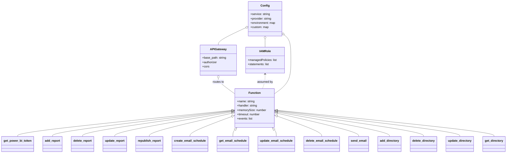

# Diagram: common/iam_service/serverless.power_bi.yml


> Auto-generated by Obscura crawlers

## Diagram 1

```mermaid
flowchart LR
  Client[Client / Browser] -->|HTTP| APIGW[API Gateway (powerbi base)]
  subgraph Lambdas [Lambda Functions]
    direction TB
    Tkn[get_power_bi_token\nhandler: iam_service/v1/power_bi/get_token.lambda_handler]
    Add[add_report\nhandler: iam_service/v1/power_bi/add_report.lambda_handler]
    Del[delete_report\nhandler: iam_service/v1/power_bi/delete_report.lambda_handler]
    Upd[update_report\nhandler: iam_service/v1/power_bi/patch_report.lambda_handler]
    Rep[republish_report\nhandler: iam_service/v1/power_bi/republish_report.lambda_handler]
    ES_Create[create_email_schedule\nhandler: iam_service/v1/power_bi/email/create_email_schedule.lambda_handler]
    ES_Get[get_email_schedule\nhandler: iam_service/v1/power_bi/email/get_email_schedule.lambda_handler]
    ES_Update[update_email_schedule\nhandler: iam_service/v1/power_bi/email/update_email_schedule.lambda_handler]
    ES_Delete[delete_email_schedule\nhandler: iam_service/v1/power_bi/email/delete_email_schedule.lambda_handler]
    Send[send_email\nhandler: iam_service/v1/power_bi/email/send_email.lambda_handler]
    AddDir[add_directory\nhandler: iam_service/v1/power_bi/add_directory.lambda_handler]
    DelDir[delete_directory\nhandler: iam_service/v1/power_bi/delete_directory.lambda_handler]
    UpdDir[update_directory\nhandler: iam_service/v1/power_bi/patch_directory.lambda_handler]
    GetDir[get_directory\nhandler: iam_service/v1/power_bi/get_directory.lambda_handler]
  end
  APIGW --> Tkn
  APIGW --> Add
  APIGW --> Del
  APIGW --> Upd
  APIGW --> Rep
  APIGW --> ES_Create
  APIGW --> ES_Get
  APIGW --> ES_Update
  APIGW --> ES_Delete
  APIGW --> AddDir
  APIGW --> DelDir
  APIGW --> UpdDir
  APIGW --> GetDir
  APIGW --> Send

  subgraph AWSInfra [AWS Infra / Config]
    IAM[IAM Role\nmanagedPolicies + statements]
    VPC[VPC]
    SSM[SSM Parameters\n/parameter/fv/.../power_bi]
    Secrets[Secrets Manager\nDD API Key Secret ARN]
    KMS[KMS Key\narn:aws:kms:...]
    Logs[CloudWatch Logs\nrestricted deny rules]
    Datadog[Datadog\ntracing disabled config]
  end

  Lambdas -->|assumed role| IAM
  Lambdas -->|runs in| VPC
  Lambdas -->|reads| SSM
  Lambdas -->|gets secret| Secrets
  Lambdas -->|decrypt| KMS
  Lambdas -->|writes logs| Logs
  Datadog --> Lambdas
```

> SVG rendering failed for this diagram.

## Diagram 2



### SVG

<svg id="container" width="2751.6875" xmlns="http://www.w3.org/2000/svg" class="classDiagram" height="850" viewBox="0 0 2751.6875 850" role="graphics-document document" aria-roledescription="class"><style>#container{font-family:"trebuchet ms",verdana,arial,sans-serif;font-size:16px;fill:#333;}@keyframes edge-animation-frame{from{stroke-dashoffset:0;}}@keyframes dash{to{stroke-dashoffset:0;}}#container .edge-animation-slow{stroke-dasharray:9,5!important;stroke-dashoffset:900;animation:dash 50s linear infinite;stroke-linecap:round;}#container .edge-animation-fast{stroke-dasharray:9,5!important;stroke-dashoffset:900;animation:dash 20s linear infinite;stroke-linecap:round;}#container .error-icon{fill:#552222;}#container .error-text{fill:#552222;stroke:#552222;}#container .edge-thickness-normal{stroke-width:1px;}#container .edge-thickness-thick{stroke-width:3.5px;}#container .edge-pattern-solid{stroke-dasharray:0;}#container .edge-thickness-invisible{stroke-width:0;fill:none;}#container .edge-pattern-dashed{stroke-dasharray:3;}#container .edge-pattern-dotted{stroke-dasharray:2;}#container .marker{fill:#333333;stroke:#333333;}#container .marker.cross{stroke:#333333;}#container svg{font-family:"trebuchet ms",verdana,arial,sans-serif;font-size:16px;}#container p{margin:0;}#container g.classGroup text{fill:#9370DB;stroke:none;font-family:"trebuchet ms",verdana,arial,sans-serif;font-size:10px;}#container g.classGroup text .title{font-weight:bolder;}#container .nodeLabel,#container .edgeLabel{color:#131300;}#container .edgeLabel .label rect{fill:#ECECFF;}#container .label text{fill:#131300;}#container .labelBkg{background:#ECECFF;}#container .edgeLabel .label span{background:#ECECFF;}#container .classTitle{font-weight:bolder;}#container .node rect,#container .node circle,#container .node ellipse,#container .node polygon,#container .node path{fill:#ECECFF;stroke:#9370DB;stroke-width:1px;}#container .divider{stroke:#9370DB;stroke-width:1;}#container g.clickable{cursor:pointer;}#container g.classGroup rect{fill:#ECECFF;stroke:#9370DB;}#container g.classGroup line{stroke:#9370DB;stroke-width:1;}#container .classLabel .box{stroke:none;stroke-width:0;fill:#ECECFF;opacity:0.5;}#container .classLabel .label{fill:#9370DB;font-size:10px;}#container .relation{stroke:#333333;stroke-width:1;fill:none;}#container .dashed-line{stroke-dasharray:3;}#container .dotted-line{stroke-dasharray:1 2;}#container #compositionStart,#container .composition{fill:#333333!important;stroke:#333333!important;stroke-width:1;}#container #compositionEnd,#container .composition{fill:#333333!important;stroke:#333333!important;stroke-width:1;}#container #dependencyStart,#container .dependency{fill:#333333!important;stroke:#333333!important;stroke-width:1;}#container #dependencyStart,#container .dependency{fill:#333333!important;stroke:#333333!important;stroke-width:1;}#container #extensionStart,#container .extension{fill:transparent!important;stroke:#333333!important;stroke-width:1;}#container #extensionEnd,#container .extension{fill:transparent!important;stroke:#333333!important;stroke-width:1;}#container #aggregationStart,#container .aggregation{fill:transparent!important;stroke:#333333!important;stroke-width:1;}#container #aggregationEnd,#container .aggregation{fill:transparent!important;stroke:#333333!important;stroke-width:1;}#container #lollipopStart,#container .lollipop{fill:#ECECFF!important;stroke:#333333!important;stroke-width:1;}#container #lollipopEnd,#container .lollipop{fill:#ECECFF!important;stroke:#333333!important;stroke-width:1;}#container .edgeTerminals{font-size:11px;line-height:initial;}#container .classTitleText{text-anchor:middle;font-size:18px;fill:#333;}#container .label-icon{display:inline-block;height:1em;overflow:visible;vertical-align:-0.125em;}#container .node .label-icon path{fill:currentColor;stroke:revert;stroke-width:revert;}#container :root{--mermaid-font-family:"trebuchet ms",verdana,arial,sans-serif;}</style><g><defs><marker id="container_class-aggregationStart" class="marker aggregation class" refX="18" refY="7" markerWidth="190" markerHeight="240" orient="auto"><path d="M 18,7 L9,13 L1,7 L9,1 Z"></path></marker></defs><defs><marker id="container_class-aggregationEnd" class="marker aggregation class" refX="1" refY="7" markerWidth="20" markerHeight="28" orient="auto"><path d="M 18,7 L9,13 L1,7 L9,1 Z"></path></marker></defs><defs><marker id="container_class-extensionStart" class="marker extension class" refX="18" refY="7" markerWidth="190" markerHeight="240" orient="auto"><path d="M 1,7 L18,13 V 1 Z"></path></marker></defs><defs><marker id="container_class-extensionEnd" class="marker extension class" refX="1" refY="7" markerWidth="20" markerHeight="28" orient="auto"><path d="M 1,1 V 13 L18,7 Z"></path></marker></defs><defs><marker id="container_class-compositionStart" class="marker composition class" refX="18" refY="7" markerWidth="190" markerHeight="240" orient="auto"><path d="M 18,7 L9,13 L1,7 L9,1 Z"></path></marker></defs><defs><marker id="container_class-compositionEnd" class="marker composition class" refX="1" refY="7" markerWidth="20" markerHeight="28" orient="auto"><path d="M 18,7 L9,13 L1,7 L9,1 Z"></path></marker></defs><defs><marker id="container_class-dependencyStart" class="marker dependency class" refX="6" refY="7" markerWidth="190" markerHeight="240" orient="auto"><path d="M 5,7 L9,13 L1,7 L9,1 Z"></path></marker></defs><defs><marker id="container_class-dependencyEnd" class="marker dependency class" refX="13" refY="7" markerWidth="20" markerHeight="28" orient="auto"><path d="M 18,7 L9,13 L14,7 L9,1 Z"></path></marker></defs><defs><marker id="container_class-lollipopStart" class="marker lollipop class" refX="13" refY="7" markerWidth="190" markerHeight="240" orient="auto"><circle stroke="black" fill="transparent" cx="7" cy="7" r="6"></circle></marker></defs><defs><marker id="container_class-lollipopEnd" class="marker lollipop class" refX="1" refY="7" markerWidth="190" markerHeight="240" orient="auto"><circle stroke="black" fill="transparent" cx="7" cy="7" r="6"></circle></marker></defs><g class="root"><g class="clusters"></g><g class="edgePaths"><path d="M1258.654,612.934L1064.624,632.945C870.595,652.956,482.536,692.978,288.506,717.156C94.477,741.333,94.477,749.667,94.477,753.833L94.477,758" id="id_Function_get_power_bi_token_1" class="edge-thickness-normal edge-pattern-solid relation" style=";;;" data-edge="true" data-et="edge" data-id="id_Function_get_power_bi_token_1" data-points="W3sieCI6MTI3NS44MTI1LCJ5Ijo2MTEuMTY0MjQyMzk4NTQxMn0seyJ4Ijo5NC40NzY1NjI1LCJ5Ijo3MzN9LHsieCI6OTQuNDc2NTYyNSwieSI6NzU4fV0=" marker-start="url(#container_class-extensionStart)"></path><path d="M1258.687,615.161L1096.277,634.801C933.867,654.441,609.047,693.72,446.637,717.527C284.227,741.333,284.227,749.667,284.227,753.833L284.227,758" id="id_Function_add_report_2" class="edge-thickness-normal edge-pattern-solid relation" style=";;;" data-edge="true" data-et="edge" data-id="id_Function_add_report_2" data-points="W3sieCI6MTI3NS44MTI1LCJ5Ijo2MTMuMDkwMzYxNDg4NTc0M30seyJ4IjoyODQuMjI2NTYyNSwieSI6NzMzfSx7IngiOjI4NC4yMjY1NjI1LCJ5Ijo3NTh9XQ==" marker-start="url(#container_class-extensionStart)"></path><path d="M1258.735,617.845L1123.939,637.037C989.143,656.23,719.552,694.615,584.757,717.974C449.961,741.333,449.961,749.667,449.961,753.833L449.961,758" id="id_Function_delete_report_3" class="edge-thickness-normal edge-pattern-solid relation" style=";;;" data-edge="true" data-et="edge" data-id="id_Function_delete_report_3" data-points="W3sieCI6MTI3NS44MTI1LCJ5Ijo2MTUuNDEyOTM4NTY4OTc5M30seyJ4Ijo0NDkuOTYwOTM3NSwieSI6NzMzfSx7IngiOjQ0OS45NjA5Mzc1LCJ5Ijo3NTh9XQ==" marker-start="url(#container_class-extensionStart)"></path><path d="M1258.823,622.015L1153.595,640.513C1048.366,659.01,837.91,696.005,732.681,718.669C627.453,741.333,627.453,749.667,627.453,753.833L627.453,758" id="id_Function_update_report_4" class="edge-thickness-normal edge-pattern-solid relation" style=";;;" data-edge="true" data-et="edge" data-id="id_Function_update_report_4" data-points="W3sieCI6MTI3NS44MTI1LCJ5Ijo2MTkuMDI4NjQzNDEzMjU0fSx7IngiOjYyNy40NTMxMjUsInkiOjczM30seyJ4Ijo2MjcuNDUzMTI1LCJ5Ijo3NTh9XQ==" marker-start="url(#container_class-extensionStart)"></path><path d="M1259.017,629.297L1185.248,646.581C1111.478,663.865,963.938,698.432,890.168,719.883C816.398,741.333,816.398,749.667,816.398,753.833L816.398,758" id="id_Function_republish_report_5" class="edge-thickness-normal edge-pattern-solid relation" style=";;;" data-edge="true" data-et="edge" data-id="id_Function_republish_report_5" data-points="W3sieCI6MTI3NS44MTI1LCJ5Ijo2MjUuMzYyMjcxMzY5Nzg1N30seyJ4Ijo4MTYuMzk4NDM3NSwieSI6NzMzfSx7IngiOjgxNi4zOTg0Mzc1LCJ5Ijo3NTh9XQ==" marker-start="url(#container_class-extensionStart)"></path><path d="M1259.7,647.554L1222.457,661.795C1185.214,676.036,1110.728,704.518,1073.485,722.926C1036.242,741.333,1036.242,749.667,1036.242,753.833L1036.242,758" id="id_Function_create_email_schedule_6" class="edge-thickness-normal edge-pattern-solid relation" style=";;;" data-edge="true" data-et="edge" data-id="id_Function_create_email_schedule_6" data-points="W3sieCI6MTI3NS44MTI1LCJ5Ijo2NDEuMzkyNzgwOTM0ODM5N30seyJ4IjoxMDM2LjI0MjE4NzUsInkiOjczM30seyJ4IjoxMDM2LjI0MjE4NzUsInkiOjc1OH1d" marker-start="url(#container_class-extensionStart)"></path><path d="M1277.709,720.954L1275.943,722.962C1274.178,724.97,1270.648,728.985,1268.882,735.159C1267.117,741.333,1267.117,749.667,1267.117,753.833L1267.117,758" id="id_Function_get_email_schedule_7" class="edge-thickness-normal edge-pattern-solid relation" style=";;;" data-edge="true" data-et="edge" data-id="id_Function_get_email_schedule_7" data-points="W3sieCI6MTI4OS4wOTkzODkwOTc3NDQzLCJ5Ijo3MDh9LHsieCI6MTI2Ny4xMTcxODc1LCJ5Ijo3MzN9LHsieCI6MTI2Ny4xMTcxODc1LCJ5Ijo3NTh9XQ==" marker-start="url(#container_class-extensionStart)"></path><path d="M1490.416,720.954L1492.182,722.962C1493.947,724.97,1497.477,728.985,1499.243,735.159C1501.008,741.333,1501.008,749.667,1501.008,753.833L1501.008,758" id="id_Function_update_email_schedule_8" class="edge-thickness-normal edge-pattern-solid relation" style=";;;" data-edge="true" data-et="edge" data-id="id_Function_update_email_schedule_8" data-points="W3sieCI6MTQ3OS4wMjU2MTA5MDIyNTU3LCJ5Ijo3MDh9LHsieCI6MTUwMS4wMDc4MTI1LCJ5Ijo3MzN9LHsieCI6MTUwMS4wMDc4MTI1LCJ5Ijo3NTh9XQ==" marker-start="url(#container_class-extensionStart)"></path><path d="M1508.506,645.686L1548.144,660.239C1587.782,674.791,1667.059,703.895,1706.698,722.614C1746.336,741.333,1746.336,749.667,1746.336,753.833L1746.336,758" id="id_Function_delete_email_schedule_9" class="edge-thickness-normal edge-pattern-solid relation" style=";;;" data-edge="true" data-et="edge" data-id="id_Function_delete_email_schedule_9" data-points="W3sieCI6MTQ5Mi4zMTI1LCJ5Ijo2MzkuNzQxMzkwMDkyOTQ2MX0seyJ4IjoxNzQ2LjMzNTkzNzUsInkiOjczM30seyJ4IjoxNzQ2LjMzNTkzNzUsInkiOjc1OH1d" marker-start="url(#container_class-extensionStart)"></path><path d="M1509.1,629.562L1582.018,646.802C1654.936,664.041,1800.773,698.521,1873.691,719.927C1946.609,741.333,1946.609,749.667,1946.609,753.833L1946.609,758" id="id_Function_send_email_10" class="edge-thickness-normal edge-pattern-solid relation" style=";;;" data-edge="true" data-et="edge" data-id="id_Function_send_email_10" data-points="W3sieCI6MTQ5Mi4zMTI1LCJ5Ijo2MjUuNTkyOTc4MzYyOTE0Mn0seyJ4IjoxOTQ2LjYwOTM3NSwieSI6NzMzfSx7IngiOjE5NDYuNjA5Mzc1LCJ5Ijo3NTh9XQ==" marker-start="url(#container_class-extensionStart)"></path><path d="M1509.283,622.825L1610.024,641.187C1710.764,659.55,1912.245,696.275,2012.986,718.804C2113.727,741.333,2113.727,749.667,2113.727,753.833L2113.727,758" id="id_Function_add_directory_11" class="edge-thickness-normal edge-pattern-solid relation" style=";;;" data-edge="true" data-et="edge" data-id="id_Function_add_directory_11" data-points="W3sieCI6MTQ5Mi4zMTI1LCJ5Ijo2MTkuNzMxMzQwNDA3MDc5NH0seyJ4IjoyMTEzLjcyNjU2MjUsInkiOjczM30seyJ4IjoyMTEzLjcyNjU2MjUsInkiOjc1OH1d" marker-start="url(#container_class-extensionStart)"></path><path d="M1509.383,618.21L1641.047,637.342C1772.711,656.473,2036.039,694.737,2167.703,718.035C2299.367,741.333,2299.367,749.667,2299.367,753.833L2299.367,758" id="id_Function_delete_directory_12" class="edge-thickness-normal edge-pattern-solid relation" style=";;;" data-edge="true" data-et="edge" data-id="id_Function_delete_directory_12" data-points="W3sieCI6MTQ5Mi4zMTI1LCJ5Ijo2MTUuNzI5NDYxNjcxNzQ1Mn0seyJ4IjoyMjk5LjM2NzE4NzUsInkiOjczM30seyJ4IjoyMjk5LjM2NzE4NzUsInkiOjc1OH1d" marker-start="url(#container_class-extensionStart)"></path><path d="M1509.441,614.986L1673.993,634.655C1838.546,654.324,2167.652,693.662,2332.205,717.498C2496.758,741.333,2496.758,749.667,2496.758,753.833L2496.758,758" id="id_Function_update_directory_13" class="edge-thickness-normal edge-pattern-solid relation" style=";;;" data-edge="true" data-et="edge" data-id="id_Function_update_directory_13" data-points="W3sieCI6MTQ5Mi4zMTI1LCJ5Ijo2MTIuOTM5MDc2NzA3MDM4OH0seyJ4IjoyNDk2Ljc1NzgxMjUsInkiOjczM30seyJ4IjoyNDk2Ljc1NzgxMjUsInkiOjc1OH1d" marker-start="url(#container_class-extensionStart)"></path><path d="M1509.473,612.844L1705.012,632.87C1900.552,652.896,2291.632,692.948,2487.171,717.141C2682.711,741.333,2682.711,749.667,2682.711,753.833L2682.711,758" id="id_Function_get_directory_14" class="edge-thickness-normal edge-pattern-solid relation" style=";;;" data-edge="true" data-et="edge" data-id="id_Function_get_directory_14" data-points="W3sieCI6MTQ5Mi4zMTI1LCJ5Ijo2MTEuMDg2MzMzNzQ4NDI4NH0seyJ4IjoyNjgyLjcxMDkzNzUsInkiOjczM30seyJ4IjoyNjgyLjcxMDkzNzUsInkiOjc1OH1d" marker-start="url(#container_class-extensionStart)"></path><path d="M1184.293,435.25L1184.293,438.542C1184.293,441.833,1184.293,448.417,1199.546,462.78C1214.799,477.143,1245.306,499.285,1260.559,510.357L1275.813,521.428" id="id_APIGateway_Function_15" class="edge-thickness-normal edge-pattern-solid relation" style=";;;" data-edge="true" data-et="edge" data-id="id_APIGateway_Function_15" data-points="W3sieCI6MTE4NC4yOTI5Njg3NSwieSI6NDE4fSx7IngiOjExODQuMjkyOTY4NzUsInkiOjQ1NX0seyJ4IjoxMjc1LjgxMjUsInkiOjUyMS40MjgyMDgyODY4OTMxfV0=" marker-start="url(#container_class-aggregationStart)"></path><path d="M1441.574,412L1441.574,419.167C1441.574,426.333,1441.574,440.667,1439.128,454C1436.682,467.333,1431.791,479.667,1429.345,485.833L1426.899,492" id="id_IAMRole_Function_16" class="edge-thickness-normal edge-pattern-dashed relation" style=";;;" data-edge="true" data-et="edge" data-id="id_IAMRole_Function_16" data-points="W3sieCI6MTQ0MS41NzQyMTg3NSwieSI6NDA2fSx7IngiOjE0NDEuNTc0MjE4NzUsInkiOjQ1NX0seyJ4IjoxNDI2Ljg5ODgxNDY1NTE3MjQsInkiOjQ5Mn1d" marker-start="url(#container_class-dependencyStart)"></path><path d="M1548.39,194.854L1554.297,199.878C1560.204,204.903,1572.018,214.951,1577.925,238.142C1583.832,261.333,1583.832,297.667,1583.832,336C1583.832,374.333,1583.832,414.667,1568.579,445.905C1553.326,477.143,1522.819,499.285,1507.566,510.357L1492.313,521.428" id="id_Config_Function_17" class="edge-thickness-normal edge-pattern-solid relation" style=";;;" data-edge="true" data-et="edge" data-id="id_Config_Function_17" data-points="W3sieCI6MTUzNS4yNSwieSI6MTgzLjY3NzY1OTM5OTE5ODJ9LHsieCI6MTU4My44MzIwMzEyNSwieSI6MjI1fSx7IngiOjE1ODMuODMyMDMxMjUsInkiOjMzNH0seyJ4IjoxNTgzLjgzMjAzMTI1LCJ5Ijo0NTV9LHsieCI6MTQ5Mi4zMTI1LCJ5Ijo1MjEuNDI4MjA4Mjg2ODkzMX1d" marker-start="url(#container_class-aggregationStart)"></path><path d="M1332.289,155.397L1307.623,166.998C1282.957,178.598,1233.625,201.799,1208.959,217.566C1184.293,233.333,1184.293,241.667,1184.293,245.833L1184.293,250" id="id_Config_APIGateway_18" class="edge-thickness-normal edge-pattern-solid relation" style=";;;" data-edge="true" data-et="edge" data-id="id_Config_APIGateway_18" data-points="W3sieCI6MTM0Ny44OTg0Mzc1LCJ5IjoxNDguMDU1OTQ4NjIxNDAxNjh9LHsieCI6MTE4NC4yOTI5Njg3NSwieSI6MjI1fSx7IngiOjExODQuMjkyOTY4NzUsInkiOjI1MH1d" marker-start="url(#container_class-aggregationStart)"></path><path d="M1441.574,217.25L1441.574,218.542C1441.574,219.833,1441.574,222.417,1441.574,229.875C1441.574,237.333,1441.574,249.667,1441.574,255.833L1441.574,262" id="id_Config_IAMRole_19" class="edge-thickness-normal edge-pattern-solid relation" style=";;;" data-edge="true" data-et="edge" data-id="id_Config_IAMRole_19" data-points="W3sieCI6MTQ0MS41NzQyMTg3NSwieSI6MjAwfSx7IngiOjE0NDEuNTc0MjE4NzUsInkiOjIyNX0seyJ4IjoxNDQxLjU3NDIxODc1LCJ5IjoyNjJ9XQ==" marker-start="url(#container_class-aggregationStart)"></path></g><g class="edgeLabels"><g class="edgeLabel"><g class="label" data-id="id_Function_get_power_bi_token_1" transform="translate(0, 0)"><foreignObject width="0" height="0"><div xmlns="http://www.w3.org/1999/xhtml" class="labelBkg" style="display: table-cell; white-space: nowrap; line-height: 1.5; max-width: 200px; text-align: center;"><span class="edgeLabel"></span></div></foreignObject></g></g><g class="edgeLabel"><g class="label" data-id="id_Function_add_report_2" transform="translate(0, 0)"><foreignObject width="0" height="0"><div xmlns="http://www.w3.org/1999/xhtml" class="labelBkg" style="display: table-cell; white-space: nowrap; line-height: 1.5; max-width: 200px; text-align: center;"><span class="edgeLabel"></span></div></foreignObject></g></g><g class="edgeLabel"><g class="label" data-id="id_Function_delete_report_3" transform="translate(0, 0)"><foreignObject width="0" height="0"><div xmlns="http://www.w3.org/1999/xhtml" class="labelBkg" style="display: table-cell; white-space: nowrap; line-height: 1.5; max-width: 200px; text-align: center;"><span class="edgeLabel"></span></div></foreignObject></g></g><g class="edgeLabel"><g class="label" data-id="id_Function_update_report_4" transform="translate(0, 0)"><foreignObject width="0" height="0"><div xmlns="http://www.w3.org/1999/xhtml" class="labelBkg" style="display: table-cell; white-space: nowrap; line-height: 1.5; max-width: 200px; text-align: center;"><span class="edgeLabel"></span></div></foreignObject></g></g><g class="edgeLabel"><g class="label" data-id="id_Function_republish_report_5" transform="translate(0, 0)"><foreignObject width="0" height="0"><div xmlns="http://www.w3.org/1999/xhtml" class="labelBkg" style="display: table-cell; white-space: nowrap; line-height: 1.5; max-width: 200px; text-align: center;"><span class="edgeLabel"></span></div></foreignObject></g></g><g class="edgeLabel"><g class="label" data-id="id_Function_create_email_schedule_6" transform="translate(0, 0)"><foreignObject width="0" height="0"><div xmlns="http://www.w3.org/1999/xhtml" class="labelBkg" style="display: table-cell; white-space: nowrap; line-height: 1.5; max-width: 200px; text-align: center;"><span class="edgeLabel"></span></div></foreignObject></g></g><g class="edgeLabel"><g class="label" data-id="id_Function_get_email_schedule_7" transform="translate(0, 0)"><foreignObject width="0" height="0"><div xmlns="http://www.w3.org/1999/xhtml" class="labelBkg" style="display: table-cell; white-space: nowrap; line-height: 1.5; max-width: 200px; text-align: center;"><span class="edgeLabel"></span></div></foreignObject></g></g><g class="edgeLabel"><g class="label" data-id="id_Function_update_email_schedule_8" transform="translate(0, 0)"><foreignObject width="0" height="0"><div xmlns="http://www.w3.org/1999/xhtml" class="labelBkg" style="display: table-cell; white-space: nowrap; line-height: 1.5; max-width: 200px; text-align: center;"><span class="edgeLabel"></span></div></foreignObject></g></g><g class="edgeLabel"><g class="label" data-id="id_Function_delete_email_schedule_9" transform="translate(0, 0)"><foreignObject width="0" height="0"><div xmlns="http://www.w3.org/1999/xhtml" class="labelBkg" style="display: table-cell; white-space: nowrap; line-height: 1.5; max-width: 200px; text-align: center;"><span class="edgeLabel"></span></div></foreignObject></g></g><g class="edgeLabel"><g class="label" data-id="id_Function_send_email_10" transform="translate(0, 0)"><foreignObject width="0" height="0"><div xmlns="http://www.w3.org/1999/xhtml" class="labelBkg" style="display: table-cell; white-space: nowrap; line-height: 1.5; max-width: 200px; text-align: center;"><span class="edgeLabel"></span></div></foreignObject></g></g><g class="edgeLabel"><g class="label" data-id="id_Function_add_directory_11" transform="translate(0, 0)"><foreignObject width="0" height="0"><div xmlns="http://www.w3.org/1999/xhtml" class="labelBkg" style="display: table-cell; white-space: nowrap; line-height: 1.5; max-width: 200px; text-align: center;"><span class="edgeLabel"></span></div></foreignObject></g></g><g class="edgeLabel"><g class="label" data-id="id_Function_delete_directory_12" transform="translate(0, 0)"><foreignObject width="0" height="0"><div xmlns="http://www.w3.org/1999/xhtml" class="labelBkg" style="display: table-cell; white-space: nowrap; line-height: 1.5; max-width: 200px; text-align: center;"><span class="edgeLabel"></span></div></foreignObject></g></g><g class="edgeLabel"><g class="label" data-id="id_Function_update_directory_13" transform="translate(0, 0)"><foreignObject width="0" height="0"><div xmlns="http://www.w3.org/1999/xhtml" class="labelBkg" style="display: table-cell; white-space: nowrap; line-height: 1.5; max-width: 200px; text-align: center;"><span class="edgeLabel"></span></div></foreignObject></g></g><g class="edgeLabel"><g class="label" data-id="id_Function_get_directory_14" transform="translate(0, 0)"><foreignObject width="0" height="0"><div xmlns="http://www.w3.org/1999/xhtml" class="labelBkg" style="display: table-cell; white-space: nowrap; line-height: 1.5; max-width: 200px; text-align: center;"><span class="edgeLabel"></span></div></foreignObject></g></g><g class="edgeLabel" transform="translate(1184.29296875, 455)"><g class="label" data-id="id_APIGateway_Function_15" transform="translate(-32.6015625, -12)"><foreignObject width="65.203125" height="24"><div xmlns="http://www.w3.org/1999/xhtml" class="labelBkg" style="display: table-cell; white-space: nowrap; line-height: 1.5; max-width: 200px; text-align: center;"><span class="edgeLabel"><p>routes to</p></span></div></foreignObject></g></g><g class="edgeLabel" transform="translate(1441.57421875, 455)"><g class="label" data-id="id_IAMRole_Function_16" transform="translate(-43.1015625, -12)"><foreignObject width="86.203125" height="24"><div xmlns="http://www.w3.org/1999/xhtml" class="labelBkg" style="display: table-cell; white-space: nowrap; line-height: 1.5; max-width: 200px; text-align: center;"><span class="edgeLabel"><p>assumed by</p></span></div></foreignObject></g></g><g class="edgeLabel"><g class="label" data-id="id_Config_Function_17" transform="translate(0, 0)"><foreignObject width="0" height="0"><div xmlns="http://www.w3.org/1999/xhtml" class="labelBkg" style="display: table-cell; white-space: nowrap; line-height: 1.5; max-width: 200px; text-align: center;"><span class="edgeLabel"></span></div></foreignObject></g></g><g class="edgeLabel"><g class="label" data-id="id_Config_APIGateway_18" transform="translate(0, 0)"><foreignObject width="0" height="0"><div xmlns="http://www.w3.org/1999/xhtml" class="labelBkg" style="display: table-cell; white-space: nowrap; line-height: 1.5; max-width: 200px; text-align: center;"><span class="edgeLabel"></span></div></foreignObject></g></g><g class="edgeLabel"><g class="label" data-id="id_Config_IAMRole_19" transform="translate(0, 0)"><foreignObject width="0" height="0"><div xmlns="http://www.w3.org/1999/xhtml" class="labelBkg" style="display: table-cell; white-space: nowrap; line-height: 1.5; max-width: 200px; text-align: center;"><span class="edgeLabel"></span></div></foreignObject></g></g></g><g class="nodes"><g class="node default" id="classId-Function-0" transform="translate(1384.0625, 600)"><g class="basic label-container"><path d="M-108.25 -108 L108.25 -108 L108.25 108 L-108.25 108" stroke="none" stroke-width="0" fill="#ECECFF" style=""></path><path d="M-108.25 -108 C-61.91811292919924 -108, -15.586225858398478 -108, 108.25 -108 M-108.25 -108 C-46.76175517762672 -108, 14.726489644746565 -108, 108.25 -108 M108.25 -108 C108.25 -56.46045608497718, 108.25 -4.920912169954363, 108.25 108 M108.25 -108 C108.25 -38.491658904566734, 108.25 31.016682190866533, 108.25 108 M108.25 108 C30.602977296734593 108, -47.04404540653081 108, -108.25 108 M108.25 108 C39.71437327909736 108, -28.821253441805283 108, -108.25 108 M-108.25 108 C-108.25 54.617221081777686, -108.25 1.2344421635553715, -108.25 -108 M-108.25 108 C-108.25 35.059165324223784, -108.25 -37.88166935155243, -108.25 -108" stroke="#9370DB" stroke-width="1.3" fill="none" stroke-dasharray="0 0" style=""></path></g><g class="annotation-group text" transform="translate(0, -84)"></g><g class="label-group text" transform="translate(-31.265625, -84)"><g class="label" style="font-weight: bolder" transform="translate(0,-12)"><foreignObject width="62.53125" height="24"><div xmlns="http://www.w3.org/1999/xhtml" style="display: table-cell; white-space: nowrap; line-height: 1.5; max-width: 113px; text-align: center;"><span class="nodeLabel markdown-node-label" style=""><p>Function</p></span></div></foreignObject></g></g><g class="members-group text" transform="translate(-96.25, -36)"><g class="label" style="" transform="translate(0,-12)"><foreignObject width="98.21875" height="24"><div xmlns="http://www.w3.org/1999/xhtml" style="display: table-cell; white-space: nowrap; line-height: 1.5; max-width: 156px; text-align: center;"><span class="nodeLabel markdown-node-label" style=""><p>+name: string</p></span></div></foreignObject></g><g class="label" style="" transform="translate(0,12)"><foreignObject width="114.390625" height="24"><div xmlns="http://www.w3.org/1999/xhtml" style="display: table-cell; white-space: nowrap; line-height: 1.5; max-width: 172px; text-align: center;"><span class="nodeLabel markdown-node-label" style=""><p>+handler: string</p></span></div></foreignObject></g><g class="label" style="" transform="translate(0,36)"><foreignObject width="161.234375" height="24"><div xmlns="http://www.w3.org/1999/xhtml" style="display: table-cell; white-space: nowrap; line-height: 1.5; max-width: 219px; text-align: center;"><span class="nodeLabel markdown-node-label" style=""><p>+memorySize: number</p></span></div></foreignObject></g><g class="label" style="" transform="translate(0,60)"><foreignObject width="130.015625" height="24"><div xmlns="http://www.w3.org/1999/xhtml" style="display: table-cell; white-space: nowrap; line-height: 1.5; max-width: 188px; text-align: center;"><span class="nodeLabel markdown-node-label" style=""><p>+timeout: number</p></span></div></foreignObject></g><g class="label" style="" transform="translate(0,84)"><foreignObject width="86.328125" height="24"><div xmlns="http://www.w3.org/1999/xhtml" style="display: table-cell; white-space: nowrap; line-height: 1.5; max-width: 144px; text-align: center;"><span class="nodeLabel markdown-node-label" style=""><p>+events: list</p></span></div></foreignObject></g></g><g class="methods-group text" transform="translate(-96.25, 108)"></g><g class="divider" style=""><path d="M-108.25 -60 C-26.928500452495243 -60, 54.392999095009515 -60, 108.25 -60 M-108.25 -60 C-37.97782986723652 -60, 32.294340265526955 -60, 108.25 -60" stroke="#9370DB" stroke-width="1.3" fill="none" stroke-dasharray="0 0" style=""></path></g><g class="divider" style=""><path d="M-108.25 84 C-59.31753004624602 84, -10.38506009249204 84, 108.25 84 M-108.25 84 C-53.271189696579206 84, 1.7076206068415871 84, 108.25 84" stroke="#9370DB" stroke-width="1.3" fill="none" stroke-dasharray="0 0" style=""></path></g></g><g class="node default" id="classId-APIGateway-1" transform="translate(1184.29296875, 334)"><g class="basic label-container"><path d="M-100.0234375 -84 L100.0234375 -84 L100.0234375 84 L-100.0234375 84" stroke="none" stroke-width="0" fill="#ECECFF" style=""></path><path d="M-100.0234375 -84 C-40.57077187355113 -84, 18.88189375289774 -84, 100.0234375 -84 M-100.0234375 -84 C-56.203867100266955 -84, -12.384296700533909 -84, 100.0234375 -84 M100.0234375 -84 C100.0234375 -41.091671250985144, 100.0234375 1.8166574980297128, 100.0234375 84 M100.0234375 -84 C100.0234375 -32.10396538314889, 100.0234375 19.79206923370222, 100.0234375 84 M100.0234375 84 C30.251344019418227 84, -39.52074946116355 84, -100.0234375 84 M100.0234375 84 C32.954390697842584 84, -34.11465610431483 84, -100.0234375 84 M-100.0234375 84 C-100.0234375 20.889459063080253, -100.0234375 -42.221081873839495, -100.0234375 -84 M-100.0234375 84 C-100.0234375 24.048066118944476, -100.0234375 -35.90386776211105, -100.0234375 -84" stroke="#9370DB" stroke-width="1.3" fill="none" stroke-dasharray="0 0" style=""></path></g><g class="annotation-group text" transform="translate(0, -60)"></g><g class="label-group text" transform="translate(-43.0625, -60)"><g class="label" style="font-weight: bolder" transform="translate(0,-12)"><foreignObject width="86.125" height="24"><div xmlns="http://www.w3.org/1999/xhtml" style="display: table-cell; white-space: nowrap; line-height: 1.5; max-width: 134px; text-align: center;"><span class="nodeLabel markdown-node-label" style=""><p>APIGateway</p></span></div></foreignObject></g></g><g class="members-group text" transform="translate(-88.0234375, -12)"><g class="label" style="" transform="translate(0,-12)"><foreignObject width="132.984375" height="24"><div xmlns="http://www.w3.org/1999/xhtml" style="display: table-cell; white-space: nowrap; line-height: 1.5; max-width: 191px; text-align: center;"><span class="nodeLabel markdown-node-label" style=""><p>+base_path: string</p></span></div></foreignObject></g><g class="label" style="" transform="translate(0,12)"><foreignObject width="82.734375" height="24"><div xmlns="http://www.w3.org/1999/xhtml" style="display: table-cell; white-space: nowrap; line-height: 1.5; max-width: 141px; text-align: center;"><span class="nodeLabel markdown-node-label" style=""><p>+authorizer</p></span></div></foreignObject></g><g class="label" style="" transform="translate(0,36)"><foreignObject width="38.078125" height="24"><div xmlns="http://www.w3.org/1999/xhtml" style="display: table-cell; white-space: nowrap; line-height: 1.5; max-width: 95px; text-align: center;"><span class="nodeLabel markdown-node-label" style=""><p>+cors</p></span></div></foreignObject></g></g><g class="methods-group text" transform="translate(-88.0234375, 84)"></g><g class="divider" style=""><path d="M-100.0234375 -36 C-56.62479698718493 -36, -13.226156474369859 -36, 100.0234375 -36 M-100.0234375 -36 C-20.19271330710079 -36, 59.63801088579842 -36, 100.0234375 -36" stroke="#9370DB" stroke-width="1.3" fill="none" stroke-dasharray="0 0" style=""></path></g><g class="divider" style=""><path d="M-100.0234375 60 C-26.690266866463958 60, 46.642903767072085 60, 100.0234375 60 M-100.0234375 60 C-57.531912822894135 60, -15.04038814578827 60, 100.0234375 60" stroke="#9370DB" stroke-width="1.3" fill="none" stroke-dasharray="0 0" style=""></path></g></g><g class="node default" id="classId-IAMRole-2" transform="translate(1441.57421875, 334)"><g class="basic label-container"><path d="M-107.2578125 -72 L107.2578125 -72 L107.2578125 72 L-107.2578125 72" stroke="none" stroke-width="0" fill="#ECECFF" style=""></path><path d="M-107.2578125 -72 C-47.491494832006765 -72, 12.27482283598647 -72, 107.2578125 -72 M-107.2578125 -72 C-32.23291190598374 -72, 42.79198868803252 -72, 107.2578125 -72 M107.2578125 -72 C107.2578125 -41.05654446542795, 107.2578125 -10.113088930855888, 107.2578125 72 M107.2578125 -72 C107.2578125 -16.083950118238747, 107.2578125 39.83209976352251, 107.2578125 72 M107.2578125 72 C62.72668087956896 72, 18.19554925913792 72, -107.2578125 72 M107.2578125 72 C23.00681636810357 72, -61.24417976379286 72, -107.2578125 72 M-107.2578125 72 C-107.2578125 15.152871767628923, -107.2578125 -41.69425646474215, -107.2578125 -72 M-107.2578125 72 C-107.2578125 36.34420186206631, -107.2578125 0.6884037241326268, -107.2578125 -72" stroke="#9370DB" stroke-width="1.3" fill="none" stroke-dasharray="0 0" style=""></path></g><g class="annotation-group text" transform="translate(0, -48)"></g><g class="label-group text" transform="translate(-29.59375, -48)"><g class="label" style="font-weight: bolder" transform="translate(0,-12)"><foreignObject width="59.1875" height="24"><div xmlns="http://www.w3.org/1999/xhtml" style="display: table-cell; white-space: nowrap; line-height: 1.5; max-width: 108px; text-align: center;"><span class="nodeLabel markdown-node-label" style=""><p>IAMRole</p></span></div></foreignObject></g></g><g class="members-group text" transform="translate(-95.2578125, 0)"><g class="label" style="" transform="translate(0,-12)"><foreignObject width="160.921875" height="24"><div xmlns="http://www.w3.org/1999/xhtml" style="display: table-cell; white-space: nowrap; line-height: 1.5; max-width: 218px; text-align: center;"><span class="nodeLabel markdown-node-label" style=""><p>+managedPolicies: list</p></span></div></foreignObject></g><g class="label" style="" transform="translate(0,12)"><foreignObject width="119.671875" height="24"><div xmlns="http://www.w3.org/1999/xhtml" style="display: table-cell; white-space: nowrap; line-height: 1.5; max-width: 177px; text-align: center;"><span class="nodeLabel markdown-node-label" style=""><p>+statements: list</p></span></div></foreignObject></g></g><g class="methods-group text" transform="translate(-95.2578125, 72)"></g><g class="divider" style=""><path d="M-107.2578125 -24 C-25.922896602538188 -24, 55.412019294923624 -24, 107.2578125 -24 M-107.2578125 -24 C-32.885493609116054 -24, 41.48682528176789 -24, 107.2578125 -24" stroke="#9370DB" stroke-width="1.3" fill="none" stroke-dasharray="0 0" style=""></path></g><g class="divider" style=""><path d="M-107.2578125 48 C-63.51716331304761 48, -19.776514126095222 48, 107.2578125 48 M-107.2578125 48 C-53.4419552380147 48, 0.3739020239706008 48, 107.2578125 48" stroke="#9370DB" stroke-width="1.3" fill="none" stroke-dasharray="0 0" style=""></path></g></g><g class="node default" id="classId-Config-3" transform="translate(1441.57421875, 104)"><g class="basic label-container"><path d="M-93.67578125 -96 L93.67578125 -96 L93.67578125 96 L-93.67578125 96" stroke="none" stroke-width="0" fill="#ECECFF" style=""></path><path d="M-93.67578125 -96 C-26.696487332607504 -96, 40.28280658478499 -96, 93.67578125 -96 M-93.67578125 -96 C-32.09458685688563 -96, 29.486607536228746 -96, 93.67578125 -96 M93.67578125 -96 C93.67578125 -25.285435781338094, 93.67578125 45.42912843732381, 93.67578125 96 M93.67578125 -96 C93.67578125 -45.95845137583388, 93.67578125 4.083097248332237, 93.67578125 96 M93.67578125 96 C48.61479380558523 96, 3.5538063611704587 96, -93.67578125 96 M93.67578125 96 C44.98277278494719 96, -3.710235680105626 96, -93.67578125 96 M-93.67578125 96 C-93.67578125 53.05279575243399, -93.67578125 10.105591504867974, -93.67578125 -96 M-93.67578125 96 C-93.67578125 52.93910716804391, -93.67578125 9.878214336087822, -93.67578125 -96" stroke="#9370DB" stroke-width="1.3" fill="none" stroke-dasharray="0 0" style=""></path></g><g class="annotation-group text" transform="translate(0, -72)"></g><g class="label-group text" transform="translate(-22.9296875, -72)"><g class="label" style="font-weight: bolder" transform="translate(0,-12)"><foreignObject width="45.859375" height="24"><div xmlns="http://www.w3.org/1999/xhtml" style="display: table-cell; white-space: nowrap; line-height: 1.5; max-width: 96px; text-align: center;"><span class="nodeLabel markdown-node-label" style=""><p>Config</p></span></div></foreignObject></g></g><g class="members-group text" transform="translate(-81.67578125, -24)"><g class="label" style="" transform="translate(0,-12)"><foreignObject width="108.5" height="24"><div xmlns="http://www.w3.org/1999/xhtml" style="display: table-cell; white-space: nowrap; line-height: 1.5; max-width: 167px; text-align: center;"><span class="nodeLabel markdown-node-label" style=""><p>+service: string</p></span></div></foreignObject></g><g class="label" style="" transform="translate(0,12)"><foreignObject width="119.1875" height="24"><div xmlns="http://www.w3.org/1999/xhtml" style="display: table-cell; white-space: nowrap; line-height: 1.5; max-width: 177px; text-align: center;"><span class="nodeLabel markdown-node-label" style=""><p>+provider: string</p></span></div></foreignObject></g><g class="label" style="" transform="translate(0,36)"><foreignObject width="140.421875" height="24"><div xmlns="http://www.w3.org/1999/xhtml" style="display: table-cell; white-space: nowrap; line-height: 1.5; max-width: 198px; text-align: center;"><span class="nodeLabel markdown-node-label" style=""><p>+environment: map</p></span></div></foreignObject></g><g class="label" style="" transform="translate(0,60)"><foreignObject width="100.859375" height="24"><div xmlns="http://www.w3.org/1999/xhtml" style="display: table-cell; white-space: nowrap; line-height: 1.5; max-width: 158px; text-align: center;"><span class="nodeLabel markdown-node-label" style=""><p>+custom: map</p></span></div></foreignObject></g></g><g class="methods-group text" transform="translate(-81.67578125, 96)"></g><g class="divider" style=""><path d="M-93.67578125 -48 C-44.64154247191041 -48, 4.392696306179175 -48, 93.67578125 -48 M-93.67578125 -48 C-38.34972683097514 -48, 16.976327588049713 -48, 93.67578125 -48" stroke="#9370DB" stroke-width="1.3" fill="none" stroke-dasharray="0 0" style=""></path></g><g class="divider" style=""><path d="M-93.67578125 72 C-43.7206226662883 72, 6.2345359174234005 72, 93.67578125 72 M-93.67578125 72 C-28.298751553319676 72, 37.07827814336065 72, 93.67578125 72" stroke="#9370DB" stroke-width="1.3" fill="none" stroke-dasharray="0 0" style=""></path></g></g><g class="node default" id="classId-get_power_bi_token-4" transform="translate(94.4765625, 800)"><g class="basic label-container"><path d="M-86.4765625 -42 L86.4765625 -42 L86.4765625 42 L-86.4765625 42" stroke="none" stroke-width="0" fill="#ECECFF" style=""></path><path d="M-86.4765625 -42 C-42.567177120428106 -42, 1.3422082591437885 -42, 86.4765625 -42 M-86.4765625 -42 C-50.53958253258278 -42, -14.602602565165554 -42, 86.4765625 -42 M86.4765625 -42 C86.4765625 -14.929450244422032, 86.4765625 12.141099511155936, 86.4765625 42 M86.4765625 -42 C86.4765625 -20.698819573159746, 86.4765625 0.6023608536805085, 86.4765625 42 M86.4765625 42 C33.87401298263486 42, -18.72853653473028 42, -86.4765625 42 M86.4765625 42 C21.24231700979537 42, -43.99192848040926 42, -86.4765625 42 M-86.4765625 42 C-86.4765625 12.56783050341905, -86.4765625 -16.8643389931619, -86.4765625 -42 M-86.4765625 42 C-86.4765625 22.594830409377668, -86.4765625 3.1896608187553355, -86.4765625 -42" stroke="#9370DB" stroke-width="1.3" fill="none" stroke-dasharray="0 0" style=""></path></g><g class="annotation-group text" transform="translate(0, -18)"></g><g class="label-group text" transform="translate(-74.4765625, -18)"><g class="label" style="font-weight: bolder" transform="translate(0,-12)"><foreignObject width="148.953125" height="24"><div xmlns="http://www.w3.org/1999/xhtml" style="display: table-cell; white-space: nowrap; line-height: 1.5; max-width: 196px; text-align: center;"><span class="nodeLabel markdown-node-label" style=""><p>get_power_bi_token</p></span></div></foreignObject></g></g><g class="members-group text" transform="translate(-74.4765625, 30)"></g><g class="methods-group text" transform="translate(-74.4765625, 60)"></g><g class="divider" style=""><path d="M-86.4765625 6 C-34.8694870195143 6, 16.737588460971395 6, 86.4765625 6 M-86.4765625 6 C-21.01656757972094 6, 44.44342734055812 6, 86.4765625 6" stroke="#9370DB" stroke-width="1.3" fill="none" stroke-dasharray="0 0" style=""></path></g><g class="divider" style=""><path d="M-86.4765625 24 C-37.8803150886656 24, 10.715932322668806 24, 86.4765625 24 M-86.4765625 24 C-22.466058577387756 24, 41.54444534522449 24, 86.4765625 24" stroke="#9370DB" stroke-width="1.3" fill="none" stroke-dasharray="0 0" style=""></path></g></g><g class="node default" id="classId-add_report-5" transform="translate(284.2265625, 800)"><g class="basic label-container"><path d="M-53.2734375 -42 L53.2734375 -42 L53.2734375 42 L-53.2734375 42" stroke="none" stroke-width="0" fill="#ECECFF" style=""></path><path d="M-53.2734375 -42 C-31.777293904474725 -42, -10.28115030894945 -42, 53.2734375 -42 M-53.2734375 -42 C-16.131367774469886 -42, 21.010701951060227 -42, 53.2734375 -42 M53.2734375 -42 C53.2734375 -16.336950411578737, 53.2734375 9.326099176842526, 53.2734375 42 M53.2734375 -42 C53.2734375 -23.561330481873675, 53.2734375 -5.12266096374735, 53.2734375 42 M53.2734375 42 C31.90148101639269 42, 10.52952453278538 42, -53.2734375 42 M53.2734375 42 C13.770667908049909 42, -25.732101683900183 42, -53.2734375 42 M-53.2734375 42 C-53.2734375 24.161934653909984, -53.2734375 6.323869307819969, -53.2734375 -42 M-53.2734375 42 C-53.2734375 10.808716433324502, -53.2734375 -20.382567133350996, -53.2734375 -42" stroke="#9370DB" stroke-width="1.3" fill="none" stroke-dasharray="0 0" style=""></path></g><g class="annotation-group text" transform="translate(0, -18)"></g><g class="label-group text" transform="translate(-41.2734375, -18)"><g class="label" style="font-weight: bolder" transform="translate(0,-12)"><foreignObject width="82.546875" height="24"><div xmlns="http://www.w3.org/1999/xhtml" style="display: table-cell; white-space: nowrap; line-height: 1.5; max-width: 132px; text-align: center;"><span class="nodeLabel markdown-node-label" style=""><p>add_report</p></span></div></foreignObject></g></g><g class="members-group text" transform="translate(-41.2734375, 30)"></g><g class="methods-group text" transform="translate(-41.2734375, 60)"></g><g class="divider" style=""><path d="M-53.2734375 6 C-19.144226439094247 6, 14.984984621811506 6, 53.2734375 6 M-53.2734375 6 C-15.839284679071312 6, 21.594868141857376 6, 53.2734375 6" stroke="#9370DB" stroke-width="1.3" fill="none" stroke-dasharray="0 0" style=""></path></g><g class="divider" style=""><path d="M-53.2734375 24 C-16.567020251481928 24, 20.139396997036144 24, 53.2734375 24 M-53.2734375 24 C-24.27405310483397 24, 4.725331290332058 24, 53.2734375 24" stroke="#9370DB" stroke-width="1.3" fill="none" stroke-dasharray="0 0" style=""></path></g></g><g class="node default" id="classId-delete_report-6" transform="translate(449.9609375, 800)"><g class="basic label-container"><path d="M-62.4609375 -42 L62.4609375 -42 L62.4609375 42 L-62.4609375 42" stroke="none" stroke-width="0" fill="#ECECFF" style=""></path><path d="M-62.4609375 -42 C-23.09851524955691 -42, 16.263907000886178 -42, 62.4609375 -42 M-62.4609375 -42 C-21.03712171741101 -42, 20.386694065177977 -42, 62.4609375 -42 M62.4609375 -42 C62.4609375 -18.721613186322767, 62.4609375 4.556773627354467, 62.4609375 42 M62.4609375 -42 C62.4609375 -14.252622695343774, 62.4609375 13.494754609312452, 62.4609375 42 M62.4609375 42 C31.82737545965063 42, 1.1938134193012573 42, -62.4609375 42 M62.4609375 42 C21.945077962445268 42, -18.570781575109464 42, -62.4609375 42 M-62.4609375 42 C-62.4609375 18.618234215658166, -62.4609375 -4.763531568683668, -62.4609375 -42 M-62.4609375 42 C-62.4609375 9.814066966167942, -62.4609375 -22.371866067664115, -62.4609375 -42" stroke="#9370DB" stroke-width="1.3" fill="none" stroke-dasharray="0 0" style=""></path></g><g class="annotation-group text" transform="translate(0, -18)"></g><g class="label-group text" transform="translate(-50.4609375, -18)"><g class="label" style="font-weight: bolder" transform="translate(0,-12)"><foreignObject width="100.921875" height="24"><div xmlns="http://www.w3.org/1999/xhtml" style="display: table-cell; white-space: nowrap; line-height: 1.5; max-width: 149px; text-align: center;"><span class="nodeLabel markdown-node-label" style=""><p>delete_report</p></span></div></foreignObject></g></g><g class="members-group text" transform="translate(-50.4609375, 30)"></g><g class="methods-group text" transform="translate(-50.4609375, 60)"></g><g class="divider" style=""><path d="M-62.4609375 6 C-19.272430072198702 6, 23.916077355602596 6, 62.4609375 6 M-62.4609375 6 C-20.4369594895932 6, 21.5870185208136 6, 62.4609375 6" stroke="#9370DB" stroke-width="1.3" fill="none" stroke-dasharray="0 0" style=""></path></g><g class="divider" style=""><path d="M-62.4609375 24 C-19.0612174607625 24, 24.338502578475 24, 62.4609375 24 M-62.4609375 24 C-23.249782463622168 24, 15.961372572755664 24, 62.4609375 24" stroke="#9370DB" stroke-width="1.3" fill="none" stroke-dasharray="0 0" style=""></path></g></g><g class="node default" id="classId-update_report-7" transform="translate(627.453125, 800)"><g class="basic label-container"><path d="M-65.03125 -42 L65.03125 -42 L65.03125 42 L-65.03125 42" stroke="none" stroke-width="0" fill="#ECECFF" style=""></path><path d="M-65.03125 -42 C-15.657952160779985 -42, 33.71534567844003 -42, 65.03125 -42 M-65.03125 -42 C-23.471704037816544 -42, 18.087841924366913 -42, 65.03125 -42 M65.03125 -42 C65.03125 -10.333625866235888, 65.03125 21.332748267528224, 65.03125 42 M65.03125 -42 C65.03125 -21.460444799393137, 65.03125 -0.9208895987862746, 65.03125 42 M65.03125 42 C37.17244539177259 42, 9.313640783545182 42, -65.03125 42 M65.03125 42 C31.206562450564235 42, -2.6181250988715306 42, -65.03125 42 M-65.03125 42 C-65.03125 17.41062560654385, -65.03125 -7.178748786912301, -65.03125 -42 M-65.03125 42 C-65.03125 9.41267428256183, -65.03125 -23.17465143487634, -65.03125 -42" stroke="#9370DB" stroke-width="1.3" fill="none" stroke-dasharray="0 0" style=""></path></g><g class="annotation-group text" transform="translate(0, -18)"></g><g class="label-group text" transform="translate(-53.03125, -18)"><g class="label" style="font-weight: bolder" transform="translate(0,-12)"><foreignObject width="106.0625" height="24"><div xmlns="http://www.w3.org/1999/xhtml" style="display: table-cell; white-space: nowrap; line-height: 1.5; max-width: 155px; text-align: center;"><span class="nodeLabel markdown-node-label" style=""><p>update_report</p></span></div></foreignObject></g></g><g class="members-group text" transform="translate(-53.03125, 30)"></g><g class="methods-group text" transform="translate(-53.03125, 60)"></g><g class="divider" style=""><path d="M-65.03125 6 C-32.76790464757562 6, -0.504559295151239 6, 65.03125 6 M-65.03125 6 C-35.59125522379621 6, -6.151260447592428 6, 65.03125 6" stroke="#9370DB" stroke-width="1.3" fill="none" stroke-dasharray="0 0" style=""></path></g><g class="divider" style=""><path d="M-65.03125 24 C-22.81130600759522 24, 19.40863798480956 24, 65.03125 24 M-65.03125 24 C-17.62309937363674 24, 29.785051252726518 24, 65.03125 24" stroke="#9370DB" stroke-width="1.3" fill="none" stroke-dasharray="0 0" style=""></path></g></g><g class="node default" id="classId-republish_report-8" transform="translate(816.3984375, 800)"><g class="basic label-container"><path d="M-73.9140625 -42 L73.9140625 -42 L73.9140625 42 L-73.9140625 42" stroke="none" stroke-width="0" fill="#ECECFF" style=""></path><path d="M-73.9140625 -42 C-29.8178502918691 -42, 14.278361916261801 -42, 73.9140625 -42 M-73.9140625 -42 C-39.245538341437275 -42, -4.577014182874549 -42, 73.9140625 -42 M73.9140625 -42 C73.9140625 -20.877247173677016, 73.9140625 0.24550565264596713, 73.9140625 42 M73.9140625 -42 C73.9140625 -9.325442219836447, 73.9140625 23.349115560327107, 73.9140625 42 M73.9140625 42 C21.837694000019113 42, -30.238674499961775 42, -73.9140625 42 M73.9140625 42 C28.432326738749104 42, -17.04940902250179 42, -73.9140625 42 M-73.9140625 42 C-73.9140625 20.963123736493475, -73.9140625 -0.07375252701304902, -73.9140625 -42 M-73.9140625 42 C-73.9140625 11.118951312633847, -73.9140625 -19.762097374732306, -73.9140625 -42" stroke="#9370DB" stroke-width="1.3" fill="none" stroke-dasharray="0 0" style=""></path></g><g class="annotation-group text" transform="translate(0, -18)"></g><g class="label-group text" transform="translate(-61.9140625, -18)"><g class="label" style="font-weight: bolder" transform="translate(0,-12)"><foreignObject width="123.828125" height="24"><div xmlns="http://www.w3.org/1999/xhtml" style="display: table-cell; white-space: nowrap; line-height: 1.5; max-width: 173px; text-align: center;"><span class="nodeLabel markdown-node-label" style=""><p>republish_report</p></span></div></foreignObject></g></g><g class="members-group text" transform="translate(-61.9140625, 30)"></g><g class="methods-group text" transform="translate(-61.9140625, 60)"></g><g class="divider" style=""><path d="M-73.9140625 6 C-28.38792237069311 6, 17.138217758613777 6, 73.9140625 6 M-73.9140625 6 C-42.10186080433977 6, -10.289659108679544 6, 73.9140625 6" stroke="#9370DB" stroke-width="1.3" fill="none" stroke-dasharray="0 0" style=""></path></g><g class="divider" style=""><path d="M-73.9140625 24 C-38.10268646694456 24, -2.291310433889123 24, 73.9140625 24 M-73.9140625 24 C-33.38975952968912 24, 7.134543440621755 24, 73.9140625 24" stroke="#9370DB" stroke-width="1.3" fill="none" stroke-dasharray="0 0" style=""></path></g></g><g class="node default" id="classId-create_email_schedule-9" transform="translate(1036.2421875, 800)"><g class="basic label-container"><path d="M-95.9296875 -42 L95.9296875 -42 L95.9296875 42 L-95.9296875 42" stroke="none" stroke-width="0" fill="#ECECFF" style=""></path><path d="M-95.9296875 -42 C-46.827044216563145 -42, 2.27559906687371 -42, 95.9296875 -42 M-95.9296875 -42 C-28.304799646960575 -42, 39.32008820607885 -42, 95.9296875 -42 M95.9296875 -42 C95.9296875 -24.325363286297712, 95.9296875 -6.650726572595424, 95.9296875 42 M95.9296875 -42 C95.9296875 -24.01618240793635, 95.9296875 -6.032364815872697, 95.9296875 42 M95.9296875 42 C48.424593681407984 42, 0.9194998628159681 42, -95.9296875 42 M95.9296875 42 C22.761348833189956 42, -50.40698983362009 42, -95.9296875 42 M-95.9296875 42 C-95.9296875 9.645387979068715, -95.9296875 -22.70922404186257, -95.9296875 -42 M-95.9296875 42 C-95.9296875 12.856113337303519, -95.9296875 -16.287773325392962, -95.9296875 -42" stroke="#9370DB" stroke-width="1.3" fill="none" stroke-dasharray="0 0" style=""></path></g><g class="annotation-group text" transform="translate(0, -18)"></g><g class="label-group text" transform="translate(-83.9296875, -18)"><g class="label" style="font-weight: bolder" transform="translate(0,-12)"><foreignObject width="167.859375" height="24"><div xmlns="http://www.w3.org/1999/xhtml" style="display: table-cell; white-space: nowrap; line-height: 1.5; max-width: 217px; text-align: center;"><span class="nodeLabel markdown-node-label" style=""><p>create_email_schedule</p></span></div></foreignObject></g></g><g class="members-group text" transform="translate(-83.9296875, 30)"></g><g class="methods-group text" transform="translate(-83.9296875, 60)"></g><g class="divider" style=""><path d="M-95.9296875 6 C-30.53197529707768 6, 34.86573690584464 6, 95.9296875 6 M-95.9296875 6 C-34.2334697881013 6, 27.462747923797394 6, 95.9296875 6" stroke="#9370DB" stroke-width="1.3" fill="none" stroke-dasharray="0 0" style=""></path></g><g class="divider" style=""><path d="M-95.9296875 24 C-27.707901653729493 24, 40.51388419254101 24, 95.9296875 24 M-95.9296875 24 C-35.23215460066416 24, 25.46537829867168 24, 95.9296875 24" stroke="#9370DB" stroke-width="1.3" fill="none" stroke-dasharray="0 0" style=""></path></g></g><g class="node default" id="classId-get_email_schedule-10" transform="translate(1267.1171875, 800)"><g class="basic label-container"><path d="M-84.9453125 -42 L84.9453125 -42 L84.9453125 42 L-84.9453125 42" stroke="none" stroke-width="0" fill="#ECECFF" style=""></path><path d="M-84.9453125 -42 C-26.109618978504514 -42, 32.72607454299097 -42, 84.9453125 -42 M-84.9453125 -42 C-18.28810396088282 -42, 48.36910457823436 -42, 84.9453125 -42 M84.9453125 -42 C84.9453125 -10.161165849629391, 84.9453125 21.677668300741217, 84.9453125 42 M84.9453125 -42 C84.9453125 -25.09531495864174, 84.9453125 -8.19062991728348, 84.9453125 42 M84.9453125 42 C21.211966883072385 42, -42.52137873385523 42, -84.9453125 42 M84.9453125 42 C34.74049237214003 42, -15.464327755719935 42, -84.9453125 42 M-84.9453125 42 C-84.9453125 21.13889508125802, -84.9453125 0.27779016251604105, -84.9453125 -42 M-84.9453125 42 C-84.9453125 9.916904259264186, -84.9453125 -22.16619148147163, -84.9453125 -42" stroke="#9370DB" stroke-width="1.3" fill="none" stroke-dasharray="0 0" style=""></path></g><g class="annotation-group text" transform="translate(0, -18)"></g><g class="label-group text" transform="translate(-72.9453125, -18)"><g class="label" style="font-weight: bolder" transform="translate(0,-12)"><foreignObject width="145.890625" height="24"><div xmlns="http://www.w3.org/1999/xhtml" style="display: table-cell; white-space: nowrap; line-height: 1.5; max-width: 195px; text-align: center;"><span class="nodeLabel markdown-node-label" style=""><p>get_email_schedule</p></span></div></foreignObject></g></g><g class="members-group text" transform="translate(-72.9453125, 30)"></g><g class="methods-group text" transform="translate(-72.9453125, 60)"></g><g class="divider" style=""><path d="M-84.9453125 6 C-30.933126005459428 6, 23.079060489081144 6, 84.9453125 6 M-84.9453125 6 C-41.454826317707024 6, 2.035659864585952 6, 84.9453125 6" stroke="#9370DB" stroke-width="1.3" fill="none" stroke-dasharray="0 0" style=""></path></g><g class="divider" style=""><path d="M-84.9453125 24 C-29.40364621134507 24, 26.13802007730986 24, 84.9453125 24 M-84.9453125 24 C-21.84295498785277 24, 41.25940252429446 24, 84.9453125 24" stroke="#9370DB" stroke-width="1.3" fill="none" stroke-dasharray="0 0" style=""></path></g></g><g class="node default" id="classId-update_email_schedule-11" transform="translate(1501.0078125, 800)"><g class="basic label-container"><path d="M-98.9453125 -42 L98.9453125 -42 L98.9453125 42 L-98.9453125 42" stroke="none" stroke-width="0" fill="#ECECFF" style=""></path><path d="M-98.9453125 -42 C-54.68283878554655 -42, -10.420365071093102 -42, 98.9453125 -42 M-98.9453125 -42 C-40.61970173590997 -42, 17.70590902818006 -42, 98.9453125 -42 M98.9453125 -42 C98.9453125 -8.571154082895802, 98.9453125 24.857691834208396, 98.9453125 42 M98.9453125 -42 C98.9453125 -24.002122444543584, 98.9453125 -6.004244889087168, 98.9453125 42 M98.9453125 42 C47.99413456402888 42, -2.957043371942234 42, -98.9453125 42 M98.9453125 42 C55.59068755548888 42, 12.236062610977754 42, -98.9453125 42 M-98.9453125 42 C-98.9453125 24.485308769678376, -98.9453125 6.970617539356752, -98.9453125 -42 M-98.9453125 42 C-98.9453125 9.559449945217494, -98.9453125 -22.88110010956501, -98.9453125 -42" stroke="#9370DB" stroke-width="1.3" fill="none" stroke-dasharray="0 0" style=""></path></g><g class="annotation-group text" transform="translate(0, -18)"></g><g class="label-group text" transform="translate(-86.9453125, -18)"><g class="label" style="font-weight: bolder" transform="translate(0,-12)"><foreignObject width="173.890625" height="24"><div xmlns="http://www.w3.org/1999/xhtml" style="display: table-cell; white-space: nowrap; line-height: 1.5; max-width: 223px; text-align: center;"><span class="nodeLabel markdown-node-label" style=""><p>update_email_schedule</p></span></div></foreignObject></g></g><g class="members-group text" transform="translate(-86.9453125, 30)"></g><g class="methods-group text" transform="translate(-86.9453125, 60)"></g><g class="divider" style=""><path d="M-98.9453125 6 C-21.7381880646534 6, 55.4689363706932 6, 98.9453125 6 M-98.9453125 6 C-49.49949536647274 6, -0.05367823294548657 6, 98.9453125 6" stroke="#9370DB" stroke-width="1.3" fill="none" stroke-dasharray="0 0" style=""></path></g><g class="divider" style=""><path d="M-98.9453125 24 C-22.64184447606631 24, 53.66162354786738 24, 98.9453125 24 M-98.9453125 24 C-43.61965824803877 24, 11.705996003922465 24, 98.9453125 24" stroke="#9370DB" stroke-width="1.3" fill="none" stroke-dasharray="0 0" style=""></path></g></g><g class="node default" id="classId-delete_email_schedule-12" transform="translate(1746.3359375, 800)"><g class="basic label-container"><path d="M-96.3828125 -42 L96.3828125 -42 L96.3828125 42 L-96.3828125 42" stroke="none" stroke-width="0" fill="#ECECFF" style=""></path><path d="M-96.3828125 -42 C-51.41126876231005 -42, -6.4397250246201025 -42, 96.3828125 -42 M-96.3828125 -42 C-42.67758695875046 -42, 11.02763858249908 -42, 96.3828125 -42 M96.3828125 -42 C96.3828125 -21.231997523487134, 96.3828125 -0.46399504697426863, 96.3828125 42 M96.3828125 -42 C96.3828125 -21.10387350901694, 96.3828125 -0.20774701803387785, 96.3828125 42 M96.3828125 42 C41.610755080374545 42, -13.16130233925091 42, -96.3828125 42 M96.3828125 42 C49.29463350060348 42, 2.206454501206963 42, -96.3828125 42 M-96.3828125 42 C-96.3828125 20.19764345791626, -96.3828125 -1.6047130841674786, -96.3828125 -42 M-96.3828125 42 C-96.3828125 17.001101421677973, -96.3828125 -7.997797156644054, -96.3828125 -42" stroke="#9370DB" stroke-width="1.3" fill="none" stroke-dasharray="0 0" style=""></path></g><g class="annotation-group text" transform="translate(0, -18)"></g><g class="label-group text" transform="translate(-84.3828125, -18)"><g class="label" style="font-weight: bolder" transform="translate(0,-12)"><foreignObject width="168.765625" height="24"><div xmlns="http://www.w3.org/1999/xhtml" style="display: table-cell; white-space: nowrap; line-height: 1.5; max-width: 218px; text-align: center;"><span class="nodeLabel markdown-node-label" style=""><p>delete_email_schedule</p></span></div></foreignObject></g></g><g class="members-group text" transform="translate(-84.3828125, 30)"></g><g class="methods-group text" transform="translate(-84.3828125, 60)"></g><g class="divider" style=""><path d="M-96.3828125 6 C-36.62153040827099 6, 23.139751683458016 6, 96.3828125 6 M-96.3828125 6 C-30.535560297377074 6, 35.31169190524585 6, 96.3828125 6" stroke="#9370DB" stroke-width="1.3" fill="none" stroke-dasharray="0 0" style=""></path></g><g class="divider" style=""><path d="M-96.3828125 24 C-49.94997386772185 24, -3.5171352354437033 24, 96.3828125 24 M-96.3828125 24 C-37.57162390289831 24, 21.23956469420338 24, 96.3828125 24" stroke="#9370DB" stroke-width="1.3" fill="none" stroke-dasharray="0 0" style=""></path></g></g><g class="node default" id="classId-send_email-13" transform="translate(1946.609375, 800)"><g class="basic label-container"><path d="M-53.890625 -42 L53.890625 -42 L53.890625 42 L-53.890625 42" stroke="none" stroke-width="0" fill="#ECECFF" style=""></path><path d="M-53.890625 -42 C-29.137454583465804 -42, -4.384284166931607 -42, 53.890625 -42 M-53.890625 -42 C-16.045217976702013 -42, 21.800189046595975 -42, 53.890625 -42 M53.890625 -42 C53.890625 -21.981281135236113, 53.890625 -1.962562270472226, 53.890625 42 M53.890625 -42 C53.890625 -13.337229531992048, 53.890625 15.325540936015905, 53.890625 42 M53.890625 42 C30.460605719739007 42, 7.030586439478014 42, -53.890625 42 M53.890625 42 C14.561546162713597 42, -24.767532674572806 42, -53.890625 42 M-53.890625 42 C-53.890625 15.261209889993829, -53.890625 -11.477580220012342, -53.890625 -42 M-53.890625 42 C-53.890625 11.944834033959879, -53.890625 -18.110331932080243, -53.890625 -42" stroke="#9370DB" stroke-width="1.3" fill="none" stroke-dasharray="0 0" style=""></path></g><g class="annotation-group text" transform="translate(0, -18)"></g><g class="label-group text" transform="translate(-41.890625, -18)"><g class="label" style="font-weight: bolder" transform="translate(0,-12)"><foreignObject width="83.78125" height="24"><div xmlns="http://www.w3.org/1999/xhtml" style="display: table-cell; white-space: nowrap; line-height: 1.5; max-width: 134px; text-align: center;"><span class="nodeLabel markdown-node-label" style=""><p>send_email</p></span></div></foreignObject></g></g><g class="members-group text" transform="translate(-41.890625, 30)"></g><g class="methods-group text" transform="translate(-41.890625, 60)"></g><g class="divider" style=""><path d="M-53.890625 6 C-27.633868380387323 6, -1.3771117607746461 6, 53.890625 6 M-53.890625 6 C-31.23503472917294 6, -8.579444458345883 6, 53.890625 6" stroke="#9370DB" stroke-width="1.3" fill="none" stroke-dasharray="0 0" style=""></path></g><g class="divider" style=""><path d="M-53.890625 24 C-20.836029091726296 24, 12.218566816547408 24, 53.890625 24 M-53.890625 24 C-30.649633916740672 24, -7.408642833481345 24, 53.890625 24" stroke="#9370DB" stroke-width="1.3" fill="none" stroke-dasharray="0 0" style=""></path></g></g><g class="node default" id="classId-add_directory-14" transform="translate(2113.7265625, 800)"><g class="basic label-container"><path d="M-63.2265625 -42 L63.2265625 -42 L63.2265625 42 L-63.2265625 42" stroke="none" stroke-width="0" fill="#ECECFF" style=""></path><path d="M-63.2265625 -42 C-20.946599883654997 -42, 21.333362732690006 -42, 63.2265625 -42 M-63.2265625 -42 C-23.279746186349072 -42, 16.667070127301855 -42, 63.2265625 -42 M63.2265625 -42 C63.2265625 -23.260671307245683, 63.2265625 -4.521342614491367, 63.2265625 42 M63.2265625 -42 C63.2265625 -17.7688773527192, 63.2265625 6.462245294561598, 63.2265625 42 M63.2265625 42 C37.70485495054328 42, 12.183147401086558 42, -63.2265625 42 M63.2265625 42 C16.62241474584311 42, -29.981733008313782 42, -63.2265625 42 M-63.2265625 42 C-63.2265625 8.907539678547863, -63.2265625 -24.184920642904274, -63.2265625 -42 M-63.2265625 42 C-63.2265625 15.545961660421131, -63.2265625 -10.908076679157737, -63.2265625 -42" stroke="#9370DB" stroke-width="1.3" fill="none" stroke-dasharray="0 0" style=""></path></g><g class="annotation-group text" transform="translate(0, -18)"></g><g class="label-group text" transform="translate(-51.2265625, -18)"><g class="label" style="font-weight: bolder" transform="translate(0,-12)"><foreignObject width="102.453125" height="24"><div xmlns="http://www.w3.org/1999/xhtml" style="display: table-cell; white-space: nowrap; line-height: 1.5; max-width: 151px; text-align: center;"><span class="nodeLabel markdown-node-label" style=""><p>add_directory</p></span></div></foreignObject></g></g><g class="members-group text" transform="translate(-51.2265625, 30)"></g><g class="methods-group text" transform="translate(-51.2265625, 60)"></g><g class="divider" style=""><path d="M-63.2265625 6 C-25.390526991008144 6, 12.445508517983711 6, 63.2265625 6 M-63.2265625 6 C-17.010279723082036 6, 29.20600305383593 6, 63.2265625 6" stroke="#9370DB" stroke-width="1.3" fill="none" stroke-dasharray="0 0" style=""></path></g><g class="divider" style=""><path d="M-63.2265625 24 C-35.41280512087111 24, -7.599047741742218 24, 63.2265625 24 M-63.2265625 24 C-27.052272903756162 24, 9.122016692487676 24, 63.2265625 24" stroke="#9370DB" stroke-width="1.3" fill="none" stroke-dasharray="0 0" style=""></path></g></g><g class="node default" id="classId-delete_directory-15" transform="translate(2299.3671875, 800)"><g class="basic label-container"><path d="M-72.4140625 -42 L72.4140625 -42 L72.4140625 42 L-72.4140625 42" stroke="none" stroke-width="0" fill="#ECECFF" style=""></path><path d="M-72.4140625 -42 C-40.93640735455297 -42, -9.458752209105945 -42, 72.4140625 -42 M-72.4140625 -42 C-32.79894638691157 -42, 6.816169726176867 -42, 72.4140625 -42 M72.4140625 -42 C72.4140625 -15.003725343072784, 72.4140625 11.992549313854433, 72.4140625 42 M72.4140625 -42 C72.4140625 -15.652342681741573, 72.4140625 10.695314636516855, 72.4140625 42 M72.4140625 42 C39.14944472809628 42, 5.884826956192555 42, -72.4140625 42 M72.4140625 42 C30.5685745270374 42, -11.276913445925203 42, -72.4140625 42 M-72.4140625 42 C-72.4140625 21.846427275433875, -72.4140625 1.6928545508677502, -72.4140625 -42 M-72.4140625 42 C-72.4140625 19.876941356402885, -72.4140625 -2.246117287194231, -72.4140625 -42" stroke="#9370DB" stroke-width="1.3" fill="none" stroke-dasharray="0 0" style=""></path></g><g class="annotation-group text" transform="translate(0, -18)"></g><g class="label-group text" transform="translate(-60.4140625, -18)"><g class="label" style="font-weight: bolder" transform="translate(0,-12)"><foreignObject width="120.828125" height="24"><div xmlns="http://www.w3.org/1999/xhtml" style="display: table-cell; white-space: nowrap; line-height: 1.5; max-width: 169px; text-align: center;"><span class="nodeLabel markdown-node-label" style=""><p>delete_directory</p></span></div></foreignObject></g></g><g class="members-group text" transform="translate(-60.4140625, 30)"></g><g class="methods-group text" transform="translate(-60.4140625, 60)"></g><g class="divider" style=""><path d="M-72.4140625 6 C-35.39849351921264 6, 1.6170754615747143 6, 72.4140625 6 M-72.4140625 6 C-20.733983307121065 6, 30.94609588575787 6, 72.4140625 6" stroke="#9370DB" stroke-width="1.3" fill="none" stroke-dasharray="0 0" style=""></path></g><g class="divider" style=""><path d="M-72.4140625 24 C-14.882283690736344 24, 42.64949511852731 24, 72.4140625 24 M-72.4140625 24 C-43.14770987187832 24, -13.88135724375664 24, 72.4140625 24" stroke="#9370DB" stroke-width="1.3" fill="none" stroke-dasharray="0 0" style=""></path></g></g><g class="node default" id="classId-update_directory-16" transform="translate(2496.7578125, 800)"><g class="basic label-container"><path d="M-74.9765625 -42 L74.9765625 -42 L74.9765625 42 L-74.9765625 42" stroke="none" stroke-width="0" fill="#ECECFF" style=""></path><path d="M-74.9765625 -42 C-29.72157645244996 -42, 15.533409595100082 -42, 74.9765625 -42 M-74.9765625 -42 C-36.32593750820997 -42, 2.324687483580064 -42, 74.9765625 -42 M74.9765625 -42 C74.9765625 -10.684947258306998, 74.9765625 20.630105483386004, 74.9765625 42 M74.9765625 -42 C74.9765625 -9.767588894910247, 74.9765625 22.464822210179506, 74.9765625 42 M74.9765625 42 C15.546714218972326 42, -43.88313406205535 42, -74.9765625 42 M74.9765625 42 C31.157172562500634 42, -12.662217374998733 42, -74.9765625 42 M-74.9765625 42 C-74.9765625 9.069554091822141, -74.9765625 -23.860891816355718, -74.9765625 -42 M-74.9765625 42 C-74.9765625 23.358686354716667, -74.9765625 4.717372709433334, -74.9765625 -42" stroke="#9370DB" stroke-width="1.3" fill="none" stroke-dasharray="0 0" style=""></path></g><g class="annotation-group text" transform="translate(0, -18)"></g><g class="label-group text" transform="translate(-62.9765625, -18)"><g class="label" style="font-weight: bolder" transform="translate(0,-12)"><foreignObject width="125.953125" height="24"><div xmlns="http://www.w3.org/1999/xhtml" style="display: table-cell; white-space: nowrap; line-height: 1.5; max-width: 174px; text-align: center;"><span class="nodeLabel markdown-node-label" style=""><p>update_directory</p></span></div></foreignObject></g></g><g class="members-group text" transform="translate(-62.9765625, 30)"></g><g class="methods-group text" transform="translate(-62.9765625, 60)"></g><g class="divider" style=""><path d="M-74.9765625 6 C-16.133248819934053 6, 42.710064860131894 6, 74.9765625 6 M-74.9765625 6 C-29.412624205383842 6, 16.151314089232315 6, 74.9765625 6" stroke="#9370DB" stroke-width="1.3" fill="none" stroke-dasharray="0 0" style=""></path></g><g class="divider" style=""><path d="M-74.9765625 24 C-39.45535039549158 24, -3.9341382909831566 24, 74.9765625 24 M-74.9765625 24 C-18.700075942603235 24, 37.57641061479353 24, 74.9765625 24" stroke="#9370DB" stroke-width="1.3" fill="none" stroke-dasharray="0 0" style=""></path></g></g><g class="node default" id="classId-get_directory-17" transform="translate(2682.7109375, 800)"><g class="basic label-container"><path d="M-60.9765625 -42 L60.9765625 -42 L60.9765625 42 L-60.9765625 42" stroke="none" stroke-width="0" fill="#ECECFF" style=""></path><path d="M-60.9765625 -42 C-19.57195044471502 -42, 21.832661610569957 -42, 60.9765625 -42 M-60.9765625 -42 C-15.14958047548604 -42, 30.67740154902792 -42, 60.9765625 -42 M60.9765625 -42 C60.9765625 -20.179700946103033, 60.9765625 1.6405981077939344, 60.9765625 42 M60.9765625 -42 C60.9765625 -9.960567904544618, 60.9765625 22.078864190910764, 60.9765625 42 M60.9765625 42 C34.757987945232486 42, 8.539413390464972 42, -60.9765625 42 M60.9765625 42 C17.725572540517987 42, -25.525417418964025 42, -60.9765625 42 M-60.9765625 42 C-60.9765625 17.95266233979936, -60.9765625 -6.094675320401279, -60.9765625 -42 M-60.9765625 42 C-60.9765625 25.085942074830673, -60.9765625 8.171884149661345, -60.9765625 -42" stroke="#9370DB" stroke-width="1.3" fill="none" stroke-dasharray="0 0" style=""></path></g><g class="annotation-group text" transform="translate(0, -18)"></g><g class="label-group text" transform="translate(-48.9765625, -18)"><g class="label" style="font-weight: bolder" transform="translate(0,-12)"><foreignObject width="97.953125" height="24"><div xmlns="http://www.w3.org/1999/xhtml" style="display: table-cell; white-space: nowrap; line-height: 1.5; max-width: 146px; text-align: center;"><span class="nodeLabel markdown-node-label" style=""><p>get_directory</p></span></div></foreignObject></g></g><g class="members-group text" transform="translate(-48.9765625, 30)"></g><g class="methods-group text" transform="translate(-48.9765625, 60)"></g><g class="divider" style=""><path d="M-60.9765625 6 C-23.9022358142051 6, 13.172090871589802 6, 60.9765625 6 M-60.9765625 6 C-20.863972236197867 6, 19.248618027604266 6, 60.9765625 6" stroke="#9370DB" stroke-width="1.3" fill="none" stroke-dasharray="0 0" style=""></path></g><g class="divider" style=""><path d="M-60.9765625 24 C-29.278693727217806 24, 2.419175045564387 24, 60.9765625 24 M-60.9765625 24 C-25.854432282753507 24, 9.267697934492986 24, 60.9765625 24" stroke="#9370DB" stroke-width="1.3" fill="none" stroke-dasharray="0 0" style=""></path></g></g></g></g></g></svg>
