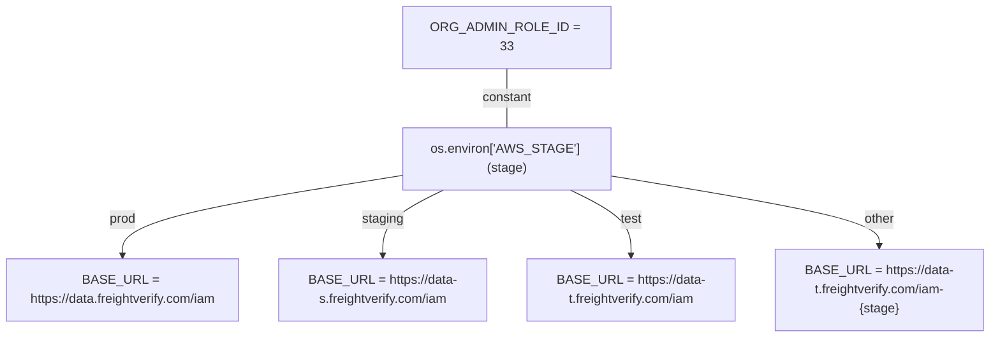

# Diagram: common/iam_service/tests/constants.py

> Auto-generated by Obscura crawlers

## Mermaid

### SVG

<svg id="container" width="1254.734375" xmlns="http://www.w3.org/2000/svg" class="flowchart" height="398" viewBox="0 0 1254.734375 398" role="graphics-document document" aria-roledescription="flowchart-v2"><g><marker id="container_flowchart-v2-pointEnd" class="marker flowchart-v2" viewBox="0 0 10 10" refX="5" refY="5" markerUnits="userSpaceOnUse" markerWidth="8" markerHeight="8" orient="auto"><path d="M 0 0 L 10 5 L 0 10 z" class="arrowMarkerPath" style="stroke-width: 1; stroke-dasharray: 1, 0;"></path></marker><marker id="container_flowchart-v2-pointStart" class="marker flowchart-v2" viewBox="0 0 10 10" refX="4.5" refY="5" markerUnits="userSpaceOnUse" markerWidth="8" markerHeight="8" orient="auto"><path d="M 0 5 L 10 10 L 10 0 z" class="arrowMarkerPath" style="stroke-width: 1; stroke-dasharray: 1, 0;"></path></marker><marker id="container_flowchart-v2-circleEnd" class="marker flowchart-v2" viewBox="0 0 10 10" refX="11" refY="5" markerUnits="userSpaceOnUse" markerWidth="11" markerHeight="11" orient="auto"><circle cx="5" cy="5" r="5" class="arrowMarkerPath" style="stroke-width: 1; stroke-dasharray: 1, 0;"></circle></marker><marker id="container_flowchart-v2-circleStart" class="marker flowchart-v2" viewBox="0 0 10 10" refX="-1" refY="5" markerUnits="userSpaceOnUse" markerWidth="11" markerHeight="11" orient="auto"><circle cx="5" cy="5" r="5" class="arrowMarkerPath" style="stroke-width: 1; stroke-dasharray: 1, 0;"></circle></marker><marker id="container_flowchart-v2-crossEnd" class="marker cross flowchart-v2" viewBox="0 0 11 11" refX="12" refY="5.2" markerUnits="userSpaceOnUse" markerWidth="11" markerHeight="11" orient="auto"><path d="M 1,1 l 9,9 M 10,1 l -9,9" class="arrowMarkerPath" style="stroke-width: 2; stroke-dasharray: 1, 0;"></path></marker><marker id="container_flowchart-v2-crossStart" class="marker cross flowchart-v2" viewBox="0 0 11 11" refX="-1" refY="5.2" markerUnits="userSpaceOnUse" markerWidth="11" markerHeight="11" orient="auto"><path d="M 1,1 l 9,9 M 10,1 l -9,9" class="arrowMarkerPath" style="stroke-width: 2; stroke-dasharray: 1, 0;"></path></marker><g class="root"><g class="clusters"></g><g class="edgePaths"><path d="M521.734,195.189L461.84,204.491C401.945,213.793,282.156,232.396,222.262,249.198C162.367,266,162.367,281,162.367,288.5L162.367,296" id="L_Stage_Prod_0" class="edge-thickness-normal edge-pattern-solid edge-thickness-normal edge-pattern-solid flowchart-link" style=";" data-edge="true" data-et="edge" data-id="L_Stage_Prod_0" data-points="W3sieCI6NTIxLjczNDM3NSwieSI6MTk1LjE4OTMzODkxMDI2MzZ9LHsieCI6MTYyLjM2NzE4NzUsInkiOjI1MX0seyJ4IjoxNjIuMzY3MTg3NSwieSI6MzAwfV0=" marker-end="url(#container_flowchart-v2-pointEnd)"></path><path d="M572.195,214L559.618,220.167C547.041,226.333,521.888,238.667,509.311,252.333C496.734,266,496.734,281,496.734,288.5L496.734,296" id="L_Stage_Staging_0" class="edge-thickness-normal edge-pattern-solid edge-thickness-normal edge-pattern-solid flowchart-link" style=";" data-edge="true" data-et="edge" data-id="L_Stage_Staging_0" data-points="W3sieCI6NTcyLjE5NDkwMTMxNTc4OTUsInkiOjIxNH0seyJ4Ijo0OTYuNzM0Mzc1LCJ5IjoyNTF9LHsieCI6NDk2LjczNDM3NSwieSI6MzAwfV0=" marker-end="url(#container_flowchart-v2-pointEnd)"></path><path d="M731.274,214L743.851,220.167C756.427,226.333,781.581,238.667,794.158,252.333C806.734,266,806.734,281,806.734,288.5L806.734,296" id="L_Stage_Test_0" class="edge-thickness-normal edge-pattern-solid edge-thickness-normal edge-pattern-solid flowchart-link" style=";" data-edge="true" data-et="edge" data-id="L_Stage_Test_0" data-points="W3sieCI6NzMxLjI3Mzg0ODY4NDIxMDUsInkiOjIxNH0seyJ4Ijo4MDYuNzM0Mzc1LCJ5IjoyNTF9LHsieCI6ODA2LjczNDM3NSwieSI6MzAwfV0=" marker-end="url(#container_flowchart-v2-pointEnd)"></path><path d="M781.734,196.247L837.568,205.373C893.401,214.498,1005.068,232.749,1060.901,247.375C1116.734,262,1116.734,273,1116.734,278.5L1116.734,284" id="L_Stage_Other_0" class="edge-thickness-normal edge-pattern-solid edge-thickness-normal edge-pattern-solid flowchart-link" style=";" data-edge="true" data-et="edge" data-id="L_Stage_Other_0" data-points="W3sieCI6NzgxLjczNDM3NSwieSI6MTk2LjI0NzMxMTgyNzk1N30seyJ4IjoxMTE2LjczNDM3NSwieSI6MjUxfSx7IngiOjExMTYuNzM0Mzc1LCJ5IjoyODh9XQ==" marker-end="url(#container_flowchart-v2-pointEnd)"></path><path d="M651.734,62L651.734,68.167C651.734,74.333,651.734,86.667,651.734,99C651.734,111.333,651.734,123.667,651.734,129.833L651.734,136" id="L_Const_Stage_0" class="edge-thickness-normal edge-pattern-solid edge-thickness-normal edge-pattern-solid flowchart-link" style=";" data-edge="true" data-et="edge" data-id="L_Const_Stage_0" data-points="W3sieCI6NjUxLjczNDM3NSwieSI6NjJ9LHsieCI6NjUxLjczNDM3NSwieSI6OTl9LHsieCI6NjUxLjczNDM3NSwieSI6MTM2fV0="></path></g><g class="edgeLabels"><g class="edgeLabel" transform="translate(162.3671875, 251)"><g class="label" data-id="L_Stage_Prod_0" transform="translate(-17.0625, -12)"><foreignObject width="34.125" height="24">

prod

</foreignObject></g></g><g class="edgeLabel" transform="translate(496.734375, 251)"><g class="label" data-id="L_Stage_Staging_0" transform="translate(-26.109375, -12)"><foreignObject width="52.21875" height="24">

staging

</foreignObject></g></g><g class="edgeLabel" transform="translate(806.734375, 251)"><g class="label" data-id="L_Stage_Test_0" transform="translate(-13.7578125, -12)"><foreignObject width="27.515625" height="24">

test

</foreignObject></g></g><g class="edgeLabel" transform="translate(1116.734375, 251)"><g class="label" data-id="L_Stage_Other_0" transform="translate(-19.703125, -12)"><foreignObject width="39.40625" height="24">

other

</foreignObject></g></g><g class="edgeLabel" transform="translate(651.734375, 99)"><g class="label" data-id="L_Const_Stage_0" transform="translate(-31.5234375, -12)"><foreignObject width="63.046875" height="24">

constant

</foreignObject></g></g></g><g class="nodes"><g class="node default" id="flowchart-Stage-0" transform="translate(651.734375, 175)"><rect class="basic label-container" style="" x="-130" y="-39" width="260" height="78"></rect><g class="label" style="" transform="translate(-100, -24)"><rect></rect><foreignObject width="200" height="48">

os.environ['AWS_STAGE'] (stage)

</foreignObject></g></g><g class="node default" id="flowchart-Prod-1" transform="translate(162.3671875, 339)"><rect class="basic label-container" style="" x="-154.3671875" y="-39" width="308.734375" height="78"></rect><g class="label" style="" transform="translate(-124.3671875, -24)"><rect></rect><foreignObject width="248.734375" height="48">

BASE_URL = https://data.freightverify.com/iam

</foreignObject></g></g><g class="node default" id="flowchart-Staging-2" transform="translate(496.734375, 339)"><rect class="basic label-container" style="" x="-130" y="-39" width="260" height="78"></rect><g class="label" style="" transform="translate(-100, -24)"><rect></rect><foreignObject width="200" height="48">

BASE_URL = https://data-s.freightverify.com/iam

</foreignObject></g></g><g class="node default" id="flowchart-Test-3" transform="translate(806.734375, 339)"><rect class="basic label-container" style="" x="-130" y="-39" width="260" height="78"></rect><g class="label" style="" transform="translate(-100, -24)"><rect></rect><foreignObject width="200" height="48">

BASE_URL = https://data-t.freightverify.com/iam

</foreignObject></g></g><g class="node default" id="flowchart-Other-4" transform="translate(1116.734375, 339)"><rect class="basic label-container" style="" x="-130" y="-51" width="260" height="102"></rect><g class="label" style="" transform="translate(-100, -36)"><rect></rect><foreignObject width="200" height="72">

BASE_URL = https://data-t.freightverify.com/iam-{stage}

</foreignObject></g></g><g class="node default" id="flowchart-Const-5" transform="translate(651.734375, 35)"><rect class="basic label-container" style="" x="-123.8671875" y="-27" width="247.734375" height="54"></rect><g class="label" style="" transform="translate(-93.8671875, -12)"><rect></rect><foreignObject width="187.734375" height="24">

ORG_ADMIN_ROLE_ID = 33

</foreignObject></g></g></g></g></g></svg>
