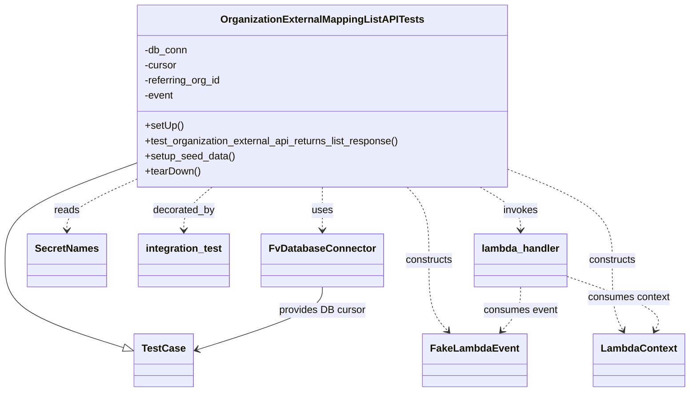

# Diagram: common/iam_service/tests/integration_tests/organization_external_mapping/test_organization_external_mapping_api.py

> Auto-generated by Obscura crawlers

## Mermaid

### SVG

<svg id="container" width="1069.921875" xmlns="http://www.w3.org/2000/svg" class="classDiagram" height="620" viewBox="-35 0 1069.921875 620" role="graphics-document document" aria-roledescription="class"><g><defs><marker id="container_class-aggregationStart" class="marker aggregation class" refX="18" refY="7" markerWidth="190" markerHeight="240" orient="auto"><path d="M 18,7 L9,13 L1,7 L9,1 Z"></path></marker></defs><defs><marker id="container_class-aggregationEnd" class="marker aggregation class" refX="1" refY="7" markerWidth="20" markerHeight="28" orient="auto"><path d="M 18,7 L9,13 L1,7 L9,1 Z"></path></marker></defs><defs><marker id="container_class-extensionStart" class="marker extension class" refX="18" refY="7" markerWidth="190" markerHeight="240" orient="auto"><path d="M 1,7 L18,13 V 1 Z"></path></marker></defs><defs><marker id="container_class-extensionEnd" class="marker extension class" refX="1" refY="7" markerWidth="20" markerHeight="28" orient="auto"><path d="M 1,1 V 13 L18,7 Z"></path></marker></defs><defs><marker id="container_class-compositionStart" class="marker composition class" refX="18" refY="7" markerWidth="190" markerHeight="240" orient="auto"><path d="M 18,7 L9,13 L1,7 L9,1 Z"></path></marker></defs><defs><marker id="container_class-compositionEnd" class="marker composition class" refX="1" refY="7" markerWidth="20" markerHeight="28" orient="auto"><path d="M 18,7 L9,13 L1,7 L9,1 Z"></path></marker></defs><defs><marker id="container_class-dependencyStart" class="marker dependency class" refX="6" refY="7" markerWidth="190" markerHeight="240" orient="auto"><path d="M 5,7 L9,13 L1,7 L9,1 Z"></path></marker></defs><defs><marker id="container_class-dependencyEnd" class="marker dependency class" refX="13" refY="7" markerWidth="20" markerHeight="28" orient="auto"><path d="M 18,7 L9,13 L14,7 L9,1 Z"></path></marker></defs><defs><marker id="container_class-lollipopStart" class="marker lollipop class" refX="13" refY="7" markerWidth="190" markerHeight="240" orient="auto"><circle stroke="black" fill="transparent" cx="7" cy="7" r="6"></circle></marker></defs><defs><marker id="container_class-lollipopEnd" class="marker lollipop class" refX="1" refY="7" markerWidth="190" markerHeight="240" orient="auto"><circle stroke="black" fill="transparent" cx="7" cy="7" r="6"></circle></marker></defs><g class="root"><g class="clusters"></g><g class="edgePaths"><path d="M168.84,260.387L136.2,272.489C103.56,284.591,38.28,308.796,5.64,334.065C-27,359.333,-27,385.667,-27,412C-27,438.333,-27,464.667,3.552,487.722C34.104,510.777,95.207,530.554,125.759,540.442L156.311,550.331" id="id_OrganizationExternalMappingListAPITests_TestCase_1" class="edge-thickness-normal edge-pattern-solid relation" style=";;;" data-edge="true" data-et="edge" data-id="id_OrganizationExternalMappingListAPITests_TestCase_1" data-points="W3sieCI6MTY4LjgzOTg0Mzc1LCJ5IjoyNjAuMzg3MDkyOTAyMjk2NTZ9LHsieCI6LTI3LCJ5IjozMzN9LHsieCI6LTI3LCJ5Ijo0MTJ9LHsieCI6LTI3LCJ5Ijo0OTF9LHsieCI6MTcyLjcyMjY1NjI1LCJ5Ijo1NTUuNjQyNTcwMjE2ODUyfV0=" marker-end="url(#container_class-extensionEnd)"></path><path d="M461.164,296L461.164,302.167C461.164,308.333,461.164,320.667,461.164,332C461.164,343.333,461.164,353.667,461.164,358.833L461.164,364" id="id_OrganizationExternalMappingListAPITests_FvDatabaseConnector_2" class="edge-thickness-normal edge-pattern-dashed relation" style=";;;" data-edge="true" data-et="edge" data-id="id_OrganizationExternalMappingListAPITests_FvDatabaseConnector_2" data-points="W3sieCI6NDYxLjE2NDA2MjUsInkiOjI5Nn0seyJ4Ijo0NjEuMTY0MDYyNSwieSI6MzMzfSx7IngiOjQ2MS4xNjQwNjI1LCJ5IjozNzB9XQ==" marker-end="url(#container_class-dependencyEnd)"></path><path d="M168.84,286.587L152.038,294.323C135.237,302.058,101.634,317.529,84.833,330.431C68.031,343.333,68.031,353.667,68.031,358.833L68.031,364" id="id_OrganizationExternalMappingListAPITests_SecretNames_3" class="edge-thickness-normal edge-pattern-dashed relation" style=";;;" data-edge="true" data-et="edge" data-id="id_OrganizationExternalMappingListAPITests_SecretNames_3" data-points="W3sieCI6MTY4LjgzOTg0Mzc1LCJ5IjoyODYuNTg3Mjk5NTM2OTcyNjR9LHsieCI6NjguMDMxMjUsInkiOjMzM30seyJ4Ijo2OC4wMzEyNSwieSI6MzcwfV0=" marker-end="url(#container_class-dependencyEnd)"></path><path d="M591.757,296L597.35,302.167C602.942,308.333,614.127,320.667,619.72,340C625.313,359.333,625.313,385.667,625.313,412C625.313,438.333,625.313,464.667,630.289,483.263C635.266,501.859,645.219,512.718,650.195,518.147L655.172,523.577" id="id_OrganizationExternalMappingListAPITests_FakeLambdaEvent_4" class="edge-thickness-normal edge-pattern-dashed relation" style=";;;" data-edge="true" data-et="edge" data-id="id_OrganizationExternalMappingListAPITests_FakeLambdaEvent_4" data-points="W3sieCI6NTkxLjc1NzI5NDU0NDE5ODksInkiOjI5Nn0seyJ4Ijo2MjUuMzEyNSwieSI6MzMzfSx7IngiOjYyNS4zMTI1LCJ5Ijo0MTJ9LHsieCI6NjI1LjMxMjUsInkiOjQ5MX0seyJ4Ijo2NTkuMjI2MTE3NDg0MTc3MiwieSI6NTI4fV0=" marker-end="url(#container_class-dependencyEnd)"></path><path d="M753.488,268.598L780.399,279.331C807.31,290.065,861.132,311.533,888.042,335.433C914.953,359.333,914.953,385.667,914.953,412C914.953,438.333,914.953,464.667,917.809,483.12C920.664,501.574,926.376,512.147,929.232,517.434L932.087,522.721" id="id_OrganizationExternalMappingListAPITests_LambdaContext_5" class="edge-thickness-normal edge-pattern-dashed relation" style=";;;" data-edge="true" data-et="edge" data-id="id_OrganizationExternalMappingListAPITests_LambdaContext_5" data-points="W3sieCI6NzUzLjQ4ODI4MTI1LCJ5IjoyNjguNTk3NTI5NDgyNjU0NzV9LHsieCI6OTE0Ljk1MzEyNSwieSI6MzMzfSx7IngiOjkxNC45NTMxMjUsInkiOjQxMn0seyJ4Ijo5MTQuOTUzMTI1LCJ5Ijo0OTF9LHsieCI6OTM0LjkzODY4NjcwODg2MDgsInkiOjUyOH1d" marker-end="url(#container_class-dependencyEnd)"></path><path d="M292.339,296L285.11,302.167C277.88,308.333,263.42,320.667,256.191,332C248.961,343.333,248.961,353.667,248.961,358.833L248.961,364" id="id_OrganizationExternalMappingListAPITests_integration_test_6" class="edge-thickness-normal edge-pattern-dashed relation" style=";;;" data-edge="true" data-et="edge" data-id="id_OrganizationExternalMappingListAPITests_integration_test_6" data-points="W3sieCI6MjkyLjMzOTQ3Njg2NDY0MDksInkiOjI5Nn0seyJ4IjoyNDguOTYwOTM3NSwieSI6MzMzfSx7IngiOjI0OC45NjA5Mzc1LCJ5IjozNzB9XQ==" marker-end="url(#container_class-dependencyEnd)"></path><path d="M706.973,296L717.5,302.167C728.027,308.333,749.08,320.667,759.606,332C770.133,343.333,770.133,353.667,770.133,358.833L770.133,364" id="id_OrganizationExternalMappingListAPITests_lambda_handler_7" class="edge-thickness-normal edge-pattern-dashed relation" style=";;;" data-edge="true" data-et="edge" data-id="id_OrganizationExternalMappingListAPITests_lambda_handler_7" data-points="W3sieCI6NzA2Ljk3MzQ1NDc2NTE5MzMsInkiOjI5Nn0seyJ4Ijo3NzAuMTMyODEyNSwieSI6MzMzfSx7IngiOjc3MC4xMzI4MTI1LCJ5IjozNzB9XQ==" marker-end="url(#container_class-dependencyEnd)"></path><path d="M461.164,454L461.164,460.167C461.164,466.333,461.164,478.667,428.828,495.299C396.493,511.932,331.821,532.863,299.486,543.329L267.15,553.795" id="id_FvDatabaseConnector_TestCase_8" class="edge-thickness-normal edge-pattern-solid relation" style=";;;" data-edge="true" data-et="edge" data-id="id_FvDatabaseConnector_TestCase_8" data-points="W3sieCI6NDYxLjE2NDA2MjUsInkiOjQ1NH0seyJ4Ijo0NjEuMTY0MDYyNSwieSI6NDkxfSx7IngiOjI2MS40NDE0MDYyNSwieSI6NTU1LjY0MjU3MDIxNjg1Mn1d" marker-end="url(#container_class-dependencyEnd)"></path><path d="M770.133,454L770.133,460.167C770.133,466.333,770.133,478.667,765.156,490.263C760.18,501.859,750.227,512.718,745.25,518.147L740.273,523.577" id="id_lambda_handler_FakeLambdaEvent_9" class="edge-thickness-normal edge-pattern-dashed relation" style=";;;" data-edge="true" data-et="edge" data-id="id_lambda_handler_FakeLambdaEvent_9" data-points="W3sieCI6NzcwLjEzMjgxMjUsInkiOjQ1NH0seyJ4Ijo3NzAuMTMyODEyNSwieSI6NDkxfSx7IngiOjczNi4yMTkxOTUwMTU4MjI4LCJ5Ijo1Mjh9XQ==" marker-end="url(#container_class-dependencyEnd)"></path><path d="M842.109,436.705L868.474,445.754C894.839,454.803,947.568,472.902,971.077,487.238C994.586,501.574,988.874,512.147,986.018,517.434L983.163,522.721" id="id_lambda_handler_LambdaContext_10" class="edge-thickness-normal edge-pattern-dashed relation" style=";;;" data-edge="true" data-et="edge" data-id="id_lambda_handler_LambdaContext_10" data-points="W3sieCI6ODQyLjEwOTM3NSwieSI6NDM2LjcwNDc2MjIyODAzMDN9LHsieCI6MTAwMC4yOTY4NzUsInkiOjQ5MX0seyJ4Ijo5ODAuMzExMzEzMjkxMTM5MiwieSI6NTI4fV0=" marker-end="url(#container_class-dependencyEnd)"></path></g><g class="edgeLabels"><g class="edgeLabel"><g class="label" data-id="id_OrganizationExternalMappingListAPITests_TestCase_1" transform="translate(0, 0)"><foreignObject width="0" height="0">

</foreignObject></g></g><g class="edgeLabel" transform="translate(461.1640625, 333)"><g class="label" data-id="id_OrganizationExternalMappingListAPITests_FvDatabaseConnector_2" transform="translate(-16.4921875, -12)"><foreignObject width="32.984375" height="24">

uses

</foreignObject></g></g><g class="edgeLabel" transform="translate(68.03125, 333)"><g class="label" data-id="id_OrganizationExternalMappingListAPITests_SecretNames_3" transform="translate(-20.0078125, -12)"><foreignObject width="40.015625" height="24">

reads

</foreignObject></g></g><g class="edgeLabel" transform="translate(625.3125, 412)"><g class="label" data-id="id_OrganizationExternalMappingListAPITests_FakeLambdaEvent_4" transform="translate(-37.84375, -12)"><foreignObject width="75.6875" height="24">

constructs

</foreignObject></g></g><g class="edgeLabel" transform="translate(914.953125, 412)"><g class="label" data-id="id_OrganizationExternalMappingListAPITests_LambdaContext_5" transform="translate(-37.84375, -12)"><foreignObject width="75.6875" height="24">

constructs

</foreignObject></g></g><g class="edgeLabel" transform="translate(248.9609375, 333)"><g class="label" data-id="id_OrganizationExternalMappingListAPITests_integration_test_6" transform="translate(-49.375, -12)"><foreignObject width="98.75" height="24">

decorated_by

</foreignObject></g></g><g class="edgeLabel" transform="translate(770.1328125, 333)"><g class="label" data-id="id_OrganizationExternalMappingListAPITests_lambda_handler_7" transform="translate(-27.5859375, -12)"><foreignObject width="55.171875" height="24">

invokes

</foreignObject></g></g><g class="edgeLabel" transform="translate(461.1640625, 491)"><g class="label" data-id="id_FvDatabaseConnector_TestCase_8" transform="translate(-68.4375, -12)"><foreignObject width="136.875" height="24">

provides DB cursor

</foreignObject></g></g><g class="edgeLabel" transform="translate(770.1328125, 491)"><g class="label" data-id="id_lambda_handler_FakeLambdaEvent_9" transform="translate(-58.65625, -12)"><foreignObject width="117.3125" height="24">

consumes event

</foreignObject></g></g><g class="edgeLabel" transform="translate(941.09058, 470.67842)"><g class="label" data-id="id_lambda_handler_LambdaContext_10" transform="translate(-65.34375, -12)"><foreignObject width="130.6875" height="24">

consumes context

</foreignObject></g></g></g><g class="nodes"><g class="node default" id="classId-OrganizationExternalMappingListAPITests-0" transform="translate(461.1640625, 152)"><g class="basic label-container"><path d="M-292.32421875 -144 L292.32421875 -144 L292.32421875 144 L-292.32421875 144" stroke="none" stroke-width="0" fill="#ECECFF" style=""></path><path d="M-292.32421875 -144 C-65.9267065558185 -144, 160.470805638363 -144, 292.32421875 -144 M-292.32421875 -144 C-124.35816066837788 -144, 43.607897413244245 -144, 292.32421875 -144 M292.32421875 -144 C292.32421875 -75.3894572513763, 292.32421875 -6.778914502752599, 292.32421875 144 M292.32421875 -144 C292.32421875 -48.14470479597804, 292.32421875 47.71059040804391, 292.32421875 144 M292.32421875 144 C138.83576817372432 144, -14.652682402551363 144, -292.32421875 144 M292.32421875 144 C73.48654619786143 144, -145.35112635427714 144, -292.32421875 144 M-292.32421875 144 C-292.32421875 29.471777983075, -292.32421875 -85.05644403385, -292.32421875 -144 M-292.32421875 144 C-292.32421875 74.24434085634437, -292.32421875 4.488681712688731, -292.32421875 -144" stroke="#9370DB" stroke-width="1.3" fill="none" stroke-dasharray="0 0" style=""></path></g><g class="annotation-group text" transform="translate(0, -120)"></g><g class="label-group text" transform="translate(-152.6484375, -120)"><g class="label" style="font-weight: bolder" transform="translate(0,-12)"><foreignObject width="305.296875" height="24">

OrganizationExternalMappingListAPITests

</foreignObject></g></g><g class="members-group text" transform="translate(-280.32421875, -72)"><g class="label" style="" transform="translate(0,-12)"><foreignObject width="68.625" height="24">

-db_conn

</foreignObject></g><g class="label" style="" transform="translate(0,12)"><foreignObject width="52.1875" height="24">

-cursor

</foreignObject></g><g class="label" style="" transform="translate(0,36)"><foreignObject width="123.484375" height="24">

-referring_org_id

</foreignObject></g><g class="label" style="" transform="translate(0,60)"><foreignObject width="46.796875" height="24">

-event

</foreignObject></g></g><g class="methods-group text" transform="translate(-280.32421875, 48)"><g class="label" style="" transform="translate(0,-12)"><foreignObject width="60.421875" height="24">

+setUp()

</foreignObject></g><g class="label" style="" transform="translate(0,12)"><foreignObject width="408" height="24">

+test_organization_external_api_returns_list_response()

</foreignObject></g><g class="label" style="" transform="translate(0,36)"><foreignObject width="142.265625" height="24">

+setup_seed_data()

</foreignObject></g><g class="label" style="" transform="translate(0,60)"><foreignObject width="87.75" height="24">

+tearDown()

</foreignObject></g></g><g class="divider" style=""><path d="M-292.32421875 -96 C-153.66420589372905 -96, -15.004193037458094 -96, 292.32421875 -96 M-292.32421875 -96 C-105.14228461457566 -96, 82.03964952084868 -96, 292.32421875 -96" stroke="#9370DB" stroke-width="1.3" fill="none" stroke-dasharray="0 0" style=""></path></g><g class="divider" style=""><path d="M-292.32421875 24 C-91.82873398330784 24, 108.66675078338432 24, 292.32421875 24 M-292.32421875 24 C-143.1104921549302 24, 6.103234440139602 24, 292.32421875 24" stroke="#9370DB" stroke-width="1.3" fill="none" stroke-dasharray="0 0" style=""></path></g></g><g class="node default" id="classId-TestCase-1" transform="translate(217.08203125, 570)"><g class="basic label-container"><path d="M-44.359375 -42 L44.359375 -42 L44.359375 42 L-44.359375 42" stroke="none" stroke-width="0" fill="#ECECFF" style=""></path><path d="M-44.359375 -42 C-20.125684791222106 -42, 4.108005417555788 -42, 44.359375 -42 M-44.359375 -42 C-26.15216261899273 -42, -7.944950237985459 -42, 44.359375 -42 M44.359375 -42 C44.359375 -21.044445739574737, 44.359375 -0.08889147914947415, 44.359375 42 M44.359375 -42 C44.359375 -21.138757382241227, 44.359375 -0.27751476448245427, 44.359375 42 M44.359375 42 C11.678427548046749 42, -21.002519903906503 42, -44.359375 42 M44.359375 42 C23.074378935130117 42, 1.7893828702602335 42, -44.359375 42 M-44.359375 42 C-44.359375 14.193255761617007, -44.359375 -13.613488476765987, -44.359375 -42 M-44.359375 42 C-44.359375 18.831366556247538, -44.359375 -4.337266887504924, -44.359375 -42" stroke="#9370DB" stroke-width="1.3" fill="none" stroke-dasharray="0 0" style=""></path></g><g class="annotation-group text" transform="translate(0, -18)"></g><g class="label-group text" transform="translate(-32.359375, -18)"><g class="label" style="font-weight: bolder" transform="translate(0,-12)"><foreignObject width="64.71875" height="24">

TestCase

</foreignObject></g></g><g class="members-group text" transform="translate(-32.359375, 30)"></g><g class="methods-group text" transform="translate(-32.359375, 60)"></g><g class="divider" style=""><path d="M-44.359375 6 C-22.53962333442801 6, -0.7198716688560225 6, 44.359375 6 M-44.359375 6 C-25.781471187834175 6, -7.203567375668349 6, 44.359375 6" stroke="#9370DB" stroke-width="1.3" fill="none" stroke-dasharray="0 0" style=""></path></g><g class="divider" style=""><path d="M-44.359375 24 C-22.658311855014023 24, -0.9572487100280469 24, 44.359375 24 M-44.359375 24 C-23.071438338084462 24, -1.7835016761689246 24, 44.359375 24" stroke="#9370DB" stroke-width="1.3" fill="none" stroke-dasharray="0 0" style=""></path></g></g><g class="node default" id="classId-FvDatabaseConnector-2" transform="translate(461.1640625, 412)"><g class="basic label-container"><path d="M-91.3046875 -42 L91.3046875 -42 L91.3046875 42 L-91.3046875 42" stroke="none" stroke-width="0" fill="#ECECFF" style=""></path><path d="M-91.3046875 -42 C-33.81780305457173 -42, 23.669081390856533 -42, 91.3046875 -42 M-91.3046875 -42 C-38.655336775653765 -42, 13.99401394869247 -42, 91.3046875 -42 M91.3046875 -42 C91.3046875 -19.585781792684436, 91.3046875 2.8284364146311276, 91.3046875 42 M91.3046875 -42 C91.3046875 -20.875247555621677, 91.3046875 0.2495048887566469, 91.3046875 42 M91.3046875 42 C36.28922832704418 42, -18.726230845911644 42, -91.3046875 42 M91.3046875 42 C19.259542403367874 42, -52.78560269326425 42, -91.3046875 42 M-91.3046875 42 C-91.3046875 23.079519210558566, -91.3046875 4.159038421117131, -91.3046875 -42 M-91.3046875 42 C-91.3046875 12.224664018647537, -91.3046875 -17.550671962704925, -91.3046875 -42" stroke="#9370DB" stroke-width="1.3" fill="none" stroke-dasharray="0 0" style=""></path></g><g class="annotation-group text" transform="translate(0, -18)"></g><g class="label-group text" transform="translate(-79.3046875, -18)"><g class="label" style="font-weight: bolder" transform="translate(0,-12)"><foreignObject width="158.609375" height="24">

FvDatabaseConnector

</foreignObject></g></g><g class="members-group text" transform="translate(-79.3046875, 30)"></g><g class="methods-group text" transform="translate(-79.3046875, 60)"></g><g class="divider" style=""><path d="M-91.3046875 6 C-19.273020307570505 6, 52.75864688485899 6, 91.3046875 6 M-91.3046875 6 C-39.11593900726755 6, 13.072809485464902 6, 91.3046875 6" stroke="#9370DB" stroke-width="1.3" fill="none" stroke-dasharray="0 0" style=""></path></g><g class="divider" style=""><path d="M-91.3046875 24 C-42.33390891685431 24, 6.636869666291375 24, 91.3046875 24 M-91.3046875 24 C-36.82962922715118 24, 17.64542904569764 24, 91.3046875 24" stroke="#9370DB" stroke-width="1.3" fill="none" stroke-dasharray="0 0" style=""></path></g></g><g class="node default" id="classId-SecretNames-3" transform="translate(68.03125, 412)"><g class="basic label-container"><path d="M-60.03125 -42 L60.03125 -42 L60.03125 42 L-60.03125 42" stroke="none" stroke-width="0" fill="#ECECFF" style=""></path><path d="M-60.03125 -42 C-21.057659930012775 -42, 17.91593013997445 -42, 60.03125 -42 M-60.03125 -42 C-22.56163248542108 -42, 14.907985029157842 -42, 60.03125 -42 M60.03125 -42 C60.03125 -14.418352626348774, 60.03125 13.163294747302452, 60.03125 42 M60.03125 -42 C60.03125 -20.61205403890291, 60.03125 0.7758919221941767, 60.03125 42 M60.03125 42 C13.356653085422906 42, -33.31794382915419 42, -60.03125 42 M60.03125 42 C18.73319464742432 42, -22.56486070515136 42, -60.03125 42 M-60.03125 42 C-60.03125 23.879133566252253, -60.03125 5.758267132504507, -60.03125 -42 M-60.03125 42 C-60.03125 16.57800846952838, -60.03125 -8.843983060943238, -60.03125 -42" stroke="#9370DB" stroke-width="1.3" fill="none" stroke-dasharray="0 0" style=""></path></g><g class="annotation-group text" transform="translate(0, -18)"></g><g class="label-group text" transform="translate(-48.03125, -18)"><g class="label" style="font-weight: bolder" transform="translate(0,-12)"><foreignObject width="96.0625" height="24">

SecretNames

</foreignObject></g></g><g class="members-group text" transform="translate(-48.03125, 30)"></g><g class="methods-group text" transform="translate(-48.03125, 60)"></g><g class="divider" style=""><path d="M-60.03125 6 C-20.168817285357292 6, 19.693615429285416 6, 60.03125 6 M-60.03125 6 C-20.902474076738883 6, 18.226301846522233 6, 60.03125 6" stroke="#9370DB" stroke-width="1.3" fill="none" stroke-dasharray="0 0" style=""></path></g><g class="divider" style=""><path d="M-60.03125 24 C-15.840596854004133 24, 28.350056291991734 24, 60.03125 24 M-60.03125 24 C-20.55194109318169 24, 18.92736781363662 24, 60.03125 24" stroke="#9370DB" stroke-width="1.3" fill="none" stroke-dasharray="0 0" style=""></path></g></g><g class="node default" id="classId-FakeLambdaEvent-4" transform="translate(697.72265625, 570)"><g class="basic label-container"><path d="M-77.8671875 -42 L77.8671875 -42 L77.8671875 42 L-77.8671875 42" stroke="none" stroke-width="0" fill="#ECECFF" style=""></path><path d="M-77.8671875 -42 C-28.860593544850353 -42, 20.146000410299294 -42, 77.8671875 -42 M-77.8671875 -42 C-43.99350371502854 -42, -10.119819930057076 -42, 77.8671875 -42 M77.8671875 -42 C77.8671875 -20.648030881823658, 77.8671875 0.703938236352684, 77.8671875 42 M77.8671875 -42 C77.8671875 -15.206481858192063, 77.8671875 11.587036283615873, 77.8671875 42 M77.8671875 42 C34.15050442092358 42, -9.566178658152836 42, -77.8671875 42 M77.8671875 42 C23.639450056493395 42, -30.58828738701321 42, -77.8671875 42 M-77.8671875 42 C-77.8671875 17.599118746372117, -77.8671875 -6.801762507255766, -77.8671875 -42 M-77.8671875 42 C-77.8671875 10.144308810765917, -77.8671875 -21.711382378468166, -77.8671875 -42" stroke="#9370DB" stroke-width="1.3" fill="none" stroke-dasharray="0 0" style=""></path></g><g class="annotation-group text" transform="translate(0, -18)"></g><g class="label-group text" transform="translate(-65.8671875, -18)"><g class="label" style="font-weight: bolder" transform="translate(0,-12)"><foreignObject width="131.734375" height="24">

FakeLambdaEvent

</foreignObject></g></g><g class="members-group text" transform="translate(-65.8671875, 30)"></g><g class="methods-group text" transform="translate(-65.8671875, 60)"></g><g class="divider" style=""><path d="M-77.8671875 6 C-23.601797293705907 6, 30.663592912588186 6, 77.8671875 6 M-77.8671875 6 C-29.743968627388902 6, 18.379250245222195 6, 77.8671875 6" stroke="#9370DB" stroke-width="1.3" fill="none" stroke-dasharray="0 0" style=""></path></g><g class="divider" style=""><path d="M-77.8671875 24 C-16.440268144251185 24, 44.98665121149763 24, 77.8671875 24 M-77.8671875 24 C-38.0731635841299 24, 1.720860331740198 24, 77.8671875 24" stroke="#9370DB" stroke-width="1.3" fill="none" stroke-dasharray="0 0" style=""></path></g></g><g class="node default" id="classId-LambdaContext-5" transform="translate(957.625, 570)"><g class="basic label-container"><path d="M-69.296875 -42 L69.296875 -42 L69.296875 42 L-69.296875 42" stroke="none" stroke-width="0" fill="#ECECFF" style=""></path><path d="M-69.296875 -42 C-35.58405611123353 -42, -1.8712372224670588 -42, 69.296875 -42 M-69.296875 -42 C-18.78660128411913 -42, 31.72367243176174 -42, 69.296875 -42 M69.296875 -42 C69.296875 -13.293346590901898, 69.296875 15.413306818196205, 69.296875 42 M69.296875 -42 C69.296875 -21.227754994583105, 69.296875 -0.45550998916620955, 69.296875 42 M69.296875 42 C16.63756654747727 42, -36.02174190504546 42, -69.296875 42 M69.296875 42 C19.011807214825218 42, -31.273260570349564 42, -69.296875 42 M-69.296875 42 C-69.296875 22.168339747999816, -69.296875 2.3366794959996326, -69.296875 -42 M-69.296875 42 C-69.296875 9.279798827654766, -69.296875 -23.44040234469047, -69.296875 -42" stroke="#9370DB" stroke-width="1.3" fill="none" stroke-dasharray="0 0" style=""></path></g><g class="annotation-group text" transform="translate(0, -18)"></g><g class="label-group text" transform="translate(-57.296875, -18)"><g class="label" style="font-weight: bolder" transform="translate(0,-12)"><foreignObject width="114.59375" height="24">

LambdaContext

</foreignObject></g></g><g class="members-group text" transform="translate(-57.296875, 30)"></g><g class="methods-group text" transform="translate(-57.296875, 60)"></g><g class="divider" style=""><path d="M-69.296875 6 C-25.582412404175606 6, 18.132050191648787 6, 69.296875 6 M-69.296875 6 C-27.565456673549505 6, 14.16596165290099 6, 69.296875 6" stroke="#9370DB" stroke-width="1.3" fill="none" stroke-dasharray="0 0" style=""></path></g><g class="divider" style=""><path d="M-69.296875 24 C-34.46427393337519 24, 0.36832713324962185 24, 69.296875 24 M-69.296875 24 C-15.526665957413755 24, 38.24354308517249 24, 69.296875 24" stroke="#9370DB" stroke-width="1.3" fill="none" stroke-dasharray="0 0" style=""></path></g></g><g class="node default" id="classId-integration_test-6" transform="translate(248.9609375, 412)"><g class="basic label-container"><path d="M-70.8984375 -42 L70.8984375 -42 L70.8984375 42 L-70.8984375 42" stroke="none" stroke-width="0" fill="#ECECFF" style=""></path><path d="M-70.8984375 -42 C-21.064787019519997 -42, 28.768863460960006 -42, 70.8984375 -42 M-70.8984375 -42 C-19.971000033547774 -42, 30.95643743290445 -42, 70.8984375 -42 M70.8984375 -42 C70.8984375 -22.412022380533166, 70.8984375 -2.8240447610663324, 70.8984375 42 M70.8984375 -42 C70.8984375 -16.257061235534323, 70.8984375 9.485877528931354, 70.8984375 42 M70.8984375 42 C24.51304152037477 42, -21.87235445925046 42, -70.8984375 42 M70.8984375 42 C26.317086942739934 42, -18.264263614520132 42, -70.8984375 42 M-70.8984375 42 C-70.8984375 9.866152330332213, -70.8984375 -22.267695339335575, -70.8984375 -42 M-70.8984375 42 C-70.8984375 16.395854095916242, -70.8984375 -9.208291808167516, -70.8984375 -42" stroke="#9370DB" stroke-width="1.3" fill="none" stroke-dasharray="0 0" style=""></path></g><g class="annotation-group text" transform="translate(0, -18)"></g><g class="label-group text" transform="translate(-58.8984375, -18)"><g class="label" style="font-weight: bolder" transform="translate(0,-12)"><foreignObject width="117.796875" height="24">

integration_test

</foreignObject></g></g><g class="members-group text" transform="translate(-58.8984375, 30)"></g><g class="methods-group text" transform="translate(-58.8984375, 60)"></g><g class="divider" style=""><path d="M-70.8984375 6 C-41.16139805732726 6, -11.42435861465453 6, 70.8984375 6 M-70.8984375 6 C-36.18103644419853 6, -1.4636353883970656 6, 70.8984375 6" stroke="#9370DB" stroke-width="1.3" fill="none" stroke-dasharray="0 0" style=""></path></g><g class="divider" style=""><path d="M-70.8984375 24 C-15.38230630190624 24, 40.13382489618752 24, 70.8984375 24 M-70.8984375 24 C-29.628797837534798 24, 11.640841824930405 24, 70.8984375 24" stroke="#9370DB" stroke-width="1.3" fill="none" stroke-dasharray="0 0" style=""></path></g></g><g class="node default" id="classId-lambda_handler-7" transform="translate(770.1328125, 412)"><g class="basic label-container"><path d="M-71.9765625 -42 L71.9765625 -42 L71.9765625 42 L-71.9765625 42" stroke="none" stroke-width="0" fill="#ECECFF" style=""></path><path d="M-71.9765625 -42 C-14.78185575681681 -42, 42.41285098636638 -42, 71.9765625 -42 M-71.9765625 -42 C-37.95279510766958 -42, -3.92902771533916 -42, 71.9765625 -42 M71.9765625 -42 C71.9765625 -20.59543155296435, 71.9765625 0.8091368940713011, 71.9765625 42 M71.9765625 -42 C71.9765625 -16.332565419254472, 71.9765625 9.334869161491056, 71.9765625 42 M71.9765625 42 C42.332765250039444 42, 12.688968000078894 42, -71.9765625 42 M71.9765625 42 C24.230369363551425 42, -23.51582377289715 42, -71.9765625 42 M-71.9765625 42 C-71.9765625 15.53712832708268, -71.9765625 -10.92574334583464, -71.9765625 -42 M-71.9765625 42 C-71.9765625 10.961691837745846, -71.9765625 -20.076616324508308, -71.9765625 -42" stroke="#9370DB" stroke-width="1.3" fill="none" stroke-dasharray="0 0" style=""></path></g><g class="annotation-group text" transform="translate(0, -18)"></g><g class="label-group text" transform="translate(-59.9765625, -18)"><g class="label" style="font-weight: bolder" transform="translate(0,-12)"><foreignObject width="119.953125" height="24">

lambda_handler

</foreignObject></g></g><g class="members-group text" transform="translate(-59.9765625, 30)"></g><g class="methods-group text" transform="translate(-59.9765625, 60)"></g><g class="divider" style=""><path d="M-71.9765625 6 C-39.55842609005206 6, -7.140289680104118 6, 71.9765625 6 M-71.9765625 6 C-26.372695626176842 6, 19.231171247646316 6, 71.9765625 6" stroke="#9370DB" stroke-width="1.3" fill="none" stroke-dasharray="0 0" style=""></path></g><g class="divider" style=""><path d="M-71.9765625 24 C-33.9608020690858 24, 4.0549583618283975 24, 71.9765625 24 M-71.9765625 24 C-40.65439973397717 24, -9.332236967954344 24, 71.9765625 24" stroke="#9370DB" stroke-width="1.3" fill="none" stroke-dasharray="0 0" style=""></path></g></g></g></g></g></svg>
