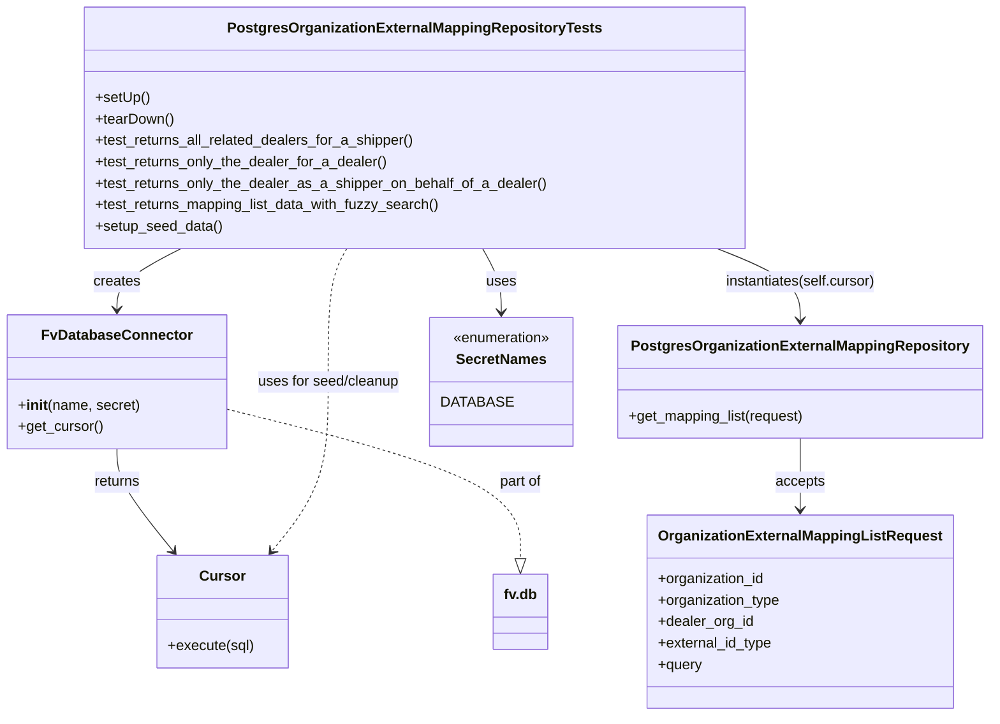
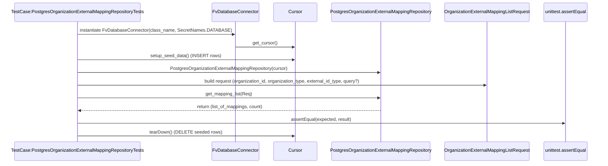

# Diagram: common/iam_service/tests/integration_tests/organization_external_mapping/test_organization_external_mapping_repository.py

> Auto-generated by Obscura crawlers

## Diagram 1

### SVG

<svg id="container" width="1089.9296875" xmlns="http://www.w3.org/2000/svg" class="classDiagram" height="800" viewBox="0 0 1089.9296875 800" role="graphics-document document" aria-roledescription="class"><g><defs><marker id="container_class-aggregationStart" class="marker aggregation class" refX="18" refY="7" markerWidth="190" markerHeight="240" orient="auto"><path d="M 18,7 L9,13 L1,7 L9,1 Z"></path></marker></defs><defs><marker id="container_class-aggregationEnd" class="marker aggregation class" refX="1" refY="7" markerWidth="20" markerHeight="28" orient="auto"><path d="M 18,7 L9,13 L1,7 L9,1 Z"></path></marker></defs><defs><marker id="container_class-extensionStart" class="marker extension class" refX="18" refY="7" markerWidth="190" markerHeight="240" orient="auto"><path d="M 1,7 L18,13 V 1 Z"></path></marker></defs><defs><marker id="container_class-extensionEnd" class="marker extension class" refX="1" refY="7" markerWidth="20" markerHeight="28" orient="auto"><path d="M 1,1 V 13 L18,7 Z"></path></marker></defs><defs><marker id="container_class-compositionStart" class="marker composition class" refX="18" refY="7" markerWidth="190" markerHeight="240" orient="auto"><path d="M 18,7 L9,13 L1,7 L9,1 Z"></path></marker></defs><defs><marker id="container_class-compositionEnd" class="marker composition class" refX="1" refY="7" markerWidth="20" markerHeight="28" orient="auto"><path d="M 18,7 L9,13 L1,7 L9,1 Z"></path></marker></defs><defs><marker id="container_class-dependencyStart" class="marker dependency class" refX="6" refY="7" markerWidth="190" markerHeight="240" orient="auto"><path d="M 5,7 L9,13 L1,7 L9,1 Z"></path></marker></defs><defs><marker id="container_class-dependencyEnd" class="marker dependency class" refX="13" refY="7" markerWidth="20" markerHeight="28" orient="auto"><path d="M 18,7 L9,13 L14,7 L9,1 Z"></path></marker></defs><defs><marker id="container_class-lollipopStart" class="marker lollipop class" refX="13" refY="7" markerWidth="190" markerHeight="240" orient="auto"><circle stroke="black" fill="transparent" cx="7" cy="7" r="6"></circle></marker></defs><defs><marker id="container_class-lollipopEnd" class="marker lollipop class" refX="1" refY="7" markerWidth="190" markerHeight="240" orient="auto"><circle stroke="black" fill="transparent" cx="7" cy="7" r="6"></circle></marker></defs><g class="root"><g class="clusters"></g><g class="edgePaths"><path d="M198.468,278L186.604,284.167C174.74,290.333,151.013,302.667,139.149,314C127.285,325.333,127.285,335.667,127.285,340.833L127.285,346" id="id_PostgresOrganizationExternalMappingRepositoryTests_FvDatabaseConnector_1" class="edge-thickness-normal edge-pattern-solid relation" style=";;;" data-edge="true" data-et="edge" data-id="id_PostgresOrganizationExternalMappingRepositoryTests_FvDatabaseConnector_1" data-points="W3sieCI6MTk4LjQ2ODA1NzMyMTk0NzcsInkiOjI3OH0seyJ4IjoxMjcuMjg1MTU2MjUsInkiOjMxNX0seyJ4IjoxMjcuMjg1MTU2MjUsInkiOjM1Mn1d" marker-end="url(#container_class-dependencyEnd)"></path><path d="M127.285,502L127.285,508.167C127.285,514.333,127.285,526.667,137.741,545.723C148.196,564.78,169.108,590.56,179.563,603.45L190.019,616.34" id="id_FvDatabaseConnector_Cursor_2" class="edge-thickness-normal edge-pattern-solid relation" style=";;;" data-edge="true" data-et="edge" data-id="id_FvDatabaseConnector_Cursor_2" data-points="W3sieCI6MTI3LjI4NTE1NjI1LCJ5Ijo1MDJ9LHsieCI6MTI3LjI4NTE1NjI1LCJ5Ijo1Mzl9LHsieCI6MTkzLjc5ODU5OTEzNzkzMTAzLCJ5Ijo2MjF9XQ==" marker-end="url(#container_class-dependencyEnd)"></path><path d="M789.731,278L804.875,284.167C820.02,290.333,850.309,302.667,865.453,316C880.598,329.333,880.598,343.667,880.598,350.833L880.598,358" id="id_PostgresOrganizationExternalMappingRepositoryTests_PostgresOrganizationExternalMappingRepository_3" class="edge-thickness-normal edge-pattern-solid relation" style=";;;" data-edge="true" data-et="edge" data-id="id_PostgresOrganizationExternalMappingRepositoryTests_PostgresOrganizationExternalMappingRepository_3" data-points="W3sieCI6Nzg5LjczMDc3NTM0NTIwMzUsInkiOjI3OH0seyJ4Ijo4ODAuNTk3NjU2MjUsInkiOjMxNX0seyJ4Ijo4ODAuNTk3NjU2MjUsInkiOjM2NH1d" marker-end="url(#container_class-dependencyEnd)"></path><path d="M880.598,490L880.598,498.167C880.598,506.333,880.598,522.667,880.598,536C880.598,549.333,880.598,559.667,880.598,564.833L880.598,570" id="id_PostgresOrganizationExternalMappingRepository_OrganizationExternalMappingListRequest_4" class="edge-thickness-normal edge-pattern-solid relation" style=";;;" data-edge="true" data-et="edge" data-id="id_PostgresOrganizationExternalMappingRepository_OrganizationExternalMappingListRequest_4" data-points="W3sieCI6ODgwLjU5NzY1NjI1LCJ5Ijo0OTB9LHsieCI6ODgwLjU5NzY1NjI1LCJ5Ijo1Mzl9LHsieCI6ODgwLjU5NzY1NjI1LCJ5Ijo1NzZ9XQ==" marker-end="url(#container_class-dependencyEnd)"></path><path d="M533.282,278L536.712,284.167C540.143,290.333,547.003,302.667,550.433,314.5C553.863,326.333,553.863,337.667,553.863,343.333L553.863,349" id="id_PostgresOrganizationExternalMappingRepositoryTests_SecretNames_5" class="edge-thickness-normal edge-pattern-solid relation" style=";;;" data-edge="true" data-et="edge" data-id="id_PostgresOrganizationExternalMappingRepositoryTests_SecretNames_5" data-points="W3sieCI6NTMzLjI4MjI4MzMzOTM4OTYsInkiOjI3OH0seyJ4Ijo1NTMuODYzMjgxMjUsInkiOjMxNX0seyJ4Ijo1NTMuODYzMjgxMjUsInkiOjM1NX1d" marker-end="url(#container_class-dependencyEnd)"></path><path d="M383.097,278L379.666,284.167C376.236,290.333,369.376,302.667,365.946,327.5C362.516,352.333,362.516,389.667,362.516,427C362.516,464.333,362.516,501.667,352.06,533.223C341.604,564.78,320.693,590.56,310.238,603.45L299.782,616.34" id="id_PostgresOrganizationExternalMappingRepositoryTests_Cursor_6" class="edge-thickness-normal edge-pattern-dashed relation" style=";;;" data-edge="true" data-et="edge" data-id="id_PostgresOrganizationExternalMappingRepositoryTests_Cursor_6" data-points="W3sieCI6MzgzLjA5NjYyMjkxMDYxMDQ1LCJ5IjoyNzh9LHsieCI6MzYyLjUxNTYyNSwieSI6MzE1fSx7IngiOjM2Mi41MTU2MjUsInkiOjQyN30seyJ4IjozNjIuNTE1NjI1LCJ5Ijo1Mzl9LHsieCI6Mjk2LjAwMjE4MjExMjA2ODk3LCJ5Ijo2MjF9XQ==" marker-end="url(#container_class-dependencyEnd)"></path><path d="M246.57,456.792L301.429,470.493C356.288,484.195,466.007,511.597,520.866,539.59C575.725,567.583,575.725,596.167,575.725,610.458L575.725,624.75" id="id_FvDatabaseConnector_fv.db_7" class="edge-thickness-normal edge-pattern-dashed relation" style=";;;" data-edge="true" data-et="edge" data-id="id_FvDatabaseConnector_fv.db_7" data-points="W3sieCI6MjQ2LjU3MDMxMjUsInkiOjQ1Ni43OTIwNjUzNjU1Njl9LHsieCI6NTc1LjcyNDYwOTM3NSwieSI6NTM5fSx7IngiOjU3NS43MjQ2MDkzNzUsInkiOjY0Mn1d" marker-end="url(#container_class-extensionEnd)"></path></g><g class="edgeLabels"><g class="edgeLabel" transform="translate(127.28515625, 315)"><g class="label" data-id="id_PostgresOrganizationExternalMappingRepositoryTests_FvDatabaseConnector_1" transform="translate(-26.171875, -12)"><foreignObject width="52.34375" height="24">

creates

</foreignObject></g></g><g class="edgeLabel" transform="translate(127.28515625, 539)"><g class="label" data-id="id_FvDatabaseConnector_Cursor_2" transform="translate(-26.265625, -12)"><foreignObject width="52.53125" height="24">

returns

</foreignObject></g></g><g class="edgeLabel" transform="translate(880.59765625, 315)"><g class="label" data-id="id_PostgresOrganizationExternalMappingRepositoryTests_PostgresOrganizationExternalMappingRepository_3" transform="translate(-85.5234375, -12)"><foreignObject width="171.046875" height="24">

instantiates(self.cursor)

</foreignObject></g></g><g class="edgeLabel" transform="translate(880.59765625, 539)"><g class="label" data-id="id_PostgresOrganizationExternalMappingRepository_OrganizationExternalMappingListRequest_4" transform="translate(-27.421875, -12)"><foreignObject width="54.84375" height="24">

accepts

</foreignObject></g></g><g class="edgeLabel" transform="translate(553.86328125, 315)"><g class="label" data-id="id_PostgresOrganizationExternalMappingRepositoryTests_SecretNames_5" transform="translate(-16.4921875, -12)"><foreignObject width="32.984375" height="24">

uses

</foreignObject></g></g><g class="edgeLabel" transform="translate(362.515625, 427)"><g class="label" data-id="id_PostgresOrganizationExternalMappingRepositoryTests_Cursor_6" transform="translate(-80.9453125, -12)"><foreignObject width="161.890625" height="24">

uses for seed/cleanup

</foreignObject></g></g><g class="edgeLabel" transform="translate(575.724609375, 539)"><g class="label" data-id="id_FvDatabaseConnector_fv.db_7" transform="translate(-24.4765625, -12)"><foreignObject width="48.953125" height="24">

part of

</foreignObject></g></g></g><g class="nodes"><g class="node default" id="classId-PostgresOrganizationExternalMappingRepositoryTests-0" transform="translate(458.189453125, 143)"><g class="basic label-container"><path d="M-364.45703125 -135 L364.45703125 -135 L364.45703125 135 L-364.45703125 135" stroke="none" stroke-width="0" fill="#ECECFF" style=""></path><path d="M-364.45703125 -135 C-120.59997258583064 -135, 123.25708607833872 -135, 364.45703125 -135 M-364.45703125 -135 C-168.54280482561165 -135, 27.371421598776692 -135, 364.45703125 -135 M364.45703125 -135 C364.45703125 -39.95092826137386, 364.45703125 55.09814347725228, 364.45703125 135 M364.45703125 -135 C364.45703125 -47.76807985798776, 364.45703125 39.463840284024485, 364.45703125 135 M364.45703125 135 C155.9306561792865 135, -52.595718891427 135, -364.45703125 135 M364.45703125 135 C192.95384340713423 135, 21.45065556426846 135, -364.45703125 135 M-364.45703125 135 C-364.45703125 53.408122420363966, -364.45703125 -28.183755159272067, -364.45703125 -135 M-364.45703125 135 C-364.45703125 32.16837622798285, -364.45703125 -70.6632475440343, -364.45703125 -135" stroke="#9370DB" stroke-width="1.3" fill="none" stroke-dasharray="0 0" style=""></path></g><g class="annotation-group text" transform="translate(0, -111)"></g><g class="label-group text" transform="translate(-198.9609375, -111)"><g class="label" style="font-weight: bolder" transform="translate(0,-12)"><foreignObject width="397.921875" height="24">

PostgresOrganizationExternalMappingRepositoryTests

</foreignObject></g></g><g class="members-group text" transform="translate(-352.45703125, -63)"></g><g class="methods-group text" transform="translate(-352.45703125, -33)"><g class="label" style="" transform="translate(0,-12)"><foreignObject width="60.421875" height="24">

+setUp()

</foreignObject></g><g class="label" style="" transform="translate(0,12)"><foreignObject width="87.75" height="24">

+tearDown()

</foreignObject></g><g class="label" style="" transform="translate(0,36)"><foreignObject width="360.921875" height="24">

+test_returns_all_related_dealers_for_a_shipper()

</foreignObject></g><g class="label" style="" transform="translate(0,60)"><foreignObject width="327.71875" height="24">

+test_returns_only_the_dealer_for_a_dealer()

</foreignObject></g><g class="label" style="" transform="translate(0,84)"><foreignObject width="505.953125" height="24">

+test_returns_only_the_dealer_as_a_shipper_on_behalf_of_a_dealer()

</foreignObject></g><g class="label" style="" transform="translate(0,108)"><foreignObject width="388.53125" height="24">

+test_returns_mapping_list_data_with_fuzzy_search()

</foreignObject></g><g class="label" style="" transform="translate(0,132)"><foreignObject width="142.265625" height="24">

+setup_seed_data()

</foreignObject></g></g><g class="divider" style=""><path d="M-364.45703125 -87 C-206.09745969940397 -87, -47.73788814880794 -87, 364.45703125 -87 M-364.45703125 -87 C-217.45980236062968 -87, -70.46257347125936 -87, 364.45703125 -87" stroke="#9370DB" stroke-width="1.3" fill="none" stroke-dasharray="0 0" style=""></path></g><g class="divider" style=""><path d="M-364.45703125 -63 C-206.3682672679341 -63, -48.2795032858682 -63, 364.45703125 -63 M-364.45703125 -63 C-150.06168725177332 -63, 64.33365674645336 -63, 364.45703125 -63" stroke="#9370DB" stroke-width="1.3" fill="none" stroke-dasharray="0 0" style=""></path></g></g><g class="node default" id="classId-PostgresOrganizationExternalMappingRepository-1" transform="translate(880.59765625, 427)"><g class="basic label-container"><path d="M-201.33203125 -63 L201.33203125 -63 L201.33203125 63 L-201.33203125 63" stroke="none" stroke-width="0" fill="#ECECFF" style=""></path><path d="M-201.33203125 -63 C-102.30959370926335 -63, -3.287156168526707 -63, 201.33203125 -63 M-201.33203125 -63 C-66.2056159583197 -63, 68.9207993333606 -63, 201.33203125 -63 M201.33203125 -63 C201.33203125 -24.43713458287838, 201.33203125 14.125730834243242, 201.33203125 63 M201.33203125 -63 C201.33203125 -17.96159199822241, 201.33203125 27.07681600355518, 201.33203125 63 M201.33203125 63 C100.4387431254424 63, -0.45454499911519974 63, -201.33203125 63 M201.33203125 63 C60.31178450873523 63, -80.70846223252954 63, -201.33203125 63 M-201.33203125 63 C-201.33203125 35.382613586844876, -201.33203125 7.765227173689752, -201.33203125 -63 M-201.33203125 63 C-201.33203125 27.229756871965023, -201.33203125 -8.540486256069954, -201.33203125 -63" stroke="#9370DB" stroke-width="1.3" fill="none" stroke-dasharray="0 0" style=""></path></g><g class="annotation-group text" transform="translate(0, -39)"></g><g class="label-group text" transform="translate(-179.8515625, -39)"><g class="label" style="font-weight: bolder" transform="translate(0,-12)"><foreignObject width="359.703125" height="24">

PostgresOrganizationExternalMappingRepository

</foreignObject></g></g><g class="members-group text" transform="translate(-189.33203125, 9)"></g><g class="methods-group text" transform="translate(-189.33203125, 39)"><g class="label" style="" transform="translate(0,-12)"><foreignObject width="198.8125" height="24">

+get_mapping_list(request)

</foreignObject></g></g><g class="divider" style=""><path d="M-201.33203125 -15 C-106.65894205524043 -15, -11.985852860480861 -15, 201.33203125 -15 M-201.33203125 -15 C-91.4999140574753 -15, 18.33220313504941 -15, 201.33203125 -15" stroke="#9370DB" stroke-width="1.3" fill="none" stroke-dasharray="0 0" style=""></path></g><g class="divider" style=""><path d="M-201.33203125 9 C-114.77622117449954 9, -28.22041109899908 9, 201.33203125 9 M-201.33203125 9 C-50.68886597603881 9, 99.95429929792238 9, 201.33203125 9" stroke="#9370DB" stroke-width="1.3" fill="none" stroke-dasharray="0 0" style=""></path></g></g><g class="node default" id="classId-OrganizationExternalMappingListRequest-2" transform="translate(880.59765625, 684)"><g class="basic label-container"><path d="M-163.6484375 -108 L163.6484375 -108 L163.6484375 108 L-163.6484375 108" stroke="none" stroke-width="0" fill="#ECECFF" style=""></path><path d="M-163.6484375 -108 C-50.58668077419135 -108, 62.4750759516173 -108, 163.6484375 -108 M-163.6484375 -108 C-83.36142158681713 -108, -3.07440567363426 -108, 163.6484375 -108 M163.6484375 -108 C163.6484375 -49.60310932257429, 163.6484375 8.793781354851419, 163.6484375 108 M163.6484375 -108 C163.6484375 -37.01437352906612, 163.6484375 33.97125294186776, 163.6484375 108 M163.6484375 108 C38.64789059518458 108, -86.35265630963085 108, -163.6484375 108 M163.6484375 108 C71.61494125939124 108, -20.41855498121751 108, -163.6484375 108 M-163.6484375 108 C-163.6484375 28.9233855653855, -163.6484375 -50.153228869229, -163.6484375 -108 M-163.6484375 108 C-163.6484375 62.74818869571911, -163.6484375 17.496377391438216, -163.6484375 -108" stroke="#9370DB" stroke-width="1.3" fill="none" stroke-dasharray="0 0" style=""></path></g><g class="annotation-group text" transform="translate(0, -84)"></g><g class="label-group text" transform="translate(-151.6484375, -84)"><g class="label" style="font-weight: bolder" transform="translate(0,-12)"><foreignObject width="303.296875" height="24">

OrganizationExternalMappingListRequest

</foreignObject></g></g><g class="members-group text" transform="translate(-151.6484375, -36)"><g class="label" style="" transform="translate(0,-12)"><foreignObject width="120.75" height="24">

+organization_id

</foreignObject></g><g class="label" style="" transform="translate(0,12)"><foreignObject width="138.140625" height="24">

+organization_type

</foreignObject></g><g class="label" style="" transform="translate(0,36)"><foreignObject width="106.953125" height="24">

+dealer_org_id

</foreignObject></g><g class="label" style="" transform="translate(0,60)"><foreignObject width="129.5625" height="24">

+external_id_type

</foreignObject></g><g class="label" style="" transform="translate(0,84)"><foreignObject width="49.640625" height="24">

+query

</foreignObject></g></g><g class="methods-group text" transform="translate(-151.6484375, 108)"></g><g class="divider" style=""><path d="M-163.6484375 -60 C-64.66510520498537 -60, 34.31822709002927 -60, 163.6484375 -60 M-163.6484375 -60 C-55.862279478740774 -60, 51.92387854251845 -60, 163.6484375 -60" stroke="#9370DB" stroke-width="1.3" fill="none" stroke-dasharray="0 0" style=""></path></g><g class="divider" style=""><path d="M-163.6484375 84 C-95.08137107130153 84, -26.514304642603065 84, 163.6484375 84 M-163.6484375 84 C-58.46452853269868 84, 46.71938043460264 84, 163.6484375 84" stroke="#9370DB" stroke-width="1.3" fill="none" stroke-dasharray="0 0" style=""></path></g></g><g class="node default" id="classId-FvDatabaseConnector-3" transform="translate(127.28515625, 427)"><g class="basic label-container"><path d="M-119.28515625 -75 L119.28515625 -75 L119.28515625 75 L-119.28515625 75" stroke="none" stroke-width="0" fill="#ECECFF" style=""></path><path d="M-119.28515625 -75 C-41.960281402221156 -75, 35.36459344555769 -75, 119.28515625 -75 M-119.28515625 -75 C-45.02640125337618 -75, 29.232353743247643 -75, 119.28515625 -75 M119.28515625 -75 C119.28515625 -21.275131462285998, 119.28515625 32.449737075428004, 119.28515625 75 M119.28515625 -75 C119.28515625 -20.663314885284265, 119.28515625 33.67337022943147, 119.28515625 75 M119.28515625 75 C41.19586109665538 75, -36.893434056689244 75, -119.28515625 75 M119.28515625 75 C67.14154833790204 75, 14.997940425804074 75, -119.28515625 75 M-119.28515625 75 C-119.28515625 27.73823268687648, -119.28515625 -19.52353462624704, -119.28515625 -75 M-119.28515625 75 C-119.28515625 39.83263774187493, -119.28515625 4.665275483749866, -119.28515625 -75" stroke="#9370DB" stroke-width="1.3" fill="none" stroke-dasharray="0 0" style=""></path></g><g class="annotation-group text" transform="translate(0, -51)"></g><g class="label-group text" transform="translate(-79.3046875, -51)"><g class="label" style="font-weight: bolder" transform="translate(0,-12)"><foreignObject width="158.609375" height="24">

FvDatabaseConnector

</foreignObject></g></g><g class="members-group text" transform="translate(-107.28515625, -3)"></g><g class="methods-group text" transform="translate(-107.28515625, 27)"><g class="label" style="" transform="translate(0,-12)"><foreignObject width="135.265625" height="24">

+<strong>init</strong>(name, secret)

</foreignObject></g><g class="label" style="" transform="translate(0,12)"><foreignObject width="94.640625" height="24">

+get_cursor()

</foreignObject></g></g><g class="divider" style=""><path d="M-119.28515625 -27 C-66.4339423275201 -27, -13.582728405040186 -27, 119.28515625 -27 M-119.28515625 -27 C-58.69917005885996 -27, 1.8868161322800745 -27, 119.28515625 -27" stroke="#9370DB" stroke-width="1.3" fill="none" stroke-dasharray="0 0" style=""></path></g><g class="divider" style=""><path d="M-119.28515625 -3 C-39.10896289614966 -3, 41.067230457700674 -3, 119.28515625 -3 M-119.28515625 -3 C-47.74392127061556 -3, 23.797313708768883 -3, 119.28515625 -3" stroke="#9370DB" stroke-width="1.3" fill="none" stroke-dasharray="0 0" style=""></path></g></g><g class="node default" id="classId-Cursor-4" transform="translate(244.900390625, 684)"><g class="basic label-container"><path d="M-71.984375 -63 L71.984375 -63 L71.984375 63 L-71.984375 63" stroke="none" stroke-width="0" fill="#ECECFF" style=""></path><path d="M-71.984375 -63 C-18.88749446646049 -63, 34.20938606707902 -63, 71.984375 -63 M-71.984375 -63 C-36.30601270560654 -63, -0.6276504112130823 -63, 71.984375 -63 M71.984375 -63 C71.984375 -32.98022814208039, 71.984375 -2.9604562841607773, 71.984375 63 M71.984375 -63 C71.984375 -33.27529776494616, 71.984375 -3.550595529892327, 71.984375 63 M71.984375 63 C21.412542140660726 63, -29.159290718678548 63, -71.984375 63 M71.984375 63 C39.6846643618416 63, 7.384953723683196 63, -71.984375 63 M-71.984375 63 C-71.984375 20.49840875547038, -71.984375 -22.003182489059242, -71.984375 -63 M-71.984375 63 C-71.984375 12.981455495438723, -71.984375 -37.03708900912255, -71.984375 -63" stroke="#9370DB" stroke-width="1.3" fill="none" stroke-dasharray="0 0" style=""></path></g><g class="annotation-group text" transform="translate(0, -39)"></g><g class="label-group text" transform="translate(-23.90625, -39)"><g class="label" style="font-weight: bolder" transform="translate(0,-12)"><foreignObject width="47.8125" height="24">

Cursor

</foreignObject></g></g><g class="members-group text" transform="translate(-59.984375, 9)"></g><g class="methods-group text" transform="translate(-59.984375, 39)"><g class="label" style="" transform="translate(0,-12)"><foreignObject width="96.0625" height="24">

+execute(sql)

</foreignObject></g></g><g class="divider" style=""><path d="M-71.984375 -15 C-35.35018623448498 -15, 1.2840025310300405 -15, 71.984375 -15 M-71.984375 -15 C-42.0386559946984 -15, -12.092936989396804 -15, 71.984375 -15" stroke="#9370DB" stroke-width="1.3" fill="none" stroke-dasharray="0 0" style=""></path></g><g class="divider" style=""><path d="M-71.984375 9 C-29.589401889934074 9, 12.805571220131853 9, 71.984375 9 M-71.984375 9 C-17.281359551973857 9, 37.421655896052286 9, 71.984375 9" stroke="#9370DB" stroke-width="1.3" fill="none" stroke-dasharray="0 0" style=""></path></g></g><g class="node default" id="classId-SecretNames-5" transform="translate(553.86328125, 427)"><g class="basic label-container"><path d="M-75.40234375 -72 L75.40234375 -72 L75.40234375 72 L-75.40234375 72" stroke="none" stroke-width="0" fill="#ECECFF" style=""></path><path d="M-75.40234375 -72 C-25.54932359472081 -72, 24.30369656055838 -72, 75.40234375 -72 M-75.40234375 -72 C-18.186536314637287 -72, 39.029271120725426 -72, 75.40234375 -72 M75.40234375 -72 C75.40234375 -18.776616950723444, 75.40234375 34.44676609855311, 75.40234375 72 M75.40234375 -72 C75.40234375 -36.425400430362565, 75.40234375 -0.8508008607251298, 75.40234375 72 M75.40234375 72 C35.751251250898356 72, -3.8998412482032876 72, -75.40234375 72 M75.40234375 72 C29.775819615832475 72, -15.85070451833505 72, -75.40234375 72 M-75.40234375 72 C-75.40234375 42.46138674271316, -75.40234375 12.922773485426319, -75.40234375 -72 M-75.40234375 72 C-75.40234375 34.04325684631496, -75.40234375 -3.9134863073700785, -75.40234375 -72" stroke="#9370DB" stroke-width="1.3" fill="none" stroke-dasharray="0 0" style=""></path></g><g class="annotation-group text" transform="translate(-55.5546875, -48)"><g class="label" style="" transform="translate(0,-12)"><foreignObject width="111.109375" height="24">

«enumeration»

</foreignObject></g></g><g class="label-group text" transform="translate(-48.03125, -24)"><g class="label" style="font-weight: bolder" transform="translate(0,-12)"><foreignObject width="96.0625" height="24">

SecretNames

</foreignObject></g></g><g class="members-group text" transform="translate(-63.40234375, 24)"><g class="label" style="" transform="translate(0,-12)"><foreignObject width="71.25" height="24">

DATABASE

</foreignObject></g></g><g class="methods-group text" transform="translate(-63.40234375, 72)"></g><g class="divider" style=""><path d="M-75.40234375 0 C-25.503271010119008 0, 24.395801729761985 0, 75.40234375 0 M-75.40234375 0 C-40.83728273527049 0, -6.272221720540983 0, 75.40234375 0" stroke="#9370DB" stroke-width="1.3" fill="none" stroke-dasharray="0 0" style=""></path></g><g class="divider" style=""><path d="M-75.40234375 48 C-29.151558525591824 48, 17.099226698816352 48, 75.40234375 48 M-75.40234375 48 C-18.90772493569306 48, 37.58689387861388 48, 75.40234375 48" stroke="#9370DB" stroke-width="1.3" fill="none" stroke-dasharray="0 0" style=""></path></g></g><g class="node default" id="classId-fv.db-6" transform="translate(575.724609375, 684)"><g class="basic label-container"><path d="M-30.0546875 -42 L30.0546875 -42 L30.0546875 42 L-30.0546875 42" stroke="none" stroke-width="0" fill="#ECECFF" style=""></path><path d="M-30.0546875 -42 C-9.71648160374092 -42, 10.62172429251816 -42, 30.0546875 -42 M-30.0546875 -42 C-13.861856673211218 -42, 2.3309741535775643 -42, 30.0546875 -42 M30.0546875 -42 C30.0546875 -24.154857065116037, 30.0546875 -6.309714130232074, 30.0546875 42 M30.0546875 -42 C30.0546875 -23.031381093968786, 30.0546875 -4.062762187937572, 30.0546875 42 M30.0546875 42 C7.471130778080084 42, -15.112425943839831 42, -30.0546875 42 M30.0546875 42 C7.785161212829017 42, -14.484365074341966 42, -30.0546875 42 M-30.0546875 42 C-30.0546875 19.159337205047404, -30.0546875 -3.6813255899051924, -30.0546875 -42 M-30.0546875 42 C-30.0546875 17.36628959034613, -30.0546875 -7.267420819307738, -30.0546875 -42" stroke="#9370DB" stroke-width="1.3" fill="none" stroke-dasharray="0 0" style=""></path></g><g class="annotation-group text" transform="translate(0, -18)"></g><g class="label-group text" transform="translate(-18.0546875, -18)"><g class="label" style="font-weight: bolder" transform="translate(0,-12)"><foreignObject width="36.109375" height="24">

fv.db

</foreignObject></g></g><g class="members-group text" transform="translate(-18.0546875, 30)"></g><g class="methods-group text" transform="translate(-18.0546875, 60)"></g><g class="divider" style=""><path d="M-30.0546875 6 C-14.617674775931132 6, 0.8193379481377363 6, 30.0546875 6 M-30.0546875 6 C-10.487957289075364 6, 9.078772921849271 6, 30.0546875 6" stroke="#9370DB" stroke-width="1.3" fill="none" stroke-dasharray="0 0" style=""></path></g><g class="divider" style=""><path d="M-30.0546875 24 C-7.159292837245136 24, 15.736101825509728 24, 30.0546875 24 M-30.0546875 24 C-13.531797320010721 24, 2.991092859978558 24, 30.0546875 24" stroke="#9370DB" stroke-width="1.3" fill="none" stroke-dasharray="0 0" style=""></path></g></g></g></g></g></svg>

## Diagram 2

### SVG

<svg id="container" width="2216" xmlns="http://www.w3.org/2000/svg" height="603" viewBox="-50 -10 2216 603" role="graphics-document document" aria-roledescription="sequence"><g><rect x="1951" y="517" fill="#eaeaea" stroke="#666" width="165" height="65" name="Asrt" rx="3" ry="3" class="actor actor-bottom"></rect><text x="2033.5" y="549.5" dominant-baseline="central" alignment-baseline="central" class="actor actor-box" style="text-anchor: middle; font-size: 16px; font-weight: 400;"><tspan x="2033.5" dy="0">unittest.assertEqual</tspan></text></g><g><rect x="1582" y="517" fill="#eaeaea" stroke="#666" width="319" height="65" name="Req" rx="3" ry="3" class="actor actor-bottom"></rect><text x="1741.5" y="549.5" dominant-baseline="central" alignment-baseline="central" class="actor actor-box" style="text-anchor: middle; font-size: 16px; font-weight: 400;"><tspan x="1741.5" dy="0">OrganizationExternalMappingListRequest</tspan></text></g><g><rect x="1159" y="517" fill="#eaeaea" stroke="#666" width="373" height="65" name="Repo" rx="3" ry="3" class="actor actor-bottom"></rect><text x="1345.5" y="549.5" dominant-baseline="central" alignment-baseline="central" class="actor actor-box" style="text-anchor: middle; font-size: 16px; font-weight: 400;"><tspan x="1345.5" dy="0">PostgresOrganizationExternalMappingRepository</tspan></text></g><g><rect x="959" y="517" fill="#eaeaea" stroke="#666" width="150" height="65" name="Cur" rx="3" ry="3" class="actor actor-bottom"></rect><text x="1034" y="549.5" dominant-baseline="central" alignment-baseline="central" class="actor actor-box" style="text-anchor: middle; font-size: 16px; font-weight: 400;"><tspan x="1034" dy="0">Cursor</tspan></text></g><g><rect x="732" y="517" fill="#eaeaea" stroke="#666" width="177" height="65" name="DB" rx="3" ry="3" class="actor actor-bottom"></rect><text x="820.5" y="549.5" dominant-baseline="central" alignment-baseline="central" class="actor actor-box" style="text-anchor: middle; font-size: 16px; font-weight: 400;"><tspan x="820.5" dy="0">FvDatabaseConnector</tspan></text></g><g><rect x="0" y="517" fill="#eaeaea" stroke="#666" width="477" height="65" name="Test" rx="3" ry="3" class="actor actor-bottom"></rect><text x="238.5" y="549.5" dominant-baseline="central" alignment-baseline="central" class="actor actor-box" style="text-anchor: middle; font-size: 16px; font-weight: 400;"><tspan x="238.5" dy="0">TestCase:PostgresOrganizationExternalMappingRepositoryTests</tspan></text></g><g><line id="actor5" x1="2033.5" y1="65" x2="2033.5" y2="517" class="actor-line 200" stroke-width="0.5px" stroke="#999" name="Asrt"></line><g id="root-5"><rect x="1951" y="0" fill="#eaeaea" stroke="#666" width="165" height="65" name="Asrt" rx="3" ry="3" class="actor actor-top"></rect><text x="2033.5" y="32.5" dominant-baseline="central" alignment-baseline="central" class="actor actor-box" style="text-anchor: middle; font-size: 16px; font-weight: 400;"><tspan x="2033.5" dy="0">unittest.assertEqual</tspan></text></g></g><g><line id="actor4" x1="1741.5" y1="65" x2="1741.5" y2="517" class="actor-line 200" stroke-width="0.5px" stroke="#999" name="Req"></line><g id="root-4"><rect x="1582" y="0" fill="#eaeaea" stroke="#666" width="319" height="65" name="Req" rx="3" ry="3" class="actor actor-top"></rect><text x="1741.5" y="32.5" dominant-baseline="central" alignment-baseline="central" class="actor actor-box" style="text-anchor: middle; font-size: 16px; font-weight: 400;"><tspan x="1741.5" dy="0">OrganizationExternalMappingListRequest</tspan></text></g></g><g><line id="actor3" x1="1345.5" y1="65" x2="1345.5" y2="517" class="actor-line 200" stroke-width="0.5px" stroke="#999" name="Repo"></line><g id="root-3"><rect x="1159" y="0" fill="#eaeaea" stroke="#666" width="373" height="65" name="Repo" rx="3" ry="3" class="actor actor-top"></rect><text x="1345.5" y="32.5" dominant-baseline="central" alignment-baseline="central" class="actor actor-box" style="text-anchor: middle; font-size: 16px; font-weight: 400;"><tspan x="1345.5" dy="0">PostgresOrganizationExternalMappingRepository</tspan></text></g></g><g><line id="actor2" x1="1034" y1="65" x2="1034" y2="517" class="actor-line 200" stroke-width="0.5px" stroke="#999" name="Cur"></line><g id="root-2"><rect x="959" y="0" fill="#eaeaea" stroke="#666" width="150" height="65" name="Cur" rx="3" ry="3" class="actor actor-top"></rect><text x="1034" y="32.5" dominant-baseline="central" alignment-baseline="central" class="actor actor-box" style="text-anchor: middle; font-size: 16px; font-weight: 400;"><tspan x="1034" dy="0">Cursor</tspan></text></g></g><g><line id="actor1" x1="820.5" y1="65" x2="820.5" y2="517" class="actor-line 200" stroke-width="0.5px" stroke="#999" name="DB"></line><g id="root-1"><rect x="732" y="0" fill="#eaeaea" stroke="#666" width="177" height="65" name="DB" rx="3" ry="3" class="actor actor-top"></rect><text x="820.5" y="32.5" dominant-baseline="central" alignment-baseline="central" class="actor actor-box" style="text-anchor: middle; font-size: 16px; font-weight: 400;"><tspan x="820.5" dy="0">FvDatabaseConnector</tspan></text></g></g><g><line id="actor0" x1="238.5" y1="65" x2="238.5" y2="517" class="actor-line 200" stroke-width="0.5px" stroke="#999" name="Test"></line><g id="root-0"><rect x="0" y="0" fill="#eaeaea" stroke="#666" width="477" height="65" name="Test" rx="3" ry="3" class="actor actor-top"></rect><text x="238.5" y="32.5" dominant-baseline="central" alignment-baseline="central" class="actor actor-box" style="text-anchor: middle; font-size: 16px; font-weight: 400;"><tspan x="238.5" dy="0">TestCase:PostgresOrganizationExternalMappingRepositoryTests</tspan></text></g></g><g></g><defs><symbol id="computer" width="24" height="24"><path transform="scale(.5)" d="M2 2v13h20v-13h-20zm18 11h-16v-9h16v9zm-10.228 6l.466-1h3.524l.467 1h-4.457zm14.228 3h-24l2-6h2.104l-1.33 4h18.45l-1.297-4h2.073l2 6zm-5-10h-14v-7h14v7z"></path></symbol></defs><defs><symbol id="database" fill-rule="evenodd" clip-rule="evenodd"><path transform="scale(.5)" d="M12.258.001l.256.004.255.005.253.008.251.01.249.012.247.015.246.016.242.019.241.02.239.023.236.024.233.027.231.028.229.031.225.032.223.034.22.036.217.038.214.04.211.041.208.043.205.045.201.046.198.048.194.05.191.051.187.053.183.054.18.056.175.057.172.059.168.06.163.061.16.063.155.064.15.066.074.033.073.033.071.034.07.034.069.035.068.035.067.035.066.035.064.036.064.036.062.036.06.036.06.037.058.037.058.037.055.038.055.038.053.038.052.038.051.039.05.039.048.039.047.039.045.04.044.04.043.04.041.04.04.041.039.041.037.041.036.041.034.041.033.042.032.042.03.042.029.042.027.042.026.043.024.043.023.043.021.043.02.043.018.044.017.043.015.044.013.044.012.044.011.045.009.044.007.045.006.045.004.045.002.045.001.045v17l-.001.045-.002.045-.004.045-.006.045-.007.045-.009.044-.011.045-.012.044-.013.044-.015.044-.017.043-.018.044-.02.043-.021.043-.023.043-.024.043-.026.043-.027.042-.029.042-.03.042-.032.042-.033.042-.034.041-.036.041-.037.041-.039.041-.04.041-.041.04-.043.04-.044.04-.045.04-.047.039-.048.039-.05.039-.051.039-.052.038-.053.038-.055.038-.055.038-.058.037-.058.037-.06.037-.06.036-.062.036-.064.036-.064.036-.066.035-.067.035-.068.035-.069.035-.07.034-.071.034-.073.033-.074.033-.15.066-.155.064-.16.063-.163.061-.168.06-.172.059-.175.057-.18.056-.183.054-.187.053-.191.051-.194.05-.198.048-.201.046-.205.045-.208.043-.211.041-.214.04-.217.038-.22.036-.223.034-.225.032-.229.031-.231.028-.233.027-.236.024-.239.023-.241.02-.242.019-.246.016-.247.015-.249.012-.251.01-.253.008-.255.005-.256.004-.258.001-.258-.001-.256-.004-.255-.005-.253-.008-.251-.01-.249-.012-.247-.015-.245-.016-.243-.019-.241-.02-.238-.023-.236-.024-.234-.027-.231-.028-.228-.031-.226-.032-.223-.034-.22-.036-.217-.038-.214-.04-.211-.041-.208-.043-.204-.045-.201-.046-.198-.048-.195-.05-.19-.051-.187-.053-.184-.054-.179-.056-.176-.057-.172-.059-.167-.06-.164-.061-.159-.063-.155-.064-.151-.066-.074-.033-.072-.033-.072-.034-.07-.034-.069-.035-.068-.035-.067-.035-.066-.035-.064-.036-.063-.036-.062-.036-.061-.036-.06-.037-.058-.037-.057-.037-.056-.038-.055-.038-.053-.038-.052-.038-.051-.039-.049-.039-.049-.039-.046-.039-.046-.04-.044-.04-.043-.04-.041-.04-.04-.041-.039-.041-.037-.041-.036-.041-.034-.041-.033-.042-.032-.042-.03-.042-.029-.042-.027-.042-.026-.043-.024-.043-.023-.043-.021-.043-.02-.043-.018-.044-.017-.043-.015-.044-.013-.044-.012-.044-.011-.045-.009-.044-.007-.045-.006-.045-.004-.045-.002-.045-.001-.045v-17l.001-.045.002-.045.004-.045.006-.045.007-.045.009-.044.011-.045.012-.044.013-.044.015-.044.017-.043.018-.044.02-.043.021-.043.023-.043.024-.043.026-.043.027-.042.029-.042.03-.042.032-.042.033-.042.034-.041.036-.041.037-.041.039-.041.04-.041.041-.04.043-.04.044-.04.046-.04.046-.039.049-.039.049-.039.051-.039.052-.038.053-.038.055-.038.056-.038.057-.037.058-.037.06-.037.061-.036.062-.036.063-.036.064-.036.066-.035.067-.035.068-.035.069-.035.07-.034.072-.034.072-.033.074-.033.151-.066.155-.064.159-.063.164-.061.167-.06.172-.059.176-.057.179-.056.184-.054.187-.053.19-.051.195-.05.198-.048.201-.046.204-.045.208-.043.211-.041.214-.04.217-.038.22-.036.223-.034.226-.032.228-.031.231-.028.234-.027.236-.024.238-.023.241-.02.243-.019.245-.016.247-.015.249-.012.251-.01.253-.008.255-.005.256-.004.258-.001.258.001zm-9.258 20.499v.01l.001.021.003.021.004.022.005.021.006.022.007.022.009.023.01.022.011.023.012.023.013.023.015.023.016.024.017.023.018.024.019.024.021.024.022.025.023.024.024.025.052.049.056.05.061.051.066.051.07.051.075.051.079.052.084.052.088.052.092.052.097.052.102.051.105.052.11.052.114.051.119.051.123.051.127.05.131.05.135.05.139.048.144.049.147.047.152.047.155.047.16.045.163.045.167.043.171.043.176.041.178.041.183.039.187.039.19.037.194.035.197.035.202.033.204.031.209.03.212.029.216.027.219.025.222.024.226.021.23.02.233.018.236.016.24.015.243.012.246.01.249.008.253.005.256.004.259.001.26-.001.257-.004.254-.005.25-.008.247-.011.244-.012.241-.014.237-.016.233-.018.231-.021.226-.021.224-.024.22-.026.216-.027.212-.028.21-.031.205-.031.202-.034.198-.034.194-.036.191-.037.187-.039.183-.04.179-.04.175-.042.172-.043.168-.044.163-.045.16-.046.155-.046.152-.047.148-.048.143-.049.139-.049.136-.05.131-.05.126-.05.123-.051.118-.052.114-.051.11-.052.106-.052.101-.052.096-.052.092-.052.088-.053.083-.051.079-.052.074-.052.07-.051.065-.051.06-.051.056-.05.051-.05.023-.024.023-.025.021-.024.02-.024.019-.024.018-.024.017-.024.015-.023.014-.024.013-.023.012-.023.01-.023.01-.022.008-.022.006-.022.006-.022.004-.022.004-.021.001-.021.001-.021v-4.127l-.077.055-.08.053-.083.054-.085.053-.087.052-.09.052-.093.051-.095.05-.097.05-.1.049-.102.049-.105.048-.106.047-.109.047-.111.046-.114.045-.115.045-.118.044-.12.043-.122.042-.124.042-.126.041-.128.04-.13.04-.132.038-.134.038-.135.037-.138.037-.139.035-.142.035-.143.034-.144.033-.147.032-.148.031-.15.03-.151.03-.153.029-.154.027-.156.027-.158.026-.159.025-.161.024-.162.023-.163.022-.165.021-.166.02-.167.019-.169.018-.169.017-.171.016-.173.015-.173.014-.175.013-.175.012-.177.011-.178.01-.179.008-.179.008-.181.006-.182.005-.182.004-.184.003-.184.002h-.37l-.184-.002-.184-.003-.182-.004-.182-.005-.181-.006-.179-.008-.179-.008-.178-.01-.176-.011-.176-.012-.175-.013-.173-.014-.172-.015-.171-.016-.17-.017-.169-.018-.167-.019-.166-.02-.165-.021-.163-.022-.162-.023-.161-.024-.159-.025-.157-.026-.156-.027-.155-.027-.153-.029-.151-.03-.15-.03-.148-.031-.146-.032-.145-.033-.143-.034-.141-.035-.14-.035-.137-.037-.136-.037-.134-.038-.132-.038-.13-.04-.128-.04-.126-.041-.124-.042-.122-.042-.12-.044-.117-.043-.116-.045-.113-.045-.112-.046-.109-.047-.106-.047-.105-.048-.102-.049-.1-.049-.097-.05-.095-.05-.093-.052-.09-.051-.087-.052-.085-.053-.083-.054-.08-.054-.077-.054v4.127zm0-5.654v.011l.001.021.003.021.004.021.005.022.006.022.007.022.009.022.01.022.011.023.012.023.013.023.015.024.016.023.017.024.018.024.019.024.021.024.022.024.023.025.024.024.052.05.056.05.061.05.066.051.07.051.075.052.079.051.084.052.088.052.092.052.097.052.102.052.105.052.11.051.114.051.119.052.123.05.127.051.131.05.135.049.139.049.144.048.147.048.152.047.155.046.16.045.163.045.167.044.171.042.176.042.178.04.183.04.187.038.19.037.194.036.197.034.202.033.204.032.209.03.212.028.216.027.219.025.222.024.226.022.23.02.233.018.236.016.24.014.243.012.246.01.249.008.253.006.256.003.259.001.26-.001.257-.003.254-.006.25-.008.247-.01.244-.012.241-.015.237-.016.233-.018.231-.02.226-.022.224-.024.22-.025.216-.027.212-.029.21-.03.205-.032.202-.033.198-.035.194-.036.191-.037.187-.039.183-.039.179-.041.175-.042.172-.043.168-.044.163-.045.16-.045.155-.047.152-.047.148-.048.143-.048.139-.05.136-.049.131-.05.126-.051.123-.051.118-.051.114-.052.11-.052.106-.052.101-.052.096-.052.092-.052.088-.052.083-.052.079-.052.074-.051.07-.052.065-.051.06-.05.056-.051.051-.049.023-.025.023-.024.021-.025.02-.024.019-.024.018-.024.017-.024.015-.023.014-.023.013-.024.012-.022.01-.023.01-.023.008-.022.006-.022.006-.022.004-.021.004-.022.001-.021.001-.021v-4.139l-.077.054-.08.054-.083.054-.085.052-.087.053-.09.051-.093.051-.095.051-.097.05-.1.049-.102.049-.105.048-.106.047-.109.047-.111.046-.114.045-.115.044-.118.044-.12.044-.122.042-.124.042-.126.041-.128.04-.13.039-.132.039-.134.038-.135.037-.138.036-.139.036-.142.035-.143.033-.144.033-.147.033-.148.031-.15.03-.151.03-.153.028-.154.028-.156.027-.158.026-.159.025-.161.024-.162.023-.163.022-.165.021-.166.02-.167.019-.169.018-.169.017-.171.016-.173.015-.173.014-.175.013-.175.012-.177.011-.178.009-.179.009-.179.007-.181.007-.182.005-.182.004-.184.003-.184.002h-.37l-.184-.002-.184-.003-.182-.004-.182-.005-.181-.007-.179-.007-.179-.009-.178-.009-.176-.011-.176-.012-.175-.013-.173-.014-.172-.015-.171-.016-.17-.017-.169-.018-.167-.019-.166-.02-.165-.021-.163-.022-.162-.023-.161-.024-.159-.025-.157-.026-.156-.027-.155-.028-.153-.028-.151-.03-.15-.03-.148-.031-.146-.033-.145-.033-.143-.033-.141-.035-.14-.036-.137-.036-.136-.037-.134-.038-.132-.039-.13-.039-.128-.04-.126-.041-.124-.042-.122-.043-.12-.043-.117-.044-.116-.044-.113-.046-.112-.046-.109-.046-.106-.047-.105-.048-.102-.049-.1-.049-.097-.05-.095-.051-.093-.051-.09-.051-.087-.053-.085-.052-.083-.054-.08-.054-.077-.054v4.139zm0-5.666v.011l.001.02.003.022.004.021.005.022.006.021.007.022.009.023.01.022.011.023.012.023.013.023.015.023.016.024.017.024.018.023.019.024.021.025.022.024.023.024.024.025.052.05.056.05.061.05.066.051.07.051.075.052.079.051.084.052.088.052.092.052.097.052.102.052.105.051.11.052.114.051.119.051.123.051.127.05.131.05.135.05.139.049.144.048.147.048.152.047.155.046.16.045.163.045.167.043.171.043.176.042.178.04.183.04.187.038.19.037.194.036.197.034.202.033.204.032.209.03.212.028.216.027.219.025.222.024.226.021.23.02.233.018.236.017.24.014.243.012.246.01.249.008.253.006.256.003.259.001.26-.001.257-.003.254-.006.25-.008.247-.01.244-.013.241-.014.237-.016.233-.018.231-.02.226-.022.224-.024.22-.025.216-.027.212-.029.21-.03.205-.032.202-.033.198-.035.194-.036.191-.037.187-.039.183-.039.179-.041.175-.042.172-.043.168-.044.163-.045.16-.045.155-.047.152-.047.148-.048.143-.049.139-.049.136-.049.131-.051.126-.05.123-.051.118-.052.114-.051.11-.052.106-.052.101-.052.096-.052.092-.052.088-.052.083-.052.079-.052.074-.052.07-.051.065-.051.06-.051.056-.05.051-.049.023-.025.023-.025.021-.024.02-.024.019-.024.018-.024.017-.024.015-.023.014-.024.013-.023.012-.023.01-.022.01-.023.008-.022.006-.022.006-.022.004-.022.004-.021.001-.021.001-.021v-4.153l-.077.054-.08.054-.083.053-.085.053-.087.053-.09.051-.093.051-.095.051-.097.05-.1.049-.102.048-.105.048-.106.048-.109.046-.111.046-.114.046-.115.044-.118.044-.12.043-.122.043-.124.042-.126.041-.128.04-.13.039-.132.039-.134.038-.135.037-.138.036-.139.036-.142.034-.143.034-.144.033-.147.032-.148.032-.15.03-.151.03-.153.028-.154.028-.156.027-.158.026-.159.024-.161.024-.162.023-.163.023-.165.021-.166.02-.167.019-.169.018-.169.017-.171.016-.173.015-.173.014-.175.013-.175.012-.177.01-.178.01-.179.009-.179.007-.181.006-.182.006-.182.004-.184.003-.184.001-.185.001-.185-.001-.184-.001-.184-.003-.182-.004-.182-.006-.181-.006-.179-.007-.179-.009-.178-.01-.176-.01-.176-.012-.175-.013-.173-.014-.172-.015-.171-.016-.17-.017-.169-.018-.167-.019-.166-.02-.165-.021-.163-.023-.162-.023-.161-.024-.159-.024-.157-.026-.156-.027-.155-.028-.153-.028-.151-.03-.15-.03-.148-.032-.146-.032-.145-.033-.143-.034-.141-.034-.14-.036-.137-.036-.136-.037-.134-.038-.132-.039-.13-.039-.128-.041-.126-.041-.124-.041-.122-.043-.12-.043-.117-.044-.116-.044-.113-.046-.112-.046-.109-.046-.106-.048-.105-.048-.102-.048-.1-.05-.097-.049-.095-.051-.093-.051-.09-.052-.087-.052-.085-.053-.083-.053-.08-.054-.077-.054v4.153zm8.74-8.179l-.257.004-.254.005-.25.008-.247.011-.244.012-.241.014-.237.016-.233.018-.231.021-.226.022-.224.023-.22.026-.216.027-.212.028-.21.031-.205.032-.202.033-.198.034-.194.036-.191.038-.187.038-.183.04-.179.041-.175.042-.172.043-.168.043-.163.045-.16.046-.155.046-.152.048-.148.048-.143.048-.139.049-.136.05-.131.05-.126.051-.123.051-.118.051-.114.052-.11.052-.106.052-.101.052-.096.052-.092.052-.088.052-.083.052-.079.052-.074.051-.07.052-.065.051-.06.05-.056.05-.051.05-.023.025-.023.024-.021.024-.02.025-.019.024-.018.024-.017.023-.015.024-.014.023-.013.023-.012.023-.01.023-.01.022-.008.022-.006.023-.006.021-.004.022-.004.021-.001.021-.001.021.001.021.001.021.004.021.004.022.006.021.006.023.008.022.01.022.01.023.012.023.013.023.014.023.015.024.017.023.018.024.019.024.02.025.021.024.023.024.023.025.051.05.056.05.06.05.065.051.07.052.074.051.079.052.083.052.088.052.092.052.096.052.101.052.106.052.11.052.114.052.118.051.123.051.126.051.131.05.136.05.139.049.143.048.148.048.152.048.155.046.16.046.163.045.168.043.172.043.175.042.179.041.183.04.187.038.191.038.194.036.198.034.202.033.205.032.21.031.212.028.216.027.22.026.224.023.226.022.231.021.233.018.237.016.241.014.244.012.247.011.25.008.254.005.257.004.26.001.26-.001.257-.004.254-.005.25-.008.247-.011.244-.012.241-.014.237-.016.233-.018.231-.021.226-.022.224-.023.22-.026.216-.027.212-.028.21-.031.205-.032.202-.033.198-.034.194-.036.191-.038.187-.038.183-.04.179-.041.175-.042.172-.043.168-.043.163-.045.16-.046.155-.046.152-.048.148-.048.143-.048.139-.049.136-.05.131-.05.126-.051.123-.051.118-.051.114-.052.11-.052.106-.052.101-.052.096-.052.092-.052.088-.052.083-.052.079-.052.074-.051.07-.052.065-.051.06-.05.056-.05.051-.05.023-.025.023-.024.021-.024.02-.025.019-.024.018-.024.017-.023.015-.024.014-.023.013-.023.012-.023.01-.023.01-.022.008-.022.006-.023.006-.021.004-.022.004-.021.001-.021.001-.021-.001-.021-.001-.021-.004-.021-.004-.022-.006-.021-.006-.023-.008-.022-.01-.022-.01-.023-.012-.023-.013-.023-.014-.023-.015-.024-.017-.023-.018-.024-.019-.024-.02-.025-.021-.024-.023-.024-.023-.025-.051-.05-.056-.05-.06-.05-.065-.051-.07-.052-.074-.051-.079-.052-.083-.052-.088-.052-.092-.052-.096-.052-.101-.052-.106-.052-.11-.052-.114-.052-.118-.051-.123-.051-.126-.051-.131-.05-.136-.05-.139-.049-.143-.048-.148-.048-.152-.048-.155-.046-.16-.046-.163-.045-.168-.043-.172-.043-.175-.042-.179-.041-.183-.04-.187-.038-.191-.038-.194-.036-.198-.034-.202-.033-.205-.032-.21-.031-.212-.028-.216-.027-.22-.026-.224-.023-.226-.022-.231-.021-.233-.018-.237-.016-.241-.014-.244-.012-.247-.011-.25-.008-.254-.005-.257-.004-.26-.001-.26.001z"></path></symbol></defs><defs><symbol id="clock" width="24" height="24"><path transform="scale(.5)" d="M12 2c5.514 0 10 4.486 10 10s-4.486 10-10 10-10-4.486-10-10 4.486-10 10-10zm0-2c-6.627 0-12 5.373-12 12s5.373 12 12 12 12-5.373 12-12-5.373-12-12-12zm5.848 12.459c.202.038.202.333.001.372-1.907.361-6.045 1.111-6.547 1.111-.719 0-1.301-.582-1.301-1.301 0-.512.77-5.447 1.125-7.445.034-.192.312-.181.343.014l.985 6.238 5.394 1.011z"></path></symbol></defs><defs><marker id="arrowhead" refX="7.9" refY="5" markerUnits="userSpaceOnUse" markerWidth="12" markerHeight="12" orient="auto-start-reverse"><path d="M -1 0 L 10 5 L 0 10 z"></path></marker></defs><defs><marker id="crosshead" markerWidth="15" markerHeight="8" orient="auto" refX="4" refY="4.5"><path fill="none" stroke="#000000" stroke-width="1pt" d="M 1,2 L 6,7 M 6,2 L 1,7" style="stroke-dasharray: 0, 0;"></path></marker></defs><defs><marker id="filled-head" refX="15.5" refY="7" markerWidth="20" markerHeight="28" orient="auto"><path d="M 18,7 L9,13 L14,7 L9,1 Z"></path></marker></defs><defs><marker id="sequencenumber" refX="15" refY="15" markerWidth="60" markerHeight="40" orient="auto"><circle cx="15" cy="15" r="6"></circle></marker></defs><text x="528" y="80" text-anchor="middle" dominant-baseline="middle" alignment-baseline="middle" class="messageText" dy="1em" style="font-size: 16px; font-weight: 400;">instantiate FvDatabaseConnector(class_name, SecretNames.DATABASE)</text><line x1="239.5" y1="113" x2="816.5" y2="113" class="messageLine0" stroke-width="2" stroke="none" marker-end="url(#arrowhead)" style="fill: none;"></line><text x="926" y="128" text-anchor="middle" dominant-baseline="middle" alignment-baseline="middle" class="messageText" dy="1em" style="font-size: 16px; font-weight: 400;">get_cursor()</text><line x1="821.5" y1="161" x2="1030" y2="161" class="messageLine0" stroke-width="2" stroke="none" marker-end="url(#arrowhead)" style="fill: none;"></line><text x="635" y="176" text-anchor="middle" dominant-baseline="middle" alignment-baseline="middle" class="messageText" dy="1em" style="font-size: 16px; font-weight: 400;">setup_seed_data() (INSERT rows)</text><line x1="239.5" y1="209" x2="1030" y2="209" class="messageLine0" stroke-width="2" stroke="none" marker-end="url(#arrowhead)" style="fill: none;"></line><text x="791" y="224" text-anchor="middle" dominant-baseline="middle" alignment-baseline="middle" class="messageText" dy="1em" style="font-size: 16px; font-weight: 400;">PostgresOrganizationExternalMappingRepository(cursor)</text><line x1="239.5" y1="257" x2="1341.5" y2="257" class="messageLine0" stroke-width="2" stroke="none" marker-end="url(#arrowhead)" style="fill: none;"></line><text x="989" y="272" text-anchor="middle" dominant-baseline="middle" alignment-baseline="middle" class="messageText" dy="1em" style="font-size: 16px; font-weight: 400;">build request (organization_id, organization_type, external_id_type, query?)</text><line x1="239.5" y1="305" x2="1737.5" y2="305" class="messageLine0" stroke-width="2" stroke="none" marker-end="url(#arrowhead)" style="fill: none;"></line><text x="791" y="320" text-anchor="middle" dominant-baseline="middle" alignment-baseline="middle" class="messageText" dy="1em" style="font-size: 16px; font-weight: 400;">get_mapping_list(Req)</text><line x1="239.5" y1="353" x2="1341.5" y2="353" class="messageLine0" stroke-width="2" stroke="none" marker-end="url(#arrowhead)" style="fill: none;"></line><text x="794" y="368" text-anchor="middle" dominant-baseline="middle" alignment-baseline="middle" class="messageText" dy="1em" style="font-size: 16px; font-weight: 400;">return (list_of_mappings, count)</text><line x1="1344.5" y1="401" x2="242.5" y2="401" class="messageLine1" stroke-width="2" stroke="none" marker-end="url(#arrowhead)" style="stroke-dasharray: 3, 3; fill: none;"></line><text x="1135" y="416" text-anchor="middle" dominant-baseline="middle" alignment-baseline="middle" class="messageText" dy="1em" style="font-size: 16px; font-weight: 400;">assertEqual(expected, result)</text><line x1="239.5" y1="449" x2="2029.5" y2="449" class="messageLine0" stroke-width="2" stroke="none" marker-end="url(#arrowhead)" style="fill: none;"></line><text x="635" y="464" text-anchor="middle" dominant-baseline="middle" alignment-baseline="middle" class="messageText" dy="1em" style="font-size: 16px; font-weight: 400;">tearDown() (DELETE seeded rows)</text><line x1="239.5" y1="497" x2="1030" y2="497" class="messageLine0" stroke-width="2" stroke="none" marker-end="url(#arrowhead)" style="fill: none;"></line></svg>
