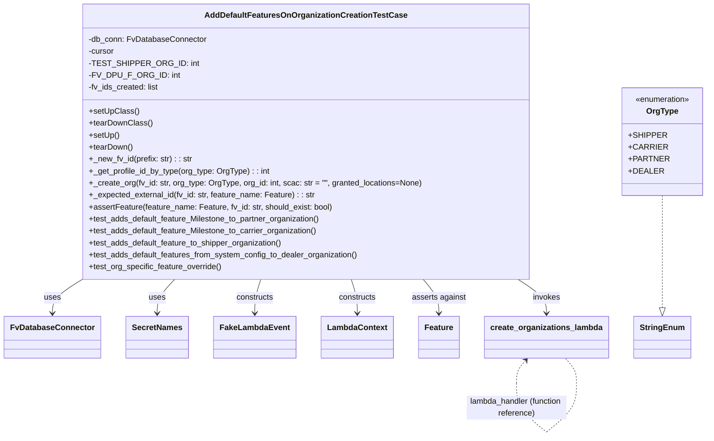
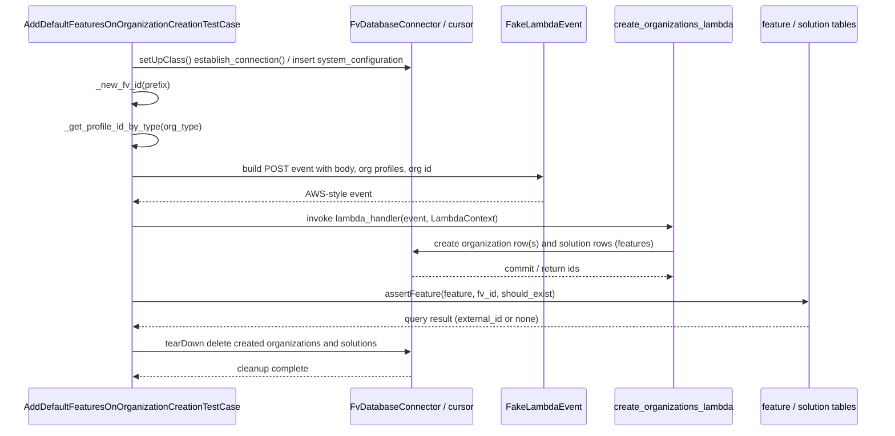

# Diagram: common/iam_service/tests/integration_tests/test_create_organizations/test_add_default_features_on_organization_creation.py

> Auto-generated by Obscura crawlers

## Diagram 1

### SVG

<svg id="container" width="1361.50390625" xmlns="http://www.w3.org/2000/svg" class="classDiagram" height="874.25" viewBox="0 0 1361.50390625 874.25" role="graphics-document document" aria-roledescription="class"><g><defs><marker id="container_class-aggregationStart" class="marker aggregation class" refX="18" refY="7" markerWidth="190" markerHeight="240" orient="auto"><path d="M 18,7 L9,13 L1,7 L9,1 Z"></path></marker></defs><defs><marker id="container_class-aggregationEnd" class="marker aggregation class" refX="1" refY="7" markerWidth="20" markerHeight="28" orient="auto"><path d="M 18,7 L9,13 L1,7 L9,1 Z"></path></marker></defs><defs><marker id="container_class-extensionStart" class="marker extension class" refX="18" refY="7" markerWidth="190" markerHeight="240" orient="auto"><path d="M 1,7 L18,13 V 1 Z"></path></marker></defs><defs><marker id="container_class-extensionEnd" class="marker extension class" refX="1" refY="7" markerWidth="20" markerHeight="28" orient="auto"><path d="M 1,1 V 13 L18,7 Z"></path></marker></defs><defs><marker id="container_class-compositionStart" class="marker composition class" refX="18" refY="7" markerWidth="190" markerHeight="240" orient="auto"><path d="M 18,7 L9,13 L1,7 L9,1 Z"></path></marker></defs><defs><marker id="container_class-compositionEnd" class="marker composition class" refX="1" refY="7" markerWidth="20" markerHeight="28" orient="auto"><path d="M 18,7 L9,13 L1,7 L9,1 Z"></path></marker></defs><defs><marker id="container_class-dependencyStart" class="marker dependency class" refX="6" refY="7" markerWidth="190" markerHeight="240" orient="auto"><path d="M 5,7 L9,13 L1,7 L9,1 Z"></path></marker></defs><defs><marker id="container_class-dependencyEnd" class="marker dependency class" refX="13" refY="7" markerWidth="20" markerHeight="28" orient="auto"><path d="M 18,7 L9,13 L14,7 L9,1 Z"></path></marker></defs><defs><marker id="container_class-lollipopStart" class="marker lollipop class" refX="13" refY="7" markerWidth="190" markerHeight="240" orient="auto"><circle stroke="black" fill="transparent" cx="7" cy="7" r="6"></circle></marker></defs><defs><marker id="container_class-lollipopEnd" class="marker lollipop class" refX="1" refY="7" markerWidth="190" markerHeight="240" orient="auto"><circle stroke="black" fill="transparent" cx="7" cy="7" r="6"></circle></marker></defs><g class="root"><g class="clusters"></g><g class="edgePaths"><path d="M156.97,560L147.359,566.167C137.748,572.333,118.526,584.667,108.916,596C99.305,607.333,99.305,617.667,99.305,622.833L99.305,628" id="id_AddDefaultFeaturesOnOrganizationCreationTestCase_FvDatabaseConnector_1" class="edge-thickness-normal edge-pattern-solid relation" style=";;;" data-edge="true" data-et="edge" data-id="id_AddDefaultFeaturesOnOrganizationCreationTestCase_FvDatabaseConnector_1" data-points="W3sieCI6MTU2Ljk2OTg4NTY4MjkwNzM3LCJ5Ijo1NjB9LHsieCI6OTkuMzA0Njg3NSwieSI6NTk3fSx7IngiOjk5LjMwNDY4NzUsInkiOjYzNH1d" marker-end="url(#container_class-dependencyEnd)"></path><path d="M334.506,560L328.862,566.167C323.217,572.333,311.929,584.667,306.285,596C300.641,607.333,300.641,617.667,300.641,622.833L300.641,628" id="id_AddDefaultFeaturesOnOrganizationCreationTestCase_SecretNames_2" class="edge-thickness-normal edge-pattern-solid relation" style=";;;" data-edge="true" data-et="edge" data-id="id_AddDefaultFeaturesOnOrganizationCreationTestCase_SecretNames_2" data-points="W3sieCI6MzM0LjUwNTcyODMzNDY2NDUsInkiOjU2MH0seyJ4IjozMDAuNjQwNjI1LCJ5Ijo1OTd9LHsieCI6MzAwLjY0MDYyNSwieSI6NjM0fV0=" marker-end="url(#container_class-dependencyEnd)"></path><path d="M500.193,560L498.25,566.167C496.308,572.333,492.424,584.667,490.481,596C488.539,607.333,488.539,617.667,488.539,622.833L488.539,628" id="id_AddDefaultFeaturesOnOrganizationCreationTestCase_FakeLambdaEvent_3" class="edge-thickness-normal edge-pattern-solid relation" style=";;;" data-edge="true" data-et="edge" data-id="id_AddDefaultFeaturesOnOrganizationCreationTestCase_FakeLambdaEvent_3" data-points="W3sieCI6NTAwLjE5MjUyOTQ1Mjg3NTQsInkiOjU2MH0seyJ4Ijo0ODguNTM5MDYyNSwieSI6NTk3fSx7IngiOjQ4OC41MzkwNjI1LCJ5Ijo2MzR9XQ==" marker-end="url(#container_class-dependencyEnd)"></path><path d="M674.05,560L675.992,566.167C677.934,572.333,681.819,584.667,683.761,596C685.703,607.333,685.703,617.667,685.703,622.833L685.703,628" id="id_AddDefaultFeaturesOnOrganizationCreationTestCase_LambdaContext_4" class="edge-thickness-normal edge-pattern-solid relation" style=";;;" data-edge="true" data-et="edge" data-id="id_AddDefaultFeaturesOnOrganizationCreationTestCase_LambdaContext_4" data-points="W3sieCI6Njc0LjA0OTY1ODA0NzEyNDYsInkiOjU2MH0seyJ4Ijo2ODUuNzAzMTI1LCJ5Ijo1OTd9LHsieCI6Njg1LjcwMzEyNSwieSI6NjM0fV0=" marker-end="url(#container_class-dependencyEnd)"></path><path d="M813.979,560L819.047,566.167C824.116,572.333,834.253,584.667,839.322,596C844.391,607.333,844.391,617.667,844.391,622.833L844.391,628" id="id_AddDefaultFeaturesOnOrganizationCreationTestCase_Feature_5" class="edge-thickness-normal edge-pattern-solid relation" style=";;;" data-edge="true" data-et="edge" data-id="id_AddDefaultFeaturesOnOrganizationCreationTestCase_Feature_5" data-points="W3sieCI6ODEzLjk3ODU3MTc4NTE0MzgsInkiOjU2MH0seyJ4Ijo4NDQuMzkwNjI1LCJ5Ijo1OTd9LHsieCI6ODQ0LjM5MDYyNSwieSI6NjM0fV0=" marker-end="url(#container_class-dependencyEnd)"></path><path d="M998.424,560L1007.614,566.167C1016.804,572.333,1035.183,584.667,1044.373,596C1053.563,607.333,1053.563,617.667,1053.563,622.833L1053.563,628" id="id_AddDefaultFeaturesOnOrganizationCreationTestCase_create_organizations_lambda_6" class="edge-thickness-normal edge-pattern-solid relation" style=";;;" data-edge="true" data-et="edge" data-id="id_AddDefaultFeaturesOnOrganizationCreationTestCase_create_organizations_lambda_6" data-points="W3sieCI6OTk4LjQyNDA1OTAwNTU5MTEsInkiOjU2MH0seyJ4IjoxMDUzLjU2MjUsInkiOjU5N30seyJ4IjoxMDUzLjU2MjUsInkiOjYzNH1d" marker-end="url(#container_class-dependencyEnd)"></path><path d="M1277.578,392L1277.578,426.167C1277.578,460.333,1277.578,528.667,1277.578,566.125C1277.578,603.583,1277.578,610.167,1277.578,613.458L1277.578,616.75" id="id_OrgType_StringEnum_7" class="edge-thickness-normal edge-pattern-dashed relation" style=";;;" data-edge="true" data-et="edge" data-id="id_OrgType_StringEnum_7" data-points="W3sieCI6MTI3Ny41NzgxMjUsInkiOjM5Mn0seyJ4IjoxMjc3LjU3ODEyNSwieSI6NTk3fSx7IngiOjEyNzcuNTc4MTI1LCJ5Ijo2MzR9XQ==" marker-end="url(#container_class-extensionEnd)"></path><path d="M1011.948,722.47L1008.884,725.891C1005.819,729.313,999.691,736.157,996.627,743.745C993.563,751.333,993.563,759.667,993.563,763.833L993.563,768" id="create_organizations_lambda-cyclic-special-1" class="edge-thickness-normal edge-pattern-dashed relation" style=";;;" data-edge="true" data-et="edge" data-id="create_organizations_lambda-cyclic-special-1" data-points="W3sieCI6MTAxNS45NTA1NTk3MDE0OTI2LCJ5Ijo3MTh9LHsieCI6OTkzLjU2MjUsInkiOjc0M30seyJ4Ijo5OTMuNTYyNSwieSI6NzY4fV0=" marker-start="url(#container_class-dependencyStart)"></path><path d="M993.563,768.1L993.563,776.267C993.563,784.433,993.563,800.767,1003.554,817.102C1013.546,833.436,1033.529,849.773,1043.521,857.941L1053.512,866.109" id="create_organizations_lambda-cyclic-special-mid" class="edge-thickness-normal edge-pattern-dashed relation" style=";;;" data-edge="true" data-et="edge" data-id="create_organizations_lambda-cyclic-special-mid" data-points="W3sieCI6OTkzLjU2MjUsInkiOjc2OC4xMDAwMDAwMDE0OTAxfSx7IngiOjk5My41NjI1LCJ5Ijo4MTcuMTAwMDAwMDAxNDkwMX0seyJ4IjoxMDUzLjUxMjQ5OTk5OTI1NSwieSI6ODY2LjEwOTEyNTAwMTYyNTR9XQ=="></path><path d="M1053.613,866.109L1063.604,857.941C1073.596,849.773,1093.579,833.436,1103.571,817.093C1113.563,800.75,1113.563,784.4,1113.563,772.05C1113.563,759.7,1113.563,751.35,1109.831,743.008C1106.1,734.667,1098.637,726.333,1094.906,722.167L1091.174,718" id="create_organizations_lambda-cyclic-special-2" class="edge-thickness-normal edge-pattern-dashed relation" style=";;;" data-edge="true" data-et="edge" data-id="create_organizations_lambda-cyclic-special-2" data-points="W3sieCI6MTA1My42MTI1MDAwMDA3NDUsInkiOjg2Ni4xMDkxMjUwMDE2MjU0fSx7IngiOjExMTMuNTYyNSwieSI6ODE3LjEwMDAwMDAwMTQ5MDF9LHsieCI6MTExMy41NjI1LCJ5Ijo3NjguMDUwMDAwMDAwNzQ1MX0seyJ4IjoxMTEzLjU2MjUsInkiOjc0M30seyJ4IjoxMDkxLjE3NDQ0MDI5ODUwNzUsInkiOjcxOH1d"></path></g><g class="edgeLabels"><g class="edgeLabel" transform="translate(99.3046875, 597)"><g class="label" data-id="id_AddDefaultFeaturesOnOrganizationCreationTestCase_FvDatabaseConnector_1" transform="translate(-16.4921875, -12)"><foreignObject width="32.984375" height="24">

uses

</foreignObject></g></g><g class="edgeLabel" transform="translate(300.640625, 597)"><g class="label" data-id="id_AddDefaultFeaturesOnOrganizationCreationTestCase_SecretNames_2" transform="translate(-16.4921875, -12)"><foreignObject width="32.984375" height="24">

uses

</foreignObject></g></g><g class="edgeLabel" transform="translate(488.5390625, 597)"><g class="label" data-id="id_AddDefaultFeaturesOnOrganizationCreationTestCase_FakeLambdaEvent_3" transform="translate(-37.84375, -12)"><foreignObject width="75.6875" height="24">

constructs

</foreignObject></g></g><g class="edgeLabel" transform="translate(685.703125, 597)"><g class="label" data-id="id_AddDefaultFeaturesOnOrganizationCreationTestCase_LambdaContext_4" transform="translate(-37.84375, -12)"><foreignObject width="75.6875" height="24">

constructs

</foreignObject></g></g><g class="edgeLabel" transform="translate(844.390625, 597)"><g class="label" data-id="id_AddDefaultFeaturesOnOrganizationCreationTestCase_Feature_5" transform="translate(-54.0625, -12)"><foreignObject width="108.125" height="24">

asserts against

</foreignObject></g></g><g class="edgeLabel" transform="translate(1053.5625, 597)"><g class="label" data-id="id_AddDefaultFeaturesOnOrganizationCreationTestCase_create_organizations_lambda_6" transform="translate(-27.5859375, -12)"><foreignObject width="55.171875" height="24">

invokes

</foreignObject></g></g><g class="edgeLabel"><g class="label" data-id="id_OrgType_StringEnum_7" transform="translate(0, 0)"><foreignObject width="0" height="0">

</foreignObject></g></g><g class="edgeLabel"><g class="label" data-id="create_organizations_lambda-cyclic-special-1" transform="translate(0, 0)"><foreignObject width="0" height="0">

</foreignObject></g></g><g class="edgeLabel" transform="translate(993.5625, 817.1000000014901)"><g class="label" data-id="create_organizations_lambda-cyclic-special-mid" transform="translate(-100, -24)"><foreignObject width="200" height="48">

lambda_handler (function reference)

</foreignObject></g></g><g class="edgeLabel"><g class="label" data-id="create_organizations_lambda-cyclic-special-2" transform="translate(0, 0)"><foreignObject width="0" height="0">

</foreignObject></g></g></g><g class="nodes"><g class="node default" id="classId-OrgType-0" transform="translate(1277.578125, 284)"><g class="basic label-container"><path d="M-75.92578125 -108 L75.92578125 -108 L75.92578125 108 L-75.92578125 108" stroke="none" stroke-width="0" fill="#ECECFF" style=""></path><path d="M-75.92578125 -108 C-15.624664952073147 -108, 44.67645134585371 -108, 75.92578125 -108 M-75.92578125 -108 C-39.186557074386165 -108, -2.4473328987723306 -108, 75.92578125 -108 M75.92578125 -108 C75.92578125 -32.76919123612795, 75.92578125 42.461617527744096, 75.92578125 108 M75.92578125 -108 C75.92578125 -61.03934233160009, 75.92578125 -14.078684663200178, 75.92578125 108 M75.92578125 108 C43.823377302519674 108, 11.720973355039348 108, -75.92578125 108 M75.92578125 108 C18.635603317806655 108, -38.65457461438669 108, -75.92578125 108 M-75.92578125 108 C-75.92578125 25.55746102195026, -75.92578125 -56.88507795609948, -75.92578125 -108 M-75.92578125 108 C-75.92578125 57.073370371817454, -75.92578125 6.146740743634908, -75.92578125 -108" stroke="#9370DB" stroke-width="1.3" fill="none" stroke-dasharray="0 0" style=""></path></g><g class="annotation-group text" transform="translate(-55.5546875, -84)"><g class="label" style="" transform="translate(0,-12)"><foreignObject width="111.109375" height="24">

«enumeration»

</foreignObject></g></g><g class="label-group text" transform="translate(-30.390625, -60)"><g class="label" style="font-weight: bolder" transform="translate(0,-12)"><foreignObject width="60.78125" height="24">

OrgType

</foreignObject></g></g><g class="members-group text" transform="translate(-63.92578125, -12)"><g class="label" style="" transform="translate(0,-12)"><foreignObject width="68.5" height="24">

+SHIPPER

</foreignObject></g><g class="label" style="" transform="translate(0,12)"><foreignObject width="68.4375" height="24">

+CARRIER

</foreignObject></g><g class="label" style="" transform="translate(0,36)"><foreignObject width="72.296875" height="24">

+PARTNER

</foreignObject></g><g class="label" style="" transform="translate(0,60)"><foreignObject width="62.234375" height="24">

+DEALER

</foreignObject></g></g><g class="methods-group text" transform="translate(-63.92578125, 108)"></g><g class="divider" style=""><path d="M-75.92578125 -36 C-41.99116172206671 -36, -8.056542194133414 -36, 75.92578125 -36 M-75.92578125 -36 C-30.133817436209476 -36, 15.658146377581048 -36, 75.92578125 -36" stroke="#9370DB" stroke-width="1.3" fill="none" stroke-dasharray="0 0" style=""></path></g><g class="divider" style=""><path d="M-75.92578125 84 C-17.605371757464965 84, 40.71503773507007 84, 75.92578125 84 M-75.92578125 84 C-33.87242646156287 84, 8.180928326874266 84, 75.92578125 84" stroke="#9370DB" stroke-width="1.3" fill="none" stroke-dasharray="0 0" style=""></path></g></g><g class="node default" id="classId-AddDefaultFeaturesOnOrganizationCreationTestCase-1" transform="translate(587.12109375, 284)"><g class="basic label-container"><path d="M-439.515625 -276 L439.515625 -276 L439.515625 276 L-439.515625 276" stroke="none" stroke-width="0" fill="#ECECFF" style=""></path><path d="M-439.515625 -276 C-227.67947734967214 -276, -15.843329699344281 -276, 439.515625 -276 M-439.515625 -276 C-129.8964722213493 -276, 179.72268055730137 -276, 439.515625 -276 M439.515625 -276 C439.515625 -75.89721365655654, 439.515625 124.20557268688691, 439.515625 276 M439.515625 -276 C439.515625 -126.92794413776133, 439.515625 22.14411172447734, 439.515625 276 M439.515625 276 C143.58231901676152 276, -152.35098696647697 276, -439.515625 276 M439.515625 276 C97.26052971325333 276, -244.99456557349333 276, -439.515625 276 M-439.515625 276 C-439.515625 108.69814240155836, -439.515625 -58.603715196883286, -439.515625 -276 M-439.515625 276 C-439.515625 148.74506639527425, -439.515625 21.49013279054853, -439.515625 -276" stroke="#9370DB" stroke-width="1.3" fill="none" stroke-dasharray="0 0" style=""></path></g><g class="annotation-group text" transform="translate(0, -252)"></g><g class="label-group text" transform="translate(-192.28125, -252)"><g class="label" style="font-weight: bolder" transform="translate(0,-12)"><foreignObject width="384.5625" height="24">

AddDefaultFeaturesOnOrganizationCreationTestCase

</foreignObject></g></g><g class="members-group text" transform="translate(-427.515625, -204)"><g class="label" style="" transform="translate(0,-12)"><foreignObject width="233.34375" height="24">

-db_conn: FvDatabaseConnector

</foreignObject></g><g class="label" style="" transform="translate(0,12)"><foreignObject width="52.1875" height="24">

-cursor

</foreignObject></g><g class="label" style="" transform="translate(0,36)"><foreignObject width="196.796875" height="24">

-TEST_SHIPPER_ORG_ID: int

</foreignObject></g><g class="label" style="" transform="translate(0,60)"><foreignObject width="164.484375" height="24">

-FV_DPU_F_ORG_ID: int

</foreignObject></g><g class="label" style="" transform="translate(0,84)"><foreignObject width="141.484375" height="24">

-fv_ids_created: list

</foreignObject></g></g><g class="methods-group text" transform="translate(-427.515625, -60)"><g class="label" style="" transform="translate(0,-12)"><foreignObject width="97.15625" height="24">

+setUpClass()

</foreignObject></g><g class="label" style="" transform="translate(0,12)"><foreignObject width="124.484375" height="24">

+tearDownClass()

</foreignObject></g><g class="label" style="" transform="translate(0,36)"><foreignObject width="60.421875" height="24">

+setUp()

</foreignObject></g><g class="label" style="" transform="translate(0,60)"><foreignObject width="87.75" height="24">

+tearDown()

</foreignObject></g><g class="label" style="" transform="translate(0,84)"><foreignObject width="206.078125" height="24">

+_new_fv_id(prefix: str) : : str

</foreignObject></g><g class="label" style="" transform="translate(0,108)"><foreignObject width="361.171875" height="24">

+_get_profile_id_by_type(org_type: OrgType) : : int

</foreignObject></g><g class="label" style="" transform="translate(0,132)"><foreignObject width="662.75" height="24">

+_create_org(fv_id: str, org_type: OrgType, org_id: int, scac: str = "", granted_locations=None)

</foreignObject></g><g class="label" style="" transform="translate(0,156)"><foreignObject width="452.796875" height="24">

+_expected_external_id(fv_id: str, feature_name: Feature) : : str

</foreignObject></g><g class="label" style="" transform="translate(0,180)"><foreignObject width="488.984375" height="24">

+assertFeature(feature_name: Feature, fv_id: str, should_exist: bool)

</foreignObject></g><g class="label" style="" transform="translate(0,204)"><foreignObject width="469.15625" height="24">

+test_adds_default_feature_Milestone_to_partner_organization()

</foreignObject></g><g class="label" style="" transform="translate(0,228)"><foreignObject width="462.515625" height="24">

+test_adds_default_feature_Milestone_to_carrier_organization()

</foreignObject></g><g class="label" style="" transform="translate(0,252)"><foreignObject width="391.421875" height="24">

+test_adds_default_feature_to_shipper_organization()

</foreignObject></g><g class="label" style="" transform="translate(0,276)"><foreignObject width="541.9375" height="24">

+test_adds_default_features_from_system_config_to_dealer_organization()

</foreignObject></g><g class="label" style="" transform="translate(0,300)"><foreignObject width="269.078125" height="24">

+test_org_specific_feature_override()

</foreignObject></g></g><g class="divider" style=""><path d="M-439.515625 -228 C-187.17993377976805 -228, 65.1557574404639 -228, 439.515625 -228 M-439.515625 -228 C-238.260165430776 -228, -37.004705861552 -228, 439.515625 -228" stroke="#9370DB" stroke-width="1.3" fill="none" stroke-dasharray="0 0" style=""></path></g><g class="divider" style=""><path d="M-439.515625 -84 C-109.45642505098311 -84, 220.60277489803377 -84, 439.515625 -84 M-439.515625 -84 C-166.9611488029753 -84, 105.59332739404942 -84, 439.515625 -84" stroke="#9370DB" stroke-width="1.3" fill="none" stroke-dasharray="0 0" style=""></path></g></g><g class="node default" id="classId-FvDatabaseConnector-2" transform="translate(99.3046875, 676)"><g class="basic label-container"><path d="M-91.3046875 -42 L91.3046875 -42 L91.3046875 42 L-91.3046875 42" stroke="none" stroke-width="0" fill="#ECECFF" style=""></path><path d="M-91.3046875 -42 C-52.26457277470741 -42, -13.224458049414821 -42, 91.3046875 -42 M-91.3046875 -42 C-50.16013087246627 -42, -9.015574244932537 -42, 91.3046875 -42 M91.3046875 -42 C91.3046875 -16.079150518940484, 91.3046875 9.841698962119033, 91.3046875 42 M91.3046875 -42 C91.3046875 -10.052646081941653, 91.3046875 21.894707836116694, 91.3046875 42 M91.3046875 42 C34.44000968923102 42, -22.424668121537962 42, -91.3046875 42 M91.3046875 42 C26.910179551953206 42, -37.48432839609359 42, -91.3046875 42 M-91.3046875 42 C-91.3046875 15.846559387053183, -91.3046875 -10.306881225893633, -91.3046875 -42 M-91.3046875 42 C-91.3046875 12.216349450672261, -91.3046875 -17.567301098655477, -91.3046875 -42" stroke="#9370DB" stroke-width="1.3" fill="none" stroke-dasharray="0 0" style=""></path></g><g class="annotation-group text" transform="translate(0, -18)"></g><g class="label-group text" transform="translate(-79.3046875, -18)"><g class="label" style="font-weight: bolder" transform="translate(0,-12)"><foreignObject width="158.609375" height="24">

FvDatabaseConnector

</foreignObject></g></g><g class="members-group text" transform="translate(-79.3046875, 30)"></g><g class="methods-group text" transform="translate(-79.3046875, 60)"></g><g class="divider" style=""><path d="M-91.3046875 6 C-30.208387718737114 6, 30.88791206252577 6, 91.3046875 6 M-91.3046875 6 C-38.21197950594845 6, 14.880728488103102 6, 91.3046875 6" stroke="#9370DB" stroke-width="1.3" fill="none" stroke-dasharray="0 0" style=""></path></g><g class="divider" style=""><path d="M-91.3046875 24 C-26.65771768968962 24, 37.98925212062076 24, 91.3046875 24 M-91.3046875 24 C-27.589491120565228 24, 36.125705258869544 24, 91.3046875 24" stroke="#9370DB" stroke-width="1.3" fill="none" stroke-dasharray="0 0" style=""></path></g></g><g class="node default" id="classId-SecretNames-3" transform="translate(300.640625, 676)"><g class="basic label-container"><path d="M-60.03125 -42 L60.03125 -42 L60.03125 42 L-60.03125 42" stroke="none" stroke-width="0" fill="#ECECFF" style=""></path><path d="M-60.03125 -42 C-33.61791637502907 -42, -7.20458275005813 -42, 60.03125 -42 M-60.03125 -42 C-29.047092835486534 -42, 1.9370643290269314 -42, 60.03125 -42 M60.03125 -42 C60.03125 -21.959665238225913, 60.03125 -1.919330476451826, 60.03125 42 M60.03125 -42 C60.03125 -15.72286127108256, 60.03125 10.554277457834878, 60.03125 42 M60.03125 42 C21.57007738581389 42, -16.891095228372222 42, -60.03125 42 M60.03125 42 C34.719451559246956 42, 9.407653118493911 42, -60.03125 42 M-60.03125 42 C-60.03125 11.103843212483724, -60.03125 -19.79231357503255, -60.03125 -42 M-60.03125 42 C-60.03125 18.985339942414683, -60.03125 -4.029320115170634, -60.03125 -42" stroke="#9370DB" stroke-width="1.3" fill="none" stroke-dasharray="0 0" style=""></path></g><g class="annotation-group text" transform="translate(0, -18)"></g><g class="label-group text" transform="translate(-48.03125, -18)"><g class="label" style="font-weight: bolder" transform="translate(0,-12)"><foreignObject width="96.0625" height="24">

SecretNames

</foreignObject></g></g><g class="members-group text" transform="translate(-48.03125, 30)"></g><g class="methods-group text" transform="translate(-48.03125, 60)"></g><g class="divider" style=""><path d="M-60.03125 6 C-28.29789374338171 6, 3.4354625132365797 6, 60.03125 6 M-60.03125 6 C-15.725753153975738 6, 28.579743692048524 6, 60.03125 6" stroke="#9370DB" stroke-width="1.3" fill="none" stroke-dasharray="0 0" style=""></path></g><g class="divider" style=""><path d="M-60.03125 24 C-16.602977846463972 24, 26.825294307072056 24, 60.03125 24 M-60.03125 24 C-35.02683790539993 24, -10.022425810799866 24, 60.03125 24" stroke="#9370DB" stroke-width="1.3" fill="none" stroke-dasharray="0 0" style=""></path></g></g><g class="node default" id="classId-FakeLambdaEvent-4" transform="translate(488.5390625, 676)"><g class="basic label-container"><path d="M-77.8671875 -42 L77.8671875 -42 L77.8671875 42 L-77.8671875 42" stroke="none" stroke-width="0" fill="#ECECFF" style=""></path><path d="M-77.8671875 -42 C-22.088076617765275 -42, 33.69103426446945 -42, 77.8671875 -42 M-77.8671875 -42 C-29.16254149282181 -42, 19.54210451435638 -42, 77.8671875 -42 M77.8671875 -42 C77.8671875 -19.26092060595867, 77.8671875 3.478158788082659, 77.8671875 42 M77.8671875 -42 C77.8671875 -17.217293307605047, 77.8671875 7.565413384789906, 77.8671875 42 M77.8671875 42 C22.841908077681097 42, -32.183371344637806 42, -77.8671875 42 M77.8671875 42 C36.20381782997159 42, -5.459551840056818 42, -77.8671875 42 M-77.8671875 42 C-77.8671875 22.622265609744044, -77.8671875 3.2445312194880884, -77.8671875 -42 M-77.8671875 42 C-77.8671875 11.484962073793, -77.8671875 -19.030075852414, -77.8671875 -42" stroke="#9370DB" stroke-width="1.3" fill="none" stroke-dasharray="0 0" style=""></path></g><g class="annotation-group text" transform="translate(0, -18)"></g><g class="label-group text" transform="translate(-65.8671875, -18)"><g class="label" style="font-weight: bolder" transform="translate(0,-12)"><foreignObject width="131.734375" height="24">

FakeLambdaEvent

</foreignObject></g></g><g class="members-group text" transform="translate(-65.8671875, 30)"></g><g class="methods-group text" transform="translate(-65.8671875, 60)"></g><g class="divider" style=""><path d="M-77.8671875 6 C-22.038068296269792 6, 33.791050907460416 6, 77.8671875 6 M-77.8671875 6 C-42.92011734346201 6, -7.9730471869240205 6, 77.8671875 6" stroke="#9370DB" stroke-width="1.3" fill="none" stroke-dasharray="0 0" style=""></path></g><g class="divider" style=""><path d="M-77.8671875 24 C-36.00479236415629 24, 5.857602771687425 24, 77.8671875 24 M-77.8671875 24 C-39.499680406479484 24, -1.1321733129589688 24, 77.8671875 24" stroke="#9370DB" stroke-width="1.3" fill="none" stroke-dasharray="0 0" style=""></path></g></g><g class="node default" id="classId-LambdaContext-5" transform="translate(685.703125, 676)"><g class="basic label-container"><path d="M-69.296875 -42 L69.296875 -42 L69.296875 42 L-69.296875 42" stroke="none" stroke-width="0" fill="#ECECFF" style=""></path><path d="M-69.296875 -42 C-25.56227964831266 -42, 18.17231570337468 -42, 69.296875 -42 M-69.296875 -42 C-39.61900418452677 -42, -9.941133369053546 -42, 69.296875 -42 M69.296875 -42 C69.296875 -11.679371652244164, 69.296875 18.64125669551167, 69.296875 42 M69.296875 -42 C69.296875 -8.708517277969676, 69.296875 24.582965444060648, 69.296875 42 M69.296875 42 C38.52446946145474 42, 7.752063922909478 42, -69.296875 42 M69.296875 42 C18.522337768944382 42, -32.252199462111236 42, -69.296875 42 M-69.296875 42 C-69.296875 17.307664207908527, -69.296875 -7.3846715841829464, -69.296875 -42 M-69.296875 42 C-69.296875 9.045292902423682, -69.296875 -23.909414195152635, -69.296875 -42" stroke="#9370DB" stroke-width="1.3" fill="none" stroke-dasharray="0 0" style=""></path></g><g class="annotation-group text" transform="translate(0, -18)"></g><g class="label-group text" transform="translate(-57.296875, -18)"><g class="label" style="font-weight: bolder" transform="translate(0,-12)"><foreignObject width="114.59375" height="24">

LambdaContext

</foreignObject></g></g><g class="members-group text" transform="translate(-57.296875, 30)"></g><g class="methods-group text" transform="translate(-57.296875, 60)"></g><g class="divider" style=""><path d="M-69.296875 6 C-28.65852219005908 6, 11.979830619881838 6, 69.296875 6 M-69.296875 6 C-14.402803372575669 6, 40.49126825484866 6, 69.296875 6" stroke="#9370DB" stroke-width="1.3" fill="none" stroke-dasharray="0 0" style=""></path></g><g class="divider" style=""><path d="M-69.296875 24 C-33.01943757773868 24, 3.2579998445226437 24, 69.296875 24 M-69.296875 24 C-24.23235565600453 24, 20.832163687990942 24, 69.296875 24" stroke="#9370DB" stroke-width="1.3" fill="none" stroke-dasharray="0 0" style=""></path></g></g><g class="node default" id="classId-Feature-6" transform="translate(844.390625, 676)"><g class="basic label-container"><path d="M-39.390625 -42 L39.390625 -42 L39.390625 42 L-39.390625 42" stroke="none" stroke-width="0" fill="#ECECFF" style=""></path><path d="M-39.390625 -42 C-15.211804657219997 -42, 8.967015685560007 -42, 39.390625 -42 M-39.390625 -42 C-11.42325825002925 -42, 16.5441084999415 -42, 39.390625 -42 M39.390625 -42 C39.390625 -19.471357902144014, 39.390625 3.057284195711972, 39.390625 42 M39.390625 -42 C39.390625 -19.693428745249125, 39.390625 2.613142509501749, 39.390625 42 M39.390625 42 C13.7353207986847 42, -11.9199834026306 42, -39.390625 42 M39.390625 42 C9.630288573094791 42, -20.130047853810417 42, -39.390625 42 M-39.390625 42 C-39.390625 21.00445838594828, -39.390625 0.008916771896558373, -39.390625 -42 M-39.390625 42 C-39.390625 20.102723624080276, -39.390625 -1.794552751839447, -39.390625 -42" stroke="#9370DB" stroke-width="1.3" fill="none" stroke-dasharray="0 0" style=""></path></g><g class="annotation-group text" transform="translate(0, -18)"></g><g class="label-group text" transform="translate(-27.390625, -18)"><g class="label" style="font-weight: bolder" transform="translate(0,-12)"><foreignObject width="54.78125" height="24">

Feature

</foreignObject></g></g><g class="members-group text" transform="translate(-27.390625, 30)"></g><g class="methods-group text" transform="translate(-27.390625, 60)"></g><g class="divider" style=""><path d="M-39.390625 6 C-18.43029019818038 6, 2.53004460363924 6, 39.390625 6 M-39.390625 6 C-9.633857506625798 6, 20.122909986748404 6, 39.390625 6" stroke="#9370DB" stroke-width="1.3" fill="none" stroke-dasharray="0 0" style=""></path></g><g class="divider" style=""><path d="M-39.390625 24 C-11.11951529704687 24, 17.15159440590626 24, 39.390625 24 M-39.390625 24 C-17.702331248012033 24, 3.9859625039759337 24, 39.390625 24" stroke="#9370DB" stroke-width="1.3" fill="none" stroke-dasharray="0 0" style=""></path></g></g><g class="node default" id="classId-StringEnum-7" transform="translate(1277.578125, 676)"><g class="basic label-container"><path d="M-54.234375 -42 L54.234375 -42 L54.234375 42 L-54.234375 42" stroke="none" stroke-width="0" fill="#ECECFF" style=""></path><path d="M-54.234375 -42 C-15.432035006785156 -42, 23.370304986429687 -42, 54.234375 -42 M-54.234375 -42 C-24.597125658180442 -42, 5.040123683639116 -42, 54.234375 -42 M54.234375 -42 C54.234375 -9.498390714653127, 54.234375 23.003218570693747, 54.234375 42 M54.234375 -42 C54.234375 -8.78138801916701, 54.234375 24.43722396166598, 54.234375 42 M54.234375 42 C21.62502996870957 42, -10.984315062580862 42, -54.234375 42 M54.234375 42 C19.207906797823192 42, -15.818561404353616 42, -54.234375 42 M-54.234375 42 C-54.234375 17.944521453702265, -54.234375 -6.11095709259547, -54.234375 -42 M-54.234375 42 C-54.234375 18.989196675526745, -54.234375 -4.021606648946509, -54.234375 -42" stroke="#9370DB" stroke-width="1.3" fill="none" stroke-dasharray="0 0" style=""></path></g><g class="annotation-group text" transform="translate(0, -18)"></g><g class="label-group text" transform="translate(-42.234375, -18)"><g class="label" style="font-weight: bolder" transform="translate(0,-12)"><foreignObject width="84.46875" height="24">

StringEnum

</foreignObject></g></g><g class="members-group text" transform="translate(-42.234375, 30)"></g><g class="methods-group text" transform="translate(-42.234375, 60)"></g><g class="divider" style=""><path d="M-54.234375 6 C-11.137731079736511 6, 31.958912840526978 6, 54.234375 6 M-54.234375 6 C-21.492646341366054 6, 11.249082317267892 6, 54.234375 6" stroke="#9370DB" stroke-width="1.3" fill="none" stroke-dasharray="0 0" style=""></path></g><g class="divider" style=""><path d="M-54.234375 24 C-19.35244625363378 24, 15.529482492732441 24, 54.234375 24 M-54.234375 24 C-31.822088850202963 24, -9.409802700405926 24, 54.234375 24" stroke="#9370DB" stroke-width="1.3" fill="none" stroke-dasharray="0 0" style=""></path></g></g><g class="node default" id="classId-create_organizations_lambda-8" transform="translate(1053.5625, 676)"><g class="basic label-container"><path d="M-119.78125 -42 L119.78125 -42 L119.78125 42 L-119.78125 42" stroke="none" stroke-width="0" fill="#ECECFF" style=""></path><path d="M-119.78125 -42 C-24.623574589753588 -42, 70.53410082049282 -42, 119.78125 -42 M-119.78125 -42 C-57.68750972371999 -42, 4.406230552560018 -42, 119.78125 -42 M119.78125 -42 C119.78125 -22.700361512316096, 119.78125 -3.4007230246321924, 119.78125 42 M119.78125 -42 C119.78125 -9.123161633172657, 119.78125 23.753676733654686, 119.78125 42 M119.78125 42 C37.43528305860927 42, -44.910683882781456 42, -119.78125 42 M119.78125 42 C27.241898743251227 42, -65.29745251349755 42, -119.78125 42 M-119.78125 42 C-119.78125 16.356857498703736, -119.78125 -9.286285002592528, -119.78125 -42 M-119.78125 42 C-119.78125 20.969617113599334, -119.78125 -0.06076577280133222, -119.78125 -42" stroke="#9370DB" stroke-width="1.3" fill="none" stroke-dasharray="0 0" style=""></path></g><g class="annotation-group text" transform="translate(0, -18)"></g><g class="label-group text" transform="translate(-107.78125, -18)"><g class="label" style="font-weight: bolder" transform="translate(0,-12)"><foreignObject width="215.5625" height="24">

create_organizations_lambda

</foreignObject></g></g><g class="members-group text" transform="translate(-107.78125, 30)"></g><g class="methods-group text" transform="translate(-107.78125, 60)"></g><g class="divider" style=""><path d="M-119.78125 6 C-51.63471590635433 6, 16.51181818729134 6, 119.78125 6 M-119.78125 6 C-69.75587256625406 6, -19.73049513250811 6, 119.78125 6" stroke="#9370DB" stroke-width="1.3" fill="none" stroke-dasharray="0 0" style=""></path></g><g class="divider" style=""><path d="M-119.78125 24 C-32.44824377623489 24, 54.88476244753022 24, 119.78125 24 M-119.78125 24 C-36.40109032921859 24, 46.97906934156282 24, 119.78125 24" stroke="#9370DB" stroke-width="1.3" fill="none" stroke-dasharray="0 0" style=""></path></g></g><g class="label edgeLabel" id="create_organizations_lambda---create_organizations_lambda---1" transform="translate(993.5625, 768.0500000007451)"><rect width="0.1" height="0.1"></rect><g class="label" style="" transform="translate(0, 0)"><rect></rect><foreignObject width="0" height="0">

</foreignObject></g></g><g class="label edgeLabel" id="create_organizations_lambda---create_organizations_lambda---2" transform="translate(1053.5625, 866.1500000022352)"><rect width="0.1" height="0.1"></rect><g class="label" style="" transform="translate(0, 0)"><rect></rect><foreignObject width="0" height="0">

</foreignObject></g></g></g></g></g></svg>

## Diagram 2

### SVG

<svg id="container" width="1697" xmlns="http://www.w3.org/2000/svg" height="807" viewBox="-50 -10 1697 807" role="graphics-document document" aria-roledescription="sequence"><g><rect x="1399" y="721" fill="#eaeaea" stroke="#666" width="198" height="65" name="FeatureTable" rx="3" ry="3" class="actor actor-bottom"></rect><text x="1498" y="753.5" dominant-baseline="central" alignment-baseline="central" class="actor actor-box" style="text-anchor: middle; font-size: 16px; font-weight: 400;"><tspan x="1498" dy="0">feature / solution tables</tspan></text></g><g><rect x="1116" y="721" fill="#eaeaea" stroke="#666" width="233" height="65" name="Lambda" rx="3" ry="3" class="actor actor-bottom"></rect><text x="1232.5" y="753.5" dominant-baseline="central" alignment-baseline="central" class="actor actor-box" style="text-anchor: middle; font-size: 16px; font-weight: 400;"><tspan x="1232.5" dy="0">create_organizations_lambda</tspan></text></g><g><rect x="915" y="721" fill="#eaeaea" stroke="#666" width="151" height="65" name="EventBuilder" rx="3" ry="3" class="actor actor-bottom"></rect><text x="990.5" y="753.5" dominant-baseline="central" alignment-baseline="central" class="actor actor-box" style="text-anchor: middle; font-size: 16px; font-weight: 400;"><tspan x="990.5" dy="0">FakeLambdaEvent</tspan></text></g><g><rect x="625" y="721" fill="#eaeaea" stroke="#666" width="240" height="65" name="DB" rx="3" ry="3" class="actor actor-bottom"></rect><text x="745" y="753.5" dominant-baseline="central" alignment-baseline="central" class="actor actor-box" style="text-anchor: middle; font-size: 16px; font-weight: 400;"><tspan x="745" dy="0">FvDatabaseConnector / cursor</tspan></text></g><g><rect x="0" y="721" fill="#eaeaea" stroke="#666" width="398" height="65" name="Test" rx="3" ry="3" class="actor actor-bottom"></rect><text x="199" y="753.5" dominant-baseline="central" alignment-baseline="central" class="actor actor-box" style="text-anchor: middle; font-size: 16px; font-weight: 400;"><tspan x="199" dy="0">AddDefaultFeaturesOnOrganizationCreationTestCase</tspan></text></g><g><line id="actor4" x1="1498" y1="65" x2="1498" y2="721" class="actor-line 200" stroke-width="0.5px" stroke="#999" name="FeatureTable"></line><g id="root-4"><rect x="1399" y="0" fill="#eaeaea" stroke="#666" width="198" height="65" name="FeatureTable" rx="3" ry="3" class="actor actor-top"></rect><text x="1498" y="32.5" dominant-baseline="central" alignment-baseline="central" class="actor actor-box" style="text-anchor: middle; font-size: 16px; font-weight: 400;"><tspan x="1498" dy="0">feature / solution tables</tspan></text></g></g><g><line id="actor3" x1="1232.5" y1="65" x2="1232.5" y2="721" class="actor-line 200" stroke-width="0.5px" stroke="#999" name="Lambda"></line><g id="root-3"><rect x="1116" y="0" fill="#eaeaea" stroke="#666" width="233" height="65" name="Lambda" rx="3" ry="3" class="actor actor-top"></rect><text x="1232.5" y="32.5" dominant-baseline="central" alignment-baseline="central" class="actor actor-box" style="text-anchor: middle; font-size: 16px; font-weight: 400;"><tspan x="1232.5" dy="0">create_organizations_lambda</tspan></text></g></g><g><line id="actor2" x1="990.5" y1="65" x2="990.5" y2="721" class="actor-line 200" stroke-width="0.5px" stroke="#999" name="EventBuilder"></line><g id="root-2"><rect x="915" y="0" fill="#eaeaea" stroke="#666" width="151" height="65" name="EventBuilder" rx="3" ry="3" class="actor actor-top"></rect><text x="990.5" y="32.5" dominant-baseline="central" alignment-baseline="central" class="actor actor-box" style="text-anchor: middle; font-size: 16px; font-weight: 400;"><tspan x="990.5" dy="0">FakeLambdaEvent</tspan></text></g></g><g><line id="actor1" x1="745" y1="65" x2="745" y2="721" class="actor-line 200" stroke-width="0.5px" stroke="#999" name="DB"></line><g id="root-1"><rect x="625" y="0" fill="#eaeaea" stroke="#666" width="240" height="65" name="DB" rx="3" ry="3" class="actor actor-top"></rect><text x="745" y="32.5" dominant-baseline="central" alignment-baseline="central" class="actor actor-box" style="text-anchor: middle; font-size: 16px; font-weight: 400;"><tspan x="745" dy="0">FvDatabaseConnector / cursor</tspan></text></g></g><g><line id="actor0" x1="199" y1="65" x2="199" y2="721" class="actor-line 200" stroke-width="0.5px" stroke="#999" name="Test"></line><g id="root-0"><rect x="0" y="0" fill="#eaeaea" stroke="#666" width="398" height="65" name="Test" rx="3" ry="3" class="actor actor-top"></rect><text x="199" y="32.5" dominant-baseline="central" alignment-baseline="central" class="actor actor-box" style="text-anchor: middle; font-size: 16px; font-weight: 400;"><tspan x="199" dy="0">AddDefaultFeaturesOnOrganizationCreationTestCase</tspan></text></g></g><g></g><defs><symbol id="computer" width="24" height="24"><path transform="scale(.5)" d="M2 2v13h20v-13h-20zm18 11h-16v-9h16v9zm-10.228 6l.466-1h3.524l.467 1h-4.457zm14.228 3h-24l2-6h2.104l-1.33 4h18.45l-1.297-4h2.073l2 6zm-5-10h-14v-7h14v7z"></path></symbol></defs><defs><symbol id="database" fill-rule="evenodd" clip-rule="evenodd"><path transform="scale(.5)" d="M12.258.001l.256.004.255.005.253.008.251.01.249.012.247.015.246.016.242.019.241.02.239.023.236.024.233.027.231.028.229.031.225.032.223.034.22.036.217.038.214.04.211.041.208.043.205.045.201.046.198.048.194.05.191.051.187.053.183.054.18.056.175.057.172.059.168.06.163.061.16.063.155.064.15.066.074.033.073.033.071.034.07.034.069.035.068.035.067.035.066.035.064.036.064.036.062.036.06.036.06.037.058.037.058.037.055.038.055.038.053.038.052.038.051.039.05.039.048.039.047.039.045.04.044.04.043.04.041.04.04.041.039.041.037.041.036.041.034.041.033.042.032.042.03.042.029.042.027.042.026.043.024.043.023.043.021.043.02.043.018.044.017.043.015.044.013.044.012.044.011.045.009.044.007.045.006.045.004.045.002.045.001.045v17l-.001.045-.002.045-.004.045-.006.045-.007.045-.009.044-.011.045-.012.044-.013.044-.015.044-.017.043-.018.044-.02.043-.021.043-.023.043-.024.043-.026.043-.027.042-.029.042-.03.042-.032.042-.033.042-.034.041-.036.041-.037.041-.039.041-.04.041-.041.04-.043.04-.044.04-.045.04-.047.039-.048.039-.05.039-.051.039-.052.038-.053.038-.055.038-.055.038-.058.037-.058.037-.06.037-.06.036-.062.036-.064.036-.064.036-.066.035-.067.035-.068.035-.069.035-.07.034-.071.034-.073.033-.074.033-.15.066-.155.064-.16.063-.163.061-.168.06-.172.059-.175.057-.18.056-.183.054-.187.053-.191.051-.194.05-.198.048-.201.046-.205.045-.208.043-.211.041-.214.04-.217.038-.22.036-.223.034-.225.032-.229.031-.231.028-.233.027-.236.024-.239.023-.241.02-.242.019-.246.016-.247.015-.249.012-.251.01-.253.008-.255.005-.256.004-.258.001-.258-.001-.256-.004-.255-.005-.253-.008-.251-.01-.249-.012-.247-.015-.245-.016-.243-.019-.241-.02-.238-.023-.236-.024-.234-.027-.231-.028-.228-.031-.226-.032-.223-.034-.22-.036-.217-.038-.214-.04-.211-.041-.208-.043-.204-.045-.201-.046-.198-.048-.195-.05-.19-.051-.187-.053-.184-.054-.179-.056-.176-.057-.172-.059-.167-.06-.164-.061-.159-.063-.155-.064-.151-.066-.074-.033-.072-.033-.072-.034-.07-.034-.069-.035-.068-.035-.067-.035-.066-.035-.064-.036-.063-.036-.062-.036-.061-.036-.06-.037-.058-.037-.057-.037-.056-.038-.055-.038-.053-.038-.052-.038-.051-.039-.049-.039-.049-.039-.046-.039-.046-.04-.044-.04-.043-.04-.041-.04-.04-.041-.039-.041-.037-.041-.036-.041-.034-.041-.033-.042-.032-.042-.03-.042-.029-.042-.027-.042-.026-.043-.024-.043-.023-.043-.021-.043-.02-.043-.018-.044-.017-.043-.015-.044-.013-.044-.012-.044-.011-.045-.009-.044-.007-.045-.006-.045-.004-.045-.002-.045-.001-.045v-17l.001-.045.002-.045.004-.045.006-.045.007-.045.009-.044.011-.045.012-.044.013-.044.015-.044.017-.043.018-.044.02-.043.021-.043.023-.043.024-.043.026-.043.027-.042.029-.042.03-.042.032-.042.033-.042.034-.041.036-.041.037-.041.039-.041.04-.041.041-.04.043-.04.044-.04.046-.04.046-.039.049-.039.049-.039.051-.039.052-.038.053-.038.055-.038.056-.038.057-.037.058-.037.06-.037.061-.036.062-.036.063-.036.064-.036.066-.035.067-.035.068-.035.069-.035.07-.034.072-.034.072-.033.074-.033.151-.066.155-.064.159-.063.164-.061.167-.06.172-.059.176-.057.179-.056.184-.054.187-.053.19-.051.195-.05.198-.048.201-.046.204-.045.208-.043.211-.041.214-.04.217-.038.22-.036.223-.034.226-.032.228-.031.231-.028.234-.027.236-.024.238-.023.241-.02.243-.019.245-.016.247-.015.249-.012.251-.01.253-.008.255-.005.256-.004.258-.001.258.001zm-9.258 20.499v.01l.001.021.003.021.004.022.005.021.006.022.007.022.009.023.01.022.011.023.012.023.013.023.015.023.016.024.017.023.018.024.019.024.021.024.022.025.023.024.024.025.052.049.056.05.061.051.066.051.07.051.075.051.079.052.084.052.088.052.092.052.097.052.102.051.105.052.11.052.114.051.119.051.123.051.127.05.131.05.135.05.139.048.144.049.147.047.152.047.155.047.16.045.163.045.167.043.171.043.176.041.178.041.183.039.187.039.19.037.194.035.197.035.202.033.204.031.209.03.212.029.216.027.219.025.222.024.226.021.23.02.233.018.236.016.24.015.243.012.246.01.249.008.253.005.256.004.259.001.26-.001.257-.004.254-.005.25-.008.247-.011.244-.012.241-.014.237-.016.233-.018.231-.021.226-.021.224-.024.22-.026.216-.027.212-.028.21-.031.205-.031.202-.034.198-.034.194-.036.191-.037.187-.039.183-.04.179-.04.175-.042.172-.043.168-.044.163-.045.16-.046.155-.046.152-.047.148-.048.143-.049.139-.049.136-.05.131-.05.126-.05.123-.051.118-.052.114-.051.11-.052.106-.052.101-.052.096-.052.092-.052.088-.053.083-.051.079-.052.074-.052.07-.051.065-.051.06-.051.056-.05.051-.05.023-.024.023-.025.021-.024.02-.024.019-.024.018-.024.017-.024.015-.023.014-.024.013-.023.012-.023.01-.023.01-.022.008-.022.006-.022.006-.022.004-.022.004-.021.001-.021.001-.021v-4.127l-.077.055-.08.053-.083.054-.085.053-.087.052-.09.052-.093.051-.095.05-.097.05-.1.049-.102.049-.105.048-.106.047-.109.047-.111.046-.114.045-.115.045-.118.044-.12.043-.122.042-.124.042-.126.041-.128.04-.13.04-.132.038-.134.038-.135.037-.138.037-.139.035-.142.035-.143.034-.144.033-.147.032-.148.031-.15.03-.151.03-.153.029-.154.027-.156.027-.158.026-.159.025-.161.024-.162.023-.163.022-.165.021-.166.02-.167.019-.169.018-.169.017-.171.016-.173.015-.173.014-.175.013-.175.012-.177.011-.178.01-.179.008-.179.008-.181.006-.182.005-.182.004-.184.003-.184.002h-.37l-.184-.002-.184-.003-.182-.004-.182-.005-.181-.006-.179-.008-.179-.008-.178-.01-.176-.011-.176-.012-.175-.013-.173-.014-.172-.015-.171-.016-.17-.017-.169-.018-.167-.019-.166-.02-.165-.021-.163-.022-.162-.023-.161-.024-.159-.025-.157-.026-.156-.027-.155-.027-.153-.029-.151-.03-.15-.03-.148-.031-.146-.032-.145-.033-.143-.034-.141-.035-.14-.035-.137-.037-.136-.037-.134-.038-.132-.038-.13-.04-.128-.04-.126-.041-.124-.042-.122-.042-.12-.044-.117-.043-.116-.045-.113-.045-.112-.046-.109-.047-.106-.047-.105-.048-.102-.049-.1-.049-.097-.05-.095-.05-.093-.052-.09-.051-.087-.052-.085-.053-.083-.054-.08-.054-.077-.054v4.127zm0-5.654v.011l.001.021.003.021.004.021.005.022.006.022.007.022.009.022.01.022.011.023.012.023.013.023.015.024.016.023.017.024.018.024.019.024.021.024.022.024.023.025.024.024.052.05.056.05.061.05.066.051.07.051.075.052.079.051.084.052.088.052.092.052.097.052.102.052.105.052.11.051.114.051.119.052.123.05.127.051.131.05.135.049.139.049.144.048.147.048.152.047.155.046.16.045.163.045.167.044.171.042.176.042.178.04.183.04.187.038.19.037.194.036.197.034.202.033.204.032.209.03.212.028.216.027.219.025.222.024.226.022.23.02.233.018.236.016.24.014.243.012.246.01.249.008.253.006.256.003.259.001.26-.001.257-.003.254-.006.25-.008.247-.01.244-.012.241-.015.237-.016.233-.018.231-.02.226-.022.224-.024.22-.025.216-.027.212-.029.21-.03.205-.032.202-.033.198-.035.194-.036.191-.037.187-.039.183-.039.179-.041.175-.042.172-.043.168-.044.163-.045.16-.045.155-.047.152-.047.148-.048.143-.048.139-.05.136-.049.131-.05.126-.051.123-.051.118-.051.114-.052.11-.052.106-.052.101-.052.096-.052.092-.052.088-.052.083-.052.079-.052.074-.051.07-.052.065-.051.06-.05.056-.051.051-.049.023-.025.023-.024.021-.025.02-.024.019-.024.018-.024.017-.024.015-.023.014-.023.013-.024.012-.022.01-.023.01-.023.008-.022.006-.022.006-.022.004-.021.004-.022.001-.021.001-.021v-4.139l-.077.054-.08.054-.083.054-.085.052-.087.053-.09.051-.093.051-.095.051-.097.05-.1.049-.102.049-.105.048-.106.047-.109.047-.111.046-.114.045-.115.044-.118.044-.12.044-.122.042-.124.042-.126.041-.128.04-.13.039-.132.039-.134.038-.135.037-.138.036-.139.036-.142.035-.143.033-.144.033-.147.033-.148.031-.15.03-.151.03-.153.028-.154.028-.156.027-.158.026-.159.025-.161.024-.162.023-.163.022-.165.021-.166.02-.167.019-.169.018-.169.017-.171.016-.173.015-.173.014-.175.013-.175.012-.177.011-.178.009-.179.009-.179.007-.181.007-.182.005-.182.004-.184.003-.184.002h-.37l-.184-.002-.184-.003-.182-.004-.182-.005-.181-.007-.179-.007-.179-.009-.178-.009-.176-.011-.176-.012-.175-.013-.173-.014-.172-.015-.171-.016-.17-.017-.169-.018-.167-.019-.166-.02-.165-.021-.163-.022-.162-.023-.161-.024-.159-.025-.157-.026-.156-.027-.155-.028-.153-.028-.151-.03-.15-.03-.148-.031-.146-.033-.145-.033-.143-.033-.141-.035-.14-.036-.137-.036-.136-.037-.134-.038-.132-.039-.13-.039-.128-.04-.126-.041-.124-.042-.122-.043-.12-.043-.117-.044-.116-.044-.113-.046-.112-.046-.109-.046-.106-.047-.105-.048-.102-.049-.1-.049-.097-.05-.095-.051-.093-.051-.09-.051-.087-.053-.085-.052-.083-.054-.08-.054-.077-.054v4.139zm0-5.666v.011l.001.02.003.022.004.021.005.022.006.021.007.022.009.023.01.022.011.023.012.023.013.023.015.023.016.024.017.024.018.023.019.024.021.025.022.024.023.024.024.025.052.05.056.05.061.05.066.051.07.051.075.052.079.051.084.052.088.052.092.052.097.052.102.052.105.051.11.052.114.051.119.051.123.051.127.05.131.05.135.05.139.049.144.048.147.048.152.047.155.046.16.045.163.045.167.043.171.043.176.042.178.04.183.04.187.038.19.037.194.036.197.034.202.033.204.032.209.03.212.028.216.027.219.025.222.024.226.021.23.02.233.018.236.017.24.014.243.012.246.01.249.008.253.006.256.003.259.001.26-.001.257-.003.254-.006.25-.008.247-.01.244-.013.241-.014.237-.016.233-.018.231-.02.226-.022.224-.024.22-.025.216-.027.212-.029.21-.03.205-.032.202-.033.198-.035.194-.036.191-.037.187-.039.183-.039.179-.041.175-.042.172-.043.168-.044.163-.045.16-.045.155-.047.152-.047.148-.048.143-.049.139-.049.136-.049.131-.051.126-.05.123-.051.118-.052.114-.051.11-.052.106-.052.101-.052.096-.052.092-.052.088-.052.083-.052.079-.052.074-.052.07-.051.065-.051.06-.051.056-.05.051-.049.023-.025.023-.025.021-.024.02-.024.019-.024.018-.024.017-.024.015-.023.014-.024.013-.023.012-.023.01-.022.01-.023.008-.022.006-.022.006-.022.004-.022.004-.021.001-.021.001-.021v-4.153l-.077.054-.08.054-.083.053-.085.053-.087.053-.09.051-.093.051-.095.051-.097.05-.1.049-.102.048-.105.048-.106.048-.109.046-.111.046-.114.046-.115.044-.118.044-.12.043-.122.043-.124.042-.126.041-.128.04-.13.039-.132.039-.134.038-.135.037-.138.036-.139.036-.142.034-.143.034-.144.033-.147.032-.148.032-.15.03-.151.03-.153.028-.154.028-.156.027-.158.026-.159.024-.161.024-.162.023-.163.023-.165.021-.166.02-.167.019-.169.018-.169.017-.171.016-.173.015-.173.014-.175.013-.175.012-.177.01-.178.01-.179.009-.179.007-.181.006-.182.006-.182.004-.184.003-.184.001-.185.001-.185-.001-.184-.001-.184-.003-.182-.004-.182-.006-.181-.006-.179-.007-.179-.009-.178-.01-.176-.01-.176-.012-.175-.013-.173-.014-.172-.015-.171-.016-.17-.017-.169-.018-.167-.019-.166-.02-.165-.021-.163-.023-.162-.023-.161-.024-.159-.024-.157-.026-.156-.027-.155-.028-.153-.028-.151-.03-.15-.03-.148-.032-.146-.032-.145-.033-.143-.034-.141-.034-.14-.036-.137-.036-.136-.037-.134-.038-.132-.039-.13-.039-.128-.041-.126-.041-.124-.041-.122-.043-.12-.043-.117-.044-.116-.044-.113-.046-.112-.046-.109-.046-.106-.048-.105-.048-.102-.048-.1-.05-.097-.049-.095-.051-.093-.051-.09-.052-.087-.052-.085-.053-.083-.053-.08-.054-.077-.054v4.153zm8.74-8.179l-.257.004-.254.005-.25.008-.247.011-.244.012-.241.014-.237.016-.233.018-.231.021-.226.022-.224.023-.22.026-.216.027-.212.028-.21.031-.205.032-.202.033-.198.034-.194.036-.191.038-.187.038-.183.04-.179.041-.175.042-.172.043-.168.043-.163.045-.16.046-.155.046-.152.048-.148.048-.143.048-.139.049-.136.05-.131.05-.126.051-.123.051-.118.051-.114.052-.11.052-.106.052-.101.052-.096.052-.092.052-.088.052-.083.052-.079.052-.074.051-.07.052-.065.051-.06.05-.056.05-.051.05-.023.025-.023.024-.021.024-.02.025-.019.024-.018.024-.017.023-.015.024-.014.023-.013.023-.012.023-.01.023-.01.022-.008.022-.006.023-.006.021-.004.022-.004.021-.001.021-.001.021.001.021.001.021.004.021.004.022.006.021.006.023.008.022.01.022.01.023.012.023.013.023.014.023.015.024.017.023.018.024.019.024.02.025.021.024.023.024.023.025.051.05.056.05.06.05.065.051.07.052.074.051.079.052.083.052.088.052.092.052.096.052.101.052.106.052.11.052.114.052.118.051.123.051.126.051.131.05.136.05.139.049.143.048.148.048.152.048.155.046.16.046.163.045.168.043.172.043.175.042.179.041.183.04.187.038.191.038.194.036.198.034.202.033.205.032.21.031.212.028.216.027.22.026.224.023.226.022.231.021.233.018.237.016.241.014.244.012.247.011.25.008.254.005.257.004.26.001.26-.001.257-.004.254-.005.25-.008.247-.011.244-.012.241-.014.237-.016.233-.018.231-.021.226-.022.224-.023.22-.026.216-.027.212-.028.21-.031.205-.032.202-.033.198-.034.194-.036.191-.038.187-.038.183-.04.179-.041.175-.042.172-.043.168-.043.163-.045.16-.046.155-.046.152-.048.148-.048.143-.048.139-.049.136-.05.131-.05.126-.051.123-.051.118-.051.114-.052.11-.052.106-.052.101-.052.096-.052.092-.052.088-.052.083-.052.079-.052.074-.051.07-.052.065-.051.06-.05.056-.05.051-.05.023-.025.023-.024.021-.024.02-.025.019-.024.018-.024.017-.023.015-.024.014-.023.013-.023.012-.023.01-.023.01-.022.008-.022.006-.023.006-.021.004-.022.004-.021.001-.021.001-.021-.001-.021-.001-.021-.004-.021-.004-.022-.006-.021-.006-.023-.008-.022-.01-.022-.01-.023-.012-.023-.013-.023-.014-.023-.015-.024-.017-.023-.018-.024-.019-.024-.02-.025-.021-.024-.023-.024-.023-.025-.051-.05-.056-.05-.06-.05-.065-.051-.07-.052-.074-.051-.079-.052-.083-.052-.088-.052-.092-.052-.096-.052-.101-.052-.106-.052-.11-.052-.114-.052-.118-.051-.123-.051-.126-.051-.131-.05-.136-.05-.139-.049-.143-.048-.148-.048-.152-.048-.155-.046-.16-.046-.163-.045-.168-.043-.172-.043-.175-.042-.179-.041-.183-.04-.187-.038-.191-.038-.194-.036-.198-.034-.202-.033-.205-.032-.21-.031-.212-.028-.216-.027-.22-.026-.224-.023-.226-.022-.231-.021-.233-.018-.237-.016-.241-.014-.244-.012-.247-.011-.25-.008-.254-.005-.257-.004-.26-.001-.26.001z"></path></symbol></defs><defs><symbol id="clock" width="24" height="24"><path transform="scale(.5)" d="M12 2c5.514 0 10 4.486 10 10s-4.486 10-10 10-10-4.486-10-10 4.486-10 10-10zm0-2c-6.627 0-12 5.373-12 12s5.373 12 12 12 12-5.373 12-12-5.373-12-12-12zm5.848 12.459c.202.038.202.333.001.372-1.907.361-6.045 1.111-6.547 1.111-.719 0-1.301-.582-1.301-1.301 0-.512.77-5.447 1.125-7.445.034-.192.312-.181.343.014l.985 6.238 5.394 1.011z"></path></symbol></defs><defs><marker id="arrowhead" refX="7.9" refY="5" markerUnits="userSpaceOnUse" markerWidth="12" markerHeight="12" orient="auto-start-reverse"><path d="M -1 0 L 10 5 L 0 10 z"></path></marker></defs><defs><marker id="crosshead" markerWidth="15" markerHeight="8" orient="auto" refX="4" refY="4.5"><path fill="none" stroke="#000000" stroke-width="1pt" d="M 1,2 L 6,7 M 6,2 L 1,7" style="stroke-dasharray: 0, 0;"></path></marker></defs><defs><marker id="filled-head" refX="15.5" refY="7" markerWidth="20" markerHeight="28" orient="auto"><path d="M 18,7 L9,13 L14,7 L9,1 Z"></path></marker></defs><defs><marker id="sequencenumber" refX="15" refY="15" markerWidth="60" markerHeight="40" orient="auto"><circle cx="15" cy="15" r="6"></circle></marker></defs><text x="471" y="80" text-anchor="middle" dominant-baseline="middle" alignment-baseline="middle" class="messageText" dy="1em" style="font-size: 16px; font-weight: 400;">setUpClass() establish_connection() / insert system_configuration</text><line x1="200" y1="113" x2="741" y2="113" class="messageLine0" stroke-width="2" stroke="none" marker-end="url(#arrowhead)" style="fill: none;"></line><text x="200" y="128" text-anchor="middle" dominant-baseline="middle" alignment-baseline="middle" class="messageText" dy="1em" style="font-size: 16px; font-weight: 400;">_new_fv_id(prefix)</text><path d="M 200,161 C 260,151 260,191 200,181" class="messageLine0" stroke-width="2" stroke="none" marker-end="url(#arrowhead)" style="fill: none;"></path><text x="200" y="206" text-anchor="middle" dominant-baseline="middle" alignment-baseline="middle" class="messageText" dy="1em" style="font-size: 16px; font-weight: 400;">_get_profile_id_by_type(org_type)</text><path d="M 200,239 C 260,229 260,269 200,259" class="messageLine0" stroke-width="2" stroke="none" marker-end="url(#arrowhead)" style="fill: none;"></path><text x="593" y="284" text-anchor="middle" dominant-baseline="middle" alignment-baseline="middle" class="messageText" dy="1em" style="font-size: 16px; font-weight: 400;">build POST event with body, org profiles, org id</text><line x1="200" y1="317" x2="986.5" y2="317" class="messageLine0" stroke-width="2" stroke="none" marker-end="url(#arrowhead)" style="fill: none;"></line><text x="596" y="332" text-anchor="middle" dominant-baseline="middle" alignment-baseline="middle" class="messageText" dy="1em" style="font-size: 16px; font-weight: 400;">AWS-style event</text><line x1="989.5" y1="365" x2="203" y2="365" class="messageLine1" stroke-width="2" stroke="none" marker-end="url(#arrowhead)" style="stroke-dasharray: 3, 3; fill: none;"></line><text x="714" y="380" text-anchor="middle" dominant-baseline="middle" alignment-baseline="middle" class="messageText" dy="1em" style="font-size: 16px; font-weight: 400;">invoke lambda_handler(event, LambdaContext)</text><line x1="200" y1="413" x2="1228.5" y2="413" class="messageLine0" stroke-width="2" stroke="none" marker-end="url(#arrowhead)" style="fill: none;"></line><text x="990" y="428" text-anchor="middle" dominant-baseline="middle" alignment-baseline="middle" class="messageText" dy="1em" style="font-size: 16px; font-weight: 400;">create organization row(s) and solution rows (features)</text><line x1="1231.5" y1="461" x2="749" y2="461" class="messageLine0" stroke-width="2" stroke="none" marker-end="url(#arrowhead)" style="fill: none;"></line><text x="987" y="476" text-anchor="middle" dominant-baseline="middle" alignment-baseline="middle" class="messageText" dy="1em" style="font-size: 16px; font-weight: 400;">commit / return ids</text><line x1="746" y1="509" x2="1228.5" y2="509" class="messageLine1" stroke-width="2" stroke="none" marker-end="url(#arrowhead)" style="stroke-dasharray: 3, 3; fill: none;"></line><text x="847" y="524" text-anchor="middle" dominant-baseline="middle" alignment-baseline="middle" class="messageText" dy="1em" style="font-size: 16px; font-weight: 400;">assertFeature(feature, fv_id, should_exist)</text><line x1="200" y1="557" x2="1494" y2="557" class="messageLine0" stroke-width="2" stroke="none" marker-end="url(#arrowhead)" style="fill: none;"></line><text x="850" y="572" text-anchor="middle" dominant-baseline="middle" alignment-baseline="middle" class="messageText" dy="1em" style="font-size: 16px; font-weight: 400;">query result (external_id or none)</text><line x1="1497" y1="605" x2="203" y2="605" class="messageLine1" stroke-width="2" stroke="none" marker-end="url(#arrowhead)" style="stroke-dasharray: 3, 3; fill: none;"></line><text x="471" y="620" text-anchor="middle" dominant-baseline="middle" alignment-baseline="middle" class="messageText" dy="1em" style="font-size: 16px; font-weight: 400;">tearDown delete created organizations and solutions</text><line x1="200" y1="653" x2="741" y2="653" class="messageLine0" stroke-width="2" stroke="none" marker-end="url(#arrowhead)" style="fill: none;"></line><text x="474" y="668" text-anchor="middle" dominant-baseline="middle" alignment-baseline="middle" class="messageText" dy="1em" style="font-size: 16px; font-weight: 400;">cleanup complete</text><line x1="744" y1="701" x2="203" y2="701" class="messageLine1" stroke-width="2" stroke="none" marker-end="url(#arrowhead)" style="stroke-dasharray: 3, 3; fill: none;"></line></svg>
