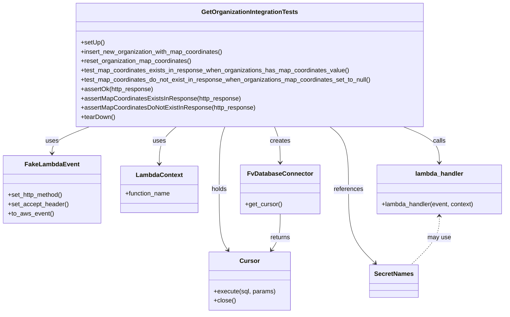

# Diagram: common/iam_service/tests/integration_tests/test_get_organizations/test_get_organizations.py


> Auto-generated by Obscura crawlers

## Diagram 1



### SVG

<svg id="container" width="1287.6953125" xmlns="http://www.w3.org/2000/svg" class="classDiagram" height="806" viewBox="0 0 1287.6953125 806" role="graphics-document document" aria-roledescription="class"><style>#container{font-family:"trebuchet ms",verdana,arial,sans-serif;font-size:16px;fill:#333;}@keyframes edge-animation-frame{from{stroke-dashoffset:0;}}@keyframes dash{to{stroke-dashoffset:0;}}#container .edge-animation-slow{stroke-dasharray:9,5!important;stroke-dashoffset:900;animation:dash 50s linear infinite;stroke-linecap:round;}#container .edge-animation-fast{stroke-dasharray:9,5!important;stroke-dashoffset:900;animation:dash 20s linear infinite;stroke-linecap:round;}#container .error-icon{fill:#552222;}#container .error-text{fill:#552222;stroke:#552222;}#container .edge-thickness-normal{stroke-width:1px;}#container .edge-thickness-thick{stroke-width:3.5px;}#container .edge-pattern-solid{stroke-dasharray:0;}#container .edge-thickness-invisible{stroke-width:0;fill:none;}#container .edge-pattern-dashed{stroke-dasharray:3;}#container .edge-pattern-dotted{stroke-dasharray:2;}#container .marker{fill:#333333;stroke:#333333;}#container .marker.cross{stroke:#333333;}#container svg{font-family:"trebuchet ms",verdana,arial,sans-serif;font-size:16px;}#container p{margin:0;}#container g.classGroup text{fill:#9370DB;stroke:none;font-family:"trebuchet ms",verdana,arial,sans-serif;font-size:10px;}#container g.classGroup text .title{font-weight:bolder;}#container .nodeLabel,#container .edgeLabel{color:#131300;}#container .edgeLabel .label rect{fill:#ECECFF;}#container .label text{fill:#131300;}#container .labelBkg{background:#ECECFF;}#container .edgeLabel .label span{background:#ECECFF;}#container .classTitle{font-weight:bolder;}#container .node rect,#container .node circle,#container .node ellipse,#container .node polygon,#container .node path{fill:#ECECFF;stroke:#9370DB;stroke-width:1px;}#container .divider{stroke:#9370DB;stroke-width:1;}#container g.clickable{cursor:pointer;}#container g.classGroup rect{fill:#ECECFF;stroke:#9370DB;}#container g.classGroup line{stroke:#9370DB;stroke-width:1;}#container .classLabel .box{stroke:none;stroke-width:0;fill:#ECECFF;opacity:0.5;}#container .classLabel .label{fill:#9370DB;font-size:10px;}#container .relation{stroke:#333333;stroke-width:1;fill:none;}#container .dashed-line{stroke-dasharray:3;}#container .dotted-line{stroke-dasharray:1 2;}#container #compositionStart,#container .composition{fill:#333333!important;stroke:#333333!important;stroke-width:1;}#container #compositionEnd,#container .composition{fill:#333333!important;stroke:#333333!important;stroke-width:1;}#container #dependencyStart,#container .dependency{fill:#333333!important;stroke:#333333!important;stroke-width:1;}#container #dependencyStart,#container .dependency{fill:#333333!important;stroke:#333333!important;stroke-width:1;}#container #extensionStart,#container .extension{fill:transparent!important;stroke:#333333!important;stroke-width:1;}#container #extensionEnd,#container .extension{fill:transparent!important;stroke:#333333!important;stroke-width:1;}#container #aggregationStart,#container .aggregation{fill:transparent!important;stroke:#333333!important;stroke-width:1;}#container #aggregationEnd,#container .aggregation{fill:transparent!important;stroke:#333333!important;stroke-width:1;}#container #lollipopStart,#container .lollipop{fill:#ECECFF!important;stroke:#333333!important;stroke-width:1;}#container #lollipopEnd,#container .lollipop{fill:#ECECFF!important;stroke:#333333!important;stroke-width:1;}#container .edgeTerminals{font-size:11px;line-height:initial;}#container .classTitleText{text-anchor:middle;font-size:18px;fill:#333;}#container .label-icon{display:inline-block;height:1em;overflow:visible;vertical-align:-0.125em;}#container .node .label-icon path{fill:currentColor;stroke:revert;stroke-width:revert;}#container :root{--mermaid-font-family:"trebuchet ms",verdana,arial,sans-serif;}</style><g><defs><marker id="container_class-aggregationStart" class="marker aggregation class" refX="18" refY="7" markerWidth="190" markerHeight="240" orient="auto"><path d="M 18,7 L9,13 L1,7 L9,1 Z"></path></marker></defs><defs><marker id="container_class-aggregationEnd" class="marker aggregation class" refX="1" refY="7" markerWidth="20" markerHeight="28" orient="auto"><path d="M 18,7 L9,13 L1,7 L9,1 Z"></path></marker></defs><defs><marker id="container_class-extensionStart" class="marker extension class" refX="18" refY="7" markerWidth="190" markerHeight="240" orient="auto"><path d="M 1,7 L18,13 V 1 Z"></path></marker></defs><defs><marker id="container_class-extensionEnd" class="marker extension class" refX="1" refY="7" markerWidth="20" markerHeight="28" orient="auto"><path d="M 1,1 V 13 L18,7 Z"></path></marker></defs><defs><marker id="container_class-compositionStart" class="marker composition class" refX="18" refY="7" markerWidth="190" markerHeight="240" orient="auto"><path d="M 18,7 L9,13 L1,7 L9,1 Z"></path></marker></defs><defs><marker id="container_class-compositionEnd" class="marker composition class" refX="1" refY="7" markerWidth="20" markerHeight="28" orient="auto"><path d="M 18,7 L9,13 L1,7 L9,1 Z"></path></marker></defs><defs><marker id="container_class-dependencyStart" class="marker dependency class" refX="6" refY="7" markerWidth="190" markerHeight="240" orient="auto"><path d="M 5,7 L9,13 L1,7 L9,1 Z"></path></marker></defs><defs><marker id="container_class-dependencyEnd" class="marker dependency class" refX="13" refY="7" markerWidth="20" markerHeight="28" orient="auto"><path d="M 18,7 L9,13 L14,7 L9,1 Z"></path></marker></defs><defs><marker id="container_class-lollipopStart" class="marker lollipop class" refX="13" refY="7" markerWidth="190" markerHeight="240" orient="auto"><circle stroke="black" fill="transparent" cx="7" cy="7" r="6"></circle></marker></defs><defs><marker id="container_class-lollipopEnd" class="marker lollipop class" refX="1" refY="7" markerWidth="190" markerHeight="240" orient="auto"><circle stroke="black" fill="transparent" cx="7" cy="7" r="6"></circle></marker></defs><g class="root"><g class="clusters"></g><g class="edgePaths"><path d="M225.505,326L209.669,332.167C193.833,338.333,162.161,350.667,146.324,362C130.488,373.333,130.488,383.667,130.488,388.833L130.488,394" id="id_GetOrganizationIntegrationTests_FakeLambdaEvent_1" class="edge-thickness-normal edge-pattern-solid relation" style=";;;" data-edge="true" data-et="edge" data-id="id_GetOrganizationIntegrationTests_FakeLambdaEvent_1" data-points="W3sieCI6MjI1LjUwNTQxMDk1MzQ0Mzg2LCJ5IjozMjZ9LHsieCI6MTMwLjQ4ODI4MTI1LCJ5IjozNjN9LHsieCI6MTMwLjQ4ODI4MTI1LCJ5Ijo0MDB9XQ==" marker-end="url(#container_class-dependencyEnd)"></path><path d="M445.978,326L438.692,332.167C431.407,338.333,416.836,350.667,409.551,366.5C402.266,382.333,402.266,401.667,402.266,411.333L402.266,421" id="id_GetOrganizationIntegrationTests_LambdaContext_2" class="edge-thickness-normal edge-pattern-solid relation" style=";;;" data-edge="true" data-et="edge" data-id="id_GetOrganizationIntegrationTests_LambdaContext_2" data-points="W3sieCI6NDQ1Ljk3Nzg0Nzk3NTEyNzYsInkiOjMyNn0seyJ4Ijo0MDIuMjY1NjI1LCJ5IjozNjN9LHsieCI6NDAyLjI2NTYyNSwieSI6NDI3fV0=" marker-end="url(#container_class-dependencyEnd)"></path><path d="M696.352,326L698.777,332.167C701.202,338.333,706.052,350.667,708.477,366C710.902,381.333,710.902,399.667,710.902,408.833L710.902,418" id="id_GetOrganizationIntegrationTests_FvDatabaseConnector_3" class="edge-thickness-normal edge-pattern-solid relation" style=";;;" data-edge="true" data-et="edge" data-id="id_GetOrganizationIntegrationTests_FvDatabaseConnector_3" data-points="W3sieCI6Njk2LjM1MTUxMjY3NTM4MjcsInkiOjMyNn0seyJ4Ijo3MTAuOTAyMzQzNzUsInkiOjM2M30seyJ4Ijo3MTAuOTAyMzQzNzUsInkiOjQyNH1d" marker-end="url(#container_class-dependencyEnd)"></path><path d="M571.293,326L568.868,332.167C566.443,338.333,561.592,350.667,559.167,377.5C556.742,404.333,556.742,445.667,556.742,487C556.742,528.333,556.742,569.667,560.419,595.676C564.096,621.686,571.45,632.372,575.128,637.714L578.805,643.057" id="id_GetOrganizationIntegrationTests_Cursor_4" class="edge-thickness-normal edge-pattern-solid relation" style=";;;" data-edge="true" data-et="edge" data-id="id_GetOrganizationIntegrationTests_Cursor_4" data-points="W3sieCI6NTcxLjI5MzAxODU3NDYxNzMsInkiOjMyNn0seyJ4Ijo1NTYuNzQyMTg3NSwieSI6MzYzfSx7IngiOjU1Ni43NDIxODc1LCJ5Ijo0ODd9LHsieCI6NTU2Ljc0MjE4NzUsInkiOjYxMX0seyJ4Ijo1ODIuMjA2MTQxODgwNTgwNCwieSI6NjQ4fV0=" marker-end="url(#container_class-dependencyEnd)"></path><path d="M1026.285,326L1041.507,332.167C1056.728,338.333,1087.171,350.667,1102.392,366C1117.613,381.333,1117.613,399.667,1117.613,408.833L1117.613,418" id="id_GetOrganizationIntegrationTests_lambda_handler_5" class="edge-thickness-normal edge-pattern-solid relation" style=";;;" data-edge="true" data-et="edge" data-id="id_GetOrganizationIntegrationTests_lambda_handler_5" data-points="W3sieCI6MTAyNi4yODUzODU0NDMyMzk5LCJ5IjozMjZ9LHsieCI6MTExNy42MTMyODEyNSwieSI6MzYzfSx7IngiOjExMTcuNjEzMjgxMjUsInkiOjQyNH1d" marker-end="url(#container_class-dependencyEnd)"></path><path d="M835.721,326L843.551,332.167C851.381,338.333,867.042,350.667,874.873,377.5C882.703,404.333,882.703,445.667,882.703,487C882.703,528.333,882.703,569.667,894.214,601.31C905.726,632.953,928.748,654.906,940.259,665.883L951.77,676.859" id="id_GetOrganizationIntegrationTests_SecretNames_6" class="edge-thickness-normal edge-pattern-solid relation" style=";;;" data-edge="true" data-et="edge" data-id="id_GetOrganizationIntegrationTests_SecretNames_6" data-points="W3sieCI6ODM1LjcyMDUxMzc5MTQ1NDEsInkiOjMyNn0seyJ4Ijo4ODIuNzAzMTI1LCJ5IjozNjN9LHsieCI6ODgyLjcwMzEyNSwieSI6NDg3fSx7IngiOjg4Mi43MDMxMjUsInkiOjYxMX0seyJ4Ijo5NTYuMTEyNTQ4ODI4MTI1LCJ5Ijo2ODF9XQ==" marker-end="url(#container_class-dependencyEnd)"></path><path d="M710.902,550L710.902,560.167C710.902,570.333,710.902,590.667,707.225,606.176C703.548,621.686,696.194,632.372,692.517,637.714L688.84,643.057" id="id_FvDatabaseConnector_Cursor_7" class="edge-thickness-normal edge-pattern-solid relation" style=";;;" data-edge="true" data-et="edge" data-id="id_FvDatabaseConnector_Cursor_7" data-points="W3sieCI6NzEwLjkwMjM0Mzc1LCJ5Ijo1NTB9LHsieCI6NzEwLjkwMjM0Mzc1LCJ5Ijo2MTF9LHsieCI6Njg1LjQzODM4OTM2OTQxOTYsInkiOjY0OH1d" marker-end="url(#container_class-dependencyEnd)"></path><path d="M1117.613,556L1117.613,565.167C1117.613,574.333,1117.613,592.667,1105.378,613.5C1093.143,634.333,1068.674,657.667,1056.439,669.333L1044.204,681" id="id_lambda_handler_SecretNames_8" class="edge-thickness-normal edge-pattern-dashed relation" style=";;;" data-edge="true" data-et="edge" data-id="id_lambda_handler_SecretNames_8" data-points="W3sieCI6MTExNy42MTMyODEyNSwieSI6NTUwfSx7IngiOjExMTcuNjEzMjgxMjUsInkiOjYxMX0seyJ4IjoxMDQ0LjIwMzg1NzQyMTg3NSwieSI6NjgxfV0=" marker-start="url(#container_class-dependencyStart)"></path></g><g class="edgeLabels"><g class="edgeLabel" transform="translate(130.48828125, 363)"><g class="label" data-id="id_GetOrganizationIntegrationTests_FakeLambdaEvent_1" transform="translate(-16.4921875, -12)"><foreignObject width="32.984375" height="24"><div xmlns="http://www.w3.org/1999/xhtml" class="labelBkg" style="display: table-cell; white-space: nowrap; line-height: 1.5; max-width: 200px; text-align: center;"><span class="edgeLabel"><p>uses</p></span></div></foreignObject></g></g><g class="edgeLabel" transform="translate(402.265625, 363)"><g class="label" data-id="id_GetOrganizationIntegrationTests_LambdaContext_2" transform="translate(-16.4921875, -12)"><foreignObject width="32.984375" height="24"><div xmlns="http://www.w3.org/1999/xhtml" class="labelBkg" style="display: table-cell; white-space: nowrap; line-height: 1.5; max-width: 200px; text-align: center;"><span class="edgeLabel"><p>uses</p></span></div></foreignObject></g></g><g class="edgeLabel" transform="translate(710.90234375, 363)"><g class="label" data-id="id_GetOrganizationIntegrationTests_FvDatabaseConnector_3" transform="translate(-26.171875, -12)"><foreignObject width="52.34375" height="24"><div xmlns="http://www.w3.org/1999/xhtml" class="labelBkg" style="display: table-cell; white-space: nowrap; line-height: 1.5; max-width: 200px; text-align: center;"><span class="edgeLabel"><p>creates</p></span></div></foreignObject></g></g><g class="edgeLabel" transform="translate(556.7421875, 487)"><g class="label" data-id="id_GetOrganizationIntegrationTests_Cursor_4" transform="translate(-20.1875, -12)"><foreignObject width="40.375" height="24"><div xmlns="http://www.w3.org/1999/xhtml" class="labelBkg" style="display: table-cell; white-space: nowrap; line-height: 1.5; max-width: 200px; text-align: center;"><span class="edgeLabel"><p>holds</p></span></div></foreignObject></g></g><g class="edgeLabel" transform="translate(1117.61328125, 363)"><g class="label" data-id="id_GetOrganizationIntegrationTests_lambda_handler_5" transform="translate(-16.4453125, -12)"><foreignObject width="32.890625" height="24"><div xmlns="http://www.w3.org/1999/xhtml" class="labelBkg" style="display: table-cell; white-space: nowrap; line-height: 1.5; max-width: 200px; text-align: center;"><span class="edgeLabel"><p>calls</p></span></div></foreignObject></g></g><g class="edgeLabel" transform="translate(882.703125, 487)"><g class="label" data-id="id_GetOrganizationIntegrationTests_SecretNames_6" transform="translate(-37.828125, -12)"><foreignObject width="75.65625" height="24"><div xmlns="http://www.w3.org/1999/xhtml" class="labelBkg" style="display: table-cell; white-space: nowrap; line-height: 1.5; max-width: 200px; text-align: center;"><span class="edgeLabel"><p>references</p></span></div></foreignObject></g></g><g class="edgeLabel" transform="translate(710.90234375, 611)"><g class="label" data-id="id_FvDatabaseConnector_Cursor_7" transform="translate(-26.265625, -12)"><foreignObject width="52.53125" height="24"><div xmlns="http://www.w3.org/1999/xhtml" class="labelBkg" style="display: table-cell; white-space: nowrap; line-height: 1.5; max-width: 200px; text-align: center;"><span class="edgeLabel"><p>returns</p></span></div></foreignObject></g></g><g class="edgeLabel" transform="translate(1117.61328125, 611)"><g class="label" data-id="id_lambda_handler_SecretNames_8" transform="translate(-29.8984375, -12)"><foreignObject width="59.796875" height="24"><div xmlns="http://www.w3.org/1999/xhtml" class="labelBkg" style="display: table-cell; white-space: nowrap; line-height: 1.5; max-width: 200px; text-align: center;"><span class="edgeLabel"><p>may use</p></span></div></foreignObject></g></g></g><g class="nodes"><g class="node default" id="classId-GetOrganizationIntegrationTests-0" transform="translate(633.822265625, 167)"><g class="basic label-container"><path d="M-447.5078125 -159 L447.5078125 -159 L447.5078125 159 L-447.5078125 159" stroke="none" stroke-width="0" fill="#ECECFF" style=""></path><path d="M-447.5078125 -159 C-161.35723606759075 -159, 124.7933403648185 -159, 447.5078125 -159 M-447.5078125 -159 C-135.23215425474604 -159, 177.04350399050793 -159, 447.5078125 -159 M447.5078125 -159 C447.5078125 -50.16656582252786, 447.5078125 58.666868354944285, 447.5078125 159 M447.5078125 -159 C447.5078125 -49.16111056883702, 447.5078125 60.677778862325965, 447.5078125 159 M447.5078125 159 C181.40865484103597 159, -84.69050281792806 159, -447.5078125 159 M447.5078125 159 C187.16769232514855 159, -73.1724278497029 159, -447.5078125 159 M-447.5078125 159 C-447.5078125 62.580653469823574, -447.5078125 -33.83869306035285, -447.5078125 -159 M-447.5078125 159 C-447.5078125 87.43730797442414, -447.5078125 15.874615948848287, -447.5078125 -159" stroke="#9370DB" stroke-width="1.3" fill="none" stroke-dasharray="0 0" style=""></path></g><g class="annotation-group text" transform="translate(0, -135)"></g><g class="label-group text" transform="translate(-119.140625, -135)"><g class="label" style="font-weight: bolder" transform="translate(0,-12)"><foreignObject width="238.28125" height="24"><div xmlns="http://www.w3.org/1999/xhtml" style="display: table-cell; white-space: nowrap; line-height: 1.5; max-width: 284px; text-align: center;"><span class="nodeLabel markdown-node-label" style=""><p>GetOrganizationIntegrationTests</p></span></div></foreignObject></g></g><g class="members-group text" transform="translate(-435.5078125, -87)"></g><g class="methods-group text" transform="translate(-435.5078125, -57)"><g class="label" style="" transform="translate(0,-12)"><foreignObject width="60.421875" height="24"><div xmlns="http://www.w3.org/1999/xhtml" style="display: table-cell; white-space: nowrap; line-height: 1.5; max-width: 118px; text-align: center;"><span class="nodeLabel markdown-node-label" style=""><p>+setUp()</p></span></div></foreignObject></g><g class="label" style="" transform="translate(0,12)"><foreignObject width="368.96875" height="24"><div xmlns="http://www.w3.org/1999/xhtml" style="display: table-cell; white-space: nowrap; line-height: 1.5; max-width: 426px; text-align: center;"><span class="nodeLabel markdown-node-label" style=""><p>+insert_new_organization_with_map_coordinates()</p></span></div></foreignObject></g><g class="label" style="" transform="translate(0,36)"><foreignObject width="286.609375" height="24"><div xmlns="http://www.w3.org/1999/xhtml" style="display: table-cell; white-space: nowrap; line-height: 1.5; max-width: 344px; text-align: center;"><span class="nodeLabel markdown-node-label" style=""><p>+reset_organization_map_coordinates()</p></span></div></foreignObject></g><g class="label" style="" transform="translate(0,60)"><foreignObject width="690.5" height="24"><div xmlns="http://www.w3.org/1999/xhtml" style="display: table-cell; white-space: nowrap; line-height: 1.5; max-width: 748px; text-align: center;"><span class="nodeLabel markdown-node-label" style=""><p>+test_map_coordinates_exists_in_response_when_organizations_has_map_coordinates_value()</p></span></div></foreignObject></g><g class="label" style="" transform="translate(0,84)"><foreignObject width="751.875" height="24"><div xmlns="http://www.w3.org/1999/xhtml" style="display: table-cell; white-space: nowrap; line-height: 1.5; max-width: 809px; text-align: center;"><span class="nodeLabel markdown-node-label" style=""><p>+test_map_coordinates_do_not_exist_in_response_when_organizations_map_coordinates_set_to_null()</p></span></div></foreignObject></g><g class="label" style="" transform="translate(0,108)"><foreignObject width="186.125" height="24"><div xmlns="http://www.w3.org/1999/xhtml" style="display: table-cell; white-space: nowrap; line-height: 1.5; max-width: 243px; text-align: center;"><span class="nodeLabel markdown-node-label" style=""><p>+assertOk(http_response)</p></span></div></foreignObject></g><g class="label" style="" transform="translate(0,132)"><foreignObject width="410.125" height="24"><div xmlns="http://www.w3.org/1999/xhtml" style="display: table-cell; white-space: nowrap; line-height: 1.5; max-width: 467px; text-align: center;"><span class="nodeLabel markdown-node-label" style=""><p>+assertMapCoordinatesExistsInResponse(http_response)</p></span></div></foreignObject></g><g class="label" style="" transform="translate(0,156)"><foreignObject width="448.34375" height="24"><div xmlns="http://www.w3.org/1999/xhtml" style="display: table-cell; white-space: nowrap; line-height: 1.5; max-width: 506px; text-align: center;"><span class="nodeLabel markdown-node-label" style=""><p>+assertMapCoordinatesDoNotExistInResponse(http_response)</p></span></div></foreignObject></g><g class="label" style="" transform="translate(0,180)"><foreignObject width="87.75" height="24"><div xmlns="http://www.w3.org/1999/xhtml" style="display: table-cell; white-space: nowrap; line-height: 1.5; max-width: 145px; text-align: center;"><span class="nodeLabel markdown-node-label" style=""><p>+tearDown()</p></span></div></foreignObject></g></g><g class="divider" style=""><path d="M-447.5078125 -111 C-158.52716119246514 -111, 130.4534901150697 -111, 447.5078125 -111 M-447.5078125 -111 C-136.06472721168637 -111, 175.37835807662725 -111, 447.5078125 -111" stroke="#9370DB" stroke-width="1.3" fill="none" stroke-dasharray="0 0" style=""></path></g><g class="divider" style=""><path d="M-447.5078125 -87 C-252.3781091015382 -87, -57.2484057030764 -87, 447.5078125 -87 M-447.5078125 -87 C-237.9898790878283 -87, -28.471945675656627 -87, 447.5078125 -87" stroke="#9370DB" stroke-width="1.3" fill="none" stroke-dasharray="0 0" style=""></path></g></g><g class="node default" id="classId-FakeLambdaEvent-1" transform="translate(130.48828125, 487)"><g class="basic label-container"><path d="M-122.48828125 -87 L122.48828125 -87 L122.48828125 87 L-122.48828125 87" stroke="none" stroke-width="0" fill="#ECECFF" style=""></path><path d="M-122.48828125 -87 C-48.60372663200745 -87, 25.2808279859851 -87, 122.48828125 -87 M-122.48828125 -87 C-59.51566453079272 -87, 3.4569521884145615 -87, 122.48828125 -87 M122.48828125 -87 C122.48828125 -28.13123053768087, 122.48828125 30.737538924638258, 122.48828125 87 M122.48828125 -87 C122.48828125 -50.88450872431641, 122.48828125 -14.769017448632823, 122.48828125 87 M122.48828125 87 C24.717368276664217 87, -73.05354469667157 87, -122.48828125 87 M122.48828125 87 C36.88554344732715 87, -48.7171943553457 87, -122.48828125 87 M-122.48828125 87 C-122.48828125 31.63767783307987, -122.48828125 -23.72464433384026, -122.48828125 -87 M-122.48828125 87 C-122.48828125 31.14551617567156, -122.48828125 -24.70896764865688, -122.48828125 -87" stroke="#9370DB" stroke-width="1.3" fill="none" stroke-dasharray="0 0" style=""></path></g><g class="annotation-group text" transform="translate(0, -63)"></g><g class="label-group text" transform="translate(-65.8671875, -63)"><g class="label" style="font-weight: bolder" transform="translate(0,-12)"><foreignObject width="131.734375" height="24"><div xmlns="http://www.w3.org/1999/xhtml" style="display: table-cell; white-space: nowrap; line-height: 1.5; max-width: 181px; text-align: center;"><span class="nodeLabel markdown-node-label" style=""><p>FakeLambdaEvent</p></span></div></foreignObject></g></g><g class="members-group text" transform="translate(-110.48828125, -15)"></g><g class="methods-group text" transform="translate(-110.48828125, 15)"><g class="label" style="" transform="translate(0,-12)"><foreignObject width="143.578125" height="24"><div xmlns="http://www.w3.org/1999/xhtml" style="display: table-cell; white-space: nowrap; line-height: 1.5; max-width: 201px; text-align: center;"><span class="nodeLabel markdown-node-label" style=""><p>+set_http_method()</p></span></div></foreignObject></g><g class="label" style="" transform="translate(0,12)"><foreignObject width="155.109375" height="24"><div xmlns="http://www.w3.org/1999/xhtml" style="display: table-cell; white-space: nowrap; line-height: 1.5; max-width: 212px; text-align: center;"><span class="nodeLabel markdown-node-label" style=""><p>+set_accept_header()</p></span></div></foreignObject></g><g class="label" style="" transform="translate(0,36)"><foreignObject width="116.421875" height="24"><div xmlns="http://www.w3.org/1999/xhtml" style="display: table-cell; white-space: nowrap; line-height: 1.5; max-width: 174px; text-align: center;"><span class="nodeLabel markdown-node-label" style=""><p>+to_aws_event()</p></span></div></foreignObject></g></g><g class="divider" style=""><path d="M-122.48828125 -39 C-38.02410608289922 -39, 46.44006908420155 -39, 122.48828125 -39 M-122.48828125 -39 C-38.21196526332437 -39, 46.064350723351254 -39, 122.48828125 -39" stroke="#9370DB" stroke-width="1.3" fill="none" stroke-dasharray="0 0" style=""></path></g><g class="divider" style=""><path d="M-122.48828125 -15 C-44.22520514278497 -15, 34.037870964430056 -15, 122.48828125 -15 M-122.48828125 -15 C-35.60955904305176 -15, 51.26916316389648 -15, 122.48828125 -15" stroke="#9370DB" stroke-width="1.3" fill="none" stroke-dasharray="0 0" style=""></path></g></g><g class="node default" id="classId-LambdaContext-2" transform="translate(402.265625, 487)"><g class="basic label-container"><path d="M-99.2890625 -60 L99.2890625 -60 L99.2890625 60 L-99.2890625 60" stroke="none" stroke-width="0" fill="#ECECFF" style=""></path><path d="M-99.2890625 -60 C-45.45022253690967 -60, 8.388617426180659 -60, 99.2890625 -60 M-99.2890625 -60 C-47.66304947873643 -60, 3.9629635425271346 -60, 99.2890625 -60 M99.2890625 -60 C99.2890625 -20.36105581212852, 99.2890625 19.27788837574296, 99.2890625 60 M99.2890625 -60 C99.2890625 -33.02633555106435, 99.2890625 -6.0526711021286985, 99.2890625 60 M99.2890625 60 C32.37562845320696 60, -34.537805593586086 60, -99.2890625 60 M99.2890625 60 C32.79790705335836 60, -33.693248393283284 60, -99.2890625 60 M-99.2890625 60 C-99.2890625 22.0172716203613, -99.2890625 -15.965456759277401, -99.2890625 -60 M-99.2890625 60 C-99.2890625 17.111962243140923, -99.2890625 -25.776075513718155, -99.2890625 -60" stroke="#9370DB" stroke-width="1.3" fill="none" stroke-dasharray="0 0" style=""></path></g><g class="annotation-group text" transform="translate(0, -36)"></g><g class="label-group text" transform="translate(-57.296875, -36)"><g class="label" style="font-weight: bolder" transform="translate(0,-12)"><foreignObject width="114.59375" height="24"><div xmlns="http://www.w3.org/1999/xhtml" style="display: table-cell; white-space: nowrap; line-height: 1.5; max-width: 163px; text-align: center;"><span class="nodeLabel markdown-node-label" style=""><p>LambdaContext</p></span></div></foreignObject></g></g><g class="members-group text" transform="translate(-87.2890625, 12)"><g class="label" style="" transform="translate(0,-12)"><foreignObject width="117.28125" height="24"><div xmlns="http://www.w3.org/1999/xhtml" style="display: table-cell; white-space: nowrap; line-height: 1.5; max-width: 175px; text-align: center;"><span class="nodeLabel markdown-node-label" style=""><p>+function_name</p></span></div></foreignObject></g></g><g class="methods-group text" transform="translate(-87.2890625, 60)"></g><g class="divider" style=""><path d="M-99.2890625 -12 C-48.19154014000503 -12, 2.905982219989937 -12, 99.2890625 -12 M-99.2890625 -12 C-24.542987737928215 -12, 50.20308702414357 -12, 99.2890625 -12" stroke="#9370DB" stroke-width="1.3" fill="none" stroke-dasharray="0 0" style=""></path></g><g class="divider" style=""><path d="M-99.2890625 36 C-45.841324655539076 36, 7.606413188921849 36, 99.2890625 36 M-99.2890625 36 C-45.01828427352465 36, 9.2524939529507 36, 99.2890625 36" stroke="#9370DB" stroke-width="1.3" fill="none" stroke-dasharray="0 0" style=""></path></g></g><g class="node default" id="classId-FvDatabaseConnector-3" transform="translate(710.90234375, 487)"><g class="basic label-container"><path d="M-98.97265625 -63 L98.97265625 -63 L98.97265625 63 L-98.97265625 63" stroke="none" stroke-width="0" fill="#ECECFF" style=""></path><path d="M-98.97265625 -63 C-37.964937459033884 -63, 23.042781331932233 -63, 98.97265625 -63 M-98.97265625 -63 C-57.13956057657584 -63, -15.306464903151678 -63, 98.97265625 -63 M98.97265625 -63 C98.97265625 -19.06393326667054, 98.97265625 24.872133466658923, 98.97265625 63 M98.97265625 -63 C98.97265625 -33.49317241031373, 98.97265625 -3.9863448206274725, 98.97265625 63 M98.97265625 63 C48.39174724561637 63, -2.1891617587672556 63, -98.97265625 63 M98.97265625 63 C41.25056648374629 63, -16.47152328250742 63, -98.97265625 63 M-98.97265625 63 C-98.97265625 18.580580214926805, -98.97265625 -25.83883957014639, -98.97265625 -63 M-98.97265625 63 C-98.97265625 28.88013931964514, -98.97265625 -5.239721360709723, -98.97265625 -63" stroke="#9370DB" stroke-width="1.3" fill="none" stroke-dasharray="0 0" style=""></path></g><g class="annotation-group text" transform="translate(0, -39)"></g><g class="label-group text" transform="translate(-79.3046875, -39)"><g class="label" style="font-weight: bolder" transform="translate(0,-12)"><foreignObject width="158.609375" height="24"><div xmlns="http://www.w3.org/1999/xhtml" style="display: table-cell; white-space: nowrap; line-height: 1.5; max-width: 207px; text-align: center;"><span class="nodeLabel markdown-node-label" style=""><p>FvDatabaseConnector</p></span></div></foreignObject></g></g><g class="members-group text" transform="translate(-86.97265625, 9)"></g><g class="methods-group text" transform="translate(-86.97265625, 39)"><g class="label" style="" transform="translate(0,-12)"><foreignObject width="94.640625" height="24"><div xmlns="http://www.w3.org/1999/xhtml" style="display: table-cell; white-space: nowrap; line-height: 1.5; max-width: 152px; text-align: center;"><span class="nodeLabel markdown-node-label" style=""><p>+get_cursor()</p></span></div></foreignObject></g></g><g class="divider" style=""><path d="M-98.97265625 -15 C-49.16152908728882 -15, 0.6495980754223609 -15, 98.97265625 -15 M-98.97265625 -15 C-58.533830803096734 -15, -18.095005356193468 -15, 98.97265625 -15" stroke="#9370DB" stroke-width="1.3" fill="none" stroke-dasharray="0 0" style=""></path></g><g class="divider" style=""><path d="M-98.97265625 9 C-26.010263989057037 9, 46.952128271885925 9, 98.97265625 9 M-98.97265625 9 C-33.945017669139006 9, 31.08262091172199 9, 98.97265625 9" stroke="#9370DB" stroke-width="1.3" fill="none" stroke-dasharray="0 0" style=""></path></g></g><g class="node default" id="classId-Cursor-4" transform="translate(633.822265625, 723)"><g class="basic label-container"><path d="M-102.828125 -75 L102.828125 -75 L102.828125 75 L-102.828125 75" stroke="none" stroke-width="0" fill="#ECECFF" style=""></path><path d="M-102.828125 -75 C-29.36023990034039 -75, 44.10764519931922 -75, 102.828125 -75 M-102.828125 -75 C-34.969839847893724 -75, 32.88844530421255 -75, 102.828125 -75 M102.828125 -75 C102.828125 -37.11687665172641, 102.828125 0.766246696547185, 102.828125 75 M102.828125 -75 C102.828125 -30.55355688847282, 102.828125 13.892886223054361, 102.828125 75 M102.828125 75 C39.510924943330885 75, -23.80627511333823 75, -102.828125 75 M102.828125 75 C37.37633150553212 75, -28.075461988935757 75, -102.828125 75 M-102.828125 75 C-102.828125 24.171046467472046, -102.828125 -26.65790706505591, -102.828125 -75 M-102.828125 75 C-102.828125 44.5248733300366, -102.828125 14.049746660073204, -102.828125 -75" stroke="#9370DB" stroke-width="1.3" fill="none" stroke-dasharray="0 0" style=""></path></g><g class="annotation-group text" transform="translate(0, -51)"></g><g class="label-group text" transform="translate(-23.90625, -51)"><g class="label" style="font-weight: bolder" transform="translate(0,-12)"><foreignObject width="47.8125" height="24"><div xmlns="http://www.w3.org/1999/xhtml" style="display: table-cell; white-space: nowrap; line-height: 1.5; max-width: 98px; text-align: center;"><span class="nodeLabel markdown-node-label" style=""><p>Cursor</p></span></div></foreignObject></g></g><g class="members-group text" transform="translate(-90.828125, -3)"></g><g class="methods-group text" transform="translate(-90.828125, 27)"><g class="label" style="" transform="translate(0,-12)"><foreignObject width="157.75" height="24"><div xmlns="http://www.w3.org/1999/xhtml" style="display: table-cell; white-space: nowrap; line-height: 1.5; max-width: 215px; text-align: center;"><span class="nodeLabel markdown-node-label" style=""><p>+execute(sql, params)</p></span></div></foreignObject></g><g class="label" style="" transform="translate(0,12)"><foreignObject width="56.15625" height="24"><div xmlns="http://www.w3.org/1999/xhtml" style="display: table-cell; white-space: nowrap; line-height: 1.5; max-width: 114px; text-align: center;"><span class="nodeLabel markdown-node-label" style=""><p>+close()</p></span></div></foreignObject></g></g><g class="divider" style=""><path d="M-102.828125 -27 C-51.20200261898794 -27, 0.4241197620241195 -27, 102.828125 -27 M-102.828125 -27 C-42.41719260447912 -27, 17.99373979104176 -27, 102.828125 -27" stroke="#9370DB" stroke-width="1.3" fill="none" stroke-dasharray="0 0" style=""></path></g><g class="divider" style=""><path d="M-102.828125 -3 C-24.628477686804516 -3, 53.57116962639097 -3, 102.828125 -3 M-102.828125 -3 C-32.99705953537983 -3, 36.834005929240334 -3, 102.828125 -3" stroke="#9370DB" stroke-width="1.3" fill="none" stroke-dasharray="0 0" style=""></path></g></g><g class="node default" id="classId-lambda_handler-5" transform="translate(1117.61328125, 487)"><g class="basic label-container"><path d="M-162.08203125 -63 L162.08203125 -63 L162.08203125 63 L-162.08203125 63" stroke="none" stroke-width="0" fill="#ECECFF" style=""></path><path d="M-162.08203125 -63 C-32.51799587373989 -63, 97.04603950252022 -63, 162.08203125 -63 M-162.08203125 -63 C-83.65836662083201 -63, -5.234701991664025 -63, 162.08203125 -63 M162.08203125 -63 C162.08203125 -24.621681794462994, 162.08203125 13.756636411074012, 162.08203125 63 M162.08203125 -63 C162.08203125 -34.852001449111384, 162.08203125 -6.704002898222761, 162.08203125 63 M162.08203125 63 C66.12612832125922 63, -29.829774607481568 63, -162.08203125 63 M162.08203125 63 C72.91327800482655 63, -16.255475240346897 63, -162.08203125 63 M-162.08203125 63 C-162.08203125 14.499450798985123, -162.08203125 -34.001098402029754, -162.08203125 -63 M-162.08203125 63 C-162.08203125 28.1849945280645, -162.08203125 -6.6300109438709995, -162.08203125 -63" stroke="#9370DB" stroke-width="1.3" fill="none" stroke-dasharray="0 0" style=""></path></g><g class="annotation-group text" transform="translate(0, -39)"></g><g class="label-group text" transform="translate(-59.9765625, -39)"><g class="label" style="font-weight: bolder" transform="translate(0,-12)"><foreignObject width="119.953125" height="24"><div xmlns="http://www.w3.org/1999/xhtml" style="display: table-cell; white-space: nowrap; line-height: 1.5; max-width: 170px; text-align: center;"><span class="nodeLabel markdown-node-label" style=""><p>lambda_handler</p></span></div></foreignObject></g></g><g class="members-group text" transform="translate(-150.08203125, 9)"></g><g class="methods-group text" transform="translate(-150.08203125, 39)"><g class="label" style="" transform="translate(0,-12)"><foreignObject width="240.1875" height="24"><div xmlns="http://www.w3.org/1999/xhtml" style="display: table-cell; white-space: nowrap; line-height: 1.5; max-width: 298px; text-align: center;"><span class="nodeLabel markdown-node-label" style=""><p>+lambda_handler(event, context)</p></span></div></foreignObject></g></g><g class="divider" style=""><path d="M-162.08203125 -15 C-45.09992416455958 -15, 71.88218292088084 -15, 162.08203125 -15 M-162.08203125 -15 C-51.42097615829657 -15, 59.24007893340686 -15, 162.08203125 -15" stroke="#9370DB" stroke-width="1.3" fill="none" stroke-dasharray="0 0" style=""></path></g><g class="divider" style=""><path d="M-162.08203125 9 C-37.98896855597832 9, 86.10409413804337 9, 162.08203125 9 M-162.08203125 9 C-59.065288744799446 9, 43.95145376040111 9, 162.08203125 9" stroke="#9370DB" stroke-width="1.3" fill="none" stroke-dasharray="0 0" style=""></path></g></g><g class="node default" id="classId-SecretNames-6" transform="translate(1000.158203125, 723)"><g class="basic label-container"><path d="M-60.03125 -42 L60.03125 -42 L60.03125 42 L-60.03125 42" stroke="none" stroke-width="0" fill="#ECECFF" style=""></path><path d="M-60.03125 -42 C-28.06561814336204 -42, 3.900013713275918 -42, 60.03125 -42 M-60.03125 -42 C-29.061636787913407 -42, 1.9079764241731851 -42, 60.03125 -42 M60.03125 -42 C60.03125 -9.603125169668019, 60.03125 22.793749660663963, 60.03125 42 M60.03125 -42 C60.03125 -21.280510572928016, 60.03125 -0.5610211458560315, 60.03125 42 M60.03125 42 C18.347484927089795 42, -23.33628014582041 42, -60.03125 42 M60.03125 42 C15.418722096860371 42, -29.193805806279258 42, -60.03125 42 M-60.03125 42 C-60.03125 10.954551964228656, -60.03125 -20.090896071542687, -60.03125 -42 M-60.03125 42 C-60.03125 22.951628538401874, -60.03125 3.9032570768037473, -60.03125 -42" stroke="#9370DB" stroke-width="1.3" fill="none" stroke-dasharray="0 0" style=""></path></g><g class="annotation-group text" transform="translate(0, -18)"></g><g class="label-group text" transform="translate(-48.03125, -18)"><g class="label" style="font-weight: bolder" transform="translate(0,-12)"><foreignObject width="96.0625" height="24"><div xmlns="http://www.w3.org/1999/xhtml" style="display: table-cell; white-space: nowrap; line-height: 1.5; max-width: 145px; text-align: center;"><span class="nodeLabel markdown-node-label" style=""><p>SecretNames</p></span></div></foreignObject></g></g><g class="members-group text" transform="translate(-48.03125, 30)"></g><g class="methods-group text" transform="translate(-48.03125, 60)"></g><g class="divider" style=""><path d="M-60.03125 6 C-29.630051083674964 6, 0.7711478326500725 6, 60.03125 6 M-60.03125 6 C-13.996834183296002 6, 32.037581633407996 6, 60.03125 6" stroke="#9370DB" stroke-width="1.3" fill="none" stroke-dasharray="0 0" style=""></path></g><g class="divider" style=""><path d="M-60.03125 24 C-24.710828082082593 24, 10.609593835834815 24, 60.03125 24 M-60.03125 24 C-24.213337511181997 24, 11.604574977636005 24, 60.03125 24" stroke="#9370DB" stroke-width="1.3" fill="none" stroke-dasharray="0 0" style=""></path></g></g></g></g></g></svg>

## Diagram 2

```mermaid
flowchart TD
    A[Start test run] --> B[GetOrganizationIntegrationTests.setUp()]
    B --> C[Insert organization row with map_coordinates]
    C --> D[Test: map coordinates exist]
    D --> D1[Build FakeLambdaEvent & LambdaContext]
    D1 --> D2[Call lambda_handler(event, context)]
    D2 --> D3[Assert status 200]
    D3 --> D4[Assert map_coordinates present for FV_ALPHA]
    D4 --> E[Reset map_coordinates to null]
    E --> F[Test: map coordinates do not exist]
    F --> F1[Call lambda_handler(event, context)]
    F1 --> F2[Assert status 200]
    F2 --> F3[Assert map_coordinates absent for FV_ALPHA]
    F3 --> G[TearDown: delete organization row and close cursor]
    G --> H[End test run]
```

> SVG rendering failed for this diagram.
