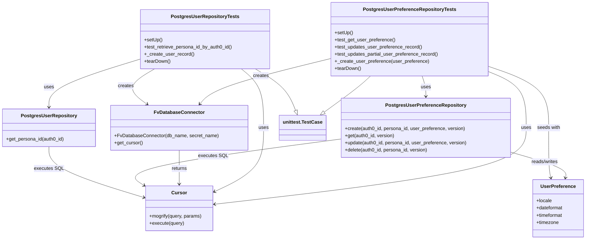
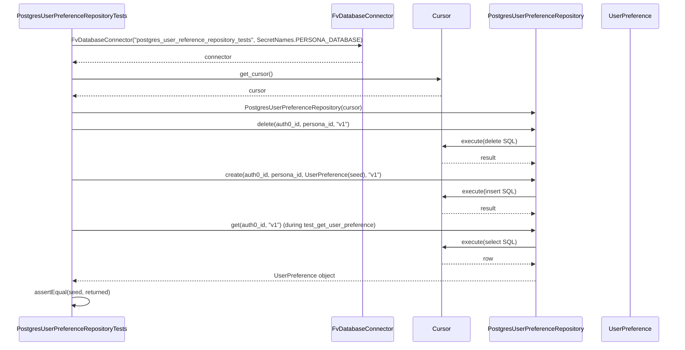

# Diagram: common/iam_service/tests/integration_tests/test_user_preferences/test_user_preference_repository.py

> Auto-generated by Obscura crawlers

## Diagram 1

### SVG

<svg id="container" width="1926.58984375" xmlns="http://www.w3.org/2000/svg" class="classDiagram" height="800" viewBox="0 0 1926.58984375 800" role="graphics-document document" aria-roledescription="class"><g><defs><marker id="container_class-aggregationStart" class="marker aggregation class" refX="18" refY="7" markerWidth="190" markerHeight="240" orient="auto"><path d="M 18,7 L9,13 L1,7 L9,1 Z"></path></marker></defs><defs><marker id="container_class-aggregationEnd" class="marker aggregation class" refX="1" refY="7" markerWidth="20" markerHeight="28" orient="auto"><path d="M 18,7 L9,13 L1,7 L9,1 Z"></path></marker></defs><defs><marker id="container_class-extensionStart" class="marker extension class" refX="18" refY="7" markerWidth="190" markerHeight="240" orient="auto"><path d="M 1,7 L18,13 V 1 Z"></path></marker></defs><defs><marker id="container_class-extensionEnd" class="marker extension class" refX="1" refY="7" markerWidth="20" markerHeight="28" orient="auto"><path d="M 1,1 V 13 L18,7 Z"></path></marker></defs><defs><marker id="container_class-compositionStart" class="marker composition class" refX="18" refY="7" markerWidth="190" markerHeight="240" orient="auto"><path d="M 18,7 L9,13 L1,7 L9,1 Z"></path></marker></defs><defs><marker id="container_class-compositionEnd" class="marker composition class" refX="1" refY="7" markerWidth="20" markerHeight="28" orient="auto"><path d="M 18,7 L9,13 L1,7 L9,1 Z"></path></marker></defs><defs><marker id="container_class-dependencyStart" class="marker dependency class" refX="6" refY="7" markerWidth="190" markerHeight="240" orient="auto"><path d="M 5,7 L9,13 L1,7 L9,1 Z"></path></marker></defs><defs><marker id="container_class-dependencyEnd" class="marker dependency class" refX="13" refY="7" markerWidth="20" markerHeight="28" orient="auto"><path d="M 18,7 L9,13 L14,7 L9,1 Z"></path></marker></defs><defs><marker id="container_class-lollipopStart" class="marker lollipop class" refX="13" refY="7" markerWidth="190" markerHeight="240" orient="auto"><circle stroke="black" fill="transparent" cx="7" cy="7" r="6"></circle></marker></defs><defs><marker id="container_class-lollipopEnd" class="marker lollipop class" refX="1" refY="7" markerWidth="190" markerHeight="240" orient="auto"><circle stroke="black" fill="transparent" cx="7" cy="7" r="6"></circle></marker></defs><g class="root"><g class="clusters"></g><g class="edgePaths"><path d="M1212.208,254L1205.741,260.167C1199.273,266.333,1186.339,278.667,1160.968,298.792C1135.597,318.918,1097.789,346.835,1078.886,360.794L1059.982,374.753" id="id_PostgresUserPreferenceRepositoryTests_unittest.TestCase_1" class="edge-thickness-normal edge-pattern-solid relation" style=";;;" data-edge="true" data-et="edge" data-id="id_PostgresUserPreferenceRepositoryTests_unittest.TestCase_1" data-points="W3sieCI6MTIxMi4yMDc3NzU4Nzg5MDYyLCJ5IjoyNTR9LHsieCI6MTE3My40MDQyOTY4NzUsInkiOjI5MX0seyJ4IjoxMDQ2LjEwNDk4MDQ2ODc1LCJ5IjozODV9XQ==" marker-end="url(#container_class-extensionEnd)"></path><path d="M835.71,230L852.445,240.167C869.181,250.333,902.653,270.667,924.461,293.822C946.268,316.977,956.411,342.954,961.482,355.943L966.554,368.931" id="id_PostgresUserRepositoryTests_unittest.TestCase_2" class="edge-thickness-normal edge-pattern-solid relation" style=";;;" data-edge="true" data-et="edge" data-id="id_PostgresUserRepositoryTests_unittest.TestCase_2" data-points="W3sieCI6ODM1LjcwOTU1ODEwNTQ2ODgsInkiOjIzMH0seyJ4Ijo5MzYuMTI1LCJ5IjoyOTF9LHsieCI6OTcyLjgyNzU1MDU1MTQ3MDYsInkiOjM4NX1d" marker-end="url(#container_class-extensionEnd)"></path><path d="M1082.379,195.84L1019.07,211.7C955.761,227.56,829.143,259.28,757.931,284.541C686.719,309.802,670.914,328.605,663.011,338.006L655.108,347.407" id="id_PostgresUserPreferenceRepositoryTests_FvDatabaseConnector_3" class="edge-thickness-normal edge-pattern-solid relation" style=";;;" data-edge="true" data-et="edge" data-id="id_PostgresUserPreferenceRepositoryTests_FvDatabaseConnector_3" data-points="W3sieCI6MTA4Mi4zNzg5MDYyNSwieSI6MTk1Ljg0MDAxNjc1ODI1NjA0fSx7IngiOjcwMi41MjUzOTA2MjUsInkiOjI5MX0seyJ4Ijo2NTEuMjQ2NzQwMDA0NTk1NiwieSI6MzUyfV0=" marker-end="url(#container_class-dependencyEnd)"></path><path d="M1600.027,238.703L1620.973,247.419C1641.919,256.135,1683.811,273.568,1704.757,304.951C1725.703,336.333,1725.703,381.667,1725.703,427C1725.703,472.333,1725.703,517.667,1555.796,560.199C1385.889,602.732,1046.074,642.464,876.167,662.33L706.26,682.196" id="id_PostgresUserPreferenceRepositoryTests_Cursor_4" class="edge-thickness-normal edge-pattern-solid relation" style=";;;" data-edge="true" data-et="edge" data-id="id_PostgresUserPreferenceRepositoryTests_Cursor_4" data-points="W3sieCI6MTYwMC4wMjczNDM3NSwieSI6MjM4LjcwMzE4NTk1NTc4Njc1fSx7IngiOjE3MjUuNzAzMTI1LCJ5IjoyOTF9LHsieCI6MTcyNS43MDMxMjUsInkiOjQyN30seyJ4IjoxNzI1LjcwMzEyNSwieSI6NTYzfSx7IngiOjcwMC4zMDA3ODEyNSwieSI6NjgyLjg5Mjc4NTM5NTY1NDV9XQ==" marker-end="url(#container_class-dependencyEnd)"></path><path d="M1381.848,254L1383.886,260.167C1385.923,266.333,1389.999,278.667,1392.036,290C1394.074,301.333,1394.074,311.667,1394.074,316.833L1394.074,322" id="id_PostgresUserPreferenceRepositoryTests_PostgresUserPreferenceRepository_5" class="edge-thickness-normal edge-pattern-solid relation" style=";;;" data-edge="true" data-et="edge" data-id="id_PostgresUserPreferenceRepositoryTests_PostgresUserPreferenceRepository_5" data-points="W3sieCI6MTM4MS44NDc3NzgzMjAzMTI1LCJ5IjoyNTR9LHsieCI6MTM5NC4wNzQyMTg3NSwieSI6MjkxfSx7IngiOjEzOTQuMDc0MjE4NzUsInkiOjMyOH1d" marker-end="url(#container_class-dependencyEnd)"></path><path d="M507.787,230L490.847,240.167C473.907,250.333,440.028,270.667,435.896,290.402C431.765,310.136,457.381,329.273,470.189,338.841L482.997,348.409" id="id_PostgresUserRepositoryTests_FvDatabaseConnector_6" class="edge-thickness-normal edge-pattern-solid relation" style=";;;" data-edge="true" data-et="edge" data-id="id_PostgresUserRepositoryTests_FvDatabaseConnector_6" data-points="W3sieCI6NTA3Ljc4NjU2MDA1ODU5Mzc1LCJ5IjoyMzB9LHsieCI6NDA2LjE0ODQzNzUsInkiOjI5MX0seyJ4Ijo0ODcuODAzNTY3MzI1MzY3NywieSI6MzUyfV0=" marker-end="url(#container_class-dependencyEnd)"></path><path d="M790.478,230L802.569,240.167C814.66,250.333,838.842,270.667,850.933,303.5C863.023,336.333,863.023,381.667,863.023,427C863.023,472.333,863.023,517.667,836.803,553.023C810.583,588.378,758.142,613.757,731.922,626.446L705.702,639.135" id="id_PostgresUserRepositoryTests_Cursor_7" class="edge-thickness-normal edge-pattern-solid relation" style=";;;" data-edge="true" data-et="edge" data-id="id_PostgresUserRepositoryTests_Cursor_7" data-points="W3sieCI6NzkwLjQ3Nzk2NjMwODU5MzgsInkiOjIzMH0seyJ4Ijo4NjMuMDIzNDM3NSwieSI6MjkxfSx7IngiOjg2My4wMjM0Mzc1LCJ5Ijo0Mjd9LHsieCI6ODYzLjAyMzQzNzUsInkiOjU2M30seyJ4Ijo3MDAuMzAwNzgxMjUsInkiOjY0MS43NDg5MzA0MjQyNzY5fV0=" marker-end="url(#container_class-dependencyEnd)"></path><path d="M458.713,197.974L409.166,213.479C359.62,228.983,260.527,259.991,210.98,286.662C161.434,313.333,161.434,335.667,161.434,346.833L161.434,358" id="id_PostgresUserRepositoryTests_PostgresUserRepository_8" class="edge-thickness-normal edge-pattern-solid relation" style=";;;" data-edge="true" data-et="edge" data-id="id_PostgresUserRepositoryTests_PostgresUserRepository_8" data-points="W3sieCI6NDU4LjcxMjg5MDYyNSwieSI6MTk3Ljk3NDI0MjYxNTIzNTk0fSx7IngiOjE2MS40MzM1OTM3NSwieSI6MjkxfSx7IngiOjE2MS40MzM1OTM3NSwieSI6MzY0fV0=" marker-end="url(#container_class-dependencyEnd)"></path><path d="M588.199,502L588.199,512.167C588.199,522.333,588.199,542.667,588.199,561.5C588.199,580.333,588.199,597.667,588.199,606.333L588.199,615" id="id_FvDatabaseConnector_Cursor_9" class="edge-thickness-normal edge-pattern-solid relation" style=";;;" data-edge="true" data-et="edge" data-id="id_FvDatabaseConnector_Cursor_9" data-points="W3sieCI6NTg4LjE5OTIxODc1LCJ5Ijo1MDJ9LHsieCI6NTg4LjE5OTIxODc1LCJ5Ijo1NjN9LHsieCI6NTg4LjE5OTIxODc1LCJ5Ijo2MjF9XQ==" marker-end="url(#container_class-dependencyEnd)"></path><path d="M1113.938,464.776L992.538,481.147C871.139,497.518,628.341,530.259,521.198,555.986C414.056,581.713,442.569,600.425,456.825,609.781L471.081,619.138" id="id_PostgresUserPreferenceRepository_Cursor_10" class="edge-thickness-normal edge-pattern-solid relation" style=";;;" data-edge="true" data-et="edge" data-id="id_PostgresUserPreferenceRepository_Cursor_10" data-points="W3sieCI6MTExMy45Mzc1LCJ5Ijo0NjQuNzc2MzE0NTY2MzU1OH0seyJ4IjozODUuNTQyOTY4NzUsInkiOjU2M30seyJ4Ijo0NzYuMDk3NjU2MjUsInkiOjYyMi40Mjk1NjgyMzQzODd9XQ==" marker-end="url(#container_class-dependencyEnd)"></path><path d="M161.434,490L161.434,502.167C161.434,514.333,161.434,538.667,212.923,566.88C264.412,595.093,367.391,627.186,418.88,643.232L470.369,659.279" id="id_PostgresUserRepository_Cursor_11" class="edge-thickness-normal edge-pattern-solid relation" style=";;;" data-edge="true" data-et="edge" data-id="id_PostgresUserRepository_Cursor_11" data-points="W3sieCI6MTYxLjQzMzU5Mzc1LCJ5Ijo0OTB9LHsieCI6MTYxLjQzMzU5Mzc1LCJ5Ijo1NjN9LHsieCI6NDc2LjA5NzY1NjI1LCJ5Ijo2NjEuMDYzOTQzOTA5NDkzN31d" marker-end="url(#container_class-dependencyEnd)"></path><path d="M1674.211,507.591L1706.311,516.826C1738.411,526.061,1802.612,544.53,1833.424,558.961C1864.236,573.392,1861.66,583.784,1860.372,588.98L1859.083,594.176" id="id_PostgresUserPreferenceRepository_UserPreference_12" class="edge-thickness-normal edge-pattern-solid relation" style=";;;" data-edge="true" data-et="edge" data-id="id_PostgresUserPreferenceRepository_UserPreference_12" data-points="W3sieCI6MTY3NC4yMTA5Mzc1LCJ5Ijo1MDcuNTkxMzAyMzM1OTU4MjN9LHsieCI6MTg2Ni44MTI1LCJ5Ijo1NjN9LHsieCI6MTg1Ny42Mzk2NTU3ODAwNzUxLCJ5Ijo2MDB9XQ==" marker-end="url(#container_class-dependencyEnd)"></path><path d="M1600.027,221.092L1633.501,232.743C1666.974,244.394,1733.921,267.697,1767.394,302.015C1800.867,336.333,1800.867,381.667,1800.867,427C1800.867,472.333,1800.867,517.667,1802.155,545.529C1803.444,573.392,1806.02,583.784,1807.308,588.98L1808.596,594.176" id="id_PostgresUserPreferenceRepositoryTests_UserPreference_13" class="edge-thickness-normal edge-pattern-solid relation" style=";;;" data-edge="true" data-et="edge" data-id="id_PostgresUserPreferenceRepositoryTests_UserPreference_13" data-points="W3sieCI6MTYwMC4wMjczNDM3NSwieSI6MjIxLjA5MTYwOTAyMTUzNDA1fSx7IngiOjE4MDAuODY3MTg3NSwieSI6MjkxfSx7IngiOjE4MDAuODY3MTg3NSwieSI6NDI3fSx7IngiOjE4MDAuODY3MTg3NSwieSI6NTYzfSx7IngiOjE4MTAuMDQwMDMxNzE5OTI0OSwieSI6NjAwfV0=" marker-end="url(#container_class-dependencyEnd)"></path></g><g class="edgeLabels"><g class="edgeLabel"><g class="label" data-id="id_PostgresUserPreferenceRepositoryTests_unittest.TestCase_1" transform="translate(0, 0)"><foreignObject width="0" height="0">

</foreignObject></g></g><g class="edgeLabel"><g class="label" data-id="id_PostgresUserRepositoryTests_unittest.TestCase_2" transform="translate(0, 0)"><foreignObject width="0" height="0">

</foreignObject></g></g><g class="edgeLabel" transform="translate(853.80152, 253.10267)"><g class="label" data-id="id_PostgresUserPreferenceRepositoryTests_FvDatabaseConnector_3" transform="translate(-26.171875, -12)"><foreignObject width="52.34375" height="24">

creates

</foreignObject></g></g><g class="edgeLabel" transform="translate(1725.703125, 427)"><g class="label" data-id="id_PostgresUserPreferenceRepositoryTests_Cursor_4" transform="translate(-16.4921875, -12)"><foreignObject width="32.984375" height="24">

uses

</foreignObject></g></g><g class="edgeLabel" transform="translate(1394.07421875, 291)"><g class="label" data-id="id_PostgresUserPreferenceRepositoryTests_PostgresUserPreferenceRepository_5" transform="translate(-16.4921875, -12)"><foreignObject width="32.984375" height="24">

uses

</foreignObject></g></g><g class="edgeLabel" transform="translate(413.27107, 286.72522)"><g class="label" data-id="id_PostgresUserRepositoryTests_FvDatabaseConnector_6" transform="translate(-26.171875, -12)"><foreignObject width="52.34375" height="24">

creates

</foreignObject></g></g><g class="edgeLabel" transform="translate(863.0234375, 427)"><g class="label" data-id="id_PostgresUserRepositoryTests_Cursor_7" transform="translate(-16.4921875, -12)"><foreignObject width="32.984375" height="24">

uses

</foreignObject></g></g><g class="edgeLabel" transform="translate(161.43359375, 291)"><g class="label" data-id="id_PostgresUserRepositoryTests_PostgresUserRepository_8" transform="translate(-16.4921875, -12)"><foreignObject width="32.984375" height="24">

uses

</foreignObject></g></g><g class="edgeLabel" transform="translate(588.19921875, 563)"><g class="label" data-id="id_FvDatabaseConnector_Cursor_9" transform="translate(-26.265625, -12)"><foreignObject width="52.53125" height="24">

returns

</foreignObject></g></g><g class="edgeLabel" transform="translate(696.06879, 521.12573)"><g class="label" data-id="id_PostgresUserPreferenceRepository_Cursor_10" transform="translate(-47.71875, -12)"><foreignObject width="95.4375" height="24">

executes SQL

</foreignObject></g></g><g class="edgeLabel" transform="translate(161.43359375, 563)"><g class="label" data-id="id_PostgresUserRepository_Cursor_11" transform="translate(-47.71875, -12)"><foreignObject width="95.4375" height="24">

executes SQL

</foreignObject></g></g><g class="edgeLabel" transform="translate(1788.82884, 540.56522)"><g class="label" data-id="id_PostgresUserPreferenceRepository_UserPreference_12" transform="translate(-45.9453125, -12)"><foreignObject width="91.890625" height="24">

reads/writes

</foreignObject></g></g><g class="edgeLabel" transform="translate(1800.8671875, 427)"><g class="label" data-id="id_PostgresUserPreferenceRepositoryTests_UserPreference_13" transform="translate(-38.671875, -12)"><foreignObject width="77.34375" height="24">

seeds with

</foreignObject></g></g></g><g class="nodes"><g class="node default" id="classId-PostgresUserPreferenceRepositoryTests-0" transform="translate(1341.203125, 131)"><g class="basic label-container"><path d="M-258.82421875 -123 L258.82421875 -123 L258.82421875 123 L-258.82421875 123" stroke="none" stroke-width="0" fill="#ECECFF" style=""></path><path d="M-258.82421875 -123 C-62.72619392490549 -123, 133.37183090018902 -123, 258.82421875 -123 M-258.82421875 -123 C-74.81207688502195 -123, 109.2000649799561 -123, 258.82421875 -123 M258.82421875 -123 C258.82421875 -62.68921991245908, 258.82421875 -2.3784398249181606, 258.82421875 123 M258.82421875 -123 C258.82421875 -58.427118666431696, 258.82421875 6.145762667136609, 258.82421875 123 M258.82421875 123 C59.19463132433734 123, -140.43495610132533 123, -258.82421875 123 M258.82421875 123 C70.69481735119328 123, -117.43458404761344 123, -258.82421875 123 M-258.82421875 123 C-258.82421875 51.44862073660637, -258.82421875 -20.102758526787255, -258.82421875 -123 M-258.82421875 123 C-258.82421875 30.48772057855554, -258.82421875 -62.02455884288892, -258.82421875 -123" stroke="#9370DB" stroke-width="1.3" fill="none" stroke-dasharray="0 0" style=""></path></g><g class="annotation-group text" transform="translate(0, -99)"></g><g class="label-group text" transform="translate(-146.5546875, -99)"><g class="label" style="font-weight: bolder" transform="translate(0,-12)"><foreignObject width="293.109375" height="24">

PostgresUserPreferenceRepositoryTests

</foreignObject></g></g><g class="members-group text" transform="translate(-246.82421875, -51)"></g><g class="methods-group text" transform="translate(-246.82421875, -21)"><g class="label" style="" transform="translate(0,-12)"><foreignObject width="60.421875" height="24">

+setUp()

</foreignObject></g><g class="label" style="" transform="translate(0,12)"><foreignObject width="201.203125" height="24">

+test_get_user_preference()

</foreignObject></g><g class="label" style="" transform="translate(0,36)"><foreignObject width="291.03125" height="24">

+test_updates_user_preference_record()

</foreignObject></g><g class="label" style="" transform="translate(0,60)"><foreignObject width="347.09375" height="24">

+test_updates_partial_user_preference_record()

</foreignObject></g><g class="label" style="" transform="translate(0,84)"><foreignObject width="310.421875" height="24">

+_create_user_preference(user_preference)

</foreignObject></g><g class="label" style="" transform="translate(0,108)"><foreignObject width="87.75" height="24">

+tearDown()

</foreignObject></g></g><g class="divider" style=""><path d="M-258.82421875 -75 C-66.48768544395105 -75, 125.8488478620979 -75, 258.82421875 -75 M-258.82421875 -75 C-90.06500007411375 -75, 78.69421860177249 -75, 258.82421875 -75" stroke="#9370DB" stroke-width="1.3" fill="none" stroke-dasharray="0 0" style=""></path></g><g class="divider" style=""><path d="M-258.82421875 -51 C-101.0273120058364 -51, 56.769594738327214 -51, 258.82421875 -51 M-258.82421875 -51 C-96.84461254038754 -51, 65.13499366922491 -51, 258.82421875 -51" stroke="#9370DB" stroke-width="1.3" fill="none" stroke-dasharray="0 0" style=""></path></g></g><g class="node default" id="classId-PostgresUserRepositoryTests-1" transform="translate(672.740234375, 131)"><g class="basic label-container"><path d="M-214.02734375 -99 L214.02734375 -99 L214.02734375 99 L-214.02734375 99" stroke="none" stroke-width="0" fill="#ECECFF" style=""></path><path d="M-214.02734375 -99 C-60.91437864674404 -99, 92.19858645651192 -99, 214.02734375 -99 M-214.02734375 -99 C-108.57314591776006 -99, -3.118948085520117 -99, 214.02734375 -99 M214.02734375 -99 C214.02734375 -19.87452997978116, 214.02734375 59.25094004043768, 214.02734375 99 M214.02734375 -99 C214.02734375 -37.801902177066616, 214.02734375 23.39619564586677, 214.02734375 99 M214.02734375 99 C56.886310255186885 99, -100.25472323962623 99, -214.02734375 99 M214.02734375 99 C59.69042946546256 99, -94.64648481907489 99, -214.02734375 99 M-214.02734375 99 C-214.02734375 33.18816570023101, -214.02734375 -32.62366859953798, -214.02734375 -99 M-214.02734375 99 C-214.02734375 31.40629618815963, -214.02734375 -36.18740762368074, -214.02734375 -99" stroke="#9370DB" stroke-width="1.3" fill="none" stroke-dasharray="0 0" style=""></path></g><g class="annotation-group text" transform="translate(0, -75)"></g><g class="label-group text" transform="translate(-107.2578125, -75)"><g class="label" style="font-weight: bolder" transform="translate(0,-12)"><foreignObject width="214.515625" height="24">

PostgresUserRepositoryTests

</foreignObject></g></g><g class="members-group text" transform="translate(-202.02734375, -27)"></g><g class="methods-group text" transform="translate(-202.02734375, 3)"><g class="label" style="" transform="translate(0,-12)"><foreignObject width="60.421875" height="24">

+setUp()

</foreignObject></g><g class="label" style="" transform="translate(0,12)"><foreignObject width="296.796875" height="24">

+test_retrieve_persona_id_by_auth0_id()

</foreignObject></g><g class="label" style="" transform="translate(0,36)"><foreignObject width="162.703125" height="24">

+_create_user_record()

</foreignObject></g><g class="label" style="" transform="translate(0,60)"><foreignObject width="87.75" height="24">

+tearDown()

</foreignObject></g></g><g class="divider" style=""><path d="M-214.02734375 -51 C-104.32947824100549 -51, 5.368387267989021 -51, 214.02734375 -51 M-214.02734375 -51 C-45.182628418887646 -51, 123.66208691222471 -51, 214.02734375 -51" stroke="#9370DB" stroke-width="1.3" fill="none" stroke-dasharray="0 0" style=""></path></g><g class="divider" style=""><path d="M-214.02734375 -27 C-84.27799683520175 -27, 45.471350079596505 -27, 214.02734375 -27 M-214.02734375 -27 C-81.27057275794732 -27, 51.48619823410536 -27, 214.02734375 -27" stroke="#9370DB" stroke-width="1.3" fill="none" stroke-dasharray="0 0" style=""></path></g></g><g class="node default" id="classId-PostgresUserPreferenceRepository-2" transform="translate(1394.07421875, 427)"><g class="basic label-container"><path d="M-280.13671875 -99 L280.13671875 -99 L280.13671875 99 L-280.13671875 99" stroke="none" stroke-width="0" fill="#ECECFF" style=""></path><path d="M-280.13671875 -99 C-99.32120532996657 -99, 81.49430809006685 -99, 280.13671875 -99 M-280.13671875 -99 C-88.8995289777964 -99, 102.33766079440721 -99, 280.13671875 -99 M280.13671875 -99 C280.13671875 -42.87758802945423, 280.13671875 13.24482394109154, 280.13671875 99 M280.13671875 -99 C280.13671875 -43.11534380440301, 280.13671875 12.769312391193978, 280.13671875 99 M280.13671875 99 C76.72324527066613 99, -126.69022820866775 99, -280.13671875 99 M280.13671875 99 C79.93964159178856 99, -120.25743556642288 99, -280.13671875 99 M-280.13671875 99 C-280.13671875 43.95081104386616, -280.13671875 -11.09837791226768, -280.13671875 -99 M-280.13671875 99 C-280.13671875 25.96047736950942, -280.13671875 -47.07904526098116, -280.13671875 -99" stroke="#9370DB" stroke-width="1.3" fill="none" stroke-dasharray="0 0" style=""></path></g><g class="annotation-group text" transform="translate(0, -75)"></g><g class="label-group text" transform="translate(-127.4453125, -75)"><g class="label" style="font-weight: bolder" transform="translate(0,-12)"><foreignObject width="254.890625" height="24">

PostgresUserPreferenceRepository

</foreignObject></g></g><g class="members-group text" transform="translate(-268.13671875, -27)"></g><g class="methods-group text" transform="translate(-268.13671875, 3)"><g class="label" style="" transform="translate(0,-12)"><foreignObject width="402.34375" height="24">

+create(auth0_id, persona_id, user_preference, version)

</foreignObject></g><g class="label" style="" transform="translate(0,12)"><foreignObject width="166.1875" height="24">

+get(auth0_id, version)

</foreignObject></g><g class="label" style="" transform="translate(0,36)"><foreignObject width="408.828125" height="24">

+update(auth0_id, persona_id, user_preference, version)

</foreignObject></g><g class="label" style="" transform="translate(0,60)"><foreignObject width="279.03125" height="24">

+delete(auth0_id, persona_id, version)

</foreignObject></g></g><g class="divider" style=""><path d="M-280.13671875 -51 C-103.68809618569847 -51, 72.76052637860306 -51, 280.13671875 -51 M-280.13671875 -51 C-161.74924990996988 -51, -43.36178106993975 -51, 280.13671875 -51" stroke="#9370DB" stroke-width="1.3" fill="none" stroke-dasharray="0 0" style=""></path></g><g class="divider" style=""><path d="M-280.13671875 -27 C-158.70805641753094 -27, -37.27939408506191 -27, 280.13671875 -27 M-280.13671875 -27 C-125.26516282062983 -27, 29.60639310874035 -27, 280.13671875 -27" stroke="#9370DB" stroke-width="1.3" fill="none" stroke-dasharray="0 0" style=""></path></g></g><g class="node default" id="classId-PostgresUserRepository-3" transform="translate(161.43359375, 427)"><g class="basic label-container"><path d="M-153.43359375 -63 L153.43359375 -63 L153.43359375 63 L-153.43359375 63" stroke="none" stroke-width="0" fill="#ECECFF" style=""></path><path d="M-153.43359375 -63 C-36.487385464932714 -63, 80.45882282013457 -63, 153.43359375 -63 M-153.43359375 -63 C-35.98756932806846 -63, 81.45845509386308 -63, 153.43359375 -63 M153.43359375 -63 C153.43359375 -23.590425581377282, 153.43359375 15.819148837245436, 153.43359375 63 M153.43359375 -63 C153.43359375 -29.04102788291467, 153.43359375 4.917944234170662, 153.43359375 63 M153.43359375 63 C57.5711239683836 63, -38.291345813232795 63, -153.43359375 63 M153.43359375 63 C66.03999180239676 63, -21.35361014520649 63, -153.43359375 63 M-153.43359375 63 C-153.43359375 17.05985977762429, -153.43359375 -28.88028044475142, -153.43359375 -63 M-153.43359375 63 C-153.43359375 36.30587411862139, -153.43359375 9.611748237242779, -153.43359375 -63" stroke="#9370DB" stroke-width="1.3" fill="none" stroke-dasharray="0 0" style=""></path></g><g class="annotation-group text" transform="translate(0, -39)"></g><g class="label-group text" transform="translate(-88.1484375, -39)"><g class="label" style="font-weight: bolder" transform="translate(0,-12)"><foreignObject width="176.296875" height="24">

PostgresUserRepository

</foreignObject></g></g><g class="members-group text" transform="translate(-141.43359375, 9)"></g><g class="methods-group text" transform="translate(-141.43359375, 39)"><g class="label" style="" transform="translate(0,-12)"><foreignObject width="194.71875" height="24">

+get_persona_id(auth0_id)

</foreignObject></g></g><g class="divider" style=""><path d="M-153.43359375 -15 C-39.12568639841595 -15, 75.1822209531681 -15, 153.43359375 -15 M-153.43359375 -15 C-40.39854617066514 -15, 72.63650140866972 -15, 153.43359375 -15" stroke="#9370DB" stroke-width="1.3" fill="none" stroke-dasharray="0 0" style=""></path></g><g class="divider" style=""><path d="M-153.43359375 9 C-91.59098400302508 9, -29.748374256050155 9, 153.43359375 9 M-153.43359375 9 C-88.67280452598402 9, -23.91201530196804 9, 153.43359375 9" stroke="#9370DB" stroke-width="1.3" fill="none" stroke-dasharray="0 0" style=""></path></g></g><g class="node default" id="classId-FvDatabaseConnector-4" transform="translate(588.19921875, 427)"><g class="basic label-container"><path d="M-223.33203125 -75 L223.33203125 -75 L223.33203125 75 L-223.33203125 75" stroke="none" stroke-width="0" fill="#ECECFF" style=""></path><path d="M-223.33203125 -75 C-82.58602007219116 -75, 58.15999110561768 -75, 223.33203125 -75 M-223.33203125 -75 C-71.30441347288877 -75, 80.72320430422246 -75, 223.33203125 -75 M223.33203125 -75 C223.33203125 -17.939462737554308, 223.33203125 39.121074524891384, 223.33203125 75 M223.33203125 -75 C223.33203125 -32.84588785363441, 223.33203125 9.308224292731182, 223.33203125 75 M223.33203125 75 C46.9982131082416 75, -129.3356050335168 75, -223.33203125 75 M223.33203125 75 C112.4599283928205 75, 1.5878255356410023 75, -223.33203125 75 M-223.33203125 75 C-223.33203125 31.066549217245807, -223.33203125 -12.866901565508385, -223.33203125 -75 M-223.33203125 75 C-223.33203125 37.0154253259062, -223.33203125 -0.9691493481875995, -223.33203125 -75" stroke="#9370DB" stroke-width="1.3" fill="none" stroke-dasharray="0 0" style=""></path></g><g class="annotation-group text" transform="translate(0, -51)"></g><g class="label-group text" transform="translate(-79.3046875, -51)"><g class="label" style="font-weight: bolder" transform="translate(0,-12)"><foreignObject width="158.609375" height="24">

FvDatabaseConnector

</foreignObject></g></g><g class="members-group text" transform="translate(-211.33203125, -3)"></g><g class="methods-group text" transform="translate(-211.33203125, 27)"><g class="label" style="" transform="translate(0,-12)"><foreignObject width="343.359375" height="24">

+FvDatabaseConnector(db_name, secret_name)

</foreignObject></g><g class="label" style="" transform="translate(0,12)"><foreignObject width="94.640625" height="24">

+get_cursor()

</foreignObject></g></g><g class="divider" style=""><path d="M-223.33203125 -27 C-95.99568800088502 -27, 31.34065524822995 -27, 223.33203125 -27 M-223.33203125 -27 C-59.65450762193174 -27, 104.02301600613652 -27, 223.33203125 -27" stroke="#9370DB" stroke-width="1.3" fill="none" stroke-dasharray="0 0" style=""></path></g><g class="divider" style=""><path d="M-223.33203125 -3 C-59.56046968414432 -3, 104.21109188171135 -3, 223.33203125 -3 M-223.33203125 -3 C-103.78468883193673 -3, 15.762653586126532 -3, 223.33203125 -3" stroke="#9370DB" stroke-width="1.3" fill="none" stroke-dasharray="0 0" style=""></path></g></g><g class="node default" id="classId-Cursor-5" transform="translate(588.19921875, 696)"><g class="basic label-container"><path d="M-112.1015625 -75 L112.1015625 -75 L112.1015625 75 L-112.1015625 75" stroke="none" stroke-width="0" fill="#ECECFF" style=""></path><path d="M-112.1015625 -75 C-62.77979787719016 -75, -13.458033254380325 -75, 112.1015625 -75 M-112.1015625 -75 C-53.290626635698274 -75, 5.520309228603452 -75, 112.1015625 -75 M112.1015625 -75 C112.1015625 -29.136343064496103, 112.1015625 16.727313871007794, 112.1015625 75 M112.1015625 -75 C112.1015625 -20.373190863537467, 112.1015625 34.25361827292507, 112.1015625 75 M112.1015625 75 C38.54037654816395 75, -35.020809403672104 75, -112.1015625 75 M112.1015625 75 C26.22872405018373 75, -59.64411439963254 75, -112.1015625 75 M-112.1015625 75 C-112.1015625 28.666623872288575, -112.1015625 -17.66675225542285, -112.1015625 -75 M-112.1015625 75 C-112.1015625 25.200997598837567, -112.1015625 -24.598004802324866, -112.1015625 -75" stroke="#9370DB" stroke-width="1.3" fill="none" stroke-dasharray="0 0" style=""></path></g><g class="annotation-group text" transform="translate(0, -51)"></g><g class="label-group text" transform="translate(-23.90625, -51)"><g class="label" style="font-weight: bolder" transform="translate(0,-12)"><foreignObject width="47.8125" height="24">

Cursor

</foreignObject></g></g><g class="members-group text" transform="translate(-100.1015625, -3)"></g><g class="methods-group text" transform="translate(-100.1015625, 27)"><g class="label" style="" transform="translate(0,-12)"><foreignObject width="176.296875" height="24">

+mogrify(query, params)

</foreignObject></g><g class="label" style="" transform="translate(0,12)"><foreignObject width="115.96875" height="24">

+execute(query)

</foreignObject></g></g><g class="divider" style=""><path d="M-112.1015625 -27 C-53.91273071347029 -27, 4.276101073059422 -27, 112.1015625 -27 M-112.1015625 -27 C-62.6621701396061 -27, -13.222777779212194 -27, 112.1015625 -27" stroke="#9370DB" stroke-width="1.3" fill="none" stroke-dasharray="0 0" style=""></path></g><g class="divider" style=""><path d="M-112.1015625 -3 C-48.57765044412388 -3, 14.946261611752234 -3, 112.1015625 -3 M-112.1015625 -3 C-23.355876769564105 -3, 65.38980896087179 -3, 112.1015625 -3" stroke="#9370DB" stroke-width="1.3" fill="none" stroke-dasharray="0 0" style=""></path></g></g><g class="node default" id="classId-UserPreference-6" transform="translate(1833.83984375, 696)"><g class="basic label-container"><path d="M-84.75 -96 L84.75 -96 L84.75 96 L-84.75 96" stroke="none" stroke-width="0" fill="#ECECFF" style=""></path><path d="M-84.75 -96 C-23.249423077555626 -96, 38.25115384488875 -96, 84.75 -96 M-84.75 -96 C-47.28242123894886 -96, -9.814842477897713 -96, 84.75 -96 M84.75 -96 C84.75 -55.47303475903181, 84.75 -14.946069518063624, 84.75 96 M84.75 -96 C84.75 -33.36962237485244, 84.75 29.26075525029512, 84.75 96 M84.75 96 C17.301136923878076 96, -50.14772615224385 96, -84.75 96 M84.75 96 C34.579417440511136 96, -15.591165118977727 96, -84.75 96 M-84.75 96 C-84.75 27.959443064962812, -84.75 -40.081113870074375, -84.75 -96 M-84.75 96 C-84.75 31.71867415456174, -84.75 -32.56265169087652, -84.75 -96" stroke="#9370DB" stroke-width="1.3" fill="none" stroke-dasharray="0 0" style=""></path></g><g class="annotation-group text" transform="translate(0, -72)"></g><g class="label-group text" transform="translate(-55.953125, -72)"><g class="label" style="font-weight: bolder" transform="translate(0,-12)"><foreignObject width="111.90625" height="24">

UserPreference

</foreignObject></g></g><g class="members-group text" transform="translate(-72.75, -24)"><g class="label" style="" transform="translate(0,-12)"><foreignObject width="51.296875" height="24">

+locale

</foreignObject></g><g class="label" style="" transform="translate(0,12)"><foreignObject width="89.4375" height="24">

+dateformat

</foreignObject></g><g class="label" style="" transform="translate(0,36)"><foreignObject width="89.546875" height="24">

+timeformat

</foreignObject></g><g class="label" style="" transform="translate(0,60)"><foreignObject width="74.84375" height="24">

+timezone

</foreignObject></g></g><g class="methods-group text" transform="translate(-72.75, 96)"></g><g class="divider" style=""><path d="M-84.75 -48 C-18.456706281674187 -48, 47.83658743665163 -48, 84.75 -48 M-84.75 -48 C-42.21695325675297 -48, 0.31609348649405433 -48, 84.75 -48" stroke="#9370DB" stroke-width="1.3" fill="none" stroke-dasharray="0 0" style=""></path></g><g class="divider" style=""><path d="M-84.75 72 C-49.327632858459815 72, -13.90526571691963 72, 84.75 72 M-84.75 72 C-18.474339265970087 72, 47.801321468059825 72, 84.75 72" stroke="#9370DB" stroke-width="1.3" fill="none" stroke-dasharray="0 0" style=""></path></g></g><g class="node default" id="classId-unittest.TestCase-7" transform="translate(989.2265625, 427)"><g class="basic label-container"><path d="M-74.7109375 -42 L74.7109375 -42 L74.7109375 42 L-74.7109375 42" stroke="none" stroke-width="0" fill="#ECECFF" style=""></path><path d="M-74.7109375 -42 C-39.92357186337385 -42, -5.136206226747703 -42, 74.7109375 -42 M-74.7109375 -42 C-29.86687394662222 -42, 14.977189606755559 -42, 74.7109375 -42 M74.7109375 -42 C74.7109375 -18.725395498779367, 74.7109375 4.549209002441266, 74.7109375 42 M74.7109375 -42 C74.7109375 -24.201337948920113, 74.7109375 -6.402675897840226, 74.7109375 42 M74.7109375 42 C23.114369642207443 42, -28.482198215585115 42, -74.7109375 42 M74.7109375 42 C22.147010733543468 42, -30.416916032913065 42, -74.7109375 42 M-74.7109375 42 C-74.7109375 11.75504266232251, -74.7109375 -18.48991467535498, -74.7109375 -42 M-74.7109375 42 C-74.7109375 11.917788128981584, -74.7109375 -18.16442374203683, -74.7109375 -42" stroke="#9370DB" stroke-width="1.3" fill="none" stroke-dasharray="0 0" style=""></path></g><g class="annotation-group text" transform="translate(0, -18)"></g><g class="label-group text" transform="translate(-62.7109375, -18)"><g class="label" style="font-weight: bolder" transform="translate(0,-12)"><foreignObject width="125.421875" height="24">

unittest.TestCase

</foreignObject></g></g><g class="members-group text" transform="translate(-62.7109375, 30)"></g><g class="methods-group text" transform="translate(-62.7109375, 60)"></g><g class="divider" style=""><path d="M-74.7109375 6 C-33.4723422172262 6, 7.766253065547602 6, 74.7109375 6 M-74.7109375 6 C-16.96654196475459 6, 40.77785357049082 6, 74.7109375 6" stroke="#9370DB" stroke-width="1.3" fill="none" stroke-dasharray="0 0" style=""></path></g><g class="divider" style=""><path d="M-74.7109375 24 C-39.43991070324269 24, -4.168883906485377 24, 74.7109375 24 M-74.7109375 24 C-28.445480722054995 24, 17.81997605589001 24, 74.7109375 24" stroke="#9370DB" stroke-width="1.3" fill="none" stroke-dasharray="0 0" style=""></path></g></g></g></g></g></svg>

## Diagram 2

### SVG

<svg id="container" width="1863.5" xmlns="http://www.w3.org/2000/svg" height="969" viewBox="-50 -10 1863.5 969" role="graphics-document document" aria-roledescription="sequence"><g><rect x="1613.5" y="883" fill="#eaeaea" stroke="#666" width="150" height="65" name="Model" rx="3" ry="3" class="actor actor-bottom"></rect><text x="1688.5" y="915.5" dominant-baseline="central" alignment-baseline="central" class="actor actor-box" style="text-anchor: middle; font-size: 16px; font-weight: 400;"><tspan x="1688.5" dy="0">UserPreference</tspan></text></g><g><rect x="1294.5" y="883" fill="#eaeaea" stroke="#666" width="269" height="65" name="Repo" rx="3" ry="3" class="actor actor-bottom"></rect><text x="1429" y="915.5" dominant-baseline="central" alignment-baseline="central" class="actor actor-box" style="text-anchor: middle; font-size: 16px; font-weight: 400;"><tspan x="1429" dy="0">PostgresUserPreferenceRepository</tspan></text></g><g><rect x="1094.5" y="883" fill="#eaeaea" stroke="#666" width="150" height="65" name="Cursor" rx="3" ry="3" class="actor actor-bottom"></rect><text x="1169.5" y="915.5" dominant-baseline="central" alignment-baseline="central" class="actor actor-box" style="text-anchor: middle; font-size: 16px; font-weight: 400;"><tspan x="1169.5" dy="0">Cursor</tspan></text></g><g><rect x="867.5" y="883" fill="#eaeaea" stroke="#666" width="177" height="65" name="DB" rx="3" ry="3" class="actor actor-bottom"></rect><text x="956" y="915.5" dominant-baseline="central" alignment-baseline="central" class="actor actor-box" style="text-anchor: middle; font-size: 16px; font-weight: 400;"><tspan x="956" dy="0">FvDatabaseConnector</tspan></text></g><g><rect x="0" y="883" fill="#eaeaea" stroke="#666" width="306" height="65" name="Test" rx="3" ry="3" class="actor actor-bottom"></rect><text x="153" y="915.5" dominant-baseline="central" alignment-baseline="central" class="actor actor-box" style="text-anchor: middle; font-size: 16px; font-weight: 400;"><tspan x="153" dy="0">PostgresUserPreferenceRepositoryTests</tspan></text></g><g><line id="actor4" x1="1688.5" y1="65" x2="1688.5" y2="883" class="actor-line 200" stroke-width="0.5px" stroke="#999" name="Model"></line><g id="root-4"><rect x="1613.5" y="0" fill="#eaeaea" stroke="#666" width="150" height="65" name="Model" rx="3" ry="3" class="actor actor-top"></rect><text x="1688.5" y="32.5" dominant-baseline="central" alignment-baseline="central" class="actor actor-box" style="text-anchor: middle; font-size: 16px; font-weight: 400;"><tspan x="1688.5" dy="0">UserPreference</tspan></text></g></g><g><line id="actor3" x1="1429" y1="65" x2="1429" y2="883" class="actor-line 200" stroke-width="0.5px" stroke="#999" name="Repo"></line><g id="root-3"><rect x="1294.5" y="0" fill="#eaeaea" stroke="#666" width="269" height="65" name="Repo" rx="3" ry="3" class="actor actor-top"></rect><text x="1429" y="32.5" dominant-baseline="central" alignment-baseline="central" class="actor actor-box" style="text-anchor: middle; font-size: 16px; font-weight: 400;"><tspan x="1429" dy="0">PostgresUserPreferenceRepository</tspan></text></g></g><g><line id="actor2" x1="1169.5" y1="65" x2="1169.5" y2="883" class="actor-line 200" stroke-width="0.5px" stroke="#999" name="Cursor"></line><g id="root-2"><rect x="1094.5" y="0" fill="#eaeaea" stroke="#666" width="150" height="65" name="Cursor" rx="3" ry="3" class="actor actor-top"></rect><text x="1169.5" y="32.5" dominant-baseline="central" alignment-baseline="central" class="actor actor-box" style="text-anchor: middle; font-size: 16px; font-weight: 400;"><tspan x="1169.5" dy="0">Cursor</tspan></text></g></g><g><line id="actor1" x1="956" y1="65" x2="956" y2="883" class="actor-line 200" stroke-width="0.5px" stroke="#999" name="DB"></line><g id="root-1"><rect x="867.5" y="0" fill="#eaeaea" stroke="#666" width="177" height="65" name="DB" rx="3" ry="3" class="actor actor-top"></rect><text x="956" y="32.5" dominant-baseline="central" alignment-baseline="central" class="actor actor-box" style="text-anchor: middle; font-size: 16px; font-weight: 400;"><tspan x="956" dy="0">FvDatabaseConnector</tspan></text></g></g><g><line id="actor0" x1="153" y1="65" x2="153" y2="883" class="actor-line 200" stroke-width="0.5px" stroke="#999" name="Test"></line><g id="root-0"><rect x="0" y="0" fill="#eaeaea" stroke="#666" width="306" height="65" name="Test" rx="3" ry="3" class="actor actor-top"></rect><text x="153" y="32.5" dominant-baseline="central" alignment-baseline="central" class="actor actor-box" style="text-anchor: middle; font-size: 16px; font-weight: 400;"><tspan x="153" dy="0">PostgresUserPreferenceRepositoryTests</tspan></text></g></g><g></g><defs><symbol id="computer" width="24" height="24"><path transform="scale(.5)" d="M2 2v13h20v-13h-20zm18 11h-16v-9h16v9zm-10.228 6l.466-1h3.524l.467 1h-4.457zm14.228 3h-24l2-6h2.104l-1.33 4h18.45l-1.297-4h2.073l2 6zm-5-10h-14v-7h14v7z"></path></symbol></defs><defs><symbol id="database" fill-rule="evenodd" clip-rule="evenodd"><path transform="scale(.5)" d="M12.258.001l.256.004.255.005.253.008.251.01.249.012.247.015.246.016.242.019.241.02.239.023.236.024.233.027.231.028.229.031.225.032.223.034.22.036.217.038.214.04.211.041.208.043.205.045.201.046.198.048.194.05.191.051.187.053.183.054.18.056.175.057.172.059.168.06.163.061.16.063.155.064.15.066.074.033.073.033.071.034.07.034.069.035.068.035.067.035.066.035.064.036.064.036.062.036.06.036.06.037.058.037.058.037.055.038.055.038.053.038.052.038.051.039.05.039.048.039.047.039.045.04.044.04.043.04.041.04.04.041.039.041.037.041.036.041.034.041.033.042.032.042.03.042.029.042.027.042.026.043.024.043.023.043.021.043.02.043.018.044.017.043.015.044.013.044.012.044.011.045.009.044.007.045.006.045.004.045.002.045.001.045v17l-.001.045-.002.045-.004.045-.006.045-.007.045-.009.044-.011.045-.012.044-.013.044-.015.044-.017.043-.018.044-.02.043-.021.043-.023.043-.024.043-.026.043-.027.042-.029.042-.03.042-.032.042-.033.042-.034.041-.036.041-.037.041-.039.041-.04.041-.041.04-.043.04-.044.04-.045.04-.047.039-.048.039-.05.039-.051.039-.052.038-.053.038-.055.038-.055.038-.058.037-.058.037-.06.037-.06.036-.062.036-.064.036-.064.036-.066.035-.067.035-.068.035-.069.035-.07.034-.071.034-.073.033-.074.033-.15.066-.155.064-.16.063-.163.061-.168.06-.172.059-.175.057-.18.056-.183.054-.187.053-.191.051-.194.05-.198.048-.201.046-.205.045-.208.043-.211.041-.214.04-.217.038-.22.036-.223.034-.225.032-.229.031-.231.028-.233.027-.236.024-.239.023-.241.02-.242.019-.246.016-.247.015-.249.012-.251.01-.253.008-.255.005-.256.004-.258.001-.258-.001-.256-.004-.255-.005-.253-.008-.251-.01-.249-.012-.247-.015-.245-.016-.243-.019-.241-.02-.238-.023-.236-.024-.234-.027-.231-.028-.228-.031-.226-.032-.223-.034-.22-.036-.217-.038-.214-.04-.211-.041-.208-.043-.204-.045-.201-.046-.198-.048-.195-.05-.19-.051-.187-.053-.184-.054-.179-.056-.176-.057-.172-.059-.167-.06-.164-.061-.159-.063-.155-.064-.151-.066-.074-.033-.072-.033-.072-.034-.07-.034-.069-.035-.068-.035-.067-.035-.066-.035-.064-.036-.063-.036-.062-.036-.061-.036-.06-.037-.058-.037-.057-.037-.056-.038-.055-.038-.053-.038-.052-.038-.051-.039-.049-.039-.049-.039-.046-.039-.046-.04-.044-.04-.043-.04-.041-.04-.04-.041-.039-.041-.037-.041-.036-.041-.034-.041-.033-.042-.032-.042-.03-.042-.029-.042-.027-.042-.026-.043-.024-.043-.023-.043-.021-.043-.02-.043-.018-.044-.017-.043-.015-.044-.013-.044-.012-.044-.011-.045-.009-.044-.007-.045-.006-.045-.004-.045-.002-.045-.001-.045v-17l.001-.045.002-.045.004-.045.006-.045.007-.045.009-.044.011-.045.012-.044.013-.044.015-.044.017-.043.018-.044.02-.043.021-.043.023-.043.024-.043.026-.043.027-.042.029-.042.03-.042.032-.042.033-.042.034-.041.036-.041.037-.041.039-.041.04-.041.041-.04.043-.04.044-.04.046-.04.046-.039.049-.039.049-.039.051-.039.052-.038.053-.038.055-.038.056-.038.057-.037.058-.037.06-.037.061-.036.062-.036.063-.036.064-.036.066-.035.067-.035.068-.035.069-.035.07-.034.072-.034.072-.033.074-.033.151-.066.155-.064.159-.063.164-.061.167-.06.172-.059.176-.057.179-.056.184-.054.187-.053.19-.051.195-.05.198-.048.201-.046.204-.045.208-.043.211-.041.214-.04.217-.038.22-.036.223-.034.226-.032.228-.031.231-.028.234-.027.236-.024.238-.023.241-.02.243-.019.245-.016.247-.015.249-.012.251-.01.253-.008.255-.005.256-.004.258-.001.258.001zm-9.258 20.499v.01l.001.021.003.021.004.022.005.021.006.022.007.022.009.023.01.022.011.023.012.023.013.023.015.023.016.024.017.023.018.024.019.024.021.024.022.025.023.024.024.025.052.049.056.05.061.051.066.051.07.051.075.051.079.052.084.052.088.052.092.052.097.052.102.051.105.052.11.052.114.051.119.051.123.051.127.05.131.05.135.05.139.048.144.049.147.047.152.047.155.047.16.045.163.045.167.043.171.043.176.041.178.041.183.039.187.039.19.037.194.035.197.035.202.033.204.031.209.03.212.029.216.027.219.025.222.024.226.021.23.02.233.018.236.016.24.015.243.012.246.01.249.008.253.005.256.004.259.001.26-.001.257-.004.254-.005.25-.008.247-.011.244-.012.241-.014.237-.016.233-.018.231-.021.226-.021.224-.024.22-.026.216-.027.212-.028.21-.031.205-.031.202-.034.198-.034.194-.036.191-.037.187-.039.183-.04.179-.04.175-.042.172-.043.168-.044.163-.045.16-.046.155-.046.152-.047.148-.048.143-.049.139-.049.136-.05.131-.05.126-.05.123-.051.118-.052.114-.051.11-.052.106-.052.101-.052.096-.052.092-.052.088-.053.083-.051.079-.052.074-.052.07-.051.065-.051.06-.051.056-.05.051-.05.023-.024.023-.025.021-.024.02-.024.019-.024.018-.024.017-.024.015-.023.014-.024.013-.023.012-.023.01-.023.01-.022.008-.022.006-.022.006-.022.004-.022.004-.021.001-.021.001-.021v-4.127l-.077.055-.08.053-.083.054-.085.053-.087.052-.09.052-.093.051-.095.05-.097.05-.1.049-.102.049-.105.048-.106.047-.109.047-.111.046-.114.045-.115.045-.118.044-.12.043-.122.042-.124.042-.126.041-.128.04-.13.04-.132.038-.134.038-.135.037-.138.037-.139.035-.142.035-.143.034-.144.033-.147.032-.148.031-.15.03-.151.03-.153.029-.154.027-.156.027-.158.026-.159.025-.161.024-.162.023-.163.022-.165.021-.166.02-.167.019-.169.018-.169.017-.171.016-.173.015-.173.014-.175.013-.175.012-.177.011-.178.01-.179.008-.179.008-.181.006-.182.005-.182.004-.184.003-.184.002h-.37l-.184-.002-.184-.003-.182-.004-.182-.005-.181-.006-.179-.008-.179-.008-.178-.01-.176-.011-.176-.012-.175-.013-.173-.014-.172-.015-.171-.016-.17-.017-.169-.018-.167-.019-.166-.02-.165-.021-.163-.022-.162-.023-.161-.024-.159-.025-.157-.026-.156-.027-.155-.027-.153-.029-.151-.03-.15-.03-.148-.031-.146-.032-.145-.033-.143-.034-.141-.035-.14-.035-.137-.037-.136-.037-.134-.038-.132-.038-.13-.04-.128-.04-.126-.041-.124-.042-.122-.042-.12-.044-.117-.043-.116-.045-.113-.045-.112-.046-.109-.047-.106-.047-.105-.048-.102-.049-.1-.049-.097-.05-.095-.05-.093-.052-.09-.051-.087-.052-.085-.053-.083-.054-.08-.054-.077-.054v4.127zm0-5.654v.011l.001.021.003.021.004.021.005.022.006.022.007.022.009.022.01.022.011.023.012.023.013.023.015.024.016.023.017.024.018.024.019.024.021.024.022.024.023.025.024.024.052.05.056.05.061.05.066.051.07.051.075.052.079.051.084.052.088.052.092.052.097.052.102.052.105.052.11.051.114.051.119.052.123.05.127.051.131.05.135.049.139.049.144.048.147.048.152.047.155.046.16.045.163.045.167.044.171.042.176.042.178.04.183.04.187.038.19.037.194.036.197.034.202.033.204.032.209.03.212.028.216.027.219.025.222.024.226.022.23.02.233.018.236.016.24.014.243.012.246.01.249.008.253.006.256.003.259.001.26-.001.257-.003.254-.006.25-.008.247-.01.244-.012.241-.015.237-.016.233-.018.231-.02.226-.022.224-.024.22-.025.216-.027.212-.029.21-.03.205-.032.202-.033.198-.035.194-.036.191-.037.187-.039.183-.039.179-.041.175-.042.172-.043.168-.044.163-.045.16-.045.155-.047.152-.047.148-.048.143-.048.139-.05.136-.049.131-.05.126-.051.123-.051.118-.051.114-.052.11-.052.106-.052.101-.052.096-.052.092-.052.088-.052.083-.052.079-.052.074-.051.07-.052.065-.051.06-.05.056-.051.051-.049.023-.025.023-.024.021-.025.02-.024.019-.024.018-.024.017-.024.015-.023.014-.023.013-.024.012-.022.01-.023.01-.023.008-.022.006-.022.006-.022.004-.021.004-.022.001-.021.001-.021v-4.139l-.077.054-.08.054-.083.054-.085.052-.087.053-.09.051-.093.051-.095.051-.097.05-.1.049-.102.049-.105.048-.106.047-.109.047-.111.046-.114.045-.115.044-.118.044-.12.044-.122.042-.124.042-.126.041-.128.04-.13.039-.132.039-.134.038-.135.037-.138.036-.139.036-.142.035-.143.033-.144.033-.147.033-.148.031-.15.03-.151.03-.153.028-.154.028-.156.027-.158.026-.159.025-.161.024-.162.023-.163.022-.165.021-.166.02-.167.019-.169.018-.169.017-.171.016-.173.015-.173.014-.175.013-.175.012-.177.011-.178.009-.179.009-.179.007-.181.007-.182.005-.182.004-.184.003-.184.002h-.37l-.184-.002-.184-.003-.182-.004-.182-.005-.181-.007-.179-.007-.179-.009-.178-.009-.176-.011-.176-.012-.175-.013-.173-.014-.172-.015-.171-.016-.17-.017-.169-.018-.167-.019-.166-.02-.165-.021-.163-.022-.162-.023-.161-.024-.159-.025-.157-.026-.156-.027-.155-.028-.153-.028-.151-.03-.15-.03-.148-.031-.146-.033-.145-.033-.143-.033-.141-.035-.14-.036-.137-.036-.136-.037-.134-.038-.132-.039-.13-.039-.128-.04-.126-.041-.124-.042-.122-.043-.12-.043-.117-.044-.116-.044-.113-.046-.112-.046-.109-.046-.106-.047-.105-.048-.102-.049-.1-.049-.097-.05-.095-.051-.093-.051-.09-.051-.087-.053-.085-.052-.083-.054-.08-.054-.077-.054v4.139zm0-5.666v.011l.001.02.003.022.004.021.005.022.006.021.007.022.009.023.01.022.011.023.012.023.013.023.015.023.016.024.017.024.018.023.019.024.021.025.022.024.023.024.024.025.052.05.056.05.061.05.066.051.07.051.075.052.079.051.084.052.088.052.092.052.097.052.102.052.105.051.11.052.114.051.119.051.123.051.127.05.131.05.135.05.139.049.144.048.147.048.152.047.155.046.16.045.163.045.167.043.171.043.176.042.178.04.183.04.187.038.19.037.194.036.197.034.202.033.204.032.209.03.212.028.216.027.219.025.222.024.226.021.23.02.233.018.236.017.24.014.243.012.246.01.249.008.253.006.256.003.259.001.26-.001.257-.003.254-.006.25-.008.247-.01.244-.013.241-.014.237-.016.233-.018.231-.02.226-.022.224-.024.22-.025.216-.027.212-.029.21-.03.205-.032.202-.033.198-.035.194-.036.191-.037.187-.039.183-.039.179-.041.175-.042.172-.043.168-.044.163-.045.16-.045.155-.047.152-.047.148-.048.143-.049.139-.049.136-.049.131-.051.126-.05.123-.051.118-.052.114-.051.11-.052.106-.052.101-.052.096-.052.092-.052.088-.052.083-.052.079-.052.074-.052.07-.051.065-.051.06-.051.056-.05.051-.049.023-.025.023-.025.021-.024.02-.024.019-.024.018-.024.017-.024.015-.023.014-.024.013-.023.012-.023.01-.022.01-.023.008-.022.006-.022.006-.022.004-.022.004-.021.001-.021.001-.021v-4.153l-.077.054-.08.054-.083.053-.085.053-.087.053-.09.051-.093.051-.095.051-.097.05-.1.049-.102.048-.105.048-.106.048-.109.046-.111.046-.114.046-.115.044-.118.044-.12.043-.122.043-.124.042-.126.041-.128.04-.13.039-.132.039-.134.038-.135.037-.138.036-.139.036-.142.034-.143.034-.144.033-.147.032-.148.032-.15.03-.151.03-.153.028-.154.028-.156.027-.158.026-.159.024-.161.024-.162.023-.163.023-.165.021-.166.02-.167.019-.169.018-.169.017-.171.016-.173.015-.173.014-.175.013-.175.012-.177.01-.178.01-.179.009-.179.007-.181.006-.182.006-.182.004-.184.003-.184.001-.185.001-.185-.001-.184-.001-.184-.003-.182-.004-.182-.006-.181-.006-.179-.007-.179-.009-.178-.01-.176-.01-.176-.012-.175-.013-.173-.014-.172-.015-.171-.016-.17-.017-.169-.018-.167-.019-.166-.02-.165-.021-.163-.023-.162-.023-.161-.024-.159-.024-.157-.026-.156-.027-.155-.028-.153-.028-.151-.03-.15-.03-.148-.032-.146-.032-.145-.033-.143-.034-.141-.034-.14-.036-.137-.036-.136-.037-.134-.038-.132-.039-.13-.039-.128-.041-.126-.041-.124-.041-.122-.043-.12-.043-.117-.044-.116-.044-.113-.046-.112-.046-.109-.046-.106-.048-.105-.048-.102-.048-.1-.05-.097-.049-.095-.051-.093-.051-.09-.052-.087-.052-.085-.053-.083-.053-.08-.054-.077-.054v4.153zm8.74-8.179l-.257.004-.254.005-.25.008-.247.011-.244.012-.241.014-.237.016-.233.018-.231.021-.226.022-.224.023-.22.026-.216.027-.212.028-.21.031-.205.032-.202.033-.198.034-.194.036-.191.038-.187.038-.183.04-.179.041-.175.042-.172.043-.168.043-.163.045-.16.046-.155.046-.152.048-.148.048-.143.048-.139.049-.136.05-.131.05-.126.051-.123.051-.118.051-.114.052-.11.052-.106.052-.101.052-.096.052-.092.052-.088.052-.083.052-.079.052-.074.051-.07.052-.065.051-.06.05-.056.05-.051.05-.023.025-.023.024-.021.024-.02.025-.019.024-.018.024-.017.023-.015.024-.014.023-.013.023-.012.023-.01.023-.01.022-.008.022-.006.023-.006.021-.004.022-.004.021-.001.021-.001.021.001.021.001.021.004.021.004.022.006.021.006.023.008.022.01.022.01.023.012.023.013.023.014.023.015.024.017.023.018.024.019.024.02.025.021.024.023.024.023.025.051.05.056.05.06.05.065.051.07.052.074.051.079.052.083.052.088.052.092.052.096.052.101.052.106.052.11.052.114.052.118.051.123.051.126.051.131.05.136.05.139.049.143.048.148.048.152.048.155.046.16.046.163.045.168.043.172.043.175.042.179.041.183.04.187.038.191.038.194.036.198.034.202.033.205.032.21.031.212.028.216.027.22.026.224.023.226.022.231.021.233.018.237.016.241.014.244.012.247.011.25.008.254.005.257.004.26.001.26-.001.257-.004.254-.005.25-.008.247-.011.244-.012.241-.014.237-.016.233-.018.231-.021.226-.022.224-.023.22-.026.216-.027.212-.028.21-.031.205-.032.202-.033.198-.034.194-.036.191-.038.187-.038.183-.04.179-.041.175-.042.172-.043.168-.043.163-.045.16-.046.155-.046.152-.048.148-.048.143-.048.139-.049.136-.05.131-.05.126-.051.123-.051.118-.051.114-.052.11-.052.106-.052.101-.052.096-.052.092-.052.088-.052.083-.052.079-.052.074-.051.07-.052.065-.051.06-.05.056-.05.051-.05.023-.025.023-.024.021-.024.02-.025.019-.024.018-.024.017-.023.015-.024.014-.023.013-.023.012-.023.01-.023.01-.022.008-.022.006-.023.006-.021.004-.022.004-.021.001-.021.001-.021-.001-.021-.001-.021-.004-.021-.004-.022-.006-.021-.006-.023-.008-.022-.01-.022-.01-.023-.012-.023-.013-.023-.014-.023-.015-.024-.017-.023-.018-.024-.019-.024-.02-.025-.021-.024-.023-.024-.023-.025-.051-.05-.056-.05-.06-.05-.065-.051-.07-.052-.074-.051-.079-.052-.083-.052-.088-.052-.092-.052-.096-.052-.101-.052-.106-.052-.11-.052-.114-.052-.118-.051-.123-.051-.126-.051-.131-.05-.136-.05-.139-.049-.143-.048-.148-.048-.152-.048-.155-.046-.16-.046-.163-.045-.168-.043-.172-.043-.175-.042-.179-.041-.183-.04-.187-.038-.191-.038-.194-.036-.198-.034-.202-.033-.205-.032-.21-.031-.212-.028-.216-.027-.22-.026-.224-.023-.226-.022-.231-.021-.233-.018-.237-.016-.241-.014-.244-.012-.247-.011-.25-.008-.254-.005-.257-.004-.26-.001-.26.001z"></path></symbol></defs><defs><symbol id="clock" width="24" height="24"><path transform="scale(.5)" d="M12 2c5.514 0 10 4.486 10 10s-4.486 10-10 10-10-4.486-10-10 4.486-10 10-10zm0-2c-6.627 0-12 5.373-12 12s5.373 12 12 12 12-5.373 12-12-5.373-12-12-12zm5.848 12.459c.202.038.202.333.001.372-1.907.361-6.045 1.111-6.547 1.111-.719 0-1.301-.582-1.301-1.301 0-.512.77-5.447 1.125-7.445.034-.192.312-.181.343.014l.985 6.238 5.394 1.011z"></path></symbol></defs><defs><marker id="arrowhead" refX="7.9" refY="5" markerUnits="userSpaceOnUse" markerWidth="12" markerHeight="12" orient="auto-start-reverse"><path d="M -1 0 L 10 5 L 0 10 z"></path></marker></defs><defs><marker id="crosshead" markerWidth="15" markerHeight="8" orient="auto" refX="4" refY="4.5"><path fill="none" stroke="#000000" stroke-width="1pt" d="M 1,2 L 6,7 M 6,2 L 1,7" style="stroke-dasharray: 0, 0;"></path></marker></defs><defs><marker id="filled-head" refX="15.5" refY="7" markerWidth="20" markerHeight="28" orient="auto"><path d="M 18,7 L9,13 L14,7 L9,1 Z"></path></marker></defs><defs><marker id="sequencenumber" refX="15" refY="15" markerWidth="60" markerHeight="40" orient="auto"><circle cx="15" cy="15" r="6"></circle></marker></defs><text x="553" y="80" text-anchor="middle" dominant-baseline="middle" alignment-baseline="middle" class="messageText" dy="1em" style="font-size: 16px; font-weight: 400;">FvDatabaseConnector("postgres_user_reference_repository_tests", SecretNames.PERSONA_DATABASE)</text><line x1="154" y1="113" x2="952" y2="113" class="messageLine0" stroke-width="2" stroke="none" marker-end="url(#arrowhead)" style="fill: none;"></line><text x="556" y="128" text-anchor="middle" dominant-baseline="middle" alignment-baseline="middle" class="messageText" dy="1em" style="font-size: 16px; font-weight: 400;">connector</text><line x1="955" y1="161" x2="157" y2="161" class="messageLine1" stroke-width="2" stroke="none" marker-end="url(#arrowhead)" style="stroke-dasharray: 3, 3; fill: none;"></line><text x="660" y="176" text-anchor="middle" dominant-baseline="middle" alignment-baseline="middle" class="messageText" dy="1em" style="font-size: 16px; font-weight: 400;">get_cursor()</text><line x1="154" y1="209" x2="1165.5" y2="209" class="messageLine0" stroke-width="2" stroke="none" marker-end="url(#arrowhead)" style="fill: none;"></line><text x="663" y="224" text-anchor="middle" dominant-baseline="middle" alignment-baseline="middle" class="messageText" dy="1em" style="font-size: 16px; font-weight: 400;">cursor</text><line x1="1168.5" y1="257" x2="157" y2="257" class="messageLine1" stroke-width="2" stroke="none" marker-end="url(#arrowhead)" style="stroke-dasharray: 3, 3; fill: none;"></line><text x="790" y="272" text-anchor="middle" dominant-baseline="middle" alignment-baseline="middle" class="messageText" dy="1em" style="font-size: 16px; font-weight: 400;">PostgresUserPreferenceRepository(cursor)</text><line x1="154" y1="305" x2="1425" y2="305" class="messageLine0" stroke-width="2" stroke="none" marker-end="url(#arrowhead)" style="fill: none;"></line><text x="790" y="320" text-anchor="middle" dominant-baseline="middle" alignment-baseline="middle" class="messageText" dy="1em" style="font-size: 16px; font-weight: 400;">delete(auth0_id, persona_id, "v1")</text><line x1="154" y1="353" x2="1425" y2="353" class="messageLine0" stroke-width="2" stroke="none" marker-end="url(#arrowhead)" style="fill: none;"></line><text x="1301" y="368" text-anchor="middle" dominant-baseline="middle" alignment-baseline="middle" class="messageText" dy="1em" style="font-size: 16px; font-weight: 400;">execute(delete SQL)</text><line x1="1428" y1="401" x2="1173.5" y2="401" class="messageLine0" stroke-width="2" stroke="none" marker-end="url(#arrowhead)" style="fill: none;"></line><text x="1298" y="416" text-anchor="middle" dominant-baseline="middle" alignment-baseline="middle" class="messageText" dy="1em" style="font-size: 16px; font-weight: 400;">result</text><line x1="1170.5" y1="449" x2="1425" y2="449" class="messageLine1" stroke-width="2" stroke="none" marker-end="url(#arrowhead)" style="stroke-dasharray: 3, 3; fill: none;"></line><text x="790" y="464" text-anchor="middle" dominant-baseline="middle" alignment-baseline="middle" class="messageText" dy="1em" style="font-size: 16px; font-weight: 400;">create(auth0_id, persona_id, UserPreference(seed), "v1")</text><line x1="154" y1="497" x2="1425" y2="497" class="messageLine0" stroke-width="2" stroke="none" marker-end="url(#arrowhead)" style="fill: none;"></line><text x="1301" y="512" text-anchor="middle" dominant-baseline="middle" alignment-baseline="middle" class="messageText" dy="1em" style="font-size: 16px; font-weight: 400;">execute(insert SQL)</text><line x1="1428" y1="545" x2="1173.5" y2="545" class="messageLine0" stroke-width="2" stroke="none" marker-end="url(#arrowhead)" style="fill: none;"></line><text x="1298" y="560" text-anchor="middle" dominant-baseline="middle" alignment-baseline="middle" class="messageText" dy="1em" style="font-size: 16px; font-weight: 400;">result</text><line x1="1170.5" y1="593" x2="1425" y2="593" class="messageLine1" stroke-width="2" stroke="none" marker-end="url(#arrowhead)" style="stroke-dasharray: 3, 3; fill: none;"></line><text x="790" y="608" text-anchor="middle" dominant-baseline="middle" alignment-baseline="middle" class="messageText" dy="1em" style="font-size: 16px; font-weight: 400;">get(auth0_id, "v1")  (during test_get_user_preference)</text><line x1="154" y1="641" x2="1425" y2="641" class="messageLine0" stroke-width="2" stroke="none" marker-end="url(#arrowhead)" style="fill: none;"></line><text x="1301" y="656" text-anchor="middle" dominant-baseline="middle" alignment-baseline="middle" class="messageText" dy="1em" style="font-size: 16px; font-weight: 400;">execute(select SQL)</text><line x1="1428" y1="689" x2="1173.5" y2="689" class="messageLine0" stroke-width="2" stroke="none" marker-end="url(#arrowhead)" style="fill: none;"></line><text x="1298" y="704" text-anchor="middle" dominant-baseline="middle" alignment-baseline="middle" class="messageText" dy="1em" style="font-size: 16px; font-weight: 400;">row</text><line x1="1170.5" y1="737" x2="1425" y2="737" class="messageLine1" stroke-width="2" stroke="none" marker-end="url(#arrowhead)" style="stroke-dasharray: 3, 3; fill: none;"></line><text x="793" y="752" text-anchor="middle" dominant-baseline="middle" alignment-baseline="middle" class="messageText" dy="1em" style="font-size: 16px; font-weight: 400;">UserPreference object</text><line x1="1428" y1="785" x2="157" y2="785" class="messageLine1" stroke-width="2" stroke="none" marker-end="url(#arrowhead)" style="stroke-dasharray: 3, 3; fill: none;"></line><text x="154" y="800" text-anchor="middle" dominant-baseline="middle" alignment-baseline="middle" class="messageText" dy="1em" style="font-size: 16px; font-weight: 400;">assertEqual(seed, returned)</text><path d="M 154,833 C 214,823 214,863 154,853" class="messageLine0" stroke-width="2" stroke="none" marker-end="url(#arrowhead)" style="fill: none;"></path></svg>
