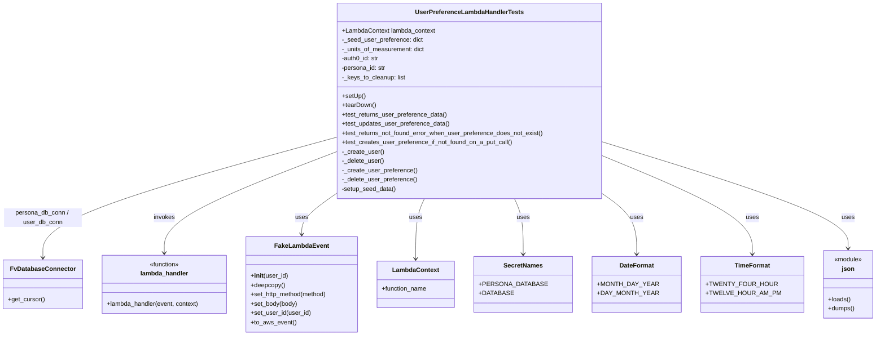

# Diagram: common/iam_service/tests/integration_tests/test_user_preferences/test_user_preferences_api.py

> Auto-generated by Obscura crawlers

## Mermaid

### SVG

<svg id="container" width="2177.70703125" xmlns="http://www.w3.org/2000/svg" class="classDiagram" height="864" viewBox="0 0 2177.70703125 864" role="graphics-document document" aria-roledescription="class"><g><defs><marker id="container_class-aggregationStart" class="marker aggregation class" refX="18" refY="7" markerWidth="190" markerHeight="240" orient="auto"><path d="M 18,7 L9,13 L1,7 L9,1 Z"></path></marker></defs><defs><marker id="container_class-aggregationEnd" class="marker aggregation class" refX="1" refY="7" markerWidth="20" markerHeight="28" orient="auto"><path d="M 18,7 L9,13 L1,7 L9,1 Z"></path></marker></defs><defs><marker id="container_class-extensionStart" class="marker extension class" refX="18" refY="7" markerWidth="190" markerHeight="240" orient="auto"><path d="M 1,7 L18,13 V 1 Z"></path></marker></defs><defs><marker id="container_class-extensionEnd" class="marker extension class" refX="1" refY="7" markerWidth="20" markerHeight="28" orient="auto"><path d="M 1,1 V 13 L18,7 Z"></path></marker></defs><defs><marker id="container_class-compositionStart" class="marker composition class" refX="18" refY="7" markerWidth="190" markerHeight="240" orient="auto"><path d="M 18,7 L9,13 L1,7 L9,1 Z"></path></marker></defs><defs><marker id="container_class-compositionEnd" class="marker composition class" refX="1" refY="7" markerWidth="20" markerHeight="28" orient="auto"><path d="M 18,7 L9,13 L1,7 L9,1 Z"></path></marker></defs><defs><marker id="container_class-dependencyStart" class="marker dependency class" refX="6" refY="7" markerWidth="190" markerHeight="240" orient="auto"><path d="M 5,7 L9,13 L1,7 L9,1 Z"></path></marker></defs><defs><marker id="container_class-dependencyEnd" class="marker dependency class" refX="13" refY="7" markerWidth="20" markerHeight="28" orient="auto"><path d="M 18,7 L9,13 L14,7 L9,1 Z"></path></marker></defs><defs><marker id="container_class-lollipopStart" class="marker lollipop class" refX="13" refY="7" markerWidth="190" markerHeight="240" orient="auto"><circle stroke="black" fill="transparent" cx="7" cy="7" r="6"></circle></marker></defs><defs><marker id="container_class-lollipopEnd" class="marker lollipop class" refX="1" refY="7" markerWidth="190" markerHeight="240" orient="auto"><circle stroke="black" fill="transparent" cx="7" cy="7" r="6"></circle></marker></defs><g class="root"><g class="clusters"></g><g class="edgePaths"><path d="M862.359,353.399L736.633,387.999C610.906,422.599,359.453,491.8,233.727,543.566C108,595.333,108,629.667,108,646.833L108,664" id="id_UserPreferenceLambdaHandlerTests_FvDatabaseConnector_1" class="edge-thickness-normal edge-pattern-solid relation" style=";;;" data-edge="true" data-et="edge" data-id="id_UserPreferenceLambdaHandlerTests_FvDatabaseConnector_1" data-points="W3sieCI6ODYyLjM1OTM3NSwieSI6MzUzLjM5ODgxNzEzNDQwODF9LHsieCI6MTA4LCJ5Ijo1NjF9LHsieCI6MTA4LCJ5Ijo2NzB9XQ==" marker-end="url(#container_class-dependencyEnd)"></path><path d="M862.359,390.517L788.475,418.931C714.591,447.345,566.823,504.172,492.939,547.753C419.055,591.333,419.055,621.667,419.055,636.833L419.055,652" id="id_UserPreferenceLambdaHandlerTests_lambda_handler_2" class="edge-thickness-normal edge-pattern-solid relation" style=";;;" data-edge="true" data-et="edge" data-id="id_UserPreferenceLambdaHandlerTests_lambda_handler_2" data-points="W3sieCI6ODYyLjM1OTM3NSwieSI6MzkwLjUxNzI1ODI0NDgyOTV9LHsieCI6NDE5LjA1NDY4NzUsInkiOjU2MX0seyJ4Ijo0MTkuMDU0Njg3NSwieSI6NjU4fV0=" marker-end="url(#container_class-dependencyEnd)"></path><path d="M862.359,500.006L847.984,510.171C833.609,520.337,804.859,540.669,790.484,558.001C776.109,575.333,776.109,589.667,776.109,596.833L776.109,604" id="id_UserPreferenceLambdaHandlerTests_FakeLambdaEvent_3" class="edge-thickness-normal edge-pattern-solid relation" style=";;;" data-edge="true" data-et="edge" data-id="id_UserPreferenceLambdaHandlerTests_FakeLambdaEvent_3" data-points="W3sieCI6ODYyLjM1OTM3NSwieSI6NTAwLjAwNTUyNDg2MTg3ODV9LHsieCI6Nzc2LjEwOTM3NSwieSI6NTYxfSx7IngiOjc3Ni4xMDkzNzUsInkiOjYxMH1d" marker-end="url(#container_class-dependencyEnd)"></path><path d="M1091.757,512L1088.193,520.167C1084.628,528.333,1077.5,544.667,1073.935,570.5C1070.371,596.333,1070.371,631.667,1070.371,649.333L1070.371,667" id="id_UserPreferenceLambdaHandlerTests_LambdaContext_4" class="edge-thickness-normal edge-pattern-solid relation" style=";;;" data-edge="true" data-et="edge" data-id="id_UserPreferenceLambdaHandlerTests_LambdaContext_4" data-points="W3sieCI6MTA5MS43NTcwODU3NTU4MTQsInkiOjUxMn0seyJ4IjoxMDcwLjM3MTA5Mzc1LCJ5Ijo1NjF9LHsieCI6MTA3MC4zNzEwOTM3NSwieSI6NjczfV0=" marker-end="url(#container_class-dependencyEnd)"></path><path d="M1311.727,512L1315.292,520.167C1318.856,528.333,1325.985,544.667,1329.549,568.5C1333.113,592.333,1333.113,623.667,1333.113,639.333L1333.113,655" id="id_UserPreferenceLambdaHandlerTests_SecretNames_5" class="edge-thickness-normal edge-pattern-solid relation" style=";;;" data-edge="true" data-et="edge" data-id="id_UserPreferenceLambdaHandlerTests_SecretNames_5" data-points="W3sieCI6MTMxMS43MjcyODkyNDQxODYsInkiOjUxMn0seyJ4IjoxMzMzLjExMzI4MTI1LCJ5Ijo1NjF9LHsieCI6MTMzMy4xMTMyODEyNSwieSI6NjYxfV0=" marker-end="url(#container_class-dependencyEnd)"></path><path d="M1534.657,512L1545.446,520.167C1556.235,528.333,1577.813,544.667,1588.602,568.5C1599.391,592.333,1599.391,623.667,1599.391,639.333L1599.391,655" id="id_UserPreferenceLambdaHandlerTests_DateFormat_6" class="edge-thickness-normal edge-pattern-solid relation" style=";;;" data-edge="true" data-et="edge" data-id="id_UserPreferenceLambdaHandlerTests_DateFormat_6" data-points="W3sieCI6MTUzNC42NTcxNTg0MzAyMzI2LCJ5Ijo1MTJ9LHsieCI6MTU5OS4zOTA2MjUsInkiOjU2MX0seyJ4IjoxNTk5LjM5MDYyNSwieSI6NjYxfV0=" marker-end="url(#container_class-dependencyEnd)"></path><path d="M1541.125,412.479L1596.221,437.232C1651.316,461.986,1761.508,511.493,1816.604,551.913C1871.699,592.333,1871.699,623.667,1871.699,639.333L1871.699,655" id="id_UserPreferenceLambdaHandlerTests_TimeFormat_7" class="edge-thickness-normal edge-pattern-solid relation" style=";;;" data-edge="true" data-et="edge" data-id="id_UserPreferenceLambdaHandlerTests_TimeFormat_7" data-points="W3sieCI6MTU0MS4xMjUsInkiOjQxMi40Nzg3NzM3MDg2NjgzfSx7IngiOjE4NzEuNjk5MjE4NzUsInkiOjU2MX0seyJ4IjoxODcxLjY5OTIxODc1LCJ5Ijo2NjF9XQ==" marker-end="url(#container_class-dependencyEnd)"></path><path d="M1541.125,373.04L1635.178,404.366C1729.232,435.693,1917.339,498.347,2011.392,542.84C2105.445,587.333,2105.445,613.667,2105.445,626.833L2105.445,640" id="id_UserPreferenceLambdaHandlerTests_json_8" class="edge-thickness-normal edge-pattern-solid relation" style=";;;" data-edge="true" data-et="edge" data-id="id_UserPreferenceLambdaHandlerTests_json_8" data-points="W3sieCI6MTU0MS4xMjUsInkiOjM3My4wMzk1ODUzODY1MTczfSx7IngiOjIxMDUuNDQ1MzEyNSwieSI6NTYxfSx7IngiOjIxMDUuNDQ1MzEyNSwieSI6NjQ2fV0=" marker-end="url(#container_class-dependencyEnd)"></path></g><g class="edgeLabels"><g class="edgeLabel" transform="translate(108, 561)"><g class="label" data-id="id_UserPreferenceLambdaHandlerTests_FvDatabaseConnector_1" transform="translate(-100, -24)"><foreignObject width="200" height="48">

persona_db_conn / user_db_conn

</foreignObject></g></g><g class="edgeLabel" transform="translate(419.0546875, 561)"><g class="label" data-id="id_UserPreferenceLambdaHandlerTests_lambda_handler_2" transform="translate(-27.5859375, -12)"><foreignObject width="55.171875" height="24">

invokes

</foreignObject></g></g><g class="edgeLabel" transform="translate(776.109375, 561)"><g class="label" data-id="id_UserPreferenceLambdaHandlerTests_FakeLambdaEvent_3" transform="translate(-16.4921875, -12)"><foreignObject width="32.984375" height="24">

uses

</foreignObject></g></g><g class="edgeLabel" transform="translate(1070.37109375, 561)"><g class="label" data-id="id_UserPreferenceLambdaHandlerTests_LambdaContext_4" transform="translate(-16.4921875, -12)"><foreignObject width="32.984375" height="24">

uses

</foreignObject></g></g><g class="edgeLabel" transform="translate(1333.11328125, 561)"><g class="label" data-id="id_UserPreferenceLambdaHandlerTests_SecretNames_5" transform="translate(-16.4921875, -12)"><foreignObject width="32.984375" height="24">

uses

</foreignObject></g></g><g class="edgeLabel" transform="translate(1599.390625, 561)"><g class="label" data-id="id_UserPreferenceLambdaHandlerTests_DateFormat_6" transform="translate(-16.4921875, -12)"><foreignObject width="32.984375" height="24">

uses

</foreignObject></g></g><g class="edgeLabel" transform="translate(1871.69921875, 561)"><g class="label" data-id="id_UserPreferenceLambdaHandlerTests_TimeFormat_7" transform="translate(-16.4921875, -12)"><foreignObject width="32.984375" height="24">

uses

</foreignObject></g></g><g class="edgeLabel" transform="translate(2105.4453125, 561)"><g class="label" data-id="id_UserPreferenceLambdaHandlerTests_json_8" transform="translate(-16.4921875, -12)"><foreignObject width="32.984375" height="24">

uses

</foreignObject></g></g></g><g class="nodes"><g class="node default" id="classId-UserPreferenceLambdaHandlerTests-0" transform="translate(1201.7421875, 260)"><g class="basic label-container"><path d="M-339.3828125 -252 L339.3828125 -252 L339.3828125 252 L-339.3828125 252" stroke="none" stroke-width="0" fill="#ECECFF" style=""></path><path d="M-339.3828125 -252 C-97.48020741909113 -252, 144.42239766181774 -252, 339.3828125 -252 M-339.3828125 -252 C-71.14661496033028 -252, 197.08958257933944 -252, 339.3828125 -252 M339.3828125 -252 C339.3828125 -137.48216568096382, 339.3828125 -22.964331361927606, 339.3828125 252 M339.3828125 -252 C339.3828125 -79.22199061722841, 339.3828125 93.55601876554317, 339.3828125 252 M339.3828125 252 C102.28738352717258 252, -134.80804544565484 252, -339.3828125 252 M339.3828125 252 C68.0019908086586 252, -203.3788308826828 252, -339.3828125 252 M-339.3828125 252 C-339.3828125 88.20530487249741, -339.3828125 -75.58939025500518, -339.3828125 -252 M-339.3828125 252 C-339.3828125 78.95102466733422, -339.3828125 -94.09795066533155, -339.3828125 -252" stroke="#9370DB" stroke-width="1.3" fill="none" stroke-dasharray="0 0" style=""></path></g><g class="annotation-group text" transform="translate(0, -228)"></g><g class="label-group text" transform="translate(-133.28125, -228)"><g class="label" style="font-weight: bolder" transform="translate(0,-12)"><foreignObject width="266.5625" height="24">

UserPreferenceLambdaHandlerTests

</foreignObject></g></g><g class="members-group text" transform="translate(-327.3828125, -180)"><g class="label" style="" transform="translate(0,-12)"><foreignObject width="241.734375" height="24">

+LambdaContext lambda_context

</foreignObject></g><g class="label" style="" transform="translate(0,12)"><foreignObject width="207.953125" height="24">

-_seed_user_preference: dict

</foreignObject></g><g class="label" style="" transform="translate(0,36)"><foreignObject width="215.09375" height="24">

-_units_of_measurement: dict

</foreignObject></g><g class="label" style="" transform="translate(0,60)"><foreignObject width="97.734375" height="24">

-auth0_id: str

</foreignObject></g><g class="label" style="" transform="translate(0,84)"><foreignObject width="115.421875" height="24">

-persona_id: str

</foreignObject></g><g class="label" style="" transform="translate(0,108)"><foreignObject width="163.90625" height="24">

-_keys_to_cleanup: list

</foreignObject></g></g><g class="methods-group text" transform="translate(-327.3828125, -12)"><g class="label" style="" transform="translate(0,-12)"><foreignObject width="60.421875" height="24">

+setUp()

</foreignObject></g><g class="label" style="" transform="translate(0,12)"><foreignObject width="87.75" height="24">

+tearDown()

</foreignObject></g><g class="label" style="" transform="translate(0,36)"><foreignObject width="271.03125" height="24">

+test_returns_user_preference_data()

</foreignObject></g><g class="label" style="" transform="translate(0,60)"><foreignObject width="277" height="24">

+test_updates_user_preference_data()

</foreignObject></g><g class="label" style="" transform="translate(0,84)"><foreignObject width="521.484375" height="24">

+test_returns_not_found_error_when_user_preference_does_not_exist()

</foreignObject></g><g class="label" style="" transform="translate(0,108)"><foreignObject width="440.953125" height="24">

+test_creates_user_preference_if_not_found_on_a_put_call()

</foreignObject></g><g class="label" style="" transform="translate(0,132)"><foreignObject width="107.765625" height="24">

-_create_user()

</foreignObject></g><g class="label" style="" transform="translate(0,156)"><foreignObject width="108.78125" height="24">

-_delete_user()

</foreignObject></g><g class="label" style="" transform="translate(0,180)"><foreignObject width="192.484375" height="24">

-_create_user_preference()

</foreignObject></g><g class="label" style="" transform="translate(0,204)"><foreignObject width="193.5" height="24">

-_delete_user_preference()

</foreignObject></g><g class="label" style="" transform="translate(0,228)"><foreignObject width="140.734375" height="24">

-setup_seed_data()

</foreignObject></g></g><g class="divider" style=""><path d="M-339.3828125 -204 C-139.3011781179879 -204, 60.780456264024224 -204, 339.3828125 -204 M-339.3828125 -204 C-133.12742025530372 -204, 73.12797198939256 -204, 339.3828125 -204" stroke="#9370DB" stroke-width="1.3" fill="none" stroke-dasharray="0 0" style=""></path></g><g class="divider" style=""><path d="M-339.3828125 -36 C-186.13835057909986 -36, -32.89388865819973 -36, 339.3828125 -36 M-339.3828125 -36 C-133.15254764374316 -36, 73.07771721251368 -36, 339.3828125 -36" stroke="#9370DB" stroke-width="1.3" fill="none" stroke-dasharray="0 0" style=""></path></g></g><g class="node default" id="classId-FvDatabaseConnector-1" transform="translate(108, 733)"><g class="basic label-container"><path d="M-98.97265625 -63 L98.97265625 -63 L98.97265625 63 L-98.97265625 63" stroke="none" stroke-width="0" fill="#ECECFF" style=""></path><path d="M-98.97265625 -63 C-35.815877025776686 -63, 27.340902198446628 -63, 98.97265625 -63 M-98.97265625 -63 C-40.969427584809296 -63, 17.03380108038141 -63, 98.97265625 -63 M98.97265625 -63 C98.97265625 -34.953117534393016, 98.97265625 -6.9062350687860246, 98.97265625 63 M98.97265625 -63 C98.97265625 -16.55487373963446, 98.97265625 29.89025252073108, 98.97265625 63 M98.97265625 63 C35.076168175829 63, -28.820319898342007 63, -98.97265625 63 M98.97265625 63 C23.622889375977095 63, -51.72687749804581 63, -98.97265625 63 M-98.97265625 63 C-98.97265625 31.30935846519503, -98.97265625 -0.3812830696099425, -98.97265625 -63 M-98.97265625 63 C-98.97265625 13.88937313463883, -98.97265625 -35.22125373072234, -98.97265625 -63" stroke="#9370DB" stroke-width="1.3" fill="none" stroke-dasharray="0 0" style=""></path></g><g class="annotation-group text" transform="translate(0, -39)"></g><g class="label-group text" transform="translate(-79.3046875, -39)"><g class="label" style="font-weight: bolder" transform="translate(0,-12)"><foreignObject width="158.609375" height="24">

FvDatabaseConnector

</foreignObject></g></g><g class="members-group text" transform="translate(-86.97265625, 9)"></g><g class="methods-group text" transform="translate(-86.97265625, 39)"><g class="label" style="" transform="translate(0,-12)"><foreignObject width="94.640625" height="24">

+get_cursor()

</foreignObject></g></g><g class="divider" style=""><path d="M-98.97265625 -15 C-34.506986843231076 -15, 29.95868256353785 -15, 98.97265625 -15 M-98.97265625 -15 C-25.163348698566878 -15, 48.645958852866244 -15, 98.97265625 -15" stroke="#9370DB" stroke-width="1.3" fill="none" stroke-dasharray="0 0" style=""></path></g><g class="divider" style=""><path d="M-98.97265625 9 C-53.75830708592532 9, -8.543957921850634 9, 98.97265625 9 M-98.97265625 9 C-32.61387679318862 9, 33.74490266362275 9, 98.97265625 9" stroke="#9370DB" stroke-width="1.3" fill="none" stroke-dasharray="0 0" style=""></path></g></g><g class="node default" id="classId-lambda_handler-2" transform="translate(419.0546875, 733)"><g class="basic label-container"><path d="M-162.08203125 -75 L162.08203125 -75 L162.08203125 75 L-162.08203125 75" stroke="none" stroke-width="0" fill="#ECECFF" style=""></path><path d="M-162.08203125 -75 C-51.48990348916739 -75, 59.10222427166522 -75, 162.08203125 -75 M-162.08203125 -75 C-77.12989753706161 -75, 7.822236175876782 -75, 162.08203125 -75 M162.08203125 -75 C162.08203125 -16.987751627599074, 162.08203125 41.02449674480185, 162.08203125 75 M162.08203125 -75 C162.08203125 -16.944950121335552, 162.08203125 41.110099757328896, 162.08203125 75 M162.08203125 75 C70.69640847184722 75, -20.68921430630556 75, -162.08203125 75 M162.08203125 75 C90.81249976404371 75, 19.542968278087415 75, -162.08203125 75 M-162.08203125 75 C-162.08203125 20.068501950885512, -162.08203125 -34.862996098228976, -162.08203125 -75 M-162.08203125 75 C-162.08203125 33.80586862890894, -162.08203125 -7.388262742182121, -162.08203125 -75" stroke="#9370DB" stroke-width="1.3" fill="none" stroke-dasharray="0 0" style=""></path></g><g class="annotation-group text" transform="translate(-39.484375, -51)"><g class="label" style="" transform="translate(0,-12)"><foreignObject width="78.96875" height="24">

«function»

</foreignObject></g></g><g class="label-group text" transform="translate(-59.9765625, -27)"><g class="label" style="font-weight: bolder" transform="translate(0,-12)"><foreignObject width="119.953125" height="24">

lambda_handler

</foreignObject></g></g><g class="members-group text" transform="translate(-150.08203125, 21)"></g><g class="methods-group text" transform="translate(-150.08203125, 51)"><g class="label" style="" transform="translate(0,-12)"><foreignObject width="240.1875" height="24">

+lambda_handler(event, context)

</foreignObject></g></g><g class="divider" style=""><path d="M-162.08203125 -3 C-78.49391332949958 -3, 5.094204591000846 -3, 162.08203125 -3 M-162.08203125 -3 C-73.77641541356388 -3, 14.529200422872236 -3, 162.08203125 -3" stroke="#9370DB" stroke-width="1.3" fill="none" stroke-dasharray="0 0" style=""></path></g><g class="divider" style=""><path d="M-162.08203125 21 C-45.704130654979124 21, 70.67376994004175 21, 162.08203125 21 M-162.08203125 21 C-87.80497125079918 21, -13.527911251598368 21, 162.08203125 21" stroke="#9370DB" stroke-width="1.3" fill="none" stroke-dasharray="0 0" style=""></path></g></g><g class="node default" id="classId-FakeLambdaEvent-3" transform="translate(776.109375, 733)"><g class="basic label-container"><path d="M-144.97265625 -123 L144.97265625 -123 L144.97265625 123 L-144.97265625 123" stroke="none" stroke-width="0" fill="#ECECFF" style=""></path><path d="M-144.97265625 -123 C-78.71716036906975 -123, -12.46166448813949 -123, 144.97265625 -123 M-144.97265625 -123 C-51.97914725820084 -123, 41.01436173359832 -123, 144.97265625 -123 M144.97265625 -123 C144.97265625 -70.65891748226332, 144.97265625 -18.317834964526625, 144.97265625 123 M144.97265625 -123 C144.97265625 -53.49067799143643, 144.97265625 16.018644017127144, 144.97265625 123 M144.97265625 123 C83.21721055839689 123, 21.461764866793757 123, -144.97265625 123 M144.97265625 123 C33.32097823568603 123, -78.33069977862795 123, -144.97265625 123 M-144.97265625 123 C-144.97265625 58.8375515847428, -144.97265625 -5.324896830514405, -144.97265625 -123 M-144.97265625 123 C-144.97265625 53.79216450223977, -144.97265625 -15.415670995520458, -144.97265625 -123" stroke="#9370DB" stroke-width="1.3" fill="none" stroke-dasharray="0 0" style=""></path></g><g class="annotation-group text" transform="translate(0, -99)"></g><g class="label-group text" transform="translate(-65.8671875, -99)"><g class="label" style="font-weight: bolder" transform="translate(0,-12)"><foreignObject width="131.734375" height="24">

FakeLambdaEvent

</foreignObject></g></g><g class="members-group text" transform="translate(-132.97265625, -51)"></g><g class="methods-group text" transform="translate(-132.97265625, -21)"><g class="label" style="" transform="translate(0,-12)"><foreignObject width="95.59375" height="24">

+<strong>init</strong>(user_id)

</foreignObject></g><g class="label" style="" transform="translate(0,12)"><foreignObject width="88.859375" height="24">

+deepcopy()

</foreignObject></g><g class="label" style="" transform="translate(0,36)"><foreignObject width="200.078125" height="24">

+set_http_method(method)

</foreignObject></g><g class="label" style="" transform="translate(0,60)"><foreignObject width="121.21875" height="24">

+set_body(body)

</foreignObject></g><g class="label" style="" transform="translate(0,84)"><foreignObject width="153.921875" height="24">

+set_user_id(user_id)

</foreignObject></g><g class="label" style="" transform="translate(0,108)"><foreignObject width="116.421875" height="24">

+to_aws_event()

</foreignObject></g></g><g class="divider" style=""><path d="M-144.97265625 -75 C-86.86997790605241 -75, -28.76729956210484 -75, 144.97265625 -75 M-144.97265625 -75 C-78.38104041154457 -75, -11.78942457308915 -75, 144.97265625 -75" stroke="#9370DB" stroke-width="1.3" fill="none" stroke-dasharray="0 0" style=""></path></g><g class="divider" style=""><path d="M-144.97265625 -51 C-74.02691393002479 -51, -3.08117161004958 -51, 144.97265625 -51 M-144.97265625 -51 C-51.77142859571153 -51, 41.42979905857695 -51, 144.97265625 -51" stroke="#9370DB" stroke-width="1.3" fill="none" stroke-dasharray="0 0" style=""></path></g></g><g class="node default" id="classId-LambdaContext-4" transform="translate(1070.37109375, 733)"><g class="basic label-container"><path d="M-99.2890625 -60 L99.2890625 -60 L99.2890625 60 L-99.2890625 60" stroke="none" stroke-width="0" fill="#ECECFF" style=""></path><path d="M-99.2890625 -60 C-29.19605927919845 -60, 40.8969439416031 -60, 99.2890625 -60 M-99.2890625 -60 C-28.841473667370096 -60, 41.60611516525981 -60, 99.2890625 -60 M99.2890625 -60 C99.2890625 -35.992480305336926, 99.2890625 -11.984960610673845, 99.2890625 60 M99.2890625 -60 C99.2890625 -28.91089195470783, 99.2890625 2.1782160905843426, 99.2890625 60 M99.2890625 60 C26.578778513863767 60, -46.131505472272465 60, -99.2890625 60 M99.2890625 60 C53.54906874920817 60, 7.809074998416335 60, -99.2890625 60 M-99.2890625 60 C-99.2890625 22.386241933795013, -99.2890625 -15.227516132409974, -99.2890625 -60 M-99.2890625 60 C-99.2890625 23.701732382923275, -99.2890625 -12.59653523415345, -99.2890625 -60" stroke="#9370DB" stroke-width="1.3" fill="none" stroke-dasharray="0 0" style=""></path></g><g class="annotation-group text" transform="translate(0, -36)"></g><g class="label-group text" transform="translate(-57.296875, -36)"><g class="label" style="font-weight: bolder" transform="translate(0,-12)"><foreignObject width="114.59375" height="24">

LambdaContext

</foreignObject></g></g><g class="members-group text" transform="translate(-87.2890625, 12)"><g class="label" style="" transform="translate(0,-12)"><foreignObject width="117.28125" height="24">

+function_name

</foreignObject></g></g><g class="methods-group text" transform="translate(-87.2890625, 60)"></g><g class="divider" style=""><path d="M-99.2890625 -12 C-41.70882097339671 -12, 15.871420553206576 -12, 99.2890625 -12 M-99.2890625 -12 C-43.119990463482466 -12, 13.049081573035068 -12, 99.2890625 -12" stroke="#9370DB" stroke-width="1.3" fill="none" stroke-dasharray="0 0" style=""></path></g><g class="divider" style=""><path d="M-99.2890625 36 C-47.51189024624181 36, 4.265282007516376 36, 99.2890625 36 M-99.2890625 36 C-39.447273580067886 36, 20.394515339864228 36, 99.2890625 36" stroke="#9370DB" stroke-width="1.3" fill="none" stroke-dasharray="0 0" style=""></path></g></g><g class="node default" id="classId-SecretNames-5" transform="translate(1333.11328125, 733)"><g class="basic label-container"><path d="M-113.453125 -72 L113.453125 -72 L113.453125 72 L-113.453125 72" stroke="none" stroke-width="0" fill="#ECECFF" style=""></path><path d="M-113.453125 -72 C-36.104640552840564 -72, 41.24384389431887 -72, 113.453125 -72 M-113.453125 -72 C-60.10752123570459 -72, -6.761917471409177 -72, 113.453125 -72 M113.453125 -72 C113.453125 -42.28604332751066, 113.453125 -12.572086655021323, 113.453125 72 M113.453125 -72 C113.453125 -34.0352775688573, 113.453125 3.9294448622853935, 113.453125 72 M113.453125 72 C67.08829389778056 72, 20.72346279556112 72, -113.453125 72 M113.453125 72 C31.687246561170056 72, -50.07863187765989 72, -113.453125 72 M-113.453125 72 C-113.453125 41.17359439077825, -113.453125 10.34718878155649, -113.453125 -72 M-113.453125 72 C-113.453125 32.12031505331749, -113.453125 -7.759369893365019, -113.453125 -72" stroke="#9370DB" stroke-width="1.3" fill="none" stroke-dasharray="0 0" style=""></path></g><g class="annotation-group text" transform="translate(0, -48)"></g><g class="label-group text" transform="translate(-48.03125, -48)"><g class="label" style="font-weight: bolder" transform="translate(0,-12)"><foreignObject width="96.0625" height="24">

SecretNames

</foreignObject></g></g><g class="members-group text" transform="translate(-101.453125, 0)"><g class="label" style="" transform="translate(0,-12)"><foreignObject width="154.875" height="24">

+PERSONA_DATABASE

</foreignObject></g><g class="label" style="" transform="translate(0,12)"><foreignObject width="79.234375" height="24">

+DATABASE

</foreignObject></g></g><g class="methods-group text" transform="translate(-101.453125, 72)"></g><g class="divider" style=""><path d="M-113.453125 -24 C-56.59299080133625 -24, 0.2671433973275015 -24, 113.453125 -24 M-113.453125 -24 C-56.09175264875893 -24, 1.2696197024821458 -24, 113.453125 -24" stroke="#9370DB" stroke-width="1.3" fill="none" stroke-dasharray="0 0" style=""></path></g><g class="divider" style=""><path d="M-113.453125 48 C-32.034009418267786 48, 49.38510616346443 48, 113.453125 48 M-113.453125 48 C-26.681356054353145 48, 60.09041289129371 48, 113.453125 48" stroke="#9370DB" stroke-width="1.3" fill="none" stroke-dasharray="0 0" style=""></path></g></g><g class="node default" id="classId-DateFormat-6" transform="translate(1599.390625, 733)"><g class="basic label-container"><path d="M-102.82421875 -72 L102.82421875 -72 L102.82421875 72 L-102.82421875 72" stroke="none" stroke-width="0" fill="#ECECFF" style=""></path><path d="M-102.82421875 -72 C-45.86157947592344 -72, 11.101059798153116 -72, 102.82421875 -72 M-102.82421875 -72 C-35.238281544218 -72, 32.347655661564005 -72, 102.82421875 -72 M102.82421875 -72 C102.82421875 -42.66083336298157, 102.82421875 -13.32166672596314, 102.82421875 72 M102.82421875 -72 C102.82421875 -36.97666307160027, 102.82421875 -1.9533261432005418, 102.82421875 72 M102.82421875 72 C30.984181074636282 72, -40.855856600727435 72, -102.82421875 72 M102.82421875 72 C54.85720689780952 72, 6.890195045619038 72, -102.82421875 72 M-102.82421875 72 C-102.82421875 18.902987647839204, -102.82421875 -34.19402470432159, -102.82421875 -72 M-102.82421875 72 C-102.82421875 38.324444393481386, -102.82421875 4.648888786962772, -102.82421875 -72" stroke="#9370DB" stroke-width="1.3" fill="none" stroke-dasharray="0 0" style=""></path></g><g class="annotation-group text" transform="translate(0, -48)"></g><g class="label-group text" transform="translate(-42.6015625, -48)"><g class="label" style="font-weight: bolder" transform="translate(0,-12)"><foreignObject width="85.203125" height="24">

DateFormat

</foreignObject></g></g><g class="members-group text" transform="translate(-90.82421875, 0)"><g class="label" style="" transform="translate(0,-12)"><foreignObject width="139.046875" height="24">

+MONTH_DAY_YEAR

</foreignObject></g><g class="label" style="" transform="translate(0,12)"><foreignObject width="139.046875" height="24">

+DAY_MONTH_YEAR

</foreignObject></g></g><g class="methods-group text" transform="translate(-90.82421875, 72)"></g><g class="divider" style=""><path d="M-102.82421875 -24 C-28.292414589182883 -24, 46.239389571634234 -24, 102.82421875 -24 M-102.82421875 -24 C-53.89453418510194 -24, -4.9648496202038785 -24, 102.82421875 -24" stroke="#9370DB" stroke-width="1.3" fill="none" stroke-dasharray="0 0" style=""></path></g><g class="divider" style=""><path d="M-102.82421875 48 C-34.7938339928114 48, 33.2365507643772 48, 102.82421875 48 M-102.82421875 48 C-58.93937131531191 48, -15.054523880623819 48, 102.82421875 48" stroke="#9370DB" stroke-width="1.3" fill="none" stroke-dasharray="0 0" style=""></path></g></g><g class="node default" id="classId-TimeFormat-7" transform="translate(1871.69921875, 733)"><g class="basic label-container"><path d="M-119.484375 -72 L119.484375 -72 L119.484375 72 L-119.484375 72" stroke="none" stroke-width="0" fill="#ECECFF" style=""></path><path d="M-119.484375 -72 C-36.926933394638354 -72, 45.63050821072329 -72, 119.484375 -72 M-119.484375 -72 C-66.3574190884186 -72, -13.230463176837176 -72, 119.484375 -72 M119.484375 -72 C119.484375 -31.409393601080183, 119.484375 9.181212797839635, 119.484375 72 M119.484375 -72 C119.484375 -16.75229078905059, 119.484375 38.49541842189882, 119.484375 72 M119.484375 72 C48.67009945076646 72, -22.144176098467085 72, -119.484375 72 M119.484375 72 C30.333957489786044 72, -58.81646002042791 72, -119.484375 72 M-119.484375 72 C-119.484375 15.339918517307304, -119.484375 -41.32016296538539, -119.484375 -72 M-119.484375 72 C-119.484375 20.05412744688652, -119.484375 -31.891745106226963, -119.484375 -72" stroke="#9370DB" stroke-width="1.3" fill="none" stroke-dasharray="0 0" style=""></path></g><g class="annotation-group text" transform="translate(0, -48)"></g><g class="label-group text" transform="translate(-43.484375, -48)"><g class="label" style="font-weight: bolder" transform="translate(0,-12)"><foreignObject width="86.96875" height="24">

TimeFormat

</foreignObject></g></g><g class="members-group text" transform="translate(-107.484375, 0)"><g class="label" style="" transform="translate(0,-12)"><foreignObject width="161.75" height="24">

+TWENTY_FOUR_HOUR

</foreignObject></g><g class="label" style="" transform="translate(0,12)"><foreignObject width="171.484375" height="24">

+TWELVE_HOUR_AM_PM

</foreignObject></g></g><g class="methods-group text" transform="translate(-107.484375, 72)"></g><g class="divider" style=""><path d="M-119.484375 -24 C-24.225113324513543 -24, 71.03414835097291 -24, 119.484375 -24 M-119.484375 -24 C-48.06314710427583 -24, 23.358080791448344 -24, 119.484375 -24" stroke="#9370DB" stroke-width="1.3" fill="none" stroke-dasharray="0 0" style=""></path></g><g class="divider" style=""><path d="M-119.484375 48 C-57.64904858332092 48, 4.186277833358162 48, 119.484375 48 M-119.484375 48 C-54.98963137202021 48, 9.505112255959574 48, 119.484375 48" stroke="#9370DB" stroke-width="1.3" fill="none" stroke-dasharray="0 0" style=""></path></g></g><g class="node default" id="classId-json-8" transform="translate(2105.4453125, 733)"><g class="basic label-container"><path d="M-64.26171875 -87 L64.26171875 -87 L64.26171875 87 L-64.26171875 87" stroke="none" stroke-width="0" fill="#ECECFF" style=""></path><path d="M-64.26171875 -87 C-33.668322267326545 -87, -3.0749257846530824 -87, 64.26171875 -87 M-64.26171875 -87 C-25.51842499814775 -87, 13.224868753704499 -87, 64.26171875 -87 M64.26171875 -87 C64.26171875 -17.946328696825802, 64.26171875 51.107342606348396, 64.26171875 87 M64.26171875 -87 C64.26171875 -26.18779007206723, 64.26171875 34.62441985586554, 64.26171875 87 M64.26171875 87 C37.693836569489704 87, 11.125954388979402 87, -64.26171875 87 M64.26171875 87 C25.617725491923238 87, -13.026267766153524 87, -64.26171875 87 M-64.26171875 87 C-64.26171875 24.756620516623165, -64.26171875 -37.48675896675367, -64.26171875 -87 M-64.26171875 87 C-64.26171875 23.085052324334356, -64.26171875 -40.82989535133129, -64.26171875 -87" stroke="#9370DB" stroke-width="1.3" fill="none" stroke-dasharray="0 0" style=""></path></g><g class="annotation-group text" transform="translate(-36.6015625, -63)"><g class="label" style="" transform="translate(0,-12)"><foreignObject width="73.203125" height="24">

«module»

</foreignObject></g></g><g class="label-group text" transform="translate(-15.40625, -39)"><g class="label" style="font-weight: bolder" transform="translate(0,-12)"><foreignObject width="30.8125" height="24">

json

</foreignObject></g></g><g class="members-group text" transform="translate(-52.26171875, 9)"></g><g class="methods-group text" transform="translate(-52.26171875, 39)"><g class="label" style="" transform="translate(0,-12)"><foreignObject width="57.890625" height="24">

+loads()

</foreignObject></g><g class="label" style="" transform="translate(0,12)"><foreignObject width="67.921875" height="24">

+dumps()

</foreignObject></g></g><g class="divider" style=""><path d="M-64.26171875 -15 C-25.02805602228544 -15, 14.205606705429119 -15, 64.26171875 -15 M-64.26171875 -15 C-16.432610552073193 -15, 31.396497645853614 -15, 64.26171875 -15" stroke="#9370DB" stroke-width="1.3" fill="none" stroke-dasharray="0 0" style=""></path></g><g class="divider" style=""><path d="M-64.26171875 9 C-28.64416533529596 9, 6.973388079408082 9, 64.26171875 9 M-64.26171875 9 C-33.96050704543116 9, -3.6592953408623075 9, 64.26171875 9" stroke="#9370DB" stroke-width="1.3" fill="none" stroke-dasharray="0 0" style=""></path></g></g></g></g></g></svg>
