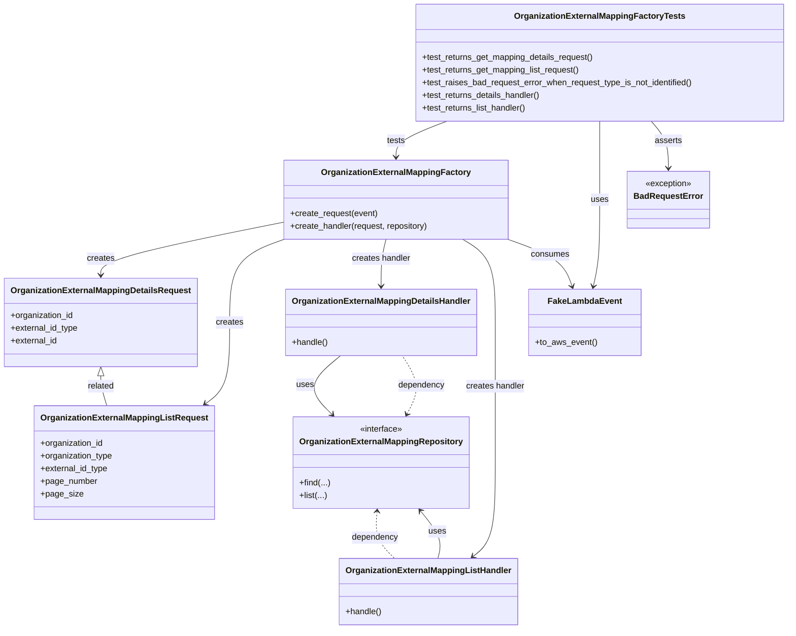

# Diagram: common/iam_service/tests/unit_tests/organization_external_mapping/test_organization_external_mapping_factory.py

> Auto-generated by Obscura crawlers

## Mermaid

### SVG

<svg id="container" width="1458.9609375" xmlns="http://www.w3.org/2000/svg" class="classDiagram" height="1194" viewBox="0 0 1458.9609375 1194" role="graphics-document document" aria-roledescription="class"><g><defs><marker id="container_class-aggregationStart" class="marker aggregation class" refX="18" refY="7" markerWidth="190" markerHeight="240" orient="auto"><path d="M 18,7 L9,13 L1,7 L9,1 Z"></path></marker></defs><defs><marker id="container_class-aggregationEnd" class="marker aggregation class" refX="1" refY="7" markerWidth="20" markerHeight="28" orient="auto"><path d="M 18,7 L9,13 L1,7 L9,1 Z"></path></marker></defs><defs><marker id="container_class-extensionStart" class="marker extension class" refX="18" refY="7" markerWidth="190" markerHeight="240" orient="auto"><path d="M 1,7 L18,13 V 1 Z"></path></marker></defs><defs><marker id="container_class-extensionEnd" class="marker extension class" refX="1" refY="7" markerWidth="20" markerHeight="28" orient="auto"><path d="M 1,1 V 13 L18,7 Z"></path></marker></defs><defs><marker id="container_class-compositionStart" class="marker composition class" refX="18" refY="7" markerWidth="190" markerHeight="240" orient="auto"><path d="M 18,7 L9,13 L1,7 L9,1 Z"></path></marker></defs><defs><marker id="container_class-compositionEnd" class="marker composition class" refX="1" refY="7" markerWidth="20" markerHeight="28" orient="auto"><path d="M 18,7 L9,13 L1,7 L9,1 Z"></path></marker></defs><defs><marker id="container_class-dependencyStart" class="marker dependency class" refX="6" refY="7" markerWidth="190" markerHeight="240" orient="auto"><path d="M 5,7 L9,13 L1,7 L9,1 Z"></path></marker></defs><defs><marker id="container_class-dependencyEnd" class="marker dependency class" refX="13" refY="7" markerWidth="20" markerHeight="28" orient="auto"><path d="M 18,7 L9,13 L14,7 L9,1 Z"></path></marker></defs><defs><marker id="container_class-lollipopStart" class="marker lollipop class" refX="13" refY="7" markerWidth="190" markerHeight="240" orient="auto"><circle stroke="black" fill="transparent" cx="7" cy="7" r="6"></circle></marker></defs><defs><marker id="container_class-lollipopEnd" class="marker lollipop class" refX="1" refY="7" markerWidth="190" markerHeight="240" orient="auto"><circle stroke="black" fill="transparent" cx="7" cy="7" r="6"></circle></marker></defs><g class="root"><g class="clusters"></g><g class="edgePaths"><path d="M513.641,422.843L458.673,434.203C403.706,445.562,293.771,468.281,238.803,484.807C183.836,501.333,183.836,511.667,183.836,516.833L183.836,522" id="id_OrganizationExternalMappingFactory_OrganizationExternalMappingDetailsRequest_1" class="edge-thickness-normal edge-pattern-solid relation" style=";;;" data-edge="true" data-et="edge" data-id="id_OrganizationExternalMappingFactory_OrganizationExternalMappingDetailsRequest_1" data-points="W3sieCI6NTEzLjY0MDYyNSwieSI6NDIyLjg0MzA3NDUwNTczMzd9LHsieCI6MTgzLjgzNTkzNzUsInkiOjQ5MX0seyJ4IjoxODMuODM1OTM3NSwieSI6NTI4fV0=" marker-end="url(#container_class-dependencyEnd)"></path><path d="M521.586,454L504.796,460.167C488.005,466.333,454.424,478.667,437.634,505C420.844,531.333,420.844,571.667,420.844,612C420.844,652.333,420.844,692.667,413.297,718.406C405.75,744.145,390.657,755.291,383.111,760.863L375.564,766.436" id="id_OrganizationExternalMappingFactory_OrganizationExternalMappingListRequest_2" class="edge-thickness-normal edge-pattern-solid relation" style=";;;" data-edge="true" data-et="edge" data-id="id_OrganizationExternalMappingFactory_OrganizationExternalMappingListRequest_2" data-points="W3sieCI6NTIxLjU4NTkwMjYyMjc2NzksInkiOjQ1NH0seyJ4Ijo0MjAuODQzNzUsInkiOjQ5MX0seyJ4Ijo0MjAuODQzNzUsInkiOjYxMn0seyJ4Ijo0MjAuODQzNzUsInkiOjczM30seyJ4IjozNzAuNzM3MjU3NTQzMTAzNDUsInkiOjc3MH1d" marker-end="url(#container_class-dependencyEnd)"></path><path d="M706.917,454L705.365,460.167C703.813,466.333,700.709,478.667,699.157,493.5C697.605,508.333,697.605,525.667,697.605,534.333L697.605,543" id="id_OrganizationExternalMappingFactory_OrganizationExternalMappingDetailsHandler_3" class="edge-thickness-normal edge-pattern-solid relation" style=";;;" data-edge="true" data-et="edge" data-id="id_OrganizationExternalMappingFactory_OrganizationExternalMappingDetailsHandler_3" data-points="W3sieCI6NzA2LjkxNzQxMDcxNDI4NTcsInkiOjQ1NH0seyJ4Ijo2OTcuNjA1NDY4NzUsInkiOjQ5MX0seyJ4Ijo2OTcuNjA1NDY4NzUsInkiOjU0OX1d" marker-end="url(#container_class-dependencyEnd)"></path><path d="M847.506,454L857.513,460.167C867.521,466.333,887.536,478.667,897.543,505C907.551,531.333,907.551,571.667,907.551,612C907.551,652.333,907.551,692.667,907.551,737C907.551,781.333,907.551,829.667,907.551,878C907.551,926.333,907.551,974.667,900.729,1004.37C893.907,1034.073,880.263,1045.146,873.441,1050.683L866.619,1056.219" id="id_OrganizationExternalMappingFactory_OrganizationExternalMappingListHandler_4" class="edge-thickness-normal edge-pattern-solid relation" style=";;;" data-edge="true" data-et="edge" data-id="id_OrganizationExternalMappingFactory_OrganizationExternalMappingListHandler_4" data-points="W3sieCI6ODQ3LjUwNTc4OTYyMDUzNTcsInkiOjQ1NH0seyJ4Ijo5MDcuNTUwNzgxMjUsInkiOjQ5MX0seyJ4Ijo5MDcuNTUwNzgxMjUsInkiOjYxMn0seyJ4Ijo5MDcuNTUwNzgxMjUsInkiOjczM30seyJ4Ijo5MDcuNTUwNzgxMjUsInkiOjg3OH0seyJ4Ijo5MDcuNTUwNzgxMjUsInkiOjEwMjN9LHsieCI6ODYxLjk1OTg0Mzc1LCJ5IjoxMDYwfV0=" marker-end="url(#container_class-dependencyEnd)"></path><path d="M931.511,454L948.425,460.167C965.34,466.333,999.169,478.667,1019.03,493.553C1038.89,508.439,1044.783,525.877,1047.729,534.596L1050.675,543.316" id="id_OrganizationExternalMappingFactory_FakeLambdaEvent_5" class="edge-thickness-normal edge-pattern-solid relation" style=";;;" data-edge="true" data-et="edge" data-id="id_OrganizationExternalMappingFactory_FakeLambdaEvent_5" data-points="W3sieCI6OTMxLjUxMDY1NDk5NDQxOTYsInkiOjQ1NH0seyJ4IjoxMDMyLjk5ODA0Njg3NSwieSI6NDkxfSx7IngiOjEwNTIuNTk1NzAzMTI1LCJ5Ijo1NDl9XQ==" marker-end="url(#container_class-dependencyEnd)"></path><path d="M624.475,675L613.254,684.667C602.033,694.333,579.591,713.667,577.038,732.282C574.485,750.897,591.821,768.794,600.489,777.742L609.157,786.69" id="id_OrganizationExternalMappingDetailsHandler_OrganizationExternalMappingRepository_6" class="edge-thickness-normal edge-pattern-solid relation" style=";;;" data-edge="true" data-et="edge" data-id="id_OrganizationExternalMappingDetailsHandler_OrganizationExternalMappingRepository_6" data-points="W3sieCI6NjI0LjQ3NDk0ODM0NzEwNzQsInkiOjY3NX0seyJ4Ijo1NTcuMTQ4NDM3NSwieSI6NzMzfSx7IngiOjYxMy4zMzEyNSwieSI6NzkxfV0=" marker-end="url(#container_class-dependencyEnd)"></path><path d="M802.09,1060L803.828,1053.833C805.567,1047.667,809.043,1035.333,803.741,1020.284C798.44,1005.234,784.36,987.468,777.32,978.585L770.281,969.702" id="id_OrganizationExternalMappingListHandler_OrganizationExternalMappingRepository_7" class="edge-thickness-normal edge-pattern-solid relation" style=";;;" data-edge="true" data-et="edge" data-id="id_OrganizationExternalMappingListHandler_OrganizationExternalMappingRepository_7" data-points="W3sieCI6ODAyLjA5MDE1NjI1LCJ5IjoxMDYwfSx7IngiOjgxMi41MTk1MzEyNSwieSI6MTAyM30seyJ4Ijo3NjYuNTUzOTA2MjUsInkiOjk2NX1d" marker-end="url(#container_class-dependencyEnd)"></path><path d="M819.862,230L804.184,236.167C788.506,242.333,757.149,254.667,741.471,266C725.793,277.333,725.793,287.667,725.793,292.833L725.793,298" id="id_OrganizationExternalMappingFactoryTests_OrganizationExternalMappingFactory_8" class="edge-thickness-normal edge-pattern-solid relation" style=";;;" data-edge="true" data-et="edge" data-id="id_OrganizationExternalMappingFactoryTests_OrganizationExternalMappingFactory_8" data-points="W3sieCI6ODE5Ljg2MjMwNDY4NzUsInkiOjIzMH0seyJ4Ijo3MjUuNzkyOTY4NzUsInkiOjI2N30seyJ4Ijo3MjUuNzkyOTY4NzUsInkiOjMwNH1d" marker-end="url(#container_class-dependencyEnd)"></path><path d="M1102.07,230L1102.07,236.167C1102.07,242.333,1102.07,254.667,1102.07,279.5C1102.07,304.333,1102.07,341.667,1102.07,379C1102.07,416.333,1102.07,453.667,1100.045,481.026C1098.02,508.385,1093.97,525.771,1091.945,534.464L1089.92,543.156" id="id_OrganizationExternalMappingFactoryTests_FakeLambdaEvent_9" class="edge-thickness-normal edge-pattern-solid relation" style=";;;" data-edge="true" data-et="edge" data-id="id_OrganizationExternalMappingFactoryTests_FakeLambdaEvent_9" data-points="W3sieCI6MTEwMi4wNzAzMTI1LCJ5IjoyMzB9LHsieCI6MTEwMi4wNzAzMTI1LCJ5IjoyNjd9LHsieCI6MTEwMi4wNzAzMTI1LCJ5IjozNzl9LHsieCI6MTEwMi4wNzAzMTI1LCJ5Ijo0OTF9LHsieCI6MTA4OC41NTg5NDg4NjM2MzYzLCJ5Ijo1NDl9XQ==" marker-end="url(#container_class-dependencyEnd)"></path><path d="M1196.4,230L1201.641,236.167C1206.882,242.333,1217.363,254.667,1222.603,269.5C1227.844,284.333,1227.844,301.667,1227.844,310.333L1227.844,319" id="id_OrganizationExternalMappingFactoryTests_BadRequestError_10" class="edge-thickness-normal edge-pattern-solid relation" style=";;;" data-edge="true" data-et="edge" data-id="id_OrganizationExternalMappingFactoryTests_BadRequestError_10" data-points="W3sieCI6MTE5Ni40MDAzOTA2MjUsInkiOjIzMH0seyJ4IjoxMjI3Ljg0Mzc1LCJ5IjoyNjd9LHsieCI6MTIyNy44NDM3NSwieSI6MzI1fV0=" marker-end="url(#container_class-dependencyEnd)"></path><path d="M183.836,713.25L183.836,716.542C183.836,719.833,183.836,726.417,185.564,735.875C187.293,745.333,190.75,757.667,192.479,763.833L194.207,770" id="id_OrganizationExternalMappingDetailsRequest_OrganizationExternalMappingListRequest_11" class="edge-thickness-normal edge-pattern-solid relation" style=";;;" data-edge="true" data-et="edge" data-id="id_OrganizationExternalMappingDetailsRequest_OrganizationExternalMappingListRequest_11" data-points="W3sieCI6MTgzLjgzNTkzNzUsInkiOjY5Nn0seyJ4IjoxODMuODM1OTM3NSwieSI6NzMzfSx7IngiOjE5NC4yMDczMDA2NDY1NTE3MiwieSI6NzcwfV0=" marker-start="url(#container_class-extensionStart)"></path><path d="M743.86,785.635L748.253,776.863C752.646,768.09,761.433,750.545,760.025,732.106C758.617,713.667,747.015,694.333,741.213,684.667L735.412,675" id="id_OrganizationExternalMappingRepository_OrganizationExternalMappingDetailsHandler_12" class="edge-thickness-normal edge-pattern-dashed relation" style=";;;" data-edge="true" data-et="edge" data-id="id_OrganizationExternalMappingRepository_OrganizationExternalMappingDetailsHandler_12" data-points="W3sieCI6NzQxLjE3MzQzNzUsInkiOjc5MX0seyJ4Ijo3NzAuMjE4NzUsInkiOjczM30seyJ4Ijo3MzUuNDEyMzgzNzgwOTkxNywieSI6Njc1fV0=" marker-start="url(#container_class-dependencyStart)"></path><path d="M689.7,970.978L688.963,979.649C688.226,988.319,686.752,1005.659,692.123,1020.496C697.494,1035.333,709.711,1047.667,715.819,1053.833L721.928,1060" id="id_OrganizationExternalMappingRepository_OrganizationExternalMappingListHandler_13" class="edge-thickness-normal edge-pattern-dashed relation" style=";;;" data-edge="true" data-et="edge" data-id="id_OrganizationExternalMappingRepository_OrganizationExternalMappingListHandler_13" data-points="W3sieCI6NjkwLjIwODU5Mzc1LCJ5Ijo5NjV9LHsieCI6Njg1LjI3NzM0Mzc1LCJ5IjoxMDIzfSx7IngiOjcyMS45Mjc1NzgxMjUsInkiOjEwNjB9XQ==" marker-start="url(#container_class-dependencyStart)"></path></g><g class="edgeLabels"><g class="edgeLabel" transform="translate(183.8359375, 491)"><g class="label" data-id="id_OrganizationExternalMappingFactory_OrganizationExternalMappingDetailsRequest_1" transform="translate(-26.171875, -12)"><foreignObject width="52.34375" height="24">

creates

</foreignObject></g></g><g class="edgeLabel" transform="translate(420.84375, 612)"><g class="label" data-id="id_OrganizationExternalMappingFactory_OrganizationExternalMappingListRequest_2" transform="translate(-26.171875, -12)"><foreignObject width="52.34375" height="24">

creates

</foreignObject></g></g><g class="edgeLabel" transform="translate(697.60546875, 491)"><g class="label" data-id="id_OrganizationExternalMappingFactory_OrganizationExternalMappingDetailsHandler_3" transform="translate(-56.5546875, -12)"><foreignObject width="113.109375" height="24">

creates handler

</foreignObject></g></g><g class="edgeLabel" transform="translate(907.55078125, 733)"><g class="label" data-id="id_OrganizationExternalMappingFactory_OrganizationExternalMappingListHandler_4" transform="translate(-56.5546875, -12)"><foreignObject width="113.109375" height="24">

creates handler

</foreignObject></g></g><g class="edgeLabel" transform="translate(1011.01342, 482.9849)"><g class="label" data-id="id_OrganizationExternalMappingFactory_FakeLambdaEvent_5" transform="translate(-36.375, -12)"><foreignObject width="72.75" height="24">

consumes

</foreignObject></g></g><g class="edgeLabel" transform="translate(560.22239, 730.35188)"><g class="label" data-id="id_OrganizationExternalMappingDetailsHandler_OrganizationExternalMappingRepository_6" transform="translate(-16.4921875, -12)"><foreignObject width="32.984375" height="24">

uses

</foreignObject></g></g><g class="edgeLabel" transform="translate(801.475, 1009.06388)"><g class="label" data-id="id_OrganizationExternalMappingListHandler_OrganizationExternalMappingRepository_7" transform="translate(-16.4921875, -12)"><foreignObject width="32.984375" height="24">

uses

</foreignObject></g></g><g class="edgeLabel" transform="translate(725.79296875, 267)"><g class="label" data-id="id_OrganizationExternalMappingFactoryTests_OrganizationExternalMappingFactory_8" transform="translate(-17.4921875, -12)"><foreignObject width="34.984375" height="24">

tests

</foreignObject></g></g><g class="edgeLabel" transform="translate(1102.0703125, 379)"><g class="label" data-id="id_OrganizationExternalMappingFactoryTests_FakeLambdaEvent_9" transform="translate(-16.4921875, -12)"><foreignObject width="32.984375" height="24">

uses

</foreignObject></g></g><g class="edgeLabel" transform="translate(1227.84375, 267)"><g class="label" data-id="id_OrganizationExternalMappingFactoryTests_BadRequestError_10" transform="translate(-25.7421875, -12)"><foreignObject width="51.484375" height="24">

asserts

</foreignObject></g></g><g class="edgeLabel" transform="translate(183.8359375, 733)"><g class="label" data-id="id_OrganizationExternalMappingDetailsRequest_OrganizationExternalMappingListRequest_11" transform="translate(-25.78125, -12)"><foreignObject width="51.5625" height="24">

related

</foreignObject></g></g><g class="edgeLabel" transform="translate(769.50452, 731.80983)"><g class="label" data-id="id_OrganizationExternalMappingRepository_OrganizationExternalMappingDetailsHandler_12" transform="translate(-44.5390625, -12)"><foreignObject width="89.078125" height="24">

dependency

</foreignObject></g></g><g class="edgeLabel" transform="translate(685.537, 1019.94598)"><g class="label" data-id="id_OrganizationExternalMappingRepository_OrganizationExternalMappingListHandler_13" transform="translate(-44.5390625, -12)"><foreignObject width="89.078125" height="24">

dependency

</foreignObject></g></g></g><g class="nodes"><g class="node default" id="classId-OrganizationExternalMappingFactory-0" transform="translate(725.79296875, 379)"><g class="basic label-container"><path d="M-212.15234375 -75 L212.15234375 -75 L212.15234375 75 L-212.15234375 75" stroke="none" stroke-width="0" fill="#ECECFF" style=""></path><path d="M-212.15234375 -75 C-44.94728953896001 -75, 122.25776467207999 -75, 212.15234375 -75 M-212.15234375 -75 C-93.07152914007845 -75, 26.009285469843093 -75, 212.15234375 -75 M212.15234375 -75 C212.15234375 -18.946901854777394, 212.15234375 37.10619629044521, 212.15234375 75 M212.15234375 -75 C212.15234375 -19.223356973006716, 212.15234375 36.55328605398657, 212.15234375 75 M212.15234375 75 C66.0260785624042 75, -80.10018662519161 75, -212.15234375 75 M212.15234375 75 C110.57154219921726 75, 8.990740648434524 75, -212.15234375 75 M-212.15234375 75 C-212.15234375 18.67442892976348, -212.15234375 -37.65114214047304, -212.15234375 -75 M-212.15234375 75 C-212.15234375 41.842319761996414, -212.15234375 8.684639523992828, -212.15234375 -75" stroke="#9370DB" stroke-width="1.3" fill="none" stroke-dasharray="0 0" style=""></path></g><g class="annotation-group text" transform="translate(0, -51)"></g><g class="label-group text" transform="translate(-134.9609375, -51)"><g class="label" style="font-weight: bolder" transform="translate(0,-12)"><foreignObject width="269.921875" height="24">

OrganizationExternalMappingFactory

</foreignObject></g></g><g class="members-group text" transform="translate(-200.15234375, -3)"></g><g class="methods-group text" transform="translate(-200.15234375, 27)"><g class="label" style="" transform="translate(0,-12)"><foreignObject width="166.828125" height="24">

+create_request(event)

</foreignObject></g><g class="label" style="" transform="translate(0,12)"><foreignObject width="265.34375" height="24">

+create_handler(request, repository)

</foreignObject></g></g><g class="divider" style=""><path d="M-212.15234375 -27 C-42.70134290039422 -27, 126.74965794921155 -27, 212.15234375 -27 M-212.15234375 -27 C-107.73834106149096 -27, -3.324338372981913 -27, 212.15234375 -27" stroke="#9370DB" stroke-width="1.3" fill="none" stroke-dasharray="0 0" style=""></path></g><g class="divider" style=""><path d="M-212.15234375 -3 C-103.14998149002655 -3, 5.852380769946905 -3, 212.15234375 -3 M-212.15234375 -3 C-56.15688289627553 -3, 99.83857795744893 -3, 212.15234375 -3" stroke="#9370DB" stroke-width="1.3" fill="none" stroke-dasharray="0 0" style=""></path></g></g><g class="node default" id="classId-OrganizationExternalMappingDetailsRequest-1" transform="translate(183.8359375, 612)"><g class="basic label-container"><path d="M-175.8359375 -84 L175.8359375 -84 L175.8359375 84 L-175.8359375 84" stroke="none" stroke-width="0" fill="#ECECFF" style=""></path><path d="M-175.8359375 -84 C-87.7737275231513 -84, 0.2884824536974122 -84, 175.8359375 -84 M-175.8359375 -84 C-71.79837696471938 -84, 32.23918357056124 -84, 175.8359375 -84 M175.8359375 -84 C175.8359375 -35.454724931462735, 175.8359375 13.09055013707453, 175.8359375 84 M175.8359375 -84 C175.8359375 -17.838038322725566, 175.8359375 48.32392335454887, 175.8359375 84 M175.8359375 84 C45.75169055703333 84, -84.33255638593334 84, -175.8359375 84 M175.8359375 84 C71.91379548042886 84, -32.00834653914228 84, -175.8359375 84 M-175.8359375 84 C-175.8359375 16.815409111517894, -175.8359375 -50.36918177696421, -175.8359375 -84 M-175.8359375 84 C-175.8359375 36.55353639500657, -175.8359375 -10.892927209986865, -175.8359375 -84" stroke="#9370DB" stroke-width="1.3" fill="none" stroke-dasharray="0 0" style=""></path></g><g class="annotation-group text" transform="translate(0, -60)"></g><g class="label-group text" transform="translate(-163.8359375, -60)"><g class="label" style="font-weight: bolder" transform="translate(0,-12)"><foreignObject width="327.671875" height="24">

OrganizationExternalMappingDetailsRequest

</foreignObject></g></g><g class="members-group text" transform="translate(-163.8359375, -12)"><g class="label" style="" transform="translate(0,-12)"><foreignObject width="120.75" height="24">

+organization_id

</foreignObject></g><g class="label" style="" transform="translate(0,12)"><foreignObject width="129.5625" height="24">

+external_id_type

</foreignObject></g><g class="label" style="" transform="translate(0,36)"><foreignObject width="89.765625" height="24">

+external_id

</foreignObject></g></g><g class="methods-group text" transform="translate(-163.8359375, 84)"></g><g class="divider" style=""><path d="M-175.8359375 -36 C-82.40482771310177 -36, 11.026282073796466 -36, 175.8359375 -36 M-175.8359375 -36 C-48.70794530177798 -36, 78.42004689644403 -36, 175.8359375 -36" stroke="#9370DB" stroke-width="1.3" fill="none" stroke-dasharray="0 0" style=""></path></g><g class="divider" style=""><path d="M-175.8359375 60 C-46.719109383250895 60, 82.39771873349821 60, 175.8359375 60 M-175.8359375 60 C-46.142118052181445 60, 83.55170139563711 60, 175.8359375 60" stroke="#9370DB" stroke-width="1.3" fill="none" stroke-dasharray="0 0" style=""></path></g></g><g class="node default" id="classId-OrganizationExternalMappingListRequest-2" transform="translate(224.48046875, 878)"><g class="basic label-container"><path d="M-163.6484375 -108 L163.6484375 -108 L163.6484375 108 L-163.6484375 108" stroke="none" stroke-width="0" fill="#ECECFF" style=""></path><path d="M-163.6484375 -108 C-82.07064188984377 -108, -0.4928462796875408 -108, 163.6484375 -108 M-163.6484375 -108 C-35.82043926238143 -108, 92.00755897523715 -108, 163.6484375 -108 M163.6484375 -108 C163.6484375 -26.047090349191663, 163.6484375 55.905819301616674, 163.6484375 108 M163.6484375 -108 C163.6484375 -37.81028711577018, 163.6484375 32.37942576845964, 163.6484375 108 M163.6484375 108 C90.7459218035927 108, 17.843406107185388 108, -163.6484375 108 M163.6484375 108 C78.74546389714733 108, -6.157509705705337 108, -163.6484375 108 M-163.6484375 108 C-163.6484375 29.408527544595714, -163.6484375 -49.18294491080857, -163.6484375 -108 M-163.6484375 108 C-163.6484375 21.61394775742319, -163.6484375 -64.77210448515362, -163.6484375 -108" stroke="#9370DB" stroke-width="1.3" fill="none" stroke-dasharray="0 0" style=""></path></g><g class="annotation-group text" transform="translate(0, -84)"></g><g class="label-group text" transform="translate(-151.6484375, -84)"><g class="label" style="font-weight: bolder" transform="translate(0,-12)"><foreignObject width="303.296875" height="24">

OrganizationExternalMappingListRequest

</foreignObject></g></g><g class="members-group text" transform="translate(-151.6484375, -36)"><g class="label" style="" transform="translate(0,-12)"><foreignObject width="120.75" height="24">

+organization_id

</foreignObject></g><g class="label" style="" transform="translate(0,12)"><foreignObject width="138.140625" height="24">

+organization_type

</foreignObject></g><g class="label" style="" transform="translate(0,36)"><foreignObject width="129.5625" height="24">

+external_id_type

</foreignObject></g><g class="label" style="" transform="translate(0,60)"><foreignObject width="107.46875" height="24">

+page_number

</foreignObject></g><g class="label" style="" transform="translate(0,84)"><foreignObject width="78.25" height="24">

+page_size

</foreignObject></g></g><g class="methods-group text" transform="translate(-151.6484375, 108)"></g><g class="divider" style=""><path d="M-163.6484375 -60 C-83.20755865220244 -60, -2.7666798044048733 -60, 163.6484375 -60 M-163.6484375 -60 C-40.18689871003694 -60, 83.27464007992612 -60, 163.6484375 -60" stroke="#9370DB" stroke-width="1.3" fill="none" stroke-dasharray="0 0" style=""></path></g><g class="divider" style=""><path d="M-163.6484375 84 C-45.91231949788279 84, 71.82379850423442 84, 163.6484375 84 M-163.6484375 84 C-56.37660700712344 84, 50.89522348575312 84, 163.6484375 84" stroke="#9370DB" stroke-width="1.3" fill="none" stroke-dasharray="0 0" style=""></path></g></g><g class="node default" id="classId-OrganizationExternalMappingRepository-3" transform="translate(697.60546875, 878)"><g class="basic label-container"><path d="M-160.1328125 -87 L160.1328125 -87 L160.1328125 87 L-160.1328125 87" stroke="none" stroke-width="0" fill="#ECECFF" style=""></path><path d="M-160.1328125 -87 C-43.903649602670455 -87, 72.32551329465909 -87, 160.1328125 -87 M-160.1328125 -87 C-77.62391161461338 -87, 4.8849892707732465 -87, 160.1328125 -87 M160.1328125 -87 C160.1328125 -19.408812679283855, 160.1328125 48.18237464143229, 160.1328125 87 M160.1328125 -87 C160.1328125 -37.39359371636333, 160.1328125 12.212812567273346, 160.1328125 87 M160.1328125 87 C91.84838287173685 87, 23.56395324347369 87, -160.1328125 87 M160.1328125 87 C32.56383366122151 87, -95.00514517755698 87, -160.1328125 87 M-160.1328125 87 C-160.1328125 44.45406792562642, -160.1328125 1.9081358512528368, -160.1328125 -87 M-160.1328125 87 C-160.1328125 42.78101251049842, -160.1328125 -1.4379749790031582, -160.1328125 -87" stroke="#9370DB" stroke-width="1.3" fill="none" stroke-dasharray="0 0" style=""></path></g><g class="annotation-group text" transform="translate(-41.015625, -63)"><g class="label" style="" transform="translate(0,-12)"><foreignObject width="82.03125" height="24">

«interface»

</foreignObject></g></g><g class="label-group text" transform="translate(-148.1328125, -39)"><g class="label" style="font-weight: bolder" transform="translate(0,-12)"><foreignObject width="296.265625" height="24">

OrganizationExternalMappingRepository

</foreignObject></g></g><g class="members-group text" transform="translate(-148.1328125, 9)"></g><g class="methods-group text" transform="translate(-148.1328125, 39)"><g class="label" style="" transform="translate(0,-12)"><foreignObject width="57.78125" height="24">

+find(...)

</foreignObject></g><g class="label" style="" transform="translate(0,12)"><foreignObject width="52.328125" height="24">

+list(...)

</foreignObject></g></g><g class="divider" style=""><path d="M-160.1328125 -15 C-39.717069045918166 -15, 80.69867440816367 -15, 160.1328125 -15 M-160.1328125 -15 C-90.39756651599744 -15, -20.66232053199488 -15, 160.1328125 -15" stroke="#9370DB" stroke-width="1.3" fill="none" stroke-dasharray="0 0" style=""></path></g><g class="divider" style=""><path d="M-160.1328125 9 C-70.65853737028735 9, 18.815737759425303 9, 160.1328125 9 M-160.1328125 9 C-46.32198782118533 9, 67.48883685762934 9, 160.1328125 9" stroke="#9370DB" stroke-width="1.3" fill="none" stroke-dasharray="0 0" style=""></path></g></g><g class="node default" id="classId-OrganizationExternalMappingDetailsHandler-4" transform="translate(697.60546875, 612)"><g class="basic label-container"><path d="M-174.9453125 -63 L174.9453125 -63 L174.9453125 63 L-174.9453125 63" stroke="none" stroke-width="0" fill="#ECECFF" style=""></path><path d="M-174.9453125 -63 C-82.6893933073051 -63, 9.566525885389808 -63, 174.9453125 -63 M-174.9453125 -63 C-52.29158690875218 -63, 70.36213868249564 -63, 174.9453125 -63 M174.9453125 -63 C174.9453125 -18.925100165856485, 174.9453125 25.14979966828703, 174.9453125 63 M174.9453125 -63 C174.9453125 -14.832943295591875, 174.9453125 33.33411340881625, 174.9453125 63 M174.9453125 63 C46.840861557874604 63, -81.26358938425079 63, -174.9453125 63 M174.9453125 63 C35.207046190147 63, -104.531220119706 63, -174.9453125 63 M-174.9453125 63 C-174.9453125 31.25201015445127, -174.9453125 -0.4959796910974603, -174.9453125 -63 M-174.9453125 63 C-174.9453125 17.543631438707862, -174.9453125 -27.912737122584275, -174.9453125 -63" stroke="#9370DB" stroke-width="1.3" fill="none" stroke-dasharray="0 0" style=""></path></g><g class="annotation-group text" transform="translate(0, -39)"></g><g class="label-group text" transform="translate(-162.9453125, -39)"><g class="label" style="font-weight: bolder" transform="translate(0,-12)"><foreignObject width="325.890625" height="24">

OrganizationExternalMappingDetailsHandler

</foreignObject></g></g><g class="members-group text" transform="translate(-162.9453125, 9)"></g><g class="methods-group text" transform="translate(-162.9453125, 39)"><g class="label" style="" transform="translate(0,-12)"><foreignObject width="68.71875" height="24">

+handle()

</foreignObject></g></g><g class="divider" style=""><path d="M-174.9453125 -15 C-87.9551310280608 -15, -0.9649495561216099 -15, 174.9453125 -15 M-174.9453125 -15 C-99.82422935368515 -15, -24.70314620737031 -15, 174.9453125 -15" stroke="#9370DB" stroke-width="1.3" fill="none" stroke-dasharray="0 0" style=""></path></g><g class="divider" style=""><path d="M-174.9453125 9 C-38.281617146204155 9, 98.38207820759169 9, 174.9453125 9 M-174.9453125 9 C-103.86383463159221 9, -32.782356763184424 9, 174.9453125 9" stroke="#9370DB" stroke-width="1.3" fill="none" stroke-dasharray="0 0" style=""></path></g></g><g class="node default" id="classId-OrganizationExternalMappingListHandler-5" transform="translate(784.33203125, 1123)"><g class="basic label-container"><path d="M-162.765625 -63 L162.765625 -63 L162.765625 63 L-162.765625 63" stroke="none" stroke-width="0" fill="#ECECFF" style=""></path><path d="M-162.765625 -63 C-96.22476748186115 -63, -29.6839099637223 -63, 162.765625 -63 M-162.765625 -63 C-52.32960660939078 -63, 58.10641178121844 -63, 162.765625 -63 M162.765625 -63 C162.765625 -28.73372157046026, 162.765625 5.532556859079477, 162.765625 63 M162.765625 -63 C162.765625 -21.587625099696986, 162.765625 19.82474980060603, 162.765625 63 M162.765625 63 C83.54803850511023 63, 4.330452010220455 63, -162.765625 63 M162.765625 63 C97.5435608768166 63, 32.3214967536332 63, -162.765625 63 M-162.765625 63 C-162.765625 19.684040340349057, -162.765625 -23.631919319301886, -162.765625 -63 M-162.765625 63 C-162.765625 33.49896731238131, -162.765625 3.997934624762628, -162.765625 -63" stroke="#9370DB" stroke-width="1.3" fill="none" stroke-dasharray="0 0" style=""></path></g><g class="annotation-group text" transform="translate(0, -39)"></g><g class="label-group text" transform="translate(-150.765625, -39)"><g class="label" style="font-weight: bolder" transform="translate(0,-12)"><foreignObject width="301.53125" height="24">

OrganizationExternalMappingListHandler

</foreignObject></g></g><g class="members-group text" transform="translate(-150.765625, 9)"></g><g class="methods-group text" transform="translate(-150.765625, 39)"><g class="label" style="" transform="translate(0,-12)"><foreignObject width="68.71875" height="24">

+handle()

</foreignObject></g></g><g class="divider" style=""><path d="M-162.765625 -15 C-36.274878994377985 -15, 90.21586701124403 -15, 162.765625 -15 M-162.765625 -15 C-64.6720878432062 -15, 33.4214493135876 -15, 162.765625 -15" stroke="#9370DB" stroke-width="1.3" fill="none" stroke-dasharray="0 0" style=""></path></g><g class="divider" style=""><path d="M-162.765625 9 C-93.00074941184964 9, -23.23587382369928 9, 162.765625 9 M-162.765625 9 C-48.87244402405928 9, 65.02073695188145 9, 162.765625 9" stroke="#9370DB" stroke-width="1.3" fill="none" stroke-dasharray="0 0" style=""></path></g></g><g class="node default" id="classId-BadRequestError-6" transform="translate(1227.84375, 379)"><g class="basic label-container"><path d="M-74.28125 -54 L74.28125 -54 L74.28125 54 L-74.28125 54" stroke="none" stroke-width="0" fill="#ECECFF" style=""></path><path d="M-74.28125 -54 C-19.849957433544617 -54, 34.581335132910766 -54, 74.28125 -54 M-74.28125 -54 C-24.292665019244232 -54, 25.695919961511535 -54, 74.28125 -54 M74.28125 -54 C74.28125 -14.59175118331921, 74.28125 24.81649763336158, 74.28125 54 M74.28125 -54 C74.28125 -23.82456108361367, 74.28125 6.35087783277266, 74.28125 54 M74.28125 54 C32.34222890790711 54, -9.596792184185773 54, -74.28125 54 M74.28125 54 C19.67823959762302 54, -34.92477080475396 54, -74.28125 54 M-74.28125 54 C-74.28125 21.131685563568624, -74.28125 -11.736628872862752, -74.28125 -54 M-74.28125 54 C-74.28125 24.159512975901087, -74.28125 -5.680974048197825, -74.28125 -54" stroke="#9370DB" stroke-width="1.3" fill="none" stroke-dasharray="0 0" style=""></path></g><g class="annotation-group text" transform="translate(-44.3515625, -30)"><g class="label" style="" transform="translate(0,-12)"><foreignObject width="88.703125" height="24">

«exception»

</foreignObject></g></g><g class="label-group text" transform="translate(-62.28125, -6)"><g class="label" style="font-weight: bolder" transform="translate(0,-12)"><foreignObject width="124.5625" height="24">

BadRequestError

</foreignObject></g></g><g class="members-group text" transform="translate(-62.28125, 42)"></g><g class="methods-group text" transform="translate(-62.28125, 72)"></g><g class="divider" style=""><path d="M-74.28125 18 C-35.10692522787399 18, 4.0673995442520265 18, 74.28125 18 M-74.28125 18 C-42.117737925033836 18, -9.954225850067672 18, 74.28125 18" stroke="#9370DB" stroke-width="1.3" fill="none" stroke-dasharray="0 0" style=""></path></g><g class="divider" style=""><path d="M-74.28125 36 C-24.40684333524881 36, 25.467563329502383 36, 74.28125 36 M-74.28125 36 C-30.74474653385363 36, 12.791756932292742 36, 74.28125 36" stroke="#9370DB" stroke-width="1.3" fill="none" stroke-dasharray="0 0" style=""></path></g></g><g class="node default" id="classId-FakeLambdaEvent-7" transform="translate(1073.8828125, 612)"><g class="basic label-container"><path d="M-103.14453125 -63 L103.14453125 -63 L103.14453125 63 L-103.14453125 63" stroke="none" stroke-width="0" fill="#ECECFF" style=""></path><path d="M-103.14453125 -63 C-47.01977639322427 -63, 9.104978463551461 -63, 103.14453125 -63 M-103.14453125 -63 C-25.118163890834495 -63, 52.90820346833101 -63, 103.14453125 -63 M103.14453125 -63 C103.14453125 -18.464997194180796, 103.14453125 26.070005611638408, 103.14453125 63 M103.14453125 -63 C103.14453125 -15.248599099604235, 103.14453125 32.50280180079153, 103.14453125 63 M103.14453125 63 C27.22584008898167 63, -48.69285107203666 63, -103.14453125 63 M103.14453125 63 C31.628992802276755 63, -39.88654564544649 63, -103.14453125 63 M-103.14453125 63 C-103.14453125 17.54391976192649, -103.14453125 -27.912160476147022, -103.14453125 -63 M-103.14453125 63 C-103.14453125 30.945489413483692, -103.14453125 -1.109021173032616, -103.14453125 -63" stroke="#9370DB" stroke-width="1.3" fill="none" stroke-dasharray="0 0" style=""></path></g><g class="annotation-group text" transform="translate(0, -39)"></g><g class="label-group text" transform="translate(-65.8671875, -39)"><g class="label" style="font-weight: bolder" transform="translate(0,-12)"><foreignObject width="131.734375" height="24">

FakeLambdaEvent

</foreignObject></g></g><g class="members-group text" transform="translate(-91.14453125, 9)"></g><g class="methods-group text" transform="translate(-91.14453125, 39)"><g class="label" style="" transform="translate(0,-12)"><foreignObject width="116.421875" height="24">

+to_aws_event()

</foreignObject></g></g><g class="divider" style=""><path d="M-103.14453125 -15 C-57.71129717847358 -15, -12.278063106947158 -15, 103.14453125 -15 M-103.14453125 -15 C-58.781429916472035 -15, -14.41832858294407 -15, 103.14453125 -15" stroke="#9370DB" stroke-width="1.3" fill="none" stroke-dasharray="0 0" style=""></path></g><g class="divider" style=""><path d="M-103.14453125 9 C-39.716309080489815 9, 23.71191308902037 9, 103.14453125 9 M-103.14453125 9 C-60.6768396907889 9, -18.209148131577805 9, 103.14453125 9" stroke="#9370DB" stroke-width="1.3" fill="none" stroke-dasharray="0 0" style=""></path></g></g><g class="node default" id="classId-OrganizationExternalMappingFactoryTests-8" transform="translate(1102.0703125, 119)"><g class="basic label-container"><path d="M-348.890625 -111 L348.890625 -111 L348.890625 111 L-348.890625 111" stroke="none" stroke-width="0" fill="#ECECFF" style=""></path><path d="M-348.890625 -111 C-129.32629533144052 -111, 90.23803433711896 -111, 348.890625 -111 M-348.890625 -111 C-103.30470670659673 -111, 142.28121158680653 -111, 348.890625 -111 M348.890625 -111 C348.890625 -50.63107348448077, 348.890625 9.737853031038455, 348.890625 111 M348.890625 -111 C348.890625 -29.0445595810407, 348.890625 52.9108808379186, 348.890625 111 M348.890625 111 C110.3902340675958 111, -128.1101568648084 111, -348.890625 111 M348.890625 111 C182.89268462787956 111, 16.89474425575912 111, -348.890625 111 M-348.890625 111 C-348.890625 56.98852176310894, -348.890625 2.9770435262178836, -348.890625 -111 M-348.890625 111 C-348.890625 30.138057750689185, -348.890625 -50.72388449862163, -348.890625 -111" stroke="#9370DB" stroke-width="1.3" fill="none" stroke-dasharray="0 0" style=""></path></g><g class="annotation-group text" transform="translate(0, -87)"></g><g class="label-group text" transform="translate(-154.078125, -87)"><g class="label" style="font-weight: bolder" transform="translate(0,-12)"><foreignObject width="308.15625" height="24">

OrganizationExternalMappingFactoryTests

</foreignObject></g></g><g class="members-group text" transform="translate(-336.890625, -39)"></g><g class="methods-group text" transform="translate(-336.890625, -9)"><g class="label" style="" transform="translate(0,-12)"><foreignObject width="329.9375" height="24">

+test_returns_get_mapping_details_request()

</foreignObject></g><g class="label" style="" transform="translate(0,12)"><foreignObject width="303.546875" height="24">

+test_returns_get_mapping_list_request()

</foreignObject></g><g class="label" style="" transform="translate(0,36)"><foreignObject width="519.703125" height="24">

+test_raises_bad_request_error_when_request_type_is_not_identified()

</foreignObject></g><g class="label" style="" transform="translate(0,60)"><foreignObject width="228.171875" height="24">

+test_returns_details_handler()

</foreignObject></g><g class="label" style="" transform="translate(0,84)"><foreignObject width="201.765625" height="24">

+test_returns_list_handler()

</foreignObject></g></g><g class="divider" style=""><path d="M-348.890625 -63 C-78.7136991035627 -63, 191.4632267928746 -63, 348.890625 -63 M-348.890625 -63 C-170.80865152588353 -63, 7.273321948232933 -63, 348.890625 -63" stroke="#9370DB" stroke-width="1.3" fill="none" stroke-dasharray="0 0" style=""></path></g><g class="divider" style=""><path d="M-348.890625 -39 C-105.7929131862297 -39, 137.3047986275406 -39, 348.890625 -39 M-348.890625 -39 C-136.70536452150077 -39, 75.47989595699846 -39, 348.890625 -39" stroke="#9370DB" stroke-width="1.3" fill="none" stroke-dasharray="0 0" style=""></path></g></g></g></g></g></svg>
