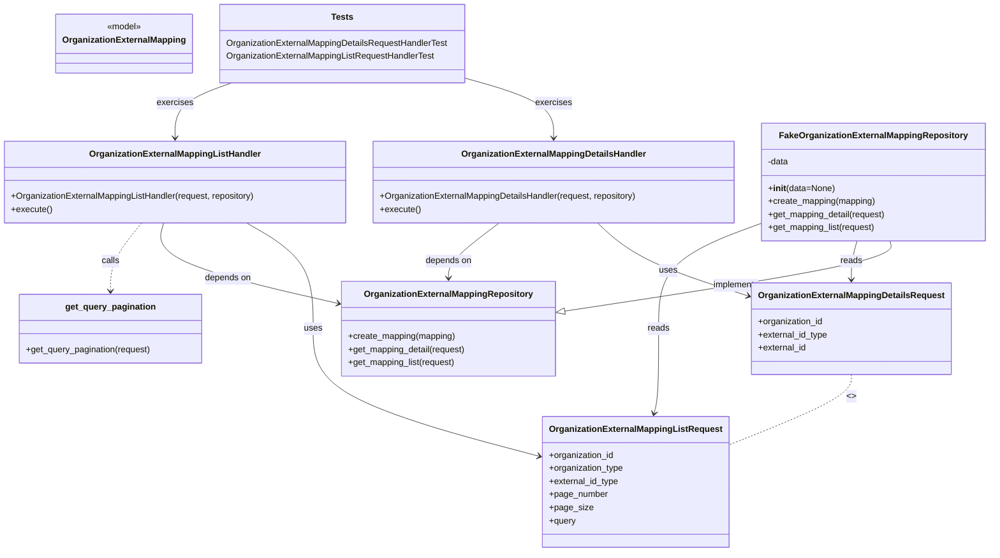

# Diagram: common/iam_service/tests/unit_tests/organization_external_mapping/test_organization_external_mapping_handler.py

> Auto-generated by Obscura crawlers

## Mermaid

### SVG

<svg id="container" width="1815.796875" xmlns="http://www.w3.org/2000/svg" class="classDiagram" height="1012" viewBox="0 0 1815.796875 1012" role="graphics-document document" aria-roledescription="class"><g><defs><marker id="container_class-aggregationStart" class="marker aggregation class" refX="18" refY="7" markerWidth="190" markerHeight="240" orient="auto"><path d="M 18,7 L9,13 L1,7 L9,1 Z"></path></marker></defs><defs><marker id="container_class-aggregationEnd" class="marker aggregation class" refX="1" refY="7" markerWidth="20" markerHeight="28" orient="auto"><path d="M 18,7 L9,13 L1,7 L9,1 Z"></path></marker></defs><defs><marker id="container_class-extensionStart" class="marker extension class" refX="18" refY="7" markerWidth="190" markerHeight="240" orient="auto"><path d="M 1,7 L18,13 V 1 Z"></path></marker></defs><defs><marker id="container_class-extensionEnd" class="marker extension class" refX="1" refY="7" markerWidth="20" markerHeight="28" orient="auto"><path d="M 1,1 V 13 L18,7 Z"></path></marker></defs><defs><marker id="container_class-compositionStart" class="marker composition class" refX="18" refY="7" markerWidth="190" markerHeight="240" orient="auto"><path d="M 18,7 L9,13 L1,7 L9,1 Z"></path></marker></defs><defs><marker id="container_class-compositionEnd" class="marker composition class" refX="1" refY="7" markerWidth="20" markerHeight="28" orient="auto"><path d="M 18,7 L9,13 L1,7 L9,1 Z"></path></marker></defs><defs><marker id="container_class-dependencyStart" class="marker dependency class" refX="6" refY="7" markerWidth="190" markerHeight="240" orient="auto"><path d="M 5,7 L9,13 L1,7 L9,1 Z"></path></marker></defs><defs><marker id="container_class-dependencyEnd" class="marker dependency class" refX="13" refY="7" markerWidth="20" markerHeight="28" orient="auto"><path d="M 18,7 L9,13 L14,7 L9,1 Z"></path></marker></defs><defs><marker id="container_class-lollipopStart" class="marker lollipop class" refX="13" refY="7" markerWidth="190" markerHeight="240" orient="auto"><circle stroke="black" fill="transparent" cx="7" cy="7" r="6"></circle></marker></defs><defs><marker id="container_class-lollipopEnd" class="marker lollipop class" refX="1" refY="7" markerWidth="190" markerHeight="240" orient="auto"><circle stroke="black" fill="transparent" cx="7" cy="7" r="6"></circle></marker></defs><g class="root"><g class="clusters"></g><g class="edgePaths"><path d="M1101.026,409L1113.836,420.667C1126.646,432.333,1152.267,455.667,1198.987,478.255C1245.708,500.843,1313.53,522.686,1347.441,533.608L1381.351,544.529" id="id_OrganizationExternalMappingDetailsHandler_OrganizationExternalMappingDetailsRequest_1" class="edge-thickness-normal edge-pattern-solid relation" style=";;;" data-edge="true" data-et="edge" data-id="id_OrganizationExternalMappingDetailsHandler_OrganizationExternalMappingDetailsRequest_1" data-points="W3sieCI6MTEwMS4wMjYyNjYxNjM3OTMsInkiOjQwOX0seyJ4IjoxMTc3Ljg4NjcxODc1LCJ5Ijo0Nzl9LHsieCI6MTM4Ny4wNjI1LCJ5Ijo1NDYuMzY4ODUwMzc5OTZ9XQ==" marker-end="url(#container_class-dependencyEnd)"></path><path d="M917.007,409L901.191,420.667C885.376,432.333,853.746,455.667,837.93,472.5C822.115,489.333,822.115,499.667,822.115,504.833L822.115,510" id="id_OrganizationExternalMappingDetailsHandler_OrganizationExternalMappingRepository_2" class="edge-thickness-normal edge-pattern-solid relation" style=";;;" data-edge="true" data-et="edge" data-id="id_OrganizationExternalMappingDetailsHandler_OrganizationExternalMappingRepository_2" data-points="W3sieCI6OTE3LjAwNjUzMjg2NjM3OTMsInkiOjQwOX0seyJ4Ijo4MjIuMTE1MjM0Mzc1LCJ5Ijo0Nzl9LHsieCI6ODIyLjExNTIzNDM3NSwieSI6NTE2fV0=" marker-end="url(#container_class-dependencyEnd)"></path><path d="M453.202,409L473.589,420.667C493.976,432.333,534.751,455.667,555.138,488C575.525,520.333,575.525,561.667,575.525,603C575.525,644.333,575.525,685.667,646.523,725.053C717.521,764.44,859.517,801.881,930.515,820.601L1001.513,839.321" id="id_OrganizationExternalMappingListHandler_OrganizationExternalMappingListRequest_3" class="edge-thickness-normal edge-pattern-solid relation" style=";;;" data-edge="true" data-et="edge" data-id="id_OrganizationExternalMappingListHandler_OrganizationExternalMappingListRequest_3" data-points="W3sieCI6NDUzLjIwMTcxMDY2ODEwMzUsInkiOjQwOX0seyJ4Ijo1NzUuNTI1MzkwNjI1LCJ5Ijo0Nzl9LHsieCI6NTc1LjUyNTM5MDYyNSwieSI6NjAzfSx7IngiOjU3NS41MjUzOTA2MjUsInkiOjcyN30seyJ4IjoxMDA3LjMxNDQ1MzEyNSwieSI6ODQwLjg1MDU0MzE5MzAzMDR9XQ==" marker-end="url(#container_class-dependencyEnd)"></path><path d="M300.657,409L297.315,420.667C293.973,432.333,287.289,455.667,340.708,480.331C394.127,504.995,507.648,530.99,564.408,543.988L621.169,556.985" id="id_OrganizationExternalMappingListHandler_OrganizationExternalMappingRepository_4" class="edge-thickness-normal edge-pattern-solid relation" style=";;;" data-edge="true" data-et="edge" data-id="id_OrganizationExternalMappingListHandler_OrganizationExternalMappingRepository_4" data-points="W3sieCI6MzAwLjY1NjkyMzQ5MTM3OTMsInkiOjQwOX0seyJ4IjoyODAuNjA1NDY4NzUsInkiOjQ3OX0seyJ4Ijo2MjcuMDE3NTc4MTI1LCJ5Ijo1NTguMzI0NzAzNDI5NzE5NH1d" marker-end="url(#container_class-dependencyEnd)"></path><path d="M1635.37,442L1637.137,448.167C1638.903,454.333,1642.436,466.667,1542.253,488.178C1442.069,509.689,1238.17,540.379,1136.22,555.723L1034.271,571.068" id="id_FakeOrganizationExternalMappingRepository_OrganizationExternalMappingRepository_5" class="edge-thickness-normal edge-pattern-solid relation" style=";;;" data-edge="true" data-et="edge" data-id="id_FakeOrganizationExternalMappingRepository_OrganizationExternalMappingRepository_5" data-points="W3sieCI6MTYzNS4zNzAxMjM5MjI0MTM4LCJ5Ijo0NDJ9LHsieCI6MTY0NS45Njg3NSwieSI6NDc5fSx7IngiOjEwMTcuMjEyODkwNjI1LCJ5Ijo1NzMuNjM1NDIzNzU0MTI4fV0=" marker-end="url(#container_class-extensionEnd)"></path><path d="M1573.497,442L1571.731,448.167C1569.964,454.333,1566.431,466.667,1564.665,478.5C1562.898,490.333,1562.898,501.667,1562.898,507.333L1562.898,513" id="id_FakeOrganizationExternalMappingRepository_OrganizationExternalMappingDetailsRequest_6" class="edge-thickness-normal edge-pattern-solid relation" style=";;;" data-edge="true" data-et="edge" data-id="id_FakeOrganizationExternalMappingRepository_OrganizationExternalMappingDetailsRequest_6" data-points="W3sieCI6MTU3My40OTcwNjM1Nzc1ODYyLCJ5Ijo0NDJ9LHsieCI6MTU2Mi44OTg0Mzc1LCJ5Ijo0Nzl9LHsieCI6MTU2Mi44OTg0Mzc1LCJ5Ijo1MTl9XQ==" marker-end="url(#container_class-dependencyEnd)"></path><path d="M1401.07,409.599L1369.955,421.166C1338.84,432.733,1276.609,455.866,1245.494,488.1C1214.379,520.333,1214.379,561.667,1214.379,603C1214.379,644.333,1214.379,685.667,1212.94,711.536C1211.501,737.406,1208.624,747.811,1207.185,753.014L1205.746,758.217" id="id_FakeOrganizationExternalMappingRepository_OrganizationExternalMappingListRequest_7" class="edge-thickness-normal edge-pattern-solid relation" style=";;;" data-edge="true" data-et="edge" data-id="id_FakeOrganizationExternalMappingRepository_OrganizationExternalMappingListRequest_7" data-points="W3sieCI6MTQwMS4wNzAzMTI1LCJ5Ijo0MDkuNTk4ODI0MjgzNDUzODR9LHsieCI6MTIxNC4zNzg5MDYyNSwieSI6NDc5fSx7IngiOjEyMTQuMzc4OTA2MjUsInkiOjYwM30seyJ4IjoxMjE0LjM3ODkwNjI1LCJ5Ijo3Mjd9LHsieCI6MTIwNC4xNDcxMDYzODkzMzEyLCJ5Ijo3NjR9XQ==" marker-end="url(#container_class-dependencyEnd)"></path><path d="M259.593,409L249.863,420.667C240.133,432.333,220.674,455.667,210.945,476.5C201.215,497.333,201.215,515.667,201.215,524.833L201.215,534" id="id_OrganizationExternalMappingListHandler_get_query_pagination_8" class="edge-thickness-normal edge-pattern-dashed relation" style=";;;" data-edge="true" data-et="edge" data-id="id_OrganizationExternalMappingListHandler_get_query_pagination_8" data-points="W3sieCI6MjU5LjU5MjgwNzExMjA2ODk1LCJ5Ijo0MDl9LHsieCI6MjAxLjIxNDg0Mzc1LCJ5Ijo0Nzl9LHsieCI6MjAxLjIxNDg0Mzc1LCJ5Ijo1NDB9XQ==" marker-end="url(#container_class-dependencyEnd)"></path><path d="M855.572,143.392L882.756,150.993C909.94,158.594,964.308,173.797,991.492,192.065C1018.676,210.333,1018.676,231.667,1018.676,242.333L1018.676,253" id="id_Tests_OrganizationExternalMappingDetailsHandler_9" class="edge-thickness-normal edge-pattern-solid relation" style=";;;" data-edge="true" data-et="edge" data-id="id_Tests_OrganizationExternalMappingDetailsHandler_9" data-points="W3sieCI6ODU1LjU3MjI2NTYyNSwieSI6MTQzLjM5MTU4OTI5NTQ2Njk2fSx7IngiOjEwMTguNjc1NzgxMjUsInkiOjE4OX0seyJ4IjoxMDE4LjY3NTc4MTI1LCJ5IjoyNTl9XQ==" marker-end="url(#container_class-dependencyEnd)"></path><path d="M426.261,152L408.907,158.167C391.554,164.333,356.847,176.667,339.494,193.5C322.141,210.333,322.141,231.667,322.141,242.333L322.141,253" id="id_Tests_OrganizationExternalMappingListHandler_10" class="edge-thickness-normal edge-pattern-solid relation" style=";;;" data-edge="true" data-et="edge" data-id="id_Tests_OrganizationExternalMappingListHandler_10" data-points="W3sieCI6NDI2LjI2MDgwNDkwMjUyMywieSI6MTUyfSx7IngiOjMyMi4xNDA2MjUsInkiOjE4OX0seyJ4IjozMjIuMTQwNjI1LCJ5IjoyNTl9XQ==" marker-end="url(#container_class-dependencyEnd)"></path><path d="M1562.898,687L1562.898,693.667C1562.898,700.333,1562.898,713.667,1524.851,735.574C1486.803,757.482,1410.707,787.964,1372.659,803.205L1334.611,818.446" id="id_OrganizationExternalMappingDetailsRequest_OrganizationExternalMappingListRequest_11" class="edge-thickness-normal edge-pattern-dashed relation" style=";;;" data-edge="true" data-et="edge" data-id="id_OrganizationExternalMappingDetailsRequest_OrganizationExternalMappingListRequest_11" data-points="W3sieCI6MTU2Mi44OTg0Mzc1LCJ5Ijo2ODd9LHsieCI6MTU2Mi44OTg0Mzc1LCJ5Ijo3Mjd9LHsieCI6MTMzNC42MTEzMjgxMjUsInkiOjgxOC40NDYzNTI0ODc0MDQ3fV0="></path></g><g class="edgeLabels"><g class="edgeLabel" transform="translate(1232.99774, 496.7495)"><g class="label" data-id="id_OrganizationExternalMappingDetailsHandler_OrganizationExternalMappingDetailsRequest_1" transform="translate(-16.4921875, -12)"><foreignObject width="32.984375" height="24">

uses

</foreignObject></g></g><g class="edgeLabel" transform="translate(822.115234375, 479)"><g class="label" data-id="id_OrganizationExternalMappingDetailsHandler_OrganizationExternalMappingRepository_2" transform="translate(-42.9453125, -12)"><foreignObject width="85.890625" height="24">

depends on

</foreignObject></g></g><g class="edgeLabel" transform="translate(575.525390625, 603)"><g class="label" data-id="id_OrganizationExternalMappingListHandler_OrganizationExternalMappingListRequest_3" transform="translate(-16.4921875, -12)"><foreignObject width="32.984375" height="24">

uses

</foreignObject></g></g><g class="edgeLabel" transform="translate(418.32246, 510.53573)"><g class="label" data-id="id_OrganizationExternalMappingListHandler_OrganizationExternalMappingRepository_4" transform="translate(-42.9453125, -12)"><foreignObject width="85.890625" height="24">

depends on

</foreignObject></g></g><g class="edgeLabel" transform="translate(1350.62051, 523.45351)"><g class="label" data-id="id_FakeOrganizationExternalMappingRepository_OrganizationExternalMappingRepository_5" transform="translate(-43.0625, -12)"><foreignObject width="86.125" height="24">

implements

</foreignObject></g></g><g class="edgeLabel" transform="translate(1562.8984375, 479)"><g class="label" data-id="id_FakeOrganizationExternalMappingRepository_OrganizationExternalMappingDetailsRequest_6" transform="translate(-20.0078125, -12)"><foreignObject width="40.015625" height="24">

reads

</foreignObject></g></g><g class="edgeLabel" transform="translate(1214.37890625, 603)"><g class="label" data-id="id_FakeOrganizationExternalMappingRepository_OrganizationExternalMappingListRequest_7" transform="translate(-20.0078125, -12)"><foreignObject width="40.015625" height="24">

reads

</foreignObject></g></g><g class="edgeLabel" transform="translate(201.21484375, 479)"><g class="label" data-id="id_OrganizationExternalMappingListHandler_get_query_pagination_8" transform="translate(-16.4453125, -12)"><foreignObject width="32.890625" height="24">

calls

</foreignObject></g></g><g class="edgeLabel" transform="translate(1018.67578125, 189)"><g class="label" data-id="id_Tests_OrganizationExternalMappingDetailsHandler_9" transform="translate(-33.21875, -12)"><foreignObject width="66.4375" height="24">

exercises

</foreignObject></g></g><g class="edgeLabel" transform="translate(322.140625, 189)"><g class="label" data-id="id_Tests_OrganizationExternalMappingListHandler_10" transform="translate(-33.21875, -12)"><foreignObject width="66.4375" height="24">

exercises

</foreignObject></g></g><g class="edgeLabel" transform="translate(1562.8984375, 727)"><g class="label" data-id="id_OrganizationExternalMappingDetailsRequest_OrganizationExternalMappingListRequest_11" transform="translate(-8.0078125, -12)"><foreignObject width="16.015625" height="24">

&lt;&gt;

</foreignObject></g></g></g><g class="nodes"><g class="node default" id="classId-OrganizationExternalMappingDetailsHandler-0" transform="translate(1018.67578125, 334)"><g class="basic label-container"><path d="M-332.39453125 -75 L332.39453125 -75 L332.39453125 75 L-332.39453125 75" stroke="none" stroke-width="0" fill="#ECECFF" style=""></path><path d="M-332.39453125 -75 C-114.14862872847718 -75, 104.09727379304564 -75, 332.39453125 -75 M-332.39453125 -75 C-137.8635477012696 -75, 56.66743584746081 -75, 332.39453125 -75 M332.39453125 -75 C332.39453125 -44.23457491677325, 332.39453125 -13.469149833546496, 332.39453125 75 M332.39453125 -75 C332.39453125 -22.714171108559945, 332.39453125 29.57165778288011, 332.39453125 75 M332.39453125 75 C125.67518854720001 75, -81.04415415559998 75, -332.39453125 75 M332.39453125 75 C117.52902873524118 75, -97.33647377951763 75, -332.39453125 75 M-332.39453125 75 C-332.39453125 25.193890419737784, -332.39453125 -24.612219160524432, -332.39453125 -75 M-332.39453125 75 C-332.39453125 36.461602597642454, -332.39453125 -2.0767948047150924, -332.39453125 -75" stroke="#9370DB" stroke-width="1.3" fill="none" stroke-dasharray="0 0" style=""></path></g><g class="annotation-group text" transform="translate(0, -51)"></g><g class="label-group text" transform="translate(-162.9453125, -51)"><g class="label" style="font-weight: bolder" transform="translate(0,-12)"><foreignObject width="325.890625" height="24">

OrganizationExternalMappingDetailsHandler

</foreignObject></g></g><g class="members-group text" transform="translate(-320.39453125, -3)"></g><g class="methods-group text" transform="translate(-320.39453125, 27)"><g class="label" style="" transform="translate(0,-12)"><foreignObject width="477.84375" height="24">

+OrganizationExternalMappingDetailsHandler(request, repository)

</foreignObject></g><g class="label" style="" transform="translate(0,12)"><foreignObject width="74.328125" height="24">

+execute()

</foreignObject></g></g><g class="divider" style=""><path d="M-332.39453125 -27 C-167.29541432592296 -27, -2.196297401845925 -27, 332.39453125 -27 M-332.39453125 -27 C-184.24935667299553 -27, -36.104182095991064 -27, 332.39453125 -27" stroke="#9370DB" stroke-width="1.3" fill="none" stroke-dasharray="0 0" style=""></path></g><g class="divider" style=""><path d="M-332.39453125 -3 C-109.1244915090696 -3, 114.1455482318608 -3, 332.39453125 -3 M-332.39453125 -3 C-77.94282462742879 -3, 176.50888199514242 -3, 332.39453125 -3" stroke="#9370DB" stroke-width="1.3" fill="none" stroke-dasharray="0 0" style=""></path></g></g><g class="node default" id="classId-OrganizationExternalMappingListHandler-1" transform="translate(322.140625, 334)"><g class="basic label-container"><path d="M-314.140625 -75 L314.140625 -75 L314.140625 75 L-314.140625 75" stroke="none" stroke-width="0" fill="#ECECFF" style=""></path><path d="M-314.140625 -75 C-63.78781437530699 -75, 186.564996249386 -75, 314.140625 -75 M-314.140625 -75 C-81.05576881243275 -75, 152.0290873751345 -75, 314.140625 -75 M314.140625 -75 C314.140625 -20.867465095915534, 314.140625 33.26506980816893, 314.140625 75 M314.140625 -75 C314.140625 -22.453153670662196, 314.140625 30.093692658675607, 314.140625 75 M314.140625 75 C169.86923569767333 75, 25.597846395346664 75, -314.140625 75 M314.140625 75 C173.99700167225532 75, 33.853378344510645 75, -314.140625 75 M-314.140625 75 C-314.140625 41.15583953312149, -314.140625 7.311679066242974, -314.140625 -75 M-314.140625 75 C-314.140625 21.64297848132933, -314.140625 -31.71404303734134, -314.140625 -75" stroke="#9370DB" stroke-width="1.3" fill="none" stroke-dasharray="0 0" style=""></path></g><g class="annotation-group text" transform="translate(0, -51)"></g><g class="label-group text" transform="translate(-150.765625, -51)"><g class="label" style="font-weight: bolder" transform="translate(0,-12)"><foreignObject width="301.53125" height="24">

OrganizationExternalMappingListHandler

</foreignObject></g></g><g class="members-group text" transform="translate(-302.140625, -3)"></g><g class="methods-group text" transform="translate(-302.140625, 27)"><g class="label" style="" transform="translate(0,-12)"><foreignObject width="453.515625" height="24">

+OrganizationExternalMappingListHandler(request, repository)

</foreignObject></g><g class="label" style="" transform="translate(0,12)"><foreignObject width="74.328125" height="24">

+execute()

</foreignObject></g></g><g class="divider" style=""><path d="M-314.140625 -27 C-186.0986010171446 -27, -58.056577034289205 -27, 314.140625 -27 M-314.140625 -27 C-140.82273463482937 -27, 32.49515573034125 -27, 314.140625 -27" stroke="#9370DB" stroke-width="1.3" fill="none" stroke-dasharray="0 0" style=""></path></g><g class="divider" style=""><path d="M-314.140625 -3 C-66.36424782833245 -3, 181.4121293433351 -3, 314.140625 -3 M-314.140625 -3 C-184.62728655114523 -3, -55.113948102290465 -3, 314.140625 -3" stroke="#9370DB" stroke-width="1.3" fill="none" stroke-dasharray="0 0" style=""></path></g></g><g class="node default" id="classId-OrganizationExternalMappingRepository-2" transform="translate(822.115234375, 603)"><g class="basic label-container"><path d="M-195.09765625 -87 L195.09765625 -87 L195.09765625 87 L-195.09765625 87" stroke="none" stroke-width="0" fill="#ECECFF" style=""></path><path d="M-195.09765625 -87 C-61.1483584243164 -87, 72.8009394013672 -87, 195.09765625 -87 M-195.09765625 -87 C-44.401772138505436 -87, 106.29411197298913 -87, 195.09765625 -87 M195.09765625 -87 C195.09765625 -36.11132853713883, 195.09765625 14.777342925722337, 195.09765625 87 M195.09765625 -87 C195.09765625 -19.16224323866882, 195.09765625 48.67551352266236, 195.09765625 87 M195.09765625 87 C78.49797887271146 87, -38.10169850457709 87, -195.09765625 87 M195.09765625 87 C96.99388392505332 87, -1.1098883998933502 87, -195.09765625 87 M-195.09765625 87 C-195.09765625 45.61124823427862, -195.09765625 4.222496468557239, -195.09765625 -87 M-195.09765625 87 C-195.09765625 42.116321410098216, -195.09765625 -2.767357179803568, -195.09765625 -87" stroke="#9370DB" stroke-width="1.3" fill="none" stroke-dasharray="0 0" style=""></path></g><g class="annotation-group text" transform="translate(0, -63)"></g><g class="label-group text" transform="translate(-148.1328125, -63)"><g class="label" style="font-weight: bolder" transform="translate(0,-12)"><foreignObject width="296.265625" height="24">

OrganizationExternalMappingRepository

</foreignObject></g></g><g class="members-group text" transform="translate(-183.09765625, -15)"></g><g class="methods-group text" transform="translate(-183.09765625, 15)"><g class="label" style="" transform="translate(0,-12)"><foreignObject width="198.484375" height="24">

+create_mapping(mapping)

</foreignObject></g><g class="label" style="" transform="translate(0,12)"><foreignObject width="218.0625" height="24">

+get_mapping_detail(request)

</foreignObject></g><g class="label" style="" transform="translate(0,36)"><foreignObject width="198.8125" height="24">

+get_mapping_list(request)

</foreignObject></g></g><g class="divider" style=""><path d="M-195.09765625 -39 C-46.32477672886992 -39, 102.44810279226016 -39, 195.09765625 -39 M-195.09765625 -39 C-112.54146625864534 -39, -29.985276267290686 -39, 195.09765625 -39" stroke="#9370DB" stroke-width="1.3" fill="none" stroke-dasharray="0 0" style=""></path></g><g class="divider" style=""><path d="M-195.09765625 -15 C-85.46359374851232 -15, 24.170468752975353 -15, 195.09765625 -15 M-195.09765625 -15 C-102.67163302299801 -15, -10.245609795996018 -15, 195.09765625 -15" stroke="#9370DB" stroke-width="1.3" fill="none" stroke-dasharray="0 0" style=""></path></g></g><g class="node default" id="classId-FakeOrganizationExternalMappingRepository-3" transform="translate(1604.43359375, 334)"><g class="basic label-container"><path d="M-203.36328125 -108 L203.36328125 -108 L203.36328125 108 L-203.36328125 108" stroke="none" stroke-width="0" fill="#ECECFF" style=""></path><path d="M-203.36328125 -108 C-85.18266866067317 -108, 32.997943928653655 -108, 203.36328125 -108 M-203.36328125 -108 C-117.2242972308493 -108, -31.085313211698605 -108, 203.36328125 -108 M203.36328125 -108 C203.36328125 -35.50567204018569, 203.36328125 36.98865591962863, 203.36328125 108 M203.36328125 -108 C203.36328125 -38.23100205993549, 203.36328125 31.537995880129017, 203.36328125 108 M203.36328125 108 C52.18094770063186 108, -99.00138584873628 108, -203.36328125 108 M203.36328125 108 C119.70650148615195 108, 36.0497217223039 108, -203.36328125 108 M-203.36328125 108 C-203.36328125 26.28444142077643, -203.36328125 -55.43111715844714, -203.36328125 -108 M-203.36328125 108 C-203.36328125 42.51012158946571, -203.36328125 -22.979756821068577, -203.36328125 -108" stroke="#9370DB" stroke-width="1.3" fill="none" stroke-dasharray="0 0" style=""></path></g><g class="annotation-group text" transform="translate(0, -84)"></g><g class="label-group text" transform="translate(-164.6640625, -84)"><g class="label" style="font-weight: bolder" transform="translate(0,-12)"><foreignObject width="329.328125" height="24">

FakeOrganizationExternalMappingRepository

</foreignObject></g></g><g class="members-group text" transform="translate(-191.36328125, -36)"><g class="label" style="" transform="translate(0,-12)"><foreignObject width="39.09375" height="24">

-data

</foreignObject></g></g><g class="methods-group text" transform="translate(-191.36328125, 12)"><g class="label" style="" transform="translate(0,-12)"><foreignObject width="121.8125" height="24">

+<strong>init</strong>(data=None)

</foreignObject></g><g class="label" style="" transform="translate(0,12)"><foreignObject width="198.484375" height="24">

+create_mapping(mapping)

</foreignObject></g><g class="label" style="" transform="translate(0,36)"><foreignObject width="218.0625" height="24">

+get_mapping_detail(request)

</foreignObject></g><g class="label" style="" transform="translate(0,60)"><foreignObject width="198.8125" height="24">

+get_mapping_list(request)

</foreignObject></g></g><g class="divider" style=""><path d="M-203.36328125 -60 C-118.20917147644167 -60, -33.055061702883336 -60, 203.36328125 -60 M-203.36328125 -60 C-48.58198012002242 -60, 106.19932100995516 -60, 203.36328125 -60" stroke="#9370DB" stroke-width="1.3" fill="none" stroke-dasharray="0 0" style=""></path></g><g class="divider" style=""><path d="M-203.36328125 -12 C-85.32613279914547 -12, 32.71101565170906 -12, 203.36328125 -12 M-203.36328125 -12 C-65.09330361742482 -12, 73.17667401515035 -12, 203.36328125 -12" stroke="#9370DB" stroke-width="1.3" fill="none" stroke-dasharray="0 0" style=""></path></g></g><g class="node default" id="classId-OrganizationExternalMappingDetailsRequest-4" transform="translate(1562.8984375, 603)"><g class="basic label-container"><path d="M-175.8359375 -84 L175.8359375 -84 L175.8359375 84 L-175.8359375 84" stroke="none" stroke-width="0" fill="#ECECFF" style=""></path><path d="M-175.8359375 -84 C-51.96684231508627 -84, 71.90225286982746 -84, 175.8359375 -84 M-175.8359375 -84 C-82.88803692732692 -84, 10.059863645346155 -84, 175.8359375 -84 M175.8359375 -84 C175.8359375 -34.15962624548206, 175.8359375 15.680747509035882, 175.8359375 84 M175.8359375 -84 C175.8359375 -28.293841734148202, 175.8359375 27.412316531703596, 175.8359375 84 M175.8359375 84 C79.56712696294757 84, -16.701683574104862 84, -175.8359375 84 M175.8359375 84 C94.80523317237125 84, 13.774528844742491 84, -175.8359375 84 M-175.8359375 84 C-175.8359375 23.78699090078534, -175.8359375 -36.42601819842932, -175.8359375 -84 M-175.8359375 84 C-175.8359375 26.195505194184804, -175.8359375 -31.608989611630392, -175.8359375 -84" stroke="#9370DB" stroke-width="1.3" fill="none" stroke-dasharray="0 0" style=""></path></g><g class="annotation-group text" transform="translate(0, -60)"></g><g class="label-group text" transform="translate(-163.8359375, -60)"><g class="label" style="font-weight: bolder" transform="translate(0,-12)"><foreignObject width="327.671875" height="24">

OrganizationExternalMappingDetailsRequest

</foreignObject></g></g><g class="members-group text" transform="translate(-163.8359375, -12)"><g class="label" style="" transform="translate(0,-12)"><foreignObject width="120.75" height="24">

+organization_id

</foreignObject></g><g class="label" style="" transform="translate(0,12)"><foreignObject width="129.5625" height="24">

+external_id_type

</foreignObject></g><g class="label" style="" transform="translate(0,36)"><foreignObject width="89.765625" height="24">

+external_id

</foreignObject></g></g><g class="methods-group text" transform="translate(-163.8359375, 84)"></g><g class="divider" style=""><path d="M-175.8359375 -36 C-93.00326613646388 -36, -10.170594772927757 -36, 175.8359375 -36 M-175.8359375 -36 C-47.30357647461929 -36, 81.22878455076142 -36, 175.8359375 -36" stroke="#9370DB" stroke-width="1.3" fill="none" stroke-dasharray="0 0" style=""></path></g><g class="divider" style=""><path d="M-175.8359375 60 C-57.212785233689885 60, 61.41036703262023 60, 175.8359375 60 M-175.8359375 60 C-70.83165079588143 60, 34.17263590823714 60, 175.8359375 60" stroke="#9370DB" stroke-width="1.3" fill="none" stroke-dasharray="0 0" style=""></path></g></g><g class="node default" id="classId-OrganizationExternalMappingListRequest-5" transform="translate(1170.962890625, 884)"><g class="basic label-container"><path d="M-163.6484375 -120 L163.6484375 -120 L163.6484375 120 L-163.6484375 120" stroke="none" stroke-width="0" fill="#ECECFF" style=""></path><path d="M-163.6484375 -120 C-95.81250864853887 -120, -27.976579797077733 -120, 163.6484375 -120 M-163.6484375 -120 C-43.617153268919225 -120, 76.41413096216155 -120, 163.6484375 -120 M163.6484375 -120 C163.6484375 -54.379440065630675, 163.6484375 11.24111986873865, 163.6484375 120 M163.6484375 -120 C163.6484375 -56.02718698757705, 163.6484375 7.945626024845893, 163.6484375 120 M163.6484375 120 C73.70603030097763 120, -16.23637689804474 120, -163.6484375 120 M163.6484375 120 C90.66816604553769 120, 17.687894591075377 120, -163.6484375 120 M-163.6484375 120 C-163.6484375 70.28731440456345, -163.6484375 20.574628809126892, -163.6484375 -120 M-163.6484375 120 C-163.6484375 49.13558035853609, -163.6484375 -21.728839282927822, -163.6484375 -120" stroke="#9370DB" stroke-width="1.3" fill="none" stroke-dasharray="0 0" style=""></path></g><g class="annotation-group text" transform="translate(0, -96)"></g><g class="label-group text" transform="translate(-151.6484375, -96)"><g class="label" style="font-weight: bolder" transform="translate(0,-12)"><foreignObject width="303.296875" height="24">

OrganizationExternalMappingListRequest

</foreignObject></g></g><g class="members-group text" transform="translate(-151.6484375, -48)"><g class="label" style="" transform="translate(0,-12)"><foreignObject width="120.75" height="24">

+organization_id

</foreignObject></g><g class="label" style="" transform="translate(0,12)"><foreignObject width="138.140625" height="24">

+organization_type

</foreignObject></g><g class="label" style="" transform="translate(0,36)"><foreignObject width="129.5625" height="24">

+external_id_type

</foreignObject></g><g class="label" style="" transform="translate(0,60)"><foreignObject width="107.46875" height="24">

+page_number

</foreignObject></g><g class="label" style="" transform="translate(0,84)"><foreignObject width="78.25" height="24">

+page_size

</foreignObject></g><g class="label" style="" transform="translate(0,108)"><foreignObject width="49.640625" height="24">

+query

</foreignObject></g></g><g class="methods-group text" transform="translate(-151.6484375, 120)"></g><g class="divider" style=""><path d="M-163.6484375 -72 C-71.8076684895261 -72, 20.033100520947812 -72, 163.6484375 -72 M-163.6484375 -72 C-87.21820839980826 -72, -10.787979299616524 -72, 163.6484375 -72" stroke="#9370DB" stroke-width="1.3" fill="none" stroke-dasharray="0 0" style=""></path></g><g class="divider" style=""><path d="M-163.6484375 96 C-81.59935327313306 96, 0.4497309537338765 96, 163.6484375 96 M-163.6484375 96 C-50.58748216789007 96, 62.473473164219854 96, 163.6484375 96" stroke="#9370DB" stroke-width="1.3" fill="none" stroke-dasharray="0 0" style=""></path></g></g><g class="node default" id="classId-OrganizationExternalMapping-6" transform="translate(231.806640625, 80)"><g class="basic label-container"><path d="M-120.3671875 -54 L120.3671875 -54 L120.3671875 54 L-120.3671875 54" stroke="none" stroke-width="0" fill="#ECECFF" style=""></path><path d="M-120.3671875 -54 C-46.85071804745101 -54, 26.66575140509798 -54, 120.3671875 -54 M-120.3671875 -54 C-68.79054544981454 -54, -17.213903399629075 -54, 120.3671875 -54 M120.3671875 -54 C120.3671875 -13.629243143431601, 120.3671875 26.741513713136797, 120.3671875 54 M120.3671875 -54 C120.3671875 -21.76286757154663, 120.3671875 10.474264856906743, 120.3671875 54 M120.3671875 54 C31.85345674778354 54, -56.66027400443292 54, -120.3671875 54 M120.3671875 54 C64.81595617687603 54, 9.264724853752057 54, -120.3671875 54 M-120.3671875 54 C-120.3671875 21.120974498433327, -120.3671875 -11.758051003133346, -120.3671875 -54 M-120.3671875 54 C-120.3671875 12.736628503188847, -120.3671875 -28.526742993622307, -120.3671875 -54" stroke="#9370DB" stroke-width="1.3" fill="none" stroke-dasharray="0 0" style=""></path></g><g class="annotation-group text" transform="translate(-32.1484375, -30)"><g class="label" style="" transform="translate(0,-12)"><foreignObject width="64.296875" height="24">

«model»

</foreignObject></g></g><g class="label-group text" transform="translate(-108.3671875, -6)"><g class="label" style="font-weight: bolder" transform="translate(0,-12)"><foreignObject width="216.734375" height="24">

OrganizationExternalMapping

</foreignObject></g></g><g class="members-group text" transform="translate(-108.3671875, 42)"></g><g class="methods-group text" transform="translate(-108.3671875, 72)"></g><g class="divider" style=""><path d="M-120.3671875 18 C-68.38564092133566 18, -16.40409434267133 18, 120.3671875 18 M-120.3671875 18 C-64.57661786551274 18, -8.78604823102549 18, 120.3671875 18" stroke="#9370DB" stroke-width="1.3" fill="none" stroke-dasharray="0 0" style=""></path></g><g class="divider" style=""><path d="M-120.3671875 36 C-51.82296068059922 36, 16.721266138801553 36, 120.3671875 36 M-120.3671875 36 C-50.02606327666395 36, 20.315060946672105 36, 120.3671875 36" stroke="#9370DB" stroke-width="1.3" fill="none" stroke-dasharray="0 0" style=""></path></g></g><g class="node default" id="classId-get_query_pagination-7" transform="translate(201.21484375, 603)"><g class="basic label-container"><path d="M-167.79296875 -63 L167.79296875 -63 L167.79296875 63 L-167.79296875 63" stroke="none" stroke-width="0" fill="#ECECFF" style=""></path><path d="M-167.79296875 -63 C-74.09937705241605 -63, 19.59421464516791 -63, 167.79296875 -63 M-167.79296875 -63 C-42.30163940755172 -63, 83.18968993489656 -63, 167.79296875 -63 M167.79296875 -63 C167.79296875 -25.777917660684146, 167.79296875 11.444164678631708, 167.79296875 63 M167.79296875 -63 C167.79296875 -15.220069320955204, 167.79296875 32.55986135808959, 167.79296875 63 M167.79296875 63 C48.33843676426292 63, -71.11609522147415 63, -167.79296875 63 M167.79296875 63 C78.59327948796769 63, -10.606409774064616 63, -167.79296875 63 M-167.79296875 63 C-167.79296875 20.26741758533114, -167.79296875 -22.465164829337724, -167.79296875 -63 M-167.79296875 63 C-167.79296875 20.31966227198013, -167.79296875 -22.360675456039743, -167.79296875 -63" stroke="#9370DB" stroke-width="1.3" fill="none" stroke-dasharray="0 0" style=""></path></g><g class="annotation-group text" transform="translate(0, -39)"></g><g class="label-group text" transform="translate(-80.1015625, -39)"><g class="label" style="font-weight: bolder" transform="translate(0,-12)"><foreignObject width="160.203125" height="24">

get_query_pagination

</foreignObject></g></g><g class="members-group text" transform="translate(-155.79296875, 9)"></g><g class="methods-group text" transform="translate(-155.79296875, 39)"><g class="label" style="" transform="translate(0,-12)"><foreignObject width="231.484375" height="24">

+get_query_pagination(request)

</foreignObject></g></g><g class="divider" style=""><path d="M-167.79296875 -15 C-51.21710723699299 -15, 65.35875427601403 -15, 167.79296875 -15 M-167.79296875 -15 C-57.21001436454729 -15, 53.37294002090542 -15, 167.79296875 -15" stroke="#9370DB" stroke-width="1.3" fill="none" stroke-dasharray="0 0" style=""></path></g><g class="divider" style=""><path d="M-167.79296875 9 C-86.62262097128465 9, -5.452273192569294 9, 167.79296875 9 M-167.79296875 9 C-98.95590164625662 9, -30.11883454251324 9, 167.79296875 9" stroke="#9370DB" stroke-width="1.3" fill="none" stroke-dasharray="0 0" style=""></path></g></g><g class="node default" id="classId-Tests-8" transform="translate(628.873046875, 80)"><g class="basic label-container"><path d="M-226.69921875 -72 L226.69921875 -72 L226.69921875 72 L-226.69921875 72" stroke="none" stroke-width="0" fill="#ECECFF" style=""></path><path d="M-226.69921875 -72 C-111.59449747195202 -72, 3.5102238060959507 -72, 226.69921875 -72 M-226.69921875 -72 C-70.58100570829345 -72, 85.53720733341311 -72, 226.69921875 -72 M226.69921875 -72 C226.69921875 -33.665768710133705, 226.69921875 4.668462579732591, 226.69921875 72 M226.69921875 -72 C226.69921875 -14.88877822489276, 226.69921875 42.22244355021448, 226.69921875 72 M226.69921875 72 C65.12258091036594 72, -96.45405692926812 72, -226.69921875 72 M226.69921875 72 C75.42909377435569 72, -75.84103120128862 72, -226.69921875 72 M-226.69921875 72 C-226.69921875 25.625607365913027, -226.69921875 -20.748785268173947, -226.69921875 -72 M-226.69921875 72 C-226.69921875 26.041615219353844, -226.69921875 -19.916769561292313, -226.69921875 -72" stroke="#9370DB" stroke-width="1.3" fill="none" stroke-dasharray="0 0" style=""></path></g><g class="annotation-group text" transform="translate(0, -48)"></g><g class="label-group text" transform="translate(-19.1171875, -48)"><g class="label" style="font-weight: bolder" transform="translate(0,-12)"><foreignObject width="38.234375" height="24">

Tests

</foreignObject></g></g><g class="members-group text" transform="translate(-214.69921875, 0)"><g class="label" style="" transform="translate(0,-12)"><foreignObject width="410.28125" height="24">

OrganizationExternalMappingDetailsRequestHandlerTest

</foreignObject></g><g class="label" style="" transform="translate(0,12)"><foreignObject width="385.9375" height="24">

OrganizationExternalMappingListRequestHandlerTest

</foreignObject></g></g><g class="methods-group text" transform="translate(-214.69921875, 72)"></g><g class="divider" style=""><path d="M-226.69921875 -24 C-84.16099413344693 -24, 58.37723048310613 -24, 226.69921875 -24 M-226.69921875 -24 C-112.62734197148988 -24, 1.4445348070202328 -24, 226.69921875 -24" stroke="#9370DB" stroke-width="1.3" fill="none" stroke-dasharray="0 0" style=""></path></g><g class="divider" style=""><path d="M-226.69921875 48 C-64.94452434766927 48, 96.81017005466146 48, 226.69921875 48 M-226.69921875 48 C-52.37460393209804 48, 121.95001088580392 48, 226.69921875 48" stroke="#9370DB" stroke-width="1.3" fill="none" stroke-dasharray="0 0" style=""></path></g></g></g></g></g></svg>
