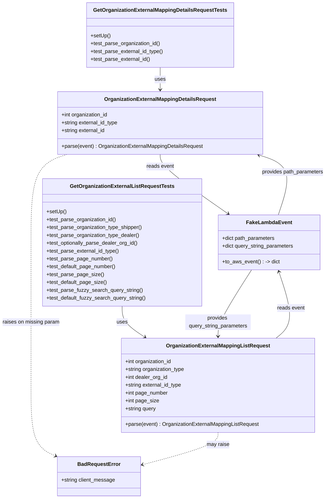

# Diagram: common/iam_service/tests/unit_tests/organization_external_mapping/test_organization_external_mapping_request.py

> Auto-generated by Obscura crawlers

## Mermaid

### SVG

<svg id="container" width="993.1836547851562" xmlns="http://www.w3.org/2000/svg" class="classDiagram" height="1524" viewBox="0 0 993.1836547851562 1524" role="graphics-document document" aria-roledescription="class"><g><defs><marker id="container_class-aggregationStart" class="marker aggregation class" refX="18" refY="7" markerWidth="190" markerHeight="240" orient="auto"><path d="M 18,7 L9,13 L1,7 L9,1 Z"></path></marker></defs><defs><marker id="container_class-aggregationEnd" class="marker aggregation class" refX="1" refY="7" markerWidth="20" markerHeight="28" orient="auto"><path d="M 18,7 L9,13 L1,7 L9,1 Z"></path></marker></defs><defs><marker id="container_class-extensionStart" class="marker extension class" refX="18" refY="7" markerWidth="190" markerHeight="240" orient="auto"><path d="M 1,7 L18,13 V 1 Z"></path></marker></defs><defs><marker id="container_class-extensionEnd" class="marker extension class" refX="1" refY="7" markerWidth="20" markerHeight="28" orient="auto"><path d="M 1,1 V 13 L18,7 Z"></path></marker></defs><defs><marker id="container_class-compositionStart" class="marker composition class" refX="18" refY="7" markerWidth="190" markerHeight="240" orient="auto"><path d="M 18,7 L9,13 L1,7 L9,1 Z"></path></marker></defs><defs><marker id="container_class-compositionEnd" class="marker composition class" refX="1" refY="7" markerWidth="20" markerHeight="28" orient="auto"><path d="M 18,7 L9,13 L1,7 L9,1 Z"></path></marker></defs><defs><marker id="container_class-dependencyStart" class="marker dependency class" refX="6" refY="7" markerWidth="190" markerHeight="240" orient="auto"><path d="M 5,7 L9,13 L1,7 L9,1 Z"></path></marker></defs><defs><marker id="container_class-dependencyEnd" class="marker dependency class" refX="13" refY="7" markerWidth="20" markerHeight="28" orient="auto"><path d="M 18,7 L9,13 L14,7 L9,1 Z"></path></marker></defs><defs><marker id="container_class-lollipopStart" class="marker lollipop class" refX="13" refY="7" markerWidth="190" markerHeight="240" orient="auto"><circle stroke="black" fill="transparent" cx="7" cy="7" r="6"></circle></marker></defs><defs><marker id="container_class-lollipopEnd" class="marker lollipop class" refX="1" refY="7" markerWidth="190" markerHeight="240" orient="auto"><circle stroke="black" fill="transparent" cx="7" cy="7" r="6"></circle></marker></defs><g class="root"><g class="clusters"></g><g class="edgePaths"><path d="M487.365,206L487.365,212.167C487.365,218.333,487.365,230.667,487.365,242C487.365,253.333,487.365,263.667,487.365,268.833L487.365,274" id="id_GetOrganizationExternalMappingDetailsRequestTests_OrganizationExternalMappingDetailsRequest_1" class="edge-thickness-normal edge-pattern-solid relation" style=";;;" data-edge="true" data-et="edge" data-id="id_GetOrganizationExternalMappingDetailsRequestTests_OrganizationExternalMappingDetailsRequest_1" data-points="W3sieCI6NDg3LjM2NTIzNDM3NSwieSI6MjA2fSx7IngiOjQ4Ny4zNjUyMzQzNzUsInkiOjI0M30seyJ4Ijo0ODcuMzY1MjM0Mzc1LCJ5IjoyODB9XQ==" marker-end="url(#container_class-dependencyEnd)"></path><path d="M370.828,936L370.828,944.167C370.828,952.333,370.828,968.667,382.318,984.448C393.809,1000.229,416.789,1015.457,428.279,1023.071L439.769,1030.686" id="id_GetOrganizationExternalListRequestTests_OrganizationExternalMappingListRequest_2" class="edge-thickness-normal edge-pattern-solid relation" style=";;;" data-edge="true" data-et="edge" data-id="id_GetOrganizationExternalListRequestTests_OrganizationExternalMappingListRequest_2" data-points="W3sieCI6MzcwLjgyODEyNSwieSI6OTM2fSx7IngiOjM3MC44MjgxMjUsInkiOjk4NX0seyJ4Ijo0NDQuNzcwOTM3OTA0NzkyNzMsInkiOjEwMzR9XQ==" marker-end="url(#container_class-dependencyEnd)"></path><path d="M487.365,472L487.365,478.167C487.365,484.333,487.365,496.667,521.576,526.924C555.787,557.182,624.209,605.364,658.421,629.455L692.632,653.545" id="id_OrganizationExternalMappingDetailsRequest_FakeLambdaEvent_3" class="edge-thickness-normal edge-pattern-solid relation" style=";;;" data-edge="true" data-et="edge" data-id="id_OrganizationExternalMappingDetailsRequest_FakeLambdaEvent_3" data-points="W3sieCI6NDg3LjM2NTIzNDM3NSwieSI6NDcyfSx7IngiOjQ4Ny4zNjUyMzQzNzUsInkiOjUwOX0seyJ4Ijo2OTcuNTM3MzQ1MDk2OTgyOCwieSI6NjU3fV0=" marker-end="url(#container_class-dependencyEnd)"></path><path d="M838.078,1034L848.06,1025.833C858.042,1017.667,878.005,1001.333,879.434,967.449C880.863,933.564,863.758,882.129,855.205,856.411L846.653,830.693" id="id_OrganizationExternalMappingListRequest_FakeLambdaEvent_4" class="edge-thickness-normal edge-pattern-solid relation" style=";;;" data-edge="true" data-et="edge" data-id="id_OrganizationExternalMappingListRequest_FakeLambdaEvent_4" data-points="W3sieCI6ODM4LjA3NzkzMjcyMzQ0NTcsInkiOjEwMzR9LHsieCI6ODk3Ljk2ODc1LCJ5Ijo5ODV9LHsieCI6ODQ0Ljc1OTIyMTMxMTQ3NTQsInkiOjgyNX1d" marker-end="url(#container_class-dependencyEnd)"></path><path d="M204.6,472L186.436,478.167C168.272,484.333,131.945,496.667,113.781,541.5C95.617,586.333,95.617,663.667,95.617,743C95.617,822.333,95.617,903.667,95.617,976.5C95.617,1049.333,95.617,1113.667,95.617,1176C95.617,1238.333,95.617,1298.667,108.058,1334.695C120.498,1370.724,145.379,1382.448,157.819,1388.311L170.26,1394.173" id="id_OrganizationExternalMappingDetailsRequest_BadRequestError_5" class="edge-thickness-normal edge-pattern-dashed relation" style=";;;" data-edge="true" data-et="edge" data-id="id_OrganizationExternalMappingDetailsRequest_BadRequestError_5" data-points="W3sieCI6MjA0LjU5OTcyNjg1NjIwMywieSI6NDcyfSx7IngiOjk1LjYxNzE4NzUsInkiOjUwOX0seyJ4Ijo5NS42MTcxODc1LCJ5Ijo3NDF9LHsieCI6OTUuNjE3MTg3NSwieSI6OTg1fSx7IngiOjk1LjYxNzE4NzUsInkiOjExNzh9LHsieCI6OTUuNjE3MTg3NSwieSI6MTM1OX0seyJ4IjoxNzUuNjg3NSwieSI6MTM5Ni43MzAxOTg0ODk1MDYyfV0=" marker-end="url(#container_class-dependencyEnd)"></path><path d="M662.072,1322L662.072,1328.167C662.072,1334.333,662.072,1346.667,623.901,1363.101C585.73,1379.536,509.387,1400.071,471.215,1410.339L433.044,1420.607" id="id_OrganizationExternalMappingListRequest_BadRequestError_6" class="edge-thickness-normal edge-pattern-dashed relation" style=";;;" data-edge="true" data-et="edge" data-id="id_OrganizationExternalMappingListRequest_BadRequestError_6" data-points="W3sieCI6NjYyLjA3MjI2NTYyNSwieSI6MTMyMn0seyJ4Ijo2NjIuMDcyMjY1NjI1LCJ5IjoxMzU5fSx7IngiOjQyNy4yNSwieSI6MTQyMi4xNjU2NjE5NDkwOTh9XQ==" marker-end="url(#container_class-dependencyEnd)"></path><path d="M845.377,657L853.761,632.333C862.146,607.667,878.915,558.333,869.318,527.81C859.721,497.286,823.759,485.572,805.777,479.715L787.796,473.858" id="id_FakeLambdaEvent_OrganizationExternalMappingDetailsRequest_7" class="edge-thickness-normal edge-pattern-solid relation" style=";;;" data-edge="true" data-et="edge" data-id="id_FakeLambdaEvent_OrganizationExternalMappingDetailsRequest_7" data-points="W3sieCI6ODQ1LjM3Njc1MTA3NzU4NjIsInkiOjY1N30seyJ4Ijo4OTUuNjgzNTkzNzUsInkiOjUwOX0seyJ4Ijo3ODIuMDkxMjY4MjA5NTg2NSwieSI6NDcyfV0=" marker-end="url(#container_class-dependencyEnd)"></path><path d="M763.549,825L746.636,851.667C729.723,878.333,695.898,931.667,678.985,965.5C662.072,999.333,662.072,1013.667,662.072,1020.833L662.072,1028" id="id_FakeLambdaEvent_OrganizationExternalMappingListRequest_8" class="edge-thickness-normal edge-pattern-solid relation" style=";;;" data-edge="true" data-et="edge" data-id="id_FakeLambdaEvent_OrganizationExternalMappingListRequest_8" data-points="W3sieCI6NzYzLjU0ODk1NjE5ODc3MDUsInkiOjgyNX0seyJ4Ijo2NjIuMDcyMjY1NjI1LCJ5Ijo5ODV9LHsieCI6NjYyLjA3MjI2NTYyNSwieSI6MTAzNH1d" marker-end="url(#container_class-dependencyEnd)"></path></g><g class="edgeLabels"><g class="edgeLabel" transform="translate(487.365234375, 243)"><g class="label" data-id="id_GetOrganizationExternalMappingDetailsRequestTests_OrganizationExternalMappingDetailsRequest_1" transform="translate(-16.4921875, -12)"><foreignObject width="32.984375" height="24">

uses

</foreignObject></g></g><g class="edgeLabel" transform="translate(370.828125, 985)"><g class="label" data-id="id_GetOrganizationExternalListRequestTests_OrganizationExternalMappingListRequest_2" transform="translate(-16.4921875, -12)"><foreignObject width="32.984375" height="24">

uses

</foreignObject></g></g><g class="edgeLabel" transform="translate(487.365234375, 509)"><g class="label" data-id="id_OrganizationExternalMappingDetailsRequest_FakeLambdaEvent_3" transform="translate(-42.2890625, -12)"><foreignObject width="84.578125" height="24">

reads event

</foreignObject></g></g><g class="edgeLabel" transform="translate(883.57352, 941.71382)"><g class="label" data-id="id_OrganizationExternalMappingListRequest_FakeLambdaEvent_4" transform="translate(-42.2890625, -12)"><foreignObject width="84.578125" height="24">

reads event

</foreignObject></g></g><g class="edgeLabel" transform="translate(95.6171875, 985)"><g class="label" data-id="id_OrganizationExternalMappingDetailsRequest_BadRequestError_5" transform="translate(-87.6171875, -12)"><foreignObject width="175.234375" height="24">

raises on missing param

</foreignObject></g></g><g class="edgeLabel" transform="translate(662.072265625, 1359)"><g class="label" data-id="id_OrganizationExternalMappingListRequest_BadRequestError_6" transform="translate(-34.65625, -12)"><foreignObject width="69.3125" height="24">

may raise

</foreignObject></g></g><g class="edgeLabel" transform="translate(889.75394, 526.44471)"><g class="label" data-id="id_FakeLambdaEvent_OrganizationExternalMappingDetailsRequest_7" transform="translate(-95.4296875, -12)"><foreignObject width="190.859375" height="24">

provides path_parameters

</foreignObject></g></g><g class="edgeLabel" transform="translate(662.072265625, 985)"><g class="label" data-id="id_FakeLambdaEvent_OrganizationExternalMappingListRequest_8" transform="translate(-100, -24)"><foreignObject width="200" height="48">

provides query_string_parameters

</foreignObject></g></g></g><g class="nodes"><g class="node default" id="classId-OrganizationExternalMappingDetailsRequest-0" transform="translate(487.365234375, 376)"><g class="basic label-container"><path d="M-310.95703125 -96 L310.95703125 -96 L310.95703125 96 L-310.95703125 96" stroke="none" stroke-width="0" fill="#ECECFF" style=""></path><path d="M-310.95703125 -96 C-155.21554566578683 -96, 0.5259399184263316 -96, 310.95703125 -96 M-310.95703125 -96 C-180.04412806102684 -96, -49.13122487205368 -96, 310.95703125 -96 M310.95703125 -96 C310.95703125 -20.028677775594403, 310.95703125 55.942644448811194, 310.95703125 96 M310.95703125 -96 C310.95703125 -54.724123185504396, 310.95703125 -13.448246371008793, 310.95703125 96 M310.95703125 96 C152.6655852108071 96, -5.6258608283857825 96, -310.95703125 96 M310.95703125 96 C69.49574862236085 96, -171.9655340052783 96, -310.95703125 96 M-310.95703125 96 C-310.95703125 29.263643285860013, -310.95703125 -37.472713428279974, -310.95703125 -96 M-310.95703125 96 C-310.95703125 45.15913645354438, -310.95703125 -5.681727092911245, -310.95703125 -96" stroke="#9370DB" stroke-width="1.3" fill="none" stroke-dasharray="0 0" style=""></path></g><g class="annotation-group text" transform="translate(0, -72)"></g><g class="label-group text" transform="translate(-163.8359375, -72)"><g class="label" style="font-weight: bolder" transform="translate(0,-12)"><foreignObject width="327.671875" height="24">

OrganizationExternalMappingDetailsRequest

</foreignObject></g></g><g class="members-group text" transform="translate(-298.95703125, -24)"><g class="label" style="" transform="translate(0,-12)"><foreignObject width="144.640625" height="24">

+int organization_id

</foreignObject></g><g class="label" style="" transform="translate(0,12)"><foreignObject width="175.4375" height="24">

+string external_id_type

</foreignObject></g><g class="label" style="" transform="translate(0,36)"><foreignObject width="135.640625" height="24">

+string external_id

</foreignObject></g></g><g class="methods-group text" transform="translate(-298.95703125, 72)"><g class="label" style="" transform="translate(0,-12)"><foreignObject width="434.078125" height="24">

+parse(event) : OrganizationExternalMappingDetailsRequest

</foreignObject></g></g><g class="divider" style=""><path d="M-310.95703125 -48 C-176.69989056690412 -48, -42.44274988380823 -48, 310.95703125 -48 M-310.95703125 -48 C-113.44627221350507 -48, 84.06448682298986 -48, 310.95703125 -48" stroke="#9370DB" stroke-width="1.3" fill="none" stroke-dasharray="0 0" style=""></path></g><g class="divider" style=""><path d="M-310.95703125 48 C-160.10183402041724 48, -9.246636790834486 48, 310.95703125 48 M-310.95703125 48 C-160.70622012771727 48, -10.455409005434547 48, 310.95703125 48" stroke="#9370DB" stroke-width="1.3" fill="none" stroke-dasharray="0 0" style=""></path></g></g><g class="node default" id="classId-OrganizationExternalMappingListRequest-1" transform="translate(662.072265625, 1178)"><g class="basic label-container"><path d="M-292.69140625 -144 L292.69140625 -144 L292.69140625 144 L-292.69140625 144" stroke="none" stroke-width="0" fill="#ECECFF" style=""></path><path d="M-292.69140625 -144 C-139.28747695488113 -144, 14.116452340237743 -144, 292.69140625 -144 M-292.69140625 -144 C-128.87822399887636 -144, 34.93495825224727 -144, 292.69140625 -144 M292.69140625 -144 C292.69140625 -31.10254207919438, 292.69140625 81.79491584161124, 292.69140625 144 M292.69140625 -144 C292.69140625 -65.8096942158947, 292.69140625 12.380611568210611, 292.69140625 144 M292.69140625 144 C138.99877167293832 144, -14.693862904123364 144, -292.69140625 144 M292.69140625 144 C158.78321840395824 144, 24.87503055791649 144, -292.69140625 144 M-292.69140625 144 C-292.69140625 86.13356318686154, -292.69140625 28.267126373723073, -292.69140625 -144 M-292.69140625 144 C-292.69140625 51.54785876692608, -292.69140625 -40.90428246614783, -292.69140625 -144" stroke="#9370DB" stroke-width="1.3" fill="none" stroke-dasharray="0 0" style=""></path></g><g class="annotation-group text" transform="translate(0, -120)"></g><g class="label-group text" transform="translate(-151.6484375, -120)"><g class="label" style="font-weight: bolder" transform="translate(0,-12)"><foreignObject width="303.296875" height="24">

OrganizationExternalMappingListRequest

</foreignObject></g></g><g class="members-group text" transform="translate(-280.69140625, -72)"><g class="label" style="" transform="translate(0,-12)"><foreignObject width="144.640625" height="24">

+int organization_id

</foreignObject></g><g class="label" style="" transform="translate(0,12)"><foreignObject width="184.015625" height="24">

+string organization_type

</foreignObject></g><g class="label" style="" transform="translate(0,36)"><foreignObject width="130.859375" height="24">

+int dealer_org_id

</foreignObject></g><g class="label" style="" transform="translate(0,60)"><foreignObject width="175.4375" height="24">

+string external_id_type

</foreignObject></g><g class="label" style="" transform="translate(0,84)"><foreignObject width="131.375" height="24">

+int page_number

</foreignObject></g><g class="label" style="" transform="translate(0,108)"><foreignObject width="102.15625" height="24">

+int page_size

</foreignObject></g><g class="label" style="" transform="translate(0,132)"><foreignObject width="95.515625" height="24">

+string query

</foreignObject></g></g><g class="methods-group text" transform="translate(-280.69140625, 120)"><g class="label" style="" transform="translate(0,-12)"><foreignObject width="409.734375" height="24">

+parse(event) : OrganizationExternalMappingListRequest

</foreignObject></g></g><g class="divider" style=""><path d="M-292.69140625 -96 C-107.97153538584561 -96, 76.74833547830877 -96, 292.69140625 -96 M-292.69140625 -96 C-73.51493459686097 -96, 145.66153705627806 -96, 292.69140625 -96" stroke="#9370DB" stroke-width="1.3" fill="none" stroke-dasharray="0 0" style=""></path></g><g class="divider" style=""><path d="M-292.69140625 96 C-63.8607837685193 96, 164.9698387129614 96, 292.69140625 96 M-292.69140625 96 C-88.64876570757727 96, 115.39387483484546 96, 292.69140625 96" stroke="#9370DB" stroke-width="1.3" fill="none" stroke-dasharray="0 0" style=""></path></g></g><g class="node default" id="classId-FakeLambdaEvent-2" transform="translate(816.82421875, 741)"><g class="basic label-container"><path d="M-155.78515625 -84 L155.78515625 -84 L155.78515625 84 L-155.78515625 84" stroke="none" stroke-width="0" fill="#ECECFF" style=""></path><path d="M-155.78515625 -84 C-50.22237753046326 -84, 55.340401189073475 -84, 155.78515625 -84 M-155.78515625 -84 C-72.15263167631231 -84, 11.479892897375379 -84, 155.78515625 -84 M155.78515625 -84 C155.78515625 -24.701575815455463, 155.78515625 34.596848369089074, 155.78515625 84 M155.78515625 -84 C155.78515625 -28.491418155925864, 155.78515625 27.017163688148273, 155.78515625 84 M155.78515625 84 C45.7940844932279 84, -64.1969872635442 84, -155.78515625 84 M155.78515625 84 C53.80974666038935 84, -48.1656629292213 84, -155.78515625 84 M-155.78515625 84 C-155.78515625 26.727742525156934, -155.78515625 -30.544514949686132, -155.78515625 -84 M-155.78515625 84 C-155.78515625 35.86940895073218, -155.78515625 -12.261182098535642, -155.78515625 -84" stroke="#9370DB" stroke-width="1.3" fill="none" stroke-dasharray="0 0" style=""></path></g><g class="annotation-group text" transform="translate(0, -60)"></g><g class="label-group text" transform="translate(-65.8671875, -60)"><g class="label" style="font-weight: bolder" transform="translate(0,-12)"><foreignObject width="131.734375" height="24">

FakeLambdaEvent

</foreignObject></g></g><g class="members-group text" transform="translate(-143.78515625, -12)"><g class="label" style="" transform="translate(0,-12)"><foreignObject width="163.71875" height="24">

+dict path_parameters

</foreignObject></g><g class="label" style="" transform="translate(0,12)"><foreignObject width="221.703125" height="24">

+dict query_string_parameters

</foreignObject></g></g><g class="methods-group text" transform="translate(-143.78515625, 60)"><g class="label" style="" transform="translate(0,-12)"><foreignObject width="174.9375" height="24">

+to_aws_event() : -&gt; dict

</foreignObject></g></g><g class="divider" style=""><path d="M-155.78515625 -36 C-32.40732885159869 -36, 90.97049854680262 -36, 155.78515625 -36 M-155.78515625 -36 C-55.12972762529917 -36, 45.525700999401664 -36, 155.78515625 -36" stroke="#9370DB" stroke-width="1.3" fill="none" stroke-dasharray="0 0" style=""></path></g><g class="divider" style=""><path d="M-155.78515625 36 C-92.28907258845567 36, -28.792988926911335 36, 155.78515625 36 M-155.78515625 36 C-47.178835450123174 36, 61.42748534975365 36, 155.78515625 36" stroke="#9370DB" stroke-width="1.3" fill="none" stroke-dasharray="0 0" style=""></path></g></g><g class="node default" id="classId-BadRequestError-3" transform="translate(301.46875, 1456)"><g class="basic label-container"><path d="M-125.78125 -60 L125.78125 -60 L125.78125 60 L-125.78125 60" stroke="none" stroke-width="0" fill="#ECECFF" style=""></path><path d="M-125.78125 -60 C-73.59993852259818 -60, -21.41862704519636 -60, 125.78125 -60 M-125.78125 -60 C-40.18935753739571 -60, 45.402534925208585 -60, 125.78125 -60 M125.78125 -60 C125.78125 -20.125558048169438, 125.78125 19.748883903661124, 125.78125 60 M125.78125 -60 C125.78125 -18.573323276289564, 125.78125 22.853353447420872, 125.78125 60 M125.78125 60 C38.90941601250999 60, -47.96241797498001 60, -125.78125 60 M125.78125 60 C26.833319454220742 60, -72.11461109155852 60, -125.78125 60 M-125.78125 60 C-125.78125 34.07835440757478, -125.78125 8.156708815149557, -125.78125 -60 M-125.78125 60 C-125.78125 21.28552297223233, -125.78125 -17.428954055535343, -125.78125 -60" stroke="#9370DB" stroke-width="1.3" fill="none" stroke-dasharray="0 0" style=""></path></g><g class="annotation-group text" transform="translate(0, -36)"></g><g class="label-group text" transform="translate(-62.28125, -36)"><g class="label" style="font-weight: bolder" transform="translate(0,-12)"><foreignObject width="124.5625" height="24">

BadRequestError

</foreignObject></g></g><g class="members-group text" transform="translate(-113.78125, 12)"><g class="label" style="" transform="translate(0,-12)"><foreignObject width="165.28125" height="24">

+string client_message

</foreignObject></g></g><g class="methods-group text" transform="translate(-113.78125, 60)"></g><g class="divider" style=""><path d="M-125.78125 -12 C-34.794633403633554 -12, 56.19198319273289 -12, 125.78125 -12 M-125.78125 -12 C-47.85032705768019 -12, 30.08059588463962 -12, 125.78125 -12" stroke="#9370DB" stroke-width="1.3" fill="none" stroke-dasharray="0 0" style=""></path></g><g class="divider" style=""><path d="M-125.78125 36 C-57.620232176134834 36, 10.540785647730331 36, 125.78125 36 M-125.78125 36 C-43.47526724459473 36, 38.830715510810535 36, 125.78125 36" stroke="#9370DB" stroke-width="1.3" fill="none" stroke-dasharray="0 0" style=""></path></g></g><g class="node default" id="classId-GetOrganizationExternalMappingDetailsRequestTests-4" transform="translate(487.365234375, 107)"><g class="basic label-container"><path d="M-221.5703125 -99 L221.5703125 -99 L221.5703125 99 L-221.5703125 99" stroke="none" stroke-width="0" fill="#ECECFF" style=""></path><path d="M-221.5703125 -99 C-117.40780911828631 -99, -13.245305736572618 -99, 221.5703125 -99 M-221.5703125 -99 C-81.376004330869 -99, 58.81830383826201 -99, 221.5703125 -99 M221.5703125 -99 C221.5703125 -53.611850117139525, 221.5703125 -8.22370023427905, 221.5703125 99 M221.5703125 -99 C221.5703125 -43.74150242313221, 221.5703125 11.516995153735579, 221.5703125 99 M221.5703125 99 C109.03386306574387 99, -3.5025863685122545 99, -221.5703125 99 M221.5703125 99 C119.6569446534865 99, 17.74357680697301 99, -221.5703125 99 M-221.5703125 99 C-221.5703125 51.67852426138957, -221.5703125 4.357048522779138, -221.5703125 -99 M-221.5703125 99 C-221.5703125 34.961281503005665, -221.5703125 -29.07743699398867, -221.5703125 -99" stroke="#9370DB" stroke-width="1.3" fill="none" stroke-dasharray="0 0" style=""></path></g><g class="annotation-group text" transform="translate(0, -75)"></g><g class="label-group text" transform="translate(-195.609375, -75)"><g class="label" style="font-weight: bolder" transform="translate(0,-12)"><foreignObject width="391.21875" height="24">

GetOrganizationExternalMappingDetailsRequestTests

</foreignObject></g></g><g class="members-group text" transform="translate(-209.5703125, -27)"></g><g class="methods-group text" transform="translate(-209.5703125, 3)"><g class="label" style="" transform="translate(0,-12)"><foreignObject width="60.421875" height="24">

+setUp()

</foreignObject></g><g class="label" style="" transform="translate(0,12)"><foreignObject width="214.71875" height="24">

+test_parse_organization_id()

</foreignObject></g><g class="label" style="" transform="translate(0,36)"><foreignObject width="223.53125" height="24">

+test_parse_external_id_type()

</foreignObject></g><g class="label" style="" transform="translate(0,60)"><foreignObject width="183.734375" height="24">

+test_parse_external_id()

</foreignObject></g></g><g class="divider" style=""><path d="M-221.5703125 -51 C-50.168596256805756 -51, 121.23311998638849 -51, 221.5703125 -51 M-221.5703125 -51 C-86.56232211845793 -51, 48.445668263084144 -51, 221.5703125 -51" stroke="#9370DB" stroke-width="1.3" fill="none" stroke-dasharray="0 0" style=""></path></g><g class="divider" style=""><path d="M-221.5703125 -27 C-62.36434902208592 -27, 96.84161445582816 -27, 221.5703125 -27 M-221.5703125 -27 C-78.15264343763104 -27, 65.26502562473792 -27, 221.5703125 -27" stroke="#9370DB" stroke-width="1.3" fill="none" stroke-dasharray="0 0" style=""></path></g></g><g class="node default" id="classId-GetOrganizationExternalListRequestTests-5" transform="translate(370.828125, 741)"><g class="basic label-container"><path d="M-240.2109375 -195 L240.2109375 -195 L240.2109375 195 L-240.2109375 195" stroke="none" stroke-width="0" fill="#ECECFF" style=""></path><path d="M-240.2109375 -195 C-132.52558118756735 -195, -24.840224875134737 -195, 240.2109375 -195 M-240.2109375 -195 C-91.70390482222732 -195, 56.80312785554537 -195, 240.2109375 -195 M240.2109375 -195 C240.2109375 -79.66679590036486, 240.2109375 35.66640819927028, 240.2109375 195 M240.2109375 -195 C240.2109375 -70.8449704332255, 240.2109375 53.310059133549004, 240.2109375 195 M240.2109375 195 C64.58552807312512 195, -111.03988135374976 195, -240.2109375 195 M240.2109375 195 C60.86556443321945 195, -118.4798086335611 195, -240.2109375 195 M-240.2109375 195 C-240.2109375 81.77687548855597, -240.2109375 -31.446249022888054, -240.2109375 -195 M-240.2109375 195 C-240.2109375 82.25828066139208, -240.2109375 -30.483438677215844, -240.2109375 -195" stroke="#9370DB" stroke-width="1.3" fill="none" stroke-dasharray="0 0" style=""></path></g><g class="annotation-group text" transform="translate(0, -171)"></g><g class="label-group text" transform="translate(-151.921875, -171)"><g class="label" style="font-weight: bolder" transform="translate(0,-12)"><foreignObject width="303.84375" height="24">

GetOrganizationExternalListRequestTests

</foreignObject></g></g><g class="members-group text" transform="translate(-228.2109375, -123)"></g><g class="methods-group text" transform="translate(-228.2109375, -93)"><g class="label" style="" transform="translate(0,-12)"><foreignObject width="60.421875" height="24">

+setUp()

</foreignObject></g><g class="label" style="" transform="translate(0,12)"><foreignObject width="214.71875" height="24">

+test_parse_organization_id()

</foreignObject></g><g class="label" style="" transform="translate(0,36)"><foreignObject width="295.375" height="24">

+test_parse_organization_type_shipper()

</foreignObject></g><g class="label" style="" transform="translate(0,60)"><foreignObject width="285.953125" height="24">

+test_parse_organization_type_dealer()

</foreignObject></g><g class="label" style="" transform="translate(0,84)"><foreignObject width="281.921875" height="24">

+test_optionally_parse_dealer_org_id()

</foreignObject></g><g class="label" style="" transform="translate(0,108)"><foreignObject width="223.53125" height="24">

+test_parse_external_id_type()

</foreignObject></g><g class="label" style="" transform="translate(0,132)"><foreignObject width="201.75" height="24">

+test_parse_page_number()

</foreignObject></g><g class="label" style="" transform="translate(0,156)"><foreignObject width="213.359375" height="24">

+test_default_page_number()

</foreignObject></g><g class="label" style="" transform="translate(0,180)"><foreignObject width="172.53125" height="24">

+test_parse_page_size()

</foreignObject></g><g class="label" style="" transform="translate(0,204)"><foreignObject width="184.140625" height="24">

+test_default_page_size()

</foreignObject></g><g class="label" style="" transform="translate(0,228)"><foreignObject width="292.90625" height="24">

+test_parse_fuzzy_search_query_string()

</foreignObject></g><g class="label" style="" transform="translate(0,252)"><foreignObject width="304.5" height="24">

+test_default_fuzzy_search_query_string()

</foreignObject></g></g><g class="divider" style=""><path d="M-240.2109375 -147 C-96.32796935509634 -147, 47.554998789807314 -147, 240.2109375 -147 M-240.2109375 -147 C-76.33011824341918 -147, 87.55070101316164 -147, 240.2109375 -147" stroke="#9370DB" stroke-width="1.3" fill="none" stroke-dasharray="0 0" style=""></path></g><g class="divider" style=""><path d="M-240.2109375 -123 C-114.88214405160407 -123, 10.446649396791855 -123, 240.2109375 -123 M-240.2109375 -123 C-130.71949708759658 -123, -21.22805667519316 -123, 240.2109375 -123" stroke="#9370DB" stroke-width="1.3" fill="none" stroke-dasharray="0 0" style=""></path></g></g></g></g></g></svg>
