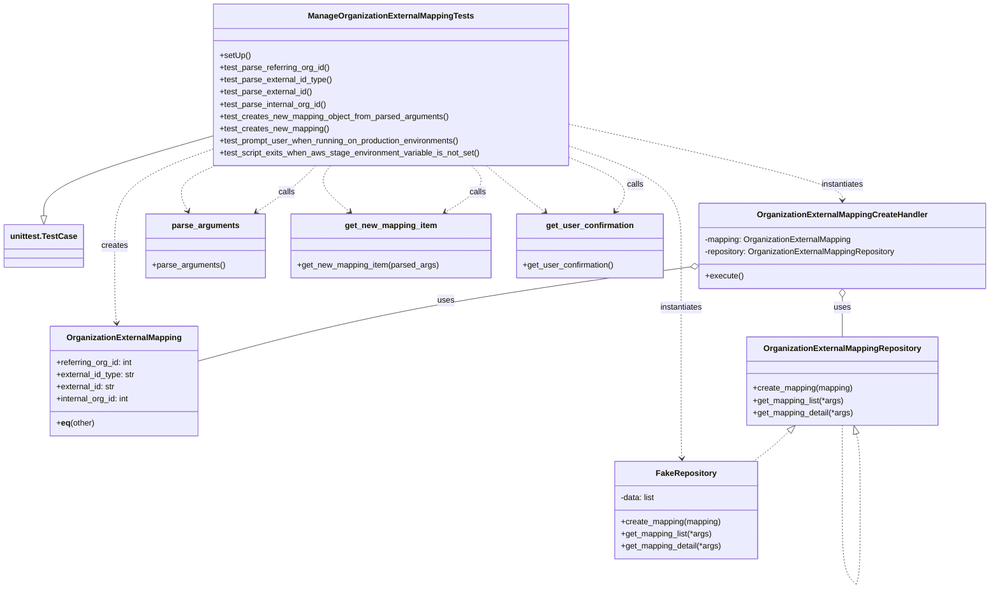
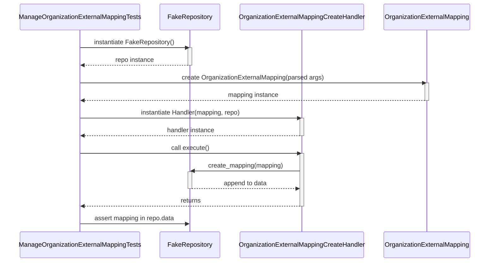

# Diagram: common/iam_service/tests/unit_tests/scripts/test_manage_organization_external_mapping.py

> Auto-generated by Obscura crawlers

## Diagram 1

### SVG

<svg id="container" width="1931.0703125" xmlns="http://www.w3.org/2000/svg" class="classDiagram" height="1158.1500244140625" viewBox="0 0 1931.0703125 1158.1500244140625" role="graphics-document document" aria-roledescription="class"><g><defs><marker id="container_class-aggregationStart" class="marker aggregation class" refX="18" refY="7" markerWidth="190" markerHeight="240" orient="auto"><path d="M 18,7 L9,13 L1,7 L9,1 Z"></path></marker></defs><defs><marker id="container_class-aggregationEnd" class="marker aggregation class" refX="1" refY="7" markerWidth="20" markerHeight="28" orient="auto"><path d="M 18,7 L9,13 L1,7 L9,1 Z"></path></marker></defs><defs><marker id="container_class-extensionStart" class="marker extension class" refX="18" refY="7" markerWidth="190" markerHeight="240" orient="auto"><path d="M 1,7 L18,13 V 1 Z"></path></marker></defs><defs><marker id="container_class-extensionEnd" class="marker extension class" refX="1" refY="7" markerWidth="20" markerHeight="28" orient="auto"><path d="M 1,1 V 13 L18,7 Z"></path></marker></defs><defs><marker id="container_class-compositionStart" class="marker composition class" refX="18" refY="7" markerWidth="190" markerHeight="240" orient="auto"><path d="M 18,7 L9,13 L1,7 L9,1 Z"></path></marker></defs><defs><marker id="container_class-compositionEnd" class="marker composition class" refX="1" refY="7" markerWidth="20" markerHeight="28" orient="auto"><path d="M 18,7 L9,13 L1,7 L9,1 Z"></path></marker></defs><defs><marker id="container_class-dependencyStart" class="marker dependency class" refX="6" refY="7" markerWidth="190" markerHeight="240" orient="auto"><path d="M 5,7 L9,13 L1,7 L9,1 Z"></path></marker></defs><defs><marker id="container_class-dependencyEnd" class="marker dependency class" refX="13" refY="7" markerWidth="20" markerHeight="28" orient="auto"><path d="M 18,7 L9,13 L14,7 L9,1 Z"></path></marker></defs><defs><marker id="container_class-lollipopStart" class="marker lollipop class" refX="13" refY="7" markerWidth="190" markerHeight="240" orient="auto"><circle stroke="black" fill="transparent" cx="7" cy="7" r="6"></circle></marker></defs><defs><marker id="container_class-lollipopEnd" class="marker lollipop class" refX="1" refY="7" markerWidth="190" markerHeight="240" orient="auto"><circle stroke="black" fill="transparent" cx="7" cy="7" r="6"></circle></marker></defs><g class="root"><g class="clusters"></g><g class="edgePaths"><path d="M408.625,268.131L354.306,283.943C299.987,299.754,191.349,331.377,137.03,357.48C82.711,383.583,82.711,404.167,82.711,414.458L82.711,424.75" id="id_ManageOrganizationExternalMappingTests_unittest.TestCase_1" class="edge-thickness-normal edge-pattern-solid relation" style=";;;" data-edge="true" data-et="edge" data-id="id_ManageOrganizationExternalMappingTests_unittest.TestCase_1" data-points="W3sieCI6NDA4LjYyNSwieSI6MjY4LjEzMTQzMzYxMDI0NzM3fSx7IngiOjgyLjcxMDkzNzUsInkiOjM2M30seyJ4Ijo4Mi43MTA5Mzc1LCJ5Ijo0NDJ9XQ==" marker-end="url(#container_class-extensionEnd)"></path><path d="M1535.29,848.821L1529.236,854.517C1523.181,860.214,1511.073,871.607,1499.289,881.47C1487.504,891.333,1476.044,899.667,1470.314,903.833L1464.584,908" id="id_OrganizationExternalMappingRepository_FakeRepository_2" class="edge-thickness-normal edge-pattern-dashed relation" style=";;;" data-edge="true" data-et="edge" data-id="id_OrganizationExternalMappingRepository_FakeRepository_2" data-points="W3sieCI6MTU0Ny44NTMwOTg1NjY5NzMsInkiOjgzN30seyJ4IjoxNDk4Ljk2NDQ1MzEyNTM3MjUsInkiOjg4M30seyJ4IjoxNDY0LjU4Mzg4NDI5NzgxNjIsInkiOjkwOH1d" marker-start="url(#container_class-extensionStart)"></path><path d="M1667.64,853.68L1668.928,858.567C1670.215,863.454,1672.791,873.227,1674.079,898.272C1675.366,923.317,1675.366,963.633,1675.366,983.792L1675.366,1003.95" id="OrganizationExternalMappingRepository-cyclic-special-1" class="edge-thickness-normal edge-pattern-dashed relation" style=";;;" data-edge="true" data-et="edge" data-id="OrganizationExternalMappingRepository-cyclic-special-1" data-points="W3sieCI6MTY2My4yNDM4NDk4NTk1MSwieSI6ODM3fSx7IngiOjE2NzUuMzY2NDA2MjUwNzQ1LCJ5Ijo4ODN9LHsieCI6MTY3NS4zNjY0MDYyNTA3NDUsInkiOjEwMDMuOTQ5OTk5OTk5MjU0OX1d" marker-start="url(#container_class-extensionStart)"></path><path d="M1675.366,1004.05L1675.366,1024.208C1675.366,1044.367,1675.366,1084.683,1674.115,1109.008C1672.863,1133.333,1670.36,1141.667,1669.108,1145.833L1667.856,1150" id="OrganizationExternalMappingRepository-cyclic-special-mid" class="edge-thickness-normal edge-pattern-dashed relation" style=";;;" data-edge="true" data-et="edge" data-id="OrganizationExternalMappingRepository-cyclic-special-mid" data-points="W3sieCI6MTY3NS4zNjY0MDYyNTA3NDUsInkiOjEwMDQuMDUwMDAwMDAwNzQ1MX0seyJ4IjoxNjc1LjM2NjQwNjI1MDc0NSwieSI6MTEyNX0seyJ4IjoxNjY3Ljg1NjQyNjIxMDY3NjUsInkiOjExNTB9XQ=="></path><path d="M1667.791,1150.004L1663.212,1145.837C1658.633,1141.67,1649.475,1133.335,1644.896,1109.001C1640.316,1084.667,1640.316,1044.333,1640.316,1004C1640.316,963.667,1640.316,923.333,1640.316,895.5C1640.316,867.667,1640.316,852.333,1640.316,844.667L1640.316,837" id="OrganizationExternalMappingRepository-cyclic-special-2" class="edge-thickness-normal edge-pattern-dashed relation" style=";;;" data-edge="true" data-et="edge" data-id="OrganizationExternalMappingRepository-cyclic-special-2" data-points="W3sieCI6MTY2Ny43OTE0MDYyNDk2Mjc1LCJ5IjoxMTUwLjAwNDQ5NTkxMjg3Mjd9LHsieCI6MTY0MC4zMTY0MDYyNSwieSI6MTEyNX0seyJ4IjoxNjQwLjMxNjQwNjI1LCJ5IjoxMDA0fSx7IngiOjE2NDAuMzE2NDA2MjUsInkiOjg4M30seyJ4IjoxNjQwLjMxNjQwNjI1LCJ5Ijo4Mzd9XQ=="></path><path d="M1340.476,525.527L1244.837,538.772C1149.199,552.018,957.923,578.509,798.102,609.32C638.282,640.131,509.918,675.262,445.737,692.828L381.555,710.394" id="id_OrganizationExternalMappingCreateHandler_OrganizationExternalMapping_4" class="edge-thickness-normal edge-pattern-solid relation" style=";;;" data-edge="true" data-et="edge" data-id="id_OrganizationExternalMappingCreateHandler_OrganizationExternalMapping_4" data-points="W3sieCI6MTM1Ny41NjI1LCJ5Ijo1MjMuMTYwMzM1NjE3MTc3OH0seyJ4Ijo3NjYuNjQ2MDkzNzUwMzcyNSwieSI6NjA1fSx7IngiOjM4MS41NTQ2ODc1LCJ5Ijo3MTAuMzkzNzI0NDE1NzkzfV0=" marker-start="url(#container_class-aggregationStart)"></path><path d="M1640.316,585.25L1640.316,588.542C1640.316,591.833,1640.316,598.417,1640.316,611.375C1640.316,624.333,1640.316,643.667,1640.316,653.333L1640.316,663" id="id_OrganizationExternalMappingCreateHandler_OrganizationExternalMappingRepository_5" class="edge-thickness-normal edge-pattern-solid relation" style=";;;" data-edge="true" data-et="edge" data-id="id_OrganizationExternalMappingCreateHandler_OrganizationExternalMappingRepository_5" data-points="W3sieCI6MTY0MC4zMTY0MDYyNSwieSI6NTY4fSx7IngiOjE2NDAuMzE2NDA2MjUsInkiOjYwNX0seyJ4IjoxNjQwLjMxNjQwNjI1LCJ5Ijo2NjN9XQ==" marker-start="url(#container_class-aggregationStart)"></path><path d="M408.625,293.7L376.953,305.25C345.281,316.8,281.938,339.9,250.266,371.617C218.594,403.333,218.594,443.667,218.594,484C218.594,524.333,218.594,564.667,219.245,590.008C219.896,615.349,221.198,625.698,221.849,630.872L222.501,636.047" id="id_ManageOrganizationExternalMappingTests_OrganizationExternalMapping_6" class="edge-thickness-normal edge-pattern-dashed relation" style=";;;" data-edge="true" data-et="edge" data-id="id_ManageOrganizationExternalMappingTests_OrganizationExternalMapping_6" data-points="W3sieCI6NDA4LjYyNSwieSI6MjkzLjY5OTg0NzM3MjYyODh9LHsieCI6MjE4LjU5Mzc1LCJ5IjozNjN9LHsieCI6MjE4LjU5Mzc1LCJ5Ijo0ODR9LHsieCI6MjE4LjU5Mzc1LCJ5Ijo2MDV9LHsieCI6MjIzLjI0OTY0OTc4NDQ4Mjc2LCJ5Ijo2NDJ9XQ==" marker-end="url(#container_class-dependencyEnd)"></path><path d="M1103.484,244.009L1192.956,263.841C1282.428,283.673,1461.372,323.336,1550.844,348.335C1640.316,373.333,1640.316,383.667,1640.316,388.833L1640.316,394" id="id_ManageOrganizationExternalMappingTests_OrganizationExternalMappingCreateHandler_7" class="edge-thickness-normal edge-pattern-dashed relation" style=";;;" data-edge="true" data-et="edge" data-id="id_ManageOrganizationExternalMappingTests_OrganizationExternalMappingCreateHandler_7" data-points="W3sieCI6MTEwMy40ODQzNzUsInkiOjI0NC4wMDkxMjIxOTMyMTM3OH0seyJ4IjoxNjQwLjMxNjQwNjI1LCJ5IjozNjN9LHsieCI6MTY0MC4zMTY0MDYyNSwieSI6NDAwfV0=" marker-end="url(#container_class-dependencyEnd)"></path><path d="M1103.484,287.203L1139.997,299.836C1176.51,312.469,1249.536,337.734,1286.049,370.534C1322.563,403.333,1322.563,443.667,1322.563,484C1322.563,524.333,1322.563,564.667,1322.563,609C1322.563,653.333,1322.563,701.667,1322.563,748C1322.563,794.333,1322.563,838.667,1322.824,864.003C1323.086,889.34,1323.61,895.68,1323.872,898.85L1324.134,902.02" id="id_ManageOrganizationExternalMappingTests_FakeRepository_8" class="edge-thickness-normal edge-pattern-dashed relation" style=";;;" data-edge="true" data-et="edge" data-id="id_ManageOrganizationExternalMappingTests_FakeRepository_8" data-points="W3sieCI6MTEwMy40ODQzNzUsInkiOjI4Ny4yMDM0OTQ1NDU4MDU2fSx7IngiOjEzMjIuNTYyNSwieSI6MzYzfSx7IngiOjEzMjIuNTYyNSwieSI6NDg0fSx7IngiOjEzMjIuNTYyNSwieSI6NjA1fSx7IngiOjEzMjIuNTYyNSwieSI6NzUwfSx7IngiOjEzMjIuNTYyNSwieSI6ODgzfSx7IngiOjEzMjQuNjI4NjE1NzAyNDc5MiwieSI6OTA4fV0=" marker-end="url(#container_class-dependencyEnd)"></path><path d="M609.118,326L603.419,332.167C597.721,338.333,586.323,350.667,567.095,365.942C547.867,381.216,520.808,399.433,507.278,408.541L493.749,417.649" id="id_ManageOrganizationExternalMappingTests_parse_arguments_9" class="edge-thickness-normal edge-pattern-dashed relation" style=";;;" data-edge="true" data-et="edge" data-id="id_ManageOrganizationExternalMappingTests_parse_arguments_9" data-points="W3sieCI6NjA5LjExODE2NjA1NTc4NjksInkiOjMyNn0seyJ4Ijo1NzQuOTI1MzkwNjI1MzcyNSwieSI6MzYzfSx7IngiOjQ4OC43NzE5MTA1MTE1NTc2LCJ5Ijo0MjF9XQ==" marker-end="url(#container_class-dependencyEnd)"></path><path d="M913.058,326L919.147,332.167C925.236,338.333,937.415,350.667,928.89,365.97C920.366,381.273,891.138,399.546,876.524,408.683L861.91,417.819" id="id_ManageOrganizationExternalMappingTests_get_new_mapping_item_10" class="edge-thickness-normal edge-pattern-dashed relation" style=";;;" data-edge="true" data-et="edge" data-id="id_ManageOrganizationExternalMappingTests_get_new_mapping_item_10" data-points="W3sieCI6OTEzLjA1Nzk5Nzg0Nzg3ODcsInkiOjMyNn0seyJ4Ijo5NDkuNTkzMzU5Mzc1MzcyNSwieSI6MzYzfSx7IngiOjg1Ni44MjI3NTYzMjc2NzMzLCJ5Ijo0MjF9XQ==" marker-end="url(#container_class-dependencyEnd)"></path><path d="M1103.484,309.821L1125.045,318.685C1146.605,327.548,1189.726,345.274,1204.82,362.996C1219.915,380.718,1206.982,398.436,1200.516,407.295L1194.05,416.154" id="id_ManageOrganizationExternalMappingTests_get_user_confirmation_11" class="edge-thickness-normal edge-pattern-dashed relation" style=";;;" data-edge="true" data-et="edge" data-id="id_ManageOrganizationExternalMappingTests_get_user_confirmation_11" data-points="W3sieCI6MTEwMy40ODQzNzUsInkiOjMwOS44MjE0NzM4OTQ4Njg2M30seyJ4IjoxMjMyLjg0NzI2NTYyNTM3MjUsInkiOjM2M30seyJ4IjoxMTkwLjUxMjA5NjQ2MTk3MDcsInkiOjQyMX1d" marker-end="url(#container_class-dependencyEnd)"></path><path d="M414.012,326L400.747,332.167C387.481,338.333,360.949,350.667,352.09,365.606C343.23,380.546,352.043,398.092,356.449,406.865L360.856,415.638" id="id_ManageOrganizationExternalMappingTests_parse_arguments_12" class="edge-thickness-normal edge-pattern-dashed relation" style=";;;" data-edge="true" data-et="edge" data-id="id_ManageOrganizationExternalMappingTests_parse_arguments_12" data-points="W3sieCI6NDE0LjAxMjMzODU2ODU0MiwieSI6MzI2fSx7IngiOjMzNC40MTc1NzgxMjUzNzI1MywieSI6MzYzfSx7IngiOjM2My41NDg4MzQ1ODE4MDU1LCJ5Ijo0MjF9XQ==" marker-end="url(#container_class-dependencyEnd)"></path><path d="M638.683,326L634.131,332.167C629.579,338.333,620.475,350.667,626.715,365.858C632.954,381.05,654.537,399.101,665.329,408.126L676.121,417.151" id="id_ManageOrganizationExternalMappingTests_get_new_mapping_item_13" class="edge-thickness-normal edge-pattern-dashed relation" style=";;;" data-edge="true" data-et="edge" data-id="id_ManageOrganizationExternalMappingTests_get_new_mapping_item_13" data-points="W3sieCI6NjM4LjY4MzQ5NjA5NDA1MjIsInkiOjMyNn0seyJ4Ijo2MTEuMzcwNzAzMTI1MzcyNSwieSI6MzYzfSx7IngiOjY4MC43MjMzNTY3OTI1NDkzLCJ5Ijo0MjF9XQ==" marker-end="url(#container_class-dependencyEnd)"></path><path d="M942.623,326L949.859,332.167C957.095,338.333,971.567,350.667,990.67,365.893C1009.772,381.12,1033.506,399.239,1045.373,408.299L1057.239,417.359" id="id_ManageOrganizationExternalMappingTests_get_user_confirmation_14" class="edge-thickness-normal edge-pattern-dashed relation" style=";;;" data-edge="true" data-et="edge" data-id="id_ManageOrganizationExternalMappingTests_get_user_confirmation_14" data-points="W3sieCI6OTQyLjYyMzMyNzg4NjE0NCwieSI6MzI2fSx7IngiOjk4Ni4wMzg2NzE4NzUzNzI1LCJ5IjozNjN9LHsieCI6MTA2Mi4wMDg0NDg0NzY0MzM2LCJ5Ijo0MjF9XQ==" marker-end="url(#container_class-dependencyEnd)"></path></g><g class="edgeLabels"><g class="edgeLabel"><g class="label" data-id="id_ManageOrganizationExternalMappingTests_unittest.TestCase_1" transform="translate(0, 0)"><foreignObject width="0" height="0">

</foreignObject></g></g><g class="edgeLabel"><g class="label" data-id="id_OrganizationExternalMappingRepository_FakeRepository_2" transform="translate(0, 0)"><foreignObject width="0" height="0">

</foreignObject></g></g><g class="edgeLabel"><g class="label" data-id="OrganizationExternalMappingRepository-cyclic-special-1" transform="translate(0, 0)"><foreignObject width="0" height="0">

</foreignObject></g></g><g class="edgeLabel"><g class="label" data-id="OrganizationExternalMappingRepository-cyclic-special-mid" transform="translate(0, 0)"><foreignObject width="0" height="0">

</foreignObject></g></g><g class="edgeLabel"><g class="label" data-id="OrganizationExternalMappingRepository-cyclic-special-2" transform="translate(0, 0)"><foreignObject width="0" height="0">

</foreignObject></g></g><g class="edgeLabel" transform="translate(864.36506, 591.4663)"><g class="label" data-id="id_OrganizationExternalMappingCreateHandler_OrganizationExternalMapping_4" transform="translate(-16.4921875, -12)"><foreignObject width="32.984375" height="24">

uses

</foreignObject></g></g><g class="edgeLabel" transform="translate(1640.31640625, 605)"><g class="label" data-id="id_OrganizationExternalMappingCreateHandler_OrganizationExternalMappingRepository_5" transform="translate(-16.4921875, -12)"><foreignObject width="32.984375" height="24">

uses

</foreignObject></g></g><g class="edgeLabel" transform="translate(218.59375, 484)"><g class="label" data-id="id_ManageOrganizationExternalMappingTests_OrganizationExternalMapping_6" transform="translate(-26.171875, -12)"><foreignObject width="52.34375" height="24">

creates

</foreignObject></g></g><g class="edgeLabel" transform="translate(1640.31640625, 363)"><g class="label" data-id="id_ManageOrganizationExternalMappingTests_OrganizationExternalMappingCreateHandler_7" transform="translate(-42.9140625, -12)"><foreignObject width="85.828125" height="24">

instantiates

</foreignObject></g></g><g class="edgeLabel" transform="translate(1322.5625, 605)"><g class="label" data-id="id_ManageOrganizationExternalMappingTests_FakeRepository_8" transform="translate(-42.9140625, -12)"><foreignObject width="85.828125" height="24">

instantiates

</foreignObject></g></g><g class="edgeLabel" transform="translate(552.74461, 377.93248)"><g class="label" data-id="id_ManageOrganizationExternalMappingTests_parse_arguments_9" transform="translate(-16.4453125, -12)"><foreignObject width="32.890625" height="24">

calls

</foreignObject></g></g><g class="edgeLabel" transform="translate(925.25337, 378.21731)"><g class="label" data-id="id_ManageOrganizationExternalMappingTests_get_new_mapping_item_10" transform="translate(-16.4453125, -12)"><foreignObject width="32.890625" height="24">

calls

</foreignObject></g></g><g class="edgeLabel" transform="translate(1232.8472656253725, 363)"><g class="label" data-id="id_ManageOrganizationExternalMappingTests_get_user_confirmation_11" transform="translate(-16.4453125, -12)"><foreignObject width="32.890625" height="24">

calls

</foreignObject></g></g><g class="edgeLabel"><g class="label" data-id="id_ManageOrganizationExternalMappingTests_parse_arguments_12" transform="translate(0, 0)"><foreignObject width="0" height="0">

</foreignObject></g></g><g class="edgeLabel"><g class="label" data-id="id_ManageOrganizationExternalMappingTests_get_new_mapping_item_13" transform="translate(0, 0)"><foreignObject width="0" height="0">

</foreignObject></g></g><g class="edgeLabel"><g class="label" data-id="id_ManageOrganizationExternalMappingTests_get_user_confirmation_14" transform="translate(0, 0)"><foreignObject width="0" height="0">

</foreignObject></g></g></g><g class="nodes"><g class="node default" id="classId-ManageOrganizationExternalMappingTests-0" transform="translate(756.0546875, 167)"><g class="basic label-container"><path d="M-347.4296875 -159 L347.4296875 -159 L347.4296875 159 L-347.4296875 159" stroke="none" stroke-width="0" fill="#ECECFF" style=""></path><path d="M-347.4296875 -159 C-142.47722175009858 -159, 62.47524399980284 -159, 347.4296875 -159 M-347.4296875 -159 C-196.1735827340709 -159, -44.91747796814178 -159, 347.4296875 -159 M347.4296875 -159 C347.4296875 -92.81647579725602, 347.4296875 -26.632951594512036, 347.4296875 159 M347.4296875 -159 C347.4296875 -55.543201976462356, 347.4296875 47.91359604707529, 347.4296875 159 M347.4296875 159 C179.1423143925345 159, 10.854941285069003 159, -347.4296875 159 M347.4296875 159 C85.5991933877927 159, -176.2313007244146 159, -347.4296875 159 M-347.4296875 159 C-347.4296875 85.66654730073097, -347.4296875 12.333094601461937, -347.4296875 -159 M-347.4296875 159 C-347.4296875 57.98276943874376, -347.4296875 -43.03446112251248, -347.4296875 -159" stroke="#9370DB" stroke-width="1.3" fill="none" stroke-dasharray="0 0" style=""></path></g><g class="annotation-group text" transform="translate(0, -135)"></g><g class="label-group text" transform="translate(-155.71875, -135)"><g class="label" style="font-weight: bolder" transform="translate(0,-12)"><foreignObject width="311.4375" height="24">

ManageOrganizationExternalMappingTests

</foreignObject></g></g><g class="members-group text" transform="translate(-335.4296875, -87)"></g><g class="methods-group text" transform="translate(-335.4296875, -57)"><g class="label" style="" transform="translate(0,-12)"><foreignObject width="60.421875" height="24">

+setUp()

</foreignObject></g><g class="label" style="" transform="translate(0,12)"><foreignObject width="219.296875" height="24">

+test_parse_referring_org_id()

</foreignObject></g><g class="label" style="" transform="translate(0,36)"><foreignObject width="223.53125" height="24">

+test_parse_external_id_type()

</foreignObject></g><g class="label" style="" transform="translate(0,60)"><foreignObject width="183.734375" height="24">

+test_parse_external_id()

</foreignObject></g><g class="label" style="" transform="translate(0,84)"><foreignObject width="213.265625" height="24">

+test_parse_internal_org_id()

</foreignObject></g><g class="label" style="" transform="translate(0,108)"><foreignObject width="454.203125" height="24">

+test_creates_new_mapping_object_from_parsed_arguments()

</foreignObject></g><g class="label" style="" transform="translate(0,132)"><foreignObject width="215.3125" height="24">

+test_creates_new_mapping()

</foreignObject></g><g class="label" style="" transform="translate(0,156)"><foreignObject width="480.78125" height="24">

+test_prompt_user_when_running_on_production_environments()

</foreignObject></g><g class="label" style="" transform="translate(0,180)"><foreignObject width="515.140625" height="24">

+test_script_exits_when_aws_stage_environment_variable_is_not_set()

</foreignObject></g></g><g class="divider" style=""><path d="M-347.4296875 -111 C-197.36893066759419 -111, -47.30817383518837 -111, 347.4296875 -111 M-347.4296875 -111 C-153.09876401744464 -111, 41.232159465110726 -111, 347.4296875 -111" stroke="#9370DB" stroke-width="1.3" fill="none" stroke-dasharray="0 0" style=""></path></g><g class="divider" style=""><path d="M-347.4296875 -87 C-109.02828629150193 -87, 129.37311491699614 -87, 347.4296875 -87 M-347.4296875 -87 C-73.65669579620703 -87, 200.11629590758594 -87, 347.4296875 -87" stroke="#9370DB" stroke-width="1.3" fill="none" stroke-dasharray="0 0" style=""></path></g></g><g class="node default" id="classId-unittest.TestCase-1" transform="translate(82.7109375, 484)"><g class="basic label-container"><path d="M-74.7109375 -42 L74.7109375 -42 L74.7109375 42 L-74.7109375 42" stroke="none" stroke-width="0" fill="#ECECFF" style=""></path><path d="M-74.7109375 -42 C-34.02505643522523 -42, 6.660824629549538 -42, 74.7109375 -42 M-74.7109375 -42 C-38.0612487472781 -42, -1.4115599945561996 -42, 74.7109375 -42 M74.7109375 -42 C74.7109375 -14.126750717531287, 74.7109375 13.746498564937426, 74.7109375 42 M74.7109375 -42 C74.7109375 -17.60983302984946, 74.7109375 6.780333940301077, 74.7109375 42 M74.7109375 42 C21.150079144696818 42, -32.410779210606364 42, -74.7109375 42 M74.7109375 42 C36.83186114003097 42, -1.047215219938053 42, -74.7109375 42 M-74.7109375 42 C-74.7109375 16.90354971897958, -74.7109375 -8.19290056204084, -74.7109375 -42 M-74.7109375 42 C-74.7109375 15.717534833822494, -74.7109375 -10.564930332355011, -74.7109375 -42" stroke="#9370DB" stroke-width="1.3" fill="none" stroke-dasharray="0 0" style=""></path></g><g class="annotation-group text" transform="translate(0, -18)"></g><g class="label-group text" transform="translate(-62.7109375, -18)"><g class="label" style="font-weight: bolder" transform="translate(0,-12)"><foreignObject width="125.421875" height="24">

unittest.TestCase

</foreignObject></g></g><g class="members-group text" transform="translate(-62.7109375, 30)"></g><g class="methods-group text" transform="translate(-62.7109375, 60)"></g><g class="divider" style=""><path d="M-74.7109375 6 C-44.214834120506964 6, -13.718730741013921 6, 74.7109375 6 M-74.7109375 6 C-41.58481071954108 6, -8.458683939082164 6, 74.7109375 6" stroke="#9370DB" stroke-width="1.3" fill="none" stroke-dasharray="0 0" style=""></path></g><g class="divider" style=""><path d="M-74.7109375 24 C-43.617506954443066 24, -12.524076408886131 24, 74.7109375 24 M-74.7109375 24 C-35.74288085015957 24, 3.225175799680855 24, 74.7109375 24" stroke="#9370DB" stroke-width="1.3" fill="none" stroke-dasharray="0 0" style=""></path></g></g><g class="node default" id="classId-OrganizationExternalMapping-2" transform="translate(236.83984375, 750)"><g class="basic label-container"><path d="M-144.71484375 -108 L144.71484375 -108 L144.71484375 108 L-144.71484375 108" stroke="none" stroke-width="0" fill="#ECECFF" style=""></path><path d="M-144.71484375 -108 C-49.02018913124772 -108, 46.67446548750456 -108, 144.71484375 -108 M-144.71484375 -108 C-31.406379600322452 -108, 81.9020845493551 -108, 144.71484375 -108 M144.71484375 -108 C144.71484375 -58.15847642609543, 144.71484375 -8.316952852190866, 144.71484375 108 M144.71484375 -108 C144.71484375 -42.77514489079719, 144.71484375 22.449710218405613, 144.71484375 108 M144.71484375 108 C86.19763893854577 108, 27.68043412709153 108, -144.71484375 108 M144.71484375 108 C46.04263538118366 108, -52.629572987632685 108, -144.71484375 108 M-144.71484375 108 C-144.71484375 30.114755779632915, -144.71484375 -47.77048844073417, -144.71484375 -108 M-144.71484375 108 C-144.71484375 32.582410911657774, -144.71484375 -42.83517817668445, -144.71484375 -108" stroke="#9370DB" stroke-width="1.3" fill="none" stroke-dasharray="0 0" style=""></path></g><g class="annotation-group text" transform="translate(0, -84)"></g><g class="label-group text" transform="translate(-108.3671875, -84)"><g class="label" style="font-weight: bolder" transform="translate(0,-12)"><foreignObject width="216.734375" height="24">

OrganizationExternalMapping

</foreignObject></g></g><g class="members-group text" transform="translate(-132.71484375, -36)"><g class="label" style="" transform="translate(0,-12)"><foreignObject width="152.765625" height="24">

+referring_org_id: int

</foreignObject></g><g class="label" style="" transform="translate(0,12)"><foreignObject width="157.0625" height="24">

+external_id_type: str

</foreignObject></g><g class="label" style="" transform="translate(0,36)"><foreignObject width="117.265625" height="24">

+external_id: str

</foreignObject></g><g class="label" style="" transform="translate(0,60)"><foreignObject width="146.734375" height="24">

+internal_org_id: int

</foreignObject></g></g><g class="methods-group text" transform="translate(-132.71484375, 84)"><g class="label" style="" transform="translate(0,-12)"><foreignObject width="76.1875" height="24">

+<strong>eq</strong>(other)

</foreignObject></g></g><g class="divider" style=""><path d="M-144.71484375 -60 C-66.02230576619928 -60, 12.670232217601438 -60, 144.71484375 -60 M-144.71484375 -60 C-49.53975544644571 -60, 45.63533285710858 -60, 144.71484375 -60" stroke="#9370DB" stroke-width="1.3" fill="none" stroke-dasharray="0 0" style=""></path></g><g class="divider" style=""><path d="M-144.71484375 60 C-85.35170569614694 60, -25.988567642293873 60, 144.71484375 60 M-144.71484375 60 C-65.60110907636455 60, 13.512625597270898 60, 144.71484375 60" stroke="#9370DB" stroke-width="1.3" fill="none" stroke-dasharray="0 0" style=""></path></g></g><g class="node default" id="classId-OrganizationExternalMappingRepository-3" transform="translate(1640.31640625, 750)"><g class="basic label-container"><path d="M-185.97265625 -87 L185.97265625 -87 L185.97265625 87 L-185.97265625 87" stroke="none" stroke-width="0" fill="#ECECFF" style=""></path><path d="M-185.97265625 -87 C-96.10492434865374 -87, -6.2371924473074785 -87, 185.97265625 -87 M-185.97265625 -87 C-53.651790429264906 -87, 78.66907539147019 -87, 185.97265625 -87 M185.97265625 -87 C185.97265625 -42.534449285488286, 185.97265625 1.9311014290234283, 185.97265625 87 M185.97265625 -87 C185.97265625 -35.70450508259792, 185.97265625 15.590989834804162, 185.97265625 87 M185.97265625 87 C80.59222915464825 87, -24.788197940703498 87, -185.97265625 87 M185.97265625 87 C92.68438303105592 87, -0.6038901878881688 87, -185.97265625 87 M-185.97265625 87 C-185.97265625 26.54324334517461, -185.97265625 -33.91351330965078, -185.97265625 -87 M-185.97265625 87 C-185.97265625 43.894734612977174, -185.97265625 0.789469225954349, -185.97265625 -87" stroke="#9370DB" stroke-width="1.3" fill="none" stroke-dasharray="0 0" style=""></path></g><g class="annotation-group text" transform="translate(0, -63)"></g><g class="label-group text" transform="translate(-148.1328125, -63)"><g class="label" style="font-weight: bolder" transform="translate(0,-12)"><foreignObject width="296.265625" height="24">

OrganizationExternalMappingRepository

</foreignObject></g></g><g class="members-group text" transform="translate(-173.97265625, -15)"></g><g class="methods-group text" transform="translate(-173.97265625, 15)"><g class="label" style="" transform="translate(0,-12)"><foreignObject width="198.484375" height="24">

+create_mapping(mapping)

</foreignObject></g><g class="label" style="" transform="translate(0,12)"><foreignObject width="180.5625" height="24">

+get_mapping_list(*args)

</foreignObject></g><g class="label" style="" transform="translate(0,36)"><foreignObject width="199.8125" height="24">

+get_mapping_detail(*args)

</foreignObject></g></g><g class="divider" style=""><path d="M-185.97265625 -39 C-50.552246463626034 -39, 84.86816332274793 -39, 185.97265625 -39 M-185.97265625 -39 C-70.11153354321226 -39, 45.74958916357548 -39, 185.97265625 -39" stroke="#9370DB" stroke-width="1.3" fill="none" stroke-dasharray="0 0" style=""></path></g><g class="divider" style=""><path d="M-185.97265625 -15 C-49.28049987780011 -15, 87.41165649439978 -15, 185.97265625 -15 M-185.97265625 -15 C-56.46155284776765 -15, 73.0495505544647 -15, 185.97265625 -15" stroke="#9370DB" stroke-width="1.3" fill="none" stroke-dasharray="0 0" style=""></path></g></g><g class="node default" id="classId-FakeRepository-4" transform="translate(1332.5625, 1004)"><g class="basic label-container"><path d="M-140.0546875 -96 L140.0546875 -96 L140.0546875 96 L-140.0546875 96" stroke="none" stroke-width="0" fill="#ECECFF" style=""></path><path d="M-140.0546875 -96 C-70.4617880335867 -96, -0.8688885671733999 -96, 140.0546875 -96 M-140.0546875 -96 C-67.35328188278422 -96, 5.348123734431567 -96, 140.0546875 -96 M140.0546875 -96 C140.0546875 -36.68167402811261, 140.0546875 22.63665194377478, 140.0546875 96 M140.0546875 -96 C140.0546875 -47.68499664499147, 140.0546875 0.6300067100170565, 140.0546875 96 M140.0546875 96 C36.25902050770719 96, -67.53664648458562 96, -140.0546875 96 M140.0546875 96 C30.936598395636608 96, -78.18149070872678 96, -140.0546875 96 M-140.0546875 96 C-140.0546875 39.81014668896119, -140.0546875 -16.37970662207762, -140.0546875 -96 M-140.0546875 96 C-140.0546875 42.58478376082517, -140.0546875 -10.830432478349664, -140.0546875 -96" stroke="#9370DB" stroke-width="1.3" fill="none" stroke-dasharray="0 0" style=""></path></g><g class="annotation-group text" transform="translate(0, -72)"></g><g class="label-group text" transform="translate(-56.296875, -72)"><g class="label" style="font-weight: bolder" transform="translate(0,-12)"><foreignObject width="112.59375" height="24">

FakeRepository

</foreignObject></g></g><g class="members-group text" transform="translate(-128.0546875, -24)"><g class="label" style="" transform="translate(0,-12)"><foreignObject width="69.625" height="24">

-data: list

</foreignObject></g></g><g class="methods-group text" transform="translate(-128.0546875, 24)"><g class="label" style="" transform="translate(0,-12)"><foreignObject width="198.484375" height="24">

+create_mapping(mapping)

</foreignObject></g><g class="label" style="" transform="translate(0,12)"><foreignObject width="180.5625" height="24">

+get_mapping_list(*args)

</foreignObject></g><g class="label" style="" transform="translate(0,36)"><foreignObject width="199.8125" height="24">

+get_mapping_detail(*args)

</foreignObject></g></g><g class="divider" style=""><path d="M-140.0546875 -48 C-28.254219913904294 -48, 83.54624767219141 -48, 140.0546875 -48 M-140.0546875 -48 C-42.779582690128294 -48, 54.49552211974341 -48, 140.0546875 -48" stroke="#9370DB" stroke-width="1.3" fill="none" stroke-dasharray="0 0" style=""></path></g><g class="divider" style=""><path d="M-140.0546875 0 C-66.11140748242022 0, 7.831872535159562 0, 140.0546875 0 M-140.0546875 0 C-49.02722588715935 0, 42.00023572568131 0, 140.0546875 0" stroke="#9370DB" stroke-width="1.3" fill="none" stroke-dasharray="0 0" style=""></path></g></g><g class="node default" id="classId-OrganizationExternalMappingCreateHandler-5" transform="translate(1640.31640625, 484)"><g class="basic label-container"><path d="M-282.75390625 -84 L282.75390625 -84 L282.75390625 84 L-282.75390625 84" stroke="none" stroke-width="0" fill="#ECECFF" style=""></path><path d="M-282.75390625 -84 C-60.76327053129435 -84, 161.2273651874113 -84, 282.75390625 -84 M-282.75390625 -84 C-168.4186852946037 -84, -54.08346433920741 -84, 282.75390625 -84 M282.75390625 -84 C282.75390625 -34.79935450485957, 282.75390625 14.401290990280856, 282.75390625 84 M282.75390625 -84 C282.75390625 -20.900695941705976, 282.75390625 42.19860811658805, 282.75390625 84 M282.75390625 84 C99.37265938336876 84, -84.00858748326249 84, -282.75390625 84 M282.75390625 84 C67.9334684725751 84, -146.8869693048498 84, -282.75390625 84 M-282.75390625 84 C-282.75390625 27.37895856910277, -282.75390625 -29.242082861794458, -282.75390625 -84 M-282.75390625 84 C-282.75390625 39.9261457224419, -282.75390625 -4.147708555116196, -282.75390625 -84" stroke="#9370DB" stroke-width="1.3" fill="none" stroke-dasharray="0 0" style=""></path></g><g class="annotation-group text" transform="translate(0, -60)"></g><g class="label-group text" transform="translate(-161.0078125, -60)"><g class="label" style="font-weight: bolder" transform="translate(0,-12)"><foreignObject width="322.015625" height="24">

OrganizationExternalMappingCreateHandler

</foreignObject></g></g><g class="members-group text" transform="translate(-270.75390625, -12)"><g class="label" style="" transform="translate(0,-12)"><foreignObject width="291.96875" height="24">

-mapping: OrganizationExternalMapping

</foreignObject></g><g class="label" style="" transform="translate(0,12)"><foreignObject width="380.5" height="24">

-repository: OrganizationExternalMappingRepository

</foreignObject></g></g><g class="methods-group text" transform="translate(-270.75390625, 60)"><g class="label" style="" transform="translate(0,-12)"><foreignObject width="74.328125" height="24">

+execute()

</foreignObject></g></g><g class="divider" style=""><path d="M-282.75390625 -36 C-91.07390200721929 -36, 100.60610223556142 -36, 282.75390625 -36 M-282.75390625 -36 C-166.93400028660415 -36, -51.11409432320826 -36, 282.75390625 -36" stroke="#9370DB" stroke-width="1.3" fill="none" stroke-dasharray="0 0" style=""></path></g><g class="divider" style=""><path d="M-282.75390625 36 C-59.20893968690024 36, 164.33602687619953 36, 282.75390625 36 M-282.75390625 36 C-141.00208173200377 36, 0.7497427859924528 36, 282.75390625 36" stroke="#9370DB" stroke-width="1.3" fill="none" stroke-dasharray="0 0" style=""></path></g></g><g class="node default" id="classId-parse_arguments-6" transform="translate(395.19140625, 484)"><g class="basic label-container"><path d="M-115.42578125 -63 L115.42578125 -63 L115.42578125 63 L-115.42578125 63" stroke="none" stroke-width="0" fill="#ECECFF" style=""></path><path d="M-115.42578125 -63 C-40.519858861623945 -63, 34.38606352675211 -63, 115.42578125 -63 M-115.42578125 -63 C-36.25230582832121 -63, 42.921169593357575 -63, 115.42578125 -63 M115.42578125 -63 C115.42578125 -22.9647808563848, 115.42578125 17.070438287230402, 115.42578125 63 M115.42578125 -63 C115.42578125 -37.344737581318384, 115.42578125 -11.689475162636775, 115.42578125 63 M115.42578125 63 C27.03909402353652 63, -61.34759320292696 63, -115.42578125 63 M115.42578125 63 C55.91257269788629 63, -3.60063585422742 63, -115.42578125 63 M-115.42578125 63 C-115.42578125 32.41141187451133, -115.42578125 1.8228237490226604, -115.42578125 -63 M-115.42578125 63 C-115.42578125 31.172238497888255, -115.42578125 -0.6555230042234896, -115.42578125 -63" stroke="#9370DB" stroke-width="1.3" fill="none" stroke-dasharray="0 0" style=""></path></g><g class="annotation-group text" transform="translate(0, -39)"></g><g class="label-group text" transform="translate(-63.4609375, -39)"><g class="label" style="font-weight: bolder" transform="translate(0,-12)"><foreignObject width="126.921875" height="24">

parse_arguments

</foreignObject></g></g><g class="members-group text" transform="translate(-103.42578125, 9)"></g><g class="methods-group text" transform="translate(-103.42578125, 39)"><g class="label" style="" transform="translate(0,-12)"><foreignObject width="143.390625" height="24">

+parse_arguments()

</foreignObject></g></g><g class="divider" style=""><path d="M-115.42578125 -15 C-49.52675366566916 -15, 16.372273918661676 -15, 115.42578125 -15 M-115.42578125 -15 C-25.747461252747115 -15, 63.93085874450577 -15, 115.42578125 -15" stroke="#9370DB" stroke-width="1.3" fill="none" stroke-dasharray="0 0" style=""></path></g><g class="divider" style=""><path d="M-115.42578125 9 C-60.19471862639934 9, -4.963656002798686 9, 115.42578125 9 M-115.42578125 9 C-52.23710557886758 9, 10.951570092264845 9, 115.42578125 9" stroke="#9370DB" stroke-width="1.3" fill="none" stroke-dasharray="0 0" style=""></path></g></g><g class="node default" id="classId-get_new_mapping_item-7" transform="translate(756.0546875, 484)"><g class="basic label-container"><path d="M-195.4375 -63 L195.4375 -63 L195.4375 63 L-195.4375 63" stroke="none" stroke-width="0" fill="#ECECFF" style=""></path><path d="M-195.4375 -63 C-86.52721481235821 -63, 22.38307037528358 -63, 195.4375 -63 M-195.4375 -63 C-66.67530937241534 -63, 62.08688125516932 -63, 195.4375 -63 M195.4375 -63 C195.4375 -19.07931241974122, 195.4375 24.841375160517558, 195.4375 63 M195.4375 -63 C195.4375 -20.766563779527445, 195.4375 21.46687244094511, 195.4375 63 M195.4375 63 C44.36362402721872 63, -106.71025194556256 63, -195.4375 63 M195.4375 63 C104.05939438290514 63, 12.68128876581028 63, -195.4375 63 M-195.4375 63 C-195.4375 19.235558793119196, -195.4375 -24.528882413761607, -195.4375 -63 M-195.4375 63 C-195.4375 23.66425694312666, -195.4375 -15.671486113746681, -195.4375 -63" stroke="#9370DB" stroke-width="1.3" fill="none" stroke-dasharray="0 0" style=""></path></g><g class="annotation-group text" transform="translate(0, -39)"></g><g class="label-group text" transform="translate(-87.5, -39)"><g class="label" style="font-weight: bolder" transform="translate(0,-12)"><foreignObject width="175" height="24">

get_new_mapping_item

</foreignObject></g></g><g class="members-group text" transform="translate(-183.4375, 9)"></g><g class="methods-group text" transform="translate(-183.4375, 39)"><g class="label" style="" transform="translate(0,-12)"><foreignObject width="279.375" height="24">

+get_new_mapping_item(parsed_args)

</foreignObject></g></g><g class="divider" style=""><path d="M-195.4375 -15 C-99.46020985084618 -15, -3.482919701692367 -15, 195.4375 -15 M-195.4375 -15 C-53.85516553447917 -15, 87.72716893104166 -15, 195.4375 -15" stroke="#9370DB" stroke-width="1.3" fill="none" stroke-dasharray="0 0" style=""></path></g><g class="divider" style=""><path d="M-195.4375 9 C-98.04664686040404 9, -0.6557937208080773 9, 195.4375 9 M-195.4375 9 C-51.467129390004374 9, 92.50324121999125 9, 195.4375 9" stroke="#9370DB" stroke-width="1.3" fill="none" stroke-dasharray="0 0" style=""></path></g></g><g class="node default" id="classId-get_user_confirmation-8" transform="translate(1144.52734375, 484)"><g class="basic label-container"><path d="M-143.03515625 -63 L143.03515625 -63 L143.03515625 63 L-143.03515625 63" stroke="none" stroke-width="0" fill="#ECECFF" style=""></path><path d="M-143.03515625 -63 C-40.83390758474441 -63, 61.36734108051118 -63, 143.03515625 -63 M-143.03515625 -63 C-62.06658273902447 -63, 18.901990771951063 -63, 143.03515625 -63 M143.03515625 -63 C143.03515625 -36.23085169200816, 143.03515625 -9.461703384016324, 143.03515625 63 M143.03515625 -63 C143.03515625 -23.33407924426765, 143.03515625 16.331841511464702, 143.03515625 63 M143.03515625 63 C58.602593798479944 63, -25.829968653040112 63, -143.03515625 63 M143.03515625 63 C61.18134579483065 63, -20.672464660338704 63, -143.03515625 63 M-143.03515625 63 C-143.03515625 31.74764889364143, -143.03515625 0.49529778728285834, -143.03515625 -63 M-143.03515625 63 C-143.03515625 23.743579786494024, -143.03515625 -15.512840427011952, -143.03515625 -63" stroke="#9370DB" stroke-width="1.3" fill="none" stroke-dasharray="0 0" style=""></path></g><g class="annotation-group text" transform="translate(0, -39)"></g><g class="label-group text" transform="translate(-81.8984375, -39)"><g class="label" style="font-weight: bolder" transform="translate(0,-12)"><foreignObject width="163.796875" height="24">

get_user_confirmation

</foreignObject></g></g><g class="members-group text" transform="translate(-131.03515625, 9)"></g><g class="methods-group text" transform="translate(-131.03515625, 39)"><g class="label" style="" transform="translate(0,-12)"><foreignObject width="180.171875" height="24">

+get_user_confirmation()

</foreignObject></g></g><g class="divider" style=""><path d="M-143.03515625 -15 C-46.77652203130735 -15, 49.4821121873853 -15, 143.03515625 -15 M-143.03515625 -15 C-42.005691191160125 -15, 59.02377386767975 -15, 143.03515625 -15" stroke="#9370DB" stroke-width="1.3" fill="none" stroke-dasharray="0 0" style=""></path></g><g class="divider" style=""><path d="M-143.03515625 9 C-48.49924696416237 9, 46.036662321675266 9, 143.03515625 9 M-143.03515625 9 C-75.91196340814334 9, -8.788770566286672 9, 143.03515625 9" stroke="#9370DB" stroke-width="1.3" fill="none" stroke-dasharray="0 0" style=""></path></g></g><g class="label edgeLabel" id="OrganizationExternalMappingRepository---OrganizationExternalMappingRepository---1" transform="translate(1675.366406250745, 1004)"><rect width="0.1" height="0.1"></rect><g class="label" style="" transform="translate(0, 0)"><rect></rect><foreignObject width="0" height="0">

</foreignObject></g></g><g class="label edgeLabel" id="OrganizationExternalMappingRepository---OrganizationExternalMappingRepository---2" transform="translate(1667.8414062503725, 1150.050000000745)"><rect width="0.1" height="0.1"></rect><g class="label" style="" transform="translate(0, 0)"><rect></rect><foreignObject width="0" height="0">

</foreignObject></g></g></g></g></g></svg>

## Diagram 2

### SVG

<svg id="container" width="1300" xmlns="http://www.w3.org/2000/svg" height="699" viewBox="-50 -10 1300 699" role="graphics-document document" aria-roledescription="sequence"><g><rect x="966" y="613" fill="#eaeaea" stroke="#666" width="234" height="65" name="Mapping" rx="3" ry="3" class="actor actor-bottom"></rect><text x="1083" y="645.5" dominant-baseline="central" alignment-baseline="central" class="actor actor-box" style="text-anchor: middle; font-size: 16px; font-weight: 400;"><tspan x="1083" dy="0">OrganizationExternalMapping</tspan></text></g><g><rect x="577" y="613" fill="#eaeaea" stroke="#666" width="339" height="65" name="Handler" rx="3" ry="3" class="actor actor-bottom"></rect><text x="746.5" y="645.5" dominant-baseline="central" alignment-baseline="central" class="actor actor-box" style="text-anchor: middle; font-size: 16px; font-weight: 400;"><tspan x="746.5" dy="0">OrganizationExternalMappingCreateHandler</tspan></text></g><g><rect x="377" y="613" fill="#eaeaea" stroke="#666" width="150" height="65" name="Repo" rx="3" ry="3" class="actor actor-bottom"></rect><text x="452" y="645.5" dominant-baseline="central" alignment-baseline="central" class="actor actor-box" style="text-anchor: middle; font-size: 16px; font-weight: 400;"><tspan x="452" dy="0">FakeRepository</tspan></text></g><g><rect x="0" y="613" fill="#eaeaea" stroke="#666" width="327" height="65" name="Test" rx="3" ry="3" class="actor actor-bottom"></rect><text x="163.5" y="645.5" dominant-baseline="central" alignment-baseline="central" class="actor actor-box" style="text-anchor: middle; font-size: 16px; font-weight: 400;"><tspan x="163.5" dy="0">ManageOrganizationExternalMappingTests</tspan></text></g><g><line id="actor3" x1="1083" y1="65" x2="1083" y2="613" class="actor-line 200" stroke-width="0.5px" stroke="#999" name="Mapping"></line><g id="root-3"><rect x="966" y="0" fill="#eaeaea" stroke="#666" width="234" height="65" name="Mapping" rx="3" ry="3" class="actor actor-top"></rect><text x="1083" y="32.5" dominant-baseline="central" alignment-baseline="central" class="actor actor-box" style="text-anchor: middle; font-size: 16px; font-weight: 400;"><tspan x="1083" dy="0">OrganizationExternalMapping</tspan></text></g></g><g><line id="actor2" x1="746.5" y1="65" x2="746.5" y2="613" class="actor-line 200" stroke-width="0.5px" stroke="#999" name="Handler"></line><g id="root-2"><rect x="577" y="0" fill="#eaeaea" stroke="#666" width="339" height="65" name="Handler" rx="3" ry="3" class="actor actor-top"></rect><text x="746.5" y="32.5" dominant-baseline="central" alignment-baseline="central" class="actor actor-box" style="text-anchor: middle; font-size: 16px; font-weight: 400;"><tspan x="746.5" dy="0">OrganizationExternalMappingCreateHandler</tspan></text></g></g><g><line id="actor1" x1="452" y1="65" x2="452" y2="613" class="actor-line 200" stroke-width="0.5px" stroke="#999" name="Repo"></line><g id="root-1"><rect x="377" y="0" fill="#eaeaea" stroke="#666" width="150" height="65" name="Repo" rx="3" ry="3" class="actor actor-top"></rect><text x="452" y="32.5" dominant-baseline="central" alignment-baseline="central" class="actor actor-box" style="text-anchor: middle; font-size: 16px; font-weight: 400;"><tspan x="452" dy="0">FakeRepository</tspan></text></g></g><g><line id="actor0" x1="163.5" y1="65" x2="163.5" y2="613" class="actor-line 200" stroke-width="0.5px" stroke="#999" name="Test"></line><g id="root-0"><rect x="0" y="0" fill="#eaeaea" stroke="#666" width="327" height="65" name="Test" rx="3" ry="3" class="actor actor-top"></rect><text x="163.5" y="32.5" dominant-baseline="central" alignment-baseline="central" class="actor actor-box" style="text-anchor: middle; font-size: 16px; font-weight: 400;"><tspan x="163.5" dy="0">ManageOrganizationExternalMappingTests</tspan></text></g></g><g></g><defs><symbol id="computer" width="24" height="24"><path transform="scale(.5)" d="M2 2v13h20v-13h-20zm18 11h-16v-9h16v9zm-10.228 6l.466-1h3.524l.467 1h-4.457zm14.228 3h-24l2-6h2.104l-1.33 4h18.45l-1.297-4h2.073l2 6zm-5-10h-14v-7h14v7z"></path></symbol></defs><defs><symbol id="database" fill-rule="evenodd" clip-rule="evenodd"><path transform="scale(.5)" d="M12.258.001l.256.004.255.005.253.008.251.01.249.012.247.015.246.016.242.019.241.02.239.023.236.024.233.027.231.028.229.031.225.032.223.034.22.036.217.038.214.04.211.041.208.043.205.045.201.046.198.048.194.05.191.051.187.053.183.054.18.056.175.057.172.059.168.06.163.061.16.063.155.064.15.066.074.033.073.033.071.034.07.034.069.035.068.035.067.035.066.035.064.036.064.036.062.036.06.036.06.037.058.037.058.037.055.038.055.038.053.038.052.038.051.039.05.039.048.039.047.039.045.04.044.04.043.04.041.04.04.041.039.041.037.041.036.041.034.041.033.042.032.042.03.042.029.042.027.042.026.043.024.043.023.043.021.043.02.043.018.044.017.043.015.044.013.044.012.044.011.045.009.044.007.045.006.045.004.045.002.045.001.045v17l-.001.045-.002.045-.004.045-.006.045-.007.045-.009.044-.011.045-.012.044-.013.044-.015.044-.017.043-.018.044-.02.043-.021.043-.023.043-.024.043-.026.043-.027.042-.029.042-.03.042-.032.042-.033.042-.034.041-.036.041-.037.041-.039.041-.04.041-.041.04-.043.04-.044.04-.045.04-.047.039-.048.039-.05.039-.051.039-.052.038-.053.038-.055.038-.055.038-.058.037-.058.037-.06.037-.06.036-.062.036-.064.036-.064.036-.066.035-.067.035-.068.035-.069.035-.07.034-.071.034-.073.033-.074.033-.15.066-.155.064-.16.063-.163.061-.168.06-.172.059-.175.057-.18.056-.183.054-.187.053-.191.051-.194.05-.198.048-.201.046-.205.045-.208.043-.211.041-.214.04-.217.038-.22.036-.223.034-.225.032-.229.031-.231.028-.233.027-.236.024-.239.023-.241.02-.242.019-.246.016-.247.015-.249.012-.251.01-.253.008-.255.005-.256.004-.258.001-.258-.001-.256-.004-.255-.005-.253-.008-.251-.01-.249-.012-.247-.015-.245-.016-.243-.019-.241-.02-.238-.023-.236-.024-.234-.027-.231-.028-.228-.031-.226-.032-.223-.034-.22-.036-.217-.038-.214-.04-.211-.041-.208-.043-.204-.045-.201-.046-.198-.048-.195-.05-.19-.051-.187-.053-.184-.054-.179-.056-.176-.057-.172-.059-.167-.06-.164-.061-.159-.063-.155-.064-.151-.066-.074-.033-.072-.033-.072-.034-.07-.034-.069-.035-.068-.035-.067-.035-.066-.035-.064-.036-.063-.036-.062-.036-.061-.036-.06-.037-.058-.037-.057-.037-.056-.038-.055-.038-.053-.038-.052-.038-.051-.039-.049-.039-.049-.039-.046-.039-.046-.04-.044-.04-.043-.04-.041-.04-.04-.041-.039-.041-.037-.041-.036-.041-.034-.041-.033-.042-.032-.042-.03-.042-.029-.042-.027-.042-.026-.043-.024-.043-.023-.043-.021-.043-.02-.043-.018-.044-.017-.043-.015-.044-.013-.044-.012-.044-.011-.045-.009-.044-.007-.045-.006-.045-.004-.045-.002-.045-.001-.045v-17l.001-.045.002-.045.004-.045.006-.045.007-.045.009-.044.011-.045.012-.044.013-.044.015-.044.017-.043.018-.044.02-.043.021-.043.023-.043.024-.043.026-.043.027-.042.029-.042.03-.042.032-.042.033-.042.034-.041.036-.041.037-.041.039-.041.04-.041.041-.04.043-.04.044-.04.046-.04.046-.039.049-.039.049-.039.051-.039.052-.038.053-.038.055-.038.056-.038.057-.037.058-.037.06-.037.061-.036.062-.036.063-.036.064-.036.066-.035.067-.035.068-.035.069-.035.07-.034.072-.034.072-.033.074-.033.151-.066.155-.064.159-.063.164-.061.167-.06.172-.059.176-.057.179-.056.184-.054.187-.053.19-.051.195-.05.198-.048.201-.046.204-.045.208-.043.211-.041.214-.04.217-.038.22-.036.223-.034.226-.032.228-.031.231-.028.234-.027.236-.024.238-.023.241-.02.243-.019.245-.016.247-.015.249-.012.251-.01.253-.008.255-.005.256-.004.258-.001.258.001zm-9.258 20.499v.01l.001.021.003.021.004.022.005.021.006.022.007.022.009.023.01.022.011.023.012.023.013.023.015.023.016.024.017.023.018.024.019.024.021.024.022.025.023.024.024.025.052.049.056.05.061.051.066.051.07.051.075.051.079.052.084.052.088.052.092.052.097.052.102.051.105.052.11.052.114.051.119.051.123.051.127.05.131.05.135.05.139.048.144.049.147.047.152.047.155.047.16.045.163.045.167.043.171.043.176.041.178.041.183.039.187.039.19.037.194.035.197.035.202.033.204.031.209.03.212.029.216.027.219.025.222.024.226.021.23.02.233.018.236.016.24.015.243.012.246.01.249.008.253.005.256.004.259.001.26-.001.257-.004.254-.005.25-.008.247-.011.244-.012.241-.014.237-.016.233-.018.231-.021.226-.021.224-.024.22-.026.216-.027.212-.028.21-.031.205-.031.202-.034.198-.034.194-.036.191-.037.187-.039.183-.04.179-.04.175-.042.172-.043.168-.044.163-.045.16-.046.155-.046.152-.047.148-.048.143-.049.139-.049.136-.05.131-.05.126-.05.123-.051.118-.052.114-.051.11-.052.106-.052.101-.052.096-.052.092-.052.088-.053.083-.051.079-.052.074-.052.07-.051.065-.051.06-.051.056-.05.051-.05.023-.024.023-.025.021-.024.02-.024.019-.024.018-.024.017-.024.015-.023.014-.024.013-.023.012-.023.01-.023.01-.022.008-.022.006-.022.006-.022.004-.022.004-.021.001-.021.001-.021v-4.127l-.077.055-.08.053-.083.054-.085.053-.087.052-.09.052-.093.051-.095.05-.097.05-.1.049-.102.049-.105.048-.106.047-.109.047-.111.046-.114.045-.115.045-.118.044-.12.043-.122.042-.124.042-.126.041-.128.04-.13.04-.132.038-.134.038-.135.037-.138.037-.139.035-.142.035-.143.034-.144.033-.147.032-.148.031-.15.03-.151.03-.153.029-.154.027-.156.027-.158.026-.159.025-.161.024-.162.023-.163.022-.165.021-.166.02-.167.019-.169.018-.169.017-.171.016-.173.015-.173.014-.175.013-.175.012-.177.011-.178.01-.179.008-.179.008-.181.006-.182.005-.182.004-.184.003-.184.002h-.37l-.184-.002-.184-.003-.182-.004-.182-.005-.181-.006-.179-.008-.179-.008-.178-.01-.176-.011-.176-.012-.175-.013-.173-.014-.172-.015-.171-.016-.17-.017-.169-.018-.167-.019-.166-.02-.165-.021-.163-.022-.162-.023-.161-.024-.159-.025-.157-.026-.156-.027-.155-.027-.153-.029-.151-.03-.15-.03-.148-.031-.146-.032-.145-.033-.143-.034-.141-.035-.14-.035-.137-.037-.136-.037-.134-.038-.132-.038-.13-.04-.128-.04-.126-.041-.124-.042-.122-.042-.12-.044-.117-.043-.116-.045-.113-.045-.112-.046-.109-.047-.106-.047-.105-.048-.102-.049-.1-.049-.097-.05-.095-.05-.093-.052-.09-.051-.087-.052-.085-.053-.083-.054-.08-.054-.077-.054v4.127zm0-5.654v.011l.001.021.003.021.004.021.005.022.006.022.007.022.009.022.01.022.011.023.012.023.013.023.015.024.016.023.017.024.018.024.019.024.021.024.022.024.023.025.024.024.052.05.056.05.061.05.066.051.07.051.075.052.079.051.084.052.088.052.092.052.097.052.102.052.105.052.11.051.114.051.119.052.123.05.127.051.131.05.135.049.139.049.144.048.147.048.152.047.155.046.16.045.163.045.167.044.171.042.176.042.178.04.183.04.187.038.19.037.194.036.197.034.202.033.204.032.209.03.212.028.216.027.219.025.222.024.226.022.23.02.233.018.236.016.24.014.243.012.246.01.249.008.253.006.256.003.259.001.26-.001.257-.003.254-.006.25-.008.247-.01.244-.012.241-.015.237-.016.233-.018.231-.02.226-.022.224-.024.22-.025.216-.027.212-.029.21-.03.205-.032.202-.033.198-.035.194-.036.191-.037.187-.039.183-.039.179-.041.175-.042.172-.043.168-.044.163-.045.16-.045.155-.047.152-.047.148-.048.143-.048.139-.05.136-.049.131-.05.126-.051.123-.051.118-.051.114-.052.11-.052.106-.052.101-.052.096-.052.092-.052.088-.052.083-.052.079-.052.074-.051.07-.052.065-.051.06-.05.056-.051.051-.049.023-.025.023-.024.021-.025.02-.024.019-.024.018-.024.017-.024.015-.023.014-.023.013-.024.012-.022.01-.023.01-.023.008-.022.006-.022.006-.022.004-.021.004-.022.001-.021.001-.021v-4.139l-.077.054-.08.054-.083.054-.085.052-.087.053-.09.051-.093.051-.095.051-.097.05-.1.049-.102.049-.105.048-.106.047-.109.047-.111.046-.114.045-.115.044-.118.044-.12.044-.122.042-.124.042-.126.041-.128.04-.13.039-.132.039-.134.038-.135.037-.138.036-.139.036-.142.035-.143.033-.144.033-.147.033-.148.031-.15.03-.151.03-.153.028-.154.028-.156.027-.158.026-.159.025-.161.024-.162.023-.163.022-.165.021-.166.02-.167.019-.169.018-.169.017-.171.016-.173.015-.173.014-.175.013-.175.012-.177.011-.178.009-.179.009-.179.007-.181.007-.182.005-.182.004-.184.003-.184.002h-.37l-.184-.002-.184-.003-.182-.004-.182-.005-.181-.007-.179-.007-.179-.009-.178-.009-.176-.011-.176-.012-.175-.013-.173-.014-.172-.015-.171-.016-.17-.017-.169-.018-.167-.019-.166-.02-.165-.021-.163-.022-.162-.023-.161-.024-.159-.025-.157-.026-.156-.027-.155-.028-.153-.028-.151-.03-.15-.03-.148-.031-.146-.033-.145-.033-.143-.033-.141-.035-.14-.036-.137-.036-.136-.037-.134-.038-.132-.039-.13-.039-.128-.04-.126-.041-.124-.042-.122-.043-.12-.043-.117-.044-.116-.044-.113-.046-.112-.046-.109-.046-.106-.047-.105-.048-.102-.049-.1-.049-.097-.05-.095-.051-.093-.051-.09-.051-.087-.053-.085-.052-.083-.054-.08-.054-.077-.054v4.139zm0-5.666v.011l.001.02.003.022.004.021.005.022.006.021.007.022.009.023.01.022.011.023.012.023.013.023.015.023.016.024.017.024.018.023.019.024.021.025.022.024.023.024.024.025.052.05.056.05.061.05.066.051.07.051.075.052.079.051.084.052.088.052.092.052.097.052.102.052.105.051.11.052.114.051.119.051.123.051.127.05.131.05.135.05.139.049.144.048.147.048.152.047.155.046.16.045.163.045.167.043.171.043.176.042.178.04.183.04.187.038.19.037.194.036.197.034.202.033.204.032.209.03.212.028.216.027.219.025.222.024.226.021.23.02.233.018.236.017.24.014.243.012.246.01.249.008.253.006.256.003.259.001.26-.001.257-.003.254-.006.25-.008.247-.01.244-.013.241-.014.237-.016.233-.018.231-.02.226-.022.224-.024.22-.025.216-.027.212-.029.21-.03.205-.032.202-.033.198-.035.194-.036.191-.037.187-.039.183-.039.179-.041.175-.042.172-.043.168-.044.163-.045.16-.045.155-.047.152-.047.148-.048.143-.049.139-.049.136-.049.131-.051.126-.05.123-.051.118-.052.114-.051.11-.052.106-.052.101-.052.096-.052.092-.052.088-.052.083-.052.079-.052.074-.052.07-.051.065-.051.06-.051.056-.05.051-.049.023-.025.023-.025.021-.024.02-.024.019-.024.018-.024.017-.024.015-.023.014-.024.013-.023.012-.023.01-.022.01-.023.008-.022.006-.022.006-.022.004-.022.004-.021.001-.021.001-.021v-4.153l-.077.054-.08.054-.083.053-.085.053-.087.053-.09.051-.093.051-.095.051-.097.05-.1.049-.102.048-.105.048-.106.048-.109.046-.111.046-.114.046-.115.044-.118.044-.12.043-.122.043-.124.042-.126.041-.128.04-.13.039-.132.039-.134.038-.135.037-.138.036-.139.036-.142.034-.143.034-.144.033-.147.032-.148.032-.15.03-.151.03-.153.028-.154.028-.156.027-.158.026-.159.024-.161.024-.162.023-.163.023-.165.021-.166.02-.167.019-.169.018-.169.017-.171.016-.173.015-.173.014-.175.013-.175.012-.177.01-.178.01-.179.009-.179.007-.181.006-.182.006-.182.004-.184.003-.184.001-.185.001-.185-.001-.184-.001-.184-.003-.182-.004-.182-.006-.181-.006-.179-.007-.179-.009-.178-.01-.176-.01-.176-.012-.175-.013-.173-.014-.172-.015-.171-.016-.17-.017-.169-.018-.167-.019-.166-.02-.165-.021-.163-.023-.162-.023-.161-.024-.159-.024-.157-.026-.156-.027-.155-.028-.153-.028-.151-.03-.15-.03-.148-.032-.146-.032-.145-.033-.143-.034-.141-.034-.14-.036-.137-.036-.136-.037-.134-.038-.132-.039-.13-.039-.128-.041-.126-.041-.124-.041-.122-.043-.12-.043-.117-.044-.116-.044-.113-.046-.112-.046-.109-.046-.106-.048-.105-.048-.102-.048-.1-.05-.097-.049-.095-.051-.093-.051-.09-.052-.087-.052-.085-.053-.083-.053-.08-.054-.077-.054v4.153zm8.74-8.179l-.257.004-.254.005-.25.008-.247.011-.244.012-.241.014-.237.016-.233.018-.231.021-.226.022-.224.023-.22.026-.216.027-.212.028-.21.031-.205.032-.202.033-.198.034-.194.036-.191.038-.187.038-.183.04-.179.041-.175.042-.172.043-.168.043-.163.045-.16.046-.155.046-.152.048-.148.048-.143.048-.139.049-.136.05-.131.05-.126.051-.123.051-.118.051-.114.052-.11.052-.106.052-.101.052-.096.052-.092.052-.088.052-.083.052-.079.052-.074.051-.07.052-.065.051-.06.05-.056.05-.051.05-.023.025-.023.024-.021.024-.02.025-.019.024-.018.024-.017.023-.015.024-.014.023-.013.023-.012.023-.01.023-.01.022-.008.022-.006.023-.006.021-.004.022-.004.021-.001.021-.001.021.001.021.001.021.004.021.004.022.006.021.006.023.008.022.01.022.01.023.012.023.013.023.014.023.015.024.017.023.018.024.019.024.02.025.021.024.023.024.023.025.051.05.056.05.06.05.065.051.07.052.074.051.079.052.083.052.088.052.092.052.096.052.101.052.106.052.11.052.114.052.118.051.123.051.126.051.131.05.136.05.139.049.143.048.148.048.152.048.155.046.16.046.163.045.168.043.172.043.175.042.179.041.183.04.187.038.191.038.194.036.198.034.202.033.205.032.21.031.212.028.216.027.22.026.224.023.226.022.231.021.233.018.237.016.241.014.244.012.247.011.25.008.254.005.257.004.26.001.26-.001.257-.004.254-.005.25-.008.247-.011.244-.012.241-.014.237-.016.233-.018.231-.021.226-.022.224-.023.22-.026.216-.027.212-.028.21-.031.205-.032.202-.033.198-.034.194-.036.191-.038.187-.038.183-.04.179-.041.175-.042.172-.043.168-.043.163-.045.16-.046.155-.046.152-.048.148-.048.143-.048.139-.049.136-.05.131-.05.126-.051.123-.051.118-.051.114-.052.11-.052.106-.052.101-.052.096-.052.092-.052.088-.052.083-.052.079-.052.074-.051.07-.052.065-.051.06-.05.056-.05.051-.05.023-.025.023-.024.021-.024.02-.025.019-.024.018-.024.017-.023.015-.024.014-.023.013-.023.012-.023.01-.023.01-.022.008-.022.006-.023.006-.021.004-.022.004-.021.001-.021.001-.021-.001-.021-.001-.021-.004-.021-.004-.022-.006-.021-.006-.023-.008-.022-.01-.022-.01-.023-.012-.023-.013-.023-.014-.023-.015-.024-.017-.023-.018-.024-.019-.024-.02-.025-.021-.024-.023-.024-.023-.025-.051-.05-.056-.05-.06-.05-.065-.051-.07-.052-.074-.051-.079-.052-.083-.052-.088-.052-.092-.052-.096-.052-.101-.052-.106-.052-.11-.052-.114-.052-.118-.051-.123-.051-.126-.051-.131-.05-.136-.05-.139-.049-.143-.048-.148-.048-.152-.048-.155-.046-.16-.046-.163-.045-.168-.043-.172-.043-.175-.042-.179-.041-.183-.04-.187-.038-.191-.038-.194-.036-.198-.034-.202-.033-.205-.032-.21-.031-.212-.028-.216-.027-.22-.026-.224-.023-.226-.022-.231-.021-.233-.018-.237-.016-.241-.014-.244-.012-.247-.011-.25-.008-.254-.005-.257-.004-.26-.001-.26.001z"></path></symbol></defs><defs><symbol id="clock" width="24" height="24"><path transform="scale(.5)" d="M12 2c5.514 0 10 4.486 10 10s-4.486 10-10 10-10-4.486-10-10 4.486-10 10-10zm0-2c-6.627 0-12 5.373-12 12s5.373 12 12 12 12-5.373 12-12-5.373-12-12-12zm5.848 12.459c.202.038.202.333.001.372-1.907.361-6.045 1.111-6.547 1.111-.719 0-1.301-.582-1.301-1.301 0-.512.77-5.447 1.125-7.445.034-.192.312-.181.343.014l.985 6.238 5.394 1.011z"></path></symbol></defs><defs><marker id="arrowhead" refX="7.9" refY="5" markerUnits="userSpaceOnUse" markerWidth="12" markerHeight="12" orient="auto-start-reverse"><path d="M -1 0 L 10 5 L 0 10 z"></path></marker></defs><defs><marker id="crosshead" markerWidth="15" markerHeight="8" orient="auto" refX="4" refY="4.5"><path fill="none" stroke="#000000" stroke-width="1pt" d="M 1,2 L 6,7 M 6,2 L 1,7" style="stroke-dasharray: 0, 0;"></path></marker></defs><defs><marker id="filled-head" refX="15.5" refY="7" markerWidth="20" markerHeight="28" orient="auto"><path d="M 18,7 L9,13 L14,7 L9,1 Z"></path></marker></defs><defs><marker id="sequencenumber" refX="15" refY="15" markerWidth="60" markerHeight="40" orient="auto"><circle cx="15" cy="15" r="6"></circle></marker></defs><g><rect x="447" y="113" fill="#EDF2AE" stroke="#666" width="10" height="48" class="activation0"></rect></g><g><rect x="1078" y="209" fill="#EDF2AE" stroke="#666" width="10" height="48" class="activation0"></rect></g><g><rect x="741.5" y="305" fill="#EDF2AE" stroke="#666" width="10" height="48" class="activation0"></rect></g><g><rect x="741.5" y="401" fill="#EDF2AE" stroke="#666" width="10" height="144" class="activation0"></rect></g><g><rect x="447" y="451" fill="#EDF2AE" stroke="#666" width="10" height="46" class="activation0"></rect></g><text x="306" y="80" text-anchor="middle" dominant-baseline="middle" alignment-baseline="middle" class="messageText" dy="1em" style="font-size: 16px; font-weight: 400;">instantiate FakeRepository()</text><line x1="164.5" y1="113" x2="448" y2="113" class="messageLine0" stroke-width="2" stroke="none" marker-end="url(#arrowhead)" style="fill: none;"></line><text x="307" y="128" text-anchor="middle" dominant-baseline="middle" alignment-baseline="middle" class="messageText" dy="1em" style="font-size: 16px; font-weight: 400;">repo instance</text><line x1="447" y1="161" x2="167.5" y2="161" class="messageLine1" stroke-width="2" stroke="none" marker-end="url(#arrowhead)" style="stroke-dasharray: 3, 3; fill: none;"></line><text x="622" y="176" text-anchor="middle" dominant-baseline="middle" alignment-baseline="middle" class="messageText" dy="1em" style="font-size: 16px; font-weight: 400;">create OrganizationExternalMapping(parsed args)</text><line x1="164.5" y1="209" x2="1079" y2="209" class="messageLine0" stroke-width="2" stroke="none" marker-end="url(#arrowhead)" style="fill: none;"></line><text x="623" y="224" text-anchor="middle" dominant-baseline="middle" alignment-baseline="middle" class="messageText" dy="1em" style="font-size: 16px; font-weight: 400;">mapping instance</text><line x1="1078" y1="257" x2="167.5" y2="257" class="messageLine1" stroke-width="2" stroke="none" marker-end="url(#arrowhead)" style="stroke-dasharray: 3, 3; fill: none;"></line><text x="454" y="272" text-anchor="middle" dominant-baseline="middle" alignment-baseline="middle" class="messageText" dy="1em" style="font-size: 16px; font-weight: 400;">instantiate Handler(mapping, repo)</text><line x1="164.5" y1="305" x2="742.5" y2="305" class="messageLine0" stroke-width="2" stroke="none" marker-end="url(#arrowhead)" style="fill: none;"></line><text x="455" y="320" text-anchor="middle" dominant-baseline="middle" alignment-baseline="middle" class="messageText" dy="1em" style="font-size: 16px; font-weight: 400;">handler instance</text><line x1="741.5" y1="353" x2="167.5" y2="353" class="messageLine1" stroke-width="2" stroke="none" marker-end="url(#arrowhead)" style="stroke-dasharray: 3, 3; fill: none;"></line><text x="454" y="368" text-anchor="middle" dominant-baseline="middle" alignment-baseline="middle" class="messageText" dy="1em" style="font-size: 16px; font-weight: 400;">call execute()</text><line x1="164.5" y1="401" x2="742.5" y2="401" class="messageLine0" stroke-width="2" stroke="none" marker-end="url(#arrowhead)" style="fill: none;"></line><text x="599" y="416" text-anchor="middle" dominant-baseline="middle" alignment-baseline="middle" class="messageText" dy="1em" style="font-size: 16px; font-weight: 400;">create_mapping(mapping)</text><line x1="741.5" y1="449" x2="456" y2="449" class="messageLine0" stroke-width="2" stroke="none" marker-end="url(#arrowhead)" style="fill: none;"></line><text x="598" y="464" text-anchor="middle" dominant-baseline="middle" alignment-baseline="middle" class="messageText" dy="1em" style="font-size: 16px; font-weight: 400;">append to data</text><line x1="457" y1="497" x2="738.5" y2="497" class="messageLine1" stroke-width="2" stroke="none" marker-end="url(#arrowhead)" style="stroke-dasharray: 3, 3; fill: none;"></line><text x="455" y="512" text-anchor="middle" dominant-baseline="middle" alignment-baseline="middle" class="messageText" dy="1em" style="font-size: 16px; font-weight: 400;">returns</text><line x1="741.5" y1="545" x2="167.5" y2="545" class="messageLine1" stroke-width="2" stroke="none" marker-end="url(#arrowhead)" style="stroke-dasharray: 3, 3; fill: none;"></line><text x="306" y="560" text-anchor="middle" dominant-baseline="middle" alignment-baseline="middle" class="messageText" dy="1em" style="font-size: 16px; font-weight: 400;">assert mapping in repo.data</text><line x1="164.5" y1="593" x2="448" y2="593" class="messageLine0" stroke-width="2" stroke="none" marker-end="url(#arrowhead)" style="fill: none;"></line></svg>
